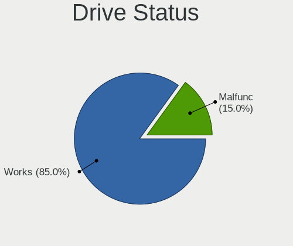
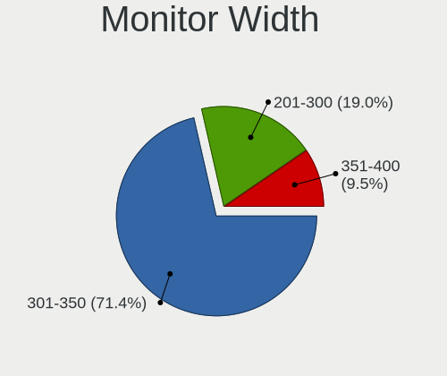
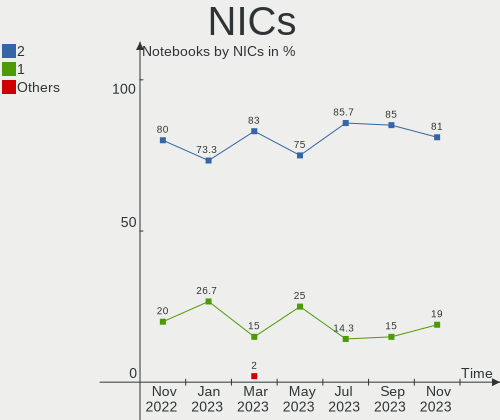
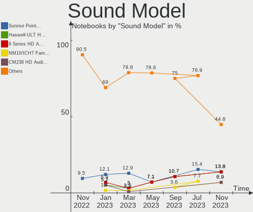

helloSystem - Hardware Trends (Notebooks)
-----------------------------------------

A project to identify most popular hardware characteristics and track their change
over time based on data collected by BSD users at https://BSD-Hardware.info.

Anyone can contribute to this report by the [hw-probe](https://github.com/linuxhw/hw-probe/blob/master/INSTALL.BSD.md) tool:

    hw-probe -all -upload

This report is for one last month. Overall report since the beginning of time: [TestCoverage](https://github.com/bsdhw/TestCoverage)

Period: Dec, 2022.

Contents
--------

* [ System ](#system)
  - [ OS                       ](#os)
  - [ OS Family                ](#os-family)
  - [ Arch                     ](#arch)
  - [ DE                       ](#de)
  - [ Display Server           ](#display-server)
  - [ Display Manager          ](#display-manager)
  - [ OS Lang                  ](#os-lang)
  - [ Boot Mode                ](#boot-mode)
  - [ Filesystem               ](#filesystem)
  - [ Part. scheme             ](#part-scheme)

* [ Board ](#board)
  - [ Vendor                   ](#vendor)
  - [ Model                    ](#model)
  - [ Model Family             ](#model-family)
  - [ MFG Year                 ](#mfg-year)
  - [ Form Factor              ](#form-factor)
  - [ Coreboot                 ](#coreboot)
  - [ RAM Size                 ](#ram-size)
  - [ RAM Used                 ](#ram-used)
  - [ Total Drives             ](#total-drives)
  - [ Has CD-ROM               ](#has-cd-rom)
  - [ Has Ethernet             ](#has-ethernet)
  - [ Has WiFi                 ](#has-wifi)
  - [ Has Bluetooth            ](#has-bluetooth)

* [ Location ](#location)
  - [ Country                  ](#country)
  - [ City                     ](#city)

* [ Drives ](#drives)
  - [ Drive Vendor             ](#drive-vendor)
  - [ Drive Model              ](#drive-model)
  - [ HDD Vendor               ](#hdd-vendor)
  - [ SSD Vendor               ](#ssd-vendor)
  - [ Drive Kind               ](#drive-kind)
  - [ Drive Connector          ](#drive-connector)
  - [ Drive Size               ](#drive-size)
  - [ Space Total              ](#space-total)
  - [ Space Used               ](#space-used)
  - [ Malfunc. Drives          ](#malfunc-drives)
  - [ Malfunc. Drive Vendor    ](#malfunc-drive-vendor)
  - [ Malfunc. HDD Vendor      ](#malfunc-hdd-vendor)
  - [ Malfunc. Drive Kind      ](#malfunc-drive-kind)
  - [ Failed Drives            ](#failed-drives)
  - [ Failed Drive Vendor      ](#failed-drive-vendor)
  - [ Drive Status             ](#drive-status)

* [ Storage controller ](#storage-controller)
  - [ Storage Vendor           ](#storage-vendor)
  - [ Storage Model            ](#storage-model)
  - [ Storage Kind             ](#storage-kind)

* [ Processor ](#processor)
  - [ CPU Vendor               ](#cpu-vendor)
  - [ CPU Model                ](#cpu-model)
  - [ CPU Model Family         ](#cpu-model-family)
  - [ CPU Cores                ](#cpu-cores)
  - [ CPU Sockets              ](#cpu-sockets)
  - [ CPU Threads              ](#cpu-threads)
  - [ CPU Microarch            ](#cpu-microarch)

* [ Graphics ](#graphics)
  - [ GPU Vendor               ](#gpu-vendor)
  - [ GPU Model                ](#gpu-model)
  - [ GPU Combo                ](#gpu-combo)
  - [ GPU Driver               ](#gpu-driver)
  - [ GPU Memory               ](#gpu-memory)

* [ Monitor ](#monitor)
  - [ Monitor Vendor           ](#monitor-vendor)
  - [ Monitor Model            ](#monitor-model)
  - [ Monitor Resolution       ](#monitor-resolution)
  - [ Monitor Diagonal         ](#monitor-diagonal)
  - [ Monitor Width            ](#monitor-width)
  - [ Aspect Ratio             ](#aspect-ratio)
  - [ Monitor Area             ](#monitor-area)
  - [ Pixel Density            ](#pixel-density)
  - [ Multiple Monitors        ](#multiple-monitors)

* [ Network ](#network)
  - [ Net Controller Vendor    ](#net-controller-vendor)
  - [ Net Controller Model     ](#net-controller-model)
  - [ Wireless Vendor          ](#wireless-vendor)
  - [ Wireless Model           ](#wireless-model)
  - [ Ethernet Vendor          ](#ethernet-vendor)
  - [ Ethernet Model           ](#ethernet-model)
  - [ Net Controller Kind      ](#net-controller-kind)
  - [ Used Controller          ](#used-controller)
  - [ NICs                     ](#nics)
  - [ IPv6                     ](#ipv6)

* [ Bluetooth ](#bluetooth)
  - [ Bluetooth Vendor         ](#bluetooth-vendor)
  - [ Bluetooth Model          ](#bluetooth-model)

* [ Sound ](#sound)
  - [ Sound Vendor             ](#sound-vendor)
  - [ Sound Model              ](#sound-model)

* [ Memory ](#memory)
  - [ Memory Vendor            ](#memory-vendor)
  - [ Memory Model             ](#memory-model)
  - [ Memory Kind              ](#memory-kind)
  - [ Memory Form Factor       ](#memory-form-factor)
  - [ Memory Size              ](#memory-size)
  - [ Memory Speed             ](#memory-speed)

* [ Printers & scanners ](#printers--scanners)
  - [ Printer Vendor           ](#printer-vendor)
  - [ Printer Model            ](#printer-model)
  - [ Scanner Vendor           ](#scanner-vendor)
  - [ Scanner Model            ](#scanner-model)

* [ Camera ](#camera)
  - [ Camera Vendor            ](#camera-vendor)
  - [ Camera Model             ](#camera-model)

* [ Security ](#security)
  - [ Fingerprint Vendor       ](#fingerprint-vendor)
  - [ Fingerprint Model        ](#fingerprint-model)
  - [ Chipcard Vendor          ](#chipcard-vendor)
  - [ Chipcard Model           ](#chipcard-model)

* [ Unsupported ](#unsupported)
  - [ Unsupported Devices      ](#unsupported-devices)
  - [ Unsupported Device Types ](#unsupported-device-types)

System
------

OS
--

Installed operating systems

| Name              | Notebooks | Percent |
|-------------------|-----------|---------|
| helloSystem 0.7.0 | 11        | 78.57%  |
| helloSystem 0.8.0 | 3         | 21.43%  |

OS Family
---------

OS without a version

| Name        | Notebooks | Percent |
|-------------|-----------|---------|
| helloSystem | 14        | 100%    |

Arch
----

OS architecture (x86_64, i586, etc.)

| Name  | Notebooks | Percent |
|-------|-----------|---------|
| amd64 | 14        | 100%    |

DE
--

Desktop Environment

| Name         | Notebooks | Percent |
|--------------|-----------|---------|
| helloDesktop | 14        | 100%    |

Display Server
--------------

X11 or Wayland

| Name | Notebooks | Percent |
|------|-----------|---------|
| X11  | 14        | 100%    |

Display Manager
---------------

SDDM, LightDM, etc.

| Name | Notebooks | Percent |
|------|-----------|---------|
| SLiM | 14        | 100%    |

OS Lang
-------

Language

| Lang  | Notebooks | Percent |
|-------|-----------|---------|
| en_US | 12        | 85.71%  |
| en    | 1         | 7.14%   |
| de    | 1         | 7.14%   |

Boot Mode
---------

EFI or BIOS

| Mode | Notebooks | Percent |
|------|-----------|---------|
| EFI  | 14        | 100%    |

Filesystem
----------

Type of filesystem

| Type   | Notebooks | Percent |
|--------|-----------|---------|
| Cd9660 | 8         | 57.14%  |
| Zfs    | 6         | 42.86%  |

Part. scheme
------------

Scheme of partitioning

| Type | Notebooks | Percent |
|------|-----------|---------|
| GPT  | 14        | 100%    |

Board
-----

Vendor
------

Motherboard manufacturer

| Name            | Notebooks | Percent |
|-----------------|-----------|---------|
| Hewlett-Packard | 3         | 21.43%  |
| Dell            | 3         | 21.43%  |
| Lenovo          | 2         | 14.29%  |
| Apple           | 2         | 14.29%  |
| Sony            | 1         | 7.14%   |
| HASEE Computer  | 1         | 7.14%   |
| Acidanthera     | 1         | 7.14%   |
| Acer            | 1         | 7.14%   |

Model
-----

Motherboard model

| Name                                         | Notebooks | Percent |
|----------------------------------------------|-----------|---------|
| Sony VPCSB11FX                               | 1         | 7.14%   |
| Lenovo ThinkPad X1 Extreme Gen 4i 20Y5001DMX | 1         | 7.14%   |
| Lenovo G510 20238                            | 1         | 7.14%   |
| HP Pavilion dv4                              | 1         | 7.14%   |
| HP 245 G6                                    | 1         | 7.14%   |
| HP 2000                                      | 1         | 7.14%   |
| HASEE N95XKP6                                | 1         | 7.14%   |
| Dell Latitude 5590                           | 1         | 7.14%   |
| Dell Inspiron 3442                           | 1         | 7.14%   |
| Dell Inspiron 15-3552                        | 1         | 7.14%   |
| Apple MacBookAir5,1                          | 1         | 7.14%   |
| Apple MacBook3,1                             | 1         | 7.14%   |
| Acidanthera MacBookPro15,1                   | 1         | 7.14%   |
| Acer Aspire ES1-533                          | 1         | 7.14%   |

Model Family
------------

Motherboard model prefix

| Name                     | Notebooks | Percent |
|--------------------------|-----------|---------|
| Dell Inspiron            | 2         | 14.29%  |
| Sony VPCSB11FX           | 1         | 7.14%   |
| Lenovo ThinkPad          | 1         | 7.14%   |
| Lenovo G510              | 1         | 7.14%   |
| HP Pavilion              | 1         | 7.14%   |
| HP 245                   | 1         | 7.14%   |
| HP 2000                  | 1         | 7.14%   |
| HASEE N95XKP6            | 1         | 7.14%   |
| Dell Latitude            | 1         | 7.14%   |
| Apple MacBookAir5        | 1         | 7.14%   |
| Apple MacBook3           | 1         | 7.14%   |
| Acidanthera MacBookPro15 | 1         | 7.14%   |
| Acer Aspire              | 1         | 7.14%   |

MFG Year
--------

Motherboard manufacture year

| Year | Notebooks | Percent |
|------|-----------|---------|
| 2022 | 3         | 21.43%  |
| 2017 | 2         | 14.29%  |
| 2014 | 2         | 14.29%  |
| 2020 | 1         | 7.14%   |
| 2018 | 1         | 7.14%   |
| 2016 | 1         | 7.14%   |
| 2012 | 1         | 7.14%   |
| 2011 | 1         | 7.14%   |
| 2009 | 1         | 7.14%   |
| 2008 | 1         | 7.14%   |

Form Factor
-----------

Physical design of the computer

| Name     | Notebooks | Percent |
|----------|-----------|---------|
| Notebook | 14        | 100%    |

Coreboot
--------

Have coreboot on board

| Used | Notebooks | Percent |
|------|-----------|---------|
| No   | 14        | 100%    |

RAM Size
--------

Total RAM memory

| Size in GB | Notebooks | Percent |
|------------|-----------|---------|
| 4.01-8.0   | 5         | 35.71%  |
| 8.01-16.0  | 5         | 35.71%  |
| 32.01-64.0 | 2         | 14.29%  |
| 16.01-24.0 | 2         | 14.29%  |

RAM Used
--------

Used RAM memory

| Used GB  | Notebooks | Percent |
|----------|-----------|---------|
| 0.01-0.5 | 9         | 64.29%  |
| 1.01-2.0 | 3         | 21.43%  |
| 0.51-1.0 | 2         | 14.29%  |

Total Drives
------------

Number of drives on board

| Drives | Notebooks | Percent |
|--------|-----------|---------|
| 1      | 10        | 71.43%  |
| 2      | 3         | 21.43%  |
| 0      | 1         | 7.14%   |

Has CD-ROM
----------

Has CD-ROM on board

| Presented | Notebooks | Percent |
|-----------|-----------|---------|
| Yes       | 7         | 50%     |
| No        | 7         | 50%     |

Has Ethernet
------------

Has Ethernet on board

| Presented | Notebooks | Percent |
|-----------|-----------|---------|
| Yes       | 12        | 85.71%  |
| No        | 2         | 14.29%  |

Has WiFi
--------

Has WiFi module

| Presented | Notebooks | Percent |
|-----------|-----------|---------|
| Yes       | 14        | 100%    |

Has Bluetooth
-------------

Has Bluetooth module

| Presented | Notebooks | Percent |
|-----------|-----------|---------|
| Yes       | 11        | 78.57%  |
| No        | 3         | 21.43%  |

Location
--------

Country
-------

Geographic location (country)

| Country | Notebooks | Percent |
|---------|-----------|---------|
| Italy   | 2         | 14.29%  |
| Germany | 2         | 14.29%  |
| China   | 2         | 14.29%  |
| Vietnam | 1         | 7.14%   |
| USA     | 1         | 7.14%   |
| Spain   | 1         | 7.14%   |
| Iraq    | 1         | 7.14%   |
| India   | 1         | 7.14%   |
| Ecuador | 1         | 7.14%   |
| Canada  | 1         | 7.14%   |
| Brazil  | 1         | 7.14%   |

City
----

Geographic location (city)

| City             | Notebooks | Percent |
|------------------|-----------|---------|
| Stuttgart        | 1         | 7.14%   |
| Shantou          | 1         | 7.14%   |
| Saint-Zotique    | 1         | 7.14%   |
| Quito            | 1         | 7.14%   |
| Mumbai           | 1         | 7.14%   |
| Karbala          | 1         | 7.14%   |
| Ho Chi Minh City | 1         | 7.14%   |
| Guangzhou        | 1         | 7.14%   |
| Curitiba         | 1         | 7.14%   |
| Cerea            | 1         | 7.14%   |
| Brighton         | 1         | 7.14%   |
| Blomberg         | 1         | 7.14%   |
| Alcobendas       | 1         | 7.14%   |
| Agrate Brianza   | 1         | 7.14%   |

Drives
------

Drive Vendor
------------

Hard drive vendors

| Vendor    | Notebooks | Drives | Percent |
|-----------|-----------|--------|---------|
| WDC       | 3         | 3      | 20%     |
| Seagate   | 2         | 3      | 13.33%  |
| PNY       | 2         | 2      | 13.33%  |
| Zheino    | 1         | 1      | 6.67%   |
| Toshiba   | 1         | 1      | 6.67%   |
| SK hynix  | 1         | 1      | 6.67%   |
| Plextor   | 1         | 1      | 6.67%   |
| Phison    | 1         | 1      | 6.67%   |
| Kingston  | 1         | 1      | 6.67%   |
| Hikvision | 1         | 1      | 6.67%   |
| Apple     | 1         | 1      | 6.67%   |

Drive Model
-----------

Hard drive models

| Model                              | Notebooks | Percent |
|------------------------------------|-----------|---------|
| Zheino CHN-25SATAC3-120 120GB      | 1         | 6.25%   |
| WDC WD3200LPVX-60V0TT0 320GB       | 1         | 6.25%   |
| WDC WD3200BEVT-60A23T0 320GB       | 1         | 6.25%   |
| WDC WD10SPZX-21Z10T0 1TB           | 1         | 6.25%   |
| Toshiba MQ01ABD100 1TB             | 1         | 6.25%   |
| SK hynix BC711 NVMe 512GB          | 1         | 6.25%   |
| Seagate ST9320320AS 320GB          | 1         | 6.25%   |
| Seagate ST500LM030-1RK17D 500GB    | 1         | 6.25%   |
| Seagate ST1000LM024 HN-M101MBB 1TB | 1         | 6.25%   |
| PNY CS900 250GB SSD                | 1         | 6.25%   |
| PNY CS900 240GB SSD                | 1         | 6.25%   |
| Plextor PX-512M8VC 512GB           | 1         | 6.25%   |
| Phison SATA SSD 256GB              | 1         | 6.25%   |
| Kingston SNVS2000G 2TB             | 1         | 6.25%   |
| Hikvision HS-SSD-C2000Pro 512GB    | 1         | 6.25%   |
| Apple SSD TS128E 121GB             | 1         | 6.25%   |

HDD Vendor
----------

Hard disk drive vendors

| Vendor  | Notebooks | Drives | Percent |
|---------|-----------|--------|---------|
| WDC     | 3         | 3      | 50%     |
| Seagate | 2         | 3      | 33.33%  |
| Toshiba | 1         | 1      | 16.67%  |

SSD Vendor
----------

Solid state drive vendors

| Vendor  | Notebooks | Drives | Percent |
|---------|-----------|--------|---------|
| PNY     | 2         | 2      | 33.33%  |
| Zheino  | 1         | 1      | 16.67%  |
| Plextor | 1         | 1      | 16.67%  |
| Phison  | 1         | 1      | 16.67%  |
| Apple   | 1         | 1      | 16.67%  |

Drive Kind
----------

HDD or SSD

| Kind | Notebooks | Drives | Percent |
|------|-----------|--------|---------|
| SSD  | 6         | 6      | 40%     |
| HDD  | 6         | 7      | 40%     |
| NVMe | 3         | 3      | 20%     |

Drive Connector
---------------

SATA, SAS, NVMe, etc.

| Type | Notebooks | Drives | Percent |
|------|-----------|--------|---------|
| SATA | 12        | 13     | 80%     |
| NVMe | 3         | 3      | 20%     |

Drive Size
----------

Size of hard drive

| Size in TB | Notebooks | Drives | Percent |
|------------|-----------|--------|---------|
| 0.01-0.5   | 8         | 9      | 66.67%  |
| 0.51-1.0   | 4         | 4      | 33.33%  |

Space Total
-----------

Amount of disk space available on the file system

| Size in GB | Notebooks | Percent |
|------------|-----------|---------|
| 1-20       | 8         | 57.14%  |
| 251-500    | 3         | 21.43%  |
| 101-250    | 2         | 14.29%  |
| 501-1000   | 1         | 7.14%   |

Space Used
----------

Amount of used disk space

| Used GB | Notebooks | Percent |
|---------|-----------|---------|
| 1-20    | 14        | 100%    |

Malfunc. Drives
---------------

Drive models with a malfunction

| Model                              | Notebooks | Drives | Percent |
|------------------------------------|-----------|--------|---------|
| WDC WD3200BEVT-60A23T0 320GB       | 1         | 1      | 33.33%  |
| WDC WD10SPZX-21Z10T0 1TB           | 1         | 1      | 33.33%  |
| Seagate ST1000LM024 HN-M101MBB 1TB | 1         | 1      | 33.33%  |

Malfunc. Drive Vendor
---------------------

Vendors of faulty drives

| Vendor  | Notebooks | Drives | Percent |
|---------|-----------|--------|---------|
| WDC     | 2         | 2      | 66.67%  |
| Seagate | 1         | 1      | 33.33%  |

Malfunc. HDD Vendor
-------------------

Vendors of faulty HDD drives

| Vendor  | Notebooks | Drives | Percent |
|---------|-----------|--------|---------|
| WDC     | 2         | 2      | 66.67%  |
| Seagate | 1         | 1      | 33.33%  |

Malfunc. Drive Kind
-------------------

Kinds of faulty drives

| Kind | Notebooks | Drives | Percent |
|------|-----------|--------|---------|
| HDD  | 3         | 3      | 100%    |

Failed Drives
-------------

Failed drive models

Zero info for selected period =(

Failed Drive Vendor
-------------------

Failed drive vendors

Zero info for selected period =(

Drive Status
------------

Number of failed and malfunc. drives

| Status  | Notebooks | Drives | Percent |
|---------|-----------|--------|---------|
| Works   | 10        | 13     | 76.92%  |
| Malfunc | 3         | 3      | 23.08%  |

Storage controller
------------------

Storage Vendor
--------------

Storage controller vendors

| Vendor                      | Notebooks | Percent |
|-----------------------------|-----------|---------|
| Intel                       | 11        | 68.75%  |
| AMD                         | 2         | 12.5%   |
| SK hynix                    | 1         | 6.25%   |
| Silicon Motion              | 1         | 6.25%   |
| Kingston Technology Company | 1         | 6.25%   |

Storage Model
-------------

Storage controller models

| Model                                                                            | Notebooks | Percent |
|----------------------------------------------------------------------------------|-----------|---------|
| AMD FCH SATA Controller [AHCI mode]                                              | 2         | 11.76%  |
| SK hynix Gold P31/PC711 NVMe Solid State Drive                                   | 1         | 5.88%   |
| Silicon Motion SM2262/SM2262EN SSD Controller                                    | 1         | 5.88%   |
| Intel Sunrise Point-LP SATA Controller [AHCI mode]                               | 1         | 5.88%   |
| Intel Celeron N3350/Pentium N4200/Atom E3900 Series SATA AHCI Controller         | 1         | 5.88%   |
| Intel Cannon Lake Mobile PCH SATA AHCI Controller                                | 1         | 5.88%   |
| Intel Atom/Celeron/Pentium Processor x5-E8000/J3xxx/N3xxx Series SATA Controller | 1         | 5.88%   |
| Intel 82801IBM/IEM (ICH9M/ICH9M-E) 4 port SATA Controller [AHCI mode]            | 1         | 5.88%   |
| Intel 82801HM/HEM (ICH8M/ICH8M-E) SATA Controller [AHCI mode]                    | 1         | 5.88%   |
| Intel 82801HM/HEM (ICH8M/ICH8M-E) IDE Controller                                 | 1         | 5.88%   |
| Intel 8 Series/C220 Series Chipset Family 6-port SATA Controller 1 [AHCI mode]   | 1         | 5.88%   |
| Intel 8 Series SATA Controller 1 [AHCI mode]                                     | 1         | 5.88%   |
| Intel 7 Series Chipset Family 6-port SATA Controller [AHCI mode]                 | 1         | 5.88%   |
| Intel 6 Series/C200 Series Chipset Family 6 port Mobile SATA AHCI Controller     | 1         | 5.88%   |
| Intel 200 Series PCH SATA controller [AHCI mode]                                 | 1         | 5.88%   |
| Unknown                                                                          | 1         | 5.88%   |

Storage Kind
------------

Kind of storage controller (IDE, SATA, NVMe, SAS, ...)

| Kind | Notebooks | Percent |
|------|-----------|---------|
| SATA | 13        | 76.47%  |
| NVMe | 3         | 17.65%  |
| IDE  | 1         | 5.88%   |

Processor
---------

CPU Vendor
----------

Processor vendors

| Vendor | Notebooks | Percent |
|--------|-----------|---------|
| Intel  | 12        | 85.71%  |
| AMD    | 2         | 14.29%  |

CPU Model
---------

Processor models

| Model                                        | Notebooks | Percent |
|----------------------------------------------|-----------|---------|
| Intel Pentium Dual CPU T3400 @ 2.16GHz       | 1         | 7.14%   |
| Intel Core i7-8650U CPU @ 1.90GHz            | 1         | 7.14%   |
| Intel Core i7-4700MQ CPU @ 2.40GHz           | 1         | 7.14%   |
| Intel Core i5-8400 CPU @ 2.80GHz             | 1         | 7.14%   |
| Intel Core i5-8300H CPU @ 2.30GHz            | 1         | 7.14%   |
| Intel Core i5-4210U CPU @ 1.70GHz            | 1         | 7.14%   |
| Intel Core i5-3317U CPU @ 1.70GHz            | 1         | 7.14%   |
| Intel Core i5-2410M CPU @ 2.30GHz            | 1         | 7.14%   |
| Intel Core 2 Duo CPU T7300 @ 2.00GHz         | 1         | 7.14%   |
| Intel Celeron CPU N3450 @ 1.10GHz            | 1         | 7.14%   |
| Intel Celeron CPU N3060 @ 1.60GHz            | 1         | 7.14%   |
| Intel 11th Gen Core i7-11800H @ 2.30GHz      | 1         | 7.14%   |
| AMD E1-2500 APU with Radeon HD Graphics      | 1         | 7.14%   |
| AMD A9-9420 RADEON R5, 5 COMPUTE CORES 2C+3G | 1         | 7.14%   |

CPU Model Family
----------------

Processor model prefix

| Model              | Notebooks | Percent |
|--------------------|-----------|---------|
| Intel Core i5      | 5         | 35.71%  |
| Other              | 2         | 14.29%  |
| Intel Core i7      | 2         | 14.29%  |
| Intel Celeron      | 2         | 14.29%  |
| Intel Pentium Dual | 1         | 7.14%   |
| Intel Core 2 Duo   | 1         | 7.14%   |
| AMD E1             | 1         | 7.14%   |

CPU Cores
---------

Number of processor cores

| Number  | Notebooks | Percent |
|---------|-----------|---------|
| 2       | 6         | 42.86%  |
| 4       | 4         | 28.57%  |
| Unknown | 2         | 14.29%  |
| 8       | 1         | 7.14%   |
| 6       | 1         | 7.14%   |

CPU Sockets
-----------

Number of sockets

| Number | Notebooks | Percent |
|--------|-----------|---------|
| 1      | 13        | 92.86%  |
| 2      | 1         | 7.14%   |

CPU Threads
-----------

Threads per core (Hyper-Threading)

| Number  | Notebooks | Percent |
|---------|-----------|---------|
| 2       | 7         | 50%     |
| 1       | 5         | 35.71%  |
| Unknown | 2         | 14.29%  |

CPU Microarch
-------------

Microarchitecture

| Name        | Notebooks | Percent |
|-------------|-----------|---------|
| KabyLake    | 3         | 21.43%  |
| Haswell     | 2         | 14.29%  |
| Core        | 2         | 14.29%  |
| Silvermont  | 1         | 7.14%   |
| SandyBridge | 1         | 7.14%   |
| Jaguar      | 1         | 7.14%   |
| IvyBridge   | 1         | 7.14%   |
| Goldmont    | 1         | 7.14%   |
| Excavator   | 1         | 7.14%   |
| Unknown     | 1         | 7.14%   |

Graphics
--------

GPU Vendor
----------

Vendors of graphics cards

| Vendor | Notebooks | Percent |
|--------|-----------|---------|
| Intel  | 12        | 63.16%  |
| AMD    | 4         | 21.05%  |
| Nvidia | 3         | 15.79%  |

GPU Model
---------

Graphics card models

| Model                                                                                    | Notebooks | Percent |
|------------------------------------------------------------------------------------------|-----------|---------|
| Nvidia GP107M [GeForce GTX 1050 Ti Mobile]                                               | 1         | 5%      |
| Nvidia GP106M [GeForce GTX 1060 Mobile]                                                  | 1         | 5%      |
| Nvidia GA107M [GeForce RTX 3050 Ti Mobile]                                               | 1         | 5%      |
| Intel UHD Graphics 620                                                                   | 1         | 5%      |
| Intel TigerLake-H GT1 [UHD Graphics]                                                     | 1         | 5%      |
| Intel Mobile GM965/GL960 Integrated Graphics Controller (secondary)                      | 1         | 5%      |
| Intel Mobile GM965/GL960 Integrated Graphics Controller (primary)                        | 1         | 5%      |
| Intel Mobile 4 Series Chipset Integrated Graphics Controller                             | 1         | 5%      |
| Intel HD Graphics 500                                                                    | 1         | 5%      |
| Intel Haswell-ULT Integrated Graphics Controller                                         | 1         | 5%      |
| Intel CoffeeLake-S GT2 [UHD Graphics 630]                                                | 1         | 5%      |
| Intel CoffeeLake-H GT2 [UHD Graphics 630]                                                | 1         | 5%      |
| Intel Atom/Celeron/Pentium Processor x5-E8000/J3xxx/N3xxx Integrated Graphics Controller | 1         | 5%      |
| Intel 4th Gen Core Processor Integrated Graphics Controller                              | 1         | 5%      |
| Intel 3rd Gen Core processor Graphics Controller                                         | 1         | 5%      |
| Intel 2nd Generation Core Processor Family Integrated Graphics Controller                | 1         | 5%      |
| AMD Stoney [Radeon R2/R3/R4/R5 Graphics]                                                 | 1         | 5%      |
| AMD Seymour [Radeon HD 6400M/7400M Series]                                               | 1         | 5%      |
| AMD Opal XT [Radeon R7 M265/M365X/M465]                                                  | 1         | 5%      |
| AMD Kabini [Radeon HD 8240 / R3 Series]                                                  | 1         | 5%      |

GPU Combo
---------

Combinations of graphics cards

| Name           | Notebooks | Percent |
|----------------|-----------|---------|
| 1 x Intel      | 5         | 35.71%  |
| Intel + Nvidia | 3         | 21.43%  |
| 2 x Intel      | 2         | 14.29%  |
| Intel + AMD    | 2         | 14.29%  |
| 1 x AMD        | 2         | 14.29%  |

GPU Driver
----------

Free vs proprietary

| Driver | Notebooks | Percent |
|--------|-----------|---------|
| Free   | 14        | 100%    |

GPU Memory
----------

Total video memory

| Size in GB | Notebooks | Percent |
|------------|-----------|---------|
| Unknown    | 12        | 85.71%  |
| 0.01-0.5   | 2         | 14.29%  |

Monitor
-------

Monitor Vendor
--------------

Monitor vendors

| Vendor                  | Notebooks | Percent |
|-------------------------|-----------|---------|
| BOE                     | 4         | 30.77%  |
| LG Display              | 3         | 23.08%  |
| Apple                   | 2         | 15.38%  |
| Samsung Electronics     | 1         | 7.69%   |
| PANDA                   | 1         | 7.69%   |
| Chi Mei Optoelectronics | 1         | 7.69%   |
| AU Optronics            | 1         | 7.69%   |

Monitor Model
-------------

Monitor models

| Model                                                                    | Notebooks | Percent |
|--------------------------------------------------------------------------|-----------|---------|
| Samsung Electronics LCD Monitor SEC5441 1366x768 340x190mm 15.3-inch     | 1         | 7.69%   |
| PANDA LM156LF1L03 NCP001C 1920x1080 340x190mm 15.3-inch                  | 1         | 7.69%   |
| LG Display LCD Monitor LGD06AA 3840x2400 340x210mm 15.7-inch             | 1         | 7.69%   |
| LG Display LCD Monitor LGD05CF 1920x1080 340x190mm 15.3-inch             | 1         | 7.69%   |
| LG Display LCD Monitor LGD033A 1366x768 340x190mm 15.3-inch              | 1         | 7.69%   |
| Chi Mei Optoelectronics LCD Monitor CMO1425 1280x800 300x190mm 14.0-inch | 1         | 7.69%   |
| BOE LCD Monitor BOE06BD 1366x768 310x170mm 13.9-inch                     | 1         | 7.69%   |
| BOE LCD Monitor BOE0675 1366x768 340x190mm 15.3-inch                     | 1         | 7.69%   |
| BOE LCD Monitor BOE0671 1366x768 340x190mm 15.3-inch                     | 1         | 7.69%   |
| BOE LCD Monitor BOE05EF 1366x768 310x170mm 13.9-inch                     | 1         | 7.69%   |
| AU Optronics LCD Monitor AUO63ED 1920x1080 340x190mm 15.3-inch           | 1         | 7.69%   |
| Apple LCD Monitor APP9C5F 1280x800 290x180mm 13.4-inch                   | 1         | 7.69%   |
| Apple Color LCD APP9CF3 1366x768 260x140mm 11.6-inch                     | 1         | 7.69%   |

Monitor Resolution
------------------

Monitor screen resolution

| Resolution      | Notebooks | Percent |
|-----------------|-----------|---------|
| 1366x768 (WXGA) | 7         | 53.85%  |
| 1920x1080 (FHD) | 3         | 23.08%  |
| 1280x800 (WXGA) | 2         | 15.38%  |
| 3840x2400       | 1         | 7.69%   |

Monitor Diagonal
----------------

Diagonal size in inches

| Inches | Notebooks | Percent |
|--------|-----------|---------|
| 15     | 8         | 61.54%  |
| 13     | 3         | 23.08%  |
| 14     | 1         | 7.69%   |
| 11     | 1         | 7.69%   |

Monitor Width
-------------

Physical width

| Width in mm | Notebooks | Percent |
|-------------|-----------|---------|
| 301-350     | 10        | 76.92%  |
| 201-300     | 3         | 23.08%  |

Aspect Ratio
------------

Proportional relationship between the width and the height

| Ratio | Notebooks | Percent |
|-------|-----------|---------|
| 16/9  | 9         | 69.23%  |
| 16/10 | 4         | 30.77%  |

Monitor Area
------------

Area in inch²

| Area in inch² | Notebooks | Percent |
|----------------|-----------|---------|
| 91-100         | 6         | 46.15%  |
| 81-90          | 4         | 30.77%  |
| 51-60          | 1         | 7.69%   |
| 111-120        | 1         | 7.69%   |
| 101-110        | 1         | 7.69%   |

Pixel Density
-------------

Pixels per inch

| Density       | Notebooks | Percent |
|---------------|-----------|---------|
| 101-120       | 7         | 53.85%  |
| 121-160       | 4         | 30.77%  |
| More than 240 | 1         | 7.69%   |
| 51-100        | 1         | 7.69%   |

Multiple Monitors
-----------------

Total monitors connected

| Total | Notebooks | Percent |
|-------|-----------|---------|
| 1     | 13        | 92.86%  |
| 2     | 1         | 7.14%   |

Network
-------

Net Controller Vendor
---------------------

Controller vendors

| Vendor                   | Notebooks | Percent |
|--------------------------|-----------|---------|
| Realtek Semiconductor    | 8         | 36.36%  |
| Qualcomm Atheros         | 5         | 22.73%  |
| Intel                    | 5         | 22.73%  |
| Broadcom                 | 2         | 9.09%   |
| Marvell Technology Group | 1         | 4.55%   |
| Google                   | 1         | 4.55%   |

Net Controller Model
--------------------

Controller models

| Model                                                                   | Notebooks | Percent |
|-------------------------------------------------------------------------|-----------|---------|
| Realtek RTL8111/8168/8411 PCI Express Gigabit Ethernet Controller       | 5         | 17.86%  |
| Realtek RTL810xE PCI Express Fast Ethernet controller                   | 3         | 10.71%  |
| Qualcomm Atheros QCA9565 / AR9565 Wireless Network Adapter              | 3         | 10.71%  |
| Intel Dual Band Wireless-AC 3168NGW [Stone Peak]                        | 2         | 7.14%   |
| Realtek RTL8723DE Wireless Network Adapter                              | 1         | 3.57%   |
| Realtek RTL8188EUS 802.11n Wireless Network Adapter                     | 1         | 3.57%   |
| Realtek RTL8188CE 802.11b/g/n WiFi Adapter                              | 1         | 3.57%   |
| Realtek Realtek Bluetooth 4.2 Adapter                                   | 1         | 3.57%   |
| Qualcomm Atheros QCA8172 Fast Ethernet                                  | 1         | 3.57%   |
| Qualcomm Atheros AR9485 Wireless Network Adapter                        | 1         | 3.57%   |
| Qualcomm Atheros AR242x / AR542x Wireless Network Adapter (PCI-Express) | 1         | 3.57%   |
| Marvell Group 88E8058 PCI-E Gigabit Ethernet Controller                 | 1         | 3.57%   |
| Intel Wireless 8265 / 8275                                              | 1         | 3.57%   |
| Intel Wi-Fi 6 AX210/AX211/AX411 160MHz                                  | 1         | 3.57%   |
| Intel Ethernet Connection (4) I219-LM                                   | 1         | 3.57%   |
| Intel Cannon Lake PCH CNVi WiFi                                         | 1         | 3.57%   |
| Google Nexus/Pixel Device (tether)                                      | 1         | 3.57%   |
| Broadcom BCM43224 802.11a/b/g/n                                         | 1         | 3.57%   |
| Broadcom BCM4313 802.11bgn Wireless Network Adapter                     | 1         | 3.57%   |

Wireless Vendor
---------------

Wireless vendors

| Vendor                | Notebooks | Percent |
|-----------------------|-----------|---------|
| Qualcomm Atheros      | 5         | 33.33%  |
| Intel                 | 5         | 33.33%  |
| Realtek Semiconductor | 3         | 20%     |
| Broadcom              | 2         | 13.33%  |

Wireless Model
--------------

Wireless models

| Model                                                                   | Notebooks | Percent |
|-------------------------------------------------------------------------|-----------|---------|
| Qualcomm Atheros QCA9565 / AR9565 Wireless Network Adapter              | 3         | 18.75%  |
| Intel Dual Band Wireless-AC 3168NGW [Stone Peak]                        | 2         | 12.5%   |
| Realtek RTL8723DE Wireless Network Adapter                              | 1         | 6.25%   |
| Realtek RTL8188EUS 802.11n Wireless Network Adapter                     | 1         | 6.25%   |
| Realtek RTL8188CE 802.11b/g/n WiFi Adapter                              | 1         | 6.25%   |
| Realtek Realtek Bluetooth 4.2 Adapter                                   | 1         | 6.25%   |
| Qualcomm Atheros AR9485 Wireless Network Adapter                        | 1         | 6.25%   |
| Qualcomm Atheros AR242x / AR542x Wireless Network Adapter (PCI-Express) | 1         | 6.25%   |
| Intel Wireless 8265 / 8275                                              | 1         | 6.25%   |
| Intel Wi-Fi 6 AX210/AX211/AX411 160MHz                                  | 1         | 6.25%   |
| Intel Cannon Lake PCH CNVi WiFi                                         | 1         | 6.25%   |
| Broadcom BCM43224 802.11a/b/g/n                                         | 1         | 6.25%   |
| Broadcom BCM4313 802.11bgn Wireless Network Adapter                     | 1         | 6.25%   |

Ethernet Vendor
---------------

Ethernet vendors

| Vendor                   | Notebooks | Percent |
|--------------------------|-----------|---------|
| Realtek Semiconductor    | 8         | 66.67%  |
| Qualcomm Atheros         | 1         | 8.33%   |
| Marvell Technology Group | 1         | 8.33%   |
| Intel                    | 1         | 8.33%   |
| Google                   | 1         | 8.33%   |

Ethernet Model
--------------

Ethernet models

| Model                                                             | Notebooks | Percent |
|-------------------------------------------------------------------|-----------|---------|
| Realtek RTL8111/8168/8411 PCI Express Gigabit Ethernet Controller | 5         | 41.67%  |
| Realtek RTL810xE PCI Express Fast Ethernet controller             | 3         | 25%     |
| Qualcomm Atheros QCA8172 Fast Ethernet                            | 1         | 8.33%   |
| Marvell Group 88E8058 PCI-E Gigabit Ethernet Controller           | 1         | 8.33%   |
| Intel Ethernet Connection (4) I219-LM                             | 1         | 8.33%   |
| Google Nexus/Pixel Device (tether)                                | 1         | 8.33%   |

Net Controller Kind
-------------------

Ethernet, WiFi or modem

| Kind     | Notebooks | Percent |
|----------|-----------|---------|
| WiFi     | 14        | 53.85%  |
| Ethernet | 12        | 46.15%  |

Used Controller
---------------

Currently used network controller

| Kind     | Notebooks | Percent |
|----------|-----------|---------|
| WiFi     | 6         | 54.55%  |
| Ethernet | 5         | 45.45%  |

NICs
----

Total network controllers on board

| Total | Notebooks | Percent |
|-------|-----------|---------|
| 2     | 11        | 78.57%  |
| 1     | 3         | 21.43%  |

IPv6
----

IPv6 vs IPv4

| Used | Notebooks | Percent |
|------|-----------|---------|
| No   | 14        | 100%    |

Bluetooth
---------

Bluetooth Vendor
----------------

Controller vendors

| Vendor                          | Notebooks | Percent |
|---------------------------------|-----------|---------|
| Intel                           | 5         | 45.45%  |
| Qualcomm Atheros Communications | 3         | 27.27%  |
| Apple                           | 2         | 18.18%  |
| Hewlett-Packard                 | 1         | 9.09%   |

Bluetooth Model
---------------

Controller models

| Model                                                       | Notebooks | Percent |
|-------------------------------------------------------------|-----------|---------|
| Intel Wireless-AC 3168 Bluetooth                            | 2         | 18.18%  |
| Qualcomm Atheros Dell Wireless 1707 Bluetooth 4.0 LE Device | 1         | 9.09%   |
| Qualcomm Atheros AR9462 Bluetooth                           | 1         | 9.09%   |
| Qualcomm Atheros AR3012 Bluetooth 4.0                       | 1         | 9.09%   |
| Intel Bluetooth wireless interface                          | 1         | 9.09%   |
| Intel Bluetooth 9460/9560 Jefferson Peak (JfP)              | 1         | 9.09%   |
| Intel AX210 Bluetooth                                       | 1         | 9.09%   |
| HP Bluetooth 2.0 Interface [Broadcom BCM2045]               | 1         | 9.09%   |
| Apple Built-in iSight (no firmware loaded)                  | 1         | 9.09%   |
| Apple Built-in Bluetooth 2.0+EDR HCI                        | 1         | 9.09%   |

Sound
-----

Sound Vendor
------------

Sound card vendors

| Vendor | Notebooks | Percent |
|--------|-----------|---------|
| Intel  | 12        | 80%     |
| AMD    | 2         | 13.33%  |
| Nvidia | 1         | 6.67%   |

Sound Model
-----------

Sound card models

| Model                                                                                             | Notebooks | Percent |
|---------------------------------------------------------------------------------------------------|-----------|---------|
| Intel Xeon E3-1200 v3/4th Gen Core Processor HD Audio Controller                                  | 1         | 5.26%   |
| Intel Tiger Lake-H HD Audio Controller                                                            | 1         | 5.26%   |
| Intel Sunrise Point-LP HD Audio                                                                   | 1         | 5.26%   |
| Intel Haswell-ULT HD Audio Controller                                                             | 1         | 5.26%   |
| Intel Celeron N3350/Pentium N4200/Atom E3900 Series Audio Cluster                                 | 1         | 5.26%   |
| Intel Cannon Lake PCH cAVS                                                                        | 1         | 5.26%   |
| Intel Atom/Celeron/Pentium Processor x5-E8000/J3xxx/N3xxx Series High Definition Audio Controller | 1         | 5.26%   |
| Intel 82801I (ICH9 Family) HD Audio Controller                                                    | 1         | 5.26%   |
| Intel 82801H (ICH8 Family) HD Audio Controller                                                    | 1         | 5.26%   |
| Intel 8 Series/C220 Series Chipset High Definition Audio Controller                               | 1         | 5.26%   |
| Intel 8 Series HD Audio Controller                                                                | 1         | 5.26%   |
| Intel 7 Series/C216 Chipset Family High Definition Audio Controller                               | 1         | 5.26%   |
| Intel 6 Series/C200 Series Chipset Family High Definition Audio Controller                        | 1         | 5.26%   |
| Intel 200 Series PCH HD Audio                                                                     | 1         | 5.26%   |
| AMD Kabini HDMI/DP Audio                                                                          | 1         | 5.26%   |
| AMD High Definition Audio Controller                                                              | 1         | 5.26%   |
| AMD FCH Azalia Controller                                                                         | 1         | 5.26%   |
| AMD Family 15h (Models 60h-6fh) Audio Controller                                                  | 1         | 5.26%   |
| Unknown                                                                                           | 1         | 5.26%   |

Memory
------

Memory Vendor
-------------

Memory module vendors

| Vendor                       | Notebooks | Percent |
|------------------------------|-----------|---------|
| SK hynix                     | 3         | 18.75%  |
| Kingston                     | 3         | 18.75%  |
| Unknown (8AFD)               | 1         | 6.25%   |
| Unknown (0x3D7F000000000000) | 1         | 6.25%   |
| Unknown                      | 1         | 6.25%   |
| Transcend                    | 1         | 6.25%   |
| Samsung Electronics          | 1         | 6.25%   |
| Ramaxel Technology           | 1         | 6.25%   |
| PNY                          | 1         | 6.25%   |
| Micron Technology            | 1         | 6.25%   |
| A-DATA Technology            | 1         | 6.25%   |
| Unknown                      | 1         | 6.25%   |

Memory Model
------------

Memory module models

| Model                                                           | Notebooks | Percent |
|-----------------------------------------------------------------|-----------|---------|
| Unknown RAM Module 4GB SODIMM DDR3                              | 1         | 6.25%   |
| Unknown (8AFD) RAM SED2666S1908 8GB SODIMM DDR4 2667MT/s        | 1         | 6.25%   |
| Unknown (0x3D7F000000000000) RAM Module 2GB SODIMM DDR2 667MT/s | 1         | 6.25%   |
| Transcend RAM TS4GSH64V2E3 32GB SODIMM DDR4 3200MT/s            | 1         | 6.25%   |
| SK hynix RAM Module 2GB SODIMM DDR3 1600MT/s                    | 1         | 6.25%   |
| SK hynix RAM Module 2GB SODIMM DDR2 667MT/s                     | 1         | 6.25%   |
| SK hynix RAM HMA81GS6CJR8N-VK 8GB SODIMM DDR4 2667MT/s          | 1         | 6.25%   |
| Samsung RAM M471A1K43CB1-CRC 8GB SODIMM DDR4 2400MT/s           | 1         | 6.25%   |
| Ramaxel RAM RMT3170EB68F9W1600 4GB SODIMM DDR3 1600MT/s         | 1         | 6.25%   |
| PNY RAM M4S16S682LJJJ43-12 16GB SODIMM DDR4 2667MT/s            | 1         | 6.25%   |
| Micron RAM 8ATF1G64HZ-2G6E1 8GB SODIMM DDR4 2667MT/s            | 1         | 6.25%   |
| Kingston RAM Module 8GB SODIMM DDR3 1600MT/s                    | 1         | 6.25%   |
| Kingston RAM KNWMX1-ETB 4GB SODIMM DDR3 1600MT/s                | 1         | 6.25%   |
| Kingston RAM ACR16D3LS1KBGR/8G 8GB SODIMM DDR3 1600MT/s         | 1         | 6.25%   |
| A-DATA RAM AM1L16BC4R1-B1GS 4GB SODIMM DDR3 1333MT/s            | 1         | 6.25%   |
| Unknown                                                         | 1         | 6.25%   |

Memory Kind
-----------

Memory module kinds

| Kind | Notebooks | Percent |
|------|-----------|---------|
| DDR3 | 7         | 50%     |
| DDR4 | 5         | 35.71%  |
| DDR2 | 2         | 14.29%  |

Memory Form Factor
------------------

Physical design of the memory module

| Name   | Notebooks | Percent |
|--------|-----------|---------|
| SODIMM | 14        | 100%    |

Memory Size
-----------

Memory module size

| Size  | Notebooks | Percent |
|-------|-----------|---------|
| 8192  | 5         | 35.71%  |
| 4096  | 4         | 28.57%  |
| 2048  | 3         | 21.43%  |
| 32768 | 1         | 7.14%   |
| 16384 | 1         | 7.14%   |

Memory Speed
------------

Memory module speed

| Speed   | Notebooks | Percent |
|---------|-----------|---------|
| 1600    | 5         | 35.71%  |
| 2667    | 3         | 21.43%  |
| 667     | 2         | 14.29%  |
| 3200    | 1         | 7.14%   |
| 2400    | 1         | 7.14%   |
| 1333    | 1         | 7.14%   |
| Unknown | 1         | 7.14%   |

Printers & scanners
-------------------

Printer Vendor
--------------

Printer device vendors

Zero info for selected period =(

Printer Model
-------------

Printer device models

Zero info for selected period =(

Scanner Vendor
--------------

Scanner device vendors

Zero info for selected period =(

Scanner Model
-------------

Scanner device models

Zero info for selected period =(

Camera
------

Camera Vendor
-------------

Camera device vendors

| Vendor                | Notebooks | Percent |
|-----------------------|-----------|---------|
| Microdia              | 3         | 25%     |
| Chicony Electronics   | 3         | 25%     |
| Realtek Semiconductor | 2         | 16.67%  |
| Syntek                | 1         | 8.33%   |
| Suyin                 | 1         | 8.33%   |
| IMC Networks          | 1         | 8.33%   |
| Apple                 | 1         | 8.33%   |

Camera Model
------------

Camera device models

| Model                                   | Notebooks | Percent |
|-----------------------------------------|-----------|---------|
| Microdia Integrated_Webcam_HD           | 2         | 16.67%  |
| Syntek Lenovo EasyCamera                | 1         | 8.33%   |
| Suyin HP webcam [dv6-1190en]            | 1         | 8.33%   |
| Realtek Integrated_Webcam_HD            | 1         | 8.33%   |
| Realtek Acer 640 x 480 laptop camera    | 1         | 8.33%   |
| Microdia USB 2.0 Camera                 | 1         | 8.33%   |
| IMC Networks Integrated RGB Camera      | 1         | 8.33%   |
| Chicony Realtek DMFT - RGB              | 1         | 8.33%   |
| Chicony Integrated Camera (1280x720@30) | 1         | 8.33%   |
| Chicony Chicony USB2.0 Camera           | 1         | 8.33%   |
| Apple FaceTime HD Camera (Built-in)     | 1         | 8.33%   |

Security
--------

Fingerprint Vendor
------------------

Fingerprint sensor vendors

| Vendor           | Notebooks | Percent |
|------------------|-----------|---------|
| Validity Sensors | 1         | 100%    |

Fingerprint Model
-----------------

Fingerprint sensor models

| Model                                      | Notebooks | Percent |
|--------------------------------------------|-----------|---------|
| Validity Sensors VFS101 Fingerprint Reader | 1         | 100%    |

Chipcard Vendor
---------------

Chipcard module vendors

Zero info for selected period =(

Chipcard Model
--------------

Chipcard module models

Zero info for selected period =(

Unsupported
-----------

Unsupported Devices
-------------------

Total unsupported devices on board

| Total | Notebooks | Percent |
|-------|-----------|---------|
| 1     | 6         | 42.86%  |
| 3     | 3         | 21.43%  |
| 2     | 3         | 21.43%  |
| 0     | 2         | 14.29%  |

Unsupported Device Types
------------------------

Types of unsupported devices

| Type                     | Notebooks | Percent |
|--------------------------|-----------|---------|
| Communication controller | 8         | 40%     |
| Card reader              | 4         | 20%     |
| Bluetooth                | 4         | 20%     |
| Net/wireless             | 2         | 10%     |
| Sound                    | 1         | 5%      |
| Fingerprint reader       | 1         | 5%      |

