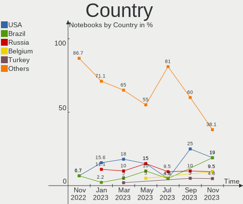
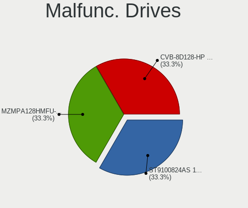
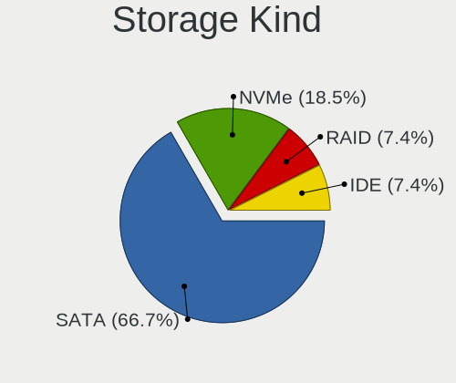
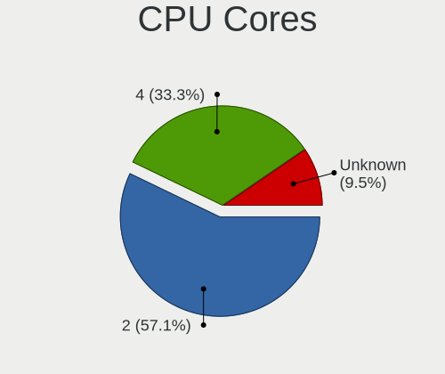
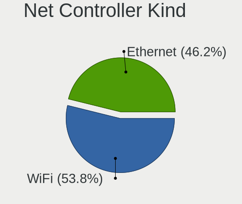
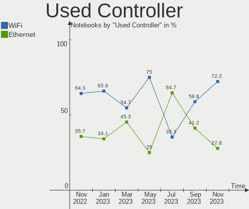

helloSystem - Hardware Trends (Notebooks)
-----------------------------------------

A project to identify most popular hardware characteristics and track their change
over time based on data collected by BSD users at https://BSD-Hardware.info.

Anyone can contribute to this report by the [hw-probe](https://github.com/linuxhw/hw-probe/blob/master/INSTALL.BSD.md) tool:

    hw-probe -all -upload

This report is for one last month. Overall report since the beginning of time: [TestCoverage](https://github.com/bsdhw/TestCoverage)

Period: Jun, 2022.

Contents
--------

* [ System ](#system)
  - [ OS                       ](#os)
  - [ OS Family                ](#os-family)
  - [ Arch                     ](#arch)
  - [ DE                       ](#de)
  - [ Display Server           ](#display-server)
  - [ Display Manager          ](#display-manager)
  - [ OS Lang                  ](#os-lang)
  - [ Boot Mode                ](#boot-mode)
  - [ Filesystem               ](#filesystem)
  - [ Part. scheme             ](#part-scheme)

* [ Board ](#board)
  - [ Vendor                   ](#vendor)
  - [ Model                    ](#model)
  - [ Model Family             ](#model-family)
  - [ MFG Year                 ](#mfg-year)
  - [ Form Factor              ](#form-factor)
  - [ Coreboot                 ](#coreboot)
  - [ RAM Size                 ](#ram-size)
  - [ RAM Used                 ](#ram-used)
  - [ Total Drives             ](#total-drives)
  - [ Has CD-ROM               ](#has-cd-rom)
  - [ Has Ethernet             ](#has-ethernet)
  - [ Has WiFi                 ](#has-wifi)
  - [ Has Bluetooth            ](#has-bluetooth)

* [ Location ](#location)
  - [ Country                  ](#country)
  - [ City                     ](#city)

* [ Drives ](#drives)
  - [ Drive Vendor             ](#drive-vendor)
  - [ Drive Model              ](#drive-model)
  - [ HDD Vendor               ](#hdd-vendor)
  - [ SSD Vendor               ](#ssd-vendor)
  - [ Drive Kind               ](#drive-kind)
  - [ Drive Connector          ](#drive-connector)
  - [ Drive Size               ](#drive-size)
  - [ Space Total              ](#space-total)
  - [ Space Used               ](#space-used)
  - [ Malfunc. Drives          ](#malfunc-drives)
  - [ Malfunc. Drive Vendor    ](#malfunc-drive-vendor)
  - [ Malfunc. HDD Vendor      ](#malfunc-hdd-vendor)
  - [ Malfunc. Drive Kind      ](#malfunc-drive-kind)
  - [ Failed Drives            ](#failed-drives)
  - [ Failed Drive Vendor      ](#failed-drive-vendor)
  - [ Drive Status             ](#drive-status)

* [ Storage controller ](#storage-controller)
  - [ Storage Vendor           ](#storage-vendor)
  - [ Storage Model            ](#storage-model)
  - [ Storage Kind             ](#storage-kind)

* [ Processor ](#processor)
  - [ CPU Vendor               ](#cpu-vendor)
  - [ CPU Model                ](#cpu-model)
  - [ CPU Model Family         ](#cpu-model-family)
  - [ CPU Cores                ](#cpu-cores)
  - [ CPU Sockets              ](#cpu-sockets)
  - [ CPU Threads              ](#cpu-threads)
  - [ CPU Microarch            ](#cpu-microarch)

* [ Graphics ](#graphics)
  - [ GPU Vendor               ](#gpu-vendor)
  - [ GPU Model                ](#gpu-model)
  - [ GPU Combo                ](#gpu-combo)
  - [ GPU Driver               ](#gpu-driver)
  - [ GPU Memory               ](#gpu-memory)

* [ Monitor ](#monitor)
  - [ Monitor Vendor           ](#monitor-vendor)
  - [ Monitor Model            ](#monitor-model)
  - [ Monitor Resolution       ](#monitor-resolution)
  - [ Monitor Diagonal         ](#monitor-diagonal)
  - [ Monitor Width            ](#monitor-width)
  - [ Aspect Ratio             ](#aspect-ratio)
  - [ Monitor Area             ](#monitor-area)
  - [ Pixel Density            ](#pixel-density)
  - [ Multiple Monitors        ](#multiple-monitors)

* [ Network ](#network)
  - [ Net Controller Vendor    ](#net-controller-vendor)
  - [ Net Controller Model     ](#net-controller-model)
  - [ Wireless Vendor          ](#wireless-vendor)
  - [ Wireless Model           ](#wireless-model)
  - [ Ethernet Vendor          ](#ethernet-vendor)
  - [ Ethernet Model           ](#ethernet-model)
  - [ Net Controller Kind      ](#net-controller-kind)
  - [ Used Controller          ](#used-controller)
  - [ NICs                     ](#nics)
  - [ IPv6                     ](#ipv6)

* [ Bluetooth ](#bluetooth)
  - [ Bluetooth Vendor         ](#bluetooth-vendor)
  - [ Bluetooth Model          ](#bluetooth-model)

* [ Sound ](#sound)
  - [ Sound Vendor             ](#sound-vendor)
  - [ Sound Model              ](#sound-model)

* [ Memory ](#memory)
  - [ Memory Vendor            ](#memory-vendor)
  - [ Memory Model             ](#memory-model)
  - [ Memory Kind              ](#memory-kind)
  - [ Memory Form Factor       ](#memory-form-factor)
  - [ Memory Size              ](#memory-size)
  - [ Memory Speed             ](#memory-speed)

* [ Printers & scanners ](#printers--scanners)
  - [ Printer Vendor           ](#printer-vendor)
  - [ Printer Model            ](#printer-model)
  - [ Scanner Vendor           ](#scanner-vendor)
  - [ Scanner Model            ](#scanner-model)

* [ Camera ](#camera)
  - [ Camera Vendor            ](#camera-vendor)
  - [ Camera Model             ](#camera-model)

* [ Security ](#security)
  - [ Fingerprint Vendor       ](#fingerprint-vendor)
  - [ Fingerprint Model        ](#fingerprint-model)
  - [ Chipcard Vendor          ](#chipcard-vendor)
  - [ Chipcard Model           ](#chipcard-model)

* [ Unsupported ](#unsupported)
  - [ Unsupported Devices      ](#unsupported-devices)
  - [ Unsupported Device Types ](#unsupported-device-types)

System
------

OS
--

Installed operating systems

| Name              | Notebooks | Percent |
|-------------------|-----------|---------|
| helloSystem 0.7.0 | 16        | 80%     |
| helloSystem 0.8.0 | 4         | 20%     |

OS Family
---------

OS without a version

| Name        | Notebooks | Percent |
|-------------|-----------|---------|
| helloSystem | 20        | 100%    |

Arch
----

OS architecture (x86_64, i586, etc.)

| Name  | Notebooks | Percent |
|-------|-----------|---------|
| amd64 | 20        | 100%    |

DE
--

Desktop Environment

| Name         | Notebooks | Percent |
|--------------|-----------|---------|
| helloDesktop | 19        | 95%     |
| GNOME        | 1         | 5%      |

Display Server
--------------

X11 or Wayland

| Name | Notebooks | Percent |
|------|-----------|---------|
| X11  | 20        | 100%    |

Display Manager
---------------

SDDM, LightDM, etc.

| Name | Notebooks | Percent |
|------|-----------|---------|
| SLiM | 20        | 100%    |

OS Lang
-------

Language

| Lang  | Notebooks | Percent |
|-------|-----------|---------|
| en_US | 18        | 90%     |
| fr_FR | 1         | 5%      |
| de_DE | 1         | 5%      |

Boot Mode
---------

EFI or BIOS

| Mode | Notebooks | Percent |
|------|-----------|---------|
| EFI  | 20        | 100%    |

Filesystem
----------

Type of filesystem

| Type   | Notebooks | Percent |
|--------|-----------|---------|
| Cd9660 | 11        | 55%     |
| Zfs    | 9         | 45%     |

Part. scheme
------------

Scheme of partitioning

| Type | Notebooks | Percent |
|------|-----------|---------|
| GPT  | 20        | 100%    |

Board
-----

Vendor
------

Motherboard manufacturer

| Name            | Notebooks | Percent |
|-----------------|-----------|---------|
| Lenovo          | 8         | 40%     |
| Hewlett-Packard | 6         | 30%     |
| Apple           | 2         | 10%     |
| Acer            | 2         | 10%     |
| Toshiba         | 1         | 5%      |
| Alienware       | 1         | 5%      |

Model
-----

Motherboard model

| Name                                | Notebooks | Percent |
|-------------------------------------|-----------|---------|
| Toshiba PORTEGE R700                | 1         | 5%      |
| Lenovo ThinkPad X260 20F5S45W00     | 1         | 5%      |
| Lenovo ThinkPad X250 20CLS23500     | 1         | 5%      |
| Lenovo ThinkPad T460 20FN004CUK     | 1         | 5%      |
| Lenovo ThinkPad T440p 20AWS0DU00    | 1         | 5%      |
| Lenovo ThinkPad T430s 2356CV6       | 1         | 5%      |
| Lenovo ThinkPad T420 4236MY0        | 1         | 5%      |
| Lenovo ThinkPad T410 2522CS7        | 1         | 5%      |
| Lenovo G40-30 80FY                  | 1         | 5%      |
| HP ProBook 4230s                    | 1         | 5%      |
| HP Pavilion Notebook                | 1         | 5%      |
| HP Pavilion Gaming Laptop 15-dk0xxx | 1         | 5%      |
| HP Pavilion g4                      | 1         | 5%      |
| HP Compaq tc4400 (EN357UT#ABA)      | 1         | 5%      |
| Apple MacBook6,1                    | 1         | 5%      |
| Apple MacBook5,1                    | 1         | 5%      |
| Alienware M18xR2                    | 1         | 5%      |
| Acer Aspire E5-571                  | 1         | 5%      |
| Acer Aspire A315-34                 | 1         | 5%      |
| Unknown                             | 1         | 5%      |

Model Family
------------

Motherboard model prefix

| Name             | Notebooks | Percent |
|------------------|-----------|---------|
| Lenovo ThinkPad  | 7         | 35%     |
| HP Pavilion      | 3         | 15%     |
| Acer Aspire      | 2         | 10%     |
| Toshiba PORTEGE  | 1         | 5%      |
| Lenovo G40-30    | 1         | 5%      |
| HP ProBook       | 1         | 5%      |
| HP Compaq        | 1         | 5%      |
| Apple MacBook6   | 1         | 5%      |
| Apple MacBook5   | 1         | 5%      |
| Alienware M18xR2 | 1         | 5%      |
| Unknown          | 1         | 5%      |

MFG Year
--------

Motherboard manufacture year

| Year | Notebooks | Percent |
|------|-----------|---------|
| 2016 | 4         | 20%     |
| 2018 | 3         | 15%     |
| 2015 | 2         | 10%     |
| 2014 | 2         | 10%     |
| 2011 | 2         | 10%     |
| 2021 | 1         | 5%      |
| 2019 | 1         | 5%      |
| 2013 | 1         | 5%      |
| 2010 | 1         | 5%      |
| 2009 | 1         | 5%      |
| 2008 | 1         | 5%      |
| 2006 | 1         | 5%      |

Form Factor
-----------

Physical design of the computer

| Name     | Notebooks | Percent |
|----------|-----------|---------|
| Notebook | 20        | 100%    |

Coreboot
--------

Have coreboot on board

| Used | Notebooks | Percent |
|------|-----------|---------|
| No   | 20        | 100%    |

RAM Size
--------

Total RAM memory

| Size in GB | Notebooks | Percent |
|------------|-----------|---------|
| 4.01-8.0   | 10        | 50%     |
| 16.01-24.0 | 5         | 25%     |
| 8.01-16.0  | 3         | 15%     |
| 32.01-64.0 | 1         | 5%      |
| 2.01-3.0   | 1         | 5%      |

RAM Used
--------

Used RAM memory

| Used GB  | Notebooks | Percent |
|----------|-----------|---------|
| 0.01-0.5 | 11        | 55%     |
| 0.51-1.0 | 9         | 45%     |

Total Drives
------------

Number of drives on board

| Drives | Notebooks | Percent |
|--------|-----------|---------|
| 1      | 15        | 75%     |
| 2      | 4         | 20%     |
| 4      | 1         | 5%      |

Has CD-ROM
----------

Has CD-ROM on board

| Presented | Notebooks | Percent |
|-----------|-----------|---------|
| No        | 11        | 55%     |
| Yes       | 9         | 45%     |

Has Ethernet
------------

Has Ethernet on board

| Presented | Notebooks | Percent |
|-----------|-----------|---------|
| Yes       | 20        | 100%    |

Has WiFi
--------

Has WiFi module

| Presented | Notebooks | Percent |
|-----------|-----------|---------|
| Yes       | 19        | 95%     |
| No        | 1         | 5%      |

Has Bluetooth
-------------

Has Bluetooth module

| Presented | Notebooks | Percent |
|-----------|-----------|---------|
| Yes       | 12        | 60%     |
| No        | 8         | 40%     |

Location
--------

Country
-------

Geographic location (country)

| Country   | Notebooks | Percent |
|-----------|-----------|---------|
| USA       | 4         | 20%     |
| France    | 3         | 15%     |
| Germany   | 2         | 10%     |
| Ukraine   | 1         | 5%      |
| UK        | 1         | 5%      |
| Slovenia  | 1         | 5%      |
| Slovakia  | 1         | 5%      |
| Romania   | 1         | 5%      |
| Myanmar   | 1         | 5%      |
| Ireland   | 1         | 5%      |
| Indonesia | 1         | 5%      |
| Colombia  | 1         | 5%      |
| China     | 1         | 5%      |
| Brazil    | 1         | 5%      |

City
----

Geographic location (city)

| City         | Notebooks | Percent |
|--------------|-----------|---------|
| Yangon       | 1         | 5%      |
| Windsor      | 1         | 5%      |
| Ventura      | 1         | 5%      |
| Scottsdale   | 1         | 5%      |
| Quimper      | 1         | 5%      |
| Odessa       | 1         | 5%      |
| Kresnice     | 1         | 5%      |
| Ipswich      | 1         | 5%      |
| Hongyuan     | 1         | 5%      |
| Heroldsberg  | 1         | 5%      |
| Denver       | 1         | 5%      |
| Curitiba     | 1         | 5%      |
| Cobh         | 1         | 5%      |
| Bucharest    | 1         | 5%      |
| Bratislava   | 1         | 5%      |
| Bordeaux     | 1         | 5%      |
| Bonnes       | 1         | 5%      |
| Bochum       | 1         | 5%      |
| Barranquilla | 1         | 5%      |
| Banyuroto    | 1         | 5%      |

Drives
------

Drive Vendor
------------

Hard drive vendors

| Vendor              | Notebooks | Drives | Percent |
|---------------------|-----------|--------|---------|
| Samsung Electronics | 4         | 4      | 14.81%  |
| Toshiba             | 3         | 3      | 11.11%  |
| Seagate             | 3         | 3      | 11.11%  |
| Kingston            | 3         | 3      | 11.11%  |
| Hitachi             | 3         | 3      | 11.11%  |
| WDC                 | 2         | 2      | 7.41%   |
| SanDisk             | 2         | 2      | 7.41%   |
| Crucial             | 2         | 2      | 7.41%   |
| Transcend           | 1         | 1      | 3.7%    |
| KingSpec            | 1         | 1      | 3.7%    |
| Intel               | 1         | 1      | 3.7%    |
| HGST                | 1         | 1      | 3.7%    |
| Fujitsu             | 1         | 1      | 3.7%    |

Drive Model
-----------

Hard drive models

| Model                            | Notebooks | Percent |
|----------------------------------|-----------|---------|
| Kingston SA400S37480G 480GB      | 2         | 7.41%   |
| WDC WD6400BEVT-22A0RT0 640GB     | 1         | 3.7%    |
| WDC WD10JPVX-22JC3T0 1TB         | 1         | 3.7%    |
| Transcend TS120GMTS420S 120GB    | 1         | 3.7%    |
| Toshiba MQ04ABF100 1TB           | 1         | 3.7%    |
| Toshiba MQ01ABF050 500GB         | 1         | 3.7%    |
| Toshiba MQ01ABD100 1TB           | 1         | 3.7%    |
| Seagate ST500LT012-1DG142 500GB  | 1         | 3.7%    |
| Seagate ST500LM030-2E717D 500GB  | 1         | 3.7%    |
| Seagate ST3160212AS 160GB        | 1         | 3.7%    |
| SanDisk SSD PLUS 1000GB          | 1         | 3.7%    |
| SanDisk SSD G5 BICS4 1TB         | 1         | 3.7%    |
| Samsung SSD PM871 2.5 7mm 128GB  | 1         | 3.7%    |
| Samsung SSD 860 EVO 250GB        | 1         | 3.7%    |
| Samsung SSD 840 PRO Series 128GB | 1         | 3.7%    |
| Samsung MZVLB512HBJQ-000H1 512GB | 1         | 3.7%    |
| Kingston SUV500MS480G 480GB      | 1         | 3.7%    |
| KingSpec Q-720 720GB             | 1         | 3.7%    |
| Intel SSDSC2BW180A3H 180GB       | 1         | 3.7%    |
| Hitachi HTS727550A9E364 500GB    | 1         | 3.7%    |
| Hitachi HTS547550A9E384 500GB    | 1         | 3.7%    |
| Hitachi HTS545025B9SA02 250GB    | 1         | 3.7%    |
| HGST HTS545050A7E680 500GB       | 1         | 3.7%    |
| Fujitsu MHW2120BH 120GB          | 1         | 3.7%    |
| Crucial CT1000MX500SSD1 1TB      | 1         | 3.7%    |
| Crucial CT1000BX500SSD1 1TB      | 1         | 3.7%    |

HDD Vendor
----------

Hard disk drive vendors

| Vendor  | Notebooks | Drives | Percent |
|---------|-----------|--------|---------|
| Toshiba | 3         | 3      | 23.08%  |
| Seagate | 3         | 3      | 23.08%  |
| Hitachi | 3         | 3      | 23.08%  |
| WDC     | 2         | 2      | 15.38%  |
| HGST    | 1         | 1      | 7.69%   |
| Fujitsu | 1         | 1      | 7.69%   |

SSD Vendor
----------

Solid state drive vendors

| Vendor              | Notebooks | Drives | Percent |
|---------------------|-----------|--------|---------|
| Samsung Electronics | 3         | 3      | 23.08%  |
| Kingston            | 3         | 3      | 23.08%  |
| SanDisk             | 2         | 2      | 15.38%  |
| Crucial             | 2         | 2      | 15.38%  |
| Transcend           | 1         | 1      | 7.69%   |
| KingSpec            | 1         | 1      | 7.69%   |
| Intel               | 1         | 1      | 7.69%   |

Drive Kind
----------

HDD or SSD

| Kind | Notebooks | Drives | Percent |
|------|-----------|--------|---------|
| HDD  | 12        | 13     | 52.17%  |
| SSD  | 10        | 13     | 43.48%  |
| NVMe | 1         | 1      | 4.35%   |

Drive Connector
---------------

SATA, SAS, NVMe, etc.

| Type | Notebooks | Drives | Percent |
|------|-----------|--------|---------|
| SATA | 20        | 26     | 95.24%  |
| NVMe | 1         | 1      | 4.76%   |

Drive Size
----------

Size of hard drive

| Size in TB | Notebooks | Drives | Percent |
|------------|-----------|--------|---------|
| 0.01-0.5   | 16        | 17     | 69.57%  |
| 0.51-1.0   | 7         | 9      | 30.43%  |

Space Total
-----------

Amount of disk space available on the file system

| Size in GB | Notebooks | Percent |
|------------|-----------|---------|
| 1-20       | 11        | 55%     |
| 101-250    | 4         | 20%     |
| 501-1000   | 3         | 15%     |
| 251-500    | 1         | 5%      |
| 51-100     | 1         | 5%      |

Space Used
----------

Amount of used disk space

| Used GB | Notebooks | Percent |
|---------|-----------|---------|
| 1-20    | 20        | 100%    |

Malfunc. Drives
---------------

Drive models with a malfunction

| Model                         | Notebooks | Drives | Percent |
|-------------------------------|-----------|--------|---------|
| WDC WD10JPVX-22JC3T0 1TB      | 1         | 1      | 20%     |
| Seagate ST3160212AS 160GB     | 1         | 1      | 20%     |
| Kingston SUV500MS480G 480GB   | 1         | 1      | 20%     |
| Hitachi HTS727550A9E364 500GB | 1         | 1      | 20%     |
| Hitachi HTS545025B9SA02 250GB | 1         | 1      | 20%     |

Malfunc. Drive Vendor
---------------------

Vendors of faulty drives

| Vendor   | Notebooks | Drives | Percent |
|----------|-----------|--------|---------|
| Hitachi  | 2         | 2      | 40%     |
| WDC      | 1         | 1      | 20%     |
| Seagate  | 1         | 1      | 20%     |
| Kingston | 1         | 1      | 20%     |

Malfunc. HDD Vendor
-------------------

Vendors of faulty HDD drives

| Vendor  | Notebooks | Drives | Percent |
|---------|-----------|--------|---------|
| Hitachi | 2         | 2      | 50%     |
| WDC     | 1         | 1      | 25%     |
| Seagate | 1         | 1      | 25%     |

Malfunc. Drive Kind
-------------------

Kinds of faulty drives

| Kind | Notebooks | Drives | Percent |
|------|-----------|--------|---------|
| HDD  | 3         | 4      | 75%     |
| SSD  | 1         | 1      | 25%     |

Failed Drives
-------------

Failed drive models

Zero info for selected period =(

Failed Drive Vendor
-------------------

Failed drive vendors

Zero info for selected period =(

Drive Status
------------

Number of failed and malfunc. drives

| Status  | Notebooks | Drives | Percent |
|---------|-----------|--------|---------|
| Works   | 17        | 22     | 80.95%  |
| Malfunc | 4         | 5      | 19.05%  |

Storage controller
------------------

Storage Vendor
--------------

Storage controller vendors

| Vendor              | Notebooks | Percent |
|---------------------|-----------|---------|
| Intel               | 18        | 85.71%  |
| Nvidia              | 2         | 9.52%   |
| Samsung Electronics | 1         | 4.76%   |

Storage Model
-------------

Storage controller models

| Model                                                                          | Notebooks | Percent |
|--------------------------------------------------------------------------------|-----------|---------|
| Intel Sunrise Point-LP SATA Controller [AHCI mode]                             | 3         | 13.64%  |
| Intel 7 Series Chipset Family 6-port SATA Controller [AHCI mode]               | 3         | 13.64%  |
| Intel 6 Series/C200 Series Chipset Family 6 port Mobile SATA AHCI Controller   | 3         | 13.64%  |
| Nvidia MCP79 AHCI Controller                                                   | 2         | 9.09%   |
| Intel 5 Series/3400 Series Chipset 6 port SATA AHCI Controller                 | 2         | 9.09%   |
| Samsung NVMe SSD Controller SM981/PM981/PM983                                  | 1         | 4.55%   |
| Intel Wildcat Point-LP SATA Controller [AHCI Mode]                             | 1         | 4.55%   |
| Intel Celeron/Pentium Silver Processor SATA Controller                         | 1         | 4.55%   |
| Intel Atom Processor E3800 Series SATA AHCI Controller                         | 1         | 4.55%   |
| Intel 82801GBM/GHM (ICH7-M Family) SATA Controller [AHCI mode]                 | 1         | 4.55%   |
| Intel 82801G (ICH7 Family) IDE Controller                                      | 1         | 4.55%   |
| Intel 82801 Mobile SATA Controller [RAID mode]                                 | 1         | 4.55%   |
| Intel 8 Series/C220 Series Chipset Family 6-port SATA Controller 1 [AHCI mode] | 1         | 4.55%   |
| Intel 8 Series SATA Controller 1 [AHCI mode]                                   | 1         | 4.55%   |

Storage Kind
------------

Kind of storage controller (IDE, SATA, NVMe, SAS, ...)

| Kind | Notebooks | Percent |
|------|-----------|---------|
| SATA | 19        | 86.36%  |
| RAID | 1         | 4.55%   |
| NVMe | 1         | 4.55%   |
| IDE  | 1         | 4.55%   |

Processor
---------

CPU Vendor
----------

Processor vendors

| Vendor | Notebooks | Percent |
|--------|-----------|---------|
| Intel  | 20        | 100%    |

CPU Model
---------

Processor models

| Model                                    | Notebooks | Percent |
|------------------------------------------|-----------|---------|
| Intel Core i5-6200U CPU @ 2.30GHz        | 2         | 10%     |
| Intel Core i5 CPU M 520 @ 2.40GHz        | 2         | 10%     |
| Intel Pentium Silver N5000 CPU @ 1.10GHz | 1         | 5%      |
| Intel Core i7-3940XM CPU @ 3.00GHz       | 1         | 5%      |
| Intel Core i5-9300H CPU @ 2.40GHz        | 1         | 5%      |
| Intel Core i5-6300U CPU @ 2.40GHz        | 1         | 5%      |
| Intel Core i5-4300M CPU @ 2.60GHz        | 1         | 5%      |
| Intel Core i5-3320M CPU @ 2.60GHz        | 1         | 5%      |
| Intel Core i5-2540M CPU @ 2.60GHz        | 1         | 5%      |
| Intel Core i5-2520M CPU @ 2.50GHz        | 1         | 5%      |
| Intel Core i3-5010U CPU @ 2.10GHz        | 1         | 5%      |
| Intel Core i3-4005U CPU @ 1.70GHz        | 1         | 5%      |
| Intel Core i3-3110M CPU @ 2.40GHz        | 1         | 5%      |
| Intel Core i3-2310M CPU @ 2.10GHz        | 1         | 5%      |
| Intel Core 2 Duo CPU P8600 @ 2.40GHz     | 1         | 5%      |
| Intel Core 2 Duo CPU P7550 @ 2.26GHz     | 1         | 5%      |
| Intel Core 2 CPU T5600 @ 1.83GHz         | 1         | 5%      |
| Intel Celeron CPU N2830 @ 2.16GHz        | 1         | 5%      |

CPU Model Family
----------------

Processor model prefix

| Model                | Notebooks | Percent |
|----------------------|-----------|---------|
| Intel Core i5        | 10        | 50%     |
| Intel Core i3        | 4         | 20%     |
| Intel Core 2 Duo     | 2         | 10%     |
| Intel Pentium Silver | 1         | 5%      |
| Intel Core i7        | 1         | 5%      |
| Intel Core 2         | 1         | 5%      |
| Intel Celeron        | 1         | 5%      |

CPU Cores
---------

Number of processor cores

| Number  | Notebooks | Percent |
|---------|-----------|---------|
| 2       | 14        | 70%     |
| 4       | 3         | 15%     |
| Unknown | 3         | 15%     |

CPU Sockets
-----------

Number of sockets

| Number | Notebooks | Percent |
|--------|-----------|---------|
| 1      | 18        | 90%     |
| 2      | 2         | 10%     |

CPU Threads
-----------

Threads per core (Hyper-Threading)

| Number  | Notebooks | Percent |
|---------|-----------|---------|
| 2       | 15        | 75%     |
| Unknown | 3         | 15%     |
| 1       | 2         | 10%     |

CPU Microarch
-------------

Microarchitecture

| Name          | Notebooks | Percent |
|---------------|-----------|---------|
| Skylake       | 3         | 15%     |
| SandyBridge   | 3         | 15%     |
| IvyBridge     | 3         | 15%     |
| Westmere      | 2         | 10%     |
| Penryn        | 2         | 10%     |
| Haswell       | 2         | 10%     |
| Silvermont    | 1         | 5%      |
| KabyLake      | 1         | 5%      |
| Goldmont plus | 1         | 5%      |
| Core          | 1         | 5%      |
| Broadwell     | 1         | 5%      |

Graphics
--------

GPU Vendor
----------

Vendors of graphics cards

| Vendor | Notebooks | Percent |
|--------|-----------|---------|
| Intel  | 17        | 80.95%  |
| Nvidia | 4         | 19.05%  |

GPU Model
---------

Graphics card models

| Model                                                                         | Notebooks | Percent |
|-------------------------------------------------------------------------------|-----------|---------|
| Intel Skylake GT2 [HD Graphics 520]                                           | 3         | 13.64%  |
| Intel 2nd Generation Core Processor Family Integrated Graphics Controller     | 3         | 13.64%  |
| Nvidia C79 [GeForce 9400M]                                                    | 2         | 9.09%   |
| Intel Core Processor Integrated Graphics Controller                           | 2         | 9.09%   |
| Intel 3rd Gen Core processor Graphics Controller                              | 2         | 9.09%   |
| Nvidia GP107M [GeForce GTX 1050 Mobile]                                       | 1         | 4.55%   |
| Nvidia GK104M [GeForce GTX 780M]                                              | 1         | 4.55%   |
| Intel Mobile 945GM/GMS/GME, 943/940GML Express Integrated Graphics Controller | 1         | 4.55%   |
| Intel Mobile 945GM/GMS, 943/940GML Express Integrated Graphics Controller     | 1         | 4.55%   |
| Intel HD Graphics 5500                                                        | 1         | 4.55%   |
| Intel Haswell-ULT Integrated Graphics Controller                              | 1         | 4.55%   |
| Intel GeminiLake [UHD Graphics 605]                                           | 1         | 4.55%   |
| Intel CoffeeLake-H GT2 [UHD Graphics 630]                                     | 1         | 4.55%   |
| Intel Atom Processor Z36xxx/Z37xxx Series Graphics & Display                  | 1         | 4.55%   |
| Intel 4th Gen Core Processor Integrated Graphics Controller                   | 1         | 4.55%   |

GPU Combo
---------

Combinations of graphics cards

| Name           | Notebooks | Percent |
|----------------|-----------|---------|
| 1 x Intel      | 15        | 75%     |
| 1 x Nvidia     | 3         | 15%     |
| 2 x Intel      | 1         | 5%      |
| Intel + Nvidia | 1         | 5%      |

GPU Driver
----------

Free vs proprietary

| Driver      | Notebooks | Percent |
|-------------|-----------|---------|
| Free        | 17        | 85%     |
| Proprietary | 3         | 15%     |

GPU Memory
----------

Total video memory

| Size in GB | Notebooks | Percent |
|------------|-----------|---------|
| Unknown    | 17        | 85%     |
| 0.01-0.5   | 2         | 10%     |
| 3.01-4.0   | 1         | 5%      |

Monitor
-------

Monitor Vendor
--------------

Monitor vendors

| Vendor               | Notebooks | Percent |
|----------------------|-----------|---------|
| Samsung Electronics  | 4         | 20%     |
| AU Optronics         | 4         | 20%     |
| LG Display           | 3         | 15%     |
| Chimei Innolux       | 3         | 15%     |
| BOE                  | 2         | 10%     |
| Apple                | 2         | 10%     |
| Lenovo               | 1         | 5%      |
| Ancor Communications | 1         | 5%      |

Monitor Model
-------------

Monitor models

| Model                                                                 | Notebooks | Percent |
|-----------------------------------------------------------------------|-----------|---------|
| Chimei Innolux LCD Monitor CMN14C9 1920x1080 310x170mm 13.9-inch      | 2         | 10%     |
| Samsung Electronics LCD Monitor SEC5448 1920x1080 410x230mm 18.5-inch | 1         | 5%      |
| Samsung Electronics LCD Monitor SEC4E41 1280x800 260x160mm 12.0-inch  | 1         | 5%      |
| Samsung Electronics LCD Monitor SEC4149 1366x768 280x170mm 12.9-inch  | 1         | 5%      |
| Samsung Electronics LCD Monitor SEC324C 1600x900 310x170mm 13.9-inch  | 1         | 5%      |
| LG Display LCD Monitor LGD0508 1366x768 310x170mm 13.9-inch           | 1         | 5%      |
| LG Display LCD Monitor LGD0455 1366x768 310x170mm 13.9-inch           | 1         | 5%      |
| LG Display LCD Monitor LGD02E9 1366x768 310x170mm 13.9-inch           | 1         | 5%      |
| Lenovo LCD Monitor LEN4035 1280x800 300x190mm 14.0-inch               | 1         | 5%      |
| Chimei Innolux LCD Monitor CMN150D 1920x1080 340x190mm 15.3-inch      | 1         | 5%      |
| BOE LCD Monitor BOE0899 1024x768 240x180mm 11.8-inch                  | 1         | 5%      |
| BOE LCD Monitor BOE0643 1920x1080 270x150mm 12.2-inch                 | 1         | 5%      |
| AU Optronics LCD Monitor AUO81EC 1366x768 340x190mm 15.3-inch         | 1         | 5%      |
| AU Optronics LCD Monitor AUO40EC 1366x768 340x190mm 15.3-inch         | 1         | 5%      |
| AU Optronics LCD Monitor AUO213E 1600x900 310x170mm 13.9-inch         | 1         | 5%      |
| AU Optronics LCD Monitor AUO106C 1366x768 280x160mm 12.7-inch         | 1         | 5%      |
| Apple LCD Monitor APP9CD1 1280x800 290x180mm 13.4-inch                | 1         | 5%      |
| Apple LCD Monitor APP9CA8 1280x800 290x180mm 13.4-inch                | 1         | 5%      |
| Ancor Communications VW202 ACI20A2 1680x1050 430x270mm 20.0-inch      | 1         | 5%      |

Monitor Resolution
------------------

Monitor screen resolution

| Resolution         | Notebooks | Percent |
|--------------------|-----------|---------|
| 1366x768 (WXGA)    | 7         | 35%     |
| 1920x1080 (FHD)    | 5         | 25%     |
| 1280x800 (WXGA)    | 4         | 20%     |
| 1600x900 (HD+)     | 2         | 10%     |
| 1680x1050 (WSXGA+) | 1         | 5%      |
| 1024x768 (XGA)     | 1         | 5%      |

Monitor Diagonal
----------------

Diagonal size in inches

| Inches | Notebooks | Percent |
|--------|-----------|---------|
| 13     | 9         | 45%     |
| 12     | 4         | 20%     |
| 15     | 3         | 15%     |
| 20     | 1         | 5%      |
| 18     | 1         | 5%      |
| 14     | 1         | 5%      |
| 11     | 1         | 5%      |

Monitor Width
-------------

Physical width

| Width in mm | Notebooks | Percent |
|-------------|-----------|---------|
| 301-350     | 10        | 50%     |
| 201-300     | 8         | 40%     |
| 401-500     | 2         | 10%     |

Aspect Ratio
------------

Proportional relationship between the width and the height

| Ratio | Notebooks | Percent |
|-------|-----------|---------|
| 16/9  | 13        | 65%     |
| 16/10 | 6         | 30%     |
| 4/3   | 1         | 5%      |

Monitor Area
------------

Area in inch²

| Area in inch² | Notebooks | Percent |
|----------------|-----------|---------|
| 81-90          | 10        | 50%     |
| 61-70          | 4         | 20%     |
| 91-100         | 3         | 15%     |
| 71-80          | 1         | 5%      |
| 151-200        | 1         | 5%      |
| 141-150        | 1         | 5%      |

Pixel Density
-------------

Pixels per inch

| Density | Notebooks | Percent |
|---------|-----------|---------|
| 101-120 | 10        | 50%     |
| 121-160 | 8         | 40%     |
| 161-240 | 1         | 5%      |
| 51-100  | 1         | 5%      |

Multiple Monitors
-----------------

Total monitors connected

| Total | Notebooks | Percent |
|-------|-----------|---------|
| 1     | 19        | 95%     |
| 2     | 1         | 5%      |

Network
-------

Net Controller Vendor
---------------------

Controller vendors

| Vendor                | Notebooks | Percent |
|-----------------------|-----------|---------|
| Intel                 | 11        | 39.29%  |
| Realtek Semiconductor | 7         | 25%     |
| Broadcom              | 4         | 14.29%  |
| Qualcomm Atheros      | 3         | 10.71%  |
| Nvidia                | 2         | 7.14%   |
| Xiaomi                | 1         | 3.57%   |

Net Controller Model
--------------------

Controller models

| Model                                                             | Notebooks | Percent |
|-------------------------------------------------------------------|-----------|---------|
| Realtek RTL8111/8168/8411 PCI Express Gigabit Ethernet Controller | 5         | 12.5%   |
| Intel Centrino Advanced-N 6205 [Taylor Peak]                      | 3         | 7.5%    |
| Intel 82579LM Gigabit Network Connection (Lewisville)             | 3         | 7.5%    |
| Realtek RTL8723BE PCIe Wireless Network Adapter                   | 2         | 5%      |
| Realtek RTL810xE PCI Express Fast Ethernet controller             | 2         | 5%      |
| Nvidia MCP79 Ethernet                                             | 2         | 5%      |
| Intel Wireless 8260                                               | 2         | 5%      |
| Intel Centrino Advanced-N 6200                                    | 2         | 5%      |
| Intel 82577LM Gigabit Network Connection                          | 2         | 5%      |
| Xiaomi Mi/Redmi series (RNDIS)                                    | 1         | 2.5%    |
| Realtek RTL8188CE 802.11b/g/n WiFi Adapter                        | 1         | 2.5%    |
| Qualcomm Atheros QCA9377 802.11ac Wireless Network Adapter        | 1         | 2.5%    |
| Qualcomm Atheros AR9462 Wireless Network Adapter                  | 1         | 2.5%    |
| Qualcomm Atheros AR8151 v2.0 Gigabit Ethernet                     | 1         | 2.5%    |
| Intel Wireless 7265                                               | 1         | 2.5%    |
| Intel Wireless 7260                                               | 1         | 2.5%    |
| Intel PRO/Wireless 3945ABG [Golan] Network Connection             | 1         | 2.5%    |
| Intel Ethernet Connection I219-V                                  | 1         | 2.5%    |
| Intel Ethernet Connection I219-LM                                 | 1         | 2.5%    |
| Intel Ethernet Connection I217-LM                                 | 1         | 2.5%    |
| Intel Ethernet Connection (3) I218-LM                             | 1         | 2.5%    |
| Intel Cannon Lake PCH CNVi WiFi                                   | 1         | 2.5%    |
| Broadcom NetXtreme BCM5753M Gigabit Ethernet PCI Express          | 1         | 2.5%    |
| Broadcom BCM4352 802.11ac Wireless Network Adapter                | 1         | 2.5%    |
| Broadcom BCM43224 802.11a/b/g/n                                   | 1         | 2.5%    |
| Broadcom BCM4322 802.11a/b/g/n Wireless LAN Controller            | 1         | 2.5%    |

Wireless Vendor
---------------

Wireless vendors

| Vendor                | Notebooks | Percent |
|-----------------------|-----------|---------|
| Intel                 | 11        | 57.89%  |
| Realtek Semiconductor | 3         | 15.79%  |
| Broadcom              | 3         | 15.79%  |
| Qualcomm Atheros      | 2         | 10.53%  |

Wireless Model
--------------

Wireless models

| Model                                                      | Notebooks | Percent |
|------------------------------------------------------------|-----------|---------|
| Intel Centrino Advanced-N 6205 [Taylor Peak]               | 3         | 15.79%  |
| Realtek RTL8723BE PCIe Wireless Network Adapter            | 2         | 10.53%  |
| Intel Wireless 8260                                        | 2         | 10.53%  |
| Intel Centrino Advanced-N 6200                             | 2         | 10.53%  |
| Realtek RTL8188CE 802.11b/g/n WiFi Adapter                 | 1         | 5.26%   |
| Qualcomm Atheros QCA9377 802.11ac Wireless Network Adapter | 1         | 5.26%   |
| Qualcomm Atheros AR9462 Wireless Network Adapter           | 1         | 5.26%   |
| Intel Wireless 7265                                        | 1         | 5.26%   |
| Intel Wireless 7260                                        | 1         | 5.26%   |
| Intel PRO/Wireless 3945ABG [Golan] Network Connection      | 1         | 5.26%   |
| Intel Cannon Lake PCH CNVi WiFi                            | 1         | 5.26%   |
| Broadcom BCM4352 802.11ac Wireless Network Adapter         | 1         | 5.26%   |
| Broadcom BCM43224 802.11a/b/g/n                            | 1         | 5.26%   |
| Broadcom BCM4322 802.11a/b/g/n Wireless LAN Controller     | 1         | 5.26%   |

Ethernet Vendor
---------------

Ethernet vendors

| Vendor                | Notebooks | Percent |
|-----------------------|-----------|---------|
| Intel                 | 9         | 42.86%  |
| Realtek Semiconductor | 7         | 33.33%  |
| Nvidia                | 2         | 9.52%   |
| Xiaomi                | 1         | 4.76%   |
| Qualcomm Atheros      | 1         | 4.76%   |
| Broadcom              | 1         | 4.76%   |

Ethernet Model
--------------

Ethernet models

| Model                                                             | Notebooks | Percent |
|-------------------------------------------------------------------|-----------|---------|
| Realtek RTL8111/8168/8411 PCI Express Gigabit Ethernet Controller | 5         | 23.81%  |
| Intel 82579LM Gigabit Network Connection (Lewisville)             | 3         | 14.29%  |
| Realtek RTL810xE PCI Express Fast Ethernet controller             | 2         | 9.52%   |
| Nvidia MCP79 Ethernet                                             | 2         | 9.52%   |
| Intel 82577LM Gigabit Network Connection                          | 2         | 9.52%   |
| Xiaomi Mi/Redmi series (RNDIS)                                    | 1         | 4.76%   |
| Qualcomm Atheros AR8151 v2.0 Gigabit Ethernet                     | 1         | 4.76%   |
| Intel Ethernet Connection I219-V                                  | 1         | 4.76%   |
| Intel Ethernet Connection I219-LM                                 | 1         | 4.76%   |
| Intel Ethernet Connection I217-LM                                 | 1         | 4.76%   |
| Intel Ethernet Connection (3) I218-LM                             | 1         | 4.76%   |
| Broadcom NetXtreme BCM5753M Gigabit Ethernet PCI Express          | 1         | 4.76%   |

Net Controller Kind
-------------------

Ethernet, WiFi or modem

| Kind     | Notebooks | Percent |
|----------|-----------|---------|
| Ethernet | 20        | 51.28%  |
| WiFi     | 19        | 48.72%  |

Used Controller
---------------

Currently used network controller

| Kind     | Notebooks | Percent |
|----------|-----------|---------|
| WiFi     | 11        | 57.89%  |
| Ethernet | 8         | 42.11%  |

NICs
----

Total network controllers on board

| Total | Notebooks | Percent |
|-------|-----------|---------|
| 2     | 19        | 95%     |
| 1     | 1         | 5%      |

IPv6
----

IPv6 vs IPv4

| Used | Notebooks | Percent |
|------|-----------|---------|
| No   | 19        | 95%     |
| Yes  | 1         | 5%      |

Bluetooth
---------

Bluetooth Vendor
----------------

Controller vendors

| Vendor                | Notebooks | Percent |
|-----------------------|-----------|---------|
| Intel                 | 3         | 25%     |
| Realtek Semiconductor | 2         | 16.67%  |
| Broadcom              | 2         | 16.67%  |
| Apple                 | 2         | 16.67%  |
| Lite-On Technology    | 1         | 8.33%   |
| Hewlett-Packard       | 1         | 8.33%   |
| Foxconn / Hon Hai     | 1         | 8.33%   |

Bluetooth Model
---------------

Controller models

| Model                                          | Notebooks | Percent |
|------------------------------------------------|-----------|---------|
| Intel Bluetooth wireless interface             | 2         | 16.67%  |
| Broadcom BCM2045B (BDC-2.1)                    | 2         | 16.67%  |
| Apple Bluetooth Host Controller                | 2         | 16.67%  |
| Realtek RTL8723B Bluetooth                     | 1         | 8.33%   |
| Realtek  Bluetooth 4.0 Adapter                 | 1         | 8.33%   |
| Lite-On Qualcomm Atheros QCA9377 Bluetooth     | 1         | 8.33%   |
| Intel Bluetooth 9460/9560 Jefferson Peak (JfP) | 1         | 8.33%   |
| HP Broadcom 2070 Bluetooth Combo               | 1         | 8.33%   |
| Foxconn / Hon Hai Bluetooth USB Module         | 1         | 8.33%   |

Sound
-----

Sound Vendor
------------

Sound card vendors

| Vendor | Notebooks | Percent |
|--------|-----------|---------|
| Intel  | 18        | 81.82%  |
| Nvidia | 4         | 18.18%  |

Sound Model
-----------

Sound card models

| Model                                                                      | Notebooks | Percent |
|----------------------------------------------------------------------------|-----------|---------|
| Intel Sunrise Point-LP HD Audio                                            | 3         | 12%     |
| Intel 7 Series/C216 Chipset Family High Definition Audio Controller        | 3         | 12%     |
| Intel 6 Series/C200 Series Chipset Family High Definition Audio Controller | 3         | 12%     |
| Nvidia MCP79 High Definition Audio                                         | 2         | 8%      |
| Intel 5 Series/3400 Series Chipset High Definition Audio                   | 2         | 8%      |
| Nvidia GP107GL High Definition Audio Controller                            | 1         | 4%      |
| Nvidia GK104 HDMI Audio Controller                                         | 1         | 4%      |
| Intel Xeon E3-1200 v3/4th Gen Core Processor HD Audio Controller           | 1         | 4%      |
| Intel Wildcat Point-LP High Definition Audio Controller                    | 1         | 4%      |
| Intel NM10/ICH7 Family High Definition Audio Controller                    | 1         | 4%      |
| Intel Haswell-ULT HD Audio Controller                                      | 1         | 4%      |
| Intel Celeron/Pentium Silver Processor High Definition Audio               | 1         | 4%      |
| Intel Cannon Lake PCH cAVS                                                 | 1         | 4%      |
| Intel Broadwell-U Audio Controller                                         | 1         | 4%      |
| Intel Atom Processor Z36xxx/Z37xxx Series High Definition Audio Controller | 1         | 4%      |
| Intel 8 Series/C220 Series Chipset High Definition Audio Controller        | 1         | 4%      |
| Intel 8 Series HD Audio Controller                                         | 1         | 4%      |

Memory
------

Memory Vendor
-------------

Memory module vendors

| Vendor              | Notebooks | Percent |
|---------------------|-----------|---------|
| Samsung Electronics | 5         | 25%     |
| SK hynix            | 4         | 20%     |
| Micron Technology   | 3         | 15%     |
| Kingston            | 2         | 10%     |
| PNY                 | 1         | 5%      |
| Elpida              | 1         | 5%      |
| Crucial             | 1         | 5%      |
| Avant               | 1         | 5%      |
| ASint Technology    | 1         | 5%      |
| Unknown             | 1         | 5%      |

Memory Model
------------

Memory module models

| Model                                                    | Notebooks | Percent |
|----------------------------------------------------------|-----------|---------|
| SK hynix RAM Module 4GB SODIMM DDR4 2400MT/s             | 1         | 4.76%   |
| SK hynix RAM HYMP125S64CP8-S6 2GB SODIMM DDR2 975MT/s    | 1         | 4.76%   |
| SK hynix RAM HMT451S6BFR8A-PB 4GB SODIMM DDR3 1600MT/s   | 1         | 4.76%   |
| SK hynix RAM HMT351S6CFR8C-PB 4GB SODIMM DDR3 1600MT/s   | 1         | 4.76%   |
| Samsung RAM M471B5773DH0-CH9 2GB SODIMM DDR3 1334MT/s    | 1         | 4.76%   |
| Samsung RAM M471B5673FH0-CH9 2GB SODIMM DDR3 1334MT/s    | 1         | 4.76%   |
| Samsung RAM M471B5273CH0-CH9 4GB SODIMM DDR3 1334MT/s    | 1         | 4.76%   |
| Samsung RAM M471B1G73EB0-YK0 8GB SODIMM DDR3 1600MT/s    | 1         | 4.76%   |
| Samsung RAM M471A5244CB0-CTD 4GB SODIMM DDR4 2667MT/s    | 1         | 4.76%   |
| Samsung RAM M471A1K43CB1-CTD 8GB SODIMM DDR4 2667MT/s    | 1         | 4.76%   |
| PNY RAM 16GU2X16LIII43-12-K 16GB SODIMM DDR4 2667MT/s    | 1         | 4.76%   |
| Micron RAM 8KTF25664HZ-1G6M1 2GB SODIMM DDR3 1600MT/s    | 1         | 4.76%   |
| Micron RAM 8ATF1G64HZ-2G3B1 8GB SODIMM DDR4 2400MT/s     | 1         | 4.76%   |
| Micron RAM 16JSF25664HZ-1G1F1 2GB SODIMM DDR3 1067MT/s   | 1         | 4.76%   |
| Kingston RAM termiter5.A00LF 8GB SODIMM DDR3 1600MT/s    | 1         | 4.76%   |
| Kingston RAM KHX2133C11S3L/8G 8GB SODIMM DDR3 2133MT/s   | 1         | 4.76%   |
| Elpida RAM EBE21UE8ACUA-8G-E 2GB SODIMM DDR2 975MT/s     | 1         | 4.76%   |
| Crucial RAM CT204864BF160B.C16 16GB SODIMM DDR3 1600MT/s | 1         | 4.76%   |
| Avant RAM Module 2GB SODIMM DDR3 1067MT/s                | 1         | 4.76%   |
| ASint RAM SSZ302G08-GDJ1C 2GB SODIMM DDR3 1333MT/s       | 1         | 4.76%   |
| Unknown                                                  | 1         | 4.76%   |

Memory Kind
-----------

Memory module kinds

| Kind | Notebooks | Percent |
|------|-----------|---------|
| DDR3 | 13        | 72.22%  |
| DDR4 | 4         | 22.22%  |
| DDR2 | 1         | 5.56%   |

Memory Form Factor
------------------

Physical design of the memory module

| Name   | Notebooks | Percent |
|--------|-----------|---------|
| SODIMM | 18        | 100%    |

Memory Size
-----------

Memory module size

| Size  | Notebooks | Percent |
|-------|-----------|---------|
| 2048  | 7         | 36.84%  |
| 8192  | 5         | 26.32%  |
| 4096  | 5         | 26.32%  |
| 16384 | 2         | 10.53%  |

Memory Speed
------------

Memory module speed

| Speed | Notebooks | Percent |
|-------|-----------|---------|
| 1600  | 6         | 31.58%  |
| 2667  | 3         | 15.79%  |
| 1067  | 3         | 15.79%  |
| 2400  | 2         | 10.53%  |
| 1334  | 2         | 10.53%  |
| 2133  | 1         | 5.26%   |
| 1333  | 1         | 5.26%   |
| 975   | 1         | 5.26%   |

Printers & scanners
-------------------

Printer Vendor
--------------

Printer device vendors

Zero info for selected period =(

Printer Model
-------------

Printer device models

Zero info for selected period =(

Scanner Vendor
--------------

Scanner device vendors

Zero info for selected period =(

Scanner Model
-------------

Scanner device models

Zero info for selected period =(

Camera
------

Camera Vendor
-------------

Camera device vendors

| Vendor                        | Notebooks | Percent |
|-------------------------------|-----------|---------|
| Chicony Electronics           | 3         | 25%     |
| Acer                          | 2         | 16.67%  |
| Suyin                         | 1         | 8.33%   |
| Sunplus Innovation Technology | 1         | 8.33%   |
| Realtek Semiconductor         | 1         | 8.33%   |
| Quanta                        | 1         | 8.33%   |
| Microdia                      | 1         | 8.33%   |
| Lite-On Technology            | 1         | 8.33%   |
| Lenovo                        | 1         | 8.33%   |

Camera Model
------------

Camera device models

| Model                                 | Notebooks | Percent |
|---------------------------------------|-----------|---------|
| Suyin Laptop_Integrated_Webcam_FHD    | 1         | 8.33%   |
| Sunplus HP HD Webcam [Fixed]          | 1         | 8.33%   |
| Realtek Realtek USB2.0 PC Camera      | 1         | 8.33%   |
| Quanta Realtek DMFT - RGB             | 1         | 8.33%   |
| Microdia Lenovo EasyCamera            | 1         | 8.33%   |
| Lite-On Integrated Camera             | 1         | 8.33%   |
| Lenovo Integrated Webcam [R5U877]     | 1         | 8.33%   |
| Chicony VGA WebCam                    | 1         | 8.33%   |
| Chicony Integrated Camera             | 1         | 8.33%   |
| Chicony HD WebCam                     | 1         | 8.33%   |
| Acer SunplusIT INC. Integrated Camera | 1         | 8.33%   |
| Acer Integrated Camera                | 1         | 8.33%   |

Security
--------

Fingerprint Vendor
------------------

Fingerprint sensor vendors

| Vendor           | Notebooks | Percent |
|------------------|-----------|---------|
| Validity Sensors | 2         | 33.33%  |
| Upek             | 2         | 33.33%  |
| AuthenTec        | 2         | 33.33%  |

Fingerprint Model
-----------------

Fingerprint sensor models

| Model                                                  | Notebooks | Percent |
|--------------------------------------------------------|-----------|---------|
| Upek Biometric Touchchip/Touchstrip Fingerprint Sensor | 2         | 33.33%  |
| Validity Sensors VFS471 Fingerprint Reader             | 1         | 16.67%  |
| Validity Sensors VFS 5011 fingerprint sensor           | 1         | 16.67%  |
| AuthenTec AuthenTec Inc. AES1660                       | 1         | 16.67%  |
| AuthenTec AES2501 Fingerprint Sensor                   | 1         | 16.67%  |

Chipcard Vendor
---------------

Chipcard module vendors

Zero info for selected period =(

Chipcard Model
--------------

Chipcard module models

Zero info for selected period =(

Unsupported
-----------

Unsupported Devices
-------------------

Total unsupported devices on board

| Total | Notebooks | Percent |
|-------|-----------|---------|
| 2     | 9         | 45%     |
| 1     | 6         | 30%     |
| 3     | 3         | 15%     |
| 0     | 2         | 10%     |

Unsupported Device Types
------------------------

Types of unsupported devices

| Type                     | Notebooks | Percent |
|--------------------------|-----------|---------|
| Communication controller | 17        | 51.52%  |
| Fingerprint reader       | 6         | 18.18%  |
| Net/wireless             | 4         | 12.12%  |
| Card reader              | 3         | 9.09%   |
| Bluetooth                | 2         | 6.06%   |
| Storage                  | 1         | 3.03%   |

