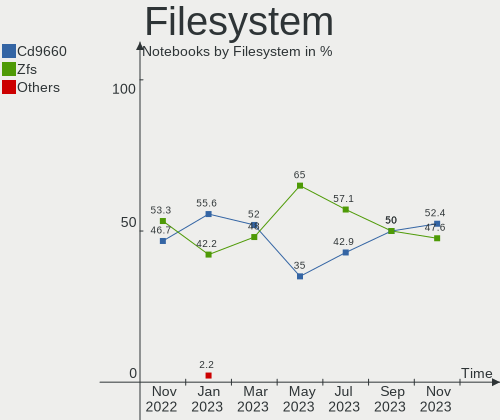
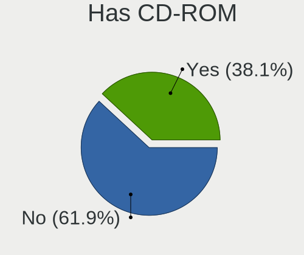
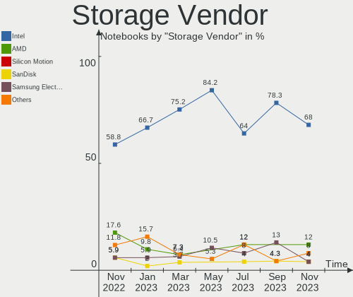
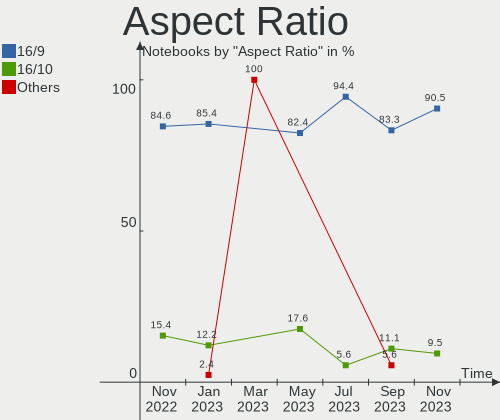
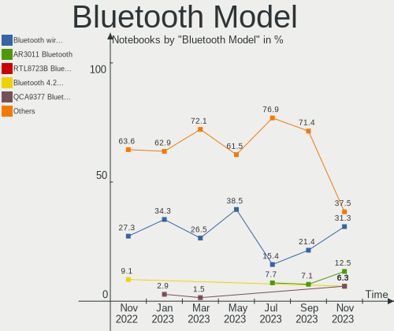
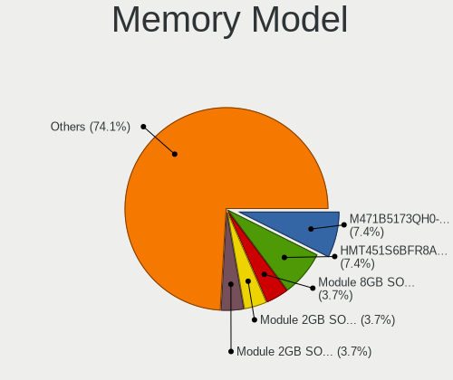
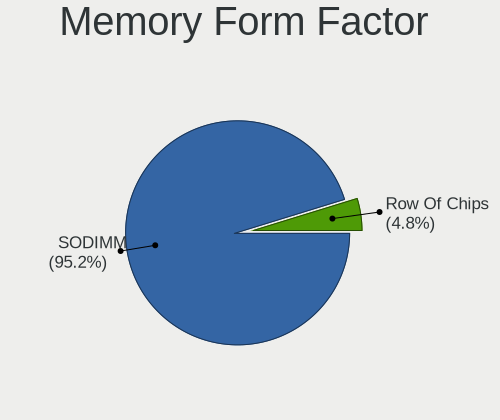
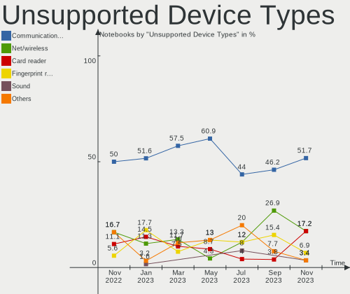

helloSystem - Hardware Trends (Notebooks)
-----------------------------------------

A project to identify most popular hardware characteristics and track their change
over time based on data collected by BSD users at https://BSD-Hardware.info.

Anyone can contribute to this report by the [hw-probe](https://github.com/linuxhw/hw-probe/blob/master/INSTALL.BSD.md) tool:

    hw-probe -all -upload

This report is for one last month. Overall report since the beginning of time: [TestCoverage](https://github.com/bsdhw/TestCoverage)

Period: Nov, 2022.

Contents
--------

* [ System ](#system)
  - [ OS                       ](#os)
  - [ OS Family                ](#os-family)
  - [ Arch                     ](#arch)
  - [ DE                       ](#de)
  - [ Display Server           ](#display-server)
  - [ Display Manager          ](#display-manager)
  - [ OS Lang                  ](#os-lang)
  - [ Boot Mode                ](#boot-mode)
  - [ Filesystem               ](#filesystem)
  - [ Part. scheme             ](#part-scheme)

* [ Board ](#board)
  - [ Vendor                   ](#vendor)
  - [ Model                    ](#model)
  - [ Model Family             ](#model-family)
  - [ MFG Year                 ](#mfg-year)
  - [ Form Factor              ](#form-factor)
  - [ Coreboot                 ](#coreboot)
  - [ RAM Size                 ](#ram-size)
  - [ RAM Used                 ](#ram-used)
  - [ Total Drives             ](#total-drives)
  - [ Has CD-ROM               ](#has-cd-rom)
  - [ Has Ethernet             ](#has-ethernet)
  - [ Has WiFi                 ](#has-wifi)
  - [ Has Bluetooth            ](#has-bluetooth)

* [ Location ](#location)
  - [ Country                  ](#country)
  - [ City                     ](#city)

* [ Drives ](#drives)
  - [ Drive Vendor             ](#drive-vendor)
  - [ Drive Model              ](#drive-model)
  - [ HDD Vendor               ](#hdd-vendor)
  - [ SSD Vendor               ](#ssd-vendor)
  - [ Drive Kind               ](#drive-kind)
  - [ Drive Connector          ](#drive-connector)
  - [ Drive Size               ](#drive-size)
  - [ Space Total              ](#space-total)
  - [ Space Used               ](#space-used)
  - [ Malfunc. Drives          ](#malfunc-drives)
  - [ Malfunc. Drive Vendor    ](#malfunc-drive-vendor)
  - [ Malfunc. HDD Vendor      ](#malfunc-hdd-vendor)
  - [ Malfunc. Drive Kind      ](#malfunc-drive-kind)
  - [ Failed Drives            ](#failed-drives)
  - [ Failed Drive Vendor      ](#failed-drive-vendor)
  - [ Drive Status             ](#drive-status)

* [ Storage controller ](#storage-controller)
  - [ Storage Vendor           ](#storage-vendor)
  - [ Storage Model            ](#storage-model)
  - [ Storage Kind             ](#storage-kind)

* [ Processor ](#processor)
  - [ CPU Vendor               ](#cpu-vendor)
  - [ CPU Model                ](#cpu-model)
  - [ CPU Model Family         ](#cpu-model-family)
  - [ CPU Cores                ](#cpu-cores)
  - [ CPU Sockets              ](#cpu-sockets)
  - [ CPU Threads              ](#cpu-threads)
  - [ CPU Microarch            ](#cpu-microarch)

* [ Graphics ](#graphics)
  - [ GPU Vendor               ](#gpu-vendor)
  - [ GPU Model                ](#gpu-model)
  - [ GPU Combo                ](#gpu-combo)
  - [ GPU Driver               ](#gpu-driver)
  - [ GPU Memory               ](#gpu-memory)

* [ Monitor ](#monitor)
  - [ Monitor Vendor           ](#monitor-vendor)
  - [ Monitor Model            ](#monitor-model)
  - [ Monitor Resolution       ](#monitor-resolution)
  - [ Monitor Diagonal         ](#monitor-diagonal)
  - [ Monitor Width            ](#monitor-width)
  - [ Aspect Ratio             ](#aspect-ratio)
  - [ Monitor Area             ](#monitor-area)
  - [ Pixel Density            ](#pixel-density)
  - [ Multiple Monitors        ](#multiple-monitors)

* [ Network ](#network)
  - [ Net Controller Vendor    ](#net-controller-vendor)
  - [ Net Controller Model     ](#net-controller-model)
  - [ Wireless Vendor          ](#wireless-vendor)
  - [ Wireless Model           ](#wireless-model)
  - [ Ethernet Vendor          ](#ethernet-vendor)
  - [ Ethernet Model           ](#ethernet-model)
  - [ Net Controller Kind      ](#net-controller-kind)
  - [ Used Controller          ](#used-controller)
  - [ NICs                     ](#nics)
  - [ IPv6                     ](#ipv6)

* [ Bluetooth ](#bluetooth)
  - [ Bluetooth Vendor         ](#bluetooth-vendor)
  - [ Bluetooth Model          ](#bluetooth-model)

* [ Sound ](#sound)
  - [ Sound Vendor             ](#sound-vendor)
  - [ Sound Model              ](#sound-model)

* [ Memory ](#memory)
  - [ Memory Vendor            ](#memory-vendor)
  - [ Memory Model             ](#memory-model)
  - [ Memory Kind              ](#memory-kind)
  - [ Memory Form Factor       ](#memory-form-factor)
  - [ Memory Size              ](#memory-size)
  - [ Memory Speed             ](#memory-speed)

* [ Printers & scanners ](#printers--scanners)
  - [ Printer Vendor           ](#printer-vendor)
  - [ Printer Model            ](#printer-model)
  - [ Scanner Vendor           ](#scanner-vendor)
  - [ Scanner Model            ](#scanner-model)

* [ Camera ](#camera)
  - [ Camera Vendor            ](#camera-vendor)
  - [ Camera Model             ](#camera-model)

* [ Security ](#security)
  - [ Fingerprint Vendor       ](#fingerprint-vendor)
  - [ Fingerprint Model        ](#fingerprint-model)
  - [ Chipcard Vendor          ](#chipcard-vendor)
  - [ Chipcard Model           ](#chipcard-model)

* [ Unsupported ](#unsupported)
  - [ Unsupported Devices      ](#unsupported-devices)
  - [ Unsupported Device Types ](#unsupported-device-types)

System
------

OS
--

Installed operating systems

| Name              | Notebooks | Percent |
|-------------------|-----------|---------|
| helloSystem 0.7.0 | 11        | 73.33%  |
| helloSystem 0.8.0 | 3         | 20%     |
| helloSystem 0.5.0 | 1         | 6.67%   |

OS Family
---------

OS without a version

| Name        | Notebooks | Percent |
|-------------|-----------|---------|
| helloSystem | 15        | 100%    |

Arch
----

OS architecture (x86_64, i586, etc.)

| Name  | Notebooks | Percent |
|-------|-----------|---------|
| amd64 | 15        | 100%    |

DE
--

Desktop Environment

| Name         | Notebooks | Percent |
|--------------|-----------|---------|
| helloDesktop | 14        | 93.33%  |
| Window Maker | 1         | 6.67%   |

Display Server
--------------

X11 or Wayland

| Name | Notebooks | Percent |
|------|-----------|---------|
| X11  | 15        | 100%    |

Display Manager
---------------

SDDM, LightDM, etc.

| Name | Notebooks | Percent |
|------|-----------|---------|
| SLiM | 15        | 100%    |

OS Lang
-------

Language

| Lang  | Notebooks | Percent |
|-------|-----------|---------|
| en_US | 13        | 86.67%  |
| es_ES | 2         | 13.33%  |

Boot Mode
---------

EFI or BIOS

| Mode | Notebooks | Percent |
|------|-----------|---------|
| EFI  | 15        | 100%    |

Filesystem
----------

Type of filesystem

| Type   | Notebooks | Percent |
|--------|-----------|---------|
| Zfs    | 8         | 53.33%  |
| Cd9660 | 7         | 46.67%  |

Part. scheme
------------

Scheme of partitioning

| Type | Notebooks | Percent |
|------|-----------|---------|
| GPT  | 15        | 100%    |

Board
-----

Vendor
------

Motherboard manufacturer

| Name                | Notebooks | Percent |
|---------------------|-----------|---------|
| Dell                | 3         | 20%     |
| ASUSTek Computer    | 3         | 20%     |
| Lenovo              | 2         | 13.33%  |
| Acer                | 2         | 13.33%  |
| Toshiba             | 1         | 6.67%   |
| Samsung Electronics | 1         | 6.67%   |
| Hewlett-Packard     | 1         | 6.67%   |
| GPD                 | 1         | 6.67%   |
| Apple               | 1         | 6.67%   |

Model
-----

Motherboard model

| Name                                | Notebooks | Percent |
|-------------------------------------|-----------|---------|
| Toshiba TECRA Z40-C-12Z             | 1         | 6.67%   |
| Samsung 300E4C/300E5C/300E7C        | 1         | 6.67%   |
| Lenovo ThinkPad X1 Carbon 3448AWU   | 1         | 6.67%   |
| Lenovo ThinkPad T460 20FMS0XL23     | 1         | 6.67%   |
| HP Pavilion Gaming Laptop 15-ec1xxx | 1         | 6.67%   |
| GPD P3 MAX                          | 1         | 6.67%   |
| Dell Latitude D630                  | 1         | 6.67%   |
| Dell Inspiron 5558                  | 1         | 6.67%   |
| Dell Inspiron 3421                  | 1         | 6.67%   |
| ASUS ZenBook UX431DA_UM431DA        | 1         | 6.67%   |
| ASUS TUF Gaming FX504GD_FX80GD      | 1         | 6.67%   |
| ASUS K55VD                          | 1         | 6.67%   |
| Apple MacBook5,1                    | 1         | 6.67%   |
| Acer Aspire 5738                    | 1         | 6.67%   |
| Acer Aspire 5251                    | 1         | 6.67%   |

Model Family
------------

Motherboard model prefix

| Name            | Notebooks | Percent |
|-----------------|-----------|---------|
| Lenovo ThinkPad | 2         | 13.33%  |
| Dell Inspiron   | 2         | 13.33%  |
| Acer Aspire     | 2         | 13.33%  |
| Toshiba TECRA   | 1         | 6.67%   |
| Samsung 300E4C  | 1         | 6.67%   |
| HP Pavilion     | 1         | 6.67%   |
| GPD P3          | 1         | 6.67%   |
| Dell Latitude   | 1         | 6.67%   |
| ASUS ZenBook    | 1         | 6.67%   |
| ASUS TUF        | 1         | 6.67%   |
| ASUS K55VD      | 1         | 6.67%   |
| Apple MacBook5  | 1         | 6.67%   |

MFG Year
--------

Motherboard manufacture year

| Year | Notebooks | Percent |
|------|-----------|---------|
| 2021 | 3         | 20%     |
| 2012 | 3         | 20%     |
| 2010 | 2         | 13.33%  |
| 2008 | 2         | 13.33%  |
| 2020 | 1         | 6.67%   |
| 2019 | 1         | 6.67%   |
| 2016 | 1         | 6.67%   |
| 2015 | 1         | 6.67%   |
| 2013 | 1         | 6.67%   |

Form Factor
-----------

Physical design of the computer

| Name     | Notebooks | Percent |
|----------|-----------|---------|
| Notebook | 15        | 100%    |

Coreboot
--------

Have coreboot on board

| Used | Notebooks | Percent |
|------|-----------|---------|
| No   | 15        | 100%    |

RAM Size
--------

Total RAM memory

| Size in GB | Notebooks | Percent |
|------------|-----------|---------|
| 8.01-16.0  | 9         | 60%     |
| 16.01-24.0 | 3         | 20%     |
| 4.01-8.0   | 2         | 13.33%  |
| 24.01-32.0 | 1         | 6.67%   |

RAM Used
--------

Used RAM memory

| Used GB  | Notebooks | Percent |
|----------|-----------|---------|
| 0.01-0.5 | 7         | 46.67%  |
| 0.51-1.0 | 6         | 40%     |
| 2.01-3.0 | 1         | 6.67%   |
| 1.01-2.0 | 1         | 6.67%   |

Total Drives
------------

Number of drives on board

| Drives | Notebooks | Percent |
|--------|-----------|---------|
| 1      | 12        | 80%     |
| 2      | 2         | 13.33%  |
| 0      | 1         | 6.67%   |

Has CD-ROM
----------

Has CD-ROM on board

| Presented | Notebooks | Percent |
|-----------|-----------|---------|
| No        | 8         | 53.33%  |
| Yes       | 7         | 46.67%  |

Has Ethernet
------------

Has Ethernet on board

| Presented | Notebooks | Percent |
|-----------|-----------|---------|
| Yes       | 12        | 80%     |
| No        | 3         | 20%     |

Has WiFi
--------

Has WiFi module

| Presented | Notebooks | Percent |
|-----------|-----------|---------|
| Yes       | 15        | 100%    |

Has Bluetooth
-------------

Has Bluetooth module

| Presented | Notebooks | Percent |
|-----------|-----------|---------|
| Yes       | 11        | 73.33%  |
| No        | 4         | 26.67%  |

Location
--------

Country
-------

Geographic location (country)

| Country   | Notebooks | Percent |
|-----------|-----------|---------|
| Spain     | 4         | 26.67%  |
| USA       | 1         | 6.67%   |
| Sweden    | 1         | 6.67%   |
| Singapore | 1         | 6.67%   |
| Romania   | 1         | 6.67%   |
| Panama    | 1         | 6.67%   |
| Mexico    | 1         | 6.67%   |
| Egypt     | 1         | 6.67%   |
| Colombia  | 1         | 6.67%   |
| China     | 1         | 6.67%   |
| Chile     | 1         | 6.67%   |
| Brazil    | 1         | 6.67%   |

City
----

Geographic location (city)

| City              | Notebooks | Percent |
|-------------------|-----------|---------|
| West Linn         | 1         | 6.67%   |
| Valencia          | 1         | 6.67%   |
| Urnieta           | 1         | 6.67%   |
| Temuco            | 1         | 6.67%   |
| Singapore         | 1         | 6.67%   |
| Shenzhen          | 1         | 6.67%   |
| Sao Paulo         | 1         | 6.67%   |
| Sanlucar la Mayor | 1         | 6.67%   |
| Panama City       | 1         | 6.67%   |
| Coyoacán         | 1         | 6.67%   |
| Cluj-Napoca       | 1         | 6.67%   |
| Borensberg        | 1         | 6.67%   |
| Bogotá           | 1         | 6.67%   |
| Alcobendas        | 1         | 6.67%   |
| Al Ma`adi         | 1         | 6.67%   |

Drives
------

Drive Vendor
------------

Hard drive vendors

| Vendor              | Notebooks | Drives | Percent |
|---------------------|-----------|--------|---------|
| WDC                 | 3         | 4      | 20%     |
| Toshiba             | 3         | 3      | 20%     |
| Samsung Electronics | 2         | 2      | 13.33%  |
| Hitachi             | 2         | 2      | 13.33%  |
| SanDisk             | 1         | 1      | 6.67%   |
| Intel               | 1         | 1      | 6.67%   |
| Crucial             | 1         | 1      | 6.67%   |
| BIWIN               | 1         | 1      | 6.67%   |
| A-DATA Technology   | 1         | 1      | 6.67%   |

Drive Model
-----------

Hard drive models

| Model                                | Notebooks | Percent |
|--------------------------------------|-----------|---------|
| WDC WDS500G2B0A-00SM50 500GB         | 1         | 6.25%   |
| WDC WDS100T2B0A-00SM50 1TB           | 1         | 6.25%   |
| WDC WD1200BEVS-22UST0 120GB          | 1         | 6.25%   |
| WDC PC SN520 SDAPNUW-256G-1006 256GB | 1         | 6.25%   |
| Toshiba MQ01ACF050 500GB             | 1         | 6.25%   |
| Toshiba MK3261GSYN 320GB             | 1         | 6.25%   |
| Toshiba KSG60ZMV256G 256GB           | 1         | 6.25%   |
| SanDisk SD9TB8W512G1001 512GB        | 1         | 6.25%   |
| Samsung SSD 750 EVO 250GB            | 1         | 6.25%   |
| Samsung MZVLQ512HALU-00000 512GB     | 1         | 6.25%   |
| Intel SSDSCMMW240A3L 240GB           | 1         | 6.25%   |
| Hitachi HTS542525K9A300 250GB        | 1         | 6.25%   |
| Hitachi HTS541616J9SA00 160GB        | 1         | 6.25%   |
| Crucial CT250BX100SSD1 250GB         | 1         | 6.25%   |
| BIWIN SSD 1TB                        | 1         | 6.25%   |
| A-DATA SU800 1TB                     | 1         | 6.25%   |

HDD Vendor
----------

Hard disk drive vendors

| Vendor  | Notebooks | Drives | Percent |
|---------|-----------|--------|---------|
| Toshiba | 2         | 2      | 40%     |
| Hitachi | 2         | 2      | 40%     |
| WDC     | 1         | 1      | 20%     |

SSD Vendor
----------

Solid state drive vendors

| Vendor              | Notebooks | Drives | Percent |
|---------------------|-----------|--------|---------|
| WDC                 | 2         | 2      | 25%     |
| Toshiba             | 1         | 1      | 12.5%   |
| SanDisk             | 1         | 1      | 12.5%   |
| Samsung Electronics | 1         | 1      | 12.5%   |
| Intel               | 1         | 1      | 12.5%   |
| Crucial             | 1         | 1      | 12.5%   |
| A-DATA Technology   | 1         | 1      | 12.5%   |

Drive Kind
----------

HDD or SSD

| Kind | Notebooks | Drives | Percent |
|------|-----------|--------|---------|
| SSD  | 8         | 8      | 50%     |
| HDD  | 5         | 5      | 31.25%  |
| NVMe | 3         | 3      | 18.75%  |

Drive Connector
---------------

SATA, SAS, NVMe, etc.

| Type | Notebooks | Drives | Percent |
|------|-----------|--------|---------|
| SATA | 12        | 13     | 80%     |
| NVMe | 3         | 3      | 20%     |

Drive Size
----------

Size of hard drive

| Size in TB | Notebooks | Drives | Percent |
|------------|-----------|--------|---------|
| 0.01-0.5   | 9         | 10     | 75%     |
| 0.51-1.0   | 2         | 2      | 16.67%  |
| 1.01-2.0   | 1         | 1      | 8.33%   |

Space Total
-----------

Amount of disk space available on the file system

| Size in GB | Notebooks | Percent |
|------------|-----------|---------|
| 1-20       | 6         | 40%     |
| 101-250    | 5         | 33.33%  |
| 251-500    | 2         | 13.33%  |
| 501-1000   | 1         | 6.67%   |
| 51-100     | 1         | 6.67%   |

Space Used
----------

Amount of used disk space

| Used GB | Notebooks | Percent |
|---------|-----------|---------|
| 1-20    | 15        | 100%    |

Malfunc. Drives
---------------

Drive models with a malfunction

| Model                         | Notebooks | Drives | Percent |
|-------------------------------|-----------|--------|---------|
| Hitachi HTS542525K9A300 250GB | 1         | 1      | 100%    |

Malfunc. Drive Vendor
---------------------

Vendors of faulty drives

| Vendor  | Notebooks | Drives | Percent |
|---------|-----------|--------|---------|
| Hitachi | 1         | 1      | 100%    |

Malfunc. HDD Vendor
-------------------

Vendors of faulty HDD drives

| Vendor  | Notebooks | Drives | Percent |
|---------|-----------|--------|---------|
| Hitachi | 1         | 1      | 100%    |

Malfunc. Drive Kind
-------------------

Kinds of faulty drives

| Kind | Notebooks | Drives | Percent |
|------|-----------|--------|---------|
| HDD  | 1         | 1      | 100%    |

Failed Drives
-------------

Failed drive models

Zero info for selected period =(

Failed Drive Vendor
-------------------

Failed drive vendors

Zero info for selected period =(

Drive Status
------------

Number of failed and malfunc. drives

| Status  | Notebooks | Drives | Percent |
|---------|-----------|--------|---------|
| Works   | 13        | 15     | 92.86%  |
| Malfunc | 1         | 1      | 7.14%   |

Storage controller
------------------

Storage Vendor
--------------

Storage controller vendors

| Vendor                   | Notebooks | Percent |
|--------------------------|-----------|---------|
| Intel                    | 10        | 58.82%  |
| AMD                      | 3         | 17.65%  |
| SanDisk                  | 1         | 5.88%   |
| Samsung Electronics      | 1         | 5.88%   |
| Nvidia                   | 1         | 5.88%   |
| Biwin Storage Technology | 1         | 5.88%   |

Storage Model
-------------

Storage controller models

| Model                                                                 | Notebooks | Percent |
|-----------------------------------------------------------------------|-----------|---------|
| Intel 7 Series Chipset Family 6-port SATA Controller [AHCI mode]      | 4         | 21.05%  |
| Intel Sunrise Point-LP SATA Controller [AHCI mode]                    | 2         | 10.53%  |
| AMD FCH SATA Controller [AHCI mode]                                   | 2         | 10.53%  |
| SanDisk WD Blue SN500 / PC SN520 NVMe SSD                             | 1         | 5.26%   |
| Samsung NVMe SSD Controller 980                                       | 1         | 5.26%   |
| Nvidia MCP79 AHCI Controller                                          | 1         | 5.26%   |
| Intel Wildcat Point-LP SATA Controller [AHCI Mode]                    | 1         | 5.26%   |
| Intel Cannon Lake Mobile PCH SATA AHCI Controller                     | 1         | 5.26%   |
| Intel 82801IBM/IEM (ICH9M/ICH9M-E) 4 port SATA Controller [AHCI mode] | 1         | 5.26%   |
| Intel 82801HM/HEM (ICH8M/ICH8M-E) SATA Controller [AHCI mode]         | 1         | 5.26%   |
| Intel 82801HM/HEM (ICH8M/ICH8M-E) IDE Controller                      | 1         | 5.26%   |
| AMD SB7x0/SB8x0/SB9x0 SATA Controller [AHCI mode]                     | 1         | 5.26%   |
| AMD SB7x0/SB8x0/SB9x0 IDE Controller                                  | 1         | 5.26%   |
| Unknown                                                               | 1         | 5.26%   |

Storage Kind
------------

Kind of storage controller (IDE, SATA, NVMe, SAS, ...)

| Kind | Notebooks | Percent |
|------|-----------|---------|
| SATA | 14        | 73.68%  |
| NVMe | 3         | 15.79%  |
| IDE  | 2         | 10.53%  |

Processor
---------

CPU Vendor
----------

Processor vendors

| Vendor | Notebooks | Percent |
|--------|-----------|---------|
| Intel  | 12        | 80%     |
| AMD    | 3         | 20%     |

CPU Model
---------

Processor models

| Model                                         | Notebooks | Percent |
|-----------------------------------------------|-----------|---------|
| Intel Pentium Silver N6000 @ 1.10GHz          | 1         | 6.67%   |
| Intel CPU Version                             | 1         | 6.67%   |
| Intel Core i7-3667U CPU @ 2.00GHz             | 1         | 6.67%   |
| Intel Core i7-3610QM CPU @ 2.30GHz            | 1         | 6.67%   |
| Intel Core i5-8300H CPU @ 2.30GHz             | 1         | 6.67%   |
| Intel Core i5-6300U CPU @ 2.40GHz             | 1         | 6.67%   |
| Intel Core i5-6200U CPU @ 2.30GHz             | 1         | 6.67%   |
| Intel Core i5-3210M CPU @ 2.50GHz             | 1         | 6.67%   |
| Intel Core i3-5005U CPU @ 2.00GHz             | 1         | 6.67%   |
| Intel Core i3-3217U CPU @ 1.80GHz             | 1         | 6.67%   |
| Intel Core 2 Duo CPU P7350 @ 2.00GHz          | 1         | 6.67%   |
| Intel Core 2 Duo                              | 1         | 6.67%   |
| AMD V120 Processor                            | 1         | 6.67%   |
| AMD Ryzen 5 4600H with Radeon Graphics        | 1         | 6.67%   |
| AMD Ryzen 5 3500U with Radeon Vega Mobile Gfx | 1         | 6.67%   |

CPU Model Family
----------------

Processor model prefix

| Model                | Notebooks | Percent |
|----------------------|-----------|---------|
| Intel Core i5        | 4         | 26.67%  |
| Intel Core i7        | 2         | 13.33%  |
| Intel Core i3        | 2         | 13.33%  |
| Intel Core 2 Duo     | 2         | 13.33%  |
| AMD Ryzen 5          | 2         | 13.33%  |
| Other                | 1         | 6.67%   |
| Intel Pentium Silver | 1         | 6.67%   |
| AMD V120             | 1         | 6.67%   |

CPU Cores
---------

Number of processor cores

| Number  | Notebooks | Percent |
|---------|-----------|---------|
| 2       | 8         | 53.33%  |
| 4       | 3         | 20%     |
| 12      | 1         | 6.67%   |
| 8       | 1         | 6.67%   |
| 1       | 1         | 6.67%   |
| Unknown | 1         | 6.67%   |

CPU Sockets
-----------

Number of sockets

| Number | Notebooks | Percent |
|--------|-----------|---------|
| 1      | 14        | 93.33%  |
| 2      | 1         | 6.67%   |

CPU Threads
-----------

Threads per core (Hyper-Threading)

| Number  | Notebooks | Percent |
|---------|-----------|---------|
| 2       | 8         | 53.33%  |
| 1       | 6         | 40%     |
| Unknown | 1         | 6.67%   |

CPU Microarch
-------------

Microarchitecture

| Name      | Notebooks | Percent |
|-----------|-----------|---------|
| IvyBridge | 4         | 26.67%  |
| Penryn    | 3         | 20%     |
| Skylake   | 2         | 13.33%  |
| Zen+      | 1         | 6.67%   |
| Zen 2     | 1         | 6.67%   |
| KabyLake  | 1         | 6.67%   |
| K10       | 1         | 6.67%   |
| Broadwell | 1         | 6.67%   |
| Unknown   | 1         | 6.67%   |

Graphics
--------

GPU Vendor
----------

Vendors of graphics cards

| Vendor | Notebooks | Percent |
|--------|-----------|---------|
| Intel  | 10        | 52.63%  |
| Nvidia | 5         | 26.32%  |
| AMD    | 4         | 21.05%  |

GPU Model
---------

Graphics card models

| Model                                                                | Notebooks | Percent |
|----------------------------------------------------------------------|-----------|---------|
| Intel 3rd Gen Core processor Graphics Controller                     | 4         | 20%     |
| Nvidia GF119M [GeForce 610M]                                         | 2         | 10%     |
| Intel Skylake GT2 [HD Graphics 520]                                  | 2         | 10%     |
| Nvidia GP107M [GeForce GTX 1050 Mobile]                              | 1         | 5%      |
| Nvidia GP107M [GeForce GTX 1050 3 GB Max-Q]                          | 1         | 5%      |
| Nvidia C79 [GeForce 9400M]                                           | 1         | 5%      |
| Intel Mobile GM965/GL960 Integrated Graphics Controller (secondary)  | 1         | 5%      |
| Intel Mobile GM965/GL960 Integrated Graphics Controller (primary)    | 1         | 5%      |
| Intel JasperLake [UHD Graphics]                                      | 1         | 5%      |
| Intel HD Graphics 5500                                               | 1         | 5%      |
| Intel CoffeeLake-H GT2 [UHD Graphics 630]                            | 1         | 5%      |
| AMD RV710/M92 [Mobility Radeon HD 4530/4570/545v]                    | 1         | 5%      |
| AMD RS880M [Mobility Radeon HD 4225/4250]                            | 1         | 5%      |
| AMD Renoir                                                           | 1         | 5%      |
| AMD Picasso/Raven 2 [Radeon Vega Series / Radeon Vega Mobile Series] | 1         | 5%      |

GPU Combo
---------

Combinations of graphics cards

| Name           | Notebooks | Percent |
|----------------|-----------|---------|
| 1 x Intel      | 6         | 40%     |
| Intel + Nvidia | 3         | 20%     |
| 1 x AMD        | 3         | 20%     |
| 2 x Intel      | 1         | 6.67%   |
| 1 x Nvidia     | 1         | 6.67%   |
| AMD + Nvidia   | 1         | 6.67%   |

GPU Driver
----------

Free vs proprietary

| Driver      | Notebooks | Percent |
|-------------|-----------|---------|
| Free        | 12        | 80%     |
| Proprietary | 2         | 13.33%  |
| Unknown     | 1         | 6.67%   |

GPU Memory
----------

Total video memory

| Size in GB | Notebooks | Percent |
|------------|-----------|---------|
| Unknown    | 10        | 66.67%  |
| 0.01-0.5   | 3         | 20%     |
| 2.01-3.0   | 1         | 6.67%   |
| 1.01-2.0   | 1         | 6.67%   |

Monitor
-------

Monitor Vendor
--------------

Monitor vendors

| Vendor                  | Notebooks | Percent |
|-------------------------|-----------|---------|
| LG Display              | 3         | 20%     |
| PANDA                   | 2         | 13.33%  |
| Chimei Innolux          | 2         | 13.33%  |
| LG Philips              | 1         | 6.67%   |
| Goldstar                | 1         | 6.67%   |
| Chi Mei Optoelectronics | 1         | 6.67%   |
| BOE                     | 1         | 6.67%   |
| AU Optronics            | 1         | 6.67%   |
| Apple                   | 1         | 6.67%   |
| AOC                     | 1         | 6.67%   |
| Ancor Communications    | 1         | 6.67%   |

Monitor Model
-------------

Monitor models

| Model                                                                    | Notebooks | Percent |
|--------------------------------------------------------------------------|-----------|---------|
| PANDA LCD Monitor NCP0035 1920x1080 310x170mm 13.9-inch                  | 1         | 6.67%   |
| PANDA LCD Monitor NCP0029 1920x1080 340x190mm 15.3-inch                  | 1         | 6.67%   |
| LG Philips LCD Monitor LPL00E5 1440x900 300x190mm 14.0-inch              | 1         | 6.67%   |
| LG Display LCD Monitor LGD0569 1920x1080 310x170mm 13.9-inch             | 1         | 6.67%   |
| LG Display LCD Monitor LGD03B7 1366x768 310x170mm 13.9-inch              | 1         | 6.67%   |
| LG Display LCD Monitor LGD0382 1600x900 310x170mm 13.9-inch              | 1         | 6.67%   |
| Goldstar 22EA63 GSM598F 1920x1080 480x270mm 21.7-inch                    | 1         | 6.67%   |
| Chimei Innolux LCD Monitor CMN1490 1366x768 310x170mm 13.9-inch          | 1         | 6.67%   |
| Chimei Innolux LCD Monitor CMN1480 1366x768 310x170mm 13.9-inch          | 1         | 6.67%   |
| Chi Mei Optoelectronics LCD Monitor CMO1558 1366x768 350x190mm 15.7-inch | 1         | 6.67%   |
| BOE LCD Monitor BOE0615 1366x768 340x190mm 15.3-inch                     | 1         | 6.67%   |
| AU Optronics LCD Monitor AUO26EC 1366x768 340x190mm 15.3-inch            | 1         | 6.67%   |
| Apple LCD Monitor APP9C89 1280x800 290x180mm 13.4-inch                   | 1         | 6.67%   |
| AOC 2050W AOC2050 1600x900 430x240mm 19.4-inch                           | 1         | 6.67%   |
| Ancor Communications VG248 ACI24A5 1920x1080 530x300mm 24.0-inch         | 1         | 6.67%   |

Monitor Resolution
------------------

Monitor screen resolution

| Resolution       | Notebooks | Percent |
|------------------|-----------|---------|
| 1366x768 (WXGA)  | 6         | 42.86%  |
| 1920x1080 (FHD)  | 4         | 28.57%  |
| 1600x900 (HD+)   | 2         | 14.29%  |
| 1440x900 (WXGA+) | 1         | 7.14%   |
| 1280x800 (WXGA)  | 1         | 7.14%   |

Monitor Diagonal
----------------

Diagonal size in inches

| Inches | Notebooks | Percent |
|--------|-----------|---------|
| 13     | 7         | 46.67%  |
| 15     | 4         | 26.67%  |
| 24     | 1         | 6.67%   |
| 21     | 1         | 6.67%   |
| 19     | 1         | 6.67%   |
| 14     | 1         | 6.67%   |

Monitor Width
-------------

Physical width

| Width in mm | Notebooks | Percent |
|-------------|-----------|---------|
| 301-350     | 10        | 66.67%  |
| 401-500     | 2         | 13.33%  |
| 201-300     | 2         | 13.33%  |
| 501-600     | 1         | 6.67%   |

Aspect Ratio
------------

Proportional relationship between the width and the height

| Ratio | Notebooks | Percent |
|-------|-----------|---------|
| 16/9  | 11        | 84.62%  |
| 16/10 | 2         | 15.38%  |

Monitor Area
------------

Area in inch²

| Area in inch² | Notebooks | Percent |
|----------------|-----------|---------|
| 81-90          | 8         | 53.33%  |
| 91-100         | 3         | 20%     |
| 201-250        | 2         | 13.33%  |
| 151-200        | 1         | 6.67%   |
| 101-110        | 1         | 6.67%   |

Pixel Density
-------------

Pixels per inch

| Density | Notebooks | Percent |
|---------|-----------|---------|
| 101-120 | 6         | 42.86%  |
| 121-160 | 5         | 35.71%  |
| 51-100  | 3         | 21.43%  |

Multiple Monitors
-----------------

Total monitors connected

| Total | Notebooks | Percent |
|-------|-----------|---------|
| 1     | 12        | 80%     |
| 2     | 2         | 13.33%  |
| 0     | 1         | 6.67%   |

Network
-------

Net Controller Vendor
---------------------

Controller vendors

| Vendor                | Notebooks | Percent |
|-----------------------|-----------|---------|
| Intel                 | 8         | 30.77%  |
| Realtek Semiconductor | 6         | 23.08%  |
| Qualcomm Atheros      | 5         | 19.23%  |
| Broadcom              | 4         | 15.38%  |
| Ralink Technology     | 1         | 3.85%   |
| Nvidia                | 1         | 3.85%   |
| D-Link System         | 1         | 3.85%   |

Net Controller Model
--------------------

Controller models

| Model                                                                      | Notebooks | Percent |
|----------------------------------------------------------------------------|-----------|---------|
| Realtek RTL8111/8168/8411 PCI Express Gigabit Ethernet Controller          | 4         | 13.33%  |
| Qualcomm Atheros AR9485 Wireless Network Adapter                           | 3         | 10%     |
| Realtek RTL810xE PCI Express Fast Ethernet controller                      | 2         | 6.67%   |
| Intel Wireless 8260                                                        | 2         | 6.67%   |
| Realtek RTL8822CE 802.11ac PCIe Wireless Network Adapter                   | 1         | 3.33%   |
| Realtek RTL8188EUS 802.11n Wireless Network Adapter                        | 1         | 3.33%   |
| Ralink MT7601U Wireless Adapter                                            | 1         | 3.33%   |
| Qualcomm Atheros AR928X Wireless Network Adapter (PCI-Express)             | 1         | 3.33%   |
| Qualcomm Atheros AR9285 Wireless Network Adapter (PCI-Express)             | 1         | 3.33%   |
| Nvidia MCP79 Ethernet                                                      | 1         | 3.33%   |
| Intel Wireless 8265 / 8275                                                 | 1         | 3.33%   |
| Intel Wi-Fi 6 AX201 160MHz                                                 | 1         | 3.33%   |
| Intel PRO/Wireless 4965 AG or AGN [Kedron] Network Connection              | 1         | 3.33%   |
| Intel Ethernet Connection I219-V                                           | 1         | 3.33%   |
| Intel Ethernet Connection I219-LM                                          | 1         | 3.33%   |
| Intel Dual Band Wireless-AC 3165 Plus Bluetooth                            | 1         | 3.33%   |
| Intel Centrino Advanced-N 6205 [Taylor Peak]                               | 1         | 3.33%   |
| Intel Cannon Lake PCH CNVi WiFi                                            | 1         | 3.33%   |
| D-Link System AirPlus G DWL-G122 Wireless Adapter(rev.C1) [Ralink RT2571W] | 1         | 3.33%   |
| Broadcom NetXtreme BCM5755M Gigabit Ethernet PCI Express                   | 1         | 3.33%   |
| Broadcom NetLink BCM5784M Gigabit Ethernet PCIe                            | 1         | 3.33%   |
| Broadcom NetLink BCM57780 Gigabit Ethernet PCIe                            | 1         | 3.33%   |
| Broadcom BCM4322 802.11a/b/g/n Wireless LAN Controller                     | 1         | 3.33%   |

Wireless Vendor
---------------

Wireless vendors

| Vendor                | Notebooks | Percent |
|-----------------------|-----------|---------|
| Intel                 | 8         | 44.44%  |
| Qualcomm Atheros      | 5         | 27.78%  |
| Realtek Semiconductor | 2         | 11.11%  |
| Ralink Technology     | 1         | 5.56%   |
| D-Link System         | 1         | 5.56%   |
| Broadcom              | 1         | 5.56%   |

Wireless Model
--------------

Wireless models

| Model                                                                      | Notebooks | Percent |
|----------------------------------------------------------------------------|-----------|---------|
| Qualcomm Atheros AR9485 Wireless Network Adapter                           | 3         | 16.67%  |
| Intel Wireless 8260                                                        | 2         | 11.11%  |
| Realtek RTL8822CE 802.11ac PCIe Wireless Network Adapter                   | 1         | 5.56%   |
| Realtek RTL8188EUS 802.11n Wireless Network Adapter                        | 1         | 5.56%   |
| Ralink MT7601U Wireless Adapter                                            | 1         | 5.56%   |
| Qualcomm Atheros AR928X Wireless Network Adapter (PCI-Express)             | 1         | 5.56%   |
| Qualcomm Atheros AR9285 Wireless Network Adapter (PCI-Express)             | 1         | 5.56%   |
| Intel Wireless 8265 / 8275                                                 | 1         | 5.56%   |
| Intel Wi-Fi 6 AX201 160MHz                                                 | 1         | 5.56%   |
| Intel PRO/Wireless 4965 AG or AGN [Kedron] Network Connection              | 1         | 5.56%   |
| Intel Dual Band Wireless-AC 3165 Plus Bluetooth                            | 1         | 5.56%   |
| Intel Centrino Advanced-N 6205 [Taylor Peak]                               | 1         | 5.56%   |
| Intel Cannon Lake PCH CNVi WiFi                                            | 1         | 5.56%   |
| D-Link System AirPlus G DWL-G122 Wireless Adapter(rev.C1) [Ralink RT2571W] | 1         | 5.56%   |
| Broadcom BCM4322 802.11a/b/g/n Wireless LAN Controller                     | 1         | 5.56%   |

Ethernet Vendor
---------------

Ethernet vendors

| Vendor                | Notebooks | Percent |
|-----------------------|-----------|---------|
| Realtek Semiconductor | 6         | 50%     |
| Broadcom              | 3         | 25%     |
| Intel                 | 2         | 16.67%  |
| Nvidia                | 1         | 8.33%   |

Ethernet Model
--------------

Ethernet models

| Model                                                             | Notebooks | Percent |
|-------------------------------------------------------------------|-----------|---------|
| Realtek RTL8111/8168/8411 PCI Express Gigabit Ethernet Controller | 4         | 33.33%  |
| Realtek RTL810xE PCI Express Fast Ethernet controller             | 2         | 16.67%  |
| Nvidia MCP79 Ethernet                                             | 1         | 8.33%   |
| Intel Ethernet Connection I219-V                                  | 1         | 8.33%   |
| Intel Ethernet Connection I219-LM                                 | 1         | 8.33%   |
| Broadcom NetXtreme BCM5755M Gigabit Ethernet PCI Express          | 1         | 8.33%   |
| Broadcom NetLink BCM5784M Gigabit Ethernet PCIe                   | 1         | 8.33%   |
| Broadcom NetLink BCM57780 Gigabit Ethernet PCIe                   | 1         | 8.33%   |

Net Controller Kind
-------------------

Ethernet, WiFi or modem

| Kind     | Notebooks | Percent |
|----------|-----------|---------|
| WiFi     | 15        | 55.56%  |
| Ethernet | 12        | 44.44%  |

Used Controller
---------------

Currently used network controller

| Kind     | Notebooks | Percent |
|----------|-----------|---------|
| WiFi     | 9         | 64.29%  |
| Ethernet | 5         | 35.71%  |

NICs
----

Total network controllers on board

| Total | Notebooks | Percent |
|-------|-----------|---------|
| 2     | 12        | 80%     |
| 1     | 3         | 20%     |

IPv6
----

IPv6 vs IPv4

| Used | Notebooks | Percent |
|------|-----------|---------|
| No   | 15        | 100%    |

Bluetooth
---------

Bluetooth Vendor
----------------

Controller vendors

| Vendor                          | Notebooks | Percent |
|---------------------------------|-----------|---------|
| Intel                           | 5         | 45.45%  |
| Realtek Semiconductor           | 1         | 9.09%   |
| Qualcomm Atheros Communications | 1         | 9.09%   |
| Dell                            | 1         | 9.09%   |
| Cambridge Silicon Radio         | 1         | 9.09%   |
| Broadcom                        | 1         | 9.09%   |
| Apple                           | 1         | 9.09%   |

Bluetooth Model
---------------

Controller models

| Model                                               | Notebooks | Percent |
|-----------------------------------------------------|-----------|---------|
| Intel Bluetooth wireless interface                  | 3         | 27.27%  |
| Realtek  Bluetooth 4.2 Adapter                      | 1         | 9.09%   |
| Qualcomm Atheros Dell Wireless 1703 Bluetooth       | 1         | 9.09%   |
| Intel Bluetooth 9460/9560 Jefferson Peak (JfP)      | 1         | 9.09%   |
| Intel AX201 Bluetooth                               | 1         | 9.09%   |
| Dell Wireless 350 Bluetooth                         | 1         | 9.09%   |
| Cambridge Silicon Radio Bluetooth Dongle (HCI mode) | 1         | 9.09%   |
| Broadcom BCM20702 Bluetooth 4.0 [ThinkPad]          | 1         | 9.09%   |
| Apple Bluetooth Host Controller                     | 1         | 9.09%   |

Sound
-----

Sound Vendor
------------

Sound card vendors

| Vendor            | Notebooks | Percent |
|-------------------|-----------|---------|
| Intel             | 11        | 61.11%  |
| AMD               | 4         | 22.22%  |
| Nvidia            | 2         | 11.11%  |
| Texas Instruments | 1         | 5.56%   |

Sound Model
-----------

Sound card models

| Model                                                               | Notebooks | Percent |
|---------------------------------------------------------------------|-----------|---------|
| Intel 7 Series/C216 Chipset Family High Definition Audio Controller | 4         | 19.05%  |
| Intel Sunrise Point-LP HD Audio                                     | 2         | 9.52%   |
| AMD Family 17h/19h HD Audio Controller                              | 2         | 9.52%   |
| Texas Instruments PCM2902 Audio Codec                               | 1         | 4.76%   |
| Nvidia MCP79 High Definition Audio                                  | 1         | 4.76%   |
| Nvidia GP107GL High Definition Audio Controller                     | 1         | 4.76%   |
| Intel Wildcat Point-LP High Definition Audio Controller             | 1         | 4.76%   |
| Intel Jasper Lake HD Audio                                          | 1         | 4.76%   |
| Intel Cannon Lake PCH cAVS                                          | 1         | 4.76%   |
| Intel Broadwell-U Audio Controller                                  | 1         | 4.76%   |
| Intel 82801I (ICH9 Family) HD Audio Controller                      | 1         | 4.76%   |
| Intel 82801H (ICH8 Family) HD Audio Controller                      | 1         | 4.76%   |
| AMD SBx00 Azalia (Intel HDA)                                        | 1         | 4.76%   |
| AMD RV710/730 HDMI Audio [Radeon HD 4000 series]                    | 1         | 4.76%   |
| AMD RS880 HDMI Audio [Radeon HD 4200 Series]                        | 1         | 4.76%   |
| AMD Raven/Raven2/Fenghuang HDMI/DP Audio Controller                 | 1         | 4.76%   |

Memory
------

Memory Vendor
-------------

Memory module vendors

| Vendor              | Notebooks | Percent |
|---------------------|-----------|---------|
| Samsung Electronics | 5         | 25%     |
| SK hynix            | 4         | 20%     |
| Kingston            | 4         | 20%     |
| Transcend           | 1         | 5%      |
| Teikon              | 1         | 5%      |
| Ramaxel Technology  | 1         | 5%      |
| Micron Technology   | 1         | 5%      |
| Elpida              | 1         | 5%      |
| Crucial             | 1         | 5%      |
| A-DATA Technology   | 1         | 5%      |

Memory Model
------------

Memory module models

| Model                                                            | Notebooks | Percent |
|------------------------------------------------------------------|-----------|---------|
| Transcend RAM JM1600KSN-4G 4GB SODIMM DDR3 1600MT/s              | 1         | 5%      |
| Teikon RAM TML251S6EFR8A-PBHC 4GB SODIMM DDR3 1600MT/s           | 1         | 5%      |
| SK hynix RAM HMT41GS6DFR8A-PB 8GB SODIMM DDR3 1600MT/s           | 1         | 5%      |
| SK hynix RAM HMT351S6CFR8C-PB 4GB SODIMM DDR3 1600MT/s           | 1         | 5%      |
| SK hynix RAM HMA81GS6CJR8N-VK 8GB SODIMM DDR4 2667MT/s           | 1         | 5%      |
| SK hynix RAM 53D512M64D4RQ-046 16GB Row Of Chips LPDDR4 4267MT/s | 1         | 5%      |
| Samsung RAM M471B5673EH1-CF8 2GB SODIMM 1067MT/s                 | 1         | 5%      |
| Samsung RAM M471B1G73QH0-YK0 8GB SODIMM DDR3 1867MT/s            | 1         | 5%      |
| Samsung RAM M471B1G73EB0-YK0 8GB SODIMM DDR3 1600MT/s            | 1         | 5%      |
| Samsung RAM M471A5244CB0-CWE 4GB SODIMM DDR4 3200MT/s            | 1         | 5%      |
| Samsung RAM M471A5244CB0-CTD 4GB SODIMM DDR4 2667MT/s            | 1         | 5%      |
| Ramaxel RAM RMT3160MP68FAF1600 8GB SODIMM DDR3 1600MT/s          | 1         | 5%      |
| Micron RAM 16KTF1G64HZ-1G6N1 8GB SODIMM DDR3 1600MT/s            | 1         | 5%      |
| Kingston RAM KHX1600C9S3L/8G 8GB SODIMM DDR3 1600MT/s            | 1         | 5%      |
| Kingston RAM 99U5469-046.A00LF 4GB SODIMM DDR3 1333MT/s          | 1         | 5%      |
| Kingston RAM 99U5295-013.A00LF 2GB SODIMM DDR 667MT/s            | 1         | 5%      |
| Kingston RAM 9905744-006.A00G 16GB SODIMM DDR4 2667MT/s          | 1         | 5%      |
| Elpida RAM EBJ41UF8BDU0-DJ-F 4GB Chip DDR3 1333MT/s              | 1         | 5%      |
| Crucial RAM Module 4GB SODIMM DDR3 1067MT/s                      | 1         | 5%      |
| A-DATA RAM AD73I1C1674EV 4GB SODIMM DDR3 1333MT/s                | 1         | 5%      |

Memory Kind
-----------

Memory module kinds

| Kind   | Notebooks | Percent |
|--------|-----------|---------|
| DDR3   | 10        | 66.67%  |
| DDR4   | 3         | 20%     |
| LPDDR4 | 1         | 6.67%   |
| DDR2   | 1         | 6.67%   |

Memory Form Factor
------------------

Physical design of the memory module

| Name         | Notebooks | Percent |
|--------------|-----------|---------|
| SODIMM       | 13        | 86.67%  |
| Row Of Chips | 1         | 6.67%   |
| Chip         | 1         | 6.67%   |

Memory Size
-----------

Memory module size

| Size  | Notebooks | Percent |
|-------|-----------|---------|
| 4096  | 7         | 43.75%  |
| 8192  | 5         | 31.25%  |
| 16384 | 2         | 12.5%   |
| 2048  | 2         | 12.5%   |

Memory Speed
------------

Memory module speed

| Speed | Notebooks | Percent |
|-------|-----------|---------|
| 1600  | 6         | 35.29%  |
| 1333  | 3         | 17.65%  |
| 2667  | 2         | 11.76%  |
| 1067  | 2         | 11.76%  |
| 4267  | 1         | 5.88%   |
| 3200  | 1         | 5.88%   |
| 1867  | 1         | 5.88%   |
| 667   | 1         | 5.88%   |

Printers & scanners
-------------------

Printer Vendor
--------------

Printer device vendors

Zero info for selected period =(

Printer Model
-------------

Printer device models

Zero info for selected period =(

Scanner Vendor
--------------

Scanner device vendors

Zero info for selected period =(

Scanner Model
-------------

Scanner device models

Zero info for selected period =(

Camera
------

Camera Vendor
-------------

Camera device vendors

| Vendor                  | Notebooks | Percent |
|-------------------------|-----------|---------|
| Suyin                   | 3         | 25%     |
| IMC Networks            | 2         | 16.67%  |
| Z-Star Microelectronics | 1         | 8.33%   |
| Quanta                  | 1         | 8.33%   |
| Microdia                | 1         | 8.33%   |
| icSpring                | 1         | 8.33%   |
| Chicony Electronics     | 1         | 8.33%   |
| Alcor Micro             | 1         | 8.33%   |
| Acer                    | 1         | 8.33%   |

Camera Model
------------

Camera device models

| Model                                                       | Notebooks | Percent |
|-------------------------------------------------------------|-----------|---------|
| IMC Networks USB2.0 HD UVC WebCam                           | 2         | 16.67%  |
| Z-Star WebCam SC-03FFL11739P                                | 1         | 8.33%   |
| Suyin Integrated_Webcam_HD                                  | 1         | 8.33%   |
| Suyin Acer/HP Integrated Webcam [CN0314]                    | 1         | 8.33%   |
| Suyin 1.3M WebCam (notebook emachines E730, Acer sub-brand) | 1         | 8.33%   |
| Quanta HP TrueVision HD Camera                              | 1         | 8.33%   |
| Microdia Dell Laptop Integrated Webcam HD                   | 1         | 8.33%   |
| icSpring icspring camera                                    | 1         | 8.33%   |
| Chicony TOSHIBA Web Camera - FHD                            | 1         | 8.33%   |
| Alcor Micro Asus Integrated Webcam                          | 1         | 8.33%   |
| Acer Integrated Camera                                      | 1         | 8.33%   |

Security
--------

Fingerprint Vendor
------------------

Fingerprint sensor vendors

| Vendor           | Notebooks | Percent |
|------------------|-----------|---------|
| Validity Sensors | 1         | 100%    |

Fingerprint Model
-----------------

Fingerprint sensor models

| Model                                   | Notebooks | Percent |
|-----------------------------------------|-----------|---------|
| Validity Sensors VFS Fingerprint sensor | 1         | 100%    |

Chipcard Vendor
---------------

Chipcard module vendors

Zero info for selected period =(

Chipcard Model
--------------

Chipcard module models

Zero info for selected period =(

Unsupported
-----------

Unsupported Devices
-------------------

Total unsupported devices on board

| Total | Notebooks | Percent |
|-------|-----------|---------|
| 2     | 5         | 33.33%  |
| 0     | 5         | 33.33%  |
| 1     | 3         | 20%     |
| 4     | 1         | 6.67%   |
| 3     | 1         | 6.67%   |

Unsupported Device Types
------------------------

Types of unsupported devices

| Type                     | Notebooks | Percent |
|--------------------------|-----------|---------|
| Communication controller | 9         | 50%     |
| Net/wireless             | 3         | 16.67%  |
| Bluetooth                | 3         | 16.67%  |
| Card reader              | 2         | 11.11%  |
| Fingerprint reader       | 1         | 5.56%   |

