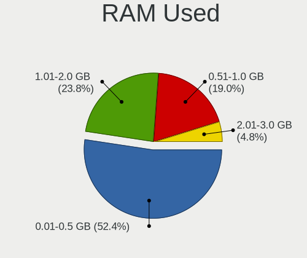
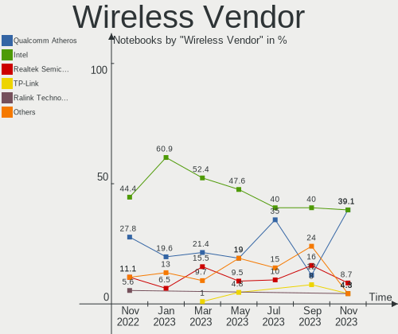

helloSystem - Hardware Trends (Notebooks)
-----------------------------------------

A project to identify most popular hardware characteristics and track their change
over time based on data collected by BSD users at https://BSD-Hardware.info.

Anyone can contribute to this report by the [hw-probe](https://github.com/linuxhw/hw-probe/blob/master/INSTALL.BSD.md) tool:

    hw-probe -all -upload

This report is for one last month. Overall report since the beginning of time: [TestDays](https://github.com/bsdhw/TestDays)

Period: Nov, 2023.

Contents
--------

* [ System ](#system)
  - [ OS                       ](#os)
  - [ OS Family                ](#os-family)
  - [ Arch                     ](#arch)
  - [ DE                       ](#de)
  - [ Display Server           ](#display-server)
  - [ Display Manager          ](#display-manager)
  - [ OS Lang                  ](#os-lang)
  - [ Boot Mode                ](#boot-mode)
  - [ Filesystem               ](#filesystem)
  - [ Part. scheme             ](#part-scheme)

* [ Board ](#board)
  - [ Vendor                   ](#vendor)
  - [ Model                    ](#model)
  - [ Model Family             ](#model-family)
  - [ MFG Year                 ](#mfg-year)
  - [ Form Factor              ](#form-factor)
  - [ Coreboot                 ](#coreboot)
  - [ RAM Size                 ](#ram-size)
  - [ RAM Used                 ](#ram-used)
  - [ Total Drives             ](#total-drives)
  - [ Has CD-ROM               ](#has-cd-rom)
  - [ Has Ethernet             ](#has-ethernet)
  - [ Has WiFi                 ](#has-wifi)
  - [ Has Bluetooth            ](#has-bluetooth)

* [ Location ](#location)
  - [ Country                  ](#country)
  - [ City                     ](#city)

* [ Drives ](#drives)
  - [ Drive Vendor             ](#drive-vendor)
  - [ Drive Model              ](#drive-model)
  - [ HDD Vendor               ](#hdd-vendor)
  - [ SSD Vendor               ](#ssd-vendor)
  - [ Drive Kind               ](#drive-kind)
  - [ Drive Connector          ](#drive-connector)
  - [ Drive Size               ](#drive-size)
  - [ Space Total              ](#space-total)
  - [ Space Used               ](#space-used)
  - [ Malfunc. Drives          ](#malfunc-drives)
  - [ Malfunc. Drive Vendor    ](#malfunc-drive-vendor)
  - [ Malfunc. HDD Vendor      ](#malfunc-hdd-vendor)
  - [ Malfunc. Drive Kind      ](#malfunc-drive-kind)
  - [ Failed Drives            ](#failed-drives)
  - [ Failed Drive Vendor      ](#failed-drive-vendor)
  - [ Drive Status             ](#drive-status)

* [ Storage controller ](#storage-controller)
  - [ Storage Vendor           ](#storage-vendor)
  - [ Storage Model            ](#storage-model)
  - [ Storage Kind             ](#storage-kind)

* [ Processor ](#processor)
  - [ CPU Vendor               ](#cpu-vendor)
  - [ CPU Model                ](#cpu-model)
  - [ CPU Model Family         ](#cpu-model-family)
  - [ CPU Cores                ](#cpu-cores)
  - [ CPU Sockets              ](#cpu-sockets)
  - [ CPU Threads              ](#cpu-threads)
  - [ CPU Microarch            ](#cpu-microarch)

* [ Graphics ](#graphics)
  - [ GPU Vendor               ](#gpu-vendor)
  - [ GPU Model                ](#gpu-model)
  - [ GPU Combo                ](#gpu-combo)
  - [ GPU Driver               ](#gpu-driver)
  - [ GPU Memory               ](#gpu-memory)

* [ Monitor ](#monitor)
  - [ Monitor Vendor           ](#monitor-vendor)
  - [ Monitor Model            ](#monitor-model)
  - [ Monitor Resolution       ](#monitor-resolution)
  - [ Monitor Diagonal         ](#monitor-diagonal)
  - [ Monitor Width            ](#monitor-width)
  - [ Aspect Ratio             ](#aspect-ratio)
  - [ Monitor Area             ](#monitor-area)
  - [ Pixel Density            ](#pixel-density)
  - [ Multiple Monitors        ](#multiple-monitors)

* [ Network ](#network)
  - [ Net Controller Vendor    ](#net-controller-vendor)
  - [ Net Controller Model     ](#net-controller-model)
  - [ Wireless Vendor          ](#wireless-vendor)
  - [ Wireless Model           ](#wireless-model)
  - [ Ethernet Vendor          ](#ethernet-vendor)
  - [ Ethernet Model           ](#ethernet-model)
  - [ Net Controller Kind      ](#net-controller-kind)
  - [ Used Controller          ](#used-controller)
  - [ NICs                     ](#nics)
  - [ IPv6                     ](#ipv6)

* [ Bluetooth ](#bluetooth)
  - [ Bluetooth Vendor         ](#bluetooth-vendor)
  - [ Bluetooth Model          ](#bluetooth-model)

* [ Sound ](#sound)
  - [ Sound Vendor             ](#sound-vendor)
  - [ Sound Model              ](#sound-model)

* [ Memory ](#memory)
  - [ Memory Vendor            ](#memory-vendor)
  - [ Memory Model             ](#memory-model)
  - [ Memory Kind              ](#memory-kind)
  - [ Memory Form Factor       ](#memory-form-factor)
  - [ Memory Size              ](#memory-size)
  - [ Memory Speed             ](#memory-speed)

* [ Printers & scanners ](#printers--scanners)
  - [ Printer Vendor           ](#printer-vendor)
  - [ Printer Model            ](#printer-model)
  - [ Scanner Vendor           ](#scanner-vendor)
  - [ Scanner Model            ](#scanner-model)

* [ Camera ](#camera)
  - [ Camera Vendor            ](#camera-vendor)
  - [ Camera Model             ](#camera-model)

* [ Security ](#security)
  - [ Fingerprint Vendor       ](#fingerprint-vendor)
  - [ Fingerprint Model        ](#fingerprint-model)
  - [ Chipcard Vendor          ](#chipcard-vendor)
  - [ Chipcard Model           ](#chipcard-model)

* [ Unsupported ](#unsupported)
  - [ Unsupported Devices      ](#unsupported-devices)
  - [ Unsupported Device Types ](#unsupported-device-types)

System
------

OS
--

Installed operating systems

| Name              | Notebooks | Percent |
|-------------------|-----------|---------|
| helloSystem 0.9.0 | 11        | 52.38%  |
| helloSystem 0.8.1 | 9         | 42.86%  |
| helloSystem 0.8.2 | 1         | 4.76%   |

OS Family
---------

OS without a version

| Name        | Notebooks | Percent |
|-------------|-----------|---------|
| helloSystem | 21        | 100%    |

Arch
----

OS architecture (x86_64, i586, etc.)

| Name  | Notebooks | Percent |
|-------|-----------|---------|
| amd64 | 21        | 100%    |

DE
--

Desktop Environment

| Name         | Notebooks | Percent |
|--------------|-----------|---------|
| helloDesktop | 20        | 95.24%  |
| LXQt         | 1         | 4.76%   |

Display Server
--------------

X11 or Wayland

| Name | Notebooks | Percent |
|------|-----------|---------|
| X11  | 21        | 100%    |

Display Manager
---------------

SDDM, LightDM, etc.

| Name | Notebooks | Percent |
|------|-----------|---------|
| SLiM | 21        | 100%    |

OS Lang
-------

Language

| Lang    | Notebooks | Percent |
|---------|-----------|---------|
| Unknown | 7         | 33.33%  |
| en_US   | 6         | 28.57%  |
| ru_RU   | 2         | 9.52%   |
| es_ES   | 2         | 9.52%   |
| tr_TR   | 1         | 4.76%   |
| pl_PL   | 1         | 4.76%   |
| it_IT   | 1         | 4.76%   |
| fi_FI   | 1         | 4.76%   |

Boot Mode
---------

EFI or BIOS

| Mode | Notebooks | Percent |
|------|-----------|---------|
| EFI  | 21        | 100%    |

Filesystem
----------

Type of filesystem

| Type   | Notebooks | Percent |
|--------|-----------|---------|
| Cd9660 | 11        | 52.38%  |
| Zfs    | 10        | 47.62%  |

Part. scheme
------------

Scheme of partitioning

| Type | Notebooks | Percent |
|------|-----------|---------|
| GPT  | 21        | 100%    |

Board
-----

Vendor
------

Motherboard manufacturer

| Name                | Notebooks | Percent |
|---------------------|-----------|---------|
| Dell                | 8         | 38.1%   |
| Lenovo              | 6         | 28.57%  |
| Hewlett-Packard     | 2         | 9.52%   |
| Acer                | 2         | 9.52%   |
| Toshiba             | 1         | 4.76%   |
| Samsung Electronics | 1         | 4.76%   |
| Gateway             | 1         | 4.76%   |

Model
-----

Motherboard model

| Name                           | Notebooks | Percent |
|--------------------------------|-----------|---------|
| Toshiba Satellite C40-A        | 1         | 4.76%   |
| Samsung N150P/N210P/N220P      | 1         | 4.76%   |
| Lenovo Z50-70 20354            | 1         | 4.76%   |
| Lenovo Yoga 2 Pro 20266        | 1         | 4.76%   |
| Lenovo ThinkPad X230 2320A5U   | 1         | 4.76%   |
| Lenovo ThinkPad T60 8744HDG    | 1         | 4.76%   |
| Lenovo ThinkPad E14 20RA0016RT | 1         | 4.76%   |
| Lenovo IdeaPad S145-14AST 81ST | 1         | 4.76%   |
| HP Pavilion g6                 | 1         | 4.76%   |
| HP Laptop 14-fq0xxx            | 1         | 4.76%   |
| Gateway NV79                   | 1         | 4.76%   |
| Dell XPS 13 9360               | 1         | 4.76%   |
| Dell Precision 7720            | 1         | 4.76%   |
| Dell Latitude E5540            | 1         | 4.76%   |
| Dell Inspiron N4050            | 1         | 4.76%   |
| Dell Inspiron 5570             | 1         | 4.76%   |
| Dell Inspiron 3442             | 1         | 4.76%   |
| Dell Inspiron 1525             | 1         | 4.76%   |
| Dell Inspiron 15 7000 Gaming   | 1         | 4.76%   |
| Acer Aspire ES1-572            | 1         | 4.76%   |
| Acer Aspire E5-574             | 1         | 4.76%   |

Model Family
------------

Motherboard model prefix

| Name              | Notebooks | Percent |
|-------------------|-----------|---------|
| Dell Inspiron     | 5         | 23.81%  |
| Lenovo ThinkPad   | 3         | 14.29%  |
| Acer Aspire       | 2         | 9.52%   |
| Toshiba Satellite | 1         | 4.76%   |
| Samsung N150P     | 1         | 4.76%   |
| Lenovo Z50-70     | 1         | 4.76%   |
| Lenovo Yoga       | 1         | 4.76%   |
| Lenovo IdeaPad    | 1         | 4.76%   |
| HP Pavilion       | 1         | 4.76%   |
| HP Laptop         | 1         | 4.76%   |
| Gateway NV79      | 1         | 4.76%   |
| Dell XPS          | 1         | 4.76%   |
| Dell Precision    | 1         | 4.76%   |
| Dell Latitude     | 1         | 4.76%   |

MFG Year
--------

Motherboard manufacture year

| Year | Notebooks | Percent |
|------|-----------|---------|
| 2020 | 3         | 14.29%  |
| 2012 | 3         | 14.29%  |
| 2019 | 2         | 9.52%   |
| 2015 | 2         | 9.52%   |
| 2013 | 2         | 9.52%   |
| 2010 | 2         | 9.52%   |
| 2022 | 1         | 4.76%   |
| 2021 | 1         | 4.76%   |
| 2018 | 1         | 4.76%   |
| 2016 | 1         | 4.76%   |
| 2014 | 1         | 4.76%   |
| 2008 | 1         | 4.76%   |
| 2006 | 1         | 4.76%   |

Form Factor
-----------

Physical design of the computer

| Name     | Notebooks | Percent |
|----------|-----------|---------|
| Notebook | 21        | 100%    |

Coreboot
--------

Have coreboot on board

| Used | Notebooks | Percent |
|------|-----------|---------|
| No   | 21        | 100%    |

RAM Size
--------

Total RAM memory

| Size in GB | Notebooks | Percent |
|------------|-----------|---------|
| 8.01-16.0  | 9         | 42.86%  |
| 16.01-24.0 | 5         | 23.81%  |
| 4.01-8.0   | 4         | 19.05%  |
| 32.01-64.0 | 1         | 4.76%   |
| 3.01-4.0   | 1         | 4.76%   |
| 2.01-3.0   | 1         | 4.76%   |

RAM Used
--------

Used RAM memory

| Used GB  | Notebooks | Percent |
|----------|-----------|---------|
| 0.01-0.5 | 11        | 52.38%  |
| 1.01-2.0 | 5         | 23.81%  |
| 0.51-1.0 | 4         | 19.05%  |
| 2.01-3.0 | 1         | 4.76%   |

Total Drives
------------

Number of drives on board

| Drives | Notebooks | Percent |
|--------|-----------|---------|
| 1      | 14        | 66.67%  |
| 2      | 5         | 23.81%  |
| 0      | 2         | 9.52%   |

Has CD-ROM
----------

Has CD-ROM on board

| Presented | Notebooks | Percent |
|-----------|-----------|---------|
| No        | 13        | 61.9%   |
| Yes       | 8         | 38.1%   |

Has Ethernet
------------

Has Ethernet on board

| Presented | Notebooks | Percent |
|-----------|-----------|---------|
| Yes       | 18        | 85.71%  |
| No        | 3         | 14.29%  |

Has WiFi
--------

Has WiFi module

| Presented | Notebooks | Percent |
|-----------|-----------|---------|
| Yes       | 21        | 100%    |

Has Bluetooth
-------------

Has Bluetooth module

| Presented | Notebooks | Percent |
|-----------|-----------|---------|
| Yes       | 16        | 76.19%  |
| No        | 5         | 23.81%  |

Location
--------

Country
-------

Geographic location (country)

| Country             | Notebooks | Percent |
|---------------------|-----------|---------|
| USA                 | 4         | 19.05%  |
| Brazil              | 4         | 19.05%  |
| Russia              | 2         | 9.52%   |
| Belgium             | 2         | 9.52%   |
| Turkey              | 1         | 4.76%   |
| Trinidad and Tobago | 1         | 4.76%   |
| Switzerland         | 1         | 4.76%   |
| Mexico              | 1         | 4.76%   |
| Italy               | 1         | 4.76%   |
| Indonesia           | 1         | 4.76%   |
| Germany             | 1         | 4.76%   |
| Czechia             | 1         | 4.76%   |
| Argentina           | 1         | 4.76%   |

City
----

Geographic location (city)

| City                 | Notebooks | Percent |
|----------------------|-----------|---------|
| Zurich               | 1         | 4.76%   |
| Zele                 | 1         | 4.76%   |
| Tver                 | 1         | 4.76%   |
| Tasikmalaya          | 1         | 4.76%   |
| Sao Paulo            | 1         | 4.76%   |
| Rio de Janeiro       | 1         | 4.76%   |
| Port of Spain        | 1         | 4.76%   |
| Plainfield           | 1         | 4.76%   |
| Normal               | 1         | 4.76%   |
| Neuengors            | 1         | 4.76%   |
| Moscow               | 1         | 4.76%   |
| McKinney             | 1         | 4.76%   |
| Maringá             | 1         | 4.76%   |
| Liberec              | 1         | 4.76%   |
| Herent               | 1         | 4.76%   |
| Fortin de las Flores | 1         | 4.76%   |
| Fortaleza            | 1         | 4.76%   |
| Chicago              | 1         | 4.76%   |
| Buenos Aires         | 1         | 4.76%   |
| Bologna              | 1         | 4.76%   |
| Ankara               | 1         | 4.76%   |

Drives
------

Drive Vendor
------------

Hard drive vendors

| Vendor              | Notebooks | Drives | Percent |
|---------------------|-----------|--------|---------|
| Samsung Electronics | 5         | 5      | 20.83%  |
| Seagate             | 3         | 3      | 12.5%   |
| WDC                 | 2         | 2      | 8.33%   |
| SanDisk             | 2         | 2      | 8.33%   |
| Kingston            | 2         | 2      | 8.33%   |
| HGST                | 2         | 2      | 8.33%   |
| SSSTC               | 1         | 1      | 4.17%   |
| SPCC                | 1         | 1      | 4.17%   |
| Patriot             | 1         | 1      | 4.17%   |
| Micron Technology   | 1         | 1      | 4.17%   |
| Maxtor              | 1         | 1      | 4.17%   |
| Crucial             | 1         | 1      | 4.17%   |
| AMD                 | 1         | 1      | 4.17%   |
| A-DATA Technology   | 1         | 1      | 4.17%   |

Drive Model
-----------

Hard drive models

| Model                              | Notebooks | Percent |
|------------------------------------|-----------|---------|
| WDC WD10JPVX-75JC3T0 1TB           | 1         | 4.17%   |
| WDC PC SN730 NVMe 512GB            | 1         | 4.17%   |
| SSSTC CVB-8D128-HP 128GB           | 1         | 4.17%   |
| SPCC Solid State Disk 120GB        | 1         | 4.17%   |
| Seagate ST9100824AS 100GB          | 1         | 4.17%   |
| Seagate ST2000LM007-1R8174 2TB     | 1         | 4.17%   |
| Seagate ST1000LM024 HN-M101MBB 1TB | 1         | 4.17%   |
| SanDisk X110 2.5 7MM 128GB         | 1         | 4.17%   |
| SanDisk SSD U100 32GB              | 1         | 4.17%   |
| Samsung SSD 870 EVO 250GB          | 1         | 4.17%   |
| Samsung SSD 870 EVO 1TB            | 1         | 4.17%   |
| Samsung SSD 860 EVO mSATA 500GB    | 1         | 4.17%   |
| Samsung MZMPA128HMFU-000H1 128GB   | 1         | 4.17%   |
| Samsung HM250HI 250GB              | 1         | 4.17%   |
| Patriot Burst 120GB                | 1         | 4.17%   |
| Micron 1100 SATA 256GB             | 1         | 4.17%   |
| Maxtor STM3160215AS 160GB          | 1         | 4.17%   |
| Kingston SV300S37A240G 240GB       | 1         | 4.17%   |
| Kingston SNV2S500G 500GB           | 1         | 4.17%   |
| HGST HTS545050A7E680 500GB         | 1         | 4.17%   |
| HGST HTS545050A7E380 500GB         | 1         | 4.17%   |
| Crucial CT480BX500SSD1 480GB       | 1         | 4.17%   |
| AMD R5MP128G8 128GB                | 1         | 4.17%   |
| A-DATA SU650 480GB                 | 1         | 4.17%   |

HDD Vendor
----------

Hard disk drive vendors

| Vendor              | Notebooks | Drives | Percent |
|---------------------|-----------|--------|---------|
| Seagate             | 3         | 3      | 37.5%   |
| HGST                | 2         | 2      | 25%     |
| WDC                 | 1         | 1      | 12.5%   |
| Samsung Electronics | 1         | 1      | 12.5%   |
| Maxtor              | 1         | 1      | 12.5%   |

SSD Vendor
----------

Solid state drive vendors

| Vendor              | Notebooks | Drives | Percent |
|---------------------|-----------|--------|---------|
| Samsung Electronics | 4         | 4      | 30.77%  |
| SanDisk             | 2         | 2      | 15.38%  |
| SSSTC               | 1         | 1      | 7.69%   |
| SPCC                | 1         | 1      | 7.69%   |
| Patriot             | 1         | 1      | 7.69%   |
| Micron Technology   | 1         | 1      | 7.69%   |
| Kingston            | 1         | 1      | 7.69%   |
| Crucial             | 1         | 1      | 7.69%   |
| A-DATA Technology   | 1         | 1      | 7.69%   |

Drive Kind
----------

HDD or SSD

| Kind | Notebooks | Drives | Percent |
|------|-----------|--------|---------|
| SSD  | 13        | 13     | 54.17%  |
| HDD  | 8         | 8      | 33.33%  |
| NVMe | 3         | 3      | 12.5%   |

Drive Connector
---------------

SATA, SAS, NVMe, etc.

| Type | Notebooks | Drives | Percent |
|------|-----------|--------|---------|
| SATA | 19        | 21     | 86.36%  |
| NVMe | 3         | 3      | 13.64%  |

Drive Size
----------

Size of hard drive

| Size in TB | Notebooks | Drives | Percent |
|------------|-----------|--------|---------|
| 0.01-0.5   | 16        | 17     | 80%     |
| 0.51-1.0   | 3         | 3      | 15%     |
| 1.01-2.0   | 1         | 1      | 5%      |

Space Total
-----------

Amount of disk space available on the file system

| Size in GB | Notebooks | Percent |
|------------|-----------|---------|
| 1-20       | 9         | 42.86%  |
| 251-500    | 4         | 19.05%  |
| 51-100     | 3         | 14.29%  |
| 21-50      | 2         | 9.52%   |
| 101-250    | 2         | 9.52%   |
| 501-1000   | 1         | 4.76%   |

Space Used
----------

Amount of used disk space

| Used GB | Notebooks | Percent |
|---------|-----------|---------|
| 1-20    | 20        | 95.24%  |
| 21-50   | 1         | 4.76%   |

Malfunc. Drives
---------------

Drive models with a malfunction

| Model                                        | Notebooks | Drives | Percent |
|----------------------------------------------|-----------|--------|---------|
| SSSTC CVB-8D128-HP 128GB                     | 1         | 1      | 33.33%  |
| Seagate ST9100824AS 100GB                    | 1         | 1      | 33.33%  |
| Samsung Electronics MZMPA128HMFU-000H1 128GB | 1         | 1      | 33.33%  |

Malfunc. Drive Vendor
---------------------

Vendors of faulty drives

| Vendor              | Notebooks | Drives | Percent |
|---------------------|-----------|--------|---------|
| SSSTC               | 1         | 1      | 33.33%  |
| Seagate             | 1         | 1      | 33.33%  |
| Samsung Electronics | 1         | 1      | 33.33%  |

Malfunc. HDD Vendor
-------------------

Vendors of faulty HDD drives

| Vendor  | Notebooks | Drives | Percent |
|---------|-----------|--------|---------|
| Seagate | 1         | 1      | 100%    |

Malfunc. Drive Kind
-------------------

Kinds of faulty drives

| Kind | Notebooks | Drives | Percent |
|------|-----------|--------|---------|
| SSD  | 2         | 2      | 66.67%  |
| HDD  | 1         | 1      | 33.33%  |

Failed Drives
-------------

Failed drive models

Zero info for selected period =(

Failed Drive Vendor
-------------------

Failed drive vendors

Zero info for selected period =(

Drive Status
------------

Number of failed and malfunc. drives

| Status  | Notebooks | Drives | Percent |
|---------|-----------|--------|---------|
| Works   | 17        | 21     | 85%     |
| Malfunc | 3         | 3      | 15%     |

Storage controller
------------------

Storage Vendor
--------------

Storage controller vendors

| Vendor                      | Notebooks | Percent |
|-----------------------------|-----------|---------|
| Intel                       | 17        | 68%     |
| AMD                         | 3         | 12%     |
| Silicon Motion              | 1         | 4%      |
| SanDisk                     | 1         | 4%      |
| Samsung Electronics         | 1         | 4%      |
| MAXIO Technology (Hangzhou) | 1         | 4%      |
| Kingston Technology Company | 1         | 4%      |

Storage Model
-------------

Storage controller models

| Model                                                                         | Notebooks | Percent |
|-------------------------------------------------------------------------------|-----------|---------|
| Intel Sunrise Point-LP SATA Controller [AHCI mode]                            | 3         | 10.71%  |
| Intel 8 Series SATA Controller 1 [AHCI mode]                                  | 3         | 10.71%  |
| AMD FCH SATA Controller [AHCI mode]                                           | 3         | 10.71%  |
| Intel 82801 Mobile SATA Controller [RAID mode]                                | 2         | 7.14%   |
| Intel 7 Series Chipset Family 6-port SATA Controller [AHCI mode]              | 2         | 7.14%   |
| Silicon Motion SM2263EN/SM2263XT (DRAM-less) NVMe SSD Controllers             | 1         | 3.57%   |
| SanDisk Ultra 3D / WD Blue SN570 NVMe SSD (DRAM-less)                         | 1         | 3.57%   |
| SanDisk Extreme Pro / WD Black SN750 / PC SN730 / Red SN700 NVMe SSD          | 1         | 3.57%   |
| Samsung NVMe SSD Controller SM981/PM981/PM983                                 | 1         | 3.57%   |
| MAXIO (Hangzhou) NVMe SSD Controller MAP1202                                  | 1         | 3.57%   |
| Kingston Company NV2 NVMe SSD SM2267XT                                        | 1         | 3.57%   |
| Intel Q170/Q150/B150/H170/H110/Z170/CM236 Chipset SATA Controller [AHCI Mode] | 1         | 3.57%   |
| Intel NM10/ICH7 Family SATA Controller [AHCI mode]                            | 1         | 3.57%   |
| Intel Comet Lake SATA AHCI Controller                                         | 1         | 3.57%   |
| Intel 82801HM/HEM (ICH8M/ICH8M-E) SATA Controller [AHCI mode]                 | 1         | 3.57%   |
| Intel 82801HM/HEM (ICH8M/ICH8M-E) IDE Controller                              | 1         | 3.57%   |
| Intel 82801GBM/GHM (ICH7-M Family) SATA Controller [AHCI mode]                | 1         | 3.57%   |
| Intel 82801G (ICH7 Family) IDE Controller                                     | 1         | 3.57%   |
| Intel 6 Series/C200 Series Chipset Family 6 port Mobile SATA AHCI Controller  | 1         | 3.57%   |
| Intel 5 Series/3400 Series Chipset 4 port SATA AHCI Controller                | 1         | 3.57%   |

Storage Kind
------------

Kind of storage controller (IDE, SATA, NVMe, SAS, ...)

| Kind | Notebooks | Percent |
|------|-----------|---------|
| SATA | 18        | 66.67%  |
| NVMe | 5         | 18.52%  |
| RAID | 2         | 7.41%   |
| IDE  | 2         | 7.41%   |

Processor
---------

CPU Vendor
----------

Processor vendors

| Vendor | Notebooks | Percent |
|--------|-----------|---------|
| Intel  | 18        | 85.71%  |
| AMD    | 3         | 14.29%  |

CPU Model
---------

Processor models

| Model                                        | Notebooks | Percent |
|----------------------------------------------|-----------|---------|
| Intel Core i7-8550U CPU @ 1.80GHz            | 2         | 9.52%   |
| Intel Core i5-4210U CPU @ 1.70GHz            | 2         | 9.52%   |
| Intel Core i3-6100U CPU @ 2.30GHz            | 2         | 9.52%   |
| Intel Core i7-7700HQ CPU @ 2.80GHz           | 1         | 4.76%   |
| Intel Core i7-6820HQ CPU @ 2.70GHz           | 1         | 4.76%   |
| Intel Core i7-4500U CPU @ 1.80GHz            | 1         | 4.76%   |
| Intel Core i5-3320M CPU @ 2.60GHz            | 1         | 4.76%   |
| Intel Core i5-10210U CPU @ 1.60GHz           | 1         | 4.76%   |
| Intel Core i5 CPU M 430 @ 2.27GHz            | 1         | 4.76%   |
| Intel Core i3-4005U CPU @ 1.70GHz            | 1         | 4.76%   |
| Intel Core i3-2350M CPU @ 2.30GHz            | 1         | 4.76%   |
| Intel Core i3-2348M CPU @ 2.30GHz            | 1         | 4.76%   |
| Intel Core 2 Duo                             | 1         | 4.76%   |
| Intel Core 2 CPU                             | 1         | 4.76%   |
| Intel Atom CPU N450 @ 1.66GHz                | 1         | 4.76%   |
| AMD Athlon Gold 3150U with Radeon Graphics   | 1         | 4.76%   |
| AMD A6-9225 RADEON R4, 5 COMPUTE CORES 2C+3G | 1         | 4.76%   |
| AMD A10-5750M APU with Radeon HD Graphics    | 1         | 4.76%   |

CPU Model Family
----------------

Processor model prefix

| Model            | Notebooks | Percent |
|------------------|-----------|---------|
| Intel Core i7    | 5         | 23.81%  |
| Intel Core i5    | 5         | 23.81%  |
| Intel Core i3    | 5         | 23.81%  |
| Intel Core 2 Duo | 1         | 4.76%   |
| Intel Core 2     | 1         | 4.76%   |
| Intel Atom       | 1         | 4.76%   |
| AMD Athlon       | 1         | 4.76%   |
| AMD A6           | 1         | 4.76%   |
| AMD A10          | 1         | 4.76%   |

CPU Cores
---------

Number of processor cores

| Number  | Notebooks | Percent |
|---------|-----------|---------|
| 2       | 12        | 57.14%  |
| 4       | 7         | 33.33%  |
| Unknown | 2         | 9.52%   |

CPU Sockets
-----------

Number of sockets

| Number  | Notebooks | Percent |
|---------|-----------|---------|
| 1       | 20        | 95.24%  |
| Unknown | 1         | 4.76%   |

CPU Threads
-----------

Threads per core (Hyper-Threading)

| Number  | Notebooks | Percent |
|---------|-----------|---------|
| 2       | 15        | 71.43%  |
| 1       | 4         | 19.05%  |
| Unknown | 2         | 9.52%   |

CPU Microarch
-------------

Microarchitecture

| Name        | Notebooks | Percent |
|-------------|-----------|---------|
| KabyLake    | 4         | 19.05%  |
| Haswell     | 4         | 19.05%  |
| Skylake     | 3         | 14.29%  |
| SandyBridge | 2         | 9.52%   |
| Core        | 2         | 9.52%   |
| Zen+        | 1         | 4.76%   |
| Westmere    | 1         | 4.76%   |
| Piledriver  | 1         | 4.76%   |
| IvyBridge   | 1         | 4.76%   |
| Excavator   | 1         | 4.76%   |
| Bonnell     | 1         | 4.76%   |

Graphics
--------

GPU Vendor
----------

Vendors of graphics cards

| Vendor | Notebooks | Percent |
|--------|-----------|---------|
| Intel  | 16        | 66.67%  |
| AMD    | 5         | 20.83%  |
| Nvidia | 3         | 12.5%   |

GPU Model
---------

Graphics card models

| Model                                                                                 | Notebooks | Percent |
|---------------------------------------------------------------------------------------|-----------|---------|
| Intel Haswell-ULT Integrated Graphics Controller                                      | 4         | 16%     |
| Intel UHD Graphics 620                                                                | 2         | 8%      |
| Intel Skylake GT2 [HD Graphics 520]                                                   | 2         | 8%      |
| Intel 2nd Generation Core Processor Family Integrated Graphics Controller             | 2         | 8%      |
| Nvidia GP107M [GeForce GTX 1050 Ti Mobile]                                            | 1         | 4%      |
| Nvidia GP104GLM [Quadro P3000 Mobile]                                                 | 1         | 4%      |
| Nvidia GF117M [GeForce 610M/710M/810M/820M / GT 620M/625M/630M/720M]                  | 1         | 4%      |
| Intel Mobile GM965/GL960 Integrated Graphics Controller (secondary)                   | 1         | 4%      |
| Intel Mobile GM965/GL960 Integrated Graphics Controller (primary)                     | 1         | 4%      |
| Intel HD Graphics 630                                                                 | 1         | 4%      |
| Intel Core Processor Integrated Graphics Controller                                   | 1         | 4%      |
| Intel CometLake-U GT2 [UHD Graphics]                                                  | 1         | 4%      |
| Intel Atom Processor D4xx/D5xx/N4xx/N5xx Integrated Graphics Controller               | 1         | 4%      |
| Intel 3rd Gen Core processor Graphics Controller                                      | 1         | 4%      |
| AMD Topaz XT [Radeon R7 M260/M265 / M340/M360 / M440/M445 / 530/535 / 620/625 Mobile] | 1         | 4%      |
| AMD Stoney [Radeon R2/R3/R4/R5 Graphics]                                              | 1         | 4%      |
| AMD RV515/M54 [Mobility Radeon X1400]                                                 | 1         | 4%      |
| AMD Richland [Radeon HD 8650G]                                                        | 1         | 4%      |
| AMD Picasso/Raven 2 [Radeon Vega Series / Radeon Vega Mobile Series]                  | 1         | 4%      |

GPU Combo
---------

Combinations of graphics cards

| Name           | Notebooks | Percent |
|----------------|-----------|---------|
| 1 x Intel      | 11        | 52.38%  |
| 1 x AMD        | 4         | 19.05%  |
| 2 x Intel      | 2         | 9.52%   |
| Intel + Nvidia | 2         | 9.52%   |
| 1 x Nvidia     | 1         | 4.76%   |
| Intel + AMD    | 1         | 4.76%   |

GPU Driver
----------

Free vs proprietary

| Driver      | Notebooks | Percent |
|-------------|-----------|---------|
| Free        | 19        | 90.48%  |
| Proprietary | 1         | 4.76%   |
| Unknown     | 1         | 4.76%   |

GPU Memory
----------

Total video memory

| Size in GB | Notebooks | Percent |
|------------|-----------|---------|
| Unknown    | 17        | 80.95%  |
| 0.01-0.5   | 2         | 9.52%   |
| 5.01-6.0   | 1         | 4.76%   |
| 0.51-1.0   | 1         | 4.76%   |

Monitor
-------

Monitor Vendor
--------------

Monitor vendors

| Vendor              | Notebooks | Percent |
|---------------------|-----------|---------|
| Samsung Electronics | 7         | 33.33%  |
| LG Display          | 3         | 14.29%  |
| Chimei Innolux      | 3         | 14.29%  |
| BOE                 | 3         | 14.29%  |
| AU Optronics        | 3         | 14.29%  |
| Sharp               | 1         | 4.76%   |
| IBM                 | 1         | 4.76%   |

Monitor Model
-------------

Monitor models

| Model                                                                 | Notebooks | Percent |
|-----------------------------------------------------------------------|-----------|---------|
| Sharp LCD Monitor SHP144A 3200x1800 290x170mm 13.2-inch               | 1         | 4.76%   |
| Samsung Electronics LCD Monitor SEC4145 1366x768 310x170mm 13.9-inch  | 1         | 4.76%   |
| Samsung Electronics LCD Monitor SEC3157 1440x900 330x210mm 15.4-inch  | 1         | 4.76%   |
| Samsung Electronics LCD Monitor SEC3052 1024x600 220x130mm 10.1-inch  | 1         | 4.76%   |
| Samsung Electronics LCD Monitor SEC3051 1600x900 390x230mm 17.8-inch  | 1         | 4.76%   |
| Samsung Electronics LCD Monitor SEC3047 1366x768 280x160mm 12.7-inch  | 1         | 4.76%   |
| Samsung Electronics LCD Monitor SDC5441 1366x768 340x190mm 15.3-inch  | 1         | 4.76%   |
| Samsung Electronics LCD Monitor SDC424A 3200x1800 290x170mm 13.2-inch | 1         | 4.76%   |
| LG Display LCD Monitor LGD0505 1366x768 340x190mm 15.3-inch           | 1         | 4.76%   |
| LG Display LCD Monitor LGD044B 1366x768 340x190mm 15.3-inch           | 1         | 4.76%   |
| LG Display LCD Monitor LGD0384 1366x768 340x190mm 15.3-inch           | 1         | 4.76%   |
| IBM LCD Monitor IBM2887 1680x1050 330x210mm 15.4-inch                 | 1         | 4.76%   |
| Chimei Innolux LCD Monitor CMN15CA 1366x768 340x190mm 15.3-inch       | 1         | 4.76%   |
| Chimei Innolux LCD Monitor CMN14D4 1920x1080 310x170mm 13.9-inch      | 1         | 4.76%   |
| Chimei Innolux LCD Monitor CMN1426 1366x768 310x170mm 13.9-inch       | 1         | 4.76%   |
| BOE LCD Monitor BOE07D3 1920x1080 310x170mm 13.9-inch                 | 1         | 4.76%   |
| BOE LCD Monitor BOE06A9 1920x1080 340x190mm 15.3-inch                 | 1         | 4.76%   |
| BOE LCD Monitor BOE05EF 1366x768 310x170mm 13.9-inch                  | 1         | 4.76%   |
| AU Optronics LCD Monitor AUO4199 1920x1080 340x190mm 15.3-inch        | 1         | 4.76%   |
| AU Optronics LCD Monitor AUO183C 1366x768 310x170mm 13.9-inch         | 1         | 4.76%   |
| AU Optronics LCD Monitor AUO109D 1920x1080 380x210mm 17.1-inch        | 1         | 4.76%   |

Monitor Resolution
------------------

Monitor screen resolution

| Resolution         | Notebooks | Percent |
|--------------------|-----------|---------|
| 1366x768 (WXGA)    | 10        | 47.62%  |
| 1920x1080 (FHD)    | 5         | 23.81%  |
| 3200x1800 (QHD+)   | 2         | 9.52%   |
| 1680x1050 (WSXGA+) | 1         | 4.76%   |
| 1600x900 (HD+)     | 1         | 4.76%   |
| 1440x900 (WXGA+)   | 1         | 4.76%   |
| 1024x600           | 1         | 4.76%   |

Monitor Diagonal
----------------

Diagonal size in inches

| Inches | Notebooks | Percent |
|--------|-----------|---------|
| 15     | 9         | 42.86%  |
| 13     | 8         | 38.1%   |
| 17     | 2         | 9.52%   |
| 12     | 1         | 4.76%   |
| 10     | 1         | 4.76%   |

Monitor Width
-------------

Physical width

| Width in mm | Notebooks | Percent |
|-------------|-----------|---------|
| 301-350     | 15        | 71.43%  |
| 201-300     | 4         | 19.05%  |
| 351-400     | 2         | 9.52%   |

Aspect Ratio
------------

Proportional relationship between the width and the height

| Ratio | Notebooks | Percent |
|-------|-----------|---------|
| 16/9  | 19        | 90.48%  |
| 16/10 | 2         | 9.52%   |

Monitor Area
------------

Area in inch²

| Area in inch² | Notebooks | Percent |
|----------------|-----------|---------|
| 91-100         | 7         | 33.33%  |
| 81-90          | 6         | 28.57%  |
| 71-80          | 2         | 9.52%   |
| 101-110        | 2         | 9.52%   |
| 61-70          | 1         | 4.76%   |
| 41-50          | 1         | 4.76%   |
| 131-140        | 1         | 4.76%   |
| 121-130        | 1         | 4.76%   |

Pixel Density
-------------

Pixels per inch

| Density       | Notebooks | Percent |
|---------------|-----------|---------|
| 101-120       | 12        | 57.14%  |
| 121-160       | 7         | 33.33%  |
| More than 240 | 2         | 9.52%   |

Multiple Monitors
-----------------

Total monitors connected

| Total | Notebooks | Percent |
|-------|-----------|---------|
| 1     | 21        | 100%    |

Network
-------

Net Controller Vendor
---------------------

Controller vendors

| Vendor                   | Notebooks | Percent |
|--------------------------|-----------|---------|
| Realtek Semiconductor    | 10        | 27.78%  |
| Qualcomm Atheros         | 9         | 25%     |
| Intel                    | 9         | 25%     |
| Marvell Technology Group | 2         | 5.56%   |
| Broadcom                 | 2         | 5.56%   |
| TP-Link                  | 1         | 2.78%   |
| T & A Mobile Phones      | 1         | 2.78%   |
| Samsung Electronics      | 1         | 2.78%   |
| Ralink Technology        | 1         | 2.78%   |

Net Controller Model
--------------------

Controller models

| Model                                                             | Notebooks | Percent |
|-------------------------------------------------------------------|-----------|---------|
| Realtek RTL8111/8168/8411 PCI Express Gigabit Ethernet Controller | 5         | 11.9%   |
| Realtek RTL810xE PCI Express Fast Ethernet controller             | 4         | 9.52%   |
| Qualcomm Atheros QCA9565 / AR9565 Wireless Network Adapter        | 3         | 7.14%   |
| Qualcomm Atheros QCA9377 802.11ac Wireless Network Adapter        | 2         | 4.76%   |
| Qualcomm Atheros AR9285 Wireless Network Adapter (PCI-Express)    | 2         | 4.76%   |
| Marvell Group 88E8040 PCI-E Fast Ethernet Controller              | 2         | 4.76%   |
| Intel Wireless 7260                                               | 2         | 4.76%   |
| TP-Link AC600 wireless Realtek RTL8811AU [Archer T2U Nano]        | 1         | 2.38%   |
| T & A Mobile Phones ALCATEL RNDIS Interface                       | 1         | 2.38%   |
| Samsung Galaxy series, misc. (tethering mode)                     | 1         | 2.38%   |
| Realtek RTL8822CE 802.11ac PCIe Wireless Network Adapter          | 1         | 2.38%   |
| Realtek RTL8723BE PCIe Wireless Network Adapter                   | 1         | 2.38%   |
| Ralink RT5370 Wireless Adapter                                    | 1         | 2.38%   |
| Qualcomm Atheros AR9485 Wireless Network Adapter                  | 1         | 2.38%   |
| Qualcomm Atheros AR928X Wireless Network Adapter (PCI-Express)    | 1         | 2.38%   |
| Qualcomm Atheros AR8162 Fast Ethernet                             | 1         | 2.38%   |
| Intel Wireless 8265 / 8275                                        | 1         | 2.38%   |
| Intel Wireless 8260                                               | 1         | 2.38%   |
| Intel Wireless 3165                                               | 1         | 2.38%   |
| Intel Wi-Fi 6 AX200                                               | 1         | 2.38%   |
| Intel PRO/Wireless 3945ABG [Golan] Network Connection             | 1         | 2.38%   |
| Intel Ethernet Connection I218-LM                                 | 1         | 2.38%   |
| Intel Ethernet Connection (5) I219-LM                             | 1         | 2.38%   |
| Intel Comet Lake PCH-LP CNVi WiFi                                 | 1         | 2.38%   |
| Intel Centrino Advanced-N 6205 [Taylor Peak]                      | 1         | 2.38%   |
| Intel 82579LM Gigabit Network Connection (Lewisville)             | 1         | 2.38%   |
| Intel 82573L Gigabit Ethernet Controller                          | 1         | 2.38%   |
| Broadcom NetLink BCM57780 Gigabit Ethernet PCIe                   | 1         | 2.38%   |
| Broadcom BCM4313 802.11bgn Wireless Network Adapter               | 1         | 2.38%   |

Wireless Vendor
---------------

Wireless vendors

| Vendor                | Notebooks | Percent |
|-----------------------|-----------|---------|
| Qualcomm Atheros      | 9         | 39.13%  |
| Intel                 | 9         | 39.13%  |
| Realtek Semiconductor | 2         | 8.7%    |
| TP-Link               | 1         | 4.35%   |
| Ralink Technology     | 1         | 4.35%   |
| Broadcom              | 1         | 4.35%   |

Wireless Model
--------------

Wireless models

| Model                                                          | Notebooks | Percent |
|----------------------------------------------------------------|-----------|---------|
| Qualcomm Atheros QCA9565 / AR9565 Wireless Network Adapter     | 3         | 13.04%  |
| Qualcomm Atheros QCA9377 802.11ac Wireless Network Adapter     | 2         | 8.7%    |
| Qualcomm Atheros AR9285 Wireless Network Adapter (PCI-Express) | 2         | 8.7%    |
| Intel Wireless 7260                                            | 2         | 8.7%    |
| TP-Link AC600 wireless Realtek RTL8811AU [Archer T2U Nano]     | 1         | 4.35%   |
| Realtek RTL8822CE 802.11ac PCIe Wireless Network Adapter       | 1         | 4.35%   |
| Realtek RTL8723BE PCIe Wireless Network Adapter                | 1         | 4.35%   |
| Ralink RT5370 Wireless Adapter                                 | 1         | 4.35%   |
| Qualcomm Atheros AR9485 Wireless Network Adapter               | 1         | 4.35%   |
| Qualcomm Atheros AR928X Wireless Network Adapter (PCI-Express) | 1         | 4.35%   |
| Intel Wireless 8265 / 8275                                     | 1         | 4.35%   |
| Intel Wireless 8260                                            | 1         | 4.35%   |
| Intel Wireless 3165                                            | 1         | 4.35%   |
| Intel Wi-Fi 6 AX200                                            | 1         | 4.35%   |
| Intel PRO/Wireless 3945ABG [Golan] Network Connection          | 1         | 4.35%   |
| Intel Comet Lake PCH-LP CNVi WiFi                              | 1         | 4.35%   |
| Intel Centrino Advanced-N 6205 [Taylor Peak]                   | 1         | 4.35%   |
| Broadcom BCM4313 802.11bgn Wireless Network Adapter            | 1         | 4.35%   |

Ethernet Vendor
---------------

Ethernet vendors

| Vendor                   | Notebooks | Percent |
|--------------------------|-----------|---------|
| Realtek Semiconductor    | 9         | 47.37%  |
| Intel                    | 4         | 21.05%  |
| Marvell Technology Group | 2         | 10.53%  |
| T & A Mobile Phones      | 1         | 5.26%   |
| Samsung Electronics      | 1         | 5.26%   |
| Qualcomm Atheros         | 1         | 5.26%   |
| Broadcom                 | 1         | 5.26%   |

Ethernet Model
--------------

Ethernet models

| Model                                                             | Notebooks | Percent |
|-------------------------------------------------------------------|-----------|---------|
| Realtek RTL8111/8168/8411 PCI Express Gigabit Ethernet Controller | 5         | 26.32%  |
| Realtek RTL810xE PCI Express Fast Ethernet controller             | 4         | 21.05%  |
| Marvell Group 88E8040 PCI-E Fast Ethernet Controller              | 2         | 10.53%  |
| T & A Mobile Phones ALCATEL RNDIS Interface                       | 1         | 5.26%   |
| Samsung Galaxy series, misc. (tethering mode)                     | 1         | 5.26%   |
| Qualcomm Atheros AR8162 Fast Ethernet                             | 1         | 5.26%   |
| Intel Ethernet Connection I218-LM                                 | 1         | 5.26%   |
| Intel Ethernet Connection (5) I219-LM                             | 1         | 5.26%   |
| Intel 82579LM Gigabit Network Connection (Lewisville)             | 1         | 5.26%   |
| Intel 82573L Gigabit Ethernet Controller                          | 1         | 5.26%   |
| Broadcom NetLink BCM57780 Gigabit Ethernet PCIe                   | 1         | 5.26%   |

Net Controller Kind
-------------------

Ethernet, WiFi or modem

| Kind     | Notebooks | Percent |
|----------|-----------|---------|
| WiFi     | 21        | 53.85%  |
| Ethernet | 18        | 46.15%  |

Used Controller
---------------

Currently used network controller

| Kind     | Notebooks | Percent |
|----------|-----------|---------|
| WiFi     | 13        | 72.22%  |
| Ethernet | 5         | 27.78%  |

NICs
----

Total network controllers on board

| Total | Notebooks | Percent |
|-------|-----------|---------|
| 2     | 17        | 80.95%  |
| 1     | 4         | 19.05%  |

IPv6
----

IPv6 vs IPv4

| Used | Notebooks | Percent |
|------|-----------|---------|
| No   | 19        | 90.48%  |
| Yes  | 2         | 9.52%   |

Bluetooth
---------

Bluetooth Vendor
----------------

Controller vendors

| Vendor                          | Notebooks | Percent |
|---------------------------------|-----------|---------|
| Intel                           | 6         | 37.5%   |
| Qualcomm Atheros Communications | 3         | 18.75%  |
| Broadcom                        | 3         | 18.75%  |
| Realtek Semiconductor           | 2         | 12.5%   |
| Lite-On Technology              | 1         | 6.25%   |
| Foxconn / Hon Hai               | 1         | 6.25%   |

Bluetooth Model
---------------

Controller models

| Model                                                       | Notebooks | Percent |
|-------------------------------------------------------------|-----------|---------|
| Intel Bluetooth wireless interface                          | 5         | 31.25%  |
| Qualcomm Atheros AR3011 Bluetooth                           | 2         | 12.5%   |
| Realtek RTL8723B Bluetooth                                  | 1         | 6.25%   |
| Realtek Bluetooth 4.2 Adapter                               | 1         | 6.25%   |
| Qualcomm Atheros QCA9377 Bluetooth 4.1                      | 1         | 6.25%   |
| Lite-On Qualcomm Atheros Bluetooth                          | 1         | 6.25%   |
| Intel AX201 Bluetooth                                       | 1         | 6.25%   |
| Foxconn / Hon Hai Qualcomm Atheros AR3012 Bluetooth Adapter | 1         | 6.25%   |
| Broadcom BCM20702 Bluetooth 4.0 [ThinkPad]                  | 1         | 6.25%   |
| Broadcom BCM2070 Bluetooth 2.1+EDR USB Device               | 1         | 6.25%   |
| Broadcom BCM2045B (BDC-2) [Bluetooth Controller]            | 1         | 6.25%   |

Sound
-----

Sound Vendor
------------

Sound card vendors

| Vendor | Notebooks | Percent |
|--------|-----------|---------|
| Intel  | 18        | 81.82%  |
| AMD    | 3         | 13.64%  |
| Nvidia | 1         | 4.55%   |

Sound Model
-----------

Sound card models

| Model                                                                      | Notebooks | Percent |
|----------------------------------------------------------------------------|-----------|---------|
| Intel Sunrise Point-LP HD Audio                                            | 4         | 13.79%  |
| Intel Haswell-ULT HD Audio Controller                                      | 4         | 13.79%  |
| Intel 8 Series HD Audio Controller                                         | 4         | 13.79%  |
| Intel NM10/ICH7 Family High Definition Audio Controller                    | 2         | 6.9%    |
| Intel CM238 HD Audio Controller                                            | 2         | 6.9%    |
| Intel 7 Series/C216 Chipset Family High Definition Audio Controller        | 2         | 6.9%    |
| Nvidia GP104 High Definition Audio Controller                              | 1         | 3.45%   |
| Intel Comet Lake PCH-LP cAVS                                               | 1         | 3.45%   |
| Intel 82801H (ICH8 Family) HD Audio Controller                             | 1         | 3.45%   |
| Intel 6 Series/C200 Series Chipset Family High Definition Audio Controller | 1         | 3.45%   |
| Intel 5 Series/3400 Series Chipset High Definition Audio                   | 1         | 3.45%   |
| AMD Trinity HDMI Audio Controller                                          | 1         | 3.45%   |
| AMD Raven/Raven2/Fenghuang HDMI/DP Audio Controller                        | 1         | 3.45%   |
| AMD High Definition Audio Controller                                       | 1         | 3.45%   |
| AMD FCH Azalia Controller                                                  | 1         | 3.45%   |
| AMD Family 17h/19h HD Audio Controller                                     | 1         | 3.45%   |
| AMD Family 15h (Models 60h-6fh) Audio Controller                           | 1         | 3.45%   |

Memory
------

Memory Vendor
-------------

Memory module vendors

| Vendor              | Notebooks | Percent |
|---------------------|-----------|---------|
| Samsung Electronics | 7         | 28%     |
| SK hynix            | 4         | 16%     |
| Unknown             | 3         | 12%     |
| Kingston            | 3         | 12%     |
| Smart               | 2         | 8%      |
| Teikon              | 1         | 4%      |
| Micron Technology   | 1         | 4%      |
| Elpida              | 1         | 4%      |
| Crucial             | 1         | 4%      |
| 48spaces            | 1         | 4%      |
| Unknown             | 1         | 4%      |

Memory Model
------------

Memory module models

| Model                                                                     | Notebooks | Percent |
|---------------------------------------------------------------------------|-----------|---------|
| SK hynix RAM HMT451S6BFR8A-PB 4GB SODIMM DDR3 1600MT/s                    | 2         | 7.41%   |
| Samsung RAM M471B5173QH0-YK0 4GB SODIMM DDR3 1600MT/s                     | 2         | 7.41%   |
| Unknown RAM Module 8GB SODIMM DDR3 1600MT/s                               | 1         | 3.7%    |
| Unknown RAM Module 2GB SODIMM DDR3 1600MT/s                               | 1         | 3.7%    |
| Unknown RAM Module 2GB SODIMM DDR2                                        | 1         | 3.7%    |
| Teikon RAM TMT425S6CFR6A-PBNJ 2GB SODIMM DDR3 1600MT/s                    | 1         | 3.7%    |
| Smart RAM SH564128FJ8NZRNSDG 4GB SODIMM DDR3 1600MT/s                     | 1         | 3.7%    |
| Smart RAM SH564128FJ8NWRNSQG 4GB SODIMM DDR3 1600MT/s                     | 1         | 3.7%    |
| Smart RAM SH564128FH8NZPHSCG 4GB SODIMM DDR3 1333MT/s                     | 1         | 3.7%    |
| Smart RAM SF564128CJ8NWMNSEG 4GB SODIMM DDR3 1600MT/s                     | 1         | 3.7%    |
| SK hynix RAM HYMP112S64CP6-S6 1GB SODIMM DDR 800MT/s                      | 1         | 3.7%    |
| SK hynix RAM H9CCNNNCLGALAR-NVD 8GB Row Of Chips LPDDR3 2133MT/s          | 1         | 3.7%    |
| Samsung RAM M471B5273DH0-CK0 4GB SODIMM DDR3 1600MT/s                     | 1         | 3.7%    |
| Samsung RAM M471B5173DB0-YK0 4GB SODIMM DDR3 1600MT/s                     | 1         | 3.7%    |
| Samsung RAM M471A2K43DB1-CWE 16GB SODIMM DDR4 3200MT/s                    | 1         | 3.7%    |
| Samsung RAM M471A1K43DB1-CWE 8GB SODIMM DDR4 3200MT/s                     | 1         | 3.7%    |
| Samsung RAM M4 70T5663RZ3-CF7 2GB SODIMM DDR 1639MT/s                     | 1         | 3.7%    |
| Micron RAM 16ATF2G64HZ-2G3B1 16GB SODIMM DDR4 2400MT/s                    | 1         | 3.7%    |
| Kingston RAM KMKYF9-MID 8GB SODIMM DDR4 2400MT/s                          | 1         | 3.7%    |
| Kingston RAM K821PJ-MIH 16GB SODIMM DDR4 2400MT/s                         | 1         | 3.7%    |
| Kingston RAM 9905428-155.A00LF 8GB SODIMM DDR3 1600MT/s                   | 1         | 3.7%    |
| Elpida RAM EBJ20UF8BCS0-DJ-F 2GB SODIMM DDR3 1333MT/s                     | 1         | 3.7%    |
| Crucial RAM CT8G4SFRA32A.M4FEA 8GB SODIMM DDR4 3200MT/s                   | 1         | 3.7%    |
| 48spaces RAM 012345678901234567890123456789012345 2GB SODIMM DDR2 800MT/s | 1         | 3.7%    |
| Unknown                                                                   | 1         | 3.7%    |

Memory Kind
-----------

Memory module kinds

| Kind    | Notebooks | Percent |
|---------|-----------|---------|
| DDR3    | 10        | 45.45%  |
| DDR4    | 6         | 27.27%  |
| DDR2    | 2         | 9.09%   |
| SDRAM   | 1         | 4.55%   |
| LPDDR3  | 1         | 4.55%   |
| DDR     | 1         | 4.55%   |
| Unknown | 1         | 4.55%   |

Memory Form Factor
------------------

Physical design of the memory module

| Name         | Notebooks | Percent |
|--------------|-----------|---------|
| SODIMM       | 20        | 95.24%  |
| Row Of Chips | 1         | 4.76%   |

Memory Size
-----------

Memory module size

| Size  | Notebooks | Percent |
|-------|-----------|---------|
| 4096  | 8         | 33.33%  |
| 8192  | 7         | 29.17%  |
| 2048  | 5         | 20.83%  |
| 16384 | 3         | 12.5%   |
| 1024  | 1         | 4.17%   |

Memory Speed
------------

Memory module speed

| Speed   | Notebooks | Percent |
|---------|-----------|---------|
| 1600    | 10        | 41.67%  |
| 3200    | 3         | 12.5%   |
| 2400    | 3         | 12.5%   |
| 1333    | 2         | 8.33%   |
| 800     | 2         | 8.33%   |
| Unknown | 2         | 8.33%   |
| 2133    | 1         | 4.17%   |
| 1639    | 1         | 4.17%   |

Printers & scanners
-------------------

Printer Vendor
--------------

Printer device vendors

Zero info for selected period =(

Printer Model
-------------

Printer device models

Zero info for selected period =(

Scanner Vendor
--------------

Scanner device vendors

Zero info for selected period =(

Scanner Model
-------------

Scanner device models

Zero info for selected period =(

Camera
------

Camera Vendor
-------------

Camera device vendors

| Vendor                  | Notebooks | Percent |
|-------------------------|-----------|---------|
| Microdia                | 4         | 26.67%  |
| Bison Electronics       | 3         | 20%     |
| Realtek Semiconductor   | 2         | 13.33%  |
| Z-Star Microelectronics | 1         | 6.67%   |
| Syntek                  | 1         | 6.67%   |
| Suyin                   | 1         | 6.67%   |
| Quanta                  | 1         | 6.67%   |
| IMC Networks            | 1         | 6.67%   |
| Chicony Electronics     | 1         | 6.67%   |

Camera Model
------------

Camera device models

| Model                                     | Notebooks | Percent |
|-------------------------------------------|-----------|---------|
| Microdia Integrated_Webcam_HD             | 2         | 13.33%  |
| Z-Star Webcam                             | 1         | 6.67%   |
| Syntek Lenovo EasyCamera                  | 1         | 6.67%   |
| Suyin Acer/HP Integrated Webcam [CN0314]  | 1         | 6.67%   |
| Realtek USB 2.0 PC Camera                 | 1         | 6.67%   |
| Realtek Acer 640 x 480 laptop camera      | 1         | 6.67%   |
| Quanta HP TrueVision HD Camera            | 1         | 6.67%   |
| Microdia Laptop_Integrated_Webcam_HD      | 1         | 6.67%   |
| Microdia Laptop_Integrated_Webcam_1.3M    | 1         | 6.67%   |
| IMC Networks EasyCamera                   | 1         | 6.67%   |
| Chicony HD WebCam                         | 1         | 6.67%   |
| Bison ThinkPad Integrated Camera          | 1         | 6.67%   |
| Bison SunplusIT Integrated Camera         | 1         | 6.67%   |
| Bison Lenovo EasyCamera integrated webcam | 1         | 6.67%   |

Security
--------

Fingerprint Vendor
------------------

Fingerprint sensor vendors

| Vendor             | Notebooks | Percent |
|--------------------|-----------|---------|
| Validity Sensors   | 1         | 50%     |
| STMicroelectronics | 1         | 50%     |

Fingerprint Model
-----------------

Fingerprint sensor models

| Model                                      | Notebooks | Percent |
|--------------------------------------------|-----------|---------|
| Validity Sensors VFS495 Fingerprint Reader | 1         | 50%     |
| STMicroelectronics Fingerprint Reader      | 1         | 50%     |

Chipcard Vendor
---------------

Chipcard module vendors

Zero info for selected period =(

Chipcard Model
--------------

Chipcard module models

Zero info for selected period =(

Unsupported
-----------

Unsupported Devices
-------------------

Total unsupported devices on board

| Total | Notebooks | Percent |
|-------|-----------|---------|
| 1     | 13        | 61.9%   |
| 2     | 5         | 23.81%  |
| 3     | 2         | 9.52%   |
| 0     | 1         | 4.76%   |

Unsupported Device Types
------------------------

Types of unsupported devices

| Type                     | Notebooks | Percent |
|--------------------------|-----------|---------|
| Communication controller | 15        | 51.72%  |
| Net/wireless             | 5         | 17.24%  |
| Card reader              | 5         | 17.24%  |
| Fingerprint reader       | 2         | 6.9%    |
| Sound                    | 1         | 3.45%   |
| Bluetooth                | 1         | 3.45%   |

