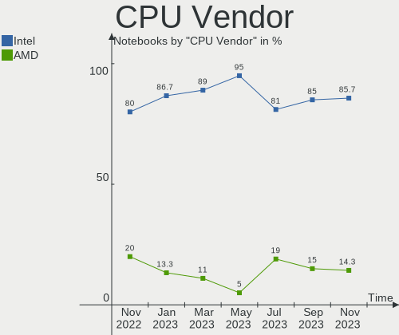
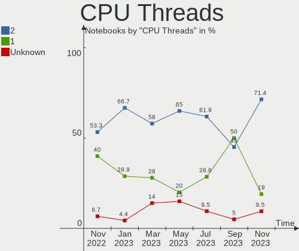
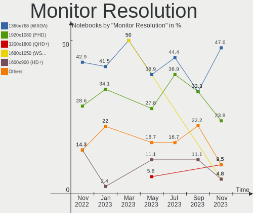
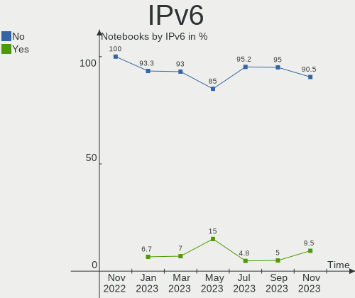
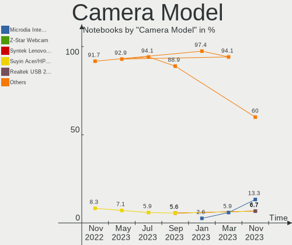

helloSystem - Hardware Trends (Notebooks)
-----------------------------------------

A project to identify most popular hardware characteristics and track their change
over time based on data collected by BSD users at https://BSD-Hardware.info.

Anyone can contribute to this report by the [hw-probe](https://github.com/linuxhw/hw-probe/blob/master/INSTALL.BSD.md) tool:

    hw-probe -all -upload

This report is for one last month. Overall report since the beginning of time: [TestDays](https://github.com/bsdhw/TestDays)

Period: Jul, 2023.

Contents
--------

* [ System ](#system)
  - [ OS                       ](#os)
  - [ OS Family                ](#os-family)
  - [ Arch                     ](#arch)
  - [ DE                       ](#de)
  - [ Display Server           ](#display-server)
  - [ Display Manager          ](#display-manager)
  - [ OS Lang                  ](#os-lang)
  - [ Boot Mode                ](#boot-mode)
  - [ Filesystem               ](#filesystem)
  - [ Part. scheme             ](#part-scheme)

* [ Board ](#board)
  - [ Vendor                   ](#vendor)
  - [ Model                    ](#model)
  - [ Model Family             ](#model-family)
  - [ MFG Year                 ](#mfg-year)
  - [ Form Factor              ](#form-factor)
  - [ Coreboot                 ](#coreboot)
  - [ RAM Size                 ](#ram-size)
  - [ RAM Used                 ](#ram-used)
  - [ Total Drives             ](#total-drives)
  - [ Has CD-ROM               ](#has-cd-rom)
  - [ Has Ethernet             ](#has-ethernet)
  - [ Has WiFi                 ](#has-wifi)
  - [ Has Bluetooth            ](#has-bluetooth)

* [ Location ](#location)
  - [ Country                  ](#country)
  - [ City                     ](#city)

* [ Drives ](#drives)
  - [ Drive Vendor             ](#drive-vendor)
  - [ Drive Model              ](#drive-model)
  - [ HDD Vendor               ](#hdd-vendor)
  - [ SSD Vendor               ](#ssd-vendor)
  - [ Drive Kind               ](#drive-kind)
  - [ Drive Connector          ](#drive-connector)
  - [ Drive Size               ](#drive-size)
  - [ Space Total              ](#space-total)
  - [ Space Used               ](#space-used)
  - [ Malfunc. Drives          ](#malfunc-drives)
  - [ Malfunc. Drive Vendor    ](#malfunc-drive-vendor)
  - [ Malfunc. HDD Vendor      ](#malfunc-hdd-vendor)
  - [ Malfunc. Drive Kind      ](#malfunc-drive-kind)
  - [ Failed Drives            ](#failed-drives)
  - [ Failed Drive Vendor      ](#failed-drive-vendor)
  - [ Drive Status             ](#drive-status)

* [ Storage controller ](#storage-controller)
  - [ Storage Vendor           ](#storage-vendor)
  - [ Storage Model            ](#storage-model)
  - [ Storage Kind             ](#storage-kind)

* [ Processor ](#processor)
  - [ CPU Vendor               ](#cpu-vendor)
  - [ CPU Model                ](#cpu-model)
  - [ CPU Model Family         ](#cpu-model-family)
  - [ CPU Cores                ](#cpu-cores)
  - [ CPU Sockets              ](#cpu-sockets)
  - [ CPU Threads              ](#cpu-threads)
  - [ CPU Microarch            ](#cpu-microarch)

* [ Graphics ](#graphics)
  - [ GPU Vendor               ](#gpu-vendor)
  - [ GPU Model                ](#gpu-model)
  - [ GPU Combo                ](#gpu-combo)
  - [ GPU Driver               ](#gpu-driver)
  - [ GPU Memory               ](#gpu-memory)

* [ Monitor ](#monitor)
  - [ Monitor Vendor           ](#monitor-vendor)
  - [ Monitor Model            ](#monitor-model)
  - [ Monitor Resolution       ](#monitor-resolution)
  - [ Monitor Diagonal         ](#monitor-diagonal)
  - [ Monitor Width            ](#monitor-width)
  - [ Aspect Ratio             ](#aspect-ratio)
  - [ Monitor Area             ](#monitor-area)
  - [ Pixel Density            ](#pixel-density)
  - [ Multiple Monitors        ](#multiple-monitors)

* [ Network ](#network)
  - [ Net Controller Vendor    ](#net-controller-vendor)
  - [ Net Controller Model     ](#net-controller-model)
  - [ Wireless Vendor          ](#wireless-vendor)
  - [ Wireless Model           ](#wireless-model)
  - [ Ethernet Vendor          ](#ethernet-vendor)
  - [ Ethernet Model           ](#ethernet-model)
  - [ Net Controller Kind      ](#net-controller-kind)
  - [ Used Controller          ](#used-controller)
  - [ NICs                     ](#nics)
  - [ IPv6                     ](#ipv6)

* [ Bluetooth ](#bluetooth)
  - [ Bluetooth Vendor         ](#bluetooth-vendor)
  - [ Bluetooth Model          ](#bluetooth-model)

* [ Sound ](#sound)
  - [ Sound Vendor             ](#sound-vendor)
  - [ Sound Model              ](#sound-model)

* [ Memory ](#memory)
  - [ Memory Vendor            ](#memory-vendor)
  - [ Memory Model             ](#memory-model)
  - [ Memory Kind              ](#memory-kind)
  - [ Memory Form Factor       ](#memory-form-factor)
  - [ Memory Size              ](#memory-size)
  - [ Memory Speed             ](#memory-speed)

* [ Printers & scanners ](#printers--scanners)
  - [ Printer Vendor           ](#printer-vendor)
  - [ Printer Model            ](#printer-model)
  - [ Scanner Vendor           ](#scanner-vendor)
  - [ Scanner Model            ](#scanner-model)

* [ Camera ](#camera)
  - [ Camera Vendor            ](#camera-vendor)
  - [ Camera Model             ](#camera-model)

* [ Security ](#security)
  - [ Fingerprint Vendor       ](#fingerprint-vendor)
  - [ Fingerprint Model        ](#fingerprint-model)
  - [ Chipcard Vendor          ](#chipcard-vendor)
  - [ Chipcard Model           ](#chipcard-model)

* [ Unsupported ](#unsupported)
  - [ Unsupported Devices      ](#unsupported-devices)
  - [ Unsupported Device Types ](#unsupported-device-types)

System
------

OS
--

Installed operating systems

| Name              | Notebooks | Percent |
|-------------------|-----------|---------|
| helloSystem 0.8.1 | 15        | 71.43%  |
| helloSystem 0.8.2 | 6         | 28.57%  |

OS Family
---------

OS without a version

| Name        | Notebooks | Percent |
|-------------|-----------|---------|
| helloSystem | 21        | 100%    |

Arch
----

OS architecture (x86_64, i586, etc.)

| Name  | Notebooks | Percent |
|-------|-----------|---------|
| amd64 | 21        | 100%    |

DE
--

Desktop Environment

| Name         | Notebooks | Percent |
|--------------|-----------|---------|
| helloDesktop | 19        | 90.48%  |
| KDE5         | 1         | 4.76%   |
| JWM          | 1         | 4.76%   |

Display Server
--------------

X11 or Wayland

| Name | Notebooks | Percent |
|------|-----------|---------|
| X11  | 21        | 100%    |

Display Manager
---------------

SDDM, LightDM, etc.

| Name | Notebooks | Percent |
|------|-----------|---------|
| SLiM | 20        | 95.24%  |
| GDM  | 1         | 4.76%   |

OS Lang
-------

Language

| Lang    | Notebooks | Percent |
|---------|-----------|---------|
| en_US   | 8         | 38.1%   |
| de_DE   | 3         | 14.29%  |
| zh_TW   | 1         | 4.76%   |
| zh_CN   | 1         | 4.76%   |
| ru_RU   | 1         | 4.76%   |
| pt_PT   | 1         | 4.76%   |
| pt_BR   | 1         | 4.76%   |
| nl_NL   | 1         | 4.76%   |
| jp_JP   | 1         | 4.76%   |
| fr_FR   | 1         | 4.76%   |
| es_ES   | 1         | 4.76%   |
| Unknown | 1         | 4.76%   |

Boot Mode
---------

EFI or BIOS

| Mode | Notebooks | Percent |
|------|-----------|---------|
| EFI  | 21        | 100%    |

Filesystem
----------

Type of filesystem

| Type   | Notebooks | Percent |
|--------|-----------|---------|
| Zfs    | 12        | 57.14%  |
| Cd9660 | 9         | 42.86%  |

Part. scheme
------------

Scheme of partitioning

| Type | Notebooks | Percent |
|------|-----------|---------|
| GPT  | 21        | 100%    |

Board
-----

Vendor
------

Motherboard manufacturer

| Name                | Notebooks | Percent |
|---------------------|-----------|---------|
| Lenovo              | 7         | 33.33%  |
| ASUSTek Computer    | 4         | 19.05%  |
| Hewlett-Packard     | 3         | 14.29%  |
| Dell                | 2         | 9.52%   |
| SLIMBOOK            | 1         | 4.76%   |
| Samsung Electronics | 1         | 4.76%   |
| Panasonic           | 1         | 4.76%   |
| Apple               | 1         | 4.76%   |
| Acer                | 1         | 4.76%   |

Model
-----

Motherboard model

| Name                                 | Notebooks | Percent |
|--------------------------------------|-----------|---------|
| SLIMBOOK PROX-AMD5                   | 1         | 4.76%   |
| Samsung RC530/RC730                  | 1         | 4.76%   |
| Panasonic CF-F9JYFNDR                | 1         | 4.76%   |
| Lenovo ThinkPad X270 20HNA04GCD      | 1         | 4.76%   |
| Lenovo ThinkPad X230 23202DG         | 1         | 4.76%   |
| Lenovo ThinkPad R14 Gen 4 21E5A05RCD | 1         | 4.76%   |
| Lenovo Legion 5 15IMH05 82AU         | 1         | 4.76%   |
| Lenovo IdeaPad S210 Touch 20257      | 1         | 4.76%   |
| Lenovo IdeaPad S145-14AST 81ST       | 1         | 4.76%   |
| Lenovo IdeaPad 5 15ALC05 82LN        | 1         | 4.76%   |
| HP Pavilion g6                       | 1         | 4.76%   |
| HP Notebook                          | 1         | 4.76%   |
| HP Compaq Presario CQ61              | 1         | 4.76%   |
| Dell Latitude E6420                  | 1         | 4.76%   |
| Dell Latitude 5480                   | 1         | 4.76%   |
| ASUS X541UVK                         | 1         | 4.76%   |
| ASUS K42Jr                           | 1         | 4.76%   |
| ASUS 1015PX                          | 1         | 4.76%   |
| ASUS 1005PXD                         | 1         | 4.76%   |
| Apple MacBookPro9,2                  | 1         | 4.76%   |
| Acer Aspire 4736Z                    | 1         | 4.76%   |

Model Family
------------

Motherboard model prefix

| Name                  | Notebooks | Percent |
|-----------------------|-----------|---------|
| Lenovo ThinkPad       | 3         | 14.29%  |
| Lenovo IdeaPad        | 3         | 14.29%  |
| Dell Latitude         | 2         | 9.52%   |
| SLIMBOOK PROX-AMD5    | 1         | 4.76%   |
| Samsung RC530         | 1         | 4.76%   |
| Panasonic CF-F9JYFNDR | 1         | 4.76%   |
| Lenovo Legion         | 1         | 4.76%   |
| HP Pavilion           | 1         | 4.76%   |
| HP Notebook           | 1         | 4.76%   |
| HP Compaq             | 1         | 4.76%   |
| ASUS X541UVK          | 1         | 4.76%   |
| ASUS K42Jr            | 1         | 4.76%   |
| ASUS 1015PX           | 1         | 4.76%   |
| ASUS 1005PXD          | 1         | 4.76%   |
| Apple MacBookPro9     | 1         | 4.76%   |
| Acer Aspire           | 1         | 4.76%   |

MFG Year
--------

Motherboard manufacture year

| Year | Notebooks | Percent |
|------|-----------|---------|
| 2011 | 4         | 19.05%  |
| 2010 | 3         | 14.29%  |
| 2022 | 2         | 9.52%   |
| 2017 | 2         | 9.52%   |
| 2012 | 2         | 9.52%   |
| 2023 | 1         | 4.76%   |
| 2021 | 1         | 4.76%   |
| 2020 | 1         | 4.76%   |
| 2018 | 1         | 4.76%   |
| 2016 | 1         | 4.76%   |
| 2015 | 1         | 4.76%   |
| 2013 | 1         | 4.76%   |
| 2009 | 1         | 4.76%   |

Form Factor
-----------

Physical design of the computer

| Name     | Notebooks | Percent |
|----------|-----------|---------|
| Notebook | 21        | 100%    |

Coreboot
--------

Have coreboot on board

| Used | Notebooks | Percent |
|------|-----------|---------|
| No   | 21        | 100%    |

RAM Size
--------

Total RAM memory

| Size in GB | Notebooks | Percent |
|------------|-----------|---------|
| 4.01-8.0   | 7         | 33.33%  |
| 16.01-24.0 | 5         | 23.81%  |
| 8.01-16.0  | 5         | 23.81%  |
| 2.01-3.0   | 2         | 9.52%   |
| 32.01-64.0 | 1         | 4.76%   |
| 3.01-4.0   | 1         | 4.76%   |

RAM Used
--------

Used RAM memory

| Used GB  | Notebooks | Percent |
|----------|-----------|---------|
| 0.01-0.5 | 11        | 52.38%  |
| 0.51-1.0 | 6         | 28.57%  |
| 1.01-2.0 | 3         | 14.29%  |
| 2.01-3.0 | 1         | 4.76%   |

Total Drives
------------

Number of drives on board

| Drives | Notebooks | Percent |
|--------|-----------|---------|
| 1      | 15        | 71.43%  |
| 2      | 5         | 23.81%  |
| 3      | 1         | 4.76%   |

Has CD-ROM
----------

Has CD-ROM on board

| Presented | Notebooks | Percent |
|-----------|-----------|---------|
| No        | 16        | 76.19%  |
| Yes       | 5         | 23.81%  |

Has Ethernet
------------

Has Ethernet on board

| Presented | Notebooks | Percent |
|-----------|-----------|---------|
| Yes       | 21        | 100%    |

Has WiFi
--------

Has WiFi module

| Presented | Notebooks | Percent |
|-----------|-----------|---------|
| Yes       | 20        | 95.24%  |
| No        | 1         | 4.76%   |

Has Bluetooth
-------------

Has Bluetooth module

| Presented | Notebooks | Percent |
|-----------|-----------|---------|
| Yes       | 13        | 61.9%   |
| No        | 8         | 38.1%   |

Location
--------

Country
-------

Geographic location (country)

| Country     | Notebooks | Percent |
|-------------|-----------|---------|
| Germany     | 3         | 14.29%  |
| UK          | 2         | 9.52%   |
| Russia      | 2         | 9.52%   |
| China       | 2         | 9.52%   |
| USA         | 1         | 4.76%   |
| Taiwan      | 1         | 4.76%   |
| Portugal    | 1         | 4.76%   |
| Netherlands | 1         | 4.76%   |
| Mexico      | 1         | 4.76%   |
| Japan       | 1         | 4.76%   |
| India       | 1         | 4.76%   |
| Hungary     | 1         | 4.76%   |
| Cyprus      | 1         | 4.76%   |
| Canada      | 1         | 4.76%   |
| Brazil      | 1         | 4.76%   |
| Australia   | 1         | 4.76%   |

City
----

Geographic location (city)

| City          | Notebooks | Percent |
|---------------|-----------|---------|
| Manchester    | 2         | 9.52%   |
| Yunlin        | 1         | 4.76%   |
| Whitby        | 1         | 4.76%   |
| St Petersburg | 1         | 4.76%   |
| Shenzhen      | 1         | 4.76%   |
| Shanghai      | 1         | 4.76%   |
| Sapporo       | 1         | 4.76%   |
| Orizaba       | 1         | 4.76%   |
| Nicosia       | 1         | 4.76%   |
| Moscow        | 1         | 4.76%   |
| Miami Beach   | 1         | 4.76%   |
| Mainz         | 1         | 4.76%   |
| Lisbon        | 1         | 4.76%   |
| Gold Coast    | 1         | 4.76%   |
| Goianinha     | 1         | 4.76%   |
| Budapest      | 1         | 4.76%   |
| Blomberg      | 1         | 4.76%   |
| Bengaluru     | 1         | 4.76%   |
| Augsburg      | 1         | 4.76%   |
| Almere Stad   | 1         | 4.76%   |

Drives
------

Drive Vendor
------------

Hard drive vendors

| Vendor              | Notebooks | Drives | Percent |
|---------------------|-----------|--------|---------|
| Samsung Electronics | 6         | 6      | 21.43%  |
| WDC                 | 4         | 4      | 14.29%  |
| SanDisk             | 3         | 3      | 10.71%  |
| Hitachi             | 3         | 3      | 10.71%  |
| Toshiba             | 2         | 2      | 7.14%   |
| Seagate             | 2         | 2      | 7.14%   |
| Crucial             | 2         | 2      | 7.14%   |
| UMIS                | 1         | 1      | 3.57%   |
| Transcend           | 1         | 1      | 3.57%   |
| Lexar               | 1         | 1      | 3.57%   |
| Kingston            | 1         | 1      | 3.57%   |
| Intenso             | 1         | 1      | 3.57%   |
| Gigabyte Technology | 1         | 1      | 3.57%   |

Drive Model
-----------

Hard drive models

| Model                                | Notebooks | Percent |
|--------------------------------------|-----------|---------|
| WDC WD3200BPVT-80JJ5T0 320GB         | 1         | 3.57%   |
| WDC WD3200BEVT-60ZCT1 320GB          | 1         | 3.57%   |
| WDC WD10SPZX-24Z10 1TB               | 1         | 3.57%   |
| WDC PC SN730 SDBPNTY-512G-1101 512GB | 1         | 3.57%   |
| UMIS RPJYJ512MKN1QWQ 512GB           | 1         | 3.57%   |
| Transcend TS128GSSD340 128GB         | 1         | 3.57%   |
| Toshiba MQ01ACF050 500GB             | 1         | 3.57%   |
| Toshiba MQ01ABF050 500GB             | 1         | 3.57%   |
| Seagate ST9120821AS 120GB            | 1         | 3.57%   |
| Seagate ST1000LM024 HN-M101MBB 1TB   | 1         | 3.57%   |
| SanDisk X400 M.2 2280 128GB          | 1         | 3.57%   |
| SanDisk SDSSDP064G 64GB              | 1         | 3.57%   |
| SanDisk SD8SB8U128G1001 128GB        | 1         | 3.57%   |
| Samsung SSD 860 EVO 500GB            | 1         | 3.57%   |
| Samsung SSD 850 EVO 120GB            | 1         | 3.57%   |
| Samsung SSD 840 EVO 250GB            | 1         | 3.57%   |
| Samsung MZALQ512HBLU-00BL2 512GB     | 1         | 3.57%   |
| Samsung MZAL41T0HBLB-00BL1 1TB       | 1         | 3.57%   |
| Samsung MZ7TD256HAFV-000L9 256GB     | 1         | 3.57%   |
| Lexar SSD 128GB                      | 1         | 3.57%   |
| Kingston SA400S37960G 960GB          | 1         | 3.57%   |
| Intenso SSD Sata III 256GB           | 1         | 3.57%   |
| Hitachi HTS721060G9SA00 64GB         | 1         | 3.57%   |
| Hitachi HTS545032B9A300 320GB        | 1         | 3.57%   |
| Hitachi HTS542512K9SA00 120GB        | 1         | 3.57%   |
| Gigabyte GP-GSM2NE3256GNTD 256GB     | 1         | 3.57%   |
| Crucial CT120BX500SSD1 120GB         | 1         | 3.57%   |
| Crucial CT1000P2SSD8 1TB             | 1         | 3.57%   |

HDD Vendor
----------

Hard disk drive vendors

| Vendor  | Notebooks | Drives | Percent |
|---------|-----------|--------|---------|
| WDC     | 3         | 3      | 30%     |
| Hitachi | 3         | 3      | 30%     |
| Toshiba | 2         | 2      | 20%     |
| Seagate | 2         | 2      | 20%     |

SSD Vendor
----------

Solid state drive vendors

| Vendor              | Notebooks | Drives | Percent |
|---------------------|-----------|--------|---------|
| Samsung Electronics | 4         | 4      | 33.33%  |
| SanDisk             | 3         | 3      | 25%     |
| Transcend           | 1         | 1      | 8.33%   |
| Lexar               | 1         | 1      | 8.33%   |
| Kingston            | 1         | 1      | 8.33%   |
| Intenso             | 1         | 1      | 8.33%   |
| Crucial             | 1         | 1      | 8.33%   |

Drive Kind
----------

HDD or SSD

| Kind | Notebooks | Drives | Percent |
|------|-----------|--------|---------|
| SSD  | 11        | 12     | 47.83%  |
| HDD  | 8         | 10     | 34.78%  |
| NVMe | 4         | 6      | 17.39%  |

Drive Connector
---------------

SATA, SAS, NVMe, etc.

| Type | Notebooks | Drives | Percent |
|------|-----------|--------|---------|
| SATA | 18        | 22     | 81.82%  |
| NVMe | 4         | 6      | 18.18%  |

Drive Size
----------

Size of hard drive

| Size in TB | Notebooks | Drives | Percent |
|------------|-----------|--------|---------|
| 0.01-0.5   | 16        | 19     | 84.21%  |
| 0.51-1.0   | 3         | 3      | 15.79%  |

Space Total
-----------

Amount of disk space available on the file system

| Size in GB | Notebooks | Percent |
|------------|-----------|---------|
| 51-100     | 7         | 33.33%  |
| 1-20       | 6         | 28.57%  |
| 251-500    | 5         | 23.81%  |
| 101-250    | 2         | 9.52%   |
| 501-1000   | 1         | 4.76%   |

Space Used
----------

Amount of used disk space

| Used GB | Notebooks | Percent |
|---------|-----------|---------|
| 1-20    | 19        | 90.48%  |
| 21-50   | 1         | 4.76%   |
| 51-100  | 1         | 4.76%   |

Malfunc. Drives
---------------

Drive models with a malfunction

| Model                              | Notebooks | Drives | Percent |
|------------------------------------|-----------|--------|---------|
| Toshiba MQ01ABF050 500GB           | 1         | 1      | 20%     |
| Seagate ST9120821AS 120GB          | 1         | 1      | 20%     |
| Seagate ST1000LM024 HN-M101MBB 1TB | 1         | 1      | 20%     |
| Hitachi HTS721060G9SA00 64GB       | 1         | 1      | 20%     |
| Hitachi HTS542512K9SA00 120GB      | 1         | 1      | 20%     |

Malfunc. Drive Vendor
---------------------

Vendors of faulty drives

| Vendor  | Notebooks | Drives | Percent |
|---------|-----------|--------|---------|
| Seagate | 2         | 2      | 40%     |
| Hitachi | 2         | 2      | 40%     |
| Toshiba | 1         | 1      | 20%     |

Malfunc. HDD Vendor
-------------------

Vendors of faulty HDD drives

| Vendor  | Notebooks | Drives | Percent |
|---------|-----------|--------|---------|
| Seagate | 2         | 2      | 40%     |
| Hitachi | 2         | 2      | 40%     |
| Toshiba | 1         | 1      | 20%     |

Malfunc. Drive Kind
-------------------

Kinds of faulty drives

| Kind | Notebooks | Drives | Percent |
|------|-----------|--------|---------|
| HDD  | 4         | 5      | 100%    |

Failed Drives
-------------

Failed drive models

Zero info for selected period =(

Failed Drive Vendor
-------------------

Failed drive vendors

Zero info for selected period =(

Drive Status
------------

Number of failed and malfunc. drives

| Status  | Notebooks | Drives | Percent |
|---------|-----------|--------|---------|
| Works   | 18        | 23     | 81.82%  |
| Malfunc | 4         | 5      | 18.18%  |

Storage controller
------------------

Storage Vendor
--------------

Storage controller vendors

| Vendor                                  | Notebooks | Percent |
|-----------------------------------------|-----------|---------|
| Intel                                   | 16        | 64%     |
| AMD                                     | 3         | 12%     |
| Samsung Electronics                     | 2         | 8%      |
| Shenzhen Unionmemory Information System | 1         | 4%      |
| SanDisk                                 | 1         | 4%      |
| Phison Electronics                      | 1         | 4%      |
| Micron/Crucial Technology               | 1         | 4%      |

Storage Model
-------------

Storage controller models

| Model                                                                                  | Notebooks | Percent |
|----------------------------------------------------------------------------------------|-----------|---------|
| Intel Sunrise Point-LP SATA Controller [AHCI mode]                                     | 3         | 11.54%  |
| Intel 7 Series Chipset Family 6-port SATA Controller [AHCI mode]                       | 3         | 11.54%  |
| AMD FCH SATA Controller [AHCI mode]                                                    | 3         | 11.54%  |
| Intel 82801IBM/IEM (ICH9M/ICH9M-E) 4 port SATA Controller [AHCI mode]                  | 2         | 7.69%   |
| Intel 82801 Mobile SATA Controller [RAID mode]                                         | 2         | 7.69%   |
| SanDisk WD Black SN750 / PC SN730 NVMe SSD                                             | 1         | 3.85%   |
| Samsung NVMe SSD Controller PM9B1                                                      | 1         | 3.85%   |
| Samsung NVMe SSD Controller 980                                                        | 1         | 3.85%   |
| Phison PS5013 E13 NVMe Controller                                                      | 1         | 3.85%   |
| Micron/Crucial P2 [Nick P2] / P3 / P3 Plus NVMe PCIe SSD (DRAM-less)                   | 1         | 3.85%   |
| Intel NM10/ICH7 Family SATA Controller [IDE mode]                                      | 1         | 3.85%   |
| Intel NM10/ICH7 Family SATA Controller [AHCI mode]                                     | 1         | 3.85%   |
| Intel 6 Series/C200 Series Chipset Family Mobile SATA Controller (IDE mode, ports 4-5) | 1         | 3.85%   |
| Intel 6 Series/C200 Series Chipset Family Mobile SATA Controller (IDE mode, ports 0-3) | 1         | 3.85%   |
| Intel 5 Series/3400 Series Chipset 6 port SATA AHCI Controller                         | 1         | 3.85%   |
| Intel 5 Series/3400 Series Chipset 4 port SATA AHCI Controller                         | 1         | 3.85%   |
| Intel 400 Series Chipset Family SATA AHCI Controller                                   | 1         | 3.85%   |
| Unknown                                                                                | 1         | 3.85%   |

Storage Kind
------------

Kind of storage controller (IDE, SATA, NVMe, SAS, ...)

| Kind | Notebooks | Percent |
|------|-----------|---------|
| SATA | 15        | 65.22%  |
| NVMe | 4         | 17.39%  |
| RAID | 2         | 8.7%    |
| IDE  | 2         | 8.7%    |

Processor
---------

CPU Vendor
----------

Processor vendors

| Vendor | Notebooks | Percent |
|--------|-----------|---------|
| Intel  | 17        | 80.95%  |
| AMD    | 4         | 19.05%  |

CPU Model
---------

Processor models

| Model                                        | Notebooks | Percent |
|----------------------------------------------|-----------|---------|
| Intel Core i5-7200U CPU @ 2.50GHz            | 2         | 9.52%   |
| Intel Pentium Dual-Core CPU T4300 @ 2.10GHz  | 1         | 4.76%   |
| Intel Pentium Dual-Core CPU T4200 @ 2.00GHz  | 1         | 4.76%   |
| Intel Pentium CPU 2117U @ 1.80GHz            | 1         | 4.76%   |
| Intel Core i7-2670QM CPU                     | 1         | 4.76%   |
| Intel Core i5-7300U CPU @ 2.60GHz            | 1         | 4.76%   |
| Intel Core i5-3210M CPU @ 2.50GHz            | 1         | 4.76%   |
| Intel Core i5-10300H CPU @ 2.50GHz           | 1         | 4.76%   |
| Intel Core i5 CPU M 520 @ 2.40GHz            | 1         | 4.76%   |
| Intel Core i5 CPU M 430 @ 2.27GHz            | 1         | 4.76%   |
| Intel Core i3-7100U CPU @ 2.40GHz            | 1         | 4.76%   |
| Intel Core i3-2370M CPU @ 2.40GHz            | 1         | 4.76%   |
| Intel Core i3-2330M CPU @ 2.20GH             | 1         | 4.76%   |
| Intel Atom CPU N570 @ 1.66GHz                | 1         | 4.76%   |
| Intel Atom CPU N455 @ 1.66GHz                | 1         | 4.76%   |
| Intel 12th Gen Core i5-1240P                 | 1         | 4.76%   |
| AMD Ryzen 7 5700U with Radeon Graphics       | 1         | 4.76%   |
| AMD Ryzen 5 5500U with Radeon Graphics       | 1         | 4.76%   |
| AMD A4-9125 RADEON R3, 4 COMPUTE CORES 2C+2G | 1         | 4.76%   |
| AMD A10-5750M APU with Radeon HD Graphics    | 1         | 4.76%   |

CPU Model Family
----------------

Processor model prefix

| Model                   | Notebooks | Percent |
|-------------------------|-----------|---------|
| Intel Core i5           | 7         | 33.33%  |
| Intel Core i3           | 3         | 14.29%  |
| Intel Pentium Dual-Core | 2         | 9.52%   |
| Intel Atom              | 2         | 9.52%   |
| Other                   | 1         | 4.76%   |
| Intel Pentium           | 1         | 4.76%   |
| Intel Core i7           | 1         | 4.76%   |
| AMD Ryzen 7             | 1         | 4.76%   |
| AMD Ryzen 5             | 1         | 4.76%   |
| AMD A4                  | 1         | 4.76%   |
| AMD A10                 | 1         | 4.76%   |

CPU Cores
---------

Number of processor cores

| Number  | Notebooks | Percent |
|---------|-----------|---------|
| 2       | 12        | 57.14%  |
| 4       | 3         | 14.29%  |
| 16      | 2         | 9.52%   |
| Unknown | 2         | 9.52%   |
| 12      | 1         | 4.76%   |
| 1       | 1         | 4.76%   |

CPU Sockets
-----------

Number of sockets

| Number | Notebooks | Percent |
|--------|-----------|---------|
| 1      | 21        | 100%    |

CPU Threads
-----------

Threads per core (Hyper-Threading)

| Number  | Notebooks | Percent |
|---------|-----------|---------|
| 2       | 13        | 61.9%   |
| 1       | 6         | 28.57%  |
| Unknown | 2         | 9.52%   |

CPU Microarch
-------------

Microarchitecture

| Name        | Notebooks | Percent |
|-------------|-----------|---------|
| KabyLake    | 4         | 19.05%  |
| SandyBridge | 3         | 14.29%  |
| Unknown     | 3         | 14.29%  |
| Westmere    | 2         | 9.52%   |
| Penryn      | 2         | 9.52%   |
| IvyBridge   | 2         | 9.52%   |
| Bonnell     | 2         | 9.52%   |
| Piledriver  | 1         | 4.76%   |
| Excavator   | 1         | 4.76%   |
| CometLake   | 1         | 4.76%   |

Graphics
--------

GPU Vendor
----------

Vendors of graphics cards

| Vendor | Notebooks | Percent |
|--------|-----------|---------|
| Intel  | 16        | 66.67%  |
| AMD    | 6         | 25%     |
| Nvidia | 2         | 8.33%   |

GPU Model
---------

Graphics card models

| Model                                                                                 | Notebooks | Percent |
|---------------------------------------------------------------------------------------|-----------|---------|
| Intel HD Graphics 620                                                                 | 4         | 16.67%  |
| Intel 2nd Generation Core Processor Family Integrated Graphics Controller             | 3         | 12.5%   |
| Intel Mobile 4 Series Chipset Integrated Graphics Controller                          | 2         | 8.33%   |
| Intel Atom Processor D4xx/D5xx/N4xx/N5xx Integrated Graphics Controller               | 2         | 8.33%   |
| Intel 3rd Gen Core processor Graphics Controller                                      | 2         | 8.33%   |
| AMD Lucienne                                                                          | 2         | 8.33%   |
| Nvidia TU117M [GeForce GTX 1650 Ti Mobile]                                            | 1         | 4.17%   |
| Nvidia GM108M [GeForce 920MX]                                                         | 1         | 4.17%   |
| Intel Core Processor Integrated Graphics Controller                                   | 1         | 4.17%   |
| Intel CometLake-H GT2 [UHD Graphics]                                                  | 1         | 4.17%   |
| Intel Alder Lake-P Integrated Graphics Controller                                     | 1         | 4.17%   |
| AMD Topaz XT [Radeon R7 M260/M265 / M340/M360 / M440/M445 / 530/535 / 620/625 Mobile] | 1         | 4.17%   |
| AMD Stoney [Radeon R2/R3/R4/R5 Graphics]                                              | 1         | 4.17%   |
| AMD Richland [Radeon HD 8650G]                                                        | 1         | 4.17%   |
| AMD Park [Mobility Radeon HD 5430/5450/5470]                                          | 1         | 4.17%   |

GPU Combo
---------

Combinations of graphics cards

| Name           | Notebooks | Percent |
|----------------|-----------|---------|
| 1 x Intel      | 9         | 42.86%  |
| 1 x AMD        | 5         | 23.81%  |
| 2 x Intel      | 4         | 19.05%  |
| Intel + Nvidia | 2         | 9.52%   |
| Intel + AMD    | 1         | 4.76%   |

GPU Driver
----------

Free vs proprietary

| Driver  | Notebooks | Percent |
|---------|-----------|---------|
| Free    | 19        | 90.48%  |
| Unknown | 2         | 9.52%   |

GPU Memory
----------

Total video memory

| Size in GB | Notebooks | Percent |
|------------|-----------|---------|
| Unknown    | 17        | 80.95%  |
| 0.01-0.5   | 2         | 9.52%   |
| 1.01-2.0   | 1         | 4.76%   |
| 0.51-1.0   | 1         | 4.76%   |

Monitor
-------

Monitor Vendor
--------------

Monitor vendors

| Vendor                  | Notebooks | Percent |
|-------------------------|-----------|---------|
| BOE                     | 4         | 22.22%  |
| AU Optronics            | 4         | 22.22%  |
| Chimei Innolux          | 3         | 16.67%  |
| Samsung Electronics     | 2         | 11.11%  |
| LG Display              | 1         | 5.56%   |
| InfoVision              | 1         | 5.56%   |
| HannStar                | 1         | 5.56%   |
| Chi Mei Optoelectronics | 1         | 5.56%   |
| Apple                   | 1         | 5.56%   |

Monitor Model
-------------

Monitor models

| Model                                                                    | Notebooks | Percent |
|--------------------------------------------------------------------------|-----------|---------|
| Samsung Electronics LCD Monitor SEC3245 1366x768 340x190mm 15.3-inch     | 1         | 5.56%   |
| Samsung Electronics LCD Monitor SEC3050 1366x768 320x190mm 14.7-inch     | 1         | 5.56%   |
| LG Display LCD Monitor LGD0384 1366x768 340x190mm 15.3-inch              | 1         | 5.56%   |
| InfoVision LCD Monitor IVO03F4 1024x600 220x130mm 10.1-inch              | 1         | 5.56%   |
| HannStar LCD Monitor HSD03E9 1024x600 220x130mm 10.1-inch                | 1         | 5.56%   |
| Chimei Innolux LCD Monitor CMN1738 1920x1080 380x210mm 17.1-inch         | 1         | 5.56%   |
| Chimei Innolux LCD Monitor CMN152D 1920x1080 340x190mm 15.3-inch         | 1         | 5.56%   |
| Chimei Innolux LCD Monitor CMN14E5 1920x1080 310x170mm 13.9-inch         | 1         | 5.56%   |
| Chi Mei Optoelectronics LCD Monitor CMO1558 1366x768 350x190mm 15.7-inch | 1         | 5.56%   |
| BOE LCD Monitor BOE08E2 1920x1080 340x190mm 15.3-inch                    | 1         | 5.56%   |
| BOE LCD Monitor BOE06E2 1920x1080 310x170mm 13.9-inch                    | 1         | 5.56%   |
| BOE LCD Monitor BOE06CE 1366x768 280x160mm 12.7-inch                     | 1         | 5.56%   |
| BOE LCD Monitor BOE0610 1920x1080 340x190mm 15.3-inch                    | 1         | 5.56%   |
| AU Optronics LCD Monitor AUOD1ED 1920x1080 340x190mm 15.3-inch           | 1         | 5.56%   |
| AU Optronics LCD Monitor AUO315C 1366x768 260x140mm 11.6-inch            | 1         | 5.56%   |
| AU Optronics LCD Monitor AUO193C 1366x768 310x170mm 13.9-inch            | 1         | 5.56%   |
| AU Optronics LCD Monitor AUO106C 1366x768 280x160mm 12.7-inch            | 1         | 5.56%   |
| Apple LCD Monitor APP9CC3 1280x800 290x180mm 13.4-inch                   | 1         | 5.56%   |

Monitor Resolution
------------------

Monitor screen resolution

| Resolution      | Notebooks | Percent |
|-----------------|-----------|---------|
| 1366x768 (WXGA) | 8         | 44.44%  |
| 1920x1080 (FHD) | 7         | 38.89%  |
| 1024x600        | 2         | 11.11%  |
| 1280x800 (WXGA) | 1         | 5.56%   |

Monitor Diagonal
----------------

Diagonal size in inches

| Inches | Notebooks | Percent |
|--------|-----------|---------|
| 15     | 7         | 38.89%  |
| 13     | 4         | 22.22%  |
| 12     | 2         | 11.11%  |
| 10     | 2         | 11.11%  |
| 17     | 1         | 5.56%   |
| 14     | 1         | 5.56%   |
| 11     | 1         | 5.56%   |

Monitor Width
-------------

Physical width

| Width in mm | Notebooks | Percent |
|-------------|-----------|---------|
| 301-350     | 11        | 61.11%  |
| 201-300     | 6         | 33.33%  |
| 351-400     | 1         | 5.56%   |

Aspect Ratio
------------

Proportional relationship between the width and the height

| Ratio | Notebooks | Percent |
|-------|-----------|---------|
| 16/9  | 17        | 94.44%  |
| 16/10 | 1         | 5.56%   |

Monitor Area
------------

Area in inch²

| Area in inch² | Notebooks | Percent |
|----------------|-----------|---------|
| 91-100         | 7         | 38.89%  |
| 81-90          | 4         | 22.22%  |
| 61-70          | 2         | 11.11%  |
| 41-50          | 2         | 11.11%  |
| 51-60          | 1         | 5.56%   |
| 121-130        | 1         | 5.56%   |
| 101-110        | 1         | 5.56%   |

Pixel Density
-------------

Pixels per inch

| Density | Notebooks | Percent |
|---------|-----------|---------|
| 121-160 | 10        | 55.56%  |
| 101-120 | 7         | 38.89%  |
| 51-100  | 1         | 5.56%   |

Multiple Monitors
-----------------

Total monitors connected

| Total | Notebooks | Percent |
|-------|-----------|---------|
| 1     | 20        | 95.24%  |
| 0     | 1         | 4.76%   |

Network
-------

Net Controller Vendor
---------------------

Controller vendors

| Vendor                | Notebooks | Percent |
|-----------------------|-----------|---------|
| Realtek Semiconductor | 9         | 27.27%  |
| Intel                 | 9         | 27.27%  |
| Qualcomm Atheros      | 8         | 24.24%  |
| Xiaomi                | 1         | 3.03%   |
| Samsung Electronics   | 1         | 3.03%   |
| Ralink                | 1         | 3.03%   |
| Motorola PCS          | 1         | 3.03%   |
| MediaTek              | 1         | 3.03%   |
| JMicron Technology    | 1         | 3.03%   |
| Broadcom              | 1         | 3.03%   |

Net Controller Model
--------------------

Controller models

| Model                                                             | Notebooks | Percent |
|-------------------------------------------------------------------|-----------|---------|
| Realtek RTL810xE PCI Express Fast Ethernet controller             | 5         | 11.63%  |
| Qualcomm Atheros AR9285 Wireless Network Adapter (PCI-Express)    | 5         | 11.63%  |
| Realtek RTL8111/8168/8411 PCI Express Gigabit Ethernet Controller | 3         | 6.98%   |
| Qualcomm Atheros AR9485 Wireless Network Adapter                  | 2         | 4.65%   |
| Qualcomm Atheros AR8152 v2.0 Fast Ethernet                        | 2         | 4.65%   |
| Intel Wireless 8265 / 8275                                        | 2         | 4.65%   |
| Intel 82579LM Gigabit Network Connection (Lewisville)             | 2         | 4.65%   |
| Xiaomi Mi/Redmi series (RNDIS)                                    | 1         | 2.33%   |
| Samsung GT-I9070 (network tethering, USB debugging enabled)       | 1         | 2.33%   |
| Realtek RTL8821CE 802.11ac PCIe Wireless Network Adapter          | 1         | 2.33%   |
| Realtek RTL8723BE PCIe Wireless Network Adapter                   | 1         | 2.33%   |
| Ralink RT2790 Wireless 802.11n 1T/2R PCIe                         | 1         | 2.33%   |
| Qualcomm Atheros AR8121/AR8113/AR8114 Gigabit or Fast Ethernet    | 1         | 2.33%   |
| Motorola PCS USB RNDIS Device                                     | 1         | 2.33%   |
| MediaTek MT7921 802.11ax PCI Express Wireless Network Adapter     | 1         | 2.33%   |
| JMicron JMC250 PCI Express Gigabit Ethernet Controller            | 1         | 2.33%   |
| Intel WiMAX Connection 2400m                                      | 1         | 2.33%   |
| Intel Wi-Fi 6 AX200                                               | 1         | 2.33%   |
| Intel Ethernet Connection (4) I219-V                              | 1         | 2.33%   |
| Intel Ethernet Connection (4) I219-LM                             | 1         | 2.33%   |
| Intel Ethernet Connection (16) I219-V                             | 1         | 2.33%   |
| Intel Comet Lake PCH CNVi WiFi                                    | 1         | 2.33%   |
| Intel Centrino Wireless-N 100                                     | 1         | 2.33%   |
| Intel Centrino Advanced-N 6205 [Taylor Peak]                      | 1         | 2.33%   |
| Intel Centrino Advanced-N + WiMAX 6250 [Kilmer Peak]              | 1         | 2.33%   |
| Intel Alder Lake-P PCH CNVi WiFi                                  | 1         | 2.33%   |
| Intel 82577LM Gigabit Network Connection                          | 1         | 2.33%   |
| Broadcom NetXtreme BCM57765 Gigabit Ethernet PCIe                 | 1         | 2.33%   |
| Broadcom BCM4331 802.11a/b/g/n                                    | 1         | 2.33%   |

Wireless Vendor
---------------

Wireless vendors

| Vendor                | Notebooks | Percent |
|-----------------------|-----------|---------|
| Intel                 | 8         | 40%     |
| Qualcomm Atheros      | 7         | 35%     |
| Realtek Semiconductor | 2         | 10%     |
| Ralink                | 1         | 5%      |
| MediaTek              | 1         | 5%      |
| Broadcom              | 1         | 5%      |

Wireless Model
--------------

Wireless models

| Model                                                          | Notebooks | Percent |
|----------------------------------------------------------------|-----------|---------|
| Qualcomm Atheros AR9285 Wireless Network Adapter (PCI-Express) | 5         | 25%     |
| Qualcomm Atheros AR9485 Wireless Network Adapter               | 2         | 10%     |
| Intel Wireless 8265 / 8275                                     | 2         | 10%     |
| Realtek RTL8821CE 802.11ac PCIe Wireless Network Adapter       | 1         | 5%      |
| Realtek RTL8723BE PCIe Wireless Network Adapter                | 1         | 5%      |
| Ralink RT2790 Wireless 802.11n 1T/2R PCIe                      | 1         | 5%      |
| MediaTek MT7921 802.11ax PCI Express Wireless Network Adapter  | 1         | 5%      |
| Intel Wi-Fi 6 AX200                                            | 1         | 5%      |
| Intel Comet Lake PCH CNVi WiFi                                 | 1         | 5%      |
| Intel Centrino Wireless-N 100                                  | 1         | 5%      |
| Intel Centrino Advanced-N 6205 [Taylor Peak]                   | 1         | 5%      |
| Intel Centrino Advanced-N + WiMAX 6250 [Kilmer Peak]           | 1         | 5%      |
| Intel Alder Lake-P PCH CNVi WiFi                               | 1         | 5%      |
| Broadcom BCM4331 802.11a/b/g/n                                 | 1         | 5%      |

Ethernet Vendor
---------------

Ethernet vendors

| Vendor                | Notebooks | Percent |
|-----------------------|-----------|---------|
| Realtek Semiconductor | 8         | 36.36%  |
| Intel                 | 6         | 27.27%  |
| Qualcomm Atheros      | 3         | 13.64%  |
| Xiaomi                | 1         | 4.55%   |
| Samsung Electronics   | 1         | 4.55%   |
| Motorola PCS          | 1         | 4.55%   |
| JMicron Technology    | 1         | 4.55%   |
| Broadcom              | 1         | 4.55%   |

Ethernet Model
--------------

Ethernet models

| Model                                                             | Notebooks | Percent |
|-------------------------------------------------------------------|-----------|---------|
| Realtek RTL810xE PCI Express Fast Ethernet controller             | 5         | 22.73%  |
| Realtek RTL8111/8168/8411 PCI Express Gigabit Ethernet Controller | 3         | 13.64%  |
| Qualcomm Atheros AR8152 v2.0 Fast Ethernet                        | 2         | 9.09%   |
| Intel 82579LM Gigabit Network Connection (Lewisville)             | 2         | 9.09%   |
| Xiaomi Mi/Redmi series (RNDIS)                                    | 1         | 4.55%   |
| Samsung GT-I9070 (network tethering, USB debugging enabled)       | 1         | 4.55%   |
| Qualcomm Atheros AR8121/AR8113/AR8114 Gigabit or Fast Ethernet    | 1         | 4.55%   |
| Motorola PCS USB RNDIS Device                                     | 1         | 4.55%   |
| JMicron JMC250 PCI Express Gigabit Ethernet Controller            | 1         | 4.55%   |
| Intel Ethernet Connection (4) I219-V                              | 1         | 4.55%   |
| Intel Ethernet Connection (4) I219-LM                             | 1         | 4.55%   |
| Intel Ethernet Connection (16) I219-V                             | 1         | 4.55%   |
| Intel 82577LM Gigabit Network Connection                          | 1         | 4.55%   |
| Broadcom NetXtreme BCM57765 Gigabit Ethernet PCIe                 | 1         | 4.55%   |

Net Controller Kind
-------------------

Ethernet, WiFi or modem

| Kind     | Notebooks | Percent |
|----------|-----------|---------|
| Ethernet | 21        | 50%     |
| WiFi     | 20        | 47.62%  |
| Unknown  | 1         | 2.38%   |

Used Controller
---------------

Currently used network controller

| Kind     | Notebooks | Percent |
|----------|-----------|---------|
| Ethernet | 11        | 64.71%  |
| WiFi     | 6         | 35.29%  |

NICs
----

Total network controllers on board

| Total | Notebooks | Percent |
|-------|-----------|---------|
| 2     | 18        | 85.71%  |
| 1     | 3         | 14.29%  |

IPv6
----

IPv6 vs IPv4

| Used | Notebooks | Percent |
|------|-----------|---------|
| No   | 20        | 95.24%  |
| Yes  | 1         | 4.76%   |

Bluetooth
---------

Bluetooth Vendor
----------------

Controller vendors

| Vendor                          | Notebooks | Percent |
|---------------------------------|-----------|---------|
| Intel                           | 5         | 38.46%  |
| Realtek Semiconductor           | 2         | 15.38%  |
| Qualcomm Atheros Communications | 2         | 15.38%  |
| Foxconn / Hon Hai               | 1         | 7.69%   |
| Cambridge Silicon Radio         | 1         | 7.69%   |
| ASUSTek Computer                | 1         | 7.69%   |
| Apple                           | 1         | 7.69%   |

Bluetooth Model
---------------

Controller models

| Model                                               | Notebooks | Percent |
|-----------------------------------------------------|-----------|---------|
| Intel Bluetooth wireless interface                  | 2         | 15.38%  |
| Intel AX201 Bluetooth                               | 2         | 15.38%  |
| Realtek Bluetooth Adapter                           | 1         | 7.69%   |
| Realtek Bluetooth 4.0 Adapter                       | 1         | 7.69%   |
| Qualcomm Atheros AR3012 Bluetooth 4.0               | 1         | 7.69%   |
| Qualcomm Atheros AR3011 Bluetooth                   | 1         | 7.69%   |
| Intel AX200 Bluetooth                               | 1         | 7.69%   |
| Foxconn / Hon Hai MediaTek Bluetooth Adapter        | 1         | 7.69%   |
| Cambridge Silicon Radio Bluetooth Dongle (HCI mode) | 1         | 7.69%   |
| ASUS BT-270 Bluetooth Adapter                       | 1         | 7.69%   |
| Apple Broadcom Built-in Bluetooth                   | 1         | 7.69%   |

Sound
-----

Sound Vendor
------------

Sound card vendors

| Vendor | Notebooks | Percent |
|--------|-----------|---------|
| Intel  | 16        | 72.73%  |
| AMD    | 5         | 22.73%  |
| Nvidia | 1         | 4.55%   |

Sound Model
-----------

Sound card models

| Model                                                                      | Notebooks | Percent |
|----------------------------------------------------------------------------|-----------|---------|
| Intel Sunrise Point-LP HD Audio                                            | 4         | 15.38%  |
| Intel 7 Series/C216 Chipset Family High Definition Audio Controller        | 3         | 11.54%  |
| Intel NM10/ICH7 Family High Definition Audio Controller                    | 2         | 7.69%   |
| Intel 82801I (ICH9 Family) HD Audio Controller                             | 2         | 7.69%   |
| Intel 5 Series/3400 Series Chipset High Definition Audio                   | 2         | 7.69%   |
| AMD Renoir Radeon High Definition Audio Controller                         | 2         | 7.69%   |
| AMD Family 17h/19h HD Audio Controller                                     | 2         | 7.69%   |
| Nvidia TU107 GeForce GTX 1650 High Definition Audio Controller             | 1         | 3.85%   |
| Intel Comet Lake PCH cAVS                                                  | 1         | 3.85%   |
| Intel Alder Lake PCH-P High Definition Audio Controller                    | 1         | 3.85%   |
| Intel 6 Series/C200 Series Chipset Family High Definition Audio Controller | 1         | 3.85%   |
| AMD Trinity HDMI Audio Controller                                          | 1         | 3.85%   |
| AMD High Definition Audio Controller                                       | 1         | 3.85%   |
| AMD FCH Azalia Controller                                                  | 1         | 3.85%   |
| AMD Family 15h (Models 60h-6fh) Audio Controller                           | 1         | 3.85%   |
| AMD Cedar HDMI Audio [Radeon HD 5400/6300/7300 Series]                     | 1         | 3.85%   |

Memory
------

Memory Vendor
-------------

Memory module vendors

| Vendor              | Notebooks | Percent |
|---------------------|-----------|---------|
| SK hynix            | 6         | 23.08%  |
| Samsung Electronics | 6         | 23.08%  |
| Unknown             | 4         | 15.38%  |
| Micron Technology   | 2         | 7.69%   |
| Transcend           | 1         | 3.85%   |
| Smart               | 1         | 3.85%   |
| SHARETRONIC         | 1         | 3.85%   |
| Lenovo              | 1         | 3.85%   |
| Kingston            | 1         | 3.85%   |
| High Bridge         | 1         | 3.85%   |
| Elpida              | 1         | 3.85%   |
| A-DATA Technology   | 1         | 3.85%   |

Memory Model
------------

Memory module models

| Model                                                       | Notebooks | Percent |
|-------------------------------------------------------------|-----------|---------|
| Samsung RAM M471A1K43CB1-CRC 8GB SODIMM DDR4 2667MT/s       | 2         | 7.69%   |
| Unknown RAM Module 8GB SODIMM DDR3 1600MT/s                 | 1         | 3.85%   |
| Unknown RAM Module 2GB SODIMM DDR3 800MT/s                  | 1         | 3.85%   |
| Unknown RAM Module 2GB SODIMM DDR2 667MT/s                  | 1         | 3.85%   |
| Unknown RAM Module 2GB SODIMM 667MT/s                       | 1         | 3.85%   |
| Transcend RAM JM800QSU-2G 2GB SODIMM DDR2 667MT/s           | 1         | 3.85%   |
| Smart RAM SH564128FJ8NWRNSQG 4GB SODIMM DDR3 1600MT/s       | 1         | 3.85%   |
| SK hynix RAM Module 4GB SODIMM DDR3 1600MT/s                | 1         | 3.85%   |
| SK hynix RAM HMT41GS6AFR8A-PB 8GB SODIMM DDR3 1600MT/s      | 1         | 3.85%   |
| SK hynix RAM HMT351S6CFR8C-PB 4GB SODIMM DDR3 1600MT/s      | 1         | 3.85%   |
| SK hynix RAM HMT112S6AFP6C-G7 1GB SODIMM 800MT/s            | 1         | 3.85%   |
| SK hynix RAM HMA851S6AFR6N-UH 4GB SODIMM DDR4 2400MT/s      | 1         | 3.85%   |
| SK hynix RAM HMA425S6AFR6N-UH 2GB SODIMM DDR4 2400MT/s      | 1         | 3.85%   |
| SHARETRONIC RAM Module 4GB SODIMM DDR3 1600MT/s             | 1         | 3.85%   |
| Samsung RAM M471B5673EH1-CF8 2GB SODIMM 1067MT/s            | 1         | 3.85%   |
| Samsung RAM M471A5244CB0-CWE 4GB Row Of Chips DDR4 3200MT/s | 1         | 3.85%   |
| Samsung RAM M471A5143EB0-CPB 4GB SODIMM DDR4 2133MT/s       | 1         | 3.85%   |
| Samsung RAM M471A1G44BB0-CWE 8GB SODIMM DDR4 3200MT/s       | 1         | 3.85%   |
| Micron RAM 4ATF51264HZ-2G6E1 4GB SODIMM DDR4 2667MT/s       | 1         | 3.85%   |
| Micron RAM 4ATF1G64HZ-3G2E1 8GB SODIMM DDR4 3200MT/s        | 1         | 3.85%   |
| Lenovo RAM Module 32GB SODIMM DDR4 3200MT/s                 | 1         | 3.85%   |
| Kingston RAM 9965646-004.A01G 8GB SODIMM DDR4 2133MT/s      | 1         | 3.85%   |
| High Bridge RAM HB3SU004GFM8MMD33 4GB SODIMM DDR3 1333MT/s  | 1         | 3.85%   |
| Elpida RAM EBJ21UE8BDS0-DJ-F 2GB SODIMM DDR3 1333MT/s       | 1         | 3.85%   |
| A-DATA RAM Module 8GB SODIMM DDR4 3200MT/s                  | 1         | 3.85%   |

Memory Kind
-----------

Memory module kinds

| Kind    | Notebooks | Percent |
|---------|-----------|---------|
| DDR4    | 9         | 40.91%  |
| DDR3    | 9         | 40.91%  |
| DDR2    | 2         | 9.09%   |
| Unknown | 2         | 9.09%   |

Memory Form Factor
------------------

Physical design of the memory module

| Name         | Notebooks | Percent |
|--------------|-----------|---------|
| SODIMM       | 20        | 95.24%  |
| Row Of Chips | 1         | 4.76%   |

Memory Size
-----------

Memory module size

| Size  | Notebooks | Percent |
|-------|-----------|---------|
| 8192  | 8         | 33.33%  |
| 4096  | 7         | 29.17%  |
| 2048  | 7         | 29.17%  |
| 32768 | 1         | 4.17%   |
| 1024  | 1         | 4.17%   |

Memory Speed
------------

Memory module speed

| Speed | Notebooks | Percent |
|-------|-----------|---------|
| 1600  | 6         | 24%     |
| 3200  | 4         | 16%     |
| 2667  | 3         | 12%     |
| 667   | 3         | 12%     |
| 2400  | 2         | 8%      |
| 2133  | 2         | 8%      |
| 1333  | 2         | 8%      |
| 800   | 2         | 8%      |
| 1067  | 1         | 4%      |

Printers & scanners
-------------------

Printer Vendor
--------------

Printer device vendors

Zero info for selected period =(

Printer Model
-------------

Printer device models

Zero info for selected period =(

Scanner Vendor
--------------

Scanner device vendors

Zero info for selected period =(

Scanner Model
-------------

Scanner device models

Zero info for selected period =(

Camera
------

Camera Vendor
-------------

Camera device vendors

| Vendor                                 | Notebooks | Percent |
|----------------------------------------|-----------|---------|
| Chicony Electronics                    | 6         | 35.29%  |
| IMC Networks                           | 3         | 17.65%  |
| Syntek                                 | 2         | 11.76%  |
| Suyin                                  | 1         | 5.88%   |
| Silicon Motion                         | 1         | 5.88%   |
| Cheng Uei Precision Industry (Foxlink) | 1         | 5.88%   |
| Bison Electronics                      | 1         | 5.88%   |
| Apple                                  | 1         | 5.88%   |
| Alcor Micro                            | 1         | 5.88%   |

Camera Model
------------

Camera device models

| Model                                                   | Notebooks | Percent |
|---------------------------------------------------------|-----------|---------|
| Chicony Integrated Camera                               | 3         | 17.65%  |
| Syntek Integrated Camera                                | 1         | 5.88%   |
| Syntek EasyCamera                                       | 1         | 5.88%   |
| Suyin Acer/HP Integrated Webcam [CN0314]                | 1         | 5.88%   |
| Silicon Motion WebCam SCB-1100N                         | 1         | 5.88%   |
| IMC Networks UVC VGA Webcam                             | 1         | 5.88%   |
| IMC Networks USB2.0 VGA UVC WebCam                      | 1         | 5.88%   |
| IMC Networks USB 2.0 UVC VGA WebCam                     | 1         | 5.88%   |
| Chicony Integrated IR Camera                            | 1         | 5.88%   |
| Chicony Integrated Camera [ThinkPad]                    | 1         | 5.88%   |
| Chicony 2.0M UVC Webcam / CNF7129                       | 1         | 5.88%   |
| Cheng Uei Precision Industry (Foxlink) Realtek DMFT RGB | 1         | 5.88%   |
| Bison HP Webcam-101                                     | 1         | 5.88%   |
| Apple FaceTime HD Camera                                | 1         | 5.88%   |
| Alcor Micro Lenovo EasyCamera                           | 1         | 5.88%   |

Security
--------

Fingerprint Vendor
------------------

Fingerprint sensor vendors

| Vendor            | Notebooks | Percent |
|-------------------|-----------|---------|
| Validity Sensors  | 1         | 33.33%  |
| Fingerprint Cards | 1         | 33.33%  |
| Broadcom          | 1         | 33.33%  |

Fingerprint Model
-----------------

Fingerprint sensor models

| Model                                                                        | Notebooks | Percent |
|------------------------------------------------------------------------------|-----------|---------|
| Validity Sensors Synaptics WBDI                                              | 1         | 33.33%  |
| Fingerprint Cards FPC Fingerprint Reader                                     | 1         | 33.33%  |
| Broadcom BCM5880 Secure Applications Processor with fingerprint swipe sensor | 1         | 33.33%  |

Chipcard Vendor
---------------

Chipcard module vendors

Zero info for selected period =(

Chipcard Model
--------------

Chipcard module models

Zero info for selected period =(

Unsupported
-----------

Unsupported Devices
-------------------

Total unsupported devices on board

| Total | Notebooks | Percent |
|-------|-----------|---------|
| 1     | 10        | 47.62%  |
| 0     | 6         | 28.57%  |
| 4     | 2         | 9.52%   |
| 2     | 2         | 9.52%   |
| 3     | 1         | 4.76%   |

Unsupported Device Types
------------------------

Types of unsupported devices

| Type                     | Notebooks | Percent |
|--------------------------|-----------|---------|
| Communication controller | 11        | 44%     |
| Net/wireless             | 3         | 12%     |
| Fingerprint reader       | 3         | 12%     |
| Bluetooth                | 3         | 12%     |
| Sound                    | 2         | 8%      |
| Storage                  | 1         | 4%      |
| Network                  | 1         | 4%      |
| Card reader              | 1         | 4%      |

