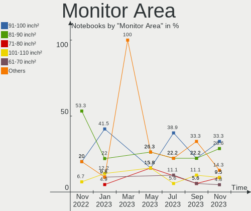
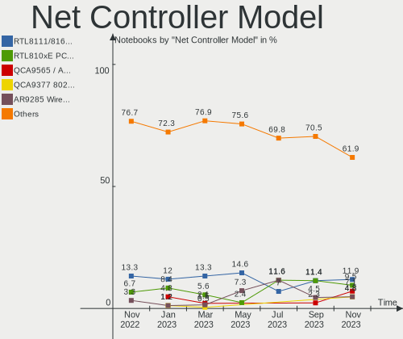
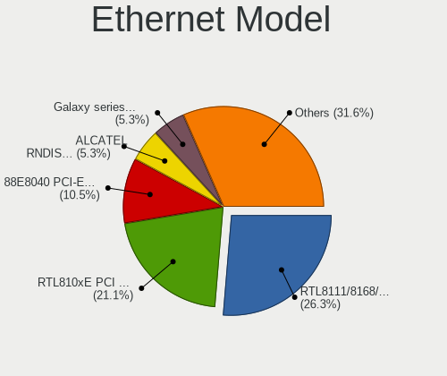
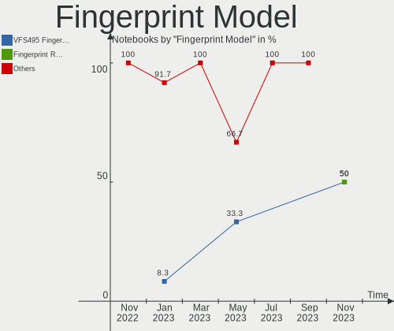

helloSystem - Hardware Trends (Notebooks)
-----------------------------------------

A project to identify most popular hardware characteristics and track their change
over time based on data collected by BSD users at https://BSD-Hardware.info.

Anyone can contribute to this report by the [hw-probe](https://github.com/linuxhw/hw-probe/blob/master/INSTALL.BSD.md) tool:

    hw-probe -all -upload

This report is for one last month. Overall report since the beginning of time: [TestDays](https://github.com/bsdhw/TestDays)

Period: Apr, 2023.

Contents
--------

* [ System ](#system)
  - [ OS                       ](#os)
  - [ OS Family                ](#os-family)
  - [ Arch                     ](#arch)
  - [ DE                       ](#de)
  - [ Display Server           ](#display-server)
  - [ Display Manager          ](#display-manager)
  - [ OS Lang                  ](#os-lang)
  - [ Boot Mode                ](#boot-mode)
  - [ Filesystem               ](#filesystem)
  - [ Part. scheme             ](#part-scheme)

* [ Board ](#board)
  - [ Vendor                   ](#vendor)
  - [ Model                    ](#model)
  - [ Model Family             ](#model-family)
  - [ MFG Year                 ](#mfg-year)
  - [ Form Factor              ](#form-factor)
  - [ Coreboot                 ](#coreboot)
  - [ RAM Size                 ](#ram-size)
  - [ RAM Used                 ](#ram-used)
  - [ Total Drives             ](#total-drives)
  - [ Has CD-ROM               ](#has-cd-rom)
  - [ Has Ethernet             ](#has-ethernet)
  - [ Has WiFi                 ](#has-wifi)
  - [ Has Bluetooth            ](#has-bluetooth)

* [ Location ](#location)
  - [ Country                  ](#country)
  - [ City                     ](#city)

* [ Drives ](#drives)
  - [ Drive Vendor             ](#drive-vendor)
  - [ Drive Model              ](#drive-model)
  - [ HDD Vendor               ](#hdd-vendor)
  - [ SSD Vendor               ](#ssd-vendor)
  - [ Drive Kind               ](#drive-kind)
  - [ Drive Connector          ](#drive-connector)
  - [ Drive Size               ](#drive-size)
  - [ Space Total              ](#space-total)
  - [ Space Used               ](#space-used)
  - [ Malfunc. Drives          ](#malfunc-drives)
  - [ Malfunc. Drive Vendor    ](#malfunc-drive-vendor)
  - [ Malfunc. HDD Vendor      ](#malfunc-hdd-vendor)
  - [ Malfunc. Drive Kind      ](#malfunc-drive-kind)
  - [ Failed Drives            ](#failed-drives)
  - [ Failed Drive Vendor      ](#failed-drive-vendor)
  - [ Drive Status             ](#drive-status)

* [ Storage controller ](#storage-controller)
  - [ Storage Vendor           ](#storage-vendor)
  - [ Storage Model            ](#storage-model)
  - [ Storage Kind             ](#storage-kind)

* [ Processor ](#processor)
  - [ CPU Vendor               ](#cpu-vendor)
  - [ CPU Model                ](#cpu-model)
  - [ CPU Model Family         ](#cpu-model-family)
  - [ CPU Cores                ](#cpu-cores)
  - [ CPU Sockets              ](#cpu-sockets)
  - [ CPU Threads              ](#cpu-threads)
  - [ CPU Microarch            ](#cpu-microarch)

* [ Graphics ](#graphics)
  - [ GPU Vendor               ](#gpu-vendor)
  - [ GPU Model                ](#gpu-model)
  - [ GPU Combo                ](#gpu-combo)
  - [ GPU Driver               ](#gpu-driver)
  - [ GPU Memory               ](#gpu-memory)

* [ Monitor ](#monitor)
  - [ Monitor Vendor           ](#monitor-vendor)
  - [ Monitor Model            ](#monitor-model)
  - [ Monitor Resolution       ](#monitor-resolution)
  - [ Monitor Diagonal         ](#monitor-diagonal)
  - [ Monitor Width            ](#monitor-width)
  - [ Aspect Ratio             ](#aspect-ratio)
  - [ Monitor Area             ](#monitor-area)
  - [ Pixel Density            ](#pixel-density)
  - [ Multiple Monitors        ](#multiple-monitors)

* [ Network ](#network)
  - [ Net Controller Vendor    ](#net-controller-vendor)
  - [ Net Controller Model     ](#net-controller-model)
  - [ Wireless Vendor          ](#wireless-vendor)
  - [ Wireless Model           ](#wireless-model)
  - [ Ethernet Vendor          ](#ethernet-vendor)
  - [ Ethernet Model           ](#ethernet-model)
  - [ Net Controller Kind      ](#net-controller-kind)
  - [ Used Controller          ](#used-controller)
  - [ NICs                     ](#nics)
  - [ IPv6                     ](#ipv6)

* [ Bluetooth ](#bluetooth)
  - [ Bluetooth Vendor         ](#bluetooth-vendor)
  - [ Bluetooth Model          ](#bluetooth-model)

* [ Sound ](#sound)
  - [ Sound Vendor             ](#sound-vendor)
  - [ Sound Model              ](#sound-model)

* [ Memory ](#memory)
  - [ Memory Vendor            ](#memory-vendor)
  - [ Memory Model             ](#memory-model)
  - [ Memory Kind              ](#memory-kind)
  - [ Memory Form Factor       ](#memory-form-factor)
  - [ Memory Size              ](#memory-size)
  - [ Memory Speed             ](#memory-speed)

* [ Printers & scanners ](#printers--scanners)
  - [ Printer Vendor           ](#printer-vendor)
  - [ Printer Model            ](#printer-model)
  - [ Scanner Vendor           ](#scanner-vendor)
  - [ Scanner Model            ](#scanner-model)

* [ Camera ](#camera)
  - [ Camera Vendor            ](#camera-vendor)
  - [ Camera Model             ](#camera-model)

* [ Security ](#security)
  - [ Fingerprint Vendor       ](#fingerprint-vendor)
  - [ Fingerprint Model        ](#fingerprint-model)
  - [ Chipcard Vendor          ](#chipcard-vendor)
  - [ Chipcard Model           ](#chipcard-model)

* [ Unsupported ](#unsupported)
  - [ Unsupported Devices      ](#unsupported-devices)
  - [ Unsupported Device Types ](#unsupported-device-types)

System
------

OS
--

Installed operating systems

| Name              | Notebooks | Percent |
|-------------------|-----------|---------|
| helloSystem 0.8.1 | 25        | 83.33%  |
| helloSystem 0.8.2 | 5         | 16.67%  |

OS Family
---------

OS without a version

| Name        | Notebooks | Percent |
|-------------|-----------|---------|
| helloSystem | 30        | 100%    |

Arch
----

OS architecture (x86_64, i586, etc.)

| Name  | Notebooks | Percent |
|-------|-----------|---------|
| amd64 | 30        | 100%    |

DE
--

Desktop Environment

| Name         | Notebooks | Percent |
|--------------|-----------|---------|
| helloDesktop | 30        | 100%    |

Display Server
--------------

X11 or Wayland

| Name | Notebooks | Percent |
|------|-----------|---------|
| X11  | 30        | 100%    |

Display Manager
---------------

SDDM, LightDM, etc.

| Name | Notebooks | Percent |
|------|-----------|---------|
| SLiM | 30        | 100%    |

OS Lang
-------

Language

| Lang    | Notebooks | Percent |
|---------|-----------|---------|
| en_US   | 18        | 60%     |
| fr_FR   | 3         | 10%     |
| es_ES   | 2         | 6.67%   |
| de_DE   | 2         | 6.67%   |
| Unknown | 2         | 6.67%   |
| pt_BR   | 1         | 3.33%   |
| pl_PL   | 1         | 3.33%   |
| it_IT   | 1         | 3.33%   |

Boot Mode
---------

EFI or BIOS

| Mode | Notebooks | Percent |
|------|-----------|---------|
| EFI  | 30        | 100%    |

Filesystem
----------

Type of filesystem

| Type   | Notebooks | Percent |
|--------|-----------|---------|
| Zfs    | 17        | 56.67%  |
| Cd9660 | 13        | 43.33%  |

Part. scheme
------------

Scheme of partitioning

| Type | Notebooks | Percent |
|------|-----------|---------|
| GPT  | 30        | 100%    |

Board
-----

Vendor
------

Motherboard manufacturer

| Name                | Notebooks | Percent |
|---------------------|-----------|---------|
| Lenovo              | 9         | 30%     |
| Dell                | 4         | 13.33%  |
| Google              | 3         | 10%     |
| Samsung Electronics | 2         | 6.67%   |
| Hewlett-Packard     | 2         | 6.67%   |
| ASUSTek Computer    | 2         | 6.67%   |
| Apple               | 2         | 6.67%   |
| Acer                | 2         | 6.67%   |
| Toshiba             | 1         | 3.33%   |
| Packard Bell        | 1         | 3.33%   |
| Medion              | 1         | 3.33%   |
| Fujitsu             | 1         | 3.33%   |

Model
-----

Motherboard model

| Name                                 | Notebooks | Percent |
|--------------------------------------|-----------|---------|
| Toshiba PORTEGE R700                 | 1         | 3.33%   |
| Samsung 370E4K                       | 1         | 3.33%   |
| Samsung 340XAA/350XAA/550XAA         | 1         | 3.33%   |
| Packard Bell DOT SE                  | 1         | 3.33%   |
| Medion E15302                        | 1         | 3.33%   |
| Lenovo Yoga Slim 7 14ITL05 82A3      | 1         | 3.33%   |
| Lenovo ThinkPad X270 20HMS06Q1D      | 1         | 3.33%   |
| Lenovo ThinkPad X1 Carbon 34487SM    | 1         | 3.33%   |
| Lenovo ThinkPad L540 20AUA34DJP      | 1         | 3.33%   |
| Lenovo ThinkPad L15 Gen 2 20X3CTO1WW | 1         | 3.33%   |
| Lenovo ThinkBook 14-IML 20RV         | 1         | 3.33%   |
| Lenovo Legion 5 Pro 16ACH6H 82JQ     | 1         | 3.33%   |
| Lenovo G570 20079                    | 1         | 3.33%   |
| Lenovo G500 20236                    | 1         | 3.33%   |
| HP ProBook 640 G4                    | 1         | 3.33%   |
| HP Laptop 15-bw0xx                   | 1         | 3.33%   |
| Google Wolf                          | 1         | 3.33%   |
| Google Terra                         | 1         | 3.33%   |
| Google Peppy                         | 1         | 3.33%   |
| Fujitsu CELSIUS H920                 | 1         | 3.33%   |
| Dell XPS 13 9343                     | 1         | 3.33%   |
| Dell Latitude E5570                  | 1         | 3.33%   |
| Dell Latitude 7410                   | 1         | 3.33%   |
| Dell Inspiron 3421                   | 1         | 3.33%   |
| ASUS X58C                            | 1         | 3.33%   |
| ASUS X200MA                          | 1         | 3.33%   |
| Apple MacBook5,1                     | 1         | 3.33%   |
| Apple MacBook3,1                     | 1         | 3.33%   |
| Acer V5-131                          | 1         | 3.33%   |
| Acer Aspire 5250                     | 1         | 3.33%   |

Model Family
------------

Motherboard model prefix

| Name             | Notebooks | Percent |
|------------------|-----------|---------|
| Lenovo ThinkPad  | 4         | 13.33%  |
| Dell Latitude    | 2         | 6.67%   |
| Toshiba PORTEGE  | 1         | 3.33%   |
| Samsung 370E4K   | 1         | 3.33%   |
| Samsung 340XAA   | 1         | 3.33%   |
| Packard Bell DOT | 1         | 3.33%   |
| Medion E15302    | 1         | 3.33%   |
| Lenovo Yoga      | 1         | 3.33%   |
| Lenovo ThinkBook | 1         | 3.33%   |
| Lenovo Legion    | 1         | 3.33%   |
| Lenovo G570      | 1         | 3.33%   |
| Lenovo G500      | 1         | 3.33%   |
| HP ProBook       | 1         | 3.33%   |
| HP Laptop        | 1         | 3.33%   |
| Google Wolf      | 1         | 3.33%   |
| Google Terra     | 1         | 3.33%   |
| Google Peppy     | 1         | 3.33%   |
| Fujitsu CELSIUS  | 1         | 3.33%   |
| Dell XPS         | 1         | 3.33%   |
| Dell Inspiron    | 1         | 3.33%   |
| ASUS X58C        | 1         | 3.33%   |
| ASUS X200MA      | 1         | 3.33%   |
| Apple MacBook5   | 1         | 3.33%   |
| Apple MacBook3   | 1         | 3.33%   |
| Acer V5-131      | 1         | 3.33%   |
| Acer Aspire      | 1         | 3.33%   |

MFG Year
--------

Motherboard manufacture year

| Year | Notebooks | Percent |
|------|-----------|---------|
| 2022 | 3         | 10%     |
| 2021 | 3         | 10%     |
| 2019 | 3         | 10%     |
| 2013 | 3         | 10%     |
| 2011 | 3         | 10%     |
| 2008 | 3         | 10%     |
| 2023 | 2         | 6.67%   |
| 2016 | 2         | 6.67%   |
| 2012 | 2         | 6.67%   |
| 2020 | 1         | 3.33%   |
| 2018 | 1         | 3.33%   |
| 2017 | 1         | 3.33%   |
| 2015 | 1         | 3.33%   |
| 2014 | 1         | 3.33%   |
| 2010 | 1         | 3.33%   |

Form Factor
-----------

Physical design of the computer

| Name     | Notebooks | Percent |
|----------|-----------|---------|
| Notebook | 30        | 100%    |

Coreboot
--------

Have coreboot on board

| Used | Notebooks | Percent |
|------|-----------|---------|
| No   | 27        | 90%     |
| Yes  | 3         | 10%     |

RAM Size
--------

Total RAM memory

| Size in GB | Notebooks | Percent |
|------------|-----------|---------|
| 8.01-16.0  | 14        | 46.67%  |
| 4.01-8.0   | 7         | 23.33%  |
| 2.01-3.0   | 4         | 13.33%  |
| 16.01-24.0 | 4         | 13.33%  |
| 32.01-64.0 | 1         | 3.33%   |

RAM Used
--------

Used RAM memory

| Used GB  | Notebooks | Percent |
|----------|-----------|---------|
| 0.01-0.5 | 18        | 60%     |
| 0.51-1.0 | 10        | 33.33%  |
| 1.01-2.0 | 2         | 6.67%   |

Total Drives
------------

Number of drives on board

| Drives | Notebooks | Percent |
|--------|-----------|---------|
| 1      | 23        | 76.67%  |
| 0      | 3         | 10%     |
| 3      | 2         | 6.67%   |
| 2      | 2         | 6.67%   |

Has CD-ROM
----------

Has CD-ROM on board

| Presented | Notebooks | Percent |
|-----------|-----------|---------|
| No        | 21        | 70%     |
| Yes       | 9         | 30%     |

Has Ethernet
------------

Has Ethernet on board

| Presented | Notebooks | Percent |
|-----------|-----------|---------|
| Yes       | 24        | 80%     |
| No        | 6         | 20%     |

Has WiFi
--------

Has WiFi module

| Presented | Notebooks | Percent |
|-----------|-----------|---------|
| Yes       | 29        | 96.67%  |
| No        | 1         | 3.33%   |

Has Bluetooth
-------------

Has Bluetooth module

| Presented | Notebooks | Percent |
|-----------|-----------|---------|
| Yes       | 23        | 76.67%  |
| No        | 7         | 23.33%  |

Location
--------

Country
-------

Geographic location (country)

| Country   | Notebooks | Percent |
|-----------|-----------|---------|
| USA       | 4         | 13.33%  |
| Germany   | 3         | 10%     |
| Brazil    | 3         | 10%     |
| Russia    | 2         | 6.67%   |
| Romania   | 2         | 6.67%   |
| Poland    | 2         | 6.67%   |
| Mexico    | 2         | 6.67%   |
| Italy     | 2         | 6.67%   |
| Indonesia | 2         | 6.67%   |
| France    | 2         | 6.67%   |
| Canada    | 2         | 6.67%   |
| Spain     | 1         | 3.33%   |
| Portugal  | 1         | 3.33%   |
| Chile     | 1         | 3.33%   |
| Austria   | 1         | 3.33%   |

City
----

Geographic location (city)

| City                | Notebooks | Percent |
|---------------------|-----------|---------|
| Sao Paulo           | 2         | 6.67%   |
| Milan               | 2         | 6.67%   |
| Vitória            | 1         | 3.33%   |
| Vienna              | 1         | 3.33%   |
| Victoria            | 1         | 3.33%   |
| Union               | 1         | 3.33%   |
| Temple              | 1         | 3.33%   |
| Targoviste          | 1         | 3.33%   |
| Surabaya            | 1         | 3.33%   |
| St. Jean Baptiste   | 1         | 3.33%   |
| St Petersburg       | 1         | 3.33%   |
| Santiago            | 1         | 3.33%   |
| Poznan              | 1         | 3.33%   |
| Porto               | 1         | 3.33%   |
| Opole               | 1         | 3.33%   |
| Monterrey           | 1         | 3.33%   |
| Moers               | 1         | 3.33%   |
| Mexico City         | 1         | 3.33%   |
| Les Mureaux         | 1         | 3.33%   |
| Leipzig             | 1         | 3.33%   |
| Gulf Breeze         | 1         | 3.33%   |
| Essen               | 1         | 3.33%   |
| Englewood           | 1         | 3.33%   |
| Córdoba            | 1         | 3.33%   |
| Cirebon             | 1         | 3.33%   |
| Cherepanovo         | 1         | 3.33%   |
| Champigny-sur-Marne | 1         | 3.33%   |
| Bucharest           | 1         | 3.33%   |

Drives
------

Drive Vendor
------------

Hard drive vendors

| Vendor              | Notebooks | Drives | Percent |
|---------------------|-----------|--------|---------|
| Seagate             | 5         | 5      | 16.13%  |
| SanDisk             | 3         | 3      | 9.68%   |
| Samsung Electronics | 3         | 3      | 9.68%   |
| Crucial             | 3         | 3      | 9.68%   |
| WDC                 | 2         | 3      | 6.45%   |
| Toshiba             | 2         | 2      | 6.45%   |
| Kingston            | 2         | 2      | 6.45%   |
| Hitachi             | 2         | 2      | 6.45%   |
| V-GeN               | 1         | 1      | 3.23%   |
| Transcend           | 1         | 1      | 3.23%   |
| SPCC                | 1         | 1      | 3.23%   |
| SK hynix            | 1         | 1      | 3.23%   |
| PNY                 | 1         | 1      | 3.23%   |
| Micron Technology   | 1         | 1      | 3.23%   |
| Intel               | 1         | 1      | 3.23%   |
| HGST                | 1         | 2      | 3.23%   |
| China               | 1         | 1      | 3.23%   |

Drive Model
-----------

Hard drive models

| Model                              | Notebooks | Percent |
|------------------------------------|-----------|---------|
| WDC WDS120G1G0A-00SS50 120GB       | 1         | 3.03%   |
| WDC WDS100T2G0A-00JH30 1TB         | 1         | 3.03%   |
| WDC WD10SPZX-35Z10T0 1TB           | 1         | 3.03%   |
| V-GeN V-GEN08SM22AR256SDK 256GB    | 1         | 3.03%   |
| Transcend TS128GMTE110S 128GB      | 1         | 3.03%   |
| Toshiba MK6461GSYN 640GB           | 1         | 3.03%   |
| Toshiba KXG6AZNV256G 256GB         | 1         | 3.03%   |
| SPCC Solid State Disk 256GB        | 1         | 3.03%   |
| SK hynix BC511 NVMe 512GB          | 1         | 3.03%   |
| Seagate ST9160827AS 160GB          | 1         | 3.03%   |
| Seagate ST320LT020-9YG142 320GB    | 1         | 3.03%   |
| Seagate ST320LT012-9WS14C 320GB    | 1         | 3.03%   |
| Seagate ST2000DL003-9VT166 2TB     | 1         | 3.03%   |
| Seagate ST1000LM024 HN-M101MBB 1TB | 1         | 3.03%   |
| SanDisk SSD PLUS 240GB             | 1         | 3.03%   |
| SanDisk SSD i110 16GB              | 1         | 3.03%   |
| SanDisk SD5SG2128G1052E 128GB      | 1         | 3.03%   |
| Samsung SSD 840 EVO 250GB          | 1         | 3.03%   |
| Samsung MZVLB1T0HBLR-000L2 1TB     | 1         | 3.03%   |
| Samsung MZ7LN256HMJP-000H1 256GB   | 1         | 3.03%   |
| PNY CS900 500GB SSD                | 1         | 3.03%   |
| Micron MTFDHBA256TCK 256GB         | 1         | 3.03%   |
| Kingston SUV300S37A240G 240GB      | 1         | 3.03%   |
| Kingston SA400S37240G 240GB        | 1         | 3.03%   |
| Intel SSDSC2BW180A3H 180GB         | 1         | 3.03%   |
| Hitachi HTS547550A9E384 500GB      | 1         | 3.03%   |
| Hitachi HTS545032B9A300 320GB      | 1         | 3.03%   |
| HGST HTS725050A7E630 500GB         | 1         | 3.03%   |
| HGST HTS541010A9E680 1TB           | 1         | 3.03%   |
| Crucial CT500MX500SSD4 500GB       | 1         | 3.03%   |
| Crucial CT500MX500SSD1 500GB       | 1         | 3.03%   |
| Crucial CT480BX500SSD1 480GB       | 1         | 3.03%   |
| China S41CF256G 256GB              | 1         | 3.03%   |

HDD Vendor
----------

Hard disk drive vendors

| Vendor  | Notebooks | Drives | Percent |
|---------|-----------|--------|---------|
| Seagate | 5         | 5      | 50%     |
| Hitachi | 2         | 2      | 20%     |
| WDC     | 1         | 1      | 10%     |
| Toshiba | 1         | 1      | 10%     |
| HGST    | 1         | 2      | 10%     |

SSD Vendor
----------

Solid state drive vendors

| Vendor              | Notebooks | Drives | Percent |
|---------------------|-----------|--------|---------|
| SanDisk             | 3         | 3      | 18.75%  |
| Crucial             | 3         | 3      | 18.75%  |
| Samsung Electronics | 2         | 2      | 12.5%   |
| Kingston            | 2         | 2      | 12.5%   |
| WDC                 | 1         | 2      | 6.25%   |
| V-GeN               | 1         | 1      | 6.25%   |
| SPCC                | 1         | 1      | 6.25%   |
| PNY                 | 1         | 1      | 6.25%   |
| Intel               | 1         | 1      | 6.25%   |
| China               | 1         | 1      | 6.25%   |

Drive Kind
----------

HDD or SSD

| Kind | Notebooks | Drives | Percent |
|------|-----------|--------|---------|
| SSD  | 15        | 17     | 51.72%  |
| HDD  | 9         | 11     | 31.03%  |
| NVMe | 5         | 5      | 17.24%  |

Drive Connector
---------------

SATA, SAS, NVMe, etc.

| Type | Notebooks | Drives | Percent |
|------|-----------|--------|---------|
| SATA | 22        | 28     | 81.48%  |
| NVMe | 5         | 5      | 18.52%  |

Drive Size
----------

Size of hard drive

| Size in TB | Notebooks | Drives | Percent |
|------------|-----------|--------|---------|
| 0.01-0.5   | 21        | 22     | 80.77%  |
| 0.51-1.0   | 4         | 5      | 15.38%  |
| 1.01-2.0   | 1         | 1      | 3.85%   |

Space Total
-----------

Amount of disk space available on the file system

| Size in GB | Notebooks | Percent |
|------------|-----------|---------|
| 1-20       | 12        | 40%     |
| 101-250    | 9         | 30%     |
| 251-500    | 4         | 13.33%  |
| 21-50      | 2         | 6.67%   |
| 51-100     | 2         | 6.67%   |
| 501-1000   | 1         | 3.33%   |

Space Used
----------

Amount of used disk space

| Used GB | Notebooks | Percent |
|---------|-----------|---------|
| 1-20    | 30        | 100%    |

Malfunc. Drives
---------------

Drive models with a malfunction

| Model                           | Notebooks | Drives | Percent |
|---------------------------------|-----------|--------|---------|
| Seagate ST9160827AS 160GB       | 1         | 1      | 14.29%  |
| Seagate ST320LT020-9YG142 320GB | 1         | 1      | 14.29%  |
| Seagate ST320LT012-9WS14C 320GB | 1         | 1      | 14.29%  |
| SanDisk SSD PLUS 240GB          | 1         | 1      | 14.29%  |
| Hitachi HTS547550A9E384 500GB   | 1         | 1      | 14.29%  |
| HGST HTS541010A9E680 1TB        | 1         | 1      | 14.29%  |
| Crucial CT500MX500SSD1 500GB    | 1         | 1      | 14.29%  |

Malfunc. Drive Vendor
---------------------

Vendors of faulty drives

| Vendor  | Notebooks | Drives | Percent |
|---------|-----------|--------|---------|
| Seagate | 3         | 3      | 42.86%  |
| SanDisk | 1         | 1      | 14.29%  |
| Hitachi | 1         | 1      | 14.29%  |
| HGST    | 1         | 1      | 14.29%  |
| Crucial | 1         | 1      | 14.29%  |

Malfunc. HDD Vendor
-------------------

Vendors of faulty HDD drives

| Vendor  | Notebooks | Drives | Percent |
|---------|-----------|--------|---------|
| Seagate | 3         | 3      | 60%     |
| Hitachi | 1         | 1      | 20%     |
| HGST    | 1         | 1      | 20%     |

Malfunc. Drive Kind
-------------------

Kinds of faulty drives

| Kind | Notebooks | Drives | Percent |
|------|-----------|--------|---------|
| HDD  | 5         | 5      | 71.43%  |
| SSD  | 2         | 2      | 28.57%  |

Failed Drives
-------------

Failed drive models

Zero info for selected period =(

Failed Drive Vendor
-------------------

Failed drive vendors

Zero info for selected period =(

Drive Status
------------

Number of failed and malfunc. drives

| Status  | Notebooks | Drives | Percent |
|---------|-----------|--------|---------|
| Works   | 22        | 26     | 75.86%  |
| Malfunc | 7         | 7      | 24.14%  |

Storage controller
------------------

Storage Vendor
--------------

Storage controller vendors

| Vendor                           | Notebooks | Percent |
|----------------------------------|-----------|---------|
| Intel                            | 20        | 62.5%   |
| AMD                              | 4         | 12.5%   |
| Toshiba                          | 1         | 3.13%   |
| SK hynix                         | 1         | 3.13%   |
| Silicon Motion                   | 1         | 3.13%   |
| Silicon Integrated Systems [SiS] | 1         | 3.13%   |
| Sandisk                          | 1         | 3.13%   |
| Samsung Electronics              | 1         | 3.13%   |
| Nvidia                           | 1         | 3.13%   |
| Micron Technology                | 1         | 3.13%   |

Storage Model
-------------

Storage controller models

| Model                                                                          | Notebooks | Percent |
|--------------------------------------------------------------------------------|-----------|---------|
| Intel 7 Series Chipset Family 6-port SATA Controller [AHCI mode]               | 5         | 15.15%  |
| Intel Sunrise Point-LP SATA Controller [AHCI mode]                             | 4         | 12.12%  |
| AMD FCH SATA Controller [AHCI mode]                                            | 3         | 9.09%   |
| Intel Wildcat Point-LP SATA Controller [AHCI Mode]                             | 2         | 6.06%   |
| Intel 8 Series SATA Controller 1 [AHCI mode]                                   | 2         | 6.06%   |
| Toshiba XG6 NVMe SSD Controller                                                | 1         | 3.03%   |
| SK hynix BC511                                                                 | 1         | 3.03%   |
| Silicon Motion SM2263EN/SM2263XT SSD Controller                                | 1         | 3.03%   |
| Silicon Integrated Systems [SiS] SATA Controller / IDE mode                    | 1         | 3.03%   |
| Sandisk WD Black SN770 NVMe SSD                                                | 1         | 3.03%   |
| Samsung NVMe SSD Controller SM981/PM981/PM983                                  | 1         | 3.03%   |
| Nvidia MCP79 AHCI Controller                                                   | 1         | 3.03%   |
| Micron NVMe Storage Controller                                                 | 1         | 3.03%   |
| Intel NM10/ICH7 Family SATA Controller [AHCI mode]                             | 1         | 3.03%   |
| Intel Comet Lake SATA AHCI Controller                                          | 1         | 3.03%   |
| Intel Atom Processor E3800 Series SATA AHCI Controller                         | 1         | 3.03%   |
| Intel 82801HM/HEM (ICH8M/ICH8M-E) SATA Controller [AHCI mode]                  | 1         | 3.03%   |
| Intel 82801HM/HEM (ICH8M/ICH8M-E) IDE Controller                               | 1         | 3.03%   |
| Intel 8 Series/C220 Series Chipset Family 6-port SATA Controller 1 [AHCI mode] | 1         | 3.03%   |
| Intel 6 Series/C200 Series Chipset Family 6 port Mobile SATA AHCI Controller   | 1         | 3.03%   |
| Intel 5 Series/3400 Series Chipset 6 port SATA AHCI Controller                 | 1         | 3.03%   |
| AMD SB7x0/SB8x0/SB9x0 SATA Controller [AHCI mode]                              | 1         | 3.03%   |

Storage Kind
------------

Kind of storage controller (IDE, SATA, NVMe, SAS, ...)

| Kind | Notebooks | Percent |
|------|-----------|---------|
| SATA | 25        | 78.13%  |
| NVMe | 5         | 15.63%  |
| IDE  | 2         | 6.25%   |

Processor
---------

CPU Vendor
----------

Processor vendors

| Vendor | Notebooks | Percent |
|--------|-----------|---------|
| Intel  | 26        | 86.67%  |
| AMD    | 4         | 13.33%  |

CPU Model
---------

Processor models

| Model                                        | Notebooks | Percent |
|----------------------------------------------|-----------|---------|
| Intel Core i5-8250U CPU @ 1.60GHz            | 2         | 6.67%   |
| Intel Celeron 2955U @ 1.40GHz                | 2         | 6.67%   |
| Intel Core i7-6600U CPU @ 2.60GHz            | 1         | 3.33%   |
| Intel Core i7-5500U CPU @ 2.40GHz            | 1         | 3.33%   |
| Intel Core i7-3720QM CPU @ 2.60GHz           | 1         | 3.33%   |
| Intel Core i7-10610U CPU @ 1.80GHz           | 1         | 3.33%   |
| Intel Core i5-7300U CPU @ 2.60GHz            | 1         | 3.33%   |
| Intel Core i5-3427U CPU @ 1.80GHz            | 1         | 3.33%   |
| Intel Core i5-3337U CPU @ 1.80GHz            | 1         | 3.33%   |
| Intel Core i5-2450M CPU @ 2.50GHz            | 1         | 3.33%   |
| Intel Core i5-10210U CPU @ 1.60GHz           | 1         | 3.33%   |
| Intel Core i5 CPU M 520 @ 2.40GHz            | 1         | 3.33%   |
| Intel Core i3-5005U CPU @ 2.00GHz            | 1         | 3.33%   |
| Intel Core i3-4100M CPU @ 2.50GHz            | 1         | 3.33%   |
| Intel Core 2 Duo CPU T7500 @ 2.20GHz         | 1         | 3.33%   |
| Intel Core 2 Duo CPU P7350 @ 2.00GHz         | 1         | 3.33%   |
| Intel Celeron D CPU 220 @ 1.20GHz            | 1         | 3.33%   |
| Intel Celeron CPU N3060 @ 1.60GHz            | 1         | 3.33%   |
| Intel Celeron CPU N2830 @ 2.16GHz            | 1         | 3.33%   |
| Intel Celeron CPU 1007U @ 1.50GHz            | 1         | 3.33%   |
| Intel Celeron CPU 1005M @ 1.90GHz            | 1         | 3.33%   |
| Intel Atom CPU N550 @ 1.50GHz                | 1         | 3.33%   |
| Intel 11th Gen Core i7-1165G7 @ 2.80GHz      | 1         | 3.33%   |
| Intel 11th Gen Core i3-1115G4 @ 3.00GHz      | 1         | 3.33%   |
| AMD Ryzen 7 5800H with Radeon Graphics       | 1         | 3.33%   |
| AMD E-300 APU with Radeon HD Graphics        | 1         | 3.33%   |
| AMD Athlon 300U with Radeon Vega Mobile Gfx  | 1         | 3.33%   |
| AMD A9-9420 RADEON R5, 5 COMPUTE CORES 2C+3G | 1         | 3.33%   |

CPU Model Family
----------------

Processor model prefix

| Model            | Notebooks | Percent |
|------------------|-----------|---------|
| Intel Core i5    | 8         | 26.67%  |
| Intel Celeron    | 6         | 20%     |
| Intel Core i7    | 4         | 13.33%  |
| Other            | 3         | 10%     |
| Intel Core i3    | 2         | 6.67%   |
| Intel Core 2 Duo | 2         | 6.67%   |
| Intel Celeron D  | 1         | 3.33%   |
| Intel Atom       | 1         | 3.33%   |
| AMD Ryzen 7      | 1         | 3.33%   |
| AMD E            | 1         | 3.33%   |
| AMD Athlon       | 1         | 3.33%   |

CPU Cores
---------

Number of processor cores

| Number  | Notebooks | Percent |
|---------|-----------|---------|
| 2       | 19        | 63.33%  |
| 4       | 7         | 23.33%  |
| Unknown | 2         | 6.67%   |
| 16      | 1         | 3.33%   |
| 1       | 1         | 3.33%   |

CPU Sockets
-----------

Number of sockets

| Number | Notebooks | Percent |
|--------|-----------|---------|
| 1      | 28        | 93.33%  |
| 2      | 2         | 6.67%   |

CPU Threads
-----------

Threads per core (Hyper-Threading)

| Number  | Notebooks | Percent |
|---------|-----------|---------|
| 2       | 17        | 56.67%  |
| 1       | 10        | 33.33%  |
| Unknown | 3         | 10%     |

CPU Microarch
-------------

Microarchitecture

| Name        | Notebooks | Percent |
|-------------|-----------|---------|
| KabyLake    | 5         | 16.67%  |
| IvyBridge   | 5         | 16.67%  |
| Haswell     | 3         | 10%     |
| TigerLake   | 2         | 6.67%   |
| Silvermont  | 2         | 6.67%   |
| Core        | 2         | 6.67%   |
| Broadwell   | 2         | 6.67%   |
| Zen+        | 1         | 3.33%   |
| Zen 3       | 1         | 3.33%   |
| Westmere    | 1         | 3.33%   |
| Skylake     | 1         | 3.33%   |
| SandyBridge | 1         | 3.33%   |
| Penryn      | 1         | 3.33%   |
| Excavator   | 1         | 3.33%   |
| Bonnell     | 1         | 3.33%   |
| Bobcat      | 1         | 3.33%   |

Graphics
--------

GPU Vendor
----------

Vendors of graphics cards

| Vendor                           | Notebooks | Percent |
|----------------------------------|-----------|---------|
| Intel                            | 24        | 72.73%  |
| AMD                              | 5         | 15.15%  |
| Nvidia                           | 3         | 9.09%   |
| Silicon Integrated Systems [SiS] | 1         | 3.03%   |

GPU Model
---------

Graphics card models

| Model                                                                                    | Notebooks | Percent |
|------------------------------------------------------------------------------------------|-----------|---------|
| Intel 3rd Gen Core processor Graphics Controller                                         | 5         | 14.71%  |
| Intel UHD Graphics 620                                                                   | 2         | 5.88%   |
| Intel HD Graphics 5500                                                                   | 2         | 5.88%   |
| Intel Haswell-ULT Integrated Graphics Controller                                         | 2         | 5.88%   |
| Intel CometLake-U GT2 [UHD Graphics]                                                     | 2         | 5.88%   |
| Silicon Integrated Systems [SiS] 771/671 PCIE VGA Display Adapter                        | 1         | 2.94%   |
| Nvidia GK104GLM [Quadro K3000M]                                                          | 1         | 2.94%   |
| Nvidia GA104M [GeForce RTX 3070 Mobile / Max-Q]                                          | 1         | 2.94%   |
| Nvidia C79 [GeForce 9400M]                                                               | 1         | 2.94%   |
| Intel TigerLake-LP GT2 [Iris Xe Graphics]                                                | 1         | 2.94%   |
| Intel Tiger Lake-LP GT2 [UHD Graphics G4]                                                | 1         | 2.94%   |
| Intel Skylake GT2 [HD Graphics 520]                                                      | 1         | 2.94%   |
| Intel Mobile GM965/GL960 Integrated Graphics Controller (secondary)                      | 1         | 2.94%   |
| Intel Mobile GM965/GL960 Integrated Graphics Controller (primary)                        | 1         | 2.94%   |
| Intel HD Graphics 620                                                                    | 1         | 2.94%   |
| Intel Core Processor Integrated Graphics Controller                                      | 1         | 2.94%   |
| Intel Atom/Celeron/Pentium Processor x5-E8000/J3xxx/N3xxx Integrated Graphics Controller | 1         | 2.94%   |
| Intel Atom Processor Z36xxx/Z37xxx Series Graphics & Display                             | 1         | 2.94%   |
| Intel Atom Processor D4xx/D5xx/N4xx/N5xx Integrated Graphics Controller                  | 1         | 2.94%   |
| Intel 4th Gen Core Processor Integrated Graphics Controller                              | 1         | 2.94%   |
| Intel 2nd Generation Core Processor Family Integrated Graphics Controller                | 1         | 2.94%   |
| AMD Wrestler [Radeon HD 6310]                                                            | 1         | 2.94%   |
| AMD Topaz XT [Radeon R7 M260/M265 / M340/M360 / M440/M445 / 530/535 / 620/625 Mobile]    | 1         | 2.94%   |
| AMD Stoney [Radeon R2/R3/R4/R5 Graphics]                                                 | 1         | 2.94%   |
| AMD Robson CE [Radeon HD 6370M/7370M]                                                    | 1         | 2.94%   |
| AMD Picasso/Raven 2 [Radeon Vega Series / Radeon Vega Mobile Series]                     | 1         | 2.94%   |

GPU Combo
---------

Combinations of graphics cards

| Name           | Notebooks | Percent |
|----------------|-----------|---------|
| 1 x Intel      | 19        | 63.33%  |
| 1 x AMD        | 3         | 10%     |
| 2 x Intel      | 2         | 6.67%   |
| 1 x Nvidia     | 2         | 6.67%   |
| Intel + AMD    | 2         | 6.67%   |
| 1 x SiS        | 1         | 3.33%   |
| Intel + Nvidia | 1         | 3.33%   |

GPU Driver
----------

Free vs proprietary

| Driver      | Notebooks | Percent |
|-------------|-----------|---------|
| Free        | 26        | 86.67%  |
| Proprietary | 2         | 6.67%   |
| Unknown     | 2         | 6.67%   |

GPU Memory
----------

Total video memory

| Size in GB | Notebooks | Percent |
|------------|-----------|---------|
| Unknown    | 26        | 86.67%  |
| 0.01-0.5   | 2         | 6.67%   |
| 7.01-8.0   | 1         | 3.33%   |
| 0.51-1.0   | 1         | 3.33%   |

Monitor
-------

Monitor Vendor
--------------

Monitor vendors

| Vendor  | Notebooks | Percent |
|---------|-----------|---------|
| Unknown | 1         | 100%    |

Monitor Model
-------------

Monitor models

| Model   | Notebooks | Percent |
|---------|-----------|---------|
| Unknown | 1         | 100%    |

Monitor Resolution
------------------

Monitor screen resolution

| Resolution | Notebooks | Percent |
|------------|-----------|---------|
| 2560x1600  | 1         | 100%    |

Monitor Diagonal
----------------

Diagonal size in inches

| Inches  | Notebooks | Percent |
|---------|-----------|---------|
| Unknown | 1         | 100%    |

Monitor Width
-------------

Physical width

| Width in mm | Notebooks | Percent |
|-------------|-----------|---------|
| Unknown     | 1         | 100%    |

Aspect Ratio
------------

Proportional relationship between the width and the height

| Ratio   | Notebooks | Percent |
|---------|-----------|---------|
| Unknown | 1         | 100%    |

Monitor Area
------------

Area in inch²

| Area in inch² | Notebooks | Percent |
|----------------|-----------|---------|
| Unknown        | 1         | 100%    |

Pixel Density
-------------

Pixels per inch

| Density | Notebooks | Percent |
|---------|-----------|---------|
| Unknown | 1         | 100%    |

Multiple Monitors
-----------------

Total monitors connected

| Total | Notebooks | Percent |
|-------|-----------|---------|
| 1     | 25        | 83.33%  |
| 0     | 3         | 10%     |
| 2     | 2         | 6.67%   |

Network
-------

Net Controller Vendor
---------------------

Controller vendors

| Vendor                           | Notebooks | Percent |
|----------------------------------|-----------|---------|
| Intel                            | 15        | 34.09%  |
| Qualcomm Atheros                 | 11        | 25%     |
| Realtek Semiconductor            | 8         | 18.18%  |
| Broadcom                         | 4         | 9.09%   |
| Xiaomi                           | 1         | 2.27%   |
| TP-Link                          | 1         | 2.27%   |
| Silicon Integrated Systems [SiS] | 1         | 2.27%   |
| Samsung Electronics              | 1         | 2.27%   |
| Nvidia                           | 1         | 2.27%   |
| Marvell Technology Group         | 1         | 2.27%   |

Net Controller Model
--------------------

Controller models

| Model                                                                   | Notebooks | Percent |
|-------------------------------------------------------------------------|-----------|---------|
| Realtek RTL810xE PCI Express Fast Ethernet controller                   | 4         | 7.27%   |
| Realtek RTL8111/8168/8411 PCI Express Gigabit Ethernet Controller       | 3         | 5.45%   |
| Qualcomm Atheros AR9485 Wireless Network Adapter                        | 3         | 5.45%   |
| Qualcomm Atheros QCA9565 / AR9565 Wireless Network Adapter              | 2         | 3.64%   |
| Qualcomm Atheros AR9462 Wireless Network Adapter                        | 2         | 3.64%   |
| Qualcomm Atheros AR9285 Wireless Network Adapter (PCI-Express)          | 2         | 3.64%   |
| Qualcomm Atheros AR8152 v2.0 Fast Ethernet                              | 2         | 3.64%   |
| Intel Wireless 8265 / 8275                                              | 2         | 3.64%   |
| Intel Wireless 7265                                                     | 2         | 3.64%   |
| Intel Comet Lake PCH-LP CNVi WiFi                                       | 2         | 3.64%   |
| Xiaomi Mi/Redmi series (RNDIS)                                          | 1         | 1.82%   |
| TP-Link AC600 wireless Realtek RTL8811AU [Archer T2U Nano]              | 1         | 1.82%   |
| Silicon Integrated Systems [SiS] 191 Gigabit Ethernet Adapter           | 1         | 1.82%   |
| Samsung Galaxy series, misc. (tethering mode)                           | 1         | 1.82%   |
| Realtek RTL8852AE 802.11ax PCIe Wireless Network Adapter                | 1         | 1.82%   |
| Realtek 8811CU Wireless LAN 802.11ac USB NIC                            | 1         | 1.82%   |
| Qualcomm Atheros QCA9377 802.11ac Wireless Network Adapter              | 1         | 1.82%   |
| Qualcomm Atheros QCA8172 Fast Ethernet                                  | 1         | 1.82%   |
| Qualcomm Atheros AR8152 v1.1 Fast Ethernet                              | 1         | 1.82%   |
| Qualcomm Atheros AR242x / AR542x Wireless Network Adapter (PCI-Express) | 1         | 1.82%   |
| Nvidia MCP79 Ethernet                                                   | 1         | 1.82%   |
| Marvell Group 88E8058 PCI-E Gigabit Ethernet Controller                 | 1         | 1.82%   |
| Intel Wireless 8260                                                     | 1         | 1.82%   |
| Intel Wireless 7260                                                     | 1         | 1.82%   |
| Intel Wireless 3165                                                     | 1         | 1.82%   |
| Intel WiFi Link 5100                                                    | 1         | 1.82%   |
| Intel Wi-Fi 6 AX201                                                     | 1         | 1.82%   |
| Intel Ethernet Connection I219-LM                                       | 1         | 1.82%   |
| Intel Ethernet Connection I217-V                                        | 1         | 1.82%   |
| Intel Ethernet Connection (4) I219-V                                    | 1         | 1.82%   |
| Intel Ethernet Connection (4) I219-LM                                   | 1         | 1.82%   |
| Intel Ethernet Connection (13) I219-V                                   | 1         | 1.82%   |
| Intel Centrino Wireless-N 2200                                          | 1         | 1.82%   |
| Intel Centrino Advanced-N 6205 [Taylor Peak]                            | 1         | 1.82%   |
| Intel Centrino Advanced-N 6200                                          | 1         | 1.82%   |
| Intel 82579LM Gigabit Network Connection (Lewisville)                   | 1         | 1.82%   |
| Intel 82577LM Gigabit Network Connection                                | 1         | 1.82%   |
| Broadcom NetLink BCM57785 Gigabit Ethernet PCIe                         | 1         | 1.82%   |
| Broadcom BCM4352 802.11ac Wireless Network Adapter                      | 1         | 1.82%   |
| Broadcom BCM4322 802.11a/b/g/n Wireless LAN Controller                  | 1         | 1.82%   |

Wireless Vendor
---------------

Wireless vendors

| Vendor                | Notebooks | Percent |
|-----------------------|-----------|---------|
| Intel                 | 14        | 45.16%  |
| Qualcomm Atheros      | 11        | 35.48%  |
| Broadcom              | 3         | 9.68%   |
| Realtek Semiconductor | 2         | 6.45%   |
| TP-Link               | 1         | 3.23%   |

Wireless Model
--------------

Wireless models

| Model                                                                   | Notebooks | Percent |
|-------------------------------------------------------------------------|-----------|---------|
| Qualcomm Atheros AR9485 Wireless Network Adapter                        | 3         | 9.68%   |
| Qualcomm Atheros QCA9565 / AR9565 Wireless Network Adapter              | 2         | 6.45%   |
| Qualcomm Atheros AR9462 Wireless Network Adapter                        | 2         | 6.45%   |
| Qualcomm Atheros AR9285 Wireless Network Adapter (PCI-Express)          | 2         | 6.45%   |
| Intel Wireless 8265 / 8275                                              | 2         | 6.45%   |
| Intel Wireless 7265                                                     | 2         | 6.45%   |
| Intel Comet Lake PCH-LP CNVi WiFi                                       | 2         | 6.45%   |
| TP-Link AC600 wireless Realtek RTL8811AU [Archer T2U Nano]              | 1         | 3.23%   |
| Realtek RTL8852AE 802.11ax PCIe Wireless Network Adapter                | 1         | 3.23%   |
| Realtek 8811CU Wireless LAN 802.11ac USB NIC                            | 1         | 3.23%   |
| Qualcomm Atheros QCA9377 802.11ac Wireless Network Adapter              | 1         | 3.23%   |
| Qualcomm Atheros AR242x / AR542x Wireless Network Adapter (PCI-Express) | 1         | 3.23%   |
| Intel Wireless 8260                                                     | 1         | 3.23%   |
| Intel Wireless 7260                                                     | 1         | 3.23%   |
| Intel Wireless 3165                                                     | 1         | 3.23%   |
| Intel WiFi Link 5100                                                    | 1         | 3.23%   |
| Intel Wi-Fi 6 AX201                                                     | 1         | 3.23%   |
| Intel Centrino Wireless-N 2200                                          | 1         | 3.23%   |
| Intel Centrino Advanced-N 6205 [Taylor Peak]                            | 1         | 3.23%   |
| Intel Centrino Advanced-N 6200                                          | 1         | 3.23%   |
| Broadcom BCM4352 802.11ac Wireless Network Adapter                      | 1         | 3.23%   |
| Broadcom BCM4322 802.11a/b/g/n Wireless LAN Controller                  | 1         | 3.23%   |
| Broadcom BCM4321 802.11a/b/g/n                                          | 1         | 3.23%   |

Ethernet Vendor
---------------

Ethernet vendors

| Vendor                           | Notebooks | Percent |
|----------------------------------|-----------|---------|
| Realtek Semiconductor            | 7         | 29.17%  |
| Intel                            | 7         | 29.17%  |
| Qualcomm Atheros                 | 4         | 16.67%  |
| Xiaomi                           | 1         | 4.17%   |
| Silicon Integrated Systems [SiS] | 1         | 4.17%   |
| Samsung Electronics              | 1         | 4.17%   |
| Nvidia                           | 1         | 4.17%   |
| Marvell Technology Group         | 1         | 4.17%   |
| Broadcom                         | 1         | 4.17%   |

Ethernet Model
--------------

Ethernet models

| Model                                                             | Notebooks | Percent |
|-------------------------------------------------------------------|-----------|---------|
| Realtek RTL810xE PCI Express Fast Ethernet controller             | 4         | 16.67%  |
| Realtek RTL8111/8168/8411 PCI Express Gigabit Ethernet Controller | 3         | 12.5%   |
| Qualcomm Atheros AR8152 v2.0 Fast Ethernet                        | 2         | 8.33%   |
| Xiaomi Mi/Redmi series (RNDIS)                                    | 1         | 4.17%   |
| Silicon Integrated Systems [SiS] 191 Gigabit Ethernet Adapter     | 1         | 4.17%   |
| Samsung Galaxy series, misc. (tethering mode)                     | 1         | 4.17%   |
| Qualcomm Atheros QCA8172 Fast Ethernet                            | 1         | 4.17%   |
| Qualcomm Atheros AR8152 v1.1 Fast Ethernet                        | 1         | 4.17%   |
| Nvidia MCP79 Ethernet                                             | 1         | 4.17%   |
| Marvell Group 88E8058 PCI-E Gigabit Ethernet Controller           | 1         | 4.17%   |
| Intel Ethernet Connection I219-LM                                 | 1         | 4.17%   |
| Intel Ethernet Connection I217-V                                  | 1         | 4.17%   |
| Intel Ethernet Connection (4) I219-V                              | 1         | 4.17%   |
| Intel Ethernet Connection (4) I219-LM                             | 1         | 4.17%   |
| Intel Ethernet Connection (13) I219-V                             | 1         | 4.17%   |
| Intel 82579LM Gigabit Network Connection (Lewisville)             | 1         | 4.17%   |
| Intel 82577LM Gigabit Network Connection                          | 1         | 4.17%   |
| Broadcom NetLink BCM57785 Gigabit Ethernet PCIe                   | 1         | 4.17%   |

Net Controller Kind
-------------------

Ethernet, WiFi or modem

| Kind     | Notebooks | Percent |
|----------|-----------|---------|
| WiFi     | 29        | 54.72%  |
| Ethernet | 24        | 45.28%  |

Used Controller
---------------

Currently used network controller

| Kind     | Notebooks | Percent |
|----------|-----------|---------|
| WiFi     | 20        | 74.07%  |
| Ethernet | 7         | 25.93%  |

NICs
----

Total network controllers on board

| Total | Notebooks | Percent |
|-------|-----------|---------|
| 2     | 21        | 70%     |
| 1     | 9         | 30%     |

IPv6
----

IPv6 vs IPv4

| Used | Notebooks | Percent |
|------|-----------|---------|
| No   | 24        | 80%     |
| Yes  | 6         | 20%     |

Bluetooth
---------

Bluetooth Vendor
----------------

Controller vendors

| Vendor                          | Notebooks | Percent |
|---------------------------------|-----------|---------|
| Intel                           | 10        | 43.48%  |
| Qualcomm Atheros Communications | 4         | 17.39%  |
| Foxconn / Hon Hai               | 3         | 13.04%  |
| Broadcom                        | 2         | 8.7%    |
| Apple                           | 2         | 8.7%    |
| Realtek Semiconductor           | 1         | 4.35%   |
| IMC Networks                    | 1         | 4.35%   |

Bluetooth Model
---------------

Controller models

| Model                                                    | Notebooks | Percent |
|----------------------------------------------------------|-----------|---------|
| Intel Bluetooth wireless interface                       | 7         | 30.43%  |
| Intel AX201 Bluetooth                                    | 2         | 8.7%    |
| Realtek Bluetooth Adapter                                | 1         | 4.35%   |
| Qualcomm Atheros QCA9377 Bluetooth 4.1                   | 1         | 4.35%   |
| Qualcomm Atheros Dell Wireless 1901 Bluetooth            | 1         | 4.35%   |
| Qualcomm Atheros Dell Wireless 1703 Bluetooth            | 1         | 4.35%   |
| Qualcomm Atheros AR3012 Bluetooth 4.0                    | 1         | 4.35%   |
| Intel Bluetooth 9460/9560 Jefferson Peak (JfP)           | 1         | 4.35%   |
| IMC Networks Qualcomm Atheros Bluetooth 4.0 + HS         | 1         | 4.35%   |
| Foxconn / Hon Hai Broadcom Bluetooth 2.1 Device          | 1         | 4.35%   |
| Foxconn / Hon Hai Broadcom BCM20702 Bluetooth USB Device | 1         | 4.35%   |
| Foxconn / Hon Hai Bluetooth USB Module                   | 1         | 4.35%   |
| Broadcom BCM20702A0 Bluetooth                            | 1         | 4.35%   |
| Broadcom BCM20702 Bluetooth 4.0 [ThinkPad]               | 1         | 4.35%   |
| Apple Built-in iSight (no firmware loaded)               | 1         | 4.35%   |
| Apple Bluetooth Host Controller                          | 1         | 4.35%   |

Sound
-----

Sound Vendor
------------

Sound card vendors

| Vendor                           | Notebooks | Percent |
|----------------------------------|-----------|---------|
| Intel                            | 24        | 77.42%  |
| AMD                              | 4         | 12.9%   |
| Nvidia                           | 2         | 6.45%   |
| Silicon Integrated Systems [SiS] | 1         | 3.23%   |

Sound Model
-----------

Sound card models

| Model                                                                                             | Notebooks | Percent |
|---------------------------------------------------------------------------------------------------|-----------|---------|
| Intel 7 Series/C216 Chipset Family High Definition Audio Controller                               | 5         | 13.51%  |
| Intel Sunrise Point-LP HD Audio                                                                   | 4         | 10.81%  |
| Intel Tiger Lake-LP Smart Sound Technology Audio Controller                                       | 2         | 5.41%   |
| Intel Haswell-ULT HD Audio Controller                                                             | 2         | 5.41%   |
| Intel Comet Lake PCH-LP cAVS                                                                      | 2         | 5.41%   |
| Intel Broadwell-U Audio Controller                                                                | 2         | 5.41%   |
| Intel 8 Series HD Audio Controller                                                                | 2         | 5.41%   |
| AMD Family 17h/19h HD Audio Controller                                                            | 2         | 5.41%   |
| Silicon Integrated Systems [SiS] Azalia Audio Controller                                          | 1         | 2.7%    |
| Nvidia MCP79 High Definition Audio                                                                | 1         | 2.7%    |
| Nvidia GA104 High Definition Audio Controller                                                     | 1         | 2.7%    |
| Intel Xeon E3-1200 v3/4th Gen Core Processor HD Audio Controller                                  | 1         | 2.7%    |
| Intel Wildcat Point-LP High Definition Audio Controller                                           | 1         | 2.7%    |
| Intel NM10/ICH7 Family High Definition Audio Controller                                           | 1         | 2.7%    |
| Intel Atom/Celeron/Pentium Processor x5-E8000/J3xxx/N3xxx Series High Definition Audio Controller | 1         | 2.7%    |
| Intel Atom Processor Z36xxx/Z37xxx Series High Definition Audio Controller                        | 1         | 2.7%    |
| Intel 82801H (ICH8 Family) HD Audio Controller                                                    | 1         | 2.7%    |
| Intel 8 Series/C220 Series Chipset High Definition Audio Controller                               | 1         | 2.7%    |
| Intel 6 Series/C200 Series Chipset Family High Definition Audio Controller                        | 1         | 2.7%    |
| Intel 5 Series/3400 Series Chipset High Definition Audio                                          | 1         | 2.7%    |
| AMD SBx00 Azalia (Intel HDA)                                                                      | 1         | 2.7%    |
| AMD Raven/Raven2/Fenghuang HDMI/DP Audio Controller                                               | 1         | 2.7%    |
| AMD High Definition Audio Controller                                                              | 1         | 2.7%    |
| AMD Family 15h (Models 60h-6fh) Audio Controller                                                  | 1         | 2.7%    |

Memory
------

Memory Vendor
-------------

Memory module vendors

| Vendor              | Notebooks | Percent |
|---------------------|-----------|---------|
| Samsung Electronics | 10        | 29.41%  |
| SK hynix            | 7         | 20.59%  |
| Micron Technology   | 4         | 11.76%  |
| Unknown             | 3         | 8.82%   |
| Nanya Technology    | 2         | 5.88%   |
| Kingston            | 2         | 5.88%   |
| Unknown             | 1         | 2.94%   |
| Smart               | 1         | 2.94%   |
| SHARETRONIC         | 1         | 2.94%   |
| Elpida              | 1         | 2.94%   |
| Crucial             | 1         | 2.94%   |
| Corsair             | 1         | 2.94%   |

Memory Model
------------

Memory module models

| Model                                                       | Notebooks | Percent |
|-------------------------------------------------------------|-----------|---------|
| Unknown                                                     | 3         | 8.57%   |
| SK hynix RAM HMT425S6AFR6A-PB 2GB SODIMM DDR3 3200MT/s      | 2         | 5.71%   |
| Unknown RAM Module 2GB SODIMM DDR3 667MT/s                  | 1         | 2.86%   |
| Smart RAM SF4641G8CK8IEGKSBG 8GB SODIMM DDR4 2400MT/s       | 1         | 2.86%   |
| SK hynix RAM HMT851S6AMR6R-PB 4GB Chip DDR3 1600MT/s        | 1         | 2.86%   |
| SK hynix RAM HMT42556MFR6A-G7 2GB Chip DDR3 1333MT/s        | 1         | 2.86%   |
| SK hynix RAM HMT41GS6MFR8C-PB 8GB SODIMM DDR3 1600MT/s      | 1         | 2.86%   |
| SK hynix RAM HMAA1GS6CMR6N-VK 8GB SODIMM DDR4 2667MT/s      | 1         | 2.86%   |
| SK hynix RAM HMA81GS6AFR8N-UH 8GB SODIMM DDR4 2400MT/s      | 1         | 2.86%   |
| SHARETRONIC RAM Module 2GB SODIMM DDR3 1600MT/s             | 1         | 2.86%   |
| Samsung RAM M471B5273CH0-CH9 4GB SODIMM DDR3 1334MT/s       | 1         | 2.86%   |
| Samsung RAM M471B5173DB0-YK0 4GB SODIMM DDR3 1600MT/s       | 1         | 2.86%   |
| Samsung RAM M471B1G73QH0-YK0 8GB SODIMM DDR3 1867MT/s       | 1         | 2.86%   |
| Samsung RAM M471B1G73BH0-CK0 8GB SODIMM DDR3 1600MT/s       | 1         | 2.86%   |
| Samsung RAM M471A5244CB0-CWE 4GB SODIMM DDR4 3200MT/s       | 1         | 2.86%   |
| Samsung RAM M471A5244CB0-CRC 4GB SODIMM DDR4 2400MT/s       | 1         | 2.86%   |
| Samsung RAM M471A5143DB0-CPB 4GB SODIMM DDR4 2133MT/s       | 1         | 2.86%   |
| Samsung RAM M471A2G43AB2-CWE 16GB SODIMM DDR4 3200MT/s      | 1         | 2.86%   |
| Samsung RAM M471A1K43CB1-CRC 8GB SODIMM DDR4 2400MT/s       | 1         | 2.86%   |
| Samsung RAM M471A1K43BB1-CTD 8GB Row Of Chips DDR4 2667MT/s | 1         | 2.86%   |
| Samsung RAM M471A1G44AB0-CWE 8GB Row Of Chips DDR4 3200MT/s | 1         | 2.86%   |
| Nanya RAM NT4GC64B8HB0NS-CG 4GB SODIMM DDR3 1067MT/s        | 1         | 2.86%   |
| Nanya RAM Module 4GB SODIMM DDR4 2400MT/s                   | 1         | 2.86%   |
| Micron RAM EDF8132A3MA-GD-F 2GB LPDDR3 1600MT/s             | 1         | 2.86%   |
| Micron RAM 8KTF25664HZ-1G4M1 2GB SODIMM DDR3 1333MT/s       | 1         | 2.86%   |
| Micron RAM 16JSF25664HZ-1G1F1 2GB SODIMM DDR3 1067MT/s      | 1         | 2.86%   |
| Micron RAM 16ATF1G64HZ-2G1B1 8GB SODIMM DDR4 2133MT/s       | 1         | 2.86%   |
| Kingston RAM Module 8GB SODIMM DDR4 2400MT/s                | 1         | 2.86%   |
| Kingston RAM Module 1GB SODIMM DDR2 667MT/s                 | 1         | 2.86%   |
| Elpida RAM EDJ4216EFBG-GNL-F 2GB SODIMM DDR3 1333MT/s       | 1         | 2.86%   |
| Crucial RAM CT102464BF160B.C16 8GB SODIMM DDR3 1600MT/s     | 1         | 2.86%   |
| Corsair RAM Module 4GB SODIMM DDR3 1067MT/s                 | 1         | 2.86%   |

Memory Kind
-----------

Memory module kinds

| Kind   | Notebooks | Percent |
|--------|-----------|---------|
| DDR3   | 16        | 53.33%  |
| DDR4   | 11        | 36.67%  |
| SDRAM  | 1         | 3.33%   |
| LPDDR3 | 1         | 3.33%   |
| DDR2   | 1         | 3.33%   |

Memory Form Factor
------------------

Physical design of the memory module

| Name         | Notebooks | Percent |
|--------------|-----------|---------|
| SODIMM       | 25        | 83.33%  |
| Row Of Chips | 2         | 6.67%   |
| Chip         | 2         | 6.67%   |
| Unknown      | 1         | 3.33%   |

Memory Size
-----------

Memory module size

| Size  | Notebooks | Percent |
|-------|-----------|---------|
| 8192  | 13        | 37.14%  |
| 4096  | 10        | 28.57%  |
| 2048  | 10        | 28.57%  |
| 16384 | 1         | 2.86%   |
| 1024  | 1         | 2.86%   |

Memory Speed
------------

Memory module speed

| Speed   | Notebooks | Percent |
|---------|-----------|---------|
| 1600    | 8         | 25%     |
| 3200    | 5         | 15.63%  |
| 2400    | 5         | 15.63%  |
| 1333    | 3         | 9.38%   |
| 1067    | 3         | 9.38%   |
| 2667    | 2         | 6.25%   |
| 667     | 2         | 6.25%   |
| 2133    | 1         | 3.13%   |
| 1867    | 1         | 3.13%   |
| 1334    | 1         | 3.13%   |
| Unknown | 1         | 3.13%   |

Printers & scanners
-------------------

Printer Vendor
--------------

Printer device vendors

Zero info for selected period =(

Printer Model
-------------

Printer device models

Zero info for selected period =(

Scanner Vendor
--------------

Scanner device vendors

Zero info for selected period =(

Scanner Model
-------------

Scanner device models

Zero info for selected period =(

Camera
------

Camera Vendor
-------------

Camera device vendors

| Vendor                                 | Notebooks | Percent |
|----------------------------------------|-----------|---------|
| Realtek Semiconductor                  | 4         | 19.05%  |
| Chicony Electronics                    | 4         | 19.05%  |
| Sunplus Innovation Technology          | 3         | 14.29%  |
| Bison Electronics                      | 3         | 14.29%  |
| Silicon Motion                         | 2         | 9.52%   |
| Suyin                                  | 1         | 4.76%   |
| Microdia                               | 1         | 4.76%   |
| Luxvisions Innotech Limited            | 1         | 4.76%   |
| Lite-On Technology                     | 1         | 4.76%   |
| Cheng Uei Precision Industry (Foxlink) | 1         | 4.76%   |

Camera Model
------------

Camera device models

| Model                                                       | Notebooks | Percent |
|-------------------------------------------------------------|-----------|---------|
| Realtek Integrated_Webcam_HD                                | 3         | 14.29%  |
| Bison Integrated Camera                                     | 2         | 9.52%   |
| Suyin 1.3M WebCam (notebook emachines E730, Acer sub-brand) | 1         | 4.76%   |
| Sunplus Integrated_Webcam_FHD                               | 1         | 4.76%   |
| Sunplus HP TrueVision HD Camera                             | 1         | 4.76%   |
| Sunplus 1.3M HD WebCam                                      | 1         | 4.76%   |
| Silicon Motion Realtek DMFT RGB                             | 1         | 4.76%   |
| Silicon Motion ATIV VGA Camera                              | 1         | 4.76%   |
| Realtek USB 2.0 PC Camera                                   | 1         | 4.76%   |
| Microdia Dell Laptop Integrated Webcam HD                   | 1         | 4.76%   |
| Luxvisions Innotech Limited Integrated Camera               | 1         | 4.76%   |
| Lite-On Integrated Camera                                   | 1         | 4.76%   |
| Chicony USB2.0 VGA UVC WebCam                               | 1         | 4.76%   |
| Chicony USB2.0 HD UVC WebCam                                | 1         | 4.76%   |
| Chicony Integrated Camera                                   | 1         | 4.76%   |
| Chicony FJ Camera                                           | 1         | 4.76%   |
| Cheng Uei Precision Industry (Foxlink) Webcam               | 1         | 4.76%   |
| Bison Lenovo Integrated Webcam                              | 1         | 4.76%   |

Security
--------

Fingerprint Vendor
------------------

Fingerprint sensor vendors

| Vendor                     | Notebooks | Percent |
|----------------------------|-----------|---------|
| Validity Sensors           | 2         | 40%     |
| AuthenTec                  | 2         | 40%     |
| Shenzhen Goodix Technology | 1         | 20%     |

Fingerprint Model
-----------------

Fingerprint sensor models

| Model                                      | Notebooks | Percent |
|--------------------------------------------|-----------|---------|
| Validity Sensors VFS495 Fingerprint Reader | 1         | 20%     |
| Validity Sensors Synaptics WBDI            | 1         | 20%     |
| Shenzhen Goodix Fingerprint Reader SGX     | 1         | 20%     |
| AuthenTec AES2660                          | 1         | 20%     |
| AuthenTec AES1660                          | 1         | 20%     |

Chipcard Vendor
---------------

Chipcard module vendors

Zero info for selected period =(

Chipcard Model
--------------

Chipcard module models

Zero info for selected period =(

Unsupported
-----------

Unsupported Devices
-------------------

Total unsupported devices on board

| Total | Notebooks | Percent |
|-------|-----------|---------|
| 2     | 11        | 36.67%  |
| 0     | 8         | 26.67%  |
| 1     | 6         | 20%     |
| 3     | 4         | 13.33%  |
| 4     | 1         | 3.33%   |

Unsupported Device Types
------------------------

Types of unsupported devices

| Type                     | Notebooks | Percent |
|--------------------------|-----------|---------|
| Communication controller | 20        | 51.28%  |
| Fingerprint reader       | 5         | 12.82%  |
| Card reader              | 5         | 12.82%  |
| Bluetooth                | 5         | 12.82%  |
| Net/wireless             | 4         | 10.26%  |

