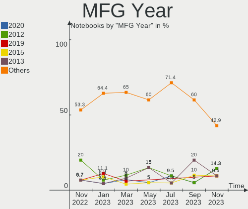
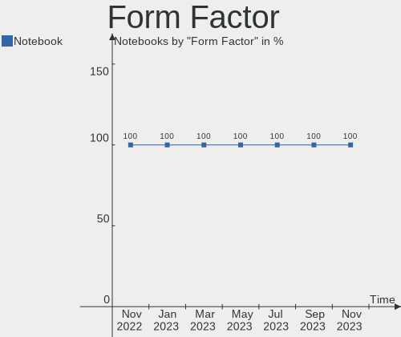
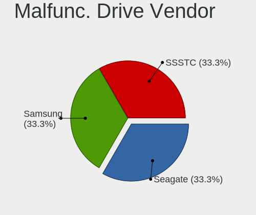
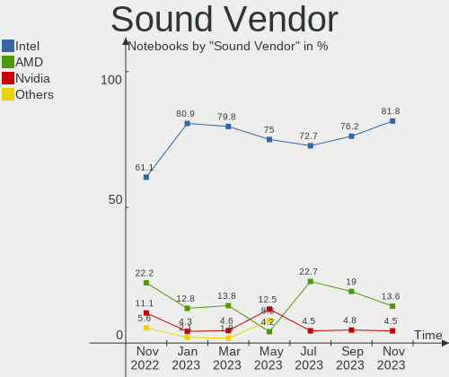
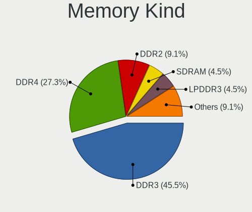
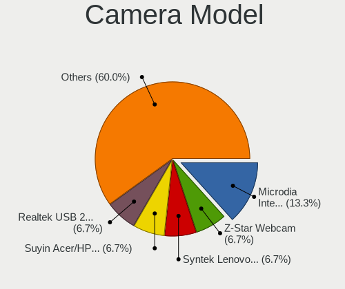
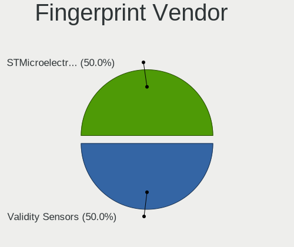

helloSystem Hardware Trends (Notebooks)
---------------------------------------

A project to identify most popular hardware characteristics and track their change
over time based on data collected by helloSystem users at https://BSD-Hardware.info.

Anyone can contribute to this report by the [hw-probe](https://github.com/linuxhw/hw-probe/blob/master/INSTALL.BSD.md) tool:

    hw-probe -all -upload

Full-feature report is available here: https://bsd-hardware.info/?view=trends

Period: Mar, 2022.

Contents
--------

* [ System ](#system)
  - [ OS                       ](#os)
  - [ OS Family                ](#os-family)
  - [ Arch                     ](#arch)
  - [ DE                       ](#de)
  - [ Display Server           ](#display-server)
  - [ Display Manager          ](#display-manager)
  - [ OS Lang                  ](#os-lang)
  - [ Boot Mode                ](#boot-mode)
  - [ Filesystem               ](#filesystem)
  - [ Part. scheme             ](#part-scheme)

* [ Board ](#board)
  - [ Vendor                   ](#vendor)
  - [ Model                    ](#model)
  - [ Model Family             ](#model-family)
  - [ MFG Year                 ](#mfg-year)
  - [ Form Factor              ](#form-factor)
  - [ Coreboot                 ](#coreboot)
  - [ RAM Size                 ](#ram-size)
  - [ RAM Used                 ](#ram-used)
  - [ Total Drives             ](#total-drives)
  - [ Has CD-ROM               ](#has-cd-rom)
  - [ Has Ethernet             ](#has-ethernet)
  - [ Has WiFi                 ](#has-wifi)
  - [ Has Bluetooth            ](#has-bluetooth)

* [ Location ](#location)
  - [ Country                  ](#country)
  - [ City                     ](#city)

* [ Drives ](#drives)
  - [ Drive Vendor             ](#drive-vendor)
  - [ Drive Model              ](#drive-model)
  - [ HDD Vendor               ](#hdd-vendor)
  - [ SSD Vendor               ](#ssd-vendor)
  - [ Drive Kind               ](#drive-kind)
  - [ Drive Connector          ](#drive-connector)
  - [ Drive Size               ](#drive-size)
  - [ Space Total              ](#space-total)
  - [ Space Used               ](#space-used)
  - [ Malfunc. Drives          ](#malfunc-drives)
  - [ Malfunc. Drive Vendor    ](#malfunc-drive-vendor)
  - [ Malfunc. HDD Vendor      ](#malfunc-hdd-vendor)
  - [ Malfunc. Drive Kind      ](#malfunc-drive-kind)
  - [ Failed Drives            ](#failed-drives)
  - [ Failed Drive Vendor      ](#failed-drive-vendor)
  - [ Drive Status             ](#drive-status)

* [ Storage controller ](#storage-controller)
  - [ Storage Vendor           ](#storage-vendor)
  - [ Storage Model            ](#storage-model)
  - [ Storage Kind             ](#storage-kind)

* [ Processor ](#processor)
  - [ CPU Vendor               ](#cpu-vendor)
  - [ CPU Model                ](#cpu-model)
  - [ CPU Model Family         ](#cpu-model-family)
  - [ CPU Cores                ](#cpu-cores)
  - [ CPU Sockets              ](#cpu-sockets)
  - [ CPU Threads              ](#cpu-threads)
  - [ CPU Microarch            ](#cpu-microarch)

* [ Graphics ](#graphics)
  - [ GPU Vendor               ](#gpu-vendor)
  - [ GPU Model                ](#gpu-model)
  - [ GPU Combo                ](#gpu-combo)
  - [ GPU Driver               ](#gpu-driver)
  - [ GPU Memory               ](#gpu-memory)

* [ Monitor ](#monitor)
  - [ Monitor Vendor           ](#monitor-vendor)
  - [ Monitor Model            ](#monitor-model)
  - [ Monitor Resolution       ](#monitor-resolution)
  - [ Monitor Diagonal         ](#monitor-diagonal)
  - [ Monitor Width            ](#monitor-width)
  - [ Aspect Ratio             ](#aspect-ratio)
  - [ Monitor Area             ](#monitor-area)
  - [ Pixel Density            ](#pixel-density)
  - [ Multiple Monitors        ](#multiple-monitors)

* [ Network ](#network)
  - [ Net Controller Vendor    ](#net-controller-vendor)
  - [ Net Controller Model     ](#net-controller-model)
  - [ Wireless Vendor          ](#wireless-vendor)
  - [ Wireless Model           ](#wireless-model)
  - [ Ethernet Vendor          ](#ethernet-vendor)
  - [ Ethernet Model           ](#ethernet-model)
  - [ Net Controller Kind      ](#net-controller-kind)
  - [ Used Controller          ](#used-controller)
  - [ NICs                     ](#nics)
  - [ IPv6                     ](#ipv6)

* [ Bluetooth ](#bluetooth)
  - [ Bluetooth Vendor         ](#bluetooth-vendor)
  - [ Bluetooth Model          ](#bluetooth-model)

* [ Sound ](#sound)
  - [ Sound Vendor             ](#sound-vendor)
  - [ Sound Model              ](#sound-model)

* [ Memory ](#memory)
  - [ Memory Vendor            ](#memory-vendor)
  - [ Memory Model             ](#memory-model)
  - [ Memory Kind              ](#memory-kind)
  - [ Memory Form Factor       ](#memory-form-factor)
  - [ Memory Size              ](#memory-size)
  - [ Memory Speed             ](#memory-speed)

* [ Printers & scanners ](#printers--scanners)
  - [ Printer Vendor           ](#printer-vendor)
  - [ Printer Model            ](#printer-model)
  - [ Scanner Vendor           ](#scanner-vendor)
  - [ Scanner Model            ](#scanner-model)

* [ Camera ](#camera)
  - [ Camera Vendor            ](#camera-vendor)
  - [ Camera Model             ](#camera-model)

* [ Security ](#security)
  - [ Fingerprint Vendor       ](#fingerprint-vendor)
  - [ Fingerprint Model        ](#fingerprint-model)
  - [ Chipcard Vendor          ](#chipcard-vendor)
  - [ Chipcard Model           ](#chipcard-model)

* [ Unsupported ](#unsupported)
  - [ Unsupported Devices      ](#unsupported-devices)
  - [ Unsupported Device Types ](#unsupported-device-types)

System
------

OS
--

Installed operating systems

| Name              | Notebooks | Percent |
|-------------------|-----------|---------|
| helloSystem 0.7.0 | 12        | 63.16%  |
| helloSystem 0.8.0 | 6         | 31.58%  |
| helloSystem 0.6.0 | 1         | 5.26%   |

OS Family
---------

OS without a version

| Name        | Notebooks | Percent |
|-------------|-----------|---------|
| helloSystem | 19        | 100%    |

Arch
----

OS architecture (x86_64, i586, etc.)

| Name  | Notebooks | Percent |
|-------|-----------|---------|
| amd64 | 19        | 100%    |

DE
--

Desktop Environment

| Name         | Notebooks | Percent |
|--------------|-----------|---------|
| helloDesktop | 18        | 94.74%  |
| GNOME        | 1         | 5.26%   |

Display Server
--------------

X11 or Wayland

| Name | Notebooks | Percent |
|------|-----------|---------|
| X11  | 19        | 100%    |

Display Manager
---------------

SDDM, LightDM, etc.

| Name | Notebooks | Percent |
|------|-----------|---------|
| SLiM | 19        | 100%    |

OS Lang
-------

Language

| Lang  | Notebooks | Percent |
|-------|-----------|---------|
| en_US | 19        | 100%    |

Boot Mode
---------

EFI or BIOS

| Mode | Notebooks | Percent |
|------|-----------|---------|
| EFI  | 17        | 89.47%  |
| BIOS | 2         | 10.53%  |

Filesystem
----------

Type of filesystem

| Type   | Notebooks | Percent |
|--------|-----------|---------|
| Zfs    | 10        | 52.63%  |
| Cd9660 | 9         | 47.37%  |

Part. scheme
------------

Scheme of partitioning

| Type | Notebooks | Percent |
|------|-----------|---------|
| GPT  | 18        | 94.74%  |
| MBR  | 1         | 5.26%   |

Board
-----

Vendor
------

Motherboard manufacturer

| Name             | Notebooks | Percent |
|------------------|-----------|---------|
| Lenovo           | 6         | 31.58%  |
| Hewlett-Packard  | 3         | 15.79%  |
| Dell             | 2         | 10.53%  |
| PCSTICK          | 1         | 5.26%   |
| Packard Bell     | 1         | 5.26%   |
| Itautec          | 1         | 5.26%   |
| HUAWEI           | 1         | 5.26%   |
| HASEE Computer   | 1         | 5.26%   |
| Gateway          | 1         | 5.26%   |
| ASUSTek Computer | 1         | 5.26%   |
| Acer             | 1         | 5.26%   |

Model
-----

Motherboard model

| Name                                | Notebooks | Percent |
|-------------------------------------|-----------|---------|
| Packard Bell EasyNote TE69HW        | 1         | 5.26%   |
| Lenovo Z50-70 20354                 | 1         | 5.26%   |
| Lenovo ThinkPad X220 Tablet 4298B65 | 1         | 5.26%   |
| Lenovo ThinkPad X220 4293B43        | 1         | 5.26%   |
| Lenovo ThinkPad L440 20ASS0FP00     | 1         | 5.26%   |
| Lenovo ThinkBook 14 G2 ARE 20VF     | 1         | 5.26%   |
| Lenovo IdeaPad N585                 | 1         | 5.26%   |
| Itautec Infoway w7535               | 1         | 5.26%   |
| HUAWEI BOD-WXX9                     | 1         | 5.26%   |
| HP Pavilion dv6                     | 1         | 5.26%   |
| HP EliteBook 850 G3                 | 1         | 5.26%   |
| HP Compaq 6510b (GF910AW#AB8)       | 1         | 5.26%   |
| HASEE CW35S                         | 1         | 5.26%   |
| Gateway NE56R                       | 1         | 5.26%   |
| Dell Vostro 3490                    | 1         | 5.26%   |
| Dell Latitude E6540                 | 1         | 5.26%   |
| ASUS UX31E                          | 1         | 5.26%   |
| Acer Aspire E1-421                  | 1         | 5.26%   |
| Unknown                             | 1         | 5.26%   |

Model Family
------------

Motherboard model prefix

| Name                  | Notebooks | Percent |
|-----------------------|-----------|---------|
| Lenovo ThinkPad       | 3         | 15.79%  |
| Packard Bell EasyNote | 1         | 5.26%   |
| Lenovo Z50-70         | 1         | 5.26%   |
| Lenovo ThinkBook      | 1         | 5.26%   |
| Lenovo IdeaPad        | 1         | 5.26%   |
| Itautec Infoway       | 1         | 5.26%   |
| HUAWEI BOD-WXX9       | 1         | 5.26%   |
| HP Pavilion           | 1         | 5.26%   |
| HP EliteBook          | 1         | 5.26%   |
| HP Compaq             | 1         | 5.26%   |
| HASEE CW35S           | 1         | 5.26%   |
| Gateway NE56R         | 1         | 5.26%   |
| Dell Vostro           | 1         | 5.26%   |
| Dell Latitude         | 1         | 5.26%   |
| ASUS UX31E            | 1         | 5.26%   |
| Acer Aspire           | 1         | 5.26%   |
| Unknown               | 1         | 5.26%   |

MFG Year
--------

Motherboard manufacture year

| Year    | Notebooks | Percent |
|---------|-----------|---------|
| 2013    | 4         | 21.05%  |
| 2018    | 3         | 15.79%  |
| 2021    | 2         | 10.53%  |
| 2012    | 2         | 10.53%  |
| 2009    | 2         | 10.53%  |
| 2020    | 1         | 5.26%   |
| 2017    | 1         | 5.26%   |
| 2016    | 1         | 5.26%   |
| 2015    | 1         | 5.26%   |
| 2011    | 1         | 5.26%   |
| Unknown | 1         | 5.26%   |

Form Factor
-----------

Physical design of the computer

| Name     | Notebooks | Percent |
|----------|-----------|---------|
| Notebook | 19        | 100%    |

Coreboot
--------

Have coreboot on board

| Used | Notebooks | Percent |
|------|-----------|---------|
| No   | 19        | 100%    |

RAM Size
--------

Total RAM memory

| Size in GB | Notebooks | Percent |
|------------|-----------|---------|
| 8.01-16.0  | 8         | 42.11%  |
| 4.01-8.0   | 7         | 36.84%  |
| 16.01-24.0 | 2         | 10.53%  |
| 24.01-32.0 | 1         | 5.26%   |
| 2.01-3.0   | 1         | 5.26%   |

RAM Used
--------

Used RAM memory

| Used GB  | Notebooks | Percent |
|----------|-----------|---------|
| 0.01-0.5 | 14        | 73.68%  |
| 0.51-1.0 | 4         | 21.05%  |
| 2.01-3.0 | 1         | 5.26%   |

Total Drives
------------

Number of drives on board

| Drives | Notebooks | Percent |
|--------|-----------|---------|
| 1      | 15        | 78.95%  |
| 0      | 2         | 10.53%  |
| 3      | 1         | 5.26%   |
| 2      | 1         | 5.26%   |

Has CD-ROM
----------

Has CD-ROM on board

| Presented | Notebooks | Percent |
|-----------|-----------|---------|
| No        | 12        | 63.16%  |
| Yes       | 7         | 36.84%  |

Has Ethernet
------------

Has Ethernet on board

| Presented | Notebooks | Percent |
|-----------|-----------|---------|
| Yes       | 16        | 84.21%  |
| No        | 3         | 15.79%  |

Has WiFi
--------

Has WiFi module

| Presented | Notebooks | Percent |
|-----------|-----------|---------|
| Yes       | 17        | 89.47%  |
| No        | 2         | 10.53%  |

Has Bluetooth
-------------

Has Bluetooth module

| Presented | Notebooks | Percent |
|-----------|-----------|---------|
| No        | 10        | 52.63%  |
| Yes       | 9         | 47.37%  |

Location
--------

Country
-------

Geographic location (country)

| Country  | Notebooks | Percent |
|----------|-----------|---------|
| USA      | 4         | 21.05%  |
| Brazil   | 3         | 15.79%  |
| Russia   | 2         | 10.53%  |
| Vietnam  | 1         | 5.26%   |
| UK       | 1         | 5.26%   |
| UAE      | 1         | 5.26%   |
| Turkey   | 1         | 5.26%   |
| Spain    | 1         | 5.26%   |
| Norway   | 1         | 5.26%   |
| Mexico   | 1         | 5.26%   |
| Germany  | 1         | 5.26%   |
| Colombia | 1         | 5.26%   |
| China    | 1         | 5.26%   |

City
----

Geographic location (city)

| City                 | Notebooks | Percent |
|----------------------|-----------|---------|
| Warendorf            | 1         | 5.26%   |
| Rio das Ostras       | 1         | 5.26%   |
| Portland             | 1         | 5.26%   |
| Paracuru             | 1         | 5.26%   |
| Oakdale              | 1         | 5.26%   |
| Nesttun              | 1         | 5.26%   |
| Moscow               | 1         | 5.26%   |
| Mexico City          | 1         | 5.26%   |
| Mankato              | 1         | 5.26%   |
| Madrid               | 1         | 5.26%   |
| Kirov                | 1         | 5.26%   |
| Inverness            | 1         | 5.26%   |
| Harrisburg           | 1         | 5.26%   |
| Hanoi                | 1         | 5.26%   |
| Envigado             | 1         | 5.26%   |
| Bursa                | 1         | 5.26%   |
| Beijing              | 1         | 5.26%   |
| Aparecida de Goiania | 1         | 5.26%   |
| Abu Dhabi            | 1         | 5.26%   |

Drives
------

Drive Vendor
------------

Hard drive vendors

| Vendor              | Notebooks | Drives | Percent |
|---------------------|-----------|--------|---------|
| Samsung Electronics | 4         | 4      | 20%     |
| WDC                 | 3         | 3      | 15%     |
| Seagate             | 3         | 3      | 15%     |
| Kingston            | 2         | 2      | 10%     |
| A-DATA Technology   | 2         | 2      | 10%     |
| Zheino              | 1         | 1      | 5%      |
| Toshiba             | 1         | 1      | 5%      |
| Patriot             | 1         | 1      | 5%      |
| OCZ                 | 1         | 1      | 5%      |
| KIOXIA              | 1         | 1      | 5%      |
| INDMEM              | 1         | 1      | 5%      |

Drive Model
-----------

Hard drive models

| Model                                | Notebooks | Percent |
|--------------------------------------|-----------|---------|
| Seagate ST1000LM024 HN-M101MBB 1TB   | 2         | 10%     |
| Zheino CHN mSATAM1 256 256GB         | 1         | 5%      |
| WDC WDS120G2G0A-00JH30 120GB         | 1         | 5%      |
| WDC PC SN530 SDBPNPZ-512G-1027 512GB | 1         | 5%      |
| WDC PC SN530 SDBPMPZ-256G-1101 256GB | 1         | 5%      |
| Toshiba MK7559GSXF 752GB             | 1         | 5%      |
| Seagate ST500LT012-9WS142 500GB      | 1         | 5%      |
| Samsung SSD PM871 2.5 7mm 128GB      | 1         | 5%      |
| Samsung SSD 970 EVO Plus 500GB       | 1         | 5%      |
| Samsung SSD 870 QVO 8TB              | 1         | 5%      |
| Samsung SSD 850 EVO 120GB            | 1         | 5%      |
| Patriot Burst 120GB                  | 1         | 5%      |
| OCZ AGILITY3 120GB                   | 1         | 5%      |
| KIOXIA KBG40ZNS256G NVMe 256GB       | 1         | 5%      |
| Kingston SMS200S3120G 120GB          | 1         | 5%      |
| Kingston SA400S37240G 240GB          | 1         | 5%      |
| INDMEM SSD mSATA 128GB               | 1         | 5%      |
| A-DATA XM11 128GB                    | 1         | 5%      |
| A-DATA SU650 240GB                   | 1         | 5%      |

HDD Vendor
----------

Hard disk drive vendors

| Vendor  | Notebooks | Drives | Percent |
|---------|-----------|--------|---------|
| Seagate | 3         | 3      | 75%     |
| Toshiba | 1         | 1      | 25%     |

SSD Vendor
----------

Solid state drive vendors

| Vendor              | Notebooks | Drives | Percent |
|---------------------|-----------|--------|---------|
| Samsung Electronics | 3         | 3      | 25%     |
| Kingston            | 2         | 2      | 16.67%  |
| A-DATA Technology   | 2         | 2      | 16.67%  |
| Zheino              | 1         | 1      | 8.33%   |
| WDC                 | 1         | 1      | 8.33%   |
| Patriot             | 1         | 1      | 8.33%   |
| OCZ                 | 1         | 1      | 8.33%   |
| INDMEM              | 1         | 1      | 8.33%   |

Drive Kind
----------

HDD or SSD

| Kind | Notebooks | Drives | Percent |
|------|-----------|--------|---------|
| SSD  | 10        | 12     | 58.82%  |
| HDD  | 4         | 4      | 23.53%  |
| NVMe | 3         | 4      | 17.65%  |

Drive Connector
---------------

SATA, SAS, NVMe, etc.

| Type | Notebooks | Drives | Percent |
|------|-----------|--------|---------|
| SATA | 14        | 16     | 82.35%  |
| NVMe | 3         | 4      | 17.65%  |

Drive Size
----------

Size of hard drive

| Size in TB | Notebooks | Drives | Percent |
|------------|-----------|--------|---------|
| 0.01-0.5   | 10        | 12     | 71.43%  |
| 0.51-1.0   | 3         | 3      | 21.43%  |
| 4.01-10.0  | 1         | 1      | 7.14%   |

Space Total
-----------

Amount of disk space available on the file system

| Size in GB | Notebooks | Percent |
|------------|-----------|---------|
| 1-20       | 9         | 47.37%  |
| 101-250    | 5         | 26.32%  |
| 251-500    | 2         | 10.53%  |
| 501-1000   | 2         | 10.53%  |
| 21-50      | 1         | 5.26%   |

Space Used
----------

Amount of used disk space

| Used GB | Notebooks | Percent |
|---------|-----------|---------|
| 1-20    | 18        | 94.74%  |
| 101-250 | 1         | 5.26%   |

Malfunc. Drives
---------------

Drive models with a malfunction

| Model                           | Notebooks | Drives | Percent |
|---------------------------------|-----------|--------|---------|
| Toshiba MK7559GSXF 752GB        | 1         | 1      | 50%     |
| Seagate ST500LT012-9WS142 500GB | 1         | 1      | 50%     |

Malfunc. Drive Vendor
---------------------

Vendors of faulty drives

| Vendor  | Notebooks | Drives | Percent |
|---------|-----------|--------|---------|
| Toshiba | 1         | 1      | 50%     |
| Seagate | 1         | 1      | 50%     |

Malfunc. HDD Vendor
-------------------

Vendors of faulty HDD drives

| Vendor  | Notebooks | Drives | Percent |
|---------|-----------|--------|---------|
| Toshiba | 1         | 1      | 50%     |
| Seagate | 1         | 1      | 50%     |

Malfunc. Drive Kind
-------------------

Kinds of faulty drives

| Kind | Notebooks | Drives | Percent |
|------|-----------|--------|---------|
| HDD  | 2         | 2      | 100%    |

Failed Drives
-------------

Failed drive models

Zero info for selected period =(

Failed Drive Vendor
-------------------

Failed drive vendors

Zero info for selected period =(

Drive Status
------------

Number of failed and malfunc. drives

| Status  | Notebooks | Drives | Percent |
|---------|-----------|--------|---------|
| Works   | 15        | 18     | 88.24%  |
| Malfunc | 2         | 2      | 11.76%  |

Storage controller
------------------

Storage Vendor
--------------

Storage controller vendors

| Vendor              | Notebooks | Percent |
|---------------------|-----------|---------|
| Intel               | 14        | 66.67%  |
| AMD                 | 3         | 14.29%  |
| Sandisk             | 2         | 9.52%   |
| Samsung Electronics | 1         | 4.76%   |
| KIOXIA              | 1         | 4.76%   |

Storage Model
-------------

Storage controller models

| Model                                                                          | Notebooks | Percent |
|--------------------------------------------------------------------------------|-----------|---------|
| Intel 6 Series/C200 Series Chipset Family 6 port Mobile SATA AHCI Controller   | 5         | 22.73%  |
| Intel 8 Series/C220 Series Chipset Family 6-port SATA Controller 1 [AHCI mode] | 3         | 13.64%  |
| AMD FCH SATA Controller [AHCI mode]                                            | 3         | 13.64%  |
| Intel 8 Series SATA Controller 1 [AHCI mode]                                   | 2         | 9.09%   |
| Sandisk WD Blue SN550 NVMe SSD                                                 | 1         | 4.55%   |
| Samsung NVMe SSD Controller SM981/PM981/PM983                                  | 1         | 4.55%   |
| KIOXIA unknown                                                                 | 1         | 4.55%   |
| Intel Sunrise Point-LP SATA Controller [AHCI mode]                             | 1         | 4.55%   |
| Intel Comet Lake SATA AHCI Controller                                          | 1         | 4.55%   |
| Intel 82801HM/HEM (ICH8M/ICH8M-E) SATA Controller [AHCI mode]                  | 1         | 4.55%   |
| Intel 82801HM/HEM (ICH8M/ICH8M-E) IDE Controller                               | 1         | 4.55%   |
| Intel 7 Series Chipset Family 6-port SATA Controller [AHCI mode]               | 1         | 4.55%   |
| Unknown                                                                        | 1         | 4.55%   |

Storage Kind
------------

Kind of storage controller (IDE, SATA, NVMe, SAS, ...)

| Kind | Notebooks | Percent |
|------|-----------|---------|
| SATA | 17        | 80.95%  |
| NVMe | 3         | 14.29%  |
| IDE  | 1         | 4.76%   |

Processor
---------

CPU Vendor
----------

Processor vendors

| Vendor | Notebooks | Percent |
|--------|-----------|---------|
| Intel  | 16        | 84.21%  |
| AMD    | 3         | 15.79%  |

CPU Model
---------

Processor models

| Model                                   | Notebooks | Percent |
|-----------------------------------------|-----------|---------|
| Intel Core i5-2520M CPU @ 2.50GHz       | 2         | 10.53%  |
| AMD E1-1200 APU with Radeon HD Graphics | 2         | 10.53%  |
| Intel Core i7-6600U CPU @ 2.60GHz       | 1         | 5.26%   |
| Intel Core i7-4810MQ CPU @ 2.80GHz      | 1         | 5.26%   |
| Intel Core i7-4700MQ CPU @ 2.40GHz      | 1         | 5.26%   |
| Intel Core i7-2677M CPU @ 1.80GHz       | 1         | 5.26%   |
| Intel Core i5-4300M CPU @ 2.60GHz       | 1         | 5.26%   |
| Intel Core i5-4210U CPU @ 1.70GHz       | 1         | 5.26%   |
| Intel Core i5-2450M CPU @ 2.50GHz       | 1         | 5.26%   |
| Intel Core i5-10210U CPU @ 1.60GHz      | 1         | 5.26%   |
| Intel Core i3-2310M CPU @ 2.10GHz       | 1         | 5.26%   |
| Intel Core 2 Duo CPU T7500 @ 2.20GHz    | 1         | 5.26%   |
| Intel Celeron CPU B830 @ 1.80GHz        | 1         | 5.26%   |
| Intel Celeron 2957U @ 1.40GHz           | 1         | 5.26%   |
| Intel Atom CPU Z3735F @ 1.33GHz         | 1         | 5.26%   |
| Intel 11th Gen Core i5-1135G7 @ 2.40GHz | 1         | 5.26%   |
| AMD Ryzen 5 4500U with Radeon Graphics  | 1         | 5.26%   |

CPU Model Family
----------------

Processor model prefix

| Model            | Notebooks | Percent |
|------------------|-----------|---------|
| Intel Core i5    | 6         | 31.58%  |
| Intel Core i7    | 4         | 21.05%  |
| Intel Celeron    | 2         | 10.53%  |
| AMD E1           | 2         | 10.53%  |
| Other            | 1         | 5.26%   |
| Intel Core i3    | 1         | 5.26%   |
| Intel Core 2 Duo | 1         | 5.26%   |
| Intel Atom       | 1         | 5.26%   |
| AMD Ryzen 5      | 1         | 5.26%   |

CPU Cores
---------

Number of processor cores

| Number  | Notebooks | Percent |
|---------|-----------|---------|
| 2       | 12        | 63.16%  |
| 4       | 5         | 26.32%  |
| 6       | 1         | 5.26%   |
| Unknown | 1         | 5.26%   |

CPU Sockets
-----------

Number of sockets

| Number | Notebooks | Percent |
|--------|-----------|---------|
| 1      | 19        | 100%    |

CPU Threads
-----------

Threads per core (Hyper-Threading)

| Number  | Notebooks | Percent |
|---------|-----------|---------|
| 2       | 12        | 63.16%  |
| 1       | 6         | 31.58%  |
| Unknown | 1         | 5.26%   |

CPU Microarch
-------------

Microarchitecture

| Name        | Notebooks | Percent |
|-------------|-----------|---------|
| SandyBridge | 6         | 31.58%  |
| Haswell     | 5         | 26.32%  |
| Bobcat      | 2         | 10.53%  |
| Zen 2       | 1         | 5.26%   |
| TigerLake   | 1         | 5.26%   |
| Skylake     | 1         | 5.26%   |
| Silvermont  | 1         | 5.26%   |
| KabyLake    | 1         | 5.26%   |
| Core        | 1         | 5.26%   |

Graphics
--------

GPU Vendor
----------

Vendors of graphics cards

| Vendor | Notebooks | Percent |
|--------|-----------|---------|
| Intel  | 16        | 72.73%  |
| AMD    | 5         | 22.73%  |
| Nvidia | 1         | 4.55%   |

GPU Model
---------

Graphics card models

| Model                                                                     | Notebooks | Percent |
|---------------------------------------------------------------------------|-----------|---------|
| Intel 2nd Generation Core Processor Family Integrated Graphics Controller | 6         | 26.09%  |
| Intel 4th Gen Core Processor Integrated Graphics Controller               | 3         | 13.04%  |
| Intel Haswell-ULT Integrated Graphics Controller                          | 2         | 8.7%    |
| AMD Wrestler [Radeon HD 7310]                                             | 2         | 8.7%    |
| Nvidia GK106M [GeForce GTX 765M]                                          | 1         | 4.35%   |
| Intel TigerLake-LP GT2 [Iris Xe Graphics]                                 | 1         | 4.35%   |
| Intel Skylake GT2 [HD Graphics 520]                                       | 1         | 4.35%   |
| Intel Mobile GM965/GL960 Integrated Graphics Controller (secondary)       | 1         | 4.35%   |
| Intel Mobile GM965/GL960 Integrated Graphics Controller (primary)         | 1         | 4.35%   |
| Intel CometLake-U GT2 [UHD Graphics]                                      | 1         | 4.35%   |
| Intel Atom Processor Z36xxx/Z37xxx Series Graphics & Display              | 1         | 4.35%   |
| AMD Renoir                                                                | 1         | 4.35%   |
| AMD Opal XT [Radeon R7 M265/M365X/M465]                                   | 1         | 4.35%   |
| AMD Mars XTX [Radeon HD 8790M]                                            | 1         | 4.35%   |

GPU Combo
---------

Combinations of graphics cards

| Name           | Notebooks | Percent |
|----------------|-----------|---------|
| 1 x Intel      | 12        | 63.16%  |
| 1 x AMD        | 3         | 15.79%  |
| Intel + AMD    | 2         | 10.53%  |
| 2 x Intel      | 1         | 5.26%   |
| Intel + Nvidia | 1         | 5.26%   |

GPU Driver
----------

Free vs proprietary

| Driver  | Notebooks | Percent |
|---------|-----------|---------|
| Free    | 18        | 94.74%  |
| Unknown | 1         | 5.26%   |

GPU Memory
----------

Total video memory

| Size in GB | Notebooks | Percent |
|------------|-----------|---------|
| Unknown    | 17        | 89.47%  |
| 0.01-0.5   | 2         | 10.53%  |

Monitor
-------

Monitor Vendor
--------------

Monitor vendors

| Vendor                  | Notebooks | Percent |
|-------------------------|-----------|---------|
| LG Display              | 5         | 27.78%  |
| Chimei Innolux          | 3         | 16.67%  |
| AU Optronics            | 3         | 16.67%  |
| Samsung Electronics     | 2         | 11.11%  |
| Vestel Elektronik       | 1         | 5.56%   |
| Hewlett-Packard         | 1         | 5.56%   |
| CPT                     | 1         | 5.56%   |
| Chi Mei Optoelectronics | 1         | 5.56%   |
| BOE                     | 1         | 5.56%   |

Monitor Model
-------------

Monitor models

| Model                                                                    | Notebooks | Percent |
|--------------------------------------------------------------------------|-----------|---------|
| Vestel Elektronik 24W_LCD_TV VES3700 1920x1080 530x300mm 24.0-inch       | 1         | 5.56%   |
| Samsung Electronics LCD Monitor SEC4542 1280x800 300x190mm 14.0-inch     | 1         | 5.56%   |
| Samsung Electronics LCD Monitor SDC4C48 1920x1080 340x190mm 15.3-inch    | 1         | 5.56%   |
| LG Display LCD Monitor LGD0430 1366x768 350x190mm 15.7-inch              | 1         | 5.56%   |
| LG Display LCD Monitor LGD0385 1366x768 310x170mm 13.9-inch              | 1         | 5.56%   |
| LG Display LCD Monitor LGD033A 1366x768 340x190mm 15.3-inch              | 1         | 5.56%   |
| LG Display LCD Monitor LGD02D8 1366x768 280x160mm 12.7-inch              | 1         | 5.56%   |
| LG Display LCD Monitor LGD02D3 1366x768 280x160mm 12.7-inch              | 1         | 5.56%   |
| Hewlett-Packard LCD Monitor HWP26A4 1440x900 410x260mm 19.1-inch         | 1         | 5.56%   |
| CPT LCD Monitor COR17DB 1600x900 290x160mm 13.0-inch                     | 1         | 5.56%   |
| Chimei Innolux LCD Monitor CMN15B1 1920x1080 340x190mm 15.3-inch         | 1         | 5.56%   |
| Chimei Innolux LCD Monitor CMN14C9 1920x1080 310x170mm 13.9-inch         | 1         | 5.56%   |
| Chimei Innolux LCD Monitor CMN1492 1366x768 310x170mm 13.9-inch          | 1         | 5.56%   |
| Chi Mei Optoelectronics LCD Monitor CMO15A2 1366x768 350x190mm 15.7-inch | 1         | 5.56%   |
| BOE LCD Monitor BOE0872 1920x1080 340x190mm 15.3-inch                    | 1         | 5.56%   |
| AU Optronics LCD Monitor AUO37ED 1920x1080 340x190mm 15.3-inch           | 1         | 5.56%   |
| AU Optronics LCD Monitor AUO26EC 1366x768 340x190mm 15.3-inch            | 1         | 5.56%   |
| AU Optronics LCD Monitor AUO183C 1366x768 310x170mm 13.9-inch            | 1         | 5.56%   |

Monitor Resolution
------------------

Monitor screen resolution

| Resolution       | Notebooks | Percent |
|------------------|-----------|---------|
| 1366x768 (WXGA)  | 10        | 55.56%  |
| 1920x1080 (FHD)  | 5         | 27.78%  |
| 1920x540         | 1         | 5.56%   |
| 1600x900 (HD+)   | 1         | 5.56%   |
| 1440x900 (WXGA+) | 1         | 5.56%   |

Monitor Diagonal
----------------

Diagonal size in inches

| Inches | Notebooks | Percent |
|--------|-----------|---------|
| 15     | 8         | 44.44%  |
| 13     | 5         | 27.78%  |
| 12     | 2         | 11.11%  |
| 42     | 1         | 5.56%   |
| 19     | 1         | 5.56%   |
| 14     | 1         | 5.56%   |

Monitor Width
-------------

Physical width

| Width in mm | Notebooks | Percent |
|-------------|-----------|---------|
| 301-350     | 12        | 66.67%  |
| 201-300     | 4         | 22.22%  |
| 401-500     | 1         | 5.56%   |
| 901-1000    | 1         | 5.56%   |

Aspect Ratio
------------

Proportional relationship between the width and the height

| Ratio | Notebooks | Percent |
|-------|-----------|---------|
| 16/9  | 15        | 88.24%  |
| 16/10 | 2         | 11.76%  |

Monitor Area
------------

Area in inch²

| Area in inch² | Notebooks | Percent |
|----------------|-----------|---------|
| 91-100         | 6         | 33.33%  |
| 81-90          | 5         | 27.78%  |
| 61-70          | 2         | 11.11%  |
| 101-110        | 2         | 11.11%  |
| 71-80          | 1         | 5.56%   |
| 151-200        | 1         | 5.56%   |
| 501-1000       | 1         | 5.56%   |

Pixel Density
-------------

Pixels per inch

| Density | Notebooks | Percent |
|---------|-----------|---------|
| 121-160 | 8         | 44.44%  |
| 101-120 | 6         | 33.33%  |
| 51-100  | 4         | 22.22%  |

Multiple Monitors
-----------------

Total monitors connected

| Total | Notebooks | Percent |
|-------|-----------|---------|
| 1     | 17        | 89.47%  |
| 2     | 1         | 5.26%   |
| 0     | 1         | 5.26%   |

Network
-------

Net Controller Vendor
---------------------

Controller vendors

| Vendor                            | Notebooks | Percent |
|-----------------------------------|-----------|---------|
| Intel                             | 10        | 33.33%  |
| Realtek Semiconductor             | 7         | 23.33%  |
| Qualcomm Atheros                  | 6         | 20%     |
| Broadcom                          | 3         | 10%     |
| JMicron Technology                | 1         | 3.33%   |
| Ericsson Business Mobile Networks | 1         | 3.33%   |
| Edimax Technology                 | 1         | 3.33%   |
| D-Link System                     | 1         | 3.33%   |

Net Controller Model
--------------------

Controller models

| Model                                                                       | Notebooks | Percent |
|-----------------------------------------------------------------------------|-----------|---------|
| Realtek RTL8111/8168/8411 PCI Express Gigabit Ethernet Controller           | 6         | 16.22%  |
| Qualcomm Atheros AR9485 Wireless Network Adapter                            | 3         | 8.11%   |
| Intel Ethernet Connection I217-LM                                           | 2         | 5.41%   |
| Intel Centrino Advanced-N 6205 [Taylor Peak]                                | 2         | 5.41%   |
| Intel 82579LM Gigabit Network Connection (Lewisville)                       | 2         | 5.41%   |
| Realtek RTL8723BE PCIe Wireless Network Adapter                             | 1         | 2.7%    |
| Realtek RTL8188EUS 802.11n Wireless Network Adapter                         | 1         | 2.7%    |
| Realtek RTL8188CE 802.11b/g/n WiFi Adapter                                  | 1         | 2.7%    |
| Qualcomm Atheros QCA9565 / AR9565 Wireless Network Adapter                  | 1         | 2.7%    |
| Qualcomm Atheros QCA9377 802.11ac Wireless Network Adapter                  | 1         | 2.7%    |
| Qualcomm Atheros AR9285 Wireless Network Adapter (PCI-Express)              | 1         | 2.7%    |
| Qualcomm Atheros AR8151 v2.0 Gigabit Ethernet                               | 1         | 2.7%    |
| JMicron JMC250 PCI Express Gigabit Ethernet Controller                      | 1         | 2.7%    |
| Intel Wireless 8260                                                         | 1         | 2.7%    |
| Intel Wireless 7260                                                         | 1         | 2.7%    |
| Intel Wi-Fi 6 AX201                                                         | 1         | 2.7%    |
| Intel Wi-Fi 6 AX200                                                         | 1         | 2.7%    |
| Intel PRO/Wireless 4965 AG or AGN [Kedron] Network Connection               | 1         | 2.7%    |
| Intel Ethernet Connection I219-LM                                           | 1         | 2.7%    |
| Intel Centrino Wireless-N 1030 [Rainbow Peak]                               | 1         | 2.7%    |
| Intel Centrino Ultimate-N 6300                                              | 1         | 2.7%    |
| Ericsson Business Mobile Networks N5321 gw Mobile Broadband Serial Port III | 1         | 2.7%    |
| Edimax Edimax AC600 Wireless LAN USB Adapter                                | 1         | 2.7%    |
| D-Link System DWA-125 Wireless N 150 Adapter(rev.A1) [Ralink RT3070]        | 1         | 2.7%    |
| Broadcom NetXtreme BCM57786 Gigabit Ethernet PCIe                           | 1         | 2.7%    |
| Broadcom NetLink BCM5787M Gigabit Ethernet PCI Express                      | 1         | 2.7%    |
| Broadcom NetLink BCM57785 Gigabit Ethernet PCIe                             | 1         | 2.7%    |

Wireless Vendor
---------------

Wireless vendors

| Vendor                | Notebooks | Percent |
|-----------------------|-----------|---------|
| Intel                 | 9         | 45%     |
| Qualcomm Atheros      | 6         | 30%     |
| Realtek Semiconductor | 3         | 15%     |
| Edimax Technology     | 1         | 5%      |
| D-Link System         | 1         | 5%      |

Wireless Model
--------------

Wireless models

| Model                                                                | Notebooks | Percent |
|----------------------------------------------------------------------|-----------|---------|
| Qualcomm Atheros AR9485 Wireless Network Adapter                     | 3         | 15%     |
| Intel Centrino Advanced-N 6205 [Taylor Peak]                         | 2         | 10%     |
| Realtek RTL8723BE PCIe Wireless Network Adapter                      | 1         | 5%      |
| Realtek RTL8188EUS 802.11n Wireless Network Adapter                  | 1         | 5%      |
| Realtek RTL8188CE 802.11b/g/n WiFi Adapter                           | 1         | 5%      |
| Qualcomm Atheros QCA9565 / AR9565 Wireless Network Adapter           | 1         | 5%      |
| Qualcomm Atheros QCA9377 802.11ac Wireless Network Adapter           | 1         | 5%      |
| Qualcomm Atheros AR9285 Wireless Network Adapter (PCI-Express)       | 1         | 5%      |
| Intel Wireless 8260                                                  | 1         | 5%      |
| Intel Wireless 7260                                                  | 1         | 5%      |
| Intel Wi-Fi 6 AX201                                                  | 1         | 5%      |
| Intel Wi-Fi 6 AX200                                                  | 1         | 5%      |
| Intel PRO/Wireless 4965 AG or AGN [Kedron] Network Connection        | 1         | 5%      |
| Intel Centrino Wireless-N 1030 [Rainbow Peak]                        | 1         | 5%      |
| Intel Centrino Ultimate-N 6300                                       | 1         | 5%      |
| Edimax Edimax AC600 Wireless LAN USB Adapter                         | 1         | 5%      |
| D-Link System DWA-125 Wireless N 150 Adapter(rev.A1) [Ralink RT3070] | 1         | 5%      |

Ethernet Vendor
---------------

Ethernet vendors

| Vendor                | Notebooks | Percent |
|-----------------------|-----------|---------|
| Realtek Semiconductor | 6         | 37.5%   |
| Intel                 | 5         | 31.25%  |
| Broadcom              | 3         | 18.75%  |
| Qualcomm Atheros      | 1         | 6.25%   |
| JMicron Technology    | 1         | 6.25%   |

Ethernet Model
--------------

Ethernet models

| Model                                                             | Notebooks | Percent |
|-------------------------------------------------------------------|-----------|---------|
| Realtek RTL8111/8168/8411 PCI Express Gigabit Ethernet Controller | 6         | 37.5%   |
| Intel Ethernet Connection I217-LM                                 | 2         | 12.5%   |
| Intel 82579LM Gigabit Network Connection (Lewisville)             | 2         | 12.5%   |
| Qualcomm Atheros AR8151 v2.0 Gigabit Ethernet                     | 1         | 6.25%   |
| JMicron JMC250 PCI Express Gigabit Ethernet Controller            | 1         | 6.25%   |
| Intel Ethernet Connection I219-LM                                 | 1         | 6.25%   |
| Broadcom NetXtreme BCM57786 Gigabit Ethernet PCIe                 | 1         | 6.25%   |
| Broadcom NetLink BCM5787M Gigabit Ethernet PCI Express            | 1         | 6.25%   |
| Broadcom NetLink BCM57785 Gigabit Ethernet PCIe                   | 1         | 6.25%   |

Net Controller Kind
-------------------

Ethernet, WiFi or modem

| Kind     | Notebooks | Percent |
|----------|-----------|---------|
| WiFi     | 17        | 50%     |
| Ethernet | 16        | 47.06%  |
| Modem    | 1         | 2.94%   |

Used Controller
---------------

Currently used network controller

| Kind     | Notebooks | Percent |
|----------|-----------|---------|
| WiFi     | 14        | 50%     |
| Ethernet | 13        | 46.43%  |
| Modem    | 1         | 3.57%   |

NICs
----

Total network controllers on board

| Total | Notebooks | Percent |
|-------|-----------|---------|
| 2     | 15        | 78.95%  |
| 1     | 3         | 15.79%  |
| 0     | 1         | 5.26%   |

IPv6
----

IPv6 vs IPv4

| Used | Notebooks | Percent |
|------|-----------|---------|
| No   | 18        | 94.74%  |
| Yes  | 1         | 5.26%   |

Bluetooth
---------

Bluetooth Vendor
----------------

Controller vendors

| Vendor                | Notebooks | Percent |
|-----------------------|-----------|---------|
| Intel                 | 5         | 55.56%  |
| Realtek Semiconductor | 1         | 11.11%  |
| Lite-On Technology    | 1         | 11.11%  |
| IMC Networks          | 1         | 11.11%  |
| Hewlett-Packard       | 1         | 11.11%  |

Bluetooth Model
---------------

Controller models

| Model                                             | Notebooks | Percent |
|---------------------------------------------------|-----------|---------|
| Intel Bluetooth wireless interface                | 2         | 22.22%  |
| Realtek RTL8723B Bluetooth                        | 1         | 11.11%  |
| Lite-On Atheros AR3012 Bluetooth                  | 1         | 11.11%  |
| Intel Centrino Advanced-N 6230 Bluetooth adapter  | 1         | 11.11%  |
| Intel AX201 Bluetooth                             | 1         | 11.11%  |
| Intel AX200 Bluetooth                             | 1         | 11.11%  |
| IMC Networks Atheros AR3012 Bluetooth 4.0 Adapter | 1         | 11.11%  |
| HP Bluetooth 2.0 Interface [Broadcom BCM2045]     | 1         | 11.11%  |

Sound
-----

Sound Vendor
------------

Sound card vendors

| Vendor              | Notebooks | Percent |
|---------------------|-----------|---------|
| Intel               | 15        | 78.95%  |
| AMD                 | 3         | 15.79%  |
| C-Media Electronics | 1         | 5.26%   |

Sound Model
-----------

Sound card models

| Model                                                                      | Notebooks | Percent |
|----------------------------------------------------------------------------|-----------|---------|
| Intel 6 Series/C200 Series Chipset Family High Definition Audio Controller | 5         | 18.52%  |
| Intel Xeon E3-1200 v3/4th Gen Core Processor HD Audio Controller           | 3         | 11.11%  |
| Intel 8 Series/C220 Series Chipset High Definition Audio Controller        | 3         | 11.11%  |
| Intel Haswell-ULT HD Audio Controller                                      | 2         | 7.41%   |
| Intel 8 Series HD Audio Controller                                         | 2         | 7.41%   |
| AMD Wrestler HDMI Audio                                                    | 2         | 7.41%   |
| AMD FCH Azalia Controller                                                  | 2         | 7.41%   |
| Intel Tiger Lake-LP Smart Sound Technology Audio Controller                | 1         | 3.7%    |
| Intel Sunrise Point-LP HD Audio                                            | 1         | 3.7%    |
| Intel Comet Lake PCH-LP cAVS                                               | 1         | 3.7%    |
| Intel 82801H (ICH8 Family) HD Audio Controller                             | 1         | 3.7%    |
| Intel 7 Series/C216 Chipset Family High Definition Audio Controller        | 1         | 3.7%    |
| C-Media Electronics Audio Adapter (Unitek Y-247A)                          | 1         | 3.7%    |
| AMD Renoir Radeon High Definition Audio Controller                         | 1         | 3.7%    |
| AMD Family 17h/19h HD Audio Controller                                     | 1         | 3.7%    |

Memory
------

Memory Vendor
-------------

Memory module vendors

| Vendor              | Notebooks | Percent |
|---------------------|-----------|---------|
| SK Hynix            | 6         | 24%     |
| Samsung Electronics | 5         | 20%     |
| Kingston            | 5         | 20%     |
| Smart               | 2         | 8%      |
| Micron Technology   | 2         | 8%      |
| Unknown             | 1         | 4%      |
| High Bridge         | 1         | 4%      |
| Elpida              | 1         | 4%      |
| Crucial             | 1         | 4%      |
| A-DATA Technology   | 1         | 4%      |

Memory Model
------------

Memory module models

| Model                                                         | Notebooks | Percent |
|---------------------------------------------------------------|-----------|---------|
| SK Hynix RAM HMT451S6BFR8A-PB 4GB SODIMM DDR3 1600MT/s        | 3         | 10.71%  |
| Unknown RAM Module 2GB SODIMM DDR3 1333MT/s                   | 1         | 3.57%   |
| Smart RAM SH564568FH8NZPHSCR 2GB SODIMM DDR3 1334MT/s         | 1         | 3.57%   |
| Smart RAM SH564568FH8NWPHSFR 2GB SODIMM DDR3 1333MT/s         | 1         | 3.57%   |
| Smart RAM SH564128FJ8NWRNSQR 4GB SODIMM DDR3 1600MT/s         | 1         | 3.57%   |
| SK Hynix RAM HMT451S6MFR8A-PB 4GB SODIMM DDR3 800MT/s         | 1         | 3.57%   |
| SK Hynix RAM HMT351S6CFR8C-PB 4GB SODIMM DDR3 1333MT/s        | 1         | 3.57%   |
| SK Hynix RAM HMA81GS6JJR8N-VK 8GB SODIMM DDR4 2667MT/s        | 1         | 3.57%   |
| Samsung RAM Module 8GB SODIMM DDR4 2133MT/s                   | 1         | 3.57%   |
| Samsung RAM M471B5674EB0-YK0 2GB SODIMM DDR3 1600MT/s         | 1         | 3.57%   |
| Samsung RAM M471B5273DH0-CK0 4GB SODIMM DDR3 1600MT/s         | 1         | 3.57%   |
| Samsung RAM M471B5173CB0-YK0 4GB SODIMM DDR3 1600MT/s         | 1         | 3.57%   |
| Samsung RAM M471B1G73QH0-YK0 8GB SODIMM DDR3 1600MT/s         | 1         | 3.57%   |
| Samsung RAM M471B1G73BH0-YK0 8GB SODIMM DDR3 1600MT/s         | 1         | 3.57%   |
| Micron RAM MT40A512M16LY-075:E 4GB Row Of Chips DDR4 2667MT/s | 1         | 3.57%   |
| Micron RAM 4ATF1G64HZ-3G2E1 8GB SODIMM DDR4 3200MT/s          | 1         | 3.57%   |
| Kingston RAM HP687515-H66-MCN 4GB SODIMM DDR3 1333MT/s        | 1         | 3.57%   |
| Kingston RAM 99U5700-011.A00G 8GB SODIMM DDR4 2667MT/s        | 1         | 3.57%   |
| Kingston RAM 99U5469-045.A00LF 4GB SODIMM DDR3 1600MT/s       | 1         | 3.57%   |
| Kingston RAM 99U5428-063.A00LF 8GB SODIMM DDR3 1600MT/s       | 1         | 3.57%   |
| Kingston RAM 99U5295-013.A00LF 2GB SODIMM DDR2 667MT/s        | 1         | 3.57%   |
| Kingston RAM 9905428-043.A00LF 4GB SODIMM DDR3 1333MT/s       | 1         | 3.57%   |
| High Bridge RAM HB3SU002GFM8DMA33. 2GB SODIMM DDR3 1333MT/s   | 1         | 3.57%   |
| Elpida RAM Module 2GB SODIMM DDR3 1333MT/s                    | 1         | 3.57%   |
| Crucial RAM CT16G4SFRA32A.C8FB 16GB SODIMM DDR4 3200MT/s      | 1         | 3.57%   |
| A-DATA RAM MIOPE1B1635Z 2GB SODIMM DDR2 667MT/s               | 1         | 3.57%   |

Memory Kind
-----------

Memory module kinds

| Kind | Notebooks | Percent |
|------|-----------|---------|
| DDR3 | 14        | 73.68%  |
| DDR4 | 4         | 21.05%  |
| DDR2 | 1         | 5.26%   |

Memory Form Factor
------------------

Physical design of the memory module

| Name         | Notebooks | Percent |
|--------------|-----------|---------|
| SODIMM       | 18        | 94.74%  |
| Row Of Chips | 1         | 5.26%   |

Memory Size
-----------

Memory module size

| Size  | Notebooks | Percent |
|-------|-----------|---------|
| 4096  | 10        | 45.45%  |
| 2048  | 6         | 27.27%  |
| 8192  | 5         | 22.73%  |
| 16384 | 1         | 4.55%   |

Memory Speed
------------

Memory module speed

| Speed | Notebooks | Percent |
|-------|-----------|---------|
| 1600  | 8         | 38.1%   |
| 1333  | 6         | 28.57%  |
| 2667  | 2         | 9.52%   |
| 3200  | 1         | 4.76%   |
| 2133  | 1         | 4.76%   |
| 1334  | 1         | 4.76%   |
| 800   | 1         | 4.76%   |
| 667   | 1         | 4.76%   |

Printers & scanners
-------------------

Printer Vendor
--------------

Printer device vendors

Zero info for selected period =(

Printer Model
-------------

Printer device models

Zero info for selected period =(

Scanner Vendor
--------------

Scanner device vendors

Zero info for selected period =(

Scanner Model
-------------

Scanner device models

Zero info for selected period =(

Camera
------

Camera Vendor
-------------

Camera device vendors

| Vendor                        | Notebooks | Percent |
|-------------------------------|-----------|---------|
| Chicony Electronics           | 5         | 38.46%  |
| IMC Networks                  | 3         | 23.08%  |
| Microdia                      | 2         | 15.38%  |
| Acer                          | 2         | 15.38%  |
| Sunplus Innovation Technology | 1         | 7.69%   |

Camera Model
------------

Camera device models

| Model                                    | Notebooks | Percent |
|------------------------------------------|-----------|---------|
| Chicony Lenovo Integrated Camera (0.3MP) | 2         | 15.38%  |
| Chicony HD WebCam                        | 2         | 15.38%  |
| Sunplus HD WebCam                        | 1         | 7.69%   |
| Microdia Laptop_Integrated_Webcam_HD     | 1         | 7.69%   |
| Microdia Integrated_Webcam_HD            | 1         | 7.69%   |
| IMC Networks USB2.0 UVC VGA WebCam       | 1         | 7.69%   |
| IMC Networks Integrated Camera           | 1         | 7.69%   |
| IMC Networks HD Camera                   | 1         | 7.69%   |
| Chicony Integrated Camera                | 1         | 7.69%   |
| Acer Lenovo Integrated Webcam            | 1         | 7.69%   |
| Acer Lenovo EasyCamera                   | 1         | 7.69%   |

Security
--------

Fingerprint Vendor
------------------

Fingerprint sensor vendors

| Vendor                     | Notebooks | Percent |
|----------------------------|-----------|---------|
| Upek                       | 3         | 42.86%  |
| Validity Sensors           | 2         | 28.57%  |
| Shenzhen Goodix Technology | 1         | 14.29%  |
| AuthenTec                  | 1         | 14.29%  |

Fingerprint Model
-----------------

Fingerprint sensor models

| Model                                                  | Notebooks | Percent |
|--------------------------------------------------------|-----------|---------|
| Upek Biometric Touchchip/Touchstrip Fingerprint Sensor | 3         | 42.86%  |
| Validity Sensors VFS495 Fingerprint Reader             | 1         | 14.29%  |
| Validity Sensors Fingerprint scanner                   | 1         | 14.29%  |
| Shenzhen Goodix Fingerprint Reader                     | 1         | 14.29%  |
| AuthenTec AES2501 Fingerprint Sensor                   | 1         | 14.29%  |

Chipcard Vendor
---------------

Chipcard module vendors

Zero info for selected period =(

Chipcard Model
--------------

Chipcard module models

Zero info for selected period =(

Unsupported
-----------

Unsupported Devices
-------------------

Total unsupported devices on board

| Total | Notebooks | Percent |
|-------|-----------|---------|
| 2     | 6         | 31.58%  |
| 1     | 6         | 31.58%  |
| 3     | 4         | 21.05%  |
| 0     | 2         | 10.53%  |
| 4     | 1         | 5.26%   |

Unsupported Device Types
------------------------

Types of unsupported devices

| Type                     | Notebooks | Percent |
|--------------------------|-----------|---------|
| Communication controller | 14        | 43.75%  |
| Fingerprint reader       | 6         | 18.75%  |
| Net/wireless             | 4         | 12.5%   |
| Card reader              | 4         | 12.5%   |
| Bluetooth                | 4         | 12.5%   |

