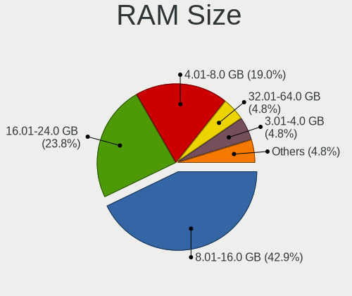
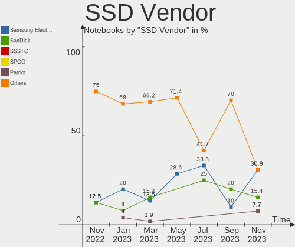
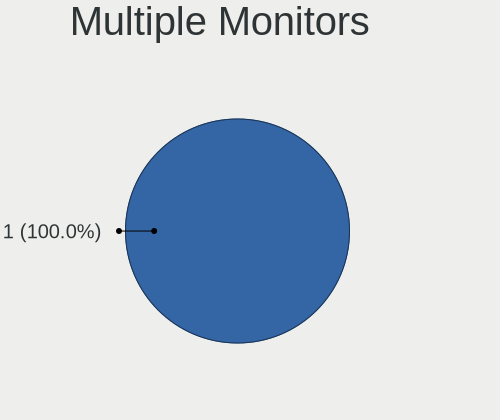

helloSystem - Hardware Trends (Notebooks)
-----------------------------------------

A project to identify most popular hardware characteristics and track their change
over time based on data collected by BSD users at https://BSD-Hardware.info.

Anyone can contribute to this report by the [hw-probe](https://github.com/linuxhw/hw-probe/blob/master/INSTALL.BSD.md) tool:

    hw-probe -all -upload

This report is for one last month. Overall report since the beginning of time: [TestDays](https://github.com/bsdhw/TestDays)

Period: Oct, 2023.

Contents
--------

* [ System ](#system)
  - [ OS                       ](#os)
  - [ OS Family                ](#os-family)
  - [ Arch                     ](#arch)
  - [ DE                       ](#de)
  - [ Display Server           ](#display-server)
  - [ Display Manager          ](#display-manager)
  - [ OS Lang                  ](#os-lang)
  - [ Boot Mode                ](#boot-mode)
  - [ Filesystem               ](#filesystem)
  - [ Part. scheme             ](#part-scheme)

* [ Board ](#board)
  - [ Vendor                   ](#vendor)
  - [ Model                    ](#model)
  - [ Model Family             ](#model-family)
  - [ MFG Year                 ](#mfg-year)
  - [ Form Factor              ](#form-factor)
  - [ Coreboot                 ](#coreboot)
  - [ RAM Size                 ](#ram-size)
  - [ RAM Used                 ](#ram-used)
  - [ Total Drives             ](#total-drives)
  - [ Has CD-ROM               ](#has-cd-rom)
  - [ Has Ethernet             ](#has-ethernet)
  - [ Has WiFi                 ](#has-wifi)
  - [ Has Bluetooth            ](#has-bluetooth)

* [ Location ](#location)
  - [ Country                  ](#country)
  - [ City                     ](#city)

* [ Drives ](#drives)
  - [ Drive Vendor             ](#drive-vendor)
  - [ Drive Model              ](#drive-model)
  - [ HDD Vendor               ](#hdd-vendor)
  - [ SSD Vendor               ](#ssd-vendor)
  - [ Drive Kind               ](#drive-kind)
  - [ Drive Connector          ](#drive-connector)
  - [ Drive Size               ](#drive-size)
  - [ Space Total              ](#space-total)
  - [ Space Used               ](#space-used)
  - [ Malfunc. Drives          ](#malfunc-drives)
  - [ Malfunc. Drive Vendor    ](#malfunc-drive-vendor)
  - [ Malfunc. HDD Vendor      ](#malfunc-hdd-vendor)
  - [ Malfunc. Drive Kind      ](#malfunc-drive-kind)
  - [ Failed Drives            ](#failed-drives)
  - [ Failed Drive Vendor      ](#failed-drive-vendor)
  - [ Drive Status             ](#drive-status)

* [ Storage controller ](#storage-controller)
  - [ Storage Vendor           ](#storage-vendor)
  - [ Storage Model            ](#storage-model)
  - [ Storage Kind             ](#storage-kind)

* [ Processor ](#processor)
  - [ CPU Vendor               ](#cpu-vendor)
  - [ CPU Model                ](#cpu-model)
  - [ CPU Model Family         ](#cpu-model-family)
  - [ CPU Cores                ](#cpu-cores)
  - [ CPU Sockets              ](#cpu-sockets)
  - [ CPU Threads              ](#cpu-threads)
  - [ CPU Microarch            ](#cpu-microarch)

* [ Graphics ](#graphics)
  - [ GPU Vendor               ](#gpu-vendor)
  - [ GPU Model                ](#gpu-model)
  - [ GPU Combo                ](#gpu-combo)
  - [ GPU Driver               ](#gpu-driver)
  - [ GPU Memory               ](#gpu-memory)

* [ Monitor ](#monitor)
  - [ Monitor Vendor           ](#monitor-vendor)
  - [ Monitor Model            ](#monitor-model)
  - [ Monitor Resolution       ](#monitor-resolution)
  - [ Monitor Diagonal         ](#monitor-diagonal)
  - [ Monitor Width            ](#monitor-width)
  - [ Aspect Ratio             ](#aspect-ratio)
  - [ Monitor Area             ](#monitor-area)
  - [ Pixel Density            ](#pixel-density)
  - [ Multiple Monitors        ](#multiple-monitors)

* [ Network ](#network)
  - [ Net Controller Vendor    ](#net-controller-vendor)
  - [ Net Controller Model     ](#net-controller-model)
  - [ Wireless Vendor          ](#wireless-vendor)
  - [ Wireless Model           ](#wireless-model)
  - [ Ethernet Vendor          ](#ethernet-vendor)
  - [ Ethernet Model           ](#ethernet-model)
  - [ Net Controller Kind      ](#net-controller-kind)
  - [ Used Controller          ](#used-controller)
  - [ NICs                     ](#nics)
  - [ IPv6                     ](#ipv6)

* [ Bluetooth ](#bluetooth)
  - [ Bluetooth Vendor         ](#bluetooth-vendor)
  - [ Bluetooth Model          ](#bluetooth-model)

* [ Sound ](#sound)
  - [ Sound Vendor             ](#sound-vendor)
  - [ Sound Model              ](#sound-model)

* [ Memory ](#memory)
  - [ Memory Vendor            ](#memory-vendor)
  - [ Memory Model             ](#memory-model)
  - [ Memory Kind              ](#memory-kind)
  - [ Memory Form Factor       ](#memory-form-factor)
  - [ Memory Size              ](#memory-size)
  - [ Memory Speed             ](#memory-speed)

* [ Printers & scanners ](#printers--scanners)
  - [ Printer Vendor           ](#printer-vendor)
  - [ Printer Model            ](#printer-model)
  - [ Scanner Vendor           ](#scanner-vendor)
  - [ Scanner Model            ](#scanner-model)

* [ Camera ](#camera)
  - [ Camera Vendor            ](#camera-vendor)
  - [ Camera Model             ](#camera-model)

* [ Security ](#security)
  - [ Fingerprint Vendor       ](#fingerprint-vendor)
  - [ Fingerprint Model        ](#fingerprint-model)
  - [ Chipcard Vendor          ](#chipcard-vendor)
  - [ Chipcard Model           ](#chipcard-model)

* [ Unsupported ](#unsupported)
  - [ Unsupported Devices      ](#unsupported-devices)
  - [ Unsupported Device Types ](#unsupported-device-types)

System
------

OS
--

Installed operating systems

| Name              | Notebooks | Percent |
|-------------------|-----------|---------|
| helloSystem 0.8.1 | 14        | 70%     |
| helloSystem 0.9.0 | 5         | 25%     |
| helloSystem 0.6.0 | 1         | 5%      |

OS Family
---------

OS without a version

| Name        | Notebooks | Percent |
|-------------|-----------|---------|
| helloSystem | 20        | 100%    |

Arch
----

OS architecture (x86_64, i586, etc.)

| Name  | Notebooks | Percent |
|-------|-----------|---------|
| amd64 | 20        | 100%    |

DE
--

Desktop Environment

| Name         | Notebooks | Percent |
|--------------|-----------|---------|
| helloDesktop | 20        | 100%    |

Display Server
--------------

X11 or Wayland

| Name | Notebooks | Percent |
|------|-----------|---------|
| X11  | 20        | 100%    |

Display Manager
---------------

SDDM, LightDM, etc.

| Name | Notebooks | Percent |
|------|-----------|---------|
| SLiM | 20        | 100%    |

OS Lang
-------

Language

| Lang    | Notebooks | Percent |
|---------|-----------|---------|
| en_US   | 7         | 35%     |
| Unknown | 5         | 25%     |
| fr_FR   | 2         | 10%     |
| C       | 2         | 10%     |
| tr_TR   | 1         | 5%      |
| ru_RU   | 1         | 5%      |
| fi_DK   | 1         | 5%      |
| es_ES   | 1         | 5%      |

Boot Mode
---------

EFI or BIOS

| Mode | Notebooks | Percent |
|------|-----------|---------|
| EFI  | 20        | 100%    |

Filesystem
----------

Type of filesystem

| Type   | Notebooks | Percent |
|--------|-----------|---------|
| Zfs    | 12        | 60%     |
| Cd9660 | 8         | 40%     |

Part. scheme
------------

Scheme of partitioning

| Type | Notebooks | Percent |
|------|-----------|---------|
| GPT  | 20        | 100%    |

Board
-----

Vendor
------

Motherboard manufacturer

| Name             | Notebooks | Percent |
|------------------|-----------|---------|
| Lenovo           | 5         | 25%     |
| Apple            | 4         | 20%     |
| Dell             | 3         | 15%     |
| Toshiba          | 2         | 10%     |
| Hewlett-Packard  | 2         | 10%     |
| Acer             | 2         | 10%     |
| TUXEDO           | 1         | 5%      |
| ASUSTek Computer | 1         | 5%      |

Model
-----

Motherboard model

| Name                                 | Notebooks | Percent |
|--------------------------------------|-----------|---------|
| TUXEDO Aura 15 Gen1                  | 1         | 5%      |
| Toshiba Satellite C55-A              | 1         | 5%      |
| Lenovo Z50-70 20354                  | 1         | 5%      |
| Lenovo ThinkPad T520 42405FG         | 1         | 5%      |
| Lenovo ThinkPad T480 20L5000UUS      | 1         | 5%      |
| Lenovo ThinkPad E14 Gen 2 20TA0054TX | 1         | 5%      |
| Lenovo IdeaPad 3 17ITL6 82H9         | 1         | 5%      |
| HP ZBook 15 G3                       | 1         | 5%      |
| HP Pavilion g6                       | 1         | 5%      |
| Dell Latitude D830                   | 1         | 5%      |
| Dell Latitude 3440                   | 1         | 5%      |
| Dell Inspiron 5559                   | 1         | 5%      |
| ASUS K73E                            | 1         | 5%      |
| Apple MacBookPro9,2                  | 1         | 5%      |
| Apple MacBookPro9,1                  | 1         | 5%      |
| Apple MacBook5,2                     | 1         | 5%      |
| Apple MacBook5,1                     | 1         | 5%      |
| Acer Aspire ES1-571                  | 1         | 5%      |
| Acer Aspire 5336                     | 1         | 5%      |
| Unknown                              | 1         | 5%      |

Model Family
------------

Motherboard model prefix

| Name              | Notebooks | Percent |
|-------------------|-----------|---------|
| Lenovo ThinkPad   | 3         | 15%     |
| Dell Latitude     | 2         | 10%     |
| Apple MacBookPro9 | 2         | 10%     |
| Apple MacBook5    | 2         | 10%     |
| Acer Aspire       | 2         | 10%     |
| TUXEDO Aura       | 1         | 5%      |
| Toshiba Satellite | 1         | 5%      |
| Lenovo Z50-70     | 1         | 5%      |
| Lenovo IdeaPad    | 1         | 5%      |
| HP ZBook          | 1         | 5%      |
| HP Pavilion       | 1         | 5%      |
| Dell Inspiron     | 1         | 5%      |
| ASUS K73E         | 1         | 5%      |
| Unknown           | 1         | 5%      |

MFG Year
--------

Motherboard manufacture year

| Year | Notebooks | Percent |
|------|-----------|---------|
| 2020 | 3         | 15%     |
| 2016 | 3         | 15%     |
| 2011 | 3         | 15%     |
| 2015 | 2         | 10%     |
| 2013 | 2         | 10%     |
| 2021 | 1         | 5%      |
| 2019 | 1         | 5%      |
| 2018 | 1         | 5%      |
| 2012 | 1         | 5%      |
| 2010 | 1         | 5%      |
| 2009 | 1         | 5%      |
| 2008 | 1         | 5%      |

Form Factor
-----------

Physical design of the computer

| Name     | Notebooks | Percent |
|----------|-----------|---------|
| Notebook | 20        | 100%    |

Coreboot
--------

Have coreboot on board

| Used | Notebooks | Percent |
|------|-----------|---------|
| No   | 20        | 100%    |

RAM Size
--------

Total RAM memory

| Size in GB | Notebooks | Percent |
|------------|-----------|---------|
| 4.01-8.0   | 7         | 35%     |
| 16.01-24.0 | 6         | 30%     |
| 8.01-16.0  | 5         | 25%     |
| 32.01-64.0 | 2         | 10%     |

RAM Used
--------

Used RAM memory

| Used GB  | Notebooks | Percent |
|----------|-----------|---------|
| 0.01-0.5 | 12        | 60%     |
| 0.51-1.0 | 5         | 25%     |
| 1.01-2.0 | 3         | 15%     |

Total Drives
------------

Number of drives on board

| Drives | Notebooks | Percent |
|--------|-----------|---------|
| 1      | 12        | 60%     |
| 2      | 6         | 30%     |
| 0      | 2         | 10%     |

Has CD-ROM
----------

Has CD-ROM on board

| Presented | Notebooks | Percent |
|-----------|-----------|---------|
| Yes       | 11        | 55%     |
| No        | 9         | 45%     |

Has Ethernet
------------

Has Ethernet on board

| Presented | Notebooks | Percent |
|-----------|-----------|---------|
| Yes       | 19        | 95%     |
| No        | 1         | 5%      |

Has WiFi
--------

Has WiFi module

| Presented | Notebooks | Percent |
|-----------|-----------|---------|
| Yes       | 19        | 95%     |
| No        | 1         | 5%      |

Has Bluetooth
-------------

Has Bluetooth module

| Presented | Notebooks | Percent |
|-----------|-----------|---------|
| Yes       | 15        | 75%     |
| No        | 5         | 25%     |

Location
--------

Country
-------

Geographic location (country)

| Country   | Notebooks | Percent |
|-----------|-----------|---------|
| USA       | 4         | 20%     |
| UK        | 2         | 10%     |
| Turkey    | 2         | 10%     |
| Russia    | 2         | 10%     |
| Italy     | 2         | 10%     |
| Finland   | 2         | 10%     |
| Taiwan    | 1         | 5%      |
| Spain     | 1         | 5%      |
| Mexico    | 1         | 5%      |
| Lithuania | 1         | 5%      |
| India     | 1         | 5%      |
| China     | 1         | 5%      |

City
----

Geographic location (city)

| City          | Notebooks | Percent |
|---------------|-----------|---------|
| Vilnius       | 1         | 5%      |
| Temple        | 1         | 5%      |
| Taichung      | 1         | 5%      |
| Surgut        | 1         | 5%      |
| St Petersburg | 1         | 5%      |
| Seattle       | 1         | 5%      |
| Rome          | 1         | 5%      |
| Reading       | 1         | 5%      |
| Peterborough  | 1         | 5%      |
| Orizaba       | 1         | 5%      |
| Nampa         | 1         | 5%      |
| Los Angeles   | 1         | 5%      |
| Iglesias      | 1         | 5%      |
| Helsinki      | 1         | 5%      |
| Espoo         | 1         | 5%      |
| Chongqing     | 1         | 5%      |
| Cartagena     | 1         | 5%      |
| Ankara        | 1         | 5%      |
| Ahmedabad     | 1         | 5%      |
| Adana         | 1         | 5%      |

Drives
------

Drive Vendor
------------

Hard drive vendors

| Vendor              | Notebooks | Drives | Percent |
|---------------------|-----------|--------|---------|
| WDC                 | 3         | 3      | 12.5%   |
| Toshiba             | 3         | 3      | 12.5%   |
| Samsung Electronics | 3         | 3      | 12.5%   |
| Kingston            | 2         | 2      | 8.33%   |
| SK hynix            | 1         | 1      | 4.17%   |
| Silicon Motion      | 1         | 1      | 4.17%   |
| SemsoTai            | 1         | 1      | 4.17%   |
| SanDisk             | 1         | 1      | 4.17%   |
| Patriot             | 1         | 1      | 4.17%   |
| Micron Technology   | 1         | 1      | 4.17%   |
| LITEONIT            | 1         | 1      | 4.17%   |
| Hitachi             | 1         | 1      | 4.17%   |
| Fujitsu             | 1         | 1      | 4.17%   |
| Crucial             | 1         | 1      | 4.17%   |
| Apple               | 1         | 1      | 4.17%   |
| Apacer              | 1         | 1      | 4.17%   |
| A-DATA Technology   | 1         | 1      | 4.17%   |

Drive Model
-----------

Hard drive models

| Model                                  | Notebooks | Percent |
|----------------------------------------|-----------|---------|
| WDC WDS240G2G0A-00JH30 240GB           | 1         | 4.17%   |
| WDC WD7500BPKX-00HPJT0 752GB           | 1         | 4.17%   |
| WDC WD3200BPVT-80ZEST0 320GB           | 1         | 4.17%   |
| Toshiba THNSN5512GPU7 512GB            | 1         | 4.17%   |
| Toshiba MQ01ABF050 500GB               | 1         | 4.17%   |
| Toshiba MK5065GSX 500GB                | 1         | 4.17%   |
| SK hynix SKHynix_HFM256GD3HX015N 256GB | 1         | 4.17%   |
| Silicon Motion T70 2242 1TB            | 1         | 4.17%   |
| SemsoTai L150 SSD 1TB                  | 1         | 4.17%   |
| SanDisk SD8SBAT128G1122 128GB          | 1         | 4.17%   |
| Samsung SSD 980 1TB                    | 1         | 4.17%   |
| Samsung SSD 870 EVO 250GB              | 1         | 4.17%   |
| Samsung MZMPA128HMFU-000H1 128GB       | 1         | 4.17%   |
| Patriot P210 512GB                     | 1         | 4.17%   |
| Micron M510_2.5_7MM_256GB              | 1         | 4.17%   |
| LITEONIT LCS-256M6S 2.5 7mm 256GB      | 1         | 4.17%   |
| Kingston SVP200S37A120G 120GB          | 1         | 4.17%   |
| Kingston SV300S37A120G 120GB           | 1         | 4.17%   |
| Hitachi HTS541612J9SA00 120GB          | 1         | 4.17%   |
| Fujitsu MHZ2160BH FFS G1 160GB         | 1         | 4.17%   |
| Crucial CT1000P1SSD8 1TB               | 1         | 4.17%   |
| Apple HDD HTS541010A9E682 1TB          | 1         | 4.17%   |
| Apacer AS350 128GB                     | 1         | 4.17%   |
| A-DATA SU650 512GB                     | 1         | 4.17%   |

HDD Vendor
----------

Hard disk drive vendors

| Vendor  | Notebooks | Drives | Percent |
|---------|-----------|--------|---------|
| WDC     | 2         | 2      | 28.57%  |
| Toshiba | 2         | 2      | 28.57%  |
| Hitachi | 1         | 1      | 14.29%  |
| Fujitsu | 1         | 1      | 14.29%  |
| Apple   | 1         | 1      | 14.29%  |

SSD Vendor
----------

Solid state drive vendors

| Vendor              | Notebooks | Drives | Percent |
|---------------------|-----------|--------|---------|
| Samsung Electronics | 2         | 2      | 16.67%  |
| Kingston            | 2         | 2      | 16.67%  |
| WDC                 | 1         | 1      | 8.33%   |
| SemsoTai            | 1         | 1      | 8.33%   |
| SanDisk             | 1         | 1      | 8.33%   |
| Patriot             | 1         | 1      | 8.33%   |
| Micron Technology   | 1         | 1      | 8.33%   |
| LITEONIT            | 1         | 1      | 8.33%   |
| Apacer              | 1         | 1      | 8.33%   |
| A-DATA Technology   | 1         | 1      | 8.33%   |

Drive Kind
----------

HDD or SSD

| Kind | Notebooks | Drives | Percent |
|------|-----------|--------|---------|
| SSD  | 11        | 12     | 50%     |
| HDD  | 6         | 7      | 27.27%  |
| NVMe | 5         | 5      | 22.73%  |

Drive Connector
---------------

SATA, SAS, NVMe, etc.

| Type | Notebooks | Drives | Percent |
|------|-----------|--------|---------|
| SATA | 14        | 19     | 73.68%  |
| NVMe | 5         | 5      | 26.32%  |

Drive Size
----------

Size of hard drive

| Size in TB | Notebooks | Drives | Percent |
|------------|-----------|--------|---------|
| 0.01-0.5   | 12        | 14     | 75%     |
| 0.51-1.0   | 4         | 5      | 25%     |

Space Total
-----------

Amount of disk space available on the file system

| Size in GB | Notebooks | Percent |
|------------|-----------|---------|
| 1-20       | 8         | 40%     |
| 51-100     | 6         | 30%     |
| 101-250    | 4         | 20%     |
| 21-50      | 1         | 5%      |
| 501-1000   | 1         | 5%      |

Space Used
----------

Amount of used disk space

| Used GB | Notebooks | Percent |
|---------|-----------|---------|
| 1-20    | 19        | 95%     |
| 21-50   | 1         | 5%      |

Malfunc. Drives
---------------

Drive models with a malfunction

| Model                                        | Notebooks | Drives | Percent |
|----------------------------------------------|-----------|--------|---------|
| WDC WDS240G2G0A-00JH30 240GB                 | 1         | 1      | 25%     |
| WDC WD3200BPVT-80ZEST0 320GB                 | 1         | 1      | 25%     |
| Toshiba MK5065GSX 500GB                      | 1         | 1      | 25%     |
| Samsung Electronics MZMPA128HMFU-000H1 128GB | 1         | 1      | 25%     |

Malfunc. Drive Vendor
---------------------

Vendors of faulty drives

| Vendor              | Notebooks | Drives | Percent |
|---------------------|-----------|--------|---------|
| WDC                 | 2         | 2      | 50%     |
| Toshiba             | 1         | 1      | 25%     |
| Samsung Electronics | 1         | 1      | 25%     |

Malfunc. HDD Vendor
-------------------

Vendors of faulty HDD drives

| Vendor  | Notebooks | Drives | Percent |
|---------|-----------|--------|---------|
| WDC     | 1         | 1      | 50%     |
| Toshiba | 1         | 1      | 50%     |

Malfunc. Drive Kind
-------------------

Kinds of faulty drives

| Kind | Notebooks | Drives | Percent |
|------|-----------|--------|---------|
| SSD  | 2         | 2      | 50%     |
| HDD  | 2         | 2      | 50%     |

Failed Drives
-------------

Failed drive models

Zero info for selected period =(

Failed Drive Vendor
-------------------

Failed drive vendors

Zero info for selected period =(

Drive Status
------------

Number of failed and malfunc. drives

| Status   | Notebooks | Drives | Percent |
|----------|-----------|--------|---------|
| Works    | 16        | 19     | 76.19%  |
| Malfunc  | 4         | 4      | 19.05%  |
| Detected | 1         | 1      | 4.76%   |

Storage controller
------------------

Storage Vendor
--------------

Storage controller vendors

| Vendor                    | Notebooks | Percent |
|---------------------------|-----------|---------|
| Intel                     | 15        | 65.22%  |
| Nvidia                    | 2         | 8.7%    |
| Toshiba                   | 1         | 4.35%   |
| SK hynix                  | 1         | 4.35%   |
| Silicon Motion            | 1         | 4.35%   |
| Samsung Electronics       | 1         | 4.35%   |
| Micron/Crucial Technology | 1         | 4.35%   |
| AMD                       | 1         | 4.35%   |

Storage Model
-------------

Storage controller models

| Model                                                                         | Notebooks | Percent |
|-------------------------------------------------------------------------------|-----------|---------|
| Intel 8 Series SATA Controller 1 [AHCI mode]                                  | 3         | 12%     |
| Intel 7 Series Chipset Family 6-port SATA Controller [AHCI mode]              | 3         | 12%     |
| Nvidia MCP79 AHCI Controller                                                  | 2         | 8%      |
| Intel Sunrise Point-LP SATA Controller [AHCI mode]                            | 2         | 8%      |
| Intel 6 Series/C200 Series Chipset Family 6 port Mobile SATA AHCI Controller  | 2         | 8%      |
| Toshiba XG3 NVMe SSD Controller                                               | 1         | 4%      |
| SK hynix Gold P31/BC711/PC711 NVMe Solid State Drive                          | 1         | 4%      |
| Silicon Motion SM2263EN/SM2263XT (DRAM-less) NVMe SSD Controllers             | 1         | 4%      |
| Samsung NVMe SSD Controller 980 (DRAM-less)                                   | 1         | 4%      |
| Micron/Crucial P1 NVMe PCIe SSD[Frampton]                                     | 1         | 4%      |
| Intel Volume Management Device NVMe RAID Controller                           | 1         | 4%      |
| Intel Tiger Lake-LP SATA Controller                                           | 1         | 4%      |
| Intel Q170/Q150/B150/H170/H110/Z170/CM236 Chipset SATA Controller [AHCI Mode] | 1         | 4%      |
| Intel 82801IBM/IEM (ICH9M/ICH9M-E) 4 port SATA Controller [AHCI mode]         | 1         | 4%      |
| Intel 82801HM/HEM (ICH8M/ICH8M-E) SATA Controller [AHCI mode]                 | 1         | 4%      |
| Intel 82801HM/HEM (ICH8M/ICH8M-E) IDE Controller                              | 1         | 4%      |
| Intel 5 Series/3400 Series Chipset 4 port SATA AHCI Controller                | 1         | 4%      |
| AMD FCH SATA Controller [AHCI mode]                                           | 1         | 4%      |

Storage Kind
------------

Kind of storage controller (IDE, SATA, NVMe, SAS, ...)

| Kind | Notebooks | Percent |
|------|-----------|---------|
| SATA | 18        | 72%     |
| NVMe | 5         | 20%     |
| RAID | 1         | 4%      |
| IDE  | 1         | 4%      |

Processor
---------

CPU Vendor
----------

Processor vendors

| Vendor | Notebooks | Percent |
|--------|-----------|---------|
| Intel  | 18        | 90%     |
| AMD    | 2         | 10%     |

CPU Model
---------

Processor models

| Model                                       | Notebooks | Percent |
|---------------------------------------------|-----------|---------|
| Intel Core 2 Duo CPU P7350 @ 2.00GHz        | 2         | 10%     |
| Intel Xeon CPU E3-1505M v5 @ 2.80GHz        | 1         | 5%      |
| Intel Pentium Gold 7505 @ 2.00GHz           | 1         | 5%      |
| Intel Core i7-8550U CPU @ 1.80GHz           | 1         | 5%      |
| Intel Core i7-3615QM CPU @ 2.30GHz          | 1         | 5%      |
| Intel Core i7 CPU Q 720 @ 1.60GHz           | 1         | 5%      |
| Intel Core i5-6200U CPU @ 2.30GHz           | 1         | 5%      |
| Intel Core i5-4210U CPU @ 1.70GHz           | 1         | 5%      |
| Intel Core i5-3210M CPU @ 2.50GHz           | 1         | 5%      |
| Intel Core i3-4030U CPU @ 1.90GHz           | 1         | 5%      |
| Intel Core i3-2350M CPU @ 2.30GHz           | 1         | 5%      |
| Intel Core i3-2310M CPU @ 2.10GHz           | 1         | 5%      |
| Intel Core 2 Duo                            | 1         | 5%      |
| Intel Celeron Dual-Core CPU T3500 @ 2.10GHz | 1         | 5%      |
| Intel Celeron CPU 1037U @ 1.80GHz           | 1         | 5%      |
| Intel Celeron 2957U @ 1.40GHz               | 1         | 5%      |
| Intel 11th Gen Core i5-1135G7 @ 2.40GHz     | 1         | 5%      |
| AMD Ryzen 7 4700U with Radeon Graphics      | 1         | 5%      |
| AMD A10-5750M APU with Radeon HD Graphics   | 1         | 5%      |

CPU Model Family
----------------

Processor model prefix

| Model                   | Notebooks | Percent |
|-------------------------|-----------|---------|
| Intel Core i7           | 3         | 15%     |
| Intel Core i5           | 3         | 15%     |
| Intel Core i3           | 3         | 15%     |
| Intel Core 2 Duo        | 3         | 15%     |
| Intel Celeron           | 2         | 10%     |
| Other                   | 1         | 5%      |
| Intel Xeon              | 1         | 5%      |
| Intel Pentium Gold      | 1         | 5%      |
| Intel Celeron Dual-Core | 1         | 5%      |
| AMD Ryzen 7             | 1         | 5%      |
| AMD A10                 | 1         | 5%      |

CPU Cores
---------

Number of processor cores

| Number  | Notebooks | Percent |
|---------|-----------|---------|
| 2       | 10        | 50%     |
| 4       | 6         | 30%     |
| Unknown | 3         | 15%     |
| 8       | 1         | 5%      |

CPU Sockets
-----------

Number of sockets

| Number | Notebooks | Percent |
|--------|-----------|---------|
| 1      | 18        | 90%     |
| 2      | 2         | 10%     |

CPU Threads
-----------

Threads per core (Hyper-Threading)

| Number  | Notebooks | Percent |
|---------|-----------|---------|
| 2       | 12        | 60%     |
| 1       | 5         | 25%     |
| Unknown | 3         | 15%     |

CPU Microarch
-------------

Microarchitecture

| Name        | Notebooks | Percent |
|-------------|-----------|---------|
| Penryn      | 4         | 20%     |
| IvyBridge   | 3         | 15%     |
| Haswell     | 3         | 15%     |
| TigerLake   | 2         | 10%     |
| Skylake     | 2         | 10%     |
| SandyBridge | 2         | 10%     |
| Zen 2       | 1         | 5%      |
| Piledriver  | 1         | 5%      |
| Nehalem     | 1         | 5%      |
| KabyLake    | 1         | 5%      |

Graphics
--------

GPU Vendor
----------

Vendors of graphics cards

| Vendor | Notebooks | Percent |
|--------|-----------|---------|
| Intel  | 14        | 58.33%  |
| Nvidia | 8         | 33.33%  |
| AMD    | 2         | 8.33%   |

GPU Model
---------

Graphics card models

| Model                                                                     | Notebooks | Percent |
|---------------------------------------------------------------------------|-----------|---------|
| Intel Haswell-ULT Integrated Graphics Controller                          | 3         | 12.5%   |
| Intel 3rd Gen Core processor Graphics Controller                          | 3         | 12.5%   |
| Intel 2nd Generation Core Processor Family Integrated Graphics Controller | 2         | 8.33%   |
| Nvidia TU117M [GeForce MX450]                                             | 1         | 4.17%   |
| Nvidia GT216M [GeForce GT 330M]                                           | 1         | 4.17%   |
| Nvidia GM107GLM [Quadro M2000M]                                           | 1         | 4.17%   |
| Nvidia GK107M [GeForce GT 650M Mac Edition]                               | 1         | 4.17%   |
| Nvidia GF117M [GeForce 610M/710M/810M/820M / GT 620M/625M/630M/720M]      | 1         | 4.17%   |
| Nvidia G86M [Quadro NVS 140M]                                             | 1         | 4.17%   |
| Nvidia C79 [GeForce 9400M]                                                | 1         | 4.17%   |
| Nvidia C79 [GeForce 9400M G]                                              | 1         | 4.17%   |
| Intel UHD Graphics 620                                                    | 1         | 4.17%   |
| Intel TigerLake-LP GT2 [Iris Xe Graphics]                                 | 1         | 4.17%   |
| Intel Tiger Lake-LP GT2 [UHD Graphics G4]                                 | 1         | 4.17%   |
| Intel Skylake GT2 [HD Graphics 520]                                       | 1         | 4.17%   |
| Intel Mobile 4 Series Chipset Integrated Graphics Controller              | 1         | 4.17%   |
| Intel HD Graphics P530                                                    | 1         | 4.17%   |
| AMD Richland [Radeon HD 8650G]                                            | 1         | 4.17%   |
| AMD Renoir [Radeon RX Vega 6 (Ryzen 4000/5000 Mobile Series)]             | 1         | 4.17%   |

GPU Combo
---------

Combinations of graphics cards

| Name           | Notebooks | Percent |
|----------------|-----------|---------|
| 1 x Intel      | 9         | 45%     |
| 1 x Nvidia     | 4         | 20%     |
| Intel + Nvidia | 4         | 20%     |
| 1 x AMD        | 2         | 10%     |
| 2 x Intel      | 1         | 5%      |

GPU Driver
----------

Free vs proprietary

| Driver      | Notebooks | Percent |
|-------------|-----------|---------|
| Free        | 16        | 80%     |
| Proprietary | 3         | 15%     |
| Unknown     | 1         | 5%      |

GPU Memory
----------

Total video memory

| Size in GB | Notebooks | Percent |
|------------|-----------|---------|
| Unknown    | 19        | 95%     |
| 0.01-0.5   | 1         | 5%      |

Monitor
-------

Monitor Vendor
--------------

Monitor vendors

| Vendor                  | Notebooks | Percent |
|-------------------------|-----------|---------|
| LG Display              | 4         | 26.67%  |
| Chimei Innolux          | 3         | 20%     |
| Samsung Electronics     | 2         | 13.33%  |
| AU Optronics            | 2         | 13.33%  |
| Chi Mei Optoelectronics | 1         | 6.67%   |
| BOE                     | 1         | 6.67%   |
| Apple                   | 1         | 6.67%   |
| Acer                    | 1         | 6.67%   |

Monitor Model
-------------

Monitor models

| Model                                                                    | Notebooks | Percent |
|--------------------------------------------------------------------------|-----------|---------|
| Samsung Electronics LCD Monitor SDC5344 1920x1080 340x190mm 15.3-inch    | 1         | 6.67%   |
| Samsung Electronics LCD Monitor SDC280F 1366x768 340x190mm 15.3-inch     | 1         | 6.67%   |
| LG Display LCD Monitor LGD044B 1366x768 340x190mm 15.3-inch              | 1         | 6.67%   |
| LG Display LCD Monitor LGD0384 1366x768 340x190mm 15.3-inch              | 1         | 6.67%   |
| LG Display LCD Monitor LGD02E3 1366x768 340x190mm 15.3-inch              | 1         | 6.67%   |
| LG Display LCD Monitor LGD02D1 1600x900 380x210mm 17.1-inch              | 1         | 6.67%   |
| Chimei Innolux LCD Monitor CMN15D7 1920x1080 340x190mm 15.3-inch         | 1         | 6.67%   |
| Chimei Innolux LCD Monitor CMN14B1 1920x1080 310x170mm 13.9-inch         | 1         | 6.67%   |
| Chimei Innolux LCD Monitor CMN1475 1366x768 310x170mm 13.9-inch          | 1         | 6.67%   |
| Chi Mei Optoelectronics LCD Monitor CMO15A7 1366x768 350x190mm 15.7-inch | 1         | 6.67%   |
| BOE LCD Monitor BOE09C1 1920x1080 380x220mm 17.3-inch                    | 1         | 6.67%   |
| AU Optronics LCD Monitor AUO403D 1920x1080 310x170mm 13.9-inch           | 1         | 6.67%   |
| AU Optronics LCD Monitor AUO12EC 1366x768 340x190mm 15.3-inch            | 1         | 6.67%   |
| Apple LCD Monitor APP9CCB 1280x800 290x180mm 13.4-inch                   | 1         | 6.67%   |
| Acer KA272 ACR072C 1920x1080 600x340mm 27.2-inch                         | 1         | 6.67%   |

Monitor Resolution
------------------

Monitor screen resolution

| Resolution      | Notebooks | Percent |
|-----------------|-----------|---------|
| 1366x768 (WXGA) | 7         | 46.67%  |
| 1920x1080 (FHD) | 6         | 40%     |
| 1600x900 (HD+)  | 1         | 6.67%   |
| 1280x800 (WXGA) | 1         | 6.67%   |

Monitor Diagonal
----------------

Diagonal size in inches

| Inches | Notebooks | Percent |
|--------|-----------|---------|
| 15     | 8         | 53.33%  |
| 13     | 4         | 26.67%  |
| 17     | 2         | 13.33%  |
| 27     | 1         | 6.67%   |

Monitor Width
-------------

Physical width

| Width in mm | Notebooks | Percent |
|-------------|-----------|---------|
| 301-350     | 11        | 73.33%  |
| 351-400     | 2         | 13.33%  |
| 501-600     | 1         | 6.67%   |
| 201-300     | 1         | 6.67%   |

Aspect Ratio
------------

Proportional relationship between the width and the height

| Ratio | Notebooks | Percent |
|-------|-----------|---------|
| 16/9  | 14        | 93.33%  |
| 16/10 | 1         | 6.67%   |

Monitor Area
------------

Area in inch²

| Area in inch² | Notebooks | Percent |
|----------------|-----------|---------|
| 91-100         | 7         | 46.67%  |
| 81-90          | 4         | 26.67%  |
| 121-130        | 2         | 13.33%  |
| 301-350        | 1         | 6.67%   |
| 101-110        | 1         | 6.67%   |

Pixel Density
-------------

Pixels per inch

| Density | Notebooks | Percent |
|---------|-----------|---------|
| 101-120 | 8         | 53.33%  |
| 121-160 | 5         | 33.33%  |
| 51-100  | 2         | 13.33%  |

Multiple Monitors
-----------------

Total monitors connected

| Total | Notebooks | Percent |
|-------|-----------|---------|
| 1     | 15        | 75%     |
| 0     | 5         | 25%     |

Network
-------

Net Controller Vendor
---------------------

Controller vendors

| Vendor                | Notebooks | Percent |
|-----------------------|-----------|---------|
| Realtek Semiconductor | 9         | 26.47%  |
| Intel                 | 8         | 23.53%  |
| Broadcom              | 7         | 20.59%  |
| Qualcomm Atheros      | 5         | 14.71%  |
| Nvidia                | 2         | 5.88%   |
| Xiaomi                | 1         | 2.94%   |
| Samsung Electronics   | 1         | 2.94%   |
| Ralink                | 1         | 2.94%   |

Net Controller Model
--------------------

Controller models

| Model                                                             | Notebooks | Percent |
|-------------------------------------------------------------------|-----------|---------|
| Realtek RTL8111/8168/8411 PCI Express Gigabit Ethernet Controller | 6         | 15%     |
| Realtek RTL810xE PCI Express Fast Ethernet controller             | 2         | 5%      |
| Nvidia MCP79 Ethernet                                             | 2         | 5%      |
| Intel Wi-Fi 6 AX201                                               | 2         | 5%      |
| Broadcom NetXtreme BCM57765 Gigabit Ethernet PCIe                 | 2         | 5%      |
| Broadcom BCM4331 802.11a/b/g/n                                    | 2         | 5%      |
| Broadcom BCM4322 802.11a/b/g/n Wireless LAN Controller            | 2         | 5%      |
| Xiaomi Mi/Redmi series (RNDIS + ADB)                              | 1         | 2.5%    |
| Samsung Galaxy series, misc. (tethering mode)                     | 1         | 2.5%    |
| Realtek RTL8723BE PCIe Wireless Network Adapter                   | 1         | 2.5%    |
| Realtek RTL8188EE Wireless Network Adapter                        | 1         | 2.5%    |
| Ralink RT5390 Wireless 802.11n 1T/1R PCIe                         | 1         | 2.5%    |
| Qualcomm Atheros QCA9565 / AR9565 Wireless Network Adapter        | 1         | 2.5%    |
| Qualcomm Atheros AR9485 Wireless Network Adapter                  | 1         | 2.5%    |
| Qualcomm Atheros AR9285 Wireless Network Adapter (PCI-Express)    | 1         | 2.5%    |
| Qualcomm Atheros AR8162 Fast Ethernet                             | 1         | 2.5%    |
| Qualcomm Atheros AR8151 v2.0 Gigabit Ethernet                     | 1         | 2.5%    |
| Intel Wireless 8265 / 8275                                        | 1         | 2.5%    |
| Intel Wireless 8260                                               | 1         | 2.5%    |
| Intel Wireless 3160                                               | 1         | 2.5%    |
| Intel Wi-Fi 6 AX200                                               | 1         | 2.5%    |
| Intel PRO/Wireless 4965 AG or AGN [Kedron] Network Connection     | 1         | 2.5%    |
| Intel Ethernet Connection (4) I219-V                              | 1         | 2.5%    |
| Intel Ethernet Connection (2) I219-LM                             | 1         | 2.5%    |
| Intel Centrino Wireless-N 1000 [Condor Peak]                      | 1         | 2.5%    |
| Intel 82579LM Gigabit Network Connection (Lewisville)             | 1         | 2.5%    |
| Broadcom NetXtreme BCM5755M Gigabit Ethernet PCI Express          | 1         | 2.5%    |
| Broadcom NetLink BCM57780 Gigabit Ethernet PCIe                   | 1         | 2.5%    |
| Broadcom BCM4313 802.11bgn Wireless Network Adapter               | 1         | 2.5%    |

Wireless Vendor
---------------

Wireless vendors

| Vendor                | Notebooks | Percent |
|-----------------------|-----------|---------|
| Intel                 | 8         | 42.11%  |
| Broadcom              | 5         | 26.32%  |
| Qualcomm Atheros      | 3         | 15.79%  |
| Realtek Semiconductor | 2         | 10.53%  |
| Ralink                | 1         | 5.26%   |

Wireless Model
--------------

Wireless models

| Model                                                          | Notebooks | Percent |
|----------------------------------------------------------------|-----------|---------|
| Intel Wi-Fi 6 AX201                                            | 2         | 10.53%  |
| Broadcom BCM4331 802.11a/b/g/n                                 | 2         | 10.53%  |
| Broadcom BCM4322 802.11a/b/g/n Wireless LAN Controller         | 2         | 10.53%  |
| Realtek RTL8723BE PCIe Wireless Network Adapter                | 1         | 5.26%   |
| Realtek RTL8188EE Wireless Network Adapter                     | 1         | 5.26%   |
| Ralink RT5390 Wireless 802.11n 1T/1R PCIe                      | 1         | 5.26%   |
| Qualcomm Atheros QCA9565 / AR9565 Wireless Network Adapter     | 1         | 5.26%   |
| Qualcomm Atheros AR9485 Wireless Network Adapter               | 1         | 5.26%   |
| Qualcomm Atheros AR9285 Wireless Network Adapter (PCI-Express) | 1         | 5.26%   |
| Intel Wireless 8265 / 8275                                     | 1         | 5.26%   |
| Intel Wireless 8260                                            | 1         | 5.26%   |
| Intel Wireless 3160                                            | 1         | 5.26%   |
| Intel Wi-Fi 6 AX200                                            | 1         | 5.26%   |
| Intel PRO/Wireless 4965 AG or AGN [Kedron] Network Connection  | 1         | 5.26%   |
| Intel Centrino Wireless-N 1000 [Condor Peak]                   | 1         | 5.26%   |
| Broadcom BCM4313 802.11bgn Wireless Network Adapter            | 1         | 5.26%   |

Ethernet Vendor
---------------

Ethernet vendors

| Vendor                | Notebooks | Percent |
|-----------------------|-----------|---------|
| Realtek Semiconductor | 8         | 38.1%   |
| Broadcom              | 4         | 19.05%  |
| Intel                 | 3         | 14.29%  |
| Qualcomm Atheros      | 2         | 9.52%   |
| Nvidia                | 2         | 9.52%   |
| Xiaomi                | 1         | 4.76%   |
| Samsung Electronics   | 1         | 4.76%   |

Ethernet Model
--------------

Ethernet models

| Model                                                             | Notebooks | Percent |
|-------------------------------------------------------------------|-----------|---------|
| Realtek RTL8111/8168/8411 PCI Express Gigabit Ethernet Controller | 6         | 28.57%  |
| Realtek RTL810xE PCI Express Fast Ethernet controller             | 2         | 9.52%   |
| Nvidia MCP79 Ethernet                                             | 2         | 9.52%   |
| Broadcom NetXtreme BCM57765 Gigabit Ethernet PCIe                 | 2         | 9.52%   |
| Xiaomi Mi/Redmi series (RNDIS + ADB)                              | 1         | 4.76%   |
| Samsung Galaxy series, misc. (tethering mode)                     | 1         | 4.76%   |
| Qualcomm Atheros AR8162 Fast Ethernet                             | 1         | 4.76%   |
| Qualcomm Atheros AR8151 v2.0 Gigabit Ethernet                     | 1         | 4.76%   |
| Intel Ethernet Connection (4) I219-V                              | 1         | 4.76%   |
| Intel Ethernet Connection (2) I219-LM                             | 1         | 4.76%   |
| Intel 82579LM Gigabit Network Connection (Lewisville)             | 1         | 4.76%   |
| Broadcom NetXtreme BCM5755M Gigabit Ethernet PCI Express          | 1         | 4.76%   |
| Broadcom NetLink BCM57780 Gigabit Ethernet PCIe                   | 1         | 4.76%   |

Net Controller Kind
-------------------

Ethernet, WiFi or modem

| Kind     | Notebooks | Percent |
|----------|-----------|---------|
| WiFi     | 19        | 50%     |
| Ethernet | 19        | 50%     |

Used Controller
---------------

Currently used network controller

| Kind     | Notebooks | Percent |
|----------|-----------|---------|
| WiFi     | 9         | 50%     |
| Ethernet | 9         | 50%     |

NICs
----

Total network controllers on board

| Total | Notebooks | Percent |
|-------|-----------|---------|
| 2     | 18        | 90%     |
| 1     | 2         | 10%     |

IPv6
----

IPv6 vs IPv4

| Used | Notebooks | Percent |
|------|-----------|---------|
| No   | 18        | 90%     |
| Yes  | 2         | 10%     |

Bluetooth
---------

Bluetooth Vendor
----------------

Controller vendors

| Vendor                          | Notebooks | Percent |
|---------------------------------|-----------|---------|
| Intel                           | 6         | 40%     |
| Apple                           | 4         | 26.67%  |
| Realtek Semiconductor           | 1         | 6.67%   |
| Qualcomm Atheros Communications | 1         | 6.67%   |
| Foxconn / Hon Hai               | 1         | 6.67%   |
| Dell                            | 1         | 6.67%   |
| Broadcom                        | 1         | 6.67%   |

Bluetooth Model
---------------

Controller models

| Model                                                       | Notebooks | Percent |
|-------------------------------------------------------------|-----------|---------|
| Intel Bluetooth wireless interface                          | 3         | 18.75%  |
| Intel AX201 Bluetooth                                       | 2         | 12.5%   |
| Apple Bluetooth Host Controller                             | 2         | 12.5%   |
| Realtek RTL8723B Bluetooth                                  | 1         | 6.25%   |
| Qualcomm Atheros AR9462 Bluetooth                           | 1         | 6.25%   |
| Intel AX200 Bluetooth                                       | 1         | 6.25%   |
| Foxconn / Hon Hai Qualcomm Atheros AR3012 Bluetooth Adapter | 1         | 6.25%   |
| Dell Wireless 360 Bluetooth                                 | 1         | 6.25%   |
| Broadcom BCM2045B (BDC-2.1)                                 | 1         | 6.25%   |
| Apple Built-in iSight (no firmware loaded)                  | 1         | 6.25%   |
| Apple Built-in Bluetooth 2.0+EDR HCI                        | 1         | 6.25%   |
| Apple Broadcom Built-in Bluetooth                           | 1         | 6.25%   |

Sound
-----

Sound Vendor
------------

Sound card vendors

| Vendor | Notebooks | Percent |
|--------|-----------|---------|
| Intel  | 16        | 72.73%  |
| Nvidia | 4         | 18.18%  |
| AMD    | 2         | 9.09%   |

Sound Model
-----------

Sound card models

| Model                                                                      | Notebooks | Percent |
|----------------------------------------------------------------------------|-----------|---------|
| Intel 8 Series HD Audio Controller                                         | 3         | 11.54%  |
| Intel 7 Series/C216 Chipset Family High Definition Audio Controller        | 3         | 11.54%  |
| Nvidia MCP79 High Definition Audio                                         | 2         | 7.69%   |
| Intel Tiger Lake-LP Smart Sound Technology Audio Controller                | 2         | 7.69%   |
| Intel Sunrise Point-LP HD Audio                                            | 2         | 7.69%   |
| Intel Haswell-ULT HD Audio Controller                                      | 2         | 7.69%   |
| Intel 6 Series/C200 Series Chipset Family High Definition Audio Controller | 2         | 7.69%   |
| Nvidia GT216 HDMI Audio Controller                                         | 1         | 3.85%   |
| Nvidia GK107 HDMI Audio Controller                                         | 1         | 3.85%   |
| Intel 82801I (ICH9 Family) HD Audio Controller                             | 1         | 3.85%   |
| Intel 82801H (ICH8 Family) HD Audio Controller                             | 1         | 3.85%   |
| Intel 5 Series/3400 Series Chipset High Definition Audio                   | 1         | 3.85%   |
| Intel 100 Series/C230 Series Chipset Family HD Audio Controller            | 1         | 3.85%   |
| AMD Trinity HDMI Audio Controller                                          | 1         | 3.85%   |
| AMD Renoir Radeon High Definition Audio Controller                         | 1         | 3.85%   |
| AMD FCH Azalia Controller                                                  | 1         | 3.85%   |
| AMD Family 17h/19h HD Audio Controller                                     | 1         | 3.85%   |

Memory
------

Memory Vendor
-------------

Memory module vendors

| Vendor              | Notebooks | Percent |
|---------------------|-----------|---------|
| Samsung Electronics | 7         | 31.82%  |
| Kingston            | 3         | 13.64%  |
| Unknown             | 2         | 9.09%   |
| Micron Technology   | 2         | 9.09%   |
| Crucial             | 2         | 9.09%   |
| SK hynix            | 1         | 4.55%   |
| SemsoTai            | 1         | 4.55%   |
| GOODRAM             | 1         | 4.55%   |
| Elpida              | 1         | 4.55%   |
| Apacer              | 1         | 4.55%   |
| Unknown             | 1         | 4.55%   |

Memory Model
------------

Memory module models

| Model                                                       | Notebooks | Percent |
|-------------------------------------------------------------|-----------|---------|
| Unknown RAM Module 8GB SODIMM DDR3 1600MT/s                 | 2         | 9.09%   |
| SK hynix RAM Module 8GB SODIMM DDR3 1600MT/s                | 1         | 4.55%   |
| SemsoTai RAM Module 16GB SODIMM DDR4 2400MT/s               | 1         | 4.55%   |
| Samsung RAM Module 16GB SODIMM DDR4 2133MT/s                | 1         | 4.55%   |
| Samsung RAM M471B5673FH0-CF8 2GB SODIMM DDR3 1067MT/s       | 1         | 4.55%   |
| Samsung RAM M471B5273DH0-CH9 4GB SODIMM DDR3 1334MT/s       | 1         | 4.55%   |
| Samsung RAM M471B5173QH0-YK0 4GB SODIMM DDR3 1600MT/s       | 1         | 4.55%   |
| Samsung RAM M471B1G73BH0-YK0 8GB SODIMM DDR3 1600MT/s       | 1         | 4.55%   |
| Samsung RAM M471A5244CB0-CWE 4GB Row Of Chips DDR4 3200MT/s | 1         | 4.55%   |
| Samsung RAM M471A2K43CB1-CTD 16GB SODIMM DDR4 2667MT/s      | 1         | 4.55%   |
| Micron RAM 8KTF51264HZ-1G6P1 4GB SODIMM DDR3 1600MT/s       | 1         | 4.55%   |
| Micron RAM 8KTF51264HZ-1G6E1 4GB SODIMM DDR3 1600MT/s       | 1         | 4.55%   |
| Kingston RAM Module 4GB SODIMM DDR 667MT/s                  | 1         | 4.55%   |
| Kingston RAM ASU1333S9-4G-ECEWG 4GB SODIMM DDR3 1333MT/s    | 1         | 4.55%   |
| Kingston RAM ACR16D3LS1KFG/4G 4GB SODIMM DDR3 1600MT/s      | 1         | 4.55%   |
| GOODRAM RAM GR1333S364L9S/4G 4GB SODIMM DDR3 1333MT/s       | 1         | 4.55%   |
| Elpida RAM Module 2GB SODIMM DDR3 1067MT/s                  | 1         | 4.55%   |
| Crucial RAM Module 2GB SODIMM DDR2 667MT/s                  | 1         | 4.55%   |
| Crucial RAM CT16G4SFRA32A.C8FF 16GB SODIMM DDR4 3200MT/s    | 1         | 4.55%   |
| Apacer RAM D22.27553S.001 16GB SODIMM DDR4 3200MT/s         | 1         | 4.55%   |
| Unknown                                                     | 1         | 4.55%   |

Memory Kind
-----------

Memory module kinds

| Kind    | Notebooks | Percent |
|---------|-----------|---------|
| DDR3    | 12        | 60%     |
| DDR4    | 5         | 25%     |
| DDR2    | 1         | 5%      |
| DDR     | 1         | 5%      |
| Unknown | 1         | 5%      |

Memory Form Factor
------------------

Physical design of the memory module

| Name         | Notebooks | Percent |
|--------------|-----------|---------|
| SODIMM       | 20        | 95.24%  |
| Row Of Chips | 1         | 4.76%   |

Memory Size
-----------

Memory module size

| Size  | Notebooks | Percent |
|-------|-----------|---------|
| 4096  | 8         | 38.1%   |
| 16384 | 5         | 23.81%  |
| 8192  | 4         | 19.05%  |
| 2048  | 4         | 19.05%  |

Memory Speed
------------

Memory module speed

| Speed | Notebooks | Percent |
|-------|-----------|---------|
| 1600  | 8         | 40%     |
| 3200  | 2         | 10%     |
| 1067  | 2         | 10%     |
| 667   | 2         | 10%     |
| 2667  | 1         | 5%      |
| 2400  | 1         | 5%      |
| 2133  | 1         | 5%      |
| 1334  | 1         | 5%      |
| 1333  | 1         | 5%      |
| 800   | 1         | 5%      |

Printers & scanners
-------------------

Printer Vendor
--------------

Printer device vendors

Zero info for selected period =(

Printer Model
-------------

Printer device models

Zero info for selected period =(

Scanner Vendor
--------------

Scanner device vendors

Zero info for selected period =(

Scanner Model
-------------

Scanner device models

Zero info for selected period =(

Camera
------

Camera Vendor
-------------

Camera device vendors

| Vendor                                 | Notebooks | Percent |
|----------------------------------------|-----------|---------|
| Chicony Electronics                    | 3         | 20%     |
| Syntek                                 | 2         | 13.33%  |
| Apple                                  | 2         | 13.33%  |
| Microdia                               | 1         | 6.67%   |
| Intel                                  | 1         | 6.67%   |
| Importek                               | 1         | 6.67%   |
| IMC Networks                           | 1         | 6.67%   |
| Cubeternet                             | 1         | 6.67%   |
| Cheng Uei Precision Industry (Foxlink) | 1         | 6.67%   |
| Bison Electronics                      | 1         | 6.67%   |
| ALi                                    | 1         | 6.67%   |

Camera Model
------------

Camera device models

| Model                                               | Notebooks | Percent |
|-----------------------------------------------------|-----------|---------|
| Apple FaceTime HD Camera                            | 2         | 13.33%  |
| Syntek Lenovo EasyCamera                            | 1         | 6.67%   |
| Syntek Integrated Camera                            | 1         | 6.67%   |
| Microdia Integrated_Webcam_HD                       | 1         | 6.67%   |
| Intel RealSense 3D Camera (Front F200)              | 1         | 6.67%   |
| Importek TOSHIBA HD Web Camera                      | 1         | 6.67%   |
| IMC Networks UVC VGA Webcam                         | 1         | 6.67%   |
| Cubeternet WebCam                                   | 1         | 6.67%   |
| Chicony Toshiba Integrated Webcam                   | 1         | 6.67%   |
| Chicony Lenovo Integrated Camera (0.3MP)            | 1         | 6.67%   |
| Chicony Integrated Camera                           | 1         | 6.67%   |
| Cheng Uei Precision Industry (Foxlink) HP HD Camera | 1         | 6.67%   |
| Bison SunplusIT Integrated Camera                   | 1         | 6.67%   |
| ALi Gateway Webcam                                  | 1         | 6.67%   |

Security
--------

Fingerprint Vendor
------------------

Fingerprint sensor vendors

| Vendor                | Notebooks | Percent |
|-----------------------|-----------|---------|
| Validity Sensors      | 1         | 25%     |
| Upek                  | 1         | 25%     |
| STMicroelectronics    | 1         | 25%     |
| Elan Microelectronics | 1         | 25%     |

Fingerprint Model
-----------------

Fingerprint sensor models

| Model                                                  | Notebooks | Percent |
|--------------------------------------------------------|-----------|---------|
| Validity Sensors VFS495 Fingerprint Reader             | 1         | 25%     |
| Upek Biometric Touchchip/Touchstrip Fingerprint Sensor | 1         | 25%     |
| STMicroelectronics Fingerprint Reader                  | 1         | 25%     |
| Elan Fingerprint Sensor                                | 1         | 25%     |

Chipcard Vendor
---------------

Chipcard module vendors

Zero info for selected period =(

Chipcard Model
--------------

Chipcard module models

Zero info for selected period =(

Unsupported
-----------

Unsupported Devices
-------------------

Total unsupported devices on board

| Total | Notebooks | Percent |
|-------|-----------|---------|
| 1     | 10        | 50%     |
| 2     | 7         | 35%     |
| 0     | 2         | 10%     |
| 3     | 1         | 5%      |

Unsupported Device Types
------------------------

Types of unsupported devices

| Type                     | Notebooks | Percent |
|--------------------------|-----------|---------|
| Communication controller | 14        | 53.85%  |
| Fingerprint reader       | 4         | 15.38%  |
| Card reader              | 4         | 15.38%  |
| Net/wireless             | 2         | 7.69%   |
| Sound                    | 1         | 3.85%   |
| Bluetooth                | 1         | 3.85%   |

