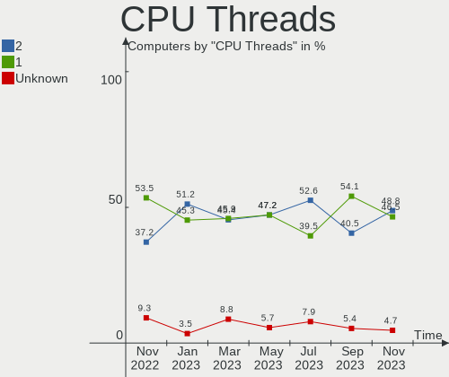
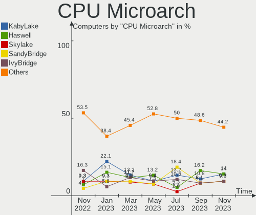
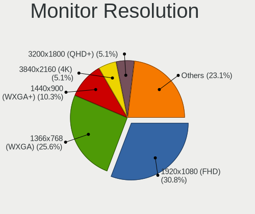
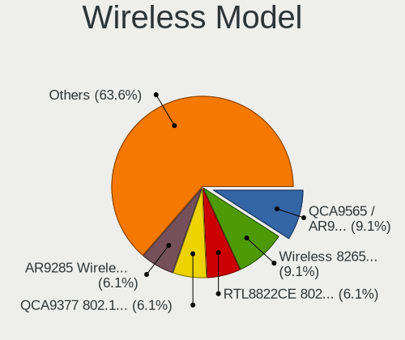
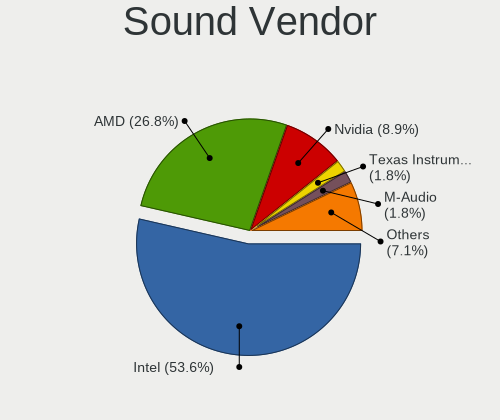
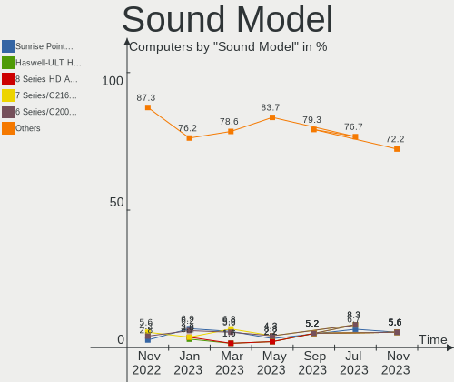
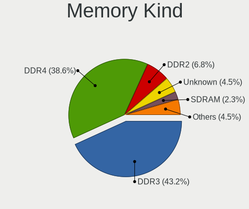

helloSystem - Hardware Trends
-----------------------------

A project to identify most popular hardware characteristics and track their change
over time based on data collected by BSD users at https://BSD-Hardware.info.

Anyone can contribute to this report by the [hw-probe](https://github.com/linuxhw/hw-probe/blob/master/INSTALL.BSD.md) tool:

    hw-probe -all -upload

This is a report for all computer types. See also reports for [desktops](/Dist/helloSystem/Desktop/README.md) and [notebooks](/Dist/helloSystem/Notebook/README.md).

This report is for one last month. Overall report since the beginning of time: [TestCoverage](https://github.com/bsdhw/TestCoverage)

Period: Jul, 2022.

Contents
--------

* [ System ](#system)
  - [ OS                       ](#os)
  - [ OS Family                ](#os-family)
  - [ Arch                     ](#arch)
  - [ DE                       ](#de)
  - [ Display Server           ](#display-server)
  - [ Display Manager          ](#display-manager)
  - [ OS Lang                  ](#os-lang)
  - [ Boot Mode                ](#boot-mode)
  - [ Filesystem               ](#filesystem)
  - [ Part. scheme             ](#part-scheme)

* [ Board ](#board)
  - [ Vendor                   ](#vendor)
  - [ Model                    ](#model)
  - [ Model Family             ](#model-family)
  - [ MFG Year                 ](#mfg-year)
  - [ Form Factor              ](#form-factor)
  - [ Coreboot                 ](#coreboot)
  - [ RAM Size                 ](#ram-size)
  - [ RAM Used                 ](#ram-used)
  - [ Total Drives             ](#total-drives)
  - [ Has CD-ROM               ](#has-cd-rom)
  - [ Has Ethernet             ](#has-ethernet)
  - [ Has WiFi                 ](#has-wifi)
  - [ Has Bluetooth            ](#has-bluetooth)

* [ Location ](#location)
  - [ Country                  ](#country)
  - [ City                     ](#city)

* [ Drives ](#drives)
  - [ Drive Vendor             ](#drive-vendor)
  - [ Drive Model              ](#drive-model)
  - [ HDD Vendor               ](#hdd-vendor)
  - [ SSD Vendor               ](#ssd-vendor)
  - [ Drive Kind               ](#drive-kind)
  - [ Drive Connector          ](#drive-connector)
  - [ Drive Size               ](#drive-size)
  - [ Space Total              ](#space-total)
  - [ Space Used               ](#space-used)
  - [ Malfunc. Drives          ](#malfunc-drives)
  - [ Malfunc. Drive Vendor    ](#malfunc-drive-vendor)
  - [ Malfunc. HDD Vendor      ](#malfunc-hdd-vendor)
  - [ Malfunc. Drive Kind      ](#malfunc-drive-kind)
  - [ Failed Drives            ](#failed-drives)
  - [ Failed Drive Vendor      ](#failed-drive-vendor)
  - [ Drive Status             ](#drive-status)

* [ Storage controller ](#storage-controller)
  - [ Storage Vendor           ](#storage-vendor)
  - [ Storage Model            ](#storage-model)
  - [ Storage Kind             ](#storage-kind)

* [ Processor ](#processor)
  - [ CPU Vendor               ](#cpu-vendor)
  - [ CPU Model                ](#cpu-model)
  - [ CPU Model Family         ](#cpu-model-family)
  - [ CPU Cores                ](#cpu-cores)
  - [ CPU Sockets              ](#cpu-sockets)
  - [ CPU Threads              ](#cpu-threads)
  - [ CPU Microarch            ](#cpu-microarch)

* [ Graphics ](#graphics)
  - [ GPU Vendor               ](#gpu-vendor)
  - [ GPU Model                ](#gpu-model)
  - [ GPU Combo                ](#gpu-combo)
  - [ GPU Driver               ](#gpu-driver)
  - [ GPU Memory               ](#gpu-memory)

* [ Monitor ](#monitor)
  - [ Monitor Vendor           ](#monitor-vendor)
  - [ Monitor Model            ](#monitor-model)
  - [ Monitor Resolution       ](#monitor-resolution)
  - [ Monitor Diagonal         ](#monitor-diagonal)
  - [ Monitor Width            ](#monitor-width)
  - [ Aspect Ratio             ](#aspect-ratio)
  - [ Monitor Area             ](#monitor-area)
  - [ Pixel Density            ](#pixel-density)
  - [ Multiple Monitors        ](#multiple-monitors)

* [ Network ](#network)
  - [ Net Controller Vendor    ](#net-controller-vendor)
  - [ Net Controller Model     ](#net-controller-model)
  - [ Wireless Vendor          ](#wireless-vendor)
  - [ Wireless Model           ](#wireless-model)
  - [ Ethernet Vendor          ](#ethernet-vendor)
  - [ Ethernet Model           ](#ethernet-model)
  - [ Net Controller Kind      ](#net-controller-kind)
  - [ Used Controller          ](#used-controller)
  - [ NICs                     ](#nics)
  - [ IPv6                     ](#ipv6)

* [ Bluetooth ](#bluetooth)
  - [ Bluetooth Vendor         ](#bluetooth-vendor)
  - [ Bluetooth Model          ](#bluetooth-model)

* [ Sound ](#sound)
  - [ Sound Vendor             ](#sound-vendor)
  - [ Sound Model              ](#sound-model)

* [ Memory ](#memory)
  - [ Memory Vendor            ](#memory-vendor)
  - [ Memory Model             ](#memory-model)
  - [ Memory Kind              ](#memory-kind)
  - [ Memory Form Factor       ](#memory-form-factor)
  - [ Memory Size              ](#memory-size)
  - [ Memory Speed             ](#memory-speed)

* [ Printers & scanners ](#printers--scanners)
  - [ Printer Vendor           ](#printer-vendor)
  - [ Printer Model            ](#printer-model)
  - [ Scanner Vendor           ](#scanner-vendor)
  - [ Scanner Model            ](#scanner-model)

* [ Camera ](#camera)
  - [ Camera Vendor            ](#camera-vendor)
  - [ Camera Model             ](#camera-model)

* [ Security ](#security)
  - [ Fingerprint Vendor       ](#fingerprint-vendor)
  - [ Fingerprint Model        ](#fingerprint-model)
  - [ Chipcard Vendor          ](#chipcard-vendor)
  - [ Chipcard Model           ](#chipcard-model)

* [ Unsupported ](#unsupported)
  - [ Unsupported Devices      ](#unsupported-devices)
  - [ Unsupported Device Types ](#unsupported-device-types)

System
------

OS
--

Installed operating systems

| Name              | Computers | Percent |
|-------------------|-----------|---------|
| helloSystem 0.7.0 | 25        | 69.44%  |
| helloSystem 0.8.0 | 10        | 27.78%  |
| helloSystem 0.6.0 | 1         | 2.78%   |

OS Family
---------

OS without a version

| Name        | Computers | Percent |
|-------------|-----------|---------|
| helloSystem | 36        | 100%    |

Arch
----

OS architecture (x86_64, i586, etc.)

| Name  | Computers | Percent |
|-------|-----------|---------|
| amd64 | 36        | 100%    |

DE
--

Desktop Environment

| Name         | Computers | Percent |
|--------------|-----------|---------|
| helloDesktop | 35        | 97.22%  |
| GNOME        | 1         | 2.78%   |

Display Server
--------------

X11 or Wayland

| Name | Computers | Percent |
|------|-----------|---------|
| X11  | 36        | 100%    |

Display Manager
---------------

SDDM, LightDM, etc.

| Name | Computers | Percent |
|------|-----------|---------|
| SLiM | 36        | 100%    |

OS Lang
-------

Language

| Lang  | Computers | Percent |
|-------|-----------|---------|
| en_US | 33        | 91.67%  |
| es_ES | 2         | 5.56%   |
| C     | 1         | 2.78%   |

Boot Mode
---------

EFI or BIOS

| Mode | Computers | Percent |
|------|-----------|---------|
| EFI  | 35        | 97.22%  |
| BIOS | 1         | 2.78%   |

Filesystem
----------

Type of filesystem

| Type   | Computers | Percent |
|--------|-----------|---------|
| Cd9660 | 24        | 66.67%  |
| Zfs    | 12        | 33.33%  |

Part. scheme
------------

Scheme of partitioning

| Type | Computers | Percent |
|------|-----------|---------|
| GPT  | 36        | 100%    |

Board
-----

Vendor
------

Motherboard manufacturer

| Name                | Computers | Percent |
|---------------------|-----------|---------|
| Hewlett-Packard     | 7         | 19.44%  |
| Lenovo              | 6         | 16.67%  |
| Dell                | 5         | 13.89%  |
| Gigabyte Technology | 3         | 8.33%   |
| Apple               | 3         | 8.33%   |
| MSI                 | 2         | 5.56%   |
| ASUSTek Computer    | 2         | 5.56%   |
| Acer                | 2         | 5.56%   |
| Shuttle             | 1         | 2.78%   |
| Pegatron            | 1         | 2.78%   |
| MAXSUN              | 1         | 2.78%   |
| Intel               | 1         | 2.78%   |
| Fujitsu             | 1         | 2.78%   |
| Biostar             | 1         | 2.78%   |

Model
-----

Motherboard model

| Name                            | Computers | Percent |
|---------------------------------|-----------|---------|
| HP 250 G6 Notebook PC           | 2         | 5.56%   |
| Shuttle XH170                   | 1         | 2.78%   |
| Pegatron IPM41-D3               | 1         | 2.78%   |
| MSI MS-7C37                     | 1         | 2.78%   |
| MSI GF63 Thin 10SC              | 1         | 2.78%   |
| MAXSUN MS-H110D4L FS M.2        | 1         | 2.78%   |
| Lenovo ThinkPad X61s 76693KG    | 1         | 2.78%   |
| Lenovo ThinkPad T61 7661GY9     | 1         | 2.78%   |
| Lenovo ThinkPad L450 20DSS1S402 | 1         | 2.78%   |
| Lenovo ThinkPad L412 0585AD9    | 1         | 2.78%   |
| Lenovo ThinkCentre M72e m72e    | 1         | 2.78%   |
| Lenovo IdeaPad S145-15API 81V7  | 1         | 2.78%   |
| Intel NUC8i5BEHS                | 1         | 2.78%   |
| HP ProBook 4730s                | 1         | 2.78%   |
| HP ProBook 430 G4               | 1         | 2.78%   |
| HP OMEN by Laptop               | 1         | 2.78%   |
| HP EliteDesk 800 G2 DM 35W      | 1         | 2.78%   |
| HP EliteDesk 800 G1 SFF         | 1         | 2.78%   |
| Gigabyte F2A88XM-D3H            | 1         | 2.78%   |
| Gigabyte AB350N-Gaming WIFI     | 1         | 2.78%   |
| Gigabyte A320M-S2H V2           | 1         | 2.78%   |
| Fujitsu LIFEBOOK A555           | 1         | 2.78%   |
| Dell PowerEdge R210 II          | 1         | 2.78%   |
| Dell Latitude E7440             | 1         | 2.78%   |
| Dell Latitude E5450             | 1         | 2.78%   |
| Dell Inspiron MP061             | 1         | 2.78%   |
| Dell Inspiron 15-3552           | 1         | 2.78%   |
| Biostar G41D3C                  | 1         | 2.78%   |
| ASUS P8B WS                     | 1         | 2.78%   |
| ASUS Maximus IX HERO            | 1         | 2.78%   |
| Apple MacBook6,1                | 1         | 2.78%   |
| Apple MacBook4,1                | 1         | 2.78%   |
| Apple iMac9,1                   | 1         | 2.78%   |
| Acer Aspire E5-571G             | 1         | 2.78%   |
| Acer Aspire E1-522              | 1         | 2.78%   |

Model Family
------------

Motherboard model prefix

| Name                   | Computers | Percent |
|------------------------|-----------|---------|
| Lenovo ThinkPad        | 4         | 11.11%  |
| HP ProBook             | 2         | 5.56%   |
| HP EliteDesk           | 2         | 5.56%   |
| HP 250                 | 2         | 5.56%   |
| Dell Latitude          | 2         | 5.56%   |
| Dell Inspiron          | 2         | 5.56%   |
| Acer Aspire            | 2         | 5.56%   |
| Shuttle XH170          | 1         | 2.78%   |
| Pegatron IPM41-D3      | 1         | 2.78%   |
| MSI MS-7C37            | 1         | 2.78%   |
| MSI GF63               | 1         | 2.78%   |
| MAXSUN MS-H110D4L      | 1         | 2.78%   |
| Lenovo ThinkCentre     | 1         | 2.78%   |
| Lenovo IdeaPad         | 1         | 2.78%   |
| Intel NUC8i5BEHS       | 1         | 2.78%   |
| HP OMEN                | 1         | 2.78%   |
| Gigabyte F2A88XM-D3H   | 1         | 2.78%   |
| Gigabyte AB350N-Gaming | 1         | 2.78%   |
| Gigabyte A320M-S2H     | 1         | 2.78%   |
| Fujitsu LIFEBOOK       | 1         | 2.78%   |
| Dell PowerEdge         | 1         | 2.78%   |
| Biostar G41D3C         | 1         | 2.78%   |
| ASUS P8B               | 1         | 2.78%   |
| ASUS Maximus           | 1         | 2.78%   |
| Apple MacBook6         | 1         | 2.78%   |
| Apple MacBook4         | 1         | 2.78%   |
| Apple iMac9            | 1         | 2.78%   |

MFG Year
--------

Motherboard manufacture year

| Year | Computers | Percent |
|------|-----------|---------|
| 2015 | 4         | 11.11%  |
| 2021 | 3         | 8.33%   |
| 2020 | 3         | 8.33%   |
| 2019 | 3         | 8.33%   |
| 2018 | 3         | 8.33%   |
| 2017 | 3         | 8.33%   |
| 2010 | 3         | 8.33%   |
| 2016 | 2         | 5.56%   |
| 2014 | 2         | 5.56%   |
| 2012 | 2         | 5.56%   |
| 2009 | 2         | 5.56%   |
| 2007 | 2         | 5.56%   |
| 2022 | 1         | 2.78%   |
| 2013 | 1         | 2.78%   |
| 2011 | 1         | 2.78%   |
| 2008 | 1         | 2.78%   |

Form Factor
-----------

Physical design of the computer

| Name       | Computers | Percent |
|------------|-----------|---------|
| Notebook   | 20        | 55.56%  |
| Desktop    | 13        | 36.11%  |
| Mini pc    | 1         | 2.78%   |
| All in one | 1         | 2.78%   |
| Server     | 1         | 2.78%   |

Coreboot
--------

Have coreboot on board

| Used | Computers | Percent |
|------|-----------|---------|
| No   | 36        | 100%    |

RAM Size
--------

Total RAM memory

| Size in GB | Computers | Percent |
|------------|-----------|---------|
| 8.01-16.0  | 18        | 50%     |
| 4.01-8.0   | 7         | 19.44%  |
| 16.01-24.0 | 6         | 16.67%  |
| 32.01-64.0 | 2         | 5.56%   |
| 2.01-3.0   | 2         | 5.56%   |
| 3.01-4.0   | 1         | 2.78%   |

RAM Used
--------

Used RAM memory

| Used GB  | Computers | Percent |
|----------|-----------|---------|
| 0.01-0.5 | 23        | 63.89%  |
| 0.51-1.0 | 10        | 27.78%  |
| 2.01-3.0 | 2         | 5.56%   |
| 1.01-2.0 | 1         | 2.78%   |

Total Drives
------------

Number of drives on board

| Drives | Computers | Percent |
|--------|-----------|---------|
| 1      | 18        | 50%     |
| 2      | 13        | 36.11%  |
| 3      | 2         | 5.56%   |
| 0      | 2         | 5.56%   |
| 6      | 1         | 2.78%   |

Has CD-ROM
----------

Has CD-ROM on board

| Presented | Computers | Percent |
|-----------|-----------|---------|
| No        | 23        | 63.89%  |
| Yes       | 13        | 36.11%  |

Has Ethernet
------------

Has Ethernet on board

| Presented | Computers | Percent |
|-----------|-----------|---------|
| Yes       | 35        | 97.22%  |
| No        | 1         | 2.78%   |

Has WiFi
--------

Has WiFi module

| Presented | Computers | Percent |
|-----------|-----------|---------|
| Yes       | 24        | 66.67%  |
| No        | 12        | 33.33%  |

Has Bluetooth
-------------

Has Bluetooth module

| Presented | Computers | Percent |
|-----------|-----------|---------|
| Yes       | 20        | 55.56%  |
| No        | 16        | 44.44%  |

Location
--------

Country
-------

Geographic location (country)

| Country     | Computers | Percent |
|-------------|-----------|---------|
| Brazil      | 6         | 16.67%  |
| USA         | 4         | 11.11%  |
| China       | 4         | 11.11%  |
| Spain       | 3         | 8.33%   |
| Russia      | 2         | 5.56%   |
| Netherlands | 2         | 5.56%   |
| UK          | 1         | 2.78%   |
| Taiwan      | 1         | 2.78%   |
| Sweden      | 1         | 2.78%   |
| Serbia      | 1         | 2.78%   |
| Poland      | 1         | 2.78%   |
| Peru        | 1         | 2.78%   |
| Norway      | 1         | 2.78%   |
| Mexico      | 1         | 2.78%   |
| Italy       | 1         | 2.78%   |
| India       | 1         | 2.78%   |
| Hungary     | 1         | 2.78%   |
| Germany     | 1         | 2.78%   |
| Finland     | 1         | 2.78%   |
| Canada      | 1         | 2.78%   |
| Australia   | 1         | 2.78%   |

City
----

Geographic location (city)

| City                  | Computers | Percent |
|-----------------------|-----------|---------|
| Yichun                | 1         | 2.78%   |
| Xicheng District      | 1         | 2.78%   |
| Vaudreuil-Dorion      | 1         | 2.78%   |
| Taipei                | 1         | 2.78%   |
| Szeged                | 1         | 2.78%   |
| Suwanee               | 1         | 2.78%   |
| Sao Paulo             | 1         | 2.78%   |
| Sao Bernardo do Campo | 1         | 2.78%   |
| Rho                   | 1         | 2.78%   |
| Reinsvoll             | 1         | 2.78%   |
| Redondela             | 1         | 2.78%   |
| Putkilahti            | 1         | 2.78%   |
| Poznan                | 1         | 2.78%   |
| Perth                 | 1         | 2.78%   |
| OEvertornea           | 1         | 2.78%   |
| Oegstgeest            | 1         | 2.78%   |
| Moscow                | 1         | 2.78%   |
| Memphis               | 1         | 2.78%   |
| Mazatlán             | 1         | 2.78%   |
| Maracanau             | 1         | 2.78%   |
| Logroño              | 1         | 2.78%   |
| Lima                  | 1         | 2.78%   |
| Leyton                | 1         | 2.78%   |
| Kollam                | 1         | 2.78%   |
| Hampton               | 1         | 2.78%   |
| Guli                  | 1         | 2.78%   |
| Guangzhou             | 1         | 2.78%   |
| Groningen             | 1         | 2.78%   |
| Curitiba              | 1         | 2.78%   |
| Chita                 | 1         | 2.78%   |
| Brasília             | 1         | 2.78%   |
| Bochum                | 1         | 2.78%   |
| Belo Horizonte        | 1         | 2.78%   |
| Belgrade              | 1         | 2.78%   |
| Appleton              | 1         | 2.78%   |
| Almensilla            | 1         | 2.78%   |

Drives
------

Drive Vendor
------------

Hard drive vendors

| Vendor              | Computers | Drives | Percent |
|---------------------|-----------|--------|---------|
| Seagate             | 13        | 13     | 24.53%  |
| WDC                 | 11        | 13     | 20.75%  |
| Samsung Electronics | 10        | 14     | 18.87%  |
| Toshiba             | 3         | 3      | 5.66%   |
| Hitachi             | 3         | 3      | 5.66%   |
| Kingston            | 2         | 2      | 3.77%   |
| Intel               | 2         | 2      | 3.77%   |
| tigo                | 1         | 1      | 1.89%   |
| SSSTC               | 1         | 1      | 1.89%   |
| SanDisk             | 1         | 1      | 1.89%   |
| OCZ                 | 1         | 1      | 1.89%   |
| Intenso             | 1         | 1      | 1.89%   |
| Fujitsu             | 1         | 1      | 1.89%   |
| Corsair             | 1         | 1      | 1.89%   |
| China               | 1         | 1      | 1.89%   |
| ANACOMDA            | 1         | 1      | 1.89%   |

Drive Model
-----------

Hard drive models

| Model                            | Computers | Percent |
|----------------------------------|-----------|---------|
| WDC WDS500G2X0C-00L350 500GB     | 1         | 1.75%   |
| WDC WDS500G2B0A 500GB            | 1         | 1.75%   |
| WDC WDS240G2G0B-00EPW0 240GB     | 1         | 1.75%   |
| WDC WD6400BPVT-60HXZT1 640GB     | 1         | 1.75%   |
| WDC WD5000LPVX-22V0TT0 500GB     | 1         | 1.75%   |
| WDC WD5000AVVS-63H0B1 500GB      | 1         | 1.75%   |
| WDC WD5000AAKX-00ERMA0 500GB     | 1         | 1.75%   |
| WDC WD30EZRX-00D8PB0 3TB         | 1         | 1.75%   |
| WDC WD20EFRX-68EUZN0 2TB         | 1         | 1.75%   |
| WDC WD1600AAJS-40H3A0 160GB      | 1         | 1.75%   |
| WDC WD10SPZX-24Z10T0 1TB         | 1         | 1.75%   |
| WDC WD10JPVX-22JC3T0 1TB         | 1         | 1.75%   |
| WDC WD10EZEX-21WN4A0 1TB         | 1         | 1.75%   |
| Toshiba MQ01ABD100 1TB           | 1         | 1.75%   |
| Toshiba MK6034GSX 64GB           | 1         | 1.75%   |
| Toshiba DT01ACA100 1TB           | 1         | 1.75%   |
| tigo SSD 480GB                   | 1         | 1.75%   |
| SSSTC CL1-4D256 256GB            | 1         | 1.75%   |
| Seagate ST9120821AS 118GB        | 1         | 1.75%   |
| Seagate ST500LT032-1E9142 500GB  | 1         | 1.75%   |
| Seagate ST500LT012-1DG142 500GB  | 1         | 1.75%   |
| Seagate ST500LM000-1EJ162 500GB  | 1         | 1.75%   |
| Seagate ST320LT020-9YG142 320GB  | 1         | 1.75%   |
| Seagate ST320LM000 HM321HI 320GB | 1         | 1.75%   |
| Seagate ST2000DM006-2DM164 2TB   | 1         | 1.75%   |
| Seagate ST1000VX001-1Z4102 1TB   | 1         | 1.75%   |
| Seagate ST1000LM049-2GH172 1TB   | 1         | 1.75%   |
| Seagate ST1000LM048-2E7172 1TB   | 1         | 1.75%   |
| Seagate ST1000LM035-1RK172 1TB   | 1         | 1.75%   |
| Seagate ST1000DM003-1SB102 1TB   | 1         | 1.75%   |
| Seagate ST1000DM003-1ER162 1TB   | 1         | 1.75%   |
| SanDisk SD6PP4M-256G-1006 256GB  | 1         | 1.75%   |
| Samsung SSD 970 EVO 250GB        | 1         | 1.75%   |
| Samsung SSD 870 EVO 500GB        | 1         | 1.75%   |
| Samsung SSD 860 PRO 512GB        | 1         | 1.75%   |
| Samsung SSD 860 EVO 500GB        | 1         | 1.75%   |
| Samsung SSD 850 PRO 128GB        | 1         | 1.75%   |
| Samsung SSD 850 EVO 120GB        | 1         | 1.75%   |
| Samsung SSD 750 EVO 120GB        | 1         | 1.75%   |
| Samsung Portable SSD T3 500GB    | 1         | 1.75%   |
| Samsung MZVPW256HEGL-00000 256GB | 1         | 1.75%   |
| Samsung MZVLW128HEGR-00000 128GB | 1         | 1.75%   |
| Samsung MZVLQ256HAJD-000H1 256GB | 1         | 1.75%   |
| Samsung HD501LJ 500GB            | 1         | 1.75%   |
| OCZ VERTEX3 240GB                | 1         | 1.75%   |
| Kingston SA400S37120G 120GB      | 1         | 1.75%   |
| Kingston OM8PDP3256B-AI1 256GB   | 1         | 1.75%   |
| Intenso SSD Sata III 128GB       | 1         | 1.75%   |
| Intel SSDSC2CW120A3 120GB        | 1         | 1.75%   |
| Intel SSDSC2BB012T6R 1.2TB       | 1         | 1.75%   |
| Hitachi HTS545050A7E380 500GB    | 1         | 1.75%   |
| Hitachi HTS545025B9SA02 250GB    | 1         | 1.75%   |
| Hitachi HTS541680J9SA00 80GB     | 1         | 1.75%   |
| Fujitsu MHZ2250BH G2 250GB       | 1         | 1.75%   |
| Corsair Force MP510 480GB        | 1         | 1.75%   |
| China SH00M128GB                 | 1         | 1.75%   |
| ANACOMDA A1 120GB SSD            | 1         | 1.75%   |

HDD Vendor
----------

Hard disk drive vendors

| Vendor              | Computers | Drives | Percent |
|---------------------|-----------|--------|---------|
| Seagate             | 13        | 13     | 41.94%  |
| WDC                 | 10        | 10     | 32.26%  |
| Toshiba             | 3         | 3      | 9.68%   |
| Hitachi             | 3         | 3      | 9.68%   |
| Samsung Electronics | 1         | 1      | 3.23%   |
| Fujitsu             | 1         | 1      | 3.23%   |

SSD Vendor
----------

Solid state drive vendors

| Vendor              | Computers | Drives | Percent |
|---------------------|-----------|--------|---------|
| Samsung Electronics | 7         | 8      | 38.89%  |
| WDC                 | 2         | 2      | 11.11%  |
| Intel               | 2         | 2      | 11.11%  |
| tigo                | 1         | 1      | 5.56%   |
| SanDisk             | 1         | 1      | 5.56%   |
| OCZ                 | 1         | 1      | 5.56%   |
| Kingston            | 1         | 1      | 5.56%   |
| Intenso             | 1         | 1      | 5.56%   |
| China               | 1         | 1      | 5.56%   |
| ANACOMDA            | 1         | 1      | 5.56%   |

Drive Kind
----------

HDD or SSD

| Kind | Computers | Drives | Percent |
|------|-----------|--------|---------|
| HDD  | 24        | 31     | 51.06%  |
| SSD  | 16        | 19     | 34.04%  |
| NVMe | 7         | 9      | 14.89%  |

Drive Connector
---------------

SATA, SAS, NVMe, etc.

| Type | Computers | Drives | Percent |
|------|-----------|--------|---------|
| SATA | 32        | 50     | 82.05%  |
| NVMe | 7         | 9      | 17.95%  |

Drive Size
----------

Size of hard drive

| Size in TB | Computers | Drives | Percent |
|------------|-----------|--------|---------|
| 0.01-0.5   | 25        | 33     | 60.98%  |
| 0.51-1.0   | 12        | 13     | 29.27%  |
| 1.01-2.0   | 3         | 3      | 7.32%   |
| 2.01-3.0   | 1         | 1      | 2.44%   |

Space Total
-----------

Amount of disk space available on the file system

| Size in GB | Computers | Percent |
|------------|-----------|---------|
| 1-20       | 21        | 58.33%  |
| 101-250    | 7         | 19.44%  |
| 251-500    | 3         | 8.33%   |
| 1001-2000  | 2         | 5.56%   |
| 501-1000   | 2         | 5.56%   |
| Unknown    | 1         | 2.78%   |

Space Used
----------

Amount of used disk space

| Used GB  | Computers | Percent |
|----------|-----------|---------|
| 1-20     | 32        | 88.89%  |
| 21-50    | 1         | 2.78%   |
| 101-250  | 1         | 2.78%   |
| 501-1000 | 1         | 2.78%   |
| Unknown  | 1         | 2.78%   |

Malfunc. Drives
---------------

Drive models with a malfunction

| Model                             | Computers | Drives | Percent |
|-----------------------------------|-----------|--------|---------|
| WDC WD5000AVVS-63H0B1 500GB       | 1         | 1      | 6.25%   |
| WDC WD5000AAKX-00ERMA0 500GB      | 1         | 1      | 6.25%   |
| WDC WD10SPZX-24Z10T0 1TB          | 1         | 1      | 6.25%   |
| Toshiba MQ01ABD100 1TB            | 1         | 1      | 6.25%   |
| Toshiba MK6034GSX 64GB            | 1         | 1      | 6.25%   |
| Seagate ST9120821AS 118GB         | 1         | 1      | 6.25%   |
| Seagate ST320LT020-9YG142 320GB   | 1         | 1      | 6.25%   |
| Seagate ST320LM000 HM321HI 320GB  | 1         | 1      | 6.25%   |
| Samsung Electronics HD501LJ 500GB | 1         | 1      | 6.25%   |
| OCZ VERTEX3 240GB                 | 1         | 1      | 6.25%   |
| Intel SSDSC2BB012T6R 1.2TB        | 1         | 1      | 6.25%   |
| Hitachi HTS545050A7E380 500GB     | 1         | 1      | 6.25%   |
| Hitachi HTS545025B9SA02 250GB     | 1         | 1      | 6.25%   |
| Hitachi HTS541680J9SA00 80GB      | 1         | 1      | 6.25%   |
| Fujitsu MHZ2250BH G2 250GB        | 1         | 1      | 6.25%   |
| China SH00M128GB                  | 1         | 1      | 6.25%   |

Malfunc. Drive Vendor
---------------------

Vendors of faulty drives

| Vendor              | Computers | Drives | Percent |
|---------------------|-----------|--------|---------|
| WDC                 | 3         | 3      | 18.75%  |
| Seagate             | 3         | 3      | 18.75%  |
| Hitachi             | 3         | 3      | 18.75%  |
| Toshiba             | 2         | 2      | 12.5%   |
| Samsung Electronics | 1         | 1      | 6.25%   |
| OCZ                 | 1         | 1      | 6.25%   |
| Intel               | 1         | 1      | 6.25%   |
| Fujitsu             | 1         | 1      | 6.25%   |
| China               | 1         | 1      | 6.25%   |

Malfunc. HDD Vendor
-------------------

Vendors of faulty HDD drives

| Vendor              | Computers | Drives | Percent |
|---------------------|-----------|--------|---------|
| WDC                 | 3         | 3      | 23.08%  |
| Seagate             | 3         | 3      | 23.08%  |
| Hitachi             | 3         | 3      | 23.08%  |
| Toshiba             | 2         | 2      | 15.38%  |
| Samsung Electronics | 1         | 1      | 7.69%   |
| Fujitsu             | 1         | 1      | 7.69%   |

Malfunc. Drive Kind
-------------------

Kinds of faulty drives

| Kind | Computers | Drives | Percent |
|------|-----------|--------|---------|
| HDD  | 12        | 13     | 80%     |
| SSD  | 3         | 3      | 20%     |

Failed Drives
-------------

Failed drive models

Zero info for selected period =(

Failed Drive Vendor
-------------------

Failed drive vendors

Zero info for selected period =(

Drive Status
------------

Number of failed and malfunc. drives

| Status  | Computers | Drives | Percent |
|---------|-----------|--------|---------|
| Works   | 28        | 43     | 66.67%  |
| Malfunc | 14        | 16     | 33.33%  |

Storage controller
------------------

Storage Vendor
--------------

Storage controller vendors

| Vendor                         | Computers | Percent |
|--------------------------------|-----------|---------|
| Intel                          | 28        | 63.64%  |
| AMD                            | 5         | 11.36%  |
| Samsung Electronics            | 4         | 9.09%   |
| Nvidia                         | 2         | 4.55%   |
| Solid State Storage Technology | 1         | 2.27%   |
| SanDisk                        | 1         | 2.27%   |
| Phison Electronics             | 1         | 2.27%   |
| Marvell Technology Group       | 1         | 2.27%   |
| ASMedia Technology             | 1         | 2.27%   |

Storage Model
-------------

Storage controller models

| Model                                                                            | Computers | Percent |
|----------------------------------------------------------------------------------|-----------|---------|
| Intel Wildcat Point-LP SATA Controller [AHCI Mode]                               | 4         | 8%      |
| AMD FCH SATA Controller [AHCI mode]                                              | 4         | 8%      |
| Intel Sunrise Point-LP SATA Controller [AHCI mode]                               | 3         | 6%      |
| Intel Q170/Q150/B150/H170/H110/Z170/CM236 Chipset SATA Controller [AHCI Mode]    | 3         | 6%      |
| Intel 82801HM/HEM (ICH8M/ICH8M-E) SATA Controller [AHCI mode]                    | 3         | 6%      |
| Intel 82801HM/HEM (ICH8M/ICH8M-E) IDE Controller                                 | 3         | 6%      |
| Intel 6 Series/C200 Series Chipset Family 6 port Desktop SATA AHCI Controller    | 3         | 6%      |
| Samsung NVMe SSD Controller SM961/PM961/SM963                                    | 2         | 4%      |
| Nvidia MCP79 AHCI Controller                                                     | 2         | 4%      |
| Intel NM10/ICH7 Family SATA Controller [IDE mode]                                | 2         | 4%      |
| AMD 300 Series Chipset SATA Controller                                           | 2         | 4%      |
| SanDisk WD Black 2018/SN750 / PC SN720 NVMe SSD                                  | 1         | 2%      |
| Samsung NVMe SSD Controller SM981/PM981/PM983                                    | 1         | 2%      |
| Samsung NVMe SSD Controller 980                                                  | 1         | 2%      |
| Phison E12 NVMe Controller                                                       | 1         | 2%      |
| Marvell Group 88SS9183 PCIe SSD Controller                                       | 1         | 2%      |
| Intel SATA Controller [RAID mode]                                                | 1         | 2%      |
| Intel HM170/QM170 Chipset SATA Controller [AHCI Mode]                            | 1         | 2%      |
| Intel Cannon Point-LP SATA Controller [AHCI Mode]                                | 1         | 2%      |
| Intel Atom/Celeron/Pentium Processor x5-E8000/J3xxx/N3xxx Series SATA Controller | 1         | 2%      |
| Intel 82801GBM/GHM (ICH7-M Family) SATA Controller [IDE mode]                    | 1         | 2%      |
| Intel 82801G (ICH7 Family) IDE Controller                                        | 1         | 2%      |
| Intel 82801 Mobile SATA Controller [RAID mode]                                   | 1         | 2%      |
| Intel 8 Series/C220 Series Chipset Family 4-port SATA Controller 1 [IDE mode]    | 1         | 2%      |
| Intel 8 Series SATA Controller 1 [AHCI mode]                                     | 1         | 2%      |
| Intel 6 Series/C200 Series Chipset Family 6 port Mobile SATA AHCI Controller     | 1         | 2%      |
| Intel 5 Series/3400 Series Chipset 4 port SATA AHCI Controller                   | 1         | 2%      |
| Intel 200 Series PCH SATA controller [AHCI mode]                                 | 1         | 2%      |
| ASMedia ASM1062 Serial ATA Controller                                            | 1         | 2%      |
| Unknown                                                                          | 1         | 2%      |

Storage Kind
------------

Kind of storage controller (IDE, SATA, NVMe, SAS, ...)

| Kind | Computers | Percent |
|------|-----------|---------|
| SATA | 30        | 66.67%  |
| IDE  | 7         | 15.56%  |
| NVMe | 6         | 13.33%  |
| RAID | 2         | 4.44%   |

Processor
---------

CPU Vendor
----------

Processor vendors

| Vendor | Computers | Percent |
|--------|-----------|---------|
| Intel  | 30        | 83.33%  |
| AMD    | 6         | 16.67%  |

CPU Model
---------

Processor models

| Model                                         | Computers | Percent |
|-----------------------------------------------|-----------|---------|
| Intel Core i5-7200U CPU @ 2.50GHz             | 2         | 5.56%   |
| Intel Xeon CPU E31260L @ 2.40GHz              | 1         | 2.78%   |
| Intel Xeon CPU E3-1240 V2 @ 3.40GHz           | 1         | 2.78%   |
| Intel Xeon CPU E3-1230 V2 @ 3.30GHz           | 1         | 2.78%   |
| Intel Pentium M                               | 1         | 2.78%   |
| Intel Pentium Dual-Core CPU E6700 @ 3.20GHz   | 1         | 2.78%   |
| Intel Pentium Dual-Core CPU E5700 @ 3.00GHz   | 1         | 2.78%   |
| Intel Pentium CPU N3700 @ 1.60GHz             | 1         | 2.78%   |
| Intel Pentium CPU G4560 @ 3.50GHz             | 1         | 2.78%   |
| Intel Genuine CPU                             | 1         | 2.78%   |
| Intel Core i7-7700K CPU @ 4.20GHz             | 1         | 2.78%   |
| Intel Core i7-5500U CPU @ 2.40GHz             | 1         | 2.78%   |
| Intel Core i7-4790 CPU @ 3.60GHz              | 1         | 2.78%   |
| Intel Core i5-8260U CPU @ 1.60GHz             | 1         | 2.78%   |
| Intel Core i5-6500T CPU @ 2.50GHz             | 1         | 2.78%   |
| Intel Core i5-6300HQ CPU @ 2.30GHz            | 1         | 2.78%   |
| Intel Core i5-5300U CPU @ 2.30GHz             | 1         | 2.78%   |
| Intel Core i5-5200U CPU @ 2.20GHz             | 1         | 2.78%   |
| Intel Core i5-4310U CPU @ 2.00GHz             | 1         | 2.78%   |
| Intel Core i5-2410M CPU @ 2.30GHz             | 1         | 2.78%   |
| Intel Core i5-10500H CPU @ 2.50GHz            | 1         | 2.78%   |
| Intel Core i3-7020U CPU @ 2.30GHz             | 1         | 2.78%   |
| Intel Core i3-6100 CPU @ 3.70GHz              | 1         | 2.78%   |
| Intel Core i3-5005U CPU @ 2.00GHz             | 1         | 2.78%   |
| Intel Core 2 Duo CPU T9300 @ 2.50GHz          | 1         | 2.78%   |
| Intel Core 2 Duo CPU T8300 @ 2.40GHz          | 1         | 2.78%   |
| Intel Core 2 Duo CPU P7550 @ 2.26GHz          | 1         | 2.78%   |
| Intel Core 2 Duo CPU P7350 @ 2.00GHz          | 1         | 2.78%   |
| Intel Core 2 Duo CPU L7500 @ 1.60GHz          | 1         | 2.78%   |
| AMD Ryzen 5 3600X 6-Core Processor            | 1         | 2.78%   |
| AMD Ryzen 5 3500U with Radeon Vega Mobile Gfx | 1         | 2.78%   |
| AMD Ryzen 5 1600X Six-Core Processor          | 1         | 2.78%   |
| AMD Ryzen 3 3200G with Radeon Vega Graphics   | 1         | 2.78%   |
| AMD E1-2500 APU with Radeon HD Graphics       | 1         | 2.78%   |
| AMD A4-6300 APU with Radeon HD Graphics       | 1         | 2.78%   |

CPU Model Family
----------------

Processor model prefix

| Model                   | Computers | Percent |
|-------------------------|-----------|---------|
| Intel Core i5           | 10        | 27.78%  |
| Intel Core 2 Duo        | 5         | 13.89%  |
| Intel Xeon              | 3         | 8.33%   |
| Intel Core i7           | 3         | 8.33%   |
| Intel Core i3           | 3         | 8.33%   |
| AMD Ryzen 5             | 3         | 8.33%   |
| Intel Pentium Dual-Core | 2         | 5.56%   |
| Intel Pentium           | 2         | 5.56%   |
| Intel Pentium M         | 1         | 2.78%   |
| Intel Genuine           | 1         | 2.78%   |
| AMD Ryzen 3             | 1         | 2.78%   |
| AMD E1                  | 1         | 2.78%   |
| AMD A4                  | 1         | 2.78%   |

CPU Cores
---------

Number of processor cores

| Number  | Computers | Percent |
|---------|-----------|---------|
| 2       | 17        | 47.22%  |
| 4       | 10        | 27.78%  |
| Unknown | 5         | 13.89%  |
| 12      | 2         | 5.56%   |
| 8       | 1         | 2.78%   |
| 6       | 1         | 2.78%   |

CPU Sockets
-----------

Number of sockets

| Number | Computers | Percent |
|--------|-----------|---------|
| 1      | 33        | 91.67%  |
| 2      | 3         | 8.33%   |

CPU Threads
-----------

Threads per core (Hyper-Threading)

| Number  | Computers | Percent |
|---------|-----------|---------|
| 2       | 19        | 52.78%  |
| 1       | 12        | 33.33%  |
| Unknown | 5         | 13.89%  |

CPU Microarch
-------------

Microarchitecture

| Name        | Computers | Percent |
|-------------|-----------|---------|
| Penryn      | 6         | 16.67%  |
| KabyLake    | 6         | 16.67%  |
| Broadwell   | 4         | 11.11%  |
| Skylake     | 3         | 8.33%   |
| Zen+        | 2         | 5.56%   |
| SandyBridge | 2         | 5.56%   |
| IvyBridge   | 2         | 5.56%   |
| Haswell     | 2         | 5.56%   |
| Core        | 2         | 5.56%   |
| Zen 2       | 1         | 2.78%   |
| Zen         | 1         | 2.78%   |
| Westmere    | 1         | 2.78%   |
| Silvermont  | 1         | 2.78%   |
| Piledriver  | 1         | 2.78%   |
| Jaguar      | 1         | 2.78%   |
| CometLake   | 1         | 2.78%   |

Graphics
--------

GPU Vendor
----------

Vendors of graphics cards

| Vendor                     | Computers | Percent |
|----------------------------|-----------|---------|
| Intel                      | 21        | 50%     |
| Nvidia                     | 10        | 23.81%  |
| AMD                        | 10        | 23.81%  |
| Matrox Electronics Systems | 1         | 2.38%   |

GPU Model
---------

Graphics card models

| Model                                                                                    | Computers | Percent |
|------------------------------------------------------------------------------------------|-----------|---------|
| Intel HD Graphics 5500                                                                   | 4         | 8.89%   |
| Intel Mobile GM965/GL960 Integrated Graphics Controller (secondary)                      | 3         | 6.67%   |
| Intel Mobile GM965/GL960 Integrated Graphics Controller (primary)                        | 3         | 6.67%   |
| Intel HD Graphics 620                                                                    | 3         | 6.67%   |
| Intel HD Graphics 530                                                                    | 3         | 6.67%   |
| AMD Picasso/Raven 2 [Radeon Vega Series / Radeon Vega Mobile Series]                     | 2         | 4.44%   |
| Nvidia TU117M [GeForce GTX 1650 Mobile / Max-Q]                                          | 1         | 2.22%   |
| Nvidia GP107 [GeForce GTX 1050]                                                          | 1         | 2.22%   |
| Nvidia GP106 [GeForce GTX 1060 3GB]                                                      | 1         | 2.22%   |
| Nvidia GP102 [GeForce GTX 1080 Ti]                                                       | 1         | 2.22%   |
| Nvidia GM206GL [Quadro M2000]                                                            | 1         | 2.22%   |
| Nvidia GM206 [GeForce GTX 960]                                                           | 1         | 2.22%   |
| Nvidia GM107M [GeForce GTX 950M]                                                         | 1         | 2.22%   |
| Nvidia GF117M [GeForce 610M/710M/810M/820M / GT 620M/625M/630M/720M]                     | 1         | 2.22%   |
| Nvidia C79 [GeForce 9400]                                                                | 1         | 2.22%   |
| Nvidia C79 [GeForce 9400M]                                                               | 1         | 2.22%   |
| Matrox Electronics Systems MGA G200eW WPCM450                                            | 1         | 2.22%   |
| Intel Xeon E3-1200 v3/4th Gen Core Processor Integrated Graphics Controller              | 1         | 2.22%   |
| Intel Haswell-ULT Integrated Graphics Controller                                         | 1         | 2.22%   |
| Intel Core Processor Integrated Graphics Controller                                      | 1         | 2.22%   |
| Intel CometLake-H GT2 [UHD Graphics]                                                     | 1         | 2.22%   |
| Intel Coffee Lake UHD Graphics                                                           | 1         | 2.22%   |
| Intel Atom/Celeron/Pentium Processor x5-E8000/J3xxx/N3xxx Integrated Graphics Controller | 1         | 2.22%   |
| Intel 4 Series Chipset Integrated Graphics Controller                                    | 1         | 2.22%   |
| Intel 2nd Generation Core Processor Family Integrated Graphics Controller                | 1         | 2.22%   |
| AMD Sun XT [Radeon HD 8670A/8670M/8690M / R5 M330 / M430 / Radeon 520 Mobile]            | 1         | 2.22%   |
| AMD Seymour [Radeon HD 6400M/7400M Series]                                               | 1         | 2.22%   |
| AMD RV515/M54 [Mobility Radeon X1400]                                                    | 1         | 2.22%   |
| AMD Oland PRO [Radeon R7 240/340 / Radeon 520]                                           | 1         | 2.22%   |
| AMD Navi 10 [Radeon RX 5600 OEM/5600 XT / 5700/5700 XT]                                  | 1         | 2.22%   |
| AMD Kabini [Radeon HD 8240 / R3 Series]                                                  | 1         | 2.22%   |
| AMD Ellesmere [Radeon RX 470/480/570/570X/580/580X/590]                                  | 1         | 2.22%   |
| AMD Cedar [Radeon HD 5000/6000/7350/8350 Series]                                         | 1         | 2.22%   |

GPU Combo
---------

Combinations of graphics cards

| Name           | Computers | Percent |
|----------------|-----------|---------|
| 1 x Intel      | 12        | 33.33%  |
| 1 x Nvidia     | 7         | 19.44%  |
| 1 x AMD        | 7         | 19.44%  |
| 2 x Intel      | 3         | 8.33%   |
| Intel + Nvidia | 3         | 8.33%   |
| Intel + AMD    | 3         | 8.33%   |
| 1 x Matrox     | 1         | 2.78%   |

GPU Driver
----------

Free vs proprietary

| Driver      | Computers | Percent |
|-------------|-----------|---------|
| Free        | 29        | 80.56%  |
| Proprietary | 7         | 19.44%  |

GPU Memory
----------

Total video memory

| Size in GB | Computers | Percent |
|------------|-----------|---------|
| Unknown    | 21        | 58.33%  |
| 1.01-2.0   | 5         | 13.89%  |
| 0.01-0.5   | 4         | 11.11%  |
| 3.01-4.0   | 3         | 8.33%   |
| 7.01-8.0   | 1         | 2.78%   |
| 2.01-3.0   | 1         | 2.78%   |
| 8.01-16.0  | 1         | 2.78%   |

Monitor
-------

Monitor Vendor
--------------

Monitor vendors

| Vendor              | Computers | Percent |
|---------------------|-----------|---------|
| Chimei Innolux      | 5         | 14.71%  |
| LG Display          | 4         | 11.76%  |
| Samsung Electronics | 3         | 8.82%   |
| Lenovo              | 3         | 8.82%   |
| Apple               | 3         | 8.82%   |
| Fujitsu Siemens     | 2         | 5.88%   |
| Dell                | 2         | 5.88%   |
| BOE                 | 2         | 5.88%   |
| AU Optronics        | 2         | 5.88%   |
| ZL_                 | 1         | 2.94%   |
| ViewSonic           | 1         | 2.94%   |
| Philips             | 1         | 2.94%   |
| MSI                 | 1         | 2.94%   |
| Iiyama              | 1         | 2.94%   |
| GRR                 | 1         | 2.94%   |
| Goldstar            | 1         | 2.94%   |
| ASUSTek Computer    | 1         | 2.94%   |

Monitor Model
-------------

Monitor models

| Model                                                               | Computers | Percent |
|---------------------------------------------------------------------|-----------|---------|
| ZL_ zhuoyue-HDMI ZL_2716 2560x1440 600x330mm 27.0-inch              | 1         | 2.78%   |
| ViewSonic VA2719-2K VSC6B34 2560x1440 600x340mm 27.2-inch           | 1         | 2.78%   |
| ViewSonic LCD Monitor VSC6332 1920x1080 510x290mm 23.1-inch         | 1         | 2.78%   |
| Samsung Electronics U28E590 SAM0C4E 3840x2160 610x350mm 27.7-inch   | 1         | 2.78%   |
| Samsung Electronics SyncMaster SAM0601 1600x900                     | 1         | 2.78%   |
| Samsung Electronics SyncMaster SAM05FF 1600x900 440x250mm 19.9-inch | 1         | 2.78%   |
| Samsung Electronics SyncMaster SAM02E3 1440x900 370x230mm 17.2-inch | 1         | 2.78%   |
| Philips PHL 223V5 PHLC0CF 1920x1080 480x270mm 21.7-inch             | 1         | 2.78%   |
| MSI MAG342CQRV MSI3DB6 3440x1440 790x330mm 33.7-inch                | 1         | 2.78%   |
| LG Display LCD Monitor LGD0532 1920x1080 340x190mm 15.3-inch        | 1         | 2.78%   |
| LG Display LCD Monitor LGD0484 1366x768 340x190mm 15.3-inch         | 1         | 2.78%   |
| LG Display LCD Monitor LGD0353 1366x768 350x190mm 15.7-inch         | 1         | 2.78%   |
| LG Display LCD Monitor LGD027B 1600x900 380x210mm 17.1-inch         | 1         | 2.78%   |
| Lenovo LCD Monitor LEN40A0 1366x768 310x170mm 13.9-inch             | 1         | 2.78%   |
| Lenovo LCD Monitor LEN4031 1280x800 300x190mm 14.0-inch             | 1         | 2.78%   |
| Lenovo LCD Monitor LEN4000 1024x768 250x180mm 12.1-inch             | 1         | 2.78%   |
| Iiyama PL2390 IVM562D 1920x1080 510x290mm 23.1-inch                 | 1         | 2.78%   |
| GRR GRC GRR2400 1920x1080 520x310mm 23.8-inch                       | 1         | 2.78%   |
| Goldstar LG FULL HD GSM5ABB 1920x1080 480x270mm 21.7-inch           | 1         | 2.78%   |
| Fujitsu Siemens XE17-4 FUS0674 1280x1024 340x270mm 17.1-inch        | 1         | 2.78%   |
| Fujitsu Siemens SL22W-1 LED FUS07E0 1680x1050 470x300mm 22.0-inch   | 1         | 2.78%   |
| Dell U2212HM DELD047 1920x1080 480x270mm 21.7-inch                  | 1         | 2.78%   |
| Dell P2419H DELD0DA 1920x1080 530x300mm 24.0-inch                   | 1         | 2.78%   |
| Chimei Innolux LCD Monitor CMN15E3 1920x1080 340x190mm 15.3-inch    | 1         | 2.78%   |
| Chimei Innolux LCD Monitor CMN15BF 1366x768 340x190mm 15.3-inch     | 1         | 2.78%   |
| Chimei Innolux LCD Monitor CMN1521 1920x1080 340x190mm 15.3-inch    | 1         | 2.78%   |
| Chimei Innolux LCD Monitor CMN1492 1366x768 310x170mm 13.9-inch     | 1         | 2.78%   |
| Chimei Innolux LCD Monitor CMN1368 1366x768 290x160mm 13.0-inch     | 1         | 2.78%   |
| BOE LCD Monitor BOE0757 1366x768 340x190mm 15.3-inch                | 1         | 2.78%   |
| BOE LCD Monitor BOE0600 1366x768 310x170mm 13.9-inch                | 1         | 2.78%   |
| AU Optronics LCD Monitor AUO40EC 1366x768 340x190mm 15.3-inch       | 1         | 2.78%   |
| AU Optronics LCD Monitor AUO2A3C 1366x768 310x170mm 13.9-inch       | 1         | 2.78%   |
| ASUSTek Computer ROG XG279Q AUS278D 2560x1440 600x340mm 27.2-inch   | 1         | 2.78%   |
| Apple LCD Monitor APP9CD1 1280x800 290x180mm 13.4-inch              | 1         | 2.78%   |
| Apple LCD Monitor APP9C5F 1280x800 290x180mm 13.4-inch              | 1         | 2.78%   |
| Apple Color LCD APP9C92 1680x1050 430x270mm 20.0-inch               | 1         | 2.78%   |

Monitor Resolution
------------------

Monitor screen resolution

| Resolution         | Computers | Percent |
|--------------------|-----------|---------|
| 1920x1080 (FHD)    | 11        | 31.43%  |
| 1366x768 (WXGA)    | 10        | 28.57%  |
| 2560x1440 (QHD)    | 3         | 8.57%   |
| 1280x800 (WXGA)    | 3         | 8.57%   |
| 1680x1050 (WSXGA+) | 2         | 5.71%   |
| 1600x900 (HD+)     | 2         | 5.71%   |
| 3840x2160 (4K)     | 1         | 2.86%   |
| 3440x1440          | 1         | 2.86%   |
| 1440x900 (WXGA+)   | 1         | 2.86%   |
| 1280x1024 (SXGA)   | 1         | 2.86%   |

Monitor Diagonal
----------------

Diagonal size in inches

| Inches  | Computers | Percent |
|---------|-----------|---------|
| 15      | 8         | 22.22%  |
| 13      | 7         | 19.44%  |
| 27      | 4         | 11.11%  |
| 23      | 4         | 11.11%  |
| 21      | 3         | 8.33%   |
| 17      | 3         | 8.33%   |
| 33      | 1         | 2.78%   |
| 24      | 1         | 2.78%   |
| 22      | 1         | 2.78%   |
| 20      | 1         | 2.78%   |
| 19      | 1         | 2.78%   |
| 14      | 1         | 2.78%   |
| Unknown | 1         | 2.78%   |

Monitor Width
-------------

Physical width

| Width in mm | Computers | Percent |
|-------------|-----------|---------|
| 301-350     | 13        | 37.14%  |
| 501-600     | 7         | 20%     |
| 401-500     | 6         | 17.14%  |
| 201-300     | 4         | 11.43%  |
| 351-400     | 2         | 5.71%   |
| 701-800     | 1         | 2.86%   |
| 601-700     | 1         | 2.86%   |
| Unknown     | 1         | 2.86%   |

Aspect Ratio
------------

Proportional relationship between the width and the height

| Ratio | Computers | Percent |
|-------|-----------|---------|
| 16/9  | 26        | 76.47%  |
| 16/10 | 6         | 17.65%  |
| 5/4   | 1         | 2.94%   |
| 21/9  | 1         | 2.94%   |

Monitor Area
------------

Area in inch²

| Area in inch² | Computers | Percent |
|----------------|-----------|---------|
| 201-250        | 9         | 25%     |
| 81-90          | 7         | 19.44%  |
| 91-100         | 7         | 19.44%  |
| 301-350        | 4         | 11.11%  |
| 151-200        | 2         | 5.56%   |
| 71-80          | 1         | 2.78%   |
| 351-500        | 1         | 2.78%   |
| 141-150        | 1         | 2.78%   |
| 131-140        | 1         | 2.78%   |
| 121-130        | 1         | 2.78%   |
| 101-110        | 1         | 2.78%   |
| Unknown        | 1         | 2.78%   |

Pixel Density
-------------

Pixels per inch

| Density | Computers | Percent |
|---------|-----------|---------|
| 101-120 | 19        | 52.78%  |
| 51-100  | 11        | 30.56%  |
| 121-160 | 5         | 13.89%  |
| Unknown | 1         | 2.78%   |

Multiple Monitors
-----------------

Total monitors connected

| Total | Computers | Percent |
|-------|-----------|---------|
| 1     | 32        | 88.89%  |
| 2     | 3         | 8.33%   |
| 0     | 1         | 2.78%   |

Network
-------

Net Controller Vendor
---------------------

Controller vendors

| Vendor                   | Computers | Percent |
|--------------------------|-----------|---------|
| Intel                    | 20        | 36.36%  |
| Realtek Semiconductor    | 16        | 29.09%  |
| Qualcomm Atheros         | 5         | 9.09%   |
| Broadcom                 | 5         | 9.09%   |
| Nvidia                   | 2         | 3.64%   |
| Sierra Wireless          | 1         | 1.82%   |
| Samsung Electronics      | 1         | 1.82%   |
| Ralink                   | 1         | 1.82%   |
| Napatech A/S             | 1         | 1.82%   |
| Mellanox Technologies    | 1         | 1.82%   |
| Marvell Technology Group | 1         | 1.82%   |
| ASUSTek Computer         | 1         | 1.82%   |

Net Controller Model
--------------------

Controller models

| Model                                                             | Computers | Percent |
|-------------------------------------------------------------------|-----------|---------|
| Realtek RTL8111/8168/8411 PCI Express Gigabit Ethernet Controller | 15        | 24.19%  |
| Intel Wireless 7265                                               | 4         | 6.45%   |
| Qualcomm Atheros QCA9565 / AR9565 Wireless Network Adapter        | 2         | 3.23%   |
| Nvidia MCP79 Ethernet                                             | 2         | 3.23%   |
| Intel Ethernet Connection (2) I219-LM                             | 2         | 3.23%   |
| Intel Dual Band Wireless-AC 3168NGW [Stone Peak]                  | 2         | 3.23%   |
| Intel 82566MM Gigabit Network Connection                          | 2         | 3.23%   |
| Sierra Wireless Sierra Wireless EM7345 4G LTE                     | 1         | 1.61%   |
| Samsung GT-I9070 (network tethering, USB debugging enabled)       | 1         | 1.61%   |
| Realtek RTL8723BE PCIe Wireless Network Adapter                   | 1         | 1.61%   |
| Realtek RTL810xE PCI Express Fast Ethernet controller             | 1         | 1.61%   |
| Ralink RT3592 Wireless 802.11abgn 2T/2R PCIe                      | 1         | 1.61%   |
| Qualcomm Atheros QCA9377 802.11ac Wireless Network Adapter        | 1         | 1.61%   |
| Qualcomm Atheros QCA8171 Gigabit Ethernet                         | 1         | 1.61%   |
| Qualcomm Atheros AR9285 Wireless Network Adapter (PCI-Express)    | 1         | 1.61%   |
| Qualcomm Atheros AR8152 v2.0 Fast Ethernet                        | 1         | 1.61%   |
| Napatech A/S NT4E2-4-PTP Network Adapter 4x1Gb                    | 1         | 1.61%   |
| Mellanox MT26448 [ConnectX EN 10GigE, PCIe 2.0 5GT/s]             | 1         | 1.61%   |
| Marvell Group 88E8058 PCI-E Gigabit Ethernet Controller           | 1         | 1.61%   |
| Intel Wireless 8265 / 8275                                        | 1         | 1.61%   |
| Intel Wireless 7260                                               | 1         | 1.61%   |
| Intel Wireless 3165                                               | 1         | 1.61%   |
| Intel PRO/Wireless 4965 AG or AGN [Kedron] Network Connection     | 1         | 1.61%   |
| Intel PRO/Wireless 3945ABG [Golan] Network Connection             | 1         | 1.61%   |
| Intel Ethernet Connection I218-LM                                 | 1         | 1.61%   |
| Intel Ethernet Connection I217-LM                                 | 1         | 1.61%   |
| Intel Ethernet Connection (6) I219-V                              | 1         | 1.61%   |
| Intel Ethernet Connection (3) I218-V                              | 1         | 1.61%   |
| Intel Ethernet Connection (3) I218-LM                             | 1         | 1.61%   |
| Intel Ethernet Connection (2) I219-V                              | 1         | 1.61%   |
| Intel Comet Lake PCH CNVi WiFi                                    | 1         | 1.61%   |
| Intel Centrino Advanced-N 6200                                    | 1         | 1.61%   |
| Intel Cannon Point-LP CNVi [Wireless-AC]                          | 1         | 1.61%   |
| Intel 82574L Gigabit Network Connection                           | 1         | 1.61%   |
| Broadcom NetXtreme II BCM5716 Gigabit Ethernet                    | 1         | 1.61%   |
| Broadcom BCM4401-B0 100Base-TX                                    | 1         | 1.61%   |
| Broadcom BCM43224 802.11a/b/g/n                                   | 1         | 1.61%   |
| Broadcom BCM4322 802.11a/b/g/n Wireless LAN Controller            | 1         | 1.61%   |
| Broadcom BCM4321 802.11a/b/g/n                                    | 1         | 1.61%   |
| ASUS N10 Nano 802.11n Network Adapter [Realtek RTL8192CU]         | 1         | 1.61%   |

Wireless Vendor
---------------

Wireless vendors

| Vendor                | Computers | Percent |
|-----------------------|-----------|---------|
| Intel                 | 14        | 56%     |
| Qualcomm Atheros      | 4         | 16%     |
| Broadcom              | 3         | 12%     |
| Sierra Wireless       | 1         | 4%      |
| Realtek Semiconductor | 1         | 4%      |
| Ralink                | 1         | 4%      |
| ASUSTek Computer      | 1         | 4%      |

Wireless Model
--------------

Wireless models

| Model                                                          | Computers | Percent |
|----------------------------------------------------------------|-----------|---------|
| Intel Wireless 7265                                            | 4         | 16%     |
| Qualcomm Atheros QCA9565 / AR9565 Wireless Network Adapter     | 2         | 8%      |
| Intel Dual Band Wireless-AC 3168NGW [Stone Peak]               | 2         | 8%      |
| Sierra Wireless Sierra Wireless EM7345 4G LTE                  | 1         | 4%      |
| Realtek RTL8723BE PCIe Wireless Network Adapter                | 1         | 4%      |
| Ralink RT3592 Wireless 802.11abgn 2T/2R PCIe                   | 1         | 4%      |
| Qualcomm Atheros QCA9377 802.11ac Wireless Network Adapter     | 1         | 4%      |
| Qualcomm Atheros AR9285 Wireless Network Adapter (PCI-Express) | 1         | 4%      |
| Intel Wireless 8265 / 8275                                     | 1         | 4%      |
| Intel Wireless 7260                                            | 1         | 4%      |
| Intel Wireless 3165                                            | 1         | 4%      |
| Intel PRO/Wireless 4965 AG or AGN [Kedron] Network Connection  | 1         | 4%      |
| Intel PRO/Wireless 3945ABG [Golan] Network Connection          | 1         | 4%      |
| Intel Comet Lake PCH CNVi WiFi                                 | 1         | 4%      |
| Intel Centrino Advanced-N 6200                                 | 1         | 4%      |
| Intel Cannon Point-LP CNVi [Wireless-AC]                       | 1         | 4%      |
| Broadcom BCM43224 802.11a/b/g/n                                | 1         | 4%      |
| Broadcom BCM4322 802.11a/b/g/n Wireless LAN Controller         | 1         | 4%      |
| Broadcom BCM4321 802.11a/b/g/n                                 | 1         | 4%      |
| ASUS N10 Nano 802.11n Network Adapter [Realtek RTL8192CU]      | 1         | 4%      |

Ethernet Vendor
---------------

Ethernet vendors

| Vendor                   | Computers | Percent |
|--------------------------|-----------|---------|
| Realtek Semiconductor    | 16        | 45.71%  |
| Intel                    | 11        | 31.43%  |
| Qualcomm Atheros         | 2         | 5.71%   |
| Nvidia                   | 2         | 5.71%   |
| Broadcom                 | 2         | 5.71%   |
| Samsung Electronics      | 1         | 2.86%   |
| Marvell Technology Group | 1         | 2.86%   |

Ethernet Model
--------------

Ethernet models

| Model                                                             | Computers | Percent |
|-------------------------------------------------------------------|-----------|---------|
| Realtek RTL8111/8168/8411 PCI Express Gigabit Ethernet Controller | 15        | 42.86%  |
| Nvidia MCP79 Ethernet                                             | 2         | 5.71%   |
| Intel Ethernet Connection (2) I219-LM                             | 2         | 5.71%   |
| Intel 82566MM Gigabit Network Connection                          | 2         | 5.71%   |
| Samsung GT-I9070 (network tethering, USB debugging enabled)       | 1         | 2.86%   |
| Realtek RTL810xE PCI Express Fast Ethernet controller             | 1         | 2.86%   |
| Qualcomm Atheros QCA8171 Gigabit Ethernet                         | 1         | 2.86%   |
| Qualcomm Atheros AR8152 v2.0 Fast Ethernet                        | 1         | 2.86%   |
| Marvell Group 88E8058 PCI-E Gigabit Ethernet Controller           | 1         | 2.86%   |
| Intel Ethernet Connection I218-LM                                 | 1         | 2.86%   |
| Intel Ethernet Connection I217-LM                                 | 1         | 2.86%   |
| Intel Ethernet Connection (6) I219-V                              | 1         | 2.86%   |
| Intel Ethernet Connection (3) I218-V                              | 1         | 2.86%   |
| Intel Ethernet Connection (3) I218-LM                             | 1         | 2.86%   |
| Intel Ethernet Connection (2) I219-V                              | 1         | 2.86%   |
| Intel 82574L Gigabit Network Connection                           | 1         | 2.86%   |
| Broadcom NetXtreme II BCM5716 Gigabit Ethernet                    | 1         | 2.86%   |
| Broadcom BCM4401-B0 100Base-TX                                    | 1         | 2.86%   |

Net Controller Kind
-------------------

Ethernet, WiFi or modem

| Kind     | Computers | Percent |
|----------|-----------|---------|
| Ethernet | 35        | 57.38%  |
| WiFi     | 24        | 39.34%  |
| Unknown  | 2         | 3.28%   |

Used Controller
---------------

Currently used network controller

| Kind     | Computers | Percent |
|----------|-----------|---------|
| Ethernet | 24        | 72.73%  |
| WiFi     | 9         | 27.27%  |

NICs
----

Total network controllers on board

| Total | Computers | Percent |
|-------|-----------|---------|
| 2     | 21        | 58.33%  |
| 1     | 13        | 36.11%  |
| 3     | 2         | 5.56%   |

IPv6
----

IPv6 vs IPv4

| Used | Computers | Percent |
|------|-----------|---------|
| No   | 35        | 97.22%  |
| Yes  | 1         | 2.78%   |

Bluetooth
---------

Bluetooth Vendor
----------------

Controller vendors

| Vendor                          | Computers | Percent |
|---------------------------------|-----------|---------|
| Intel                           | 10        | 47.62%  |
| Realtek Semiconductor           | 2         | 9.52%   |
| Lite-On Technology              | 2         | 9.52%   |
| Broadcom                        | 2         | 9.52%   |
| Qualcomm Atheros Communications | 1         | 4.76%   |
| Hewlett-Packard                 | 1         | 4.76%   |
| Dell                            | 1         | 4.76%   |
| Cambridge Silicon Radio         | 1         | 4.76%   |
| Apple                           | 1         | 4.76%   |

Bluetooth Model
---------------

Controller models

| Model                                               | Computers | Percent |
|-----------------------------------------------------|-----------|---------|
| Intel Bluetooth wireless interface                  | 6         | 28.57%  |
| Realtek  Bluetooth 4.0 Adapter                      | 2         | 9.52%   |
| Lite-On Atheros AR3012 Bluetooth                    | 2         | 9.52%   |
| Intel Wireless-AC 3168 Bluetooth                    | 2         | 9.52%   |
| Qualcomm Atheros  QCA9377 Bluetooth 4.1             | 1         | 4.76%   |
| Intel Bluetooth 9460/9560 Jefferson Peak (JfP)      | 1         | 4.76%   |
| Intel AX201 Bluetooth                               | 1         | 4.76%   |
| HP Atheros AR9285 Malbec Bluetooth Adapter          | 1         | 4.76%   |
| Dell Wireless 355 Bluetooth                         | 1         | 4.76%   |
| Cambridge Silicon Radio Bluetooth Dongle (HCI mode) | 1         | 4.76%   |
| Broadcom BCM2045B (BDC-2.1)                         | 1         | 4.76%   |
| Broadcom BCM2045B (BDC-2) [Bluetooth Controller]    | 1         | 4.76%   |
| Apple Bluetooth Host Controller                     | 1         | 4.76%   |

Sound
-----

Sound Vendor
------------

Sound card vendors

| Vendor                 | Computers | Percent |
|------------------------|-----------|---------|
| Intel                  | 27        | 61.36%  |
| AMD                    | 9         | 20.45%  |
| Nvidia                 | 7         | 15.91%  |
| Generalplus Technology | 1         | 2.27%   |

Sound Model
-----------

Sound card models

| Model                                                                                             | Computers | Percent |
|---------------------------------------------------------------------------------------------------|-----------|---------|
| Intel Wildcat Point-LP High Definition Audio Controller                                           | 4         | 7.41%   |
| Intel Broadwell-U Audio Controller                                                                | 4         | 7.41%   |
| Intel 100 Series/C230 Series Chipset Family HD Audio Controller                                   | 4         | 7.41%   |
| Intel Sunrise Point-LP HD Audio                                                                   | 3         | 5.56%   |
| Intel NM10/ICH7 Family High Definition Audio Controller                                           | 3         | 5.56%   |
| Intel 82801H (ICH8 Family) HD Audio Controller                                                    | 3         | 5.56%   |
| Intel 6 Series/C200 Series Chipset Family High Definition Audio Controller                        | 3         | 5.56%   |
| Nvidia MCP79 High Definition Audio                                                                | 2         | 3.7%    |
| Nvidia GM206 High Definition Audio Controller                                                     | 2         | 3.7%    |
| AMD Raven/Raven2/Fenghuang HDMI/DP Audio Controller                                               | 2         | 3.7%    |
| AMD FCH Azalia Controller                                                                         | 2         | 3.7%    |
| AMD Family 17h/19h HD Audio Controller                                                            | 2         | 3.7%    |
| Nvidia GP107GL High Definition Audio Controller                                                   | 1         | 1.85%   |
| Nvidia GP106 High Definition Audio Controller                                                     | 1         | 1.85%   |
| Nvidia GP102 HDMI Audio Controller                                                                | 1         | 1.85%   |
| Intel Xeon E3-1200 v3/4th Gen Core Processor HD Audio Controller                                  | 1         | 1.85%   |
| Intel Haswell-ULT HD Audio Controller                                                             | 1         | 1.85%   |
| Intel Comet Lake PCH cAVS                                                                         | 1         | 1.85%   |
| Intel Cannon Point-LP High Definition Audio Controller                                            | 1         | 1.85%   |
| Intel Atom/Celeron/Pentium Processor x5-E8000/J3xxx/N3xxx Series High Definition Audio Controller | 1         | 1.85%   |
| Intel 8 Series/C220 Series Chipset High Definition Audio Controller                               | 1         | 1.85%   |
| Intel 8 Series HD Audio Controller                                                                | 1         | 1.85%   |
| Intel 5 Series/3400 Series Chipset High Definition Audio                                          | 1         | 1.85%   |
| Intel 200 Series PCH HD Audio                                                                     | 1         | 1.85%   |
| Generalplus Technology USB Audio Device                                                           | 1         | 1.85%   |
| AMD Starship/Matisse HD Audio Controller                                                          | 1         | 1.85%   |
| AMD Oland/Hainan/Cape Verde/Pitcairn HDMI Audio [Radeon HD 7000 Series]                           | 1         | 1.85%   |
| AMD Navi 10 HDMI Audio                                                                            | 1         | 1.85%   |
| AMD Kabini HDMI/DP Audio                                                                          | 1         | 1.85%   |
| AMD Family 17h (Models 00h-0fh) HD Audio Controller                                               | 1         | 1.85%   |
| AMD Ellesmere HDMI Audio [Radeon RX 470/480 / 570/580/590]                                        | 1         | 1.85%   |
| AMD Cedar HDMI Audio [Radeon HD 5400/6300/7300 Series]                                            | 1         | 1.85%   |

Memory
------

Memory Vendor
-------------

Memory module vendors

| Vendor              | Computers | Percent |
|---------------------|-----------|---------|
| SK hynix            | 8         | 19.05%  |
| Kingston            | 8         | 19.05%  |
| Unknown             | 6         | 14.29%  |
| Micron Technology   | 6         | 14.29%  |
| Samsung Electronics | 5         | 11.9%   |
| Nanya Technology    | 2         | 4.76%   |
| Team                | 1         | 2.38%   |
| Smart Brazil        | 1         | 2.38%   |
| Smart               | 1         | 2.38%   |
| G.Skill             | 1         | 2.38%   |
| Elpida              | 1         | 2.38%   |
| Crucial             | 1         | 2.38%   |
| Unknown             | 1         | 2.38%   |

Memory Model
------------

Memory module models

| Model                                                        | Computers | Percent |
|--------------------------------------------------------------|-----------|---------|
| Unknown RAM Module 2GB SODIMM DDR2 667MT/s                   | 2         | 4.44%   |
| SK hynix RAM HMT451S6BFR8A-PB 4GB SODIMM DDR3 1600MT/s       | 2         | 4.44%   |
| Samsung RAM M471B5173EB0-YK0 4GB SODIMM DDR3 1600MT/s        | 2         | 4.44%   |
| Unknown RAM Module 4GB DIMM SDRAM                            | 1         | 2.22%   |
| Unknown RAM Module 4GB DIMM DDR4 2133MT/s                    | 1         | 2.22%   |
| Unknown RAM Module 2GB SODIMM DDR3 1067MT/s                  | 1         | 2.22%   |
| Unknown RAM Module 2GB DIMM DDR2                             | 1         | 2.22%   |
| Team RAM TEAMGROUP-UD4-3200 8GB DIMM DDR4 3200MT/s           | 1         | 2.22%   |
| Smart RAM SH564128FJ8NWRNSQR 4GB SODIMM DDR3 1600MT/s        | 1         | 2.22%   |
| Smart Brazil RAM SMS4TDC3C0K0446SCG 4GB SODIMM DDR4 2400MT/s | 1         | 2.22%   |
| SK hynix RAM HYMP512S64CP8-C4 1GB SODIMM DDR 533MT/s         | 1         | 2.22%   |
| SK hynix RAM HYMP125S64CP8-S6 2GB SODIMM DDR 975MT/s         | 1         | 2.22%   |
| SK hynix RAM HMT451S6MFR8A-PB 4GB SODIMM DDR3 800MT/s        | 1         | 2.22%   |
| SK hynix RAM HMT41GU6BFR8A-PB 8GB DIMM DDR3 1600MT/s         | 1         | 2.22%   |
| SK hynix RAM HMT41GS6BFR8A-PB 8GB SODIMM DDR3 1600MT/s       | 1         | 2.22%   |
| SK hynix RAM HMA851S6AFR6N-UH 4GB SODIMM DDR4 2400MT/s       | 1         | 2.22%   |
| SK hynix RAM 8ATF1G64HZ-2G3A1 8GB DIMM DDR4 2400MT/s         | 1         | 2.22%   |
| Samsung RAM Module 8GB SODIMM DDR4 2133MT/s                  | 1         | 2.22%   |
| Samsung RAM Module 4GB SODIMM DDR4 2133MT/s                  | 1         | 2.22%   |
| Samsung RAM M471B5173QH0-YK0 4GB SODIMM DDR3 1600MT/s        | 1         | 2.22%   |
| Samsung RAM M471A5244CB0-CTD 4GB SODIMM DDR4 2667MT/s        | 1         | 2.22%   |
| Nanya RAM Module 1GB SODIMM DDR2 667MT/s                     | 1         | 2.22%   |
| Nanya RAM M2S4G64CB8HG5N-CG 4GB SODIMM DDR3 667MT/s          | 1         | 2.22%   |
| Micron RAM Module 1GB SODIMM DDR3 1067MT/s                   | 1         | 2.22%   |
| Micron RAM 8JTF51264AZ-1G6E1 4GB DIMM DDR3 1600MT/s          | 1         | 2.22%   |
| Micron RAM 8ATF51264AZ-2G1A1 4GB SODIMM DDR4 2133MT/s        | 1         | 2.22%   |
| Micron RAM 8ATF1G64HZ-3G2R1 8GB SODIMM DDR4 3200MT/s         | 1         | 2.22%   |
| Micron RAM 4ATF51264HZ-2G3B1 4GB SODIMM DDR4 2400MT/s        | 1         | 2.22%   |
| Micron RAM 18KSF51272AZ-1G4M1 4GB DIMM DDR3 1333MT/s         | 1         | 2.22%   |
| Kingston RAM Module 8GB SODIMM DDR4 2133MT/s                 | 1         | 2.22%   |
| Kingston RAM KHX3200C18D4/16G 16GB DIMM DDR4 3200MT/s        | 1         | 2.22%   |
| Kingston RAM KHX1600C9D3/4G 4GB DIMM DDR3 1600MT/s           | 1         | 2.22%   |
| Kingston RAM KHX1600C10D3/ 8GB DIMM DDR3 1866MT/s            | 1         | 2.22%   |
| Kingston RAM HP669239-081-KEF 8GB DIMM DDR3 1600MT/s         | 1         | 2.22%   |
| Kingston RAM 99U5428-078.A00LF 8GB SODIMM DDR3 1600MT/s      | 1         | 2.22%   |
| Kingston RAM 9905711-015.A00G 4GB SODIMM DDR4 2400MT/s       | 1         | 2.22%   |
| Kingston RAM 9905711-005.A00G 4GB SODIMM DDR4 2133MT/s       | 1         | 2.22%   |
| Kingston RAM 9905403-518.A 8GB DIMM DDR3 1600MT/s            | 1         | 2.22%   |
| G.Skill RAM F4-3200C16-16GTZA 16GB DIMM DDR4 3200MT/s        | 1         | 2.22%   |
| Elpida RAM EBJ41UF8BCS0-DJ-F 4GB SODIMM DDR3 1333MT/s        | 1         | 2.22%   |
| Crucial RAM CT8G4SFD824A.C16FBD2 8GB SODIMM DDR4 2400MT/s    | 1         | 2.22%   |
| Unknown                                                      | 1         | 2.22%   |

Memory Kind
-----------

Memory module kinds

| Kind  | Computers | Percent |
|-------|-----------|---------|
| DDR3  | 17        | 45.95%  |
| DDR4  | 13        | 35.14%  |
| DDR2  | 5         | 13.51%  |
| SDRAM | 1         | 2.7%    |
| DDR   | 1         | 2.7%    |

Memory Form Factor
------------------

Physical design of the memory module

| Name   | Computers | Percent |
|--------|-----------|---------|
| SODIMM | 25        | 67.57%  |
| DIMM   | 12        | 32.43%  |

Memory Size
-----------

Memory module size

| Size  | Computers | Percent |
|-------|-----------|---------|
| 4096  | 20        | 48.78%  |
| 8192  | 10        | 24.39%  |
| 2048  | 5         | 12.2%   |
| 16384 | 3         | 7.32%   |
| 1024  | 3         | 7.32%   |

Memory Speed
------------

Memory module speed

| Speed   | Computers | Percent |
|---------|-----------|---------|
| 1600    | 11        | 27.5%   |
| 2400    | 5         | 12.5%   |
| 2133    | 5         | 12.5%   |
| 3200    | 4         | 10%     |
| 667     | 4         | 10%     |
| 1333    | 2         | 5%      |
| 1067    | 2         | 5%      |
| Unknown | 2         | 5%      |
| 2667    | 1         | 2.5%    |
| 1866    | 1         | 2.5%    |
| 975     | 1         | 2.5%    |
| 800     | 1         | 2.5%    |
| 533     | 1         | 2.5%    |

Printers & scanners
-------------------

Printer Vendor
--------------

Printer device vendors

Zero info for selected period =(

Printer Model
-------------

Printer device models

Zero info for selected period =(

Scanner Vendor
--------------

Scanner device vendors

Zero info for selected period =(

Scanner Model
-------------

Scanner device models

Zero info for selected period =(

Camera
------

Camera Vendor
-------------

Camera device vendors

| Vendor                        | Computers | Percent |
|-------------------------------|-----------|---------|
| Microdia                      | 4         | 25%     |
| Chicony Electronics           | 4         | 25%     |
| Logitech                      | 3         | 18.75%  |
| Suyin                         | 1         | 6.25%   |
| Sunplus Innovation Technology | 1         | 6.25%   |
| Realtek Semiconductor         | 1         | 6.25%   |
| Lite-On Technology            | 1         | 6.25%   |
| Acer                          | 1         | 6.25%   |

Camera Model
------------

Camera device models

| Model                            | Computers | Percent |
|----------------------------------|-----------|---------|
| Suyin Integrated_Webcam_HD       | 1         | 6.25%   |
| Sunplus Integrated Camera        | 1         | 6.25%   |
| Realtek Realtek USB2.0 PC Camera | 1         | 6.25%   |
| Microdia USB 2.0 Camera          | 1         | 6.25%   |
| Microdia Integrated_Webcam_HD    | 1         | 6.25%   |
| Microdia Integrated Webcam       | 1         | 6.25%   |
| Microdia ASUS USB2.0 Webcam      | 1         | 6.25%   |
| Logitech Webcam C170             | 1         | 6.25%   |
| Logitech HD Webcam C615          | 1         | 6.25%   |
| Logitech C670i FHD Webcam        | 1         | 6.25%   |
| Lite-On HP HD Camera             | 1         | 6.25%   |
| Chicony Integrated HP HD Webcam  | 1         | 6.25%   |
| Chicony HD WebCam (Acer)         | 1         | 6.25%   |
| Chicony HD WebCam                | 1         | 6.25%   |
| Chicony FJ Camera                | 1         | 6.25%   |
| Acer Integrated Camera           | 1         | 6.25%   |

Security
--------

Fingerprint Vendor
------------------

Fingerprint sensor vendors

| Vendor             | Computers | Percent |
|--------------------|-----------|---------|
| Validity Sensors   | 2         | 50%     |
| Upek               | 1         | 25%     |
| STMicroelectronics | 1         | 25%     |

Fingerprint Model
-----------------

Fingerprint sensor models

| Model                                      | Computers | Percent |
|--------------------------------------------|-----------|---------|
| Validity Sensors VFS495 Fingerprint Reader | 1         | 25%     |
| Validity Sensors VFS471 Fingerprint Reader | 1         | 25%     |
| Upek TCS5B Fingerprint sensor              | 1         | 25%     |
| STMicroelectronics Fingerprint Reader      | 1         | 25%     |

Chipcard Vendor
---------------

Chipcard module vendors

Zero info for selected period =(

Chipcard Model
--------------

Chipcard module models

Zero info for selected period =(

Unsupported
-----------

Unsupported Devices
-------------------

Total unsupported devices on board

| Total | Computers | Percent |
|-------|-----------|---------|
| 1     | 12        | 33.33%  |
| 0     | 11        | 30.56%  |
| 2     | 10        | 27.78%  |
| 3     | 3         | 8.33%   |

Unsupported Device Types
------------------------

Types of unsupported devices

| Type                     | Computers | Percent |
|--------------------------|-----------|---------|
| Communication controller | 20        | 50%     |
| Bluetooth                | 8         | 20%     |
| Fingerprint reader       | 4         | 10%     |
| Net/wireless             | 3         | 7.5%    |
| Network                  | 2         | 5%      |
| Card reader              | 2         | 5%      |
| Sound                    | 1         | 2.5%    |

