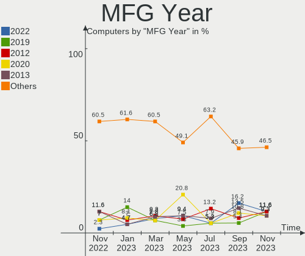
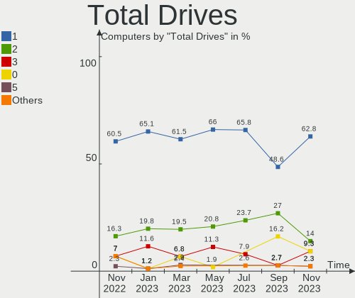
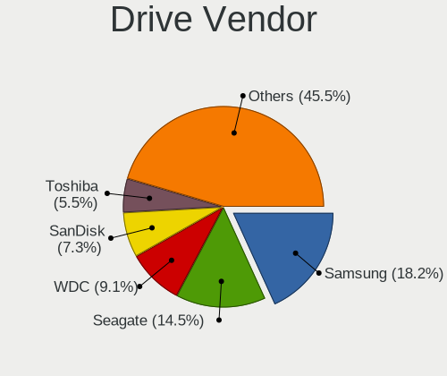
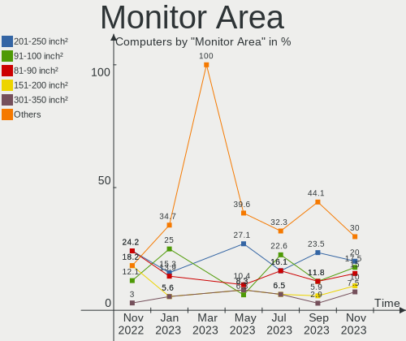

helloSystem Hardware Trends
---------------------------

A project to identify most popular hardware characteristics and track their change
over time based on data collected by helloSystem users at https://BSD-Hardware.info.

Anyone can contribute to the study by uploading probes of their computers by
the [hw-probe](https://github.com/linuxhw/hw-probe/blob/master/INSTALL.BSD.md) tool:

    hw-probe -all -upload

This is a report for all computer types. See also reports for [desktops](/Dist/helloSystem/Desktop/README.md) and [notebooks](/Dist/helloSystem/Notebook/README.md).

Full-feature report is available here: https://bsd-hardware.info/?view=trends

Period: Mar, 2021.

Contents
--------

- [ OS                       ](#os)
- [ OS Family                ](#os-family)
- [ Arch                     ](#arch)
- [ DE                       ](#de)
- [ Display Server           ](#display-server)
- [ Display Manager          ](#display-manager)
- [ OS Lang                  ](#os-lang)
- [ Boot Mode                ](#boot-mode)
- [ Filesystem               ](#filesystem)
- [ Part. scheme             ](#part-scheme)
- [ Country                  ](#country)
- [ City                     ](#city)
- [ Vendor                   ](#vendor)
- [ Model                    ](#model)
- [ Model Family             ](#model-family)
- [ MFG Year                 ](#mfg-year)
- [ Form Factor              ](#form-factor)
- [ Coreboot                 ](#coreboot)
- [ RAM Size                 ](#ram-size)
- [ RAM Used                 ](#ram-used)
- [ Has CD-ROM               ](#has-cd-rom)
- [ Total Drives             ](#total-drives)
- [ Has Ethernet             ](#has-ethernet)
- [ Has WiFi                 ](#has-wifi)
- [ Has Bluetooth            ](#has-bluetooth)
- [ Drive Vendor             ](#drive-vendor)
- [ Drive Model              ](#drive-model)
- [ HDD Vendor               ](#hdd-vendor)
- [ SSD Vendor               ](#ssd-vendor)
- [ Drive Kind               ](#drive-kind)
- [ Drive Connector          ](#drive-connector)
- [ Drive Size               ](#drive-size)
- [ Space Total              ](#space-total)
- [ Space Used               ](#space-used)
- [ Malfunc. Drives          ](#malfunc-drives)
- [ Malfunc. Drive Vendor    ](#malfunc-drive-vendor)
- [ Malfunc. HDD Vendor      ](#malfunc-hdd-vendor)
- [ Malfunc. Drive Kind      ](#malfunc-drive-kind)
- [ Failed Drives            ](#failed-drives)
- [ Failed Drive Vendor      ](#failed-drive-vendor)
- [ Drive Status             ](#drive-status)
- [ Storage Vendor           ](#storage-vendor)
- [ Storage Model            ](#storage-model)
- [ Storage Kind             ](#storage-kind)
- [ CPU Vendor               ](#cpu-vendor)
- [ CPU Model                ](#cpu-model)
- [ CPU Model Family         ](#cpu-model-family)
- [ CPU Cores                ](#cpu-cores)
- [ CPU Sockets              ](#cpu-sockets)
- [ CPU Threads              ](#cpu-threads)
- [ CPU Microarch            ](#cpu-microarch)
- [ GPU Vendor               ](#gpu-vendor)
- [ GPU Model                ](#gpu-model)
- [ GPU Combo                ](#gpu-combo)
- [ GPU Driver               ](#gpu-driver)
- [ GPU Memory               ](#gpu-memory)
- [ Monitor Vendor           ](#monitor-vendor)
- [ Monitor Model            ](#monitor-model)
- [ Monitor Resolution       ](#monitor-resolution)
- [ Monitor Diagonal         ](#monitor-diagonal)
- [ Monitor Width            ](#monitor-width)
- [ Aspect Ratio             ](#aspect-ratio)
- [ Monitor Area             ](#monitor-area)
- [ Pixel Density            ](#pixel-density)
- [ Multiple Monitors        ](#multiple-monitors)
- [ Net Controller Vendor    ](#net-controller-vendor)
- [ Net Controller Model     ](#net-controller-model)
- [ Wireless Vendor          ](#wireless-vendor)
- [ Wireless Model           ](#wireless-model)
- [ Ethernet Vendor          ](#ethernet-vendor)
- [ Ethernet Model           ](#ethernet-model)
- [ Net Controller Kind      ](#net-controller-kind)
- [ Used Controller          ](#used-controller)
- [ NICs                     ](#nics)
- [ IPv6                     ](#ipv6)
- [ Memory Vendor            ](#memory-vendor)
- [ Memory Model             ](#memory-model)
- [ Memory Kind              ](#memory-kind)
- [ Memory Form Factor       ](#memory-form-factor)
- [ Memory Size              ](#memory-size)
- [ Memory Speed             ](#memory-speed)
- [ Sound Vendor             ](#sound-vendor)
- [ Sound Model              ](#sound-model)
- [ Camera Vendor            ](#camera-vendor)
- [ Camera Model             ](#camera-model)
- [ Fingerprint Vendor       ](#fingerprint-vendor)
- [ Fingerprint Model        ](#fingerprint-model)
- [ Chipcard Vendor          ](#chipcard-vendor)
- [ Chipcard Model           ](#chipcard-model)
- [ Printer Vendor           ](#printer-vendor)
- [ Printer Model            ](#printer-model)
- [ Scanner Vendor           ](#scanner-vendor)
- [ Scanner Model            ](#scanner-model)
- [ Bluetooth Vendor         ](#bluetooth-vendor)
- [ Bluetooth Model          ](#bluetooth-model)
- [ Unsupported Devices      ](#unsupported-devices)
- [ Unsupported Device Types ](#unsupported-device-types)

OS
--

Installed operating systems

| Name              | Computers | Percent |
|-------------------|-----------|---------|
| helloSystem 0.5.0 | 37        | 56.06%  |
| helloSystem 0.4.0 | 28        | 42.42%  |
| helloSystem 0.3.0 | 1         | 1.52%   |

OS Family
---------

OS without a version

| Name        | Computers | Percent |
|-------------|-----------|---------|
| helloSystem | 66        | 100%    |

Arch
----

OS architecture (x86_64, i586, etc.)

| Name  | Computers | Percent |
|-------|-----------|---------|
| amd64 | 66        | 100%    |

DE
--

Desktop Environment

| Name         | Computers | Percent |
|--------------|-----------|---------|
| helloDesktop | 65        | 98.48%  |
| KDE5         | 1         | 1.52%   |

Display Server
--------------

X11 or Wayland

| Name | Computers | Percent |
|------|-----------|---------|
| X11  | 66        | 100%    |

Display Manager
---------------

SDDM, LightDM, etc.

| Name | Computers | Percent |
|------|-----------|---------|
| SLiM | 66        | 100%    |

OS Lang
-------

Language

| Lang  | Computers | Percent |
|-------|-----------|---------|
| en_US | 64        | 96.97%  |
| it_IT | 1         | 1.52%   |
| fr_FR | 1         | 1.52%   |

Boot Mode
---------

EFI or BIOS

| Mode | Computers | Percent |
|------|-----------|---------|
| EFI  | 57        | 86.36%  |
| BIOS | 9         | 13.64%  |

Filesystem
----------

Type of filesystem

| Type | Computers | Percent |
|------|-----------|---------|
| Zfs  | 66        | 100%    |

Part. scheme
------------

Scheme of partitioning

| Type | Computers | Percent |
|------|-----------|---------|
| GPT  | 66        | 100%    |

Country
-------

Geographic location (country)

| Country     | Computers | Percent |
|-------------|-----------|---------|
| Germany     | 10        | 15.15%  |
| USA         | 7         | 10.61%  |
| UK          | 6         | 9.09%   |
| Brazil      | 6         | 9.09%   |
| Italy       | 5         | 7.58%   |
| Canada      | 5         | 7.58%   |
| Spain       | 4         | 6.06%   |
| China       | 4         | 6.06%   |
| Netherlands | 3         | 4.55%   |
| Ukraine     | 2         | 3.03%   |
| Greece      | 2         | 3.03%   |
| France      | 2         | 3.03%   |
| Turkey      | 1         | 1.52%   |
| Taiwan      | 1         | 1.52%   |
| Russia      | 1         | 1.52%   |
| Mexico      | 1         | 1.52%   |
| Indonesia   | 1         | 1.52%   |
| India       | 1         | 1.52%   |
| Egypt       | 1         | 1.52%   |
| Cyprus      | 1         | 1.52%   |
| Australia   | 1         | 1.52%   |
| Argentina   | 1         | 1.52%   |

City
----

Geographic location (city)

| City                  | Computers | Percent |
|-----------------------|-----------|---------|
| Paris                 | 2         | 3.03%   |
| Calgary               | 2         | 3.03%   |
| Athens                | 2         | 3.03%   |
| Aberdeen              | 2         | 3.03%   |
| Zhongshan             | 1         | 1.52%   |
| Zhengzhou             | 1         | 1.52%   |
| Zaragoza              | 1         | 1.52%   |
| Wesley Chapel         | 1         | 1.52%   |
| Ware                  | 1         | 1.52%   |
| Vigonovo              | 1         | 1.52%   |
| Victoria              | 1         | 1.52%   |
| Treviso               | 1         | 1.52%   |
| The Bronx             | 1         | 1.52%   |
| Taoyuan District      | 1         | 1.52%   |
| Surabaya              | 1         | 1.52%   |
| Sheffield             | 1         | 1.52%   |
| Sevastopol            | 1         | 1.52%   |
| Sao Jeronimo da Serra | 1         | 1.52%   |
| Sandhausen            | 1         | 1.52%   |
| Salida                | 1         | 1.52%   |
| Roding                | 1         | 1.52%   |
| Pleidelsheim          | 1         | 1.52%   |
| Perth                 | 1         | 1.52%   |
| Ortona                | 1         | 1.52%   |
| Oosterhout            | 1         | 1.52%   |
| Notting Hill Gate     | 1         | 1.52%   |
| Nanjing               | 1         | 1.52%   |
| Munich                | 1         | 1.52%   |
| Mestrino              | 1         | 1.52%   |
| Mar del Plata         | 1         | 1.52%   |
| Lübeck               | 1         | 1.52%   |
| Lucknow               | 1         | 1.52%   |
| Limassol              | 1         | 1.52%   |
| Leipzig               | 1         | 1.52%   |
| Langwedel             | 1         | 1.52%   |
| Krasnoyarsk           | 1         | 1.52%   |
| Knoxville             | 1         | 1.52%   |
| Kherson               | 1         | 1.52%   |
| Juazeiro              | 1         | 1.52%   |
| Izmir                 | 1         | 1.52%   |
| Halle                 | 1         | 1.52%   |
| Guelph                | 1         | 1.52%   |
| Guarulhos             | 1         | 1.52%   |
| Guangzhou             | 1         | 1.52%   |
| Guadalajara           | 1         | 1.52%   |
| Gloucester            | 1         | 1.52%   |
| Gatineau              | 1         | 1.52%   |
| Fuente Carreteros     | 1         | 1.52%   |
| Franca                | 1         | 1.52%   |
| Fortaleza             | 1         | 1.52%   |
| Forest City           | 1         | 1.52%   |
| Ferrol                | 1         | 1.52%   |
| Esparragosa de Lares  | 1         | 1.52%   |
| Eisenach              | 1         | 1.52%   |
| Deventer              | 1         | 1.52%   |
| Curitiba              | 1         | 1.52%   |
| Cuijk                 | 1         | 1.52%   |
| Chattahoochee Hills   | 1         | 1.52%   |
| Carmignano di Brenta  | 1         | 1.52%   |
| Berlin                | 1         | 1.52%   |

Vendor
------

Motherboard manufacturer

| Name                | Computers | Percent |
|---------------------|-----------|---------|
| ASUSTek Computer    | 13        | 19.7%   |
| Dell                | 12        | 18.18%  |
| Lenovo              | 10        | 15.15%  |
| Hewlett-Packard     | 6         | 9.09%   |
| Gigabyte Technology | 5         | 7.58%   |
| ASRock              | 3         | 4.55%   |
| Toshiba             | 2         | 3.03%   |
| Apple               | 2         | 3.03%   |
| Acer                | 2         | 3.03%   |
| VeryPC              | 1         | 1.52%   |
| TUXEDO              | 1         | 1.52%   |
| Supermicro          | 1         | 1.52%   |
| Samsung Electronics | 1         | 1.52%   |
| Pegatron            | 1         | 1.52%   |
| Packard Bell        | 1         | 1.52%   |
| MSI                 | 1         | 1.52%   |
| Medion              | 1         | 1.52%   |
| Intel               | 1         | 1.52%   |
| Fujitsu             | 1         | 1.52%   |
| Foxconn             | 1         | 1.52%   |

Model
-----

Motherboard model

| Name                                | Computers | Percent |
|-------------------------------------|-----------|---------|
| Dell Inspiron 7520                  | 2         | 3.03%   |
| VeryPC S400-K7-N-O                  | 1         | 1.52%   |
| TUXEDO Aura 15 Gen1                 | 1         | 1.52%   |
| Toshiba Satellite Pro U400          | 1         | 1.52%   |
| Toshiba Satellite L500              | 1         | 1.52%   |
| Supermicro X10SRA                   | 1         | 1.52%   |
| Samsung 530U3C/530U4C/532U3C        | 1         | 1.52%   |
| Pegatron IPM41-D3                   | 1         | 1.52%   |
| Packard Bell EasyNote MH36          | 1         | 1.52%   |
| MSI MS-7982                         | 1         | 1.52%   |
| Medion H61H2-LM3                    | 1         | 1.52%   |
| Lenovo ThinkPad X260 20F5S82N00     | 1         | 1.52%   |
| Lenovo ThinkPad X230 23255Y4        | 1         | 1.52%   |
| Lenovo ThinkPad T61 766416U         | 1         | 1.52%   |
| Lenovo ThinkPad T530 2392ASU        | 1         | 1.52%   |
| Lenovo ThinkPad T440s 20ARS1B704    | 1         | 1.52%   |
| Lenovo ThinkCentre M83 10AHS35Q00   | 1         | 1.52%   |
| Lenovo ThinkCentre M82 2756B94      | 1         | 1.52%   |
| Lenovo IdeaPad 700-15ISK 80RU       | 1         | 1.52%   |
| Lenovo B41-80 80LG                  | 1         | 1.52%   |
| Lenovo 3000 N200 0769AP2            | 1         | 1.52%   |
| Intel NUC8i3BEH                     | 1         | 1.52%   |
| HP ProDesk 600 G1 TWR               | 1         | 1.52%   |
| HP ProDesk 600 G1 SFF               | 1         | 1.52%   |
| HP Pavilion Notebook                | 1         | 1.52%   |
| HP Pavilion Gaming Laptop 15-ec1xxx | 1         | 1.52%   |
| HP EliteDesk 800 G1 DM              | 1         | 1.52%   |
| HP Compaq Pro 6300 SFF              | 1         | 1.52%   |
| Gigabyte Z77X-UD5H                  | 1         | 1.52%   |
| Gigabyte Z77M-D3H                   | 1         | 1.52%   |
| Gigabyte X570 AORUS ELITE           | 1         | 1.52%   |
| Gigabyte B450 AORUS ELITE           | 1         | 1.52%   |
| Gigabyte 970A-DS3P                  | 1         | 1.52%   |
| Fujitsu LIFEBOOK A555               | 1         | 1.52%   |
| Foxconn p6-2305elm                  | 1         | 1.52%   |
| Dell Vostro 14-3468                 | 1         | 1.52%   |
| Dell Precision WorkStation T5500    | 1         | 1.52%   |
| Dell OptiPlex 7050                  | 1         | 1.52%   |
| Dell OptiPlex 380                   | 1         | 1.52%   |
| Dell OptiPlex 3050                  | 1         | 1.52%   |
| Dell Latitude E6500                 | 1         | 1.52%   |
| Dell Latitude E5570                 | 1         | 1.52%   |
| Dell Inspiron 7370                  | 1         | 1.52%   |
| Dell Inspiron 3543                  | 1         | 1.52%   |
| Dell Inspiron 3442                  | 1         | 1.52%   |
| ASUS X55CR                          | 1         | 1.52%   |
| ASUS X556UA                         | 1         | 1.52%   |
| ASUS X540UP                         | 1         | 1.52%   |
| ASUS PRIME Z390M-PLUS               | 1         | 1.52%   |
| ASUS PRIME H310M-E R2.0             | 1         | 1.52%   |
| ASUS PRIME B350M-A                  | 1         | 1.52%   |
| ASUS P8Z77-V                        | 1         | 1.52%   |
| ASUS M5A99X EVO R2.0                | 1         | 1.52%   |
| ASUS M4A88TD-V EVO/USB3             | 1         | 1.52%   |
| ASUS M4A78                          | 1         | 1.52%   |
| ASUS H110M-PLUS                     | 1         | 1.52%   |
| ASUS G75VW                          | 1         | 1.52%   |
| ASUS BM6AD_BM1AD_BP1AD              | 1         | 1.52%   |
| ASRock H71M-DGS                     | 1         | 1.52%   |
| ASRock B450M Pro4                   | 1         | 1.52%   |

Model Family
------------

Motherboard model prefix

| Name                  | Computers | Percent |
|-----------------------|-----------|---------|
| Lenovo ThinkPad       | 5         | 7.58%   |
| Dell Inspiron         | 5         | 7.58%   |
| Dell OptiPlex         | 3         | 4.55%   |
| ASUS PRIME            | 3         | 4.55%   |
| Toshiba Satellite     | 2         | 3.03%   |
| Lenovo ThinkCentre    | 2         | 3.03%   |
| HP ProDesk            | 2         | 3.03%   |
| HP Pavilion           | 2         | 3.03%   |
| Dell Latitude         | 2         | 3.03%   |
| Acer Aspire           | 2         | 3.03%   |
| VeryPC S400-K7-N-O    | 1         | 1.52%   |
| TUXEDO Aura           | 1         | 1.52%   |
| Supermicro X10SRA     | 1         | 1.52%   |
| Samsung 530U3C        | 1         | 1.52%   |
| Pegatron IPM41-D3     | 1         | 1.52%   |
| Packard Bell EasyNote | 1         | 1.52%   |
| MSI MS-7982           | 1         | 1.52%   |
| Medion H61H2-LM3      | 1         | 1.52%   |
| Lenovo IdeaPad        | 1         | 1.52%   |
| Lenovo B41-80         | 1         | 1.52%   |
| Lenovo 3000           | 1         | 1.52%   |
| Intel NUC8i3BEH       | 1         | 1.52%   |
| HP EliteDesk          | 1         | 1.52%   |
| HP Compaq             | 1         | 1.52%   |
| Gigabyte Z77X-UD5H    | 1         | 1.52%   |
| Gigabyte Z77M-D3H     | 1         | 1.52%   |
| Gigabyte X570         | 1         | 1.52%   |
| Gigabyte B450         | 1         | 1.52%   |
| Gigabyte 970A-DS3P    | 1         | 1.52%   |
| Fujitsu LIFEBOOK      | 1         | 1.52%   |
| Foxconn p6-2305elm    | 1         | 1.52%   |
| Dell Vostro           | 1         | 1.52%   |
| Dell Precision        | 1         | 1.52%   |
| ASUS X55CR            | 1         | 1.52%   |
| ASUS X556UA           | 1         | 1.52%   |
| ASUS X540UP           | 1         | 1.52%   |
| ASUS P8Z77-V          | 1         | 1.52%   |
| ASUS M5A99X           | 1         | 1.52%   |
| ASUS M4A88TD-V        | 1         | 1.52%   |
| ASUS M4A78            | 1         | 1.52%   |
| ASUS H110M-PLUS       | 1         | 1.52%   |
| ASUS G75VW            | 1         | 1.52%   |
| ASUS BM6AD            | 1         | 1.52%   |
| ASRock H71M-DGS       | 1         | 1.52%   |
| ASRock B450M          | 1         | 1.52%   |
| ASRock 970A-G         | 1         | 1.52%   |
| Apple Macmini6        | 1         | 1.52%   |
| Apple MacBookPro5     | 1         | 1.52%   |

MFG Year
--------

Motherboard manufacture year

| Year | Computers | Percent |
|------|-----------|---------|
| 2019 | 12        | 18.18%  |
| 2020 | 9         | 13.64%  |
| 2013 | 7         | 10.61%  |
| 2018 | 6         | 9.09%   |
| 2012 | 6         | 9.09%   |
| 2009 | 6         | 9.09%   |
| 2017 | 5         | 7.58%   |
| 2016 | 5         | 7.58%   |
| 2014 | 3         | 4.55%   |
| 2015 | 2         | 3.03%   |
| 2010 | 2         | 3.03%   |
| 2008 | 2         | 3.03%   |
| 2007 | 1         | 1.52%   |

Form Factor
-----------

Physical design of the computer

| Name     | Computers | Percent |
|----------|-----------|---------|
| Desktop  | 32        | 48.48%  |
| Notebook | 31        | 46.97%  |
| Mini pc  | 2         | 3.03%   |
| Server   | 1         | 1.52%   |

Coreboot
--------

Have coreboot on board

| Used | Computers | Percent |
|------|-----------|---------|
| No   | 66        | 100%    |

RAM Size
--------

Total RAM memory

| Size in GB | Computers | Percent |
|------------|-----------|---------|
| 4.01-8.0   | 27        | 40.91%  |
| 8.01-16.0  | 22        | 33.33%  |
| 16.01-24.0 | 14        | 21.21%  |
| 32.01-64.0 | 3         | 4.55%   |

RAM Used
--------

Used RAM memory

| Used GB   | Computers | Percent |
|-----------|-----------|---------|
| 0.01-0.5  | 45        | 68.18%  |
| 0.51-1.0  | 18        | 27.27%  |
| 1.01-2.0  | 2         | 3.03%   |
| 8.01-16.0 | 1         | 1.52%   |

Has CD-ROM
----------

Has CD-ROM on board

| Presented | Computers | Percent |
|-----------|-----------|---------|
| No        | 40        | 60.61%  |
| Yes       | 26        | 39.39%  |

Total Drives
------------

Number of drives on board

| Drives | Computers | Percent |
|--------|-----------|---------|
| 1      | 42        | 63.64%  |
| 2      | 13        | 19.7%   |
| 3      | 6         | 9.09%   |
| 4      | 3         | 4.55%   |
| 8      | 1         | 1.52%   |
| 5      | 1         | 1.52%   |

Has Ethernet
------------

Has Ethernet on board

| Presented | Computers | Percent |
|-----------|-----------|---------|
| Yes       | 65        | 98.48%  |
| No        | 1         | 1.52%   |

Has WiFi
--------

Has WiFi module

| Presented | Computers | Percent |
|-----------|-----------|---------|
| Yes       | 45        | 68.18%  |
| No        | 21        | 31.82%  |

Has Bluetooth
-------------

Has Bluetooth module

| Presented | Computers | Percent |
|-----------|-----------|---------|
| No        | 38        | 57.58%  |
| Yes       | 28        | 42.42%  |

Drive Vendor
------------

Hard drive vendors

| Vendor              | Computers | Drives | Percent |
|---------------------|-----------|--------|---------|
| WDC                 | 15        | 17     | 15.79%  |
| Samsung Electronics | 15        | 17     | 15.79%  |
| Seagate             | 14        | 19     | 14.74%  |
| Toshiba             | 8         | 8      | 8.42%   |
| Hitachi             | 7         | 8      | 7.37%   |
| SanDisk             | 5         | 5      | 5.26%   |
| Kingston            | 5         | 5      | 5.26%   |
| Crucial             | 5         | 5      | 5.26%   |
| Intel               | 3         | 3      | 3.16%   |
| A-DATA Technology   | 3         | 4      | 3.16%   |
| PNY                 | 2         | 9      | 2.11%   |
| Micron Technology   | 2         | 2      | 2.11%   |
| HGST                | 2         | 2      | 2.11%   |
| Transcend           | 1         | 1      | 1.05%   |
| SMART               | 1         | 1      | 1.05%   |
| KingSpec            | 1         | 1      | 1.05%   |
| HPE                 | 1         | 1      | 1.05%   |
| Hoodisk             | 1         | 1      | 1.05%   |
| Hewlett-Packard     | 1         | 1      | 1.05%   |
| Gigabyte Technology | 1         | 2      | 1.05%   |
| Fujitsu             | 1         | 1      | 1.05%   |
| Apple               | 1         | 1      | 1.05%   |

Drive Model
-----------

Hard drive models

| Model                               | Computers | Percent |
|-------------------------------------|-----------|---------|
| Seagate ST500DM002-1BD142 500GB     | 2         | 1.9%    |
| Samsung SSD 860 EVO 500GB           | 2         | 1.9%    |
| Samsung SSD 860 EVO 250GB           | 2         | 1.9%    |
| Micron 1100 SATA 256GB              | 2         | 1.9%    |
| A-DATA SU650 240GB                  | 2         | 1.9%    |
| A-DATA SU650 120GB                  | 2         | 1.9%    |
| WDC WDS500G2B0A-00SM50 500GB        | 1         | 0.95%   |
| WDC WDS250G1B0A-00H9H0 250GB        | 1         | 0.95%   |
| WDC WDS200T2B0A 2TB                 | 1         | 0.95%   |
| WDC WDS120G2G0B-00EPW0 120GB        | 1         | 0.95%   |
| WDC WD400BD-75LRA0 40GB             | 1         | 0.95%   |
| WDC WD3200BEVT-22ZCT0 320GB         | 1         | 0.95%   |
| WDC WD3200BEKT-60V5T1 320GB         | 1         | 0.95%   |
| WDC WD3200AAKS-00L9A0 320GB         | 1         | 0.95%   |
| WDC WD3200AAJS-56M0A0 320GB         | 1         | 0.95%   |
| WDC WD2500BEVT-00A23T0 250GB        | 1         | 0.95%   |
| WDC WD2500BEVS-22UST0 250GB         | 1         | 0.95%   |
| WDC WD2500AAKX-75U6AA0 250GB        | 1         | 0.95%   |
| WDC WD1600AAJS-00WAA0 160GB         | 1         | 0.95%   |
| WDC WD10JPVT-00A1YT0 1TB            | 1         | 0.95%   |
| WDC WD10EZRX-00D8PB0 1TB            | 1         | 0.95%   |
| WDC WD10EZEX-08WN4A0 1TB            | 1         | 0.95%   |
| WDC WD10EZEX-00RKKA0 1TB            | 1         | 0.95%   |
| Transcend TS512GMTS430S 512GB       | 1         | 0.95%   |
| Toshiba THNSNK128GCS8 SATA 128GB    | 1         | 0.95%   |
| Toshiba Q300 240GB                  | 1         | 0.95%   |
| Toshiba MQ03UBB200 2TB              | 1         | 0.95%   |
| Toshiba MQ02ABF050H-SSHD-8GB        | 1         | 0.95%   |
| Toshiba MQ01ABD032 320GB            | 1         | 0.95%   |
| Toshiba MK3261GSYN 320GB            | 1         | 0.95%   |
| Toshiba DT01ACA300 3TB              | 1         | 0.95%   |
| Toshiba DT01ACA100 1TB              | 1         | 0.95%   |
| SMART SSD XceedValue2 mSATA 32GB    | 1         | 0.95%   |
| Seagate ST9320325AS 320GB           | 1         | 0.95%   |
| Seagate ST9160412AS 160GB           | 1         | 0.95%   |
| Seagate ST9160314AS 160GB           | 1         | 0.95%   |
| Seagate ST500LM012 HN-M500MBB 500GB | 1         | 0.95%   |
| Seagate ST500LM000-SSHD-8GB         | 1         | 0.95%   |
| Seagate ST500LM000-1EJ162 500GB     | 1         | 0.95%   |
| Seagate ST3500413AS 500GB           | 1         | 0.95%   |
| Seagate ST3500312CS 500GB           | 1         | 0.95%   |
| Seagate ST320LM001 HN-M320MBB 320GB | 1         | 0.95%   |
| Seagate ST3160815AS 160GB           | 1         | 0.95%   |
| Seagate ST31000333AS 1TB            | 1         | 0.95%   |
| Seagate ST3000DM001-9YN166 3TB      | 1         | 0.95%   |
| Seagate ST2000LM003 HN-M201RAD 2TB  | 1         | 0.95%   |
| Seagate ST1000DX001-1CM162 1TB      | 1         | 0.95%   |
| Seagate ST1000DM010-2EP102 1TB      | 1         | 0.95%   |
| SanDisk SSD i100 24GB               | 1         | 0.95%   |
| SanDisk SDSSDP128G 128GB            | 1         | 0.95%   |
| SanDisk SDSSDA240G 240GB            | 1         | 0.95%   |
| SanDisk SD8SBAT256G1002 256GB       | 1         | 0.95%   |
| SanDisk SD6SB1M-032G-1006 32GB      | 1         | 0.95%   |
| Samsung SSD 980 PRO 500GB           | 1         | 0.95%   |
| Samsung SSD 850 EVO 250GB           | 1         | 0.95%   |
| Samsung SSD 840 EVO 250GB           | 1         | 0.95%   |
| Samsung SSD 840 EVO 1TB             | 1         | 0.95%   |
| Samsung MZVPV128HDGM-00000 128GB    | 1         | 0.95%   |
| Samsung MZ7TD256HAFV-000L7 256GB    | 1         | 0.95%   |
| Samsung MZ7LN256HMJP-000L7 256GB    | 1         | 0.95%   |

HDD Vendor
----------

Hard disk drive vendors

| Vendor              | Computers | Drives | Percent |
|---------------------|-----------|--------|---------|
| Seagate             | 14        | 19     | 29.79%  |
| WDC                 | 12        | 13     | 25.53%  |
| Hitachi             | 7         | 8      | 14.89%  |
| Toshiba             | 6         | 6      | 12.77%  |
| Samsung Electronics | 4         | 5      | 8.51%   |
| HGST                | 2         | 2      | 4.26%   |
| Fujitsu             | 1         | 1      | 2.13%   |
| Apple               | 1         | 1      | 2.13%   |

SSD Vendor
----------

Solid state drive vendors

| Vendor              | Computers | Drives | Percent |
|---------------------|-----------|--------|---------|
| Samsung Electronics | 10        | 10     | 22.22%  |
| SanDisk             | 5         | 5      | 11.11%  |
| Crucial             | 5         | 5      | 11.11%  |
| WDC                 | 4         | 4      | 8.89%   |
| Kingston            | 4         | 4      | 8.89%   |
| Intel               | 3         | 3      | 6.67%   |
| A-DATA Technology   | 3         | 4      | 6.67%   |
| Toshiba             | 2         | 2      | 4.44%   |
| PNY                 | 2         | 7      | 4.44%   |
| Micron Technology   | 2         | 2      | 4.44%   |
| Transcend           | 1         | 1      | 2.22%   |
| SMART               | 1         | 1      | 2.22%   |
| KingSpec            | 1         | 1      | 2.22%   |
| HPE                 | 1         | 1      | 2.22%   |
| Hoodisk             | 1         | 1      | 2.22%   |

Drive Kind
----------

HDD or SSD

| Kind | Computers | Drives | Percent |
|------|-----------|--------|---------|
| HDD  | 37        | 55     | 46.84%  |
| SSD  | 36        | 51     | 45.57%  |
| NVMe | 6         | 8      | 7.59%   |

Drive Connector
---------------

SATA, SAS, NVMe, etc.

| Type | Computers | Drives | Percent |
|------|-----------|--------|---------|
| SATA | 63        | 106    | 91.3%   |
| NVMe | 6         | 8      | 8.7%    |

Drive Size
----------

Size of hard drive

| Size in TB | Computers | Drives | Percent |
|------------|-----------|--------|---------|
| 0.01-0.5   | 53        | 82     | 72.6%   |
| 0.51-1.0   | 15        | 18     | 20.55%  |
| 1.01-2.0   | 3         | 3      | 4.11%   |
| 2.01-3.0   | 2         | 3      | 2.74%   |

Space Total
-----------

Amount of disk space available on the file system

| Size in GB | Computers | Percent |
|------------|-----------|---------|
| 1-20       | 46        | 69.7%   |
| 101-250    | 10        | 15.15%  |
| 251-500    | 7         | 10.61%  |
| 21-50      | 1         | 1.52%   |
| 501-1000   | 1         | 1.52%   |
| 51-100     | 1         | 1.52%   |

Space Used
----------

Amount of used disk space

| Used GB | Computers | Percent |
|---------|-----------|---------|
| 1-20    | 66        | 100%    |

Malfunc. Drives
---------------

Drive models with a malfunction

| Model                               | Computers | Drives | Percent |
|-------------------------------------|-----------|--------|---------|
| WDC WDS200T2B0A 2TB                 | 1         | 1      | 3.57%   |
| WDC WD3200BEVT-22ZCT0 320GB         | 1         | 1      | 3.57%   |
| WDC WD3200BEKT-60V5T1 320GB         | 1         | 1      | 3.57%   |
| WDC WD1600AAJS-00WAA0 160GB         | 1         | 1      | 3.57%   |
| WDC WD10EZEX-00RKKA0 1TB            | 1         | 1      | 3.57%   |
| Toshiba THNSNK128GCS8 SATA 128GB    | 1         | 1      | 3.57%   |
| Toshiba MQ02ABF050H-SSHD-8GB        | 1         | 1      | 3.57%   |
| Toshiba MQ01ABD032 320GB            | 1         | 1      | 3.57%   |
| Toshiba MK3261GSYN 320GB            | 1         | 1      | 3.57%   |
| Seagate ST9320325AS 320GB           | 1         | 1      | 3.57%   |
| Seagate ST9160412AS 160GB           | 1         | 1      | 3.57%   |
| Seagate ST9160314AS 160GB           | 1         | 1      | 3.57%   |
| Seagate ST500DM002-1BD142 500GB     | 1         | 1      | 3.57%   |
| Seagate ST320LM001 HN-M320MBB 320GB | 1         | 1      | 3.57%   |
| Seagate ST31000333AS 1TB            | 1         | 1      | 3.57%   |
| Seagate ST1000DX001-1CM162 1TB      | 1         | 1      | 3.57%   |
| Samsung Electronics HM321HI 320GB   | 1         | 1      | 3.57%   |
| Samsung Electronics HD103UJ 1TB     | 1         | 1      | 3.57%   |
| Intel SSDSA2M080G2GC 80GB           | 1         | 1      | 3.57%   |
| Hitachi HTS545050B9A300 500GB       | 1         | 1      | 3.57%   |
| Hitachi HTS545050A7E380 500GB       | 1         | 1      | 3.57%   |
| Hitachi HTS545025B9SA02 250GB       | 1         | 1      | 3.57%   |
| Hitachi HTS543216L9A300 160GB       | 1         | 1      | 3.57%   |
| HGST HTS721010A9E630 1TB            | 1         | 1      | 3.57%   |
| HGST HTS545032A7E380 320GB          | 1         | 1      | 3.57%   |
| Fujitsu MHW2160BH 160GB             | 1         | 1      | 3.57%   |
| Crucial CT525MX300SSD1 528GB        | 1         | 1      | 3.57%   |
| Apple HDD HTS541010A9E662 1TB       | 1         | 1      | 3.57%   |

Malfunc. Drive Vendor
---------------------

Vendors of faulty drives

| Vendor              | Computers | Drives | Percent |
|---------------------|-----------|--------|---------|
| Seagate             | 7         | 7      | 25%     |
| WDC                 | 5         | 5      | 17.86%  |
| Toshiba             | 4         | 4      | 14.29%  |
| Hitachi             | 4         | 4      | 14.29%  |
| Samsung Electronics | 2         | 2      | 7.14%   |
| HGST                | 2         | 2      | 7.14%   |
| Intel               | 1         | 1      | 3.57%   |
| Fujitsu             | 1         | 1      | 3.57%   |
| Crucial             | 1         | 1      | 3.57%   |
| Apple               | 1         | 1      | 3.57%   |

Malfunc. HDD Vendor
-------------------

Vendors of faulty HDD drives

| Vendor              | Computers | Drives | Percent |
|---------------------|-----------|--------|---------|
| Seagate             | 7         | 7      | 29.17%  |
| WDC                 | 4         | 4      | 16.67%  |
| Hitachi             | 4         | 4      | 16.67%  |
| Toshiba             | 3         | 3      | 12.5%   |
| Samsung Electronics | 2         | 2      | 8.33%   |
| HGST                | 2         | 2      | 8.33%   |
| Fujitsu             | 1         | 1      | 4.17%   |
| Apple               | 1         | 1      | 4.17%   |

Malfunc. Drive Kind
-------------------

Kinds of faulty drives

| Kind | Computers | Drives | Percent |
|------|-----------|--------|---------|
| HDD  | 22        | 24     | 84.62%  |
| SSD  | 4         | 4      | 15.38%  |

Failed Drives
-------------

Failed drive models

| Model                   | Computers | Drives | Percent |
|-------------------------|-----------|--------|---------|
| HPE MK000480GWUGF 480GB | 1         | 1      | 100%    |

Failed Drive Vendor
-------------------

Failed drive vendors

| Vendor | Computers | Drives | Percent |
|--------|-----------|--------|---------|
| HPE    | 1         | 1      | 100%    |

Drive Status
------------

Number of failed and malfunc. drives

| Status  | Computers | Drives | Percent |
|---------|-----------|--------|---------|
| Works   | 52        | 85     | 65.82%  |
| Malfunc | 26        | 28     | 32.91%  |
| Failed  | 1         | 1      | 1.27%   |

Storage Vendor
--------------

Storage controller vendors

| Vendor                      | Computers | Percent |
|-----------------------------|-----------|---------|
| Intel                       | 54        | 72%     |
| AMD                         | 10        | 13.33%  |
| Samsung Electronics         | 2         | 2.67%   |
| Phison Electronics          | 2         | 2.67%   |
| VIA Technologies            | 1         | 1.33%   |
| Silicon Motion              | 1         | 1.33%   |
| Nvidia                      | 1         | 1.33%   |
| Kingston Technology Company | 1         | 1.33%   |
| Broadcom / LSI              | 1         | 1.33%   |
| ASMedia Technology          | 1         | 1.33%   |
| Adaptec                     | 1         | 1.33%   |

Storage Model
-------------

Storage controller models

| Model                                                                          | Computers | Percent |
|--------------------------------------------------------------------------------|-----------|---------|
| Intel Sunrise Point-LP SATA Controller [AHCI mode]                             | 8         | 9.09%   |
| Intel 7 Series Chipset Family 6-port SATA Controller [AHCI mode]               | 6         | 6.82%   |
| Intel 8 Series/C220 Series Chipset Family 6-port SATA Controller 1 [AHCI mode] | 5         | 5.68%   |
| AMD FCH SATA Controller [AHCI mode]                                            | 5         | 5.68%   |
| Intel 82801IBM/IEM (ICH9M/ICH9M-E) 4 port SATA Controller [AHCI mode]          | 4         | 4.55%   |
| Intel 7 Series/C210 Series Chipset Family 6-port SATA Controller [AHCI mode]   | 4         | 4.55%   |
| Intel 6 Series/C200 Series Chipset Family 6 port Desktop SATA AHCI Controller  | 3         | 3.41%   |
| AMD SB7x0/SB8x0/SB9x0 SATA Controller [IDE mode]                               | 3         | 3.41%   |
| AMD SB7x0/SB8x0/SB9x0 IDE Controller                                           | 3         | 3.41%   |
| Intel Wildcat Point-LP SATA Controller [AHCI Mode]                             | 2         | 2.27%   |
| Intel Q170/Q150/B150/H170/H110/Z170/CM236 Chipset SATA Controller [AHCI Mode]  | 2         | 2.27%   |
| Intel NM10/ICH7 Family SATA Controller [IDE mode]                              | 2         | 2.27%   |
| Intel HM170/QM170 Chipset SATA Controller [AHCI Mode]                          | 2         | 2.27%   |
| Intel 82801HM/HEM (ICH8M/ICH8M-E) SATA Controller [AHCI mode]                  | 2         | 2.27%   |
| Intel 82801HM/HEM (ICH8M/ICH8M-E) IDE Controller                               | 2         | 2.27%   |
| Intel 82801 Mobile SATA Controller [RAID mode]                                 | 2         | 2.27%   |
| Intel 8 Series SATA Controller 1 [AHCI mode]                                   | 2         | 2.27%   |
| Intel 200 Series PCH SATA controller [AHCI mode]                               | 2         | 2.27%   |
| AMD SB7x0/SB8x0/SB9x0 SATA Controller [AHCI mode]                              | 2         | 2.27%   |
| AMD 400 Series Chipset SATA Controller                                         | 2         | 2.27%   |
| VIA VT6415 PATA IDE Host Controller                                            | 1         | 1.14%   |
| Silicon Motion SM2263EN/SM2263XT SSD Controller                                | 1         | 1.14%   |
| Samsung NVMe SSD Controller SM951/PM951                                        | 1         | 1.14%   |
| Samsung NVMe SSD Controller PM9A1/980PRO                                       | 1         | 1.14%   |
| Phison PS5013 E13 NVMe Controller                                              | 1         | 1.14%   |
| Phison E16 PCIe4 NVMe Controller                                               | 1         | 1.14%   |
| Phison E12 NVMe Controller                                                     | 1         | 1.14%   |
| Nvidia MCP79 AHCI Controller                                                   | 1         | 1.14%   |
| Kingston Company A2000 NVMe SSD                                                | 1         | 1.14%   |
| Intel SATA Controller [RAID mode]                                              | 1         | 1.14%   |
| Intel Mobile 4 Series Chipset PT IDER Controller                               | 1         | 1.14%   |
| Intel Cannon Point-LP SATA Controller [AHCI Mode]                              | 1         | 1.14%   |
| Intel Cannon Lake PCH SATA AHCI Controller                                     | 1         | 1.14%   |
| Intel C610/X99 series chipset 6-Port SATA Controller [AHCI mode]               | 1         | 1.14%   |
| Intel 82801JI (ICH10 Family) SATA AHCI Controller                              | 1         | 1.14%   |
| Intel 82801IBM/IEM (ICH9M/ICH9M-E) 2 port SATA Controller [IDE mode]           | 1         | 1.14%   |
| Intel 82801G (ICH7 Family) IDE Controller                                      | 1         | 1.14%   |
| Intel 7 Series/C210 Series Chipset Family 4-port SATA Controller [IDE mode]    | 1         | 1.14%   |
| Intel 7 Series/C210 Series Chipset Family 2-port SATA Controller [IDE mode]    | 1         | 1.14%   |
| Intel 7 Series Chipset Family 4-port SATA Controller [IDE mode]                | 1         | 1.14%   |
| Intel 7 Series Chipset Family 2-port SATA Controller [IDE mode]                | 1         | 1.14%   |
| Broadcom / LSI SAS2008 PCI-Express Fusion-MPT SAS-2 [Falcon]                   | 1         | 1.14%   |
| ASMedia ASM1062 Serial ATA Controller                                          | 1         | 1.14%   |
| AMD 300 Series Chipset SATA Controller                                         | 1         | 1.14%   |
| Adaptec AIC-7850T/7856T [AVA-2902/4/6 / AHA-2910]                              | 1         | 1.14%   |

Storage Kind
------------

Kind of storage controller (IDE, SATA, NVMe, SAS, ...)

| Kind | Computers | Percent |
|------|-----------|---------|
| SATA | 54        | 71.05%  |
| IDE  | 11        | 14.47%  |
| NVMe | 6         | 7.89%   |
| RAID | 4         | 5.26%   |
| SCSI | 1         | 1.32%   |

CPU Vendor
----------

Processor vendors

| Vendor | Computers | Percent |
|--------|-----------|---------|
| Intel  | 55        | 83.33%  |
| AMD    | 11        | 16.67%  |

CPU Model
---------

Processor models

| Model                                       | Computers | Percent |
|---------------------------------------------|-----------|---------|
| Intel CPU Version                           | 5         | 7.58%   |
| Intel Core i5-7500 CPU @ 3.40GHz            | 2         | 3.03%   |
| Intel Core i5-7200U CPU @ 2.50GHz           | 2         | 3.03%   |
| Intel Core i5-6300U CPU @ 2.40GHz           | 2         | 3.03%   |
| Intel Core i5-6200U CPU @ 2.30GHz           | 2         | 3.03%   |
| Intel Core i3-4360 CPU @ 3.70GHz            | 2         | 3.03%   |
| Intel Core 2 Duo                            | 2         | 3.03%   |
| AMD Ryzen 3 1200 Quad-Core Processor        | 2         | 3.03%   |
| Intel Xeon CPU E5-1620 v4 @ 3.50GHz         | 1         | 1.52%   |
| Intel Xeon CPU E3-1265L v3 @ 2.50GHz        | 1         | 1.52%   |
| Intel Xeon                                  | 1         | 1.52%   |
| Intel Pentium Dual-Core CPU E6700 @ 3.20GHz | 1         | 1.52%   |
| Intel Pentium CPU G620 @ 2.60GHz            | 1         | 1.52%   |
| Intel Core i7-7500U CPU @ 2.70GHz           | 1         | 1.52%   |
| Intel Core i7-6700HQ CPU @ 2.60GHz          | 1         | 1.52%   |
| Intel Core i7-4600U CPU @ 2.10GHz           | 1         | 1.52%   |
| Intel Core i7-3770K CPU @ 3.50GHz           | 1         | 1.52%   |
| Intel Core i7-3770 CPU @ 3.40GHz            | 1         | 1.52%   |
| Intel Core i7-3632QM CPU @ 2.20GHz          | 1         | 1.52%   |
| Intel Core i7-3630QM CPU @ 2.40GHz          | 1         | 1.52%   |
| Intel Core i7-3615QM CPU @ 2.30GHz          | 1         | 1.52%   |
| Intel Core i7-3520M CPU @ 2.90GHz           | 1         | 1.52%   |
| Intel Core i7-2600K CPU @ 3.40GHz           | 1         | 1.52%   |
| Intel Core i5-9400 CPU @ 2.90GHz            | 1         | 1.52%   |
| Intel Core i5-8250U CPU @ 1.60GHz           | 1         | 1.52%   |
| Intel Core i5-7500T CPU @ 2.70GHz           | 1         | 1.52%   |
| Intel Core i5-6300HQ CPU @ 2.30GHz          | 1         | 1.52%   |
| Intel Core i5-5200U CPU @ 2.20GHz           | 1         | 1.52%   |
| Intel Core i5-3570K CPU @ 3.40GHz           | 1         | 1.52%   |
| Intel Core i5-3320M CPU @ 2.60GHz           | 1         | 1.52%   |
| Intel Core i5-3210M CPU @ 2.50GHz           | 1         | 1.52%   |
| Intel Core i5-2537M CPU @ 1.40GHz           | 1         | 1.52%   |
| Intel Core i5-2400S CPU @ 2.50GHz           | 1         | 1.52%   |
| Intel Core i3-9100F CPU @ 3.60GHz           | 1         | 1.52%   |
| Intel Core i3-8109U CPU @ 3.00GHz           | 1         | 1.52%   |
| Intel Core i3-6300 CPU @ 3.80GHz            | 1         | 1.52%   |
| Intel Core i3-5005U CPU @ 2.00GHz           | 1         | 1.52%   |
| Intel Core i3-4170 CPU @ 3.70GHz            | 1         | 1.52%   |
| Intel Core i3-4005U CPU @ 1.70GHz           | 1         | 1.52%   |
| Intel Core i3-3220 CPU @ 3.30GHz            | 1         | 1.52%   |
| Intel Core i3-2370M CPU @ 2.40GHz           | 1         | 1.52%   |
| Intel Core i3-2120 CPU @ 3.30GHz            | 1         | 1.52%   |
| Intel Core 2 Solo CPU U3500 @ 1.40GHz       | 1         | 1.52%   |
| Intel Core 2 Duo CPU T7300 @ 2.00GHz        | 1         | 1.52%   |
| Intel Core 2 Duo CPU P8700 @ 2.53GHz        | 1         | 1.52%   |
| Intel Celeron CPU G1840 @ 2.80GHz           | 1         | 1.52%   |
| AMD Ryzen 7 4700U with Radeon Graphics      | 1         | 1.52%   |
| AMD Ryzen 7 3800X 8-Core Processor          | 1         | 1.52%   |
| AMD Ryzen 5 4600H with Radeon Graphics      | 1         | 1.52%   |
| AMD Ryzen 5 3400G with Radeon Vega Graphics | 1         | 1.52%   |
| AMD Phenom II X4 965 Processor              | 1         | 1.52%   |
| AMD Phenom II X4 945 Processor              | 1         | 1.52%   |
| AMD FX-8320E Eight-Core Processor           | 1         | 1.52%   |
| AMD FX-8320 Eight-Core Processor            | 1         | 1.52%   |
| AMD FX-6100 Six-Core Processor              | 1         | 1.52%   |

CPU Model Family
----------------

Processor model prefix

| Model                   | Computers | Percent |
|-------------------------|-----------|---------|
| Intel Core i5           | 18        | 27.27%  |
| Intel Core i3           | 11        | 16.67%  |
| Intel Core i7           | 10        | 15.15%  |
| Other                   | 5         | 7.58%   |
| Intel Core 2 Duo        | 4         | 6.06%   |
| Intel Xeon              | 3         | 4.55%   |
| AMD FX                  | 3         | 4.55%   |
| AMD Ryzen 7             | 2         | 3.03%   |
| AMD Ryzen 5             | 2         | 3.03%   |
| AMD Ryzen 3             | 2         | 3.03%   |
| AMD Phenom II X4        | 2         | 3.03%   |
| Intel Pentium Dual-Core | 1         | 1.52%   |
| Intel Pentium           | 1         | 1.52%   |
| Intel Core 2 Solo       | 1         | 1.52%   |
| Intel Celeron           | 1         | 1.52%   |

CPU Cores
---------

Number of processor cores

| Number  | Computers | Percent |
|---------|-----------|---------|
| 2       | 31        | 46.97%  |
| 4       | 23        | 34.85%  |
| 8       | 4         | 6.06%   |
| Unknown | 3         | 4.55%   |
| 6       | 2         | 3.03%   |
| 16      | 1         | 1.52%   |
| 12      | 1         | 1.52%   |
| 1       | 1         | 1.52%   |

CPU Sockets
-----------

Number of sockets

| Number | Computers | Percent |
|--------|-----------|---------|
| 1      | 65        | 98.48%  |
| 2      | 1         | 1.52%   |

CPU Threads
-----------

Threads per core (Hyper-Threading)

| Number  | Computers | Percent |
|---------|-----------|---------|
| 2       | 33        | 50%     |
| 1       | 29        | 43.94%  |
| Unknown | 4         | 6.06%   |

CPU Microarch
-------------

Microarchitecture

| Name        | Computers | Percent |
|-------------|-----------|---------|
| KabyLake    | 10        | 15.15%  |
| IvyBridge   | 10        | 15.15%  |
| Skylake     | 7         | 10.61%  |
| Penryn      | 7         | 10.61%  |
| Haswell     | 7         | 10.61%  |
| SandyBridge | 6         | 9.09%   |
| Core        | 4         | 6.06%   |
| Zen 2       | 3         | 4.55%   |
| Broadwell   | 3         | 4.55%   |
| Zen         | 2         | 3.03%   |
| Piledriver  | 2         | 3.03%   |
| K10         | 2         | 3.03%   |
| Zen+        | 1         | 1.52%   |
| Westmere    | 1         | 1.52%   |
| Bulldozer   | 1         | 1.52%   |

GPU Vendor
----------

Vendors of graphics cards

| Vendor | Computers | Percent |
|--------|-----------|---------|
| Intel  | 38        | 50.67%  |
| Nvidia | 21        | 28%     |
| AMD    | 16        | 21.33%  |

GPU Model
---------

Graphics card models

| Model                                                                         | Computers | Percent |
|-------------------------------------------------------------------------------|-----------|---------|
| Intel 3rd Gen Core processor Graphics Controller                              | 5         | 6.67%   |
| Intel Skylake GT2 [HD Graphics 520]                                           | 4         | 5.33%   |
| Intel Mobile 4 Series Chipset Integrated Graphics Controller                  | 4         | 5.33%   |
| Intel 2nd Generation Core Processor Family Integrated Graphics Controller     | 4         | 5.33%   |
| Intel Xeon E3-1200 v2/3rd Gen Core processor Graphics Controller              | 3         | 4%      |
| Intel HD Graphics 620                                                         | 3         | 4%      |
| Nvidia GK208B [GeForce GT 710]                                                | 2         | 2.67%   |
| Intel Xeon E3-1200 v3/4th Gen Core Processor Integrated Graphics Controller   | 2         | 2.67%   |
| Intel HD Graphics 630                                                         | 2         | 2.67%   |
| Intel HD Graphics 5500                                                        | 2         | 2.67%   |
| Intel HD Graphics 530                                                         | 2         | 2.67%   |
| Intel Haswell-ULT Integrated Graphics Controller                              | 2         | 2.67%   |
| AMD Renoir                                                                    | 2         | 2.67%   |
| AMD Ellesmere [Radeon RX 470/480/570/570X/580/580X/590]                       | 2         | 2.67%   |
| AMD Chelsea LP [Radeon HD 7730M]                                              | 2         | 2.67%   |
| Nvidia TU117M                                                                 | 1         | 1.33%   |
| Nvidia TU116 [GeForce GTX 1660 SUPER]                                         | 1         | 1.33%   |
| Nvidia GP107GL [Quadro P400]                                                  | 1         | 1.33%   |
| Nvidia GP107 [GeForce GTX 1050 Ti]                                            | 1         | 1.33%   |
| Nvidia GP106 [GeForce GTX 1060 6GB]                                           | 1         | 1.33%   |
| Nvidia GP106 [GeForce GTX 1060 3GB]                                           | 1         | 1.33%   |
| Nvidia GM107M [GeForce GTX 960M]                                              | 1         | 1.33%   |
| Nvidia GM107M [GeForce GTX 950M]                                              | 1         | 1.33%   |
| Nvidia GK208B [GeForce GT 730]                                                | 1         | 1.33%   |
| Nvidia GK107M [GeForce GTX 660M]                                              | 1         | 1.33%   |
| Nvidia GK107 [GeForce GT 740]                                                 | 1         | 1.33%   |
| Nvidia GK106 [GeForce GTX 660]                                                | 1         | 1.33%   |
| Nvidia GF119 [GeForce GT 610]                                                 | 1         | 1.33%   |
| Nvidia G98M [Quadro NVS 160M]                                                 | 1         | 1.33%   |
| Nvidia G96CM [GeForce 9600M GT]                                               | 1         | 1.33%   |
| Nvidia G92 [GeForce 9800 GT]                                                  | 1         | 1.33%   |
| Nvidia G86M [Quadro NVS 140M]                                                 | 1         | 1.33%   |
| Nvidia G72M [Quadro NVS 110M/GeForce Go 7300]                                 | 1         | 1.33%   |
| Nvidia C79 [GeForce 9400M]                                                    | 1         | 1.33%   |
| Intel Xeon E3-1200 v3 Processor Integrated Graphics Controller                | 1         | 1.33%   |
| Intel UHD Graphics 620                                                        | 1         | 1.33%   |
| Intel CoffeeLake-U GT3e [Iris Plus Graphics 655]                              | 1         | 1.33%   |
| Intel 4th Generation Core Processor Family Integrated Graphics Controller     | 1         | 1.33%   |
| Intel 4 Series Chipset Integrated Graphics Controller                         | 1         | 1.33%   |
| AMD Turks PRO [Radeon HD 6570/7570/8550 / R5 230]                             | 1         | 1.33%   |
| AMD Sun XT [Radeon HD 8670A/8670M/8690M / R5 M330 / M430 / Radeon 520 Mobile] | 1         | 1.33%   |
| AMD Sun LE [Radeon HD 8550M / R5 M230]                                        | 1         | 1.33%   |
| AMD RV730 XT [Radeon HD 4670]                                                 | 1         | 1.33%   |
| AMD RV710 [Radeon HD 4350/4550]                                               | 1         | 1.33%   |
| AMD RV620 GL [FirePro 2260]                                                   | 1         | 1.33%   |
| AMD Navi 10 [Radeon RX 5600 OEM/5600 XT / 5700/5700 XT]                       | 1         | 1.33%   |
| AMD Cape Verde XT [Radeon HD 7770/8760 / R7 250X]                             | 1         | 1.33%   |
| AMD Baffin [Radeon RX 550 640SP / RX 560/560X]                                | 1         | 1.33%   |
| AMD Baffin [Radeon RX 460/560D / Pro 450/455/460/555/555X/560/560X]           | 1         | 1.33%   |

GPU Combo
---------

Combinations of graphics cards

| Name           | Computers | Percent |
|----------------|-----------|---------|
| 1 x Intel      | 25        | 37.88%  |
| 1 x Nvidia     | 18        | 27.27%  |
| 1 x AMD        | 9         | 13.64%  |
| Intel + AMD    | 6         | 9.09%   |
| 2 x Intel      | 5         | 7.58%   |
| Intel + Nvidia | 2         | 3.03%   |
| AMD + Nvidia   | 1         | 1.52%   |

GPU Driver
----------

Free vs proprietary

| Driver      | Computers | Percent |
|-------------|-----------|---------|
| Free        | 48        | 72.73%  |
| Proprietary | 11        | 16.67%  |
| Unknown     | 7         | 10.61%  |

GPU Memory
----------

Total video memory

| Size in GB | Computers | Percent |
|------------|-----------|---------|
| Unknown    | 48        | 72.73%  |
| 1.01-2.0   | 6         | 9.09%   |
| 0.51-1.0   | 5         | 7.58%   |
| 3.01-4.0   | 4         | 6.06%   |
| 5.01-6.0   | 1         | 1.52%   |
| 2.01-3.0   | 1         | 1.52%   |
| 0.01-0.5   | 1         | 1.52%   |

Monitor Vendor
--------------

Monitor vendors

| Vendor                  | Computers | Percent |
|-------------------------|-----------|---------|
| Samsung Electronics     | 10        | 19.23%  |
| AU Optronics            | 5         | 9.62%   |
| LG Display              | 4         | 7.69%   |
| Goldstar                | 4         | 7.69%   |
| Acer                    | 4         | 7.69%   |
| Chimei Innolux          | 3         | 5.77%   |
| BOE                     | 3         | 5.77%   |
| Hewlett-Packard         | 2         | 3.85%   |
| Dell                    | 2         | 3.85%   |
| Chi Mei Optoelectronics | 2         | 3.85%   |
| BenQ                    | 2         | 3.85%   |
| AOC                     | 2         | 3.85%   |
| Ancor Communications    | 2         | 3.85%   |
| Vestel Elektronik       | 1         | 1.92%   |
| RS                      | 1         | 1.92%   |
| PRI                     | 1         | 1.92%   |
| Packard Bell            | 1         | 1.92%   |
| Medion                  | 1         | 1.92%   |
| LG Philips              | 1         | 1.92%   |
| Lenovo                  | 1         | 1.92%   |

Monitor Model
-------------

Monitor models

| Model                                                                     | Computers | Percent |
|---------------------------------------------------------------------------|-----------|---------|
| Vestel Elektronik 22W_LCD_TV VES3700 1920x540                             | 1         | 1.89%   |
| Samsung Electronics T22C300 SAM0AB3 1920x1080 480x270mm 21.7-inch         | 1         | 1.89%   |
| Samsung Electronics SyncMaster SAM0600 1600x900 440x250mm 19.9-inch       | 1         | 1.89%   |
| Samsung Electronics SyncMaster SAM03E4 1680x1050 470x300mm 22.0-inch      | 1         | 1.89%   |
| Samsung Electronics SyncMaster SAM0364 1360x768 340x190mm 15.3-inch       | 1         | 1.89%   |
| Samsung Electronics LCD Monitor SEC5441 1280x800 330x210mm 15.4-inch      | 1         | 1.89%   |
| Samsung Electronics LCD Monitor SEC3047 1366x768 280x160mm 12.7-inch      | 1         | 1.89%   |
| Samsung Electronics LCD Monitor SDC324D 1366x768 310x170mm 13.9-inch      | 1         | 1.89%   |
| Samsung Electronics LCD Monitor SAM4A75 1024x768 300x230mm 14.9-inch      | 1         | 1.89%   |
| Samsung Electronics LCD Monitor SAM07C0 1920x1080 480x270mm 21.7-inch     | 1         | 1.89%   |
| Samsung Electronics C24F390 SAM0D2D 1920x1080 520x290mm 23.4-inch         | 1         | 1.89%   |
| RS LE2262 BTC2262 1680x1050 470x290mm 21.7-inch                           | 1         | 1.89%   |
| PRI LED-MONITOR PRI0828 3840x2160 1150x650mm 52.0-inch                    | 1         | 1.89%   |
| Packard Bell Viseo 193 Ws PKB008C 1440x900 410x260mm 19.1-inch            | 1         | 1.89%   |
| Medion MD21281 MED3947 1366x768 410x230mm 18.5-inch                       | 1         | 1.89%   |
| LG Philips LCD Monitor LPL3B01 1280x800 330x210mm 15.4-inch               | 1         | 1.89%   |
| LG Display LCD Monitor LGD0532 1920x1080 340x190mm 15.3-inch              | 1         | 1.89%   |
| LG Display LCD Monitor LGD0527 1366x768 310x170mm 13.9-inch               | 1         | 1.89%   |
| LG Display LCD Monitor LGD02DC 1366x768 340x190mm 15.3-inch               | 1         | 1.89%   |
| LG Display LCD Monitor LGD0230 1366x768 340x190mm 15.3-inch               | 1         | 1.89%   |
| Lenovo LCD Monitor LEN40B1 1600x900 340x190mm 15.3-inch                   | 1         | 1.89%   |
| Hewlett-Packard 27fh HPN354A 1920x1080 600x340mm 27.2-inch                | 1         | 1.89%   |
| Hewlett-Packard 27er HWP3325 1920x1080 600x340mm 27.2-inch                | 1         | 1.89%   |
| Hewlett-Packard 2310e HWP2909 1920x1080 510x290mm 23.1-inch               | 1         | 1.89%   |
| Goldstar LG Ultra HD GSM5B08 3840x2160 600x340mm 27.2-inch                | 1         | 1.89%   |
| Goldstar LG FULL HD GSM5ABA 1920x1080 480x270mm 21.7-inch                 | 1         | 1.89%   |
| Goldstar L1953TR GSM4B44 1280x1024 340x270mm 17.1-inch                    | 1         | 1.89%   |
| Goldstar E2340 GSM57C7 1920x1080 510x290mm 23.1-inch                      | 1         | 1.89%   |
| Dell P1917S DELD092 1280x1024 380x300mm 19.1-inch                         | 1         | 1.89%   |
| Dell G2410 DEL404A 1920x1080 530x300mm 24.0-inch                          | 1         | 1.89%   |
| Chimei Innolux LCD Monitor CMN14A1 1366x768 310x170mm 13.9-inch           | 1         | 1.89%   |
| Chimei Innolux LCD Monitor CMN1404 1920x1080 310x170mm 13.9-inch          | 1         | 1.89%   |
| Chimei Innolux LCD Monitor CMN1367 1920x1080 290x170mm 13.2-inch          | 1         | 1.89%   |
| Chi Mei Optoelectronics LCD Monitor CMO1720 1920x1080 380x210mm 17.1-inch | 1         | 1.89%   |
| Chi Mei Optoelectronics LCD Monitor CMO1312 1280x800 290x180mm 13.4-inch  | 1         | 1.89%   |
| BOE LCD Monitor BOE0691 1920x1080 280x160mm 12.7-inch                     | 1         | 1.89%   |
| BOE LCD Monitor BOE065D 1920x1080 340x190mm 15.3-inch                     | 1         | 1.89%   |
| BOE LCD Monitor BOE062C 1366x768 340x190mm 15.3-inch                      | 1         | 1.89%   |
| BenQ GL2450 BNQ78A4 1920x1080 530x300mm 24.0-inch                         | 1         | 1.89%   |
| BenQ FP91G+ BNQ76A6 1280x1024 380x300mm 19.1-inch                         | 1         | 1.89%   |
| AU Optronics LCD Monitor AUO70EC 1366x768 340x190mm 15.3-inch             | 1         | 1.89%   |
| AU Optronics LCD Monitor AUO40EC 1366x768 340x190mm 15.3-inch             | 1         | 1.89%   |
| AU Optronics LCD Monitor AUO38ED 1920x1080 340x190mm 15.3-inch            | 1         | 1.89%   |
| AU Optronics LCD Monitor AUO323C 1366x768 310x170mm 13.9-inch             | 1         | 1.89%   |
| AU Optronics LCD Monitor AUO21ED 1920x1080 340x190mm 15.3-inch            | 1         | 1.89%   |
| AOC T2242we AOC2242 1920x1080 480x270mm 21.7-inch                         | 1         | 1.89%   |
| AOC 2770 AOC2770 1920x1080 600x340mm 27.2-inch                            | 1         | 1.89%   |
| Ancor Communications ASUS VW224 ACI22AA 1680x1050 470x300mm 22.0-inch     | 1         | 1.89%   |
| Ancor Communications ASUS PB287Q ACI28A3 3840x2160 620x340mm 27.8-inch    | 1         | 1.89%   |
| Acer S221HQL ACR01A9 1920x1080 480x270mm 21.7-inch                        | 1         | 1.89%   |
| Acer KA220HQ ACR0467 1920x1080 480x270mm 21.7-inch                        | 1         | 1.89%   |
| Acer G196HQL ACR0325 1366x768 410x230mm 18.5-inch                         | 1         | 1.89%   |
| Acer AL1916W ACRAD52 1440x900 410x260mm 19.1-inch                         | 1         | 1.89%   |

Monitor Resolution
------------------

Monitor screen resolution

| Resolution         | Computers | Percent |
|--------------------|-----------|---------|
| 1920x1080 (FHD)    | 21        | 40.38%  |
| 1366x768 (WXGA)    | 13        | 25%     |
| 3840x2160 (4K)     | 3         | 5.77%   |
| 1680x1050 (WSXGA+) | 3         | 5.77%   |
| 1280x1024 (SXGA)   | 3         | 5.77%   |
| 1600x900 (HD+)     | 2         | 3.85%   |
| 1440x900 (WXGA+)   | 2         | 3.85%   |
| 1280x800 (WXGA)    | 2         | 3.85%   |
| 1920x540           | 1         | 1.92%   |
| 1360x768           | 1         | 1.92%   |
| 1024x768 (XGA)     | 1         | 1.92%   |

Monitor Diagonal
----------------

Diagonal size in inches

| Inches  | Computers | Percent |
|---------|-----------|---------|
| 15      | 13        | 25%     |
| 21      | 7         | 13.46%  |
| 13      | 7         | 13.46%  |
| 19      | 5         | 9.62%   |
| 27      | 4         | 7.69%   |
| 23      | 3         | 5.77%   |
| 24      | 2         | 3.85%   |
| 22      | 2         | 3.85%   |
| 18      | 2         | 3.85%   |
| 17      | 2         | 3.85%   |
| 12      | 2         | 3.85%   |
| 52      | 1         | 1.92%   |
| 14      | 1         | 1.92%   |
| Unknown | 1         | 1.92%   |

Monitor Width
-------------

Physical width

| Width in mm | Computers | Percent |
|-------------|-----------|---------|
| 301-350     | 19        | 36.54%  |
| 401-500     | 14        | 26.92%  |
| 501-600     | 8         | 15.38%  |
| 201-300     | 5         | 9.62%   |
| 351-400     | 3         | 5.77%   |
| 601-700     | 1         | 1.92%   |
| 1001-1500   | 1         | 1.92%   |
| Unknown     | 1         | 1.92%   |

Aspect Ratio
------------

Proportional relationship between the width and the height

| Ratio | Computers | Percent |
|-------|-----------|---------|
| 16/9  | 38        | 74.51%  |
| 16/10 | 8         | 15.69%  |
| 5/4   | 3         | 5.88%   |
| 4/3   | 1         | 1.96%   |
| 32/9  | 1         | 1.96%   |

Monitor Area
------------

Area in inch²

| Area in inch² | Computers | Percent |
|----------------|-----------|---------|
| 201-250        | 13        | 25.49%  |
| 91-100         | 10        | 19.61%  |
| 81-90          | 6         | 11.76%  |
| 151-200        | 5         | 9.8%    |
| 301-350        | 4         | 7.84%   |
| 101-110        | 4         | 7.84%   |
| 141-150        | 3         | 5.88%   |
| 61-70          | 2         | 3.92%   |
| More than 1000 | 1         | 1.96%   |
| 71-80          | 1         | 1.96%   |
| 121-130        | 1         | 1.96%   |
| Unknown        | 1         | 1.96%   |

Pixel Density
-------------

Pixels per inch

| Density | Computers | Percent |
|---------|-----------|---------|
| 51-100  | 21        | 42%     |
| 101-120 | 17        | 34%     |
| 121-160 | 8         | 16%     |
| 161-240 | 3         | 6%      |
| Unknown | 1         | 2%      |

Multiple Monitors
-----------------

Total monitors connected

| Total | Computers | Percent |
|-------|-----------|---------|
| 1     | 46        | 69.7%   |
| 0     | 16        | 24.24%  |
| 2     | 4         | 6.06%   |

Net Controller Vendor
---------------------

Controller vendors

| Vendor                            | Computers | Percent |
|-----------------------------------|-----------|---------|
| Realtek Semiconductor             | 36        | 36.36%  |
| Intel                             | 35        | 35.35%  |
| Qualcomm Atheros                  | 12        | 12.12%  |
| Broadcom Inc. and subsidiaries    | 6         | 6.06%   |
| Ralink                            | 3         | 3.03%   |
| Ralink Technology                 | 1         | 1.01%   |
| Qualcomm Atheros Communications   | 1         | 1.01%   |
| Nvidia                            | 1         | 1.01%   |
| Marvell Technology Group          | 1         | 1.01%   |
| Ericsson Business Mobile Networks | 1         | 1.01%   |
| ASUSTek Computer                  | 1         | 1.01%   |
| AboCom Systems                    | 1         | 1.01%   |

Net Controller Model
--------------------

Controller models

| Model                                                                        | Computers | Percent |
|------------------------------------------------------------------------------|-----------|---------|
| Realtek RTL8111/8168/8411 PCI Express Gigabit Ethernet Controller            | 26        | 22.22%  |
| Realtek RTL810xE PCI Express Fast Ethernet controller                        | 5         | 4.27%   |
| Qualcomm Atheros AR9485 Wireless Network Adapter                             | 4         | 3.42%   |
| Intel Wireless 7265                                                          | 4         | 3.42%   |
| Intel Ethernet Connection I217-LM                                            | 4         | 3.42%   |
| Intel 82579LM Gigabit Network Connection (Lewisville)                        | 4         | 3.42%   |
| Realtek RTL8188EUS 802.11n Wireless Network Adapter                          | 3         | 2.56%   |
| Qualcomm Atheros QCA9565 / AR9565 Wireless Network Adapter                   | 3         | 2.56%   |
| Intel Ethernet Connection I219-LM                                            | 3         | 2.56%   |
| Qualcomm Atheros AR8151 v2.0 Gigabit Ethernet                                | 2         | 1.71%   |
| Intel Wireless 8260                                                          | 2         | 1.71%   |
| Intel Wireless 7260                                                          | 2         | 1.71%   |
| Intel Wireless 3165                                                          | 2         | 1.71%   |
| Intel WiFi Link 5100                                                         | 2         | 1.71%   |
| Intel Wi-Fi 6 AX200                                                          | 2         | 1.71%   |
| Intel Dual Band Wireless-AC 3165 Plus Bluetooth                              | 2         | 1.71%   |
| Intel Centrino Advanced-N 6205 [Taylor Peak]                                 | 2         | 1.71%   |
| Intel 82579V Gigabit Network Connection                                      | 2         | 1.71%   |
| Realtek RTL8812AE 802.11ac PCIe Wireless Network Adapter                     | 1         | 0.85%   |
| Realtek RTL8191SEvB Wireless LAN Controller                                  | 1         | 0.85%   |
| Realtek RTL8188CUS 802.11n WLAN Adapter                                      | 1         | 0.85%   |
| Realtek RTL8188CE 802.11b/g/n WiFi Adapter                                   | 1         | 0.85%   |
| Realtek RTL8169 PCI Gigabit Ethernet Controller                              | 1         | 0.85%   |
| Realtek RTL-8100/8101L/8139 PCI Fast Ethernet Adapter                        | 1         | 0.85%   |
| Ralink MT7601U Wireless Adapter                                              | 1         | 0.85%   |
| Ralink RT5390R 802.11bgn PCIe Wireless Network Adapter                       | 1         | 0.85%   |
| Ralink RT3060 Wireless 802.11n 1T/1R                                         | 1         | 0.85%   |
| Ralink RT2790 Wireless 802.11n 1T/2R PCIe                                    | 1         | 0.85%   |
| Qualcomm Atheros QCA9377 802.11ac Wireless Network Adapter                   | 1         | 0.85%   |
| Qualcomm Atheros AR9271 802.11n                                              | 1         | 0.85%   |
| Qualcomm Atheros AR928X Wireless Network Adapter (PCI-Express)               | 1         | 0.85%   |
| Qualcomm Atheros AR9287 Wireless Network Adapter (PCI-Express)               | 1         | 0.85%   |
| Qualcomm Atheros AR8161 Gigabit Ethernet                                     | 1         | 0.85%   |
| Qualcomm Atheros AR8131 Gigabit Ethernet                                     | 1         | 0.85%   |
| Nvidia MCP79 Ethernet                                                        | 1         | 0.85%   |
| Marvell Group 88E8072 PCI-E Gigabit Ethernet Controller                      | 1         | 0.85%   |
| Intel Ultimate N WiFi Link 5300                                              | 1         | 0.85%   |
| Intel PRO/Wireless 4965 AG or AGN [Kedron] Network Connection                | 1         | 0.85%   |
| Intel PRO/Wireless 3945ABG [Golan] Network Connection                        | 1         | 0.85%   |
| Intel I211 Gigabit Network Connection                                        | 1         | 0.85%   |
| Intel I210 Gigabit Network Connection                                        | 1         | 0.85%   |
| Intel Ethernet Connection I218-LM                                            | 1         | 0.85%   |
| Intel Ethernet Connection I217-V                                             | 1         | 0.85%   |
| Intel Ethernet Connection (7) I219-V                                         | 1         | 0.85%   |
| Intel Ethernet Connection (6) I219-V                                         | 1         | 0.85%   |
| Intel Ethernet Connection (5) I219-LM                                        | 1         | 0.85%   |
| Intel Centrino Wireless-N 2230                                               | 1         | 0.85%   |
| Intel Centrino Advanced-N 6235                                               | 1         | 0.85%   |
| Intel Cannon Point-LP CNVi [Wireless-AC]                                     | 1         | 0.85%   |
| Intel 82567LM Gigabit Network Connection                                     | 1         | 0.85%   |
| Intel 82566MM Gigabit Network Connection                                     | 1         | 0.85%   |
| Ericsson Business Mobile Networks H5321 gw Mobile Broadband Module           | 1         | 0.85%   |
| Broadcom Inc. and subsidiaries NetXtreme BCM57766 Gigabit Ethernet PCIe      | 1         | 0.85%   |
| Broadcom Inc. and subsidiaries NetXtreme BCM5764M Gigabit Ethernet PCIe      | 1         | 0.85%   |
| Broadcom Inc. and subsidiaries NetXtreme BCM5761 Gigabit Ethernet PCIe       | 1         | 0.85%   |
| Broadcom Inc. and subsidiaries NetLink BCM5906M Fast Ethernet PCI Express    | 1         | 0.85%   |
| Broadcom Inc. and subsidiaries NetLink BCM57780 Gigabit Ethernet PCIe        | 1         | 0.85%   |
| Broadcom Inc. and subsidiaries BCM4331 802.11a/b/g/n                         | 1         | 0.85%   |
| Broadcom Inc. and subsidiaries BCM4322 802.11a/b/g/n Wireless LAN Controller | 1         | 0.85%   |
| ASUS N10 Nano 802.11n Network Adapter [Realtek RTL8192CU]                    | 1         | 0.85%   |

Wireless Vendor
---------------

Wireless vendors

| Vendor                          | Computers | Percent |
|---------------------------------|-----------|---------|
| Intel                           | 24        | 48%     |
| Qualcomm Atheros                | 10        | 20%     |
| Realtek Semiconductor           | 7         | 14%     |
| Ralink                          | 3         | 6%      |
| Broadcom Inc. and subsidiaries  | 2         | 4%      |
| Ralink Technology               | 1         | 2%      |
| Qualcomm Atheros Communications | 1         | 2%      |
| ASUSTek Computer                | 1         | 2%      |
| AboCom Systems                  | 1         | 2%      |

Wireless Model
--------------

Wireless models

| Model                                                                        | Computers | Percent |
|------------------------------------------------------------------------------|-----------|---------|
| Qualcomm Atheros AR9485 Wireless Network Adapter                             | 4         | 8%      |
| Intel Wireless 7265                                                          | 4         | 8%      |
| Realtek RTL8188EUS 802.11n Wireless Network Adapter                          | 3         | 6%      |
| Qualcomm Atheros QCA9565 / AR9565 Wireless Network Adapter                   | 3         | 6%      |
| Intel Wireless 8260                                                          | 2         | 4%      |
| Intel Wireless 7260                                                          | 2         | 4%      |
| Intel Wireless 3165                                                          | 2         | 4%      |
| Intel WiFi Link 5100                                                         | 2         | 4%      |
| Intel Wi-Fi 6 AX200                                                          | 2         | 4%      |
| Intel Dual Band Wireless-AC 3165 Plus Bluetooth                              | 2         | 4%      |
| Intel Centrino Advanced-N 6205 [Taylor Peak]                                 | 2         | 4%      |
| Realtek RTL8812AE 802.11ac PCIe Wireless Network Adapter                     | 1         | 2%      |
| Realtek RTL8191SEvB Wireless LAN Controller                                  | 1         | 2%      |
| Realtek RTL8188CUS 802.11n WLAN Adapter                                      | 1         | 2%      |
| Realtek RTL8188CE 802.11b/g/n WiFi Adapter                                   | 1         | 2%      |
| Ralink MT7601U Wireless Adapter                                              | 1         | 2%      |
| Ralink RT5390R 802.11bgn PCIe Wireless Network Adapter                       | 1         | 2%      |
| Ralink RT3060 Wireless 802.11n 1T/1R                                         | 1         | 2%      |
| Ralink RT2790 Wireless 802.11n 1T/2R PCIe                                    | 1         | 2%      |
| Qualcomm Atheros QCA9377 802.11ac Wireless Network Adapter                   | 1         | 2%      |
| Qualcomm Atheros AR9271 802.11n                                              | 1         | 2%      |
| Qualcomm Atheros AR928X Wireless Network Adapter (PCI-Express)               | 1         | 2%      |
| Qualcomm Atheros AR9287 Wireless Network Adapter (PCI-Express)               | 1         | 2%      |
| Intel Ultimate N WiFi Link 5300                                              | 1         | 2%      |
| Intel PRO/Wireless 4965 AG or AGN [Kedron] Network Connection                | 1         | 2%      |
| Intel PRO/Wireless 3945ABG [Golan] Network Connection                        | 1         | 2%      |
| Intel Centrino Wireless-N 2230                                               | 1         | 2%      |
| Intel Centrino Advanced-N 6235                                               | 1         | 2%      |
| Intel Cannon Point-LP CNVi [Wireless-AC]                                     | 1         | 2%      |
| Broadcom Inc. and subsidiaries BCM4331 802.11a/b/g/n                         | 1         | 2%      |
| Broadcom Inc. and subsidiaries BCM4322 802.11a/b/g/n Wireless LAN Controller | 1         | 2%      |
| ASUS N10 Nano 802.11n Network Adapter [Realtek RTL8192CU]                    | 1         | 2%      |
| AboCom Systems 802.11n/b/g Mini Wireless LAN USB2.0 Adapter                  | 1         | 2%      |

Ethernet Vendor
---------------

Ethernet vendors

| Vendor                         | Computers | Percent |
|--------------------------------|-----------|---------|
| Realtek Semiconductor          | 33        | 50%     |
| Intel                          | 22        | 33.33%  |
| Broadcom Inc. and subsidiaries | 5         | 7.58%   |
| Qualcomm Atheros               | 4         | 6.06%   |
| Nvidia                         | 1         | 1.52%   |
| Marvell Technology Group       | 1         | 1.52%   |

Ethernet Model
--------------

Ethernet models

| Model                                                                     | Computers | Percent |
|---------------------------------------------------------------------------|-----------|---------|
| Realtek RTL8111/8168/8411 PCI Express Gigabit Ethernet Controller         | 26        | 39.39%  |
| Realtek RTL810xE PCI Express Fast Ethernet controller                     | 5         | 7.58%   |
| Intel Ethernet Connection I217-LM                                         | 4         | 6.06%   |
| Intel 82579LM Gigabit Network Connection (Lewisville)                     | 4         | 6.06%   |
| Intel Ethernet Connection I219-LM                                         | 3         | 4.55%   |
| Qualcomm Atheros AR8151 v2.0 Gigabit Ethernet                             | 2         | 3.03%   |
| Intel 82579V Gigabit Network Connection                                   | 2         | 3.03%   |
| Realtek RTL8169 PCI Gigabit Ethernet Controller                           | 1         | 1.52%   |
| Realtek RTL-8100/8101L/8139 PCI Fast Ethernet Adapter                     | 1         | 1.52%   |
| Qualcomm Atheros AR8161 Gigabit Ethernet                                  | 1         | 1.52%   |
| Qualcomm Atheros AR8131 Gigabit Ethernet                                  | 1         | 1.52%   |
| Nvidia MCP79 Ethernet                                                     | 1         | 1.52%   |
| Marvell Group 88E8072 PCI-E Gigabit Ethernet Controller                   | 1         | 1.52%   |
| Intel I211 Gigabit Network Connection                                     | 1         | 1.52%   |
| Intel I210 Gigabit Network Connection                                     | 1         | 1.52%   |
| Intel Ethernet Connection I218-LM                                         | 1         | 1.52%   |
| Intel Ethernet Connection I217-V                                          | 1         | 1.52%   |
| Intel Ethernet Connection (7) I219-V                                      | 1         | 1.52%   |
| Intel Ethernet Connection (6) I219-V                                      | 1         | 1.52%   |
| Intel Ethernet Connection (5) I219-LM                                     | 1         | 1.52%   |
| Intel 82567LM Gigabit Network Connection                                  | 1         | 1.52%   |
| Intel 82566MM Gigabit Network Connection                                  | 1         | 1.52%   |
| Broadcom Inc. and subsidiaries NetXtreme BCM57766 Gigabit Ethernet PCIe   | 1         | 1.52%   |
| Broadcom Inc. and subsidiaries NetXtreme BCM5764M Gigabit Ethernet PCIe   | 1         | 1.52%   |
| Broadcom Inc. and subsidiaries NetXtreme BCM5761 Gigabit Ethernet PCIe    | 1         | 1.52%   |
| Broadcom Inc. and subsidiaries NetLink BCM5906M Fast Ethernet PCI Express | 1         | 1.52%   |
| Broadcom Inc. and subsidiaries NetLink BCM57780 Gigabit Ethernet PCIe     | 1         | 1.52%   |

Net Controller Kind
-------------------

Ethernet, WiFi or modem

| Kind     | Computers | Percent |
|----------|-----------|---------|
| Ethernet | 65        | 58.56%  |
| WiFi     | 45        | 40.54%  |
| Modem    | 1         | 0.9%    |

Used Controller
---------------

Currently used network controller

| Kind     | Computers | Percent |
|----------|-----------|---------|
| Ethernet | 64        | 62.75%  |
| WiFi     | 38        | 37.25%  |

NICs
----

Total network controllers on board

| Total | Computers | Percent |
|-------|-----------|---------|
| 2     | 42        | 63.64%  |
| 1     | 24        | 36.36%  |

IPv6
----

IPv6 vs IPv4

| Used | Computers | Percent |
|------|-----------|---------|
| No   | 63        | 95.45%  |
| Yes  | 3         | 4.55%   |

Memory Vendor
-------------

Memory module vendors

| Vendor              | Computers | Percent |
|---------------------|-----------|---------|
| SK Hynix            | 11        | 15.07%  |
| Kingston            | 11        | 15.07%  |
| Samsung Electronics | 9         | 12.33%  |
| Unknown             | 8         | 10.96%  |
| Elpida              | 6         | 8.22%   |
| Crucial             | 6         | 8.22%   |
| Micron Technology   | 5         | 6.85%   |
| G.Skill             | 4         | 5.48%   |
| Nanya Technology    | 3         | 4.11%   |
| Corsair             | 3         | 4.11%   |
| Teikon              | 2         | 2.74%   |
| Toshiba             | 1         | 1.37%   |
| Silicon Power       | 1         | 1.37%   |
| Ramaxel Technology  | 1         | 1.37%   |
| Goldkey             | 1         | 1.37%   |
| A-DATA Technology   | 1         | 1.37%   |

Memory Model
------------

Memory module models

| Model                                                           | Computers | Percent |
|-----------------------------------------------------------------|-----------|---------|
| SK Hynix RAM HMA451S6AFR8N-TF 4096MB SODIMM DDR4 2133MT/s       | 2         | 2.5%    |
| Samsung RAM M471B5173QH0-YK0 4096MB SODIMM DDR3 1600MT/s        | 2         | 2.5%    |
| Unknown SODIMM 2048MB SODIMM DDR2 533MT/s                       | 1         | 1.25%   |
| Unknown RAM Module 4096MB DIMM DDR2                             | 1         | 1.25%   |
| Unknown RAM Module 4096MB DIMM 1333MT/s                         | 1         | 1.25%   |
| Unknown RAM Module 2048MB SODIMM DDR2 667MT/s                   | 1         | 1.25%   |
| Unknown RAM Module 2048MB SODIMM 800MT/s                        | 1         | 1.25%   |
| Unknown RAM Module 2048MB SODIMM 667MT/s                        | 1         | 1.25%   |
| Unknown RAM Module 2048MB DIMM DDR3 1066MT/s                    | 1         | 1.25%   |
| Unknown RAM Module 2048MB DIMM DDR2 800MT/s                     | 1         | 1.25%   |
| Unknown RAM Module 2048MB DIMM DDR2                             | 1         | 1.25%   |
| Toshiba RAM 8HTF12864HDY-800G1 2048MB SODIMM 800MT/s            | 1         | 1.25%   |
| Toshiba RAM 64T128020EDL2.5C2 2048MB SODIMM 800MT/s             | 1         | 1.25%   |
| Teikon RAM TMT451S6BFR8A-PBSC 4096MB SODIMM DDR3 1600MT/s       | 1         | 1.25%   |
| Teikon RAM TML251S6EFR8A-PBHC 4096MB SODIMM DDR3 1600MT/s       | 1         | 1.25%   |
| SK Hynix RAM HYMP125S64CP8-S6 2048MB SODIMM DDR2 975MT/s        | 1         | 1.25%   |
| SK Hynix RAM HMT451U6BFR8A-PB 4GB DIMM DDR3 1600MT/s            | 1         | 1.25%   |
| SK Hynix RAM HMT451S6BFR8A-PB 4GB SODIMM DDR3 1600MT/s          | 1         | 1.25%   |
| SK Hynix RAM HMT351S6CFR8C-PB 4GB SODIMM DDR3 1600MT/s          | 1         | 1.25%   |
| SK Hynix RAM HMT325S6CFR8C-PB 2048MB SODIMM DDR3 1600MT/s       | 1         | 1.25%   |
| SK Hynix RAM HMA851S6AFR6N-UH 4096MB SODIMM DDR4 2400MT/s       | 1         | 1.25%   |
| SK Hynix RAM HMA851S6AFR6N-UH 4096MB Row Of Chips DDR4 2400MT/s | 1         | 1.25%   |
| SK Hynix RAM HMA81GU6AFR8N-UH 8192MB DIMM DDR4 2400MT/s         | 1         | 1.25%   |
| SK Hynix RAM HMA81GS6AFR8N-UH 8192MB Chip DDR4 2133MT/s         | 1         | 1.25%   |
| Silicon Power RAM SP008GXLZU266BSA 8192MB DIMM DDR4 2666MT/s    | 1         | 1.25%   |
| Samsung RAM M471B5273CH0-CH9 4GB SODIMM DDR3 1333MT/s           | 1         | 1.25%   |
| Samsung RAM M471B1G73QH0-YK0 8GB SODIMM DDR3 1600MT/s           | 1         | 1.25%   |
| Samsung RAM M471A5644EB0-CPB 2048MB SODIMM DDR4 2133MT/s        | 1         | 1.25%   |
| Samsung RAM M471A5143EB0-CPB 4096MB SODIMM DDR4 2133MT/s        | 1         | 1.25%   |
| Samsung RAM M471A2K43CB1-CTD 16384MB SODIMM DDR4 2667MT/s       | 1         | 1.25%   |
| Samsung RAM M471A1K43DB1-CWE 8GB SODIMM DDR4 3200MT/s           | 1         | 1.25%   |
| Samsung RAM M471A1G43DB0-CPB 8192MB SODIMM DDR4 2133MT/s        | 1         | 1.25%   |
| Samsung RAM M391B5273DH0-YH9 4096MB DIMM DDR3 1333MT/s          | 1         | 1.25%   |
| Samsung RAM M378B5173QH0-CK0 4GB DIMM DDR3 1600MT/s             | 1         | 1.25%   |
| Ramaxel RAM RMR5030MN68F9F1600 4GB DIMM DDR3 1600MT/s           | 1         | 1.25%   |
| Nanya RAM NT4GC64B8HG0NF-DI 4096MB DIMM DDR3 1600MT/s           | 1         | 1.25%   |
| Nanya RAM M2F4G64CB8HG5N-CG 4096MB DIMM DDR3 1333MT/s           | 1         | 1.25%   |
| Nanya RAM M2F2G64CB88G7N-CG 2048MB DIMM DDR3 1333MT/s           | 1         | 1.25%   |
| Nanya RAM 99P5471-039.A00LF 8192MB DIMM DDR3 1067MT/s           | 1         | 1.25%   |
| Micron RAM MT41K512M16TNA-125 4096MB Chip DDR3 1600MT/s         | 1         | 1.25%   |
| Micron RAM 9ASF51272PZ-2G3B1 4096MB DIMM DDR4 2400MT/s          | 1         | 1.25%   |
| Micron RAM 8KTF51264HDZ-1G6E1 4096MB SODIMM DDR3 1600MT/s       | 1         | 1.25%   |
| Micron RAM 4ATF51264HZ-2G3E1 4GB SODIMM DDR4 2400MT/s           | 1         | 1.25%   |
| Micron RAM 16KTF1G64HZ-1G9P1 8192MB SODIMM DDR3 1777MT/s        | 1         | 1.25%   |
| Kingston RAM KHX3200C16D4/8GX 8192MB DIMM DDR4 3200MT/s         | 1         | 1.25%   |
| Kingston RAM KHX1866C10D3/4G 4096MB DIMM DDR3 1867MT/s          | 1         | 1.25%   |
| Kingston RAM CBD24D4S7S8MA-8 8192MB SODIMM DDR4 2400MT/s        | 1         | 1.25%   |
| Kingston RAM ACR16D3LS1KFG/4G 4GB SODIMM DDR3 1600MT/s          | 1         | 1.25%   |
| Kingston RAM 99U5700-010.A00G 8192MB SODIMM DDR4 2400MT/s       | 1         | 1.25%   |
| Kingston RAM 99U5584-010.A00LF 4096MB DIMM DDR3 1866MT/s        | 1         | 1.25%   |
| Kingston RAM 99U5471-054.A00LF 8GB DIMM DDR3 1600MT/s           | 1         | 1.25%   |
| Kingston RAM 99U5471-002.A01LF 2048MB DIMM DDR3 1333MT/s        | 1         | 1.25%   |
| Kingston RAM 99U5471-002.A00LF 2048MB DIMM DDR3 1333MT/s        | 1         | 1.25%   |
| Kingston RAM 9905665-011.A00G 4096MB DIMM DDR4 2400MT/s         | 1         | 1.25%   |
| Kingston RAM 9905474-023.A00LF 2048MB DIMM DDR3 1333MT/s        | 1         | 1.25%   |
| Kingston RAM 9905471-001.A01LF 2048MB DIMM DDR3 1333MT/s        | 1         | 1.25%   |
| Kingston RAM 8ATF51264HZ-2G1A1 4096MB SODIMM DDR4 2133MT/s      | 1         | 1.25%   |
| Goldkey RAM BKH400UD51208 4096MB DIMM DDR3 667MT/s              | 1         | 1.25%   |
| G.Skill RAM F4-3000C16-8GISB 8192MB DIMM DDR4 2933MT/s          | 1         | 1.25%   |
| G.Skill RAM F4-2666C19-8GNT 8192MB DIMM DDR4 2666MT/s           | 1         | 1.25%   |

Memory Kind
-----------

Memory module kinds

| Kind    | Computers | Percent |
|---------|-----------|---------|
| DDR3    | 32        | 49.23%  |
| DDR4    | 22        | 33.85%  |
| DDR2    | 6         | 9.23%   |
| Unknown | 5         | 7.69%   |

Memory Form Factor
------------------

Physical design of the memory module

| Name         | Computers | Percent |
|--------------|-----------|---------|
| SODIMM       | 33        | 50%     |
| DIMM         | 30        | 45.45%  |
| Chip         | 2         | 3.03%   |
| Row Of Chips | 1         | 1.52%   |

Memory Size
-----------

Memory module size

| Size  | Computers | Percent |
|-------|-----------|---------|
| 4096  | 32        | 44.44%  |
| 8192  | 20        | 27.78%  |
| 2048  | 18        | 25%     |
| 16384 | 2         | 2.78%   |

Memory Speed
------------

Memory module speed

| Speed   | Computers | Percent |
|---------|-----------|---------|
| 1600    | 19        | 27.14%  |
| 2400    | 11        | 15.71%  |
| 1333    | 8         | 11.43%  |
| 2133    | 7         | 10%     |
| 800     | 5         | 7.14%   |
| 667     | 3         | 4.29%   |
| 3200    | 2         | 2.86%   |
| 2667    | 2         | 2.86%   |
| 2666    | 2         | 2.86%   |
| 1067    | 2         | 2.86%   |
| 2933    | 1         | 1.43%   |
| 1867    | 1         | 1.43%   |
| 1866    | 1         | 1.43%   |
| 1800    | 1         | 1.43%   |
| 1777    | 1         | 1.43%   |
| 1066    | 1         | 1.43%   |
| 975     | 1         | 1.43%   |
| 533     | 1         | 1.43%   |
| Unknown | 1         | 1.43%   |

Sound Vendor
------------

Sound card vendors

| Vendor              | Computers | Percent |
|---------------------|-----------|---------|
| Intel               | 52        | 61.18%  |
| AMD                 | 15        | 17.65%  |
| Nvidia              | 14        | 16.47%  |
| Logitech            | 1         | 1.18%   |
| GN Netcom           | 1         | 1.18%   |
| Creative Technology | 1         | 1.18%   |
| C-Media Electronics | 1         | 1.18%   |

Sound Model
-----------

Sound card models

| Model                                                                      | Computers | Percent |
|----------------------------------------------------------------------------|-----------|---------|
| Intel 7 Series/C216 Chipset Family High Definition Audio Controller        | 11        | 11.11%  |
| Intel Sunrise Point-LP HD Audio                                            | 8         | 8.08%   |
| Intel 82801I (ICH9 Family) HD Audio Controller                             | 6         | 6.06%   |
| Intel 8 Series/C220 Series Chipset High Definition Audio Controller        | 5         | 5.05%   |
| AMD SBx00 Azalia (Intel HDA)                                               | 5         | 5.05%   |
| Intel Xeon E3-1200 v3/4th Gen Core Processor HD Audio Controller           | 4         | 4.04%   |
| Intel 100 Series/C230 Series Chipset Family HD Audio Controller            | 4         | 4.04%   |
| Nvidia GK208 HDMI/DP Audio Controller                                      | 3         | 3.03%   |
| Intel 6 Series/C200 Series Chipset Family High Definition Audio Controller | 3         | 3.03%   |
| Intel 200 Series PCH HD Audio                                              | 3         | 3.03%   |
| AMD Family 17h (Models 10h-1fh) HD Audio Controller                        | 3         | 3.03%   |
| Nvidia GP107GL High Definition Audio Controller                            | 2         | 2.02%   |
| Nvidia GP106 High Definition Audio Controller                              | 2         | 2.02%   |
| Nvidia GK107 HDMI Audio Controller                                         | 2         | 2.02%   |
| Intel Wildcat Point-LP High Definition Audio Controller                    | 2         | 2.02%   |
| Intel NM10/ICH7 Family High Definition Audio Controller                    | 2         | 2.02%   |
| Intel Haswell-ULT HD Audio Controller                                      | 2         | 2.02%   |
| Intel Broadwell-U Audio Controller                                         | 2         | 2.02%   |
| Intel 82801H (ICH8 Family) HD Audio Controller                             | 2         | 2.02%   |
| Intel 8 Series HD Audio Controller                                         | 2         | 2.02%   |
| AMD RV710/730 HDMI Audio [Radeon HD 4000 series]                           | 2         | 2.02%   |
| AMD Family 17h (Models 00h-0fh) HD Audio Controller                        | 2         | 2.02%   |
| AMD Ellesmere HDMI Audio [Radeon RX 470/480 / 570/580/590]                 | 2         | 2.02%   |
| AMD Baffin HDMI/DP Audio [Radeon RX 550 640SP / RX 560/560X]               | 2         | 2.02%   |
| Nvidia TU116 High Definition Audio Controller                              | 1         | 1.01%   |
| Nvidia TU107 GeForce GTX 1650 High Definition Audio Controller             | 1         | 1.01%   |
| Nvidia MCP79 High Definition Audio                                         | 1         | 1.01%   |
| Nvidia GK106 HDMI Audio Controller                                         | 1         | 1.01%   |
| Nvidia GF119 HDMI Audio Controller                                         | 1         | 1.01%   |
| Logitech HD Webcam C910                                                    | 1         | 1.01%   |
| Intel Cannon Point-LP High Definition Audio Controller                     | 1         | 1.01%   |
| Intel Cannon Lake PCH cAVS                                                 | 1         | 1.01%   |
| Intel C610/X99 series chipset HD Audio Controller                          | 1         | 1.01%   |
| Intel 82801JI (ICH10 Family) HD Audio Controller                           | 1         | 1.01%   |
| GN Netcom GN 8110 USB                                                      | 1         | 1.01%   |
| Creative Technology SoundBlaster Live! 24-bit External SB0490              | 1         | 1.01%   |
| C-Media Electronics CM108 Audio Controller                                 | 1         | 1.01%   |
| AMD Turks HDMI Audio [Radeon HD 6500/6600 / 6700M Series]                  | 1         | 1.01%   |
| AMD Starship/Matisse HD Audio Controller                                   | 1         | 1.01%   |
| AMD Renoir Radeon High Definition Audio Controller                         | 1         | 1.01%   |
| AMD Oland/Hainan/Cape Verde/Pitcairn HDMI Audio [Radeon HD 7000 Series]    | 1         | 1.01%   |
| AMD Navi 10 HDMI Audio                                                     | 1         | 1.01%   |

Camera Vendor
-------------

Camera device vendors

| Vendor                        | Computers | Percent |
|-------------------------------|-----------|---------|
| Realtek Semiconductor         | 4         | 20%     |
| Microdia                      | 4         | 20%     |
| Chicony Electronics           | 3         | 15%     |
| Acer                          | 3         | 15%     |
| Syntek                        | 1         | 5%      |
| Suyin                         | 1         | 5%      |
| Sunplus Innovation Technology | 1         | 5%      |
| Silicon Motion                | 1         | 5%      |
| Linux Foundation              | 1         | 5%      |
| IMC Networks                  | 1         | 5%      |

Camera Model
------------

Camera device models

| Model                                   | Computers | Percent |
|-----------------------------------------|-----------|---------|
| Realtek Integrated_Webcam_HD            | 3         | 15%     |
| Microdia Laptop_Integrated_Webcam_HD    | 2         | 10%     |
| Syntek Lenovo EasyCamera                | 1         | 5%      |
| Suyin USB 2.0 Camera                    | 1         | 5%      |
| Sunplus ASUS Webcam                     | 1         | 5%      |
| Silicon Motion Realtek USB2.0 PC Camera | 1         | 5%      |
| Realtek Realtek USB2.0 PC Camera        | 1         | 5%      |
| Microdia Integrated_Webcam_HD           | 1         | 5%      |
| Microdia ASUS USB2.0 Webcam             | 1         | 5%      |
| Linux Foundation HD Camera              | 1         | 5%      |
| IMC Networks HP TrueVision HD Camera    | 1         | 5%      |
| Chicony UVC 1.00 device HD UVC WebCam   | 1         | 5%      |
| Chicony USB2.0 VGA UVC WebCam           | 1         | 5%      |
| Chicony Integrated Camera               | 1         | 5%      |
| Acer ThinkPad Integrated Camera         | 1         | 5%      |
| Acer Lenovo EasyCamera                  | 1         | 5%      |
| Acer Integrated Camera                  | 1         | 5%      |

Fingerprint Vendor
------------------

Fingerprint sensor vendors

| Vendor             | Computers | Percent |
|--------------------|-----------|---------|
| Validity Sensors   | 1         | 33.33%  |
| STMicroelectronics | 1         | 33.33%  |
| AuthenTec          | 1         | 33.33%  |

Fingerprint Model
-----------------

Fingerprint sensor models

| Model                                       | Computers | Percent |
|---------------------------------------------|-----------|---------|
| Validity Sensors VFS5011 Fingerprint Reader | 1         | 33.33%  |
| STMicroelectronics Fingerprint Reader       | 1         | 33.33%  |
| AuthenTec AES2501 Fingerprint Sensor        | 1         | 33.33%  |

Chipcard Vendor
---------------

Chipcard module vendors

Zero info for selected period =(

Chipcard Model
--------------

Chipcard module models

Zero info for selected period =(

Printer Vendor
--------------

Printer device vendors

| Vendor          | Computers | Percent |
|-----------------|-----------|---------|
| Hewlett-Packard | 3         | 100%    |

Printer Model
-------------

Printer device models

| Model                    | Computers | Percent |
|--------------------------|-----------|---------|
| HP LaserJet P3005        | 1         | 25%     |
| HP LaserJet 1200         | 1         | 25%     |
| HP DeskJet 5850c         | 1         | 25%     |
| HP Color LaserJet CP1215 | 1         | 25%     |

Scanner Vendor
--------------

Scanner device vendors

| Vendor | Computers | Percent |
|--------|-----------|---------|
| Canon  | 1         | 100%    |

Scanner Model
-------------

Scanner device models

| Model                   | Computers | Percent |
|-------------------------|-----------|---------|
| Canon CanoScan LiDE 110 | 1         | 100%    |

Bluetooth Vendor
----------------

Controller vendors

| Vendor                          | Computers | Percent |
|---------------------------------|-----------|---------|
| Intel                           | 14        | 50%     |
| IMC Networks                    | 3         | 10.71%  |
| Qualcomm Atheros Communications | 2         | 7.14%   |
| Cambridge Silicon Radio         | 2         | 7.14%   |
| Apple                           | 2         | 7.14%   |
| Realtek Semiconductor           | 1         | 3.57%   |
| Lite-On Technology              | 1         | 3.57%   |
| Integrated System Solution      | 1         | 3.57%   |
| Broadcom                        | 1         | 3.57%   |
| ASUSTek Computer                | 1         | 3.57%   |

Bluetooth Model
---------------

Controller models

| Model                                               | Computers | Percent |
|-----------------------------------------------------|-----------|---------|
| Intel Bluetooth wireless interface                  | 9         | 32.14%  |
| Intel Centrino Bluetooth Wireless Transceiver       | 2         | 7.14%   |
| Intel AX200 Bluetooth                               | 2         | 7.14%   |
| IMC Networks Atheros AR3012 Bluetooth 4.0 Adapter   | 2         | 7.14%   |
| Cambridge Silicon Radio Bluetooth Dongle (HCI mode) | 2         | 7.14%   |
| Realtek CSR Bluetooth Chip                          | 1         | 3.57%   |
| Qualcomm Atheros Dell Wireless 1703 Bluetooth       | 1         | 3.57%   |
| Qualcomm Atheros AR9462 Bluetooth                   | 1         | 3.57%   |
| Lite-On Qualcomm Atheros Bluetooth 4.0 + HS         | 1         | 3.57%   |
| Intel Bluetooth 9460/9560 Jefferson Peak (JfP)      | 1         | 3.57%   |
| Integrated System Solution Bluetooth Device         | 1         | 3.57%   |
| IMC Networks Qualcomm Atheros Bluetooth 4.0         | 1         | 3.57%   |
| Broadcom BCM20702 Bluetooth 4.0 [ThinkPad]          | 1         | 3.57%   |
| ASUS Broadcom BCM20702A0 Bluetooth                  | 1         | 3.57%   |
| Apple Bluetooth Host Controller                     | 1         | 3.57%   |
| Apple Apple Broadcom Built-in Bluetooth             | 1         | 3.57%   |

Unsupported Devices
-------------------

Total unsupported devices on board

| Total | Computers | Percent |
|-------|-----------|---------|
| 1     | 28        | 42.42%  |
| 0     | 17        | 25.76%  |
| 2     | 13        | 19.7%   |
| 3     | 6         | 9.09%   |
| 4     | 2         | 3.03%   |

Unsupported Device Types
------------------------

Types of unsupported devices

| Type                     | Computers | Percent |
|--------------------------|-----------|---------|
| Communication controller | 42        | 53.85%  |
| Card reader              | 16        | 20.51%  |
| Net/wireless             | 7         | 8.97%   |
| Bluetooth                | 7         | 8.97%   |
| Fingerprint reader       | 3         | 3.85%   |
| Storage                  | 1         | 1.28%   |
| Sound                    | 1         | 1.28%   |
| Firewire controller      | 1         | 1.28%   |

