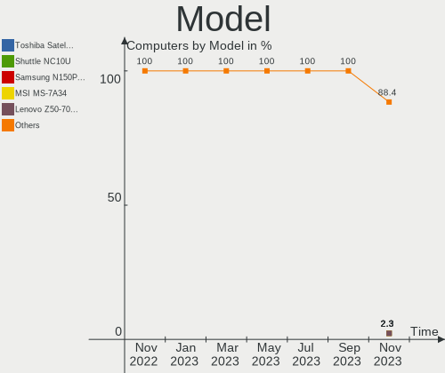
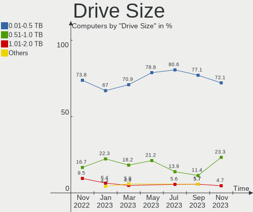
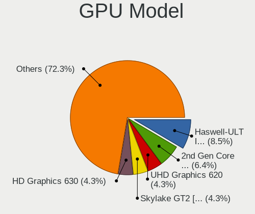
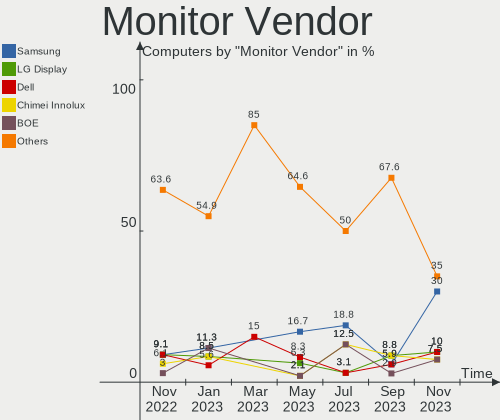
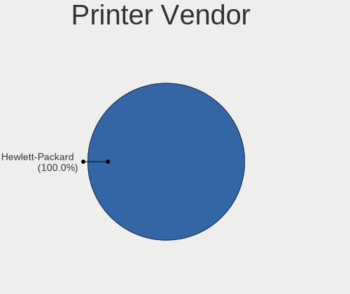

helloSystem Hardware Trends
---------------------------

A project to identify most popular hardware characteristics and track their change
over time based on data collected by helloSystem users at https://BSD-Hardware.info.

Anyone can contribute to this report by the [hw-probe](https://github.com/linuxhw/hw-probe/blob/master/INSTALL.BSD.md) tool:

    hw-probe -all -upload

This is a report for all computer types. See also reports for [desktops](/Dist/helloSystem/Desktop/README.md) and [notebooks](/Dist/helloSystem/Notebook/README.md).

Full-feature report is available here: https://bsd-hardware.info/?view=trends

Period: Aug, 2021.

Contents
--------

* [ System ](#system)
  - [ OS                       ](#os)
  - [ OS Family                ](#os-family)
  - [ Arch                     ](#arch)
  - [ DE                       ](#de)
  - [ Display Server           ](#display-server)
  - [ Display Manager          ](#display-manager)
  - [ OS Lang                  ](#os-lang)
  - [ Boot Mode                ](#boot-mode)
  - [ Filesystem               ](#filesystem)
  - [ Part. scheme             ](#part-scheme)

* [ Board ](#board)
  - [ Vendor                   ](#vendor)
  - [ Model                    ](#model)
  - [ Model Family             ](#model-family)
  - [ MFG Year                 ](#mfg-year)
  - [ Form Factor              ](#form-factor)
  - [ Coreboot                 ](#coreboot)
  - [ RAM Size                 ](#ram-size)
  - [ RAM Used                 ](#ram-used)
  - [ Total Drives             ](#total-drives)
  - [ Has CD-ROM               ](#has-cd-rom)
  - [ Has Ethernet             ](#has-ethernet)
  - [ Has WiFi                 ](#has-wifi)
  - [ Has Bluetooth            ](#has-bluetooth)

* [ Location ](#location)
  - [ Country                  ](#country)
  - [ City                     ](#city)

* [ Drives ](#drives)
  - [ Drive Vendor             ](#drive-vendor)
  - [ Drive Model              ](#drive-model)
  - [ HDD Vendor               ](#hdd-vendor)
  - [ SSD Vendor               ](#ssd-vendor)
  - [ Drive Kind               ](#drive-kind)
  - [ Drive Connector          ](#drive-connector)
  - [ Drive Size               ](#drive-size)
  - [ Space Total              ](#space-total)
  - [ Space Used               ](#space-used)
  - [ Malfunc. Drives          ](#malfunc-drives)
  - [ Malfunc. Drive Vendor    ](#malfunc-drive-vendor)
  - [ Malfunc. HDD Vendor      ](#malfunc-hdd-vendor)
  - [ Malfunc. Drive Kind      ](#malfunc-drive-kind)
  - [ Failed Drives            ](#failed-drives)
  - [ Failed Drive Vendor      ](#failed-drive-vendor)
  - [ Drive Status             ](#drive-status)

* [ Storage controller ](#storage-controller)
  - [ Storage Vendor           ](#storage-vendor)
  - [ Storage Model            ](#storage-model)
  - [ Storage Kind             ](#storage-kind)

* [ Processor ](#processor)
  - [ CPU Vendor               ](#cpu-vendor)
  - [ CPU Model                ](#cpu-model)
  - [ CPU Model Family         ](#cpu-model-family)
  - [ CPU Cores                ](#cpu-cores)
  - [ CPU Sockets              ](#cpu-sockets)
  - [ CPU Threads              ](#cpu-threads)
  - [ CPU Microarch            ](#cpu-microarch)

* [ Graphics ](#graphics)
  - [ GPU Vendor               ](#gpu-vendor)
  - [ GPU Model                ](#gpu-model)
  - [ GPU Combo                ](#gpu-combo)
  - [ GPU Driver               ](#gpu-driver)
  - [ GPU Memory               ](#gpu-memory)

* [ Monitor ](#monitor)
  - [ Monitor Vendor           ](#monitor-vendor)
  - [ Monitor Model            ](#monitor-model)
  - [ Monitor Resolution       ](#monitor-resolution)
  - [ Monitor Diagonal         ](#monitor-diagonal)
  - [ Monitor Width            ](#monitor-width)
  - [ Aspect Ratio             ](#aspect-ratio)
  - [ Monitor Area             ](#monitor-area)
  - [ Pixel Density            ](#pixel-density)
  - [ Multiple Monitors        ](#multiple-monitors)

* [ Network ](#network)
  - [ Net Controller Vendor    ](#net-controller-vendor)
  - [ Net Controller Model     ](#net-controller-model)
  - [ Wireless Vendor          ](#wireless-vendor)
  - [ Wireless Model           ](#wireless-model)
  - [ Ethernet Vendor          ](#ethernet-vendor)
  - [ Ethernet Model           ](#ethernet-model)
  - [ Net Controller Kind      ](#net-controller-kind)
  - [ Used Controller          ](#used-controller)
  - [ NICs                     ](#nics)
  - [ IPv6                     ](#ipv6)

* [ Bluetooth ](#bluetooth)
  - [ Bluetooth Vendor         ](#bluetooth-vendor)
  - [ Bluetooth Model          ](#bluetooth-model)

* [ Sound ](#sound)
  - [ Sound Vendor             ](#sound-vendor)
  - [ Sound Model              ](#sound-model)

* [ Memory ](#memory)
  - [ Memory Vendor            ](#memory-vendor)
  - [ Memory Model             ](#memory-model)
  - [ Memory Kind              ](#memory-kind)
  - [ Memory Form Factor       ](#memory-form-factor)
  - [ Memory Size              ](#memory-size)
  - [ Memory Speed             ](#memory-speed)

* [ Printers & scanners ](#printers--scanners)
  - [ Printer Vendor           ](#printer-vendor)
  - [ Printer Model            ](#printer-model)
  - [ Scanner Vendor           ](#scanner-vendor)
  - [ Scanner Model            ](#scanner-model)

* [ Camera ](#camera)
  - [ Camera Vendor            ](#camera-vendor)
  - [ Camera Model             ](#camera-model)

* [ Security ](#security)
  - [ Fingerprint Vendor       ](#fingerprint-vendor)
  - [ Fingerprint Model        ](#fingerprint-model)
  - [ Chipcard Vendor          ](#chipcard-vendor)
  - [ Chipcard Model           ](#chipcard-model)

* [ Unsupported ](#unsupported)
  - [ Unsupported Devices      ](#unsupported-devices)
  - [ Unsupported Device Types ](#unsupported-device-types)

System
------

OS
--

Installed operating systems

| Name              | Computers | Percent |
|-------------------|-----------|---------|
| helloSystem 0.5.0 | 40        | 81.63%  |
| helloSystem 0.1.0 | 5         | 10.2%   |
| helloSystem 0.6.0 | 3         | 6.12%   |
| helloSystem 0.4.0 | 1         | 2.04%   |

OS Family
---------

OS without a version

| Name        | Computers | Percent |
|-------------|-----------|---------|
| helloSystem | 49        | 100%    |

Arch
----

OS architecture (x86_64, i586, etc.)

| Name  | Computers | Percent |
|-------|-----------|---------|
| amd64 | 49        | 100%    |

DE
--

Desktop Environment

| Name         | Computers | Percent |
|--------------|-----------|---------|
| helloDesktop | 49        | 100%    |

Display Server
--------------

X11 or Wayland

| Name | Computers | Percent |
|------|-----------|---------|
| X11  | 49        | 100%    |

Display Manager
---------------

SDDM, LightDM, etc.

| Name | Computers | Percent |
|------|-----------|---------|
| SLiM | 49        | 100%    |

OS Lang
-------

Language

| Lang  | Computers | Percent |
|-------|-----------|---------|
| en_US | 49        | 100%    |

Boot Mode
---------

EFI or BIOS

| Mode | Computers | Percent |
|------|-----------|---------|
| EFI  | 36        | 73.47%  |
| BIOS | 13        | 26.53%  |

Filesystem
----------

Type of filesystem

| Type | Computers | Percent |
|------|-----------|---------|
| Zfs  | 49        | 100%    |

Part. scheme
------------

Scheme of partitioning

| Type | Computers | Percent |
|------|-----------|---------|
| GPT  | 49        | 100%    |

Board
-----

Vendor
------

Motherboard manufacturer

| Name                | Computers | Percent |
|---------------------|-----------|---------|
| ASUSTek Computer    | 9         | 18.37%  |
| Hewlett-Packard     | 6         | 12.24%  |
| Dell                | 6         | 12.24%  |
| Lenovo              | 4         | 8.16%   |
| Gigabyte Technology | 4         | 8.16%   |
| Apple               | 3         | 6.12%   |
| Toshiba             | 2         | 4.08%   |
| Intel               | 2         | 4.08%   |
| Sony                | 1         | 2.04%   |
| Pegatron            | 1         | 2.04%   |
| PCPartner           | 1         | 2.04%   |
| NEC Computers       | 1         | 2.04%   |
| MSI                 | 1         | 2.04%   |
| Itautec             | 1         | 2.04%   |
| HC                  | 1         | 2.04%   |
| Foxconn             | 1         | 2.04%   |
| EVGA                | 1         | 2.04%   |
| Biostar             | 1         | 2.04%   |
| ASRock              | 1         | 2.04%   |
| Acidanthera         | 1         | 2.04%   |
| Acer                | 1         | 2.04%   |

Model
-----

Motherboard model

| Name                                       | Computers | Percent |
|--------------------------------------------|-----------|---------|
| Toshiba Satellite S55t-B                   | 1         | 2.04%   |
| Toshiba Satellite L855                     | 1         | 2.04%   |
| Sony VPCEJ1E1E                             | 1         | 2.04%   |
| Pegatron SAISHIAT2                         | 1         | 2.04%   |
| PCPartner DREAMSYS                         | 1         | 2.04%   |
| NEC Computers PC-VK17HBBCD                 | 1         | 2.04%   |
| MSI GF65 Thin 10SDR                        | 1         | 2.04%   |
| Lenovo ThinkPad X250 20CLS4JH00            | 1         | 2.04%   |
| Lenovo ThinkPad X230 2330A48               | 1         | 2.04%   |
| Lenovo ThinkPad X230 23062S2               | 1         | 2.04%   |
| Lenovo IdeaCentre AIO 700-22ISH F0BF000WGE | 1         | 2.04%   |
| Itautec Infoway w7530                      | 1         | 2.04%   |
| Intel NUC5i3RYH                            | 1         | 2.04%   |
| Intel D54250WYK H13922-304                 | 1         | 2.04%   |
| HP Z420 Workstation                        | 1         | 2.04%   |
| HP Pavilion dv6                            | 1         | 2.04%   |
| HP Pavilion 11                             | 1         | 2.04%   |
| HP Compaq dc5700 Small Form Factor         | 1         | 2.04%   |
| HP 625                                     | 1         | 2.04%   |
| HP 250 G4                                  | 1         | 2.04%   |
| HC HCAR357-MI                              | 1         | 2.04%   |
| Gigabyte HA65M-D2H-B3                      | 1         | 2.04%   |
| Gigabyte H110-D3A                          | 1         | 2.04%   |
| Gigabyte B360M-D3H                         | 1         | 2.04%   |
| Gigabyte A75M-DS2                          | 1         | 2.04%   |
| Foxconn p6-2171a                           | 1         | 2.04%   |
| EVGA X299 MICRO                            | 1         | 2.04%   |
| Dell OptiPlex 3040                         | 1         | 2.04%   |
| Dell Latitude E5530 non-vPro               | 1         | 2.04%   |
| Dell Latitude 3540                         | 1         | 2.04%   |
| Dell Inspiron 530                          | 1         | 2.04%   |
| Dell Inspiron 15-3567                      | 1         | 2.04%   |
| Dell G3 3579                               | 1         | 2.04%   |
| Biostar A770E3                             | 1         | 2.04%   |
| ASUS X55CR                                 | 1         | 2.04%   |
| ASUS TUF B360M-PLUS GAMING S               | 1         | 2.04%   |
| ASUS Q505UAR                               | 1         | 2.04%   |
| ASUS P7H55-M LX                            | 1         | 2.04%   |
| ASUS M5A78L LE                             | 1         | 2.04%   |
| ASUS K55VD                                 | 1         | 2.04%   |
| ASUS Crosshair V Formula                   | 1         | 2.04%   |
| ASUS All Series                            | 1         | 2.04%   |
| ASUS A58M-A/USB3                           | 1         | 2.04%   |
| ASRock Z390 Pro4                           | 1         | 2.04%   |
| Apple MacBookPro3,1                        | 1         | 2.04%   |
| Apple MacBookAir7,2                        | 1         | 2.04%   |
| Apple iMac18,2                             | 1         | 2.04%   |
| Acidanthera iMacPro1,1                     | 1         | 2.04%   |
| Acer Aspire TC-895                         | 1         | 2.04%   |

Model Family
------------

Motherboard model prefix

| Name                       | Computers | Percent |
|----------------------------|-----------|---------|
| Lenovo ThinkPad            | 3         | 6.12%   |
| Toshiba Satellite          | 2         | 4.08%   |
| HP Pavilion                | 2         | 4.08%   |
| Dell Latitude              | 2         | 4.08%   |
| Dell Inspiron              | 2         | 4.08%   |
| Sony VPCEJ1E1E             | 1         | 2.04%   |
| Pegatron SAISHIAT2         | 1         | 2.04%   |
| PCPartner DREAMSYS         | 1         | 2.04%   |
| NEC Computers PC-VK17HBBCD | 1         | 2.04%   |
| MSI GF65                   | 1         | 2.04%   |
| Lenovo IdeaCentre          | 1         | 2.04%   |
| Itautec Infoway            | 1         | 2.04%   |
| Intel NUC5i3RYH            | 1         | 2.04%   |
| Intel D54250WYK            | 1         | 2.04%   |
| HP Z420                    | 1         | 2.04%   |
| HP Compaq                  | 1         | 2.04%   |
| HP 625                     | 1         | 2.04%   |
| HP 250                     | 1         | 2.04%   |
| HC HCAR357-MI              | 1         | 2.04%   |
| Gigabyte HA65M-D2H-B3      | 1         | 2.04%   |
| Gigabyte H110-D3A          | 1         | 2.04%   |
| Gigabyte B360M-D3H         | 1         | 2.04%   |
| Gigabyte A75M-DS2          | 1         | 2.04%   |
| Foxconn p6-2171a           | 1         | 2.04%   |
| EVGA X299                  | 1         | 2.04%   |
| Dell OptiPlex              | 1         | 2.04%   |
| Dell G3                    | 1         | 2.04%   |
| Biostar A770E3             | 1         | 2.04%   |
| ASUS X55CR                 | 1         | 2.04%   |
| ASUS TUF                   | 1         | 2.04%   |
| ASUS Q505UAR               | 1         | 2.04%   |
| ASUS P7H55-M               | 1         | 2.04%   |
| ASUS M5A78L                | 1         | 2.04%   |
| ASUS K55VD                 | 1         | 2.04%   |
| ASUS Crosshair             | 1         | 2.04%   |
| ASUS All                   | 1         | 2.04%   |
| ASUS A58M-A                | 1         | 2.04%   |
| ASRock Z390                | 1         | 2.04%   |
| Apple MacBookPro3          | 1         | 2.04%   |
| Apple MacBookAir7          | 1         | 2.04%   |
| Apple iMac18               | 1         | 2.04%   |
| Acidanthera iMacPro1       | 1         | 2.04%   |
| Acer Aspire                | 1         | 2.04%   |

MFG Year
--------

Motherboard manufacture year

| Year | Computers | Percent |
|------|-----------|---------|
| 2013 | 8         | 16.33%  |
| 2012 | 8         | 16.33%  |
| 2021 | 6         | 12.24%  |
| 2020 | 6         | 12.24%  |
| 2019 | 4         | 8.16%   |
| 2018 | 4         | 8.16%   |
| 2015 | 3         | 6.12%   |
| 2017 | 2         | 4.08%   |
| 2014 | 2         | 4.08%   |
| 2011 | 2         | 4.08%   |
| 2009 | 2         | 4.08%   |
| 2010 | 1         | 2.04%   |
| 2008 | 1         | 2.04%   |

Form Factor
-----------

Physical design of the computer

| Name        | Computers | Percent |
|-------------|-----------|---------|
| Desktop     | 23        | 46.94%  |
| Notebook    | 21        | 42.86%  |
| All in one  | 3         | 6.12%   |
| Convertible | 1         | 2.04%   |
| Mini pc     | 1         | 2.04%   |

Coreboot
--------

Have coreboot on board

| Used | Computers | Percent |
|------|-----------|---------|
| No   | 48        | 97.96%  |
| Yes  | 1         | 2.04%   |

RAM Size
--------

Total RAM memory

| Size in GB | Computers | Percent |
|------------|-----------|---------|
| 4.01-8.0   | 18        | 36.73%  |
| 8.01-16.0  | 18        | 36.73%  |
| 16.01-24.0 | 9         | 18.37%  |
| 32.01-64.0 | 3         | 6.12%   |
| 24.01-32.0 | 1         | 2.04%   |

RAM Used
--------

Used RAM memory

| Used GB  | Computers | Percent |
|----------|-----------|---------|
| 0.01-0.5 | 29        | 59.18%  |
| 0.51-1.0 | 12        | 24.49%  |
| 1.01-2.0 | 7         | 14.29%  |
| 4.01-8.0 | 1         | 2.04%   |

Total Drives
------------

Number of drives on board

| Drives | Computers | Percent |
|--------|-----------|---------|
| 1      | 34        | 69.39%  |
| 2      | 6         | 12.24%  |
| 3      | 3         | 6.12%   |
| 0      | 3         | 6.12%   |
| 4      | 2         | 4.08%   |
| 6      | 1         | 2.04%   |

Has CD-ROM
----------

Has CD-ROM on board

| Presented | Computers | Percent |
|-----------|-----------|---------|
| No        | 26        | 53.06%  |
| Yes       | 23        | 46.94%  |

Has Ethernet
------------

Has Ethernet on board

| Presented | Computers | Percent |
|-----------|-----------|---------|
| Yes       | 45        | 91.84%  |
| No        | 4         | 8.16%   |

Has WiFi
--------

Has WiFi module

| Presented | Computers | Percent |
|-----------|-----------|---------|
| Yes       | 32        | 65.31%  |
| No        | 17        | 34.69%  |

Has Bluetooth
-------------

Has Bluetooth module

| Presented | Computers | Percent |
|-----------|-----------|---------|
| Yes       | 27        | 55.1%   |
| No        | 22        | 44.9%   |

Location
--------

Country
-------

Geographic location (country)

| Country     | Computers | Percent |
|-------------|-----------|---------|
| USA         | 10        | 20.41%  |
| Mexico      | 4         | 8.16%   |
| Germany     | 4         | 8.16%   |
| Canada      | 3         | 6.12%   |
| Australia   | 3         | 6.12%   |
| Sweden      | 2         | 4.08%   |
| Spain       | 2         | 4.08%   |
| South Korea | 2         | 4.08%   |
| Russia      | 2         | 4.08%   |
| Peru        | 2         | 4.08%   |
| India       | 2         | 4.08%   |
| China       | 2         | 4.08%   |
| Brazil      | 2         | 4.08%   |
| Puerto Rico | 1         | 2.04%   |
| Netherlands | 1         | 2.04%   |
| Hong Kong   | 1         | 2.04%   |
| France      | 1         | 2.04%   |
| Finland     | 1         | 2.04%   |
| Chile       | 1         | 2.04%   |
| Belgium     | 1         | 2.04%   |
| Belarus     | 1         | 2.04%   |
| Argentina   | 1         | 2.04%   |

City
----

Geographic location (city)

| City            | Computers | Percent |
|-----------------|-----------|---------|
| Tula de Allende | 2         | 4.08%   |
| Lima            | 2         | 4.08%   |
| Brisbane        | 2         | 4.08%   |
| Warmond         | 1         | 2.04%   |
| Wandur          | 1         | 2.04%   |
| V?¤ster??s      | 1         | 2.04%   |
| Vawkavysk       | 1         | 2.04%   |
| The Bronx       | 1         | 2.04%   |
| St Petersburg   | 1         | 2.04%   |
| Simpsonville    | 1         | 2.04%   |
| Sherwood Park   | 1         | 2.04%   |
| S??o Paulo      | 1         | 2.04%   |
| Perwez          | 1         | 2.04%   |
| Oklahoma City   | 1         | 2.04%   |
| North Vancouver | 1         | 2.04%   |
| Mokpo           | 1         | 2.04%   |
| Minneapolis     | 1         | 2.04%   |
| Miami           | 1         | 2.04%   |
| Marlborough     | 1         | 2.04%   |
| Mar del Plata   | 1         | 2.04%   |
| Lule??          | 1         | 2.04%   |
| L??neburg       | 1         | 2.04%   |
| Kitchener       | 1         | 2.04%   |
| Kazan?ˆ™        | 1         | 2.04%   |
| Ipojuca         | 1         | 2.04%   |
| Hong Kong       | 1         | 2.04%   |
| Hobart          | 1         | 2.04%   |
| Helsinki        | 1         | 2.04%   |
| Hamburg         | 1         | 2.04%   |
| Gwangju         | 1         | 2.04%   |
| Guangzhou       | 1         | 2.04%   |
| Ecatepec        | 1         | 2.04%   |
| Dachong         | 1         | 2.04%   |
| Concepci??n     | 1         | 2.04%   |
| Colombres       | 1         | 2.04%   |
| Cleveland       | 1         | 2.04%   |
| Chicago         | 1         | 2.04%   |
| Cabo San Lucas  | 1         | 2.04%   |
| Cabo Rojo       | 1         | 2.04%   |
| Bremerton       | 1         | 2.04%   |
| Blois           | 1         | 2.04%   |
| Berlin          | 1         | 2.04%   |
| Bensheim        | 1         | 2.04%   |
| Bengaluru       | 1         | 2.04%   |
| ??guilas        | 1         | 2.04%   |
| Algonquin       | 1         | 2.04%   |

Drives
------

Drive Vendor
------------

Hard drive vendors

| Vendor              | Computers | Drives | Percent |
|---------------------|-----------|--------|---------|
| Seagate             | 13        | 15     | 20.31%  |
| WDC                 | 10        | 11     | 15.63%  |
| Samsung Electronics | 8         | 9      | 12.5%   |
| Toshiba             | 5         | 5      | 7.81%   |
| SanDisk             | 3         | 3      | 4.69%   |
| Kingston            | 3         | 3      | 4.69%   |
| Hitachi             | 3         | 3      | 4.69%   |
| Crucial             | 3         | 3      | 4.69%   |
| Apple               | 3         | 3      | 4.69%   |
| SPCC                | 2         | 2      | 3.13%   |
| HGST                | 2         | 2      | 3.13%   |
| A-DATA Technology   | 2         | 3      | 3.13%   |
| SK Hynix            | 1         | 1      | 1.56%   |
| Silicon Motion      | 1         | 1      | 1.56%   |
| ORICO               | 1         | 2      | 1.56%   |
| LSI                 | 1         | 1      | 1.56%   |
| Lexar               | 1         | 1      | 1.56%   |
| Intel               | 1         | 1      | 1.56%   |
| Fujitsu             | 1         | 1      | 1.56%   |

Drive Model
-----------

Hard drive models

| Model                                | Computers | Percent |
|--------------------------------------|-----------|---------|
| Seagate ST500LM012 HN-M500MBB 500GB  | 3         | 4.41%   |
| Seagate ST3250318AS 250GB            | 2         | 2.94%   |
| Seagate ST1000DM003-1ER162 1TB       | 2         | 2.94%   |
| WDC WD5000BEVT-22ZAT0 500GB          | 1         | 1.47%   |
| WDC WD5000AAVS-00ZTB0 500GB          | 1         | 1.47%   |
| WDC WD5000AAKX-00ERMA0 500GB         | 1         | 1.47%   |
| WDC WD40EZRZ-22GXCB0 4TB             | 1         | 1.47%   |
| WDC WD40EFRX-68WT0N0 4TB             | 1         | 1.47%   |
| WDC WD3200BEVT-60ZCT1 320GB          | 1         | 1.47%   |
| WDC WD3200AAJS-00L7A0 320GB          | 1         | 1.47%   |
| WDC WD20EARS-00MVWB0 2TB             | 1         | 1.47%   |
| WDC WD10SPZX-22Z10T0 1TB             | 1         | 1.47%   |
| WDC WD10EARS-00Y5B1 1TB              | 1         | 1.47%   |
| WDC PC SN530 SDBPNPZ-512G-1032 512GB | 1         | 1.47%   |
| Toshiba THNSNF128GCSS 128GB          | 1         | 1.47%   |
| Toshiba MQ01ABF050M 500GB            | 1         | 1.47%   |
| Toshiba MQ01ABF050 500GB             | 1         | 1.47%   |
| Toshiba MQ01ABD100 1TB               | 1         | 1.47%   |
| Toshiba MG04ACA200E 2TB              | 1         | 1.47%   |
| SPCC Solid State Disk 64GB           | 1         | 1.47%   |
| SPCC Solid State Disk 1TB            | 1         | 1.47%   |
| SK Hynix SHGP31-1000GM-2 1TB         | 1         | 1.47%   |
| Silicon Motion ShiJi 256GB M.2-NVMe  | 1         | 1.47%   |
| Seagate ST9500325AS 500GB            | 1         | 1.47%   |
| Seagate ST750LM022 HN-M750MBB 752GB  | 1         | 1.47%   |
| Seagate ST500DM002-1BD142 500GB      | 1         | 1.47%   |
| Seagate ST31000528AS 1TB             | 1         | 1.47%   |
| Seagate ST31000340NS 1TB             | 1         | 1.47%   |
| Seagate ST2000DM001-1CH164 2TB       | 1         | 1.47%   |
| Seagate ST1000LM014-1EJ164 1TB       | 1         | 1.47%   |
| SanDisk SDSSDP128G 128GB             | 1         | 1.47%   |
| SanDisk SDSSDHP256G 256GB            | 1         | 1.47%   |
| SanDisk SDSSDA240G 240GB             | 1         | 1.47%   |
| Samsung SSD RBX Series 64GB M        | 1         | 1.47%   |
| Samsung SSD 980 PRO 250GB            | 1         | 1.47%   |
| Samsung SSD 970 EVO Plus 250GB       | 1         | 1.47%   |
| Samsung SSD 970 EVO 500GB            | 1         | 1.47%   |
| Samsung SSD 960 PRO 512GB            | 1         | 1.47%   |
| Samsung SSD 860 EVO 250GB            | 1         | 1.47%   |
| Samsung SSD 850 PRO 256GB            | 1         | 1.47%   |
| Samsung SG9XCS1F50GMIBM 43W7729 50GB | 1         | 1.47%   |
| Samsung MZVLW256HEHP-000L7 256GB     | 1         | 1.47%   |
| ORICO H110-120GB-PU-EP               | 1         | 1.47%   |
| LSI Logical Volume 997GB             | 1         | 1.47%   |
| Lexar 256GB SSD                      | 1         | 1.47%   |
| Kingston SV300S37A120G 120GB         | 1         | 1.47%   |
| Kingston SA400S37240G 240GB          | 1         | 1.47%   |
| Kingston SA400S37120G 120GB          | 1         | 1.47%   |
| Intel SSDSA2CT040G3 40GB             | 1         | 1.47%   |
| Hitachi HTS545032B9A300 320GB        | 1         | 1.47%   |
| Hitachi HTS545025B9SA02 250GB        | 1         | 1.47%   |
| Hitachi HDS721050CLA362 500GB        | 1         | 1.47%   |
| HGST HTS545032A7E380 320GB           | 1         | 1.47%   |
| HGST HTS541010B7E610 1TB             | 1         | 1.47%   |
| Fujitsu MHZ2250BH G1 250GB           | 1         | 1.47%   |
| Crucial CT120BX500SSD1 120GB         | 1         | 1.47%   |
| Crucial CT1000P1SSD8 1TB             | 1         | 1.47%   |
| Crucial CT1000MX500SSD1 1TB          | 1         | 1.47%   |
| Apple SSD SM0512G 500GB              | 1         | 1.47%   |
| Apple SSD SM0256L 256GB              | 1         | 1.47%   |

HDD Vendor
----------

Hard disk drive vendors

| Vendor  | Computers | Drives | Percent |
|---------|-----------|--------|---------|
| Seagate | 13        | 15     | 38.24%  |
| WDC     | 9         | 10     | 26.47%  |
| Toshiba | 4         | 4      | 11.76%  |
| Hitachi | 3         | 3      | 8.82%   |
| HGST    | 2         | 2      | 5.88%   |
| LSI     | 1         | 1      | 2.94%   |
| Fujitsu | 1         | 1      | 2.94%   |
| Apple   | 1         | 1      | 2.94%   |

SSD Vendor
----------

Solid state drive vendors

| Vendor              | Computers | Drives | Percent |
|---------------------|-----------|--------|---------|
| Samsung Electronics | 4         | 4      | 20%     |
| SanDisk             | 3         | 3      | 15%     |
| Kingston            | 3         | 3      | 15%     |
| SPCC                | 2         | 2      | 10%     |
| Crucial             | 2         | 2      | 10%     |
| Toshiba             | 1         | 1      | 5%      |
| ORICO               | 1         | 2      | 5%      |
| Lexar               | 1         | 1      | 5%      |
| Intel               | 1         | 1      | 5%      |
| Apple               | 1         | 1      | 5%      |
| A-DATA Technology   | 1         | 1      | 5%      |

Drive Kind
----------

HDD or SSD

| Kind | Computers | Drives | Percent |
|------|-----------|--------|---------|
| HDD  | 28        | 37     | 48.28%  |
| SSD  | 19        | 21     | 32.76%  |
| NVMe | 11        | 12     | 18.97%  |

Drive Connector
---------------

SATA, SAS, NVMe, etc.

| Type | Computers | Drives | Percent |
|------|-----------|--------|---------|
| SATA | 42        | 58     | 79.25%  |
| NVMe | 11        | 12     | 20.75%  |

Drive Size
----------

Size of hard drive

| Size in TB | Computers | Drives | Percent |
|------------|-----------|--------|---------|
| 0.01-0.5   | 33        | 40     | 66%     |
| 0.51-1.0   | 11        | 12     | 22%     |
| 1.01-2.0   | 4         | 4      | 8%      |
| 3.01-4.0   | 2         | 2      | 4%      |

Space Total
-----------

Amount of disk space available on the file system

| Size in GB | Computers | Percent |
|------------|-----------|---------|
| 1-20       | 32        | 65.31%  |
| 501-1000   | 6         | 12.24%  |
| 101-250    | 4         | 8.16%   |
| 251-500    | 3         | 6.12%   |
| 21-50      | 2         | 4.08%   |
| 1001-2000  | 1         | 2.04%   |
| 51-100     | 1         | 2.04%   |

Space Used
----------

Amount of used disk space

| Used GB | Computers | Percent |
|---------|-----------|---------|
| 1-20    | 49        | 100%    |

Malfunc. Drives
---------------

Drive models with a malfunction

| Model                               | Computers | Drives | Percent |
|-------------------------------------|-----------|--------|---------|
| WDC WD5000AAKX-00ERMA0 500GB        | 1         | 1      | 7.14%   |
| WDC WD40EFRX-68WT0N0 4TB            | 1         | 1      | 7.14%   |
| WDC WD3200AAJS-00L7A0 320GB         | 1         | 1      | 7.14%   |
| WDC WD20EARS-00MVWB0 2TB            | 1         | 1      | 7.14%   |
| WDC WD10EARS-00Y5B1 1TB             | 1         | 1      | 7.14%   |
| Toshiba MQ01ABF050 500GB            | 1         | 1      | 7.14%   |
| Seagate ST750LM022 HN-M750MBB 752GB | 1         | 1      | 7.14%   |
| Seagate ST3250318AS 250GB           | 1         | 1      | 7.14%   |
| Hitachi HTS545032B9A300 320GB       | 1         | 1      | 7.14%   |
| Hitachi HTS545025B9SA02 250GB       | 1         | 1      | 7.14%   |
| Hitachi HDS721050CLA362 500GB       | 1         | 1      | 7.14%   |
| HGST HTS545032A7E380 320GB          | 1         | 1      | 7.14%   |
| Fujitsu MHZ2250BH G1 250GB          | 1         | 1      | 7.14%   |
| Apple HDD HTS545050A7E362 500GB     | 1         | 1      | 7.14%   |

Malfunc. Drive Vendor
---------------------

Vendors of faulty drives

| Vendor  | Computers | Drives | Percent |
|---------|-----------|--------|---------|
| WDC     | 5         | 5      | 35.71%  |
| Hitachi | 3         | 3      | 21.43%  |
| Seagate | 2         | 2      | 14.29%  |
| Toshiba | 1         | 1      | 7.14%   |
| HGST    | 1         | 1      | 7.14%   |
| Fujitsu | 1         | 1      | 7.14%   |
| Apple   | 1         | 1      | 7.14%   |

Malfunc. HDD Vendor
-------------------

Vendors of faulty HDD drives

| Vendor  | Computers | Drives | Percent |
|---------|-----------|--------|---------|
| WDC     | 5         | 5      | 35.71%  |
| Hitachi | 3         | 3      | 21.43%  |
| Seagate | 2         | 2      | 14.29%  |
| Toshiba | 1         | 1      | 7.14%   |
| HGST    | 1         | 1      | 7.14%   |
| Fujitsu | 1         | 1      | 7.14%   |
| Apple   | 1         | 1      | 7.14%   |

Malfunc. Drive Kind
-------------------

Kinds of faulty drives

| Kind | Computers | Drives | Percent |
|------|-----------|--------|---------|
| HDD  | 12        | 14     | 100%    |

Failed Drives
-------------

Failed drive models

Zero info for selected period =(

Failed Drive Vendor
-------------------

Failed drive vendors

Zero info for selected period =(

Drive Status
------------

Number of failed and malfunc. drives

| Status   | Computers | Drives | Percent |
|----------|-----------|--------|---------|
| Works    | 38        | 51     | 73.08%  |
| Malfunc  | 12        | 14     | 23.08%  |
| Detected | 2         | 5      | 3.85%   |

Storage controller
------------------

Storage Vendor
--------------

Storage controller vendors

| Vendor                    | Computers | Percent |
|---------------------------|-----------|---------|
| Intel                     | 38        | 60.32%  |
| AMD                       | 9         | 14.29%  |
| Samsung Electronics       | 7         | 11.11%  |
| SK Hynix                  | 1         | 1.59%   |
| Silicon Motion            | 1         | 1.59%   |
| Sandisk                   | 1         | 1.59%   |
| Micron/Crucial Technology | 1         | 1.59%   |
| Marvell Technology Group  | 1         | 1.59%   |
| Broadcom / LSI            | 1         | 1.59%   |
| ASMedia Technology        | 1         | 1.59%   |
| ADATA Technology          | 1         | 1.59%   |
| Adaptec                   | 1         | 1.59%   |

Storage Model
-------------

Storage controller models

| Model                                                                                   | Computers | Percent |
|-----------------------------------------------------------------------------------------|-----------|---------|
| Intel 7 Series Chipset Family 6-port SATA Controller [AHCI mode]                        | 8         | 10.81%  |
| Intel Q170/Q150/B150/H170/H110/Z170/CM236 Chipset SATA Controller [AHCI Mode]           | 4         | 5.41%   |
| AMD FCH SATA Controller [AHCI mode]                                                     | 4         | 5.41%   |
| Samsung NVMe SSD Controller SM961/PM961/SM963                                           | 3         | 4.05%   |
| Intel Wildcat Point-LP SATA Controller [AHCI Mode]                                      | 3         | 4.05%   |
| Intel Cannon Lake PCH SATA AHCI Controller                                              | 3         | 4.05%   |
| AMD SB7x0/SB8x0/SB9x0 IDE Controller                                                    | 3         | 4.05%   |
| Samsung NVMe SSD Controller SM981/PM981/PM983                                           | 2         | 2.7%    |
| Intel Sunrise Point-LP SATA Controller [AHCI mode]                                      | 2         | 2.7%    |
| Intel 8 Series/C220 Series Chipset Family 6-port SATA Controller 1 [AHCI mode]          | 2         | 2.7%    |
| Intel 8 Series SATA Controller 1 [AHCI mode]                                            | 2         | 2.7%    |
| Intel 6 Series/C200 Series Chipset Family 6 port Mobile SATA AHCI Controller            | 2         | 2.7%    |
| AMD SB7x0/SB8x0/SB9x0 SATA Controller [IDE mode]                                        | 2         | 2.7%    |
| SK Hynix NVMe SSD Controller                                                            | 1         | 1.35%   |
| Silicon Motion SM2263EN/SM2263XT SSD Controller                                         | 1         | 1.35%   |
| Sandisk WD Blue SN550 NVMe SSD                                                          | 1         | 1.35%   |
| Samsung SM951 AHCI                                                                      | 1         | 1.35%   |
| Samsung NVMe SSD Controller PM9A1/PM9A3/980PRO                                          | 1         | 1.35%   |
| Micron/Crucial P1 NVMe PCIe SSD                                                         | 1         | 1.35%   |
| Marvell Group 88SE9172 SATA III 6Gb/s RAID Controller                                   | 1         | 1.35%   |
| Intel Cannon Lake Mobile PCH SATA AHCI Controller                                       | 1         | 1.35%   |
| Intel C602 chipset 4-Port SATA Storage Control Unit                                     | 1         | 1.35%   |
| Intel C600/X79 series chipset SATA RAID Controller                                      | 1         | 1.35%   |
| Intel C600/X79 series chipset IDE-r Controller                                          | 1         | 1.35%   |
| Intel Atom/Celeron/Pentium Processor x5-E8000/J3xxx/N3xxx Series SATA Controller        | 1         | 1.35%   |
| Intel 82801IR/IO/IH (ICH9R/DO/DH) 4 port SATA Controller [IDE mode]                     | 1         | 1.35%   |
| Intel 82801IBM/IEM (ICH9M/ICH9M-E) 4 port SATA Controller [AHCI mode]                   | 1         | 1.35%   |
| Intel 82801I (ICH9 Family) 2 port SATA Controller [IDE mode]                            | 1         | 1.35%   |
| Intel 82801HR/HO/HH (ICH8R/DO/DH) 2 port SATA Controller [IDE mode]                     | 1         | 1.35%   |
| Intel 82801HM/HEM (ICH8M/ICH8M-E) SATA Controller [AHCI mode]                           | 1         | 1.35%   |
| Intel 82801HM/HEM (ICH8M/ICH8M-E) IDE Controller                                        | 1         | 1.35%   |
| Intel 82801H (ICH8 Family) 4 port SATA Controller [IDE mode]                            | 1         | 1.35%   |
| Intel 6 Series/C200 Series Chipset Family Desktop SATA Controller (IDE mode, ports 4-5) | 1         | 1.35%   |
| Intel 6 Series/C200 Series Chipset Family Desktop SATA Controller (IDE mode, ports 0-3) | 1         | 1.35%   |
| Intel 6 Series/C200 Series Chipset Family 6 port Desktop SATA AHCI Controller           | 1         | 1.35%   |
| Intel 5 Series/3400 Series Chipset 4 port SATA IDE Controller                           | 1         | 1.35%   |
| Intel 5 Series/3400 Series Chipset 2 port SATA IDE Controller                           | 1         | 1.35%   |
| Intel 300 Series Chipset Family SATA RAID Controller                                    | 1         | 1.35%   |
| Intel 200 Series PCH SATA controller [AHCI mode]                                        | 1         | 1.35%   |
| Broadcom / LSI SAS2008 PCI-Express Fusion-MPT SAS-2 [Falcon]                            | 1         | 1.35%   |
| ASMedia ASM1062 Serial ATA Controller                                                   | 1         | 1.35%   |
| AMD SB7x0/SB8x0/SB9x0 SATA Controller [RAID5 mode]                                      | 1         | 1.35%   |
| AMD SB7x0/SB8x0/SB9x0 SATA Controller [AHCI mode]                                       | 1         | 1.35%   |
| AMD FCH SATA Controller [IDE mode]                                                      | 1         | 1.35%   |
| AMD FCH SATA Controller D                                                               | 1         | 1.35%   |
| ADATA XPG SX8200 Pro PCIe Gen3x4 M.2 2280 Solid State Drive                             | 1         | 1.35%   |
| Adaptec AIC-7850T/7856T [AVA-2902/4/6 / AHA-2910]                                       | 1         | 1.35%   |

Storage Kind
------------

Kind of storage controller (IDE, SATA, NVMe, SAS, ...)

| Kind | Computers | Percent |
|------|-----------|---------|
| SATA | 39        | 59.09%  |
| NVMe | 11        | 16.67%  |
| IDE  | 10        | 15.15%  |
| RAID | 3         | 4.55%   |
| SAS  | 2         | 3.03%   |
| SCSI | 1         | 1.52%   |

Processor
---------

CPU Vendor
----------

Processor vendors

| Vendor | Computers | Percent |
|--------|-----------|---------|
| Intel  | 40        | 81.63%  |
| AMD    | 9         | 18.37%  |

CPU Model
---------

Processor models

| Model                                         | Computers | Percent |
|-----------------------------------------------|-----------|---------|
| Intel Core i5-5200U CPU @ 2.20GHz             | 2         | 4.08%   |
| Intel Xeon CPU E5-1603 @ 2.80GHz              | 1         | 2.04%   |
| Intel Pentium Gold G5400 CPU @ 3.70GHz        | 1         | 2.04%   |
| Intel Pentium Dual-Core CPU E5500 @ 2.80GHz   | 1         | 2.04%   |
| Intel Pentium CPU G3420 @ 3.20GHz             | 1         | 2.04%   |
| Intel Pentium CPU B940 @ 2.00GHz              | 1         | 2.04%   |
| Intel Core i9-7920X CPU @ 2.90GHz             | 1         | 2.04%   |
| Intel Core i7-8750H CPU @ 2.20GHz             | 1         | 2.04%   |
| Intel Core i7-8700K CPU @ 3.70GHz             | 1         | 2.04%   |
| Intel Core i7-3630QM CPU @ 2.40GHz            | 1         | 2.04%   |
| Intel Core i7-2637M CPU                       | 1         | 2.04%   |
| Intel Core i7-10750H CPU @ 2.60GHz            | 1         | 2.04%   |
| Intel Core i5-8250U CPU @ 1.60GHz             | 1         | 2.04%   |
| Intel Core i5-7400 CPU @ 3.00GHz              | 1         | 2.04%   |
| Intel Core i5-6400T CPU @ 2.20GHz             | 1         | 2.04%   |
| Intel Core i5-5250U CPU @ 1.60GHz             | 1         | 2.04%   |
| Intel Core i5-4440 CPU @ 3.10GHz              | 1         | 2.04%   |
| Intel Core i5-4250U CPU @ 1.30GHz             | 1         | 2.04%   |
| Intel Core i5-4210U CPU @ 1.70GHz             | 1         | 2.04%   |
| Intel Core i5-3450 CPU @ 3.10GHz              | 1         | 2.04%   |
| Intel Core i5-3340M CPU @ 2.70GHz             | 1         | 2.04%   |
| Intel Core i5-3320M CPU @ 2.60GHz             | 1         | 2.04%   |
| Intel Core i5-3230M CPU @ 2.60GHz             | 1         | 2.04%   |
| Intel Core i5-3210M CPU @ 2.50GHz             | 1         | 2.04%   |
| Intel Core i5-2400S CPU                       | 1         | 2.04%   |
| Intel Core i5-10400 CPU @ 2.90GHz             | 1         | 2.04%   |
| Intel Core i5 CPU 661 @ 3.33GHz               | 1         | 2.04%   |
| Intel Core i3-8100 CPU @ 3.60GHz              | 1         | 2.04%   |
| Intel Core i3-6100T CPU @ 3.20GHz             | 1         | 2.04%   |
| Intel Core i3-6006U CPU @ 2.00GHz             | 1         | 2.04%   |
| Intel Core i3-5005U CPU @ 2.00GHz             | 1         | 2.04%   |
| Intel Core i3-2370M CPU @ 2.40GHz             | 1         | 2.04%   |
| Intel Core 2 Duo CPU T7500 @ 2.20GHz          | 1         | 2.04%   |
| Intel Core 2 Duo CPU T6500 @ 2.10GHz          | 1         | 2.04%   |
| Intel Core 2 Duo CPU E4500 @ 2.20GHz          | 1         | 2.04%   |
| Intel Celeron CPU N3050 @ 1.60GHz             | 1         | 2.04%   |
| Intel Celeron CPU G3930 @ 2.90GHz             | 1         | 2.04%   |
| Intel Celeron CPU 847 @ 1.10GHz               | 1         | 2.04%   |
| Intel Celeron CPU 1037U @ 1.80GHz             | 1         | 2.04%   |
| AMD Ryzen 5 3550H with Radeon Vega Mobile Gfx | 1         | 2.04%   |
| AMD Ryzen 5 2400G with Radeon Vega Graphics   | 1         | 2.04%   |
| AMD Phenom II X4 965 Processor                | 1         | 2.04%   |
| AMD Phenom II X4 955 Processor                | 1         | 2.04%   |
| AMD FX-8150 Eight-Core Processor              | 1         | 2.04%   |
| AMD Athlon II X4 641 Quad-Core Processor      | 1         | 2.04%   |
| AMD Athlon II P320 Dual-Core Processor        | 1         | 2.04%   |
| AMD A6-6400K APU with Radeon HD Graphics      | 1         | 2.04%   |
| AMD A6-1450 APU with Radeon HD Graphics       | 1         | 2.04%   |

CPU Model Family
----------------

Processor model prefix

| Model                   | Computers | Percent |
|-------------------------|-----------|---------|
| Intel Core i5           | 17        | 34.69%  |
| Intel Core i7           | 5         | 10.2%   |
| Intel Core i3           | 5         | 10.2%   |
| Intel Celeron           | 4         | 8.16%   |
| Intel Core 2 Duo        | 3         | 6.12%   |
| Intel Pentium           | 2         | 4.08%   |
| AMD Ryzen 5             | 2         | 4.08%   |
| AMD Phenom II X4        | 2         | 4.08%   |
| AMD A6                  | 2         | 4.08%   |
| Intel Xeon              | 1         | 2.04%   |
| Intel Pentium Gold      | 1         | 2.04%   |
| Intel Pentium Dual-Core | 1         | 2.04%   |
| Intel Core i9           | 1         | 2.04%   |
| AMD FX                  | 1         | 2.04%   |
| AMD Athlon II X4        | 1         | 2.04%   |
| AMD Athlon II           | 1         | 2.04%   |

CPU Cores
---------

Number of processor cores

| Number  | Computers | Percent |
|---------|-----------|---------|
| 2       | 25        | 51.02%  |
| 4       | 14        | 28.57%  |
| 6       | 4         | 8.16%   |
| 8       | 3         | 6.12%   |
| Unknown | 2         | 4.08%   |
| 12      | 1         | 2.04%   |

CPU Sockets
-----------

Number of sockets

| Number | Computers | Percent |
|--------|-----------|---------|
| 1      | 47        | 95.92%  |
| 2      | 2         | 4.08%   |

CPU Threads
-----------

Threads per core (Hyper-Threading)

| Number  | Computers | Percent |
|---------|-----------|---------|
| 1       | 24        | 48.98%  |
| 2       | 23        | 46.94%  |
| Unknown | 2         | 4.08%   |

CPU Microarch
-------------

Microarchitecture

| Name        | Computers | Percent |
|-------------|-----------|---------|
| KabyLake    | 7         | 14.29%  |
| IvyBridge   | 7         | 14.29%  |
| SandyBridge | 6         | 12.24%  |
| Skylake     | 4         | 8.16%   |
| Haswell     | 4         | 8.16%   |
| Broadwell   | 4         | 8.16%   |
| K10         | 3         | 6.12%   |
| Penryn      | 2         | 4.08%   |
| Core        | 2         | 4.08%   |
| CometLake   | 2         | 4.08%   |
| Zen+        | 1         | 2.04%   |
| Zen         | 1         | 2.04%   |
| Westmere    | 1         | 2.04%   |
| Silvermont  | 1         | 2.04%   |
| Piledriver  | 1         | 2.04%   |
| K10 Llano   | 1         | 2.04%   |
| Jaguar      | 1         | 2.04%   |
| Bulldozer   | 1         | 2.04%   |

Graphics
--------

GPU Vendor
----------

Vendors of graphics cards

| Vendor | Computers | Percent |
|--------|-----------|---------|
| Intel  | 26        | 46.43%  |
| Nvidia | 17        | 30.36%  |
| AMD    | 13        | 23.21%  |

GPU Model
---------

Graphics card models

| Model                                                                                    | Computers | Percent |
|------------------------------------------------------------------------------------------|-----------|---------|
| Intel 3rd Gen Core processor Graphics Controller                                         | 5         | 8.93%   |
| Intel HD Graphics 5500                                                                   | 3         | 5.36%   |
| Intel 2nd Generation Core Processor Family Integrated Graphics Controller                | 3         | 5.36%   |
| Nvidia GP108 [GeForce GT 1030]                                                           | 2         | 3.57%   |
| Intel HD Graphics 530                                                                    | 2         | 3.57%   |
| Intel Haswell-ULT Integrated Graphics Controller                                         | 2         | 3.57%   |
| AMD Ellesmere [Radeon RX 470/480/570/570X/580/580X/590]                                  | 2         | 3.57%   |
| AMD Baffin [Radeon RX 460/560D / Pro 450/455/460/555/555X/560/560X]                      | 2         | 3.57%   |
| Nvidia TU116M [GeForce GTX 1660 Ti Mobile]                                               | 1         | 1.79%   |
| Nvidia GT218 [GeForce 210]                                                               | 1         | 1.79%   |
| Nvidia GP107M [GeForce GTX 1050 Ti Mobile]                                               | 1         | 1.79%   |
| Nvidia GP107 [GeForce GTX 1050 Ti]                                                       | 1         | 1.79%   |
| Nvidia GM204 [GeForce GTX 970]                                                           | 1         | 1.79%   |
| Nvidia GM108M [GeForce 930M]                                                             | 1         | 1.79%   |
| Nvidia GK208 [GeForce GT 630 Rev. 2]                                                     | 1         | 1.79%   |
| Nvidia GK107 [GeForce GT 640]                                                            | 1         | 1.79%   |
| Nvidia GK106GL [Quadro K4000]                                                            | 1         | 1.79%   |
| Nvidia GF119M [GeForce 610M]                                                             | 1         | 1.79%   |
| Nvidia GF119M [GeForce 410M]                                                             | 1         | 1.79%   |
| Nvidia GF108 [GeForce GT 530]                                                            | 1         | 1.79%   |
| Nvidia G96C [GeForce 9500 GT]                                                            | 1         | 1.79%   |
| Nvidia G84M [GeForce 8600M GT]                                                           | 1         | 1.79%   |
| Nvidia G84 [GeForce 8600 GT]                                                             | 1         | 1.79%   |
| Intel UHD Graphics 620                                                                   | 1         | 1.79%   |
| Intel Skylake GT2 [HD Graphics 520]                                                      | 1         | 1.79%   |
| Intel Mobile 4 Series Chipset Integrated Graphics Controller                             | 1         | 1.79%   |
| Intel HD Graphics 6000                                                                   | 1         | 1.79%   |
| Intel CometLake-S GT2 [UHD Graphics 630]                                                 | 1         | 1.79%   |
| Intel CometLake-H GT2 [UHD Graphics]                                                     | 1         | 1.79%   |
| Intel CoffeeLake-S GT1 [UHD Graphics 610]                                                | 1         | 1.79%   |
| Intel CoffeeLake-H GT2 [UHD Graphics 630]                                                | 1         | 1.79%   |
| Intel Atom/Celeron/Pentium Processor x5-E8000/J3xxx/N3xxx Integrated Graphics Controller | 1         | 1.79%   |
| Intel 82Q963/Q965 Integrated Graphics Controller                                         | 1         | 1.79%   |
| Intel 82G33/G31 Express Integrated Graphics Controller                                   | 1         | 1.79%   |
| AMD Venus PRO [Radeon HD 8850M / R9 M265X]                                               | 1         | 1.79%   |
| AMD Turks PRO [Radeon HD 6570/7570/8550 / R5 230]                                        | 1         | 1.79%   |
| AMD Thames [Radeon HD 7500M/7600M Series]                                                | 1         | 1.79%   |
| AMD Temash [Radeon HD 8250/8280G]                                                        | 1         | 1.79%   |
| AMD Tahiti XT [Radeon HD 7970/8970 OEM / R9 280X]                                        | 1         | 1.79%   |
| AMD RS880M [Mobility Radeon HD 4225/4250]                                                | 1         | 1.79%   |
| AMD Richland [Radeon HD 8470D]                                                           | 1         | 1.79%   |
| AMD Picasso                                                                              | 1         | 1.79%   |
| AMD Caicos PRO [Radeon HD 7450]                                                          | 1         | 1.79%   |

GPU Combo
---------

Combinations of graphics cards

| Name           | Computers | Percent |
|----------------|-----------|---------|
| 1 x Intel      | 18        | 36.73%  |
| 1 x Nvidia     | 13        | 26.53%  |
| 1 x AMD        | 10        | 20.41%  |
| Intel + Nvidia | 4         | 8.16%   |
| Intel + AMD    | 3         | 6.12%   |
| 2 x Intel      | 1         | 2.04%   |

GPU Driver
----------

Free vs proprietary

| Driver      | Computers | Percent |
|-------------|-----------|---------|
| Free        | 40        | 81.63%  |
| Proprietary | 8         | 16.33%  |
| Unknown     | 1         | 2.04%   |

GPU Memory
----------

Total video memory

| Size in GB | Computers | Percent |
|------------|-----------|---------|
| Unknown    | 31        | 63.27%  |
| 1.01-2.0   | 5         | 10.2%   |
| 0.51-1.0   | 4         | 8.16%   |
| 3.01-4.0   | 3         | 6.12%   |
| 0.01-0.5   | 3         | 6.12%   |
| 7.01-8.0   | 2         | 4.08%   |
| 2.01-3.0   | 1         | 2.04%   |

Monitor
-------

Monitor Vendor
--------------

Monitor vendors

| Vendor              | Computers | Percent |
|---------------------|-----------|---------|
| Samsung Electronics | 8         | 22.22%  |
| LG Display          | 7         | 19.44%  |
| Dell                | 4         | 11.11%  |
| Hewlett-Packard     | 3         | 8.33%   |
| Lenovo              | 2         | 5.56%   |
| Goldstar            | 2         | 5.56%   |
| Chimei Innolux      | 2         | 5.56%   |
| AU Optronics        | 2         | 5.56%   |
| Vizio               | 1         | 2.78%   |
| InfoVision          | 1         | 2.78%   |
| BenQ                | 1         | 2.78%   |
| Apple               | 1         | 2.78%   |
| ALP                 | 1         | 2.78%   |
| Acer                | 1         | 2.78%   |

Monitor Model
-------------

Monitor models

| Model                                                                 | Computers | Percent |
|-----------------------------------------------------------------------|-----------|---------|
| Vizio D32f-F1 VIZ1027 1920x1080 700x390mm 31.5-inch                   | 1         | 2.78%   |
| Samsung Electronics SyncMaster SAM03D7 1680x1050 470x300mm 22.0-inch  | 1         | 2.78%   |
| Samsung Electronics SyncMaster SAM0320 1680x1050 470x300mm 22.0-inch  | 1         | 2.78%   |
| Samsung Electronics SyncMaster SAM021E 1680x1050 430x270mm 20.0-inch  | 1         | 2.78%   |
| Samsung Electronics SE790C SAM0C62 2560x1080 700x310mm 30.1-inch      | 1         | 2.78%   |
| Samsung Electronics LCD Monitor SEC414C 1366x768 310x170mm 13.9-inch  | 1         | 2.78%   |
| Samsung Electronics LCD Monitor SEC354C 1366x768 350x200mm 15.9-inch  | 1         | 2.78%   |
| Samsung Electronics LCD Monitor SDC4C51 1366x768 340x190mm 15.3-inch  | 1         | 2.78%   |
| Samsung Electronics LCD Monitor SAM0D3B 3840x2160 890x500mm 40.2-inch | 1         | 2.78%   |
| LG Display LCD Monitor LGD053F 1920x1080 340x190mm 15.3-inch          | 1         | 2.78%   |
| LG Display LCD Monitor LGD0525 1366x768 340x190mm 15.3-inch           | 1         | 2.78%   |
| LG Display LCD Monitor LGD0470 1920x1080 350x190mm 15.7-inch          | 1         | 2.78%   |
| LG Display LCD Monitor LGD03A3 1366x768 280x160mm 12.7-inch           | 1         | 2.78%   |
| LG Display LCD Monitor LGD02DC 1366x768 340x190mm 15.3-inch           | 1         | 2.78%   |
| LG Display LCD Monitor LGD02D8 1366x768 280x160mm 12.7-inch           | 1         | 2.78%   |
| LG Display LCD Monitor LGD02AD 1366x768 340x190mm 15.3-inch           | 1         | 2.78%   |
| Lenovo LEN X24A LEN60CF 1920x1080 530x300mm 24.0-inch                 | 1         | 2.78%   |
| Lenovo LCD Monitor LEN2000 1920x1080 530x300mm 24.0-inch              | 1         | 2.78%   |
| InfoVision LCD Monitor IVO04E3 1366x768 280x160mm 12.7-inch           | 1         | 2.78%   |
| Hewlett-Packard w20 HWP26AB 1680x1050 430x270mm 20.0-inch             | 1         | 2.78%   |
| Hewlett-Packard 27er HWP3325 1920x1080 600x340mm 27.2-inch            | 1         | 2.78%   |
| Hewlett-Packard 2310 HWP288F 1920x1080 510x290mm 23.1-inch            | 1         | 2.78%   |
| Goldstar LG HDR QHD GSM5B95 2560x1440 700x390mm 31.5-inch             | 1         | 2.78%   |
| Goldstar 19M35 GSM4C24 1366x768 410x230mm 18.5-inch                   | 1         | 2.78%   |
| Dell U3415W DELA0AA 3440x1440 800x330mm 34.1-inch                     | 1         | 2.78%   |
| Dell SP2309W DELD01C 2048x1152 510x290mm 23.1-inch                    | 1         | 2.78%   |
| Dell E207WFP DELD010 1680x1050 430x270mm 20.0-inch                    | 1         | 2.78%   |
| Dell E196FP DELA015 1280x1024 340x270mm 17.1-inch                     | 1         | 2.78%   |
| Chimei Innolux LCD Monitor CMN15E8 1920x1080 340x190mm 15.3-inch      | 1         | 2.78%   |
| Chimei Innolux LCD Monitor CMN15B1 1920x1080 340x190mm 15.3-inch      | 1         | 2.78%   |
| BenQ GL2460 BNQ78CE 1920x1080 530x300mm 24.0-inch                     | 1         | 2.78%   |
| AU Optronics LCD Monitor AUO21ED 1920x1080 340x190mm 15.3-inch        | 1         | 2.78%   |
| AU Optronics LCD Monitor AUO20EC 1366x768 340x190mm 15.3-inch         | 1         | 2.78%   |
| Apple Color LCD APP9CF0 1440x900 290x180mm 13.4-inch                  | 1         | 2.78%   |
| ALP 2476 IPS ALP2476 1920x1080 530x300mm 24.0-inch                    | 1         | 2.78%   |
| Acer ET430K ACR0558 3840x2160 940x530mm 42.5-inch                     | 1         | 2.78%   |

Monitor Resolution
------------------

Monitor screen resolution

| Resolution         | Computers | Percent |
|--------------------|-----------|---------|
| 1920x1080 (FHD)    | 12        | 33.33%  |
| 1366x768 (WXGA)    | 11        | 30.56%  |
| 1680x1050 (WSXGA+) | 5         | 13.89%  |
| 3840x2160 (4K)     | 2         | 5.56%   |
| 3440x1440          | 1         | 2.78%   |
| 2560x1440 (QHD)    | 1         | 2.78%   |
| 2560x1080          | 1         | 2.78%   |
| 2048x1152          | 1         | 2.78%   |
| 1440x900 (WXGA+)   | 1         | 2.78%   |
| 1280x1024 (SXGA)   | 1         | 2.78%   |

Monitor Diagonal
----------------

Diagonal size in inches

| Inches | Computers | Percent |
|--------|-----------|---------|
| 15     | 11        | 30.56%  |
| 24     | 4         | 11.11%  |
| 20     | 3         | 8.33%   |
| 12     | 3         | 8.33%   |
| 31     | 2         | 5.56%   |
| 23     | 2         | 5.56%   |
| 22     | 2         | 5.56%   |
| 13     | 2         | 5.56%   |
| 42     | 1         | 2.78%   |
| 40     | 1         | 2.78%   |
| 34     | 1         | 2.78%   |
| 30     | 1         | 2.78%   |
| 27     | 1         | 2.78%   |
| 18     | 1         | 2.78%   |
| 17     | 1         | 2.78%   |

Monitor Width
-------------

Physical width

| Width in mm | Computers | Percent |
|-------------|-----------|---------|
| 301-350     | 13        | 36.11%  |
| 501-600     | 7         | 19.44%  |
| 401-500     | 6         | 16.67%  |
| 201-300     | 4         | 11.11%  |
| 601-700     | 3         | 8.33%   |
| 801-900     | 1         | 2.78%   |
| 701-800     | 1         | 2.78%   |
| 901-1000    | 1         | 2.78%   |

Aspect Ratio
------------

Proportional relationship between the width and the height

| Ratio | Computers | Percent |
|-------|-----------|---------|
| 16/9  | 27        | 75%     |
| 16/10 | 6         | 16.67%  |
| 21/9  | 2         | 5.56%   |
| 5/4   | 1         | 2.78%   |

Monitor Area
------------

Area in inch²

| Area in inch² | Computers | Percent |
|----------------|-----------|---------|
| 91-100         | 9         | 25%     |
| 201-250        | 8         | 22.22%  |
| 61-70          | 3         | 8.33%   |
| 351-500        | 3         | 8.33%   |
| 151-200        | 3         | 8.33%   |
| 81-90          | 2         | 5.56%   |
| 301-350        | 2         | 5.56%   |
| 141-150        | 2         | 5.56%   |
| 101-110        | 2         | 5.56%   |
| 501-1000       | 2         | 5.56%   |

Pixel Density
-------------

Pixels per inch

| Density | Computers | Percent |
|---------|-----------|---------|
| 51-100  | 16        | 45.71%  |
| 101-120 | 10        | 28.57%  |
| 121-160 | 9         | 25.71%  |

Multiple Monitors
-----------------

Total monitors connected

| Total | Computers | Percent |
|-------|-----------|---------|
| 1     | 37        | 75.51%  |
| 0     | 11        | 22.45%  |
| 2     | 1         | 2.04%   |

Network
-------

Net Controller Vendor
---------------------

Controller vendors

| Vendor                   | Computers | Percent |
|--------------------------|-----------|---------|
| Realtek Semiconductor    | 27        | 38.57%  |
| Intel                    | 19        | 27.14%  |
| Qualcomm Atheros         | 10        | 14.29%  |
| Broadcom                 | 7         | 10%     |
| Ralink                   | 2         | 2.86%   |
| TP-Link                  | 1         | 1.43%   |
| Sierra Wireless          | 1         | 1.43%   |
| Ralink Technology        | 1         | 1.43%   |
| Mellanox Technologies    | 1         | 1.43%   |
| Marvell Technology Group | 1         | 1.43%   |

Net Controller Model
--------------------

Controller models

| Model                                                                                 | Computers | Percent |
|---------------------------------------------------------------------------------------|-----------|---------|
| Realtek RTL8111/8168/8411 PCI Express Gigabit Ethernet Controller                     | 21        | 25.61%  |
| Realtek RTL810xE PCI Express Fast Ethernet controller                                 | 6         | 7.32%   |
| Intel 82579LM Gigabit Network Connection (Lewisville)                                 | 4         | 4.88%   |
| Qualcomm Atheros QCA9565 / AR9565 Wireless Network Adapter                            | 3         | 3.66%   |
| Intel Ethernet Connection (7) I219-V                                                  | 3         | 3.66%   |
| Realtek RTL8188CE 802.11b/g/n WiFi Adapter                                            | 2         | 2.44%   |
| Qualcomm Atheros AR9485 Wireless Network Adapter                                      | 2         | 2.44%   |
| Qualcomm Atheros AR9285 Wireless Network Adapter (PCI-Express)                        | 2         | 2.44%   |
| Qualcomm Atheros AR8161 Gigabit Ethernet                                              | 2         | 2.44%   |
| Intel Wireless 7265                                                                   | 2         | 2.44%   |
| TP-Link AC600 wireless Realtek RTL8811AU [Archer T2U Nano]                            | 1         | 1.22%   |
| Sierra Wireless Sierra Wireless EM7345 4G LTE                                         | 1         | 1.22%   |
| Realtek RTL8821CE 802.11ac PCIe Wireless Network Adapter                              | 1         | 1.22%   |
| Realtek RTL8821AE 802.11ac PCIe Wireless Network Adapter                              | 1         | 1.22%   |
| Realtek RTL8812AE 802.11ac PCIe Wireless Network Adapter                              | 1         | 1.22%   |
| Realtek RTL8188EUS 802.11n Wireless Network Adapter                                   | 1         | 1.22%   |
| Ralink RT5370 Wireless Adapter                                                        | 1         | 1.22%   |
| Ralink RT5392 PCIe Wireless Network Adapter                                           | 1         | 1.22%   |
| Ralink RT3290 Wireless 802.11n 1T/1R PCIe                                             | 1         | 1.22%   |
| Qualcomm Atheros AR9462 Wireless Network Adapter                                      | 1         | 1.22%   |
| Qualcomm Atheros AR928X Wireless Network Adapter (PCI-Express)                        | 1         | 1.22%   |
| Qualcomm Atheros AR5418 Wireless Network Adapter [AR5008E 802.11(a)bgn] (PCI-Express) | 1         | 1.22%   |
| Mellanox MT27500 Family [ConnectX-3]                                                  | 1         | 1.22%   |
| Marvell Group 88E8058 PCI-E Gigabit Ethernet Controller                               | 1         | 1.22%   |
| Intel Wireless 8265 / 8275                                                            | 1         | 1.22%   |
| Intel Wireless 3160                                                                   | 1         | 1.22%   |
| Intel WiFi Link 5100                                                                  | 1         | 1.22%   |
| Intel Wi-Fi 6 AX200                                                                   | 1         | 1.22%   |
| Intel PRO/Wireless 5100 AGN [Shiloh] Network Connection                               | 1         | 1.22%   |
| Intel Ethernet Connection I218-V                                                      | 1         | 1.22%   |
| Intel Ethernet Connection (3) I218-V                                                  | 1         | 1.22%   |
| Intel Ethernet Connection (3) I218-LM                                                 | 1         | 1.22%   |
| Intel Dual Band Wireless-AC 3165 Plus Bluetooth                                       | 1         | 1.22%   |
| Intel Comet Lake PCH CNVi WiFi                                                        | 1         | 1.22%   |
| Intel Centrino Wireless-N 2200                                                        | 1         | 1.22%   |
| Intel 82583V Gigabit Network Connection                                               | 1         | 1.22%   |
| Intel 82562V-2 10/100 Network Connection                                              | 1         | 1.22%   |
| Broadcom NetXtreme BCM57766 Gigabit Ethernet PCIe                                     | 1         | 1.22%   |
| Broadcom NetXtreme BCM5755 Gigabit Ethernet PCI Express                               | 1         | 1.22%   |
| Broadcom NetXtreme BCM5705_2 Gigabit Ethernet                                         | 1         | 1.22%   |
| Broadcom BCM43602 802.11ac Wireless LAN SoC                                           | 1         | 1.22%   |
| Broadcom BCM4360 802.11ac Wireless Network Adapter                                    | 1         | 1.22%   |
| Broadcom BCM4352 802.11ac Wireless Network Adapter                                    | 1         | 1.22%   |
| Broadcom BCM43142 802.11b/g/n                                                         | 1         | 1.22%   |
| Broadcom BCM4313 802.11bgn Wireless Network Adapter                                   | 1         | 1.22%   |

Wireless Vendor
---------------

Wireless vendors

| Vendor                | Computers | Percent |
|-----------------------|-----------|---------|
| Qualcomm Atheros      | 10        | 27.78%  |
| Intel                 | 10        | 27.78%  |
| Realtek Semiconductor | 6         | 16.67%  |
| Broadcom              | 5         | 13.89%  |
| Ralink                | 2         | 5.56%   |
| TP-Link               | 1         | 2.78%   |
| Sierra Wireless       | 1         | 2.78%   |
| Ralink Technology     | 1         | 2.78%   |

Wireless Model
--------------

Wireless models

| Model                                                                                 | Computers | Percent |
|---------------------------------------------------------------------------------------|-----------|---------|
| Qualcomm Atheros QCA9565 / AR9565 Wireless Network Adapter                            | 3         | 8.33%   |
| Realtek RTL8188CE 802.11b/g/n WiFi Adapter                                            | 2         | 5.56%   |
| Qualcomm Atheros AR9485 Wireless Network Adapter                                      | 2         | 5.56%   |
| Qualcomm Atheros AR9285 Wireless Network Adapter (PCI-Express)                        | 2         | 5.56%   |
| Intel Wireless 7265                                                                   | 2         | 5.56%   |
| TP-Link AC600 wireless Realtek RTL8811AU [Archer T2U Nano]                            | 1         | 2.78%   |
| Sierra Wireless Sierra Wireless EM7345 4G LTE                                         | 1         | 2.78%   |
| Realtek RTL8821CE 802.11ac PCIe Wireless Network Adapter                              | 1         | 2.78%   |
| Realtek RTL8821AE 802.11ac PCIe Wireless Network Adapter                              | 1         | 2.78%   |
| Realtek RTL8812AE 802.11ac PCIe Wireless Network Adapter                              | 1         | 2.78%   |
| Realtek RTL8188EUS 802.11n Wireless Network Adapter                                   | 1         | 2.78%   |
| Ralink RT5370 Wireless Adapter                                                        | 1         | 2.78%   |
| Ralink RT5392 PCIe Wireless Network Adapter                                           | 1         | 2.78%   |
| Ralink RT3290 Wireless 802.11n 1T/1R PCIe                                             | 1         | 2.78%   |
| Qualcomm Atheros AR9462 Wireless Network Adapter                                      | 1         | 2.78%   |
| Qualcomm Atheros AR928X Wireless Network Adapter (PCI-Express)                        | 1         | 2.78%   |
| Qualcomm Atheros AR5418 Wireless Network Adapter [AR5008E 802.11(a)bgn] (PCI-Express) | 1         | 2.78%   |
| Intel Wireless 8265 / 8275                                                            | 1         | 2.78%   |
| Intel Wireless 3160                                                                   | 1         | 2.78%   |
| Intel WiFi Link 5100                                                                  | 1         | 2.78%   |
| Intel Wi-Fi 6 AX200                                                                   | 1         | 2.78%   |
| Intel PRO/Wireless 5100 AGN [Shiloh] Network Connection                               | 1         | 2.78%   |
| Intel Dual Band Wireless-AC 3165 Plus Bluetooth                                       | 1         | 2.78%   |
| Intel Comet Lake PCH CNVi WiFi                                                        | 1         | 2.78%   |
| Intel Centrino Wireless-N 2200                                                        | 1         | 2.78%   |
| Broadcom BCM43602 802.11ac Wireless LAN SoC                                           | 1         | 2.78%   |
| Broadcom BCM4360 802.11ac Wireless Network Adapter                                    | 1         | 2.78%   |
| Broadcom BCM4352 802.11ac Wireless Network Adapter                                    | 1         | 2.78%   |
| Broadcom BCM43142 802.11b/g/n                                                         | 1         | 2.78%   |
| Broadcom BCM4313 802.11bgn Wireless Network Adapter                                   | 1         | 2.78%   |

Ethernet Vendor
---------------

Ethernet vendors

| Vendor                   | Computers | Percent |
|--------------------------|-----------|---------|
| Realtek Semiconductor    | 27        | 60%     |
| Intel                    | 12        | 26.67%  |
| Broadcom                 | 3         | 6.67%   |
| Qualcomm Atheros         | 2         | 4.44%   |
| Marvell Technology Group | 1         | 2.22%   |

Ethernet Model
--------------

Ethernet models

| Model                                                             | Computers | Percent |
|-------------------------------------------------------------------|-----------|---------|
| Realtek RTL8111/8168/8411 PCI Express Gigabit Ethernet Controller | 21        | 46.67%  |
| Realtek RTL810xE PCI Express Fast Ethernet controller             | 6         | 13.33%  |
| Intel 82579LM Gigabit Network Connection (Lewisville)             | 4         | 8.89%   |
| Intel Ethernet Connection (7) I219-V                              | 3         | 6.67%   |
| Qualcomm Atheros AR8161 Gigabit Ethernet                          | 2         | 4.44%   |
| Marvell Group 88E8058 PCI-E Gigabit Ethernet Controller           | 1         | 2.22%   |
| Intel Ethernet Connection I218-V                                  | 1         | 2.22%   |
| Intel Ethernet Connection (3) I218-V                              | 1         | 2.22%   |
| Intel Ethernet Connection (3) I218-LM                             | 1         | 2.22%   |
| Intel 82583V Gigabit Network Connection                           | 1         | 2.22%   |
| Intel 82562V-2 10/100 Network Connection                          | 1         | 2.22%   |
| Broadcom NetXtreme BCM57766 Gigabit Ethernet PCIe                 | 1         | 2.22%   |
| Broadcom NetXtreme BCM5755 Gigabit Ethernet PCI Express           | 1         | 2.22%   |
| Broadcom NetXtreme BCM5705_2 Gigabit Ethernet                     | 1         | 2.22%   |

Net Controller Kind
-------------------

Ethernet, WiFi or modem

| Kind     | Computers | Percent |
|----------|-----------|---------|
| Ethernet | 45        | 57.69%  |
| WiFi     | 32        | 41.03%  |
| Unknown  | 1         | 1.28%   |

Used Controller
---------------

Currently used network controller

| Kind     | Computers | Percent |
|----------|-----------|---------|
| Ethernet | 45        | 65.22%  |
| WiFi     | 23        | 33.33%  |
| Unknown  | 1         | 1.45%   |

NICs
----

Total network controllers on board

| Total | Computers | Percent |
|-------|-----------|---------|
| 2     | 29        | 59.18%  |
| 1     | 20        | 40.82%  |

IPv6
----

IPv6 vs IPv4

| Used | Computers | Percent |
|------|-----------|---------|
| No   | 46        | 93.88%  |
| Yes  | 3         | 6.12%   |

Bluetooth
---------

Bluetooth Vendor
----------------

Controller vendors

| Vendor                          | Computers | Percent |
|---------------------------------|-----------|---------|
| Intel                           | 7         | 25%     |
| Qualcomm Atheros Communications | 4         | 14.29%  |
| Broadcom                        | 4         | 14.29%  |
| Cambridge Silicon Radio         | 3         | 10.71%  |
| Realtek Semiconductor           | 2         | 7.14%   |
| Foxconn / Hon Hai               | 2         | 7.14%   |
| Apple                           | 2         | 7.14%   |
| Ralink                          | 1         | 3.57%   |
| IMC Networks                    | 1         | 3.57%   |
| Dell                            | 1         | 3.57%   |
| ASUSTek Computer                | 1         | 3.57%   |

Bluetooth Model
---------------

Controller models

| Model                                                       | Computers | Percent |
|-------------------------------------------------------------|-----------|---------|
| Intel Bluetooth wireless interface                          | 5         | 17.86%  |
| Cambridge Silicon Radio Bluetooth Dongle (HCI mode)         | 3         | 10.71%  |
| Broadcom BCM20702 Bluetooth 4.0 [ThinkPad]                  | 2         | 7.14%   |
| Realtek RTL8821A Bluetooth                                  | 1         | 3.57%   |
| Realtek  Bluetooth Adapter                                  | 1         | 3.57%   |
| Ralink RT3290 Bluetooth                                     | 1         | 3.57%   |
| Qualcomm Atheros Dell Wireless 1707 Bluetooth 4.0 LE Device | 1         | 3.57%   |
| Qualcomm Atheros Atheros AR9462 Bluetooth 3.0 + HS Adapter  | 1         | 3.57%   |
| Qualcomm Atheros AR9462 Bluetooth                           | 1         | 3.57%   |
| Qualcomm Atheros AR3012 Bluetooth 4.0                       | 1         | 3.57%   |
| Intel AX201 Bluetooth                                       | 1         | 3.57%   |
| Intel AX200 Bluetooth                                       | 1         | 3.57%   |
| IMC Networks Atheros AR3012 Bluetooth 4.0 Adapter           | 1         | 3.57%   |
| Foxconn / Hon Hai Qualcomm Atheros AR3011 Bluetooth Adapter | 1         | 3.57%   |
| Foxconn / Hon Hai Broadcom Bluetooth 4.0 USB                | 1         | 3.57%   |
| Dell Dell Wireless 380 Bluetooth 4.0 Module                 | 1         | 3.57%   |
| Broadcom BCM43142A0 Bluetooth 4.0                           | 1         | 3.57%   |
| Broadcom BCM2070 Bluetooth 2.1 + EDR                        | 1         | 3.57%   |
| ASUS Broadcom BCM20702A0 Bluetooth                          | 1         | 3.57%   |
| Apple Bluetooth USB Host Controller                         | 1         | 3.57%   |
| Apple Apple Broadcom Built-in Bluetooth                     | 1         | 3.57%   |

Sound
-----

Sound Vendor
------------

Sound card vendors

| Vendor                | Computers | Percent |
|-----------------------|-----------|---------|
| Intel                 | 40        | 55.56%  |
| AMD                   | 15        | 20.83%  |
| Nvidia                | 11        | 15.28%  |
| C-Media Electronics   | 2         | 2.78%   |
| Texas Instruments     | 1         | 1.39%   |
| Realtek Semiconductor | 1         | 1.39%   |
| Creative Technology   | 1         | 1.39%   |
| Creative Labs         | 1         | 1.39%   |

Sound Model
-----------

Sound card models

| Model                                                                                             | Computers | Percent |
|---------------------------------------------------------------------------------------------------|-----------|---------|
| Intel 7 Series/C216 Chipset Family High Definition Audio Controller                               | 8         | 9.64%   |
| Intel Wildcat Point-LP High Definition Audio Controller                                           | 4         | 4.82%   |
| Intel Cannon Lake PCH cAVS                                                                        | 4         | 4.82%   |
| Intel Broadwell-U Audio Controller                                                                | 4         | 4.82%   |
| Intel 6 Series/C200 Series Chipset Family High Definition Audio Controller                        | 4         | 4.82%   |
| Intel 100 Series/C230 Series Chipset Family HD Audio Controller                                   | 4         | 4.82%   |
| AMD SBx00 Azalia (Intel HDA)                                                                      | 4         | 4.82%   |
| AMD FCH Azalia Controller                                                                         | 3         | 3.61%   |
| Nvidia GP108 High Definition Audio Controller                                                     | 2         | 2.41%   |
| Intel Sunrise Point-LP HD Audio                                                                   | 2         | 2.41%   |
| Intel 82801I (ICH9 Family) HD Audio Controller                                                    | 2         | 2.41%   |
| Intel 82801H (ICH8 Family) HD Audio Controller                                                    | 2         | 2.41%   |
| Intel 8 Series/C220 Series Chipset High Definition Audio Controller                               | 2         | 2.41%   |
| Intel 8 Series HD Audio Controller                                                                | 2         | 2.41%   |
| AMD Turks HDMI Audio [Radeon HD 6500/6600 / 6700M Series]                                         | 2         | 2.41%   |
| AMD Ellesmere HDMI Audio [Radeon RX 470/480 / 570/580/590]                                        | 2         | 2.41%   |
| AMD Baffin HDMI/DP Audio [Radeon RX 550 640SP / RX 560/560X]                                      | 2         | 2.41%   |
| Texas Instruments SMSL Q5 AMP                                                                     | 1         | 1.2%    |
| Realtek Semiconductor Realtek Audio USB Realtek Audio USB Microphone                              | 1         | 1.2%    |
| Nvidia TU116 High Definition Audio Controller                                                     | 1         | 1.2%    |
| Nvidia High Definition Audio Controller                                                           | 1         | 1.2%    |
| Nvidia GP107GL High Definition Audio Controller                                                   | 1         | 1.2%    |
| Nvidia GM204 High Definition Audio Controller                                                     | 1         | 1.2%    |
| Nvidia GK208 HDMI/DP Audio Controller                                                             | 1         | 1.2%    |
| Nvidia GK107 HDMI Audio Controller                                                                | 1         | 1.2%    |
| Nvidia GK106 HDMI Audio Controller                                                                | 1         | 1.2%    |
| Nvidia GF119 HDMI Audio Controller                                                                | 1         | 1.2%    |
| Nvidia GF108 High Definition Audio Controller                                                     | 1         | 1.2%    |
| Intel USB PnP Sound Device                                                                        | 1         | 1.2%    |
| Intel Haswell-ULT HD Audio Controller                                                             | 1         | 1.2%    |
| Intel Comet Lake PCH-V Smart Sound Technology Audio Controller                                    | 1         | 1.2%    |
| Intel Comet Lake PCH cAVS                                                                         | 1         | 1.2%    |
| Intel C600/X79 series chipset High Definition Audio Controller                                    | 1         | 1.2%    |
| Intel Atom/Celeron/Pentium Processor x5-E8000/J3xxx/N3xxx Series High Definition Audio Controller | 1         | 1.2%    |
| Intel 5 Series/3400 Series Chipset High Definition Audio                                          | 1         | 1.2%    |
| Intel 200 Series PCH HD Audio                                                                     | 1         | 1.2%    |
| Creative Technology Sound Blaster Play! 3                                                         | 1         | 1.2%    |
| Creative Labs EMU10k2/CA0100/CA0102/CA10200 [Sound Blaster Audigy Series]                         | 1         | 1.2%    |
| C-Media Electronics Audio Adapter (Unitek Y-247A)                                                 | 1         | 1.2%    |
| C-Media Electronics Audio Adapter                                                                 | 1         | 1.2%    |
| AMD Trinity HDMI Audio Controller                                                                 | 1         | 1.2%    |
| AMD Tahiti HDMI Audio [Radeon HD 7870 XT / 7950/7970]                                             | 1         | 1.2%    |
| AMD RS880 HDMI Audio [Radeon HD 4200 Series]                                                      | 1         | 1.2%    |
| AMD Raven/Raven2/Fenghuang HDMI/DP Audio Controller                                               | 1         | 1.2%    |
| AMD Kabini HDMI/DP Audio                                                                          | 1         | 1.2%    |
| AMD Family 17h (Models 10h-1fh) HD Audio Controller                                               | 1         | 1.2%    |
| AMD Caicos HDMI Audio [Radeon HD 6450 / 7450/8450/8490 OEM / R5 230/235/235X OEM]                 | 1         | 1.2%    |

Memory
------

Memory Vendor
-------------

Memory module vendors

| Vendor              | Computers | Percent |
|---------------------|-----------|---------|
| SK Hynix            | 14        | 21.88%  |
| Micron Technology   | 10        | 15.63%  |
| Kingston            | 10        | 15.63%  |
| Unknown             | 9         | 14.06%  |
| Samsung Electronics | 5         | 7.81%   |
| Crucial             | 5         | 7.81%   |
| Elpida              | 4         | 6.25%   |
| Teikon              | 1         | 1.56%   |
| Team                | 1         | 1.56%   |
| Smart               | 1         | 1.56%   |
| Ramaxel Technology  | 1         | 1.56%   |
| Nanya Technology    | 1         | 1.56%   |
| Corsair             | 1         | 1.56%   |
| Avant               | 1         | 1.56%   |

Memory Model
------------

Memory module models

| Model                                                                     | Computers | Percent |
|---------------------------------------------------------------------------|-----------|---------|
| SK Hynix RAM HMT41GS6BFR8A-PB 8GB SODIMM DDR3 1600MT/s                    | 3         | 4.29%   |
| Unknown RAM Module 4GB DIMM 1333MT/s                                      | 2         | 2.86%   |
| Unknown RAM Module 8GB SODIMM DDR3 1600MT/s                               | 1         | 1.43%   |
| Unknown RAM Module 8GB DIMM DDR4 2400MT/s                                 | 1         | 1.43%   |
| Unknown RAM Module 8GB DIMM DDR3 1866MT/s                                 | 1         | 1.43%   |
| Unknown RAM Module 4GB SODIMM DDR3 1333MT/s                               | 1         | 1.43%   |
| Unknown RAM Module 4GB SODIMM DDR3                                        | 1         | 1.43%   |
| Unknown RAM Module 4GB DIMM DDR3 1866MT/s                                 | 1         | 1.43%   |
| Unknown RAM Module 4GB DIMM DDR 1333MT/s                                  | 1         | 1.43%   |
| Teikon RAM TMT451S6BFR8A-PBHC 4GB SODIMM DDR3 1333MT/s                    | 1         | 1.43%   |
| Team RAM TEAMGROUP-UD4-2666 8GB DIMM DDR4 2667MT/s                        | 1         | 1.43%   |
| Smart RAM SH564568FH8NZPHSCR 2GB SODIMM DDR3 1334MT/s                     | 1         | 1.43%   |
| SK Hynix RAM Module 2GB SODIMM DDR3 1600MT/s                              | 1         | 1.43%   |
| SK Hynix RAM HMT451S6AFR8C-PB 4GB SODIMM DDR3 1600MT/s                    | 1         | 1.43%   |
| SK Hynix RAM HMT41GS6AFR8A-PB 8GB SODIMM DDR3 1600MT/s                    | 1         | 1.43%   |
| SK Hynix RAM HMT351U6CFR8C-PB 4GB DIMM DDR3 1600MT/s                      | 1         | 1.43%   |
| SK Hynix RAM HMT351S6CFR8C-PB 4GB SODIMM DDR3 1600MT/s                    | 1         | 1.43%   |
| SK Hynix RAM HMT351S6CFR8C-H9 4GB SODIMM DDR3 1333MT/s                    | 1         | 1.43%   |
| SK Hynix RAM HMT325S6CFR8C-PB 2GB SODIMM DDR3 1600MT/s                    | 1         | 1.43%   |
| SK Hynix RAM HMT125S6BFR8C-G7 2GB SODIMM DDR3 1067MT/s                    | 1         | 1.43%   |
| SK Hynix RAM HMA81GS6DJR8N-VK 8GB SODIMM DDR4 2667MT/s                    | 1         | 1.43%   |
| SK Hynix RAM HMA81GS6CJR8N-VK 8GB SODIMM DDR4 2667MT/s                    | 1         | 1.43%   |
| SK Hynix RAM 9A9A9A9A9A9A9A9A9A9A9A9A9A9A9A9A9A9A 2GB SODIMM DDR2 800MT/s | 1         | 1.43%   |
| SK Hynix RAM 313131313131313131313131313131313131 2GB SODIMM DDR2 800MT/s | 1         | 1.43%   |
| Samsung RAM M471A5244CB0-CRC 4GB SODIMM DDR4 2400MT/s                     | 1         | 1.43%   |
| Samsung RAM M471A5143EB0-CPB 4GB SODIMM DDR4 2133MT/s                     | 1         | 1.43%   |
| Samsung RAM M378B5773QB0-CK0 2GB DIMM DDR3 1600MT/s                       | 1         | 1.43%   |
| Samsung RAM M378B5173BH0-CK0 4GB DIMM DDR3 1600MT/s                       | 1         | 1.43%   |
| Samsung RAM M378A5244CB0-CRC 4GB DIMM DDR4 2400MT/s                       | 1         | 1.43%   |
| Samsung RAM M3 78T5663QZ3-CF7 2GB DIMM DDR2 800MT/s                       | 1         | 1.43%   |
| Ramaxel RAM RMT3020EF48E8W1333 2GB SODIMM DDR3 1334MT/s                   | 1         | 1.43%   |
| Nanya RAM Module 2GB SODIMM DDR2 667MT/s                                  | 1         | 1.43%   |
| Micron RAM Module 4GB SODIMM DDR4 2400MT/s                                | 1         | 1.43%   |
| Micron RAM Module 16GB SODIMM DDR4 2667MT/s                               | 1         | 1.43%   |
| Micron RAM 9JSF25672AZ-1G6M1 2GB DIMM DDR3 1600MT/s                       | 1         | 1.43%   |
| Micron RAM 8KTF51264HZ-1G6E1 4GB SODIMM DDR3 1600MT/s                     | 1         | 1.43%   |
| Micron RAM 8JTF25664AZ-1G6M1 2GB DIMM DDR3 1600MT/s                       | 1         | 1.43%   |
| Micron RAM 8HTF12864AY-800J3 1GB DIMM DDR2 667MT/s                        | 1         | 1.43%   |
| Micron RAM 8ATF1G64HZ-2G3H1 8GB SODIMM DDR4 2400MT/s                      | 1         | 1.43%   |
| Micron RAM 4ATF51264HZ-2G3B1 4GB SODIMM DDR4 2400MT/s                     | 1         | 1.43%   |
| Micron RAM 18JSF51272AZ-1G6M 4GB DIMM DDR3 1600MT/s                       | 1         | 1.43%   |
| Micron RAM 16KTF1G64HZ-1G6N1 8GB SODIMM DDR3 1600MT/s                     | 1         | 1.43%   |
| Micron RAM 16KTF1G64HZ-1G6E1 8GB SODIMM DDR3 1600MT/s                     | 1         | 1.43%   |
| Kingston RAM TSB16D3LS1KFG/4G 4GB SODIMM DDR3 1600MT/s                    | 1         | 1.43%   |
| Kingston RAM KHX2666C16/8G 8GB DIMM DDR4 2667MT/s                         | 1         | 1.43%   |
| Kingston RAM KHX2400C15/8G 8GB DIMM DDR4 2400MT/s                         | 1         | 1.43%   |
| Kingston RAM KHX2400C15/16G 16GB DIMM DDR4 2400MT/s                       | 1         | 1.43%   |
| Kingston RAM KHX1600C9D3/4GX 4GB DIMM DDR3 1600MT/s                       | 1         | 1.43%   |
| Kingston RAM ASU1600S11-4G-EDEG 4GB SODIMM DDR3 1600MT/s                  | 1         | 1.43%   |
| Kingston RAM ACR16D3LS1KFG/8G 8GB SODIMM DDR3 1600MT/s                    | 1         | 1.43%   |
| Kingston RAM 99U5474-038.A 4GB DIMM DDR3 1333MT/s                         | 1         | 1.43%   |
| Kingston RAM 99U5417-021.A00LF 4GB SODIMM DDR3 1600MT/s                   | 1         | 1.43%   |
| Kingston RAM 99U5402-052.A00LF 4GB DIMM DDR3 1600MT/s                     | 1         | 1.43%   |
| Kingston RAM 99U5316-028.A00LF 1GB DIMM DDR2 800MT/s                      | 1         | 1.43%   |
| Kingston RAM 9905428-087.A00G 8GB SODIMM DDR3 1600MT/s                    | 1         | 1.43%   |
| Kingston RAM 9905316-005.A04LF 1GB DIMM DDR2 667MT/s                      | 1         | 1.43%   |
| Elpida RAM Module 2GB SODIMM DDR2 667MT/s                                 | 1         | 1.43%   |
| Elpida RAM EBJ41UF8BCS0-DJ-F 4GB SODIMM DDR3 1333MT/s                     | 1         | 1.43%   |
| Elpida RAM EBJ40UG8BBU0-GN-F 4GB SODIMM DDR3 1333MT/s                     | 1         | 1.43%   |
| Elpida RAM EBE21UE8AFFA-8G-F 2GB DIMM DDR2 800MT/s                        | 1         | 1.43%   |

Memory Kind
-----------

Memory module kinds

| Kind    | Computers | Percent |
|---------|-----------|---------|
| DDR3    | 28        | 56%     |
| DDR4    | 14        | 28%     |
| DDR2    | 4         | 8%      |
| Unknown | 3         | 6%      |
| DDR     | 1         | 2%      |

Memory Form Factor
------------------

Physical design of the memory module

| Name   | Computers | Percent |
|--------|-----------|---------|
| SODIMM | 29        | 59.18%  |
| DIMM   | 20        | 40.82%  |

Memory Size
-----------

Memory module size

| Size  | Computers | Percent |
|-------|-----------|---------|
| 4096  | 27        | 43.55%  |
| 8192  | 17        | 27.42%  |
| 2048  | 13        | 20.97%  |
| 16384 | 3         | 4.84%   |
| 1024  | 2         | 3.23%   |

Memory Speed
------------

Memory module speed

| Speed   | Computers | Percent |
|---------|-----------|---------|
| 1600    | 19        | 34.55%  |
| 1333    | 9         | 16.36%  |
| 2400    | 7         | 12.73%  |
| 2667    | 5         | 9.09%   |
| 667     | 4         | 7.27%   |
| 800     | 3         | 5.45%   |
| 2133    | 2         | 3.64%   |
| 1866    | 2         | 3.64%   |
| 1334    | 2         | 3.64%   |
| 1067    | 1         | 1.82%   |
| Unknown | 1         | 1.82%   |

Printers & scanners
-------------------

Printer Vendor
--------------

Printer device vendors

| Vendor                | Computers | Percent |
|-----------------------|-----------|---------|
| Lexmark International | 1         | 50%     |
| Brother Industries    | 1         | 50%     |

Printer Model
-------------

Printer device models

| Model                                        | Computers | Percent |
|----------------------------------------------|-----------|---------|
| Lexmark International SINDOH A603_A608 Print | 1         | 50%     |
| Brother DCP-J100                             | 1         | 50%     |

Scanner Vendor
--------------

Scanner device vendors

Zero info for selected period =(

Scanner Model
-------------

Scanner device models

Zero info for selected period =(

Camera
------

Camera Vendor
-------------

Camera device vendors

| Vendor                                 | Computers | Percent |
|----------------------------------------|-----------|---------|
| Chicony Electronics                    | 3         | 16.67%  |
| Sunplus Innovation Technology          | 2         | 11.11%  |
| Microdia                               | 2         | 11.11%  |
| Acer                                   | 2         | 11.11%  |
| Suyin                                  | 1         | 5.56%   |
| Realtek Semiconductor                  | 1         | 5.56%   |
| Quanta                                 | 1         | 5.56%   |
| Logitech                               | 1         | 5.56%   |
| Intel                                  | 1         | 5.56%   |
| Importek                               | 1         | 5.56%   |
| IMC Networks                           | 1         | 5.56%   |
| Cheng Uei Precision Industry (Foxlink) | 1         | 5.56%   |
| Apple                                  | 1         | 5.56%   |

Camera Model
------------

Camera device models

| Model                                               | Computers | Percent |
|-----------------------------------------------------|-----------|---------|
| Suyin Sony Visual Communication Camera              | 1         | 5.56%   |
| Sunplus Integrated_Webcam_HD                        | 1         | 5.56%   |
| Sunplus Asus Webcam                                 | 1         | 5.56%   |
| Realtek Integrated Webcam                           | 1         | 5.56%   |
| Quanta HP Webcam                                    | 1         | 5.56%   |
| Microdia HP Webcam                                  | 1         | 5.56%   |
| Microdia Dell Laptop Integrated Webcam HD           | 1         | 5.56%   |
| Logitech Webcam C270                                | 1         | 5.56%   |
| Intel Intel(R) RealSense(TM) 3D Camera (Front F200) | 1         | 5.56%   |
| Importek TOSHIBA Web Camera - HD                    | 1         | 5.56%   |
| IMC Networks USB2.0 HD UVC WebCam                   | 1         | 5.56%   |
| Chicony UVC 1.00 device HD UVC WebCam               | 1         | 5.56%   |
| Chicony TOSHIBA Web Camera - HD                     | 1         | 5.56%   |
| Chicony Integrated Camera [ThinkPad]                | 1         | 5.56%   |
| Cheng Uei Precision Industry (Foxlink) Webcam       | 1         | 5.56%   |
| Apple FaceTime HD camera                            | 1         | 5.56%   |
| Acer ThinkPad Integrated Camera                     | 1         | 5.56%   |
| Acer HD Webcam                                      | 1         | 5.56%   |

Security
--------

Fingerprint Vendor
------------------

Fingerprint sensor vendors

| Vendor                | Computers | Percent |
|-----------------------|-----------|---------|
| Elan Microelectronics | 1         | 50%     |
| AuthenTec             | 1         | 50%     |

Fingerprint Model
-----------------

Fingerprint sensor models

| Model                            | Computers | Percent |
|----------------------------------|-----------|---------|
| Elan ELAN WBF Fingerprint Sensor | 1         | 50%     |
| AuthenTec AES2810                | 1         | 50%     |

Chipcard Vendor
---------------

Chipcard module vendors

Zero info for selected period =(

Chipcard Model
--------------

Chipcard module models

Zero info for selected period =(

Unsupported
-----------

Unsupported Devices
-------------------

Total unsupported devices on board

| Total | Computers | Percent |
|-------|-----------|---------|
| 1     | 20        | 40.82%  |
| 2     | 17        | 34.69%  |
| 0     | 7         | 14.29%  |
| 3     | 4         | 8.16%   |
| 4     | 1         | 2.04%   |

Unsupported Device Types
------------------------

Types of unsupported devices

| Type                     | Computers | Percent |
|--------------------------|-----------|---------|
| Communication controller | 35        | 50.72%  |
| Net/wireless             | 11        | 15.94%  |
| Card reader              | 11        | 15.94%  |
| Bluetooth                | 5         | 7.25%   |
| Sound                    | 2         | 2.9%    |
| Firewire controller      | 2         | 2.9%    |
| Fingerprint reader       | 2         | 2.9%    |
| Storage/raid             | 1         | 1.45%   |

