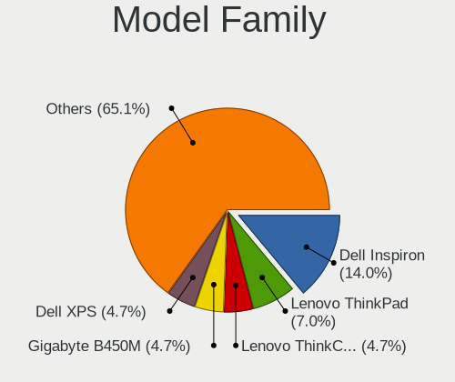
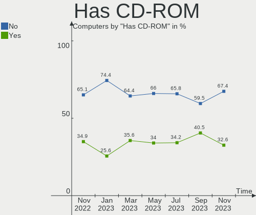
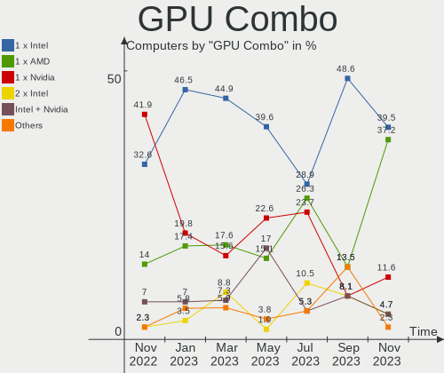

helloSystem - Hardware Trends
-----------------------------

A project to identify most popular hardware characteristics and track their change
over time based on data collected by BSD users at https://BSD-Hardware.info.

Anyone can contribute to this report by the [hw-probe](https://github.com/linuxhw/hw-probe/blob/master/INSTALL.BSD.md) tool:

    hw-probe -all -upload

This is a report for all computer types. See also reports for [desktops](/Dist/helloSystem/Desktop/README.md) and [notebooks](/Dist/helloSystem/Notebook/README.md).

This report is for one last month. Overall report since the beginning of time: [TestDays](https://github.com/bsdhw/TestDays)

Period: Jun, 2023.

Contents
--------

* [ System ](#system)
  - [ OS                       ](#os)
  - [ OS Family                ](#os-family)
  - [ Arch                     ](#arch)
  - [ DE                       ](#de)
  - [ Display Server           ](#display-server)
  - [ Display Manager          ](#display-manager)
  - [ OS Lang                  ](#os-lang)
  - [ Boot Mode                ](#boot-mode)
  - [ Filesystem               ](#filesystem)
  - [ Part. scheme             ](#part-scheme)

* [ Board ](#board)
  - [ Vendor                   ](#vendor)
  - [ Model                    ](#model)
  - [ Model Family             ](#model-family)
  - [ MFG Year                 ](#mfg-year)
  - [ Form Factor              ](#form-factor)
  - [ Coreboot                 ](#coreboot)
  - [ RAM Size                 ](#ram-size)
  - [ RAM Used                 ](#ram-used)
  - [ Total Drives             ](#total-drives)
  - [ Has CD-ROM               ](#has-cd-rom)
  - [ Has Ethernet             ](#has-ethernet)
  - [ Has WiFi                 ](#has-wifi)
  - [ Has Bluetooth            ](#has-bluetooth)

* [ Location ](#location)
  - [ Country                  ](#country)
  - [ City                     ](#city)

* [ Drives ](#drives)
  - [ Drive Vendor             ](#drive-vendor)
  - [ Drive Model              ](#drive-model)
  - [ HDD Vendor               ](#hdd-vendor)
  - [ SSD Vendor               ](#ssd-vendor)
  - [ Drive Kind               ](#drive-kind)
  - [ Drive Connector          ](#drive-connector)
  - [ Drive Size               ](#drive-size)
  - [ Space Total              ](#space-total)
  - [ Space Used               ](#space-used)
  - [ Malfunc. Drives          ](#malfunc-drives)
  - [ Malfunc. Drive Vendor    ](#malfunc-drive-vendor)
  - [ Malfunc. HDD Vendor      ](#malfunc-hdd-vendor)
  - [ Malfunc. Drive Kind      ](#malfunc-drive-kind)
  - [ Failed Drives            ](#failed-drives)
  - [ Failed Drive Vendor      ](#failed-drive-vendor)
  - [ Drive Status             ](#drive-status)

* [ Storage controller ](#storage-controller)
  - [ Storage Vendor           ](#storage-vendor)
  - [ Storage Model            ](#storage-model)
  - [ Storage Kind             ](#storage-kind)

* [ Processor ](#processor)
  - [ CPU Vendor               ](#cpu-vendor)
  - [ CPU Model                ](#cpu-model)
  - [ CPU Model Family         ](#cpu-model-family)
  - [ CPU Cores                ](#cpu-cores)
  - [ CPU Sockets              ](#cpu-sockets)
  - [ CPU Threads              ](#cpu-threads)
  - [ CPU Microarch            ](#cpu-microarch)

* [ Graphics ](#graphics)
  - [ GPU Vendor               ](#gpu-vendor)
  - [ GPU Model                ](#gpu-model)
  - [ GPU Combo                ](#gpu-combo)
  - [ GPU Driver               ](#gpu-driver)
  - [ GPU Memory               ](#gpu-memory)

* [ Monitor ](#monitor)
  - [ Monitor Vendor           ](#monitor-vendor)
  - [ Monitor Model            ](#monitor-model)
  - [ Monitor Resolution       ](#monitor-resolution)
  - [ Monitor Diagonal         ](#monitor-diagonal)
  - [ Monitor Width            ](#monitor-width)
  - [ Aspect Ratio             ](#aspect-ratio)
  - [ Monitor Area             ](#monitor-area)
  - [ Pixel Density            ](#pixel-density)
  - [ Multiple Monitors        ](#multiple-monitors)

* [ Network ](#network)
  - [ Net Controller Vendor    ](#net-controller-vendor)
  - [ Net Controller Model     ](#net-controller-model)
  - [ Wireless Vendor          ](#wireless-vendor)
  - [ Wireless Model           ](#wireless-model)
  - [ Ethernet Vendor          ](#ethernet-vendor)
  - [ Ethernet Model           ](#ethernet-model)
  - [ Net Controller Kind      ](#net-controller-kind)
  - [ Used Controller          ](#used-controller)
  - [ NICs                     ](#nics)
  - [ IPv6                     ](#ipv6)

* [ Bluetooth ](#bluetooth)
  - [ Bluetooth Vendor         ](#bluetooth-vendor)
  - [ Bluetooth Model          ](#bluetooth-model)

* [ Sound ](#sound)
  - [ Sound Vendor             ](#sound-vendor)
  - [ Sound Model              ](#sound-model)

* [ Memory ](#memory)
  - [ Memory Vendor            ](#memory-vendor)
  - [ Memory Model             ](#memory-model)
  - [ Memory Kind              ](#memory-kind)
  - [ Memory Form Factor       ](#memory-form-factor)
  - [ Memory Size              ](#memory-size)
  - [ Memory Speed             ](#memory-speed)

* [ Printers & scanners ](#printers--scanners)
  - [ Printer Vendor           ](#printer-vendor)
  - [ Printer Model            ](#printer-model)
  - [ Scanner Vendor           ](#scanner-vendor)
  - [ Scanner Model            ](#scanner-model)

* [ Camera ](#camera)
  - [ Camera Vendor            ](#camera-vendor)
  - [ Camera Model             ](#camera-model)

* [ Security ](#security)
  - [ Fingerprint Vendor       ](#fingerprint-vendor)
  - [ Fingerprint Model        ](#fingerprint-model)
  - [ Chipcard Vendor          ](#chipcard-vendor)
  - [ Chipcard Model           ](#chipcard-model)

* [ Unsupported ](#unsupported)
  - [ Unsupported Devices      ](#unsupported-devices)
  - [ Unsupported Device Types ](#unsupported-device-types)

System
------

OS
--

Installed operating systems

| Name              | Computers | Percent |
|-------------------|-----------|---------|
| helloSystem 0.8.1 | 26        | 63.41%  |
| helloSystem 0.8.2 | 13        | 31.71%  |
| helloSystem 0.8.0 | 1         | 2.44%   |
| helloSystem 0.7.0 | 1         | 2.44%   |

OS Family
---------

OS without a version

| Name        | Computers | Percent |
|-------------|-----------|---------|
| helloSystem | 41        | 100%    |

Arch
----

OS architecture (x86_64, i586, etc.)

| Name  | Computers | Percent |
|-------|-----------|---------|
| amd64 | 41        | 100%    |

DE
--

Desktop Environment

| Name         | Computers | Percent |
|--------------|-----------|---------|
| helloDesktop | 41        | 100%    |

Display Server
--------------

X11 or Wayland

| Name | Computers | Percent |
|------|-----------|---------|
| X11  | 41        | 100%    |

Display Manager
---------------

SDDM, LightDM, etc.

| Name | Computers | Percent |
|------|-----------|---------|
| SLiM | 41        | 100%    |

OS Lang
-------

Language

| Lang  | Computers | Percent |
|-------|-----------|---------|
| en_US | 15        | 36.59%  |
| fr_FR | 10        | 24.39%  |
| ru_RU | 5         | 12.2%   |
| pl_PL | 2         | 4.88%   |
| it_IT | 2         | 4.88%   |
| es_ES | 2         | 4.88%   |
| de_DE | 2         | 4.88%   |
| zh_CN | 1         | 2.44%   |
| nl_NL | 1         | 2.44%   |
| en    | 1         | 2.44%   |

Boot Mode
---------

EFI or BIOS

| Mode | Computers | Percent |
|------|-----------|---------|
| EFI  | 41        | 100%    |

Filesystem
----------

Type of filesystem

| Type   | Computers | Percent |
|--------|-----------|---------|
| Cd9660 | 22        | 53.66%  |
| Zfs    | 19        | 46.34%  |

Part. scheme
------------

Scheme of partitioning

| Type | Computers | Percent |
|------|-----------|---------|
| GPT  | 41        | 100%    |

Board
-----

Vendor
------

Motherboard manufacturer

| Name                | Computers | Percent |
|---------------------|-----------|---------|
| Hewlett-Packard     | 10        | 24.39%  |
| ASUSTek Computer    | 8         | 19.51%  |
| Lenovo              | 6         | 14.63%  |
| Dell                | 6         | 14.63%  |
| Intel               | 2         | 4.88%   |
| Samsung Electronics | 1         | 2.44%   |
| Panasonic           | 1         | 2.44%   |
| MSI                 | 1         | 2.44%   |
| LG Electronics      | 1         | 2.44%   |
| HUAWEI              | 1         | 2.44%   |
| Gigabyte Technology | 1         | 2.44%   |
| Fujitsu Siemens     | 1         | 2.44%   |
| Apple               | 1         | 2.44%   |
| Acer                | 1         | 2.44%   |

Model
-----

Motherboard model

| Name                                     | Computers | Percent |
|------------------------------------------|-----------|---------|
| Samsung R530/R730/R540                   | 1         | 2.44%   |
| Panasonic CF-NX1GDHYS                    | 1         | 2.44%   |
| MSI GE63 Raider RGB 8RE                  | 1         | 2.44%   |
| LG R590-K.AAA9BT                         | 1         | 2.44%   |
| Lenovo ThinkPad T60 20076PU              | 1         | 2.44%   |
| Lenovo ThinkPad T440p 20AWS1CH00         | 1         | 2.44%   |
| Lenovo ThinkCentre M83 10AHA0X9LS        | 1         | 2.44%   |
| Lenovo S10-3                             | 1         | 2.44%   |
| Lenovo IdeaPad 310-15IKB 80TV            | 1         | 2.44%   |
| Lenovo H515s 10126                       | 1         | 2.44%   |
| Intel NUC11PAHi5                         | 1         | 2.44%   |
| Intel DG41TY AAE47335-300                | 1         | 2.44%   |
| HUAWEI BOHB-WAX9                         | 1         | 2.44%   |
| HP Stream Laptop 14-ds0xxx               | 1         | 2.44%   |
| HP Pavilion Laptop 15-eh1xxx             | 1         | 2.44%   |
| HP Pavilion 15                           | 1         | 2.44%   |
| HP Laptop 15-ra0xx                       | 1         | 2.44%   |
| HP Laptop 15-bs1xx                       | 1         | 2.44%   |
| HP EliteDesk 800 G2 DM 35W               | 1         | 2.44%   |
| HP EliteBook 840 G3                      | 1         | 2.44%   |
| HP Compaq Elite 8300 USDT                | 1         | 2.44%   |
| HP Compaq 6830s                          | 1         | 2.44%   |
| HP 250 G6 Notebook PC                    | 1         | 2.44%   |
| Gigabyte B450M S2H                       | 1         | 2.44%   |
| Fujitsu Siemens ESPRIMO C5730            | 1         | 2.44%   |
| Dell Wyse 5070 Thin Client               | 1         | 2.44%   |
| Dell Vostro 3681                         | 1         | 2.44%   |
| Dell OptiPlex 7010                       | 1         | 2.44%   |
| Dell Latitude E4310                      | 1         | 2.44%   |
| Dell Latitude 5490                       | 1         | 2.44%   |
| Dell Inspiron 5570                       | 1         | 2.44%   |
| ASUS ROG Maximus X HERO                  | 1         | 2.44%   |
| ASUS PRIME X399-A                        | 1         | 2.44%   |
| ASUS PRIME B350M-A                       | 1         | 2.44%   |
| ASUS P7P55D LE                           | 1         | 2.44%   |
| ASUS M2A-VM                              | 1         | 2.44%   |
| ASUS ASUS TUF Gaming A17 FA707RC_FA707RC | 1         | 2.44%   |
| ASUS 1015P                               | 1         | 2.44%   |
| ASUS 1015BX                              | 1         | 2.44%   |
| Apple MacBook7,1                         | 1         | 2.44%   |

Model Family
------------

Motherboard model prefix

| Name                    | Computers | Percent |
|-------------------------|-----------|---------|
| Lenovo ThinkPad         | 2         | 4.88%   |
| HP Pavilion             | 2         | 4.88%   |
| HP Laptop               | 2         | 4.88%   |
| HP Compaq               | 2         | 4.88%   |
| Dell Latitude           | 2         | 4.88%   |
| ASUS PRIME              | 2         | 4.88%   |
| Samsung R530            | 1         | 2.44%   |
| Panasonic CF-NX1GDHYS   | 1         | 2.44%   |
| MSI GE63                | 1         | 2.44%   |
| LG R590-K.AAA9BT        | 1         | 2.44%   |
| Lenovo ThinkCentre      | 1         | 2.44%   |
| Lenovo S10-3            | 1         | 2.44%   |
| Lenovo IdeaPad          | 1         | 2.44%   |
| Lenovo H515s            | 1         | 2.44%   |
| Intel NUC11PAHi5        | 1         | 2.44%   |
| Intel DG41TY            | 1         | 2.44%   |
| HUAWEI BOHB-WAX9        | 1         | 2.44%   |
| HP Stream               | 1         | 2.44%   |
| HP EliteDesk            | 1         | 2.44%   |
| HP EliteBook            | 1         | 2.44%   |
| HP 250                  | 1         | 2.44%   |
| Gigabyte B450M          | 1         | 2.44%   |
| Fujitsu Siemens ESPRIMO | 1         | 2.44%   |
| Dell Wyse               | 1         | 2.44%   |
| Dell Vostro             | 1         | 2.44%   |
| Dell OptiPlex           | 1         | 2.44%   |
| Dell Inspiron           | 1         | 2.44%   |
| ASUS ROG                | 1         | 2.44%   |
| ASUS P7P55D             | 1         | 2.44%   |
| ASUS M2A-VM             | 1         | 2.44%   |
| ASUS ASUS               | 1         | 2.44%   |
| ASUS 1015P              | 1         | 2.44%   |
| ASUS 1015BX             | 1         | 2.44%   |
| Apple MacBook7          | 1         | 2.44%   |
| Acer Aspire             | 1         | 2.44%   |

MFG Year
--------

Motherboard manufacture year

| Year | Computers | Percent |
|------|-----------|---------|
| 2010 | 6         | 14.63%  |
| 2022 | 5         | 12.2%   |
| 2019 | 4         | 9.76%   |
| 2013 | 4         | 9.76%   |
| 2021 | 3         | 7.32%   |
| 2016 | 3         | 7.32%   |
| 2012 | 3         | 7.32%   |
| 2020 | 2         | 4.88%   |
| 2018 | 2         | 4.88%   |
| 2017 | 2         | 4.88%   |
| 2011 | 2         | 4.88%   |
| 2023 | 1         | 2.44%   |
| 2014 | 1         | 2.44%   |
| 2009 | 1         | 2.44%   |
| 2008 | 1         | 2.44%   |
| 2006 | 1         | 2.44%   |

Form Factor
-----------

Physical design of the computer

| Name     | Computers | Percent |
|----------|-----------|---------|
| Notebook | 24        | 58.54%  |
| Desktop  | 15        | 36.59%  |
| Mini pc  | 2         | 4.88%   |

Coreboot
--------

Have coreboot on board

| Used | Computers | Percent |
|------|-----------|---------|
| No   | 41        | 100%    |

RAM Size
--------

Total RAM memory

| Size in GB  | Computers | Percent |
|-------------|-----------|---------|
| 8.01-16.0   | 15        | 36.59%  |
| 4.01-8.0    | 11        | 26.83%  |
| 16.01-24.0  | 8         | 19.51%  |
| 2.01-3.0    | 3         | 7.32%   |
| 64.01-256.0 | 2         | 4.88%   |
| 3.01-4.0    | 1         | 2.44%   |
| 0.51-1.0    | 1         | 2.44%   |

RAM Used
--------

Used RAM memory

| Used GB  | Computers | Percent |
|----------|-----------|---------|
| 0.01-0.5 | 24        | 58.54%  |
| 0.51-1.0 | 13        | 31.71%  |
| 1.01-2.0 | 3         | 7.32%   |
| 2.01-3.0 | 1         | 2.44%   |

Total Drives
------------

Number of drives on board

| Drives | Computers | Percent |
|--------|-----------|---------|
| 1      | 28        | 68.29%  |
| 2      | 8         | 19.51%  |
| 0      | 3         | 7.32%   |
| 9      | 1         | 2.44%   |
| 5      | 1         | 2.44%   |

Has CD-ROM
----------

Has CD-ROM on board

| Presented | Computers | Percent |
|-----------|-----------|---------|
| No        | 26        | 63.41%  |
| Yes       | 15        | 36.59%  |

Has Ethernet
------------

Has Ethernet on board

| Presented | Computers | Percent |
|-----------|-----------|---------|
| Yes       | 39        | 95.12%  |
| No        | 2         | 4.88%   |

Has WiFi
--------

Has WiFi module

| Presented | Computers | Percent |
|-----------|-----------|---------|
| Yes       | 31        | 75.61%  |
| No        | 10        | 24.39%  |

Has Bluetooth
-------------

Has Bluetooth module

| Presented | Computers | Percent |
|-----------|-----------|---------|
| Yes       | 24        | 58.54%  |
| No        | 17        | 41.46%  |

Location
--------

Country
-------

Geographic location (country)

| Country     | Computers | Percent |
|-------------|-----------|---------|
| Russia      | 6         | 14.63%  |
| USA         | 3         | 7.32%   |
| Poland      | 3         | 7.32%   |
| Italy       | 3         | 7.32%   |
| Germany     | 3         | 7.32%   |
| Turkey      | 2         | 4.88%   |
| Spain       | 2         | 4.88%   |
| Mexico      | 2         | 4.88%   |
| France      | 2         | 4.88%   |
| Ukraine     | 1         | 2.44%   |
| UK          | 1         | 2.44%   |
| Syria       | 1         | 2.44%   |
| Switzerland | 1         | 2.44%   |
| Peru        | 1         | 2.44%   |
| Norway      | 1         | 2.44%   |
| Netherlands | 1         | 2.44%   |
| Israel      | 1         | 2.44%   |
| Iceland     | 1         | 2.44%   |
| Hungary     | 1         | 2.44%   |
| China       | 1         | 2.44%   |
| Brazil      | 1         | 2.44%   |
| Belarus     | 1         | 2.44%   |
| Australia   | 1         | 2.44%   |
| Argentina   | 1         | 2.44%   |

City
----

Geographic location (city)

| City               | Computers | Percent |
|--------------------|-----------|---------|
| Istanbul           | 2         | 4.88%   |
| Witkow             | 1         | 2.44%   |
| Volgodonsk         | 1         | 2.44%   |
| Vitebsk            | 1         | 2.44%   |
| Villefontaine      | 1         | 2.44%   |
| Trekhgornyy        | 1         | 2.44%   |
| Tata               | 1         | 2.44%   |
| Sete Lagoas        | 1         | 2.44%   |
| Sesto San Giovanni | 1         | 2.44%   |
| Plauen             | 1         | 2.44%   |
| Penza              | 1         | 2.44%   |
| Paris              | 1         | 2.44%   |
| Padul              | 1         | 2.44%   |
| Ourense            | 1         | 2.44%   |
| Odesa              | 1         | 2.44%   |
| Netanya            | 1         | 2.44%   |
| Moscow             | 1         | 2.44%   |
| Mooresville        | 1         | 2.44%   |
| Milan              | 1         | 2.44%   |
| Medolago           | 1         | 2.44%   |
| Makhachkala        | 1         | 2.44%   |
| Lochowo            | 1         | 2.44%   |
| Lima               | 1         | 2.44%   |
| Lesogorsk          | 1         | 2.44%   |
| Kopavogur          | 1         | 2.44%   |
| Jesus Maria        | 1         | 2.44%   |
| Hermosillo         | 1         | 2.44%   |
| Hamburg            | 1         | 2.44%   |
| Ecatepec           | 1         | 2.44%   |
| Drammen            | 1         | 2.44%   |
| Damascus           | 1         | 2.44%   |
| Czolowo            | 1         | 2.44%   |
| Cologne            | 1         | 2.44%   |
| Chengdu            | 1         | 2.44%   |
| Brooklyn           | 1         | 2.44%   |
| Bristol            | 1         | 2.44%   |
| Brisbane           | 1         | 2.44%   |
| Berghem            | 1         | 2.44%   |
| Basel              | 1         | 2.44%   |
| Addlestone         | 1         | 2.44%   |

Drives
------

Drive Vendor
------------

Hard drive vendors

| Vendor              | Computers | Drives | Percent |
|---------------------|-----------|--------|---------|
| Seagate             | 10        | 11     | 18.87%  |
| Samsung Electronics | 7         | 7      | 13.21%  |
| WDC                 | 5         | 8      | 9.43%   |
| Toshiba             | 4         | 4      | 7.55%   |
| Kingston            | 3         | 3      | 5.66%   |
| Hitachi             | 3         | 3      | 5.66%   |
| Team                | 2         | 2      | 3.77%   |
| SanDisk             | 2         | 2      | 3.77%   |
| Intel               | 2         | 2      | 3.77%   |
| A-DATA Technology   | 2         | 2      | 3.77%   |
| SETHRISE            | 1         | 1      | 1.89%   |
| Phison              | 1         | 1      | 1.89%   |
| Patriot             | 1         | 1      | 1.89%   |
| OCZ                 | 1         | 1      | 1.89%   |
| KIOXIA              | 1         | 1      | 1.89%   |
| KingSpec            | 1         | 1      | 1.89%   |
| Intenso             | 1         | 1      | 1.89%   |
| HGST                | 1         | 1      | 1.89%   |
| Gigabyte Technology | 1         | 1      | 1.89%   |
| Crucial             | 1         | 2      | 1.89%   |
| China               | 1         | 1      | 1.89%   |
| BHT                 | 1         | 1      | 1.89%   |
| Apple               | 1         | 1      | 1.89%   |

Drive Model
-----------

Hard drive models

| Model                               | Computers | Percent |
|-------------------------------------|-----------|---------|
| Toshiba MQ01ABF050 500GB            | 2         | 3.7%    |
| WDC WDS500G2B0A-00SM50 500GB        | 1         | 1.85%   |
| WDC WDS100T2B0C-00PXH0 1TB          | 1         | 1.85%   |
| WDC WD5000AAVS-00ZTB0 500GB         | 1         | 1.85%   |
| WDC WD3200BPVT-22JJ5T0 320GB        | 1         | 1.85%   |
| WDC WD10EZEX-75WN4A1 1TB            | 1         | 1.85%   |
| Toshiba THNSNJ256G8NY 256GB         | 1         | 1.85%   |
| Toshiba HDWG480 8TB                 | 1         | 1.85%   |
| Team TM8FP6256G 256GB               | 1         | 1.85%   |
| Team T253X2256G 256GB               | 1         | 1.85%   |
| SETHRISE SSD 480G                   | 1         | 1.85%   |
| Seagate ST9320325AS 320GB           | 1         | 1.85%   |
| Seagate ST9250410AS 250GB           | 1         | 1.85%   |
| Seagate ST750LM022 HN-M750MBB 752GB | 1         | 1.85%   |
| Seagate ST500DM002-1BD142 500GB     | 1         | 1.85%   |
| Seagate ST3750528AS 752GB           | 1         | 1.85%   |
| Seagate ST3250318AS 250GB           | 1         | 1.85%   |
| Seagate ST250LM000 HM251HI 250GB    | 1         | 1.85%   |
| Seagate ST2000LM007-1R8174 2TB      | 1         | 1.85%   |
| Seagate ST16000NM001G-2KK103 16TB   | 1         | 1.85%   |
| Seagate ST12000NM0008-2H3101 12TB   | 1         | 1.85%   |
| Seagate ST1000LM035-1RK172 1TB      | 1         | 1.85%   |
| SanDisk SD9SN8W-256G-1006 256GB     | 1         | 1.85%   |
| SanDisk SD8SN8U-128G-1006 128GB     | 1         | 1.85%   |
| Samsung SSD PM871b M.2 2280 256GB   | 1         | 1.85%   |
| Samsung SSD 970 EVO Plus 500GB      | 1         | 1.85%   |
| Samsung SSD 970 EVO Plus 250GB      | 1         | 1.85%   |
| Samsung SSD 870 EVO 500GB           | 1         | 1.85%   |
| Samsung SSD 850 PRO 512GB           | 1         | 1.85%   |
| Samsung PM961 NVMe 256GB            | 1         | 1.85%   |
| Samsung HM321HI 320GB               | 1         | 1.85%   |
| Phison 311CD0512GB                  | 1         | 1.85%   |
| Patriot Burst Elite 120GB           | 1         | 1.85%   |
| OCZ AGILITY3 120GB                  | 1         | 1.85%   |
| KIOXIA KBG40ZNS256G NVMe 256GB      | 1         | 1.85%   |
| Kingston SV100S232G 32GB            | 1         | 1.85%   |
| Kingston SUV400S37240G 240GB        | 1         | 1.85%   |
| Kingston SA400S37240G 240GB         | 1         | 1.85%   |
| KingSpec P3-128 128GB               | 1         | 1.85%   |
| Intenso SSD SATAIII 120GB           | 1         | 1.85%   |

HDD Vendor
----------

Hard disk drive vendors

| Vendor              | Computers | Drives | Percent |
|---------------------|-----------|--------|---------|
| Seagate             | 10        | 11     | 45.45%  |
| WDC                 | 3         | 3      | 13.64%  |
| Toshiba             | 3         | 3      | 13.64%  |
| Hitachi             | 3         | 3      | 13.64%  |
| Samsung Electronics | 1         | 1      | 4.55%   |
| HGST                | 1         | 1      | 4.55%   |
| Apple               | 1         | 1      | 4.55%   |

SSD Vendor
----------

Solid state drive vendors

| Vendor              | Computers | Drives | Percent |
|---------------------|-----------|--------|---------|
| Samsung Electronics | 3         | 3      | 13.64%  |
| Kingston            | 3         | 3      | 13.64%  |
| SanDisk             | 2         | 2      | 9.09%   |
| A-DATA Technology   | 2         | 2      | 9.09%   |
| WDC                 | 1         | 1      | 4.55%   |
| Toshiba             | 1         | 1      | 4.55%   |
| Team                | 1         | 1      | 4.55%   |
| SETHRISE            | 1         | 1      | 4.55%   |
| Patriot             | 1         | 1      | 4.55%   |
| OCZ                 | 1         | 1      | 4.55%   |
| KingSpec            | 1         | 1      | 4.55%   |
| Intenso             | 1         | 1      | 4.55%   |
| Intel               | 1         | 1      | 4.55%   |
| Gigabyte Technology | 1         | 1      | 4.55%   |
| China               | 1         | 1      | 4.55%   |
| BHT                 | 1         | 1      | 4.55%   |

Drive Kind
----------

HDD or SSD

| Kind | Computers | Drives | Percent |
|------|-----------|--------|---------|
| HDD  | 21        | 23     | 43.75%  |
| SSD  | 19        | 22     | 39.58%  |
| NVMe | 8         | 13     | 16.67%  |

Drive Connector
---------------

SATA, SAS, NVMe, etc.

| Type | Computers | Drives | Percent |
|------|-----------|--------|---------|
| SATA | 36        | 45     | 81.82%  |
| NVMe | 8         | 13     | 18.18%  |

Drive Size
----------

Size of hard drive

| Size in TB | Computers | Drives | Percent |
|------------|-----------|--------|---------|
| 0.01-0.5   | 29        | 34     | 74.36%  |
| 0.51-1.0   | 7         | 7      | 17.95%  |
| 10.01-20.0 | 1         | 2      | 2.56%   |
| 1.01-2.0   | 1         | 1      | 2.56%   |
| 4.01-10.0  | 1         | 1      | 2.56%   |

Space Total
-----------

Amount of disk space available on the file system

| Size in GB     | Computers | Percent |
|----------------|-----------|---------|
| 1-20           | 18        | 43.9%   |
| 101-250        | 7         | 17.07%  |
| 251-500        | 6         | 14.63%  |
| 51-100         | 5         | 12.2%   |
| 21-50          | 2         | 4.88%   |
| More than 3000 | 1         | 2.44%   |
| 501-1000       | 1         | 2.44%   |
| Unknown        | 1         | 2.44%   |

Space Used
----------

Amount of used disk space

| Used GB   | Computers | Percent |
|-----------|-----------|---------|
| 1-20      | 38        | 92.68%  |
| 1001-2000 | 1         | 2.44%   |
| 51-100    | 1         | 2.44%   |
| Unknown   | 1         | 2.44%   |

Malfunc. Drives
---------------

Drive models with a malfunction

| Model                               | Computers | Drives | Percent |
|-------------------------------------|-----------|--------|---------|
| Seagate ST9320325AS 320GB           | 1         | 1      | 12.5%   |
| Seagate ST750LM022 HN-M750MBB 752GB | 1         | 1      | 12.5%   |
| Seagate ST500DM002-1BD142 500GB     | 1         | 1      | 12.5%   |
| Seagate ST3750528AS 752GB           | 1         | 1      | 12.5%   |
| Seagate ST12000NM0008-2H3101 12TB   | 1         | 1      | 12.5%   |
| OCZ AGILITY3 120GB                  | 1         | 1      | 12.5%   |
| Hitachi HTS542525K9A300 250GB       | 1         | 1      | 12.5%   |
| China SH00R120GB                    | 1         | 1      | 12.5%   |

Malfunc. Drive Vendor
---------------------

Vendors of faulty drives

| Vendor  | Computers | Drives | Percent |
|---------|-----------|--------|---------|
| Seagate | 5         | 5      | 62.5%   |
| OCZ     | 1         | 1      | 12.5%   |
| Hitachi | 1         | 1      | 12.5%   |
| China   | 1         | 1      | 12.5%   |

Malfunc. HDD Vendor
-------------------

Vendors of faulty HDD drives

| Vendor  | Computers | Drives | Percent |
|---------|-----------|--------|---------|
| Seagate | 5         | 5      | 83.33%  |
| Hitachi | 1         | 1      | 16.67%  |

Malfunc. Drive Kind
-------------------

Kinds of faulty drives

| Kind | Computers | Drives | Percent |
|------|-----------|--------|---------|
| HDD  | 6         | 6      | 75%     |
| SSD  | 2         | 2      | 25%     |

Failed Drives
-------------

Failed drive models

| Model                       | Computers | Drives | Percent |
|-----------------------------|-----------|--------|---------|
| Hitachi HDS721010DLE630 1TB | 1         | 1      | 100%    |

Failed Drive Vendor
-------------------

Failed drive vendors

| Vendor  | Computers | Drives | Percent |
|---------|-----------|--------|---------|
| Hitachi | 1         | 1      | 100%    |

Drive Status
------------

Number of failed and malfunc. drives

| Status  | Computers | Drives | Percent |
|---------|-----------|--------|---------|
| Works   | 32        | 49     | 78.05%  |
| Malfunc | 8         | 8      | 19.51%  |
| Failed  | 1         | 1      | 2.44%   |

Storage controller
------------------

Storage Vendor
--------------

Storage controller vendors

| Vendor                    | Computers | Percent |
|---------------------------|-----------|---------|
| Intel                     | 32        | 66.67%  |
| AMD                       | 6         | 12.5%   |
| Samsung Electronics       | 3         | 6.25%   |
| SanDisk                   | 1         | 2.08%   |
| Realtek Semiconductor     | 1         | 2.08%   |
| Phison Electronics        | 1         | 2.08%   |
| Nvidia                    | 1         | 2.08%   |
| Micron/Crucial Technology | 1         | 2.08%   |
| KIOXIA                    | 1         | 2.08%   |
| JMicron Technology        | 1         | 2.08%   |

Storage Model
-------------

Storage controller models

| Model                                                                            | Computers | Percent |
|----------------------------------------------------------------------------------|-----------|---------|
| Intel Sunrise Point-LP SATA Controller [AHCI mode]                               | 5         | 9.09%   |
| AMD FCH SATA Controller [AHCI mode]                                              | 4         | 7.27%   |
| Samsung NVMe SSD Controller SM981/PM981/PM983                                    | 2         | 3.64%   |
| Intel NM10/ICH7 Family SATA Controller [AHCI mode]                               | 2         | 3.64%   |
| Intel 82801G (ICH7 Family) IDE Controller                                        | 2         | 3.64%   |
| Intel 8 Series/C220 Series Chipset Family 6-port SATA Controller 1 [AHCI mode]   | 2         | 3.64%   |
| Intel 7 Series/C210 Series Chipset Family 6-port SATA Controller [AHCI mode]     | 2         | 3.64%   |
| Intel 6 Series/C200 Series Chipset Family 6 port Mobile SATA AHCI Controller     | 2         | 3.64%   |
| Intel 5 Series/3400 Series Chipset 6 port SATA AHCI Controller                   | 2         | 3.64%   |
| Intel 5 Series/3400 Series Chipset 4 port SATA AHCI Controller                   | 2         | 3.64%   |
| SanDisk WD Blue SN550 NVMe SSD                                                   | 1         | 1.82%   |
| Samsung NVMe SSD Controller SM961/PM961/SM963                                    | 1         | 1.82%   |
| Realtek NVMe Controller                                                          | 1         | 1.82%   |
| Phison PS5013 E13 NVMe Controller                                                | 1         | 1.82%   |
| Nvidia MCP89 SATA Controller (AHCI mode)                                         | 1         | 1.82%   |
| Micron/Crucial P2 NVMe PCIe SSD                                                  | 1         | 1.82%   |
| KIOXIA NVMe SSD Controller BG4                                                   | 1         | 1.82%   |
| JMicron JMB361 AHCI/IDE                                                          | 1         | 1.82%   |
| Intel Wildcat Point-LP SATA Controller [AHCI Mode]                               | 1         | 1.82%   |
| Intel Tiger Lake-LP SATA Controller                                              | 1         | 1.82%   |
| Intel Q170/Q150/B150/H170/H110/Z170/CM236 Chipset SATA Controller [AHCI Mode]    | 1         | 1.82%   |
| Intel NM10/ICH7 Family SATA Controller [IDE mode]                                | 1         | 1.82%   |
| Intel Comet Lake SATA AHCI Controller                                            | 1         | 1.82%   |
| Intel Celeron/Pentium Silver Processor SATA Controller                           | 1         | 1.82%   |
| Intel Cannon Lake Mobile PCH SATA AHCI Controller                                | 1         | 1.82%   |
| Intel Atom/Celeron/Pentium Processor x5-E8000/J3xxx/N3xxx Series SATA Controller | 1         | 1.82%   |
| Intel 82801JD/DO (ICH10 Family) 4-port SATA IDE Controller                       | 1         | 1.82%   |
| Intel 82801JD/DO (ICH10 Family) 2-port SATA IDE Controller                       | 1         | 1.82%   |
| Intel 82801IBM/IEM (ICH9M/ICH9M-E) 4 port SATA Controller [AHCI mode]            | 1         | 1.82%   |
| Intel 82801GBM/GHM (ICH7-M Family) SATA Controller [AHCI mode]                   | 1         | 1.82%   |
| Intel 82801 Mobile SATA Controller [RAID mode]                                   | 1         | 1.82%   |
| Intel 400 Series Chipset Family SATA AHCI Controller                             | 1         | 1.82%   |
| Intel 4 Series Chipset PT IDER Controller                                        | 1         | 1.82%   |
| Intel 200 Series PCH SATA controller [AHCI mode]                                 | 1         | 1.82%   |
| AMD X399 Series Chipset SATA Controller                                          | 1         | 1.82%   |
| AMD SB7x0/SB8x0/SB9x0 SATA Controller [AHCI mode]                                | 1         | 1.82%   |
| AMD FCH SATA Controller [IDE mode]                                               | 1         | 1.82%   |
| AMD 400 Series Chipset SATA Controller                                           | 1         | 1.82%   |
| AMD 300 Series Chipset SATA Controller                                           | 1         | 1.82%   |
| Unknown                                                                          | 1         | 1.82%   |

Storage Kind
------------

Kind of storage controller (IDE, SATA, NVMe, SAS, ...)

| Kind | Computers | Percent |
|------|-----------|---------|
| SATA | 34        | 70.83%  |
| NVMe | 8         | 16.67%  |
| IDE  | 5         | 10.42%  |
| RAID | 1         | 2.08%   |

Processor
---------

CPU Vendor
----------

Processor vendors

| Vendor | Computers | Percent |
|--------|-----------|---------|
| Intel  | 32        | 78.05%  |
| AMD    | 9         | 21.95%  |

CPU Model
---------

Processor models

| Model                                           | Computers | Percent |
|-------------------------------------------------|-----------|---------|
| Intel Pentium Silver J5005 CPU @ 1.50GHz        | 1         | 2.44%   |
| Intel Pentium Dual-Core CPU E5300               | 1         | 2.44%   |
| Intel Genuine CPU                               | 1         | 2.44%   |
| Intel CPU Version                               | 1         | 2.44%   |
| Intel Core i7-8750H CPU @ 2.20GHz               | 1         | 2.44%   |
| Intel Core i7-8700K CPU @ 3.70GHz               | 1         | 2.44%   |
| Intel Core i7-8550U CPU @ 1.80GHz               | 1         | 2.44%   |
| Intel Core i7-7500U CPU @ 2.70GHz               | 1         | 2.44%   |
| Intel Core i7-5500U CPU @ 2.40GHz               | 1         | 2.44%   |
| Intel Core i7-4770 CPU @ 3.40GHz                | 1         | 2.44%   |
| Intel Core i7-4700MQ CPU @ 2.40GHz              | 1         | 2.44%   |
| Intel Core i5-8350U CPU @ 1.70GHz               | 1         | 2.44%   |
| Intel Core i5-8250U CPU @ 1.60GHz               | 1         | 2.44%   |
| Intel Core i5-6600T CPU @ 2.70GHz               | 1         | 2.44%   |
| Intel Core i5-6300U CPU @ 2.40GHz               | 1         | 2.44%   |
| Intel Core i5-3470 CPU @ 3.20GHz                | 1         | 2.44%   |
| Intel Core i5-2540M CPU @ 2.60GHz               | 1         | 2.44%   |
| Intel Core i5-10400 CPU @ 2.90GHz               | 1         | 2.44%   |
| Intel Core i5-10210U CPU @ 1.60GHz              | 1         | 2.44%   |
| Intel Core i5 CPU M 520 @ 2.40GH                | 1         | 2.44%   |
| Intel Core i5 CPU 750 @ 2.67GHz                 | 1         | 2.44%   |
| Intel Core i3-7020U CPU @ 2.30GHz               | 1         | 2.44%   |
| Intel Core i3-3220 CPU @ 3.30GHz                | 1         | 2.44%   |
| Intel Core i3-2330M CPU @ 2.20GHz               | 1         | 2.44%   |
| Intel Core i3 CPU M 330 @ 2.13GHz               | 1         | 2.44%   |
| Intel Core 2 Duo CPU T5870 @ 2.00GHz            | 1         | 2.44%   |
| Intel Core 2 Duo CPU P8600 @ 2.40GHz            | 1         | 2.44%   |
| Intel Core 2 Duo CPU E7500 @ 2.93GHz            | 1         | 2.44%   |
| Intel Core 2 CPU                                | 1         | 2.44%   |
| Intel Celeron CPU N3060 @ 1.60GHz               | 1         | 2.44%   |
| Intel Atom CPU N455 @ 1.66GHz                   | 1         | 2.44%   |
| Intel 11th Gen Core i5-1135G7 @ 2.40GHz         | 1         | 2.44%   |
| AMD Ryzen Threadripper 2970WX 24-Core Processor | 1         | 2.44%   |
| AMD Ryzen 7 6800H with Radeon Graphics          | 1         | 2.44%   |
| AMD Ryzen 7 5700U with Radeon Graphics          | 1         | 2.44%   |
| AMD Ryzen 5 1600 Six-Core Processor             | 1         | 2.44%   |
| AMD Ryzen 3 1200 Quad-Core Processor            | 1         | 2.44%   |
| AMD Phenom II X4 945 Processor                  | 1         | 2.44%   |
| AMD E1-2500 APU with Radeon HD Graphics         | 1         | 2.44%   |
| AMD C-60 APU with Radeon HD Graphics            | 1         | 2.44%   |

CPU Model Family
----------------

Processor model prefix

| Model                   | Computers | Percent |
|-------------------------|-----------|---------|
| Intel Core i5           | 10        | 24.39%  |
| Intel Core i7           | 7         | 17.07%  |
| Intel Core i3           | 4         | 9.76%   |
| Intel Core 2 Duo        | 3         | 7.32%   |
| Other                   | 2         | 4.88%   |
| AMD Ryzen 7             | 2         | 4.88%   |
| Intel Pentium Silver    | 1         | 2.44%   |
| Intel Pentium Dual-Core | 1         | 2.44%   |
| Intel Genuine           | 1         | 2.44%   |
| Intel Core 2            | 1         | 2.44%   |
| Intel Celeron           | 1         | 2.44%   |
| Intel Atom              | 1         | 2.44%   |
| AMD Ryzen Threadripper  | 1         | 2.44%   |
| AMD Ryzen 5             | 1         | 2.44%   |
| AMD Ryzen 3             | 1         | 2.44%   |
| AMD Phenom II X4        | 1         | 2.44%   |
| AMD E1                  | 1         | 2.44%   |
| AMD C-60                | 1         | 2.44%   |
| AMD A4                  | 1         | 2.44%   |

CPU Cores
---------

Number of processor cores

| Number  | Computers | Percent |
|---------|-----------|---------|
| 2       | 15        | 36.59%  |
| 4       | 13        | 31.71%  |
| Unknown | 4         | 9.76%   |
| 6       | 3         | 7.32%   |
| 16      | 2         | 4.88%   |
| 1       | 2         | 4.88%   |
| 48      | 1         | 2.44%   |
| 12      | 1         | 2.44%   |

CPU Sockets
-----------

Number of sockets

| Number | Computers | Percent |
|--------|-----------|---------|
| 1      | 40        | 97.56%  |
| 2      | 1         | 2.44%   |

CPU Threads
-----------

Threads per core (Hyper-Threading)

| Number  | Computers | Percent |
|---------|-----------|---------|
| 2       | 22        | 53.66%  |
| 1       | 15        | 36.59%  |
| Unknown | 4         | 9.76%   |

CPU Microarch
-------------

Microarchitecture

| Name          | Computers | Percent |
|---------------|-----------|---------|
| KabyLake      | 8         | 19.51%  |
| Westmere      | 3         | 7.32%   |
| Penryn        | 3         | 7.32%   |
| Zen+          | 2         | 4.88%   |
| Skylake       | 2         | 4.88%   |
| SandyBridge   | 2         | 4.88%   |
| IvyBridge     | 2         | 4.88%   |
| Haswell       | 2         | 4.88%   |
| Core          | 2         | 4.88%   |
| Bonnell       | 2         | 4.88%   |
| Unknown       | 2         | 4.88%   |
| Zen           | 1         | 2.44%   |
| TigerLake     | 1         | 2.44%   |
| Silvermont    | 1         | 2.44%   |
| Nehalem       | 1         | 2.44%   |
| K10           | 1         | 2.44%   |
| Jaguar        | 1         | 2.44%   |
| Goldmont plus | 1         | 2.44%   |
| Excavator     | 1         | 2.44%   |
| CometLake     | 1         | 2.44%   |
| Broadwell     | 1         | 2.44%   |
| Bobcat        | 1         | 2.44%   |

Graphics
--------

GPU Vendor
----------

Vendors of graphics cards

| Vendor | Computers | Percent |
|--------|-----------|---------|
| Intel  | 26        | 56.52%  |
| AMD    | 12        | 26.09%  |
| Nvidia | 8         | 17.39%  |

GPU Model
---------

Graphics card models

| Model                                                                                    | Computers | Percent |
|------------------------------------------------------------------------------------------|-----------|---------|
| Intel UHD Graphics 620                                                                   | 3         | 6.52%   |
| Intel Xeon E3-1200 v2/3rd Gen Core processor Graphics Controller                         | 2         | 4.35%   |
| Intel HD Graphics 620                                                                    | 2         | 4.35%   |
| Intel Core Processor Integrated Graphics Controller                                      | 2         | 4.35%   |
| Intel Atom Processor D4xx/D5xx/N4xx/N5xx Integrated Graphics Controller                  | 2         | 4.35%   |
| Intel 4 Series Chipset Integrated Graphics Controller                                    | 2         | 4.35%   |
| Intel 2nd Generation Core Processor Family Integrated Graphics Controller                | 2         | 4.35%   |
| AMD Ellesmere [Radeon RX 470/480/570/570X/580/580X/590]                                  | 2         | 4.35%   |
| Nvidia TU117 [GeForce GTX 1650]                                                          | 1         | 2.17%   |
| Nvidia MCP89 [GeForce 320M]                                                              | 1         | 2.17%   |
| Nvidia GT218M [GeForce 310M]                                                             | 1         | 2.17%   |
| Nvidia GP106M [GeForce GTX 1060 Mobile]                                                  | 1         | 2.17%   |
| Nvidia GM107M [GeForce GTX 850M]                                                         | 1         | 2.17%   |
| Nvidia GF108 [GeForce GT 730]                                                            | 1         | 2.17%   |
| Nvidia GA107M [GeForce RTX 3050 Mobile]                                                  | 1         | 2.17%   |
| Nvidia GA104 [GeForce RTX 3070 Ti]                                                       | 1         | 2.17%   |
| Intel Xeon E3-1200 v3/4th Gen Core Processor Integrated Graphics Controller              | 1         | 2.17%   |
| Intel TigerLake-LP GT2 [Iris Xe Graphics]                                                | 1         | 2.17%   |
| Intel Skylake GT2 [HD Graphics 520]                                                      | 1         | 2.17%   |
| Intel HD Graphics 5500                                                                   | 1         | 2.17%   |
| Intel HD Graphics 530                                                                    | 1         | 2.17%   |
| Intel GeminiLake [UHD Graphics 605]                                                      | 1         | 2.17%   |
| Intel CometLake-U GT2 [UHD Graphics]                                                     | 1         | 2.17%   |
| Intel CometLake-S GT2 [UHD Graphics 630]                                                 | 1         | 2.17%   |
| Intel CoffeeLake-H GT2 [UHD Graphics 630]                                                | 1         | 2.17%   |
| Intel Atom/Celeron/Pentium Processor x5-E8000/J3xxx/N3xxx Integrated Graphics Controller | 1         | 2.17%   |
| Intel 4th Gen Core Processor Integrated Graphics Controller                              | 1         | 2.17%   |
| AMD Wrestler [Radeon HD 6290]                                                            | 1         | 2.17%   |
| AMD Topaz XT [Radeon R7 M260/M265 / M340/M360 / M440/M445 / 530/535 / 620/625 Mobile]    | 1         | 2.17%   |
| AMD Sun XT [Radeon HD 8670A/8670M/8690M / R5 M330 / M430 / Radeon 520 Mobile]            | 1         | 2.17%   |
| AMD Stoney [Radeon R2/R3/R4/R5 Graphics]                                                 | 1         | 2.17%   |
| AMD RV620/M82 [Mobility Radeon HD 3410/3430]                                             | 1         | 2.17%   |
| AMD RV515/M54 [Mobility Radeon X1400]                                                    | 1         | 2.17%   |
| AMD Rembrandt [Radeon 680M]                                                              | 1         | 2.17%   |
| AMD Lucienne                                                                             | 1         | 2.17%   |
| AMD Lexa PRO [Radeon 540/540X/550/550X / RX 540X/550/550X]                               | 1         | 2.17%   |
| AMD Kabini [Radeon HD 8240 / R3 Series]                                                  | 1         | 2.17%   |

GPU Combo
---------

Combinations of graphics cards

| Name           | Computers | Percent |
|----------------|-----------|---------|
| 1 x Intel      | 17        | 41.46%  |
| 1 x AMD        | 8         | 19.51%  |
| 1 x Nvidia     | 5         | 12.2%   |
| 2 x Intel      | 4         | 9.76%   |
| Intel + AMD    | 3         | 7.32%   |
| Intel + Nvidia | 2         | 4.88%   |
| Other          | 1         | 2.44%   |
| AMD + Nvidia   | 1         | 2.44%   |

GPU Driver
----------

Free vs proprietary

| Driver      | Computers | Percent |
|-------------|-----------|---------|
| Free        | 37        | 90.24%  |
| Proprietary | 3         | 7.32%   |
| Unknown     | 1         | 2.44%   |

GPU Memory
----------

Total video memory

| Size in GB | Computers | Percent |
|------------|-----------|---------|
| Unknown    | 34        | 82.93%  |
| 0.01-0.5   | 4         | 9.76%   |
| 3.01-4.0   | 2         | 4.88%   |
| 7.01-8.0   | 1         | 2.44%   |

Monitor
-------

Monitor Vendor
--------------

Monitor vendors

| Vendor              | Computers | Percent |
|---------------------|-----------|---------|
| AU Optronics        | 6         | 16.67%  |
| Chimei Innolux      | 4         | 11.11%  |
| Samsung Electronics | 3         | 8.33%   |
| Lenovo              | 3         | 8.33%   |
| Goldstar            | 3         | 8.33%   |
| Dell                | 3         | 8.33%   |
| BOE                 | 3         | 8.33%   |
| LG Display          | 2         | 5.56%   |
| HannStar            | 2         | 5.56%   |
| AOC                 | 2         | 5.56%   |
| Acer                | 2         | 5.56%   |
| NEC Computers       | 1         | 2.78%   |
| Hewlett-Packard     | 1         | 2.78%   |
| CPT                 | 1         | 2.78%   |

Monitor Model
-------------

Monitor models

| Model                                                                | Computers | Percent |
|----------------------------------------------------------------------|-----------|---------|
| HannStar LCD Monitor HSD03E9 1024x600 220x130mm 10.1-inch            | 2         | 5.56%   |
| Samsung Electronics U28E850 SAM0CCB 3840x2160 610x350mm 27.7-inch    | 1         | 2.78%   |
| Samsung Electronics LCD Monitor SEC3245 1366x768 340x190mm 15.3-inch | 1         | 2.78%   |
| Samsung Electronics C32HG7x SAM0E13 2560x1440 700x390mm 31.5-inch    | 1         | 2.78%   |
| NEC Computers AS221WM NEC67C2 1680x1050 470x300mm 22.0-inch          | 1         | 2.78%   |
| LG Display LCD Monitor LGD02DC 1366x768 340x190mm 15.3-inch          | 1         | 2.78%   |
| LG Display LCD Monitor LGD024D 1366x768 290x170mm 13.2-inch          | 1         | 2.78%   |
| Lenovo LEN E2323swA LEN60B0 1920x1080 530x310mm 24.2-inch            | 1         | 2.78%   |
| Lenovo LCD Monitor LEN4022 1400x1050 290x210mm 14.1-inch             | 1         | 2.78%   |
| Lenovo L24q-35 LEN66D1 2560x1440 530x300mm 24.0-inch                 | 1         | 2.78%   |
| Hewlett-Packard 27o HPN342C 1920x1080 600x340mm 27.2-inch            | 1         | 2.78%   |
| Goldstar LG IPS QHD GSM5BC4 2560x1440 530x300mm 24.0-inch            | 1         | 2.78%   |
| Goldstar LG FULL HD GSM5ABB 1920x1080 480x270mm 21.7-inch            | 1         | 2.78%   |
| Goldstar 700E GSM4317 1280x1024 330x250mm 16.3-inch                  | 1         | 2.78%   |
| Dell P2417H DELA0DB 1920x1080 530x300mm 24.0-inch                    | 1         | 2.78%   |
| Dell P2312H DEL4077 1920x1080 510x290mm 23.1-inch                    | 1         | 2.78%   |
| Dell E2220H DELF119 1920x1080 480x270mm 21.7-inch                    | 1         | 2.78%   |
| CPT LCD Monitor CPT1BC0 1024x600 220x120mm 9.9-inch                  | 1         | 2.78%   |
| Chimei Innolux LCD Monitor CMN15F4 1920x1080 340x190mm 15.3-inch     | 1         | 2.78%   |
| Chimei Innolux LCD Monitor CMN15E3 1920x1080 340x190mm 15.3-inch     | 1         | 2.78%   |
| Chimei Innolux LCD Monitor CMN15DC 1366x768 340x190mm 15.3-inch      | 1         | 2.78%   |
| Chimei Innolux LCD Monitor CMN15DB 1366x768 340x190mm 15.3-inch      | 1         | 2.78%   |
| BOE LCD Monitor BOE0960 1366x768 340x190mm 15.3-inch                 | 1         | 2.78%   |
| BOE LCD Monitor BOE06A9 1920x1080 340x190mm 15.3-inch                | 1         | 2.78%   |
| BOE LCD Monitor BOE0696 1366x768 310x170mm 13.9-inch                 | 1         | 2.78%   |
| AU Optronics LCD Monitor AUOB78F 1920x1080 340x190mm 15.3-inch       | 1         | 2.78%   |
| AU Optronics LCD Monitor AUO33ED 1920x1080 340x190mm 15.3-inch       | 1         | 2.78%   |
| AU Optronics LCD Monitor AUO333C 1366x768 310x170mm 13.9-inch        | 1         | 2.78%   |
| AU Optronics LCD Monitor AUO28ED 1920x1080 340x190mm 15.3-inch       | 1         | 2.78%   |
| AU Optronics LCD Monitor AUO263D 1920x1080 310x170mm 13.9-inch       | 1         | 2.78%   |
| AU Optronics LCD Monitor AUO123D 1920x1080 310x170mm 13.9-inch       | 1         | 2.78%   |
| AOC 27B2 AOC2702 1920x1080 600x340mm 27.2-inch                       | 1         | 2.78%   |
| AOC 2470W AOC2470 1920x1080 520x290mm 23.4-inch                      | 1         | 2.78%   |
| Acer X233H ACR009A 1920x1080 510x290mm 23.1-inch                     | 1         | 2.78%   |
| Acer G276HL ACR0300 1920x1080 600x340mm 27.2-inch                    | 1         | 2.78%   |

Monitor Resolution
------------------

Monitor screen resolution

| Resolution         | Computers | Percent |
|--------------------|-----------|---------|
| 1920x1080 (FHD)    | 17        | 48.57%  |
| 1366x768 (WXGA)    | 8         | 22.86%  |
| 2560x1440 (QHD)    | 3         | 8.57%   |
| 1024x600           | 3         | 8.57%   |
| 3840x2160 (4K)     | 1         | 2.86%   |
| 1680x1050 (WSXGA+) | 1         | 2.86%   |
| 1400x1050          | 1         | 2.86%   |
| 1280x1024 (SXGA)   | 1         | 2.86%   |

Monitor Diagonal
----------------

Diagonal size in inches

| Inches | Computers | Percent |
|--------|-----------|---------|
| 15     | 11        | 30.56%  |
| 13     | 5         | 13.89%  |
| 27     | 4         | 11.11%  |
| 24     | 4         | 11.11%  |
| 23     | 3         | 8.33%   |
| 21     | 2         | 5.56%   |
| 10     | 2         | 5.56%   |
| 31     | 1         | 2.78%   |
| 22     | 1         | 2.78%   |
| 16     | 1         | 2.78%   |
| 14     | 1         | 2.78%   |
| 9      | 1         | 2.78%   |

Monitor Width
-------------

Physical width

| Width in mm | Computers | Percent |
|-------------|-----------|---------|
| 301-350     | 16        | 44.44%  |
| 501-600     | 10        | 27.78%  |
| 201-300     | 5         | 13.89%  |
| 401-500     | 3         | 8.33%   |
| 601-700     | 2         | 5.56%   |

Aspect Ratio
------------

Proportional relationship between the width and the height

| Ratio | Computers | Percent |
|-------|-----------|---------|
| 16/9  | 31        | 91.18%  |
| 4/3   | 2         | 5.88%   |
| 16/10 | 1         | 2.94%   |

Monitor Area
------------

Area in inch

| Area in inch | Computers | Percent |
|----------------|-----------|---------|
| 91-100         | 12        | 33.33%  |
| 201-250        | 9         | 25%     |
| 81-90          | 4         | 11.11%  |
| 301-350        | 4         | 11.11%  |
| 41-50          | 3         | 8.33%   |
| 71-80          | 1         | 2.78%   |
| 351-500        | 1         | 2.78%   |
| 251-300        | 1         | 2.78%   |
| 121-130        | 1         | 2.78%   |

Pixel Density
-------------

Pixels per inch

| Density | Computers | Percent |
|---------|-----------|---------|
| 121-160 | 13        | 36.11%  |
| 101-120 | 13        | 36.11%  |
| 51-100  | 10        | 27.78%  |

Multiple Monitors
-----------------

Total monitors connected

| Total | Computers | Percent |
|-------|-----------|---------|
| 1     | 34        | 82.93%  |
| 0     | 5         | 12.2%   |
| 2     | 2         | 4.88%   |

Network
-------

Net Controller Vendor
---------------------

Controller vendors

| Vendor                            | Computers | Percent |
|-----------------------------------|-----------|---------|
| Intel                             | 20        | 33.33%  |
| Realtek Semiconductor             | 18        | 30%     |
| Qualcomm Atheros                  | 7         | 11.67%  |
| Broadcom                          | 4         | 6.67%   |
| Marvell Technology Group          | 2         | 3.33%   |
| Xiaomi                            | 1         | 1.67%   |
| Sierra Wireless                   | 1         | 1.67%   |
| Ralink Technology                 | 1         | 1.67%   |
| Ralink                            | 1         | 1.67%   |
| Qualcomm                          | 1         | 1.67%   |
| Nvidia                            | 1         | 1.67%   |
| MediaTek                          | 1         | 1.67%   |
| Ericsson Business Mobile Networks | 1         | 1.67%   |
| AVM                               | 1         | 1.67%   |

Net Controller Model
--------------------

Controller models

| Model                                                             | Computers | Percent |
|-------------------------------------------------------------------|-----------|---------|
| Realtek RTL8111/8168/8411 PCI Express Gigabit Ethernet Controller | 12        | 16%     |
| Realtek RTL810xE PCI Express Fast Ethernet controller             | 3         | 4%      |
| Intel 82579LM Gigabit Network Connection (Lewisville)             | 3         | 4%      |
| Qualcomm Atheros AR9485 Wireless Network Adapter                  | 2         | 2.67%   |
| Qualcomm Atheros AR9285 Wireless Network Adapter (PCI-Express)    | 2         | 2.67%   |
| Qualcomm Atheros AR8152 v2.0 Fast Ethernet                        | 2         | 2.67%   |
| Intel Wireless 8260                                               | 2         | 2.67%   |
| Intel Ethernet Connection I217-LM                                 | 2         | 2.67%   |
| Xiaomi Mi/Redmi series (RNDIS)                                    | 1         | 1.33%   |
| Sierra Wireless EM7345 4G LTE                                     | 1         | 1.33%   |
| Realtek RTL8822CE 802.11ac PCIe Wireless Network Adapter          | 1         | 1.33%   |
| Realtek RTL8821CE 802.11ac PCIe Wireless Network Adapter          | 1         | 1.33%   |
| Realtek RTL8821AE 802.11ac PCIe Wireless Network Adapter          | 1         | 1.33%   |
| Realtek RTL8723DE Wireless Network Adapter                        | 1         | 1.33%   |
| Realtek RTL8191SEvB Wireless LAN Controller                       | 1         | 1.33%   |
| Realtek RTL8188EE Wireless Network Adapter                        | 1         | 1.33%   |
| Realtek Realtek Bluetooth 4.2 Adapter                             | 1         | 1.33%   |
| Ralink MT7601U Wireless Adapter                                   | 1         | 1.33%   |
| Ralink RT2500 Wireless 802.11bg                                   | 1         | 1.33%   |
| Qualcomm Atheros QCA9377 802.11ac Wireless Network Adapter        | 1         | 1.33%   |
| Qualcomm Atheros Killer E2500 Gigabit Ethernet Controller         | 1         | 1.33%   |
| Qualcomm Atheros AR8132 Fast Ethernet                             | 1         | 1.33%   |
| Qualcomm Atheros AR8131 Gigabit Ethernet                          | 1         | 1.33%   |
| Qualcomm ALCATEL RNDIS Interface                                  | 1         | 1.33%   |
| Nvidia MCP89 Ethernet                                             | 1         | 1.33%   |
| MediaTek MT7921 802.11ax PCI Express Wireless Network Adapter     | 1         | 1.33%   |
| Marvell Group 88E8072 PCI-E Gigabit Ethernet Controller           | 1         | 1.33%   |
| Marvell Group 88E8040 PCI-E Fast Ethernet Controller              | 1         | 1.33%   |
| Intel Wireless 8265 / 8275                                        | 1         | 1.33%   |
| Intel Wireless 7265                                               | 1         | 1.33%   |
| Intel Wireless 3165                                               | 1         | 1.33%   |
| Intel Wi-Fi 6 AX201                                               | 1         | 1.33%   |
| Intel PRO/Wireless 5100 AGN [Shiloh] Network Connection           | 1         | 1.33%   |
| Intel PRO/Wireless 3945ABG [Golan] Network Connection             | 1         | 1.33%   |
| Intel I211 Gigabit Network Connection                             | 1         | 1.33%   |
| Intel Ethernet Controller I225-V                                  | 1         | 1.33%   |
| Intel Ethernet Connection I219-LM                                 | 1         | 1.33%   |
| Intel Ethernet Connection (4) I219-LM                             | 1         | 1.33%   |
| Intel Ethernet Connection (2) I219-V                              | 1         | 1.33%   |
| Intel Ethernet Connection (2) I219-LM                             | 1         | 1.33%   |

Wireless Vendor
---------------

Wireless vendors

| Vendor                | Computers | Percent |
|-----------------------|-----------|---------|
| Intel                 | 14        | 42.42%  |
| Realtek Semiconductor | 6         | 18.18%  |
| Qualcomm Atheros      | 5         | 15.15%  |
| Broadcom              | 4         | 12.12%  |
| Sierra Wireless       | 1         | 3.03%   |
| Ralink Technology     | 1         | 3.03%   |
| Ralink                | 1         | 3.03%   |
| MediaTek              | 1         | 3.03%   |

Wireless Model
--------------

Wireless models

| Model                                                          | Computers | Percent |
|----------------------------------------------------------------|-----------|---------|
| Qualcomm Atheros AR9485 Wireless Network Adapter               | 2         | 5.88%   |
| Qualcomm Atheros AR9285 Wireless Network Adapter (PCI-Express) | 2         | 5.88%   |
| Intel Wireless 8260                                            | 2         | 5.88%   |
| Sierra Wireless EM7345 4G LTE                                  | 1         | 2.94%   |
| Realtek RTL8822CE 802.11ac PCIe Wireless Network Adapter       | 1         | 2.94%   |
| Realtek RTL8821CE 802.11ac PCIe Wireless Network Adapter       | 1         | 2.94%   |
| Realtek RTL8821AE 802.11ac PCIe Wireless Network Adapter       | 1         | 2.94%   |
| Realtek RTL8723DE Wireless Network Adapter                     | 1         | 2.94%   |
| Realtek RTL8191SEvB Wireless LAN Controller                    | 1         | 2.94%   |
| Realtek RTL8188EE Wireless Network Adapter                     | 1         | 2.94%   |
| Realtek Realtek Bluetooth 4.2 Adapter                          | 1         | 2.94%   |
| Ralink MT7601U Wireless Adapter                                | 1         | 2.94%   |
| Ralink RT2500 Wireless 802.11bg                                | 1         | 2.94%   |
| Qualcomm Atheros QCA9377 802.11ac Wireless Network Adapter     | 1         | 2.94%   |
| MediaTek MT7921 802.11ax PCI Express Wireless Network Adapter  | 1         | 2.94%   |
| Intel Wireless 8265 / 8275                                     | 1         | 2.94%   |
| Intel Wireless 7265                                            | 1         | 2.94%   |
| Intel Wireless 3165                                            | 1         | 2.94%   |
| Intel Wi-Fi 6 AX201                                            | 1         | 2.94%   |
| Intel PRO/Wireless 5100 AGN [Shiloh] Network Connection        | 1         | 2.94%   |
| Intel PRO/Wireless 3945ABG [Golan] Network Connection          | 1         | 2.94%   |
| Intel Dual Band Wireless-AC 3168NGW [Stone Peak]               | 1         | 2.94%   |
| Intel Comet Lake PCH-LP CNVi WiFi                              | 1         | 2.94%   |
| Intel Centrino Advanced-N 6235                                 | 1         | 2.94%   |
| Intel Centrino Advanced-N 6205 [Taylor Peak]                   | 1         | 2.94%   |
| Intel Centrino Advanced-N 6200                                 | 1         | 2.94%   |
| Intel Cannon Lake PCH CNVi WiFi                                | 1         | 2.94%   |
| Broadcom BCM4360 802.11ac Wireless Network Adapter             | 1         | 2.94%   |
| Broadcom BCM43224 802.11a/b/g/n                                | 1         | 2.94%   |
| Broadcom BCM43142 802.11b/g/n                                  | 1         | 2.94%   |
| Broadcom BCM4313 802.11bgn Wireless Network Adapter            | 1         | 2.94%   |

Ethernet Vendor
---------------

Ethernet vendors

| Vendor                   | Computers | Percent |
|--------------------------|-----------|---------|
| Realtek Semiconductor    | 15        | 38.46%  |
| Intel                    | 14        | 35.9%   |
| Qualcomm Atheros         | 5         | 12.82%  |
| Marvell Technology Group | 2         | 5.13%   |
| Xiaomi                   | 1         | 2.56%   |
| Qualcomm                 | 1         | 2.56%   |
| Nvidia                   | 1         | 2.56%   |

Ethernet Model
--------------

Ethernet models

| Model                                                             | Computers | Percent |
|-------------------------------------------------------------------|-----------|---------|
| Realtek RTL8111/8168/8411 PCI Express Gigabit Ethernet Controller | 12        | 30.77%  |
| Realtek RTL810xE PCI Express Fast Ethernet controller             | 3         | 7.69%   |
| Intel 82579LM Gigabit Network Connection (Lewisville)             | 3         | 7.69%   |
| Qualcomm Atheros AR8152 v2.0 Fast Ethernet                        | 2         | 5.13%   |
| Intel Ethernet Connection I217-LM                                 | 2         | 5.13%   |
| Xiaomi Mi/Redmi series (RNDIS)                                    | 1         | 2.56%   |
| Qualcomm Atheros Killer E2500 Gigabit Ethernet Controller         | 1         | 2.56%   |
| Qualcomm Atheros AR8132 Fast Ethernet                             | 1         | 2.56%   |
| Qualcomm Atheros AR8131 Gigabit Ethernet                          | 1         | 2.56%   |
| Qualcomm ALCATEL RNDIS Interface                                  | 1         | 2.56%   |
| Nvidia MCP89 Ethernet                                             | 1         | 2.56%   |
| Marvell Group 88E8072 PCI-E Gigabit Ethernet Controller           | 1         | 2.56%   |
| Marvell Group 88E8040 PCI-E Fast Ethernet Controller              | 1         | 2.56%   |
| Intel I211 Gigabit Network Connection                             | 1         | 2.56%   |
| Intel Ethernet Controller I225-V                                  | 1         | 2.56%   |
| Intel Ethernet Connection I219-LM                                 | 1         | 2.56%   |
| Intel Ethernet Connection (4) I219-LM                             | 1         | 2.56%   |
| Intel Ethernet Connection (2) I219-V                              | 1         | 2.56%   |
| Intel Ethernet Connection (2) I219-LM                             | 1         | 2.56%   |
| Intel 82577LM Gigabit Network Connection                          | 1         | 2.56%   |
| Intel 82573L Gigabit Ethernet Controller                          | 1         | 2.56%   |
| Intel 82567LF-3 Gigabit Network Connection                        | 1         | 2.56%   |

Net Controller Kind
-------------------

Ethernet, WiFi or modem

| Kind     | Computers | Percent |
|----------|-----------|---------|
| Ethernet | 39        | 54.17%  |
| WiFi     | 31        | 43.06%  |
| Unknown  | 2         | 2.78%   |

Used Controller
---------------

Currently used network controller

| Kind     | Computers | Percent |
|----------|-----------|---------|
| Ethernet | 25        | 69.44%  |
| WiFi     | 11        | 30.56%  |

NICs
----

Total network controllers on board

| Total | Computers | Percent |
|-------|-----------|---------|
| 2     | 29        | 70.73%  |
| 1     | 11        | 26.83%  |
| 0     | 1         | 2.44%   |

IPv6
----

IPv6 vs IPv4

| Used | Computers | Percent |
|------|-----------|---------|
| No   | 39        | 95.12%  |
| Yes  | 2         | 4.88%   |

Bluetooth
---------

Bluetooth Vendor
----------------

Controller vendors

| Vendor                  | Computers | Percent |
|-------------------------|-----------|---------|
| Intel                   | 10        | 38.46%  |
| Realtek Semiconductor   | 4         | 15.38%  |
| Broadcom                | 2         | 7.69%   |
| ASUSTek Computer        | 2         | 7.69%   |
| Apple                   | 2         | 7.69%   |
| IMC Networks            | 1         | 3.85%   |
| Hewlett-Packard         | 1         | 3.85%   |
| Foxconn / Hon Hai       | 1         | 3.85%   |
| Dell                    | 1         | 3.85%   |
| Cambridge Silicon Radio | 1         | 3.85%   |
| Alps Electric           | 1         | 3.85%   |

Bluetooth Model
---------------

Controller models

| Model                                               | Computers | Percent |
|-----------------------------------------------------|-----------|---------|
| Intel Bluetooth wireless interface                  | 5         | 19.23%  |
| Intel Bluetooth 9460/9560 Jefferson Peak (JfP)      | 2         | 7.69%   |
| Apple Bluetooth Host Controller                     | 2         | 7.69%   |
| Realtek RTL8821A Bluetooth                          | 1         | 3.85%   |
| Realtek  Bluetooth 4.2 Adapter                      | 1         | 3.85%   |
| Realtek Bluetooth Adapter                           | 1         | 3.85%   |
| Realtek Bluetooth 4.2 Adapter                       | 1         | 3.85%   |
| Intel Wireless-AC 3168 Bluetooth                    | 1         | 3.85%   |
| Intel Centrino Bluetooth Wireless Transceiver       | 1         | 3.85%   |
| Intel AX201 Bluetooth                               | 1         | 3.85%   |
| IMC Networks MediaTek Bluetooth Adapter             | 1         | 3.85%   |
| HP Bluetooth 2.0 Interface [Broadcom BCM2045]       | 1         | 3.85%   |
| Foxconn / Hon Hai Broadcom Bluetooth 2.1 Device     | 1         | 3.85%   |
| Dell DW375 Bluetooth Module                         | 1         | 3.85%   |
| Cambridge Silicon Radio Bluetooth Dongle (HCI mode) | 1         | 3.85%   |
| Broadcom BCM43142A0 Bluetooth Device                | 1         | 3.85%   |
| Broadcom BCM2045B (BDC-2) [Bluetooth Controller]    | 1         | 3.85%   |
| ASUS USB-BT500                                      | 1         | 3.85%   |
| ASUS Broadcom BCM20702A0 Bluetooth                  | 1         | 3.85%   |
| Alps Electric UGTZ4 Bluetooth                       | 1         | 3.85%   |

Sound
-----

Sound Vendor
------------

Sound card vendors

| Vendor                            | Computers | Percent |
|-----------------------------------|-----------|---------|
| Intel                             | 31        | 62%     |
| AMD                               | 9         | 18%     |
| Nvidia                            | 6         | 12%     |
| C-Media Electronics               | 2         | 4%      |
| Elitegroup Computer Systems (ECS) | 1         | 2%      |
| ASUSTek Computer                  | 1         | 2%      |

Sound Model
-----------

Sound card models

| Model                                                                                             | Computers | Percent |
|---------------------------------------------------------------------------------------------------|-----------|---------|
| Intel Sunrise Point-LP HD Audio                                                                   | 6         | 10.34%  |
| Intel NM10/ICH7 Family High Definition Audio Controller                                           | 4         | 6.9%    |
| Intel 5 Series/3400 Series Chipset High Definition Audio                                          | 4         | 6.9%    |
| AMD Family 17h (Models 00h-0fh) HD Audio Controller                                               | 3         | 5.17%   |
| Intel Xeon E3-1200 v3/4th Gen Core Processor HD Audio Controller                                  | 2         | 3.45%   |
| Intel 8 Series/C220 Series Chipset High Definition Audio Controller                               | 2         | 3.45%   |
| Intel 7 Series/C216 Chipset Family High Definition Audio Controller                               | 2         | 3.45%   |
| Intel 6 Series/C200 Series Chipset Family High Definition Audio Controller                        | 2         | 3.45%   |
| AMD Ellesmere HDMI Audio [Radeon RX 470/480 / 570/580/590]                                        | 2         | 3.45%   |
| Nvidia TU107 GeForce GTX 1650 High Definition Audio Controller                                    | 1         | 1.72%   |
| Nvidia MCP89 High Definition Audio                                                                | 1         | 1.72%   |
| Nvidia High Definition Audio Controller                                                           | 1         | 1.72%   |
| Nvidia GF108 High Definition Audio Controller                                                     | 1         | 1.72%   |
| Nvidia GA104 High Definition Audio Controller                                                     | 1         | 1.72%   |
| Intel Wildcat Point-LP High Definition Audio Controller                                           | 1         | 1.72%   |
| Intel Tiger Lake-LP Smart Sound Technology Audio Controller                                       | 1         | 1.72%   |
| Intel Comet Lake PCH-V cAVS                                                                       | 1         | 1.72%   |
| Intel Comet Lake PCH-LP cAVS                                                                      | 1         | 1.72%   |
| Intel Celeron/Pentium Silver Processor High Definition Audio                                      | 1         | 1.72%   |
| Intel Cannon Lake PCH cAVS                                                                        | 1         | 1.72%   |
| Intel Broadwell-U Audio Controller                                                                | 1         | 1.72%   |
| Intel Atom/Celeron/Pentium Processor x5-E8000/J3xxx/N3xxx Series High Definition Audio Controller | 1         | 1.72%   |
| Intel 82801JD/DO (ICH10 Family) HD Audio Controller                                               | 1         | 1.72%   |
| Intel 82801I (ICH9 Family) HD Audio Controller                                                    | 1         | 1.72%   |
| Intel 200 Series PCH HD Audio                                                                     | 1         | 1.72%   |
| Intel 100 Series/C230 Series Chipset Family HD Audio Controller                                   | 1         | 1.72%   |
| Elitegroup Computer Systems (ECS) FOSTEX USB AUDIO HP-A4                                          | 1         | 1.72%   |
| C-Media Electronics Cmedia Audio                                                                  | 1         | 1.72%   |
| C-Media Electronics Audio Adapter (Unitek Y-247A)                                                 | 1         | 1.72%   |
| ASUSTek Computer C-Media CM6549 Extension                                                         | 1         | 1.72%   |
| AMD Wrestler HDMI Audio                                                                           | 1         | 1.72%   |
| AMD SBx00 Azalia (Intel HDA)                                                                      | 1         | 1.72%   |
| AMD Renoir Radeon High Definition Audio Controller                                                | 1         | 1.72%   |
| AMD Kabini HDMI/DP Audio                                                                          | 1         | 1.72%   |
| AMD High Definition Audio Controller                                                              | 1         | 1.72%   |
| AMD FCH Azalia Controller                                                                         | 1         | 1.72%   |
| AMD Family 17h/19h HD Audio Controller                                                            | 1         | 1.72%   |
| AMD Family 15h (Models 60h-6fh) Audio Controller                                                  | 1         | 1.72%   |
| AMD Baffin HDMI/DP Audio [Radeon RX 550 640SP / RX 560/560X]                                      | 1         | 1.72%   |
| Unknown                                                                                           | 1         | 1.72%   |

Memory
------

Memory Vendor
-------------

Memory module vendors

| Vendor              | Computers | Percent |
|---------------------|-----------|---------|
| SK hynix            | 11        | 23.4%   |
| Samsung Electronics | 8         | 17.02%  |
| Unknown             | 7         | 14.89%  |
| Kingston            | 4         | 8.51%   |
| Transcend           | 2         | 4.26%   |
| Nanya Technology    | 2         | 4.26%   |
| Crucial             | 2         | 4.26%   |
| A-DATA Technology   | 2         | 4.26%   |
| Unknown             | 2         | 4.26%   |
| Toshiba             | 1         | 2.13%   |
| PDPSystems          | 1         | 2.13%   |
| Patriot             | 1         | 2.13%   |
| Micron Technology   | 1         | 2.13%   |
| Elpida              | 1         | 2.13%   |
| Corsair             | 1         | 2.13%   |
| ASint Technology    | 1         | 2.13%   |

Memory Model
------------

Memory module models

| Model                                                                     | Computers | Percent |
|---------------------------------------------------------------------------|-----------|---------|
| Samsung RAM M471B5673FH0-CF8 2GB SODIMM DDR3 1067MT/s                     | 2         | 3.92%   |
| Unknown                                                                   | 2         | 3.92%   |
| Unknown RAM Module 4GB SODIMM DDR3 1067MT/s                               | 1         | 1.96%   |
| Unknown RAM Module 2GB SODIMM DDR3 1600MT/s                               | 1         | 1.96%   |
| Unknown RAM Module 2GB SODIMM DDR2 667MT/s                                | 1         | 1.96%   |
| Unknown RAM Module 2GB SODIMM DDR2                                        | 1         | 1.96%   |
| Unknown RAM Module 2GB SODIMM 667MT/s                                     | 1         | 1.96%   |
| Unknown RAM Module 2GB DIMM DDR2 800MT/s                                  | 1         | 1.96%   |
| Unknown RAM Module 1GB DIMM DDR2 667MT/s                                  | 1         | 1.96%   |
| Transcend RAM JM667QSU-2G 2GB SODIMM DDR2 667MT/s                         | 1         | 1.96%   |
| Transcend RAM JM3200HSE-32G 32GB SODIMM DDR4 3200MT/s                     | 1         | 1.96%   |
| Toshiba RAM KKN2NM-MIE 4GB SODIMM DDR4 2666MT/s                           | 1         | 1.96%   |
| SK hynix RAM Module 8GB SODIMM DDR4 2133MT/s                              | 1         | 1.96%   |
| SK hynix RAM Module 2GB SODIMM DDR3 1067MT/s                              | 1         | 1.96%   |
| SK hynix RAM HYMP125S64CP8-S6 2GB SODIMM DDR2 800MT/s                     | 1         | 1.96%   |
| SK hynix RAM HMT451U6BFR8C-PB 4GB DIMM DDR3 1600MT/s                      | 1         | 1.96%   |
| SK hynix RAM HMT41GS6BFR8A-PB 8GB SODIMM DDR3 1600MT/s                    | 1         | 1.96%   |
| SK hynix RAM HMT351S6CFR8C-H9 4GB SODIMM DDR3 1333MT/s                    | 1         | 1.96%   |
| SK hynix RAM HMT325S6EFR8A-PB 2GB SODIMM DDR3 1067MT/s                    | 1         | 1.96%   |
| SK hynix RAM HMT325S6BFR8C-H9 2GB SODIMM DDR3 1333MT/s                    | 1         | 1.96%   |
| SK hynix RAM HMT125S6AFP8C-G7 2GB SODIMM DDR3 1067MT/s                    | 1         | 1.96%   |
| SK hynix RAM HMAA1GU6CJR6N-XN 8GB DIMM DDR4 3200MT/s                      | 1         | 1.96%   |
| SK hynix RAM HMA851S6CJR6N-VK 4GB SODIMM DDR4 2400MT/s                    | 1         | 1.96%   |
| SK hynix RAM HMA851S6AFR6N-UH 4GB SODIMM DDR4 2400MT/s                    | 1         | 1.96%   |
| Samsung RAM Module 8GB SODIMM DDR4 2133MT/s                               | 1         | 1.96%   |
| Samsung RAM M471B2873FHS-CF8 1GB SODIMM DDR3 800MT/s                      | 1         | 1.96%   |
| Samsung RAM M471A5244BB0-CPB 4GB SODIMM DDR4 2133MT/s                     | 1         | 1.96%   |
| Samsung RAM M471A1K43CB1-CRC 8GB SODIMM DDR4 2667MT/s                     | 1         | 1.96%   |
| Samsung RAM M471A1K43BB1-CRC 8GB SODIMM DDR4 2400MT/s                     | 1         | 1.96%   |
| Samsung RAM M425R2GA3BB0-CQKOL 16GB SODIMM DDR5 4800MT/s                  | 1         | 1.96%   |
| Samsung RAM M378B5173QH0-CK0 4GB DIMM DDR3 1600MT/s                       | 1         | 1.96%   |
| Samsung RAM K4A8G165WC-BCTD 4GB SODIMM DDR4 2667MT/s                      | 1         | 1.96%   |
| PDPSystems RAM 504443323247363430304C4C4B0000000000 1GB DIMM DDR2 667MT/s | 1         | 1.96%   |
| Patriot RAM 2666 C16 Series 16GB DIMM DDR4 3000MT/s                       | 1         | 1.96%   |
| Nanya RAM NT2GC64B88B0NS-CG 2GB SODIMM DDR3 1334MT/s                      | 1         | 1.96%   |
| Nanya RAM M2X4G64CB88C7N-DG 4GB DIMM DDR3 1600MT/s                        | 1         | 1.96%   |
| Micron RAM 16KTF1G64HZ-1G6E1 8GB SODIMM DDR3 1600MT/s                     | 1         | 1.96%   |
| Kingston RAM KMKYF9-MID 8GB SODIMM DDR4 2400MT/s                          | 1         | 1.96%   |
| Kingston RAM HP16D3LS1KEGR/4G 4GB SODIMM DDR3 1600MT/s                    | 1         | 1.96%   |
| Kingston RAM 9905711-015.A00G 4GB SODIMM DDR4 2400MT/s                    | 1         | 1.96%   |

Memory Kind
-----------

Memory module kinds

| Kind    | Computers | Percent |
|---------|-----------|---------|
| DDR4    | 17        | 42.5%   |
| DDR3    | 14        | 35%     |
| DDR2    | 6         | 15%     |
| DDR5    | 1         | 2.5%    |
| DDR     | 1         | 2.5%    |
| Unknown | 1         | 2.5%    |

Memory Form Factor
------------------

Physical design of the memory module

| Name   | Computers | Percent |
|--------|-----------|---------|
| SODIMM | 28        | 70%     |
| DIMM   | 12        | 30%     |

Memory Size
-----------

Memory module size

| Size  | Computers | Percent |
|-------|-----------|---------|
| 8192  | 13        | 29.55%  |
| 2048  | 12        | 27.27%  |
| 4096  | 11        | 25%     |
| 16384 | 4         | 9.09%   |
| 1024  | 3         | 6.82%   |
| 32768 | 1         | 2.27%   |

Memory Speed
------------

Memory module speed

| Speed   | Computers | Percent |
|---------|-----------|---------|
| 1600    | 8         | 17.39%  |
| 2400    | 6         | 13.04%  |
| 1067    | 5         | 10.87%  |
| 667     | 5         | 10.87%  |
| 3200    | 3         | 6.52%   |
| 2667    | 3         | 6.52%   |
| 2133    | 3         | 6.52%   |
| 1333    | 3         | 6.52%   |
| 800     | 3         | 6.52%   |
| 2666    | 2         | 4.35%   |
| 4800    | 1         | 2.17%   |
| 3600    | 1         | 2.17%   |
| 3000    | 1         | 2.17%   |
| 1334    | 1         | 2.17%   |
| Unknown | 1         | 2.17%   |

Printers & scanners
-------------------

Printer Vendor
--------------

Printer device vendors

Zero info for selected period =(

Printer Model
-------------

Printer device models

Zero info for selected period =(

Scanner Vendor
--------------

Scanner device vendors

Zero info for selected period =(

Scanner Model
-------------

Scanner device models

Zero info for selected period =(

Camera
------

Camera Vendor
-------------

Camera device vendors

| Vendor                                 | Computers | Percent |
|----------------------------------------|-----------|---------|
| Bison Electronics                      | 4         | 20%     |
| Quanta                                 | 3         | 15%     |
| Realtek Semiconductor                  | 2         | 10%     |
| Logitech                               | 2         | 10%     |
| IMC Networks                           | 2         | 10%     |
| Supreme Electronics                    | 1         | 5%      |
| Microdia                               | 1         | 5%      |
| Lite-On Technology                     | 1         | 5%      |
| DigiTech                               | 1         | 5%      |
| Chicony Electronics                    | 1         | 5%      |
| Cheng Uei Precision Industry (Foxlink) | 1         | 5%      |
| ALi                                    | 1         | 5%      |

Camera Model
------------

Camera device models

| Model                                            | Computers | Percent |
|--------------------------------------------------|-----------|---------|
| Supreme Realtek PC Camera                        | 1         | 5%      |
| Realtek USB 2.0 PC Camera                        | 1         | 5%      |
| Realtek Integrated Webcam HD                     | 1         | 5%      |
| Quanta Realtek DMFT RGB                          | 1         | 5%      |
| Quanta HP TrueVision HD Camera                   | 1         | 5%      |
| Quanta HD Camera                                 | 1         | 5%      |
| Microdia Integrated_Webcam_HD                    | 1         | 5%      |
| Logitech Webcam C310                             | 1         | 5%      |
| Logitech Webcam C270                             | 1         | 5%      |
| Lite-On HP Universal Camera                      | 1         | 5%      |
| IMC Networks UVC VGA Webcam                      | 1         | 5%      |
| IMC Networks USB 2.0 UVC VGA WebCam              | 1         | 5%      |
| DigiTech WebCam SCB-0350M                        | 1         | 5%      |
| Chicony HP Wide Vision HD Camera                 | 1         | 5%      |
| Cheng Uei Precision Industry (Foxlink) HP Webcam | 1         | 5%      |
| Bison SunplusIT INC. Integrated Camera           | 1         | 5%      |
| Bison Lenovo EasyCamera                          | 1         | 5%      |
| Bison HD Webcam                                  | 1         | 5%      |
| Bison EasyCamera                                 | 1         | 5%      |
| ALi WebCam                                       | 1         | 5%      |

Security
--------

Fingerprint Vendor
------------------

Fingerprint sensor vendors

| Vendor                | Computers | Percent |
|-----------------------|-----------|---------|
| Validity Sensors      | 2         | 50%     |
| STMicroelectronics    | 1         | 25%     |
| Elan Microelectronics | 1         | 25%     |

Fingerprint Model
-----------------

Fingerprint sensor models

| Model                                        | Computers | Percent |
|----------------------------------------------|-----------|---------|
| Validity Sensors VFS 5011 fingerprint sensor | 1         | 25%     |
| Validity Sensors Swipe Fingerprint Sensor    | 1         | 25%     |
| STMicroelectronics Fingerprint Reader        | 1         | 25%     |
| Elan Fingerprint Sensor                      | 1         | 25%     |

Chipcard Vendor
---------------

Chipcard module vendors

Zero info for selected period =(

Chipcard Model
--------------

Chipcard module models

Zero info for selected period =(

Unsupported
-----------

Unsupported Devices
-------------------

Total unsupported devices on board

| Total | Computers | Percent |
|-------|-----------|---------|
| 1     | 18        | 43.9%   |
| 0     | 11        | 26.83%  |
| 2     | 8         | 19.51%  |
| 3     | 4         | 9.76%   |

Unsupported Device Types
------------------------

Types of unsupported devices

| Type                     | Computers | Percent |
|--------------------------|-----------|---------|
| Communication controller | 22        | 51.16%  |
| Net/wireless             | 11        | 25.58%  |
| Card reader              | 5         | 11.63%  |
| Fingerprint reader       | 4         | 9.3%    |
| Network                  | 1         | 2.33%   |

