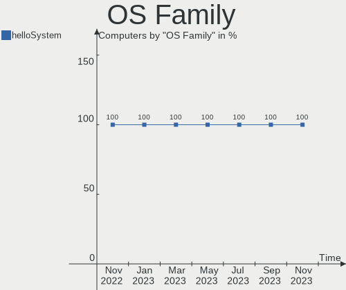
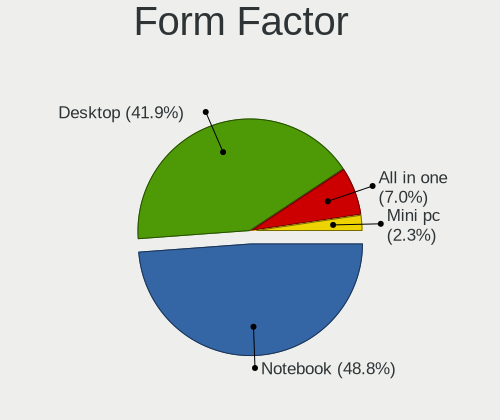
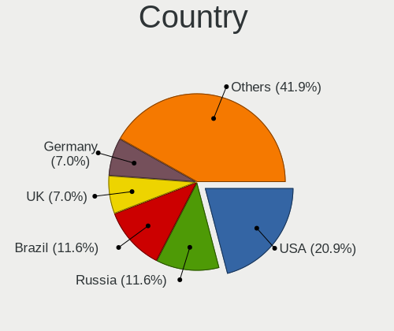
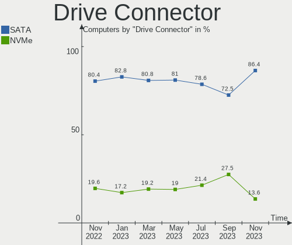
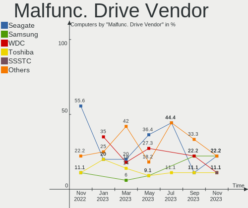
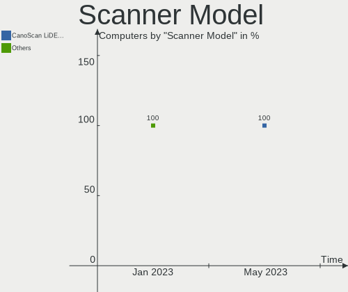

helloSystem - Hardware Trends
-----------------------------

A project to identify most popular hardware characteristics and track their change
over time based on data collected by BSD users at https://BSD-Hardware.info.

Anyone can contribute to this report by the [hw-probe](https://github.com/linuxhw/hw-probe/blob/master/INSTALL.BSD.md) tool:

    hw-probe -all -upload

This is a report for all computer types. See also reports for [desktops](/Dist/helloSystem/Desktop/README.md) and [notebooks](/Dist/helloSystem/Notebook/README.md).

This report is for one last month. Overall report since the beginning of time: [TestDays](https://github.com/bsdhw/TestDays)

Period: May, 2023.

Contents
--------

* [ System ](#system)
  - [ OS                       ](#os)
  - [ OS Family                ](#os-family)
  - [ Arch                     ](#arch)
  - [ DE                       ](#de)
  - [ Display Server           ](#display-server)
  - [ Display Manager          ](#display-manager)
  - [ OS Lang                  ](#os-lang)
  - [ Boot Mode                ](#boot-mode)
  - [ Filesystem               ](#filesystem)
  - [ Part. scheme             ](#part-scheme)

* [ Board ](#board)
  - [ Vendor                   ](#vendor)
  - [ Model                    ](#model)
  - [ Model Family             ](#model-family)
  - [ MFG Year                 ](#mfg-year)
  - [ Form Factor              ](#form-factor)
  - [ Coreboot                 ](#coreboot)
  - [ RAM Size                 ](#ram-size)
  - [ RAM Used                 ](#ram-used)
  - [ Total Drives             ](#total-drives)
  - [ Has CD-ROM               ](#has-cd-rom)
  - [ Has Ethernet             ](#has-ethernet)
  - [ Has WiFi                 ](#has-wifi)
  - [ Has Bluetooth            ](#has-bluetooth)

* [ Location ](#location)
  - [ Country                  ](#country)
  - [ City                     ](#city)

* [ Drives ](#drives)
  - [ Drive Vendor             ](#drive-vendor)
  - [ Drive Model              ](#drive-model)
  - [ HDD Vendor               ](#hdd-vendor)
  - [ SSD Vendor               ](#ssd-vendor)
  - [ Drive Kind               ](#drive-kind)
  - [ Drive Connector          ](#drive-connector)
  - [ Drive Size               ](#drive-size)
  - [ Space Total              ](#space-total)
  - [ Space Used               ](#space-used)
  - [ Malfunc. Drives          ](#malfunc-drives)
  - [ Malfunc. Drive Vendor    ](#malfunc-drive-vendor)
  - [ Malfunc. HDD Vendor      ](#malfunc-hdd-vendor)
  - [ Malfunc. Drive Kind      ](#malfunc-drive-kind)
  - [ Failed Drives            ](#failed-drives)
  - [ Failed Drive Vendor      ](#failed-drive-vendor)
  - [ Drive Status             ](#drive-status)

* [ Storage controller ](#storage-controller)
  - [ Storage Vendor           ](#storage-vendor)
  - [ Storage Model            ](#storage-model)
  - [ Storage Kind             ](#storage-kind)

* [ Processor ](#processor)
  - [ CPU Vendor               ](#cpu-vendor)
  - [ CPU Model                ](#cpu-model)
  - [ CPU Model Family         ](#cpu-model-family)
  - [ CPU Cores                ](#cpu-cores)
  - [ CPU Sockets              ](#cpu-sockets)
  - [ CPU Threads              ](#cpu-threads)
  - [ CPU Microarch            ](#cpu-microarch)

* [ Graphics ](#graphics)
  - [ GPU Vendor               ](#gpu-vendor)
  - [ GPU Model                ](#gpu-model)
  - [ GPU Combo                ](#gpu-combo)
  - [ GPU Driver               ](#gpu-driver)
  - [ GPU Memory               ](#gpu-memory)

* [ Monitor ](#monitor)
  - [ Monitor Vendor           ](#monitor-vendor)
  - [ Monitor Model            ](#monitor-model)
  - [ Monitor Resolution       ](#monitor-resolution)
  - [ Monitor Diagonal         ](#monitor-diagonal)
  - [ Monitor Width            ](#monitor-width)
  - [ Aspect Ratio             ](#aspect-ratio)
  - [ Monitor Area             ](#monitor-area)
  - [ Pixel Density            ](#pixel-density)
  - [ Multiple Monitors        ](#multiple-monitors)

* [ Network ](#network)
  - [ Net Controller Vendor    ](#net-controller-vendor)
  - [ Net Controller Model     ](#net-controller-model)
  - [ Wireless Vendor          ](#wireless-vendor)
  - [ Wireless Model           ](#wireless-model)
  - [ Ethernet Vendor          ](#ethernet-vendor)
  - [ Ethernet Model           ](#ethernet-model)
  - [ Net Controller Kind      ](#net-controller-kind)
  - [ Used Controller          ](#used-controller)
  - [ NICs                     ](#nics)
  - [ IPv6                     ](#ipv6)

* [ Bluetooth ](#bluetooth)
  - [ Bluetooth Vendor         ](#bluetooth-vendor)
  - [ Bluetooth Model          ](#bluetooth-model)

* [ Sound ](#sound)
  - [ Sound Vendor             ](#sound-vendor)
  - [ Sound Model              ](#sound-model)

* [ Memory ](#memory)
  - [ Memory Vendor            ](#memory-vendor)
  - [ Memory Model             ](#memory-model)
  - [ Memory Kind              ](#memory-kind)
  - [ Memory Form Factor       ](#memory-form-factor)
  - [ Memory Size              ](#memory-size)
  - [ Memory Speed             ](#memory-speed)

* [ Printers & scanners ](#printers--scanners)
  - [ Printer Vendor           ](#printer-vendor)
  - [ Printer Model            ](#printer-model)
  - [ Scanner Vendor           ](#scanner-vendor)
  - [ Scanner Model            ](#scanner-model)

* [ Camera ](#camera)
  - [ Camera Vendor            ](#camera-vendor)
  - [ Camera Model             ](#camera-model)

* [ Security ](#security)
  - [ Fingerprint Vendor       ](#fingerprint-vendor)
  - [ Fingerprint Model        ](#fingerprint-model)
  - [ Chipcard Vendor          ](#chipcard-vendor)
  - [ Chipcard Model           ](#chipcard-model)

* [ Unsupported ](#unsupported)
  - [ Unsupported Devices      ](#unsupported-devices)
  - [ Unsupported Device Types ](#unsupported-device-types)

System
------

OS
--

Installed operating systems

| Name              | Computers | Percent |
|-------------------|-----------|---------|
| helloSystem 0.8.1 | 38        | 71.7%   |
| helloSystem 0.8.2 | 11        | 20.75%  |
| helloSystem 0.8.0 | 3         | 5.66%   |
| helloSystem 0.6.0 | 1         | 1.89%   |

OS Family
---------

OS without a version

| Name        | Computers | Percent |
|-------------|-----------|---------|
| helloSystem | 53        | 100%    |

Arch
----

OS architecture (x86_64, i586, etc.)

| Name  | Computers | Percent |
|-------|-----------|---------|
| amd64 | 53        | 100%    |

DE
--

Desktop Environment

| Name         | Computers | Percent |
|--------------|-----------|---------|
| helloDesktop | 53        | 100%    |

Display Server
--------------

X11 or Wayland

| Name | Computers | Percent |
|------|-----------|---------|
| X11  | 53        | 100%    |

Display Manager
---------------

SDDM, LightDM, etc.

| Name | Computers | Percent |
|------|-----------|---------|
| SLiM | 52        | 98.11%  |
| SDDM | 1         | 1.89%   |

OS Lang
-------

Language

| Lang    | Computers | Percent |
|---------|-----------|---------|
| en_US   | 29        | 54.72%  |
| fr_FR   | 9         | 16.98%  |
| ru_RU   | 5         | 9.43%   |
| de_DE   | 3         | 5.66%   |
| es_ES   | 2         | 3.77%   |
| en      | 2         | 3.77%   |
| pt_BR   | 1         | 1.89%   |
| fr      | 1         | 1.89%   |
| Unknown | 1         | 1.89%   |

Boot Mode
---------

EFI or BIOS

| Mode | Computers | Percent |
|------|-----------|---------|
| EFI  | 51        | 96.23%  |
| BIOS | 2         | 3.77%   |

Filesystem
----------

Type of filesystem

| Type   | Computers | Percent |
|--------|-----------|---------|
| Zfs    | 30        | 56.6%   |
| Cd9660 | 23        | 43.4%   |

Part. scheme
------------

Scheme of partitioning

| Type | Computers | Percent |
|------|-----------|---------|
| GPT  | 51        | 96.23%  |
| MBR  | 2         | 3.77%   |

Board
-----

Vendor
------

Motherboard manufacturer

| Name                | Computers | Percent |
|---------------------|-----------|---------|
| ASUSTek Computer    | 8         | 15.09%  |
| Hewlett-Packard     | 7         | 13.21%  |
| Gigabyte Technology | 6         | 11.32%  |
| Dell                | 5         | 9.43%   |
| Lenovo              | 4         | 7.55%   |
| Intel               | 4         | 7.55%   |
| ASRock              | 4         | 7.55%   |
| Apple               | 3         | 5.66%   |
| Sony                | 2         | 3.77%   |
| AZW                 | 2         | 3.77%   |
| TUXEDO              | 1         | 1.89%   |
| Timi                | 1         | 1.89%   |
| Packard Bell        | 1         | 1.89%   |
| Microsoft           | 1         | 1.89%   |
| Google              | 1         | 1.89%   |
| Fujitsu             | 1         | 1.89%   |
| Acer                | 1         | 1.89%   |
| Unknown             | 1         | 1.89%   |

Model
-----

Motherboard model

| Name                             | Computers | Percent |
|----------------------------------|-----------|---------|
| ASUS ROG STRIX B550-F GAMING     | 2         | 3.77%   |
| Unknown                          | 2         | 3.77%   |
| TUXEDO Aura 15 Gen1              | 1         | 1.89%   |
| Timi TM1701                      | 1         | 1.89%   |
| Sony VPCEG15FB                   | 1         | 1.89%   |
| Sony SVF14A15CBB                 | 1         | 1.89%   |
| Packard Bell EasyNote LJ65       | 1         | 1.89%   |
| Microsoft Surface Pro 7          | 1         | 1.89%   |
| Lenovo Yoga 2 Pro 20266          | 1         | 1.89%   |
| Lenovo ThinkPad L450 20DSS1S402  | 1         | 1.89%   |
| Lenovo Flex 2-15 20405           | 1         | 1.89%   |
| Lenovo B570e HuronRiver Platform | 1         | 1.89%   |
| Intel NUC6i5SYB H81131-503       | 1         | 1.89%   |
| Intel H81                        | 1         | 1.89%   |
| Intel DH87RL AAG74240-400        | 1         | 1.89%   |
| Intel 945GCT-M                   | 1         | 1.89%   |
| HP ZBook 15 G3                   | 1         | 1.89%   |
| HP x360 310 G2 PC                | 1         | 1.89%   |
| HP ProDesk 600 G3 SFF            | 1         | 1.89%   |
| HP ProDesk 600 G1 DM             | 1         | 1.89%   |
| HP Pavilion Notebook             | 1         | 1.89%   |
| HP Laptop 14-bs0xx               | 1         | 1.89%   |
| HP Compaq Presario CQ50          | 1         | 1.89%   |
| Google Sentry                    | 1         | 1.89%   |
| Gigabyte Z490 VISION G           | 1         | 1.89%   |
| Gigabyte X58A-UD3R               | 1         | 1.89%   |
| Gigabyte GA-MA790X-UD4           | 1         | 1.89%   |
| Gigabyte GA-78LMT-USB3           | 1         | 1.89%   |
| Gigabyte B360M-D2V               | 1         | 1.89%   |
| Gigabyte A520M S2H               | 1         | 1.89%   |
| Dell Precision T5610             | 1         | 1.89%   |
| Dell OptiPlex 9020               | 1         | 1.89%   |
| Dell OptiPlex 5040               | 1         | 1.89%   |
| Dell Inspiron 3910               | 1         | 1.89%   |
| Dell Inspiron 3268               | 1         | 1.89%   |
| AZW SER                          | 1         | 1.89%   |
| AZW GK55                         | 1         | 1.89%   |
| ASUS PRIME H510M-K               | 1         | 1.89%   |
| ASUS PRIME B450M-K II            | 1         | 1.89%   |
| ASUS PRIME A520M-K               | 1         | 1.89%   |

Model Family
------------

Motherboard model prefix

| Name                   | Computers | Percent |
|------------------------|-----------|---------|
| ASUS PRIME             | 3         | 5.66%   |
| HP ProDesk             | 2         | 3.77%   |
| Dell OptiPlex          | 2         | 3.77%   |
| Dell Inspiron          | 2         | 3.77%   |
| ASUS ROG               | 2         | 3.77%   |
| Apple MacBookPro10     | 2         | 3.77%   |
| Unknown                | 2         | 3.77%   |
| TUXEDO Aura            | 1         | 1.89%   |
| Timi TM1701            | 1         | 1.89%   |
| Sony VPCEG15FB         | 1         | 1.89%   |
| Sony SVF14A15CBB       | 1         | 1.89%   |
| Packard Bell EasyNote  | 1         | 1.89%   |
| Microsoft Surface      | 1         | 1.89%   |
| Lenovo Yoga            | 1         | 1.89%   |
| Lenovo ThinkPad        | 1         | 1.89%   |
| Lenovo Flex            | 1         | 1.89%   |
| Lenovo B570e           | 1         | 1.89%   |
| Intel NUC6i5SYB        | 1         | 1.89%   |
| Intel H81              | 1         | 1.89%   |
| Intel DH87RL           | 1         | 1.89%   |
| Intel 945GCT-M         | 1         | 1.89%   |
| HP ZBook               | 1         | 1.89%   |
| HP x360                | 1         | 1.89%   |
| HP Pavilion            | 1         | 1.89%   |
| HP Laptop              | 1         | 1.89%   |
| HP Compaq              | 1         | 1.89%   |
| Google Sentry          | 1         | 1.89%   |
| Gigabyte Z490          | 1         | 1.89%   |
| Gigabyte X58A-UD3R     | 1         | 1.89%   |
| Gigabyte GA-MA790X-UD4 | 1         | 1.89%   |
| Gigabyte GA-78LMT-USB3 | 1         | 1.89%   |
| Gigabyte B360M-D2V     | 1         | 1.89%   |
| Gigabyte A520M         | 1         | 1.89%   |
| Dell Precision         | 1         | 1.89%   |
| AZW SER                | 1         | 1.89%   |
| AZW GK55               | 1         | 1.89%   |
| ASUS K42Jc             | 1         | 1.89%   |
| ASUS All               | 1         | 1.89%   |
| ASUS A0000001          | 1         | 1.89%   |
| ASRock Z68             | 1         | 1.89%   |

MFG Year
--------

Motherboard manufacture year

| Year | Computers | Percent |
|------|-----------|---------|
| 2020 | 11        | 20.75%  |
| 2022 | 5         | 9.43%   |
| 2017 | 5         | 9.43%   |
| 2021 | 4         | 7.55%   |
| 2014 | 4         | 7.55%   |
| 2013 | 4         | 7.55%   |
| 2012 | 4         | 7.55%   |
| 2019 | 3         | 5.66%   |
| 2018 | 3         | 5.66%   |
| 2010 | 3         | 5.66%   |
| 2008 | 3         | 5.66%   |
| 2011 | 2         | 3.77%   |
| 2023 | 1         | 1.89%   |
| 2015 | 1         | 1.89%   |

Form Factor
-----------

Physical design of the computer

| Name        | Computers | Percent |
|-------------|-----------|---------|
| Desktop     | 29        | 54.72%  |
| Notebook    | 20        | 37.74%  |
| Mini pc     | 2         | 3.77%   |
| Tablet      | 1         | 1.89%   |
| Convertible | 1         | 1.89%   |

Coreboot
--------

Have coreboot on board

| Used | Computers | Percent |
|------|-----------|---------|
| No   | 52        | 98.11%  |
| Yes  | 1         | 1.89%   |

RAM Size
--------

Total RAM memory

| Size in GB  | Computers | Percent |
|-------------|-----------|---------|
| 8.01-16.0   | 22        | 41.51%  |
| 16.01-24.0  | 17        | 32.08%  |
| 4.01-8.0    | 9         | 16.98%  |
| 32.01-64.0  | 3         | 5.66%   |
| 2.01-3.0    | 1         | 1.89%   |
| 64.01-256.0 | 1         | 1.89%   |

RAM Used
--------

Used RAM memory

| Used GB  | Computers | Percent |
|----------|-----------|---------|
| 0.01-0.5 | 27        | 50.94%  |
| 0.51-1.0 | 16        | 30.19%  |
| 2.01-3.0 | 4         | 7.55%   |
| 1.01-2.0 | 4         | 7.55%   |
| 3.01-4.0 | 2         | 3.77%   |

Total Drives
------------

Number of drives on board

| Drives | Computers | Percent |
|--------|-----------|---------|
| 1      | 35        | 66.04%  |
| 2      | 11        | 20.75%  |
| 3      | 6         | 11.32%  |
| 0      | 1         | 1.89%   |

Has CD-ROM
----------

Has CD-ROM on board

| Presented | Computers | Percent |
|-----------|-----------|---------|
| No        | 35        | 66.04%  |
| Yes       | 18        | 33.96%  |

Has Ethernet
------------

Has Ethernet on board

| Presented | Computers | Percent |
|-----------|-----------|---------|
| Yes       | 49        | 92.45%  |
| No        | 4         | 7.55%   |

Has WiFi
--------

Has WiFi module

| Presented | Computers | Percent |
|-----------|-----------|---------|
| Yes       | 33        | 62.26%  |
| No        | 20        | 37.74%  |

Has Bluetooth
-------------

Has Bluetooth module

| Presented | Computers | Percent |
|-----------|-----------|---------|
| No        | 27        | 50.94%  |
| Yes       | 26        | 49.06%  |

Location
--------

Country
-------

Geographic location (country)

| Country     | Computers | Percent |
|-------------|-----------|---------|
| USA         | 10        | 18.87%  |
| Russia      | 7         | 13.21%  |
| Germany     | 4         | 7.55%   |
| UK          | 3         | 5.66%   |
| Poland      | 3         | 5.66%   |
| Brazil      | 3         | 5.66%   |
| Belgium     | 3         | 5.66%   |
| Indonesia   | 2         | 3.77%   |
| Australia   | 2         | 3.77%   |
| Turkey      | 1         | 1.89%   |
| Thailand    | 1         | 1.89%   |
| Switzerland | 1         | 1.89%   |
| Sweden      | 1         | 1.89%   |
| Spain       | 1         | 1.89%   |
| South Korea | 1         | 1.89%   |
| Slovenia    | 1         | 1.89%   |
| Romania     | 1         | 1.89%   |
| Netherlands | 1         | 1.89%   |
| Mexico      | 1         | 1.89%   |
| Kazakhstan  | 1         | 1.89%   |
| Italy       | 1         | 1.89%   |
| Hungary     | 1         | 1.89%   |
| France      | 1         | 1.89%   |
| Croatia     | 1         | 1.89%   |
| Argentina   | 1         | 1.89%   |

City
----

Geographic location (city)

| City                  | Computers | Percent |
|-----------------------|-----------|---------|
| Sydney                | 2         | 3.77%   |
| Moscow                | 2         | 3.77%   |
| Zurich                | 1         | 1.89%   |
| Zagreb                | 1         | 1.89%   |
| Warsaw                | 1         | 1.89%   |
| Ulyanovsk             | 1         | 1.89%   |
| Tucson                | 1         | 1.89%   |
| Tolmin                | 1         | 1.89%   |
| Stevenage             | 1         | 1.89%   |
| Spartanburg           | 1         | 1.89%   |
| Siheung-si            | 1         | 1.89%   |
| Schoten               | 1         | 1.89%   |
| Saratov               | 1         | 1.89%   |
| Sao Jose do Rio Preto | 1         | 1.89%   |
| Rosario               | 1         | 1.89%   |
| Rhinelander           | 1         | 1.89%   |
| Petropavl             | 1         | 1.89%   |
| Patrocinio            | 1         | 1.89%   |
| Palmas                | 1         | 1.89%   |
| Nampa                 | 1         | 1.89%   |
| Mytishchi             | 1         | 1.89%   |
| Moers                 | 1         | 1.89%   |
| Krakow                | 1         | 1.89%   |
| Karlskrona            | 1         | 1.89%   |
| Jefferson City        | 1         | 1.89%   |
| Jakarta               | 1         | 1.89%   |
| Irkutsk               | 1         | 1.89%   |
| Indramayu             | 1         | 1.89%   |
| Independence          | 1         | 1.89%   |
| Houston               | 1         | 1.89%   |
| Herten                | 1         | 1.89%   |
| Headland              | 1         | 1.89%   |
| Guadalupe             | 1         | 1.89%   |
| Gmina Sierakowice     | 1         | 1.89%   |
| Glasgow               | 1         | 1.89%   |
| Genoa                 | 1         | 1.89%   |
| Elim                  | 1         | 1.89%   |
| Dundee                | 1         | 1.89%   |
| Dresden               | 1         | 1.89%   |
| Dothan                | 1         | 1.89%   |

Drives
------

Drive Vendor
------------

Hard drive vendors

| Vendor              | Computers | Drives | Percent |
|---------------------|-----------|--------|---------|
| Samsung Electronics | 12        | 17     | 17.14%  |
| WDC                 | 11        | 11     | 15.71%  |
| Toshiba             | 9         | 9      | 12.86%  |
| Seagate             | 9         | 9      | 12.86%  |
| SanDisk             | 3         | 3      | 4.29%   |
| Crucial             | 3         | 3      | 4.29%   |
| Kingston            | 2         | 2      | 2.86%   |
| Intel               | 2         | 2      | 2.86%   |
| HGST                | 2         | 3      | 2.86%   |
| China               | 2         | 2      | 2.86%   |
| Apple               | 2         | 2      | 2.86%   |
| Vaseky              | 1         | 1      | 1.43%   |
| SK hynix            | 1         | 1      | 1.43%   |
| Philips             | 1         | 1      | 1.43%   |
| Patriot             | 1         | 1      | 1.43%   |
| Netac               | 1         | 1      | 1.43%   |
| MSI                 | 1         | 1      | 1.43%   |
| Micron Technology   | 1         | 1      | 1.43%   |
| LITEONIT            | 1         | 1      | 1.43%   |
| Kingmax             | 1         | 1      | 1.43%   |
| Hitachi             | 1         | 1      | 1.43%   |
| Goldenfir           | 1         | 1      | 1.43%   |
| Biostar             | 1         | 1      | 1.43%   |
| A-DATA Technology   | 1         | 1      | 1.43%   |

Drive Model
-----------

Hard drive models

| Model                           | Computers | Percent |
|---------------------------------|-----------|---------|
| Toshiba HDWD110 1TB             | 2         | 2.63%   |
| Samsung SSD 860 EVO 500GB       | 2         | 2.63%   |
| WDC WDS100T1R0A-68A4W0 1TB      | 1         | 1.32%   |
| WDC WD5000LPVX-75V0TT0 500GB    | 1         | 1.32%   |
| WDC WD5000LPCX-60VHAT0 500GB    | 1         | 1.32%   |
| WDC WD5000AAKX-00U6AA0 500GB    | 1         | 1.32%   |
| WDC WD5000AAKX-00ERMA0 500GB    | 1         | 1.32%   |
| WDC WD5000AAKS-00UU3A0 500GB    | 1         | 1.32%   |
| WDC WD2500AAJS-00VTA0 250GB     | 1         | 1.32%   |
| WDC WD1600YS-01SHB1 164GB       | 1         | 1.32%   |
| WDC WD1600BEVT-60ZCT0 160GB     | 1         | 1.32%   |
| WDC WD10EZRZ-00HTKB0 1TB        | 1         | 1.32%   |
| WDC WD10EZEX-00WN4A0 1TB        | 1         | 1.32%   |
| Vaseky V800-350G                | 1         | 1.32%   |
| Toshiba Q300 Pro 256GB          | 1         | 1.32%   |
| Toshiba MQ04ABF100 1TB          | 1         | 1.32%   |
| Toshiba MQ01ABD050 500GB        | 1         | 1.32%   |
| Toshiba MK8034GSX 80GB          | 1         | 1.32%   |
| Toshiba MK5059GSXP 500GB        | 1         | 1.32%   |
| Toshiba MK3261GSYN 320GB        | 1         | 1.32%   |
| Toshiba DT01ACA100 1TB          | 1         | 1.32%   |
| SK hynix HFB1M8MO331C0MR 256GB  | 1         | 1.32%   |
| Seagate ST9160314AS 160GB       | 1         | 1.32%   |
| Seagate ST500LM021-1KJ152 500GB | 1         | 1.32%   |
| Seagate ST500LM000-SSHD-8GB     | 1         | 1.32%   |
| Seagate ST500DM009-2F110A 500GB | 1         | 1.32%   |
| Seagate ST500DM002-1BD142 500GB | 1         | 1.32%   |
| Seagate ST3250310AS 250GB       | 1         | 1.32%   |
| Seagate ST320LT020-9YG142 320GB | 1         | 1.32%   |
| Seagate ST1000LM035-1RK172 1TB  | 1         | 1.32%   |
| Seagate ST1000LM010-9YH146 1TB  | 1         | 1.32%   |
| SanDisk X400 M.2 2280 128GB     | 1         | 1.32%   |
| SanDisk SSD PLUS 480GB          | 1         | 1.32%   |
| SanDisk SD7SN6S-128G-1006 128GB | 1         | 1.32%   |
| Samsung SSD 980 PRO 1TB         | 1         | 1.32%   |
| Samsung SSD 980 1TB             | 1         | 1.32%   |
| Samsung SSD 970 EVO Plus 2TB    | 1         | 1.32%   |
| Samsung SSD 870 EVO 500GB       | 1         | 1.32%   |
| Samsung SSD 860 EVO 1TB         | 1         | 1.32%   |
| Samsung SSD 850 EVO 250GB       | 1         | 1.32%   |

HDD Vendor
----------

Hard disk drive vendors

| Vendor              | Computers | Drives | Percent |
|---------------------|-----------|--------|---------|
| WDC                 | 10        | 10     | 31.25%  |
| Seagate             | 9         | 9      | 28.13%  |
| Toshiba             | 8         | 8      | 25%     |
| Samsung Electronics | 2         | 4      | 6.25%   |
| HGST                | 2         | 3      | 6.25%   |
| Hitachi             | 1         | 1      | 3.13%   |

SSD Vendor
----------

Solid state drive vendors

| Vendor              | Computers | Drives | Percent |
|---------------------|-----------|--------|---------|
| Samsung Electronics | 7         | 8      | 24.14%  |
| SanDisk             | 3         | 3      | 10.34%  |
| Kingston            | 2         | 2      | 6.9%    |
| Crucial             | 2         | 2      | 6.9%    |
| China               | 2         | 2      | 6.9%    |
| Apple               | 2         | 2      | 6.9%    |
| WDC                 | 1         | 1      | 3.45%   |
| Vaseky              | 1         | 1      | 3.45%   |
| Toshiba             | 1         | 1      | 3.45%   |
| Philips             | 1         | 1      | 3.45%   |
| Patriot             | 1         | 1      | 3.45%   |
| MSI                 | 1         | 1      | 3.45%   |
| LITEONIT            | 1         | 1      | 3.45%   |
| Kingmax             | 1         | 1      | 3.45%   |
| Intel               | 1         | 1      | 3.45%   |
| Goldenfir           | 1         | 1      | 3.45%   |
| Biostar             | 1         | 1      | 3.45%   |

Drive Kind
----------

HDD or SSD

| Kind | Computers | Drives | Percent |
|------|-----------|--------|---------|
| HDD  | 28        | 35     | 43.75%  |
| SSD  | 25        | 30     | 39.06%  |
| NVMe | 11        | 11     | 17.19%  |

Drive Connector
---------------

SATA, SAS, NVMe, etc.

| Type | Computers | Drives | Percent |
|------|-----------|--------|---------|
| SATA | 47        | 65     | 81.03%  |
| NVMe | 11        | 11     | 18.97%  |

Drive Size
----------

Size of hard drive

| Size in TB | Computers | Drives | Percent |
|------------|-----------|--------|---------|
| 0.01-0.5   | 41        | 54     | 78.85%  |
| 0.51-1.0   | 11        | 11     | 21.15%  |

Space Total
-----------

Amount of disk space available on the file system

| Size in GB | Computers | Percent |
|------------|-----------|---------|
| 1-20       | 24        | 45.28%  |
| 251-500    | 9         | 16.98%  |
| 101-250    | 8         | 15.09%  |
| 51-100     | 7         | 13.21%  |
| 501-1000   | 4         | 7.55%   |
| 21-50      | 1         | 1.89%   |

Space Used
----------

Amount of used disk space

| Used GB | Computers | Percent |
|---------|-----------|---------|
| 1-20    | 53        | 100%    |

Malfunc. Drives
---------------

Drive models with a malfunction

| Model                             | Computers | Drives | Percent |
|-----------------------------------|-----------|--------|---------|
| WDC WD5000AAKX-00ERMA0 500GB      | 1         | 1      | 9.09%   |
| WDC WD1600YS-01SHB1 164GB         | 1         | 1      | 9.09%   |
| WDC WD10EZRZ-00HTKB0 1TB          | 1         | 1      | 9.09%   |
| Toshiba MK5059GSXP 500GB          | 1         | 1      | 9.09%   |
| Seagate ST9160314AS 160GB         | 1         | 1      | 9.09%   |
| Seagate ST500LM000-SSHD-8GB       | 1         | 1      | 9.09%   |
| Seagate ST320LT020-9YG142 320GB   | 1         | 1      | 9.09%   |
| Seagate ST1000LM010-9YH146 1TB    | 1         | 1      | 9.09%   |
| Samsung Electronics HM321HI 320GB | 1         | 1      | 9.09%   |
| HGST HTS545050A7E680 500GB        | 1         | 1      | 9.09%   |
| HGST HTS541010A9E680 1TB          | 1         | 1      | 9.09%   |

Malfunc. Drive Vendor
---------------------

Vendors of faulty drives

| Vendor              | Computers | Drives | Percent |
|---------------------|-----------|--------|---------|
| Seagate             | 4         | 4      | 36.36%  |
| WDC                 | 3         | 3      | 27.27%  |
| HGST                | 2         | 2      | 18.18%  |
| Toshiba             | 1         | 1      | 9.09%   |
| Samsung Electronics | 1         | 1      | 9.09%   |

Malfunc. HDD Vendor
-------------------

Vendors of faulty HDD drives

| Vendor              | Computers | Drives | Percent |
|---------------------|-----------|--------|---------|
| Seagate             | 4         | 4      | 36.36%  |
| WDC                 | 3         | 3      | 27.27%  |
| HGST                | 2         | 2      | 18.18%  |
| Toshiba             | 1         | 1      | 9.09%   |
| Samsung Electronics | 1         | 1      | 9.09%   |

Malfunc. Drive Kind
-------------------

Kinds of faulty drives

| Kind | Computers | Drives | Percent |
|------|-----------|--------|---------|
| HDD  | 10        | 11     | 100%    |

Failed Drives
-------------

Failed drive models

| Model                             | Computers | Drives | Percent |
|-----------------------------------|-----------|--------|---------|
| Samsung Electronics HM500JJ 500GB | 1         | 1      | 100%    |

Failed Drive Vendor
-------------------

Failed drive vendors

| Vendor              | Computers | Drives | Percent |
|---------------------|-----------|--------|---------|
| Samsung Electronics | 1         | 1      | 100%    |

Drive Status
------------

Number of failed and malfunc. drives

| Status   | Computers | Drives | Percent |
|----------|-----------|--------|---------|
| Works    | 42        | 58     | 73.68%  |
| Malfunc  | 10        | 11     | 17.54%  |
| Detected | 4         | 6      | 7.02%   |
| Failed   | 1         | 1      | 1.75%   |

Storage controller
------------------

Storage Vendor
--------------

Storage controller vendors

| Vendor                    | Computers | Percent |
|---------------------------|-----------|---------|
| Intel                     | 39        | 60.94%  |
| AMD                       | 9         | 14.06%  |
| Samsung Electronics       | 5         | 7.81%   |
| SK hynix                  | 1         | 1.56%   |
| Silicon Motion            | 1         | 1.56%   |
| SanDisk                   | 1         | 1.56%   |
| OCZ Technology Group      | 1         | 1.56%   |
| Nvidia                    | 1         | 1.56%   |
| Micron/Crucial Technology | 1         | 1.56%   |
| Micron Technology         | 1         | 1.56%   |
| Marvell Technology Group  | 1         | 1.56%   |
| JMicron Technology        | 1         | 1.56%   |
| ASMedia Technology        | 1         | 1.56%   |
| ADATA Technology          | 1         | 1.56%   |

Storage Model
-------------

Storage controller models

| Model                                                                            | Computers | Percent |
|----------------------------------------------------------------------------------|-----------|---------|
| Intel 8 Series/C220 Series Chipset Family 6-port SATA Controller 1 [AHCI mode]   | 4         | 5.63%   |
| Intel 7 Series Chipset Family 6-port SATA Controller [AHCI mode]                 | 4         | 5.63%   |
| AMD 500 Series Chipset SATA Controller                                           | 4         | 5.63%   |
| Intel 6 Series/C200 Series Chipset Family 6 port Mobile SATA AHCI Controller     | 3         | 4.23%   |
| AMD FCH SATA Controller [AHCI mode]                                              | 3         | 4.23%   |
| Samsung NVMe SSD Controller SM981/PM981/PM983                                    | 2         | 2.82%   |
| Intel SATA Controller [RAID mode]                                                | 2         | 2.82%   |
| Intel Q170/Q150/B150/H170/H110/Z170/CM236 Chipset SATA Controller [AHCI Mode]    | 2         | 2.82%   |
| Intel Celeron/Pentium Silver Processor SATA Controller                           | 2         | 2.82%   |
| Intel Atom/Celeron/Pentium Processor x5-E8000/J3xxx/N3xxx Series SATA Controller | 2         | 2.82%   |
| Intel 82801IBM/IEM (ICH9M/ICH9M-E) 4 port SATA Controller [AHCI mode]            | 2         | 2.82%   |
| Intel 8 Series SATA Controller 1 [AHCI mode]                                     | 2         | 2.82%   |
| AMD SB7x0/SB8x0/SB9x0 SATA Controller [IDE mode]                                 | 2         | 2.82%   |
| AMD SB7x0/SB8x0/SB9x0 IDE Controller                                             | 2         | 2.82%   |
| SK hynix BC501 NVMe Solid State Drive                                            | 1         | 1.41%   |
| Silicon Motion SM2263EN/SM2263XT SSD Controller                                  | 1         | 1.41%   |
| SanDisk WD Black SN750 / PC SN730 NVMe SSD                                       | 1         | 1.41%   |
| Samsung NVMe SSD Controller SM951/PM951                                          | 1         | 1.41%   |
| Samsung NVMe SSD Controller PM9A1/PM9A3/980PRO                                   | 1         | 1.41%   |
| Samsung NVMe SSD Controller 980                                                  | 1         | 1.41%   |
| OCZ Group RevoDrive 3 X2 PCI-Express SSD 240 GB (Marvell Controller)             | 1         | 1.41%   |
| Nvidia MCP79 AHCI Controller                                                     | 1         | 1.41%   |
| Micron/Crucial P1 NVMe PCIe SSD                                                  | 1         | 1.41%   |
| Micron NVMe Storage Controller                                                   | 1         | 1.41%   |
| Marvell Group 88SE9128 PCIe SATA 6 Gb/s RAID controller                          | 1         | 1.41%   |
| JMicron JMB363 SATA/IDE Controller                                               | 1         | 1.41%   |
| Intel Wildcat Point-LP SATA Controller [AHCI Mode]                               | 1         | 1.41%   |
| Intel Volume Management Device NVMe RAID Controller                              | 1         | 1.41%   |
| Intel Sunrise Point-LP SATA Controller [AHCI mode]                               | 1         | 1.41%   |
| Intel SSD Pro 7600p/760p/E 6100p Series                                          | 1         | 1.41%   |
| Intel NM10/ICH7 Family SATA Controller [IDE mode]                                | 1         | 1.41%   |
| Intel Comet Lake SATA AHCI Controller                                            | 1         | 1.41%   |
| Intel Celeron N3350/Pentium N4200/Atom E3900 Series SATA AHCI Controller         | 1         | 1.41%   |
| Intel Cannon Lake PCH SATA AHCI Controller                                       | 1         | 1.41%   |
| Intel C600/X79 series chipset 6-Port SATA AHCI Controller                        | 1         | 1.41%   |
| Intel Atom Processor E3800 Series SATA AHCI Controller                           | 1         | 1.41%   |
| Intel Alder Lake-S PCH SATA Controller [AHCI Mode]                               | 1         | 1.41%   |
| Intel 82801JI (ICH10 Family) SATA AHCI Controller                                | 1         | 1.41%   |
| Intel 82801G (ICH7 Family) IDE Controller                                        | 1         | 1.41%   |
| Intel 82801 Mobile SATA Controller [RAID mode]                                   | 1         | 1.41%   |

Storage Kind
------------

Kind of storage controller (IDE, SATA, NVMe, SAS, ...)

| Kind | Computers | Percent |
|------|-----------|---------|
| SATA | 43        | 68.25%  |
| NVMe | 12        | 19.05%  |
| RAID | 4         | 6.35%   |
| IDE  | 3         | 4.76%   |
| SCSI | 1         | 1.59%   |

Processor
---------

CPU Vendor
----------

Processor vendors

| Vendor | Computers | Percent |
|--------|-----------|---------|
| Intel  | 43        | 81.13%  |
| AMD    | 10        | 18.87%  |

CPU Model
---------

Processor models

| Model                                       | Computers | Percent |
|---------------------------------------------|-----------|---------|
| Intel Celeron J4125 CPU @ 2.00GHz           | 2         | 3.77%   |
| Intel Xeon CPU E5-2650 v2 @ 2.60GHz         | 1         | 1.89%   |
| Intel Xeon CPU E3-1241 v3 @ 3.50GHz         | 1         | 1.89%   |
| Intel Pentium Dual-Core CPU T4500 @ 2.30GHz | 1         | 1.89%   |
| Intel Pentium CPU G3240T @ 2.70GHz          | 1         | 1.89%   |
| Intel Genuine CPU 575 @ 2.00GHz             | 1         | 1.89%   |
| Intel Core i7-8550U CPU @ 1.80GHz           | 1         | 1.89%   |
| Intel Core i7-7700 CPU @ 3.60GHz            | 1         | 1.89%   |
| Intel Core i7-6820HQ CPU @ 2.70GHz          | 1         | 1.89%   |
| Intel Core i7-4770 CPU @ 3.40GHz            | 1         | 1.89%   |
| Intel Core i7-4510U CPU @ 2.00GHz           | 1         | 1.89%   |
| Intel Core i7-3615QM CPU @ 2.30GHz          | 1         | 1.89%   |
| Intel Core i7-1065G7 CPU @ 1.30GHz          | 1         | 1.89%   |
| Intel Core i7 CPU                           | 1         | 1.89%   |
| Intel Core i5-9400F CPU @ 2.90GHz           | 1         | 1.89%   |
| Intel Core i5-8300H CPU @ 2.30GHz           | 1         | 1.89%   |
| Intel Core i5-7400 CPU @ 3.00GHz            | 1         | 1.89%   |
| Intel Core i5-6500 CPU @ 3.20GHz            | 1         | 1.89%   |
| Intel Core i5-6260U CPU @ 1.80GHz           | 1         | 1.89%   |
| Intel Core i5-5200U CPU @ 2.20GHz           | 1         | 1.89%   |
| Intel Core i5-4670K CPU @ 3.40GHz           | 1         | 1.89%   |
| Intel Core i5-4670 CPU @ 3.40GHz            | 1         | 1.89%   |
| Intel Core i5-4210U CPU @ 1.70GHz           | 1         | 1.89%   |
| Intel Core i5-3337U CPU @ 1.80GHz           | 1         | 1.89%   |
| Intel Core i5-3210M CPU @ 2.50GHz           | 1         | 1.89%   |
| Intel Core i5-2520M CPU @ 2.50GHz           | 1         | 1.89%   |
| Intel Core i5-2410M CPU @ 2.30GHz           | 1         | 1.89%   |
| Intel Core i5-10600 CPU @ 3.30GHz           | 1         | 1.89%   |
| Intel Core i5-10500 CPU @ 3.10GHz           | 1         | 1.89%   |
| Intel Core i5 CPU M 460 @ 2.53GH            | 1         | 1.89%   |
| Intel Core i3-2310M CPU @ 2.10GHz           | 1         | 1.89%   |
| Intel Core i3-2100 CPU @ 3.10GHz            | 1         | 1.89%   |
| Intel Core i3-10100 CPU @ 3.60GHz           | 1         | 1.89%   |
| Intel Core 2 Duo CPU P7350 @ 2.00GHz        | 1         | 1.89%   |
| Intel Core 2 Duo CPU E7200 @ 2.53GHz        | 1         | 1.89%   |
| Intel Celeron CPU N3060 @ 1.60GHz           | 1         | 1.89%   |
| Intel Celeron CPU N3050 @ 1.60GHz           | 1         | 1.89%   |
| Intel Celeron CPU J3455 @ 1.50GHz           | 1         | 1.89%   |
| Intel Celeron CPU J1900 @ 1.99GHz           | 1         | 1.89%   |
| Intel Celeron CPU 3855U @ 1.60GHz           | 1         | 1.89%   |

CPU Model Family
----------------

Processor model prefix

| Model                   | Computers | Percent |
|-------------------------|-----------|---------|
| Intel Core i5           | 16        | 30.19%  |
| Intel Core i7           | 8         | 15.09%  |
| Intel Celeron           | 8         | 15.09%  |
| Intel Core i3           | 3         | 5.66%   |
| AMD Ryzen 7             | 3         | 5.66%   |
| AMD Ryzen 5             | 3         | 5.66%   |
| Intel Xeon              | 2         | 3.77%   |
| Intel Core 2 Duo        | 2         | 3.77%   |
| AMD Ryzen 3             | 2         | 3.77%   |
| Other                   | 1         | 1.89%   |
| Intel Pentium Dual-Core | 1         | 1.89%   |
| Intel Pentium           | 1         | 1.89%   |
| Intel Genuine           | 1         | 1.89%   |
| AMD Phenom II X4        | 1         | 1.89%   |
| AMD FX                  | 1         | 1.89%   |

CPU Cores
---------

Number of processor cores

| Number  | Computers | Percent |
|---------|-----------|---------|
| 4       | 20        | 37.74%  |
| 2       | 17        | 32.08%  |
| 8       | 4         | 7.55%   |
| 6       | 4         | 7.55%   |
| 16      | 3         | 5.66%   |
| 12      | 2         | 3.77%   |
| Unknown | 2         | 3.77%   |
| 1       | 1         | 1.89%   |

CPU Sockets
-----------

Number of sockets

| Number | Computers | Percent |
|--------|-----------|---------|
| 1      | 51        | 96.23%  |
| 2      | 2         | 3.77%   |

CPU Threads
-----------

Threads per core (Hyper-Threading)

| Number  | Computers | Percent |
|---------|-----------|---------|
| 2       | 25        | 47.17%  |
| 1       | 25        | 47.17%  |
| Unknown | 3         | 5.66%   |

CPU Microarch
-------------

Microarchitecture

| Name          | Computers | Percent |
|---------------|-----------|---------|
| Haswell       | 7         | 13.21%  |
| KabyLake      | 5         | 9.43%   |
| IvyBridge     | 5         | 9.43%   |
| Skylake       | 4         | 7.55%   |
| SandyBridge   | 4         | 7.55%   |
| Zen 3         | 3         | 5.66%   |
| Silvermont    | 3         | 5.66%   |
| Penryn        | 3         | 5.66%   |
| CometLake     | 3         | 5.66%   |
| Zen+          | 2         | 3.77%   |
| Zen 2         | 2         | 3.77%   |
| Goldmont plus | 2         | 3.77%   |
| Unknown       | 2         | 3.77%   |
| Westmere      | 1         | 1.89%   |
| Piledriver    | 1         | 1.89%   |
| Nehalem       | 1         | 1.89%   |
| K10           | 1         | 1.89%   |
| IceLake       | 1         | 1.89%   |
| Goldmont      | 1         | 1.89%   |
| Core          | 1         | 1.89%   |
| Broadwell     | 1         | 1.89%   |

Graphics
--------

GPU Vendor
----------

Vendors of graphics cards

| Vendor | Computers | Percent |
|--------|-----------|---------|
| Intel  | 32        | 50.79%  |
| Nvidia | 21        | 33.33%  |
| AMD    | 10        | 15.87%  |

GPU Model
---------

Graphics card models

| Model                                                                                    | Computers | Percent |
|------------------------------------------------------------------------------------------|-----------|---------|
| Intel 3rd Gen Core processor Graphics Controller                                         | 4         | 6.25%   |
| Intel 2nd Generation Core Processor Family Integrated Graphics Controller                | 4         | 6.25%   |
| Intel Xeon E3-1200 v3/4th Gen Core Processor Integrated Graphics Controller              | 3         | 4.69%   |
| AMD Lexa PRO [Radeon 540/540X/550/550X / RX 540X/550/550X]                               | 3         | 4.69%   |
| Intel HD Graphics 630                                                                    | 2         | 3.13%   |
| Intel HD Graphics 530                                                                    | 2         | 3.13%   |
| Intel Haswell-ULT Integrated Graphics Controller                                         | 2         | 3.13%   |
| Intel GeminiLake [UHD Graphics 600]                                                      | 2         | 3.13%   |
| Intel Atom/Celeron/Pentium Processor x5-E8000/J3xxx/N3xxx Integrated Graphics Controller | 2         | 3.13%   |
| AMD Renoir                                                                               | 2         | 3.13%   |
| AMD Picasso/Raven 2 [Radeon Vega Series / Radeon Vega Mobile Series]                     | 2         | 3.13%   |
| AMD Cezanne [Radeon Vega Series / Radeon Vega Mobile Series]                             | 2         | 3.13%   |
| Nvidia TU116 [GeForce GTX 1660]                                                          | 1         | 1.56%   |
| Nvidia TU116 [GeForce GTX 1650 SUPER]                                                    | 1         | 1.56%   |
| Nvidia GT218M [GeForce 310M]                                                             | 1         | 1.56%   |
| Nvidia GT216M [GeForce GT 240M]                                                          | 1         | 1.56%   |
| Nvidia GT200 [GeForce GTX 260]                                                           | 1         | 1.56%   |
| Nvidia GP108M [GeForce MX150]                                                            | 1         | 1.56%   |
| Nvidia GP108 [GeForce GT 1030]                                                           | 1         | 1.56%   |
| Nvidia GP107M [GeForce GTX 1050 Mobile]                                                  | 1         | 1.56%   |
| Nvidia GP107 [GeForce GTX 1050 Ti]                                                       | 1         | 1.56%   |
| Nvidia GM107GLM [Quadro M2000M]                                                          | 1         | 1.56%   |
| Nvidia GK208M [GeForce GT 735M]                                                          | 1         | 1.56%   |
| Nvidia GK208B [GeForce GT 730]                                                           | 1         | 1.56%   |
| Nvidia GK107M [GeForce GT 650M Mac Edition]                                              | 1         | 1.56%   |
| Nvidia GK107 [GeForce GTX 650]                                                           | 1         | 1.56%   |
| Nvidia GK107 [GeForce GT 640]                                                            | 1         | 1.56%   |
| Nvidia GF119M [GeForce 410M]                                                             | 1         | 1.56%   |
| Nvidia GF119 [GeForce GT 610]                                                            | 1         | 1.56%   |
| Nvidia GF119 [GeForce GT 520]                                                            | 1         | 1.56%   |
| Nvidia GF110 [GeForce GTX 580]                                                           | 1         | 1.56%   |
| Nvidia G73 [GeForce 7600 GT]                                                             | 1         | 1.56%   |
| Nvidia C79 [GeForce 9400M]                                                               | 1         | 1.56%   |
| Intel UHD Graphics 620                                                                   | 1         | 1.56%   |
| Intel Mobile 4 Series Chipset Integrated Graphics Controller                             | 1         | 1.56%   |
| Intel Iris Plus Graphics G7                                                              | 1         | 1.56%   |
| Intel Iris Graphics 540                                                                  | 1         | 1.56%   |
| Intel HD Graphics 5500                                                                   | 1         | 1.56%   |
| Intel HD Graphics 510                                                                    | 1         | 1.56%   |
| Intel HD Graphics 500                                                                    | 1         | 1.56%   |

GPU Combo
---------

Combinations of graphics cards

| Name           | Computers | Percent |
|----------------|-----------|---------|
| 1 x Intel      | 21        | 39.62%  |
| 1 x Nvidia     | 12        | 22.64%  |
| Intel + Nvidia | 9         | 16.98%  |
| 1 x AMD        | 8         | 15.09%  |
| 2 x Intel      | 1         | 1.89%   |
| 2 x AMD        | 1         | 1.89%   |
| Intel + AMD    | 1         | 1.89%   |

GPU Driver
----------

Free vs proprietary

| Driver      | Computers | Percent |
|-------------|-----------|---------|
| Free        | 40        | 75.47%  |
| Proprietary | 11        | 20.75%  |
| Unknown     | 2         | 3.77%   |

GPU Memory
----------

Total video memory

| Size in GB | Computers | Percent |
|------------|-----------|---------|
| Unknown    | 40        | 75.47%  |
| 1.01-2.0   | 5         | 9.43%   |
| 3.01-4.0   | 4         | 7.55%   |
| 0.01-0.5   | 2         | 3.77%   |
| 5.01-6.0   | 1         | 1.89%   |
| 0.51-1.0   | 1         | 1.89%   |

Monitor
-------

Monitor Vendor
--------------

Monitor vendors

| Vendor                  | Computers | Percent |
|-------------------------|-----------|---------|
| Samsung Electronics     | 8         | 16.67%  |
| AU Optronics            | 6         | 12.5%   |
| Philips                 | 4         | 8.33%   |
| Hewlett-Packard         | 4         | 8.33%   |
| Dell                    | 4         | 8.33%   |
| LG Display              | 3         | 6.25%   |
| BenQ                    | 3         | 6.25%   |
| Acer                    | 3         | 6.25%   |
| Apple                   | 2         | 4.17%   |
| Ancor Communications    | 2         | 4.17%   |
| Semp Toshiba            | 1         | 2.08%   |
| LG Philips              | 1         | 2.08%   |
| Lenovo                  | 1         | 2.08%   |
| InfoVision              | 1         | 2.08%   |
| Chimei Innolux          | 1         | 2.08%   |
| Chi Mei Optoelectronics | 1         | 2.08%   |
| BOE                     | 1         | 2.08%   |
| ASUSTek Computer        | 1         | 2.08%   |
| AOC                     | 1         | 2.08%   |

Monitor Model
-------------

Monitor models

| Model                                                                    | Computers | Percent |
|--------------------------------------------------------------------------|-----------|---------|
| Semp Toshiba MLE1951 STI1951 1366x768 410x230mm 18.5-inch                | 1         | 2.08%   |
| Samsung Electronics SyncMaster SAM058D 1600x900 440x250mm 19.9-inch      | 1         | 2.08%   |
| Samsung Electronics SyncMaster SAM050B 1920x1080 480x270mm 21.7-inch     | 1         | 2.08%   |
| Samsung Electronics S27F350 SAM0D22 1920x1080 600x340mm 27.2-inch        | 1         | 2.08%   |
| Samsung Electronics S24C350 SAM0A3A 1920x1080 530x300mm 24.0-inch        | 1         | 2.08%   |
| Samsung Electronics S20B300 SAM08A7 1600x900 440x250mm 19.9-inch         | 1         | 2.08%   |
| Samsung Electronics LCD Monitor SEC3541 1366x768 300x170mm 13.6-inch     | 1         | 2.08%   |
| Samsung Electronics LCD Monitor SDC424A 3200x1800 290x170mm 13.2-inch    | 1         | 2.08%   |
| Samsung Electronics LCD Monitor SAM0902 1920x1080 890x500mm 40.2-inch    | 1         | 2.08%   |
| Philips PHL 243V5 PHLC0D1 1920x1080 520x290mm 23.4-inch                  | 1         | 2.08%   |
| Philips PHL 223V7 PHLC154 1920x1080 480x270mm 21.7-inch                  | 1         | 2.08%   |
| Philips PHL 221S8L PHL091C 1920x1080 480x270mm 21.7-inch                 | 1         | 2.08%   |
| Philips 150S PHL0820 1024x768 300x230mm 14.9-inch                        | 1         | 2.08%   |
| LG Philips LP154WX4-TLCB LPL3101 1280x800 330x210mm 15.4-inch            | 1         | 2.08%   |
| LG Display LCD Monitor LGD0555 2736x1824 260x170mm 12.2-inch             | 1         | 2.08%   |
| LG Display LCD Monitor LGD046F 1920x1080 350x190mm 15.7-inch             | 1         | 2.08%   |
| LG Display LCD Monitor LGD033A 1366x768 340x190mm 15.3-inch              | 1         | 2.08%   |
| Lenovo L24e-30 LEN66BC 1920x1080 530x300mm 24.0-inch                     | 1         | 2.08%   |
| InfoVision LCD Monitor IVO0533 1366x768 290x170mm 13.2-inch              | 1         | 2.08%   |
| Hewlett-Packard ZR2740w HWP2957 2560x1440 600x340mm 27.2-inch            | 1         | 2.08%   |
| Hewlett-Packard Z24nq HWP3239 2560x1440 530x300mm 24.0-inch              | 1         | 2.08%   |
| Hewlett-Packard L1955 HWP262C 1280x1024 380x300mm 19.1-inch              | 1         | 2.08%   |
| Hewlett-Packard 27w HPN3494 1920x1080 600x340mm 27.2-inch                | 1         | 2.08%   |
| Dell U3014 DEL4081 2560x1600 640x400mm 29.7-inch                         | 1         | 2.08%   |
| Dell S2418HN/NX DEL4123 1920x1080 530x300mm 24.0-inch                    | 1         | 2.08%   |
| Dell P2317H DEL40F3 1920x1080 510x290mm 23.1-inch                        | 1         | 2.08%   |
| Dell LCD Monitor SE2416H 1920x1080                                       | 1         | 2.08%   |
| Chimei Innolux LCD Monitor CMN15D7 1920x1080 340x190mm 15.3-inch         | 1         | 2.08%   |
| Chi Mei Optoelectronics LCD Monitor CMO1465 1366x768 310x180mm 14.1-inch | 1         | 2.08%   |
| BOE LCD Monitor BOE0747 1920x1080 340x190mm 15.3-inch                    | 1         | 2.08%   |
| BenQ GW2250H BNQ78BD 1920x1080 480x270mm 21.7-inch                       | 1         | 2.08%   |
| BenQ G925HD BNQ7844 1366x768 410x230mm 18.5-inch                         | 1         | 2.08%   |
| BenQ G900W BNQ7805 1440x900 410x260mm 19.1-inch                          | 1         | 2.08%   |
| AU Optronics LCD Monitor AUO405C 1366x768 260x140mm 11.6-inch            | 1         | 2.08%   |
| AU Optronics LCD Monitor AUO325C 1366x768 260x140mm 11.6-inch            | 1         | 2.08%   |
| AU Optronics LCD Monitor AUO323E 1600x900 310x170mm 13.9-inch            | 1         | 2.08%   |
| AU Optronics LCD Monitor AUO2E3C 1366x768 310x170mm 13.9-inch            | 1         | 2.08%   |
| AU Optronics LCD Monitor AUO183C 1366x768 310x170mm 13.9-inch            | 1         | 2.08%   |
| AU Optronics LCD Monitor AUO109D 1920x1080 380x210mm 17.1-inch           | 1         | 2.08%   |
| ASUSTek Computer VP247 AUS24DA 1920x1080 520x290mm 23.4-inch             | 1         | 2.08%   |

Monitor Resolution
------------------

Monitor screen resolution

| Resolution       | Computers | Percent |
|------------------|-----------|---------|
| 1920x1080 (FHD)  | 21        | 44.68%  |
| 1366x768 (WXGA)  | 12        | 25.53%  |
| 1600x900 (HD+)   | 3         | 6.38%   |
| 2560x1600        | 2         | 4.26%   |
| 2560x1440 (QHD)  | 2         | 4.26%   |
| 3200x1800 (QHD+) | 1         | 2.13%   |
| 2880x1800        | 1         | 2.13%   |
| 2736x1824        | 1         | 2.13%   |
| 1440x900 (WXGA+) | 1         | 2.13%   |
| 1280x800 (WXGA)  | 1         | 2.13%   |
| 1280x1024 (SXGA) | 1         | 2.13%   |
| 1024x768 (XGA)   | 1         | 2.13%   |

Monitor Diagonal
----------------

Diagonal size in inches

| Inches  | Computers | Percent |
|---------|-----------|---------|
| 13      | 7         | 14.58%  |
| 15      | 6         | 12.5%   |
| 24      | 5         | 10.42%  |
| 21      | 5         | 10.42%  |
| 27      | 4         | 8.33%   |
| 23      | 4         | 8.33%   |
| 19      | 4         | 8.33%   |
| 18      | 4         | 8.33%   |
| 14      | 2         | 4.17%   |
| 11      | 2         | 4.17%   |
| 40      | 1         | 2.08%   |
| 29      | 1         | 2.08%   |
| 17      | 1         | 2.08%   |
| 12      | 1         | 2.08%   |
| Unknown | 1         | 2.08%   |

Monitor Width
-------------

Physical width

| Width in mm | Computers | Percent |
|-------------|-----------|---------|
| 501-600     | 13        | 27.08%  |
| 401-500     | 12        | 25%     |
| 301-350     | 10        | 20.83%  |
| 201-300     | 8         | 16.67%  |
| 351-400     | 2         | 4.17%   |
| 801-900     | 1         | 2.08%   |
| 601-700     | 1         | 2.08%   |
| Unknown     | 1         | 2.08%   |

Aspect Ratio
------------

Proportional relationship between the width and the height

| Ratio   | Computers | Percent |
|---------|-----------|---------|
| 16/9    | 36        | 78.26%  |
| 16/10   | 6         | 13.04%  |
| 5/4     | 1         | 2.17%   |
| 4/3     | 1         | 2.17%   |
| 3/2     | 1         | 2.17%   |
| Unknown | 1         | 2.17%   |

Monitor Area
------------

Area in inch

| Area in inch | Computers | Percent |
|----------------|-----------|---------|
| 201-250        | 13        | 27.08%  |
| 81-90          | 5         | 10.42%  |
| 301-350        | 4         | 8.33%   |
| 151-200        | 4         | 8.33%   |
| 141-150        | 4         | 8.33%   |
| 101-110        | 4         | 8.33%   |
| 71-80          | 3         | 6.25%   |
| 91-100         | 3         | 6.25%   |
| 51-60          | 2         | 4.17%   |
| 61-70          | 1         | 2.08%   |
| 351-500        | 1         | 2.08%   |
| 251-300        | 1         | 2.08%   |
| 121-130        | 1         | 2.08%   |
| 501-1000       | 1         | 2.08%   |
| Unknown        | 1         | 2.08%   |

Pixel Density
-------------

Pixels per inch

| Density       | Computers | Percent |
|---------------|-----------|---------|
| 51-100        | 22        | 45.83%  |
| 101-120       | 13        | 27.08%  |
| 121-160       | 8         | 16.67%  |
| More than 240 | 2         | 4.17%   |
| 161-240       | 2         | 4.17%   |
| Unknown       | 1         | 2.08%   |

Multiple Monitors
-----------------

Total monitors connected

| Total | Computers | Percent |
|-------|-----------|---------|
| 1     | 46        | 86.79%  |
| 0     | 5         | 9.43%   |
| 2     | 2         | 3.77%   |

Network
-------

Net Controller Vendor
---------------------

Controller vendors

| Vendor                | Computers | Percent |
|-----------------------|-----------|---------|
| Intel                 | 28        | 35%     |
| Realtek Semiconductor | 27        | 33.75%  |
| Qualcomm Atheros      | 6         | 7.5%    |
| Broadcom              | 5         | 6.25%   |
| TP-Link               | 4         | 5%      |
| Samsung Electronics   | 2         | 2.5%    |
| Sierra Wireless       | 1         | 1.25%   |
| Ralink Technology     | 1         | 1.25%   |
| Nvidia                | 1         | 1.25%   |
| MediaTek              | 1         | 1.25%   |
| JMicron Technology    | 1         | 1.25%   |
| Huawei Technologies   | 1         | 1.25%   |
| Google                | 1         | 1.25%   |
| Edimax Technology     | 1         | 1.25%   |

Net Controller Model
--------------------

Controller models

| Model                                                                   | Computers | Percent |
|-------------------------------------------------------------------------|-----------|---------|
| Realtek RTL8111/8168/8411 PCI Express Gigabit Ethernet Controller       | 23        | 24.21%  |
| Intel Ethernet Controller I225-V                                        | 4         | 4.21%   |
| Realtek RTL810xE PCI Express Fast Ethernet controller                   | 3         | 3.16%   |
| Qualcomm Atheros AR9285 Wireless Network Adapter (PCI-Express)          | 3         | 3.16%   |
| Intel Wireless 8260                                                     | 3         | 3.16%   |
| TP-Link Archer T2U PLUS [RTL8821AU]                                     | 2         | 2.11%   |
| Samsung Galaxy series, misc. (tethering mode)                           | 2         | 2.11%   |
| Intel Wireless 8265 / 8275                                              | 2         | 2.11%   |
| Intel Wireless 7265                                                     | 2         | 2.11%   |
| Intel Wi-Fi 6 AX200                                                     | 2         | 2.11%   |
| Intel Ethernet Connection I217-LM                                       | 2         | 2.11%   |
| Broadcom NetXtreme BCM57786 Gigabit Ethernet PCIe                       | 2         | 2.11%   |
| Broadcom BCM4331 802.11a/b/g/n                                          | 2         | 2.11%   |
| TP-Link TL-WN722N v2/v3 [Realtek RTL8188EUS]                            | 1         | 1.05%   |
| TP-Link AC600 wireless Realtek RTL8811AU [Archer T2U Nano]              | 1         | 1.05%   |
| Sierra Wireless EM7345 4G LTE                                           | 1         | 1.05%   |
| Realtek RTL8821CE 802.11ac PCIe Wireless Network Adapter                | 1         | 1.05%   |
| Realtek RTL8723DE Wireless Network Adapter                              | 1         | 1.05%   |
| Realtek RTL8723BE PCIe Wireless Network Adapter                         | 1         | 1.05%   |
| Realtek RTL8192EE PCIe Wireless Network Adapter                         | 1         | 1.05%   |
| Realtek RTL8191SU 802.11n WLAN Adapter                                  | 1         | 1.05%   |
| Realtek RTL8188CE 802.11b/g/n WiFi Adapter                              | 1         | 1.05%   |
| Realtek Realtek Bluetooth 4.2 Adapter                                   | 1         | 1.05%   |
| Ralink RT2870/RT3070 Wireless Adapter                                   | 1         | 1.05%   |
| Qualcomm Atheros QCA9565 / AR9565 Wireless Network Adapter              | 1         | 1.05%   |
| Qualcomm Atheros AR93xx Wireless Network Adapter                        | 1         | 1.05%   |
| Qualcomm Atheros AR8151 v2.0 Gigabit Ethernet                           | 1         | 1.05%   |
| Qualcomm Atheros AR242x / AR542x Wireless Network Adapter (PCI-Express) | 1         | 1.05%   |
| Nvidia MCP79 Ethernet                                                   | 1         | 1.05%   |
| MediaTek USB Ethernet-RNDIS                                             | 1         | 1.05%   |
| JMicron JMC250 PCI Express Gigabit Ethernet Controller                  | 1         | 1.05%   |
| Intel Wireless 7260                                                     | 1         | 1.05%   |
| Intel Wireless 3165                                                     | 1         | 1.05%   |
| Intel WiFi Link 5100                                                    | 1         | 1.05%   |
| Intel Ice Lake-LP PCH CNVi WiFi                                         | 1         | 1.05%   |
| Intel Ethernet Connection I219-V                                        | 1         | 1.05%   |
| Intel Ethernet Connection I217-V                                        | 1         | 1.05%   |
| Intel Ethernet Connection (5) I219-LM                                   | 1         | 1.05%   |
| Intel Ethernet Connection (3) I218-V                                    | 1         | 1.05%   |
| Intel Ethernet Connection (2) I219-V                                    | 1         | 1.05%   |

Wireless Vendor
---------------

Wireless vendors

| Vendor                | Computers | Percent |
|-----------------------|-----------|---------|
| Intel                 | 18        | 46.15%  |
| Qualcomm Atheros      | 6         | 15.38%  |
| Realtek Semiconductor | 5         | 12.82%  |
| TP-Link               | 4         | 10.26%  |
| Broadcom              | 3         | 7.69%   |
| Sierra Wireless       | 1         | 2.56%   |
| Ralink Technology     | 1         | 2.56%   |
| Edimax Technology     | 1         | 2.56%   |

Wireless Model
--------------

Wireless models

| Model                                                                   | Computers | Percent |
|-------------------------------------------------------------------------|-----------|---------|
| Qualcomm Atheros AR9285 Wireless Network Adapter (PCI-Express)          | 3         | 7.32%   |
| Intel Wireless 8260                                                     | 3         | 7.32%   |
| TP-Link Archer T2U PLUS [RTL8821AU]                                     | 2         | 4.88%   |
| Intel Wireless 8265 / 8275                                              | 2         | 4.88%   |
| Intel Wireless 7265                                                     | 2         | 4.88%   |
| Intel Wi-Fi 6 AX200                                                     | 2         | 4.88%   |
| Broadcom BCM4331 802.11a/b/g/n                                          | 2         | 4.88%   |
| TP-Link TL-WN722N v2/v3 [Realtek RTL8188EUS]                            | 1         | 2.44%   |
| TP-Link AC600 wireless Realtek RTL8811AU [Archer T2U Nano]              | 1         | 2.44%   |
| Sierra Wireless EM7345 4G LTE                                           | 1         | 2.44%   |
| Realtek RTL8821CE 802.11ac PCIe Wireless Network Adapter                | 1         | 2.44%   |
| Realtek RTL8723DE Wireless Network Adapter                              | 1         | 2.44%   |
| Realtek RTL8723BE PCIe Wireless Network Adapter                         | 1         | 2.44%   |
| Realtek RTL8192EE PCIe Wireless Network Adapter                         | 1         | 2.44%   |
| Realtek RTL8191SU 802.11n WLAN Adapter                                  | 1         | 2.44%   |
| Realtek RTL8188CE 802.11b/g/n WiFi Adapter                              | 1         | 2.44%   |
| Realtek Realtek Bluetooth 4.2 Adapter                                   | 1         | 2.44%   |
| Ralink RT2870/RT3070 Wireless Adapter                                   | 1         | 2.44%   |
| Qualcomm Atheros QCA9565 / AR9565 Wireless Network Adapter              | 1         | 2.44%   |
| Qualcomm Atheros AR93xx Wireless Network Adapter                        | 1         | 2.44%   |
| Qualcomm Atheros AR242x / AR542x Wireless Network Adapter (PCI-Express) | 1         | 2.44%   |
| Intel Wireless 7260                                                     | 1         | 2.44%   |
| Intel Wireless 3165                                                     | 1         | 2.44%   |
| Intel WiFi Link 5100                                                    | 1         | 2.44%   |
| Intel Ice Lake-LP PCH CNVi WiFi                                         | 1         | 2.44%   |
| Intel Dual Band Wireless-AC 3168NGW [Stone Peak]                        | 1         | 2.44%   |
| Intel Centrino Wireless-N 1000 [Condor Peak]                            | 1         | 2.44%   |
| Intel Centrino Advanced-N 6205 [Taylor Peak]                            | 1         | 2.44%   |
| Intel Cannon Lake PCH CNVi WiFi                                         | 1         | 2.44%   |
| Intel Alder Lake-S PCH CNVi WiFi                                        | 1         | 2.44%   |
| Edimax EW-7711UTn nLite Wireless Adapter [Ralink RT3070]                | 1         | 2.44%   |
| Broadcom BCM4322 802.11a/b/g/n Wireless LAN Controller                  | 1         | 2.44%   |

Ethernet Vendor
---------------

Ethernet vendors

| Vendor                | Computers | Percent |
|-----------------------|-----------|---------|
| Realtek Semiconductor | 26        | 49.06%  |
| Intel                 | 16        | 30.19%  |
| Broadcom              | 4         | 7.55%   |
| Samsung Electronics   | 2         | 3.77%   |
| Qualcomm Atheros      | 1         | 1.89%   |
| Nvidia                | 1         | 1.89%   |
| MediaTek              | 1         | 1.89%   |
| JMicron Technology    | 1         | 1.89%   |
| Huawei Technologies   | 1         | 1.89%   |

Ethernet Model
--------------

Ethernet models

| Model                                                             | Computers | Percent |
|-------------------------------------------------------------------|-----------|---------|
| Realtek RTL8111/8168/8411 PCI Express Gigabit Ethernet Controller | 23        | 43.4%   |
| Intel Ethernet Controller I225-V                                  | 4         | 7.55%   |
| Realtek RTL810xE PCI Express Fast Ethernet controller             | 3         | 5.66%   |
| Samsung Galaxy series, misc. (tethering mode)                     | 2         | 3.77%   |
| Intel Ethernet Connection I217-LM                                 | 2         | 3.77%   |
| Broadcom NetXtreme BCM57786 Gigabit Ethernet PCIe                 | 2         | 3.77%   |
| Qualcomm Atheros AR8151 v2.0 Gigabit Ethernet                     | 1         | 1.89%   |
| Nvidia MCP79 Ethernet                                             | 1         | 1.89%   |
| MediaTek USB Ethernet-RNDIS                                       | 1         | 1.89%   |
| JMicron JMC250 PCI Express Gigabit Ethernet Controller            | 1         | 1.89%   |
| Intel Ethernet Connection I219-V                                  | 1         | 1.89%   |
| Intel Ethernet Connection I217-V                                  | 1         | 1.89%   |
| Intel Ethernet Connection (5) I219-LM                             | 1         | 1.89%   |
| Intel Ethernet Connection (3) I218-V                              | 1         | 1.89%   |
| Intel Ethernet Connection (2) I219-V                              | 1         | 1.89%   |
| Intel Ethernet Connection (14) I219-V                             | 1         | 1.89%   |
| Intel Ethernet Connection (12) I219-V                             | 1         | 1.89%   |
| Intel 82579V Gigabit Network Connection                           | 1         | 1.89%   |
| Intel 82579LM Gigabit Network Connection (Lewisville)             | 1         | 1.89%   |
| Intel 82574L Gigabit Network Connection                           | 1         | 1.89%   |
| Huawei USB Device                                                 | 1         | 1.89%   |
| Broadcom NetLink BCM5784M Gigabit Ethernet PCIe                   | 1         | 1.89%   |
| Broadcom NetLink BCM57785 Gigabit Ethernet PCIe                   | 1         | 1.89%   |

Net Controller Kind
-------------------

Ethernet, WiFi or modem

| Kind     | Computers | Percent |
|----------|-----------|---------|
| Ethernet | 49        | 59.04%  |
| WiFi     | 33        | 39.76%  |
| Unknown  | 1         | 1.2%    |

Used Controller
---------------

Currently used network controller

| Kind     | Computers | Percent |
|----------|-----------|---------|
| Ethernet | 29        | 67.44%  |
| WiFi     | 14        | 32.56%  |

NICs
----

Total network controllers on board

| Total | Computers | Percent |
|-------|-----------|---------|
| 2     | 27        | 50.94%  |
| 1     | 25        | 47.17%  |
| 3     | 1         | 1.89%   |

IPv6
----

IPv6 vs IPv4

| Used | Computers | Percent |
|------|-----------|---------|
| No   | 48        | 90.57%  |
| Yes  | 5         | 9.43%   |

Bluetooth
---------

Bluetooth Vendor
----------------

Controller vendors

| Vendor                          | Computers | Percent |
|---------------------------------|-----------|---------|
| Intel                           | 14        | 51.85%  |
| Cambridge Silicon Radio         | 3         | 11.11%  |
| Apple                           | 3         | 11.11%  |
| Realtek Semiconductor           | 2         | 7.41%   |
| Foxconn / Hon Hai               | 2         | 7.41%   |
| ASUSTek Computer                | 2         | 7.41%   |
| Qualcomm Atheros Communications | 1         | 3.7%    |

Bluetooth Model
---------------

Controller models

| Model                                                       | Computers | Percent |
|-------------------------------------------------------------|-----------|---------|
| Intel Bluetooth wireless interface                          | 8         | 29.63%  |
| Cambridge Silicon Radio Bluetooth Dongle (HCI mode)         | 3         | 11.11%  |
| Apple Bluetooth Host Controller                             | 3         | 11.11%  |
| Intel AX201 Bluetooth                                       | 2         | 7.41%   |
| Intel AX200 Bluetooth                                       | 2         | 7.41%   |
| Realtek Bluetooth Adapter                                   | 1         | 3.7%    |
| Realtek Bluetooth 4.0 Adapter                               | 1         | 3.7%    |
| Qualcomm Atheros Dell Wireless 1707 Bluetooth 4.0 LE Device | 1         | 3.7%    |
| Intel Wireless-AC 3168 Bluetooth                            | 1         | 3.7%    |
| Intel Bluetooth 9460/9560 Jefferson Peak (JfP)              | 1         | 3.7%    |
| Foxconn / Hon Hai Qualcomm Atheros AR3011 Bluetooth Adapter | 1         | 3.7%    |
| Foxconn / Hon Hai Broadcom BCM20702 Bluetooth USB Device    | 1         | 3.7%    |
| ASUS USB-BT500                                              | 1         | 3.7%    |
| ASUS BT-270 Bluetooth Adapter                               | 1         | 3.7%    |

Sound
-----

Sound Vendor
------------

Sound card vendors

| Vendor                | Computers | Percent |
|-----------------------|-----------|---------|
| Intel                 | 41        | 53.25%  |
| Nvidia                | 13        | 16.88%  |
| AMD                   | 12        | 15.58%  |
| C-Media Electronics   | 4         | 5.19%   |
| Texas Instruments     | 2         | 2.6%    |
| Realtek Semiconductor | 1         | 1.3%    |
| Razer USA             | 1         | 1.3%    |
| Conexant Systems      | 1         | 1.3%    |
| AudioQuest            | 1         | 1.3%    |
| Unknown               | 1         | 1.3%    |

Sound Model
-----------

Sound card models

| Model                                                                                             | Computers | Percent |
|---------------------------------------------------------------------------------------------------|-----------|---------|
| AMD Family 17h/19h HD Audio Controller                                                            | 7         | 7.61%   |
| Intel 8 Series/C220 Series Chipset High Definition Audio Controller                               | 5         | 5.43%   |
| AMD Renoir Radeon High Definition Audio Controller                                                | 5         | 5.43%   |
| Intel 7 Series/C216 Chipset Family High Definition Audio Controller                               | 4         | 4.35%   |
| Intel 6 Series/C200 Series Chipset Family High Definition Audio Controller                        | 4         | 4.35%   |
| Nvidia GK107 HDMI Audio Controller                                                                | 3         | 3.26%   |
| Intel Xeon E3-1200 v3/4th Gen Core Processor HD Audio Controller                                  | 3         | 3.26%   |
| Intel Sunrise Point-LP HD Audio                                                                   | 3         | 3.26%   |
| Intel 100 Series/C230 Series Chipset Family HD Audio Controller                                   | 3         | 3.26%   |
| AMD Baffin HDMI/DP Audio [Radeon RX 550 640SP / RX 560/560X]                                      | 3         | 3.26%   |
| Texas Instruments PCM2902 Audio Codec                                                             | 2         | 2.17%   |
| Nvidia TU116 High Definition Audio Controller                                                     | 2         | 2.17%   |
| Nvidia GF119 HDMI Audio Controller                                                                | 2         | 2.17%   |
| Intel Haswell-ULT HD Audio Controller                                                             | 2         | 2.17%   |
| Intel Celeron/Pentium Silver Processor High Definition Audio                                      | 2         | 2.17%   |
| Intel Cannon Lake PCH cAVS                                                                        | 2         | 2.17%   |
| Intel Atom/Celeron/Pentium Processor x5-E8000/J3xxx/N3xxx Series High Definition Audio Controller | 2         | 2.17%   |
| Intel 82801I (ICH9 Family) HD Audio Controller                                                    | 2         | 2.17%   |
| Intel 8 Series HD Audio Controller                                                                | 2         | 2.17%   |
| C-Media Electronics Audio Adapter (Unitek Y-247A)                                                 | 2         | 2.17%   |
| AMD SBx00 Azalia (Intel HDA)                                                                      | 2         | 2.17%   |
| AMD Raven/Raven2/Fenghuang HDMI/DP Audio Controller                                               | 2         | 2.17%   |
| Realtek Semiconductor Realtek USB2.0 Audio                                                        | 1         | 1.09%   |
| Razer USA Razer Seiren Mini                                                                       | 1         | 1.09%   |
| Nvidia MCP79 High Definition Audio                                                                | 1         | 1.09%   |
| Nvidia GT216 HDMI Audio Controller                                                                | 1         | 1.09%   |
| Nvidia GP108 High Definition Audio Controller                                                     | 1         | 1.09%   |
| Nvidia GP107GL High Definition Audio Controller                                                   | 1         | 1.09%   |
| Nvidia GK208 HDMI/DP Audio Controller                                                             | 1         | 1.09%   |
| Nvidia GF110 High Definition Audio Controller                                                     | 1         | 1.09%   |
| Intel Wildcat Point-LP High Definition Audio Controller                                           | 1         | 1.09%   |
| Intel Smart Sound Technology (SST) Audio Controller                                               | 1         | 1.09%   |
| Intel NM10/ICH7 Family High Definition Audio Controller                                           | 1         | 1.09%   |
| Intel Ice Lake-LP Smart Sound Technology Audio Controller                                         | 1         | 1.09%   |
| Intel Comet Lake PCH-V cAVS                                                                       | 1         | 1.09%   |
| Intel Comet Lake PCH cAVS                                                                         | 1         | 1.09%   |
| Intel Celeron N3350/Pentium N4200/Atom E3900 Series Audio Cluster                                 | 1         | 1.09%   |
| Intel Broadwell-U Audio Controller                                                                | 1         | 1.09%   |
| Intel Atom Processor Z36xxx/Z37xxx Series High Definition Audio Controller                        | 1         | 1.09%   |
| Intel Alder Lake-S HD Audio Controller                                                            | 1         | 1.09%   |

Memory
------

Memory Vendor
-------------

Memory module vendors

| Vendor              | Computers | Percent |
|---------------------|-----------|---------|
| Samsung Electronics | 13        | 22.41%  |
| Kingston            | 7         | 12.07%  |
| Unknown             | 5         | 8.62%   |
| SK hynix            | 5         | 8.62%   |
| Micron Technology   | 5         | 8.62%   |
| Crucial             | 5         | 8.62%   |
| G.Skill             | 4         | 6.9%    |
| Corsair             | 4         | 6.9%    |
| Unknown             | 3         | 5.17%   |
| Unknown (ABCD)      | 2         | 3.45%   |
| Ramaxel Technology  | 2         | 3.45%   |
| Patriot             | 1         | 1.72%   |
| Lexar               | 1         | 1.72%   |
| GOODRAM             | 1         | 1.72%   |

Memory Model
------------

Memory module models

| Model                                                            | Computers | Percent |
|------------------------------------------------------------------|-----------|---------|
| Unknown                                                          | 3         | 5%      |
| Unknown (ABCD) RAM 123456789012345678 2GB DIMM LPDDR4 2400MT/s   | 2         | 3.33%   |
| Samsung RAM M471B5173EB0-YK0 4GB SODIMM DDR3 1600MT/s            | 2         | 3.33%   |
| Unknown RAM Module 4GB SODIMM DDR3                               | 1         | 1.67%   |
| Unknown RAM Module 4GB DIMM 1600MT/s                             | 1         | 1.67%   |
| Unknown RAM Module 2GB SODIMM DDR3                               | 1         | 1.67%   |
| Unknown RAM Module 2GB DIMM SDRAM                                | 1         | 1.67%   |
| Unknown RAM Module 2GB DIMM 667MT/s                              | 1         | 1.67%   |
| Unknown RAM Module 2GB DIMM 400MT/s                              | 1         | 1.67%   |
| SK hynix RAM Module 4GB SODIMM DDR3 1600MT/s                     | 1         | 1.67%   |
| SK hynix RAM HMT451U6BFR8A-PB 4GB DIMM DDR3 1600MT/s             | 1         | 1.67%   |
| SK hynix RAM HMT41GS6MFR8C-PB 8GB SODIMM DDR3 1600MT/s           | 1         | 1.67%   |
| SK hynix RAM HMA81GS6JJR8N-VK 8GB SODIMM DDR4 2667MT/s           | 1         | 1.67%   |
| SK hynix RAM H9HCNNNCPNALHR-NEE 8GB Row Of Chips LPDDR4 3733MT/s | 1         | 1.67%   |
| Samsung RAM Module 8GB SODIMM DDR4 2133MT/s                      | 1         | 1.67%   |
| Samsung RAM Module 4GB DIMM DDR4 2400MT/s                        | 1         | 1.67%   |
| Samsung RAM M471B5273BH1-CF8 4GB SODIMM DDR3 1067MT/s            | 1         | 1.67%   |
| Samsung RAM M471B5173QH0-YK0 4GB SODIMM DDR3 1600MT/s            | 1         | 1.67%   |
| Samsung RAM M471B5173DB0-YK0 4GB SODIMM DDR3 1600MT/s            | 1         | 1.67%   |
| Samsung RAM M471B5173DB0-YK0 4GB DDR3 1600MT/s                   | 1         | 1.67%   |
| Samsung RAM M471A2K43CB1-CTD 16GB SODIMM DDR4 2667MT/s           | 1         | 1.67%   |
| Samsung RAM M471A1K43BB1-CRC 8GB SODIMM DDR4 2400MT/s            | 1         | 1.67%   |
| Samsung RAM M393B2G70BH0-YK0 16GB DIMM DDR3 1600MT/s             | 1         | 1.67%   |
| Samsung RAM M378A5244CB0-CWE 4GB DIMM DDR4 3200MT/s              | 1         | 1.67%   |
| Samsung RAM K4E8E324EB-EGCF 2GB LPDDR3 1867MT/s                  | 1         | 1.67%   |
| Ramaxel RAM RMUA5110MB78HAF2400 8GB DIMM DDR4 2400MT/s           | 1         | 1.67%   |
| Ramaxel RAM RMN1150EC48D7F-667 1GB SODIMM DDR2 667MT/s           | 1         | 1.67%   |
| Patriot RAM PSD48G266681 8GB DIMM DDR4 3200MT/s                  | 1         | 1.67%   |
| Micron RAM Module 4GB SODIMM DDR3 1600MT/s                       | 1         | 1.67%   |
| Micron RAM Module 4GB SODIMM DDR3 1067MT/s                       | 1         | 1.67%   |
| Micron RAM 8ATF1G64HZ-3G2R1 8GB SODIMM DDR4 3200MT/s             | 1         | 1.67%   |
| Micron RAM 8ATF1G64AZ-2G3H1 8GB DIMM DDR4 2400MT/s               | 1         | 1.67%   |
| Micron RAM 16KTF51264HZ-1G4M1 4GB SODIMM DDR3 1333MT/s           | 1         | 1.67%   |
| Micron RAM 16JTF51264HZ-1G4M1 4GB SODIMM DDR3 1333MT/s           | 1         | 1.67%   |
| Lexar RAM LD4AU008G-H3200GST 8GB DIMM DDR4 3200MT/s              | 1         | 1.67%   |
| Kingston RAM SNY1333D3S9ELC/4G 4GB SODIMM DDR3 1333MT/s          | 1         | 1.67%   |
| Kingston RAM Module 8GB DIMM DDR4 2400MT/s                       | 1         | 1.67%   |
| Kingston RAM KHX1600C9D3/8GX 8GB DIMM DDR3 1600MT/s              | 1         | 1.67%   |
| Kingston RAM KHX1600C10D3/8G 8GB DIMM DDR3 1600MT/s              | 1         | 1.67%   |
| Kingston RAM K9CXF2-MIF 8GB DIMM DDR4 3200MT/s                   | 1         | 1.67%   |

Memory Kind
-----------

Memory module kinds

| Kind    | Computers | Percent |
|---------|-----------|---------|
| DDR3    | 21        | 40.38%  |
| DDR4    | 20        | 38.46%  |
| Unknown | 5         | 9.62%   |
| LPDDR4  | 3         | 5.77%   |
| SDRAM   | 1         | 1.92%   |
| LPDDR3  | 1         | 1.92%   |
| DDR2    | 1         | 1.92%   |

Memory Form Factor
------------------

Physical design of the memory module

| Name         | Computers | Percent |
|--------------|-----------|---------|
| DIMM         | 27        | 51.92%  |
| SODIMM       | 22        | 42.31%  |
| Unknown      | 2         | 3.85%   |
| Row Of Chips | 1         | 1.92%   |

Memory Size
-----------

Memory module size

| Size  | Computers | Percent |
|-------|-----------|---------|
| 4096  | 23        | 40.35%  |
| 8192  | 20        | 35.09%  |
| 16384 | 7         | 12.28%  |
| 2048  | 6         | 10.53%  |
| 1024  | 1         | 1.75%   |

Memory Speed
------------

Memory module speed

| Speed   | Computers | Percent |
|---------|-----------|---------|
| 1600    | 16        | 30.77%  |
| 2400    | 7         | 13.46%  |
| 3200    | 6         | 11.54%  |
| 2667    | 3         | 5.77%   |
| 2133    | 3         | 5.77%   |
| 1333    | 3         | 5.77%   |
| Unknown | 3         | 5.77%   |
| 1067    | 2         | 3.85%   |
| 667     | 2         | 3.85%   |
| 4400    | 1         | 1.92%   |
| 3733    | 1         | 1.92%   |
| 2866    | 1         | 1.92%   |
| 2666    | 1         | 1.92%   |
| 1867    | 1         | 1.92%   |
| 800     | 1         | 1.92%   |
| 400     | 1         | 1.92%   |

Printers & scanners
-------------------

Printer Vendor
--------------

Printer device vendors

| Vendor          | Computers | Percent |
|-----------------|-----------|---------|
| Hewlett-Packard | 1         | 100%    |

Printer Model
-------------

Printer device models

| Model            | Computers | Percent |
|------------------|-----------|---------|
| HP LaserJet 3390 | 1         | 100%    |

Scanner Vendor
--------------

Scanner device vendors

| Vendor | Computers | Percent |
|--------|-----------|---------|
| Canon  | 1         | 100%    |

Scanner Model
-------------

Scanner device models

| Model                    | Computers | Percent |
|--------------------------|-----------|---------|
| Canon CanoScan LiDE 700F | 1         | 100%    |

Camera
------

Camera Vendor
-------------

Camera device vendors

| Vendor                                 | Computers | Percent |
|----------------------------------------|-----------|---------|
| Chicony Electronics                    | 6         | 40%     |
| Cheng Uei Precision Industry (Foxlink) | 2         | 13.33%  |
| Apple                                  | 2         | 13.33%  |
| Suyin                                  | 1         | 6.67%   |
| Sunplus Innovation Technology          | 1         | 6.67%   |
| SHENZHEN AONI ELECTRONIC               | 1         | 6.67%   |
| IMC Networks                           | 1         | 6.67%   |
| Bison Electronics                      | 1         | 6.67%   |

Camera Model
------------

Camera device models

| Model                                                        | Computers | Percent |
|--------------------------------------------------------------|-----------|---------|
| Apple FaceTime HD Camera (Built-in)                          | 2         | 13.33%  |
| Suyin Acer/HP Integrated Webcam [CN0314]                     | 1         | 6.67%   |
| Sunplus Integrated Camera                                    | 1         | 6.67%   |
| SHENZHEN AONI ELECTRONIC NexiGo N990 4K Camera               | 1         | 6.67%   |
| IMC Networks Integrated Webcam                               | 1         | 6.67%   |
| Chicony Sony Visual Communication Camera                     | 1         | 6.67%   |
| Chicony Lenovo EasyCamera                                    | 1         | 6.67%   |
| Chicony Integrated Camera                                    | 1         | 6.67%   |
| Chicony HP Universal Camera                                  | 1         | 6.67%   |
| Chicony Front Camera                                         | 1         | 6.67%   |
| Chicony FJ Camera                                            | 1         | 6.67%   |
| Cheng Uei Precision Industry (Foxlink) XiaoMi USB 2.0 Webcam | 1         | 6.67%   |
| Cheng Uei Precision Industry (Foxlink) HP Webcam             | 1         | 6.67%   |
| Bison Lenovo EasyCamera integrated webcam                    | 1         | 6.67%   |

Security
--------

Fingerprint Vendor
------------------

Fingerprint sensor vendors

| Vendor                | Computers | Percent |
|-----------------------|-----------|---------|
| Elan Microelectronics | 2         | 66.67%  |
| Validity Sensors      | 1         | 33.33%  |

Fingerprint Model
-----------------

Fingerprint sensor models

| Model                                      | Computers | Percent |
|--------------------------------------------|-----------|---------|
| Elan Fingerprint Sensor                    | 2         | 66.67%  |
| Validity Sensors VFS495 Fingerprint Reader | 1         | 33.33%  |

Chipcard Vendor
---------------

Chipcard module vendors

Zero info for selected period =(

Chipcard Model
--------------

Chipcard module models

Zero info for selected period =(

Unsupported
-----------

Unsupported Devices
-------------------

Total unsupported devices on board

| Total | Computers | Percent |
|-------|-----------|---------|
| 1     | 25        | 47.17%  |
| 0     | 15        | 28.3%   |
| 2     | 10        | 18.87%  |
| 4     | 2         | 3.77%   |
| 3     | 1         | 1.89%   |

Unsupported Device Types
------------------------

Types of unsupported devices

| Type                     | Computers | Percent |
|--------------------------|-----------|---------|
| Communication controller | 34        | 68%     |
| Net/wireless             | 4         | 8%      |
| Card reader              | 4         | 8%      |
| Fingerprint reader       | 3         | 6%      |
| Net/ethernet             | 2         | 4%      |
| Bluetooth                | 2         | 4%      |
| Sound                    | 1         | 2%      |

