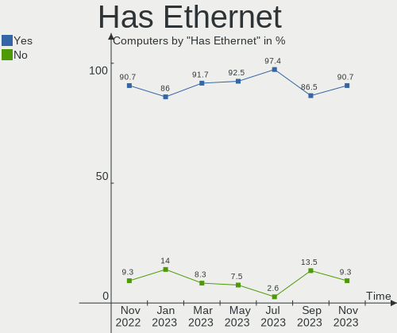
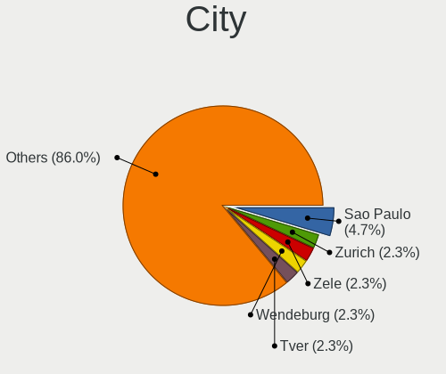
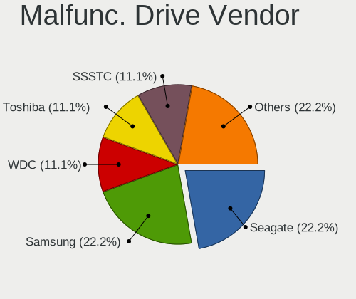
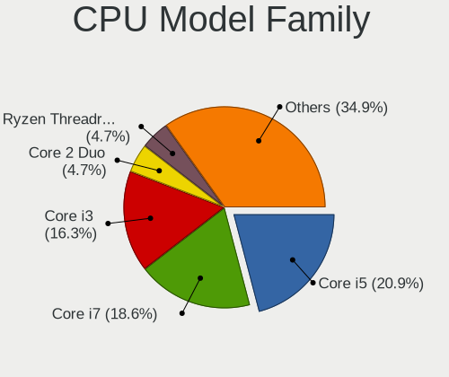
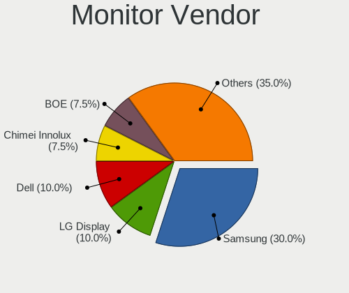
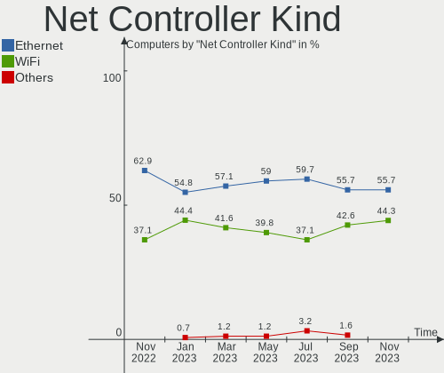

helloSystem Hardware Trends
---------------------------

A project to identify most popular hardware characteristics and track their change
over time based on data collected by helloSystem users at https://BSD-Hardware.info.

Anyone can contribute to this report by the [hw-probe](https://github.com/linuxhw/hw-probe/blob/master/INSTALL.BSD.md) tool:

    hw-probe -all -upload

This is a report for all computer types. See also reports for [desktops](/Dist/helloSystem/Desktop/README.md) and [notebooks](/Dist/helloSystem/Notebook/README.md).

Full-feature report is available here: https://bsd-hardware.info/?view=trends

Period: Feb, 2022.

Contents
--------

* [ System ](#system)
  - [ OS                       ](#os)
  - [ OS Family                ](#os-family)
  - [ Arch                     ](#arch)
  - [ DE                       ](#de)
  - [ Display Server           ](#display-server)
  - [ Display Manager          ](#display-manager)
  - [ OS Lang                  ](#os-lang)
  - [ Boot Mode                ](#boot-mode)
  - [ Filesystem               ](#filesystem)
  - [ Part. scheme             ](#part-scheme)

* [ Board ](#board)
  - [ Vendor                   ](#vendor)
  - [ Model                    ](#model)
  - [ Model Family             ](#model-family)
  - [ MFG Year                 ](#mfg-year)
  - [ Form Factor              ](#form-factor)
  - [ Coreboot                 ](#coreboot)
  - [ RAM Size                 ](#ram-size)
  - [ RAM Used                 ](#ram-used)
  - [ Total Drives             ](#total-drives)
  - [ Has CD-ROM               ](#has-cd-rom)
  - [ Has Ethernet             ](#has-ethernet)
  - [ Has WiFi                 ](#has-wifi)
  - [ Has Bluetooth            ](#has-bluetooth)

* [ Location ](#location)
  - [ Country                  ](#country)
  - [ City                     ](#city)

* [ Drives ](#drives)
  - [ Drive Vendor             ](#drive-vendor)
  - [ Drive Model              ](#drive-model)
  - [ HDD Vendor               ](#hdd-vendor)
  - [ SSD Vendor               ](#ssd-vendor)
  - [ Drive Kind               ](#drive-kind)
  - [ Drive Connector          ](#drive-connector)
  - [ Drive Size               ](#drive-size)
  - [ Space Total              ](#space-total)
  - [ Space Used               ](#space-used)
  - [ Malfunc. Drives          ](#malfunc-drives)
  - [ Malfunc. Drive Vendor    ](#malfunc-drive-vendor)
  - [ Malfunc. HDD Vendor      ](#malfunc-hdd-vendor)
  - [ Malfunc. Drive Kind      ](#malfunc-drive-kind)
  - [ Failed Drives            ](#failed-drives)
  - [ Failed Drive Vendor      ](#failed-drive-vendor)
  - [ Drive Status             ](#drive-status)

* [ Storage controller ](#storage-controller)
  - [ Storage Vendor           ](#storage-vendor)
  - [ Storage Model            ](#storage-model)
  - [ Storage Kind             ](#storage-kind)

* [ Processor ](#processor)
  - [ CPU Vendor               ](#cpu-vendor)
  - [ CPU Model                ](#cpu-model)
  - [ CPU Model Family         ](#cpu-model-family)
  - [ CPU Cores                ](#cpu-cores)
  - [ CPU Sockets              ](#cpu-sockets)
  - [ CPU Threads              ](#cpu-threads)
  - [ CPU Microarch            ](#cpu-microarch)

* [ Graphics ](#graphics)
  - [ GPU Vendor               ](#gpu-vendor)
  - [ GPU Model                ](#gpu-model)
  - [ GPU Combo                ](#gpu-combo)
  - [ GPU Driver               ](#gpu-driver)
  - [ GPU Memory               ](#gpu-memory)

* [ Monitor ](#monitor)
  - [ Monitor Vendor           ](#monitor-vendor)
  - [ Monitor Model            ](#monitor-model)
  - [ Monitor Resolution       ](#monitor-resolution)
  - [ Monitor Diagonal         ](#monitor-diagonal)
  - [ Monitor Width            ](#monitor-width)
  - [ Aspect Ratio             ](#aspect-ratio)
  - [ Monitor Area             ](#monitor-area)
  - [ Pixel Density            ](#pixel-density)
  - [ Multiple Monitors        ](#multiple-monitors)

* [ Network ](#network)
  - [ Net Controller Vendor    ](#net-controller-vendor)
  - [ Net Controller Model     ](#net-controller-model)
  - [ Wireless Vendor          ](#wireless-vendor)
  - [ Wireless Model           ](#wireless-model)
  - [ Ethernet Vendor          ](#ethernet-vendor)
  - [ Ethernet Model           ](#ethernet-model)
  - [ Net Controller Kind      ](#net-controller-kind)
  - [ Used Controller          ](#used-controller)
  - [ NICs                     ](#nics)
  - [ IPv6                     ](#ipv6)

* [ Bluetooth ](#bluetooth)
  - [ Bluetooth Vendor         ](#bluetooth-vendor)
  - [ Bluetooth Model          ](#bluetooth-model)

* [ Sound ](#sound)
  - [ Sound Vendor             ](#sound-vendor)
  - [ Sound Model              ](#sound-model)

* [ Memory ](#memory)
  - [ Memory Vendor            ](#memory-vendor)
  - [ Memory Model             ](#memory-model)
  - [ Memory Kind              ](#memory-kind)
  - [ Memory Form Factor       ](#memory-form-factor)
  - [ Memory Size              ](#memory-size)
  - [ Memory Speed             ](#memory-speed)

* [ Printers & scanners ](#printers--scanners)
  - [ Printer Vendor           ](#printer-vendor)
  - [ Printer Model            ](#printer-model)
  - [ Scanner Vendor           ](#scanner-vendor)
  - [ Scanner Model            ](#scanner-model)

* [ Camera ](#camera)
  - [ Camera Vendor            ](#camera-vendor)
  - [ Camera Model             ](#camera-model)

* [ Security ](#security)
  - [ Fingerprint Vendor       ](#fingerprint-vendor)
  - [ Fingerprint Model        ](#fingerprint-model)
  - [ Chipcard Vendor          ](#chipcard-vendor)
  - [ Chipcard Model           ](#chipcard-model)

* [ Unsupported ](#unsupported)
  - [ Unsupported Devices      ](#unsupported-devices)
  - [ Unsupported Device Types ](#unsupported-device-types)

System
------

OS
--

Installed operating systems

| Name                    | Computers | Percent |
|-------------------------|-----------|---------|
| helloSystem 0.7.0       | 51        | 76.12%  |
| helloSystem 0.8.0       | 11        | 16.42%  |
| helloSystem 0.6.0       | 3         | 4.48%   |
| helloSystem 13.0-STABLE | 1         | 1.49%   |
| helloSystem 0.4.0       | 1         | 1.49%   |

OS Family
---------

OS without a version

| Name        | Computers | Percent |
|-------------|-----------|---------|
| helloSystem | 67        | 100%    |

Arch
----

OS architecture (x86_64, i586, etc.)

| Name  | Computers | Percent |
|-------|-----------|---------|
| amd64 | 66        | 98.51%  |
| arm64 | 1         | 1.49%   |

DE
--

Desktop Environment

| Name         | Computers | Percent |
|--------------|-----------|---------|
| helloDesktop | 65        | 97.01%  |
| KDE5         | 1         | 1.49%   |
| GNOME        | 1         | 1.49%   |

Display Server
--------------

X11 or Wayland

| Name | Computers | Percent |
|------|-----------|---------|
| X11  | 67        | 100%    |

Display Manager
---------------

SDDM, LightDM, etc.

| Name    | Computers | Percent |
|---------|-----------|---------|
| SLiM    | 66        | 98.51%  |
| Console | 1         | 1.49%   |

OS Lang
-------

Language

| Lang  | Computers | Percent |
|-------|-----------|---------|
| en_US | 61        | 91.04%  |
| es_ES | 2         | 2.99%   |
| C     | 2         | 2.99%   |
| uk_UA | 1         | 1.49%   |
| de_DE | 1         | 1.49%   |

Boot Mode
---------

EFI or BIOS

| Mode | Computers | Percent |
|------|-----------|---------|
| EFI  | 65        | 97.01%  |
| BIOS | 2         | 2.99%   |

Filesystem
----------

Type of filesystem

| Type   | Computers | Percent |
|--------|-----------|---------|
| Zfs    | 36        | 53.73%  |
| Cd9660 | 31        | 46.27%  |

Part. scheme
------------

Scheme of partitioning

| Type | Computers | Percent |
|------|-----------|---------|
| GPT  | 67        | 100%    |

Board
-----

Vendor
------

Motherboard manufacturer

| Name                | Computers | Percent |
|---------------------|-----------|---------|
| Lenovo              | 9         | 13.43%  |
| Dell                | 8         | 11.94%  |
| Intel               | 6         | 8.96%   |
| Hewlett-Packard     | 6         | 8.96%   |
| ASUSTek Computer    | 6         | 8.96%   |
| Apple               | 6         | 8.96%   |
| ASRock              | 5         | 7.46%   |
| Gigabyte Technology | 4         | 5.97%   |
| Acer                | 4         | 5.97%   |
| MSI                 | 2         | 2.99%   |
| TWINHEAD            | 1         | 1.49%   |
| TUXEDO              | 1         | 1.49%   |
| Timi                | 1         | 1.49%   |
| Sony                | 1         | 1.49%   |
| Samsung Electronics | 1         | 1.49%   |
| Pegatron            | 1         | 1.49%   |
| PCSTICK             | 1         | 1.49%   |
| Medion              | 1         | 1.49%   |
| MACHINIST           | 1         | 1.49%   |
| Firefly             | 1         | 1.49%   |
| AMD                 | 1         | 1.49%   |

Model
-----

Motherboard model

| Name                               | Computers | Percent |
|------------------------------------|-----------|---------|
| Acer V5-131                        | 2         | 2.99%   |
| TWINHEAD U12CT                     | 1         | 1.49%   |
| TUXEDO InfinityBook13V3            | 1         | 1.49%   |
| Timi RedmiBook Pro 15              | 1         | 1.49%   |
| Sony VPCEB1J1E                     | 1         | 1.49%   |
| Samsung N100                       | 1         | 1.49%   |
| Pegatron AY627AA-ABA a4313w        | 1         | 1.49%   |
| MSI MS-7B86                        | 1         | 1.49%   |
| MSI MS-7758                        | 1         | 1.49%   |
| Medion H61H2-LM3                   | 1         | 1.49%   |
| MACHINIST X99-k9 V2.0              | 1         | 1.49%   |
| Lenovo ThinkPad X220 4291H77       | 1         | 1.49%   |
| Lenovo ThinkPad T61 766301U        | 1         | 1.49%   |
| Lenovo ThinkPad T440p 20AWS3RH00   | 1         | 1.49%   |
| Lenovo ThinkPad T430 2349AK1       | 1         | 1.49%   |
| Lenovo ThinkCentre M93p 10AAA0WGUK | 1         | 1.49%   |
| Lenovo Legion 5 15ARH05 82B5       | 1         | 1.49%   |
| Lenovo IdeaPad 110S-11IBR 80WG     | 1         | 1.49%   |
| Lenovo G580 20150                  | 1         | 1.49%   |
| Lenovo E31-80 80MX                 | 1         | 1.49%   |
| Intel X58                          | 1         | 1.49%   |
| Intel NUC7i3BNK                    | 1         | 1.49%   |
| Intel NUC5i3RYH                    | 1         | 1.49%   |
| Intel NUC5CPYB H61145-404          | 1         | 1.49%   |
| Intel H81                          | 1         | 1.49%   |
| Intel DCP847SKE G80890-107         | 1         | 1.49%   |
| HP Z230 Tower Workstation          | 1         | 1.49%   |
| HP Mini 210-1000                   | 1         | 1.49%   |
| HP G62                             | 1         | 1.49%   |
| HP EliteDesk 700 G1 SFF            | 1         | 1.49%   |
| HP EliteBook Folio 9470m           | 1         | 1.49%   |
| HP EliteBook 6930p                 | 1         | 1.49%   |
| Gigabyte Z390 GAMING X             | 1         | 1.49%   |
| Gigabyte P41T-D3                   | 1         | 1.49%   |
| Gigabyte C246M-WU4                 | 1         | 1.49%   |
| Gigabyte B450M S2H                 | 1         | 1.49%   |
| Firefly ROC-RK3566-PC              | 1         | 1.49%   |
| Dell Venue 11 Pro 7140             | 1         | 1.49%   |
| Dell PowerEdge T20                 | 1         | 1.49%   |
| Dell OptiPlex 9010                 | 1         | 1.49%   |
| Dell Latitude E5470                | 1         | 1.49%   |
| Dell Latitude E4310                | 1         | 1.49%   |
| Dell Latitude D630                 | 1         | 1.49%   |
| Dell Latitude 7480                 | 1         | 1.49%   |
| Dell Inspiron 3537                 | 1         | 1.49%   |
| ASUS X555LA                        | 1         | 1.49%   |
| ASUS TUF GAMING X570-PLUS          | 1         | 1.49%   |
| ASUS PRIME Z390-P                  | 1         | 1.49%   |
| ASUS P6-P8H61E                     | 1         | 1.49%   |
| ASUS CROSSHAIR VI HERO             | 1         | 1.49%   |
| ASUS 1001PX                        | 1         | 1.49%   |
| ASRock TRX40 Taichi                | 1         | 1.49%   |
| ASRock H81M-VG4 R2.0               | 1         | 1.49%   |
| ASRock H81M-DG4                    | 1         | 1.49%   |
| ASRock H61M/U3S3                   | 1         | 1.49%   |
| ASRock B460M Pro4                  | 1         | 1.49%   |
| Apple MacPro5,1                    | 1         | 1.49%   |
| Apple MacBookPro4,1                | 1         | 1.49%   |
| Apple MacBook6,1                   | 1         | 1.49%   |
| Apple MacBook5,2                   | 1         | 1.49%   |

Model Family
------------

Motherboard model prefix

| Name                    | Computers | Percent |
|-------------------------|-----------|---------|
| Lenovo ThinkPad         | 4         | 5.97%   |
| Dell Latitude           | 4         | 5.97%   |
| HP EliteBook            | 2         | 2.99%   |
| Acer V5-131             | 2         | 2.99%   |
| Acer Aspire             | 2         | 2.99%   |
| TWINHEAD U12CT          | 1         | 1.49%   |
| TUXEDO InfinityBook13V3 | 1         | 1.49%   |
| Timi RedmiBook          | 1         | 1.49%   |
| Sony VPCEB1J1E          | 1         | 1.49%   |
| Samsung N100            | 1         | 1.49%   |
| Pegatron AY627AA-ABA    | 1         | 1.49%   |
| MSI MS-7B86             | 1         | 1.49%   |
| MSI MS-7758             | 1         | 1.49%   |
| Medion H61H2-LM3        | 1         | 1.49%   |
| MACHINIST X99-k9        | 1         | 1.49%   |
| Lenovo ThinkCentre      | 1         | 1.49%   |
| Lenovo Legion           | 1         | 1.49%   |
| Lenovo IdeaPad          | 1         | 1.49%   |
| Lenovo G580             | 1         | 1.49%   |
| Lenovo E31-80           | 1         | 1.49%   |
| Intel X58               | 1         | 1.49%   |
| Intel NUC7i3BNK         | 1         | 1.49%   |
| Intel NUC5i3RYH         | 1         | 1.49%   |
| Intel NUC5CPYB          | 1         | 1.49%   |
| Intel H81               | 1         | 1.49%   |
| Intel DCP847SKE         | 1         | 1.49%   |
| HP Z230                 | 1         | 1.49%   |
| HP Mini                 | 1         | 1.49%   |
| HP G62                  | 1         | 1.49%   |
| HP EliteDesk            | 1         | 1.49%   |
| Gigabyte Z390           | 1         | 1.49%   |
| Gigabyte P41T-D3        | 1         | 1.49%   |
| Gigabyte C246M-WU4      | 1         | 1.49%   |
| Gigabyte B450M          | 1         | 1.49%   |
| Firefly ROC-RK3566-PC   | 1         | 1.49%   |
| Dell Venue              | 1         | 1.49%   |
| Dell PowerEdge          | 1         | 1.49%   |
| Dell OptiPlex           | 1         | 1.49%   |
| Dell Inspiron           | 1         | 1.49%   |
| ASUS X555LA             | 1         | 1.49%   |
| ASUS TUF                | 1         | 1.49%   |
| ASUS PRIME              | 1         | 1.49%   |
| ASUS P6-P8H61E          | 1         | 1.49%   |
| ASUS CROSSHAIR          | 1         | 1.49%   |
| ASUS 1001PX             | 1         | 1.49%   |
| ASRock TRX40            | 1         | 1.49%   |
| ASRock H81M-VG4         | 1         | 1.49%   |
| ASRock H81M-DG4         | 1         | 1.49%   |
| ASRock H61M             | 1         | 1.49%   |
| ASRock B460M            | 1         | 1.49%   |
| Apple MacPro5           | 1         | 1.49%   |
| Apple MacBookPro4       | 1         | 1.49%   |
| Apple MacBook6          | 1         | 1.49%   |
| Apple MacBook5          | 1         | 1.49%   |
| Apple MacBook4          | 1         | 1.49%   |
| Apple iMac9             | 1         | 1.49%   |
| AMD X64                 | 1         | 1.49%   |
| Unknown                 | 1         | 1.49%   |

MFG Year
--------

Motherboard manufacture year

| Year | Computers | Percent |
|------|-----------|---------|
| 2013 | 8         | 11.94%  |
| 2021 | 7         | 10.45%  |
| 2019 | 7         | 10.45%  |
| 2018 | 6         | 8.96%   |
| 2010 | 6         | 8.96%   |
| 2020 | 5         | 7.46%   |
| 2015 | 5         | 7.46%   |
| 2012 | 4         | 5.97%   |
| 2009 | 4         | 5.97%   |
| 2016 | 3         | 4.48%   |
| 2011 | 3         | 4.48%   |
| 2008 | 3         | 4.48%   |
| 2017 | 2         | 2.99%   |
| 2014 | 2         | 2.99%   |
| 2022 | 1         | 1.49%   |
| 2007 | 1         | 1.49%   |

Form Factor
-----------

Physical design of the computer

| Name           | Computers | Percent |
|----------------|-----------|---------|
| Notebook       | 34        | 50.75%  |
| Desktop        | 28        | 41.79%  |
| Mini pc        | 3         | 4.48%   |
| System on chip | 1         | 1.49%   |
| All in one     | 1         | 1.49%   |

Coreboot
--------

Have coreboot on board

| Used | Computers | Percent |
|------|-----------|---------|
| No   | 67        | 100%    |

RAM Size
--------

Total RAM memory

| Size in GB  | Computers | Percent |
|-------------|-----------|---------|
| 4.01-8.0    | 18        | 26.87%  |
| 8.01-16.0   | 17        | 25.37%  |
| 16.01-24.0  | 15        | 22.39%  |
| 2.01-3.0    | 8         | 11.94%  |
| 32.01-64.0  | 5         | 7.46%   |
| 64.01-256.0 | 2         | 2.99%   |
| 3.01-4.0    | 1         | 1.49%   |
| 24.01-32.0  | 1         | 1.49%   |

RAM Used
--------

Used RAM memory

| Used GB  | Computers | Percent |
|----------|-----------|---------|
| 0.01-0.5 | 38        | 56.72%  |
| 0.51-1.0 | 19        | 28.36%  |
| 1.01-2.0 | 10        | 14.93%  |

Total Drives
------------

Number of drives on board

| Drives | Computers | Percent |
|--------|-----------|---------|
| 1      | 40        | 59.7%   |
| 2      | 16        | 23.88%  |
| 0      | 4         | 5.97%   |
| 4      | 3         | 4.48%   |
| 5      | 2         | 2.99%   |
| 7      | 1         | 1.49%   |
| 3      | 1         | 1.49%   |

Has CD-ROM
----------

Has CD-ROM on board

| Presented | Computers | Percent |
|-----------|-----------|---------|
| No        | 46        | 68.66%  |
| Yes       | 21        | 31.34%  |

Has Ethernet
------------

Has Ethernet on board

| Presented | Computers | Percent |
|-----------|-----------|---------|
| Yes       | 60        | 89.55%  |
| No        | 7         | 10.45%  |

Has WiFi
--------

Has WiFi module

| Presented | Computers | Percent |
|-----------|-----------|---------|
| Yes       | 45        | 67.16%  |
| No        | 22        | 32.84%  |

Has Bluetooth
-------------

Has Bluetooth module

| Presented | Computers | Percent |
|-----------|-----------|---------|
| No        | 37        | 55.22%  |
| Yes       | 30        | 44.78%  |

Location
--------

Country
-------

Geographic location (country)

| Country  | Computers | Percent |
|----------|-----------|---------|
| USA      | 12        | 17.91%  |
| Spain    | 7         | 10.45%  |
| Ukraine  | 6         | 8.96%   |
| Russia   | 5         | 7.46%   |
| Poland   | 5         | 7.46%   |
| Italy    | 4         | 5.97%   |
| Germany  | 4         | 5.97%   |
| Hungary  | 3         | 4.48%   |
| Greece   | 3         | 4.48%   |
| UK       | 2         | 2.99%   |
| Mexico   | 2         | 2.99%   |
| India    | 2         | 2.99%   |
| France   | 2         | 2.99%   |
| China    | 2         | 2.99%   |
| Canada   | 2         | 2.99%   |
| Tanzania | 1         | 1.49%   |
| Taiwan   | 1         | 1.49%   |
| Georgia  | 1         | 1.49%   |
| Chile    | 1         | 1.49%   |
| Brazil   | 1         | 1.49%   |
| Belarus  | 1         | 1.49%   |

City
----

Geographic location (city)

| City                          | Computers | Percent |
|-------------------------------|-----------|---------|
| Kharkiv                       | 3         | 4.48%   |
| Sherwood Park                 | 2         | 2.99%   |
| San Sebastián de los Reyes | 2         | 2.99%   |
| Logroño                    | 2         | 2.99%   |
| Kyiv                          | 2         | 2.99%   |
| Katowice                      | 2         | 2.99%   |
| Yunlin                        | 1         | 1.49%   |
| Youngsville                   | 1         | 1.49%   |
| Wroclaw                       | 1         | 1.49%   |
| Turley                        | 1         | 1.49%   |
| Turin                         | 1         | 1.49%   |
| Thessaloniki                  | 1         | 1.49%   |
| Susanville                    | 1         | 1.49%   |
| Strullendorf                  | 1         | 1.49%   |
| St Petersburg                 | 1         | 1.49%   |
| Sopron                        | 1         | 1.49%   |
| Seville                       | 1         | 1.49%   |
| San Luis Potosí City       | 1         | 1.49%   |
| Rho                           | 1         | 1.49%   |
| Ransbach-Baumbach             | 1         | 1.49%   |
| Piovene Rocchette             | 1         | 1.49%   |
| Pilica                        | 1         | 1.49%   |
| Penza                         | 1         | 1.49%   |
| Ormond Beach                  | 1         | 1.49%   |
| Orlando                       | 1         | 1.49%   |
| Myrtle Beach                  | 1         | 1.49%   |
| Moscow                        | 1         | 1.49%   |
| Mirepeix                      | 1         | 1.49%   |
| Minsk                         | 1         | 1.49%   |
| Minneapolis                   | 1         | 1.49%   |
| Midlothian                    | 1         | 1.49%   |
| Mexico City                   | 1         | 1.49%   |
| Linyi                         | 1         | 1.49%   |
| Leipzig                       | 1         | 1.49%   |
| Krasnodar                     | 1         | 1.49%   |
| Kozani                        | 1         | 1.49%   |
| Kostroma                      | 1         | 1.49%   |
| K'alak'i T'bilisi             | 1         | 1.49%   |
| Junction City                 | 1         | 1.49%   |
| Jelenia Góra               | 1         | 1.49%   |
| Inverkeithing                 | 1         | 1.49%   |
| Gyomro                        | 1         | 1.49%   |
| Guangzhou                     | 1         | 1.49%   |
| Foligno                       | 1         | 1.49%   |
| Finmere                       | 1         | 1.49%   |
| Ernakulam                     | 1         | 1.49%   |
| El Bosque                     | 1         | 1.49%   |
| Dar es Salaam                 | 1         | 1.49%   |
| Cho                           | 1         | 1.49%   |
| Chennai                       | 1         | 1.49%   |
| Chatou                        | 1         | 1.49%   |
| Charlton                      | 1         | 1.49%   |
| Córdoba                    | 1         | 1.49%   |
| Braunschweig                  | 1         | 1.49%   |
| Berehove                      | 1         | 1.49%   |
| Benevides                     | 1         | 1.49%   |
| Baranyaszentgyorgy            | 1         | 1.49%   |
| Austin                        | 1         | 1.49%   |
| Athens                        | 1         | 1.49%   |
| Albany                        | 1         | 1.49%   |

Drives
------

Drive Vendor
------------

Hard drive vendors

| Vendor              | Computers | Drives | Percent |
|---------------------|-----------|--------|---------|
| WDC                 | 19        | 24     | 21.11%  |
| Seagate             | 16        | 23     | 17.78%  |
| Samsung Electronics | 10        | 10     | 11.11%  |
| Crucial             | 8         | 8      | 8.89%   |
| Kingston            | 7         | 8      | 7.78%   |
| Hitachi             | 4         | 4      | 4.44%   |
| Toshiba             | 3         | 4      | 3.33%   |
| SPCC                | 2         | 3      | 2.22%   |
| SanDisk             | 2         | 2      | 2.22%   |
| Phison              | 2         | 2      | 2.22%   |
| Intel               | 2         | 2      | 2.22%   |
| A-DATA Technology   | 2         | 2      | 2.22%   |
| XPG                 | 1         | 1      | 1.11%   |
| Team                | 1         | 1      | 1.11%   |
| SK Hynix            | 1         | 1      | 1.11%   |
| PNY                 | 1         | 1      | 1.11%   |
| Patriot             | 1         | 1      | 1.11%   |
| Mushkin             | 1         | 1      | 1.11%   |
| Lexar               | 1         | 2      | 1.11%   |
| KIOXIA              | 1         | 1      | 1.11%   |
| KingSpec            | 1         | 1      | 1.11%   |
| Intenso             | 1         | 1      | 1.11%   |
| GOODRAM             | 1         | 1      | 1.11%   |
| Gigabyte Technology | 1         | 1      | 1.11%   |
| Fujitsu             | 1         | 1      | 1.11%   |

Drive Model
-----------

Hard drive models

| Model                                       | Computers | Percent |
|---------------------------------------------|-----------|---------|
| WDC WD20PURZ-85GU6Y0 2TB                    | 2         | 2%      |
| SPCC Solid State Disk 512GB                 | 2         | 2%      |
| Seagate ST4000DM004-2CV104 4TB              | 2         | 2%      |
| Crucial CT240BX500SSD1 240GB                | 2         | 2%      |
| Crucial CT120BX500SSD1 120GB                | 2         | 2%      |
| XPG GAMMIX S11 Pro 256GB                    | 1         | 1%      |
| WDC WDS500G2B0C-00PXH0 500GB                | 1         | 1%      |
| WDC WDS500G2B0B-00YS70 500GB                | 1         | 1%      |
| WDC WDS240G2G0A-00JH30 240GB                | 1         | 1%      |
| WDC WD5000LPVX-80V0TT0 500GB                | 1         | 1%      |
| WDC WD5000LPCX-75VHAT0 500GB                | 1         | 1%      |
| WDC WD5000BPKT-00PK4T0 500GB                | 1         | 1%      |
| WDC WD5000AZLX-00CL5A0 500GB                | 1         | 1%      |
| WDC WD40EFRX-68N32N0 4TB                    | 1         | 1%      |
| WDC WD3200BPVT-22ZEST0 320GB                | 1         | 1%      |
| WDC WD3200AAJS-22B4A0 320GB                 | 1         | 1%      |
| WDC WD3003FZEX-00Z4SA0 3TB                  | 1         | 1%      |
| WDC WD2500AAKX-75U6AA0 250GB                | 1         | 1%      |
| WDC WD1600BEVT-75ZCT2 160GB                 | 1         | 1%      |
| WDC WD1600BEVT-22A23T0 160GB                | 1         | 1%      |
| WDC WD1600BEKT-66F3T2 160GB                 | 1         | 1%      |
| WDC WD1600AAJS-40H3A0 160GB                 | 1         | 1%      |
| WDC WD10JMVW-11AJGS4 1TB                    | 1         | 1%      |
| WDC WD10EZEX-08M2NA0 1TB                    | 1         | 1%      |
| WDC WD10EARS-003BB1 1TB                     | 1         | 1%      |
| Toshiba TR200 480GB                         | 1         | 1%      |
| Toshiba Q300 480GB                          | 1         | 1%      |
| Toshiba MD04ACA400 4TB                      | 1         | 1%      |
| Toshiba DT01ABA300 3TB                      | 1         | 1%      |
| Team TEAML5Lite3D120G 120GB                 | 1         | 1%      |
| SK Hynix SKHynix_HFM512GDHTNI-87A0B 512GB   | 1         | 1%      |
| Seagate ST9500420AS 500GB                   | 1         | 1%      |
| Seagate ST9160411AS 160GB                   | 1         | 1%      |
| Seagate ST500NM0011 500GB                   | 1         | 1%      |
| Seagate ST500DM002-1BC142 500GB             | 1         | 1%      |
| Seagate ST3500418AS 500GB                   | 1         | 1%      |
| Seagate ST3500413AS 500GB                   | 1         | 1%      |
| Seagate ST3500312CS 500GB                   | 1         | 1%      |
| Seagate ST3320418AS 320GB                   | 1         | 1%      |
| Seagate ST3160812AS 160GB                   | 1         | 1%      |
| Seagate ST31000528AS 1TB                    | 1         | 1%      |
| Seagate ST3000DM001-1CH166 3TB              | 1         | 1%      |
| Seagate ST250DM000-1BD141 250GB             | 1         | 1%      |
| Seagate ST2000DL003-9VT166 2TB              | 1         | 1%      |
| Seagate ST1000LM024 HN-M101MBB 1TB          | 1         | 1%      |
| Seagate ST1000LM014-1EJ164 1TB              | 1         | 1%      |
| Seagate ST1000DM010-2EP102 1TB              | 1         | 1%      |
| Seagate ST1000DM003-1ER162 1TB              | 1         | 1%      |
| Seagate ST1000DM003-1CH162 1TB              | 1         | 1%      |
| Seagate FireCuda 520 SSD ZP500GM30002 500GB | 1         | 1%      |
| SanDisk X110 M.2 2260 256GB                 | 1         | 1%      |
| SanDisk SDSA5GK-016G-1006 16GB              | 1         | 1%      |
| Samsung SSD 960 EVO 250GB                   | 1         | 1%      |
| Samsung SSD 950 PRO 512GB                   | 1         | 1%      |
| Samsung SSD 860 PRO 512GB                   | 1         | 1%      |
| Samsung SSD 860 EVO 500GB                   | 1         | 1%      |
| Samsung SSD 850 EVO 500GB                   | 1         | 1%      |
| Samsung MZMPC256HBGJ-000H1 256GB            | 1         | 1%      |
| Samsung MZ7TE128HMGR-000H1 128GB            | 1         | 1%      |
| Samsung MZ7LN256HCHP-000L7 256GB            | 1         | 1%      |

HDD Vendor
----------

Hard disk drive vendors

| Vendor              | Computers | Drives | Percent |
|---------------------|-----------|--------|---------|
| WDC                 | 17        | 21     | 42.5%   |
| Seagate             | 16        | 20     | 40%     |
| Hitachi             | 4         | 4      | 10%     |
| Samsung Electronics | 2         | 2      | 5%      |
| Toshiba             | 1         | 2      | 2.5%    |

SSD Vendor
----------

Solid state drive vendors

| Vendor              | Computers | Drives | Percent |
|---------------------|-----------|--------|---------|
| Crucial             | 8         | 8      | 19.05%  |
| Samsung Electronics | 6         | 6      | 14.29%  |
| Kingston            | 6         | 6      | 14.29%  |
| WDC                 | 2         | 2      | 4.76%   |
| Toshiba             | 2         | 2      | 4.76%   |
| SPCC                | 2         | 3      | 4.76%   |
| SanDisk             | 2         | 2      | 4.76%   |
| Intel               | 2         | 2      | 4.76%   |
| A-DATA Technology   | 2         | 2      | 4.76%   |
| Team                | 1         | 1      | 2.38%   |
| PNY                 | 1         | 1      | 2.38%   |
| Patriot             | 1         | 1      | 2.38%   |
| Mushkin             | 1         | 1      | 2.38%   |
| Lexar               | 1         | 1      | 2.38%   |
| KingSpec            | 1         | 1      | 2.38%   |
| Intenso             | 1         | 1      | 2.38%   |
| GOODRAM             | 1         | 1      | 2.38%   |
| Gigabyte Technology | 1         | 1      | 2.38%   |
| Fujitsu             | 1         | 1      | 2.38%   |

Drive Kind
----------

HDD or SSD

| Kind | Computers | Drives | Percent |
|------|-----------|--------|---------|
| SSD  | 37        | 43     | 46.25%  |
| HDD  | 33        | 49     | 41.25%  |
| NVMe | 10        | 14     | 12.5%   |

Drive Connector
---------------

SATA, SAS, NVMe, etc.

| Type | Computers | Drives | Percent |
|------|-----------|--------|---------|
| SATA | 59        | 92     | 85.51%  |
| NVMe | 10        | 14     | 14.49%  |

Drive Size
----------

Size of hard drive

| Size in TB | Computers | Drives | Percent |
|------------|-----------|--------|---------|
| 0.01-0.5   | 53        | 64     | 71.62%  |
| 0.51-1.0   | 11        | 14     | 14.86%  |
| 3.01-4.0   | 4         | 7      | 5.41%   |
| 1.01-2.0   | 4         | 4      | 5.41%   |
| 2.01-3.0   | 2         | 3      | 2.7%    |

Space Total
-----------

Amount of disk space available on the file system

| Size in GB | Computers | Percent |
|------------|-----------|---------|
| 1-20       | 32        | 47.76%  |
| 101-250    | 22        | 32.84%  |
| 251-500    | 8         | 11.94%  |
| 21-50      | 3         | 4.48%   |
| 501-1000   | 1         | 1.49%   |
| 51-100     | 1         | 1.49%   |

Space Used
----------

Amount of used disk space

| Used GB | Computers | Percent |
|---------|-----------|---------|
| 1-20    | 67        | 100%    |

Malfunc. Drives
---------------

Drive models with a malfunction

| Model                              | Computers | Drives | Percent |
|------------------------------------|-----------|--------|---------|
| WDC WD5000LPCX-75VHAT0 500GB       | 1         | 1      | 4.76%   |
| WDC WD5000AZLX-00CL5A0 500GB       | 1         | 1      | 4.76%   |
| WDC WD3200AAJS-22B4A0 320GB        | 1         | 1      | 4.76%   |
| WDC WD1600BEKT-66F3T2 160GB        | 1         | 1      | 4.76%   |
| WDC WD10EZEX-08M2NA0 1TB           | 1         | 1      | 4.76%   |
| WDC WD10EARS-003BB1 1TB            | 1         | 1      | 4.76%   |
| Toshiba MD04ACA400 4TB             | 1         | 1      | 4.76%   |
| Toshiba DT01ABA300 3TB             | 1         | 1      | 4.76%   |
| Seagate ST3500418AS 500GB          | 1         | 1      | 4.76%   |
| Seagate ST3500413AS 500GB          | 1         | 1      | 4.76%   |
| Seagate ST3320418AS 320GB          | 1         | 1      | 4.76%   |
| Seagate ST3160812AS 160GB          | 1         | 1      | 4.76%   |
| Seagate ST31000528AS 1TB           | 1         | 1      | 4.76%   |
| Seagate ST1000LM024 HN-M101MBB 1TB | 1         | 1      | 4.76%   |
| Samsung Electronics HM160HI 160GB  | 1         | 1      | 4.76%   |
| Kingston SV200S3128G 128GB         | 1         | 1      | 4.76%   |
| Kingston SMS200S3120G 120GB        | 1         | 1      | 4.76%   |
| Hitachi HTS545050A7E380 500GB      | 1         | 1      | 4.76%   |
| Hitachi HTS542516K9SA00 160GB      | 1         | 1      | 4.76%   |
| Hitachi HTS541616J9SA00 160GB      | 1         | 1      | 4.76%   |
| Hitachi HDT721010SLA360 1TB        | 1         | 1      | 4.76%   |

Malfunc. Drive Vendor
---------------------

Vendors of faulty drives

| Vendor              | Computers | Drives | Percent |
|---------------------|-----------|--------|---------|
| WDC                 | 6         | 6      | 31.58%  |
| Seagate             | 5         | 6      | 26.32%  |
| Hitachi             | 4         | 4      | 21.05%  |
| Kingston            | 2         | 2      | 10.53%  |
| Toshiba             | 1         | 2      | 5.26%   |
| Samsung Electronics | 1         | 1      | 5.26%   |

Malfunc. HDD Vendor
-------------------

Vendors of faulty HDD drives

| Vendor              | Computers | Drives | Percent |
|---------------------|-----------|--------|---------|
| WDC                 | 6         | 6      | 35.29%  |
| Seagate             | 5         | 6      | 29.41%  |
| Hitachi             | 4         | 4      | 23.53%  |
| Toshiba             | 1         | 2      | 5.88%   |
| Samsung Electronics | 1         | 1      | 5.88%   |

Malfunc. Drive Kind
-------------------

Kinds of faulty drives

| Kind | Computers | Drives | Percent |
|------|-----------|--------|---------|
| HDD  | 16        | 19     | 88.89%  |
| SSD  | 2         | 2      | 11.11%  |

Failed Drives
-------------

Failed drive models

Zero info for selected period =(

Failed Drive Vendor
-------------------

Failed drive vendors

Zero info for selected period =(

Drive Status
------------

Number of failed and malfunc. drives

| Status   | Computers | Drives | Percent |
|----------|-----------|--------|---------|
| Works    | 52        | 84     | 74.29%  |
| Malfunc  | 17        | 21     | 24.29%  |
| Detected | 1         | 1      | 1.43%   |

Storage controller
------------------

Storage Vendor
--------------

Storage controller vendors

| Vendor                       | Computers | Percent |
|------------------------------|-----------|---------|
| Intel                        | 53        | 68.83%  |
| AMD                          | 7         | 9.09%   |
| Nvidia                       | 4         | 5.19%   |
| Samsung Electronics          | 2         | 2.6%    |
| Phison Electronics           | 2         | 2.6%    |
| SK Hynix                     | 1         | 1.3%    |
| Silicon Motion               | 1         | 1.3%    |
| Shenzhen Longsys Electronics | 1         | 1.3%    |
| Seagate Technology           | 1         | 1.3%    |
| Sandisk                      | 1         | 1.3%    |
| KIOXIA                       | 1         | 1.3%    |
| Kingston Technology Company  | 1         | 1.3%    |
| ASMedia Technology           | 1         | 1.3%    |
| ADATA Technology             | 1         | 1.3%    |

Storage Model
-------------

Storage controller models

| Model                                                                                   | Computers | Percent |
|-----------------------------------------------------------------------------------------|-----------|---------|
| Intel 8 Series/C220 Series Chipset Family 6-port SATA Controller 1 [AHCI mode]          | 6         | 6.9%    |
| Intel 7 Series Chipset Family 6-port SATA Controller [AHCI mode]                        | 6         | 6.9%    |
| AMD FCH SATA Controller [AHCI mode]                                                     | 6         | 6.9%    |
| Intel SATA Controller [RAID mode]                                                       | 4         | 4.6%    |
| Intel 82801HM/HEM (ICH8M/ICH8M-E) IDE Controller                                        | 4         | 4.6%    |
| Nvidia MCP79 AHCI Controller                                                            | 3         | 3.45%   |
| Intel Sunrise Point-LP SATA Controller [AHCI mode]                                      | 3         | 3.45%   |
| Intel NM10/ICH7 Family SATA Controller [AHCI mode]                                      | 3         | 3.45%   |
| Intel Cannon Lake PCH SATA AHCI Controller                                              | 3         | 3.45%   |
| Intel 82801HM/HEM (ICH8M/ICH8M-E) SATA Controller [AHCI mode]                           | 3         | 3.45%   |
| Intel 5 Series/3400 Series Chipset 4 port SATA AHCI Controller                          | 3         | 3.45%   |
| Intel Wildcat Point-LP SATA Controller [AHCI Mode]                                      | 2         | 2.3%    |
| Intel Atom/Celeron/Pentium Processor x5-E8000/J3xxx/N3xxx Series SATA Controller        | 2         | 2.3%    |
| Intel 8 Series SATA Controller 1 [AHCI mode]                                            | 2         | 2.3%    |
| Intel 6 Series/C200 Series Chipset Family 6 port Mobile SATA AHCI Controller            | 2         | 2.3%    |
| Intel 6 Series/C200 Series Chipset Family 6 port Desktop SATA AHCI Controller           | 2         | 2.3%    |
| AMD 400 Series Chipset SATA Controller                                                  | 2         | 2.3%    |
| SK Hynix BC511                                                                          | 1         | 1.15%   |
| Silicon Motion SM2263EN/SM2263XT SSD Controller                                         | 1         | 1.15%   |
| Shenzhen Longsys SM2263EN/SM2263XT-based OEM SSD                                        | 1         | 1.15%   |
| Seagate FireCuda 520 SSD                                                                | 1         | 1.15%   |
| Sandisk WD Blue SN550 NVMe SSD                                                          | 1         | 1.15%   |
| Samsung NVMe SSD Controller SM961/PM961/SM963                                           | 1         | 1.15%   |
| Samsung NVMe SSD Controller SM951/PM951                                                 | 1         | 1.15%   |
| Phison E16 PCIe4 NVMe Controller                                                        | 1         | 1.15%   |
| Phison E12 NVMe Controller                                                              | 1         | 1.15%   |
| Nvidia MCP61 SATA Controller                                                            | 1         | 1.15%   |
| KIOXIA unknown                                                                          | 1         | 1.15%   |
| Kingston Company A2000 NVMe SSD                                                         | 1         | 1.15%   |
| Intel NM10/ICH7 Family SATA Controller [IDE mode]                                       | 1         | 1.15%   |
| Intel Mobile 4 Series Chipset PT IDER Controller                                        | 1         | 1.15%   |
| Intel C610/X99 series chipset sSATA Controller [AHCI mode]                              | 1         | 1.15%   |
| Intel Atom Processor E3800 Series SATA AHCI Controller                                  | 1         | 1.15%   |
| Intel 82801JI (ICH10 Family) SATA AHCI Controller                                       | 1         | 1.15%   |
| Intel 82801JI (ICH10 Family) 4 port SATA IDE Controller #1                              | 1         | 1.15%   |
| Intel 82801JI (ICH10 Family) 2 port SATA IDE Controller #2                              | 1         | 1.15%   |
| Intel 82801IBM/IEM (ICH9M/ICH9M-E) 4 port SATA Controller [AHCI mode]                   | 1         | 1.15%   |
| Intel 82801HM/HEM (ICH8M/ICH8M-E) SATA Controller [IDE mode]                            | 1         | 1.15%   |
| Intel 82801 Mobile SATA Controller [RAID mode]                                          | 1         | 1.15%   |
| Intel 7 Series/C210 Series Chipset Family 6-port SATA Controller [AHCI mode]            | 1         | 1.15%   |
| Intel 6 Series/C200 Series Chipset Family Desktop SATA Controller (IDE mode, ports 4-5) | 1         | 1.15%   |
| Intel 6 Series/C200 Series Chipset Family Desktop SATA Controller (IDE mode, ports 0-3) | 1         | 1.15%   |
| Intel 5 Series/3400 Series Chipset 6 port SATA AHCI Controller                          | 1         | 1.15%   |
| Intel 400 Series Chipset Family SATA AHCI Controller                                    | 1         | 1.15%   |
| ASMedia ASM1062 Serial ATA Controller                                                   | 1         | 1.15%   |
| AMD X370 Series Chipset SATA Controller                                                 | 1         | 1.15%   |
| AMD FCH IDE Controller                                                                  | 1         | 1.15%   |
| ADATA XPG SX8200 Pro PCIe Gen3x4 M.2 2280 Solid State Drive                             | 1         | 1.15%   |

Storage Kind
------------

Kind of storage controller (IDE, SATA, NVMe, SAS, ...)

| Kind | Computers | Percent |
|------|-----------|---------|
| SATA | 54        | 67.5%   |
| NVMe | 11        | 13.75%  |
| IDE  | 10        | 12.5%   |
| RAID | 5         | 6.25%   |

Processor
---------

CPU Vendor
----------

Processor vendors

| Vendor   | Computers | Percent |
|----------|-----------|---------|
| Intel    | 58        | 86.57%  |
| AMD      | 8         | 11.94%  |
| Rockchip | 1         | 1.49%   |

CPU Model
---------

Processor models

| Model                                          | Computers | Percent |
|------------------------------------------------|-----------|---------|
| Intel Core i3 CPU M 330 @ 2.13GHz              | 2         | 2.99%   |
| Intel Core 2 Duo CPU T8300 @ 2.40GHz           | 2         | 2.99%   |
| Intel Core 2 Duo CPU P7550 @ 2.26GHz           | 2         | 2.99%   |
| Intel Atom CPU N450 @ 1.66GHz                  | 2         | 2.99%   |
| Rockchip RK3566 (Cortex-A55)                   | 1         | 1.49%   |
| Intel Xeon E-2136 CPU @ 3.30GHz                | 1         | 1.49%   |
| Intel Xeon CPU X5647 @ 2.93GHz                 | 1         | 1.49%   |
| Intel Xeon CPU W3680 @ 3.33GHz                 | 1         | 1.49%   |
| Intel Xeon CPU E5-2630L v4 @ 1.80GHz           | 1         | 1.49%   |
| Intel Xeon CPU E3-1241 v3 @ 3.50GHz            | 1         | 1.49%   |
| Intel Xeon CPU E3-1225 v3 @ 3.20GHz            | 1         | 1.49%   |
| Intel Pentium Dual-Core CPU E6500 @            | 1         | 1.49%   |
| Intel Pentium CPU G860 @ 3.00GHz               | 1         | 1.49%   |
| Intel Pentium CPU G3260 @ 3.30GHz              | 1         | 1.49%   |
| Intel Core M-5Y71 CPU @ 1.20GHz                | 1         | 1.49%   |
| Intel Core i7-9700F CPU @ 3.00GHz              | 1         | 1.49%   |
| Intel Core i7-6600U CPU @ 2.60GHz              | 1         | 1.49%   |
| Intel Core i7-6500U CPU @ 2.50GHz              | 1         | 1.49%   |
| Intel Core i5-9600K CPU @ 3.70GHz              | 1         | 1.49%   |
| Intel Core i5-6440HQ CPU @ 2.60GHz             | 1         | 1.49%   |
| Intel Core i5-4590 CPU @ 3.30GHz               | 1         | 1.49%   |
| Intel Core i5-4570T CPU @ 2.90GHz              | 1         | 1.49%   |
| Intel Core i5-4300M CPU @ 2.60GHz              | 1         | 1.49%   |
| Intel Core i5-4210U CPU @ 1.70GHz              | 1         | 1.49%   |
| Intel Core i5-3470 CPU @ 3.20GHz               | 1         | 1.49%   |
| Intel Core i5-3437U CPU @ 1.90GHz              | 1         | 1.49%   |
| Intel Core i5-3320M CPU @ 2.60GHz              | 1         | 1.49%   |
| Intel Core i5-3230M CPU @ 2.60GHz              | 1         | 1.49%   |
| Intel Core i5-2520M CPU @ 2.50GHz              | 1         | 1.49%   |
| Intel Core i5-2500 CPU @ 3.30GHz               | 1         | 1.49%   |
| Intel Core i5-10500 CPU @ 3.10GHz              | 1         | 1.49%   |
| Intel Core i5 CPU U 560 @ 1.33GHz              | 1         | 1.49%   |
| Intel Core i5 CPU M 520 @ 2.40GH               | 1         | 1.49%   |
| Intel Core i3-7100U CPU @ 2.40GHz              | 1         | 1.49%   |
| Intel Core i3-6006U CPU @ 2.00GHz              | 1         | 1.49%   |
| Intel Core i3-5005U CPU @ 2.00GHz              | 1         | 1.49%   |
| Intel Core i3-4130 CPU @ 3.40GHz               | 1         | 1.49%   |
| Intel Core i3-4010U CPU @ 1.70GHz              | 1         | 1.49%   |
| Intel Core i3-3225 CPU @ 3.30GHz               | 1         | 1.49%   |
| Intel Core i3-2350M CPU @ 2.30GHz              | 1         | 1.49%   |
| Intel Core i3-2120 CPU @ 3.30GHz               | 1         | 1.49%   |
| Intel Core 2 Duo CPU T9400 @ 2.53GHz           | 1         | 1.49%   |
| Intel Core 2 Duo CPU T7300 @ 2.00GHz           | 1         | 1.49%   |
| Intel Core 2 Duo CPU P7450 @ 2.13GHz           | 1         | 1.49%   |
| Intel Core 2 Duo                               | 1         | 1.49%   |
| Intel Celeron CPU N3060 @ 1.60GHz              | 1         | 1.49%   |
| Intel Celeron CPU N3050 @ 1.60GHz              | 1         | 1.49%   |
| Intel Celeron CPU N2940 @ 1.83GHz              | 1         | 1.49%   |
| Intel Celeron CPU G1840 @ 2.80GHz              | 1         | 1.49%   |
| Intel Celeron CPU 847E @ 1.10GHz               | 1         | 1.49%   |
| Intel Celeron CPU 1017U @ 1.60GHz              | 1         | 1.49%   |
| Intel Celeron CPU 1007U @ 1.50GHz              | 1         | 1.49%   |
| Intel Atom CPU Z3735F @ 1.33GHz                | 1         | 1.49%   |
| Intel Atom CPU N435 @ 1.33GHz                  | 1         | 1.49%   |
| Intel 11th Gen Core i5-11300H @ 3.10GHz        | 1         | 1.49%   |
| AMD Ryzen Threadripper 3970X 32-Core Processor | 1         | 1.49%   |
| AMD Ryzen 9 3900X 12-Core Processor            | 1         | 1.49%   |
| AMD Ryzen 7 4800H with Radeon Graphics         | 1         | 1.49%   |
| AMD Ryzen 7 3700X 8-Core Processor             | 1         | 1.49%   |
| AMD Ryzen 7 2700X Eight-Core Processor         | 1         | 1.49%   |

CPU Model Family
----------------

Processor model prefix

| Model                   | Computers | Percent |
|-------------------------|-----------|---------|
| Intel Core i5           | 15        | 22.39%  |
| Intel Core i3           | 10        | 14.93%  |
| Intel Core 2 Duo        | 8         | 11.94%  |
| Intel Celeron           | 7         | 10.45%  |
| Intel Xeon              | 6         | 8.96%   |
| Intel Atom              | 4         | 5.97%   |
| Other                   | 3         | 4.48%   |
| Intel Core i7           | 3         | 4.48%   |
| AMD Ryzen 7             | 3         | 4.48%   |
| Intel Pentium           | 2         | 2.99%   |
| Intel Pentium Dual-Core | 1         | 1.49%   |
| Intel Core M            | 1         | 1.49%   |
| AMD Ryzen Threadripper  | 1         | 1.49%   |
| AMD Ryzen 9             | 1         | 1.49%   |
| AMD Ryzen 3             | 1         | 1.49%   |
| AMD Phenom II X4        | 1         | 1.49%   |

CPU Cores
---------

Number of processor cores

| Number  | Computers | Percent |
|---------|-----------|---------|
| 2       | 31        | 46.27%  |
| 4       | 13        | 19.4%   |
| Unknown | 9         | 13.43%  |
| 6       | 4         | 5.97%   |
| 16      | 3         | 4.48%   |
| 8       | 2         | 2.99%   |
| 1       | 2         | 2.99%   |
| 64      | 1         | 1.49%   |
| 24      | 1         | 1.49%   |
| 10      | 1         | 1.49%   |

CPU Sockets
-----------

Number of sockets

| Number  | Computers | Percent |
|---------|-----------|---------|
| 1       | 61        | 91.04%  |
| 2       | 5         | 7.46%   |
| Unknown | 1         | 1.49%   |

CPU Threads
-----------

Threads per core (Hyper-Threading)

| Number  | Computers | Percent |
|---------|-----------|---------|
| 2       | 31        | 46.27%  |
| 1       | 27        | 40.3%   |
| Unknown | 9         | 13.43%  |

CPU Microarch
-------------

Microarchitecture

| Name        | Computers | Percent |
|-------------|-----------|---------|
| Haswell     | 10        | 14.93%  |
| Penryn      | 7         | 10.45%  |
| IvyBridge   | 7         | 10.45%  |
| Westmere    | 6         | 8.96%   |
| SandyBridge | 6         | 8.96%   |
| Zen 2       | 4         | 5.97%   |
| Skylake     | 4         | 5.97%   |
| Silvermont  | 4         | 5.97%   |
| KabyLake    | 4         | 5.97%   |
| Broadwell   | 3         | 4.48%   |
| Bonnell     | 3         | 4.48%   |
| Core        | 2         | 2.99%   |
| Unknown     | 2         | 2.99%   |
| Zen+        | 1         | 1.49%   |
| Zen         | 1         | 1.49%   |
| TigerLake   | 1         | 1.49%   |
| K10         | 1         | 1.49%   |
| CometLake   | 1         | 1.49%   |

Graphics
--------

GPU Vendor
----------

Vendors of graphics cards

| Vendor | Computers | Percent |
|--------|-----------|---------|
| Intel  | 39        | 54.17%  |
| Nvidia | 23        | 31.94%  |
| AMD    | 10        | 13.89%  |

GPU Model
---------

Graphics card models

| Model                                                                                    | Computers | Percent |
|------------------------------------------------------------------------------------------|-----------|---------|
| Intel 3rd Gen Core processor Graphics Controller                                         | 5         | 6.85%   |
| Intel 2nd Generation Core Processor Family Integrated Graphics Controller                | 4         | 5.48%   |
| Intel Xeon E3-1200 v3/4th Gen Core Processor Integrated Graphics Controller              | 3         | 4.11%   |
| Intel Core Processor Integrated Graphics Controller                                      | 3         | 4.11%   |
| Intel Atom Processor D4xx/D5xx/N4xx/N5xx Integrated Graphics Controller                  | 3         | 4.11%   |
| AMD Ellesmere [Radeon RX 470/480/570/570X/580/580X/590]                                  | 3         | 4.11%   |
| Nvidia GT218 [GeForce 210]                                                               | 2         | 2.74%   |
| Nvidia GF117M [GeForce 610M/710M/810M/820M / GT 620M/625M/630M/720M]                     | 2         | 2.74%   |
| Intel Skylake GT2 [HD Graphics 520]                                                      | 2         | 2.74%   |
| Intel Haswell-ULT Integrated Graphics Controller                                         | 2         | 2.74%   |
| Intel Atom/Celeron/Pentium Processor x5-E8000/J3xxx/N3xxx Integrated Graphics Controller | 2         | 2.74%   |
| Intel Atom Processor Z36xxx/Z37xxx Series Graphics & Display                             | 2         | 2.74%   |
| Nvidia TU117M [GeForce MX450]                                                            | 1         | 1.37%   |
| Nvidia TU117M                                                                            | 1         | 1.37%   |
| Nvidia TU117 [GeForce GTX 1650]                                                          | 1         | 1.37%   |
| Nvidia TU116 [GeForce GTX 1660 Ti]                                                       | 1         | 1.37%   |
| Nvidia GT216 [GeForce GT 220]                                                            | 1         | 1.37%   |
| Nvidia GM206 [GeForce GTX 950]                                                           | 1         | 1.37%   |
| Nvidia GK208B [GeForce GT 710]                                                           | 1         | 1.37%   |
| Nvidia GK107GL [Quadro K2000]                                                            | 1         | 1.37%   |
| Nvidia GK107 [GeForce GT 740]                                                            | 1         | 1.37%   |
| Nvidia GF108M [GeForce 610M]                                                             | 1         | 1.37%   |
| Nvidia GF108 [GeForce GT 430]                                                            | 1         | 1.37%   |
| Nvidia GA102 [GeForce RTX 3080]                                                          | 1         | 1.37%   |
| Nvidia G86M [Quadro NVS 140M]                                                            | 1         | 1.37%   |
| Nvidia G86M [Quadro NVS 135M]                                                            | 1         | 1.37%   |
| Nvidia G84M [GeForce 8600M GT]                                                           | 1         | 1.37%   |
| Nvidia C79 [GeForce 9400]                                                                | 1         | 1.37%   |
| Nvidia C79 [GeForce 9400M]                                                               | 1         | 1.37%   |
| Nvidia C79 [GeForce 9400M G]                                                             | 1         | 1.37%   |
| Nvidia C61 [GeForce 6150SE nForce 430]                                                   | 1         | 1.37%   |
| Intel Xeon E3-1200 v3 Processor Integrated Graphics Controller                           | 1         | 1.37%   |
| Intel Xeon E3-1200 v2/3rd Gen Core processor Graphics Controller                         | 1         | 1.37%   |
| Intel TigerLake-LP GT2 [Iris Xe Graphics]                                                | 1         | 1.37%   |
| Intel Mobile GM965/GL960 Integrated Graphics Controller (secondary)                      | 1         | 1.37%   |
| Intel Mobile GM965/GL960 Integrated Graphics Controller (primary)                        | 1         | 1.37%   |
| Intel IvyBridge GT2 [HD Graphics 4000]                                                   | 1         | 1.37%   |
| Intel HD Graphics 620                                                                    | 1         | 1.37%   |
| Intel HD Graphics 5500                                                                   | 1         | 1.37%   |
| Intel HD Graphics 5300                                                                   | 1         | 1.37%   |
| Intel HD Graphics 530                                                                    | 1         | 1.37%   |
| Intel HD Graphics 520                                                                    | 1         | 1.37%   |
| Intel CometLake-S GT2 [UHD Graphics 630]                                                 | 1         | 1.37%   |
| Intel 4th Generation Core Processor Family Integrated Graphics Controller                | 1         | 1.37%   |
| Intel 4th Gen Core Processor Integrated Graphics Controller                              | 1         | 1.37%   |
| AMD RV620/M82 [Mobility Radeon HD 3450/3470]                                             | 1         | 1.37%   |
| AMD Renoir                                                                               | 1         | 1.37%   |
| AMD Park [Mobility Radeon HD 5430]                                                       | 1         | 1.37%   |
| AMD Lexa PRO [Radeon 540/540X/550/550X / RX 540X/550/550X]                               | 1         | 1.37%   |
| AMD Kryptos [Radeon RX 350]                                                              | 1         | 1.37%   |
| AMD Juniper XT [Radeon HD 5770]                                                          | 1         | 1.37%   |
| AMD Baffin [Radeon RX 460/560D / Pro 450/455/460/555/555X/560/560X]                      | 1         | 1.37%   |

GPU Combo
---------

Combinations of graphics cards

| Name           | Computers | Percent |
|----------------|-----------|---------|
| 1 x Intel      | 30        | 44.78%  |
| 1 x Nvidia     | 18        | 26.87%  |
| 1 x AMD        | 8         | 11.94%  |
| 2 x Intel      | 4         | 5.97%   |
| Intel + Nvidia | 4         | 5.97%   |
| Other          | 1         | 1.49%   |
| Intel + AMD    | 1         | 1.49%   |
| AMD + Nvidia   | 1         | 1.49%   |

GPU Driver
----------

Free vs proprietary

| Driver      | Computers | Percent |
|-------------|-----------|---------|
| Free        | 47        | 70.15%  |
| Proprietary | 17        | 25.37%  |
| Unknown     | 3         | 4.48%   |

GPU Memory
----------

Total video memory

| Size in GB | Computers | Percent |
|------------|-----------|---------|
| Unknown    | 44        | 65.67%  |
| 0.01-0.5   | 8         | 11.94%  |
| 0.51-1.0   | 5         | 7.46%   |
| 7.01-8.0   | 3         | 4.48%   |
| 3.01-4.0   | 3         | 4.48%   |
| 1.01-2.0   | 3         | 4.48%   |
| 5.01-6.0   | 1         | 1.49%   |

Monitor
-------

Monitor Vendor
--------------

Monitor vendors

| Vendor                  | Computers | Percent |
|-------------------------|-----------|---------|
| LG Display              | 6         | 10%     |
| AU Optronics            | 6         | 10%     |
| Samsung Electronics     | 5         | 8.33%   |
| Dell                    | 4         | 6.67%   |
| Chimei Innolux          | 4         | 6.67%   |
| Apple                   | 4         | 6.67%   |
| Acer                    | 4         | 6.67%   |
| Philips                 | 3         | 5%      |
| Lenovo                  | 3         | 5%      |
| Goldstar                | 2         | 3.33%   |
| AOC                     | 2         | 3.33%   |
| Ancor Communications    | 2         | 3.33%   |
| Westinghouse            | 1         | 1.67%   |
| Toshiba                 | 1         | 1.67%   |
| TMX                     | 1         | 1.67%   |
| Sony                    | 1         | 1.67%   |
| SGT                     | 1         | 1.67%   |
| Lenovo Group Limited    | 1         | 1.67%   |
| KTC                     | 1         | 1.67%   |
| Iiyama                  | 1         | 1.67%   |
| HannStar                | 1         | 1.67%   |
| Fujitsu Siemens         | 1         | 1.67%   |
| Denver                  | 1         | 1.67%   |
| Chi Mei Optoelectronics | 1         | 1.67%   |
| BOE                     | 1         | 1.67%   |
| BenQ                    | 1         | 1.67%   |
| ASUSTek Computer        | 1         | 1.67%   |

Monitor Model
-------------

Monitor models

| Model                                                                    | Computers | Percent |
|--------------------------------------------------------------------------|-----------|---------|
| AU Optronics LCD Monitor AUO325C 1366x768 260x140mm 11.6-inch            | 2         | 3.28%   |
| Westinghouse LCM-19w4 WDE1904 1440x900 410x260mm 19.1-inch               | 1         | 1.64%   |
| Toshiba TV TSB0108 1360x768 700x390mm 31.5-inch                          | 1         | 1.64%   |
| TMX LCD Monitor TMX1560 3200x2000 340x210mm 15.7-inch                    | 1         | 1.64%   |
| Sony TV SNY9C01 1360x768                                                 | 1         | 1.64%   |
| SGT YSD SGT1700 1280x1024 380x210mm 17.1-inch                            | 1         | 1.64%   |
| Samsung Electronics S24C450 SAM09CB 1920x1080 530x300mm 24.0-inch        | 1         | 1.64%   |
| Samsung Electronics LCD Monitor SEC324C 1600x900 310x170mm 13.9-inch     | 1         | 1.64%   |
| Samsung Electronics LCD Monitor SEC3157 1280x800 300x190mm 14.0-inch     | 1         | 1.64%   |
| Samsung Electronics LCD Monitor SDC4C48 1920x1080 240x130mm 10.7-inch    | 1         | 1.64%   |
| Samsung Electronics C24FG7x SAM0E44 1920x1080 530x300mm 24.0-inch        | 1         | 1.64%   |
| Samsung Electronics C24F390 SAM0D2C 1920x1080 520x290mm 23.4-inch        | 1         | 1.64%   |
| Philips PHL 193V5 PHLC0CD 1366x768 410x230mm 18.5-inch                   | 1         | 1.64%   |
| Philips 220E PHLC02E 1920x1080 470x260mm 21.1-inch                       | 1         | 1.64%   |
| Philips 190V PHL0081 1440x900 400x250mm 18.6-inch                        | 1         | 1.64%   |
| LG Display LCD Monitor LGD045E 1366x768 310x170mm 13.9-inch              | 1         | 1.64%   |
| LG Display LCD Monitor LGD045C 1366x768 350x190mm 15.7-inch              | 1         | 1.64%   |
| LG Display LCD Monitor LGD03DF 1366x768 340x190mm 15.3-inch              | 1         | 1.64%   |
| LG Display LCD Monitor LGD0324 1280x800 220x140mm 10.3-inch              | 1         | 1.64%   |
| LG Display LCD Monitor LGD02DC 1366x768 340x190mm 15.3-inch              | 1         | 1.64%   |
| LG Display LCD Monitor LGD024D 1366x768 290x170mm 13.2-inch              | 1         | 1.64%   |
| Lenovo LEN T22i-10 LEN61A9 1920x1080 480x270mm 21.7-inch                 | 1         | 1.64%   |
| Lenovo LCD Monitor LEN4031 1280x800 300x190mm 14.0-inch                  | 1         | 1.64%   |
| Lenovo LCD Monitor LEN4011 1280x800 260x160mm 12.0-inch                  | 1         | 1.64%   |
| Lenovo Group Limited LCD Monitor 1280x800                                | 1         | 1.64%   |
| KTC M-9005L11-D KTC1990 1280x1024 340x270mm 17.1-inch                    | 1         | 1.64%   |
| Iiyama PLE2407HDS IVM560D 1920x1080 520x300mm 23.6-inch                  | 1         | 1.64%   |
| HannStar LCD Monitor HSD03E9 1024x600 220x130mm 10.1-inch                | 1         | 1.64%   |
| Goldstar W2361 GSM56FB 1920x1080 510x290mm 23.1-inch                     | 1         | 1.64%   |
| Goldstar LCD Monitor GSM5AB8 1920x1080 480x270mm 21.7-inch               | 1         | 1.64%   |
| Fujitsu Siemens L19-8 FUS075B 1280x1024 380x300mm 19.1-inch              | 1         | 1.64%   |
| Denver UXGA-100-C LHC2900 2560x1080 680x280mm 29.0-inch                  | 1         | 1.64%   |
| Dell U3415W DELA0AA 3440x1440 800x330mm 34.1-inch                        | 1         | 1.64%   |
| Dell P1914S DELF04B 1280x1024 380x300mm 19.1-inch                        | 1         | 1.64%   |
| Dell LCD Monitor DELA026 1920x1200 520x330mm 24.2-inch                   | 1         | 1.64%   |
| Dell D1918H DEL2005 1366x768 410x230mm 18.5-inch                         | 1         | 1.64%   |
| Chimei Innolux LCD Monitor CMN15BF 1366x768 340x190mm 15.3-inch          | 1         | 1.64%   |
| Chimei Innolux LCD Monitor CMN1477 1366x768 310x170mm 13.9-inch          | 1         | 1.64%   |
| Chimei Innolux LCD Monitor CMN1343 1920x1080 280x160mm 12.7-inch         | 1         | 1.64%   |
| Chimei Innolux LCD Monitor CMN1132 1366x768 260x140mm 11.6-inch          | 1         | 1.64%   |
| Chi Mei Optoelectronics LCD Monitor CMO15A7 1366x768 350x190mm 15.7-inch | 1         | 1.64%   |
| BOE LCD Monitor BOE06EE 1920x1080 310x170mm 13.9-inch                    | 1         | 1.64%   |
| BenQ G610HDA BNQ7819 1366x768 340x190mm 15.3-inch                        | 1         | 1.64%   |
| AU Optronics LCD Monitor AUO31D2 1024x600 220x130mm 10.1-inch            | 1         | 1.64%   |
| AU Optronics LCD Monitor AUO162C 1366x768 290x160mm 13.0-inch            | 1         | 1.64%   |
| AU Optronics LCD Monitor AUO133D 1920x1080 310x170mm 13.9-inch           | 1         | 1.64%   |
| AU Optronics LCD Monitor AUO106C 1366x768 280x160mm 12.7-inch            | 1         | 1.64%   |
| ASUSTek Computer VA24E AUS24D1 1920x1080 530x300mm 24.0-inch             | 1         | 1.64%   |
| Apple LCD Monitor APP9CBE 1280x800 290x180mm 13.4-inch                   | 1         | 1.64%   |
| Apple LCD Monitor APP9C5F 1280x800 290x180mm 13.4-inch                   | 1         | 1.64%   |
| Apple Color LCD APP9C93 1680x1050 430x270mm 20.0-inch                    | 1         | 1.64%   |
| Apple Color LCD APP9C5B 1280x800 290x180mm 13.4-inch                     | 1         | 1.64%   |
| AOC Q3279WG5B AOC3279 2560x1440 730x430mm 33.4-inch                      | 1         | 1.64%   |
| AOC 2481W AOC2481 1920x1080 530x300mm 24.0-inch                          | 1         | 1.64%   |
| Ancor Communications ASUS VW199 ACI19ED 1440x900 410x260mm 19.1-inch     | 1         | 1.64%   |
| Ancor Communications ASUS PB238 ACI23A2 1920x1080 510x290mm 23.1-inch    | 1         | 1.64%   |
| Acer X193HQ ACR0064 1366x768 400x250mm 18.6-inch                         | 1         | 1.64%   |
| Acer V193W ACR001A 1440x900 410x260mm 19.1-inch                          | 1         | 1.64%   |
| Acer S240HL ACR0289 1920x1080 530x300mm 24.0-inch                        | 1         | 1.64%   |
| Acer ET322QK C ACR06E3 3840x2160 700x390mm 31.5-inch                     | 1         | 1.64%   |

Monitor Resolution
------------------

Monitor screen resolution

| Resolution         | Computers | Percent |
|--------------------|-----------|---------|
| 1366x768 (WXGA)    | 17        | 28.81%  |
| 1920x1080 (FHD)    | 15        | 25.42%  |
| 1280x800 (WXGA)    | 7         | 11.86%  |
| 1440x900 (WXGA+)   | 4         | 6.78%   |
| 1280x1024 (SXGA)   | 4         | 6.78%   |
| 1024x600           | 2         | 3.39%   |
| 3840x2160 (4K)     | 1         | 1.69%   |
| 3440x1440          | 1         | 1.69%   |
| 3200x2000          | 1         | 1.69%   |
| 2560x1440 (QHD)    | 1         | 1.69%   |
| 2560x1080          | 1         | 1.69%   |
| 1920x540           | 1         | 1.69%   |
| 1920x1200 (WUXGA)  | 1         | 1.69%   |
| 1680x1050 (WSXGA+) | 1         | 1.69%   |
| 1600x900 (HD+)     | 1         | 1.69%   |
| 1360x768           | 1         | 1.69%   |

Monitor Diagonal
----------------

Diagonal size in inches

| Inches  | Computers | Percent |
|---------|-----------|---------|
| 13      | 10        | 16.67%  |
| 15      | 8         | 13.33%  |
| 24      | 5         | 8.33%   |
| 19      | 5         | 8.33%   |
| 23      | 4         | 6.67%   |
| 18      | 4         | 6.67%   |
| 21      | 3         | 5%      |
| 12      | 3         | 5%      |
| 11      | 3         | 5%      |
| 10      | 3         | 5%      |
| 31      | 2         | 3.33%   |
| 17      | 2         | 3.33%   |
| 14      | 2         | 3.33%   |
| Unknown | 2         | 3.33%   |
| 34      | 1         | 1.67%   |
| 33      | 1         | 1.67%   |
| 29      | 1         | 1.67%   |
| 20      | 1         | 1.67%   |

Monitor Width
-------------

Physical width

| Width in mm | Computers | Percent |
|-------------|-----------|---------|
| 201-300     | 16        | 27.12%  |
| 301-350     | 13        | 22.03%  |
| 501-600     | 9         | 15.25%  |
| 401-500     | 9         | 15.25%  |
| 351-400     | 5         | 8.47%   |
| 601-700     | 3         | 5.08%   |
| 701-800     | 2         | 3.39%   |
| Unknown     | 2         | 3.39%   |

Aspect Ratio
------------

Proportional relationship between the width and the height

| Ratio   | Computers | Percent |
|---------|-----------|---------|
| 16/9    | 38        | 64.41%  |
| 16/10   | 15        | 25.42%  |
| 5/4     | 3         | 5.08%   |
| 21/9    | 2         | 3.39%   |
| Unknown | 1         | 1.69%   |

Monitor Area
------------

Area in inch²

| Area in inch² | Computers | Percent |
|----------------|-----------|---------|
| 81-90          | 10        | 16.67%  |
| 201-250        | 10        | 16.67%  |
| 151-200        | 9         | 15%     |
| 91-100         | 5         | 8.33%   |
| 351-500        | 4         | 6.67%   |
| 61-70          | 3         | 5%      |
| 51-60          | 3         | 5%      |
| 41-50          | 3         | 5%      |
| 141-150        | 3         | 5%      |
| 71-80          | 2         | 3.33%   |
| 251-300        | 2         | 3.33%   |
| 101-110        | 2         | 3.33%   |
| Unknown        | 2         | 3.33%   |
| 121-130        | 1         | 1.67%   |
| 111-120        | 1         | 1.67%   |

Pixel Density
-------------

Pixels per inch

| Density | Computers | Percent |
|---------|-----------|---------|
| 51-100  | 24        | 41.38%  |
| 101-120 | 18        | 31.03%  |
| 121-160 | 12        | 20.69%  |
| 161-240 | 2         | 3.45%   |
| Unknown | 2         | 3.45%   |

Multiple Monitors
-----------------

Total monitors connected

| Total | Computers | Percent |
|-------|-----------|---------|
| 1     | 57        | 85.07%  |
| 0     | 6         | 8.96%   |
| 2     | 4         | 5.97%   |

Network
-------

Net Controller Vendor
---------------------

Controller vendors

| Vendor                   | Computers | Percent |
|--------------------------|-----------|---------|
| Intel                    | 35        | 35%     |
| Realtek Semiconductor    | 29        | 29%     |
| Broadcom                 | 14        | 14%     |
| Qualcomm Atheros         | 8         | 8%      |
| Nvidia                   | 3         | 3%      |
| Marvell Technology Group | 3         | 3%      |
| Ralink                   | 2         | 2%      |
| TP-Link                  | 1         | 1%      |
| Ralink Technology        | 1         | 1%      |
| NetGear                  | 1         | 1%      |
| Mercucys                 | 1         | 1%      |
| Hewlett-Packard          | 1         | 1%      |
| Dell                     | 1         | 1%      |

Net Controller Model
--------------------

Controller models

| Model                                                                          | Computers | Percent |
|--------------------------------------------------------------------------------|-----------|---------|
| Realtek RTL8111/8168/8411 PCI Express Gigabit Ethernet Controller              | 19        | 16.38%  |
| Realtek RTL810xE PCI Express Fast Ethernet controller                          | 5         | 4.31%   |
| Intel Ethernet Connection I217-LM                                              | 5         | 4.31%   |
| Intel 82579LM Gigabit Network Connection (Lewisville)                          | 4         | 3.45%   |
| Broadcom BCM4322 802.11a/b/g/n Wireless LAN Controller                         | 4         | 3.45%   |
| Nvidia MCP79 Ethernet                                                          | 3         | 2.59%   |
| Intel Wireless 8265 / 8275                                                     | 3         | 2.59%   |
| Broadcom NetLink BCM57785 Gigabit Ethernet PCIe                                | 3         | 2.59%   |
| Realtek RTL8188CUS 802.11n WLAN Adapter                                        | 2         | 1.72%   |
| Qualcomm Atheros QCA9565 / AR9565 Wireless Network Adapter                     | 2         | 1.72%   |
| Qualcomm Atheros AR9285 Wireless Network Adapter (PCI-Express)                 | 2         | 1.72%   |
| Marvell Group 88E8058 PCI-E Gigabit Ethernet Controller                        | 2         | 1.72%   |
| Intel Wireless 8260                                                            | 2         | 1.72%   |
| Intel Wireless 7265                                                            | 2         | 1.72%   |
| Intel Wi-Fi 6 AX200                                                            | 2         | 1.72%   |
| Intel I211 Gigabit Network Connection                                          | 2         | 1.72%   |
| Intel Centrino Wireless-N 1000 [Condor Peak]                                   | 2         | 1.72%   |
| Intel Centrino Advanced-N 6205 [Taylor Peak]                                   | 2         | 1.72%   |
| Broadcom BCM4321 802.11a/b/g/n                                                 | 2         | 1.72%   |
| TP-Link Archer T2U PLUS [RTL8821AU]                                            | 1         | 0.86%   |
| Realtek RTL8188EUS 802.11n Wireless Network Adapter                            | 1         | 0.86%   |
| Realtek RTL8125 2.5GbE Controller                                              | 1         | 0.86%   |
| Realtek 802.11n WLAN Adapter                                                   | 1         | 0.86%   |
| Ralink RT5370 Wireless Adapter                                                 | 1         | 0.86%   |
| Ralink RT5390 Wireless 802.11n 1T/1R PCIe                                      | 1         | 0.86%   |
| Ralink RT2790 Wireless 802.11n 1T/2R PCIe                                      | 1         | 0.86%   |
| Qualcomm Atheros QCA9377 802.11ac Wireless Network Adapter                     | 1         | 0.86%   |
| Qualcomm Atheros AR9485 Wireless Network Adapter                               | 1         | 0.86%   |
| Qualcomm Atheros AR8162 Fast Ethernet                                          | 1         | 0.86%   |
| Qualcomm Atheros AR8151 v2.0 Gigabit Ethernet                                  | 1         | 0.86%   |
| Qualcomm Atheros AR8132 Fast Ethernet                                          | 1         | 0.86%   |
| NetGear WNA1000M 802.11bgn [Realtek RTL8188CUS]                                | 1         | 0.86%   |
| Mercucys MERCUSYS Wireless USB Adapter                                         | 1         | 0.86%   |
| Marvell Group Yukon Optima 88E8059 [PCIe Gigabit Ethernet Controller with AVB] | 1         | 0.86%   |
| Intel Wireless 7260                                                            | 1         | 0.86%   |
| Intel Wireless 3165                                                            | 1         | 0.86%   |
| Intel WiFi Link 5100                                                           | 1         | 0.86%   |
| Intel Wi-Fi 6 AX201                                                            | 1         | 0.86%   |
| Intel Ultimate N WiFi Link 5300                                                | 1         | 0.86%   |
| Intel PRO/Wireless 4965 AG or AGN [Kedron] Network Connection                  | 1         | 0.86%   |
| Intel PRO/Wireless 3945ABG [Golan] Network Connection                          | 1         | 0.86%   |
| Intel I210 Gigabit Network Connection                                          | 1         | 0.86%   |
| Intel Ethernet Connection (7) I219-V                                           | 1         | 0.86%   |
| Intel Ethernet Connection (7) I219-LM                                          | 1         | 0.86%   |
| Intel Ethernet Connection (4) I219-V                                           | 1         | 0.86%   |
| Intel Ethernet Connection (4) I219-LM                                          | 1         | 0.86%   |
| Intel Ethernet Connection (3) I218-V                                           | 1         | 0.86%   |
| Intel Ethernet Connection (2) I219-LM                                          | 1         | 0.86%   |
| Intel Ethernet Connection (12) I219-V                                          | 1         | 0.86%   |
| Intel Dual Band Wireless-AC 3168NGW [Stone Peak]                               | 1         | 0.86%   |
| Intel Dual Band Wireless-AC 3165 Plus Bluetooth                                | 1         | 0.86%   |
| Intel Centrino Wireless-N 100                                                  | 1         | 0.86%   |
| Intel Centrino Advanced-N 6235                                                 | 1         | 0.86%   |
| Intel Centrino Advanced-N 6200                                                 | 1         | 0.86%   |
| Intel 82579V Gigabit Network Connection                                        | 1         | 0.86%   |
| Intel 82577LM Gigabit Network Connection                                       | 1         | 0.86%   |
| Intel 82574L Gigabit Network Connection                                        | 1         | 0.86%   |
| Intel 82572EI Gigabit Ethernet Controller (Copper)                             | 1         | 0.86%   |
| Intel 82567LM Gigabit Network Connection                                       | 1         | 0.86%   |
| Intel 82566MM Gigabit Network Connection                                       | 1         | 0.86%   |

Wireless Vendor
---------------

Wireless vendors

| Vendor                | Computers | Percent |
|-----------------------|-----------|---------|
| Intel                 | 25        | 49.02%  |
| Broadcom              | 10        | 19.61%  |
| Qualcomm Atheros      | 6         | 11.76%  |
| Realtek Semiconductor | 4         | 7.84%   |
| Ralink                | 2         | 3.92%   |
| TP-Link               | 1         | 1.96%   |
| Ralink Technology     | 1         | 1.96%   |
| NetGear               | 1         | 1.96%   |
| Mercucys              | 1         | 1.96%   |

Wireless Model
--------------

Wireless models

| Model                                                          | Computers | Percent |
|----------------------------------------------------------------|-----------|---------|
| Broadcom BCM4322 802.11a/b/g/n Wireless LAN Controller         | 4         | 7.84%   |
| Intel Wireless 8265 / 8275                                     | 3         | 5.88%   |
| Realtek RTL8188CUS 802.11n WLAN Adapter                        | 2         | 3.92%   |
| Qualcomm Atheros QCA9565 / AR9565 Wireless Network Adapter     | 2         | 3.92%   |
| Qualcomm Atheros AR9285 Wireless Network Adapter (PCI-Express) | 2         | 3.92%   |
| Intel Wireless 8260                                            | 2         | 3.92%   |
| Intel Wireless 7265                                            | 2         | 3.92%   |
| Intel Wi-Fi 6 AX200                                            | 2         | 3.92%   |
| Intel Centrino Wireless-N 1000 [Condor Peak]                   | 2         | 3.92%   |
| Intel Centrino Advanced-N 6205 [Taylor Peak]                   | 2         | 3.92%   |
| Broadcom BCM4321 802.11a/b/g/n                                 | 2         | 3.92%   |
| TP-Link Archer T2U PLUS [RTL8821AU]                            | 1         | 1.96%   |
| Realtek RTL8188EUS 802.11n Wireless Network Adapter            | 1         | 1.96%   |
| Realtek 802.11n WLAN Adapter                                   | 1         | 1.96%   |
| Ralink RT5370 Wireless Adapter                                 | 1         | 1.96%   |
| Ralink RT5390 Wireless 802.11n 1T/1R PCIe                      | 1         | 1.96%   |
| Ralink RT2790 Wireless 802.11n 1T/2R PCIe                      | 1         | 1.96%   |
| Qualcomm Atheros QCA9377 802.11ac Wireless Network Adapter     | 1         | 1.96%   |
| Qualcomm Atheros AR9485 Wireless Network Adapter               | 1         | 1.96%   |
| NetGear WNA1000M 802.11bgn [Realtek RTL8188CUS]                | 1         | 1.96%   |
| Mercucys MERCUSYS Wireless USB Adapter                         | 1         | 1.96%   |
| Intel Wireless 7260                                            | 1         | 1.96%   |
| Intel Wireless 3165                                            | 1         | 1.96%   |
| Intel WiFi Link 5100                                           | 1         | 1.96%   |
| Intel Wi-Fi 6 AX201                                            | 1         | 1.96%   |
| Intel Ultimate N WiFi Link 5300                                | 1         | 1.96%   |
| Intel PRO/Wireless 4965 AG or AGN [Kedron] Network Connection  | 1         | 1.96%   |
| Intel PRO/Wireless 3945ABG [Golan] Network Connection          | 1         | 1.96%   |
| Intel Dual Band Wireless-AC 3168NGW [Stone Peak]               | 1         | 1.96%   |
| Intel Dual Band Wireless-AC 3165 Plus Bluetooth                | 1         | 1.96%   |
| Intel Centrino Wireless-N 100                                  | 1         | 1.96%   |
| Intel Centrino Advanced-N 6235                                 | 1         | 1.96%   |
| Intel Centrino Advanced-N 6200                                 | 1         | 1.96%   |
| Broadcom BCM4360 802.11ac Wireless Network Adapter             | 1         | 1.96%   |
| Broadcom BCM43225 802.11b/g/n                                  | 1         | 1.96%   |
| Broadcom BCM43224 802.11a/b/g/n                                | 1         | 1.96%   |
| Broadcom BCM4313 802.11bgn Wireless Network Adapter            | 1         | 1.96%   |

Ethernet Vendor
---------------

Ethernet vendors

| Vendor                   | Computers | Percent |
|--------------------------|-----------|---------|
| Realtek Semiconductor    | 25        | 40.98%  |
| Intel                    | 23        | 37.7%   |
| Broadcom                 | 4         | 6.56%   |
| Qualcomm Atheros         | 3         | 4.92%   |
| Nvidia                   | 3         | 4.92%   |
| Marvell Technology Group | 3         | 4.92%   |

Ethernet Model
--------------

Ethernet models

| Model                                                                          | Computers | Percent |
|--------------------------------------------------------------------------------|-----------|---------|
| Realtek RTL8111/8168/8411 PCI Express Gigabit Ethernet Controller              | 19        | 30.16%  |
| Realtek RTL810xE PCI Express Fast Ethernet controller                          | 5         | 7.94%   |
| Intel Ethernet Connection I217-LM                                              | 5         | 7.94%   |
| Intel 82579LM Gigabit Network Connection (Lewisville)                          | 4         | 6.35%   |
| Nvidia MCP79 Ethernet                                                          | 3         | 4.76%   |
| Broadcom NetLink BCM57785 Gigabit Ethernet PCIe                                | 3         | 4.76%   |
| Marvell Group 88E8058 PCI-E Gigabit Ethernet Controller                        | 2         | 3.17%   |
| Intel I211 Gigabit Network Connection                                          | 2         | 3.17%   |
| Realtek RTL8125 2.5GbE Controller                                              | 1         | 1.59%   |
| Qualcomm Atheros AR8162 Fast Ethernet                                          | 1         | 1.59%   |
| Qualcomm Atheros AR8151 v2.0 Gigabit Ethernet                                  | 1         | 1.59%   |
| Qualcomm Atheros AR8132 Fast Ethernet                                          | 1         | 1.59%   |
| Marvell Group Yukon Optima 88E8059 [PCIe Gigabit Ethernet Controller with AVB] | 1         | 1.59%   |
| Intel I210 Gigabit Network Connection                                          | 1         | 1.59%   |
| Intel Ethernet Connection (7) I219-V                                           | 1         | 1.59%   |
| Intel Ethernet Connection (7) I219-LM                                          | 1         | 1.59%   |
| Intel Ethernet Connection (4) I219-V                                           | 1         | 1.59%   |
| Intel Ethernet Connection (4) I219-LM                                          | 1         | 1.59%   |
| Intel Ethernet Connection (3) I218-V                                           | 1         | 1.59%   |
| Intel Ethernet Connection (2) I219-LM                                          | 1         | 1.59%   |
| Intel Ethernet Connection (12) I219-V                                          | 1         | 1.59%   |
| Intel 82579V Gigabit Network Connection                                        | 1         | 1.59%   |
| Intel 82577LM Gigabit Network Connection                                       | 1         | 1.59%   |
| Intel 82574L Gigabit Network Connection                                        | 1         | 1.59%   |
| Intel 82572EI Gigabit Ethernet Controller (Copper)                             | 1         | 1.59%   |
| Intel 82567LM Gigabit Network Connection                                       | 1         | 1.59%   |
| Intel 82566MM Gigabit Network Connection                                       | 1         | 1.59%   |
| Broadcom NetXtreme BCM5755M Gigabit Ethernet PCI Express                       | 1         | 1.59%   |

Net Controller Kind
-------------------

Ethernet, WiFi or modem

| Kind     | Computers | Percent |
|----------|-----------|---------|
| Ethernet | 60        | 56.07%  |
| WiFi     | 45        | 42.06%  |
| Modem    | 1         | 0.93%   |
| Unknown  | 1         | 0.93%   |

Used Controller
---------------

Currently used network controller

| Kind     | Computers | Percent |
|----------|-----------|---------|
| Ethernet | 60        | 60%     |
| WiFi     | 39        | 39%     |
| Unknown  | 1         | 1%      |

NICs
----

Total network controllers on board

| Total | Computers | Percent |
|-------|-----------|---------|
| 2     | 36        | 53.73%  |
| 1     | 25        | 37.31%  |
| 0     | 3         | 4.48%   |
| 3     | 2         | 2.99%   |
| 4     | 1         | 1.49%   |

IPv6
----

IPv6 vs IPv4

| Used | Computers | Percent |
|------|-----------|---------|
| No   | 65        | 97.01%  |
| Yes  | 2         | 2.99%   |

Bluetooth
---------

Bluetooth Vendor
----------------

Controller vendors

| Vendor                          | Computers | Percent |
|---------------------------------|-----------|---------|
| Intel                           | 14        | 46.67%  |
| Apple                           | 6         | 20%     |
| Foxconn / Hon Hai               | 2         | 6.67%   |
| Cambridge Silicon Radio         | 2         | 6.67%   |
| Broadcom                        | 2         | 6.67%   |
| Qualcomm Atheros Communications | 1         | 3.33%   |
| Hewlett-Packard                 | 1         | 3.33%   |
| Dell                            | 1         | 3.33%   |
| ASUSTek Computer                | 1         | 3.33%   |

Bluetooth Model
---------------

Controller models

| Model                                               | Computers | Percent |
|-----------------------------------------------------|-----------|---------|
| Intel Bluetooth wireless interface                  | 9         | 29.03%  |
| Intel AX200 Bluetooth                               | 2         | 6.45%   |
| Cambridge Silicon Radio Bluetooth Dongle (HCI mode) | 2         | 6.45%   |
| Apple Built-in iSight (no firmware loaded)          | 2         | 6.45%   |
| Apple Built-in Bluetooth 2.0+EDR HCI                | 2         | 6.45%   |
| Qualcomm Atheros  QCA9377 Bluetooth 4.1             | 1         | 3.23%   |
| Intel Wireless-AC 3168 Bluetooth                    | 1         | 3.23%   |
| Intel Centrino Bluetooth Wireless Transceiver       | 1         | 3.23%   |
| Intel AX201 Bluetooth                               | 1         | 3.23%   |
| HP Bluetooth 2.0 Interface [Broadcom BCM2045]       | 1         | 3.23%   |
| Foxconn / Hon Hai Broadcom BCM20702 Bluetooth       | 1         | 3.23%   |
| Foxconn / Hon Hai Bluetooth USB Module              | 1         | 3.23%   |
| Dell DW375 Bluetooth Module                         | 1         | 3.23%   |
| Broadcom BCM20702 Bluetooth 4.0 [ThinkPad]          | 1         | 3.23%   |
| Broadcom BCM2045B (BDC-2.1)                         | 1         | 3.23%   |
| ASUS ASUS USB-BT500                                 | 1         | 3.23%   |
| Apple Bluetooth Host Controller                     | 1         | 3.23%   |
| Apple Bluetooth HCI                                 | 1         | 3.23%   |
| Apple Apple Broadcom Built-in Bluetooth             | 1         | 3.23%   |

Sound
-----

Sound Vendor
------------

Sound card vendors

| Vendor                  | Computers | Percent |
|-------------------------|-----------|---------|
| Intel                   | 53        | 57.61%  |
| Nvidia                  | 16        | 17.39%  |
| AMD                     | 12        | 13.04%  |
| Texas Instruments       | 3         | 3.26%   |
| C-Media Electronics     | 3         | 3.26%   |
| Focusrite-Novation      | 1         | 1.09%   |
| Creative Technology     | 1         | 1.09%   |
| Corsair                 | 1         | 1.09%   |
| Cambridge Silicon Radio | 1         | 1.09%   |
| ASUSTek Computer        | 1         | 1.09%   |

Sound Model
-----------

Sound card models

| Model                                                                                             | Computers | Percent |
|---------------------------------------------------------------------------------------------------|-----------|---------|
| Intel 8 Series/C220 Series Chipset High Definition Audio Controller                               | 8         | 7.84%   |
| Intel 7 Series/C216 Chipset Family High Definition Audio Controller                               | 8         | 7.84%   |
| Intel Xeon E3-1200 v3/4th Gen Core Processor HD Audio Controller                                  | 4         | 3.92%   |
| Intel Sunrise Point-LP HD Audio                                                                   | 4         | 3.92%   |
| Intel NM10/ICH7 Family High Definition Audio Controller                                           | 4         | 3.92%   |
| Intel 82801H (ICH8 Family) HD Audio Controller                                                    | 4         | 3.92%   |
| Intel 6 Series/C200 Series Chipset Family High Definition Audio Controller                        | 4         | 3.92%   |
| Intel 5 Series/3400 Series Chipset High Definition Audio                                          | 4         | 3.92%   |
| Nvidia MCP79 High Definition Audio                                                                | 3         | 2.94%   |
| Intel Cannon Lake PCH cAVS                                                                        | 3         | 2.94%   |
| AMD Starship/Matisse HD Audio Controller                                                          | 3         | 2.94%   |
| AMD Ellesmere HDMI Audio [Radeon RX 470/480 / 570/580/590]                                        | 3         | 2.94%   |
| Texas Instruments PCM2902 Audio Codec                                                             | 2         | 1.96%   |
| Nvidia TU107 GeForce GTX 1650 High Definition Audio Controller                                    | 2         | 1.96%   |
| Nvidia High Definition Audio Controller                                                           | 2         | 1.96%   |
| Nvidia GK107 HDMI Audio Controller                                                                | 2         | 1.96%   |
| Intel Haswell-ULT HD Audio Controller                                                             | 2         | 1.96%   |
| Intel Broadwell-U Audio Controller                                                                | 2         | 1.96%   |
| Intel Atom/Celeron/Pentium Processor x5-E8000/J3xxx/N3xxx Series High Definition Audio Controller | 2         | 1.96%   |
| Intel 82801JI (ICH10 Family) HD Audio Controller                                                  | 2         | 1.96%   |
| Intel 8 Series HD Audio Controller                                                                | 2         | 1.96%   |
| AMD Family 17h/19h HD Audio Controller                                                            | 2         | 1.96%   |
| AMD Baffin HDMI/DP Audio [Radeon RX 550 640SP / RX 560/560X]                                      | 2         | 1.96%   |
| Texas Instruments PCM2902C Audio CODEC                                                            | 1         | 0.98%   |
| Nvidia TU116 High Definition Audio Controller                                                     | 1         | 0.98%   |
| Nvidia MCP61 High Definition Audio                                                                | 1         | 0.98%   |
| Nvidia GT216 HDMI Audio Controller                                                                | 1         | 0.98%   |
| Nvidia GM206 High Definition Audio Controller                                                     | 1         | 0.98%   |
| Nvidia GK208 HDMI/DP Audio Controller                                                             | 1         | 0.98%   |
| Nvidia GF108 High Definition Audio Controller                                                     | 1         | 0.98%   |
| Nvidia GA102 High Definition Audio Controller                                                     | 1         | 0.98%   |
| Intel Wildcat Point-LP High Definition Audio Controller                                           | 1         | 0.98%   |
| Intel Tiger Lake-LP Smart Sound Technology Audio Controller                                       | 1         | 0.98%   |
| Intel Comet Lake PCH-V cAVS                                                                       | 1         | 0.98%   |
| Intel C610/X99 series chipset HD Audio Controller                                                 | 1         | 0.98%   |
| Intel Atom Processor Z36xxx/Z37xxx Series High Definition Audio Controller                        | 1         | 0.98%   |
| Intel 82801I (ICH9 Family) HD Audio Controller                                                    | 1         | 0.98%   |
| Intel 100 Series/C230 Series Chipset Family HD Audio Controller                                   | 1         | 0.98%   |
| Focusrite-Novation Launchkey MK3 49 LKMK3 MIDI LKMK3 MIDI Int LKMK3 HID                           | 1         | 0.98%   |
| Creative Technology SB X-Fi Surround 5.1                                                          | 1         | 0.98%   |
| Corsair Corsair HS60 Surround Gaming Dongle                                                       | 1         | 0.98%   |
| Cambridge Silicon Radio Avantree DG80                                                             | 1         | 0.98%   |
| C-Media Electronics Digital Hifi Audio Digital Hifi Audio SPDIFs                                  | 1         | 0.98%   |
| C-Media Electronics CMI8788 [Oxygen HD Audio]                                                     | 1         | 0.98%   |
| C-Media Electronics Audio Adapter (Unitek Y-247A)                                                 | 1         | 0.98%   |
| ASUSTek Computer ASUS XONAR SC150 AUDIO DEVICE                                                    | 1         | 0.98%   |
| AMD Juniper HDMI Audio [Radeon HD 5700 Series]                                                    | 1         | 0.98%   |
| AMD FCH Azalia Controller                                                                         | 1         | 0.98%   |
| AMD Family 17h (Models 00h-0fh) HD Audio Controller                                               | 1         | 0.98%   |
| AMD Cedar HDMI Audio [Radeon HD 5400/6300/7300 Series]                                            | 1         | 0.98%   |
| Unknown                                                                                           | 1         | 0.98%   |

Memory
------

Memory Vendor
-------------

Memory module vendors

| Vendor              | Computers | Percent |
|---------------------|-----------|---------|
| SK Hynix            | 13        | 17.33%  |
| Samsung Electronics | 13        | 17.33%  |
| Kingston            | 9         | 12%     |
| Unknown             | 8         | 10.67%  |
| Crucial             | 7         | 9.33%   |
| Micron Technology   | 5         | 6.67%   |
| Nanya Technology    | 4         | 5.33%   |
| Corsair             | 4         | 5.33%   |
| G.Skill             | 3         | 4%      |
| Sesame              | 1         | 1.33%   |
| Ramaxel Technology  | 1         | 1.33%   |
| Patriot             | 1         | 1.33%   |
| Hikvision           | 1         | 1.33%   |
| Elpida              | 1         | 1.33%   |
| Apacer              | 1         | 1.33%   |
| A-DATA Technology   | 1         | 1.33%   |
| 48spaces            | 1         | 1.33%   |
| Unknown             | 1         | 1.33%   |

Memory Model
------------

Memory module models

| Model                                                                      | Computers | Percent |
|----------------------------------------------------------------------------|-----------|---------|
| Samsung RAM M471B5273DH0-CH9 4GB SODIMM DDR3 1334MT/s                      | 3         | 3.61%   |
| Unknown RAM Module 2GB SODIMM DDR2 667MT/s                                 | 2         | 2.41%   |
| Samsung RAM M471B5273CH0-CH9 4GB SODIMM DDR3 1334MT/s                      | 2         | 2.41%   |
| Samsung RAM M471B5173QH0-YK0 4GB SODIMM DDR3 1600MT/s                      | 2         | 2.41%   |
| Kingston RAM Module 2GB SODIMM DDR2 667MT/s                                | 2         | 2.41%   |
| Unknown RAM Module 8GB SODIMM DDR3 1600MT/s                                | 1         | 1.2%    |
| Unknown RAM Module 8GB DIMM DDR3 1333MT/s                                  | 1         | 1.2%    |
| Unknown RAM Module 4GB SODIMM DDR3 1067MT/s                                | 1         | 1.2%    |
| Unknown RAM Module 4GB SODIMM DDR2 667MT/s                                 | 1         | 1.2%    |
| Unknown RAM Module 2GB SODIMM DDR3 1333MT/s                                | 1         | 1.2%    |
| Unknown RAM Module 2GB SODIMM DDR3                                         | 1         | 1.2%    |
| Unknown RAM Module 2GB DIMM 400MT/s                                        | 1         | 1.2%    |
| SK Hynix RAM Module 4GB DIMM DDR3 1333MT/s                                 | 1         | 1.2%    |
| SK Hynix RAM Module 4GB Chip LPDDR4                                        | 1         | 1.2%    |
| SK Hynix RAM Module 2GB SODIMM DDR3 1067MT/s                               | 1         | 1.2%    |
| SK Hynix RAM HYMP512S64CP8-Y5 1GB SODIMM DDR 667MT/s                       | 1         | 1.2%    |
| SK Hynix RAM HYMP112S64CP6-Y5 1GB SODIMM DDR 667MT/s                       | 1         | 1.2%    |
| SK Hynix RAM HMT451U7BFR8A-PB 4GB DIMM DDR3 1600MT/s                       | 1         | 1.2%    |
| SK Hynix RAM HMT451S6BCFR8A-PB 4GB DIMM DDR3 1600MT/s                      | 1         | 1.2%    |
| SK Hynix RAM HMT425S6AFR6A-PB 2GB SODIMM DDR3 1600MT/s                     | 1         | 1.2%    |
| SK Hynix RAM HMT41GS6AFR8A-PB 8GB SODIMM DDR3 1600MT/s                     | 1         | 1.2%    |
| SK Hynix RAM HMT351S6EFR8A-PB 4GB SODIMM DDR3 1333MT/s                     | 1         | 1.2%    |
| SK Hynix RAM HMT351S6CFR8C-PB 4GB SODIMM DDR3 1600MT/s                     | 1         | 1.2%    |
| SK Hynix RAM HMT325U6CFR8C-PB 2GB DIMM DDR3 1600MT/s                       | 1         | 1.2%    |
| SK Hynix RAM HMT325S6BFR8C-H9 2GB SODIMM DDR3 1333MT/s                     | 1         | 1.2%    |
| SK Hynix RAM HMA81GS6AFR8N-UH 8GB SODIMM DDR4 2400MT/s                     | 1         | 1.2%    |
| Sesame RAM S939A2SGS-ITR 8GB SODIMM DDR3 1600MT/s                          | 1         | 1.2%    |
| Samsung RAM Module 2GB SODIMM DDR3 1600MT/s                                | 1         | 1.2%    |
| Samsung RAM Module 1024MB SODIMM DDR2 667MT/s                              | 1         | 1.2%    |
| Samsung RAM M471B5173DB0-YK0 4GB SODIMM DDR3 1600MT/s                      | 1         | 1.2%    |
| Samsung RAM M471A1K43DB1-CWE 8GB SODIMM DDR4 3200MT/s                      | 1         | 1.2%    |
| Samsung RAM M471A1G44AB0-CWE 8GB Row Of Chips DDR4 3200MT/s                | 1         | 1.2%    |
| Samsung RAM M4 70T5663QZ3-CF7 2GB SODIMM DDR2 667MT/s                      | 1         | 1.2%    |
| Samsung RAM M3 78T5663EH3-CF7 2GB DIMM DDR2 800MT/s                        | 1         | 1.2%    |
| Ramaxel RAM RMT3170EB68F9W1600 4GB SODIMM DDR3 1600MT/s                    | 1         | 1.2%    |
| Patriot RAM 1600 CL9 Series 8GB DIMM DDR3 1600MT/s                         | 1         | 1.2%    |
| Nanya RAM NT2GC64B8HA1NS-BE 2GB SODIMM DDR3 1067MT/s                       | 1         | 1.2%    |
| Nanya RAM NT2GC64B88G0NS-CG 2GB SODIMM DDR3 1333MT/s                       | 1         | 1.2%    |
| Nanya RAM Module 1GB SODIMM DDR2 667MT/s                                   | 1         | 1.2%    |
| Nanya RAM M2F4G64CB8HG5N-CG 4GB DIMM DDR3 1333MT/s                         | 1         | 1.2%    |
| Nanya RAM M2F2G64CB88G7N-CG 2GB DIMM DDR3 1333MT/s                         | 1         | 1.2%    |
| Micron RAM CT102464BF160B.M16 8GB SODIMM DDR3 1600MT/s                     | 1         | 1.2%    |
| Micron RAM 8KTF51264HZ-1G6E1 4GB SODIMM DDR3 1600MT/s                      | 1         | 1.2%    |
| Micron RAM 4ATF51264HZ-2G6E1 4GB SODIMM DDR4 2667MT/s                      | 1         | 1.2%    |
| Micron RAM 18KSF51272AZ-1G4M1 4GB DIMM DDR3 1333MT/s                       | 1         | 1.2%    |
| Micron RAM 18ASF4G72AZ-3G2B1 32GB DIMM DDR4 3200MT/s                       | 1         | 1.2%    |
| Kingston RAM termiter 4GB DIMM DDR3 1333MT/s                               | 1         | 1.2%    |
| Kingston RAM KHX3200C18D4/8G 8GB DIMM DDR4 2400MT/s                        | 1         | 1.2%    |
| Kingston RAM KHX3200C16D4/8GX 8GB DIMM DDR4 3200MT/s                       | 1         | 1.2%    |
| Kingston RAM KHX2666C16/8G 8GB DIMM DDR4 2667MT/s                          | 1         | 1.2%    |
| Kingston RAM KHX1600C9D3/4GX 4GB DIMM DDR3 1600MT/s                        | 1         | 1.2%    |
| Kingston RAM 99U5474-013.A00LF 2GB DIMM DDR3 1333MT/s                      | 1         | 1.2%    |
| Kingston RAM 99U5428-018.A00LF 8GB SODIMM DDR3 1600MT/s                    | 1         | 1.2%    |
| Kingston RAM 9965525-138.A00LF 8GB DIMM DDR3 1600MT/s                      | 1         | 1.2%    |
| Kingston RAM 9905428-045.A00LF 4GB SODIMM DDR3 1333MT/s                    | 1         | 1.2%    |
| Hikvision RAM HKED3041AAB3H3HA1 4GB DIMM DDR3 1600MT/s                     | 1         | 1.2%    |
| G.Skill RAM Module 2GB SODIMM DDR2 667MT/s                                 | 1         | 1.2%    |
| G.Skill RAM F4-3600C16-16GTZNC 16GB DIMM DDR4 3600MT/s                     | 1         | 1.2%    |
| G.Skill RAM F4-2400C15-8GFT 8GB DIMM DDR4 2400MT/s                         | 1         | 1.2%    |
| Elpida RAM C5C4C6C1B2B3B2C1B2CDC1ADC7C4ADC6A0A0 4GB SODIMM LPDDR3 1600MT/s | 1         | 1.2%    |

Memory Kind
-----------

Memory module kinds

| Kind    | Computers | Percent |
|---------|-----------|---------|
| DDR3    | 37        | 56.92%  |
| DDR4    | 15        | 23.08%  |
| DDR2    | 10        | 15.38%  |
| LPDDR4  | 1         | 1.54%   |
| LPDDR3  | 1         | 1.54%   |
| Unknown | 1         | 1.54%   |

Memory Form Factor
------------------

Physical design of the memory module

| Name         | Computers | Percent |
|--------------|-----------|---------|
| SODIMM       | 38        | 58.46%  |
| DIMM         | 25        | 38.46%  |
| Row Of Chips | 1         | 1.54%   |
| Chip         | 1         | 1.54%   |

Memory Size
-----------

Memory module size

| Size  | Computers | Percent |
|-------|-----------|---------|
| 4096  | 24        | 32.43%  |
| 8192  | 21        | 28.38%  |
| 2048  | 20        | 27.03%  |
| 16384 | 5         | 6.76%   |
| 1024  | 3         | 4.05%   |
| 32768 | 1         | 1.35%   |

Memory Speed
------------

Memory module speed

| Speed   | Computers | Percent |
|---------|-----------|---------|
| 1600    | 20        | 28.99%  |
| 1333    | 12        | 17.39%  |
| 667     | 9         | 13.04%  |
| 3200    | 6         | 8.7%    |
| 2667    | 4         | 5.8%    |
| 2400    | 4         | 5.8%    |
| 1334    | 4         | 5.8%    |
| 1067    | 3         | 4.35%   |
| Unknown | 2         | 2.9%    |
| 3600    | 1         | 1.45%   |
| 2666    | 1         | 1.45%   |
| 2133    | 1         | 1.45%   |
| 800     | 1         | 1.45%   |
| 400     | 1         | 1.45%   |

Printers & scanners
-------------------

Printer Vendor
--------------

Printer device vendors

Zero info for selected period =(

Printer Model
-------------

Printer device models

Zero info for selected period =(

Scanner Vendor
--------------

Scanner device vendors

Zero info for selected period =(

Scanner Model
-------------

Scanner device models

Zero info for selected period =(

Camera
------

Camera Vendor
-------------

Camera device vendors

| Vendor                                 | Computers | Percent |
|----------------------------------------|-----------|---------|
| Chicony Electronics                    | 6         | 22.22%  |
| Realtek Semiconductor                  | 3         | 11.11%  |
| Microdia                               | 3         | 11.11%  |
| Syntek                                 | 2         | 7.41%   |
| Sunplus Innovation Technology          | 2         | 7.41%   |
| Logitech                               | 2         | 7.41%   |
| IMC Networks                           | 2         | 7.41%   |
| Alcor Micro                            | 2         | 7.41%   |
| Silicon Motion                         | 1         | 3.7%    |
| Primax Electronics                     | 1         | 3.7%    |
| Lite-On Technology                     | 1         | 3.7%    |
| Cheng Uei Precision Industry (Foxlink) | 1         | 3.7%    |
| Acer                                   | 1         | 3.7%    |

Camera Model
------------

Camera device models

| Model                                                       | Computers | Percent |
|-------------------------------------------------------------|-----------|---------|
| Syntek Lenovo EasyCamera                                    | 1         | 3.57%   |
| Syntek Integrated Camera                                    | 1         | 3.57%   |
| Sunplus XiaoMi USB 2.0 Webcam                               | 1         | 3.57%   |
| Sunplus Integrated_Webcam_HD                                | 1         | 3.57%   |
| Silicon Motion HP Webcam-50                                 | 1         | 3.57%   |
| Realtek USB Camera                                          | 1         | 3.57%   |
| Realtek Integrated_Webcam_HD                                | 1         | 3.57%   |
| Realtek Integrated_Webcam_FHD                               | 1         | 3.57%   |
| Realtek Integrated_Webcam_8M                                | 1         | 3.57%   |
| Primax Dell Laptop Integrated Webcam 2Mpix                  | 1         | 3.57%   |
| Microdia Webcam                                             | 1         | 3.57%   |
| Microdia Sonix USB 2.0 Camera                               | 1         | 3.57%   |
| Microdia Dell Laptop Integrated Webcam HD                   | 1         | 3.57%   |
| Logitech Webcam C270                                        | 1         | 3.57%   |
| Logitech BRIO Ultra HD Webcam                               | 1         | 3.57%   |
| Lite-On Integrated Camera                                   | 1         | 3.57%   |
| IMC Networks XHC Camera                                     | 1         | 3.57%   |
| IMC Networks USB2.0 UVC VGA WebCam                          | 1         | 3.57%   |
| Chicony Webcam-101                                          | 1         | 3.57%   |
| Chicony thinkpad t430s camera                               | 1         | 3.57%   |
| Chicony Lenovo Integrated Camera (0.3MP)                    | 1         | 3.57%   |
| Chicony HD WebCam (Acer)                                    | 1         | 3.57%   |
| Chicony HD WebCam                                           | 1         | 3.57%   |
| Chicony EasyCamera                                          | 1         | 3.57%   |
| Cheng Uei Precision Industry (Foxlink) HP HD Webcam [Fixed] | 1         | 3.57%   |
| Alcor Micro HD WebCam                                       | 1         | 3.57%   |
| Alcor Micro Acer Integrated Webcam                          | 1         | 3.57%   |
| Acer Lenovo EasyCamera                                      | 1         | 3.57%   |

Security
--------

Fingerprint Vendor
------------------

Fingerprint sensor vendors

| Vendor             | Computers | Percent |
|--------------------|-----------|---------|
| Validity Sensors   | 2         | 33.33%  |
| Upek               | 2         | 33.33%  |
| STMicroelectronics | 1         | 16.67%  |
| AuthenTec          | 1         | 16.67%  |

Fingerprint Model
-----------------

Fingerprint sensor models

| Model                                                  | Computers | Percent |
|--------------------------------------------------------|-----------|---------|
| Validity Sensors VFS5011 Fingerprint Reader            | 1         | 16.67%  |
| Validity Sensors VFS491                                | 1         | 16.67%  |
| Upek TCS5B Fingerprint sensor                          | 1         | 16.67%  |
| Upek Biometric Touchchip/Touchstrip Fingerprint Sensor | 1         | 16.67%  |
| STMicroelectronics Fingerprint Reader                  | 1         | 16.67%  |
| AuthenTec AES2810                                      | 1         | 16.67%  |

Chipcard Vendor
---------------

Chipcard module vendors

Zero info for selected period =(

Chipcard Model
--------------

Chipcard module models

Zero info for selected period =(

Unsupported
-----------

Unsupported Devices
-------------------

Total unsupported devices on board

| Total | Computers | Percent |
|-------|-----------|---------|
| 1     | 32        | 47.76%  |
| 0     | 21        | 31.34%  |
| 2     | 9         | 13.43%  |
| 3     | 4         | 5.97%   |
| 4     | 1         | 1.49%   |

Unsupported Device Types
------------------------

Types of unsupported devices

| Type                     | Computers | Percent |
|--------------------------|-----------|---------|
| Communication controller | 38        | 59.38%  |
| Net/wireless             | 7         | 10.94%  |
| Bluetooth                | 7         | 10.94%  |
| Fingerprint reader       | 6         | 9.38%   |
| Card reader              | 4         | 6.25%   |
| Sound                    | 1         | 1.56%   |
| Network                  | 1         | 1.56%   |

