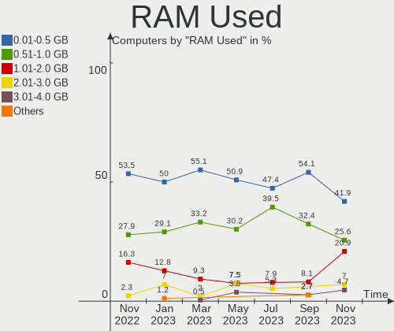
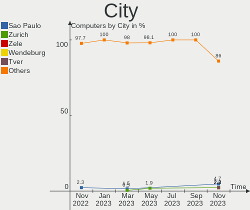
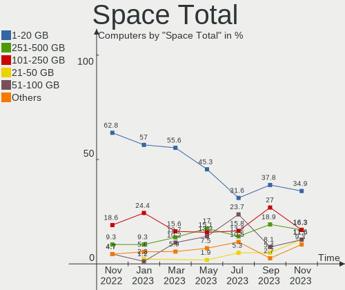
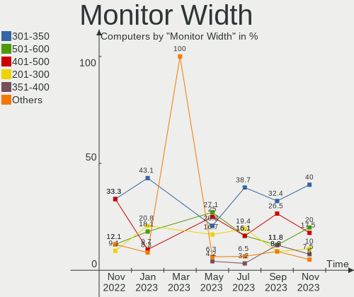
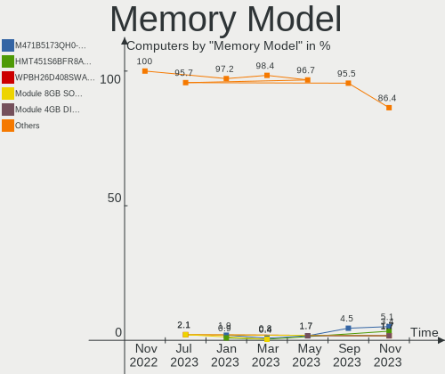

helloSystem - Hardware Trends
-----------------------------

A project to identify most popular hardware characteristics and track their change
over time based on data collected by BSD users at https://BSD-Hardware.info.

Anyone can contribute to this report by the [hw-probe](https://github.com/linuxhw/hw-probe/blob/master/INSTALL.BSD.md) tool:

    hw-probe -all -upload

This is a report for all computer types. See also reports for [desktops](/Dist/helloSystem/Desktop/README.md) and [notebooks](/Dist/helloSystem/Notebook/README.md).

This report is for one last month. Overall report since the beginning of time: [TestCoverage](https://github.com/bsdhw/TestCoverage)

Period: Jan, 2023.

Contents
--------

* [ System ](#system)
  - [ OS                       ](#os)
  - [ OS Family                ](#os-family)
  - [ Arch                     ](#arch)
  - [ DE                       ](#de)
  - [ Display Server           ](#display-server)
  - [ Display Manager          ](#display-manager)
  - [ OS Lang                  ](#os-lang)
  - [ Boot Mode                ](#boot-mode)
  - [ Filesystem               ](#filesystem)
  - [ Part. scheme             ](#part-scheme)

* [ Board ](#board)
  - [ Vendor                   ](#vendor)
  - [ Model                    ](#model)
  - [ Model Family             ](#model-family)
  - [ MFG Year                 ](#mfg-year)
  - [ Form Factor              ](#form-factor)
  - [ Coreboot                 ](#coreboot)
  - [ RAM Size                 ](#ram-size)
  - [ RAM Used                 ](#ram-used)
  - [ Total Drives             ](#total-drives)
  - [ Has CD-ROM               ](#has-cd-rom)
  - [ Has Ethernet             ](#has-ethernet)
  - [ Has WiFi                 ](#has-wifi)
  - [ Has Bluetooth            ](#has-bluetooth)

* [ Location ](#location)
  - [ Country                  ](#country)
  - [ City                     ](#city)

* [ Drives ](#drives)
  - [ Drive Vendor             ](#drive-vendor)
  - [ Drive Model              ](#drive-model)
  - [ HDD Vendor               ](#hdd-vendor)
  - [ SSD Vendor               ](#ssd-vendor)
  - [ Drive Kind               ](#drive-kind)
  - [ Drive Connector          ](#drive-connector)
  - [ Drive Size               ](#drive-size)
  - [ Space Total              ](#space-total)
  - [ Space Used               ](#space-used)
  - [ Malfunc. Drives          ](#malfunc-drives)
  - [ Malfunc. Drive Vendor    ](#malfunc-drive-vendor)
  - [ Malfunc. HDD Vendor      ](#malfunc-hdd-vendor)
  - [ Malfunc. Drive Kind      ](#malfunc-drive-kind)
  - [ Failed Drives            ](#failed-drives)
  - [ Failed Drive Vendor      ](#failed-drive-vendor)
  - [ Drive Status             ](#drive-status)

* [ Storage controller ](#storage-controller)
  - [ Storage Vendor           ](#storage-vendor)
  - [ Storage Model            ](#storage-model)
  - [ Storage Kind             ](#storage-kind)

* [ Processor ](#processor)
  - [ CPU Vendor               ](#cpu-vendor)
  - [ CPU Model                ](#cpu-model)
  - [ CPU Model Family         ](#cpu-model-family)
  - [ CPU Cores                ](#cpu-cores)
  - [ CPU Sockets              ](#cpu-sockets)
  - [ CPU Threads              ](#cpu-threads)
  - [ CPU Microarch            ](#cpu-microarch)

* [ Graphics ](#graphics)
  - [ GPU Vendor               ](#gpu-vendor)
  - [ GPU Model                ](#gpu-model)
  - [ GPU Combo                ](#gpu-combo)
  - [ GPU Driver               ](#gpu-driver)
  - [ GPU Memory               ](#gpu-memory)

* [ Monitor ](#monitor)
  - [ Monitor Vendor           ](#monitor-vendor)
  - [ Monitor Model            ](#monitor-model)
  - [ Monitor Resolution       ](#monitor-resolution)
  - [ Monitor Diagonal         ](#monitor-diagonal)
  - [ Monitor Width            ](#monitor-width)
  - [ Aspect Ratio             ](#aspect-ratio)
  - [ Monitor Area             ](#monitor-area)
  - [ Pixel Density            ](#pixel-density)
  - [ Multiple Monitors        ](#multiple-monitors)

* [ Network ](#network)
  - [ Net Controller Vendor    ](#net-controller-vendor)
  - [ Net Controller Model     ](#net-controller-model)
  - [ Wireless Vendor          ](#wireless-vendor)
  - [ Wireless Model           ](#wireless-model)
  - [ Ethernet Vendor          ](#ethernet-vendor)
  - [ Ethernet Model           ](#ethernet-model)
  - [ Net Controller Kind      ](#net-controller-kind)
  - [ Used Controller          ](#used-controller)
  - [ NICs                     ](#nics)
  - [ IPv6                     ](#ipv6)

* [ Bluetooth ](#bluetooth)
  - [ Bluetooth Vendor         ](#bluetooth-vendor)
  - [ Bluetooth Model          ](#bluetooth-model)

* [ Sound ](#sound)
  - [ Sound Vendor             ](#sound-vendor)
  - [ Sound Model              ](#sound-model)

* [ Memory ](#memory)
  - [ Memory Vendor            ](#memory-vendor)
  - [ Memory Model             ](#memory-model)
  - [ Memory Kind              ](#memory-kind)
  - [ Memory Form Factor       ](#memory-form-factor)
  - [ Memory Size              ](#memory-size)
  - [ Memory Speed             ](#memory-speed)

* [ Printers & scanners ](#printers--scanners)
  - [ Printer Vendor           ](#printer-vendor)
  - [ Printer Model            ](#printer-model)
  - [ Scanner Vendor           ](#scanner-vendor)
  - [ Scanner Model            ](#scanner-model)

* [ Camera ](#camera)
  - [ Camera Vendor            ](#camera-vendor)
  - [ Camera Model             ](#camera-model)

* [ Security ](#security)
  - [ Fingerprint Vendor       ](#fingerprint-vendor)
  - [ Fingerprint Model        ](#fingerprint-model)
  - [ Chipcard Vendor          ](#chipcard-vendor)
  - [ Chipcard Model           ](#chipcard-model)

* [ Unsupported ](#unsupported)
  - [ Unsupported Devices      ](#unsupported-devices)
  - [ Unsupported Device Types ](#unsupported-device-types)

System
------

OS
--

Installed operating systems

| Name              | Computers | Percent |
|-------------------|-----------|---------|
| helloSystem 0.8.0 | 60        | 69.77%  |
| helloSystem 0.7.0 | 26        | 30.23%  |

OS Family
---------

OS without a version

| Name        | Computers | Percent |
|-------------|-----------|---------|
| helloSystem | 86        | 100%    |

Arch
----

OS architecture (x86_64, i586, etc.)

| Name  | Computers | Percent |
|-------|-----------|---------|
| amd64 | 86        | 100%    |

DE
--

Desktop Environment

| Name         | Computers | Percent |
|--------------|-----------|---------|
| helloDesktop | 84        | 97.67%  |
| KDE5         | 1         | 1.16%   |
| IceWM        | 1         | 1.16%   |

Display Server
--------------

X11 or Wayland

| Name | Computers | Percent |
|------|-----------|---------|
| X11  | 86        | 100%    |

Display Manager
---------------

SDDM, LightDM, etc.

| Name | Computers | Percent |
|------|-----------|---------|
| SLiM | 86        | 100%    |

OS Lang
-------

Language

| Lang  | Computers | Percent |
|-------|-----------|---------|
| en    | 32        | 37.21%  |
| en_US | 27        | 31.4%   |
| ru    | 10        | 11.63%  |
| de    | 4         | 4.65%   |
| pt    | 3         | 3.49%   |
| es    | 3         | 3.49%   |
| fr    | 2         | 2.33%   |
| es_ES | 2         | 2.33%   |
| zh_CN | 1         | 1.16%   |
| it    | 1         | 1.16%   |
| en_GB | 1         | 1.16%   |

Boot Mode
---------

EFI or BIOS

| Mode | Computers | Percent |
|------|-----------|---------|
| EFI  | 86        | 100%    |

Filesystem
----------

Type of filesystem

| Type   | Computers | Percent |
|--------|-----------|---------|
| Cd9660 | 53        | 61.63%  |
| Zfs    | 32        | 37.21%  |
| Ufs    | 1         | 1.16%   |

Part. scheme
------------

Scheme of partitioning

| Type | Computers | Percent |
|------|-----------|---------|
| GPT  | 86        | 100%    |

Board
-----

Vendor
------

Motherboard manufacturer

| Name                | Computers | Percent |
|---------------------|-----------|---------|
| Lenovo              | 15        | 17.44%  |
| Dell                | 13        | 15.12%  |
| Gigabyte Technology | 11        | 12.79%  |
| Hewlett-Packard     | 10        | 11.63%  |
| ASUSTek Computer    | 10        | 11.63%  |
| Acer                | 4         | 4.65%   |
| MSI                 | 3         | 3.49%   |
| Apple               | 3         | 3.49%   |
| Google              | 2         | 2.33%   |
| ASRock              | 2         | 2.33%   |
| Toshiba             | 1         | 1.16%   |
| Timi                | 1         | 1.16%   |
| Star Labs           | 1         | 1.16%   |
| Samsung Electronics | 1         | 1.16%   |
| Razer               | 1         | 1.16%   |
| Panasonic           | 1         | 1.16%   |
| Packard Bell        | 1         | 1.16%   |
| MACHINIST           | 1         | 1.16%   |
| Intel               | 1         | 1.16%   |
| Fujitsu             | 1         | 1.16%   |
| Biostar             | 1         | 1.16%   |
| Acidanthera         | 1         | 1.16%   |
| Unknown             | 1         | 1.16%   |

Model
-----

Motherboard model

| Name                                   | Computers | Percent |
|----------------------------------------|-----------|---------|
| Dell Precision Tower 5810              | 3         | 3.49%   |
| ASUS All Series                        | 3         | 3.49%   |
| Lenovo IdeaPad 110-14AST 80TQ          | 2         | 2.33%   |
| Toshiba PORTEGE Z930                   | 1         | 1.16%   |
| Timi TM1607                            | 1         | 1.16%   |
| Star Labs StarBook                     | 1         | 1.16%   |
| Samsung 340XAA/350XAA/550XAA           | 1         | 1.16%   |
| Razer Blade Stealth                    | 1         | 1.16%   |
| Panasonic CF-C1BWFAZ1M                 | 1         | 1.16%   |
| Packard Bell DOT S                     | 1         | 1.16%   |
| MSI PS63 Modern 8M                     | 1         | 1.16%   |
| MSI MS-7B89                            | 1         | 1.16%   |
| MSI Modern 15 A5M                      | 1         | 1.16%   |
| MACHINIST X99-K9 V2.0                  | 1         | 1.16%   |
| Lenovo ThinkPad X1 Tablet 20GHS1UK00   | 1         | 1.16%   |
| Lenovo ThinkPad X1 Carbon 3448AWU      | 1         | 1.16%   |
| Lenovo ThinkPad W541 20EF000NUS        | 1         | 1.16%   |
| Lenovo ThinkPad T61 64644YG            | 1         | 1.16%   |
| Lenovo ThinkPad T460 20FMS06V00        | 1         | 1.16%   |
| Lenovo ThinkPad T400 2764CTO           | 1         | 1.16%   |
| Lenovo ThinkPad S1 Yoga 20CD0038MB     | 1         | 1.16%   |
| Lenovo ThinkPad P51 20HH001RMX         | 1         | 1.16%   |
| Lenovo ThinkPad P50 20EN0041MX         | 1         | 1.16%   |
| Lenovo ThinkPad P15v Gen 2i 21AAS28T00 | 1         | 1.16%   |
| Lenovo ThinkPad E585 20KV0010US        | 1         | 1.16%   |
| Lenovo G500 20236                      | 1         | 1.16%   |
| Lenovo B40-70 80F30005BR               | 1         | 1.16%   |
| Intel H61                              | 1         | 1.16%   |
| HP ZBook 15 G4                         | 1         | 1.16%   |
| HP Z240 SFF Workstation                | 1         | 1.16%   |
| HP Pavilion g6                         | 1         | 1.16%   |
| HP Pavilion dv6                        | 1         | 1.16%   |
| HP Laptop 15-bs0xx                     | 1         | 1.16%   |
| HP EliteBook 8440p                     | 1         | 1.16%   |
| HP EliteBook 2560p                     | 1         | 1.16%   |
| HP Compaq 8200 Elite USDT PC           | 1         | 1.16%   |
| HP Compaq 8200 Elite SFF PC            | 1         | 1.16%   |
| HP 2000                                | 1         | 1.16%   |
| Google Panther                         | 1         | 1.16%   |
| Google Cave                            | 1         | 1.16%   |

Model Family
------------

Motherboard model prefix

| Name                    | Computers | Percent |
|-------------------------|-----------|---------|
| Lenovo ThinkPad         | 11        | 12.79%  |
| Dell Precision          | 4         | 4.65%   |
| Dell OptiPlex           | 3         | 3.49%   |
| Dell Latitude           | 3         | 3.49%   |
| Dell Inspiron           | 3         | 3.49%   |
| ASUS All                | 3         | 3.49%   |
| Acer Aspire             | 3         | 3.49%   |
| Lenovo IdeaPad          | 2         | 2.33%   |
| HP Pavilion             | 2         | 2.33%   |
| HP EliteBook            | 2         | 2.33%   |
| HP Compaq               | 2         | 2.33%   |
| Toshiba PORTEGE         | 1         | 1.16%   |
| Timi TM1607             | 1         | 1.16%   |
| Star Labs StarBook      | 1         | 1.16%   |
| Samsung 340XAA          | 1         | 1.16%   |
| Razer Blade             | 1         | 1.16%   |
| Panasonic CF-C1BWFAZ1M  | 1         | 1.16%   |
| Packard Bell DOT        | 1         | 1.16%   |
| MSI PS63                | 1         | 1.16%   |
| MSI MS-7B89             | 1         | 1.16%   |
| MSI Modern              | 1         | 1.16%   |
| MACHINIST X99-K9        | 1         | 1.16%   |
| Lenovo G500             | 1         | 1.16%   |
| Lenovo B40-70           | 1         | 1.16%   |
| Intel H61               | 1         | 1.16%   |
| HP ZBook                | 1         | 1.16%   |
| HP Z240                 | 1         | 1.16%   |
| HP Laptop               | 1         | 1.16%   |
| HP 2000                 | 1         | 1.16%   |
| Google Panther          | 1         | 1.16%   |
| Google Cave             | 1         | 1.16%   |
| Gigabyte Z390           | 1         | 1.16%   |
| Gigabyte X570           | 1         | 1.16%   |
| Gigabyte H81M-H         | 1         | 1.16%   |
| Gigabyte H61M-S2PV      | 1         | 1.16%   |
| Gigabyte H270M-DS3H     | 1         | 1.16%   |
| Gigabyte GA-MA770T-UD3  | 1         | 1.16%   |
| Gigabyte GA-990X-Gaming | 1         | 1.16%   |
| Gigabyte G1.Sniper      | 1         | 1.16%   |
| Gigabyte B450           | 1         | 1.16%   |

MFG Year
--------

Motherboard manufacture year

| Year | Computers | Percent |
|------|-----------|---------|
| 2019 | 12        | 13.95%  |
| 2018 | 10        | 11.63%  |
| 2020 | 8         | 9.3%    |
| 2015 | 7         | 8.14%   |
| 2021 | 6         | 6.98%   |
| 2017 | 6         | 6.98%   |
| 2014 | 6         | 6.98%   |
| 2012 | 6         | 6.98%   |
| 2011 | 6         | 6.98%   |
| 2016 | 5         | 5.81%   |
| 2022 | 4         | 4.65%   |
| 2013 | 4         | 4.65%   |
| 2010 | 2         | 2.33%   |
| 2009 | 2         | 2.33%   |
| 2023 | 1         | 1.16%   |
| 2007 | 1         | 1.16%   |

Form Factor
-----------

Physical design of the computer

| Name        | Computers | Percent |
|-------------|-----------|---------|
| Notebook    | 45        | 52.33%  |
| Desktop     | 37        | 43.02%  |
| All in one  | 2         | 2.33%   |
| Tablet      | 1         | 1.16%   |
| Convertible | 1         | 1.16%   |

Coreboot
--------

Have coreboot on board

| Used | Computers | Percent |
|------|-----------|---------|
| No   | 83        | 96.51%  |
| Yes  | 3         | 3.49%   |

RAM Size
--------

Total RAM memory

| Size in GB  | Computers | Percent |
|-------------|-----------|---------|
| 4.01-8.0    | 29        | 33.72%  |
| 16.01-24.0  | 24        | 27.91%  |
| 8.01-16.0   | 20        | 23.26%  |
| 32.01-64.0  | 6         | 6.98%   |
| 64.01-256.0 | 5         | 5.81%   |
| 24.01-32.0  | 1         | 1.16%   |
| 2.01-3.0    | 1         | 1.16%   |

RAM Used
--------

Used RAM memory

| Used GB   | Computers | Percent |
|-----------|-----------|---------|
| 0.01-0.5  | 43        | 50%     |
| 0.51-1.0  | 25        | 29.07%  |
| 1.01-2.0  | 11        | 12.79%  |
| 2.01-3.0  | 6         | 6.98%   |
| 8.01-16.0 | 1         | 1.16%   |

Total Drives
------------

Number of drives on board

| Drives | Computers | Percent |
|--------|-----------|---------|
| 1      | 56        | 65.12%  |
| 2      | 17        | 19.77%  |
| 3      | 10        | 11.63%  |
| 5      | 1         | 1.16%   |
| 4      | 1         | 1.16%   |
| 0      | 1         | 1.16%   |

Has CD-ROM
----------

Has CD-ROM on board

| Presented | Computers | Percent |
|-----------|-----------|---------|
| No        | 64        | 74.42%  |
| Yes       | 22        | 25.58%  |

Has Ethernet
------------

Has Ethernet on board

| Presented | Computers | Percent |
|-----------|-----------|---------|
| Yes       | 74        | 86.05%  |
| No        | 12        | 13.95%  |

Has WiFi
--------

Has WiFi module

| Presented | Computers | Percent |
|-----------|-----------|---------|
| Yes       | 60        | 69.77%  |
| No        | 26        | 30.23%  |

Has Bluetooth
-------------

Has Bluetooth module

| Presented | Computers | Percent |
|-----------|-----------|---------|
| Yes       | 50        | 58.14%  |
| No        | 36        | 41.86%  |

Location
--------

Country
-------

Geographic location (country)

| Country                | Computers | Percent |
|------------------------|-----------|---------|
| USA                    | 14        | 16.28%  |
| Russia                 | 14        | 16.28%  |
| Indonesia              | 7         | 8.14%   |
| Germany                | 5         | 5.81%   |
| Spain                  | 4         | 4.65%   |
| Netherlands            | 4         | 4.65%   |
| Brazil                 | 4         | 4.65%   |
| Canada                 | 3         | 3.49%   |
| Bulgaria               | 3         | 3.49%   |
| UK                     | 2         | 2.33%   |
| Portugal               | 2         | 2.33%   |
| Poland                 | 2         | 2.33%   |
| Italy                  | 2         | 2.33%   |
| Ireland                | 2         | 2.33%   |
| France                 | 2         | 2.33%   |
| China                  | 2         | 2.33%   |
| Argentina              | 2         | 2.33%   |
| Uruguay                | 1         | 1.16%   |
| Sweden                 | 1         | 1.16%   |
| Nepal                  | 1         | 1.16%   |
| Kenya                  | 1         | 1.16%   |
| India                  | 1         | 1.16%   |
| Hungary                | 1         | 1.16%   |
| Egypt                  | 1         | 1.16%   |
| Czechia                | 1         | 1.16%   |
| Cyprus                 | 1         | 1.16%   |
| Costa Rica             | 1         | 1.16%   |
| Bosnia and Herzegovina | 1         | 1.16%   |
| Algeria                | 1         | 1.16%   |

City
----

Geographic location (city)

| City            | Computers | Percent |
|-----------------|-----------|---------|
| Moscow          | 4         | 4.65%   |
| Saratov         | 2         | 2.33%   |
| Dublin          | 2         | 2.33%   |
| Chelyabinsk     | 2         | 2.33%   |
| Berlin          | 2         | 2.33%   |
| Yekaterinburg   | 1         | 1.16%   |
| Yancheng        | 1         | 1.16%   |
| Yambol          | 1         | 1.16%   |
| Winnipeg        | 1         | 1.16%   |
| Voronezh        | 1         | 1.16%   |
| Villemomble     | 1         | 1.16%   |
| Vidnoye         | 1         | 1.16%   |
| Veliko Tarnovo  | 1         | 1.16%   |
| Valencia        | 1         | 1.16%   |
| Utrecht         | 1         | 1.16%   |
| Toronto         | 1         | 1.16%   |
| Tegal           | 1         | 1.16%   |
| Tasikmalaya     | 1         | 1.16%   |
| Sumaré         | 1         | 1.16%   |
| Smolyan         | 1         | 1.16%   |
| Sliedrecht      | 1         | 1.16%   |
| Shenzhen        | 1         | 1.16%   |
| Semarang        | 1         | 1.16%   |
| Seattle         | 1         | 1.16%   |
| Sayago          | 1         | 1.16%   |
| Sarajevo        | 1         | 1.16%   |
| San José       | 1         | 1.16%   |
| Saint-Zotique   | 1         | 1.16%   |
| Roscommon       | 1         | 1.16%   |
| Richardson      | 1         | 1.16%   |
| Recklinghausen  | 1         | 1.16%   |
| Queensbury      | 1         | 1.16%   |
| Porto           | 1         | 1.16%   |
| Pilsen          | 1         | 1.16%   |
| Pieve a Nievole | 1         | 1.16%   |
| Perm            | 1         | 1.16%   |
| Pemalang        | 1         | 1.16%   |
| Papendrecht     | 1         | 1.16%   |
| Palembang       | 1         | 1.16%   |
| Padang          | 1         | 1.16%   |

Drives
------

Drive Vendor
------------

Hard drive vendors

| Vendor              | Computers | Drives | Percent |
|---------------------|-----------|--------|---------|
| WDC                 | 18        | 22     | 14.63%  |
| Seagate             | 16        | 16     | 13.01%  |
| Samsung Electronics | 16        | 18     | 13.01%  |
| Kingston            | 13        | 13     | 10.57%  |
| Toshiba             | 8         | 8      | 6.5%    |
| Crucial             | 7         | 7      | 5.69%   |
| SanDisk             | 5         | 5      | 4.07%   |
| Hitachi             | 4         | 4      | 3.25%   |
| Patriot             | 3         | 3      | 2.44%   |
| Intel               | 3         | 3      | 2.44%   |
| SK hynix            | 2         | 2      | 1.63%   |
| PNY                 | 2         | 2      | 1.63%   |
| Plextor             | 2         | 2      | 1.63%   |
| KingSpec            | 2         | 2      | 1.63%   |
| China               | 2         | 2      | 1.63%   |
| Apple               | 2         | 3      | 1.63%   |
| A-DATA Technology   | 2         | 2      | 1.63%   |
| XrayDisk            | 1         | 1      | 0.81%   |
| Verbatim            | 1         | 1      | 0.81%   |
| V-GeN               | 1         | 1      | 0.81%   |
| Team                | 1         | 1      | 0.81%   |
| Star Drive          | 1         | 1      | 0.81%   |
| Silicon Motion      | 1         | 1      | 0.81%   |
| Pioneer             | 1         | 1      | 0.81%   |
| Phison              | 1         | 2      | 0.81%   |
| OWC                 | 1         | 1      | 0.81%   |
| MidasForce          | 1         | 1      | 0.81%   |
| Lenovo              | 1         | 1      | 0.81%   |
| KIOXIA              | 1         | 1      | 0.81%   |
| Kimtigo             | 1         | 1      | 0.81%   |
| Fanxiang            | 1         | 1      | 0.81%   |
| Dogfish             | 1         | 1      | 0.81%   |
| Corsair             | 1         | 1      | 0.81%   |

Drive Model
-----------

Hard drive models

| Model                           | Computers | Percent |
|---------------------------------|-----------|---------|
| Kingston SA400S37240G 240GB     | 5         | 3.88%   |
| Toshiba HDWD110 1TB             | 2         | 1.55%   |
| Seagate ST3500418AS 500GB       | 2         | 1.55%   |
| Seagate ST1000LM035-1RK172 1TB  | 2         | 1.55%   |
| Samsung SSD 860 EVO 1TB         | 2         | 1.55%   |
| Kingston SA400S37120G 120GB     | 2         | 1.55%   |
| XrayDisk SSD 256GB              | 1         | 0.78%   |
| WDC WD80EFAX-68KNBN0 8TB        | 1         | 0.78%   |
| WDC WD5000LPVX-22V0TT0 500GB    | 1         | 0.78%   |
| WDC WD5000LPCX-60VHAT0 500GB    | 1         | 0.78%   |
| WDC WD5000LPCX-22VHAT1 500GB    | 1         | 0.78%   |
| WDC WD5000BPVT-22A1YT0 500GB    | 1         | 0.78%   |
| WDC WD5000AAKX-001CA0 500GB     | 1         | 0.78%   |
| WDC WD4000FYYZ-05UL1B0 4TB      | 1         | 0.78%   |
| WDC WD3200LPVX-60V0TT0 320GB    | 1         | 0.78%   |
| WDC WD2500BEVT-35A23T0 250GB    | 1         | 0.78%   |
| WDC WD20EZAZ-22L9GB0 2TB        | 1         | 0.78%   |
| WDC WD20EARS-00MVWB0 2TB        | 1         | 0.78%   |
| WDC WD2003FYYS-02W0B1 2TB       | 1         | 0.78%   |
| WDC WD2002FFSX-68PF8N0 2TB      | 1         | 0.78%   |
| WDC WD10SPZX-35Z10T0 1TB        | 1         | 0.78%   |
| WDC WD10JPVX-22JC3T0 1TB        | 1         | 0.78%   |
| WDC WD10JMVW-11AJGS2 1TB        | 1         | 0.78%   |
| WDC WD10EZRZ-00HTKB0 1TB        | 1         | 0.78%   |
| WDC WD10EZEX-22MFCA0 1TB        | 1         | 0.78%   |
| WDC WD10EZEX-08WN4A0 1TB        | 1         | 0.78%   |
| WDC WD10EADS-65M2BX 1TB         | 1         | 0.78%   |
| WDC WD10EACS-00D6B1 1TB         | 1         | 0.78%   |
| WDC WD1002FAEX-00Y9A0 1TB       | 1         | 0.78%   |
| Verbatim Vi550 S3 SSD 512GB     | 1         | 0.78%   |
| V-GeN V-GEN10AS20AR128SDK 128GB | 1         | 0.78%   |
| Toshiba THNSNF128GMCS 128GB     | 1         | 0.78%   |
| Toshiba MK3261GSYN 320GB        | 1         | 0.78%   |
| Toshiba MK1255GSX H 120GB       | 1         | 0.78%   |
| Toshiba MK1059GSM 1TB           | 1         | 0.78%   |
| Toshiba KXG60ZNV256G NVMe 256GB | 1         | 0.78%   |
| Toshiba DT01ACA100 1TB          | 1         | 0.78%   |
| Team TM8FP4512G 512GB           | 1         | 0.78%   |
| Star Drive PCIe SSD 1TB         | 1         | 0.78%   |
| SK hynix SC311 SATA 256GB       | 1         | 0.78%   |

HDD Vendor
----------

Hard disk drive vendors

| Vendor              | Computers | Drives | Percent |
|---------------------|-----------|--------|---------|
| WDC                 | 18        | 22     | 40%     |
| Seagate             | 16        | 16     | 35.56%  |
| Toshiba             | 6         | 6      | 13.33%  |
| Hitachi             | 4         | 4      | 8.89%   |
| Samsung Electronics | 1         | 1      | 2.22%   |

SSD Vendor
----------

Solid state drive vendors

| Vendor              | Computers | Drives | Percent |
|---------------------|-----------|--------|---------|
| Kingston            | 12        | 12     | 19.67%  |
| Samsung Electronics | 11        | 13     | 18.03%  |
| Crucial             | 7         | 7      | 11.48%  |
| SanDisk             | 5         | 5      | 8.2%    |
| Patriot             | 3         | 3      | 4.92%   |
| PNY                 | 2         | 2      | 3.28%   |
| Plextor             | 2         | 2      | 3.28%   |
| KingSpec            | 2         | 2      | 3.28%   |
| China               | 2         | 2      | 3.28%   |
| Apple               | 2         | 3      | 3.28%   |
| XrayDisk            | 1         | 1      | 1.64%   |
| Verbatim            | 1         | 1      | 1.64%   |
| V-GeN               | 1         | 1      | 1.64%   |
| Toshiba             | 1         | 1      | 1.64%   |
| SK hynix            | 1         | 1      | 1.64%   |
| Pioneer             | 1         | 1      | 1.64%   |
| OWC                 | 1         | 1      | 1.64%   |
| MidasForce          | 1         | 1      | 1.64%   |
| Intel               | 1         | 1      | 1.64%   |
| Fanxiang            | 1         | 1      | 1.64%   |
| Dogfish             | 1         | 1      | 1.64%   |
| Corsair             | 1         | 1      | 1.64%   |
| A-DATA Technology   | 1         | 1      | 1.64%   |

Drive Kind
----------

HDD or SSD

| Kind | Computers | Drives | Percent |
|------|-----------|--------|---------|
| SSD  | 52        | 64     | 48.6%   |
| HDD  | 39        | 49     | 36.45%  |
| NVMe | 16        | 18     | 14.95%  |

Drive Connector
---------------

SATA, SAS, NVMe, etc.

| Type | Computers | Drives | Percent |
|------|-----------|--------|---------|
| SATA | 77        | 113    | 82.8%   |
| NVMe | 16        | 18     | 17.2%   |

Drive Size
----------

Size of hard drive

| Size in TB | Computers | Drives | Percent |
|------------|-----------|--------|---------|
| 0.01-0.5   | 62        | 76     | 66.67%  |
| 0.51-1.0   | 21        | 24     | 22.58%  |
| 1.01-2.0   | 6         | 9      | 6.45%   |
| 3.01-4.0   | 2         | 2      | 2.15%   |
| 4.01-10.0  | 2         | 2      | 2.15%   |

Space Total
-----------

Amount of disk space available on the file system

| Size in GB     | Computers | Percent |
|----------------|-----------|---------|
| 1-20           | 49        | 56.98%  |
| 101-250        | 21        | 24.42%  |
| 251-500        | 8         | 9.3%    |
| 501-1000       | 4         | 4.65%   |
| 21-50          | 2         | 2.33%   |
| More than 3000 | 1         | 1.16%   |
| 51-100         | 1         | 1.16%   |

Space Used
----------

Amount of used disk space

| Used GB | Computers | Percent |
|---------|-----------|---------|
| 1-20    | 84        | 97.67%  |
| 21-50   | 1         | 1.16%   |
| 101-250 | 1         | 1.16%   |

Malfunc. Drives
---------------

Drive models with a malfunction

| Model                           | Computers | Drives | Percent |
|---------------------------------|-----------|--------|---------|
| WDC WD5000LPCX-60VHAT0 500GB    | 1         | 1      | 5%      |
| WDC WD5000AAKX-001CA0 500GB     | 1         | 1      | 5%      |
| WDC WD2500BEVT-35A23T0 250GB    | 1         | 1      | 5%      |
| WDC WD10JMVW-11AJGS2 1TB        | 1         | 1      | 5%      |
| WDC WD10EZRZ-00HTKB0 1TB        | 1         | 1      | 5%      |
| WDC WD10EADS-65M2BX 1TB         | 1         | 1      | 5%      |
| WDC WD10EACS-00D6B1 1TB         | 1         | 1      | 5%      |
| Toshiba MK3261GSYN 320GB        | 1         | 1      | 5%      |
| Toshiba MK1255GSX H 120GB       | 1         | 1      | 5%      |
| Toshiba MK1059GSM 1TB           | 1         | 1      | 5%      |
| Toshiba DT01ACA100 1TB          | 1         | 1      | 5%      |
| Seagate ST500LM000-1EJ162 500GB | 1         | 1      | 5%      |
| Seagate ST3500418AS 500GB       | 1         | 1      | 5%      |
| Seagate ST320LT020-9YG142 320GB | 1         | 1      | 5%      |
| Seagate ST320LT012-9WS14C 320GB | 1         | 1      | 5%      |
| Pioneer APS-SL3N-240 240GB      | 1         | 1      | 5%      |
| MidasForce SSD 120GB            | 1         | 1      | 5%      |
| Hitachi HTS545050B9A300 500GB   | 1         | 1      | 5%      |
| Hitachi HDS721010DLE630 1TB     | 1         | 1      | 5%      |
| Corsair Force LE SSD 240GB      | 1         | 1      | 5%      |

Malfunc. Drive Vendor
---------------------

Vendors of faulty drives

| Vendor     | Computers | Drives | Percent |
|------------|-----------|--------|---------|
| WDC        | 7         | 7      | 35%     |
| Toshiba    | 4         | 4      | 20%     |
| Seagate    | 4         | 4      | 20%     |
| Hitachi    | 2         | 2      | 10%     |
| Pioneer    | 1         | 1      | 5%      |
| MidasForce | 1         | 1      | 5%      |
| Corsair    | 1         | 1      | 5%      |

Malfunc. HDD Vendor
-------------------

Vendors of faulty HDD drives

| Vendor  | Computers | Drives | Percent |
|---------|-----------|--------|---------|
| WDC     | 7         | 7      | 41.18%  |
| Toshiba | 4         | 4      | 23.53%  |
| Seagate | 4         | 4      | 23.53%  |
| Hitachi | 2         | 2      | 11.76%  |

Malfunc. Drive Kind
-------------------

Kinds of faulty drives

| Kind | Computers | Drives | Percent |
|------|-----------|--------|---------|
| HDD  | 15        | 17     | 83.33%  |
| SSD  | 3         | 3      | 16.67%  |

Failed Drives
-------------

Failed drive models

Zero info for selected period =(

Failed Drive Vendor
-------------------

Failed drive vendors

Zero info for selected period =(

Drive Status
------------

Number of failed and malfunc. drives

| Status   | Computers | Drives | Percent |
|----------|-----------|--------|---------|
| Works    | 71        | 107    | 78.89%  |
| Malfunc  | 17        | 20     | 18.89%  |
| Detected | 2         | 4      | 2.22%   |

Storage controller
------------------

Storage Vendor
--------------

Storage controller vendors

| Vendor                      | Computers | Percent |
|-----------------------------|-----------|---------|
| Intel                       | 66        | 65.35%  |
| AMD                         | 14        | 13.86%  |
| Samsung Electronics         | 4         | 3.96%   |
| Phison Electronics          | 3         | 2.97%   |
| Silicon Motion              | 2         | 1.98%   |
| Realtek Semiconductor       | 2         | 1.98%   |
| JMicron Technology          | 2         | 1.98%   |
| Toshiba                     | 1         | 0.99%   |
| SK hynix                    | 1         | 0.99%   |
| SanDisk                     | 1         | 0.99%   |
| Nvidia                      | 1         | 0.99%   |
| Lite-On IT Corp. / Plextor  | 1         | 0.99%   |
| Lenovo                      | 1         | 0.99%   |
| KIOXIA                      | 1         | 0.99%   |
| Kingston Technology Company | 1         | 0.99%   |

Storage Model
-------------

Storage controller models

| Model                                                                          | Computers | Percent |
|--------------------------------------------------------------------------------|-----------|---------|
| AMD FCH SATA Controller [AHCI mode]                                            | 8         | 7.08%   |
| Intel Sunrise Point-LP SATA Controller [AHCI mode]                             | 7         | 6.19%   |
| Intel Cannon Lake PCH SATA AHCI Controller                                     | 7         | 6.19%   |
| Intel 8 Series SATA Controller 1 [AHCI mode]                                   | 5         | 4.42%   |
| Intel 7 Series Chipset Family 6-port SATA Controller [AHCI mode]               | 5         | 4.42%   |
| Intel Q170/Q150/B150/H170/H110/Z170/CM236 Chipset SATA Controller [AHCI Mode]  | 4         | 3.54%   |
| Intel 6 Series/C200 Series Chipset Family 6 port Mobile SATA AHCI Controller   | 4         | 3.54%   |
| Intel C610/X99 series chipset 6-Port SATA Controller [AHCI mode]               | 3         | 2.65%   |
| Intel 8 Series/C220 Series Chipset Family 6-port SATA Controller 1 [AHCI mode] | 3         | 2.65%   |
| Intel 6 Series/C200 Series Chipset Family 6 port Desktop SATA AHCI Controller  | 3         | 2.65%   |
| Unknown                                                                        | 3         | 2.65%   |
| Silicon Motion SM2263EN/SM2263XT SSD Controller                                | 2         | 1.77%   |
| Samsung NVMe SSD Controller SM981/PM981/PM983                                  | 2         | 1.77%   |
| Samsung NVMe SSD Controller SM961/PM961/SM963                                  | 2         | 1.77%   |
| Phison E12 NVMe Controller                                                     | 2         | 1.77%   |
| JMicron JMB361 AHCI/IDE                                                        | 2         | 1.77%   |
| Intel SSD 660P Series                                                          | 2         | 1.77%   |
| Intel SATA Controller [RAID mode]                                              | 2         | 1.77%   |
| Intel Cannon Point-LP SATA Controller [AHCI Mode]                              | 2         | 1.77%   |
| Intel C610/X99 series chipset sSATA Controller [AHCI mode]                     | 2         | 1.77%   |
| Intel C600/X79 series chipset SATA RAID Controller                             | 2         | 1.77%   |
| Intel Atom Processor E3800 Series SATA AHCI Controller                         | 2         | 1.77%   |
| Intel 5 Series/3400 Series Chipset 6 port SATA AHCI Controller                 | 2         | 1.77%   |
| Intel 4 Series Chipset PT IDER Controller                                      | 2         | 1.77%   |
| Intel 200 Series PCH SATA controller [AHCI mode]                               | 2         | 1.77%   |
| AMD SB7x0/SB8x0/SB9x0 SATA Controller [AHCI mode]                              | 2         | 1.77%   |
| AMD 400 Series Chipset SATA Controller                                         | 2         | 1.77%   |
| Toshiba XG6 NVMe SSD Controller                                                | 1         | 0.88%   |
| SK hynix hynix unknown                                                         | 1         | 0.88%   |
| SanDisk WD PC SN810 / Black SN850 NVMe SSD                                     | 1         | 0.88%   |
| Phison E18 PCIe4 NVMe Controller                                               | 1         | 0.88%   |
| Nvidia MCP79 AHCI Controller                                                   | 1         | 0.88%   |
| Lite-On IT Corp. / Plextor M6e PCI Express SSD [Marvell 88SS9183]              | 1         | 0.88%   |
| Lenovo unknown                                                                 | 1         | 0.88%   |
| Kingston Company OM3PDP3 NVMe SSD                                              | 1         | 0.88%   |
| Intel Wildcat Point-LP SATA Controller [AHCI Mode]                             | 1         | 0.88%   |
| Intel NM10/ICH7 Family SATA Controller [IDE mode]                              | 1         | 0.88%   |
| Intel NM10/ICH7 Family SATA Controller [AHCI mode]                             | 1         | 0.88%   |
| Intel Celeron/Pentium Silver Processor SATA Controller                         | 1         | 0.88%   |
| Intel Celeron N3350/Pentium N4200/Atom E3900 Series SATA AHCI Controller       | 1         | 0.88%   |

Storage Kind
------------

Kind of storage controller (IDE, SATA, NVMe, SAS, ...)

| Kind | Computers | Percent |
|------|-----------|---------|
| SATA | 74        | 71.84%  |
| NVMe | 17        | 16.5%   |
| IDE  | 8         | 7.77%   |
| RAID | 4         | 3.88%   |

Processor
---------

CPU Vendor
----------

Processor vendors

| Vendor | Computers | Percent |
|--------|-----------|---------|
| Intel  | 71        | 82.56%  |
| AMD    | 15        | 17.44%  |

CPU Model
---------

Processor models

| Model                                        | Computers | Percent |
|----------------------------------------------|-----------|---------|
| Intel Core i3-8100 CPU @ 3.60GHz             | 3         | 3.49%   |
| Intel Xeon CPU E5-1650 v3 @ 3.50GHz          | 2         | 2.33%   |
| Intel Core i7-7820HQ CPU @ 2.90GHz           | 2         | 2.33%   |
| Intel Core i5-8250U CPU @ 1.60GHz            | 2         | 2.33%   |
| Intel Core i5-4210U CPU @ 1.70GHz            | 2         | 2.33%   |
| Intel Core i5-2520M CPU @ 2.50GHz            | 2         | 2.33%   |
| Intel Core 2 Duo                             | 2         | 2.33%   |
| AMD Phenom II X4 945 Processor               | 2         | 2.33%   |
| AMD E1-2500 APU with Radeon HD Graphics      | 2         | 2.33%   |
| AMD A9-9400 RADEON R5, 5 COMPUTE CORES 2C+3G | 2         | 2.33%   |
| Intel Xeon CPU W3565 @ 3.20GHz               | 1         | 1.16%   |
| Intel Xeon CPU E5462 @ 2.80GHz               | 1         | 1.16%   |
| Intel Xeon CPU E5-2676 v3 @ 2.40GHz          | 1         | 1.16%   |
| Intel Xeon CPU E5-2640 v3 @ 2.60GHz          | 1         | 1.16%   |
| Intel Xeon CPU E3-1505M v5 @ 2.80GHz         | 1         | 1.16%   |
| Intel Xeon CPU E3-1225 v5 @ 3.30GHz          | 1         | 1.16%   |
| Intel Pentium Dual-Core CPU T4200 @ 2.00GHz  | 1         | 1.16%   |
| Intel Pentium CPU N4200 @ 1.10GHz            | 1         | 1.16%   |
| Intel Pentium CPU G630 @ 2.70GHz             | 1         | 1.16%   |
| Intel Core m7-6Y75 CPU @ 1.20GHz             | 1         | 1.16%   |
| Intel Core m3-7Y30 CPU @ 1.00GHz             | 1         | 1.16%   |
| Intel Core m3-6Y30 CPU @ 0.90GHz             | 1         | 1.16%   |
| Intel Core i9-9980XE CPU @ 3.00GHz           | 1         | 1.16%   |
| Intel Core i7-9850H CPU @ 2.60GHz            | 1         | 1.16%   |
| Intel Core i7-9700K CPU @ 3.60GHz            | 1         | 1.16%   |
| Intel Core i7-8565U CPU @ 1.80GHz            | 1         | 1.16%   |
| Intel Core i7-7700 CPU @ 3.60GHz             | 1         | 1.16%   |
| Intel Core i7-7500U CPU @ 2.70GHz            | 1         | 1.16%   |
| Intel Core i7-6500U CPU @ 2.50GHz            | 1         | 1.16%   |
| Intel Core i7-5820K CPU @ 3.30GHz            | 1         | 1.16%   |
| Intel Core i7-4810MQ CPU @ 2.80GHz           | 1         | 1.16%   |
| Intel Core i7-4500U CPU @ 1.80GHz            | 1         | 1.16%   |
| Intel Core i7-3667U CPU @ 2.00GHz            | 1         | 1.16%   |
| Intel Core i7-2600 CPU @ 3.40GHz             | 1         | 1.16%   |
| Intel Core i5-9400F CPU @ 2.90GHz            | 1         | 1.16%   |
| Intel Core i5-8500T CPU @ 2.10GHz            | 1         | 1.16%   |
| Intel Core i5-8400 CPU @ 2.80GHz             | 1         | 1.16%   |
| Intel Core i5-8365U CPU @ 1.60GHz            | 1         | 1.16%   |
| Intel Core i5-7200U CPU @ 2.50GHz            | 1         | 1.16%   |
| Intel Core i5-6440HQ CPU @ 2.60GHz           | 1         | 1.16%   |

CPU Model Family
----------------

Processor model prefix

| Model                   | Computers | Percent |
|-------------------------|-----------|---------|
| Intel Core i5           | 21        | 24.42%  |
| Intel Core i7           | 13        | 15.12%  |
| Intel Xeon              | 8         | 9.3%    |
| Intel Core i3           | 8         | 9.3%    |
| Intel Celeron           | 7         | 8.14%   |
| Other                   | 4         | 4.65%   |
| Intel Core 2 Duo        | 4         | 4.65%   |
| AMD Ryzen 5             | 3         | 3.49%   |
| AMD Ryzen 3             | 3         | 3.49%   |
| Intel Pentium           | 2         | 2.33%   |
| Intel Core m3           | 2         | 2.33%   |
| AMD Phenom II X4        | 2         | 2.33%   |
| AMD E1                  | 2         | 2.33%   |
| Intel Pentium Dual-Core | 1         | 1.16%   |
| Intel Core m7           | 1         | 1.16%   |
| Intel Core i9           | 1         | 1.16%   |
| Intel Atom              | 1         | 1.16%   |
| AMD Ryzen 7             | 1         | 1.16%   |
| AMD FX                  | 1         | 1.16%   |
| AMD A10                 | 1         | 1.16%   |

CPU Cores
---------

Number of processor cores

| Number  | Computers | Percent |
|---------|-----------|---------|
| 2       | 39        | 45.35%  |
| 4       | 26        | 30.23%  |
| 6       | 7         | 8.14%   |
| 12      | 4         | 4.65%   |
| 8       | 4         | 4.65%   |
| Unknown | 3         | 3.49%   |
| 16      | 2         | 2.33%   |
| 18      | 1         | 1.16%   |

CPU Sockets
-----------

Number of sockets

| Number | Computers | Percent |
|--------|-----------|---------|
| 1      | 86        | 100%    |

CPU Threads
-----------

Threads per core (Hyper-Threading)

| Number  | Computers | Percent |
|---------|-----------|---------|
| 2       | 44        | 51.16%  |
| 1       | 39        | 45.35%  |
| Unknown | 3         | 3.49%   |

CPU Microarch
-------------

Microarchitecture

| Name          | Computers | Percent |
|---------------|-----------|---------|
| KabyLake      | 19        | 22.09%  |
| Haswell       | 13        | 15.12%  |
| Skylake       | 8         | 9.3%    |
| SandyBridge   | 8         | 9.3%    |
| Penryn        | 5         | 5.81%   |
| IvyBridge     | 5         | 5.81%   |
| Silvermont    | 3         | 3.49%   |
| Unknown       | 3         | 3.49%   |
| Zen 2         | 2         | 2.33%   |
| Zen           | 2         | 2.33%   |
| Piledriver    | 2         | 2.33%   |
| Nehalem       | 2         | 2.33%   |
| K10           | 2         | 2.33%   |
| Jaguar        | 2         | 2.33%   |
| Excavator     | 2         | 2.33%   |
| Zen+          | 1         | 1.16%   |
| Zen 3         | 1         | 1.16%   |
| Westmere      | 1         | 1.16%   |
| Goldmont plus | 1         | 1.16%   |
| Goldmont      | 1         | 1.16%   |
| Core          | 1         | 1.16%   |
| Broadwell     | 1         | 1.16%   |
| Bonnell       | 1         | 1.16%   |

Graphics
--------

GPU Vendor
----------

Vendors of graphics cards

| Vendor | Computers | Percent |
|--------|-----------|---------|
| Intel  | 54        | 55.67%  |
| Nvidia | 23        | 23.71%  |
| AMD    | 20        | 20.62%  |

GPU Model
---------

Graphics card models

| Model                                                                     | Computers | Percent |
|---------------------------------------------------------------------------|-----------|---------|
| Intel 2nd Generation Core Processor Family Integrated Graphics Controller | 7         | 7.14%   |
| Intel Haswell-ULT Integrated Graphics Controller                          | 5         | 5.1%    |
| Intel 3rd Gen Core processor Graphics Controller                          | 5         | 5.1%    |
| Intel HD Graphics 630                                                     | 4         | 4.08%   |
| Intel CoffeeLake-S GT2 [UHD Graphics 630]                                 | 4         | 4.08%   |
| Nvidia GM206GLM [Quadro M2200 Mobile]                                     | 2         | 2.04%   |
| Nvidia GK208B [GeForce GT 710]                                            | 2         | 2.04%   |
| Intel WhiskeyLake-U GT2 [UHD Graphics 620]                                | 2         | 2.04%   |
| Intel UHD Graphics 620                                                    | 2         | 2.04%   |
| Intel Skylake GT2 [HD Graphics 520]                                       | 2         | 2.04%   |
| Intel HD Graphics 620                                                     | 2         | 2.04%   |
| Intel HD Graphics 515                                                     | 2         | 2.04%   |
| Intel Atom Processor Z36xxx/Z37xxx Series Graphics & Display              | 2         | 2.04%   |
| Intel 4th Generation Core Processor Family Integrated Graphics Controller | 2         | 2.04%   |
| AMD Stoney [Radeon R2/R3/R4/R5 Graphics]                                  | 2         | 2.04%   |
| AMD Raven Ridge [Radeon Vega Series / Radeon Vega Mobile Series]          | 2         | 2.04%   |
| AMD Kabini [Radeon HD 8240 / R3 Series]                                   | 2         | 2.04%   |
| AMD Ellesmere [Radeon RX 470/480/570/570X/580/580X/590]                   | 2         | 2.04%   |
| Nvidia TU117GLM [Quadro T1000 Mobile]                                     | 1         | 1.02%   |
| Nvidia TU117 [GeForce GTX 1650]                                           | 1         | 1.02%   |
| Nvidia TU104 [GeForce RTX 2070 SUPER]                                     | 1         | 1.02%   |
| Nvidia GT218M [NVS 3100M]                                                 | 1         | 1.02%   |
| Nvidia GP108 [GeForce GT 1030]                                            | 1         | 1.02%   |
| Nvidia GP107 [GeForce GTX 1050 Ti]                                        | 1         | 1.02%   |
| Nvidia GP104 [GeForce GTX 1070]                                           | 1         | 1.02%   |
| Nvidia GM206 [GeForce GTX 960]                                            | 1         | 1.02%   |
| Nvidia GM107GLM [Quadro M2000M]                                           | 1         | 1.02%   |
| Nvidia GM107GL [Quadro K620]                                              | 1         | 1.02%   |
| Nvidia GM107GL [Quadro K1200]                                             | 1         | 1.02%   |
| Nvidia GK208B [GeForce GT 730]                                            | 1         | 1.02%   |
| Nvidia GK107GLM [Quadro K1100M]                                           | 1         | 1.02%   |
| Nvidia GK107 [GeForce GTX 650]                                            | 1         | 1.02%   |
| Nvidia GK106 [GeForce GTX 660]                                            | 1         | 1.02%   |
| Nvidia GF119 [NVS 310]                                                    | 1         | 1.02%   |
| Nvidia GF108 [GeForce GT 730]                                             | 1         | 1.02%   |
| Nvidia GA107GLM [RTX A2000 Mobile]                                        | 1         | 1.02%   |
| Nvidia C79 [GeForce G102M]                                                | 1         | 1.02%   |
| Intel TigerLake-H GT1 [UHD Graphics]                                      | 1         | 1.02%   |
| Intel Mobile GM965/GL960 Integrated Graphics Controller (secondary)       | 1         | 1.02%   |
| Intel Mobile GM965/GL960 Integrated Graphics Controller (primary)         | 1         | 1.02%   |

GPU Combo
---------

Combinations of graphics cards

| Name           | Computers | Percent |
|----------------|-----------|---------|
| 1 x Intel      | 40        | 46.51%  |
| 1 x Nvidia     | 17        | 19.77%  |
| 1 x AMD        | 15        | 17.44%  |
| Intel + Nvidia | 6         | 6.98%   |
| Intel + AMD    | 5         | 5.81%   |
| 2 x Intel      | 3         | 3.49%   |

GPU Driver
----------

Free vs proprietary

| Driver      | Computers | Percent |
|-------------|-----------|---------|
| Free        | 72        | 83.72%  |
| Proprietary | 11        | 12.79%  |
| Unknown     | 3         | 3.49%   |

GPU Memory
----------

Total video memory

| Size in GB | Computers | Percent |
|------------|-----------|---------|
| Unknown    | 60        | 69.77%  |
| 0.01-0.5   | 7         | 8.14%   |
| 1.01-2.0   | 6         | 6.98%   |
| 7.01-8.0   | 5         | 5.81%   |
| 0.51-1.0   | 5         | 5.81%   |
| 3.01-4.0   | 3         | 3.49%   |

Monitor
-------

Monitor Vendor
--------------

Monitor vendors

| Vendor                  | Computers | Percent |
|-------------------------|-----------|---------|
| Samsung Electronics     | 8         | 11.27%  |
| BOE                     | 8         | 11.27%  |
| Goldstar                | 7         | 9.86%   |
| AU Optronics            | 7         | 9.86%   |
| LG Display              | 6         | 8.45%   |
| Chimei Innolux          | 6         | 8.45%   |
| Sharp                   | 4         | 5.63%   |
| Dell                    | 4         | 5.63%   |
| Hewlett-Packard         | 3         | 4.23%   |
| Apple                   | 3         | 4.23%   |
| Philips                 | 2         | 2.82%   |
| Lenovo                  | 2         | 2.82%   |
| Chi Mei Optoelectronics | 2         | 2.82%   |
| Acer                    | 2         | 2.82%   |
| ViewSonic               | 1         | 1.41%   |
| NEC Computers           | 1         | 1.41%   |
| NCS                     | 1         | 1.41%   |
| CHD                     | 1         | 1.41%   |
| BenQ                    | 1         | 1.41%   |
| ASUSTek Computer        | 1         | 1.41%   |
| AOC                     | 1         | 1.41%   |

Monitor Model
-------------

Monitor models

| Model                                                                 | Computers | Percent |
|-----------------------------------------------------------------------|-----------|---------|
| Goldstar LG ULTRAWIDE GSM5AFB 2560x1080 800x340mm 34.2-inch           | 2         | 2.78%   |
| BOE LCD Monitor BOE0698 1366x768 310x170mm 13.9-inch                  | 2         | 2.78%   |
| ViewSonic VA2710-FHD VSCA736 1920x1080 600x340mm 27.2-inch            | 1         | 1.39%   |
| Sharp LQ133M1JW01 SHP141B 1920x1080 290x170mm 13.2-inch               | 1         | 1.39%   |
| Sharp LCD Monitor SHP14B9 3840x2160 340x190mm 15.3-inch               | 1         | 1.39%   |
| Sharp LCD Monitor SHP144D 3840x2160 280x160mm 12.7-inch               | 1         | 1.39%   |
| Sharp LCD Monitor SHP143A 3840x2160 350x190mm 15.7-inch               | 1         | 1.39%   |
| Samsung Electronics SyncMaster SAM05C5 1920x1080                      | 1         | 1.39%   |
| Samsung Electronics SMT22A300 SAM087B 1920x1080 480x270mm 21.7-inch   | 1         | 1.39%   |
| Samsung Electronics S27H85x SAM0E0F 2560x1440 600x340mm 27.2-inch     | 1         | 1.39%   |
| Samsung Electronics LCD Monitor SEC5441 1366x768 340x190mm 15.3-inch  | 1         | 1.39%   |
| Samsung Electronics LCD Monitor SEC4251 1366x768 340x190mm 15.3-inch  | 1         | 1.39%   |
| Samsung Electronics LCD Monitor SEC4149 1366x768 280x170mm 12.9-inch  | 1         | 1.39%   |
| Samsung Electronics LCD Monitor SDC4C46 3840x2160 340x190mm 15.3-inch | 1         | 1.39%   |
| Samsung Electronics LCD Monitor SDC4244 2160x1440 250x170mm 11.9-inch | 1         | 1.39%   |
| Philips PHL 241V8 PHLC212 1920x1080 530x300mm 24.0-inch               | 1         | 1.39%   |
| Philips LCD Monitor PHL0868 1680x1050 470x290mm 21.7-inch             | 1         | 1.39%   |
| NEC Computers LCD175VXM+ NEC66C0 1280x1024 340x270mm 17.1-inch        | 1         | 1.39%   |
| NCS LCD Monitor NCS2275 1920x1080 300x230mm 14.9-inch                 | 1         | 1.39%   |
| LG Display LCD Monitor LGD057E 1920x1080 340x190mm 15.3-inch          | 1         | 1.39%   |
| LG Display LCD Monitor LGD0546 1920x1080 340x190mm 15.3-inch          | 1         | 1.39%   |
| LG Display LCD Monitor LGD0458 1366x768 310x170mm 13.9-inch           | 1         | 1.39%   |
| LG Display LCD Monitor LGD0414 1920x1080 280x160mm 12.7-inch          | 1         | 1.39%   |
| LG Display LCD Monitor LGD0382 1600x900 310x170mm 13.9-inch           | 1         | 1.39%   |
| LG Display LCD Monitor LGD02F2 1366x768 340x190mm 15.3-inch           | 1         | 1.39%   |
| Lenovo LCD Monitor LEN4050 1280x800 330x210mm 15.4-inch               | 1         | 1.39%   |
| Lenovo LCD Monitor LEN4031 1280x800 300x190mm 14.0-inch               | 1         | 1.39%   |
| Hewlett-Packard LA2306 HWP294A 1920x1080 510x290mm 23.1-inch          | 1         | 1.39%   |
| Hewlett-Packard 27w HPN3494 1920x1080 600x340mm 27.2-inch             | 1         | 1.39%   |
| Hewlett-Packard 24y HPN3504 1920x1080 530x300mm 24.0-inch             | 1         | 1.39%   |
| Goldstar W1934 GSM4B7A 1440x900 410x260mm 19.1-inch                   | 1         | 1.39%   |
| Goldstar LG ULTRAGEAR GSM7766 2560x1440 700x390mm 31.5-inch           | 1         | 1.39%   |
| Goldstar LG HDR WFHD GSM5BA0 2560x1080 800x340mm 34.2-inch            | 1         | 1.39%   |
| Goldstar E2240 GSM57A4 1920x1080 480x270mm 21.7-inch                  | 1         | 1.39%   |
| Goldstar E1642 GSM3E8C 1366x768 340x190mm 15.3-inch                   | 1         | 1.39%   |
| Goldstar 23EA53 GSM59A9 1920x1080 510x290mm 23.1-inch                 | 1         | 1.39%   |
| Dell SE2719H DELF10D 1920x1080 600x340mm 27.2-inch                    | 1         | 1.39%   |
| Dell P2415Q DELA0BE 3840x2160 530x300mm 24.0-inch                     | 1         | 1.39%   |
| Dell LCD Monitor LNK0001 1920x1080 300x230mm 14.9-inch                | 1         | 1.39%   |
| Dell E2016HV DELF06E 1600x900 430x240mm 19.4-inch                     | 1         | 1.39%   |

Monitor Resolution
------------------

Monitor screen resolution

| Resolution         | Computers | Percent |
|--------------------|-----------|---------|
| 1920x1080 (FHD)    | 30        | 41.67%  |
| 1366x768 (WXGA)    | 18        | 25%     |
| 3840x2160 (4K)     | 5         | 6.94%   |
| 2560x1440 (QHD)    | 4         | 5.56%   |
| 2560x1080          | 3         | 4.17%   |
| 1600x900 (HD+)     | 3         | 4.17%   |
| 1280x800 (WXGA)    | 3         | 4.17%   |
| 1680x1050 (WSXGA+) | 2         | 2.78%   |
| 2160x1440          | 1         | 1.39%   |
| 1440x900 (WXGA+)   | 1         | 1.39%   |
| 1280x1024 (SXGA)   | 1         | 1.39%   |
| 1024x600           | 1         | 1.39%   |

Monitor Diagonal
----------------

Diagonal size in inches

| Inches  | Computers | Percent |
|---------|-----------|---------|
| 15      | 22        | 30.56%  |
| 13      | 10        | 13.89%  |
| 24      | 6         | 8.33%   |
| 12      | 5         | 6.94%   |
| 27      | 4         | 5.56%   |
| 11      | 4         | 5.56%   |
| 34      | 3         | 4.17%   |
| 23      | 3         | 4.17%   |
| 21      | 3         | 4.17%   |
| 19      | 3         | 4.17%   |
| 14      | 3         | 4.17%   |
| 31      | 2         | 2.78%   |
| 20      | 1         | 1.39%   |
| 17      | 1         | 1.39%   |
| 9       | 1         | 1.39%   |
| Unknown | 1         | 1.39%   |

Monitor Width
-------------

Physical width

| Width in mm | Computers | Percent |
|-------------|-----------|---------|
| 301-350     | 31        | 43.06%  |
| 201-300     | 15        | 20.83%  |
| 501-600     | 13        | 18.06%  |
| 401-500     | 7         | 9.72%   |
| 701-800     | 3         | 4.17%   |
| 601-700     | 2         | 2.78%   |
| Unknown     | 1         | 1.39%   |

Aspect Ratio
------------

Proportional relationship between the width and the height

| Ratio | Computers | Percent |
|-------|-----------|---------|
| 16/9  | 56        | 77.78%  |
| 16/10 | 9         | 12.5%   |
| 21/9  | 3         | 4.17%   |
| 4/3   | 2         | 2.78%   |
| 5/4   | 1         | 1.39%   |
| 3/2   | 1         | 1.39%   |

Monitor Area
------------

Area in inch²

| Area in inch² | Computers | Percent |
|----------------|-----------|---------|
| 91-100         | 18        | 25%     |
| 201-250        | 11        | 15.28%  |
| 81-90          | 10        | 13.89%  |
| 101-110        | 6         | 8.33%   |
| 61-70          | 5         | 6.94%   |
| 351-500        | 5         | 6.94%   |
| 301-350        | 4         | 5.56%   |
| 151-200        | 4         | 5.56%   |
| 51-60          | 3         | 4.17%   |
| 71-80          | 2         | 2.78%   |
| 41-50          | 1         | 1.39%   |
| 251-300        | 1         | 1.39%   |
| 141-150        | 1         | 1.39%   |
| Unknown        | 1         | 1.39%   |

Pixel Density
-------------

Pixels per inch

| Density       | Computers | Percent |
|---------------|-----------|---------|
| 51-100        | 25        | 34.72%  |
| 121-160       | 18        | 25%     |
| 101-120       | 17        | 23.61%  |
| 161-240       | 7         | 9.72%   |
| More than 240 | 4         | 5.56%   |
| Unknown       | 1         | 1.39%   |

Multiple Monitors
-----------------

Total monitors connected

| Total | Computers | Percent |
|-------|-----------|---------|
| 1     | 75        | 87.21%  |
| 0     | 9         | 10.47%  |
| 2     | 2         | 2.33%   |

Network
-------

Net Controller Vendor
---------------------

Controller vendors

| Vendor                                 | Computers | Percent |
|----------------------------------------|-----------|---------|
| Intel                                  | 48        | 40.34%  |
| Realtek Semiconductor                  | 41        | 34.45%  |
| Qualcomm Atheros                       | 13        | 10.92%  |
| Broadcom                               | 8         | 6.72%   |
| TP-Link                                | 2         | 1.68%   |
| Google                                 | 2         | 1.68%   |
| Sony Ericsson Mobile Communications AB | 1         | 0.84%   |
| Sierra Wireless                        | 1         | 0.84%   |
| Samsung Electronics                    | 1         | 0.84%   |
| Ralink Technology                      | 1         | 0.84%   |
| OPPO Electronics                       | 1         | 0.84%   |

Net Controller Model
--------------------

Controller models

| Model                                                             | Computers | Percent |
|-------------------------------------------------------------------|-----------|---------|
| Realtek RTL8111/8168/8411 PCI Express Gigabit Ethernet Controller | 29        | 20.28%  |
| Realtek RTL810xE PCI Express Fast Ethernet controller             | 9         | 6.29%   |
| Intel Wireless 8265 / 8275                                        | 6         | 4.2%    |
| Qualcomm Atheros QCA9565 / AR9565 Wireless Network Adapter        | 5         | 3.5%    |
| Intel 82579LM Gigabit Network Connection (Lewisville)             | 5         | 3.5%    |
| Intel I211 Gigabit Network Connection                             | 4         | 2.8%    |
| Intel Ethernet Connection I217-LM                                 | 4         | 2.8%    |
| Qualcomm Atheros AR9485 Wireless Network Adapter                  | 3         | 2.1%    |
| Intel Wireless 8260                                               | 3         | 2.1%    |
| Intel Wireless 7260                                               | 3         | 2.1%    |
| Intel Wireless 3165                                               | 3         | 2.1%    |
| Intel Ethernet Connection (7) I219-V                              | 3         | 2.1%    |
| Intel Ethernet Connection (2) I219-LM                             | 3         | 2.1%    |
| Intel Centrino Advanced-N 6205 [Taylor Peak]                      | 3         | 2.1%    |
| Broadcom BCM43142 802.11b/g/n                                     | 3         | 2.1%    |
| Realtek RTL8821AE 802.11ac PCIe Wireless Network Adapter          | 2         | 1.4%    |
| Realtek RTL8192EE PCIe Wireless Network Adapter                   | 2         | 1.4%    |
| Realtek RTL8188EUS 802.11n Wireless Network Adapter               | 2         | 1.4%    |
| Qualcomm Atheros QCA9377 802.11ac Wireless Network Adapter        | 2         | 1.4%    |
| Qualcomm Atheros AR9285 Wireless Network Adapter (PCI-Express)    | 2         | 1.4%    |
| Intel Wireless 7265                                               | 2         | 1.4%    |
| Intel Ethernet Connection (5) I219-LM                             | 2         | 1.4%    |
| Intel Dual Band Wireless-AC 3168NGW [Stone Peak]                  | 2         | 1.4%    |
| Intel Cannon Point-LP CNVi [Wireless-AC]                          | 2         | 1.4%    |
| Intel 82574L Gigabit Network Connection                           | 2         | 1.4%    |
| Intel 82567LM-3 Gigabit Network Connection                        | 2         | 1.4%    |
| Broadcom BCM4313 802.11bgn Wireless Network Adapter               | 2         | 1.4%    |
| TP-Link TL-WN722N v2/v3 [Realtek RTL8188EUS]                      | 1         | 0.7%    |
| TP-Link Archer T2U PLUS [RTL8821AU]                               | 1         | 0.7%    |
| Sony Ericsson Mobile AB SOV41 RNDIS Control RNDIS Ethernet Data   | 1         | 0.7%    |
| Sierra Wireless EM7455                                            | 1         | 0.7%    |
| Samsung GT-I9070 (network tethering, USB debugging enabled)       | 1         | 0.7%    |
| Realtek RTL-8100/8101L/8139 PCI Fast Ethernet Adapter             | 1         | 0.7%    |
| Ralink RT5370 Wireless Adapter                                    | 1         | 0.7%    |
| Qualcomm Atheros QCA8172 Fast Ethernet                            | 1         | 0.7%    |
| Qualcomm Atheros AR9462 Wireless Network Adapter                  | 1         | 0.7%    |
| OPPO CPH1909 RNDIS Control RNDIS Ethernet Data                    | 1         | 0.7%    |
| Intel Wireless-AC 9260                                            | 1         | 0.7%    |
| Intel Wireless Gigabit 17265                                      | 1         | 0.7%    |
| Intel Wi-Fi 6 AX210/AX211/AX411 160MHz                            | 1         | 0.7%    |

Wireless Vendor
---------------

Wireless vendors

| Vendor                | Computers | Percent |
|-----------------------|-----------|---------|
| Intel                 | 32        | 50.79%  |
| Qualcomm Atheros      | 13        | 20.63%  |
| Broadcom              | 8         | 12.7%   |
| Realtek Semiconductor | 6         | 9.52%   |
| TP-Link               | 2         | 3.17%   |
| Sierra Wireless       | 1         | 1.59%   |
| Ralink Technology     | 1         | 1.59%   |

Wireless Model
--------------

Wireless models

| Model                                                          | Computers | Percent |
|----------------------------------------------------------------|-----------|---------|
| Intel Wireless 8265 / 8275                                     | 6         | 9.38%   |
| Qualcomm Atheros QCA9565 / AR9565 Wireless Network Adapter     | 5         | 7.81%   |
| Qualcomm Atheros AR9485 Wireless Network Adapter               | 3         | 4.69%   |
| Intel Wireless 8260                                            | 3         | 4.69%   |
| Intel Wireless 7260                                            | 3         | 4.69%   |
| Intel Wireless 3165                                            | 3         | 4.69%   |
| Intel Centrino Advanced-N 6205 [Taylor Peak]                   | 3         | 4.69%   |
| Broadcom BCM43142 802.11b/g/n                                  | 3         | 4.69%   |
| Realtek RTL8821AE 802.11ac PCIe Wireless Network Adapter       | 2         | 3.13%   |
| Realtek RTL8192EE PCIe Wireless Network Adapter                | 2         | 3.13%   |
| Realtek RTL8188EUS 802.11n Wireless Network Adapter            | 2         | 3.13%   |
| Qualcomm Atheros QCA9377 802.11ac Wireless Network Adapter     | 2         | 3.13%   |
| Qualcomm Atheros AR9285 Wireless Network Adapter (PCI-Express) | 2         | 3.13%   |
| Intel Wireless 7265                                            | 2         | 3.13%   |
| Intel Dual Band Wireless-AC 3168NGW [Stone Peak]               | 2         | 3.13%   |
| Intel Cannon Point-LP CNVi [Wireless-AC]                       | 2         | 3.13%   |
| Broadcom BCM4313 802.11bgn Wireless Network Adapter            | 2         | 3.13%   |
| TP-Link TL-WN722N v2/v3 [Realtek RTL8188EUS]                   | 1         | 1.56%   |
| TP-Link Archer T2U PLUS [RTL8821AU]                            | 1         | 1.56%   |
| Sierra Wireless EM7455                                         | 1         | 1.56%   |
| Ralink RT5370 Wireless Adapter                                 | 1         | 1.56%   |
| Qualcomm Atheros AR9462 Wireless Network Adapter               | 1         | 1.56%   |
| Intel Wireless-AC 9260                                         | 1         | 1.56%   |
| Intel Wireless Gigabit 17265                                   | 1         | 1.56%   |
| Intel Wi-Fi 6 AX210/AX211/AX411 160MHz                         | 1         | 1.56%   |
| Intel Wi-Fi 6 AX200                                            | 1         | 1.56%   |
| Intel Tiger Lake PCH CNVi WiFi                                 | 1         | 1.56%   |
| Intel PRO/Wireless 5100 AGN [Shiloh] Network Connection        | 1         | 1.56%   |
| Intel PRO/Wireless 4965 AG or AGN [Kedron] Network Connection  | 1         | 1.56%   |
| Intel Centrino Advanced-N 6235                                 | 1         | 1.56%   |
| Intel Centrino Advanced-N 6200                                 | 1         | 1.56%   |
| Broadcom BCM4331 802.11a/b/g/n                                 | 1         | 1.56%   |
| Broadcom BCM43224 802.11a/b/g/n                                | 1         | 1.56%   |
| Broadcom BCM4322 802.11a/b/g/n Wireless LAN Controller         | 1         | 1.56%   |

Ethernet Vendor
---------------

Ethernet vendors

| Vendor                                 | Computers | Percent |
|----------------------------------------|-----------|---------|
| Realtek Semiconductor                  | 38        | 50%     |
| Intel                                  | 32        | 42.11%  |
| Sony Ericsson Mobile Communications AB | 1         | 1.32%   |
| Samsung Electronics                    | 1         | 1.32%   |
| Qualcomm Atheros                       | 1         | 1.32%   |
| OPPO Electronics                       | 1         | 1.32%   |
| Google                                 | 1         | 1.32%   |
| Broadcom                               | 1         | 1.32%   |

Ethernet Model
--------------

Ethernet models

| Model                                                             | Computers | Percent |
|-------------------------------------------------------------------|-----------|---------|
| Realtek RTL8111/8168/8411 PCI Express Gigabit Ethernet Controller | 29        | 37.18%  |
| Realtek RTL810xE PCI Express Fast Ethernet controller             | 9         | 11.54%  |
| Intel 82579LM Gigabit Network Connection (Lewisville)             | 5         | 6.41%   |
| Intel I211 Gigabit Network Connection                             | 4         | 5.13%   |
| Intel Ethernet Connection I217-LM                                 | 4         | 5.13%   |
| Intel Ethernet Connection (7) I219-V                              | 3         | 3.85%   |
| Intel Ethernet Connection (2) I219-LM                             | 3         | 3.85%   |
| Intel Ethernet Connection (5) I219-LM                             | 2         | 2.56%   |
| Intel 82574L Gigabit Network Connection                           | 2         | 2.56%   |
| Intel 82567LM-3 Gigabit Network Connection                        | 2         | 2.56%   |
| Sony Ericsson Mobile AB SOV41 RNDIS Control RNDIS Ethernet Data   | 1         | 1.28%   |
| Samsung GT-I9070 (network tethering, USB debugging enabled)       | 1         | 1.28%   |
| Realtek RTL-8100/8101L/8139 PCI Fast Ethernet Adapter             | 1         | 1.28%   |
| Qualcomm Atheros QCA8172 Fast Ethernet                            | 1         | 1.28%   |
| OPPO CPH1909 RNDIS Control RNDIS Ethernet Data                    | 1         | 1.28%   |
| Intel Ethernet Connection I219-LM                                 | 1         | 1.28%   |
| Intel Ethernet Connection (6) I219-LM                             | 1         | 1.28%   |
| Intel Ethernet Connection (3) I218-LM                             | 1         | 1.28%   |
| Intel Ethernet Connection (2) I219-V                              | 1         | 1.28%   |
| Intel Ethernet Connection (2) I218-V                              | 1         | 1.28%   |
| Intel Ethernet Connection (14) I219-LM                            | 1         | 1.28%   |
| Intel 82577LM Gigabit Network Connection                          | 1         | 1.28%   |
| Intel 82567LM Gigabit Network Connection                          | 1         | 1.28%   |
| Google Nexus/Pixel Device (tether)                                | 1         | 1.28%   |
| Broadcom NetXtreme BCM57765 Gigabit Ethernet PCIe                 | 1         | 1.28%   |

Net Controller Kind
-------------------

Ethernet, WiFi or modem

| Kind     | Computers | Percent |
|----------|-----------|---------|
| Ethernet | 74        | 54.81%  |
| WiFi     | 60        | 44.44%  |
| Unknown  | 1         | 0.74%   |

Used Controller
---------------

Currently used network controller

| Kind     | Computers | Percent |
|----------|-----------|---------|
| Ethernet | 50        | 62.5%   |
| WiFi     | 30        | 37.5%   |

NICs
----

Total network controllers on board

| Total | Computers | Percent |
|-------|-----------|---------|
| 2     | 43        | 50%     |
| 1     | 41        | 47.67%  |
| 3     | 2         | 2.33%   |

IPv6
----

IPv6 vs IPv4

| Used | Computers | Percent |
|------|-----------|---------|
| No   | 83        | 96.51%  |
| Yes  | 3         | 3.49%   |

Bluetooth
---------

Bluetooth Vendor
----------------

Controller vendors

| Vendor                          | Computers | Percent |
|---------------------------------|-----------|---------|
| Intel                           | 23        | 46%     |
| Cambridge Silicon Radio         | 8         | 16%     |
| Qualcomm Atheros Communications | 4         | 8%      |
| Foxconn / Hon Hai               | 3         | 6%      |
| Broadcom                        | 3         | 6%      |
| Apple                           | 3         | 6%      |
| Realtek Semiconductor           | 2         | 4%      |
| Toshiba                         | 1         | 2%      |
| IMC Networks                    | 1         | 2%      |
| Hewlett-Packard                 | 1         | 2%      |
| Alps Electric                   | 1         | 2%      |

Bluetooth Model
---------------

Controller models

| Model                                                       | Computers | Percent |
|-------------------------------------------------------------|-----------|---------|
| Intel Bluetooth wireless interface                          | 15        | 30%     |
| Cambridge Silicon Radio Bluetooth Dongle (HCI mode)         | 8         | 16%     |
| Realtek RTL8821A Bluetooth                                  | 2         | 4%      |
| Intel Wireless-AC 3168 Bluetooth                            | 2         | 4%      |
| Intel Bluetooth 9460/9560 Jefferson Peak (JfP)              | 2         | 4%      |
| Apple Built-in Bluetooth 2.0+EDR HCI                        | 2         | 4%      |
| Toshiba Bluetooth V4.0 Module (BCM43142Y)                   | 1         | 2%      |
| Qualcomm Atheros  QCA9377 Bluetooth 4.1                     | 1         | 2%      |
| Qualcomm Atheros Dell Wireless 1707 Bluetooth 4.0 LE Device | 1         | 2%      |
| Qualcomm Atheros AR9462 Bluetooth                           | 1         | 2%      |
| Qualcomm Atheros AR3012 Bluetooth 4.0                       | 1         | 2%      |
| Intel Wireless-AC 9260 Bluetooth Adapter                    | 1         | 2%      |
| Intel AX210 Bluetooth                                       | 1         | 2%      |
| Intel AX201 Bluetooth                                       | 1         | 2%      |
| Intel AX200 Bluetooth                                       | 1         | 2%      |
| IMC Networks Qualcomm Atheros AR9462 Bluetooth 4.0 + HS     | 1         | 2%      |
| HP Broadcom 2070 Bluetooth Combo                            | 1         | 2%      |
| Foxconn / Hon Hai Qualcomm Atheros Bluetooth 4.0            | 1         | 2%      |
| Foxconn / Hon Hai Bluetooth USB Module                      | 1         | 2%      |
| Foxconn / Hon Hai BCM43142A0 broadcom bluetooth             | 1         | 2%      |
| Broadcom BCM43142 Bluetooth 4.0                             | 1         | 2%      |
| Broadcom BCM20702 Bluetooth 4.0 [ThinkPad]                  | 1         | 2%      |
| Broadcom BCM2045B (BDC-2) [Bluetooth Controller]            | 1         | 2%      |
| Apple Apple Broadcom Built-in Bluetooth                     | 1         | 2%      |
| Alps Electric UGTZ4 Bluetooth                               | 1         | 2%      |

Sound
-----

Sound Vendor
------------

Sound card vendors

| Vendor                 | Computers | Percent |
|------------------------|-----------|---------|
| Intel                  | 69        | 62.16%  |
| AMD                    | 19        | 17.12%  |
| Nvidia                 | 17        | 15.32%  |
| Texas Instruments      | 1         | 0.9%    |
| RME                    | 1         | 0.9%    |
| Logitech               | 1         | 0.9%    |
| Kingston Technology    | 1         | 0.9%    |
| Generalplus Technology | 1         | 0.9%    |
| C-Media Electronics    | 1         | 0.9%    |

Sound Model
-----------

Sound card models

| Model                                                                      | Computers | Percent |
|----------------------------------------------------------------------------|-----------|---------|
| Intel Sunrise Point-LP HD Audio                                            | 9         | 6.92%   |
| Intel Cannon Lake PCH cAVS                                                 | 8         | 6.15%   |
| Intel 6 Series/C200 Series Chipset Family High Definition Audio Controller | 8         | 6.15%   |
| Intel C610/X99 series chipset HD Audio Controller                          | 5         | 3.85%   |
| Intel 8 Series HD Audio Controller                                         | 5         | 3.85%   |
| Intel 7 Series/C216 Chipset Family High Definition Audio Controller        | 5         | 3.85%   |
| AMD Family 17h/19h HD Audio Controller                                     | 5         | 3.85%   |
| Intel Haswell-ULT HD Audio Controller                                      | 4         | 3.08%   |
| Nvidia GK208 HDMI/DP Audio Controller                                      | 3         | 2.31%   |
| Intel CM238 HD Audio Controller                                            | 3         | 2.31%   |
| Intel 8 Series/C220 Series Chipset High Definition Audio Controller        | 3         | 2.31%   |
| Intel 200 Series PCH HD Audio                                              | 3         | 2.31%   |
| AMD Raven/Raven2/Fenghuang HDMI/DP Audio Controller                        | 3         | 2.31%   |
| AMD FCH Azalia Controller                                                  | 3         | 2.31%   |
| Nvidia GM107 High Definition Audio Controller [GeForce 940MX]              | 2         | 1.54%   |
| Intel Xeon E3-1200 v3/4th Gen Core Processor HD Audio Controller           | 2         | 1.54%   |
| Intel NM10/ICH7 Family High Definition Audio Controller                    | 2         | 1.54%   |
| Intel Cannon Point-LP High Definition Audio Controller                     | 2         | 1.54%   |
| Intel Atom Processor Z36xxx/Z37xxx Series High Definition Audio Controller | 2         | 1.54%   |
| Intel 82801JD/DO (ICH10 Family) HD Audio Controller                        | 2         | 1.54%   |
| Intel 5 Series/3400 Series Chipset High Definition Audio                   | 2         | 1.54%   |
| AMD Starship/Matisse HD Audio Controller                                   | 2         | 1.54%   |
| AMD SBx00 Azalia (Intel HDA)                                               | 2         | 1.54%   |
| AMD Renoir Radeon High Definition Audio Controller                         | 2         | 1.54%   |
| AMD Kabini HDMI/DP Audio                                                   | 2         | 1.54%   |
| AMD High Definition Audio Controller                                       | 2         | 1.54%   |
| AMD Family 15h (Models 60h-6fh) Audio Controller                           | 2         | 1.54%   |
| AMD Ellesmere HDMI Audio [Radeon RX 470/480 / 570/580/590]                 | 2         | 1.54%   |
| Texas Instruments PCM2900C Audio CODEC                                     | 1         | 0.77%   |
| RME Babyface Pro (Class Compliant Mode)                                    | 1         | 0.77%   |
| Nvidia TU107 GeForce GTX 1650 High Definition Audio Controller             | 1         | 0.77%   |
| Nvidia TU104 HD Audio Controller                                           | 1         | 0.77%   |
| Nvidia MCP79 High Definition Audio                                         | 1         | 0.77%   |
| Nvidia High Definition Audio Controller                                    | 1         | 0.77%   |
| Nvidia GP108 High Definition Audio Controller                              | 1         | 0.77%   |
| Nvidia GP107GL High Definition Audio Controller                            | 1         | 0.77%   |
| Nvidia GP104 High Definition Audio Controller                              | 1         | 0.77%   |
| Nvidia GM206 High Definition Audio Controller                              | 1         | 0.77%   |
| Nvidia GK107 HDMI Audio Controller                                         | 1         | 0.77%   |
| Nvidia GK106 HDMI Audio Controller                                         | 1         | 0.77%   |

Memory
------

Memory Vendor
-------------

Memory module vendors

| Vendor              | Computers | Percent |
|---------------------|-----------|---------|
| SK hynix            | 22        | 21.57%  |
| Samsung Electronics | 18        | 17.65%  |
| Kingston            | 13        | 12.75%  |
| Micron Technology   | 12        | 11.76%  |
| Unknown             | 6         | 5.88%   |
| Crucial             | 5         | 4.9%    |
| Unknown             | 5         | 4.9%    |
| G.Skill             | 4         | 3.92%   |
| Ramaxel Technology  | 3         | 2.94%   |
| Smart               | 2         | 1.96%   |
| GOODRAM             | 2         | 1.96%   |
| Elpida              | 2         | 1.96%   |
| A-DATA Technology   | 2         | 1.96%   |
| Unknown (ABCD)      | 1         | 0.98%   |
| SHARETRONIC         | 1         | 0.98%   |
| Sesame              | 1         | 0.98%   |
| Nanya Technology    | 1         | 0.98%   |
| GSkill              | 1         | 0.98%   |
| Corsair             | 1         | 0.98%   |

Memory Model
------------

Memory module models

| Model                                                           | Computers | Percent |
|-----------------------------------------------------------------|-----------|---------|
| Unknown                                                         | 5         | 4.63%   |
| Micron RAM 16ATF2G64HZ-2G6E1 16GB SODIMM DDR4 2667MT/s          | 3         | 2.78%   |
| Unknown RAM Module 2GB DIMM DDR2 800MT/s                        | 2         | 1.85%   |
| SK hynix RAM Module 2GB SODIMM DDR3 1600MT/s                    | 2         | 1.85%   |
| SK hynix RAM HMT351S6CFR8C-PB 4GB SODIMM DDR3 1600MT/s          | 2         | 1.85%   |
| SK hynix RAM HMA851S6AFR6N-UH 4GB SODIMM DDR4 2133MT/s          | 2         | 1.85%   |
| SK hynix RAM HMA81GS6AFR8N-UH 8GB SODIMM DDR4 2400MT/s          | 2         | 1.85%   |
| Samsung RAM M471B5273CH0-CH9 4GB SODIMM DDR3 1334MT/s           | 2         | 1.85%   |
| Samsung RAM M471B5173QH0-YK0 4GB SODIMM DDR3 1600MT/s           | 2         | 1.85%   |
| Samsung RAM M471A1K43CB1-CRC 8GB SODIMM DDR4 2400MT/s           | 2         | 1.85%   |
| GOODRAM RAM GR2400D464L17S/8G 8GB DIMM DDR4 2400MT/s            | 2         | 1.85%   |
| Unknown RAM Module 4GB DIMM DDR3 1333MT/s                       | 1         | 0.93%   |
| Unknown RAM Module 4GB DIMM 1333MT/s                            | 1         | 0.93%   |
| Unknown RAM Module 2GB SODIMM DDR3 1333MT/s                     | 1         | 0.93%   |
| Unknown RAM Module 2GB SODIMM DDR2 667MT/s                      | 1         | 0.93%   |
| Unknown RAM Module 2GB DIMM 1333MT/s                            | 1         | 0.93%   |
| Unknown (ABCD) RAM 123456789012345678 2GB DIMM LPDDR4 2400MT/s  | 1         | 0.93%   |
| Smart RAM SH564128FJ8NWRNSQR 4GB SODIMM DDR3 1600MT/s           | 1         | 0.93%   |
| Smart RAM SF4641G8CK8IEGKSBG 8GB SODIMM DDR4 2400MT/s           | 1         | 0.93%   |
| SK hynix RAM Module 4GB SODIMM DDR3 1333MT/s                    | 1         | 0.93%   |
| SK hynix RAM Module 4GB DIMM DDR4 2133MT/s                      | 1         | 0.93%   |
| SK hynix RAM Module 16GB SODIMM DDR4 2133MT/s                   | 1         | 0.93%   |
| SK hynix RAM HYMP125S64CP8-S6 2GB SODIMM SDRAM 2048MT/s         | 1         | 0.93%   |
| SK hynix RAM HMT451S6BFR8A-PB 4GB SODIMM DDR3 1600MT/s          | 1         | 0.93%   |
| SK hynix RAM HMT451S6AFR8A-PB 4GB SODIMM DDR3 1600MT/s          | 1         | 0.93%   |
| SK hynix RAM HMT325U6CFR8C-H9 2GB DIMM DDR3                     | 1         | 0.93%   |
| SK hynix RAM HMT325S6CFR8C-H9 2GB SODIMM DDR3 1333MT/s          | 1         | 0.93%   |
| SK hynix RAM HMA81GS6CJR8N-VK 8GB SODIMM DDR4 2667MT/s          | 1         | 0.93%   |
| SK hynix RAM HMA81GR7AFR8N-UH 8GB RIMM DDR4 2400MT/s            | 1         | 0.93%   |
| SK hynix RAM HMA451R7MFR8N-TF 4GB RIMM DDR4 2133MT/s            | 1         | 0.93%   |
| SK hynix RAM HMA42GR7AFR4N-TF 16GB RIMM DDR4 2133MT/s           | 1         | 0.93%   |
| SK hynix RAM H9CCNNNCLTMLAR 8GB SODIMM LPDDR3 1867MT/s          | 1         | 0.93%   |
| SK hynix RAM H9CCNNNCLTMLAR 8GB Chip LPDDR3 1867MT/s            | 1         | 0.93%   |
| SK hynix RAM 9CCNNNBKTMLBR-NUD 2GB Row Of Chips LPDDR3 1867MT/s | 1         | 0.93%   |
| SHARETRONIC RAM Module 2GB SODIMM DDR3 1600MT/s                 | 1         | 0.93%   |
| Sesame RAM Module 8GB SODIMM DDR3 1600MT/s                      | 1         | 0.93%   |
| Samsung RAM Module 8GB DIMM DDR3 1333MT/s                       | 1         | 0.93%   |
| Samsung RAM Module 4GB SODIMM DDR3 1333MT/s                     | 1         | 0.93%   |
| Samsung RAM Module 4GB DIMM DDR4 2133MT/s                       | 1         | 0.93%   |
| Samsung RAM M474A1G43EB1-CPB 8GB DIMM DDR4 2133MT/s             | 1         | 0.93%   |

Memory Kind
-----------

Memory module kinds

| Kind    | Computers | Percent |
|---------|-----------|---------|
| DDR4    | 37        | 43.53%  |
| DDR3    | 37        | 43.53%  |
| LPDDR3  | 3         | 3.53%   |
| DDR2    | 3         | 3.53%   |
| Unknown | 2         | 2.35%   |
| SDRAM   | 1         | 1.18%   |
| LPDDR4  | 1         | 1.18%   |
| DDR     | 1         | 1.18%   |

Memory Form Factor
------------------

Physical design of the memory module

| Name         | Computers | Percent |
|--------------|-----------|---------|
| SODIMM       | 43        | 49.43%  |
| DIMM         | 34        | 39.08%  |
| RIMM         | 3         | 3.45%   |
| Chip         | 3         | 3.45%   |
| Row Of Chips | 2         | 2.3%    |
| Unknown      | 2         | 2.3%    |

Memory Size
-----------

Memory module size

| Size  | Computers | Percent |
|-------|-----------|---------|
| 8192  | 33        | 34.74%  |
| 4096  | 31        | 32.63%  |
| 2048  | 18        | 18.95%  |
| 16384 | 13        | 13.68%  |

Memory Speed
------------

Memory module speed

| Speed | Computers | Percent |
|-------|-----------|---------|
| 1600  | 20        | 21.28%  |
| 1333  | 17        | 18.09%  |
| 2400  | 13        | 13.83%  |
| 2133  | 11        | 11.7%   |
| 2667  | 8         | 8.51%   |
| 3200  | 7         | 7.45%   |
| 1867  | 5         | 5.32%   |
| 2666  | 3         | 3.19%   |
| 1334  | 2         | 2.13%   |
| 800   | 2         | 2.13%   |
| 2933  | 1         | 1.06%   |
| 2048  | 1         | 1.06%   |
| 1866  | 1         | 1.06%   |
| 1067  | 1         | 1.06%   |
| 1066  | 1         | 1.06%   |
| 667   | 1         | 1.06%   |

Printers & scanners
-------------------

Printer Vendor
--------------

Printer device vendors

Zero info for selected period =(

Printer Model
-------------

Printer device models

Zero info for selected period =(

Scanner Vendor
--------------

Scanner device vendors

| Vendor | Computers | Percent |
|--------|-----------|---------|
| Canon  | 2         | 100%    |

Scanner Model
-------------

Scanner device models

| Model                   | Computers | Percent |
|-------------------------|-----------|---------|
| Canon CanoScan LiDE 220 | 1         | 50%     |
| Canon CanoScan LiDE 100 | 1         | 50%     |

Camera
------

Camera Vendor
-------------

Camera device vendors

| Vendor                                 | Computers | Percent |
|----------------------------------------|-----------|---------|
| Chicony Electronics                    | 14        | 34.15%  |
| IMC Networks                           | 6         | 14.63%  |
| Acer                                   | 5         | 12.2%   |
| Microdia                               | 4         | 9.76%   |
| Realtek Semiconductor                  | 3         | 7.32%   |
| Logitech                               | 2         | 4.88%   |
| Cheng Uei Precision Industry (Foxlink) | 2         | 4.88%   |
| Apple                                  | 2         | 4.88%   |
| Z-Star Microelectronics                | 1         | 2.44%   |
| Sunplus Innovation Technology          | 1         | 2.44%   |
| Silicon Motion                         | 1         | 2.44%   |

Camera Model
------------

Camera device models

| Model                                                      | Computers | Percent |
|------------------------------------------------------------|-----------|---------|
| Chicony Integrated Camera                                  | 4         | 9.76%   |
| IMC Networks USB2.0 HD UVC WebCam                          | 2         | 4.88%   |
| IMC Networks EasyCamera                                    | 2         | 4.88%   |
| Chicony VGA Webcam                                         | 2         | 4.88%   |
| Acer Integrated Camera                                     | 2         | 4.88%   |
| Z-Star DataMax USB2.0 Camera                               | 1         | 2.44%   |
| Sunplus Integrated_Webcam_HD                               | 1         | 2.44%   |
| Silicon Motion Web Camera                                  | 1         | 2.44%   |
| Realtek USB Camera                                         | 1         | 2.44%   |
| Realtek HP HD Webcam [Fixed]                               | 1         | 2.44%   |
| Realtek Acer 640 x 480 laptop camera                       | 1         | 2.44%   |
| Microdia USB 2.0 Camera                                    | 1         | 2.44%   |
| Microdia Integrated_Webcam_HD                              | 1         | 2.44%   |
| Microdia Integrated Webcam                                 | 1         | 2.44%   |
| Microdia Dell Laptop Integrated Webcam HD                  | 1         | 2.44%   |
| Logitech Webcam C270                                       | 1         | 2.44%   |
| Logitech HD Pro Webcam C920                                | 1         | 2.44%   |
| IMC Networks Integrated Webcam                             | 1         | 2.44%   |
| IMC Networks Integrated Camera                             | 1         | 2.44%   |
| Chicony XiaoMi USB 2.0 Webcam                              | 1         | 2.44%   |
| Chicony WebCam                                             | 1         | 2.44%   |
| Chicony TOSHIBA Web Camera - HD                            | 1         | 2.44%   |
| Chicony Realtek DMFT - RGB                                 | 1         | 2.44%   |
| Chicony HP HD Webcam [Fixed]                               | 1         | 2.44%   |
| Chicony HD WebCam                                          | 1         | 2.44%   |
| Chicony FJ Camera                                          | 1         | 2.44%   |
| Chicony 2.0M UVC Webcam / CNF7129                          | 1         | 2.44%   |
| Cheng Uei Precision Industry (Foxlink) HP Webcam-101       | 1         | 2.44%   |
| Cheng Uei Precision Industry (Foxlink) HP Universal Camera | 1         | 2.44%   |
| Apple FaceTime HD Camera (Built-in)                        | 1         | 2.44%   |
| Apple FaceTime HD Camera                                   | 1         | 2.44%   |
| Acer SunplusIT Integrated Camera                           | 1         | 2.44%   |
| Acer Lenovo EasyCamera                                     | 1         | 2.44%   |
| Acer HD Webcam                                             | 1         | 2.44%   |

Security
--------

Fingerprint Vendor
------------------

Fingerprint sensor vendors

| Vendor                     | Computers | Percent |
|----------------------------|-----------|---------|
| Validity Sensors           | 8         | 66.67%  |
| Synaptics                  | 2         | 16.67%  |
| Shenzhen Goodix Technology | 1         | 8.33%   |
| AuthenTec                  | 1         | 8.33%   |

Fingerprint Model
-----------------

Fingerprint sensor models

| Model                                             | Computers | Percent |
|---------------------------------------------------|-----------|---------|
| Validity Sensors VFS 5011 fingerprint sensor      | 2         | 16.67%  |
| Validity Sensors VFS7500 Touch Fingerprint Sensor | 1         | 8.33%   |
| Validity Sensors VFS5011 Fingerprint Reader       | 1         | 8.33%   |
| Validity Sensors VFS495 Fingerprint Reader        | 1         | 8.33%   |
| Validity Sensors VFS471 Fingerprint Reader        | 1         | 8.33%   |
| Validity Sensors Synaptics WBDI                   | 1         | 8.33%   |
| Validity Sensors Fingerprint scanner              | 1         | 8.33%   |
| Synaptics Prometheus MIS Touch Fingerprint Reader | 1         | 8.33%   |
| Shenzhen Goodix Fingerprint Reader                | 1         | 8.33%   |
| AuthenTec AuthenTec Inc. AES1660                  | 1         | 8.33%   |
| Unknown                                           | 1         | 8.33%   |

Chipcard Vendor
---------------

Chipcard module vendors

Zero info for selected period =(

Chipcard Model
--------------

Chipcard module models

Zero info for selected period =(

Unsupported
-----------

Unsupported Devices
-------------------

Total unsupported devices on board

| Total | Computers | Percent |
|-------|-----------|---------|
| 1     | 36        | 41.86%  |
| 0     | 23        | 26.74%  |
| 2     | 17        | 19.77%  |
| 3     | 9         | 10.47%  |
| 4     | 1         | 1.16%   |

Unsupported Device Types
------------------------

Types of unsupported devices

| Type                     | Computers | Percent |
|--------------------------|-----------|---------|
| Communication controller | 57        | 58.16%  |
| Net/wireless             | 12        | 12.24%  |
| Fingerprint reader       | 11        | 11.22%  |
| Card reader              | 11        | 11.22%  |
| Bluetooth                | 5         | 5.1%    |
| Sound                    | 1         | 1.02%   |
| Network                  | 1         | 1.02%   |

