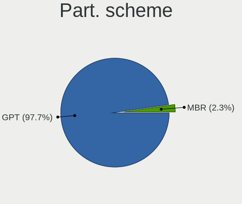
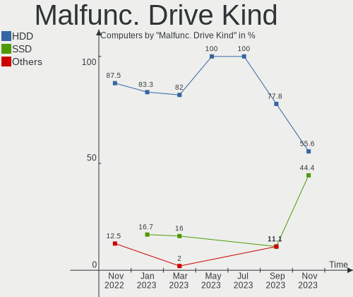
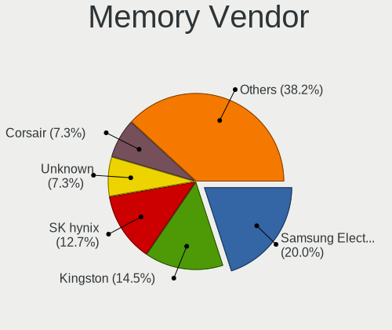

helloSystem Hardware Trends
---------------------------

A project to identify most popular hardware characteristics and track their change
over time based on data collected by helloSystem users at https://BSD-Hardware.info.

Anyone can contribute to the study by uploading probes of their computers by
the [hw-probe](https://github.com/linuxhw/hw-probe/blob/master/INSTALL.BSD.md) tool:

    hw-probe -all -upload

This is a report for all computer types. See also reports for [desktops](/Dist/helloSystem/Desktop/README.md) and [notebooks](/Dist/helloSystem/Notebook/README.md).

Full-feature report is available here: https://bsd-hardware.info/?view=trends

Period: Jun, 2021.

Contents
--------

- [ OS                       ](#os)
- [ OS Family                ](#os-family)
- [ Arch                     ](#arch)
- [ DE                       ](#de)
- [ Display Server           ](#display-server)
- [ Display Manager          ](#display-manager)
- [ OS Lang                  ](#os-lang)
- [ Boot Mode                ](#boot-mode)
- [ Filesystem               ](#filesystem)
- [ Part. scheme             ](#part-scheme)
- [ Country                  ](#country)
- [ City                     ](#city)
- [ Vendor                   ](#vendor)
- [ Model                    ](#model)
- [ Model Family             ](#model-family)
- [ MFG Year                 ](#mfg-year)
- [ Form Factor              ](#form-factor)
- [ Coreboot                 ](#coreboot)
- [ RAM Size                 ](#ram-size)
- [ RAM Used                 ](#ram-used)
- [ Has CD-ROM               ](#has-cd-rom)
- [ Total Drives             ](#total-drives)
- [ Has Ethernet             ](#has-ethernet)
- [ Has WiFi                 ](#has-wifi)
- [ Has Bluetooth            ](#has-bluetooth)
- [ Drive Vendor             ](#drive-vendor)
- [ Drive Model              ](#drive-model)
- [ HDD Vendor               ](#hdd-vendor)
- [ SSD Vendor               ](#ssd-vendor)
- [ Drive Kind               ](#drive-kind)
- [ Drive Connector          ](#drive-connector)
- [ Drive Size               ](#drive-size)
- [ Space Total              ](#space-total)
- [ Space Used               ](#space-used)
- [ Malfunc. Drives          ](#malfunc-drives)
- [ Malfunc. Drive Vendor    ](#malfunc-drive-vendor)
- [ Malfunc. HDD Vendor      ](#malfunc-hdd-vendor)
- [ Malfunc. Drive Kind      ](#malfunc-drive-kind)
- [ Failed Drives            ](#failed-drives)
- [ Failed Drive Vendor      ](#failed-drive-vendor)
- [ Drive Status             ](#drive-status)
- [ Storage Vendor           ](#storage-vendor)
- [ Storage Model            ](#storage-model)
- [ Storage Kind             ](#storage-kind)
- [ CPU Vendor               ](#cpu-vendor)
- [ CPU Model                ](#cpu-model)
- [ CPU Model Family         ](#cpu-model-family)
- [ CPU Cores                ](#cpu-cores)
- [ CPU Sockets              ](#cpu-sockets)
- [ CPU Threads              ](#cpu-threads)
- [ CPU Microarch            ](#cpu-microarch)
- [ GPU Vendor               ](#gpu-vendor)
- [ GPU Model                ](#gpu-model)
- [ GPU Combo                ](#gpu-combo)
- [ GPU Driver               ](#gpu-driver)
- [ GPU Memory               ](#gpu-memory)
- [ Monitor Vendor           ](#monitor-vendor)
- [ Monitor Model            ](#monitor-model)
- [ Monitor Resolution       ](#monitor-resolution)
- [ Monitor Diagonal         ](#monitor-diagonal)
- [ Monitor Width            ](#monitor-width)
- [ Aspect Ratio             ](#aspect-ratio)
- [ Monitor Area             ](#monitor-area)
- [ Pixel Density            ](#pixel-density)
- [ Multiple Monitors        ](#multiple-monitors)
- [ Net Controller Vendor    ](#net-controller-vendor)
- [ Net Controller Model     ](#net-controller-model)
- [ Wireless Vendor          ](#wireless-vendor)
- [ Wireless Model           ](#wireless-model)
- [ Ethernet Vendor          ](#ethernet-vendor)
- [ Ethernet Model           ](#ethernet-model)
- [ Net Controller Kind      ](#net-controller-kind)
- [ Used Controller          ](#used-controller)
- [ NICs                     ](#nics)
- [ IPv6                     ](#ipv6)
- [ Memory Vendor            ](#memory-vendor)
- [ Memory Model             ](#memory-model)
- [ Memory Kind              ](#memory-kind)
- [ Memory Form Factor       ](#memory-form-factor)
- [ Memory Size              ](#memory-size)
- [ Memory Speed             ](#memory-speed)
- [ Sound Vendor             ](#sound-vendor)
- [ Sound Model              ](#sound-model)
- [ Camera Vendor            ](#camera-vendor)
- [ Camera Model             ](#camera-model)
- [ Fingerprint Vendor       ](#fingerprint-vendor)
- [ Fingerprint Model        ](#fingerprint-model)
- [ Chipcard Vendor          ](#chipcard-vendor)
- [ Chipcard Model           ](#chipcard-model)
- [ Printer Vendor           ](#printer-vendor)
- [ Printer Model            ](#printer-model)
- [ Scanner Vendor           ](#scanner-vendor)
- [ Scanner Model            ](#scanner-model)
- [ Bluetooth Vendor         ](#bluetooth-vendor)
- [ Bluetooth Model          ](#bluetooth-model)
- [ Unsupported Devices      ](#unsupported-devices)
- [ Unsupported Device Types ](#unsupported-device-types)

OS
--

Installed operating systems

| Name              | Computers | Percent |
|-------------------|-----------|---------|
| helloSystem 0.5.0 | 64        | 86.49%  |
| helloSystem 0.1.0 | 6         | 8.11%   |
| helloSystem 0.4.0 | 3         | 4.05%   |
| helloSystem 0.6.0 | 1         | 1.35%   |

OS Family
---------

OS without a version

| Name        | Computers | Percent |
|-------------|-----------|---------|
| helloSystem | 74        | 100%    |

Arch
----

OS architecture (x86_64, i586, etc.)

| Name  | Computers | Percent |
|-------|-----------|---------|
| amd64 | 74        | 100%    |

DE
--

Desktop Environment

| Name         | Computers | Percent |
|--------------|-----------|---------|
| helloDesktop | 73        | 98.65%  |
| GNOME        | 1         | 1.35%   |

Display Server
--------------

X11 or Wayland

| Name | Computers | Percent |
|------|-----------|---------|
| X11  | 74        | 100%    |

Display Manager
---------------

SDDM, LightDM, etc.

| Name | Computers | Percent |
|------|-----------|---------|
| SLiM | 74        | 100%    |

OS Lang
-------

Language

| Lang  | Computers | Percent |
|-------|-----------|---------|
| en_US | 74        | 100%    |

Boot Mode
---------

EFI or BIOS

| Mode | Computers | Percent |
|------|-----------|---------|
| EFI  | 62        | 83.78%  |
| BIOS | 12        | 16.22%  |

Filesystem
----------

Type of filesystem

| Type | Computers | Percent |
|------|-----------|---------|
| Zfs  | 74        | 100%    |

Part. scheme
------------

Scheme of partitioning

| Type | Computers | Percent |
|------|-----------|---------|
| GPT  | 74        | 100%    |

Country
-------

Geographic location (country)

| Country            | Computers | Percent |
|--------------------|-----------|---------|
| USA                | 13        | 17.57%  |
| Russia             | 6         | 8.11%   |
| Ukraine            | 5         | 6.76%   |
| Brazil             | 5         | 6.76%   |
| UK                 | 4         | 5.41%   |
| Poland             | 4         | 5.41%   |
| Netherlands        | 4         | 5.41%   |
| Germany            | 4         | 5.41%   |
| Canada             | 3         | 4.05%   |
| Taiwan             | 2         | 2.7%    |
| Mexico             | 2         | 2.7%    |
| Australia          | 2         | 2.7%    |
| Uruguay            | 1         | 1.35%   |
| Turkey             | 1         | 1.35%   |
| Sweden             | 1         | 1.35%   |
| Spain              | 1         | 1.35%   |
| South Africa       | 1         | 1.35%   |
| Oman               | 1         | 1.35%   |
| New Zealand        | 1         | 1.35%   |
| Morocco            | 1         | 1.35%   |
| Lithuania          | 1         | 1.35%   |
| Italy              | 1         | 1.35%   |
| Iran               | 1         | 1.35%   |
| Indonesia          | 1         | 1.35%   |
| India              | 1         | 1.35%   |
| Hungary            | 1         | 1.35%   |
| Greece             | 1         | 1.35%   |
| France             | 1         | 1.35%   |
| Egypt              | 1         | 1.35%   |
| Dominican Republic | 1         | 1.35%   |
| Croatia            | 1         | 1.35%   |
| Belarus            | 1         | 1.35%   |

City
----

Geographic location (city)

| City               | Computers | Percent |
|--------------------|-----------|---------|
| Ufa                | 2         | 2.7%    |
| Dnipropetrovsk     | 2         | 2.7%    |
| Chelyabinsk        | 2         | 2.7%    |
| Šiauliai          | 1         | 1.35%   |
| Zagreb             | 1         | 1.35%   |
| York               | 1         | 1.35%   |
| Wroclaw            | 1         | 1.35%   |
| Winnipeg           | 1         | 1.35%   |
| Vladivostok        | 1         | 1.35%   |
| Vancouver          | 1         | 1.35%   |
| Utrecht            | 1         | 1.35%   |
| Toronto            | 1         | 1.35%   |
| Thessaloniki       | 1         | 1.35%   |
| Tehran             | 1         | 1.35%   |
| Taichung           | 1         | 1.35%   |
| São Paulo         | 1         | 1.35%   |
| Sydney             | 1         | 1.35%   |
| Shasta             | 1         | 1.35%   |
| Sevastopol         | 1         | 1.35%   |
| Santo Domingo Este | 1         | 1.35%   |
| Roosendaal         | 1         | 1.35%   |
| Rome               | 1         | 1.35%   |
| Rio de Janeiro     | 1         | 1.35%   |
| Querétaro City    | 1         | 1.35%   |
| Pflugerville       | 1         | 1.35%   |
| Osasco             | 1         | 1.35%   |
| Nizwa              | 1         | 1.35%   |
| New Taipei         | 1         | 1.35%   |
| Neuffen            | 1         | 1.35%   |
| Mount Pleasant     | 1         | 1.35%   |
| Morden             | 1         | 1.35%   |
| Montreuil          | 1         | 1.35%   |
| Montevideo         | 1         | 1.35%   |
| Miskolc            | 1         | 1.35%   |
| Mankato            | 1         | 1.35%   |
| Manchester         | 1         | 1.35%   |
| Malokaterynivka    | 1         | 1.35%   |
| Lusk               | 1         | 1.35%   |
| London             | 1         | 1.35%   |
| Leesville          | 1         | 1.35%   |
| Lake Forest        | 1         | 1.35%   |
| Lajeado            | 1         | 1.35%   |
| Kyiv               | 1         | 1.35%   |
| Kungsbacka         | 1         | 1.35%   |
| Krakow             | 1         | 1.35%   |
| Kosekoy            | 1         | 1.35%   |
| Katowice           | 1         | 1.35%   |
| Kampen             | 1         | 1.35%   |
| Johannesburg       | 1         | 1.35%   |
| Jakarta            | 1         | 1.35%   |
| Jaipur             | 1         | 1.35%   |
| Horishni Plavni    | 1         | 1.35%   |
| Henderson          | 1         | 1.35%   |
| Guapimirim         | 1         | 1.35%   |
| Frisco             | 1         | 1.35%   |
| Faqus              | 1         | 1.35%   |
| Erfurt             | 1         | 1.35%   |
| Eindhoven          | 1         | 1.35%   |
| Dąbrowa Górnicza | 1         | 1.35%   |
| Chicago            | 1         | 1.35%   |

Vendor
------

Motherboard manufacturer

| Name                | Computers | Percent |
|---------------------|-----------|---------|
| ASUSTek Computer    | 18        | 24.32%  |
| Lenovo              | 13        | 17.57%  |
| Dell                | 13        | 17.57%  |
| Hewlett-Packard     | 5         | 6.76%   |
| MSI                 | 4         | 5.41%   |
| Toshiba             | 3         | 4.05%   |
| Gigabyte Technology | 3         | 4.05%   |
| Intel               | 2         | 2.7%    |
| Gateway             | 2         | 2.7%    |
| ASRock              | 2         | 2.7%    |
| WYSE                | 1         | 1.35%   |
| Protectli           | 1         | 1.35%   |
| Pegatron            | 1         | 1.35%   |
| Huanan              | 1         | 1.35%   |
| Fujitsu             | 1         | 1.35%   |
| Foxconn             | 1         | 1.35%   |
| eMachines           | 1         | 1.35%   |
| Biostar             | 1         | 1.35%   |
| Acer                | 1         | 1.35%   |

Model
-----

Motherboard model

| Name                                    | Computers | Percent |
|-----------------------------------------|-----------|---------|
| Gateway NE56R                           | 2         | 2.7%    |
| Dell Inspiron 15-3567                   | 2         | 2.7%    |
| ASUS All Series                         | 2         | 2.7%    |
| WYSE Z CLASS                            | 1         | 1.35%   |
| Toshiba Satellite C640                  | 1         | 1.35%   |
| Toshiba PORTEGE Z10t-A                  | 1         | 1.35%   |
| Toshiba PORTEGE R930                    | 1         | 1.35%   |
| Protectli FW2B                          | 1         | 1.35%   |
| Pegatron T12Ah                          | 1         | 1.35%   |
| MSI MS-7B86                             | 1         | 1.35%   |
| MSI MS-7B84                             | 1         | 1.35%   |
| MSI MS-7A15                             | 1         | 1.35%   |
| MSI MS-7592                             | 1         | 1.35%   |
| Lenovo ThinkPad Yoga 11e 20DAS0AE00     | 1         | 1.35%   |
| Lenovo ThinkPad X240 20AMS39F0K         | 1         | 1.35%   |
| Lenovo ThinkPad X230 2325WWB            | 1         | 1.35%   |
| Lenovo ThinkPad X200 7458VP4            | 1         | 1.35%   |
| Lenovo ThinkPad T470p 20J6A012CD        | 1         | 1.35%   |
| Lenovo ThinkPad T440s 20ARS1B704        | 1         | 1.35%   |
| Lenovo ThinkPad T420 4236FJ1            | 1         | 1.35%   |
| Lenovo ThinkPad L450 20DTCTO1WW         | 1         | 1.35%   |
| Lenovo ThinkPad Edge E530 62724FU       | 1         | 1.35%   |
| Lenovo ThinkCentre M91p 7033DE6         | 1         | 1.35%   |
| Lenovo IdeaPad S145-15IWL 81MV          | 1         | 1.35%   |
| Lenovo G500 20236                       | 1         | 1.35%   |
| Lenovo 70F8S01J00 ThinkServer RS140     | 1         | 1.35%   |
| Intel X79 V2.72A                        | 1         | 1.35%   |
| Intel DH67CL AAG10212-206               | 1         | 1.35%   |
| Huanan X99-8M-F V1.2                    | 1         | 1.35%   |
| HP Z400 Workstation                     | 1         | 1.35%   |
| HP Pavilion 17                          | 1         | 1.35%   |
| HP OMEN by HP Laptop                    | 1         | 1.35%   |
| HP Compaq Elite 8300 SFF                | 1         | 1.35%   |
| HP 255 G2                               | 1         | 1.35%   |
| Gigabyte H97-D3H                        | 1         | 1.35%   |
| Gigabyte H470M DS3H                     | 1         | 1.35%   |
| Gigabyte AX370-Gaming                   | 1         | 1.35%   |
| Fujitsu PRIMERGY RX100 S6               | 1         | 1.35%   |
| Foxconn Pro 3500 Series                 | 1         | 1.35%   |
| eMachines eM350                         | 1         | 1.35%   |
| Dell Vostro 3560                        | 1         | 1.35%   |
| Dell Precision WorkStation T3500        | 1         | 1.35%   |
| Dell Precision 7710                     | 1         | 1.35%   |
| Dell OptiPlex 990                       | 1         | 1.35%   |
| Dell OptiPlex 5055 Ryzen CPU            | 1         | 1.35%   |
| Dell Latitude E6410                     | 1         | 1.35%   |
| Dell Latitude E5420                     | 1         | 1.35%   |
| Dell Latitude E4300                     | 1         | 1.35%   |
| Dell Latitude 7280                      | 1         | 1.35%   |
| Dell Latitude 5400                      | 1         | 1.35%   |
| Dell Inspiron 3542                      | 1         | 1.35%   |
| Biostar B450MH                          | 1         | 1.35%   |
| ASUS VivoBook_ASUSLaptop X712DAP_M712DA | 1         | 1.35%   |
| ASUS VivoBook_ASUSLaptop X403FA_X403FA  | 1         | 1.35%   |
| ASUS UX330UAK                           | 1         | 1.35%   |
| ASUS TUF GAMING X570-PLUS               | 1         | 1.35%   |
| ASUS Strix 17 GL703GE                   | 1         | 1.35%   |
| ASUS ROG STRIX H370-I GAMING            | 1         | 1.35%   |
| ASUS PRIME H410M-D                      | 1         | 1.35%   |
| ASUS PRIME A320M-K                      | 1         | 1.35%   |

Model Family
------------

Motherboard model prefix

| Name                  | Computers | Percent |
|-----------------------|-----------|---------|
| Lenovo ThinkPad       | 9         | 12.16%  |
| Dell Latitude         | 5         | 6.76%   |
| Dell Inspiron         | 3         | 4.05%   |
| Toshiba PORTEGE       | 2         | 2.7%    |
| Gateway NE56R         | 2         | 2.7%    |
| Dell Precision        | 2         | 2.7%    |
| Dell OptiPlex         | 2         | 2.7%    |
| ASUS VivoBook         | 2         | 2.7%    |
| ASUS PRIME            | 2         | 2.7%    |
| ASUS All              | 2         | 2.7%    |
| WYSE Z                | 1         | 1.35%   |
| Toshiba Satellite     | 1         | 1.35%   |
| Protectli FW2B        | 1         | 1.35%   |
| Pegatron T12Ah        | 1         | 1.35%   |
| MSI MS-7B86           | 1         | 1.35%   |
| MSI MS-7B84           | 1         | 1.35%   |
| MSI MS-7A15           | 1         | 1.35%   |
| MSI MS-7592           | 1         | 1.35%   |
| Lenovo ThinkCentre    | 1         | 1.35%   |
| Lenovo IdeaPad        | 1         | 1.35%   |
| Lenovo G500           | 1         | 1.35%   |
| Lenovo 70F8S01J00     | 1         | 1.35%   |
| Intel X79             | 1         | 1.35%   |
| Intel DH67CL          | 1         | 1.35%   |
| Huanan X99-8M-F       | 1         | 1.35%   |
| HP Z400               | 1         | 1.35%   |
| HP Pavilion           | 1         | 1.35%   |
| HP OMEN               | 1         | 1.35%   |
| HP Compaq             | 1         | 1.35%   |
| HP 255                | 1         | 1.35%   |
| Gigabyte H97-D3H      | 1         | 1.35%   |
| Gigabyte H470M        | 1         | 1.35%   |
| Gigabyte AX370-Gaming | 1         | 1.35%   |
| Fujitsu PRIMERGY      | 1         | 1.35%   |
| Foxconn Pro           | 1         | 1.35%   |
| eMachines eM350       | 1         | 1.35%   |
| Dell Vostro           | 1         | 1.35%   |
| Biostar B450MH        | 1         | 1.35%   |
| ASUS UX330UAK         | 1         | 1.35%   |
| ASUS TUF              | 1         | 1.35%   |
| ASUS Strix            | 1         | 1.35%   |
| ASUS ROG              | 1         | 1.35%   |
| ASUS P7H55            | 1         | 1.35%   |
| ASUS M5A97            | 1         | 1.35%   |
| ASUS M5A78L-M         | 1         | 1.35%   |
| ASUS M4A78LT-M        | 1         | 1.35%   |
| ASUS H110M-E          | 1         | 1.35%   |
| ASUS H110I-PLUS       | 1         | 1.35%   |
| ASUS exone-PC         | 1         | 1.35%   |
| ASUS CP5141           | 1         | 1.35%   |
| ASRock G31M-VS2       | 1         | 1.35%   |
| ASRock FM2A68M-HD+    | 1         | 1.35%   |
| Acer Aspire           | 1         | 1.35%   |

MFG Year
--------

Motherboard manufacture year

| Year | Computers | Percent |
|------|-----------|---------|
| 2020 | 14        | 18.92%  |
| 2019 | 9         | 12.16%  |
| 2013 | 8         | 10.81%  |
| 2021 | 7         | 9.46%   |
| 2011 | 7         | 9.46%   |
| 2018 | 6         | 8.11%   |
| 2012 | 5         | 6.76%   |
| 2014 | 4         | 5.41%   |
| 2010 | 4         | 5.41%   |
| 2015 | 3         | 4.05%   |
| 2017 | 2         | 2.7%    |
| 2016 | 2         | 2.7%    |
| 2009 | 2         | 2.7%    |
| 2008 | 1         | 1.35%   |

Form Factor
-----------

Physical design of the computer

| Name     | Computers | Percent |
|----------|-----------|---------|
| Notebook | 37        | 50%     |
| Desktop  | 36        | 48.65%  |
| Server   | 1         | 1.35%   |

Coreboot
--------

Have coreboot on board

| Used | Computers | Percent |
|------|-----------|---------|
| No   | 74        | 100%    |

RAM Size
--------

Total RAM memory

| Size in GB | Computers | Percent |
|------------|-----------|---------|
| 4.01-8.0   | 28        | 37.84%  |
| 8.01-16.0  | 23        | 31.08%  |
| 16.01-24.0 | 18        | 24.32%  |
| 32.01-64.0 | 3         | 4.05%   |
| 24.01-32.0 | 1         | 1.35%   |
| 2.01-3.0   | 1         | 1.35%   |

RAM Used
--------

Used RAM memory

| Used GB  | Computers | Percent |
|----------|-----------|---------|
| 0.01-0.5 | 42        | 56.76%  |
| 0.51-1.0 | 26        | 35.14%  |
| 1.01-2.0 | 4         | 5.41%   |
| 2.01-3.0 | 2         | 2.7%    |

Has CD-ROM
----------

Has CD-ROM on board

| Presented | Computers | Percent |
|-----------|-----------|---------|
| No        | 39        | 52.7%   |
| Yes       | 35        | 47.3%   |

Total Drives
------------

Number of drives on board

| Drives | Computers | Percent |
|--------|-----------|---------|
| 1      | 46        | 62.16%  |
| 2      | 17        | 22.97%  |
| 3      | 5         | 6.76%   |
| 0      | 3         | 4.05%   |
| 4      | 2         | 2.7%    |
| 6      | 1         | 1.35%   |

Has Ethernet
------------

Has Ethernet on board

| Presented | Computers | Percent |
|-----------|-----------|---------|
| Yes       | 68        | 91.89%  |
| No        | 6         | 8.11%   |

Has WiFi
--------

Has WiFi module

| Presented | Computers | Percent |
|-----------|-----------|---------|
| Yes       | 44        | 59.46%  |
| No        | 30        | 40.54%  |

Has Bluetooth
-------------

Has Bluetooth module

| Presented | Computers | Percent |
|-----------|-----------|---------|
| No        | 48        | 64.86%  |
| Yes       | 26        | 35.14%  |

Drive Vendor
------------

Hard drive vendors

| Vendor              | Computers | Drives | Percent |
|---------------------|-----------|--------|---------|
| WDC                 | 22        | 23     | 22.45%  |
| Seagate             | 20        | 24     | 20.41%  |
| Samsung Electronics | 16        | 22     | 16.33%  |
| Toshiba             | 8         | 8      | 8.16%   |
| Kingston            | 5         | 6      | 5.1%    |
| A-DATA Technology   | 5         | 5      | 5.1%    |
| Intel               | 4         | 4      | 4.08%   |
| Hitachi             | 3         | 3      | 3.06%   |
| Patriot             | 2         | 2      | 2.04%   |
| OCZ                 | 2         | 2      | 2.04%   |
| HGST                | 2         | 2      | 2.04%   |
| Verbatim            | 1         | 1      | 1.02%   |
| Transcend           | 1         | 1      | 1.02%   |
| Smartbuy            | 1         | 1      | 1.02%   |
| SanDisk             | 1         | 1      | 1.02%   |
| Micron Technology   | 1         | 1      | 1.02%   |
| LITEON              | 1         | 1      | 1.02%   |
| Hewlett-Packard     | 1         | 1      | 1.02%   |
| Fujitsu             | 1         | 1      | 1.02%   |
| Apacer              | 1         | 1      | 1.02%   |

Drive Model
-----------

Hard drive models

| Model                                | Computers | Percent |
|--------------------------------------|-----------|---------|
| WDC WD10EZRX-00A8LB0 1TB             | 2         | 1.85%   |
| Toshiba DT01ACA100 1TB               | 2         | 1.85%   |
| Seagate ST1000LM035-1RK172 1TB       | 2         | 1.85%   |
| Samsung SSD 850 EVO 250GB            | 2         | 1.85%   |
| Patriot Burst 120GB                  | 2         | 1.85%   |
| Intel SSDPEKNW512G8 512GB            | 2         | 1.85%   |
| WDC WDS250G3X0C-00SJG0 250GB         | 1         | 0.93%   |
| WDC WDBNCE2500PNC 250GB              | 1         | 0.93%   |
| WDC WD800BEVS-00RST0 80GB            | 1         | 0.93%   |
| WDC WD7500BPVX-60JC3T0 752GB         | 1         | 0.93%   |
| WDC WD6400AAKS-22A7B0 640GB          | 1         | 0.93%   |
| WDC WD5002ABYS-02B1B0 500GB          | 1         | 0.93%   |
| WDC WD5000LPVX-60V0TT0 500GB         | 1         | 0.93%   |
| WDC WD5000AAKX-60U6AA0 500GB         | 1         | 0.93%   |
| WDC WD4004FZWX-00GBGB0 4TB           | 1         | 0.93%   |
| WDC WD3200BEVT-00A0RT0 233GB         | 1         | 0.93%   |
| WDC WD3200BEKT-75PVMT1 320GB         | 1         | 0.93%   |
| WDC WD3200BEKT-60PVMT0 320GB         | 1         | 0.93%   |
| WDC WD3003FZEX-00Z4SA0 3TB           | 1         | 0.93%   |
| WDC WD2500YS-01SHB1 256GB            | 1         | 0.93%   |
| WDC WD2500BEVT-75ZCT2 250GB          | 1         | 0.93%   |
| WDC WD2500AAKX-083CA1 250GB          | 1         | 0.93%   |
| WDC WD20EARS-00MVWB0 2TB             | 1         | 0.93%   |
| WDC WD10EZEX-08Y20A0 1TB             | 1         | 0.93%   |
| WDC WD10EZEX-08WN4A0 1TB             | 1         | 0.93%   |
| WDC PC SN530 SDBPNPZ-256G-1002 256GB | 1         | 0.93%   |
| Verbatim Vi550 S3 SSD 256GB          | 1         | 0.93%   |
| Transcend TS512GMTS430S 512GB        | 1         | 0.93%   |
| Toshiba THNSNC128GMLJ 128GB          | 1         | 0.93%   |
| Toshiba MQ01ABD100 1TB               | 1         | 0.93%   |
| Toshiba MQ01ABD075 752GB             | 1         | 0.93%   |
| Toshiba MK3265GSXN 320GB             | 1         | 0.93%   |
| Toshiba KXG50PNV2T04 NVMe 2048GB     | 1         | 0.93%   |
| Toshiba KBG40ZNS256G NVMe 256GB      | 1         | 0.93%   |
| Smartbuy SSD 120GB                   | 1         | 0.93%   |
| Seagate ST9500325AS 500GB            | 1         | 0.93%   |
| Seagate ST9320423AS 320GB            | 1         | 0.93%   |
| Seagate ST9160412ASG 160GB           | 1         | 0.93%   |
| Seagate ST500LT012-1DG142 500GB      | 1         | 0.93%   |
| Seagate ST500LM012 HN-M500MBB 500GB  | 1         | 0.93%   |
| Seagate ST500DM002-1BD142 500GB      | 1         | 0.93%   |
| Seagate ST4000VX007-2DT166 4TB       | 1         | 0.93%   |
| Seagate ST4000DM004-2CV104 4TB       | 1         | 0.93%   |
| Seagate ST380815AS 80GB              | 1         | 0.93%   |
| Seagate ST3500830AS 500GB            | 1         | 0.93%   |
| Seagate ST3500412AS 500GB            | 1         | 0.93%   |
| Seagate ST3500312CS 500GB            | 1         | 0.93%   |
| Seagate ST3360320AS 360GB            | 1         | 0.93%   |
| Seagate ST3320613AS 320GB            | 1         | 0.93%   |
| Seagate ST3300831AS 304GB            | 1         | 0.93%   |
| Seagate ST3250410AS 250GB            | 1         | 0.93%   |
| Seagate ST320LT012-9WS14C 320GB      | 1         | 0.93%   |
| Seagate ST3000DM001-1CH166 3TB       | 1         | 0.93%   |
| Seagate ST2000DM008-2FR102 2TB       | 1         | 0.93%   |
| Seagate ST2000DL003-9VT166 2TB       | 1         | 0.93%   |
| Seagate ST1000LM048-2E7172 1TB       | 1         | 0.93%   |
| Seagate ST1000DM003-1CH162 1TB       | 1         | 0.93%   |
| SanDisk SSD PLUS 240GB               | 1         | 0.93%   |
| Samsung SSD 970 EVO Plus 500GB       | 1         | 0.93%   |
| Samsung SSD 970 EVO Plus 250GB       | 1         | 0.93%   |

HDD Vendor
----------

Hard disk drive vendors

| Vendor              | Computers | Drives | Percent |
|---------------------|-----------|--------|---------|
| Seagate             | 20        | 24     | 35.71%  |
| WDC                 | 19        | 20     | 33.93%  |
| Samsung Electronics | 6         | 6      | 10.71%  |
| Toshiba             | 5         | 5      | 8.93%   |
| Hitachi             | 3         | 3      | 5.36%   |
| HGST                | 2         | 2      | 3.57%   |
| Fujitsu             | 1         | 1      | 1.79%   |

SSD Vendor
----------

Solid state drive vendors

| Vendor              | Computers | Drives | Percent |
|---------------------|-----------|--------|---------|
| Samsung Electronics | 10        | 13     | 29.41%  |
| Kingston            | 5         | 5      | 14.71%  |
| A-DATA Technology   | 3         | 3      | 8.82%   |
| Patriot             | 2         | 2      | 5.88%   |
| OCZ                 | 2         | 2      | 5.88%   |
| Intel               | 2         | 2      | 5.88%   |
| WDC                 | 1         | 1      | 2.94%   |
| Verbatim            | 1         | 1      | 2.94%   |
| Transcend           | 1         | 1      | 2.94%   |
| Toshiba             | 1         | 1      | 2.94%   |
| Smartbuy            | 1         | 1      | 2.94%   |
| SanDisk             | 1         | 1      | 2.94%   |
| Micron Technology   | 1         | 1      | 2.94%   |
| LITEON              | 1         | 1      | 2.94%   |
| Hewlett-Packard     | 1         | 1      | 2.94%   |
| Apacer              | 1         | 1      | 2.94%   |

Drive Kind
----------

HDD or SSD

| Kind | Computers | Drives | Percent |
|------|-----------|--------|---------|
| HDD  | 49        | 61     | 53.26%  |
| SSD  | 32        | 37     | 34.78%  |
| NVMe | 11        | 12     | 11.96%  |

Drive Connector
---------------

SATA, SAS, NVMe, etc.

| Type | Computers | Drives | Percent |
|------|-----------|--------|---------|
| SATA | 69        | 98     | 86.25%  |
| NVMe | 11        | 12     | 13.75%  |

Drive Size
----------

Size of hard drive

| Size in TB | Computers | Drives | Percent |
|------------|-----------|--------|---------|
| 0.01-0.5   | 56        | 66     | 65.12%  |
| 0.51-1.0   | 22        | 23     | 25.58%  |
| 1.01-2.0   | 4         | 4      | 4.65%   |
| 3.01-4.0   | 3         | 3      | 3.49%   |
| 2.01-3.0   | 1         | 2      | 1.16%   |

Space Total
-----------

Amount of disk space available on the file system

| Size in GB | Computers | Percent |
|------------|-----------|---------|
| 1-20       | 47        | 63.51%  |
| 251-500    | 8         | 10.81%  |
| 101-250    | 8         | 10.81%  |
| 501-1000   | 6         | 8.11%   |
| 51-100     | 3         | 4.05%   |
| 21-50      | 1         | 1.35%   |
| 1001-2000  | 1         | 1.35%   |

Space Used
----------

Amount of used disk space

| Used GB | Computers | Percent |
|---------|-----------|---------|
| 1-20    | 74        | 100%    |

Malfunc. Drives
---------------

Drive models with a malfunction

| Model                               | Computers | Drives | Percent |
|-------------------------------------|-----------|--------|---------|
| WDC WD6400AAKS-22A7B0 640GB         | 1         | 1      | 4.55%   |
| WDC WD5000LPVX-60V0TT0 500GB        | 1         | 1      | 4.55%   |
| WDC WD5000AAKX-60U6AA0 500GB        | 1         | 1      | 4.55%   |
| WDC WD3200BEVT-00A0RT0 233GB        | 1         | 1      | 4.55%   |
| WDC WD2500AAKX-083CA1 250GB         | 1         | 1      | 4.55%   |
| Toshiba MQ01ABD075 752GB            | 1         | 1      | 4.55%   |
| Toshiba MK3265GSXN 320GB            | 1         | 1      | 4.55%   |
| Toshiba DT01ACA100 1TB              | 1         | 1      | 4.55%   |
| Seagate ST9500325AS 500GB           | 1         | 1      | 4.55%   |
| Seagate ST9320423AS 320GB           | 1         | 1      | 4.55%   |
| Seagate ST500LM012 HN-M500MBB 500GB | 1         | 1      | 4.55%   |
| Seagate ST380815AS 80GB             | 1         | 1      | 4.55%   |
| Seagate ST3250410AS 250GB           | 1         | 1      | 4.55%   |
| Seagate ST320LT012-9WS14C 320GB     | 1         | 1      | 4.55%   |
| Seagate ST1000LM035-1RK172 1TB      | 1         | 1      | 4.55%   |
| Samsung Electronics SP2004C 200GB   | 1         | 1      | 4.55%   |
| Samsung Electronics HD642JJ 640GB   | 1         | 1      | 4.55%   |
| Samsung Electronics HD321KJ 320GB   | 1         | 1      | 4.55%   |
| Samsung Electronics HD161HJ 160GB   | 1         | 1      | 4.55%   |
| Hitachi HTS727550A9E364 500GB       | 1         | 1      | 4.55%   |
| HGST HTS725050A7E630 500GB          | 1         | 1      | 4.55%   |
| Hewlett-Packard SSD S700 1TB        | 1         | 1      | 4.55%   |

Malfunc. Drive Vendor
---------------------

Vendors of faulty drives

| Vendor              | Computers | Drives | Percent |
|---------------------|-----------|--------|---------|
| Seagate             | 7         | 7      | 31.82%  |
| WDC                 | 5         | 5      | 22.73%  |
| Samsung Electronics | 4         | 4      | 18.18%  |
| Toshiba             | 3         | 3      | 13.64%  |
| Hitachi             | 1         | 1      | 4.55%   |
| HGST                | 1         | 1      | 4.55%   |
| Hewlett-Packard     | 1         | 1      | 4.55%   |

Malfunc. HDD Vendor
-------------------

Vendors of faulty HDD drives

| Vendor              | Computers | Drives | Percent |
|---------------------|-----------|--------|---------|
| Seagate             | 7         | 7      | 33.33%  |
| WDC                 | 5         | 5      | 23.81%  |
| Samsung Electronics | 4         | 4      | 19.05%  |
| Toshiba             | 3         | 3      | 14.29%  |
| Hitachi             | 1         | 1      | 4.76%   |
| HGST                | 1         | 1      | 4.76%   |

Malfunc. Drive Kind
-------------------

Kinds of faulty drives

| Kind | Computers | Drives | Percent |
|------|-----------|--------|---------|
| HDD  | 19        | 21     | 95%     |
| SSD  | 1         | 1      | 5%      |

Failed Drives
-------------

Failed drive models

Zero info for selected period =(

Failed Drive Vendor
-------------------

Failed drive vendors

Zero info for selected period =(

Drive Status
------------

Number of failed and malfunc. drives

| Status   | Computers | Drives | Percent |
|----------|-----------|--------|---------|
| Works    | 54        | 86     | 72%     |
| Malfunc  | 20        | 22     | 26.67%  |
| Detected | 1         | 2      | 1.33%   |

Storage Vendor
--------------

Storage controller vendors

| Vendor                      | Computers | Percent |
|-----------------------------|-----------|---------|
| Intel                       | 60        | 66.67%  |
| AMD                         | 15        | 16.67%  |
| Samsung Electronics         | 3         | 3.33%   |
| VIA Technologies            | 2         | 2.22%   |
| Sandisk                     | 2         | 2.22%   |
| Broadcom / LSI              | 2         | 2.22%   |
| Toshiba                     | 1         | 1.11%   |
| Silicon Image               | 1         | 1.11%   |
| Realtek Semiconductor       | 1         | 1.11%   |
| KIOXIA                      | 1         | 1.11%   |
| Kingston Technology Company | 1         | 1.11%   |
| ADATA Technology            | 1         | 1.11%   |

Storage Model
-------------

Storage controller models

| Model                                                                            | Computers | Percent |
|----------------------------------------------------------------------------------|-----------|---------|
| AMD FCH SATA Controller [AHCI mode]                                              | 10        | 9.62%   |
| Intel 7 Series Chipset Family 6-port SATA Controller [AHCI mode]                 | 7         | 6.73%   |
| Intel 6 Series/C200 Series Chipset Family 6 port Desktop SATA AHCI Controller    | 5         | 4.81%   |
| Intel Sunrise Point-LP SATA Controller [AHCI mode]                               | 4         | 3.85%   |
| Intel Q170/Q150/B150/H170/H110/Z170/CM236 Chipset SATA Controller [AHCI Mode]    | 4         | 3.85%   |
| Intel 8 Series SATA Controller 1 [AHCI mode]                                     | 4         | 3.85%   |
| Samsung NVMe SSD Controller SM981/PM981/PM983                                    | 3         | 2.88%   |
| Intel NM10/ICH7 Family SATA Controller [IDE mode]                                | 3         | 2.88%   |
| Intel 82801G (ICH7 Family) IDE Controller                                        | 3         | 2.88%   |
| Intel 6 Series/C200 Series Chipset Family 6 port Mobile SATA AHCI Controller     | 3         | 2.88%   |
| AMD SB7x0/SB8x0/SB9x0 SATA Controller [AHCI mode]                                | 3         | 2.88%   |
| AMD 400 Series Chipset SATA Controller                                           | 3         | 2.88%   |
| VIA VT6415 PATA IDE Host Controller                                              | 2         | 1.92%   |
| Intel SSD 660P Series                                                            | 2         | 1.92%   |
| Intel SATA Controller [RAID mode]                                                | 2         | 1.92%   |
| Intel HM170/QM170 Chipset SATA Controller [AHCI Mode]                            | 2         | 1.92%   |
| Intel Cannon Point-LP SATA Controller [AHCI Mode]                                | 2         | 1.92%   |
| Intel 9 Series Chipset Family SATA Controller [AHCI Mode]                        | 2         | 1.92%   |
| Intel 82801IBM/IEM (ICH9M/ICH9M-E) 4 port SATA Controller [AHCI mode]            | 2         | 1.92%   |
| Intel 82801 Mobile SATA Controller [RAID mode]                                   | 2         | 1.92%   |
| Intel 8 Series/C220 Series Chipset Family 6-port SATA Controller 1 [AHCI mode]   | 2         | 1.92%   |
| Intel 5 Series/3400 Series Chipset 6 port SATA AHCI Controller                   | 2         | 1.92%   |
| AMD SB7x0/SB8x0/SB9x0 IDE Controller                                             | 2         | 1.92%   |
| Toshiba unknown                                                                  | 1         | 0.96%   |
| Silicon Image SiI 3512 [SATALink/SATARaid] Serial ATA Controller                 | 1         | 0.96%   |
| Sandisk WD Blue SN550 NVMe SSD                                                   | 1         | 0.96%   |
| Sandisk WD Black 2018/SN750 / PC SN720 NVMe SSD                                  | 1         | 0.96%   |
| KIOXIA unknown                                                                   | 1         | 0.96%   |
| Kingston Company A2000 NVMe SSD                                                  | 1         | 0.96%   |
| Intel Wildcat Point-LP SATA Controller [AHCI Mode]                               | 1         | 0.96%   |
| Intel NM10/ICH7 Family SATA Controller [AHCI mode]                               | 1         | 0.96%   |
| Intel Cannon Lake PCH SATA AHCI Controller                                       | 1         | 0.96%   |
| Intel Cannon Lake Mobile PCH SATA AHCI Controller                                | 1         | 0.96%   |
| Intel C600/X79 series chipset 6-Port SATA AHCI Controller                        | 1         | 0.96%   |
| Intel Atom/Celeron/Pentium Processor x5-E8000/J3xxx/N3xxx Series SATA Controller | 1         | 0.96%   |
| Intel Atom Processor E3800 Series SATA AHCI Controller                           | 1         | 0.96%   |
| Intel 82801JI (ICH10 Family) SATA AHCI Controller                                | 1         | 0.96%   |
| Intel 8 Series/C220 Series Chipset Family 4-port SATA Controller 1 [IDE mode]    | 1         | 0.96%   |
| Intel 8 Series/C220 Series Chipset Family 2-port SATA Controller 2 [IDE mode]    | 1         | 0.96%   |
| Intel 7 Series/C210 Series Chipset Family 6-port SATA Controller [AHCI mode]     | 1         | 0.96%   |
| Intel 5 Series/3400 Series Chipset 4 port SATA IDE Controller                    | 1         | 0.96%   |
| Intel 5 Series/3400 Series Chipset 4 port SATA AHCI Controller                   | 1         | 0.96%   |
| Intel 5 Series/3400 Series Chipset 2 port SATA IDE Controller                    | 1         | 0.96%   |
| Intel 400 Series Chipset Family SATA AHCI Controller                             | 1         | 0.96%   |
| Broadcom / LSI SAS1068E PCI-Express Fusion-MPT SAS                               | 1         | 0.96%   |
| Broadcom / LSI MegaRAID SAS 2008 [Falcon]                                        | 1         | 0.96%   |
| AMD X370 Series Chipset SATA Controller                                          | 1         | 0.96%   |
| AMD SB7x0/SB8x0/SB9x0 SATA Controller [IDE mode]                                 | 1         | 0.96%   |
| AMD FCH SATA Controller D                                                        | 1         | 0.96%   |
| AMD FCH IDE Controller                                                           | 1         | 0.96%   |
| AMD 300 Series Chipset SATA Controller                                           | 1         | 0.96%   |
| ADATA XPG SX8200 Pro PCIe Gen3x4 M.2 2280 Solid State Drive                      | 1         | 0.96%   |
| Unknown                                                                          | 1         | 0.96%   |

Storage Kind
------------

Kind of storage controller (IDE, SATA, NVMe, SAS, ...)

| Kind | Computers | Percent |
|------|-----------|---------|
| SATA | 64        | 69.57%  |
| NVMe | 11        | 11.96%  |
| IDE  | 10        | 10.87%  |
| RAID | 6         | 6.52%   |
| SCSI | 1         | 1.09%   |

CPU Vendor
----------

Processor vendors

| Vendor | Computers | Percent |
|--------|-----------|---------|
| Intel  | 59        | 79.73%  |
| AMD    | 15        | 20.27%  |

CPU Model
---------

Processor models

| Model                                       | Computers | Percent |
|---------------------------------------------|-----------|---------|
| Intel Core i5-3230M CPU @ 2.60GHz           | 2         | 2.7%    |
| Intel Core i5-2400 CPU @ 3.10GHz            | 2         | 2.7%    |
| Intel Core i3-6100 CPU @ 3.70GHz            | 2         | 2.7%    |
| Intel Core 2 Duo CPU P8700 @ 2.53GHz        | 2         | 2.7%    |
| Intel Xeon CPU X3470                        | 1         | 1.35%   |
| Intel Xeon CPU W3550 @ 3.07GHz              | 1         | 1.35%   |
| Intel Xeon CPU E5-2630L 0 @ 2.00GHz         | 1         | 1.35%   |
| Intel Xeon CPU E3-1241 v3 @ 3.50GHz         | 1         | 1.35%   |
| Intel Xeon                                  | 1         | 1.35%   |
| Intel Pentium Dual-Core CPU E6600 @ 3.06GHz | 1         | 1.35%   |
| Intel Pentium Dual-Core CPU E5800 @ 3.20GHz | 1         | 1.35%   |
| Intel Pentium CPU G4400 @ 3.30GHz           | 1         | 1.35%   |
| Intel Pentium CPU G3460 @ 3.50GHz           | 1         | 1.35%   |
| Intel Pentium CPU 5405U @ 2.30GHz           | 1         | 1.35%   |
| Intel Genuine CPU 0000 @ 2.10GHz            | 1         | 1.35%   |
| Intel Core i7-8750H CPU @ 2.20GHz           | 1         | 1.35%   |
| Intel Core i7-7500U CPU @ 2.70GHz           | 1         | 1.35%   |
| Intel Core i7-6820HQ CPU @ 2.70GHz          | 1         | 1.35%   |
| Intel Core i7-4790 CPU @ 3.60GHz            | 1         | 1.35%   |
| Intel Core i7-4600U CPU @ 2.10GHz           | 1         | 1.35%   |
| Intel Core i5-8400 CPU @ 2.80GHz            | 1         | 1.35%   |
| Intel Core i5-8365U CPU @ 1.60GHz           | 1         | 1.35%   |
| Intel Core i5-8265U CPU @ 1.60GHz           | 1         | 1.35%   |
| Intel Core i5-7300U CPU @ 2.60GHz           | 1         | 1.35%   |
| Intel Core i5-7300HQ CPU @ 2.50GHz          | 1         | 1.35%   |
| Intel Core i5-6300HQ CPU @ 2.30GHz          | 1         | 1.35%   |
| Intel Core i5-4460 CPU @ 3.20GHz            | 1         | 1.35%   |
| Intel Core i5-4300U CPU @ 1.90GHz           | 1         | 1.35%   |
| Intel Core i5-4210Y CPU @ 1.50GHz           | 1         | 1.35%   |
| Intel Core i5-3340M CPU @ 2.70GHz           | 1         | 1.35%   |
| Intel Core i5-2520M CPU @ 2.50GHz           | 1         | 1.35%   |
| Intel Core i5-2400S CPU @ 2.50GH            | 1         | 1.35%   |
| Intel Core i5 CPU M 560 @ 2.67GH            | 1         | 1.35%   |
| Intel Core i3-7100U CPU @ 2.40GHz           | 1         | 1.35%   |
| Intel Core i3-6006U CPU @ 2.00GHz           | 1         | 1.35%   |
| Intel Core i3-5005U CPU @ 2.00GHz           | 1         | 1.35%   |
| Intel Core i3-4005U CPU @ 1.70GHz           | 1         | 1.35%   |
| Intel Core i3-3240 CPU @ 3.40GHz            | 1         | 1.35%   |
| Intel Core i3-3225 CPU @ 3.30GHz            | 1         | 1.35%   |
| Intel Core i3-3120M CPU @ 2.50GHz           | 1         | 1.35%   |
| Intel Core i3-2370M CPU @ 2.40GHz           | 1         | 1.35%   |
| Intel Core i3-2330M CPU @ 2.20GHz           | 1         | 1.35%   |
| Intel Core i3-2310M CPU @ 2.10GH            | 1         | 1.35%   |
| Intel Core i3-2100T CPU @ 2.50GHz           | 1         | 1.35%   |
| Intel Core i3-10100F CPU @ 3.60GHz          | 1         | 1.35%   |
| Intel Core i3-10100 CPU @ 3.60GHz           | 1         | 1.35%   |
| Intel Core i3 CPU M 390 @ 2.67GHz           | 1         | 1.35%   |
| Intel Core i3 CPU 530 @ 2.93GHz             | 1         | 1.35%   |
| Intel Core 2 Quad CPU Q9400 @ 2.66GHz       | 1         | 1.35%   |
| Intel Core 2 Duo                            | 1         | 1.35%   |
| Intel Celeron CPU N2930 @ 1.83GHz           | 1         | 1.35%   |
| Intel Celeron CPU J3060 @ 1.60GHz           | 1         | 1.35%   |
| Intel Celeron CPU B830 @ 1.80GHz            | 1         | 1.35%   |
| Intel Celeron CPU 1005M @ 1.90GHz           | 1         | 1.35%   |
| Intel Atom CPU N450 @ 1.66GHz               | 1         | 1.35%   |
| AMD Ryzen 9 3900X 12-Core Processor         | 1         | 1.35%   |
| AMD Ryzen 7 3700X 8-Core Processor          | 1         | 1.35%   |
| AMD Ryzen 7 1700 Eight-Core Processor       | 1         | 1.35%   |
| AMD Ryzen 5 3600X 6-Core Processor          | 1         | 1.35%   |
| AMD Ryzen 5 3400G with Radeon Vega Graphics | 1         | 1.35%   |

CPU Model Family
----------------

Processor model prefix

| Model                   | Computers | Percent |
|-------------------------|-----------|---------|
| Intel Core i5           | 17        | 22.97%  |
| Intel Core i3           | 17        | 22.97%  |
| Intel Xeon              | 5         | 6.76%   |
| Intel Core i7           | 5         | 6.76%   |
| Intel Celeron           | 4         | 5.41%   |
| Intel Pentium           | 3         | 4.05%   |
| Intel Core 2 Duo        | 3         | 4.05%   |
| AMD Ryzen 5             | 3         | 4.05%   |
| Intel Pentium Dual-Core | 2         | 2.7%    |
| AMD Ryzen 7             | 2         | 2.7%    |
| AMD FX                  | 2         | 2.7%    |
| AMD A10                 | 2         | 2.7%    |
| Intel Genuine           | 1         | 1.35%   |
| Intel Core 2 Quad       | 1         | 1.35%   |
| Intel Atom              | 1         | 1.35%   |
| AMD Ryzen 9             | 1         | 1.35%   |
| AMD Ryzen 3             | 1         | 1.35%   |
| AMD G                   | 1         | 1.35%   |
| AMD E1                  | 1         | 1.35%   |
| AMD Athlon II X4        | 1         | 1.35%   |
| AMD Athlon              | 1         | 1.35%   |

CPU Cores
---------

Number of processor cores

| Number  | Computers | Percent |
|---------|-----------|---------|
| 2       | 35        | 47.3%   |
| 4       | 23        | 31.08%  |
| 6       | 5         | 6.76%   |
| 8       | 3         | 4.05%   |
| Unknown | 3         | 4.05%   |
| 16      | 2         | 2.7%    |
| 24      | 1         | 1.35%   |
| 12      | 1         | 1.35%   |
| 1       | 1         | 1.35%   |

CPU Sockets
-----------

Number of sockets

| Number | Computers | Percent |
|--------|-----------|---------|
| 1      | 74        | 100%    |

CPU Threads
-----------

Threads per core (Hyper-Threading)

| Number  | Computers | Percent |
|---------|-----------|---------|
| 2       | 40        | 54.05%  |
| 1       | 31        | 41.89%  |
| Unknown | 3         | 4.05%   |

CPU Microarch
-------------

Microarchitecture

| Name        | Computers | Percent |
|-------------|-----------|---------|
| SandyBridge | 10        | 13.51%  |
| KabyLake    | 9         | 12.16%  |
| Haswell     | 8         | 10.81%  |
| IvyBridge   | 7         | 9.46%   |
| Skylake     | 6         | 8.11%   |
| Penryn      | 6         | 8.11%   |
| Zen+        | 3         | 4.05%   |
| Zen 2       | 3         | 4.05%   |
| Westmere    | 3         | 4.05%   |
| Piledriver  | 3         | 4.05%   |
| Nehalem     | 3         | 4.05%   |
| Zen         | 2         | 2.7%    |
| Silvermont  | 2         | 2.7%    |
| CometLake   | 2         | 2.7%    |
| Broadwell   | 2         | 2.7%    |
| K10         | 1         | 1.35%   |
| Jaguar      | 1         | 1.35%   |
| Bulldozer   | 1         | 1.35%   |
| Bonnell     | 1         | 1.35%   |
| Bobcat      | 1         | 1.35%   |

GPU Vendor
----------

Vendors of graphics cards

| Vendor                     | Computers | Percent |
|----------------------------|-----------|---------|
| Intel                      | 43        | 52.44%  |
| Nvidia                     | 25        | 30.49%  |
| AMD                        | 13        | 15.85%  |
| Matrox Electronics Systems | 1         | 1.22%   |

GPU Model
---------

Graphics card models

| Model                                                                                    | Computers | Percent |
|------------------------------------------------------------------------------------------|-----------|---------|
| Intel 2nd Generation Core Processor Family Integrated Graphics Controller                | 8         | 9.76%   |
| Nvidia GP108 [GeForce GT 1030]                                                           | 5         | 6.1%    |
| Intel 3rd Gen Core processor Graphics Controller                                         | 5         | 6.1%    |
| Nvidia GK208B [GeForce GT 710]                                                           | 3         | 3.66%   |
| Intel Xeon E3-1200 v3/4th Gen Core Processor Integrated Graphics Controller              | 3         | 3.66%   |
| Intel Mobile 4 Series Chipset Integrated Graphics Controller                             | 3         | 3.66%   |
| Intel HD Graphics 620                                                                    | 3         | 3.66%   |
| Intel HD Graphics 530                                                                    | 3         | 3.66%   |
| Intel Haswell-ULT Integrated Graphics Controller                                         | 3         | 3.66%   |
| AMD Picasso                                                                              | 3         | 3.66%   |
| Intel WhiskeyLake-U GT2 [UHD Graphics 620]                                               | 2         | 2.44%   |
| Intel Core Processor Integrated Graphics Controller                                      | 2         | 2.44%   |
| Nvidia TU116 [GeForce GTX 1650]                                                          | 1         | 1.22%   |
| Nvidia GT218 [GeForce 210]                                                               | 1         | 1.22%   |
| Nvidia GP107M [GeForce GTX 1050 Ti Mobile]                                               | 1         | 1.22%   |
| Nvidia GP107 [GeForce GTX 1050 Ti]                                                       | 1         | 1.22%   |
| Nvidia GP104 [GeForce GTX 1060 3GB]                                                      | 1         | 1.22%   |
| Nvidia GM206 [GeForce GTX 960]                                                           | 1         | 1.22%   |
| Nvidia GM206 [GeForce GTX 950]                                                           | 1         | 1.22%   |
| Nvidia GM108M [GeForce 940MX]                                                            | 1         | 1.22%   |
| Nvidia GM107M [GeForce GTX 950M]                                                         | 1         | 1.22%   |
| Nvidia GM107 [GeForce GTX 750 Ti]                                                        | 1         | 1.22%   |
| Nvidia GK104 [GeForce GTX 760]                                                           | 1         | 1.22%   |
| Nvidia GF119 [NVS 315]                                                                   | 1         | 1.22%   |
| Nvidia GF119 [GeForce GT 610]                                                            | 1         | 1.22%   |
| Nvidia GF117M [GeForce 610M/710M/810M/820M / GT 620M/625M/630M/720M]                     | 1         | 1.22%   |
| Nvidia GF108 [GeForce GT 630]                                                            | 1         | 1.22%   |
| Nvidia G92 [GeForce GTS 250]                                                             | 1         | 1.22%   |
| Nvidia G86 [Quadro NVS 290]                                                              | 1         | 1.22%   |
| Matrox Electronics Systems MGA G200e [Pilot] ServerEngines (SEP1)                        | 1         | 1.22%   |
| Intel Skylake GT2 [HD Graphics 520]                                                      | 1         | 1.22%   |
| Intel HD Graphics 630                                                                    | 1         | 1.22%   |
| Intel HD Graphics 5500                                                                   | 1         | 1.22%   |
| Intel Haswell-ULT High Definition Audio Controller [HD Graphics]                         | 1         | 1.22%   |
| Intel CometLake-S GT2 [UHD Graphics 630]                                                 | 1         | 1.22%   |
| Intel CoffeeLake-H GT2 [UHD Graphics 630]                                                | 1         | 1.22%   |
| Intel Coffee Lake UHD 610 Graphics Controller                                            | 1         | 1.22%   |
| Intel Atom/Celeron/Pentium Processor x5-E8000/J3xxx/N3xxx Integrated Graphics Controller | 1         | 1.22%   |
| Intel Atom Processor Z36xxx/Z37xxx Series Graphics & Display                             | 1         | 1.22%   |
| Intel Atom Processor D4xx/D5xx/N4xx/N5xx Integrated Graphics Controller                  | 1         | 1.22%   |
| Intel 4 Series Chipset Integrated Graphics Controller                                    | 1         | 1.22%   |
| AMD Wrestler [Radeon HD 6310]                                                            | 1         | 1.22%   |
| AMD Whistler LE [Radeon HD 6610M/7610M]                                                  | 1         | 1.22%   |
| AMD Venus XTX [Radeon HD 8890M / R9 M275X/M375X]                                         | 1         | 1.22%   |
| AMD RS780L [Radeon 3000]                                                                 | 1         | 1.22%   |
| AMD Richland [Radeon HD 8610G]                                                           | 1         | 1.22%   |
| AMD Redwood PRO [Radeon HD 5550/5570/5630/6510/6610/7570]                                | 1         | 1.22%   |
| AMD Oland [Radeon HD 8570 / R5 430 OEM / R7 240/340 / Radeon 520 OEM]                    | 1         | 1.22%   |
| AMD Lexa PRO [Radeon 540/540X/550/550X / RX 540X/550/550X]                               | 1         | 1.22%   |
| AMD Kabini [Radeon HD 8210]                                                              | 1         | 1.22%   |
| AMD Caicos [Radeon HD 6450/7450/8450 / R5 230 OEM]                                       | 1         | 1.22%   |

GPU Combo
---------

Combinations of graphics cards

| Name           | Computers | Percent |
|----------------|-----------|---------|
| 1 x Intel      | 31        | 41.89%  |
| 1 x Nvidia     | 19        | 25.68%  |
| 1 x AMD        | 10        | 13.51%  |
| 2 x Intel      | 5         | 6.76%   |
| Intel + Nvidia | 5         | 6.76%   |
| Intel + AMD    | 2         | 2.7%    |
| 1 x Matrox     | 1         | 1.35%   |
| AMD + Nvidia   | 1         | 1.35%   |

GPU Driver
----------

Free vs proprietary

| Driver      | Computers | Percent |
|-------------|-----------|---------|
| Free        | 58        | 78.38%  |
| Proprietary | 14        | 18.92%  |
| Unknown     | 2         | 2.7%    |

GPU Memory
----------

Total video memory

| Size in GB | Computers | Percent |
|------------|-----------|---------|
| Unknown    | 53        | 71.62%  |
| 1.01-2.0   | 11        | 14.86%  |
| 0.51-1.0   | 4         | 5.41%   |
| 3.01-4.0   | 3         | 4.05%   |
| 0.01-0.5   | 3         | 4.05%   |

Monitor Vendor
--------------

Monitor vendors

| Vendor                  | Computers | Percent |
|-------------------------|-----------|---------|
| Samsung Electronics     | 9         | 13.43%  |
| LG Display              | 9         | 13.43%  |
| AU Optronics            | 8         | 11.94%  |
| Goldstar                | 6         | 8.96%   |
| BOE                     | 6         | 8.96%   |
| Chimei Innolux          | 4         | 5.97%   |
| Hewlett-Packard         | 3         | 4.48%   |
| ViewSonic               | 2         | 2.99%   |
| Sony                    | 2         | 2.99%   |
| InfoVision              | 2         | 2.99%   |
| Iiyama                  | 2         | 2.99%   |
| Chi Mei Optoelectronics | 2         | 2.99%   |
| Ancor Communications    | 2         | 2.99%   |
| Acer                    | 2         | 2.99%   |
| Sun                     | 1         | 1.49%   |
| Lenovo                  | 1         | 1.49%   |
| Insignia                | 1         | 1.49%   |
| Gateway                 | 1         | 1.49%   |
| Fujitsu Siemens         | 1         | 1.49%   |
| Dell                    | 1         | 1.49%   |
| BenQ                    | 1         | 1.49%   |
| AOC                     | 1         | 1.49%   |

Monitor Model
-------------

Monitor models

| Model                                                                    | Computers | Percent |
|--------------------------------------------------------------------------|-----------|---------|
| Goldstar LG FULL HD GSM5B55 1920x1080 480x270mm 21.7-inch                | 2         | 2.99%   |
| AU Optronics LCD Monitor AUO26EC 1366x768 340x190mm 15.3-inch            | 2         | 2.99%   |
| ViewSonic LCD Monitor VSCD824 1920x1080 520x290mm 23.4-inch              | 1         | 1.49%   |
| ViewSonic LCD Monitor VSC8724 1440x900 410x260mm 19.1-inch               | 1         | 1.49%   |
| Sun X7202A SUN0595 1280x1024 380x300mm 19.1-inch                         | 1         | 1.49%   |
| Sony TV SNYC901 1920x1080                                                | 1         | 1.49%   |
| Sony SDM-HS95P SNY2500 1280x1024 380x300mm 19.1-inch                     | 1         | 1.49%   |
| Samsung Electronics U32J59x SAM0F33 3840x2160 700x390mm 31.5-inch        | 1         | 1.49%   |
| Samsung Electronics T24D390 SAM0B6E 1920x1080 520x290mm 23.4-inch        | 1         | 1.49%   |
| Samsung Electronics T22D390 SAM0B69 1920x1080 480x270mm 21.7-inch        | 1         | 1.49%   |
| Samsung Electronics SyncMaster SAM03E0 1440x900 410x260mm 19.1-inch      | 1         | 1.49%   |
| Samsung Electronics SyncMaster SAM036C 1920x1200 550x340mm 25.5-inch     | 1         | 1.49%   |
| Samsung Electronics SyncMaster SAM0304 1680x1050 490x320mm 23.0-inch     | 1         | 1.49%   |
| Samsung Electronics S24D300 SAM0B43 1920x1080 530x300mm 24.0-inch        | 1         | 1.49%   |
| Samsung Electronics LCD Monitor SAM0F9F 3840x2160 1420x800mm 64.2-inch   | 1         | 1.49%   |
| Samsung Electronics LCD Monitor SAM0AC6 1920x1080 700x390mm 31.5-inch    | 1         | 1.49%   |
| LG Display LCD Monitor LGD11F9 1280x800 290x180mm 13.4-inch              | 1         | 1.49%   |
| LG Display LCD Monitor LGD0545 3200x1800 290x170mm 13.2-inch             | 1         | 1.49%   |
| LG Display LCD Monitor LGD0532 1920x1080 340x190mm 15.3-inch             | 1         | 1.49%   |
| LG Display LCD Monitor LGD0459 1920x1080 380x210mm 17.1-inch             | 1         | 1.49%   |
| LG Display LCD Monitor LGD0446 1920x1080 310x170mm 13.9-inch             | 1         | 1.49%   |
| LG Display LCD Monitor LGD0372 1600x900 380x210mm 17.1-inch              | 1         | 1.49%   |
| LG Display LCD Monitor LGD02E2 1600x900 310x170mm 13.9-inch              | 1         | 1.49%   |
| LG Display LCD Monitor LGD02D8 1366x768 280x160mm 12.7-inch              | 1         | 1.49%   |
| LG Display LCD Monitor LGD029B 1366x768 310x170mm 13.9-inch              | 1         | 1.49%   |
| Lenovo LCD Monitor LEN4011 1280x800 260x160mm 12.0-inch                  | 1         | 1.49%   |
| Insignia LCD Monitor BBY0050 1920x1080 700x400mm 31.7-inch               | 1         | 1.49%   |
| InfoVision LCD Monitor IVO04E3 1366x768 280x160mm 12.7-inch              | 1         | 1.49%   |
| InfoVision LCD Monitor IVO03F4 1024x600 220x130mm 10.1-inch              | 1         | 1.49%   |
| Iiyama PLE2407HDS IVM560D 1920x1080 520x300mm 23.6-inch                  | 1         | 1.49%   |
| Iiyama PL3270Q IVM7608 2560x1440 700x390mm 31.5-inch                     | 1         | 1.49%   |
| Hewlett-Packard Z27n G2 HPN348A 2560x1440 600x340mm 27.2-inch            | 1         | 1.49%   |
| Hewlett-Packard w1907 HWP26A2 1440x900 410x260mm 19.1-inch               | 1         | 1.49%   |
| Hewlett-Packard LA1905 HWP2844 1440x900 410x260mm 19.1-inch              | 1         | 1.49%   |
| Goldstar LG ULTRAWIDE GSM59F2 2560x1080 580x240mm 24.7-inch              | 1         | 1.49%   |
| Goldstar LG FULL HD GSM5ABB 1920x1080 480x270mm 21.7-inch                | 1         | 1.49%   |
| Goldstar LCD Monitor GSM76F5 1920x1080 700x390mm 31.5-inch               | 1         | 1.49%   |
| Goldstar E1941 GSM4BF0 1366x768 410x230mm 18.5-inch                      | 1         | 1.49%   |
| Gateway FPD1775W GWY06B0 1280x1024 370x210mm 16.7-inch                   | 1         | 1.49%   |
| Fujitsu Siemens B19-6 LED FUS07F2 1280x1024 380x300mm 19.1-inch          | 1         | 1.49%   |
| Dell E2013H DELD05C 1600x900 440x250mm 19.9-inch                         | 1         | 1.49%   |
| Chimei Innolux LCD Monitor CMN1747 1920x1080 380x210mm 17.1-inch         | 1         | 1.49%   |
| Chimei Innolux LCD Monitor CMN15A9 1366x768 340x190mm 15.3-inch          | 1         | 1.49%   |
| Chimei Innolux LCD Monitor CMN14D4 1920x1080 310x170mm 13.9-inch         | 1         | 1.49%   |
| Chimei Innolux LCD Monitor CMN1404 1920x1080 310x170mm 13.9-inch         | 1         | 1.49%   |
| Chi Mei Optoelectronics LCD Monitor CMO15A7 1366x768 350x190mm 15.7-inch | 1         | 1.49%   |
| Chi Mei Optoelectronics LCD Monitor CMO15A3 1366x768 350x190mm 15.7-inch | 1         | 1.49%   |
| BOE LCD Monitor BOE0757 1366x768 340x190mm 15.3-inch                     | 1         | 1.49%   |
| BOE LCD Monitor BOE06C8 1366x768 280x160mm 12.7-inch                     | 1         | 1.49%   |
| BOE LCD Monitor BOE06C2 1366x768 340x190mm 15.3-inch                     | 1         | 1.49%   |
| BOE LCD Monitor BOE0674 1366x768 340x190mm 15.3-inch                     | 1         | 1.49%   |
| BOE LCD Monitor BOE0615 1366x768 340x190mm 15.3-inch                     | 1         | 1.49%   |
| BOE LCD Monitor BOE05E9 1366x768 250x140mm 11.3-inch                     | 1         | 1.49%   |
| BenQ GL2760 BNQ78D5 1920x1080 600x340mm 27.2-inch                        | 1         | 1.49%   |
| AU Optronics LCD Monitor AUO8174 1280x800 330x210mm 15.4-inch            | 1         | 1.49%   |
| AU Optronics LCD Monitor AUO463D 1920x1080 310x170mm 13.9-inch           | 1         | 1.49%   |
| AU Optronics LCD Monitor AUO315D 1920x1080 260x140mm 11.6-inch           | 1         | 1.49%   |
| AU Optronics LCD Monitor AUO243D 1920x1080 310x170mm 13.9-inch           | 1         | 1.49%   |
| AU Optronics LCD Monitor AUO22EC 1366x768 340x190mm 15.3-inch            | 1         | 1.49%   |
| AU Optronics LCD Monitor AUO193C 1366x768 310x170mm 13.9-inch            | 1         | 1.49%   |

Monitor Resolution
------------------

Monitor screen resolution

| Resolution         | Computers | Percent |
|--------------------|-----------|---------|
| 1920x1080 (FHD)    | 21        | 32.31%  |
| 1366x768 (WXGA)    | 17        | 26.15%  |
| 1280x1024 (SXGA)   | 5         | 7.69%   |
| 1440x900 (WXGA+)   | 4         | 6.15%   |
| 3840x2160 (4K)     | 3         | 4.62%   |
| 1600x900 (HD+)     | 3         | 4.62%   |
| 1280x800 (WXGA)    | 3         | 4.62%   |
| 2560x1440 (QHD)    | 2         | 3.08%   |
| 1680x1050 (WSXGA+) | 2         | 3.08%   |
| 3440x1440          | 1         | 1.54%   |
| 3200x1800 (QHD+)   | 1         | 1.54%   |
| 2560x1080          | 1         | 1.54%   |
| 1920x1200 (WUXGA)  | 1         | 1.54%   |
| 1024x600           | 1         | 1.54%   |

Monitor Diagonal
----------------

Diagonal size in inches

| Inches  | Computers | Percent |
|---------|-----------|---------|
| 15      | 12        | 18.18%  |
| 13      | 10        | 15.15%  |
| 19      | 9         | 13.64%  |
| 21      | 5         | 7.58%   |
| 31      | 4         | 6.06%   |
| 23      | 4         | 6.06%   |
| 12      | 4         | 6.06%   |
| 27      | 3         | 4.55%   |
| 17      | 3         | 4.55%   |
| 24      | 2         | 3.03%   |
| 11      | 2         | 3.03%   |
| 64      | 1         | 1.52%   |
| 34      | 1         | 1.52%   |
| 25      | 1         | 1.52%   |
| 22      | 1         | 1.52%   |
| 18      | 1         | 1.52%   |
| 16      | 1         | 1.52%   |
| 10      | 1         | 1.52%   |
| Unknown | 1         | 1.52%   |

Monitor Width
-------------

Physical width

| Width in mm | Computers | Percent |
|-------------|-----------|---------|
| 301-350     | 20        | 30.3%   |
| 401-500     | 13        | 19.7%   |
| 201-300     | 9         | 13.64%  |
| 501-600     | 8         | 12.12%  |
| 351-400     | 8         | 12.12%  |
| 601-700     | 5         | 7.58%   |
| 701-800     | 1         | 1.52%   |
| 1001-1500   | 1         | 1.52%   |
| Unknown     | 1         | 1.52%   |

Aspect Ratio
------------

Proportional relationship between the width and the height

| Ratio | Computers | Percent |
|-------|-----------|---------|
| 16/9  | 48        | 75%     |
| 16/10 | 9         | 14.06%  |
| 5/4   | 4         | 6.25%   |
| 21/9  | 2         | 3.13%   |
| 3/2   | 1         | 1.56%   |

Monitor Area
------------

Area in inch²

| Area in inch² | Computers | Percent |
|----------------|-----------|---------|
| 201-250        | 12        | 18.18%  |
| 81-90          | 9         | 13.64%  |
| 151-200        | 9         | 13.64%  |
| 91-100         | 9         | 13.64%  |
| 351-500        | 5         | 7.58%   |
| 61-70          | 4         | 6.06%   |
| 301-350        | 3         | 4.55%   |
| 121-130        | 3         | 4.55%   |
| 101-110        | 3         | 4.55%   |
| 51-60          | 2         | 3.03%   |
| More than 1000 | 1         | 1.52%   |
| 71-80          | 1         | 1.52%   |
| 41-50          | 1         | 1.52%   |
| 251-300        | 1         | 1.52%   |
| 141-150        | 1         | 1.52%   |
| 111-120        | 1         | 1.52%   |
| Unknown        | 1         | 1.52%   |

Pixel Density
-------------

Pixels per inch

| Density       | Computers | Percent |
|---------------|-----------|---------|
| 51-100        | 26        | 39.39%  |
| 101-120       | 21        | 31.82%  |
| 121-160       | 16        | 24.24%  |
| More than 240 | 1         | 1.52%   |
| 161-240       | 1         | 1.52%   |
| Unknown       | 1         | 1.52%   |

Multiple Monitors
-----------------

Total monitors connected

| Total | Computers | Percent |
|-------|-----------|---------|
| 1     | 61        | 82.43%  |
| 0     | 9         | 12.16%  |
| 2     | 4         | 5.41%   |

Net Controller Vendor
---------------------

Controller vendors

| Vendor                | Computers | Percent |
|-----------------------|-----------|---------|
| Realtek Semiconductor | 38        | 39.18%  |
| Intel                 | 35        | 36.08%  |
| Qualcomm Atheros      | 11        | 11.34%  |
| Broadcom              | 8         | 8.25%   |
| Toshiba               | 1         | 1.03%   |
| Ralink                | 1         | 1.03%   |
| D-Link System         | 1         | 1.03%   |
| D-Link                | 1         | 1.03%   |
| 3Com                  | 1         | 1.03%   |

Net Controller Model
--------------------

Controller models

| Model                                                                      | Computers | Percent |
|----------------------------------------------------------------------------|-----------|---------|
| Realtek RTL8111/8168/8411 PCI Express Gigabit Ethernet Controller          | 29        | 24.58%  |
| Realtek RTL810xE PCI Express Fast Ethernet controller                      | 6         | 5.08%   |
| Intel 82579LM Gigabit Network Connection (Lewisville)                      | 6         | 5.08%   |
| Qualcomm Atheros AR9485 Wireless Network Adapter                           | 4         | 3.39%   |
| Intel Wireless 7260                                                        | 4         | 3.39%   |
| Realtek RTL8188EUS 802.11n Wireless Network Adapter                        | 3         | 2.54%   |
| Qualcomm Atheros AR9285 Wireless Network Adapter (PCI-Express)             | 3         | 2.54%   |
| Intel Wireless 8265 / 8275                                                 | 3         | 2.54%   |
| Qualcomm Atheros QCA9565 / AR9565 Wireless Network Adapter                 | 2         | 1.69%   |
| Intel Wireless 8260                                                        | 2         | 1.69%   |
| Intel WiFi Link 5100                                                       | 2         | 1.69%   |
| Intel Ethernet Connection I218-LM                                          | 2         | 1.69%   |
| Intel Centrino Wireless-N 2230                                             | 2         | 1.69%   |
| Intel Centrino Advanced-N 6205 [Taylor Peak]                               | 2         | 1.69%   |
| Intel Cannon Point-LP CNVi [Wireless-AC]                                   | 2         | 1.69%   |
| Intel Cannon Lake PCH CNVi WiFi                                            | 2         | 1.69%   |
| Broadcom NetXtreme BCM5761 Gigabit Ethernet PCIe                           | 2         | 1.69%   |
| Broadcom NetLink BCM57785 Gigabit Ethernet PCIe                            | 2         | 1.69%   |
| Toshiba Ericsson H5321gw for TOSHIBA Mobile Broadband Network Adapter      | 1         | 0.85%   |
| Realtek RTL8821CE 802.11ac PCIe Wireless Network Adapter                   | 1         | 0.85%   |
| Realtek RTL8192EE PCIe Wireless Network Adapter                            | 1         | 0.85%   |
| Realtek RTL8188EE Wireless Network Adapter                                 | 1         | 0.85%   |
| Ralink RT5390R 802.11bgn PCIe Wireless Network Adapter                     | 1         | 0.85%   |
| Qualcomm Atheros QCA9377 802.11ac Wireless Network Adapter                 | 1         | 0.85%   |
| Qualcomm Atheros QCA8172 Fast Ethernet                                     | 1         | 0.85%   |
| Qualcomm Atheros AR9287 Wireless Network Adapter (PCI-Express)             | 1         | 0.85%   |
| Qualcomm Atheros AR8152 v1.1 Fast Ethernet                                 | 1         | 0.85%   |
| Qualcomm Atheros AR8132 Fast Ethernet                                      | 1         | 0.85%   |
| Intel Wireless 7265                                                        | 1         | 0.85%   |
| Intel Ultimate N WiFi Link 5300                                            | 1         | 0.85%   |
| Intel I211 Gigabit Network Connection                                      | 1         | 0.85%   |
| Intel Ethernet Connection I218-V                                           | 1         | 0.85%   |
| Intel Ethernet Connection I217-V                                           | 1         | 0.85%   |
| Intel Ethernet Connection I217-LM                                          | 1         | 0.85%   |
| Intel Ethernet Connection (7) I219-V                                       | 1         | 0.85%   |
| Intel Ethernet Connection (6) I219-LM                                      | 1         | 0.85%   |
| Intel Ethernet Connection (5) I219-V                                       | 1         | 0.85%   |
| Intel Ethernet Connection (4) I219-LM                                      | 1         | 0.85%   |
| Intel Ethernet Connection (3) I218-V                                       | 1         | 0.85%   |
| Intel Ethernet Connection (2) I219-LM                                      | 1         | 0.85%   |
| Intel Ethernet Connection (2) I218-V                                       | 1         | 0.85%   |
| Intel Ethernet Connection (11) I219-V                                      | 1         | 0.85%   |
| Intel Centrino Wireless-N 1000 [Condor Peak]                               | 1         | 0.85%   |
| Intel Centrino Advanced-N 6235                                             | 1         | 0.85%   |
| Intel Centrino Advanced-N 6200                                             | 1         | 0.85%   |
| Intel 82579V Gigabit Network Connection                                    | 1         | 0.85%   |
| Intel 82578DM Gigabit Network Connection                                   | 1         | 0.85%   |
| Intel 82577LM Gigabit Network Connection                                   | 1         | 0.85%   |
| Intel 82574L Gigabit Network Connection                                    | 1         | 0.85%   |
| Intel 82567LM Gigabit Network Connection                                   | 1         | 0.85%   |
| Intel 82567LF Gigabit Network Connection                                   | 1         | 0.85%   |
| D-Link System AirPlus G DWL-G122 Wireless Adapter(rev.C1) [Ralink RT2571W] | 1         | 0.85%   |
| D-Link DWA-125 Wireless N 150 Adapter(rev.B1) [Ralink RT5370]              | 1         | 0.85%   |
| Broadcom NetXtreme BCM5764M Gigabit Ethernet PCIe                          | 1         | 0.85%   |
| Broadcom NetXtreme BCM5762 Gigabit Ethernet PCIe                           | 1         | 0.85%   |
| Broadcom BCM4360 802.11ac Wireless Network Adapter                         | 1         | 0.85%   |
| Broadcom BCM43142 802.11b/g/n                                              | 1         | 0.85%   |
| 3Com 3c940 10/100/1000Base-T [Marvell]                                     | 1         | 0.85%   |

Wireless Vendor
---------------

Wireless vendors

| Vendor                | Computers | Percent |
|-----------------------|-----------|---------|
| Intel                 | 24        | 53.33%  |
| Qualcomm Atheros      | 11        | 24.44%  |
| Realtek Semiconductor | 5         | 11.11%  |
| Broadcom              | 2         | 4.44%   |
| Ralink                | 1         | 2.22%   |
| D-Link System         | 1         | 2.22%   |
| D-Link                | 1         | 2.22%   |

Wireless Model
--------------

Wireless models

| Model                                                                      | Computers | Percent |
|----------------------------------------------------------------------------|-----------|---------|
| Qualcomm Atheros AR9485 Wireless Network Adapter                           | 4         | 8.7%    |
| Intel Wireless 7260                                                        | 4         | 8.7%    |
| Realtek RTL8188EUS 802.11n Wireless Network Adapter                        | 3         | 6.52%   |
| Qualcomm Atheros AR9285 Wireless Network Adapter (PCI-Express)             | 3         | 6.52%   |
| Intel Wireless 8265 / 8275                                                 | 3         | 6.52%   |
| Qualcomm Atheros QCA9565 / AR9565 Wireless Network Adapter                 | 2         | 4.35%   |
| Intel Wireless 8260                                                        | 2         | 4.35%   |
| Intel WiFi Link 5100                                                       | 2         | 4.35%   |
| Intel Centrino Wireless-N 2230                                             | 2         | 4.35%   |
| Intel Centrino Advanced-N 6205 [Taylor Peak]                               | 2         | 4.35%   |
| Intel Cannon Point-LP CNVi [Wireless-AC]                                   | 2         | 4.35%   |
| Intel Cannon Lake PCH CNVi WiFi                                            | 2         | 4.35%   |
| Realtek RTL8821CE 802.11ac PCIe Wireless Network Adapter                   | 1         | 2.17%   |
| Realtek RTL8192EE PCIe Wireless Network Adapter                            | 1         | 2.17%   |
| Realtek RTL8188EE Wireless Network Adapter                                 | 1         | 2.17%   |
| Ralink RT5390R 802.11bgn PCIe Wireless Network Adapter                     | 1         | 2.17%   |
| Qualcomm Atheros QCA9377 802.11ac Wireless Network Adapter                 | 1         | 2.17%   |
| Qualcomm Atheros AR9287 Wireless Network Adapter (PCI-Express)             | 1         | 2.17%   |
| Intel Wireless 7265                                                        | 1         | 2.17%   |
| Intel Ultimate N WiFi Link 5300                                            | 1         | 2.17%   |
| Intel Centrino Wireless-N 1000 [Condor Peak]                               | 1         | 2.17%   |
| Intel Centrino Advanced-N 6235                                             | 1         | 2.17%   |
| Intel Centrino Advanced-N 6200                                             | 1         | 2.17%   |
| D-Link System AirPlus G DWL-G122 Wireless Adapter(rev.C1) [Ralink RT2571W] | 1         | 2.17%   |
| D-Link DWA-125 Wireless N 150 Adapter(rev.B1) [Ralink RT5370]              | 1         | 2.17%   |
| Broadcom BCM4360 802.11ac Wireless Network Adapter                         | 1         | 2.17%   |
| Broadcom BCM43142 802.11b/g/n                                              | 1         | 2.17%   |

Ethernet Vendor
---------------

Ethernet vendors

| Vendor                | Computers | Percent |
|-----------------------|-----------|---------|
| Realtek Semiconductor | 35        | 50.72%  |
| Intel                 | 25        | 36.23%  |
| Broadcom              | 6         | 8.7%    |
| Qualcomm Atheros      | 3         | 4.35%   |

Ethernet Model
--------------

Ethernet models

| Model                                                             | Computers | Percent |
|-------------------------------------------------------------------|-----------|---------|
| Realtek RTL8111/8168/8411 PCI Express Gigabit Ethernet Controller | 29        | 41.43%  |
| Realtek RTL810xE PCI Express Fast Ethernet controller             | 6         | 8.57%   |
| Intel 82579LM Gigabit Network Connection (Lewisville)             | 6         | 8.57%   |
| Intel Ethernet Connection I218-LM                                 | 2         | 2.86%   |
| Broadcom NetXtreme BCM5761 Gigabit Ethernet PCIe                  | 2         | 2.86%   |
| Broadcom NetLink BCM57785 Gigabit Ethernet PCIe                   | 2         | 2.86%   |
| Qualcomm Atheros QCA8172 Fast Ethernet                            | 1         | 1.43%   |
| Qualcomm Atheros AR8152 v1.1 Fast Ethernet                        | 1         | 1.43%   |
| Qualcomm Atheros AR8132 Fast Ethernet                             | 1         | 1.43%   |
| Intel I211 Gigabit Network Connection                             | 1         | 1.43%   |
| Intel Ethernet Connection I218-V                                  | 1         | 1.43%   |
| Intel Ethernet Connection I217-V                                  | 1         | 1.43%   |
| Intel Ethernet Connection I217-LM                                 | 1         | 1.43%   |
| Intel Ethernet Connection (7) I219-V                              | 1         | 1.43%   |
| Intel Ethernet Connection (6) I219-LM                             | 1         | 1.43%   |
| Intel Ethernet Connection (5) I219-V                              | 1         | 1.43%   |
| Intel Ethernet Connection (4) I219-LM                             | 1         | 1.43%   |
| Intel Ethernet Connection (3) I218-V                              | 1         | 1.43%   |
| Intel Ethernet Connection (2) I219-LM                             | 1         | 1.43%   |
| Intel Ethernet Connection (2) I218-V                              | 1         | 1.43%   |
| Intel Ethernet Connection (11) I219-V                             | 1         | 1.43%   |
| Intel 82579V Gigabit Network Connection                           | 1         | 1.43%   |
| Intel 82578DM Gigabit Network Connection                          | 1         | 1.43%   |
| Intel 82577LM Gigabit Network Connection                          | 1         | 1.43%   |
| Intel 82574L Gigabit Network Connection                           | 1         | 1.43%   |
| Intel 82567LM Gigabit Network Connection                          | 1         | 1.43%   |
| Intel 82567LF Gigabit Network Connection                          | 1         | 1.43%   |
| Broadcom NetXtreme BCM5764M Gigabit Ethernet PCIe                 | 1         | 1.43%   |
| Broadcom NetXtreme BCM5762 Gigabit Ethernet PCIe                  | 1         | 1.43%   |

Net Controller Kind
-------------------

Ethernet, WiFi or modem

| Kind     | Computers | Percent |
|----------|-----------|---------|
| Ethernet | 68        | 59.65%  |
| WiFi     | 44        | 38.6%   |
| Modem    | 1         | 0.88%   |
| Unknown  | 1         | 0.88%   |

Used Controller
---------------

Currently used network controller

| Kind     | Computers | Percent |
|----------|-----------|---------|
| Ethernet | 68        | 61.82%  |
| WiFi     | 40        | 36.36%  |
| Modem    | 1         | 0.91%   |
| Unknown  | 1         | 0.91%   |

NICs
----

Total network controllers on board

| Total | Computers | Percent |
|-------|-----------|---------|
| 2     | 36        | 48.65%  |
| 1     | 36        | 48.65%  |
| 3     | 2         | 2.7%    |

IPv6
----

IPv6 vs IPv4

| Used | Computers | Percent |
|------|-----------|---------|
| No   | 70        | 94.59%  |
| Yes  | 4         | 5.41%   |

Memory Vendor
-------------

Memory module vendors

| Vendor              | Computers | Percent |
|---------------------|-----------|---------|
| Samsung Electronics | 18        | 18.56%  |
| Micron Technology   | 13        | 13.4%   |
| Kingston            | 13        | 13.4%   |
| Unknown             | 12        | 12.37%  |
| SK Hynix            | 9         | 9.28%   |
| Crucial             | 9         | 9.28%   |
| Smart               | 3         | 3.09%   |
| Corsair             | 3         | 3.09%   |
| Ramaxel Technology  | 2         | 2.06%   |
| Nanya Technology    | 2         | 2.06%   |
| G.Skill             | 2         | 2.06%   |
| ELPIDA              | 2         | 2.06%   |
| Apacer              | 2         | 2.06%   |
| AMD                 | 2         | 2.06%   |
| A-DATA Technology   | 2         | 2.06%   |
| Smart Brazil        | 1         | 1.03%   |
| SHARETRONIC         | 1         | 1.03%   |
| High Bridge         | 1         | 1.03%   |

Memory Model
------------

Memory module models

| Model                                                         | Computers | Percent |
|---------------------------------------------------------------|-----------|---------|
| Unknown RAM Module 4GB SODIMM DDR3 1333MT/s                   | 2         | 1.9%    |
| Smart RAM SH564568FH8NZPHSCR 2GB SODIMM DDR3 1334MT/s         | 2         | 1.9%    |
| Samsung RAM M471B5273CH0-CH9 4GB SODIMM DDR3 1333MT/s         | 2         | 1.9%    |
| Unknown RAM Module 8GB SODIMM DDR3 1600MT/s                   | 1         | 0.95%   |
| Unknown RAM Module 8GB SODIMM DDR3 1333MT/s                   | 1         | 0.95%   |
| Unknown RAM Module 4GB DIMM DDR3 1333MT/s                     | 1         | 0.95%   |
| Unknown RAM Module 4GB DIMM DDR 1333MT/s                      | 1         | 0.95%   |
| Unknown RAM Module 2GB DIMM SDRAM                             | 1         | 0.95%   |
| Unknown RAM Module 2GB DIMM DDR2 800MT/s                      | 1         | 0.95%   |
| Unknown RAM Module 2GB DIMM DDR 1333MT/s                      | 1         | 0.95%   |
| Unknown RAM Module 2GB DIMM 1600MT/s                          | 1         | 0.95%   |
| Unknown RAM Module 2GB DIMM 1333MT/s                          | 1         | 0.95%   |
| Unknown RAM Module 2048MB SODIMM DDR2 667MT/s                 | 1         | 0.95%   |
| Unknown RAM Module 2048MB DIMM SDRAM 1066MT/s                 | 1         | 0.95%   |
| Unknown RAM Module 1GB DIMM 1333MT/s                          | 1         | 0.95%   |
| Smart RAM SH564568FH8NWPHSFR 2GB SODIMM DDR3 1333MT/s         | 1         | 0.95%   |
| Smart RAM SH564128FJ8NZRNSDR 4GB SODIMM DDR3 1600MT/s         | 1         | 0.95%   |
| Smart Brazil RAM SF4641G8CK8IEHLSBG 8GB SODIMM DDR4 2133MT/s  | 1         | 0.95%   |
| SK Hynix RAM Module 2GB DDR3 1600MT/s                         | 1         | 0.95%   |
| SK Hynix RAM HMT451U6BFR8C-PB 4GB DIMM DDR3 1600MT/s          | 1         | 0.95%   |
| SK Hynix RAM HMT451U6AFR8C-PB 4GB DIMM DDR3 1600MT/s          | 1         | 0.95%   |
| SK Hynix RAM HMT41GS6BFR8A-PB 8GB SODIMM DDR3 1600MT/s        | 1         | 0.95%   |
| SK Hynix RAM HMT351U6EFR8C-PB 4GB DIMM DDR3 1600MT/s          | 1         | 0.95%   |
| SK Hynix RAM HMT351S6CFR8A-PB 4GB SODIMM DDR3 1333MT/s        | 1         | 0.95%   |
| SK Hynix RAM HMT351S6BFR8C-H9 4GB SODIMM DDR3 1333MT/s        | 1         | 0.95%   |
| SK Hynix RAM HMT325U6CFR8C-PB 2GB DIMM DDR3 1333MT/s          | 1         | 0.95%   |
| SK Hynix RAM HMT325U6CFR8C-H9 2GB DIMM DDR3 1333MT/s          | 1         | 0.95%   |
| SK Hynix RAM HMA851S6JJR6N-VK 4GB SODIMM DDR4 2667MT/s        | 1         | 0.95%   |
| SHARETRONIC RAM Module 2GB SODIMM DDR3 1600MT/s               | 1         | 0.95%   |
| Samsung RAM M471B5773DH0-CK0 2GB SODIMM DDR3 1600MT/s         | 1         | 0.95%   |
| Samsung RAM M471B5773DH0-CH9 2GB SODIMM DDR3 1333MT/s         | 1         | 0.95%   |
| Samsung RAM M471B5773CHS-CH9 2GB SODIMM DDR3 1333MT/s         | 1         | 0.95%   |
| Samsung RAM M471B5273DH0-CK0 4GB SODIMM DDR3 1600MT/s         | 1         | 0.95%   |
| Samsung RAM M471B5273DH0-CH9 4GB SODIMM DDR3 1334MT/s         | 1         | 0.95%   |
| Samsung RAM M471B5173QH0-YK0 4GB SODIMM DDR3 1600MT/s         | 1         | 0.95%   |
| Samsung RAM M471B5173DB0-YK0 4GB SODIMM DDR3 1600MT/s         | 1         | 0.95%   |
| Samsung RAM M471B1G73AH0-CH9 8GB SODIMM DDR3 1333MT/s         | 1         | 0.95%   |
| Samsung RAM M471A4G43MB1-CTD 32GB SODIMM DDR4 2667MT/s        | 1         | 0.95%   |
| Samsung RAM M471A1K43CB1-CRC 8GB SODIMM DDR4 2400MT/s         | 1         | 0.95%   |
| Samsung RAM M391B5673EH1-CF8 2GB DIMM DDR3 1066MT/s           | 1         | 0.95%   |
| Samsung RAM M378B5773DH0-CH9 2GB DIMM DDR3 1333MT/s           | 1         | 0.95%   |
| Samsung RAM M378B5773CH0-CH9 2GB DIMM DDR3 1333MT/s           | 1         | 0.95%   |
| Samsung RAM M378B1G73DB0-CK0 8GB DIMM DDR3 1600MT/s           | 1         | 0.95%   |
| Samsung RAM M378B1G73BH0-CK0 8GB DIMM DDR3 1333MT/s           | 1         | 0.95%   |
| Samsung RAM K4E6E304EC-EGCG 4GB Row Of Chips LPDDR3 2133MT/s  | 1         | 0.95%   |
| Ramaxel RAM RMT3170ME68F9F1600 4GB SODIMM DDR3 1600MT/s       | 1         | 0.95%   |
| Ramaxel RAM RMT3160MP68FAF1600 8GB SODIMM DDR3 1600MT/s       | 1         | 0.95%   |
| Nanya RAM NT4GC72B4NA1N 4GB DIMM DDR3 1333MT/s                | 1         | 0.95%   |
| Nanya RAM NT2GC64B8HA1NS-BE 2GB SODIMM DDR3 1066MT/s          | 1         | 0.95%   |
| Micron RAM MT52L1G32D4PG-107 8GB Row Of Chips LPDDR3 1867MT/s | 1         | 0.95%   |
| Micron RAM MT41K512M16TNA-125 4GB Chip DDR3 1600MT/s          | 1         | 0.95%   |
| Micron RAM 8KTF51264HZ-1G6N1 4GB SODIMM DDR3 1600MT/s         | 1         | 0.95%   |
| Micron RAM 8JTF25664AZ-1G6M1 2GB DIMM DDR3 1333MT/s           | 1         | 0.95%   |
| Micron RAM 8ATF1G64HZ-2G3H1R 8GB SODIMM DDR4 2400MT/s         | 1         | 0.95%   |
| Micron RAM 8ATF1G64HZ-2G3H1 8GB SODIMM DDR4 2400MT/s          | 1         | 0.95%   |
| Micron RAM 4ATF51264HZ-2G3E1 4GB SODIMM DDR4 2400MT/s         | 1         | 0.95%   |
| Micron RAM 4ATF51264HZ-2G3B1 4GB SODIMM DDR4 2400MT/s         | 1         | 0.95%   |
| Micron RAM 36JSZF51272PZ 4GB DIMM DDR3 1333MT/s               | 1         | 0.95%   |
| Micron RAM 36ASF2G72PZ-2G1A2 16GB DIMM DDR4 2133MT/s          | 1         | 0.95%   |
| Micron RAM 16ATF2G64HZ-2G6E1 16GB SODIMM DDR4 2667MT/s        | 1         | 0.95%   |

Memory Kind
-----------

Memory module kinds

| Kind    | Computers | Percent |
|---------|-----------|---------|
| DDR3    | 40        | 54.05%  |
| DDR4    | 24        | 32.43%  |
| DDR2    | 3         | 4.05%   |
| SDRAM   | 2         | 2.7%    |
| LPDDR3  | 2         | 2.7%    |
| Unknown | 2         | 2.7%    |
| DDR     | 1         | 1.35%   |

Memory Form Factor
------------------

Physical design of the memory module

| Name         | Computers | Percent |
|--------------|-----------|---------|
| DIMM         | 37        | 49.33%  |
| SODIMM       | 34        | 45.33%  |
| Row Of Chips | 2         | 2.67%   |
| Chip         | 1         | 1.33%   |
| Unknown      | 1         | 1.33%   |

Memory Size
-----------

Memory module size

| Size  | Computers | Percent |
|-------|-----------|---------|
| 4096  | 31        | 34.44%  |
| 2048  | 27        | 30%     |
| 8192  | 24        | 26.67%  |
| 16384 | 5         | 5.56%   |
| 1024  | 2         | 2.22%   |
| 32768 | 1         | 1.11%   |

Memory Speed
------------

Memory module speed

| Speed   | Computers | Percent |
|---------|-----------|---------|
| 1333    | 24        | 26.97%  |
| 1600    | 23        | 25.84%  |
| 2400    | 10        | 11.24%  |
| 2133    | 8         | 8.99%   |
| 2667    | 5         | 5.62%   |
| 2666    | 4         | 4.49%   |
| 1066    | 4         | 4.49%   |
| 1334    | 3         | 3.37%   |
| 667     | 2         | 2.25%   |
| 3200    | 1         | 1.12%   |
| 1867    | 1         | 1.12%   |
| 1400    | 1         | 1.12%   |
| 1067    | 1         | 1.12%   |
| 800     | 1         | 1.12%   |
| Unknown | 1         | 1.12%   |

Sound Vendor
------------

Sound card vendors

| Vendor                      | Computers | Percent |
|-----------------------------|-----------|---------|
| Intel                       | 58        | 58.59%  |
| Nvidia                      | 19        | 19.19%  |
| AMD                         | 17        | 17.17%  |
| C-Media Electronics         | 2         | 2.02%   |
| XMOS                        | 1         | 1.01%   |
| Steinberg Soft-und Hardware | 1         | 1.01%   |
| Creative Labs               | 1         | 1.01%   |

Sound Model
-----------

Sound card models

| Model                                                                                             | Computers | Percent |
|---------------------------------------------------------------------------------------------------|-----------|---------|
| Intel 7 Series/C216 Chipset Family High Definition Audio Controller                               | 8         | 7.02%   |
| Intel 6 Series/C200 Series Chipset Family High Definition Audio Controller                        | 8         | 7.02%   |
| Nvidia GP108 High Definition Audio Controller                                                     | 5         | 4.39%   |
| Intel 100 Series/C230 Series Chipset Family HD Audio Controller                                   | 5         | 4.39%   |
| Intel Sunrise Point-LP HD Audio                                                                   | 4         | 3.51%   |
| Intel NM10/ICH7 Family High Definition Audio Controller                                           | 4         | 3.51%   |
| Intel Haswell-ULT HD Audio Controller                                                             | 4         | 3.51%   |
| Intel 8 Series HD Audio Controller                                                                | 4         | 3.51%   |
| AMD SBx00 Azalia (Intel HDA)                                                                      | 4         | 3.51%   |
| Nvidia GK208 HDMI/DP Audio Controller                                                             | 3         | 2.63%   |
| Intel Cannon Point-LP High Definition Audio Controller                                            | 3         | 2.63%   |
| Intel 82801I (ICH9 Family) HD Audio Controller                                                    | 3         | 2.63%   |
| Intel 5 Series/3400 Series Chipset High Definition Audio                                          | 3         | 2.63%   |
| AMD Starship/Matisse HD Audio Controller                                                          | 3         | 2.63%   |
| AMD Raven/Raven2/Fenghuang HDMI/DP Audio Controller                                               | 3         | 2.63%   |
| AMD Family 17h (Models 10h-1fh) HD Audio Controller                                               | 3         | 2.63%   |
| Nvidia GM206 High Definition Audio Controller                                                     | 2         | 1.75%   |
| Nvidia GF119 HDMI Audio Controller                                                                | 2         | 1.75%   |
| Intel Xeon E3-1200 v3/4th Gen Core Processor HD Audio Controller                                  | 2         | 1.75%   |
| Intel Cannon Lake PCH cAVS                                                                        | 2         | 1.75%   |
| Intel 9 Series Chipset Family HD Audio Controller                                                 | 2         | 1.75%   |
| Intel 82801JI (ICH10 Family) HD Audio Controller                                                  | 2         | 1.75%   |
| Intel 8 Series/C220 Series Chipset High Definition Audio Controller                               | 2         | 1.75%   |
| AMD Oland/Hainan/Cape Verde/Pitcairn HDMI Audio [Radeon HD 7000 Series]                           | 2         | 1.75%   |
| AMD FCH Azalia Controller                                                                         | 2         | 1.75%   |
| AMD Family 17h (Models 00h-0fh) HD Audio Controller                                               | 2         | 1.75%   |
| XMOS Cyberdrive Audio Driver                                                                      | 1         | 0.88%   |
| Steinberg Soft-und Hardware MI4                                                                   | 1         | 0.88%   |
| Nvidia TU116 High Definition Audio Controller                                                     | 1         | 0.88%   |
| Nvidia High Definition Audio Controller                                                           | 1         | 0.88%   |
| Nvidia GP107GL High Definition Audio Controller                                                   | 1         | 0.88%   |
| Nvidia GP104 High Definition Audio Controller                                                     | 1         | 0.88%   |
| Nvidia GM107 High Definition Audio Controller [GeForce 940MX]                                     | 1         | 0.88%   |
| Nvidia GK104 HDMI Audio Controller                                                                | 1         | 0.88%   |
| Nvidia GF108 High Definition Audio Controller                                                     | 1         | 0.88%   |
| Intel Wildcat Point-LP High Definition Audio Controller                                           | 1         | 0.88%   |
| Intel Comet Lake PCH-V Smart Sound Technology Audio Controller                                    | 1         | 0.88%   |
| Intel Comet Lake PCH cAVS                                                                         | 1         | 0.88%   |
| Intel CM238 HD Audio Controller                                                                   | 1         | 0.88%   |
| Intel C600/X79 series chipset High Definition Audio Controller                                    | 1         | 0.88%   |
| Intel Broadwell-U Audio Controller                                                                | 1         | 0.88%   |
| Intel Atom/Celeron/Pentium Processor x5-E8000/J3xxx/N3xxx Series High Definition Audio Controller | 1         | 0.88%   |
| Intel Atom Processor Z36xxx/Z37xxx Series High Definition Audio Controller                        | 1         | 0.88%   |
| Creative Labs CA0108/CA10300 [Sound Blaster Audigy Series]                                        | 1         | 0.88%   |
| C-Media Electronics CM108 Audio Controller                                                        | 1         | 0.88%   |
| C-Media Electronics CM102-A+/102S+ Audio Controller                                               | 1         | 0.88%   |
| AMD Wrestler HDMI Audio                                                                           | 1         | 0.88%   |
| AMD Turks HDMI Audio [Radeon HD 6500/6600 / 6700M Series]                                         | 1         | 0.88%   |
| AMD Trinity HDMI Audio Controller                                                                 | 1         | 0.88%   |
| AMD Redwood HDMI Audio [Radeon HD 5000 Series]                                                    | 1         | 0.88%   |
| AMD Kabini HDMI/DP Audio                                                                          | 1         | 0.88%   |
| AMD Caicos HDMI Audio [Radeon HD 6450 / 7450/8450/8490 OEM / R5 230/235/235X OEM]                 | 1         | 0.88%   |
| AMD Baffin HDMI/DP Audio [Radeon RX 550 640SP / RX 560/560X]                                      | 1         | 0.88%   |

Camera Vendor
-------------

Camera device vendors

| Vendor                        | Computers | Percent |
|-------------------------------|-----------|---------|
| Chicony Electronics           | 7         | 23.33%  |
| Realtek Semiconductor         | 5         | 16.67%  |
| Sunplus Innovation Technology | 3         | 10%     |
| IMC Networks                  | 2         | 6.67%   |
| Z-Star Microelectronics       | 1         | 3.33%   |
| Syntek                        | 1         | 3.33%   |
| Suyin                         | 1         | 3.33%   |
| Ricoh                         | 1         | 3.33%   |
| Microdia                      | 1         | 3.33%   |
| Logitech                      | 1         | 3.33%   |
| Importek                      | 1         | 3.33%   |
| Holitech                      | 1         | 3.33%   |
| Hewlett-Packard               | 1         | 3.33%   |
| Generalplus Technology        | 1         | 3.33%   |
| ALi                           | 1         | 3.33%   |
| Alcor Micro                   | 1         | 3.33%   |
| Acer                          | 1         | 3.33%   |

Camera Model
------------

Camera device models

| Model                                | Computers | Percent |
|--------------------------------------|-----------|---------|
| Realtek Realtek USB2.0 PC Camera     | 3         | 9.68%   |
| Chicony Integrated Camera            | 3         | 9.68%   |
| IMC Networks USB2.0 HD UVC WebCam    | 2         | 6.45%   |
| Z-Star A4 TECH USB2.0 PC Camera J    | 1         | 3.23%   |
| Syntek EasyCamera                    | 1         | 3.23%   |
| Suyin Acer Crystal Eye webcam        | 1         | 3.23%   |
| Sunplus Integrated_Webcam_HD         | 1         | 3.23%   |
| Sunplus Integrated Camera            | 1         | 3.23%   |
| Sunplus Dell E5570 integrated webcam | 1         | 3.23%   |
| Ricoh Integrated Camera              | 1         | 3.23%   |
| Realtek Integrated_Webcam_HD         | 1         | 3.23%   |
| Realtek Integrated Webcam            | 1         | 3.23%   |
| Microdia Integrated Webcam           | 1         | 3.23%   |
| Logitech Webcam C270                 | 1         | 3.23%   |
| Importek TOSHIBA Web Camera          | 1         | 3.23%   |
| Holitech USB2.0 HD UVC WebCam        | 1         | 3.23%   |
| HP Premium Starter Webcam            | 1         | 3.23%   |
| Generalplus GENERAL WEBCAM           | 1         | 3.23%   |
| Chicony TOSHIBA Web Camera - HD      | 1         | 3.23%   |
| Chicony TOSHIBA Web Camera - 3M      | 1         | 3.23%   |
| Chicony Integrated Camera [ThinkPad] | 1         | 3.23%   |
| Chicony HP HD Webcam [Fixed]         | 1         | 3.23%   |
| Chicony HD WebCam                    | 1         | 3.23%   |
| ALi WebCam                           | 1         | 3.23%   |
| Alcor Micro Acer Integrated Webcam   | 1         | 3.23%   |
| Acer Integrated Camera               | 1         | 3.23%   |

Fingerprint Vendor
------------------

Fingerprint sensor vendors

| Vendor           | Computers | Percent |
|------------------|-----------|---------|
| Validity Sensors | 4         | 100%    |

Fingerprint Model
-----------------

Fingerprint sensor models

| Model                                        | Computers | Percent |
|----------------------------------------------|-----------|---------|
| Validity Sensors VFS5011 Fingerprint Reader  | 2         | 50%     |
| Validity Sensors VFS 5011 fingerprint sensor | 1         | 25%     |
| Validity Sensors Synaptics WBDI              | 1         | 25%     |

Chipcard Vendor
---------------

Chipcard module vendors

Zero info for selected period =(

Chipcard Model
--------------

Chipcard module models

Zero info for selected period =(

Printer Vendor
--------------

Printer device vendors

| Vendor          | Computers | Percent |
|-----------------|-----------|---------|
| Hewlett-Packard | 2         | 100%    |

Printer Model
-------------

Printer device models

| Model                         | Computers | Percent |
|-------------------------------|-----------|---------|
| HP LaserJet 2200              | 1         | 50%     |
| HP HP LaserJet P2035 HP Print | 1         | 50%     |

Scanner Vendor
--------------

Scanner device vendors

Zero info for selected period =(

Scanner Model
-------------

Scanner device models

Zero info for selected period =(

Bluetooth Vendor
----------------

Controller vendors

| Vendor                          | Computers | Percent |
|---------------------------------|-----------|---------|
| Intel                           | 15        | 57.69%  |
| Realtek Semiconductor           | 2         | 7.69%   |
| Qualcomm Atheros Communications | 2         | 7.69%   |
| Cambridge Silicon Radio         | 2         | 7.69%   |
| Broadcom                        | 2         | 7.69%   |
| Dell                            | 1         | 3.85%   |
| ASUSTek Computer                | 1         | 3.85%   |
| Apple                           | 1         | 3.85%   |

Bluetooth Model
---------------

Controller models

| Model                                                       | Computers | Percent |
|-------------------------------------------------------------|-----------|---------|
| Intel Bluetooth wireless interface                          | 9         | 34.62%  |
| Intel Bluetooth 9460/9560 Jefferson Peak (JfP)              | 4         | 15.38%  |
| Intel Centrino Bluetooth Wireless Transceiver               | 2         | 7.69%   |
| Cambridge Silicon Radio Bluetooth Dongle (HCI mode)         | 2         | 7.69%   |
| Realtek  Bluetooth Adapter                                  | 1         | 3.85%   |
| Realtek  Bluetooth 4.0 + High Speed Chip                    | 1         | 3.85%   |
| Qualcomm Atheros  QCA9565 Bluetooth 4.0 + HS Adapter        | 1         | 3.85%   |
| Qualcomm Atheros Dell Wireless 1707 Bluetooth 4.0 LE Device | 1         | 3.85%   |
| Dell DW375 Bluetooth Module                                 | 1         | 3.85%   |
| Broadcom Bluetooth 2.0+eDR dongle                           | 1         | 3.85%   |
| Broadcom BCM43142 Bluetooth 4.0                             | 1         | 3.85%   |
| ASUS BT-253 Bluetooth Adapter                               | 1         | 3.85%   |
| Apple Apple Broadcom Built-in Bluetooth                     | 1         | 3.85%   |

Unsupported Devices
-------------------

Total unsupported devices on board

| Total | Computers | Percent |
|-------|-----------|---------|
| 0     | 25        | 33.78%  |
| 1     | 24        | 32.43%  |
| 2     | 13        | 17.57%  |
| 3     | 9         | 12.16%  |
| 4     | 3         | 4.05%   |

Unsupported Device Types
------------------------

Types of unsupported devices

| Type                     | Computers | Percent |
|--------------------------|-----------|---------|
| Communication controller | 44        | 51.16%  |
| Card reader              | 19        | 22.09%  |
| Net/wireless             | 7         | 8.14%   |
| Fingerprint reader       | 4         | 4.65%   |
| Bluetooth                | 4         | 4.65%   |
| Sound                    | 3         | 3.49%   |
| Firewire controller      | 3         | 3.49%   |
| Storage                  | 1         | 1.16%   |
| Dvb card                 | 1         | 1.16%   |

