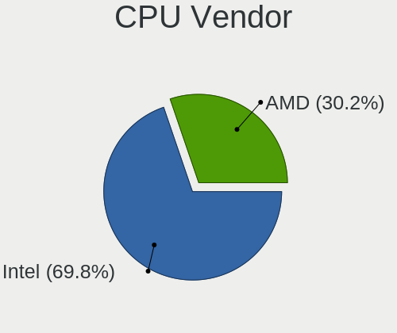

helloSystem - Hardware Trends
-----------------------------

A project to identify most popular hardware characteristics and track their change
over time based on data collected by BSD users at https://BSD-Hardware.info.

Anyone can contribute to this report by the [hw-probe](https://github.com/linuxhw/hw-probe/blob/master/INSTALL.BSD.md) tool:

    hw-probe -all -upload

This is a report for all computer types. See also reports for [desktops](/Dist/helloSystem/Desktop/README.md) and [notebooks](/Dist/helloSystem/Notebook/README.md).

This report is for one last month. Overall report since the beginning of time: [TestCoverage](https://github.com/bsdhw/TestCoverage)

Period: May, 2022.

Contents
--------

* [ System ](#system)
  - [ OS                       ](#os)
  - [ OS Family                ](#os-family)
  - [ Arch                     ](#arch)
  - [ DE                       ](#de)
  - [ Display Server           ](#display-server)
  - [ Display Manager          ](#display-manager)
  - [ OS Lang                  ](#os-lang)
  - [ Boot Mode                ](#boot-mode)
  - [ Filesystem               ](#filesystem)
  - [ Part. scheme             ](#part-scheme)

* [ Board ](#board)
  - [ Vendor                   ](#vendor)
  - [ Model                    ](#model)
  - [ Model Family             ](#model-family)
  - [ MFG Year                 ](#mfg-year)
  - [ Form Factor              ](#form-factor)
  - [ Coreboot                 ](#coreboot)
  - [ RAM Size                 ](#ram-size)
  - [ RAM Used                 ](#ram-used)
  - [ Total Drives             ](#total-drives)
  - [ Has CD-ROM               ](#has-cd-rom)
  - [ Has Ethernet             ](#has-ethernet)
  - [ Has WiFi                 ](#has-wifi)
  - [ Has Bluetooth            ](#has-bluetooth)

* [ Location ](#location)
  - [ Country                  ](#country)
  - [ City                     ](#city)

* [ Drives ](#drives)
  - [ Drive Vendor             ](#drive-vendor)
  - [ Drive Model              ](#drive-model)
  - [ HDD Vendor               ](#hdd-vendor)
  - [ SSD Vendor               ](#ssd-vendor)
  - [ Drive Kind               ](#drive-kind)
  - [ Drive Connector          ](#drive-connector)
  - [ Drive Size               ](#drive-size)
  - [ Space Total              ](#space-total)
  - [ Space Used               ](#space-used)
  - [ Malfunc. Drives          ](#malfunc-drives)
  - [ Malfunc. Drive Vendor    ](#malfunc-drive-vendor)
  - [ Malfunc. HDD Vendor      ](#malfunc-hdd-vendor)
  - [ Malfunc. Drive Kind      ](#malfunc-drive-kind)
  - [ Failed Drives            ](#failed-drives)
  - [ Failed Drive Vendor      ](#failed-drive-vendor)
  - [ Drive Status             ](#drive-status)

* [ Storage controller ](#storage-controller)
  - [ Storage Vendor           ](#storage-vendor)
  - [ Storage Model            ](#storage-model)
  - [ Storage Kind             ](#storage-kind)

* [ Processor ](#processor)
  - [ CPU Vendor               ](#cpu-vendor)
  - [ CPU Model                ](#cpu-model)
  - [ CPU Model Family         ](#cpu-model-family)
  - [ CPU Cores                ](#cpu-cores)
  - [ CPU Sockets              ](#cpu-sockets)
  - [ CPU Threads              ](#cpu-threads)
  - [ CPU Microarch            ](#cpu-microarch)

* [ Graphics ](#graphics)
  - [ GPU Vendor               ](#gpu-vendor)
  - [ GPU Model                ](#gpu-model)
  - [ GPU Combo                ](#gpu-combo)
  - [ GPU Driver               ](#gpu-driver)
  - [ GPU Memory               ](#gpu-memory)

* [ Monitor ](#monitor)
  - [ Monitor Vendor           ](#monitor-vendor)
  - [ Monitor Model            ](#monitor-model)
  - [ Monitor Resolution       ](#monitor-resolution)
  - [ Monitor Diagonal         ](#monitor-diagonal)
  - [ Monitor Width            ](#monitor-width)
  - [ Aspect Ratio             ](#aspect-ratio)
  - [ Monitor Area             ](#monitor-area)
  - [ Pixel Density            ](#pixel-density)
  - [ Multiple Monitors        ](#multiple-monitors)

* [ Network ](#network)
  - [ Net Controller Vendor    ](#net-controller-vendor)
  - [ Net Controller Model     ](#net-controller-model)
  - [ Wireless Vendor          ](#wireless-vendor)
  - [ Wireless Model           ](#wireless-model)
  - [ Ethernet Vendor          ](#ethernet-vendor)
  - [ Ethernet Model           ](#ethernet-model)
  - [ Net Controller Kind      ](#net-controller-kind)
  - [ Used Controller          ](#used-controller)
  - [ NICs                     ](#nics)
  - [ IPv6                     ](#ipv6)

* [ Bluetooth ](#bluetooth)
  - [ Bluetooth Vendor         ](#bluetooth-vendor)
  - [ Bluetooth Model          ](#bluetooth-model)

* [ Sound ](#sound)
  - [ Sound Vendor             ](#sound-vendor)
  - [ Sound Model              ](#sound-model)

* [ Memory ](#memory)
  - [ Memory Vendor            ](#memory-vendor)
  - [ Memory Model             ](#memory-model)
  - [ Memory Kind              ](#memory-kind)
  - [ Memory Form Factor       ](#memory-form-factor)
  - [ Memory Size              ](#memory-size)
  - [ Memory Speed             ](#memory-speed)

* [ Printers & scanners ](#printers--scanners)
  - [ Printer Vendor           ](#printer-vendor)
  - [ Printer Model            ](#printer-model)
  - [ Scanner Vendor           ](#scanner-vendor)
  - [ Scanner Model            ](#scanner-model)

* [ Camera ](#camera)
  - [ Camera Vendor            ](#camera-vendor)
  - [ Camera Model             ](#camera-model)

* [ Security ](#security)
  - [ Fingerprint Vendor       ](#fingerprint-vendor)
  - [ Fingerprint Model        ](#fingerprint-model)
  - [ Chipcard Vendor          ](#chipcard-vendor)
  - [ Chipcard Model           ](#chipcard-model)

* [ Unsupported ](#unsupported)
  - [ Unsupported Devices      ](#unsupported-devices)
  - [ Unsupported Device Types ](#unsupported-device-types)

System
------

OS
--

Installed operating systems

| Name              | Computers | Percent |
|-------------------|-----------|---------|
| helloSystem 0.7.0 | 37        | 86.05%  |
| helloSystem 0.8.0 | 6         | 13.95%  |

OS Family
---------

OS without a version

| Name        | Computers | Percent |
|-------------|-----------|---------|
| helloSystem | 43        | 100%    |

Arch
----

OS architecture (x86_64, i586, etc.)

| Name  | Computers | Percent |
|-------|-----------|---------|
| amd64 | 43        | 100%    |

DE
--

Desktop Environment

| Name         | Computers | Percent |
|--------------|-----------|---------|
| helloDesktop | 42        | 97.67%  |
| Cinnamon     | 1         | 2.33%   |

Display Server
--------------

X11 or Wayland

| Name | Computers | Percent |
|------|-----------|---------|
| X11  | 43        | 100%    |

Display Manager
---------------

SDDM, LightDM, etc.

| Name | Computers | Percent |
|------|-----------|---------|
| SLiM | 42        | 97.67%  |
| GDM  | 1         | 2.33%   |

OS Lang
-------

Language

| Lang  | Computers | Percent |
|-------|-----------|---------|
| en_US | 43        | 100%    |

Boot Mode
---------

EFI or BIOS

| Mode | Computers | Percent |
|------|-----------|---------|
| EFI  | 42        | 97.67%  |
| BIOS | 1         | 2.33%   |

Filesystem
----------

Type of filesystem

| Type   | Computers | Percent |
|--------|-----------|---------|
| Cd9660 | 25        | 58.14%  |
| Zfs    | 18        | 41.86%  |

Part. scheme
------------

Scheme of partitioning

| Type | Computers | Percent |
|------|-----------|---------|
| GPT  | 43        | 100%    |

Board
-----

Vendor
------

Motherboard manufacturer

| Name                | Computers | Percent |
|---------------------|-----------|---------|
| ASUSTek Computer    | 7         | 16.28%  |
| Lenovo              | 6         | 13.95%  |
| Dell                | 6         | 13.95%  |
| Gigabyte Technology | 5         | 11.63%  |
| Hewlett-Packard     | 4         | 9.3%    |
| Intel               | 2         | 4.65%   |
| Acer                | 2         | 4.65%   |
| Unknown             | 2         | 4.65%   |
| Toshiba             | 1         | 2.33%   |
| Timi                | 1         | 2.33%   |
| T-bao               | 1         | 2.33%   |
| Sony                | 1         | 2.33%   |
| Razer               | 1         | 2.33%   |
| Positivo            | 1         | 2.33%   |
| Packard Bell        | 1         | 2.33%   |
| OEM                 | 1         | 2.33%   |
| Apple               | 1         | 2.33%   |

Model
-----

Motherboard model

| Name                                               | Computers | Percent |
|----------------------------------------------------|-----------|---------|
| Unknown                                            | 2         | 4.65%   |
| Toshiba Satellite P300                             | 1         | 2.33%   |
| Timi TM1701                                        | 1         | 2.33%   |
| T-bao MINI PC                                      | 1         | 2.33%   |
| Sony VGN-NW25GF_S                                  | 1         | 2.33%   |
| Razer Blade 15 Base Model (Early 2020) - RZ09-0328 | 1         | 2.33%   |
| Positivo POS-PIQ77CL                               | 1         | 2.33%   |
| Packard Bell EasyNote_MX52-B-071                   | 1         | 2.33%   |
| OEM B85 JHS359                                     | 1         | 2.33%   |
| Lenovo YangTianA8800T                              | 1         | 2.33%   |
| Lenovo ThinkCentre M720q 10T7002CUS                | 1         | 2.33%   |
| Lenovo IdeaPad Y700-17ISK 80Q0                     | 1         | 2.33%   |
| Lenovo IdeaPad 310-15ISK 80SM                      | 1         | 2.33%   |
| Lenovo IdeaPad 3 15IGL05 82BU                      | 1         | 2.33%   |
| Lenovo B470 HuronRiver Platform                    | 1         | 2.33%   |
| Intel NUC7i7BNHXG                                  | 1         | 2.33%   |
| Intel NUC10i7FNH                                   | 1         | 2.33%   |
| HP ProBook 4340s                                   | 1         | 2.33%   |
| HP Pavilion m6                                     | 1         | 2.33%   |
| HP Pavilion g6                                     | 1         | 2.33%   |
| HP Pavilion dv6                                    | 1         | 2.33%   |
| Gigabyte F2A88XM-HD3                               | 1         | 2.33%   |
| Gigabyte F2A68HM-H                                 | 1         | 2.33%   |
| Gigabyte B75M-D3H                                  | 1         | 2.33%   |
| Gigabyte AB350N-Gaming WIFI                        | 1         | 2.33%   |
| Gigabyte A320M-H                                   | 1         | 2.33%   |
| Dell Studio 1747                                   | 1         | 2.33%   |
| Dell Precision T1700                               | 1         | 2.33%   |
| Dell OptiPlex 960                                  | 1         | 2.33%   |
| Dell OptiPlex 7040                                 | 1         | 2.33%   |
| Dell Inspiron 5559                                 | 1         | 2.33%   |
| Dell Inspiron 15-3552                              | 1         | 2.33%   |
| ASUS TUF X470-PLUS GAMING                          | 1         | 2.33%   |
| ASUS PRIME X570-P                                  | 1         | 2.33%   |
| ASUS P8Z77-V LX                                    | 1         | 2.33%   |
| ASUS P5LD2                                         | 1         | 2.33%   |
| ASUS K52F                                          | 1         | 2.33%   |
| ASUS K30AM-J                                       | 1         | 2.33%   |
| ASUS F50SL                                         | 1         | 2.33%   |
| Apple iMac9,1                                      | 1         | 2.33%   |
| Acer Aspire E1-522                                 | 1         | 2.33%   |
| Acer Aspire A315-41                                | 1         | 2.33%   |

Model Family
------------

Motherboard model prefix

| Name                   | Computers | Percent |
|------------------------|-----------|---------|
| Lenovo IdeaPad         | 3         | 6.98%   |
| HP Pavilion            | 3         | 6.98%   |
| Dell OptiPlex          | 2         | 4.65%   |
| Dell Inspiron          | 2         | 4.65%   |
| Acer Aspire            | 2         | 4.65%   |
| Unknown                | 2         | 4.65%   |
| Toshiba Satellite      | 1         | 2.33%   |
| Timi TM1701            | 1         | 2.33%   |
| T-bao MINI             | 1         | 2.33%   |
| Sony VGN-NW25GF        | 1         | 2.33%   |
| Razer Blade            | 1         | 2.33%   |
| Positivo POS-PIQ77CL   | 1         | 2.33%   |
| Packard Bell EasyNote  | 1         | 2.33%   |
| OEM B85                | 1         | 2.33%   |
| Lenovo YangTianA8800T  | 1         | 2.33%   |
| Lenovo ThinkCentre     | 1         | 2.33%   |
| Lenovo B470            | 1         | 2.33%   |
| Intel NUC7i7BNHXG      | 1         | 2.33%   |
| Intel NUC10i7FNH       | 1         | 2.33%   |
| HP ProBook             | 1         | 2.33%   |
| Gigabyte F2A88XM-HD3   | 1         | 2.33%   |
| Gigabyte F2A68HM-H     | 1         | 2.33%   |
| Gigabyte B75M-D3H      | 1         | 2.33%   |
| Gigabyte AB350N-Gaming | 1         | 2.33%   |
| Gigabyte A320M-H       | 1         | 2.33%   |
| Dell Studio            | 1         | 2.33%   |
| Dell Precision         | 1         | 2.33%   |
| ASUS TUF               | 1         | 2.33%   |
| ASUS PRIME             | 1         | 2.33%   |
| ASUS P8Z77-V           | 1         | 2.33%   |
| ASUS P5LD2             | 1         | 2.33%   |
| ASUS K52F              | 1         | 2.33%   |
| ASUS K30AM-J           | 1         | 2.33%   |
| ASUS F50SL             | 1         | 2.33%   |
| Apple iMac9            | 1         | 2.33%   |

MFG Year
--------

Motherboard manufacture year

| Year | Computers | Percent |
|------|-----------|---------|
| 2020 | 7         | 16.28%  |
| 2009 | 7         | 16.28%  |
| 2012 | 5         | 11.63%  |
| 2017 | 4         | 9.3%    |
| 2016 | 3         | 6.98%   |
| 2014 | 3         | 6.98%   |
| 2011 | 3         | 6.98%   |
| 2021 | 2         | 4.65%   |
| 2019 | 2         | 4.65%   |
| 2018 | 2         | 4.65%   |
| 2013 | 2         | 4.65%   |
| 2022 | 1         | 2.33%   |
| 2015 | 1         | 2.33%   |
| 2007 | 1         | 2.33%   |

Form Factor
-----------

Physical design of the computer

| Name       | Computers | Percent |
|------------|-----------|---------|
| Notebook   | 21        | 48.84%  |
| Desktop    | 17        | 39.53%  |
| Mini pc    | 3         | 6.98%   |
| All in one | 2         | 4.65%   |

Coreboot
--------

Have coreboot on board

| Used | Computers | Percent |
|------|-----------|---------|
| No   | 43        | 100%    |

RAM Size
--------

Total RAM memory

| Size in GB | Computers | Percent |
|------------|-----------|---------|
| 8.01-16.0  | 16        | 37.21%  |
| 4.01-8.0   | 13        | 30.23%  |
| 16.01-24.0 | 11        | 25.58%  |
| 32.01-64.0 | 1         | 2.33%   |
| 3.01-4.0   | 1         | 2.33%   |
| 2.01-3.0   | 1         | 2.33%   |

RAM Used
--------

Used RAM memory

| Used GB  | Computers | Percent |
|----------|-----------|---------|
| 0.01-0.5 | 25        | 58.14%  |
| 0.51-1.0 | 16        | 37.21%  |
| 1.01-2.0 | 2         | 4.65%   |

Total Drives
------------

Number of drives on board

| Drives | Computers | Percent |
|--------|-----------|---------|
| 1      | 31        | 72.09%  |
| 2      | 9         | 20.93%  |
| 0      | 3         | 6.98%   |

Has CD-ROM
----------

Has CD-ROM on board

| Presented | Computers | Percent |
|-----------|-----------|---------|
| Yes       | 22        | 51.16%  |
| No        | 21        | 48.84%  |

Has Ethernet
------------

Has Ethernet on board

| Presented | Computers | Percent |
|-----------|-----------|---------|
| Yes       | 39        | 90.7%   |
| No        | 4         | 9.3%    |

Has WiFi
--------

Has WiFi module

| Presented | Computers | Percent |
|-----------|-----------|---------|
| Yes       | 33        | 76.74%  |
| No        | 10        | 23.26%  |

Has Bluetooth
-------------

Has Bluetooth module

| Presented | Computers | Percent |
|-----------|-----------|---------|
| No        | 24        | 55.81%  |
| Yes       | 19        | 44.19%  |

Location
--------

Country
-------

Geographic location (country)

| Country      | Computers | Percent |
|--------------|-----------|---------|
| USA          | 5         | 11.63%  |
| Russia       | 5         | 11.63%  |
| Italy        | 5         | 11.63%  |
| China        | 5         | 11.63%  |
| Canada       | 4         | 9.3%    |
| Mexico       | 3         | 6.98%   |
| UK           | 2         | 4.65%   |
| Norway       | 2         | 4.65%   |
| New Zealand  | 2         | 4.65%   |
| Brazil       | 2         | 4.65%   |
| Turkey       | 1         | 2.33%   |
| Spain        | 1         | 2.33%   |
| South Africa | 1         | 2.33%   |
| Serbia       | 1         | 2.33%   |
| Portugal     | 1         | 2.33%   |
| Indonesia    | 1         | 2.33%   |
| Germany      | 1         | 2.33%   |
| Czechia      | 1         | 2.33%   |

City
----

Geographic location (city)

| City                     | Computers | Percent |
|--------------------------|-----------|---------|
| Tromsø                  | 2         | 4.65%   |
| Moscow                   | 2         | 4.65%   |
| Monterrey                | 2         | 4.65%   |
| Izhevsk                  | 2         | 4.65%   |
| Adelfia                  | 2         | 4.65%   |
| Zhengzhou                | 1         | 2.33%   |
| Vandalia                 | 1         | 2.33%   |
| Vancouver                | 1         | 2.33%   |
| Somerset West            | 1         | 2.33%   |
| Scottsdale               | 1         | 2.33%   |
| San Luis Potosí City    | 1         | 2.33%   |
| Saint-Colomban           | 1         | 2.33%   |
| Québec                  | 1         | 2.33%   |
| Pudong                   | 1         | 2.33%   |
| Passignano sul Trasimeno | 1         | 2.33%   |
| Ottawa                   | 1         | 2.33%   |
| Novosibirsk              | 1         | 2.33%   |
| New Plymouth             | 1         | 2.33%   |
| Nanticoke                | 1         | 2.33%   |
| Mladenovac               | 1         | 2.33%   |
| Milan                    | 1         | 2.33%   |
| Luoyang                  | 1         | 2.33%   |
| Lissone                  | 1         | 2.33%   |
| Lisbon                   | 1         | 2.33%   |
| Kurintji                 | 1         | 2.33%   |
| Karlsruhe                | 1         | 2.33%   |
| Istanbul                 | 1         | 2.33%   |
| Ipojuca                  | 1         | 2.33%   |
| Independence             | 1         | 2.33%   |
| Idaho Falls              | 1         | 2.33%   |
| Gaoleshan                | 1         | 2.33%   |
| Fuenterrabia             | 1         | 2.33%   |
| Feltham                  | 1         | 2.33%   |
| Cidade Universitária    | 1         | 2.33%   |
| Chengdu                  | 1         | 2.33%   |
| Brno                     | 1         | 2.33%   |
| Auckland                 | 1         | 2.33%   |
| Ashington                | 1         | 2.33%   |

Drives
------

Drive Vendor
------------

Hard drive vendors

| Vendor              | Computers | Drives | Percent |
|---------------------|-----------|--------|---------|
| Seagate             | 8         | 9      | 17.78%  |
| WDC                 | 7         | 8      | 15.56%  |
| Samsung Electronics | 7         | 9      | 15.56%  |
| Kingston            | 5         | 5      | 11.11%  |
| Toshiba             | 3         | 3      | 6.67%   |
| SanDisk             | 3         | 3      | 6.67%   |
| Intel               | 2         | 2      | 4.44%   |
| Hitachi             | 2         | 2      | 4.44%   |
| XPG                 | 1         | 1      | 2.22%   |
| SSSTC               | 1         | 1      | 2.22%   |
| SK Hynix            | 1         | 1      | 2.22%   |
| Silicon Motion      | 1         | 1      | 2.22%   |
| Netac               | 1         | 1      | 2.22%   |
| Micron Technology   | 1         | 1      | 2.22%   |
| LITEON              | 1         | 1      | 2.22%   |
| Crucial             | 1         | 1      | 2.22%   |

Drive Model
-----------

Hard drive models

| Model                             | Computers | Percent |
|-----------------------------------|-----------|---------|
| Seagate ST9500325AS 500GB         | 2         | 4.08%   |
| Samsung SSD 860 EVO 1TB           | 2         | 4.08%   |
| Kingston SV300S37A120G 120GB      | 2         | 4.08%   |
| XPG GAMMIX S11 Pro 256GB          | 1         | 2.04%   |
| WDC WDS240G1G0A-00SS50 240GB      | 1         | 2.04%   |
| WDC WDS120G2G0A-00JH30 120GB      | 1         | 2.04%   |
| WDC WD5000AZLX-00K2TA0 500GB      | 1         | 2.04%   |
| WDC WD3200BEKX-60B7WT0 320GB      | 1         | 2.04%   |
| WDC WD3200AAJS-60Z0A0 320GB       | 1         | 2.04%   |
| WDC WD2500BEVS-22UST0 250GB       | 1         | 2.04%   |
| WDC WD1200BEVS-75UST0 120GB       | 1         | 2.04%   |
| WDC WD10JPVX-75JC3T0 1TB          | 1         | 2.04%   |
| Toshiba MQ01ABF050 500GB          | 1         | 2.04%   |
| Toshiba MQ01ABD050 500GB          | 1         | 2.04%   |
| Toshiba MK2561GSYN 250GB          | 1         | 2.04%   |
| SSSTC CL1-4D128 128GB             | 1         | 2.04%   |
| SK Hynix HFS256G39TND-N210A 256GB | 1         | 2.04%   |
| Silicon Motion ASint AS806 128GB  | 1         | 2.04%   |
| Seagate ST9320325AS 320GB         | 1         | 2.04%   |
| Seagate ST9320320AS 320GB         | 1         | 2.04%   |
| Seagate ST9160821AS 160GB         | 1         | 2.04%   |
| Seagate ST500LM030-1RK17D 500GB   | 1         | 2.04%   |
| Seagate ST3250410AS 250GB         | 1         | 2.04%   |
| Seagate ST31000520AS 1TB          | 1         | 2.04%   |
| Seagate ST1000DM010-2EP102 1TB    | 1         | 2.04%   |
| SanDisk SSD PLUS 240GB            | 1         | 2.04%   |
| SanDisk SDSA5GK-016G-1006 16GB    | 1         | 2.04%   |
| SanDisk SD6SF1M-032G-1006 32GB    | 1         | 2.04%   |
| Samsung SSD 970 EVO 2TB           | 1         | 2.04%   |
| Samsung SSD 870 EVO 500GB         | 1         | 2.04%   |
| Samsung SSD 850 EVO 500GB         | 1         | 2.04%   |
| Samsung SSD 750 EVO 120GB         | 1         | 2.04%   |
| Samsung MZVLW128HEGR-00000 128GB  | 1         | 2.04%   |
| Samsung MZVLB512HBJQ-00A00 512GB  | 1         | 2.04%   |
| Samsung MZVLB256HAHQ-000L7 256GB  | 1         | 2.04%   |
| Netac SSD 120GB                   | 1         | 2.04%   |
| Micron 1100 SATA 256GB            | 1         | 2.04%   |
| LITEON LCH-256V2S 256GB           | 1         | 2.04%   |
| Kingston SNVS500G 500GB           | 1         | 2.04%   |
| Kingston SA400S37120G 120GB       | 1         | 2.04%   |
| Kingston SA2000M81000G 1TB        | 1         | 2.04%   |
| Intel SSDSC2BW240A4 240GB         | 1         | 2.04%   |
| Intel SSDSA2CW120G3 120GB         | 1         | 2.04%   |
| Hitachi HTS547564A9E384 640GB     | 1         | 2.04%   |
| Hitachi HDT725025VLA380 250GB     | 1         | 2.04%   |
| Crucial CT480BX500SSD1 480GB      | 1         | 2.04%   |

HDD Vendor
----------

Hard disk drive vendors

| Vendor  | Computers | Drives | Percent |
|---------|-----------|--------|---------|
| Seagate | 8         | 9      | 44.44%  |
| WDC     | 5         | 6      | 27.78%  |
| Toshiba | 3         | 3      | 16.67%  |
| Hitachi | 2         | 2      | 11.11%  |

SSD Vendor
----------

Solid state drive vendors

| Vendor              | Computers | Drives | Percent |
|---------------------|-----------|--------|---------|
| Samsung Electronics | 5         | 5      | 25%     |
| SanDisk             | 3         | 3      | 15%     |
| Kingston            | 3         | 3      | 15%     |
| WDC                 | 2         | 2      | 10%     |
| Intel               | 2         | 2      | 10%     |
| SK Hynix            | 1         | 1      | 5%      |
| Netac               | 1         | 1      | 5%      |
| Micron Technology   | 1         | 1      | 5%      |
| LITEON              | 1         | 1      | 5%      |
| Crucial             | 1         | 1      | 5%      |

Drive Kind
----------

HDD or SSD

| Kind | Computers | Drives | Percent |
|------|-----------|--------|---------|
| SSD  | 19        | 20     | 41.3%   |
| HDD  | 18        | 20     | 39.13%  |
| NVMe | 9         | 9      | 19.57%  |

Drive Connector
---------------

SATA, SAS, NVMe, etc.

| Type | Computers | Drives | Percent |
|------|-----------|--------|---------|
| SATA | 35        | 40     | 79.55%  |
| NVMe | 9         | 9      | 20.45%  |

Drive Size
----------

Size of hard drive

| Size in TB | Computers | Drives | Percent |
|------------|-----------|--------|---------|
| 0.01-0.5   | 29        | 34     | 82.86%  |
| 0.51-1.0   | 6         | 6      | 17.14%  |

Space Total
-----------

Amount of disk space available on the file system

| Size in GB | Computers | Percent |
|------------|-----------|---------|
| 1-20       | 25        | 58.14%  |
| 251-500    | 7         | 16.28%  |
| 101-250    | 7         | 16.28%  |
| 501-1000   | 4         | 9.3%    |

Space Used
----------

Amount of used disk space

| Used GB | Computers | Percent |
|---------|-----------|---------|
| 1-20    | 43        | 100%    |

Malfunc. Drives
---------------

Drive models with a malfunction

| Model                               | Computers | Drives | Percent |
|-------------------------------------|-----------|--------|---------|
| Seagate ST9500325AS 500GB           | 1         | 1      | 12.5%   |
| Seagate ST9160821AS 160GB           | 1         | 1      | 12.5%   |
| Seagate ST31000520AS 1TB            | 1         | 1      | 12.5%   |
| SanDisk SSD PLUS 240GB              | 1         | 1      | 12.5%   |
| Samsung Electronics SSD 970 EVO 2TB | 1         | 1      | 12.5%   |
| Samsung Electronics SSD 860 EVO 1TB | 1         | 1      | 12.5%   |
| Kingston SV300S37A120G 120GB        | 1         | 1      | 12.5%   |
| Hitachi HTS547564A9E384 640GB       | 1         | 1      | 12.5%   |

Malfunc. Drive Vendor
---------------------

Vendors of faulty drives

| Vendor              | Computers | Drives | Percent |
|---------------------|-----------|--------|---------|
| Seagate             | 3         | 3      | 42.86%  |
| SanDisk             | 1         | 1      | 14.29%  |
| Samsung Electronics | 1         | 2      | 14.29%  |
| Kingston            | 1         | 1      | 14.29%  |
| Hitachi             | 1         | 1      | 14.29%  |

Malfunc. HDD Vendor
-------------------

Vendors of faulty HDD drives

| Vendor  | Computers | Drives | Percent |
|---------|-----------|--------|---------|
| Seagate | 3         | 3      | 75%     |
| Hitachi | 1         | 1      | 25%     |

Malfunc. Drive Kind
-------------------

Kinds of faulty drives

| Kind | Computers | Drives | Percent |
|------|-----------|--------|---------|
| HDD  | 4         | 4      | 50%     |
| SSD  | 3         | 3      | 37.5%   |
| NVMe | 1         | 1      | 12.5%   |

Failed Drives
-------------

Failed drive models

Zero info for selected period =(

Failed Drive Vendor
-------------------

Failed drive vendors

Zero info for selected period =(

Drive Status
------------

Number of failed and malfunc. drives

| Status  | Computers | Drives | Percent |
|---------|-----------|--------|---------|
| Works   | 34        | 41     | 82.93%  |
| Malfunc | 7         | 8      | 17.07%  |

Storage controller
------------------

Storage Vendor
--------------

Storage controller vendors

| Vendor                           | Computers | Percent |
|----------------------------------|-----------|---------|
| Intel                            | 29        | 56.86%  |
| AMD                              | 10        | 19.61%  |
| Samsung Electronics              | 4         | 7.84%   |
| Kingston Technology Company      | 2         | 3.92%   |
| Solid State Storage Technology   | 1         | 1.96%   |
| Silicon Motion                   | 1         | 1.96%   |
| Silicon Integrated Systems [SiS] | 1         | 1.96%   |
| Nvidia                           | 1         | 1.96%   |
| Broadcom / LSI                   | 1         | 1.96%   |
| ADATA Technology                 | 1         | 1.96%   |

Storage Model
-------------

Storage controller models

| Model                                                                            | Computers | Percent |
|----------------------------------------------------------------------------------|-----------|---------|
| AMD FCH SATA Controller [AHCI mode]                                              | 8         | 13.79%  |
| Intel 7 Series/C210 Series Chipset Family 6-port SATA Controller [AHCI mode]     | 4         | 6.9%    |
| Samsung NVMe SSD Controller SM981/PM981/PM983                                    | 3         | 5.17%   |
| Intel Sunrise Point-LP SATA Controller [AHCI mode]                               | 3         | 5.17%   |
| Intel 82801IBM/IEM (ICH9M/ICH9M-E) 4 port SATA Controller [AHCI mode]            | 3         | 5.17%   |
| Intel 7 Series Chipset Family 6-port SATA Controller [AHCI mode]                 | 2         | 3.45%   |
| Intel 400 Series Chipset Family SATA AHCI Controller                             | 2         | 3.45%   |
| Silicon Motion SM2263EN/SM2263XT SSD Controller                                  | 1         | 1.72%   |
| Silicon Integrated Systems [SiS] SATA Controller / IDE mode                      | 1         | 1.72%   |
| Silicon Integrated Systems [SiS] 5513 IDE Controller                             | 1         | 1.72%   |
| Samsung NVMe SSD Controller SM961/PM961/SM963                                    | 1         | 1.72%   |
| Nvidia MCP79 AHCI Controller                                                     | 1         | 1.72%   |
| Kingston Company SNVS2000G [NV1 NVMe PCIe SSD 2TB]                               | 1         | 1.72%   |
| Kingston Company A2000 NVMe SSD                                                  | 1         | 1.72%   |
| Intel Q170/Q150/B150/H170/H110/Z170/CM236 Chipset SATA Controller [AHCI Mode]    | 1         | 1.72%   |
| Intel NM10/ICH7 Family SATA Controller [AHCI mode]                               | 1         | 1.72%   |
| Intel HM170/QM170 Chipset SATA Controller [AHCI Mode]                            | 1         | 1.72%   |
| Intel Comet Lake SATA AHCI Controller                                            | 1         | 1.72%   |
| Intel Celeron/Pentium Silver Processor SATA Controller                           | 1         | 1.72%   |
| Intel Celeron N3350/Pentium N4200/Atom E3900 Series SATA AHCI Controller         | 1         | 1.72%   |
| Intel Cannon Lake PCH SATA AHCI Controller                                       | 1         | 1.72%   |
| Intel Atom/Celeron/Pentium Processor x5-E8000/J3xxx/N3xxx Series SATA Controller | 1         | 1.72%   |
| Intel Atom Processor E3800 Series SATA AHCI Controller                           | 1         | 1.72%   |
| Intel 82801JD/DO (ICH10 Family) SATA AHCI Controller                             | 1         | 1.72%   |
| Intel 82801G (ICH7 Family) IDE Controller                                        | 1         | 1.72%   |
| Intel 82801 Mobile SATA Controller [RAID mode]                                   | 1         | 1.72%   |
| Intel 8 Series/C220 Series Chipset Family 6-port SATA Controller 1 [AHCI mode]   | 1         | 1.72%   |
| Intel 6 Series/C200 Series Chipset Family 6 port Mobile SATA AHCI Controller     | 1         | 1.72%   |
| Intel 5 Series/3400 Series Chipset 6 port SATA AHCI Controller                   | 1         | 1.72%   |
| Intel 5 Series/3400 Series Chipset 4 port SATA AHCI Controller                   | 1         | 1.72%   |
| Intel 4 Series Chipset PT IDER Controller                                        | 1         | 1.72%   |
| Broadcom / LSI MegaRAID SAS 2208 [Thunderbolt]                                   | 1         | 1.72%   |
| AMD SB600 Non-Raid-5 SATA                                                        | 1         | 1.72%   |
| AMD SB600 IDE                                                                    | 1         | 1.72%   |
| AMD FCH SATA Controller [IDE mode]                                               | 1         | 1.72%   |
| AMD FCH SATA Controller D                                                        | 1         | 1.72%   |
| AMD 400 Series Chipset SATA Controller                                           | 1         | 1.72%   |
| AMD 300 Series Chipset SATA Controller                                           | 1         | 1.72%   |
| ADATA XPG SX8200 Pro PCIe Gen3x4 M.2 2280 Solid State Drive                      | 1         | 1.72%   |
| Unknown                                                                          | 1         | 1.72%   |

Storage Kind
------------

Kind of storage controller (IDE, SATA, NVMe, SAS, ...)

| Kind | Computers | Percent |
|------|-----------|---------|
| SATA | 37        | 69.81%  |
| NVMe | 9         | 16.98%  |
| IDE  | 5         | 9.43%   |
| RAID | 2         | 3.77%   |

Processor
---------

CPU Vendor
----------

Processor vendors

| Vendor | Computers | Percent |
|--------|-----------|---------|
| Intel  | 33        | 76.74%  |
| AMD    | 10        | 23.26%  |

CPU Model
---------

Processor models

| Model                                         | Computers | Percent |
|-----------------------------------------------|-----------|---------|
| Intel CPU Version                             | 2         | 4.65%   |
| Intel Core 2 Duo CPU T6600 @ 2.20GHz          | 2         | 4.65%   |
| AMD Ryzen 7 3700X 8-Core Processor            | 2         | 4.65%   |
| Intel Xeon CPU E3-1270 v3 @ 3.50GHz           | 1         | 2.33%   |
| Intel Pentium Dual-Core CPU T4200 @ 2.00GHz   | 1         | 2.33%   |
| Intel Pentium D CPU 3.00GHz                   | 1         | 2.33%   |
| Intel Pentium CPU P6200 @ 2.13GH              | 1         | 2.33%   |
| Intel Pentium CPU G3460T @ 3.00GHz            | 1         | 2.33%   |
| Intel Pentium CPU B950 @ 2.10GHz              | 1         | 2.33%   |
| Intel Core i7-8550U CPU @ 1.80GHz             | 1         | 2.33%   |
| Intel Core i7-7567U CPU @ 3.50GHz             | 1         | 2.33%   |
| Intel Core i7-6700HQ CPU @ 2.60GHz            | 1         | 2.33%   |
| Intel Core i7-6700 CPU @ 3.40GHz              | 1         | 2.33%   |
| Intel Core i7-3770 CPU @ 3.40GHz              | 1         | 2.33%   |
| Intel Core i7-3612QM CPU @ 2.10GHz            | 1         | 2.33%   |
| Intel Core i7-10750H CPU @ 2.60GHz            | 1         | 2.33%   |
| Intel Core i7-10710U CPU @ 1.10GHz            | 1         | 2.33%   |
| Intel Core i5-8400T CPU @ 1.70GHz             | 1         | 2.33%   |
| Intel Core i5-6200U CPU @ 2.30GHz             | 1         | 2.33%   |
| Intel Core i5-3570 CPU @ 3.40GHz              | 1         | 2.33%   |
| Intel Core i5-3470 CPU @ 3.20GHz              | 1         | 2.33%   |
| Intel Core i5-3450 CPU @ 3.10GHz              | 1         | 2.33%   |
| Intel Core i5-3230M CPU @ 2.60GHz             | 1         | 2.33%   |
| Intel Core i5-3210M CPU @ 2.50GHz             | 1         | 2.33%   |
| Intel Core i3-6006U CPU @ 2.00GHz             | 1         | 2.33%   |
| Intel Core i3-10105 CPU @ 3.70GHz             | 1         | 2.33%   |
| Intel Core 2 Duo CPU E8135 @ 2.66GHz          | 1         | 2.33%   |
| Intel Core 2 Duo                              | 1         | 2.33%   |
| Intel Celeron N4020 CPU @ 1.10GHz             | 1         | 2.33%   |
| Intel Celeron CPU N3350 @ 1.10GHz             | 1         | 2.33%   |
| Intel Celeron CPU N3060 @ 1.60GHz             | 1         | 2.33%   |
| Intel Celeron CPU J1800 @ 2.41GHz             | 1         | 2.33%   |
| AMD Ryzen 5 2600 Six-Core Processor           | 1         | 2.33%   |
| AMD Ryzen 5 2500U with Radeon Vega Mobile Gfx | 1         | 2.33%   |
| AMD Ryzen 5 1600X Six-Core Processor          | 1         | 2.33%   |
| AMD Ryzen 3 2200U with Radeon Vega Mobile Gfx | 1         | 2.33%   |
| AMD Athlon 64 X2 Dual-Core Processor TK-57    | 1         | 2.33%   |
| AMD A6-5400K APU with Radeon HD Graphics      | 1         | 2.33%   |
| AMD A6-5200 APU with Radeon HD Graphics       | 1         | 2.33%   |
| AMD A10-6800K APU with Radeon HD Graphics     | 1         | 2.33%   |

CPU Model Family
----------------

Processor model prefix

| Model                   | Computers | Percent |
|-------------------------|-----------|---------|
| Intel Core i7           | 8         | 18.6%   |
| Intel Core i5           | 7         | 16.28%  |
| Intel Core 2 Duo        | 4         | 9.3%    |
| Intel Celeron           | 4         | 9.3%    |
| Intel Pentium           | 3         | 6.98%   |
| AMD Ryzen 5             | 3         | 6.98%   |
| Other                   | 2         | 4.65%   |
| Intel Core i3           | 2         | 4.65%   |
| AMD Ryzen 7             | 2         | 4.65%   |
| AMD A6                  | 2         | 4.65%   |
| Intel Xeon              | 1         | 2.33%   |
| Intel Pentium Dual-Core | 1         | 2.33%   |
| Intel Pentium D         | 1         | 2.33%   |
| AMD Ryzen 3             | 1         | 2.33%   |
| AMD Athlon 64 X2        | 1         | 2.33%   |
| AMD A10                 | 1         | 2.33%   |

CPU Cores
---------

Number of processor cores

| Number  | Computers | Percent |
|---------|-----------|---------|
| 2       | 16        | 37.21%  |
| 4       | 14        | 32.56%  |
| Unknown | 5         | 11.63%  |
| 6       | 3         | 6.98%   |
| 16      | 2         | 4.65%   |
| 12      | 2         | 4.65%   |
| 8       | 1         | 2.33%   |

CPU Sockets
-----------

Number of sockets

| Number | Computers | Percent |
|--------|-----------|---------|
| 1      | 42        | 97.67%  |
| 2      | 1         | 2.33%   |

CPU Threads
-----------

Threads per core (Hyper-Threading)

| Number  | Computers | Percent |
|---------|-----------|---------|
| 1       | 23        | 53.49%  |
| 2       | 15        | 34.88%  |
| Unknown | 5         | 11.63%  |

CPU Microarch
-------------

Microarchitecture

| Name          | Computers | Percent |
|---------------|-----------|---------|
| IvyBridge     | 7         | 16.28%  |
| Penryn        | 6         | 13.95%  |
| Skylake       | 4         | 9.3%    |
| Zen           | 3         | 6.98%   |
| KabyLake      | 3         | 6.98%   |
| CometLake     | 3         | 6.98%   |
| Zen 2         | 2         | 4.65%   |
| Silvermont    | 2         | 4.65%   |
| Piledriver    | 2         | 4.65%   |
| Haswell       | 2         | 4.65%   |
| Zen+          | 1         | 2.33%   |
| Westmere      | 1         | 2.33%   |
| SandyBridge   | 1         | 2.33%   |
| NetBurst      | 1         | 2.33%   |
| Nehalem       | 1         | 2.33%   |
| K8 Hammer     | 1         | 2.33%   |
| Jaguar        | 1         | 2.33%   |
| Goldmont plus | 1         | 2.33%   |
| Goldmont      | 1         | 2.33%   |

Graphics
--------

GPU Vendor
----------

Vendors of graphics cards

| Vendor | Computers | Percent |
|--------|-----------|---------|
| Intel  | 25        | 51.02%  |
| AMD    | 13        | 26.53%  |
| Nvidia | 11        | 22.45%  |

GPU Model
---------

Graphics card models

| Model                                                                                    | Computers | Percent |
|------------------------------------------------------------------------------------------|-----------|---------|
| Intel Xeon E3-1200 v2/3rd Gen Core processor Graphics Controller                         | 3         | 6.12%   |
| Intel 3rd Gen Core processor Graphics Controller                                         | 3         | 6.12%   |
| AMD RV710/M92 [Mobility Radeon HD 4530/4570/545v]                                        | 3         | 6.12%   |
| Intel Skylake GT2 [HD Graphics 520]                                                      | 2         | 4.08%   |
| AMD Thames [Radeon HD 7500M/7600M Series]                                                | 2         | 4.08%   |
| AMD Raven Ridge [Radeon Vega Series / Radeon Vega Mobile Series]                         | 2         | 4.08%   |
| Nvidia TU106M [GeForce RTX 2060 Mobile]                                                  | 1         | 2.04%   |
| Nvidia TU106 [GeForce RTX 2060 SUPER]                                                    | 1         | 2.04%   |
| Nvidia GP108M [GeForce MX150]                                                            | 1         | 2.04%   |
| Nvidia GM206 [GeForce GTX 960]                                                           | 1         | 2.04%   |
| Nvidia GM107M [GeForce GTX 960M]                                                         | 1         | 2.04%   |
| Nvidia GK208BM [GeForce 920M]                                                            | 1         | 2.04%   |
| Nvidia GK208B [GeForce GT 710]                                                           | 1         | 2.04%   |
| Nvidia GK208 [GeForce GT 635]                                                            | 1         | 2.04%   |
| Nvidia GK107GL [Quadro K2000]                                                            | 1         | 2.04%   |
| Nvidia G73 [GeForce 7600 GS]                                                             | 1         | 2.04%   |
| Nvidia C79 [GeForce 9400]                                                                | 1         | 2.04%   |
| Intel Xeon E3-1200 v3/4th Gen Core Processor Integrated Graphics Controller              | 1         | 2.04%   |
| Intel UHD Graphics 620                                                                   | 1         | 2.04%   |
| Intel Mobile 4 Series Chipset Integrated Graphics Controller                             | 1         | 2.04%   |
| Intel IvyBridge GT2 [HD Graphics 4000]                                                   | 1         | 2.04%   |
| Intel Iris Plus Graphics 650                                                             | 1         | 2.04%   |
| Intel HD Graphics 530                                                                    | 1         | 2.04%   |
| Intel HD Graphics 500                                                                    | 1         | 2.04%   |
| Intel GeminiLake [UHD Graphics 600]                                                      | 1         | 2.04%   |
| Intel Core Processor Integrated Graphics Controller                                      | 1         | 2.04%   |
| Intel CometLake-S GT2 [UHD Graphics 630]                                                 | 1         | 2.04%   |
| Intel CometLake-H GT2 [UHD Graphics]                                                     | 1         | 2.04%   |
| Intel Comet Lake UHD Graphics                                                            | 1         | 2.04%   |
| Intel CoffeeLake-S GT2 [UHD Graphics 630]                                                | 1         | 2.04%   |
| Intel Atom/Celeron/Pentium Processor x5-E8000/J3xxx/N3xxx Integrated Graphics Controller | 1         | 2.04%   |
| Intel Atom Processor Z36xxx/Z37xxx Series Graphics & Display                             | 1         | 2.04%   |
| Intel 4 Series Chipset Integrated Graphics Controller                                    | 1         | 2.04%   |
| Intel 2nd Generation Core Processor Family Integrated Graphics Controller                | 1         | 2.04%   |
| AMD Trinity 2 [Radeon HD 7540D]                                                          | 1         | 2.04%   |
| AMD RV730/M96 [Mobility Radeon HD 4650/5165]                                             | 1         | 2.04%   |
| AMD RV730 PRO [Radeon HD 4650]                                                           | 1         | 2.04%   |
| AMD RS690M [Radeon Xpress 1200/1250/1270]                                                | 1         | 2.04%   |
| AMD Navi 10 [Radeon RX 5600 OEM/5600 XT / 5700/5700 XT]                                  | 1         | 2.04%   |
| AMD Kabini [Radeon HD 8400 / R3 Series]                                                  | 1         | 2.04%   |

GPU Combo
---------

Combinations of graphics cards

| Name           | Computers | Percent |
|----------------|-----------|---------|
| 1 x Intel      | 17        | 39.53%  |
| 1 x AMD        | 11        | 25.58%  |
| 1 x Nvidia     | 7         | 16.28%  |
| Intel + Nvidia | 4         | 9.3%    |
| 2 x Intel      | 2         | 4.65%   |
| Intel + AMD    | 2         | 4.65%   |

GPU Driver
----------

Free vs proprietary

| Driver      | Computers | Percent |
|-------------|-----------|---------|
| Free        | 37        | 86.05%  |
| Proprietary | 6         | 13.95%  |

GPU Memory
----------

Total video memory

| Size in GB | Computers | Percent |
|------------|-----------|---------|
| Unknown    | 29        | 67.44%  |
| 0.01-0.5   | 6         | 13.95%  |
| 1.01-2.0   | 3         | 6.98%   |
| 7.01-8.0   | 2         | 4.65%   |
| 0.51-1.0   | 2         | 4.65%   |
| 3.01-4.0   | 1         | 2.33%   |

Monitor
-------

Monitor Vendor
--------------

Monitor vendors

| Vendor              | Computers | Percent |
|---------------------|-----------|---------|
| LG Display          | 6         | 14.63%  |
| Samsung Electronics | 5         | 12.2%   |
| Goldstar            | 4         | 9.76%   |
| Chimei Innolux      | 3         | 7.32%   |
| BOE                 | 3         | 7.32%   |
| AU Optronics        | 3         | 7.32%   |
| Lenovo              | 2         | 4.88%   |
| Hewlett-Packard     | 2         | 4.88%   |
| Dell                | 2         | 4.88%   |
| AOC                 | 2         | 4.88%   |
| ZL_                 | 1         | 2.44%   |
| SLD                 | 1         | 2.44%   |
| MSI                 | 1         | 2.44%   |
| LTV                 | 1         | 2.44%   |
| LG Philips          | 1         | 2.44%   |
| Fujitsu Siemens     | 1         | 2.44%   |
| CND                 | 1         | 2.44%   |
| Apple               | 1         | 2.44%   |
| Acer                | 1         | 2.44%   |

Monitor Model
-------------

Monitor models

| Model                                                                  | Computers | Percent |
|------------------------------------------------------------------------|-----------|---------|
| ZL_ zhuoyue-DP ZL_2716 2560x1440 600x330mm 27.0-inch                   | 1         | 2.44%   |
| SLD LCD Monitor SLD003C 1366x768 310x170mm 13.9-inch                   | 1         | 2.44%   |
| Samsung Electronics SyncMaster SAM05B0 1920x1080                       | 1         | 2.44%   |
| Samsung Electronics S24D332 SAM0F5E 1920x1080 530x300mm 24.0-inch      | 1         | 2.44%   |
| Samsung Electronics LCD Monitor SEC3847 1440x900 370x230mm 17.2-inch   | 1         | 2.44%   |
| Samsung Electronics LCD Monitor SEC304C 1366x768 350x200mm 15.9-inch   | 1         | 2.44%   |
| Samsung Electronics LCD Monitor SAM7016 3840x2160 1420x800mm 64.2-inch | 1         | 2.44%   |
| MSI MAG271C MSI3FA6 1920x1080 600x340mm 27.2-inch                      | 1         | 2.44%   |
| LTV LTV1280M1A LTV0A3C 1024x768 800x450mm 36.1-inch                    | 1         | 2.44%   |
| LG Philips LCD Monitor LPLE300 1280x800 330x210mm 15.4-inch            | 1         | 2.44%   |
| LG Display LCD Monitor LGD0484 1366x768 340x190mm 15.3-inch            | 1         | 2.44%   |
| LG Display LCD Monitor LGD0469 1920x1080 380x210mm 17.1-inch           | 1         | 2.44%   |
| LG Display LCD Monitor LGD034D 1366x768 340x190mm 15.3-inch            | 1         | 2.44%   |
| LG Display LCD Monitor LGD0250 1366x768 350x190mm 15.7-inch            | 1         | 2.44%   |
| LG Display LCD Monitor LGD0222 1366x768 340x190mm 15.3-inch            | 1         | 2.44%   |
| LG Display LCD Monitor LGD021D 1600x900 380x210mm 17.1-inch            | 1         | 2.44%   |
| Lenovo LCD Monitor LEN40A0 1366x768 310x170mm 13.9-inch                | 1         | 2.44%   |
| Lenovo G27q-20 LEN66C3 2560x1440 600x340mm 27.2-inch                   | 1         | 2.44%   |
| Hewlett-Packard P27v G4 HPN36AF 1920x1080 600x340mm 27.2-inch          | 1         | 2.44%   |
| Hewlett-Packard 23xw HWP318A 1920x1080 510x290mm 23.1-inch             | 1         | 2.44%   |
| Goldstar LG FULL HD GSM5B55 1920x1080 480x270mm 21.7-inch              | 1         | 2.44%   |
| Goldstar LCD Monitor GSM5AB6 1920x1080 480x270mm 21.7-inch             | 1         | 2.44%   |
| Goldstar E2411 GSM583B 1920x1080 530x300mm 24.0-inch                   | 1         | 2.44%   |
| Goldstar E1942 GSM4C09 1366x768 410x230mm 18.5-inch                    | 1         | 2.44%   |
| Fujitsu Siemens E19-7 FUS0757 1280x1024 380x300mm 19.1-inch            | 1         | 2.44%   |
| Dell U2713HM DEL407E 2560x1440 600x340mm 27.2-inch                     | 1         | 2.44%   |
| Dell S2418HN/NX DEL4123 1920x1080 530x300mm 24.0-inch                  | 1         | 2.44%   |
| CND HDMI CND2510 2560x1080 680x290mm 29.1-inch                         | 1         | 2.44%   |
| Chimei Innolux LCD Monitor CMN15E6 1366x768 340x190mm 15.3-inch        | 1         | 2.44%   |
| Chimei Innolux LCD Monitor CMN15D9 1920x1080 340x190mm 15.3-inch       | 1         | 2.44%   |
| Chimei Innolux LCD Monitor CMN15BF 1366x768 340x190mm 15.3-inch        | 1         | 2.44%   |
| BOE LCD Monitor BOE0804 1920x1080 340x190mm 15.3-inch                  | 1         | 2.44%   |
| BOE LCD Monitor BOE0747 1920x1080 340x190mm 15.3-inch                  | 1         | 2.44%   |
| BOE LCD Monitor BOE0671 1366x768 340x190mm 15.3-inch                   | 1         | 2.44%   |
| AU Optronics LCD Monitor AUO38ED 1920x1080 340x190mm 15.3-inch         | 1         | 2.44%   |
| AU Optronics LCD Monitor AUO32EC 1366x768 340x190mm 15.3-inch          | 1         | 2.44%   |
| AU Optronics LCD Monitor AUO312C 1366x768 290x160mm 13.0-inch          | 1         | 2.44%   |
| Apple Color LCD APP9C96 1920x1200 520x320mm 24.0-inch                  | 1         | 2.44%   |
| AOC Q27P1B AOC2701 1920x1080 600x340mm 27.2-inch                       | 1         | 2.44%   |
| AOC F19 AOC1900 1366x768 410x230mm 18.5-inch                           | 1         | 2.44%   |
| Acer G195WV ACR0263 1440x900 410x260mm 19.1-inch                       | 1         | 2.44%   |

Monitor Resolution
------------------

Monitor screen resolution

| Resolution        | Computers | Percent |
|-------------------|-----------|---------|
| 1920x1080 (FHD)   | 15        | 36.59%  |
| 1366x768 (WXGA)   | 14        | 34.15%  |
| 2560x1440 (QHD)   | 3         | 7.32%   |
| 1440x900 (WXGA+)  | 2         | 4.88%   |
| 3840x2160 (4K)    | 1         | 2.44%   |
| 2560x1080         | 1         | 2.44%   |
| 1920x1200 (WUXGA) | 1         | 2.44%   |
| 1600x900 (HD+)    | 1         | 2.44%   |
| 1280x800 (WXGA)   | 1         | 2.44%   |
| 1280x1024 (SXGA)  | 1         | 2.44%   |
| 1024x768 (XGA)    | 1         | 2.44%   |

Monitor Diagonal
----------------

Diagonal size in inches

| Inches  | Computers | Percent |
|---------|-----------|---------|
| 15      | 14        | 34.15%  |
| 27      | 6         | 14.63%  |
| 24      | 4         | 9.76%   |
| 17      | 3         | 7.32%   |
| 13      | 3         | 7.32%   |
| 21      | 2         | 4.88%   |
| 19      | 2         | 4.88%   |
| 18      | 2         | 4.88%   |
| 64      | 1         | 2.44%   |
| 36      | 1         | 2.44%   |
| 29      | 1         | 2.44%   |
| 23      | 1         | 2.44%   |
| Unknown | 1         | 2.44%   |

Monitor Width
-------------

Physical width

| Width in mm | Computers | Percent |
|-------------|-----------|---------|
| 301-350     | 16        | 39.02%  |
| 501-600     | 11        | 26.83%  |
| 401-500     | 5         | 12.2%   |
| 351-400     | 4         | 9.76%   |
| 701-800     | 1         | 2.44%   |
| 601-700     | 1         | 2.44%   |
| 201-300     | 1         | 2.44%   |
| 1001-1500   | 1         | 2.44%   |
| Unknown     | 1         | 2.44%   |

Aspect Ratio
------------

Proportional relationship between the width and the height

| Ratio | Computers | Percent |
|-------|-----------|---------|
| 16/9  | 34        | 85%     |
| 16/10 | 4         | 10%     |
| 5/4   | 1         | 2.5%    |
| 21/9  | 1         | 2.5%    |

Monitor Area
------------

Area in inch²

| Area in inch² | Computers | Percent |
|----------------|-----------|---------|
| 91-100         | 11        | 26.83%  |
| 301-350        | 7         | 17.07%  |
| 201-250        | 6         | 14.63%  |
| 101-110        | 3         | 7.32%   |
| 81-90          | 2         | 4.88%   |
| 151-200        | 2         | 4.88%   |
| 141-150        | 2         | 4.88%   |
| 121-130        | 2         | 4.88%   |
| More than 1000 | 1         | 2.44%   |
| 71-80          | 1         | 2.44%   |
| 251-300        | 1         | 2.44%   |
| 131-140        | 1         | 2.44%   |
| 501-1000       | 1         | 2.44%   |
| Unknown        | 1         | 2.44%   |

Pixel Density
-------------

Pixels per inch

| Density | Computers | Percent |
|---------|-----------|---------|
| 51-100  | 18        | 43.9%   |
| 101-120 | 15        | 36.59%  |
| 121-160 | 6         | 14.63%  |
| 1-50    | 1         | 2.44%   |
| Unknown | 1         | 2.44%   |

Multiple Monitors
-----------------

Total monitors connected

| Total | Computers | Percent |
|-------|-----------|---------|
| 1     | 41        | 95.35%  |
| 2     | 1         | 2.33%   |
| 0     | 1         | 2.33%   |

Network
-------

Net Controller Vendor
---------------------

Controller vendors

| Vendor                           | Computers | Percent |
|----------------------------------|-----------|---------|
| Realtek Semiconductor            | 27        | 40.91%  |
| Intel                            | 17        | 25.76%  |
| Qualcomm Atheros                 | 11        | 16.67%  |
| Marvell Technology Group         | 3         | 4.55%   |
| Ralink                           | 2         | 3.03%   |
| Broadcom                         | 2         | 3.03%   |
| Silicon Integrated Systems [SiS] | 1         | 1.52%   |
| Nvidia                           | 1         | 1.52%   |
| JMicron Technology               | 1         | 1.52%   |
| Edimax Technology                | 1         | 1.52%   |

Net Controller Model
--------------------

Controller models

| Model                                                                   | Computers | Percent |
|-------------------------------------------------------------------------|-----------|---------|
| Realtek RTL8111/8168/8411 PCI Express Gigabit Ethernet Controller       | 20        | 26.32%  |
| Realtek RTL810xE PCI Express Fast Ethernet controller                   | 3         | 3.95%   |
| Qualcomm Atheros QCA9377 802.11ac Wireless Network Adapter              | 3         | 3.95%   |
| Intel Wireless 8265 / 8275                                              | 3         | 3.95%   |
| Realtek RTL8812AE 802.11ac PCIe Wireless Network Adapter                | 2         | 2.63%   |
| Realtek RTL8188EUS 802.11n Wireless Network Adapter                     | 2         | 2.63%   |
| Realtek RTL8188CUS 802.11n WLAN Adapter                                 | 2         | 2.63%   |
| Ralink RT3290 Wireless 802.11n 1T/1R PCIe                               | 2         | 2.63%   |
| Qualcomm Atheros QCA9565 / AR9565 Wireless Network Adapter              | 2         | 2.63%   |
| Qualcomm Atheros AR242x / AR542x Wireless Network Adapter (PCI-Express) | 2         | 2.63%   |
| Intel 82579LM Gigabit Network Connection (Lewisville)                   | 2         | 2.63%   |
| Silicon Integrated Systems [SiS] 191 Gigabit Ethernet Adapter           | 1         | 1.32%   |
| Realtek RTL8821CE 802.11ac PCIe Wireless Network Adapter                | 1         | 1.32%   |
| Realtek RTL8723BU 802.11b/g/n WLAN Adapter                              | 1         | 1.32%   |
| Realtek RTL8188CE 802.11b/g/n WiFi Adapter                              | 1         | 1.32%   |
| Realtek RTL-8100/8101L/8139 PCI Fast Ethernet Adapter                   | 1         | 1.32%   |
| Qualcomm Atheros QCA8171 Gigabit Ethernet                               | 1         | 1.32%   |
| Qualcomm Atheros AR93xx Wireless Network Adapter                        | 1         | 1.32%   |
| Qualcomm Atheros AR928X Wireless Network Adapter (PCI-Express)          | 1         | 1.32%   |
| Qualcomm Atheros AR9285 Wireless Network Adapter (PCI-Express)          | 1         | 1.32%   |
| Qualcomm Atheros AR5212 802.11abg NIC                                   | 1         | 1.32%   |
| Nvidia MCP79 Ethernet                                                   | 1         | 1.32%   |
| Marvell Group 88E8057 PCI-E Gigabit Ethernet Controller                 | 1         | 1.32%   |
| Marvell Group 88E8053 PCI-E Gigabit Ethernet Controller                 | 1         | 1.32%   |
| Marvell Group 88E8040T PCI-E Fast Ethernet Controller                   | 1         | 1.32%   |
| JMicron JMC250 PCI Express Gigabit Ethernet Controller                  | 1         | 1.32%   |
| Intel Wireless 3165                                                     | 1         | 1.32%   |
| Intel Wireless 3160                                                     | 1         | 1.32%   |
| Intel WiFi Link 5100                                                    | 1         | 1.32%   |
| Intel Wi-Fi 6 AX200                                                     | 1         | 1.32%   |
| Intel Gemini Lake PCH CNVi WiFi                                         | 1         | 1.32%   |
| Intel Ethernet Connection I217-LM                                       | 1         | 1.32%   |
| Intel Ethernet Connection (7) I219-V                                    | 1         | 1.32%   |
| Intel Ethernet Connection (4) I219-V                                    | 1         | 1.32%   |
| Intel Ethernet Connection (2) I219-LM                                   | 1         | 1.32%   |
| Intel Ethernet Connection (10) I219-V                                   | 1         | 1.32%   |
| Intel Comet Lake PCH-LP CNVi WiFi                                       | 1         | 1.32%   |
| Intel Comet Lake PCH CNVi WiFi                                          | 1         | 1.32%   |
| Intel Centrino Wireless-N 1000 [Condor Peak]                            | 1         | 1.32%   |
| Intel Centrino Advanced-N 6205 [Taylor Peak]                            | 1         | 1.32%   |
| Intel 82567LM-3 Gigabit Network Connection                              | 1         | 1.32%   |
| Edimax EW-7612UAn V2 802.11n Wireless Adapter [Realtek RTL8192CU]       | 1         | 1.32%   |
| Broadcom BCM4322 802.11a/b/g/n Wireless LAN Controller                  | 1         | 1.32%   |
| Broadcom BCM4313 802.11bgn Wireless Network Adapter                     | 1         | 1.32%   |

Wireless Vendor
---------------

Wireless vendors

| Vendor                | Computers | Percent |
|-----------------------|-----------|---------|
| Intel                 | 12        | 34.29%  |
| Qualcomm Atheros      | 11        | 31.43%  |
| Realtek Semiconductor | 7         | 20%     |
| Ralink                | 2         | 5.71%   |
| Broadcom              | 2         | 5.71%   |
| Edimax Technology     | 1         | 2.86%   |

Wireless Model
--------------

Wireless models

| Model                                                                   | Computers | Percent |
|-------------------------------------------------------------------------|-----------|---------|
| Qualcomm Atheros QCA9377 802.11ac Wireless Network Adapter              | 3         | 8.11%   |
| Intel Wireless 8265 / 8275                                              | 3         | 8.11%   |
| Realtek RTL8812AE 802.11ac PCIe Wireless Network Adapter                | 2         | 5.41%   |
| Realtek RTL8188EUS 802.11n Wireless Network Adapter                     | 2         | 5.41%   |
| Realtek RTL8188CUS 802.11n WLAN Adapter                                 | 2         | 5.41%   |
| Ralink RT3290 Wireless 802.11n 1T/1R PCIe                               | 2         | 5.41%   |
| Qualcomm Atheros QCA9565 / AR9565 Wireless Network Adapter              | 2         | 5.41%   |
| Qualcomm Atheros AR242x / AR542x Wireless Network Adapter (PCI-Express) | 2         | 5.41%   |
| Realtek RTL8821CE 802.11ac PCIe Wireless Network Adapter                | 1         | 2.7%    |
| Realtek RTL8723BU 802.11b/g/n WLAN Adapter                              | 1         | 2.7%    |
| Realtek RTL8188CE 802.11b/g/n WiFi Adapter                              | 1         | 2.7%    |
| Qualcomm Atheros AR93xx Wireless Network Adapter                        | 1         | 2.7%    |
| Qualcomm Atheros AR928X Wireless Network Adapter (PCI-Express)          | 1         | 2.7%    |
| Qualcomm Atheros AR9285 Wireless Network Adapter (PCI-Express)          | 1         | 2.7%    |
| Qualcomm Atheros AR5212 802.11abg NIC                                   | 1         | 2.7%    |
| Intel Wireless 3165                                                     | 1         | 2.7%    |
| Intel Wireless 3160                                                     | 1         | 2.7%    |
| Intel WiFi Link 5100                                                    | 1         | 2.7%    |
| Intel Wi-Fi 6 AX200                                                     | 1         | 2.7%    |
| Intel Gemini Lake PCH CNVi WiFi                                         | 1         | 2.7%    |
| Intel Comet Lake PCH-LP CNVi WiFi                                       | 1         | 2.7%    |
| Intel Comet Lake PCH CNVi WiFi                                          | 1         | 2.7%    |
| Intel Centrino Wireless-N 1000 [Condor Peak]                            | 1         | 2.7%    |
| Intel Centrino Advanced-N 6205 [Taylor Peak]                            | 1         | 2.7%    |
| Edimax EW-7612UAn V2 802.11n Wireless Adapter [Realtek RTL8192CU]       | 1         | 2.7%    |
| Broadcom BCM4322 802.11a/b/g/n Wireless LAN Controller                  | 1         | 2.7%    |
| Broadcom BCM4313 802.11bgn Wireless Network Adapter                     | 1         | 2.7%    |

Ethernet Vendor
---------------

Ethernet vendors

| Vendor                           | Computers | Percent |
|----------------------------------|-----------|---------|
| Realtek Semiconductor            | 24        | 61.54%  |
| Intel                            | 8         | 20.51%  |
| Marvell Technology Group         | 3         | 7.69%   |
| Silicon Integrated Systems [SiS] | 1         | 2.56%   |
| Qualcomm Atheros                 | 1         | 2.56%   |
| Nvidia                           | 1         | 2.56%   |
| JMicron Technology               | 1         | 2.56%   |

Ethernet Model
--------------

Ethernet models

| Model                                                             | Computers | Percent |
|-------------------------------------------------------------------|-----------|---------|
| Realtek RTL8111/8168/8411 PCI Express Gigabit Ethernet Controller | 20        | 51.28%  |
| Realtek RTL810xE PCI Express Fast Ethernet controller             | 3         | 7.69%   |
| Intel 82579LM Gigabit Network Connection (Lewisville)             | 2         | 5.13%   |
| Silicon Integrated Systems [SiS] 191 Gigabit Ethernet Adapter     | 1         | 2.56%   |
| Realtek RTL-8100/8101L/8139 PCI Fast Ethernet Adapter             | 1         | 2.56%   |
| Qualcomm Atheros QCA8171 Gigabit Ethernet                         | 1         | 2.56%   |
| Nvidia MCP79 Ethernet                                             | 1         | 2.56%   |
| Marvell Group 88E8057 PCI-E Gigabit Ethernet Controller           | 1         | 2.56%   |
| Marvell Group 88E8053 PCI-E Gigabit Ethernet Controller           | 1         | 2.56%   |
| Marvell Group 88E8040T PCI-E Fast Ethernet Controller             | 1         | 2.56%   |
| JMicron JMC250 PCI Express Gigabit Ethernet Controller            | 1         | 2.56%   |
| Intel Ethernet Connection I217-LM                                 | 1         | 2.56%   |
| Intel Ethernet Connection (7) I219-V                              | 1         | 2.56%   |
| Intel Ethernet Connection (4) I219-V                              | 1         | 2.56%   |
| Intel Ethernet Connection (2) I219-LM                             | 1         | 2.56%   |
| Intel Ethernet Connection (10) I219-V                             | 1         | 2.56%   |
| Intel 82567LM-3 Gigabit Network Connection                        | 1         | 2.56%   |

Net Controller Kind
-------------------

Ethernet, WiFi or modem

| Kind     | Computers | Percent |
|----------|-----------|---------|
| Ethernet | 39        | 54.17%  |
| WiFi     | 33        | 45.83%  |

Used Controller
---------------

Currently used network controller

| Kind     | Computers | Percent |
|----------|-----------|---------|
| Ethernet | 25        | 71.43%  |
| WiFi     | 10        | 28.57%  |

NICs
----

Total network controllers on board

| Total | Computers | Percent |
|-------|-----------|---------|
| 2     | 29        | 67.44%  |
| 1     | 13        | 30.23%  |
| 0     | 1         | 2.33%   |

IPv6
----

IPv6 vs IPv4

| Used | Computers | Percent |
|------|-----------|---------|
| No   | 40        | 93.02%  |
| Yes  | 3         | 6.98%   |

Bluetooth
---------

Bluetooth Vendor
----------------

Controller vendors

| Vendor                          | Computers | Percent |
|---------------------------------|-----------|---------|
| Intel                           | 9         | 47.37%  |
| Qualcomm Atheros Communications | 3         | 15.79%  |
| Ralink                          | 2         | 10.53%  |
| Lite-On Technology              | 2         | 10.53%  |
| Realtek Semiconductor           | 1         | 5.26%   |
| Foxconn / Hon Hai               | 1         | 5.26%   |
| Apple                           | 1         | 5.26%   |

Bluetooth Model
---------------

Controller models

| Model                                                       | Computers | Percent |
|-------------------------------------------------------------|-----------|---------|
| Intel Bluetooth wireless interface                          | 5         | 26.32%  |
| Ralink RT3290 Bluetooth                                     | 2         | 10.53%  |
| Qualcomm Atheros  QCA9377 Bluetooth 4.1                     | 2         | 10.53%  |
| Intel AX201 Bluetooth                                       | 2         | 10.53%  |
| Realtek  Bluetooth Adapter                                  | 1         | 5.26%   |
| Qualcomm Atheros Dell Wireless 1707 Bluetooth 4.0 LE Device | 1         | 5.26%   |
| Lite-On Qualcomm Atheros QCA9377 Bluetooth                  | 1         | 5.26%   |
| Lite-On Atheros AR3012 Bluetooth                            | 1         | 5.26%   |
| Intel Bluetooth 9460/9560 Jefferson Peak (JfP)              | 1         | 5.26%   |
| Intel AX200 Bluetooth                                       | 1         | 5.26%   |
| Foxconn / Hon Hai Broadcom Bluetooth 2.1 Device             | 1         | 5.26%   |
| Apple Built-in Bluetooth 2.0+EDR HCI                        | 1         | 5.26%   |

Sound
-----

Sound Vendor
------------

Sound card vendors

| Vendor                           | Computers | Percent |
|----------------------------------|-----------|---------|
| Intel                            | 31        | 53.45%  |
| AMD                              | 14        | 24.14%  |
| Nvidia                           | 7         | 12.07%  |
| XMOS                             | 1         | 1.72%   |
| Silicon Integrated Systems [SiS] | 1         | 1.72%   |
| Lenovo                           | 1         | 1.72%   |
| GN Netcom                        | 1         | 1.72%   |
| C-Media Electronics              | 1         | 1.72%   |
| Astro Gaming                     | 1         | 1.72%   |

Sound Model
-----------

Sound card models

| Model                                                                                             | Computers | Percent |
|---------------------------------------------------------------------------------------------------|-----------|---------|
| Intel 7 Series/C216 Chipset Family High Definition Audio Controller                               | 7         | 10.77%  |
| AMD RV710/730 HDMI Audio [Radeon HD 4000 series]                                                  | 5         | 7.69%   |
| Intel Sunrise Point-LP HD Audio                                                                   | 4         | 6.15%   |
| Intel 82801I (ICH9 Family) HD Audio Controller                                                    | 3         | 4.62%   |
| AMD FCH Azalia Controller                                                                         | 3         | 4.62%   |
| Nvidia TU106 High Definition Audio Controller                                                     | 2         | 3.08%   |
| Nvidia GK208 HDMI/DP Audio Controller                                                             | 2         | 3.08%   |
| Intel 8 Series/C220 Series Chipset High Definition Audio Controller                               | 2         | 3.08%   |
| Intel 5 Series/3400 Series Chipset High Definition Audio                                          | 2         | 3.08%   |
| Intel 100 Series/C230 Series Chipset Family HD Audio Controller                                   | 2         | 3.08%   |
| AMD Starship/Matisse HD Audio Controller                                                          | 2         | 3.08%   |
| AMD Raven/Raven2/Fenghuang HDMI/DP Audio Controller                                               | 2         | 3.08%   |
| AMD Family 17h/19h HD Audio Controller                                                            | 2         | 3.08%   |
| AMD Family 17h (Models 00h-0fh) HD Audio Controller                                               | 2         | 3.08%   |
| XMOS iFi (by AMR) HD USB Audio                                                                    | 1         | 1.54%   |
| Silicon Integrated Systems [SiS] Azalia Audio Controller                                          | 1         | 1.54%   |
| Nvidia MCP79 High Definition Audio                                                                | 1         | 1.54%   |
| Nvidia GM206 High Definition Audio Controller                                                     | 1         | 1.54%   |
| Nvidia GK107 HDMI Audio Controller                                                                | 1         | 1.54%   |
| Lenovo Lenovo USB Soundbar                                                                        | 1         | 1.54%   |
| Intel Xeon E3-1200 v3/4th Gen Core Processor HD Audio Controller                                  | 1         | 1.54%   |
| Intel NM10/ICH7 Family High Definition Audio Controller                                           | 1         | 1.54%   |
| Intel Comet Lake PCH-V cAVS                                                                       | 1         | 1.54%   |
| Intel Comet Lake PCH-LP cAVS                                                                      | 1         | 1.54%   |
| Intel Comet Lake PCH cAVS                                                                         | 1         | 1.54%   |
| Intel Celeron/Pentium Silver Processor High Definition Audio                                      | 1         | 1.54%   |
| Intel Celeron N3350/Pentium N4200/Atom E3900 Series Audio Cluster                                 | 1         | 1.54%   |
| Intel Cannon Lake PCH cAVS                                                                        | 1         | 1.54%   |
| Intel Atom/Celeron/Pentium Processor x5-E8000/J3xxx/N3xxx Series High Definition Audio Controller | 1         | 1.54%   |
| Intel Atom Processor Z36xxx/Z37xxx Series High Definition Audio Controller                        | 1         | 1.54%   |
| Intel 82801JD/DO (ICH10 Family) HD Audio Controller                                               | 1         | 1.54%   |
| Intel 6 Series/C200 Series Chipset Family High Definition Audio Controller                        | 1         | 1.54%   |
| GN Netcom Jabra Evolve 65                                                                         | 1         | 1.54%   |
| C-Media Electronics Audio Adapter (Unitek Y-247A)                                                 | 1         | 1.54%   |
| Astro Gaming A50                                                                                  | 1         | 1.54%   |
| AMD Trinity HDMI Audio Controller                                                                 | 1         | 1.54%   |
| AMD SBx00 Azalia (Intel HDA)                                                                      | 1         | 1.54%   |
| AMD Navi 10 HDMI Audio                                                                            | 1         | 1.54%   |
| AMD Kabini HDMI/DP Audio                                                                          | 1         | 1.54%   |

Memory
------

Memory Vendor
-------------

Memory module vendors

| Vendor              | Computers | Percent |
|---------------------|-----------|---------|
| Kingston            | 12        | 24.49%  |
| Samsung Electronics | 8         | 16.33%  |
| Unknown             | 3         | 6.12%   |
| SK Hynix            | 3         | 6.12%   |
| Micron Technology   | 3         | 6.12%   |
| Unknown             | 3         | 6.12%   |
| Ramaxel Technology  | 2         | 4.08%   |
| G.Skill             | 2         | 4.08%   |
| Crucial             | 2         | 4.08%   |
| Corsair             | 2         | 4.08%   |
| A-DATA Technology   | 2         | 4.08%   |
| Unknown (ABCD)      | 1         | 2.04%   |
| Transcend           | 1         | 2.04%   |
| Strontium           | 1         | 2.04%   |
| Smart Brazil        | 1         | 2.04%   |
| Nanya Technology    | 1         | 2.04%   |
| Elpida              | 1         | 2.04%   |
| ASint Technology    | 1         | 2.04%   |

Memory Model
------------

Memory module models

| Model                                                            | Computers | Percent |
|------------------------------------------------------------------|-----------|---------|
| Unknown                                                          | 3         | 5.66%   |
| Kingston RAM KNWMX1-ETB 4GB SODIMM DDR3 1600MT/s                 | 2         | 3.77%   |
| Crucial RAM CT102464BF160B.M16 8GB SODIMM DDR3 1600MT/s          | 2         | 3.77%   |
| Unknown RAM Module 512MB DIMM SDRAM                              | 1         | 1.89%   |
| Unknown RAM Module 4GB DIMM DDR4 2133MT/s                        | 1         | 1.89%   |
| Unknown RAM Module 2GB SODIMM DDR2                               | 1         | 1.89%   |
| Unknown (ABCD) RAM 123456789012345678 4GB SODIMM LPDDR4 2133MT/s | 1         | 1.89%   |
| Transcend RAM JM1333KLN-2G 2GB DIMM DDR3 1333MT/s                | 1         | 1.89%   |
| Strontium RAM EVMT2G1333U88S 2GB DIMM DDR3 1333MT/s              | 1         | 1.89%   |
| Smart Brazil RAM Module 4GB Row Of Chips DDR4 2400MT/s           | 1         | 1.89%   |
| SK Hynix RAM HMT41GU6MFR8C-PB 8GB DIMM DDR3 1600MT/s             | 1         | 1.89%   |
| SK Hynix RAM HMT351S6CFR8C-H9 4GB SODIMM 1333MT/s                | 1         | 1.89%   |
| SK Hynix RAM HMA41GU6AFR8N-TF 8GB DIMM DDR4 2133MT/s             | 1         | 1.89%   |
| Samsung RAM Module 2GB SODIMM DDR3 1067MT/s                      | 1         | 1.89%   |
| Samsung RAM M471B5773DH0-CH9 2GB SODIMM DDR3 1334MT/s            | 1         | 1.89%   |
| Samsung RAM M471B5273DH0-YK0 4GB SODIMM DDR3 1600MT/s            | 1         | 1.89%   |
| Samsung RAM M471A1K43DB1-CWE 8GB SODIMM DDR4 3200MT/s            | 1         | 1.89%   |
| Samsung RAM M471A1K43CB1-CTD 8GB SODIMM DDR4 2667MT/s            | 1         | 1.89%   |
| Samsung RAM M471A1K43CB1-CRC 8GB SODIMM DDR4 2400MT/s            | 1         | 1.89%   |
| Samsung RAM M471A1K43BB1-CRC 8GB SODIMM DDR4 2400MT/s            | 1         | 1.89%   |
| Samsung RAM M471A1G43DB0-CPB 8GB SODIMM DDR4 2133MT/s            | 1         | 1.89%   |
| Samsung RAM M378B5173QH0-CK0 4GB DIMM DDR3 1600MT/s              | 1         | 1.89%   |
| Ramaxel RAM RMT3170EB68F9W1600 4GB DIMM DDR3 1600MT/s            | 1         | 1.89%   |
| Ramaxel RAM RMR5040ED58E9W1600 4GB DIMM DDR3 1600MT/s            | 1         | 1.89%   |
| Nanya RAM NT4GC64B8HG0NS-CG 4GB SODIMM 1334MT/s                  | 1         | 1.89%   |
| Micron RAM 8HTF12864AY-800G1 1GB DIMM DDR2 667MT/s               | 1         | 1.89%   |
| Micron RAM 4ATF51264HZ-2G6B1 4GB SODIMM DDR4 1200MT/s            | 1         | 1.89%   |
| Micron RAM 4ATF51264HZ-2G3AZ 4GB SODIMM DDR4 2133MT/s            | 1         | 1.89%   |
| Kingston RAM Module 1GB DIMM DDR2 667MT/s                        | 1         | 1.89%   |
| Kingston RAM KX830D-ELC 4GB SODIMM DDR3 1333MT/s                 | 1         | 1.89%   |
| Kingston RAM KHX1866C10D3/8G 8GB DIMM DDR3 1867MT/s              | 1         | 1.89%   |
| Kingston RAM KF3200C16D4/8GX 8GB DIMM DDR4 2400MT/s              | 1         | 1.89%   |
| Kingston RAM ACR26D4S9S8ME-8 8GB SODIMM DDR4 2667MT/s            | 1         | 1.89%   |
| Kingston RAM ACR16D3LS1NBG/4G 4GB SODIMM DDR3 800MT/s            | 1         | 1.89%   |
| Kingston RAM 99U5471-002.A01LF 2GB DIMM DDR3 1333MT/s            | 1         | 1.89%   |
| Kingston RAM 99U5471-002.A00LF 2GB DIMM DDR3 1333MT/s            | 1         | 1.89%   |
| Kingston RAM 99U5469-015.A00LF 2GB SODIMM DDR3 1333MT/s          | 1         | 1.89%   |
| Kingston RAM 99P5711-002.A00G 4GB SODIMM DDR4 2667MT/s           | 1         | 1.89%   |
| Kingston RAM 9905428-012.A00LF 4GB SODIMM DDR3 1333MT/s          | 1         | 1.89%   |
| Kingston RAM 9905403-011.A03LF 2GB DIMM DDR3 1333MT/s            | 1         | 1.89%   |
| G.Skill RAM F4-2400C16-16GRS 16GB SODIMM DDR4 2400MT/s           | 1         | 1.89%   |
| G.Skill RAM F3-10666CL7-4 4GB DIMM DDR3 1333MT/s                 | 1         | 1.89%   |
| Elpida RAM EBE21UE8AFFA-8G-F 2GB DIMM DDR2 800MT/s               | 1         | 1.89%   |
| Corsair RAM CMW16GX4M2C3000C15 8GB DIMM DDR4 2133MT/s            | 1         | 1.89%   |
| Corsair RAM CMK16GX4M2Z3600C18 8GB DIMM DDR4 2667MT/s            | 1         | 1.89%   |
| ASint RAM SSZ3128M8-EDJEF 2GB SODIMM DDR3 1067MT/s               | 1         | 1.89%   |
| ASint RAM SSY3128M8-EDJEF 1GB SODIMM DDR3 1067MT/s               | 1         | 1.89%   |
| A-DATA RAM Module 4GB DIMM DDR3 1600MT/s                         | 1         | 1.89%   |
| A-DATA RAM AM1P24HC8T1-B2NS 8GB SODIMM DDR4 2400MT/s             | 1         | 1.89%   |

Memory Kind
-----------

Memory module kinds

| Kind    | Computers | Percent |
|---------|-----------|---------|
| DDR3    | 19        | 45.24%  |
| DDR4    | 16        | 38.1%   |
| DDR2    | 3         | 7.14%   |
| SDRAM   | 2         | 4.76%   |
| LPDDR4  | 1         | 2.38%   |
| Unknown | 1         | 2.38%   |

Memory Form Factor
------------------

Physical design of the memory module

| Name         | Computers | Percent |
|--------------|-----------|---------|
| SODIMM       | 26        | 61.9%   |
| DIMM         | 15        | 35.71%  |
| Row Of Chips | 1         | 2.38%   |

Memory Size
-----------

Memory module size

| Size  | Computers | Percent |
|-------|-----------|---------|
| 4096  | 16        | 36.36%  |
| 8192  | 13        | 29.55%  |
| 2048  | 10        | 22.73%  |
| 16384 | 2         | 4.55%   |
| 1024  | 2         | 4.55%   |
| 512   | 1         | 2.27%   |

Memory Speed
------------

Memory module speed

| Speed   | Computers | Percent |
|---------|-----------|---------|
| 1600    | 9         | 19.15%  |
| 1333    | 7         | 14.89%  |
| 2400    | 6         | 12.77%  |
| 2133    | 6         | 12.77%  |
| 2667    | 4         | 8.51%   |
| 800     | 3         | 6.38%   |
| Unknown | 3         | 6.38%   |
| 1334    | 2         | 4.26%   |
| 1067    | 2         | 4.26%   |
| 3200    | 1         | 2.13%   |
| 1867    | 1         | 2.13%   |
| 1200    | 1         | 2.13%   |
| 667     | 1         | 2.13%   |
| 333     | 1         | 2.13%   |

Printers & scanners
-------------------

Printer Vendor
--------------

Printer device vendors

Zero info for selected period =(

Printer Model
-------------

Printer device models

Zero info for selected period =(

Scanner Vendor
--------------

Scanner device vendors

Zero info for selected period =(

Scanner Model
-------------

Scanner device models

Zero info for selected period =(

Camera
------

Camera Vendor
-------------

Camera device vendors

| Vendor                      | Computers | Percent |
|-----------------------------|-----------|---------|
| Chicony Electronics         | 6         | 30%     |
| Syntek                      | 2         | 10%     |
| Quanta                      | 2         | 10%     |
| Microdia                    | 2         | 10%     |
| IMC Networks                | 2         | 10%     |
| Realtek Semiconductor       | 1         | 5%      |
| Luxvisions Innotech Limited | 1         | 5%      |
| Logitech                    | 1         | 5%      |
| Aveo Technology             | 1         | 5%      |
| Alcor Micro                 | 1         | 5%      |
| Acer                        | 1         | 5%      |

Camera Model
------------

Camera device models

| Model                                         | Computers | Percent |
|-----------------------------------------------|-----------|---------|
| Syntek Syntek 0.3MPixel USB 2.0 UVC PC Camera | 1         | 5%      |
| Syntek EasyCamera                             | 1         | 5%      |
| Realtek Integrated_Webcam_HD                  | 1         | 5%      |
| Quanta VGA WebCam                             | 1         | 5%      |
| Quanta HP Webcam                              | 1         | 5%      |
| Microdia Laptop_Integrated_Webcam_2M          | 1         | 5%      |
| Microdia Integrated Webcam HD                 | 1         | 5%      |
| Luxvisions Innotech Limited Integrated Camera | 1         | 5%      |
| Logitech C670i FHD Webcam                     | 1         | 5%      |
| IMC Networks USB Camera                       | 1         | 5%      |
| IMC Networks Integrated Webcam                | 1         | 5%      |
| Chicony XiaoMi USB 2.0 Webcam                 | 1         | 5%      |
| Chicony USB 2.0 Camera                        | 1         | 5%      |
| Chicony Lenovo EasyCamera                     | 1         | 5%      |
| Chicony HP HD Webcam [Fixed]                  | 1         | 5%      |
| Chicony HD WebCam (Acer)                      | 1         | 5%      |
| Chicony 2.0M UVC Webcam / CNF7129             | 1         | 5%      |
| Aveo Camera                                   | 1         | 5%      |
| Alcor Micro USB 2.0 Web Camera                | 1         | 5%      |
| Acer Lenovo EasyCamera                        | 1         | 5%      |

Security
--------

Fingerprint Vendor
------------------

Fingerprint sensor vendors

| Vendor           | Computers | Percent |
|------------------|-----------|---------|
| Validity Sensors | 2         | 100%    |

Fingerprint Model
-----------------

Fingerprint sensor models

| Model                                | Computers | Percent |
|--------------------------------------|-----------|---------|
| Validity Sensors VFS491              | 1         | 50%     |
| Validity Sensors Fingerprint scanner | 1         | 50%     |

Chipcard Vendor
---------------

Chipcard module vendors

Zero info for selected period =(

Chipcard Model
--------------

Chipcard module models

Zero info for selected period =(

Unsupported
-----------

Unsupported Devices
-------------------

Total unsupported devices on board

| Total | Computers | Percent |
|-------|-----------|---------|
| 1     | 17        | 39.53%  |
| 0     | 10        | 23.26%  |
| 2     | 8         | 18.6%   |
| 3     | 6         | 13.95%  |
| 4     | 2         | 4.65%   |

Unsupported Device Types
------------------------

Types of unsupported devices

| Type                     | Computers | Percent |
|--------------------------|-----------|---------|
| Communication controller | 24        | 42.11%  |
| Net/wireless             | 12        | 21.05%  |
| Bluetooth                | 9         | 15.79%  |
| Card reader              | 6         | 10.53%  |
| Storage                  | 2         | 3.51%   |
| Fingerprint reader       | 2         | 3.51%   |
| Sound                    | 1         | 1.75%   |
| Dvb card                 | 1         | 1.75%   |

