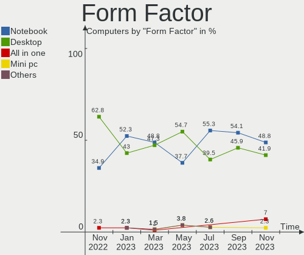
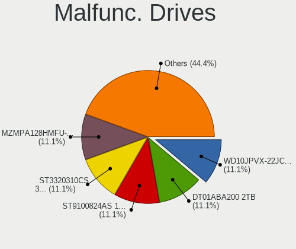
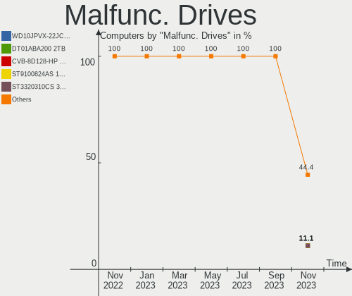
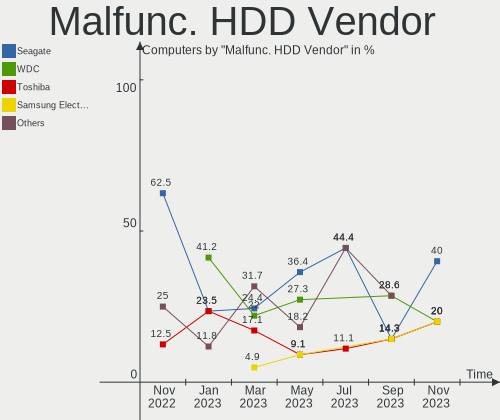
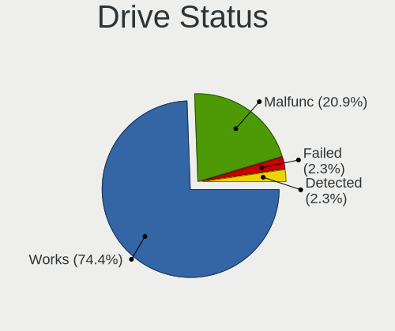
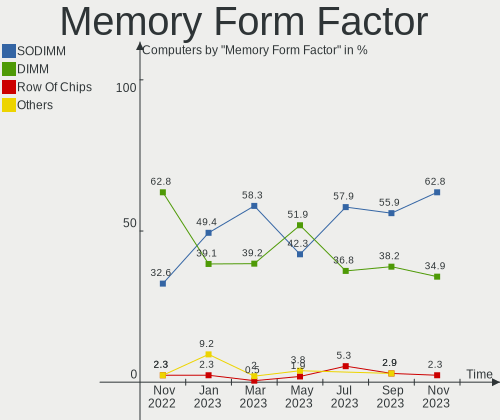
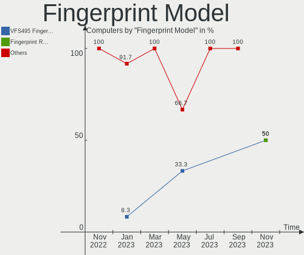
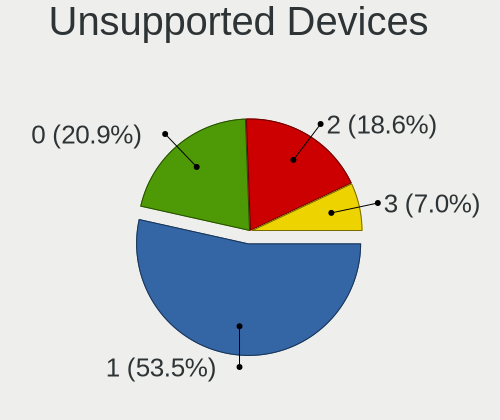

helloSystem Hardware Trends
---------------------------

A project to identify most popular hardware characteristics and track their change
over time based on data collected by helloSystem users at https://BSD-Hardware.info.

Anyone can contribute to this report by the [hw-probe](https://github.com/linuxhw/hw-probe/blob/master/INSTALL.BSD.md) tool:

    hw-probe -all -upload

This is a report for all computer types. See also reports for [desktops](/Dist/helloSystem/Desktop/README.md) and [notebooks](/Dist/helloSystem/Notebook/README.md).

Full-feature report is available here: https://bsd-hardware.info/?view=trends

Period: Sep, 2021.

Contents
--------

* [ System ](#system)
  - [ OS                       ](#os)
  - [ OS Family                ](#os-family)
  - [ Arch                     ](#arch)
  - [ DE                       ](#de)
  - [ Display Server           ](#display-server)
  - [ Display Manager          ](#display-manager)
  - [ OS Lang                  ](#os-lang)
  - [ Boot Mode                ](#boot-mode)
  - [ Filesystem               ](#filesystem)
  - [ Part. scheme             ](#part-scheme)

* [ Board ](#board)
  - [ Vendor                   ](#vendor)
  - [ Model                    ](#model)
  - [ Model Family             ](#model-family)
  - [ MFG Year                 ](#mfg-year)
  - [ Form Factor              ](#form-factor)
  - [ Coreboot                 ](#coreboot)
  - [ RAM Size                 ](#ram-size)
  - [ RAM Used                 ](#ram-used)
  - [ Total Drives             ](#total-drives)
  - [ Has CD-ROM               ](#has-cd-rom)
  - [ Has Ethernet             ](#has-ethernet)
  - [ Has WiFi                 ](#has-wifi)
  - [ Has Bluetooth            ](#has-bluetooth)

* [ Location ](#location)
  - [ Country                  ](#country)
  - [ City                     ](#city)

* [ Drives ](#drives)
  - [ Drive Vendor             ](#drive-vendor)
  - [ Drive Model              ](#drive-model)
  - [ HDD Vendor               ](#hdd-vendor)
  - [ SSD Vendor               ](#ssd-vendor)
  - [ Drive Kind               ](#drive-kind)
  - [ Drive Connector          ](#drive-connector)
  - [ Drive Size               ](#drive-size)
  - [ Space Total              ](#space-total)
  - [ Space Used               ](#space-used)
  - [ Malfunc. Drives          ](#malfunc-drives)
  - [ Malfunc. Drive Vendor    ](#malfunc-drive-vendor)
  - [ Malfunc. HDD Vendor      ](#malfunc-hdd-vendor)
  - [ Malfunc. Drive Kind      ](#malfunc-drive-kind)
  - [ Failed Drives            ](#failed-drives)
  - [ Failed Drive Vendor      ](#failed-drive-vendor)
  - [ Drive Status             ](#drive-status)

* [ Storage controller ](#storage-controller)
  - [ Storage Vendor           ](#storage-vendor)
  - [ Storage Model            ](#storage-model)
  - [ Storage Kind             ](#storage-kind)

* [ Processor ](#processor)
  - [ CPU Vendor               ](#cpu-vendor)
  - [ CPU Model                ](#cpu-model)
  - [ CPU Model Family         ](#cpu-model-family)
  - [ CPU Cores                ](#cpu-cores)
  - [ CPU Sockets              ](#cpu-sockets)
  - [ CPU Threads              ](#cpu-threads)
  - [ CPU Microarch            ](#cpu-microarch)

* [ Graphics ](#graphics)
  - [ GPU Vendor               ](#gpu-vendor)
  - [ GPU Model                ](#gpu-model)
  - [ GPU Combo                ](#gpu-combo)
  - [ GPU Driver               ](#gpu-driver)
  - [ GPU Memory               ](#gpu-memory)

* [ Monitor ](#monitor)
  - [ Monitor Vendor           ](#monitor-vendor)
  - [ Monitor Model            ](#monitor-model)
  - [ Monitor Resolution       ](#monitor-resolution)
  - [ Monitor Diagonal         ](#monitor-diagonal)
  - [ Monitor Width            ](#monitor-width)
  - [ Aspect Ratio             ](#aspect-ratio)
  - [ Monitor Area             ](#monitor-area)
  - [ Pixel Density            ](#pixel-density)
  - [ Multiple Monitors        ](#multiple-monitors)

* [ Network ](#network)
  - [ Net Controller Vendor    ](#net-controller-vendor)
  - [ Net Controller Model     ](#net-controller-model)
  - [ Wireless Vendor          ](#wireless-vendor)
  - [ Wireless Model           ](#wireless-model)
  - [ Ethernet Vendor          ](#ethernet-vendor)
  - [ Ethernet Model           ](#ethernet-model)
  - [ Net Controller Kind      ](#net-controller-kind)
  - [ Used Controller          ](#used-controller)
  - [ NICs                     ](#nics)
  - [ IPv6                     ](#ipv6)

* [ Bluetooth ](#bluetooth)
  - [ Bluetooth Vendor         ](#bluetooth-vendor)
  - [ Bluetooth Model          ](#bluetooth-model)

* [ Sound ](#sound)
  - [ Sound Vendor             ](#sound-vendor)
  - [ Sound Model              ](#sound-model)

* [ Memory ](#memory)
  - [ Memory Vendor            ](#memory-vendor)
  - [ Memory Model             ](#memory-model)
  - [ Memory Kind              ](#memory-kind)
  - [ Memory Form Factor       ](#memory-form-factor)
  - [ Memory Size              ](#memory-size)
  - [ Memory Speed             ](#memory-speed)

* [ Printers & scanners ](#printers--scanners)
  - [ Printer Vendor           ](#printer-vendor)
  - [ Printer Model            ](#printer-model)
  - [ Scanner Vendor           ](#scanner-vendor)
  - [ Scanner Model            ](#scanner-model)

* [ Camera ](#camera)
  - [ Camera Vendor            ](#camera-vendor)
  - [ Camera Model             ](#camera-model)

* [ Security ](#security)
  - [ Fingerprint Vendor       ](#fingerprint-vendor)
  - [ Fingerprint Model        ](#fingerprint-model)
  - [ Chipcard Vendor          ](#chipcard-vendor)
  - [ Chipcard Model           ](#chipcard-model)

* [ Unsupported ](#unsupported)
  - [ Unsupported Devices      ](#unsupported-devices)
  - [ Unsupported Device Types ](#unsupported-device-types)

System
------

OS
--

Installed operating systems

| Name              | Computers | Percent |
|-------------------|-----------|---------|
| helloSystem 0.5.0 | 21        | 63.64%  |
| helloSystem 0.6.0 | 12        | 36.36%  |

OS Family
---------

OS without a version

| Name        | Computers | Percent |
|-------------|-----------|---------|
| helloSystem | 33        | 100%    |

Arch
----

OS architecture (x86_64, i586, etc.)

| Name  | Computers | Percent |
|-------|-----------|---------|
| amd64 | 33        | 100%    |

DE
--

Desktop Environment

| Name         | Computers | Percent |
|--------------|-----------|---------|
| helloDesktop | 33        | 100%    |

Display Server
--------------

X11 or Wayland

| Name | Computers | Percent |
|------|-----------|---------|
| X11  | 33        | 100%    |

Display Manager
---------------

SDDM, LightDM, etc.

| Name | Computers | Percent |
|------|-----------|---------|
| SLiM | 33        | 100%    |

OS Lang
-------

Language

| Lang  | Computers | Percent |
|-------|-----------|---------|
| en_US | 32        | 96.97%  |
| ru_RU | 1         | 3.03%   |

Boot Mode
---------

EFI or BIOS

| Mode | Computers | Percent |
|------|-----------|---------|
| EFI  | 26        | 78.79%  |
| BIOS | 7         | 21.21%  |

Filesystem
----------

Type of filesystem

| Type | Computers | Percent |
|------|-----------|---------|
| Zfs  | 33        | 100%    |

Part. scheme
------------

Scheme of partitioning

| Type | Computers | Percent |
|------|-----------|---------|
| GPT  | 33        | 100%    |

Board
-----

Vendor
------

Motherboard manufacturer

| Name                | Computers | Percent |
|---------------------|-----------|---------|
| Lenovo              | 9         | 27.27%  |
| Hewlett-Packard     | 5         | 15.15%  |
| ASUSTek Computer    | 5         | 15.15%  |
| ASRock              | 5         | 15.15%  |
| Gigabyte Technology | 2         | 6.06%   |
| Toshiba             | 1         | 3.03%   |
| Sapphire            | 1         | 3.03%   |
| Packard Bell        | 1         | 3.03%   |
| Medion              | 1         | 3.03%   |
| Kraftway            | 1         | 3.03%   |
| Foxconn             | 1         | 3.03%   |
| Dell                | 1         | 3.03%   |

Model
-----

Motherboard model

| Name                                | Computers | Percent |
|-------------------------------------|-----------|---------|
| Toshiba Satellite P300              | 1         | 3.03%   |
| Sapphire EDGE-FT1M1 E450 1AOVU044   | 1         | 3.03%   |
| Packard Bell imedia S2110           | 1         | 3.03%   |
| Medion H61H2-LM3                    | 1         | 3.03%   |
| Lenovo Yoga Slim 7 Pro 14ACH5 82MS  | 1         | 3.03%   |
| Lenovo ThinkPad X230 2325O76        | 1         | 3.03%   |
| Lenovo ThinkPad T61 64607EU         | 1         | 3.03%   |
| Lenovo ThinkPad T410 2537E82        | 1         | 3.03%   |
| Lenovo ThinkPad L520 78594KM        | 1         | 3.03%   |
| Lenovo ThinkCentre M91p 7033D54     | 1         | 3.03%   |
| Lenovo ThinkCentre M720s 10SUS4WT00 | 1         | 3.03%   |
| Lenovo IdeaPad 110S-11IBR 80WG      | 1         | 3.03%   |
| Lenovo G500s 20245                  | 1         | 3.03%   |
| Kraftway KW10T                      | 1         | 3.03%   |
| HP Pavilion dm4                     | 1         | 3.03%   |
| HP G42                              | 1         | 3.03%   |
| HP Desktop M01-F1xxx                | 1         | 3.03%   |
| HP Compaq Elite 8300 SFF            | 1         | 3.03%   |
| HP 260-p026                         | 1         | 3.03%   |
| Gigabyte H61M-D2P-B3                | 1         | 3.03%   |
| Gigabyte H270M-DS3H                 | 1         | 3.03%   |
| Foxconn RS880M06-8KRS3HX            | 1         | 3.03%   |
| Dell OptiPlex 3040                  | 1         | 3.03%   |
| ASUS TUF GAMING X570-PLUS           | 1         | 3.03%   |
| ASUS P8H77-I                        | 1         | 3.03%   |
| ASUS M5A78L-M LX3                   | 1         | 3.03%   |
| ASUS H110M-PLUS                     | 1         | 3.03%   |
| ASUS exone Business 1203            | 1         | 3.03%   |
| ASRock Z390 Pro4                    | 1         | 3.03%   |
| ASRock X570 Phantom Gaming 4        | 1         | 3.03%   |
| ASRock B550M Pro4                   | 1         | 3.03%   |
| ASRock B460M Pro4                   | 1         | 3.03%   |
| ASRock B450 Gaming-ITX/ac           | 1         | 3.03%   |

Model Family
------------

Motherboard model prefix

| Name                     | Computers | Percent |
|--------------------------|-----------|---------|
| Lenovo ThinkPad          | 4         | 12.12%  |
| Lenovo ThinkCentre       | 2         | 6.06%   |
| Toshiba Satellite        | 1         | 3.03%   |
| Sapphire EDGE-FT1M1      | 1         | 3.03%   |
| Packard Bell imedia      | 1         | 3.03%   |
| Medion H61H2-LM3         | 1         | 3.03%   |
| Lenovo Yoga              | 1         | 3.03%   |
| Lenovo IdeaPad           | 1         | 3.03%   |
| Lenovo G500s             | 1         | 3.03%   |
| Kraftway KW10T           | 1         | 3.03%   |
| HP Pavilion              | 1         | 3.03%   |
| HP G42                   | 1         | 3.03%   |
| HP Desktop               | 1         | 3.03%   |
| HP Compaq                | 1         | 3.03%   |
| HP 260-p026              | 1         | 3.03%   |
| Gigabyte H61M-D2P-B3     | 1         | 3.03%   |
| Gigabyte H270M-DS3H      | 1         | 3.03%   |
| Foxconn RS880M06-8KRS3HX | 1         | 3.03%   |
| Dell OptiPlex            | 1         | 3.03%   |
| ASUS TUF                 | 1         | 3.03%   |
| ASUS P8H77-I             | 1         | 3.03%   |
| ASUS M5A78L-M            | 1         | 3.03%   |
| ASUS H110M-PLUS          | 1         | 3.03%   |
| ASUS exone               | 1         | 3.03%   |
| ASRock Z390              | 1         | 3.03%   |
| ASRock X570              | 1         | 3.03%   |
| ASRock B550M             | 1         | 3.03%   |
| ASRock B460M             | 1         | 3.03%   |
| ASRock B450              | 1         | 3.03%   |

MFG Year
--------

Motherboard manufacture year

| Year | Computers | Percent |
|------|-----------|---------|
| 2021 | 5         | 15.15%  |
| 2019 | 5         | 15.15%  |
| 2011 | 5         | 15.15%  |
| 2013 | 4         | 12.12%  |
| 2020 | 3         | 9.09%   |
| 2017 | 2         | 6.06%   |
| 2016 | 2         | 6.06%   |
| 2014 | 2         | 6.06%   |
| 2012 | 2         | 6.06%   |
| 2018 | 1         | 3.03%   |
| 2010 | 1         | 3.03%   |
| 2009 | 1         | 3.03%   |

Form Factor
-----------

Physical design of the computer

| Name     | Computers | Percent |
|----------|-----------|---------|
| Desktop  | 22        | 66.67%  |
| Notebook | 11        | 33.33%  |

Coreboot
--------

Have coreboot on board

| Used | Computers | Percent |
|------|-----------|---------|
| No   | 33        | 100%    |

RAM Size
--------

Total RAM memory

| Size in GB  | Computers | Percent |
|-------------|-----------|---------|
| 8.01-16.0   | 11        | 33.33%  |
| 16.01-24.0  | 9         | 27.27%  |
| 4.01-8.0    | 8         | 24.24%  |
| 32.01-64.0  | 2         | 6.06%   |
| 64.01-256.0 | 2         | 6.06%   |
| 2.01-3.0    | 1         | 3.03%   |

RAM Used
--------

Used RAM memory

| Used GB  | Computers | Percent |
|----------|-----------|---------|
| 0.01-0.5 | 17        | 51.52%  |
| 0.51-1.0 | 10        | 30.3%   |
| 1.01-2.0 | 4         | 12.12%  |
| 3.01-4.0 | 1         | 3.03%   |
| 2.01-3.0 | 1         | 3.03%   |

Total Drives
------------

Number of drives on board

| Drives | Computers | Percent |
|--------|-----------|---------|
| 1      | 18        | 54.55%  |
| 3      | 5         | 15.15%  |
| 2      | 5         | 15.15%  |
| 0      | 2         | 6.06%   |
| 10     | 1         | 3.03%   |
| 6      | 1         | 3.03%   |
| 4      | 1         | 3.03%   |

Has CD-ROM
----------

Has CD-ROM on board

| Presented | Computers | Percent |
|-----------|-----------|---------|
| No        | 20        | 60.61%  |
| Yes       | 13        | 39.39%  |

Has Ethernet
------------

Has Ethernet on board

| Presented | Computers | Percent |
|-----------|-----------|---------|
| Yes       | 30        | 90.91%  |
| No        | 3         | 9.09%   |

Has WiFi
--------

Has WiFi module

| Presented | Computers | Percent |
|-----------|-----------|---------|
| Yes       | 18        | 54.55%  |
| No        | 15        | 45.45%  |

Has Bluetooth
-------------

Has Bluetooth module

| Presented | Computers | Percent |
|-----------|-----------|---------|
| No        | 22        | 66.67%  |
| Yes       | 11        | 33.33%  |

Location
--------

Country
-------

Geographic location (country)

| Country     | Computers | Percent |
|-------------|-----------|---------|
| USA         | 9         | 27.27%  |
| Germany     | 3         | 9.09%   |
| France      | 2         | 6.06%   |
| UK          | 1         | 3.03%   |
| Thailand    | 1         | 3.03%   |
| Switzerland | 1         | 3.03%   |
| Spain       | 1         | 3.03%   |
| Russia      | 1         | 3.03%   |
| Portugal    | 1         | 3.03%   |
| Poland      | 1         | 3.03%   |
| Peru        | 1         | 3.03%   |
| New Zealand | 1         | 3.03%   |
| Netherlands | 1         | 3.03%   |
| Montenegro  | 1         | 3.03%   |
| Lithuania   | 1         | 3.03%   |
| Italy       | 1         | 3.03%   |
| Hungary     | 1         | 3.03%   |
| Eswatini    | 1         | 3.03%   |
| Ecuador     | 1         | 3.03%   |
| Canada      | 1         | 3.03%   |
| Austria     | 1         | 3.03%   |
| Australia   | 1         | 3.03%   |

City
----

Geographic location (city)

| City                   | Computers | Percent |
|------------------------|-----------|---------|
| Marlborough            | 2         | 6.06%   |
| Zurich                 | 1         | 3.03%   |
| Yarang                 | 1         | 3.03%   |
| Vienna                 | 1         | 3.03%   |
| Trujillo               | 1         | 3.03%   |
| Traverse City          | 1         | 3.03%   |
| Tampa                  | 1         | 3.03%   |
| Stuttgart              | 1         | 3.03%   |
| San Francisco          | 1         | 3.03%   |
| Saint-Laurent-de-Ceris | 1         | 3.03%   |
| Redmond                | 1         | 3.03%   |
| Portsmouth             | 1         | 3.03%   |
| Plav                   | 1         | 3.03%   |
| Pistoia                | 1         | 3.03%   |
| Paris                  | 1         | 3.03%   |
| Obninsk                | 1         | 3.03%   |
| Nieuwegein             | 1         | 3.03%   |
| Mbabane                | 1         | 3.03%   |
| Lisbon                 | 1         | 3.03%   |
| Kaunas                 | 1         | 3.03%   |
| Katowice               | 1         | 3.03%   |
| Gy?‘r                  | 1         | 3.03%   |
| Guayaquil              | 1         | 3.03%   |
| Greater Sudbury        | 1         | 3.03%   |
| Glasgow                | 1         | 3.03%   |
| Fuente Carreteros      | 1         | 3.03%   |
| Folsom                 | 1         | 3.03%   |
| Filderstadt            | 1         | 3.03%   |
| Chemnitz               | 1         | 3.03%   |
| Cambridge              | 1         | 3.03%   |
| Brisbane               | 1         | 3.03%   |
| Auburn                 | 1         | 3.03%   |

Drives
------

Drive Vendor
------------

Hard drive vendors

| Vendor              | Computers | Drives | Percent |
|---------------------|-----------|--------|---------|
| WDC                 | 11        | 19     | 21.15%  |
| Seagate             | 8         | 12     | 15.38%  |
| Samsung Electronics | 7         | 7      | 13.46%  |
| Kingston            | 4         | 5      | 7.69%   |
| Crucial             | 4         | 4      | 7.69%   |
| Toshiba             | 3         | 3      | 5.77%   |
| SK Hynix            | 2         | 2      | 3.85%   |
| SanDisk             | 2         | 2      | 3.85%   |
| China               | 2         | 2      | 3.85%   |
| A-DATA Technology   | 2         | 3      | 3.85%   |
| Intel               | 1         | 1      | 1.92%   |
| Hitachi             | 1         | 1      | 1.92%   |
| HGST                | 1         | 1      | 1.92%   |
| Hewlett-Packard     | 1         | 1      | 1.92%   |
| Gigabyte Technology | 1         | 1      | 1.92%   |
| FORESEE             | 1         | 1      | 1.92%   |
| Apple               | 1         | 1      | 1.92%   |

Drive Model
-----------

Hard drive models

| Model                              | Computers | Percent |
|------------------------------------|-----------|---------|
| Samsung SSD 850 EVO 250GB          | 2         | 3.33%   |
| China SATA SSD 120GB               | 2         | 3.33%   |
| A-DATA SX8200PNP 256GB             | 2         | 3.33%   |
| WDC WDS500G2B0A-00SM50 500GB       | 1         | 1.67%   |
| WDC WDS250G2X0C-00L350 250GB       | 1         | 1.67%   |
| WDC WDS120G2G0A-00JH30 120GB       | 1         | 1.67%   |
| WDC WDS100T2B0C-00PXH0 1TB         | 1         | 1.67%   |
| WDC WD5000ABYS-01TNA0 500GB        | 1         | 1.67%   |
| WDC WD5000AAKX-083CA1 500GB        | 1         | 1.67%   |
| WDC WD3200BPVT-22JJ5T0 320GB       | 1         | 1.67%   |
| WDC WD3200BEKT-08PVMT1 320GB       | 1         | 1.67%   |
| WDC WD3003FZEX-00Z4SA0 3TB         | 1         | 1.67%   |
| WDC WD1600BEVT-75ZCT2 160GB        | 1         | 1.67%   |
| WDC WD1600AAJS-60WAA0 160GB        | 1         | 1.67%   |
| WDC WD1001FALS-403AA0 1TB          | 1         | 1.67%   |
| WDC WD1001FALS-00J7B1 1TB          | 1         | 1.67%   |
| WDC PC SN730 SDBPNTY-1T00-1101 1TB | 1         | 1.67%   |
| Toshiba MK5061GSYN 500GB           | 1         | 1.67%   |
| Toshiba MK3261GSY 320GB            | 1         | 1.67%   |
| Toshiba KXG5AZNV256G 256GB         | 1         | 1.67%   |
| SK Hynix SHGP31-500GM-2 500GB      | 1         | 1.67%   |
| SK Hynix PC300 NVMe 256GB          | 1         | 1.67%   |
| Seagate ST9500325AS 500GB          | 1         | 1.67%   |
| Seagate ST500VT000-1DK142 500GB    | 1         | 1.67%   |
| Seagate ST500LM000-1EJ162 500GB    | 1         | 1.67%   |
| Seagate ST4000DM004-2CV104 4TB     | 1         | 1.67%   |
| Seagate ST3500413AS 500GB          | 1         | 1.67%   |
| Seagate ST31000524AS 1TB           | 1         | 1.67%   |
| Seagate ST3000DM001-1CH166 3TB     | 1         | 1.67%   |
| Seagate ST2000LM003 HN-M201RAD 2TB | 1         | 1.67%   |
| Seagate ST2000DL003-9VT166 2TB     | 1         | 1.67%   |
| Seagate ST1000LM024 HN-M101MBB 1TB | 1         | 1.67%   |
| Seagate ST1000DM010-2EP102 1TB     | 1         | 1.67%   |
| Seagate ST1000DM003-1ER162 1TB     | 1         | 1.67%   |
| SanDisk SDSSDA240G 240GB           | 1         | 1.67%   |
| SanDisk SD5SB2-128G-1006E 128GB    | 1         | 1.67%   |
| Samsung SSD 860 EVO 500GB          | 1         | 1.67%   |
| Samsung SSD 860 EVO 1TB            | 1         | 1.67%   |
| Samsung MZ7LN128HCHP-000L1 128GB   | 1         | 1.67%   |
| Samsung HM160HI 160GB              | 1         | 1.67%   |
| Samsung HD322HJ 320GB              | 1         | 1.67%   |
| Kingston SV300S37A120G 120GB       | 1         | 1.67%   |
| Kingston SS200S330G 32GB           | 1         | 1.67%   |
| Kingston SA400S37240G 240GB        | 1         | 1.67%   |
| Kingston SA400S37120G 120GB        | 1         | 1.67%   |
| Intel SSDSA2CW120G3 120GB          | 1         | 1.67%   |
| Hitachi HUS724030ALE641 3TB        | 1         | 1.67%   |
| HGST HTS541010A9E680 1TB           | 1         | 1.67%   |
| HP SSD EX900 500GB                 | 1         | 1.67%   |
| Gigabyte GP-GSM2NE3256GNTD 256GB   | 1         | 1.67%   |
| FORESEE 128GB SSD                  | 1         | 1.67%   |
| Crucial CT525MX300SSD1 528GB       | 1         | 1.67%   |
| Crucial CT275MX300SSD4 275GB       | 1         | 1.67%   |
| Crucial CT1050MX300SSD4 1TB        | 1         | 1.67%   |
| Crucial CT1000P1SSD8 1TB           | 1         | 1.67%   |
| Apple SSD SM256E 256GB             | 1         | 1.67%   |
| A-DATA SX8200PNP 512GB             | 1         | 1.67%   |

HDD Vendor
----------

Hard disk drive vendors

| Vendor              | Computers | Drives | Percent |
|---------------------|-----------|--------|---------|
| Seagate             | 8         | 12     | 40%     |
| WDC                 | 6         | 14     | 30%     |
| Toshiba             | 2         | 2      | 10%     |
| Samsung Electronics | 2         | 2      | 10%     |
| Hitachi             | 1         | 1      | 5%      |
| HGST                | 1         | 1      | 5%      |

SSD Vendor
----------

Solid state drive vendors

| Vendor              | Computers | Drives | Percent |
|---------------------|-----------|--------|---------|
| Samsung Electronics | 5         | 5      | 23.81%  |
| Kingston            | 4         | 5      | 19.05%  |
| Crucial             | 3         | 3      | 14.29%  |
| WDC                 | 2         | 2      | 9.52%   |
| SanDisk             | 2         | 2      | 9.52%   |
| China               | 2         | 2      | 9.52%   |
| Intel               | 1         | 1      | 4.76%   |
| FORESEE             | 1         | 1      | 4.76%   |
| Apple               | 1         | 1      | 4.76%   |

Drive Kind
----------

HDD or SSD

| Kind | Computers | Drives | Percent |
|------|-----------|--------|---------|
| SSD  | 18        | 22     | 39.13%  |
| HDD  | 18        | 32     | 39.13%  |
| NVMe | 10        | 12     | 21.74%  |

Drive Connector
---------------

SATA, SAS, NVMe, etc.

| Type | Computers | Drives | Percent |
|------|-----------|--------|---------|
| SATA | 28        | 54     | 73.68%  |
| NVMe | 10        | 12     | 26.32%  |

Drive Size
----------

Size of hard drive

| Size in TB | Computers | Drives | Percent |
|------------|-----------|--------|---------|
| 0.01-0.5   | 26        | 36     | 65%     |
| 0.51-1.0   | 8         | 11     | 20%     |
| 1.01-2.0   | 3         | 3      | 7.5%    |
| 2.01-3.0   | 2         | 3      | 5%      |
| 3.01-4.0   | 1         | 1      | 2.5%    |

Space Total
-----------

Amount of disk space available on the file system

| Size in GB | Computers | Percent |
|------------|-----------|---------|
| 1-20       | 18        | 54.55%  |
| 101-250    | 10        | 30.3%   |
| 251-500    | 2         | 6.06%   |
| 21-50      | 1         | 3.03%   |
| 501-1000   | 1         | 3.03%   |
| 51-100     | 1         | 3.03%   |

Space Used
----------

Amount of used disk space

| Used GB | Computers | Percent |
|---------|-----------|---------|
| 1-20    | 33        | 100%    |

Malfunc. Drives
---------------

Drive models with a malfunction

| Model                              | Computers | Drives | Percent |
|------------------------------------|-----------|--------|---------|
| WDC WD1600AAJS-60WAA0 160GB        | 1         | 1      | 11.11%  |
| Toshiba MK5061GSYN 500GB           | 1         | 1      | 11.11%  |
| Seagate ST9500325AS 500GB          | 1         | 1      | 11.11%  |
| Seagate ST500VT000-1DK142 500GB    | 1         | 1      | 11.11%  |
| Seagate ST3500413AS 500GB          | 1         | 1      | 11.11%  |
| Seagate ST1000LM024 HN-M101MBB 1TB | 1         | 1      | 11.11%  |
| SanDisk SDSSDA240G 240GB           | 1         | 1      | 11.11%  |
| HGST HTS541010A9E680 1TB           | 1         | 1      | 11.11%  |
| Crucial CT525MX300SSD1 528GB       | 1         | 1      | 11.11%  |

Malfunc. Drive Vendor
---------------------

Vendors of faulty drives

| Vendor  | Computers | Drives | Percent |
|---------|-----------|--------|---------|
| Seagate | 4         | 4      | 44.44%  |
| WDC     | 1         | 1      | 11.11%  |
| Toshiba | 1         | 1      | 11.11%  |
| SanDisk | 1         | 1      | 11.11%  |
| HGST    | 1         | 1      | 11.11%  |
| Crucial | 1         | 1      | 11.11%  |

Malfunc. HDD Vendor
-------------------

Vendors of faulty HDD drives

| Vendor  | Computers | Drives | Percent |
|---------|-----------|--------|---------|
| Seagate | 4         | 4      | 57.14%  |
| WDC     | 1         | 1      | 14.29%  |
| Toshiba | 1         | 1      | 14.29%  |
| HGST    | 1         | 1      | 14.29%  |

Malfunc. Drive Kind
-------------------

Kinds of faulty drives

| Kind | Computers | Drives | Percent |
|------|-----------|--------|---------|
| HDD  | 7         | 7      | 77.78%  |
| SSD  | 2         | 2      | 22.22%  |

Failed Drives
-------------

Failed drive models

Zero info for selected period =(

Failed Drive Vendor
-------------------

Failed drive vendors

Zero info for selected period =(

Drive Status
------------

Number of failed and malfunc. drives

| Status   | Computers | Drives | Percent |
|----------|-----------|--------|---------|
| Works    | 25        | 55     | 71.43%  |
| Malfunc  | 9         | 9      | 25.71%  |
| Detected | 1         | 2      | 2.86%   |

Storage controller
------------------

Storage Vendor
--------------

Storage controller vendors

| Vendor                    | Computers | Percent |
|---------------------------|-----------|---------|
| Intel                     | 22        | 47.83%  |
| AMD                       | 10        | 21.74%  |
| Sandisk                   | 3         | 6.52%   |
| SK Hynix                  | 2         | 4.35%   |
| ASMedia Technology        | 2         | 4.35%   |
| ADATA Technology          | 2         | 4.35%   |
| Toshiba                   | 1         | 2.17%   |
| Silicon Motion            | 1         | 2.17%   |
| Phison Electronics        | 1         | 2.17%   |
| Micron/Crucial Technology | 1         | 2.17%   |
| Broadcom / LSI            | 1         | 2.17%   |

Storage Model
-------------

Storage controller models

| Model                                                                                   | Computers | Percent |
|-----------------------------------------------------------------------------------------|-----------|---------|
| AMD SB7x0/SB8x0/SB9x0 SATA Controller [AHCI mode]                                       | 5         | 9.62%   |
| Intel Q170/Q150/B150/H170/H110/Z170/CM236 Chipset SATA Controller [AHCI Mode]           | 3         | 5.77%   |
| Intel Cannon Lake PCH SATA AHCI Controller                                              | 3         | 5.77%   |
| AMD SB7x0/SB8x0/SB9x0 IDE Controller                                                    | 3         | 5.77%   |
| AMD FCH SATA Controller [AHCI mode]                                                     | 3         | 5.77%   |
| Intel 7 Series/C210 Series Chipset Family 6-port SATA Controller [AHCI mode]            | 2         | 3.85%   |
| Intel 7 Series Chipset Family 6-port SATA Controller [AHCI mode]                        | 2         | 3.85%   |
| Intel 6 Series/C200 Series Chipset Family 6 port Desktop SATA AHCI Controller           | 2         | 3.85%   |
| ASMedia ASM1062 Serial ATA Controller                                                   | 2         | 3.85%   |
| AMD 400 Series Chipset SATA Controller                                                  | 2         | 3.85%   |
| ADATA XPG SX8200 Pro PCIe Gen3x4 M.2 2280 Solid State Drive                             | 2         | 3.85%   |
| Toshiba unknown                                                                         | 1         | 1.92%   |
| SK Hynix PC300 NVMe Solid State Drive 256GB                                             | 1         | 1.92%   |
| SK Hynix Gold P31 SSD                                                                   | 1         | 1.92%   |
| Silicon Motion SM2263EN/SM2263XT SSD Controller                                         | 1         | 1.92%   |
| Sandisk WD Blue SN550 NVMe SSD                                                          | 1         | 1.92%   |
| Sandisk WD Black SN750 / PC SN730 NVMe SSD                                              | 1         | 1.92%   |
| Sandisk WD Black 2018/SN750 / PC SN720 NVMe SSD                                         | 1         | 1.92%   |
| Phison PS5013 E13 NVMe Controller                                                       | 1         | 1.92%   |
| Micron/Crucial P1 NVMe PCIe SSD                                                         | 1         | 1.92%   |
| Intel Atom/Celeron/Pentium Processor x5-E8000/J3xxx/N3xxx Series SATA Controller        | 1         | 1.92%   |
| Intel Atom Processor E3800 Series SATA AHCI Controller                                  | 1         | 1.92%   |
| Intel 82801IBM/IEM (ICH9M/ICH9M-E) 4 port SATA Controller [AHCI mode]                   | 1         | 1.92%   |
| Intel 82801HM/HEM (ICH8M/ICH8M-E) SATA Controller [AHCI mode]                           | 1         | 1.92%   |
| Intel 82801HM/HEM (ICH8M/ICH8M-E) IDE Controller                                        | 1         | 1.92%   |
| Intel 6 Series/C200 Series Chipset Family Desktop SATA Controller (IDE mode, ports 4-5) | 1         | 1.92%   |
| Intel 6 Series/C200 Series Chipset Family Desktop SATA Controller (IDE mode, ports 0-3) | 1         | 1.92%   |
| Intel 6 Series/C200 Series Chipset Family 6 port Mobile SATA AHCI Controller            | 1         | 1.92%   |
| Intel 5 Series/3400 Series Chipset 6 port SATA AHCI Controller                          | 1         | 1.92%   |
| Intel 5 Series/3400 Series Chipset 4 port SATA AHCI Controller                          | 1         | 1.92%   |
| Intel 400 Series Chipset Family SATA AHCI Controller                                    | 1         | 1.92%   |
| Intel 200 Series PCH SATA controller [AHCI mode]                                        | 1         | 1.92%   |
| Broadcom / LSI SAS2008 PCI-Express Fusion-MPT SAS-2 [Falcon]                            | 1         | 1.92%   |
| AMD Starship/Matisse Chipset SATA Controller [AHCI mode]                                | 1         | 1.92%   |

Storage Kind
------------

Kind of storage controller (IDE, SATA, NVMe, SAS, ...)

| Kind | Computers | Percent |
|------|-----------|---------|
| SATA | 31        | 65.96%  |
| NVMe | 10        | 21.28%  |
| IDE  | 5         | 10.64%  |
| SAS  | 1         | 2.13%   |

Processor
---------

CPU Vendor
----------

Processor vendors

| Vendor | Computers | Percent |
|--------|-----------|---------|
| Intel  | 22        | 66.67%  |
| AMD    | 11        | 33.33%  |

CPU Model
---------

Processor models

| Model                                   | Computers | Percent |
|-----------------------------------------|-----------|---------|
| Intel Core i3-6100T CPU @ 3.20GHz       | 2         | 6.06%   |
| AMD Ryzen 9 3900X 12-Core Processor     | 2         | 6.06%   |
| Intel CPU Version                       | 1         | 3.03%   |
| Intel Core i7-8700K CPU @ 3.70GHz       | 1         | 3.03%   |
| Intel Core i7-7700 CPU @ 3.60GHz        | 1         | 3.03%   |
| Intel Core i7-3770 CPU @ 3.40GHz        | 1         | 3.03%   |
| Intel Core i5-9600K CPU @ 3.70GHz       | 1         | 3.03%   |
| Intel Core i5-8500 CPU @ 3.00GHz        | 1         | 3.03%   |
| Intel Core i5-7500 CPU @ 3.40GHz        | 1         | 3.03%   |
| Intel Core i5-3470T CPU @ 2.90GHz       | 1         | 3.03%   |
| Intel Core i5-3320M CPU @ 2.60GHz       | 1         | 3.03%   |
| Intel Core i5-2520M CPU @ 2.50GHz       | 1         | 3.03%   |
| Intel Core i5-2500 CPU                  | 1         | 3.03%   |
| Intel Core i5-2400 CPU @ 3.10GHz        | 1         | 3.03%   |
| Intel Core i5-10600 CPU @ 3.30GHz       | 1         | 3.03%   |
| Intel Core i5 CPU M 540 @ 2.53GHz       | 1         | 3.03%   |
| Intel Core i5 CPU M 450 @ 2.40GHz       | 1         | 3.03%   |
| Intel Core i3-3110M CPU @ 2.40GHz       | 1         | 3.03%   |
| Intel Core i3-2120 CPU @ 3.30GHz        | 1         | 3.03%   |
| Intel Core 2 Duo CPU T7300 @ 2.00GHz    | 1         | 3.03%   |
| Intel Celeron CPU N3060 @ 1.60GHz       | 1         | 3.03%   |
| Intel Atom CPU E3825 @ 1.33GHz          | 1         | 3.03%   |
| AMD Sempron 145 Processor               | 1         | 3.03%   |
| AMD Ryzen 9 5900X 12-Core Processor     | 1         | 3.03%   |
| AMD Ryzen 7 5800H with Radeon Graphics  | 1         | 3.03%   |
| AMD Ryzen 7 5700G with Radeon Graphics  | 1         | 3.03%   |
| AMD Ryzen 5 4600G with Radeon Graphics  | 1         | 3.03%   |
| AMD Phenom II N640 Dual-Core Processor  | 1         | 3.03%   |
| AMD E1-1200 APU with Radeon HD Graphics | 1         | 3.03%   |
| AMD E-450 APU with Radeon HD Graphics   | 1         | 3.03%   |
| AMD Athlon II X3 455 Processor          | 1         | 3.03%   |

CPU Model Family
----------------

Processor model prefix

| Model            | Computers | Percent |
|------------------|-----------|---------|
| Intel Core i5    | 11        | 33.33%  |
| Intel Core i3    | 4         | 12.12%  |
| Intel Core i7    | 3         | 9.09%   |
| AMD Ryzen 9      | 3         | 9.09%   |
| AMD Ryzen 7      | 2         | 6.06%   |
| Other            | 1         | 3.03%   |
| Intel Core 2 Duo | 1         | 3.03%   |
| Intel Celeron    | 1         | 3.03%   |
| Intel Atom       | 1         | 3.03%   |
| AMD Sempron      | 1         | 3.03%   |
| AMD Ryzen 5      | 1         | 3.03%   |
| AMD Phenom II    | 1         | 3.03%   |
| AMD E1           | 1         | 3.03%   |
| AMD E            | 1         | 3.03%   |
| AMD Athlon II X3 | 1         | 3.03%   |

CPU Cores
---------

Number of processor cores

| Number  | Computers | Percent |
|---------|-----------|---------|
| 2       | 15        | 45.45%  |
| 4       | 5         | 15.15%  |
| 6       | 4         | 12.12%  |
| 24      | 3         | 9.09%   |
| 16      | 2         | 6.06%   |
| 12      | 1         | 3.03%   |
| 3       | 1         | 3.03%   |
| 1       | 1         | 3.03%   |
| Unknown | 1         | 3.03%   |

CPU Sockets
-----------

Number of sockets

| Number | Computers | Percent |
|--------|-----------|---------|
| 1      | 33        | 100%    |

CPU Threads
-----------

Threads per core (Hyper-Threading)

| Number  | Computers | Percent |
|---------|-----------|---------|
| 1       | 19        | 57.58%  |
| 2       | 13        | 39.39%  |
| Unknown | 1         | 3.03%   |

CPU Microarch
-------------

Microarchitecture

| Name        | Computers | Percent |
|-------------|-----------|---------|
| KabyLake    | 5         | 15.15%  |
| SandyBridge | 4         | 12.12%  |
| IvyBridge   | 4         | 12.12%  |
| Zen 3       | 3         | 9.09%   |
| Zen 2       | 3         | 9.09%   |
| K10         | 3         | 9.09%   |
| Westmere    | 2         | 6.06%   |
| Skylake     | 2         | 6.06%   |
| Silvermont  | 2         | 6.06%   |
| Bobcat      | 2         | 6.06%   |
| Penryn      | 1         | 3.03%   |
| Core        | 1         | 3.03%   |
| CometLake   | 1         | 3.03%   |

Graphics
--------

GPU Vendor
----------

Vendors of graphics cards

| Vendor | Computers | Percent |
|--------|-----------|---------|
| Intel  | 15        | 42.86%  |
| AMD    | 11        | 31.43%  |
| Nvidia | 9         | 25.71%  |

GPU Model
---------

Graphics card models

| Model                                                                                    | Computers | Percent |
|------------------------------------------------------------------------------------------|-----------|---------|
| Intel 2nd Generation Core Processor Family Integrated Graphics Controller                | 3         | 8.57%   |
| Nvidia GK208B [GeForce GT 710]                                                           | 2         | 5.71%   |
| Intel Core Processor Integrated Graphics Controller                                      | 2         | 5.71%   |
| Intel CometLake-S GT2 [UHD Graphics 630]                                                 | 2         | 5.71%   |
| Intel 3rd Gen Core processor Graphics Controller                                         | 2         | 5.71%   |
| AMD Cezanne                                                                              | 2         | 5.71%   |
| Nvidia GP108 [GeForce GT 1030]                                                           | 1         | 2.86%   |
| Nvidia GP107 [GeForce GTX 1050 Ti]                                                       | 1         | 2.86%   |
| Nvidia GP102 [GeForce GTX 1080 Ti]                                                       | 1         | 2.86%   |
| Nvidia GM206 [GeForce GTX 950]                                                           | 1         | 2.86%   |
| Nvidia GF119 [GeForce GT 625 OEM]                                                        | 1         | 2.86%   |
| Nvidia GF117M [GeForce 610M/710M/810M/820M / GT 620M/625M/630M/720M]                     | 1         | 2.86%   |
| Nvidia G86M [Quadro NVS 140M]                                                            | 1         | 2.86%   |
| Intel Xeon E3-1200 v2/3rd Gen Core processor Graphics Controller                         | 1         | 2.86%   |
| Intel HD Graphics 630                                                                    | 1         | 2.86%   |
| Intel HD Graphics 530                                                                    | 1         | 2.86%   |
| Intel CoffeeLake-S GT2 [UHD Graphics 630]                                                | 1         | 2.86%   |
| Intel Atom/Celeron/Pentium Processor x5-E8000/J3xxx/N3xxx Integrated Graphics Controller | 1         | 2.86%   |
| Intel Atom Processor Z36xxx/Z37xxx Series Graphics & Display                             | 1         | 2.86%   |
| AMD Wrestler [Radeon HD 7310]                                                            | 1         | 2.86%   |
| AMD Wrestler [Radeon HD 6320]                                                            | 1         | 2.86%   |
| AMD RV710/M92 [Mobility Radeon HD 4530/4570/545v]                                        | 1         | 2.86%   |
| AMD RS880M [Mobility Radeon HD 4225/4250]                                                | 1         | 2.86%   |
| AMD Renoir                                                                               | 1         | 2.86%   |
| AMD Navi 21 [Radeon RX 6800/6800 XT / 6900 XT]                                           | 1         | 2.86%   |
| AMD Cedar [Radeon HD 5000/6000/7350/8350 Series]                                         | 1         | 2.86%   |
| AMD Caicos [Radeon HD 6450/7450/8450 / R5 230 OEM]                                       | 1         | 2.86%   |
| AMD Baffin [Radeon RX 550 640SP / RX 560/560X]                                           | 1         | 2.86%   |

GPU Combo
---------

Combinations of graphics cards

| Name           | Computers | Percent |
|----------------|-----------|---------|
| 1 x Intel      | 13        | 39.39%  |
| 1 x AMD        | 11        | 33.33%  |
| 1 x Nvidia     | 7         | 21.21%  |
| Intel + Nvidia | 2         | 6.06%   |

GPU Driver
----------

Free vs proprietary

| Driver      | Computers | Percent |
|-------------|-----------|---------|
| Free        | 25        | 75.76%  |
| Unknown     | 5         | 15.15%  |
| Proprietary | 3         | 9.09%   |

GPU Memory
----------

Total video memory

| Size in GB | Computers | Percent |
|------------|-----------|---------|
| Unknown    | 24        | 72.73%  |
| 0.01-0.5   | 4         | 12.12%  |
| 0.51-1.0   | 3         | 9.09%   |
| 3.01-4.0   | 1         | 3.03%   |
| 1.01-2.0   | 1         | 3.03%   |

Monitor
-------

Monitor Vendor
--------------

Monitor vendors

| Vendor              | Computers | Percent |
|---------------------|-----------|---------|
| Samsung Electronics | 5         | 20.83%  |
| AU Optronics        | 4         | 16.67%  |
| Iiyama              | 3         | 12.5%   |
| Acer                | 3         | 12.5%   |
| Hewlett-Packard     | 2         | 8.33%   |
| Goldstar            | 2         | 8.33%   |
| VIE                 | 1         | 4.17%   |
| Videoseven          | 1         | 4.17%   |
| Medion              | 1         | 4.17%   |
| Lenovo              | 1         | 4.17%   |
| Chimei Innolux      | 1         | 4.17%   |

Monitor Model
-------------

Monitor models

| Model                                                                | Computers | Percent |
|----------------------------------------------------------------------|-----------|---------|
| Iiyama PLE2407HDS IVM560D 1920x1080 520x300mm 23.6-inch              | 2         | 8.33%   |
| VIE A/G2356 VIE2300 1920x1080 500x300mm 23.0-inch                    | 1         | 4.17%   |
| Videoseven WL19A IGM1908 1280x1024 380x300mm 19.1-inch               | 1         | 4.17%   |
| Samsung Electronics SyncMaster SAM05C5 1920x1080                     | 1         | 4.17%   |
| Samsung Electronics SA300/SA350 SAM078A 1366x768 410x230mm 18.5-inch | 1         | 4.17%   |
| Samsung Electronics LCD Monitor SEC3942 1366x768 310x170mm 13.9-inch | 1         | 4.17%   |
| Samsung Electronics LCD Monitor SEC3847 1440x900 370x230mm 17.2-inch | 1         | 4.17%   |
| Samsung Electronics LCD Monitor SEC3047 1366x768 280x160mm 12.7-inch | 1         | 4.17%   |
| Medion MD21281 MED3947 1366x768 410x230mm 18.5-inch                  | 1         | 4.17%   |
| Lenovo LCD Monitor LEN4035 1280x800 300x190mm 14.0-inch              | 1         | 4.17%   |
| Iiyama PL2409HD IVM560C 1920x1080 520x290mm 23.4-inch                | 1         | 4.17%   |
| Hewlett-Packard W2371b HWP3045 1920x1080 510x290mm 23.1-inch         | 1         | 4.17%   |
| Hewlett-Packard 2211 HWP2938 1920x1080 480x270mm 21.7-inch           | 1         | 4.17%   |
| Goldstar W2243 GSM56FE 1920x1080 480x270mm 21.7-inch                 | 1         | 4.17%   |
| Goldstar L1753T GSM4477 1280x1024 340x270mm 17.1-inch                | 1         | 4.17%   |
| Chimei Innolux LCD Monitor CMN1132 1366x768 260x140mm 11.6-inch      | 1         | 4.17%   |
| AU Optronics LCD Monitor AUO45EC 1366x768 340x190mm 15.3-inch        | 1         | 4.17%   |
| AU Optronics LCD Monitor AUO4100 1920x1200 220x140mm 10.3-inch       | 1         | 4.17%   |
| AU Optronics LCD Monitor AUO23EC 1366x768 340x190mm 15.3-inch        | 1         | 4.17%   |
| AU Optronics LCD Monitor AUO183C 1366x768 310x170mm 13.9-inch        | 1         | 4.17%   |
| Acer VG270U ACR06C9 2560x1440 600x340mm 27.2-inch                    | 1         | 4.17%   |
| Acer ET430K ACR0558 3840x2160 940x530mm 42.5-inch                    | 1         | 4.17%   |
| Acer B223W ACR0018 1680x1050 470x300mm 22.0-inch                     | 1         | 4.17%   |

Monitor Resolution
------------------

Monitor screen resolution

| Resolution         | Computers | Percent |
|--------------------|-----------|---------|
| 1920x1080 (FHD)    | 8         | 33.33%  |
| 1366x768 (WXGA)    | 8         | 33.33%  |
| 1280x1024 (SXGA)   | 2         | 8.33%   |
| 3840x2160 (4K)     | 1         | 4.17%   |
| 2560x1440 (QHD)    | 1         | 4.17%   |
| 1920x1200 (WUXGA)  | 1         | 4.17%   |
| 1680x1050 (WSXGA+) | 1         | 4.17%   |
| 1440x900 (WXGA+)   | 1         | 4.17%   |
| 1280x800 (WXGA)    | 1         | 4.17%   |

Monitor Diagonal
----------------

Diagonal size in inches

| Inches  | Computers | Percent |
|---------|-----------|---------|
| 23      | 5         | 20.83%  |
| 21      | 2         | 8.33%   |
| 18      | 2         | 8.33%   |
| 17      | 2         | 8.33%   |
| 15      | 2         | 8.33%   |
| 13      | 2         | 8.33%   |
| 42      | 1         | 4.17%   |
| 27      | 1         | 4.17%   |
| 22      | 1         | 4.17%   |
| 19      | 1         | 4.17%   |
| 14      | 1         | 4.17%   |
| 12      | 1         | 4.17%   |
| 11      | 1         | 4.17%   |
| 10      | 1         | 4.17%   |
| Unknown | 1         | 4.17%   |

Monitor Width
-------------

Physical width

| Width in mm | Computers | Percent |
|-------------|-----------|---------|
| 401-500     | 6         | 25%     |
| 501-600     | 5         | 20.83%  |
| 301-350     | 5         | 20.83%  |
| 201-300     | 4         | 16.67%  |
| 351-400     | 2         | 8.33%   |
| 901-1000    | 1         | 4.17%   |
| Unknown     | 1         | 4.17%   |

Aspect Ratio
------------

Proportional relationship between the width and the height

| Ratio | Computers | Percent |
|-------|-----------|---------|
| 16/9  | 18        | 75%     |
| 16/10 | 4         | 16.67%  |
| 5/4   | 2         | 8.33%   |

Monitor Area
------------

Area in inch²

| Area in inch² | Computers | Percent |
|----------------|-----------|---------|
| 201-250        | 8         | 34.78%  |
| 81-90          | 3         | 13.04%  |
| 141-150        | 2         | 8.7%    |
| 91-100         | 2         | 8.7%    |
| 61-70          | 1         | 4.35%   |
| 51-60          | 1         | 4.35%   |
| 41-50          | 1         | 4.35%   |
| 301-350        | 1         | 4.35%   |
| 151-200        | 1         | 4.35%   |
| 131-140        | 1         | 4.35%   |
| 501-1000       | 1         | 4.35%   |
| Unknown        | 1         | 4.35%   |

Pixel Density
-------------

Pixels per inch

| Density | Computers | Percent |
|---------|-----------|---------|
| 51-100  | 10        | 43.48%  |
| 101-120 | 9         | 39.13%  |
| 121-160 | 2         | 8.7%    |
| 161-240 | 1         | 4.35%   |
| Unknown | 1         | 4.35%   |

Multiple Monitors
-----------------

Total monitors connected

| Total | Computers | Percent |
|-------|-----------|---------|
| 1     | 21        | 63.64%  |
| 0     | 11        | 33.33%  |
| 2     | 1         | 3.03%   |

Network
-------

Net Controller Vendor
---------------------

Controller vendors

| Vendor                   | Computers | Percent |
|--------------------------|-----------|---------|
| Realtek Semiconductor    | 17        | 38.64%  |
| Intel                    | 17        | 38.64%  |
| Qualcomm Atheros         | 2         | 4.55%   |
| Marvell Technology Group | 2         | 4.55%   |
| Broadcom                 | 2         | 4.55%   |
| Ralink Technology        | 1         | 2.27%   |
| IMC Networks             | 1         | 2.27%   |
| Huawei Technologies      | 1         | 2.27%   |
| ASUSTek Computer         | 1         | 2.27%   |

Net Controller Model
--------------------

Controller models

| Model                                                                          | Computers | Percent |
|--------------------------------------------------------------------------------|-----------|---------|
| Realtek RTL8111/8168/8411 PCI Express Gigabit Ethernet Controller              | 14        | 28%     |
| Intel Ethernet Connection (7) I219-V                                           | 3         | 6%      |
| Intel 82579LM Gigabit Network Connection (Lewisville)                          | 3         | 6%      |
| Intel I211 Gigabit Network Connection                                          | 2         | 4%      |
| Intel Centrino Advanced-N 6205 [Taylor Peak]                                   | 2         | 4%      |
| Realtek RTL8852AE 802.11ax PCIe Wireless Network Adapter                       | 1         | 2%      |
| Realtek RTL8821CE 802.11ac PCIe Wireless Network Adapter                       | 1         | 2%      |
| Realtek RTL8723BE PCIe Wireless Network Adapter                                | 1         | 2%      |
| Realtek RTL8192CE PCIe Wireless Network Adapter                                | 1         | 2%      |
| Realtek RTL810xE PCI Express Fast Ethernet controller                          | 1         | 2%      |
| Ralink RT2501/RT2573 Wireless Adapter                                          | 1         | 2%      |
| Qualcomm Atheros QCA8172 Fast Ethernet                                         | 1         | 2%      |
| Qualcomm Atheros QCA8171 Gigabit Ethernet                                      | 1         | 2%      |
| Marvell Group Yukon Optima 88E8059 [PCIe Gigabit Ethernet Controller with AVB] | 1         | 2%      |
| Marvell Group 88E8040T PCI-E Fast Ethernet Controller                          | 1         | 2%      |
| Intel Wireless 8265 / 8275                                                     | 1         | 2%      |
| Intel Wireless 7265                                                            | 1         | 2%      |
| Intel WiFi Link 5100                                                           | 1         | 2%      |
| Intel PRO/Wireless 4965 AG or AGN [Kedron] Network Connection                  | 1         | 2%      |
| Intel Ethernet Connection (12) I219-V                                          | 1         | 2%      |
| Intel Dual Band Wireless-AC 3168NGW [Stone Peak]                               | 1         | 2%      |
| Intel Centrino Wireless-N 135                                                  | 1         | 2%      |
| Intel Centrino Wireless-N 1000 [Condor Peak]                                   | 1         | 2%      |
| Intel Centrino Advanced-N 6200                                                 | 1         | 2%      |
| Intel 82577LM Gigabit Network Connection                                       | 1         | 2%      |
| Intel 82566MM Gigabit Network Connection                                       | 1         | 2%      |
| IMC Networks Realtek RTL8191SU Wireless LAN 802.11n USB 2.0 Network Adapter    | 1         | 2%      |
| Huawei ME936 LTE/HSDPA+ 4G modem                                               | 1         | 2%      |
| Broadcom BCM4360 802.11ac Wireless Network Adapter                             | 1         | 2%      |
| Broadcom BCM4313 802.11bgn Wireless Network Adapter                            | 1         | 2%      |
| ASUS N10 Nano 802.11n Network Adapter [Realtek RTL8192CU]                      | 1         | 2%      |

Wireless Vendor
---------------

Wireless vendors

| Vendor                | Computers | Percent |
|-----------------------|-----------|---------|
| Intel                 | 10        | 52.63%  |
| Realtek Semiconductor | 4         | 21.05%  |
| Broadcom              | 2         | 10.53%  |
| Ralink Technology     | 1         | 5.26%   |
| IMC Networks          | 1         | 5.26%   |
| ASUSTek Computer      | 1         | 5.26%   |

Wireless Model
--------------

Wireless models

| Model                                                                       | Computers | Percent |
|-----------------------------------------------------------------------------|-----------|---------|
| Intel Centrino Advanced-N 6205 [Taylor Peak]                                | 2         | 10.53%  |
| Realtek RTL8852AE 802.11ax PCIe Wireless Network Adapter                    | 1         | 5.26%   |
| Realtek RTL8821CE 802.11ac PCIe Wireless Network Adapter                    | 1         | 5.26%   |
| Realtek RTL8723BE PCIe Wireless Network Adapter                             | 1         | 5.26%   |
| Realtek RTL8192CE PCIe Wireless Network Adapter                             | 1         | 5.26%   |
| Ralink RT2501/RT2573 Wireless Adapter                                       | 1         | 5.26%   |
| Intel Wireless 8265 / 8275                                                  | 1         | 5.26%   |
| Intel Wireless 7265                                                         | 1         | 5.26%   |
| Intel WiFi Link 5100                                                        | 1         | 5.26%   |
| Intel PRO/Wireless 4965 AG or AGN [Kedron] Network Connection               | 1         | 5.26%   |
| Intel Dual Band Wireless-AC 3168NGW [Stone Peak]                            | 1         | 5.26%   |
| Intel Centrino Wireless-N 135                                               | 1         | 5.26%   |
| Intel Centrino Wireless-N 1000 [Condor Peak]                                | 1         | 5.26%   |
| Intel Centrino Advanced-N 6200                                              | 1         | 5.26%   |
| IMC Networks Realtek RTL8191SU Wireless LAN 802.11n USB 2.0 Network Adapter | 1         | 5.26%   |
| Broadcom BCM4360 802.11ac Wireless Network Adapter                          | 1         | 5.26%   |
| Broadcom BCM4313 802.11bgn Wireless Network Adapter                         | 1         | 5.26%   |
| ASUS N10 Nano 802.11n Network Adapter [Realtek RTL8192CU]                   | 1         | 5.26%   |

Ethernet Vendor
---------------

Ethernet vendors

| Vendor                   | Computers | Percent |
|--------------------------|-----------|---------|
| Realtek Semiconductor    | 15        | 50%     |
| Intel                    | 11        | 36.67%  |
| Qualcomm Atheros         | 2         | 6.67%   |
| Marvell Technology Group | 2         | 6.67%   |

Ethernet Model
--------------

Ethernet models

| Model                                                                          | Computers | Percent |
|--------------------------------------------------------------------------------|-----------|---------|
| Realtek RTL8111/8168/8411 PCI Express Gigabit Ethernet Controller              | 14        | 46.67%  |
| Intel Ethernet Connection (7) I219-V                                           | 3         | 10%     |
| Intel 82579LM Gigabit Network Connection (Lewisville)                          | 3         | 10%     |
| Intel I211 Gigabit Network Connection                                          | 2         | 6.67%   |
| Realtek RTL810xE PCI Express Fast Ethernet controller                          | 1         | 3.33%   |
| Qualcomm Atheros QCA8172 Fast Ethernet                                         | 1         | 3.33%   |
| Qualcomm Atheros QCA8171 Gigabit Ethernet                                      | 1         | 3.33%   |
| Marvell Group Yukon Optima 88E8059 [PCIe Gigabit Ethernet Controller with AVB] | 1         | 3.33%   |
| Marvell Group 88E8040T PCI-E Fast Ethernet Controller                          | 1         | 3.33%   |
| Intel Ethernet Connection (12) I219-V                                          | 1         | 3.33%   |
| Intel 82577LM Gigabit Network Connection                                       | 1         | 3.33%   |
| Intel 82566MM Gigabit Network Connection                                       | 1         | 3.33%   |

Net Controller Kind
-------------------

Ethernet, WiFi or modem

| Kind     | Computers | Percent |
|----------|-----------|---------|
| Ethernet | 30        | 61.22%  |
| WiFi     | 18        | 36.73%  |
| Modem    | 1         | 2.04%   |

Used Controller
---------------

Currently used network controller

| Kind     | Computers | Percent |
|----------|-----------|---------|
| Ethernet | 29        | 69.05%  |
| WiFi     | 13        | 30.95%  |

NICs
----

Total network controllers on board

| Total | Computers | Percent |
|-------|-----------|---------|
| 1     | 20        | 60.61%  |
| 2     | 13        | 39.39%  |

IPv6
----

IPv6 vs IPv4

| Used | Computers | Percent |
|------|-----------|---------|
| No   | 33        | 100%    |

Bluetooth
---------

Bluetooth Vendor
----------------

Controller vendors

| Vendor                  | Computers | Percent |
|-------------------------|-----------|---------|
| Realtek Semiconductor   | 3         | 27.27%  |
| Broadcom                | 3         | 27.27%  |
| Intel                   | 2         | 18.18%  |
| Cambridge Silicon Radio | 1         | 9.09%   |
| ASUSTek Computer        | 1         | 9.09%   |
| Apple                   | 1         | 9.09%   |

Bluetooth Model
---------------

Controller models

| Model                                               | Computers | Percent |
|-----------------------------------------------------|-----------|---------|
| Realtek  Bluetooth 4.2 Adapter                      | 1         | 9.09%   |
| Realtek  Bluetooth 4.0 Adapter                      | 1         | 9.09%   |
| Realtek Bluetooth Radio                             | 1         | 9.09%   |
| Intel Wireless-AC 3168 Bluetooth                    | 1         | 9.09%   |
| Intel Bluetooth wireless interface                  | 1         | 9.09%   |
| Cambridge Silicon Radio Bluetooth Dongle (HCI mode) | 1         | 9.09%   |
| Broadcom BCM20702 Bluetooth 4.0 [ThinkPad]          | 1         | 9.09%   |
| Broadcom BCM2045B (BDC-2.1)                         | 1         | 9.09%   |
| Broadcom BCM2045B (BDC-2) [Bluetooth Controller]    | 1         | 9.09%   |
| ASUS Broadcom BCM20702A0 Bluetooth                  | 1         | 9.09%   |
| Apple Apple Broadcom Built-in Bluetooth             | 1         | 9.09%   |

Sound
-----

Sound Vendor
------------

Sound card vendors

| Vendor              | Computers | Percent |
|---------------------|-----------|---------|
| Intel               | 21        | 44.68%  |
| AMD                 | 14        | 29.79%  |
| Nvidia              | 7         | 14.89%  |
| Logitech            | 2         | 4.26%   |
| C-Media Electronics | 2         | 4.26%   |
| Ensoniq             | 1         | 2.13%   |

Sound Model
-----------

Sound card models

| Model                                                                                             | Computers | Percent |
|---------------------------------------------------------------------------------------------------|-----------|---------|
| AMD SBx00 Azalia (Intel HDA)                                                                      | 5         | 9.09%   |
| Intel 7 Series/C216 Chipset Family High Definition Audio Controller                               | 4         | 7.27%   |
| Intel 6 Series/C200 Series Chipset Family High Definition Audio Controller                        | 4         | 7.27%   |
| Intel 100 Series/C230 Series Chipset Family HD Audio Controller                                   | 3         | 5.45%   |
| AMD Starship/Matisse HD Audio Controller                                                          | 3         | 5.45%   |
| AMD Renoir Radeon High Definition Audio Controller                                                | 3         | 5.45%   |
| AMD Family 17h (Models 10h-1fh) HD Audio Controller                                               | 3         | 5.45%   |
| Nvidia GK208 HDMI/DP Audio Controller                                                             | 2         | 3.64%   |
| Intel Cannon Lake PCH cAVS                                                                        | 2         | 3.64%   |
| Intel 5 Series/3400 Series Chipset High Definition Audio                                          | 2         | 3.64%   |
| AMD Wrestler HDMI Audio                                                                           | 2         | 3.64%   |
| Nvidia GP108 High Definition Audio Controller                                                     | 1         | 1.82%   |
| Nvidia GP107GL High Definition Audio Controller                                                   | 1         | 1.82%   |
| Nvidia GP102 HDMI Audio Controller                                                                | 1         | 1.82%   |
| Nvidia GM206 High Definition Audio Controller                                                     | 1         | 1.82%   |
| Nvidia GF119 HDMI Audio Controller                                                                | 1         | 1.82%   |
| Logitech HD Webcam C910                                                                           | 1         | 1.82%   |
| Logitech HD Webcam C510                                                                           | 1         | 1.82%   |
| Intel Comet Lake PCH-V Smart Sound Technology Audio Controller                                    | 1         | 1.82%   |
| Intel Atom/Celeron/Pentium Processor x5-E8000/J3xxx/N3xxx Series High Definition Audio Controller | 1         | 1.82%   |
| Intel Atom Processor Z36xxx/Z37xxx Series High Definition Audio Controller                        | 1         | 1.82%   |
| Intel 82801I (ICH9 Family) HD Audio Controller                                                    | 1         | 1.82%   |
| Intel 82801H (ICH8 Family) HD Audio Controller                                                    | 1         | 1.82%   |
| Intel 200 Series PCH HD Audio                                                                     | 1         | 1.82%   |
| Ensoniq ES1371/ES1373 / Creative Labs CT2518                                                      | 1         | 1.82%   |
| C-Media Electronics USB Audio Class 1.0 and 2.0 Device                                            | 1         | 1.82%   |
| C-Media Electronics Audio Adapter (Unitek Y-247A)                                                 | 1         | 1.82%   |
| AMD RV710/730 HDMI Audio [Radeon HD 4000 series]                                                  | 1         | 1.82%   |
| AMD RS880 HDMI Audio [Radeon HD 4200 Series]                                                      | 1         | 1.82%   |
| AMD Navi 21 HDMI Audio [Radeon RX 6800/6800 XT / 6900 XT]                                         | 1         | 1.82%   |
| AMD Cedar HDMI Audio [Radeon HD 5400/6300/7300 Series]                                            | 1         | 1.82%   |
| AMD Caicos HDMI Audio [Radeon HD 6450 / 7450/8450/8490 OEM / R5 230/235/235X OEM]                 | 1         | 1.82%   |
| AMD Baffin HDMI/DP Audio [Radeon RX 550 640SP / RX 560/560X]                                      | 1         | 1.82%   |

Memory
------

Memory Vendor
-------------

Memory module vendors

| Vendor              | Computers | Percent |
|---------------------|-----------|---------|
| Unknown             | 7         | 18.42%  |
| SK Hynix            | 5         | 13.16%  |
| Crucial             | 5         | 13.16%  |
| Samsung Electronics | 3         | 7.89%   |
| Corsair             | 3         | 7.89%   |
| Team                | 2         | 5.26%   |
| Kingston            | 2         | 5.26%   |
| G.Skill             | 2         | 5.26%   |
| Transcend           | 1         | 2.63%   |
| Ramaxel Technology  | 1         | 2.63%   |
| PNY                 | 1         | 2.63%   |
| PKI/Kingston        | 1         | 2.63%   |
| Nanya Technology    | 1         | 2.63%   |
| Micron Technology   | 1         | 2.63%   |
| Axiom               | 1         | 2.63%   |
| A-DATA Technology   | 1         | 2.63%   |
| Unknown             | 1         | 2.63%   |

Memory Model
------------

Memory module models

| Model                                                       | Computers | Percent |
|-------------------------------------------------------------|-----------|---------|
| Unknown RAM Module 2GB DIMM 1333MT/s                        | 2         | 4.88%   |
| Crucial RAM CT8G4DFS8266.M8FD 8GB DIMM DDR4 2667MT/s        | 2         | 4.88%   |
| Unknown RAM Module 4GB SODIMM DDR3 1600MT/s                 | 1         | 2.44%   |
| Unknown RAM Module 4GB SODIMM DDR2 667MT/s                  | 1         | 2.44%   |
| Unknown RAM Module 4GB DIMM DDR3 1067MT/s                   | 1         | 2.44%   |
| Unknown RAM Module 4GB DIMM 1333MT/s                        | 1         | 2.44%   |
| Unknown RAM Module 2GB SODIMM DDR2 667MT/s                  | 1         | 2.44%   |
| Unknown RAM Module 2GB DIMM 533MT/s                         | 1         | 2.44%   |
| Unknown RAM 7TE39AA# 8GB DIMM DDR4 2667MT/s                 | 1         | 2.44%   |
| Transcend RAM JM1333KSN-4G 4GB DIMM DDR3 1333MT/s           | 1         | 2.44%   |
| Team RAM TEAMGROUP-UD4-3200 16GB DIMM DDR4 3200MT/s         | 1         | 2.44%   |
| Team RAM TEAMGROUP-UD4-2666 8GB DIMM DDR4 2667MT/s          | 1         | 2.44%   |
| SK Hynix RAM Module 4GB DIMM DDR3 1066MT/s                  | 1         | 2.44%   |
| SK Hynix RAM HMT451U6BFR8C-PB 4GB DIMM DDR3 1600MT/s        | 1         | 2.44%   |
| SK Hynix RAM HMT351S6EFR8C-PB 4GB SODIMM DDR3 1600MT/s      | 1         | 2.44%   |
| SK Hynix RAM HMT351S6EFR8A-PB 4GB SODIMM DDR3 1600MT/s      | 1         | 2.44%   |
| SK Hynix RAM HMT351S6BFR8C-H9 4GB SODIMM DDR3 1334MT/s      | 1         | 2.44%   |
| Samsung RAM Module 2GB SODIMM DDR3 1600MT/s                 | 1         | 2.44%   |
| Samsung RAM M471B5273DH0-CH9 4GB SODIMM DDR3 1334MT/s       | 1         | 2.44%   |
| Samsung RAM M471A1G44AB0-CWE 8GB Row Of Chips DDR4 3200MT/s | 1         | 2.44%   |
| Ramaxel RAM RMUA5110MD78HAF-2666 8GB DIMM DDR4 2667MT/s     | 1         | 2.44%   |
| PNY RAM 64C0MHHHJ-HS 4GB DIMM DDR3 1333MT/s                 | 1         | 2.44%   |
| PKI/Kingston RAM 9905428-043.A00LF 4GB SODIMM DDR3 1067MT/s | 1         | 2.44%   |
| Nanya RAM M2F4G64CB8HG5N-CG 4GB DIMM DDR3 1333MT/s          | 1         | 2.44%   |
| Nanya RAM M2F2G64CB88G7N-CG 2GB DIMM DDR3 1333MT/s          | 1         | 2.44%   |
| Micron RAM 16KTF1G64HZ-1G6N1 8GB SODIMM DDR3 1600MT/s       | 1         | 2.44%   |
| Kingston RAM SNY1333D3S9ELC/4G 4GB SODIMM DDR3 1333MT/s     | 1         | 2.44%   |
| Kingston RAM KHX1600C9D3/4GX 4GB DIMM DDR3 1600MT/s         | 1         | 2.44%   |
| G.Skill RAM F4-3200C16-16GVK 16GB DIMM DDR4 3200MT/s        | 1         | 2.44%   |
| G.Skill RAM F3-10666CL9-4GBSQ 4GB SODIMM DDR3 1334MT/s      | 1         | 2.44%   |
| Crucial RAM Module 8GB SODIMM DDR3 1600MT/s                 | 1         | 2.44%   |
| Crucial RAM BLS8G4D240FSB.16FBD2 8GB DIMM DDR4 2400MT/s     | 1         | 2.44%   |
| Crucial RAM BL8G30C15U4B.M8FE 8GB DIMM DDR4 2666MT/s        | 1         | 2.44%   |
| Corsair RAM CMW64GX4M2E3200C16 32GB DIMM DDR4 2133MT/s      | 1         | 2.44%   |
| Corsair RAM CMK16GX4M2B3000C15 8GB DIMM DDR4 2933MT/s       | 1         | 2.44%   |
| Corsair RAM CMK16GX4M1A2400C14 16GB DIMM DDR4 2400MT/s      | 1         | 2.44%   |
| Axiom RAM 51264Y133I 4GB SODIMM DDR3 1334MT/s               | 1         | 2.44%   |
| A-DATA RAM Module 4GB DIMM DDR3 1333MT/s                    | 1         | 2.44%   |
| Unknown                                                     | 1         | 2.44%   |

Memory Kind
-----------

Memory module kinds

| Kind    | Computers | Percent |
|---------|-----------|---------|
| DDR3    | 15        | 45.45%  |
| DDR4    | 13        | 39.39%  |
| Unknown | 4         | 12.12%  |
| DDR2    | 1         | 3.03%   |

Memory Form Factor
------------------

Physical design of the memory module

| Name         | Computers | Percent |
|--------------|-----------|---------|
| DIMM         | 22        | 66.67%  |
| SODIMM       | 10        | 30.3%   |
| Row Of Chips | 1         | 3.03%   |

Memory Size
-----------

Memory module size

| Size  | Computers | Percent |
|-------|-----------|---------|
| 4096  | 15        | 41.67%  |
| 8192  | 10        | 27.78%  |
| 2048  | 7         | 19.44%  |
| 16384 | 3         | 8.33%   |
| 32768 | 1         | 2.78%   |

Memory Speed
------------

Memory module speed

| Speed | Computers | Percent |
|-------|-----------|---------|
| 1600  | 6         | 17.65%  |
| 1333  | 6         | 17.65%  |
| 2667  | 5         | 14.71%  |
| 3200  | 3         | 8.82%   |
| 1334  | 3         | 8.82%   |
| 2400  | 2         | 5.88%   |
| 1067  | 2         | 5.88%   |
| 2933  | 1         | 2.94%   |
| 2666  | 1         | 2.94%   |
| 2133  | 1         | 2.94%   |
| 1066  | 1         | 2.94%   |
| 800   | 1         | 2.94%   |
| 667   | 1         | 2.94%   |
| 533   | 1         | 2.94%   |

Printers & scanners
-------------------

Printer Vendor
--------------

Printer device vendors

Zero info for selected period =(

Printer Model
-------------

Printer device models

Zero info for selected period =(

Scanner Vendor
--------------

Scanner device vendors

Zero info for selected period =(

Scanner Model
-------------

Scanner device models

Zero info for selected period =(

Camera
------

Camera Vendor
-------------

Camera device vendors

| Vendor                | Computers | Percent |
|-----------------------|-----------|---------|
| Realtek Semiconductor | 2         | 16.67%  |
| Chicony Electronics   | 2         | 16.67%  |
| Suyin                 | 1         | 8.33%   |
| Logitech              | 1         | 8.33%   |
| Lenovo                | 1         | 8.33%   |
| Importek              | 1         | 8.33%   |
| IMC Networks          | 1         | 8.33%   |
| Hewlett-Packard       | 1         | 8.33%   |
| GEMBIRD               | 1         | 8.33%   |
| Acer                  | 1         | 8.33%   |

Camera Model
------------

Camera device models

| Model                                             | Computers | Percent |
|---------------------------------------------------|-----------|---------|
| Realtek Realtek USB2.0 PC Camera                  | 2         | 16.67%  |
| Suyin HP Webcam-101                               | 1         | 8.33%   |
| Logitech Webcam C270                              | 1         | 8.33%   |
| Lenovo Integrated Webcam [R5U877]                 | 1         | 8.33%   |
| Importek HP Webcam                                | 1         | 8.33%   |
| IMC Networks Integrated Camera                    | 1         | 8.33%   |
| HP Premium Starter Webcam                         | 1         | 8.33%   |
| GEMBIRD Generic UVC 1.00 camera [AppoTech AX2311] | 1         | 8.33%   |
| Chicony USB 2.0 Camera                            | 1         | 8.33%   |
| Chicony Integrated Camera                         | 1         | 8.33%   |
| Acer Integrated Camera                            | 1         | 8.33%   |

Security
--------

Fingerprint Vendor
------------------

Fingerprint sensor vendors

| Vendor             | Computers | Percent |
|--------------------|-----------|---------|
| Validity Sensors   | 1         | 50%     |
| STMicroelectronics | 1         | 50%     |

Fingerprint Model
-----------------

Fingerprint sensor models

| Model                                      | Computers | Percent |
|--------------------------------------------|-----------|---------|
| Validity Sensors VFS301 Fingerprint Reader | 1         | 50%     |
| STMicroelectronics Fingerprint Reader      | 1         | 50%     |

Chipcard Vendor
---------------

Chipcard module vendors

Zero info for selected period =(

Chipcard Model
--------------

Chipcard module models

Zero info for selected period =(

Unsupported
-----------

Unsupported Devices
-------------------

Total unsupported devices on board

| Total | Computers | Percent |
|-------|-----------|---------|
| 1     | 21        | 63.64%  |
| 2     | 6         | 18.18%  |
| 0     | 6         | 18.18%  |

Unsupported Device Types
------------------------

Types of unsupported devices

| Type                     | Computers | Percent |
|--------------------------|-----------|---------|
| Communication controller | 18        | 54.55%  |
| Net/wireless             | 6         | 18.18%  |
| Card reader              | 3         | 9.09%   |
| Fingerprint reader       | 2         | 6.06%   |
| Storage                  | 1         | 3.03%   |
| Network                  | 1         | 3.03%   |
| Firewire controller      | 1         | 3.03%   |
| Bluetooth                | 1         | 3.03%   |

