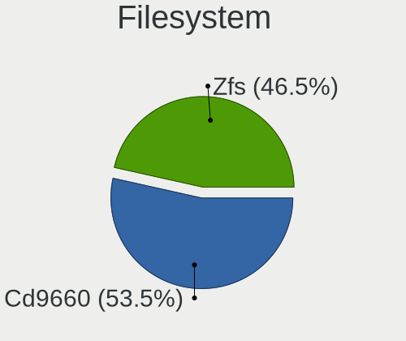
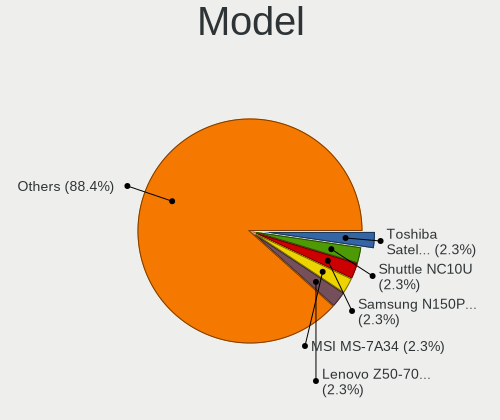
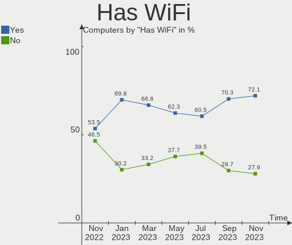
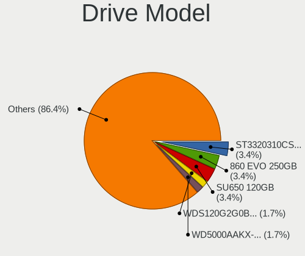
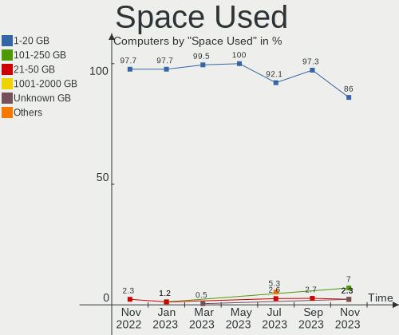
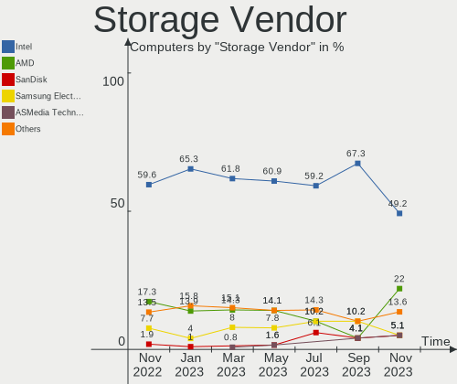
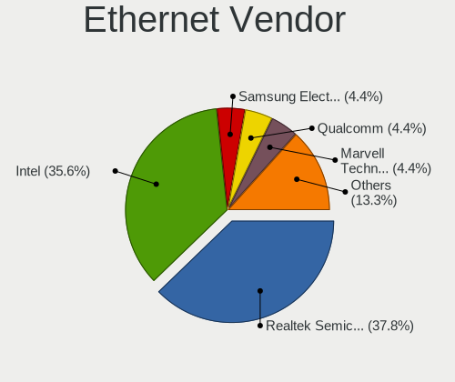
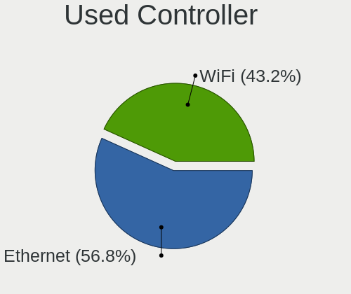
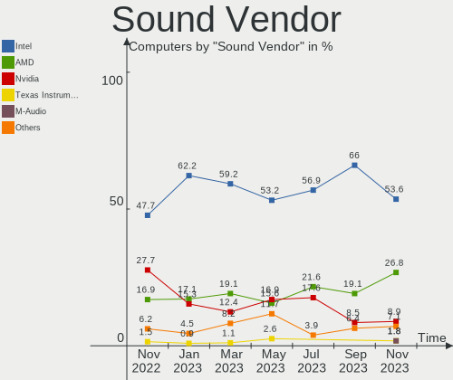
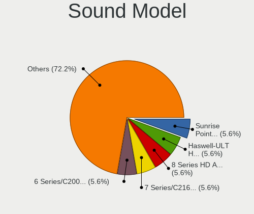

helloSystem Hardware Trends
---------------------------

A project to identify most popular hardware characteristics and track their change
over time based on data collected by helloSystem users at https://BSD-Hardware.info.

Anyone can contribute to this report by the [hw-probe](https://github.com/linuxhw/hw-probe/blob/master/INSTALL.BSD.md) tool:

    hw-probe -all -upload

This is a report for all computer types. See also reports for [desktops](/Dist/helloSystem/Desktop/README.md) and [notebooks](/Dist/helloSystem/Notebook/README.md).

Full-feature report is available here: https://bsd-hardware.info/?view=trends

Period: Jan, 2022.

Contents
--------

* [ System ](#system)
  - [ OS                       ](#os)
  - [ OS Family                ](#os-family)
  - [ Arch                     ](#arch)
  - [ DE                       ](#de)
  - [ Display Server           ](#display-server)
  - [ Display Manager          ](#display-manager)
  - [ OS Lang                  ](#os-lang)
  - [ Boot Mode                ](#boot-mode)
  - [ Filesystem               ](#filesystem)
  - [ Part. scheme             ](#part-scheme)

* [ Board ](#board)
  - [ Vendor                   ](#vendor)
  - [ Model                    ](#model)
  - [ Model Family             ](#model-family)
  - [ MFG Year                 ](#mfg-year)
  - [ Form Factor              ](#form-factor)
  - [ Coreboot                 ](#coreboot)
  - [ RAM Size                 ](#ram-size)
  - [ RAM Used                 ](#ram-used)
  - [ Total Drives             ](#total-drives)
  - [ Has CD-ROM               ](#has-cd-rom)
  - [ Has Ethernet             ](#has-ethernet)
  - [ Has WiFi                 ](#has-wifi)
  - [ Has Bluetooth            ](#has-bluetooth)

* [ Location ](#location)
  - [ Country                  ](#country)
  - [ City                     ](#city)

* [ Drives ](#drives)
  - [ Drive Vendor             ](#drive-vendor)
  - [ Drive Model              ](#drive-model)
  - [ HDD Vendor               ](#hdd-vendor)
  - [ SSD Vendor               ](#ssd-vendor)
  - [ Drive Kind               ](#drive-kind)
  - [ Drive Connector          ](#drive-connector)
  - [ Drive Size               ](#drive-size)
  - [ Space Total              ](#space-total)
  - [ Space Used               ](#space-used)
  - [ Malfunc. Drives          ](#malfunc-drives)
  - [ Malfunc. Drive Vendor    ](#malfunc-drive-vendor)
  - [ Malfunc. HDD Vendor      ](#malfunc-hdd-vendor)
  - [ Malfunc. Drive Kind      ](#malfunc-drive-kind)
  - [ Failed Drives            ](#failed-drives)
  - [ Failed Drive Vendor      ](#failed-drive-vendor)
  - [ Drive Status             ](#drive-status)

* [ Storage controller ](#storage-controller)
  - [ Storage Vendor           ](#storage-vendor)
  - [ Storage Model            ](#storage-model)
  - [ Storage Kind             ](#storage-kind)

* [ Processor ](#processor)
  - [ CPU Vendor               ](#cpu-vendor)
  - [ CPU Model                ](#cpu-model)
  - [ CPU Model Family         ](#cpu-model-family)
  - [ CPU Cores                ](#cpu-cores)
  - [ CPU Sockets              ](#cpu-sockets)
  - [ CPU Threads              ](#cpu-threads)
  - [ CPU Microarch            ](#cpu-microarch)

* [ Graphics ](#graphics)
  - [ GPU Vendor               ](#gpu-vendor)
  - [ GPU Model                ](#gpu-model)
  - [ GPU Combo                ](#gpu-combo)
  - [ GPU Driver               ](#gpu-driver)
  - [ GPU Memory               ](#gpu-memory)

* [ Monitor ](#monitor)
  - [ Monitor Vendor           ](#monitor-vendor)
  - [ Monitor Model            ](#monitor-model)
  - [ Monitor Resolution       ](#monitor-resolution)
  - [ Monitor Diagonal         ](#monitor-diagonal)
  - [ Monitor Width            ](#monitor-width)
  - [ Aspect Ratio             ](#aspect-ratio)
  - [ Monitor Area             ](#monitor-area)
  - [ Pixel Density            ](#pixel-density)
  - [ Multiple Monitors        ](#multiple-monitors)

* [ Network ](#network)
  - [ Net Controller Vendor    ](#net-controller-vendor)
  - [ Net Controller Model     ](#net-controller-model)
  - [ Wireless Vendor          ](#wireless-vendor)
  - [ Wireless Model           ](#wireless-model)
  - [ Ethernet Vendor          ](#ethernet-vendor)
  - [ Ethernet Model           ](#ethernet-model)
  - [ Net Controller Kind      ](#net-controller-kind)
  - [ Used Controller          ](#used-controller)
  - [ NICs                     ](#nics)
  - [ IPv6                     ](#ipv6)

* [ Bluetooth ](#bluetooth)
  - [ Bluetooth Vendor         ](#bluetooth-vendor)
  - [ Bluetooth Model          ](#bluetooth-model)

* [ Sound ](#sound)
  - [ Sound Vendor             ](#sound-vendor)
  - [ Sound Model              ](#sound-model)

* [ Memory ](#memory)
  - [ Memory Vendor            ](#memory-vendor)
  - [ Memory Model             ](#memory-model)
  - [ Memory Kind              ](#memory-kind)
  - [ Memory Form Factor       ](#memory-form-factor)
  - [ Memory Size              ](#memory-size)
  - [ Memory Speed             ](#memory-speed)

* [ Printers & scanners ](#printers--scanners)
  - [ Printer Vendor           ](#printer-vendor)
  - [ Printer Model            ](#printer-model)
  - [ Scanner Vendor           ](#scanner-vendor)
  - [ Scanner Model            ](#scanner-model)

* [ Camera ](#camera)
  - [ Camera Vendor            ](#camera-vendor)
  - [ Camera Model             ](#camera-model)

* [ Security ](#security)
  - [ Fingerprint Vendor       ](#fingerprint-vendor)
  - [ Fingerprint Model        ](#fingerprint-model)
  - [ Chipcard Vendor          ](#chipcard-vendor)
  - [ Chipcard Model           ](#chipcard-model)

* [ Unsupported ](#unsupported)
  - [ Unsupported Devices      ](#unsupported-devices)
  - [ Unsupported Device Types ](#unsupported-device-types)

System
------

OS
--

Installed operating systems

| Name              | Computers | Percent |
|-------------------|-----------|---------|
| helloSystem 0.7.0 | 62        | 75.61%  |
| helloSystem 0.8.0 | 12        | 14.63%  |
| helloSystem 0.6.0 | 7         | 8.54%   |
| helloSystem 0.5.0 | 1         | 1.22%   |

OS Family
---------

OS without a version

| Name        | Computers | Percent |
|-------------|-----------|---------|
| helloSystem | 82        | 100%    |

Arch
----

OS architecture (x86_64, i586, etc.)

| Name  | Computers | Percent |
|-------|-----------|---------|
| amd64 | 82        | 100%    |

DE
--

Desktop Environment

| Name         | Computers | Percent |
|--------------|-----------|---------|
| helloDesktop | 82        | 100%    |

Display Server
--------------

X11 or Wayland

| Name | Computers | Percent |
|------|-----------|---------|
| X11  | 82        | 100%    |

Display Manager
---------------

SDDM, LightDM, etc.

| Name | Computers | Percent |
|------|-----------|---------|
| SLiM | 82        | 100%    |

OS Lang
-------

Language

| Lang  | Computers | Percent |
|-------|-----------|---------|
| en_US | 78        | 95.12%  |
| de_DE | 2         | 2.44%   |
| fr_FR | 1         | 1.22%   |
| C     | 1         | 1.22%   |

Boot Mode
---------

EFI or BIOS

| Mode | Computers | Percent |
|------|-----------|---------|
| EFI  | 77        | 93.9%   |
| BIOS | 5         | 6.1%    |

Filesystem
----------

Type of filesystem

| Type   | Computers | Percent |
|--------|-----------|---------|
| Zfs    | 41        | 50%     |
| Cd9660 | 41        | 50%     |

Part. scheme
------------

Scheme of partitioning

| Type | Computers | Percent |
|------|-----------|---------|
| GPT  | 80        | 97.56%  |
| MBR  | 2         | 2.44%   |

Board
-----

Vendor
------

Motherboard manufacturer

| Name                | Computers | Percent |
|---------------------|-----------|---------|
| Lenovo              | 15        | 18.29%  |
| ASUSTek Computer    | 14        | 17.07%  |
| Dell                | 12        | 14.63%  |
| Hewlett-Packard     | 9         | 10.98%  |
| Apple               | 6         | 7.32%   |
| Acer                | 5         | 6.1%    |
| Intel               | 3         | 3.66%   |
| ASRock              | 3         | 3.66%   |
| Sony                | 2         | 2.44%   |
| Pegatron            | 2         | 2.44%   |
| Gigabyte Technology | 2         | 2.44%   |
| Unknown             | 2         | 2.44%   |
| Toshiba             | 1         | 1.22%   |
| Samsung Electronics | 1         | 1.22%   |
| Notebook            | 1         | 1.22%   |
| MSI                 | 1         | 1.22%   |
| Gateway             | 1         | 1.22%   |
| Fujitsu Siemens     | 1         | 1.22%   |
| Fujitsu             | 1         | 1.22%   |

Model
-----

Motherboard model

| Name                                     | Computers | Percent |
|------------------------------------------|-----------|---------|
| Dell OptiPlex 9020                       | 2         | 2.44%   |
| Unknown                                  | 2         | 2.44%   |
| Toshiba Satellite L50-A                  | 1         | 1.22%   |
| Sony VPCYB45JB                           | 1         | 1.22%   |
| Sony VPCEB1J1E                           | 1         | 1.22%   |
| Samsung N150P/N210P/N220P                | 1         | 1.22%   |
| Pegatron IPPPV-D3G                       | 1         | 1.22%   |
| Pegatron Compaq 505B Microtower PC       | 1         | 1.22%   |
| Notebook N15_17RD                        | 1         | 1.22%   |
| MSI MS-7D25                              | 1         | 1.22%   |
| Lenovo ThinkPad X220 Tablet 42962WU      | 1         | 1.22%   |
| Lenovo ThinkPad X220 4293AF4             | 1         | 1.22%   |
| Lenovo ThinkPad X1 Carbon 5th 20HRS04C00 | 1         | 1.22%   |
| Lenovo ThinkPad T510 4384AJ6             | 1         | 1.22%   |
| Lenovo ThinkPad T440 20B7A0B7MS          | 1         | 1.22%   |
| Lenovo ThinkPad T440 20B7000PHV          | 1         | 1.22%   |
| Lenovo ThinkPad T410 2522E38             | 1         | 1.22%   |
| Lenovo ThinkPad R61 8935WCS              | 1         | 1.22%   |
| Lenovo ThinkPad L450 20DSS1S402          | 1         | 1.22%   |
| Lenovo ThinkPad E15 20RD0011MX           | 1         | 1.22%   |
| Lenovo Legion Y540-15IRH 81SX            | 1         | 1.22%   |
| Lenovo IdeaPad L340-17IRH Gaming 81LL    | 1         | 1.22%   |
| Lenovo IdeaPad L340-15IWL 81LG           | 1         | 1.22%   |
| Lenovo G550 2958                         | 1         | 1.22%   |
| Lenovo G480 20149                        | 1         | 1.22%   |
| Intel MAHOBAY                            | 1         | 1.22%   |
| Intel H81                                | 1         | 1.22%   |
| Intel DH77EB AAG39073-400                | 1         | 1.22%   |
| HP Slim Desktop S01-aF1xxx               | 1         | 1.22%   |
| HP ProDesk 600 G2 DM                     | 1         | 1.22%   |
| HP Pavilion Gaming Laptop 15-ec2xxx      | 1         | 1.22%   |
| HP Laptop 15-rb0xx                       | 1         | 1.22%   |
| HP Laptop 15-bw0xx                       | 1         | 1.22%   |
| HP Laptop 14-dk0xxx                      | 1         | 1.22%   |
| HP EliteDesk 700 G1 SFF                  | 1         | 1.22%   |
| HP EliteBook 820 G1                      | 1         | 1.22%   |
| HP EliteBook 2560p                       | 1         | 1.22%   |
| Gigabyte Z77N-WIFI                       | 1         | 1.22%   |
| Gigabyte B365 HD3                        | 1         | 1.22%   |
| Gateway NE56R                            | 1         | 1.22%   |
| Fujitsu Siemens ESPRIMO Mobile V5535     | 1         | 1.22%   |
| Fujitsu ESPRIMO E710                     | 1         | 1.22%   |
| Dell Studio XPS 9100                     | 1         | 1.22%   |
| Dell Precision 3440                      | 1         | 1.22%   |
| Dell Latitude E6540                      | 1         | 1.22%   |
| Dell Latitude E6530                      | 1         | 1.22%   |
| Dell Latitude E5430 non-vPro             | 1         | 1.22%   |
| Dell Latitude 7380                       | 1         | 1.22%   |
| Dell Latitude 7280                       | 1         | 1.22%   |
| Dell Inspiron 3891                       | 1         | 1.22%   |
| Dell Inspiron 3656                       | 1         | 1.22%   |
| Dell Inspiron 3505                       | 1         | 1.22%   |
| ASUS TUF GAMING X570-PLUS                | 1         | 1.22%   |
| ASUS ROG STRIX Z390-E GAMING             | 1         | 1.22%   |
| ASUS ROG Strix GA35DX_G35DX              | 1         | 1.22%   |
| ASUS ROG STRIX B450-F GAMING             | 1         | 1.22%   |
| ASUS PRIME X570-P                        | 1         | 1.22%   |
| ASUS P8Z68-M PRO                         | 1         | 1.22%   |
| ASUS P8H61-M LX3 PLUS R2.0               | 1         | 1.22%   |
| ASUS P7H55-M                             | 1         | 1.22%   |

Model Family
------------

Motherboard model prefix

| Name                    | Computers | Percent |
|-------------------------|-----------|---------|
| Lenovo ThinkPad         | 10        | 12.2%   |
| Dell Latitude           | 5         | 6.1%    |
| Acer Aspire             | 4         | 4.88%   |
| HP Laptop               | 3         | 3.66%   |
| Dell Inspiron           | 3         | 3.66%   |
| ASUS ROG                | 3         | 3.66%   |
| Lenovo IdeaPad          | 2         | 2.44%   |
| HP EliteBook            | 2         | 2.44%   |
| Dell OptiPlex           | 2         | 2.44%   |
| Unknown                 | 2         | 2.44%   |
| Toshiba Satellite       | 1         | 1.22%   |
| Sony VPCYB45JB          | 1         | 1.22%   |
| Sony VPCEB1J1E          | 1         | 1.22%   |
| Samsung N150P           | 1         | 1.22%   |
| Pegatron IPPPV-D3G      | 1         | 1.22%   |
| Pegatron Compaq         | 1         | 1.22%   |
| Notebook N15            | 1         | 1.22%   |
| MSI MS-7D25             | 1         | 1.22%   |
| Lenovo Legion           | 1         | 1.22%   |
| Lenovo G550             | 1         | 1.22%   |
| Lenovo G480             | 1         | 1.22%   |
| Intel MAHOBAY           | 1         | 1.22%   |
| Intel H81               | 1         | 1.22%   |
| Intel DH77EB            | 1         | 1.22%   |
| HP Slim                 | 1         | 1.22%   |
| HP ProDesk              | 1         | 1.22%   |
| HP Pavilion             | 1         | 1.22%   |
| HP EliteDesk            | 1         | 1.22%   |
| Gigabyte Z77N-WIFI      | 1         | 1.22%   |
| Gigabyte B365           | 1         | 1.22%   |
| Gateway NE56R           | 1         | 1.22%   |
| Fujitsu Siemens ESPRIMO | 1         | 1.22%   |
| Fujitsu ESPRIMO         | 1         | 1.22%   |
| Dell Studio             | 1         | 1.22%   |
| Dell Precision          | 1         | 1.22%   |
| ASUS TUF                | 1         | 1.22%   |
| ASUS PRIME              | 1         | 1.22%   |
| ASUS P8Z68-M            | 1         | 1.22%   |
| ASUS P8H61-M            | 1         | 1.22%   |
| ASUS P7H55-M            | 1         | 1.22%   |
| ASUS P5P43TD            | 1         | 1.22%   |
| ASUS P5GC-MX            | 1         | 1.22%   |
| ASUS P5B                | 1         | 1.22%   |
| ASUS Maximus            | 1         | 1.22%   |
| ASUS BM6835             | 1         | 1.22%   |
| ASUS ASUS               | 1         | 1.22%   |
| ASRock B460M            | 1         | 1.22%   |
| ASRock B365M            | 1         | 1.22%   |
| ASRock A300M-STX        | 1         | 1.22%   |
| Apple Macmini4          | 1         | 1.22%   |
| Apple MacBookPro5       | 1         | 1.22%   |
| Apple MacBook5          | 1         | 1.22%   |
| Apple MacBook4          | 1         | 1.22%   |
| Apple iMac9             | 1         | 1.22%   |
| Apple iMac17            | 1         | 1.22%   |
| Acer V5-131             | 1         | 1.22%   |

MFG Year
--------

Motherboard manufacture year

| Year | Computers | Percent |
|------|-----------|---------|
| 2021 | 14        | 17.07%  |
| 2014 | 8         | 9.76%   |
| 2010 | 7         | 8.54%   |
| 2018 | 6         | 7.32%   |
| 2013 | 6         | 7.32%   |
| 2009 | 6         | 7.32%   |
| 2019 | 5         | 6.1%    |
| 2017 | 5         | 6.1%    |
| 2015 | 5         | 6.1%    |
| 2012 | 5         | 6.1%    |
| 2020 | 4         | 4.88%   |
| 2011 | 3         | 3.66%   |
| 2008 | 3         | 3.66%   |
| 2007 | 3         | 3.66%   |
| 2016 | 2         | 2.44%   |

Form Factor
-----------

Physical design of the computer

| Name       | Computers | Percent |
|------------|-----------|---------|
| Notebook   | 43        | 52.44%  |
| Desktop    | 36        | 43.9%   |
| All in one | 2         | 2.44%   |
| Mini pc    | 1         | 1.22%   |

Coreboot
--------

Have coreboot on board

| Used | Computers | Percent |
|------|-----------|---------|
| No   | 82        | 100%    |

RAM Size
--------

Total RAM memory

| Size in GB  | Computers | Percent |
|-------------|-----------|---------|
| 8.01-16.0   | 26        | 31.71%  |
| 4.01-8.0    | 22        | 26.83%  |
| 16.01-24.0  | 20        | 24.39%  |
| 32.01-64.0  | 8         | 9.76%   |
| 2.01-3.0    | 4         | 4.88%   |
| 3.01-4.0    | 1         | 1.22%   |
| 64.01-256.0 | 1         | 1.22%   |

RAM Used
--------

Used RAM memory

| Used GB  | Computers | Percent |
|----------|-----------|---------|
| 0.01-0.5 | 44        | 53.66%  |
| 0.51-1.0 | 22        | 26.83%  |
| 1.01-2.0 | 12        | 14.63%  |
| 2.01-3.0 | 4         | 4.88%   |

Total Drives
------------

Number of drives on board

| Drives | Computers | Percent |
|--------|-----------|---------|
| 1      | 45        | 54.88%  |
| 2      | 27        | 32.93%  |
| 3      | 3         | 3.66%   |
| 0      | 3         | 3.66%   |
| 4      | 2         | 2.44%   |
| 6      | 1         | 1.22%   |
| 5      | 1         | 1.22%   |

Has CD-ROM
----------

Has CD-ROM on board

| Presented | Computers | Percent |
|-----------|-----------|---------|
| No        | 50        | 60.98%  |
| Yes       | 32        | 39.02%  |

Has Ethernet
------------

Has Ethernet on board

| Presented | Computers | Percent |
|-----------|-----------|---------|
| Yes       | 80        | 97.56%  |
| No        | 2         | 2.44%   |

Has WiFi
--------

Has WiFi module

| Presented | Computers | Percent |
|-----------|-----------|---------|
| Yes       | 54        | 65.85%  |
| No        | 28        | 34.15%  |

Has Bluetooth
-------------

Has Bluetooth module

| Presented | Computers | Percent |
|-----------|-----------|---------|
| Yes       | 45        | 54.88%  |
| No        | 37        | 45.12%  |

Location
--------

Country
-------

Geographic location (country)

| Country      | Computers | Percent |
|--------------|-----------|---------|
| USA          | 12        | 14.63%  |
| Russia       | 11        | 13.41%  |
| Germany      | 5         | 6.1%    |
| Brazil       | 5         | 6.1%    |
| Poland       | 4         | 4.88%   |
| France       | 4         | 4.88%   |
| Australia    | 4         | 4.88%   |
| UK           | 3         | 3.66%   |
| India        | 3         | 3.66%   |
| Ukraine      | 2         | 2.44%   |
| Spain        | 2         | 2.44%   |
| Romania      | 2         | 2.44%   |
| Mexico       | 2         | 2.44%   |
| Hungary      | 2         | 2.44%   |
| Finland      | 2         | 2.44%   |
| Canada       | 2         | 2.44%   |
| Vietnam      | 1         | 1.22%   |
| Venezuela    | 1         | 1.22%   |
| Turkey       | 1         | 1.22%   |
| South Africa | 1         | 1.22%   |
| Portugal     | 1         | 1.22%   |
| Netherlands  | 1         | 1.22%   |
| Malaysia     | 1         | 1.22%   |
| Lithuania    | 1         | 1.22%   |
| Kazakhstan   | 1         | 1.22%   |
| Italy        | 1         | 1.22%   |
| Georgia      | 1         | 1.22%   |
| Denmark      | 1         | 1.22%   |
| Cuba         | 1         | 1.22%   |
| China        | 1         | 1.22%   |
| Chile        | 1         | 1.22%   |
| Austria      | 1         | 1.22%   |
| Argentina    | 1         | 1.22%   |

City
----

Geographic location (city)

| City                  | Computers | Percent |
|-----------------------|-----------|---------|
| Tiruchi               | 2         | 2.44%   |
| Rio de Janeiro        | 2         | 2.44%   |
| Pflugerville          | 2         | 2.44%   |
| Leatherhead           | 2         | 2.44%   |
| Harrisburg            | 2         | 2.44%   |
| Coria del R?­o        | 2         | 2.44%   |
| Barnaul               | 2         | 2.44%   |
| Zapopan               | 1         | 1.22%   |
| Yaphank               | 1         | 1.22%   |
| Warsaw                | 1         | 1.22%   |
| Voronezh              | 1         | 1.22%   |
| Vilnius               | 1         | 1.22%   |
| Surrey                | 1         | 1.22%   |
| Surgut                | 1         | 1.22%   |
| Stavropol             | 1         | 1.22%   |
| St Petersburg         | 1         | 1.22%   |
| Spalice               | 1         | 1.22%   |
| Shah Alam             | 1         | 1.22%   |
| San Luis Potos?­ City | 1         | 1.22%   |
| San Carlos del Zulia  | 1         | 1.22%   |
| Salisbury             | 1         | 1.22%   |
| Riverton              | 1         | 1.22%   |
| Potsdam               | 1         | 1.22%   |
| Perth                 | 1         | 1.22%   |
| Myrtle Beach          | 1         | 1.22%   |
| Munich                | 1         | 1.22%   |
| Mt. Pleasant          | 1         | 1.22%   |
| Moscow                | 1         | 1.22%   |
| Mendoza               | 1         | 1.22%   |
| Melbourne             | 1         | 1.22%   |
| Maglod                | 1         | 1.22%   |
| Mage                  | 1         | 1.22%   |
| Luton                 | 1         | 1.22%   |
| Lanzhou               | 1         | 1.22%   |
| Lalinde               | 1         | 1.22%   |
| Lahti                 | 1         | 1.22%   |
| Kstovo                | 1         | 1.22%   |
| Kremenchug            | 1         | 1.22%   |
| Krasnoyarsk           | 1         | 1.22%   |
| Krakow                | 1         | 1.22%   |
| Kostroma              | 1         | 1.22%   |
| Kassel                | 1         | 1.22%   |
| K'alak'i T'bilisi     | 1         | 1.22%   |
| Iquique               | 1         | 1.22%   |
| Imperial              | 1         | 1.22%   |
| Hvidovre              | 1         | 1.22%   |
| Helsinki              | 1         | 1.22%   |
| Havana                | 1         | 1.22%   |
| Hanoi                 | 1         | 1.22%   |
| Greater Sudbury       | 1         | 1.22%   |
| Genille               | 1         | 1.22%   |
| Escondido             | 1         | 1.22%   |
| Ernakulam             | 1         | 1.22%   |
| Dreieich              | 1         | 1.22%   |
| Dijon                 | 1         | 1.22%   |
| Diadema               | 1         | 1.22%   |
| Curitiba              | 1         | 1.22%   |
| Craiova               | 1         | 1.22%   |
| Cournon-d'Auvergne    | 1         | 1.22%   |
| Cheboksary            | 1         | 1.22%   |

Drives
------

Drive Vendor
------------

Hard drive vendors

| Vendor              | Computers | Drives | Percent |
|---------------------|-----------|--------|---------|
| Seagate             | 21        | 21     | 18.1%   |
| WDC                 | 19        | 22     | 16.38%  |
| Samsung Electronics | 15        | 17     | 12.93%  |
| Toshiba             | 12        | 12     | 10.34%  |
| Kingston            | 8         | 8      | 6.9%    |
| Crucial             | 7         | 12     | 6.03%   |
| Intel               | 4         | 4      | 3.45%   |
| GOODRAM             | 3         | 3      | 2.59%   |
| SK Hynix            | 2         | 2      | 1.72%   |
| SanDisk             | 2         | 2      | 1.72%   |
| Patriot             | 2         | 2      | 1.72%   |
| HGST                | 2         | 2      | 1.72%   |
| Gigabyte Technology | 2         | 3      | 1.72%   |
| Apacer              | 2         | 2      | 1.72%   |
| A-DATA Technology   | 2         | 2      | 1.72%   |
| SPCC                | 1         | 1      | 0.86%   |
| PLEXTOR             | 1         | 1      | 0.86%   |
| OCZ                 | 1         | 1      | 0.86%   |
| Mushkin             | 1         | 1      | 0.86%   |
| Micron Technology   | 1         | 1      | 0.86%   |
| Lite-On             | 1         | 1      | 0.86%   |
| LDLC                | 1         | 1      | 0.86%   |
| KingSpec            | 1         | 1      | 0.86%   |
| Hitachi             | 1         | 1      | 0.86%   |
| Fujitsu             | 1         | 1      | 0.86%   |
| Corsair             | 1         | 1      | 0.86%   |
| Apple               | 1         | 1      | 0.86%   |
| AGI                 | 1         | 1      | 0.86%   |

Drive Model
-----------

Hard drive models

| Model                                   | Computers | Percent |
|-----------------------------------------|-----------|---------|
| Crucial CT500MX500SSD1 500GB            | 4         | 3.2%    |
| Seagate ST2000DM008-2FR102 2TB          | 3         | 2.4%    |
| Kingston SA400S37120G 120GB             | 3         | 2.4%    |
| WDC WDS500G2B0C-00PXH0 500GB            | 2         | 1.6%    |
| WDC WD5000LPVX-22V0TT0 500GB            | 2         | 1.6%    |
| WDC WD5000LPCX-60VHAT0 500GB            | 2         | 1.6%    |
| Seagate ST1000LM024 HN-M101MBB 1TB      | 2         | 1.6%    |
| Samsung SSD 970 EVO Plus 1TB            | 2         | 1.6%    |
| HGST HTS545050A7E680 500GB              | 2         | 1.6%    |
| WDC WDS240G2G0A-00JH30 240GB            | 1         | 0.8%    |
| WDC WDS120G2G0A-00JH30 120GB            | 1         | 0.8%    |
| WDC WDBA3V0010BNC-WRSN 1TB              | 1         | 0.8%    |
| WDC WD5000AAKS-22A7B0 500GB             | 1         | 0.8%    |
| WDC WD40EFRX-68N32N0 4TB                | 1         | 0.8%    |
| WDC WD4004FZWX-00GBGB0 4TB              | 1         | 0.8%    |
| WDC WD3200BEVT-22ZCT0 320GB             | 1         | 0.8%    |
| WDC WD2500AAKX-073CA1 250GB             | 1         | 0.8%    |
| WDC WD1600BEVT-80A23T0 160GB            | 1         | 0.8%    |
| WDC WD1600BEVT-22ZCT0 160GB             | 1         | 0.8%    |
| WDC WD10SPZX-24Z10 1TB                  | 1         | 0.8%    |
| WDC WD10SPZX-22Z10T1 1TB                | 1         | 0.8%    |
| WDC WD10EZEX-60ZF5A0 1TB                | 1         | 0.8%    |
| WDC WD1001FAES-75W7A0 1TB               | 1         | 0.8%    |
| WDC PC SN530 SDBPNPZ-512G-1002 512GB    | 1         | 0.8%    |
| WDC PC SN530 NVMe 256GB                 | 1         | 0.8%    |
| Toshiba THNSNX024GMNT 24GB              | 1         | 0.8%    |
| Toshiba MQ01ABF050 500GB                | 1         | 0.8%    |
| Toshiba MQ01ABD100 1TB                  | 1         | 0.8%    |
| Toshiba MQ01ABD050 247GB                | 1         | 0.8%    |
| Toshiba MQ01ABD032 320GB                | 1         | 0.8%    |
| Toshiba MK8034GSX 80GB                  | 1         | 0.8%    |
| Toshiba MK3261GSYN 320GB                | 1         | 0.8%    |
| Toshiba MK3255GSXF 320GB                | 1         | 0.8%    |
| Toshiba MK1655GSX 160GB                 | 1         | 0.8%    |
| Toshiba MK1252GSX 120GB                 | 1         | 0.8%    |
| Toshiba KBG40ZNT512G MEMORY 512GB       | 1         | 0.8%    |
| Toshiba DT01ACA200 2TB                  | 1         | 0.8%    |
| SPCC Solid State Disk 256GB             | 1         | 0.8%    |
| SK Hynix BC711 NVMe 256GB               | 1         | 0.8%    |
| SK Hynix BC501 HFM128GDJTNG-8310A 128GB | 1         | 0.8%    |
| Seagate ST980813AS 80GB                 | 1         | 0.8%    |
| Seagate ST980811AS 80GB                 | 1         | 0.8%    |
| Seagate ST9250315ASG 250GB              | 1         | 0.8%    |
| Seagate ST9120821AS 120GB               | 1         | 0.8%    |
| Seagate ST8000DM004-2U9188 8TB          | 1         | 0.8%    |
| Seagate ST500LT012-9WS142 500GB         | 1         | 0.8%    |
| Seagate ST500DM002-1BD142 500GB         | 1         | 0.8%    |
| Seagate ST380211AS 80GB                 | 1         | 0.8%    |
| Seagate ST3500312CS 500GB               | 1         | 0.8%    |
| Seagate ST3320418AS 320GB               | 1         | 0.8%    |
| Seagate ST320LT007-9ZV142 320GB         | 1         | 0.8%    |
| Seagate ST3160811AS 160GB               | 1         | 0.8%    |
| Seagate ST31000528AS 1TB                | 1         | 0.8%    |
| Seagate ST2000LM007-1R8174 2TB          | 1         | 0.8%    |
| Seagate ST2000DM001-1CH164 2TB          | 1         | 0.8%    |
| Seagate ST1000DM010-2EP102 1TB          | 1         | 0.8%    |
| SanDisk SSD PLUS 480 GB                 | 1         | 0.8%    |
| SanDisk SDSA5GK-016G-1006 16GB          | 1         | 0.8%    |
| Samsung SSD PM841 2.5-inch 7mm 256GB    | 1         | 0.8%    |
| Samsung SSD 980 PRO 1TB                 | 1         | 0.8%    |

HDD Vendor
----------

Hard disk drive vendors

| Vendor              | Computers | Drives | Percent |
|---------------------|-----------|--------|---------|
| Seagate             | 21        | 21     | 41.18%  |
| WDC                 | 12        | 15     | 23.53%  |
| Toshiba             | 10        | 10     | 19.61%  |
| Samsung Electronics | 3         | 3      | 5.88%   |
| HGST                | 2         | 2      | 3.92%   |
| Hitachi             | 1         | 1      | 1.96%   |
| Fujitsu             | 1         | 1      | 1.96%   |
| Apple               | 1         | 1      | 1.96%   |

SSD Vendor
----------

Solid state drive vendors

| Vendor              | Computers | Drives | Percent |
|---------------------|-----------|--------|---------|
| Samsung Electronics | 8         | 8      | 18.18%  |
| Kingston            | 7         | 7      | 15.91%  |
| Crucial             | 6         | 10     | 13.64%  |
| GOODRAM             | 3         | 3      | 6.82%   |
| WDC                 | 2         | 2      | 4.55%   |
| SanDisk             | 2         | 2      | 4.55%   |
| Patriot             | 2         | 2      | 4.55%   |
| Intel               | 2         | 2      | 4.55%   |
| Gigabyte Technology | 2         | 3      | 4.55%   |
| Apacer              | 2         | 2      | 4.55%   |
| Toshiba             | 1         | 1      | 2.27%   |
| SPCC                | 1         | 1      | 2.27%   |
| PLEXTOR             | 1         | 1      | 2.27%   |
| OCZ                 | 1         | 1      | 2.27%   |
| Lite-On             | 1         | 1      | 2.27%   |
| KingSpec            | 1         | 1      | 2.27%   |
| Corsair             | 1         | 1      | 2.27%   |
| A-DATA Technology   | 1         | 1      | 2.27%   |

Drive Kind
----------

HDD or SSD

| Kind | Computers | Drives | Percent |
|------|-----------|--------|---------|
| HDD  | 45        | 54     | 42.45%  |
| SSD  | 38        | 49     | 35.85%  |
| NVMe | 23        | 24     | 21.7%   |

Drive Connector
---------------

SATA, SAS, NVMe, etc.

| Type | Computers | Drives | Percent |
|------|-----------|--------|---------|
| SATA | 70        | 103    | 75.27%  |
| NVMe | 23        | 24     | 24.73%  |

Drive Size
----------

Size of hard drive

| Size in TB | Computers | Drives | Percent |
|------------|-----------|--------|---------|
| 0.01-0.5   | 60        | 80     | 73.17%  |
| 0.51-1.0   | 13        | 14     | 15.85%  |
| 1.01-2.0   | 6         | 6      | 7.32%   |
| 3.01-4.0   | 2         | 2      | 2.44%   |
| 4.01-10.0  | 1         | 1      | 1.22%   |

Space Total
-----------

Amount of disk space available on the file system

| Size in GB | Computers | Percent |
|------------|-----------|---------|
| 1-20       | 45        | 54.88%  |
| 101-250    | 21        | 25.61%  |
| 251-500    | 12        | 14.63%  |
| 501-1000   | 3         | 3.66%   |
| 51-100     | 1         | 1.22%   |

Space Used
----------

Amount of used disk space

| Used GB | Computers | Percent |
|---------|-----------|---------|
| 1-20    | 82        | 100%    |

Malfunc. Drives
---------------

Drive models with a malfunction

| Model                              | Computers | Drives | Percent |
|------------------------------------|-----------|--------|---------|
| WDC WD5000LPCX-60VHAT0 500GB       | 1         | 1      | 5.56%   |
| WDC WD5000AAKS-22A7B0 500GB        | 1         | 1      | 5.56%   |
| WDC WD3200BEVT-22ZCT0 320GB        | 1         | 1      | 5.56%   |
| WDC WD1600BEVT-80A23T0 160GB       | 1         | 1      | 5.56%   |
| WDC WD1600BEVT-22ZCT0 160GB        | 1         | 1      | 5.56%   |
| Toshiba THNSNX024GMNT 24GB         | 1         | 1      | 5.56%   |
| Toshiba MQ01ABF050 500GB           | 1         | 1      | 5.56%   |
| Toshiba MK8034GSX 80GB             | 1         | 1      | 5.56%   |
| Toshiba MK3261GSYN 320GB           | 1         | 1      | 5.56%   |
| Toshiba MK1252GSX 120GB            | 1         | 1      | 5.56%   |
| Seagate ST500LT012-9WS142 500GB    | 1         | 1      | 5.56%   |
| Seagate ST380211AS 80GB            | 1         | 1      | 5.56%   |
| Seagate ST3320418AS 320GB          | 1         | 1      | 5.56%   |
| Seagate ST320LT007-9ZV142 320GB    | 1         | 1      | 5.56%   |
| Seagate ST31000528AS 1TB           | 1         | 1      | 5.56%   |
| Seagate ST1000LM024 HN-M101MBB 1TB | 1         | 1      | 5.56%   |
| Samsung Electronics HD322HJ 320GB  | 1         | 1      | 5.56%   |
| AGI AGI512G16AI198 512GB           | 1         | 1      | 5.56%   |

Malfunc. Drive Vendor
---------------------

Vendors of faulty drives

| Vendor              | Computers | Drives | Percent |
|---------------------|-----------|--------|---------|
| Seagate             | 6         | 6      | 33.33%  |
| WDC                 | 5         | 5      | 27.78%  |
| Toshiba             | 5         | 5      | 27.78%  |
| Samsung Electronics | 1         | 1      | 5.56%   |
| AGI                 | 1         | 1      | 5.56%   |

Malfunc. HDD Vendor
-------------------

Vendors of faulty HDD drives

| Vendor              | Computers | Drives | Percent |
|---------------------|-----------|--------|---------|
| Seagate             | 6         | 6      | 37.5%   |
| WDC                 | 5         | 5      | 31.25%  |
| Toshiba             | 4         | 4      | 25%     |
| Samsung Electronics | 1         | 1      | 6.25%   |

Malfunc. Drive Kind
-------------------

Kinds of faulty drives

| Kind | Computers | Drives | Percent |
|------|-----------|--------|---------|
| HDD  | 15        | 16     | 88.24%  |
| NVMe | 1         | 1      | 5.88%   |
| SSD  | 1         | 1      | 5.88%   |

Failed Drives
-------------

Failed drive models

Zero info for selected period =(

Failed Drive Vendor
-------------------

Failed drive vendors

Zero info for selected period =(

Drive Status
------------

Number of failed and malfunc. drives

| Status   | Computers | Drives | Percent |
|----------|-----------|--------|---------|
| Works    | 69        | 108    | 79.31%  |
| Malfunc  | 17        | 18     | 19.54%  |
| Detected | 1         | 1      | 1.15%   |

Storage controller
------------------

Storage Vendor
--------------

Storage controller vendors

| Vendor                           | Computers | Percent |
|----------------------------------|-----------|---------|
| Intel                            | 63        | 58.88%  |
| AMD                              | 10        | 9.35%   |
| Samsung Electronics              | 6         | 5.61%   |
| Sandisk                          | 5         | 4.67%   |
| Nvidia                           | 5         | 4.67%   |
| Silicon Motion                   | 3         | 2.8%    |
| SK Hynix                         | 2         | 1.87%   |
| Micron/Crucial Technology        | 2         | 1.87%   |
| JMicron Technology               | 2         | 1.87%   |
| ASMedia Technology               | 2         | 1.87%   |
| Silicon Integrated Systems [SiS] | 1         | 0.93%   |
| Micron Technology                | 1         | 0.93%   |
| Marvell Technology Group         | 1         | 0.93%   |
| KIOXIA                           | 1         | 0.93%   |
| Kingston Technology Company      | 1         | 0.93%   |
| Apple                            | 1         | 0.93%   |
| ADATA Technology                 | 1         | 0.93%   |

Storage Model
-------------

Storage controller models

| Model                                                                          | Computers | Percent |
|--------------------------------------------------------------------------------|-----------|---------|
| AMD FCH SATA Controller [AHCI mode]                                            | 8         | 7.02%   |
| Intel 8 Series/C220 Series Chipset Family 6-port SATA Controller 1 [AHCI mode] | 5         | 4.39%   |
| Sandisk WD Blue SN550 NVMe SSD                                                 | 4         | 3.51%   |
| Intel 7 Series/C210 Series Chipset Family 6-port SATA Controller [AHCI mode]   | 4         | 3.51%   |
| Intel 7 Series Chipset Family 6-port SATA Controller [AHCI mode]               | 4         | 3.51%   |
| Nvidia MCP79 AHCI Controller                                                   | 3         | 2.63%   |
| Intel Q170/Q150/B150/H170/H110/Z170/CM236 Chipset SATA Controller [AHCI Mode]  | 3         | 2.63%   |
| Intel 82801HM/HEM (ICH8M/ICH8M-E) IDE Controller                               | 3         | 2.63%   |
| Intel 8 Series SATA Controller 1 [AHCI mode]                                   | 3         | 2.63%   |
| Intel 6 Series/C200 Series Chipset Family 6 port Mobile SATA AHCI Controller   | 3         | 2.63%   |
| Intel 6 Series/C200 Series Chipset Family 6 port Desktop SATA AHCI Controller  | 3         | 2.63%   |
| Intel 5 Series/3400 Series Chipset 6 port SATA AHCI Controller                 | 3         | 2.63%   |
| Silicon Motion SM2263EN/SM2263XT SSD Controller                                | 2         | 1.75%   |
| Samsung NVMe SSD Controller SM981/PM981/PM983                                  | 2         | 1.75%   |
| Samsung NVMe SSD Controller 980                                                | 2         | 1.75%   |
| Micron/Crucial P2 NVMe PCIe SSD                                                | 2         | 1.75%   |
| Intel Sunrise Point-LP SATA Controller [AHCI mode]                             | 2         | 1.75%   |
| Intel NM10/ICH7 Family SATA Controller [IDE mode]                              | 2         | 1.75%   |
| Intel NM10/ICH7 Family SATA Controller [AHCI mode]                             | 2         | 1.75%   |
| Intel Comet Lake SATA AHCI Controller                                          | 2         | 1.75%   |
| Intel Cannon Lake Mobile PCH SATA AHCI Controller                              | 2         | 1.75%   |
| Intel 82801IBM/IEM (ICH9M/ICH9M-E) 4 port SATA Controller [AHCI mode]          | 2         | 1.75%   |
| Intel 82801HM/HEM (ICH8M/ICH8M-E) SATA Controller [AHCI mode]                  | 2         | 1.75%   |
| Intel 82801G (ICH7 Family) IDE Controller                                      | 2         | 1.75%   |
| Intel 200 Series PCH SATA controller [AHCI mode]                               | 2         | 1.75%   |
| ASMedia ASM1062 Serial ATA Controller                                          | 2         | 1.75%   |
| Unknown                                                                        | 2         | 1.75%   |
| SK Hynix Gold P31 SSD                                                          | 1         | 0.88%   |
| SK Hynix BC501 NVMe Solid State Drive                                          | 1         | 0.88%   |
| Silicon Motion SM2262/SM2262EN SSD Controller                                  | 1         | 0.88%   |
| Silicon Integrated Systems [SiS] SATA Controller / IDE mode                    | 1         | 0.88%   |
| Silicon Integrated Systems [SiS] 5513 IDE Controller                           | 1         | 0.88%   |
| Sandisk unknown                                                                | 1         | 0.88%   |
| Samsung NVMe SSD Controller SM961/PM961/SM963                                  | 1         | 0.88%   |
| Samsung NVMe SSD Controller PM9A1/PM9A3/980PRO                                 | 1         | 0.88%   |
| Nvidia MCP89 SATA Controller (AHCI mode)                                       | 1         | 0.88%   |
| Nvidia MCP61 SATA Controller                                                   | 1         | 0.88%   |
| Marvell Group 88SE9235 PCIe 2.0 x2 4-port SATA 6 Gb/s Controller               | 1         | 0.88%   |
| KIOXIA unknown                                                                 | 1         | 0.88%   |
| JMicron JMB363 SATA/IDE Controller                                             | 1         | 0.88%   |
| JMicron JMB361 AHCI/IDE                                                        | 1         | 0.88%   |
| Intel Wildcat Point-LP SATA Controller [AHCI Mode]                             | 1         | 0.88%   |
| Intel SSD Pro 7600p/760p/E 6100p Series                                        | 1         | 0.88%   |
| Intel SSD 660P Series                                                          | 1         | 0.88%   |
| Intel SATA Controller [RAID mode]                                              | 1         | 0.88%   |
| Intel HM170/QM170 Chipset SATA Controller [AHCI Mode]                          | 1         | 0.88%   |
| Intel Celeron/Pentium Silver Processor SATA Controller                         | 1         | 0.88%   |
| Intel Celeron N3350/Pentium N4200/Atom E3900 Series SATA AHCI Controller       | 1         | 0.88%   |
| Intel Cannon Point-LP SATA Controller [AHCI Mode]                              | 1         | 0.88%   |
| Intel Cannon Lake PCH SATA AHCI Controller                                     | 1         | 0.88%   |
| Intel Atom Processor E3800 Series SATA AHCI Controller                         | 1         | 0.88%   |
| Intel Alder Lake-S PCH SATA Controller [AHCI Mode]                             | 1         | 0.88%   |
| Intel 82801JI (ICH10 Family) SATA AHCI Controller                              | 1         | 0.88%   |
| Intel 82801JI (ICH10 Family) 4 port SATA IDE Controller #1                     | 1         | 0.88%   |
| Intel 82801JI (ICH10 Family) 2 port SATA IDE Controller #2                     | 1         | 0.88%   |
| Intel 82801HM/HEM (ICH8M/ICH8M-E) SATA Controller [IDE mode]                   | 1         | 0.88%   |
| Intel 82801HB (ICH8) 4 port SATA Controller [AHCI mode]                        | 1         | 0.88%   |
| Intel 82801 Mobile SATA Controller [RAID mode]                                 | 1         | 0.88%   |
| Intel 500 Series Chipset Family SATA AHCI Controller                           | 1         | 0.88%   |
| Intel 5 Series/3400 Series Chipset 4 port SATA AHCI Controller                 | 1         | 0.88%   |

Storage Kind
------------

Kind of storage controller (IDE, SATA, NVMe, SAS, ...)

| Kind | Computers | Percent |
|------|-----------|---------|
| SATA | 68        | 65.38%  |
| NVMe | 24        | 23.08%  |
| IDE  | 10        | 9.62%   |
| RAID | 2         | 1.92%   |

Processor
---------

CPU Vendor
----------

Processor vendors

| Vendor | Computers | Percent |
|--------|-----------|---------|
| Intel  | 68        | 82.93%  |
| AMD    | 14        | 17.07%  |

CPU Model
---------

Processor models

| Model                                       | Computers | Percent |
|---------------------------------------------|-----------|---------|
| Intel Core i5-2520M CPU @ 2.50GHz           | 4         | 4.88%   |
| Intel CPU Version                           | 2         | 2.44%   |
| Intel Core i5-4300U CPU @ 1.90GHz           | 2         | 2.44%   |
| Intel Core i5-3210M CPU @ 2.50GHz           | 2         | 2.44%   |
| Intel Xeon CPU X3470 @ 2.93GHz              | 1         | 1.22%   |
| Intel Xeon CPU E31245 @ 3.30GHz             | 1         | 1.22%   |
| Intel Xeon CPU E3-1265L V2 @ 2.50GHz        | 1         | 1.22%   |
| Intel Pentium Silver J5040 CPU @ 2.00GHz    | 1         | 1.22%   |
| Intel Pentium Dual-Core CPU E6500 @ 2.93GHz | 1         | 1.22%   |
| Intel Pentium Dual-Core CPU E5500 @ 2.80GHz | 1         | 1.22%   |
| Intel Pentium Dual CPU E2180 @ 2.00GHz      | 1         | 1.22%   |
| Intel Pentium CPU N3540 @ 2.16GHz           | 1         | 1.22%   |
| Intel Core i9-9900 CPU @ 3.10GHz            | 1         | 1.22%   |
| Intel Core i7-9750HF CPU @ 2.60GHz          | 1         | 1.22%   |
| Intel Core i7-9700 CPU @ 3.00GHz            | 1         | 1.22%   |
| Intel Core i7-8700 CPU @ 3.20GHz            | 1         | 1.22%   |
| Intel Core i7-7600U CPU @ 2.80GHz           | 1         | 1.22%   |
| Intel Core i7-6700T CPU @ 2.80GHz           | 1         | 1.22%   |
| Intel Core i7-6700HQ CPU @ 2.60GHz          | 1         | 1.22%   |
| Intel Core i7-4810MQ CPU @ 2.80GHz          | 1         | 1.22%   |
| Intel Core i7-4700MQ CPU @ 2.40GHz          | 1         | 1.22%   |
| Intel Core i7-3770 CPU @ 3.40GHz            | 1         | 1.22%   |
| Intel Core i7-10510U CPU @ 1.80GHz          | 1         | 1.22%   |
| Intel Core i7 CPU 960 @ 3.20GHz             | 1         | 1.22%   |
| Intel Core i5-9300H CPU @ 2.40GHz           | 1         | 1.22%   |
| Intel Core i5-8250U CPU @ 1.60GHz           | 1         | 1.22%   |
| Intel Core i5-7300U CPU @ 2.60GHz           | 1         | 1.22%   |
| Intel Core i5-7200U CPU @ 2.50GHz           | 1         | 1.22%   |
| Intel Core i5-6600K CPU @ 3.50GHz           | 1         | 1.22%   |
| Intel Core i5-6500 CPU @ 3.20GHz            | 1         | 1.22%   |
| Intel Core i5-5200U CPU @ 2.20GHz           | 1         | 1.22%   |
| Intel Core i5-4590 CPU @ 3.30GHz            | 1         | 1.22%   |
| Intel Core i5-4570S CPU @ 2.90GHz           | 1         | 1.22%   |
| Intel Core i5-4570 CPU @ 3.20GHz            | 1         | 1.22%   |
| Intel Core i5-4310U CPU @ 2.00GHz           | 1         | 1.22%   |
| Intel Core i5-3570 CPU @ 3.40GHz            | 1         | 1.22%   |
| Intel Core i5-3470 CPU @ 3.20GHz            | 1         | 1.22%   |
| Intel Core i5-3450 CPU @ 3.10GHz            | 1         | 1.22%   |
| Intel Core i5-2405S CPU @ 2.50GHz           | 1         | 1.22%   |
| Intel Core i5-10500 CPU @ 3.10GHz           | 1         | 1.22%   |
| Intel Core i5 CPU M 560 @ 2.67GHz           | 1         | 1.22%   |
| Intel Core i5 CPU M 520 @ 2.40GHz           | 1         | 1.22%   |
| Intel Core i3-8145U CPU @ 2.10GHz           | 1         | 1.22%   |
| Intel Core i3-4130 CPU @ 3.40GHz            | 1         | 1.22%   |
| Intel Core i3-10100 CPU @ 3.60GHz           | 1         | 1.22%   |
| Intel Core i3 CPU M 330 @ 2.13GHz           | 1         | 1.22%   |
| Intel Core 2 Quad CPU Q9550 @ 2.83GHz       | 1         | 1.22%   |
| Intel Core 2 Duo CPU T8300 @ 2.40GHz        | 1         | 1.22%   |
| Intel Core 2 Duo CPU T8100 @ 2.10GHz        | 1         | 1.22%   |
| Intel Core 2 Duo CPU T7300 @ 2.00GHz        | 1         | 1.22%   |
| Intel Core 2 Duo CPU P8700 @ 2.53GHz        | 1         | 1.22%   |
| Intel Core 2 Duo CPU P8600 @ 2.40GHz        | 1         | 1.22%   |
| Intel Core 2 Duo CPU P7450 @ 2.13GHz        | 1         | 1.22%   |
| Intel Core 2 Duo CPU E8135 @ 2.66GHz        | 1         | 1.22%   |
| Intel Celeron CPU N3350 @ 1.10GHz           | 1         | 1.22%   |
| Intel Celeron CPU B830 @ 1.80GHz            | 1         | 1.22%   |
| Intel Celeron CPU 1007U @ 1.50GHz           | 1         | 1.22%   |
| Intel Atom CPU N450 @ 1.66GHz               | 1         | 1.22%   |
| Intel Atom CPU D525 @ 1.80GHz               | 1         | 1.22%   |
| Intel Atom CPU D425 @ 1.80GHz               | 1         | 1.22%   |

CPU Model Family
----------------

Processor model prefix

| Model                   | Computers | Percent |
|-------------------------|-----------|---------|
| Intel Core i5           | 26        | 31.71%  |
| Intel Core i7           | 11        | 13.41%  |
| Intel Core 2 Duo        | 7         | 8.54%   |
| AMD Ryzen 5             | 6         | 7.32%   |
| Other                   | 4         | 4.88%   |
| Intel Core i3           | 4         | 4.88%   |
| Intel Xeon              | 3         | 3.66%   |
| Intel Celeron           | 3         | 3.66%   |
| Intel Atom              | 3         | 3.66%   |
| Intel Pentium Dual-Core | 2         | 2.44%   |
| AMD Ryzen 7             | 2         | 2.44%   |
| Intel Pentium Silver    | 1         | 1.22%   |
| Intel Pentium Dual      | 1         | 1.22%   |
| Intel Pentium           | 1         | 1.22%   |
| Intel Core i9           | 1         | 1.22%   |
| Intel Core 2 Quad       | 1         | 1.22%   |
| AMD Ryzen 3             | 1         | 1.22%   |
| AMD FX                  | 1         | 1.22%   |
| AMD E2                  | 1         | 1.22%   |
| AMD E                   | 1         | 1.22%   |
| AMD Athlon II X2        | 1         | 1.22%   |
| AMD A6                  | 1         | 1.22%   |

CPU Cores
---------

Number of processor cores

| Number  | Computers | Percent |
|---------|-----------|---------|
| 2       | 30        | 36.59%  |
| 4       | 26        | 31.71%  |
| Unknown | 10        | 12.2%   |
| 8       | 5         | 6.1%    |
| 12      | 4         | 4.88%   |
| 6       | 4         | 4.88%   |
| 16      | 2         | 2.44%   |
| 1       | 1         | 1.22%   |

CPU Sockets
-----------

Number of sockets

| Number  | Computers | Percent |
|---------|-----------|---------|
| 1       | 76        | 92.68%  |
| 2       | 5         | 6.1%    |
| Unknown | 1         | 1.22%   |

CPU Threads
-----------

Threads per core (Hyper-Threading)

| Number  | Computers | Percent |
|---------|-----------|---------|
| 2       | 39        | 47.56%  |
| 1       | 33        | 40.24%  |
| Unknown | 10        | 12.2%   |

CPU Microarch
-------------

Microarchitecture

| Name          | Computers | Percent |
|---------------|-----------|---------|
| Penryn        | 11        | 13.41%  |
| KabyLake      | 11        | 13.41%  |
| Haswell       | 9         | 10.98%  |
| IvyBridge     | 8         | 9.76%   |
| SandyBridge   | 7         | 8.54%   |
| Zen+          | 4         | 4.88%   |
| Skylake       | 4         | 4.88%   |
| Zen 2         | 3         | 3.66%   |
| Westmere      | 3         | 3.66%   |
| Excavator     | 3         | 3.66%   |
| Bonnell       | 3         | 3.66%   |
| Zen 3         | 2         | 2.44%   |
| Nehalem       | 2         | 2.44%   |
| Core          | 2         | 2.44%   |
| CometLake     | 2         | 2.44%   |
| Unknown       | 2         | 2.44%   |
| Silvermont    | 1         | 1.22%   |
| K10           | 1         | 1.22%   |
| Goldmont plus | 1         | 1.22%   |
| Goldmont      | 1         | 1.22%   |
| Broadwell     | 1         | 1.22%   |
| Bobcat        | 1         | 1.22%   |

Graphics
--------

GPU Vendor
----------

Vendors of graphics cards

| Vendor                           | Computers | Percent |
|----------------------------------|-----------|---------|
| Intel                            | 49        | 53.26%  |
| Nvidia                           | 25        | 27.17%  |
| AMD                              | 17        | 18.48%  |
| Silicon Integrated Systems [SiS] | 1         | 1.09%   |

GPU Model
---------

Graphics card models

| Model                                                                       | Computers | Percent |
|-----------------------------------------------------------------------------|-----------|---------|
| Intel 2nd Generation Core Processor Family Integrated Graphics Controller   | 6         | 6.38%   |
| Intel Xeon E3-1200 v3/4th Gen Core Processor Integrated Graphics Controller | 3         | 3.19%   |
| Intel HD Graphics 620                                                       | 3         | 3.19%   |
| Intel Haswell-ULT Integrated Graphics Controller                            | 3         | 3.19%   |
| Intel Core Processor Integrated Graphics Controller                         | 3         | 3.19%   |
| Intel Atom Processor D4xx/D5xx/N4xx/N5xx Integrated Graphics Controller     | 3         | 3.19%   |
| Intel 3rd Gen Core processor Graphics Controller                            | 3         | 3.19%   |
| AMD Picasso/Raven 2 [Radeon Vega Series / Radeon Vega Mobile Series]        | 3         | 3.19%   |
| Nvidia TU117M                                                               | 2         | 2.13%   |
| Nvidia GM204 [GeForce GTX 970]                                              | 2         | 2.13%   |
| Intel Xeon E3-1200 v2/3rd Gen Core processor Graphics Controller            | 2         | 2.13%   |
| Intel Mobile GM965/GL960 Integrated Graphics Controller (secondary)         | 2         | 2.13%   |
| Intel Mobile GM965/GL960 Integrated Graphics Controller (primary)           | 2         | 2.13%   |
| Intel HD Graphics 530                                                       | 2         | 2.13%   |
| Intel CometLake-S GT2 [UHD Graphics 630]                                    | 2         | 2.13%   |
| Intel 4th Gen Core Processor Integrated Graphics Controller                 | 2         | 2.13%   |
| AMD Stoney [Radeon R2/R3/R4/R5 Graphics]                                    | 2         | 2.13%   |
| AMD Navi 10 [Radeon RX 5600 OEM/5600 XT / 5700/5700 XT]                     | 2         | 2.13%   |
| Silicon Integrated Systems [SiS] 771/671 PCIE VGA Display Adapter           | 1         | 1.06%   |
| Nvidia TU117M [GeForce GTX 1650 Mobile / Max-Q]                             | 1         | 1.06%   |
| Nvidia TU116M [GeForce GTX 1660 Ti Mobile]                                  | 1         | 1.06%   |
| Nvidia TU116 [GeForce GTX 1660 Ti]                                          | 1         | 1.06%   |
| Nvidia TU116 [GeForce GTX 1650 SUPER]                                       | 1         | 1.06%   |
| Nvidia MCP89 [GeForce 320M]                                                 | 1         | 1.06%   |
| Nvidia GP108M [GeForce MX150]                                               | 1         | 1.06%   |
| Nvidia GM107M [GeForce GTX 960M]                                            | 1         | 1.06%   |
| Nvidia GK208M [GeForce GT 740M]                                             | 1         | 1.06%   |
| Nvidia GK208B [GeForce GT 730]                                              | 1         | 1.06%   |
| Nvidia GK208B [GeForce GT 710]                                              | 1         | 1.06%   |
| Nvidia GF117M [GeForce 610M/710M/810M/820M / GT 620M/625M/630M/720M]        | 1         | 1.06%   |
| Nvidia GF116 [GeForce GTX 550 Ti]                                           | 1         | 1.06%   |
| Nvidia GF108GLM [NVS 5200M]                                                 | 1         | 1.06%   |
| Nvidia GA106 [GeForce RTX 3060 Lite Hash Rate]                              | 1         | 1.06%   |
| Nvidia GA104 [GeForce RTX 3070]                                             | 1         | 1.06%   |
| Nvidia GA102 [GeForce RTX 3080]                                             | 1         | 1.06%   |
| Nvidia G96CM [GeForce 9600M GT]                                             | 1         | 1.06%   |
| Nvidia C79 [GeForce 9400]                                                   | 1         | 1.06%   |
| Nvidia C79 [GeForce 9400M]                                                  | 1         | 1.06%   |
| Nvidia C79 [GeForce 9400M G]                                                | 1         | 1.06%   |
| Nvidia C61 [GeForce 6150SE nForce 430]                                      | 1         | 1.06%   |
| Intel WhiskeyLake-U GT2 [UHD Graphics 620]                                  | 1         | 1.06%   |
| Intel UHD Graphics 620                                                      | 1         | 1.06%   |
| Intel RocketLake-S GT1 [UHD Graphics 730]                                   | 1         | 1.06%   |
| Intel Mobile 4 Series Chipset Integrated Graphics Controller                | 1         | 1.06%   |
| Intel IvyBridge GT2 [HD Graphics 4000]                                      | 1         | 1.06%   |
| Intel HD Graphics 5500                                                      | 1         | 1.06%   |
| Intel HD Graphics 500                                                       | 1         | 1.06%   |
| Intel GeminiLake [UHD Graphics 605]                                         | 1         | 1.06%   |
| Intel CometLake-U GT2 [UHD Graphics]                                        | 1         | 1.06%   |
| Intel CoffeeLake-S GT2 [UHD Graphics 630]                                   | 1         | 1.06%   |
| Intel Atom Processor Z36xxx/Z37xxx Series Graphics & Display                | 1         | 1.06%   |
| Intel AlderLake-S GT1                                                       | 1         | 1.06%   |
| Intel 82G33/G31 Express Integrated Graphics Controller                      | 1         | 1.06%   |
| Intel 82945G/GZ Integrated Graphics Controller                              | 1         | 1.06%   |
| Intel 4th Generation Core Processor Family Integrated Graphics Controller   | 1         | 1.06%   |
| AMD Wrestler [Radeon HD 6320]                                               | 1         | 1.06%   |
| AMD Tobago PRO [Radeon R7 360 / R9 360 OEM]                                 | 1         | 1.06%   |
| AMD Renoir                                                                  | 1         | 1.06%   |
| AMD Pitcairn PRO [Radeon HD 7850 / R7 265 / R9 270 1024SP]                  | 1         | 1.06%   |
| AMD Mars XTX [Radeon HD 8790M]                                              | 1         | 1.06%   |

GPU Combo
---------

Combinations of graphics cards

| Name           | Computers | Percent |
|----------------|-----------|---------|
| 1 x Intel      | 35        | 42.68%  |
| 1 x Nvidia     | 17        | 20.73%  |
| 1 x AMD        | 13        | 15.85%  |
| 2 x Intel      | 6         | 7.32%   |
| Intel + Nvidia | 6         | 7.32%   |
| Intel + AMD    | 2         | 2.44%   |
| AMD + Nvidia   | 2         | 2.44%   |
| 1 x SiS        | 1         | 1.22%   |

GPU Driver
----------

Free vs proprietary

| Driver      | Computers | Percent |
|-------------|-----------|---------|
| Free        | 67        | 81.71%  |
| Proprietary | 13        | 15.85%  |
| Unknown     | 2         | 2.44%   |

GPU Memory
----------

Total video memory

| Size in GB | Computers | Percent |
|------------|-----------|---------|
| Unknown    | 57        | 69.51%  |
| 1.01-2.0   | 7         | 8.54%   |
| 0.01-0.5   | 5         | 6.1%    |
| 3.01-4.0   | 4         | 4.88%   |
| 0.51-1.0   | 4         | 4.88%   |
| 7.01-8.0   | 3         | 3.66%   |
| 5.01-6.0   | 2         | 2.44%   |

Monitor
-------

Monitor Vendor
--------------

Monitor vendors

| Vendor               | Computers | Percent |
|----------------------|-----------|---------|
| Samsung Electronics  | 11        | 14.86%  |
| AU Optronics         | 8         | 10.81%  |
| LG Display           | 7         | 9.46%   |
| BOE                  | 7         | 9.46%   |
| Chimei Innolux       | 5         | 6.76%   |
| BenQ                 | 5         | 6.76%   |
| Lenovo               | 4         | 5.41%   |
| Goldstar             | 4         | 5.41%   |
| Apple                | 4         | 5.41%   |
| Dell                 | 3         | 4.05%   |
| AOC                  | 3         | 4.05%   |
| Sony                 | 2         | 2.7%    |
| Philips              | 2         | 2.7%    |
| Hewlett-Packard      | 2         | 2.7%    |
| Acer                 | 2         | 2.7%    |
| SGT                  | 1         | 1.35%   |
| LED                  | 1         | 1.35%   |
| Insignia             | 1         | 1.35%   |
| ASUSTek Computer     | 1         | 1.35%   |
| Ancor Communications | 1         | 1.35%   |

Monitor Model
-------------

Monitor models

| Model                                                                  | Computers | Percent |
|------------------------------------------------------------------------|-----------|---------|
| Sony TV SNYEE01 1920x1080                                              | 1         | 1.28%   |
| Sony SDM-S75D/F/N SNY3800 1280x1024 340x270mm 17.1-inch                | 1         | 1.28%   |
| SGT YSD SGT1700 1280x1024 380x210mm 17.1-inch                          | 1         | 1.28%   |
| Samsung Electronics SyncMaster SAM0373 1680x1050 440x300mm 21.0-inch   | 1         | 1.28%   |
| Samsung Electronics SMS23A550H SAM07C9 1920x1080 510x290mm 23.1-inch   | 1         | 1.28%   |
| Samsung Electronics S27C350 SAM0A3E 1920x1080 600x340mm 27.2-inch      | 1         | 1.28%   |
| Samsung Electronics S19D300 SAM0B34 1366x768 410x230mm 18.5-inch       | 1         | 1.28%   |
| Samsung Electronics LCD Monitor SEC3052 1024x600 220x130mm 10.1-inch   | 1         | 1.28%   |
| Samsung Electronics LCD Monitor SEC3047 1366x768 280x160mm 12.7-inch   | 1         | 1.28%   |
| Samsung Electronics LCD Monitor SDC4C48 1920x1080 340x190mm 15.3-inch  | 1         | 1.28%   |
| Samsung Electronics LCD Monitor SDC4445 1366x768 340x190mm 15.3-inch   | 1         | 1.28%   |
| Samsung Electronics LCD Monitor SAM0DF7 3840x2160 1020x570mm 46.0-inch | 1         | 1.28%   |
| Samsung Electronics LCD Monitor SAM0AC6 1920x1080 1110x620mm 50.1-inch | 1         | 1.28%   |
| Samsung Electronics LC24RG50 SAM0F90 1920x1080 530x300mm 24.0-inch     | 1         | 1.28%   |
| Samsung Electronics C32F391 SAM0D34 1920x1080 700x390mm 31.5-inch      | 1         | 1.28%   |
| Samsung Electronics C24F390 SAM0D2C 1920x1080 520x290mm 23.4-inch      | 1         | 1.28%   |
| Philips PHL 193V5 PHLC0CD 1366x768 410x230mm 18.5-inch                 | 1         | 1.28%   |
| Philips 248CLH PHLC088 1920x1080 520x290mm 23.4-inch                   | 1         | 1.28%   |
| LG Display LCD Monitor LGD059B 1920x1080 290x170mm 13.2-inch           | 1         | 1.28%   |
| LG Display LCD Monitor LGD046C 1920x1080 380x210mm 17.1-inch           | 1         | 1.28%   |
| LG Display LCD Monitor LGD0435 1600x900 310x170mm 13.9-inch            | 1         | 1.28%   |
| LG Display LCD Monitor LGD03EE 1366x768 280x160mm 12.7-inch            | 1         | 1.28%   |
| LG Display LCD Monitor LGD032C 1920x1080 340x190mm 15.3-inch           | 1         | 1.28%   |
| LG Display LCD Monitor LGD02D8 1366x768 280x160mm 12.7-inch            | 1         | 1.28%   |
| LG Display LCD Monitor LGD0230 1366x768 340x190mm 15.3-inch            | 1         | 1.28%   |
| Lenovo LEN T24i-20 LEN61F7 1920x1080 530x300mm 24.0-inch               | 1         | 1.28%   |
| Lenovo LCD Monitor LEN40BA 1920x1080 340x190mm 15.3-inch               | 1         | 1.28%   |
| Lenovo LCD Monitor LEN40B0 1366x768 340x190mm 15.3-inch                | 1         | 1.28%   |
| Lenovo LCD Monitor LEN4050 1280x800 330x210mm 15.4-inch                | 1         | 1.28%   |
| Lenovo LCD Monitor LEN4036 1440x900 300x190mm 14.0-inch                | 1         | 1.28%   |
| LED LCD Monitor LED2345 1920x1080 890x500mm 40.2-inch                  | 1         | 1.28%   |
| Insignia 32DR310NA17 BBY3253 1680x1050 700x390mm 31.5-inch             | 1         | 1.28%   |
| Hewlett-Packard 27xi HWP3038 1920x1080 600x340mm 27.2-inch             | 1         | 1.28%   |
| Hewlett-Packard 27f HPN354A 1920x1080 600x340mm 27.2-inch              | 1         | 1.28%   |
| Goldstar W1942 GSM4B6F 1440x900 410x260mm 19.1-inch                    | 1         | 1.28%   |
| Goldstar LG ULTRAWIDE GSM5AE2 3440x1440 800x340mm 34.2-inch            | 1         | 1.28%   |
| Goldstar LCD Monitor GSM5807 1920x1080 480x270mm 21.7-inch             | 1         | 1.28%   |
| Goldstar E1942 GSM4C09 1366x768 410x230mm 18.5-inch                    | 1         | 1.28%   |
| Dell ST2321L DELF033 1920x1080 510x290mm 23.1-inch                     | 1         | 1.28%   |
| Dell ST2321L DELF031 1920x1080 510x290mm 23.1-inch                     | 1         | 1.28%   |
| Dell S2316H DELD07E 1920x1080 510x290mm 23.1-inch                      | 1         | 1.28%   |
| Dell E248WFP DELA02D 1920x1200 520x320mm 24.0-inch                     | 1         | 1.28%   |
| Chimei Innolux LCD Monitor CMN15DB 1366x768 340x190mm 15.3-inch        | 1         | 1.28%   |
| Chimei Innolux LCD Monitor CMN14E3 1366x768 310x170mm 13.9-inch        | 1         | 1.28%   |
| Chimei Innolux LCD Monitor CMN1470 1366x768 300x170mm 13.6-inch        | 1         | 1.28%   |
| Chimei Innolux LCD Monitor CMN1362 1366x768 290x160mm 13.0-inch        | 1         | 1.28%   |
| Chimei Innolux LCD Monitor CMN1119 1366x768 260x140mm 11.6-inch        | 1         | 1.28%   |
| BOE LCD Monitor BOE083A 1920x1080 340x190mm 15.3-inch                  | 1         | 1.28%   |
| BOE LCD Monitor BOE0700 1920x1080 340x190mm 15.3-inch                  | 1         | 1.28%   |
| BOE LCD Monitor BOE06C8 1366x768 280x160mm 12.7-inch                   | 1         | 1.28%   |
| BOE LCD Monitor BOE06A5 1366x768 340x190mm 15.3-inch                   | 1         | 1.28%   |
| BOE LCD Monitor BOE0698 1366x768 310x170mm 13.9-inch                   | 1         | 1.28%   |
| BOE LCD Monitor BOE0685 1600x900 380x210mm 17.1-inch                   | 1         | 1.28%   |
| BOE LCD Monitor BOE0600 1366x768 310x170mm 13.9-inch                   | 1         | 1.28%   |
| BenQ XL2411Z BNQ7F31 1920x1080 530x300mm 24.0-inch                     | 1         | 1.28%   |
| BenQ GL2450 BNQ78A4 1920x1080 530x300mm 24.0-inch                      | 1         | 1.28%   |
| BenQ G702AD BNQ7846 1280x1024 340x270mm 17.1-inch                      | 1         | 1.28%   |
| BenQ G2020HD BNQ781F 1600x900 440x250mm 19.9-inch                      | 1         | 1.28%   |
| BenQ BL2780 BNQ802B 1920x1080 600x340mm 27.2-inch                      | 1         | 1.28%   |
| AU Optronics LCD Monitor AUO8174 1280x800 330x210mm 15.4-inch          | 1         | 1.28%   |

Monitor Resolution
------------------

Monitor screen resolution

| Resolution         | Computers | Percent |
|--------------------|-----------|---------|
| 1920x1080 (FHD)    | 26        | 35.62%  |
| 1366x768 (WXGA)    | 21        | 28.77%  |
| 1600x900 (HD+)     | 5         | 6.85%   |
| 1280x800 (WXGA)    | 4         | 5.48%   |
| 3840x2160 (4K)     | 3         | 4.11%   |
| 2560x1440 (QHD)    | 3         | 4.11%   |
| 1680x1050 (WSXGA+) | 3         | 4.11%   |
| 1280x1024 (SXGA)   | 3         | 4.11%   |
| 1440x900 (WXGA+)   | 2         | 2.74%   |
| 3440x1440          | 1         | 1.37%   |
| 1920x1200 (WUXGA)  | 1         | 1.37%   |
| 1024x600           | 1         | 1.37%   |

Monitor Diagonal
----------------

Diagonal size in inches

| Inches  | Computers | Percent |
|---------|-----------|---------|
| 15      | 13        | 17.11%  |
| 13      | 12        | 15.79%  |
| 24      | 7         | 9.21%   |
| 27      | 6         | 7.89%   |
| 17      | 6         | 7.89%   |
| 23      | 5         | 6.58%   |
| 12      | 5         | 6.58%   |
| 31      | 3         | 3.95%   |
| 21      | 3         | 3.95%   |
| 19      | 3         | 3.95%   |
| 18      | 3         | 3.95%   |
| 11      | 2         | 2.63%   |
| 54      | 1         | 1.32%   |
| 50      | 1         | 1.32%   |
| 40      | 1         | 1.32%   |
| 34      | 1         | 1.32%   |
| 20      | 1         | 1.32%   |
| 14      | 1         | 1.32%   |
| 10      | 1         | 1.32%   |
| Unknown | 1         | 1.32%   |

Monitor Width
-------------

Physical width

| Width in mm | Computers | Percent |
|-------------|-----------|---------|
| 301-350     | 22        | 28.95%  |
| 501-600     | 18        | 23.68%  |
| 201-300     | 14        | 18.42%  |
| 401-500     | 10        | 13.16%  |
| 351-400     | 4         | 5.26%   |
| 601-700     | 3         | 3.95%   |
| 1001-1500   | 2         | 2.63%   |
| 801-900     | 1         | 1.32%   |
| 701-800     | 1         | 1.32%   |
| Unknown     | 1         | 1.32%   |

Aspect Ratio
------------

Proportional relationship between the width and the height

| Ratio | Computers | Percent |
|-------|-----------|---------|
| 16/9  | 58        | 82.86%  |
| 16/10 | 7         | 10%     |
| 5/4   | 2         | 2.86%   |
| 3/2   | 2         | 2.86%   |
| 21/9  | 1         | 1.43%   |

Monitor Area
------------

Area in inch²

| Area in inch² | Computers | Percent |
|----------------|-----------|---------|
| 201-250        | 13        | 17.11%  |
| 91-100         | 11        | 14.47%  |
| 81-90          | 10        | 13.16%  |
| 301-350        | 6         | 7.89%   |
| 61-70          | 5         | 6.58%   |
| 141-150        | 5         | 6.58%   |
| 351-500        | 4         | 5.26%   |
| 151-200        | 4         | 5.26%   |
| 121-130        | 4         | 5.26%   |
| 71-80          | 3         | 3.95%   |
| More than 1000 | 2         | 2.63%   |
| 51-60          | 2         | 2.63%   |
| 251-300        | 2         | 2.63%   |
| 101-110        | 2         | 2.63%   |
| 41-50          | 1         | 1.32%   |
| 501-1000       | 1         | 1.32%   |
| Unknown        | 1         | 1.32%   |

Pixel Density
-------------

Pixels per inch

| Density | Computers | Percent |
|---------|-----------|---------|
| 51-100  | 30        | 40%     |
| 121-160 | 21        | 28%     |
| 101-120 | 20        | 26.67%  |
| 161-240 | 2         | 2.67%   |
| 1-50    | 1         | 1.33%   |
| Unknown | 1         | 1.33%   |

Multiple Monitors
-----------------

Total monitors connected

| Total | Computers | Percent |
|-------|-----------|---------|
| 1     | 63        | 76.83%  |
| 0     | 10        | 12.2%   |
| 2     | 8         | 9.76%   |
| 3     | 1         | 1.22%   |

Network
-------

Net Controller Vendor
---------------------

Controller vendors

| Vendor                            | Computers | Percent |
|-----------------------------------|-----------|---------|
| Intel                             | 41        | 34.75%  |
| Realtek Semiconductor             | 31        | 26.27%  |
| Broadcom                          | 14        | 11.86%  |
| Qualcomm Atheros                  | 13        | 11.02%  |
| Marvell Technology Group          | 4         | 3.39%   |
| Nvidia                            | 3         | 2.54%   |
| TP-Link                           | 1         | 0.85%   |
| Silicon Integrated Systems [SiS]  | 1         | 0.85%   |
| Sierra Wireless                   | 1         | 0.85%   |
| Ralink Technology                 | 1         | 0.85%   |
| NetGear                           | 1         | 0.85%   |
| Microchip Technology              | 1         | 0.85%   |
| IMC Networks                      | 1         | 0.85%   |
| Huawei Technologies               | 1         | 0.85%   |
| Ericsson Business Mobile Networks | 1         | 0.85%   |
| Edimax Technology                 | 1         | 0.85%   |
| Dell                              | 1         | 0.85%   |
| D-Link System                     | 1         | 0.85%   |

Net Controller Model
--------------------

Controller models

| Model                                                                          | Computers | Percent |
|--------------------------------------------------------------------------------|-----------|---------|
| Realtek RTL8111/8168/8411 PCI Express Gigabit Ethernet Controller              | 27        | 18.49%  |
| Intel 82579LM Gigabit Network Connection (Lewisville)                          | 5         | 3.42%   |
| Intel Ethernet Connection I217-LM                                              | 4         | 2.74%   |
| Realtek RTL8821CE 802.11ac PCIe Wireless Network Adapter                       | 3         | 2.05%   |
| Qualcomm Atheros QCA9565 / AR9565 Wireless Network Adapter                     | 3         | 2.05%   |
| Nvidia MCP79 Ethernet                                                          | 3         | 2.05%   |
| Intel Wireless 8265 / 8275                                                     | 3         | 2.05%   |
| Intel Ethernet Connection I218-LM                                              | 3         | 2.05%   |
| Intel Centrino Advanced-N 6205 [Taylor Peak]                                   | 3         | 2.05%   |
| Intel 82579V Gigabit Network Connection                                        | 3         | 2.05%   |
| Broadcom BCM4322 802.11a/b/g/n Wireless LAN Controller                         | 3         | 2.05%   |
| Broadcom BCM4313 802.11bgn Wireless Network Adapter                            | 3         | 2.05%   |
| Realtek RTL8723DE Wireless Network Adapter                                     | 2         | 1.37%   |
| Realtek RTL810xE PCI Express Fast Ethernet controller                          | 2         | 1.37%   |
| Realtek Realtek Bluetooth 4.2 Adapter                                          | 2         | 1.37%   |
| Qualcomm Atheros AR9485 Wireless Network Adapter                               | 2         | 1.37%   |
| Intel Wireless 7265                                                            | 2         | 1.37%   |
| Intel Wireless 7260                                                            | 2         | 1.37%   |
| Intel WiFi Link 5100                                                           | 2         | 1.37%   |
| Intel I211 Gigabit Network Connection                                          | 2         | 1.37%   |
| Intel Ethernet Connection (2) I219-V                                           | 2         | 1.37%   |
| Intel Centrino Ultimate-N 6300                                                 | 2         | 1.37%   |
| Intel Centrino Advanced-N 6200                                                 | 2         | 1.37%   |
| Intel Cannon Lake PCH CNVi WiFi                                                | 2         | 1.37%   |
| Intel 82577LM Gigabit Network Connection                                       | 2         | 1.37%   |
| Broadcom NetLink BCM57785 Gigabit Ethernet PCIe                                | 2         | 1.37%   |
| TP-Link Archer T2U PLUS [RTL8821AU]                                            | 1         | 0.68%   |
| Silicon Integrated Systems [SiS] 191 Gigabit Ethernet Adapter                  | 1         | 0.68%   |
| Sierra Wireless Sierra Wireless EM7345 4G LTE                                  | 1         | 0.68%   |
| Realtek RTL8852AE 802.11ax PCIe Wireless Network Adapter                       | 1         | 0.68%   |
| Realtek RTL8822CE 802.11ac PCIe Wireless Network Adapter                       | 1         | 0.68%   |
| Realtek RTL8723BE PCIe Wireless Network Adapter                                | 1         | 0.68%   |
| Realtek RTL-8100/8101L/8139 PCI Fast Ethernet Adapter                          | 1         | 0.68%   |
| Ralink RT2870/RT3070 Wireless Adapter                                          | 1         | 0.68%   |
| Qualcomm Atheros QCA9377 802.11ac Wireless Network Adapter                     | 1         | 0.68%   |
| Qualcomm Atheros Attansic L2 Fast Ethernet                                     | 1         | 0.68%   |
| Qualcomm Atheros Attansic L1 Gigabit Ethernet                                  | 1         | 0.68%   |
| Qualcomm Atheros AR928X Wireless Network Adapter (PCI-Express)                 | 1         | 0.68%   |
| Qualcomm Atheros AR9285 Wireless Network Adapter (PCI-Express)                 | 1         | 0.68%   |
| Qualcomm Atheros AR8162 Fast Ethernet                                          | 1         | 0.68%   |
| Qualcomm Atheros AR8161 Gigabit Ethernet                                       | 1         | 0.68%   |
| Qualcomm Atheros AR8131 Gigabit Ethernet                                       | 1         | 0.68%   |
| Qualcomm Atheros AR8121/AR8113/AR8114 Gigabit or Fast Ethernet                 | 1         | 0.68%   |
| Qualcomm Atheros AR242x / AR542x Wireless Network Adapter (PCI-Express)        | 1         | 0.68%   |
| NetGear WN111(v2) RangeMax Next Wireless [Atheros AR9170+AR9101]               | 1         | 0.68%   |
| Microchip HTC Hub Controller                                                   | 1         | 0.68%   |
| Marvell Group Yukon Optima 88E8059 [PCIe Gigabit Ethernet Controller with AVB] | 1         | 0.68%   |
| Marvell Group 88E8071 PCI-E Gigabit Ethernet Controller                        | 1         | 0.68%   |
| Marvell Group 88E8058 PCI-E Gigabit Ethernet Controller                        | 1         | 0.68%   |
| Marvell Group 88E8040 PCI-E Fast Ethernet Controller                           | 1         | 0.68%   |
| Intel Wireless-AC 9260                                                         | 1         | 0.68%   |
| Intel Wireless 8260                                                            | 1         | 0.68%   |
| Intel PRO/Wireless 3945ABG [Golan] Network Connection                          | 1         | 0.68%   |
| Intel Ethernet Controller I225-V                                               | 1         | 0.68%   |
| Intel Ethernet Connection (7) I219-V                                           | 1         | 0.68%   |
| Intel Ethernet Connection (4) I219-V                                           | 1         | 0.68%   |
| Intel Ethernet Connection (4) I219-LM                                          | 1         | 0.68%   |
| Intel Ethernet Connection (3) I218-V                                           | 1         | 0.68%   |
| Intel Ethernet Connection (2) I219-LM                                          | 1         | 0.68%   |
| Intel Ethernet Connection (12) I219-V                                          | 1         | 0.68%   |

Wireless Vendor
---------------

Wireless vendors

| Vendor                | Computers | Percent |
|-----------------------|-----------|---------|
| Intel                 | 26        | 44.07%  |
| Qualcomm Atheros      | 9         | 15.25%  |
| Broadcom              | 9         | 15.25%  |
| Realtek Semiconductor | 8         | 13.56%  |
| TP-Link               | 1         | 1.69%   |
| Sierra Wireless       | 1         | 1.69%   |
| Ralink Technology     | 1         | 1.69%   |
| NetGear               | 1         | 1.69%   |
| IMC Networks          | 1         | 1.69%   |
| Edimax Technology     | 1         | 1.69%   |
| Dell                  | 1         | 1.69%   |

Wireless Model
--------------

Wireless models

| Model                                                                       | Computers | Percent |
|-----------------------------------------------------------------------------|-----------|---------|
| Realtek RTL8821CE 802.11ac PCIe Wireless Network Adapter                    | 3         | 4.92%   |
| Qualcomm Atheros QCA9565 / AR9565 Wireless Network Adapter                  | 3         | 4.92%   |
| Intel Wireless 8265 / 8275                                                  | 3         | 4.92%   |
| Intel Centrino Advanced-N 6205 [Taylor Peak]                                | 3         | 4.92%   |
| Broadcom BCM4322 802.11a/b/g/n Wireless LAN Controller                      | 3         | 4.92%   |
| Broadcom BCM4313 802.11bgn Wireless Network Adapter                         | 3         | 4.92%   |
| Realtek RTL8723DE Wireless Network Adapter                                  | 2         | 3.28%   |
| Realtek Realtek Bluetooth 4.2 Adapter                                       | 2         | 3.28%   |
| Qualcomm Atheros AR9485 Wireless Network Adapter                            | 2         | 3.28%   |
| Intel Wireless 7265                                                         | 2         | 3.28%   |
| Intel Wireless 7260                                                         | 2         | 3.28%   |
| Intel WiFi Link 5100                                                        | 2         | 3.28%   |
| Intel Centrino Ultimate-N 6300                                              | 2         | 3.28%   |
| Intel Centrino Advanced-N 6200                                              | 2         | 3.28%   |
| Intel Cannon Lake PCH CNVi WiFi                                             | 2         | 3.28%   |
| TP-Link Archer T2U PLUS [RTL8821AU]                                         | 1         | 1.64%   |
| Sierra Wireless Sierra Wireless EM7345 4G LTE                               | 1         | 1.64%   |
| Realtek RTL8852AE 802.11ax PCIe Wireless Network Adapter                    | 1         | 1.64%   |
| Realtek RTL8822CE 802.11ac PCIe Wireless Network Adapter                    | 1         | 1.64%   |
| Realtek RTL8723BE PCIe Wireless Network Adapter                             | 1         | 1.64%   |
| Ralink RT2870/RT3070 Wireless Adapter                                       | 1         | 1.64%   |
| Qualcomm Atheros QCA9377 802.11ac Wireless Network Adapter                  | 1         | 1.64%   |
| Qualcomm Atheros AR928X Wireless Network Adapter (PCI-Express)              | 1         | 1.64%   |
| Qualcomm Atheros AR9285 Wireless Network Adapter (PCI-Express)              | 1         | 1.64%   |
| Qualcomm Atheros AR242x / AR542x Wireless Network Adapter (PCI-Express)     | 1         | 1.64%   |
| NetGear WN111(v2) RangeMax Next Wireless [Atheros AR9170+AR9101]            | 1         | 1.64%   |
| Intel Wireless-AC 9260                                                      | 1         | 1.64%   |
| Intel Wireless 8260                                                         | 1         | 1.64%   |
| Intel PRO/Wireless 3945ABG [Golan] Network Connection                       | 1         | 1.64%   |
| Intel Dual Band Wireless-AC 3168NGW [Stone Peak]                            | 1         | 1.64%   |
| Intel Comet Lake PCH-LP CNVi WiFi                                           | 1         | 1.64%   |
| Intel Centrino Wireless-N 2230                                              | 1         | 1.64%   |
| Intel Cannon Point-LP CNVi [Wireless-AC]                                    | 1         | 1.64%   |
| Intel Alder Lake-S PCH CNVi WiFi                                            | 1         | 1.64%   |
| IMC Networks Realtek RTL8191SU Wireless LAN 802.11n USB 2.0 Network Adapter | 1         | 1.64%   |
| Edimax EW-7612UAn V2 802.11n Wireless Adapter [Realtek RTL8192CU]           | 1         | 1.64%   |
| Dell Hub of E-Port Replicator                                               | 1         | 1.64%   |
| Broadcom BCM43602 802.11ac Wireless LAN SoC                                 | 1         | 1.64%   |
| Broadcom BCM43224 802.11a/b/g/n                                             | 1         | 1.64%   |
| Broadcom BCM4321 802.11a/b/g/n                                              | 1         | 1.64%   |

Ethernet Vendor
---------------

Ethernet vendors

| Vendor                           | Computers | Percent |
|----------------------------------|-----------|---------|
| Realtek Semiconductor            | 30        | 37.04%  |
| Intel                            | 29        | 35.8%   |
| Broadcom                         | 7         | 8.64%   |
| Qualcomm Atheros                 | 6         | 7.41%   |
| Marvell Technology Group         | 4         | 4.94%   |
| Nvidia                           | 3         | 3.7%    |
| Silicon Integrated Systems [SiS] | 1         | 1.23%   |
| Huawei Technologies              | 1         | 1.23%   |

Ethernet Model
--------------

Ethernet models

| Model                                                                          | Computers | Percent |
|--------------------------------------------------------------------------------|-----------|---------|
| Realtek RTL8111/8168/8411 PCI Express Gigabit Ethernet Controller              | 27        | 32.93%  |
| Intel 82579LM Gigabit Network Connection (Lewisville)                          | 5         | 6.1%    |
| Intel Ethernet Connection I217-LM                                              | 4         | 4.88%   |
| Nvidia MCP79 Ethernet                                                          | 3         | 3.66%   |
| Intel Ethernet Connection I218-LM                                              | 3         | 3.66%   |
| Intel 82579V Gigabit Network Connection                                        | 3         | 3.66%   |
| Realtek RTL810xE PCI Express Fast Ethernet controller                          | 2         | 2.44%   |
| Intel I211 Gigabit Network Connection                                          | 2         | 2.44%   |
| Intel Ethernet Connection (2) I219-V                                           | 2         | 2.44%   |
| Intel 82577LM Gigabit Network Connection                                       | 2         | 2.44%   |
| Broadcom NetLink BCM57785 Gigabit Ethernet PCIe                                | 2         | 2.44%   |
| Silicon Integrated Systems [SiS] 191 Gigabit Ethernet Adapter                  | 1         | 1.22%   |
| Realtek RTL-8100/8101L/8139 PCI Fast Ethernet Adapter                          | 1         | 1.22%   |
| Qualcomm Atheros Attansic L2 Fast Ethernet                                     | 1         | 1.22%   |
| Qualcomm Atheros Attansic L1 Gigabit Ethernet                                  | 1         | 1.22%   |
| Qualcomm Atheros AR8162 Fast Ethernet                                          | 1         | 1.22%   |
| Qualcomm Atheros AR8161 Gigabit Ethernet                                       | 1         | 1.22%   |
| Qualcomm Atheros AR8131 Gigabit Ethernet                                       | 1         | 1.22%   |
| Qualcomm Atheros AR8121/AR8113/AR8114 Gigabit or Fast Ethernet                 | 1         | 1.22%   |
| Marvell Group Yukon Optima 88E8059 [PCIe Gigabit Ethernet Controller with AVB] | 1         | 1.22%   |
| Marvell Group 88E8071 PCI-E Gigabit Ethernet Controller                        | 1         | 1.22%   |
| Marvell Group 88E8058 PCI-E Gigabit Ethernet Controller                        | 1         | 1.22%   |
| Marvell Group 88E8040 PCI-E Fast Ethernet Controller                           | 1         | 1.22%   |
| Intel Ethernet Controller I225-V                                               | 1         | 1.22%   |
| Intel Ethernet Connection (7) I219-V                                           | 1         | 1.22%   |
| Intel Ethernet Connection (4) I219-V                                           | 1         | 1.22%   |
| Intel Ethernet Connection (4) I219-LM                                          | 1         | 1.22%   |
| Intel Ethernet Connection (3) I218-V                                           | 1         | 1.22%   |
| Intel Ethernet Connection (2) I219-LM                                          | 1         | 1.22%   |
| Intel Ethernet Connection (12) I219-V                                          | 1         | 1.22%   |
| Intel Ethernet Connection (11) I219-LM                                         | 1         | 1.22%   |
| Intel 82574L Gigabit Network Connection                                        | 1         | 1.22%   |
| Huawei USB Composite Device                                                    | 1         | 1.22%   |
| Broadcom NetXtreme BCM57766 Gigabit Ethernet PCIe                              | 1         | 1.22%   |
| Broadcom NetXtreme BCM57765 Gigabit Ethernet PCIe                              | 1         | 1.22%   |
| Broadcom NetXtreme BCM5761 Gigabit Ethernet PCIe                               | 1         | 1.22%   |
| Broadcom NetLink BCM5906M Fast Ethernet PCI Express                            | 1         | 1.22%   |
| Broadcom NetLink BCM5787M Gigabit Ethernet PCI Express                         | 1         | 1.22%   |

Net Controller Kind
-------------------

Ethernet, WiFi or modem

| Kind     | Computers | Percent |
|----------|-----------|---------|
| Ethernet | 80        | 58.39%  |
| WiFi     | 54        | 39.42%  |
| Unknown  | 2         | 1.46%   |
| Modem    | 1         | 0.73%   |

Used Controller
---------------

Currently used network controller

| Kind     | Computers | Percent |
|----------|-----------|---------|
| Ethernet | 77        | 64.17%  |
| WiFi     | 41        | 34.17%  |
| Unknown  | 2         | 1.67%   |

NICs
----

Total network controllers on board

| Total | Computers | Percent |
|-------|-----------|---------|
| 2     | 51        | 62.2%   |
| 1     | 28        | 34.15%  |
| 4     | 1         | 1.22%   |
| 3     | 1         | 1.22%   |
| 0     | 1         | 1.22%   |

IPv6
----

IPv6 vs IPv4

| Used | Computers | Percent |
|------|-----------|---------|
| No   | 78        | 95.12%  |
| Yes  | 4         | 4.88%   |

Bluetooth
---------

Bluetooth Vendor
----------------

Controller vendors

| Vendor                          | Computers | Percent |
|---------------------------------|-----------|---------|
| Intel                           | 15        | 33.33%  |
| Cambridge Silicon Radio         | 6         | 13.33%  |
| Apple                           | 6         | 13.33%  |
| Realtek Semiconductor           | 5         | 11.11%  |
| Broadcom                        | 5         | 11.11%  |
| Lite-On Technology              | 2         | 4.44%   |
| Qualcomm Atheros Communications | 1         | 2.22%   |
| IMC Networks                    | 1         | 2.22%   |
| HTC (High Tech Computer)        | 1         | 2.22%   |
| Hewlett-Packard                 | 1         | 2.22%   |
| Foxconn / Hon Hai               | 1         | 2.22%   |
| Dell                            | 1         | 2.22%   |

Bluetooth Model
---------------

Controller models

| Model                                                                | Computers | Percent |
|----------------------------------------------------------------------|-----------|---------|
| Intel Bluetooth wireless interface                                   | 7         | 15.22%  |
| Cambridge Silicon Radio Bluetooth Dongle (HCI mode)                  | 6         | 13.04%  |
| Intel Bluetooth 9460/9560 Jefferson Peak (JfP)                       | 3         | 6.52%   |
| Broadcom BCM2045B (BDC-2.1)                                          | 3         | 6.52%   |
| Realtek  Bluetooth 4.2 Adapter                                       | 2         | 4.35%   |
| Realtek Bluetooth Radio                                              | 2         | 4.35%   |
| Intel AX201 Bluetooth                                                | 2         | 4.35%   |
| Apple Built-in iSight (no firmware loaded)                           | 2         | 4.35%   |
| Apple Built-in Bluetooth 2.0+EDR HCI                                 | 2         | 4.35%   |
| Apple Bluetooth Host Controller                                      | 2         | 4.35%   |
| Realtek Dell Wireless 1801 Bluetooth 4.0 LE                          | 1         | 2.17%   |
| Qualcomm Atheros  QCA9377 Bluetooth 4.1                              | 1         | 2.17%   |
| Lite-On Realtek Bluetooth Adapter                                    | 1         | 2.17%   |
| Lite-On Atheros AR3012 Bluetooth                                     | 1         | 2.17%   |
| Intel Wireless-AC 9260 Bluetooth Adapter                             | 1         | 2.17%   |
| Intel Wireless-AC 3168 Bluetooth                                     | 1         | 2.17%   |
| Intel Centrino Bluetooth Wireless Transceiver                        | 1         | 2.17%   |
| IMC Networks Realtek Bluetooth Adapter                               | 1         | 2.17%   |
| HTC (High Tech Computer) Vive Hub Bluetooth 4.1 (Broadcom BCM920703) | 1         | 2.17%   |
| HP Broadcom 2070 Bluetooth Combo                                     | 1         | 2.17%   |
| Foxconn / Hon Hai Qualcomm Atheros Bluetooth 4.0                     | 1         | 2.17%   |
| Dell Dell Wireless 380 Bluetooth 4.0 Module                          | 1         | 2.17%   |
| Broadcom Broadcom BCM2070 Bluetooth 2.1+EDR USB Device               | 1         | 2.17%   |
| Broadcom BCM2046 Bluetooth Device                                    | 1         | 2.17%   |
| Apple Apple Broadcom Built-in Bluetooth                              | 1         | 2.17%   |

Sound
-----

Sound Vendor
------------

Sound card vendors

| Vendor                           | Computers | Percent |
|----------------------------------|-----------|---------|
| Intel                            | 59        | 55.66%  |
| Nvidia                           | 19        | 17.92%  |
| AMD                              | 16        | 15.09%  |
| GN Netcom                        | 2         | 1.89%   |
| C-Media Electronics              | 2         | 1.89%   |
| Yamaha                           | 1         | 0.94%   |
| Texas Instruments                | 1         | 0.94%   |
| SteelSeries ApS                  | 1         | 0.94%   |
| Silicon Integrated Systems [SiS] | 1         | 0.94%   |
| Logitech                         | 1         | 0.94%   |
| KORG                             | 1         | 0.94%   |
| Kingston Technology              | 1         | 0.94%   |
| Creative Labs                    | 1         | 0.94%   |

Sound Model
-----------

Sound card models

| Model                                                                      | Computers | Percent |
|----------------------------------------------------------------------------|-----------|---------|
| Intel 7 Series/C216 Chipset Family High Definition Audio Controller        | 9         | 7.09%   |
| Intel Xeon E3-1200 v3/4th Gen Core Processor HD Audio Controller           | 6         | 4.72%   |
| Intel 8 Series/C220 Series Chipset High Definition Audio Controller        | 6         | 4.72%   |
| Intel 6 Series/C200 Series Chipset Family High Definition Audio Controller | 6         | 4.72%   |
| AMD Family 17h (Models 10h-1fh) HD Audio Controller                        | 5         | 3.94%   |
| Intel Sunrise Point-LP HD Audio                                            | 4         | 3.15%   |
| Intel NM10/ICH7 Family High Definition Audio Controller                    | 4         | 3.15%   |
| Intel 5 Series/3400 Series Chipset High Definition Audio                   | 4         | 3.15%   |
| Intel 100 Series/C230 Series Chipset Family HD Audio Controller            | 4         | 3.15%   |
| Nvidia TU116 High Definition Audio Controller                              | 3         | 2.36%   |
| Nvidia TU107 GeForce GTX 1650 High Definition Audio Controller             | 3         | 2.36%   |
| Nvidia MCP79 High Definition Audio                                         | 3         | 2.36%   |
| Intel Haswell-ULT HD Audio Controller                                      | 3         | 2.36%   |
| Intel 82801H (ICH8 Family) HD Audio Controller                             | 3         | 2.36%   |
| Intel 8 Series HD Audio Controller                                         | 3         | 2.36%   |
| AMD Starship/Matisse HD Audio Controller                                   | 3         | 2.36%   |
| AMD Raven/Raven2/Fenghuang HDMI/DP Audio Controller                        | 3         | 2.36%   |
| AMD Family 15h (Models 60h-6fh) Audio Controller                           | 3         | 2.36%   |
| Nvidia GM204 High Definition Audio Controller                              | 2         | 1.57%   |
| Nvidia GK208 HDMI/DP Audio Controller                                      | 2         | 1.57%   |
| Intel Cannon Lake PCH cAVS                                                 | 2         | 1.57%   |
| Intel 82801I (ICH9 Family) HD Audio Controller                             | 2         | 1.57%   |
| Intel 200 Series PCH HD Audio                                              | 2         | 1.57%   |
| AMD Navi 10 HDMI Audio                                                     | 2         | 1.57%   |
| AMD High Definition Audio Controller                                       | 2         | 1.57%   |
| Yamaha Steinberg UR22mkII                                                  | 1         | 0.79%   |
| Texas Instruments PCM2902 Audio Codec                                      | 1         | 0.79%   |
| SteelSeries ApS SteelSeries Arctis 5 Arctis 5 Chat Arctis 5 Game           | 1         | 0.79%   |
| Silicon Integrated Systems [SiS] Azalia Audio Controller                   | 1         | 0.79%   |
| Nvidia MCP89 High Definition Audio                                         | 1         | 0.79%   |
| Nvidia MCP61 High Definition Audio                                         | 1         | 0.79%   |
| Nvidia GF116 High Definition Audio Controller                              | 1         | 0.79%   |
| Nvidia GA104 High Definition Audio Controller                              | 1         | 0.79%   |
| Nvidia GA102 High Definition Audio Controller                              | 1         | 0.79%   |
| Logitech Headset H390                                                      | 1         | 0.79%   |
| KORG microKEY-25                                                           | 1         | 0.79%   |
| Kingston Technology HyperX QuadCast                                        | 1         | 0.79%   |
| Intel Wildcat Point-LP High Definition Audio Controller                    | 1         | 0.79%   |
| Intel Tiger Lake-H HD Audio Controller                                     | 1         | 0.79%   |
| Intel Comet Lake PCH-V cAVS                                                | 1         | 0.79%   |
| Intel Comet Lake PCH-LP cAVS                                               | 1         | 0.79%   |
| Intel Celeron/Pentium Silver Processor High Definition Audio               | 1         | 0.79%   |
| Intel Celeron N3350/Pentium N4200/Atom E3900 Series Audio Cluster          | 1         | 0.79%   |
| Intel Cannon Point-LP High Definition Audio Controller                     | 1         | 0.79%   |
| Intel Broadwell-U Audio Controller                                         | 1         | 0.79%   |
| Intel Atom Processor Z36xxx/Z37xxx Series High Definition Audio Controller | 1         | 0.79%   |
| Intel Alder Lake-S HD Audio Controller                                     | 1         | 0.79%   |
| Intel 82801JI (ICH10 Family) HD Audio Controller                           | 1         | 0.79%   |
| GN Netcom Jabra SPEAK 510 USB                                              | 1         | 0.79%   |
| GN Netcom Jabra Link 380                                                   | 1         | 0.79%   |
| Creative Labs CA0110 [Sound Blaster X-Fi Xtreme Audio]                     | 1         | 0.79%   |
| C-Media Electronics CMI8788 [Oxygen HD Audio]                              | 1         | 0.79%   |
| C-Media Electronics Cmedia Audio                                           | 1         | 0.79%   |
| AMD Wrestler HDMI Audio                                                    | 1         | 0.79%   |
| AMD Tobago HDMI Audio [Radeon R7 360 / R9 360 OEM]                         | 1         | 0.79%   |
| AMD SBx00 Azalia (Intel HDA)                                               | 1         | 0.79%   |
| AMD Renoir Radeon High Definition Audio Controller                         | 1         | 0.79%   |
| AMD Oland/Hainan/Cape Verde/Pitcairn HDMI Audio [Radeon HD 7000 Series]    | 1         | 0.79%   |
| AMD Family 17h (Models 00h-0fh) HD Audio Controller                        | 1         | 0.79%   |
| AMD Ellesmere HDMI Audio [Radeon RX 470/480 / 570/580/590]                 | 1         | 0.79%   |

Memory
------

Memory Vendor
-------------

Memory module vendors

| Vendor              | Computers | Percent |
|---------------------|-----------|---------|
| SK Hynix            | 18        | 18.95%  |
| Samsung Electronics | 18        | 18.95%  |
| Unknown             | 12        | 12.63%  |
| Kingston            | 10        | 10.53%  |
| Micron Technology   | 8         | 8.42%   |
| Ramaxel Technology  | 4         | 4.21%   |
| Unknown             | 4         | 4.21%   |
| G.Skill             | 3         | 3.16%   |
| Corsair             | 3         | 3.16%   |
| Crucial             | 2         | 2.11%   |
| Transcend           | 1         | 1.05%   |
| Teikon              | 1         | 1.05%   |
| Team                | 1         | 1.05%   |
| Smart               | 1         | 1.05%   |
| Silicon Power       | 1         | 1.05%   |
| Patriot             | 1         | 1.05%   |
| Nanya Technology    | 1         | 1.05%   |
| Hikvision           | 1         | 1.05%   |
| Elpida              | 1         | 1.05%   |
| Atermiter           | 1         | 1.05%   |
| Apacer              | 1         | 1.05%   |
| A-DATA Technology   | 1         | 1.05%   |
| 48spaces            | 1         | 1.05%   |

Memory Model
------------

Memory module models

| Model                                                            | Computers | Percent |
|------------------------------------------------------------------|-----------|---------|
| Unknown                                                          | 4         | 4.12%   |
| Unknown RAM Module 2GB SODIMM DDR2 667MT/s                       | 3         | 3.09%   |
| Unknown RAM Module 4GB SODIMM DDR3 1333MT/s                      | 2         | 2.06%   |
| SK Hynix RAM HMT451S6BFR8A-PB 4GB SODIMM DDR3 1600MT/s           | 2         | 2.06%   |
| SK Hynix RAM HMA81GU6DJR8N-XN 8GB DIMM DDR4 3200MT/s             | 2         | 2.06%   |
| Samsung RAM M471B5273CH0-CH9 4GB SODIMM DDR3 1334MT/s            | 2         | 2.06%   |
| Samsung RAM M471B5173EB0-YK0 4GB SODIMM DDR3 1600MT/s            | 2         | 2.06%   |
| Samsung RAM M471A5244CB0-CTD 4GB SODIMM DDR4 2667MT/s            | 2         | 2.06%   |
| Ramaxel RAM RMSA3300ME78HBF-2666 16GB SODIMM DDR4 2667MT/s       | 2         | 2.06%   |
| Unknown RAM Module 8GB DIMM DDR3 1600MT/s                        | 1         | 1.03%   |
| Unknown RAM Module 4GB SODIMM DDR3 800MT/s                       | 1         | 1.03%   |
| Unknown RAM Module 2GB SODIMM DDR3                               | 1         | 1.03%   |
| Unknown RAM Module 2GB DIMM SDRAM 533MT/s                        | 1         | 1.03%   |
| Unknown RAM Module 2GB DIMM DDR 1333MT/s                         | 1         | 1.03%   |
| Unknown RAM Module 1GB DIMM SDRAM                                | 1         | 1.03%   |
| Unknown RAM Module 1GB DIMM DDR2 333MT/s                         | 1         | 1.03%   |
| Transcend RAM TS256MSK64V3N 2GB SODIMM DDR3 1333MT/s             | 1         | 1.03%   |
| Teikon RAM TMT225S6FR8C-H9HC 2GB SODIMM DDR3 1334MT/s            | 1         | 1.03%   |
| Team RAM TEAMGROUP-UD3-1600 8GB DIMM DDR3 1600MT/s               | 1         | 1.03%   |
| Smart RAM SH564568FH8NZPHSCR 2GB SODIMM DDR3 1334MT/s            | 1         | 1.03%   |
| Smart RAM SH564568FH8NWPHSFR 2GB SODIMM DDR3 1333MT/s            | 1         | 1.03%   |
| SK Hynix RAM Module 4GB SODIMM DDR3 1867MT/s                     | 1         | 1.03%   |
| SK Hynix RAM Module 4GB SODIMM DDR3 1067MT/s                     | 1         | 1.03%   |
| SK Hynix RAM Module 2GB SODIMM DDR3 1067MT/s                     | 1         | 1.03%   |
| SK Hynix RAM HMT451S6BCFR8A-PB 4GB DIMM DDR3 1600MT/s            | 1         | 1.03%   |
| SK Hynix RAM HMT451S6AFR8A-PB 4GB SODIMM DDR3 1600MT/s           | 1         | 1.03%   |
| SK Hynix RAM HMT41GU6BFR8A-PB 8GB DIMM DDR3 1600MT/s             | 1         | 1.03%   |
| SK Hynix RAM HMT41GS6BFR8A-PB 8GB SODIMM DDR3 1600MT/s           | 1         | 1.03%   |
| SK Hynix RAM HMT351S6EFR8C-PB 4GB SODIMM DDR3 1600MT/s           | 1         | 1.03%   |
| SK Hynix RAM HMT351S6CFR8C-PB 4GB SODIMM DDR3 1600MT/s           | 1         | 1.03%   |
| SK Hynix RAM HMAA1GU6CJR6N-XN 8GB DIMM DDR4 3200MT/s             | 1         | 1.03%   |
| SK Hynix RAM HMAA1GS6CJR6N-XN 8GB SODIMM DDR4 3200MT/s           | 1         | 1.03%   |
| SK Hynix RAM HMA82GS6AFR8N-UH 16GB SODIMM DDR4 2400MT/s          | 1         | 1.03%   |
| SK Hynix RAM HMA81GS6JJR8N-VK 8GB SODIMM DDR4 2667MT/s           | 1         | 1.03%   |
| SK Hynix RAM H9CCNNNBJTALAR-NUD 4GB Row Of Chips LPDDR3 1867MT/s | 1         | 1.03%   |
| Silicon Power RAM SP008GBSFU240B02 8GB SODIMM DDR4 2400MT/s      | 1         | 1.03%   |
| Samsung RAM Module 8GB SODIMM DDR4 2400MT/s                      | 1         | 1.03%   |
| Samsung RAM Module 4GB SODIMM DDR4 2133MT/s                      | 1         | 1.03%   |
| Samsung RAM Module 2GB SODIMM DDR3 1067MT/s                      | 1         | 1.03%   |
| Samsung RAM M471B5673EH1-CF8 2GB SODIMM 1067MT/s                 | 1         | 1.03%   |
| Samsung RAM M471B5273EB0-CK0 4GB SODIMM DDR3 1600MT/s            | 1         | 1.03%   |
| Samsung RAM M471B5273DH0-CH9 4GB SODIMM DDR3 1334MT/s            | 1         | 1.03%   |
| Samsung RAM M471B5173DB0-YK0 4GB SODIMM DDR3 1600MT/s            | 1         | 1.03%   |
| Samsung RAM M471B1G73CB0-YK0 8GB SODIMM DDR3 1600MT/s            | 1         | 1.03%   |
| Samsung RAM M471A1K43DB1-CTD 8GB SODIMM DDR4 2667MT/s            | 1         | 1.03%   |
| Samsung RAM M378B5673FH0-CH9 2GB DIMM 1333MT/s                   | 1         | 1.03%   |
| Samsung RAM M378B5273DH0-CK0 4GB DIMM DDR3 1600MT/s              | 1         | 1.03%   |
| Samsung RAM M378B5173DB0-CK0 4GB DIMM DDR3 1600MT/s              | 1         | 1.03%   |
| Ramaxel RAM RMT3170MN68F9F1600 4GB SODIMM DDR3 1600MT/s          | 1         | 1.03%   |
| Ramaxel RAM RMT3170EB68F9W1600 4GB SODIMM DDR3 1600MT/s          | 1         | 1.03%   |
| Patriot RAM PSD38G16002 8GB DIMM DDR3 1600MT/s                   | 1         | 1.03%   |
| Nanya RAM Module 2GB SODIMM DDR2 800MT/s                         | 1         | 1.03%   |
| Micron RAM Module 2GB SODIMM DDR3 1067MT/s                       | 1         | 1.03%   |
| Micron RAM 8KTF51264HZ-1G6E1 4GB SODIMM DDR3 1600MT/s            | 1         | 1.03%   |
| Micron RAM 8ATF1G64HZ-2G6E1 8GB SODIMM DDR4 2667MT/s             | 1         | 1.03%   |
| Micron RAM 4ATF51264AZ-3G2J1 4GB DIMM DDR4 3200MT/s              | 1         | 1.03%   |
| Micron RAM 4ATF1G64HZ-3G2E2 8GB SODIMM DDR4 3200MT/s             | 1         | 1.03%   |
| Micron RAM 4ATF1G64HZ-3G2E1 8GB SODIMM DDR4 3200MT/s             | 1         | 1.03%   |
| Micron RAM 18KSF51272AZ-1G4M1 4GB DIMM DDR3 1333MT/s             | 1         | 1.03%   |
| Micron RAM 16KTF1G64HZ-1G6E1 8GB SODIMM DDR3 1600MT/s            | 1         | 1.03%   |

Memory Kind
-----------

Memory module kinds

| Kind    | Computers | Percent |
|---------|-----------|---------|
| DDR3    | 40        | 50%     |
| DDR4    | 28        | 35%     |
| DDR2    | 6         | 7.5%    |
| SDRAM   | 2         | 2.5%    |
| LPDDR3  | 1         | 1.25%   |
| DRAM    | 1         | 1.25%   |
| DDR     | 1         | 1.25%   |
| Unknown | 1         | 1.25%   |

Memory Form Factor
------------------

Physical design of the memory module

| Name         | Computers | Percent |
|--------------|-----------|---------|
| SODIMM       | 48        | 60%     |
| DIMM         | 31        | 38.75%  |
| Row Of Chips | 1         | 1.25%   |

Memory Size
-----------

Memory module size

| Size  | Computers | Percent |
|-------|-----------|---------|
| 4096  | 30        | 34.88%  |
| 8192  | 22        | 25.58%  |
| 2048  | 19        | 22.09%  |
| 16384 | 11        | 12.79%  |
| 1024  | 3         | 3.49%   |
| 32768 | 1         | 1.16%   |

Memory Speed
------------

Memory module speed

| Speed   | Computers | Percent |
|---------|-----------|---------|
| 1600    | 21        | 24.71%  |
| 2667    | 12        | 14.12%  |
| 3200    | 9         | 10.59%  |
| 1333    | 8         | 9.41%   |
| 2400    | 6         | 7.06%   |
| 1334    | 5         | 5.88%   |
| 1067    | 4         | 4.71%   |
| 667     | 4         | 4.71%   |
| 1867    | 3         | 3.53%   |
| 800     | 3         | 3.53%   |
| Unknown | 3         | 3.53%   |
| 2133    | 2         | 2.35%   |
| 3733    | 1         | 1.18%   |
| 2666    | 1         | 1.18%   |
| 1066    | 1         | 1.18%   |
| 533     | 1         | 1.18%   |
| 333     | 1         | 1.18%   |

Printers & scanners
-------------------

Printer Vendor
--------------

Printer device vendors

Zero info for selected period =(

Printer Model
-------------

Printer device models

Zero info for selected period =(

Scanner Vendor
--------------

Scanner device vendors

Zero info for selected period =(

Scanner Model
-------------

Scanner device models

Zero info for selected period =(

Camera
------

Camera Vendor
-------------

Camera device vendors

| Vendor                        | Computers | Percent |
|-------------------------------|-----------|---------|
| Chicony Electronics           | 9         | 25%     |
| IMC Networks                  | 4         | 11.11%  |
| Realtek Semiconductor         | 3         | 8.33%   |
| Quanta                        | 3         | 8.33%   |
| Microdia                      | 3         | 8.33%   |
| Sunplus Innovation Technology | 2         | 5.56%   |
| Logitech                      | 2         | 5.56%   |
| Lite-On Technology            | 2         | 5.56%   |
| Acer                          | 2         | 5.56%   |
| Z-Star Microelectronics       | 1         | 2.78%   |
| Suyin                         | 1         | 2.78%   |
| Luxvisions Innotech Limited   | 1         | 2.78%   |
| Arkmicro Technologies         | 1         | 2.78%   |
| Apple                         | 1         | 2.78%   |
| Alcor Micro                   | 1         | 2.78%   |

Camera Model
------------

Camera device models

| Model                                               | Computers | Percent |
|-----------------------------------------------------|-----------|---------|
| Chicony Integrated Camera                           | 3         | 8.33%   |
| Realtek Realtek USB2.0 PC Camera                    | 2         | 5.56%   |
| Chicony Lenovo Integrated Camera (0.3MP)            | 2         | 5.56%   |
| Z-Star Webcam                                       | 1         | 2.78%   |
| Suyin HD Video WebCam                               | 1         | 2.78%   |
| Sunplus Integrated Camera                           | 1         | 2.78%   |
| Sunplus HP Universal Camera                         | 1         | 2.78%   |
| Realtek HD WebCam                                   | 1         | 2.78%   |
| Quanta Realtek DMFT - RGB                           | 1         | 2.78%   |
| Quanta HP TrueVision HD Camera                      | 1         | 2.78%   |
| Quanta HD WebCam                                    | 1         | 2.78%   |
| Microdia Webcam                                     | 1         | 2.78%   |
| Microdia Integrated_Webcam_HD                       | 1         | 2.78%   |
| Microdia Integrated Webcam                          | 1         | 2.78%   |
| Luxvisions Innotech Limited HP TrueVision HD Camera | 1         | 2.78%   |
| Logitech Webcam C310                                | 1         | 2.78%   |
| Logitech HD Pro Webcam C920                         | 1         | 2.78%   |
| Lite-On Integrated Camera                           | 1         | 2.78%   |
| Lite-On HP HD Webcam [Fixed]                        | 1         | 2.78%   |
| IMC Networks XHC Camera                             | 1         | 2.78%   |
| IMC Networks USB2.0 HD UVC WebCam                   | 1         | 2.78%   |
| IMC Networks SunplusIT Integrated Camera            | 1         | 2.78%   |
| IMC Networks Integrated Camera                      | 1         | 2.78%   |
| Chicony Sony Visual Communication Camera            | 1         | 2.78%   |
| Chicony Lenovo EasyCamera                           | 1         | 2.78%   |
| Chicony HP Webcam                                   | 1         | 2.78%   |
| Chicony HD WebCam                                   | 1         | 2.78%   |
| Arkmicro USB2.0 PC CAMERA                           | 1         | 2.78%   |
| Apple FaceTime HD Camera (Built-in)                 | 1         | 2.78%   |
| Alcor Micro HD WebCam                               | 1         | 2.78%   |
| Acer SunplusIT INC. Integrated Camera               | 1         | 2.78%   |
| Acer Lenovo EasyCamera                              | 1         | 2.78%   |

Security
--------

Fingerprint Vendor
------------------

Fingerprint sensor vendors

| Vendor                | Computers | Percent |
|-----------------------|-----------|---------|
| Validity Sensors      | 2         | 33.33%  |
| Upek                  | 2         | 33.33%  |
| LighTuning Technology | 1         | 16.67%  |
| AuthenTec             | 1         | 16.67%  |

Fingerprint Model
-----------------

Fingerprint sensor models

| Model                                                  | Computers | Percent |
|--------------------------------------------------------|-----------|---------|
| Upek Biometric Touchchip/Touchstrip Fingerprint Sensor | 2         | 33.33%  |
| Validity Sensors VFS495 Fingerprint Reader             | 1         | 16.67%  |
| Validity Sensors Synaptics WBDI                        | 1         | 16.67%  |
| LighTuning ES603 Swipe Fingerprint Sensor              | 1         | 16.67%  |
| AuthenTec AES1600                                      | 1         | 16.67%  |

Chipcard Vendor
---------------

Chipcard module vendors

Zero info for selected period =(

Chipcard Model
--------------

Chipcard module models

Zero info for selected period =(

Unsupported
-----------

Unsupported Devices
-------------------

Total unsupported devices on board

| Total | Computers | Percent |
|-------|-----------|---------|
| 1     | 38        | 46.34%  |
| 2     | 17        | 20.73%  |
| 0     | 17        | 20.73%  |
| 3     | 7         | 8.54%   |
| 4     | 3         | 3.66%   |

Unsupported Device Types
------------------------

Types of unsupported devices

| Type                     | Computers | Percent |
|--------------------------|-----------|---------|
| Communication controller | 50        | 50.51%  |
| Net/wireless             | 20        | 20.2%   |
| Bluetooth                | 11        | 11.11%  |
| Fingerprint reader       | 6         | 6.06%   |
| Card reader              | 6         | 6.06%   |
| Sound                    | 2         | 2.02%   |
| Firewire controller      | 2         | 2.02%   |
| Storage/nvme             | 1         | 1.01%   |
| Net/ethernet             | 1         | 1.01%   |

