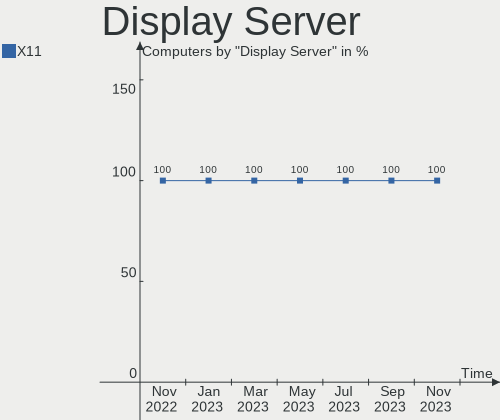
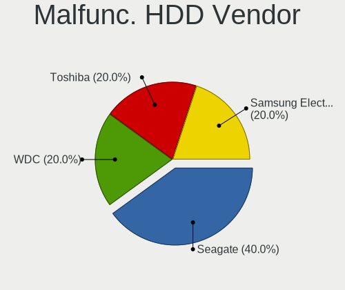
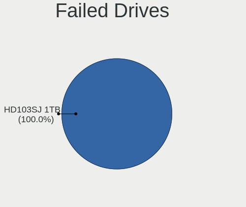
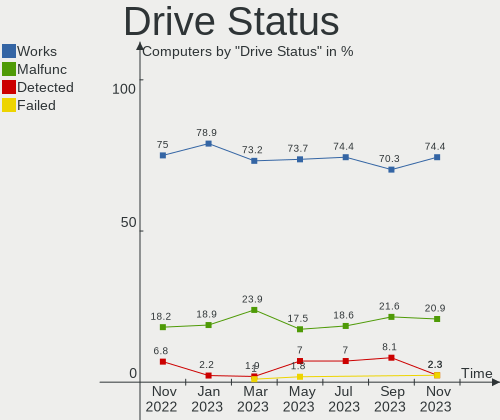
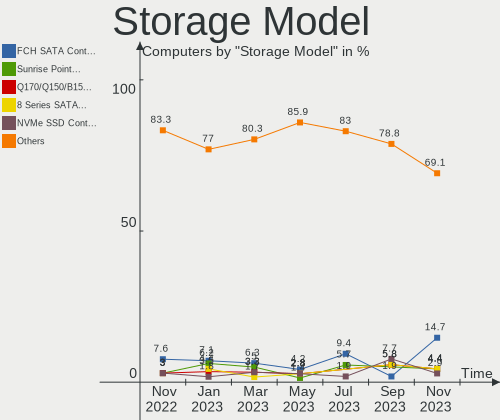
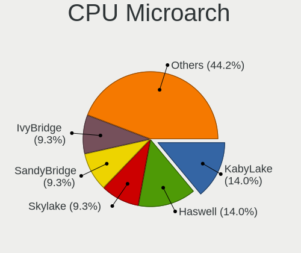
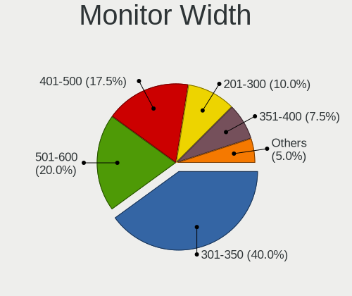
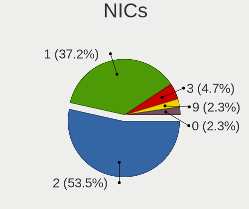
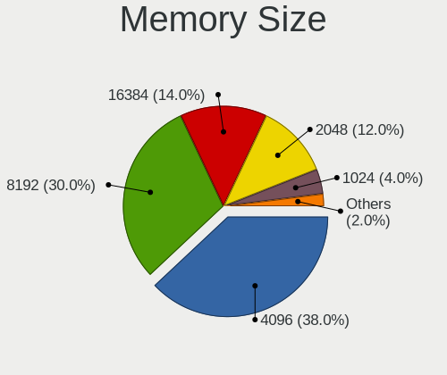

helloSystem - Hardware Trends
-----------------------------

A project to identify most popular hardware characteristics and track their change
over time based on data collected by BSD users at https://BSD-Hardware.info.

Anyone can contribute to this report by the [hw-probe](https://github.com/linuxhw/hw-probe/blob/master/INSTALL.BSD.md) tool:

    hw-probe -all -upload

This is a report for all computer types. See also reports for [desktops](/Dist/helloSystem/Desktop/README.md) and [notebooks](/Dist/helloSystem/Notebook/README.md).

This report is for one last month. Overall report since the beginning of time: [TestDays](https://github.com/bsdhw/TestDays)

Period: Nov, 2023.

Contents
--------

* [ System ](#system)
  - [ OS                       ](#os)
  - [ OS Family                ](#os-family)
  - [ Arch                     ](#arch)
  - [ DE                       ](#de)
  - [ Display Server           ](#display-server)
  - [ Display Manager          ](#display-manager)
  - [ OS Lang                  ](#os-lang)
  - [ Boot Mode                ](#boot-mode)
  - [ Filesystem               ](#filesystem)
  - [ Part. scheme             ](#part-scheme)

* [ Board ](#board)
  - [ Vendor                   ](#vendor)
  - [ Model                    ](#model)
  - [ Model Family             ](#model-family)
  - [ MFG Year                 ](#mfg-year)
  - [ Form Factor              ](#form-factor)
  - [ Coreboot                 ](#coreboot)
  - [ RAM Size                 ](#ram-size)
  - [ RAM Used                 ](#ram-used)
  - [ Total Drives             ](#total-drives)
  - [ Has CD-ROM               ](#has-cd-rom)
  - [ Has Ethernet             ](#has-ethernet)
  - [ Has WiFi                 ](#has-wifi)
  - [ Has Bluetooth            ](#has-bluetooth)

* [ Location ](#location)
  - [ Country                  ](#country)
  - [ City                     ](#city)

* [ Drives ](#drives)
  - [ Drive Vendor             ](#drive-vendor)
  - [ Drive Model              ](#drive-model)
  - [ HDD Vendor               ](#hdd-vendor)
  - [ SSD Vendor               ](#ssd-vendor)
  - [ Drive Kind               ](#drive-kind)
  - [ Drive Connector          ](#drive-connector)
  - [ Drive Size               ](#drive-size)
  - [ Space Total              ](#space-total)
  - [ Space Used               ](#space-used)
  - [ Malfunc. Drives          ](#malfunc-drives)
  - [ Malfunc. Drive Vendor    ](#malfunc-drive-vendor)
  - [ Malfunc. HDD Vendor      ](#malfunc-hdd-vendor)
  - [ Malfunc. Drive Kind      ](#malfunc-drive-kind)
  - [ Failed Drives            ](#failed-drives)
  - [ Failed Drive Vendor      ](#failed-drive-vendor)
  - [ Drive Status             ](#drive-status)

* [ Storage controller ](#storage-controller)
  - [ Storage Vendor           ](#storage-vendor)
  - [ Storage Model            ](#storage-model)
  - [ Storage Kind             ](#storage-kind)

* [ Processor ](#processor)
  - [ CPU Vendor               ](#cpu-vendor)
  - [ CPU Model                ](#cpu-model)
  - [ CPU Model Family         ](#cpu-model-family)
  - [ CPU Cores                ](#cpu-cores)
  - [ CPU Sockets              ](#cpu-sockets)
  - [ CPU Threads              ](#cpu-threads)
  - [ CPU Microarch            ](#cpu-microarch)

* [ Graphics ](#graphics)
  - [ GPU Vendor               ](#gpu-vendor)
  - [ GPU Model                ](#gpu-model)
  - [ GPU Combo                ](#gpu-combo)
  - [ GPU Driver               ](#gpu-driver)
  - [ GPU Memory               ](#gpu-memory)

* [ Monitor ](#monitor)
  - [ Monitor Vendor           ](#monitor-vendor)
  - [ Monitor Model            ](#monitor-model)
  - [ Monitor Resolution       ](#monitor-resolution)
  - [ Monitor Diagonal         ](#monitor-diagonal)
  - [ Monitor Width            ](#monitor-width)
  - [ Aspect Ratio             ](#aspect-ratio)
  - [ Monitor Area             ](#monitor-area)
  - [ Pixel Density            ](#pixel-density)
  - [ Multiple Monitors        ](#multiple-monitors)

* [ Network ](#network)
  - [ Net Controller Vendor    ](#net-controller-vendor)
  - [ Net Controller Model     ](#net-controller-model)
  - [ Wireless Vendor          ](#wireless-vendor)
  - [ Wireless Model           ](#wireless-model)
  - [ Ethernet Vendor          ](#ethernet-vendor)
  - [ Ethernet Model           ](#ethernet-model)
  - [ Net Controller Kind      ](#net-controller-kind)
  - [ Used Controller          ](#used-controller)
  - [ NICs                     ](#nics)
  - [ IPv6                     ](#ipv6)

* [ Bluetooth ](#bluetooth)
  - [ Bluetooth Vendor         ](#bluetooth-vendor)
  - [ Bluetooth Model          ](#bluetooth-model)

* [ Sound ](#sound)
  - [ Sound Vendor             ](#sound-vendor)
  - [ Sound Model              ](#sound-model)

* [ Memory ](#memory)
  - [ Memory Vendor            ](#memory-vendor)
  - [ Memory Model             ](#memory-model)
  - [ Memory Kind              ](#memory-kind)
  - [ Memory Form Factor       ](#memory-form-factor)
  - [ Memory Size              ](#memory-size)
  - [ Memory Speed             ](#memory-speed)

* [ Printers & scanners ](#printers--scanners)
  - [ Printer Vendor           ](#printer-vendor)
  - [ Printer Model            ](#printer-model)
  - [ Scanner Vendor           ](#scanner-vendor)
  - [ Scanner Model            ](#scanner-model)

* [ Camera ](#camera)
  - [ Camera Vendor            ](#camera-vendor)
  - [ Camera Model             ](#camera-model)

* [ Security ](#security)
  - [ Fingerprint Vendor       ](#fingerprint-vendor)
  - [ Fingerprint Model        ](#fingerprint-model)
  - [ Chipcard Vendor          ](#chipcard-vendor)
  - [ Chipcard Model           ](#chipcard-model)

* [ Unsupported ](#unsupported)
  - [ Unsupported Devices      ](#unsupported-devices)
  - [ Unsupported Device Types ](#unsupported-device-types)

System
------

OS
--

Installed operating systems

| Name              | Computers | Percent |
|-------------------|-----------|---------|
| helloSystem 0.9.0 | 23        | 53.49%  |
| helloSystem 0.8.1 | 18        | 41.86%  |
| helloSystem 0.8.2 | 1         | 2.33%   |
| helloSystem 0.5.0 | 1         | 2.33%   |

OS Family
---------

OS without a version

| Name        | Computers | Percent |
|-------------|-----------|---------|
| helloSystem | 43        | 100%    |

Arch
----

OS architecture (x86_64, i586, etc.)

| Name  | Computers | Percent |
|-------|-----------|---------|
| amd64 | 43        | 100%    |

DE
--

Desktop Environment

| Name         | Computers | Percent |
|--------------|-----------|---------|
| helloDesktop | 42        | 97.67%  |
| LXQt         | 1         | 2.33%   |

Display Server
--------------

X11 or Wayland

| Name | Computers | Percent |
|------|-----------|---------|
| X11  | 43        | 100%    |

Display Manager
---------------

SDDM, LightDM, etc.

| Name | Computers | Percent |
|------|-----------|---------|
| SLiM | 43        | 100%    |

OS Lang
-------

Language

| Lang    | Computers | Percent |
|---------|-----------|---------|
| Unknown | 17        | 39.53%  |
| en_US   | 11        | 25.58%  |
| ru_RU   | 3         | 6.98%   |
| fr_FR   | 3         | 6.98%   |
| es_ES   | 3         | 6.98%   |
| tr_TR   | 1         | 2.33%   |
| pl_PL   | 1         | 2.33%   |
| it_IT   | 1         | 2.33%   |
| fi_FI   | 1         | 2.33%   |
| en_GB   | 1         | 2.33%   |
| de_DE   | 1         | 2.33%   |

Boot Mode
---------

EFI or BIOS

| Mode | Computers | Percent |
|------|-----------|---------|
| EFI  | 42        | 97.67%  |
| BIOS | 1         | 2.33%   |

Filesystem
----------

Type of filesystem

| Type   | Computers | Percent |
|--------|-----------|---------|
| Cd9660 | 23        | 53.49%  |
| Zfs    | 20        | 46.51%  |

Part. scheme
------------

Scheme of partitioning

| Type | Computers | Percent |
|------|-----------|---------|
| GPT  | 42        | 97.67%  |
| MBR  | 1         | 2.33%   |

Board
-----

Vendor
------

Motherboard manufacturer

| Name                | Computers | Percent |
|---------------------|-----------|---------|
| Dell                | 11        | 25.58%  |
| Lenovo              | 8         | 18.6%   |
| Gigabyte Technology | 5         | 11.63%  |
| Hewlett-Packard     | 4         | 9.3%    |
| ASUSTek Computer    | 2         | 4.65%   |
| ASRock              | 2         | 4.65%   |
| Acer                | 2         | 4.65%   |
| Toshiba             | 1         | 2.33%   |
| Shuttle             | 1         | 2.33%   |
| Samsung Electronics | 1         | 2.33%   |
| MSI                 | 1         | 2.33%   |
| Intel               | 1         | 2.33%   |
| Gateway             | 1         | 2.33%   |
| Fujitsu             | 1         | 2.33%   |
| ATOPNUC             | 1         | 2.33%   |
| Apple               | 1         | 2.33%   |

Model
-----

Motherboard model

| Name                               | Computers | Percent |
|------------------------------------|-----------|---------|
| Toshiba Satellite C40-A            | 1         | 2.33%   |
| Shuttle NC10U                      | 1         | 2.33%   |
| Samsung N150P/N210P/N220P          | 1         | 2.33%   |
| MSI MS-7A34                        | 1         | 2.33%   |
| Lenovo Z50-70 20354                | 1         | 2.33%   |
| Lenovo Yoga 2 Pro 20266            | 1         | 2.33%   |
| Lenovo ThinkPad X230 2320A5U       | 1         | 2.33%   |
| Lenovo ThinkPad T60 8744HDG        | 1         | 2.33%   |
| Lenovo ThinkPad E14 20RA0016RT     | 1         | 2.33%   |
| Lenovo ThinkCentre M72e 3598BS7    | 1         | 2.33%   |
| Lenovo ThinkCentre M700 10J0S1CK00 | 1         | 2.33%   |
| Lenovo IdeaPad S145-14AST 81ST     | 1         | 2.33%   |
| Intel DH67CL AAG10212-206          | 1         | 2.33%   |
| HP ProDesk 600 G1 SFF              | 1         | 2.33%   |
| HP Pavilion g6                     | 1         | 2.33%   |
| HP Laptop 14-fq0xxx                | 1         | 2.33%   |
| HP Compaq dc7900 Small Form Factor | 1         | 2.33%   |
| Gigabyte Z68X-UD5-B3               | 1         | 2.33%   |
| Gigabyte X399 DESIGNARE EX         | 1         | 2.33%   |
| Gigabyte F2A85X-UP4                | 1         | 2.33%   |
| Gigabyte B450M H                   | 1         | 2.33%   |
| Gigabyte B450M AORUS ELITE         | 1         | 2.33%   |
| Gateway NV79                       | 1         | 2.33%   |
| Fujitsu FUTRO S920                 | 1         | 2.33%   |
| Dell XPS 7760 AIO                  | 1         | 2.33%   |
| Dell XPS 13 9360                   | 1         | 2.33%   |
| Dell Precision 7720                | 1         | 2.33%   |
| Dell OptiPlex 9020                 | 1         | 2.33%   |
| Dell Latitude E5540                | 1         | 2.33%   |
| Dell Inspiron One 2305             | 1         | 2.33%   |
| Dell Inspiron N4050                | 1         | 2.33%   |
| Dell Inspiron 5570                 | 1         | 2.33%   |
| Dell Inspiron 3442                 | 1         | 2.33%   |
| Dell Inspiron 1525                 | 1         | 2.33%   |
| Dell Inspiron 15 7000 Gaming       | 1         | 2.33%   |
| ATOPNUC MA90                       | 1         | 2.33%   |
| ASUS ROG Maximus XII APEX          | 1         | 2.33%   |
| ASUS P8Z77-V PRO                   | 1         | 2.33%   |
| ASRock X399 Professional Gaming    | 1         | 2.33%   |
| ASRock A300M-STX                   | 1         | 2.33%   |

Model Family
------------

Motherboard model prefix

| Name                 | Computers | Percent |
|----------------------|-----------|---------|
| Dell Inspiron        | 6         | 13.95%  |
| Lenovo ThinkPad      | 3         | 6.98%   |
| Lenovo ThinkCentre   | 2         | 4.65%   |
| Gigabyte B450M       | 2         | 4.65%   |
| Dell XPS             | 2         | 4.65%   |
| Acer Aspire          | 2         | 4.65%   |
| Toshiba Satellite    | 1         | 2.33%   |
| Shuttle NC10U        | 1         | 2.33%   |
| Samsung N150P        | 1         | 2.33%   |
| MSI MS-7A34          | 1         | 2.33%   |
| Lenovo Z50-70        | 1         | 2.33%   |
| Lenovo Yoga          | 1         | 2.33%   |
| Lenovo IdeaPad       | 1         | 2.33%   |
| Intel DH67CL         | 1         | 2.33%   |
| HP ProDesk           | 1         | 2.33%   |
| HP Pavilion          | 1         | 2.33%   |
| HP Laptop            | 1         | 2.33%   |
| HP Compaq            | 1         | 2.33%   |
| Gigabyte Z68X-UD5-B3 | 1         | 2.33%   |
| Gigabyte X399        | 1         | 2.33%   |
| Gigabyte F2A85X-UP4  | 1         | 2.33%   |
| Gateway NV79         | 1         | 2.33%   |
| Fujitsu FUTRO        | 1         | 2.33%   |
| Dell Precision       | 1         | 2.33%   |
| Dell OptiPlex        | 1         | 2.33%   |
| Dell Latitude        | 1         | 2.33%   |
| ATOPNUC MA90         | 1         | 2.33%   |
| ASUS ROG             | 1         | 2.33%   |
| ASUS P8Z77-V         | 1         | 2.33%   |
| ASRock X399          | 1         | 2.33%   |
| ASRock A300M-STX     | 1         | 2.33%   |
| Apple iMac13         | 1         | 2.33%   |

MFG Year
--------

Motherboard manufacture year

| Year | Computers | Percent |
|------|-----------|---------|
| 2022 | 5         | 11.63%  |
| 2019 | 5         | 11.63%  |
| 2012 | 5         | 11.63%  |
| 2020 | 4         | 9.3%    |
| 2013 | 4         | 9.3%    |
| 2018 | 3         | 6.98%   |
| 2023 | 2         | 4.65%   |
| 2021 | 2         | 4.65%   |
| 2016 | 2         | 4.65%   |
| 2015 | 2         | 4.65%   |
| 2014 | 2         | 4.65%   |
| 2011 | 2         | 4.65%   |
| 2010 | 2         | 4.65%   |
| 2008 | 2         | 4.65%   |
| 2006 | 1         | 2.33%   |

Form Factor
-----------

Physical design of the computer

| Name       | Computers | Percent |
|------------|-----------|---------|
| Notebook   | 21        | 48.84%  |
| Desktop    | 18        | 41.86%  |
| All in one | 3         | 6.98%   |
| Mini pc    | 1         | 2.33%   |

Coreboot
--------

Have coreboot on board

| Used | Computers | Percent |
|------|-----------|---------|
| No   | 43        | 100%    |

RAM Size
--------

Total RAM memory

| Size in GB  | Computers | Percent |
|-------------|-----------|---------|
| 8.01-16.0   | 18        | 41.86%  |
| 16.01-24.0  | 10        | 23.26%  |
| 4.01-8.0    | 6         | 13.95%  |
| 64.01-256.0 | 3         | 6.98%   |
| 32.01-64.0  | 2         | 4.65%   |
| 24.01-32.0  | 2         | 4.65%   |
| 3.01-4.0    | 1         | 2.33%   |
| 2.01-3.0    | 1         | 2.33%   |

RAM Used
--------

Used RAM memory

| Used GB  | Computers | Percent |
|----------|-----------|---------|
| 0.01-0.5 | 18        | 41.86%  |
| 0.51-1.0 | 11        | 25.58%  |
| 1.01-2.0 | 9         | 20.93%  |
| 2.01-3.0 | 3         | 6.98%   |
| 3.01-4.0 | 2         | 4.65%   |

Total Drives
------------

Number of drives on board

| Drives | Computers | Percent |
|--------|-----------|---------|
| 1      | 27        | 62.79%  |
| 2      | 6         | 13.95%  |
| 3      | 4         | 9.3%    |
| 0      | 4         | 9.3%    |
| 5      | 1         | 2.33%   |
| 4      | 1         | 2.33%   |

Has CD-ROM
----------

Has CD-ROM on board

| Presented | Computers | Percent |
|-----------|-----------|---------|
| No        | 29        | 67.44%  |
| Yes       | 14        | 32.56%  |

Has Ethernet
------------

Has Ethernet on board

| Presented | Computers | Percent |
|-----------|-----------|---------|
| Yes       | 39        | 90.7%   |
| No        | 4         | 9.3%    |

Has WiFi
--------

Has WiFi module

| Presented | Computers | Percent |
|-----------|-----------|---------|
| Yes       | 31        | 72.09%  |
| No        | 12        | 27.91%  |

Has Bluetooth
-------------

Has Bluetooth module

| Presented | Computers | Percent |
|-----------|-----------|---------|
| Yes       | 23        | 53.49%  |
| No        | 20        | 46.51%  |

Location
--------

Country
-------

Geographic location (country)

| Country             | Computers | Percent |
|---------------------|-----------|---------|
| USA                 | 9         | 20.93%  |
| Russia              | 5         | 11.63%  |
| Brazil              | 5         | 11.63%  |
| UK                  | 3         | 6.98%   |
| Germany             | 3         | 6.98%   |
| Belgium             | 3         | 6.98%   |
| Switzerland         | 2         | 4.65%   |
| France              | 2         | 4.65%   |
| Argentina           | 2         | 4.65%   |
| Turkey              | 1         | 2.33%   |
| Trinidad and Tobago | 1         | 2.33%   |
| Taiwan              | 1         | 2.33%   |
| Poland              | 1         | 2.33%   |
| Panama              | 1         | 2.33%   |
| Mexico              | 1         | 2.33%   |
| Italy               | 1         | 2.33%   |
| Indonesia           | 1         | 2.33%   |
| Czechia             | 1         | 2.33%   |

City
----

Geographic location (city)

| City                 | Computers | Percent |
|----------------------|-----------|---------|
| Sao Paulo            | 2         | 4.65%   |
| Zurich               | 1         | 2.33%   |
| Zele                 | 1         | 2.33%   |
| Wendeburg            | 1         | 2.33%   |
| Tver                 | 1         | 2.33%   |
| Tasikmalaya          | 1         | 2.33%   |
| Taipei               | 1         | 2.33%   |
| St Albans            | 1         | 2.33%   |
| Skopin               | 1         | 2.33%   |
| Rochester            | 1         | 2.33%   |
| Rio de Janeiro       | 1         | 2.33%   |
| Río Cuarto          | 1         | 2.33%   |
| Port of Spain        | 1         | 2.33%   |
| Plainfield           | 1         | 2.33%   |
| Panama City          | 1         | 2.33%   |
| Orlando              | 1         | 2.33%   |
| Novosibirsk          | 1         | 2.33%   |
| Normal               | 1         | 2.33%   |
| Neuengors            | 1         | 2.33%   |
| Moscow               | 1         | 2.33%   |
| McKinney             | 1         | 2.33%   |
| Maringá             | 1         | 2.33%   |
| Lyon                 | 1         | 2.33%   |
| Lille                | 1         | 2.33%   |
| Ligonier             | 1         | 2.33%   |
| Liberec              | 1         | 2.33%   |
| Kirov                | 1         | 2.33%   |
| Horseshoe Bend       | 1         | 2.33%   |
| Herent               | 1         | 2.33%   |
| Hamburg              | 1         | 2.33%   |
| Geneva               | 1         | 2.33%   |
| Fortin de las Flores | 1         | 2.33%   |
| Fortaleza            | 1         | 2.33%   |
| Fort Thomas          | 1         | 2.33%   |
| Chicago              | 1         | 2.33%   |
| Bydgoszcz            | 1         | 2.33%   |
| Buenos Aires         | 1         | 2.33%   |
| Brussels             | 1         | 2.33%   |
| Brent                | 1         | 2.33%   |
| Bologna              | 1         | 2.33%   |

Drives
------

Drive Vendor
------------

Hard drive vendors

| Vendor              | Computers | Drives | Percent |
|---------------------|-----------|--------|---------|
| Samsung Electronics | 10        | 10     | 18.18%  |
| Seagate             | 8         | 9      | 14.55%  |
| WDC                 | 5         | 6      | 9.09%   |
| SanDisk             | 4         | 5      | 7.27%   |
| Toshiba             | 3         | 4      | 5.45%   |
| Kingston            | 3         | 3      | 5.45%   |
| A-DATA Technology   | 3         | 3      | 5.45%   |
| Patriot             | 2         | 2      | 3.64%   |
| Micron Technology   | 2         | 2      | 3.64%   |
| HGST                | 2         | 2      | 3.64%   |
| Crucial             | 2         | 2      | 3.64%   |
| Transcend           | 1         | 1      | 1.82%   |
| SSSTC               | 1         | 1      | 1.82%   |
| SPCC                | 1         | 1      | 1.82%   |
| Silicon Motion      | 1         | 1      | 1.82%   |
| SCY                 | 1         | 1      | 1.82%   |
| Maxtor              | 1         | 1      | 1.82%   |
| Intel               | 1         | 1      | 1.82%   |
| GOODRAM             | 1         | 1      | 1.82%   |
| Apple               | 1         | 1      | 1.82%   |
| Apacer              | 1         | 1      | 1.82%   |
| AMD                 | 1         | 1      | 1.82%   |

Drive Model
-----------

Hard drive models

| Model                              | Computers | Percent |
|------------------------------------|-----------|---------|
| Seagate ST3320310CS 320GB          | 2         | 3.39%   |
| Samsung SSD 860 EVO 250GB          | 2         | 3.39%   |
| A-DATA SU650 120GB                 | 2         | 3.39%   |
| WDC WDS120G2G0B-00EPW0 120GB       | 1         | 1.69%   |
| WDC WD5000AAKX-08U6AA0 500GB       | 1         | 1.69%   |
| WDC WD1600AAJS-61WAA0 160GB        | 1         | 1.69%   |
| WDC WD10JPVX-75JC3T0 1TB           | 1         | 1.69%   |
| WDC WD10JPVX-22JC3T0 1TB           | 1         | 1.69%   |
| WDC PC SN730 NVMe 512GB            | 1         | 1.69%   |
| Transcend TS32GMTS400S 32GB        | 1         | 1.69%   |
| Toshiba MQ01ABF032 320GB           | 1         | 1.69%   |
| Toshiba HDWD110 1TB                | 1         | 1.69%   |
| Toshiba DT01ACA100 1TB             | 1         | 1.69%   |
| Toshiba DT01ABA200 2TB             | 1         | 1.69%   |
| SSSTC CVB-8D128-HP 128GB           | 1         | 1.69%   |
| SPCC Solid State Disk 120GB        | 1         | 1.69%   |
| Silicon Motion NE-512 2280 512GB   | 1         | 1.69%   |
| Seagate ST9100824AS 100GB          | 1         | 1.69%   |
| Seagate ST3500830AS 500GB          | 1         | 1.69%   |
| Seagate ST3250823AS 250GB          | 1         | 1.69%   |
| Seagate ST2000LM007-1R8174 2TB     | 1         | 1.69%   |
| Seagate ST1000LM035-1RK172 1TB     | 1         | 1.69%   |
| Seagate ST1000LM024 HN-M101MBB 1TB | 1         | 1.69%   |
| Seagate ST1000DM003-1SB10C 1TB     | 1         | 1.69%   |
| SCY SNM4BBG12800D 128GB            | 1         | 1.69%   |
| SanDisk Z400s M.2 2242 32GB        | 1         | 1.69%   |
| SanDisk X110 2.5 7MM 128GB         | 1         | 1.69%   |
| SanDisk SSD U100 32GB              | 1         | 1.69%   |
| SanDisk SSD PLUS 480GB             | 1         | 1.69%   |
| SanDisk pSSD 16GB                  | 1         | 1.69%   |
| Samsung SSD 870 EVO 250GB          | 1         | 1.69%   |
| Samsung SSD 870 EVO 1TB            | 1         | 1.69%   |
| Samsung SSD 860 EVO mSATA 500GB    | 1         | 1.69%   |
| Samsung SSD 850 EVO 1TB            | 1         | 1.69%   |
| Samsung MZMPA128HMFU-000H1 128GB   | 1         | 1.69%   |
| Samsung HM250HI 250GB              | 1         | 1.69%   |
| Samsung HD161HJ 160GB              | 1         | 1.69%   |
| Samsung HD103SJ 1TB                | 1         | 1.69%   |
| Patriot M.2 P300 128GB             | 1         | 1.69%   |
| Patriot Burst 120GB                | 1         | 1.69%   |

HDD Vendor
----------

Hard disk drive vendors

| Vendor              | Computers | Drives | Percent |
|---------------------|-----------|--------|---------|
| Seagate             | 8         | 9      | 36.36%  |
| WDC                 | 4         | 4      | 18.18%  |
| Toshiba             | 3         | 4      | 13.64%  |
| Samsung Electronics | 3         | 3      | 13.64%  |
| HGST                | 2         | 2      | 9.09%   |
| Maxtor              | 1         | 1      | 4.55%   |
| Apple               | 1         | 1      | 4.55%   |

SSD Vendor
----------

Solid state drive vendors

| Vendor              | Computers | Drives | Percent |
|---------------------|-----------|--------|---------|
| Samsung Electronics | 7         | 7      | 25%     |
| SanDisk             | 4         | 5      | 14.29%  |
| A-DATA Technology   | 3         | 3      | 10.71%  |
| Micron Technology   | 2         | 2      | 7.14%   |
| Kingston            | 2         | 2      | 7.14%   |
| WDC                 | 1         | 1      | 3.57%   |
| Transcend           | 1         | 1      | 3.57%   |
| SSSTC               | 1         | 1      | 3.57%   |
| SPCC                | 1         | 1      | 3.57%   |
| SCY                 | 1         | 1      | 3.57%   |
| Patriot             | 1         | 1      | 3.57%   |
| Intel               | 1         | 1      | 3.57%   |
| GOODRAM             | 1         | 1      | 3.57%   |
| Crucial             | 1         | 1      | 3.57%   |
| Apacer              | 1         | 1      | 3.57%   |

Drive Kind
----------

HDD or SSD

| Kind | Computers | Drives | Percent |
|------|-----------|--------|---------|
| SSD  | 27        | 29     | 52.94%  |
| HDD  | 18        | 24     | 35.29%  |
| NVMe | 6         | 6      | 11.76%  |

Drive Connector
---------------

SATA, SAS, NVMe, etc.

| Type | Computers | Drives | Percent |
|------|-----------|--------|---------|
| SATA | 38        | 53     | 86.36%  |
| NVMe | 6         | 6      | 13.64%  |

Drive Size
----------

Size of hard drive

| Size in TB | Computers | Drives | Percent |
|------------|-----------|--------|---------|
| 0.01-0.5   | 31        | 39     | 72.09%  |
| 0.51-1.0   | 10        | 12     | 23.26%  |
| 1.01-2.0   | 2         | 2      | 4.65%   |

Space Total
-----------

Amount of disk space available on the file system

| Size in GB | Computers | Percent |
|------------|-----------|---------|
| 1-20       | 15        | 34.88%  |
| 251-500    | 7         | 16.28%  |
| 101-250    | 7         | 16.28%  |
| 21-50      | 5         | 11.63%  |
| 51-100     | 5         | 11.63%  |
| 501-1000   | 2         | 4.65%   |
| 2001-3000  | 1         | 2.33%   |
| Unknown    | 1         | 2.33%   |

Space Used
----------

Amount of used disk space

| Used GB   | Computers | Percent |
|-----------|-----------|---------|
| 1-20      | 37        | 86.05%  |
| 101-250   | 3         | 6.98%   |
| 21-50     | 1         | 2.33%   |
| 1001-2000 | 1         | 2.33%   |
| Unknown   | 1         | 2.33%   |

Malfunc. Drives
---------------

Drive models with a malfunction

| Model                                        | Computers | Drives | Percent |
|----------------------------------------------|-----------|--------|---------|
| WDC WD10JPVX-22JC3T0 1TB                     | 1         | 1      | 11.11%  |
| Toshiba DT01ABA200 2TB                       | 1         | 1      | 11.11%  |
| SSSTC CVB-8D128-HP 128GB                     | 1         | 1      | 11.11%  |
| Seagate ST9100824AS 100GB                    | 1         | 1      | 11.11%  |
| Seagate ST3320310CS 320GB                    | 1         | 1      | 11.11%  |
| Samsung Electronics MZMPA128HMFU-000H1 128GB | 1         | 1      | 11.11%  |
| Samsung Electronics HD161HJ 160GB            | 1         | 1      | 11.11%  |
| Micron Technology C400 RealSSD mSATA 32GB    | 1         | 1      | 11.11%  |
| Intel SSDSC2BA200G3T 200GB                   | 1         | 1      | 11.11%  |

Malfunc. Drive Vendor
---------------------

Vendors of faulty drives

| Vendor              | Computers | Drives | Percent |
|---------------------|-----------|--------|---------|
| Seagate             | 2         | 2      | 22.22%  |
| Samsung Electronics | 2         | 2      | 22.22%  |
| WDC                 | 1         | 1      | 11.11%  |
| Toshiba             | 1         | 1      | 11.11%  |
| SSSTC               | 1         | 1      | 11.11%  |
| Micron Technology   | 1         | 1      | 11.11%  |
| Intel               | 1         | 1      | 11.11%  |

Malfunc. HDD Vendor
-------------------

Vendors of faulty HDD drives

| Vendor              | Computers | Drives | Percent |
|---------------------|-----------|--------|---------|
| Seagate             | 2         | 2      | 40%     |
| WDC                 | 1         | 1      | 20%     |
| Toshiba             | 1         | 1      | 20%     |
| Samsung Electronics | 1         | 1      | 20%     |

Malfunc. Drive Kind
-------------------

Kinds of faulty drives

| Kind | Computers | Drives | Percent |
|------|-----------|--------|---------|
| HDD  | 5         | 5      | 55.56%  |
| SSD  | 4         | 4      | 44.44%  |

Failed Drives
-------------

Failed drive models

| Model                           | Computers | Drives | Percent |
|---------------------------------|-----------|--------|---------|
| Samsung Electronics HD103SJ 1TB | 1         | 1      | 100%    |

Failed Drive Vendor
-------------------

Failed drive vendors

| Vendor              | Computers | Drives | Percent |
|---------------------|-----------|--------|---------|
| Samsung Electronics | 1         | 1      | 100%    |

Drive Status
------------

Number of failed and malfunc. drives

| Status   | Computers | Drives | Percent |
|----------|-----------|--------|---------|
| Works    | 32        | 48     | 74.42%  |
| Malfunc  | 9         | 9      | 20.93%  |
| Detected | 1         | 1      | 2.33%   |
| Failed   | 1         | 1      | 2.33%   |

Storage controller
------------------

Storage Vendor
--------------

Storage controller vendors

| Vendor                      | Computers | Percent |
|-----------------------------|-----------|---------|
| Intel                       | 29        | 49.15%  |
| AMD                         | 13        | 22.03%  |
| SanDisk                     | 3         | 5.08%   |
| Samsung Electronics         | 3         | 5.08%   |
| ASMedia Technology          | 3         | 5.08%   |
| MAXIO Technology (Hangzhou) | 2         | 3.39%   |
| Kingston Technology Company | 2         | 3.39%   |
| Silicon Motion              | 1         | 1.69%   |
| Micron/Crucial Technology   | 1         | 1.69%   |
| Marvell Technology Group    | 1         | 1.69%   |
| Chelsio Communications      | 1         | 1.69%   |

Storage Model
-------------

Storage controller models

| Model                                                                                   | Computers | Percent |
|-----------------------------------------------------------------------------------------|-----------|---------|
| AMD FCH SATA Controller [AHCI mode]                                                     | 10        | 14.71%  |
| Intel Sunrise Point-LP SATA Controller [AHCI mode]                                      | 3         | 4.41%   |
| Intel Q170/Q150/B150/H170/H110/Z170/CM236 Chipset SATA Controller [AHCI Mode]           | 3         | 4.41%   |
| Intel 8 Series SATA Controller 1 [AHCI mode]                                            | 3         | 4.41%   |
| Samsung NVMe SSD Controller SM981/PM981/PM983                                           | 2         | 2.94%   |
| MAXIO (Hangzhou) NVMe SSD Controller MAP1202                                            | 2         | 2.94%   |
| Intel 82801 Mobile SATA Controller [RAID mode]                                          | 2         | 2.94%   |
| Intel 7 Series Chipset Family 6-port SATA Controller [AHCI mode]                        | 2         | 2.94%   |
| Intel 6 Series/C200 Series Chipset Family 6 port Desktop SATA AHCI Controller           | 2         | 2.94%   |
| ASMedia ASM1062 Serial ATA Controller                                                   | 2         | 2.94%   |
| AMD X399 Series Chipset SATA Controller                                                 | 2         | 2.94%   |
| AMD 400 Series Chipset SATA Controller                                                  | 2         | 2.94%   |
| Silicon Motion SM2263EN/SM2263XT (DRAM-less) NVMe SSD Controllers                       | 1         | 1.47%   |
| Sandisk WD Blue SN570 NVMe SSD 2TB                                                      | 1         | 1.47%   |
| SanDisk Ultra 3D / WD Blue SN570 NVMe SSD (DRAM-less)                                   | 1         | 1.47%   |
| SanDisk Extreme Pro / WD Black SN750 / PC SN730 / Red SN700 NVMe SSD                    | 1         | 1.47%   |
| SanDisk Extreme Pro / WD Black 2018/SN750/PC SN720 NVMe SSD                             | 1         | 1.47%   |
| Samsung NVMe SSD Controller 980 (DRAM-less)                                             | 1         | 1.47%   |
| Micron/Crucial P2 [Nick P2] / P3 / P3 Plus NVMe PCIe SSD (DRAM-less)                    | 1         | 1.47%   |
| Marvell Group 88SE91A3 SATA-600 Controller                                              | 1         | 1.47%   |
| Kingston Company NV2 NVMe SSD SM2267XT                                                  | 1         | 1.47%   |
| Kingston Company A2000 NVMe SSD SM2263EN                                                | 1         | 1.47%   |
| Intel SATA Controller [RAID mode]                                                       | 1         | 1.47%   |
| Intel Optane SSD 900P Series                                                            | 1         | 1.47%   |
| Intel NM10/ICH7 Family SATA Controller [AHCI mode]                                      | 1         | 1.47%   |
| Intel Comet Lake SATA AHCI Controller                                                   | 1         | 1.47%   |
| Intel Cannon Point-LP SATA Controller [AHCI Mode]                                       | 1         | 1.47%   |
| Intel 82801JD/DO (ICH10 Family) SATA AHCI Controller                                    | 1         | 1.47%   |
| Intel 82801HM/HEM (ICH8M/ICH8M-E) SATA Controller [AHCI mode]                           | 1         | 1.47%   |
| Intel 82801HM/HEM (ICH8M/ICH8M-E) IDE Controller                                        | 1         | 1.47%   |
| Intel 82801GBM/GHM (ICH7-M Family) SATA Controller [AHCI mode]                          | 1         | 1.47%   |
| Intel 82801G (ICH7 Family) IDE Controller                                               | 1         | 1.47%   |
| Intel 8 Series/C220 Series Chipset Family 6-port SATA Controller 1 [AHCI mode]          | 1         | 1.47%   |
| Intel 7 Series/C210 Series Chipset Family 6-port SATA Controller [AHCI mode]            | 1         | 1.47%   |
| Intel 7 Series/C210 Series Chipset Family 4-port SATA Controller [IDE mode]             | 1         | 1.47%   |
| Intel 7 Series/C210 Series Chipset Family 2-port SATA Controller [IDE mode]             | 1         | 1.47%   |
| Intel 6 Series/C200 Series Chipset Family Desktop SATA Controller (IDE mode, ports 4-5) | 1         | 1.47%   |
| Intel 6 Series/C200 Series Chipset Family Desktop SATA Controller (IDE mode, ports 0-3) | 1         | 1.47%   |
| Intel 6 Series/C200 Series Chipset Family 6 port Mobile SATA AHCI Controller            | 1         | 1.47%   |
| Intel 5 Series/3400 Series Chipset 4 port SATA AHCI Controller                          | 1         | 1.47%   |

Storage Kind
------------

Kind of storage controller (IDE, SATA, NVMe, SAS, ...)

| Kind | Computers | Percent |
|------|-----------|---------|
| SATA | 38        | 65.52%  |
| NVMe | 11        | 18.97%  |
| IDE  | 5         | 8.62%   |
| RAID | 3         | 5.17%   |
| SCSI | 1         | 1.72%   |

Processor
---------

CPU Vendor
----------

Processor vendors

| Vendor | Computers | Percent |
|--------|-----------|---------|
| Intel  | 30        | 69.77%  |
| AMD    | 13        | 30.23%  |

CPU Model
---------

Processor models

| Model                                           | Computers | Percent |
|-------------------------------------------------|-----------|---------|
| Intel Core i7-8550U CPU @ 1.80GHz               | 2         | 4.65%   |
| Intel Core i5-4210U CPU @ 1.70GHz               | 2         | 4.65%   |
| Intel Core i3-6100U CPU @ 2.30GHz               | 2         | 4.65%   |
| Intel Core i9-10850K CPU @ 3.60GHz              | 1         | 2.33%   |
| Intel Core i7-7700HQ CPU @ 2.80GHz              | 1         | 2.33%   |
| Intel Core i7-6820HQ CPU @ 2.70GHz              | 1         | 2.33%   |
| Intel Core i7-4770 CPU @ 3.40GHz                | 1         | 2.33%   |
| Intel Core i7-4500U CPU @ 1.80GHz               | 1         | 2.33%   |
| Intel Core i7-3770 CPU @ 3.40GHz                | 1         | 2.33%   |
| Intel Core i7-2600 CPU                          | 1         | 2.33%   |
| Intel Core i5-7400 CPU @ 3.00GHz                | 1         | 2.33%   |
| Intel Core i5-6500 CPU @ 3.20GHz                | 1         | 2.33%   |
| Intel Core i5-3470 CPU @ 3.20GHz                | 1         | 2.33%   |
| Intel Core i5-3330S CPU @ 2.70GHz               | 1         | 2.33%   |
| Intel Core i5-3320M CPU @ 2.60GHz               | 1         | 2.33%   |
| Intel Core i5-10210U CPU @ 1.60GHz              | 1         | 2.33%   |
| Intel Core i5 CPU M 430 @ 2.27GHz               | 1         | 2.33%   |
| Intel Core i3-4130 CPU @ 3.40GHz                | 1         | 2.33%   |
| Intel Core i3-4005U CPU @ 1.70GHz               | 1         | 2.33%   |
| Intel Core i3-2350M CPU @ 2.30GHz               | 1         | 2.33%   |
| Intel Core i3-2348M CPU @ 2.30GHz               | 1         | 2.33%   |
| Intel Core i3-2100T CPU @ 2.50GHz               | 1         | 2.33%   |
| Intel Core 2 Duo CPU E8400 @ 3.00GHz            | 1         | 2.33%   |
| Intel Core 2 Duo                                | 1         | 2.33%   |
| Intel Core 2 CPU                                | 1         | 2.33%   |
| Intel Celeron CPU 4205U @ 1.80GHz               | 1         | 2.33%   |
| Intel Atom CPU N450 @ 1.66GHz                   | 1         | 2.33%   |
| AMD Ryzen Threadripper 2950X 16-Core Processor  | 1         | 2.33%   |
| AMD Ryzen Threadripper 1920X 12-Core Processor  | 1         | 2.33%   |
| AMD Ryzen 5 3600 6-Core Processor               | 1         | 2.33%   |
| AMD Ryzen 3 PRO 2200G with Radeon Vega Graphics | 1         | 2.33%   |
| AMD Ryzen 3 3200G with Radeon Vega Graphics     | 1         | 2.33%   |
| AMD Ryzen 3 2200G with Radeon Vega Graphics     | 1         | 2.33%   |
| AMD GX-415GA SOC with Radeon HD Graphics        | 1         | 2.33%   |
| AMD Athlon II X2 250u Processor                 | 1         | 2.33%   |
| AMD Athlon Gold 3150U with Radeon Graphics      | 1         | 2.33%   |
| AMD A9-9400 RADEON R5, 5 COMPUTE CORES 2C+3G    | 1         | 2.33%   |
| AMD A6-9225 RADEON R4, 5 COMPUTE CORES 2C+3G    | 1         | 2.33%   |
| AMD A10-6800K APU with Radeon HD Graphics       | 1         | 2.33%   |
| AMD A10-5750M APU with Radeon HD Graphics       | 1         | 2.33%   |

CPU Model Family
----------------

Processor model prefix

| Model                  | Computers | Percent |
|------------------------|-----------|---------|
| Intel Core i5          | 9         | 20.93%  |
| Intel Core i7          | 8         | 18.6%   |
| Intel Core i3          | 7         | 16.28%  |
| Intel Core 2 Duo       | 2         | 4.65%   |
| AMD Ryzen Threadripper | 2         | 4.65%   |
| AMD Ryzen 3            | 2         | 4.65%   |
| AMD A10                | 2         | 4.65%   |
| Other                  | 1         | 2.33%   |
| Intel Core i9          | 1         | 2.33%   |
| Intel Core 2           | 1         | 2.33%   |
| Intel Celeron          | 1         | 2.33%   |
| Intel Atom             | 1         | 2.33%   |
| AMD Ryzen 5            | 1         | 2.33%   |
| AMD Ryzen 3 PRO        | 1         | 2.33%   |
| AMD GX                 | 1         | 2.33%   |
| AMD Athlon II X2       | 1         | 2.33%   |
| AMD Athlon             | 1         | 2.33%   |
| AMD A6                 | 1         | 2.33%   |

CPU Cores
---------

Number of processor cores

| Number  | Computers | Percent |
|---------|-----------|---------|
| 4       | 19        | 44.19%  |
| 2       | 18        | 41.86%  |
| Unknown | 2         | 4.65%   |
| 32      | 1         | 2.33%   |
| 24      | 1         | 2.33%   |
| 12      | 1         | 2.33%   |
| 10      | 1         | 2.33%   |

CPU Sockets
-----------

Number of sockets

| Number  | Computers | Percent |
|---------|-----------|---------|
| 1       | 42        | 97.67%  |
| Unknown | 1         | 2.33%   |

CPU Threads
-----------

Threads per core (Hyper-Threading)

| Number  | Computers | Percent |
|---------|-----------|---------|
| 2       | 21        | 48.84%  |
| 1       | 20        | 46.51%  |
| Unknown | 2         | 4.65%   |

CPU Microarch
-------------

Microarchitecture

| Name        | Computers | Percent |
|-------------|-----------|---------|
| KabyLake    | 6         | 13.95%  |
| Haswell     | 6         | 13.95%  |
| Skylake     | 4         | 9.3%    |
| SandyBridge | 4         | 9.3%    |
| IvyBridge   | 4         | 9.3%    |
| Zen+        | 3         | 6.98%   |
| Zen         | 3         | 6.98%   |
| Piledriver  | 2         | 4.65%   |
| Excavator   | 2         | 4.65%   |
| Core        | 2         | 4.65%   |
| Zen 2       | 1         | 2.33%   |
| Westmere    | 1         | 2.33%   |
| Penryn      | 1         | 2.33%   |
| K10         | 1         | 2.33%   |
| Jaguar      | 1         | 2.33%   |
| CometLake   | 1         | 2.33%   |
| Bonnell     | 1         | 2.33%   |

Graphics
--------

GPU Vendor
----------

Vendors of graphics cards

| Vendor | Computers | Percent |
|--------|-----------|---------|
| Intel  | 22        | 47.83%  |
| AMD    | 17        | 36.96%  |
| Nvidia | 7         | 15.22%  |

GPU Model
---------

Graphics card models

| Model                                                                                 | Computers | Percent |
|---------------------------------------------------------------------------------------|-----------|---------|
| Intel Haswell-ULT Integrated Graphics Controller                                      | 4         | 8.51%   |
| Intel 2nd Generation Core Processor Family Integrated Graphics Controller             | 3         | 6.38%   |
| Intel UHD Graphics 620                                                                | 2         | 4.26%   |
| Intel Skylake GT2 [HD Graphics 520]                                                   | 2         | 4.26%   |
| Intel HD Graphics 630                                                                 | 2         | 4.26%   |
| AMD Stoney [Radeon R2/R3/R4/R5 Graphics]                                              | 2         | 4.26%   |
| AMD Raven Ridge [Radeon Vega Series / Radeon Vega Mobile Series]                      | 2         | 4.26%   |
| AMD Picasso/Raven 2 [Radeon Vega Series / Radeon Vega Mobile Series]                  | 2         | 4.26%   |
| Nvidia GP107M [GeForce GTX 1050 Ti Mobile]                                            | 1         | 2.13%   |
| Nvidia GP107 [GeForce GTX 1050 Ti]                                                    | 1         | 2.13%   |
| Nvidia GP106 [GeForce GTX 1060 3GB]                                                   | 1         | 2.13%   |
| Nvidia GP104GLM [Quadro P3000 Mobile]                                                 | 1         | 2.13%   |
| Nvidia GK107M [GeForce GT 640M Mac Edition]                                           | 1         | 2.13%   |
| Nvidia GF117M [GeForce 610M/710M/810M/820M / GT 620M/625M/630M/720M]                  | 1         | 2.13%   |
| Nvidia GA102 [GeForce RTX 3080 Ti]                                                    | 1         | 2.13%   |
| Intel Xeon E3-1200 v2/3rd Gen Core processor Graphics Controller                      | 1         | 2.13%   |
| Intel Whiskey Lake-U GT1 [UHD Graphics 610]                                           | 1         | 2.13%   |
| Intel Mobile GM965/GL960 Integrated Graphics Controller (secondary)                   | 1         | 2.13%   |
| Intel Mobile GM965/GL960 Integrated Graphics Controller (primary)                     | 1         | 2.13%   |
| Intel HD Graphics 530                                                                 | 1         | 2.13%   |
| Intel Core Processor Integrated Graphics Controller                                   | 1         | 2.13%   |
| Intel CometLake-U GT2 [UHD Graphics]                                                  | 1         | 2.13%   |
| Intel Atom Processor D4xx/D5xx/N4xx/N5xx Integrated Graphics Controller               | 1         | 2.13%   |
| Intel 4th Generation Core Processor Family Integrated Graphics Controller             | 1         | 2.13%   |
| Intel 3rd Gen Core processor Graphics Controller                                      | 1         | 2.13%   |
| AMD Topaz XT [Radeon R7 M260/M265 / M340/M360 / M440/M445 / 530/535 / 620/625 Mobile] | 1         | 2.13%   |
| AMD RV515/M54 [Mobility Radeon X1400]                                                 | 1         | 2.13%   |
| AMD RS880M [Mobility Radeon HD 4225/4250]                                             | 1         | 2.13%   |
| AMD Richland [Radeon HD 8670D]                                                        | 1         | 2.13%   |
| AMD Richland [Radeon HD 8650G]                                                        | 1         | 2.13%   |
| AMD Oland [Radeon HD 8570 / R5 430 OEM / R7 240/340 / Radeon 520 OEM]                 | 1         | 2.13%   |
| AMD Navi 22 [Radeon RX 6700/6700 XT/6750 XT / 6800M/6850M XT]                         | 1         | 2.13%   |
| AMD Kabini [Radeon HD 8330E]                                                          | 1         | 2.13%   |
| AMD Ellesmere [Radeon RX 470/480/570/570X/580/580X/590]                               | 1         | 2.13%   |
| AMD Cedar [Radeon HD 5000/6000/7350/8350 Series]                                      | 1         | 2.13%   |
| AMD Barts XT [Radeon HD 6870]                                                         | 1         | 2.13%   |

GPU Combo
---------

Combinations of graphics cards

| Name           | Computers | Percent |
|----------------|-----------|---------|
| 1 x Intel      | 17        | 39.53%  |
| 1 x AMD        | 16        | 37.21%  |
| 1 x Nvidia     | 5         | 11.63%  |
| 2 x Intel      | 2         | 4.65%   |
| Intel + Nvidia | 2         | 4.65%   |
| Intel + AMD    | 1         | 2.33%   |

GPU Driver
----------

Free vs proprietary

| Driver      | Computers | Percent |
|-------------|-----------|---------|
| Free        | 38        | 88.37%  |
| Proprietary | 3         | 6.98%   |
| Unknown     | 2         | 4.65%   |

GPU Memory
----------

Total video memory

| Size in GB | Computers | Percent |
|------------|-----------|---------|
| Unknown    | 30        | 69.77%  |
| 0.51-1.0   | 5         | 11.63%  |
| 0.01-0.5   | 3         | 6.98%   |
| 3.01-4.0   | 2         | 4.65%   |
| 5.01-6.0   | 1         | 2.33%   |
| 2.01-3.0   | 1         | 2.33%   |
| 1.01-2.0   | 1         | 2.33%   |

Monitor
-------

Monitor Vendor
--------------

Monitor vendors

| Vendor               | Computers | Percent |
|----------------------|-----------|---------|
| Samsung Electronics  | 12        | 30%     |
| LG Display           | 4         | 10%     |
| Dell                 | 4         | 10%     |
| Chimei Innolux       | 3         | 7.5%    |
| BOE                  | 3         | 7.5%    |
| AU Optronics         | 3         | 7.5%    |
| Sharp                | 2         | 5%      |
| Goldstar             | 2         | 5%      |
| IBM                  | 1         | 2.5%    |
| Hewlett-Packard      | 1         | 2.5%    |
| Eizo                 | 1         | 2.5%    |
| CVT                  | 1         | 2.5%    |
| BenQ                 | 1         | 2.5%    |
| Ancor Communications | 1         | 2.5%    |
| Acer                 | 1         | 2.5%    |

Monitor Model
-------------

Monitor models

| Model                                                                 | Computers | Percent |
|-----------------------------------------------------------------------|-----------|---------|
| Sharp LCD Monitor SHP144A 3200x1800 290x170mm 13.2-inch               | 1         | 2.5%    |
| Sharp HDMI SHP0FD0 1360x768                                           | 1         | 2.5%    |
| Samsung Electronics SyncMaster SAM058F 1920x1080 480x270mm 21.7-inch  | 1         | 2.5%    |
| Samsung Electronics SyncMaster SAM030D 1680x1050 470x300mm 22.0-inch  | 1         | 2.5%    |
| Samsung Electronics SyncMaster SAM022F 1280x1024 310x230mm 15.2-inch  | 1         | 2.5%    |
| Samsung Electronics S27R35x SAM1053 1920x1080 600x340mm 27.2-inch     | 1         | 2.5%    |
| Samsung Electronics LCD Monitor SEC4145 1366x768 310x170mm 13.9-inch  | 1         | 2.5%    |
| Samsung Electronics LCD Monitor SEC3157 1440x900 330x210mm 15.4-inch  | 1         | 2.5%    |
| Samsung Electronics LCD Monitor SEC3052 1024x600 220x130mm 10.1-inch  | 1         | 2.5%    |
| Samsung Electronics LCD Monitor SEC3051 1600x900 390x230mm 17.8-inch  | 1         | 2.5%    |
| Samsung Electronics LCD Monitor SEC3047 1366x768 280x160mm 12.7-inch  | 1         | 2.5%    |
| Samsung Electronics LCD Monitor SDC5441 1366x768 340x190mm 15.3-inch  | 1         | 2.5%    |
| Samsung Electronics LCD Monitor SDC424A 3200x1800 290x170mm 13.2-inch | 1         | 2.5%    |
| Samsung Electronics LCD Monitor SAM0FEF 3840x2160 950x540mm 43.0-inch | 1         | 2.5%    |
| LG Display LCD Monitor LGD052B 3840x2160 600x340mm 27.2-inch          | 1         | 2.5%    |
| LG Display LCD Monitor LGD0505 1366x768 340x190mm 15.3-inch           | 1         | 2.5%    |
| LG Display LCD Monitor LGD044B 1366x768 340x190mm 15.3-inch           | 1         | 2.5%    |
| LG Display LCD Monitor LGD0384 1366x768 340x190mm 15.3-inch           | 1         | 2.5%    |
| IBM LCD Monitor IBM2887 1680x1050 330x210mm 15.4-inch                 | 1         | 2.5%    |
| Hewlett-Packard w1907 HWP26A2 1440x900 410x260mm 19.1-inch            | 1         | 2.5%    |
| Goldstar W2043 GSM4E9E 1600x900 450x250mm 20.3-inch                   | 1         | 2.5%    |
| Goldstar LG ULTRAGEAR GSM5B7F 2560x1440 600x340mm 27.2-inch           | 1         | 2.5%    |
| Eizo FS2331 ENC2211 1920x1080 510x290mm 23.1-inch                     | 1         | 2.5%    |
| Dell P2214H DELA098 1920x1080 480x270mm 21.7-inch                     | 1         | 2.5%    |
| Dell INSPIRON ONE DELB123 1920x1080 510x290mm 23.1-inch               | 1         | 2.5%    |
| Dell E1913 DELD051 1440x900 410x260mm 19.1-inch                       | 1         | 2.5%    |
| Dell 2408WFP DELA02B 1920x1200 520x320mm 24.0-inch                    | 1         | 2.5%    |
| CVT LCD Monitor CVT4668 1440x900 360x290mm 18.2-inch                  | 1         | 2.5%    |
| Chimei Innolux LCD Monitor CMN15CA 1366x768 340x190mm 15.3-inch       | 1         | 2.5%    |
| Chimei Innolux LCD Monitor CMN14D4 1920x1080 310x170mm 13.9-inch      | 1         | 2.5%    |
| Chimei Innolux LCD Monitor CMN1426 1366x768 310x170mm 13.9-inch       | 1         | 2.5%    |
| BOE LCD Monitor BOE07D3 1920x1080 310x170mm 13.9-inch                 | 1         | 2.5%    |
| BOE LCD Monitor BOE06A9 1920x1080 340x190mm 15.3-inch                 | 1         | 2.5%    |
| BOE LCD Monitor BOE05EF 1366x768 310x170mm 13.9-inch                  | 1         | 2.5%    |
| BenQ G2320HDB BNQ7828 1920x1080 510x290mm 23.1-inch                   | 1         | 2.5%    |
| AU Optronics LCD Monitor AUO4199 1920x1080 340x190mm 15.3-inch        | 1         | 2.5%    |
| AU Optronics LCD Monitor AUO183C 1366x768 310x170mm 13.9-inch         | 1         | 2.5%    |
| AU Optronics LCD Monitor AUO109D 1920x1080 380x210mm 17.1-inch        | 1         | 2.5%    |
| Ancor Communications ASUS PB238 ACI23A2 1920x1080 510x290mm 23.1-inch | 1         | 2.5%    |
| Acer G226HQL ACR0311 1920x1080 480x270mm 21.7-inch                    | 1         | 2.5%    |

Monitor Resolution
------------------

Monitor screen resolution

| Resolution         | Computers | Percent |
|--------------------|-----------|---------|
| 1920x1080 (FHD)    | 12        | 30.77%  |
| 1366x768 (WXGA)    | 10        | 25.64%  |
| 1440x900 (WXGA+)   | 4         | 10.26%  |
| 3840x2160 (4K)     | 2         | 5.13%   |
| 3200x1800 (QHD+)   | 2         | 5.13%   |
| 1680x1050 (WSXGA+) | 2         | 5.13%   |
| 1600x900 (HD+)     | 2         | 5.13%   |
| 2560x1440 (QHD)    | 1         | 2.56%   |
| 1920x1200 (WUXGA)  | 1         | 2.56%   |
| 1360x768           | 1         | 2.56%   |
| 1280x1024 (SXGA)   | 1         | 2.56%   |
| 1024x600           | 1         | 2.56%   |

Monitor Diagonal
----------------

Diagonal size in inches

| Inches  | Computers | Percent |
|---------|-----------|---------|
| 15      | 10        | 25%     |
| 13      | 8         | 20%     |
| 23      | 4         | 10%     |
| 27      | 3         | 7.5%    |
| 21      | 3         | 7.5%    |
| 19      | 2         | 5%      |
| 17      | 2         | 5%      |
| 43      | 1         | 2.5%    |
| 24      | 1         | 2.5%    |
| 22      | 1         | 2.5%    |
| 20      | 1         | 2.5%    |
| 18      | 1         | 2.5%    |
| 12      | 1         | 2.5%    |
| 10      | 1         | 2.5%    |
| Unknown | 1         | 2.5%    |

Monitor Width
-------------

Physical width

| Width in mm | Computers | Percent |
|-------------|-----------|---------|
| 301-350     | 16        | 40%     |
| 501-600     | 8         | 20%     |
| 401-500     | 7         | 17.5%   |
| 201-300     | 4         | 10%     |
| 351-400     | 3         | 7.5%    |
| 901-1000    | 1         | 2.5%    |
| Unknown     | 1         | 2.5%    |

Aspect Ratio
------------

Proportional relationship between the width and the height

| Ratio | Computers | Percent |
|-------|-----------|---------|
| 16/9  | 31        | 79.49%  |
| 16/10 | 6         | 15.38%  |
| 6/5   | 1         | 2.56%   |
| 4/3   | 1         | 2.56%   |

Monitor Area
------------

Area in inch²

| Area in inch² | Computers | Percent |
|----------------|-----------|---------|
| 201-250        | 8         | 20%     |
| 91-100         | 7         | 17.5%   |
| 81-90          | 6         | 15%     |
| 151-200        | 4         | 10%     |
| 301-350        | 3         | 7.5%    |
| 71-80          | 2         | 5%      |
| 101-110        | 2         | 5%      |
| 61-70          | 1         | 2.5%    |
| 41-50          | 1         | 2.5%    |
| 251-300        | 1         | 2.5%    |
| 131-140        | 1         | 2.5%    |
| 121-130        | 1         | 2.5%    |
| 111-120        | 1         | 2.5%    |
| 501-1000       | 1         | 2.5%    |
| Unknown        | 1         | 2.5%    |

Pixel Density
-------------

Pixels per inch

| Density       | Computers | Percent |
|---------------|-----------|---------|
| 101-120       | 18        | 45%     |
| 51-100        | 11        | 27.5%   |
| 121-160       | 7         | 17.5%   |
| More than 240 | 2         | 5%      |
| 161-240       | 1         | 2.5%    |
| Unknown       | 1         | 2.5%    |

Multiple Monitors
-----------------

Total monitors connected

| Total | Computers | Percent |
|-------|-----------|---------|
| 1     | 39        | 90.7%   |
| 0     | 3         | 6.98%   |
| 2     | 1         | 2.33%   |

Network
-------

Net Controller Vendor
---------------------

Controller vendors

| Vendor                   | Computers | Percent |
|--------------------------|-----------|---------|
| Intel                    | 22        | 32.84%  |
| Realtek Semiconductor    | 20        | 29.85%  |
| Qualcomm Atheros         | 9         | 13.43%  |
| Broadcom                 | 4         | 5.97%   |
| Samsung Electronics      | 2         | 2.99%   |
| Ralink Technology        | 2         | 2.99%   |
| Qualcomm                 | 2         | 2.99%   |
| Marvell Technology Group | 2         | 2.99%   |
| TP-Link                  | 1         | 1.49%   |
| T & A Mobile Phones      | 1         | 1.49%   |
| Chelsio Communications   | 1         | 1.49%   |
| Aquantia                 | 1         | 1.49%   |

Net Controller Model
--------------------

Controller models

| Model                                                               | Computers | Percent |
|---------------------------------------------------------------------|-----------|---------|
| Realtek RTL8111/8168/8411 PCI Express Gigabit Ethernet Controller   | 13        | 16.67%  |
| Realtek RTL810xE PCI Express Fast Ethernet controller               | 4         | 5.13%   |
| Qualcomm Atheros QCA9565 / AR9565 Wireless Network Adapter          | 3         | 3.85%   |
| Intel Wireless 8265 / 8275                                          | 3         | 3.85%   |
| Intel I211 Gigabit Network Connection                               | 3         | 3.85%   |
| Samsung Galaxy series, misc. (tethering mode)                       | 2         | 2.56%   |
| Realtek RTL8822CE 802.11ac PCIe Wireless Network Adapter            | 2         | 2.56%   |
| Qualcomm Atheros QCA9377 802.11ac Wireless Network Adapter          | 2         | 2.56%   |
| Qualcomm Atheros AR9285 Wireless Network Adapter (PCI-Express)      | 2         | 2.56%   |
| Marvell Group 88E8040 PCI-E Fast Ethernet Controller                | 2         | 2.56%   |
| Intel Wireless 7260                                                 | 2         | 2.56%   |
| Intel Wireless 3165                                                 | 2         | 2.56%   |
| Intel Ethernet Controller I225-V                                    | 2         | 2.56%   |
| Intel Ethernet Connection I217-LM                                   | 2         | 2.56%   |
| Intel 82579V Gigabit Network Connection                             | 2         | 2.56%   |
| Broadcom BCM4313 802.11bgn Wireless Network Adapter                 | 2         | 2.56%   |
| TP-Link AC600 wireless Realtek RTL8811AU [Archer T2U Nano]          | 1         | 1.28%   |
| T & A Mobile Phones ALCATEL RNDIS Interface                         | 1         | 1.28%   |
| Realtek RTL8723BE PCIe Wireless Network Adapter                     | 1         | 1.28%   |
| Realtek RTL8188EE Wireless Network Adapter                          | 1         | 1.28%   |
| Ralink RT5370 Wireless Adapter                                      | 1         | 1.28%   |
| Ralink RT2870/RT3070 Wireless Adapter                               | 1         | 1.28%   |
| Qualcomm MDM9207-MTP _SN:22C5CE5F RNDIS Control RNDIS Ethernet Data | 1         | 1.28%   |
| Qualcomm Atheros AR9485 Wireless Network Adapter                    | 1         | 1.28%   |
| Qualcomm Atheros AR928X Wireless Network Adapter (PCI-Express)      | 1         | 1.28%   |
| Qualcomm Atheros AR8162 Fast Ethernet                               | 1         | 1.28%   |
| Qualcomm ALCATEL RNDIS Interface                                    | 1         | 1.28%   |
| Intel Wireless 8260                                                 | 1         | 1.28%   |
| Intel Wi-Fi 6 AX200                                                 | 1         | 1.28%   |
| Intel PRO/Wireless 3945ABG [Golan] Network Connection               | 1         | 1.28%   |
| Intel Ethernet Connection I218-LM                                   | 1         | 1.28%   |
| Intel Ethernet Connection (5) I219-LM                               | 1         | 1.28%   |
| Intel Ethernet Connection (2) I219-V                                | 1         | 1.28%   |
| Intel Ethernet Connection (2) I219-LM                               | 1         | 1.28%   |
| Intel Dual Band Wireless-AC 3168NGW [Stone Peak]                    | 1         | 1.28%   |
| Intel Comet Lake PCH-LP CNVi WiFi                                   | 1         | 1.28%   |
| Intel Comet Lake PCH CNVi WiFi                                      | 1         | 1.28%   |
| Intel Centrino Advanced-N 6205 [Taylor Peak]                        | 1         | 1.28%   |
| Intel 82579LM Gigabit Network Connection (Lewisville)               | 1         | 1.28%   |
| Intel 82573L Gigabit Ethernet Controller                            | 1         | 1.28%   |

Wireless Vendor
---------------

Wireless vendors

| Vendor                | Computers | Percent |
|-----------------------|-----------|---------|
| Intel                 | 14        | 42.42%  |
| Qualcomm Atheros      | 9         | 27.27%  |
| Realtek Semiconductor | 4         | 12.12%  |
| Broadcom              | 3         | 9.09%   |
| Ralink Technology     | 2         | 6.06%   |
| TP-Link               | 1         | 3.03%   |

Wireless Model
--------------

Wireless models

| Model                                                          | Computers | Percent |
|----------------------------------------------------------------|-----------|---------|
| Qualcomm Atheros QCA9565 / AR9565 Wireless Network Adapter     | 3         | 9.09%   |
| Intel Wireless 8265 / 8275                                     | 3         | 9.09%   |
| Realtek RTL8822CE 802.11ac PCIe Wireless Network Adapter       | 2         | 6.06%   |
| Qualcomm Atheros QCA9377 802.11ac Wireless Network Adapter     | 2         | 6.06%   |
| Qualcomm Atheros AR9285 Wireless Network Adapter (PCI-Express) | 2         | 6.06%   |
| Intel Wireless 7260                                            | 2         | 6.06%   |
| Intel Wireless 3165                                            | 2         | 6.06%   |
| Broadcom BCM4313 802.11bgn Wireless Network Adapter            | 2         | 6.06%   |
| TP-Link AC600 wireless Realtek RTL8811AU [Archer T2U Nano]     | 1         | 3.03%   |
| Realtek RTL8723BE PCIe Wireless Network Adapter                | 1         | 3.03%   |
| Realtek RTL8188EE Wireless Network Adapter                     | 1         | 3.03%   |
| Ralink RT5370 Wireless Adapter                                 | 1         | 3.03%   |
| Ralink RT2870/RT3070 Wireless Adapter                          | 1         | 3.03%   |
| Qualcomm Atheros AR9485 Wireless Network Adapter               | 1         | 3.03%   |
| Qualcomm Atheros AR928X Wireless Network Adapter (PCI-Express) | 1         | 3.03%   |
| Intel Wireless 8260                                            | 1         | 3.03%   |
| Intel Wi-Fi 6 AX200                                            | 1         | 3.03%   |
| Intel PRO/Wireless 3945ABG [Golan] Network Connection          | 1         | 3.03%   |
| Intel Dual Band Wireless-AC 3168NGW [Stone Peak]               | 1         | 3.03%   |
| Intel Comet Lake PCH-LP CNVi WiFi                              | 1         | 3.03%   |
| Intel Comet Lake PCH CNVi WiFi                                 | 1         | 3.03%   |
| Intel Centrino Advanced-N 6205 [Taylor Peak]                   | 1         | 3.03%   |
| Broadcom BCM4331 802.11a/b/g/n                                 | 1         | 3.03%   |

Ethernet Vendor
---------------

Ethernet vendors

| Vendor                   | Computers | Percent |
|--------------------------|-----------|---------|
| Realtek Semiconductor    | 17        | 37.78%  |
| Intel                    | 16        | 35.56%  |
| Samsung Electronics      | 2         | 4.44%   |
| Qualcomm                 | 2         | 4.44%   |
| Marvell Technology Group | 2         | 4.44%   |
| Broadcom                 | 2         | 4.44%   |
| T & A Mobile Phones      | 1         | 2.22%   |
| Qualcomm Atheros         | 1         | 2.22%   |
| Chelsio Communications   | 1         | 2.22%   |
| Aquantia                 | 1         | 2.22%   |

Ethernet Model
--------------

Ethernet models

| Model                                                               | Computers | Percent |
|---------------------------------------------------------------------|-----------|---------|
| Realtek RTL8111/8168/8411 PCI Express Gigabit Ethernet Controller   | 13        | 28.89%  |
| Realtek RTL810xE PCI Express Fast Ethernet controller               | 4         | 8.89%   |
| Intel I211 Gigabit Network Connection                               | 3         | 6.67%   |
| Samsung Galaxy series, misc. (tethering mode)                       | 2         | 4.44%   |
| Marvell Group 88E8040 PCI-E Fast Ethernet Controller                | 2         | 4.44%   |
| Intel Ethernet Controller I225-V                                    | 2         | 4.44%   |
| Intel Ethernet Connection I217-LM                                   | 2         | 4.44%   |
| Intel 82579V Gigabit Network Connection                             | 2         | 4.44%   |
| T & A Mobile Phones ALCATEL RNDIS Interface                         | 1         | 2.22%   |
| Qualcomm MDM9207-MTP _SN:22C5CE5F RNDIS Control RNDIS Ethernet Data | 1         | 2.22%   |
| Qualcomm Atheros AR8162 Fast Ethernet                               | 1         | 2.22%   |
| Qualcomm ALCATEL RNDIS Interface                                    | 1         | 2.22%   |
| Intel Ethernet Connection I218-LM                                   | 1         | 2.22%   |
| Intel Ethernet Connection (5) I219-LM                               | 1         | 2.22%   |
| Intel Ethernet Connection (2) I219-V                                | 1         | 2.22%   |
| Intel Ethernet Connection (2) I219-LM                               | 1         | 2.22%   |
| Intel 82579LM Gigabit Network Connection (Lewisville)               | 1         | 2.22%   |
| Intel 82573L Gigabit Ethernet Controller                            | 1         | 2.22%   |
| Intel 82567LM-3 Gigabit Network Connection                          | 1         | 2.22%   |
| Chelsio T520-CR Unified Wire Ethernet Controller                    | 1         | 2.22%   |
| Broadcom NetXtreme BCM57766 Gigabit Ethernet PCIe                   | 1         | 2.22%   |
| Broadcom NetLink BCM57780 Gigabit Ethernet PCIe                     | 1         | 2.22%   |
| Aquantia AQC107 NBase-T/IEEE 802.3bz Ethernet Controller [AQtion]   | 1         | 2.22%   |

Net Controller Kind
-------------------

Ethernet, WiFi or modem

| Kind     | Computers | Percent |
|----------|-----------|---------|
| Ethernet | 39        | 55.71%  |
| WiFi     | 31        | 44.29%  |

Used Controller
---------------

Currently used network controller

| Kind     | Computers | Percent |
|----------|-----------|---------|
| Ethernet | 21        | 56.76%  |
| WiFi     | 16        | 43.24%  |

NICs
----

Total network controllers on board

| Total | Computers | Percent |
|-------|-----------|---------|
| 2     | 23        | 53.49%  |
| 1     | 16        | 37.21%  |
| 3     | 2         | 4.65%   |
| 9     | 1         | 2.33%   |
| 0     | 1         | 2.33%   |

IPv6
----

IPv6 vs IPv4

| Used | Computers | Percent |
|------|-----------|---------|
| No   | 40        | 93.02%  |
| Yes  | 3         | 6.98%   |

Bluetooth
---------

Bluetooth Vendor
----------------

Controller vendors

| Vendor                          | Computers | Percent |
|---------------------------------|-----------|---------|
| Intel                           | 11        | 47.83%  |
| Qualcomm Atheros Communications | 3         | 13.04%  |
| Broadcom                        | 3         | 13.04%  |
| Realtek Semiconductor           | 2         | 8.7%    |
| Lite-On Technology              | 1         | 4.35%   |
| IMC Networks                    | 1         | 4.35%   |
| Foxconn / Hon Hai               | 1         | 4.35%   |
| Apple                           | 1         | 4.35%   |

Bluetooth Model
---------------

Controller models

| Model                                                       | Computers | Percent |
|-------------------------------------------------------------|-----------|---------|
| Intel Bluetooth wireless interface                          | 8         | 34.78%  |
| Qualcomm Atheros AR3011 Bluetooth                           | 2         | 8.7%    |
| Intel AX201 Bluetooth                                       | 2         | 8.7%    |
| Realtek RTL8723B Bluetooth                                  | 1         | 4.35%   |
| Realtek Bluetooth 4.2 Adapter                               | 1         | 4.35%   |
| Qualcomm Atheros QCA9377 Bluetooth 4.1                      | 1         | 4.35%   |
| Lite-On Qualcomm Atheros Bluetooth                          | 1         | 4.35%   |
| Intel Wireless-AC 3168 Bluetooth                            | 1         | 4.35%   |
| IMC Networks Realtek Bluetooth Adapter                      | 1         | 4.35%   |
| Foxconn / Hon Hai Qualcomm Atheros AR3012 Bluetooth Adapter | 1         | 4.35%   |
| Broadcom BCM20702 Bluetooth 4.0 [ThinkPad]                  | 1         | 4.35%   |
| Broadcom BCM2070 Bluetooth 2.1+EDR USB Device               | 1         | 4.35%   |
| Broadcom BCM2045B (BDC-2) [Bluetooth Controller]            | 1         | 4.35%   |
| Apple Broadcom Built-in Bluetooth                           | 1         | 4.35%   |

Sound
-----

Sound Vendor
------------

Sound card vendors

| Vendor                  | Computers | Percent |
|-------------------------|-----------|---------|
| Intel                   | 30        | 53.57%  |
| AMD                     | 15        | 26.79%  |
| Nvidia                  | 5         | 8.93%   |
| Texas Instruments       | 1         | 1.79%   |
| M-Audio                 | 1         | 1.79%   |
| JMTek                   | 1         | 1.79%   |
| Generalplus Technology  | 1         | 1.79%   |
| GEMBIRD                 | 1         | 1.79%   |
| Cambridge Silicon Radio | 1         | 1.79%   |

Sound Model
-----------

Sound card models

| Model                                                                      | Computers | Percent |
|----------------------------------------------------------------------------|-----------|---------|
| Intel Sunrise Point-LP HD Audio                                            | 4         | 5.56%   |
| Intel Haswell-ULT HD Audio Controller                                      | 4         | 5.56%   |
| Intel 8 Series HD Audio Controller                                         | 4         | 5.56%   |
| Intel 7 Series/C216 Chipset Family High Definition Audio Controller        | 4         | 5.56%   |
| Intel 6 Series/C200 Series Chipset Family High Definition Audio Controller | 4         | 5.56%   |
| AMD Raven/Raven2/Fenghuang HDMI/DP Audio Controller                        | 4         | 5.56%   |
| AMD Family 17h/19h HD Audio Controller                                     | 4         | 5.56%   |
| AMD FCH Azalia Controller                                                  | 3         | 4.17%   |
| Intel NM10/ICH7 Family High Definition Audio Controller                    | 2         | 2.78%   |
| Intel CM238 HD Audio Controller                                            | 2         | 2.78%   |
| Intel 8 Series/C220 Series Chipset High Definition Audio Controller        | 2         | 2.78%   |
| Intel 100 Series/C230 Series Chipset Family HD Audio Controller            | 2         | 2.78%   |
| AMD Trinity HDMI Audio Controller                                          | 2         | 2.78%   |
| AMD High Definition Audio Controller                                       | 2         | 2.78%   |
| AMD Family 17h (Models 00h-0fh) HD Audio Controller                        | 2         | 2.78%   |
| AMD Family 15h (Models 60h-6fh) Audio Controller                           | 2         | 2.78%   |
| Texas Instruments PCM2902 Audio Codec                                      | 1         | 1.39%   |
| Nvidia GP107GL High Definition Audio Controller                            | 1         | 1.39%   |
| Nvidia GP106 High Definition Audio Controller                              | 1         | 1.39%   |
| Nvidia GP104 High Definition Audio Controller                              | 1         | 1.39%   |
| Nvidia GK107 HDMI Audio Controller                                         | 1         | 1.39%   |
| Nvidia GA102 High Definition Audio Controller                              | 1         | 1.39%   |
| M-Audio M-Audio Fast Track MKII                                            | 1         | 1.39%   |
| JMTek USB PnP Audio Device                                                 | 1         | 1.39%   |
| Intel Xeon E3-1200 v3/4th Gen Core Processor HD Audio Controller           | 1         | 1.39%   |
| Intel Comet Lake PCH-LP cAVS                                               | 1         | 1.39%   |
| Intel Comet Lake PCH cAVS                                                  | 1         | 1.39%   |
| Intel Cannon Point-LP High Definition Audio Controller                     | 1         | 1.39%   |
| Intel 82801JD/DO (ICH10 Family) HD Audio Controller                        | 1         | 1.39%   |
| Intel 82801H (ICH8 Family) HD Audio Controller                             | 1         | 1.39%   |
| Intel 5 Series/3400 Series Chipset High Definition Audio                   | 1         | 1.39%   |
| Generalplus Technology USB Audio Device                                    | 1         | 1.39%   |
| GEMBIRD Honk HK-5002 USB Speaker                                           | 1         | 1.39%   |
| Cambridge Silicon Radio FiiO BTR3K                                         | 1         | 1.39%   |
| AMD Starship/Matisse HD Audio Controller                                   | 1         | 1.39%   |
| AMD SBx00 Azalia (Intel HDA)                                               | 1         | 1.39%   |
| AMD Oland/Hainan/Cape Verde/Pitcairn HDMI Audio [Radeon HD 7000 Series]    | 1         | 1.39%   |
| AMD Navi 21/23 HDMI/DP Audio Controller                                    | 1         | 1.39%   |
| AMD Kabini HDMI/DP Audio                                                   | 1         | 1.39%   |
| AMD Ellesmere HDMI Audio [Radeon RX 470/480 / 570/580/590]                 | 1         | 1.39%   |

Memory
------

Memory Vendor
-------------

Memory module vendors

| Vendor              | Computers | Percent |
|---------------------|-----------|---------|
| Samsung Electronics | 11        | 20%     |
| Kingston            | 8         | 14.55%  |
| SK hynix            | 7         | 12.73%  |
| Unknown             | 4         | 7.27%   |
| Corsair             | 4         | 7.27%   |
| Micron Technology   | 3         | 5.45%   |
| G.Skill             | 3         | 5.45%   |
| Crucial             | 3         | 5.45%   |
| Smart               | 2         | 3.64%   |
| Elpida              | 2         | 3.64%   |
| Wodposit            | 1         | 1.82%   |
| Transcend           | 1         | 1.82%   |
| Teikon              | 1         | 1.82%   |
| Patriot             | 1         | 1.82%   |
| Panram              | 1         | 1.82%   |
| Nanya Technology    | 1         | 1.82%   |
| 48spaces            | 1         | 1.82%   |
| Unknown             | 1         | 1.82%   |

Memory Model
------------

Memory module models

| Model                                                            | Computers | Percent |
|------------------------------------------------------------------|-----------|---------|
| Samsung RAM M471B5173QH0-YK0 4GB SODIMM DDR3 1600MT/s            | 3         | 5.08%   |
| SK hynix RAM HMT451S6BFR8A-PB 4GB SODIMM DDR3 1600MT/s           | 2         | 3.39%   |
| Wodposit RAM WPBH26D408SWA-8G 8GB SODIMM DDR4 2400MT/s           | 1         | 1.69%   |
| Unknown RAM Module 8GB SODIMM DDR3 1600MT/s                      | 1         | 1.69%   |
| Unknown RAM Module 4GB DIMM 1600MT/s                             | 1         | 1.69%   |
| Unknown RAM Module 2GB SODIMM DDR3 1600MT/s                      | 1         | 1.69%   |
| Unknown RAM Module 2GB SODIMM DDR2                               | 1         | 1.69%   |
| Transcend RAM JM667QLU-1G 1GB DIMM DDR2 667MT/s                  | 1         | 1.69%   |
| Teikon RAM TMT425S6CFR6A-PBNJ 2GB SODIMM DDR3 1600MT/s           | 1         | 1.69%   |
| Smart RAM SH564128FJ8NZRNSDG 4GB SODIMM DDR3 1600MT/s            | 1         | 1.69%   |
| Smart RAM SH564128FJ8NWRNSQG 4GB SODIMM DDR3 1600MT/s            | 1         | 1.69%   |
| Smart RAM SH564128FH8NZPHSCG 4GB SODIMM DDR3 1333MT/s            | 1         | 1.69%   |
| Smart RAM SF564128CJ8NWMNSEG 4GB SODIMM DDR3 1600MT/s            | 1         | 1.69%   |
| SK hynix RAM HYMP112S64CP6-S6 1GB SODIMM DDR 800MT/s             | 1         | 1.69%   |
| SK hynix RAM HMT451U6BFR8C-PB 4GB DIMM DDR3 1600MT/s             | 1         | 1.69%   |
| SK hynix RAM HMT41GU6MFR8C-PB 8GB DIMM DDR3 1600MT/s             | 1         | 1.69%   |
| SK hynix RAM HMA851S6AFR6N-UH 4GB SODIMM DDR4 2400MT/s           | 1         | 1.69%   |
| SK hynix RAM HMA81GU6CJR8N-XN 8GB DIMM DDR4 3200MT/s             | 1         | 1.69%   |
| SK hynix RAM H9CCNNNCLGALAR-NVD 8GB Row Of Chips LPDDR3 2133MT/s | 1         | 1.69%   |
| Samsung RAM M471B5273DH0-CK0 4GB SODIMM DDR3 1600MT/s            | 1         | 1.69%   |
| Samsung RAM M471B5173DB0-YK0 4GB SODIMM DDR3 1600MT/s            | 1         | 1.69%   |
| Samsung RAM M471A2K43DB1-CWE 16GB SODIMM DDR4 3200MT/s           | 1         | 1.69%   |
| Samsung RAM M471A1K43DB1-CWE 8GB SODIMM DDR4 3200MT/s            | 1         | 1.69%   |
| Samsung RAM M471A1K43CB1-CRC 8GB SODIMM DDR4 2667MT/s            | 1         | 1.69%   |
| Samsung RAM M4 70T5663RZ3-CF7 2GB SODIMM DDR 1639MT/s            | 1         | 1.69%   |
| Samsung RAM M378B5273CH0-CK0 4GB DIMM DDR3 1600MT/s              | 1         | 1.69%   |
| Samsung RAM M378B5173DB0-CK0 4GB DIMM DDR3 1600MT/s              | 1         | 1.69%   |
| Patriot RAM 2666 C16 Series 4GB DIMM DDR4 3000MT/s               | 1         | 1.69%   |
| Panram RAM PUD31600C114GVS 4GB DIMM DDR3 1600MT/s                | 1         | 1.69%   |
| Nanya RAM NT2GC64B88B0NF-CG 2GB DIMM DDR3 1333MT/s               | 1         | 1.69%   |
| Micron RAM 8JTF51264AZ-1G6E1 4GB DIMM DDR3 1600MT/s              | 1         | 1.69%   |
| Micron RAM 8HTF12864AY-800J1 1GB DIMM DDR2 800MT/s               | 1         | 1.69%   |
| Micron RAM 16ATF2G64HZ-2G3B1 16GB SODIMM DDR4 2400MT/s           | 1         | 1.69%   |
| Kingston RAM Module 1GB DIMM DDR2 667MT/s                        | 1         | 1.69%   |
| Kingston RAM KMKYF9-MID 8GB SODIMM DDR4 2400MT/s                 | 1         | 1.69%   |
| Kingston RAM KHX3200C16D4/4GX 4GB DIMM DDR4 3200MT/s             | 1         | 1.69%   |
| Kingston RAM KHX2666C15S4/16G 16GB SODIMM DDR4 2667MT/s          | 1         | 1.69%   |
| Kingston RAM KF3200C16D4/16GX 16GB DIMM DDR4 3200MT/s            | 1         | 1.69%   |
| Kingston RAM KF2666C16D4/8G 8GB DIMM DDR4 3200MT/s               | 1         | 1.69%   |
| Kingston RAM K821PJ-MIH 16GB SODIMM DDR4 2400MT/s                | 1         | 1.69%   |

Memory Kind
-----------

Memory module kinds

| Kind    | Computers | Percent |
|---------|-----------|---------|
| DDR3    | 19        | 43.18%  |
| DDR4    | 17        | 38.64%  |
| DDR2    | 3         | 6.82%   |
| Unknown | 2         | 4.55%   |
| SDRAM   | 1         | 2.27%   |
| LPDDR3  | 1         | 2.27%   |
| DDR     | 1         | 2.27%   |

Memory Form Factor
------------------

Physical design of the memory module

| Name         | Computers | Percent |
|--------------|-----------|---------|
| SODIMM       | 27        | 62.79%  |
| DIMM         | 15        | 34.88%  |
| Row Of Chips | 1         | 2.33%   |

Memory Size
-----------

Memory module size

| Size  | Computers | Percent |
|-------|-----------|---------|
| 4096  | 19        | 38%     |
| 8192  | 15        | 30%     |
| 16384 | 7         | 14%     |
| 2048  | 6         | 12%     |
| 1024  | 2         | 4%      |
| 32768 | 1         | 2%      |

Memory Speed
------------

Memory module speed

| Speed   | Computers | Percent |
|---------|-----------|---------|
| 1600    | 18        | 35.29%  |
| 3200    | 7         | 13.73%  |
| 2400    | 5         | 9.8%    |
| 1333    | 5         | 9.8%    |
| 2667    | 3         | 5.88%   |
| 2133    | 3         | 5.88%   |
| 800     | 3         | 5.88%   |
| Unknown | 3         | 5.88%   |
| 4000    | 1         | 1.96%   |
| 3000    | 1         | 1.96%   |
| 1639    | 1         | 1.96%   |
| 667     | 1         | 1.96%   |

Printers & scanners
-------------------

Printer Vendor
--------------

Printer device vendors

Zero info for selected period =(

Printer Model
-------------

Printer device models

Zero info for selected period =(

Scanner Vendor
--------------

Scanner device vendors

Zero info for selected period =(

Scanner Model
-------------

Scanner device models

Zero info for selected period =(

Camera
------

Camera Vendor
-------------

Camera device vendors

| Vendor                  | Computers | Percent |
|-------------------------|-----------|---------|
| Microdia                | 4         | 21.05%  |
| Realtek Semiconductor   | 3         | 15.79%  |
| Bison Electronics       | 3         | 15.79%  |
| Chicony Electronics     | 2         | 10.53%  |
| Z-Star Microelectronics | 1         | 5.26%   |
| Syntek                  | 1         | 5.26%   |
| Suyin                   | 1         | 5.26%   |
| Quanta                  | 1         | 5.26%   |
| Logitech                | 1         | 5.26%   |
| IMC Networks            | 1         | 5.26%   |
| Apple                   | 1         | 5.26%   |

Camera Model
------------

Camera device models

| Model                                     | Computers | Percent |
|-------------------------------------------|-----------|---------|
| Realtek USB 2.0 PC Camera                 | 2         | 10.53%  |
| Microdia Integrated_Webcam_HD             | 2         | 10.53%  |
| Z-Star Webcam                             | 1         | 5.26%   |
| Syntek Lenovo EasyCamera                  | 1         | 5.26%   |
| Suyin Acer/HP Integrated Webcam [CN0314]  | 1         | 5.26%   |
| Realtek Acer 640 x 480 laptop camera      | 1         | 5.26%   |
| Quanta HP TrueVision HD Camera            | 1         | 5.26%   |
| Microdia Laptop_Integrated_Webcam_HD      | 1         | 5.26%   |
| Microdia Laptop_Integrated_Webcam_1.3M    | 1         | 5.26%   |
| Logitech BRIO Ultra HD Webcam             | 1         | 5.26%   |
| IMC Networks EasyCamera                   | 1         | 5.26%   |
| Chicony Laptop_Integrated_Webcam_2M       | 1         | 5.26%   |
| Chicony HD WebCam                         | 1         | 5.26%   |
| Bison ThinkPad Integrated Camera          | 1         | 5.26%   |
| Bison SunplusIT Integrated Camera         | 1         | 5.26%   |
| Bison Lenovo EasyCamera integrated webcam | 1         | 5.26%   |
| Apple FaceTime HD Camera (Built-in)       | 1         | 5.26%   |

Security
--------

Fingerprint Vendor
------------------

Fingerprint sensor vendors

| Vendor             | Computers | Percent |
|--------------------|-----------|---------|
| Validity Sensors   | 1         | 50%     |
| STMicroelectronics | 1         | 50%     |

Fingerprint Model
-----------------

Fingerprint sensor models

| Model                                      | Computers | Percent |
|--------------------------------------------|-----------|---------|
| Validity Sensors VFS495 Fingerprint Reader | 1         | 50%     |
| STMicroelectronics Fingerprint Reader      | 1         | 50%     |

Chipcard Vendor
---------------

Chipcard module vendors

Zero info for selected period =(

Chipcard Model
--------------

Chipcard module models

Zero info for selected period =(

Unsupported
-----------

Unsupported Devices
-------------------

Total unsupported devices on board

| Total | Computers | Percent |
|-------|-----------|---------|
| 1     | 23        | 53.49%  |
| 0     | 9         | 20.93%  |
| 2     | 8         | 18.6%   |
| 3     | 3         | 6.98%   |

Unsupported Device Types
------------------------

Types of unsupported devices

| Type                     | Computers | Percent |
|--------------------------|-----------|---------|
| Communication controller | 26        | 57.78%  |
| Net/wireless             | 6         | 13.33%  |
| Card reader              | 6         | 13.33%  |
| Sound                    | 3         | 6.67%   |
| Fingerprint reader       | 2         | 4.44%   |
| Net/ethernet             | 1         | 2.22%   |
| Bluetooth                | 1         | 2.22%   |

