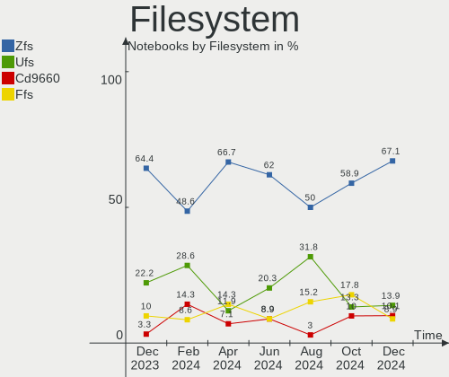
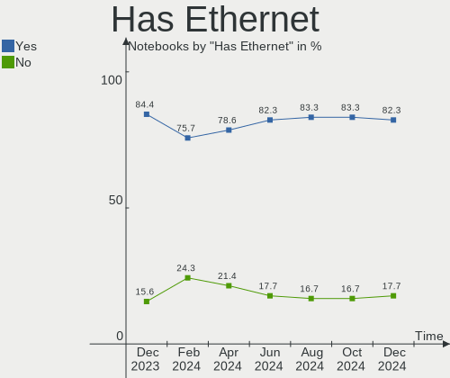
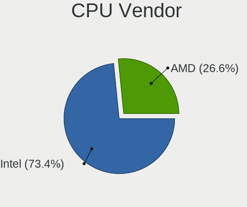
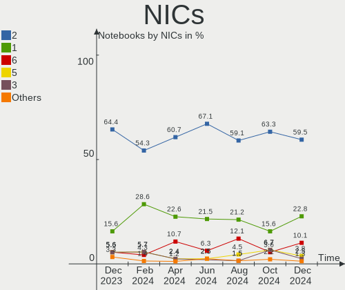

BSD - Hardware Trends (Notebooks)
---------------------------------

A project to identify most popular hardware characteristics and track their change
over time based on data collected by BSD users at https://BSD-Hardware.info.

Anyone can contribute to this report by the [hw-probe](https://github.com/linuxhw/hw-probe/blob/master/INSTALL.BSD.md) tool:

    hw-probe -all -upload

This report is for one last month. Overall report since the beginning of time: [TestCoverage](https://github.com/bsdhw/TestCoverage)

Period: Sep, 2022.

Contents
--------

* [ System ](#system)
  - [ OS                       ](#os)
  - [ OS Family                ](#os-family)
  - [ Arch                     ](#arch)
  - [ DE                       ](#de)
  - [ Display Server           ](#display-server)
  - [ Display Manager          ](#display-manager)
  - [ OS Lang                  ](#os-lang)
  - [ Boot Mode                ](#boot-mode)
  - [ Filesystem               ](#filesystem)
  - [ Part. scheme             ](#part-scheme)

* [ Board ](#board)
  - [ Vendor                   ](#vendor)
  - [ Model                    ](#model)
  - [ Model Family             ](#model-family)
  - [ MFG Year                 ](#mfg-year)
  - [ Form Factor              ](#form-factor)
  - [ Coreboot                 ](#coreboot)
  - [ RAM Size                 ](#ram-size)
  - [ RAM Used                 ](#ram-used)
  - [ Total Drives             ](#total-drives)
  - [ Has CD-ROM               ](#has-cd-rom)
  - [ Has Ethernet             ](#has-ethernet)
  - [ Has WiFi                 ](#has-wifi)
  - [ Has Bluetooth            ](#has-bluetooth)

* [ Location ](#location)
  - [ Country                  ](#country)
  - [ City                     ](#city)

* [ Drives ](#drives)
  - [ Drive Vendor             ](#drive-vendor)
  - [ Drive Model              ](#drive-model)
  - [ HDD Vendor               ](#hdd-vendor)
  - [ SSD Vendor               ](#ssd-vendor)
  - [ Drive Kind               ](#drive-kind)
  - [ Drive Connector          ](#drive-connector)
  - [ Drive Size               ](#drive-size)
  - [ Space Total              ](#space-total)
  - [ Space Used               ](#space-used)
  - [ Malfunc. Drives          ](#malfunc-drives)
  - [ Malfunc. Drive Vendor    ](#malfunc-drive-vendor)
  - [ Malfunc. HDD Vendor      ](#malfunc-hdd-vendor)
  - [ Malfunc. Drive Kind      ](#malfunc-drive-kind)
  - [ Failed Drives            ](#failed-drives)
  - [ Failed Drive Vendor      ](#failed-drive-vendor)
  - [ Drive Status             ](#drive-status)

* [ Storage controller ](#storage-controller)
  - [ Storage Vendor           ](#storage-vendor)
  - [ Storage Model            ](#storage-model)
  - [ Storage Kind             ](#storage-kind)

* [ Processor ](#processor)
  - [ CPU Vendor               ](#cpu-vendor)
  - [ CPU Model                ](#cpu-model)
  - [ CPU Model Family         ](#cpu-model-family)
  - [ CPU Cores                ](#cpu-cores)
  - [ CPU Sockets              ](#cpu-sockets)
  - [ CPU Threads              ](#cpu-threads)
  - [ CPU Microarch            ](#cpu-microarch)

* [ Graphics ](#graphics)
  - [ GPU Vendor               ](#gpu-vendor)
  - [ GPU Model                ](#gpu-model)
  - [ GPU Combo                ](#gpu-combo)
  - [ GPU Driver               ](#gpu-driver)
  - [ GPU Memory               ](#gpu-memory)

* [ Monitor ](#monitor)
  - [ Monitor Vendor           ](#monitor-vendor)
  - [ Monitor Model            ](#monitor-model)
  - [ Monitor Resolution       ](#monitor-resolution)
  - [ Monitor Diagonal         ](#monitor-diagonal)
  - [ Monitor Width            ](#monitor-width)
  - [ Aspect Ratio             ](#aspect-ratio)
  - [ Monitor Area             ](#monitor-area)
  - [ Pixel Density            ](#pixel-density)
  - [ Multiple Monitors        ](#multiple-monitors)

* [ Network ](#network)
  - [ Net Controller Vendor    ](#net-controller-vendor)
  - [ Net Controller Model     ](#net-controller-model)
  - [ Wireless Vendor          ](#wireless-vendor)
  - [ Wireless Model           ](#wireless-model)
  - [ Ethernet Vendor          ](#ethernet-vendor)
  - [ Ethernet Model           ](#ethernet-model)
  - [ Net Controller Kind      ](#net-controller-kind)
  - [ Used Controller          ](#used-controller)
  - [ NICs                     ](#nics)
  - [ IPv6                     ](#ipv6)

* [ Bluetooth ](#bluetooth)
  - [ Bluetooth Vendor         ](#bluetooth-vendor)
  - [ Bluetooth Model          ](#bluetooth-model)

* [ Sound ](#sound)
  - [ Sound Vendor             ](#sound-vendor)
  - [ Sound Model              ](#sound-model)

* [ Memory ](#memory)
  - [ Memory Vendor            ](#memory-vendor)
  - [ Memory Model             ](#memory-model)
  - [ Memory Kind              ](#memory-kind)
  - [ Memory Form Factor       ](#memory-form-factor)
  - [ Memory Size              ](#memory-size)
  - [ Memory Speed             ](#memory-speed)

* [ Printers & scanners ](#printers--scanners)
  - [ Printer Vendor           ](#printer-vendor)
  - [ Printer Model            ](#printer-model)
  - [ Scanner Vendor           ](#scanner-vendor)
  - [ Scanner Model            ](#scanner-model)

* [ Camera ](#camera)
  - [ Camera Vendor            ](#camera-vendor)
  - [ Camera Model             ](#camera-model)

* [ Security ](#security)
  - [ Fingerprint Vendor       ](#fingerprint-vendor)
  - [ Fingerprint Model        ](#fingerprint-model)
  - [ Chipcard Vendor          ](#chipcard-vendor)
  - [ Chipcard Model           ](#chipcard-model)

* [ Unsupported ](#unsupported)
  - [ Unsupported Devices      ](#unsupported-devices)
  - [ Unsupported Device Types ](#unsupported-device-types)

System
------

OS
--

Installed operating systems

| Name                     | Notebooks | Percent |
|--------------------------|-----------|---------|
| FreeBSD 13.1-p2          | 12        | 19.35%  |
| OPNsense 22.7.4          | 11        | 17.74%  |
| helloSystem 0.7.0        | 8         | 12.9%   |
| FreeBSD 13.1             | 8         | 12.9%   |
| helloSystem 0.8.0        | 4         | 6.45%   |
| FreeBSD 14.0-CURRENT     | 3         | 4.84%   |
| OPNsense 23.1            | 2         | 3.23%   |
| OPNsense 22.4.3          | 2         | 3.23%   |
| OpenBSD 7.1              | 2         | 3.23%   |
| GhostBSD 22.08.23        | 2         | 3.23%   |
| FreeBSD 13.1-STABLE      | 2         | 3.23%   |
| FreeBSD 12.3-p5          | 2         | 3.23%   |
| OPNsense 22.7.3          | 1         | 1.61%   |
| NomadBSD 5806f915        | 1         | 1.61%   |
| FreeBSD 13.1-STABLE-HBSD | 1         | 1.61%   |
| FreeBSD 12.3-p7          | 1         | 1.61%   |

OS Family
---------

OS without a version

| Name        | Notebooks | Percent |
|-------------|-----------|---------|
| FreeBSD     | 29        | 46.77%  |
| OPNsense    | 16        | 25.81%  |
| helloSystem | 12        | 19.35%  |
| OpenBSD     | 2         | 3.23%   |
| GhostBSD    | 2         | 3.23%   |
| NomadBSD    | 1         | 1.61%   |

Arch
----

OS architecture (x86_64, i586, etc.)

| Name  | Notebooks | Percent |
|-------|-----------|---------|
| amd64 | 59        | 95.16%  |
| i386  | 3         | 4.84%   |

DE
--

Desktop Environment

| Name         | Notebooks | Percent |
|--------------|-----------|---------|
| Console      | 18        | 29.03%  |
| helloDesktop | 13        | 20.97%  |
| XFCE         | 11        | 17.74%  |
| KDE5         | 10        | 16.13%  |
| GNOME        | 3         | 4.84%   |
| TWM          | 2         | 3.23%   |
| Openbox      | 2         | 3.23%   |
| i3           | 2         | 3.23%   |
| MATE         | 1         | 1.61%   |

Display Server
--------------

X11 or Wayland

| Name    | Notebooks | Percent |
|---------|-----------|---------|
| X11     | 41        | 66.13%  |
| Console | 19        | 30.65%  |
| Wayland | 2         | 3.23%   |

Display Manager
---------------

SDDM, LightDM, etc.

| Name    | Notebooks | Percent |
|---------|-----------|---------|
| Console | 29        | 46.77%  |
| SLiM    | 18        | 29.03%  |
| SDDM    | 8         | 12.9%   |
| XDM     | 3         | 4.84%   |
| LightDM | 3         | 4.84%   |
| GDM     | 1         | 1.61%   |

OS Lang
-------

Language

| Lang    | Notebooks | Percent |
|---------|-----------|---------|
| Unknown | 23        | 37.1%   |
| C       | 20        | 32.26%  |
| en_US   | 13        | 20.97%  |
| ru_RU   | 2         | 3.23%   |
| zh_CN   | 1         | 1.61%   |
| fr_FR   | 1         | 1.61%   |
| en_CA   | 1         | 1.61%   |
| de_DE   | 1         | 1.61%   |

Boot Mode
---------

EFI or BIOS

| Mode | Notebooks | Percent |
|------|-----------|---------|
| EFI  | 51        | 82.26%  |
| BIOS | 11        | 17.74%  |

Filesystem
----------

Type of filesystem

| Type   | Notebooks | Percent |
|--------|-----------|---------|
| Zfs    | 32        | 51.61%  |
| Ufs    | 20        | 32.26%  |
| Cd9660 | 8         | 12.9%   |
| Ffs    | 2         | 3.23%   |

Part. scheme
------------

Scheme of partitioning

| Type    | Notebooks | Percent |
|---------|-----------|---------|
| GPT     | 57        | 91.94%  |
| MBR     | 4         | 6.45%   |
| Unknown | 1         | 1.61%   |

Board
-----

Vendor
------

Motherboard manufacturer

| Name                | Notebooks | Percent |
|---------------------|-----------|---------|
| Lenovo              | 14        | 22.58%  |
| Dell                | 12        | 19.35%  |
| Deciso              | 6         | 9.68%   |
| Hewlett-Packard     | 4         | 6.45%   |
| Toshiba             | 3         | 4.84%   |
| Apple               | 3         | 4.84%   |
| System76            | 2         | 3.23%   |
| Intel               | 2         | 3.23%   |
| IBM                 | 2         | 3.23%   |
| Gigabyte Technology | 2         | 3.23%   |
| ASUSTek Computer    | 2         | 3.23%   |
| Acer                | 2         | 3.23%   |
| Valve               | 1         | 1.61%   |
| TUXEDO              | 1         | 1.61%   |
| Tactus              | 1         | 1.61%   |
| SIEMENS             | 1         | 1.61%   |
| Kraftway            | 1         | 1.61%   |
| Google              | 1         | 1.61%   |
| Fujitsu             | 1         | 1.61%   |
| Unknown             | 1         | 1.61%   |

Model
-----

Motherboard model

| Name                                        | Notebooks | Percent |
|---------------------------------------------|-----------|---------|
| System76 Gazelle                            | 2         | 3.23%   |
| HP EliteBook 840 G3                         | 2         | 3.23%   |
| Gigabyte GB-BSi5A-6200                      | 2         | 3.23%   |
| Dell Precision 7710                         | 2         | 3.23%   |
| Deciso NetBoard-A10                         | 2         | 3.23%   |
| Deciso Netboard A20                         | 2         | 3.23%   |
| Valve Jupiter                               | 1         | 1.61%   |
| TUXEDO Pulse 15 Gen2                        | 1         | 1.61%   |
| Toshiba Satellite BE96-F299                 | 1         | 1.61%   |
| Toshiba Satellite A200                      | 1         | 1.61%   |
| Toshiba PORTEGE R700                        | 1         | 1.61%   |
| Tactus GeoFlex 110                          | 1         | 1.61%   |
| SIEMENS SIMATIC IPC127E                     | 1         | 1.61%   |
| Lenovo ThinkPad X61 Tablet 7763AD6          | 1         | 1.61%   |
| Lenovo ThinkPad X270 20HMS2LL00             | 1         | 1.61%   |
| Lenovo ThinkPad X250 20CLS1WP01             | 1         | 1.61%   |
| Lenovo ThinkPad X250 20CL001GUS             | 1         | 1.61%   |
| Lenovo ThinkPad X1 Extreme Gen 3 20TKS0QB00 | 1         | 1.61%   |
| Lenovo ThinkPad W530 2436CTO                | 1         | 1.61%   |
| Lenovo ThinkPad T460p 20FW003PMZ            | 1         | 1.61%   |
| Lenovo ThinkPad T440 20B7S2LT00             | 1         | 1.61%   |
| Lenovo ThinkPad P53 20QNCTO1WW              | 1         | 1.61%   |
| Lenovo ThinkPad L420 7829WDY                | 1         | 1.61%   |
| Lenovo Legion Y540-17IRH 81Q4               | 1         | 1.61%   |
| Lenovo IdeaPad Gaming 3 15ACH6 82K2         | 1         | 1.61%   |
| Lenovo G50-30 80G0                          | 1         | 1.61%   |
| Lenovo G475 20080                           | 1         | 1.61%   |
| Kraftway KW10T                              | 1         | 1.61%   |
| Intel SandyBridge Platform                  | 1         | 1.61%   |
| Intel H81U                                  | 1         | 1.61%   |
| IBM ThinkPad T43 18714AG                    | 1         | 1.61%   |
| IBM ThinkPad T40 23737CG                    | 1         | 1.61%   |
| HP Pavilion dv6700                          | 1         | 1.61%   |
| HP EliteBook 8570p                          | 1         | 1.61%   |
| Google Peppy                                | 1         | 1.61%   |
| Fujitsu LIFEBOOK A532                       | 1         | 1.61%   |
| Dell XPS M1330                              | 1         | 1.61%   |
| Dell XPS 13 9343                            | 1         | 1.61%   |
| Dell Vostro 5415                            | 1         | 1.61%   |
| Dell System Vostro 3750                     | 1         | 1.61%   |

Model Family
------------

Motherboard model prefix

| Name                   | Notebooks | Percent |
|------------------------|-----------|---------|
| Lenovo ThinkPad        | 10        | 16.13%  |
| Dell Precision         | 4         | 6.45%   |
| HP EliteBook           | 3         | 4.84%   |
| Dell Latitude          | 3         | 4.84%   |
| Toshiba Satellite      | 2         | 3.23%   |
| System76 Gazelle       | 2         | 3.23%   |
| IBM ThinkPad           | 2         | 3.23%   |
| Gigabyte GB-BSi5A-6200 | 2         | 3.23%   |
| Dell XPS               | 2         | 3.23%   |
| Deciso NetBoard-A10    | 2         | 3.23%   |
| Deciso Netboard        | 2         | 3.23%   |
| Valve Jupiter          | 1         | 1.61%   |
| TUXEDO Pulse           | 1         | 1.61%   |
| Toshiba PORTEGE        | 1         | 1.61%   |
| Tactus GeoFlex         | 1         | 1.61%   |
| SIEMENS SIMATIC        | 1         | 1.61%   |
| Lenovo Legion          | 1         | 1.61%   |
| Lenovo IdeaPad         | 1         | 1.61%   |
| Lenovo G50-30          | 1         | 1.61%   |
| Lenovo G475            | 1         | 1.61%   |
| Kraftway KW10T         | 1         | 1.61%   |
| Intel SandyBridge      | 1         | 1.61%   |
| Intel H81U             | 1         | 1.61%   |
| HP Pavilion            | 1         | 1.61%   |
| Google Peppy           | 1         | 1.61%   |
| Fujitsu LIFEBOOK       | 1         | 1.61%   |
| Dell Vostro            | 1         | 1.61%   |
| Dell System            | 1         | 1.61%   |
| Dell Inspiron          | 1         | 1.61%   |
| Deciso OPNsense        | 1         | 1.61%   |
| Deciso DEC2700         | 1         | 1.61%   |
| ASUS X455LJ            | 1         | 1.61%   |
| ASUS VivoBook          | 1         | 1.61%   |
| Apple MacBookPro8      | 1         | 1.61%   |
| Apple MacBookPro5      | 1         | 1.61%   |
| Apple MacBook5         | 1         | 1.61%   |
| Acer Swift             | 1         | 1.61%   |
| Acer Aspire            | 1         | 1.61%   |
| Unknown                | 1         | 1.61%   |

MFG Year
--------

Motherboard manufacture year

| Year | Notebooks | Percent |
|------|-----------|---------|
| 2021 | 10        | 16.13%  |
| 2022 | 9         | 14.52%  |
| 2016 | 8         | 12.9%   |
| 2012 | 6         | 9.68%   |
| 2020 | 5         | 8.06%   |
| 2019 | 5         | 8.06%   |
| 2015 | 4         | 6.45%   |
| 2011 | 3         | 4.84%   |
| 2014 | 2         | 3.23%   |
| 2013 | 2         | 3.23%   |
| 2008 | 2         | 3.23%   |
| 2018 | 1         | 1.61%   |
| 2017 | 1         | 1.61%   |
| 2009 | 1         | 1.61%   |
| 2007 | 1         | 1.61%   |
| 2006 | 1         | 1.61%   |
| 2003 | 1         | 1.61%   |

Form Factor
-----------

Physical design of the computer

| Name     | Notebooks | Percent |
|----------|-----------|---------|
| Notebook | 62        | 100%    |

Coreboot
--------

Have coreboot on board

| Used | Notebooks | Percent |
|------|-----------|---------|
| No   | 60        | 96.77%  |
| Yes  | 2         | 3.23%   |

RAM Size
--------

Total RAM memory

| Size in GB  | Notebooks | Percent |
|-------------|-----------|---------|
| 8.01-16.0   | 18        | 29.03%  |
| 16.01-24.0  | 15        | 24.19%  |
| 4.01-8.0    | 13        | 20.97%  |
| 32.01-64.0  | 5         | 8.06%   |
| 2.01-3.0    | 3         | 4.84%   |
| 64.01-256.0 | 3         | 4.84%   |
| 3.01-4.0    | 2         | 3.23%   |
| 24.01-32.0  | 2         | 3.23%   |
| 0.01-0.5    | 1         | 1.61%   |

RAM Used
--------

Used RAM memory

| Used GB  | Notebooks | Percent |
|----------|-----------|---------|
| 0.01-0.5 | 28        | 45.16%  |
| 0.51-1.0 | 20        | 32.26%  |
| 1.01-2.0 | 9         | 14.52%  |
| 2.01-3.0 | 4         | 6.45%   |
| 0        | 1         | 1.61%   |

Total Drives
------------

Number of drives on board

| Drives | Notebooks | Percent |
|--------|-----------|---------|
| 1      | 46        | 74.19%  |
| 2      | 11        | 17.74%  |
| 0      | 3         | 4.84%   |
| 3      | 2         | 3.23%   |

Has CD-ROM
----------

Has CD-ROM on board

| Presented | Notebooks | Percent |
|-----------|-----------|---------|
| No        | 48        | 77.42%  |
| Yes       | 14        | 22.58%  |

Has Ethernet
------------

Has Ethernet on board

| Presented | Notebooks | Percent |
|-----------|-----------|---------|
| Yes       | 51        | 82.26%  |
| No        | 11        | 17.74%  |

Has WiFi
--------

Has WiFi module

| Presented | Notebooks | Percent |
|-----------|-----------|---------|
| Yes       | 50        | 80.65%  |
| No        | 12        | 19.35%  |

Has Bluetooth
-------------

Has Bluetooth module

| Presented | Notebooks | Percent |
|-----------|-----------|---------|
| Yes       | 38        | 61.29%  |
| No        | 24        | 38.71%  |

Location
--------

Country
-------

Geographic location (country)

| Country     | Notebooks | Percent |
|-------------|-----------|---------|
| USA         | 12        | 19.35%  |
| Germany     | 8         | 12.9%   |
| Russia      | 5         | 8.06%   |
| UK          | 4         | 6.45%   |
| Switzerland | 4         | 6.45%   |
| Canada      | 4         | 6.45%   |
| Slovakia    | 2         | 3.23%   |
| Poland      | 2         | 3.23%   |
| Netherlands | 2         | 3.23%   |
| Denmark     | 2         | 3.23%   |
| China       | 2         | 3.23%   |
| Belgium     | 2         | 3.23%   |
| Turkey      | 1         | 1.61%   |
| South Korea | 1         | 1.61%   |
| Romania     | 1         | 1.61%   |
| Norway      | 1         | 1.61%   |
| Indonesia   | 1         | 1.61%   |
| India       | 1         | 1.61%   |
| Hungary     | 1         | 1.61%   |
| Greece      | 1         | 1.61%   |
| Finland     | 1         | 1.61%   |
| Egypt       | 1         | 1.61%   |
| Czechia     | 1         | 1.61%   |
| Brazil      | 1         | 1.61%   |
| Argentina   | 1         | 1.61%   |

City
----

Geographic location (city)

| City             | Notebooks | Percent |
|------------------|-----------|---------|
| Moscow           | 2         | 3.23%   |
| Martin           | 2         | 3.23%   |
| London           | 2         | 3.23%   |
| Habichtswald     | 2         | 3.23%   |
| Zurich           | 1         | 1.61%   |
| Yangcheon-gu     | 1         | 1.61%   |
| Xiamen           | 1         | 1.61%   |
| Wroclaw          | 1         | 1.61%   |
| Warsaw           | 1         | 1.61%   |
| Vollen           | 1         | 1.61%   |
| Vancouver        | 1         | 1.61%   |
| Ufa              | 1         | 1.61%   |
| Tanta            | 1         | 1.61%   |
| Surakarta        | 1         | 1.61%   |
| Stratford        | 1         | 1.61%   |
| St Petersburg    | 1         | 1.61%   |
| Seattle          | 1         | 1.61%   |
| San Bernardino   | 1         | 1.61%   |
| San Antonio      | 1         | 1.61%   |
| Roswell          | 1         | 1.61%   |
| Renton           | 1         | 1.61%   |
| Qinnan           | 1         | 1.61%   |
| Princeton        | 1         | 1.61%   |
| Prague           | 1         | 1.61%   |
| Olympia          | 1         | 1.61%   |
| Offenburg        | 1         | 1.61%   |
| New York         | 1         | 1.61%   |
| Nepean           | 1         | 1.61%   |
| Munnikens-Vinkel | 1         | 1.61%   |
| Munich           | 1         | 1.61%   |
| Moosseedorf      | 1         | 1.61%   |
| Mendoza          | 1         | 1.61%   |
| Lutry            | 1         | 1.61%   |
| Ludwigsburg      | 1         | 1.61%   |
| Lübeck          | 1         | 1.61%   |
| Krefeld          | 1         | 1.61%   |
| Kongens Lyngby   | 1         | 1.61%   |
| Kingsburg        | 1         | 1.61%   |
| Kiesen           | 1         | 1.61%   |
| Kazincbarcika    | 1         | 1.61%   |

Drives
------

Drive Vendor
------------

Hard drive vendors

| Vendor              | Notebooks | Drives | Percent |
|---------------------|-----------|--------|---------|
| Samsung Electronics | 14        | 17     | 19.44%  |
| WDC                 | 9         | 9      | 12.5%   |
| Transcend           | 8         | 8      | 11.11%  |
| Toshiba             | 5         | 5      | 6.94%   |
| Seagate             | 4         | 4      | 5.56%   |
| SanDisk             | 4         | 4      | 5.56%   |
| Hitachi             | 4         | 4      | 5.56%   |
| Kingston            | 3         | 3      | 4.17%   |
| Intel               | 3         | 3      | 4.17%   |
| Micron Technology   | 2         | 2      | 2.78%   |
| Lexar               | 2         | 2      | 2.78%   |
| KIOXIA              | 2         | 2      | 2.78%   |
| Silicon Motion      | 1         | 1      | 1.39%   |
| Phison              | 1         | 1      | 1.39%   |
| Patriot             | 1         | 1      | 1.39%   |
| OCZ                 | 1         | 1      | 1.39%   |
| Leven               | 1         | 1      | 1.39%   |
| KingSpec            | 1         | 1      | 1.39%   |
| KingDian            | 1         | 1      | 1.39%   |
| Hikvision           | 1         | 1      | 1.39%   |
| HGST                | 1         | 1      | 1.39%   |
| Fujitsu             | 1         | 1      | 1.39%   |
| FORESEE             | 1         | 1      | 1.39%   |
| A-DATA Technology   | 1         | 1      | 1.39%   |

Drive Model
-----------

Hard drive models

| Model                                           | Notebooks | Percent |
|-------------------------------------------------|-----------|---------|
| Transcend TS256GMTS952T2 256GB                  | 3         | 4.05%   |
| Transcend TS256GMTE652T2 256GB                  | 2         | 2.7%    |
| Transcend TS128GMTE110S 128GB                   | 2         | 2.7%    |
| Samsung SSD 980 PRO 1TB                         | 2         | 2.7%    |
| Samsung SSD 970 EVO Plus 1TB                    | 2         | 2.7%    |
| WDC WDS500G3X0C-00SJG0 500GB                    | 1         | 1.35%   |
| WDC WDS480G2G0A-00JH30 480GB                    | 1         | 1.35%   |
| WDC WDS250G2B0B-00YS70 250GB                    | 1         | 1.35%   |
| WDC WDBNCE5000PNC 500GB                         | 1         | 1.35%   |
| WDC WD7500BPVX-00JC3T0 752GB                    | 1         | 1.35%   |
| WDC WD5000LPCX-60VHAT0 500GB                    | 1         | 1.35%   |
| WDC WD3200BEKX-75B7WT0 320GB                    | 1         | 1.35%   |
| WDC PC SN730 SDBQNTY-256G-1001 256GB            | 1         | 1.35%   |
| WDC PC SN730 SDBQNTY-1T00-1001 1TB              | 1         | 1.35%   |
| Transcend TSG128MTS400ISI 128GB                 | 1         | 1.35%   |
| Toshiba MQ01UBD100 1TB                          | 1         | 1.35%   |
| Toshiba MK8034GSX 80GB                          | 1         | 1.35%   |
| Toshiba MK6475GSX 640GB                         | 1         | 1.35%   |
| Toshiba MK5076GSX 500GB                         | 1         | 1.35%   |
| Toshiba KXG60ZNV512G 512GB                      | 1         | 1.35%   |
| Silicon Motion Asgard AN2+ 256NVMe-M.2-80 256GB | 1         | 1.35%   |
| Seagate ST9320423AS 320GB                       | 1         | 1.35%   |
| Seagate ST9160412AS 160GB                       | 1         | 1.35%   |
| Seagate ST2000LM003 HN-M201RAD 2TB              | 1         | 1.35%   |
| Seagate ST1000LM049-2GH172 1TB                  | 1         | 1.35%   |
| SanDisk X400 M.2 2280 256GB                     | 1         | 1.35%   |
| SanDisk SDSSDH3 1T02 1TB                        | 1         | 1.35%   |
| SanDisk SD8SNAT256G1122 256GB                   | 1         | 1.35%   |
| SanDisk SD8SB8U128G1001 128GB                   | 1         | 1.35%   |
| Samsung SSD PM851 M.2 2280 256GB                | 1         | 1.35%   |
| Samsung SSD PM810 2.5-inch 256GB                | 1         | 1.35%   |
| Samsung SSD 970 EVO 500GB                       | 1         | 1.35%   |
| Samsung SSD 870 QVO 1TB                         | 1         | 1.35%   |
| Samsung SSD 870 EVO 250GB                       | 1         | 1.35%   |
| Samsung SSD 850 EVO 250GB                       | 1         | 1.35%   |
| Samsung SSD 850 EVO 1TB                         | 1         | 1.35%   |
| Samsung SSD 840 PRO Series 256GB                | 1         | 1.35%   |
| Samsung SM951 NVMe 512GB                        | 1         | 1.35%   |
| Samsung PM961 NVMe 256GB                        | 1         | 1.35%   |
| Samsung MZNLN256HCHP-000H1 256GB                | 1         | 1.35%   |

HDD Vendor
----------

Hard disk drive vendors

| Vendor  | Notebooks | Drives | Percent |
|---------|-----------|--------|---------|
| Toshiba | 4         | 4      | 23.53%  |
| Seagate | 4         | 4      | 23.53%  |
| Hitachi | 4         | 4      | 23.53%  |
| WDC     | 3         | 3      | 17.65%  |
| HGST    | 1         | 1      | 5.88%   |
| Fujitsu | 1         | 1      | 5.88%   |

SSD Vendor
----------

Solid state drive vendors

| Vendor              | Notebooks | Drives | Percent |
|---------------------|-----------|--------|---------|
| Samsung Electronics | 8         | 8      | 25%     |
| Transcend           | 4         | 4      | 12.5%   |
| SanDisk             | 4         | 4      | 12.5%   |
| WDC                 | 3         | 3      | 9.38%   |
| Lexar               | 2         | 2      | 6.25%   |
| Kingston            | 2         | 2      | 6.25%   |
| Patriot             | 1         | 1      | 3.13%   |
| OCZ                 | 1         | 1      | 3.13%   |
| Leven               | 1         | 1      | 3.13%   |
| KingSpec            | 1         | 1      | 3.13%   |
| KingDian            | 1         | 1      | 3.13%   |
| Intel               | 1         | 1      | 3.13%   |
| Hikvision           | 1         | 1      | 3.13%   |
| FORESEE             | 1         | 1      | 3.13%   |
| A-DATA Technology   | 1         | 1      | 3.13%   |

Drive Kind
----------

HDD or SSD

| Kind | Notebooks | Drives | Percent |
|------|-----------|--------|---------|
| SSD  | 28        | 32     | 43.75%  |
| NVMe | 21        | 26     | 32.81%  |
| HDD  | 15        | 17     | 23.44%  |

Drive Connector
---------------

SATA, SAS, NVMe, etc.

| Type | Notebooks | Drives | Percent |
|------|-----------|--------|---------|
| SATA | 43        | 49     | 67.19%  |
| NVMe | 21        | 26     | 32.81%  |

Drive Size
----------

Size of hard drive

| Size in TB | Notebooks | Drives | Percent |
|------------|-----------|--------|---------|
| 0.01-0.5   | 34        | 39     | 77.27%  |
| 0.51-1.0   | 8         | 8      | 18.18%  |
| 1.01-2.0   | 2         | 2      | 4.55%   |

Space Total
-----------

Amount of disk space available on the file system

| Size in GB | Notebooks | Percent |
|------------|-----------|---------|
| 101-250    | 34        | 54.84%  |
| 251-500    | 10        | 16.13%  |
| 1-20       | 8         | 12.9%   |
| 21-50      | 3         | 4.84%   |
| 51-100     | 3         | 4.84%   |
| 501-1000   | 2         | 3.23%   |
| 2001-3000  | 1         | 1.61%   |
| Unknown    | 1         | 1.61%   |

Space Used
----------

Amount of used disk space

| Used GB | Notebooks | Percent |
|---------|-----------|---------|
| 1-20    | 51        | 82.26%  |
| 21-50   | 6         | 9.68%   |
| 101-250 | 3         | 4.84%   |
| 51-100  | 1         | 1.61%   |
| Unknown | 1         | 1.61%   |

Malfunc. Drives
---------------

Drive models with a malfunction

| Model                          | Notebooks | Drives | Percent |
|--------------------------------|-----------|--------|---------|
| WDC WD5000LPCX-60VHAT0 500GB   | 1         | 1      | 8.33%   |
| Toshiba MK8034GSX 80GB         | 1         | 1      | 8.33%   |
| Toshiba MK6475GSX 640GB        | 1         | 1      | 8.33%   |
| Toshiba MK5076GSX 500GB        | 1         | 1      | 8.33%   |
| Seagate ST9160412AS 160GB      | 1         | 1      | 8.33%   |
| Patriot Inferno 60GB SSD       | 1         | 1      | 8.33%   |
| OCZ AGILITY3 240GB             | 1         | 1      | 8.33%   |
| Kingston SNS4151S316GD 16GB    | 1         | 1      | 8.33%   |
| Intel SSDSCKKF256G8H 256GB     | 1         | 1      | 8.33%   |
| Hitachi HTS548040M9AT00 37GB   | 1         | 1      | 8.33%   |
| HGST HTS721010A9E630 1TB       | 1         | 1      | 8.33%   |
| Fujitsu MHZ2160BH FFS G1 160GB | 1         | 1      | 8.33%   |

Malfunc. Drive Vendor
---------------------

Vendors of faulty drives

| Vendor   | Notebooks | Drives | Percent |
|----------|-----------|--------|---------|
| Toshiba  | 3         | 3      | 25%     |
| WDC      | 1         | 1      | 8.33%   |
| Seagate  | 1         | 1      | 8.33%   |
| Patriot  | 1         | 1      | 8.33%   |
| OCZ      | 1         | 1      | 8.33%   |
| Kingston | 1         | 1      | 8.33%   |
| Intel    | 1         | 1      | 8.33%   |
| Hitachi  | 1         | 1      | 8.33%   |
| HGST     | 1         | 1      | 8.33%   |
| Fujitsu  | 1         | 1      | 8.33%   |

Malfunc. HDD Vendor
-------------------

Vendors of faulty HDD drives

| Vendor  | Notebooks | Drives | Percent |
|---------|-----------|--------|---------|
| Toshiba | 3         | 3      | 37.5%   |
| WDC     | 1         | 1      | 12.5%   |
| Seagate | 1         | 1      | 12.5%   |
| Hitachi | 1         | 1      | 12.5%   |
| HGST    | 1         | 1      | 12.5%   |
| Fujitsu | 1         | 1      | 12.5%   |

Malfunc. Drive Kind
-------------------

Kinds of faulty drives

| Kind | Notebooks | Drives | Percent |
|------|-----------|--------|---------|
| HDD  | 6         | 8      | 60%     |
| SSD  | 4         | 4      | 40%     |

Failed Drives
-------------

Failed drive models

Zero info for selected period =(

Failed Drive Vendor
-------------------

Failed drive vendors

Zero info for selected period =(

Drive Status
------------

Number of failed and malfunc. drives

| Status  | Notebooks | Drives | Percent |
|---------|-----------|--------|---------|
| Works   | 51        | 63     | 83.61%  |
| Malfunc | 10        | 12     | 16.39%  |

Storage controller
------------------

Storage Vendor
--------------

Storage controller vendors

| Vendor                      | Notebooks | Percent |
|-----------------------------|-----------|---------|
| Intel                       | 43        | 58.9%   |
| Samsung Electronics         | 6         | 8.22%   |
| AMD                         | 6         | 8.22%   |
| SanDisk                     | 4         | 5.48%   |
| Unknown                     | 3         | 4.11%   |
| Silicon Motion              | 2         | 2.74%   |
| Nvidia                      | 2         | 2.74%   |
| Micron Technology           | 2         | 2.74%   |
| KIOXIA                      | 2         | 2.74%   |
| Toshiba                     | 1         | 1.37%   |
| Phison Electronics          | 1         | 1.37%   |
| Kingston Technology Company | 1         | 1.37%   |

Storage Model
-------------

Storage controller models

| Model                                                                         | Notebooks | Percent |
|-------------------------------------------------------------------------------|-----------|---------|
| Unknown                                                                       | 7         | 8.86%   |
| Intel Wildcat Point-LP SATA Controller [AHCI Mode]                            | 6         | 7.59%   |
| Intel Sunrise Point-LP SATA Controller [AHCI mode]                            | 5         | 6.33%   |
| AMD FCH SATA Controller [AHCI mode]                                           | 5         | 6.33%   |
| Intel 7 Series Chipset Family 6-port SATA Controller [AHCI mode]              | 4         | 5.06%   |
| SanDisk WD Black SN750 / PC SN730 NVMe SSD                                    | 3         | 3.8%    |
| Intel Q170/Q150/B150/H170/H110/Z170/CM236 Chipset SATA Controller [AHCI Mode] | 3         | 3.8%    |
| Intel Cannon Lake Mobile PCH SATA AHCI Controller                             | 3         | 3.8%    |
| Intel 82801HM/HEM (ICH8M/ICH8M-E) SATA Controller [AHCI mode]                 | 3         | 3.8%    |
| Intel 82801HM/HEM (ICH8M/ICH8M-E) IDE Controller                              | 3         | 3.8%    |
| Intel 6 Series/C200 Series Chipset Family 6 port Mobile SATA AHCI Controller  | 3         | 3.8%    |
| Silicon Motion SM2263EN/SM2263XT SSD Controller                               | 2         | 2.53%   |
| Samsung NVMe SSD Controller SM981/PM981/PM983                                 | 2         | 2.53%   |
| Samsung NVMe SSD Controller PM9A1/PM9A3/980PRO                                | 2         | 2.53%   |
| Nvidia MCP79 AHCI Controller                                                  | 2         | 2.53%   |
| KIOXIA NVMe SSD Controller BG4                                                | 2         | 2.53%   |
| Intel Atom Processor E3800 Series SATA AHCI Controller                        | 2         | 2.53%   |
| Intel 8 Series SATA Controller 1 [AHCI mode]                                  | 2         | 2.53%   |
| Toshiba XG6 NVMe SSD Controller                                               | 1         | 1.27%   |
| SanDisk WD Black NVMe SSD                                                     | 1         | 1.27%   |
| Samsung NVMe SSD Controller SM961/PM961/SM963                                 | 1         | 1.27%   |
| Samsung NVMe SSD Controller SM951/PM951                                       | 1         | 1.27%   |
| Samsung NVMe SSD Controller 980                                               | 1         | 1.27%   |
| Phison E12 NVMe Controller                                                    | 1         | 1.27%   |
| Intel Tiger Lake-LP SATA Controller                                           | 1         | 1.27%   |
| Intel SSD 660P Series                                                         | 1         | 1.27%   |
| Intel HM170/QM170 Chipset SATA Controller [AHCI Mode]                         | 1         | 1.27%   |
| Intel Comet Lake SATA AHCI Controller                                         | 1         | 1.27%   |
| Intel Celeron/Pentium Silver Processor SATA Controller                        | 1         | 1.27%   |
| Intel Celeron N3350/Pentium N4200/Atom E3900 Series SATA AHCI Controller      | 1         | 1.27%   |
| Intel 82801GBM/GHM (ICH7-M Family) SATA Controller [IDE mode]                 | 1         | 1.27%   |
| Intel 82801FBM (ICH6M) SATA Controller                                        | 1         | 1.27%   |
| Intel 82801DBM (ICH4-M) IDE Controller                                        | 1         | 1.27%   |
| Intel 82801 Mobile SATA Controller [RAID mode]                                | 1         | 1.27%   |
| Intel 6 Series/C200 Series Chipset Family 6 port Desktop SATA AHCI Controller | 1         | 1.27%   |
| Intel 500 Series Chipset Family SATA AHCI Controller                          | 1         | 1.27%   |
| Intel 5 Series/3400 Series Chipset 6 port SATA AHCI Controller                | 1         | 1.27%   |
| AMD SB7x0/SB8x0/SB9x0 SATA Controller [AHCI mode]                             | 1         | 1.27%   |

Storage Kind
------------

Kind of storage controller (IDE, SATA, NVMe, SAS, ...)

| Kind | Notebooks | Percent |
|------|-----------|---------|
| SATA | 47        | 61.84%  |
| NVMe | 22        | 28.95%  |
| IDE  | 6         | 7.89%   |
| RAID | 1         | 1.32%   |

Processor
---------

CPU Vendor
----------

Processor vendors

| Vendor | Notebooks | Percent |
|--------|-----------|---------|
| Intel  | 50        | 80.65%  |
| AMD    | 12        | 19.35%  |

CPU Model
---------

Processor models

| Model                                | Notebooks | Percent |
|--------------------------------------|-----------|---------|
| Intel Core i7-9750H CPU @ 2.60GHz    | 3         | 4.84%   |
| Intel Core i5-5200U CPU @ 2.20GHz    | 3         | 4.84%   |
| AMD Ryzen Embedded V1500B            | 3         | 4.84%   |
| AMD EPYC 3201 8-Core Processor       | 3         | 4.84%   |
| Intel Pentium M processor            | 2         | 3.23%   |
| Intel Core i7-6820HQ CPU @ 2.70GHz   | 2         | 3.23%   |
| Intel Core i5-6200U CPU @ 2.30GHz    | 2         | 3.23%   |
| Intel Core i5-5300U CPU @ 2.30GHz    | 2         | 3.23%   |
| Intel Xeon CPU E31220 @ 3.10GH       | 1         | 1.61%   |
| Intel Core i9-10885H CPU @ 2.40GHz   | 1         | 1.61%   |
| Intel Core i7-9850H CPU @ 2.60GHz    | 1         | 1.61%   |
| Intel Core i7-6920HQ CPU @ 2.90GHz   | 1         | 1.61%   |
| Intel Core i7-6600U CPU @ 2.60GHz    | 1         | 1.61%   |
| Intel Core i7-6500U CPU @ 2.50GHz    | 1         | 1.61%   |
| Intel Core i7-5600U CPU @ 2.60GHz    | 1         | 1.61%   |
| Intel Core i7-3840QM CPU @ 2.80GHz   | 1         | 1.61%   |
| Intel Core i7-3520M CPU @ 2.90GHz    | 1         | 1.61%   |
| Intel Core i7-2620M CPU @ 2.70GHz    | 1         | 1.61%   |
| Intel Core i7-10750H CPU @ 2.60GHz   | 1         | 1.61%   |
| Intel Core i7-1065G7 CPU @ 1.30GHz   | 1         | 1.61%   |
| Intel Core i7-10610U CPU @ 1.80GHz   | 1         | 1.61%   |
| Intel Core i5-7300U CPU @ 2.60GHz    | 1         | 1.61%   |
| Intel Core i5-6300HQ CPU @ 2.30GHz   | 1         | 1.61%   |
| Intel Core i5-4200U CPU @ 1.60GHz    | 1         | 1.61%   |
| Intel Core i5-3230M CPU @ 2.60GHz    | 1         | 1.61%   |
| Intel Core i5-2540M CPU @ 2.60GHz    | 1         | 1.61%   |
| Intel Core i5-2410M CPU @ 2.30GHz    | 1         | 1.61%   |
| Intel Core i5-10210U CPU @ 1.60GHz   | 1         | 1.61%   |
| Intel Core i5 CPU M 520 @ 2.40GHz    | 1         | 1.61%   |
| Intel Core i3-5010U CPU @ 2.10GHz    | 1         | 1.61%   |
| Intel Core i3-3120M CPU @ 2.50GHz    | 1         | 1.61%   |
| Intel Core Duo CPU T2                | 1         | 1.61%   |
| Intel Core 2 Duo CPU T9600 @ 2.80GHz | 1         | 1.61%   |
| Intel Core 2 Duo CPU T5550           | 1         | 1.61%   |
| Intel Core 2 Duo CPU P7450 @ 2.13GHz | 1         | 1.61%   |
| Intel Core 2 Duo CPU L7500 @ 1.60GHz | 1         | 1.61%   |
| Intel Core 2 Duo                     | 1         | 1.61%   |
| Intel Celeron N4020 CPU @ 1.10GHz    | 1         | 1.61%   |
| Intel Celeron CPU N2840 @ 2.16GHz    | 1         | 1.61%   |
| Intel Celeron 2957U @ 1.40GHz        | 1         | 1.61%   |

CPU Model Family
----------------

Processor model prefix

| Model              | Notebooks | Percent |
|--------------------|-----------|---------|
| Intel Core i7      | 16        | 25.81%  |
| Intel Core i5      | 15        | 24.19%  |
| Intel Core 2 Duo   | 5         | 8.06%   |
| Other              | 3         | 4.84%   |
| Intel Celeron      | 3         | 4.84%   |
| AMD Ryzen Embedded | 3         | 4.84%   |
| AMD EPYC           | 3         | 4.84%   |
| Intel Pentium M    | 2         | 3.23%   |
| Intel Core i3      | 2         | 3.23%   |
| Intel Atom         | 2         | 3.23%   |
| AMD Ryzen 3        | 2         | 3.23%   |
| Intel Xeon         | 1         | 1.61%   |
| Intel Core i9      | 1         | 1.61%   |
| Intel Core Duo     | 1         | 1.61%   |
| AMD Ryzen 7        | 1         | 1.61%   |
| AMD Ryzen 5        | 1         | 1.61%   |
| AMD C-50           | 1         | 1.61%   |

CPU Cores
---------

Number of processor cores

| Number  | Notebooks | Percent |
|---------|-----------|---------|
| 2       | 26        | 41.94%  |
| 4       | 12        | 19.35%  |
| 8       | 10        | 16.13%  |
| 6       | 5         | 8.06%   |
| Unknown | 5         | 8.06%   |
| 1       | 2         | 3.23%   |
| 16      | 1         | 1.61%   |
| 12      | 1         | 1.61%   |

CPU Sockets
-----------

Number of sockets

| Number | Notebooks | Percent |
|--------|-----------|---------|
| 1      | 60        | 96.77%  |
| 2      | 2         | 3.23%   |

CPU Threads
-----------

Threads per core (Hyper-Threading)

| Number  | Notebooks | Percent |
|---------|-----------|---------|
| 2       | 35        | 56.45%  |
| 1       | 20        | 32.26%  |
| Unknown | 7         | 11.29%  |

CPU Microarch
-------------

Microarchitecture

| Name          | Notebooks | Percent |
|---------------|-----------|---------|
| Skylake       | 8         | 12.9%   |
| KabyLake      | 7         | 11.29%  |
| Broadwell     | 7         | 11.29%  |
| Zen           | 6         | 9.68%   |
| SandyBridge   | 4         | 6.45%   |
| IvyBridge     | 4         | 6.45%   |
| Unknown       | 4         | 6.45%   |
| Penryn        | 3         | 4.84%   |
| P6            | 3         | 4.84%   |
| Silvermont    | 2         | 3.23%   |
| Haswell       | 2         | 3.23%   |
| Core          | 2         | 3.23%   |
| CometLake     | 2         | 3.23%   |
| Zen+          | 1         | 1.61%   |
| Zen 3         | 1         | 1.61%   |
| Westmere      | 1         | 1.61%   |
| TigerLake     | 1         | 1.61%   |
| IceLake       | 1         | 1.61%   |
| Goldmont plus | 1         | 1.61%   |
| Goldmont      | 1         | 1.61%   |
| Bobcat        | 1         | 1.61%   |

Graphics
--------

GPU Vendor
----------

Vendors of graphics cards

| Vendor         | Notebooks | Percent |
|----------------|-----------|---------|
| Intel          | 43        | 63.24%  |
| Nvidia         | 15        | 22.06%  |
| AMD            | 9         | 13.24%  |
| Silicon Motion | 1         | 1.47%   |

GPU Model
---------

Graphics card models

| Model                                                                         | Notebooks | Percent |
|-------------------------------------------------------------------------------|-----------|---------|
| Intel HD Graphics 5500                                                        | 7         | 9.59%   |
| Intel Skylake GT2 [HD Graphics 520]                                           | 4         | 5.48%   |
| Intel HD Graphics 530                                                         | 4         | 5.48%   |
| Intel Mobile GM965/GL960 Integrated Graphics Controller (secondary)           | 3         | 4.11%   |
| Intel Mobile GM965/GL960 Integrated Graphics Controller (primary)             | 3         | 4.11%   |
| Intel 3rd Gen Core processor Graphics Controller                              | 3         | 4.11%   |
| Intel 2nd Generation Core Processor Family Integrated Graphics Controller     | 3         | 4.11%   |
| Intel Haswell-ULT Integrated Graphics Controller                              | 2         | 2.74%   |
| Intel CometLake-U GT2 [UHD Graphics]                                          | 2         | 2.74%   |
| Intel CometLake-H GT2 [UHD Graphics]                                          | 2         | 2.74%   |
| Intel CoffeeLake-H GT2 [UHD Graphics 630]                                     | 2         | 2.74%   |
| Intel Atom Processor Z36xxx/Z37xxx Series Graphics & Display                  | 2         | 2.74%   |
| AMD Lucienne                                                                  | 2         | 2.74%   |
| Silicon Motion SM712 LynxEM+                                                  | 1         | 1.37%   |
| Nvidia TU117M [GeForce GTX 1650 Ti Mobile]                                    | 1         | 1.37%   |
| Nvidia TU117M [GeForce GTX 1650 Mobile / Max-Q]                               | 1         | 1.37%   |
| Nvidia TU117GLM [Quadro T1000 Mobile]                                         | 1         | 1.37%   |
| Nvidia TU116M [GeForce GTX 1660 Ti Mobile]                                    | 1         | 1.37%   |
| Nvidia TU106M [GeForce RTX 2060 Mobile]                                       | 1         | 1.37%   |
| Nvidia TU106GLM [Quadro RTX 3000 Mobile / Max-Q]                              | 1         | 1.37%   |
| Nvidia GM204GLM [Quadro M4000M]                                               | 1         | 1.37%   |
| Nvidia GM204GLM [Quadro M3000M]                                               | 1         | 1.37%   |
| Nvidia GM108M [GeForce 940MX]                                                 | 1         | 1.37%   |
| Nvidia GK208BM [GeForce 920M]                                                 | 1         | 1.37%   |
| Nvidia GK107GLM [Quadro K1000M]                                               | 1         | 1.37%   |
| Nvidia GF108M [GeForce GT 525M]                                               | 1         | 1.37%   |
| Nvidia GA107M [GeForce RTX 3050 Ti Mobile]                                    | 1         | 1.37%   |
| Nvidia G96CM [GeForce 9600M GT]                                               | 1         | 1.37%   |
| Nvidia C79 [GeForce 9400M]                                                    | 1         | 1.37%   |
| Nvidia C79 [GeForce 9400M G]                                                  | 1         | 1.37%   |
| Intel TigerLake-LP GT2 [Iris Xe Graphics]                                     | 1         | 1.37%   |
| Intel TigerLake-H GT1 [UHD Graphics]                                          | 1         | 1.37%   |
| Intel Mobile 945GM/GMS/GME, 943/940GML Express Integrated Graphics Controller | 1         | 1.37%   |
| Intel Mobile 945GM/GMS, 943/940GML Express Integrated Graphics Controller     | 1         | 1.37%   |
| Intel Mobile 915GM/GMS/910GML Express Graphics Controller                     | 1         | 1.37%   |
| Intel Iris Plus Graphics G7                                                   | 1         | 1.37%   |
| Intel HD Graphics 620                                                         | 1         | 1.37%   |
| Intel HD Graphics 500                                                         | 1         | 1.37%   |
| Intel GeminiLake [UHD Graphics 600]                                           | 1         | 1.37%   |
| Intel Core Processor Integrated Graphics Controller                           | 1         | 1.37%   |

GPU Combo
---------

Combinations of graphics cards

| Name               | Notebooks | Percent |
|--------------------|-----------|---------|
| 1 x Intel          | 27        | 43.55%  |
| Intel + Nvidia     | 11        | 17.74%  |
| 1 x AMD            | 8         | 12.9%   |
| Other              | 6         | 9.68%   |
| 2 x Intel          | 5         | 8.06%   |
| 1 x Nvidia         | 2         | 3.23%   |
| 2 x Nvidia         | 1         | 1.61%   |
| 1 x Silicon Motion | 1         | 1.61%   |
| AMD + Nvidia       | 1         | 1.61%   |

GPU Driver
----------

Free vs proprietary

| Driver      | Notebooks | Percent |
|-------------|-----------|---------|
| Free        | 47        | 75.81%  |
| Unknown     | 8         | 12.9%   |
| Proprietary | 7         | 11.29%  |

GPU Memory
----------

Total video memory

| Size in GB | Notebooks | Percent |
|------------|-----------|---------|
| Unknown    | 52        | 83.87%  |
| 0.01-0.5   | 3         | 4.84%   |
| 5.01-6.0   | 2         | 3.23%   |
| 3.01-4.0   | 2         | 3.23%   |
| 0.51-1.0   | 2         | 3.23%   |
| 1.01-2.0   | 1         | 1.61%   |

Monitor
-------

Monitor Vendor
--------------

Monitor vendors

| Vendor              | Notebooks | Percent |
|---------------------|-----------|---------|
| LG Display          | 9         | 21.43%  |
| AU Optronics        | 8         | 19.05%  |
| BOE                 | 5         | 11.9%   |
| Samsung Electronics | 3         | 7.14%   |
| Dell                | 2         | 4.76%   |
| Chimei Innolux      | 2         | 4.76%   |
| Apple               | 2         | 4.76%   |
| Vizio               | 1         | 2.38%   |
| TRU                 | 1         | 2.38%   |
| Toshiba             | 1         | 2.38%   |
| Sharp               | 1         | 2.38%   |
| Philips             | 1         | 2.38%   |
| Lenovo              | 1         | 2.38%   |
| InfoVision          | 1         | 2.38%   |
| Iiyama              | 1         | 2.38%   |
| Hewlett-Packard     | 1         | 2.38%   |
| Aosiman             | 1         | 2.38%   |
| AOC                 | 1         | 2.38%   |

Monitor Model
-------------

Monitor models

| Model                                                                | Notebooks | Percent |
|----------------------------------------------------------------------|-----------|---------|
| LG Display LCD Monitor LGD0459 1920x1080 380x210mm 17.1-inch         | 2         | 4.65%   |
| Vizio M260VA VIZ0067 1360x768 580x320mm 26.1-inch                    | 1         | 2.33%   |
| TRU LCD Monitor TRU235C 1366x768 260x140mm 11.6-inch                 | 1         | 2.33%   |
| Toshiba TV TSB0200 1360x768 530x300mm 24.0-inch                      | 1         | 2.33%   |
| Sharp LCD Monitor SHP1421 3200x1800 290x170mm 13.2-inch              | 1         | 2.33%   |
| Samsung Electronics LCD Monitor SEC3633 1280x800 330x210mm 15.4-inch | 1         | 2.33%   |
| Samsung Electronics LCD Monitor SDC4852 1366x768 340x190mm 15.3-inch | 1         | 2.33%   |
| Samsung Electronics C27F390 SAM0D32 1920x1080 600x340mm 27.2-inch    | 1         | 2.33%   |
| Philips LCD Monitor PHL08C3 1920x1080 600x340mm 27.2-inch            | 1         | 2.33%   |
| LG Display LCD Monitor LGD06FF 1920x1080 340x190mm 15.3-inch         | 1         | 2.33%   |
| LG Display LCD Monitor LGD05E5 1920x1080 340x190mm 15.3-inch         | 1         | 2.33%   |
| LG Display LCD Monitor LGD046F 1920x1080 340x190mm 15.3-inch         | 1         | 2.33%   |
| LG Display LCD Monitor LGD03CD 1366x768 280x160mm 12.7-inch          | 1         | 2.33%   |
| LG Display LCD Monitor LGD0353 1366x768 350x190mm 15.7-inch          | 1         | 2.33%   |
| LG Display LCD Monitor LGD0303 1600x900 380x210mm 17.1-inch          | 1         | 2.33%   |
| LG Display LCD Monitor LGD0258 1600x900 350x190mm 15.7-inch          | 1         | 2.33%   |
| Lenovo LCD Monitor LEN4002 1024x768 250x180mm 12.1-inch              | 1         | 2.33%   |
| InfoVision LCD Monitor IVO04E3 1366x768 280x160mm 12.7-inch          | 1         | 2.33%   |
| Iiyama PL4071UH IVM0009 3840x2160 880x490mm 39.7-inch                | 1         | 2.33%   |
| Iiyama PL4071UH IVM0006 3840x2160 880x490mm 39.7-inch                | 1         | 2.33%   |
| Hewlett-Packard LA2405 HWP284C 1920x1200 520x320mm 24.0-inch         | 1         | 2.33%   |
| Dell U2415 DELA0B8 1920x1200 520x320mm 24.0-inch                     | 1         | 2.33%   |
| Dell P2412H DELA07D 1920x1080 530x300mm 24.0-inch                    | 1         | 2.33%   |
| Chimei Innolux LCD Monitor CMN1490 1366x768 310x170mm 13.9-inch      | 1         | 2.33%   |
| Chimei Innolux LCD Monitor CMN1132 1366x768 260x140mm 11.6-inch      | 1         | 2.33%   |
| BOE LCD Monitor BOE09D2 1920x1080 340x190mm 15.3-inch                | 1         | 2.33%   |
| BOE LCD Monitor BOE095F 2256x1504 280x190mm 13.3-inch                | 1         | 2.33%   |
| BOE LCD Monitor BOE08BC 2256x1504 280x190mm 13.3-inch                | 1         | 2.33%   |
| BOE LCD Monitor BOE086E 1920x1080 340x190mm 15.3-inch                | 1         | 2.33%   |
| BOE LCD Monitor BOE06CE 1366x768 280x160mm 12.7-inch                 | 1         | 2.33%   |
| AU Optronics LCD Monitor AUO562D 1920x1080 290x170mm 13.2-inch       | 1         | 2.33%   |
| AU Optronics LCD Monitor AUO449D 1920x1080 380x220mm 17.3-inch       | 1         | 2.33%   |
| AU Optronics LCD Monitor AUO4100 1920x1200 220x140mm 10.3-inch       | 1         | 2.33%   |
| AU Optronics LCD Monitor AUO363C 1366x768 310x170mm 13.9-inch        | 1         | 2.33%   |
| AU Optronics LCD Monitor AUO24ED 1920x1080 340x190mm 15.3-inch       | 1         | 2.33%   |
| AU Optronics LCD Monitor AUO21ED 1920x1080 340x190mm 15.3-inch       | 1         | 2.33%   |
| AU Optronics LCD Monitor AUO133D 1920x1080 310x170mm 13.9-inch       | 1         | 2.33%   |
| AU Optronics LCD Monitor AUO123D 1920x1080 310x170mm 13.9-inch       | 1         | 2.33%   |
| Apple LCD Monitor APP9C84 1440x900 330x210mm 15.4-inch               | 1         | 2.33%   |
| Apple Color LCD APP9C5C 1280x800 290x180mm 13.4-inch                 | 1         | 2.33%   |

Monitor Resolution
------------------

Monitor screen resolution

| Resolution        | Notebooks | Percent |
|-------------------|-----------|---------|
| 1920x1080 (FHD)   | 15        | 37.5%   |
| 1366x768 (WXGA)   | 8         | 20%     |
| 3840x2160 (4K)    | 3         | 7.5%    |
| 1920x1200 (WUXGA) | 3         | 7.5%    |
| 2256x1504         | 2         | 5%      |
| 1600x900 (HD+)    | 2         | 5%      |
| 1360x768          | 2         | 5%      |
| 1280x800 (WXGA)   | 2         | 5%      |
| 3200x1800 (QHD+)  | 1         | 2.5%    |
| 1440x900 (WXGA+)  | 1         | 2.5%    |
| 1024x768 (XGA)    | 1         | 2.5%    |

Monitor Diagonal
----------------

Diagonal size in inches

| Inches | Notebooks | Percent |
|--------|-----------|---------|
| 15     | 12        | 29.27%  |
| 13     | 9         | 21.95%  |
| 24     | 4         | 9.76%   |
| 17     | 4         | 9.76%   |
| 12     | 4         | 9.76%   |
| 27     | 2         | 4.88%   |
| 11     | 2         | 4.88%   |
| 39     | 1         | 2.44%   |
| 32     | 1         | 2.44%   |
| 26     | 1         | 2.44%   |
| 10     | 1         | 2.44%   |

Monitor Width
-------------

Physical width

| Width in mm | Notebooks | Percent |
|-------------|-----------|---------|
| 301-350     | 16        | 39.02%  |
| 201-300     | 13        | 31.71%  |
| 501-600     | 6         | 14.63%  |
| 351-400     | 4         | 9.76%   |
| 801-900     | 1         | 2.44%   |
| 701-800     | 1         | 2.44%   |

Aspect Ratio
------------

Proportional relationship between the width and the height

| Ratio | Notebooks | Percent |
|-------|-----------|---------|
| 16/9  | 27        | 72.97%  |
| 16/10 | 6         | 16.22%  |
| 3/2   | 2         | 5.41%   |
| 6/5   | 1         | 2.7%    |
| 4/3   | 1         | 2.7%    |

Monitor Area
------------

Area in inch²

| Area in inch² | Notebooks | Percent |
|----------------|-----------|---------|
| 81-90          | 7         | 16.67%  |
| 91-100         | 7         | 16.67%  |
| 121-130        | 5         | 11.9%   |
| 101-110        | 5         | 11.9%   |
| 61-70          | 4         | 9.52%   |
| 251-300        | 3         | 7.14%   |
| 71-80          | 2         | 4.76%   |
| 51-60          | 2         | 4.76%   |
| 301-350        | 2         | 4.76%   |
| 201-250        | 2         | 4.76%   |
| 351-500        | 1         | 2.38%   |
| 41-50          | 1         | 2.38%   |
| 501-1000       | 1         | 2.38%   |

Pixel Density
-------------

Pixels per inch

| Density       | Notebooks | Percent |
|---------------|-----------|---------|
| 121-160       | 17        | 41.46%  |
| 101-120       | 9         | 21.95%  |
| 51-100        | 9         | 21.95%  |
| 161-240       | 4         | 9.76%   |
| More than 240 | 2         | 4.88%   |

Multiple Monitors
-----------------

Total monitors connected

| Total | Notebooks | Percent |
|-------|-----------|---------|
| 1     | 33        | 53.23%  |
| 0     | 23        | 37.1%   |
| 2     | 5         | 8.06%   |
| 4     | 1         | 1.61%   |

Network
-------

Net Controller Vendor
---------------------

Controller vendors

| Vendor                          | Notebooks | Percent |
|---------------------------------|-----------|---------|
| Intel                           | 45        | 46.88%  |
| Realtek Semiconductor           | 22        | 22.92%  |
| Broadcom                        | 8         | 8.33%   |
| Qualcomm Atheros                | 6         | 6.25%   |
| AMD                             | 6         | 6.25%   |
| Nvidia                          | 2         | 2.08%   |
| Qualcomm Atheros Communications | 1         | 1.04%   |
| OnePlus Technology (Shenzhen)   | 1         | 1.04%   |
| Novatel Wireless                | 1         | 1.04%   |
| ICS Advent                      | 1         | 1.04%   |
| Huawei Technologies             | 1         | 1.04%   |
| Hewlett-Packard                 | 1         | 1.04%   |
| ASUSTek Computer                | 1         | 1.04%   |

Net Controller Model
--------------------

Controller models

| Model                                                                         | Notebooks | Percent |
|-------------------------------------------------------------------------------|-----------|---------|
| Realtek RTL8111/8168/8411 PCI Express Gigabit Ethernet Controller             | 15        | 12.4%   |
| AMD Family 17h Processor 10 Gb Ethernet Controller Port 0                     | 6         | 4.96%   |
| Intel Wireless 7265                                                           | 5         | 4.13%   |
| Intel Wi-Fi 6 AX200                                                           | 5         | 4.13%   |
| Intel I210 Gigabit Network Connection                                         | 5         | 4.13%   |
| Intel Wireless 8260                                                           | 4         | 3.31%   |
| Realtek RTL810xE PCI Express Fast Ethernet controller                         | 3         | 2.48%   |
| Intel Ethernet Connection I219-LM                                             | 3         | 2.48%   |
| Intel Ethernet Connection (2) I219-LM                                         | 3         | 2.48%   |
| Intel 82579LM Gigabit Network Connection (Lewisville)                         | 3         | 2.48%   |
| Qualcomm Atheros AR9462 Wireless Network Adapter                              | 2         | 1.65%   |
| Qualcomm Atheros AR9285 Wireless Network Adapter (PCI-Express)                | 2         | 1.65%   |
| Nvidia MCP79 Ethernet                                                         | 2         | 1.65%   |
| Intel Wireless 7260                                                           | 2         | 1.65%   |
| Intel Wireless 3165                                                           | 2         | 1.65%   |
| Intel I211 Gigabit Network Connection                                         | 2         | 1.65%   |
| Intel Ethernet Connection (3) I218-LM                                         | 2         | 1.65%   |
| Intel Comet Lake PCH CNVi WiFi                                                | 2         | 1.65%   |
| Broadcom BCM4322 802.11a/b/g/n Wireless LAN Controller                        | 2         | 1.65%   |
| Broadcom BCM43142 802.11b/g/n                                                 | 2         | 1.65%   |
| Realtek RTL8852AE 802.11ax PCIe Wireless Network Adapter                      | 1         | 0.83%   |
| Realtek RTL8822CE 802.11ac PCIe Wireless Network Adapter                      | 1         | 0.83%   |
| Realtek RTL8821CE 802.11ac PCIe Wireless Network Adapter                      | 1         | 0.83%   |
| Realtek RTL8723AE PCIe Wireless Network Adapter                               | 1         | 0.83%   |
| Realtek RTL8192CU 802.11n WLAN Adapter                                        | 1         | 0.83%   |
| Realtek RTL8188CUS 802.11n WLAN Adapter                                       | 1         | 0.83%   |
| Qualcomm Atheros QCA9377 802.11ac Wireless Network Adapter                    | 1         | 0.83%   |
| Qualcomm Atheros QCA6174 802.11ac Wireless Network Adapter                    | 1         | 0.83%   |
| Qualcomm Atheros TP-Link TL-WN322G v3 / TL-WN422G v2 802.11g [Atheros AR9271] | 1         | 0.83%   |
| Qualcomm Atheros AR8152 v2.0 Fast Ethernet                                    | 1         | 0.83%   |
| OnePlus (Shenzhen) OnePlus RNDIS Control RNDIS Ethernet Data                  | 1         | 0.83%   |
| Novatel Wireless MiFi 8800L RNDIS Control RNDIS Ethernet Data                 | 1         | 0.83%   |
| Intel Wireless-AC 9260                                                        | 1         | 0.83%   |
| Intel Wireless 8265 / 8275                                                    | 1         | 0.83%   |
| Intel Tiger Lake PCH CNVi WiFi                                                | 1         | 0.83%   |
| Intel PRO/Wireless 4965 AG or AGN [Kedron] Network Connection                 | 1         | 0.83%   |
| Intel PRO/Wireless 3945ABG [Golan] Network Connection                         | 1         | 0.83%   |
| Intel PRO/Wireless 2200BG [Calexico2] Network Connection                      | 1         | 0.83%   |
| Intel Ice Lake-LP PCH CNVi WiFi                                               | 1         | 0.83%   |
| Intel Ethernet Connection I219-V                                              | 1         | 0.83%   |

Wireless Vendor
---------------

Wireless vendors

| Vendor                          | Notebooks | Percent |
|---------------------------------|-----------|---------|
| Intel                           | 34        | 62.96%  |
| Realtek Semiconductor           | 6         | 11.11%  |
| Qualcomm Atheros                | 6         | 11.11%  |
| Broadcom                        | 6         | 11.11%  |
| Qualcomm Atheros Communications | 1         | 1.85%   |
| ASUSTek Computer                | 1         | 1.85%   |

Wireless Model
--------------

Wireless models

| Model                                                                         | Notebooks | Percent |
|-------------------------------------------------------------------------------|-----------|---------|
| Intel Wireless 7265                                                           | 5         | 9.26%   |
| Intel Wi-Fi 6 AX200                                                           | 5         | 9.26%   |
| Intel Wireless 8260                                                           | 4         | 7.41%   |
| Qualcomm Atheros AR9462 Wireless Network Adapter                              | 2         | 3.7%    |
| Qualcomm Atheros AR9285 Wireless Network Adapter (PCI-Express)                | 2         | 3.7%    |
| Intel Wireless 7260                                                           | 2         | 3.7%    |
| Intel Wireless 3165                                                           | 2         | 3.7%    |
| Intel Comet Lake PCH CNVi WiFi                                                | 2         | 3.7%    |
| Broadcom BCM4322 802.11a/b/g/n Wireless LAN Controller                        | 2         | 3.7%    |
| Broadcom BCM43142 802.11b/g/n                                                 | 2         | 3.7%    |
| Realtek RTL8852AE 802.11ax PCIe Wireless Network Adapter                      | 1         | 1.85%   |
| Realtek RTL8822CE 802.11ac PCIe Wireless Network Adapter                      | 1         | 1.85%   |
| Realtek RTL8821CE 802.11ac PCIe Wireless Network Adapter                      | 1         | 1.85%   |
| Realtek RTL8723AE PCIe Wireless Network Adapter                               | 1         | 1.85%   |
| Realtek RTL8192CU 802.11n WLAN Adapter                                        | 1         | 1.85%   |
| Realtek RTL8188CUS 802.11n WLAN Adapter                                       | 1         | 1.85%   |
| Qualcomm Atheros QCA9377 802.11ac Wireless Network Adapter                    | 1         | 1.85%   |
| Qualcomm Atheros QCA6174 802.11ac Wireless Network Adapter                    | 1         | 1.85%   |
| Qualcomm Atheros TP-Link TL-WN322G v3 / TL-WN422G v2 802.11g [Atheros AR9271] | 1         | 1.85%   |
| Intel Wireless-AC 9260                                                        | 1         | 1.85%   |
| Intel Wireless 8265 / 8275                                                    | 1         | 1.85%   |
| Intel Tiger Lake PCH CNVi WiFi                                                | 1         | 1.85%   |
| Intel PRO/Wireless 4965 AG or AGN [Kedron] Network Connection                 | 1         | 1.85%   |
| Intel PRO/Wireless 3945ABG [Golan] Network Connection                         | 1         | 1.85%   |
| Intel PRO/Wireless 2200BG [Calexico2] Network Connection                      | 1         | 1.85%   |
| Intel Ice Lake-LP PCH CNVi WiFi                                               | 1         | 1.85%   |
| Intel Comet Lake PCH-LP CNVi WiFi                                             | 1         | 1.85%   |
| Intel Centrino Wireless-N 1030 [Rainbow Peak]                                 | 1         | 1.85%   |
| Intel Centrino Wireless-N 1000 [Condor Peak]                                  | 1         | 1.85%   |
| Intel Centrino Ultimate-N 6300                                                | 1         | 1.85%   |
| Intel Centrino Advanced-N 6205 [Taylor Peak]                                  | 1         | 1.85%   |
| Intel Centrino Advanced-N 6200                                                | 1         | 1.85%   |
| Intel Cannon Lake PCH CNVi WiFi                                               | 1         | 1.85%   |
| Broadcom BCM4331 802.11a/b/g/n                                                | 1         | 1.85%   |
| Broadcom BCM4312 802.11b/g LP-PHY                                             | 1         | 1.85%   |
| ASUS Realtek 8188EUS [USB-N10 Nano]                                           | 1         | 1.85%   |

Ethernet Vendor
---------------

Ethernet vendors

| Vendor                        | Notebooks | Percent |
|-------------------------------|-----------|---------|
| Intel                         | 28        | 45.9%   |
| Realtek Semiconductor         | 18        | 29.51%  |
| AMD                           | 6         | 9.84%   |
| Broadcom                      | 3         | 4.92%   |
| Nvidia                        | 2         | 3.28%   |
| Qualcomm Atheros              | 1         | 1.64%   |
| OnePlus Technology (Shenzhen) | 1         | 1.64%   |
| Novatel Wireless              | 1         | 1.64%   |
| ICS Advent                    | 1         | 1.64%   |

Ethernet Model
--------------

Ethernet models

| Model                                                             | Notebooks | Percent |
|-------------------------------------------------------------------|-----------|---------|
| Realtek RTL8111/8168/8411 PCI Express Gigabit Ethernet Controller | 15        | 23.81%  |
| AMD Family 17h Processor 10 Gb Ethernet Controller Port 0         | 6         | 9.52%   |
| Intel I210 Gigabit Network Connection                             | 5         | 7.94%   |
| Realtek RTL810xE PCI Express Fast Ethernet controller             | 3         | 4.76%   |
| Intel Ethernet Connection I219-LM                                 | 3         | 4.76%   |
| Intel Ethernet Connection (2) I219-LM                             | 3         | 4.76%   |
| Intel 82579LM Gigabit Network Connection (Lewisville)             | 3         | 4.76%   |
| Nvidia MCP79 Ethernet                                             | 2         | 3.17%   |
| Intel I211 Gigabit Network Connection                             | 2         | 3.17%   |
| Intel Ethernet Connection (3) I218-LM                             | 2         | 3.17%   |
| Qualcomm Atheros AR8152 v2.0 Fast Ethernet                        | 1         | 1.59%   |
| OnePlus (Shenzhen) OnePlus RNDIS Control RNDIS Ethernet Data      | 1         | 1.59%   |
| Novatel Wireless MiFi 8800L RNDIS Control RNDIS Ethernet Data     | 1         | 1.59%   |
| Intel Ethernet Connection I219-V                                  | 1         | 1.59%   |
| Intel Ethernet Connection I218-V                                  | 1         | 1.59%   |
| Intel Ethernet Connection (7) I219-V                              | 1         | 1.59%   |
| Intel Ethernet Connection (7) I219-LM                             | 1         | 1.59%   |
| Intel Ethernet Connection (4) I219-LM                             | 1         | 1.59%   |
| Intel Ethernet Connection (11) I219-LM                            | 1         | 1.59%   |
| Intel Ethernet Connection (10) I219-LM                            | 1         | 1.59%   |
| Intel 82801DB PRO/100 VE (MOB) Ethernet Controller                | 1         | 1.59%   |
| Intel 82577LM Gigabit Network Connection                          | 1         | 1.59%   |
| Intel 82574L Gigabit Network Connection                           | 1         | 1.59%   |
| Intel 82566MM Gigabit Network Connection                          | 1         | 1.59%   |
| ICS Advent DM9601 Fast Ethernet Adapter                           | 1         | 1.59%   |
| Broadcom NetXtreme BCM57765 Gigabit Ethernet PCIe                 | 1         | 1.59%   |
| Broadcom NetXtreme BCM57762 Gigabit Ethernet PCIe                 | 1         | 1.59%   |
| Broadcom NetXtreme BCM5751M Gigabit Ethernet PCI Express          | 1         | 1.59%   |
| Broadcom NetLink BCM5906M Fast Ethernet PCI Express               | 1         | 1.59%   |

Net Controller Kind
-------------------

Ethernet, WiFi or modem

| Kind     | Notebooks | Percent |
|----------|-----------|---------|
| Ethernet | 51        | 48.57%  |
| WiFi     | 50        | 47.62%  |
| Modem    | 4         | 3.81%   |

Used Controller
---------------

Currently used network controller

| Kind     | Notebooks | Percent |
|----------|-----------|---------|
| Ethernet | 34        | 55.74%  |
| WiFi     | 27        | 44.26%  |

NICs
----

Total network controllers on board

| Total | Notebooks | Percent |
|-------|-----------|---------|
| 2     | 38        | 61.29%  |
| 1     | 14        | 22.58%  |
| 3     | 4         | 6.45%   |
| 6     | 3         | 4.84%   |
| 5     | 3         | 4.84%   |

IPv6
----

IPv6 vs IPv4

| Used | Notebooks | Percent |
|------|-----------|---------|
| No   | 48        | 77.42%  |
| Yes  | 14        | 22.58%  |

Bluetooth
---------

Bluetooth Vendor
----------------

Controller vendors

| Vendor                          | Notebooks | Percent |
|---------------------------------|-----------|---------|
| Intel                           | 21        | 55.26%  |
| Foxconn / Hon Hai               | 3         | 7.89%   |
| Broadcom                        | 3         | 7.89%   |
| Apple                           | 3         | 7.89%   |
| Realtek Semiconductor           | 2         | 5.26%   |
| IMC Networks                    | 2         | 5.26%   |
| Qualcomm Atheros Communications | 1         | 2.63%   |
| Lite-On Technology              | 1         | 2.63%   |
| Hewlett-Packard                 | 1         | 2.63%   |
| Dell                            | 1         | 2.63%   |

Bluetooth Model
---------------

Controller models

| Model                                                       | Notebooks | Percent |
|-------------------------------------------------------------|-----------|---------|
| Intel Bluetooth wireless interface                          | 8         | 20.51%  |
| Intel AX201 Bluetooth                                       | 5         | 12.82%  |
| Intel AX200 Bluetooth                                       | 5         | 12.82%  |
| Realtek Bluetooth Radio                                     | 2         | 5.13%   |
| Apple Bluetooth Host Controller                             | 2         | 5.13%   |
| Qualcomm Atheros Dell Wireless 1820 Bluetooth 4.1LE         | 1         | 2.56%   |
| Lite-On BCM43142A0 Bluetooth Module                         | 1         | 2.56%   |
| Intel Wireless-AC 9260 Bluetooth Adapter                    | 1         | 2.56%   |
| Intel Centrino Advanced-N 6230 Bluetooth adapter            | 1         | 2.56%   |
| Intel Bluetooth 9460/9560 Jefferson Peak (JfP)              | 1         | 2.56%   |
| IMC Networks Qualcomm Atheros Bluetooth 4.1                 | 1         | 2.56%   |
| IMC Networks Bluetooth Radio                                | 1         | 2.56%   |
| HP Bluetooth 2.0 Interface [Broadcom BCM2045]               | 1         | 2.56%   |
| Foxconn / Hon Hai Qualcomm Atheros AR3011 Bluetooth Adapter | 1         | 2.56%   |
| Foxconn / Hon Hai Broadcom Bluetooth 2.1 Device             | 1         | 2.56%   |
| Foxconn / Hon Hai Bluetooth USB Module                      | 1         | 2.56%   |
| Dell Wireless 355 Bluetooth                                 | 1         | 2.56%   |
| Broadcom BCM43142A0 Bluetooth Module                        | 1         | 2.56%   |
| Broadcom BCM20702 Bluetooth 4.0 [ThinkPad]                  | 1         | 2.56%   |
| Broadcom BCM2045B (BDC-2.1)                                 | 1         | 2.56%   |
| Apple Built-in iSight (no firmware loaded)                  | 1         | 2.56%   |
| Apple Built-in Bluetooth 2.0+EDR HCI                        | 1         | 2.56%   |

Sound
-----

Sound Vendor
------------

Sound card vendors

| Vendor    | Notebooks | Percent |
|-----------|-----------|---------|
| Intel     | 46        | 66.67%  |
| AMD       | 14        | 20.29%  |
| Nvidia    | 8         | 11.59%  |
| GN Netcom | 1         | 1.45%   |

Sound Model
-----------

Sound card models

| Model                                                                      | Notebooks | Percent |
|----------------------------------------------------------------------------|-----------|---------|
| Intel Broadwell-U Audio Controller                                         | 7         | 8.64%   |
| AMD Family 17h/19h HD Audio Controller                                     | 7         | 8.64%   |
| Intel Wildcat Point-LP High Definition Audio Controller                    | 6         | 7.41%   |
| Intel Sunrise Point-LP HD Audio                                            | 4         | 4.94%   |
| Intel Cannon Lake PCH cAVS                                                 | 4         | 4.94%   |
| Intel 7 Series/C216 Chipset Family High Definition Audio Controller        | 4         | 4.94%   |
| Intel 100 Series/C230 Series Chipset Family HD Audio Controller            | 4         | 4.94%   |
| Intel 82801H (ICH8 Family) HD Audio Controller                             | 3         | 3.7%    |
| Intel 6 Series/C200 Series Chipset Family High Definition Audio Controller | 3         | 3.7%    |
| AMD Renoir Radeon High Definition Audio Controller                         | 3         | 3.7%    |
| AMD Family 17h (Models 00h-0fh) HD Audio Controller                        | 3         | 3.7%    |
| Nvidia TU107 GeForce GTX 1650 High Definition Audio Controller             | 2         | 2.47%   |
| Nvidia TU106 High Definition Audio Controller                              | 2         | 2.47%   |
| Nvidia MCP79 High Definition Audio                                         | 2         | 2.47%   |
| Intel Haswell-ULT HD Audio Controller                                      | 2         | 2.47%   |
| Intel Comet Lake PCH-LP cAVS                                               | 2         | 2.47%   |
| Intel Comet Lake PCH cAVS                                                  | 2         | 2.47%   |
| Intel Atom Processor Z36xxx/Z37xxx Series High Definition Audio Controller | 2         | 2.47%   |
| Intel 8 Series HD Audio Controller                                         | 2         | 2.47%   |
| Nvidia TU116 High Definition Audio Controller                              | 1         | 1.23%   |
| Intel Tiger Lake-LP Smart Sound Technology Audio Controller                | 1         | 1.23%   |
| Intel Tiger Lake-H HD Audio Controller                                     | 1         | 1.23%   |
| Intel NM10/ICH7 Family High Definition Audio Controller                    | 1         | 1.23%   |
| Intel Ice Lake-LP Smart Sound Technology Audio Controller                  | 1         | 1.23%   |
| Intel Celeron/Pentium Silver Processor High Definition Audio               | 1         | 1.23%   |
| Intel Celeron N3350/Pentium N4200/Atom E3900 Series Audio Cluster          | 1         | 1.23%   |
| Intel 82801FB/FBM/FR/FW/FRW (ICH6 Family) AC'97 Audio Controller           | 1         | 1.23%   |
| Intel 82801DB/DBL/DBM (ICH4/ICH4-L/ICH4-M) AC'97 Audio Controller          | 1         | 1.23%   |
| Intel 5 Series/3400 Series Chipset High Definition Audio                   | 1         | 1.23%   |
| GN Netcom Jabra EVOLVE 20                                                  | 1         | 1.23%   |
| AMD Turks HDMI Audio [Radeon HD 6500/6600 / 6700M Series]                  | 1         | 1.23%   |
| AMD SBx00 Azalia (Intel HDA)                                               | 1         | 1.23%   |
| AMD Rembrandt Radeon High Definition Audio Controller                      | 1         | 1.23%   |
| AMD Raven/Raven2/Fenghuang HDMI/DP Audio Controller                        | 1         | 1.23%   |
| AMD Baffin HDMI/DP Audio [Radeon RX 550 640SP / RX 560/560X]               | 1         | 1.23%   |
| Unknown                                                                    | 1         | 1.23%   |

Memory
------

Memory Vendor
-------------

Memory module vendors

| Vendor              | Notebooks | Percent |
|---------------------|-----------|---------|
| Samsung Electronics | 17        | 26.15%  |
| SK hynix            | 12        | 18.46%  |
| Kingston            | 7         | 10.77%  |
| Unknown             | 6         | 9.23%   |
| Transcend           | 6         | 9.23%   |
| Micron Technology   | 5         | 7.69%   |
| Crucial             | 3         | 4.62%   |
| Unknown             | 3         | 4.62%   |
| Elpida              | 2         | 3.08%   |
| Smart               | 1         | 1.54%   |
| Neo Forza           | 1         | 1.54%   |
| Nanya Technology    | 1         | 1.54%   |
| A-DATA Technology   | 1         | 1.54%   |

Memory Model
------------

Memory module models

| Model                                                        | Notebooks | Percent |
|--------------------------------------------------------------|-----------|---------|
| Transcend RAM TS1GLH64V6BL 8GB SODIMM DDR4 2667MT/s          | 3         | 4.29%   |
| Unknown                                                      | 3         | 4.29%   |
| Unknown RAM Module 1GB SODIMM DDR2 667MT/s                   | 2         | 2.86%   |
| Transcend RAM TS1GLH64V6B3 8GB SODIMM DDR4 1333MT/s          | 2         | 2.86%   |
| SK hynix RAM HMT451S6BFR8A-PB 4GB SODIMM DDR3 1600MT/s       | 2         | 2.86%   |
| SK hynix RAM HMAA1GS6CJR6N-XN 8GB SODIMM DDR4 3200MT/s       | 2         | 2.86%   |
| SK hynix RAM HMA82GS6MFR8N-TF 16GB SODIMM DDR4 2133MT/s      | 2         | 2.86%   |
| Samsung RAM Module 8GB SODIMM DDR4 2133MT/s                  | 2         | 2.86%   |
| Samsung RAM M471A4G43AB1-CWE 32GB SODIMM DDR4 3200MT/s       | 2         | 2.86%   |
| Samsung RAM M471A2K43DB1-CWE 16GB SODIMM DDR4 3200MT/s       | 2         | 2.86%   |
| Unknown RAM Module 512MB SODIMM DDR                          | 1         | 1.43%   |
| Unknown RAM Module 4GB DIMM DDR3 1067MT/s                    | 1         | 1.43%   |
| Unknown RAM Module 2GB SODIMM DDR                            | 1         | 1.43%   |
| Unknown RAM Module 1GB SODIMM DDR                            | 1         | 1.43%   |
| Transcend RAM TS512MLH64V6HL 4GB SODIMM DDR4 2667MT/s        | 1         | 1.43%   |
| Smart RAM SH564128FJ8NZRNSDG 4GB SODIMM DDR3 1600MT/s        | 1         | 1.43%   |
| Smart RAM SH564128FH8NZQNSCG 4GB SODIMM DDR3 1066MT/s        | 1         | 1.43%   |
| SK hynix RAM Module 2GB SODIMM DDR3 1333MT/s                 | 1         | 1.43%   |
| SK hynix RAM HYMP125S64CP8-Y5 2GB SODIMM DDR 667MT/s         | 1         | 1.43%   |
| SK hynix RAM HMT425S6AFR6A-PB 2GB SODIMM DDR3 3200MT/s       | 1         | 1.43%   |
| SK hynix RAM HMT41GS6BFR8A-PB 8GB SODIMM DDR3 1600MT/s       | 1         | 1.43%   |
| SK hynix RAM HMT351S6CFR8C-PB 4GB SODIMM DDR3 1600MT/s       | 1         | 1.43%   |
| SK hynix RAM HMA41GS6AFR8N-TF 8GB SODIMM DDR4 2133MT/s       | 1         | 1.43%   |
| Samsung RAM Module 2GB SODIMM DDR3 1067MT/s                  | 1         | 1.43%   |
| Samsung RAM M471B5673FH0-CF8 2GB SODIMM DDR3 1067MT/s        | 1         | 1.43%   |
| Samsung RAM M471B5673EH1-CF8 2GB SODIMM DDR3 1067MT/s        | 1         | 1.43%   |
| Samsung RAM M471B5273DH0-CK0 4GB SODIMM DDR3 1600MT/s        | 1         | 1.43%   |
| Samsung RAM M471B5273CH0-CK0 4GB SODIMM DDR3 1600MT/s        | 1         | 1.43%   |
| Samsung RAM M471B5173DB0-YK0 4GB SODIMM DDR3 1600MT/s        | 1         | 1.43%   |
| Samsung RAM M471B1G73QH0-YK0 8GB SODIMM DDR3 1867MT/s        | 1         | 1.43%   |
| Samsung RAM M471B1G73BH0-CK0 8GB SODIMM DDR3 1600MT/s        | 1         | 1.43%   |
| Samsung RAM M471A4G43MB1-CTD 32GB SODIMM DDR4 2667MT/s       | 1         | 1.43%   |
| Samsung RAM M471A2K43DB1-CTD 16GB SODIMM DDR4 2667MT/s       | 1         | 1.43%   |
| Samsung RAM M471A1K43CB1-CRC 8GB SODIMM DDR4 2400MT/s        | 1         | 1.43%   |
| Samsung RAM M471A1K43BB1-CRC 8GB SODIMM DDR4 2400MT/s        | 1         | 1.43%   |
| Samsung RAM M471A1G44BB0-CWE 8GB SODIMM DDR4 3200MT/s        | 1         | 1.43%   |
| Samsung RAM K4UBE3D4AA-MGCH 8GB Row Of Chips LPDDR4 3200MT/s | 1         | 1.43%   |
| Neo Forza RAM NMSO432F82-3200E 32GB SODIMM DDR4 3200MT/s     | 1         | 1.43%   |
| Nanya RAM Module 2GB SODIMM DDR2 800MT/s                     | 1         | 1.43%   |
| Micron RAM Module 8GB SODIMM DDR3 1333MT/s                   | 1         | 1.43%   |

Memory Kind
-----------

Memory module kinds

| Kind   | Notebooks | Percent |
|--------|-----------|---------|
| DDR4   | 29        | 49.15%  |
| DDR3   | 20        | 33.9%   |
| DDR2   | 4         | 6.78%   |
| DDR    | 3         | 5.08%   |
| LPDDR4 | 2         | 3.39%   |
| LPDDR5 | 1         | 1.69%   |

Memory Form Factor
------------------

Physical design of the memory module

| Name         | Notebooks | Percent |
|--------------|-----------|---------|
| SODIMM       | 55        | 93.22%  |
| Chip         | 2         | 3.39%   |
| Row Of Chips | 1         | 1.69%   |
| DIMM         | 1         | 1.69%   |

Memory Size
-----------

Memory module size

| Size  | Notebooks | Percent |
|-------|-----------|---------|
| 8192  | 27        | 45%     |
| 4096  | 11        | 18.33%  |
| 2048  | 8         | 13.33%  |
| 16384 | 6         | 10%     |
| 32768 | 4         | 6.67%   |
| 1024  | 3         | 5%      |
| 512   | 1         | 1.67%   |

Memory Speed
------------

Memory module speed

| Speed   | Notebooks | Percent |
|---------|-----------|---------|
| 3200    | 12        | 19.35%  |
| 1600    | 10        | 16.13%  |
| 2133    | 9         | 14.52%  |
| 2667    | 8         | 12.9%   |
| 1333    | 5         | 8.06%   |
| 1067    | 4         | 6.45%   |
| 667     | 3         | 4.84%   |
| Unknown | 3         | 4.84%   |
| 2400    | 2         | 3.23%   |
| 1867    | 2         | 3.23%   |
| 800     | 2         | 3.23%   |
| 4266    | 1         | 1.61%   |
| 1066    | 1         | 1.61%   |

Printers & scanners
-------------------

Printer Vendor
--------------

Printer device vendors

Zero info for selected period =(

Printer Model
-------------

Printer device models

Zero info for selected period =(

Scanner Vendor
--------------

Scanner device vendors

Zero info for selected period =(

Scanner Model
-------------

Scanner device models

Zero info for selected period =(

Camera
------

Camera Vendor
-------------

Camera device vendors

| Vendor                        | Notebooks | Percent |
|-------------------------------|-----------|---------|
| Chicony Electronics           | 10        | 31.25%  |
| Realtek Semiconductor         | 9         | 28.13%  |
| Acer                          | 3         | 9.38%   |
| Sunplus Innovation Technology | 2         | 6.25%   |
| Microdia                      | 2         | 6.25%   |
| Tripath Technology            | 1         | 3.13%   |
| Suyin                         | 1         | 3.13%   |
| Sonix Technology              | 1         | 3.13%   |
| OmniVision Technologies       | 1         | 3.13%   |
| IMC Networks                  | 1         | 3.13%   |
| Apple                         | 1         | 3.13%   |

Camera Model
------------

Camera device models

| Model                                | Notebooks | Percent |
|--------------------------------------|-----------|---------|
| Realtek Integrated_Webcam_HD         | 6         | 18.75%  |
| Chicony HD WebCam                    | 3         | 9.38%   |
| Realtek Realtek USB2.0 PC Camera     | 2         | 6.25%   |
| Microdia Integrated_Webcam_HD        | 2         | 6.25%   |
| Acer Integrated Camera               | 2         | 6.25%   |
| Tripath PC Camera                    | 1         | 3.13%   |
| Suyin HP Webcam                      | 1         | 3.13%   |
| Sunplus Laptop Integrated WebCam HD  | 1         | 3.13%   |
| Sunplus Integrated_Webcam_HD         | 1         | 3.13%   |
| Sonix USB2.0 HD UVC WebCam           | 1         | 3.13%   |
| Realtek Lenovo EasyCamera            | 1         | 3.13%   |
| OmniVision OV2640 Webcam             | 1         | 3.13%   |
| IMC Networks Integrated Camera       | 1         | 3.13%   |
| Chicony USB2.0 VGA UVC WebCam        | 1         | 3.13%   |
| Chicony USB 2.0 Camera               | 1         | 3.13%   |
| Chicony ThinkPad T490 Webcam         | 1         | 3.13%   |
| Chicony Integrated HP HD Webcam      | 1         | 3.13%   |
| Chicony Integrated Camera [ThinkPad] | 1         | 3.13%   |
| Chicony Integrated Camera            | 1         | 3.13%   |
| Chicony HP Universal Camera          | 1         | 3.13%   |
| Apple FaceTime HD Camera             | 1         | 3.13%   |
| Acer Lenovo Integrated Webcam        | 1         | 3.13%   |

Security
--------

Fingerprint Vendor
------------------

Fingerprint sensor vendors

| Vendor                | Notebooks | Percent |
|-----------------------|-----------|---------|
| Validity Sensors      | 2         | 25%     |
| Synaptics             | 2         | 25%     |
| STMicroelectronics    | 1         | 12.5%   |
| LighTuning Technology | 1         | 12.5%   |
| Broadcom              | 1         | 12.5%   |
| AuthenTec             | 1         | 12.5%   |

Fingerprint Model
-----------------

Fingerprint sensor models

| Model                                                                        | Notebooks | Percent |
|------------------------------------------------------------------------------|-----------|---------|
| Synaptics Prometheus MIS Touch Fingerprint Reader                            | 2         | 25%     |
| Validity Sensors VFS7500 Touch Fingerprint Sensor                            | 1         | 12.5%   |
| Validity Sensors VFS 5011 fingerprint sensor                                 | 1         | 12.5%   |
| STMicroelectronics Fingerprint Reader                                        | 1         | 12.5%   |
| LighTuning EgisTec Touch Fingerprint Sensor                                  | 1         | 12.5%   |
| Broadcom BCM5880 Secure Applications Processor with fingerprint swipe sensor | 1         | 12.5%   |
| AuthenTec AuthenTec Inc. AES1660                                             | 1         | 12.5%   |

Chipcard Vendor
---------------

Chipcard module vendors

Zero info for selected period =(

Chipcard Model
--------------

Chipcard module models

Zero info for selected period =(

Unsupported
-----------

Unsupported Devices
-------------------

Total unsupported devices on board

| Total | Notebooks | Percent |
|-------|-----------|---------|
| 1     | 24        | 38.71%  |
| 2     | 17        | 27.42%  |
| 0     | 10        | 16.13%  |
| 3     | 8         | 12.9%   |
| 4     | 2         | 3.23%   |
| 5     | 1         | 1.61%   |

Unsupported Device Types
------------------------

Types of unsupported devices

| Type                     | Notebooks | Percent |
|--------------------------|-----------|---------|
| Communication controller | 39        | 45.35%  |
| Bluetooth                | 19        | 22.09%  |
| Fingerprint reader       | 8         | 9.3%    |
| Net/wireless             | 6         | 6.98%   |
| Firewire controller      | 5         | 5.81%   |
| Card reader              | 4         | 4.65%   |
| Modem                    | 2         | 2.33%   |
| Storage                  | 1         | 1.16%   |
| Sound                    | 1         | 1.16%   |
| Network                  | 1         | 1.16%   |

