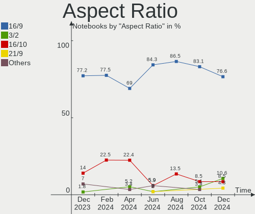
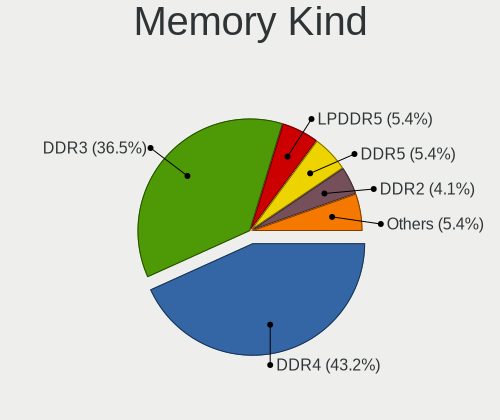
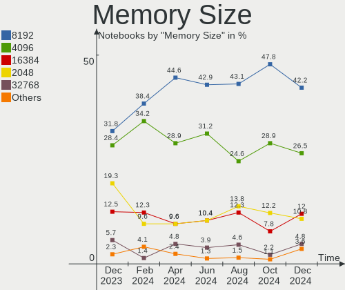
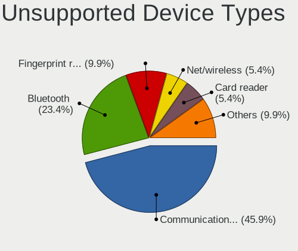

BSD - Hardware Trends (Notebooks)
---------------------------------

A project to identify most popular hardware characteristics and track their change
over time based on data collected by BSD users at https://BSD-Hardware.info.

Anyone can contribute to this report by the [hw-probe](https://github.com/linuxhw/hw-probe/blob/master/INSTALL.BSD.md) tool:

    hw-probe -all -upload

This report is for one last month. Overall report since the beginning of time: [TestDays](https://github.com/bsdhw/TestDays)

Period: Oct, 2023.

Contents
--------

* [ System ](#system)
  - [ OS                       ](#os)
  - [ OS Family                ](#os-family)
  - [ Arch                     ](#arch)
  - [ DE                       ](#de)
  - [ Display Server           ](#display-server)
  - [ Display Manager          ](#display-manager)
  - [ OS Lang                  ](#os-lang)
  - [ Boot Mode                ](#boot-mode)
  - [ Filesystem               ](#filesystem)
  - [ Part. scheme             ](#part-scheme)

* [ Board ](#board)
  - [ Vendor                   ](#vendor)
  - [ Model                    ](#model)
  - [ Model Family             ](#model-family)
  - [ MFG Year                 ](#mfg-year)
  - [ Form Factor              ](#form-factor)
  - [ Coreboot                 ](#coreboot)
  - [ RAM Size                 ](#ram-size)
  - [ RAM Used                 ](#ram-used)
  - [ Total Drives             ](#total-drives)
  - [ Has CD-ROM               ](#has-cd-rom)
  - [ Has Ethernet             ](#has-ethernet)
  - [ Has WiFi                 ](#has-wifi)
  - [ Has Bluetooth            ](#has-bluetooth)

* [ Location ](#location)
  - [ Country                  ](#country)
  - [ City                     ](#city)

* [ Drives ](#drives)
  - [ Drive Vendor             ](#drive-vendor)
  - [ Drive Model              ](#drive-model)
  - [ HDD Vendor               ](#hdd-vendor)
  - [ SSD Vendor               ](#ssd-vendor)
  - [ Drive Kind               ](#drive-kind)
  - [ Drive Connector          ](#drive-connector)
  - [ Drive Size               ](#drive-size)
  - [ Space Total              ](#space-total)
  - [ Space Used               ](#space-used)
  - [ Malfunc. Drives          ](#malfunc-drives)
  - [ Malfunc. Drive Vendor    ](#malfunc-drive-vendor)
  - [ Malfunc. HDD Vendor      ](#malfunc-hdd-vendor)
  - [ Malfunc. Drive Kind      ](#malfunc-drive-kind)
  - [ Failed Drives            ](#failed-drives)
  - [ Failed Drive Vendor      ](#failed-drive-vendor)
  - [ Drive Status             ](#drive-status)

* [ Storage controller ](#storage-controller)
  - [ Storage Vendor           ](#storage-vendor)
  - [ Storage Model            ](#storage-model)
  - [ Storage Kind             ](#storage-kind)

* [ Processor ](#processor)
  - [ CPU Vendor               ](#cpu-vendor)
  - [ CPU Model                ](#cpu-model)
  - [ CPU Model Family         ](#cpu-model-family)
  - [ CPU Cores                ](#cpu-cores)
  - [ CPU Sockets              ](#cpu-sockets)
  - [ CPU Threads              ](#cpu-threads)
  - [ CPU Microarch            ](#cpu-microarch)

* [ Graphics ](#graphics)
  - [ GPU Vendor               ](#gpu-vendor)
  - [ GPU Model                ](#gpu-model)
  - [ GPU Combo                ](#gpu-combo)
  - [ GPU Driver               ](#gpu-driver)
  - [ GPU Memory               ](#gpu-memory)

* [ Monitor ](#monitor)
  - [ Monitor Vendor           ](#monitor-vendor)
  - [ Monitor Model            ](#monitor-model)
  - [ Monitor Resolution       ](#monitor-resolution)
  - [ Monitor Diagonal         ](#monitor-diagonal)
  - [ Monitor Width            ](#monitor-width)
  - [ Aspect Ratio             ](#aspect-ratio)
  - [ Monitor Area             ](#monitor-area)
  - [ Pixel Density            ](#pixel-density)
  - [ Multiple Monitors        ](#multiple-monitors)

* [ Network ](#network)
  - [ Net Controller Vendor    ](#net-controller-vendor)
  - [ Net Controller Model     ](#net-controller-model)
  - [ Wireless Vendor          ](#wireless-vendor)
  - [ Wireless Model           ](#wireless-model)
  - [ Ethernet Vendor          ](#ethernet-vendor)
  - [ Ethernet Model           ](#ethernet-model)
  - [ Net Controller Kind      ](#net-controller-kind)
  - [ Used Controller          ](#used-controller)
  - [ NICs                     ](#nics)
  - [ IPv6                     ](#ipv6)

* [ Bluetooth ](#bluetooth)
  - [ Bluetooth Vendor         ](#bluetooth-vendor)
  - [ Bluetooth Model          ](#bluetooth-model)

* [ Sound ](#sound)
  - [ Sound Vendor             ](#sound-vendor)
  - [ Sound Model              ](#sound-model)

* [ Memory ](#memory)
  - [ Memory Vendor            ](#memory-vendor)
  - [ Memory Model             ](#memory-model)
  - [ Memory Kind              ](#memory-kind)
  - [ Memory Form Factor       ](#memory-form-factor)
  - [ Memory Size              ](#memory-size)
  - [ Memory Speed             ](#memory-speed)

* [ Printers & scanners ](#printers--scanners)
  - [ Printer Vendor           ](#printer-vendor)
  - [ Printer Model            ](#printer-model)
  - [ Scanner Vendor           ](#scanner-vendor)
  - [ Scanner Model            ](#scanner-model)

* [ Camera ](#camera)
  - [ Camera Vendor            ](#camera-vendor)
  - [ Camera Model             ](#camera-model)

* [ Security ](#security)
  - [ Fingerprint Vendor       ](#fingerprint-vendor)
  - [ Fingerprint Model        ](#fingerprint-model)
  - [ Chipcard Vendor          ](#chipcard-vendor)
  - [ Chipcard Model           ](#chipcard-model)

* [ Unsupported ](#unsupported)
  - [ Unsupported Devices      ](#unsupported-devices)
  - [ Unsupported Device Types ](#unsupported-device-types)

System
------

OS
--

Installed operating systems

| Name                 | Notebooks | Percent |
|----------------------|-----------|---------|
| helloSystem 0.8.1    | 14        | 15.56%  |
| OpenBSD 7.4          | 11        | 12.22%  |
| OPNsense 23.7.6      | 9         | 10%     |
| OPNsense 23.7.5      | 5         | 5.56%   |
| helloSystem 0.9.0    | 5         | 5.56%   |
| GhostBSD 23.06.01    | 5         | 5.56%   |
| FreeBSD 14.0-RC2     | 5         | 5.56%   |
| FreeBSD 13.2         | 5         | 5.56%   |
| FreeBSD 13.2-p3      | 4         | 4.44%   |
| OPNsense 23.4.2      | 3         | 3.33%   |
| FreeBSD 13.2-p4      | 3         | 3.33%   |
| OpenBSD 7.3          | 2         | 2.22%   |
| NomadBSD 20231013    | 2         | 2.22%   |
| NomadBSD 20221130    | 2         | 2.22%   |
| FreeBSD 15.0-CURRENT | 2         | 2.22%   |
| FreeBSD 14.0-BETA5   | 2         | 2.22%   |
| OPNsense 23.7.7      | 1         | 1.11%   |
| OPNsense 23.7.3      | 1         | 1.11%   |
| OPNsense 23.10       | 1         | 1.11%   |
| NetBSD 10.99.10      | 1         | 1.11%   |
| helloSystem 0.6.0    | 1         | 1.11%   |
| GhostBSD 23.10.09    | 1         | 1.11%   |
| GhostBSD 23.09.29    | 1         | 1.11%   |
| FreeBSD 14.0-STABLE  | 1         | 1.11%   |
| FreeBSD 14.0-RC3     | 1         | 1.11%   |
| FreeBSD 14.0-BETA4   | 1         | 1.11%   |
| FreeBSD 13.2-p25     | 1         | 1.11%   |

OS Family
---------

OS without a version

| Name        | Notebooks | Percent |
|-------------|-----------|---------|
| FreeBSD     | 25        | 27.78%  |
| OPNsense    | 20        | 22.22%  |
| helloSystem | 20        | 22.22%  |
| OpenBSD     | 13        | 14.44%  |
| GhostBSD    | 7         | 7.78%   |
| NomadBSD    | 4         | 4.44%   |
| NetBSD      | 1         | 1.11%   |

Arch
----

OS architecture (x86_64, i586, etc.)

| Name  | Notebooks | Percent |
|-------|-----------|---------|
| amd64 | 86        | 95.56%  |
| i386  | 4         | 4.44%   |

DE
--

Desktop Environment

| Name         | Notebooks | Percent |
|--------------|-----------|---------|
| helloDesktop | 33        | 36.67%  |
| Console      | 24        | 26.67%  |
| MATE         | 9         | 10%     |
| KDE5         | 9         | 10%     |
| GNOME        | 5         | 5.56%   |
| Openbox      | 3         | 3.33%   |
| XFCE         | 2         | 2.22%   |
| xinitrc      | 1         | 1.11%   |
| TWM          | 1         | 1.11%   |
| i3           | 1         | 1.11%   |
| Fluxbox      | 1         | 1.11%   |
| Budgie       | 1         | 1.11%   |

Display Server
--------------

X11 or Wayland

| Name    | Notebooks | Percent |
|---------|-----------|---------|
| X11     | 64        | 71.11%  |
| Console | 25        | 27.78%  |
| Wayland | 1         | 1.11%   |

Display Manager
---------------

SDDM, LightDM, etc.

| Name    | Notebooks | Percent |
|---------|-----------|---------|
| Console | 43        | 47.78%  |
| SLiM    | 22        | 24.44%  |
| SDDM    | 11        | 12.22%  |
| LightDM | 11        | 12.22%  |
| GDM     | 2         | 2.22%   |
| XDM     | 1         | 1.11%   |

OS Lang
-------

Language

| Lang    | Notebooks | Percent |
|---------|-----------|---------|
| Unknown | 40        | 44.44%  |
| C       | 25        | 27.78%  |
| en_US   | 14        | 15.56%  |
| zh_TW   | 2         | 2.22%   |
| ru_RU   | 2         | 2.22%   |
| fr_FR   | 2         | 2.22%   |
| tr_TR   | 1         | 1.11%   |
| ja_JP   | 1         | 1.11%   |
| fi_DK   | 1         | 1.11%   |
| es_ES   | 1         | 1.11%   |
| en_GB   | 1         | 1.11%   |

Boot Mode
---------

EFI or BIOS

| Mode | Notebooks | Percent |
|------|-----------|---------|
| EFI  | 73        | 81.11%  |
| BIOS | 17        | 18.89%  |

Filesystem
----------

Type of filesystem

| Type   | Notebooks | Percent |
|--------|-----------|---------|
| Zfs    | 52        | 57.78%  |
| Ufs    | 17        | 18.89%  |
| Ffs    | 13        | 14.44%  |
| Cd9660 | 8         | 8.89%   |

Part. scheme
------------

Scheme of partitioning

| Type    | Notebooks | Percent |
|---------|-----------|---------|
| GPT     | 77        | 85.56%  |
| MBR     | 12        | 13.33%  |
| Unknown | 1         | 1.11%   |

Board
-----

Vendor
------

Motherboard manufacturer

| Name                           | Notebooks | Percent |
|--------------------------------|-----------|---------|
| Lenovo                         | 25        | 27.78%  |
| Dell                           | 11        | 12.22%  |
| Deciso                         | 9         | 10%     |
| ASUSTek Computer               | 8         | 8.89%   |
| Apple                          | 6         | 6.67%   |
| Hewlett-Packard                | 5         | 5.56%   |
| Panasonic                      | 4         | 4.44%   |
| Unknown                        | 4         | 4.44%   |
| Toshiba                        | 3         | 3.33%   |
| Acer                           | 3         | 3.33%   |
| Matsushita Electric Industrial | 2         | 2.22%   |
| TUXEDO                         | 1         | 1.11%   |
| Timi                           | 1         | 1.11%   |
| Shuttle                        | 1         | 1.11%   |
| Seco                           | 1         | 1.11%   |
| Platform                       | 1         | 1.11%   |
| Intel                          | 1         | 1.11%   |
| IBM                            | 1         | 1.11%   |
| Google                         | 1         | 1.11%   |
| Fujitsu                        | 1         | 1.11%   |
| Datto                          | 1         | 1.11%   |

Model
-----

Motherboard model

| Name                                        | Notebooks | Percent |
|---------------------------------------------|-----------|---------|
| Unknown                                     | 6         | 6.67%   |
| Deciso NetBoard-A20                         | 3         | 3.33%   |
| Deciso NetBoard-A10                         | 3         | 3.33%   |
| Dell Inspiron 5559                          | 2         | 2.22%   |
| Deciso Netboard A20                         | 2         | 2.22%   |
| TUXEDO Aura 15 Gen1                         | 1         | 1.11%   |
| Toshiba Satellite P300                      | 1         | 1.11%   |
| Toshiba Satellite C55-A                     | 1         | 1.11%   |
| Timi A34R                                   | 1         | 1.11%   |
| Shuttle DS437                               | 1         | 1.11%   |
| Seco UDOO x86                               | 1         | 1.11%   |
| Platform ARB938                             | 1         | 1.11%   |
| Panasonic CFSX4-1                           | 1         | 1.11%   |
| Panasonic CF-C2CEAZXCM                      | 1         | 1.11%   |
| Panasonic CF-53AAGHYDM                      | 1         | 1.11%   |
| Panasonic CF-52PFPBSFQ                      | 1         | 1.11%   |
| Matsushita Electric Industrial CF-51RCVDNLM | 1         | 1.11%   |
| Matsushita Electric Industrial CF-48V4KNDQM | 1         | 1.11%   |
| Lenovo Z50-70 20354                         | 1         | 1.11%   |
| Lenovo ThinkPad X270 20HN006CUS             | 1         | 1.11%   |
| Lenovo ThinkPad X260 20F6006XUK             | 1         | 1.11%   |
| Lenovo ThinkPad X250 20CM004VFR             | 1         | 1.11%   |
| Lenovo ThinkPad X230 2325J67                | 1         | 1.11%   |
| Lenovo ThinkPad X230 23205UG                | 1         | 1.11%   |
| Lenovo ThinkPad X220 4286CTO                | 1         | 1.11%   |
| Lenovo ThinkPad X1 Carbon 3rd 20BS003LFR    | 1         | 1.11%   |
| Lenovo ThinkPad T520 42405FG                | 1         | 1.11%   |
| Lenovo ThinkPad T490 20N3X50500             | 1         | 1.11%   |
| Lenovo ThinkPad T480 20L5000WUS             | 1         | 1.11%   |
| Lenovo ThinkPad T480 20L5000UUS             | 1         | 1.11%   |
| Lenovo ThinkPad T460s 20FAS2AD00            | 1         | 1.11%   |
| Lenovo ThinkPad T430 2347GZU                | 1         | 1.11%   |
| Lenovo ThinkPad T410 2537N24                | 1         | 1.11%   |
| Lenovo ThinkPad T410 2518C3U                | 1         | 1.11%   |
| Lenovo ThinkPad P73 20QRCTO1WW              | 1         | 1.11%   |
| Lenovo ThinkPad E580 20KS001JUK             | 1         | 1.11%   |
| Lenovo ThinkPad E14 Gen 2 20TA0054TX        | 1         | 1.11%   |
| Lenovo Legion 5 15ARH05 82B5                | 1         | 1.11%   |
| Lenovo IdeaPad 3 17ITL6 82H9                | 1         | 1.11%   |
| Lenovo IdeaPad 3 15ADA05 81W1               | 1         | 1.11%   |

Model Family
------------

Motherboard model prefix

| Name                                        | Notebooks | Percent |
|---------------------------------------------|-----------|---------|
| Lenovo ThinkPad                             | 18        | 20%     |
| Unknown                                     | 6         | 6.67%   |
| Dell Latitude                               | 4         | 4.44%   |
| Dell Inspiron                               | 3         | 3.33%   |
| Deciso NetBoard-A20                         | 3         | 3.33%   |
| Deciso NetBoard-A10                         | 3         | 3.33%   |
| Acer Aspire                                 | 3         | 3.33%   |
| Toshiba Satellite                           | 2         | 2.22%   |
| Lenovo IdeaPad                              | 2         | 2.22%   |
| HP ZBook                                    | 2         | 2.22%   |
| Dell Vostro                                 | 2         | 2.22%   |
| Deciso Netboard                             | 2         | 2.22%   |
| Apple MacBookPro9                           | 2         | 2.22%   |
| Apple MacBook5                              | 2         | 2.22%   |
| TUXEDO Aura                                 | 1         | 1.11%   |
| Timi A34R                                   | 1         | 1.11%   |
| Shuttle DS437                               | 1         | 1.11%   |
| Seco UDOO                                   | 1         | 1.11%   |
| Platform ARB938                             | 1         | 1.11%   |
| Panasonic CFSX4-1                           | 1         | 1.11%   |
| Panasonic CF-C2CEAZXCM                      | 1         | 1.11%   |
| Panasonic CF-53AAGHYDM                      | 1         | 1.11%   |
| Panasonic CF-52PFPBSFQ                      | 1         | 1.11%   |
| Matsushita Electric Industrial CF-51RCVDNLM | 1         | 1.11%   |
| Matsushita Electric Industrial CF-48V4KNDQM | 1         | 1.11%   |
| Lenovo Z50-70                               | 1         | 1.11%   |
| Lenovo Legion                               | 1         | 1.11%   |
| Lenovo G550                                 | 1         | 1.11%   |
| Lenovo G50-30                               | 1         | 1.11%   |
| Lenovo B40-30                               | 1         | 1.11%   |
| Intel H81U                                  | 1         | 1.11%   |
| IBM ThinkPad                                | 1         | 1.11%   |
| HP Pavilion                                 | 1         | 1.11%   |
| HP Laptop                                   | 1         | 1.11%   |
| HP EliteBook                                | 1         | 1.11%   |
| Google Auron                                | 1         | 1.11%   |
| Fujitsu LIFEBOOK                            | 1         | 1.11%   |
| Dell Precision                              | 1         | 1.11%   |
| Dell G16                                    | 1         | 1.11%   |
| Deciso OPNsense                             | 1         | 1.11%   |

MFG Year
--------

Motherboard manufacture year

| Year | Notebooks | Percent |
|------|-----------|---------|
| 2021 | 12        | 13.33%  |
| 2020 | 9         | 10%     |
| 2019 | 8         | 8.89%   |
| 2016 | 7         | 7.78%   |
| 2011 | 7         | 7.78%   |
| 2018 | 6         | 6.67%   |
| 2014 | 6         | 6.67%   |
| 2022 | 5         | 5.56%   |
| 2010 | 5         | 5.56%   |
| 2015 | 4         | 4.44%   |
| 2013 | 4         | 4.44%   |
| 2009 | 4         | 4.44%   |
| 2023 | 3         | 3.33%   |
| 2017 | 3         | 3.33%   |
| 2012 | 3         | 3.33%   |
| 2008 | 1         | 1.11%   |
| 2006 | 1         | 1.11%   |
| 2005 | 1         | 1.11%   |
| 2002 | 1         | 1.11%   |

Form Factor
-----------

Physical design of the computer

| Name     | Notebooks | Percent |
|----------|-----------|---------|
| Notebook | 90        | 100%    |

Coreboot
--------

Have coreboot on board

| Used | Notebooks | Percent |
|------|-----------|---------|
| No   | 89        | 98.89%  |
| Yes  | 1         | 1.11%   |

RAM Size
--------

Total RAM memory

| Size in GB  | Notebooks | Percent |
|-------------|-----------|---------|
| 8.01-16.0   | 32        | 35.56%  |
| 16.01-24.0  | 23        | 25.56%  |
| 4.01-8.0    | 17        | 18.89%  |
| 32.01-64.0  | 9         | 10%     |
| 2.01-3.0    | 3         | 3.33%   |
| 3.01-4.0    | 2         | 2.22%   |
| 0.51-1.0    | 2         | 2.22%   |
| 24.01-32.0  | 1         | 1.11%   |
| 64.01-256.0 | 1         | 1.11%   |

RAM Used
--------

Used RAM memory

| Used GB  | Notebooks | Percent |
|----------|-----------|---------|
| 0.01-0.5 | 51        | 56.67%  |
| 0.51-1.0 | 22        | 24.44%  |
| 1.01-2.0 | 12        | 13.33%  |
| 0        | 2         | 2.22%   |
| 3.01-4.0 | 1         | 1.11%   |
| 2.01-3.0 | 1         | 1.11%   |
| Unknown  | 1         | 1.11%   |

Total Drives
------------

Number of drives on board

| Drives | Notebooks | Percent |
|--------|-----------|---------|
| 1      | 59        | 65.56%  |
| 2      | 16        | 17.78%  |
| 0      | 12        | 13.33%  |
| 3      | 3         | 3.33%   |

Has CD-ROM
----------

Has CD-ROM on board

| Presented | Notebooks | Percent |
|-----------|-----------|---------|
| No        | 67        | 74.44%  |
| Yes       | 23        | 25.56%  |

Has Ethernet
------------

Has Ethernet on board

| Presented | Notebooks | Percent |
|-----------|-----------|---------|
| Yes       | 81        | 90%     |
| No        | 9         | 10%     |

Has WiFi
--------

Has WiFi module

| Presented | Notebooks | Percent |
|-----------|-----------|---------|
| Yes       | 75        | 83.33%  |
| No        | 15        | 16.67%  |

Has Bluetooth
-------------

Has Bluetooth module

| Presented | Notebooks | Percent |
|-----------|-----------|---------|
| Yes       | 56        | 62.22%  |
| No        | 34        | 37.78%  |

Location
--------

Country
-------

Geographic location (country)

| Country     | Notebooks | Percent |
|-------------|-----------|---------|
| USA         | 16        | 17.78%  |
| Germany     | 10        | 11.11%  |
| Canada      | 9         | 10%     |
| UK          | 7         | 7.78%   |
| Taiwan      | 6         | 6.67%   |
| Switzerland | 4         | 4.44%   |
| Russia      | 4         | 4.44%   |
| France      | 3         | 3.33%   |
| Turkey      | 2         | 2.22%   |
| Spain       | 2         | 2.22%   |
| Romania     | 2         | 2.22%   |
| Poland      | 2         | 2.22%   |
| Italy       | 2         | 2.22%   |
| Finland     | 2         | 2.22%   |
| China       | 2         | 2.22%   |
| Austria     | 2         | 2.22%   |
| Australia   | 2         | 2.22%   |
| Vietnam     | 1         | 1.11%   |
| Ukraine     | 1         | 1.11%   |
| Sweden      | 1         | 1.11%   |
| Portugal    | 1         | 1.11%   |
| Netherlands | 1         | 1.11%   |
| Mexico      | 1         | 1.11%   |
| Lithuania   | 1         | 1.11%   |
| Japan       | 1         | 1.11%   |
| India       | 1         | 1.11%   |
| Egypt       | 1         | 1.11%   |
| Croatia     | 1         | 1.11%   |
| Brazil      | 1         | 1.11%   |
| Argentina   | 1         | 1.11%   |

City
----

Geographic location (city)

| City                  | Notebooks | Percent |
|-----------------------|-----------|---------|
| Saint-Laurent         | 7         | 7.78%   |
| Taichung              | 5         | 5.56%   |
| Sun Prairie           | 3         | 3.33%   |
| Nuremberg             | 3         | 3.33%   |
| Vienna                | 2         | 2.22%   |
| Portland              | 2         | 2.22%   |
| Moscow                | 2         | 2.22%   |
| Zurich                | 1         | 1.11%   |
| Zagreb                | 1         | 1.11%   |
| Wroclaw               | 1         | 1.11%   |
| Vilnius               | 1         | 1.11%   |
| Vancouver             | 1         | 1.11%   |
| The Hague             | 1         | 1.11%   |
| Temple                | 1         | 1.11%   |
| Surgut                | 1         | 1.11%   |
| Stuttgart             | 1         | 1.11%   |
| Stretford             | 1         | 1.11%   |
| Stockholm             | 1         | 1.11%   |
| St Petersburg         | 1         | 1.11%   |
| Shanghai              | 1         | 1.11%   |
| Seattle               | 1         | 1.11%   |
| Schwalmstadt          | 1         | 1.11%   |
| Santa Fe              | 1         | 1.11%   |
| Saint-Martin-d'Hères | 1         | 1.11%   |
| Saint-Germain-en-Laye | 1         | 1.11%   |
| Rome                  | 1         | 1.11%   |
| Riehen                | 1         | 1.11%   |
| Reading               | 1         | 1.11%   |
| Peterborough          | 1         | 1.11%   |
| Paris                 | 1         | 1.11%   |
| Orizaba               | 1         | 1.11%   |
| Orihuela Costa        | 1         | 1.11%   |
| Ochtendung            | 1         | 1.11%   |
| Norbiton              | 1         | 1.11%   |
| Nampa                 | 1         | 1.11%   |
| Mindelheim            | 1         | 1.11%   |
| Miercurea-Ciuc        | 1         | 1.11%   |
| Melbourne             | 1         | 1.11%   |
| Macaiba               | 1         | 1.11%   |
| Los Angeles           | 1         | 1.11%   |

Drives
------

Drive Vendor
------------

Hard drive vendors

| Vendor              | Notebooks | Drives | Percent |
|---------------------|-----------|--------|---------|
| Transcend           | 16        | 16     | 17.39%  |
| WDC                 | 11        | 11     | 11.96%  |
| Samsung Electronics | 10        | 12     | 10.87%  |
| Toshiba             | 6         | 6      | 6.52%   |
| Seagate             | 6         | 6      | 6.52%   |
| Kingston            | 5         | 5      | 5.43%   |
| SK hynix            | 3         | 3      | 3.26%   |
| Micron Technology   | 3         | 3      | 3.26%   |
| Intel               | 3         | 3      | 3.26%   |
| Hitachi             | 3         | 3      | 3.26%   |
| Crucial             | 3         | 3      | 3.26%   |
| SanDisk             | 2         | 2      | 2.17%   |
| Patriot             | 2         | 2      | 2.17%   |
| LITEON              | 2         | 2      | 2.17%   |
| A-DATA Technology   | 2         | 2      | 2.17%   |
| SSSTC               | 1         | 2      | 1.09%   |
| Silicon Motion      | 1         | 1      | 1.09%   |
| SemsoTai            | 1         | 1      | 1.09%   |
| PNY                 | 1         | 1      | 1.09%   |
| Phison              | 1         | 1      | 1.09%   |
| LITEONIT            | 1         | 1      | 1.09%   |
| Lexar               | 1         | 1      | 1.09%   |
| HGST                | 1         | 2      | 1.09%   |
| Hewlett-Packard     | 1         | 1      | 1.09%   |
| Fujitsu             | 1         | 1      | 1.09%   |
| FORESEE             | 1         | 1      | 1.09%   |
| Dogfish             | 1         | 1      | 1.09%   |
| China               | 1         | 1      | 1.09%   |
| Apple               | 1         | 1      | 1.09%   |
| Apacer              | 1         | 1      | 1.09%   |

Drive Model
-----------

Hard drive models

| Model                                  | Notebooks | Percent |
|----------------------------------------|-----------|---------|
| Transcend TS256GMTS952T2 256GB         | 5         | 5.38%   |
| Hitachi HTS541612J9SA00 120GB          | 3         | 3.23%   |
| WDC WD7500BPKX-00HPJT0 752GB           | 2         | 2.15%   |
| Transcend TS256GMTE652T2 256GB         | 2         | 2.15%   |
| Samsung SSD 980 1TB                    | 2         | 2.15%   |
| Kingston SV300S37A120G 120GB           | 2         | 2.15%   |
| WDC WDS240G2G0A-00JH30 240GB           | 1         | 1.08%   |
| WDC WD7500BPKT-00PK4T0 752GB           | 1         | 1.08%   |
| WDC WD5000LPLX-00ZNTT0 500GB           | 1         | 1.08%   |
| WDC WD3200BPVT-80ZEST0 320GB           | 1         | 1.08%   |
| WDC WD3200BEVE-00A0HT0 320GB           | 1         | 1.08%   |
| WDC WD2500BEVT-80A23T0 250GB           | 1         | 1.08%   |
| WDC WD10JPLX-00MBPT0 1TB               | 1         | 1.08%   |
| WDC PC SN730 SDBQNTY-256G-1001 256GB   | 1         | 1.08%   |
| WDC PC SN530 SDBPMPZ-256G-1101 256GB   | 1         | 1.08%   |
| Transcend TS64GSSD370S 64GB            | 1         | 1.08%   |
| Transcend TS512GSSD230S 512GB          | 1         | 1.08%   |
| Transcend TS512GMTS952T2 512GB         | 1         | 1.08%   |
| Transcend TS256GMTE710T 256GB          | 1         | 1.08%   |
| Transcend TS240GMTS420S 240GB          | 1         | 1.08%   |
| Transcend TS128GSSD340K 128GB          | 1         | 1.08%   |
| Transcend TS128GSSD340 128GB           | 1         | 1.08%   |
| Transcend TS128GMTS430S 128GB          | 1         | 1.08%   |
| Transcend TS120GSSD220S 120GB          | 1         | 1.08%   |
| Toshiba THNSNK256GVN8 M.2 2280 256GB   | 1         | 1.08%   |
| Toshiba THNSN5512GPU7 512GB            | 1         | 1.08%   |
| Toshiba THNSFJ256GDNU A 256GB          | 1         | 1.08%   |
| Toshiba MQ01ABF050 500GB               | 1         | 1.08%   |
| Toshiba MK5065GSX 500GB                | 1         | 1.08%   |
| Toshiba KXG5AZNV256G 256GB             | 1         | 1.08%   |
| SSSTC CL4-8D512 512GB                  | 1         | 1.08%   |
| SK hynix SKHynix_HFM256GD3HX015N 256GB | 1         | 1.08%   |
| SK hynix HFS256G39MND-2300A 256GB      | 1         | 1.08%   |
| SK hynix HFM512GD3JX013N 512GB         | 1         | 1.08%   |
| Silicon Motion T70 2242 1TB            | 1         | 1.08%   |
| SemsoTai L150 SSD 1TB                  | 1         | 1.08%   |
| Seagate ST9500325AS 500GB              | 1         | 1.08%   |
| Seagate ST9250315AS 250GB              | 1         | 1.08%   |
| Seagate ST9160821A 160GB               | 1         | 1.08%   |
| Seagate ST500LT012-1DG142 500GB        | 1         | 1.08%   |

HDD Vendor
----------

Hard disk drive vendors

| Vendor  | Notebooks | Drives | Percent |
|---------|-----------|--------|---------|
| WDC     | 8         | 8      | 36.36%  |
| Seagate | 6         | 6      | 27.27%  |
| Hitachi | 3         | 3      | 13.64%  |
| Toshiba | 2         | 2      | 9.09%   |
| HGST    | 1         | 2      | 4.55%   |
| Fujitsu | 1         | 1      | 4.55%   |
| Apple   | 1         | 1      | 4.55%   |

SSD Vendor
----------

Solid state drive vendors

| Vendor              | Notebooks | Drives | Percent |
|---------------------|-----------|--------|---------|
| Transcend           | 13        | 13     | 25%     |
| Samsung Electronics | 6         | 6      | 11.54%  |
| Kingston            | 5         | 5      | 9.62%   |
| Micron Technology   | 3         | 3      | 5.77%   |
| Toshiba             | 2         | 2      | 3.85%   |
| SanDisk             | 2         | 2      | 3.85%   |
| Patriot             | 2         | 2      | 3.85%   |
| LITEON              | 2         | 2      | 3.85%   |
| Intel               | 2         | 2      | 3.85%   |
| Crucial             | 2         | 2      | 3.85%   |
| A-DATA Technology   | 2         | 2      | 3.85%   |
| WDC                 | 1         | 1      | 1.92%   |
| SK hynix            | 1         | 1      | 1.92%   |
| SemsoTai            | 1         | 1      | 1.92%   |
| PNY                 | 1         | 1      | 1.92%   |
| LITEONIT            | 1         | 1      | 1.92%   |
| Lexar               | 1         | 1      | 1.92%   |
| Hewlett-Packard     | 1         | 1      | 1.92%   |
| FORESEE             | 1         | 1      | 1.92%   |
| Dogfish             | 1         | 1      | 1.92%   |
| China               | 1         | 1      | 1.92%   |
| Apacer              | 1         | 1      | 1.92%   |

Drive Kind
----------

HDD or SSD

| Kind | Notebooks | Drives | Percent |
|------|-----------|--------|---------|
| SSD  | 49        | 52     | 56.98%  |
| HDD  | 20        | 23     | 23.26%  |
| NVMe | 17        | 21     | 19.77%  |

Drive Connector
---------------

SATA, SAS, NVMe, etc.

| Type | Notebooks | Drives | Percent |
|------|-----------|--------|---------|
| SATA | 64        | 75     | 79.01%  |
| NVMe | 17        | 21     | 20.99%  |

Drive Size
----------

Size of hard drive

| Size in TB | Notebooks | Drives | Percent |
|------------|-----------|--------|---------|
| 0.01-0.5   | 51        | 55     | 75%     |
| 0.51-1.0   | 15        | 18     | 22.06%  |
| 1.01-2.0   | 2         | 2      | 2.94%   |

Space Total
-----------

Amount of disk space available on the file system

| Size in GB | Notebooks | Percent |
|------------|-----------|---------|
| 101-250    | 29        | 32.22%  |
| 1-20       | 17        | 18.89%  |
| 251-500    | 13        | 14.44%  |
| 21-50      | 11        | 12.22%  |
| 51-100     | 11        | 12.22%  |
| 501-1000   | 8         | 8.89%   |
| 1001-2000  | 1         | 1.11%   |

Space Used
----------

Amount of used disk space

| Used GB | Notebooks | Percent |
|---------|-----------|---------|
| 1-20    | 78        | 86.67%  |
| 21-50   | 6         | 6.67%   |
| 101-250 | 3         | 3.33%   |
| 251-500 | 2         | 2.22%   |
| 51-100  | 1         | 1.11%   |

Malfunc. Drives
---------------

Drive models with a malfunction

| Model                                           | Notebooks | Drives | Percent |
|-------------------------------------------------|-----------|--------|---------|
| Hitachi HTS541612J9SA00 120GB                   | 2         | 2      | 13.33%  |
| WDC WDS240G2G0A-00JH30 240GB                    | 1         | 1      | 6.67%   |
| WDC WD3200BPVT-80ZEST0 320GB                    | 1         | 1      | 6.67%   |
| Toshiba THNSNK256GVN8 M.2 2280 256GB            | 1         | 1      | 6.67%   |
| Toshiba MK5065GSX 500GB                         | 1         | 1      | 6.67%   |
| SK hynix HFS256G39MND-2300A 256GB               | 1         | 1      | 6.67%   |
| Seagate ST9500325AS 500GB                       | 1         | 1      | 6.67%   |
| Seagate ST9250315AS 250GB                       | 1         | 1      | 6.67%   |
| Seagate ST2000LM003 HN-M201RAD 2TB              | 1         | 1      | 6.67%   |
| Samsung Electronics SSD 870 EVO 2TB             | 1         | 1      | 6.67%   |
| Samsung Electronics MZMPA128HMFU-000H1 128GB    | 1         | 1      | 6.67%   |
| Micron Technology MTFDDAK256TBN-1AR1ZABHA 256GB | 1         | 1      | 6.67%   |
| Kingston SV300S37A120G 120GB                    | 1         | 1      | 6.67%   |
| A-DATA Technology SP550 480GB                   | 1         | 1      | 6.67%   |

Malfunc. Drive Vendor
---------------------

Vendors of faulty drives

| Vendor              | Notebooks | Drives | Percent |
|---------------------|-----------|--------|---------|
| Seagate             | 3         | 3      | 20%     |
| WDC                 | 2         | 2      | 13.33%  |
| Toshiba             | 2         | 2      | 13.33%  |
| Samsung Electronics | 2         | 2      | 13.33%  |
| Hitachi             | 2         | 2      | 13.33%  |
| SK hynix            | 1         | 1      | 6.67%   |
| Micron Technology   | 1         | 1      | 6.67%   |
| Kingston            | 1         | 1      | 6.67%   |
| A-DATA Technology   | 1         | 1      | 6.67%   |

Malfunc. HDD Vendor
-------------------

Vendors of faulty HDD drives

| Vendor  | Notebooks | Drives | Percent |
|---------|-----------|--------|---------|
| Seagate | 3         | 3      | 42.86%  |
| Hitachi | 2         | 2      | 28.57%  |
| WDC     | 1         | 1      | 14.29%  |
| Toshiba | 1         | 1      | 14.29%  |

Malfunc. Drive Kind
-------------------

Kinds of faulty drives

| Kind | Notebooks | Drives | Percent |
|------|-----------|--------|---------|
| SSD  | 8         | 8      | 53.33%  |
| HDD  | 7         | 7      | 46.67%  |

Failed Drives
-------------

Failed drive models

Zero info for selected period =(

Failed Drive Vendor
-------------------

Failed drive vendors

Zero info for selected period =(

Drive Status
------------

Number of failed and malfunc. drives

| Status   | Notebooks | Drives | Percent |
|----------|-----------|--------|---------|
| Works    | 68        | 79     | 80%     |
| Malfunc  | 15        | 15     | 17.65%  |
| Detected | 2         | 2      | 2.35%   |

Storage controller
------------------

Storage Vendor
--------------

Storage controller vendors

| Vendor                         | Notebooks | Percent |
|--------------------------------|-----------|---------|
| Intel                          | 62        | 62.63%  |
| AMD                            | 8         | 8.08%   |
| Samsung Electronics            | 5         | 5.05%   |
| SanDisk                        | 4         | 4.04%   |
| Nvidia                         | 4         | 4.04%   |
| Transcend                      | 3         | 3.03%   |
| SK hynix                       | 3         | 3.03%   |
| Toshiba                        | 2         | 2.02%   |
| Solid State Storage Technology | 1         | 1.01%   |
| Silicon Motion                 | 1         | 1.01%   |
| Phison Electronics             | 1         | 1.01%   |
| Micron/Crucial Technology      | 1         | 1.01%   |
| Micron Technology              | 1         | 1.01%   |
| KIOXIA                         | 1         | 1.01%   |
| Kingston Technology Company    | 1         | 1.01%   |
| INNOGRIT                       | 1         | 1.01%   |

Storage Model
-------------

Storage controller models

| Model                                                                            | Notebooks | Percent |
|----------------------------------------------------------------------------------|-----------|---------|
| Intel Sunrise Point-LP SATA Controller [AHCI mode]                               | 9         | 8.82%   |
| Intel 8 Series SATA Controller 1 [AHCI mode]                                     | 8         | 7.84%   |
| AMD FCH SATA Controller [AHCI mode]                                              | 8         | 7.84%   |
| Intel 7 Series Chipset Family 6-port SATA Controller [AHCI mode]                 | 7         | 6.86%   |
| Intel Wildcat Point-LP SATA Controller [AHCI Mode]                               | 5         | 4.9%    |
| Intel 6 Series/C200 Series Chipset Family 6 port Mobile SATA AHCI Controller     | 5         | 4.9%    |
| Intel 5 Series/3400 Series Chipset 6 port SATA AHCI Controller                   | 4         | 3.92%   |
| SK hynix Gold P31/BC711/PC711 NVMe Solid State Drive                             | 3         | 2.94%   |
| Nvidia MCP79 AHCI Controller                                                     | 3         | 2.94%   |
| Intel 82801IBM/IEM (ICH9M/ICH9M-E) 4 port SATA Controller [AHCI mode]            | 3         | 2.94%   |
| Transcend NVMe PCIe SSD 110S/112S/120S/MTE300S/MTE400S/MTE652T2 (DRAM-less)      | 2         | 1.96%   |
| SanDisk Extreme Pro / WD Black SN750 / PC SN730 / Red SN700 NVMe SSD             | 2         | 1.96%   |
| Samsung NVMe SSD Controller PM9A1/PM9A3/980PRO                                   | 2         | 1.96%   |
| Samsung NVMe SSD Controller 980 (DRAM-less)                                      | 2         | 1.96%   |
| Intel Volume Management Device NVMe RAID Controller                              | 2         | 1.96%   |
| Intel Tiger Lake-LP SATA Controller                                              | 2         | 1.96%   |
| Intel Cannon Lake Mobile PCH SATA AHCI Controller                                | 2         | 1.96%   |
| Intel Atom Processor E3800 Series SATA AHCI Controller                           | 2         | 1.96%   |
| Intel 82801GBM/GHM (ICH7-M Family) SATA Controller [IDE mode]                    | 2         | 1.96%   |
| Intel 8 Series/C220 Series Chipset Family 6-port SATA Controller 1 [AHCI mode]   | 2         | 1.96%   |
| Intel 5 Series/3400 Series Chipset 4 port SATA AHCI Controller                   | 2         | 1.96%   |
| Transcend NVMe PCIe SSD 240S/MTE710T                                             | 1         | 0.98%   |
| Toshiba XG5 NVMe SSD Controller                                                  | 1         | 0.98%   |
| Toshiba XG3 NVMe SSD Controller                                                  | 1         | 0.98%   |
| Solid State Storage CL4-8D512 NVMe SSD M.2 (DRAM-less)                           | 1         | 0.98%   |
| Silicon Motion SM2263EN/SM2263XT (DRAM-less) NVMe SSD Controllers                | 1         | 0.98%   |
| Sandisk PC SN740 NVMe SSD (DRAM-less)                                            | 1         | 0.98%   |
| SanDisk PC SN530 NVMe SSD (DRAM-less)                                            | 1         | 0.98%   |
| Samsung NVMe SSD Controller SM981/PM981/PM983                                    | 1         | 0.98%   |
| Phison E12 NVMe Controller                                                       | 1         | 0.98%   |
| Nvidia MCP89 SATA Controller (AHCI mode)                                         | 1         | 0.98%   |
| Micron/Crucial P1 NVMe PCIe SSD[Frampton]                                        | 1         | 0.98%   |
| Micron 2300 NVMe SSD [Santana]                                                   | 1         | 0.98%   |
| KIOXIA NVMe SSD Controller BG5 (DRAM-less)                                       | 1         | 0.98%   |
| Kingston Company OM3PDP3 NVMe SSD                                                | 1         | 0.98%   |
| Intel Q170/Q150/B150/H170/H110/Z170/CM236 Chipset SATA Controller [AHCI Mode]    | 1         | 0.98%   |
| Intel HM170/QM170 Chipset SATA Controller [AHCI Mode]                            | 1         | 0.98%   |
| Intel Atom/Celeron/Pentium Processor x5-E8000/J3xxx/N3xxx Series SATA Controller | 1         | 0.98%   |
| Intel 82801HM/HEM (ICH8M/ICH8M-E) SATA Controller [AHCI mode]                    | 1         | 0.98%   |
| Intel 82801HM/HEM (ICH8M/ICH8M-E) IDE Controller                                 | 1         | 0.98%   |

Storage Kind
------------

Kind of storage controller (IDE, SATA, NVMe, SAS, ...)

| Kind | Notebooks | Percent |
|------|-----------|---------|
| SATA | 67        | 67.68%  |
| NVMe | 23        | 23.23%  |
| IDE  | 6         | 6.06%   |
| RAID | 3         | 3.03%   |

Processor
---------

CPU Vendor
----------

Processor vendors

| Vendor | Notebooks | Percent |
|--------|-----------|---------|
| Intel  | 73        | 81.11%  |
| AMD    | 17        | 18.89%  |

CPU Model
---------

Processor models

| Model                                   | Notebooks | Percent |
|-----------------------------------------|-----------|---------|
| AMD EPYC 3201 8-Core Processor          | 5         | 5.56%   |
| Intel Core i5-3210M CPU @ 2.50GHz       | 4         | 4.44%   |
| AMD Ryzen Embedded V1500B               | 3         | 3.33%   |
| Intel CPU Version                       | 2         | 2.22%   |
| Intel Core i7-6500U CPU @ 2.50GHz       | 2         | 2.22%   |
| Intel Core i5-8250U CPU @ 1.60GHz       | 2         | 2.22%   |
| Intel Core i5-6200U CPU @ 2.30GHz       | 2         | 2.22%   |
| Intel Core i5-4210U CPU @ 1.70GHz       | 2         | 2.22%   |
| Intel Core i5 CPU M 520 @ 2.40GHz       | 2         | 2.22%   |
| Intel Core 2 Duo CPU P7350 @ 2.00GHz    | 2         | 2.22%   |
| Intel Celeron CPU N2840 @ 2.16GHz       | 2         | 2.22%   |
| Intel Celeron CPU 1037U @ 1.80GHz       | 2         | 2.22%   |
| Intel 11th Gen Core i5-1135G7 @ 2.40GHz | 2         | 2.22%   |
| Intel Xeon CPU E3-1505M v5 @ 2.80GHz    | 1         | 1.11%   |
| Intel Pentium M processor               | 1         | 1.11%   |
| Intel Pentium Gold 7505 @ 2.00GHz       | 1         | 1.11%   |
| Intel Pentium 4 Mobile CPU 1.60GHz      | 1         | 1.11%   |
| Intel Pentium 3558U @ 1.70GHz           | 1         | 1.11%   |
| Intel Genuine CPU T2300 @ 1.66GHz       | 1         | 1.11%   |
| Intel Core i9-10885H CPU @ 2.40GHz      | 1         | 1.11%   |
| Intel Core i7-9750H CPU @ 2.60GHz       | 1         | 1.11%   |
| Intel Core i7-8650U CPU @ 1.90GHz       | 1         | 1.11%   |
| Intel Core i7-8550U CPU @ 1.80GHz       | 1         | 1.11%   |
| Intel Core i7-6700HQ CPU @ 2.60GHz      | 1         | 1.11%   |
| Intel Core i7-6600U CPU @ 2.60GHz       | 1         | 1.11%   |
| Intel Core i7-5500U CPU @ 2.40GHz       | 1         | 1.11%   |
| Intel Core i7-4710MQ CPU @ 2.50GHz      | 1         | 1.11%   |
| Intel Core i7-3615QM CPU @ 2.30GHz      | 1         | 1.11%   |
| Intel Core i7-2860QM CPU @ 2.50GHz      | 1         | 1.11%   |
| Intel Core i7-2640M CPU @ 2.80GHz       | 1         | 1.11%   |
| Intel Core i7-10510U CPU @ 1.80GHz      | 1         | 1.11%   |
| Intel Core i7 CPU Q 720 @ 1.60GHz       | 1         | 1.11%   |
| Intel Core i7 CPU M 620 @ 2.67GHz       | 1         | 1.11%   |
| Intel Core i5-8400H CPU @ 2.50GHz       | 1         | 1.11%   |
| Intel Core i5-8365U CPU @ 1.60GHz       | 1         | 1.11%   |
| Intel Core i5-7300U CPU @ 2.60GHz       | 1         | 1.11%   |
| Intel Core i5-5300U CPU @ 2.30GHz       | 1         | 1.11%   |
| Intel Core i5-5200U CPU @ 2.20GHz       | 1         | 1.11%   |
| Intel Core i5-4300U CPU @ 1.90GHz       | 1         | 1.11%   |
| Intel Core i5-4300M CPU @ 2.60GHz       | 1         | 1.11%   |

CPU Model Family
----------------

Processor model prefix

| Model                   | Notebooks | Percent |
|-------------------------|-----------|---------|
| Intel Core i5           | 24        | 26.67%  |
| Intel Core i7           | 15        | 16.67%  |
| Intel Celeron           | 8         | 8.89%   |
| Other                   | 7         | 7.78%   |
| AMD EPYC                | 6         | 6.67%   |
| Intel Core i3           | 5         | 5.56%   |
| Intel Core 2 Duo        | 4         | 4.44%   |
| AMD Ryzen 7             | 4         | 4.44%   |
| AMD Ryzen Embedded      | 3         | 3.33%   |
| Intel Celeron Dual-Core | 2         | 2.22%   |
| AMD Ryzen 5             | 2         | 2.22%   |
| Intel Xeon              | 1         | 1.11%   |
| Intel Pentium M         | 1         | 1.11%   |
| Intel Pentium Gold      | 1         | 1.11%   |
| Intel Pentium 4         | 1         | 1.11%   |
| Intel Pentium           | 1         | 1.11%   |
| Intel Genuine           | 1         | 1.11%   |
| Intel Core i9           | 1         | 1.11%   |
| Intel Atom              | 1         | 1.11%   |
| AMD Athlon              | 1         | 1.11%   |
| AMD A10                 | 1         | 1.11%   |

CPU Cores
---------

Number of processor cores

| Number  | Notebooks | Percent |
|---------|-----------|---------|
| 2       | 45        | 50%     |
| 4       | 19        | 21.11%  |
| 8       | 10        | 11.11%  |
| Unknown | 7         | 7.78%   |
| 16      | 4         | 4.44%   |
| 12      | 2         | 2.22%   |
| 10      | 1         | 1.11%   |
| 6       | 1         | 1.11%   |
| 1       | 1         | 1.11%   |

CPU Sockets
-----------

Number of sockets

| Number | Notebooks | Percent |
|--------|-----------|---------|
| 1      | 87        | 96.67%  |
| 2      | 3         | 3.33%   |

CPU Threads
-----------

Threads per core (Hyper-Threading)

| Number  | Notebooks | Percent |
|---------|-----------|---------|
| 2       | 51        | 56.67%  |
| 1       | 31        | 34.44%  |
| Unknown | 8         | 8.89%   |

CPU Microarch
-------------

Microarchitecture

| Name        | Notebooks | Percent |
|-------------|-----------|---------|
| KabyLake    | 10        | 11.11%  |
| Haswell     | 10        | 11.11%  |
| Zen         | 9         | 10%     |
| Penryn      | 8         | 8.89%   |
| IvyBridge   | 8         | 8.89%   |
| Skylake     | 7         | 7.78%   |
| Westmere    | 5         | 5.56%   |
| SandyBridge | 5         | 5.56%   |
| Broadwell   | 5         | 5.56%   |
| Unknown     | 5         | 5.56%   |
| TigerLake   | 4         | 4.44%   |
| Silvermont  | 3         | 3.33%   |
| Zen 2       | 2         | 2.22%   |
| P6          | 2         | 2.22%   |
| Zen+        | 1         | 1.11%   |
| Zen 3       | 1         | 1.11%   |
| Piledriver  | 1         | 1.11%   |
| NetBurst    | 1         | 1.11%   |
| Nehalem     | 1         | 1.11%   |
| CometLake   | 1         | 1.11%   |
| Bonnell     | 1         | 1.11%   |

Graphics
--------

GPU Vendor
----------

Vendors of graphics cards

| Vendor | Notebooks | Percent |
|--------|-----------|---------|
| Intel  | 61        | 64.89%  |
| Nvidia | 23        | 24.47%  |
| AMD    | 10        | 10.64%  |

GPU Model
---------

Graphics card models

| Model                                                                         | Notebooks | Percent |
|-------------------------------------------------------------------------------|-----------|---------|
| Intel Haswell-ULT Integrated Graphics Controller                              | 8         | 8.33%   |
| Intel 3rd Gen Core processor Graphics Controller                              | 8         | 8.33%   |
| Intel Skylake GT2 [HD Graphics 520]                                           | 5         | 5.21%   |
| Intel 2nd Generation Core Processor Family Integrated Graphics Controller     | 5         | 5.21%   |
| Intel UHD Graphics 620                                                        | 4         | 4.17%   |
| Intel HD Graphics 5500                                                        | 4         | 4.17%   |
| Intel Core Processor Integrated Graphics Controller                           | 4         | 4.17%   |
| Nvidia GT216M [GeForce GT 330M]                                               | 3         | 3.13%   |
| Intel TigerLake-LP GT2 [Iris Xe Graphics]                                     | 3         | 3.13%   |
| Nvidia TU117M [GeForce MX450]                                                 | 2         | 2.08%   |
| Nvidia GF117M [GeForce 610M/710M/810M/820M / GT 620M/625M/630M/720M]          | 2         | 2.08%   |
| Intel Mobile 945GM/GMS/GME, 943/940GML Express Integrated Graphics Controller | 2         | 2.08%   |
| Intel Mobile 4 Series Chipset Integrated Graphics Controller                  | 2         | 2.08%   |
| Intel HD Graphics 620                                                         | 2         | 2.08%   |
| Intel Atom Processor Z36xxx/Z37xxx Series Graphics & Display                  | 2         | 2.08%   |
| AMD Lucienne                                                                  | 2         | 2.08%   |
| Nvidia TU117M [GeForce GTX 1650 Ti Mobile]                                    | 1         | 1.04%   |
| Nvidia TU117GLM [Quadro T2000 Mobile / Max-Q]                                 | 1         | 1.04%   |
| Nvidia TU106GLM [Quadro RTX 3000 Mobile / Max-Q]                              | 1         | 1.04%   |
| Nvidia MCP89 [GeForce 320M]                                                   | 1         | 1.04%   |
| Nvidia GM107M [GeForce GTX 950M]                                              | 1         | 1.04%   |
| Nvidia GM107GLM [Quadro M2000M]                                               | 1         | 1.04%   |
| Nvidia GM107 [GeForce 940MX]                                                  | 1         | 1.04%   |
| Nvidia GK107M [GeForce GT 650M Mac Edition]                                   | 1         | 1.04%   |
| Nvidia GK107GLM [Quadro K1100M]                                               | 1         | 1.04%   |
| Nvidia GF108M [GeForce GT 620M/630M/635M/640M LE]                             | 1         | 1.04%   |
| Nvidia GF108M [GeForce GT 540M]                                               | 1         | 1.04%   |
| Nvidia G86M [Quadro NVS 140M]                                                 | 1         | 1.04%   |
| Nvidia C79 [GeForce G102M]                                                    | 1         | 1.04%   |
| Nvidia C79 [GeForce 9400M]                                                    | 1         | 1.04%   |
| Nvidia C79 [GeForce 9400M G]                                                  | 1         | 1.04%   |
| Nvidia AD107M [GeForce RTX 4060 Max-Q / Mobile]                               | 1         | 1.04%   |
| Intel WhiskeyLake-U GT2 [UHD Graphics 620]                                    | 1         | 1.04%   |
| Intel Tiger Lake-LP GT2 [UHD Graphics G4]                                     | 1         | 1.04%   |
| Intel Raptor Lake-S UHD Graphics                                              | 1         | 1.04%   |
| Intel Mobile 945GSE Express Integrated Graphics Controller                    | 1         | 1.04%   |
| Intel Mobile 945GM/GMS, 943/940GML Express Integrated Graphics Controller     | 1         | 1.04%   |
| Intel HD Graphics P530                                                        | 1         | 1.04%   |
| Intel HD Graphics 530                                                         | 1         | 1.04%   |
| Intel HD Graphics                                                             | 1         | 1.04%   |

GPU Combo
---------

Combinations of graphics cards

| Name           | Notebooks | Percent |
|----------------|-----------|---------|
| 1 x Intel      | 44        | 48.89%  |
| Intel + Nvidia | 12        | 13.33%  |
| 1 x Nvidia     | 11        | 12.22%  |
| Other          | 9         | 10%     |
| 1 x AMD        | 9         | 10%     |
| 2 x Intel      | 4         | 4.44%   |
| Intel + AMD    | 1         | 1.11%   |

GPU Driver
----------

Free vs proprietary

| Driver      | Notebooks | Percent |
|-------------|-----------|---------|
| Free        | 70        | 77.78%  |
| Unknown     | 12        | 13.33%  |
| Proprietary | 8         | 8.89%   |

GPU Memory
----------

Total video memory

| Size in GB | Notebooks | Percent |
|------------|-----------|---------|
| Unknown    | 79        | 87.78%  |
| 0.01-0.5   | 5         | 5.56%   |
| 3.01-4.0   | 2         | 2.22%   |
| 1.01-2.0   | 2         | 2.22%   |
| 7.01-8.0   | 1         | 1.11%   |
| 5.01-6.0   | 1         | 1.11%   |

Monitor
-------

Monitor Vendor
--------------

Monitor vendors

| Vendor                  | Notebooks | Percent |
|-------------------------|-----------|---------|
| LG Display              | 9         | 18%     |
| BOE                     | 9         | 18%     |
| AU Optronics            | 8         | 16%     |
| Chimei Innolux          | 7         | 14%     |
| Samsung Electronics     | 6         | 12%     |
| Lenovo                  | 2         | 4%      |
| SDC                     | 1         | 2%      |
| Philips                 | 1         | 2%      |
| Goldstar                | 1         | 2%      |
| Dell                    | 1         | 2%      |
| Chi Mei Optoelectronics | 1         | 2%      |
| BOE Technology Group    | 1         | 2%      |
| Apple                   | 1         | 2%      |
| Acer                    | 1         | 2%      |
| Unknown                 | 1         | 2%      |

Monitor Model
-------------

Monitor models

| Model                                                                    | Notebooks | Percent |
|--------------------------------------------------------------------------|-----------|---------|
| SDC LCD Monitor 3520x1080                                                | 1         | 2%      |
| Samsung Electronics LCD Monitor SEC304C 1366x768 310x170mm 13.9-inch     | 1         | 2%      |
| Samsung Electronics LCD Monitor SDC8B4F 1920x1080 340x190mm 15.3-inch    | 1         | 2%      |
| Samsung Electronics LCD Monitor SDC5344 1920x1080 340x190mm 15.3-inch    | 1         | 2%      |
| Samsung Electronics LCD Monitor SDC4158 1920x1080 290x170mm 13.2-inch    | 1         | 2%      |
| Samsung Electronics LCD Monitor SDC280F 1366x768 340x190mm 15.3-inch     | 1         | 2%      |
| Samsung Electronics C27F398 SAM0D45 1920x1080 600x340mm 27.2-inch        | 1         | 2%      |
| Philips LCD Monitor 271P4                                                | 1         | 2%      |
| LG Display LP156WH2-TLAA LGD0230 1366x768 340x190mm 15.3-inch            | 1         | 2%      |
| LG Display LCD Monitor LGD06CA 1920x1080 310x170mm 13.9-inch             | 1         | 2%      |
| LG Display LCD Monitor LGD046F 1920x1080 340x190mm 15.3-inch             | 1         | 2%      |
| LG Display LCD Monitor LGD044B 1366x768 340x190mm 15.3-inch              | 1         | 2%      |
| LG Display LCD Monitor LGD0404 1366x768 280x160mm 12.7-inch              | 1         | 2%      |
| LG Display LCD Monitor LGD0384 1366x768 340x190mm 15.3-inch              | 1         | 2%      |
| LG Display LCD Monitor LGD02E3 1366x768 340x190mm 15.3-inch              | 1         | 2%      |
| LG Display LCD Monitor LGD02D8 1366x768 280x160mm 12.7-inch              | 1         | 2%      |
| LG Display LCD Monitor LGD02D1 1600x900 380x210mm 17.1-inch              | 1         | 2%      |
| Lenovo LCD Monitor LEN40BA 1920x1080 340x190mm 15.3-inch                 | 1         | 2%      |
| Lenovo LCD Monitor LEN4035 1280x800 300x190mm 14.0-inch                  | 1         | 2%      |
| Goldstar 24GM77 GSM5A91 1920x1080 530x300mm 24.0-inch                    | 1         | 2%      |
| Dell P2314H DEL4098 1920x1080 510x290mm 23.1-inch                        | 1         | 2%      |
| Chimei Innolux LCD Monitor CMN15D7 1920x1080 340x190mm 15.3-inch         | 1         | 2%      |
| Chimei Innolux LCD Monitor CMN15C4 1920x1080 340x190mm 15.3-inch         | 1         | 2%      |
| Chimei Innolux LCD Monitor CMN14D4 1920x1080 310x170mm 13.9-inch         | 1         | 2%      |
| Chimei Innolux LCD Monitor CMN14B1 1920x1080 310x170mm 13.9-inch         | 1         | 2%      |
| Chimei Innolux LCD Monitor CMN14A8 1920x1080 310x170mm 13.9-inch         | 1         | 2%      |
| Chimei Innolux LCD Monitor CMN1475 1366x768 310x170mm 13.9-inch          | 1         | 2%      |
| Chimei Innolux LCD Monitor CMN1132 1366x768 260x140mm 11.6-inch          | 1         | 2%      |
| Chi Mei Optoelectronics LCD Monitor CMO15A7 1366x768 350x190mm 15.7-inch | 1         | 2%      |
| BOE Technology Group LCD Monitor 1920x1080                               | 1         | 2%      |
| BOE LCD Monitor BOE0AC1 2560x1600 340x210mm 15.7-inch                    | 1         | 2%      |
| BOE LCD Monitor BOE0A4E 2560x1600 290x180mm 13.4-inch                    | 1         | 2%      |
| BOE LCD Monitor BOE09C1 1920x1080 380x220mm 17.3-inch                    | 1         | 2%      |
| BOE LCD Monitor BOE0991 1920x1080 340x190mm 15.3-inch                    | 1         | 2%      |
| BOE LCD Monitor BOE08E8 1920x1080 340x190mm 15.3-inch                    | 1         | 2%      |
| BOE LCD Monitor BOE0812 1920x1080 340x190mm 15.3-inch                    | 1         | 2%      |
| BOE LCD Monitor BOE070D 1366x768 310x170mm 13.9-inch                     | 1         | 2%      |
| BOE LCD Monitor BOE061D 1366x768 340x190mm 15.3-inch                     | 1         | 2%      |
| BOE LCD Monitor BOE05FE 1366x768 310x170mm 13.9-inch                     | 1         | 2%      |
| AU Optronics LCD Monitor AUO403D 1920x1080 310x170mm 13.9-inch           | 1         | 2%      |

Monitor Resolution
------------------

Monitor screen resolution

| Resolution      | Notebooks | Percent |
|-----------------|-----------|---------|
| 1920x1080 (FHD) | 22        | 45.83%  |
| 1366x768 (WXGA) | 17        | 35.42%  |
| 2560x1600       | 3         | 6.25%   |
| 1280x800 (WXGA) | 2         | 4.17%   |
| 3840x2160 (4K)  | 1         | 2.08%   |
| 3520x1080       | 1         | 2.08%   |
| 1600x900 (HD+)  | 1         | 2.08%   |
| Unknown         | 1         | 2.08%   |

Monitor Diagonal
----------------

Diagonal size in inches

| Inches  | Notebooks | Percent |
|---------|-----------|---------|
| 15      | 19        | 38.78%  |
| 13      | 13        | 26.53%  |
| 12      | 5         | 10.2%   |
| 17      | 3         | 6.12%   |
| Unknown | 3         | 6.12%   |
| 27      | 2         | 4.08%   |
| 24      | 1         | 2.04%   |
| 23      | 1         | 2.04%   |
| 14      | 1         | 2.04%   |
| 11      | 1         | 2.04%   |

Monitor Width
-------------

Physical width

| Width in mm | Notebooks | Percent |
|-------------|-----------|---------|
| 301-350     | 29        | 59.18%  |
| 201-300     | 10        | 20.41%  |
| 501-600     | 4         | 8.16%   |
| 351-400     | 3         | 6.12%   |
| Unknown     | 3         | 6.12%   |

Aspect Ratio
------------

Proportional relationship between the width and the height

| Ratio   | Notebooks | Percent |
|---------|-----------|---------|
| 16/9    | 40        | 85.11%  |
| 16/10   | 4         | 8.51%   |
| Unknown | 3         | 6.38%   |

Monitor Area
------------

Area in inch²

| Area in inch² | Notebooks | Percent |
|----------------|-----------|---------|
| 91-100         | 15        | 30.61%  |
| 81-90          | 13        | 26.53%  |
| 61-70          | 5         | 10.2%   |
| 121-130        | 3         | 6.12%   |
| 101-110        | 3         | 6.12%   |
| Unknown        | 3         | 6.12%   |
| 301-350        | 2         | 4.08%   |
| 201-250        | 2         | 4.08%   |
| 71-80          | 1         | 2.04%   |
| 51-60          | 1         | 2.04%   |
| 111-120        | 1         | 2.04%   |

Pixel Density
-------------

Pixels per inch

| Density       | Notebooks | Percent |
|---------------|-----------|---------|
| 121-160       | 20        | 40.82%  |
| 101-120       | 14        | 28.57%  |
| 51-100        | 6         | 12.24%  |
| 161-240       | 5         | 10.2%   |
| Unknown       | 3         | 6.12%   |
| More than 240 | 1         | 2.04%   |

Multiple Monitors
-----------------

Total monitors connected

| Total | Notebooks | Percent |
|-------|-----------|---------|
| 1     | 53        | 58.89%  |
| 0     | 34        | 37.78%  |
| 2     | 3         | 3.33%   |

Network
-------

Net Controller Vendor
---------------------

Controller vendors

| Vendor                          | Notebooks | Percent |
|---------------------------------|-----------|---------|
| Intel                           | 58        | 42.03%  |
| Realtek Semiconductor           | 33        | 23.91%  |
| Broadcom                        | 12        | 8.7%    |
| Qualcomm Atheros                | 11        | 7.97%   |
| AMD                             | 9         | 6.52%   |
| Samsung Electronics             | 3         | 2.17%   |
| Sierra Wireless                 | 2         | 1.45%   |
| Nvidia                          | 2         | 1.45%   |
| Marvell Technology Group        | 2         | 1.45%   |
| Xiaomi                          | 1         | 0.72%   |
| TP-Link                         | 1         | 0.72%   |
| Ralink Technology               | 1         | 0.72%   |
| Ralink                          | 1         | 0.72%   |
| Qualcomm Atheros Communications | 1         | 0.72%   |
| NetGear                         | 1         | 0.72%   |

Net Controller Model
--------------------

Controller models

| Model                                                             | Notebooks | Percent |
|-------------------------------------------------------------------|-----------|---------|
| Realtek RTL8111/8168/8411 PCI Express Gigabit Ethernet Controller | 24        | 13.41%  |
| AMD XGMAC 10GbE Controller                                        | 9         | 5.03%   |
| Intel I210 Gigabit Network Connection                             | 6         | 3.35%   |
| Intel 82579LM Gigabit Network Connection (Lewisville)             | 6         | 3.35%   |
| Intel Wireless 8265 / 8275                                        | 5         | 2.79%   |
| Intel Wireless 8260                                               | 5         | 2.79%   |
| Intel Wireless 7265                                               | 5         | 2.79%   |
| Intel Centrino Advanced-N 6205 [Taylor Peak]                      | 5         | 2.79%   |
| Intel Wireless 7260                                               | 4         | 2.23%   |
| Intel Wi-Fi 6 AX201                                               | 4         | 2.23%   |
| Samsung Galaxy series, misc. (tethering mode)                     | 3         | 1.68%   |
| Realtek RTL810xE PCI Express Fast Ethernet controller             | 3         | 1.68%   |
| Intel Wireless 3160                                               | 3         | 1.68%   |
| Intel I211 Gigabit Network Connection                             | 3         | 1.68%   |
| Intel 82577LM Gigabit Network Connection                          | 3         | 1.68%   |
| Broadcom BCM4322 802.11a/b/g/n Wireless LAN Controller            | 3         | 1.68%   |
| Realtek RTL8852BE PCIe 802.11ax Wireless Network Controller       | 2         | 1.12%   |
| Realtek RTL8125 2.5GbE Controller                                 | 2         | 1.12%   |
| Qualcomm Atheros QCA9565 / AR9565 Wireless Network Adapter        | 2         | 1.12%   |
| Qualcomm Atheros AR9485 Wireless Network Adapter                  | 2         | 1.12%   |
| Qualcomm Atheros AR928X Wireless Network Adapter (PCI-Express)    | 2         | 1.12%   |
| Qualcomm Atheros AR8151 v2.0 Gigabit Ethernet                     | 2         | 1.12%   |
| Nvidia MCP79 Ethernet                                             | 2         | 1.12%   |
| Intel Ethernet Controller I225-V                                  | 2         | 1.12%   |
| Intel Ethernet Connection (4) I219-V                              | 2         | 1.12%   |
| Intel Ethernet Connection (4) I219-LM                             | 2         | 1.12%   |
| Intel Ethernet Connection (3) I218-LM                             | 2         | 1.12%   |
| Intel Centrino Advanced-N 6200                                    | 2         | 1.12%   |
| Broadcom NetXtreme BCM57765 Gigabit Ethernet PCIe                 | 2         | 1.12%   |
| Broadcom NetXtreme BCM5764M Gigabit Ethernet PCIe                 | 2         | 1.12%   |
| Broadcom BCM4331 802.11a/b/g/n                                    | 2         | 1.12%   |
| Broadcom BCM43224 802.11a/b/g/n                                   | 2         | 1.12%   |
| Xiaomi Mi/Redmi series (RNDIS + ADB)                              | 1         | 0.56%   |
| TP-Link AC600 wireless Realtek RTL8811AU [Archer T2U Nano]        | 1         | 0.56%   |
| Sierra Wireless EM7345 4G LTE                                     | 1         | 0.56%   |
| Sierra Wireless EM7305 Modem                                      | 1         | 0.56%   |
| Realtek RTL8822CE 802.11ac PCIe Wireless Network Adapter          | 1         | 0.56%   |
| Realtek RTL8821AE 802.11ac PCIe Wireless Network Adapter          | 1         | 0.56%   |
| Realtek RTL8814AU 802.11a/b/g/n/ac Wireless Adapter               | 1         | 0.56%   |
| Realtek RTL8723BE PCIe Wireless Network Adapter                   | 1         | 0.56%   |

Wireless Vendor
---------------

Wireless vendors

| Vendor                          | Notebooks | Percent |
|---------------------------------|-----------|---------|
| Intel                           | 47        | 59.49%  |
| Broadcom                        | 10        | 12.66%  |
| Realtek Semiconductor           | 8         | 10.13%  |
| Qualcomm Atheros                | 8         | 10.13%  |
| TP-Link                         | 1         | 1.27%   |
| Sierra Wireless                 | 1         | 1.27%   |
| Ralink Technology               | 1         | 1.27%   |
| Ralink                          | 1         | 1.27%   |
| Qualcomm Atheros Communications | 1         | 1.27%   |
| NetGear                         | 1         | 1.27%   |

Wireless Model
--------------

Wireless models

| Model                                                          | Notebooks | Percent |
|----------------------------------------------------------------|-----------|---------|
| Intel Wireless 8265 / 8275                                     | 5         | 6.25%   |
| Intel Wireless 8260                                            | 5         | 6.25%   |
| Intel Wireless 7265                                            | 5         | 6.25%   |
| Intel Centrino Advanced-N 6205 [Taylor Peak]                   | 5         | 6.25%   |
| Intel Wireless 7260                                            | 4         | 5%      |
| Intel Wi-Fi 6 AX201                                            | 4         | 5%      |
| Intel Wireless 3160                                            | 3         | 3.75%   |
| Broadcom BCM4322 802.11a/b/g/n Wireless LAN Controller         | 3         | 3.75%   |
| Realtek RTL8852BE PCIe 802.11ax Wireless Network Controller    | 2         | 2.5%    |
| Qualcomm Atheros QCA9565 / AR9565 Wireless Network Adapter     | 2         | 2.5%    |
| Qualcomm Atheros AR9485 Wireless Network Adapter               | 2         | 2.5%    |
| Qualcomm Atheros AR928X Wireless Network Adapter (PCI-Express) | 2         | 2.5%    |
| Intel Centrino Advanced-N 6200                                 | 2         | 2.5%    |
| Broadcom BCM4331 802.11a/b/g/n                                 | 2         | 2.5%    |
| Broadcom BCM43224 802.11a/b/g/n                                | 2         | 2.5%    |
| TP-Link AC600 wireless Realtek RTL8811AU [Archer T2U Nano]     | 1         | 1.25%   |
| Sierra Wireless EM7345 4G LTE                                  | 1         | 1.25%   |
| Realtek RTL8822CE 802.11ac PCIe Wireless Network Adapter       | 1         | 1.25%   |
| Realtek RTL8821AE 802.11ac PCIe Wireless Network Adapter       | 1         | 1.25%   |
| Realtek RTL8814AU 802.11a/b/g/n/ac Wireless Adapter            | 1         | 1.25%   |
| Realtek RTL8723BE PCIe Wireless Network Adapter                | 1         | 1.25%   |
| Realtek RTL8188EUS 802.11n Wireless Network Adapter            | 1         | 1.25%   |
| Realtek RTL8188EE Wireless Network Adapter                     | 1         | 1.25%   |
| Realtek RTL8188CE 802.11b/g/n WiFi Adapter                     | 1         | 1.25%   |
| Ralink RT5572 Wireless Adapter                                 | 1         | 1.25%   |
| Ralink RT5390 Wireless 802.11n 1T/1R PCIe                      | 1         | 1.25%   |
| Qualcomm Atheros QCA9377 802.11ac Wireless Network Adapter     | 1         | 1.25%   |
| Qualcomm Atheros AR9271 802.11n                                | 1         | 1.25%   |
| Qualcomm Atheros AR9285 Wireless Network Adapter (PCI-Express) | 1         | 1.25%   |
| NetGear A6100 AC600 DB Wireless Adapter [Realtek RTL8811AU]    | 1         | 1.25%   |
| Intel WiFi Link 5100                                           | 1         | 1.25%   |
| Intel Wi-Fi 6 AX200                                            | 1         | 1.25%   |
| Intel PRO/Wireless LAN 2100 3B Mini PCI Adapter                | 1         | 1.25%   |
| Intel PRO/Wireless 4965 AG or AGN [Kedron] Network Connection  | 1         | 1.25%   |
| Intel PRO/Wireless 3945ABG [Golan] Network Connection          | 1         | 1.25%   |
| Intel Dual Band Wireless-AC 3165 Plus Bluetooth                | 1         | 1.25%   |
| Intel Comet Lake PCH-LP CNVi WiFi                              | 1         | 1.25%   |
| Intel Comet Lake PCH CNVi WiFi                                 | 1         | 1.25%   |
| Intel Centrino Wireless-N 1000 [Condor Peak]                   | 1         | 1.25%   |
| Intel Centrino Advanced-N + WiMAX 6250 [Kilmer Peak]           | 1         | 1.25%   |

Ethernet Vendor
---------------

Ethernet vendors

| Vendor                   | Notebooks | Percent |
|--------------------------|-----------|---------|
| Intel                    | 38        | 40%     |
| Realtek Semiconductor    | 29        | 30.53%  |
| AMD                      | 9         | 9.47%   |
| Broadcom                 | 7         | 7.37%   |
| Qualcomm Atheros         | 4         | 4.21%   |
| Samsung Electronics      | 3         | 3.16%   |
| Nvidia                   | 2         | 2.11%   |
| Marvell Technology Group | 2         | 2.11%   |
| Xiaomi                   | 1         | 1.05%   |

Ethernet Model
--------------

Ethernet models

| Model                                                             | Notebooks | Percent |
|-------------------------------------------------------------------|-----------|---------|
| Realtek RTL8111/8168/8411 PCI Express Gigabit Ethernet Controller | 24        | 25%     |
| AMD XGMAC 10GbE Controller                                        | 9         | 9.38%   |
| Intel I210 Gigabit Network Connection                             | 6         | 6.25%   |
| Intel 82579LM Gigabit Network Connection (Lewisville)             | 6         | 6.25%   |
| Samsung Galaxy series, misc. (tethering mode)                     | 3         | 3.13%   |
| Realtek RTL810xE PCI Express Fast Ethernet controller             | 3         | 3.13%   |
| Intel I211 Gigabit Network Connection                             | 3         | 3.13%   |
| Intel 82577LM Gigabit Network Connection                          | 3         | 3.13%   |
| Realtek RTL8125 2.5GbE Controller                                 | 2         | 2.08%   |
| Qualcomm Atheros AR8151 v2.0 Gigabit Ethernet                     | 2         | 2.08%   |
| Nvidia MCP79 Ethernet                                             | 2         | 2.08%   |
| Intel Ethernet Controller I225-V                                  | 2         | 2.08%   |
| Intel Ethernet Connection (4) I219-V                              | 2         | 2.08%   |
| Intel Ethernet Connection (4) I219-LM                             | 2         | 2.08%   |
| Intel Ethernet Connection (3) I218-LM                             | 2         | 2.08%   |
| Broadcom NetXtreme BCM57765 Gigabit Ethernet PCIe                 | 2         | 2.08%   |
| Broadcom NetXtreme BCM5764M Gigabit Ethernet PCIe                 | 2         | 2.08%   |
| Xiaomi Mi/Redmi series (RNDIS + ADB)                              | 1         | 1.04%   |
| Realtek RTL-8100/8101L/8139 PCI Fast Ethernet Adapter             | 1         | 1.04%   |
| Qualcomm Atheros AR8162 Fast Ethernet                             | 1         | 1.04%   |
| Qualcomm Atheros AR8121/AR8113/AR8114 Gigabit or Fast Ethernet    | 1         | 1.04%   |
| Marvell Group 88E8053 PCI-E Gigabit Ethernet Controller           | 1         | 1.04%   |
| Marvell Group 88E8040T PCI-E Fast Ethernet Controller             | 1         | 1.04%   |
| Intel Ethernet Connection I219-V                                  | 1         | 1.04%   |
| Intel Ethernet Connection I219-LM                                 | 1         | 1.04%   |
| Intel Ethernet Connection I218-LM                                 | 1         | 1.04%   |
| Intel Ethernet Connection I217-V                                  | 1         | 1.04%   |
| Intel Ethernet Connection I217-LM                                 | 1         | 1.04%   |
| Intel Ethernet Connection (7) I219-V                              | 1         | 1.04%   |
| Intel Ethernet Connection (7) I219-LM                             | 1         | 1.04%   |
| Intel Ethernet Connection (6) I219-LM                             | 1         | 1.04%   |
| Intel Ethernet Connection (3) I218-V                              | 1         | 1.04%   |
| Intel Ethernet Connection (2) I219-LM                             | 1         | 1.04%   |
| Intel Ethernet Connection (11) I219-LM                            | 1         | 1.04%   |
| Intel 82541GI Gigabit Ethernet Controller                         | 1         | 1.04%   |
| Broadcom NetXtreme BCM5755M Gigabit Ethernet PCI Express          | 1         | 1.04%   |
| Broadcom NetLink BCM5906M Fast Ethernet PCI Express               | 1         | 1.04%   |
| Broadcom NetLink BCM57780 Gigabit Ethernet PCIe                   | 1         | 1.04%   |

Net Controller Kind
-------------------

Ethernet, WiFi or modem

| Kind     | Notebooks | Percent |
|----------|-----------|---------|
| Ethernet | 81        | 50.94%  |
| WiFi     | 75        | 47.17%  |
| Modem    | 2         | 1.26%   |
| Unknown  | 1         | 0.63%   |

Used Controller
---------------

Currently used network controller

| Kind     | Notebooks | Percent |
|----------|-----------|---------|
| Ethernet | 44        | 50.57%  |
| WiFi     | 43        | 49.43%  |

NICs
----

Total network controllers on board

| Total | Notebooks | Percent |
|-------|-----------|---------|
| 2     | 62        | 68.89%  |
| 1     | 12        | 13.33%  |
| 6     | 8         | 8.89%   |
| 3     | 4         | 4.44%   |
| 5     | 3         | 3.33%   |
| 4     | 1         | 1.11%   |

IPv6
----

IPv6 vs IPv4

| Used | Notebooks | Percent |
|------|-----------|---------|
| No   | 80        | 88.89%  |
| Yes  | 10        | 11.11%  |

Bluetooth
---------

Bluetooth Vendor
----------------

Controller vendors

| Vendor                          | Notebooks | Percent |
|---------------------------------|-----------|---------|
| Intel                           | 30        | 53.57%  |
| Apple                           | 6         | 10.71%  |
| Realtek Semiconductor           | 4         | 7.14%   |
| Broadcom                        | 3         | 5.36%   |
| Qualcomm Atheros Communications | 2         | 3.57%   |
| Lite-On Technology              | 2         | 3.57%   |
| IMC Networks                    | 2         | 3.57%   |
| ASUSTek Computer                | 2         | 3.57%   |
| Alps Electric                   | 2         | 3.57%   |
| Foxconn / Hon Hai               | 1         | 1.79%   |
| Dell                            | 1         | 1.79%   |
| Cambridge Silicon Radio         | 1         | 1.79%   |

Bluetooth Model
---------------

Controller models

| Model                                                       | Notebooks | Percent |
|-------------------------------------------------------------|-----------|---------|
| Intel Bluetooth wireless interface                          | 19        | 33.33%  |
| Intel AX201 Bluetooth                                       | 6         | 10.53%  |
| Apple Bluetooth Host Controller                             | 4         | 7.02%   |
| Intel Bluetooth 9460/9560 Jefferson Peak (JfP)              | 3         | 5.26%   |
| Realtek Bluetooth Adapter                                   | 2         | 3.51%   |
| Broadcom BCM20702 Bluetooth 4.0 [ThinkPad]                  | 2         | 3.51%   |
| Alps Electric UGTZ4 Bluetooth                               | 2         | 3.51%   |
| Realtek Wireless Bluetooth Adapter                          | 1         | 1.75%   |
| Realtek RTL8723B Bluetooth                                  | 1         | 1.75%   |
| Qualcomm Atheros AR9462 Bluetooth                           | 1         | 1.75%   |
| Qualcomm Atheros AR3012 Bluetooth 4.0                       | 1         | 1.75%   |
| Lite-On Qualcomm Atheros QCA9377 Bluetooth                  | 1         | 1.75%   |
| Lite-On BCM43142A0 Bluetooth Module                         | 1         | 1.75%   |
| Intel AX211 Bluetooth                                       | 1         | 1.75%   |
| Intel AX200 Bluetooth                                       | 1         | 1.75%   |
| IMC Networks Realtek Bluetooth 4.0 + High Speed Chip        | 1         | 1.75%   |
| IMC Networks Atheros AR3012 Bluetooth 4.0 Adapter           | 1         | 1.75%   |
| Foxconn / Hon Hai Qualcomm Atheros AR3012 Bluetooth Adapter | 1         | 1.75%   |
| Dell Wireless 360 Bluetooth                                 | 1         | 1.75%   |
| Cambridge Silicon Radio Bluetooth Dongle (HCI mode)         | 1         | 1.75%   |
| Broadcom BCM2045B (BDC-2.1)                                 | 1         | 1.75%   |
| ASUS Broadcom Bluetooth 2.1                                 | 1         | 1.75%   |
| ASUS Broadcom BCM20702A0 Bluetooth                          | 1         | 1.75%   |
| Apple Built-in iSight (no firmware loaded)                  | 1         | 1.75%   |
| Apple Built-in Bluetooth 2.0+EDR HCI                        | 1         | 1.75%   |
| Apple Broadcom Built-in Bluetooth                           | 1         | 1.75%   |

Sound
-----

Sound Vendor
------------

Sound card vendors

| Vendor                | Notebooks | Percent |
|-----------------------|-----------|---------|
| Intel                 | 66        | 67.35%  |
| AMD                   | 17        | 17.35%  |
| Nvidia                | 13        | 13.27%  |
| Realtek Semiconductor | 1         | 1.02%   |
| Logitech              | 1         | 1.02%   |

Sound Model
-----------

Sound card models

| Model                                                                                             | Notebooks | Percent |
|---------------------------------------------------------------------------------------------------|-----------|---------|
| Intel Sunrise Point-LP HD Audio                                                                   | 10        | 8.47%   |
| AMD Family 17h/19h HD Audio Controller                                                            | 10        | 8.47%   |
| Intel 8 Series HD Audio Controller                                                                | 8         | 6.78%   |
| Intel Haswell-ULT HD Audio Controller                                                             | 7         | 5.93%   |
| Intel 7 Series/C216 Chipset Family High Definition Audio Controller                               | 7         | 5.93%   |
| Intel 5 Series/3400 Series Chipset High Definition Audio                                          | 6         | 5.08%   |
| Intel Wildcat Point-LP High Definition Audio Controller                                           | 5         | 4.24%   |
| Intel Broadwell-U Audio Controller                                                                | 5         | 4.24%   |
| Intel 6 Series/C200 Series Chipset Family High Definition Audio Controller                        | 5         | 4.24%   |
| AMD Family 17h (Models 00h-0fh) HD Audio Controller                                               | 5         | 4.24%   |
| Intel Tiger Lake-LP Smart Sound Technology Audio Controller                                       | 4         | 3.39%   |
| AMD Renoir Radeon High Definition Audio Controller                                                | 4         | 3.39%   |
| Nvidia MCP79 High Definition Audio                                                                | 3         | 2.54%   |
| Nvidia GT216 HDMI Audio Controller                                                                | 3         | 2.54%   |
| Intel 82801I (ICH9 Family) HD Audio Controller                                                    | 3         | 2.54%   |
| Nvidia TU107 GeForce GTX 1650 High Definition Audio Controller                                    | 2         | 1.69%   |
| Nvidia GK107 HDMI Audio Controller                                                                | 2         | 1.69%   |
| Intel NM10/ICH7 Family High Definition Audio Controller                                           | 2         | 1.69%   |
| Intel Atom Processor Z36xxx/Z37xxx Series High Definition Audio Controller                        | 2         | 1.69%   |
| Intel 8 Series/C220 Series Chipset High Definition Audio Controller                               | 2         | 1.69%   |
| Intel 100 Series/C230 Series Chipset Family HD Audio Controller                                   | 2         | 1.69%   |
| Realtek Semiconductor USB Audio                                                                   | 1         | 0.85%   |
| Nvidia TU106 High Definition Audio Controller                                                     | 1         | 0.85%   |
| Nvidia MCP89 High Definition Audio                                                                | 1         | 0.85%   |
| Logitech H600 [Wireless Headset]                                                                  | 1         | 0.85%   |
| Intel Xeon E3-1200 v3/4th Gen Core Processor HD Audio Controller                                  | 1         | 0.85%   |
| Intel Comet Lake PCH-LP cAVS                                                                      | 1         | 0.85%   |
| Intel Comet Lake PCH cAVS                                                                         | 1         | 0.85%   |
| Intel Cannon Point-LP High Definition Audio Controller                                            | 1         | 0.85%   |
| Intel Cannon Lake PCH cAVS                                                                        | 1         | 0.85%   |
| Intel Atom/Celeron/Pentium Processor x5-E8000/J3xxx/N3xxx Series High Definition Audio Controller | 1         | 0.85%   |
| Intel Alder Lake PCH-P High Definition Audio Controller                                           | 1         | 0.85%   |
| Intel 82801H (ICH8 Family) HD Audio Controller                                                    | 1         | 0.85%   |
| Intel 82801DB/DBL/DBM (ICH4/ICH4-L/ICH4-M) AC'97 Audio Controller                                 | 1         | 0.85%   |
| Intel 82801CA/CAM AC'97 Audio Controller                                                          | 1         | 0.85%   |
| Intel 700 Series Chipset Family Precise Touch and Stylus Port #1                                  | 1         | 0.85%   |
| AMD Trinity HDMI Audio Controller                                                                 | 1         | 0.85%   |
| AMD Rembrandt Radeon High Definition Audio Controller                                             | 1         | 0.85%   |
| AMD Raven/Raven2/Fenghuang HDMI/DP Audio Controller                                               | 1         | 0.85%   |
| AMD R600 HDMI Audio [Radeon HD 2900 GT/PRO/XT]                                                    | 1         | 0.85%   |

Memory
------

Memory Vendor
-------------

Memory module vendors

| Vendor              | Notebooks | Percent |
|---------------------|-----------|---------|
| Samsung Electronics | 24        | 24.49%  |
| SK hynix            | 17        | 17.35%  |
| Transcend           | 10        | 10.2%   |
| Unknown             | 8         | 8.16%   |
| Micron Technology   | 7         | 7.14%   |
| Kingston            | 7         | 7.14%   |
| Crucial             | 7         | 7.14%   |
| Unknown             | 6         | 6.12%   |
| G.Skill             | 3         | 3.06%   |
| Elpida              | 2         | 2.04%   |
| A-DATA Technology   | 2         | 2.04%   |
| Team                | 1         | 1.02%   |
| SemsoTai            | 1         | 1.02%   |
| Ramaxel Technology  | 1         | 1.02%   |
| GOODRAM             | 1         | 1.02%   |
| Apacer              | 1         | 1.02%   |

Memory Model
------------

Memory module models

| Model                                                      | Notebooks | Percent |
|------------------------------------------------------------|-----------|---------|
| Transcend RAM TS1GLH64V6BL 8GB SODIMM DDR4 2667MT/s        | 6         | 5.77%   |
| Unknown                                                    | 6         | 5.77%   |
| Unknown RAM Module 8GB SODIMM DDR3 1600MT/s                | 3         | 2.88%   |
| Samsung RAM M471B5673FH0-CF8 2GB SODIMM DDR3 1067MT/s      | 3         | 2.88%   |
| SK hynix RAM Module 2GB SODIMM DDR3 1067MT/s               | 2         | 1.92%   |
| SK hynix RAM HMT41GS6BFR8A-PB 8GB SODIMM DDR3 1600MT/s     | 2         | 1.92%   |
| SK hynix RAM HMT351S6EFR8A-PB 4GB SODIMM DDR3 1600MT/s     | 2         | 1.92%   |
| SK hynix RAM HMT351S6CFR8C-PB 4GB SODIMM DDR3 1600MT/s     | 2         | 1.92%   |
| Samsung RAM M471B5273DH0-CH9 4GB SODIMM DDR3 1334MT/s      | 2         | 1.92%   |
| Samsung RAM M471B5173QH0-YK0 4GB SODIMM DDR3 1600MT/s      | 2         | 1.92%   |
| Samsung RAM M471A1K43CB1-CRC 8GB SODIMM DDR4 2667MT/s      | 2         | 1.92%   |
| Unknown RAM Module 512MB SODIMM SDRAM                      | 1         | 0.96%   |
| Unknown RAM Module 4GB SODIMM DDR3 1333MT/s                | 1         | 0.96%   |
| Unknown RAM Module 2GB SODIMM DDR3 1067MT/s                | 1         | 0.96%   |
| Unknown RAM Module 1GB SODIMM DDR2                         | 1         | 0.96%   |
| Unknown RAM Module 1GB SODIMM DDR                          | 1         | 0.96%   |
| Transcend RAM TS2GLH64V2B 16GB SODIMM DDR4 1600MT/s        | 1         | 0.96%   |
| Transcend RAM TS1GLH64V6B3 8GB SODIMM DDR4 1333MT/s        | 1         | 0.96%   |
| Transcend RAM TS1GLH64V6B 8GB SODIMM DDR4 1333MT/s         | 1         | 0.96%   |
| Transcend RAM Module 2GB SODIMM DDR3 1067MT/s              | 1         | 0.96%   |
| Team RAM TEAMGROUP-SD4-3200 32GB SODIMM DDR4 3200MT/s      | 1         | 0.96%   |
| SK hynix RAM Module 8GB SODIMM DDR3 1600MT/s               | 1         | 0.96%   |
| SK hynix RAM Module 4GB SODIMM DDR3 1600MT/s               | 1         | 0.96%   |
| SK hynix RAM Module 2GB SODIMM DDR3 1600MT/s               | 1         | 0.96%   |
| SK hynix RAM HMT425S6CFR6A-PB 2GB DDR3 1600MT/s            | 1         | 0.96%   |
| SK hynix RAM HMT41GS6AFR8A-PB 8GB SODIMM DDR3 1600MT/s     | 1         | 0.96%   |
| SK hynix RAM HMT351S6EFR8C-PB 4GB SODIMM DDR3 1600MT/s     | 1         | 0.96%   |
| SK hynix RAM HMCG66AEBSA095N 8GB SODIMM DDR5 4800MT/s      | 1         | 0.96%   |
| SK hynix RAM HMAA1GS6CJR6N-XN 8GB SODIMM DDR4 3200MT/s     | 1         | 0.96%   |
| SK hynix RAM HMA82GS6AFR8N-UH 16GB SODIMM DDR4 2400MT/s    | 1         | 0.96%   |
| SK hynix RAM HMA81GS6CJR8N-VK 8GB SODIMM DDR4 2667MT/s     | 1         | 0.96%   |
| SK hynix RAM HMA41GS6AFR8N-TF 8GB SODIMM DDR4 2133MT/s     | 1         | 0.96%   |
| SK hynix RAM H9HCNNNCPMMLXR-NEE 8GB SODIMM LPDDR4 4266MT/s | 1         | 0.96%   |
| SemsoTai RAM Module 16GB SODIMM DDR4 2400MT/s              | 1         | 0.96%   |
| Samsung RAM Module 16GB SODIMM DDR4 3200MT/s               | 1         | 0.96%   |
| Samsung RAM Module 16GB SODIMM DDR4 2133MT/s               | 1         | 0.96%   |
| Samsung RAM M471B5773DH0-CH9 2GB SODIMM DDR3 1334MT/s      | 1         | 0.96%   |
| Samsung RAM M471B5674-M0-YK0 4GB Chip DDR3 1600MT/s        | 1         | 0.96%   |
| Samsung RAM M471B5673EH1-CF8 2GB SODIMM DDR3 1067MT/s      | 1         | 0.96%   |
| Samsung RAM M471B5273DH0-CK0 4GB SODIMM 1600MT/s           | 1         | 0.96%   |

Memory Kind
-----------

Memory module kinds

| Kind    | Notebooks | Percent |
|---------|-----------|---------|
| DDR3    | 38        | 44.71%  |
| DDR4    | 34        | 40%     |
| SDRAM   | 3         | 3.53%   |
| DDR5    | 2         | 2.35%   |
| DDR2    | 2         | 2.35%   |
| DDR     | 2         | 2.35%   |
| Unknown | 2         | 2.35%   |
| LPDDR5  | 1         | 1.18%   |
| LPDDR4  | 1         | 1.18%   |

Memory Form Factor
------------------

Physical design of the memory module

| Name         | Notebooks | Percent |
|--------------|-----------|---------|
| SODIMM       | 81        | 93.1%   |
| Row Of Chips | 3         | 3.45%   |
| Chip         | 2         | 2.3%    |
| Unknown      | 1         | 1.15%   |

Memory Size
-----------

Memory module size

| Size  | Notebooks | Percent |
|-------|-----------|---------|
| 8192  | 37        | 40.22%  |
| 4096  | 21        | 22.83%  |
| 2048  | 16        | 17.39%  |
| 16384 | 13        | 14.13%  |
| 32768 | 2         | 2.17%   |
| 1024  | 2         | 2.17%   |
| 512   | 1         | 1.09%   |

Memory Speed
------------

Memory module speed

| Speed   | Notebooks | Percent |
|---------|-----------|---------|
| 1600    | 28        | 31.82%  |
| 2667    | 15        | 17.05%  |
| 3200    | 9         | 10.23%  |
| 1067    | 7         | 7.95%   |
| 2133    | 5         | 5.68%   |
| 1333    | 5         | 5.68%   |
| Unknown | 4         | 4.55%   |
| 2400    | 3         | 3.41%   |
| 1334    | 3         | 3.41%   |
| 4800    | 2         | 2.27%   |
| 800     | 2         | 2.27%   |
| 667     | 2         | 2.27%   |
| 6400    | 1         | 1.14%   |
| 4266    | 1         | 1.14%   |
| 1639    | 1         | 1.14%   |

Printers & scanners
-------------------

Printer Vendor
--------------

Printer device vendors

Zero info for selected period =(

Printer Model
-------------

Printer device models

Zero info for selected period =(

Scanner Vendor
--------------

Scanner device vendors

Zero info for selected period =(

Scanner Model
-------------

Scanner device models

Zero info for selected period =(

Camera
------

Camera Vendor
-------------

Camera device vendors

| Vendor                                 | Notebooks | Percent |
|----------------------------------------|-----------|---------|
| Chicony Electronics                    | 14        | 25.45%  |
| Bison Electronics                      | 10        | 18.18%  |
| Microdia                               | 6         | 10.91%  |
| IMC Networks                           | 4         | 7.27%   |
| Syntek                                 | 3         | 5.45%   |
| Realtek Semiconductor                  | 3         | 5.45%   |
| Sunplus Innovation Technology          | 2         | 3.64%   |
| Luxvisions Innotech Limited            | 2         | 3.64%   |
| Lite-On Technology                     | 2         | 3.64%   |
| Intel                                  | 2         | 3.64%   |
| Cheng Uei Precision Industry (Foxlink) | 2         | 3.64%   |
| Apple                                  | 2         | 3.64%   |
| Importek                               | 1         | 1.82%   |
| Cubeternet                             | 1         | 1.82%   |
| ALi                                    | 1         | 1.82%   |

Camera Model
------------

Camera device models

| Model                                                                    | Notebooks | Percent |
|--------------------------------------------------------------------------|-----------|---------|
| Chicony Integrated Camera                                                | 4         | 7.27%   |
| Microdia Integrated_Webcam_HD                                            | 3         | 5.45%   |
| Bison Integrated Camera                                                  | 3         | 5.45%   |
| Syntek Integrated Camera                                                 | 2         | 3.64%   |
| Lite-On Integrated Camera                                                | 2         | 3.64%   |
| Intel RealSense 3D Camera (Front F200)                                   | 2         | 3.64%   |
| Chicony 2.0M UVC Webcam / CNF7129                                        | 2         | 3.64%   |
| Bison USB HD Webcam                                                      | 2         | 3.64%   |
| Bison SunplusIT Integrated Camera                                        | 2         | 3.64%   |
| Bison Lenovo EasyCamera                                                  | 2         | 3.64%   |
| Apple FaceTime HD Camera                                                 | 2         | 3.64%   |
| Syntek Lenovo EasyCamera                                                 | 1         | 1.82%   |
| Sunplus XiaoMi USB 2.0 Webcam                                            | 1         | 1.82%   |
| Sunplus Integrated_Webcam_HD                                             | 1         | 1.82%   |
| Realtek USB Camera                                                       | 1         | 1.82%   |
| Realtek Integrated_Webcam_HD                                             | 1         | 1.82%   |
| Realtek HD WebCam                                                        | 1         | 1.82%   |
| Microdia Lenovo EasyCamera                                               | 1         | 1.82%   |
| Microdia Integrated_Webcam_FHD                                           | 1         | 1.82%   |
| Microdia Integrated Webcam                                               | 1         | 1.82%   |
| Luxvisions Innotech Limited HP Universal Camera                          | 1         | 1.82%   |
| Luxvisions Innotech Limited HP TrueVision HD Camera                      | 1         | 1.82%   |
| Importek TOSHIBA HD Web Camera                                           | 1         | 1.82%   |
| IMC Networks XHC Camera                                                  | 1         | 1.82%   |
| IMC Networks UVC VGA Webcam                                              | 1         | 1.82%   |
| IMC Networks Realtek PC Camera                                           | 1         | 1.82%   |
| IMC Networks Integrated Camera                                           | 1         | 1.82%   |
| Cubeternet WebCam                                                        | 1         | 1.82%   |
| Chicony UVC 1.00 device HD UVC WebCam                                    | 1         | 1.82%   |
| Chicony USB 2.0 Camera                                                   | 1         | 1.82%   |
| Chicony Toshiba Integrated Webcam                                        | 1         | 1.82%   |
| Chicony Lenovo Integrated Camera (0.3MP)                                 | 1         | 1.82%   |
| Chicony Integrated Camera [ThinkPad]                                     | 1         | 1.82%   |
| Chicony Integrated Camera (1280x720@30)                                  | 1         | 1.82%   |
| Chicony HD WebCam (Asus N-series)                                        | 1         | 1.82%   |
| Chicony HD WebCam                                                        | 1         | 1.82%   |
| Cheng Uei Precision Industry (Foxlink) HP HD Camera                      | 1         | 1.82%   |
| Cheng Uei Precision Industry (Foxlink) HP EliteBook integrated HD Webcam | 1         | 1.82%   |
| Bison ThinkPad Integrated Camera                                         | 1         | 1.82%   |
| ALi Gateway Webcam                                                       | 1         | 1.82%   |

Security
--------

Fingerprint Vendor
------------------

Fingerprint sensor vendors

| Vendor                | Notebooks | Percent |
|-----------------------|-----------|---------|
| Validity Sensors      | 6         | 46.15%  |
| Synaptics             | 3         | 23.08%  |
| Elan Microelectronics | 2         | 15.38%  |
| Upek                  | 1         | 7.69%   |
| STMicroelectronics    | 1         | 7.69%   |

Fingerprint Model
-----------------

Fingerprint sensor models

| Model                                                  | Notebooks | Percent |
|--------------------------------------------------------|-----------|---------|
| Validity Sensors VFS 5011 fingerprint sensor           | 3         | 23.08%  |
| Synaptics Metallica MIS Touch Fingerprint Reader       | 2         | 15.38%  |
| Elan Fingerprint Sensor                                | 2         | 15.38%  |
| Validity Sensors VFS7500 Touch Fingerprint Sensor      | 1         | 7.69%   |
| Validity Sensors VFS495 Fingerprint Reader             | 1         | 7.69%   |
| Validity Sensors Synaptics WBDI                        | 1         | 7.69%   |
| Upek Biometric Touchchip/Touchstrip Fingerprint Sensor | 1         | 7.69%   |
| Synaptics Metallica MOH Touch Fingerprint Reader       | 1         | 7.69%   |
| STMicroelectronics Fingerprint Reader                  | 1         | 7.69%   |

Chipcard Vendor
---------------

Chipcard module vendors

Zero info for selected period =(

Chipcard Model
--------------

Chipcard module models

Zero info for selected period =(

Unsupported
-----------

Unsupported Devices
-------------------

Total unsupported devices on board

| Total | Notebooks | Percent |
|-------|-----------|---------|
| 1     | 37        | 41.11%  |
| 2     | 22        | 24.44%  |
| 0     | 15        | 16.67%  |
| 3     | 10        | 11.11%  |
| 4     | 4         | 4.44%   |
| 5     | 2         | 2.22%   |

Unsupported Device Types
------------------------

Types of unsupported devices

| Type                     | Notebooks | Percent |
|--------------------------|-----------|---------|
| Communication controller | 57        | 45.24%  |
| Bluetooth                | 20        | 15.87%  |
| Fingerprint reader       | 13        | 10.32%  |
| Net/wireless             | 8         | 6.35%   |
| Firewire controller      | 8         | 6.35%   |
| Card reader              | 7         | 5.56%   |
| Sound                    | 4         | 3.17%   |
| Storage/ata              | 2         | 1.59%   |
| Network                  | 2         | 1.59%   |
| Graphics card            | 2         | 1.59%   |
| Storage                  | 1         | 0.79%   |
| Net/ethernet             | 1         | 0.79%   |
| Modem                    | 1         | 0.79%   |

