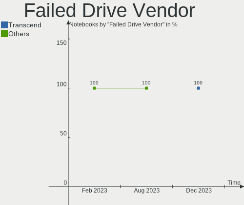
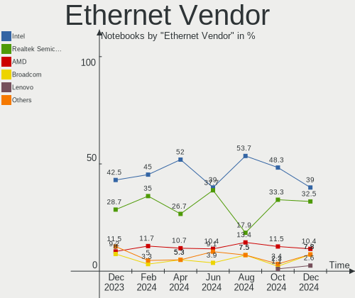
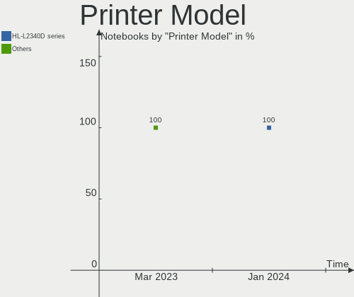

BSD Hardware Trends (Notebook)
------------------------------

A project to identify most popular hardware characteristics and track their change
over time based on data collected by BSD users at https://BSD-Hardware.info.

Anyone can contribute to the study by uploading probes of their computers by
the [hw-probe](https://github.com/linuxhw/hw-probe/blob/master/INSTALL.BSD.md) tool:

    hw-probe -all -upload

Full-feature report is available here: https://bsd-hardware.info/?view=trends&formfactor=notebook

Period: Mar, 2021.

Contents
--------

- [ OS                       ](#os)
- [ OS Family                ](#os-family)
- [ Arch                     ](#arch)
- [ DE                       ](#de)
- [ Display Server           ](#display-server)
- [ Display Manager          ](#display-manager)
- [ OS Lang                  ](#os-lang)
- [ Boot Mode                ](#boot-mode)
- [ Filesystem               ](#filesystem)
- [ Part. scheme             ](#part-scheme)
- [ Country                  ](#country)
- [ City                     ](#city)
- [ Vendor                   ](#vendor)
- [ Model                    ](#model)
- [ Model Family             ](#model-family)
- [ MFG Year                 ](#mfg-year)
- [ Form Factor              ](#form-factor)
- [ Coreboot                 ](#coreboot)
- [ RAM Size                 ](#ram-size)
- [ RAM Used                 ](#ram-used)
- [ Has CD-ROM               ](#has-cd-rom)
- [ Total Drives             ](#total-drives)
- [ Has Ethernet             ](#has-ethernet)
- [ Has WiFi                 ](#has-wifi)
- [ Has Bluetooth            ](#has-bluetooth)
- [ Drive Vendor             ](#drive-vendor)
- [ Drive Model              ](#drive-model)
- [ HDD Vendor               ](#hdd-vendor)
- [ SSD Vendor               ](#ssd-vendor)
- [ Drive Kind               ](#drive-kind)
- [ Drive Connector          ](#drive-connector)
- [ Drive Size               ](#drive-size)
- [ Space Total              ](#space-total)
- [ Space Used               ](#space-used)
- [ Malfunc. Drives          ](#malfunc-drives)
- [ Malfunc. Drive Vendor    ](#malfunc-drive-vendor)
- [ Malfunc. HDD Vendor      ](#malfunc-hdd-vendor)
- [ Malfunc. Drive Kind      ](#malfunc-drive-kind)
- [ Failed Drives            ](#failed-drives)
- [ Failed Drive Vendor      ](#failed-drive-vendor)
- [ Drive Status             ](#drive-status)
- [ Storage Vendor           ](#storage-vendor)
- [ Storage Model            ](#storage-model)
- [ Storage Kind             ](#storage-kind)
- [ CPU Vendor               ](#cpu-vendor)
- [ CPU Model                ](#cpu-model)
- [ CPU Model Family         ](#cpu-model-family)
- [ CPU Cores                ](#cpu-cores)
- [ CPU Sockets              ](#cpu-sockets)
- [ CPU Threads              ](#cpu-threads)
- [ CPU Microarch            ](#cpu-microarch)
- [ GPU Vendor               ](#gpu-vendor)
- [ GPU Model                ](#gpu-model)
- [ GPU Combo                ](#gpu-combo)
- [ GPU Driver               ](#gpu-driver)
- [ GPU Memory               ](#gpu-memory)
- [ Monitor Vendor           ](#monitor-vendor)
- [ Monitor Model            ](#monitor-model)
- [ Monitor Resolution       ](#monitor-resolution)
- [ Monitor Diagonal         ](#monitor-diagonal)
- [ Monitor Width            ](#monitor-width)
- [ Aspect Ratio             ](#aspect-ratio)
- [ Monitor Area             ](#monitor-area)
- [ Pixel Density            ](#pixel-density)
- [ Multiple Monitors        ](#multiple-monitors)
- [ Net Controller Vendor    ](#net-controller-vendor)
- [ Net Controller Model     ](#net-controller-model)
- [ Wireless Vendor          ](#wireless-vendor)
- [ Wireless Model           ](#wireless-model)
- [ Ethernet Vendor          ](#ethernet-vendor)
- [ Ethernet Model           ](#ethernet-model)
- [ Net Controller Kind      ](#net-controller-kind)
- [ Used Controller          ](#used-controller)
- [ NICs                     ](#nics)
- [ IPv6                     ](#ipv6)
- [ Memory Vendor            ](#memory-vendor)
- [ Memory Model             ](#memory-model)
- [ Memory Kind              ](#memory-kind)
- [ Memory Form Factor       ](#memory-form-factor)
- [ Memory Size              ](#memory-size)
- [ Memory Speed             ](#memory-speed)
- [ Sound Vendor             ](#sound-vendor)
- [ Sound Model              ](#sound-model)
- [ Camera Vendor            ](#camera-vendor)
- [ Camera Model             ](#camera-model)
- [ Fingerprint Vendor       ](#fingerprint-vendor)
- [ Fingerprint Model        ](#fingerprint-model)
- [ Chipcard Vendor          ](#chipcard-vendor)
- [ Chipcard Model           ](#chipcard-model)
- [ Printer Vendor           ](#printer-vendor)
- [ Printer Model            ](#printer-model)
- [ Scanner Vendor           ](#scanner-vendor)
- [ Scanner Model            ](#scanner-model)
- [ Bluetooth Vendor         ](#bluetooth-vendor)
- [ Bluetooth Model          ](#bluetooth-model)
- [ Unsupported Devices      ](#unsupported-devices)
- [ Unsupported Device Types ](#unsupported-device-types)

OS
--

Installed operating systems

| Name                 | Notebooks | Percent |
|----------------------|-----------|---------|
| helloSystem 0.5.0    | 21        | 15.56%  |
| FreeBSD 12.2-p4      | 16        | 11.85%  |
| NomadBSD 1.4         | 13        | 9.63%   |
| helloSystem 0.4.0    | 10        | 7.41%   |
| OPNsense 21.1.3      | 9         | 6.67%   |
| OpenBSD 6.9          | 8         | 5.93%   |
| GhostBSD 20.04.02    | 6         | 4.44%   |
| FreeBSD 12.2         | 6         | 4.44%   |
| OPNsense 21.1.2      | 5         | 3.7%    |
| FreeBSD 14.0-CURRENT | 5         | 3.7%    |
| FreeBSD 13.0-RC1     | 5         | 3.7%    |
| OpenBSD 6.8          | 4         | 2.96%   |
| FreeBSD 13.0-RC2     | 4         | 2.96%   |
| FreeBSD 13.0-STABLE  | 3         | 2.22%   |
| FreeBSD 13.0-RC3     | 3         | 2.22%   |
| FreeBSD 12.2-p5      | 3         | 2.22%   |
| OPNsense 21.1.1      | 2         | 1.48%   |
| NomadBSD 1.4-RC1     | 2         | 1.48%   |
| FreeBSD 13.0-BETA4   | 2         | 1.48%   |
| FreeBSD 12.2-STABLE  | 2         | 1.48%   |
| FreeBSD 11.4-p8      | 2         | 1.48%   |
| NetBSD 9.1           | 1         | 0.74%   |
| FreeBSD 12.2-p2      | 1         | 0.74%   |
| FreeBSD 12.1-p8      | 1         | 0.74%   |
| FreeBSD 12.1         | 1         | 0.74%   |

OS Family
---------

OS without a version

| Name        | Notebooks | Percent |
|-------------|-----------|---------|
| FreeBSD     | 54        | 40%     |
| helloSystem | 31        | 22.96%  |
| OPNsense    | 16        | 11.85%  |
| NomadBSD    | 15        | 11.11%  |
| OpenBSD     | 12        | 8.89%   |
| GhostBSD    | 6         | 4.44%   |
| NetBSD      | 1         | 0.74%   |

Arch
----

OS architecture (x86_64, i586, etc.)

| Name  | Notebooks | Percent |
|-------|-----------|---------|
| amd64 | 130       | 96.3%   |
| i386  | 5         | 3.7%    |

DE
--

Desktop Environment

| Name          | Notebooks | Percent |
|---------------|-----------|---------|
| helloDesktop  | 30        | 22.22%  |
| Console       | 20        | 14.81%  |
| XFCE          | 16        | 11.85%  |
| Openbox       | 13        | 9.63%   |
| fvwm          | 12        | 8.89%   |
| KDE5          | 9         | 6.67%   |
| GNOME         | 9         | 6.67%   |
| TWM           | 7         | 5.19%   |
| MATE          | 6         | 4.44%   |
| i3            | 3         | 2.22%   |
| LXDE          | 2         | 1.48%   |
| Enlightenment | 2         | 1.48%   |
| Cinnamon      | 2         | 1.48%   |
| AwesomeWM     | 2         | 1.48%   |
| LXQt          | 1         | 0.74%   |
| dwm           | 1         | 0.74%   |

Display Server
--------------

X11 or Wayland

| Name    | Notebooks | Percent |
|---------|-----------|---------|
| X11     | 112       | 82.96%  |
| Console | 22        | 16.3%   |
| Wayland | 1         | 0.74%   |

Display Manager
---------------

SDDM, LightDM, etc.

| Name    | Notebooks | Percent |
|---------|-----------|---------|
| SLiM    | 62        | 45.93%  |
| Console | 48        | 35.56%  |
| LightDM | 9         | 6.67%   |
| SDDM    | 6         | 4.44%   |
| GDM     | 5         | 3.7%    |
| XDM     | 4         | 2.96%   |
| Ly      | 1         | 0.74%   |

OS Lang
-------

Language

| Lang             | Notebooks | Percent |
|------------------|-----------|---------|
| en_US            | 46        | 34.07%  |
| Unknown          | 46        | 34.07%  |
| C                | 13        | 9.63%   |
| ru_RU            | 5         | 3.7%    |
| fr_FR            | 4         | 2.96%   |
| de_DE            | 4         | 2.96%   |
| uk_UA            | 2         | 1.48%   |
| it_IT            | 2         | 1.48%   |
| zh_CN            | 1         | 0.74%   |
| tr_TR            | 1         | 0.74%   |
| pl_PL            | 1         | 0.74%   |
| ko_KR            | 1         | 0.74%   |
| es_ES            | 1         | 0.74%   |
| en_NZ            | 1         | 0.74%   |
| en_GB.US-ASCII   | 1         | 0.74%   |
| en_GB            | 1         | 0.74%   |
| en_EN            | 1         | 0.74%   |
| el_GR            | 1         | 0.74%   |
| de_DE.ISO8859-15 | 1         | 0.74%   |
| de_DE.ISO8859-1  | 1         | 0.74%   |
| de_CH            | 1         | 0.74%   |

Boot Mode
---------

EFI or BIOS

| Mode | Notebooks | Percent |
|------|-----------|---------|
| EFI  | 105       | 77.78%  |
| BIOS | 30        | 22.22%  |

Filesystem
----------

Type of filesystem

| Type | Notebooks | Percent |
|------|-----------|---------|
| Zfs  | 68        | 50.37%  |
| Ufs  | 55        | 40.74%  |
| Ffs  | 12        | 8.89%   |

Part. scheme
------------

Scheme of partitioning

| Type    | Notebooks | Percent |
|---------|-----------|---------|
| GPT     | 118       | 87.41%  |
| MBR     | 16        | 11.85%  |
| Unknown | 1         | 0.74%   |

Country
-------

Geographic location (country)

| Country      | Notebooks | Percent |
|--------------|-----------|---------|
| USA          | 19        | 14.07%  |
| Germany      | 16        | 11.85%  |
| France       | 13        | 9.63%   |
| Russia       | 10        | 7.41%   |
| UK           | 9         | 6.67%   |
| Netherlands  | 7         | 5.19%   |
| Brazil       | 6         | 4.44%   |
| Ukraine      | 5         | 3.7%    |
| Spain        | 5         | 3.7%    |
| China        | 5         | 3.7%    |
| Italy        | 4         | 2.96%   |
| Canada       | 4         | 2.96%   |
| Turkey       | 3         | 2.22%   |
| Switzerland  | 2         | 1.48%   |
| Portugal     | 2         | 1.48%   |
| Latvia       | 2         | 1.48%   |
| Greece       | 2         | 1.48%   |
| Austria      | 2         | 1.48%   |
| Australia    | 2         | 1.48%   |
| Argentina    | 2         | 1.48%   |
| Sweden       | 1         | 0.74%   |
| South Korea  | 1         | 0.74%   |
| South Africa | 1         | 0.74%   |
| Poland       | 1         | 0.74%   |
| Philippines  | 1         | 0.74%   |
| Norway       | 1         | 0.74%   |
| New Zealand  | 1         | 0.74%   |
| Indonesia    | 1         | 0.74%   |
| India        | 1         | 0.74%   |
| Egypt        | 1         | 0.74%   |
| Denmark      | 1         | 0.74%   |
| Cyprus       | 1         | 0.74%   |
| Bulgaria     | 1         | 0.74%   |
| Belgium      | 1         | 0.74%   |
| Belarus      | 1         | 0.74%   |

City
----

Geographic location (city)

| City                     | Notebooks | Percent |
|--------------------------|-----------|---------|
| Moscow                   | 5         | 3.7%    |
| Brooklyn                 | 4         | 2.96%   |
| Markt Indersdorf         | 3         | 2.22%   |
| Franconville             | 3         | 2.22%   |
| Zwingenberg              | 2         | 1.48%   |
| Riga                     | 2         | 1.48%   |
| Paris                    | 2         | 1.48%   |
| Milan                    | 2         | 1.48%   |
| Manaus                   | 2         | 1.48%   |
| Istanbul                 | 2         | 1.48%   |
| Glasgow                  | 2         | 1.48%   |
| Gibraleón               | 2         | 1.48%   |
| Brovary                  | 2         | 1.48%   |
| Athens                   | 2         | 1.48%   |
| 's-Hertogenbosch         | 2         | 1.48%   |
| Zurich                   | 1         | 0.74%   |
| Zhengzhou                | 1         | 0.74%   |
| Yekaterinburg            | 1         | 0.74%   |
| Wuxi                     | 1         | 0.74%   |
| Woking                   | 1         | 0.74%   |
| Washington               | 1         | 0.74%   |
| Vyshhorod                | 1         | 0.74%   |
| Vorkuta                  | 1         | 0.74%   |
| Villeneuve-Saint-Georges | 1         | 0.74%   |
| Vigonovo                 | 1         | 0.74%   |
| Vienna                   | 1         | 0.74%   |
| Victoria                 | 1         | 0.74%   |
| Vertou                   | 1         | 0.74%   |
| Varna                    | 1         | 0.74%   |
| Ulyanovsk                | 1         | 0.74%   |
| Trosa                    | 1         | 0.74%   |
| Tolyatti                 | 1         | 0.74%   |
| Tielt                    | 1         | 0.74%   |
| The Bronx                | 1         | 0.74%   |
| São Paulo               | 1         | 0.74%   |
| Suwon                    | 1         | 0.74%   |
| Surabaya                 | 1         | 0.74%   |
| Solrod                   | 1         | 0.74%   |
| Seminole                 | 1         | 0.74%   |
| Sao Jeronimo da Serra    | 1         | 0.74%   |
| Sandhausen               | 1         | 0.74%   |
| Resistencia              | 1         | 0.74%   |
| Remseck am Neckar        | 1         | 0.74%   |
| Ramerberg                | 1         | 0.74%   |
| Potsdam                  | 1         | 0.74%   |
| Pleidelsheim             | 1         | 0.74%   |
| Parndorf                 | 1         | 0.74%   |
| Oosterhout               | 1         | 0.74%   |
| Novosibirsk              | 1         | 0.74%   |
| Notting Hill Gate        | 1         | 0.74%   |
| Neuilly-sur-Marne        | 1         | 0.74%   |
| Nanjing                  | 1         | 0.74%   |
| Mions                    | 1         | 0.74%   |
| Minsk                    | 1         | 0.74%   |
| Medford                  | 1         | 0.74%   |
| Marseille                | 1         | 0.74%   |
| Mar del Plata            | 1         | 0.74%   |
| Lübeck                  | 1         | 0.74%   |
| Lucknow                  | 1         | 0.74%   |
| Los Angeles              | 1         | 0.74%   |

Vendor
------

Motherboard manufacturer

| Name                   | Notebooks | Percent |
|------------------------|-----------|---------|
| Lenovo                 | 41        | 30.37%  |
| Dell                   | 24        | 17.78%  |
| Hewlett-Packard        | 17        | 12.59%  |
| ASUSTek Computer       | 11        | 8.15%   |
| Apple                  | 6         | 4.44%   |
| Samsung Electronics    | 5         | 3.7%    |
| Toshiba                | 4         | 2.96%   |
| Acer                   | 4         | 2.96%   |
| Fujitsu                | 3         | 2.22%   |
| TUXEDO                 | 2         | 1.48%   |
| Packard Bell           | 2         | 1.48%   |
| Notebook               | 2         | 1.48%   |
| MSI                    | 2         | 1.48%   |
| Deciso                 | 2         | 1.48%   |
| Clevo                  | 2         | 1.48%   |
| SECO                   | 1         | 0.74%   |
| Panasonic              | 1         | 0.74%   |
| HUAWEI                 | 1         | 0.74%   |
| Gateway                | 1         | 0.74%   |
| DFI                    | 1         | 0.74%   |
| Avell High Performance | 1         | 0.74%   |
| Alienware              | 1         | 0.74%   |
| Unknown                | 1         | 0.74%   |

Model
-----

Motherboard model

| Name                                     | Notebooks | Percent |
|------------------------------------------|-----------|---------|
| Samsung N145P/N250P/N260P                | 2         | 1.48%   |
| HP Laptop 15-da0xxx                      | 2         | 1.48%   |
| Dell Inspiron 7520                       | 2         | 1.48%   |
| Deciso Netboard A20                      | 2         | 1.48%   |
| Apple MacBookPro5,5                      | 2         | 1.48%   |
| Unknown                                  | 2         | 1.48%   |
| TUXEDO Aura 15 Gen1                      | 1         | 0.74%   |
| Toshiba Satellite Pro U400               | 1         | 0.74%   |
| Toshiba Satellite L500                   | 1         | 0.74%   |
| Toshiba Satellite L50-C                  | 1         | 0.74%   |
| Toshiba Satellite C660                   | 1         | 0.74%   |
| SECO UDOO x86                            | 1         | 0.74%   |
| Samsung N150P                            | 1         | 0.74%   |
| Samsung 950XCJ/951XCJ/950XCR             | 1         | 0.74%   |
| Samsung 530U3C/530U4C/532U3C             | 1         | 0.74%   |
| Panasonic CF-30KTP48NL                   | 1         | 0.74%   |
| Packard Bell EasyNote MH36               | 1         | 0.74%   |
| Packard Bell AOA110                      | 1         | 0.74%   |
| Notebook N85_N87HCHNHZ                   | 1         | 0.74%   |
| Notebook N650DU                          | 1         | 0.74%   |
| MSI MS-N033                              | 1         | 0.74%   |
| MSI GE75 Raider 10SGS                    | 1         | 0.74%   |
| Lenovo ThinkPad X395 20NL001SMX          | 1         | 0.74%   |
| Lenovo ThinkPad X280 20KESA000B          | 1         | 0.74%   |
| Lenovo ThinkPad X270 W10DG 20K5S0DS00    | 1         | 0.74%   |
| Lenovo ThinkPad X260 20F5S82N00          | 1         | 0.74%   |
| Lenovo ThinkPad X250 20CM003WMS          | 1         | 0.74%   |
| Lenovo ThinkPad X230 23255Y4             | 1         | 0.74%   |
| Lenovo ThinkPad X220 4291ON5             | 1         | 0.74%   |
| Lenovo ThinkPad X220 4291IR6             | 1         | 0.74%   |
| Lenovo ThinkPad X220 4291EM4             | 1         | 0.74%   |
| Lenovo ThinkPad X220 42914CG             | 1         | 0.74%   |
| Lenovo ThinkPad X220 4290EE8             | 1         | 0.74%   |
| Lenovo ThinkPad X200s 7470W1V            | 1         | 0.74%   |
| Lenovo ThinkPad X1 Carbon 7th 20QDCTO1WW | 1         | 0.74%   |
| Lenovo ThinkPad X1 Carbon 7th 20QD00KTMH | 1         | 0.74%   |
| Lenovo ThinkPad X1 Carbon 3rd 20BT0018US | 1         | 0.74%   |
| Lenovo ThinkPad X1 Carbon 3rd 20BT000BUS | 1         | 0.74%   |
| Lenovo ThinkPad T61 766416U              | 1         | 0.74%   |
| Lenovo ThinkPad T60 20076PU              | 1         | 0.74%   |
| Lenovo ThinkPad T590 20N4CTO1WW          | 1         | 0.74%   |
| Lenovo ThinkPad T530 2392ASU             | 1         | 0.74%   |
| Lenovo ThinkPad T490 20N3X50500          | 1         | 0.74%   |
| Lenovo ThinkPad T490 20N20009FR          | 1         | 0.74%   |
| Lenovo ThinkPad T480s 20L7001HRT         | 1         | 0.74%   |
| Lenovo ThinkPad T470 20HES5PK00          | 1         | 0.74%   |
| Lenovo ThinkPad T440s 20ARS1B704         | 1         | 0.74%   |
| Lenovo ThinkPad T400 6475P1G             | 1         | 0.74%   |
| Lenovo ThinkPad S1 Yoga 20CDS00KMN       | 1         | 0.74%   |
| Lenovo ThinkPad R61 77331CU              | 1         | 0.74%   |
| Lenovo ThinkPad P15 Gen 1 20ST005VRT     | 1         | 0.74%   |
| Lenovo ThinkPad L590 20Q7000YSP          | 1         | 0.74%   |
| Lenovo ThinkPad L530 24812TG             | 1         | 0.74%   |
| Lenovo ThinkPad Edge 05796AU             | 1         | 0.74%   |
| Lenovo ThinkPad E490 20N8CTO1WW          | 1         | 0.74%   |
| Lenovo ThinkPad E460 20ETA00DCD          | 1         | 0.74%   |
| Lenovo Legion 5 15IMH05 82AU             | 1         | 0.74%   |
| Lenovo IdeaPad Y700-15ISK 80NV           | 1         | 0.74%   |
| Lenovo IdeaPad S145-15API 81UT           | 1         | 0.74%   |
| Lenovo IdeaPad 700-15ISK 80RU            | 1         | 0.74%   |

Model Family
------------

Motherboard model prefix

| Name                       | Notebooks | Percent |
|----------------------------|-----------|---------|
| Lenovo ThinkPad            | 34        | 25.19%  |
| Dell Latitude              | 12        | 8.89%   |
| Dell Inspiron              | 8         | 5.93%   |
| Toshiba Satellite          | 4         | 2.96%   |
| Lenovo IdeaPad             | 4         | 2.96%   |
| HP ProBook                 | 4         | 2.96%   |
| HP Pavilion                | 4         | 2.96%   |
| HP EliteBook               | 4         | 2.96%   |
| HP Laptop                  | 3         | 2.22%   |
| Fujitsu LIFEBOOK           | 3         | 2.22%   |
| Dell Precision             | 3         | 2.22%   |
| Acer Aspire                | 3         | 2.22%   |
| Samsung N145P              | 2         | 1.48%   |
| HP 255                     | 2         | 1.48%   |
| Deciso Netboard            | 2         | 1.48%   |
| Apple MacBookPro5          | 2         | 1.48%   |
| Unknown                    | 2         | 1.48%   |
| TUXEDO Aura                | 1         | 0.74%   |
| SECO UDOO                  | 1         | 0.74%   |
| Samsung N150P              | 1         | 0.74%   |
| Samsung 950XCJ             | 1         | 0.74%   |
| Samsung 530U3C             | 1         | 0.74%   |
| Panasonic CF-30KTP48NL     | 1         | 0.74%   |
| Packard Bell EasyNote      | 1         | 0.74%   |
| Packard Bell AOA110        | 1         | 0.74%   |
| Notebook N85               | 1         | 0.74%   |
| Notebook N650DU            | 1         | 0.74%   |
| MSI MS-N033                | 1         | 0.74%   |
| MSI GE75                   | 1         | 0.74%   |
| Lenovo Legion              | 1         | 0.74%   |
| Lenovo B41-80              | 1         | 0.74%   |
| Lenovo 3000                | 1         | 0.74%   |
| HUAWEI MACH-WX9            | 1         | 0.74%   |
| Gateway Solo               | 1         | 0.74%   |
| DFI BE17X(170              | 1         | 0.74%   |
| Dell Vostro                | 1         | 0.74%   |
| Clevo W55xEU               | 1         | 0.74%   |
| Clevo W240EU               | 1         | 0.74%   |
| Avell High Performance A62 | 1         | 0.74%   |
| ASUS X58LE                 | 1         | 0.74%   |
| ASUS X55CR                 | 1         | 0.74%   |
| ASUS X556UA                | 1         | 0.74%   |
| ASUS X550LC                | 1         | 0.74%   |
| ASUS X540UP                | 1         | 0.74%   |
| ASUS X510UA                | 1         | 0.74%   |
| ASUS VivoBook              | 1         | 0.74%   |
| ASUS G75VW                 | 1         | 0.74%   |
| ASUS 900A                  | 1         | 0.74%   |
| ASUS 1225B                 | 1         | 0.74%   |
| ASUS 1015BX                | 1         | 0.74%   |
| Apple MacBookPro6          | 1         | 0.74%   |
| Apple MacBookAir6          | 1         | 0.74%   |
| Apple MacBook3             | 1         | 0.74%   |
| Apple MacBook2             | 1         | 0.74%   |
| Alienware 14               | 1         | 0.74%   |
| Acer Extensa               | 1         | 0.74%   |

MFG Year
--------

Motherboard manufacture year

| Year | Notebooks | Percent |
|------|-----------|---------|
| 2020 | 32        | 23.7%   |
| 2019 | 21        | 15.56%  |
| 2018 | 11        | 8.15%   |
| 2017 | 11        | 8.15%   |
| 2009 | 9         | 6.67%   |
| 2013 | 7         | 5.19%   |
| 2012 | 7         | 5.19%   |
| 2021 | 6         | 4.44%   |
| 2016 | 6         | 4.44%   |
| 2011 | 5         | 3.7%    |
| 2008 | 5         | 3.7%    |
| 2015 | 4         | 2.96%   |
| 2014 | 3         | 2.22%   |
| 2010 | 3         | 2.22%   |
| 2007 | 2         | 1.48%   |
| 2006 | 2         | 1.48%   |
| 2002 | 1         | 0.74%   |

Form Factor
-----------

Physical design of the computer

| Name     | Notebooks | Percent |
|----------|-----------|---------|
| Notebook | 135       | 100%    |

Coreboot
--------

Have coreboot on board

| Used | Notebooks | Percent |
|------|-----------|---------|
| No   | 133       | 98.52%  |
| Yes  | 2         | 1.48%   |

RAM Size
--------

Total RAM memory

| Size in GB  | Notebooks | Percent |
|-------------|-----------|---------|
| 8.01-16.0   | 49        | 36.3%   |
| 4.01-8.0    | 33        | 24.44%  |
| 16.01-24.0  | 30        | 22.22%  |
| 32.01-64.0  | 7         | 5.19%   |
| 3.01-4.0    | 6         | 4.44%   |
| 2.01-3.0    | 5         | 3.7%    |
| 24.01-32.0  | 1         | 0.74%   |
| 64.01-256.0 | 1         | 0.74%   |
| 1.01-2.0    | 1         | 0.74%   |
| 0.51-1.0    | 1         | 0.74%   |
| 0.01-0.5    | 1         | 0.74%   |

RAM Used
--------

Used RAM memory

| Used GB    | Notebooks | Percent |
|------------|-----------|---------|
| 0.01-0.5   | 78        | 57.78%  |
| 0.51-1.0   | 38        | 28.15%  |
| 1.01-2.0   | 7         | 5.19%   |
| 2.01-3.0   | 4         | 2.96%   |
| 8.01-16.0  | 3         | 2.22%   |
| 4.01-8.0   | 2         | 1.48%   |
| 32.01-64.0 | 1         | 0.74%   |
| 0          | 1         | 0.74%   |
| Unknown    | 1         | 0.74%   |

Has CD-ROM
----------

Has CD-ROM on board

| Presented | Notebooks | Percent |
|-----------|-----------|---------|
| No        | 95        | 70.37%  |
| Yes       | 40        | 29.63%  |

Total Drives
------------

Number of drives on board

| Drives | Notebooks | Percent |
|--------|-----------|---------|
| 1      | 93        | 68.89%  |
| 2      | 36        | 26.67%  |
| 0      | 5         | 3.7%    |
| 3      | 1         | 0.74%   |

Has Ethernet
------------

Has Ethernet on board

| Presented | Notebooks | Percent |
|-----------|-----------|---------|
| Yes       | 125       | 92.59%  |
| No        | 10        | 7.41%   |

Has WiFi
--------

Has WiFi module

| Presented | Notebooks | Percent |
|-----------|-----------|---------|
| Yes       | 127       | 94.07%  |
| No        | 8         | 5.93%   |

Has Bluetooth
-------------

Has Bluetooth module

| Presented | Notebooks | Percent |
|-----------|-----------|---------|
| Yes       | 87        | 64.44%  |
| No        | 48        | 35.56%  |

Drive Vendor
------------

Hard drive vendors

| Vendor              | Notebooks | Drives | Percent |
|---------------------|-----------|--------|---------|
| Samsung Electronics | 32        | 34     | 21.33%  |
| WDC                 | 21        | 25     | 14%     |
| Seagate             | 13        | 14     | 8.67%   |
| Toshiba             | 11        | 11     | 7.33%   |
| SanDisk             | 8         | 8      | 5.33%   |
| Intel               | 8         | 8      | 5.33%   |
| Crucial             | 8         | 8      | 5.33%   |
| Hitachi             | 7         | 9      | 4.67%   |
| Kingston            | 6         | 6      | 4%      |
| Transcend           | 4         | 4      | 2.67%   |
| SK Hynix            | 3         | 3      | 2%      |
| Micron Technology   | 3         | 3      | 2%      |
| HGST                | 3         | 3      | 2%      |
| A-DATA Technology   | 3         | 4      | 2%      |
| Phison              | 2         | 2      | 1.33%   |
| OWC                 | 2         | 2      | 1.33%   |
| NVMe                | 2         | 2      | 1.33%   |
| KingSpec            | 2         | 2      | 1.33%   |
| Zheino              | 1         | 1      | 0.67%   |
| Union Memory        | 1         | 1      | 0.67%   |
| SPCC                | 1         | 1      | 0.67%   |
| SMART               | 1         | 1      | 0.67%   |
| LITEON              | 1         | 1      | 0.67%   |
| HPE                 | 1         | 1      | 0.67%   |
| Gigabyte Technology | 1         | 1      | 0.67%   |
| Fujitsu             | 1         | 1      | 0.67%   |
| Corsair             | 1         | 1      | 0.67%   |
| China               | 1         | 1      | 0.67%   |
| Apple               | 1         | 1      | 0.67%   |
| Apacer              | 1         | 1      | 0.67%   |

Drive Model
-----------

Hard drive models

| Model                                           | Notebooks | Percent |
|-------------------------------------------------|-----------|---------|
| Samsung SSD 850 EVO 250GB                       | 4         | 2.55%   |
| WDC WD10JPVX-75JC3T0 1TB                        | 2         | 1.27%   |
| Transcend TS256GMTS952T2 256GB                  | 2         | 1.27%   |
| SK Hynix BC511 NVMe 512GB                       | 2         | 1.27%   |
| Seagate ST1000LM035-1RK172 1TB                  | 2         | 1.27%   |
| Samsung SSD 860 EVO 500GB                       | 2         | 1.27%   |
| Phison PCIe SSD 2TB                             | 2         | 1.27%   |
| OWC Mercury Electra 6G SSD                      | 2         | 1.27%   |
| Micron 1100 SATA 256GB                          | 2         | 1.27%   |
| Kingston SA400S37240G 240GB                     | 2         | 1.27%   |
| Intel SSDPEKNW512G8H 512GB                      | 2         | 1.27%   |
| HGST HTS725050A7E630 500GB                      | 2         | 1.27%   |
| Crucial CT960BX500SSD1 960GB                    | 2         | 1.27%   |
| Zheino CHN mSATA01M 060 64GB                    | 1         | 0.64%   |
| WDC WDS200T2B0A 2TB                             | 1         | 0.64%   |
| WDC WDS120G2G0B-00EPW0 120GB                    | 1         | 0.64%   |
| WDC WDS120G2G0A-00JH30 120GB                    | 1         | 0.64%   |
| WDC WDS120G1G0A-00SS50 120GB                    | 1         | 0.64%   |
| WDC WDS100T3X0C-00SJG0 1TB                      | 1         | 0.64%   |
| WDC WDS100T1B0A-00H9H0 1TB                      | 1         | 0.64%   |
| WDC WD7500BPKX-75HPJT0 752GB                    | 1         | 0.64%   |
| WDC WD5000LPCX-75VHAT0 500GB                    | 1         | 0.64%   |
| WDC WD3200BEVT-22ZCT0 320GB                     | 1         | 0.64%   |
| WDC WD3200BEKT-60V5T1 320GB                     | 1         | 0.64%   |
| WDC WD3200BEKT-60PVMT0 320GB                    | 1         | 0.64%   |
| WDC WD2500BEVT-80A23T0 250GB                    | 1         | 0.64%   |
| WDC WD20SPZX-75UA7T0 2TB                        | 1         | 0.64%   |
| WDC WD20SPZX-22UA7T0 2TB                        | 1         | 0.64%   |
| WDC WD20SPZX-22CRAT0 2TB                        | 1         | 0.64%   |
| WDC WD15EARS-00Z5B1 1.5TB                       | 1         | 0.64%   |
| WDC WD10JPVT-00A1YT0 1TB                        | 1         | 0.64%   |
| WDC WD10JPLX-00MBPT0 1TB                        | 1         | 0.64%   |
| WDC PC SN730 SDBQNTY-256G-1001 256GB            | 1         | 0.64%   |
| WDC PC SN730 SDBPNTY-1T00-1032 1TB              | 1         | 0.64%   |
| WDC PC SN530 SDBPNPZ-256G-1002 256GB            | 1         | 0.64%   |
| WDC PC SN520 SDAPMUW-128G-1101 128GB            | 1         | 0.64%   |
| Union Memory UMIS LENSE40256GMSP34MESTB3A 256GB | 1         | 0.64%   |
| Transcend TS512GMTS430S 512GB                   | 1         | 0.64%   |
| Transcend TS128GMTS430S 128GB                   | 1         | 0.64%   |
| Toshiba TR200 240GB                             | 1         | 0.64%   |
| Toshiba THNSNK256GVN8 M.2 2280 256GB            | 1         | 0.64%   |
| Toshiba THNSFJ256GDNU 256GB                     | 1         | 0.64%   |
| Toshiba MQ02ABF050H-SSHD-8GB                    | 1         | 0.64%   |
| Toshiba MQ01ABF050 500GB                        | 1         | 0.64%   |
| Toshiba MQ01ABD100 1TB                          | 1         | 0.64%   |
| Toshiba MQ01ABD032 320GB                        | 1         | 0.64%   |
| Toshiba MK3261GSYN 320GB                        | 1         | 0.64%   |
| Toshiba MK1665GSX 160GB                         | 1         | 0.64%   |
| Toshiba KXG60ZNV512G NVMe 512GB                 | 1         | 0.64%   |
| Toshiba KBG30ZMT512G 512GB                      | 1         | 0.64%   |
| SPCC Solid State Disk 128GB                     | 1         | 0.64%   |
| SMART SSD XceedValue2 mSATA 32GB                | 1         | 0.64%   |
| SK Hynix SC311 SATA 256GB                       | 1         | 0.64%   |
| Seagate ST95005620AS 500GB                      | 1         | 0.64%   |
| Seagate ST9500325AS 500GB                       | 1         | 0.64%   |
| Seagate ST9320325AS 320GB                       | 1         | 0.64%   |
| Seagate ST9320320AS 320GB                       | 1         | 0.64%   |
| Seagate ST9160412AS 160GB                       | 1         | 0.64%   |
| Seagate ST500LT012-1DG142 500GB                 | 1         | 0.64%   |
| Seagate ST500LM000-SSHD-8GB                     | 1         | 0.64%   |

HDD Vendor
----------

Hard disk drive vendors

| Vendor              | Notebooks | Drives | Percent |
|---------------------|-----------|--------|---------|
| WDC                 | 14        | 14     | 29.17%  |
| Seagate             | 13        | 14     | 27.08%  |
| Hitachi             | 7         | 9      | 14.58%  |
| Toshiba             | 6         | 6      | 12.5%   |
| Samsung Electronics | 3         | 3      | 6.25%   |
| HGST                | 3         | 3      | 6.25%   |
| NVMe                | 1         | 1      | 2.08%   |
| Fujitsu             | 1         | 1      | 2.08%   |

SSD Vendor
----------

Solid state drive vendors

| Vendor              | Notebooks | Drives | Percent |
|---------------------|-----------|--------|---------|
| Samsung Electronics | 20        | 21     | 25.97%  |
| SanDisk             | 8         | 8      | 10.39%  |
| Crucial             | 8         | 8      | 10.39%  |
| Kingston            | 6         | 6      | 7.79%   |
| WDC                 | 4         | 5      | 5.19%   |
| Transcend           | 4         | 4      | 5.19%   |
| Toshiba             | 3         | 3      | 3.9%    |
| Micron Technology   | 3         | 3      | 3.9%    |
| Intel               | 3         | 3      | 3.9%    |
| OWC                 | 2         | 2      | 2.6%    |
| KingSpec            | 2         | 2      | 2.6%    |
| A-DATA Technology   | 2         | 3      | 2.6%    |
| Zheino              | 1         | 1      | 1.3%    |
| SPCC                | 1         | 1      | 1.3%    |
| SMART               | 1         | 1      | 1.3%    |
| SK Hynix            | 1         | 1      | 1.3%    |
| NVMe                | 1         | 1      | 1.3%    |
| LITEON              | 1         | 1      | 1.3%    |
| HPE                 | 1         | 1      | 1.3%    |
| Gigabyte Technology | 1         | 1      | 1.3%    |
| Corsair             | 1         | 1      | 1.3%    |
| China               | 1         | 1      | 1.3%    |
| Apple               | 1         | 1      | 1.3%    |
| Apacer              | 1         | 1      | 1.3%    |

Drive Kind
----------

HDD or SSD

| Kind | Notebooks | Drives | Percent |
|------|-----------|--------|---------|
| SSD  | 73        | 80     | 49.32%  |
| HDD  | 47        | 51     | 31.76%  |
| NVMe | 28        | 29     | 18.92%  |

Drive Connector
---------------

SATA, SAS, NVMe, etc.

| Type | Notebooks | Drives | Percent |
|------|-----------|--------|---------|
| SATA | 112       | 131    | 80%     |
| NVMe | 28        | 29     | 20%     |

Drive Size
----------

Size of hard drive

| Size in TB | Notebooks | Drives | Percent |
|------------|-----------|--------|---------|
| 0.01-0.5   | 87        | 98     | 73.73%  |
| 0.51-1.0   | 23        | 25     | 19.49%  |
| 1.01-2.0   | 8         | 8      | 6.78%   |

Space Total
-----------

Amount of disk space available on the file system

| Size in GB | Notebooks | Percent |
|------------|-----------|---------|
| 101-250    | 39        | 28.89%  |
| 1-20       | 38        | 28.15%  |
| 251-500    | 31        | 22.96%  |
| 21-50      | 9         | 6.67%   |
| 501-1000   | 8         | 5.93%   |
| 51-100     | 6         | 4.44%   |
| 1001-2000  | 2         | 1.48%   |
| 2001-3000  | 1         | 0.74%   |
| Unknown    | 1         | 0.74%   |

Space Used
----------

Amount of used disk space

| Used GB  | Notebooks | Percent |
|----------|-----------|---------|
| 1-20     | 109       | 80.74%  |
| 21-50    | 11        | 8.15%   |
| 51-100   | 8         | 5.93%   |
| 101-250  | 4         | 2.96%   |
| 251-500  | 1         | 0.74%   |
| 501-1000 | 1         | 0.74%   |
| Unknown  | 1         | 0.74%   |

Malfunc. Drives
---------------

Drive models with a malfunction

| Model                                           | Notebooks | Drives | Percent |
|-------------------------------------------------|-----------|--------|---------|
| HGST HTS725050A7E630 500GB                      | 2         | 2      | 6.25%   |
| WDC WDS200T2B0A 2TB                             | 1         | 1      | 3.13%   |
| WDC WD3200BEVT-22ZCT0 320GB                     | 1         | 1      | 3.13%   |
| WDC WD3200BEKT-60V5T1 320GB                     | 1         | 1      | 3.13%   |
| WDC WD2500BEVT-80A23T0 250GB                    | 1         | 1      | 3.13%   |
| WDC WD15EARS-00Z5B1 1.5TB                       | 1         | 1      | 3.13%   |
| WDC WD10JPVX-75JC3T0 1TB                        | 1         | 1      | 3.13%   |
| Toshiba THNSNK256GVN8 M.2 2280 256GB            | 1         | 1      | 3.13%   |
| Toshiba MQ02ABF050H-SSHD-8GB                    | 1         | 1      | 3.13%   |
| Toshiba MQ01ABD032 320GB                        | 1         | 1      | 3.13%   |
| Toshiba MK3261GSYN 320GB                        | 1         | 1      | 3.13%   |
| Seagate ST9320325AS 320GB                       | 1         | 1      | 3.13%   |
| Seagate ST9320320AS 320GB                       | 1         | 1      | 3.13%   |
| Seagate ST9160412AS 160GB                       | 1         | 1      | 3.13%   |
| Seagate ST500LT012-1DG142 500GB                 | 1         | 1      | 3.13%   |
| Seagate ST1000LM024 HN-M101MBB 1TB              | 1         | 1      | 3.13%   |
| SanDisk SD9SN8W-128G-1006 128GB                 | 1         | 1      | 3.13%   |
| Samsung Electronics HM321HI 320GB               | 1         | 1      | 3.13%   |
| Samsung Electronics HM121HI 120GB               | 1         | 1      | 3.13%   |
| Micron Technology MTFDDAV256TDL-1AW1ZABHA 256GB | 1         | 1      | 3.13%   |
| Intel SSDSC2CW120A3 120GB                       | 1         | 1      | 3.13%   |
| Intel SSDSC2CW060A3 64GB                        | 1         | 1      | 3.13%   |
| Hitachi HTS545050B9A300 500GB                   | 1         | 1      | 3.13%   |
| Hitachi HTS545050A7E380 500GB                   | 1         | 1      | 3.13%   |
| Hitachi HTS545025B9SA02 250GB                   | 1         | 1      | 3.13%   |
| Hitachi HTS543232A7A384 320GB                   | 1         | 1      | 3.13%   |
| Hitachi HTS543225L9A300 250GB                   | 1         | 1      | 3.13%   |
| HGST HTS721010A9E630 1TB                        | 1         | 1      | 3.13%   |
| Fujitsu MHW2160BH 160GB                         | 1         | 1      | 3.13%   |
| Crucial CT500MX500SSD1 500GB                    | 1         | 1      | 3.13%   |
| Apple SSD SD0128F 121GB                         | 1         | 1      | 3.13%   |

Malfunc. Drive Vendor
---------------------

Vendors of faulty drives

| Vendor              | Notebooks | Drives | Percent |
|---------------------|-----------|--------|---------|
| WDC                 | 6         | 6      | 18.75%  |
| Seagate             | 5         | 5      | 15.63%  |
| Hitachi             | 5         | 5      | 15.63%  |
| Toshiba             | 4         | 4      | 12.5%   |
| HGST                | 3         | 3      | 9.38%   |
| Samsung Electronics | 2         | 2      | 6.25%   |
| Intel               | 2         | 2      | 6.25%   |
| SanDisk             | 1         | 1      | 3.13%   |
| Micron Technology   | 1         | 1      | 3.13%   |
| Fujitsu             | 1         | 1      | 3.13%   |
| Crucial             | 1         | 1      | 3.13%   |
| Apple               | 1         | 1      | 3.13%   |

Malfunc. HDD Vendor
-------------------

Vendors of faulty HDD drives

| Vendor              | Notebooks | Drives | Percent |
|---------------------|-----------|--------|---------|
| WDC                 | 5         | 5      | 20.83%  |
| Seagate             | 5         | 5      | 20.83%  |
| Hitachi             | 5         | 5      | 20.83%  |
| Toshiba             | 3         | 3      | 12.5%   |
| HGST                | 3         | 3      | 12.5%   |
| Samsung Electronics | 2         | 2      | 8.33%   |
| Fujitsu             | 1         | 1      | 4.17%   |

Malfunc. Drive Kind
-------------------

Kinds of faulty drives

| Kind | Notebooks | Drives | Percent |
|------|-----------|--------|---------|
| HDD  | 24        | 24     | 75%     |
| SSD  | 8         | 8      | 25%     |

Failed Drives
-------------

Failed drive models

| Model                   | Notebooks | Drives | Percent |
|-------------------------|-----------|--------|---------|
| HPE MK000480GWUGF 480GB | 1         | 1      | 100%    |

Failed Drive Vendor
-------------------

Failed drive vendors

| Vendor | Notebooks | Drives | Percent |
|--------|-----------|--------|---------|
| HPE    | 1         | 1      | 100%    |

Drive Status
------------

Number of failed and malfunc. drives

| Status   | Notebooks | Drives | Percent |
|----------|-----------|--------|---------|
| Works    | 104       | 125    | 74.82%  |
| Malfunc  | 32        | 32     | 23.02%  |
| Detected | 2         | 2      | 1.44%   |
| Failed   | 1         | 1      | 0.72%   |

Storage Vendor
--------------

Storage controller vendors

| Vendor                   | Notebooks | Percent |
|--------------------------|-----------|---------|
| Intel                    | 109       | 74.15%  |
| AMD                      | 12        | 8.16%   |
| Samsung Electronics      | 10        | 6.8%    |
| Sandisk                  | 5         | 3.4%    |
| Toshiba                  | 2         | 1.36%   |
| SK Hynix                 | 2         | 1.36%   |
| Phison Electronics       | 2         | 1.36%   |
| Nvidia                   | 2         | 1.36%   |
| Union Memory (Shenzhen)  | 1         | 0.68%   |
| Marvell Technology Group | 1         | 0.68%   |
| ADATA Technology         | 1         | 0.68%   |

Storage Model
-------------

Storage controller models

| Model                                                                                  | Notebooks | Percent |
|----------------------------------------------------------------------------------------|-----------|---------|
| Intel Sunrise Point-LP SATA Controller [AHCI mode]                                     | 18        | 11.04%  |
| Intel 7 Series Chipset Family 6-port SATA Controller [AHCI mode]                       | 10        | 6.13%   |
| AMD FCH SATA Controller [AHCI mode]                                                    | 10        | 6.13%   |
| Intel 82801 Mobile SATA Controller [RAID mode]                                         | 9         | 5.52%   |
| Samsung NVMe SSD Controller SM981/PM981/PM983                                          | 7         | 4.29%   |
| Intel 82801IBM/IEM (ICH9M/ICH9M-E) 4 port SATA Controller [AHCI mode]                  | 7         | 4.29%   |
| Intel 8 Series SATA Controller 1 [AHCI mode]                                           | 7         | 4.29%   |
| Intel 6 Series/C200 Series Chipset Family 6 port Mobile SATA AHCI Controller           | 7         | 4.29%   |
| Intel Wildcat Point-LP SATA Controller [AHCI Mode]                                     | 6         | 3.68%   |
| Intel HM170/QM170 Chipset SATA Controller [AHCI Mode]                                  | 5         | 3.07%   |
| Intel 82801HM/HEM (ICH8M/ICH8M-E) SATA Controller [AHCI mode]                          | 5         | 3.07%   |
| Intel 82801HM/HEM (ICH8M/ICH8M-E) IDE Controller                                       | 5         | 3.07%   |
| Intel 82801GBM/GHM (ICH7-M Family) SATA Controller [AHCI mode]                         | 4         | 2.45%   |
| Sandisk WD Black SN750 / PC SN730 NVMe SSD                                             | 3         | 1.84%   |
| Intel SSD Pro 7600p/760p/E 6100p Series                                                | 3         | 1.84%   |
| Intel NM10/ICH7 Family SATA Controller [AHCI mode]                                     | 3         | 1.84%   |
| Intel Atom/Celeron/Pentium Processor x5-E8000/J3xxx/N3xxx Series SATA Controller       | 3         | 1.84%   |
| Intel 82801G (ICH7 Family) IDE Controller                                              | 3         | 1.84%   |
| SK Hynix BC511                                                                         | 2         | 1.23%   |
| Phison E12 NVMe Controller                                                             | 2         | 1.23%   |
| Nvidia MCP79 AHCI Controller                                                           | 2         | 1.23%   |
| Intel SSD 660P Series                                                                  | 2         | 1.23%   |
| Intel Comet Lake SATA AHCI Controller                                                  | 2         | 1.23%   |
| Intel Cannon Lake Mobile PCH SATA AHCI Controller                                      | 2         | 1.23%   |
| Intel 82801IBM/IEM (ICH9M/ICH9M-E) 2 port SATA Controller [IDE mode]                   | 2         | 1.23%   |
| Intel 82801GBM/GHM (ICH7-M Family) SATA Controller [IDE mode]                          | 2         | 1.23%   |
| Intel 8 Series/C220 Series Chipset Family 6-port SATA Controller 1 [AHCI mode]         | 2         | 1.23%   |
| Intel 7 Series Chipset Family 4-port SATA Controller [IDE mode]                        | 2         | 1.23%   |
| Intel 7 Series Chipset Family 2-port SATA Controller [IDE mode]                        | 2         | 1.23%   |
| Intel 5 Series/3400 Series Chipset 4 port SATA AHCI Controller                         | 2         | 1.23%   |
| Intel 400 Series Chipset Family SATA AHCI Controller                                   | 2         | 1.23%   |
| AMD SB7x0/SB8x0/SB9x0 SATA Controller [AHCI mode]                                      | 2         | 1.23%   |
| Union Memory (Shenzhen) NVMe 256G SSD device                                           | 1         | 0.61%   |
| Toshiba XG6 NVMe SSD Controller                                                        | 1         | 0.61%   |
| Toshiba BG3 NVMe SSD Controller                                                        | 1         | 0.61%   |
| Sandisk WD Blue SN550 NVMe SSD                                                         | 1         | 0.61%   |
| Sandisk PC SN520 NVMe SSD                                                              | 1         | 0.61%   |
| Samsung NVMe SSD Controller SM961/PM961/SM963                                          | 1         | 0.61%   |
| Samsung NVMe SSD Controller PM9A1/980PRO                                               | 1         | 0.61%   |
| Samsung NVMe Controller                                                                | 1         | 0.61%   |
| Marvell Group 88SS9183 PCIe SSD Controller                                             | 1         | 0.61%   |
| Intel SSD 600P Series                                                                  | 1         | 0.61%   |
| Intel Q170/Q150/B150/H170/H110/Z170/CM236 Chipset SATA Controller [AHCI Mode]          | 1         | 0.61%   |
| Intel Mobile 4 Series Chipset PT IDER Controller                                       | 1         | 0.61%   |
| Intel Cannon Point-LP SATA Controller [AHCI Mode]                                      | 1         | 0.61%   |
| Intel 82801CAM IDE U100 Controller                                                     | 1         | 0.61%   |
| Intel 8 Series/C220 Series Chipset Family 2-port SATA Controller 2 [IDE mode]          | 1         | 0.61%   |
| Intel 8 Series Chipset Family 4-port SATA Controller 1 [IDE mode] - Mobile             | 1         | 0.61%   |
| Intel 6 Series/C200 Series Chipset Family Mobile SATA Controller (IDE mode, ports 4-5) | 1         | 0.61%   |
| Intel 6 Series/C200 Series Chipset Family Mobile SATA Controller (IDE mode, ports 0-3) | 1         | 0.61%   |
| AMD FCH IDE Controller                                                                 | 1         | 0.61%   |
| Unknown                                                                                | 1         | 0.61%   |

Storage Kind
------------

Kind of storage controller (IDE, SATA, NVMe, SAS, ...)

| Kind | Notebooks | Percent |
|------|-----------|---------|
| SATA | 102       | 64.15%  |
| NVMe | 29        | 18.24%  |
| IDE  | 19        | 11.95%  |
| RAID | 9         | 5.66%   |

CPU Vendor
----------

Processor vendors

| Vendor | Notebooks | Percent |
|--------|-----------|---------|
| Intel  | 121       | 89.63%  |
| AMD    | 14        | 10.37%  |

CPU Model
---------

Processor models

| Model                                        | Notebooks | Percent |
|----------------------------------------------|-----------|---------|
| Intel CPU Version                            | 6         | 4.44%   |
| Intel Core i5-7200U CPU @ 2.50GHz            | 4         | 2.96%   |
| Intel Core i5-6300U CPU @ 2.40GHz            | 4         | 2.96%   |
| Intel Core i7-8565U CPU @ 1.80GHz            | 3         | 2.22%   |
| Intel Core i7-8550U CPU @ 1.80GHz            | 3         | 2.22%   |
| Intel Core i7-6700HQ CPU @ 2.60GHz           | 3         | 2.22%   |
| Intel Core i5-8265U CPU @ 1.60GHz            | 3         | 2.22%   |
| Intel Core i5-6200U CPU @ 2.30GHz            | 3         | 2.22%   |
| Intel Core i5-2520M CPU @ 2.50GHz            | 3         | 2.22%   |
| Intel C1                                     | 3         | 2.22%   |
| Intel Core i7-4600U CPU @ 2.10GHz            | 2         | 1.48%   |
| Intel Core i7-3520M CPU @ 2.90GHz            | 2         | 1.48%   |
| Intel Core i7-10750H CPU @ 2.60GHz           | 2         | 1.48%   |
| Intel Core i7-10510U CPU @ 1.80GHz           | 2         | 1.48%   |
| Intel Core i5-5300U CPU @ 2.30GHz            | 2         | 1.48%   |
| Intel Core i5-4200U CPU @ 1.60GHz            | 2         | 1.48%   |
| Intel Core i5-3210M CPU @ 2.50GHz            | 2         | 1.48%   |
| Intel Core i3-5005U CPU @ 2.00GHz            | 2         | 1.48%   |
| Intel Core i3-4005U CPU @ 1.70GHz            | 2         | 1.48%   |
| Intel Core 2 Duo CPU L9300 @ 1.60GHz         | 2         | 1.48%   |
| Intel Atom CPU N270 @ 1.60GHz                | 2         | 1.48%   |
| AMD Ryzen 7 4700U with Radeon Graphics       | 2         | 1.48%   |
| AMD A4-9125 RADEON R3, 4 COMPUTE CORES 2C+2G | 2         | 1.48%   |
| Intel Xeon W-10885M CPU @ 2.40GHz            | 1         | 0.74%   |
| Intel Unknown                                | 1         | 0.74%   |
| Intel Pentium Dual CPU T3400 @ 2.16GHz       | 1         | 0.74%   |
| Intel Pentium CPU N3710 @ 1.60GHz            | 1         | 0.74%   |
| Intel Pentium CPU N3700 @ 1.60GHz            | 1         | 0.74%   |
| Intel Mobile Pentium 4                       | 1         | 0.74%   |
| Intel Core i7-9750H CPU @ 2.60GHz            | 1         | 0.74%   |
| Intel Core i7-8665U CPU @ 1.90GHz            | 1         | 0.74%   |
| Intel Core i7-7700 CPU @ 3.60GHz             | 1         | 0.74%   |
| Intel Core i7-7600U CPU @ 2.80GHz            | 1         | 0.74%   |
| Intel Core i7-7500U CPU @ 2.70GHz            | 1         | 0.74%   |
| Intel Core i7-6600U CPU @ 2.60GHz            | 1         | 0.74%   |
| Intel Core i7-5600U CPU @ 2.60GHz            | 1         | 0.74%   |
| Intel Core i7-4800MQ CPU @ 2.70GHz           | 1         | 0.74%   |
| Intel Core i7-4700MQ CPU @ 2.40GHz           | 1         | 0.74%   |
| Intel Core i7-4610M CPU @ 3.00GHz            | 1         | 0.74%   |
| Intel Core i7-4500U CPU @ 1.80GHz            | 1         | 0.74%   |
| Intel Core i7-3687U CPU @ 2.10GHz            | 1         | 0.74%   |
| Intel Core i7-3632QM CPU @ 2.20GHz           | 1         | 0.74%   |
| Intel Core i7-3630QM CPU @ 2.40GHz           | 1         | 0.74%   |
| Intel Core i7-3540M CPU @ 3.00GHz            | 1         | 0.74%   |
| Intel Core i7-2960XM CPU @ 2.70GH            | 1         | 0.74%   |
| Intel Core i7-2640M CPU @ 2.80GHz            | 1         | 0.74%   |
| Intel Core i7-10875H CPU @ 2.30GHz           | 1         | 0.74%   |
| Intel Core i5-9300H CPU @ 2.40GHz            | 1         | 0.74%   |
| Intel Core i5-8400H CPU @ 2.50GHz            | 1         | 0.74%   |
| Intel Core i5-8365U CPU @ 1.60GHz            | 1         | 0.74%   |
| Intel Core i5-8350U CPU @ 1.70GHz            | 1         | 0.74%   |
| Intel Core i5-8250U CPU @ 1.60GHz            | 1         | 0.74%   |
| Intel Core i5-7300U CPU @ 2.60GHz            | 1         | 0.74%   |
| Intel Core i5-7300HQ CPU @ 2.50GHz           | 1         | 0.74%   |
| Intel Core i5-6300HQ CPU @ 2.30GHz           | 1         | 0.74%   |
| Intel Core i5-5200U CPU @ 2.20GHz            | 1         | 0.74%   |
| Intel Core i5-4310M CPU @ 2.70GHz            | 1         | 0.74%   |
| Intel Core i5-4300M CPU @ 2.60GHz            | 1         | 0.74%   |
| Intel Core i5-4250U CPU @ 1.30GHz            | 1         | 0.74%   |
| Intel Core i5-3320M CPU @ 2.60GHz            | 1         | 0.74%   |

CPU Model Family
----------------

Processor model prefix

| Model                  | Notebooks | Percent |
|------------------------|-----------|---------|
| Intel Core i5          | 43        | 31.85%  |
| Intel Core i7          | 35        | 25.93%  |
| Other                  | 11        | 8.15%   |
| Intel Core i3          | 11        | 8.15%   |
| Intel Core 2 Duo       | 9         | 6.67%   |
| Intel Atom             | 3         | 2.22%   |
| AMD Ryzen 7            | 3         | 2.22%   |
| Intel Pentium          | 2         | 1.48%   |
| Intel Core 2           | 2         | 1.48%   |
| Intel Celeron          | 2         | 1.48%   |
| AMD Ryzen 5            | 2         | 1.48%   |
| AMD EPYC               | 2         | 1.48%   |
| AMD A4                 | 2         | 1.48%   |
| Intel Xeon             | 1         | 0.74%   |
| Intel Pentium Dual     | 1         | 0.74%   |
| Intel Mobile Pentium 4 | 1         | 0.74%   |
| Intel Core 2 Solo      | 1         | 0.74%   |
| AMD Ryzen 5 PRO        | 1         | 0.74%   |
| AMD E1                 | 1         | 0.74%   |
| AMD E                  | 1         | 0.74%   |
| AMD C-50               | 1         | 0.74%   |

CPU Cores
---------

Number of processor cores

| Number  | Notebooks | Percent |
|---------|-----------|---------|
| 2       | 68        | 50.37%  |
| 4       | 34        | 25.19%  |
| Unknown | 16        | 11.85%  |
| 8       | 8         | 5.93%   |
| 1       | 5         | 3.7%    |
| 6       | 3         | 2.22%   |
| 12      | 1         | 0.74%   |

CPU Sockets
-----------

Number of sockets

| Number  | Notebooks | Percent |
|---------|-----------|---------|
| 1       | 130       | 96.3%   |
| 2       | 3         | 2.22%   |
| Unknown | 2         | 1.48%   |

CPU Threads
-----------

Threads per core (Hyper-Threading)

| Number  | Notebooks | Percent |
|---------|-----------|---------|
| 2       | 91        | 67.41%  |
| 1       | 26        | 19.26%  |
| Unknown | 18        | 13.33%  |

CPU Microarch
-------------

Microarchitecture

| Name        | Notebooks | Percent |
|-------------|-----------|---------|
| KabyLake    | 30        | 22.22%  |
| Skylake     | 14        | 10.37%  |
| Haswell     | 13        | 9.63%   |
| IvyBridge   | 12        | 8.89%   |
| Penryn      | 11        | 8.15%   |
| SandyBridge | 10        | 7.41%   |
| Core        | 9         | 6.67%   |
| Broadwell   | 6         | 4.44%   |
| Bonnell     | 6         | 4.44%   |
| CometLake   | 4         | 2.96%   |
| Zen+        | 3         | 2.22%   |
| Zen 2       | 3         | 2.22%   |
| Silvermont  | 3         | 2.22%   |
| Zen         | 2         | 1.48%   |
| Westmere    | 2         | 1.48%   |
| Excavator   | 2         | 1.48%   |
| Bobcat      | 2         | 1.48%   |
| Steamroller | 1         | 0.74%   |
| Puma        | 1         | 0.74%   |
| NetBurst    | 1         | 0.74%   |

GPU Vendor
----------

Vendors of graphics cards

| Vendor | Notebooks | Percent |
|--------|-----------|---------|
| Intel  | 108       | 69.23%  |
| Nvidia | 28        | 17.95%  |
| AMD    | 20        | 12.82%  |

GPU Model
---------

Graphics card models

| Model                                                                                    | Notebooks | Percent |
|------------------------------------------------------------------------------------------|-----------|---------|
| Intel Skylake GT2 [HD Graphics 520]                                                      | 10        | 6.13%   |
| Intel 3rd Gen Core processor Graphics Controller                                         | 10        | 6.13%   |
| Intel HD Graphics 620                                                                    | 9         | 5.52%   |
| Intel 2nd Generation Core Processor Family Integrated Graphics Controller                | 9         | 5.52%   |
| Intel WhiskeyLake-U GT2 [UHD Graphics 620]                                               | 8         | 4.91%   |
| Intel Mobile 4 Series Chipset Integrated Graphics Controller                             | 8         | 4.91%   |
| Intel Haswell-ULT Integrated Graphics Controller                                         | 8         | 4.91%   |
| Intel HD Graphics 5500                                                                   | 6         | 3.68%   |
| Intel UHD Graphics 620                                                                   | 5         | 3.07%   |
| Intel 4th Gen Core Processor Integrated Graphics Controller                              | 5         | 3.07%   |
| Intel Mobile 945GM/GMS/GME, 943/940GML Express Integrated Graphics Controller            | 4         | 2.45%   |
| Intel HD Graphics 530                                                                    | 4         | 2.45%   |
| Nvidia TU117M                                                                            | 3         | 1.84%   |
| Intel Mobile GM965/GL960 Integrated Graphics Controller (secondary)                      | 3         | 1.84%   |
| Intel Mobile GM965/GL960 Integrated Graphics Controller (primary)                        | 3         | 1.84%   |
| Intel Mobile 945GSE Express Integrated Graphics Controller                               | 3         | 1.84%   |
| Intel CometLake-U GT2 [UHD Graphics]                                                     | 3         | 1.84%   |
| Intel CoffeeLake-H GT2 [UHD Graphics 630]                                                | 3         | 1.84%   |
| Intel Atom/Celeron/Pentium Processor x5-E8000/J3xxx/N3xxx Integrated Graphics Controller | 3         | 1.84%   |
| Intel Atom Processor D4xx/D5xx/N4xx/N5xx Integrated Graphics Controller                  | 3         | 1.84%   |
| AMD Renoir                                                                               | 3         | 1.84%   |
| AMD Picasso                                                                              | 3         | 1.84%   |
| Nvidia GM107M [GeForce GTX 960M]                                                         | 2         | 1.23%   |
| Nvidia GM107M [GeForce GTX 950M]                                                         | 2         | 1.23%   |
| Nvidia GF117M [GeForce 610M/710M/810M/820M / GT 620M/625M/630M/720M]                     | 2         | 1.23%   |
| Nvidia C79 [GeForce 9400M]                                                               | 2         | 1.23%   |
| Intel HD Graphics 630                                                                    | 2         | 1.23%   |
| Intel Core Processor Integrated Graphics Controller                                      | 2         | 1.23%   |
| Intel CometLake-H GT2 [UHD Graphics]                                                     | 2         | 1.23%   |
| AMD Sun XT [Radeon HD 8670A/8670M/8690M / R5 M330 / M430 / Radeon 520 Mobile]            | 2         | 1.23%   |
| AMD Stoney [Radeon R2/R3/R4/R5 Graphics]                                                 | 2         | 1.23%   |
| AMD Chelsea LP [Radeon HD 7730M]                                                         | 2         | 1.23%   |
| Nvidia TU117M [GeForce GTX 1650 Mobile / Max-Q]                                          | 1         | 0.61%   |
| Nvidia TU104M [GeForce RTX 2080 SUPER Mobile / Max-Q]                                    | 1         | 0.61%   |
| Nvidia TU104GLM [Quadro RTX 5000 Mobile / Max-Q]                                         | 1         | 0.61%   |
| Nvidia GT216M [GeForce GT 330M]                                                          | 1         | 0.61%   |
| Nvidia GP108M [GeForce MX150]                                                            | 1         | 0.61%   |
| Nvidia GP107GLM [Quadro P620]                                                            | 1         | 0.61%   |
| Nvidia GM108M [GeForce MX130]                                                            | 1         | 0.61%   |
| Nvidia GM107 [GeForce 940MX]                                                             | 1         | 0.61%   |
| Nvidia GK107M [GeForce GTX 660M]                                                         | 1         | 0.61%   |
| Nvidia GK107GLM [Quadro K1100M]                                                          | 1         | 0.61%   |
| Nvidia GK106M [GeForce GTX 765M]                                                         | 1         | 0.61%   |
| Nvidia GF106GLM [Quadro 2000M]                                                           | 1         | 0.61%   |
| Nvidia G98M [Quadro NVS 160M]                                                            | 1         | 0.61%   |
| Nvidia G96CM [GeForce 9600M GT]                                                          | 1         | 0.61%   |
| Nvidia G86M [Quadro NVS 140M]                                                            | 1         | 0.61%   |
| Nvidia G72M [Quadro NVS 110M/GeForce Go 7300]                                            | 1         | 0.61%   |
| Nvidia G72M [GeForce Go 7400]                                                            | 1         | 0.61%   |
| Intel Mobile 945GM/GMS, 943/940GML Express Integrated Graphics Controller                | 1         | 0.61%   |
| Intel Comet Lake-H WS GT2 Integrated UHD Graphics Controller                             | 1         | 0.61%   |
| AMD Wrestler [Radeon HD 6320]                                                            | 1         | 0.61%   |
| AMD Wrestler [Radeon HD 6250]                                                            | 1         | 0.61%   |
| AMD Thames [Radeon HD 7550M/7570M/7650M]                                                 | 1         | 0.61%   |
| AMD Sun LE [Radeon HD 8550M / R5 M230]                                                   | 1         | 0.61%   |
| AMD RV515/M54 [Mobility Radeon X1400]                                                    | 1         | 0.61%   |
| AMD RV100/M6 [Rage/Radeon Mobility Series]                                               | 1         | 0.61%   |
| AMD Mullins [Radeon R2 Graphics]                                                         | 1         | 0.61%   |
| AMD Kaveri [Radeon R7 Graphics]                                                          | 1         | 0.61%   |

GPU Combo
---------

Combinations of graphics cards

| Name           | Notebooks | Percent |
|----------------|-----------|---------|
| 1 x Intel      | 68        | 50.37%  |
| 2 x Intel      | 18        | 13.33%  |
| Intel + Nvidia | 17        | 12.59%  |
| 1 x AMD        | 14        | 10.37%  |
| 1 x Nvidia     | 10        | 7.41%   |
| Intel + AMD    | 5         | 3.7%    |
| Other          | 2         | 1.48%   |
| AMD + Nvidia   | 1         | 0.74%   |

GPU Driver
----------

Free vs proprietary

| Driver      | Notebooks | Percent |
|-------------|-----------|---------|
| Free        | 117       | 86.67%  |
| Unknown     | 11        | 8.15%   |
| Proprietary | 7         | 5.19%   |

GPU Memory
----------

Total video memory

| Size in GB | Notebooks | Percent |
|------------|-----------|---------|
| Unknown    | 120       | 88.89%  |
| 0.01-0.5   | 8         | 5.93%   |
| 1.01-2.0   | 5         | 3.7%    |
| 3.01-4.0   | 1         | 0.74%   |
| 0.51-1.0   | 1         | 0.74%   |

Monitor Vendor
--------------

Monitor vendors

| Vendor                  | Notebooks | Percent |
|-------------------------|-----------|---------|
| LG Display              | 19        | 18.63%  |
| AU Optronics            | 17        | 16.67%  |
| Chimei Innolux          | 11        | 10.78%  |
| BOE                     | 11        | 10.78%  |
| Samsung Electronics     | 9         | 8.82%   |
| Lenovo                  | 6         | 5.88%   |
| InfoVision              | 3         | 2.94%   |
| Apple                   | 3         | 2.94%   |
| Acer                    | 3         | 2.94%   |
| Sharp                   | 2         | 1.96%   |
| LGD                     | 2         | 1.96%   |
| Dell                    | 2         | 1.96%   |
| Chi Mei Optoelectronics | 2         | 1.96%   |
| AOC                     | 2         | 1.96%   |
| Philips                 | 1         | 0.98%   |
| PANDA                   | 1         | 0.98%   |
| LG Philips              | 1         | 0.98%   |
| LG Electronics          | 1         | 0.98%   |
| JDI                     | 1         | 0.98%   |
| Hewlett-Packard         | 1         | 0.98%   |
| Fujitsu Siemens         | 1         | 0.98%   |
| CSO                     | 1         | 0.98%   |
| CPT                     | 1         | 0.98%   |
| Ancor Communications    | 1         | 0.98%   |

Monitor Model
-------------

Monitor models

| Model                                                                | Notebooks | Percent |
|----------------------------------------------------------------------|-----------|---------|
| AU Optronics LCD Monitor AUO106C 1366x768 280x160mm 12.7-inch        | 4         | 3.92%   |
| Samsung Electronics LCD Monitor SEC3030 1024x600 220x130mm 10.1-inch | 2         | 1.96%   |
| LG Display LCD Monitor LGD0532 1920x1080 340x190mm 15.3-inch         | 2         | 1.96%   |
| LG Display LCD Monitor LGD02DC 1366x768 340x190mm 15.3-inch          | 2         | 1.96%   |
| Lenovo LCD Monitor LEN40B1 1600x900 340x190mm 15.3-inch              | 2         | 1.96%   |
| Lenovo LCD Monitor LEN4031 1280x800 300x190mm 14.0-inch              | 2         | 1.96%   |
| BOE LCD Monitor BOE07C8 3840x2160 310x170mm 13.9-inch                | 2         | 1.96%   |
| AU Optronics LCD Monitor AUO70EC 1366x768 340x190mm 15.3-inch        | 2         | 1.96%   |
| AU Optronics LCD Monitor AUO38ED 1920x1080 340x190mm 15.3-inch       | 2         | 1.96%   |
| Apple LCD Monitor APP9C5F 1280x800 290x180mm 13.4-inch               | 2         | 1.96%   |
| Sharp LQ133M1JW01 SHP141B 1920x1080 290x170mm 13.2-inch              | 1         | 0.98%   |
| Sharp LCD Monitor SHP143A 3840x2160 350x190mm 15.7-inch              | 1         | 0.98%   |
| Samsung Electronics SyncMaster SAM03E4 1680x1050 470x300mm 22.0-inch | 1         | 0.98%   |
| Samsung Electronics S22E390 SAM0C18 1920x1080 480x270mm 21.7-inch    | 1         | 0.98%   |
| Samsung Electronics LCD Monitor SEC5441 1280x800 330x210mm 15.4-inch | 1         | 0.98%   |
| Samsung Electronics LCD Monitor SEC3047 1366x768 280x160mm 12.7-inch | 1         | 0.98%   |
| Samsung Electronics LCD Monitor SDC4D42 1366x768 310x170mm 13.9-inch | 1         | 0.98%   |
| Samsung Electronics LCD Monitor SDC4141 1366x768 340x190mm 15.3-inch | 1         | 0.98%   |
| Samsung Electronics LCD Monitor SDC324D 1366x768 310x170mm 13.9-inch | 1         | 0.98%   |
| Philips LCD Monitor PHL08C3 1920x1080 600x340mm 27.2-inch            | 1         | 0.98%   |
| PANDA LCD Monitor NCP002B 1920x1080 310x170mm 13.9-inch              | 1         | 0.98%   |
| LGD LCD Monitor 4480x1080                                            | 1         | 0.98%   |
| LGD LCD Monitor 1920x1080                                            | 1         | 0.98%   |
| LG Philips LCD Monitor LPL3B01 1280x800 330x210mm 15.4-inch          | 1         | 0.98%   |
| LG Electronics LCD Monitor LG ULTRAWIDE                              | 1         | 0.98%   |
| LG Display LCD Monitor LGD063F 1920x1080 380x210mm 17.1-inch         | 1         | 0.98%   |
| LG Display LCD Monitor LGD062E 1920x1080 340x190mm 15.3-inch         | 1         | 0.98%   |
| LG Display LCD Monitor LGD05FA 1920x1080 310x170mm 13.9-inch         | 1         | 0.98%   |
| LG Display LCD Monitor LGD0527 1366x768 310x170mm 13.9-inch          | 1         | 0.98%   |
| LG Display LCD Monitor LGD0525 1366x768 340x190mm 15.3-inch          | 1         | 0.98%   |
| LG Display LCD Monitor LGD04B6 1366x768 310x170mm 13.9-inch          | 1         | 0.98%   |
| LG Display LCD Monitor LGD046B 1366x768 340x190mm 15.3-inch          | 1         | 0.98%   |
| LG Display LCD Monitor LGD0450 1366x768 280x160mm 12.7-inch          | 1         | 0.98%   |
| LG Display LCD Monitor LGD0418 2560x1440 310x170mm 13.9-inch         | 1         | 0.98%   |
| LG Display LCD Monitor LGD03EE 1366x768 280x160mm 12.7-inch          | 1         | 0.98%   |
| LG Display LCD Monitor LGD03D3 1600x900 310x170mm 13.9-inch          | 1         | 0.98%   |
| LG Display LCD Monitor LGD0353 1366x768 350x190mm 15.7-inch          | 1         | 0.98%   |
| LG Display LCD Monitor LGD02D3 1366x768 280x160mm 12.7-inch          | 1         | 0.98%   |
| LG Display LCD Monitor LGD0258 1600x900 350x190mm 15.7-inch          | 1         | 0.98%   |
| LG Display LCD Monitor LGD0230 1366x768 340x190mm 15.3-inch          | 1         | 0.98%   |
| Lenovo LCD Monitor LEN4022 1400x1050 290x210mm 14.1-inch             | 1         | 0.98%   |
| Lenovo LCD Monitor LEN4010 1280x800 260x160mm 12.0-inch              | 1         | 0.98%   |
| JDI LCD Monitor JDI422A 3000x2000 290x200mm 13.9-inch                | 1         | 0.98%   |
| InfoVision M116NWR1 R0  IVO0489 1366x768 260x140mm 11.6-inch         | 1         | 0.98%   |
| InfoVision LCD Monitor IVO04E3 1366x768 280x160mm 12.7-inch          | 1         | 0.98%   |
| InfoVision LCD Monitor IVO03F4 1024x600 220x130mm 10.1-inch          | 1         | 0.98%   |
| Hewlett-Packard E242 HWP326E 1920x1200 520x320mm 24.0-inch           | 1         | 0.98%   |
| Fujitsu Siemens B23T-6 LED FUS07FB 1920x1080 510x290mm 23.1-inch     | 1         | 0.98%   |
| Dell U2718Q DELA0EC 3840x2160 610x350mm 27.7-inch                    | 1         | 0.98%   |
| Dell P2715Q DEL40BD 3840x2160 600x340mm 27.2-inch                    | 1         | 0.98%   |
| CSO LCD Monitor CSO1500 3840x2160 340x190mm 15.3-inch                | 1         | 0.98%   |
| CPT LCD Monitor CPT04C4 1024x600 230x140mm 10.6-inch                 | 1         | 0.98%   |
| Chimei Innolux LCD Monitor CMN15E6 1366x768 340x190mm 15.3-inch      | 1         | 0.98%   |
| Chimei Innolux LCD Monitor CMN15DC 1366x768 340x190mm 15.3-inch      | 1         | 0.98%   |
| Chimei Innolux LCD Monitor CMN15D3 1920x1080 340x190mm 15.3-inch     | 1         | 0.98%   |
| Chimei Innolux LCD Monitor CMN15C4 1920x1080 340x190mm 15.3-inch     | 1         | 0.98%   |
| Chimei Innolux LCD Monitor CMN14D4 1920x1080 310x170mm 13.9-inch     | 1         | 0.98%   |
| Chimei Innolux LCD Monitor CMN14C9 1920x1080 310x170mm 13.9-inch     | 1         | 0.98%   |
| Chimei Innolux LCD Monitor CMN14A1 1366x768 310x170mm 13.9-inch      | 1         | 0.98%   |
| Chimei Innolux LCD Monitor CMN1484 1600x900 310x170mm 13.9-inch      | 1         | 0.98%   |

Monitor Resolution
------------------

Monitor screen resolution

| Resolution         | Notebooks | Percent |
|--------------------|-----------|---------|
| 1366x768 (WXGA)    | 34        | 34.69%  |
| 1920x1080 (FHD)    | 30        | 30.61%  |
| 1280x800 (WXGA)    | 8         | 8.16%   |
| 3840x2160 (4K)     | 6         | 6.12%   |
| 1600x900 (HD+)     | 5         | 5.1%    |
| 1024x600           | 5         | 5.1%    |
| 2560x1440 (QHD)    | 2         | 2.04%   |
| 4480x1080          | 1         | 1.02%   |
| 3000x2000          | 1         | 1.02%   |
| 1920x1200 (WUXGA)  | 1         | 1.02%   |
| 1680x1050 (WSXGA+) | 1         | 1.02%   |
| 1440x900 (WXGA+)   | 1         | 1.02%   |
| 1400x1050          | 1         | 1.02%   |
| 1280x1024 (SXGA)   | 1         | 1.02%   |
| Unknown            | 1         | 1.02%   |

Monitor Diagonal
----------------

Diagonal size in inches

| Inches  | Notebooks | Percent |
|---------|-----------|---------|
| 15      | 37        | 37%     |
| 13      | 27        | 27%     |
| 12      | 11        | 11%     |
| 27      | 4         | 4%      |
| 10      | 4         | 4%      |
| 17      | 3         | 3%      |
| 14      | 3         | 3%      |
| 24      | 2         | 2%      |
| 21      | 2         | 2%      |
| Unknown | 2         | 2%      |
| 23      | 1         | 1%      |
| 22      | 1         | 1%      |
| 18      | 1         | 1%      |
| 11      | 1         | 1%      |
| 9       | 1         | 1%      |

Monitor Width
-------------

Physical width

| Width in mm | Notebooks | Percent |
|-------------|-----------|---------|
| 301-350     | 56        | 56%     |
| 201-300     | 28        | 28%     |
| 501-600     | 6         | 6%      |
| 401-500     | 4         | 4%      |
| 351-400     | 2         | 2%      |
| Unknown     | 2         | 2%      |
| 601-700     | 1         | 1%      |
| 101-200     | 1         | 1%      |

Aspect Ratio
------------

Proportional relationship between the width and the height

| Ratio   | Notebooks | Percent |
|---------|-----------|---------|
| 16/9    | 74        | 80.43%  |
| 16/10   | 13        | 14.13%  |
| 4/3     | 2         | 2.17%   |
| Unknown | 2         | 2.17%   |
| 5/4     | 1         | 1.09%   |

Monitor Area
------------

Area in inch²

| Area in inch² | Notebooks | Percent |
|----------------|-----------|---------|
| 91-100         | 30        | 30%     |
| 81-90          | 25        | 25%     |
| 61-70          | 11        | 11%     |
| 101-110        | 8         | 8%      |
| 201-250        | 5         | 5%      |
| 71-80          | 4         | 4%      |
| 41-50          | 4         | 4%      |
| 301-350        | 4         | 4%      |
| 141-150        | 2         | 2%      |
| 121-130        | 2         | 2%      |
| Unknown        | 2         | 2%      |
| 51-60          | 1         | 1%      |
| 1-40           | 1         | 1%      |
| 251-300        | 1         | 1%      |

Pixel Density
-------------

Pixels per inch

| Density       | Notebooks | Percent |
|---------------|-----------|---------|
| 121-160       | 37        | 37.37%  |
| 101-120       | 35        | 35.35%  |
| 51-100        | 12        | 12.12%  |
| 161-240       | 8         | 8.08%   |
| More than 240 | 5         | 5.05%   |
| Unknown       | 2         | 2.02%   |

Multiple Monitors
-----------------

Total monitors connected

| Total | Notebooks | Percent |
|-------|-----------|---------|
| 1     | 85        | 62.96%  |
| 0     | 38        | 28.15%  |
| 2     | 10        | 7.41%   |
| 3     | 2         | 1.48%   |

Net Controller Vendor
---------------------

Controller vendors

| Vendor                            | Notebooks | Percent |
|-----------------------------------|-----------|---------|
| Intel                             | 92        | 42.99%  |
| Realtek Semiconductor             | 55        | 25.7%   |
| Qualcomm Atheros                  | 29        | 13.55%  |
| Broadcom Inc. and subsidiaries    | 9         | 4.21%   |
| Marvell Technology Group          | 6         | 2.8%    |
| TP-Link                           | 4         | 1.87%   |
| Ericsson Business Mobile Networks | 4         | 1.87%   |
| Nvidia                            | 2         | 0.93%   |
| Fibocom                           | 2         | 0.93%   |
| AMD                               | 2         | 0.93%   |
| Xiaomi                            | 1         | 0.47%   |
| Realtek                           | 1         | 0.47%   |
| Ralink Technology                 | 1         | 0.47%   |
| Ralink                            | 1         | 0.47%   |
| NetGear                           | 1         | 0.47%   |
| Hewlett-Packard                   | 1         | 0.47%   |
| Edimax Technology                 | 1         | 0.47%   |
| BUFFALO                           | 1         | 0.47%   |
| AboCom Systems                    | 1         | 0.47%   |

Net Controller Model
--------------------

Controller models

| Model                                                                        | Notebooks | Percent |
|------------------------------------------------------------------------------|-----------|---------|
| Realtek RTL8111/8168/8411 PCI Express Gigabit Ethernet Controller            | 38        | 13.57%  |
| Realtek RTL810xE PCI Express Fast Ethernet controller                        | 14        | 5%      |
| Intel 82579LM Gigabit Network Connection (Lewisville)                        | 12        | 4.29%   |
| Intel Wireless 8265 / 8275                                                   | 7         | 2.5%    |
| Intel Centrino Advanced-N 6205 [Taylor Peak]                                 | 7         | 2.5%    |
| Intel Wireless 8260                                                          | 6         | 2.14%   |
| Intel Wireless 7260                                                          | 6         | 2.14%   |
| Intel Cannon Point-LP CNVi [Wireless-AC]                                     | 6         | 2.14%   |
| Realtek RTL8188CE 802.11b/g/n WiFi Adapter                                   | 5         | 1.79%   |
| Qualcomm Atheros AR9285 Wireless Network Adapter (PCI-Express)               | 5         | 1.79%   |
| Intel Wireless 7265                                                          | 5         | 1.79%   |
| Intel Ethernet Connection (6) I219-V                                         | 5         | 1.79%   |
| Realtek RTL8821CE 802.11ac PCIe Wireless Network Adapter                     | 4         | 1.43%   |
| Qualcomm Atheros QCA9565 / AR9565 Wireless Network Adapter                   | 4         | 1.43%   |
| Qualcomm Atheros QCA9377 802.11ac Wireless Network Adapter                   | 4         | 1.43%   |
| Qualcomm Atheros AR9485 Wireless Network Adapter                             | 4         | 1.43%   |
| Qualcomm Atheros AR928X Wireless Network Adapter (PCI-Express)               | 4         | 1.43%   |
| Intel Wireless-AC 9260                                                       | 4         | 1.43%   |
| Intel Ethernet Connection I219-LM                                            | 4         | 1.43%   |
| Intel Ethernet Connection I217-LM                                            | 4         | 1.43%   |
| Intel Dual Band Wireless-AC 3165 Plus Bluetooth                              | 4         | 1.43%   |
| Intel Comet Lake PCH CNVi WiFi                                               | 4         | 1.43%   |
| Intel 82567LM Gigabit Network Connection                                     | 4         | 1.43%   |
| Realtek RTL8188EUS 802.11n Wireless Network Adapter                          | 3         | 1.07%   |
| Marvell Group 88E8040 PCI-E Fast Ethernet Controller                         | 3         | 1.07%   |
| Intel Wireless-AC 9560 [Jefferson Peak]                                      | 3         | 1.07%   |
| Intel Wireless 3165                                                          | 3         | 1.07%   |
| Intel WiFi Link 5100                                                         | 3         | 1.07%   |
| Intel Wi-Fi 6 AX200                                                          | 3         | 1.07%   |
| Intel PRO/Wireless 3945ABG [Golan] Network Connection                        | 3         | 1.07%   |
| Intel I210 Gigabit Network Connection                                        | 3         | 1.07%   |
| Intel Ethernet Connection I218-LM                                            | 3         | 1.07%   |
| Intel Ethernet Connection (4) I219-LM                                        | 3         | 1.07%   |
| Intel Centrino Advanced-N 6235                                               | 3         | 1.07%   |
| Broadcom Inc. and subsidiaries NetXtreme BCM5764M Gigabit Ethernet PCIe      | 3         | 1.07%   |
| TP-Link AC600 wireless Realtek RTL8811AU [Archer T2U Nano]                   | 2         | 0.71%   |
| Qualcomm Atheros AR242x / AR542x Wireless Network Adapter (PCI-Express)      | 2         | 0.71%   |
| Nvidia MCP79 Ethernet                                                        | 2         | 0.71%   |
| Intel Wireless 3160                                                          | 2         | 0.71%   |
| Intel PRO/Wireless 5100 AGN [Shiloh] Network Connection                      | 2         | 0.71%   |
| Intel Ethernet Connection I219-V                                             | 2         | 0.71%   |
| Intel Ethernet Connection (6) I219-LM                                        | 2         | 0.71%   |
| Intel Ethernet Connection (4) I219-V                                         | 2         | 0.71%   |
| Intel Ethernet Connection (3) I218-LM                                        | 2         | 0.71%   |
| Intel Comet Lake PCH-LP CNVi WiFi                                            | 2         | 0.71%   |
| Intel Centrino Wireless-N 2230                                               | 2         | 0.71%   |
| Intel Centrino Ultimate-N 6300                                               | 2         | 0.71%   |
| Intel 82574L Gigabit Network Connection                                      | 2         | 0.71%   |
| Intel 82573L Gigabit Ethernet Controller                                     | 2         | 0.71%   |
| Intel 82566MM Gigabit Network Connection                                     | 2         | 0.71%   |
| Fibocom L830-EB-00 LTE WWAN Modem                                            | 2         | 0.71%   |
| Ericsson Business Mobile Networks F5521 gw Mobile Broadband Serial Port III  | 2         | 0.71%   |
| Broadcom Inc. and subsidiaries BCM4322 802.11a/b/g/n Wireless LAN Controller | 2         | 0.71%   |
| AMD Family 17h Processor 10 Gb Ethernet Controller Port 0                    | 2         | 0.71%   |
| Xiaomi Mi/Redmi series (RNDIS)                                               | 1         | 0.36%   |
| TP-Link TL-WN722N v2/v3 [Realtek RTL8188EUS]                                 | 1         | 0.36%   |
| TP-Link Archer T1U 802.11a/n/ac Wireless Adapter [MediaTek MT7610U]          | 1         | 0.36%   |
| Realtek RTL8821AE 802.11ac PCIe Wireless Network Adapter                     | 1         | 0.36%   |
| Realtek RTL8723DE Wireless Network Adapter                                   | 1         | 0.36%   |
| Realtek RTL8191SEvB Wireless LAN Controller                                  | 1         | 0.36%   |

Wireless Vendor
---------------

Wireless vendors

| Vendor                         | Notebooks | Percent |
|--------------------------------|-----------|---------|
| Intel                          | 81        | 58.27%  |
| Qualcomm Atheros               | 27        | 19.42%  |
| Realtek Semiconductor          | 15        | 10.79%  |
| Broadcom Inc. and subsidiaries | 6         | 4.32%   |
| TP-Link                        | 4         | 2.88%   |
| Ralink Technology              | 1         | 0.72%   |
| Ralink                         | 1         | 0.72%   |
| NetGear                        | 1         | 0.72%   |
| Edimax Technology              | 1         | 0.72%   |
| BUFFALO                        | 1         | 0.72%   |
| AboCom Systems                 | 1         | 0.72%   |

Wireless Model
--------------

Wireless models

| Model                                                                                 | Notebooks | Percent |
|---------------------------------------------------------------------------------------|-----------|---------|
| Intel Wireless 8265 / 8275                                                            | 7         | 5%      |
| Intel Centrino Advanced-N 6205 [Taylor Peak]                                          | 7         | 5%      |
| Intel Wireless 8260                                                                   | 6         | 4.29%   |
| Intel Wireless 7260                                                                   | 6         | 4.29%   |
| Intel Cannon Point-LP CNVi [Wireless-AC]                                              | 6         | 4.29%   |
| Realtek RTL8188CE 802.11b/g/n WiFi Adapter                                            | 5         | 3.57%   |
| Qualcomm Atheros AR9285 Wireless Network Adapter (PCI-Express)                        | 5         | 3.57%   |
| Intel Wireless 7265                                                                   | 5         | 3.57%   |
| Realtek RTL8821CE 802.11ac PCIe Wireless Network Adapter                              | 4         | 2.86%   |
| Qualcomm Atheros QCA9565 / AR9565 Wireless Network Adapter                            | 4         | 2.86%   |
| Qualcomm Atheros QCA9377 802.11ac Wireless Network Adapter                            | 4         | 2.86%   |
| Qualcomm Atheros AR9485 Wireless Network Adapter                                      | 4         | 2.86%   |
| Qualcomm Atheros AR928X Wireless Network Adapter (PCI-Express)                        | 4         | 2.86%   |
| Intel Wireless-AC 9260                                                                | 4         | 2.86%   |
| Intel Dual Band Wireless-AC 3165 Plus Bluetooth                                       | 4         | 2.86%   |
| Intel Comet Lake PCH CNVi WiFi                                                        | 4         | 2.86%   |
| Realtek RTL8188EUS 802.11n Wireless Network Adapter                                   | 3         | 2.14%   |
| Intel Wireless-AC 9560 [Jefferson Peak]                                               | 3         | 2.14%   |
| Intel Wireless 3165                                                                   | 3         | 2.14%   |
| Intel WiFi Link 5100                                                                  | 3         | 2.14%   |
| Intel Wi-Fi 6 AX200                                                                   | 3         | 2.14%   |
| Intel PRO/Wireless 3945ABG [Golan] Network Connection                                 | 3         | 2.14%   |
| Intel Centrino Advanced-N 6235                                                        | 3         | 2.14%   |
| TP-Link AC600 wireless Realtek RTL8811AU [Archer T2U Nano]                            | 2         | 1.43%   |
| Qualcomm Atheros AR242x / AR542x Wireless Network Adapter (PCI-Express)               | 2         | 1.43%   |
| Intel Wireless 3160                                                                   | 2         | 1.43%   |
| Intel PRO/Wireless 5100 AGN [Shiloh] Network Connection                               | 2         | 1.43%   |
| Intel Comet Lake PCH-LP CNVi WiFi                                                     | 2         | 1.43%   |
| Intel Centrino Wireless-N 2230                                                        | 2         | 1.43%   |
| Intel Centrino Ultimate-N 6300                                                        | 2         | 1.43%   |
| Broadcom Inc. and subsidiaries BCM4322 802.11a/b/g/n Wireless LAN Controller          | 2         | 1.43%   |
| TP-Link TL-WN722N v2/v3 [Realtek RTL8188EUS]                                          | 1         | 0.71%   |
| TP-Link Archer T1U 802.11a/n/ac Wireless Adapter [MediaTek MT7610U]                   | 1         | 0.71%   |
| Realtek RTL8821AE 802.11ac PCIe Wireless Network Adapter                              | 1         | 0.71%   |
| Realtek RTL8723DE Wireless Network Adapter                                            | 1         | 0.71%   |
| Realtek RTL8191SEvB Wireless LAN Controller                                           | 1         | 0.71%   |
| Realtek Realtek Bluetooth 4.2 Adapter                                                 | 1         | 0.71%   |
| Ralink MT7601U Wireless Adapter                                                       | 1         | 0.71%   |
| Ralink RT2790 Wireless 802.11n 1T/2R PCIe                                             | 1         | 0.71%   |
| Qualcomm Atheros AR9462 Wireless Network Adapter                                      | 1         | 0.71%   |
| Qualcomm Atheros AR922X Wireless Network Adapter                                      | 1         | 0.71%   |
| Qualcomm Atheros AR5418 Wireless Network Adapter [AR5008E 802.11(a)bgn] (PCI-Express) | 1         | 0.71%   |
| Qualcomm Atheros AR5212 802.11abg NIC                                                 | 1         | 0.71%   |
| NetGear A6100 AC600 DB Wireless Adapter [Realtek RTL8811AU]                           | 1         | 0.71%   |
| Intel Ultimate N WiFi Link 5300                                                       | 1         | 0.71%   |
| Intel PRO/Wireless 4965 AG or AGN [Kedron] Network Connection                         | 1         | 0.71%   |
| Intel Dual Band Wireless-AC 3168NGW [Stone Peak]                                      | 1         | 0.71%   |
| Intel Centrino Wireless-N 135                                                         | 1         | 0.71%   |
| Edimax EW-7811Un 802.11n Wireless Adapter [Realtek RTL8188CUS]                        | 1         | 0.71%   |
| BUFFALO WLI-UC-GNM2 Wireless LAN Adapter [Ralink RT3070]                              | 1         | 0.71%   |
| Broadcom Inc. and subsidiaries BCM4360 802.11ac Wireless Network Adapter              | 1         | 0.71%   |
| Broadcom Inc. and subsidiaries BCM4352 802.11ac Wireless Network Adapter              | 1         | 0.71%   |
| Broadcom Inc. and subsidiaries BCM43224 802.11a/b/g/n                                 | 1         | 0.71%   |
| Broadcom Inc. and subsidiaries BCM4321 802.11a/b/g/n                                  | 1         | 0.71%   |
| AboCom Systems 802.11n/b/g Mini Wireless LAN USB2.0 Adapter                           | 1         | 0.71%   |

Ethernet Vendor
---------------

Ethernet vendors

| Vendor                         | Notebooks | Percent |
|--------------------------------|-----------|---------|
| Intel                          | 55        | 42.31%  |
| Realtek Semiconductor          | 52        | 40%     |
| Qualcomm Atheros               | 7         | 5.38%   |
| Marvell Technology Group       | 6         | 4.62%   |
| Broadcom Inc. and subsidiaries | 4         | 3.08%   |
| Nvidia                         | 2         | 1.54%   |
| AMD                            | 2         | 1.54%   |
| Xiaomi                         | 1         | 0.77%   |
| Realtek                        | 1         | 0.77%   |

Ethernet Model
--------------

Ethernet models

| Model                                                                     | Notebooks | Percent |
|---------------------------------------------------------------------------|-----------|---------|
| Realtek RTL8111/8168/8411 PCI Express Gigabit Ethernet Controller         | 38        | 29.01%  |
| Realtek RTL810xE PCI Express Fast Ethernet controller                     | 14        | 10.69%  |
| Intel 82579LM Gigabit Network Connection (Lewisville)                     | 12        | 9.16%   |
| Intel Ethernet Connection (6) I219-V                                      | 5         | 3.82%   |
| Intel Ethernet Connection I219-LM                                         | 4         | 3.05%   |
| Intel Ethernet Connection I217-LM                                         | 4         | 3.05%   |
| Intel 82567LM Gigabit Network Connection                                  | 4         | 3.05%   |
| Marvell Group 88E8040 PCI-E Fast Ethernet Controller                      | 3         | 2.29%   |
| Intel I210 Gigabit Network Connection                                     | 3         | 2.29%   |
| Intel Ethernet Connection I218-LM                                         | 3         | 2.29%   |
| Intel Ethernet Connection (4) I219-LM                                     | 3         | 2.29%   |
| Broadcom Inc. and subsidiaries NetXtreme BCM5764M Gigabit Ethernet PCIe   | 3         | 2.29%   |
| Nvidia MCP79 Ethernet                                                     | 2         | 1.53%   |
| Intel Ethernet Connection I219-V                                          | 2         | 1.53%   |
| Intel Ethernet Connection (6) I219-LM                                     | 2         | 1.53%   |
| Intel Ethernet Connection (4) I219-V                                      | 2         | 1.53%   |
| Intel Ethernet Connection (3) I218-LM                                     | 2         | 1.53%   |
| Intel 82574L Gigabit Network Connection                                   | 2         | 1.53%   |
| Intel 82573L Gigabit Ethernet Controller                                  | 2         | 1.53%   |
| Intel 82566MM Gigabit Network Connection                                  | 2         | 1.53%   |
| AMD Family 17h Processor 10 Gb Ethernet Controller Port 0                 | 2         | 1.53%   |
| Xiaomi Mi/Redmi series (RNDIS)                                            | 1         | 0.76%   |
| Realtek RTL-8100/8101L/8139 PCI Fast Ethernet Adapter                     | 1         | 0.76%   |
| Qualcomm Atheros Killer E2500 Gigabit Ethernet Controller                 | 1         | 0.76%   |
| Qualcomm Atheros Killer E220x Gigabit Ethernet Controller                 | 1         | 0.76%   |
| Qualcomm Atheros AR8161 Gigabit Ethernet                                  | 1         | 0.76%   |
| Qualcomm Atheros AR8152 v2.0 Fast Ethernet                                | 1         | 0.76%   |
| Qualcomm Atheros AR8151 v2.0 Gigabit Ethernet                             | 1         | 0.76%   |
| Qualcomm Atheros AR8131 Gigabit Ethernet                                  | 1         | 0.76%   |
| Qualcomm Atheros AR8121/AR8113/AR8114 Gigabit or Fast Ethernet            | 1         | 0.76%   |
| Marvell Group 88E8072 PCI-E Gigabit Ethernet Controller                   | 1         | 0.76%   |
| Marvell Group 88E8058 PCI-E Gigabit Ethernet Controller                   | 1         | 0.76%   |
| Marvell Group 88E8053 PCI-E Gigabit Ethernet Controller                   | 1         | 0.76%   |
| Intel Ethernet Connection (7) I219-V                                      | 1         | 0.76%   |
| Intel Ethernet Connection (7) I219-LM                                     | 1         | 0.76%   |
| Intel Ethernet Connection (11) I219-LM                                    | 1         | 0.76%   |
| Intel 82801CAM (ICH3) PRO/100 VE (LOM) Ethernet Controller                | 1         | 0.76%   |
| Broadcom Inc. and subsidiaries NetLink BCM5906M Fast Ethernet PCI Express | 1         | 0.76%   |

Net Controller Kind
-------------------

Ethernet, WiFi or modem

| Kind     | Notebooks | Percent |
|----------|-----------|---------|
| WiFi     | 127       | 48.66%  |
| Ethernet | 125       | 47.89%  |
| Modem    | 5         | 1.92%   |
| Unknown  | 4         | 1.53%   |

Used Controller
---------------

Currently used network controller

| Kind     | Notebooks | Percent |
|----------|-----------|---------|
| Ethernet | 113       | 53.81%  |
| WiFi     | 96        | 45.71%  |
| Modem    | 1         | 0.48%   |

NICs
----

Total network controllers on board

| Total | Notebooks | Percent |
|-------|-----------|---------|
| 2     | 117       | 86.67%  |
| 1     | 13        | 9.63%   |
| 6     | 2         | 1.48%   |
| 3     | 2         | 1.48%   |
| 0     | 1         | 0.74%   |

IPv6
----

IPv6 vs IPv4

| Used | Notebooks | Percent |
|------|-----------|---------|
| No   | 120       | 88.89%  |
| Yes  | 15        | 11.11%  |

Memory Vendor
-------------

Memory module vendors

| Vendor              | Notebooks | Percent |
|---------------------|-----------|---------|
| Samsung Electronics | 48        | 34.04%  |
| SK Hynix            | 28        | 19.86%  |
| Unknown             | 13        | 9.22%   |
| Micron Technology   | 12        | 8.51%   |
| Kingston            | 12        | 8.51%   |
| Elpida              | 8         | 5.67%   |
| Crucial             | 5         | 3.55%   |
| Transcend           | 3         | 2.13%   |
| 48spaces            | 3         | 2.13%   |
| Teikon              | 2         | 1.42%   |
| Corsair             | 2         | 1.42%   |
| A-DATA Technology   | 2         | 1.42%   |
| Unknown (09D5)      | 1         | 0.71%   |
| Toshiba             | 1         | 0.71%   |
| Ramaxel Technology  | 1         | 0.71%   |

Memory Model
------------

Memory module models

| Model                                                                        | Notebooks | Percent |
|------------------------------------------------------------------------------|-----------|---------|
| Samsung RAM M471A1K43CB1-CTD 8GB SODIMM DDR4 2667MT/s                        | 6         | 3.95%   |
| Samsung RAM M471B5273CH0-CH9 4GB SODIMM DDR3 1333MT/s                        | 5         | 3.29%   |
| Samsung RAM M471B1G73QH0-YK0 8GB SODIMM DDR3 1600MT/s                        | 5         | 3.29%   |
| Unknown RAM Module 2GB SODIMM DDR2 667MT/s                                   | 3         | 1.97%   |
| SK Hynix RAM HMA81GS6AFR8N-UH 8GB SODIMM DDR4 2400MT/s                       | 3         | 1.97%   |
| Samsung RAM M471B5273DH0-CH9 4GB SODIMM DDR3 1334MT/s                        | 3         | 1.97%   |
| Samsung RAM M471A5244CB0-CTD 4GB SODIMM DDR4 2667MT/s                        | 3         | 1.97%   |
| 48spaces RAM 012345678901234567890123456789012345 2048MB SODIMM DDR2 667MT/s | 3         | 1.97%   |
| Unknown RAM Module 2GB SODIMM DDR2                                           | 2         | 1.32%   |
| Unknown RAM Module 1GB SODIMM DDR2 667MT/s                                   | 2         | 1.32%   |
| Transcend RAM TS1GLH64V6B 8GB SODIMM DDR4 1333MT/s                           | 2         | 1.32%   |
| SK Hynix RAM Module 4GB SODIMM DDR3 1067MT/s                                 | 2         | 1.32%   |
| SK Hynix RAM HMT41GS6BFR8A-PB 8GB SODIMM DDR3 1600MT/s                       | 2         | 1.32%   |
| SK Hynix RAM HMT351S6CFR8C-PB 4GB SODIMM DDR3 1600MT/s                       | 2         | 1.32%   |
| SK Hynix RAM HMA451S6AFR8N-TF 4096MB SODIMM DDR4 2133MT/s                    | 2         | 1.32%   |
| Samsung RAM M471B5674-M0-YK0 4GB Chip DDR3 1600MT/s                          | 2         | 1.32%   |
| Samsung RAM M471B5173QH0-YK0 4096MB SODIMM DDR3 1600MT/s                     | 2         | 1.32%   |
| Samsung RAM M471B5173DB0-YK0 4GB SODIMM DDR3 1600MT/s                        | 2         | 1.32%   |
| Samsung RAM M471B1G73DB0-YK0 8GB SODIMM DDR3 1600MT/s                        | 2         | 1.32%   |
| Samsung RAM M471A1K43DB1-CWE 8GB SODIMM DDR4 3200MT/s                        | 2         | 1.32%   |
| Samsung RAM M471A1K43CB1-CRC 8GB SODIMM DDR4 2400MT/s                        | 2         | 1.32%   |
| Micron RAM 8KTF51264HZ-1G6E1 4GB SODIMM DDR3 1600MT/s                        | 2         | 1.32%   |
| Micron RAM 4ATS1G64HZ-2G6E1 8GB SODIMM DDR4 2667MT/s                         | 2         | 1.32%   |
| Kingston RAM 99U5469-045.A00LF 4GB SODIMM DDR3 1600MT/s                      | 2         | 1.32%   |
| Unknown SODIMM 2048MB SODIMM DDR2 533MT/s                                    | 1         | 0.66%   |
| Unknown RAM Module 4GB SODIMM DDR3 1600MT/s                                  | 1         | 0.66%   |
| Unknown RAM Module 4GB SODIMM DDR3 1333MT/s                                  | 1         | 0.66%   |
| Unknown RAM Module 256MB SODIMM SRAM 200MT/s                                 | 1         | 0.66%   |
| Unknown RAM Module 2048MB SODIMM SDRAM                                       | 1         | 0.66%   |
| Unknown RAM Module 2048MB SODIMM DDR2 667MT/s                                | 1         | 0.66%   |
| Unknown RAM Module 2048MB SODIMM 800MT/s                                     | 1         | 0.66%   |
| Unknown RAM Module 2048MB SODIMM 667MT/s                                     | 1         | 0.66%   |
| Unknown (09D5) RAM Module 16GB SODIMM DDR4 2400MT/s                          | 1         | 0.66%   |
| Transcend RAM JM1066KSN-4G 4GB SODIMM DDR3 1066MT/s                          | 1         | 0.66%   |
| Toshiba RAM 8HTF12864HDY-800G1 2048MB SODIMM 800MT/s                         | 1         | 0.66%   |
| Toshiba RAM 64T128020EDL2.5C2 2048MB SODIMM 800MT/s                          | 1         | 0.66%   |
| Teikon RAM TMT451S6BFR8A-PBSC 4096MB SODIMM DDR3 1600MT/s                    | 1         | 0.66%   |
| Teikon RAM TML251S6EFR8A-PBHC 4096MB SODIMM DDR3 1600MT/s                    | 1         | 0.66%   |
| SK Hynix RAM Module 512MB SODIMM DDR2 533MT/s                                | 1         | 0.66%   |
| SK Hynix RAM Module 2GB SODIMM DDR3 1600MT/s                                 | 1         | 0.66%   |
| SK Hynix RAM HYMP125S64CP8-Y5 2GB SODIMM DDR2 667MT/s                        | 1         | 0.66%   |
| SK Hynix RAM HYMP125S64CP8-S6 2048MB SODIMM DDR2 975MT/s                     | 1         | 0.66%   |
| SK Hynix RAM HMT451S6BFR8A-PB 4GB SODIMM DDR3 1600MT/s                       | 1         | 0.66%   |
| SK Hynix RAM HMT451S6AFR8A-PB 4GB SODIMM DDR3 1600MT/s                       | 1         | 0.66%   |
| SK Hynix RAM HMT425S6AFR6A-PB 2GB SODIMM DDR3 1600MT/s                       | 1         | 0.66%   |
| SK Hynix RAM HMT41GS6AFR8A-PB 8192MB SODIMM DDR3 1600MT/s                    | 1         | 0.66%   |
| SK Hynix RAM HMT325S6CFR8C-PB 2048MB SODIMM DDR3 1600MT/s                    | 1         | 0.66%   |
| SK Hynix RAM HMAA51S6AMR6N-UH 8GB SODIMM DDR4 2400MT/s                       | 1         | 0.66%   |
| SK Hynix RAM HMA851S6AFR6N-UH 4096MB SODIMM DDR4 2400MT/s                    | 1         | 0.66%   |
| SK Hynix RAM HMA851S6AFR6N-UH 4096MB Row Of Chips DDR4 2400MT/s              | 1         | 0.66%   |
| SK Hynix RAM HMA82GS6CJR8N-VK 16GB SODIMM DDR4 2667MT/s                      | 1         | 0.66%   |
| SK Hynix RAM HMA82GS6AFR8N-UH 16GB SODIMM DDR4 2400MT/s                      | 1         | 0.66%   |
| SK Hynix RAM HMA81GS6JJR8N-VK 8GB SODIMM DDR4 2667MT/s                       | 1         | 0.66%   |
| SK Hynix RAM HMA81GS6DJR8N-VK 8GB SODIMM DDR4 2667MT/s                       | 1         | 0.66%   |
| SK Hynix RAM HMA81GS6AFR8N-UH 8192MB Chip DDR4 2133MT/s                      | 1         | 0.66%   |
| SK Hynix RAM HMA41GS6AFR8N-TF 8GB SODIMM DDR4 2133MT/s                       | 1         | 0.66%   |
| Samsung RAM Module 8GB Row Of Chips LPDDR3 2133MT/s                          | 1         | 0.66%   |
| Samsung RAM Module 4GB SODIMM DDR3 1600MT/s                                  | 1         | 0.66%   |
| Samsung RAM Module 1GB SODIMM DDR2 533MT/s                                   | 1         | 0.66%   |
| Samsung RAM M474A4G43AB1-CVF 32GB SODIMM DDR4 2933MT/s                       | 1         | 0.66%   |

Memory Kind
-----------

Memory module kinds

| Kind    | Notebooks | Percent |
|---------|-----------|---------|
| DDR3    | 51        | 42.15%  |
| DDR4    | 47        | 38.84%  |
| DDR2    | 15        | 12.4%   |
| Unknown | 4         | 3.31%   |
| LPDDR3  | 2         | 1.65%   |
| SRAM    | 1         | 0.83%   |
| SDRAM   | 1         | 0.83%   |

Memory Form Factor
------------------

Physical design of the memory module

| Name         | Notebooks | Percent |
|--------------|-----------|---------|
| SODIMM       | 113       | 92.62%  |
| Chip         | 5         | 4.1%    |
| Row Of Chips | 3         | 2.46%   |
| Unknown      | 1         | 0.82%   |

Memory Size
-----------

Memory module size

| Size  | Notebooks | Percent |
|-------|-----------|---------|
| 4096  | 46        | 35.11%  |
| 8192  | 40        | 30.53%  |
| 2048  | 26        | 19.85%  |
| 16384 | 12        | 9.16%   |
| 1024  | 3         | 2.29%   |
| 32768 | 2         | 1.53%   |
| 512   | 1         | 0.76%   |
| 256   | 1         | 0.76%   |

Memory Speed
------------

Memory module speed

| Speed   | Notebooks | Percent |
|---------|-----------|---------|
| 1600    | 41        | 30.83%  |
| 2667    | 21        | 15.79%  |
| 2400    | 14        | 10.53%  |
| 2133    | 12        | 9.02%   |
| 1333    | 11        | 8.27%   |
| 667     | 10        | 7.52%   |
| 800     | 4         | 3.01%   |
| 3200    | 3         | 2.26%   |
| 1334    | 3         | 2.26%   |
| 1067    | 3         | 2.26%   |
| Unknown | 3         | 2.26%   |
| 2933    | 2         | 1.5%    |
| 533     | 2         | 1.5%    |
| 1777    | 1         | 0.75%   |
| 1066    | 1         | 0.75%   |
| 975     | 1         | 0.75%   |
| 200     | 1         | 0.75%   |

Sound Vendor
------------

Sound card vendors

| Vendor              | Notebooks | Percent |
|---------------------|-----------|---------|
| Intel               | 117       | 79.59%  |
| AMD                 | 15        | 10.2%   |
| Nvidia              | 11        | 7.48%   |
| Lenovo              | 2         | 1.36%   |
| ESS Technology      | 1         | 0.68%   |
| Creative Technology | 1         | 0.68%   |

Sound Model
-----------

Sound card models

| Model                                                                                             | Notebooks | Percent |
|---------------------------------------------------------------------------------------------------|-----------|---------|
| Intel Sunrise Point-LP HD Audio                                                                   | 23        | 12.99%  |
| Intel 7 Series/C216 Chipset Family High Definition Audio Controller                               | 14        | 7.91%   |
| Intel 82801I (ICH9 Family) HD Audio Controller                                                    | 10        | 5.65%   |
| Intel NM10/ICH7 Family High Definition Audio Controller                                           | 9         | 5.08%   |
| Intel Haswell-ULT HD Audio Controller                                                             | 8         | 4.52%   |
| Intel Cannon Point-LP High Definition Audio Controller                                            | 8         | 4.52%   |
| Intel 8 Series HD Audio Controller                                                                | 8         | 4.52%   |
| Intel 6 Series/C200 Series Chipset Family High Definition Audio Controller                        | 8         | 4.52%   |
| Intel Wildcat Point-LP High Definition Audio Controller                                           | 6         | 3.39%   |
| Intel Broadwell-U Audio Controller                                                                | 6         | 3.39%   |
| AMD Family 17h (Models 10h-1fh) HD Audio Controller                                               | 6         | 3.39%   |
| Intel Xeon E3-1200 v3/4th Gen Core Processor HD Audio Controller                                  | 5         | 2.82%   |
| Intel 82801H (ICH8 Family) HD Audio Controller                                                    | 5         | 2.82%   |
| Intel 8 Series/C220 Series Chipset High Definition Audio Controller                               | 5         | 2.82%   |
| Intel 100 Series/C230 Series Chipset Family HD Audio Controller                                   | 5         | 2.82%   |
| Nvidia TU107 GeForce GTX 1650 High Definition Audio Controller                                    | 4         | 2.26%   |
| Intel Comet Lake PCH cAVS                                                                         | 4         | 2.26%   |
| Intel Comet Lake PCH-LP cAVS                                                                      | 3         | 1.69%   |
| Intel Cannon Lake PCH cAVS                                                                        | 3         | 1.69%   |
| Intel Atom/Celeron/Pentium Processor x5-E8000/J3xxx/N3xxx Series High Definition Audio Controller | 3         | 1.69%   |
| AMD Raven/Raven2/Fenghuang HDMI/DP Audio Controller                                               | 3         | 1.69%   |
| Nvidia TU104 HD Audio Controller                                                                  | 2         | 1.13%   |
| Nvidia MCP79 High Definition Audio                                                                | 2         | 1.13%   |
| Lenovo Realtek USB Audio                                                                          | 2         | 1.13%   |
| Intel 5 Series/3400 Series Chipset High Definition Audio                                          | 2         | 1.13%   |
| AMD Wrestler HDMI Audio                                                                           | 2         | 1.13%   |
| AMD SBx00 Azalia (Intel HDA)                                                                      | 2         | 1.13%   |
| AMD Renoir Radeon High Definition Audio Controller                                                | 2         | 1.13%   |
| AMD High Definition Audio Controller                                                              | 2         | 1.13%   |
| AMD FCH Azalia Controller                                                                         | 2         | 1.13%   |
| AMD Family 17h (Models 00h-0fh) HD Audio Controller                                               | 2         | 1.13%   |
| AMD Family 15h (Models 60h-6fh) Audio Controller                                                  | 2         | 1.13%   |
| Nvidia GT216 HDMI Audio Controller                                                                | 1         | 0.56%   |
| Nvidia GK107 HDMI Audio Controller                                                                | 1         | 0.56%   |
| Nvidia GF106 High Definition Audio Controller                                                     | 1         | 0.56%   |
| Intel CM238 HD Audio Controller                                                                   | 1         | 0.56%   |
| ESS Technology ES1988 Allegro-1                                                                   | 1         | 0.56%   |
| Creative Technology USB Sound Blaster HD                                                          | 1         | 0.56%   |
| AMD Turks HDMI Audio [Radeon HD 6500/6600 / 6700M Series]                                         | 1         | 0.56%   |
| AMD Kaveri HDMI/DP Audio Controller                                                               | 1         | 0.56%   |
| AMD Kabini HDMI/DP Audio                                                                          | 1         | 0.56%   |

Camera Vendor
-------------

Camera device vendors

| Vendor                                 | Notebooks | Percent |
|----------------------------------------|-----------|---------|
| Chicony Electronics                    | 30        | 33.33%  |
| Realtek Semiconductor                  | 10        | 11.11%  |
| IMC Networks                           | 9         | 10%     |
| Microdia                               | 8         | 8.89%   |
| Acer                                   | 8         | 8.89%   |
| Sunplus Innovation Technology          | 6         | 6.67%   |
| Lite-On Technology                     | 5         | 5.56%   |
| Cheng Uei Precision Industry (Foxlink) | 4         | 4.44%   |
| Suyin                                  | 3         | 3.33%   |
| Silicon Motion                         | 3         | 3.33%   |
| Z-Star Microelectronics                | 1         | 1.11%   |
| Unknown                                | 1         | 1.11%   |
| Syntek                                 | 1         | 1.11%   |
| Logitech                               | 1         | 1.11%   |

Camera Model
------------

Camera device models

| Model                                                          | Notebooks | Percent |
|----------------------------------------------------------------|-----------|---------|
| Chicony Integrated Camera                                      | 10        | 10.99%  |
| Realtek Integrated_Webcam_HD                                   | 8         | 8.79%   |
| Chicony Lenovo Integrated Camera (0.3MP)                       | 5         | 5.49%   |
| Acer Integrated Camera                                         | 4         | 4.4%    |
| Microdia Laptop_Integrated_Webcam_HD                           | 3         | 3.3%    |
| Microdia Integrated_Webcam_HD                                  | 3         | 3.3%    |
| IMC Networks Integrated Camera                                 | 3         | 3.3%    |
| Sunplus Integrated_Webcam_HD                                   | 2         | 2.2%    |
| Silicon Motion WebCam SCX Series                               | 2         | 2.2%    |
| Lite-On Integrated Camera                                      | 2         | 2.2%    |
| Chicony Webcam                                                 | 2         | 2.2%    |
| Chicony HD Webcam                                              | 2         | 2.2%    |
| Cheng Uei Precision Industry (Foxlink) HP HD Webcam            | 2         | 2.2%    |
| Z-Star Webcam                                                  | 1         | 1.1%    |
| Unknown 720p HD Camera                                         | 1         | 1.1%    |
| Syntek Lenovo EasyCamera                                       | 1         | 1.1%    |
| Suyin UVC 1.3MPixel WebCam                                     | 1         | 1.1%    |
| Suyin USB 2.0 Camera                                           | 1         | 1.1%    |
| Suyin HP Webcam                                                | 1         | 1.1%    |
| Sunplus Laptop_Integrated_Webcam_HD                            | 1         | 1.1%    |
| Sunplus Laptop_Integrated_Webcam_FHD                           | 1         | 1.1%    |
| Sunplus Laptop_Integrated_Webcam_1.3M                          | 1         | 1.1%    |
| Sunplus ASUS Webcam                                            | 1         | 1.1%    |
| Silicon Motion Realtek USB2.0 PC Camera                        | 1         | 1.1%    |
| Realtek Realtek USB2.0 PC Camera                               | 1         | 1.1%    |
| Realtek Integrated Webcam HD                                   | 1         | 1.1%    |
| Microdia Sonix USB 2.0 Camera                                  | 1         | 1.1%    |
| Microdia Integrated Webcam                                     | 1         | 1.1%    |
| Logitech Webcam C270                                           | 1         | 1.1%    |
| Lite-On Realtek DMFT - RGB                                     | 1         | 1.1%    |
| Lite-On HP TrueVision HD Camera                                | 1         | 1.1%    |
| Lite-On HP HD Camera                                           | 1         | 1.1%    |
| IMC Networks VGA UVC WebCam                                    | 1         | 1.1%    |
| IMC Networks UVC VGA Webcam                                    | 1         | 1.1%    |
| IMC Networks USB2.0 VGA UVC WebCam                             | 1         | 1.1%    |
| IMC Networks USB2.0 UVC VGA WebCam                             | 1         | 1.1%    |
| IMC Networks HP TrueVision HD Camera                           | 1         | 1.1%    |
| IMC Networks EasyCamera                                        | 1         | 1.1%    |
| Chicony UVC 1.00 device HD UVC WebCam                          | 1         | 1.1%    |
| Chicony USB2.0 VGA UVC WebCam                                  | 1         | 1.1%    |
| Chicony USB2.0 HD UVC WebCam                                   | 1         | 1.1%    |
| Chicony TOSHIBA Web Camera - HD                                | 1         | 1.1%    |
| Chicony ThinkPad T490 Webcam                                   | 1         | 1.1%    |
| Chicony Lenovo EasyCamera                                      | 1         | 1.1%    |
| Chicony Integrated IR Camera                                   | 1         | 1.1%    |
| Chicony Integrated HP HD Webcam                                | 1         | 1.1%    |
| Chicony Integrated Camera [ThinkPad]                           | 1         | 1.1%    |
| Chicony HP TrueVision HD Camera                                | 1         | 1.1%    |
| Chicony HP HD Webcam [Fixed]                                   | 1         | 1.1%    |
| Chicony FJ Camera                                              | 1         | 1.1%    |
| Cheng Uei Precision Industry (Foxlink) HP TrueVision HD Camera | 1         | 1.1%    |
| Cheng Uei Precision Industry (Foxlink) HP HD Webcam [Fixed]    | 1         | 1.1%    |
| Acer ThinkPad Integrated Camera                                | 1         | 1.1%    |
| Acer Lenovo Integrated Webcam                                  | 1         | 1.1%    |
| Acer Lenovo EasyCamera                                         | 1         | 1.1%    |
| Acer EasyCamera                                                | 1         | 1.1%    |

Fingerprint Vendor
------------------

Fingerprint sensor vendors

| Vendor              | Notebooks | Percent |
|---------------------|-----------|---------|
| Synaptics           | 9         | 32.14%  |
| Validity Sensors    | 7         | 25%     |
| Upek                | 5         | 17.86%  |
| STMicroelectronics  | 3         | 10.71%  |
| AuthenTec           | 2         | 7.14%   |
| Samsung Electronics | 1         | 3.57%   |
| Broadcom            | 1         | 3.57%   |

Fingerprint Model
-----------------

Fingerprint sensor models

| Model                                                                        | Notebooks | Percent |
|------------------------------------------------------------------------------|-----------|---------|
| Synaptics Prometheus MIS Touch Fingerprint Reader                            | 6         | 21.43%  |
| Upek Biometric Touchchip/Touchstrip Fingerprint Sensor                       | 5         | 17.86%  |
| STMicroelectronics Fingerprint Reader                                        | 3         | 10.71%  |
| Validity Sensors VFS 5011 fingerprint sensor                                 | 2         | 7.14%   |
| Validity Sensors Swipe Fingerprint Sensor                                    | 2         | 7.14%   |
| Validity Sensors VFS5011 Fingerprint Reader                                  | 1         | 3.57%   |
| Validity Sensors VFS495 Fingerprint Reader                                   | 1         | 3.57%   |
| Validity Sensors VFS471 Fingerprint Reader                                   | 1         | 3.57%   |
| Synaptics  FS7604 Touch Fingerprint Sensor with PurePrint                    | 1         | 3.57%   |
| Synaptics Metallica MIS Touch Fingerprint Reader                             | 1         | 3.57%   |
| Samsung Fingerprint Sensor Device - 730B                                     | 1         | 3.57%   |
| Broadcom BCM5880 Secure Applications Processor with fingerprint swipe sensor | 1         | 3.57%   |
| AuthenTec AES2810                                                            | 1         | 3.57%   |
| AuthenTec AES2501 Fingerprint Sensor                                         | 1         | 3.57%   |
| Unknown                                                                      | 1         | 3.57%   |

Chipcard Vendor
---------------

Chipcard module vendors

Zero info for selected period =(

Chipcard Model
--------------

Chipcard module models

Zero info for selected period =(

Printer Vendor
--------------

Printer device vendors

| Vendor              | Notebooks | Percent |
|---------------------|-----------|---------|
| ELGIN               | 2         | 66.67%  |
| Samsung Electronics | 1         | 33.33%  |

Printer Model
-------------

Printer device models

| Model                              | Notebooks | Percent |
|------------------------------------|-----------|---------|
| ELGIN L42PRO                       | 2         | 66.67%  |
| Samsung ML-1610 Mono Laser Printer | 1         | 33.33%  |

Scanner Vendor
--------------

Scanner device vendors

Zero info for selected period =(

Scanner Model
-------------

Scanner device models

Zero info for selected period =(

Bluetooth Vendor
----------------

Controller vendors

| Vendor                          | Notebooks | Percent |
|---------------------------------|-----------|---------|
| Intel                           | 51        | 58.62%  |
| Broadcom                        | 7         | 8.05%   |
| Apple                           | 6         | 6.9%    |
| Realtek Semiconductor           | 5         | 5.75%   |
| Qualcomm Atheros Communications | 5         | 5.75%   |
| IMC Networks                    | 4         | 4.6%    |
| Dell                            | 3         | 3.45%   |
| Lite-On Technology              | 2         | 2.3%    |
| Hewlett-Packard                 | 2         | 2.3%    |
| Cambridge Silicon Radio         | 1         | 1.15%   |
| Alps Electric                   | 1         | 1.15%   |

Bluetooth Model
---------------

Controller models

| Model                                                | Notebooks | Percent |
|------------------------------------------------------|-----------|---------|
| Intel Bluetooth wireless interface                   | 27        | 31.03%  |
| Intel Bluetooth 9460/9560 Jefferson Peak (JfP)       | 9         | 10.34%  |
| Intel Intel Wireless Bluetooth                       | 6         | 6.9%    |
| Broadcom BCM2045B (BDC-2.1)                          | 4         | 4.6%    |
| Realtek  Bluetooth 4.2 Adapter                       | 3         | 3.45%   |
| Intel Centrino Bluetooth Wireless Transceiver        | 3         | 3.45%   |
| Intel AX200 Bluetooth                                | 3         | 3.45%   |
| Apple Bluetooth Host Controller                      | 3         | 3.45%   |
| Intel Wireless-AC 9260 Bluetooth Adapter             | 2         | 2.3%    |
| IMC Networks Atheros AR3012 Bluetooth 4.0 Adapter    | 2         | 2.3%    |
| Broadcom BCM20702 Bluetooth 4.0 [ThinkPad]           | 2         | 2.3%    |
| Apple Built-in iSight (no firmware loaded)           | 2         | 2.3%    |
| Realtek RTL8821A Bluetooth                           | 1         | 1.15%   |
| Realtek CSR Bluetooth Chip                           | 1         | 1.15%   |
| Qualcomm Atheros  QCA9565 Bluetooth 4.0 + HS Adapter | 1         | 1.15%   |
| Qualcomm Atheros  QCA9377 Bluetooth 4.1              | 1         | 1.15%   |
| Qualcomm Atheros Dell Wireless 1703 Bluetooth        | 1         | 1.15%   |
| Qualcomm Atheros AR9462 Bluetooth                    | 1         | 1.15%   |
| Qualcomm Atheros AR3012 Bluetooth 4.0                | 1         | 1.15%   |
| Lite-On Qualcomm Atheros QCA9377 Bluetooth           | 1         | 1.15%   |
| Lite-On Qualcomm Atheros Bluetooth 4.0 + HS          | 1         | 1.15%   |
| Intel Wireless-AC 3168 Bluetooth                     | 1         | 1.15%   |
| IMC Networks Realtek Bluetooth Adapter               | 1         | 1.15%   |
| IMC Networks Qualcomm Atheros Bluetooth 4.0          | 1         | 1.15%   |
| HP Bluetooth 2.0 Interface [Broadcom BCM2045]        | 1         | 1.15%   |
| HP Atheros AR9285 Malbec Bluetooth Adapter           | 1         | 1.15%   |
| Dell DW375 Bluetooth Module                          | 1         | 1.15%   |
| Dell Dell Wireless 380 Bluetooth 4.0 Module          | 1         | 1.15%   |
| Dell Broadcom BCM20702A0 Bluetooth                   | 1         | 1.15%   |
| Cambridge Silicon Radio Bluetooth Dongle (HCI mode)  | 1         | 1.15%   |
| Broadcom BCM2045B (BDC-2) [Bluetooth Controller]     | 1         | 1.15%   |
| Apple Apple Broadcom Built-in Bluetooth              | 1         | 1.15%   |
| Alps Electric UGTZ4 Bluetooth                        | 1         | 1.15%   |

Unsupported Devices
-------------------

Total unsupported devices on board

| Total | Notebooks | Percent |
|-------|-----------|---------|
| 1     | 44        | 32.59%  |
| 2     | 39        | 28.89%  |
| 3     | 18        | 13.33%  |
| 0     | 18        | 13.33%  |
| 4     | 11        | 8.15%   |
| 5     | 3         | 2.22%   |
| 9     | 1         | 0.74%   |
| 6     | 1         | 0.74%   |

Unsupported Device Types
------------------------

Types of unsupported devices

| Type                     | Notebooks | Percent |
|--------------------------|-----------|---------|
| Communication controller | 93        | 40.09%  |
| Card reader              | 38        | 16.38%  |
| Bluetooth                | 35        | 15.09%  |
| Net/wireless             | 25        | 10.78%  |
| Fingerprint reader       | 24        | 10.34%  |
| Firewire controller      | 8         | 3.45%   |
| Network                  | 3         | 1.29%   |
| Storage                  | 2         | 0.86%   |
| Graphics card            | 2         | 0.86%   |
| Sound                    | 1         | 0.43%   |
| Modem                    | 1         | 0.43%   |

