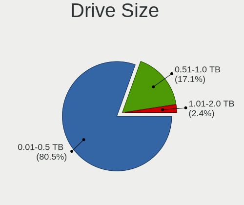
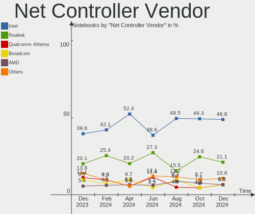
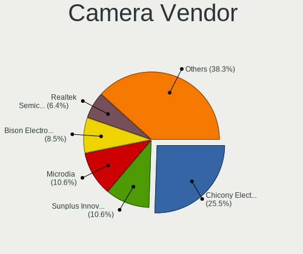

BSD - Hardware Trends (Notebooks)
---------------------------------

A project to identify most popular hardware characteristics and track their change
over time based on data collected by BSD users at https://BSD-Hardware.info.

Anyone can contribute to this report by the [hw-probe](https://github.com/linuxhw/hw-probe/blob/master/INSTALL.BSD.md) tool:

    hw-probe -all -upload

This report is for one last month. Overall report since the beginning of time: [TestCoverage](https://github.com/bsdhw/TestCoverage)

Period: Aug, 2022.

Contents
--------

* [ System ](#system)
  - [ OS                       ](#os)
  - [ OS Family                ](#os-family)
  - [ Arch                     ](#arch)
  - [ DE                       ](#de)
  - [ Display Server           ](#display-server)
  - [ Display Manager          ](#display-manager)
  - [ OS Lang                  ](#os-lang)
  - [ Boot Mode                ](#boot-mode)
  - [ Filesystem               ](#filesystem)
  - [ Part. scheme             ](#part-scheme)

* [ Board ](#board)
  - [ Vendor                   ](#vendor)
  - [ Model                    ](#model)
  - [ Model Family             ](#model-family)
  - [ MFG Year                 ](#mfg-year)
  - [ Form Factor              ](#form-factor)
  - [ Coreboot                 ](#coreboot)
  - [ RAM Size                 ](#ram-size)
  - [ RAM Used                 ](#ram-used)
  - [ Total Drives             ](#total-drives)
  - [ Has CD-ROM               ](#has-cd-rom)
  - [ Has Ethernet             ](#has-ethernet)
  - [ Has WiFi                 ](#has-wifi)
  - [ Has Bluetooth            ](#has-bluetooth)

* [ Location ](#location)
  - [ Country                  ](#country)
  - [ City                     ](#city)

* [ Drives ](#drives)
  - [ Drive Vendor             ](#drive-vendor)
  - [ Drive Model              ](#drive-model)
  - [ HDD Vendor               ](#hdd-vendor)
  - [ SSD Vendor               ](#ssd-vendor)
  - [ Drive Kind               ](#drive-kind)
  - [ Drive Connector          ](#drive-connector)
  - [ Drive Size               ](#drive-size)
  - [ Space Total              ](#space-total)
  - [ Space Used               ](#space-used)
  - [ Malfunc. Drives          ](#malfunc-drives)
  - [ Malfunc. Drive Vendor    ](#malfunc-drive-vendor)
  - [ Malfunc. HDD Vendor      ](#malfunc-hdd-vendor)
  - [ Malfunc. Drive Kind      ](#malfunc-drive-kind)
  - [ Failed Drives            ](#failed-drives)
  - [ Failed Drive Vendor      ](#failed-drive-vendor)
  - [ Drive Status             ](#drive-status)

* [ Storage controller ](#storage-controller)
  - [ Storage Vendor           ](#storage-vendor)
  - [ Storage Model            ](#storage-model)
  - [ Storage Kind             ](#storage-kind)

* [ Processor ](#processor)
  - [ CPU Vendor               ](#cpu-vendor)
  - [ CPU Model                ](#cpu-model)
  - [ CPU Model Family         ](#cpu-model-family)
  - [ CPU Cores                ](#cpu-cores)
  - [ CPU Sockets              ](#cpu-sockets)
  - [ CPU Threads              ](#cpu-threads)
  - [ CPU Microarch            ](#cpu-microarch)

* [ Graphics ](#graphics)
  - [ GPU Vendor               ](#gpu-vendor)
  - [ GPU Model                ](#gpu-model)
  - [ GPU Combo                ](#gpu-combo)
  - [ GPU Driver               ](#gpu-driver)
  - [ GPU Memory               ](#gpu-memory)

* [ Monitor ](#monitor)
  - [ Monitor Vendor           ](#monitor-vendor)
  - [ Monitor Model            ](#monitor-model)
  - [ Monitor Resolution       ](#monitor-resolution)
  - [ Monitor Diagonal         ](#monitor-diagonal)
  - [ Monitor Width            ](#monitor-width)
  - [ Aspect Ratio             ](#aspect-ratio)
  - [ Monitor Area             ](#monitor-area)
  - [ Pixel Density            ](#pixel-density)
  - [ Multiple Monitors        ](#multiple-monitors)

* [ Network ](#network)
  - [ Net Controller Vendor    ](#net-controller-vendor)
  - [ Net Controller Model     ](#net-controller-model)
  - [ Wireless Vendor          ](#wireless-vendor)
  - [ Wireless Model           ](#wireless-model)
  - [ Ethernet Vendor          ](#ethernet-vendor)
  - [ Ethernet Model           ](#ethernet-model)
  - [ Net Controller Kind      ](#net-controller-kind)
  - [ Used Controller          ](#used-controller)
  - [ NICs                     ](#nics)
  - [ IPv6                     ](#ipv6)

* [ Bluetooth ](#bluetooth)
  - [ Bluetooth Vendor         ](#bluetooth-vendor)
  - [ Bluetooth Model          ](#bluetooth-model)

* [ Sound ](#sound)
  - [ Sound Vendor             ](#sound-vendor)
  - [ Sound Model              ](#sound-model)

* [ Memory ](#memory)
  - [ Memory Vendor            ](#memory-vendor)
  - [ Memory Model             ](#memory-model)
  - [ Memory Kind              ](#memory-kind)
  - [ Memory Form Factor       ](#memory-form-factor)
  - [ Memory Size              ](#memory-size)
  - [ Memory Speed             ](#memory-speed)

* [ Printers & scanners ](#printers--scanners)
  - [ Printer Vendor           ](#printer-vendor)
  - [ Printer Model            ](#printer-model)
  - [ Scanner Vendor           ](#scanner-vendor)
  - [ Scanner Model            ](#scanner-model)

* [ Camera ](#camera)
  - [ Camera Vendor            ](#camera-vendor)
  - [ Camera Model             ](#camera-model)

* [ Security ](#security)
  - [ Fingerprint Vendor       ](#fingerprint-vendor)
  - [ Fingerprint Model        ](#fingerprint-model)
  - [ Chipcard Vendor          ](#chipcard-vendor)
  - [ Chipcard Model           ](#chipcard-model)

* [ Unsupported ](#unsupported)
  - [ Unsupported Devices      ](#unsupported-devices)
  - [ Unsupported Device Types ](#unsupported-device-types)

System
------

OS
--

Installed operating systems

| Name                | Notebooks | Percent |
|---------------------|-----------|---------|
| FreeBSD 13.1        | 9         | 15.52%  |
| FreeBSD 13.1-p1     | 8         | 13.79%  |
| helloSystem 0.7.0   | 6         | 10.34%  |
| helloSystem 0.8.0   | 5         | 8.62%   |
| OpenBSD 7.1         | 4         | 6.9%    |
| OPNsense 22.7.2     | 3         | 5.17%   |
| OPNsense 22.7.1     | 2         | 3.45%   |
| OPNsense 22.7       | 2         | 3.45%   |
| OPNsense 22.4.3     | 2         | 3.45%   |
| GhostBSD 22.08.06   | 2         | 3.45%   |
| GhostBSD 22.06.18   | 2         | 3.45%   |
| OPNsense 22.1.10    | 1         | 1.72%   |
| OpenBSD 7.2         | 1         | 1.72%   |
| NomadBSD 5806f915   | 1         | 1.72%   |
| MidnightBSD 2.2.2   | 1         | 1.72%   |
| MidnightBSD 2.2.0   | 1         | 1.72%   |
| GhostBSD 22.08.27   | 1         | 1.72%   |
| GhostBSD 22.08.23   | 1         | 1.72%   |
| GhostBSD 22.07.31   | 1         | 1.72%   |
| FuguIta 7.1         | 1         | 1.72%   |
| FreeBSD 13.1-STABLE | 1         | 1.72%   |
| FreeBSD 13.0        | 1         | 1.72%   |
| FreeBSD 12.3-p6     | 1         | 1.72%   |
| FreeBSD 12.3        | 1         | 1.72%   |

OS Family
---------

OS without a version

| Name        | Notebooks | Percent |
|-------------|-----------|---------|
| FreeBSD     | 21        | 36.21%  |
| helloSystem | 11        | 18.97%  |
| OPNsense    | 10        | 17.24%  |
| GhostBSD    | 7         | 12.07%  |
| OpenBSD     | 5         | 8.62%   |
| MidnightBSD | 2         | 3.45%   |
| NomadBSD    | 1         | 1.72%   |
| FuguIta     | 1         | 1.72%   |

Arch
----

OS architecture (x86_64, i586, etc.)

| Name  | Notebooks | Percent |
|-------|-----------|---------|
| amd64 | 56        | 96.55%  |
| i386  | 2         | 3.45%   |

DE
--

Desktop Environment

| Name          | Notebooks | Percent |
|---------------|-----------|---------|
| helloDesktop  | 17        | 29.31%  |
| Console       | 12        | 20.69%  |
| MATE          | 7         | 12.07%  |
| KDE5          | 7         | 12.07%  |
| XFCE          | 6         | 10.34%  |
| Openbox       | 3         | 5.17%   |
| GNOME         | 3         | 5.17%   |
| Enlightenment | 1         | 1.72%   |
| dwm           | 1         | 1.72%   |
| Cinnamon      | 1         | 1.72%   |

Display Server
--------------

X11 or Wayland

| Name    | Notebooks | Percent |
|---------|-----------|---------|
| X11     | 45        | 77.59%  |
| Console | 12        | 20.69%  |
| Wayland | 1         | 1.72%   |

Display Manager
---------------

SDDM, LightDM, etc.

| Name    | Notebooks | Percent |
|---------|-----------|---------|
| Console | 25        | 43.1%   |
| SLiM    | 16        | 27.59%  |
| SDDM    | 7         | 12.07%  |
| LightDM | 7         | 12.07%  |
| XDM     | 2         | 3.45%   |
| GDM     | 1         | 1.72%   |

OS Lang
-------

Language

| Lang    | Notebooks | Percent |
|---------|-----------|---------|
| Unknown | 18        | 31.03%  |
| en_US   | 17        | 29.31%  |
| C       | 17        | 29.31%  |
| sv_SE   | 1         | 1.72%   |
| pl_PL   | 1         | 1.72%   |
| es_ES   | 1         | 1.72%   |
| es_AR   | 1         | 1.72%   |
| en_GB   | 1         | 1.72%   |
| cs_CZ   | 1         | 1.72%   |

Boot Mode
---------

EFI or BIOS

| Mode | Notebooks | Percent |
|------|-----------|---------|
| EFI  | 48        | 82.76%  |
| BIOS | 10        | 17.24%  |

Filesystem
----------

Type of filesystem

| Type   | Notebooks | Percent |
|--------|-----------|---------|
| Zfs    | 34        | 58.62%  |
| Ufs    | 14        | 24.14%  |
| Ffs    | 6         | 10.34%  |
| Cd9660 | 4         | 6.9%    |

Part. scheme
------------

Scheme of partitioning

| Type | Notebooks | Percent |
|------|-----------|---------|
| GPT  | 52        | 89.66%  |
| MBR  | 6         | 10.34%  |

Board
-----

Vendor
------

Motherboard manufacturer

| Name                | Notebooks | Percent |
|---------------------|-----------|---------|
| Lenovo              | 16        | 27.59%  |
| Dell                | 8         | 13.79%  |
| Hewlett-Packard     | 7         | 12.07%  |
| ASUSTek Computer    | 7         | 12.07%  |
| Deciso              | 4         | 6.9%    |
| Toshiba             | 2         | 3.45%   |
| Intel               | 2         | 3.45%   |
| Acer                | 2         | 3.45%   |
| Unknown             | 2         | 3.45%   |
| TUXEDO              | 1         | 1.72%   |
| Sony                | 1         | 1.72%   |
| Samsung Electronics | 1         | 1.72%   |
| MSI                 | 1         | 1.72%   |
| HUAWEI              | 1         | 1.72%   |
| Google              | 1         | 1.72%   |
| eMachines           | 1         | 1.72%   |
| Alienware           | 1         | 1.72%   |

Model
-----

Motherboard model

| Name                                     | Notebooks | Percent |
|------------------------------------------|-----------|---------|
| Unknown                                  | 3         | 5.17%   |
| Lenovo IdeaPad Gaming 3 15ACH6 82K2      | 2         | 3.45%   |
| Deciso NetBoard-A10                      | 2         | 3.45%   |
| ASUS ZenBook UX325UA_UM325UA             | 2         | 3.45%   |
| TUXEDO Pulse 14 Gen1                     | 1         | 1.72%   |
| Toshiba Satellite S55t-B                 | 1         | 1.72%   |
| Toshiba Satellite A300                   | 1         | 1.72%   |
| Sony VGN-UX1XRN                          | 1         | 1.72%   |
| Samsung NC210/NC110                      | 1         | 1.72%   |
| MSI GF63 Thin 9SC                        | 1         | 1.72%   |
| Lenovo Yoga Slim 7 Pro 14ACH5 82MS       | 1         | 1.72%   |
| Lenovo ThinkPad X270 W10DG 20K5S5MD0F    | 1         | 1.72%   |
| Lenovo ThinkPad X260 20F5S10W0H          | 1         | 1.72%   |
| Lenovo ThinkPad X131e 33672K5            | 1         | 1.72%   |
| Lenovo ThinkPad X1 Carbon 7th 20QES42E0L | 1         | 1.72%   |
| Lenovo ThinkPad T480 20L6S29E0T          | 1         | 1.72%   |
| Lenovo ThinkPad T480 20L50000GE          | 1         | 1.72%   |
| Lenovo ThinkPad T420 4178A72             | 1         | 1.72%   |
| Lenovo ThinkPad R60e 0658W2M             | 1         | 1.72%   |
| Lenovo ThinkPad A485 20MU000VUS          | 1         | 1.72%   |
| Lenovo ThinkPad 11e 4th Gen 20HTS05E00   | 1         | 1.72%   |
| Lenovo IdeaPad Gaming 3 15ARH05 82EY     | 1         | 1.72%   |
| Lenovo IdeaPad 530S-14ARR 81H1           | 1         | 1.72%   |
| Lenovo IdeaPad 5 14ITL05 82FE            | 1         | 1.72%   |
| Intel H81U                               | 1         | 1.72%   |
| Intel Apollolake I Platform              | 1         | 1.72%   |
| HUAWEI BOM-WXX9                          | 1         | 1.72%   |
| HP Victus by Gaming Laptop 15-fa0xxx     | 1         | 1.72%   |
| HP ProBook 4540s                         | 1         | 1.72%   |
| HP Pavilion g6                           | 1         | 1.72%   |
| HP ENVY Notebook                         | 1         | 1.72%   |
| HP EliteBook 850 G7 Notebook PC          | 1         | 1.72%   |
| HP EliteBook 840 G3                      | 1         | 1.72%   |
| Google Peppy                             | 1         | 1.72%   |
| eMachines eME728                         | 1         | 1.72%   |
| Dell XPS 13 9360                         | 1         | 1.72%   |
| Dell Studio 1537                         | 1         | 1.72%   |
| Dell Precision 7550                      | 1         | 1.72%   |
| Dell Precision 5540                      | 1         | 1.72%   |
| Dell Latitude 7390                       | 1         | 1.72%   |
| Dell Inspiron 3581                       | 1         | 1.72%   |
| Dell Inspiron 1545                       | 1         | 1.72%   |
| Dell Inspiron 15-3567                    | 1         | 1.72%   |
| Deciso NetBoard-A20                      | 1         | 1.72%   |
| Deciso Netboard A20                      | 1         | 1.72%   |
| ASUS ZenBook 14 UX410UFR                 | 1         | 1.72%   |
| ASUS VivoBook_ASUSLaptop X570ZD_F570ZD   | 1         | 1.72%   |
| ASUS VivoBook 15_ASUS Laptop X540UBR     | 1         | 1.72%   |
| ASUS TUF Gaming FX505DT_FX505DT          | 1         | 1.72%   |
| ASUS F6A                                 | 1         | 1.72%   |
| Alienware m15 R4                         | 1         | 1.72%   |
| Acer Aspire 5930                         | 1         | 1.72%   |
| Acer Aspire 4552G                        | 1         | 1.72%   |

Model Family
------------

Motherboard model prefix

| Name                | Notebooks | Percent |
|---------------------|-----------|---------|
| Lenovo ThinkPad     | 10        | 17.24%  |
| Lenovo IdeaPad      | 5         | 8.62%   |
| Dell Inspiron       | 3         | 5.17%   |
| ASUS ZenBook        | 3         | 5.17%   |
| Unknown             | 3         | 5.17%   |
| Toshiba Satellite   | 2         | 3.45%   |
| HP EliteBook        | 2         | 3.45%   |
| Dell Precision      | 2         | 3.45%   |
| Deciso NetBoard-A10 | 2         | 3.45%   |
| ASUS VivoBook       | 2         | 3.45%   |
| Acer Aspire         | 2         | 3.45%   |
| TUXEDO Pulse        | 1         | 1.72%   |
| Sony VGN-UX1XRN     | 1         | 1.72%   |
| Samsung NC210       | 1         | 1.72%   |
| MSI GF63            | 1         | 1.72%   |
| Lenovo Yoga         | 1         | 1.72%   |
| Intel H81U          | 1         | 1.72%   |
| Intel Apollolake    | 1         | 1.72%   |
| HUAWEI BOM-WXX9     | 1         | 1.72%   |
| HP Victus           | 1         | 1.72%   |
| HP ProBook          | 1         | 1.72%   |
| HP Pavilion         | 1         | 1.72%   |
| HP ENVY             | 1         | 1.72%   |
| Google Peppy        | 1         | 1.72%   |
| eMachines eME728    | 1         | 1.72%   |
| Dell XPS            | 1         | 1.72%   |
| Dell Studio         | 1         | 1.72%   |
| Dell Latitude       | 1         | 1.72%   |
| Deciso NetBoard-A20 | 1         | 1.72%   |
| Deciso Netboard     | 1         | 1.72%   |
| ASUS TUF            | 1         | 1.72%   |
| ASUS F6A            | 1         | 1.72%   |
| Alienware m15       | 1         | 1.72%   |

MFG Year
--------

Motherboard manufacture year

| Year | Notebooks | Percent |
|------|-----------|---------|
| 2021 | 12        | 20.69%  |
| 2019 | 8         | 13.79%  |
| 2022 | 7         | 12.07%  |
| 2020 | 6         | 10.34%  |
| 2018 | 5         | 8.62%   |
| 2011 | 4         | 6.9%    |
| 2016 | 3         | 5.17%   |
| 2008 | 3         | 5.17%   |
| 2017 | 2         | 3.45%   |
| 2009 | 2         | 3.45%   |
| 2015 | 1         | 1.72%   |
| 2014 | 1         | 1.72%   |
| 2012 | 1         | 1.72%   |
| 2010 | 1         | 1.72%   |
| 2007 | 1         | 1.72%   |
| 2006 | 1         | 1.72%   |

Form Factor
-----------

Physical design of the computer

| Name     | Notebooks | Percent |
|----------|-----------|---------|
| Notebook | 58        | 100%    |

Coreboot
--------

Have coreboot on board

| Used | Notebooks | Percent |
|------|-----------|---------|
| No   | 57        | 98.28%  |
| Yes  | 1         | 1.72%   |

RAM Size
--------

Total RAM memory

| Size in GB | Notebooks | Percent |
|------------|-----------|---------|
| 16.01-24.0 | 19        | 32.76%  |
| 8.01-16.0  | 17        | 29.31%  |
| 4.01-8.0   | 10        | 17.24%  |
| 32.01-64.0 | 4         | 6.9%    |
| 3.01-4.0   | 3         | 5.17%   |
| 2.01-3.0   | 2         | 3.45%   |
| 0.51-1.0   | 2         | 3.45%   |
| 24.01-32.0 | 1         | 1.72%   |

RAM Used
--------

Used RAM memory

| Used GB  | Notebooks | Percent |
|----------|-----------|---------|
| 0.01-0.5 | 29        | 50%     |
| 0.51-1.0 | 16        | 27.59%  |
| 1.01-2.0 | 9         | 15.52%  |
| 2.01-3.0 | 3         | 5.17%   |
| 4.01-8.0 | 1         | 1.72%   |

Total Drives
------------

Number of drives on board

| Drives | Notebooks | Percent |
|--------|-----------|---------|
| 1      | 42        | 72.41%  |
| 2      | 13        | 22.41%  |
| 0      | 3         | 5.17%   |

Has CD-ROM
----------

Has CD-ROM on board

| Presented | Notebooks | Percent |
|-----------|-----------|---------|
| No        | 45        | 77.59%  |
| Yes       | 13        | 22.41%  |

Has Ethernet
------------

Has Ethernet on board

| Presented | Notebooks | Percent |
|-----------|-----------|---------|
| Yes       | 47        | 81.03%  |
| No        | 11        | 18.97%  |

Has WiFi
--------

Has WiFi module

| Presented | Notebooks | Percent |
|-----------|-----------|---------|
| Yes       | 49        | 84.48%  |
| No        | 9         | 15.52%  |

Has Bluetooth
-------------

Has Bluetooth module

| Presented | Notebooks | Percent |
|-----------|-----------|---------|
| Yes       | 37        | 63.79%  |
| No        | 21        | 36.21%  |

Location
--------

Country
-------

Geographic location (country)

| Country     | Notebooks | Percent |
|-------------|-----------|---------|
| USA         | 10        | 17.24%  |
| Russia      | 8         | 13.79%  |
| Germany     | 5         | 8.62%   |
| Spain       | 4         | 6.9%    |
| UK          | 2         | 3.45%   |
| Slovenia    | 2         | 3.45%   |
| Slovakia    | 2         | 3.45%   |
| Israel      | 2         | 3.45%   |
| India       | 2         | 3.45%   |
| Austria     | 2         | 3.45%   |
| Thailand    | 1         | 1.72%   |
| Sweden      | 1         | 1.72%   |
| Romania     | 1         | 1.72%   |
| Poland      | 1         | 1.72%   |
| Philippines | 1         | 1.72%   |
| Peru        | 1         | 1.72%   |
| Netherlands | 1         | 1.72%   |
| Montserrat  | 1         | 1.72%   |
| Latvia      | 1         | 1.72%   |
| Italy       | 1         | 1.72%   |
| Isle of Man | 1         | 1.72%   |
| Iran        | 1         | 1.72%   |
| Greece      | 1         | 1.72%   |
| Finland     | 1         | 1.72%   |
| Czechia     | 1         | 1.72%   |
| China       | 1         | 1.72%   |
| Canada      | 1         | 1.72%   |
| Australia   | 1         | 1.72%   |
| Argentina   | 1         | 1.72%   |

City
----

Geographic location (city)

| City               | Notebooks | Percent |
|--------------------|-----------|---------|
| Ypsilanti          | 2         | 3.45%   |
| Tel Aviv           | 2         | 3.45%   |
| St Petersburg      | 2         | 3.45%   |
| Celje              | 2         | 3.45%   |
| Barcelona          | 2         | 3.45%   |
| Wuppertal          | 1         | 1.72%   |
| Vladivostok        | 1         | 1.72%   |
| Vienna             | 1         | 1.72%   |
| Tyumen             | 1         | 1.72%   |
| Trivandrum         | 1         | 1.72%   |
| Tehran             | 1         | 1.72%   |
| Tarragona          | 1         | 1.72%   |
| Smolensk           | 1         | 1.72%   |
| Sesto San Giovanni | 1         | 1.72%   |
| Riga               | 1         | 1.72%   |
| Resistencia        | 1         | 1.72%   |
| Plymouth           | 1         | 1.72%   |
| Perm               | 1         | 1.72%   |
| Oswego             | 1         | 1.72%   |
| Ostrava            | 1         | 1.72%   |
| Munnikens-Vinkel   | 1         | 1.72%   |
| Munich             | 1         | 1.72%   |
| Moscow             | 1         | 1.72%   |
| Mississauga        | 1         | 1.72%   |
| Middlesbrough      | 1         | 1.72%   |
| Melbourne          | 1         | 1.72%   |
| Martin             | 1         | 1.72%   |
| Madrid             | 1         | 1.72%   |
| Lublin             | 1         | 1.72%   |
| Longview           | 1         | 1.72%   |
| Lima               | 1         | 1.72%   |
| Legazpi            | 1         | 1.72%   |
| Kolkata            | 1         | 1.72%   |
| Houston            | 1         | 1.72%   |
| Henderson          | 1         | 1.72%   |
| Hämeenlinna       | 1         | 1.72%   |
| Hadenfeld          | 1         | 1.72%   |
| Grosspertholz      | 1         | 1.72%   |
| Fillmore           | 1         | 1.72%   |
| Enebyberg          | 1         | 1.72%   |
| Douglas            | 1         | 1.72%   |
| Darmstadt          | 1         | 1.72%   |
| Chiang Mai         | 1         | 1.72%   |
| Bucharest          | 1         | 1.72%   |
| Bratislava         | 1         | 1.72%   |
| Berlin             | 1         | 1.72%   |
| Berkeley           | 1         | 1.72%   |
| Beijing            | 1         | 1.72%   |
| Athens             | 1         | 1.72%   |
| Ashburn            | 1         | 1.72%   |
| Arkhangelsk        | 1         | 1.72%   |
| Annan              | 1         | 1.72%   |
| Albuquerque        | 1         | 1.72%   |

Drives
------

Drive Vendor
------------

Hard drive vendors

| Vendor              | Notebooks | Drives | Percent |
|---------------------|-----------|--------|---------|
| Samsung Electronics | 11        | 11     | 16.92%  |
| Seagate             | 7         | 7      | 10.77%  |
| WDC                 | 6         | 6      | 9.23%   |
| Transcend           | 5         | 5      | 7.69%   |
| SK hynix            | 4         | 4      | 6.15%   |
| SanDisk             | 4         | 4      | 6.15%   |
| NVMe                | 4         | 5      | 6.15%   |
| Micron Technology   | 4         | 4      | 6.15%   |
| Kingston            | 4         | 4      | 6.15%   |
| Intel               | 3         | 3      | 4.62%   |
| Crucial             | 3         | 3      | 4.62%   |
| Toshiba             | 2         | 2      | 3.08%   |
| Silicon Motion      | 1         | 1      | 1.54%   |
| SATA3 60            | 1         | 1      | 1.54%   |
| Jetflash            | 1         | 1      | 1.54%   |
| Hitachi             | 1         | 1      | 1.54%   |
| HCiPC               | 1         | 1      | 1.54%   |
| FLEXXON             | 1         | 1      | 1.54%   |
| EAGET               | 1         | 1      | 1.54%   |
| Apacer              | 1         | 1      | 1.54%   |

Drive Model
-----------

Hard drive models

| Model                                   | Notebooks | Percent |
|-----------------------------------------|-----------|---------|
| Seagate ST1000LM035-1RK172 1TB          | 4         | 6.15%   |
| Transcend TS256GMTS952T2 256GB          | 2         | 3.08%   |
| Transcend TS256GMTE652T2 256GB          | 2         | 3.08%   |
| SK hynix HFM512GD3JX013N 512GB          | 2         | 3.08%   |
| Seagate ST1000LM024 HN-M101MBB 1TB      | 2         | 3.08%   |
| SanDisk SSD PLUS 120GB                  | 2         | 3.08%   |
| Samsung MZALQ512HBLU-00BL2 512GB        | 2         | 3.08%   |
| WDC WDS500G3X0C-00SJG0 500GB            | 1         | 1.54%   |
| WDC WDS100T2B0B-00YS70 1TB              | 1         | 1.54%   |
| WDC WD2500BEVT-00ZCT0 250GB             | 1         | 1.54%   |
| WDC WD20SPZX-00UA7T0 2TB                | 1         | 1.54%   |
| WDC WD1600BEVS-07RST0 160GB             | 1         | 1.54%   |
| WDC WD10SPZX-17Z10T1 1TB                | 1         | 1.54%   |
| Transcend TS128GMTS430S 128GB           | 1         | 1.54%   |
| Toshiba MQ04ABF100 1TB                  | 1         | 1.54%   |
| Toshiba MQ01ABF050 500GB                | 1         | 1.54%   |
| SK hynix SKHynix_HFS001TDE9X084N 1TB    | 1         | 1.54%   |
| SK hynix BC511 HFM512GDJTNI-82A0A 512GB | 1         | 1.54%   |
| Silicon Motion 512GB MEGA S3 512GB      | 1         | 1.54%   |
| Seagate ST9160310AS 160GB               | 1         | 1.54%   |
| SATA3 60 GB SSD 64GB                    | 1         | 1.54%   |
| SanDisk SSD PLUS 240GB                  | 1         | 1.54%   |
| SanDisk SSD P4 8GB                      | 1         | 1.54%   |
| Samsung SSD 970 EVO Plus 250GB          | 1         | 1.54%   |
| Samsung SSD 970 EVO Plus 1TB            | 1         | 1.54%   |
| Samsung MZVLW512HMJP-000L7 512GB        | 1         | 1.54%   |
| Samsung MZVLB512HBJQ-000L7 512GB        | 1         | 1.54%   |
| Samsung MZVLB256HAHQ-000L7 256GB        | 1         | 1.54%   |
| Samsung MZNLN256HCHP-000H1 256GB        | 1         | 1.54%   |
| Samsung MZALQ256HBJD-00BL2 256GB        | 1         | 1.54%   |
| Samsung MZALQ256HAJD-000L2 256GB        | 1         | 1.54%   |
| Samsung MZ7PD128HCFV-000H1 128GB        | 1         | 1.54%   |
| NVMe PM9A1 Samsu 512GB                  | 1         | 1.54%   |
| NVMe PC300 SK hy 256GB                  | 1         | 1.54%   |
| NVMe LENSE20256GMSP34 256GB             | 1         | 1.54%   |
| NVMe 311CD0512GB                        | 1         | 1.54%   |
| Micron MTFDKBA512TFH-1BC1AABHA 512GB    | 1         | 1.54%   |
| Micron 2300 NVMe 512GB                  | 1         | 1.54%   |
| Micron 2200V_MTFDHBA512TCK 512GB        | 1         | 1.54%   |
| Micron 2200S NVMe 512GB                 | 1         | 1.54%   |
| Kingston SUV400S37480G 480GB            | 1         | 1.54%   |
| Kingston SNVSE500G 500GB                | 1         | 1.54%   |
| Kingston SA400S37240G 240GB             | 1         | 1.54%   |
| Kingston SA400S37120G 120GB             | 1         | 1.54%   |
| Jetflash Transcend 8G                   | 1         | 1.54%   |
| Intel SSDSA2CW120G3 120GB               | 1         | 1.54%   |
| Intel SSDSA2BW160G3L 160GB              | 1         | 1.54%   |
| Intel SSDMCEAC060B3 64GB                | 1         | 1.54%   |
| Hitachi HTS543232L9SA00 320GB           | 1         | 1.54%   |
| HCiPC P2MSM-64G2B SATA3 64GB            | 1         | 1.54%   |
| FLEXXON FSSO064GTTS7-M13-23 64GB        | 1         | 1.54%   |
| EAGET S900L SSD 128GB                   | 1         | 1.54%   |
| Crucial CT500P2SSD8 500GB               | 1         | 1.54%   |
| Crucial CT500MX500SSD1 500GB            | 1         | 1.54%   |
| Crucial CT120BX500SSD1 120GB            | 1         | 1.54%   |
| Apacer AS340 240GB                      | 1         | 1.54%   |

HDD Vendor
----------

Hard disk drive vendors

| Vendor   | Notebooks | Drives | Percent |
|----------|-----------|--------|---------|
| Seagate  | 7         | 7      | 41.18%  |
| WDC      | 4         | 4      | 23.53%  |
| Toshiba  | 2         | 2      | 11.76%  |
| NVMe     | 2         | 2      | 11.76%  |
| Jetflash | 1         | 1      | 5.88%   |
| Hitachi  | 1         | 1      | 5.88%   |

SSD Vendor
----------

Solid state drive vendors

| Vendor              | Notebooks | Drives | Percent |
|---------------------|-----------|--------|---------|
| SanDisk             | 4         | 4      | 18.18%  |
| Transcend           | 3         | 3      | 13.64%  |
| Kingston            | 3         | 3      | 13.64%  |
| Intel               | 3         | 3      | 13.64%  |
| Samsung Electronics | 2         | 2      | 9.09%   |
| Crucial             | 2         | 2      | 9.09%   |
| WDC                 | 1         | 1      | 4.55%   |
| SATA3 60            | 1         | 1      | 4.55%   |
| HCiPC               | 1         | 1      | 4.55%   |
| FLEXXON             | 1         | 1      | 4.55%   |
| Apacer              | 1         | 1      | 4.55%   |

Drive Kind
----------

HDD or SSD

| Kind | Notebooks | Drives | Percent |
|------|-----------|--------|---------|
| NVMe | 25        | 27     | 39.68%  |
| SSD  | 21        | 22     | 33.33%  |
| HDD  | 17        | 17     | 26.98%  |

Drive Connector
---------------

SATA, SAS, NVMe, etc.

| Type | Notebooks | Drives | Percent |
|------|-----------|--------|---------|
| SATA | 36        | 39     | 59.02%  |
| NVMe | 25        | 27     | 40.98%  |

Drive Size
----------

Size of hard drive

| Size in TB | Notebooks | Drives | Percent |
|------------|-----------|--------|---------|
| 0.01-0.5   | 26        | 28     | 70.27%  |
| 0.51-1.0   | 10        | 10     | 27.03%  |
| 1.01-2.0   | 1         | 1      | 2.7%    |

Space Total
-----------

Amount of disk space available on the file system

| Size in GB | Notebooks | Percent |
|------------|-----------|---------|
| 101-250    | 23        | 39.66%  |
| 251-500    | 11        | 18.97%  |
| 1-20       | 10        | 17.24%  |
| 501-1000   | 6         | 10.34%  |
| 21-50      | 4         | 6.9%    |
| 51-100     | 2         | 3.45%   |
| 1001-2000  | 1         | 1.72%   |
| Unknown    | 1         | 1.72%   |

Space Used
----------

Amount of used disk space

| Used GB  | Notebooks | Percent |
|----------|-----------|---------|
| 1-20     | 46        | 79.31%  |
| 21-50    | 5         | 8.62%   |
| 51-100   | 3         | 5.17%   |
| 101-250  | 2         | 3.45%   |
| 501-1000 | 1         | 1.72%   |
| Unknown  | 1         | 1.72%   |

Malfunc. Drives
---------------

Drive models with a malfunction

| Model                              | Notebooks | Drives | Percent |
|------------------------------------|-----------|--------|---------|
| Toshiba MQ01ABF050 500GB           | 1         | 1      | 20%     |
| Seagate ST1000LM035-1RK172 1TB     | 1         | 1      | 20%     |
| Seagate ST1000LM024 HN-M101MBB 1TB | 1         | 1      | 20%     |
| Kingston SUV400S37480G 480GB       | 1         | 1      | 20%     |
| Hitachi HTS543232L9SA00 320GB      | 1         | 1      | 20%     |

Malfunc. Drive Vendor
---------------------

Vendors of faulty drives

| Vendor   | Notebooks | Drives | Percent |
|----------|-----------|--------|---------|
| Seagate  | 2         | 2      | 40%     |
| Toshiba  | 1         | 1      | 20%     |
| Kingston | 1         | 1      | 20%     |
| Hitachi  | 1         | 1      | 20%     |

Malfunc. HDD Vendor
-------------------

Vendors of faulty HDD drives

| Vendor  | Notebooks | Drives | Percent |
|---------|-----------|--------|---------|
| Seagate | 2         | 2      | 50%     |
| Toshiba | 1         | 1      | 25%     |
| Hitachi | 1         | 1      | 25%     |

Malfunc. Drive Kind
-------------------

Kinds of faulty drives

| Kind | Notebooks | Drives | Percent |
|------|-----------|--------|---------|
| HDD  | 4         | 4      | 80%     |
| SSD  | 1         | 1      | 20%     |

Failed Drives
-------------

Failed drive models

Zero info for selected period =(

Failed Drive Vendor
-------------------

Failed drive vendors

Zero info for selected period =(

Drive Status
------------

Number of failed and malfunc. drives

| Status   | Notebooks | Drives | Percent |
|----------|-----------|--------|---------|
| Works    | 47        | 55     | 83.93%  |
| Malfunc  | 5         | 5      | 8.93%   |
| Detected | 4         | 6      | 7.14%   |

Storage controller
------------------

Storage Vendor
--------------

Storage controller vendors

| Vendor                      | Notebooks | Percent |
|-----------------------------|-----------|---------|
| Intel                       | 29        | 43.28%  |
| Samsung Electronics         | 10        | 14.93%  |
| AMD                         | 10        | 14.93%  |
| SK hynix                    | 5         | 7.46%   |
| Micron Technology           | 4         | 5.97%   |
| Silicon Motion              | 2         | 2.99%   |
| Unknown                     | 2         | 2.99%   |
| SanDisk                     | 1         | 1.49%   |
| Phison Electronics          | 1         | 1.49%   |
| Micron/Crucial Technology   | 1         | 1.49%   |
| Lenovo                      | 1         | 1.49%   |
| Kingston Technology Company | 1         | 1.49%   |

Storage Model
-------------

Storage controller models

| Model                                                                        | Notebooks | Percent |
|------------------------------------------------------------------------------|-----------|---------|
| AMD FCH SATA Controller [AHCI mode]                                          | 9         | 13.24%  |
| Intel Sunrise Point-LP SATA Controller [AHCI mode]                           | 6         | 8.82%   |
| Intel 82801IBM/IEM (ICH9M/ICH9M-E) 4 port SATA Controller [AHCI mode]        | 6         | 8.82%   |
| Unknown                                                                      | 6         | 8.82%   |
| Samsung NVMe SSD Controller SM981/PM981/PM983                                | 4         | 5.88%   |
| Samsung NVMe SSD Controller 980                                              | 4         | 5.88%   |
| SK hynix Gold P31 SSD                                                        | 3         | 4.41%   |
| Intel 7 Series Chipset Family 6-port SATA Controller [AHCI mode]             | 3         | 4.41%   |
| Silicon Motion SM2263EN/SM2263XT SSD Controller                              | 2         | 2.94%   |
| Intel Wildcat Point-LP SATA Controller [AHCI Mode]                           | 2         | 2.94%   |
| Intel Celeron N3350/Pentium N4200/Atom E3900 Series SATA AHCI Controller     | 2         | 2.94%   |
| Intel Cannon Lake Mobile PCH SATA AHCI Controller                            | 2         | 2.94%   |
| Intel 6 Series/C200 Series Chipset Family 6 port Mobile SATA AHCI Controller | 2         | 2.94%   |
| SK hynix PC300 NVMe Solid State Drive 256GB                                  | 1         | 1.47%   |
| SK hynix BC511                                                               | 1         | 1.47%   |
| SanDisk WD Black SN750 / PC SN730 NVMe SSD                                   | 1         | 1.47%   |
| Samsung NVMe SSD Controller SM961/PM961/SM963                                | 1         | 1.47%   |
| Samsung NVMe SSD Controller PM9A1/PM9A3/980PRO                               | 1         | 1.47%   |
| Phison PS5013 E13 NVMe Controller                                            | 1         | 1.47%   |
| Micron/Crucial P2 NVMe PCIe SSD                                              | 1         | 1.47%   |
| Lenovo unknown                                                               | 1         | 1.47%   |
| Kingston Company SNVS2000G [NV1 NVMe PCIe SSD 2TB]                           | 1         | 1.47%   |
| Intel NM10/ICH7 Family SATA Controller [AHCI mode]                           | 1         | 1.47%   |
| Intel 82801HM/HEM (ICH8M/ICH8M-E) SATA Controller [AHCI mode]                | 1         | 1.47%   |
| Intel 82801HM/HEM (ICH8M/ICH8M-E) IDE Controller                             | 1         | 1.47%   |
| Intel 82801GBM/GHM (ICH7-M Family) SATA Controller [IDE mode]                | 1         | 1.47%   |
| Intel 82801G (ICH7 Family) IDE Controller                                    | 1         | 1.47%   |
| Intel 82801 Mobile SATA Controller [RAID mode]                               | 1         | 1.47%   |
| Intel 8 Series SATA Controller 1 [AHCI mode]                                 | 1         | 1.47%   |
| AMD SB7x0/SB8x0/SB9x0 SATA Controller [AHCI mode]                            | 1         | 1.47%   |

Storage Kind
------------

Kind of storage controller (IDE, SATA, NVMe, SAS, ...)

| Kind | Notebooks | Percent |
|------|-----------|---------|
| SATA | 36        | 53.73%  |
| NVMe | 27        | 40.3%   |
| IDE  | 3         | 4.48%   |
| RAID | 1         | 1.49%   |

Processor
---------

CPU Vendor
----------

Processor vendors

| Vendor | Notebooks | Percent |
|--------|-----------|---------|
| Intel  | 40        | 68.97%  |
| AMD    | 18        | 31.03%  |

CPU Model
---------

Processor models

| Model                                           | Notebooks | Percent |
|-------------------------------------------------|-----------|---------|
| Intel CPU Version                               | 2         | 3.45%   |
| Intel Core i7-6500U CPU @ 2.50GHz               | 2         | 3.45%   |
| Intel Core i5-8350U CPU @ 1.70GHz               | 2         | 3.45%   |
| Intel Core i5-6300U CPU @ 2.40GHz               | 2         | 3.45%   |
| AMD Ryzen Embedded V1500B                       | 2         | 3.45%   |
| AMD Ryzen 7 5700U with Radeon Graphics          | 2         | 3.45%   |
| AMD Ryzen 5 5600H with Radeon Graphics          | 2         | 3.45%   |
| AMD Ryzen 5 2500U with Radeon Vega Mobile Gfx   | 2         | 3.45%   |
| AMD EPYC 3201 8-Core Processor                  | 2         | 3.45%   |
| Intel Xeon E-2276M CPU @ 2.80GHz                | 1         | 1.72%   |
| Intel Pentium Dual-Core CPU T4500 @ 2.30GHz     | 1         | 1.72%   |
| Intel Pentium CPU 4417U @ 2.30GHz               | 1         | 1.72%   |
| Intel Core Solo CPU U1500 @ 1.33GHz             | 1         | 1.72%   |
| Intel Core i9-10980HK CPU @ 2.40GHz             | 1         | 1.72%   |
| Intel Core i9-10885H CPU @ 2.40GHz              | 1         | 1.72%   |
| Intel Core i7-9750H CPU @ 2.60GHz               | 1         | 1.72%   |
| Intel Core i7-8665U CPU @ 1.90GHz               | 1         | 1.72%   |
| Intel Core i7-8550U CPU @ 1.80GHz               | 1         | 1.72%   |
| Intel Core i7-7500U CPU @ 2.70GHz               | 1         | 1.72%   |
| Intel Core i7-5500U CPU @ 2.40GHz               | 1         | 1.72%   |
| Intel Core i7-2620M CPU @ 2.70GHz               | 1         | 1.72%   |
| Intel Core i5-8250U CPU @ 1.60GHz               | 1         | 1.72%   |
| Intel Core i5-5200U CPU @ 2.20GHz               | 1         | 1.72%   |
| Intel Core i5-3230M CPU @ 2.60GHz               | 1         | 1.72%   |
| Intel Core i5-10310U CPU @ 1.70GHz              | 1         | 1.72%   |
| Intel Core i3-7100U CPU @ 2.40GHz               | 1         | 1.72%   |
| Intel Core i3-7020U CPU @ 2.30GHz               | 1         | 1.72%   |
| Intel Core i3-3110M CPU @ 2.40GHz               | 1         | 1.72%   |
| Intel Core 2 Duo CPU T7100 @ 1.80GHz            | 1         | 1.72%   |
| Intel Core 2 Duo CPU T5800 @ 2.00GHz            | 1         | 1.72%   |
| Intel Core 2 Duo CPU P8400 @ 2.26GHz            | 1         | 1.72%   |
| Intel Core 2 Duo                                | 1         | 1.72%   |
| Intel Celeron M CPU                             | 1         | 1.72%   |
| Intel Celeron CPU N3450 @ 1.10GHz               | 1         | 1.72%   |
| Intel Celeron CPU J3355 @ 2.00GHz               | 1         | 1.72%   |
| Intel Celeron CPU 1037U @ 1.80GHz               | 1         | 1.72%   |
| Intel Celeron CPU 1007U @ 1.50GHz               | 1         | 1.72%   |
| Intel Celeron 2955U @ 1.40GHz                   | 1         | 1.72%   |
| Intel Atom CPU N455 @ 1.66GHz                   | 1         | 1.72%   |
| Intel 12th Gen Core i5-12450H                   | 1         | 1.72%   |
| Intel 11th Gen Core i7-1165G7 @ 2.80GHz         | 1         | 1.72%   |
| AMD Ryzen 7 5800H with Radeon Graphics          | 1         | 1.72%   |
| AMD Ryzen 7 4800H with Radeon Graphics          | 1         | 1.72%   |
| AMD Ryzen 7 3750H with Radeon Vega Mobile Gfx   | 1         | 1.72%   |
| AMD Ryzen 5 PRO 2500U w/ Radeon Vega Mobile Gfx | 1         | 1.72%   |
| AMD Ryzen 5 5500U with Radeon Graphics          | 1         | 1.72%   |
| AMD Ryzen 5 4600H with Radeon Graphics          | 1         | 1.72%   |
| AMD New Processor Technology                    | 1         | 1.72%   |
| AMD A10 Micro-6700T APU+AMD Radeon R6 Graphics  | 1         | 1.72%   |

CPU Model Family
----------------

Processor model prefix

| Model                   | Notebooks | Percent |
|-------------------------|-----------|---------|
| Intel Core i7           | 8         | 13.79%  |
| Intel Core i5           | 8         | 13.79%  |
| AMD Ryzen 5             | 6         | 10.34%  |
| Other                   | 5         | 8.62%   |
| Intel Celeron           | 5         | 8.62%   |
| AMD Ryzen 7             | 5         | 8.62%   |
| Intel Core 2 Duo        | 4         | 6.9%    |
| Intel Core i3           | 3         | 5.17%   |
| Intel Core i9           | 2         | 3.45%   |
| AMD Ryzen Embedded      | 2         | 3.45%   |
| AMD EPYC                | 2         | 3.45%   |
| Intel Xeon              | 1         | 1.72%   |
| Intel Pentium Dual-Core | 1         | 1.72%   |
| Intel Pentium           | 1         | 1.72%   |
| Intel Core Solo         | 1         | 1.72%   |
| Intel Celeron M         | 1         | 1.72%   |
| Intel Atom              | 1         | 1.72%   |
| AMD Ryzen 5 PRO         | 1         | 1.72%   |
| AMD A10                 | 1         | 1.72%   |

CPU Cores
---------

Number of processor cores

| Number  | Notebooks | Percent |
|---------|-----------|---------|
| 2       | 23        | 39.66%  |
| 8       | 10        | 17.24%  |
| 4       | 9         | 15.52%  |
| 12      | 5         | 8.62%   |
| 16      | 4         | 6.9%    |
| Unknown | 3         | 5.17%   |
| 6       | 2         | 3.45%   |
| 1       | 2         | 3.45%   |

CPU Sockets
-----------

Number of sockets

| Number  | Notebooks | Percent |
|---------|-----------|---------|
| 1       | 57        | 98.28%  |
| Unknown | 1         | 1.72%   |

CPU Threads
-----------

Threads per core (Hyper-Threading)

| Number  | Notebooks | Percent |
|---------|-----------|---------|
| 1       | 29        | 50%     |
| 2       | 24        | 41.38%  |
| Unknown | 5         | 8.62%   |

CPU Microarch
-------------

Microarchitecture

| Name        | Notebooks | Percent |
|-------------|-----------|---------|
| KabyLake    | 12        | 20.69%  |
| Zen         | 7         | 12.07%  |
| Penryn      | 5         | 8.62%   |
| Skylake     | 4         | 6.9%    |
| IvyBridge   | 4         | 6.9%    |
| Unknown     | 4         | 6.9%    |
| Zen 3       | 3         | 5.17%   |
| Zen 2       | 2         | 3.45%   |
| P6          | 2         | 3.45%   |
| Goldmont    | 2         | 3.45%   |
| Core        | 2         | 3.45%   |
| CometLake   | 2         | 3.45%   |
| Broadwell   | 2         | 3.45%   |
| Zen+        | 1         | 1.72%   |
| TigerLake   | 1         | 1.72%   |
| SandyBridge | 1         | 1.72%   |
| Puma        | 1         | 1.72%   |
| K10         | 1         | 1.72%   |
| Haswell     | 1         | 1.72%   |
| Bonnell     | 1         | 1.72%   |

Graphics
--------

GPU Vendor
----------

Vendors of graphics cards

| Vendor | Notebooks | Percent |
|--------|-----------|---------|
| Intel  | 37        | 53.62%  |
| AMD    | 17        | 24.64%  |
| Nvidia | 15        | 21.74%  |

GPU Model
---------

Graphics card models

| Model                                                                         | Notebooks | Percent |
|-------------------------------------------------------------------------------|-----------|---------|
| Nvidia TU117M [GeForce GTX 1650 Mobile / Max-Q]                               | 4         | 5.56%   |
| Intel UHD Graphics 620                                                        | 4         | 5.56%   |
| Intel Skylake GT2 [HD Graphics 520]                                           | 4         | 5.56%   |
| Intel 3rd Gen Core processor Graphics Controller                              | 4         | 5.56%   |
| Intel Mobile 4 Series Chipset Integrated Graphics Controller                  | 3         | 4.17%   |
| AMD Raven Ridge [Radeon Vega Series / Radeon Vega Mobile Series]              | 3         | 4.17%   |
| AMD Lucienne                                                                  | 3         | 4.17%   |
| AMD Cezanne                                                                   | 3         | 4.17%   |
| Intel Mobile 945GM/GMS/GME, 943/940GML Express Integrated Graphics Controller | 2         | 2.78%   |
| Intel Mobile 945GM/GMS, 943/940GML Express Integrated Graphics Controller     | 2         | 2.78%   |
| Intel HD Graphics 620                                                         | 2         | 2.78%   |
| Intel HD Graphics 5500                                                        | 2         | 2.78%   |
| Intel HD Graphics 500                                                         | 2         | 2.78%   |
| Intel CometLake-H GT2 [UHD Graphics]                                          | 2         | 2.78%   |
| Intel CoffeeLake-H GT2 [UHD Graphics 630]                                     | 2         | 2.78%   |
| AMD RV620/M82 [Mobility Radeon HD 3450/3470]                                  | 2         | 2.78%   |
| AMD Renoir                                                                    | 2         | 2.78%   |
| Nvidia TU117M [GeForce GTX 1650 Ti Mobile]                                    | 1         | 1.39%   |
| Nvidia TU117GLM [Quadro T1000 Mobile]                                         | 1         | 1.39%   |
| Nvidia TU106GLM [Quadro RTX 3000 Mobile / Max-Q]                              | 1         | 1.39%   |
| Nvidia GP107M [GeForce GTX 1050 Mobile]                                       | 1         | 1.39%   |
| Nvidia GM108M [GeForce MX130]                                                 | 1         | 1.39%   |
| Nvidia GM108M [GeForce MX110]                                                 | 1         | 1.39%   |
| Nvidia GM108M [GeForce 940M]                                                  | 1         | 1.39%   |
| Nvidia GF119M [Quadro NVS 4200M]                                              | 1         | 1.39%   |
| Nvidia GA107M [GeForce RTX 3050 Mobile]                                       | 1         | 1.39%   |
| Nvidia GA104M [GeForce RTX 3080 Mobile / Max-Q 8GB/16GB]                      | 1         | 1.39%   |
| Nvidia G96CM [GeForce 9600M GT]                                               | 1         | 1.39%   |
| Intel WhiskeyLake-U GT2 [UHD Graphics 620]                                    | 1         | 1.39%   |
| Intel TigerLake-LP GT2 [Iris Xe Graphics]                                     | 1         | 1.39%   |
| Intel Mobile GM965/GL960 Integrated Graphics Controller (secondary)           | 1         | 1.39%   |
| Intel Mobile GM965/GL960 Integrated Graphics Controller (primary)             | 1         | 1.39%   |
| Intel Kaby Lake-U GT2f HD 620 Graphics Controller                             | 1         | 1.39%   |
| Intel Kaby Lake-U GT1 Integrated Graphics Controller                          | 1         | 1.39%   |
| Intel Haswell-ULT Integrated Graphics Controller                              | 1         | 1.39%   |
| Intel CometLake-U GT2 [UHD Graphics]                                          | 1         | 1.39%   |
| Intel Atom Processor D4xx/D5xx/N4xx/N5xx Integrated Graphics Controller       | 1         | 1.39%   |
| Intel Alder Lake-P GT1 [UHD Graphics]                                         | 1         | 1.39%   |
| Intel 2nd Generation Core Processor Family Integrated Graphics Controller     | 1         | 1.39%   |
| AMD Thames [Radeon HD 7500M/7600M Series]                                     | 1         | 1.39%   |
| AMD Seymour [Radeon HD 6400M/7400M Series]                                    | 1         | 1.39%   |
| AMD Picasso/Raven 2 [Radeon Vega Series / Radeon Vega Mobile Series]          | 1         | 1.39%   |
| AMD Mullins [Radeon R6 Graphics]                                              | 1         | 1.39%   |

GPU Combo
---------

Combinations of graphics cards

| Name           | Notebooks | Percent |
|----------------|-----------|---------|
| 1 x Intel      | 20        | 34.48%  |
| 1 x AMD        | 11        | 18.97%  |
| Intel + Nvidia | 9         | 15.52%  |
| 2 x Intel      | 7         | 12.07%  |
| AMD + Nvidia   | 5         | 8.62%   |
| Other          | 4         | 6.9%    |
| 1 x Nvidia     | 1         | 1.72%   |
| Intel + AMD    | 1         | 1.72%   |

GPU Driver
----------

Free vs proprietary

| Driver      | Notebooks | Percent |
|-------------|-----------|---------|
| Free        | 48        | 82.76%  |
| Proprietary | 5         | 8.62%   |
| Unknown     | 5         | 8.62%   |

GPU Memory
----------

Total video memory

| Size in GB | Notebooks | Percent |
|------------|-----------|---------|
| Unknown    | 49        | 84.48%  |
| 0.01-0.5   | 5         | 8.62%   |
| 3.01-4.0   | 2         | 3.45%   |
| 1.01-2.0   | 2         | 3.45%   |

Monitor
-------

Monitor Vendor
--------------

Monitor vendors

| Vendor              | Notebooks | Percent |
|---------------------|-----------|---------|
| AU Optronics        | 8         | 21.05%  |
| LG Display          | 6         | 15.79%  |
| Chimei Innolux      | 6         | 15.79%  |
| Samsung Electronics | 5         | 13.16%  |
| BOE                 | 5         | 13.16%  |
| LG Philips          | 2         | 5.26%   |
| Sharp               | 1         | 2.63%   |
| PANDA               | 1         | 2.63%   |
| Lenovo              | 1         | 2.63%   |
| InfoVision          | 1         | 2.63%   |
| Goldstar            | 1         | 2.63%   |
| Apple               | 1         | 2.63%   |

Monitor Model
-------------

Monitor models

| Model                                                                 | Notebooks | Percent |
|-----------------------------------------------------------------------|-----------|---------|
| Samsung Electronics LCD Monitor SEC5441 1280x800 330x210mm 15.4-inch  | 2         | 5.26%   |
| Sharp LCD Monitor SHP14BA 1920x1080 340x190mm 15.3-inch               | 1         | 2.63%   |
| Samsung Electronics LS24A40xU SAM71D1 1920x1080 530x300mm 24.0-inch   | 1         | 2.63%   |
| Samsung Electronics LCD Monitor SEC4542 1280x800 300x190mm 14.0-inch  | 1         | 2.63%   |
| Samsung Electronics LCD Monitor SDC4158 1920x1080 290x170mm 13.2-inch | 1         | 2.63%   |
| PANDA LCD Monitor NCP002D 1920x1080 340x190mm 15.3-inch               | 1         | 2.63%   |
| LG Philips LCD Monitor LPL3B01 1280x800 330x210mm 15.4-inch           | 1         | 2.63%   |
| LG Philips LCD Monitor LPL0120 1280x800 330x210mm 15.4-inch           | 1         | 2.63%   |
| LG Display LCD Monitor LGD064C 1920x1080 340x190mm 15.3-inch          | 1         | 2.63%   |
| LG Display LCD Monitor LGD05EE 2560x1440 310x170mm 13.9-inch          | 1         | 2.63%   |
| LG Display LCD Monitor LGD0599 1920x1080 310x170mm 13.9-inch          | 1         | 2.63%   |
| LG Display LCD Monitor LGD0470 1920x1080 350x190mm 15.7-inch          | 1         | 2.63%   |
| LG Display LCD Monitor LGD03CD 1366x768 280x160mm 12.7-inch           | 1         | 2.63%   |
| LG Display LCD Monitor LGD0395 1366x768 340x190mm 15.3-inch           | 1         | 2.63%   |
| Lenovo LCD Monitor LEN4040 1024x768 300x230mm 14.9-inch               | 1         | 2.63%   |
| InfoVision LCD Monitor IVO048E 1366x768 260x140mm 11.6-inch           | 1         | 2.63%   |
| Goldstar LG ULTRAWIDE GSM59F1 2560x1080 800x340mm 34.2-inch           | 1         | 2.63%   |
| Chimei Innolux LCD Monitor CMN1738 1920x1080 380x210mm 17.1-inch      | 1         | 2.63%   |
| Chimei Innolux LCD Monitor CMN15C6 1366x768 340x190mm 15.3-inch       | 1         | 2.63%   |
| Chimei Innolux LCD Monitor CMN14D5 1920x1080 310x170mm 13.9-inch      | 1         | 2.63%   |
| Chimei Innolux LCD Monitor CMN14D2 1920x1080 310x170mm 13.9-inch      | 1         | 2.63%   |
| Chimei Innolux LCD Monitor CMN14C3 1366x768 310x170mm 13.9-inch       | 1         | 2.63%   |
| Chimei Innolux LCD Monitor CMN140A 1920x1080 310x170mm 13.9-inch      | 1         | 2.63%   |
| BOE LCD Monitor BOE09D2 1920x1080 340x190mm 15.3-inch                 | 1         | 2.63%   |
| BOE LCD Monitor BOE0931 2240x1400 300x190mm 14.0-inch                 | 1         | 2.63%   |
| BOE LCD Monitor BOE0872 1920x1080 340x190mm 15.3-inch                 | 1         | 2.63%   |
| BOE LCD Monitor BOE0802 1920x1080 340x190mm 15.3-inch                 | 1         | 2.63%   |
| BOE LCD Monitor BOE074F 1920x1080 310x170mm 13.9-inch                 | 1         | 2.63%   |
| AU Optronics LCD Monitor AUOD0ED 1920x1080 340x190mm 15.3-inch        | 1         | 2.63%   |
| AU Optronics LCD Monitor AUO71EC 1366x768 340x190mm 15.3-inch         | 1         | 2.63%   |
| AU Optronics LCD Monitor AUO4A99 1920x1080 340x190mm 15.3-inch        | 1         | 2.63%   |
| AU Optronics LCD Monitor AUO462D 1920x1080 290x170mm 13.2-inch        | 1         | 2.63%   |
| AU Optronics LCD Monitor AUO315C 1366x768 260x140mm 11.6-inch         | 1         | 2.63%   |
| AU Optronics LCD Monitor AUO26EC 1366x768 340x190mm 15.3-inch         | 1         | 2.63%   |
| AU Optronics LCD Monitor AUO243D 1920x1080 310x170mm 13.9-inch        | 1         | 2.63%   |
| AU Optronics LCD Monitor AUO213E 1600x900 310x170mm 13.9-inch         | 1         | 2.63%   |
| Apple Color LCD APP9C5C 1280x800 290x180mm 13.4-inch                  | 1         | 2.63%   |

Monitor Resolution
------------------

Monitor screen resolution

| Resolution      | Notebooks | Percent |
|-----------------|-----------|---------|
| 1920x1080 (FHD) | 19        | 50%     |
| 1366x768 (WXGA) | 11        | 28.95%  |
| 1280x800 (WXGA) | 3         | 7.89%   |
| 2560x1440 (QHD) | 1         | 2.63%   |
| 2560x1080       | 1         | 2.63%   |
| 2240x1400       | 1         | 2.63%   |
| 1600x900 (HD+)  | 1         | 2.63%   |
| 1024x768 (XGA)  | 1         | 2.63%   |

Monitor Diagonal
----------------

Diagonal size in inches

| Inches | Notebooks | Percent |
|--------|-----------|---------|
| 15     | 17        | 44.74%  |
| 13     | 12        | 31.58%  |
| 14     | 3         | 7.89%   |
| 11     | 2         | 5.26%   |
| 34     | 1         | 2.63%   |
| 24     | 1         | 2.63%   |
| 17     | 1         | 2.63%   |
| 12     | 1         | 2.63%   |

Monitor Width
-------------

Physical width

| Width in mm | Notebooks | Percent |
|-------------|-----------|---------|
| 301-350     | 26        | 68.42%  |
| 201-300     | 9         | 23.68%  |
| 701-800     | 1         | 2.63%   |
| 501-600     | 1         | 2.63%   |
| 351-400     | 1         | 2.63%   |

Aspect Ratio
------------

Proportional relationship between the width and the height

| Ratio | Notebooks | Percent |
|-------|-----------|---------|
| 16/9  | 29        | 76.32%  |
| 16/10 | 7         | 18.42%  |
| 4/3   | 1         | 2.63%   |
| 21/9  | 1         | 2.63%   |

Monitor Area
------------

Area in inch²

| Area in inch² | Notebooks | Percent |
|----------------|-----------|---------|
| 81-90          | 12        | 31.58%  |
| 91-100         | 12        | 31.58%  |
| 101-110        | 6         | 15.79%  |
| 71-80          | 2         | 5.26%   |
| 51-60          | 2         | 5.26%   |
| 61-70          | 1         | 2.63%   |
| 351-500        | 1         | 2.63%   |
| 201-250        | 1         | 2.63%   |
| 121-130        | 1         | 2.63%   |

Pixel Density
-------------

Pixels per inch

| Density | Notebooks | Percent |
|---------|-----------|---------|
| 121-160 | 20        | 52.63%  |
| 101-120 | 7         | 18.42%  |
| 51-100  | 7         | 18.42%  |
| 161-240 | 4         | 10.53%  |

Multiple Monitors
-----------------

Total monitors connected

| Total | Notebooks | Percent |
|-------|-----------|---------|
| 1     | 38        | 65.52%  |
| 0     | 19        | 32.76%  |
| 2     | 1         | 1.72%   |

Network
-------

Net Controller Vendor
---------------------

Controller vendors

| Vendor                   | Notebooks | Percent |
|--------------------------|-----------|---------|
| Intel                    | 35        | 36.08%  |
| Realtek Semiconductor    | 26        | 26.8%   |
| Qualcomm Atheros         | 10        | 10.31%  |
| Broadcom                 | 7         | 7.22%   |
| Xiaomi                   | 4         | 4.12%   |
| AMD                      | 4         | 4.12%   |
| Marvell Technology Group | 3         | 3.09%   |
| Samsung Electronics      | 2         | 2.06%   |
| MediaTek                 | 2         | 2.06%   |
| Sierra Wireless          | 1         | 1.03%   |
| Ralink Technology        | 1         | 1.03%   |
| Google                   | 1         | 1.03%   |
| D-Link                   | 1         | 1.03%   |

Net Controller Model
--------------------

Controller models

| Model                                                                | Notebooks | Percent |
|----------------------------------------------------------------------|-----------|---------|
| Realtek RTL8111/8168/8411 PCI Express Gigabit Ethernet Controller    | 17        | 15.6%   |
| Intel Wireless 8265 / 8275                                           | 8         | 7.34%   |
| Realtek RTL810xE PCI Express Fast Ethernet controller                | 6         | 5.5%    |
| Intel WiFi Link 5100                                                 | 4         | 3.67%   |
| AMD Family 17h Processor 10 Gb Ethernet Controller Port 0            | 4         | 3.67%   |
| Intel Wi-Fi 6 AX200                                                  | 3         | 2.75%   |
| Xiaomi Mi/Redmi series (RNDIS)                                       | 2         | 1.83%   |
| Xiaomi Mi/Redmi series (RNDIS + ADB)                                 | 2         | 1.83%   |
| Samsung GT-I9070 (network tethering, USB debugging enabled)          | 2         | 1.83%   |
| Realtek RTL8821CE 802.11ac PCIe Wireless Network Adapter             | 2         | 1.83%   |
| Qualcomm Atheros QCA9565 / AR9565 Wireless Network Adapter           | 2         | 1.83%   |
| Qualcomm Atheros QCA9377 802.11ac Wireless Network Adapter           | 2         | 1.83%   |
| Qualcomm Atheros AR9462 Wireless Network Adapter                     | 2         | 1.83%   |
| Qualcomm Atheros AR9287 Wireless Network Adapter (PCI-Express)       | 2         | 1.83%   |
| MediaTek MT7921 802.11ax PCI Express Wireless Network Adapter        | 2         | 1.83%   |
| Intel Wireless 8260                                                  | 2         | 1.83%   |
| Intel I211 Gigabit Network Connection                                | 2         | 1.83%   |
| Intel I210 Gigabit Network Connection                                | 2         | 1.83%   |
| Intel Ethernet Connection I219-LM                                    | 2         | 1.83%   |
| Intel Ethernet Connection (4) I219-LM                                | 2         | 1.83%   |
| Sierra Wireless EM7455                                               | 1         | 0.92%   |
| Realtek RTL8852AE 802.11ax PCIe Wireless Network Adapter             | 1         | 0.92%   |
| Realtek RTL8822CE 802.11ac PCIe Wireless Network Adapter             | 1         | 0.92%   |
| Realtek RTL8188EUS 802.11n Wireless Network Adapter                  | 1         | 0.92%   |
| Realtek RTL8188CE 802.11b/g/n WiFi Adapter                           | 1         | 0.92%   |
| Ralink RT5370 Wireless Adapter                                       | 1         | 0.92%   |
| Qualcomm Atheros QCA6174 802.11ac Wireless Network Adapter           | 1         | 0.92%   |
| Qualcomm Atheros AR8131 Gigabit Ethernet                             | 1         | 0.92%   |
| Qualcomm Atheros AR5212 802.11abg NIC                                | 1         | 0.92%   |
| Marvell Group 88E8071 PCI-E Gigabit Ethernet Controller              | 1         | 0.92%   |
| Marvell Group 88E8040 PCI-E Fast Ethernet Controller                 | 1         | 0.92%   |
| Marvell Group 88E8036 PCI-E Fast Ethernet Controller                 | 1         | 0.92%   |
| Intel Wireless-AC 9260                                               | 1         | 0.92%   |
| Intel Wireless 7265                                                  | 1         | 0.92%   |
| Intel Wireless 3165                                                  | 1         | 0.92%   |
| Intel Wireless 3160                                                  | 1         | 0.92%   |
| Intel Wi-Fi 6 AX201                                                  | 1         | 0.92%   |
| Intel PRO/Wireless 3945ABG [Golan] Network Connection                | 1         | 0.92%   |
| Intel I225-K2                                                        | 1         | 0.92%   |
| Intel Ethernet Connection I219-V                                     | 1         | 0.92%   |
| Intel Ethernet Connection (6) I219-LM                                | 1         | 0.92%   |
| Intel Ethernet Connection (4) I219-V                                 | 1         | 0.92%   |
| Intel Ethernet Connection (11) I219-LM                               | 1         | 0.92%   |
| Intel Comet Lake PCH-LP CNVi WiFi                                    | 1         | 0.92%   |
| Intel Comet Lake PCH CNVi WiFi                                       | 1         | 0.92%   |
| Intel Cannon Point-LP CNVi [Wireless-AC]                             | 1         | 0.92%   |
| Intel Cannon Lake PCH CNVi WiFi                                      | 1         | 0.92%   |
| Intel 82583V Gigabit Network Connection                              | 1         | 0.92%   |
| Intel 82579LM Gigabit Network Connection (Lewisville)                | 1         | 0.92%   |
| Intel 82566MM Gigabit Network Connection                             | 1         | 0.92%   |
| Google Nexus/Pixel Device (tether+ debug)                            | 1         | 0.92%   |
| D-Link DWA-131 Wireless N Nano Adapter (Rev. E1) [Realtek RTL8192EU] | 1         | 0.92%   |
| Broadcom NetXtreme BCM5751M Gigabit Ethernet PCI Express             | 1         | 0.92%   |
| Broadcom NetLink BCM5784M Gigabit Ethernet PCIe                      | 1         | 0.92%   |
| Broadcom NetLink BCM57780 Gigabit Ethernet PCIe                      | 1         | 0.92%   |
| Broadcom BCM43228 802.11a/b/g/n                                      | 1         | 0.92%   |
| Broadcom BCM43225 802.11b/g/n                                        | 1         | 0.92%   |
| Broadcom BCM4313 802.11bgn Wireless Network Adapter                  | 1         | 0.92%   |
| Broadcom BCM4312 802.11b/g LP-PHY                                    | 1         | 0.92%   |

Wireless Vendor
---------------

Wireless vendors

| Vendor                | Notebooks | Percent |
|-----------------------|-----------|---------|
| Intel                 | 27        | 51.92%  |
| Qualcomm Atheros      | 10        | 19.23%  |
| Realtek Semiconductor | 6         | 11.54%  |
| Broadcom              | 4         | 7.69%   |
| MediaTek              | 2         | 3.85%   |
| Sierra Wireless       | 1         | 1.92%   |
| Ralink Technology     | 1         | 1.92%   |
| D-Link                | 1         | 1.92%   |

Wireless Model
--------------

Wireless models

| Model                                                                | Notebooks | Percent |
|----------------------------------------------------------------------|-----------|---------|
| Intel Wireless 8265 / 8275                                           | 8         | 15.38%  |
| Intel WiFi Link 5100                                                 | 4         | 7.69%   |
| Intel Wi-Fi 6 AX200                                                  | 3         | 5.77%   |
| Realtek RTL8821CE 802.11ac PCIe Wireless Network Adapter             | 2         | 3.85%   |
| Qualcomm Atheros QCA9565 / AR9565 Wireless Network Adapter           | 2         | 3.85%   |
| Qualcomm Atheros QCA9377 802.11ac Wireless Network Adapter           | 2         | 3.85%   |
| Qualcomm Atheros AR9462 Wireless Network Adapter                     | 2         | 3.85%   |
| Qualcomm Atheros AR9287 Wireless Network Adapter (PCI-Express)       | 2         | 3.85%   |
| MediaTek MT7921 802.11ax PCI Express Wireless Network Adapter        | 2         | 3.85%   |
| Intel Wireless 8260                                                  | 2         | 3.85%   |
| Sierra Wireless EM7455                                               | 1         | 1.92%   |
| Realtek RTL8852AE 802.11ax PCIe Wireless Network Adapter             | 1         | 1.92%   |
| Realtek RTL8822CE 802.11ac PCIe Wireless Network Adapter             | 1         | 1.92%   |
| Realtek RTL8188EUS 802.11n Wireless Network Adapter                  | 1         | 1.92%   |
| Realtek RTL8188CE 802.11b/g/n WiFi Adapter                           | 1         | 1.92%   |
| Ralink RT5370 Wireless Adapter                                       | 1         | 1.92%   |
| Qualcomm Atheros QCA6174 802.11ac Wireless Network Adapter           | 1         | 1.92%   |
| Qualcomm Atheros AR5212 802.11abg NIC                                | 1         | 1.92%   |
| Intel Wireless-AC 9260                                               | 1         | 1.92%   |
| Intel Wireless 7265                                                  | 1         | 1.92%   |
| Intel Wireless 3165                                                  | 1         | 1.92%   |
| Intel Wireless 3160                                                  | 1         | 1.92%   |
| Intel Wi-Fi 6 AX201                                                  | 1         | 1.92%   |
| Intel PRO/Wireless 3945ABG [Golan] Network Connection                | 1         | 1.92%   |
| Intel Comet Lake PCH-LP CNVi WiFi                                    | 1         | 1.92%   |
| Intel Comet Lake PCH CNVi WiFi                                       | 1         | 1.92%   |
| Intel Cannon Point-LP CNVi [Wireless-AC]                             | 1         | 1.92%   |
| Intel Cannon Lake PCH CNVi WiFi                                      | 1         | 1.92%   |
| D-Link DWA-131 Wireless N Nano Adapter (Rev. E1) [Realtek RTL8192EU] | 1         | 1.92%   |
| Broadcom BCM43228 802.11a/b/g/n                                      | 1         | 1.92%   |
| Broadcom BCM43225 802.11b/g/n                                        | 1         | 1.92%   |
| Broadcom BCM4313 802.11bgn Wireless Network Adapter                  | 1         | 1.92%   |
| Broadcom BCM4312 802.11b/g LP-PHY                                    | 1         | 1.92%   |

Ethernet Vendor
---------------

Ethernet vendors

| Vendor                   | Notebooks | Percent |
|--------------------------|-----------|---------|
| Realtek Semiconductor    | 23        | 40.35%  |
| Intel                    | 16        | 28.07%  |
| Xiaomi                   | 4         | 7.02%   |
| AMD                      | 4         | 7.02%   |
| Marvell Technology Group | 3         | 5.26%   |
| Broadcom                 | 3         | 5.26%   |
| Samsung Electronics      | 2         | 3.51%   |
| Qualcomm Atheros         | 1         | 1.75%   |
| Google                   | 1         | 1.75%   |

Ethernet Model
--------------

Ethernet models

| Model                                                             | Notebooks | Percent |
|-------------------------------------------------------------------|-----------|---------|
| Realtek RTL8111/8168/8411 PCI Express Gigabit Ethernet Controller | 17        | 29.82%  |
| Realtek RTL810xE PCI Express Fast Ethernet controller             | 6         | 10.53%  |
| AMD Family 17h Processor 10 Gb Ethernet Controller Port 0         | 4         | 7.02%   |
| Xiaomi Mi/Redmi series (RNDIS)                                    | 2         | 3.51%   |
| Xiaomi Mi/Redmi series (RNDIS + ADB)                              | 2         | 3.51%   |
| Samsung GT-I9070 (network tethering, USB debugging enabled)       | 2         | 3.51%   |
| Intel I211 Gigabit Network Connection                             | 2         | 3.51%   |
| Intel I210 Gigabit Network Connection                             | 2         | 3.51%   |
| Intel Ethernet Connection I219-LM                                 | 2         | 3.51%   |
| Intel Ethernet Connection (4) I219-LM                             | 2         | 3.51%   |
| Qualcomm Atheros AR8131 Gigabit Ethernet                          | 1         | 1.75%   |
| Marvell Group 88E8071 PCI-E Gigabit Ethernet Controller           | 1         | 1.75%   |
| Marvell Group 88E8040 PCI-E Fast Ethernet Controller              | 1         | 1.75%   |
| Marvell Group 88E8036 PCI-E Fast Ethernet Controller              | 1         | 1.75%   |
| Intel I225-K2                                                     | 1         | 1.75%   |
| Intel Ethernet Connection I219-V                                  | 1         | 1.75%   |
| Intel Ethernet Connection (6) I219-LM                             | 1         | 1.75%   |
| Intel Ethernet Connection (4) I219-V                              | 1         | 1.75%   |
| Intel Ethernet Connection (11) I219-LM                            | 1         | 1.75%   |
| Intel 82583V Gigabit Network Connection                           | 1         | 1.75%   |
| Intel 82579LM Gigabit Network Connection (Lewisville)             | 1         | 1.75%   |
| Intel 82566MM Gigabit Network Connection                          | 1         | 1.75%   |
| Google Nexus/Pixel Device (tether+ debug)                         | 1         | 1.75%   |
| Broadcom NetXtreme BCM5751M Gigabit Ethernet PCI Express          | 1         | 1.75%   |
| Broadcom NetLink BCM5784M Gigabit Ethernet PCIe                   | 1         | 1.75%   |
| Broadcom NetLink BCM57780 Gigabit Ethernet PCIe                   | 1         | 1.75%   |

Net Controller Kind
-------------------

Ethernet, WiFi or modem

| Kind     | Notebooks | Percent |
|----------|-----------|---------|
| WiFi     | 49        | 51.04%  |
| Ethernet | 47        | 48.96%  |

Used Controller
---------------

Currently used network controller

| Kind     | Notebooks | Percent |
|----------|-----------|---------|
| WiFi     | 28        | 58.33%  |
| Ethernet | 20        | 41.67%  |

NICs
----

Total network controllers on board

| Total | Notebooks | Percent |
|-------|-----------|---------|
| 2     | 36        | 62.07%  |
| 1     | 15        | 25.86%  |
| 6     | 3         | 5.17%   |
| 5     | 2         | 3.45%   |
| 3     | 2         | 3.45%   |

IPv6
----

IPv6 vs IPv4

| Used | Notebooks | Percent |
|------|-----------|---------|
| No   | 52        | 89.66%  |
| Yes  | 6         | 10.34%  |

Bluetooth
---------

Bluetooth Vendor
----------------

Controller vendors

| Vendor                          | Notebooks | Percent |
|---------------------------------|-----------|---------|
| Intel                           | 20        | 54.05%  |
| Qualcomm Atheros Communications | 4         | 10.81%  |
| IMC Networks                    | 4         | 10.81%  |
| Broadcom                        | 3         | 8.11%   |
| Foxconn / Hon Hai               | 2         | 5.41%   |
| Realtek Semiconductor           | 1         | 2.7%    |
| Realtek                         | 1         | 2.7%    |
| ASUSTek Computer                | 1         | 2.7%    |
| Alps Electric                   | 1         | 2.7%    |

Bluetooth Model
---------------

Controller models

| Model                                                       | Notebooks | Percent |
|-------------------------------------------------------------|-----------|---------|
| Intel Bluetooth wireless interface                          | 12        | 32.43%  |
| Intel AX201 Bluetooth                                       | 3         | 8.11%   |
| Intel Bluetooth 9460/9560 Jefferson Peak (JfP)              | 2         | 5.41%   |
| Intel AX200 Bluetooth                                       | 2         | 5.41%   |
| IMC Networks Realtek Bluetooth Adapter                      | 2         | 5.41%   |
| Realtek Bluetooth Radio                                     | 1         | 2.7%    |
| Realtek Bluetooth Radio                                     | 1         | 2.7%    |
| Qualcomm Atheros  QCA9377 Bluetooth 4.1                     | 1         | 2.7%    |
| Qualcomm Atheros QCA61x4 Bluetooth 4.0                      | 1         | 2.7%    |
| Qualcomm Atheros Dell Wireless 1707 Bluetooth 4.0 LE Device | 1         | 2.7%    |
| Qualcomm Atheros AR3012 Bluetooth                           | 1         | 2.7%    |
| Intel Wireless-AC 9260 Bluetooth Adapter                    | 1         | 2.7%    |
| IMC Networks Wireless_Device                                | 1         | 2.7%    |
| IMC Networks Qualcomm Atheros AR9462 Bluetooth 4.0          | 1         | 2.7%    |
| Foxconn / Hon Hai Wireless_Device                           | 1         | 2.7%    |
| Foxconn / Hon Hai Bluetooth USB Module                      | 1         | 2.7%    |
| Broadcom Broadcom Bluetooth 4.0                             | 1         | 2.7%    |
| Broadcom Broadcom BCM2070 Bluetooth 2.1+EDR USB Device      | 1         | 2.7%    |
| Broadcom BCM2045B (BDC-2.1)                                 | 1         | 2.7%    |
| ASUS BT-253 Bluetooth Adapter                               | 1         | 2.7%    |
| Alps Electric Bluetooth Controller (ALPS/UGPZ6)             | 1         | 2.7%    |

Sound
-----

Sound Vendor
------------

Sound card vendors

| Vendor      | Notebooks | Percent |
|-------------|-----------|---------|
| Intel       | 38        | 58.46%  |
| AMD         | 20        | 30.77%  |
| Nvidia      | 5         | 7.69%   |
| Plantronics | 1         | 1.54%   |
| Lenovo      | 1         | 1.54%   |

Sound Model
-----------

Sound card models

| Model                                                                             | Notebooks | Percent |
|-----------------------------------------------------------------------------------|-----------|---------|
| AMD Family 17h/19h HD Audio Controller                                            | 13        | 16.46%  |
| Intel Sunrise Point-LP HD Audio                                                   | 11        | 13.92%  |
| AMD Renoir Radeon High Definition Audio Controller                                | 7         | 8.86%   |
| Intel 82801I (ICH9 Family) HD Audio Controller                                    | 6         | 7.59%   |
| Nvidia TU107 GeForce GTX 1650 High Definition Audio Controller                    | 3         | 3.8%    |
| Intel NM10/ICH7 Family High Definition Audio Controller                           | 3         | 3.8%    |
| Intel 7 Series/C216 Chipset Family High Definition Audio Controller               | 3         | 3.8%    |
| AMD Raven/Raven2/Fenghuang HDMI/DP Audio Controller                               | 3         | 3.8%    |
| Intel Wildcat Point-LP High Definition Audio Controller                           | 2         | 2.53%   |
| Intel Comet Lake PCH cAVS                                                         | 2         | 2.53%   |
| Intel Celeron N3350/Pentium N4200/Atom E3900 Series Audio Cluster                 | 2         | 2.53%   |
| Intel Cannon Lake PCH cAVS                                                        | 2         | 2.53%   |
| Intel Broadwell-U Audio Controller                                                | 2         | 2.53%   |
| AMD RV620 HDMI Audio [Radeon HD 3450/3470/3550/3570]                              | 2         | 2.53%   |
| AMD Family 17h (Models 00h-0fh) HD Audio Controller                               | 2         | 2.53%   |
| Plantronics Plantronics Blackwire 315.1                                           | 1         | 1.27%   |
| Nvidia TU106 High Definition Audio Controller                                     | 1         | 1.27%   |
| Nvidia GA104 High Definition Audio Controller                                     | 1         | 1.27%   |
| Lenovo Realtek USB Audio                                                          | 1         | 1.27%   |
| Intel Tiger Lake-LP Smart Sound Technology Audio Controller                       | 1         | 1.27%   |
| Intel Haswell-ULT HD Audio Controller                                             | 1         | 1.27%   |
| Intel Comet Lake PCH-LP cAVS                                                      | 1         | 1.27%   |
| Intel Cannon Point-LP High Definition Audio Controller                            | 1         | 1.27%   |
| Intel Alder Lake PCH-P High Definition Audio Controller                           | 1         | 1.27%   |
| Intel 82801H (ICH8 Family) HD Audio Controller                                    | 1         | 1.27%   |
| Intel 8 Series HD Audio Controller                                                | 1         | 1.27%   |
| Intel 6 Series/C200 Series Chipset Family High Definition Audio Controller        | 1         | 1.27%   |
| AMD SBx00 Azalia (Intel HDA)                                                      | 1         | 1.27%   |
| AMD Kabini HDMI/DP Audio                                                          | 1         | 1.27%   |
| AMD FCH Azalia Controller                                                         | 1         | 1.27%   |
| AMD Caicos HDMI Audio [Radeon HD 6450 / 7450/8450/8490 OEM / R5 230/235/235X OEM] | 1         | 1.27%   |

Memory
------

Memory Vendor
-------------

Memory module vendors

| Vendor              | Notebooks | Percent |
|---------------------|-----------|---------|
| SK hynix            | 17        | 28.33%  |
| Samsung Electronics | 12        | 20%     |
| Micron Technology   | 6         | 10%     |
| Transcend           | 5         | 8.33%   |
| Kingston            | 5         | 8.33%   |
| Unknown             | 4         | 6.67%   |
| Crucial             | 3         | 5%      |
| Unknown             | 2         | 3.33%   |
| Ramaxel Technology  | 1         | 1.67%   |
| GOODRAM             | 1         | 1.67%   |
| GeIL                | 1         | 1.67%   |
| Corsair             | 1         | 1.67%   |
| A-DATA Technology   | 1         | 1.67%   |
| 48spaces            | 1         | 1.67%   |

Memory Model
------------

Memory module models

| Model                                                                     | Notebooks | Percent |
|---------------------------------------------------------------------------|-----------|---------|
| Transcend RAM TS1GLH64V6BL 8GB SODIMM DDR4 2667MT/s                       | 3         | 4.55%   |
| SK hynix RAM HMA81GS6JJR8N-VK 8GB SODIMM DDR4 2667MT/s                    | 2         | 3.03%   |
| SK hynix RAM H9HCNNNCPMMLXR-NEE 8GB SODIMM LPDDR4 4266MT/s                | 2         | 3.03%   |
| Samsung RAM M471A2K43DB1-CWE 16GB SODIMM DDR4 3200MT/s                    | 2         | 3.03%   |
| Unknown                                                                   | 2         | 3.03%   |
| Unknown RAM Module 512MB SODIMM DDR                                       | 1         | 1.52%   |
| Unknown RAM Module 2GB SODIMM DDR2 800MT/s                                | 1         | 1.52%   |
| Unknown RAM Module 2GB SODIMM DDR2 667MT/s                                | 1         | 1.52%   |
| Unknown RAM Module 1GB SODIMM DDR2 800MT/s                                | 1         | 1.52%   |
| Unknown RAM Module 1GB SODIMM DDR2 667MT/s                                | 1         | 1.52%   |
| Unknown RAM Module 1GB SODIMM DDR2                                        | 1         | 1.52%   |
| Transcend RAM TS1GSK64W6H 8GB SODIMM DDR3 800MT/s                         | 1         | 1.52%   |
| Transcend RAM TS1GLH64V6B3 8GB SODIMM DDR4 1333MT/s                       | 1         | 1.52%   |
| SK hynix RAM Module 8GB Row Of Chips LPDDR3 2133MT/s                      | 1         | 1.52%   |
| SK hynix RAM Module 16GB SODIMM DDR4 3200MT/s                             | 1         | 1.52%   |
| SK hynix RAM HYMP125S64CP8-S6 2GB SODIMM DDR2 975MT/s                     | 1         | 1.52%   |
| SK hynix RAM HMT451S6BFR8A-PB 4GB SODIMM DDR3 1600MT/s                    | 1         | 1.52%   |
| SK hynix RAM HMT425S6AFR6A-PB 2GB SODIMM DDR3 3200MT/s                    | 1         | 1.52%   |
| SK hynix RAM HMT351S6EFR8A-PB 4GB SODIMM DDR3 1600MT/s                    | 1         | 1.52%   |
| SK hynix RAM HMT112S6BFR6C-G7 1GB SODIMM DDR3 533MT/s                     | 1         | 1.52%   |
| SK hynix RAM HMAA1GS6CJR6N-XN 8GB SODIMM DDR4 3200MT/s                    | 1         | 1.52%   |
| SK hynix RAM HMAA1GS6CJR6N-XN 8GB Row Of Chips DDR4 3200MT/s              | 1         | 1.52%   |
| SK hynix RAM HMA851S6AFR6N-UH 4GB SODIMM DDR4 2400MT/s                    | 1         | 1.52%   |
| SK hynix RAM HMA851S6AFR6N-TF 4GB SODIMM DDR4 2133MT/s                    | 1         | 1.52%   |
| SK hynix RAM HMA82GS6DJR8N-VK 16GB SODIMM DDR4 2667MT/s                   | 1         | 1.52%   |
| SK hynix RAM HMA81GS6AFR8N-UH 8GB SODIMM DDR4 2400MT/s                    | 1         | 1.52%   |
| SK hynix RAM HMA425S6AFR6N-UH 2GB SODIMM DDR4 2400MT/s                    | 1         | 1.52%   |
| SK hynix RAM 161616161616161616161616161616161616 2GB SODIMM DDR2 800MT/s | 1         | 1.52%   |
| SK hynix RAM 080808080808080808080808080808080808 2GB SODIMM DDR2 800MT/s | 1         | 1.52%   |
| Samsung RAM Module 8GB SODIMM DDR4 2133MT/s                               | 1         | 1.52%   |
| Samsung RAM Module 8GB SODIMM DDR3 1600MT/s                               | 1         | 1.52%   |
| Samsung RAM M471B5273EB0-CK0 4GB SODIMM DDR3 1600MT/s                     | 1         | 1.52%   |
| Samsung RAM M471B5273CH0-YK0 4GB SODIMM DDR3 1600MT/s                     | 1         | 1.52%   |
| Samsung RAM M471B5273CH0-CK0 4GB SODIMM DDR3 1600MT/s                     | 1         | 1.52%   |
| Samsung RAM M471A1K43EB1-CWE 8GB SODIMM DDR4 3200MT/s                     | 1         | 1.52%   |
| Samsung RAM M471A1K43DB1-CWE 8GB SODIMM DDR4 3200MT/s                     | 1         | 1.52%   |
| Samsung RAM M471A1K43CB1-CRC 8GB SODIMM DDR4 2400MT/s                     | 1         | 1.52%   |
| Samsung RAM M471A1K43BB0-CPB 8GB SODIMM DDR4 2133MT/s                     | 1         | 1.52%   |
| Samsung RAM M471A1G44AB0-CWE 8GB SODIMM DDR4 3200MT/s                     | 1         | 1.52%   |
| Samsung RAM M471A1G44AB0-CWE 8GB Row Of Chips DDR4 3200MT/s               | 1         | 1.52%   |
| Ramaxel RAM RMSA3260ME78HAF-2666 8GB SODIMM DDR4 2667MT/s                 | 1         | 1.52%   |
| Micron RAM MT36KSF2G72PZ-1G6E 8GB SODIMM DDR3 1600MT/s                    | 1         | 1.52%   |
| Micron RAM 8ATF1G64HZ-2G6H1 8GB SODIMM DDR4 2667MT/s                      | 1         | 1.52%   |
| Micron RAM 4ATF51264HZ-2G3B1 4GB SODIMM DDR4 2400MT/s                     | 1         | 1.52%   |
| Micron RAM 16KTF51264HZ-1G6M1 4GB SODIMM DDR3 1600MT/s                    | 1         | 1.52%   |
| Micron RAM 16KTF1G64HZ-1G9P1 8GB SODIMM DDR3 1777MT/s                     | 1         | 1.52%   |
| Micron RAM 16HTF25664HY-800J1 2GB SODIMM DDR2 800MT/s                     | 1         | 1.52%   |
| Kingston RAM TTX760-ELF 2GB SODIMM DDR 800MT/s                            | 1         | 1.52%   |
| Kingston RAM TSB16D3LS1KFG/4G 4GB SODIMM DDR3 1600MT/s                    | 1         | 1.52%   |
| Kingston RAM 9905744-108.A00G 16GB SODIMM DDR4 3200MT/s                   | 1         | 1.52%   |
| Kingston RAM 9905703-008.A00G 16GB SODIMM DDR4 2400MT/s                   | 1         | 1.52%   |
| Kingston RAM 9905625-029.A00G 8GB SODIMM DDR4 2400MT/s                    | 1         | 1.52%   |
| GOODRAM RAM GR1333S364L9S/4G 4GB SODIMM DDR3 1333MT/s                     | 1         | 1.52%   |
| GeIL RAM CL11-11-11 D3-1600 4GB SODIMM DDR3 1333MT/s                      | 1         | 1.52%   |
| Crucial RAM Module 4GB SODIMM DDR3 1600MT/s                               | 1         | 1.52%   |
| Crucial RAM CT8G4SFD824A.M16FF 8GB SODIMM DDR4 2400MT/s                   | 1         | 1.52%   |
| Crucial RAM CB8GS2666.C8RT 8GB SODIMM DDR4 2666MT/s                       | 1         | 1.52%   |
| Corsair RAM CMSX16GX4M1A2400C16 16GB SODIMM DDR4 2400MT/s                 | 1         | 1.52%   |
| A-DATA RAM Module 8GB SODIMM DDR4 2400MT/s                                | 1         | 1.52%   |
| 48spaces RAM 012345678901234567890123456789012345 2GB SODIMM DDR2 667MT/s | 1         | 1.52%   |

Memory Kind
-----------

Memory module kinds

| Kind    | Notebooks | Percent |
|---------|-----------|---------|
| DDR4    | 27        | 51.92%  |
| DDR3    | 12        | 23.08%  |
| DDR2    | 7         | 13.46%  |
| LPDDR4  | 2         | 3.85%   |
| DDR     | 2         | 3.85%   |
| LPDDR3  | 1         | 1.92%   |
| Unknown | 1         | 1.92%   |

Memory Form Factor
------------------

Physical design of the memory module

| Name         | Notebooks | Percent |
|--------------|-----------|---------|
| SODIMM       | 49        | 94.23%  |
| Row Of Chips | 3         | 5.77%   |

Memory Size
-----------

Memory module size

| Size  | Notebooks | Percent |
|-------|-----------|---------|
| 8192  | 25        | 43.1%   |
| 4096  | 10        | 17.24%  |
| 2048  | 10        | 17.24%  |
| 16384 | 8         | 13.79%  |
| 1024  | 4         | 6.9%    |
| 512   | 1         | 1.72%   |

Memory Speed
------------

Memory module speed

| Speed   | Notebooks | Percent |
|---------|-----------|---------|
| 3200    | 10        | 16.67%  |
| 2667    | 9         | 15%     |
| 2400    | 9         | 15%     |
| 1600    | 9         | 15%     |
| 800     | 6         | 10%     |
| 2133    | 4         | 6.67%   |
| 1333    | 3         | 5%      |
| 4266    | 2         | 3.33%   |
| 667     | 2         | 3.33%   |
| Unknown | 2         | 3.33%   |
| 2666    | 1         | 1.67%   |
| 1777    | 1         | 1.67%   |
| 975     | 1         | 1.67%   |
| 533     | 1         | 1.67%   |

Printers & scanners
-------------------

Printer Vendor
--------------

Printer device vendors

Zero info for selected period =(

Printer Model
-------------

Printer device models

Zero info for selected period =(

Scanner Vendor
--------------

Scanner device vendors

Zero info for selected period =(

Scanner Model
-------------

Scanner device models

Zero info for selected period =(

Camera
------

Camera Vendor
-------------

Camera device vendors

| Vendor                        | Notebooks | Percent |
|-------------------------------|-----------|---------|
| IMC Networks                  | 11        | 27.5%   |
| Chicony Electronics           | 11        | 27.5%   |
| Acer                          | 4         | 10%     |
| Realtek Semiconductor         | 3         | 7.5%    |
| Sunplus Innovation Technology | 2         | 5%      |
| Microdia                      | 2         | 5%      |
| ALi                           | 2         | 5%      |
| Suyin                         | 1         | 2.5%    |
| Silicon Motion                | 1         | 2.5%    |
| Ricoh                         | 1         | 2.5%    |
| Luxvisions Innotech Limited   | 1         | 2.5%    |
| Lite-On Technology            | 1         | 2.5%    |

Camera Model
------------

Camera device models

| Model                                                | Notebooks | Percent |
|------------------------------------------------------|-----------|---------|
| IMC Networks Integrated Camera                       | 5         | 12.2%   |
| Realtek Integrated_Webcam_HD                         | 3         | 7.32%   |
| IMC Networks USB2.0 HD UVC WebCam                    | 3         | 7.32%   |
| Chicony integrated camera                            | 3         | 7.32%   |
| Acer Integrated Camera                               | 3         | 7.32%   |
| IMC Networks USB2.0 VGA UVC WebCam                   | 2         | 4.88%   |
| ALi Gateway Webcam                                   | 2         | 4.88%   |
| Suyin HD Video WebCam                                | 1         | 2.44%   |
| Sunplus Integrated_Webcam_HD                         | 1         | 2.44%   |
| Sunplus HD WebCam                                    | 1         | 2.44%   |
| Silicon Motion WebCam SCB-0385N                      | 1         | 2.44%   |
| Ricoh Visual Communication Camera VGP-VCC3 [R5U870]  | 1         | 2.44%   |
| Microdia Integrated_Webcam_HD                        | 1         | 2.44%   |
| Microdia Integrated Webcam                           | 1         | 2.44%   |
| Luxvisions Innotech Limited HP Wide Vision HD Camera | 1         | 2.44%   |
| Lite-On Integrated Camera                            | 1         | 2.44%   |
| IMC Networks EasyCamera                              | 1         | 2.44%   |
| Chicony USB2.0 HD UVC WebCam                         | 1         | 2.44%   |
| Chicony USB 2.0 Camera                               | 1         | 2.44%   |
| Chicony TOSHIBA Web Camera - HD                      | 1         | 2.44%   |
| Chicony Integrated Camera (1280x720@30)              | 1         | 2.44%   |
| Chicony HP HD Webcam [Fixed]                         | 1         | 2.44%   |
| Chicony HP HD Camera                                 | 1         | 2.44%   |
| Chicony HD Webcam                                    | 1         | 2.44%   |
| Chicony 1.3M UVC Webcam                              | 1         | 2.44%   |
| Acer SunplusIT Integrated Camera                     | 1         | 2.44%   |
| Acer Lenovo Integrated Webcam                        | 1         | 2.44%   |

Security
--------

Fingerprint Vendor
------------------

Fingerprint sensor vendors

| Vendor                     | Notebooks | Percent |
|----------------------------|-----------|---------|
| Synaptics                  | 3         | 33.33%  |
| AuthenTec                  | 3         | 33.33%  |
| Validity Sensors           | 1         | 11.11%  |
| STMicroelectronics         | 1         | 11.11%  |
| Shenzhen Goodix Technology | 1         | 11.11%  |

Fingerprint Model
-----------------

Fingerprint sensor models

| Model                                                     | Notebooks | Percent |
|-----------------------------------------------------------|-----------|---------|
| AuthenTec AES1600                                         | 2         | 22.22%  |
| Validity Sensors Synaptics WBDI                           | 1         | 11.11%  |
| Synaptics  FS7604 Touch Fingerprint Sensor with PurePrint | 1         | 11.11%  |
| Synaptics Prometheus MIS Touch Fingerprint Reader         | 1         | 11.11%  |
| Synaptics Metallica MIS Touch Fingerprint Reader          | 1         | 11.11%  |
| STMicroelectronics Fingerprint Reader                     | 1         | 11.11%  |
| Shenzhen Goodix Fingerprint Reader                        | 1         | 11.11%  |
| AuthenTec AES2501 Fingerprint Sensor                      | 1         | 11.11%  |

Chipcard Vendor
---------------

Chipcard module vendors

Zero info for selected period =(

Chipcard Model
--------------

Chipcard module models

Zero info for selected period =(

Unsupported
-----------

Unsupported Devices
-------------------

Total unsupported devices on board

| Total | Notebooks | Percent |
|-------|-----------|---------|
| 1     | 27        | 46.55%  |
| 2     | 11        | 18.97%  |
| 0     | 10        | 17.24%  |
| 3     | 7         | 12.07%  |
| 4     | 3         | 5.17%   |

Unsupported Device Types
------------------------

Types of unsupported devices

| Type                     | Notebooks | Percent |
|--------------------------|-----------|---------|
| Communication controller | 32        | 43.24%  |
| Bluetooth                | 13        | 17.57%  |
| Net/wireless             | 11        | 14.86%  |
| Fingerprint reader       | 7         | 9.46%   |
| Card reader              | 4         | 5.41%   |
| Firewire controller      | 3         | 4.05%   |
| Sound                    | 2         | 2.7%    |
| Storage                  | 1         | 1.35%   |
| Graphics card            | 1         | 1.35%   |

