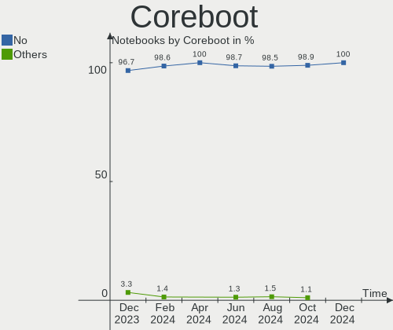
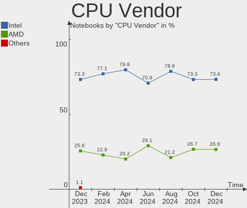
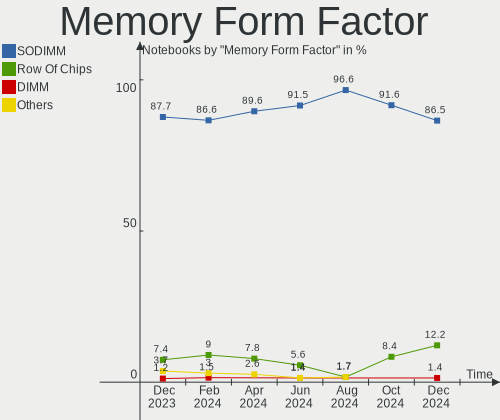

BSD Hardware Trends (Notebooks)
-------------------------------

A project to identify most popular hardware characteristics and track their change
over time based on data collected by BSD users at https://BSD-Hardware.info.

Anyone can contribute to this report by the [hw-probe](https://github.com/linuxhw/hw-probe/blob/master/INSTALL.BSD.md) tool:

    hw-probe -all -upload

Full-feature report is available here: https://bsd-hardware.info/?view=trends

Period: Mar, 2022.

Contents
--------

* [ System ](#system)
  - [ OS                       ](#os)
  - [ OS Family                ](#os-family)
  - [ Arch                     ](#arch)
  - [ DE                       ](#de)
  - [ Display Server           ](#display-server)
  - [ Display Manager          ](#display-manager)
  - [ OS Lang                  ](#os-lang)
  - [ Boot Mode                ](#boot-mode)
  - [ Filesystem               ](#filesystem)
  - [ Part. scheme             ](#part-scheme)

* [ Board ](#board)
  - [ Vendor                   ](#vendor)
  - [ Model                    ](#model)
  - [ Model Family             ](#model-family)
  - [ MFG Year                 ](#mfg-year)
  - [ Form Factor              ](#form-factor)
  - [ Coreboot                 ](#coreboot)
  - [ RAM Size                 ](#ram-size)
  - [ RAM Used                 ](#ram-used)
  - [ Total Drives             ](#total-drives)
  - [ Has CD-ROM               ](#has-cd-rom)
  - [ Has Ethernet             ](#has-ethernet)
  - [ Has WiFi                 ](#has-wifi)
  - [ Has Bluetooth            ](#has-bluetooth)

* [ Location ](#location)
  - [ Country                  ](#country)
  - [ City                     ](#city)

* [ Drives ](#drives)
  - [ Drive Vendor             ](#drive-vendor)
  - [ Drive Model              ](#drive-model)
  - [ HDD Vendor               ](#hdd-vendor)
  - [ SSD Vendor               ](#ssd-vendor)
  - [ Drive Kind               ](#drive-kind)
  - [ Drive Connector          ](#drive-connector)
  - [ Drive Size               ](#drive-size)
  - [ Space Total              ](#space-total)
  - [ Space Used               ](#space-used)
  - [ Malfunc. Drives          ](#malfunc-drives)
  - [ Malfunc. Drive Vendor    ](#malfunc-drive-vendor)
  - [ Malfunc. HDD Vendor      ](#malfunc-hdd-vendor)
  - [ Malfunc. Drive Kind      ](#malfunc-drive-kind)
  - [ Failed Drives            ](#failed-drives)
  - [ Failed Drive Vendor      ](#failed-drive-vendor)
  - [ Drive Status             ](#drive-status)

* [ Storage controller ](#storage-controller)
  - [ Storage Vendor           ](#storage-vendor)
  - [ Storage Model            ](#storage-model)
  - [ Storage Kind             ](#storage-kind)

* [ Processor ](#processor)
  - [ CPU Vendor               ](#cpu-vendor)
  - [ CPU Model                ](#cpu-model)
  - [ CPU Model Family         ](#cpu-model-family)
  - [ CPU Cores                ](#cpu-cores)
  - [ CPU Sockets              ](#cpu-sockets)
  - [ CPU Threads              ](#cpu-threads)
  - [ CPU Microarch            ](#cpu-microarch)

* [ Graphics ](#graphics)
  - [ GPU Vendor               ](#gpu-vendor)
  - [ GPU Model                ](#gpu-model)
  - [ GPU Combo                ](#gpu-combo)
  - [ GPU Driver               ](#gpu-driver)
  - [ GPU Memory               ](#gpu-memory)

* [ Monitor ](#monitor)
  - [ Monitor Vendor           ](#monitor-vendor)
  - [ Monitor Model            ](#monitor-model)
  - [ Monitor Resolution       ](#monitor-resolution)
  - [ Monitor Diagonal         ](#monitor-diagonal)
  - [ Monitor Width            ](#monitor-width)
  - [ Aspect Ratio             ](#aspect-ratio)
  - [ Monitor Area             ](#monitor-area)
  - [ Pixel Density            ](#pixel-density)
  - [ Multiple Monitors        ](#multiple-monitors)

* [ Network ](#network)
  - [ Net Controller Vendor    ](#net-controller-vendor)
  - [ Net Controller Model     ](#net-controller-model)
  - [ Wireless Vendor          ](#wireless-vendor)
  - [ Wireless Model           ](#wireless-model)
  - [ Ethernet Vendor          ](#ethernet-vendor)
  - [ Ethernet Model           ](#ethernet-model)
  - [ Net Controller Kind      ](#net-controller-kind)
  - [ Used Controller          ](#used-controller)
  - [ NICs                     ](#nics)
  - [ IPv6                     ](#ipv6)

* [ Bluetooth ](#bluetooth)
  - [ Bluetooth Vendor         ](#bluetooth-vendor)
  - [ Bluetooth Model          ](#bluetooth-model)

* [ Sound ](#sound)
  - [ Sound Vendor             ](#sound-vendor)
  - [ Sound Model              ](#sound-model)

* [ Memory ](#memory)
  - [ Memory Vendor            ](#memory-vendor)
  - [ Memory Model             ](#memory-model)
  - [ Memory Kind              ](#memory-kind)
  - [ Memory Form Factor       ](#memory-form-factor)
  - [ Memory Size              ](#memory-size)
  - [ Memory Speed             ](#memory-speed)

* [ Printers & scanners ](#printers--scanners)
  - [ Printer Vendor           ](#printer-vendor)
  - [ Printer Model            ](#printer-model)
  - [ Scanner Vendor           ](#scanner-vendor)
  - [ Scanner Model            ](#scanner-model)

* [ Camera ](#camera)
  - [ Camera Vendor            ](#camera-vendor)
  - [ Camera Model             ](#camera-model)

* [ Security ](#security)
  - [ Fingerprint Vendor       ](#fingerprint-vendor)
  - [ Fingerprint Model        ](#fingerprint-model)
  - [ Chipcard Vendor          ](#chipcard-vendor)
  - [ Chipcard Model           ](#chipcard-model)

* [ Unsupported ](#unsupported)
  - [ Unsupported Devices      ](#unsupported-devices)
  - [ Unsupported Device Types ](#unsupported-device-types)

System
------

OS
--

Installed operating systems

| Name                    | Notebooks | Percent |
|-------------------------|-----------|---------|
| helloSystem 0.7.0       | 12        | 15.79%  |
| FreeBSD 13.0-p7         | 7         | 9.21%   |
| helloSystem 0.8.0       | 6         | 7.89%   |
| GhostBSD 22.01.12       | 6         | 7.89%   |
| FreeBSD 14.0-CURRENT    | 6         | 7.89%   |
| FreeBSD 13.0            | 6         | 7.89%   |
| OpenBSD 7.1             | 5         | 6.58%   |
| OPNsense 22.1.2         | 4         | 5.26%   |
| OPNsense 22.1.4         | 3         | 3.95%   |
| OpenBSD 7.0             | 3         | 3.95%   |
| NomadBSD 5806f915       | 2         | 2.63%   |
| FreeBSD 13.1-BETA2      | 2         | 2.63%   |
| FreeBSD 12.1-p22-HBSD   | 2         | 2.63%   |
| OPNsense 22.1.3         | 1         | 1.32%   |
| OPNsense 22.1.1         | 1         | 1.32%   |
| NetBSD 9.2_STABLE       | 1         | 1.32%   |
| MidnightBSD 2.1.5       | 1         | 1.32%   |
| helloSystem 0.6.0       | 1         | 1.32%   |
| GhostBSD 21.12.29       | 1         | 1.32%   |
| FreeBSD 13.1-PRERELEASE | 1         | 1.32%   |
| FreeBSD 13.1-BETA3      | 1         | 1.32%   |
| FreeBSD 13.1-BETA1      | 1         | 1.32%   |
| FreeBSD 13.0-STABLE     | 1         | 1.32%   |
| FreeBSD 13.0-p8         | 1         | 1.32%   |
| FreeBSD 13.0-p10        | 1         | 1.32%   |

OS Family
---------

OS without a version

| Name        | Notebooks | Percent |
|-------------|-----------|---------|
| FreeBSD     | 29        | 38.16%  |
| helloSystem | 19        | 25%     |
| OPNsense    | 9         | 11.84%  |
| OpenBSD     | 8         | 10.53%  |
| GhostBSD    | 7         | 9.21%   |
| NomadBSD    | 2         | 2.63%   |
| NetBSD      | 1         | 1.32%   |
| MidnightBSD | 1         | 1.32%   |

Arch
----

OS architecture (x86_64, i586, etc.)

| Name  | Notebooks | Percent |
|-------|-----------|---------|
| amd64 | 74        | 97.37%  |
| i386  | 2         | 2.63%   |

DE
--

Desktop Environment

| Name         | Notebooks | Percent |
|--------------|-----------|---------|
| helloDesktop | 20        | 26.32%  |
| Console      | 15        | 19.74%  |
| MATE         | 8         | 10.53%  |
| XFCE         | 7         | 9.21%   |
| fvwm         | 5         | 6.58%   |
| Openbox      | 4         | 5.26%   |
| KDE5         | 4         | 5.26%   |
| i3           | 4         | 5.26%   |
| GNOME        | 2         | 2.63%   |
| ctwm         | 2         | 2.63%   |
| TWM          | 1         | 1.32%   |
| spectrwm     | 1         | 1.32%   |
| IceWM        | 1         | 1.32%   |
| Fluxbox      | 1         | 1.32%   |
| akonadi_newm | 1         | 1.32%   |

Display Server
--------------

X11 or Wayland

| Name    | Notebooks | Percent |
|---------|-----------|---------|
| X11     | 61        | 80.26%  |
| Console | 15        | 19.74%  |

Display Manager
---------------

SDDM, LightDM, etc.

| Name    | Notebooks | Percent |
|---------|-----------|---------|
| Console | 32        | 42.11%  |
| SLiM    | 26        | 34.21%  |
| LightDM | 10        | 13.16%  |
| XDM     | 4         | 5.26%   |
| SDDM    | 3         | 3.95%   |
| PCDM    | 1         | 1.32%   |

OS Lang
-------

Language

| Lang    | Notebooks | Percent |
|---------|-----------|---------|
| en_US   | 25        | 32.89%  |
| C       | 23        | 30.26%  |
| Unknown | 21        | 27.63%  |
| ru_RU   | 2         | 2.63%   |
| fr_FR   | 2         | 2.63%   |
| de_CH   | 2         | 2.63%   |
| zh_CN   | 1         | 1.32%   |

Boot Mode
---------

EFI or BIOS

| Mode | Notebooks | Percent |
|------|-----------|---------|
| EFI  | 62        | 81.58%  |
| BIOS | 14        | 18.42%  |

Filesystem
----------

Type of filesystem

| Type   | Notebooks | Percent |
|--------|-----------|---------|
| Zfs    | 38        | 50%     |
| Ufs    | 21        | 27.63%  |
| Cd9660 | 9         | 11.84%  |
| Ffs    | 8         | 10.53%  |

Part. scheme
------------

Scheme of partitioning

| Type    | Notebooks | Percent |
|---------|-----------|---------|
| GPT     | 67        | 88.16%  |
| MBR     | 8         | 10.53%  |
| Unknown | 1         | 1.32%   |

Board
-----

Vendor
------

Motherboard manufacturer

| Name             | Notebooks | Percent |
|------------------|-----------|---------|
| Lenovo           | 26        | 34.21%  |
| Dell             | 9         | 11.84%  |
| Hewlett-Packard  | 6         | 7.89%   |
| ASUSTek Computer | 6         | 7.89%   |
| Deciso           | 4         | 5.26%   |
| Acer             | 4         | 5.26%   |
| Notebook         | 3         | 3.95%   |
| Gateway          | 3         | 3.95%   |
| HUAWEI           | 2         | 2.63%   |
| Toshiba          | 1         | 1.32%   |
| SIEMENS          | 1         | 1.32%   |
| PCSTICK          | 1         | 1.32%   |
| Packard Bell     | 1         | 1.32%   |
| Itautec          | 1         | 1.32%   |
| Intel            | 1         | 1.32%   |
| IBM              | 1         | 1.32%   |
| HASEE Computer   | 1         | 1.32%   |
| Fujitsu          | 1         | 1.32%   |
| Framework        | 1         | 1.32%   |
| Datto            | 1         | 1.32%   |
| Apple            | 1         | 1.32%   |
| AEWIN            | 1         | 1.32%   |

Model
-----

Motherboard model

| Name                                   | Notebooks | Percent |
|----------------------------------------|-----------|---------|
| Deciso Netboard A20                    | 3         | 3.95%   |
| Lenovo ThinkPad X200 745969G           | 2         | 2.63%   |
| Toshiba Satellite Pro L40              | 1         | 1.32%   |
| SIEMENS SIMATIC IPC127E                | 1         | 1.32%   |
| Packard Bell EasyNote TE69HW           | 1         | 1.32%   |
| Notebook N8xEJEK                       | 1         | 1.32%   |
| Notebook N7x0WU                        | 1         | 1.32%   |
| Notebook N13xWU                        | 1         | 1.32%   |
| Lenovo Z50-70 20354                    | 1         | 1.32%   |
| Lenovo Yoga 330-11IGM 81A6             | 1         | 1.32%   |
| Lenovo XiaoXinPro-13ARE 2020 82DM      | 1         | 1.32%   |
| Lenovo ThinkPad X260 20F5A28AUK        | 1         | 1.32%   |
| Lenovo ThinkPad X230 2325BV9           | 1         | 1.32%   |
| Lenovo ThinkPad X220 Tablet 4298B65    | 1         | 1.32%   |
| Lenovo ThinkPad X220 4293B43           | 1         | 1.32%   |
| Lenovo ThinkPad X201 32492EU           | 1         | 1.32%   |
| Lenovo ThinkPad X13 Gen 1 20UF0014US   | 1         | 1.32%   |
| Lenovo ThinkPad X1 Extreme 20MF000BUS  | 1         | 1.32%   |
| Lenovo ThinkPad T460s 20FAS4KH02       | 1         | 1.32%   |
| Lenovo ThinkPad T440s 20AQ006HUS       | 1         | 1.32%   |
| Lenovo ThinkPad T420 4236MBU           | 1         | 1.32%   |
| Lenovo ThinkPad T410 2537WEE           | 1         | 1.32%   |
| Lenovo ThinkPad T410 2537BN8           | 1         | 1.32%   |
| Lenovo ThinkPad T14s Gen 2i 20WM00B7MX | 1         | 1.32%   |
| Lenovo ThinkPad R60e 0658W2M           | 1         | 1.32%   |
| Lenovo ThinkPad L440 20ASS0FP00        | 1         | 1.32%   |
| Lenovo ThinkPad E580 20KSCTO1WW        | 1         | 1.32%   |
| Lenovo ThinkPad E490 20N8CTO1WW        | 1         | 1.32%   |
| Lenovo ThinkBook 14 G2 ARE 20VF        | 1         | 1.32%   |
| Lenovo IdeaPad Y700-15ISK 80NV         | 1         | 1.32%   |
| Lenovo IdeaPad N585                    | 1         | 1.32%   |
| Lenovo Flex 2-15 20405                 | 1         | 1.32%   |
| Itautec Infoway w7535                  | 1         | 1.32%   |
| Intel H81U                             | 1         | 1.32%   |
| IBM 2658MNG                            | 1         | 1.32%   |
| HUAWEI CREM-WXX9                       | 1         | 1.32%   |
| HUAWEI BOD-WXX9                        | 1         | 1.32%   |
| HP Pavilion Laptop 15-cs0xxx           | 1         | 1.32%   |
| HP Pavilion dv6                        | 1         | 1.32%   |
| HP EliteBook 8570p                     | 1         | 1.32%   |
| HP EliteBook 850 G3                    | 1         | 1.32%   |
| HP EliteBook 2530p                     | 1         | 1.32%   |
| HP Compaq 6510b (GF910AW#AB8)          | 1         | 1.32%   |
| HASEE CW35S                            | 1         | 1.32%   |
| Gateway NV55C                          | 1         | 1.32%   |
| Gateway NE56R                          | 1         | 1.32%   |
| Gateway LT27                           | 1         | 1.32%   |
| Fujitsu LIFEBOOK A544                  | 1         | 1.32%   |
| Framework Laptop                       | 1         | 1.32%   |
| Dell Vostro 3550                       | 1         | 1.32%   |
| Dell Vostro 3490                       | 1         | 1.32%   |
| Dell Latitude E7440                    | 1         | 1.32%   |
| Dell Latitude E6540                    | 1         | 1.32%   |
| Dell Latitude E6530                    | 1         | 1.32%   |
| Dell Latitude E6510                    | 1         | 1.32%   |
| Dell Latitude E6500                    | 1         | 1.32%   |
| Dell Inspiron 5502                     | 1         | 1.32%   |
| Dell G5 5590                           | 1         | 1.32%   |
| Deciso OPNsense Appliance              | 1         | 1.32%   |
| Datto 1000                             | 1         | 1.32%   |

Model Family
------------

Motherboard model prefix

| Name                    | Notebooks | Percent |
|-------------------------|-----------|---------|
| Lenovo ThinkPad         | 19        | 25%     |
| Dell Latitude           | 5         | 6.58%   |
| HP EliteBook            | 3         | 3.95%   |
| Deciso Netboard         | 3         | 3.95%   |
| Acer Aspire             | 3         | 3.95%   |
| Lenovo IdeaPad          | 2         | 2.63%   |
| HP Pavilion             | 2         | 2.63%   |
| Dell Vostro             | 2         | 2.63%   |
| Toshiba Satellite       | 1         | 1.32%   |
| SIEMENS SIMATIC         | 1         | 1.32%   |
| Packard Bell EasyNote   | 1         | 1.32%   |
| Notebook N8xEJEK        | 1         | 1.32%   |
| Notebook N7x0WU         | 1         | 1.32%   |
| Notebook N13xWU         | 1         | 1.32%   |
| Lenovo Z50-70           | 1         | 1.32%   |
| Lenovo Yoga             | 1         | 1.32%   |
| Lenovo XiaoXinPro-13ARE | 1         | 1.32%   |
| Lenovo ThinkBook        | 1         | 1.32%   |
| Lenovo Flex             | 1         | 1.32%   |
| Itautec Infoway         | 1         | 1.32%   |
| Intel H81U              | 1         | 1.32%   |
| IBM 2658MNG             | 1         | 1.32%   |
| HUAWEI CREM-WXX9        | 1         | 1.32%   |
| HUAWEI BOD-WXX9         | 1         | 1.32%   |
| HP Compaq               | 1         | 1.32%   |
| HASEE CW35S             | 1         | 1.32%   |
| Gateway NV55C           | 1         | 1.32%   |
| Gateway NE56R           | 1         | 1.32%   |
| Gateway LT27            | 1         | 1.32%   |
| Fujitsu LIFEBOOK        | 1         | 1.32%   |
| Framework Laptop        | 1         | 1.32%   |
| Dell Inspiron           | 1         | 1.32%   |
| Dell G5                 | 1         | 1.32%   |
| Deciso OPNsense         | 1         | 1.32%   |
| Datto 1000              | 1         | 1.32%   |
| ASUS X555LJ             | 1         | 1.32%   |
| ASUS VX6                | 1         | 1.32%   |
| ASUS UX31E              | 1         | 1.32%   |
| ASUS ROG                | 1         | 1.32%   |
| ASUS N50Vc              | 1         | 1.32%   |
| ASUS M51Sr              | 1         | 1.32%   |
| Apple MacBookPro12      | 1         | 1.32%   |
| AEWIN CB-7979           | 1         | 1.32%   |
| Acer Swift              | 1         | 1.32%   |
| Unknown                 | 1         | 1.32%   |

MFG Year
--------

Motherboard manufacture year

| Year    | Notebooks | Percent |
|---------|-----------|---------|
| 2021    | 11        | 14.47%  |
| 2018    | 9         | 11.84%  |
| 2014    | 6         | 7.89%   |
| 2011    | 6         | 7.89%   |
| 2010    | 6         | 7.89%   |
| 2013    | 5         | 6.58%   |
| 2009    | 5         | 6.58%   |
| 2022    | 4         | 5.26%   |
| 2019    | 4         | 5.26%   |
| 2016    | 4         | 5.26%   |
| 2020    | 3         | 3.95%   |
| 2015    | 3         | 3.95%   |
| 2012    | 3         | 3.95%   |
| 2017    | 2         | 2.63%   |
| 2008    | 1         | 1.32%   |
| 2007    | 1         | 1.32%   |
| 2006    | 1         | 1.32%   |
| 2003    | 1         | 1.32%   |
| Unknown | 1         | 1.32%   |

Form Factor
-----------

Physical design of the computer

| Name     | Notebooks | Percent |
|----------|-----------|---------|
| Notebook | 76        | 100%    |

Coreboot
--------

Have coreboot on board

| Used | Notebooks | Percent |
|------|-----------|---------|
| No   | 76        | 100%    |

RAM Size
--------

Total RAM memory

| Size in GB | Notebooks | Percent |
|------------|-----------|---------|
| 8.01-16.0  | 25        | 32.89%  |
| 16.01-24.0 | 19        | 25%     |
| 4.01-8.0   | 18        | 23.68%  |
| 2.01-3.0   | 5         | 6.58%   |
| 32.01-64.0 | 3         | 3.95%   |
| 3.01-4.0   | 3         | 3.95%   |
| 24.01-32.0 | 2         | 2.63%   |
| 0.51-1.0   | 1         | 1.32%   |

RAM Used
--------

Used RAM memory

| Used GB  | Notebooks | Percent |
|----------|-----------|---------|
| 0.01-0.5 | 45        | 59.21%  |
| 0.51-1.0 | 18        | 23.68%  |
| 1.01-2.0 | 9         | 11.84%  |
| 2.01-3.0 | 2         | 2.63%   |
| 0        | 1         | 1.32%   |
| Unknown  | 1         | 1.32%   |

Total Drives
------------

Number of drives on board

| Drives | Notebooks | Percent |
|--------|-----------|---------|
| 1      | 59        | 77.63%  |
| 2      | 10        | 13.16%  |
| 0      | 5         | 6.58%   |
| 3      | 2         | 2.63%   |

Has CD-ROM
----------

Has CD-ROM on board

| Presented | Notebooks | Percent |
|-----------|-----------|---------|
| No        | 57        | 75%     |
| Yes       | 19        | 25%     |

Has Ethernet
------------

Has Ethernet on board

| Presented | Notebooks | Percent |
|-----------|-----------|---------|
| Yes       | 65        | 85.53%  |
| No        | 11        | 14.47%  |

Has WiFi
--------

Has WiFi module

| Presented | Notebooks | Percent |
|-----------|-----------|---------|
| Yes       | 66        | 86.84%  |
| No        | 10        | 13.16%  |

Has Bluetooth
-------------

Has Bluetooth module

| Presented | Notebooks | Percent |
|-----------|-----------|---------|
| Yes       | 43        | 56.58%  |
| No        | 33        | 43.42%  |

Location
--------

Country
-------

Geographic location (country)

| Country     | Notebooks | Percent |
|-------------|-----------|---------|
| USA         | 17        | 22.37%  |
| Germany     | 13        | 17.11%  |
| Russia      | 6         | 7.89%   |
| Denmark     | 4         | 5.26%   |
| UK          | 3         | 3.95%   |
| Switzerland | 3         | 3.95%   |
| Poland      | 3         | 3.95%   |
| Brazil      | 3         | 3.95%   |
| Vietnam     | 2         | 2.63%   |
| Turkey      | 2         | 2.63%   |
| Spain       | 2         | 2.63%   |
| France      | 2         | 2.63%   |
| China       | 2         | 2.63%   |
| UAE         | 1         | 1.32%   |
| Sweden      | 1         | 1.32%   |
| Norway      | 1         | 1.32%   |
| Mexico      | 1         | 1.32%   |
| Latvia      | 1         | 1.32%   |
| Italy       | 1         | 1.32%   |
| Colombia    | 1         | 1.32%   |
| Chile       | 1         | 1.32%   |
| Canada      | 1         | 1.32%   |
| Bulgaria    | 1         | 1.32%   |
| Belgium     | 1         | 1.32%   |
| Austria     | 1         | 1.32%   |
| Australia   | 1         | 1.32%   |
| Argentina   | 1         | 1.32%   |

City
----

Geographic location (city)

| City               | Notebooks | Percent |
|--------------------|-----------|---------|
| Bedburg            | 6         | 7.89%   |
| Portland           | 2         | 2.63%   |
| Paris              | 2         | 2.63%   |
| Munchenstein       | 2         | 2.63%   |
| Moscow             | 2         | 2.63%   |
| Fresno             | 2         | 2.63%   |
| Weidlingbach       | 1         | 1.32%   |
| Warendorf          | 1         | 1.32%   |
| Vratsa             | 1         | 1.32%   |
| Valdivia           | 1         | 1.32%   |
| Tsarskoye Selo     | 1         | 1.32%   |
| Tamm               | 1         | 1.32%   |
| Świnoujście      | 1         | 1.32%   |
| Swindon            | 1         | 1.32%   |
| Stockholm          | 1         | 1.32%   |
| Starogard Gdański | 1         | 1.32%   |
| St. Moritz         | 1         | 1.32%   |
| St Petersburg      | 1         | 1.32%   |
| Springfield        | 1         | 1.32%   |
| Springboro         | 1         | 1.32%   |
| Shanghai           | 1         | 1.32%   |
| San Benito         | 1         | 1.32%   |
| Rio das Ostras     | 1         | 1.32%   |
| Riga               | 1         | 1.32%   |
| Paracuru           | 1         | 1.32%   |
| Paducah            | 1         | 1.32%   |
| Omaha              | 1         | 1.32%   |
| Odense             | 1         | 1.32%   |
| Oakdale            | 1         | 1.32%   |
| Nesttun            | 1         | 1.32%   |
| Nashville          | 1         | 1.32%   |
| Mexico City        | 1         | 1.32%   |
| Mankato            | 1         | 1.32%   |
| Madrid             | 1         | 1.32%   |
| Lüneburg          | 1         | 1.32%   |
| Lübeck            | 1         | 1.32%   |
| Los Angeles        | 1         | 1.32%   |
| London             | 1         | 1.32%   |
| Langley            | 1         | 1.32%   |
| Kirov              | 1         | 1.32%   |
| Kirkel             | 1         | 1.32%   |
| Istanbul           | 1         | 1.32%   |
| Inverness          | 1         | 1.32%   |
| Herlev             | 1         | 1.32%   |
| Harrisburg         | 1         | 1.32%   |
| Hanoi              | 1         | 1.32%   |
| Genzano di Roma    | 1         | 1.32%   |
| Gdansk             | 1         | 1.32%   |
| Fjenneslev         | 1         | 1.32%   |
| Envigado           | 1         | 1.32%   |
| Dormagen           | 1         | 1.32%   |
| Dolgoprudnyy       | 1         | 1.32%   |
| Cupertino          | 1         | 1.32%   |
| Corvallis          | 1         | 1.32%   |
| Copenhagen         | 1         | 1.32%   |
| Chicago            | 1         | 1.32%   |
| Bursa              | 1         | 1.32%   |
| Buon Ma Thuot      | 1         | 1.32%   |
| Brussels           | 1         | 1.32%   |
| Berlin             | 1         | 1.32%   |

Drives
------

Drive Vendor
------------

Hard drive vendors

| Vendor              | Notebooks | Drives | Percent |
|---------------------|-----------|--------|---------|
| WDC                 | 13        | 13     | 16.88%  |
| Samsung Electronics | 12        | 13     | 15.58%  |
| Toshiba             | 8         | 8      | 10.39%  |
| Seagate             | 7         | 7      | 9.09%   |
| Transcend           | 5         | 5      | 6.49%   |
| HGST                | 4         | 4      | 5.19%   |
| Crucial             | 3         | 3      | 3.9%    |
| SK Hynix            | 2         | 2      | 2.6%    |
| SanDisk             | 2         | 2      | 2.6%    |
| Kingston            | 2         | 2      | 2.6%    |
| Intel               | 2         | 2      | 2.6%    |
| A-DATA Technology   | 2         | 2      | 2.6%    |
| Zheino              | 1         | 1      | 1.3%    |
| SPCC                | 1         | 1      | 1.3%    |
| Patriot             | 1         | 1      | 1.3%    |
| OCZ                 | 1         | 1      | 1.3%    |
| Micron Technology   | 1         | 1      | 1.3%    |
| LITEON              | 1         | 1      | 1.3%    |
| Lenovo              | 1         | 1      | 1.3%    |
| Kston               | 1         | 1      | 1.3%    |
| KIOXIA              | 1         | 1      | 1.3%    |
| INDMEM              | 1         | 1      | 1.3%    |
| Hitachi             | 1         | 1      | 1.3%    |
| Fujitsu             | 1         | 1      | 1.3%    |
| Corsair             | 1         | 1      | 1.3%    |
| Apple               | 1         | 1      | 1.3%    |
| Apacer              | 1         | 1      | 1.3%    |

Drive Model
-----------

Hard drive models

| Model                                | Notebooks | Percent |
|--------------------------------------|-----------|---------|
| WDC PC SN730 SDBQNTY-1T00-1001 1TB   | 2         | 2.56%   |
| Transcend TS256GMTS952T2 256GB       | 2         | 2.56%   |
| Seagate ST1000LM024 HN-M101MBB 1TB   | 2         | 2.56%   |
| Samsung HM321HI 320GB                | 2         | 2.56%   |
| HGST HTS721010A9E630 1TB             | 2         | 2.56%   |
| Zheino CHN mSATAM1 256 256GB         | 1         | 1.28%   |
| WDC WDS500G1X0E-00AFY0 500GB         | 1         | 1.28%   |
| WDC WDS120G2G0A-00JH30 120GB         | 1         | 1.28%   |
| WDC WD5000LPVX-16V0TT3 500GB         | 1         | 1.28%   |
| WDC WD5000LPVT-08G33T1 500GB         | 1         | 1.28%   |
| WDC WD5000BPVT-00HXZT3 500GB         | 1         | 1.28%   |
| WDC WD2500BEVT-22A23T0 250GB         | 1         | 1.28%   |
| WDC WD10JPVX-75JC3T0 1TB             | 1         | 1.28%   |
| WDC PC SN730 SDBPNTY-512G-1101 512GB | 1         | 1.28%   |
| WDC PC SN730 SDBPNTY-512G            | 1         | 1.28%   |
| WDC PC SN530 SDBPNPZ-512G-1027 512GB | 1         | 1.28%   |
| WDC PC SN530 SDBPMPZ-256G-1101 256GB | 1         | 1.28%   |
| Transcend TSG128MTS400ISI 128GB      | 1         | 1.28%   |
| Transcend TS512GMTS952T2 512GB       | 1         | 1.28%   |
| Transcend TS256GMTE652T2 256GB       | 1         | 1.28%   |
| Toshiba THNSNJ128GMCU 128GB          | 1         | 1.28%   |
| Toshiba MQ04ABF100 1TB               | 1         | 1.28%   |
| Toshiba MQ01ABF050 500GB             | 1         | 1.28%   |
| Toshiba MK7559GSXF 752GB             | 1         | 1.28%   |
| Toshiba MK1637GSX 160GB              | 1         | 1.28%   |
| Toshiba MK1629GSGF 160GB             | 1         | 1.28%   |
| Toshiba KBG30ZMT512G 512GB           | 1         | 1.28%   |
| Toshiba KBG30ZMT128G 128GB           | 1         | 1.28%   |
| SPCC Solid State Disk 128GB          | 1         | 1.28%   |
| SK Hynix SC311 SATA 256GB            | 1         | 1.28%   |
| SK Hynix BC501 NVMe 512GB            | 1         | 1.28%   |
| Seagate ST9500420AS 500GB            | 1         | 1.28%   |
| Seagate ST9320423AS 320GB            | 1         | 1.28%   |
| Seagate ST9160411ASG 160GB           | 1         | 1.28%   |
| Seagate ST500LT012-9WS142 500GB      | 1         | 1.28%   |
| Seagate ST250DM000-1BD141 250GB      | 1         | 1.28%   |
| SanDisk SSD PLUS 120GB               | 1         | 1.28%   |
| SanDisk SD8TN8U256G1001 256GB        | 1         | 1.28%   |
| Samsung SSD PM871 2.5 7mm 128GB      | 1         | 1.28%   |
| Samsung SSD 970 EVO Plus 500GB       | 1         | 1.28%   |
| Samsung SSD 870 QVO 8TB              | 1         | 1.28%   |
| Samsung SSD 860 EVO M.2 500GB        | 1         | 1.28%   |
| Samsung SSD 860 EVO M.2 250GB        | 1         | 1.28%   |
| Samsung SSD 860 EVO 500GB            | 1         | 1.28%   |
| Samsung SSD 850 EVO 500GB            | 1         | 1.28%   |
| Samsung SSD 850 EVO 120GB            | 1         | 1.28%   |
| Samsung MZYLF128HCHP-000L2 128GB     | 1         | 1.28%   |
| Samsung MZVLQ1T0HALB-00000 1TB       | 1         | 1.28%   |
| Samsung MZ7TD256HAFV-000L9 256GB     | 1         | 1.28%   |
| Patriot Burst 120GB                  | 1         | 1.28%   |
| OCZ AGILITY3 120GB                   | 1         | 1.28%   |
| Micron 2450_MTFDKBA1T0TFK 1TB        | 1         | 1.28%   |
| LITEON CV1-8B512 512GB               | 1         | 1.28%   |
| Lenovo LENSE30512GMSP34MEAT3TA 512GB | 1         | 1.28%   |
| Kston SSD 64GB                       | 1         | 1.28%   |
| KIOXIA KBG40ZNS256G NVMe 256GB       | 1         | 1.28%   |
| Kingston SMS200S3120G 120GB          | 1         | 1.28%   |
| Kingston SA400S37240G 240GB          | 1         | 1.28%   |
| Intel SSDSC2BF240A5L 240GB           | 1         | 1.28%   |
| Intel SSDSA2BZ100G3 100GB            | 1         | 1.28%   |

HDD Vendor
----------

Hard disk drive vendors

| Vendor              | Notebooks | Drives | Percent |
|---------------------|-----------|--------|---------|
| Seagate             | 7         | 7      | 28%     |
| WDC                 | 5         | 5      | 20%     |
| Toshiba             | 5         | 5      | 20%     |
| HGST                | 4         | 4      | 16%     |
| Samsung Electronics | 2         | 2      | 8%      |
| Hitachi             | 1         | 1      | 4%      |
| Fujitsu             | 1         | 1      | 4%      |

SSD Vendor
----------

Solid state drive vendors

| Vendor              | Notebooks | Drives | Percent |
|---------------------|-----------|--------|---------|
| Samsung Electronics | 8         | 9      | 22.86%  |
| Transcend           | 4         | 4      | 11.43%  |
| SanDisk             | 2         | 2      | 5.71%   |
| Kingston            | 2         | 2      | 5.71%   |
| Intel               | 2         | 2      | 5.71%   |
| Crucial             | 2         | 2      | 5.71%   |
| A-DATA Technology   | 2         | 2      | 5.71%   |
| Zheino              | 1         | 1      | 2.86%   |
| WDC                 | 1         | 1      | 2.86%   |
| Toshiba             | 1         | 1      | 2.86%   |
| SPCC                | 1         | 1      | 2.86%   |
| SK Hynix            | 1         | 1      | 2.86%   |
| Patriot             | 1         | 1      | 2.86%   |
| OCZ                 | 1         | 1      | 2.86%   |
| LITEON              | 1         | 1      | 2.86%   |
| Kston               | 1         | 1      | 2.86%   |
| INDMEM              | 1         | 1      | 2.86%   |
| Corsair             | 1         | 1      | 2.86%   |
| Apple               | 1         | 1      | 2.86%   |
| Apacer              | 1         | 1      | 2.86%   |

Drive Kind
----------

HDD or SSD

| Kind | Notebooks | Drives | Percent |
|------|-----------|--------|---------|
| SSD  | 32        | 36     | 44.44%  |
| HDD  | 24        | 25     | 33.33%  |
| NVMe | 16        | 17     | 22.22%  |

Drive Connector
---------------

SATA, SAS, NVMe, etc.

| Type | Notebooks | Drives | Percent |
|------|-----------|--------|---------|
| SATA | 54        | 61     | 77.14%  |
| NVMe | 16        | 17     | 22.86%  |

Drive Size
----------

Size of hard drive

| Size in TB | Notebooks | Drives | Percent |
|------------|-----------|--------|---------|
| 0.01-0.5   | 43        | 49     | 78.18%  |
| 0.51-1.0   | 11        | 11     | 20%     |
| 4.01-10.0  | 1         | 1      | 1.82%   |

Space Total
-----------

Amount of disk space available on the file system

| Size in GB | Notebooks | Percent |
|------------|-----------|---------|
| 251-500    | 20        | 26.32%  |
| 1-20       | 19        | 25%     |
| 101-250    | 18        | 23.68%  |
| 501-1000   | 8         | 10.53%  |
| 51-100     | 6         | 7.89%   |
| 21-50      | 5         | 6.58%   |

Space Used
----------

Amount of used disk space

| Used GB | Notebooks | Percent |
|---------|-----------|---------|
| 1-20    | 67        | 88.16%  |
| 21-50   | 3         | 3.95%   |
| 101-250 | 3         | 3.95%   |
| 51-100  | 3         | 3.95%   |

Malfunc. Drives
---------------

Drive models with a malfunction

| Model                           | Notebooks | Drives | Percent |
|---------------------------------|-----------|--------|---------|
| Toshiba MK7559GSXF 752GB        | 1         | 1      | 12.5%   |
| Toshiba MK1629GSGF 160GB        | 1         | 1      | 12.5%   |
| Seagate ST9500420AS 500GB       | 1         | 1      | 12.5%   |
| Seagate ST9320423AS 320GB       | 1         | 1      | 12.5%   |
| Seagate ST500LT012-9WS142 500GB | 1         | 1      | 12.5%   |
| Hitachi HTS541040G9SA00 40GB    | 1         | 1      | 12.5%   |
| HGST HTS721010A9E630 1TB        | 1         | 1      | 12.5%   |
| HGST HTS545050A7E660 500GB      | 1         | 1      | 12.5%   |

Malfunc. Drive Vendor
---------------------

Vendors of faulty drives

| Vendor  | Notebooks | Drives | Percent |
|---------|-----------|--------|---------|
| Seagate | 3         | 3      | 37.5%   |
| Toshiba | 2         | 2      | 25%     |
| HGST    | 2         | 2      | 25%     |
| Hitachi | 1         | 1      | 12.5%   |

Malfunc. HDD Vendor
-------------------

Vendors of faulty HDD drives

| Vendor  | Notebooks | Drives | Percent |
|---------|-----------|--------|---------|
| Seagate | 3         | 3      | 37.5%   |
| Toshiba | 2         | 2      | 25%     |
| HGST    | 2         | 2      | 25%     |
| Hitachi | 1         | 1      | 12.5%   |

Malfunc. Drive Kind
-------------------

Kinds of faulty drives

| Kind | Notebooks | Drives | Percent |
|------|-----------|--------|---------|
| HDD  | 8         | 8      | 100%    |

Failed Drives
-------------

Failed drive models

Zero info for selected period =(

Failed Drive Vendor
-------------------

Failed drive vendors

Zero info for selected period =(

Drive Status
------------

Number of failed and malfunc. drives

| Status   | Notebooks | Drives | Percent |
|----------|-----------|--------|---------|
| Works    | 62        | 69     | 87.32%  |
| Malfunc  | 8         | 8      | 11.27%  |
| Detected | 1         | 1      | 1.41%   |

Storage controller
------------------

Storage Vendor
--------------

Storage controller vendors

| Vendor                    | Notebooks | Percent |
|---------------------------|-----------|---------|
| Intel                     | 52        | 64.2%   |
| AMD                       | 11        | 13.58%  |
| Sandisk                   | 7         | 8.64%   |
| Samsung Electronics       | 3         | 3.7%    |
| Toshiba                   | 2         | 2.47%   |
| Micron/Crucial Technology | 1         | 1.23%   |
| Micron Technology         | 1         | 1.23%   |
| Lenovo                    | 1         | 1.23%   |
| KIOXIA                    | 1         | 1.23%   |
| JMicron Technology        | 1         | 1.23%   |
| Unknown                   | 1         | 1.23%   |

Storage Model
-------------

Storage controller models

| Model                                                                          | Notebooks | Percent |
|--------------------------------------------------------------------------------|-----------|---------|
| AMD FCH SATA Controller [AHCI mode]                                            | 11        | 12.79%  |
| Intel 6 Series/C200 Series Chipset Family 6 port Mobile SATA AHCI Controller   | 7         | 8.14%   |
| Intel Sunrise Point-LP SATA Controller [AHCI mode]                             | 6         | 6.98%   |
| Intel 82801 Mobile SATA Controller [RAID mode]                                 | 5         | 5.81%   |
| Sandisk WD Black SN750 / PC SN730 NVMe SSD                                     | 4         | 4.65%   |
| Intel 82801IBM/IEM (ICH9M/ICH9M-E) 4 port SATA Controller [AHCI mode]          | 4         | 4.65%   |
| Intel 8 Series/C220 Series Chipset Family 6-port SATA Controller 1 [AHCI mode] | 4         | 4.65%   |
| Intel 8 Series SATA Controller 1 [AHCI mode]                                   | 4         | 4.65%   |
| Intel 82801HM/HEM (ICH8M/ICH8M-E) SATA Controller [AHCI mode]                  | 3         | 3.49%   |
| Intel 82801HM/HEM (ICH8M/ICH8M-E) IDE Controller                               | 3         | 3.49%   |
| Intel 7 Series Chipset Family 6-port SATA Controller [AHCI mode]               | 3         | 3.49%   |
| Unknown                                                                        | 3         | 3.49%   |
| Toshiba BG3 NVMe SSD Controller                                                | 2         | 2.33%   |
| Intel Wildcat Point-LP SATA Controller [AHCI Mode]                             | 2         | 2.33%   |
| Intel 5 Series/3400 Series Chipset 6 port SATA AHCI Controller                 | 2         | 2.33%   |
| Intel 5 Series/3400 Series Chipset 4 port SATA AHCI Controller                 | 2         | 2.33%   |
| Sandisk WD PC SN810 / Black SN850 NVMe SSD                                     | 1         | 1.16%   |
| Sandisk WD Blue SN550 NVMe SSD                                                 | 1         | 1.16%   |
| Samsung SM951 AHCI                                                             | 1         | 1.16%   |
| Samsung NVMe SSD Controller SM981/PM981/PM983                                  | 1         | 1.16%   |
| Samsung NVMe SSD Controller 980                                                | 1         | 1.16%   |
| Micron/Crucial P2 NVMe PCIe SSD                                                | 1         | 1.16%   |
| Lenovo unknown                                                                 | 1         | 1.16%   |
| KIOXIA unknown                                                                 | 1         | 1.16%   |
| JMicron JMB360 AHCI Controller                                                 | 1         | 1.16%   |
| Intel NM10/ICH7 Family SATA Controller [IDE mode]                              | 1         | 1.16%   |
| Intel NM10/ICH7 Family SATA Controller [AHCI mode]                             | 1         | 1.16%   |
| Intel Mobile 4 Series Chipset PT IDER Controller                               | 1         | 1.16%   |
| Intel HM170/QM170 Chipset SATA Controller [AHCI Mode]                          | 1         | 1.16%   |
| Intel Comet Lake SATA AHCI Controller                                          | 1         | 1.16%   |
| Intel Celeron/Pentium Silver Processor SATA Controller                         | 1         | 1.16%   |
| Intel Celeron N3350/Pentium N4200/Atom E3900 Series SATA AHCI Controller       | 1         | 1.16%   |
| Intel Cannon Lake Mobile PCH SATA AHCI Controller                              | 1         | 1.16%   |
| Intel 82801GBM/GHM (ICH7-M Family) SATA Controller [IDE mode]                  | 1         | 1.16%   |
| Intel 82801CAM IDE U100 Controller                                             | 1         | 1.16%   |
| Intel 5 Series/3400 Series Chipset 4 port SATA IDE Controller                  | 1         | 1.16%   |
| Intel 5 Series/3400 Series Chipset 2 port SATA IDE Controller                  | 1         | 1.16%   |

Storage Kind
------------

Kind of storage controller (IDE, SATA, NVMe, SAS, ...)

| Kind | Notebooks | Percent |
|------|-----------|---------|
| SATA | 55        | 66.27%  |
| NVMe | 15        | 18.07%  |
| IDE  | 8         | 9.64%   |
| RAID | 5         | 6.02%   |

Processor
---------

CPU Vendor
----------

Processor vendors

| Vendor | Notebooks | Percent |
|--------|-----------|---------|
| Intel  | 61        | 80.26%  |
| AMD    | 15        | 19.74%  |

CPU Model
---------

Processor models

| Model                                                             | Notebooks | Percent |
|-------------------------------------------------------------------|-----------|---------|
| Intel Core i7-3520M CPU @ 2.90GHz                                 | 3         | 3.95%   |
| Intel Core i5-2520M CPU @ 2.50GHz                                 | 3         | 3.95%   |
| Intel Core i7-8750H CPU @ 2.20GHz                                 | 2         | 2.63%   |
| Intel Core i7-8550U CPU @ 1.80GHz                                 | 2         | 2.63%   |
| Intel Core i5-8250U CPU @ 1.60GHz                                 | 2         | 2.63%   |
| Intel Core i5-6300U CPU @ 2.40GHz                                 | 2         | 2.63%   |
| Intel Core 2 Duo CPU P8600 @ 2.40GHz                              | 2         | 2.63%   |
| Intel 11th Gen Core i7-1165G7 @ 2.80GHz                           | 2         | 2.63%   |
| Intel 11th Gen Core i5-1135G7 @ 2.40GHz                           | 2         | 2.63%   |
| AMD EPYC 3201 8-Core Processor                                    | 2         | 2.63%   |
| AMD E1-1200 APU with Radeon HD Graphics                           | 2         | 2.63%   |
| Intel Pentium Silver N5000 CPU @ 1.10GHz                          | 1         | 1.32%   |
| Intel Pentium Dual CPU T2330 @ 1.60GHz                            | 1         | 1.32%   |
| Intel Pentium CPU P6100 @ 2.00GHz                                 | 1         | 1.32%   |
| Intel Mobile Pentium 4 - M CPU 1.70GHz ("GenuineIntel" 686-class) | 1         | 1.32%   |
| Intel Core i7-9750H CPU @ 2.60GHz                                 | 1         | 1.32%   |
| Intel Core i7-8565U CPU @ 1.80GHz                                 | 1         | 1.32%   |
| Intel Core i7-6700HQ CPU @ 2.60GHz                                | 1         | 1.32%   |
| Intel Core i7-6600U CPU @ 2.60GHz                                 | 1         | 1.32%   |
| Intel Core i7-5500U CPU @ 2.40GHz                                 | 1         | 1.32%   |
| Intel Core i7-4810MQ CPU @ 2.80GHz                                | 1         | 1.32%   |
| Intel Core i7-4700MQ CPU @ 2.40GHz                                | 1         | 1.32%   |
| Intel Core i7-4600U CPU @ 2.10GHz                                 | 1         | 1.32%   |
| Intel Core i7-2677M CPU @ 1.80GHz                                 | 1         | 1.32%   |
| Intel Core i7 CPU M 620 @ 2.67GH                                  | 1         | 1.32%   |
| Intel Core i5-5257U CPU @ 2.70GHz                                 | 1         | 1.32%   |
| Intel Core i5-4300U CPU @ 1.90GHz                                 | 1         | 1.32%   |
| Intel Core i5-4300M CPU @ 2.60GHz                                 | 1         | 1.32%   |
| Intel Core i5-4210U CPU @ 1.70GHz                                 | 1         | 1.32%   |
| Intel Core i5-4200M CPU @ 2.50GHz                                 | 1         | 1.32%   |
| Intel Core i5-2540M CPU @ 2.60GHz                                 | 1         | 1.32%   |
| Intel Core i5-2450M CPU @ 2.50GHz                                 | 1         | 1.32%   |
| Intel Core i5-10210U CPU @ 1.60GHz                                | 1         | 1.32%   |
| Intel Core i5 CPU M 560 @ 2.67GHz                                 | 1         | 1.32%   |
| Intel Core i5 CPU M 540 @ 2.53GHz                                 | 1         | 1.32%   |
| Intel Core i5 CPU M 520 @ 2.40GHz                                 | 1         | 1.32%   |
| Intel Core i3-5020U CPU @ 2.20GHz                                 | 1         | 1.32%   |
| Intel Core i3-4010U CPU @ 1.70GHz                                 | 1         | 1.32%   |
| Intel Core i3-2310M CPU @ 2.10GHz                                 | 1         | 1.32%   |
| Intel Core i3 CPU M 350 @ 2.27GHz                                 | 1         | 1.32%   |
| Intel Core 2 Duo CPU T8100 @ 2.10GHz                              | 1         | 1.32%   |
| Intel Core 2 Duo CPU T7500 @ 2.20GHz                              | 1         | 1.32%   |
| Intel Core 2 Duo CPU P8400 @ 2.26GHz                              | 1         | 1.32%   |
| Intel Core 2 Duo CPU L9600 @ 2.13GHz                              | 1         | 1.32%   |
| Intel Core 2 Duo                                                  | 1         | 1.32%   |
| Intel Celeron M CPU                                               | 1         | 1.32%   |
| Intel Celeron CPU B830 @ 1.80GHz                                  | 1         | 1.32%   |
| Intel Celeron 2957U @ 1.40GHz                                     | 1         | 1.32%   |
| Intel Atom Processor E3940 @ 1.60GHz                              | 1         | 1.32%   |
| Intel Atom CPU Z3735F @ 1.33GHz                                   | 1         | 1.32%   |
| Intel Atom CPU N550 @ 1.50GHz                                     | 1         | 1.32%   |
| Intel Atom CPU D525 @ 1.80GHz                                     | 1         | 1.32%   |
| AMD Ryzen Embedded V1500B                                         | 1         | 1.32%   |
| AMD Ryzen 9 6900HS with Radeon Graphics                           | 1         | 1.32%   |
| AMD Ryzen 7 PRO 4750U with Radeon Graphics                        | 1         | 1.32%   |
| AMD Ryzen 7 5800H with Radeon Graphics                            | 1         | 1.32%   |
| AMD Ryzen 7 4800U with Radeon Graphics                            | 1         | 1.32%   |
| AMD Ryzen 7 4700U with Radeon Graphics                            | 1         | 1.32%   |
| AMD Ryzen 7 3700U with Radeon Vega Mobile Gfx                     | 1         | 1.32%   |
| AMD Ryzen 5 4500U with Radeon Graphics                            | 1         | 1.32%   |

CPU Model Family
----------------

Processor model prefix

| Model                  | Notebooks | Percent |
|------------------------|-----------|---------|
| Intel Core i5          | 18        | 23.68%  |
| Intel Core i7          | 17        | 22.37%  |
| Intel Core 2 Duo       | 7         | 9.21%   |
| Other                  | 5         | 6.58%   |
| Intel Core i3          | 4         | 5.26%   |
| Intel Atom             | 4         | 5.26%   |
| AMD Ryzen 7            | 4         | 5.26%   |
| AMD EPYC               | 3         | 3.95%   |
| Intel Celeron          | 2         | 2.63%   |
| AMD E1                 | 2         | 2.63%   |
| Intel Pentium Silver   | 1         | 1.32%   |
| Intel Pentium Dual     | 1         | 1.32%   |
| Intel Pentium          | 1         | 1.32%   |
| Intel Mobile Pentium 4 | 1         | 1.32%   |
| Intel Celeron M        | 1         | 1.32%   |
| AMD Ryzen Embedded     | 1         | 1.32%   |
| AMD Ryzen 9            | 1         | 1.32%   |
| AMD Ryzen 7 PRO        | 1         | 1.32%   |
| AMD Ryzen 5            | 1         | 1.32%   |
| AMD GX                 | 1         | 1.32%   |

CPU Cores
---------

Number of processor cores

| Number  | Notebooks | Percent |
|---------|-----------|---------|
| 2       | 37        | 48.68%  |
| 4       | 18        | 23.68%  |
| Unknown | 6         | 7.89%   |
| 8       | 5         | 6.58%   |
| 16      | 4         | 5.26%   |
| 6       | 4         | 5.26%   |
| 1       | 2         | 2.63%   |

CPU Sockets
-----------

Number of sockets

| Number  | Notebooks | Percent |
|---------|-----------|---------|
| 1       | 72        | 94.74%  |
| Unknown | 4         | 5.26%   |

CPU Threads
-----------

Threads per core (Hyper-Threading)

| Number  | Notebooks | Percent |
|---------|-----------|---------|
| 2       | 45        | 59.21%  |
| 1       | 23        | 30.26%  |
| Unknown | 8         | 10.53%  |

CPU Microarch
-------------

Microarchitecture

| Name          | Notebooks | Percent |
|---------------|-----------|---------|
| KabyLake      | 9         | 11.84%  |
| Haswell       | 9         | 11.84%  |
| SandyBridge   | 8         | 10.53%  |
| Westmere      | 6         | 7.89%   |
| Penryn        | 6         | 7.89%   |
| Zen 2         | 4         | 5.26%   |
| Zen           | 4         | 5.26%   |
| TigerLake     | 4         | 5.26%   |
| Skylake       | 4         | 5.26%   |
| IvyBridge     | 3         | 3.95%   |
| Broadwell     | 3         | 3.95%   |
| Core          | 2         | 2.63%   |
| Bonnell       | 2         | 2.63%   |
| Bobcat        | 2         | 2.63%   |
| Zen+          | 1         | 1.32%   |
| Zen 3         | 1         | 1.32%   |
| Silvermont    | 1         | 1.32%   |
| Piledriver    | 1         | 1.32%   |
| P6            | 1         | 1.32%   |
| NetBurst      | 1         | 1.32%   |
| Jaguar        | 1         | 1.32%   |
| Goldmont plus | 1         | 1.32%   |
| Goldmont      | 1         | 1.32%   |
| Unknown       | 1         | 1.32%   |

Graphics
--------

GPU Vendor
----------

Vendors of graphics cards

| Vendor | Notebooks | Percent |
|--------|-----------|---------|
| Intel  | 55        | 66.27%  |
| AMD    | 17        | 20.48%  |
| Nvidia | 11        | 13.25%  |

GPU Model
---------

Graphics card models

| Model                                                                         | Notebooks | Percent |
|-------------------------------------------------------------------------------|-----------|---------|
| Intel 2nd Generation Core Processor Family Integrated Graphics Controller     | 8         | 9.2%    |
| Intel Haswell-ULT Integrated Graphics Controller                              | 5         | 5.75%   |
| Intel Core Processor Integrated Graphics Controller                           | 5         | 5.75%   |
| Intel UHD Graphics 620                                                        | 4         | 4.6%    |
| Intel TigerLake-LP GT2 [Iris Xe Graphics]                                     | 4         | 4.6%    |
| Intel 4th Gen Core Processor Integrated Graphics Controller                   | 4         | 4.6%    |
| AMD Renoir                                                                    | 4         | 4.6%    |
| Intel Skylake GT2 [HD Graphics 520]                                           | 3         | 3.45%   |
| Intel Mobile 4 Series Chipset Integrated Graphics Controller                  | 3         | 3.45%   |
| Intel CoffeeLake-H GT2 [UHD Graphics 630]                                     | 3         | 3.45%   |
| Intel Mobile GM965/GL960 Integrated Graphics Controller (secondary)           | 2         | 2.3%    |
| Intel Mobile GM965/GL960 Integrated Graphics Controller (primary)             | 2         | 2.3%    |
| Intel HD Graphics 5500                                                        | 2         | 2.3%    |
| Intel Atom Processor D4xx/D5xx/N4xx/N5xx Integrated Graphics Controller       | 2         | 2.3%    |
| Intel 3rd Gen Core processor Graphics Controller                              | 2         | 2.3%    |
| AMD Wrestler [Radeon HD 7310]                                                 | 2         | 2.3%    |
| Nvidia TU116M [GeForce GTX 1660 Ti Mobile]                                    | 1         | 1.15%   |
| Nvidia GT218M [NVS 3100M]                                                     | 1         | 1.15%   |
| Nvidia GT218M [ION 2]                                                         | 1         | 1.15%   |
| Nvidia GP107M [GeForce GTX 1050 Ti Mobile]                                    | 1         | 1.15%   |
| Nvidia GP107M [GeForce GTX 1050 Mobile]                                       | 1         | 1.15%   |
| Nvidia GK208BM [GeForce 920M]                                                 | 1         | 1.15%   |
| Nvidia GK106M [GeForce GTX 765M]                                              | 1         | 1.15%   |
| Nvidia GF117M [GeForce 610M/710M/810M/820M / GT 620M/625M/630M/720M]          | 1         | 1.15%   |
| Nvidia GF108GLM [NVS 5200M]                                                   | 1         | 1.15%   |
| Nvidia G98M [Quadro NVS 160M]                                                 | 1         | 1.15%   |
| Nvidia G98M [GeForce 9300M GS]                                                | 1         | 1.15%   |
| Intel WhiskeyLake-U GT2 [UHD Graphics 620]                                    | 1         | 1.15%   |
| Intel Mobile 945GM/GMS/GME, 943/940GML Express Integrated Graphics Controller | 1         | 1.15%   |
| Intel Mobile 945GM/GMS, 943/940GML Express Integrated Graphics Controller     | 1         | 1.15%   |
| Intel Iris Graphics 6100                                                      | 1         | 1.15%   |
| Intel HD Graphics 530                                                         | 1         | 1.15%   |
| Intel HD Graphics 500                                                         | 1         | 1.15%   |
| Intel GeminiLake [UHD Graphics 605]                                           | 1         | 1.15%   |
| Intel CometLake-U GT2 [UHD Graphics]                                          | 1         | 1.15%   |
| Intel Atom Processor Z36xxx/Z37xxx Series Graphics & Display                  | 1         | 1.15%   |
| AMD Whistler [Radeon HD 6630M/6650M/6750M/7670M/7690M]                        | 1         | 1.15%   |
| AMD Thames [Radeon HD 7550M/7570M/7650M]                                      | 1         | 1.15%   |
| AMD RV610/M72-S [Mobility Radeon HD 2400]                                     | 1         | 1.15%   |
| AMD RV100/M6 [Rage/Radeon Mobility Series]                                    | 1         | 1.15%   |
| AMD Rembrandt [Radeon 680M]                                                   | 1         | 1.15%   |
| AMD Picasso/Raven 2 [Radeon Vega Series / Radeon Vega Mobile Series]          | 1         | 1.15%   |
| AMD Opal XT [Radeon R7 M265/M365X/M465]                                       | 1         | 1.15%   |
| AMD Navi 23 [Radeon RX 6650 XT]                                               | 1         | 1.15%   |
| AMD Mars XTX [Radeon HD 8790M]                                                | 1         | 1.15%   |
| AMD Lexa PRO [Radeon 540/540X/550/550X / RX 540X/550/550X]                    | 1         | 1.15%   |
| AMD Kabini [Radeon HD 8330E]                                                  | 1         | 1.15%   |
| AMD Cezanne                                                                   | 1         | 1.15%   |

GPU Combo
---------

Combinations of graphics cards

| Name                   | Notebooks | Percent |
|------------------------|-----------|---------|
| 1 x Intel              | 36        | 47.37%  |
| 1 x AMD                | 12        | 15.79%  |
| 2 x Intel              | 7         | 9.21%   |
| Intel + Nvidia         | 7         | 9.21%   |
| Other                  | 5         | 6.58%   |
| Intel + AMD            | 4         | 5.26%   |
| 1 x Nvidia             | 3         | 3.95%   |
| 2 x Intel + 1 x Nvidia | 1         | 1.32%   |
| 2 x AMD                | 1         | 1.32%   |

GPU Driver
----------

Free vs proprietary

| Driver      | Notebooks | Percent |
|-------------|-----------|---------|
| Free        | 69        | 90.79%  |
| Unknown     | 6         | 7.89%   |
| Proprietary | 1         | 1.32%   |

GPU Memory
----------

Total video memory

| Size in GB | Notebooks | Percent |
|------------|-----------|---------|
| Unknown    | 66        | 86.84%  |
| 0.01-0.5   | 7         | 9.21%   |
| 3.01-4.0   | 1         | 1.32%   |
| 1.01-2.0   | 1         | 1.32%   |
| 0.51-1.0   | 1         | 1.32%   |

Monitor
-------

Monitor Vendor
--------------

Monitor vendors

| Vendor                  | Notebooks | Percent |
|-------------------------|-----------|---------|
| LG Display              | 11        | 21.15%  |
| AU Optronics            | 11        | 21.15%  |
| Chimei Innolux          | 6         | 11.54%  |
| Lenovo                  | 5         | 9.62%   |
| BOE                     | 5         | 9.62%   |
| Chi Mei Optoelectronics | 4         | 7.69%   |
| Samsung Electronics     | 2         | 3.85%   |
| Vestel Elektronik       | 1         | 1.92%   |
| Sharp                   | 1         | 1.92%   |
| Philips                 | 1         | 1.92%   |
| PANDA                   | 1         | 1.92%   |
| Hewlett-Packard         | 1         | 1.92%   |
| CTO                     | 1         | 1.92%   |
| CPT                     | 1         | 1.92%   |
| Apple                   | 1         | 1.92%   |

Monitor Model
-------------

Monitor models

| Model                                                                    | Notebooks | Percent |
|--------------------------------------------------------------------------|-----------|---------|
| Lenovo LCD Monitor LEN4010 1280x800 260x160mm 12.0-inch                  | 2         | 3.85%   |
| Vestel Elektronik 24W_LCD_TV VES3700 1920x1080 530x300mm 24.0-inch       | 1         | 1.92%   |
| Sharp LCD Monitor SHP143A 3840x2160 350x190mm 15.7-inch                  | 1         | 1.92%   |
| Samsung Electronics LCD Monitor SEC4542 1280x800 300x190mm 14.0-inch     | 1         | 1.92%   |
| Samsung Electronics LCD Monitor SDC4C48 1920x1080 340x190mm 15.3-inch    | 1         | 1.92%   |
| Philips LCD Monitor PHL08C3 1920x1080 600x340mm 27.2-inch                | 1         | 1.92%   |
| PANDA LCD Monitor NCP006E 1920x1080 340x190mm 15.3-inch                  | 1         | 1.92%   |
| LG Display LCD Monitor LGD04D5 1920x1080 340x190mm 15.3-inch             | 1         | 1.92%   |
| LG Display LCD Monitor LGD0438 1366x768 340x190mm 15.3-inch              | 1         | 1.92%   |
| LG Display LCD Monitor LGD0437 1920x1080 280x160mm 12.7-inch             | 1         | 1.92%   |
| LG Display LCD Monitor LGD0430 1366x768 350x190mm 15.7-inch              | 1         | 1.92%   |
| LG Display LCD Monitor LGD040A 1920x1080 310x170mm 13.9-inch             | 1         | 1.92%   |
| LG Display LCD Monitor LGD03A3 1366x768 280x160mm 12.7-inch              | 1         | 1.92%   |
| LG Display LCD Monitor LGD0385 1366x768 310x170mm 13.9-inch              | 1         | 1.92%   |
| LG Display LCD Monitor LGD033A 1366x768 340x190mm 15.3-inch              | 1         | 1.92%   |
| LG Display LCD Monitor LGD02D8 1366x768 280x160mm 12.7-inch              | 1         | 1.92%   |
| LG Display LCD Monitor LGD02D3 1366x768 280x160mm 12.7-inch              | 1         | 1.92%   |
| LG Display LCD Monitor LGD0250 1366x768 350x190mm 15.7-inch              | 1         | 1.92%   |
| Lenovo LCD Monitor LEN40BA 1920x1080 340x190mm 15.3-inch                 | 1         | 1.92%   |
| Lenovo LCD Monitor LEN4040 1024x768 300x230mm 14.9-inch                  | 1         | 1.92%   |
| Lenovo LCD Monitor LEN4011 1280x800 260x160mm 12.0-inch                  | 1         | 1.92%   |
| Hewlett-Packard LCD Monitor HWP26A4 1440x900 410x260mm 19.1-inch         | 1         | 1.92%   |
| CTO LCD Monitor CTO0606 1920x1080 290x170mm 13.2-inch                    | 1         | 1.92%   |
| CPT LCD Monitor COR17DB 1600x900 290x160mm 13.0-inch                     | 1         | 1.92%   |
| Chimei Innolux LCD Monitor CMN15B1 1920x1080 340x190mm 15.3-inch         | 1         | 1.92%   |
| Chimei Innolux LCD Monitor CMN15AB 1366x768 340x190mm 15.3-inch          | 1         | 1.92%   |
| Chimei Innolux LCD Monitor CMN14D4 1920x1080 310x170mm 13.9-inch         | 1         | 1.92%   |
| Chimei Innolux LCD Monitor CMN14C9 1920x1080 310x170mm 13.9-inch         | 1         | 1.92%   |
| Chimei Innolux LCD Monitor CMN1492 1366x768 310x170mm 13.9-inch          | 1         | 1.92%   |
| Chimei Innolux LCD Monitor CMN1372 1920x1080 290x170mm 13.2-inch         | 1         | 1.92%   |
| Chi Mei Optoelectronics LCD Monitor CMO15A7 1366x768 350x190mm 15.7-inch | 1         | 1.92%   |
| Chi Mei Optoelectronics LCD Monitor CMO15A2 1366x768 350x190mm 15.7-inch | 1         | 1.92%   |
| Chi Mei Optoelectronics LCD Monitor CMO1561 1280x800 330x210mm 15.4-inch | 1         | 1.92%   |
| Chi Mei Optoelectronics LCD Monitor CMO1457 1366x768 310x170mm 13.9-inch | 1         | 1.92%   |
| BOE LCD Monitor BOE0982 3840x2160 310x170mm 13.9-inch                    | 1         | 1.92%   |
| BOE LCD Monitor BOE095F 2256x1504 280x190mm 13.3-inch                    | 1         | 1.92%   |
| BOE LCD Monitor BOE0872 1920x1080 340x190mm 15.3-inch                    | 1         | 1.92%   |
| BOE LCD Monitor BOE07A5 1366x768 340x190mm 15.3-inch                     | 1         | 1.92%   |
| BOE LCD Monitor BOE0742 1920x1080 310x170mm 13.9-inch                    | 1         | 1.92%   |
| AU Optronics LCD Monitor AUOE997 1920x1080 340x190mm 15.3-inch           | 1         | 1.92%   |
| AU Optronics LCD Monitor AUO9314 1280x800 260x160mm 12.0-inch            | 1         | 1.92%   |
| AU Optronics LCD Monitor AUO8174 1280x800 330x210mm 15.4-inch            | 1         | 1.92%   |
| AU Optronics LCD Monitor AUO80ED 1920x1080 340x190mm 15.3-inch           | 1         | 1.92%   |
| AU Optronics LCD Monitor AUO61D2 1024x600 220x130mm 10.1-inch            | 1         | 1.92%   |
| AU Optronics LCD Monitor AUO37ED 1920x1080 340x190mm 15.3-inch           | 1         | 1.92%   |
| AU Optronics LCD Monitor AUO333C 1366x768 310x170mm 13.9-inch            | 1         | 1.92%   |
| AU Optronics LCD Monitor AUO26EC 1366x768 340x190mm 15.3-inch            | 1         | 1.92%   |
| AU Optronics LCD Monitor AUO213E 1600x900 310x170mm 13.9-inch            | 1         | 1.92%   |
| AU Optronics LCD Monitor AUO2026 2560x1600 290x180mm 13.4-inch           | 1         | 1.92%   |
| AU Optronics LCD Monitor AUO183C 1366x768 310x170mm 13.9-inch            | 1         | 1.92%   |
| Apple Color LCD APPA029 2560x1600 290x180mm 13.4-inch                    | 1         | 1.92%   |

Monitor Resolution
------------------

Monitor screen resolution

| Resolution       | Notebooks | Percent |
|------------------|-----------|---------|
| 1366x768 (WXGA)  | 18        | 34.62%  |
| 1920x1080 (FHD)  | 17        | 32.69%  |
| 1280x800 (WXGA)  | 6         | 11.54%  |
| 3840x2160 (4K)   | 2         | 3.85%   |
| 2560x1600        | 2         | 3.85%   |
| 1600x900 (HD+)   | 2         | 3.85%   |
| 2256x1504        | 1         | 1.92%   |
| 1920x540         | 1         | 1.92%   |
| 1440x900 (WXGA+) | 1         | 1.92%   |
| 1024x768 (XGA)   | 1         | 1.92%   |
| 1024x600         | 1         | 1.92%   |

Monitor Diagonal
----------------

Diagonal size in inches

| Inches | Notebooks | Percent |
|--------|-----------|---------|
| 15     | 21        | 40.38%  |
| 13     | 17        | 32.69%  |
| 12     | 8         | 15.38%  |
| 14     | 2         | 3.85%   |
| 42     | 1         | 1.92%   |
| 27     | 1         | 1.92%   |
| 19     | 1         | 1.92%   |
| 10     | 1         | 1.92%   |

Monitor Width
-------------

Physical width

| Width in mm | Notebooks | Percent |
|-------------|-----------|---------|
| 301-350     | 32        | 61.54%  |
| 201-300     | 17        | 32.69%  |
| 501-600     | 1         | 1.92%   |
| 401-500     | 1         | 1.92%   |
| 901-1000    | 1         | 1.92%   |

Aspect Ratio
------------

Proportional relationship between the width and the height

| Ratio | Notebooks | Percent |
|-------|-----------|---------|
| 16/9  | 39        | 76.47%  |
| 16/10 | 10        | 19.61%  |
| 4/3   | 1         | 1.96%   |
| 3/2   | 1         | 1.96%   |

Monitor Area
------------

Area in inch²

| Area in inch² | Notebooks | Percent |
|----------------|-----------|---------|
| 81-90          | 15        | 28.85%  |
| 91-100         | 13        | 25%     |
| 101-110        | 9         | 17.31%  |
| 61-70          | 8         | 15.38%  |
| 71-80          | 3         | 5.77%   |
| 41-50          | 1         | 1.92%   |
| 301-350        | 1         | 1.92%   |
| 151-200        | 1         | 1.92%   |
| 501-1000       | 1         | 1.92%   |

Pixel Density
-------------

Pixels per inch

| Density       | Notebooks | Percent |
|---------------|-----------|---------|
| 121-160       | 22        | 42.31%  |
| 101-120       | 11        | 21.15%  |
| 51-100        | 11        | 21.15%  |
| 161-240       | 6         | 11.54%  |
| More than 240 | 2         | 3.85%   |

Multiple Monitors
-----------------

Total monitors connected

| Total | Notebooks | Percent |
|-------|-----------|---------|
| 1     | 53        | 69.74%  |
| 0     | 22        | 28.95%  |
| 2     | 1         | 1.32%   |

Network
-------

Net Controller Vendor
---------------------

Controller vendors

| Vendor                            | Notebooks | Percent |
|-----------------------------------|-----------|---------|
| Intel                             | 55        | 47.41%  |
| Realtek Semiconductor             | 27        | 23.28%  |
| Qualcomm Atheros                  | 12        | 10.34%  |
| Broadcom                          | 8         | 6.9%    |
| AMD                               | 4         | 3.45%   |
| Edimax Technology                 | 3         | 2.59%   |
| Novatel Wireless                  | 1         | 0.86%   |
| MEDIATEK                          | 1         | 0.86%   |
| JMicron Technology                | 1         | 0.86%   |
| Hewlett-Packard                   | 1         | 0.86%   |
| Ericsson Business Mobile Networks | 1         | 0.86%   |
| Dell                              | 1         | 0.86%   |
| D-Link System                     | 1         | 0.86%   |

Net Controller Model
--------------------

Controller models

| Model                                                                       | Notebooks | Percent |
|-----------------------------------------------------------------------------|-----------|---------|
| Realtek RTL8111/8168/8411 PCI Express Gigabit Ethernet Controller           | 22        | 14.86%  |
| Intel 82579LM Gigabit Network Connection (Lewisville)                       | 6         | 4.05%   |
| Intel I210 Gigabit Network Connection                                       | 5         | 3.38%   |
| Intel Centrino Advanced-N 6205 [Taylor Peak]                                | 5         | 3.38%   |
| Intel 82577LM Gigabit Network Connection                                    | 4         | 2.7%    |
| Intel 82567LM Gigabit Network Connection                                    | 4         | 2.7%    |
| AMD Family 17h Processor 10 Gb Ethernet Controller Port 0                   | 4         | 2.7%    |
| Realtek RTL8188EUS 802.11n Wireless Network Adapter                         | 3         | 2.03%   |
| Qualcomm Atheros AR9485 Wireless Network Adapter                            | 3         | 2.03%   |
| Qualcomm Atheros AR9285 Wireless Network Adapter (PCI-Express)              | 3         | 2.03%   |
| Intel Wireless 8260                                                         | 3         | 2.03%   |
| Intel Wireless 7260                                                         | 3         | 2.03%   |
| Intel Wi-Fi 6 AX201                                                         | 3         | 2.03%   |
| Intel Wi-Fi 6 AX200                                                         | 3         | 2.03%   |
| Intel Ultimate N WiFi Link 5300                                             | 3         | 2.03%   |
| Intel Ethernet Connection I219-LM                                           | 3         | 2.03%   |
| Intel Dual Band Wireless-AC 3168NGW [Stone Peak]                            | 3         | 2.03%   |
| Intel Dual Band Wireless-AC 3165 Plus Bluetooth                             | 3         | 2.03%   |
| Intel Cannon Lake PCH CNVi WiFi                                             | 3         | 2.03%   |
| Intel Wireless-AC 9260                                                      | 2         | 1.35%   |
| Intel PRO/Wireless 4965 AG or AGN [Kedron] Network Connection               | 2         | 1.35%   |
| Intel Ethernet Connection I218-LM                                           | 2         | 1.35%   |
| Intel Ethernet Connection I217-LM                                           | 2         | 1.35%   |
| Intel Centrino Wireless-N 1030 [Rainbow Peak]                               | 2         | 1.35%   |
| Intel Centrino Wireless-N 1000 [Condor Peak]                                | 2         | 1.35%   |
| Intel Centrino Ultimate-N 6300                                              | 2         | 1.35%   |
| Intel Centrino Advanced-N 6200                                              | 2         | 1.35%   |
| Edimax EW-7811Un 802.11n Wireless Adapter [Realtek RTL8188CUS]              | 2         | 1.35%   |
| Realtek RTL8822CE 802.11ac PCIe Wireless Network Adapter                    | 1         | 0.68%   |
| Realtek RTL8821CE 802.11ac PCIe Wireless Network Adapter                    | 1         | 0.68%   |
| Realtek RTL8811AU 802.11a/b/g/n/ac WLAN Adapter                             | 1         | 0.68%   |
| Realtek RTL8723BE PCIe Wireless Network Adapter                             | 1         | 0.68%   |
| Realtek RTL8188CE 802.11b/g/n WiFi Adapter                                  | 1         | 0.68%   |
| Realtek RTL-8100/8101L/8139 PCI Fast Ethernet Adapter                       | 1         | 0.68%   |
| Realtek Killer E2500 Gigabit Ethernet Controller                            | 1         | 0.68%   |
| Qualcomm Atheros QCA9565 / AR9565 Wireless Network Adapter                  | 1         | 0.68%   |
| Qualcomm Atheros QCA9377 802.11ac Wireless Network Adapter                  | 1         | 0.68%   |
| Qualcomm Atheros Attansic L1 Gigabit Ethernet                               | 1         | 0.68%   |
| Qualcomm Atheros AR928X Wireless Network Adapter (PCI-Express)              | 1         | 0.68%   |
| Qualcomm Atheros AR8152 v2.0 Fast Ethernet                                  | 1         | 0.68%   |
| Qualcomm Atheros AR8152 v1.1 Fast Ethernet                                  | 1         | 0.68%   |
| Qualcomm Atheros AR8151 v2.0 Gigabit Ethernet                               | 1         | 0.68%   |
| Qualcomm Atheros AR8151 v1.0 Gigabit Ethernet                               | 1         | 0.68%   |
| Qualcomm Atheros AR5212 802.11abg NIC                                       | 1         | 0.68%   |
| Novatel Wireless MiFi 8800L RNDIS Control RNDIS Ethernet Data               | 1         | 0.68%   |
| JMicron JMC250 PCI Express Gigabit Ethernet Controller                      | 1         | 0.68%   |
| Intel Wireless 7265                                                         | 1         | 0.68%   |
| Intel Wireless 3160                                                         | 1         | 0.68%   |
| Intel WiFi Link 5100                                                        | 1         | 0.68%   |
| Intel Wi-Fi 6 AX210/AX211/AX411 160MHz                                      | 1         | 0.68%   |
| Intel PRO/Wireless 5100 AGN [Shiloh] Network Connection                     | 1         | 0.68%   |
| Intel PRO/Wireless 3945ABG [Golan] Network Connection                       | 1         | 0.68%   |
| Intel I211 Gigabit Network Connection                                       | 1         | 0.68%   |
| Intel Ethernet Connection (7) I219-V                                        | 1         | 0.68%   |
| Intel Ethernet Connection (13) I219-V                                       | 1         | 0.68%   |
| Intel 82801CAM (ICH3) PRO/100 VE (LOM) Ethernet Controller                  | 1         | 0.68%   |
| Intel 82801CA/CAM AC'97 Modem Controller                                    | 1         | 0.68%   |
| HP hs2350 HSPA+ Mobile Broadband Module Network Adapter                     | 1         | 0.68%   |
| Ericsson Business Mobile Networks N5321 gw Mobile Broadband Serial Port III | 1         | 0.68%   |
| Edimax Edimax AC600 Wireless LAN USB Adapter                                | 1         | 0.68%   |

Wireless Vendor
---------------

Wireless vendors

| Vendor                | Notebooks | Percent |
|-----------------------|-----------|---------|
| Intel                 | 47        | 64.38%  |
| Qualcomm Atheros      | 10        | 13.7%   |
| Realtek Semiconductor | 7         | 9.59%   |
| Broadcom              | 4         | 5.48%   |
| Edimax Technology     | 3         | 4.11%   |
| Dell                  | 1         | 1.37%   |
| D-Link System         | 1         | 1.37%   |

Wireless Model
--------------

Wireless models

| Model                                                                | Notebooks | Percent |
|----------------------------------------------------------------------|-----------|---------|
| Intel Centrino Advanced-N 6205 [Taylor Peak]                         | 5         | 6.76%   |
| Realtek RTL8188EUS 802.11n Wireless Network Adapter                  | 3         | 4.05%   |
| Qualcomm Atheros AR9485 Wireless Network Adapter                     | 3         | 4.05%   |
| Qualcomm Atheros AR9285 Wireless Network Adapter (PCI-Express)       | 3         | 4.05%   |
| Intel Wireless 8260                                                  | 3         | 4.05%   |
| Intel Wireless 7260                                                  | 3         | 4.05%   |
| Intel Wi-Fi 6 AX201                                                  | 3         | 4.05%   |
| Intel Wi-Fi 6 AX200                                                  | 3         | 4.05%   |
| Intel Ultimate N WiFi Link 5300                                      | 3         | 4.05%   |
| Intel Dual Band Wireless-AC 3168NGW [Stone Peak]                     | 3         | 4.05%   |
| Intel Dual Band Wireless-AC 3165 Plus Bluetooth                      | 3         | 4.05%   |
| Intel Cannon Lake PCH CNVi WiFi                                      | 3         | 4.05%   |
| Intel Wireless-AC 9260                                               | 2         | 2.7%    |
| Intel PRO/Wireless 4965 AG or AGN [Kedron] Network Connection        | 2         | 2.7%    |
| Intel Centrino Wireless-N 1030 [Rainbow Peak]                        | 2         | 2.7%    |
| Intel Centrino Wireless-N 1000 [Condor Peak]                         | 2         | 2.7%    |
| Intel Centrino Ultimate-N 6300                                       | 2         | 2.7%    |
| Intel Centrino Advanced-N 6200                                       | 2         | 2.7%    |
| Edimax EW-7811Un 802.11n Wireless Adapter [Realtek RTL8188CUS]       | 2         | 2.7%    |
| Realtek RTL8822CE 802.11ac PCIe Wireless Network Adapter             | 1         | 1.35%   |
| Realtek RTL8821CE 802.11ac PCIe Wireless Network Adapter             | 1         | 1.35%   |
| Realtek RTL8811AU 802.11a/b/g/n/ac WLAN Adapter                      | 1         | 1.35%   |
| Realtek RTL8723BE PCIe Wireless Network Adapter                      | 1         | 1.35%   |
| Realtek RTL8188CE 802.11b/g/n WiFi Adapter                           | 1         | 1.35%   |
| Qualcomm Atheros QCA9565 / AR9565 Wireless Network Adapter           | 1         | 1.35%   |
| Qualcomm Atheros QCA9377 802.11ac Wireless Network Adapter           | 1         | 1.35%   |
| Qualcomm Atheros AR928X Wireless Network Adapter (PCI-Express)       | 1         | 1.35%   |
| Qualcomm Atheros AR5212 802.11abg NIC                                | 1         | 1.35%   |
| Intel Wireless 7265                                                  | 1         | 1.35%   |
| Intel Wireless 3160                                                  | 1         | 1.35%   |
| Intel WiFi Link 5100                                                 | 1         | 1.35%   |
| Intel Wi-Fi 6 AX210/AX211/AX411 160MHz                               | 1         | 1.35%   |
| Intel PRO/Wireless 5100 AGN [Shiloh] Network Connection              | 1         | 1.35%   |
| Intel PRO/Wireless 3945ABG [Golan] Network Connection                | 1         | 1.35%   |
| Edimax Edimax AC600 Wireless LAN USB Adapter                         | 1         | 1.35%   |
| Dell Dell Wireless 5550 HSPA+ Mini-Card Network Adapter              | 1         | 1.35%   |
| D-Link System DWA-125 Wireless N 150 Adapter(rev.A1) [Ralink RT3070] | 1         | 1.35%   |
| Broadcom BCM43602 802.11ac Wireless LAN SoC                          | 1         | 1.35%   |
| Broadcom BCM43225 802.11b/g/n                                        | 1         | 1.35%   |
| Broadcom BCM43142 802.11b/g/n                                        | 1         | 1.35%   |
| Broadcom BCM4313 802.11bgn Wireless Network Adapter                  | 1         | 1.35%   |

Ethernet Vendor
---------------

Ethernet vendors

| Vendor                | Notebooks | Percent |
|-----------------------|-----------|---------|
| Intel                 | 30        | 42.86%  |
| Realtek Semiconductor | 24        | 34.29%  |
| Qualcomm Atheros      | 5         | 7.14%   |
| Broadcom              | 5         | 7.14%   |
| AMD                   | 4         | 5.71%   |
| Novatel Wireless      | 1         | 1.43%   |
| JMicron Technology    | 1         | 1.43%   |

Ethernet Model
--------------

Ethernet models

| Model                                                             | Notebooks | Percent |
|-------------------------------------------------------------------|-----------|---------|
| Realtek RTL8111/8168/8411 PCI Express Gigabit Ethernet Controller | 22        | 31.43%  |
| Intel 82579LM Gigabit Network Connection (Lewisville)             | 6         | 8.57%   |
| Intel I210 Gigabit Network Connection                             | 5         | 7.14%   |
| Intel 82577LM Gigabit Network Connection                          | 4         | 5.71%   |
| Intel 82567LM Gigabit Network Connection                          | 4         | 5.71%   |
| AMD Family 17h Processor 10 Gb Ethernet Controller Port 0         | 4         | 5.71%   |
| Intel Ethernet Connection I219-LM                                 | 3         | 4.29%   |
| Intel Ethernet Connection I218-LM                                 | 2         | 2.86%   |
| Intel Ethernet Connection I217-LM                                 | 2         | 2.86%   |
| Realtek RTL-8100/8101L/8139 PCI Fast Ethernet Adapter             | 1         | 1.43%   |
| Realtek Killer E2500 Gigabit Ethernet Controller                  | 1         | 1.43%   |
| Qualcomm Atheros Attansic L1 Gigabit Ethernet                     | 1         | 1.43%   |
| Qualcomm Atheros AR8152 v2.0 Fast Ethernet                        | 1         | 1.43%   |
| Qualcomm Atheros AR8152 v1.1 Fast Ethernet                        | 1         | 1.43%   |
| Qualcomm Atheros AR8151 v2.0 Gigabit Ethernet                     | 1         | 1.43%   |
| Qualcomm Atheros AR8151 v1.0 Gigabit Ethernet                     | 1         | 1.43%   |
| Novatel Wireless MiFi 8800L RNDIS Control RNDIS Ethernet Data     | 1         | 1.43%   |
| JMicron JMC250 PCI Express Gigabit Ethernet Controller            | 1         | 1.43%   |
| Intel I211 Gigabit Network Connection                             | 1         | 1.43%   |
| Intel Ethernet Connection (7) I219-V                              | 1         | 1.43%   |
| Intel Ethernet Connection (13) I219-V                             | 1         | 1.43%   |
| Intel 82801CAM (ICH3) PRO/100 VE (LOM) Ethernet Controller        | 1         | 1.43%   |
| Broadcom NetXtreme BCM57786 Gigabit Ethernet PCIe                 | 1         | 1.43%   |
| Broadcom NetXtreme BCM5751M Gigabit Ethernet PCI Express          | 1         | 1.43%   |
| Broadcom NetLink BCM5787M Gigabit Ethernet PCI Express            | 1         | 1.43%   |
| Broadcom NetLink BCM57785 Gigabit Ethernet PCIe                   | 1         | 1.43%   |
| Broadcom NetLink BCM57780 Gigabit Ethernet PCIe                   | 1         | 1.43%   |

Net Controller Kind
-------------------

Ethernet, WiFi or modem

| Kind     | Notebooks | Percent |
|----------|-----------|---------|
| WiFi     | 66        | 48.89%  |
| Ethernet | 65        | 48.15%  |
| Modem    | 3         | 2.22%   |
| Unknown  | 1         | 0.74%   |

Used Controller
---------------

Currently used network controller

| Kind     | Notebooks | Percent |
|----------|-----------|---------|
| Ethernet | 46        | 52.27%  |
| WiFi     | 41        | 46.59%  |
| Modem    | 1         | 1.14%   |

NICs
----

Total network controllers on board

| Total | Notebooks | Percent |
|-------|-----------|---------|
| 2     | 53        | 69.74%  |
| 1     | 14        | 18.42%  |
| 6     | 3         | 3.95%   |
| 3     | 3         | 3.95%   |
| 8     | 1         | 1.32%   |
| 5     | 1         | 1.32%   |
| 0     | 1         | 1.32%   |

IPv6
----

IPv6 vs IPv4

| Used | Notebooks | Percent |
|------|-----------|---------|
| No   | 68        | 89.47%  |
| Yes  | 8         | 10.53%  |

Bluetooth
---------

Bluetooth Vendor
----------------

Controller vendors

| Vendor                | Notebooks | Percent |
|-----------------------|-----------|---------|
| Intel                 | 23        | 53.49%  |
| Broadcom              | 7         | 16.28%  |
| IMC Networks          | 3         | 6.98%   |
| Realtek Semiconductor | 2         | 4.65%   |
| Dell                  | 2         | 4.65%   |
| ASUSTek Computer      | 2         | 4.65%   |
| Realtek               | 1         | 2.33%   |
| Lite-On Technology    | 1         | 2.33%   |
| Hewlett-Packard       | 1         | 2.33%   |
| Apple                 | 1         | 2.33%   |

Bluetooth Model
---------------

Controller models

| Model                                              | Notebooks | Percent |
|----------------------------------------------------|-----------|---------|
| Intel Bluetooth wireless interface                 | 8         | 18.6%   |
| Intel Wireless-AC 3168 Bluetooth                   | 3         | 6.98%   |
| Intel Bluetooth 9460/9560 Jefferson Peak (JfP)     | 3         | 6.98%   |
| Intel AX200 Bluetooth                              | 3         | 6.98%   |
| Broadcom BCM2045B (BDC-2.1)                        | 3         | 6.98%   |
| Intel Centrino Advanced-N 6230 Bluetooth adapter   | 2         | 4.65%   |
| Intel AX201 Bluetooth                              | 2         | 4.65%   |
| Broadcom BCM2045B (BDC-2.1) [Bluetooth Controller] | 2         | 4.65%   |
| Realtek RTL8723B Bluetooth                         | 1         | 2.33%   |
| Realtek  Bluetooth 4.2 Adapter                     | 1         | 2.33%   |
| Realtek Bluetooth Radio                            | 1         | 2.33%   |
| Lite-On Atheros AR3012 Bluetooth                   | 1         | 2.33%   |
| Intel Wireless-AC 9260 Bluetooth Adapter           | 1         | 2.33%   |
| Intel AX210 Bluetooth                              | 1         | 2.33%   |
| IMC Networks Wireless_Device                       | 1         | 2.33%   |
| IMC Networks Bluetooth module                      | 1         | 2.33%   |
| IMC Networks Atheros AR3012 Bluetooth 4.0 Adapter  | 1         | 2.33%   |
| HP Bluetooth 2.0 Interface [Broadcom BCM2045]      | 1         | 2.33%   |
| Dell DW375 Bluetooth Module                        | 1         | 2.33%   |
| Dell Dell Wireless 380 Bluetooth 4.0 Module        | 1         | 2.33%   |
| Broadcom BCM43142A0 Bluetooth Module               | 1         | 2.33%   |
| Broadcom BCM20702 Bluetooth 4.0 [ThinkPad]         | 1         | 2.33%   |
| ASUS BT-253 Bluetooth Adapter                      | 1         | 2.33%   |
| ASUS BT-183 Bluetooth 2.0+EDR adapter              | 1         | 2.33%   |
| Apple Bluetooth Host Controller                    | 1         | 2.33%   |

Sound
-----

Sound Vendor
------------

Sound card vendors

| Vendor              | Notebooks | Percent |
|---------------------|-----------|---------|
| Intel               | 60        | 74.07%  |
| AMD                 | 15        | 18.52%  |
| Nvidia              | 4         | 4.94%   |
| Lenovo              | 1         | 1.23%   |
| C-Media Electronics | 1         | 1.23%   |

Sound Model
-----------

Sound card models

| Model                                                                      | Notebooks | Percent |
|----------------------------------------------------------------------------|-----------|---------|
| AMD Family 17h/19h HD Audio Controller                                     | 8         | 7.69%   |
| Intel Sunrise Point-LP HD Audio                                            | 7         | 6.73%   |
| Intel 6 Series/C200 Series Chipset Family High Definition Audio Controller | 7         | 6.73%   |
| Intel 5 Series/3400 Series Chipset High Definition Audio                   | 6         | 5.77%   |
| Intel Haswell-ULT HD Audio Controller                                      | 5         | 4.81%   |
| Intel 82801I (ICH9 Family) HD Audio Controller                             | 5         | 4.81%   |
| Intel 8 Series HD Audio Controller                                         | 5         | 4.81%   |
| AMD Renoir Radeon High Definition Audio Controller                         | 5         | 4.81%   |
| Intel Xeon E3-1200 v3/4th Gen Core Processor HD Audio Controller           | 4         | 3.85%   |
| Intel Tiger Lake-LP Smart Sound Technology Audio Controller                | 4         | 3.85%   |
| Intel 8 Series/C220 Series Chipset High Definition Audio Controller        | 4         | 3.85%   |
| Intel 7 Series/C216 Chipset Family High Definition Audio Controller        | 4         | 3.85%   |
| Intel Wildcat Point-LP High Definition Audio Controller                    | 3         | 2.88%   |
| Intel NM10/ICH7 Family High Definition Audio Controller                    | 3         | 2.88%   |
| Intel Cannon Lake PCH cAVS                                                 | 3         | 2.88%   |
| Intel Broadwell-U Audio Controller                                         | 3         | 2.88%   |
| Intel 82801H (ICH8 Family) HD Audio Controller                             | 3         | 2.88%   |
| AMD FCH Azalia Controller                                                  | 3         | 2.88%   |
| AMD Family 17h (Models 00h-0fh) HD Audio Controller                        | 3         | 2.88%   |
| Nvidia GP107GL High Definition Audio Controller                            | 2         | 1.92%   |
| AMD Wrestler HDMI Audio                                                    | 2         | 1.92%   |
| Nvidia TU116 High Definition Audio Controller                              | 1         | 0.96%   |
| Nvidia High Definition Audio Controller                                    | 1         | 0.96%   |
| Lenovo ThinkPad Thunderbolt 3 Dock Audio                                   | 1         | 0.96%   |
| Intel Comet Lake PCH-LP cAVS                                               | 1         | 0.96%   |
| Intel Celeron/Pentium Silver Processor High Definition Audio               | 1         | 0.96%   |
| Intel Celeron N3350/Pentium N4200/Atom E3900 Series Audio Cluster          | 1         | 0.96%   |
| Intel Cannon Point-LP High Definition Audio Controller                     | 1         | 0.96%   |
| Intel 82801CA/CAM AC'97 Audio Controller                                   | 1         | 0.96%   |
| Intel 100 Series/C230 Series Chipset Family HD Audio Controller            | 1         | 0.96%   |
| C-Media Electronics Audio Adapter (Unitek Y-247A)                          | 1         | 0.96%   |
| AMD Turks HDMI Audio [Radeon HD 6500/6600 / 6700M Series]                  | 1         | 0.96%   |
| AMD Raven/Raven2/Fenghuang HDMI/DP Audio Controller                        | 1         | 0.96%   |
| AMD Navi 21/23 HDMI/DP Audio Controller                                    | 1         | 0.96%   |
| AMD Kabini HDMI/DP Audio                                                   | 1         | 0.96%   |
| Unknown                                                                    | 1         | 0.96%   |

Memory
------

Memory Vendor
-------------

Memory module vendors

| Vendor              | Notebooks | Percent |
|---------------------|-----------|---------|
| SK Hynix            | 18        | 21.69%  |
| Samsung Electronics | 17        | 20.48%  |
| Kingston            | 10        | 12.05%  |
| Unknown             | 8         | 9.64%   |
| Micron Technology   | 8         | 9.64%   |
| Unknown             | 5         | 6.02%   |
| Transcend           | 3         | 3.61%   |
| Smart               | 2         | 2.41%   |
| G.Skill             | 2         | 2.41%   |
| Elpida              | 2         | 2.41%   |
| Crucial             | 2         | 2.41%   |
| Ramaxel Technology  | 1         | 1.2%    |
| PNY                 | 1         | 1.2%    |
| Nanya Technology    | 1         | 1.2%    |
| High Bridge         | 1         | 1.2%    |
| Corsair             | 1         | 1.2%    |
| A-DATA Technology   | 1         | 1.2%    |

Memory Model
------------

Memory module models

| Model                                                         | Notebooks | Percent |
|---------------------------------------------------------------|-----------|---------|
| SK Hynix RAM HMT451S6BFR8A-PB 4GB SODIMM DDR3 1600MT/s        | 5         | 5.68%   |
| Unknown                                                       | 5         | 5.68%   |
| Transcend RAM TS1GLH64V6B3 8GB SODIMM DDR4 1333MT/s           | 2         | 2.27%   |
| SK Hynix RAM HMAA1GS6CJR6N-XN 8GB SODIMM DDR4 3200MT/s        | 2         | 2.27%   |
| SK Hynix RAM HMA81GS6JJR8N-VK 8GB SODIMM DDR4 2667MT/s        | 2         | 2.27%   |
| Samsung RAM M471B5273DH0-CK0 4GB SODIMM DDR3 1600MT/s         | 2         | 2.27%   |
| Samsung RAM M471B1G73QH0-YK0 8GB SODIMM DDR3 1600MT/s         | 2         | 2.27%   |
| Micron RAM 4ATF1G64HZ-3G2E1 8GB Row Of Chips DDR4 3200MT/s    | 2         | 2.27%   |
| Kingston RAM ACR256X64D3S1333C9 2GB SODIMM DDR3 1334MT/s      | 2         | 2.27%   |
| Unknown RAM Module 2GB SODIMM DDR3 800MT/s                    | 1         | 1.14%   |
| Unknown RAM Module 2GB SODIMM DDR3 667MT/s                    | 1         | 1.14%   |
| Unknown RAM Module 2GB SODIMM DDR3 1600MT/s                   | 1         | 1.14%   |
| Unknown RAM Module 2GB SODIMM DDR3 1333MT/s                   | 1         | 1.14%   |
| Unknown RAM Module 2GB SODIMM DDR2 800MT/s                    | 1         | 1.14%   |
| Unknown RAM Module 2GB SODIMM DDR2 667MT/s                    | 1         | 1.14%   |
| Unknown RAM Module 2GB SODIMM DDR2                            | 1         | 1.14%   |
| Unknown RAM Module 1GB SODIMM DDR2                            | 1         | 1.14%   |
| Transcend RAM TS1GLH64V6BL 8GB SODIMM DDR4 2667MT/s           | 1         | 1.14%   |
| Smart RAM SH564568FH8NZPHSCR 2GB SODIMM DDR3 1334MT/s         | 1         | 1.14%   |
| Smart RAM SH564568FH8NWPHSFR 2GB SODIMM DDR3 1333MT/s         | 1         | 1.14%   |
| Smart RAM SH564128FJ8NWRNSQR 4GB SODIMM DDR3 1600MT/s         | 1         | 1.14%   |
| SK Hynix RAM Module 4GB SODIMM DDR3 1867MT/s                  | 1         | 1.14%   |
| SK Hynix RAM HMT851S6AMR6A-PB 4GB Chip DDR3 1600MT/s          | 1         | 1.14%   |
| SK Hynix RAM HMT451S6MFR8A-PB 4GB SODIMM DDR3 800MT/s         | 1         | 1.14%   |
| SK Hynix RAM HMT451S6AFR8A-PB 4GB SODIMM DDR3 1600MT/s        | 1         | 1.14%   |
| SK Hynix RAM HMT41GS6BFR8A-PB 8GB SODIMM DDR3 1600MT/s        | 1         | 1.14%   |
| SK Hynix RAM HMT351S6CFR8C-PB 4GB SODIMM DDR3 1333MT/s        | 1         | 1.14%   |
| SK Hynix RAM HMT351S6CFR8C-H9 4GB SODIMM DDR3 1333MT/s        | 1         | 1.14%   |
| SK Hynix RAM HMT351S6BFR8C-H9 4GB SODIMM DDR3 1334MT/s        | 1         | 1.14%   |
| SK Hynix RAM HMA82GS6CJR8N-VK 16GB SODIMM DDR4 2667MT/s       | 1         | 1.14%   |
| SK Hynix RAM HMA41GS6AFR8N-TF 8GB SODIMM DDR4 2133MT/s        | 1         | 1.14%   |
| Samsung RAM Module 8GB SODIMM DDR4 2133MT/s                   | 1         | 1.14%   |
| Samsung RAM M471B5674EB0-YK0 2GB SODIMM DDR3 1600MT/s         | 1         | 1.14%   |
| Samsung RAM M471B5273DH0-CH9 4GB SODIMM DDR3 1334MT/s         | 1         | 1.14%   |
| Samsung RAM M471B5273CH0-CH9 4GB SODIMM DDR3 1334MT/s         | 1         | 1.14%   |
| Samsung RAM M471B5173QH0-YK0 4GB SODIMM DDR3 1600MT/s         | 1         | 1.14%   |
| Samsung RAM M471B5173DB0-YK0 4GB SODIMM DDR3 1600MT/s         | 1         | 1.14%   |
| Samsung RAM M471B5173CB0-YK0 4GB SODIMM DDR3 1600MT/s         | 1         | 1.14%   |
| Samsung RAM M471B1G73DB0-YK0 8GB SODIMM DDR3 1600MT/s         | 1         | 1.14%   |
| Samsung RAM M471B1G73BH0-YK0 8GB SODIMM DDR3 1600MT/s         | 1         | 1.14%   |
| Samsung RAM M471A5143EB0-CPB 4GB SODIMM DDR4 2133MT/s         | 1         | 1.14%   |
| Samsung RAM M471A2K43CB1-CTD 16GB SODIMM DDR4 2667MT/s        | 1         | 1.14%   |
| Samsung RAM M471A1K43CB1-CTD 8GB SODIMM DDR4 2667MT/s         | 1         | 1.14%   |
| Samsung RAM M471A1G44AB0-CWE 8GB SODIMM DDR4 3200MT/s         | 1         | 1.14%   |
| Samsung RAM M425R1GB4BB0-CQKOL 8GB SODIMM 4800MT/s            | 1         | 1.14%   |
| Samsung RAM M425R1GB4BB0-CQKOD 8GB SODIMM 4800MT/s            | 1         | 1.14%   |
| Ramaxel RAM RMT3020EC58E9F1333 4GB SODIMM DDR3 1333MT/s       | 1         | 1.14%   |
| PNY RAM Module 8GB SODIMM DDR3 1600MT/s                       | 1         | 1.14%   |
| Nanya RAM NT1GC64BH4B0PS-CG 1GB SODIMM DDR3 1067MT/s          | 1         | 1.14%   |
| Micron RAM MT40A512M16LY-075:E 4GB Row Of Chips DDR4 2667MT/s | 1         | 1.14%   |
| Micron RAM 8KTF51264HZ-1G6N1 4GB SODIMM DDR3 1600MT/s         | 1         | 1.14%   |
| Micron RAM 8KTF25664HZ-1G6M1 2GB SODIMM DDR3 1600MT/s         | 1         | 1.14%   |
| Micron RAM 8ATF1G64HZ-2G6H1 8GB SODIMM DDR4 2667MT/s          | 1         | 1.14%   |
| Micron RAM 53E2G32D4NQ-046 4GB Row Of Chips LPDDR4 4267MT/s   | 1         | 1.14%   |
| Micron RAM 4ATF1G64HZ-3G2E1 8GB SODIMM DDR4 3200MT/s          | 1         | 1.14%   |
| Kingston RAM KHX2400C15S4/8G 8GB SODIMM DDR4 2400MT/s         | 1         | 1.14%   |
| Kingston RAM HP687515-H66-MCN 4GB SODIMM DDR3 1333MT/s        | 1         | 1.14%   |
| Kingston RAM 99U5700-011.A00G 8GB SODIMM DDR4 2667MT/s        | 1         | 1.14%   |
| Kingston RAM 99U5469-045.A00LF 4GB SODIMM DDR3 1600MT/s       | 1         | 1.14%   |
| Kingston RAM 99U5428-063.A00LF 8GB SODIMM DDR3 1600MT/s       | 1         | 1.14%   |

Memory Kind
-----------

Memory module kinds

| Kind    | Notebooks | Percent |
|---------|-----------|---------|
| DDR3    | 34        | 50%     |
| DDR4    | 24        | 35.29%  |
| DDR2    | 6         | 8.82%   |
| LPDDR4  | 3         | 4.41%   |
| Unknown | 1         | 1.47%   |

Memory Form Factor
------------------

Physical design of the memory module

| Name         | Notebooks | Percent |
|--------------|-----------|---------|
| SODIMM       | 64        | 91.43%  |
| Row Of Chips | 4         | 5.71%   |
| Chip         | 2         | 2.86%   |

Memory Size
-----------

Memory module size

| Size  | Notebooks | Percent |
|-------|-----------|---------|
| 8192  | 25        | 33.78%  |
| 4096  | 23        | 31.08%  |
| 2048  | 16        | 21.62%  |
| 16384 | 7         | 9.46%   |
| 1024  | 2         | 2.7%    |
| 32768 | 1         | 1.35%   |

Memory Speed
------------

Memory module speed

| Speed   | Notebooks | Percent |
|---------|-----------|---------|
| 1600    | 18        | 24.32%  |
| 1333    | 12        | 16.22%  |
| 2667    | 8         | 10.81%  |
| 3200    | 7         | 9.46%   |
| 2133    | 6         | 8.11%   |
| 1334    | 5         | 6.76%   |
| 800     | 4         | 5.41%   |
| 2400    | 3         | 4.05%   |
| 667     | 3         | 4.05%   |
| Unknown | 2         | 2.7%    |
| 4800    | 1         | 1.35%   |
| 4267    | 1         | 1.35%   |
| 4266    | 1         | 1.35%   |
| 1867    | 1         | 1.35%   |
| 1067    | 1         | 1.35%   |
| 1066    | 1         | 1.35%   |

Printers & scanners
-------------------

Printer Vendor
--------------

Printer device vendors

Zero info for selected period =(

Printer Model
-------------

Printer device models

Zero info for selected period =(

Scanner Vendor
--------------

Scanner device vendors

Zero info for selected period =(

Scanner Model
-------------

Scanner device models

Zero info for selected period =(

Camera
------

Camera Vendor
-------------

Camera device vendors

| Vendor                                 | Notebooks | Percent |
|----------------------------------------|-----------|---------|
| Chicony Electronics                    | 14        | 28.57%  |
| Microdia                               | 7         | 14.29%  |
| Acer                                   | 7         | 14.29%  |
| IMC Networks                           | 6         | 12.24%  |
| Suyin                                  | 3         | 6.12%   |
| Realtek Semiconductor                  | 3         | 6.12%   |
| Ricoh                                  | 2         | 4.08%   |
| ALi                                    | 2         | 4.08%   |
| Syntek                                 | 1         | 2.04%   |
| Sunplus Innovation Technology          | 1         | 2.04%   |
| ShineTech                              | 1         | 2.04%   |
| Quanta                                 | 1         | 2.04%   |
| Cheng Uei Precision Industry (Foxlink) | 1         | 2.04%   |

Camera Model
------------

Camera device models

| Model                                                                      | Notebooks | Percent |
|----------------------------------------------------------------------------|-----------|---------|
| Microdia Integrated_Webcam_HD                                              | 3         | 6.12%   |
| Chicony Integrated Camera                                                  | 3         | 6.12%   |
| Microdia Integrated Webcam                                                 | 2         | 4.08%   |
| IMC Networks Integrated Camera                                             | 2         | 4.08%   |
| Chicony Lenovo Integrated Camera (0.3MP)                                   | 2         | 4.08%   |
| Chicony HD WebCam                                                          | 2         | 4.08%   |
| ALi Gateway Webcam                                                         | 2         | 4.08%   |
| Acer Integrated Camera                                                     | 2         | 4.08%   |
| Syntek Lenovo EasyCamera                                                   | 1         | 2.04%   |
| Suyin USB 2.0 UVC 1.3M WebCam                                              | 1         | 2.04%   |
| Suyin RGBIR Camera                                                         | 1         | 2.04%   |
| Suyin 1.3M HD WebCam                                                       | 1         | 2.04%   |
| Sunplus HD WebCam                                                          | 1         | 2.04%   |
| ShineTech HD Camera                                                        | 1         | 2.04%   |
| Ricoh Integrated Webcam                                                    | 1         | 2.04%   |
| Ricoh HD Webcam                                                            | 1         | 2.04%   |
| Realtek USB Camera                                                         | 1         | 2.04%   |
| Realtek Realtek USB2.0 PC Camera                                           | 1         | 2.04%   |
| Realtek Laptop Camera                                                      | 1         | 2.04%   |
| Quanta VGA WebCam                                                          | 1         | 2.04%   |
| Microdia Sonix Integrated Webcam                                           | 1         | 2.04%   |
| Microdia Laptop_Integrated_Webcam_HD                                       | 1         | 2.04%   |
| IMC Networks USB2.0 UVC VGA WebCam                                         | 1         | 2.04%   |
| IMC Networks USB2.0 UVC 1.3M WebCam                                        | 1         | 2.04%   |
| IMC Networks USB2.0 HD UVC WebCam                                          | 1         | 2.04%   |
| IMC Networks HD Camera                                                     | 1         | 2.04%   |
| Chicony USB 2.0 2.0M UVC WebCam                                            | 1         | 2.04%   |
| Chicony Lenovo EasyCamera                                                  | 1         | 2.04%   |
| Chicony Integrated HP HD Webcam                                            | 1         | 2.04%   |
| Chicony Integrated Camera [ThinkPad]                                       | 1         | 2.04%   |
| Chicony HP Webcam [2 MP]                                                   | 1         | 2.04%   |
| Chicony FJ Camera                                                          | 1         | 2.04%   |
| Chicony Chicony USB2.0 Camera                                              | 1         | 2.04%   |
| Cheng Uei Precision Industry (Foxlink) HP Wide Vision HD Integrated Webcam | 1         | 2.04%   |
| Acer ThinkPad P50 Integrated Camera                                        | 1         | 2.04%   |
| Acer SunplusIT Integrated Camera                                           | 1         | 2.04%   |
| Acer Lenovo Integrated Webcam                                              | 1         | 2.04%   |
| Acer Lenovo EasyCamera                                                     | 1         | 2.04%   |
| Acer EasyCamera                                                            | 1         | 2.04%   |

Security
--------

Fingerprint Vendor
------------------

Fingerprint sensor vendors

| Vendor                     | Notebooks | Percent |
|----------------------------|-----------|---------|
| Upek                       | 7         | 33.33%  |
| Validity Sensors           | 5         | 23.81%  |
| Shenzhen Goodix Technology | 3         | 14.29%  |
| AuthenTec                  | 3         | 14.29%  |
| Synaptics                  | 2         | 9.52%   |
| LighTuning Technology      | 1         | 4.76%   |

Fingerprint Model
-----------------

Fingerprint sensor models

| Model                                                  | Notebooks | Percent |
|--------------------------------------------------------|-----------|---------|
| Upek Biometric Touchchip/Touchstrip Fingerprint Sensor | 7         | 33.33%  |
| Validity Sensors VFS 5011 fingerprint sensor           | 2         | 9.52%   |
| Shenzhen Goodix Fingerprint Reader                     | 2         | 9.52%   |
| Validity Sensors VFS5011 Fingerprint Reader            | 1         | 4.76%   |
| Validity Sensors VFS495 Fingerprint Reader             | 1         | 4.76%   |
| Validity Sensors Fingerprint scanner                   | 1         | 4.76%   |
| Synaptics Prometheus MIS Touch Fingerprint Reader      | 1         | 4.76%   |
| Synaptics Metallica MOH Touch Fingerprint Reader       | 1         | 4.76%   |
| Shenzhen Goodix  Fingerprint Device                    | 1         | 4.76%   |
| LighTuning ES603 Swipe Fingerprint Sensor              | 1         | 4.76%   |
| AuthenTec AES2810                                      | 1         | 4.76%   |
| AuthenTec AES2501 Fingerprint Sensor                   | 1         | 4.76%   |
| AuthenTec AES1600                                      | 1         | 4.76%   |

Chipcard Vendor
---------------

Chipcard module vendors

Zero info for selected period =(

Chipcard Model
--------------

Chipcard module models

Zero info for selected period =(

Unsupported
-----------

Unsupported Devices
-------------------

Total unsupported devices on board

| Total | Notebooks | Percent |
|-------|-----------|---------|
| 2     | 23        | 30.26%  |
| 1     | 23        | 30.26%  |
| 0     | 14        | 18.42%  |
| 3     | 12        | 15.79%  |
| 4     | 3         | 3.95%   |
| 5     | 1         | 1.32%   |

Unsupported Device Types
------------------------

Types of unsupported devices

| Type                     | Notebooks | Percent |
|--------------------------|-----------|---------|
| Communication controller | 51        | 45.13%  |
| Fingerprint reader       | 18        | 15.93%  |
| Net/wireless             | 12        | 10.62%  |
| Bluetooth                | 12        | 10.62%  |
| Firewire controller      | 6         | 5.31%   |
| Card reader              | 6         | 5.31%   |
| Graphics card            | 5         | 4.42%   |
| Network                  | 1         | 0.88%   |
| Net/ethernet             | 1         | 0.88%   |
| Modem                    | 1         | 0.88%   |

