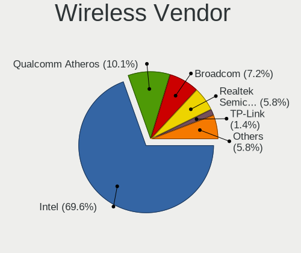
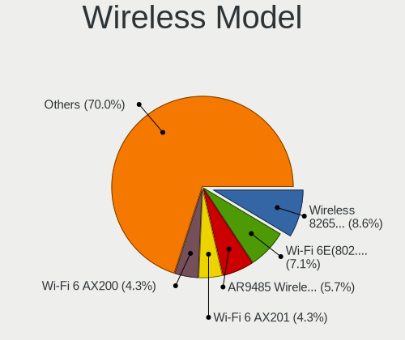

BSD - Hardware Trends (Notebooks)
---------------------------------

A project to identify most popular hardware characteristics and track their change
over time based on data collected by BSD users at https://BSD-Hardware.info.

Anyone can contribute to this report by the [hw-probe](https://github.com/linuxhw/hw-probe/blob/master/INSTALL.BSD.md) tool:

    hw-probe -all -upload

This report is for one last month. Overall report since the beginning of time: [TestDays](https://github.com/bsdhw/TestDays)

Period: Jan, 2024.

Contents
--------

* [ System ](#system)
  - [ OS                       ](#os)
  - [ OS Family                ](#os-family)
  - [ Arch                     ](#arch)
  - [ DE                       ](#de)
  - [ Display Server           ](#display-server)
  - [ Display Manager          ](#display-manager)
  - [ OS Lang                  ](#os-lang)
  - [ Boot Mode                ](#boot-mode)
  - [ Filesystem               ](#filesystem)
  - [ Part. scheme             ](#part-scheme)

* [ Board ](#board)
  - [ Vendor                   ](#vendor)
  - [ Model                    ](#model)
  - [ Model Family             ](#model-family)
  - [ MFG Year                 ](#mfg-year)
  - [ Form Factor              ](#form-factor)
  - [ Coreboot                 ](#coreboot)
  - [ RAM Size                 ](#ram-size)
  - [ RAM Used                 ](#ram-used)
  - [ Total Drives             ](#total-drives)
  - [ Has CD-ROM               ](#has-cd-rom)
  - [ Has Ethernet             ](#has-ethernet)
  - [ Has WiFi                 ](#has-wifi)
  - [ Has Bluetooth            ](#has-bluetooth)

* [ Location ](#location)
  - [ Country                  ](#country)
  - [ City                     ](#city)

* [ Drives ](#drives)
  - [ Drive Vendor             ](#drive-vendor)
  - [ Drive Model              ](#drive-model)
  - [ HDD Vendor               ](#hdd-vendor)
  - [ SSD Vendor               ](#ssd-vendor)
  - [ Drive Kind               ](#drive-kind)
  - [ Drive Connector          ](#drive-connector)
  - [ Drive Size               ](#drive-size)
  - [ Space Total              ](#space-total)
  - [ Space Used               ](#space-used)
  - [ Malfunc. Drives          ](#malfunc-drives)
  - [ Malfunc. Drive Vendor    ](#malfunc-drive-vendor)
  - [ Malfunc. HDD Vendor      ](#malfunc-hdd-vendor)
  - [ Malfunc. Drive Kind      ](#malfunc-drive-kind)
  - [ Failed Drives            ](#failed-drives)
  - [ Failed Drive Vendor      ](#failed-drive-vendor)
  - [ Drive Status             ](#drive-status)

* [ Storage controller ](#storage-controller)
  - [ Storage Vendor           ](#storage-vendor)
  - [ Storage Model            ](#storage-model)
  - [ Storage Kind             ](#storage-kind)

* [ Processor ](#processor)
  - [ CPU Vendor               ](#cpu-vendor)
  - [ CPU Model                ](#cpu-model)
  - [ CPU Model Family         ](#cpu-model-family)
  - [ CPU Cores                ](#cpu-cores)
  - [ CPU Sockets              ](#cpu-sockets)
  - [ CPU Threads              ](#cpu-threads)
  - [ CPU Microarch            ](#cpu-microarch)

* [ Graphics ](#graphics)
  - [ GPU Vendor               ](#gpu-vendor)
  - [ GPU Model                ](#gpu-model)
  - [ GPU Combo                ](#gpu-combo)
  - [ GPU Driver               ](#gpu-driver)
  - [ GPU Memory               ](#gpu-memory)

* [ Monitor ](#monitor)
  - [ Monitor Vendor           ](#monitor-vendor)
  - [ Monitor Model            ](#monitor-model)
  - [ Monitor Resolution       ](#monitor-resolution)
  - [ Monitor Diagonal         ](#monitor-diagonal)
  - [ Monitor Width            ](#monitor-width)
  - [ Aspect Ratio             ](#aspect-ratio)
  - [ Monitor Area             ](#monitor-area)
  - [ Pixel Density            ](#pixel-density)
  - [ Multiple Monitors        ](#multiple-monitors)

* [ Network ](#network)
  - [ Net Controller Vendor    ](#net-controller-vendor)
  - [ Net Controller Model     ](#net-controller-model)
  - [ Wireless Vendor          ](#wireless-vendor)
  - [ Wireless Model           ](#wireless-model)
  - [ Ethernet Vendor          ](#ethernet-vendor)
  - [ Ethernet Model           ](#ethernet-model)
  - [ Net Controller Kind      ](#net-controller-kind)
  - [ Used Controller          ](#used-controller)
  - [ NICs                     ](#nics)
  - [ IPv6                     ](#ipv6)

* [ Bluetooth ](#bluetooth)
  - [ Bluetooth Vendor         ](#bluetooth-vendor)
  - [ Bluetooth Model          ](#bluetooth-model)

* [ Sound ](#sound)
  - [ Sound Vendor             ](#sound-vendor)
  - [ Sound Model              ](#sound-model)

* [ Memory ](#memory)
  - [ Memory Vendor            ](#memory-vendor)
  - [ Memory Model             ](#memory-model)
  - [ Memory Kind              ](#memory-kind)
  - [ Memory Form Factor       ](#memory-form-factor)
  - [ Memory Size              ](#memory-size)
  - [ Memory Speed             ](#memory-speed)

* [ Printers & scanners ](#printers--scanners)
  - [ Printer Vendor           ](#printer-vendor)
  - [ Printer Model            ](#printer-model)
  - [ Scanner Vendor           ](#scanner-vendor)
  - [ Scanner Model            ](#scanner-model)

* [ Camera ](#camera)
  - [ Camera Vendor            ](#camera-vendor)
  - [ Camera Model             ](#camera-model)

* [ Security ](#security)
  - [ Fingerprint Vendor       ](#fingerprint-vendor)
  - [ Fingerprint Model        ](#fingerprint-model)
  - [ Chipcard Vendor          ](#chipcard-vendor)
  - [ Chipcard Model           ](#chipcard-model)

* [ Unsupported ](#unsupported)
  - [ Unsupported Devices      ](#unsupported-devices)
  - [ Unsupported Device Types ](#unsupported-device-types)

System
------

OS
--

Installed operating systems

| Name                      | Notebooks | Percent |
|---------------------------|-----------|---------|
| FreeBSD 14.0              | 11        | 15.07%  |
| helloSystem 0.9.0         | 10        | 13.7%   |
| helloSystem 0.8.1         | 9         | 12.33%  |
| FreeBSD 14.0-p4           | 9         | 12.33%  |
| GhostBSD 23.10.1          | 5         | 6.85%   |
| OPNsense 23.7.11          | 3         | 4.11%   |
| OpenBSD 7.4               | 3         | 4.11%   |
| NomadBSD 20231121         | 3         | 4.11%   |
| FreeBSD 15.0-CURRENT      | 3         | 4.11%   |
| OPNsense 24.1             | 2         | 2.74%   |
| OPNsense 23.7.12          | 2         | 2.74%   |
| OPNsense 23.7.10          | 1         | 1.37%   |
| OPNsense 23.10.1          | 1         | 1.37%   |
| OpenBSD 7.0               | 1         | 1.37%   |
| NetBSD 10.0_RC2           | 1         | 1.37%   |
| helloSystem 0.7.0         | 1         | 1.37%   |
| FreeBSD 14.0-p2           | 1         | 1.37%   |
| FreeBSD 14.0-p1           | 1         | 1.37%   |
| FreeBSD 13.2-p9           | 1         | 1.37%   |
| FreeBSD 13.2-p8           | 1         | 1.37%   |
| FreeBSD 13.2-p54          | 1         | 1.37%   |
| FreeBSD 13.2              | 1         | 1.37%   |
| FreeBSD 13.1              | 1         | 1.37%   |
| DragonFly 6.5-DEVELOPMENT | 1         | 1.37%   |

OS Family
---------

OS without a version

| Name        | Notebooks | Percent |
|-------------|-----------|---------|
| FreeBSD     | 30        | 41.1%   |
| helloSystem | 20        | 27.4%   |
| OPNsense    | 9         | 12.33%  |
| GhostBSD    | 5         | 6.85%   |
| OpenBSD     | 4         | 5.48%   |
| NomadBSD    | 3         | 4.11%   |
| NetBSD      | 1         | 1.37%   |
| DragonFly   | 1         | 1.37%   |

Arch
----

OS architecture (x86_64, i586, etc.)

| Name  | Notebooks | Percent |
|-------|-----------|---------|
| amd64 | 72        | 98.63%  |
| i386  | 1         | 1.37%   |

DE
--

Desktop Environment

| Name         | Notebooks | Percent |
|--------------|-----------|---------|
| helloDesktop | 21        | 28.77%  |
| Console      | 16        | 21.92%  |
| KDE5         | 8         | 10.96%  |
| XFCE         | 7         | 9.59%   |
| MATE         | 5         | 6.85%   |
| Openbox      | 4         | 5.48%   |
| GNOME        | 3         | 4.11%   |
| TWM          | 2         | 2.74%   |
| Cinnamon     | 2         | 2.74%   |
| wlroots      | 1         | 1.37%   |
| i3           | 1         | 1.37%   |
| fvwm         | 1         | 1.37%   |
| DWM          | 1         | 1.37%   |
| AwesomeWM    | 1         | 1.37%   |

Display Server
--------------

X11 or Wayland

| Name    | Notebooks | Percent |
|---------|-----------|---------|
| X11     | 55        | 75.34%  |
| Console | 16        | 21.92%  |
| Wayland | 2         | 2.74%   |

Display Manager
---------------

SDDM, LightDM, etc.

| Name    | Notebooks | Percent |
|---------|-----------|---------|
| Console | 29        | 39.73%  |
| SLiM    | 23        | 31.51%  |
| SDDM    | 10        | 13.7%   |
| LightDM | 9         | 12.33%  |
| GDM     | 2         | 2.74%   |

OS Lang
-------

Language

| Lang            | Notebooks | Percent |
|-----------------|-----------|---------|
| C               | 26        | 35.62%  |
| Unknown         | 23        | 31.51%  |
| en_US           | 15        | 20.55%  |
| de_DE           | 3         | 4.11%   |
| fr_FR           | 2         | 2.74%   |
| zh_CN           | 1         | 1.37%   |
| ru_RU           | 1         | 1.37%   |
| it_IT           | 1         | 1.37%   |
| en_US.ISO8859-1 | 1         | 1.37%   |

Boot Mode
---------

EFI or BIOS

| Mode | Notebooks | Percent |
|------|-----------|---------|
| EFI  | 67        | 91.78%  |
| BIOS | 6         | 8.22%   |

Filesystem
----------

Type of filesystem

| Type    | Notebooks | Percent |
|---------|-----------|---------|
| Zfs     | 33        | 45.21%  |
| Ufs     | 24        | 32.88%  |
| Cd9660  | 11        | 15.07%  |
| Ffs     | 4         | 5.48%   |
| Hammer2 | 1         | 1.37%   |

Part. scheme
------------

Scheme of partitioning

| Type    | Notebooks | Percent |
|---------|-----------|---------|
| GPT     | 67        | 91.78%  |
| MBR     | 4         | 5.48%   |
| Unknown | 2         | 2.74%   |

Board
-----

Vendor
------

Motherboard manufacturer

| Name                             | Notebooks | Percent |
|----------------------------------|-----------|---------|
| Lenovo                           | 22        | 30.14%  |
| Dell                             | 12        | 16.44%  |
| Hewlett-Packard                  | 9         | 12.33%  |
| ASUSTek Computer                 | 7         | 9.59%   |
| Unknown                          | 4         | 5.48%   |
| Acer                             | 3         | 4.11%   |
| Samsung Electronics              | 2         | 2.74%   |
| Razer                            | 2         | 2.74%   |
| Deciso                           | 2         | 2.74%   |
| Apple                            | 2         | 2.74%   |
| Star Labs                        | 1         | 1.37%   |
| Rembrandt                        | 1         | 1.37%   |
| Panasonic                        | 1         | 1.37%   |
| Micro Computer (HK) Tech Limited | 1         | 1.37%   |
| LG Electronics                   | 1         | 1.37%   |
| Intel                            | 1         | 1.37%   |
| Fujitsu                          | 1         | 1.37%   |
| BESSTAR Tech                     | 1         | 1.37%   |

Model
-----

Motherboard model

| Name                                  | Notebooks | Percent |
|---------------------------------------|-----------|---------|
| Unknown                               | 4         | 5.48%   |
| Deciso NetBoard-A20                   | 2         | 2.74%   |
| Star Labs StarBook                    | 1         | 1.37%   |
| Samsung N150/N210/N220                | 1         | 1.37%   |
| Samsung 340XAA/350XAA/550XAA          | 1         | 1.37%   |
| Rembrandt ARB928                      | 1         | 1.37%   |
| Razer Blade 16 - RZ09-0483            | 1         | 1.37%   |
| Razer Blade 14 (2022) - RZ09-0427     | 1         | 1.37%   |
| Panasonic CFSX4-1                     | 1         | 1.37%   |
| Micro (HK) Tech Limited Venus series  | 1         | 1.37%   |
| LG 16UD70R-G.AX59B                    | 1         | 1.37%   |
| Lenovo V14 G2 ITL 82NM                | 1         | 1.37%   |
| Lenovo ThinkPad X250 20CMS01M00       | 1         | 1.37%   |
| Lenovo ThinkPad X220 42912Z1          | 1         | 1.37%   |
| Lenovo ThinkPad W520 4284GZ1          | 1         | 1.37%   |
| Lenovo ThinkPad T490s 20NX000MUS      | 1         | 1.37%   |
| Lenovo ThinkPad T460 20FMS1VA1D       | 1         | 1.37%   |
| Lenovo ThinkPad T14s Gen 4 21F60029US | 1         | 1.37%   |
| Lenovo ThinkPad T14 Gen 3 21CF002UMZ  | 1         | 1.37%   |
| Lenovo ThinkPad T14 Gen 2i 20W0013NGP | 1         | 1.37%   |
| Lenovo ThinkPad L450 20DSS1S402       | 1         | 1.37%   |
| Lenovo ThinkPad L14 Gen 1 20U6S1SD00  | 1         | 1.37%   |
| Lenovo ThinkPad E495 20NE000BSP       | 1         | 1.37%   |
| Lenovo ThinkPad E490 20N9S2H000       | 1         | 1.37%   |
| Lenovo ThinkPad E15 Gen 2 20TD003GUS  | 1         | 1.37%   |
| Lenovo ThinkPad E14 Gen 4 21EBCTO1WW  | 1         | 1.37%   |
| Lenovo ThinkPad E14 Gen 3 20Y7003QGE  | 1         | 1.37%   |
| Lenovo ThinkPad 11e 20D90020US        | 1         | 1.37%   |
| Lenovo ThinkBook 14 G6 IRL 21KG       | 1         | 1.37%   |
| Lenovo Legion Y9000X 2020 81TH        | 1         | 1.37%   |
| Lenovo IdeaPad 330-15IKB 81DE         | 1         | 1.37%   |
| Lenovo IdeaPad 310-15IKB 80TV         | 1         | 1.37%   |
| Lenovo G50-80 80E5                    | 1         | 1.37%   |
| Intel H81U                            | 1         | 1.37%   |
| HP ZBook 17 G2                        | 1         | 1.37%   |
| HP ProBook 650 G1                     | 1         | 1.37%   |
| HP Pavilion g7                        | 1         | 1.37%   |
| HP Pavilion g6                        | 1         | 1.37%   |
| HP OMEN by Laptop 17-ck0xxx           | 1         | 1.37%   |
| HP Mini 210-1000                      | 1         | 1.37%   |

Model Family
------------

Motherboard model prefix

| Name                          | Notebooks | Percent |
|-------------------------------|-----------|---------|
| Lenovo ThinkPad               | 16        | 21.92%  |
| Dell Latitude                 | 5         | 6.85%   |
| Unknown                       | 4         | 5.48%   |
| Dell Inspiron                 | 3         | 4.11%   |
| Razer Blade                   | 2         | 2.74%   |
| Lenovo IdeaPad                | 2         | 2.74%   |
| HP Pavilion                   | 2         | 2.74%   |
| Dell XPS                      | 2         | 2.74%   |
| Dell Precision                | 2         | 2.74%   |
| Deciso NetBoard-A20           | 2         | 2.74%   |
| Acer TravelMate               | 2         | 2.74%   |
| Star Labs StarBook            | 1         | 1.37%   |
| Samsung N150                  | 1         | 1.37%   |
| Samsung 340XAA                | 1         | 1.37%   |
| Rembrandt ARB928              | 1         | 1.37%   |
| Panasonic CFSX4-1             | 1         | 1.37%   |
| Micro (HK) Tech Limited Venus | 1         | 1.37%   |
| LG 16UD70R-G.AX59B            | 1         | 1.37%   |
| Lenovo V14                    | 1         | 1.37%   |
| Lenovo ThinkBook              | 1         | 1.37%   |
| Lenovo Legion                 | 1         | 1.37%   |
| Lenovo G50-80                 | 1         | 1.37%   |
| Intel H81U                    | 1         | 1.37%   |
| HP ZBook                      | 1         | 1.37%   |
| HP ProBook                    | 1         | 1.37%   |
| HP OMEN                       | 1         | 1.37%   |
| HP Mini                       | 1         | 1.37%   |
| HP Laptop                     | 1         | 1.37%   |
| HP Compaq                     | 1         | 1.37%   |
| HP 255                        | 1         | 1.37%   |
| Fujitsu LIFEBOOK              | 1         | 1.37%   |
| BESSTAR Tech U820             | 1         | 1.37%   |
| ASUS X555LB                   | 1         | 1.37%   |
| ASUS X555LAB                  | 1         | 1.37%   |
| ASUS X551MA                   | 1         | 1.37%   |
| ASUS X441UV                   | 1         | 1.37%   |
| ASUS VivoBook                 | 1         | 1.37%   |
| ASUS TUF                      | 1         | 1.37%   |
| ASUS K50IJ                    | 1         | 1.37%   |
| Apple MacBookAir4             | 1         | 1.37%   |

MFG Year
--------

Motherboard manufacture year

| Year | Notebooks | Percent |
|------|-----------|---------|
| 2023 | 14        | 19.18%  |
| 2019 | 11        | 15.07%  |
| 2020 | 7         | 9.59%   |
| 2018 | 7         | 9.59%   |
| 2016 | 6         | 8.22%   |
| 2021 | 5         | 6.85%   |
| 2015 | 5         | 6.85%   |
| 2022 | 3         | 4.11%   |
| 2014 | 3         | 4.11%   |
| 2011 | 3         | 4.11%   |
| 2013 | 2         | 2.74%   |
| 2012 | 2         | 2.74%   |
| 2008 | 2         | 2.74%   |
| 2010 | 1         | 1.37%   |
| 2009 | 1         | 1.37%   |
| 2007 | 1         | 1.37%   |

Form Factor
-----------

Physical design of the computer

| Name     | Notebooks | Percent |
|----------|-----------|---------|
| Notebook | 73        | 100%    |

Coreboot
--------

Have coreboot on board

| Used | Notebooks | Percent |
|------|-----------|---------|
| No   | 72        | 98.63%  |
| Yes  | 1         | 1.37%   |

RAM Size
--------

Total RAM memory

| Size in GB | Notebooks | Percent |
|------------|-----------|---------|
| 16.01-24.0 | 26        | 35.62%  |
| 8.01-16.0  | 24        | 32.88%  |
| 4.01-8.0   | 9         | 12.33%  |
| 32.01-64.0 | 8         | 10.96%  |
| 2.01-3.0   | 4         | 5.48%   |
| 24.01-32.0 | 1         | 1.37%   |
| 0.51-1.0   | 1         | 1.37%   |

RAM Used
--------

Used RAM memory

| Used GB  | Notebooks | Percent |
|----------|-----------|---------|
| 0.01-0.5 | 32        | 43.84%  |
| 0.51-1.0 | 24        | 32.88%  |
| 1.01-2.0 | 14        | 19.18%  |
| 2.01-3.0 | 2         | 2.74%   |
| Unknown  | 1         | 1.37%   |

Total Drives
------------

Number of drives on board

| Drives | Notebooks | Percent |
|--------|-----------|---------|
| 1      | 49        | 67.12%  |
| 0      | 18        | 24.66%  |
| 2      | 5         | 6.85%   |
| 3      | 1         | 1.37%   |

Has CD-ROM
----------

Has CD-ROM on board

| Presented | Notebooks | Percent |
|-----------|-----------|---------|
| No        | 58        | 79.45%  |
| Yes       | 15        | 20.55%  |

Has Ethernet
------------

Has Ethernet on board

| Presented | Notebooks | Percent |
|-----------|-----------|---------|
| Yes       | 60        | 82.19%  |
| No        | 13        | 17.81%  |

Has WiFi
--------

Has WiFi module

| Presented | Notebooks | Percent |
|-----------|-----------|---------|
| Yes       | 67        | 91.78%  |
| No        | 6         | 8.22%   |

Has Bluetooth
-------------

Has Bluetooth module

| Presented | Notebooks | Percent |
|-----------|-----------|---------|
| Yes       | 55        | 75.34%  |
| No        | 18        | 24.66%  |

Location
--------

Country
-------

Geographic location (country)

| Country     | Notebooks | Percent |
|-------------|-----------|---------|
| USA         | 11        | 15.07%  |
| Germany     | 9         | 12.33%  |
| France      | 7         | 9.59%   |
| UK          | 3         | 4.11%   |
| Switzerland | 3         | 4.11%   |
| Spain       | 3         | 4.11%   |
| Russia      | 3         | 4.11%   |
| Netherlands | 3         | 4.11%   |
| India       | 3         | 4.11%   |
| Canada      | 3         | 4.11%   |
| Brazil      | 3         | 4.11%   |
| Algeria     | 3         | 4.11%   |
| Sweden      | 2         | 2.74%   |
| Italy       | 2         | 2.74%   |
| Croatia     | 2         | 2.74%   |
| Belarus     | 2         | 2.74%   |
| Turkey      | 1         | 1.37%   |
| Taiwan      | 1         | 1.37%   |
| Romania     | 1         | 1.37%   |
| Portugal    | 1         | 1.37%   |
| Mexico      | 1         | 1.37%   |
| Japan       | 1         | 1.37%   |
| Indonesia   | 1         | 1.37%   |
| Finland     | 1         | 1.37%   |
| Estonia     | 1         | 1.37%   |
| Belgium     | 1         | 1.37%   |
| Argentina   | 1         | 1.37%   |

City
----

Geographic location (city)

| City                     | Notebooks | Percent |
|--------------------------|-----------|---------|
| Berlin                   | 3         | 4.11%   |
| Zagreb                   | 2         | 2.74%   |
| Spanish Fork             | 2         | 2.74%   |
| Paris                    | 2         | 2.74%   |
| Moscow                   | 2         | 2.74%   |
| Minsk                    | 2         | 2.74%   |
| Courbevoie               | 2         | 2.74%   |
| Zwolle                   | 1         | 1.37%   |
| Zurich                   | 1         | 1.37%   |
| Würzburg                | 1         | 1.37%   |
| Westervoort              | 1         | 1.37%   |
| Warwick                  | 1         | 1.37%   |
| Vantaa                   | 1         | 1.37%   |
| Vallingby                | 1         | 1.37%   |
| Valga                    | 1         | 1.37%   |
| Tijuana                  | 1         | 1.37%   |
| Sydenham                 | 1         | 1.37%   |
| Stuttgart                | 1         | 1.37%   |
| Stockholm                | 1         | 1.37%   |
| Snezhinsk                | 1         | 1.37%   |
| Sao Paulo                | 1         | 1.37%   |
| San Juan de Aznalfarache | 1         | 1.37%   |
| San Jose                 | 1         | 1.37%   |
| Rubí                    | 1         | 1.37%   |
| Roanoke                  | 1         | 1.37%   |
| Richmond                 | 1         | 1.37%   |
| Pevensey                 | 1         | 1.37%   |
| Oran                     | 1         | 1.37%   |
| Ochtendung               | 1         | 1.37%   |
| Nuremberg                | 1         | 1.37%   |
| Ninove                   | 1         | 1.37%   |
| Mumbai                   | 1         | 1.37%   |
| Medan                    | 1         | 1.37%   |
| Mascara                  | 1         | 1.37%   |
| Manchester               | 1         | 1.37%   |
| Madrid                   | 1         | 1.37%   |
| Mâcon                   | 1         | 1.37%   |
| Lewisham                 | 1         | 1.37%   |
| Lausanne                 | 1         | 1.37%   |
| Koelleda                 | 1         | 1.37%   |

Drives
------

Drive Vendor
------------

Hard drive vendors

| Vendor              | Notebooks | Drives | Percent |
|---------------------|-----------|--------|---------|
| Samsung Electronics | 10        | 11     | 16.39%  |
| Transcend           | 4         | 4      | 6.56%   |
| Toshiba             | 4         | 4      | 6.56%   |
| SanDisk             | 4         | 4      | 6.56%   |
| Crucial             | 4         | 4      | 6.56%   |
| WDC                 | 3         | 3      | 4.92%   |
| Seagate             | 3         | 3      | 4.92%   |
| Kingston            | 3         | 3      | 4.92%   |
| Intel               | 3         | 3      | 4.92%   |
| SK hynix            | 2         | 2      | 3.28%   |
| PNY                 | 2         | 2      | 3.28%   |
| NVMe                | 2         | 2      | 3.28%   |
| HGST                | 2         | 3      | 3.28%   |
| A-DATA Technology   | 2         | 2      | 3.28%   |
| VICKTER             | 1         | 1      | 1.64%   |
| SSSTC               | 1         | 1      | 1.64%   |
| Pioneer             | 1         | 1      | 1.64%   |
| MidasForce          | 1         | 1      | 1.64%   |
| Micron Technology   | 1         | 1      | 1.64%   |
| LITEON              | 1         | 1      | 1.64%   |
| KIOXIA-EXCERIA      | 1         | 1      | 1.64%   |
| KingSpec            | 1         | 1      | 1.64%   |
| Intenso             | 1         | 1      | 1.64%   |
| Hitachi             | 1         | 1      | 1.64%   |
| Hewlett-Packard     | 1         | 1      | 1.64%   |
| Dogfish             | 1         | 1      | 1.64%   |
| Apple               | 1         | 1      | 1.64%   |

Drive Model
-----------

Hard drive models

| Model                                  | Notebooks | Percent |
|----------------------------------------|-----------|---------|
| Samsung SSD 860 EVO 500GB              | 2         | 3.23%   |
| Crucial CT240BX500SSD1 240GB           | 2         | 3.23%   |
| WDC WD5000LPVX-22V0TT0 500GB           | 1         | 1.61%   |
| WDC WD20NMVW-11EDZS6 2TB               | 1         | 1.61%   |
| WDC WD10SPZX-35Z10T0 1TB               | 1         | 1.61%   |
| VICKTER SSD 512GB                      | 1         | 1.61%   |
| Transcend TS64GSSD370S 64GB            | 1         | 1.61%   |
| Transcend TS512GMTS952T2 512GB         | 1         | 1.61%   |
| Transcend TS256GMTS952T2 256GB         | 1         | 1.61%   |
| Transcend TS240GSSD220S 240GB          | 1         | 1.61%   |
| Toshiba MQ04UBF100 1TB                 | 1         | 1.61%   |
| Toshiba MQ01ABD100 1TB                 | 1         | 1.61%   |
| Toshiba MQ01ABD050 500GB               | 1         | 1.61%   |
| Toshiba MK5076GSX 500GB                | 1         | 1.61%   |
| SSSTC CL4-8D512 512GB                  | 1         | 1.61%   |
| SK hynix SKHynix_HFS512GDE9X081N 512GB | 1         | 1.61%   |
| SK hynix SC401 SATA 256GB              | 1         | 1.61%   |
| Seagate ST9500325AS 500GB              | 1         | 1.61%   |
| Seagate ST500LT012-1DG142 500GB        | 1         | 1.61%   |
| Seagate ST1000LM024 HN-M101MBB 1TB     | 1         | 1.61%   |
| SanDisk SSD PLUS 2000GB                | 1         | 1.61%   |
| SanDisk SDSSDH31000G 1TB               | 1         | 1.61%   |
| SanDisk SDSSDA120G 120GB               | 1         | 1.61%   |
| SanDisk SD7TB3Q-256G-1006 256GB        | 1         | 1.61%   |
| Samsung SSD 980 PRO 500GB              | 1         | 1.61%   |
| Samsung SSD 870 EVO 500GB              | 1         | 1.61%   |
| Samsung SSD 860 EVO M.2 1TB            | 1         | 1.61%   |
| Samsung SSD 860 EVO 250GB              | 1         | 1.61%   |
| Samsung SSD 850 EVO 250GB              | 1         | 1.61%   |
| Samsung SSD 840 PRO Series 256GB       | 1         | 1.61%   |
| Samsung MZVLB512HAJQ-000L7 512GB       | 1         | 1.61%   |
| Samsung MZNLN256HAJQ-000L7 256GB       | 1         | 1.61%   |
| Samsung MZ7LN128HCHP-000L1 128GB       | 1         | 1.61%   |
| PNY CS900 480GB SSD                    | 1         | 1.61%   |
| PNY CS900 1TB SSD                      | 1         | 1.61%   |
| Pioneer APS-SL3N-128 128GB             | 1         | 1.61%   |
| NVMe SAMSUNG MZALQ512 512GB            | 1         | 1.61%   |
| NVMe CL1-3D256-Q11 NV 256GB            | 1         | 1.61%   |
| MidasForce SSD 512GB                   | 1         | 1.61%   |
| Micron MTFDKCD256TFK 256GB             | 1         | 1.61%   |

HDD Vendor
----------

Hard disk drive vendors

| Vendor  | Notebooks | Drives | Percent |
|---------|-----------|--------|---------|
| Toshiba | 4         | 4      | 26.67%  |
| WDC     | 3         | 3      | 20%     |
| Seagate | 3         | 3      | 20%     |
| NVMe    | 2         | 2      | 13.33%  |
| HGST    | 2         | 3      | 13.33%  |
| Hitachi | 1         | 1      | 6.67%   |

SSD Vendor
----------

Solid state drive vendors

| Vendor              | Notebooks | Drives | Percent |
|---------------------|-----------|--------|---------|
| Samsung Electronics | 9         | 9      | 23.08%  |
| Transcend           | 4         | 4      | 10.26%  |
| SanDisk             | 4         | 4      | 10.26%  |
| Crucial             | 4         | 4      | 10.26%  |
| PNY                 | 2         | 2      | 5.13%   |
| Kingston            | 2         | 2      | 5.13%   |
| Intel               | 2         | 2      | 5.13%   |
| VICKTER             | 1         | 1      | 2.56%   |
| SK hynix            | 1         | 1      | 2.56%   |
| Pioneer             | 1         | 1      | 2.56%   |
| MidasForce          | 1         | 1      | 2.56%   |
| LITEON              | 1         | 1      | 2.56%   |
| KIOXIA-EXCERIA      | 1         | 1      | 2.56%   |
| KingSpec            | 1         | 1      | 2.56%   |
| Intenso             | 1         | 1      | 2.56%   |
| Hewlett-Packard     | 1         | 1      | 2.56%   |
| Dogfish             | 1         | 1      | 2.56%   |
| Apple               | 1         | 1      | 2.56%   |
| A-DATA Technology   | 1         | 1      | 2.56%   |

Drive Kind
----------

HDD or SSD

| Kind | Notebooks | Drives | Percent |
|------|-----------|--------|---------|
| SSD  | 37        | 39     | 62.71%  |
| HDD  | 15        | 16     | 25.42%  |
| NVMe | 7         | 8      | 11.86%  |

Drive Connector
---------------

SATA, SAS, NVMe, etc.

| Type | Notebooks | Drives | Percent |
|------|-----------|--------|---------|
| SATA | 51        | 55     | 87.93%  |
| NVMe | 7         | 8      | 12.07%  |

Drive Size
----------

Size of hard drive

| Size in TB | Notebooks | Drives | Percent |
|------------|-----------|--------|---------|
| 0.01-0.5   | 36        | 38     | 69.23%  |
| 0.51-1.0   | 14        | 15     | 26.92%  |
| 1.01-2.0   | 2         | 2      | 3.85%   |

Space Total
-----------

Amount of disk space available on the file system

| Size in GB | Notebooks | Percent |
|------------|-----------|---------|
| 101-250    | 23        | 31.51%  |
| 251-500    | 21        | 28.77%  |
| 1-20       | 13        | 17.81%  |
| 501-1000   | 7         | 9.59%   |
| 51-100     | 4         | 5.48%   |
| 21-50      | 3         | 4.11%   |
| 1001-2000  | 1         | 1.37%   |
| Unknown    | 1         | 1.37%   |

Space Used
----------

Amount of used disk space

| Used GB | Notebooks | Percent |
|---------|-----------|---------|
| 1-20    | 60        | 82.19%  |
| 21-50   | 4         | 5.48%   |
| 101-250 | 4         | 5.48%   |
| 51-100  | 4         | 5.48%   |
| Unknown | 1         | 1.37%   |

Malfunc. Drives
---------------

Drive models with a malfunction

| Model                           | Notebooks | Drives | Percent |
|---------------------------------|-----------|--------|---------|
| WDC WD5000LPVX-22V0TT0 500GB    | 1         | 1      | 14.29%  |
| Toshiba MQ01ABD050 500GB        | 1         | 1      | 14.29%  |
| SK hynix SC401 SATA 256GB       | 1         | 1      | 14.29%  |
| Seagate ST9500325AS 500GB       | 1         | 1      | 14.29%  |
| Seagate ST500LT012-1DG142 500GB | 1         | 1      | 14.29%  |
| HGST HTS541010A9E680 1TB        | 1         | 1      | 14.29%  |
| Apple SSD SM128C 121GB          | 1         | 1      | 14.29%  |

Malfunc. Drive Vendor
---------------------

Vendors of faulty drives

| Vendor   | Notebooks | Drives | Percent |
|----------|-----------|--------|---------|
| Seagate  | 2         | 2      | 28.57%  |
| WDC      | 1         | 1      | 14.29%  |
| Toshiba  | 1         | 1      | 14.29%  |
| SK hynix | 1         | 1      | 14.29%  |
| HGST     | 1         | 1      | 14.29%  |
| Apple    | 1         | 1      | 14.29%  |

Malfunc. HDD Vendor
-------------------

Vendors of faulty HDD drives

| Vendor  | Notebooks | Drives | Percent |
|---------|-----------|--------|---------|
| Seagate | 2         | 2      | 40%     |
| WDC     | 1         | 1      | 20%     |
| Toshiba | 1         | 1      | 20%     |
| HGST    | 1         | 1      | 20%     |

Malfunc. Drive Kind
-------------------

Kinds of faulty drives

| Kind | Notebooks | Drives | Percent |
|------|-----------|--------|---------|
| HDD  | 5         | 5      | 71.43%  |
| SSD  | 2         | 2      | 28.57%  |

Failed Drives
-------------

Failed drive models

Zero info for selected period =(

Failed Drive Vendor
-------------------

Failed drive vendors

Zero info for selected period =(

Drive Status
------------

Number of failed and malfunc. drives

| Status   | Notebooks | Drives | Percent |
|----------|-----------|--------|---------|
| Works    | 47        | 54     | 83.93%  |
| Malfunc  | 7         | 7      | 12.5%   |
| Detected | 2         | 2      | 3.57%   |

Storage controller
------------------

Storage Vendor
--------------

Storage controller vendors

| Vendor                                  | Notebooks | Percent |
|-----------------------------------------|-----------|---------|
| Intel                                   | 47        | 56.63%  |
| Samsung Electronics                     | 7         | 8.43%   |
| AMD                                     | 7         | 8.43%   |
| Solid State Storage Technology          | 4         | 4.82%   |
| SK hynix                                | 3         | 3.61%   |
| SanDisk                                 | 3         | 3.61%   |
| Phison Electronics                      | 3         | 3.61%   |
| Kingston Technology Company             | 2         | 2.41%   |
| Toshiba                                 | 1         | 1.2%    |
| Shenzhen Unionmemory Information System | 1         | 1.2%    |
| Nvidia                                  | 1         | 1.2%    |
| Micron/Crucial Technology               | 1         | 1.2%    |
| Micron Technology                       | 1         | 1.2%    |
| KIOXIA                                  | 1         | 1.2%    |
| ADATA Technology                        | 1         | 1.2%    |

Storage Model
-------------

Storage controller models

| Model                                                                          | Notebooks | Percent |
|--------------------------------------------------------------------------------|-----------|---------|
| Intel Wildcat Point-LP SATA Controller [AHCI Mode]                             | 8         | 9.2%    |
| AMD FCH SATA Controller [AHCI mode]                                            | 7         | 8.05%   |
| Intel Sunrise Point-LP SATA Controller [AHCI mode]                             | 6         | 6.9%    |
| Intel 6 Series/C200 Series Chipset Family 6 port Mobile SATA AHCI Controller   | 5         | 5.75%   |
| Intel Atom Processor E3800 Series SATA AHCI Controller                         | 3         | 3.45%   |
| Intel 82801 Mobile SATA Controller [RAID mode]                                 | 3         | 3.45%   |
| Solid State Storage CL1-3D256-Q11 NVMe SSD M.2                                 | 2         | 2.3%    |
| Samsung NVMe SSD Controller SM981/PM981/PM983                                  | 2         | 2.3%    |
| Samsung NVMe SSD Controller PM9A1/PM9A3/980PRO                                 | 2         | 2.3%    |
| Samsung NVMe SSD Controller 980 (DRAM-less)                                    | 2         | 2.3%    |
| Intel Volume Management Device NVMe RAID Controller                            | 2         | 2.3%    |
| Intel NM10/ICH7 Family SATA Controller [AHCI mode]                             | 2         | 2.3%    |
| Intel Cannon Point-LP SATA Controller [AHCI Mode]                              | 2         | 2.3%    |
| Intel Cannon Lake Mobile PCH SATA AHCI Controller                              | 2         | 2.3%    |
| Intel 82801HM/HEM (ICH8M/ICH8M-E) SATA Controller [AHCI mode]                  | 2         | 2.3%    |
| Intel 82801HM/HEM (ICH8M/ICH8M-E) IDE Controller                               | 2         | 2.3%    |
| Intel 8 Series/C220 Series Chipset Family 6-port SATA Controller 1 [AHCI mode] | 2         | 2.3%    |
| Intel 8 Series SATA Controller 1 [AHCI mode]                                   | 2         | 2.3%    |
| Intel 7 Series Chipset Family 6-port SATA Controller [AHCI mode]               | 2         | 2.3%    |
| Toshiba XG4 NVMe SSD Controller                                                | 1         | 1.15%   |
| Solid State Storage CL4-8D512 NVMe SSD M.2 (DRAM-less)                         | 1         | 1.15%   |
| Solid State Storage CA6-8D512 NVMe SSD M.2                                     | 1         | 1.15%   |
| SK hynix PC601 NVMe Solid State Drive                                          | 1         | 1.15%   |
| SK hynix Gold P31/BC711/PC711 NVMe Solid State Drive                           | 1         | 1.15%   |
| SK hynix BC501 NVMe Solid State Drive                                          | 1         | 1.15%   |
| Sandisk WD PC SN740 NVMe SSD 512GB (DRAM-less)                                 | 1         | 1.15%   |
| SanDisk Ultra 3D / WD Blue SN570 NVMe SSD (DRAM-less)                          | 1         | 1.15%   |
| SanDisk PC SN530 NVMe SSD (DRAM-less)                                          | 1         | 1.15%   |
| Samsung NVMe SSD Controller S4LV008[Pascal]                                    | 1         | 1.15%   |
| Phison PS5013-E13 PCIe3 NVMe Controller (DRAM-less)                            | 1         | 1.15%   |
| Phison E18 PCIe4 NVMe Controller                                               | 1         | 1.15%   |
| Phison E12 NVMe Controller                                                     | 1         | 1.15%   |
| Nvidia MCP79 AHCI Controller                                                   | 1         | 1.15%   |
| Micron/Crucial P2 [Nick P2] / P3 / P3 Plus NVMe PCIe SSD (DRAM-less)           | 1         | 1.15%   |
| Micron 2450 NVMe SSD [HendrixV] (DRAM-less)                                    | 1         | 1.15%   |
| KIOXIA NVMe SSD Controller XG8                                                 | 1         | 1.15%   |
| Kingston Company OM3PDP3 NVMe SSD                                              | 1         | 1.15%   |
| Kingston Company NV1 NVMe SSD SM2263XT (DRAM-less)                             | 1         | 1.15%   |
| Intel Tiger Lake-LP SATA Controller                                            | 1         | 1.15%   |
| Intel SSD 670p Series [Keystone Harbor]                                        | 1         | 1.15%   |

Storage Kind
------------

Kind of storage controller (IDE, SATA, NVMe, SAS, ...)

| Kind | Notebooks | Percent |
|------|-----------|---------|
| SATA | 48        | 57.14%  |
| NVMe | 28        | 33.33%  |
| RAID | 5         | 5.95%   |
| IDE  | 3         | 3.57%   |

Processor
---------

CPU Vendor
----------

Processor vendors

| Vendor | Notebooks | Percent |
|--------|-----------|---------|
| Intel  | 58        | 79.45%  |
| AMD    | 15        | 20.55%  |

CPU Model
---------

Processor models

| Model                                       | Notebooks | Percent |
|---------------------------------------------|-----------|---------|
| Intel Core i5-5200U CPU @ 2.20GHz           | 3         | 4.11%   |
| Intel 11th Gen Core i5-1135G7 @ 2.40GHz     | 3         | 4.11%   |
| Intel Core i7-9750H CPU @ 2.60GHz           | 2         | 2.74%   |
| Intel Core i5-8250U CPU @ 1.60GHz           | 2         | 2.74%   |
| Intel Core i5-5300U CPU @ 2.30GHz           | 2         | 2.74%   |
| Intel Core i5-2520M CPU @ 2.50GHz           | 2         | 2.74%   |
| Intel Atom CPU N450 @ 1.66GHz               | 2         | 2.74%   |
| Intel 13th Gen Core i7-13700H               | 2         | 2.74%   |
| AMD EPYC 3201 8-Core Processor              | 2         | 2.74%   |
| Intel Pentium Dual-Core CPU T4400 @ 2.20GHz | 1         | 1.37%   |
| Intel Pentium CPU 3825U @ 1.90GHz           | 1         | 1.37%   |
| Intel Pentium 3558U @ 1.70GHz               | 1         | 1.37%   |
| Intel N100                                  | 1         | 1.37%   |
| Intel Core i7-8650U CPU @ 1.90GHz           | 1         | 1.37%   |
| Intel Core i7-8565U CPU @ 1.80GHz           | 1         | 1.37%   |
| Intel Core i7-6820HQ CPU @ 2.70GHz          | 1         | 1.37%   |
| Intel Core i7-5600U CPU @ 2.60GHz           | 1         | 1.37%   |
| Intel Core i7-5500U CPU @ 2.40GHz           | 1         | 1.37%   |
| Intel Core i7-4710MQ CPU @ 2.50GHz          | 1         | 1.37%   |
| Intel Core i7-3720QM CPU @ 2.60GHz          | 1         | 1.37%   |
| Intel Core i7-3632QM CPU @ 2.20GHz          | 1         | 1.37%   |
| Intel Core i7-2630QM CPU @ 2.00GHz          | 1         | 1.37%   |
| Intel Core i7-1065G7 CPU @ 1.30GHz          | 1         | 1.37%   |
| Intel Core i5-9300H CPU @ 2.40GHz           | 1         | 1.37%   |
| Intel Core i5-8279U CPU @ 2.40GHz           | 1         | 1.37%   |
| Intel Core i5-8265U CPU @ 1.60GHz           | 1         | 1.37%   |
| Intel Core i5-7300U CPU @ 2.60GHz           | 1         | 1.37%   |
| Intel Core i5-7200U CPU @ 2.50GHz           | 1         | 1.37%   |
| Intel Core i5-6300U CPU @ 2.40GHz           | 1         | 1.37%   |
| Intel Core i5-4310M CPU @ 2.70GHz           | 1         | 1.37%   |
| Intel Core i5-4250U CPU @ 1.30GHz           | 1         | 1.37%   |
| Intel Core i5-2467M CPU @ 1.60GHz           | 1         | 1.37%   |
| Intel Core i5-2430M CPU @ 2.40GH            | 1         | 1.37%   |
| Intel Core i3-6006U CPU @ 2.00GHz           | 1         | 1.37%   |
| Intel Core i3-5005U CPU @ 2.00GHz           | 1         | 1.37%   |
| Intel Core 2 Duo CPU T7250 @ 2.00GHz        | 1         | 1.37%   |
| Intel Core 2 Duo CPU P7350 @ 2.00GHz        | 1         | 1.37%   |
| Intel Celeron CPU N3050 @ 1.60GHz           | 1         | 1.37%   |
| Intel Celeron CPU N2940 @ 1.83GHz           | 1         | 1.37%   |
| Intel Celeron CPU N2930 @ 1.83GHz           | 1         | 1.37%   |

CPU Model Family
----------------

Processor model prefix

| Model                   | Notebooks | Percent |
|-------------------------|-----------|---------|
| Intel Core i5           | 19        | 26.03%  |
| Other                   | 12        | 16.44%  |
| Intel Core i7           | 12        | 16.44%  |
| Intel Celeron           | 6         | 8.22%   |
| AMD Ryzen 7             | 3         | 4.11%   |
| AMD Ryzen 5             | 3         | 4.11%   |
| Intel Pentium           | 2         | 2.74%   |
| Intel Core i3           | 2         | 2.74%   |
| Intel Core 2 Duo        | 2         | 2.74%   |
| Intel Atom              | 2         | 2.74%   |
| AMD EPYC                | 2         | 2.74%   |
| Intel Pentium Dual-Core | 1         | 1.37%   |
| AMD Ryzen 9             | 1         | 1.37%   |
| AMD Ryzen 7 PRO         | 1         | 1.37%   |
| AMD Ryzen 3 PRO         | 1         | 1.37%   |
| AMD Ryzen 3             | 1         | 1.37%   |
| AMD E2                  | 1         | 1.37%   |
| AMD A4                  | 1         | 1.37%   |
| AMD A10                 | 1         | 1.37%   |

CPU Cores
---------

Number of processor cores

| Number  | Notebooks | Percent |
|---------|-----------|---------|
| 2       | 26        | 35.62%  |
| 4       | 23        | 31.51%  |
| 16      | 5         | 6.85%   |
| 8       | 5         | 6.85%   |
| 12      | 3         | 4.11%   |
| 6       | 3         | 4.11%   |
| Unknown | 3         | 4.11%   |
| 1       | 2         | 2.74%   |
| 32      | 1         | 1.37%   |
| 20      | 1         | 1.37%   |
| 10      | 1         | 1.37%   |

CPU Sockets
-----------

Number of sockets

| Number  | Notebooks | Percent |
|---------|-----------|---------|
| 1       | 71        | 97.26%  |
| 2       | 1         | 1.37%   |
| Unknown | 1         | 1.37%   |

CPU Threads
-----------

Threads per core (Hyper-Threading)

| Number  | Notebooks | Percent |
|---------|-----------|---------|
| 2       | 42        | 57.53%  |
| 1       | 28        | 38.36%  |
| Unknown | 3         | 4.11%   |

CPU Microarch
-------------

Microarchitecture

| Name        | Notebooks | Percent |
|-------------|-----------|---------|
| Unknown     | 12        | 16.44%  |
| KabyLake    | 11        | 15.07%  |
| Broadwell   | 9         | 12.33%  |
| TigerLake   | 5         | 6.85%   |
| SandyBridge | 5         | 6.85%   |
| Silvermont  | 4         | 5.48%   |
| Haswell     | 4         | 5.48%   |
| Zen         | 3         | 4.11%   |
| Skylake     | 3         | 4.11%   |
| IvyBridge   | 3         | 4.11%   |
| Zen+        | 2         | 2.74%   |
| Zen 3       | 2         | 2.74%   |
| Penryn      | 2         | 2.74%   |
| Core        | 2         | 2.74%   |
| Zen 2       | 1         | 1.37%   |
| Piledriver  | 1         | 1.37%   |
| K10 Llano   | 1         | 1.37%   |
| IceLake     | 1         | 1.37%   |
| Excavator   | 1         | 1.37%   |
| Bonnell     | 1         | 1.37%   |

Graphics
--------

GPU Vendor
----------

Vendors of graphics cards

| Vendor | Notebooks | Percent |
|--------|-----------|---------|
| Intel  | 55        | 64.71%  |
| Nvidia | 16        | 18.82%  |
| AMD    | 14        | 16.47%  |

GPU Model
---------

Graphics card models

| Model                                                                                    | Notebooks | Percent |
|------------------------------------------------------------------------------------------|-----------|---------|
| Intel HD Graphics 5500                                                                   | 8         | 8.89%   |
| Intel 2nd Generation Core Processor Family Integrated Graphics Controller                | 5         | 5.56%   |
| Intel TigerLake-LP GT2 [Iris Xe Graphics]                                                | 4         | 4.44%   |
| Intel UHD Graphics 620                                                                   | 3         | 3.33%   |
| Intel Raptor Lake-P [Iris Xe Graphics]                                                   | 3         | 3.33%   |
| Intel CoffeeLake-H GT2 [UHD Graphics 630]                                                | 3         | 3.33%   |
| Intel Atom Processor Z36xxx/Z37xxx Series Graphics & Display                             | 3         | 3.33%   |
| Intel 3rd Gen Core processor Graphics Controller                                         | 3         | 3.33%   |
| AMD Rembrandt [Radeon 680M]                                                              | 3         | 3.33%   |
| Nvidia TU117M [GeForce GTX 1650 Mobile / Max-Q]                                          | 2         | 2.22%   |
| Nvidia GM108M [GeForce 920MX]                                                            | 2         | 2.22%   |
| Intel WhiskeyLake-U GT2 [UHD Graphics 620]                                               | 2         | 2.22%   |
| Intel Skylake GT2 [HD Graphics 520]                                                      | 2         | 2.22%   |
| Intel Mobile GM965/GL960 Integrated Graphics Controller (secondary)                      | 2         | 2.22%   |
| Intel Mobile GM965/GL960 Integrated Graphics Controller (primary)                        | 2         | 2.22%   |
| Intel HD Graphics 620                                                                    | 2         | 2.22%   |
| Intel Haswell-ULT Integrated Graphics Controller                                         | 2         | 2.22%   |
| Intel Atom Processor D4xx/D5xx/N4xx/N5xx Integrated Graphics Controller                  | 2         | 2.22%   |
| AMD Picasso/Raven 2 [Radeon Vega Series / Radeon Vega Mobile Series]                     | 2         | 2.22%   |
| AMD Barcelo                                                                              | 2         | 2.22%   |
| Nvidia GP108M [GeForce MX150]                                                            | 1         | 1.11%   |
| Nvidia GM108M [GeForce 940M]                                                             | 1         | 1.11%   |
| Nvidia GM108M [GeForce 840M]                                                             | 1         | 1.11%   |
| Nvidia GM107GLM [Quadro M2000M]                                                          | 1         | 1.11%   |
| Nvidia GK107M [GeForce GT 640M LE]                                                       | 1         | 1.11%   |
| Nvidia GK107GLM [Quadro K1100M]                                                          | 1         | 1.11%   |
| Nvidia GK107GLM [Quadro K1000M]                                                          | 1         | 1.11%   |
| Nvidia GA106M [GeForce RTX 3060 Mobile / Max-Q]                                          | 1         | 1.11%   |
| Nvidia GA104 [Geforce RTX 3070 Ti Laptop GPU]                                            | 1         | 1.11%   |
| Nvidia C79 [GeForce 9400M]                                                               | 1         | 1.11%   |
| Nvidia AD107M [GeForce RTX 4050 Max-Q / Mobile]                                          | 1         | 1.11%   |
| Nvidia AD106M [GeForce RTX 4070 Max-Q / Mobile]                                          | 1         | 1.11%   |
| Intel TigerLake-H GT1 [UHD Graphics]                                                     | 1         | 1.11%   |
| Intel Tiger Lake-UP4 GT2 [Iris Xe Graphics]                                              | 1         | 1.11%   |
| Intel Raptor Lake-S UHD Graphics                                                         | 1         | 1.11%   |
| Intel Mobile 4 Series Chipset Integrated Graphics Controller                             | 1         | 1.11%   |
| Intel Iris Plus Graphics G7                                                              | 1         | 1.11%   |
| Intel HD Graphics                                                                        | 1         | 1.11%   |
| Intel CoffeeLake-U GT3e [Iris Plus Graphics 655]                                         | 1         | 1.11%   |
| Intel Atom/Celeron/Pentium Processor x5-E8000/J3xxx/N3xxx Integrated Graphics Controller | 1         | 1.11%   |

GPU Combo
---------

Combinations of graphics cards

| Name           | Notebooks | Percent |
|----------------|-----------|---------|
| 1 x Intel      | 37        | 50.68%  |
| Intel + Nvidia | 12        | 16.44%  |
| 1 x AMD        | 9         | 12.33%  |
| 2 x Intel      | 5         | 6.85%   |
| 2 x AMD        | 3         | 4.11%   |
| 1 x Nvidia     | 3         | 4.11%   |
| Other          | 2         | 2.74%   |
| Intel + AMD    | 1         | 1.37%   |
| AMD + Nvidia   | 1         | 1.37%   |

GPU Driver
----------

Free vs proprietary

| Driver      | Notebooks | Percent |
|-------------|-----------|---------|
| Free        | 66        | 90.41%  |
| Proprietary | 5         | 6.85%   |
| Unknown     | 2         | 2.74%   |

GPU Memory
----------

Total video memory

| Size in GB | Notebooks | Percent |
|------------|-----------|---------|
| Unknown    | 66        | 90.41%  |
| 0.01-0.5   | 3         | 4.11%   |
| 1.01-2.0   | 2         | 2.74%   |
| 3.01-4.0   | 1         | 1.37%   |
| 0.51-1.0   | 1         | 1.37%   |

Monitor
-------

Monitor Vendor
--------------

Monitor vendors

| Vendor                  | Notebooks | Percent |
|-------------------------|-----------|---------|
| AU Optronics            | 11        | 19.64%  |
| BOE                     | 10        | 17.86%  |
| Chimei Innolux          | 8         | 14.29%  |
| LG Display              | 6         | 10.71%  |
| Samsung Electronics     | 2         | 3.57%   |
| Lenovo                  | 2         | 3.57%   |
| HUAWEI                  | 2         | 3.57%   |
| Goldstar                | 2         | 3.57%   |
| TMX                     | 1         | 1.79%   |
| Sharp                   | 1         | 1.79%   |
| SDC                     | 1         | 1.79%   |
| Quanta Display          | 1         | 1.79%   |
| PANDA                   | 1         | 1.79%   |
| LG Philips              | 1         | 1.79%   |
| InfoVision              | 1         | 1.79%   |
| HPN                     | 1         | 1.79%   |
| HIC                     | 1         | 1.79%   |
| Dell                    | 1         | 1.79%   |
| CSO                     | 1         | 1.79%   |
| Chi Mei Optoelectronics | 1         | 1.79%   |
| Apple                   | 1         | 1.79%   |

Monitor Model
-------------

Monitor models

| Model                                                                   | Notebooks | Percent |
|-------------------------------------------------------------------------|-----------|---------|
| HUAWEI AD80HW HWV2402 1920x1080 530x300mm 24.0-inch                     | 2         | 3.57%   |
| Goldstar 24GM77 GSM5A91 1920x1080 530x300mm 24.0-inch                   | 2         | 3.57%   |
| BOE LCD Monitor BOE06EE 1920x1080 310x170mm 13.9-inch                   | 2         | 3.57%   |
| TMX TL140BDXP02-0 TMX1400 2560x1440 310x170mm 13.9-inch                 | 1         | 1.79%   |
| Sharp LCD Monitor SHP1526 1920x1280 270x180mm 12.8-inch                 | 1         | 1.79%   |
| SDC LCD Monitor 3520x1080                                               | 1         | 1.79%   |
| Samsung Electronics LCD Monitor SEC5441 1366x768 340x190mm 15.3-inch    | 1         | 1.79%   |
| Samsung Electronics LCD Monitor SEC3342 1366x768 320x190mm 14.7-inch    | 1         | 1.79%   |
| Quanta Display LCD Monitor QDS0053 1280x800 300x190mm 14.0-inch         | 1         | 1.79%   |
| PANDA LCD Monitor NCP0036 1920x1080 340x190mm 15.3-inch                 | 1         | 1.79%   |
| LG Philips LCD Monitor LPL0301 1280x800 330x210mm 15.4-inch             | 1         | 1.79%   |
| LG Display LCD Monitor LGD0773 1920x1200 340x220mm 15.9-inch            | 1         | 1.79%   |
| LG Display LCD Monitor LGD062C 1920x1080 310x170mm 13.9-inch            | 1         | 1.79%   |
| LG Display LCD Monitor LGD045D 1366x768 350x190mm 15.7-inch             | 1         | 1.79%   |
| LG Display LCD Monitor LGD03ED 1366x768 280x160mm 12.7-inch             | 1         | 1.79%   |
| LG Display LCD Monitor LGD032C 1920x1080 340x190mm 15.3-inch            | 1         | 1.79%   |
| LG Display LCD Monitor LGD02D3 1366x768 280x160mm 12.7-inch             | 1         | 1.79%   |
| Lenovo LEN LT2452pwC LEN1144 1920x1200 520x320mm 24.0-inch              | 1         | 1.79%   |
| Lenovo LCD Monitor LEN40B1 1600x900 340x190mm 15.3-inch                 | 1         | 1.79%   |
| InfoVision LCD Monitor IVO0489 1366x768 260x140mm 11.6-inch             | 1         | 1.79%   |
| HPN LCD Monitor HP P24h G4                                              | 1         | 1.79%   |
| HIC LCD Monitor HIC0001 1920x1080 300x230mm 14.9-inch                   | 1         | 1.79%   |
| Dell P2214H DELA098 1920x1080 480x270mm 21.7-inch                       | 1         | 1.79%   |
| CSO LCD Monitor CSO1423 1920x1200 300x190mm 14.0-inch                   | 1         | 1.79%   |
| Chimei Innolux LCD Monitor CMN1774 1920x1080 380x210mm 17.1-inch        | 1         | 1.79%   |
| Chimei Innolux LCD Monitor CMN1618 1920x1200 340x220mm 15.9-inch        | 1         | 1.79%   |
| Chimei Innolux LCD Monitor CMN15F5 1920x1080 340x190mm 15.3-inch        | 1         | 1.79%   |
| Chimei Innolux LCD Monitor CMN15C3 1920x1080 340x190mm 15.3-inch        | 1         | 1.79%   |
| Chimei Innolux LCD Monitor CMN15B7 1366x768 340x190mm 15.3-inch         | 1         | 1.79%   |
| Chimei Innolux LCD Monitor CMN1521 1920x1080 340x190mm 15.3-inch        | 1         | 1.79%   |
| Chimei Innolux LCD Monitor CMN14E5 1920x1080 310x170mm 13.9-inch        | 1         | 1.79%   |
| Chimei Innolux LCD Monitor CMN140A 1920x1080 310x170mm 13.9-inch        | 1         | 1.79%   |
| Chi Mei Optoelectronics LCD Monitor CMO1007 1024x600 220x120mm 9.9-inch | 1         | 1.79%   |
| BOE LCD Monitor BOE09AE 1920x1080 310x170mm 13.9-inch                   | 1         | 1.79%   |
| BOE LCD Monitor BOE08C2 1920x1080 340x190mm 15.3-inch                   | 1         | 1.79%   |
| BOE LCD Monitor BOE0742 1920x1080 310x170mm 13.9-inch                   | 1         | 1.79%   |
| BOE LCD Monitor BOE06F1 1920x1080 340x190mm 15.3-inch                   | 1         | 1.79%   |
| BOE LCD Monitor BOE0649 1920x1080 340x190mm 15.3-inch                   | 1         | 1.79%   |
| BOE LCD Monitor BOE0644 1366x768 310x170mm 13.9-inch                    | 1         | 1.79%   |
| BOE LCD Monitor BOE0629 1366x768 310x170mm 13.9-inch                    | 1         | 1.79%   |

Monitor Resolution
------------------

Monitor screen resolution

| Resolution        | Notebooks | Percent |
|-------------------|-----------|---------|
| 1920x1080 (FHD)   | 25        | 49.02%  |
| 1366x768 (WXGA)   | 12        | 23.53%  |
| 1920x1200 (WUXGA) | 4         | 7.84%   |
| 1600x900 (HD+)    | 2         | 3.92%   |
| 1280x800 (WXGA)   | 2         | 3.92%   |
| 1024x600          | 2         | 3.92%   |
| 3520x1080         | 1         | 1.96%   |
| 2560x1440 (QHD)   | 1         | 1.96%   |
| 1920x1280         | 1         | 1.96%   |
| Unknown           | 1         | 1.96%   |

Monitor Diagonal
----------------

Diagonal size in inches

| Inches  | Notebooks | Percent |
|---------|-----------|---------|
| 15      | 21        | 39.62%  |
| 13      | 14        | 26.42%  |
| 14      | 4         | 7.55%   |
| 24      | 3         | 5.66%   |
| 12      | 3         | 5.66%   |
| 17      | 2         | 3.77%   |
| 11      | 2         | 3.77%   |
| 21      | 1         | 1.89%   |
| 10      | 1         | 1.89%   |
| 9       | 1         | 1.89%   |
| Unknown | 1         | 1.89%   |

Monitor Width
-------------

Physical width

| Width in mm | Notebooks | Percent |
|-------------|-----------|---------|
| 301-350     | 36        | 67.92%  |
| 201-300     | 10        | 18.87%  |
| 501-600     | 3         | 5.66%   |
| 351-400     | 2         | 3.77%   |
| 401-500     | 1         | 1.89%   |
| Unknown     | 1         | 1.89%   |

Aspect Ratio
------------

Proportional relationship between the width and the height

| Ratio   | Notebooks | Percent |
|---------|-----------|---------|
| 16/9    | 41        | 80.39%  |
| 16/10   | 5         | 9.8%    |
| 3/2     | 3         | 5.88%   |
| 4/3     | 1         | 1.96%   |
| Unknown | 1         | 1.96%   |

Monitor Area
------------

Area in inch²

| Area in inch² | Notebooks | Percent |
|----------------|-----------|---------|
| 81-90          | 16        | 30.19%  |
| 91-100         | 16        | 30.19%  |
| 101-110        | 5         | 9.43%   |
| 201-250        | 3         | 5.66%   |
| 61-70          | 2         | 3.77%   |
| 51-60          | 2         | 3.77%   |
| 41-50          | 2         | 3.77%   |
| 121-130        | 2         | 3.77%   |
| 111-120        | 2         | 3.77%   |
| 71-80          | 1         | 1.89%   |
| 251-300        | 1         | 1.89%   |
| Unknown        | 1         | 1.89%   |

Pixel Density
-------------

Pixels per inch

| Density | Notebooks | Percent |
|---------|-----------|---------|
| 121-160 | 31        | 59.62%  |
| 101-120 | 11        | 21.15%  |
| 51-100  | 6         | 11.54%  |
| 161-240 | 3         | 5.77%   |
| Unknown | 1         | 1.92%   |

Multiple Monitors
-----------------

Total monitors connected

| Total | Notebooks | Percent |
|-------|-----------|---------|
| 1     | 43        | 58.9%   |
| 0     | 24        | 32.88%  |
| 2     | 4         | 5.48%   |
| 3     | 2         | 2.74%   |

Network
-------

Net Controller Vendor
---------------------

Controller vendors

| Vendor                   | Notebooks | Percent |
|--------------------------|-----------|---------|
| Intel                    | 46        | 39.66%  |
| Realtek Semiconductor    | 35        | 30.17%  |
| Qualcomm Atheros         | 10        | 8.62%   |
| Broadcom                 | 8         | 6.9%    |
| Samsung Electronics      | 2         | 1.72%   |
| Ralink                   | 2         | 1.72%   |
| Marvell Technology Group | 2         | 1.72%   |
| AMD                      | 2         | 1.72%   |
| Sierra Wireless          | 1         | 0.86%   |
| Ralink Technology        | 1         | 0.86%   |
| Qualcomm Technologies    | 1         | 0.86%   |
| Qualcomm                 | 1         | 0.86%   |
| Nvidia                   | 1         | 0.86%   |
| MediaTek                 | 1         | 0.86%   |
| Lenovo                   | 1         | 0.86%   |
| Google                   | 1         | 0.86%   |
| BUFFALO                  | 1         | 0.86%   |

Net Controller Model
--------------------

Controller models

| Model                                                                  | Notebooks | Percent |
|------------------------------------------------------------------------|-----------|---------|
| Realtek RTL8111/8168/8211/8411 PCI Express Gigabit Ethernet Controller | 25        | 17.99%  |
| Realtek RTL810xE PCI Express Fast Ethernet controller                  | 7         | 5.04%   |
| Intel Wi-Fi 6 AX200                                                    | 7         | 5.04%   |
| Intel Wireless 7265                                                    | 5         | 3.6%    |
| Intel Wi-Fi 6 AX201                                                    | 5         | 3.6%    |
| Intel Wi-Fi 6E(802.11ax) AX210/AX1675* 2x2 [Typhoon Peak]              | 4         | 2.88%   |
| Intel Ethernet Connection (3) I218-LM                                  | 4         | 2.88%   |
| Qualcomm Atheros QCA9565 / AR9565 Wireless Network Adapter             | 3         | 2.16%   |
| Qualcomm Atheros QCA9377 802.11ac Wireless Network Adapter             | 3         | 2.16%   |
| Intel Wireless 7260                                                    | 3         | 2.16%   |
| Intel Raptor Lake PCH CNVi WiFi                                        | 3         | 2.16%   |
| Intel 82579LM Gigabit Network Connection (Lewisville)                  | 3         | 2.16%   |
| Samsung GT-I9070 (network tethering, USB debugging enabled)            | 2         | 1.44%   |
| Realtek RTL8821CE 802.11ac PCIe Wireless Network Adapter               | 2         | 1.44%   |
| Realtek RTL8723BE PCIe Wireless Network Adapter                        | 2         | 1.44%   |
| Qualcomm Atheros AR9285 Wireless Network Adapter (PCI-Express)         | 2         | 1.44%   |
| Marvell Group 88E8040 PCI-E Fast Ethernet Controller                   | 2         | 1.44%   |
| Intel Wireless 8265 / 8275                                             | 2         | 1.44%   |
| Intel Wireless 8260                                                    | 2         | 1.44%   |
| Intel PRO/Wireless 3945ABG [Golan] Network Connection                  | 2         | 1.44%   |
| Intel I210 Gigabit Network Connection                                  | 2         | 1.44%   |
| Intel Ethernet Controller I225-V                                       | 2         | 1.44%   |
| Intel Ethernet Connection (4) I219-LM                                  | 2         | 1.44%   |
| Intel Centrino Advanced-N 6205 [Taylor Peak]                           | 2         | 1.44%   |
| Broadcom BCM43224 802.11a/b/g/n                                        | 2         | 1.44%   |
| AMD XGMAC 10GbE Controller                                             | 2         | 1.44%   |
| Sierra Wireless EM7345 4G LTE                                          | 1         | 0.72%   |
| Realtek RTL8852AE 802.11ax PCIe Wireless Network Adapter               | 1         | 0.72%   |
| Realtek RTL8822CE 802.11ac PCIe Wireless Network Adapter               | 1         | 0.72%   |
| Realtek RTL8822BE 802.11a/b/g/n/ac WiFi adapter                        | 1         | 0.72%   |
| Realtek RTL8192EU 802.11b/g/n WLAN Adapter                             | 1         | 0.72%   |
| Realtek RTL8188CUS 802.11n WLAN Adapter                                | 1         | 0.72%   |
| Ralink RT5572 Wireless Adapter                                         | 1         | 0.72%   |
| Ralink RT5390 Wireless 802.11n 1T/1R PCIe                              | 1         | 0.72%   |
| Ralink RT3290 Wireless 802.11n 1T/1R PCIe                              | 1         | 0.72%   |
| Qualcomm QCNFA765 Wireless Network Adapter                             | 1         | 0.72%   |
| Qualcomm Atheros AR9485 Wireless Network Adapter                       | 1         | 0.72%   |
| Qualcomm Atheros AR9462 Wireless Network Adapter                       | 1         | 0.72%   |
| Qualcomm Atheros AR8121/AR8113/AR8114 Gigabit or Fast Ethernet         | 1         | 0.72%   |
| Qualcomm ALCATEL RNDIS Interface                                       | 1         | 0.72%   |

Wireless Vendor
---------------

Wireless vendors

| Vendor                | Notebooks | Percent |
|-----------------------|-----------|---------|
| Intel                 | 39        | 55.71%  |
| Qualcomm Atheros      | 10        | 14.29%  |
| Realtek Semiconductor | 8         | 11.43%  |
| Broadcom              | 6         | 8.57%   |
| Ralink                | 2         | 2.86%   |
| Sierra Wireless       | 1         | 1.43%   |
| Ralink Technology     | 1         | 1.43%   |
| Qualcomm Technologies | 1         | 1.43%   |
| MediaTek              | 1         | 1.43%   |
| BUFFALO               | 1         | 1.43%   |

Wireless Model
--------------

Wireless models

| Model                                                          | Notebooks | Percent |
|----------------------------------------------------------------|-----------|---------|
| Intel Wi-Fi 6 AX200                                            | 7         | 9.86%   |
| Intel Wireless 7265                                            | 5         | 7.04%   |
| Intel Wi-Fi 6 AX201                                            | 5         | 7.04%   |
| Intel Wi-Fi 6E(802.11ax) AX210/AX1675* 2x2 [Typhoon Peak]      | 4         | 5.63%   |
| Qualcomm Atheros QCA9565 / AR9565 Wireless Network Adapter     | 3         | 4.23%   |
| Qualcomm Atheros QCA9377 802.11ac Wireless Network Adapter     | 3         | 4.23%   |
| Intel Wireless 7260                                            | 3         | 4.23%   |
| Intel Raptor Lake PCH CNVi WiFi                                | 3         | 4.23%   |
| Realtek RTL8821CE 802.11ac PCIe Wireless Network Adapter       | 2         | 2.82%   |
| Realtek RTL8723BE PCIe Wireless Network Adapter                | 2         | 2.82%   |
| Qualcomm Atheros AR9285 Wireless Network Adapter (PCI-Express) | 2         | 2.82%   |
| Intel Wireless 8265 / 8275                                     | 2         | 2.82%   |
| Intel Wireless 8260                                            | 2         | 2.82%   |
| Intel PRO/Wireless 3945ABG [Golan] Network Connection          | 2         | 2.82%   |
| Intel Centrino Advanced-N 6205 [Taylor Peak]                   | 2         | 2.82%   |
| Broadcom BCM43224 802.11a/b/g/n                                | 2         | 2.82%   |
| Sierra Wireless EM7345 4G LTE                                  | 1         | 1.41%   |
| Realtek RTL8852AE 802.11ax PCIe Wireless Network Adapter       | 1         | 1.41%   |
| Realtek RTL8822CE 802.11ac PCIe Wireless Network Adapter       | 1         | 1.41%   |
| Realtek RTL8822BE 802.11a/b/g/n/ac WiFi adapter                | 1         | 1.41%   |
| Realtek RTL8192EU 802.11b/g/n WLAN Adapter                     | 1         | 1.41%   |
| Realtek RTL8188CUS 802.11n WLAN Adapter                        | 1         | 1.41%   |
| Ralink RT5572 Wireless Adapter                                 | 1         | 1.41%   |
| Ralink RT5390 Wireless 802.11n 1T/1R PCIe                      | 1         | 1.41%   |
| Ralink RT3290 Wireless 802.11n 1T/1R PCIe                      | 1         | 1.41%   |
| Qualcomm QCNFA765 Wireless Network Adapter                     | 1         | 1.41%   |
| Qualcomm Atheros AR9485 Wireless Network Adapter               | 1         | 1.41%   |
| Qualcomm Atheros AR9462 Wireless Network Adapter               | 1         | 1.41%   |
| MediaTek MT7921 802.11ax PCI Express Wireless Network Adapter  | 1         | 1.41%   |
| Intel Wireless 3160                                            | 1         | 1.41%   |
| Intel Raptor Lake-S PCH CNVi WiFi                              | 1         | 1.41%   |
| Intel Dual Band Wireless-AC 3165 Plus Bluetooth                | 1         | 1.41%   |
| Intel Cannon Point-LP CNVi [Wireless-AC]                       | 1         | 1.41%   |
| BUFFALO WLI-UC-GNM Wireless LAN Adapter [Ralink RT8070]        | 1         | 1.41%   |
| Broadcom BCM4352 802.11ac Dual Band Wireless Network Adapter   | 1         | 1.41%   |
| Broadcom BCM43225 802.11b/g/n                                  | 1         | 1.41%   |
| Broadcom BCM4322 802.11a/b/g/n Wireless LAN Controller         | 1         | 1.41%   |
| Broadcom BCM4313 802.11bgn Wireless Network Adapter            | 1         | 1.41%   |

Ethernet Vendor
---------------

Ethernet vendors

| Vendor                   | Notebooks | Percent |
|--------------------------|-----------|---------|
| Realtek Semiconductor    | 32        | 47.76%  |
| Intel                    | 23        | 34.33%  |
| Samsung Electronics      | 2         | 2.99%   |
| Marvell Technology Group | 2         | 2.99%   |
| Broadcom                 | 2         | 2.99%   |
| AMD                      | 2         | 2.99%   |
| Qualcomm Atheros         | 1         | 1.49%   |
| Qualcomm                 | 1         | 1.49%   |
| Nvidia                   | 1         | 1.49%   |
| Lenovo                   | 1         | 1.49%   |

Ethernet Model
--------------

Ethernet models

| Model                                                                  | Notebooks | Percent |
|------------------------------------------------------------------------|-----------|---------|
| Realtek RTL8111/8168/8211/8411 PCI Express Gigabit Ethernet Controller | 25        | 37.31%  |
| Realtek RTL810xE PCI Express Fast Ethernet controller                  | 7         | 10.45%  |
| Intel Ethernet Connection (3) I218-LM                                  | 4         | 5.97%   |
| Intel 82579LM Gigabit Network Connection (Lewisville)                  | 3         | 4.48%   |
| Samsung GT-I9070 (network tethering, USB debugging enabled)            | 2         | 2.99%   |
| Marvell Group 88E8040 PCI-E Fast Ethernet Controller                   | 2         | 2.99%   |
| Intel I210 Gigabit Network Connection                                  | 2         | 2.99%   |
| Intel Ethernet Controller I225-V                                       | 2         | 2.99%   |
| Intel Ethernet Connection (4) I219-LM                                  | 2         | 2.99%   |
| AMD XGMAC 10GbE Controller                                             | 2         | 2.99%   |
| Qualcomm Atheros AR8121/AR8113/AR8114 Gigabit or Fast Ethernet         | 1         | 1.49%   |
| Qualcomm ALCATEL RNDIS Interface                                       | 1         | 1.49%   |
| Nvidia MCP79 Ethernet                                                  | 1         | 1.49%   |
| Lenovo Lenovo Tab M10 Plus 3rd Gen RNDIS Control RNDIS Ethernet Data   | 1         | 1.49%   |
| Intel Ethernet Connection I219-LM                                      | 1         | 1.49%   |
| Intel Ethernet Connection I217-V                                       | 1         | 1.49%   |
| Intel Ethernet Connection I217-LM                                      | 1         | 1.49%   |
| Intel Ethernet Connection (6) I219-V                                   | 1         | 1.49%   |
| Intel Ethernet Connection (3) I218-V                                   | 1         | 1.49%   |
| Intel Ethernet Connection (23) I219-V                                  | 1         | 1.49%   |
| Intel Ethernet Connection (2) I219-LM                                  | 1         | 1.49%   |
| Intel Ethernet Connection (13) I219-V                                  | 1         | 1.49%   |
| Intel 82583V Gigabit Network Connection                                | 1         | 1.49%   |
| Intel 82574L Gigabit Network Connection                                | 1         | 1.49%   |
| Broadcom NetXtreme BCM5761 Gigabit Ethernet PCIe                       | 1         | 1.49%   |
| Broadcom NetLink BCM5787M Gigabit Ethernet PCI Express                 | 1         | 1.49%   |

Net Controller Kind
-------------------

Ethernet, WiFi or modem

| Kind     | Notebooks | Percent |
|----------|-----------|---------|
| WiFi     | 67        | 52.34%  |
| Ethernet | 60        | 46.88%  |
| Unknown  | 1         | 0.78%   |

Used Controller
---------------

Currently used network controller

| Kind     | Notebooks | Percent |
|----------|-----------|---------|
| WiFi     | 33        | 53.23%  |
| Ethernet | 29        | 46.77%  |

NICs
----

Total network controllers on board

| Total | Notebooks | Percent |
|-------|-----------|---------|
| 2     | 51        | 69.86%  |
| 1     | 14        | 19.18%  |
| 6     | 5         | 6.85%   |
| 3     | 3         | 4.11%   |

IPv6
----

IPv6 vs IPv4

| Used | Notebooks | Percent |
|------|-----------|---------|
| No   | 68        | 93.15%  |
| Yes  | 5         | 6.85%   |

Bluetooth
---------

Bluetooth Vendor
----------------

Controller vendors

| Vendor                          | Notebooks | Percent |
|---------------------------------|-----------|---------|
| Intel                           | 32        | 58.18%  |
| Realtek Semiconductor           | 7         | 12.73%  |
| Qualcomm Atheros Communications | 5         | 9.09%   |
| IMC Networks                    | 2         | 3.64%   |
| Foxconn / Hon Hai               | 2         | 3.64%   |
| Broadcom                        | 2         | 3.64%   |
| Apple                           | 2         | 3.64%   |
| USI                             | 1         | 1.82%   |
| Ralink                          | 1         | 1.82%   |
| Hewlett-Packard                 | 1         | 1.82%   |

Bluetooth Model
---------------

Controller models

| Model                                                       | Notebooks | Percent |
|-------------------------------------------------------------|-----------|---------|
| Intel Bluetooth wireless interface                          | 11        | 20%     |
| Intel AX200 Bluetooth                                       | 7         | 12.73%  |
| Intel AX210 Bluetooth                                       | 4         | 7.27%   |
| Intel AX201 Bluetooth                                       | 4         | 7.27%   |
| Qualcomm Atheros QCA9377 Bluetooth 4.1                      | 3         | 5.45%   |
| Intel Bluetooth 9460/9560 Jefferson Peak (JfP)              | 3         | 5.45%   |
| Intel AX211 Bluetooth                                       | 3         | 5.45%   |
| Realtek Bluetooth Adapter                                   | 2         | 3.64%   |
| IMC Networks Qualcomm Atheros Bluetooth 4.0 + HS            | 2         | 3.64%   |
| USI Qualcomm WCN685x Bluetooth Adapter                      | 1         | 1.82%   |
| Realtek RTL8822BE Bluetooth 4.2 Adapter                     | 1         | 1.82%   |
| Realtek  Bluetooth 4.2 Adapter                              | 1         | 1.82%   |
| Realtek Dell Wireless 1801 Bluetooth 4.0 LE                 | 1         | 1.82%   |
| Realtek Bluetooth 4.2 Adapter                               | 1         | 1.82%   |
| Realtek Bluetooth 4.0 Adapter                               | 1         | 1.82%   |
| Ralink RT3290 Bluetooth                                     | 1         | 1.82%   |
| Qualcomm Atheros Dell Wireless 1707 Bluetooth 4.0 LE Device | 1         | 1.82%   |
| Qualcomm Atheros Bluetooth                                  | 1         | 1.82%   |
| HP Bluetooth 2.0 Interface [Broadcom BCM2045]               | 1         | 1.82%   |
| Foxconn / Hon Hai MediaTek Bluetooth Adapter                | 1         | 1.82%   |
| Foxconn / Hon Hai Bluetooth USB Module                      | 1         | 1.82%   |
| Broadcom BCM20702A0 Bluetooth                               | 1         | 1.82%   |
| Broadcom BCM2045B (BDC-2.1)                                 | 1         | 1.82%   |
| Apple Built-in Bluetooth 2.0+EDR HCI                        | 1         | 1.82%   |
| Apple Bluetooth Host Controller                             | 1         | 1.82%   |

Sound
-----

Sound Vendor
------------

Sound card vendors

| Vendor              | Notebooks | Percent |
|---------------------|-----------|---------|
| Intel               | 57        | 69.51%  |
| AMD                 | 14        | 17.07%  |
| Nvidia              | 7         | 8.54%   |
| Logitech            | 1         | 1.22%   |
| Lenovo              | 1         | 1.22%   |
| Creative Technology | 1         | 1.22%   |
| ASUSTek Computer    | 1         | 1.22%   |

Sound Model
-----------

Sound card models

| Model                                                                                             | Notebooks | Percent |
|---------------------------------------------------------------------------------------------------|-----------|---------|
| AMD Family 17h/19h HD Audio Controller                                                            | 10        | 9.35%   |
| Intel Wildcat Point-LP High Definition Audio Controller                                           | 9         | 8.41%   |
| Intel Broadwell-U Audio Controller                                                                | 9         | 8.41%   |
| Intel Sunrise Point-LP HD Audio                                                                   | 7         | 6.54%   |
| Intel Tiger Lake-LP Smart Sound Technology Audio Controller                                       | 5         | 4.67%   |
| Intel 6 Series/C200 Series Chipset Family High Definition Audio Controller                        | 5         | 4.67%   |
| AMD Renoir Radeon High Definition Audio Controller                                                | 4         | 3.74%   |
| Intel Raptor Lake-P/U/H cAVS                                                                      | 3         | 2.8%    |
| Intel Cannon Point-LP High Definition Audio Controller                                            | 3         | 2.8%    |
| Intel Cannon Lake PCH cAVS                                                                        | 3         | 2.8%    |
| Intel Atom Processor Z36xxx/Z37xxx Series High Definition Audio Controller                        | 3         | 2.8%    |
| Intel 7 Series/C216 Chipset Family High Definition Audio Controller                               | 3         | 2.8%    |
| AMD Rembrandt Radeon High Definition Audio Controller                                             | 3         | 2.8%    |
| AMD Raven/Raven2/Fenghuang HDMI/DP Audio Controller                                               | 3         | 2.8%    |
| Intel NM10/ICH7 Family High Definition Audio Controller                                           | 2         | 1.87%   |
| Intel Haswell-ULT HD Audio Controller                                                             | 2         | 1.87%   |
| Intel 82801H (ICH8 Family) HD Audio Controller                                                    | 2         | 1.87%   |
| Intel 8 Series/C220 Series Chipset High Definition Audio Controller                               | 2         | 1.87%   |
| Intel 8 Series HD Audio Controller                                                                | 2         | 1.87%   |
| AMD FCH Azalia Controller                                                                         | 2         | 1.87%   |
| Nvidia TU107 GeForce GTX 1650 High Definition Audio Controller                                    | 1         | 0.93%   |
| Nvidia MCP79 High Definition Audio                                                                | 1         | 0.93%   |
| Nvidia GM107 High Definition Audio Controller [GeForce 940MX]                                     | 1         | 0.93%   |
| Nvidia GK107 HDMI Audio Controller                                                                | 1         | 0.93%   |
| Nvidia GA106 High Definition Audio Controller                                                     | 1         | 0.93%   |
| Nvidia GA104 High Definition Audio Controller                                                     | 1         | 0.93%   |
| Logitech H600 [Wireless Headset]                                                                  | 1         | 0.93%   |
| Lenovo Realtek USB Audio                                                                          | 1         | 0.93%   |
| Intel Xeon E3-1200 v3/4th Gen Core Processor HD Audio Controller                                  | 1         | 0.93%   |
| Intel Tiger Lake-H HD Audio Controller                                                            | 1         | 0.93%   |
| Intel Raptor Lake High Definition Audio Controller                                                | 1         | 0.93%   |
| Intel Ice Lake-LP Smart Sound Technology Audio Controller                                         | 1         | 0.93%   |
| Intel Atom/Celeron/Pentium Processor x5-E8000/J3xxx/N3xxx Series High Definition Audio Controller | 1         | 0.93%   |
| Intel Alder Lake-N PCH High Definition Audio Controller                                           | 1         | 0.93%   |
| Intel Alder Lake PCH-P High Definition Audio Controller                                           | 1         | 0.93%   |
| Intel 82801I (ICH9 Family) HD Audio Controller                                                    | 1         | 0.93%   |
| Intel 100 Series/C230 Series Chipset Family HD Audio Controller                                   | 1         | 0.93%   |
| Creative Technology Pebble V3                                                                     | 1         | 0.93%   |
| ASUSTek Computer C-Media(R) Audio                                                                 | 1         | 0.93%   |
| AMD Trinity HDMI Audio Controller                                                                 | 1         | 0.93%   |

Memory
------

Memory Vendor
-------------

Memory module vendors

| Vendor              | Notebooks | Percent |
|---------------------|-----------|---------|
| Samsung Electronics | 25        | 30.86%  |
| SK hynix            | 14        | 17.28%  |
| Micron Technology   | 9         | 11.11%  |
| Kingston            | 6         | 7.41%   |
| Crucial             | 5         | 6.17%   |
| Unknown             | 4         | 4.94%   |
| Smart               | 3         | 3.7%    |
| Ramaxel Technology  | 3         | 3.7%    |
| Transcend           | 2         | 2.47%   |
| Corsair             | 2         | 2.47%   |
| Team                | 1         | 1.23%   |
| Qimonda             | 1         | 1.23%   |
| Lenovo              | 1         | 1.23%   |
| GSkill              | 1         | 1.23%   |
| G.Skill             | 1         | 1.23%   |
| Apacer              | 1         | 1.23%   |
| A-DATA Technology   | 1         | 1.23%   |
| 48spaces            | 1         | 1.23%   |

Memory Model
------------

Memory module models

| Model                                                        | Notebooks | Percent |
|--------------------------------------------------------------|-----------|---------|
| Samsung RAM M471B5173EB0-YK0 4GB SODIMM DDR3 1600MT/s        | 3         | 3.49%   |
| SK hynix RAM HMT451S6BFR8A-PB 4GB SODIMM DDR3 1600MT/s       | 2         | 2.33%   |
| SK hynix RAM HMA81GS6CJR8N-VK 8GB SODIMM DDR4 2667MT/s       | 2         | 2.33%   |
| Samsung RAM M471B5173DB0-YK0 4GB SODIMM DDR3 1600MT/s        | 2         | 2.33%   |
| Samsung RAM M471A5244CB0-CRC 4GB SODIMM DDR4 2400MT/s        | 2         | 2.33%   |
| Crucial RAM CT102464BF160B.M16 8GB SODIMM DDR3 1600MT/s      | 2         | 2.33%   |
| Unknown RAM Module 8GB SODIMM DDR3 1600MT/s                  | 1         | 1.16%   |
| Unknown RAM Module 8GB SODIMM DDR3 1333MT/s                  | 1         | 1.16%   |
| Unknown RAM Module 2GB SODIMM DDR2 667MT/s                   | 1         | 1.16%   |
| Unknown RAM Module 1GB SODIMM DDR                            | 1         | 1.16%   |
| Transcend RAM TS2GLH64V2B 16GB SODIMM DDR4 1600MT/s          | 1         | 1.16%   |
| Transcend RAM TS1GLH64V6BL 8GB SODIMM DDR4 2667MT/s          | 1         | 1.16%   |
| Team RAM Module 4GB SODIMM DDR3 1067MT/s                     | 1         | 1.16%   |
| Smart RAM SH564128FJ8NWRNSQG 4GB SODIMM DDR3 1600MT/s        | 1         | 1.16%   |
| Smart RAM SF4641G8CK8IEHLSBG 8GB SODIMM DDR4 2667MT/s        | 1         | 1.16%   |
| Smart RAM SF4641G8CK8IEGKSBG 8GB SODIMM DDR4 2400MT/s        | 1         | 1.16%   |
| SK hynix RAM HYMP112S64CP6-Y5 1GB SODIMM DDR 667MT/s         | 1         | 1.16%   |
| SK hynix RAM HMT451S6CFR6A-PB 4GB SODIMM DDR3 1600MT/s       | 1         | 1.16%   |
| SK hynix RAM HMT451S6BFR8A-PB 4GB SODIMM DDR3 1333MT/s       | 1         | 1.16%   |
| SK hynix RAM HMT41GS6BFR8A-PB 8GB SODIMM DDR3 1600MT/s       | 1         | 1.16%   |
| SK hynix RAM HMT41GS6AFR8A-PB 8GB SODIMM DDR3 1600MT/s       | 1         | 1.16%   |
| SK hynix RAM HMT325S6CFR8C-PB 2GB SODIMM DDR3 1600MT/s       | 1         | 1.16%   |
| SK hynix RAM HMCG78AGBSA092N 16GB SODIMM DDR5 5600MT/s       | 1         | 1.16%   |
| SK hynix RAM HMA851S6CJR6N-VK 4GB SODIMM DDR4 2667MT/s       | 1         | 1.16%   |
| SK hynix RAM HMA82GS6CJR8N-VK 16GB SODIMM DDR4 2667MT/s      | 1         | 1.16%   |
| SK hynix RAM HMA451S6AFR8N-TF 4GB SODIMM DDR4 2133MT/s       | 1         | 1.16%   |
| SK hynix RAM H9JCNNNCP3MLYR-N6E 4GB DIMM LPDDR5 6400MT/s     | 1         | 1.16%   |
| SK hynix RAM H58G56AK6BX069 2GB Row Of Chips LPDDR5 6400MT/s | 1         | 1.16%   |
| Samsung RAM Module 4GB Row Of Chips LPDDR5 4000MT/s          | 1         | 1.16%   |
| Samsung RAM Module 2GB SODIMM DDR3 1333MT/s                  | 1         | 1.16%   |
| Samsung RAM M471B5273CM0-CH9 4GB SODIMM DDR3 1333MT/s        | 1         | 1.16%   |
| Samsung RAM M471B5173QH0-YK0 4GB SODIMM DDR3 1600MT/s        | 1         | 1.16%   |
| Samsung RAM M471B1G73QHO-YK0 8GB SODIMM DDR3 1600MT/s        | 1         | 1.16%   |
| Samsung RAM M471B1G73QH0-YK0 8GB SODIMM DDR3 1867MT/s        | 1         | 1.16%   |
| Samsung RAM M471B1G73DB0-YK0 8GB SODIMM DDR3 1600MT/s        | 1         | 1.16%   |
| Samsung RAM M471B1G73CB0-YK0 8GB SODIMM DDR3 1600MT/s        | 1         | 1.16%   |
| Samsung RAM M471A5244CB0-CWE 4GB SODIMM DDR4 3200MT/s        | 1         | 1.16%   |
| Samsung RAM M471A5244BB0-CPB 4GB SODIMM DDR4 2133MT/s        | 1         | 1.16%   |
| Samsung RAM M471A2K43DB1-CTD 16GB SODIMM DDR4 2667MT/s       | 1         | 1.16%   |
| Samsung RAM M471A1K43EB1-CWE 8GB SODIMM DDR4 3200MT/s        | 1         | 1.16%   |

Memory Kind
-----------

Memory module kinds

| Kind   | Notebooks | Percent |
|--------|-----------|---------|
| DDR4   | 28        | 40%     |
| DDR3   | 27        | 38.57%  |
| DDR2   | 5         | 7.14%   |
| LPDDR5 | 4         | 5.71%   |
| DDR5   | 4         | 5.71%   |
| LPDDR4 | 1         | 1.43%   |
| DDR    | 1         | 1.43%   |

Memory Form Factor
------------------

Physical design of the memory module

| Name         | Notebooks | Percent |
|--------------|-----------|---------|
| SODIMM       | 63        | 90%     |
| Row Of Chips | 5         | 7.14%   |
| DIMM         | 2         | 2.86%   |

Memory Size
-----------

Memory module size

| Size  | Notebooks | Percent |
|-------|-----------|---------|
| 8192  | 33        | 43.42%  |
| 4096  | 24        | 31.58%  |
| 16384 | 9         | 11.84%  |
| 2048  | 7         | 9.21%   |
| 1024  | 2         | 2.63%   |
| 32768 | 1         | 1.32%   |

Memory Speed
------------

Memory module speed

| Speed   | Notebooks | Percent |
|---------|-----------|---------|
| 1600    | 23        | 31.94%  |
| 2667    | 11        | 15.28%  |
| 3200    | 8         | 11.11%  |
| 2400    | 5         | 6.94%   |
| 2133    | 4         | 5.56%   |
| 1333    | 4         | 5.56%   |
| 667     | 4         | 5.56%   |
| 6400    | 3         | 4.17%   |
| 5600    | 2         | 2.78%   |
| 4800    | 2         | 2.78%   |
| 4266    | 1         | 1.39%   |
| 4000    | 1         | 1.39%   |
| 1867    | 1         | 1.39%   |
| 1067    | 1         | 1.39%   |
| 800     | 1         | 1.39%   |
| Unknown | 1         | 1.39%   |

Printers & scanners
-------------------

Printer Vendor
--------------

Printer device vendors

| Vendor             | Notebooks | Percent |
|--------------------|-----------|---------|
| Brother Industries | 1         | 100%    |

Printer Model
-------------

Printer device models

| Model                    | Notebooks | Percent |
|--------------------------|-----------|---------|
| Brother HL-L2340D series | 1         | 100%    |

Scanner Vendor
--------------

Scanner device vendors

Zero info for selected period =(

Scanner Model
-------------

Scanner device models

Zero info for selected period =(

Camera
------

Camera Vendor
-------------

Camera device vendors

| Vendor                                 | Notebooks | Percent |
|----------------------------------------|-----------|---------|
| Chicony Electronics                    | 14        | 25.45%  |
| Microdia                               | 8         | 14.55%  |
| IMC Networks                           | 6         | 10.91%  |
| Realtek Semiconductor                  | 5         | 9.09%   |
| Lite-On Technology                     | 4         | 7.27%   |
| Bison Electronics                      | 4         | 7.27%   |
| Sunplus Innovation Technology          | 3         | 5.45%   |
| Cheng Uei Precision Industry (Foxlink) | 3         | 5.45%   |
| Silicon Motion                         | 2         | 3.64%   |
| Z-Star Microelectronics                | 1         | 1.82%   |
| Syntek                                 | 1         | 1.82%   |
| Quanta                                 | 1         | 1.82%   |
| OmniVision Technologies                | 1         | 1.82%   |
| Luxvisions Innotech Limited            | 1         | 1.82%   |
| Apple                                  | 1         | 1.82%   |

Camera Model
------------

Camera device models

| Model                                                                    | Notebooks | Percent |
|--------------------------------------------------------------------------|-----------|---------|
| Chicony Integrated Camera                                                | 5         | 9.09%   |
| Microdia Integrated_Webcam_HD                                            | 4         | 7.27%   |
| Lite-On Integrated Camera                                                | 3         | 5.45%   |
| Realtek USB Camera                                                       | 2         | 3.64%   |
| IMC Networks Integrated RGB Camera                                       | 2         | 3.64%   |
| Chicony Lenovo Integrated Camera (0.3MP)                                 | 2         | 3.64%   |
| Chicony EasyCamera                                                       | 2         | 3.64%   |
| Bison Integrated Camera                                                  | 2         | 3.64%   |
| Z-Star Webcam                                                            | 1         | 1.82%   |
| Syntek Integrated Camera                                                 | 1         | 1.82%   |
| Sunplus Integrated_Webcam_HD                                             | 1         | 1.82%   |
| Sunplus Integrated Camera                                                | 1         | 1.82%   |
| Sunplus HD WebCam                                                        | 1         | 1.82%   |
| Silicon Motion Realtek DMFT RGB                                          | 1         | 1.82%   |
| Silicon Motion HP Webcam-50                                              | 1         | 1.82%   |
| Realtek USB2.0 VGA UVC WebCam                                            | 1         | 1.82%   |
| Realtek LG Camera                                                        | 1         | 1.82%   |
| Realtek Integrated_Webcam_HD                                             | 1         | 1.82%   |
| Quanta HP TrueVision HD Camera                                           | 1         | 1.82%   |
| OmniVision OV2640 Webcam                                                 | 1         | 1.82%   |
| Microdia USB2.0 Camera                                                   | 1         | 1.82%   |
| Microdia REDRAGON  Live Camera                                           | 1         | 1.82%   |
| Microdia Integrated Webcam HD                                            | 1         | 1.82%   |
| Microdia Integrated Webcam                                               | 1         | 1.82%   |
| Luxvisions Innotech Limited Integrated Camera                            | 1         | 1.82%   |
| Lite-On Realtek PC Camera                                                | 1         | 1.82%   |
| IMC Networks Realtek PC Camera                                           | 1         | 1.82%   |
| IMC Networks Lenovo EasyCamera                                           | 1         | 1.82%   |
| IMC Networks Integrated Camera                                           | 1         | 1.82%   |
| IMC Networks EasyCamera                                                  | 1         | 1.82%   |
| Chicony USB2.0 VGA UVC WebCam                                            | 1         | 1.82%   |
| Chicony HP Wide Vision HD Camera                                         | 1         | 1.82%   |
| Chicony HD WebCam                                                        | 1         | 1.82%   |
| Chicony FJ Camera                                                        | 1         | 1.82%   |
| Chicony 2.0M UVC Webcam / CNF7129                                        | 1         | 1.82%   |
| Cheng Uei Precision Industry (Foxlink) HP Webcam-101                     | 1         | 1.82%   |
| Cheng Uei Precision Industry (Foxlink) HP HD Webcam                      | 1         | 1.82%   |
| Cheng Uei Precision Industry (Foxlink) HP EliteBook integrated HD Webcam | 1         | 1.82%   |
| Bison USB HD Webcam                                                      | 1         | 1.82%   |
| Bison SunplusIT Integrated Camera                                        | 1         | 1.82%   |

Security
--------

Fingerprint Vendor
------------------

Fingerprint sensor vendors

| Vendor                     | Notebooks | Percent |
|----------------------------|-----------|---------|
| Shenzhen Goodix Technology | 4         | 36.36%  |
| Validity Sensors           | 2         | 18.18%  |
| Synaptics                  | 2         | 18.18%  |
| LighTuning Technology      | 1         | 9.09%   |
| FocalTech Systems          | 1         | 9.09%   |
| AuthenTec                  | 1         | 9.09%   |

Fingerprint Model
-----------------

Fingerprint sensor models

| Model                                             | Notebooks | Percent |
|---------------------------------------------------|-----------|---------|
| Shenzhen Goodix Fingerprint Reader                | 3         | 27.27%  |
| Validity Sensors VFS 5011 fingerprint sensor      | 2         | 18.18%  |
| Synaptics Prometheus MIS Touch Fingerprint Reader | 2         | 18.18%  |
| Shenzhen Goodix Fingerprint Reader SGX            | 1         | 9.09%   |
| LighTuning ES603 Swipe Fingerprint Sensor         | 1         | 9.09%   |
| FocalTech Systems Fingerprint Reader              | 1         | 9.09%   |
| AuthenTec AES2501 Fingerprint Sensor              | 1         | 9.09%   |

Chipcard Vendor
---------------

Chipcard module vendors

Zero info for selected period =(

Chipcard Model
--------------

Chipcard module models

Zero info for selected period =(

Unsupported
-----------

Unsupported Devices
-------------------

Total unsupported devices on board

| Total | Notebooks | Percent |
|-------|-----------|---------|
| 1     | 24        | 32.88%  |
| 2     | 21        | 28.77%  |
| 3     | 14        | 19.18%  |
| 0     | 11        | 15.07%  |
| 4     | 2         | 2.74%   |
| 5     | 1         | 1.37%   |

Unsupported Device Types
------------------------

Types of unsupported devices

| Type                     | Notebooks | Percent |
|--------------------------|-----------|---------|
| Communication controller | 48        | 43.24%  |
| Bluetooth                | 22        | 19.82%  |
| Net/wireless             | 15        | 13.51%  |
| Fingerprint reader       | 10        | 9.01%   |
| Card reader              | 10        | 9.01%   |
| Sound                    | 3         | 2.7%    |
| Firewire controller      | 2         | 1.8%    |
| Graphics card            | 1         | 0.9%    |

