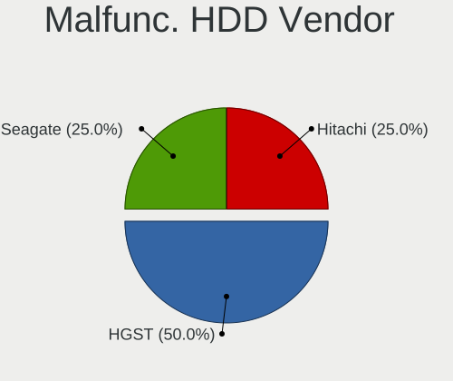

BSD Hardware Trends (Notebooks)
-------------------------------

A project to identify most popular hardware characteristics and track their change
over time based on data collected by BSD users at https://BSD-Hardware.info.

Anyone can contribute to this report by the [hw-probe](https://github.com/linuxhw/hw-probe/blob/master/INSTALL.BSD.md) tool:

    hw-probe -all -upload

Full-feature report is available here: https://bsd-hardware.info/?view=trends

Period: Feb, 2022.

Contents
--------

* [ System ](#system)
  - [ OS                       ](#os)
  - [ OS Family                ](#os-family)
  - [ Arch                     ](#arch)
  - [ DE                       ](#de)
  - [ Display Server           ](#display-server)
  - [ Display Manager          ](#display-manager)
  - [ OS Lang                  ](#os-lang)
  - [ Boot Mode                ](#boot-mode)
  - [ Filesystem               ](#filesystem)
  - [ Part. scheme             ](#part-scheme)

* [ Board ](#board)
  - [ Vendor                   ](#vendor)
  - [ Model                    ](#model)
  - [ Model Family             ](#model-family)
  - [ MFG Year                 ](#mfg-year)
  - [ Form Factor              ](#form-factor)
  - [ Coreboot                 ](#coreboot)
  - [ RAM Size                 ](#ram-size)
  - [ RAM Used                 ](#ram-used)
  - [ Total Drives             ](#total-drives)
  - [ Has CD-ROM               ](#has-cd-rom)
  - [ Has Ethernet             ](#has-ethernet)
  - [ Has WiFi                 ](#has-wifi)
  - [ Has Bluetooth            ](#has-bluetooth)

* [ Location ](#location)
  - [ Country                  ](#country)
  - [ City                     ](#city)

* [ Drives ](#drives)
  - [ Drive Vendor             ](#drive-vendor)
  - [ Drive Model              ](#drive-model)
  - [ HDD Vendor               ](#hdd-vendor)
  - [ SSD Vendor               ](#ssd-vendor)
  - [ Drive Kind               ](#drive-kind)
  - [ Drive Connector          ](#drive-connector)
  - [ Drive Size               ](#drive-size)
  - [ Space Total              ](#space-total)
  - [ Space Used               ](#space-used)
  - [ Malfunc. Drives          ](#malfunc-drives)
  - [ Malfunc. Drive Vendor    ](#malfunc-drive-vendor)
  - [ Malfunc. HDD Vendor      ](#malfunc-hdd-vendor)
  - [ Malfunc. Drive Kind      ](#malfunc-drive-kind)
  - [ Failed Drives            ](#failed-drives)
  - [ Failed Drive Vendor      ](#failed-drive-vendor)
  - [ Drive Status             ](#drive-status)

* [ Storage controller ](#storage-controller)
  - [ Storage Vendor           ](#storage-vendor)
  - [ Storage Model            ](#storage-model)
  - [ Storage Kind             ](#storage-kind)

* [ Processor ](#processor)
  - [ CPU Vendor               ](#cpu-vendor)
  - [ CPU Model                ](#cpu-model)
  - [ CPU Model Family         ](#cpu-model-family)
  - [ CPU Cores                ](#cpu-cores)
  - [ CPU Sockets              ](#cpu-sockets)
  - [ CPU Threads              ](#cpu-threads)
  - [ CPU Microarch            ](#cpu-microarch)

* [ Graphics ](#graphics)
  - [ GPU Vendor               ](#gpu-vendor)
  - [ GPU Model                ](#gpu-model)
  - [ GPU Combo                ](#gpu-combo)
  - [ GPU Driver               ](#gpu-driver)
  - [ GPU Memory               ](#gpu-memory)

* [ Monitor ](#monitor)
  - [ Monitor Vendor           ](#monitor-vendor)
  - [ Monitor Model            ](#monitor-model)
  - [ Monitor Resolution       ](#monitor-resolution)
  - [ Monitor Diagonal         ](#monitor-diagonal)
  - [ Monitor Width            ](#monitor-width)
  - [ Aspect Ratio             ](#aspect-ratio)
  - [ Monitor Area             ](#monitor-area)
  - [ Pixel Density            ](#pixel-density)
  - [ Multiple Monitors        ](#multiple-monitors)

* [ Network ](#network)
  - [ Net Controller Vendor    ](#net-controller-vendor)
  - [ Net Controller Model     ](#net-controller-model)
  - [ Wireless Vendor          ](#wireless-vendor)
  - [ Wireless Model           ](#wireless-model)
  - [ Ethernet Vendor          ](#ethernet-vendor)
  - [ Ethernet Model           ](#ethernet-model)
  - [ Net Controller Kind      ](#net-controller-kind)
  - [ Used Controller          ](#used-controller)
  - [ NICs                     ](#nics)
  - [ IPv6                     ](#ipv6)

* [ Bluetooth ](#bluetooth)
  - [ Bluetooth Vendor         ](#bluetooth-vendor)
  - [ Bluetooth Model          ](#bluetooth-model)

* [ Sound ](#sound)
  - [ Sound Vendor             ](#sound-vendor)
  - [ Sound Model              ](#sound-model)

* [ Memory ](#memory)
  - [ Memory Vendor            ](#memory-vendor)
  - [ Memory Model             ](#memory-model)
  - [ Memory Kind              ](#memory-kind)
  - [ Memory Form Factor       ](#memory-form-factor)
  - [ Memory Size              ](#memory-size)
  - [ Memory Speed             ](#memory-speed)

* [ Printers & scanners ](#printers--scanners)
  - [ Printer Vendor           ](#printer-vendor)
  - [ Printer Model            ](#printer-model)
  - [ Scanner Vendor           ](#scanner-vendor)
  - [ Scanner Model            ](#scanner-model)

* [ Camera ](#camera)
  - [ Camera Vendor            ](#camera-vendor)
  - [ Camera Model             ](#camera-model)

* [ Security ](#security)
  - [ Fingerprint Vendor       ](#fingerprint-vendor)
  - [ Fingerprint Model        ](#fingerprint-model)
  - [ Chipcard Vendor          ](#chipcard-vendor)
  - [ Chipcard Model           ](#chipcard-model)

* [ Unsupported ](#unsupported)
  - [ Unsupported Devices      ](#unsupported-devices)
  - [ Unsupported Device Types ](#unsupported-device-types)

System
------

OS
--

Installed operating systems

| Name                 | Notebooks | Percent |
|----------------------|-----------|---------|
| helloSystem 0.7.0    | 24        | 28.92%  |
| FreeBSD 13.0-p7      | 12        | 14.46%  |
| OpenBSD 7.0          | 9         | 10.84%  |
| helloSystem 0.8.0    | 7         | 8.43%   |
| OPNsense 22.1.1      | 4         | 4.82%   |
| OPNsense 22.1        | 4         | 4.82%   |
| NomadBSD 5806f915    | 4         | 4.82%   |
| GhostBSD 22.01.12    | 3         | 3.61%   |
| FreeBSD 14.0-CURRENT | 3         | 3.61%   |
| FreeBSD 13.0         | 3         | 3.61%   |
| OpenBSD 7.1          | 2         | 2.41%   |
| helloSystem 0.6.0    | 2         | 2.41%   |
| FreeBSD 13.0-p6      | 2         | 2.41%   |
| NetBSD 9.2           | 1         | 1.2%    |
| helloSystem 0.4.0    | 1         | 1.2%    |
| FreeBSD 13.0-STABLE  | 1         | 1.2%    |
| FreeBSD 13.0-p4      | 1         | 1.2%    |

OS Family
---------

OS without a version

| Name        | Notebooks | Percent |
|-------------|-----------|---------|
| helloSystem | 34        | 40.96%  |
| FreeBSD     | 22        | 26.51%  |
| OpenBSD     | 11        | 13.25%  |
| OPNsense    | 8         | 9.64%   |
| NomadBSD    | 4         | 4.82%   |
| GhostBSD    | 3         | 3.61%   |
| NetBSD      | 1         | 1.2%    |

Arch
----

OS architecture (x86_64, i586, etc.)

| Name  | Notebooks | Percent |
|-------|-----------|---------|
| amd64 | 81        | 97.59%  |
| i386  | 2         | 2.41%   |

DE
--

Desktop Environment

| Name         | Notebooks | Percent |
|--------------|-----------|---------|
| helloDesktop | 33        | 39.76%  |
| fvwm         | 10        | 12.05%  |
| Console      | 8         | 9.64%   |
| KDE5         | 7         | 8.43%   |
| XFCE         | 4         | 4.82%   |
| Openbox      | 4         | 4.82%   |
| MATE         | 3         | 3.61%   |
| GNOME        | 3         | 3.61%   |
| Lumina       | 2         | 2.41%   |
| i3           | 2         | 2.41%   |
| Xfwm4        | 1         | 1.2%    |
| Mutter       | 1         | 1.2%    |
| LXQt         | 1         | 1.2%    |
| GNUstep      | 1         | 1.2%    |
| Compton      | 1         | 1.2%    |
| AwesomeWM    | 1         | 1.2%    |
| awesome      | 1         | 1.2%    |

Display Server
--------------

X11 or Wayland

| Name    | Notebooks | Percent |
|---------|-----------|---------|
| X11     | 72        | 86.75%  |
| Console | 11        | 13.25%  |

Display Manager
---------------

SDDM, LightDM, etc.

| Name    | Notebooks | Percent |
|---------|-----------|---------|
| SLiM    | 46        | 55.42%  |
| Console | 24        | 28.92%  |
| SDDM    | 6         | 7.23%   |
| LightDM | 5         | 6.02%   |
| XDM     | 1         | 1.2%    |
| GDM     | 1         | 1.2%    |

OS Lang
-------

Language

| Lang    | Notebooks | Percent |
|---------|-----------|---------|
| en_US   | 35        | 42.17%  |
| Unknown | 18        | 21.69%  |
| C       | 17        | 20.48%  |
| ru_RU   | 3         | 3.61%   |
| fr_FR   | 3         | 3.61%   |
| pl_PL   | 2         | 2.41%   |
| es_ES   | 2         | 2.41%   |
| uk_UA   | 1         | 1.2%    |
| en_NZ   | 1         | 1.2%    |
| de_DE   | 1         | 1.2%    |

Boot Mode
---------

EFI or BIOS

| Mode | Notebooks | Percent |
|------|-----------|---------|
| EFI  | 75        | 90.36%  |
| BIOS | 8         | 9.64%   |

Filesystem
----------

Type of filesystem

| Type   | Notebooks | Percent |
|--------|-----------|---------|
| Zfs    | 41        | 49.4%   |
| Ufs    | 17        | 20.48%  |
| Cd9660 | 14        | 16.87%  |
| Ffs    | 11        | 13.25%  |

Part. scheme
------------

Scheme of partitioning

| Type | Notebooks | Percent |
|------|-----------|---------|
| GPT  | 77        | 92.77%  |
| MBR  | 6         | 7.23%   |

Board
-----

Vendor
------

Motherboard manufacturer

| Name                | Notebooks | Percent |
|---------------------|-----------|---------|
| Lenovo              | 24        | 28.92%  |
| Dell                | 15        | 18.07%  |
| Hewlett-Packard     | 10        | 12.05%  |
| Acer                | 7         | 8.43%   |
| Apple               | 6         | 7.23%   |
| ASUSTek Computer    | 4         | 4.82%   |
| Samsung Electronics | 2         | 2.41%   |
| Notebook            | 2         | 2.41%   |
| Deciso              | 2         | 2.41%   |
| WOOKING             | 1         | 1.2%    |
| TWINHEAD            | 1         | 1.2%    |
| TUXEDO              | 1         | 1.2%    |
| Timi                | 1         | 1.2%    |
| System76            | 1         | 1.2%    |
| Sony                | 1         | 1.2%    |
| Shuttle             | 1         | 1.2%    |
| PCSTICK             | 1         | 1.2%    |
| MiTAC               | 1         | 1.2%    |
| Jumper              | 1         | 1.2%    |
| HUAWEI              | 1         | 1.2%    |

Model
-----

Motherboard model

| Name                                                                                     | Notebooks | Percent |
|------------------------------------------------------------------------------------------|-----------|---------|
| Lenovo ThinkPad X200 745969G                                                             | 4         | 4.82%   |
| Dell Latitude D630                                                                       | 2         | 2.41%   |
| Dell Latitude 7480                                                                       | 2         | 2.41%   |
| Deciso Netboard A20                                                                      | 2         | 2.41%   |
| Acer V5-131                                                                              | 2         | 2.41%   |
| WOOKING X5                                                                               | 1         | 1.2%    |
| TWINHEAD U12CT                                                                           | 1         | 1.2%    |
| TUXEDO InfinityBook13V3                                                                  | 1         | 1.2%    |
| Timi RedmiBook Pro 15                                                                    | 1         | 1.2%    |
| System76 Lemur Pro                                                                       | 1         | 1.2%    |
| Sony VPCEB1J1E                                                                           | 1         | 1.2%    |
| Shuttle DS77U                                                                            | 1         | 1.2%    |
| Samsung N100                                                                             | 1         | 1.2%    |
| Samsung 350V5C/350V5X/350V4C/350V4X/351V5C/351V5X/351V4C/351V4X/3540VC/3540VX/3440VC/344 | 1         | 1.2%    |
| Notebook NS50_70MU                                                                       | 1         | 1.2%    |
| Notebook N7x0WU                                                                          | 1         | 1.2%    |
| MiTAC 5033                                                                               | 1         | 1.2%    |
| Lenovo Yoga S730-13IWL 81J0                                                              | 1         | 1.2%    |
| Lenovo V145-15AST 81MT                                                                   | 1         | 1.2%    |
| Lenovo ThinkPad X250 20CMCTO1WW                                                          | 1         | 1.2%    |
| Lenovo ThinkPad X250 20CLS59400                                                          | 1         | 1.2%    |
| Lenovo ThinkPad X240 20AMS2QD0C                                                          | 1         | 1.2%    |
| Lenovo ThinkPad X220 4291H77                                                             | 1         | 1.2%    |
| Lenovo ThinkPad T61 766301U                                                              | 1         | 1.2%    |
| Lenovo ThinkPad T460 20FNCTO1WW                                                          | 1         | 1.2%    |
| Lenovo ThinkPad T450 20BUS0VH08                                                          | 1         | 1.2%    |
| Lenovo ThinkPad T440p 20AWS3RH00                                                         | 1         | 1.2%    |
| Lenovo ThinkPad T440p 20AWS1JN00                                                         | 1         | 1.2%    |
| Lenovo ThinkPad T430 2349AK1                                                             | 1         | 1.2%    |
| Lenovo ThinkPad P51 20HHCTO1WW                                                           | 1         | 1.2%    |
| Lenovo Legion 5 15ARH05 82B5                                                             | 1         | 1.2%    |
| Lenovo IdeaPad Gaming 3 15ARH05 82EY                                                     | 1         | 1.2%    |
| Lenovo IdeaPad 110S-11IBR 80WG                                                           | 1         | 1.2%    |
| Lenovo G580 20150                                                                        | 1         | 1.2%    |
| Lenovo G500s 20245                                                                       | 1         | 1.2%    |
| Lenovo Flex 2-15 20405                                                                   | 1         | 1.2%    |
| Lenovo E31-80 80MX                                                                       | 1         | 1.2%    |
| Jumper EZbook                                                                            | 1         | 1.2%    |
| HUAWEI MACHD-WXX9                                                                        | 1         | 1.2%    |
| HP ProBook 445 G7                                                                        | 1         | 1.2%    |
| HP Pavilion Notebook                                                                     | 1         | 1.2%    |
| HP Notebook                                                                              | 1         | 1.2%    |
| HP Mini 210-1000                                                                         | 1         | 1.2%    |
| HP Laptop 15-db0xxx                                                                      | 1         | 1.2%    |
| HP G62                                                                                   | 1         | 1.2%    |
| HP EliteBook Folio 9470m                                                                 | 1         | 1.2%    |
| HP EliteBook 840 G3                                                                      | 1         | 1.2%    |
| HP EliteBook 6930p                                                                       | 1         | 1.2%    |
| HP EliteBook 2530p                                                                       | 1         | 1.2%    |
| Dell Vostro 3550                                                                         | 1         | 1.2%    |
| Dell Venue 11 Pro 7140                                                                   | 1         | 1.2%    |
| Dell Latitude E7450                                                                      | 1         | 1.2%    |
| Dell Latitude E6430                                                                      | 1         | 1.2%    |
| Dell Latitude E5470                                                                      | 1         | 1.2%    |
| Dell Latitude E5440                                                                      | 1         | 1.2%    |
| Dell Latitude E4310                                                                      | 1         | 1.2%    |
| Dell Latitude 5591                                                                       | 1         | 1.2%    |
| Dell Latitude 3420                                                                       | 1         | 1.2%    |
| Dell Inspiron 5559                                                                       | 1         | 1.2%    |
| Dell Inspiron 3537                                                                       | 1         | 1.2%    |

Model Family
------------

Motherboard model prefix

| Name                    | Notebooks | Percent |
|-------------------------|-----------|---------|
| Lenovo ThinkPad         | 15        | 18.07%  |
| Dell Latitude           | 11        | 13.25%  |
| HP EliteBook            | 4         | 4.82%   |
| Acer Aspire             | 4         | 4.82%   |
| Lenovo IdeaPad          | 2         | 2.41%   |
| Dell Inspiron           | 2         | 2.41%   |
| Deciso Netboard         | 2         | 2.41%   |
| Acer V5-131             | 2         | 2.41%   |
| WOOKING X5              | 1         | 1.2%    |
| TWINHEAD U12CT          | 1         | 1.2%    |
| TUXEDO InfinityBook13V3 | 1         | 1.2%    |
| Timi RedmiBook          | 1         | 1.2%    |
| System76 Lemur          | 1         | 1.2%    |
| Sony VPCEB1J1E          | 1         | 1.2%    |
| Shuttle DS77U           | 1         | 1.2%    |
| Samsung N100            | 1         | 1.2%    |
| Samsung 350V5C          | 1         | 1.2%    |
| Notebook NS50           | 1         | 1.2%    |
| Notebook N7x0WU         | 1         | 1.2%    |
| MiTAC 5033              | 1         | 1.2%    |
| Lenovo Yoga             | 1         | 1.2%    |
| Lenovo V145-15AST       | 1         | 1.2%    |
| Lenovo Legion           | 1         | 1.2%    |
| Lenovo G580             | 1         | 1.2%    |
| Lenovo G500s            | 1         | 1.2%    |
| Lenovo Flex             | 1         | 1.2%    |
| Lenovo E31-80           | 1         | 1.2%    |
| Jumper EZbook           | 1         | 1.2%    |
| HUAWEI MACHD-WXX9       | 1         | 1.2%    |
| HP ProBook              | 1         | 1.2%    |
| HP Pavilion             | 1         | 1.2%    |
| HP Notebook             | 1         | 1.2%    |
| HP Mini                 | 1         | 1.2%    |
| HP Laptop               | 1         | 1.2%    |
| HP G62                  | 1         | 1.2%    |
| Dell Vostro             | 1         | 1.2%    |
| Dell Venue              | 1         | 1.2%    |
| ASUS X555LA             | 1         | 1.2%    |
| ASUS A9T                | 1         | 1.2%    |
| ASUS 1215B              | 1         | 1.2%    |
| ASUS 1001PX             | 1         | 1.2%    |
| Apple MacBookPro8       | 1         | 1.2%    |
| Apple MacBookPro4       | 1         | 1.2%    |
| Apple MacBookPro10      | 1         | 1.2%    |
| Apple MacBook6          | 1         | 1.2%    |
| Apple MacBook5          | 1         | 1.2%    |
| Apple MacBook4          | 1         | 1.2%    |
| Acer AO725              | 1         | 1.2%    |
| Unknown                 | 1         | 1.2%    |

MFG Year
--------

Motherboard manufacture year

| Year    | Notebooks | Percent |
|---------|-----------|---------|
| 2021    | 11        | 13.25%  |
| 2013    | 9         | 10.84%  |
| 2018    | 7         | 8.43%   |
| 2015    | 7         | 8.43%   |
| 2016    | 6         | 7.23%   |
| 2010    | 6         | 7.23%   |
| 2009    | 6         | 7.23%   |
| 2020    | 5         | 6.02%   |
| 2019    | 5         | 6.02%   |
| 2017    | 5         | 6.02%   |
| 2011    | 4         | 4.82%   |
| 2008    | 4         | 4.82%   |
| 2014    | 3         | 3.61%   |
| 2012    | 2         | 2.41%   |
| 2007    | 1         | 1.2%    |
| 2005    | 1         | 1.2%    |
| Unknown | 1         | 1.2%    |

Form Factor
-----------

Physical design of the computer

| Name     | Notebooks | Percent |
|----------|-----------|---------|
| Notebook | 83        | 100%    |

Coreboot
--------

Have coreboot on board

| Used | Notebooks | Percent |
|------|-----------|---------|
| No   | 82        | 98.8%   |
| Yes  | 1         | 1.2%    |

RAM Size
--------

Total RAM memory

| Size in GB  | Notebooks | Percent |
|-------------|-----------|---------|
| 8.01-16.0   | 26        | 31.33%  |
| 4.01-8.0    | 24        | 28.92%  |
| 16.01-24.0  | 17        | 20.48%  |
| 2.01-3.0    | 9         | 10.84%  |
| 32.01-64.0  | 3         | 3.61%   |
| 3.01-4.0    | 1         | 1.2%    |
| 64.01-256.0 | 1         | 1.2%    |
| 1.01-2.0    | 1         | 1.2%    |
| 0           | 1         | 1.2%    |

RAM Used
--------

Used RAM memory

| Used GB   | Notebooks | Percent |
|-----------|-----------|---------|
| 0.01-0.5  | 49        | 59.04%  |
| 0.51-1.0  | 23        | 27.71%  |
| 1.01-2.0  | 7         | 8.43%   |
| 4.01-8.0  | 1         | 1.2%    |
| 3.01-4.0  | 1         | 1.2%    |
| 8.01-16.0 | 1         | 1.2%    |
| Unknown   | 1         | 1.2%    |

Total Drives
------------

Number of drives on board

| Drives | Notebooks | Percent |
|--------|-----------|---------|
| 1      | 59        | 71.08%  |
| 2      | 17        | 20.48%  |
| 3      | 4         | 4.82%   |
| 0      | 3         | 3.61%   |

Has CD-ROM
----------

Has CD-ROM on board

| Presented | Notebooks | Percent |
|-----------|-----------|---------|
| No        | 59        | 71.08%  |
| Yes       | 24        | 28.92%  |

Has Ethernet
------------

Has Ethernet on board

| Presented | Notebooks | Percent |
|-----------|-----------|---------|
| Yes       | 73        | 87.95%  |
| No        | 10        | 12.05%  |

Has WiFi
--------

Has WiFi module

| Presented | Notebooks | Percent |
|-----------|-----------|---------|
| Yes       | 78        | 93.98%  |
| No        | 5         | 6.02%   |

Has Bluetooth
-------------

Has Bluetooth module

| Presented | Notebooks | Percent |
|-----------|-----------|---------|
| Yes       | 53        | 63.86%  |
| No        | 30        | 36.14%  |

Location
--------

Country
-------

Geographic location (country)

| Country     | Notebooks | Percent |
|-------------|-----------|---------|
| USA         | 15        | 18.07%  |
| Poland      | 8         | 9.64%   |
| Ukraine     | 6         | 7.23%   |
| Germany     | 6         | 7.23%   |
| France      | 6         | 7.23%   |
| Mexico      | 5         | 6.02%   |
| Russia      | 4         | 4.82%   |
| UK          | 3         | 3.61%   |
| Spain       | 3         | 3.61%   |
| Netherlands | 3         | 3.61%   |
| Italy       | 3         | 3.61%   |
| China       | 3         | 3.61%   |
| Switzerland | 2         | 2.41%   |
| Greece      | 2         | 2.41%   |
| Australia   | 2         | 2.41%   |
| Tanzania    | 1         | 1.2%    |
| Taiwan      | 1         | 1.2%    |
| New Zealand | 1         | 1.2%    |
| Malaysia    | 1         | 1.2%    |
| India       | 1         | 1.2%    |
| Hungary     | 1         | 1.2%    |
| Guadeloupe  | 1         | 1.2%    |
| Georgia     | 1         | 1.2%    |
| Denmark     | 1         | 1.2%    |
| Chile       | 1         | 1.2%    |
| Brazil      | 1         | 1.2%    |
| Belarus     | 1         | 1.2%    |

City
----

Geographic location (city)

| City                          | Notebooks | Percent |
|-------------------------------|-----------|---------|
| Gdansk                        | 5         | 6.02%   |
| Tijuana                       | 3         | 3.61%   |
| Paris                         | 3         | 3.61%   |
| Kyiv                          | 3         | 3.61%   |
| Shenzhen                      | 2         | 2.41%   |
| Moscow                        | 2         | 2.41%   |
| Zurich                        | 1         | 1.2%    |
| Yunlin                        | 1         | 1.2%    |
| Youngsville                   | 1         | 1.2%    |
| Wroclaw                       | 1         | 1.2%    |
| Whittier                      | 1         | 1.2%    |
| Washington                    | 1         | 1.2%    |
| Warsaw                        | 1         | 1.2%    |
| Turley                        | 1         | 1.2%    |
| Turin                         | 1         | 1.2%    |
| Tournon-sur-Rhône          | 1         | 1.2%    |
| Thessaloniki                  | 1         | 1.2%    |
| Susanville                    | 1         | 1.2%    |
| Strullendorf                  | 1         | 1.2%    |
| St Petersburg                 | 1         | 1.2%    |
| Springfield                   | 1         | 1.2%    |
| San Sebastián de los Reyes | 1         | 1.2%    |
| San Luis Potosí City       | 1         | 1.2%    |
| Rio de Janeiro                | 1         | 1.2%    |
| Rho                           | 1         | 1.2%    |
| Ransbach-Baumbach             | 1         | 1.2%    |
| Piovene Rocchette             | 1         | 1.2%    |
| Perth                         | 1         | 1.2%    |
| Ozersk                        | 1         | 1.2%    |
| Orlando                       | 1         | 1.2%    |
| Onex                          | 1         | 1.2%    |
| New York                      | 1         | 1.2%    |
| New Plymouth                  | 1         | 1.2%    |
| Munnikens-Vinkel              | 1         | 1.2%    |
| Mirepeix                      | 1         | 1.2%    |
| Minsk                         | 1         | 1.2%    |
| Minneapolis                   | 1         | 1.2%    |
| Mexico City                   | 1         | 1.2%    |
| London                        | 1         | 1.2%    |
| Logroño                    | 1         | 1.2%    |
| Linyi                         | 1         | 1.2%    |
| Leipzig                       | 1         | 1.2%    |
| Le Gosier                     | 1         | 1.2%    |
| Ladbergen                     | 1         | 1.2%    |
| Kuala Lumpur                  | 1         | 1.2%    |
| Kozhikode                     | 1         | 1.2%    |
| Kissimmee                     | 1         | 1.2%    |
| Kharkiv                       | 1         | 1.2%    |
| Kastrup                       | 1         | 1.2%    |
| K'alak'i T'bilisi             | 1         | 1.2%    |
| Jarosław                  | 1         | 1.2%    |
| Ivano-Frankivsk               | 1         | 1.2%    |
| Inverkeithing                 | 1         | 1.2%    |
| Hoogeveen                     | 1         | 1.2%    |
| Guyancourt                    | 1         | 1.2%    |
| Glenmoore                     | 1         | 1.2%    |
| El Bosque                     | 1         | 1.2%    |
| Dortmund                      | 1         | 1.2%    |
| Dar es Salaam                 | 1         | 1.2%    |
| Cranberry Township            | 1         | 1.2%    |

Drives
------

Drive Vendor
------------

Hard drive vendors

| Vendor              | Notebooks | Drives | Percent |
|---------------------|-----------|--------|---------|
| Samsung Electronics | 22        | 25     | 23.91%  |
| WDC                 | 10        | 10     | 10.87%  |
| Crucial             | 8         | 9      | 8.7%    |
| Seagate             | 7         | 7      | 7.61%   |
| Toshiba             | 6         | 6      | 6.52%   |
| Kingston            | 6         | 6      | 6.52%   |
| Hitachi             | 5         | 5      | 5.43%   |
| Intel               | 4         | 4      | 4.35%   |
| Transcend           | 3         | 3      | 3.26%   |
| SanDisk             | 3         | 3      | 3.26%   |
| SK Hynix            | 2         | 2      | 2.17%   |
| Hikvision           | 2         | 2      | 2.17%   |
| Apple               | 2         | 2      | 2.17%   |
| Team                | 1         | 1      | 1.09%   |
| SPCC                | 1         | 2      | 1.09%   |
| Phison              | 1         | 1      | 1.09%   |
| NVMe                | 1         | 1      | 1.09%   |
| Mushkin             | 1         | 1      | 1.09%   |
| Micron Technology   | 1         | 1      | 1.09%   |
| KIOXIA              | 1         | 1      | 1.09%   |
| Intenso             | 1         | 1      | 1.09%   |
| HGST                | 1         | 1      | 1.09%   |
| Gigabyte Technology | 1         | 1      | 1.09%   |
| Fujitsu             | 1         | 1      | 1.09%   |
| A-DATA Technology   | 1         | 1      | 1.09%   |

Drive Model
-----------

Hard drive models

| Model                                     | Notebooks | Percent |
|-------------------------------------------|-----------|---------|
| Samsung HM321HI 320GB                     | 4         | 4.21%   |
| Samsung SSD 970 EVO Plus 1TB              | 3         | 3.16%   |
| Transcend TS256GMTS952T2 256GB            | 2         | 2.11%   |
| Toshiba THNSFJ256GCSU 256GB               | 2         | 2.11%   |
| Seagate ST9500420AS 500GB                 | 2         | 2.11%   |
| Samsung SSD 870 EVO 1TB                   | 2         | 2.11%   |
| Hikvision HS-SSD-C2000ECO 1024G           | 2         | 2.11%   |
| Crucial CT250BX100SSD1 250GB              | 2         | 2.11%   |
| Crucial CT240BX500SSD1 240GB              | 2         | 2.11%   |
| WDC WDS240G2G0A-00JH30 240GB              | 1         | 1.05%   |
| WDC WDS120G2G0B-00EPW0 120GB              | 1         | 1.05%   |
| WDC WD5000LPVX-80V0TT0 500GB              | 1         | 1.05%   |
| WDC WD5000LPCX-75VHAT0 500GB              | 1         | 1.05%   |
| WDC WD5000BPKT-00PK4T0 500GB              | 1         | 1.05%   |
| WDC WD1600BEVT-22A23T0 160GB              | 1         | 1.05%   |
| WDC WD1600BEKT-66F3T2 160GB               | 1         | 1.05%   |
| WDC WD10SPZX-60Z10T0 1TB                  | 1         | 1.05%   |
| WDC WD10JPVX-60JC3T0 1TB                  | 1         | 1.05%   |
| WDC WD10JMVW-11AJGS4 1TB                  | 1         | 1.05%   |
| Transcend TS240GMTS420S 240GB             | 1         | 1.05%   |
| Toshiba THNSNK256GVN8 M.2 2280 256GB      | 1         | 1.05%   |
| Toshiba MQ04ABF100 1TB                    | 1         | 1.05%   |
| Toshiba MQ01ACF050 500GB                  | 1         | 1.05%   |
| Toshiba MK1629GSGF 160GB                  | 1         | 1.05%   |
| Team TEAML5Lite3D120G 120GB               | 1         | 1.05%   |
| SPCC Solid State Disk 512GB               | 1         | 1.05%   |
| SK Hynix SKHynix_HFM512GDHTNI-87A0B 512GB | 1         | 1.05%   |
| SK Hynix BC511 HFM256GDJTNI-82A0A 256GB   | 1         | 1.05%   |
| Seagate ST9320423AS 320GB                 | 1         | 1.05%   |
| Seagate ST9320325ASG 320GB                | 1         | 1.05%   |
| Seagate ST9160411AS 160GB                 | 1         | 1.05%   |
| Seagate ST1000LM035-1RK172 1TB            | 1         | 1.05%   |
| Seagate ST1000LM024 HN-M101MBB 1TB        | 1         | 1.05%   |
| SanDisk X400 M.2 2280 512GB               | 1         | 1.05%   |
| SanDisk X110 M.2 2260 256GB               | 1         | 1.05%   |
| SanDisk SDSA5GK-016G-1006 16GB            | 1         | 1.05%   |
| Samsung SSD PM871 mSATA 256GB             | 1         | 1.05%   |
| Samsung SSD 970 PRO 1TB                   | 1         | 1.05%   |
| Samsung SSD 970 EVO 500GB                 | 1         | 1.05%   |
| Samsung SSD 950 PRO 512GB                 | 1         | 1.05%   |
| Samsung SSD 860 EVO 250GB                 | 1         | 1.05%   |
| Samsung SSD 850 EVO 500GB                 | 1         | 1.05%   |
| Samsung SSD 850 EVO 1TB                   | 1         | 1.05%   |
| Samsung SSD 840 Series 120GB              | 1         | 1.05%   |
| Samsung MZVLB512HAJQ-000L2 512GB          | 1         | 1.05%   |
| Samsung MZVLB1T0HBLR-00000 1TB            | 1         | 1.05%   |
| Samsung MZNLN256HMHQ-000H1 256GB          | 1         | 1.05%   |
| Samsung MZNLN256HCHP-000H1 256GB          | 1         | 1.05%   |
| Samsung MZMPC256HBGJ-000H1 256GB          | 1         | 1.05%   |
| Samsung MZALQ256HAJD-000L2 256GB          | 1         | 1.05%   |
| Samsung HM160HI 160GB                     | 1         | 1.05%   |
| Phison SATA SSD 240GB                     | 1         | 1.05%   |
| NVMe KINGSTON RBUSNS8 256GB               | 1         | 1.05%   |
| Mushkin MKNSSDRE500GB                     | 1         | 1.05%   |
| Micron 1100_MTFDDAV256TBN 256GB           | 1         | 1.05%   |
| KIOXIA KBG40ZNV512G 512GB                 | 1         | 1.05%   |
| Kingston SV300S37A120G 120GB              | 1         | 1.05%   |
| Kingston SUV500MS120G 120GB               | 1         | 1.05%   |
| Kingston SMS200S3120G 120GB               | 1         | 1.05%   |
| Kingston SA400S37480G 480GB               | 1         | 1.05%   |

HDD Vendor
----------

Hard disk drive vendors

| Vendor              | Notebooks | Drives | Percent |
|---------------------|-----------|--------|---------|
| WDC                 | 8         | 8      | 25.81%  |
| Seagate             | 7         | 7      | 22.58%  |
| Samsung Electronics | 5         | 5      | 16.13%  |
| Hitachi             | 5         | 5      | 16.13%  |
| Toshiba             | 3         | 3      | 9.68%   |
| NVMe                | 1         | 1      | 3.23%   |
| HGST                | 1         | 1      | 3.23%   |
| Apple               | 1         | 1      | 3.23%   |

SSD Vendor
----------

Solid state drive vendors

| Vendor              | Notebooks | Drives | Percent |
|---------------------|-----------|--------|---------|
| Samsung Electronics | 10        | 10     | 20.41%  |
| Crucial             | 8         | 9      | 16.33%  |
| Kingston            | 6         | 6      | 12.24%  |
| Intel               | 4         | 4      | 8.16%   |
| Transcend           | 3         | 3      | 6.12%   |
| Toshiba             | 3         | 3      | 6.12%   |
| SanDisk             | 3         | 3      | 6.12%   |
| WDC                 | 2         | 2      | 4.08%   |
| Team                | 1         | 1      | 2.04%   |
| SPCC                | 1         | 2      | 2.04%   |
| Phison              | 1         | 1      | 2.04%   |
| Mushkin             | 1         | 1      | 2.04%   |
| Micron Technology   | 1         | 1      | 2.04%   |
| Intenso             | 1         | 1      | 2.04%   |
| Gigabyte Technology | 1         | 1      | 2.04%   |
| Fujitsu             | 1         | 1      | 2.04%   |
| Apple               | 1         | 1      | 2.04%   |
| A-DATA Technology   | 1         | 1      | 2.04%   |

Drive Kind
----------

HDD or SSD

| Kind | Notebooks | Drives | Percent |
|------|-----------|--------|---------|
| SSD  | 44        | 51     | 50.57%  |
| HDD  | 31        | 31     | 35.63%  |
| NVMe | 12        | 15     | 13.79%  |

Drive Connector
---------------

SATA, SAS, NVMe, etc.

| Type | Notebooks | Drives | Percent |
|------|-----------|--------|---------|
| SATA | 72        | 82     | 85.71%  |
| NVMe | 12        | 15     | 14.29%  |

Drive Size
----------

Size of hard drive

| Size in TB | Notebooks | Drives | Percent |
|------------|-----------|--------|---------|
| 0.01-0.5   | 59        | 66     | 79.73%  |
| 0.51-1.0   | 14        | 15     | 18.92%  |
| 1.01-2.0   | 1         | 1      | 1.35%   |

Space Total
-----------

Amount of disk space available on the file system

| Size in GB | Notebooks | Percent |
|------------|-----------|---------|
| 101-250    | 26        | 31.33%  |
| 1-20       | 24        | 28.92%  |
| 251-500    | 16        | 19.28%  |
| 501-1000   | 7         | 8.43%   |
| 21-50      | 5         | 6.02%   |
| 51-100     | 5         | 6.02%   |

Space Used
----------

Amount of used disk space

| Used GB | Notebooks | Percent |
|---------|-----------|---------|
| 1-20    | 69        | 83.13%  |
| 21-50   | 11        | 13.25%  |
| 101-250 | 3         | 3.61%   |

Malfunc. Drives
---------------

Drive models with a malfunction

| Model                                | Notebooks | Drives | Percent |
|--------------------------------------|-----------|--------|---------|
| WDC WD5000LPCX-75VHAT0 500GB         | 1         | 1      | 5.88%   |
| WDC WD1600BEKT-66F3T2 160GB          | 1         | 1      | 5.88%   |
| WDC WD10JPVX-60JC3T0 1TB             | 1         | 1      | 5.88%   |
| Toshiba THNSNK256GVN8 M.2 2280 256GB | 1         | 1      | 5.88%   |
| Toshiba MK1629GSGF 160GB             | 1         | 1      | 5.88%   |
| Seagate ST9500420AS 500GB            | 1         | 1      | 5.88%   |
| Seagate ST9320423AS 320GB            | 1         | 1      | 5.88%   |
| Seagate ST9320325ASG 320GB           | 1         | 1      | 5.88%   |
| Seagate ST1000LM035-1RK172 1TB       | 1         | 1      | 5.88%   |
| Seagate ST1000LM024 HN-M101MBB 1TB   | 1         | 1      | 5.88%   |
| Samsung Electronics HM160HI 160GB    | 1         | 1      | 5.88%   |
| Intel SSDSC2BF180A5L 180GB           | 1         | 1      | 5.88%   |
| Hitachi HTS545050A7E380 500GB        | 1         | 1      | 5.88%   |
| Hitachi HTS542516K9SA00 160GB        | 1         | 1      | 5.88%   |
| Hitachi HTS541616J9SA00 160GB        | 1         | 1      | 5.88%   |
| Hitachi HTS421260H9AT00 64GB         | 1         | 1      | 5.88%   |
| HGST HTS545050A7E660 500GB           | 1         | 1      | 5.88%   |

Malfunc. Drive Vendor
---------------------

Vendors of faulty drives

| Vendor              | Notebooks | Drives | Percent |
|---------------------|-----------|--------|---------|
| Seagate             | 5         | 5      | 29.41%  |
| Hitachi             | 4         | 4      | 23.53%  |
| WDC                 | 3         | 3      | 17.65%  |
| Toshiba             | 2         | 2      | 11.76%  |
| Samsung Electronics | 1         | 1      | 5.88%   |
| Intel               | 1         | 1      | 5.88%   |
| HGST                | 1         | 1      | 5.88%   |

Malfunc. HDD Vendor
-------------------

Vendors of faulty HDD drives

| Vendor              | Notebooks | Drives | Percent |
|---------------------|-----------|--------|---------|
| Seagate             | 5         | 5      | 33.33%  |
| Hitachi             | 4         | 4      | 26.67%  |
| WDC                 | 3         | 3      | 20%     |
| Toshiba             | 1         | 1      | 6.67%   |
| Samsung Electronics | 1         | 1      | 6.67%   |
| HGST                | 1         | 1      | 6.67%   |

Malfunc. Drive Kind
-------------------

Kinds of faulty drives

| Kind | Notebooks | Drives | Percent |
|------|-----------|--------|---------|
| HDD  | 15        | 15     | 88.24%  |
| SSD  | 2         | 2      | 11.76%  |

Failed Drives
-------------

Failed drive models

Zero info for selected period =(

Failed Drive Vendor
-------------------

Failed drive vendors

Zero info for selected period =(

Drive Status
------------

Number of failed and malfunc. drives

| Status   | Notebooks | Drives | Percent |
|----------|-----------|--------|---------|
| Works    | 62        | 79     | 77.5%   |
| Malfunc  | 17        | 17     | 21.25%  |
| Detected | 1         | 1      | 1.25%   |

Storage controller
------------------

Storage Vendor
--------------

Storage controller vendors

| Vendor                           | Notebooks | Percent |
|----------------------------------|-----------|---------|
| Intel                            | 63        | 67.74%  |
| AMD                              | 12        | 12.9%   |
| Samsung Electronics              | 9         | 9.68%   |
| SK Hynix                         | 2         | 2.15%   |
| Nvidia                           | 2         | 2.15%   |
| MAXIO Technology (Hangzhou)      | 2         | 2.15%   |
| Silicon Integrated Systems [SiS] | 1         | 1.08%   |
| KIOXIA                           | 1         | 1.08%   |
| Kingston Technology Company      | 1         | 1.08%   |

Storage Model
-------------

Storage controller models

| Model                                                                            | Notebooks | Percent |
|----------------------------------------------------------------------------------|-----------|---------|
| AMD FCH SATA Controller [AHCI mode]                                              | 10        | 10%     |
| Intel 7 Series Chipset Family 6-port SATA Controller [AHCI mode]                 | 9         | 9%      |
| Intel Sunrise Point-LP SATA Controller [AHCI mode]                               | 8         | 8%      |
| Samsung NVMe SSD Controller SM981/PM981/PM983                                    | 7         | 7%      |
| Intel 82801IBM/IEM (ICH9M/ICH9M-E) 4 port SATA Controller [AHCI mode]            | 6         | 6%      |
| Intel Wildcat Point-LP SATA Controller [AHCI Mode]                               | 5         | 5%      |
| Intel 82801HM/HEM (ICH8M/ICH8M-E) IDE Controller                                 | 5         | 5%      |
| Intel 8 Series SATA Controller 1 [AHCI mode]                                     | 5         | 5%      |
| Intel 82801HM/HEM (ICH8M/ICH8M-E) SATA Controller [AHCI mode]                    | 4         | 4%      |
| Intel 6 Series/C200 Series Chipset Family 6 port Mobile SATA AHCI Controller     | 4         | 4%      |
| Intel NM10/ICH7 Family SATA Controller [AHCI mode]                               | 3         | 3%      |
| Intel 5 Series/3400 Series Chipset 4 port SATA AHCI Controller                   | 3         | 3%      |
| SK Hynix BC511                                                                   | 2         | 2%      |
| Nvidia MCP79 AHCI Controller                                                     | 2         | 2%      |
| MAXIO (Hangzhou) NVMe SSD Controller MAP1202                                     | 2         | 2%      |
| Intel Mobile 4 Series Chipset PT IDER Controller                                 | 2         | 2%      |
| Intel Comet Lake SATA AHCI Controller                                            | 2         | 2%      |
| Intel 8 Series/C220 Series Chipset Family 6-port SATA Controller 1 [AHCI mode]   | 2         | 2%      |
| Silicon Integrated Systems [SiS] 5513 IDE Controller                             | 1         | 1%      |
| Samsung NVMe SSD Controller SM951/PM951                                          | 1         | 1%      |
| Samsung NVMe SSD Controller 980                                                  | 1         | 1%      |
| KIOXIA unknown                                                                   | 1         | 1%      |
| Kingston Company U-SNS8154P3 NVMe SSD                                            | 1         | 1%      |
| Intel Tiger Lake-LP SATA Controller [AHCI mode]                                  | 1         | 1%      |
| Intel SATA Controller [RAID mode]                                                | 1         | 1%      |
| Intel Q170/Q150/B150/H170/H110/Z170/CM236 Chipset SATA Controller [AHCI Mode]    | 1         | 1%      |
| Intel Jasper Lake SATA AHCI Controller                                           | 1         | 1%      |
| Intel Celeron N3350/Pentium N4200/Atom E3900 Series SATA AHCI Controller         | 1         | 1%      |
| Intel Cannon Lake Mobile PCH SATA AHCI Controller                                | 1         | 1%      |
| Intel Atom/Celeron/Pentium Processor x5-E8000/J3xxx/N3xxx Series SATA Controller | 1         | 1%      |
| Intel Atom Processor E3800 Series SATA AHCI Controller                           | 1         | 1%      |
| Intel 82801HM/HEM (ICH8M/ICH8M-E) SATA Controller [IDE mode]                     | 1         | 1%      |
| Intel 82801 Mobile SATA Controller [RAID mode]                                   | 1         | 1%      |
| Intel 82371AB/EB/MB PIIX4 IDE                                                    | 1         | 1%      |
| Intel 5 Series/3400 Series Chipset 6 port SATA AHCI Controller                   | 1         | 1%      |
| AMD Starship/Matisse Chipset SATA Controller [AHCI mode]                         | 1         | 1%      |
| AMD SB7x0/SB8x0/SB9x0 SATA Controller [AHCI mode]                                | 1         | 1%      |

Storage Kind
------------

Kind of storage controller (IDE, SATA, NVMe, SAS, ...)

| Kind | Notebooks | Percent |
|------|-----------|---------|
| SATA | 73        | 75.26%  |
| NVMe | 13        | 13.4%   |
| IDE  | 9         | 9.28%   |
| RAID | 2         | 2.06%   |

Processor
---------

CPU Vendor
----------

Processor vendors

| Vendor | Notebooks | Percent |
|--------|-----------|---------|
| Intel  | 70        | 84.34%  |
| AMD    | 13        | 15.66%  |

CPU Model
---------

Processor models

| Model                                   | Notebooks | Percent |
|-----------------------------------------|-----------|---------|
| Intel Core 2 Duo CPU P8600 @ 2.40GHz    | 4         | 4.82%   |
| Intel Core i7-6500U CPU @ 2.50GHz       | 3         | 3.61%   |
| Intel Core i7-5600U CPU @ 2.60GHz       | 2         | 2.41%   |
| Intel Core i5-5300U CPU @ 2.30GHz       | 2         | 2.41%   |
| Intel Core i5-4300U CPU @ 1.90GHz       | 2         | 2.41%   |
| Intel Core i5-4300M CPU @ 2.60GHz       | 2         | 2.41%   |
| Intel Core i5-2520M CPU @ 2.50GHz       | 2         | 2.41%   |
| Intel Core i3-4010U CPU @ 1.70GHz       | 2         | 2.41%   |
| Intel Core i3 CPU M 330 @ 2.13GHz       | 2         | 2.41%   |
| Intel Core 2 Duo CPU T8300 @ 2.40GHz    | 2         | 2.41%   |
| Intel Core 2 Duo                        | 2         | 2.41%   |
| Intel Atom CPU N450 @ 1.66GHz           | 2         | 2.41%   |
| Intel 11th Gen Core i7-1165G7 @ 2.80GHz | 2         | 2.41%   |
| AMD EPYC 3201 8-Core Processor          | 2         | 2.41%   |
| Intel Xeon CPU E3-1535M v6 @ 3.10GHz    | 1         | 1.2%    |
| Intel Pentium Silver N6000 @ 1.10GHz    | 1         | 1.2%    |
| Intel Core M-5Y71 CPU @ 1.20GHz         | 1         | 1.2%    |
| Intel Core i7-8565U CPU @ 1.80GHz       | 1         | 1.2%    |
| Intel Core i7-6600U CPU @ 2.60GHz       | 1         | 1.2%    |
| Intel Core i7-3720QM CPU @ 2.60GHz      | 1         | 1.2%    |
| Intel Core i7-3615QM CPU @ 2.30GHz      | 1         | 1.2%    |
| Intel Core i5-8400H CPU @ 2.50GHz       | 1         | 1.2%    |
| Intel Core i5-7300U CPU @ 2.60GHz       | 1         | 1.2%    |
| Intel Core i5-6440HQ CPU @ 2.60GHz      | 1         | 1.2%    |
| Intel Core i5-6300U CPU @ 2.40GHz       | 1         | 1.2%    |
| Intel Core i5-4210U CPU @ 1.70GHz       | 1         | 1.2%    |
| Intel Core i5-3437U CPU @ 1.90GHz       | 1         | 1.2%    |
| Intel Core i5-3320M CPU @ 2.60GHz       | 1         | 1.2%    |
| Intel Core i5-3230M CPU @ 2.60GHz       | 1         | 1.2%    |
| Intel Core i5-3210M CPU @ 2.50GHz       | 1         | 1.2%    |
| Intel Core i5-2415M CPU @ 2.30GHz       | 1         | 1.2%    |
| Intel Core i5-10210U CPU @ 1.60GHz      | 1         | 1.2%    |
| Intel Core i5 CPU U 560 @ 1.33GHz       | 1         | 1.2%    |
| Intel Core i5 CPU M 520 @ 2.40GH        | 1         | 1.2%    |
| Intel Core i3-8130U CPU @ 2.20GHz       | 1         | 1.2%    |
| Intel Core i3-7100U CPU @ 2.40GHz       | 1         | 1.2%    |
| Intel Core i3-6006U CPU @ 2.00GHz       | 1         | 1.2%    |
| Intel Core i3-3110M CPU @ 2.40GHz       | 1         | 1.2%    |
| Intel Core i3-2350M CPU @ 2.30GHz       | 1         | 1.2%    |
| Intel Core i3-10110U CPU @ 2.10GHz      | 1         | 1.2%    |
| Intel Core 2 Duo CPU T9400 @ 2.53GHz    | 1         | 1.2%    |
| Intel Core 2 Duo CPU T7300 @ 2.00GHz    | 1         | 1.2%    |
| Intel Core 2 Duo CPU P7550 @ 2.26GHz    | 1         | 1.2%    |
| Intel Core 2 Duo CPU P7450 @ 2.13GHz    | 1         | 1.2%    |
| Intel Core 2 Duo CPU L9600 @ 2.13GHz    | 1         | 1.2%    |
| Intel Celeron M processor 1.70GHz       | 1         | 1.2%    |
| Intel Celeron CPU N3350 @ 1.10GHz       | 1         | 1.2%    |
| Intel Celeron CPU N3060 @ 1.60GHz       | 1         | 1.2%    |
| Intel Celeron CPU N2940 @ 1.83GHz       | 1         | 1.2%    |
| Intel Celeron CPU 1017U @ 1.60GHz       | 1         | 1.2%    |
| Intel Celeron CPU 1007U @ 1.50GHz       | 1         | 1.2%    |
| Intel Atom CPU Z3735F @ 1.33GHz         | 1         | 1.2%    |
| Intel Atom CPU N435 @ 1.33GHz           | 1         | 1.2%    |
| Intel 11th Gen Core i5-1145G7 @ 2.60GHz | 1         | 1.2%    |
| Intel 11th Gen Core i5-11300H @ 3.10GHz | 1         | 1.2%    |
| AMD Tillamook                           | 1         | 1.2%    |
| AMD Ryzen 9 5900X 12-Core Processor     | 1         | 1.2%    |
| AMD Ryzen 7 4800H with Radeon Graphics  | 1         | 1.2%    |
| AMD Ryzen 5 4600H with Radeon Graphics  | 1         | 1.2%    |
| AMD Ryzen 3 4300U with Radeon Graphics  | 1         | 1.2%    |

CPU Model Family
----------------

Processor model prefix

| Model                | Notebooks | Percent |
|----------------------|-----------|---------|
| Intel Core i5        | 21        | 25.3%   |
| Intel Core 2 Duo     | 13        | 15.66%  |
| Intel Core i3        | 10        | 12.05%  |
| Intel Core i7        | 9         | 10.84%  |
| Other                | 6         | 7.23%   |
| Intel Celeron        | 5         | 6.02%   |
| Intel Atom           | 4         | 4.82%   |
| AMD EPYC             | 2         | 2.41%   |
| AMD A6               | 2         | 2.41%   |
| Intel Xeon           | 1         | 1.2%    |
| Intel Pentium Silver | 1         | 1.2%    |
| Intel Core M         | 1         | 1.2%    |
| Intel Celeron M      | 1         | 1.2%    |
| AMD Ryzen 9          | 1         | 1.2%    |
| AMD Ryzen 7          | 1         | 1.2%    |
| AMD Ryzen 5          | 1         | 1.2%    |
| AMD Ryzen 3          | 1         | 1.2%    |
| AMD E                | 1         | 1.2%    |
| AMD C-60             | 1         | 1.2%    |
| AMD A8               | 1         | 1.2%    |

CPU Cores
---------

Number of processor cores

| Number  | Notebooks | Percent |
|---------|-----------|---------|
| 2       | 45        | 54.22%  |
| 4       | 17        | 20.48%  |
| Unknown | 13        | 15.66%  |
| 1       | 3         | 3.61%   |
| 8       | 2         | 2.41%   |
| 24      | 1         | 1.2%    |
| 16      | 1         | 1.2%    |
| 12      | 1         | 1.2%    |

CPU Sockets
-----------

Number of sockets

| Number  | Notebooks | Percent |
|---------|-----------|---------|
| 1       | 73        | 87.95%  |
| Unknown | 6         | 7.23%   |
| 2       | 4         | 4.82%   |

CPU Threads
-----------

Threads per core (Hyper-Threading)

| Number  | Notebooks | Percent |
|---------|-----------|---------|
| 2       | 47        | 56.63%  |
| 1       | 22        | 26.51%  |
| Unknown | 14        | 16.87%  |

CPU Microarch
-------------

Microarchitecture

| Name        | Notebooks | Percent |
|-------------|-----------|---------|
| Penryn      | 10        | 12.05%  |
| IvyBridge   | 9         | 10.84%  |
| KabyLake    | 8         | 9.64%   |
| Skylake     | 7         | 8.43%   |
| Haswell     | 7         | 8.43%   |
| Broadwell   | 5         | 6.02%   |
| Westmere    | 4         | 4.82%   |
| TigerLake   | 4         | 4.82%   |
| SandyBridge | 4         | 4.82%   |
| Zen 2       | 3         | 3.61%   |
| Silvermont  | 3         | 3.61%   |
| Core        | 3         | 3.61%   |
| Bonnell     | 3         | 3.61%   |
| Zen         | 2         | 2.41%   |
| Puma        | 2         | 2.41%   |
| Excavator   | 2         | 2.41%   |
| Bobcat      | 2         | 2.41%   |
| Zen 3       | 1         | 1.2%    |
| P6          | 1         | 1.2%    |
| Goldmont    | 1         | 1.2%    |
| Geode       | 1         | 1.2%    |
| Unknown     | 1         | 1.2%    |

Graphics
--------

GPU Vendor
----------

Vendors of graphics cards

| Vendor                           | Notebooks | Percent |
|----------------------------------|-----------|---------|
| Intel                            | 62        | 65.26%  |
| Nvidia                           | 17        | 17.89%  |
| AMD                              | 14        | 14.74%  |
| Trident Microsystems             | 1         | 1.05%   |
| Silicon Integrated Systems [SiS] | 1         | 1.05%   |

GPU Model
---------

Graphics card models

| Model                                                                                      | Notebooks | Percent |
|--------------------------------------------------------------------------------------------|-----------|---------|
| Intel 3rd Gen Core processor Graphics Controller                                           | 9         | 9.28%   |
| Intel Skylake GT2 [HD Graphics 520]                                                        | 5         | 5.15%   |
| Intel Mobile 4 Series Chipset Integrated Graphics Controller                               | 5         | 5.15%   |
| Intel Haswell-ULT Integrated Graphics Controller                                           | 5         | 5.15%   |
| Nvidia GF117M [GeForce 610M/710M/810M/820M / GT 620M/625M/630M/720M]                       | 4         | 4.12%   |
| Intel TigerLake-LP GT2 [Iris Xe Graphics]                                                  | 4         | 4.12%   |
| Intel HD Graphics 5500                                                                     | 4         | 4.12%   |
| Intel 2nd Generation Core Processor Family Integrated Graphics Controller                  | 4         | 4.12%   |
| Intel Core Processor Integrated Graphics Controller                                        | 3         | 3.09%   |
| Intel Atom Processor D4xx/D5xx/N4xx/N5xx Integrated Graphics Controller                    | 3         | 3.09%   |
| AMD Renoir                                                                                 | 3         | 3.09%   |
| Intel Mobile GM965/GL960 Integrated Graphics Controller (secondary)                        | 2         | 2.06%   |
| Intel Mobile GM965/GL960 Integrated Graphics Controller (primary)                          | 2         | 2.06%   |
| Intel HD Graphics 620                                                                      | 2         | 2.06%   |
| Intel CometLake-U GT2 [UHD Graphics]                                                       | 2         | 2.06%   |
| Intel Atom Processor Z36xxx/Z37xxx Series Graphics & Display                               | 2         | 2.06%   |
| Intel 4th Gen Core Processor Integrated Graphics Controller                                | 2         | 2.06%   |
| AMD Stoney [Radeon R2/R3/R4/R5 Graphics]                                                   | 2         | 2.06%   |
| AMD Mullins [Radeon R4/R5 Graphics]                                                        | 2         | 2.06%   |
| Trident Microsystems TGUI 9660/938x/968x                                                   | 1         | 1.03%   |
| Silicon Integrated Systems [SiS] 661/741/760 PCI/AGP or 662/761Gx PCIE VGA Display Adapter | 1         | 1.03%   |
| Nvidia TU117M [GeForce MX450]                                                              | 1         | 1.03%   |
| Nvidia TU117M [GeForce GTX 1650 Ti Mobile]                                                 | 1         | 1.03%   |
| Nvidia TU117M                                                                              | 1         | 1.03%   |
| Nvidia GM206GLM [Quadro M2200 Mobile]                                                      | 1         | 1.03%   |
| Nvidia GK107M [GeForce GT 650M Mac Edition]                                                | 1         | 1.03%   |
| Nvidia GF108M [GeForce 610M]                                                               | 1         | 1.03%   |
| Nvidia GF108GLM [NVS 5200M]                                                                | 1         | 1.03%   |
| Nvidia GA104M [GeForce RTX 3070 Mobile / Max-Q]                                            | 1         | 1.03%   |
| Nvidia G86M [Quadro NVS 140M]                                                              | 1         | 1.03%   |
| Nvidia G86M [Quadro NVS 135M]                                                              | 1         | 1.03%   |
| Nvidia G84M [GeForce 8600M GT]                                                             | 1         | 1.03%   |
| Nvidia C79 [GeForce 9400M]                                                                 | 1         | 1.03%   |
| Nvidia C79 [GeForce 9400M G]                                                               | 1         | 1.03%   |
| Intel WhiskeyLake-U GT2 [UHD Graphics 620]                                                 | 1         | 1.03%   |
| Intel UHD Graphics 620                                                                     | 1         | 1.03%   |
| Intel JasperLake [UHD Graphics]                                                            | 1         | 1.03%   |
| Intel HD Graphics P630                                                                     | 1         | 1.03%   |
| Intel HD Graphics 5300                                                                     | 1         | 1.03%   |
| Intel HD Graphics 530                                                                      | 1         | 1.03%   |
| Intel HD Graphics 520                                                                      | 1         | 1.03%   |
| Intel HD Graphics 500                                                                      | 1         | 1.03%   |
| Intel CoffeeLake-H GT2 [UHD Graphics 630]                                                  | 1         | 1.03%   |
| Intel Atom/Celeron/Pentium Processor x5-E8000/J3xxx/N3xxx Integrated Graphics Controller   | 1         | 1.03%   |
| AMD Wrestler [Radeon HD 6310]                                                              | 1         | 1.03%   |
| AMD Wrestler [Radeon HD 6290]                                                              | 1         | 1.03%   |
| AMD Whistler [Radeon HD 6630M/6650M/6750M/7670M/7690M]                                     | 1         | 1.03%   |
| AMD Thames [Radeon HD 7500M/7600M Series]                                                  | 1         | 1.03%   |
| AMD Sun XT [Radeon HD 8670A/8670M/8690M / R5 M330 / M430 / Radeon 520 Mobile]              | 1         | 1.03%   |
| AMD RV620/M82 [Mobility Radeon HD 3450/3470]                                               | 1         | 1.03%   |
| AMD Park [Mobility Radeon HD 5430]                                                         | 1         | 1.03%   |

GPU Combo
---------

Combinations of graphics cards

| Name                     | Notebooks | Percent |
|--------------------------|-----------|---------|
| 1 x Intel                | 40        | 48.19%  |
| 2 x Intel                | 10        | 12.05%  |
| Intel + Nvidia           | 9         | 10.84%  |
| 1 x AMD                  | 9         | 10.84%  |
| 1 x Nvidia               | 6         | 7.23%   |
| Intel + AMD              | 3         | 3.61%   |
| Other                    | 2         | 2.41%   |
| AMD + Nvidia             | 2         | 2.41%   |
| 1 x Trident Microsystems | 1         | 1.2%    |
| 1 x SiS                  | 1         | 1.2%    |

GPU Driver
----------

Free vs proprietary

| Driver      | Notebooks | Percent |
|-------------|-----------|---------|
| Free        | 73        | 87.95%  |
| Proprietary | 7         | 8.43%   |
| Unknown     | 3         | 3.61%   |

GPU Memory
----------

Total video memory

| Size in GB | Notebooks | Percent |
|------------|-----------|---------|
| Unknown    | 70        | 84.34%  |
| 0.01-0.5   | 10        | 12.05%  |
| 0.51-1.0   | 2         | 2.41%   |
| 7.01-8.0   | 1         | 1.2%    |

Monitor
-------

Monitor Vendor
--------------

Monitor vendors

| Vendor                  | Notebooks | Percent |
|-------------------------|-----------|---------|
| AU Optronics            | 14        | 20%     |
| LG Display              | 11        | 15.71%  |
| Chimei Innolux          | 8         | 11.43%  |
| Samsung Electronics     | 7         | 10%     |
| BOE                     | 7         | 10%     |
| Lenovo                  | 6         | 8.57%   |
| Apple                   | 4         | 5.71%   |
| Chi Mei Optoelectronics | 2         | 2.86%   |
| Toshiba                 | 1         | 1.43%   |
| TMX                     | 1         | 1.43%   |
| Sharp                   | 1         | 1.43%   |
| Lenovo Group Limited    | 1         | 1.43%   |
| KTC                     | 1         | 1.43%   |
| InfoVision              | 1         | 1.43%   |
| Hewlett-Packard         | 1         | 1.43%   |
| HannStar                | 1         | 1.43%   |
| Goldstar                | 1         | 1.43%   |
| BenQ                    | 1         | 1.43%   |
| Acer                    | 1         | 1.43%   |

Monitor Model
-------------

Monitor models

| Model                                                                    | Notebooks | Percent |
|--------------------------------------------------------------------------|-----------|---------|
| Lenovo LCD Monitor LEN4010 1280x800 260x160mm 12.0-inch                  | 4         | 5.71%   |
| LG Display LCD Monitor LGD0437 1920x1080 280x160mm 12.7-inch             | 2         | 2.86%   |
| Chimei Innolux LCD Monitor CMN1482 1600x900 310x170mm 13.9-inch          | 2         | 2.86%   |
| Chi Mei Optoelectronics LCD Monitor CMO15A7 1366x768 350x190mm 15.7-inch | 2         | 2.86%   |
| AU Optronics LCD Monitor AUO325C 1366x768 260x140mm 11.6-inch            | 2         | 2.86%   |
| Toshiba TV TSB0108 1360x768 700x390mm 31.5-inch                          | 1         | 1.43%   |
| TMX LCD Monitor TMX1560 3200x2000 340x210mm 15.7-inch                    | 1         | 1.43%   |
| Sharp LCD Monitor SHP1542 1920x1080 310x170mm 13.9-inch                  | 1         | 1.43%   |
| Samsung Electronics LCD Monitor SEC544B 1600x900 310x170mm 13.9-inch     | 1         | 1.43%   |
| Samsung Electronics LCD Monitor SEC4457 1440x900 300x190mm 14.0-inch     | 1         | 1.43%   |
| Samsung Electronics LCD Monitor SEC324C 1600x900 310x170mm 13.9-inch     | 1         | 1.43%   |
| Samsung Electronics LCD Monitor SEC3157 1280x800 300x190mm 14.0-inch     | 1         | 1.43%   |
| Samsung Electronics LCD Monitor SDC8B4F 1920x1080 340x190mm 15.3-inch    | 1         | 1.43%   |
| Samsung Electronics LCD Monitor SDC5441 1366x768 310x170mm 13.9-inch     | 1         | 1.43%   |
| Samsung Electronics LCD Monitor SDC4C48 1920x1080 240x130mm 10.7-inch    | 1         | 1.43%   |
| LG Display LCD Monitor LGD046D 1920x1080 310x170mm 13.9-inch             | 1         | 1.43%   |
| LG Display LCD Monitor LGD045E 1366x768 310x170mm 13.9-inch              | 1         | 1.43%   |
| LG Display LCD Monitor LGD045C 1366x768 350x190mm 15.7-inch              | 1         | 1.43%   |
| LG Display LCD Monitor LGD0438 1366x768 340x190mm 15.3-inch              | 1         | 1.43%   |
| LG Display LCD Monitor LGD03DF 1366x768 340x190mm 15.3-inch              | 1         | 1.43%   |
| LG Display LCD Monitor LGD039F 1366x768 350x190mm 15.7-inch              | 1         | 1.43%   |
| LG Display LCD Monitor LGD0324 1280x800 220x140mm 10.3-inch              | 1         | 1.43%   |
| LG Display LCD Monitor LGD02DC 1366x768 340x190mm 15.3-inch              | 1         | 1.43%   |
| LG Display LCD Monitor LGD024D 1366x768 290x170mm 13.2-inch              | 1         | 1.43%   |
| Lenovo LCD Monitor LEN4031 1280x800 300x190mm 14.0-inch                  | 1         | 1.43%   |
| Lenovo LCD Monitor LEN4011 1280x800 260x160mm 12.0-inch                  | 1         | 1.43%   |
| Lenovo Group Limited LCD Monitor 1280x800                                | 1         | 1.43%   |
| KTC M-9005L11-D KTC1990 1280x1024 340x270mm 17.1-inch                    | 1         | 1.43%   |
| InfoVision LCD Monitor IVO8C5F 1920x1080 310x170mm 13.9-inch             | 1         | 1.43%   |
| Hewlett-Packard 24ea HPN3393 1920x1080 530x300mm 24.0-inch               | 1         | 1.43%   |
| HannStar LCD Monitor HSD03E9 1024x600 220x130mm 10.1-inch                | 1         | 1.43%   |
| Goldstar E2411 GSM583B 1920x1080 530x300mm 24.0-inch                     | 1         | 1.43%   |
| Chimei Innolux LCD Monitor CMN15BF 1366x768 340x190mm 15.3-inch          | 1         | 1.43%   |
| Chimei Innolux LCD Monitor CMN14D6 1366x768 310x170mm 13.9-inch          | 1         | 1.43%   |
| Chimei Innolux LCD Monitor CMN14D5 1920x1080 310x170mm 13.9-inch         | 1         | 1.43%   |
| Chimei Innolux LCD Monitor CMN1477 1366x768 310x170mm 13.9-inch          | 1         | 1.43%   |
| Chimei Innolux LCD Monitor CMN1343 1920x1080 280x160mm 12.7-inch         | 1         | 1.43%   |
| Chimei Innolux LCD Monitor CMN1132 1366x768 260x140mm 11.6-inch          | 1         | 1.43%   |
| BOE LCD Monitor BOE0973 2560x1440 340x190mm 15.3-inch                    | 1         | 1.43%   |
| BOE LCD Monitor BOE075A 1366x768 310x170mm 13.9-inch                     | 1         | 1.43%   |
| BOE LCD Monitor BOE0729 1920x1080 340x190mm 15.3-inch                    | 1         | 1.43%   |
| BOE LCD Monitor BOE06EE 1920x1080 310x170mm 13.9-inch                    | 1         | 1.43%   |
| BOE LCD Monitor BOE06B9 1920x1080 340x190mm 15.3-inch                    | 1         | 1.43%   |
| BOE LCD Monitor BOE069B 1600x900 380x210mm 17.1-inch                     | 1         | 1.43%   |
| BOE LCD Monitor BOE05E0 1366x768 280x160mm 12.7-inch                     | 1         | 1.43%   |
| BenQ G610HDA BNQ7819 1366x768 340x190mm 15.3-inch                        | 1         | 1.43%   |
| AU Optronics LCD Monitor AUOD1ED 1920x1080 340x190mm 15.3-inch           | 1         | 1.43%   |
| AU Optronics LCD Monitor AUO9314 1280x800 260x160mm 12.0-inch            | 1         | 1.43%   |
| AU Optronics LCD Monitor AUO71EC 1366x768 340x190mm 15.3-inch            | 1         | 1.43%   |
| AU Optronics LCD Monitor AUO70EC 1366x768 340x190mm 15.3-inch            | 1         | 1.43%   |
| AU Optronics LCD Monitor AUO5699 1920x1080 340x190mm 15.3-inch           | 1         | 1.43%   |
| AU Optronics LCD Monitor AUO512D 1920x1080 290x170mm 13.2-inch           | 1         | 1.43%   |
| AU Optronics LCD Monitor AUO333D 1920x1080 310x170mm 13.9-inch           | 1         | 1.43%   |
| AU Optronics LCD Monitor AUO31D2 1024x600 220x130mm 10.1-inch            | 1         | 1.43%   |
| AU Optronics LCD Monitor AUO162C 1366x768 290x160mm 13.0-inch            | 1         | 1.43%   |
| AU Optronics LCD Monitor AUO133D 1920x1080 310x170mm 13.9-inch           | 1         | 1.43%   |
| AU Optronics LCD Monitor AUO10EC 1366x768 340x190mm 15.3-inch            | 1         | 1.43%   |
| AU Optronics LCD Monitor AUO106C 1366x768 280x160mm 12.7-inch            | 1         | 1.43%   |
| Apple LCD Monitor APP9CC5 1280x800 290x180mm 13.4-inch                   | 1         | 1.43%   |
| Apple LCD Monitor APP9CBE 1280x800 290x180mm 13.4-inch                   | 1         | 1.43%   |

Monitor Resolution
------------------

Monitor screen resolution

| Resolution       | Notebooks | Percent |
|------------------|-----------|---------|
| 1366x768 (WXGA)  | 24        | 35.29%  |
| 1920x1080 (FHD)  | 19        | 27.94%  |
| 1280x800 (WXGA)  | 13        | 19.12%  |
| 1600x900 (HD+)   | 5         | 7.35%   |
| 1024x600         | 2         | 2.94%   |
| 3200x2000        | 1         | 1.47%   |
| 2560x1440 (QHD)  | 1         | 1.47%   |
| 1920x540         | 1         | 1.47%   |
| 1440x900 (WXGA+) | 1         | 1.47%   |
| 1280x1024 (SXGA) | 1         | 1.47%   |

Monitor Diagonal
----------------

Diagonal size in inches

| Inches  | Notebooks | Percent |
|---------|-----------|---------|
| 13      | 22        | 31.43%  |
| 15      | 21        | 30%     |
| 12      | 11        | 15.71%  |
| 14      | 3         | 4.29%   |
| 11      | 3         | 4.29%   |
| 10      | 3         | 4.29%   |
| 24      | 2         | 2.86%   |
| 17      | 2         | 2.86%   |
| 31      | 1         | 1.43%   |
| 21      | 1         | 1.43%   |
| Unknown | 1         | 1.43%   |

Monitor Width
-------------

Physical width

| Width in mm | Notebooks | Percent |
|-------------|-----------|---------|
| 301-350     | 36        | 52.17%  |
| 201-300     | 27        | 39.13%  |
| 501-600     | 2         | 2.9%    |
| 601-700     | 1         | 1.45%   |
| 401-500     | 1         | 1.45%   |
| 351-400     | 1         | 1.45%   |
| Unknown     | 1         | 1.45%   |

Aspect Ratio
------------

Proportional relationship between the width and the height

| Ratio   | Notebooks | Percent |
|---------|-----------|---------|
| 16/9    | 49        | 74.24%  |
| 16/10   | 15        | 22.73%  |
| 5/4     | 1         | 1.52%   |
| Unknown | 1         | 1.52%   |

Monitor Area
------------

Area in inch²

| Area in inch² | Notebooks | Percent |
|----------------|-----------|---------|
| 81-90          | 22        | 31.43%  |
| 91-100         | 16        | 22.86%  |
| 61-70          | 11        | 15.71%  |
| 101-110        | 4         | 5.71%   |
| 71-80          | 3         | 4.29%   |
| 51-60          | 3         | 4.29%   |
| 41-50          | 3         | 4.29%   |
| 201-250        | 3         | 4.29%   |
| 351-500        | 1         | 1.43%   |
| 141-150        | 1         | 1.43%   |
| 121-130        | 1         | 1.43%   |
| 111-120        | 1         | 1.43%   |
| Unknown        | 1         | 1.43%   |

Pixel Density
-------------

Pixels per inch

| Density | Notebooks | Percent |
|---------|-----------|---------|
| 121-160 | 31        | 46.27%  |
| 101-120 | 23        | 34.33%  |
| 161-240 | 6         | 8.96%   |
| 51-100  | 6         | 8.96%   |
| Unknown | 1         | 1.49%   |

Multiple Monitors
-----------------

Total monitors connected

| Total | Notebooks | Percent |
|-------|-----------|---------|
| 1     | 63        | 75.9%   |
| 0     | 15        | 18.07%  |
| 2     | 5         | 6.02%   |

Network
-------

Net Controller Vendor
---------------------

Controller vendors

| Vendor                            | Notebooks | Percent |
|-----------------------------------|-----------|---------|
| Intel                             | 54        | 38.85%  |
| Realtek Semiconductor             | 32        | 23.02%  |
| Broadcom                          | 17        | 12.23%  |
| Qualcomm Atheros                  | 12        | 8.63%   |
| Dell                              | 4         | 2.88%   |
| Marvell Technology Group          | 3         | 2.16%   |
| TP-Link                           | 2         | 1.44%   |
| Nvidia                            | 2         | 1.44%   |
| AMD                               | 2         | 1.44%   |
| Silicon Integrated Systems [SiS]  | 1         | 0.72%   |
| Sierra Wireless                   | 1         | 0.72%   |
| Samsung Electronics               | 1         | 0.72%   |
| Ralink Technology                 | 1         | 0.72%   |
| Ralink                            | 1         | 0.72%   |
| Qualcomm Atheros Communications   | 1         | 0.72%   |
| NetGear                           | 1         | 0.72%   |
| Mercucys                          | 1         | 0.72%   |
| Hewlett-Packard                   | 1         | 0.72%   |
| Google                            | 1         | 0.72%   |
| Ericsson Business Mobile Networks | 1         | 0.72%   |

Net Controller Model
--------------------

Controller models

| Model                                                                          | Notebooks | Percent |
|--------------------------------------------------------------------------------|-----------|---------|
| Realtek RTL8111/8168/8411 PCI Express Gigabit Ethernet Controller              | 18        | 10.23%  |
| Realtek RTL810xE PCI Express Fast Ethernet controller                          | 8         | 4.55%   |
| Intel 82567LM Gigabit Network Connection                                       | 6         | 3.41%   |
| Intel Wireless 7265                                                            | 5         | 2.84%   |
| Intel Wireless 7260                                                            | 5         | 2.84%   |
| Intel Ultimate N WiFi Link 5300                                                | 5         | 2.84%   |
| Intel Wireless 8260                                                            | 4         | 2.27%   |
| Intel Wi-Fi 6 AX201                                                            | 4         | 2.27%   |
| Intel Ethernet Connection (3) I218-LM                                          | 4         | 2.27%   |
| Intel 82579LM Gigabit Network Connection (Lewisville)                          | 4         | 2.27%   |
| Realtek RTL8188EUS 802.11n Wireless Network Adapter                            | 3         | 1.7%    |
| Qualcomm Atheros AR9485 Wireless Network Adapter                               | 3         | 1.7%    |
| Intel Centrino Advanced-N 6205 [Taylor Peak]                                   | 3         | 1.7%    |
| Broadcom NetLink BCM57785 Gigabit Ethernet PCIe                                | 3         | 1.7%    |
| TP-Link AC600 wireless Realtek RTL8811AU [Archer T2U Nano]                     | 2         | 1.14%   |
| Qualcomm Atheros QCA9565 / AR9565 Wireless Network Adapter                     | 2         | 1.14%   |
| Qualcomm Atheros AR9285 Wireless Network Adapter (PCI-Express)                 | 2         | 1.14%   |
| Nvidia MCP79 Ethernet                                                          | 2         | 1.14%   |
| Marvell Group 88E8058 PCI-E Gigabit Ethernet Controller                        | 2         | 1.14%   |
| Intel Wireless 8265 / 8275                                                     | 2         | 1.14%   |
| Intel Wi-Fi 6 AX200                                                            | 2         | 1.14%   |
| Intel I210 Gigabit Network Connection                                          | 2         | 1.14%   |
| Intel Ethernet Connection I219-LM                                              | 2         | 1.14%   |
| Intel Ethernet Connection I218-LM                                              | 2         | 1.14%   |
| Intel Ethernet Connection I217-LM                                              | 2         | 1.14%   |
| Intel Ethernet Connection (4) I219-LM                                          | 2         | 1.14%   |
| Intel Comet Lake PCH-LP CNVi WiFi                                              | 2         | 1.14%   |
| Intel Centrino Wireless-N 1000 [Condor Peak]                                   | 2         | 1.14%   |
| Broadcom NetXtreme BCM5755M Gigabit Ethernet PCI Express                       | 2         | 1.14%   |
| Broadcom BCM4331 802.11a/b/g/n                                                 | 2         | 1.14%   |
| Broadcom BCM4322 802.11a/b/g/n Wireless LAN Controller                         | 2         | 1.14%   |
| Broadcom BCM4321 802.11a/b/g/n                                                 | 2         | 1.14%   |
| Broadcom BCM43142 802.11b/g/n                                                  | 2         | 1.14%   |
| Broadcom BCM4313 802.11bgn Wireless Network Adapter                            | 2         | 1.14%   |
| AMD Family 17h Processor 10 Gb Ethernet Controller Port 0                      | 2         | 1.14%   |
| Silicon Integrated Systems [SiS] SiS900 PCI Fast Ethernet                      | 1         | 0.57%   |
| Sierra Wireless Sierra Wireless EM7345 4G LTE                                  | 1         | 0.57%   |
| Samsung GT-I9070 (network tethering, USB debugging enabled)                    | 1         | 0.57%   |
| Realtek RTL8822CE 802.11ac PCIe Wireless Network Adapter                       | 1         | 0.57%   |
| Realtek RTL8822BE 802.11a/b/g/n/ac WiFi adapter                                | 1         | 0.57%   |
| Realtek RTL8821CE 802.11ac PCIe Wireless Network Adapter                       | 1         | 0.57%   |
| Realtek RTL8723DE Wireless Network Adapter                                     | 1         | 0.57%   |
| Realtek RTL8723BE PCIe Wireless Network Adapter                                | 1         | 0.57%   |
| Realtek RTL8188EE Wireless Network Adapter                                     | 1         | 0.57%   |
| Realtek RTL8188CUS 802.11n WLAN Adapter                                        | 1         | 0.57%   |
| Realtek Realtek Bluetooth 4.2 Adapter                                          | 1         | 0.57%   |
| Realtek Realtek 8811CU Wireless LAN 802.11ac USB NIC                           | 1         | 0.57%   |
| Realtek 802.11n WLAN Adapter                                                   | 1         | 0.57%   |
| Ralink RT5370 Wireless Adapter                                                 | 1         | 0.57%   |
| Ralink RT5390 Wireless 802.11n 1T/1R PCIe                                      | 1         | 0.57%   |
| Qualcomm Atheros QCA9377 802.11ac Wireless Network Adapter                     | 1         | 0.57%   |
| Qualcomm Atheros QCA8172 Fast Ethernet                                         | 1         | 0.57%   |
| Qualcomm Atheros QCA6174 802.11ac Wireless Network Adapter                     | 1         | 0.57%   |
| Qualcomm Atheros AR9271 802.11n                                                | 1         | 0.57%   |
| Qualcomm Atheros AR8162 Fast Ethernet                                          | 1         | 0.57%   |
| Qualcomm Atheros AR8152 v2.0 Fast Ethernet                                     | 1         | 0.57%   |
| Qualcomm Atheros AR8132 Fast Ethernet                                          | 1         | 0.57%   |
| NetGear WNA1000M 802.11bgn [Realtek RTL8188CUS]                                | 1         | 0.57%   |
| Mercucys MERCUSYS Wireless USB Adapter                                         | 1         | 0.57%   |
| Marvell Group Yukon Optima 88E8059 [PCIe Gigabit Ethernet Controller with AVB] | 1         | 0.57%   |

Wireless Vendor
---------------

Wireless vendors

| Vendor                          | Notebooks | Percent |
|---------------------------------|-----------|---------|
| Intel                           | 50        | 53.19%  |
| Realtek Semiconductor           | 12        | 12.77%  |
| Broadcom                        | 12        | 12.77%  |
| Qualcomm Atheros                | 9         | 9.57%   |
| Dell                            | 3         | 3.19%   |
| TP-Link                         | 2         | 2.13%   |
| Sierra Wireless                 | 1         | 1.06%   |
| Ralink Technology               | 1         | 1.06%   |
| Ralink                          | 1         | 1.06%   |
| Qualcomm Atheros Communications | 1         | 1.06%   |
| NetGear                         | 1         | 1.06%   |
| Mercucys                        | 1         | 1.06%   |

Wireless Model
--------------

Wireless models

| Model                                                          | Notebooks | Percent |
|----------------------------------------------------------------|-----------|---------|
| Intel Wireless 7265                                            | 5         | 5.26%   |
| Intel Wireless 7260                                            | 5         | 5.26%   |
| Intel Ultimate N WiFi Link 5300                                | 5         | 5.26%   |
| Intel Wireless 8260                                            | 4         | 4.21%   |
| Intel Wi-Fi 6 AX201                                            | 4         | 4.21%   |
| Realtek RTL8188EUS 802.11n Wireless Network Adapter            | 3         | 3.16%   |
| Qualcomm Atheros AR9485 Wireless Network Adapter               | 3         | 3.16%   |
| Intel Centrino Advanced-N 6205 [Taylor Peak]                   | 3         | 3.16%   |
| TP-Link AC600 wireless Realtek RTL8811AU [Archer T2U Nano]     | 2         | 2.11%   |
| Qualcomm Atheros QCA9565 / AR9565 Wireless Network Adapter     | 2         | 2.11%   |
| Qualcomm Atheros AR9285 Wireless Network Adapter (PCI-Express) | 2         | 2.11%   |
| Intel Wireless 8265 / 8275                                     | 2         | 2.11%   |
| Intel Wi-Fi 6 AX200                                            | 2         | 2.11%   |
| Intel Comet Lake PCH-LP CNVi WiFi                              | 2         | 2.11%   |
| Intel Centrino Wireless-N 1000 [Condor Peak]                   | 2         | 2.11%   |
| Broadcom BCM4331 802.11a/b/g/n                                 | 2         | 2.11%   |
| Broadcom BCM4322 802.11a/b/g/n Wireless LAN Controller         | 2         | 2.11%   |
| Broadcom BCM4321 802.11a/b/g/n                                 | 2         | 2.11%   |
| Broadcom BCM43142 802.11b/g/n                                  | 2         | 2.11%   |
| Broadcom BCM4313 802.11bgn Wireless Network Adapter            | 2         | 2.11%   |
| Sierra Wireless Sierra Wireless EM7345 4G LTE                  | 1         | 1.05%   |
| Realtek RTL8822CE 802.11ac PCIe Wireless Network Adapter       | 1         | 1.05%   |
| Realtek RTL8822BE 802.11a/b/g/n/ac WiFi adapter                | 1         | 1.05%   |
| Realtek RTL8821CE 802.11ac PCIe Wireless Network Adapter       | 1         | 1.05%   |
| Realtek RTL8723DE Wireless Network Adapter                     | 1         | 1.05%   |
| Realtek RTL8723BE PCIe Wireless Network Adapter                | 1         | 1.05%   |
| Realtek RTL8188EE Wireless Network Adapter                     | 1         | 1.05%   |
| Realtek RTL8188CUS 802.11n WLAN Adapter                        | 1         | 1.05%   |
| Realtek Realtek Bluetooth 4.2 Adapter                          | 1         | 1.05%   |
| Realtek Realtek 8811CU Wireless LAN 802.11ac USB NIC           | 1         | 1.05%   |
| Realtek 802.11n WLAN Adapter                                   | 1         | 1.05%   |
| Ralink RT5370 Wireless Adapter                                 | 1         | 1.05%   |
| Ralink RT5390 Wireless 802.11n 1T/1R PCIe                      | 1         | 1.05%   |
| Qualcomm Atheros QCA9377 802.11ac Wireless Network Adapter     | 1         | 1.05%   |
| Qualcomm Atheros QCA6174 802.11ac Wireless Network Adapter     | 1         | 1.05%   |
| Qualcomm Atheros AR9271 802.11n                                | 1         | 1.05%   |
| NetGear WNA1000M 802.11bgn [Realtek RTL8188CUS]                | 1         | 1.05%   |
| Mercucys MERCUSYS Wireless USB Adapter                         | 1         | 1.05%   |
| Intel Wireless 3165                                            | 1         | 1.05%   |
| Intel Wireless 3160                                            | 1         | 1.05%   |
| Intel WiFi Link 5100                                           | 1         | 1.05%   |
| Intel Wi-Fi 6 AX201 160MHz                                     | 1         | 1.05%   |
| Intel PRO/Wireless 5100 AGN [Shiloh] Network Connection        | 1         | 1.05%   |
| Intel PRO/Wireless 4965 AG or AGN [Kedron] Network Connection  | 1         | 1.05%   |
| Intel PRO/Wireless 3945ABG [Golan] Network Connection          | 1         | 1.05%   |
| Intel Dual Band Wireless-AC 3168NGW [Stone Peak]               | 1         | 1.05%   |
| Intel Dual Band Wireless-AC 3165 Plus Bluetooth                | 1         | 1.05%   |
| Intel Centrino Wireless-N 135                                  | 1         | 1.05%   |
| Intel Centrino Wireless-N 1030 [Rainbow Peak]                  | 1         | 1.05%   |
| Intel Centrino Wireless-N 100                                  | 1         | 1.05%   |
| Intel Centrino Advanced-N 6235                                 | 1         | 1.05%   |
| Intel Centrino Advanced-N 6200                                 | 1         | 1.05%   |
| Intel Cannon Point-LP CNVi [Wireless-AC]                       | 1         | 1.05%   |
| Intel Cannon Lake PCH CNVi WiFi                                | 1         | 1.05%   |
| Dell Hub of E-Port Replicator                                  | 1         | 1.05%   |
| Dell Dell Wireless 5560 Single-mode HSPA Mini Card with A-GPS  | 1         | 1.05%   |
| Dell Dell Wireless 5550 HSPA+ Mini-Card Network Adapter        | 1         | 1.05%   |
| Broadcom BCM43225 802.11b/g/n                                  | 1         | 1.05%   |
| Broadcom BCM43224 802.11a/b/g/n                                | 1         | 1.05%   |

Ethernet Vendor
---------------

Ethernet vendors

| Vendor                           | Notebooks | Percent |
|----------------------------------|-----------|---------|
| Intel                            | 30        | 38.96%  |
| Realtek Semiconductor            | 26        | 33.77%  |
| Broadcom                         | 7         | 9.09%   |
| Qualcomm Atheros                 | 4         | 5.19%   |
| Marvell Technology Group         | 3         | 3.9%    |
| Nvidia                           | 2         | 2.6%    |
| AMD                              | 2         | 2.6%    |
| Silicon Integrated Systems [SiS] | 1         | 1.3%    |
| Samsung Electronics              | 1         | 1.3%    |
| Google                           | 1         | 1.3%    |

Ethernet Model
--------------

Ethernet models

| Model                                                                          | Notebooks | Percent |
|--------------------------------------------------------------------------------|-----------|---------|
| Realtek RTL8111/8168/8411 PCI Express Gigabit Ethernet Controller              | 18        | 23.08%  |
| Realtek RTL810xE PCI Express Fast Ethernet controller                          | 8         | 10.26%  |
| Intel 82567LM Gigabit Network Connection                                       | 6         | 7.69%   |
| Intel Ethernet Connection (3) I218-LM                                          | 4         | 5.13%   |
| Intel 82579LM Gigabit Network Connection (Lewisville)                          | 4         | 5.13%   |
| Broadcom NetLink BCM57785 Gigabit Ethernet PCIe                                | 3         | 3.85%   |
| Nvidia MCP79 Ethernet                                                          | 2         | 2.56%   |
| Marvell Group 88E8058 PCI-E Gigabit Ethernet Controller                        | 2         | 2.56%   |
| Intel I210 Gigabit Network Connection                                          | 2         | 2.56%   |
| Intel Ethernet Connection I219-LM                                              | 2         | 2.56%   |
| Intel Ethernet Connection I218-LM                                              | 2         | 2.56%   |
| Intel Ethernet Connection I217-LM                                              | 2         | 2.56%   |
| Intel Ethernet Connection (4) I219-LM                                          | 2         | 2.56%   |
| Broadcom NetXtreme BCM5755M Gigabit Ethernet PCI Express                       | 2         | 2.56%   |
| AMD Family 17h Processor 10 Gb Ethernet Controller Port 0                      | 2         | 2.56%   |
| Silicon Integrated Systems [SiS] SiS900 PCI Fast Ethernet                      | 1         | 1.28%   |
| Samsung GT-I9070 (network tethering, USB debugging enabled)                    | 1         | 1.28%   |
| Qualcomm Atheros QCA8172 Fast Ethernet                                         | 1         | 1.28%   |
| Qualcomm Atheros AR8162 Fast Ethernet                                          | 1         | 1.28%   |
| Qualcomm Atheros AR8152 v2.0 Fast Ethernet                                     | 1         | 1.28%   |
| Qualcomm Atheros AR8132 Fast Ethernet                                          | 1         | 1.28%   |
| Marvell Group Yukon Optima 88E8059 [PCIe Gigabit Ethernet Controller with AVB] | 1         | 1.28%   |
| Intel I211 Gigabit Network Connection                                          | 1         | 1.28%   |
| Intel Ethernet Connection I219-V                                               | 1         | 1.28%   |
| Intel Ethernet Connection (7) I219-LM                                          | 1         | 1.28%   |
| Intel Ethernet Connection (5) I219-LM                                          | 1         | 1.28%   |
| Intel Ethernet Connection (2) I219-LM                                          | 1         | 1.28%   |
| Intel 82577LM Gigabit Network Connection                                       | 1         | 1.28%   |
| Intel 82566MM Gigabit Network Connection                                       | 1         | 1.28%   |
| Google Nexus/Pixel Device (charging + debug)                                   | 1         | 1.28%   |
| Broadcom NetXtreme BCM57786 Gigabit Ethernet PCIe                              | 1         | 1.28%   |
| Broadcom NetXtreme BCM57765 Gigabit Ethernet PCIe                              | 1         | 1.28%   |

Net Controller Kind
-------------------

Ethernet, WiFi or modem

| Kind     | Notebooks | Percent |
|----------|-----------|---------|
| WiFi     | 78        | 50.65%  |
| Ethernet | 73        | 47.4%   |
| Modem    | 2         | 1.3%    |
| Unknown  | 1         | 0.65%   |

Used Controller
---------------

Currently used network controller

| Kind     | Notebooks | Percent |
|----------|-----------|---------|
| Ethernet | 61        | 50%     |
| WiFi     | 60        | 49.18%  |
| Unknown  | 1         | 0.82%   |

NICs
----

Total network controllers on board

| Total | Notebooks | Percent |
|-------|-----------|---------|
| 2     | 68        | 81.93%  |
| 1     | 10        | 12.05%  |
| 6     | 2         | 2.41%   |
| 0     | 2         | 2.41%   |
| 3     | 1         | 1.2%    |

IPv6
----

IPv6 vs IPv4

| Used | Notebooks | Percent |
|------|-----------|---------|
| No   | 76        | 91.57%  |
| Yes  | 7         | 8.43%   |

Bluetooth
---------

Bluetooth Vendor
----------------

Controller vendors

| Vendor                          | Notebooks | Percent |
|---------------------------------|-----------|---------|
| Intel                           | 29        | 53.7%   |
| Broadcom                        | 6         | 11.11%  |
| Apple                           | 6         | 11.11%  |
| Realtek Semiconductor           | 3         | 5.56%   |
| Qualcomm Atheros Communications | 3         | 5.56%   |
| Foxconn / Hon Hai               | 2         | 3.7%    |
| Dell                            | 2         | 3.7%    |
| IMC Networks                    | 1         | 1.85%   |
| Hewlett-Packard                 | 1         | 1.85%   |
| Cambridge Silicon Radio         | 1         | 1.85%   |

Bluetooth Model
---------------

Controller models

| Model                                               | Notebooks | Percent |
|-----------------------------------------------------|-----------|---------|
| Intel Bluetooth wireless interface                  | 15        | 27.27%  |
| Intel AX201 Bluetooth                               | 5         | 9.09%   |
| Intel Bluetooth 9460/9560 Jefferson Peak (JfP)      | 4         | 7.27%   |
| Apple Bluetooth Host Controller                     | 3         | 5.45%   |
| Intel AX200 Bluetooth                               | 2         | 3.64%   |
| Broadcom BCM2045B (BDC-2.1) [Bluetooth Controller]  | 2         | 3.64%   |
| Apple Built-in iSight (no firmware loaded)          | 2         | 3.64%   |
| Realtek RTL8822BE Bluetooth 4.2 Adapter             | 1         | 1.82%   |
| Realtek  Bluetooth Adapter                          | 1         | 1.82%   |
| Realtek  Bluetooth 4.0 Adapter                      | 1         | 1.82%   |
| Qualcomm Atheros  QCA9377 Bluetooth 4.1             | 1         | 1.82%   |
| Qualcomm Atheros QCA61x4 Bluetooth 4.0              | 1         | 1.82%   |
| Qualcomm Atheros AR3012 Bluetooth 4.0               | 1         | 1.82%   |
| Intel Wireless-AC 3168 Bluetooth                    | 1         | 1.82%   |
| Intel Centrino Bluetooth Wireless Transceiver       | 1         | 1.82%   |
| Intel Centrino Advanced-N 6230 Bluetooth adapter    | 1         | 1.82%   |
| IMC Networks Bluetooth module                       | 1         | 1.82%   |
| HP Bluetooth 2.0 Interface [Broadcom BCM2045]       | 1         | 1.82%   |
| Foxconn / Hon Hai Broadcom BCM20702 Bluetooth       | 1         | 1.82%   |
| Foxconn / Hon Hai Bluetooth USB Module              | 1         | 1.82%   |
| Dell DW375 Bluetooth Module                         | 1         | 1.82%   |
| Dell Dell Wireless 380 Bluetooth 4.0 Module         | 1         | 1.82%   |
| Cambridge Silicon Radio Bluetooth Dongle (HCI mode) | 1         | 1.82%   |
| Broadcom BCM43142A0 Bluetooth Module                | 1         | 1.82%   |
| Broadcom BCM43142A0 Bluetooth 4.0                   | 1         | 1.82%   |
| Broadcom BCM20702 Bluetooth 4.0 [ThinkPad]          | 1         | 1.82%   |
| Broadcom BCM2045B (BDC-2.1)                         | 1         | 1.82%   |
| Apple Built-in Bluetooth 2.0+EDR HCI                | 1         | 1.82%   |
| Apple Bluetooth HCI                                 | 1         | 1.82%   |

Sound
-----

Sound Vendor
------------

Sound card vendors

| Vendor                           | Notebooks | Percent |
|----------------------------------|-----------|---------|
| Intel                            | 64        | 72.73%  |
| AMD                              | 13        | 14.77%  |
| Nvidia                           | 6         | 6.82%   |
| Realtek Semiconductor            | 2         | 2.27%   |
| Silicon Integrated Systems [SiS] | 1         | 1.14%   |
| Creative Technology              | 1         | 1.14%   |
| C-Media Electronics              | 1         | 1.14%   |

Sound Model
-----------

Sound card models

| Model                                                                                             | Notebooks | Percent |
|---------------------------------------------------------------------------------------------------|-----------|---------|
| Intel 7 Series/C216 Chipset Family High Definition Audio Controller                               | 9         | 8.49%   |
| Intel Sunrise Point-LP HD Audio                                                                   | 8         | 7.55%   |
| Intel 82801I (ICH9 Family) HD Audio Controller                                                    | 6         | 5.66%   |
| Intel Haswell-ULT HD Audio Controller                                                             | 5         | 4.72%   |
| Intel Broadwell-U Audio Controller                                                                | 5         | 4.72%   |
| Intel 82801H (ICH8 Family) HD Audio Controller                                                    | 5         | 4.72%   |
| Intel 8 Series HD Audio Controller                                                                | 5         | 4.72%   |
| Intel Wildcat Point-LP High Definition Audio Controller                                           | 4         | 3.77%   |
| Intel Tiger Lake-LP Smart Sound Technology Audio Controller                                       | 4         | 3.77%   |
| Intel 6 Series/C200 Series Chipset Family High Definition Audio Controller                        | 4         | 3.77%   |
| Intel 5 Series/3400 Series Chipset High Definition Audio                                          | 4         | 3.77%   |
| Intel NM10/ICH7 Family High Definition Audio Controller                                           | 3         | 2.83%   |
| AMD FCH Azalia Controller                                                                         | 3         | 2.83%   |
| AMD Family 17h/19h HD Audio Controller                                                            | 3         | 2.83%   |
| Realtek Semiconductor Realtek USB Audio                                                           | 2         | 1.89%   |
| Nvidia TU107 GeForce GTX 1650 High Definition Audio Controller                                    | 2         | 1.89%   |
| Nvidia MCP79 High Definition Audio                                                                | 2         | 1.89%   |
| Intel Xeon E3-1200 v3/4th Gen Core Processor HD Audio Controller                                  | 2         | 1.89%   |
| Intel Comet Lake PCH-LP cAVS                                                                      | 2         | 1.89%   |
| Intel 8 Series/C220 Series Chipset High Definition Audio Controller                               | 2         | 1.89%   |
| AMD Wrestler HDMI Audio                                                                           | 2         | 1.89%   |
| AMD Kabini HDMI/DP Audio                                                                          | 2         | 1.89%   |
| AMD High Definition Audio Controller                                                              | 2         | 1.89%   |
| AMD Family 17h (Models 00h-0fh) HD Audio Controller                                               | 2         | 1.89%   |
| AMD Family 15h (Models 60h-6fh) Audio Controller                                                  | 2         | 1.89%   |
| Silicon Integrated Systems [SiS] SiS7012 AC'97 Sound Controller                                   | 1         | 0.94%   |
| Nvidia GK107 HDMI Audio Controller                                                                | 1         | 0.94%   |
| Nvidia GA104 High Definition Audio Controller                                                     | 1         | 0.94%   |
| Intel Jasper Lake HD Audio                                                                        | 1         | 0.94%   |
| Intel CM238 HD Audio Controller                                                                   | 1         | 0.94%   |
| Intel Celeron N3350/Pentium N4200/Atom E3900 Series Audio Cluster                                 | 1         | 0.94%   |
| Intel Cannon Point-LP High Definition Audio Controller                                            | 1         | 0.94%   |
| Intel Atom/Celeron/Pentium Processor x5-E8000/J3xxx/N3xxx Series High Definition Audio Controller | 1         | 0.94%   |
| Intel Atom Processor Z36xxx/Z37xxx Series High Definition Audio Controller                        | 1         | 0.94%   |
| Intel 100 Series/C230 Series Chipset Family HD Audio Controller                                   | 1         | 0.94%   |
| Creative Technology SB X-Fi Surround 5.1                                                          | 1         | 0.94%   |
| C-Media Electronics Audio Adapter (Unitek Y-247A)                                                 | 1         | 0.94%   |
| AMD Starship/Matisse HD Audio Controller                                                          | 1         | 0.94%   |
| AMD SBx00 Azalia (Intel HDA)                                                                      | 1         | 0.94%   |
| AMD Renoir Radeon High Definition Audio Controller                                                | 1         | 0.94%   |
| AMD Cedar HDMI Audio [Radeon HD 5400/6300/7300 Series]                                            | 1         | 0.94%   |

Memory
------

Memory Vendor
-------------

Memory module vendors

| Vendor              | Notebooks | Percent |
|---------------------|-----------|---------|
| Samsung Electronics | 27        | 31.03%  |
| SK Hynix            | 18        | 20.69%  |
| Micron Technology   | 8         | 9.2%    |
| Unknown             | 5         | 5.75%   |
| Kingston            | 5         | 5.75%   |
| Crucial             | 5         | 5.75%   |
| Nanya Technology    | 4         | 4.6%    |
| Transcend           | 2         | 2.3%    |
| Corsair             | 2         | 2.3%    |
| Unknown             | 2         | 2.3%    |
| Unknown (ABCD)      | 1         | 1.15%   |
| Sesame              | 1         | 1.15%   |
| Ramaxel Technology  | 1         | 1.15%   |
| Neo Forza           | 1         | 1.15%   |
| Gold Key            | 1         | 1.15%   |
| G.Skill             | 1         | 1.15%   |
| Elpida              | 1         | 1.15%   |
| Apacer              | 1         | 1.15%   |
| 48spaces            | 1         | 1.15%   |

Memory Model
------------

Memory module models

| Model                                                               | Notebooks | Percent |
|---------------------------------------------------------------------|-----------|---------|
| SK Hynix RAM HMA81GS6AFR8N-UH 8GB SODIMM DDR4 2400MT/s              | 3         | 3.19%   |
| Samsung RAM M471B5273DH0-CH9 4GB SODIMM DDR3 1334MT/s               | 3         | 3.19%   |
| Samsung RAM M471B5173QH0-YK0 4GB SODIMM DDR3 1600MT/s               | 3         | 3.19%   |
| Samsung RAM M471B1G73EB0-YK0 8GB SODIMM DDR3 1600MT/s               | 3         | 3.19%   |
| Unknown RAM Module 2GB SODIMM DDR2 667MT/s                          | 2         | 2.13%   |
| SK Hynix RAM HMT41GS6BFR8A-PB 8GB SODIMM DDR3 1600MT/s              | 2         | 2.13%   |
| Samsung RAM M471B5273CH0-CH9 4GB SODIMM DDR3 1334MT/s               | 2         | 2.13%   |
| Samsung RAM M471B1G73QH0-YK0 8GB SODIMM DDR3 1600MT/s               | 2         | 2.13%   |
| Samsung RAM M471A1K43DB1-CWE 8GB SODIMM DDR4 3200MT/s               | 2         | 2.13%   |
| Nanya RAM NT2GC64B88G0NS-CG 2GB SODIMM DDR3 1333MT/s                | 2         | 2.13%   |
| Micron RAM 8KTF51264HZ-1G6E1 4GB SODIMM DDR3 1600MT/s               | 2         | 2.13%   |
| Kingston RAM Module 2GB SODIMM DDR2 667MT/s                         | 2         | 2.13%   |
| Crucial RAM CT102464BF160B.M16 8GB SODIMM DDR3 1600MT/s             | 2         | 2.13%   |
| Unknown                                                             | 2         | 2.13%   |
| Unknown RAM Module 512MB SODIMM SDRAM                               | 1         | 1.06%   |
| Unknown RAM Module 4GB SODIMM DDR2 667MT/s                          | 1         | 1.06%   |
| Unknown RAM Module 2GB SODIMM DDR3 1333MT/s                         | 1         | 1.06%   |
| Unknown RAM Module 2GB SODIMM DDR3                                  | 1         | 1.06%   |
| Unknown (ABCD) RAM 123456789012345678 1536MB SODIMM LPDDR4 2133MT/s | 1         | 1.06%   |
| Transcend RAM TS1GLH64V6B3 8GB SODIMM DDR4 1333MT/s                 | 1         | 1.06%   |
| Transcend RAM JM800QSU-2G 2GB SODIMM DDR 667MT/s                    | 1         | 1.06%   |
| SK Hynix RAM Module 4GB SODIMM DDR3 1600MT/s                        | 1         | 1.06%   |
| SK Hynix RAM Module 2GB SODIMM DDR3 1067MT/s                        | 1         | 1.06%   |
| SK Hynix RAM HYMP512S64CP8-Y5 1GB SODIMM DDR 667MT/s                | 1         | 1.06%   |
| SK Hynix RAM HYMP125S64CP8-Y5 2GB SODIMM DDR 667MT/s                | 1         | 1.06%   |
| SK Hynix RAM HYMP112S64CP6-Y5 1GB SODIMM DDR 667MT/s                | 1         | 1.06%   |
| SK Hynix RAM HMT451S6DFR8A-PB 4GB SODIMM DDR3 1600MT/s              | 1         | 1.06%   |
| SK Hynix RAM HMT451S6BFR8A-PB 4GB SODIMM DDR3 1600MT/s              | 1         | 1.06%   |
| SK Hynix RAM HMT425S6AFR6A-PB 2GB SODIMM DDR3 1600MT/s              | 1         | 1.06%   |
| SK Hynix RAM HMT41GS6DFR8A-PB 8GB SODIMM DDR3 1600MT/s              | 1         | 1.06%   |
| SK Hynix RAM HMT351S6EFR8A-PB 4GB SODIMM DDR3 1333MT/s              | 1         | 1.06%   |
| SK Hynix RAM HMT351S6CFR8C-PB 4GB SODIMM DDR3 1600MT/s              | 1         | 1.06%   |
| SK Hynix RAM HMT351S6BFR8C-H9 4GB SODIMM DDR3 1334MT/s              | 1         | 1.06%   |
| SK Hynix RAM HMT325S6BFR8C-H9 2GB SODIMM DDR3 1333MT/s              | 1         | 1.06%   |
| SK Hynix RAM HMAA2GS6CJR8N-XN 16GB SODIMM DDR4 3200MT/s             | 1         | 1.06%   |
| SK Hynix RAM HMA851S6CJR6N-VK 4GB SODIMM DDR4 2133MT/s              | 1         | 1.06%   |
| Sesame RAM S939A2SGS-ITR 8GB SODIMM DDR3 1600MT/s                   | 1         | 1.06%   |
| Samsung RAM Module 8GB SODIMM DDR4 2133MT/s                         | 1         | 1.06%   |
| Samsung RAM Module 2GB SODIMM DDR3 1600MT/s                         | 1         | 1.06%   |
| Samsung RAM Module 1024MB SODIMM DDR2 667MT/s                       | 1         | 1.06%   |
| Samsung RAM M471B5273DH0-CK0 4GB SODIMM DDR3 1600MT/s               | 1         | 1.06%   |
| Samsung RAM M471B5173DB0-YK0 4GB SODIMM DDR3 1600MT/s               | 1         | 1.06%   |
| Samsung RAM M471B1G73BH0-CK0 8GB SODIMM DDR3 1600MT/s               | 1         | 1.06%   |
| Samsung RAM M471A5244CB0-CTD 4GB SODIMM DDR4 2667MT/s               | 1         | 1.06%   |
| Samsung RAM M471A5244BB0-CWE 4GB SODIMM DDR4 3200MT/s               | 1         | 1.06%   |
| Samsung RAM M471A4G43AB1-CWE 32GB SODIMM DDR4 3200MT/s              | 1         | 1.06%   |
| Samsung RAM M471A2K43CB1-CTD 16GB SODIMM DDR4 2667MT/s              | 1         | 1.06%   |
| Samsung RAM M471A1K43CB1-CTD 8GB SODIMM DDR4 2667MT/s               | 1         | 1.06%   |
| Samsung RAM M471A1K43BB1-CRC 8GB SODIMM DDR4 2400MT/s               | 1         | 1.06%   |
| Samsung RAM M471A1G44AB0-CWE 8GB Row Of Chips DDR4 3200MT/s         | 1         | 1.06%   |
| Samsung RAM M4 70T5663QZ3-CF7 2GB SODIMM DDR2 667MT/s               | 1         | 1.06%   |
| Samsung RAM K4AAG165WA-BCTD 8GB SODIMM DDR4 2667MT/s                | 1         | 1.06%   |
| Ramaxel RAM RMT3170EB68F9W1600 4GB SODIMM DDR3 1600MT/s             | 1         | 1.06%   |
| Neo Forza RAM NMSO480E82-2666E 8GB SODIMM DDR4 2667MT/s             | 1         | 1.06%   |
| Nanya RAM NT2GC64B8HA1NS-BE 2GB SODIMM DDR3 1067MT/s                | 1         | 1.06%   |
| Nanya RAM Module 1GB SODIMM DDR2 667MT/s                            | 1         | 1.06%   |
| Micron RAM MT52L1G32D4PG-093 8GB Row Of Chips LPDDR3 2133MT/s       | 1         | 1.06%   |
| Micron RAM Module 8GB SODIMM DDR4 3200MT/s                          | 1         | 1.06%   |
| Micron RAM 8KTF51264HZ-1G6N1 4GB SODIMM DDR3 1600MT/s               | 1         | 1.06%   |
| Micron RAM 8ATF1G64HZ-2G3E1 8GB SODIMM DDR4 2400MT/s                | 1         | 1.06%   |

Memory Kind
-----------

Memory module kinds

| Kind   | Notebooks | Percent |
|--------|-----------|---------|
| DDR3   | 36        | 49.32%  |
| DDR4   | 21        | 28.77%  |
| DDR2   | 10        | 13.7%   |
| LPDDR4 | 2         | 2.74%   |
| LPDDR3 | 2         | 2.74%   |
| SDRAM  | 1         | 1.37%   |
| DDR    | 1         | 1.37%   |

Memory Form Factor
------------------

Physical design of the memory module

| Name         | Notebooks | Percent |
|--------------|-----------|---------|
| SODIMM       | 69        | 95.83%  |
| Row Of Chips | 3         | 4.17%   |

Memory Size
-----------

Memory module size

| Size  | Notebooks | Percent |
|-------|-----------|---------|
| 8192  | 26        | 32.5%   |
| 4096  | 24        | 30%     |
| 2048  | 17        | 21.25%  |
| 16384 | 7         | 8.75%   |
| 1024  | 4         | 5%      |
| 32768 | 1         | 1.25%   |
| 512   | 1         | 1.25%   |

Memory Speed
------------

Memory module speed

| Speed   | Notebooks | Percent |
|---------|-----------|---------|
| 1600    | 24        | 31.58%  |
| 667     | 10        | 13.16%  |
| 3200    | 8         | 10.53%  |
| 1333    | 8         | 10.53%  |
| 2667    | 5         | 6.58%   |
| 2400    | 5         | 6.58%   |
| 2133    | 5         | 6.58%   |
| 1334    | 5         | 6.58%   |
| 1067    | 2         | 2.63%   |
| Unknown | 2         | 2.63%   |
| 4267    | 1         | 1.32%   |
| 1200    | 1         | 1.32%   |

Printers & scanners
-------------------

Printer Vendor
--------------

Printer device vendors

Zero info for selected period =(

Printer Model
-------------

Printer device models

Zero info for selected period =(

Scanner Vendor
--------------

Scanner device vendors

Zero info for selected period =(

Scanner Model
-------------

Scanner device models

Zero info for selected period =(

Camera
------

Camera Vendor
-------------

Camera device vendors

| Vendor                                 | Notebooks | Percent |
|----------------------------------------|-----------|---------|
| Chicony Electronics                    | 12        | 22.64%  |
| Realtek Semiconductor                  | 6         | 11.32%  |
| Sunplus Innovation Technology          | 4         | 7.55%   |
| Lite-On Technology                     | 4         | 7.55%   |
| Syntek                                 | 3         | 5.66%   |
| Microdia                               | 3         | 5.66%   |
| IMC Networks                           | 3         | 5.66%   |
| Cheng Uei Precision Industry (Foxlink) | 3         | 5.66%   |
| Alcor Micro                            | 3         | 5.66%   |
| Acer                                   | 3         | 5.66%   |
| Apple                                  | 2         | 3.77%   |
| Z-Star Microelectronics                | 1         | 1.89%   |
| Suyin                                  | 1         | 1.89%   |
| Silicon Motion                         | 1         | 1.89%   |
| Ricoh                                  | 1         | 1.89%   |
| Quanta                                 | 1         | 1.89%   |
| Primax Electronics                     | 1         | 1.89%   |
| Intel                                  | 1         | 1.89%   |

Camera Model
------------

Camera device models

| Model                                                          | Notebooks | Percent |
|----------------------------------------------------------------|-----------|---------|
| Lite-On Integrated Camera                                      | 4         | 7.41%   |
| Chicony Chicony USB2.0 Camera                                  | 3         | 5.56%   |
| Syntek Lenovo EasyCamera                                       | 2         | 3.7%    |
| Realtek Integrated_Webcam_HD                                   | 2         | 3.7%    |
| IMC Networks USB2.0 UVC VGA WebCam                             | 2         | 3.7%    |
| Chicony Integrated Camera                                      | 2         | 3.7%    |
| Z-Star WebCam SC-03FFL11739P                                   | 1         | 1.85%   |
| Syntek Integrated Camera                                       | 1         | 1.85%   |
| Suyin HD WebCam                                                | 1         | 1.85%   |
| Sunplus XiaoMi USB 2.0 Webcam                                  | 1         | 1.85%   |
| Sunplus Laptop_Integrated_Webcam_HD                            | 1         | 1.85%   |
| Sunplus Laptop Integrated Webcam HD                            | 1         | 1.85%   |
| Sunplus Integrated_Webcam_HD                                   | 1         | 1.85%   |
| Silicon Motion HP Webcam-50                                    | 1         | 1.85%   |
| Ricoh Integrated Webcam                                        | 1         | 1.85%   |
| Realtek USB Camera                                             | 1         | 1.85%   |
| Realtek Realtek USB2.0 PC Camera                               | 1         | 1.85%   |
| Realtek Lenovo EasyCamera                                      | 1         | 1.85%   |
| Realtek Integrated_Webcam_FHD                                  | 1         | 1.85%   |
| Realtek Integrated_Webcam_8M                                   | 1         | 1.85%   |
| Quanta VGA WebCam                                              | 1         | 1.85%   |
| Primax Dell Laptop Integrated Webcam 2Mpix                     | 1         | 1.85%   |
| Microdia Webcam                                                | 1         | 1.85%   |
| Microdia Sonix USB 2.0 Camera                                  | 1         | 1.85%   |
| Microdia Dell Laptop Integrated Webcam HD                      | 1         | 1.85%   |
| Intel Intel(R) RealSense(TM) 3D Camera (Front F200)            | 1         | 1.85%   |
| IMC Networks Integrated Camera                                 | 1         | 1.85%   |
| Chicony Webcam-101                                             | 1         | 1.85%   |
| Chicony thinkpad t430s camera                                  | 1         | 1.85%   |
| Chicony Lenovo Integrated Camera (0.3MP)                       | 1         | 1.85%   |
| Chicony HP Webcam [2 MP]                                       | 1         | 1.85%   |
| Chicony HD WebCam (Acer)                                       | 1         | 1.85%   |
| Chicony HD WebCam                                              | 1         | 1.85%   |
| Chicony EasyCamera                                             | 1         | 1.85%   |
| Cheng Uei Precision Industry (Foxlink) HP TrueVision HD Camera | 1         | 1.85%   |
| Cheng Uei Precision Industry (Foxlink) HP HD Webcam [Fixed]    | 1         | 1.85%   |
| Cheng Uei Precision Industry (Foxlink) HD Camera               | 1         | 1.85%   |
| Apple FaceTime HD Camera (Built-in)                            | 1         | 1.85%   |
| Apple FaceTime HD Camera                                       | 1         | 1.85%   |
| Alcor Micro USB 2.0 Camera                                     | 1         | 1.85%   |
| Alcor Micro HD WebCam                                          | 1         | 1.85%   |
| Alcor Micro Acer Integrated Webcam                             | 1         | 1.85%   |
| Acer Lenovo EasyCamera                                         | 1         | 1.85%   |
| Acer Integrated Camera                                         | 1         | 1.85%   |
| Acer EasyCamera                                                | 1         | 1.85%   |

Security
--------

Fingerprint Vendor
------------------

Fingerprint sensor vendors

| Vendor                     | Notebooks | Percent |
|----------------------------|-----------|---------|
| Validity Sensors           | 5         | 45.45%  |
| Upek                       | 2         | 18.18%  |
| AuthenTec                  | 2         | 18.18%  |
| STMicroelectronics         | 1         | 9.09%   |
| Shenzhen Goodix Technology | 1         | 9.09%   |

Fingerprint Model
-----------------

Fingerprint sensor models

| Model                                                  | Notebooks | Percent |
|--------------------------------------------------------|-----------|---------|
| Validity Sensors VFS5011 Fingerprint Reader            | 2         | 18.18%  |
| AuthenTec AES2810                                      | 2         | 18.18%  |
| Validity Sensors VFS491                                | 1         | 9.09%   |
| Validity Sensors VFS 5011 fingerprint sensor           | 1         | 9.09%   |
| Validity Sensors Synaptics WBDI                        | 1         | 9.09%   |
| Upek TCS5B Fingerprint sensor                          | 1         | 9.09%   |
| Upek Biometric Touchchip/Touchstrip Fingerprint Sensor | 1         | 9.09%   |
| STMicroelectronics Fingerprint Reader                  | 1         | 9.09%   |
| Shenzhen Goodix Fingerprint Reader                     | 1         | 9.09%   |

Chipcard Vendor
---------------

Chipcard module vendors

Zero info for selected period =(

Chipcard Model
--------------

Chipcard module models

Zero info for selected period =(

Unsupported
-----------

Unsupported Devices
-------------------

Total unsupported devices on board

| Total | Notebooks | Percent |
|-------|-----------|---------|
| 1     | 32        | 38.55%  |
| 2     | 21        | 25.3%   |
| 0     | 15        | 18.07%  |
| 3     | 12        | 14.46%  |
| 4     | 3         | 3.61%   |

Unsupported Device Types
------------------------

Types of unsupported devices

| Type                     | Notebooks | Percent |
|--------------------------|-----------|---------|
| Communication controller | 54        | 46.55%  |
| Net/wireless             | 18        | 15.52%  |
| Bluetooth                | 15        | 12.93%  |
| Fingerprint reader       | 10        | 8.62%   |
| Card reader              | 10        | 8.62%   |
| Graphics card            | 6         | 5.17%   |
| Firewire controller      | 2         | 1.72%   |
| Net/ethernet             | 1         | 0.86%   |

