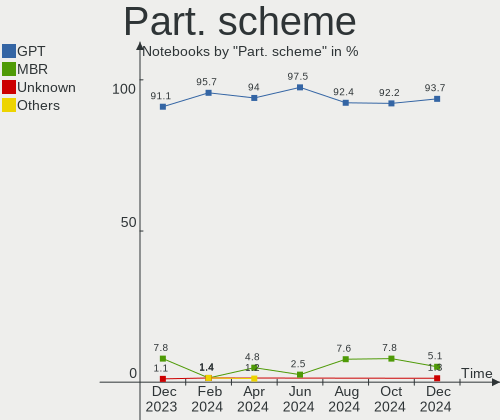
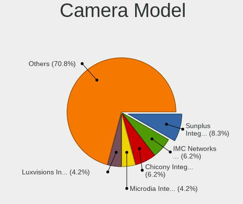

BSD - Hardware Trends (Notebooks)
---------------------------------

A project to identify most popular hardware characteristics and track their change
over time based on data collected by BSD users at https://BSD-Hardware.info.

Anyone can contribute to this report by the [hw-probe](https://github.com/linuxhw/hw-probe/blob/master/INSTALL.BSD.md) tool:

    hw-probe -all -upload

This report is for one last month. Overall report since the beginning of time: [TestCoverage](https://github.com/bsdhw/TestCoverage)

Period: Oct, 2022.

Contents
--------

* [ System ](#system)
  - [ OS                       ](#os)
  - [ OS Family                ](#os-family)
  - [ Arch                     ](#arch)
  - [ DE                       ](#de)
  - [ Display Server           ](#display-server)
  - [ Display Manager          ](#display-manager)
  - [ OS Lang                  ](#os-lang)
  - [ Boot Mode                ](#boot-mode)
  - [ Filesystem               ](#filesystem)
  - [ Part. scheme             ](#part-scheme)

* [ Board ](#board)
  - [ Vendor                   ](#vendor)
  - [ Model                    ](#model)
  - [ Model Family             ](#model-family)
  - [ MFG Year                 ](#mfg-year)
  - [ Form Factor              ](#form-factor)
  - [ Coreboot                 ](#coreboot)
  - [ RAM Size                 ](#ram-size)
  - [ RAM Used                 ](#ram-used)
  - [ Total Drives             ](#total-drives)
  - [ Has CD-ROM               ](#has-cd-rom)
  - [ Has Ethernet             ](#has-ethernet)
  - [ Has WiFi                 ](#has-wifi)
  - [ Has Bluetooth            ](#has-bluetooth)

* [ Location ](#location)
  - [ Country                  ](#country)
  - [ City                     ](#city)

* [ Drives ](#drives)
  - [ Drive Vendor             ](#drive-vendor)
  - [ Drive Model              ](#drive-model)
  - [ HDD Vendor               ](#hdd-vendor)
  - [ SSD Vendor               ](#ssd-vendor)
  - [ Drive Kind               ](#drive-kind)
  - [ Drive Connector          ](#drive-connector)
  - [ Drive Size               ](#drive-size)
  - [ Space Total              ](#space-total)
  - [ Space Used               ](#space-used)
  - [ Malfunc. Drives          ](#malfunc-drives)
  - [ Malfunc. Drive Vendor    ](#malfunc-drive-vendor)
  - [ Malfunc. HDD Vendor      ](#malfunc-hdd-vendor)
  - [ Malfunc. Drive Kind      ](#malfunc-drive-kind)
  - [ Failed Drives            ](#failed-drives)
  - [ Failed Drive Vendor      ](#failed-drive-vendor)
  - [ Drive Status             ](#drive-status)

* [ Storage controller ](#storage-controller)
  - [ Storage Vendor           ](#storage-vendor)
  - [ Storage Model            ](#storage-model)
  - [ Storage Kind             ](#storage-kind)

* [ Processor ](#processor)
  - [ CPU Vendor               ](#cpu-vendor)
  - [ CPU Model                ](#cpu-model)
  - [ CPU Model Family         ](#cpu-model-family)
  - [ CPU Cores                ](#cpu-cores)
  - [ CPU Sockets              ](#cpu-sockets)
  - [ CPU Threads              ](#cpu-threads)
  - [ CPU Microarch            ](#cpu-microarch)

* [ Graphics ](#graphics)
  - [ GPU Vendor               ](#gpu-vendor)
  - [ GPU Model                ](#gpu-model)
  - [ GPU Combo                ](#gpu-combo)
  - [ GPU Driver               ](#gpu-driver)
  - [ GPU Memory               ](#gpu-memory)

* [ Monitor ](#monitor)
  - [ Monitor Vendor           ](#monitor-vendor)
  - [ Monitor Model            ](#monitor-model)
  - [ Monitor Resolution       ](#monitor-resolution)
  - [ Monitor Diagonal         ](#monitor-diagonal)
  - [ Monitor Width            ](#monitor-width)
  - [ Aspect Ratio             ](#aspect-ratio)
  - [ Monitor Area             ](#monitor-area)
  - [ Pixel Density            ](#pixel-density)
  - [ Multiple Monitors        ](#multiple-monitors)

* [ Network ](#network)
  - [ Net Controller Vendor    ](#net-controller-vendor)
  - [ Net Controller Model     ](#net-controller-model)
  - [ Wireless Vendor          ](#wireless-vendor)
  - [ Wireless Model           ](#wireless-model)
  - [ Ethernet Vendor          ](#ethernet-vendor)
  - [ Ethernet Model           ](#ethernet-model)
  - [ Net Controller Kind      ](#net-controller-kind)
  - [ Used Controller          ](#used-controller)
  - [ NICs                     ](#nics)
  - [ IPv6                     ](#ipv6)

* [ Bluetooth ](#bluetooth)
  - [ Bluetooth Vendor         ](#bluetooth-vendor)
  - [ Bluetooth Model          ](#bluetooth-model)

* [ Sound ](#sound)
  - [ Sound Vendor             ](#sound-vendor)
  - [ Sound Model              ](#sound-model)

* [ Memory ](#memory)
  - [ Memory Vendor            ](#memory-vendor)
  - [ Memory Model             ](#memory-model)
  - [ Memory Kind              ](#memory-kind)
  - [ Memory Form Factor       ](#memory-form-factor)
  - [ Memory Size              ](#memory-size)
  - [ Memory Speed             ](#memory-speed)

* [ Printers & scanners ](#printers--scanners)
  - [ Printer Vendor           ](#printer-vendor)
  - [ Printer Model            ](#printer-model)
  - [ Scanner Vendor           ](#scanner-vendor)
  - [ Scanner Model            ](#scanner-model)

* [ Camera ](#camera)
  - [ Camera Vendor            ](#camera-vendor)
  - [ Camera Model             ](#camera-model)

* [ Security ](#security)
  - [ Fingerprint Vendor       ](#fingerprint-vendor)
  - [ Fingerprint Model        ](#fingerprint-model)
  - [ Chipcard Vendor          ](#chipcard-vendor)
  - [ Chipcard Model           ](#chipcard-model)

* [ Unsupported ](#unsupported)
  - [ Unsupported Devices      ](#unsupported-devices)
  - [ Unsupported Device Types ](#unsupported-device-types)

System
------

OS
--

Installed operating systems

| Name                 | Notebooks | Percent |
|----------------------|-----------|---------|
| helloSystem 0.7.0    | 15        | 20.27%  |
| OpenBSD 7.2          | 14        | 18.92%  |
| FreeBSD 13.1         | 10        | 13.51%  |
| FreeBSD 13.1-p2      | 8         | 10.81%  |
| OPNsense 22.7.6      | 6         | 8.11%   |
| helloSystem 0.8.0    | 4         | 5.41%   |
| OPNsense 22.7.5      | 3         | 4.05%   |
| OpenBSD 7.1          | 2         | 2.7%    |
| OPNsense 23.1        | 1         | 1.35%   |
| OPNsense 22.7.4      | 1         | 1.35%   |
| OPNsense 22.4.3      | 1         | 1.35%   |
| NomadBSD 5806f915    | 1         | 1.35%   |
| MidnightBSD 3.0.0    | 1         | 1.35%   |
| GhostBSD 22.10.30    | 1         | 1.35%   |
| GhostBSD 22.09.16    | 1         | 1.35%   |
| GhostBSD 22.06.18    | 1         | 1.35%   |
| FreeBSD 14.0-CURRENT | 1         | 1.35%   |
| FreeBSD 13.1-STABLE  | 1         | 1.35%   |
| FreeBSD 13.0-p12     | 1         | 1.35%   |
| FreeBSD 13.0         | 1         | 1.35%   |

OS Family
---------

OS without a version

| Name        | Notebooks | Percent |
|-------------|-----------|---------|
| FreeBSD     | 22        | 29.73%  |
| helloSystem | 19        | 25.68%  |
| OpenBSD     | 16        | 21.62%  |
| OPNsense    | 12        | 16.22%  |
| GhostBSD    | 3         | 4.05%   |
| NomadBSD    | 1         | 1.35%   |
| MidnightBSD | 1         | 1.35%   |

Arch
----

OS architecture (x86_64, i586, etc.)

| Name  | Notebooks | Percent |
|-------|-----------|---------|
| amd64 | 70        | 94.59%  |
| i386  | 4         | 5.41%   |

DE
--

Desktop Environment

| Name         | Notebooks | Percent |
|--------------|-----------|---------|
| helloDesktop | 34        | 45.95%  |
| Console      | 15        | 20.27%  |
| TWM          | 7         | 9.46%   |
| XFCE         | 5         | 6.76%   |
| KDE5         | 5         | 6.76%   |
| GNOME        | 4         | 5.41%   |
| MATE         | 3         | 4.05%   |
| Openbox      | 1         | 1.35%   |

Display Server
--------------

X11 or Wayland

| Name    | Notebooks | Percent |
|---------|-----------|---------|
| X11     | 56        | 75.68%  |
| Console | 17        | 22.97%  |
| Wayland | 1         | 1.35%   |

Display Manager
---------------

SDDM, LightDM, etc.

| Name    | Notebooks | Percent |
|---------|-----------|---------|
| Console | 41        | 55.41%  |
| SLiM    | 21        | 28.38%  |
| SDDM    | 6         | 8.11%   |
| LightDM | 4         | 5.41%   |
| GDM     | 2         | 2.7%    |

OS Lang
-------

Language

| Lang    | Notebooks | Percent |
|---------|-----------|---------|
| Unknown | 29        | 39.19%  |
| en_US   | 23        | 31.08%  |
| C       | 14        | 18.92%  |
| fr_FR   | 3         | 4.05%   |
| de_DE   | 3         | 4.05%   |
| fi_FI   | 1         | 1.35%   |
| en_CA   | 1         | 1.35%   |

Boot Mode
---------

EFI or BIOS

| Mode | Notebooks | Percent |
|------|-----------|---------|
| EFI  | 58        | 78.38%  |
| BIOS | 16        | 21.62%  |

Filesystem
----------

Type of filesystem

| Type   | Notebooks | Percent |
|--------|-----------|---------|
| Zfs    | 40        | 54.05%  |
| Ffs    | 16        | 21.62%  |
| Ufs    | 11        | 14.86%  |
| Cd9660 | 7         | 9.46%   |

Part. scheme
------------

Scheme of partitioning

| Type | Notebooks | Percent |
|------|-----------|---------|
| GPT  | 60        | 81.08%  |
| MBR  | 14        | 18.92%  |

Board
-----

Vendor
------

Motherboard manufacturer

| Name                           | Notebooks | Percent |
|--------------------------------|-----------|---------|
| Lenovo                         | 23        | 31.08%  |
| Dell                           | 10        | 13.51%  |
| Acer                           | 8         | 10.81%  |
| Hewlett-Packard                | 7         | 9.46%   |
| TUXEDO                         | 3         | 4.05%   |
| Fujitsu                        | 3         | 4.05%   |
| Panasonic                      | 2         | 2.7%    |
| MSI                            | 2         | 2.7%    |
| Matsushita Electric Industrial | 2         | 2.7%    |
| Intel                          | 2         | 2.7%    |
| Deciso                         | 2         | 2.7%    |
| ASUSTek Computer               | 2         | 2.7%    |
| Apple                          | 2         | 2.7%    |
| Unknown                        | 2         | 2.7%    |
| Toshiba                        | 1         | 1.35%   |
| Samsung Electronics            | 1         | 1.35%   |
| Google                         | 1         | 1.35%   |
| Alienware                      | 1         | 1.35%   |

Model
-----

Motherboard model

| Name                                        | Notebooks | Percent |
|---------------------------------------------|-----------|---------|
| TUXEDO Aura 15 Gen1                         | 2         | 2.7%    |
| Intel H81U                                  | 2         | 2.7%    |
| Fujitsu LIFEBOOK E752                       | 2         | 2.7%    |
| Dell Precision M4500                        | 2         | 2.7%    |
| Dell Latitude E6420                         | 2         | 2.7%    |
| Dell Latitude 5591                          | 2         | 2.7%    |
| Deciso NetBoard-A10                         | 2         | 2.7%    |
| Unknown                                     | 2         | 2.7%    |
| TUXEDO InfinityBook S 15 Gen6               | 1         | 1.35%   |
| Toshiba NB300                               | 1         | 1.35%   |
| Samsung Q430/Q530                           | 1         | 1.35%   |
| Panasonic CF-53AAGHYDM                      | 1         | 1.35%   |
| Panasonic CF-52PFPBSFQ                      | 1         | 1.35%   |
| MSI PS63 Modern 8M                          | 1         | 1.35%   |
| MSI GL65 Leopard 10SFSK                     | 1         | 1.35%   |
| Matsushita Electric Industrial CF-51RCVDNLM | 1         | 1.35%   |
| Matsushita Electric Industrial CF-48V4KNDQM | 1         | 1.35%   |
| Lenovo XiaoXinPro-13API 2019 81XD           | 1         | 1.35%   |
| Lenovo ThinkPad X270 20HMS04P00             | 1         | 1.35%   |
| Lenovo ThinkPad X220 429043U                | 1         | 1.35%   |
| Lenovo ThinkPad X1 Carbon Gen 10 21CBCTO1WW | 1         | 1.35%   |
| Lenovo ThinkPad W530 24491A0                | 1         | 1.35%   |
| Lenovo ThinkPad T61 765912G                 | 1         | 1.35%   |
| Lenovo ThinkPad T590 20N4CTO1WW             | 1         | 1.35%   |
| Lenovo ThinkPad T470p 20J7S0BR00            | 1         | 1.35%   |
| Lenovo ThinkPad T460 20FMS10N00             | 1         | 1.35%   |
| Lenovo ThinkPad T440s 20AR003SMN            | 1         | 1.35%   |
| Lenovo ThinkPad T430 2347GZU                | 1         | 1.35%   |
| Lenovo ThinkPad T430 23446FP                | 1         | 1.35%   |
| Lenovo ThinkPad T420s 4174DL7               | 1         | 1.35%   |
| Lenovo ThinkPad T420s 41742BU               | 1         | 1.35%   |
| Lenovo ThinkPad T410 2537N24                | 1         | 1.35%   |
| Lenovo ThinkPad T410 2518C3U                | 1         | 1.35%   |
| Lenovo ThinkPad E15 2ORES4XJ00              | 1         | 1.35%   |
| Lenovo ThinkPad E14 Gen 2 20T6S00D00        | 1         | 1.35%   |
| Lenovo ThinkPad A485 20MU000VUS             | 1         | 1.35%   |
| Lenovo Legion 5 15IMH05 82AU                | 1         | 1.35%   |
| Lenovo IdeaPad 3 15ALC6 82KU                | 1         | 1.35%   |
| Lenovo IdeaPad 3 15ADA05 81W1               | 1         | 1.35%   |
| Lenovo G500 20236                           | 1         | 1.35%   |

Model Family
------------

Motherboard model prefix

| Name                                        | Notebooks | Percent |
|---------------------------------------------|-----------|---------|
| Lenovo ThinkPad                             | 18        | 24.32%  |
| Acer Aspire                                 | 6         | 8.11%   |
| Dell Precision                              | 4         | 5.41%   |
| Dell Latitude                               | 4         | 5.41%   |
| Fujitsu LIFEBOOK                            | 3         | 4.05%   |
| TUXEDO Aura                                 | 2         | 2.7%    |
| Lenovo IdeaPad                              | 2         | 2.7%    |
| Intel H81U                                  | 2         | 2.7%    |
| Dell Inspiron                               | 2         | 2.7%    |
| Deciso NetBoard-A10                         | 2         | 2.7%    |
| Unknown                                     | 2         | 2.7%    |
| TUXEDO InfinityBook                         | 1         | 1.35%   |
| Toshiba NB300                               | 1         | 1.35%   |
| Samsung Q430                                | 1         | 1.35%   |
| Panasonic CF-53AAGHYDM                      | 1         | 1.35%   |
| Panasonic CF-52PFPBSFQ                      | 1         | 1.35%   |
| MSI PS63                                    | 1         | 1.35%   |
| MSI GL65                                    | 1         | 1.35%   |
| Matsushita Electric Industrial CF-51RCVDNLM | 1         | 1.35%   |
| Matsushita Electric Industrial CF-48V4KNDQM | 1         | 1.35%   |
| Lenovo XiaoXinPro-13API                     | 1         | 1.35%   |
| Lenovo Legion                               | 1         | 1.35%   |
| Lenovo G500                                 | 1         | 1.35%   |
| HP SpectreXT                                | 1         | 1.35%   |
| HP ProBook                                  | 1         | 1.35%   |
| HP Pavilion                                 | 1         | 1.35%   |
| HP Laptop                                   | 1         | 1.35%   |
| HP ENVY                                     | 1         | 1.35%   |
| HP Compaq                                   | 1         | 1.35%   |
| HP 255                                      | 1         | 1.35%   |
| Google Edgar                                | 1         | 1.35%   |
| ASUS K53TA                                  | 1         | 1.35%   |
| ASUS 1000HE                                 | 1         | 1.35%   |
| Apple MacBookPro8                           | 1         | 1.35%   |
| Apple MacBook4                              | 1         | 1.35%   |
| Alienware m15                               | 1         | 1.35%   |
| Acer TravelMate                             | 1         | 1.35%   |
| Acer AS1810T                                | 1         | 1.35%   |

MFG Year
--------

Motherboard manufacture year

| Year | Notebooks | Percent |
|------|-----------|---------|
| 2010 | 9         | 12.16%  |
| 2020 | 8         | 10.81%  |
| 2019 | 7         | 9.46%   |
| 2011 | 7         | 9.46%   |
| 2022 | 6         | 8.11%   |
| 2013 | 6         | 8.11%   |
| 2021 | 4         | 5.41%   |
| 2018 | 4         | 5.41%   |
| 2017 | 4         | 5.41%   |
| 2015 | 4         | 5.41%   |
| 2012 | 4         | 5.41%   |
| 2014 | 3         | 4.05%   |
| 2016 | 2         | 2.7%    |
| 2008 | 2         | 2.7%    |
| 2009 | 1         | 1.35%   |
| 2007 | 1         | 1.35%   |
| 2006 | 1         | 1.35%   |
| 2002 | 1         | 1.35%   |

Form Factor
-----------

Physical design of the computer

| Name     | Notebooks | Percent |
|----------|-----------|---------|
| Notebook | 74        | 100%    |

Coreboot
--------

Have coreboot on board

| Used | Notebooks | Percent |
|------|-----------|---------|
| No   | 73        | 98.65%  |
| Yes  | 1         | 1.35%   |

RAM Size
--------

Total RAM memory

| Size in GB  | Notebooks | Percent |
|-------------|-----------|---------|
| 8.01-16.0   | 25        | 33.78%  |
| 4.01-8.0    | 16        | 21.62%  |
| 16.01-24.0  | 13        | 17.57%  |
| 32.01-64.0  | 7         | 9.46%   |
| 2.01-3.0    | 6         | 8.11%   |
| 3.01-4.0    | 5         | 6.76%   |
| 64.01-256.0 | 1         | 1.35%   |
| 0.51-1.0    | 1         | 1.35%   |

RAM Used
--------

Used RAM memory

| Used GB  | Notebooks | Percent |
|----------|-----------|---------|
| 0.01-0.5 | 42        | 56.76%  |
| 0.51-1.0 | 16        | 21.62%  |
| 1.01-2.0 | 10        | 13.51%  |
| 2.01-3.0 | 4         | 5.41%   |
| 0        | 2         | 2.7%    |

Total Drives
------------

Number of drives on board

| Drives | Notebooks | Percent |
|--------|-----------|---------|
| 1      | 57        | 77.03%  |
| 2      | 13        | 17.57%  |
| 0      | 3         | 4.05%   |
| 3      | 1         | 1.35%   |

Has CD-ROM
----------

Has CD-ROM on board

| Presented | Notebooks | Percent |
|-----------|-----------|---------|
| No        | 62        | 83.78%  |
| Yes       | 12        | 16.22%  |

Has Ethernet
------------

Has Ethernet on board

| Presented | Notebooks | Percent |
|-----------|-----------|---------|
| Yes       | 63        | 85.14%  |
| No        | 11        | 14.86%  |

Has WiFi
--------

Has WiFi module

| Presented | Notebooks | Percent |
|-----------|-----------|---------|
| Yes       | 68        | 91.89%  |
| No        | 6         | 8.11%   |

Has Bluetooth
-------------

Has Bluetooth module

| Presented | Notebooks | Percent |
|-----------|-----------|---------|
| Yes       | 52        | 70.27%  |
| No        | 22        | 29.73%  |

Location
--------

Country
-------

Geographic location (country)

| Country            | Notebooks | Percent |
|--------------------|-----------|---------|
| Canada             | 13        | 17.57%  |
| USA                | 11        | 14.86%  |
| France             | 7         | 9.46%   |
| Germany            | 6         | 8.11%   |
| UK                 | 5         | 6.76%   |
| Russia             | 4         | 5.41%   |
| Spain              | 3         | 4.05%   |
| India              | 3         | 4.05%   |
| Finland            | 2         | 2.7%    |
| China              | 2         | 2.7%    |
| Venezuela          | 1         | 1.35%   |
| South Africa       | 1         | 1.35%   |
| Portugal           | 1         | 1.35%   |
| Poland             | 1         | 1.35%   |
| Netherlands        | 1         | 1.35%   |
| Mexico             | 1         | 1.35%   |
| Malta              | 1         | 1.35%   |
| Lithuania          | 1         | 1.35%   |
| Kazakhstan         | 1         | 1.35%   |
| Italy              | 1         | 1.35%   |
| Guadeloupe         | 1         | 1.35%   |
| Dominican Republic | 1         | 1.35%   |
| Denmark            | 1         | 1.35%   |
| Croatia            | 1         | 1.35%   |
| Costa Rica         | 1         | 1.35%   |
| Brazil             | 1         | 1.35%   |
| Belarus            | 1         | 1.35%   |
| Argentina          | 1         | 1.35%   |

City
----

Geographic location (city)

| City                | Notebooks | Percent |
|---------------------|-----------|---------|
| Montreal            | 10        | 13.51%  |
| New York            | 2         | 2.7%    |
| Carry-le-Rouet      | 2         | 2.7%    |
| Ypsilanti           | 1         | 1.35%   |
| Weissach            | 1         | 1.35%   |
| Weifang             | 1         | 1.35%   |
| Vitoria-Gasteiz     | 1         | 1.35%   |
| Vilnius             | 1         | 1.35%   |
| Vancouver           | 1         | 1.35%   |
| Turku               | 1         | 1.35%   |
| Tudela de Duero     | 1         | 1.35%   |
| Tsarskoye Selo      | 1         | 1.35%   |
| Swieqi              | 1         | 1.35%   |
| Sun Prairie         | 1         | 1.35%   |
| Stratford           | 1         | 1.35%   |
| Santo Domingo Este  | 1         | 1.35%   |
| San José           | 1         | 1.35%   |
| Roubaix             | 1         | 1.35%   |
| Rome                | 1         | 1.35%   |
| Rochester           | 1         | 1.35%   |
| Rennes              | 1         | 1.35%   |
| Radom               | 1         | 1.35%   |
| Presidente Prudente | 1         | 1.35%   |
| Poreč              | 1         | 1.35%   |
| Paris               | 1         | 1.35%   |
| Orizaba             | 1         | 1.35%   |
| Nuremberg           | 1         | 1.35%   |
| Noisy-le-Grand      | 1         | 1.35%   |
| Noida               | 1         | 1.35%   |
| Münster            | 1         | 1.35%   |
| Moscow              | 1         | 1.35%   |
| Minusinsk           | 1         | 1.35%   |
| Minsk               | 1         | 1.35%   |
| Memphis             | 1         | 1.35%   |
| Maracaibo           | 1         | 1.35%   |
| Madrid              | 1         | 1.35%   |
| Lucknow             | 1         | 1.35%   |
| Lübeck             | 1         | 1.35%   |
| Los Angeles         | 1         | 1.35%   |
| Le Gosier           | 1         | 1.35%   |

Drives
------

Drive Vendor
------------

Hard drive vendors

| Vendor              | Notebooks | Drives | Percent |
|---------------------|-----------|--------|---------|
| Samsung Electronics | 14        | 15     | 16.87%  |
| WDC                 | 12        | 12     | 14.46%  |
| Kingston            | 10        | 11     | 12.05%  |
| Seagate             | 8         | 8      | 9.64%   |
| Toshiba             | 6         | 6      | 7.23%   |
| Hitachi             | 4         | 4      | 4.82%   |
| Crucial             | 4         | 4      | 4.82%   |
| Intenso             | 3         | 3      | 3.61%   |
| Transcend           | 2         | 2      | 2.41%   |
| SanDisk             | 2         | 2      | 2.41%   |
| China               | 2         | 2      | 2.41%   |
| A-DATA Technology   | 2         | 2      | 2.41%   |
| UMIS                | 1         | 1      | 1.2%    |
| SPCC                | 1         | 1      | 1.2%    |
| Smartbuy            | 1         | 1      | 1.2%    |
| SK hynix            | 1         | 1      | 1.2%    |
| PNY                 | 1         | 1      | 1.2%    |
| NVMe                | 1         | 2      | 1.2%    |
| LITEONIT            | 1         | 1      | 1.2%    |
| Lexar               | 1         | 1      | 1.2%    |
| KIOXIA              | 1         | 1      | 1.2%    |
| KingSpec            | 1         | 1      | 1.2%    |
| Intel               | 1         | 1      | 1.2%    |
| Hewlett-Packard     | 1         | 1      | 1.2%    |
| Fujitsu             | 1         | 1      | 1.2%    |
| Corsair             | 1         | 1      | 1.2%    |

Drive Model
-----------

Hard drive models

| Model                                  | Notebooks | Percent |
|----------------------------------------|-----------|---------|
| Kingston SA400S37240G 240GB            | 4         | 4.76%   |
| WDC WD3200BPVT-80JJ5T0 320GB           | 2         | 2.38%   |
| Seagate ST1000LM035-1RK172 1TB         | 2         | 2.38%   |
| Seagate ST1000LM024 HN-M101MBB 1TB     | 2         | 2.38%   |
| SanDisk SSD PLUS 240GB                 | 2         | 2.38%   |
| Samsung SSD 970 EVO Plus 2TB           | 2         | 2.38%   |
| Intenso SSD 128GB                      | 2         | 2.38%   |
| China MSATA 32GB SSD                   | 2         | 2.38%   |
| WDC WDS120G2G0A-00JH30 120GB           | 1         | 1.19%   |
| WDC WDS100T2B0C-00PXH0 1TB             | 1         | 1.19%   |
| WDC WD7500BPKX-00HPJT0 752GB           | 1         | 1.19%   |
| WDC WD7500BPKT-75PK4T0 752GB           | 1         | 1.19%   |
| WDC WD7500BPKT-00PK4T0 752GB           | 1         | 1.19%   |
| WDC WD5000LPLX-00ZNTT0 500GB           | 1         | 1.19%   |
| WDC WD3200BPVT-80ZEST0 320GB           | 1         | 1.19%   |
| WDC WD3200BEVE-00A0HT0 320GB           | 1         | 1.19%   |
| WDC WD10JPVX-00JC3T0 1TB               | 1         | 1.19%   |
| WDC WD10JPLX-00MBPT0 1TB               | 1         | 1.19%   |
| UMIS RPJTJ256MEE1OWX 256GB             | 1         | 1.19%   |
| Transcend TS256GMTE652T2 256GB         | 1         | 1.19%   |
| Transcend TS128GMTE110S 128GB          | 1         | 1.19%   |
| Toshiba THNSNK256GVN8 M.2 2280 256GB   | 1         | 1.19%   |
| Toshiba MQ01ACF032 320GB               | 1         | 1.19%   |
| Toshiba MQ01ABF032 320GB               | 1         | 1.19%   |
| Toshiba MK2555GSX 250GB                | 1         | 1.19%   |
| Toshiba KXG50ZNV512G NVMe 512GB        | 1         | 1.19%   |
| Toshiba KBG40ZNT512G MEMORY 512GB      | 1         | 1.19%   |
| SPCC Solid State Disk 120GB            | 1         | 1.19%   |
| Smartbuy SSD 256GB                     | 1         | 1.19%   |
| SK hynix SKHynix_HFS256GDE9X081N 256GB | 1         | 1.19%   |
| Seagate ST9320423AS 320GB              | 1         | 1.19%   |
| Seagate ST9320325AS 320GB              | 1         | 1.19%   |
| Seagate ST9160821A 160GB               | 1         | 1.19%   |
| Seagate ST1000LM014-1EJ164 1TB         | 1         | 1.19%   |
| Samsung SSD 980 PRO 250GB              | 1         | 1.19%   |
| Samsung SSD 980 500GB                  | 1         | 1.19%   |
| Samsung SSD 980 1TB                    | 1         | 1.19%   |
| Samsung SSD 970 EVO Plus 500GB         | 1         | 1.19%   |
| Samsung SSD 860 EVO 250GB              | 1         | 1.19%   |
| Samsung MZVLB512HBJQ-000L2 512GB       | 1         | 1.19%   |

HDD Vendor
----------

Hard disk drive vendors

| Vendor  | Notebooks | Drives | Percent |
|---------|-----------|--------|---------|
| WDC     | 10        | 10     | 37.04%  |
| Seagate | 8         | 8      | 29.63%  |
| Hitachi | 4         | 4      | 14.81%  |
| Toshiba | 3         | 3      | 11.11%  |
| NVMe    | 1         | 2      | 3.7%    |
| Fujitsu | 1         | 1      | 3.7%    |

SSD Vendor
----------

Solid state drive vendors

| Vendor              | Notebooks | Drives | Percent |
|---------------------|-----------|--------|---------|
| Kingston            | 9         | 10     | 24.32%  |
| Samsung Electronics | 6         | 6      | 16.22%  |
| Crucial             | 4         | 4      | 10.81%  |
| Intenso             | 3         | 3      | 8.11%   |
| SanDisk             | 2         | 2      | 5.41%   |
| China               | 2         | 2      | 5.41%   |
| WDC                 | 1         | 1      | 2.7%    |
| Toshiba             | 1         | 1      | 2.7%    |
| SPCC                | 1         | 1      | 2.7%    |
| Smartbuy            | 1         | 1      | 2.7%    |
| PNY                 | 1         | 1      | 2.7%    |
| LITEONIT            | 1         | 1      | 2.7%    |
| Lexar               | 1         | 1      | 2.7%    |
| KingSpec            | 1         | 1      | 2.7%    |
| Hewlett-Packard     | 1         | 1      | 2.7%    |
| Corsair             | 1         | 1      | 2.7%    |
| A-DATA Technology   | 1         | 1      | 2.7%    |

Drive Kind
----------

HDD or SSD

| Kind | Notebooks | Drives | Percent |
|------|-----------|--------|---------|
| SSD  | 34        | 38     | 43.04%  |
| HDD  | 27        | 28     | 34.18%  |
| NVMe | 18        | 20     | 22.78%  |

Drive Connector
---------------

SATA, SAS, NVMe, etc.

| Type | Notebooks | Drives | Percent |
|------|-----------|--------|---------|
| SATA | 55        | 66     | 75.34%  |
| NVMe | 18        | 20     | 24.66%  |

Drive Size
----------

Size of hard drive

| Size in TB | Notebooks | Drives | Percent |
|------------|-----------|--------|---------|
| 0.01-0.5   | 44        | 48     | 72.13%  |
| 0.51-1.0   | 13        | 13     | 21.31%  |
| 1.01-2.0   | 4         | 5      | 6.56%   |

Space Total
-----------

Amount of disk space available on the file system

| Size in GB | Notebooks | Percent |
|------------|-----------|---------|
| 101-250    | 26        | 35.14%  |
| 21-50      | 13        | 17.57%  |
| 251-500    | 12        | 16.22%  |
| 1-20       | 9         | 12.16%  |
| 501-1000   | 8         | 10.81%  |
| 51-100     | 4         | 5.41%   |
| 1001-2000  | 1         | 1.35%   |
| Unknown    | 1         | 1.35%   |

Space Used
----------

Amount of used disk space

| Used GB | Notebooks | Percent |
|---------|-----------|---------|
| 1-20    | 62        | 83.78%  |
| 21-50   | 6         | 8.11%   |
| 101-250 | 4         | 5.41%   |
| 251-500 | 1         | 1.35%   |
| Unknown | 1         | 1.35%   |

Malfunc. Drives
---------------

Drive models with a malfunction

| Model                                        | Notebooks | Drives | Percent |
|----------------------------------------------|-----------|--------|---------|
| WDC WD3200BPVT-80JJ5T0 320GB                 | 2         | 2      | 11.76%  |
| Seagate ST1000LM024 HN-M101MBB 1TB           | 2         | 2      | 11.76%  |
| WDC WD3200BPVT-80ZEST0 320GB                 | 1         | 1      | 5.88%   |
| Toshiba THNSNK256GVN8 M.2 2280 256GB         | 1         | 1      | 5.88%   |
| Toshiba MQ01ACF032 320GB                     | 1         | 1      | 5.88%   |
| Toshiba MQ01ABF032 320GB                     | 1         | 1      | 5.88%   |
| Seagate ST9320325AS 320GB                    | 1         | 1      | 5.88%   |
| Seagate ST1000LM014-1EJ164 1TB               | 1         | 1      | 5.88%   |
| Samsung Electronics SSD 980 500GB            | 1         | 1      | 5.88%   |
| Samsung Electronics MZMPA128HMFU-000H1 128GB | 1         | 1      | 5.88%   |
| Kingston SVP200S37A120G 120GB                | 1         | 1      | 5.88%   |
| Kingston SH103S3240G 240GB                   | 1         | 1      | 5.88%   |
| Hitachi HTS545025B9A300 250GB                | 1         | 1      | 5.88%   |
| Corsair Force LS SSD 240GB                   | 1         | 1      | 5.88%   |
| A-DATA Technology SP550 480GB                | 1         | 1      | 5.88%   |

Malfunc. Drive Vendor
---------------------

Vendors of faulty drives

| Vendor              | Notebooks | Drives | Percent |
|---------------------|-----------|--------|---------|
| Seagate             | 4         | 4      | 25%     |
| WDC                 | 3         | 3      | 18.75%  |
| Toshiba             | 3         | 3      | 18.75%  |
| Samsung Electronics | 2         | 2      | 12.5%   |
| Kingston            | 1         | 2      | 6.25%   |
| Hitachi             | 1         | 1      | 6.25%   |
| Corsair             | 1         | 1      | 6.25%   |
| A-DATA Technology   | 1         | 1      | 6.25%   |

Malfunc. HDD Vendor
-------------------

Vendors of faulty HDD drives

| Vendor  | Notebooks | Drives | Percent |
|---------|-----------|--------|---------|
| Seagate | 4         | 4      | 40%     |
| WDC     | 3         | 3      | 30%     |
| Toshiba | 2         | 2      | 20%     |
| Hitachi | 1         | 1      | 10%     |

Malfunc. Drive Kind
-------------------

Kinds of faulty drives

| Kind | Notebooks | Drives | Percent |
|------|-----------|--------|---------|
| HDD  | 10        | 10     | 62.5%   |
| SSD  | 5         | 6      | 31.25%  |
| NVMe | 1         | 1      | 6.25%   |

Failed Drives
-------------

Failed drive models

Zero info for selected period =(

Failed Drive Vendor
-------------------

Failed drive vendors

Zero info for selected period =(

Drive Status
------------

Number of failed and malfunc. drives

| Status   | Notebooks | Drives | Percent |
|----------|-----------|--------|---------|
| Works    | 59        | 67     | 78.67%  |
| Malfunc  | 15        | 17     | 20%     |
| Detected | 1         | 2      | 1.33%   |

Storage controller
------------------

Storage Vendor
--------------

Storage controller vendors

| Vendor                      | Notebooks | Percent |
|-----------------------------|-----------|---------|
| Intel                       | 53        | 65.43%  |
| AMD                         | 9         | 11.11%  |
| Samsung Electronics         | 8         | 9.88%   |
| SanDisk                     | 2         | 2.47%   |
| KIOXIA                      | 2         | 2.47%   |
| Unknown                     | 2         | 2.47%   |
| Union Memory (Shenzhen)     | 1         | 1.23%   |
| Toshiba                     | 1         | 1.23%   |
| SK hynix                    | 1         | 1.23%   |
| Realtek Semiconductor       | 1         | 1.23%   |
| Kingston Technology Company | 1         | 1.23%   |

Storage Model
-------------

Storage controller models

| Model                                                                                  | Notebooks | Percent |
|----------------------------------------------------------------------------------------|-----------|---------|
| Intel 7 Series Chipset Family 6-port SATA Controller [AHCI mode]                       | 10        | 11.36%  |
| AMD FCH SATA Controller [AHCI mode]                                                    | 8         | 9.09%   |
| Samsung NVMe SSD Controller SM981/PM981/PM983                                          | 5         | 5.68%   |
| Intel 8 Series SATA Controller 1 [AHCI mode]                                           | 5         | 5.68%   |
| Intel 6 Series/C200 Series Chipset Family 6 port Mobile SATA AHCI Controller           | 5         | 5.68%   |
| Intel 5 Series/3400 Series Chipset 6 port SATA AHCI Controller                         | 5         | 5.68%   |
| Unknown                                                                                | 4         | 4.55%   |
| Intel Sunrise Point-LP SATA Controller [AHCI mode]                                     | 3         | 3.41%   |
| Intel 82801 Mobile SATA Controller [RAID mode]                                         | 3         | 3.41%   |
| Samsung NVMe SSD Controller 980                                                        | 2         | 2.27%   |
| KIOXIA NVMe SSD Controller BG4                                                         | 2         | 2.27%   |
| Intel Cannon Lake Mobile PCH SATA AHCI Controller                                      | 2         | 2.27%   |
| Intel 82801IBM/IEM (ICH9M/ICH9M-E) 4 port SATA Controller [AHCI mode]                  | 2         | 2.27%   |
| Intel 82801HM/HEM (ICH8M/ICH8M-E) SATA Controller [AHCI mode]                          | 2         | 2.27%   |
| Intel 82801HM/HEM (ICH8M/ICH8M-E) IDE Controller                                       | 2         | 2.27%   |
| Intel 82801GBM/GHM (ICH7-M Family) SATA Controller [IDE mode]                          | 2         | 2.27%   |
| Intel 6 Series/C200 Series Chipset Family Mobile SATA Controller (IDE mode, ports 4-5) | 2         | 2.27%   |
| Intel 6 Series/C200 Series Chipset Family Mobile SATA Controller (IDE mode, ports 0-3) | 2         | 2.27%   |
| Intel 400 Series Chipset Family SATA AHCI Controller                                   | 2         | 2.27%   |
| Toshiba unknown                                                                        | 1         | 1.14%   |
| SK hynix Gold P31 SSD                                                                  | 1         | 1.14%   |
| SanDisk WD Blue SN570 NVMe SSD                                                         | 1         | 1.14%   |
| SanDisk WD Blue SN550 NVMe SSD                                                         | 1         | 1.14%   |
| Samsung NVMe SSD Controller PM9A1/PM9A3/980PRO                                         | 1         | 1.14%   |
| Kingston Company OM3PDP3 NVMe SSD                                                      | 1         | 1.14%   |
| Intel Volume Management Device NVMe RAID Controller                                    | 1         | 1.14%   |
| Intel Tiger Lake-LP SATA Controller                                                    | 1         | 1.14%   |
| Intel SSD 660P Series                                                                  | 1         | 1.14%   |
| Intel Q170/Q150/B150/H170/H110/Z170/CM236 Chipset SATA Controller [AHCI Mode]          | 1         | 1.14%   |
| Intel NM10/ICH7 Family SATA Controller [AHCI mode]                                     | 1         | 1.14%   |
| Intel HM170/QM170 Chipset SATA Controller [AHCI Mode]                                  | 1         | 1.14%   |
| Intel Comet Lake SATA AHCI Controller                                                  | 1         | 1.14%   |
| Intel Cannon Point-LP SATA Controller [AHCI Mode]                                      | 1         | 1.14%   |
| Intel Atom Processor E3800 Series SATA AHCI Controller                                 | 1         | 1.14%   |
| Intel 82801CAM IDE U100 Controller                                                     | 1         | 1.14%   |
| Intel 7 Series Chipset Family 4-port SATA Controller [IDE mode]                        | 1         | 1.14%   |
| Intel 7 Series Chipset Family 2-port SATA Controller [IDE mode]                        | 1         | 1.14%   |
| Intel 5 Series/3400 Series Chipset 4 port SATA AHCI Controller                         | 1         | 1.14%   |
| AMD SB7x0/SB8x0/SB9x0 SATA Controller [AHCI mode]                                      | 1         | 1.14%   |

Storage Kind
------------

Kind of storage controller (IDE, SATA, NVMe, SAS, ...)

| Kind | Notebooks | Percent |
|------|-----------|---------|
| SATA | 53        | 63.86%  |
| NVMe | 18        | 21.69%  |
| IDE  | 8         | 9.64%   |
| RAID | 4         | 4.82%   |

Processor
---------

CPU Vendor
----------

Processor vendors

| Vendor | Notebooks | Percent |
|--------|-----------|---------|
| Intel  | 59        | 79.73%  |
| AMD    | 15        | 20.27%  |

CPU Model
---------

Processor models

| Model                                  | Notebooks | Percent |
|----------------------------------------|-----------|---------|
| Intel Core i5-2520M CPU @ 2.50GHz      | 4         | 5.41%   |
| Intel Core i7-8565U CPU @ 1.80GHz      | 3         | 4.05%   |
| AMD Ryzen 7 4700U with Radeon Graphics | 3         | 4.05%   |
| Intel Core i7-4600U CPU @ 2.10GHz      | 2         | 2.7%    |
| Intel Core i7-3612QM CPU @ 2.10GHz     | 2         | 2.7%    |
| Intel Core i7-10750H CPU @ 2.60GHz     | 2         | 2.7%    |
| Intel Core i5-3320M CPU @ 2.60GHz      | 2         | 2.7%    |
| Intel Core i5 CPU M 560 @ 2.67GH       | 2         | 2.7%    |
| Intel Core i5 CPU M 520 @ 2.40GHz      | 2         | 2.7%    |
| AMD Ryzen Embedded V1500B              | 2         | 2.7%    |
| Intel Pentium 4 Mobile CPU 1.60GHz     | 1         | 1.35%   |
| Intel Genuine CPU U4100 @ 1.30GHz      | 1         | 1.35%   |
| Intel Genuine CPU T2300 @ 1.66GHz      | 1         | 1.35%   |
| Intel Genuine CPU                      | 1         | 1.35%   |
| Intel Core i7-8850H CPU @ 2.60GHz      | 1         | 1.35%   |
| Intel Core i7-8750H CPU @ 2.20GHz      | 1         | 1.35%   |
| Intel Core i7-7700HQ CPU @ 2.80GHz     | 1         | 1.35%   |
| Intel Core i7-7600U CPU @ 2.80GHz      | 1         | 1.35%   |
| Intel Core i7-4810MQ CPU @ 2.80GHz     | 1         | 1.35%   |
| Intel Core i7-4500U CPU @ 1.80GHz      | 1         | 1.35%   |
| Intel Core i7-3740QM CPU @ 2.70GHz     | 1         | 1.35%   |
| Intel Core i7-3630QM CPU @ 2.40GHz     | 1         | 1.35%   |
| Intel Core i7-3520M CPU @ 2.90GHz      | 1         | 1.35%   |
| Intel Core i7-2620M CPU @ 2.70GHz      | 1         | 1.35%   |
| Intel Core i7-2620M CPU @ 2.70GH       | 1         | 1.35%   |
| Intel Core i7-10510U CPU @ 1.80GHz     | 1         | 1.35%   |
| Intel Core i5-8400H CPU @ 2.50GHz      | 1         | 1.35%   |
| Intel Core i5-7200U CPU @ 2.50GHz      | 1         | 1.35%   |
| Intel Core i5-6300U CPU @ 2.40GHz      | 1         | 1.35%   |
| Intel Core i5-6300HQ CPU @ 2.30GHz     | 1         | 1.35%   |
| Intel Core i5-3317U CPU @ 1.70GHz      | 1         | 1.35%   |
| Intel Core i5-2540M CPU @ 2.60GHz      | 1         | 1.35%   |
| Intel Core i5 CPU M 540 @ 2.53GHz      | 1         | 1.35%   |
| Intel Core i3-6006U CPU @ 2.00GHz      | 1         | 1.35%   |
| Intel Core i3-4025U CPU @ 1.90GHz      | 1         | 1.35%   |
| Intel Core i3-4010U CPU @ 1.70GHz      | 1         | 1.35%   |
| Intel Core i3-3217U CPU @ 1.80GHz      | 1         | 1.35%   |
| Intel Core i3-3110M CPU @ 2.40GHz      | 1         | 1.35%   |
| Intel Core 2 Duo CPU T8100 @ 2.10GHz   | 1         | 1.35%   |
| Intel Core 2 Duo CPU T7300 @ 2.00GHz   | 1         | 1.35%   |

CPU Model Family
----------------

Processor model prefix

| Model                   | Notebooks | Percent |
|-------------------------|-----------|---------|
| Intel Core i7           | 21        | 28.38%  |
| Intel Core i5           | 17        | 22.97%  |
| Other                   | 6         | 8.11%   |
| Intel Core i3           | 5         | 6.76%   |
| Intel Genuine           | 3         | 4.05%   |
| Intel Celeron           | 3         | 4.05%   |
| AMD Ryzen 7             | 3         | 4.05%   |
| Intel Core 2 Duo        | 2         | 2.7%    |
| AMD Ryzen Embedded      | 2         | 2.7%    |
| AMD Ryzen 5             | 2         | 2.7%    |
| AMD A8                  | 2         | 2.7%    |
| AMD A6                  | 2         | 2.7%    |
| Intel Pentium 4         | 1         | 1.35%   |
| Intel Celeron Dual-Core | 1         | 1.35%   |
| Intel Atom              | 1         | 1.35%   |
| AMD Sempron             | 1         | 1.35%   |
| AMD Ryzen 5 PRO         | 1         | 1.35%   |
| AMD Ryzen 3             | 1         | 1.35%   |

CPU Cores
---------

Number of processor cores

| Number  | Notebooks | Percent |
|---------|-----------|---------|
| 2       | 31        | 41.89%  |
| 4       | 20        | 27.03%  |
| 8       | 8         | 10.81%  |
| Unknown | 7         | 9.46%   |
| 6       | 4         | 5.41%   |
| 1       | 2         | 2.7%    |
| 20      | 1         | 1.35%   |
| 12      | 1         | 1.35%   |

CPU Sockets
-----------

Number of sockets

| Number | Notebooks | Percent |
|--------|-----------|---------|
| 1      | 73        | 98.65%  |
| 2      | 1         | 1.35%   |

CPU Threads
-----------

Threads per core (Hyper-Threading)

| Number  | Notebooks | Percent |
|---------|-----------|---------|
| 2       | 47        | 63.51%  |
| 1       | 20        | 27.03%  |
| Unknown | 7         | 9.46%   |

CPU Microarch
-------------

Microarchitecture

| Name            | Notebooks | Percent |
|-----------------|-----------|---------|
| IvyBridge       | 11        | 14.86%  |
| KabyLake        | 10        | 13.51%  |
| SandyBridge     | 7         | 9.46%   |
| Westmere        | 6         | 8.11%   |
| Haswell         | 6         | 8.11%   |
| Zen             | 4         | 5.41%   |
| Zen 2           | 3         | 4.05%   |
| TigerLake       | 3         | 4.05%   |
| Skylake         | 3         | 4.05%   |
| Penryn          | 3         | 4.05%   |
| Unknown         | 3         | 4.05%   |
| Silvermont      | 2         | 2.7%    |
| Puma            | 2         | 2.7%    |
| CometLake       | 2         | 2.7%    |
| Bonnell         | 2         | 2.7%    |
| Zen+            | 1         | 1.35%   |
| Piledriver      | 1         | 1.35%   |
| P6              | 1         | 1.35%   |
| NetBurst        | 1         | 1.35%   |
| K8 & K10 hybrid | 1         | 1.35%   |
| K10 Llano       | 1         | 1.35%   |
| Core            | 1         | 1.35%   |

Graphics
--------

GPU Vendor
----------

Vendors of graphics cards

| Vendor | Notebooks | Percent |
|--------|-----------|---------|
| Intel  | 54        | 68.35%  |
| AMD    | 15        | 18.99%  |
| Nvidia | 10        | 12.66%  |

GPU Model
---------

Graphics card models

| Model                                                                                    | Notebooks | Percent |
|------------------------------------------------------------------------------------------|-----------|---------|
| Intel 3rd Gen Core processor Graphics Controller                                         | 11        | 12.94%  |
| Intel 2nd Generation Core Processor Family Integrated Graphics Controller                | 7         | 8.24%   |
| Intel Haswell-ULT Integrated Graphics Controller                                         | 5         | 5.88%   |
| Intel WhiskeyLake-U GT2 [UHD Graphics 620]                                               | 3         | 3.53%   |
| Intel TigerLake-LP GT2 [Iris Xe Graphics]                                                | 3         | 3.53%   |
| Intel Core Processor Integrated Graphics Controller                                      | 3         | 3.53%   |
| Intel CoffeeLake-H GT2 [UHD Graphics 630]                                                | 3         | 3.53%   |
| AMD Renoir                                                                               | 3         | 3.53%   |
| Nvidia GT216GLM [Quadro FX 880M]                                                         | 2         | 2.35%   |
| Intel Skylake GT2 [HD Graphics 520]                                                      | 2         | 2.35%   |
| Intel Mobile GM965/GL960 Integrated Graphics Controller (secondary)                      | 2         | 2.35%   |
| Intel Mobile GM965/GL960 Integrated Graphics Controller (primary)                        | 2         | 2.35%   |
| Intel Mobile 945GM/GMS/GME, 943/940GML Express Integrated Graphics Controller            | 2         | 2.35%   |
| Intel Mobile 4 Series Chipset Integrated Graphics Controller                             | 2         | 2.35%   |
| Intel HD Graphics 620                                                                    | 2         | 2.35%   |
| AMD Picasso/Raven 2 [Radeon Vega Series / Radeon Vega Mobile Series]                     | 2         | 2.35%   |
| AMD Mullins [Radeon R4/R5 Graphics]                                                      | 2         | 2.35%   |
| AMD Lucienne                                                                             | 2         | 2.35%   |
| Nvidia TU117M                                                                            | 1         | 1.18%   |
| Nvidia GT218M [GeForce 310M]                                                             | 1         | 1.18%   |
| Nvidia GP108BM [GeForce MX250]                                                           | 1         | 1.18%   |
| Nvidia GP104M [GeForce GTX 1070 Mobile]                                                  | 1         | 1.18%   |
| Nvidia GM108M [GeForce 940MX]                                                            | 1         | 1.18%   |
| Nvidia GM107GLM [Quadro M1000M]                                                          | 1         | 1.18%   |
| Nvidia GK107M [GeForce GT 650M]                                                          | 1         | 1.18%   |
| Nvidia GK107GLM [Quadro K1000M]                                                          | 1         | 1.18%   |
| Intel Mobile 945GSE Express Integrated Graphics Controller                               | 1         | 1.18%   |
| Intel Mobile 945GM/GMS, 943/940GML Express Integrated Graphics Controller                | 1         | 1.18%   |
| Intel HD Graphics 630                                                                    | 1         | 1.18%   |
| Intel HD Graphics 530                                                                    | 1         | 1.18%   |
| Intel CometLake-U GT2 [UHD Graphics]                                                     | 1         | 1.18%   |
| Intel CometLake-H GT2 [UHD Graphics]                                                     | 1         | 1.18%   |
| Intel Atom/Celeron/Pentium Processor x5-E8000/J3xxx/N3xxx Integrated Graphics Controller | 1         | 1.18%   |
| Intel Atom Processor Z36xxx/Z37xxx Series Graphics & Display                             | 1         | 1.18%   |
| Intel Atom Processor D4xx/D5xx/N4xx/N5xx Integrated Graphics Controller                  | 1         | 1.18%   |
| Intel Alder Lake-P Integrated Graphics Controller                                        | 1         | 1.18%   |
| Intel 4th Gen Core Processor Integrated Graphics Controller                              | 1         | 1.18%   |
| AMD Whistler [Radeon HD 6630M/6650M/6750M/7670M/7690M]                                   | 1         | 1.18%   |
| AMD Venus XT [Radeon HD 8870M / R9 M270X/M370X]                                          | 1         | 1.18%   |
| AMD Trinity [Radeon HD 7640G]                                                            | 1         | 1.18%   |

GPU Combo
---------

Combinations of graphics cards

| Name           | Notebooks | Percent |
|----------------|-----------|---------|
| 1 x Intel      | 40        | 54.05%  |
| 1 x AMD        | 12        | 16.22%  |
| 2 x Intel      | 7         | 9.46%   |
| Intel + Nvidia | 6         | 8.11%   |
| 1 x Nvidia     | 4         | 5.41%   |
| Other          | 2         | 2.7%    |
| 2 x AMD        | 2         | 2.7%    |
| Intel + AMD    | 1         | 1.35%   |

GPU Driver
----------

Free vs proprietary

| Driver      | Notebooks | Percent |
|-------------|-----------|---------|
| Free        | 65        | 87.84%  |
| Proprietary | 5         | 6.76%   |
| Unknown     | 4         | 5.41%   |

GPU Memory
----------

Total video memory

| Size in GB | Notebooks | Percent |
|------------|-----------|---------|
| Unknown    | 63        | 85.14%  |
| 0.51-1.0   | 5         | 6.76%   |
| 0.01-0.5   | 4         | 5.41%   |
| 3.01-4.0   | 1         | 1.35%   |
| 1.01-2.0   | 1         | 1.35%   |

Monitor
-------

Monitor Vendor
--------------

Monitor vendors

| Vendor                  | Notebooks | Percent |
|-------------------------|-----------|---------|
| AU Optronics            | 15        | 27.78%  |
| LG Display              | 7         | 12.96%  |
| Chimei Innolux          | 7         | 12.96%  |
| Samsung Electronics     | 6         | 11.11%  |
| BOE                     | 4         | 7.41%   |
| LGD                     | 3         | 5.56%   |
| Lenovo                  | 3         | 5.56%   |
| Sharp                   | 2         | 3.7%    |
| Chi Mei Optoelectronics | 2         | 3.7%    |
| Philips                 | 1         | 1.85%   |
| Hewlett-Packard         | 1         | 1.85%   |
| CSO                     | 1         | 1.85%   |
| Apple                   | 1         | 1.85%   |
| AOC                     | 1         | 1.85%   |

Monitor Model
-------------

Monitor models

| Model                                                                    | Notebooks | Percent |
|--------------------------------------------------------------------------|-----------|---------|
| LGD LCD Monitor 1600x900                                                 | 2         | 3.64%   |
| Sharp LQ140Z1JW01 SHP1401 3200x1800 310x170mm 13.9-inch                  | 1         | 1.82%   |
| Sharp LCD Monitor SHP143E 3840x2160 350x190mm 15.7-inch                  | 1         | 1.82%   |
| Samsung Electronics LCD Monitor SEC544E 1024x600 220x130mm 10.1-inch     | 1         | 1.82%   |
| Samsung Electronics LCD Monitor SEC5441 1366x768 300x170mm 13.6-inch     | 1         | 1.82%   |
| Samsung Electronics LCD Monitor SEC324C 1600x900 310x170mm 13.9-inch     | 1         | 1.82%   |
| Samsung Electronics LCD Monitor SEC3245 1366x768 340x190mm 15.3-inch     | 1         | 1.82%   |
| Samsung Electronics LCD Monitor SEC304C 1366x768 310x170mm 13.9-inch     | 1         | 1.82%   |
| Samsung Electronics LCD Monitor SDC4752 1366x768 340x190mm 15.3-inch     | 1         | 1.82%   |
| Philips PHL 439P1 PHL0973 3840x2160 940x530mm 42.5-inch                  | 1         | 1.82%   |
| LGD LCD Monitor 1920x1080                                                | 1         | 1.82%   |
| LG Display LCD Monitor LGD0612 1920x1080 340x190mm 15.3-inch             | 1         | 1.82%   |
| LG Display LCD Monitor LGD046F 1920x1080 340x190mm 15.3-inch             | 1         | 1.82%   |
| LG Display LCD Monitor LGD0384 1366x768 340x190mm 15.3-inch              | 1         | 1.82%   |
| LG Display LCD Monitor LGD0368 1366x768 310x170mm 13.9-inch              | 1         | 1.82%   |
| LG Display LCD Monitor LGD02EB 1366x768 310x170mm 13.9-inch              | 1         | 1.82%   |
| LG Display LCD Monitor LGD02DA 1920x1080 380x210mm 17.1-inch             | 1         | 1.82%   |
| LG Display LCD Monitor LGD0215 1920x1080 350x190mm 15.7-inch             | 1         | 1.82%   |
| Lenovo LEN T32h-20 LEN61F1 2560x1440 700x390mm 31.5-inch                 | 1         | 1.82%   |
| Lenovo LCD Monitor LEN40B1 1600x900 350x190mm 15.7-inch                  | 1         | 1.82%   |
| Lenovo LCD Monitor LEN4031 1280x800 300x190mm 14.0-inch                  | 1         | 1.82%   |
| Hewlett-Packard LA2306 HWP294B 1920x1080 510x290mm 23.1-inch             | 1         | 1.82%   |
| Hewlett-Packard E243i HPN3462 1920x1200 520x320mm 24.0-inch              | 1         | 1.82%   |
| CSO LCD Monitor CSO076D 2560x1600 290x180mm 13.4-inch                    | 1         | 1.82%   |
| Chimei Innolux LCD Monitor CMN1734 1600x900 380x210mm 17.1-inch          | 1         | 1.82%   |
| Chimei Innolux LCD Monitor CMN15E8 1920x1080 340x190mm 15.3-inch         | 1         | 1.82%   |
| Chimei Innolux LCD Monitor CMN15E6 1366x768 340x190mm 15.3-inch          | 1         | 1.82%   |
| Chimei Innolux LCD Monitor CMN15D7 1920x1080 340x190mm 15.3-inch         | 1         | 1.82%   |
| Chimei Innolux LCD Monitor CMN15BF 1366x768 340x190mm 15.3-inch          | 1         | 1.82%   |
| Chimei Innolux LCD Monitor CMN152E 1920x1080 340x190mm 15.3-inch         | 1         | 1.82%   |
| Chimei Innolux LCD Monitor CMN14B1 1920x1080 310x170mm 13.9-inch         | 1         | 1.82%   |
| Chi Mei Optoelectronics LCD Monitor CMO15A7 1366x768 350x190mm 15.7-inch | 1         | 1.82%   |
| Chi Mei Optoelectronics LCD Monitor CMO15A1 1366x768 340x190mm 15.3-inch | 1         | 1.82%   |
| BOE LCD Monitor BOE0864 1920x1080 340x190mm 15.3-inch                    | 1         | 1.82%   |
| BOE LCD Monitor BOE081D 1920x1080 310x170mm 13.9-inch                    | 1         | 1.82%   |
| BOE LCD Monitor BOE07BD 1920x1080 310x170mm 13.9-inch                    | 1         | 1.82%   |
| BOE LCD Monitor BOE06CB 1920x1080 340x190mm 15.3-inch                    | 1         | 1.82%   |
| AU Optronics LCD Monitor AUOB79F 1920x1080 340x190mm 15.3-inch           | 1         | 1.82%   |
| AU Optronics LCD Monitor AUO70EC 1366x768 340x190mm 15.3-inch            | 1         | 1.82%   |
| AU Optronics LCD Monitor AUO572D 1920x1080 290x170mm 13.2-inch           | 1         | 1.82%   |

Monitor Resolution
------------------

Monitor screen resolution

| Resolution        | Notebooks | Percent |
|-------------------|-----------|---------|
| 1920x1080 (FHD)   | 20        | 37.04%  |
| 1366x768 (WXGA)   | 17        | 31.48%  |
| 1600x900 (HD+)    | 7         | 12.96%  |
| 3840x2160 (4K)    | 3         | 5.56%   |
| 1280x800 (WXGA)   | 2         | 3.7%    |
| 3200x1800 (QHD+)  | 1         | 1.85%   |
| 2560x1600         | 1         | 1.85%   |
| 2560x1440 (QHD)   | 1         | 1.85%   |
| 1920x1200 (WUXGA) | 1         | 1.85%   |
| 1024x600          | 1         | 1.85%   |

Monitor Diagonal
----------------

Diagonal size in inches

| Inches  | Notebooks | Percent |
|---------|-----------|---------|
| 15      | 26        | 47.27%  |
| 13      | 15        | 27.27%  |
| Unknown | 3         | 5.45%   |
| 23      | 2         | 3.64%   |
| 17      | 2         | 3.64%   |
| 42      | 1         | 1.82%   |
| 31      | 1         | 1.82%   |
| 24      | 1         | 1.82%   |
| 14      | 1         | 1.82%   |
| 12      | 1         | 1.82%   |
| 11      | 1         | 1.82%   |
| 10      | 1         | 1.82%   |

Monitor Width
-------------

Physical width

| Width in mm | Notebooks | Percent |
|-------------|-----------|---------|
| 301-350     | 38        | 70.37%  |
| 201-300     | 7         | 12.96%  |
| Unknown     | 3         | 5.56%   |
| 501-600     | 2         | 3.7%    |
| 351-400     | 2         | 3.7%    |
| 601-700     | 1         | 1.85%   |
| 901-1000    | 1         | 1.85%   |

Aspect Ratio
------------

Proportional relationship between the width and the height

| Ratio   | Notebooks | Percent |
|---------|-----------|---------|
| 16/9    | 43        | 84.31%  |
| 16/10   | 4         | 7.84%   |
| Unknown | 3         | 5.88%   |
| 3/2     | 1         | 1.96%   |

Monitor Area
------------

Area in inch²

| Area in inch² | Notebooks | Percent |
|----------------|-----------|---------|
| 91-100         | 19        | 34.55%  |
| 81-90          | 15        | 27.27%  |
| 101-110        | 7         | 12.73%  |
| Unknown        | 3         | 5.45%   |
| 201-250        | 2         | 3.64%   |
| 121-130        | 2         | 3.64%   |
| 71-80          | 1         | 1.82%   |
| 61-70          | 1         | 1.82%   |
| 51-60          | 1         | 1.82%   |
| 351-500        | 1         | 1.82%   |
| 41-50          | 1         | 1.82%   |
| 251-300        | 1         | 1.82%   |
| 501-1000       | 1         | 1.82%   |

Pixel Density
-------------

Pixels per inch

| Density       | Notebooks | Percent |
|---------------|-----------|---------|
| 121-160       | 22        | 40.74%  |
| 101-120       | 18        | 33.33%  |
| 51-100        | 6         | 11.11%  |
| More than 240 | 3         | 5.56%   |
| Unknown       | 3         | 5.56%   |
| 161-240       | 2         | 3.7%    |

Multiple Monitors
-----------------

Total monitors connected

| Total | Notebooks | Percent |
|-------|-----------|---------|
| 1     | 52        | 70.27%  |
| 0     | 18        | 24.32%  |
| 2     | 3         | 4.05%   |
| 3     | 1         | 1.35%   |

Network
-------

Net Controller Vendor
---------------------

Controller vendors

| Vendor                            | Notebooks | Percent |
|-----------------------------------|-----------|---------|
| Intel                             | 48        | 41.38%  |
| Realtek Semiconductor             | 27        | 23.28%  |
| Qualcomm Atheros                  | 14        | 12.07%  |
| Broadcom                          | 10        | 8.62%   |
| Marvell Technology Group          | 4         | 3.45%   |
| Sierra Wireless                   | 2         | 1.72%   |
| Ralink Technology                 | 2         | 1.72%   |
| AMD                               | 2         | 1.72%   |
| TP-Link                           | 1         | 0.86%   |
| Sagem                             | 1         | 0.86%   |
| Ralink                            | 1         | 0.86%   |
| MediaTek                          | 1         | 0.86%   |
| Huawei Technologies               | 1         | 0.86%   |
| Google                            | 1         | 0.86%   |
| Ericsson Business Mobile Networks | 1         | 0.86%   |

Net Controller Model
--------------------

Controller models

| Model                                                             | Notebooks | Percent |
|-------------------------------------------------------------------|-----------|---------|
| Realtek RTL8111/8168/8411 PCI Express Gigabit Ethernet Controller | 20        | 13.61%  |
| Intel Centrino Advanced-N 6205 [Taylor Peak]                      | 10        | 6.8%    |
| Intel 82579LM Gigabit Network Connection (Lewisville)             | 10        | 6.8%    |
| Intel Wi-Fi 6 AX200                                               | 4         | 2.72%   |
| Realtek RTL810xE PCI Express Fast Ethernet controller             | 3         | 2.04%   |
| Qualcomm Atheros QCA9565 / AR9565 Wireless Network Adapter        | 3         | 2.04%   |
| Qualcomm Atheros AR9285 Wireless Network Adapter (PCI-Express)    | 3         | 2.04%   |
| Intel Wireless 8265 / 8275                                        | 3         | 2.04%   |
| Intel Wireless 7260                                               | 3         | 2.04%   |
| Intel Cannon Point-LP CNVi [Wireless-AC]                          | 3         | 2.04%   |
| Intel 82577LM Gigabit Network Connection                          | 3         | 2.04%   |
| Broadcom BCM43224 802.11a/b/g/n                                   | 3         | 2.04%   |
| Realtek RTL8188CUS 802.11n WLAN Adapter                           | 2         | 1.36%   |
| Ralink RT5370 Wireless Adapter                                    | 2         | 1.36%   |
| Qualcomm Atheros QCA6174 802.11ac Wireless Network Adapter        | 2         | 1.36%   |
| Intel Wireless 8260                                               | 2         | 1.36%   |
| Intel Wi-Fi 6 AX201                                               | 2         | 1.36%   |
| Intel I211 Gigabit Network Connection                             | 2         | 1.36%   |
| Intel Ethernet Connection I218-LM                                 | 2         | 1.36%   |
| Intel Ethernet Connection (7) I219-LM                             | 2         | 1.36%   |
| Intel Comet Lake PCH CNVi WiFi                                    | 2         | 1.36%   |
| Intel Centrino Advanced-N 6200                                    | 2         | 1.36%   |
| Intel Cannon Lake PCH CNVi WiFi                                   | 2         | 1.36%   |
| AMD Family 17h Processor 10 Gb Ethernet Controller Port 0         | 2         | 1.36%   |
| TP-Link TL-WN722N v2/v3 [Realtek RTL8188EUS]                      | 1         | 0.68%   |
| Sierra Wireless EM7455                                            | 1         | 0.68%   |
| Sierra Wireless EM7305 Modem                                      | 1         | 0.68%   |
| Sagem XG-76NA 802.11bg                                            | 1         | 0.68%   |
| Realtek RTL8822CE 802.11ac PCIe Wireless Network Adapter          | 1         | 0.68%   |
| Realtek RTL8821CE 802.11ac PCIe Wireless Network Adapter          | 1         | 0.68%   |
| Realtek RTL8723DE Wireless Network Adapter                        | 1         | 0.68%   |
| Realtek RTL8192EU 802.11b/g/n WLAN Adapter                        | 1         | 0.68%   |
| Realtek RTL8192CU 802.11n WLAN Adapter                            | 1         | 0.68%   |
| Realtek RTL8191SEvB Wireless LAN Controller                       | 1         | 0.68%   |
| Realtek RTL-8100/8101L/8139 PCI Fast Ethernet Adapter             | 1         | 0.68%   |
| Realtek Realtek Bluetooth 4.2 Adapter                             | 1         | 0.68%   |
| Ralink RT3290 Wireless 802.11n 1T/1R PCIe                         | 1         | 0.68%   |
| Qualcomm Atheros QCA9377 802.11ac Wireless Network Adapter        | 1         | 0.68%   |
| Qualcomm Atheros QCA8172 Fast Ethernet                            | 1         | 0.68%   |
| Qualcomm Atheros Killer E2500 Gigabit Ethernet Controller         | 1         | 0.68%   |

Wireless Vendor
---------------

Wireless vendors

| Vendor                | Notebooks | Percent |
|-----------------------|-----------|---------|
| Intel                 | 43        | 56.58%  |
| Qualcomm Atheros      | 11        | 14.47%  |
| Broadcom              | 8         | 10.53%  |
| Realtek Semiconductor | 7         | 9.21%   |
| Ralink Technology     | 2         | 2.63%   |
| TP-Link               | 1         | 1.32%   |
| Sierra Wireless       | 1         | 1.32%   |
| Sagem                 | 1         | 1.32%   |
| Ralink                | 1         | 1.32%   |
| MediaTek              | 1         | 1.32%   |

Wireless Model
--------------

Wireless models

| Model                                                          | Notebooks | Percent |
|----------------------------------------------------------------|-----------|---------|
| Intel Centrino Advanced-N 6205 [Taylor Peak]                   | 10        | 12.82%  |
| Intel Wi-Fi 6 AX200                                            | 4         | 5.13%   |
| Qualcomm Atheros QCA9565 / AR9565 Wireless Network Adapter     | 3         | 3.85%   |
| Qualcomm Atheros AR9285 Wireless Network Adapter (PCI-Express) | 3         | 3.85%   |
| Intel Wireless 8265 / 8275                                     | 3         | 3.85%   |
| Intel Wireless 7260                                            | 3         | 3.85%   |
| Intel Cannon Point-LP CNVi [Wireless-AC]                       | 3         | 3.85%   |
| Broadcom BCM43224 802.11a/b/g/n                                | 3         | 3.85%   |
| Realtek RTL8188CUS 802.11n WLAN Adapter                        | 2         | 2.56%   |
| Ralink RT5370 Wireless Adapter                                 | 2         | 2.56%   |
| Qualcomm Atheros QCA6174 802.11ac Wireless Network Adapter     | 2         | 2.56%   |
| Intel Wireless 8260                                            | 2         | 2.56%   |
| Intel Wi-Fi 6 AX201                                            | 2         | 2.56%   |
| Intel Comet Lake PCH CNVi WiFi                                 | 2         | 2.56%   |
| Intel Centrino Advanced-N 6200                                 | 2         | 2.56%   |
| Intel Cannon Lake PCH CNVi WiFi                                | 2         | 2.56%   |
| TP-Link TL-WN722N v2/v3 [Realtek RTL8188EUS]                   | 1         | 1.28%   |
| Sierra Wireless EM7455                                         | 1         | 1.28%   |
| Sagem XG-76NA 802.11bg                                         | 1         | 1.28%   |
| Realtek RTL8822CE 802.11ac PCIe Wireless Network Adapter       | 1         | 1.28%   |
| Realtek RTL8821CE 802.11ac PCIe Wireless Network Adapter       | 1         | 1.28%   |
| Realtek RTL8723DE Wireless Network Adapter                     | 1         | 1.28%   |
| Realtek RTL8192EU 802.11b/g/n WLAN Adapter                     | 1         | 1.28%   |
| Realtek RTL8192CU 802.11n WLAN Adapter                         | 1         | 1.28%   |
| Realtek RTL8191SEvB Wireless LAN Controller                    | 1         | 1.28%   |
| Realtek Realtek Bluetooth 4.2 Adapter                          | 1         | 1.28%   |
| Ralink RT3290 Wireless 802.11n 1T/1R PCIe                      | 1         | 1.28%   |
| Qualcomm Atheros QCA9377 802.11ac Wireless Network Adapter     | 1         | 1.28%   |
| Qualcomm Atheros AR9485 Wireless Network Adapter               | 1         | 1.28%   |
| Qualcomm Atheros AR928X Wireless Network Adapter (PCI-Express) | 1         | 1.28%   |
| MediaTek MT7921 802.11ax PCI Express Wireless Network Adapter  | 1         | 1.28%   |
| Intel Wireless-AC 9260                                         | 1         | 1.28%   |
| Intel Wireless 7265                                            | 1         | 1.28%   |
| Intel Ultimate N WiFi Link 5300                                | 1         | 1.28%   |
| Intel PRO/Wireless 4965 AG or AGN [Kedron] Network Connection  | 1         | 1.28%   |
| Intel PRO/Wireless 3945ABG [Golan] Network Connection          | 1         | 1.28%   |
| Intel Centrino Wireless-N 2230                                 | 1         | 1.28%   |
| Intel Centrino Wireless-N 135                                  | 1         | 1.28%   |
| Intel Centrino Wireless-N 1000 [Condor Peak]                   | 1         | 1.28%   |
| Intel Centrino Advanced-N 6235                                 | 1         | 1.28%   |

Ethernet Vendor
---------------

Ethernet vendors

| Vendor                   | Notebooks | Percent |
|--------------------------|-----------|---------|
| Intel                    | 27        | 41.54%  |
| Realtek Semiconductor    | 24        | 36.92%  |
| Qualcomm Atheros         | 4         | 6.15%   |
| Marvell Technology Group | 4         | 6.15%   |
| Broadcom                 | 3         | 4.62%   |
| AMD                      | 2         | 3.08%   |
| Google                   | 1         | 1.54%   |

Ethernet Model
--------------

Ethernet models

| Model                                                             | Notebooks | Percent |
|-------------------------------------------------------------------|-----------|---------|
| Realtek RTL8111/8168/8411 PCI Express Gigabit Ethernet Controller | 20        | 30.3%   |
| Intel 82579LM Gigabit Network Connection (Lewisville)             | 10        | 15.15%  |
| Realtek RTL810xE PCI Express Fast Ethernet controller             | 3         | 4.55%   |
| Intel 82577LM Gigabit Network Connection                          | 3         | 4.55%   |
| Intel I211 Gigabit Network Connection                             | 2         | 3.03%   |
| Intel Ethernet Connection I218-LM                                 | 2         | 3.03%   |
| Intel Ethernet Connection (7) I219-LM                             | 2         | 3.03%   |
| AMD Family 17h Processor 10 Gb Ethernet Controller Port 0         | 2         | 3.03%   |
| Realtek RTL-8100/8101L/8139 PCI Fast Ethernet Adapter             | 1         | 1.52%   |
| Qualcomm Atheros QCA8172 Fast Ethernet                            | 1         | 1.52%   |
| Qualcomm Atheros Killer E2500 Gigabit Ethernet Controller         | 1         | 1.52%   |
| Qualcomm Atheros AR8131 Gigabit Ethernet                          | 1         | 1.52%   |
| Qualcomm Atheros AR8121/AR8113/AR8114 Gigabit or Fast Ethernet    | 1         | 1.52%   |
| Marvell Group 88E8058 PCI-E Gigabit Ethernet Controller           | 1         | 1.52%   |
| Marvell Group 88E8053 PCI-E Gigabit Ethernet Controller           | 1         | 1.52%   |
| Marvell Group 88E8042 PCI-E Fast Ethernet Controller              | 1         | 1.52%   |
| Marvell Group 88E8040 PCI-E Fast Ethernet Controller              | 1         | 1.52%   |
| Intel Ethernet Connection I219-LM                                 | 1         | 1.52%   |
| Intel Ethernet Connection I217-LM                                 | 1         | 1.52%   |
| Intel Ethernet Connection (6) I219-V                              | 1         | 1.52%   |
| Intel Ethernet Connection (5) I219-V                              | 1         | 1.52%   |
| Intel Ethernet Connection (4) I219-LM                             | 1         | 1.52%   |
| Intel 82579V Gigabit Network Connection                           | 1         | 1.52%   |
| Intel 82574L Gigabit Network Connection                           | 1         | 1.52%   |
| Intel 82566MM Gigabit Network Connection                          | 1         | 1.52%   |
| Google Nexus/Pixel Device (tether)                                | 1         | 1.52%   |
| Broadcom NetXtreme BCM57786 Gigabit Ethernet PCIe                 | 1         | 1.52%   |
| Broadcom NetXtreme BCM57765 Gigabit Ethernet PCIe                 | 1         | 1.52%   |
| Broadcom NetXtreme BCM57762 Gigabit Ethernet PCIe                 | 1         | 1.52%   |
| Broadcom NetLink BCM57780 Gigabit Ethernet PCIe                   | 1         | 1.52%   |

Net Controller Kind
-------------------

Ethernet, WiFi or modem

| Kind     | Notebooks | Percent |
|----------|-----------|---------|
| WiFi     | 68        | 50.75%  |
| Ethernet | 63        | 47.01%  |
| Unknown  | 2         | 1.49%   |
| Modem    | 1         | 0.75%   |

Used Controller
---------------

Currently used network controller

| Kind     | Notebooks | Percent |
|----------|-----------|---------|
| WiFi     | 41        | 56.16%  |
| Ethernet | 32        | 43.84%  |

NICs
----

Total network controllers on board

| Total | Notebooks | Percent |
|-------|-----------|---------|
| 2     | 56        | 75.68%  |
| 1     | 13        | 17.57%  |
| 3     | 3         | 4.05%   |
| 5     | 2         | 2.7%    |

IPv6
----

IPv6 vs IPv4

| Used | Notebooks | Percent |
|------|-----------|---------|
| No   | 66        | 89.19%  |
| Yes  | 8         | 10.81%  |

Bluetooth
---------

Bluetooth Vendor
----------------

Controller vendors

| Vendor                          | Notebooks | Percent |
|---------------------------------|-----------|---------|
| Intel                           | 26        | 50%     |
| Broadcom                        | 7         | 13.46%  |
| Lite-On Technology              | 4         | 7.69%   |
| Foxconn / Hon Hai               | 4         | 7.69%   |
| Realtek Semiconductor           | 2         | 3.85%   |
| Qualcomm Atheros Communications | 2         | 3.85%   |
| Apple                           | 2         | 3.85%   |
| Alps Electric                   | 2         | 3.85%   |
| Ralink                          | 1         | 1.92%   |
| Dell                            | 1         | 1.92%   |
| ASUSTek Computer                | 1         | 1.92%   |

Bluetooth Model
---------------

Controller models

| Model                                                    | Notebooks | Percent |
|----------------------------------------------------------|-----------|---------|
| Intel Bluetooth wireless interface                       | 9         | 17.31%  |
| Intel Bluetooth 9460/9560 Jefferson Peak (JfP)           | 5         | 9.62%   |
| Intel AX201 Bluetooth                                    | 4         | 7.69%   |
| Intel Centrino Bluetooth Wireless Transceiver            | 3         | 5.77%   |
| Intel AX200 Bluetooth                                    | 3         | 5.77%   |
| Broadcom BCM2045B (BDC-2.1)                              | 3         | 5.77%   |
| Qualcomm Atheros QCA61x4 Bluetooth 4.0                   | 2         | 3.85%   |
| Foxconn / Hon Hai Broadcom BCM20702 Bluetooth USB Device | 2         | 3.85%   |
| Broadcom BCM20702 Bluetooth 4.0 [ThinkPad]               | 2         | 3.85%   |
| Alps Electric UGTZ4 Bluetooth                            | 2         | 3.85%   |
| Realtek  Bluetooth Adapter                               | 1         | 1.92%   |
| Realtek  Bluetooth 4.2 Adapter                           | 1         | 1.92%   |
| Ralink RT3290 Bluetooth                                  | 1         | 1.92%   |
| Lite-On Wireless_Device                                  | 1         | 1.92%   |
| Lite-On Qualcomm Atheros QCA9377 Bluetooth               | 1         | 1.92%   |
| Lite-On Qualcomm Atheros Bluetooth                       | 1         | 1.92%   |
| Lite-On Atheros AR3012 Bluetooth                         | 1         | 1.92%   |
| Intel Wireless-AC 9260 Bluetooth Adapter                 | 1         | 1.92%   |
| Intel Intel Wireless Bluetooth                           | 1         | 1.92%   |
| Foxconn / Hon Hai Qualcomm Atheros Bluetooth 4.0         | 1         | 1.92%   |
| Foxconn / Hon Hai Broadcom Bluetooth 4.0 USB             | 1         | 1.92%   |
| Dell Broadcom BCM20702A0 Bluetooth                       | 1         | 1.92%   |
| Broadcom Bluetooth                                       | 1         | 1.92%   |
| Broadcom BCM2045B (BDC-2) [Bluetooth Controller]         | 1         | 1.92%   |
| ASUS Broadcom Bluetooth 2.1                              | 1         | 1.92%   |
| Apple Built-in iSight (no firmware loaded)               | 1         | 1.92%   |
| Apple Bluetooth Host Controller                          | 1         | 1.92%   |

Sound
-----

Sound Vendor
------------

Sound card vendors

| Vendor    | Notebooks | Percent |
|-----------|-----------|---------|
| Intel     | 58        | 72.5%   |
| AMD       | 16        | 20%     |
| Nvidia    | 4         | 5%      |
| Lenovo    | 1         | 1.25%   |
| GN Netcom | 1         | 1.25%   |

Sound Model
-----------

Sound card models

| Model                                                                                             | Notebooks | Percent |
|---------------------------------------------------------------------------------------------------|-----------|---------|
| Intel 7 Series/C216 Chipset Family High Definition Audio Controller                               | 11        | 11.22%  |
| AMD Family 17h/19h HD Audio Controller                                                            | 10        | 10.2%   |
| Intel 6 Series/C200 Series Chipset Family High Definition Audio Controller                        | 7         | 7.14%   |
| Intel 5 Series/3400 Series Chipset High Definition Audio                                          | 6         | 6.12%   |
| Intel Haswell-ULT HD Audio Controller                                                             | 5         | 5.1%    |
| Intel 8 Series HD Audio Controller                                                                | 5         | 5.1%    |
| AMD Renoir Radeon High Definition Audio Controller                                                | 5         | 5.1%    |
| Intel Sunrise Point-LP HD Audio                                                                   | 4         | 4.08%   |
| AMD FCH Azalia Controller                                                                         | 4         | 4.08%   |
| Intel Tiger Lake-LP Smart Sound Technology Audio Controller                                       | 3         | 3.06%   |
| Intel NM10/ICH7 Family High Definition Audio Controller                                           | 3         | 3.06%   |
| Intel Cannon Point-LP High Definition Audio Controller                                            | 3         | 3.06%   |
| AMD Raven/Raven2/Fenghuang HDMI/DP Audio Controller                                               | 3         | 3.06%   |
| Nvidia GT216 HDMI Audio Controller                                                                | 2         | 2.04%   |
| Intel Comet Lake PCH cAVS                                                                         | 2         | 2.04%   |
| Intel Cannon Lake PCH cAVS                                                                        | 2         | 2.04%   |
| Intel 82801I (ICH9 Family) HD Audio Controller                                                    | 2         | 2.04%   |
| Intel 82801H (ICH8 Family) HD Audio Controller                                                    | 2         | 2.04%   |
| AMD Kabini HDMI/DP Audio                                                                          | 2         | 2.04%   |
| Nvidia TU107 GeForce GTX 1650 High Definition Audio Controller                                    | 1         | 1.02%   |
| Nvidia High Definition Audio Controller                                                           | 1         | 1.02%   |
| Lenovo Realtek USB Audio                                                                          | 1         | 1.02%   |
| Intel Xeon E3-1200 v3/4th Gen Core Processor HD Audio Controller                                  | 1         | 1.02%   |
| Intel Comet Lake PCH-LP cAVS                                                                      | 1         | 1.02%   |
| Intel CM238 HD Audio Controller                                                                   | 1         | 1.02%   |
| Intel Atom/Celeron/Pentium Processor x5-E8000/J3xxx/N3xxx Series High Definition Audio Controller | 1         | 1.02%   |
| Intel Atom Processor Z36xxx/Z37xxx Series High Definition Audio Controller                        | 1         | 1.02%   |
| Intel Alder Lake PCH-P High Definition Audio Controller                                           | 1         | 1.02%   |
| Intel 82801CA/CAM AC'97 Audio Controller                                                          | 1         | 1.02%   |
| Intel 8 Series/C220 Series Chipset High Definition Audio Controller                               | 1         | 1.02%   |
| Intel 100 Series/C230 Series Chipset Family HD Audio Controller                                   | 1         | 1.02%   |
| GN Netcom Jabra SPEAK 510 USB                                                                     | 1         | 1.02%   |
| AMD Trinity HDMI Audio Controller                                                                 | 1         | 1.02%   |
| AMD SBx00 Azalia (Intel HDA)                                                                      | 1         | 1.02%   |
| AMD Oland/Hainan/Cape Verde/Pitcairn HDMI Audio [Radeon HD 7000 Series]                           | 1         | 1.02%   |
| AMD BeaverCreek HDMI Audio [Radeon HD 6500D and 6400G-6600G series]                               | 1         | 1.02%   |

Memory
------

Memory Vendor
-------------

Memory module vendors

| Vendor              | Notebooks | Percent |
|---------------------|-----------|---------|
| Samsung Electronics | 21        | 26.92%  |
| SK hynix            | 15        | 19.23%  |
| Micron Technology   | 10        | 12.82%  |
| Kingston            | 9         | 11.54%  |
| Unknown             | 6         | 7.69%   |
| Unknown             | 4         | 5.13%   |
| Transcend           | 3         | 3.85%   |
| Ramaxel Technology  | 2         | 2.56%   |
| Elpida              | 2         | 2.56%   |
| Crucial             | 2         | 2.56%   |
| Unknown (0x0809)    | 1         | 1.28%   |
| Smart               | 1         | 1.28%   |
| G.Skill             | 1         | 1.28%   |
| A-DATA Technology   | 1         | 1.28%   |

Memory Model
------------

Memory module models

| Model                                                        | Notebooks | Percent |
|--------------------------------------------------------------|-----------|---------|
| Unknown                                                      | 4         | 4.82%   |
| Samsung RAM M471A1K43DB1-CWE 8GB SODIMM DDR4 3200MT/s        | 3         | 3.61%   |
| SK hynix RAM HMT451S6AFR8A-PB 4GB SODIMM DDR3 1600MT/s       | 2         | 2.41%   |
| SK hynix RAM HMT351S6BFR8C-H9 4GB SODIMM DDR3 1334MT/s       | 2         | 2.41%   |
| Samsung RAM M471B5273DH0-CH9 4GB SODIMM DDR3 1334MT/s        | 2         | 2.41%   |
| Samsung RAM M471A1K43CB1-CTD 8GB SODIMM DDR4 2667MT/s        | 2         | 2.41%   |
| Micron RAM 16KTF51264HZ-1G6M1 4GB SODIMM DDR3 1600MT/s       | 2         | 2.41%   |
| Micron RAM 16ATF2G64HZ-2G6E1 16GB SODIMM DDR4 2667MT/s       | 2         | 2.41%   |
| Unknown RAM Module 512MB SODIMM SDRAM                        | 1         | 1.2%    |
| Unknown RAM Module 4GB SODIMM DDR3 1333MT/s                  | 1         | 1.2%    |
| Unknown RAM Module 2GB SODIMM DDR3 1067MT/s                  | 1         | 1.2%    |
| Unknown RAM Module 2GB SODIMM DDR2 667MT/s                   | 1         | 1.2%    |
| Unknown RAM Module 1GB SODIMM DDR2 667MT/s                   | 1         | 1.2%    |
| Unknown RAM Module 1GB SODIMM DDR2                           | 1         | 1.2%    |
| Unknown (0x0809) RAM Module 8GB SODIMM DDR3 800MT/s          | 1         | 1.2%    |
| Transcend RAM TS512MLH64V6HL 4GB SODIMM DDR4 2667MT/s        | 1         | 1.2%    |
| Transcend RAM TS1GLH64V6BL 8GB SODIMM DDR4 2667MT/s          | 1         | 1.2%    |
| Transcend RAM JM1333KSH-8G 8GB SODIMM DDR3 1333MT/s          | 1         | 1.2%    |
| Smart RAM SMS4TDC3C0K0446SCG 4GB SODIMM DDR4 2133MT/s        | 1         | 1.2%    |
| SK hynix RAM Module 2GB SODIMM DDR3 1333MT/s                 | 1         | 1.2%    |
| SK hynix RAM HMT425S6MFR6A-PB 2GB SODIMM DDR3 1600MT/s       | 1         | 1.2%    |
| SK hynix RAM HMT41GS6BFR8A-PB 8GB SODIMM DDR3 1600MT/s       | 1         | 1.2%    |
| SK hynix RAM HMT351S6EFR8A-PB 4GB SODIMM DDR3 1600MT/s       | 1         | 1.2%    |
| SK hynix RAM HMT325S6BFR8C-H9 2GB SODIMM DDR3 1333MT/s       | 1         | 1.2%    |
| SK hynix RAM HMAA1GS6CMR6N-VK 8GB Row Of Chips DDR4 2667MT/s | 1         | 1.2%    |
| SK hynix RAM HMAA1GS6CJR6N-XN 8GB SODIMM DDR4 3200MT/s       | 1         | 1.2%    |
| SK hynix RAM HMA851S6DJR6N-XN 4GB SODIMM DDR4 3200MT/s       | 1         | 1.2%    |
| SK hynix RAM HMA851S6DJR6N-XN 4GB Row Of Chips DDR4 3200MT/s | 1         | 1.2%    |
| SK hynix RAM HMA851S6AFR6N-UH 4GB SODIMM DDR4 2400MT/s       | 1         | 1.2%    |
| SK hynix RAM HMA81GS6CJR8N-VK 8GB SODIMM DDR4 2667MT/s       | 1         | 1.2%    |
| SK hynix RAM H9CCNNN8JTBLAR-NUD 2GB LPDDR3 1600MT/s          | 1         | 1.2%    |
| Samsung RAM Module 2GB SODIMM DDR2 667MT/s                   | 1         | 1.2%    |
| Samsung RAM Module 1GB SODIMM DDR2 667MT/s                   | 1         | 1.2%    |
| Samsung RAM M471B5773DH0-CH9 2GB SODIMM DDR3 1334MT/s        | 1         | 1.2%    |
| Samsung RAM M471B5673FH0-CF8 2GB SODIMM DDR3 1067MT/s        | 1         | 1.2%    |
| Samsung RAM M471B5673EH1-CF8 2GB SODIMM DDR3 1067MT/s        | 1         | 1.2%    |
| Samsung RAM M471B5273EB0-CK0 4GB SODIMM DDR3 1600MT/s        | 1         | 1.2%    |
| Samsung RAM M471B5173DB0-YK0 4GB SODIMM DDR3 1600MT/s        | 1         | 1.2%    |
| Samsung RAM M471B5173BH0-CK0 4GB SODIMM DDR3 1600MT/s        | 1         | 1.2%    |
| Samsung RAM M471B1G73QH0-YK0 8GB SODIMM DDR3 1867MT/s        | 1         | 1.2%    |

Memory Kind
-----------

Memory module kinds

| Kind    | Notebooks | Percent |
|---------|-----------|---------|
| DDR3    | 29        | 43.28%  |
| DDR4    | 27        | 40.3%   |
| DDR2    | 6         | 8.96%   |
| SDRAM   | 2         | 2.99%   |
| LPDDR5  | 1         | 1.49%   |
| LPDDR3  | 1         | 1.49%   |
| Unknown | 1         | 1.49%   |

Memory Form Factor
------------------

Physical design of the memory module

| Name         | Notebooks | Percent |
|--------------|-----------|---------|
| SODIMM       | 63        | 91.3%   |
| Row Of Chips | 4         | 5.8%    |
| Chip         | 1         | 1.45%   |
| Unknown      | 1         | 1.45%   |

Memory Size
-----------

Memory module size

| Size  | Notebooks | Percent |
|-------|-----------|---------|
| 4096  | 24        | 31.58%  |
| 8192  | 19        | 25%     |
| 2048  | 17        | 22.37%  |
| 16384 | 9         | 11.84%  |
| 1024  | 4         | 5.26%   |
| 32768 | 2         | 2.63%   |
| 512   | 1         | 1.32%   |

Memory Speed
------------

Memory module speed

| Speed   | Notebooks | Percent |
|---------|-----------|---------|
| 1600    | 18        | 25.35%  |
| 2667    | 14        | 19.72%  |
| 3200    | 8         | 11.27%  |
| 1333    | 6         | 8.45%   |
| 1334    | 5         | 7.04%   |
| 667     | 5         | 7.04%   |
| 2400    | 3         | 4.23%   |
| 800     | 3         | 4.23%   |
| Unknown | 3         | 4.23%   |
| 2133    | 2         | 2.82%   |
| 1067    | 2         | 2.82%   |
| 6400    | 1         | 1.41%   |
| 1867    | 1         | 1.41%   |

Printers & scanners
-------------------

Printer Vendor
--------------

Printer device vendors

Zero info for selected period =(

Printer Model
-------------

Printer device models

Zero info for selected period =(

Scanner Vendor
--------------

Scanner device vendors

Zero info for selected period =(

Scanner Model
-------------

Scanner device models

Zero info for selected period =(

Camera
------

Camera Vendor
-------------

Camera device vendors

| Vendor                        | Notebooks | Percent |
|-------------------------------|-----------|---------|
| Chicony Electronics           | 14        | 29.17%  |
| Sunplus Innovation Technology | 6         | 12.5%   |
| Lite-On Technology            | 4         | 8.33%   |
| IMC Networks                  | 4         | 8.33%   |
| Syntek                        | 3         | 6.25%   |
| Realtek Semiconductor         | 3         | 6.25%   |
| Acer                          | 3         | 6.25%   |
| Suyin                         | 2         | 4.17%   |
| Microdia                      | 2         | 4.17%   |
| Ricoh                         | 1         | 2.08%   |
| Luxvisions Innotech Limited   | 1         | 2.08%   |
| Lenovo                        | 1         | 2.08%   |
| DigiTech                      | 1         | 2.08%   |
| Apple                         | 1         | 2.08%   |
| ALi                           | 1         | 2.08%   |
| Alcor Micro                   | 1         | 2.08%   |

Camera Model
------------

Camera device models

| Model                                         | Notebooks | Percent |
|-----------------------------------------------|-----------|---------|
| Chicony integrated camera                     | 4         | 8.33%   |
| IMC Networks Integrated Camera                | 3         | 6.25%   |
| Sunplus HD WebCam                             | 2         | 4.17%   |
| Lite-On Integrated Camera                     | 2         | 4.17%   |
| Chicony HD Webcam                             | 2         | 4.17%   |
| Syntek Lenovo EasyCamera                      | 1         | 2.08%   |
| Syntek Integrated Camera                      | 1         | 2.08%   |
| Syntek EasyCamera                             | 1         | 2.08%   |
| Suyin USB 2.0 Camera                          | 1         | 2.08%   |
| Suyin Acer/Lenovo Webcam [CN0316]             | 1         | 2.08%   |
| Sunplus Laptop_Integrated_Webcam_FHD          | 1         | 2.08%   |
| Sunplus Integrated_Webcam_HD                  | 1         | 2.08%   |
| Sunplus Integrated_Webcam_FHD                 | 1         | 2.08%   |
| Sunplus HP HD Webcam [Fixed]                  | 1         | 2.08%   |
| Ricoh Laptop_Integrated_Webcam_FHD            | 1         | 2.08%   |
| Realtek Integrated_Webcam_HD                  | 1         | 2.08%   |
| Realtek Integrated Webcam HD                  | 1         | 2.08%   |
| Realtek HD WebCam                             | 1         | 2.08%   |
| Microdia Laptop_Integrated_Webcam_HD          | 1         | 2.08%   |
| Microdia Integrated Webcam                    | 1         | 2.08%   |
| Luxvisions Innotech Limited Integrated Camera | 1         | 2.08%   |
| Lite-On Realtek PC Camera                     | 1         | 2.08%   |
| Lite-On HP Wide Vision HD Camera              | 1         | 2.08%   |
| Lenovo Integrated Webcam [R5U877]             | 1         | 2.08%   |
| IMC Networks EasyCamera                       | 1         | 2.08%   |
| DigiTech WebCam SCB-0350M                     | 1         | 2.08%   |
| Chicony thinkpad t430s camera                 | 1         | 2.08%   |
| Chicony Realtek DMFT - RGB                    | 1         | 2.08%   |
| Chicony Lenovo Integrated Camera (0.3MP)      | 1         | 2.08%   |
| Chicony Integrated Camera (1280x720@30)       | 1         | 2.08%   |
| Chicony HD WebCam (Acer)                      | 1         | 2.08%   |
| Chicony FJ Camera                             | 1         | 2.08%   |
| Chicony Chicony USB2.0 Camera                 | 1         | 2.08%   |
| Chicony 2.0M UVC Webcam / CNF7129             | 1         | 2.08%   |
| Apple FaceTime HD Camera                      | 1         | 2.08%   |
| ALi Gateway Webcam                            | 1         | 2.08%   |
| Alcor Micro ASUS USB2.0 WebCam                | 1         | 2.08%   |
| Acer ThinkPad P50 Integrated Camera           | 1         | 2.08%   |
| Acer ThinkPad Integrated Camera               | 1         | 2.08%   |
| Acer Integrated Camera                        | 1         | 2.08%   |

Security
--------

Fingerprint Vendor
------------------

Fingerprint sensor vendors

| Vendor             | Notebooks | Percent |
|--------------------|-----------|---------|
| Validity Sensors   | 5         | 41.67%  |
| Synaptics          | 3         | 25%     |
| Upek               | 2         | 16.67%  |
| STMicroelectronics | 1         | 8.33%   |
| AuthenTec          | 1         | 8.33%   |

Fingerprint Model
-----------------

Fingerprint sensor models

| Model                                                  | Notebooks | Percent |
|--------------------------------------------------------|-----------|---------|
| Validity Sensors VFS 5011 fingerprint sensor           | 2         | 16.67%  |
| Upek Biometric Touchchip/Touchstrip Fingerprint Sensor | 2         | 16.67%  |
| Unknown                                                | 2         | 16.67%  |
| Validity Sensors VFS491                                | 1         | 8.33%   |
| Validity Sensors Synaptics WBDI                        | 1         | 8.33%   |
| Validity Sensors Swipe Fingerprint Sensor              | 1         | 8.33%   |
| Synaptics Prometheus MIS Touch Fingerprint Reader      | 1         | 8.33%   |
| STMicroelectronics Fingerprint Reader                  | 1         | 8.33%   |
| AuthenTec AuthenTec Inc. AES2660                       | 1         | 8.33%   |

Chipcard Vendor
---------------

Chipcard module vendors

Zero info for selected period =(

Chipcard Model
--------------

Chipcard module models

Zero info for selected period =(

Unsupported
-----------

Unsupported Devices
-------------------

Total unsupported devices on board

| Total | Notebooks | Percent |
|-------|-----------|---------|
| 1     | 29        | 39.19%  |
| 2     | 17        | 22.97%  |
| 0     | 13        | 17.57%  |
| 3     | 7         | 9.46%   |
| 4     | 6         | 8.11%   |
| 5     | 2         | 2.7%    |

Unsupported Device Types
------------------------

Types of unsupported devices

| Type                     | Notebooks | Percent |
|--------------------------|-----------|---------|
| Communication controller | 44        | 39.29%  |
| Bluetooth                | 18        | 16.07%  |
| Net/wireless             | 12        | 10.71%  |
| Fingerprint reader       | 9         | 8.04%   |
| Card reader              | 8         | 7.14%   |
| Firewire controller      | 6         | 5.36%   |
| Sound                    | 4         | 3.57%   |
| Network                  | 4         | 3.57%   |
| Graphics card            | 3         | 2.68%   |
| Storage/ata              | 2         | 1.79%   |
| Storage                  | 2         | 1.79%   |

