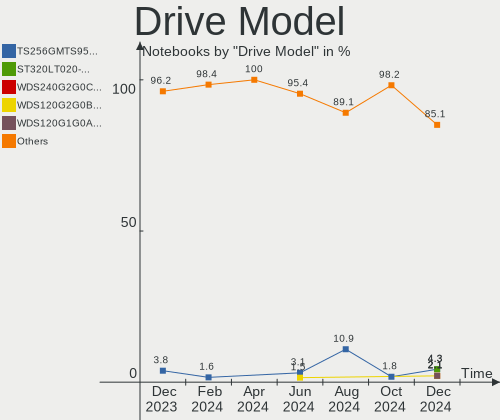
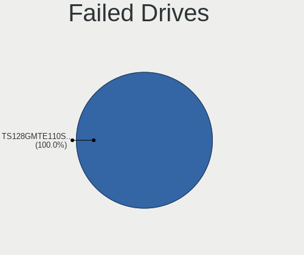
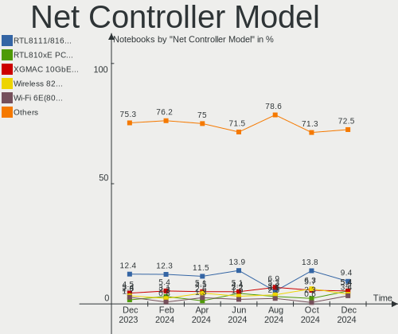

BSD - Hardware Trends (Notebooks)
---------------------------------

A project to identify most popular hardware characteristics and track their change
over time based on data collected by BSD users at https://BSD-Hardware.info.

Anyone can contribute to this report by the [hw-probe](https://github.com/linuxhw/hw-probe/blob/master/INSTALL.BSD.md) tool:

    hw-probe -all -upload

This report is for one last month. Overall report since the beginning of time: [TestDays](https://github.com/bsdhw/TestDays)

Period: Dec, 2023.

Contents
--------

* [ System ](#system)
  - [ OS                       ](#os)
  - [ OS Family                ](#os-family)
  - [ Arch                     ](#arch)
  - [ DE                       ](#de)
  - [ Display Server           ](#display-server)
  - [ Display Manager          ](#display-manager)
  - [ OS Lang                  ](#os-lang)
  - [ Boot Mode                ](#boot-mode)
  - [ Filesystem               ](#filesystem)
  - [ Part. scheme             ](#part-scheme)

* [ Board ](#board)
  - [ Vendor                   ](#vendor)
  - [ Model                    ](#model)
  - [ Model Family             ](#model-family)
  - [ MFG Year                 ](#mfg-year)
  - [ Form Factor              ](#form-factor)
  - [ Coreboot                 ](#coreboot)
  - [ RAM Size                 ](#ram-size)
  - [ RAM Used                 ](#ram-used)
  - [ Total Drives             ](#total-drives)
  - [ Has CD-ROM               ](#has-cd-rom)
  - [ Has Ethernet             ](#has-ethernet)
  - [ Has WiFi                 ](#has-wifi)
  - [ Has Bluetooth            ](#has-bluetooth)

* [ Location ](#location)
  - [ Country                  ](#country)
  - [ City                     ](#city)

* [ Drives ](#drives)
  - [ Drive Vendor             ](#drive-vendor)
  - [ Drive Model              ](#drive-model)
  - [ HDD Vendor               ](#hdd-vendor)
  - [ SSD Vendor               ](#ssd-vendor)
  - [ Drive Kind               ](#drive-kind)
  - [ Drive Connector          ](#drive-connector)
  - [ Drive Size               ](#drive-size)
  - [ Space Total              ](#space-total)
  - [ Space Used               ](#space-used)
  - [ Malfunc. Drives          ](#malfunc-drives)
  - [ Malfunc. Drive Vendor    ](#malfunc-drive-vendor)
  - [ Malfunc. HDD Vendor      ](#malfunc-hdd-vendor)
  - [ Malfunc. Drive Kind      ](#malfunc-drive-kind)
  - [ Failed Drives            ](#failed-drives)
  - [ Failed Drive Vendor      ](#failed-drive-vendor)
  - [ Drive Status             ](#drive-status)

* [ Storage controller ](#storage-controller)
  - [ Storage Vendor           ](#storage-vendor)
  - [ Storage Model            ](#storage-model)
  - [ Storage Kind             ](#storage-kind)

* [ Processor ](#processor)
  - [ CPU Vendor               ](#cpu-vendor)
  - [ CPU Model                ](#cpu-model)
  - [ CPU Model Family         ](#cpu-model-family)
  - [ CPU Cores                ](#cpu-cores)
  - [ CPU Sockets              ](#cpu-sockets)
  - [ CPU Threads              ](#cpu-threads)
  - [ CPU Microarch            ](#cpu-microarch)

* [ Graphics ](#graphics)
  - [ GPU Vendor               ](#gpu-vendor)
  - [ GPU Model                ](#gpu-model)
  - [ GPU Combo                ](#gpu-combo)
  - [ GPU Driver               ](#gpu-driver)
  - [ GPU Memory               ](#gpu-memory)

* [ Monitor ](#monitor)
  - [ Monitor Vendor           ](#monitor-vendor)
  - [ Monitor Model            ](#monitor-model)
  - [ Monitor Resolution       ](#monitor-resolution)
  - [ Monitor Diagonal         ](#monitor-diagonal)
  - [ Monitor Width            ](#monitor-width)
  - [ Aspect Ratio             ](#aspect-ratio)
  - [ Monitor Area             ](#monitor-area)
  - [ Pixel Density            ](#pixel-density)
  - [ Multiple Monitors        ](#multiple-monitors)

* [ Network ](#network)
  - [ Net Controller Vendor    ](#net-controller-vendor)
  - [ Net Controller Model     ](#net-controller-model)
  - [ Wireless Vendor          ](#wireless-vendor)
  - [ Wireless Model           ](#wireless-model)
  - [ Ethernet Vendor          ](#ethernet-vendor)
  - [ Ethernet Model           ](#ethernet-model)
  - [ Net Controller Kind      ](#net-controller-kind)
  - [ Used Controller          ](#used-controller)
  - [ NICs                     ](#nics)
  - [ IPv6                     ](#ipv6)

* [ Bluetooth ](#bluetooth)
  - [ Bluetooth Vendor         ](#bluetooth-vendor)
  - [ Bluetooth Model          ](#bluetooth-model)

* [ Sound ](#sound)
  - [ Sound Vendor             ](#sound-vendor)
  - [ Sound Model              ](#sound-model)

* [ Memory ](#memory)
  - [ Memory Vendor            ](#memory-vendor)
  - [ Memory Model             ](#memory-model)
  - [ Memory Kind              ](#memory-kind)
  - [ Memory Form Factor       ](#memory-form-factor)
  - [ Memory Size              ](#memory-size)
  - [ Memory Speed             ](#memory-speed)

* [ Printers & scanners ](#printers--scanners)
  - [ Printer Vendor           ](#printer-vendor)
  - [ Printer Model            ](#printer-model)
  - [ Scanner Vendor           ](#scanner-vendor)
  - [ Scanner Model            ](#scanner-model)

* [ Camera ](#camera)
  - [ Camera Vendor            ](#camera-vendor)
  - [ Camera Model             ](#camera-model)

* [ Security ](#security)
  - [ Fingerprint Vendor       ](#fingerprint-vendor)
  - [ Fingerprint Model        ](#fingerprint-model)
  - [ Chipcard Vendor          ](#chipcard-vendor)
  - [ Chipcard Model           ](#chipcard-model)

* [ Unsupported ](#unsupported)
  - [ Unsupported Devices      ](#unsupported-devices)
  - [ Unsupported Device Types ](#unsupported-device-types)

System
------

OS
--

Installed operating systems

| Name                 | Notebooks | Percent |
|----------------------|-----------|---------|
| FreeBSD 14.0         | 13        | 14.44%  |
| OPNsense 23.7.10     | 8         | 8.89%   |
| OpenBSD 7.4          | 8         | 8.89%   |
| helloSystem 0.8.1    | 8         | 8.89%   |
| FreeBSD 14.0-p3      | 7         | 7.78%   |
| GhostBSD 23.10.1     | 6         | 6.67%   |
| FreeBSD 14.0-p1      | 6         | 6.67%   |
| helloSystem 0.9.0    | 5         | 5.56%   |
| FreeBSD 14.0-p4      | 5         | 5.56%   |
| FreeBSD 14.0-p2      | 4         | 4.44%   |
| OPNsense 23.7.9      | 3         | 3.33%   |
| FreeBSD 15.0-CURRENT | 3         | 3.33%   |
| OPNsense 23.10       | 2         | 2.22%   |
| NomadBSD 20231121    | 2         | 2.22%   |
| OPNsense 23.1.11     | 1         | 1.11%   |
| OpenBSD 7.0          | 1         | 1.11%   |
| MidnightBSD 3.1.2    | 1         | 1.11%   |
| FreeBSD 14.0-STABLE  | 1         | 1.11%   |
| FreeBSD 14.0-BETA5   | 1         | 1.11%   |
| FreeBSD 13.2-p9      | 1         | 1.11%   |
| FreeBSD 13.2-p8      | 1         | 1.11%   |
| FreeBSD 13.2-p6      | 1         | 1.11%   |
| FreeBSD 13.2-p54     | 1         | 1.11%   |
| FreeBSD 13.2-p5      | 1         | 1.11%   |

OS Family
---------

OS without a version

| Name        | Notebooks | Percent |
|-------------|-----------|---------|
| FreeBSD     | 45        | 50%     |
| OPNsense    | 14        | 15.56%  |
| helloSystem | 13        | 14.44%  |
| OpenBSD     | 9         | 10%     |
| GhostBSD    | 6         | 6.67%   |
| NomadBSD    | 2         | 2.22%   |
| MidnightBSD | 1         | 1.11%   |

Arch
----

OS architecture (x86_64, i586, etc.)

| Name   | Notebooks | Percent |
|--------|-----------|---------|
| amd64  | 88        | 97.78%  |
| macppc | 1         | 1.11%   |
| i386   | 1         | 1.11%   |

DE
--

Desktop Environment

| Name         | Notebooks | Percent |
|--------------|-----------|---------|
| Console      | 24        | 26.67%  |
| helloDesktop | 19        | 21.11%  |
| XFCE         | 11        | 12.22%  |
| KDE5         | 10        | 11.11%  |
| MATE         | 8         | 8.89%   |
| TWM          | 5         | 5.56%   |
| Openbox      | 4         | 4.44%   |
| GNOME        | 2         | 2.22%   |
| LXQt         | 1         | 1.11%   |
| i3           | 1         | 1.11%   |
| Hyprland     | 1         | 1.11%   |
| GNUstep      | 1         | 1.11%   |
| fvwm         | 1         | 1.11%   |
| dwm          | 1         | 1.11%   |
| Budgie       | 1         | 1.11%   |

Display Server
--------------

X11 or Wayland

| Name    | Notebooks | Percent |
|---------|-----------|---------|
| X11     | 64        | 71.11%  |
| Console | 22        | 24.44%  |
| Wayland | 4         | 4.44%   |

Display Manager
---------------

SDDM, LightDM, etc.

| Name    | Notebooks | Percent |
|---------|-----------|---------|
| Console | 45        | 50%     |
| SLiM    | 19        | 21.11%  |
| SDDM    | 14        | 15.56%  |
| LightDM | 8         | 8.89%   |
| GDM     | 2         | 2.22%   |
| XDM     | 1         | 1.11%   |
| Ly      | 1         | 1.11%   |

OS Lang
-------

Language

| Lang    | Notebooks | Percent |
|---------|-----------|---------|
| C       | 31        | 34.44%  |
| Unknown | 29        | 32.22%  |
| en_US   | 14        | 15.56%  |
| ru_RU   | 4         | 4.44%   |
| it_IT   | 2         | 2.22%   |
| fr_FR   | 2         | 2.22%   |
| es_ES   | 2         | 2.22%   |
| de_DE   | 2         | 2.22%   |
| zh_CN   | 1         | 1.11%   |
| pt_BR   | 1         | 1.11%   |
| es_AR   | 1         | 1.11%   |
| cs_CZ   | 1         | 1.11%   |

Boot Mode
---------

EFI or BIOS

| Mode | Notebooks | Percent |
|------|-----------|---------|
| EFI  | 77        | 85.56%  |
| BIOS | 13        | 14.44%  |

Filesystem
----------

Type of filesystem

| Type   | Notebooks | Percent |
|--------|-----------|---------|
| Zfs    | 58        | 64.44%  |
| Ufs    | 20        | 22.22%  |
| Ffs    | 9         | 10%     |
| Cd9660 | 3         | 3.33%   |

Part. scheme
------------

Scheme of partitioning

| Type    | Notebooks | Percent |
|---------|-----------|---------|
| GPT     | 82        | 91.11%  |
| MBR     | 7         | 7.78%   |
| Unknown | 1         | 1.11%   |

Board
-----

Vendor
------

Motherboard manufacturer

| Name                | Notebooks | Percent |
|---------------------|-----------|---------|
| Lenovo              | 23        | 25.56%  |
| Dell                | 16        | 17.78%  |
| Deciso              | 8         | 8.89%   |
| Apple               | 7         | 7.78%   |
| Hewlett-Packard     | 6         | 6.67%   |
| ASUSTek Computer    | 6         | 6.67%   |
| Toshiba             | 3         | 3.33%   |
| Google              | 3         | 3.33%   |
| Acer                | 3         | 3.33%   |
| Wortmann AG         | 1         | 1.11%   |
| TULPAR              | 1         | 1.11%   |
| Star Labs           | 1         | 1.11%   |
| Sony                | 1         | 1.11%   |
| Samsung Electronics | 1         | 1.11%   |
| Rembrandt           | 1         | 1.11%   |
| Panasonic           | 1         | 1.11%   |
| Intel               | 1         | 1.11%   |
| IGEL Technology     | 1         | 1.11%   |
| eMachines           | 1         | 1.11%   |
| CSL-Computer        | 1         | 1.11%   |
| Clevo               | 1         | 1.11%   |
| AMI                 | 1         | 1.11%   |
| Acidanthera         | 1         | 1.11%   |
| Unknown             | 1         | 1.11%   |

Model
-----

Motherboard model

| Name                                     | Notebooks | Percent |
|------------------------------------------|-----------|---------|
| Deciso NetBoard-A10                      | 4         | 4.44%   |
| Deciso NetBoard-A20                      | 2         | 2.22%   |
| Wortmann AG TERRA_MOBILE_1541            | 1         | 1.11%   |
| TULPAR A5 V20.3                          | 1         | 1.11%   |
| Toshiba Satellite P300                   | 1         | 1.11%   |
| Toshiba Satellite C50-B                  | 1         | 1.11%   |
| Toshiba Portable PC                      | 1         | 1.11%   |
| Star Labs LabTop                         | 1         | 1.11%   |
| Sony VJS122C11L                          | 1         | 1.11%   |
| Samsung R510/P510                        | 1         | 1.11%   |
| Rembrandt ARB928                         | 1         | 1.11%   |
| Panasonic CFSX4-1                        | 1         | 1.11%   |
| Lenovo ThinkPad X280 20KES5M300          | 1         | 1.11%   |
| Lenovo ThinkPad X250 20CLS8Q601          | 1         | 1.11%   |
| Lenovo ThinkPad X220 4291H77             | 1         | 1.11%   |
| Lenovo ThinkPad X131e 33672T9            | 1         | 1.11%   |
| Lenovo ThinkPad X1 Carbon 7th 20QES53R00 | 1         | 1.11%   |
| Lenovo ThinkPad X1 Carbon 2nd 20A7002FUS | 1         | 1.11%   |
| Lenovo ThinkPad W520 4284GZ1             | 1         | 1.11%   |
| Lenovo ThinkPad W520 4270CTO             | 1         | 1.11%   |
| Lenovo ThinkPad T490s 20NYS4HL1K         | 1         | 1.11%   |
| Lenovo ThinkPad T480 20L6S8LW00          | 1         | 1.11%   |
| Lenovo ThinkPad T480 20L6S29E0T          | 1         | 1.11%   |
| Lenovo ThinkPad T430s 23532QG            | 1         | 1.11%   |
| Lenovo ThinkPad T14s Gen 4 21F60029US    | 1         | 1.11%   |
| Lenovo ThinkPad T14 Gen 3 21CF002UMZ     | 1         | 1.11%   |
| Lenovo ThinkPad P70 20ESS1L600           | 1         | 1.11%   |
| Lenovo ThinkPad P17 Gen 2i 20YVS1L900    | 1         | 1.11%   |
| Lenovo ThinkPad P14s Gen 2a 21A00013GE   | 1         | 1.11%   |
| Lenovo ThinkPad P1 20MD002MUS            | 1         | 1.11%   |
| Lenovo ThinkPad E15 Gen 3 20YG004BHV     | 1         | 1.11%   |
| Lenovo ThinkPad A485 20MU000VUS          | 1         | 1.11%   |
| Lenovo Legion 7 16ACHg6 82N6             | 1         | 1.11%   |
| Lenovo IdeaPad 5 15ALC05 82LN            | 1         | 1.11%   |
| Lenovo IdeaPad 330-15ARR 81D2            | 1         | 1.11%   |
| Intel H81U                               | 1         | 1.11%   |
| IGEL H830C                               | 1         | 1.11%   |
| HP ZBook 17 G2                           | 1         | 1.11%   |
| HP Stream Notebook PC 11                 | 1         | 1.11%   |
| HP ProBook 455 G7                        | 1         | 1.11%   |

Model Family
------------

Motherboard model prefix

| Name                | Notebooks | Percent |
|---------------------|-----------|---------|
| Lenovo ThinkPad     | 20        | 22.22%  |
| Dell Latitude       | 7         | 7.78%   |
| Deciso NetBoard-A10 | 4         | 4.44%   |
| Dell Precision      | 3         | 3.33%   |
| Dell Inspiron       | 3         | 3.33%   |
| Toshiba Satellite   | 2         | 2.22%   |
| Lenovo IdeaPad      | 2         | 2.22%   |
| HP EliteBook        | 2         | 2.22%   |
| Dell Vostro         | 2         | 2.22%   |
| Deciso NetBoard-A20 | 2         | 2.22%   |
| ASUS ASUS           | 2         | 2.22%   |
| Wortmann AG TERRA   | 1         | 1.11%   |
| TULPAR A5           | 1         | 1.11%   |
| Toshiba Portable    | 1         | 1.11%   |
| Star Labs LabTop    | 1         | 1.11%   |
| Sony VJS122C11L     | 1         | 1.11%   |
| Samsung R510        | 1         | 1.11%   |
| Rembrandt ARB928    | 1         | 1.11%   |
| Panasonic CFSX4-1   | 1         | 1.11%   |
| Lenovo Legion       | 1         | 1.11%   |
| Intel H81U          | 1         | 1.11%   |
| IGEL H830C          | 1         | 1.11%   |
| HP ZBook            | 1         | 1.11%   |
| HP Stream           | 1         | 1.11%   |
| HP ProBook          | 1         | 1.11%   |
| HP Pavilion         | 1         | 1.11%   |
| Google Parrot       | 1         | 1.11%   |
| Google Lindar       | 1         | 1.11%   |
| Google Kohaku       | 1         | 1.11%   |
| eMachines eM350     | 1         | 1.11%   |
| Dell XPS            | 1         | 1.11%   |
| Deciso OPNsense     | 1         | 1.11%   |
| Deciso Netboard     | 1         | 1.11%   |
| CSL-Computer C15    | 1         | 1.11%   |
| Clevo W240BU        | 1         | 1.11%   |
| ASUS ZenBook        | 1         | 1.11%   |
| ASUS X555LB         | 1         | 1.11%   |
| ASUS VivoBook       | 1         | 1.11%   |
| ASUS K52JT          | 1         | 1.11%   |
| Apple PowerBook3    | 1         | 1.11%   |

MFG Year
--------

Motherboard manufacture year

| Year    | Notebooks | Percent |
|---------|-----------|---------|
| 2022    | 14        | 15.56%  |
| 2021    | 12        | 13.33%  |
| 2019    | 11        | 12.22%  |
| 2023    | 9         | 10%     |
| 2015    | 5         | 5.56%   |
| 2013    | 5         | 5.56%   |
| 2011    | 5         | 5.56%   |
| 2020    | 4         | 4.44%   |
| 2018    | 4         | 4.44%   |
| 2016    | 4         | 4.44%   |
| 2012    | 4         | 4.44%   |
| 2010    | 4         | 4.44%   |
| 2014    | 3         | 3.33%   |
| 2007    | 2         | 2.22%   |
| 2017    | 1         | 1.11%   |
| 2009    | 1         | 1.11%   |
| 2008    | 1         | 1.11%   |
| Unknown | 1         | 1.11%   |

Form Factor
-----------

Physical design of the computer

| Name     | Notebooks | Percent |
|----------|-----------|---------|
| Notebook | 90        | 100%    |

Coreboot
--------

Have coreboot on board

| Used | Notebooks | Percent |
|------|-----------|---------|
| No   | 87        | 96.67%  |
| Yes  | 3         | 3.33%   |

RAM Size
--------

Total RAM memory

| Size in GB  | Notebooks | Percent |
|-------------|-----------|---------|
| 8.01-16.0   | 27        | 30%     |
| 16.01-24.0  | 25        | 27.78%  |
| 4.01-8.0    | 14        | 15.56%  |
| 32.01-64.0  | 12        | 13.33%  |
| 2.01-3.0    | 5         | 5.56%   |
| 3.01-4.0    | 3         | 3.33%   |
| 64.01-256.0 | 3         | 3.33%   |
| 0.01-0.5    | 1         | 1.11%   |

RAM Used
--------

Used RAM memory

| Used GB  | Notebooks | Percent |
|----------|-----------|---------|
| 0.01-0.5 | 47        | 52.22%  |
| 0.51-1.0 | 21        | 23.33%  |
| 1.01-2.0 | 16        | 17.78%  |
| 2.01-3.0 | 3         | 3.33%   |
| 4.01-8.0 | 2         | 2.22%   |
| 0        | 1         | 1.11%   |

Total Drives
------------

Number of drives on board

| Drives | Notebooks | Percent |
|--------|-----------|---------|
| 1      | 59        | 65.56%  |
| 0      | 20        | 22.22%  |
| 2      | 9         | 10%     |
| 3      | 2         | 2.22%   |

Has CD-ROM
----------

Has CD-ROM on board

| Presented | Notebooks | Percent |
|-----------|-----------|---------|
| No        | 73        | 81.11%  |
| Yes       | 17        | 18.89%  |

Has Ethernet
------------

Has Ethernet on board

| Presented | Notebooks | Percent |
|-----------|-----------|---------|
| Yes       | 76        | 84.44%  |
| No        | 14        | 15.56%  |

Has WiFi
--------

Has WiFi module

| Presented | Notebooks | Percent |
|-----------|-----------|---------|
| Yes       | 80        | 88.89%  |
| No        | 10        | 11.11%  |

Has Bluetooth
-------------

Has Bluetooth module

| Presented | Notebooks | Percent |
|-----------|-----------|---------|
| Yes       | 62        | 68.89%  |
| No        | 28        | 31.11%  |

Location
--------

Country
-------

Geographic location (country)

| Country             | Notebooks | Percent |
|---------------------|-----------|---------|
| USA                 | 16        | 17.78%  |
| Germany             | 11        | 12.22%  |
| UK                  | 6         | 6.67%   |
| Spain               | 5         | 5.56%   |
| Russia              | 5         | 5.56%   |
| Netherlands         | 5         | 5.56%   |
| Italy               | 4         | 4.44%   |
| Indonesia           | 4         | 4.44%   |
| Switzerland         | 3         | 3.33%   |
| France              | 3         | 3.33%   |
| China               | 3         | 3.33%   |
| Brazil              | 2         | 2.22%   |
| Turkey              | 1         | 1.11%   |
| Trinidad and Tobago | 1         | 1.11%   |
| Thailand            | 1         | 1.11%   |
| South Africa        | 1         | 1.11%   |
| Slovakia            | 1         | 1.11%   |
| Romania             | 1         | 1.11%   |
| Portugal            | 1         | 1.11%   |
| Poland              | 1         | 1.11%   |
| Nepal               | 1         | 1.11%   |
| Mexico              | 1         | 1.11%   |
| Luxembourg          | 1         | 1.11%   |
| Lithuania           | 1         | 1.11%   |
| Kazakhstan          | 1         | 1.11%   |
| India               | 1         | 1.11%   |
| Hungary             | 1         | 1.11%   |
| El Salvador         | 1         | 1.11%   |
| Ecuador             | 1         | 1.11%   |
| Czechia             | 1         | 1.11%   |
| Chile               | 1         | 1.11%   |
| Canada              | 1         | 1.11%   |
| Bulgaria            | 1         | 1.11%   |
| Belgium             | 1         | 1.11%   |
| Argentina           | 1         | 1.11%   |

City
----

Geographic location (city)

| City                     | Notebooks | Percent |
|--------------------------|-----------|---------|
| Moscow                   | 3         | 3.33%   |
| Richmond                 | 2         | 2.22%   |
| Milan                    | 2         | 2.22%   |
| Zurich                   | 1         | 1.11%   |
| Ypsilanti                | 1         | 1.11%   |
| Wheaton                  | 1         | 1.11%   |
| Vadodara                 | 1         | 1.11%   |
| Ufa                      | 1         | 1.11%   |
| Torrent                  | 1         | 1.11%   |
| The Hague                | 1         | 1.11%   |
| Teplice                  | 1         | 1.11%   |
| Surabaya                 | 1         | 1.11%   |
| Stuttgart                | 1         | 1.11%   |
| Steckborn                | 1         | 1.11%   |
| Southall                 | 1         | 1.11%   |
| South Tangerang          | 1         | 1.11%   |
| Santiago                 | 1         | 1.11%   |
| Santa Coloma de Farners  | 1         | 1.11%   |
| Sandweiler               | 1         | 1.11%   |
| San Salvador             | 1         | 1.11%   |
| San Antonio              | 1         | 1.11%   |
| Rüsselsheim am Main     | 1         | 1.11%   |
| Roesrath                 | 1         | 1.11%   |
| Prad am Stilfser Joch    | 1         | 1.11%   |
| Potomac                  | 1         | 1.11%   |
| Portoviejo               | 1         | 1.11%   |
| Port Elizabeth           | 1         | 1.11%   |
| Pevensey                 | 1         | 1.11%   |
| Petropavlovsk-Kamchatsky | 1         | 1.11%   |
| Oxford                   | 1         | 1.11%   |
| Oosterhout               | 1         | 1.11%   |
| Neuengors                | 1         | 1.11%   |
| Munich                   | 1         | 1.11%   |
| Montreal                 | 1         | 1.11%   |
| Mechelen                 | 1         | 1.11%   |
| Marijampolė             | 1         | 1.11%   |
| Malang                   | 1         | 1.11%   |
| Madison                  | 1         | 1.11%   |
| Mâcon                   | 1         | 1.11%   |
| Maceió                  | 1         | 1.11%   |

Drives
------

Drive Vendor
------------

Hard drive vendors

| Vendor              | Notebooks | Drives | Percent |
|---------------------|-----------|--------|---------|
| Samsung Electronics | 13        | 16     | 17.11%  |
| Transcend           | 9         | 9      | 11.84%  |
| Toshiba             | 8         | 8      | 10.53%  |
| WDC                 | 5         | 5      | 6.58%   |
| Seagate             | 4         | 4      | 5.26%   |
| Apple               | 4         | 4      | 5.26%   |
| SPCC                | 3         | 3      | 3.95%   |
| SanDisk             | 3         | 3      | 3.95%   |
| NVMe                | 3         | 3      | 3.95%   |
| Kingston            | 3         | 3      | 3.95%   |
| SK hynix            | 2         | 2      | 2.63%   |
| Intel               | 2         | 2      | 2.63%   |
| HGST                | 2         | 3      | 2.63%   |
| Fujitsu             | 2         | 2      | 2.63%   |
| Crucial             | 2         | 2      | 2.63%   |
| V-GeN               | 1         | 2      | 1.32%   |
| SSSTC               | 1         | 1      | 1.32%   |
| PNY                 | 1         | 1      | 1.32%   |
| OCZ                 | 1         | 1      | 1.32%   |
| MidasForce          | 1         | 1      | 1.32%   |
| Lenovo              | 1         | 2      | 1.32%   |
| Intenso             | 1         | 1      | 1.32%   |
| Hitachi             | 1         | 1      | 1.32%   |
| GOODRAM             | 1         | 1      | 1.32%   |
| FORESEE             | 1         | 1      | 1.32%   |
| faspeed             | 1         | 1      | 1.32%   |

Drive Model
-----------

Hard drive models

| Model                              | Notebooks | Percent |
|------------------------------------|-----------|---------|
| Transcend TS256GMTS952T2 256GB     | 3         | 3.8%    |
| SPCC Solid State Disk 128GB        | 3         | 3.8%    |
| WDC WD2500BEVT-22ZCT0 250GB        | 2         | 2.53%   |
| Transcend TS256GMTE652T2 256GB     | 2         | 2.53%   |
| Transcend TS128GMTE110S 128GB      | 2         | 2.53%   |
| Toshiba MQ04ABF100 1TB             | 2         | 2.53%   |
| Samsung SSD 870 EVO 1TB            | 2         | 2.53%   |
| Intel SSDPEKKF256G8L 256GB         | 2         | 2.53%   |
| Crucial CT1000MX500SSD1 1TB        | 2         | 2.53%   |
| WDC WDS250G1B0A-00H9H0 250GB       | 1         | 1.27%   |
| WDC WD5000LPLX-75ZNTT0 500GB       | 1         | 1.27%   |
| WDC WD Elements 2621 1TB           | 1         | 1.27%   |
| V-GeN V-GEN11SM20AR1024ITM2 1TB    | 1         | 1.27%   |
| V-GeN V-GEN03SM22AR1024SDK 1TB     | 1         | 1.27%   |
| Transcend TS64GSSD370S 64GB        | 1         | 1.27%   |
| Transcend TS256GMTE710T 256GB      | 1         | 1.27%   |
| Toshiba THNSF5256GPUK 256GB        | 1         | 1.27%   |
| Toshiba MQ01ABD050V 496GB          | 1         | 1.27%   |
| Toshiba MK5076GSX 500GB            | 1         | 1.27%   |
| Toshiba MK3261GSY 320GB            | 1         | 1.27%   |
| Toshiba MK2565GSX 250GB            | 1         | 1.27%   |
| Toshiba KBG40ZNT512G MEMORY 512GB  | 1         | 1.27%   |
| SSSTC CL4-8D512 512GB              | 1         | 1.27%   |
| SK hynix HFS256G32TNF-N3A0A 256GB  | 1         | 1.27%   |
| SK hynix HFM512GD3JX013N 512GB     | 1         | 1.27%   |
| Seagate ST9500325AS 500GB          | 1         | 1.27%   |
| Seagate ST9320423AS 320GB          | 1         | 1.27%   |
| Seagate ST9320325AS 320GB          | 1         | 1.27%   |
| Seagate ST1000LM024 HN-M101MBB 1TB | 1         | 1.27%   |
| SanDisk SSD U100 16GB              | 1         | 1.27%   |
| SanDisk SSD PLUS 240GB             | 1         | 1.27%   |
| SanDisk SDSA5GK-016G-1006 16GB     | 1         | 1.27%   |
| Samsung SSD PM830 mSATA 32GB       | 1         | 1.27%   |
| Samsung SSD PM830 mSATA 128GB      | 1         | 1.27%   |
| Samsung SSD 870 EVO 500GB          | 1         | 1.27%   |
| Samsung SSD 860 EVO mSATA 500GB    | 1         | 1.27%   |
| Samsung SSD 860 EVO mSATA 250GB    | 1         | 1.27%   |
| Samsung SSD 850 120GB              | 1         | 1.27%   |
| Samsung SSD 840 PRO Series 256GB   | 1         | 1.27%   |
| Samsung SSD 840 EVO 250GB          | 1         | 1.27%   |

HDD Vendor
----------

Hard disk drive vendors

| Vendor  | Notebooks | Drives | Percent |
|---------|-----------|--------|---------|
| Toshiba | 6         | 6      | 26.09%  |
| WDC     | 4         | 4      | 17.39%  |
| Seagate | 4         | 4      | 17.39%  |
| NVMe    | 3         | 3      | 13.04%  |
| HGST    | 2         | 3      | 8.7%    |
| Fujitsu | 2         | 2      | 8.7%    |
| Hitachi | 1         | 1      | 4.35%   |
| Apple   | 1         | 1      | 4.35%   |

SSD Vendor
----------

Solid state drive vendors

| Vendor              | Notebooks | Drives | Percent |
|---------------------|-----------|--------|---------|
| Samsung Electronics | 10        | 11     | 26.32%  |
| Transcend           | 4         | 4      | 10.53%  |
| SPCC                | 3         | 3      | 7.89%   |
| SanDisk             | 3         | 3      | 7.89%   |
| Kingston            | 3         | 3      | 7.89%   |
| Apple               | 3         | 3      | 7.89%   |
| Crucial             | 2         | 2      | 5.26%   |
| WDC                 | 1         | 1      | 2.63%   |
| V-GeN               | 1         | 2      | 2.63%   |
| SK hynix            | 1         | 1      | 2.63%   |
| PNY                 | 1         | 1      | 2.63%   |
| OCZ                 | 1         | 1      | 2.63%   |
| MidasForce          | 1         | 1      | 2.63%   |
| Lenovo              | 1         | 2      | 2.63%   |
| GOODRAM             | 1         | 1      | 2.63%   |
| FORESEE             | 1         | 1      | 2.63%   |
| faspeed             | 1         | 1      | 2.63%   |

Drive Kind
----------

HDD or SSD

| Kind | Notebooks | Drives | Percent |
|------|-----------|--------|---------|
| SSD  | 36        | 41     | 50%     |
| HDD  | 21        | 24     | 29.17%  |
| NVMe | 15        | 17     | 20.83%  |

Drive Connector
---------------

SATA, SAS, NVMe, etc.

| Type | Notebooks | Drives | Percent |
|------|-----------|--------|---------|
| SATA | 55        | 65     | 78.57%  |
| NVMe | 15        | 17     | 21.43%  |

Drive Size
----------

Size of hard drive

| Size in TB | Notebooks | Drives | Percent |
|------------|-----------|--------|---------|
| 0.01-0.5   | 46        | 51     | 79.31%  |
| 0.51-1.0   | 11        | 13     | 18.97%  |
| 1.01-2.0   | 1         | 1      | 1.72%   |

Space Total
-----------

Amount of disk space available on the file system

| Size in GB | Notebooks | Percent |
|------------|-----------|---------|
| 101-250    | 39        | 43.33%  |
| 251-500    | 19        | 21.11%  |
| 501-1000   | 9         | 10%     |
| 1-20       | 8         | 8.89%   |
| 51-100     | 7         | 7.78%   |
| 21-50      | 4         | 4.44%   |
| 1001-2000  | 3         | 3.33%   |
| Unknown    | 1         | 1.11%   |

Space Used
----------

Amount of used disk space

| Used GB | Notebooks | Percent |
|---------|-----------|---------|
| 1-20    | 77        | 85.56%  |
| 21-50   | 7         | 7.78%   |
| 101-250 | 3         | 3.33%   |
| 51-100  | 2         | 2.22%   |
| Unknown | 1         | 1.11%   |

Malfunc. Drives
---------------

Drive models with a malfunction

| Model                                 | Notebooks | Drives | Percent |
|---------------------------------------|-----------|--------|---------|
| WDC WD2500BEVT-22ZCT0 250GB           | 1         | 1      | 12.5%   |
| Toshiba MK3261GSY 320GB               | 1         | 1      | 12.5%   |
| Toshiba MK2565GSX 250GB               | 1         | 1      | 12.5%   |
| Seagate ST9500325AS 500GB             | 1         | 1      | 12.5%   |
| Seagate ST9320325AS 320GB             | 1         | 1      | 12.5%   |
| Samsung Electronics SSD 870 EVO 500GB | 1         | 1      | 12.5%   |
| Lenovo Thinklife SSD ST600 MSATA 256G | 1         | 1      | 12.5%   |
| Fujitsu MHW2120BH 120GB               | 1         | 1      | 12.5%   |

Malfunc. Drive Vendor
---------------------

Vendors of faulty drives

| Vendor              | Notebooks | Drives | Percent |
|---------------------|-----------|--------|---------|
| Toshiba             | 2         | 2      | 25%     |
| Seagate             | 2         | 2      | 25%     |
| WDC                 | 1         | 1      | 12.5%   |
| Samsung Electronics | 1         | 1      | 12.5%   |
| Lenovo              | 1         | 1      | 12.5%   |
| Fujitsu             | 1         | 1      | 12.5%   |

Malfunc. HDD Vendor
-------------------

Vendors of faulty HDD drives

| Vendor  | Notebooks | Drives | Percent |
|---------|-----------|--------|---------|
| Toshiba | 2         | 2      | 33.33%  |
| Seagate | 2         | 2      | 33.33%  |
| WDC     | 1         | 1      | 16.67%  |
| Fujitsu | 1         | 1      | 16.67%  |

Malfunc. Drive Kind
-------------------

Kinds of faulty drives

| Kind | Notebooks | Drives | Percent |
|------|-----------|--------|---------|
| HDD  | 6         | 6      | 75%     |
| SSD  | 2         | 2      | 25%     |

Failed Drives
-------------

Failed drive models

| Model                         | Notebooks | Drives | Percent |
|-------------------------------|-----------|--------|---------|
| Transcend TS128GMTE110S 128GB | 1         | 1      | 100%    |

Failed Drive Vendor
-------------------

Failed drive vendors

| Vendor    | Notebooks | Drives | Percent |
|-----------|-----------|--------|---------|
| Transcend | 1         | 1      | 100%    |

Drive Status
------------

Number of failed and malfunc. drives

| Status   | Notebooks | Drives | Percent |
|----------|-----------|--------|---------|
| Works    | 59        | 67     | 80.82%  |
| Malfunc  | 8         | 8      | 10.96%  |
| Detected | 5         | 6      | 6.85%   |
| Failed   | 1         | 1      | 1.37%   |

Storage controller
------------------

Storage Vendor
--------------

Storage controller vendors

| Vendor                                  | Notebooks | Percent |
|-----------------------------------------|-----------|---------|
| Intel                                   | 48        | 49.48%  |
| AMD                                     | 12        | 12.37%  |
| Samsung Electronics                     | 8         | 8.25%   |
| Sandisk                                 | 7         | 7.22%   |
| Transcend                               | 5         | 5.15%   |
| SK hynix                                | 3         | 3.09%   |
| Toshiba                                 | 2         | 2.06%   |
| Solid State Storage Technology          | 2         | 2.06%   |
| Micron Technology                       | 2         | 2.06%   |
| Union Memory (Shenzhen)                 | 1         | 1.03%   |
| Shenzhen Unionmemory Information System | 1         | 1.03%   |
| Realtek Semiconductor                   | 1         | 1.03%   |
| Phison Electronics                      | 1         | 1.03%   |
| Nvidia                                  | 1         | 1.03%   |
| Micron/Crucial Technology               | 1         | 1.03%   |
| KIOXIA                                  | 1         | 1.03%   |
| Kingston Technology Company             | 1         | 1.03%   |

Storage Model
-------------

Storage controller models

| Model                                                                          | Notebooks | Percent |
|--------------------------------------------------------------------------------|-----------|---------|
| AMD FCH SATA Controller [AHCI mode]                                            | 11        | 10.78%  |
| Intel 7 Series Chipset Family 6-port SATA Controller [AHCI mode]               | 8         | 7.84%   |
| Transcend NVMe PCIe SSD 110S/112S/120S/MTE300S/MTE400S/MTE652T2 (DRAM-less)    | 4         | 3.92%   |
| Intel Wildcat Point-LP SATA Controller [AHCI Mode]                             | 4         | 3.92%   |
| Intel Sunrise Point-LP SATA Controller [AHCI mode]                             | 4         | 3.92%   |
| Intel 82801 Mobile SATA Controller [RAID mode]                                 | 4         | 3.92%   |
| Intel 6 Series/C200 Series Chipset Family 6 port Mobile SATA AHCI Controller   | 4         | 3.92%   |
| Samsung NVMe SSD Controller SM981/PM981/PM983                                  | 3         | 2.94%   |
| Intel 8 Series SATA Controller 1 [AHCI mode]                                   | 3         | 2.94%   |
| SK hynix Gold P31/BC711/PC711 NVMe Solid State Drive                           | 2         | 1.96%   |
| SanDisk Ultra 3D / WD Blue SN550 NVMe SSD                                      | 2         | 1.96%   |
| SanDisk Extreme Pro / WD Black SN750 / PC SN730 / Red SN700 NVMe SSD           | 2         | 1.96%   |
| Samsung NVMe SSD Controller 980 (DRAM-less)                                    | 2         | 1.96%   |
| Intel SSD DC P4101/Pro 7600p/760p/E 6100p Series                               | 2         | 1.96%   |
| Intel Q170/Q150/B150/H170/H110/Z170/CM236 Chipset SATA Controller [AHCI Mode]  | 2         | 1.96%   |
| Intel NM10/ICH7 Family SATA Controller [AHCI mode]                             | 2         | 1.96%   |
| Intel Atom Processor E3800 Series SATA AHCI Controller                         | 2         | 1.96%   |
| Intel 82801IBM/IEM (ICH9M/ICH9M-E) 4 port SATA Controller [AHCI mode]          | 2         | 1.96%   |
| Intel 8 Series/C220 Series Chipset Family 6-port SATA Controller 1 [AHCI mode] | 2         | 1.96%   |
| Unknown                                                                        | 2         | 1.96%   |
| Union Memory (Shenzhen) AM620 PCIe 3.0 NVMe SSD 128GB                          | 1         | 0.98%   |
| Transcend NVMe PCIe SSD 240S/MTE710T                                           | 1         | 0.98%   |
| Toshiba XG5 NVMe SSD Controller                                                | 1         | 0.98%   |
| Toshiba XG4 NVMe SSD Controller                                                | 1         | 0.98%   |
| Solid State Storage CL4-8D512 NVMe SSD M.2 (DRAM-less)                         | 1         | 0.98%   |
| Solid State Storage CL1-3D256-Q11 NVMe SSD M.2                                 | 1         | 0.98%   |
| SK hynix BC501 NVMe Solid State Drive                                          | 1         | 0.98%   |
| Sandisk WD Blue SN580 NVMe SSD (DRAM-less)                                     | 1         | 0.98%   |
| SanDisk WD Blue SN550 NVMe SSD 2TB (DRAM-less)                                 | 1         | 0.98%   |
| Sandisk WD Black SN770 / PC SN740 256GB / PC SN560 (DRAM-less) NVMe SSD        | 1         | 0.98%   |
| SanDisk Ultra 3D / WD Blue SN570 NVMe SSD (DRAM-less)                          | 1         | 0.98%   |
| SanDisk Extreme Pro / WD Black 2018/SN750/PC SN720 NVMe SSD                    | 1         | 0.98%   |
| Samsung S4LN058A01[SSUBX] AHCI SSD Controller (Apple slot)                     | 1         | 0.98%   |
| Samsung NVMe SSD Controller SM961/PM961/SM963                                  | 1         | 0.98%   |
| Samsung NVMe SSD Controller PM9A1/PM9A3/980PRO                                 | 1         | 0.98%   |
| Realtek RTS5765DL NVMe SSD Controller (DRAM-less)                              | 1         | 0.98%   |
| Phison E12 NVMe Controller                                                     | 1         | 0.98%   |
| Nvidia MCP89 SATA Controller (AHCI mode)                                       | 1         | 0.98%   |
| Micron 3400 NVMe SSD [Hendrix]                                                 | 1         | 0.98%   |
| Micron 2550 NVMe SSD (DRAM-less)                                               | 1         | 0.98%   |

Storage Kind
------------

Kind of storage controller (IDE, SATA, NVMe, SAS, ...)

| Kind | Notebooks | Percent |
|------|-----------|---------|
| SATA | 53        | 53.54%  |
| NVMe | 38        | 38.38%  |
| RAID | 5         | 5.05%   |
| IDE  | 3         | 3.03%   |

Processor
---------

CPU Vendor
----------

Processor vendors

| Vendor  | Notebooks | Percent |
|---------|-----------|---------|
| Intel   | 66        | 73.33%  |
| AMD     | 23        | 25.56%  |
| Unknown | 1         | 1.11%   |

CPU Model
---------

Processor models

| Model                                  | Notebooks | Percent |
|----------------------------------------|-----------|---------|
| AMD Ryzen Embedded V1500B              | 4         | 4.44%   |
| AMD EPYC 3201 8-Core Processor         | 4         | 4.44%   |
| Intel CPU Version                      | 2         | 2.22%   |
| Intel Core i7-8550U CPU @ 1.80GHz      | 2         | 2.22%   |
| Intel Core i7-5500U CPU @ 2.40GHz      | 2         | 2.22%   |
| Intel Core i5-8365U CPU @ 1.60GHz      | 2         | 2.22%   |
| Intel Core i5-5300U CPU @ 2.30GHz      | 2         | 2.22%   |
| Intel Core i5-4200U CPU @ 1.60GHz      | 2         | 2.22%   |
| Intel Core i5-2520M CPU @ 2.50GHz      | 2         | 2.22%   |
| Intel Atom CPU N450 @ 1.66GHz          | 2         | 2.22%   |
| AMD Ryzen 7 5800H with Radeon Graphics | 2         | 2.22%   |
| AMD Ryzen 7 5700U with Radeon Graphics | 2         | 2.22%   |
| Intel Xeon W-11955M CPU @ 2.60GHz      | 1         | 1.11%   |
| Intel Xeon E-2176M CPU @ 2.70GHz       | 1         | 1.11%   |
| Intel Xeon CPU E3-1505M v5 @ 2.80GHz   | 1         | 1.11%   |
| Intel Pentium M                        | 1         | 1.11%   |
| Intel Other                            | 1         | 1.11%   |
| Intel N200                             | 1         | 1.11%   |
| Intel Core i7-8665U CPU @ 1.90GHz      | 1         | 1.11%   |
| Intel Core i7-6820HQ CPU @ 2.70GHz     | 1         | 1.11%   |
| Intel Core i7-6600U CPU @ 2.60GHz      | 1         | 1.11%   |
| Intel Core i7-6500U CPU @ 2.50GHz      | 1         | 1.11%   |
| Intel Core i7-4800MQ CPU @ 2.70GHz     | 1         | 1.11%   |
| Intel Core i7-4710MQ CPU @ 2.50GHz     | 1         | 1.11%   |
| Intel Core i7-4650U CPU @ 1.70GHz      | 1         | 1.11%   |
| Intel Core i7-3520M CPU @ 2.90GHz      | 1         | 1.11%   |
| Intel Core i7-2720QM CPU @ 2.20GHz     | 1         | 1.11%   |
| Intel Core i7-2630QM CPU @ 2.00GHz     | 1         | 1.11%   |
| Intel Core i7-10710U CPU @ 1.10GHz     | 1         | 1.11%   |
| Intel Core i7 CPU Q 740 @ 1.73GH       | 1         | 1.11%   |
| Intel Core i7 CPU M 640 @ 2.80GH       | 1         | 1.11%   |
| Intel Core i7 CPU L 640 @ 2.13GHz      | 1         | 1.11%   |
| Intel Core i5-8350U CPU @ 1.70GHz      | 1         | 1.11%   |
| Intel Core i5-7300U CPU @ 2.60GHz      | 1         | 1.11%   |
| Intel Core i5-6300HQ CPU @ 2.30GHz     | 1         | 1.11%   |
| Intel Core i5-5350U CPU @ 1.80GHz      | 1         | 1.11%   |
| Intel Core i5-4310U CPU @ 2.00GHz      | 1         | 1.11%   |
| Intel Core i5-3427U CPU @ 1.80GHz      | 1         | 1.11%   |
| Intel Core i5-3340M CPU @ 2.70GHz      | 1         | 1.11%   |
| Intel Core i5-3320M CPU @ 2.60GHz      | 1         | 1.11%   |

CPU Model Family
----------------

Processor model prefix

| Model              | Notebooks | Percent |
|--------------------|-----------|---------|
| Intel Core i5      | 20        | 22.22%  |
| Intel Core i7      | 18        | 20%     |
| Other              | 11        | 12.22%  |
| Intel Celeron      | 7         | 7.78%   |
| AMD Ryzen 7        | 7         | 7.78%   |
| Intel Core i3      | 4         | 4.44%   |
| AMD Ryzen Embedded | 4         | 4.44%   |
| AMD EPYC           | 4         | 4.44%   |
| Intel Xeon         | 3         | 3.33%   |
| Intel Atom         | 2         | 2.22%   |
| AMD Ryzen 5 PRO    | 2         | 2.22%   |
| AMD Ryzen 5        | 2         | 2.22%   |
| Intel Pentium M    | 1         | 1.11%   |
| Intel Core 2 Duo   | 1         | 1.11%   |
| AMD Ryzen 9        | 1         | 1.11%   |
| AMD Ryzen 7 PRO    | 1         | 1.11%   |
| AMD E2             | 1         | 1.11%   |
| AMD C-50           | 1         | 1.11%   |

CPU Cores
---------

Number of processor cores

| Number  | Notebooks | Percent |
|---------|-----------|---------|
| 2       | 39        | 43.33%  |
| 4       | 19        | 21.11%  |
| 8       | 13        | 14.44%  |
| 16      | 8         | 8.89%   |
| 6       | 4         | 4.44%   |
| 1       | 3         | 3.33%   |
| Unknown | 2         | 2.22%   |
| 12      | 1         | 1.11%   |
| 10      | 1         | 1.11%   |

CPU Sockets
-----------

Number of sockets

| Number  | Notebooks | Percent |
|---------|-----------|---------|
| 1       | 88        | 97.78%  |
| Unknown | 2         | 2.22%   |

CPU Threads
-----------

Threads per core (Hyper-Threading)

| Number  | Notebooks | Percent |
|---------|-----------|---------|
| 2       | 52        | 57.78%  |
| 1       | 35        | 38.89%  |
| Unknown | 3         | 3.33%   |

CPU Microarch
-------------

Microarchitecture

| Name        | Notebooks | Percent |
|-------------|-----------|---------|
| Unknown     | 13        | 14.44%  |
| Zen         | 10        | 11.11%  |
| KabyLake    | 10        | 11.11%  |
| IvyBridge   | 8         | 8.89%   |
| SandyBridge | 7         | 7.78%   |
| Skylake     | 6         | 6.67%   |
| Haswell     | 6         | 6.67%   |
| Broadwell   | 5         | 5.56%   |
| Zen 3       | 3         | 3.33%   |
| Westmere    | 3         | 3.33%   |
| TigerLake   | 3         | 3.33%   |
| Silvermont  | 3         | 3.33%   |
| Penryn      | 3         | 3.33%   |
| Bonnell     | 2         | 2.22%   |
| Zen+        | 1         | 1.11%   |
| Zen 2       | 1         | 1.11%   |
| P6          | 1         | 1.11%   |
| Nehalem     | 1         | 1.11%   |
| K10 Llano   | 1         | 1.11%   |
| Core        | 1         | 1.11%   |
| CometLake   | 1         | 1.11%   |
| Bobcat      | 1         | 1.11%   |

Graphics
--------

GPU Vendor
----------

Vendors of graphics cards

| Vendor | Notebooks | Percent |
|--------|-----------|---------|
| Intel  | 59        | 62.77%  |
| AMD    | 19        | 20.21%  |
| Nvidia | 16        | 17.02%  |

GPU Model
---------

Graphics card models

| Model                                                                         | Notebooks | Percent |
|-------------------------------------------------------------------------------|-----------|---------|
| Intel 3rd Gen Core processor Graphics Controller                              | 8         | 8.08%   |
| Intel 2nd Generation Core Processor Family Integrated Graphics Controller     | 7         | 7.07%   |
| Intel UHD Graphics 620                                                        | 4         | 4.04%   |
| Intel HD Graphics 5500                                                        | 4         | 4.04%   |
| Intel Haswell-ULT Integrated Graphics Controller                              | 4         | 4.04%   |
| Intel WhiskeyLake-U GT2 [UHD Graphics 620]                                    | 3         | 3.03%   |
| Intel Skylake GT2 [HD Graphics 520]                                           | 3         | 3.03%   |
| Intel Atom Processor Z36xxx/Z37xxx Series Graphics & Display                  | 3         | 3.03%   |
| AMD Rembrandt [Radeon 680M]                                                   | 3         | 3.03%   |
| Intel TigerLake-LP GT2 [Iris Xe Graphics]                                     | 2         | 2.02%   |
| Intel Raptor Lake-P [Iris Xe Graphics]                                        | 2         | 2.02%   |
| Intel Core Processor Integrated Graphics Controller                           | 2         | 2.02%   |
| Intel Atom Processor D4xx/D5xx/N4xx/N5xx Integrated Graphics Controller       | 2         | 2.02%   |
| AMD Raven Ridge [Radeon Vega Series / Radeon Vega Mobile Series]              | 2         | 2.02%   |
| AMD Lucienne                                                                  | 2         | 2.02%   |
| AMD Cezanne [Radeon Vega Series / Radeon Vega Mobile Series]                  | 2         | 2.02%   |
| Nvidia TU117GLM [T1200 Laptop GPU]                                            | 1         | 1.01%   |
| Nvidia MCP89 [GeForce 320M]                                                   | 1         | 1.01%   |
| Nvidia GT218M [NVS 3100M]                                                     | 1         | 1.01%   |
| Nvidia GP107GLM [Quadro P2000 Mobile]                                         | 1         | 1.01%   |
| Nvidia GP104GLM [Quadro P3000 Mobile]                                         | 1         | 1.01%   |
| Nvidia GM108M [GeForce 940M]                                                  | 1         | 1.01%   |
| Nvidia GM107GLM [Quadro M600M]                                                | 1         | 1.01%   |
| Nvidia GM107GLM [Quadro M1000M]                                               | 1         | 1.01%   |
| Nvidia GK208M [GeForce GT 740M]                                               | 1         | 1.01%   |
| Nvidia GK107GLM [Quadro K1100M]                                               | 1         | 1.01%   |
| Nvidia GF117M [GeForce 610M/710M/810M/820M / GT 620M/625M/630M/720M]          | 1         | 1.01%   |
| Nvidia GA107M [GeForce RTX 3050 Mobile]                                       | 1         | 1.01%   |
| Nvidia GA106M [GeForce RTX 3060 Mobile / Max-Q]                               | 1         | 1.01%   |
| Nvidia GA104GLM [RTX A5000 Mobile]                                            | 1         | 1.01%   |
| Nvidia AD107M [GeForce RTX 4050 Max-Q / Mobile]                               | 1         | 1.01%   |
| Nvidia AD106M [GeForce RTX 4070 Max-Q / Mobile]                               | 1         | 1.01%   |
| Intel TigerLake-H GT1 [UHD Graphics]                                          | 1         | 1.01%   |
| Intel Tiger Lake-LP GT2 [UHD Graphics G4]                                     | 1         | 1.01%   |
| Intel Mobile GM965/GL960 Integrated Graphics Controller (secondary)           | 1         | 1.01%   |
| Intel Mobile GM965/GL960 Integrated Graphics Controller (primary)             | 1         | 1.01%   |
| Intel Mobile 945GM/GMS/GME, 943/940GML Express Integrated Graphics Controller | 1         | 1.01%   |
| Intel Mobile 945GM/GMS, 943/940GML Express Integrated Graphics Controller     | 1         | 1.01%   |
| Intel Mobile 4 Series Chipset Integrated Graphics Controller                  | 1         | 1.01%   |
| Intel JasperLake [UHD Graphics]                                               | 1         | 1.01%   |

GPU Combo
---------

Combinations of graphics cards

| Name           | Notebooks | Percent |
|----------------|-----------|---------|
| 1 x Intel      | 44        | 48.89%  |
| 1 x AMD        | 12        | 13.33%  |
| Other          | 8         | 8.89%   |
| Intel + Nvidia | 8         | 8.89%   |
| 1 x Nvidia     | 6         | 6.67%   |
| 2 x Intel      | 5         | 5.56%   |
| 2 x AMD        | 3         | 3.33%   |
| Intel + AMD    | 2         | 2.22%   |
| AMD + Nvidia   | 2         | 2.22%   |

GPU Driver
----------

Free vs proprietary

| Driver      | Notebooks | Percent |
|-------------|-----------|---------|
| Free        | 73        | 81.11%  |
| Unknown     | 10        | 11.11%  |
| Proprietary | 7         | 7.78%   |

GPU Memory
----------

Total video memory

| Size in GB | Notebooks | Percent |
|------------|-----------|---------|
| Unknown    | 78        | 86.67%  |
| 1.01-2.0   | 3         | 3.33%   |
| 0.01-0.5   | 3         | 3.33%   |
| 5.01-6.0   | 2         | 2.22%   |
| 3.01-4.0   | 2         | 2.22%   |
| 8.01-16.0  | 1         | 1.11%   |
| 0.51-1.0   | 1         | 1.11%   |

Monitor
-------

Monitor Vendor
--------------

Monitor vendors

| Vendor               | Notebooks | Percent |
|----------------------|-----------|---------|
| AU Optronics         | 12        | 20.69%  |
| LG Display           | 9         | 15.52%  |
| Chimei Innolux       | 9         | 15.52%  |
| Apple                | 5         | 8.62%   |
| BOE                  | 4         | 6.9%    |
| Sharp                | 3         | 5.17%   |
| Samsung Electronics  | 3         | 5.17%   |
| Lenovo               | 3         | 5.17%   |
| Philips              | 2         | 3.45%   |
| InfoVision           | 2         | 3.45%   |
| SDC                  | 1         | 1.72%   |
| Panasonic            | 1         | 1.72%   |
| HKC                  | 1         | 1.72%   |
| Hewlett-Packard      | 1         | 1.72%   |
| Daewoo               | 1         | 1.72%   |
| BOE Technology Group | 1         | 1.72%   |

Monitor Model
-------------

Monitor models

| Model                                                                 | Notebooks | Percent |
|-----------------------------------------------------------------------|-----------|---------|
| AU Optronics LCD Monitor AUO106C 1366x768 280x160mm 12.7-inch         | 2         | 3.39%   |
| Sharp LQ133M1JW08 SHP1425 1920x1080 290x170mm 13.2-inch               | 1         | 1.69%   |
| Sharp LCD Monitor SHP143E 3840x2160 350x190mm 15.7-inch               | 1         | 1.69%   |
| Sharp LCD Monitor SHP1416 1366x768 310x170mm 13.9-inch                | 1         | 1.69%   |
| SDC LCD Monitor 3520x1080                                             | 1         | 1.69%   |
| Samsung Electronics LCD Monitor SEC3245 1280x800 330x210mm 15.4-inch  | 1         | 1.69%   |
| Samsung Electronics LCD Monitor SDC8B4F 1920x1080 340x190mm 15.3-inch | 1         | 1.69%   |
| Samsung Electronics LCD Monitor SDC4142 3840x2160 290x170mm 13.2-inch | 1         | 1.69%   |
| Philips PHL 240B9 PHL0966 1920x1200 520x320mm 24.0-inch               | 1         | 1.69%   |
| Philips LCD Monitor 271P4 3520x1080                                   | 1         | 1.69%   |
| Philips LCD Monitor 271P4                                             | 1         | 1.69%   |
| Panasonic LCD Monitor MEI96A2 3840x2160 380x210mm 17.1-inch           | 1         | 1.69%   |
| LG Display LCD Monitor LGD6616 1366x768 280x160mm 12.7-inch           | 1         | 1.69%   |
| LG Display LCD Monitor LGD069C 1920x1080 310x170mm 13.9-inch          | 1         | 1.69%   |
| LG Display LCD Monitor LGD062E 1920x1080 340x190mm 15.3-inch          | 1         | 1.69%   |
| LG Display LCD Monitor LGD0563 1920x1080 340x190mm 15.3-inch          | 1         | 1.69%   |
| LG Display LCD Monitor LGD0521 1920x1080 310x170mm 13.9-inch          | 1         | 1.69%   |
| LG Display LCD Monitor LGD0362 1600x900 310x170mm 13.9-inch           | 1         | 1.69%   |
| LG Display LCD Monitor LGD02EC 1366x768 290x160mm 13.0-inch           | 1         | 1.69%   |
| LG Display LCD Monitor LGD0259 1920x1080 350x190mm 15.7-inch          | 1         | 1.69%   |
| LG Display LCD Monitor LGD024F 1280x800 260x160mm 12.0-inch           | 1         | 1.69%   |
| Lenovo LCD Monitor LEN40B2 1920x1080 340x190mm 15.3-inch              | 1         | 1.69%   |
| Lenovo LCD Monitor LEN40B1 1600x900 340x190mm 15.3-inch               | 1         | 1.69%   |
| Lenovo LCD Monitor LEN40A0 1366x768 310x170mm 13.9-inch               | 1         | 1.69%   |
| InfoVision LCD Monitor IVO04E3 1366x768 280x160mm 12.7-inch           | 1         | 1.69%   |
| InfoVision LCD Monitor IVO03F4 1024x600 220x130mm 10.1-inch           | 1         | 1.69%   |
| HKC LCD Monitor 24E6C 1920x1080                                       | 1         | 1.69%   |
| Hewlett-Packard 22er HWP331B 1920x1080 500x300mm 23.0-inch            | 1         | 1.69%   |
| Daewoo HDMI DWE2100 1280x1024 470x260mm 21.1-inch                     | 1         | 1.69%   |
| Chimei Innolux LCD Monitor CMN15CA 1366x768 340x190mm 15.3-inch       | 1         | 1.69%   |
| Chimei Innolux LCD Monitor CMN15BA 1920x1080 340x190mm 15.3-inch      | 1         | 1.69%   |
| Chimei Innolux LCD Monitor CMN153C 1920x1080 340x190mm 15.3-inch      | 1         | 1.69%   |
| Chimei Innolux LCD Monitor CMN1521 1920x1080 340x190mm 15.3-inch      | 1         | 1.69%   |
| Chimei Innolux LCD Monitor CMN151E 1920x1080 340x190mm 15.3-inch      | 1         | 1.69%   |
| Chimei Innolux LCD Monitor CMN14E4 1920x1080 310x170mm 13.9-inch      | 1         | 1.69%   |
| Chimei Innolux LCD Monitor CMN1136 1366x768 260x140mm 11.6-inch       | 1         | 1.69%   |
| Chimei Innolux LCD Monitor CMN1119 1366x768 260x140mm 11.6-inch       | 1         | 1.69%   |
| Chimei Innolux LCD Monitor CMN1118 1366x768 260x140mm 11.6-inch       | 1         | 1.69%   |
| BOE Technology Group LCD Monitor 1920x1080                            | 1         | 1.69%   |
| BOE NE160WUM-NX2 BOE0B33 1920x1200 340x210mm 15.7-inch                | 1         | 1.69%   |

Monitor Resolution
------------------

Monitor screen resolution

| Resolution        | Notebooks | Percent |
|-------------------|-----------|---------|
| 1920x1080 (FHD)   | 24        | 41.38%  |
| 1366x768 (WXGA)   | 15        | 25.86%  |
| 3840x2160 (4K)    | 3         | 5.17%   |
| 1600x900 (HD+)    | 3         | 5.17%   |
| 1920x1200 (WUXGA) | 2         | 3.45%   |
| 1440x900 (WXGA+)  | 2         | 3.45%   |
| 1280x800 (WXGA)   | 2         | 3.45%   |
| 3520x1080         | 1         | 1.72%   |
| 2560x1600         | 1         | 1.72%   |
| 1920x515          | 1         | 1.72%   |
| 1280x854          | 1         | 1.72%   |
| 1280x1024 (SXGA)  | 1         | 1.72%   |
| 1024x600          | 1         | 1.72%   |
| Unknown           | 1         | 1.72%   |

Monitor Diagonal
----------------

Diagonal size in inches

| Inches  | Notebooks | Percent |
|---------|-----------|---------|
| 13      | 20        | 35.09%  |
| 15      | 16        | 28.07%  |
| 12      | 7         | 12.28%  |
| 11      | 4         | 7.02%   |
| 17      | 3         | 5.26%   |
| Unknown | 3         | 5.26%   |
| 24      | 1         | 1.75%   |
| 23      | 1         | 1.75%   |
| 21      | 1         | 1.75%   |
| 10      | 1         | 1.75%   |

Monitor Width
-------------

Physical width

| Width in mm | Notebooks | Percent |
|-------------|-----------|---------|
| 301-350     | 28        | 50%     |
| 201-300     | 19        | 33.93%  |
| 351-400     | 3         | 5.36%   |
| Unknown     | 3         | 5.36%   |
| 401-500     | 2         | 3.57%   |
| 501-600     | 1         | 1.79%   |

Aspect Ratio
------------

Proportional relationship between the width and the height

| Ratio   | Notebooks | Percent |
|---------|-----------|---------|
| 16/9    | 44        | 77.19%  |
| 16/10   | 8         | 14.04%  |
| Unknown | 3         | 5.26%   |
| 3/2     | 1         | 1.75%   |
| 3.88    | 1         | 1.75%   |

Monitor Area
------------

Area in inch²

| Area in inch² | Notebooks | Percent |
|----------------|-----------|---------|
| 81-90          | 16        | 28.07%  |
| 91-100         | 10        | 17.54%  |
| 61-70          | 6         | 10.53%  |
| 101-110        | 5         | 8.77%   |
| 71-80          | 4         | 7.02%   |
| 51-60          | 4         | 7.02%   |
| 121-130        | 3         | 5.26%   |
| Unknown        | 3         | 5.26%   |
| 41-50          | 1         | 1.75%   |
| 1-40           | 1         | 1.75%   |
| 251-300        | 1         | 1.75%   |
| 201-250        | 1         | 1.75%   |
| 151-200        | 1         | 1.75%   |
| 111-120        | 1         | 1.75%   |

Pixel Density
-------------

Pixels per inch

| Density       | Notebooks | Percent |
|---------------|-----------|---------|
| 121-160       | 34        | 60.71%  |
| 101-120       | 9         | 16.07%  |
| 51-100        | 4         | 7.14%   |
| More than 240 | 3         | 5.36%   |
| 161-240       | 3         | 5.36%   |
| Unknown       | 3         | 5.36%   |

Multiple Monitors
-----------------

Total monitors connected

| Total | Notebooks | Percent |
|-------|-----------|---------|
| 1     | 54        | 60%     |
| 0     | 33        | 36.67%  |
| 2     | 3         | 3.33%   |

Network
-------

Net Controller Vendor
---------------------

Controller vendors

| Vendor                   | Notebooks | Percent |
|--------------------------|-----------|---------|
| Intel                    | 57        | 39.58%  |
| Realtek Semiconductor    | 29        | 20.14%  |
| Qualcomm Atheros         | 16        | 11.11%  |
| Broadcom                 | 14        | 9.72%   |
| AMD                      | 8         | 5.56%   |
| MediaTek                 | 3         | 2.08%   |
| Samsung Electronics      | 2         | 1.39%   |
| Ralink Technology        | 2         | 1.39%   |
| Marvell Technology Group | 2         | 1.39%   |
| JMicron Technology       | 2         | 1.39%   |
| TP-Link                  | 1         | 0.69%   |
| Ralink                   | 1         | 0.69%   |
| Qualcomm Technologies    | 1         | 0.69%   |
| OPPO Electronics         | 1         | 0.69%   |
| Hewlett-Packard          | 1         | 0.69%   |
| Dell                     | 1         | 0.69%   |
| D-Link System            | 1         | 0.69%   |
| ASUSTek Computer         | 1         | 0.69%   |
| Apple                    | 1         | 0.69%   |

Net Controller Model
--------------------

Controller models

| Model                                                             | Notebooks | Percent |
|-------------------------------------------------------------------|-----------|---------|
| Realtek RTL8111/8168/8411 PCI Express Gigabit Ethernet Controller | 22        | 12.36%  |
| AMD XGMAC 10GbE Controller                                        | 8         | 4.49%   |
| Intel Wireless 8265 / 8275                                        | 6         | 3.37%   |
| Intel 82579LM Gigabit Network Connection (Lewisville)             | 6         | 3.37%   |
| Intel Wi-Fi 6 AX210/AX211/AX411 160MHz                            | 5         | 2.81%   |
| Qualcomm Atheros AR9485 Wireless Network Adapter                  | 4         | 2.25%   |
| Intel Wireless 7260                                               | 4         | 2.25%   |
| Intel I211 Gigabit Network Connection                             | 4         | 2.25%   |
| Intel Centrino Advanced-N 6205 [Taylor Peak]                      | 4         | 2.25%   |
| Realtek RTL8188EUS 802.11n Wireless Network Adapter               | 3         | 1.69%   |
| Realtek RTL810xE PCI Express Fast Ethernet controller             | 3         | 1.69%   |
| Qualcomm Atheros AR9285 Wireless Network Adapter (PCI-Express)    | 3         | 1.69%   |
| Intel Wireless 8260                                               | 3         | 1.69%   |
| Intel Wi-Fi 6 AX200                                               | 3         | 1.69%   |
| Intel I210 Gigabit Network Connection                             | 3         | 1.69%   |
| Intel Cannon Point-LP CNVi [Wireless-AC]                          | 3         | 1.69%   |
| Realtek RTL8852BE PCIe 802.11ax Wireless Network Controller       | 2         | 1.12%   |
| Qualcomm Atheros QCA9565 / AR9565 Wireless Network Adapter        | 2         | 1.12%   |
| Qualcomm Atheros QCA6174 802.11ac Wireless Network Adapter        | 2         | 1.12%   |
| Qualcomm Atheros AR9462 Wireless Network Adapter                  | 2         | 1.12%   |
| Qualcomm Atheros AR8132 Fast Ethernet                             | 2         | 1.12%   |
| MediaTek MT7921 802.11ax PCI Express Wireless Network Adapter     | 2         | 1.12%   |
| Intel Wireless 7265                                               | 2         | 1.12%   |
| Intel Wi-Fi 6 AX201                                               | 2         | 1.12%   |
| Intel Raptor Lake PCH CNVi WiFi                                   | 2         | 1.12%   |
| Intel Ethernet Connection I217-LM                                 | 2         | 1.12%   |
| Intel Ethernet Connection (6) I219-LM                             | 2         | 1.12%   |
| Intel Ethernet Connection (4) I219-LM                             | 2         | 1.12%   |
| Intel Ethernet Connection (3) I218-LM                             | 2         | 1.12%   |
| Intel Centrino Advanced-N 6200                                    | 2         | 1.12%   |
| Intel 82577LM Gigabit Network Connection                          | 2         | 1.12%   |
| Broadcom NetLink BCM57785 Gigabit Ethernet PCIe                   | 2         | 1.12%   |
| Broadcom BCM4360 802.11ac Dual Band Wireless Network Adapter      | 2         | 1.12%   |
| Broadcom BCM4331 802.11a/b/g/n                                    | 2         | 1.12%   |
| Broadcom BCM4313 802.11bgn Wireless Network Adapter               | 2         | 1.12%   |
| TP-Link AC600 wireless Realtek RTL8811AU [Archer T2U Nano]        | 1         | 0.56%   |
| Samsung GT-I9070 (network tethering, USB debugging enabled)       | 1         | 0.56%   |
| Samsung Galaxy series, misc. (tethering mode)                     | 1         | 0.56%   |
| Realtek RTL8821CE 802.11ac PCIe Wireless Network Adapter          | 1         | 0.56%   |
| Realtek RTL8191SEvB Wireless LAN Controller                       | 1         | 0.56%   |

Wireless Vendor
---------------

Wireless vendors

| Vendor                | Notebooks | Percent |
|-----------------------|-----------|---------|
| Intel                 | 45        | 51.14%  |
| Qualcomm Atheros      | 15        | 17.05%  |
| Broadcom              | 10        | 11.36%  |
| Realtek Semiconductor | 7         | 7.95%   |
| MediaTek              | 3         | 3.41%   |
| Ralink Technology     | 2         | 2.27%   |
| TP-Link               | 1         | 1.14%   |
| Ralink                | 1         | 1.14%   |
| Qualcomm Technologies | 1         | 1.14%   |
| Dell                  | 1         | 1.14%   |
| D-Link System         | 1         | 1.14%   |
| ASUSTek Computer      | 1         | 1.14%   |

Wireless Model
--------------

Wireless models

| Model                                                                   | Notebooks | Percent |
|-------------------------------------------------------------------------|-----------|---------|
| Intel Wireless 8265 / 8275                                              | 6         | 6.82%   |
| Intel Wi-Fi 6 AX210/AX211/AX411 160MHz                                  | 5         | 5.68%   |
| Qualcomm Atheros AR9485 Wireless Network Adapter                        | 4         | 4.55%   |
| Intel Wireless 7260                                                     | 4         | 4.55%   |
| Intel Centrino Advanced-N 6205 [Taylor Peak]                            | 4         | 4.55%   |
| Realtek RTL8188EUS 802.11n Wireless Network Adapter                     | 3         | 3.41%   |
| Qualcomm Atheros AR9285 Wireless Network Adapter (PCI-Express)          | 3         | 3.41%   |
| Intel Wireless 8260                                                     | 3         | 3.41%   |
| Intel Wi-Fi 6 AX200                                                     | 3         | 3.41%   |
| Intel Cannon Point-LP CNVi [Wireless-AC]                                | 3         | 3.41%   |
| Realtek RTL8852BE PCIe 802.11ax Wireless Network Controller             | 2         | 2.27%   |
| Qualcomm Atheros QCA9565 / AR9565 Wireless Network Adapter              | 2         | 2.27%   |
| Qualcomm Atheros QCA6174 802.11ac Wireless Network Adapter              | 2         | 2.27%   |
| Qualcomm Atheros AR9462 Wireless Network Adapter                        | 2         | 2.27%   |
| MediaTek MT7921 802.11ax PCI Express Wireless Network Adapter           | 2         | 2.27%   |
| Intel Wireless 7265                                                     | 2         | 2.27%   |
| Intel Wi-Fi 6 AX201                                                     | 2         | 2.27%   |
| Intel Raptor Lake PCH CNVi WiFi                                         | 2         | 2.27%   |
| Intel Centrino Advanced-N 6200                                          | 2         | 2.27%   |
| Broadcom BCM4360 802.11ac Dual Band Wireless Network Adapter            | 2         | 2.27%   |
| Broadcom BCM4331 802.11a/b/g/n                                          | 2         | 2.27%   |
| Broadcom BCM4313 802.11bgn Wireless Network Adapter                     | 2         | 2.27%   |
| TP-Link AC600 wireless Realtek RTL8811AU [Archer T2U Nano]              | 1         | 1.14%   |
| Realtek RTL8821CE 802.11ac PCIe Wireless Network Adapter                | 1         | 1.14%   |
| Realtek RTL8191SEvB Wireless LAN Controller                             | 1         | 1.14%   |
| Ralink RT5370 Wireless Adapter                                          | 1         | 1.14%   |
| Ralink MT7601U Wireless Adapter                                         | 1         | 1.14%   |
| Ralink RT5390 Wireless 802.11n 1T/1R PCIe                               | 1         | 1.14%   |
| Qualcomm QCNFA765 Wireless Network Adapter                              | 1         | 1.14%   |
| Qualcomm Atheros QCA9377 802.11ac Wireless Network Adapter              | 1         | 1.14%   |
| Qualcomm Atheros AR242x / AR542x Wireless Network Adapter (PCI-Express) | 1         | 1.14%   |
| MediaTek MT7630e 802.11bgn Wireless Network Adapter                     | 1         | 1.14%   |
| Intel Wireless-AC 9260                                                  | 1         | 1.14%   |
| Intel Wireless 3160                                                     | 1         | 1.14%   |
| Intel WiFi Link 5100                                                    | 1         | 1.14%   |
| Intel PRO/Wireless 3945ABG [Golan] Network Connection                   | 1         | 1.14%   |
| Intel Comet Lake PCH-LP CNVi WiFi                                       | 1         | 1.14%   |
| Intel CNVi: Wi-Fi                                                       | 1         | 1.14%   |
| Intel Centrino Wireless-N 2230                                          | 1         | 1.14%   |
| Intel Centrino Wireless-N 2200                                          | 1         | 1.14%   |

Ethernet Vendor
---------------

Ethernet vendors

| Vendor                   | Notebooks | Percent |
|--------------------------|-----------|---------|
| Intel                    | 37        | 42.53%  |
| Realtek Semiconductor    | 25        | 28.74%  |
| AMD                      | 8         | 9.2%    |
| Broadcom                 | 7         | 8.05%   |
| Qualcomm Atheros         | 3         | 3.45%   |
| Samsung Electronics      | 2         | 2.3%    |
| Marvell Technology Group | 2         | 2.3%    |
| JMicron Technology       | 2         | 2.3%    |
| OPPO Electronics         | 1         | 1.15%   |

Ethernet Model
--------------

Ethernet models

| Model                                                             | Notebooks | Percent |
|-------------------------------------------------------------------|-----------|---------|
| Realtek RTL8111/8168/8411 PCI Express Gigabit Ethernet Controller | 22        | 25%     |
| AMD XGMAC 10GbE Controller                                        | 8         | 9.09%   |
| Intel 82579LM Gigabit Network Connection (Lewisville)             | 6         | 6.82%   |
| Intel I211 Gigabit Network Connection                             | 4         | 4.55%   |
| Realtek RTL810xE PCI Express Fast Ethernet controller             | 3         | 3.41%   |
| Intel I210 Gigabit Network Connection                             | 3         | 3.41%   |
| Qualcomm Atheros AR8132 Fast Ethernet                             | 2         | 2.27%   |
| Intel Ethernet Connection I217-LM                                 | 2         | 2.27%   |
| Intel Ethernet Connection (6) I219-LM                             | 2         | 2.27%   |
| Intel Ethernet Connection (4) I219-LM                             | 2         | 2.27%   |
| Intel Ethernet Connection (3) I218-LM                             | 2         | 2.27%   |
| Intel 82577LM Gigabit Network Connection                          | 2         | 2.27%   |
| Broadcom NetLink BCM57785 Gigabit Ethernet PCIe                   | 2         | 2.27%   |
| Samsung GT-I9070 (network tethering, USB debugging enabled)       | 1         | 1.14%   |
| Samsung Galaxy series, misc. (tethering mode)                     | 1         | 1.14%   |
| Qualcomm Atheros AR8162 Fast Ethernet                             | 1         | 1.14%   |
| OPPO PGCM10 RNDIS Control RNDIS Ethernet Data                     | 1         | 1.14%   |
| Marvell Group 88E8055 PCI-E Gigabit Ethernet Controller           | 1         | 1.14%   |
| Marvell Group 88E8040T PCI-E Fast Ethernet Controller             | 1         | 1.14%   |
| JMicron JMC260 PCI Express Fast Ethernet Controller               | 1         | 1.14%   |
| JMicron JMC250 PCI Express Gigabit Ethernet Controller            | 1         | 1.14%   |
| Intel Ethernet Controller I225-V                                  | 1         | 1.14%   |
| Intel Ethernet Controller I225-LM                                 | 1         | 1.14%   |
| Intel Ethernet Controller 10-Gigabit X540-AT2                     | 1         | 1.14%   |
| Intel Ethernet Connection I219-LM                                 | 1         | 1.14%   |
| Intel Ethernet Connection I218-V                                  | 1         | 1.14%   |
| Intel Ethernet Connection I218-LM                                 | 1         | 1.14%   |
| Intel Ethernet Connection (7) I219-LM                             | 1         | 1.14%   |
| Intel Ethernet Connection (5) I219-LM                             | 1         | 1.14%   |
| Intel Ethernet Connection (4) I219-V                              | 1         | 1.14%   |
| Intel Ethernet Connection (2) I219-LM                             | 1         | 1.14%   |
| Intel Ethernet Connection (14) I219-LM                            | 1         | 1.14%   |
| Intel 82579V Gigabit Network Connection                           | 1         | 1.14%   |
| Intel 82574L Gigabit Network Connection                           | 1         | 1.14%   |
| Intel 82566MC Gigabit Network Connection                          | 1         | 1.14%   |
| Broadcom NetXtreme BCM57786 Gigabit Ethernet PCIe                 | 1         | 1.14%   |
| Broadcom NetXtreme BCM57765 Gigabit Ethernet PCIe                 | 1         | 1.14%   |
| Broadcom NetXtreme BCM57762 Gigabit Ethernet PCIe                 | 1         | 1.14%   |
| Broadcom NetXtreme BCM5764M Gigabit Ethernet PCIe                 | 1         | 1.14%   |
| Broadcom NetXtreme BCM5722 Gigabit Ethernet PCI Express           | 1         | 1.14%   |

Net Controller Kind
-------------------

Ethernet, WiFi or modem

| Kind     | Notebooks | Percent |
|----------|-----------|---------|
| WiFi     | 80        | 50.63%  |
| Ethernet | 76        | 48.1%   |
| Modem    | 1         | 0.63%   |
| Unknown  | 1         | 0.63%   |

Used Controller
---------------

Currently used network controller

| Kind     | Notebooks | Percent |
|----------|-----------|---------|
| WiFi     | 43        | 51.81%  |
| Ethernet | 40        | 48.19%  |

NICs
----

Total network controllers on board

| Total | Notebooks | Percent |
|-------|-----------|---------|
| 2     | 58        | 64.44%  |
| 1     | 14        | 15.56%  |
| 6     | 5         | 5.56%   |
| 5     | 5         | 5.56%   |
| 3     | 5         | 5.56%   |
| 0     | 2         | 2.22%   |
| 4     | 1         | 1.11%   |

IPv6
----

IPv6 vs IPv4

| Used | Notebooks | Percent |
|------|-----------|---------|
| No   | 81        | 90%     |
| Yes  | 9         | 10%     |

Bluetooth
---------

Bluetooth Vendor
----------------

Controller vendors

| Vendor                          | Notebooks | Percent |
|---------------------------------|-----------|---------|
| Intel                           | 31        | 50%     |
| Qualcomm Atheros Communications | 7         | 11.29%  |
| Broadcom                        | 6         | 9.68%   |
| Apple                           | 6         | 9.68%   |
| Foxconn / Hon Hai               | 5         | 8.06%   |
| IMC Networks                    | 2         | 3.23%   |
| Dell                            | 2         | 3.23%   |
| USI                             | 1         | 1.61%   |
| Realtek Semiconductor           | 1         | 1.61%   |
| Lite-On Technology              | 1         | 1.61%   |

Bluetooth Model
---------------

Controller models

| Model                                          | Notebooks | Percent |
|------------------------------------------------|-----------|---------|
| Intel Bluetooth wireless interface             | 14        | 22.58%  |
| Intel AX210 Bluetooth                          | 5         | 8.06%   |
| Intel AX201 Bluetooth                          | 4         | 6.45%   |
| Intel Bluetooth 9460/9560 Jefferson Peak (JfP) | 3         | 4.84%   |
| Intel AX200 Bluetooth                          | 3         | 4.84%   |
| Foxconn / Hon Hai Bluetooth USB Module         | 3         | 4.84%   |
| Broadcom BCM2045B (BDC-2.1)                    | 3         | 4.84%   |
| Apple Broadcom Built-in Bluetooth              | 3         | 4.84%   |
| Qualcomm Atheros Bluetooth                     | 2         | 3.23%   |
| Qualcomm Atheros AR3012 Bluetooth 4.0          | 2         | 3.23%   |
| IMC Networks Realtek Bluetooth Adapter         | 2         | 3.23%   |
| Foxconn / Hon Hai MediaTek Bluetooth Adapter   | 2         | 3.23%   |
| Apple Bluetooth Host Controller                | 2         | 3.23%   |
| USI Qualcomm WCN685x Bluetooth Adapter         | 1         | 1.61%   |
| Realtek Bluetooth Adapter                      | 1         | 1.61%   |
| Qualcomm Atheros QCA9377 Bluetooth 4.1         | 1         | 1.61%   |
| Qualcomm Atheros Dell Wireless 1703 Bluetooth  | 1         | 1.61%   |
| Qualcomm Atheros AR3011 Bluetooth              | 1         | 1.61%   |
| Lite-On Qualcomm Atheros Bluetooth             | 1         | 1.61%   |
| Intel Wireless-AC 9260 Bluetooth Adapter       | 1         | 1.61%   |
| Intel AX211 Bluetooth                          | 1         | 1.61%   |
| Dell DW375 Bluetooth Module                    | 1         | 1.61%   |
| Dell Dell Wireless 380 Bluetooth 4.0 Module    | 1         | 1.61%   |
| Broadcom Bluetooth 4.0                         | 1         | 1.61%   |
| Broadcom BCM20702 Bluetooth 4.0 [ThinkPad]     | 1         | 1.61%   |
| Broadcom BCM2045 Bluetooth                     | 1         | 1.61%   |
| Apple Built-in Bluetooth 2.0+EDR HCI           | 1         | 1.61%   |

Sound
-----

Sound Vendor
------------

Sound card vendors

| Vendor                                       | Notebooks | Percent |
|----------------------------------------------|-----------|---------|
| Intel                                        | 65        | 63.11%  |
| AMD                                          | 24        | 23.3%   |
| Nvidia                                       | 10        | 9.71%   |
| Zoran Co. Personal Media Division (Nogatech) | 1         | 0.97%   |
| SteelSeries ApS                              | 1         | 0.97%   |
| Plantronics                                  | 1         | 0.97%   |
| Apogee Electronics                           | 1         | 0.97%   |

Sound Model
-----------

Sound card models

| Model                                                                      | Notebooks | Percent |
|----------------------------------------------------------------------------|-----------|---------|
| AMD Family 17h/19h HD Audio Controller                                     | 17        | 13.28%  |
| Intel 7 Series/C216 Chipset Family High Definition Audio Controller        | 10        | 7.81%   |
| Intel Sunrise Point-LP HD Audio                                            | 8         | 6.25%   |
| Intel Wildcat Point-LP High Definition Audio Controller                    | 5         | 3.91%   |
| Intel Broadwell-U Audio Controller                                         | 5         | 3.91%   |
| Intel 6 Series/C200 Series Chipset Family High Definition Audio Controller | 5         | 3.91%   |
| AMD Renoir Radeon High Definition Audio Controller                         | 5         | 3.91%   |
| Intel Haswell-ULT HD Audio Controller                                      | 4         | 3.13%   |
| Intel 8 Series HD Audio Controller                                         | 4         | 3.13%   |
| Intel 5 Series/3400 Series Chipset High Definition Audio                   | 4         | 3.13%   |
| AMD Rembrandt Radeon High Definition Audio Controller                      | 4         | 3.13%   |
| Intel Tiger Lake-LP Smart Sound Technology Audio Controller                | 3         | 2.34%   |
| Intel NM10/ICH7 Family High Definition Audio Controller                    | 3         | 2.34%   |
| Intel Cannon Point-LP High Definition Audio Controller                     | 3         | 2.34%   |
| Intel Atom Processor Z36xxx/Z37xxx Series High Definition Audio Controller | 3         | 2.34%   |
| AMD Raven/Raven2/Fenghuang HDMI/DP Audio Controller                        | 3         | 2.34%   |
| AMD Family 17h (Models 00h-0fh) HD Audio Controller                        | 3         | 2.34%   |
| Intel Tiger Lake-H HD Audio Controller                                     | 2         | 1.56%   |
| Intel Raptor Lake-P/U/H cAVS                                               | 2         | 1.56%   |
| Intel Comet Lake PCH-LP cAVS                                               | 2         | 1.56%   |
| Intel 82801I (ICH9 Family) HD Audio Controller                             | 2         | 1.56%   |
| Intel 8 Series/C220 Series Chipset High Definition Audio Controller        | 2         | 1.56%   |
| Intel 100 Series/C230 Series Chipset Family HD Audio Controller            | 2         | 1.56%   |
| Unknown                                                                    | 2         | 1.56%   |
| Zoran Co. Personal Media Division (Nogatech) USB Audio and HID             | 1         | 0.78%   |
| SteelSeries ApS SteelSeries Siberia 350                                    | 1         | 0.78%   |
| Plantronics Plantronics Blackwire 3210 Series                              | 1         | 0.78%   |
| Nvidia TU107 GeForce GTX 1650 High Definition Audio Controller             | 1         | 0.78%   |
| Nvidia MCP89 High Definition Audio                                         | 1         | 0.78%   |
| Nvidia High Definition Audio Controller                                    | 1         | 0.78%   |
| Nvidia GP107GL High Definition Audio Controller                            | 1         | 0.78%   |
| Nvidia GP104 High Definition Audio Controller                              | 1         | 0.78%   |
| Nvidia GK107 HDMI Audio Controller                                         | 1         | 0.78%   |
| Nvidia GA106 High Definition Audio Controller                              | 1         | 0.78%   |
| Nvidia GA104 High Definition Audio Controller                              | 1         | 0.78%   |
| Intel Xeon E3-1200 v3/4th Gen Core Processor HD Audio Controller           | 1         | 0.78%   |
| Intel Jasper Lake HD Audio                                                 | 1         | 0.78%   |
| Intel CM238 HD Audio Controller                                            | 1         | 0.78%   |
| Intel Cannon Lake PCH cAVS                                                 | 1         | 0.78%   |
| Intel Alder Lake-N HD Graphics SGPC                                        | 1         | 0.78%   |

Memory
------

Memory Vendor
-------------

Memory module vendors

| Vendor              | Notebooks | Percent |
|---------------------|-----------|---------|
| SK hynix            | 25        | 26.32%  |
| Samsung Electronics | 17        | 17.89%  |
| Kingston            | 11        | 11.58%  |
| Micron Technology   | 9         | 9.47%   |
| Transcend           | 8         | 8.42%   |
| Crucial             | 6         | 6.32%   |
| Unknown             | 6         | 6.32%   |
| Elpida              | 4         | 4.21%   |
| Ramaxel Technology  | 2         | 2.11%   |
| A-DATA Technology   | 2         | 2.11%   |
| Unknown (0x0080)    | 1         | 1.05%   |
| Unknown             | 1         | 1.05%   |
| Teikon              | 1         | 1.05%   |
| Nanya Technology    | 1         | 1.05%   |
| 2B0B00000000        | 1         | 1.05%   |

Memory Model
------------

Memory module models

| Model                                                            | Notebooks | Percent |
|------------------------------------------------------------------|-----------|---------|
| Unknown                                                          | 6         | 6%      |
| Transcend RAM TS1GLH64V6BL 8GB SODIMM DDR4 2667MT/s              | 4         | 4%      |
| SK hynix RAM HMT351S6CFR8C-PB 4GB SODIMM DDR3 1600MT/s           | 3         | 3%      |
| Samsung RAM M471B5173DB0-YK0 4GB SODIMM DDR3 1600MT/s            | 3         | 3%      |
| Transcend RAM TS512MLH64V6HL 4GB SODIMM DDR4 2667MT/s            | 2         | 2%      |
| SK hynix RAM HMT451S6BFR8A-PB 4GB SODIMM DDR3 1600MT/s           | 2         | 2%      |
| SK hynix RAM HMT41GS6AFR8A-PB 8GB SODIMM DDR3 1600MT/s           | 2         | 2%      |
| Crucial RAM CT102464BF160B.M16 8GB SODIMM DDR3 1600MT/s          | 2         | 2%      |
| Unknown RAM Module 2GB SODIMM DDR2 667MT/s                       | 1         | 1%      |
| Unknown RAM Module 1GB SODIMM DDR2 667MT/s                       | 1         | 1%      |
| Unknown (0x0080) RAM Module 16GB SODIMM DDR4 2667MT/s            | 1         | 1%      |
| Transcend RAM TS1GLH64V6BL 8GB SODIMM DDR4 1333MT/s              | 1         | 1%      |
| Transcend RAM TS1GLH64V6B3 8GB SODIMM DDR4 1333MT/s              | 1         | 1%      |
| Teikon RAM TMT425S6CFR6A-PBNJ 2GB SODIMM DDR3 1600MT/s           | 1         | 1%      |
| SK hynix RAM Module 8GB SODIMM DDR4 2667MT/s                     | 1         | 1%      |
| SK hynix RAM Module 8GB Row Of Chips LPDDR3 2133MT/s             | 1         | 1%      |
| SK hynix RAM Module 4GB SODIMM DDR3 1600MT/s                     | 1         | 1%      |
| SK hynix RAM Module 4GB SODIMM DDR3 1333MT/s                     | 1         | 1%      |
| SK hynix RAM Module 2GB SODIMM DDR3 1600MT/s                     | 1         | 1%      |
| SK hynix RAM Module 16GB SODIMM DDR4 2667MT/s                    | 1         | 1%      |
| SK hynix RAM HYMP125S64CP8-Y5 2GB SODIMM DDR2 667MT/s            | 1         | 1%      |
| SK hynix RAM HMT451S6AFR6A-PB N0 2GB Chip DDR3 1600MT/s          | 1         | 1%      |
| SK hynix RAM HMT425S6AFR6A-PB 2GB SODIMM DDR3 1600MT/s           | 1         | 1%      |
| SK hynix RAM HMT41GS6DFR8A-PB 8GB SODIMM DDR3 1600MT/s           | 1         | 1%      |
| SK hynix RAM HMT41GS6BFR8A-PB 8GB SODIMM DDR3 1600MT/s           | 1         | 1%      |
| SK hynix RAM HMT351S6EFR8C-PB 4GB SODIMM DDR3 1600MT/s           | 1         | 1%      |
| SK hynix RAM HMT351S6EFR8A-PB 4GB SODIMM DDR3 1600MT/s           | 1         | 1%      |
| SK hynix RAM HMCG66MEBSA095N 8GB SODIMM DDR5 4800MT/s            | 1         | 1%      |
| SK hynix RAM HMAB2GS6AMR6N-XN 16GB SODIMM DDR4 3200MT/s          | 1         | 1%      |
| SK hynix RAM HMAA1GS6CJR6N-XN 8GB SODIMM DDR4 3200MT/s           | 1         | 1%      |
| SK hynix RAM HMAA1GS6CJR6N-XN 8GB Row Of Chips DDR4 3200MT/s     | 1         | 1%      |
| SK hynix RAM H9JCNNNCP3MLYR-N6E 4GB DIMM LPDDR5 6400MT/s         | 1         | 1%      |
| SK hynix RAM H9CCNNNCLGALAR-NVD 8GB Row Of Chips LPDDR3 2133MT/s | 1         | 1%      |
| SK hynix RAM H58G56AK6BX069 2GB Row Of Chips LPDDR5 6400MT/s     | 1         | 1%      |
| Samsung RAM Module 4GB Row Of Chips LPDDR3 2133MT/s              | 1         | 1%      |
| Samsung RAM M474A2G43BB2-CWE 16GB SODIMM DDR4 3200MT/s           | 1         | 1%      |
| Samsung RAM M471B5773CHS-CH9 2GB SODIMM DDR3 1333MT/s            | 1         | 1%      |
| Samsung RAM M471B5273CH0-CH9 4GB SODIMM DDR3 1334MT/s            | 1         | 1%      |
| Samsung RAM M471B5173QH0-YK0 4GB SODIMM DDR3 1600MT/s            | 1         | 1%      |
| Samsung RAM M471A5244CB0-CTD 4GB SODIMM DDR4 2667MT/s            | 1         | 1%      |

Memory Kind
-----------

Memory module kinds

| Kind    | Notebooks | Percent |
|---------|-----------|---------|
| DDR4    | 32        | 39.02%  |
| DDR3    | 32        | 39.02%  |
| DDR2    | 5         | 6.1%    |
| LPDDR3  | 4         | 4.88%   |
| LPDDR5  | 3         | 3.66%   |
| LPDDR4  | 2         | 2.44%   |
| DDR5    | 2         | 2.44%   |
| DDR     | 1         | 1.22%   |
| Unknown | 1         | 1.22%   |

Memory Form Factor
------------------

Physical design of the memory module

| Name         | Notebooks | Percent |
|--------------|-----------|---------|
| SODIMM       | 71        | 87.65%  |
| Row Of Chips | 6         | 7.41%   |
| Unknown      | 2         | 2.47%   |
| DIMM         | 1         | 1.23%   |
| Chip         | 1         | 1.23%   |

Memory Size
-----------

Memory module size

| Size  | Notebooks | Percent |
|-------|-----------|---------|
| 8192  | 28        | 31.82%  |
| 4096  | 25        | 28.41%  |
| 2048  | 17        | 19.32%  |
| 16384 | 11        | 12.5%   |
| 32768 | 5         | 5.68%   |
| 1024  | 2         | 2.27%   |

Memory Speed
------------

Memory module speed

| Speed | Notebooks | Percent |
|-------|-----------|---------|
| 1600  | 24        | 28.92%  |
| 2667  | 15        | 18.07%  |
| 3200  | 11        | 13.25%  |
| 1333  | 11        | 13.25%  |
| 2133  | 5         | 6.02%   |
| 667   | 4         | 4.82%   |
| 6400  | 3         | 3.61%   |
| 2400  | 3         | 3.61%   |
| 4800  | 2         | 2.41%   |
| 800   | 2         | 2.41%   |
| 4267  | 1         | 1.2%    |
| 3733  | 1         | 1.2%    |
| 1334  | 1         | 1.2%    |

Printers & scanners
-------------------

Printer Vendor
--------------

Printer device vendors

Zero info for selected period =(

Printer Model
-------------

Printer device models

Zero info for selected period =(

Scanner Vendor
--------------

Scanner device vendors

Zero info for selected period =(

Scanner Model
-------------

Scanner device models

Zero info for selected period =(

Camera
------

Camera Vendor
-------------

Camera device vendors

| Vendor                                 | Notebooks | Percent |
|----------------------------------------|-----------|---------|
| Chicony Electronics                    | 16        | 27.59%  |
| Bison Electronics                      | 10        | 17.24%  |
| Sunplus Innovation Technology          | 7         | 12.07%  |
| Realtek Semiconductor                  | 3         | 5.17%   |
| Quanta                                 | 3         | 5.17%   |
| IMC Networks                           | 3         | 5.17%   |
| Apple                                  | 3         | 5.17%   |
| Shenzhen Kingcome Optoelectronic       | 2         | 3.45%   |
| Microdia                               | 2         | 3.45%   |
| Cheng Uei Precision Industry (Foxlink) | 2         | 3.45%   |
| Z-Star Microelectronics                | 1         | 1.72%   |
| Suyin                                  | 1         | 1.72%   |
| Ricoh                                  | 1         | 1.72%   |
| Lite-On Technology                     | 1         | 1.72%   |
| Jiangxi Shinetech Optical              | 1         | 1.72%   |
| Intel                                  | 1         | 1.72%   |
| ALi                                    | 1         | 1.72%   |

Camera Model
------------

Camera device models

| Model                                                                    | Notebooks | Percent |
|--------------------------------------------------------------------------|-----------|---------|
| Bison Integrated Camera                                                  | 7         | 11.67%  |
| Chicony Integrated Camera                                                | 5         | 8.33%   |
| Sunplus Integrated_Webcam_HD                                             | 3         | 5%      |
| Chicony Lenovo Integrated Camera (0.3MP)                                 | 3         | 5%      |
| Realtek USB 2.0 PC Camera                                                | 2         | 3.33%   |
| Quanta HP Universal Camera                                               | 2         | 3.33%   |
| IMC Networks Integrated Camera                                           | 2         | 3.33%   |
| Chicony Integrated Camera (1280x720@30)                                  | 2         | 3.33%   |
| Chicony HD WebCam                                                        | 2         | 3.33%   |
| Bison SunplusIT Integrated Camera                                        | 2         | 3.33%   |
| Apple FaceTime HD Camera (Built-in)                                      | 2         | 3.33%   |
| Z-Star Vega USB 2.0 Camera                                               | 1         | 1.67%   |
| Suyin 1.3M WebCam (notebook emachines E730, Acer sub-brand)              | 1         | 1.67%   |
| Sunplus MTD camera                                                       | 1         | 1.67%   |
| Sunplus Laptop_Integrated_Webcam_HD                                      | 1         | 1.67%   |
| Sunplus Laptop Integrated Webcam HD                                      | 1         | 1.67%   |
| Sunplus HP HD Camera                                                     | 1         | 1.67%   |
| Shenzhen Kingcome Optoelectronic USB2.0 HD UVC WebCam                    | 1         | 1.67%   |
| Shenzhen Kingcome Optoelectronic HD Webcam                               | 1         | 1.67%   |
| Ricoh Laptop_Integrated_Webcam_3M                                        | 1         | 1.67%   |
| Realtek USB Camera                                                       | 1         | 1.67%   |
| Quanta Front Camera                                                      | 1         | 1.67%   |
| Microdia Integrated_Webcam_HD                                            | 1         | 1.67%   |
| Microdia Integrated Webcam                                               | 1         | 1.67%   |
| Lite-On TOSHIBA Web Camera - HD                                          | 1         | 1.67%   |
| Jiangxi Shinetech Optical Integrated Camera                              | 1         | 1.67%   |
| Intel RealSense 3D Camera (Front F200)                                   | 1         | 1.67%   |
| IMC Networks Realtek PC Camera                                           | 1         | 1.67%   |
| Chicony USB 2.0 Camera                                                   | 1         | 1.67%   |
| Chicony HP Webcam [2 MP Macro]                                           | 1         | 1.67%   |
| Chicony EasyCamera                                                       | 1         | 1.67%   |
| Chicony 8M Camera                                                        | 1         | 1.67%   |
| Chicony 720p HD Camera                                                   | 1         | 1.67%   |
| Cheng Uei Precision Industry (Foxlink) HP Webcam-101                     | 1         | 1.67%   |
| Cheng Uei Precision Industry (Foxlink) HP EliteBook integrated HD Webcam | 1         | 1.67%   |
| Bison USB HD Webcam                                                      | 1         | 1.67%   |
| Bison Lenovo Integrated Webcam                                           | 1         | 1.67%   |
| Apple FaceTime HD Camera                                                 | 1         | 1.67%   |
| ALi WebCam                                                               | 1         | 1.67%   |

Security
--------

Fingerprint Vendor
------------------

Fingerprint sensor vendors

| Vendor                     | Notebooks | Percent |
|----------------------------|-----------|---------|
| Synaptics                  | 5         | 35.71%  |
| Validity Sensors           | 3         | 21.43%  |
| FocalTech Systems          | 2         | 14.29%  |
| Upek                       | 1         | 7.14%   |
| STMicroelectronics         | 1         | 7.14%   |
| Shenzhen Goodix Technology | 1         | 7.14%   |
| LighTuning Technology      | 1         | 7.14%   |

Fingerprint Model
-----------------

Fingerprint sensor models

| Model                                                                             | Notebooks | Percent |
|-----------------------------------------------------------------------------------|-----------|---------|
| Synaptics Prometheus MIS Touch Fingerprint Reader                                 | 2         | 14.29%  |
| Synaptics Metallica MIS Touch Fingerprint Reader                                  | 2         | 14.29%  |
| Validity Sensors VFS7500 Touch Fingerprint Sensor                                 | 1         | 7.14%   |
| Validity Sensors VFS5011 Fingerprint Reader                                       | 1         | 7.14%   |
| Validity Sensors VFS 5011 fingerprint sensor                                      | 1         | 7.14%   |
| Upek Biometric Touchchip/Touchstrip Fingerprint Sensor                            | 1         | 7.14%   |
| Synaptics FS7604 Touch Fingerprint Sensor with PurePrint                          | 1         | 7.14%   |
| STMicroelectronics Fingerprint Reader                                             | 1         | 7.14%   |
| Shenzhen Goodix Fingerprint Reader                                                | 1         | 7.14%   |
| LighTuning ES603 Swipe Fingerprint Sensor                                         | 1         | 7.14%   |
| FocalTech Systems FocalTech Fingerprint Device Realtek USB2.0 Finger Print Bridge | 1         | 7.14%   |
| FocalTech Systems Fingerprint Reader                                              | 1         | 7.14%   |

Chipcard Vendor
---------------

Chipcard module vendors

Zero info for selected period =(

Chipcard Model
--------------

Chipcard module models

Zero info for selected period =(

Unsupported
-----------

Unsupported Devices
-------------------

Total unsupported devices on board

| Total | Notebooks | Percent |
|-------|-----------|---------|
| 2     | 38        | 42.22%  |
| 1     | 21        | 23.33%  |
| 0     | 15        | 16.67%  |
| 3     | 10        | 11.11%  |
| 4     | 4         | 4.44%   |
| 5     | 2         | 2.22%   |

Unsupported Device Types
------------------------

Types of unsupported devices

| Type                     | Notebooks | Percent |
|--------------------------|-----------|---------|
| Communication controller | 56        | 40.29%  |
| Bluetooth                | 23        | 16.55%  |
| Net/wireless             | 21        | 15.11%  |
| Fingerprint reader       | 11        | 7.91%   |
| Card reader              | 10        | 7.19%   |
| Firewire controller      | 9         | 6.47%   |
| Storage                  | 3         | 2.16%   |
| Graphics card            | 3         | 2.16%   |
| Sound                    | 1         | 0.72%   |
| Network                  | 1         | 0.72%   |
| Net/ethernet             | 1         | 0.72%   |

