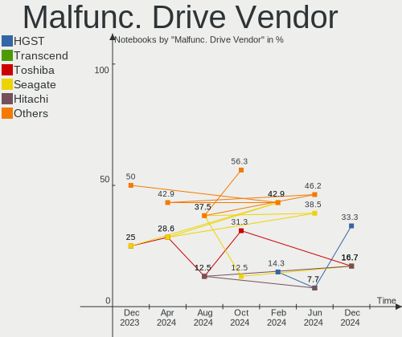
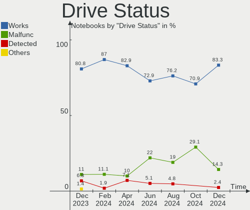
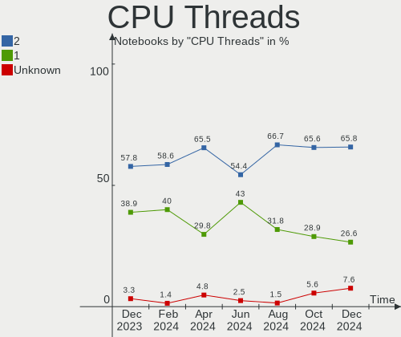
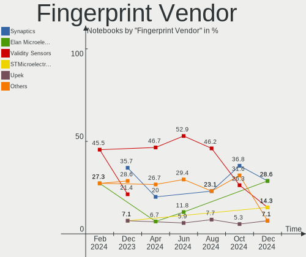

BSD - Hardware Trends (Notebooks)
---------------------------------

A project to identify most popular hardware characteristics and track their change
over time based on data collected by BSD users at https://BSD-Hardware.info.

Anyone can contribute to this report by the [hw-probe](https://github.com/linuxhw/hw-probe/blob/master/INSTALL.BSD.md) tool:

    hw-probe -all -upload

This report is for one last month. Overall report since the beginning of time: [TestDays](https://github.com/bsdhw/TestDays)

Period: Nov, 2023.

Contents
--------

* [ System ](#system)
  - [ OS                       ](#os)
  - [ OS Family                ](#os-family)
  - [ Arch                     ](#arch)
  - [ DE                       ](#de)
  - [ Display Server           ](#display-server)
  - [ Display Manager          ](#display-manager)
  - [ OS Lang                  ](#os-lang)
  - [ Boot Mode                ](#boot-mode)
  - [ Filesystem               ](#filesystem)
  - [ Part. scheme             ](#part-scheme)

* [ Board ](#board)
  - [ Vendor                   ](#vendor)
  - [ Model                    ](#model)
  - [ Model Family             ](#model-family)
  - [ MFG Year                 ](#mfg-year)
  - [ Form Factor              ](#form-factor)
  - [ Coreboot                 ](#coreboot)
  - [ RAM Size                 ](#ram-size)
  - [ RAM Used                 ](#ram-used)
  - [ Total Drives             ](#total-drives)
  - [ Has CD-ROM               ](#has-cd-rom)
  - [ Has Ethernet             ](#has-ethernet)
  - [ Has WiFi                 ](#has-wifi)
  - [ Has Bluetooth            ](#has-bluetooth)

* [ Location ](#location)
  - [ Country                  ](#country)
  - [ City                     ](#city)

* [ Drives ](#drives)
  - [ Drive Vendor             ](#drive-vendor)
  - [ Drive Model              ](#drive-model)
  - [ HDD Vendor               ](#hdd-vendor)
  - [ SSD Vendor               ](#ssd-vendor)
  - [ Drive Kind               ](#drive-kind)
  - [ Drive Connector          ](#drive-connector)
  - [ Drive Size               ](#drive-size)
  - [ Space Total              ](#space-total)
  - [ Space Used               ](#space-used)
  - [ Malfunc. Drives          ](#malfunc-drives)
  - [ Malfunc. Drive Vendor    ](#malfunc-drive-vendor)
  - [ Malfunc. HDD Vendor      ](#malfunc-hdd-vendor)
  - [ Malfunc. Drive Kind      ](#malfunc-drive-kind)
  - [ Failed Drives            ](#failed-drives)
  - [ Failed Drive Vendor      ](#failed-drive-vendor)
  - [ Drive Status             ](#drive-status)

* [ Storage controller ](#storage-controller)
  - [ Storage Vendor           ](#storage-vendor)
  - [ Storage Model            ](#storage-model)
  - [ Storage Kind             ](#storage-kind)

* [ Processor ](#processor)
  - [ CPU Vendor               ](#cpu-vendor)
  - [ CPU Model                ](#cpu-model)
  - [ CPU Model Family         ](#cpu-model-family)
  - [ CPU Cores                ](#cpu-cores)
  - [ CPU Sockets              ](#cpu-sockets)
  - [ CPU Threads              ](#cpu-threads)
  - [ CPU Microarch            ](#cpu-microarch)

* [ Graphics ](#graphics)
  - [ GPU Vendor               ](#gpu-vendor)
  - [ GPU Model                ](#gpu-model)
  - [ GPU Combo                ](#gpu-combo)
  - [ GPU Driver               ](#gpu-driver)
  - [ GPU Memory               ](#gpu-memory)

* [ Monitor ](#monitor)
  - [ Monitor Vendor           ](#monitor-vendor)
  - [ Monitor Model            ](#monitor-model)
  - [ Monitor Resolution       ](#monitor-resolution)
  - [ Monitor Diagonal         ](#monitor-diagonal)
  - [ Monitor Width            ](#monitor-width)
  - [ Aspect Ratio             ](#aspect-ratio)
  - [ Monitor Area             ](#monitor-area)
  - [ Pixel Density            ](#pixel-density)
  - [ Multiple Monitors        ](#multiple-monitors)

* [ Network ](#network)
  - [ Net Controller Vendor    ](#net-controller-vendor)
  - [ Net Controller Model     ](#net-controller-model)
  - [ Wireless Vendor          ](#wireless-vendor)
  - [ Wireless Model           ](#wireless-model)
  - [ Ethernet Vendor          ](#ethernet-vendor)
  - [ Ethernet Model           ](#ethernet-model)
  - [ Net Controller Kind      ](#net-controller-kind)
  - [ Used Controller          ](#used-controller)
  - [ NICs                     ](#nics)
  - [ IPv6                     ](#ipv6)

* [ Bluetooth ](#bluetooth)
  - [ Bluetooth Vendor         ](#bluetooth-vendor)
  - [ Bluetooth Model          ](#bluetooth-model)

* [ Sound ](#sound)
  - [ Sound Vendor             ](#sound-vendor)
  - [ Sound Model              ](#sound-model)

* [ Memory ](#memory)
  - [ Memory Vendor            ](#memory-vendor)
  - [ Memory Model             ](#memory-model)
  - [ Memory Kind              ](#memory-kind)
  - [ Memory Form Factor       ](#memory-form-factor)
  - [ Memory Size              ](#memory-size)
  - [ Memory Speed             ](#memory-speed)

* [ Printers & scanners ](#printers--scanners)
  - [ Printer Vendor           ](#printer-vendor)
  - [ Printer Model            ](#printer-model)
  - [ Scanner Vendor           ](#scanner-vendor)
  - [ Scanner Model            ](#scanner-model)

* [ Camera ](#camera)
  - [ Camera Vendor            ](#camera-vendor)
  - [ Camera Model             ](#camera-model)

* [ Security ](#security)
  - [ Fingerprint Vendor       ](#fingerprint-vendor)
  - [ Fingerprint Model        ](#fingerprint-model)
  - [ Chipcard Vendor          ](#chipcard-vendor)
  - [ Chipcard Model           ](#chipcard-model)

* [ Unsupported ](#unsupported)
  - [ Unsupported Devices      ](#unsupported-devices)
  - [ Unsupported Device Types ](#unsupported-device-types)

System
------

OS
--

Installed operating systems

| Name                | Notebooks | Percent |
|---------------------|-----------|---------|
| FreeBSD 14.0        | 16        | 19.28%  |
| helloSystem 0.9.0   | 11        | 13.25%  |
| helloSystem 0.8.1   | 9         | 10.84%  |
| OpenBSD 7.4         | 8         | 9.64%   |
| GhostBSD 23.10.1    | 8         | 9.64%   |
| FreeBSD 13.2-p4     | 5         | 6.02%   |
| NomadBSD 20231013   | 4         | 4.82%   |
| OPNsense 23.7.9     | 3         | 3.61%   |
| OPNsense 23.7.8     | 2         | 2.41%   |
| FreeBSD 14.0-RC4-p1 | 2         | 2.41%   |
| FreeBSD 14.0-RC4    | 2         | 2.41%   |
| FreeBSD 14.0-BETA5  | 2         | 2.41%   |
| FreeBSD 13.2-p5     | 2         | 2.41%   |
| FreeBSD 13.2        | 2         | 2.41%   |
| OPNsense 23.7.7     | 1         | 1.2%    |
| OPNsense 23.1.11    | 1         | 1.2%    |
| NetBSD 9.3          | 1         | 1.2%    |
| MidnightBSD 3.1.0   | 1         | 1.2%    |
| helloSystem 0.8.2   | 1         | 1.2%    |
| FreeBSD 14.0-STABLE | 1         | 1.2%    |
| FreeBSD 14.0-RC2    | 1         | 1.2%    |

OS Family
---------

OS without a version

| Name        | Notebooks | Percent |
|-------------|-----------|---------|
| FreeBSD     | 33        | 39.76%  |
| helloSystem | 21        | 25.3%   |
| OpenBSD     | 8         | 9.64%   |
| GhostBSD    | 8         | 9.64%   |
| OPNsense    | 7         | 8.43%   |
| NomadBSD    | 4         | 4.82%   |
| NetBSD      | 1         | 1.2%    |
| MidnightBSD | 1         | 1.2%    |

Arch
----

OS architecture (x86_64, i586, etc.)

| Name  | Notebooks | Percent |
|-------|-----------|---------|
| amd64 | 82        | 98.8%   |
| i386  | 1         | 1.2%    |

DE
--

Desktop Environment

| Name         | Notebooks | Percent |
|--------------|-----------|---------|
| helloDesktop | 28        | 33.73%  |
| Console      | 14        | 16.87%  |
| KDE5         | 12        | 14.46%  |
| XFCE         | 8         | 9.64%   |
| MATE         | 8         | 9.64%   |
| Openbox      | 4         | 4.82%   |
| TWM          | 2         | 2.41%   |
| GNOME        | 2         | 2.41%   |
| Cinnamon     | 2         | 2.41%   |
| xinitrc      | 1         | 1.2%    |
| LXQt         | 1         | 1.2%    |
| DWM          | 1         | 1.2%    |

Display Server
--------------

X11 or Wayland

| Name    | Notebooks | Percent |
|---------|-----------|---------|
| X11     | 67        | 80.72%  |
| Console | 15        | 18.07%  |
| Wayland | 1         | 1.2%    |

Display Manager
---------------

SDDM, LightDM, etc.

| Name    | Notebooks | Percent |
|---------|-----------|---------|
| Console | 30        | 36.14%  |
| SLiM    | 23        | 27.71%  |
| SDDM    | 16        | 19.28%  |
| LightDM | 14        | 16.87%  |

OS Lang
-------

Language

| Lang    | Notebooks | Percent |
|---------|-----------|---------|
| Unknown | 29        | 34.94%  |
| C       | 24        | 28.92%  |
| en_US   | 16        | 19.28%  |
| de_DE   | 3         | 3.61%   |
| ru_RU   | 2         | 2.41%   |
| es_ES   | 2         | 2.41%   |
| tr_TR   | 1         | 1.2%    |
| pl_PL   | 1         | 1.2%    |
| it_IT   | 1         | 1.2%    |
| fi_FI   | 1         | 1.2%    |
| es_AR   | 1         | 1.2%    |
| en_AU   | 1         | 1.2%    |
| de_CH   | 1         | 1.2%    |

Boot Mode
---------

EFI or BIOS

| Mode | Notebooks | Percent |
|------|-----------|---------|
| EFI  | 76        | 91.57%  |
| BIOS | 7         | 8.43%   |

Filesystem
----------

Type of filesystem

| Type   | Notebooks | Percent |
|--------|-----------|---------|
| Zfs    | 50        | 60.24%  |
| Ufs    | 14        | 16.87%  |
| Cd9660 | 11        | 13.25%  |
| Ffs    | 8         | 9.64%   |

Part. scheme
------------

Scheme of partitioning

| Type | Notebooks | Percent |
|------|-----------|---------|
| GPT  | 82        | 98.8%   |
| MBR  | 1         | 1.2%    |

Board
-----

Vendor
------

Motherboard manufacturer

| Name                | Notebooks | Percent |
|---------------------|-----------|---------|
| Lenovo              | 25        | 30.12%  |
| Dell                | 21        | 25.3%   |
| Hewlett-Packard     | 6         | 7.23%   |
| Unknown             | 6         | 7.23%   |
| Panasonic           | 3         | 3.61%   |
| Apple               | 3         | 3.61%   |
| Acer                | 3         | 3.61%   |
| TUXEDO              | 2         | 2.41%   |
| Toshiba             | 2         | 2.41%   |
| Google              | 2         | 2.41%   |
| Deciso              | 2         | 2.41%   |
| ASUSTek Computer    | 2         | 2.41%   |
| Samsung Electronics | 1         | 1.2%    |
| OnLogic             | 1         | 1.2%    |
| LG Electronics      | 1         | 1.2%    |
| Gateway             | 1         | 1.2%    |
| Fujitsu             | 1         | 1.2%    |
| Acidanthera         | 1         | 1.2%    |

Model
-----

Motherboard model

| Name                                        | Notebooks | Percent |
|---------------------------------------------|-----------|---------|
| Unknown                                     | 6         | 7.23%   |
| HP Notebook                                 | 2         | 2.41%   |
| Dell XPS 13 9360                            | 2         | 2.41%   |
| Dell Inspiron 1525                          | 2         | 2.41%   |
| Apple MacBookPro7,1                         | 2         | 2.41%   |
| TUXEDO Pulse 15 Gen2                        | 1         | 1.2%    |
| TUXEDO Pulse 15 Gen1                        | 1         | 1.2%    |
| Toshiba Satellite P300                      | 1         | 1.2%    |
| Toshiba Satellite C40-A                     | 1         | 1.2%    |
| Samsung N150P/N210P/N220P                   | 1         | 1.2%    |
| Panasonic CFSX4-1                           | 1         | 1.2%    |
| Panasonic CF-54-1                           | 1         | 1.2%    |
| Panasonic CF-31-5                           | 1         | 1.2%    |
| OnLogic HX401                               | 1         | 1.2%    |
| LG 16UD70R-G.AX59B                          | 1         | 1.2%    |
| Lenovo Z50-70 20354                         | 1         | 1.2%    |
| Lenovo Yoga 2 Pro 20266                     | 1         | 1.2%    |
| Lenovo V15 G2 ALC 82KD                      | 1         | 1.2%    |
| Lenovo ThinkPad X270 W10DG 20K5S0TT1N       | 1         | 1.2%    |
| Lenovo ThinkPad X270 20HN006CUS             | 1         | 1.2%    |
| Lenovo ThinkPad X260 20F6006XUK             | 1         | 1.2%    |
| Lenovo ThinkPad X260 20F5S2GM00             | 1         | 1.2%    |
| Lenovo ThinkPad X230 2320A5U                | 1         | 1.2%    |
| Lenovo ThinkPad X1 Carbon Gen 10 21CBCTO1WW | 1         | 1.2%    |
| Lenovo ThinkPad X1 Carbon 4th 20FCS43F00    | 1         | 1.2%    |
| Lenovo ThinkPad X1 Carbon 4th 20FCS13H00    | 1         | 1.2%    |
| Lenovo ThinkPad X1 Carbon 4th 20FB006FAU    | 1         | 1.2%    |
| Lenovo ThinkPad W530 24411M9                | 1         | 1.2%    |
| Lenovo ThinkPad T60 8744HDG                 | 1         | 1.2%    |
| Lenovo ThinkPad T480 20L6S5VP00             | 1         | 1.2%    |
| Lenovo ThinkPad T470s W10DG 20JTS0LT17      | 1         | 1.2%    |
| Lenovo ThinkPad T470 20HES0EV0A             | 1         | 1.2%    |
| Lenovo ThinkPad T450 20BV000BUS             | 1         | 1.2%    |
| Lenovo ThinkPad P16s Gen 2 21K9CTO1WW       | 1         | 1.2%    |
| Lenovo ThinkPad E14 20RA0016RT              | 1         | 1.2%    |
| Lenovo ThinkPad A485 20MU000VUS             | 1         | 1.2%    |
| Lenovo Legion 5 Pro 16ACH6H 82JQ            | 1         | 1.2%    |
| Lenovo IdeaPad S145-14AST 81ST              | 1         | 1.2%    |
| Lenovo IdeaPad 320-15IKB Touch 81BH         | 1         | 1.2%    |
| Lenovo G50-80 80E5                          | 1         | 1.2%    |

Model Family
------------

Motherboard model prefix

| Name                     | Notebooks | Percent |
|--------------------------|-----------|---------|
| Lenovo ThinkPad          | 18        | 21.69%  |
| Dell Inspiron            | 8         | 9.64%   |
| Dell Latitude            | 6         | 7.23%   |
| Unknown                  | 6         | 7.23%   |
| Dell Precision           | 4         | 4.82%   |
| Acer Aspire              | 3         | 3.61%   |
| TUXEDO Pulse             | 2         | 2.41%   |
| Toshiba Satellite        | 2         | 2.41%   |
| Lenovo IdeaPad           | 2         | 2.41%   |
| HP Pavilion              | 2         | 2.41%   |
| HP Notebook              | 2         | 2.41%   |
| HP Laptop                | 2         | 2.41%   |
| Dell XPS                 | 2         | 2.41%   |
| Apple MacBookPro7        | 2         | 2.41%   |
| Samsung N150P            | 1         | 1.2%    |
| Panasonic CFSX4-1        | 1         | 1.2%    |
| Panasonic CF-54-1        | 1         | 1.2%    |
| Panasonic CF-31-5        | 1         | 1.2%    |
| OnLogic HX401            | 1         | 1.2%    |
| LG 16UD70R-G.AX59B       | 1         | 1.2%    |
| Lenovo Z50-70            | 1         | 1.2%    |
| Lenovo Yoga              | 1         | 1.2%    |
| Lenovo V15               | 1         | 1.2%    |
| Lenovo Legion            | 1         | 1.2%    |
| Lenovo G50-80            | 1         | 1.2%    |
| Google Kohaku            | 1         | 1.2%    |
| Google Dragonair         | 1         | 1.2%    |
| Gateway NV79             | 1         | 1.2%    |
| Fujitsu LIFEBOOK         | 1         | 1.2%    |
| Dell G5                  | 1         | 1.2%    |
| Deciso NetBoard-A10      | 1         | 1.2%    |
| Deciso DEC2700           | 1         | 1.2%    |
| ASUS K56CB               | 1         | 1.2%    |
| ASUS ASUS                | 1         | 1.2%    |
| Apple MacBookAir4        | 1         | 1.2%    |
| Acidanthera MacBookPro16 | 1         | 1.2%    |

MFG Year
--------

Motherboard manufacture year

| Year | Notebooks | Percent |
|------|-----------|---------|
| 2019 | 12        | 14.46%  |
| 2022 | 10        | 12.05%  |
| 2015 | 10        | 12.05%  |
| 2023 | 7         | 8.43%   |
| 2020 | 6         | 7.23%   |
| 2018 | 6         | 7.23%   |
| 2021 | 5         | 6.02%   |
| 2012 | 5         | 6.02%   |
| 2016 | 4         | 4.82%   |
| 2010 | 4         | 4.82%   |
| 2017 | 3         | 3.61%   |
| 2013 | 3         | 3.61%   |
| 2014 | 2         | 2.41%   |
| 2011 | 2         | 2.41%   |
| 2008 | 2         | 2.41%   |
| 2009 | 1         | 1.2%    |
| 2006 | 1         | 1.2%    |

Form Factor
-----------

Physical design of the computer

| Name     | Notebooks | Percent |
|----------|-----------|---------|
| Notebook | 83        | 100%    |

Coreboot
--------

Have coreboot on board

| Used | Notebooks | Percent |
|------|-----------|---------|
| No   | 81        | 97.59%  |
| Yes  | 2         | 2.41%   |

RAM Size
--------

Total RAM memory

| Size in GB  | Notebooks | Percent |
|-------------|-----------|---------|
| 8.01-16.0   | 31        | 37.35%  |
| 16.01-24.0  | 20        | 24.1%   |
| 4.01-8.0    | 13        | 15.66%  |
| 32.01-64.0  | 10        | 12.05%  |
| 64.01-256.0 | 4         | 4.82%   |
| 3.01-4.0    | 3         | 3.61%   |
| 2.01-3.0    | 2         | 2.41%   |

RAM Used
--------

Used RAM memory

| Used GB  | Notebooks | Percent |
|----------|-----------|---------|
| 0.01-0.5 | 39        | 46.99%  |
| 0.51-1.0 | 20        | 24.1%   |
| 1.01-2.0 | 14        | 16.87%  |
| 2.01-3.0 | 6         | 7.23%   |
| 4.01-8.0 | 2         | 2.41%   |
| 3.01-4.0 | 1         | 1.2%    |
| Unknown  | 1         | 1.2%    |

Total Drives
------------

Number of drives on board

| Drives | Notebooks | Percent |
|--------|-----------|---------|
| 1      | 52        | 62.65%  |
| 2      | 15        | 18.07%  |
| 0      | 15        | 18.07%  |
| 4      | 1         | 1.2%    |

Has CD-ROM
----------

Has CD-ROM on board

| Presented | Notebooks | Percent |
|-----------|-----------|---------|
| No        | 65        | 78.31%  |
| Yes       | 18        | 21.69%  |

Has Ethernet
------------

Has Ethernet on board

| Presented | Notebooks | Percent |
|-----------|-----------|---------|
| Yes       | 69        | 83.13%  |
| No        | 14        | 16.87%  |

Has WiFi
--------

Has WiFi module

| Presented | Notebooks | Percent |
|-----------|-----------|---------|
| Yes       | 76        | 91.57%  |
| No        | 7         | 8.43%   |

Has Bluetooth
-------------

Has Bluetooth module

| Presented | Notebooks | Percent |
|-----------|-----------|---------|
| Yes       | 65        | 78.31%  |
| No        | 18        | 21.69%  |

Location
--------

Country
-------

Geographic location (country)

| Country             | Notebooks | Percent |
|---------------------|-----------|---------|
| USA                 | 13        | 15.66%  |
| Germany             | 10        | 12.05%  |
| Canada              | 8         | 9.64%   |
| Switzerland         | 4         | 4.82%   |
| France              | 4         | 4.82%   |
| Brazil              | 4         | 4.82%   |
| South Africa        | 3         | 3.61%   |
| Indonesia           | 3         | 3.61%   |
| Australia           | 3         | 3.61%   |
| Algeria             | 3         | 3.61%   |
| UK                  | 2         | 2.41%   |
| Turkey              | 2         | 2.41%   |
| Russia              | 2         | 2.41%   |
| Poland              | 2         | 2.41%   |
| Norway              | 2         | 2.41%   |
| Belgium             | 2         | 2.41%   |
| Argentina           | 2         | 2.41%   |
| Trinidad and Tobago | 1         | 1.2%    |
| Spain               | 1         | 1.2%    |
| Portugal            | 1         | 1.2%    |
| New Zealand         | 1         | 1.2%    |
| Mexico              | 1         | 1.2%    |
| Italy               | 1         | 1.2%    |
| India               | 1         | 1.2%    |
| Iceland             | 1         | 1.2%    |
| Egypt               | 1         | 1.2%    |
| Czechia             | 1         | 1.2%    |
| Colombia            | 1         | 1.2%    |
| China               | 1         | 1.2%    |
| Bulgaria            | 1         | 1.2%    |
| Austria             | 1         | 1.2%    |

City
----

Geographic location (city)

| City              | Notebooks | Percent |
|-------------------|-----------|---------|
| Montreal          | 4         | 4.82%   |
| Sydney            | 3         | 3.61%   |
| Urcuit            | 2         | 2.41%   |
| Saint-Laurent     | 2         | 2.41%   |
| Pretoria          | 2         | 2.41%   |
| Neuengors         | 2         | 2.41%   |
| Lebanon           | 2         | 2.41%   |
| Frankfurt am Main | 2         | 2.41%   |
| Buenos Aires      | 2         | 2.41%   |
| Zurich            | 1         | 1.2%    |
| Zele              | 1         | 1.2%    |
| Ypsilanti         | 1         | 1.2%    |
| Wroclaw           | 1         | 1.2%    |
| Tver              | 1         | 1.2%    |
| Tsarevo           | 1         | 1.2%    |
| Tracy             | 1         | 1.2%    |
| Tasikmalaya       | 1         | 1.2%    |
| Sydenham          | 1         | 1.2%    |
| Sun Prairie       | 1         | 1.2%    |
| Stavanger         | 1         | 1.2%    |
| Seattle           | 1         | 1.2%    |
| Schörfling       | 1         | 1.2%    |
| Sao Paulo         | 1         | 1.2%    |
| Rio de Janeiro    | 1         | 1.2%    |
| Reykjavik         | 1         | 1.2%    |
| Redford           | 1         | 1.2%    |
| Port of Spain     | 1         | 1.2%    |
| Plymouth          | 1         | 1.2%    |
| Plainfield        | 1         | 1.2%    |
| Payson            | 1         | 1.2%    |
| Paris             | 1         | 1.2%    |
| Oslo              | 1         | 1.2%    |
| Oran              | 1         | 1.2%    |
| Nuremberg         | 1         | 1.2%    |
| Normal            | 1         | 1.2%    |
| Münster          | 1         | 1.2%    |
| Mostaganem        | 1         | 1.2%    |
| Moscow            | 1         | 1.2%    |
| Montería         | 1         | 1.2%    |
| McKinney          | 1         | 1.2%    |

Drives
------

Drive Vendor
------------

Hard drive vendors

| Vendor              | Notebooks | Drives | Percent |
|---------------------|-----------|--------|---------|
| Samsung Electronics | 17        | 18     | 20.73%  |
| SanDisk             | 9         | 10     | 10.98%  |
| Seagate             | 8         | 8      | 9.76%   |
| WDC                 | 6         | 6      | 7.32%   |
| Kingston            | 6         | 6      | 7.32%   |
| Toshiba             | 4         | 4      | 4.88%   |
| Crucial             | 4         | 4      | 4.88%   |
| Transcend           | 3         | 3      | 3.66%   |
| Micron Technology   | 3         | 3      | 3.66%   |
| SK hynix            | 2         | 2      | 2.44%   |
| Hitachi             | 2         | 2      | 2.44%   |
| HGST                | 2         | 2      | 2.44%   |
| FORESEE             | 2         | 2      | 2.44%   |
| V-GeN               | 1         | 2      | 1.22%   |
| SSSTC               | 1         | 1      | 1.22%   |
| SPCC                | 1         | 1      | 1.22%   |
| PNY                 | 1         | 1      | 1.22%   |
| Patriot             | 1         | 1      | 1.22%   |
| NVMe                | 1         | 1      | 1.22%   |
| Maxtor              | 1         | 1      | 1.22%   |
| LITEON              | 1         | 1      | 1.22%   |
| Integral            | 1         | 1      | 1.22%   |
| Hoodisk             | 1         | 1      | 1.22%   |
| Dogfish             | 1         | 1      | 1.22%   |
| Apple               | 1         | 1      | 1.22%   |
| AMD                 | 1         | 1      | 1.22%   |
| A-DATA Technology   | 1         | 1      | 1.22%   |

Drive Model
-----------

Hard drive models

| Model                                  | Notebooks | Percent |
|----------------------------------------|-----------|---------|
| Seagate ST1000LM024 HN-M101MBB 1TB     | 2         | 2.38%   |
| Samsung SSD 870 EVO 1TB                | 2         | 2.38%   |
| Samsung SSD 860 EVO 1TB                | 2         | 2.38%   |
| Kingston SNV2S500G 500GB               | 2         | 2.38%   |
| Hitachi HTS545025B9SA02 250GB          | 2         | 2.38%   |
| WDC WD7500BPKT-75PK4T0 752GB           | 1         | 1.19%   |
| WDC WD3200BEKT-00V5T0 320GB            | 1         | 1.19%   |
| WDC WD1600BEVT-75ZCT0 160GB            | 1         | 1.19%   |
| WDC WD10SMZW-11Y0TS0 1TB               | 1         | 1.19%   |
| WDC WD10JPVX-75JC3T0 1TB               | 1         | 1.19%   |
| WDC PC SN730 NVMe 512GB                | 1         | 1.19%   |
| V-GeN V-GEN11SM20AR1024ITM2 1TB        | 1         | 1.19%   |
| V-GeN V-GEN03SM22AR1024SDK 1TB         | 1         | 1.19%   |
| Transcend TS256GMTS400 256GB           | 1         | 1.19%   |
| Transcend TS256GMTE652T2 256GB         | 1         | 1.19%   |
| Transcend TS128GMTE110S 128GB          | 1         | 1.19%   |
| Toshiba THNSNJ256GCSY 256GB            | 1         | 1.19%   |
| Toshiba MQ04UBF100 1TB                 | 1         | 1.19%   |
| Toshiba MQ02ABF100 1TB                 | 1         | 1.19%   |
| Toshiba MK3265GSX 320GB                | 1         | 1.19%   |
| SSSTC CVB-8D128-HP 128GB               | 1         | 1.19%   |
| SPCC Solid State Disk 120GB            | 1         | 1.19%   |
| SK hynix SKHynix_HFS512GDE9X084N 512GB | 1         | 1.19%   |
| SK hynix SKHynix_HFS001TEJ9X162N 1TB   | 1         | 1.19%   |
| Seagate ST9500325AS 500GB              | 1         | 1.19%   |
| Seagate ST9100824AS 100GB              | 1         | 1.19%   |
| Seagate ST500LM021-1KJ152 500GB        | 1         | 1.19%   |
| Seagate ST500LM000-1EJ162 500GB        | 1         | 1.19%   |
| Seagate ST2000LM007-1R8174 2TB         | 1         | 1.19%   |
| Seagate SSD 500GB                      | 1         | 1.19%   |
| SanDisk X400 M.2 2280 256GB            | 1         | 1.19%   |
| SanDisk X110 2.5 7MM 128GB             | 1         | 1.19%   |
| SanDisk SSD U100 32GB                  | 1         | 1.19%   |
| SanDisk SSD U100 24GB                  | 1         | 1.19%   |
| SanDisk SSD PLUS 240GB                 | 1         | 1.19%   |
| SanDisk SSD G5 BICS4 1TB               | 1         | 1.19%   |
| SanDisk SD8SN8U128G1001 128GB          | 1         | 1.19%   |
| SanDisk SD8SN8U-256G-1006 256GB        | 1         | 1.19%   |
| SanDisk SD8SBAT128G 128GB              | 1         | 1.19%   |
| Samsung SSD 970 EVO Plus 1TB           | 1         | 1.19%   |

HDD Vendor
----------

Hard disk drive vendors

| Vendor              | Notebooks | Drives | Percent |
|---------------------|-----------|--------|---------|
| Seagate             | 7         | 7      | 31.82%  |
| WDC                 | 5         | 5      | 22.73%  |
| Toshiba             | 3         | 3      | 13.64%  |
| Hitachi             | 2         | 2      | 9.09%   |
| HGST                | 2         | 2      | 9.09%   |
| Samsung Electronics | 1         | 1      | 4.55%   |
| NVMe                | 1         | 1      | 4.55%   |
| Maxtor              | 1         | 1      | 4.55%   |

SSD Vendor
----------

Solid state drive vendors

| Vendor              | Notebooks | Drives | Percent |
|---------------------|-----------|--------|---------|
| Samsung Electronics | 11        | 11     | 24.44%  |
| SanDisk             | 9         | 10     | 20%     |
| Kingston            | 4         | 4      | 8.89%   |
| Micron Technology   | 3         | 3      | 6.67%   |
| FORESEE             | 2         | 2      | 4.44%   |
| Crucial             | 2         | 2      | 4.44%   |
| V-GeN               | 1         | 2      | 2.22%   |
| Transcend           | 1         | 1      | 2.22%   |
| Toshiba             | 1         | 1      | 2.22%   |
| SSSTC               | 1         | 1      | 2.22%   |
| SPCC                | 1         | 1      | 2.22%   |
| Seagate             | 1         | 1      | 2.22%   |
| PNY                 | 1         | 1      | 2.22%   |
| Patriot             | 1         | 1      | 2.22%   |
| LITEON              | 1         | 1      | 2.22%   |
| Integral            | 1         | 1      | 2.22%   |
| Hoodisk             | 1         | 1      | 2.22%   |
| Dogfish             | 1         | 1      | 2.22%   |
| Apple               | 1         | 1      | 2.22%   |
| A-DATA Technology   | 1         | 1      | 2.22%   |

Drive Kind
----------

HDD or SSD

| Kind | Notebooks | Drives | Percent |
|------|-----------|--------|---------|
| SSD  | 40        | 47     | 52.63%  |
| HDD  | 21        | 22     | 27.63%  |
| NVMe | 15        | 16     | 19.74%  |

Drive Connector
---------------

SATA, SAS, NVMe, etc.

| Type | Notebooks | Drives | Percent |
|------|-----------|--------|---------|
| SATA | 58        | 69     | 79.45%  |
| NVMe | 15        | 16     | 20.55%  |

Drive Size
----------

Size of hard drive

| Size in TB | Notebooks | Drives | Percent |
|------------|-----------|--------|---------|
| 0.01-0.5   | 44        | 47     | 67.69%  |
| 0.51-1.0   | 18        | 19     | 27.69%  |
| 1.01-2.0   | 3         | 3      | 4.62%   |

Space Total
-----------

Amount of disk space available on the file system

| Size in GB | Notebooks | Percent |
|------------|-----------|---------|
| 101-250    | 21        | 25.3%   |
| 251-500    | 16        | 19.28%  |
| 1-20       | 16        | 19.28%  |
| 501-1000   | 12        | 14.46%  |
| 51-100     | 8         | 9.64%   |
| 21-50      | 7         | 8.43%   |
| 1001-2000  | 3         | 3.61%   |

Space Used
----------

Amount of used disk space

| Used GB  | Notebooks | Percent |
|----------|-----------|---------|
| 1-20     | 69        | 83.13%  |
| 21-50    | 9         | 10.84%  |
| 51-100   | 3         | 3.61%   |
| 101-250  | 1         | 1.2%    |
| 501-1000 | 1         | 1.2%    |

Malfunc. Drives
---------------

Drive models with a malfunction

| Model                                        | Notebooks | Drives | Percent |
|----------------------------------------------|-----------|--------|---------|
| Toshiba MK3265GSX 320GB                      | 1         | 1      | 12.5%   |
| SSSTC CVB-8D128-HP 128GB                     | 1         | 1      | 12.5%   |
| Seagate ST9500325AS 500GB                    | 1         | 1      | 12.5%   |
| Seagate ST9100824AS 100GB                    | 1         | 1      | 12.5%   |
| Seagate ST500LM021-1KJ152 500GB              | 1         | 1      | 12.5%   |
| Seagate ST500LM000-1EJ162 500GB              | 1         | 1      | 12.5%   |
| Samsung Electronics SSD 870 EVO 1TB          | 1         | 1      | 12.5%   |
| Samsung Electronics MZMPA128HMFU-000H1 128GB | 1         | 1      | 12.5%   |

Malfunc. Drive Vendor
---------------------

Vendors of faulty drives

| Vendor              | Notebooks | Drives | Percent |
|---------------------|-----------|--------|---------|
| Seagate             | 4         | 4      | 50%     |
| Samsung Electronics | 2         | 2      | 25%     |
| Toshiba             | 1         | 1      | 12.5%   |
| SSSTC               | 1         | 1      | 12.5%   |

Malfunc. HDD Vendor
-------------------

Vendors of faulty HDD drives

| Vendor  | Notebooks | Drives | Percent |
|---------|-----------|--------|---------|
| Seagate | 4         | 4      | 80%     |
| Toshiba | 1         | 1      | 20%     |

Malfunc. Drive Kind
-------------------

Kinds of faulty drives

| Kind | Notebooks | Drives | Percent |
|------|-----------|--------|---------|
| HDD  | 5         | 5      | 62.5%   |
| SSD  | 3         | 3      | 37.5%   |

Failed Drives
-------------

Failed drive models

Zero info for selected period =(

Failed Drive Vendor
-------------------

Failed drive vendors

Zero info for selected period =(

Drive Status
------------

Number of failed and malfunc. drives

| Status   | Notebooks | Drives | Percent |
|----------|-----------|--------|---------|
| Works    | 61        | 75     | 85.92%  |
| Malfunc  | 8         | 8      | 11.27%  |
| Detected | 2         | 2      | 2.82%   |

Storage controller
------------------

Storage Vendor
--------------

Storage controller vendors

| Vendor                         | Notebooks | Percent |
|--------------------------------|-----------|---------|
| Intel                          | 55        | 56.7%   |
| Samsung Electronics            | 10        | 10.31%  |
| AMD                            | 8         | 8.25%   |
| SK hynix                       | 4         | 4.12%   |
| SanDisk                        | 3         | 3.09%   |
| Kingston Technology Company    | 3         | 3.09%   |
| Transcend                      | 2         | 2.06%   |
| Silicon Motion                 | 2         | 2.06%   |
| Nvidia                         | 2         | 2.06%   |
| Micron/Crucial Technology      | 2         | 2.06%   |
| Solid State Storage Technology | 1         | 1.03%   |
| Realtek Semiconductor          | 1         | 1.03%   |
| Phison Electronics             | 1         | 1.03%   |
| Micron Technology              | 1         | 1.03%   |
| MAXIO Technology (Hangzhou)    | 1         | 1.03%   |
| KIOXIA                         | 1         | 1.03%   |

Storage Model
-------------

Storage controller models

| Model                                                                         | Notebooks | Percent |
|-------------------------------------------------------------------------------|-----------|---------|
| Intel Sunrise Point-LP SATA Controller [AHCI mode]                            | 13        | 12.87%  |
| AMD FCH SATA Controller [AHCI mode]                                           | 8         | 7.92%   |
| Intel Wildcat Point-LP SATA Controller [AHCI Mode]                            | 6         | 5.94%   |
| Intel 8 Series SATA Controller 1 [AHCI mode]                                  | 6         | 5.94%   |
| Intel 7 Series Chipset Family 6-port SATA Controller [AHCI mode]              | 6         | 5.94%   |
| Samsung NVMe SSD Controller SM981/PM981/PM983                                 | 4         | 3.96%   |
| Intel 82801 Mobile SATA Controller [RAID mode]                                | 4         | 3.96%   |
| Intel 6 Series/C200 Series Chipset Family 6 port Mobile SATA AHCI Controller  | 4         | 3.96%   |
| Intel Q170/Q150/B150/H170/H110/Z170/CM236 Chipset SATA Controller [AHCI Mode] | 3         | 2.97%   |
| Intel Comet Lake SATA AHCI Controller                                         | 3         | 2.97%   |
| Transcend NVMe PCIe SSD 110S/112S/120S/MTE300S/MTE400S/MTE652T2 (DRAM-less)   | 2         | 1.98%   |
| SK hynix Gold P31/BC711/PC711 NVMe Solid State Drive                          | 2         | 1.98%   |
| Samsung NVMe SSD Controller SM961/PM961/SM963                                 | 2         | 1.98%   |
| Samsung NVMe SSD Controller 980 (DRAM-less)                                   | 2         | 1.98%   |
| Nvidia MCP89 SATA Controller (AHCI mode)                                      | 2         | 1.98%   |
| Micron/Crucial P2 [Nick P2] / P3 / P3 Plus NVMe PCIe SSD (DRAM-less)          | 2         | 1.98%   |
| Kingston Company NV2 NVMe SSD SM2267XT                                        | 2         | 1.98%   |
| Intel 82801IBM/IEM (ICH9M/ICH9M-E) 4 port SATA Controller [AHCI mode]         | 2         | 1.98%   |
| Intel 82801HM/HEM (ICH8M/ICH8M-E) SATA Controller [AHCI mode]                 | 2         | 1.98%   |
| Intel 82801HM/HEM (ICH8M/ICH8M-E) IDE Controller                              | 2         | 1.98%   |
| Solid State Storage CL1-3D256-Q11 NVMe SSD M.2                                | 1         | 0.99%   |
| SK hynix Platinum P41/PC801 NVMe Solid State Drive                            | 1         | 0.99%   |
| SK hynix BC501 NVMe Solid State Drive                                         | 1         | 0.99%   |
| Silicon Motion SM2263EN/SM2263XT (DRAM-less) NVMe SSD Controllers             | 1         | 0.99%   |
| Silicon Motion SM2262/SM2262EN SSD Controller                                 | 1         | 0.99%   |
| Sandisk WD Black SN770 / PC SN740 256GB / PC SN560 (DRAM-less) NVMe SSD       | 1         | 0.99%   |
| SanDisk Ultra 3D / WD Blue SN570 NVMe SSD (DRAM-less)                         | 1         | 0.99%   |
| SanDisk Ultra 3D / WD Blue SN550 NVMe SSD                                     | 1         | 0.99%   |
| SanDisk Extreme Pro / WD Black SN750 / PC SN730 / Red SN700 NVMe SSD          | 1         | 0.99%   |
| Samsung NVMe SSD Controller S4LV008[Pascal]                                   | 1         | 0.99%   |
| Samsung NVMe SSD Controller PM9A1/PM9A3/980PRO                                | 1         | 0.99%   |
| Realtek RTS5765DL NVMe SSD Controller (DRAM-less)                             | 1         | 0.99%   |
| Phison E12 NVMe Controller                                                    | 1         | 0.99%   |
| Micron 2300 NVMe SSD [Santana]                                                | 1         | 0.99%   |
| MAXIO (Hangzhou) NVMe SSD Controller MAP1202                                  | 1         | 0.99%   |
| KIOXIA NVMe SSD Controller BG5 (DRAM-less)                                    | 1         | 0.99%   |
| Kingston Company NV1 NVMe SSD SM2263XT                                        | 1         | 0.99%   |
| Intel NM10/ICH7 Family SATA Controller [AHCI mode]                            | 1         | 0.99%   |
| Intel Cannon Lake Mobile PCH SATA AHCI Controller                             | 1         | 0.99%   |
| Intel 82801GBM/GHM (ICH7-M Family) SATA Controller [AHCI mode]                | 1         | 0.99%   |

Storage Kind
------------

Kind of storage controller (IDE, SATA, NVMe, SAS, ...)

| Kind | Notebooks | Percent |
|------|-----------|---------|
| SATA | 61        | 62.24%  |
| NVMe | 30        | 30.61%  |
| RAID | 4         | 4.08%   |
| IDE  | 3         | 3.06%   |

Processor
---------

CPU Vendor
----------

Processor vendors

| Vendor | Notebooks | Percent |
|--------|-----------|---------|
| Intel  | 67        | 80.72%  |
| AMD    | 16        | 19.28%  |

CPU Model
---------

Processor models

| Model                                  | Notebooks | Percent |
|----------------------------------------|-----------|---------|
| Intel Core i5-6300U CPU @ 2.40GHz      | 6         | 7.23%   |
| Intel Core i5-4210U CPU @ 1.70GHz      | 4         | 4.82%   |
| Intel Core i7-8550U CPU @ 1.80GHz      | 3         | 3.61%   |
| Intel Core i5-7300U CPU @ 2.60GHz      | 3         | 3.61%   |
| Intel Core i5-5300U CPU @ 2.30GHz      | 3         | 3.61%   |
| Intel Core i5-8350U CPU @ 1.70GHz      | 2         | 2.41%   |
| Intel Core i5-10210U CPU @ 1.60GHz     | 2         | 2.41%   |
| Intel Core i3-6100U CPU @ 2.30GHz      | 2         | 2.41%   |
| Intel Core i3-2350M CPU @ 2.30GHz      | 2         | 2.41%   |
| Intel Core 2 Duo CPU P8600 @ 2.40GHz   | 2         | 2.41%   |
| AMD Ryzen Embedded V1500B              | 2         | 2.41%   |
| AMD Ryzen 7 4800H with Radeon Graphics | 2         | 2.41%   |
| Intel Xeon W-11855M CPU @ 3.20GHz      | 1         | 1.2%    |
| Intel Pentium CPU 3825U @ 1.90GHz      | 1         | 1.2%    |
| Intel Genuine CPU U7300 @ 1.30GHz      | 1         | 1.2%    |
| Intel CPU Version                      | 1         | 1.2%    |
| Intel Core i7-7820HQ CPU @ 2.90GHz     | 1         | 1.2%    |
| Intel Core i7-7700HQ CPU @ 2.80GHz     | 1         | 1.2%    |
| Intel Core i7-6820HQ CPU @ 2.70GHz     | 1         | 1.2%    |
| Intel Core i7-6500U CPU @ 2.50GHz      | 1         | 1.2%    |
| Intel Core i7-5500U CPU @ 2.40GHz      | 1         | 1.2%    |
| Intel Core i7-4800MQ CPU @ 2.70GHz     | 1         | 1.2%    |
| Intel Core i7-4650U CPU @ 1.70GHz      | 1         | 1.2%    |
| Intel Core i7-4500U CPU @ 1.80GHz      | 1         | 1.2%    |
| Intel Core i7-3840QM CPU @ 2.80GHz     | 1         | 1.2%    |
| Intel Core i7-3540M CPU @ 3.00GHz      | 1         | 1.2%    |
| Intel Core i7-3520M CPU @ 2.90GHz      | 1         | 1.2%    |
| Intel Core i7-2677M CPU @ 1.80GHz      | 1         | 1.2%    |
| Intel Core i5-8300H CPU @ 2.30GHz      | 1         | 1.2%    |
| Intel Core i5-7200U CPU @ 2.50GHz      | 1         | 1.2%    |
| Intel Core i5-6300HQ CPU @ 2.30GHz     | 1         | 1.2%    |
| Intel Core i5-6200U CPU @ 2.30GHz      | 1         | 1.2%    |
| Intel Core i5-5200U CPU @ 2.20GHz      | 1         | 1.2%    |
| Intel Core i5-4300U CPU @ 1.90GHz      | 1         | 1.2%    |
| Intel Core i5-3320M CPU @ 2.60GHz      | 1         | 1.2%    |
| Intel Core i5-3317U CPU @ 1.70GHz      | 1         | 1.2%    |
| Intel Core i5-2410M CPU @ 2.30GHz      | 1         | 1.2%    |
| Intel Core i5 CPU M 430 @ 2.27GHz      | 1         | 1.2%    |
| Intel Core i3-4005U CPU @ 1.70GHz      | 1         | 1.2%    |
| Intel Core i3-2348M CPU @ 2.30GHz      | 1         | 1.2%    |

CPU Model Family
----------------

Processor model prefix

| Model              | Notebooks | Percent |
|--------------------|-----------|---------|
| Intel Core i5      | 30        | 36.14%  |
| Intel Core i7      | 15        | 18.07%  |
| Intel Core i3      | 8         | 9.64%   |
| Other              | 4         | 4.82%   |
| AMD Ryzen 7        | 4         | 4.82%   |
| Intel Core 2 Duo   | 3         | 3.61%   |
| AMD Ryzen 5        | 3         | 3.61%   |
| Intel Celeron      | 2         | 2.41%   |
| AMD Ryzen Embedded | 2         | 2.41%   |
| Intel Xeon         | 1         | 1.2%    |
| Intel Pentium      | 1         | 1.2%    |
| Intel Genuine      | 1         | 1.2%    |
| Intel Core 2       | 1         | 1.2%    |
| Intel Atom         | 1         | 1.2%    |
| AMD Ryzen 9        | 1         | 1.2%    |
| AMD Ryzen 7 PRO    | 1         | 1.2%    |
| AMD Ryzen 5 PRO    | 1         | 1.2%    |
| AMD Ryzen 3        | 1         | 1.2%    |
| AMD Athlon         | 1         | 1.2%    |
| AMD A6             | 1         | 1.2%    |
| AMD A10            | 1         | 1.2%    |

CPU Cores
---------

Number of processor cores

| Number  | Notebooks | Percent |
|---------|-----------|---------|
| 2       | 43        | 51.81%  |
| 4       | 17        | 20.48%  |
| 16      | 6         | 7.23%   |
| 8       | 6         | 7.23%   |
| Unknown | 5         | 6.02%   |
| 12      | 2         | 2.41%   |
| 6       | 2         | 2.41%   |
| 5       | 1         | 1.2%    |
| 1       | 1         | 1.2%    |

CPU Sockets
-----------

Number of sockets

| Number  | Notebooks | Percent |
|---------|-----------|---------|
| 1       | 80        | 96.39%  |
| 2       | 2         | 2.41%   |
| Unknown | 1         | 1.2%    |

CPU Threads
-----------

Threads per core (Hyper-Threading)

| Number  | Notebooks | Percent |
|---------|-----------|---------|
| 2       | 57        | 68.67%  |
| 1       | 21        | 25.3%   |
| Unknown | 5         | 6.02%   |

CPU Microarch
-------------

Microarchitecture

| Name        | Notebooks | Percent |
|-------------|-----------|---------|
| KabyLake    | 15        | 18.07%  |
| Skylake     | 12        | 14.46%  |
| Haswell     | 9         | 10.84%  |
| Unknown     | 8         | 9.64%   |
| Broadwell   | 6         | 7.23%   |
| SandyBridge | 5         | 6.02%   |
| IvyBridge   | 5         | 6.02%   |
| Penryn      | 4         | 4.82%   |
| Zen 3       | 3         | 3.61%   |
| Zen         | 3         | 3.61%   |
| Core        | 3         | 3.61%   |
| Zen+        | 2         | 2.41%   |
| Zen 2       | 2         | 2.41%   |
| Westmere    | 2         | 2.41%   |
| TigerLake   | 1         | 1.2%    |
| Piledriver  | 1         | 1.2%    |
| Excavator   | 1         | 1.2%    |
| Bonnell     | 1         | 1.2%    |

Graphics
--------

GPU Vendor
----------

Vendors of graphics cards

| Vendor | Notebooks | Percent |
|--------|-----------|---------|
| Intel  | 60        | 65.93%  |
| AMD    | 19        | 20.88%  |
| Nvidia | 12        | 13.19%  |

GPU Model
---------

Graphics card models

| Model                                                                                 | Notebooks | Percent |
|---------------------------------------------------------------------------------------|-----------|---------|
| Intel Skylake GT2 [HD Graphics 520]                                                   | 10        | 10.53%  |
| Intel Haswell-ULT Integrated Graphics Controller                                      | 8         | 8.42%   |
| Intel UHD Graphics 620                                                                | 5         | 5.26%   |
| Intel HD Graphics 5500                                                                | 5         | 5.26%   |
| Intel 3rd Gen Core processor Graphics Controller                                      | 5         | 5.26%   |
| Intel 2nd Generation Core Processor Family Integrated Graphics Controller             | 5         | 5.26%   |
| Intel HD Graphics 620                                                                 | 4         | 4.21%   |
| Intel CometLake-U GT2 [UHD Graphics]                                                  | 3         | 3.16%   |
| Nvidia MCP89 [GeForce 320M]                                                           | 2         | 2.11%   |
| Intel Mobile GM965/GL960 Integrated Graphics Controller (secondary)                   | 2         | 2.11%   |
| Intel Mobile GM965/GL960 Integrated Graphics Controller (primary)                     | 2         | 2.11%   |
| Intel HD Graphics 630                                                                 | 2         | 2.11%   |
| AMD Renoir [Radeon RX Vega 6 (Ryzen 4000/5000 Mobile Series)]                         | 2         | 2.11%   |
| AMD Picasso/Raven 2 [Radeon Vega Series / Radeon Vega Mobile Series]                  | 2         | 2.11%   |
| AMD Phoenix1                                                                          | 2         | 2.11%   |
| AMD Lucienne                                                                          | 2         | 2.11%   |
| AMD Barcelo                                                                           | 2         | 2.11%   |
| Nvidia GP107M [GeForce GTX 1050 Ti Mobile]                                            | 1         | 1.05%   |
| Nvidia GP107M [GeForce GTX 1050 Mobile]                                               | 1         | 1.05%   |
| Nvidia GP104GLM [Quadro P3000 Mobile]                                                 | 1         | 1.05%   |
| Nvidia GM107GLM [Quadro M1200 Mobile]                                                 | 1         | 1.05%   |
| Nvidia GM107GLM [Quadro M1000M]                                                       | 1         | 1.05%   |
| Nvidia GK107M [GeForce GT 740M]                                                       | 1         | 1.05%   |
| Nvidia GF117M [GeForce 610M/710M/810M/820M / GT 620M/625M/630M/720M]                  | 1         | 1.05%   |
| Nvidia GA106M [GeForce RTX 3060 Mobile / Max-Q]                                       | 1         | 1.05%   |
| Nvidia GA104GLM [RTX A4000 Mobile]                                                    | 1         | 1.05%   |
| Nvidia AD106M [GeForce RTX 4070 Max-Q / Mobile]                                       | 1         | 1.05%   |
| Intel TigerLake-LP GT2 [Iris Xe Graphics]                                             | 1         | 1.05%   |
| Intel Raptor Lake-P [Iris Xe Graphics]                                                | 1         | 1.05%   |
| Intel Mobile 4 Series Chipset Integrated Graphics Controller                          | 1         | 1.05%   |
| Intel HD Graphics 530                                                                 | 1         | 1.05%   |
| Intel HD Graphics                                                                     | 1         | 1.05%   |
| Intel Core Processor Integrated Graphics Controller                                   | 1         | 1.05%   |
| Intel CoffeeLake-H GT2 [UHD Graphics 630]                                             | 1         | 1.05%   |
| Intel Atom Processor D4xx/D5xx/N4xx/N5xx Integrated Graphics Controller               | 1         | 1.05%   |
| Intel Alder Lake-UP3 GT1 [UHD Graphics]                                               | 1         | 1.05%   |
| Intel Alder Lake-P GT2 [Iris Xe Graphics]                                             | 1         | 1.05%   |
| Intel 4th Gen Core Processor Integrated Graphics Controller                           | 1         | 1.05%   |
| AMD Topaz XT [Radeon R7 M260/M265 / M340/M360 / M440/M445 / 530/535 / 620/625 Mobile] | 1         | 1.05%   |
| AMD Sun LE [Radeon HD 8550M / R5 M230]                                                | 1         | 1.05%   |

GPU Combo
---------

Combinations of graphics cards

| Name           | Notebooks | Percent |
|----------------|-----------|---------|
| 1 x Intel      | 47        | 56.63%  |
| 1 x AMD        | 13        | 15.66%  |
| Intel + Nvidia | 6         | 7.23%   |
| 1 x Nvidia     | 5         | 6.02%   |
| 2 x Intel      | 4         | 4.82%   |
| Intel + AMD    | 3         | 3.61%   |
| Other          | 2         | 2.41%   |
| 2 x AMD        | 2         | 2.41%   |
| AMD + Nvidia   | 1         | 1.2%    |

GPU Driver
----------

Free vs proprietary

| Driver      | Notebooks | Percent |
|-------------|-----------|---------|
| Free        | 77        | 92.77%  |
| Unknown     | 4         | 4.82%   |
| Proprietary | 2         | 2.41%   |

GPU Memory
----------

Total video memory

| Size in GB | Notebooks | Percent |
|------------|-----------|---------|
| Unknown    | 72        | 86.75%  |
| 0.01-0.5   | 6         | 7.23%   |
| 5.01-6.0   | 2         | 2.41%   |
| 7.01-8.0   | 1         | 1.2%    |
| 3.01-4.0   | 1         | 1.2%    |
| 0.51-1.0   | 1         | 1.2%    |

Monitor
-------

Monitor Vendor
--------------

Monitor vendors

| Vendor               | Notebooks | Percent |
|----------------------|-----------|---------|
| AU Optronics         | 13        | 22.41%  |
| BOE                  | 11        | 18.97%  |
| LG Display           | 10        | 17.24%  |
| Chimei Innolux       | 8         | 13.79%  |
| Samsung Electronics  | 7         | 12.07%  |
| Sharp                | 4         | 6.9%    |
| LG Philips           | 1         | 1.72%   |
| IBM                  | 1         | 1.72%   |
| Goldstar             | 1         | 1.72%   |
| BOE Technology Group | 1         | 1.72%   |
| Apple                | 1         | 1.72%   |

Monitor Model
-------------

Monitor models

| Model                                                                 | Notebooks | Percent |
|-----------------------------------------------------------------------|-----------|---------|
| Sharp LCD Monitor SHP1453 1920x1080 350x190mm 15.7-inch               | 1         | 1.72%   |
| Sharp LCD Monitor SHP144A 3200x1800 290x170mm 13.2-inch               | 1         | 1.72%   |
| Sharp LCD Monitor SHP1449 1920x1080 290x170mm 13.2-inch               | 1         | 1.72%   |
| Sharp LCD Monitor SHP143E 3840x2160 350x190mm 15.7-inch               | 1         | 1.72%   |
| Samsung Electronics LCD Monitor SEC4145 1366x768 310x170mm 13.9-inch  | 1         | 1.72%   |
| Samsung Electronics LCD Monitor SEC3157 1440x900 330x210mm 15.4-inch  | 1         | 1.72%   |
| Samsung Electronics LCD Monitor SEC3052 1024x600 220x130mm 10.1-inch  | 1         | 1.72%   |
| Samsung Electronics LCD Monitor SEC3051 1600x900 390x230mm 17.8-inch  | 1         | 1.72%   |
| Samsung Electronics LCD Monitor SEC3047 1366x768 280x160mm 12.7-inch  | 1         | 1.72%   |
| Samsung Electronics LCD Monitor SDC5441 1366x768 340x190mm 15.3-inch  | 1         | 1.72%   |
| Samsung Electronics LCD Monitor SDC424A 3200x1800 290x170mm 13.2-inch | 1         | 1.72%   |
| LG Philips LCD Monitor LPL0301 1280x800 330x210mm 15.4-inch           | 1         | 1.72%   |
| LG Display LCD Monitor LGD0773 1920x1200 340x220mm 15.9-inch          | 1         | 1.72%   |
| LG Display LCD Monitor LGD05A2 1920x1080 310x170mm 13.9-inch          | 1         | 1.72%   |
| LG Display LCD Monitor LGD0563 1920x1080 340x190mm 15.3-inch          | 1         | 1.72%   |
| LG Display LCD Monitor LGD0505 1366x768 340x190mm 15.3-inch           | 1         | 1.72%   |
| LG Display LCD Monitor LGD04FF 1920x1080 310x170mm 13.9-inch          | 1         | 1.72%   |
| LG Display LCD Monitor LGD045E 1366x768 310x170mm 13.9-inch           | 1         | 1.72%   |
| LG Display LCD Monitor LGD044B 1366x768 340x190mm 15.3-inch           | 1         | 1.72%   |
| LG Display LCD Monitor LGD03CD 1366x768 280x160mm 12.7-inch           | 1         | 1.72%   |
| LG Display LCD Monitor LGD0384 1366x768 340x190mm 15.3-inch           | 1         | 1.72%   |
| LG Display LCD Monitor LGD0215 1920x1080 350x190mm 15.7-inch          | 1         | 1.72%   |
| IBM LCD Monitor IBM2887 1680x1050 330x210mm 15.4-inch                 | 1         | 1.72%   |
| Goldstar LG HDR 4K GSM7706 3840x2160 600x340mm 27.2-inch              | 1         | 1.72%   |
| Chimei Innolux LCD Monitor CMN15CC 1366x768 340x190mm 15.3-inch       | 1         | 1.72%   |
| Chimei Innolux LCD Monitor CMN15CA 1366x768 340x190mm 15.3-inch       | 1         | 1.72%   |
| Chimei Innolux LCD Monitor CMN15BA 1920x1080 340x190mm 15.3-inch      | 1         | 1.72%   |
| Chimei Innolux LCD Monitor CMN15B7 1366x768 340x190mm 15.3-inch       | 1         | 1.72%   |
| Chimei Innolux LCD Monitor CMN14D4 1920x1080 310x170mm 13.9-inch      | 1         | 1.72%   |
| Chimei Innolux LCD Monitor CMN1489 1366x768 310x170mm 13.9-inch       | 1         | 1.72%   |
| Chimei Innolux LCD Monitor CMN1426 1366x768 310x170mm 13.9-inch       | 1         | 1.72%   |
| Chimei Innolux LCD Monitor CMN1239 1920x1080 280x160mm 12.7-inch      | 1         | 1.72%   |
| BOE Technology Group LCD Monitor 1920x1080                            | 1         | 1.72%   |
| BOE LCD Monitor BOE0991 1920x1080 340x190mm 15.3-inch                 | 1         | 1.72%   |
| BOE LCD Monitor BOE0974 2560x1440 340x190mm 15.3-inch                 | 1         | 1.72%   |
| BOE LCD Monitor BOE0900 1920x1080 340x190mm 15.3-inch                 | 1         | 1.72%   |
| BOE LCD Monitor BOE08EE 1920x1080 310x170mm 13.9-inch                 | 1         | 1.72%   |
| BOE LCD Monitor BOE08D5 1920x1080 340x190mm 15.3-inch                 | 1         | 1.72%   |
| BOE LCD Monitor BOE07D3 1920x1080 310x170mm 13.9-inch                 | 1         | 1.72%   |
| BOE LCD Monitor BOE070D 1366x768 310x170mm 13.9-inch                  | 1         | 1.72%   |

Monitor Resolution
------------------

Monitor screen resolution

| Resolution         | Notebooks | Percent |
|--------------------|-----------|---------|
| 1920x1080 (FHD)    | 28        | 48.28%  |
| 1366x768 (WXGA)    | 19        | 32.76%  |
| 3840x2160 (4K)     | 2         | 3.45%   |
| 3200x1800 (QHD+)   | 2         | 3.45%   |
| 2560x1440 (QHD)    | 1         | 1.72%   |
| 1920x1200 (WUXGA)  | 1         | 1.72%   |
| 1680x1050 (WSXGA+) | 1         | 1.72%   |
| 1600x900 (HD+)     | 1         | 1.72%   |
| 1440x900 (WXGA+)   | 1         | 1.72%   |
| 1280x800 (WXGA)    | 1         | 1.72%   |
| 1024x600           | 1         | 1.72%   |

Monitor Diagonal
----------------

Diagonal size in inches

| Inches  | Notebooks | Percent |
|---------|-----------|---------|
| 15      | 28        | 48.28%  |
| 13      | 19        | 32.76%  |
| 12      | 5         | 8.62%   |
| 17      | 2         | 3.45%   |
| 27      | 1         | 1.72%   |
| 11      | 1         | 1.72%   |
| 10      | 1         | 1.72%   |
| Unknown | 1         | 1.72%   |

Monitor Width
-------------

Physical width

| Width in mm | Notebooks | Percent |
|-------------|-----------|---------|
| 301-350     | 44        | 75.86%  |
| 201-300     | 10        | 17.24%  |
| 351-400     | 2         | 3.45%   |
| 501-600     | 1         | 1.72%   |
| Unknown     | 1         | 1.72%   |

Aspect Ratio
------------

Proportional relationship between the width and the height

| Ratio   | Notebooks | Percent |
|---------|-----------|---------|
| 16/9    | 52        | 91.23%  |
| 16/10   | 3         | 5.26%   |
| 3/2     | 1         | 1.75%   |
| Unknown | 1         | 1.75%   |

Monitor Area
------------

Area in inch²

| Area in inch² | Notebooks | Percent |
|----------------|-----------|---------|
| 91-100         | 21        | 36.21%  |
| 81-90          | 16        | 27.59%  |
| 101-110        | 6         | 10.34%  |
| 61-70          | 5         | 8.62%   |
| 71-80          | 3         | 5.17%   |
| 51-60          | 1         | 1.72%   |
| 41-50          | 1         | 1.72%   |
| 301-350        | 1         | 1.72%   |
| 131-140        | 1         | 1.72%   |
| 121-130        | 1         | 1.72%   |
| 111-120        | 1         | 1.72%   |
| Unknown        | 1         | 1.72%   |

Pixel Density
-------------

Pixels per inch

| Density       | Notebooks | Percent |
|---------------|-----------|---------|
| 121-160       | 28        | 49.12%  |
| 101-120       | 19        | 33.33%  |
| 161-240       | 5         | 8.77%   |
| More than 240 | 3         | 5.26%   |
| 51-100        | 1         | 1.75%   |
| Unknown       | 1         | 1.75%   |

Multiple Monitors
-----------------

Total monitors connected

| Total | Notebooks | Percent |
|-------|-----------|---------|
| 1     | 59        | 71.08%  |
| 0     | 23        | 27.71%  |
| 2     | 1         | 1.2%    |

Network
-------

Net Controller Vendor
---------------------

Controller vendors

| Vendor                            | Notebooks | Percent |
|-----------------------------------|-----------|---------|
| Intel                             | 58        | 45.31%  |
| Realtek Semiconductor             | 30        | 23.44%  |
| Qualcomm Atheros                  | 14        | 10.94%  |
| Sierra Wireless                   | 5         | 3.91%   |
| Broadcom                          | 5         | 3.91%   |
| Marvell Technology Group          | 4         | 3.13%   |
| TP-Link                           | 3         | 2.34%   |
| Ralink Technology                 | 2         | 1.56%   |
| AMD                               | 2         | 1.56%   |
| ZyXEL Communications              | 1         | 0.78%   |
| T & A Mobile Phones               | 1         | 0.78%   |
| Samsung Electronics               | 1         | 0.78%   |
| Qualcomm Technologies             | 1         | 0.78%   |
| Ericsson Business Mobile Networks | 1         | 0.78%   |

Net Controller Model
--------------------

Controller models

| Model                                                             | Notebooks | Percent |
|-------------------------------------------------------------------|-----------|---------|
| Realtek RTL8111/8168/8411 PCI Express Gigabit Ethernet Controller | 19        | 11.52%  |
| Intel Wireless 8260                                               | 9         | 5.45%   |
| Intel Wireless 8265 / 8275                                        | 8         | 4.85%   |
| Realtek RTL810xE PCI Express Fast Ethernet controller             | 7         | 4.24%   |
| Intel Ethernet Connection I219-LM                                 | 6         | 3.64%   |
| Intel Wireless 7265                                               | 5         | 3.03%   |
| Intel Wi-Fi 6 AX200                                               | 5         | 3.03%   |
| Intel Ethernet Connection (4) I219-LM                             | 5         | 3.03%   |
| Sierra Wireless EM7455                                            | 3         | 1.82%   |
| Qualcomm Atheros QCA9565 / AR9565 Wireless Network Adapter        | 3         | 1.82%   |
| Marvell Group 88E8040 PCI-E Fast Ethernet Controller              | 3         | 1.82%   |
| Intel Wireless 7260                                               | 3         | 1.82%   |
| Intel Wi-Fi 6 AX210/AX211/AX411 160MHz                            | 3         | 1.82%   |
| Intel I211 Gigabit Network Connection                             | 3         | 1.82%   |
| Intel Ethernet Connection I218-LM                                 | 3         | 1.82%   |
| Intel Ethernet Connection (3) I218-LM                             | 3         | 1.82%   |
| Intel Comet Lake PCH-LP CNVi WiFi                                 | 3         | 1.82%   |
| Intel 82579LM Gigabit Network Connection (Lewisville)             | 3         | 1.82%   |
| TP-Link TL-WN722N v2/v3 [Realtek RTL8188EUS]                      | 2         | 1.21%   |
| Sierra Wireless EM7305 Modem                                      | 2         | 1.21%   |
| Realtek RTL8852BE PCIe 802.11ax Wireless Network Controller       | 2         | 1.21%   |
| Realtek RTL8822CE 802.11ac PCIe Wireless Network Adapter          | 2         | 1.21%   |
| Realtek RTL8723BE PCIe Wireless Network Adapter                   | 2         | 1.21%   |
| Qualcomm Atheros QCA9377 802.11ac Wireless Network Adapter        | 2         | 1.21%   |
| Qualcomm Atheros AR9485 Wireless Network Adapter                  | 2         | 1.21%   |
| Qualcomm Atheros AR9285 Wireless Network Adapter (PCI-Express)    | 2         | 1.21%   |
| Intel Wireless 3165                                               | 2         | 1.21%   |
| Intel WiFi Link 5100                                              | 2         | 1.21%   |
| Intel PRO/Wireless 3945ABG [Golan] Network Connection             | 2         | 1.21%   |
| Intel I210 Gigabit Network Connection                             | 2         | 1.21%   |
| Intel Centrino Advanced-N 6205 [Taylor Peak]                      | 2         | 1.21%   |
| Broadcom NetXtreme BCM5764M Gigabit Ethernet PCIe                 | 2         | 1.21%   |
| AMD XGMAC 10GbE Controller                                        | 2         | 1.21%   |
| ZyXEL NWD2105 802.11bgn Wireless Adapter [Ralink RT3070]          | 1         | 0.61%   |
| TP-Link TL-WN823N v2/v3 [Realtek RTL8192EU]                       | 1         | 0.61%   |
| TP-Link AC600 wireless Realtek RTL8811AU [Archer T2U Nano]        | 1         | 0.61%   |
| T & A Mobile Phones ALCATEL RNDIS Interface                       | 1         | 0.61%   |
| Samsung Galaxy series, misc. (tethering mode)                     | 1         | 0.61%   |
| Realtek RTL8852AE 802.11ax PCIe Wireless Network Adapter          | 1         | 0.61%   |
| Realtek RTL8192CU 802.11n WLAN Adapter                            | 1         | 0.61%   |

Wireless Vendor
---------------

Wireless vendors

| Vendor                | Notebooks | Percent |
|-----------------------|-----------|---------|
| Intel                 | 51        | 59.3%   |
| Qualcomm Atheros      | 13        | 15.12%  |
| Realtek Semiconductor | 9         | 10.47%  |
| TP-Link               | 3         | 3.49%   |
| Sierra Wireless       | 3         | 3.49%   |
| Broadcom              | 3         | 3.49%   |
| Ralink Technology     | 2         | 2.33%   |
| ZyXEL Communications  | 1         | 1.16%   |
| Qualcomm Technologies | 1         | 1.16%   |

Wireless Model
--------------

Wireless models

| Model                                                          | Notebooks | Percent |
|----------------------------------------------------------------|-----------|---------|
| Intel Wireless 8260                                            | 9         | 10.23%  |
| Intel Wireless 8265 / 8275                                     | 8         | 9.09%   |
| Intel Wireless 7265                                            | 5         | 5.68%   |
| Intel Wi-Fi 6 AX200                                            | 5         | 5.68%   |
| Sierra Wireless EM7455                                         | 3         | 3.41%   |
| Qualcomm Atheros QCA9565 / AR9565 Wireless Network Adapter     | 3         | 3.41%   |
| Intel Wireless 7260                                            | 3         | 3.41%   |
| Intel Wi-Fi 6 AX210/AX211/AX411 160MHz                         | 3         | 3.41%   |
| Intel Comet Lake PCH-LP CNVi WiFi                              | 3         | 3.41%   |
| TP-Link TL-WN722N v2/v3 [Realtek RTL8188EUS]                   | 2         | 2.27%   |
| Realtek RTL8852BE PCIe 802.11ax Wireless Network Controller    | 2         | 2.27%   |
| Realtek RTL8822CE 802.11ac PCIe Wireless Network Adapter       | 2         | 2.27%   |
| Realtek RTL8723BE PCIe Wireless Network Adapter                | 2         | 2.27%   |
| Qualcomm Atheros QCA9377 802.11ac Wireless Network Adapter     | 2         | 2.27%   |
| Qualcomm Atheros AR9485 Wireless Network Adapter               | 2         | 2.27%   |
| Qualcomm Atheros AR9285 Wireless Network Adapter (PCI-Express) | 2         | 2.27%   |
| Intel Wireless 3165                                            | 2         | 2.27%   |
| Intel WiFi Link 5100                                           | 2         | 2.27%   |
| Intel PRO/Wireless 3945ABG [Golan] Network Connection          | 2         | 2.27%   |
| Intel Centrino Advanced-N 6205 [Taylor Peak]                   | 2         | 2.27%   |
| ZyXEL NWD2105 802.11bgn Wireless Adapter [Ralink RT3070]       | 1         | 1.14%   |
| TP-Link TL-WN823N v2/v3 [Realtek RTL8192EU]                    | 1         | 1.14%   |
| TP-Link AC600 wireless Realtek RTL8811AU [Archer T2U Nano]     | 1         | 1.14%   |
| Realtek RTL8852AE 802.11ax PCIe Wireless Network Adapter       | 1         | 1.14%   |
| Realtek RTL8192CU 802.11n WLAN Adapter                         | 1         | 1.14%   |
| Realtek RTL8188EUS 802.11n Wireless Network Adapter            | 1         | 1.14%   |
| Realtek RTL8188CUS 802.11n WLAN Adapter                        | 1         | 1.14%   |
| Ralink RT5370 Wireless Adapter                                 | 1         | 1.14%   |
| Ralink RT2501/RT2573 Wireless Adapter                          | 1         | 1.14%   |
| Qualcomm QCNFA765 Wireless Network Adapter                     | 1         | 1.14%   |
| Qualcomm Atheros QCA6174 802.11ac Wireless Network Adapter     | 1         | 1.14%   |
| Qualcomm Atheros AR9462 Wireless Network Adapter               | 1         | 1.14%   |
| Qualcomm Atheros AR93xx Wireless Network Adapter               | 1         | 1.14%   |
| Qualcomm Atheros AR928X Wireless Network Adapter (PCI-Express) | 1         | 1.14%   |
| Intel Wireless 3160                                            | 1         | 1.14%   |
| Intel Wi-Fi 6 AX201                                            | 1         | 1.14%   |
| Intel Raptor Lake PCH CNVi WiFi                                | 1         | 1.14%   |
| Intel Dual Band Wireless-AC 3165 Plus Bluetooth                | 1         | 1.14%   |
| Intel Centrino Ultimate-N 6300                                 | 1         | 1.14%   |
| Intel Cannon Lake PCH CNVi WiFi                                | 1         | 1.14%   |

Ethernet Vendor
---------------

Ethernet vendors

| Vendor                   | Notebooks | Percent |
|--------------------------|-----------|---------|
| Intel                    | 33        | 45.83%  |
| Realtek Semiconductor    | 26        | 36.11%  |
| Marvell Technology Group | 4         | 5.56%   |
| Broadcom                 | 3         | 4.17%   |
| Qualcomm Atheros         | 2         | 2.78%   |
| AMD                      | 2         | 2.78%   |
| T & A Mobile Phones      | 1         | 1.39%   |
| Samsung Electronics      | 1         | 1.39%   |

Ethernet Model
--------------

Ethernet models

| Model                                                             | Notebooks | Percent |
|-------------------------------------------------------------------|-----------|---------|
| Realtek RTL8111/8168/8411 PCI Express Gigabit Ethernet Controller | 19        | 25.68%  |
| Realtek RTL810xE PCI Express Fast Ethernet controller             | 7         | 9.46%   |
| Intel Ethernet Connection I219-LM                                 | 6         | 8.11%   |
| Intel Ethernet Connection (4) I219-LM                             | 5         | 6.76%   |
| Marvell Group 88E8040 PCI-E Fast Ethernet Controller              | 3         | 4.05%   |
| Intel I211 Gigabit Network Connection                             | 3         | 4.05%   |
| Intel Ethernet Connection I218-LM                                 | 3         | 4.05%   |
| Intel Ethernet Connection (3) I218-LM                             | 3         | 4.05%   |
| Intel 82579LM Gigabit Network Connection (Lewisville)             | 3         | 4.05%   |
| Intel I210 Gigabit Network Connection                             | 2         | 2.7%    |
| Broadcom NetXtreme BCM5764M Gigabit Ethernet PCIe                 | 2         | 2.7%    |
| AMD XGMAC 10GbE Controller                                        | 2         | 2.7%    |
| T & A Mobile Phones ALCATEL RNDIS Interface                       | 1         | 1.35%   |
| Samsung Galaxy series, misc. (tethering mode)                     | 1         | 1.35%   |
| Qualcomm Atheros AR8162 Fast Ethernet                             | 1         | 1.35%   |
| Qualcomm Atheros AR8131 Gigabit Ethernet                          | 1         | 1.35%   |
| Marvell Group 88E8040T PCI-E Fast Ethernet Controller             | 1         | 1.35%   |
| Intel Ethernet Controller I225-V                                  | 1         | 1.35%   |
| Intel Ethernet Connection I219-V                                  | 1         | 1.35%   |
| Intel Ethernet Connection I217-LM                                 | 1         | 1.35%   |
| Intel Ethernet Connection (5) I219-LM                             | 1         | 1.35%   |
| Intel Ethernet Connection (23) I219-LM                            | 1         | 1.35%   |
| Intel Ethernet Connection (16) I219-LM                            | 1         | 1.35%   |
| Intel Ethernet Connection (14) I219-LM                            | 1         | 1.35%   |
| Intel 82599ES 10-Gigabit SFI/SFP+ Network Connection              | 1         | 1.35%   |
| Intel 82574L Gigabit Network Connection                           | 1         | 1.35%   |
| Intel 82573L Gigabit Ethernet Controller                          | 1         | 1.35%   |
| Broadcom NetLink BCM57780 Gigabit Ethernet PCIe                   | 1         | 1.35%   |

Net Controller Kind
-------------------

Ethernet, WiFi or modem

| Kind     | Notebooks | Percent |
|----------|-----------|---------|
| WiFi     | 76        | 51.35%  |
| Ethernet | 69        | 46.62%  |
| Unknown  | 2         | 1.35%   |
| Modem    | 1         | 0.68%   |

Used Controller
---------------

Currently used network controller

| Kind     | Notebooks | Percent |
|----------|-----------|---------|
| WiFi     | 44        | 56.41%  |
| Ethernet | 34        | 43.59%  |

NICs
----

Total network controllers on board

| Total | Notebooks | Percent |
|-------|-----------|---------|
| 2     | 59        | 71.08%  |
| 1     | 16        | 19.28%  |
| 6     | 3         | 3.61%   |
| 5     | 2         | 2.41%   |
| 3     | 2         | 2.41%   |
| 8     | 1         | 1.2%    |

IPv6
----

IPv6 vs IPv4

| Used | Notebooks | Percent |
|------|-----------|---------|
| No   | 72        | 86.75%  |
| Yes  | 11        | 13.25%  |

Bluetooth
---------

Bluetooth Vendor
----------------

Controller vendors

| Vendor                          | Notebooks | Percent |
|---------------------------------|-----------|---------|
| Intel                           | 41        | 63.08%  |
| Realtek Semiconductor           | 6         | 9.23%   |
| Qualcomm Atheros Communications | 4         | 6.15%   |
| Broadcom                        | 3         | 4.62%   |
| Apple                           | 3         | 4.62%   |
| IMC Networks                    | 2         | 3.08%   |
| Foxconn / Hon Hai               | 2         | 3.08%   |
| USI                             | 1         | 1.54%   |
| Lite-On Technology              | 1         | 1.54%   |
| Fujitsu                         | 1         | 1.54%   |
| ASUSTek Computer                | 1         | 1.54%   |

Bluetooth Model
---------------

Controller models

| Model                                                       | Notebooks | Percent |
|-------------------------------------------------------------|-----------|---------|
| Intel Bluetooth wireless interface                          | 27        | 41.54%  |
| Intel AX201 Bluetooth                                       | 4         | 6.15%   |
| Intel AX200 Bluetooth                                       | 4         | 6.15%   |
| Intel AX210 Bluetooth                                       | 3         | 4.62%   |
| Realtek Bluetooth Adapter                                   | 2         | 3.08%   |
| Qualcomm Atheros AR3011 Bluetooth                           | 2         | 3.08%   |
| Intel AX211 Bluetooth                                       | 2         | 3.08%   |
| Apple Bluetooth Host Controller                             | 2         | 3.08%   |
| USI Qualcomm WCN685x Bluetooth Adapter                      | 1         | 1.54%   |
| Realtek Wireless Bluetooth Adapter                          | 1         | 1.54%   |
| Realtek RTL8723B Bluetooth                                  | 1         | 1.54%   |
| Realtek Bluetooth 4.2 Adapter                               | 1         | 1.54%   |
| Realtek Bluetooth 4.0 Adapter                               | 1         | 1.54%   |
| Qualcomm Atheros QCA9377 Bluetooth 4.1                      | 1         | 1.54%   |
| Qualcomm Atheros QCA61x4 Bluetooth 4.0                      | 1         | 1.54%   |
| Lite-On Qualcomm Atheros Bluetooth                          | 1         | 1.54%   |
| Intel Bluetooth 9460/9560 Jefferson Peak (JfP)              | 1         | 1.54%   |
| IMC Networks Realtek Bluetooth Adapter                      | 1         | 1.54%   |
| IMC Networks Atheros AR3012 Bluetooth 4.0 Adapter           | 1         | 1.54%   |
| Fujitsu Qualcomm Atheros AR9462 Bluetooth 4.0 + HS Adapter  | 1         | 1.54%   |
| Foxconn / Hon Hai Qualcomm Atheros AR3012 Bluetooth Adapter | 1         | 1.54%   |
| Foxconn / Hon Hai Broadcom BCM20702 Bluetooth USB Device    | 1         | 1.54%   |
| Broadcom BCM20702 Bluetooth 4.0 [ThinkPad]                  | 1         | 1.54%   |
| Broadcom BCM2070 Bluetooth 2.1+EDR USB Device               | 1         | 1.54%   |
| Broadcom BCM2045B (BDC-2) [Bluetooth Controller]            | 1         | 1.54%   |
| ASUS USB-BT500                                              | 1         | 1.54%   |
| Apple Built-in Bluetooth 2.0+EDR HCI                        | 1         | 1.54%   |

Sound
-----

Sound Vendor
------------

Sound card vendors

| Vendor   | Notebooks | Percent |
|----------|-----------|---------|
| Intel    | 63        | 71.59%  |
| AMD      | 18        | 20.45%  |
| Nvidia   | 6         | 6.82%   |
| PS Audio | 1         | 1.14%   |

Sound Model
-----------

Sound card models

| Model                                                                      | Notebooks | Percent |
|----------------------------------------------------------------------------|-----------|---------|
| Intel Sunrise Point-LP HD Audio                                            | 19        | 16.24%  |
| AMD Family 17h/19h HD Audio Controller                                     | 14        | 11.97%  |
| Intel Haswell-ULT HD Audio Controller                                      | 8         | 6.84%   |
| Intel 8 Series HD Audio Controller                                         | 8         | 6.84%   |
| Intel Wildcat Point-LP High Definition Audio Controller                    | 6         | 5.13%   |
| Intel Broadwell-U Audio Controller                                         | 6         | 5.13%   |
| AMD Renoir Radeon High Definition Audio Controller                         | 6         | 5.13%   |
| Intel 7 Series/C216 Chipset Family High Definition Audio Controller        | 5         | 4.27%   |
| Intel Comet Lake PCH-LP cAVS                                               | 3         | 2.56%   |
| Intel CM238 HD Audio Controller                                            | 3         | 2.56%   |
| Intel 6 Series/C200 Series Chipset Family High Definition Audio Controller | 3         | 2.56%   |
| AMD Raven/Raven2/Fenghuang HDMI/DP Audio Controller                        | 3         | 2.56%   |
| Nvidia MCP89 High Definition Audio                                         | 2         | 1.71%   |
| Intel NM10/ICH7 Family High Definition Audio Controller                    | 2         | 1.71%   |
| Intel Alder Lake PCH-P High Definition Audio Controller                    | 2         | 1.71%   |
| Intel 82801I (ICH9 Family) HD Audio Controller                             | 2         | 1.71%   |
| Intel 82801H (ICH8 Family) HD Audio Controller                             | 2         | 1.71%   |
| Intel 5 Series/3400 Series Chipset High Definition Audio                   | 2         | 1.71%   |
| AMD Rembrandt Radeon High Definition Audio Controller                      | 2         | 1.71%   |
| PS Audio PS Audio USB Audio 2.0                                            | 1         | 0.85%   |
| Nvidia GP104 High Definition Audio Controller                              | 1         | 0.85%   |
| Nvidia GA106 High Definition Audio Controller                              | 1         | 0.85%   |
| Nvidia GA104 High Definition Audio Controller                              | 1         | 0.85%   |
| Intel Xeon E3-1200 v3/4th Gen Core Processor HD Audio Controller           | 1         | 0.85%   |
| Intel Tiger Lake-LP Smart Sound Technology Audio Controller                | 1         | 0.85%   |
| Intel Tiger Lake-H HD Audio Controller                                     | 1         | 0.85%   |
| Intel Raptor Lake-P/U/H cAVS                                               | 1         | 0.85%   |
| Intel Cannon Lake PCH cAVS                                                 | 1         | 0.85%   |
| Intel 8 Series/C220 Series Chipset High Definition Audio Controller        | 1         | 0.85%   |
| Intel 100 Series/C230 Series Chipset Family HD Audio Controller            | 1         | 0.85%   |
| AMD Trinity HDMI Audio Controller                                          | 1         | 0.85%   |
| AMD R600 HDMI Audio [Radeon HD 2900 GT/PRO/XT]                             | 1         | 0.85%   |
| AMD Navi 10 HDMI Audio                                                     | 1         | 0.85%   |
| AMD High Definition Audio Controller                                       | 1         | 0.85%   |
| AMD FCH Azalia Controller                                                  | 1         | 0.85%   |
| AMD Family 15h (Models 60h-6fh) Audio Controller                           | 1         | 0.85%   |
| AMD Cedar HDMI Audio [Radeon HD 5400/6300/7300 Series]                     | 1         | 0.85%   |
| Unknown                                                                    | 1         | 0.85%   |

Memory
------

Memory Vendor
-------------

Memory module vendors

| Vendor              | Notebooks | Percent |
|---------------------|-----------|---------|
| Samsung Electronics | 28        | 29.17%  |
| SK hynix            | 21        | 21.88%  |
| Micron Technology   | 11        | 11.46%  |
| Kingston            | 8         | 8.33%   |
| Crucial             | 6         | 6.25%   |
| Unknown             | 5         | 5.21%   |
| Unknown             | 4         | 4.17%   |
| Ramaxel Technology  | 3         | 3.13%   |
| Transcend           | 2         | 2.08%   |
| Smart               | 2         | 2.08%   |
| Nanya Technology    | 2         | 2.08%   |
| Teikon              | 1         | 1.04%   |
| Elpida              | 1         | 1.04%   |
| ASint Technology    | 1         | 1.04%   |
| 48spaces            | 1         | 1.04%   |

Memory Model
------------

Memory module models

| Model                                                            | Notebooks | Percent |
|------------------------------------------------------------------|-----------|---------|
| SK hynix RAM HMT451S6BFR8A-PB 4GB SODIMM DDR3 1600MT/s           | 4         | 3.88%   |
| Micron RAM 16KTF1G64HZ-1G6E1 8GB SODIMM DDR3 1600MT/s            | 4         | 3.88%   |
| Unknown                                                          | 4         | 3.88%   |
| Samsung RAM M471B5173QH0-YK0 4GB SODIMM DDR3 1600MT/s            | 3         | 2.91%   |
| SK hynix RAM HMT41GS6BFR8A-PB 8GB SODIMM DDR3 1600MT/s           | 2         | 1.94%   |
| SK hynix RAM HMA41GS6AFR8N-TF 8GB SODIMM DDR4 2667MT/s           | 2         | 1.94%   |
| SK hynix RAM H9CCNNNBJTMLAR 4GB SODIMM LPDDR3 1867MT/s           | 2         | 1.94%   |
| SK hynix RAM H9CCNNNBJTMLAR 4GB Chip LPDDR3 1867MT/s             | 2         | 1.94%   |
| Samsung RAM M471A2K43DB1-CWE 16GB SODIMM DDR4 3200MT/s           | 2         | 1.94%   |
| Samsung RAM M471A1K43CB1-CRC 8GB SODIMM DDR4 2667MT/s            | 2         | 1.94%   |
| Samsung RAM M471A1K43BB0-CPB 8GB SODIMM DDR4 2133MT/s            | 2         | 1.94%   |
| Kingston RAM K821PJ-MIH 16GB SODIMM DDR4 2400MT/s                | 2         | 1.94%   |
| Crucial RAM CT102464BF160B.M16 8GB SODIMM DDR3 1600MT/s          | 2         | 1.94%   |
| Unknown RAM Module 8GB SODIMM DDR3 1600MT/s                      | 1         | 0.97%   |
| Unknown RAM Module 4GB SODIMM DDR4 2667MT/s                      | 1         | 0.97%   |
| Unknown RAM Module 2GB SODIMM DDR3 1600MT/s                      | 1         | 0.97%   |
| Unknown RAM Module 2GB SODIMM DDR2                               | 1         | 0.97%   |
| Unknown RAM Module 1GB SODIMM DDR                                | 1         | 0.97%   |
| Transcend RAM TS512MLH64V6HL 4GB SODIMM DDR4 2667MT/s            | 1         | 0.97%   |
| Transcend RAM TS4GSA64V8E 32GB SODIMM DDR5 4800MT/s              | 1         | 0.97%   |
| Teikon RAM TMT425S6CFR6A-PBNJ 2GB SODIMM DDR3 1600MT/s           | 1         | 0.97%   |
| Smart RAM SH564128FJ8NZRNSDG 4GB SODIMM DDR3 1600MT/s            | 1         | 0.97%   |
| Smart RAM SH564128FJ8NWRNSQG 4GB SODIMM DDR3 1600MT/s            | 1         | 0.97%   |
| Smart RAM SH564128FH8NZPHSCG 4GB SODIMM DDR3 1333MT/s            | 1         | 0.97%   |
| Smart RAM SF564128CJ8NWMNSEG 4GB SODIMM DDR3 1600MT/s            | 1         | 0.97%   |
| SK hynix RAM Module 2GB SODIMM DDR3 1067MT/s                     | 1         | 0.97%   |
| SK hynix RAM Module 16GB SODIMM DDR4 2667MT/s                    | 1         | 0.97%   |
| SK hynix RAM HYMP112S64CP6-Y5 1GB SODIMM DDR 667MT/s             | 1         | 0.97%   |
| SK hynix RAM HYMP112S64CP6-S6 1GB SODIMM DDR 800MT/s             | 1         | 0.97%   |
| SK hynix RAM HMT451S6DFR8A-PB 4GB SODIMM DDR3 1600MT/s           | 1         | 0.97%   |
| SK hynix RAM HMT41GS6AFR8A-PB 8GB SODIMM DDR3 1600MT/s           | 1         | 0.97%   |
| SK hynix RAM HMT325S6BFR8C-H9 2GB SODIMM DDR3 1333MT/s           | 1         | 0.97%   |
| SK hynix RAM HMCG66MEBSA095N 8GB SODIMM DDR5 4800MT/s            | 1         | 0.97%   |
| SK hynix RAM HMAA2GS6CJR8N-XN 16GB SODIMM DDR4 3200MT/s          | 1         | 0.97%   |
| SK hynix RAM HMA81GS6CJR8N-VK 8GB SODIMM DDR4 2667MT/s           | 1         | 0.97%   |
| SK hynix RAM H9CCNNNCLGALAR-NVD 8GB Row Of Chips LPDDR3 2133MT/s | 1         | 0.97%   |
| Samsung RAM Module 4GB Row Of Chips LPDDR3 2133MT/s              | 1         | 0.97%   |
| Samsung RAM M471B5273DH0-CK0 4GB SODIMM DDR3 1600MT/s            | 1         | 0.97%   |
| Samsung RAM M471B5273CH0-CK0 4GB SODIMM DDR3 1600MT/s            | 1         | 0.97%   |
| Samsung RAM M471B5173DB0-YK0 4GB SODIMM DDR3 1600MT/s            | 1         | 0.97%   |

Memory Kind
-----------

Memory module kinds

| Kind    | Notebooks | Percent |
|---------|-----------|---------|
| DDR4    | 34        | 40.96%  |
| DDR3    | 29        | 34.94%  |
| LPDDR3  | 6         | 7.23%   |
| DDR2    | 4         | 4.82%   |
| LPDDR5  | 2         | 2.41%   |
| DDR5    | 2         | 2.41%   |
| DDR     | 2         | 2.41%   |
| Unknown | 2         | 2.41%   |
| SDRAM   | 1         | 1.2%    |
| LPDDR4  | 1         | 1.2%    |

Memory Form Factor
------------------

Physical design of the memory module

| Name         | Notebooks | Percent |
|--------------|-----------|---------|
| SODIMM       | 74        | 88.1%   |
| Row Of Chips | 5         | 5.95%   |
| Chip         | 3         | 3.57%   |
| DIMM         | 2         | 2.38%   |

Memory Size
-----------

Memory module size

| Size  | Notebooks | Percent |
|-------|-----------|---------|
| 8192  | 34        | 38.2%   |
| 4096  | 23        | 25.84%  |
| 16384 | 12        | 13.48%  |
| 2048  | 12        | 13.48%  |
| 32768 | 5         | 5.62%   |
| 1024  | 3         | 3.37%   |

Memory Speed
------------

Memory module speed

| Speed   | Notebooks | Percent |
|---------|-----------|---------|
| 1600    | 24        | 27.59%  |
| 3200    | 12        | 13.79%  |
| 2667    | 12        | 13.79%  |
| 2400    | 7         | 8.05%   |
| 2133    | 7         | 8.05%   |
| 1867    | 5         | 5.75%   |
| 1333    | 4         | 4.6%    |
| 800     | 3         | 3.45%   |
| Unknown | 3         | 3.45%   |
| 6400    | 2         | 2.3%    |
| 4800    | 2         | 2.3%    |
| 1067    | 2         | 2.3%    |
| 667     | 2         | 2.3%    |
| 4266    | 1         | 1.15%   |
| 1639    | 1         | 1.15%   |

Printers & scanners
-------------------

Printer Vendor
--------------

Printer device vendors

Zero info for selected period =(

Printer Model
-------------

Printer device models

Zero info for selected period =(

Scanner Vendor
--------------

Scanner device vendors

Zero info for selected period =(

Scanner Model
-------------

Scanner device models

Zero info for selected period =(

Camera
------

Camera Vendor
-------------

Camera device vendors

| Vendor                                 | Notebooks | Percent |
|----------------------------------------|-----------|---------|
| Chicony Electronics                    | 13        | 23.21%  |
| Microdia                               | 11        | 19.64%  |
| Bison Electronics                      | 9         | 16.07%  |
| Realtek Semiconductor                  | 5         | 8.93%   |
| IMC Networks                           | 5         | 8.93%   |
| Lite-On Technology                     | 3         | 5.36%   |
| Sunplus Innovation Technology          | 2         | 3.57%   |
| Z-Star Microelectronics                | 1         | 1.79%   |
| Syntek                                 | 1         | 1.79%   |
| Suyin                                  | 1         | 1.79%   |
| Quanta                                 | 1         | 1.79%   |
| OmniVision Technologies                | 1         | 1.79%   |
| Luxvisions Innotech Limited            | 1         | 1.79%   |
| Cheng Uei Precision Industry (Foxlink) | 1         | 1.79%   |
| Apple                                  | 1         | 1.79%   |

Camera Model
------------

Camera device models

| Model                                                           | Notebooks | Percent |
|-----------------------------------------------------------------|-----------|---------|
| Microdia Integrated_Webcam_HD                                   | 6         | 10.53%  |
| Chicony Integrated Camera                                       | 5         | 8.77%   |
| Bison Integrated Camera                                         | 4         | 7.02%   |
| Sunplus Integrated_Webcam_HD                                    | 2         | 3.51%   |
| Lite-On Integrated Camera                                       | 2         | 3.51%   |
| Bison SunplusIT Integrated Camera                               | 2         | 3.51%   |
| Z-Star Webcam                                                   | 1         | 1.75%   |
| Syntek Lenovo EasyCamera                                        | 1         | 1.75%   |
| Suyin Acer/HP Integrated Webcam [CN0314]                        | 1         | 1.75%   |
| Realtek USB 2.0 PC Camera                                       | 1         | 1.75%   |
| Realtek LG Camera                                               | 1         | 1.75%   |
| Realtek Integrated_Webcam_FHD                                   | 1         | 1.75%   |
| Realtek Integrated Webcam HD                                    | 1         | 1.75%   |
| Realtek Acer 640 x 480 laptop camera                            | 1         | 1.75%   |
| Quanta HP TrueVision HD Camera                                  | 1         | 1.75%   |
| OmniVision OV2640 Webcam                                        | 1         | 1.75%   |
| Microdia Laptop_Integrated_Webcam_HD                            | 1         | 1.75%   |
| Microdia Laptop_Integrated_Webcam_1.3M                          | 1         | 1.75%   |
| Microdia Integrated Webcam HD                                   | 1         | 1.75%   |
| Microdia Integrated Webcam                                      | 1         | 1.75%   |
| Microdia 1.3 MPixel Integrated Webcam                           | 1         | 1.75%   |
| Luxvisions Innotech Limited HP TrueVision HD Camera             | 1         | 1.75%   |
| Lite-On Realtek DMFT RGB                                        | 1         | 1.75%   |
| IMC Networks XHC Camera                                         | 1         | 1.75%   |
| IMC Networks Lenovo EasyCamera                                  | 1         | 1.75%   |
| IMC Networks Integrated Camera                                  | 1         | 1.75%   |
| IMC Networks EasyCamera                                         | 1         | 1.75%   |
| IMC Networks ASUS EasyCamera                                    | 1         | 1.75%   |
| Chicony USB 2.0 Camera                                          | 1         | 1.75%   |
| Chicony Integrated IR Camera                                    | 1         | 1.75%   |
| Chicony Integrated Camera [ThinkPad]                            | 1         | 1.75%   |
| Chicony Integrated Camera (1280x720@30)                         | 1         | 1.75%   |
| Chicony HD WebCam                                               | 1         | 1.75%   |
| Chicony FJ Camera                                               | 1         | 1.75%   |
| Chicony EasyCamera                                              | 1         | 1.75%   |
| Chicony 8M Camera                                               | 1         | 1.75%   |
| Chicony 720p HD Camera                                          | 1         | 1.75%   |
| Cheng Uei Precision Industry (Foxlink) HP Wide Vision HD Camera | 1         | 1.75%   |
| Bison USB HD Webcam                                             | 1         | 1.75%   |
| Bison ThinkPad Integrated Camera                                | 1         | 1.75%   |

Security
--------

Fingerprint Vendor
------------------

Fingerprint sensor vendors

| Vendor                | Notebooks | Percent |
|-----------------------|-----------|---------|
| Validity Sensors      | 11        | 73.33%  |
| Synaptics             | 1         | 6.67%   |
| STMicroelectronics    | 1         | 6.67%   |
| Elan Microelectronics | 1         | 6.67%   |
| AuthenTec             | 1         | 6.67%   |

Fingerprint Model
-----------------

Fingerprint sensor models

| Model                                             | Notebooks | Percent |
|---------------------------------------------------|-----------|---------|
| Validity Sensors VFS7500 Touch Fingerprint Sensor | 3         | 20%     |
| Validity Sensors Synaptics WBDI                   | 3         | 20%     |
| Validity Sensors VFS 5011 fingerprint sensor      | 2         | 13.33%  |
| Validity Sensors VFS7552 Touch Fingerprint Sensor | 1         | 6.67%   |
| Validity Sensors VFS495 Fingerprint Reader        | 1         | 6.67%   |
| Validity Sensors VFS Fingerprint sensor           | 1         | 6.67%   |
| Synaptics Metallica MIS Touch Fingerprint Reader  | 1         | 6.67%   |
| STMicroelectronics Fingerprint Reader             | 1         | 6.67%   |
| Elan Fingerprint Sensor                           | 1         | 6.67%   |
| AuthenTec AES2660                                 | 1         | 6.67%   |

Chipcard Vendor
---------------

Chipcard module vendors

Zero info for selected period =(

Chipcard Model
--------------

Chipcard module models

Zero info for selected period =(

Unsupported
-----------

Unsupported Devices
-------------------

Total unsupported devices on board

| Total | Notebooks | Percent |
|-------|-----------|---------|
| 1     | 39        | 46.99%  |
| 2     | 19        | 22.89%  |
| 3     | 12        | 14.46%  |
| 0     | 7         | 8.43%   |
| 4     | 5         | 6.02%   |
| 5     | 1         | 1.2%    |

Unsupported Device Types
------------------------

Types of unsupported devices

| Type                     | Notebooks | Percent |
|--------------------------|-----------|---------|
| Communication controller | 58        | 45.31%  |
| Bluetooth                | 26        | 20.31%  |
| Net/wireless             | 13        | 10.16%  |
| Fingerprint reader       | 12        | 9.38%   |
| Card reader              | 11        | 8.59%   |
| Firewire controller      | 5         | 3.91%   |
| Sound                    | 2         | 1.56%   |
| Storage                  | 1         | 0.78%   |

