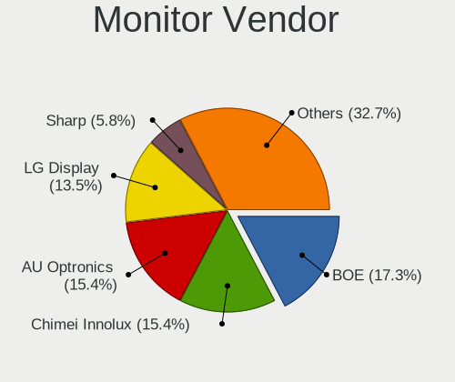

BSD - Hardware Trends (Notebooks)
---------------------------------

A project to identify most popular hardware characteristics and track their change
over time based on data collected by BSD users at https://BSD-Hardware.info.

Anyone can contribute to this report by the [hw-probe](https://github.com/linuxhw/hw-probe/blob/master/INSTALL.BSD.md) tool:

    hw-probe -all -upload

This report is for one last month. Overall report since the beginning of time: [TestDays](https://github.com/bsdhw/TestDays)

Period: Aug, 2023.

Contents
--------

* [ System ](#system)
  - [ OS                       ](#os)
  - [ OS Family                ](#os-family)
  - [ Arch                     ](#arch)
  - [ DE                       ](#de)
  - [ Display Server           ](#display-server)
  - [ Display Manager          ](#display-manager)
  - [ OS Lang                  ](#os-lang)
  - [ Boot Mode                ](#boot-mode)
  - [ Filesystem               ](#filesystem)
  - [ Part. scheme             ](#part-scheme)

* [ Board ](#board)
  - [ Vendor                   ](#vendor)
  - [ Model                    ](#model)
  - [ Model Family             ](#model-family)
  - [ MFG Year                 ](#mfg-year)
  - [ Form Factor              ](#form-factor)
  - [ Coreboot                 ](#coreboot)
  - [ RAM Size                 ](#ram-size)
  - [ RAM Used                 ](#ram-used)
  - [ Total Drives             ](#total-drives)
  - [ Has CD-ROM               ](#has-cd-rom)
  - [ Has Ethernet             ](#has-ethernet)
  - [ Has WiFi                 ](#has-wifi)
  - [ Has Bluetooth            ](#has-bluetooth)

* [ Location ](#location)
  - [ Country                  ](#country)
  - [ City                     ](#city)

* [ Drives ](#drives)
  - [ Drive Vendor             ](#drive-vendor)
  - [ Drive Model              ](#drive-model)
  - [ HDD Vendor               ](#hdd-vendor)
  - [ SSD Vendor               ](#ssd-vendor)
  - [ Drive Kind               ](#drive-kind)
  - [ Drive Connector          ](#drive-connector)
  - [ Drive Size               ](#drive-size)
  - [ Space Total              ](#space-total)
  - [ Space Used               ](#space-used)
  - [ Malfunc. Drives          ](#malfunc-drives)
  - [ Malfunc. Drive Vendor    ](#malfunc-drive-vendor)
  - [ Malfunc. HDD Vendor      ](#malfunc-hdd-vendor)
  - [ Malfunc. Drive Kind      ](#malfunc-drive-kind)
  - [ Failed Drives            ](#failed-drives)
  - [ Failed Drive Vendor      ](#failed-drive-vendor)
  - [ Drive Status             ](#drive-status)

* [ Storage controller ](#storage-controller)
  - [ Storage Vendor           ](#storage-vendor)
  - [ Storage Model            ](#storage-model)
  - [ Storage Kind             ](#storage-kind)

* [ Processor ](#processor)
  - [ CPU Vendor               ](#cpu-vendor)
  - [ CPU Model                ](#cpu-model)
  - [ CPU Model Family         ](#cpu-model-family)
  - [ CPU Cores                ](#cpu-cores)
  - [ CPU Sockets              ](#cpu-sockets)
  - [ CPU Threads              ](#cpu-threads)
  - [ CPU Microarch            ](#cpu-microarch)

* [ Graphics ](#graphics)
  - [ GPU Vendor               ](#gpu-vendor)
  - [ GPU Model                ](#gpu-model)
  - [ GPU Combo                ](#gpu-combo)
  - [ GPU Driver               ](#gpu-driver)
  - [ GPU Memory               ](#gpu-memory)

* [ Monitor ](#monitor)
  - [ Monitor Vendor           ](#monitor-vendor)
  - [ Monitor Model            ](#monitor-model)
  - [ Monitor Resolution       ](#monitor-resolution)
  - [ Monitor Diagonal         ](#monitor-diagonal)
  - [ Monitor Width            ](#monitor-width)
  - [ Aspect Ratio             ](#aspect-ratio)
  - [ Monitor Area             ](#monitor-area)
  - [ Pixel Density            ](#pixel-density)
  - [ Multiple Monitors        ](#multiple-monitors)

* [ Network ](#network)
  - [ Net Controller Vendor    ](#net-controller-vendor)
  - [ Net Controller Model     ](#net-controller-model)
  - [ Wireless Vendor          ](#wireless-vendor)
  - [ Wireless Model           ](#wireless-model)
  - [ Ethernet Vendor          ](#ethernet-vendor)
  - [ Ethernet Model           ](#ethernet-model)
  - [ Net Controller Kind      ](#net-controller-kind)
  - [ Used Controller          ](#used-controller)
  - [ NICs                     ](#nics)
  - [ IPv6                     ](#ipv6)

* [ Bluetooth ](#bluetooth)
  - [ Bluetooth Vendor         ](#bluetooth-vendor)
  - [ Bluetooth Model          ](#bluetooth-model)

* [ Sound ](#sound)
  - [ Sound Vendor             ](#sound-vendor)
  - [ Sound Model              ](#sound-model)

* [ Memory ](#memory)
  - [ Memory Vendor            ](#memory-vendor)
  - [ Memory Model             ](#memory-model)
  - [ Memory Kind              ](#memory-kind)
  - [ Memory Form Factor       ](#memory-form-factor)
  - [ Memory Size              ](#memory-size)
  - [ Memory Speed             ](#memory-speed)

* [ Printers & scanners ](#printers--scanners)
  - [ Printer Vendor           ](#printer-vendor)
  - [ Printer Model            ](#printer-model)
  - [ Scanner Vendor           ](#scanner-vendor)
  - [ Scanner Model            ](#scanner-model)

* [ Camera ](#camera)
  - [ Camera Vendor            ](#camera-vendor)
  - [ Camera Model             ](#camera-model)

* [ Security ](#security)
  - [ Fingerprint Vendor       ](#fingerprint-vendor)
  - [ Fingerprint Model        ](#fingerprint-model)
  - [ Chipcard Vendor          ](#chipcard-vendor)
  - [ Chipcard Model           ](#chipcard-model)

* [ Unsupported ](#unsupported)
  - [ Unsupported Devices      ](#unsupported-devices)
  - [ Unsupported Device Types ](#unsupported-device-types)

System
------

OS
--

Installed operating systems

| Name                 | Notebooks | Percent |
|----------------------|-----------|---------|
| helloSystem 0.8.1    | 14        | 20.29%  |
| FreeBSD 13.2-p2      | 11        | 15.94%  |
| OpenBSD 7.3          | 6         | 8.7%    |
| helloSystem 0.8.2    | 6         | 8.7%    |
| OPNsense 23.7.1      | 4         | 5.8%    |
| helloSystem 0.9.0    | 4         | 5.8%    |
| OPNsense 23.1.11     | 3         | 4.35%   |
| GhostBSD 23.07.29    | 3         | 4.35%   |
| FreeBSD 14.0-CURRENT | 3         | 4.35%   |
| NomadBSD 20221130    | 2         | 2.9%    |
| FreeBSD 13.2         | 2         | 2.9%    |
| OPNsense 23.7.3      | 1         | 1.45%   |
| OPNsense 23.7.2      | 1         | 1.45%   |
| OPNsense 23.4.2      | 1         | 1.45%   |
| helloSystem 0.8.0    | 1         | 1.45%   |
| GhostBSD 23.07.20    | 1         | 1.45%   |
| GhostBSD 23.06.01    | 1         | 1.45%   |
| FuguIta 7.3          | 1         | 1.45%   |
| FreeBSD 15.0-CURRENT | 1         | 1.45%   |
| FreeBSD 14.0-ALPHA3  | 1         | 1.45%   |
| FreeBSD 13.2-p1      | 1         | 1.45%   |
| FreeBSD 13.1-p9      | 1         | 1.45%   |

OS Family
---------

OS without a version

| Name        | Notebooks | Percent |
|-------------|-----------|---------|
| helloSystem | 25        | 36.23%  |
| FreeBSD     | 20        | 28.99%  |
| OPNsense    | 10        | 14.49%  |
| OpenBSD     | 6         | 8.7%    |
| GhostBSD    | 5         | 7.25%   |
| NomadBSD    | 2         | 2.9%    |
| FuguIta     | 1         | 1.45%   |

Arch
----

OS architecture (x86_64, i586, etc.)

| Name  | Notebooks | Percent |
|-------|-----------|---------|
| amd64 | 68        | 98.55%  |
| i386  | 1         | 1.45%   |

DE
--

Desktop Environment

| Name         | Notebooks | Percent |
|--------------|-----------|---------|
| helloDesktop | 29        | 42.03%  |
| Console      | 13        | 18.84%  |
| KDE5         | 7         | 10.14%  |
| MATE         | 5         | 7.25%   |
| XFCE         | 4         | 5.8%    |
| Openbox      | 3         | 4.35%   |
| GNOME        | 3         | 4.35%   |
| i3           | 2         | 2.9%    |
| Potato       | 1         | 1.45%   |
| LXQt         | 1         | 1.45%   |
| Budgie       | 1         | 1.45%   |

Display Server
--------------

X11 or Wayland

| Name    | Notebooks | Percent |
|---------|-----------|---------|
| X11     | 54        | 78.26%  |
| Console | 13        | 18.84%  |
| Wayland | 2         | 2.9%    |

Display Manager
---------------

SDDM, LightDM, etc.

| Name    | Notebooks | Percent |
|---------|-----------|---------|
| SLiM    | 25        | 36.23%  |
| Console | 25        | 36.23%  |
| LightDM | 9         | 13.04%  |
| SDDM    | 6         | 8.7%    |
| XDM     | 2         | 2.9%    |
| GDM     | 2         | 2.9%    |

OS Lang
-------

Language

| Lang    | Notebooks | Percent |
|---------|-----------|---------|
| Unknown | 27        | 39.13%  |
| C       | 16        | 23.19%  |
| en_US   | 9         | 13.04%  |
| fr_FR   | 4         | 5.8%    |
| es_ES   | 2         | 2.9%    |
| zh_TW   | 1         | 1.45%   |
| pt_BR   | 1         | 1.45%   |
| pl_PL   | 1         | 1.45%   |
| nl_NL   | 1         | 1.45%   |
| jp_JP   | 1         | 1.45%   |
| it_IT   | 1         | 1.45%   |
| en_UK   | 1         | 1.45%   |
| en_GB   | 1         | 1.45%   |
| en_AU   | 1         | 1.45%   |
| en      | 1         | 1.45%   |
| Default | 1         | 1.45%   |

Boot Mode
---------

EFI or BIOS

| Mode | Notebooks | Percent |
|------|-----------|---------|
| EFI  | 64        | 92.75%  |
| BIOS | 5         | 7.25%   |

Filesystem
----------

Type of filesystem

| Type   | Notebooks | Percent |
|--------|-----------|---------|
| Zfs    | 34        | 49.28%  |
| Ufs    | 14        | 20.29%  |
| Cd9660 | 14        | 20.29%  |
| Ffs    | 7         | 10.14%  |

Part. scheme
------------

Scheme of partitioning

| Type | Notebooks | Percent |
|------|-----------|---------|
| GPT  | 64        | 92.75%  |
| MBR  | 4         | 5.8%    |
| BSD  | 1         | 1.45%   |

Board
-----

Vendor
------

Motherboard manufacturer

| Name                | Notebooks | Percent |
|---------------------|-----------|---------|
| Lenovo              | 21        | 30.43%  |
| Dell                | 9         | 13.04%  |
| ASUSTek Computer    | 7         | 10.14%  |
| Hewlett-Packard     | 5         | 7.25%   |
| Deciso              | 5         | 7.25%   |
| Acer                | 4         | 5.8%    |
| MSI                 | 2         | 2.9%    |
| Apple               | 2         | 2.9%    |
| Unknown             | 2         | 2.9%    |
| Toshiba             | 1         | 1.45%   |
| Star Labs           | 1         | 1.45%   |
| Samsung Electronics | 1         | 1.45%   |
| NVN-ED01            | 1         | 1.45%   |
| Notebook            | 1         | 1.45%   |
| IGEL Technology     | 1         | 1.45%   |
| Getac               | 1         | 1.45%   |
| Fujitsu Siemens     | 1         | 1.45%   |
| Fujitsu             | 1         | 1.45%   |
| Datto               | 1         | 1.45%   |
| Compaq              | 1         | 1.45%   |
| Chuwi               | 1         | 1.45%   |

Model
-----

Motherboard model

| Name                                       | Notebooks | Percent |
|--------------------------------------------|-----------|---------|
| Deciso NetBoard-A20                        | 4         | 5.8%    |
| Unknown                                    | 4         | 5.8%    |
| Toshiba Satellite S55t-B                   | 1         | 1.45%   |
| Star Labs Lite                             | 1         | 1.45%   |
| Samsung Q210                               | 1         | 1.45%   |
| Notebook N7x0WU                            | 1         | 1.45%   |
| MSI Sword 17 A11UD                         | 1         | 1.45%   |
| MSI Modern 14 B11SBL                       | 1         | 1.45%   |
| Lenovo ThinkPad X230 2325IB1               | 1         | 1.45%   |
| Lenovo ThinkPad X220 4286CTO               | 1         | 1.45%   |
| Lenovo ThinkPad X200 7458WNZ               | 1         | 1.45%   |
| Lenovo ThinkPad X1 Carbon Gen 9 20XXS2XW00 | 1         | 1.45%   |
| Lenovo ThinkPad X1 Carbon Gen 9 20XW00FUUS | 1         | 1.45%   |
| Lenovo ThinkPad X1 Carbon 7th 20QD001UUS   | 1         | 1.45%   |
| Lenovo ThinkPad X1 Carbon 2nd 20A7002FUS   | 1         | 1.45%   |
| Lenovo ThinkPad T60 1951CZ1                | 1         | 1.45%   |
| Lenovo ThinkPad T495s 20QKS1812F           | 1         | 1.45%   |
| Lenovo ThinkPad T490 20RYS06R00            | 1         | 1.45%   |
| Lenovo ThinkPad T480s 20L8S0UD00           | 1         | 1.45%   |
| Lenovo ThinkPad T460p 20FXS06A11           | 1         | 1.45%   |
| Lenovo ThinkPad T450 20BV000BUS            | 1         | 1.45%   |
| Lenovo ThinkPad T450 20BUS0370P            | 1         | 1.45%   |
| Lenovo ThinkPad T430 2347GR2               | 1         | 1.45%   |
| Lenovo ThinkPad P50 20EN0009MS             | 1         | 1.45%   |
| Lenovo Legion 5 Pro 16ACH6H 82JQ           | 1         | 1.45%   |
| Lenovo IdeaPad Slim 9 14ITL5 82D2          | 1         | 1.45%   |
| Lenovo IdeaPad Gaming 3 15IHU6 82K1        | 1         | 1.45%   |
| Lenovo IdeaPad 330-15IKB 81DE              | 1         | 1.45%   |
| Lenovo IdeaPad 110S-11IBR 80WG             | 1         | 1.45%   |
| IGEL H830C                                 | 1         | 1.45%   |
| HP Pavilion dv3500                         | 1         | 1.45%   |
| HP ENVY Notebook 13-ab0XX                  | 1         | 1.45%   |
| HP EliteBook 8570p                         | 1         | 1.45%   |
| HP EliteBook 840 G5                        | 1         | 1.45%   |
| HP 2000                                    | 1         | 1.45%   |
| Getac V110G2                               | 1         | 1.45%   |
| Fujitsu Siemens LIFEBOOK P1610             | 1         | 1.45%   |
| Fujitsu FMVA0803D                          | 1         | 1.45%   |
| Dell Latitude E6420                        | 1         | 1.45%   |
| Dell Latitude E4310                        | 1         | 1.45%   |

Model Family
------------

Motherboard model prefix

| Name                     | Notebooks | Percent |
|--------------------------|-----------|---------|
| Lenovo ThinkPad          | 16        | 23.19%  |
| Dell Latitude            | 6         | 8.7%    |
| Lenovo IdeaPad           | 4         | 5.8%    |
| Deciso NetBoard-A20      | 4         | 5.8%    |
| Acer Aspire              | 4         | 5.8%    |
| Unknown                  | 4         | 5.8%    |
| HP EliteBook             | 2         | 2.9%    |
| Dell Inspiron            | 2         | 2.9%    |
| Toshiba Satellite        | 1         | 1.45%   |
| Star Labs Lite           | 1         | 1.45%   |
| Samsung Q210             | 1         | 1.45%   |
| Notebook N7x0WU          | 1         | 1.45%   |
| MSI Sword                | 1         | 1.45%   |
| MSI Modern               | 1         | 1.45%   |
| Lenovo Legion            | 1         | 1.45%   |
| IGEL H830C               | 1         | 1.45%   |
| HP Pavilion              | 1         | 1.45%   |
| HP ENVY                  | 1         | 1.45%   |
| HP 2000                  | 1         | 1.45%   |
| Getac V110G2             | 1         | 1.45%   |
| Fujitsu Siemens LIFEBOOK | 1         | 1.45%   |
| Fujitsu FMVA0803D        | 1         | 1.45%   |
| Dell G5                  | 1         | 1.45%   |
| Deciso NetBoard-A10      | 1         | 1.45%   |
| Compaq Presario          | 1         | 1.45%   |
| Chuwi CoreBook           | 1         | 1.45%   |
| ASUS X553MA              | 1         | 1.45%   |
| ASUS VivoBook            | 1         | 1.45%   |
| ASUS S500CA              | 1         | 1.45%   |
| ASUS ROG                 | 1         | 1.45%   |
| ASUS N751JK              | 1         | 1.45%   |
| ASUS GL753VD             | 1         | 1.45%   |
| ASUS 1001P               | 1         | 1.45%   |
| Apple MacBookPro11       | 1         | 1.45%   |
| Apple MacBookAir4        | 1         | 1.45%   |

MFG Year
--------

Motherboard manufacture year

| Year | Notebooks | Percent |
|------|-----------|---------|
| 2021 | 11        | 15.94%  |
| 2019 | 8         | 11.59%  |
| 2016 | 7         | 10.14%  |
| 2020 | 6         | 8.7%    |
| 2022 | 5         | 7.25%   |
| 2018 | 5         | 7.25%   |
| 2023 | 4         | 5.8%    |
| 2014 | 4         | 5.8%    |
| 2015 | 3         | 4.35%   |
| 2011 | 3         | 4.35%   |
| 2017 | 2         | 2.9%    |
| 2013 | 2         | 2.9%    |
| 2012 | 2         | 2.9%    |
| 2010 | 2         | 2.9%    |
| 2009 | 2         | 2.9%    |
| 2006 | 2         | 2.9%    |
| 2008 | 1         | 1.45%   |

Form Factor
-----------

Physical design of the computer

| Name     | Notebooks | Percent |
|----------|-----------|---------|
| Notebook | 69        | 100%    |

Coreboot
--------

Have coreboot on board

| Used | Notebooks | Percent |
|------|-----------|---------|
| No   | 69        | 100%    |

RAM Size
--------

Total RAM memory

| Size in GB | Notebooks | Percent |
|------------|-----------|---------|
| 16.01-24.0 | 26        | 37.68%  |
| 8.01-16.0  | 23        | 33.33%  |
| 4.01-8.0   | 13        | 18.84%  |
| 32.01-64.0 | 3         | 4.35%   |
| 2.01-3.0   | 2         | 2.9%    |
| 3.01-4.0   | 1         | 1.45%   |
| 0.51-1.0   | 1         | 1.45%   |

RAM Used
--------

Used RAM memory

| Used GB  | Notebooks | Percent |
|----------|-----------|---------|
| 0.01-0.5 | 35        | 50.72%  |
| 0.51-1.0 | 28        | 40.58%  |
| 1.01-2.0 | 4         | 5.8%    |
| 2.01-3.0 | 1         | 1.45%   |
| 0        | 1         | 1.45%   |

Total Drives
------------

Number of drives on board

| Drives | Notebooks | Percent |
|--------|-----------|---------|
| 1      | 50        | 72.46%  |
| 2      | 11        | 15.94%  |
| 0      | 7         | 10.14%  |
| 3      | 1         | 1.45%   |

Has CD-ROM
----------

Has CD-ROM on board

| Presented | Notebooks | Percent |
|-----------|-----------|---------|
| No        | 58        | 84.06%  |
| Yes       | 11        | 15.94%  |

Has Ethernet
------------

Has Ethernet on board

| Presented | Notebooks | Percent |
|-----------|-----------|---------|
| Yes       | 54        | 78.26%  |
| No        | 15        | 21.74%  |

Has WiFi
--------

Has WiFi module

| Presented | Notebooks | Percent |
|-----------|-----------|---------|
| Yes       | 61        | 88.41%  |
| No        | 8         | 11.59%  |

Has Bluetooth
-------------

Has Bluetooth module

| Presented | Notebooks | Percent |
|-----------|-----------|---------|
| Yes       | 53        | 76.81%  |
| No        | 16        | 23.19%  |

Location
--------

Country
-------

Geographic location (country)

| Country     | Notebooks | Percent |
|-------------|-----------|---------|
| USA         | 16        | 23.19%  |
| UK          | 8         | 11.59%  |
| France      | 7         | 10.14%  |
| Russia      | 4         | 5.8%    |
| Germany     | 3         | 4.35%   |
| Canada      | 3         | 4.35%   |
| Switzerland | 2         | 2.9%    |
| Spain       | 2         | 2.9%    |
| Poland      | 2         | 2.9%    |
| Italy       | 2         | 2.9%    |
| Indonesia   | 2         | 2.9%    |
| Iceland     | 2         | 2.9%    |
| Bulgaria    | 2         | 2.9%    |
| Australia   | 2         | 2.9%    |
| Ukraine     | 1         | 1.45%   |
| Turkey      | 1         | 1.45%   |
| Taiwan      | 1         | 1.45%   |
| Romania     | 1         | 1.45%   |
| Peru        | 1         | 1.45%   |
| Netherlands | 1         | 1.45%   |
| Nepal       | 1         | 1.45%   |
| Jamaica     | 1         | 1.45%   |
| Czechia     | 1         | 1.45%   |
| China       | 1         | 1.45%   |
| Brazil      | 1         | 1.45%   |
| Argentina   | 1         | 1.45%   |

City
----

Geographic location (city)

| City                    | Notebooks | Percent |
|-------------------------|-----------|---------|
| Tomball                 | 2         | 2.9%    |
| St Petersburg           | 2         | 2.9%    |
| Reykjavik               | 2         | 2.9%    |
| Novosibirsk             | 2         | 2.9%    |
| Manchester              | 2         | 2.9%    |
| Zarautz                 | 1         | 1.45%   |
| York                    | 1         | 1.45%   |
| Wroclaw                 | 1         | 1.45%   |
| Urcuit                  | 1         | 1.45%   |
| Toronto                 | 1         | 1.45%   |
| Taipei                  | 1         | 1.45%   |
| Sydney                  | 1         | 1.45%   |
| Swindon                 | 1         | 1.45%   |
| Shelby                  | 1         | 1.45%   |
| Seuzach Dorf            | 1         | 1.45%   |
| Scarborough             | 1         | 1.45%   |
| Samatan                 | 1         | 1.45%   |
| Saint Vlas              | 1         | 1.45%   |
| Roswell                 | 1         | 1.45%   |
| Redmond                 | 1         | 1.45%   |
| Pruhonice               | 1         | 1.45%   |
| Portland                | 1         | 1.45%   |
| Poltava                 | 1         | 1.45%   |
| Paris                   | 1         | 1.45%   |
| New York                | 1         | 1.45%   |
| New Braunfels           | 1         | 1.45%   |
| Mosina                  | 1         | 1.45%   |
| Mitry-Mory              | 1         | 1.45%   |
| Lower Belle             | 1         | 1.45%   |
| Los Angeles             | 1         | 1.45%   |
| London                  | 1         | 1.45%   |
| Lima                    | 1         | 1.45%   |
| Les Pavillons-sous-Bois | 1         | 1.45%   |
| Las Vegas               | 1         | 1.45%   |
| Largo                   | 1         | 1.45%   |
| Lancing                 | 1         | 1.45%   |
| Kingston                | 1         | 1.45%   |
| Jakarta                 | 1         | 1.45%   |
| Izmir                   | 1         | 1.45%   |
| Hamburg                 | 1         | 1.45%   |

Drives
------

Drive Vendor
------------

Hard drive vendors

| Vendor              | Notebooks | Drives | Percent |
|---------------------|-----------|--------|---------|
| Samsung Electronics | 12        | 14     | 16.22%  |
| Transcend           | 8         | 8      | 10.81%  |
| Toshiba             | 7         | 7      | 9.46%   |
| Kingston            | 7         | 7      | 9.46%   |
| WDC                 | 6         | 6      | 8.11%   |
| Crucial             | 5         | 5      | 6.76%   |
| NVMe                | 4         | 5      | 5.41%   |
| SanDisk             | 2         | 2      | 2.7%    |
| JetFlash            | 2         | 2      | 2.7%    |
| HGST                | 2         | 2      | 2.7%    |
| Corsair             | 2         | 2      | 2.7%    |
| Apple               | 2         | 2      | 2.7%    |
| Star Drive          | 1         | 1      | 1.35%   |
| SPCC                | 1         | 1      | 1.35%   |
| SK hynix            | 1         | 1      | 1.35%   |
| Silicon Motion      | 1         | 1      | 1.35%   |
| Seagate             | 1         | 1      | 1.35%   |
| Pioneer             | 1         | 1      | 1.35%   |
| Micron Technology   | 1         | 1      | 1.35%   |
| LITEON              | 1         | 1      | 1.35%   |
| Lexar               | 1         | 1      | 1.35%   |
| KIOXIA              | 1         | 1      | 1.35%   |
| Hitachi             | 1         | 1      | 1.35%   |
| GOODRAM             | 1         | 1      | 1.35%   |
| Fujitsu             | 1         | 1      | 1.35%   |
| BHT                 | 1         | 1      | 1.35%   |
| AirDisk             | 1         | 1      | 1.35%   |

Drive Model
-----------

Hard drive models

| Model                                  | Notebooks | Percent |
|----------------------------------------|-----------|---------|
| Samsung SSD 860 EVO 500GB              | 3         | 3.9%    |
| Transcend TS256GMTS952T2 256GB         | 2         | 2.6%    |
| Kingston SA400S37240G 240GB            | 2         | 2.6%    |
| Kingston OM8PCP3512F-AA 512GB          | 2         | 2.6%    |
| WDC WDS500G2B0A-00SM50 500GB           | 1         | 1.3%    |
| WDC WDS120G2G0B-00EPW0 120GB           | 1         | 1.3%    |
| WDC WD3200BPVT-80JJ5T0 320GB           | 1         | 1.3%    |
| WDC WD10SPZX-24Z10T0 1TB               | 1         | 1.3%    |
| WDC WD10SPZX-00Z10T0 1TB               | 1         | 1.3%    |
| WDC PC SN730 SDBQNTY-256G-1001 256GB   | 1         | 1.3%    |
| Transcend TS64GSSD370S 64GB            | 1         | 1.3%    |
| Transcend TS512GMTS952T2 512GB         | 1         | 1.3%    |
| Transcend TS256GMTS400 256GB           | 1         | 1.3%    |
| Transcend TS256GMTE710T 256GB          | 1         | 1.3%    |
| Transcend TS128GMTS400 128GB           | 1         | 1.3%    |
| Transcend TS128GMTE110S 128GB          | 1         | 1.3%    |
| Toshiba THNSNK256GVN8 M.2 2280 256GB   | 1         | 1.3%    |
| Toshiba MQ01ABD100 1TB                 | 1         | 1.3%    |
| Toshiba MQ01ABD050V 500GB              | 1         | 1.3%    |
| Toshiba MK8034GSX 80GB                 | 1         | 1.3%    |
| Toshiba MK8007GAH 80GB                 | 1         | 1.3%    |
| Toshiba KXG50ZNV512G NVMe 512GB        | 1         | 1.3%    |
| Toshiba KSG60ZMV256G M.2 2280 256GB    | 1         | 1.3%    |
| Star Drive SATA SSD 240GB              | 1         | 1.3%    |
| SPCC Solid State Disk 128GB            | 1         | 1.3%    |
| SK hynix SKHynix_HFS512GDE9X084N 512GB | 1         | 1.3%    |
| Silicon Motion whalekom 256GB          | 1         | 1.3%    |
| Seagate ST2000LM007-1R8174 2TB         | 1         | 1.3%    |
| SanDisk SD8SN8U128G1002 128GB          | 1         | 1.3%    |
| SanDisk pSSD 256GB                     | 1         | 1.3%    |
| Samsung SSD PM851 2.5 7mm 256GB        | 1         | 1.3%    |
| Samsung SSD 980 500GB                  | 1         | 1.3%    |
| Samsung SSD 870 EVO 500GB              | 1         | 1.3%    |
| Samsung SSD 870 EVO 1TB                | 1         | 1.3%    |
| Samsung SSD 860 EVO mSATA 500GB        | 1         | 1.3%    |
| Samsung SSD 840 EVO 250GB              | 1         | 1.3%    |
| Samsung MZVLV256HCHP-000H1 256GB       | 1         | 1.3%    |
| Samsung MZVLB1T0HBLR-000L2 1TB         | 1         | 1.3%    |
| Samsung MZVLB1T0HALR-000H1 1TB         | 1         | 1.3%    |
| Samsung MZVKW512HMJP-000L7 512GB       | 1         | 1.3%    |

HDD Vendor
----------

Hard disk drive vendors

| Vendor              | Notebooks | Drives | Percent |
|---------------------|-----------|--------|---------|
| Toshiba             | 4         | 4      | 21.05%  |
| WDC                 | 3         | 3      | 15.79%  |
| NVMe                | 3         | 3      | 15.79%  |
| JetFlash            | 2         | 2      | 10.53%  |
| HGST                | 2         | 2      | 10.53%  |
| Seagate             | 1         | 1      | 5.26%   |
| Samsung Electronics | 1         | 1      | 5.26%   |
| Lexar               | 1         | 1      | 5.26%   |
| Hitachi             | 1         | 1      | 5.26%   |
| Fujitsu             | 1         | 1      | 5.26%   |

SSD Vendor
----------

Solid state drive vendors

| Vendor              | Notebooks | Drives | Percent |
|---------------------|-----------|--------|---------|
| Transcend           | 6         | 6      | 16.67%  |
| Samsung Electronics | 6         | 8      | 16.67%  |
| Kingston            | 3         | 3      | 8.33%   |
| Crucial             | 3         | 3      | 8.33%   |
| WDC                 | 2         | 2      | 5.56%   |
| Toshiba             | 2         | 2      | 5.56%   |
| SanDisk             | 2         | 2      | 5.56%   |
| NVMe                | 2         | 2      | 5.56%   |
| Corsair             | 2         | 2      | 5.56%   |
| Apple               | 2         | 2      | 5.56%   |
| Star Drive          | 1         | 1      | 2.78%   |
| SPCC                | 1         | 1      | 2.78%   |
| Pioneer             | 1         | 1      | 2.78%   |
| LITEON              | 1         | 1      | 2.78%   |
| GOODRAM             | 1         | 1      | 2.78%   |
| BHT                 | 1         | 1      | 2.78%   |

Drive Kind
----------

HDD or SSD

| Kind | Notebooks | Drives | Percent |
|------|-----------|--------|---------|
| SSD  | 33        | 38     | 47.83%  |
| NVMe | 19        | 20     | 27.54%  |
| HDD  | 17        | 19     | 24.64%  |

Drive Connector
---------------

SATA, SAS, NVMe, etc.

| Type | Notebooks | Drives | Percent |
|------|-----------|--------|---------|
| SATA | 47        | 57     | 71.21%  |
| NVMe | 19        | 20     | 28.79%  |

Drive Size
----------

Size of hard drive

| Size in TB | Notebooks | Drives | Percent |
|------------|-----------|--------|---------|
| 0.01-0.5   | 38        | 43     | 73.08%  |
| 0.51-1.0   | 13        | 13     | 25%     |
| 1.01-2.0   | 1         | 1      | 1.92%   |

Space Total
-----------

Amount of disk space available on the file system

| Size in GB | Notebooks | Percent |
|------------|-----------|---------|
| 101-250    | 23        | 33.33%  |
| 251-500    | 20        | 28.99%  |
| 1-20       | 18        | 26.09%  |
| 21-50      | 5         | 7.25%   |
| 501-1000   | 3         | 4.35%   |

Space Used
----------

Amount of used disk space

| Used GB | Notebooks | Percent |
|---------|-----------|---------|
| 1-20    | 60        | 86.96%  |
| 21-50   | 5         | 7.25%   |
| 101-250 | 2         | 2.9%    |
| 51-100  | 2         | 2.9%    |

Malfunc. Drives
---------------

Drive models with a malfunction

| Model                                | Notebooks | Drives | Percent |
|--------------------------------------|-----------|--------|---------|
| Toshiba THNSNK256GVN8 M.2 2280 256GB | 1         | 1      | 16.67%  |
| Toshiba MK8034GSX 80GB               | 1         | 1      | 16.67%  |
| Samsung Electronics HM320JI 320GB    | 1         | 1      | 16.67%  |
| Hitachi HTS545050A7E380 500GB        | 1         | 1      | 16.67%  |
| HGST HTS725050A7E635 OPAL 500GB      | 1         | 1      | 16.67%  |
| HGST HTS721010A9E630 1TB             | 1         | 1      | 16.67%  |

Malfunc. Drive Vendor
---------------------

Vendors of faulty drives

| Vendor              | Notebooks | Drives | Percent |
|---------------------|-----------|--------|---------|
| Toshiba             | 2         | 2      | 33.33%  |
| HGST                | 2         | 2      | 33.33%  |
| Samsung Electronics | 1         | 1      | 16.67%  |
| Hitachi             | 1         | 1      | 16.67%  |

Malfunc. HDD Vendor
-------------------

Vendors of faulty HDD drives

| Vendor              | Notebooks | Drives | Percent |
|---------------------|-----------|--------|---------|
| HGST                | 2         | 2      | 40%     |
| Toshiba             | 1         | 1      | 20%     |
| Samsung Electronics | 1         | 1      | 20%     |
| Hitachi             | 1         | 1      | 20%     |

Malfunc. Drive Kind
-------------------

Kinds of faulty drives

| Kind | Notebooks | Drives | Percent |
|------|-----------|--------|---------|
| HDD  | 5         | 5      | 83.33%  |
| SSD  | 1         | 1      | 16.67%  |

Failed Drives
-------------

Failed drive models

| Model              | Notebooks | Drives | Percent |
|--------------------|-----------|--------|---------|
| SanDisk pSSD 256GB | 1         | 1      | 100%    |

Failed Drive Vendor
-------------------

Failed drive vendors

| Vendor  | Notebooks | Drives | Percent |
|---------|-----------|--------|---------|
| SanDisk | 1         | 1      | 100%    |

Drive Status
------------

Number of failed and malfunc. drives

| Status   | Notebooks | Drives | Percent |
|----------|-----------|--------|---------|
| Works    | 53        | 63     | 80.3%   |
| Detected | 6         | 7      | 9.09%   |
| Malfunc  | 6         | 6      | 9.09%   |
| Failed   | 1         | 1      | 1.52%   |

Storage controller
------------------

Storage Vendor
--------------

Storage controller vendors

| Vendor                      | Notebooks | Percent |
|-----------------------------|-----------|---------|
| Intel                       | 50        | 60.98%  |
| Samsung Electronics         | 6         | 7.32%   |
| AMD                         | 5         | 6.1%    |
| Sandisk                     | 4         | 4.88%   |
| Kingston Technology Company | 4         | 4.88%   |
| Micron Technology           | 3         | 3.66%   |
| Transcend                   | 2         | 2.44%   |
| Micron/Crucial Technology   | 2         | 2.44%   |
| MAXIO Technology (Hangzhou) | 2         | 2.44%   |
| Toshiba                     | 1         | 1.22%   |
| SK hynix                    | 1         | 1.22%   |
| Silicon Motion              | 1         | 1.22%   |
| KIOXIA                      | 1         | 1.22%   |

Storage Model
-------------

Storage controller models

| Model                                                                          | Notebooks | Percent |
|--------------------------------------------------------------------------------|-----------|---------|
| Intel Sunrise Point-LP SATA Controller [AHCI mode]                             | 7         | 8.05%   |
| AMD FCH SATA Controller [AHCI mode]                                            | 5         | 5.75%   |
| Intel 8 Series SATA Controller 1 [AHCI mode]                                   | 4         | 4.6%    |
| Intel 7 Series Chipset Family 6-port SATA Controller [AHCI mode]               | 4         | 4.6%    |
| SanDisk WD Black SN750 / PC SN730 NVMe SSD                                     | 3         | 3.45%   |
| Kingston Company OM8PCP Design-In PCIe 3 NVMe SSD (DRAM-less)                  | 3         | 3.45%   |
| Intel Wildcat Point-LP SATA Controller [AHCI Mode]                             | 3         | 3.45%   |
| Intel Volume Management Device NVMe RAID Controller                            | 3         | 3.45%   |
| Intel Tiger Lake-LP SATA Controller                                            | 3         | 3.45%   |
| Intel 6 Series/C200 Series Chipset Family 6 port Mobile SATA AHCI Controller   | 3         | 3.45%   |
| Samsung NVMe SSD Controller SM981/PM981/PM983                                  | 2         | 2.3%    |
| MAXIO (Hangzhou) NVMe SSD Controller MAP1202                                   | 2         | 2.3%    |
| Intel SSD 670p Series [Keystone Harbor]                                        | 2         | 2.3%    |
| Intel HM170/QM170 Chipset SATA Controller [AHCI Mode]                          | 2         | 2.3%    |
| Intel Celeron N3350/Pentium N4200/Atom E3900 Series SATA AHCI Controller       | 2         | 2.3%    |
| Intel Cannon Lake Mobile PCH SATA AHCI Controller                              | 2         | 2.3%    |
| Intel Atom Processor E3800 Series SATA AHCI Controller                         | 2         | 2.3%    |
| Intel 82801IBM/IEM (ICH9M/ICH9M-E) 4 port SATA Controller [AHCI mode]          | 2         | 2.3%    |
| Intel 82801G (ICH7 Family) IDE Controller                                      | 2         | 2.3%    |
| Intel 8 Series/C220 Series Chipset Family 6-port SATA Controller 1 [AHCI mode] | 2         | 2.3%    |
| Transcend NVMe PCIe SSD 120S/112S (DRAM-less)                                  | 1         | 1.15%   |
| Toshiba XG5 NVMe SSD Controller                                                | 1         | 1.15%   |
| SK hynix Gold P31/BC711/PC711 NVMe Solid State Drive                           | 1         | 1.15%   |
| Silicon Motion SM2263EN/SM2263XT (DRAM-less) NVMe SSD Controllers              | 1         | 1.15%   |
| Sandisk WD Green SN350 NVMe SSD 1 TB (DRAM-less)                               | 1         | 1.15%   |
| Samsung S4LN053X01 AHCI SSD Controller(Apple slot)                             | 1         | 1.15%   |
| Samsung NVMe SSD Controller SM961/PM961/SM963                                  | 1         | 1.15%   |
| Samsung NVMe SSD Controller SM951/PM951                                        | 1         | 1.15%   |
| Samsung NVMe SSD Controller 980                                                | 1         | 1.15%   |
| Micron/Crucial P5 NVMe PCIe SSD[SlashP5]                                       | 1         | 1.15%   |
| Micron/Crucial P2 [Nick P2] / P3 / P3 Plus NVMe PCIe SSD (DRAM-less)           | 1         | 1.15%   |
| Micron 2450 NVMe SSD [HendrixV] (DRAM-less)                                    | 1         | 1.15%   |
| Micron 2400 NVMe SSD (DRAM-less)                                               | 1         | 1.15%   |
| Micron 2210 NVMe SSD [Cobain]                                                  | 1         | 1.15%   |
| KIOXIA NVMe SSD Controller BG5 (DRAM-less)                                     | 1         | 1.15%   |
| Kingston Company OM3PDP3 NVMe SSD                                              | 1         | 1.15%   |
| Intel Tiger Lake SATA AHCI Controller                                          | 1         | 1.15%   |
| Intel Q170/Q150/B150/H170/H110/Z170/CM236 Chipset SATA Controller [AHCI Mode]  | 1         | 1.15%   |
| Intel NM10/ICH7 Family SATA Controller [AHCI mode]                             | 1         | 1.15%   |
| Intel Ice Lake-LP SATA Controller [AHCI mode]                                  | 1         | 1.15%   |

Storage Kind
------------

Kind of storage controller (IDE, SATA, NVMe, SAS, ...)

| Kind | Notebooks | Percent |
|------|-----------|---------|
| SATA | 50        | 59.52%  |
| NVMe | 26        | 30.95%  |
| RAID | 4         | 4.76%   |
| IDE  | 4         | 4.76%   |

Processor
---------

CPU Vendor
----------

Processor vendors

| Vendor | Notebooks | Percent |
|--------|-----------|---------|
| Intel  | 58        | 84.06%  |
| AMD    | 10        | 14.49%  |
| 11th   | 1         | 1.45%   |

CPU Model
---------

Processor models

| Model                                   | Notebooks | Percent |
|-----------------------------------------|-----------|---------|
| Intel 11th Gen Core i5-1135G7 @ 2.40GHz | 3         | 4.35%   |
| Intel Core i7-3520M CPU @ 2.90GHz       | 2         | 2.9%    |
| Intel Core i5-7200U CPU @ 2.50GHz       | 2         | 2.9%    |
| Intel Core i5-5200U CPU @ 2.20GHz       | 2         | 2.9%    |
| Intel Core i3-8130U CPU @ 2.20GHz       | 2         | 2.9%    |
| Intel 12th Gen Core i5-1235U            | 2         | 2.9%    |
| AMD EPYC 3201 8-Core Processor          | 2         | 2.9%    |
| AMD EPYC 3101 4-Core Processor          | 2         | 2.9%    |
| Intel Xeon CPU E3-1535M v5 @ 2.90GHz    | 1         | 1.45%   |
| Intel Pentium CPU N4200 @ 1.10GHz       | 1         | 1.45%   |
| Intel Pentium 3558U @ 1.70GHz           | 1         | 1.45%   |
| Intel Genuine CPU U1400                 | 1         | 1.45%   |
| Intel CPU Version                       | 1         | 1.45%   |
| Intel Core i7-9750H CPU @ 2.60GHz       | 1         | 1.45%   |
| Intel Core i7-8650U CPU @ 1.90GHz       | 1         | 1.45%   |
| Intel Core i7-8550U CPU @ 1.80GHz       | 1         | 1.45%   |
| Intel Core i7-7700HQ CPU @ 2.80GHz      | 1         | 1.45%   |
| Intel Core i7-6500U CPU @ 2.50GHz       | 1         | 1.45%   |
| Intel Core i7-4710HQ CPU @ 2.50GHz      | 1         | 1.45%   |
| Intel Core i7-2620M CPU @ 2.70GHz       | 1         | 1.45%   |
| Intel Core i7-10510U CPU @ 1.80GHz      | 1         | 1.45%   |
| Intel Core i5-8400H CPU @ 2.50GHz       | 1         | 1.45%   |
| Intel Core i5-8350U CPU @ 1.70GHz       | 1         | 1.45%   |
| Intel Core i5-8265U CPU @ 1.60GHz       | 1         | 1.45%   |
| Intel Core i5-6300U CPU @ 2.40GHz       | 1         | 1.45%   |
| Intel Core i5-6300HQ CPU @ 2.30GHz      | 1         | 1.45%   |
| Intel Core i5-5300U CPU @ 2.30GHz       | 1         | 1.45%   |
| Intel Core i5-4300U CPU @ 1.90GHz       | 1         | 1.45%   |
| Intel Core i5-4258U CPU @ 2.40GHz       | 1         | 1.45%   |
| Intel Core i5-4210M CPU @ 2.60GHz       | 1         | 1.45%   |
| Intel Core i5-4200U CPU @ 1.60GHz       | 1         | 1.45%   |
| Intel Core i5-3320M CPU @ 2.60GHz       | 1         | 1.45%   |
| Intel Core i5-3317U CPU @ 1.70GHz       | 1         | 1.45%   |
| Intel Core i5-2557M CPU @ 1.70GHz       | 1         | 1.45%   |
| Intel Core i5-2540M CPU @ 2.60GH        | 1         | 1.45%   |
| Intel Core i5-1035G1 CPU @ 1.00GHz      | 1         | 1.45%   |
| Intel Core i5 CPU M 540 @ 2.53GH        | 1         | 1.45%   |
| Intel Core i3-7100U CPU @ 2.40GHz       | 1         | 1.45%   |
| Intel Core i3-4030U CPU @ 1.90GHz       | 1         | 1.45%   |
| Intel Core 2 Duo CPU P8600 @ 2.40GHz    | 1         | 1.45%   |

CPU Model Family
----------------

Processor model prefix

| Model              | Notebooks | Percent |
|--------------------|-----------|---------|
| Intel Core i5      | 20        | 28.99%  |
| Other              | 11        | 15.94%  |
| Intel Core i7      | 10        | 14.49%  |
| Intel Celeron      | 6         | 8.7%    |
| Intel Core i3      | 4         | 5.8%    |
| AMD EPYC           | 4         | 5.8%    |
| Intel Pentium      | 2         | 2.9%    |
| Intel Core 2 Duo   | 2         | 2.9%    |
| Intel Xeon         | 1         | 1.45%   |
| Intel Genuine      | 1         | 1.45%   |
| Intel Core 2       | 1         | 1.45%   |
| Intel Atom         | 1         | 1.45%   |
| AMD Ryzen Embedded | 1         | 1.45%   |
| AMD Ryzen 9        | 1         | 1.45%   |
| AMD Ryzen 7 PRO    | 1         | 1.45%   |
| AMD Ryzen 7        | 1         | 1.45%   |
| AMD Ryzen 5        | 1         | 1.45%   |
| AMD E2             | 1         | 1.45%   |

CPU Cores
---------

Number of processor cores

| Number  | Notebooks | Percent |
|---------|-----------|---------|
| 2       | 32        | 46.38%  |
| 4       | 21        | 30.43%  |
| 8       | 4         | 5.8%    |
| Unknown | 4         | 5.8%    |
| 16      | 2         | 2.9%    |
| 12      | 2         | 2.9%    |
| 6       | 2         | 2.9%    |
| 1       | 2         | 2.9%    |

CPU Sockets
-----------

Number of sockets

| Number  | Notebooks | Percent |
|---------|-----------|---------|
| 1       | 68        | 98.55%  |
| Unknown | 1         | 1.45%   |

CPU Threads
-----------

Threads per core (Hyper-Threading)

| Number  | Notebooks | Percent |
|---------|-----------|---------|
| 2       | 43        | 62.32%  |
| 1       | 21        | 30.43%  |
| Unknown | 5         | 7.25%   |

CPU Microarch
-------------

Microarchitecture

| Name          | Notebooks | Percent |
|---------------|-----------|---------|
| KabyLake      | 13        | 18.84%  |
| TigerLake     | 7         | 10.14%  |
| Haswell       | 7         | 10.14%  |
| Zen           | 5         | 7.25%   |
| IvyBridge     | 5         | 7.25%   |
| Skylake       | 4         | 5.8%    |
| Silvermont    | 3         | 4.35%   |
| SandyBridge   | 3         | 4.35%   |
| Broadwell     | 3         | 4.35%   |
| Unknown       | 3         | 4.35%   |
| Zen 3         | 2         | 2.9%    |
| Penryn        | 2         | 2.9%    |
| Goldmont      | 2         | 2.9%    |
| Core          | 2         | 2.9%    |
| Zen+          | 1         | 1.45%   |
| Zen 2         | 1         | 1.45%   |
| Westmere      | 1         | 1.45%   |
| P6            | 1         | 1.45%   |
| IceLake       | 1         | 1.45%   |
| Goldmont plus | 1         | 1.45%   |
| Bonnell       | 1         | 1.45%   |
| Bobcat        | 1         | 1.45%   |

Graphics
--------

GPU Vendor
----------

Vendors of graphics cards

| Vendor | Notebooks | Percent |
|--------|-----------|---------|
| Intel  | 56        | 76.71%  |
| Nvidia | 11        | 15.07%  |
| AMD    | 6         | 8.22%   |

GPU Model
---------

Graphics card models

| Model                                                                                    | Notebooks | Percent |
|------------------------------------------------------------------------------------------|-----------|---------|
| Intel TigerLake-LP GT2 [Iris Xe Graphics]                                                | 7         | 9.33%   |
| Intel UHD Graphics 620                                                                   | 5         | 6.67%   |
| Intel Haswell-ULT Integrated Graphics Controller                                         | 5         | 6.67%   |
| Intel 3rd Gen Core processor Graphics Controller                                         | 4         | 5.33%   |
| Intel HD Graphics 620                                                                    | 3         | 4%      |
| Intel HD Graphics 5500                                                                   | 3         | 4%      |
| Intel 2nd Generation Core Processor Family Integrated Graphics Controller                | 3         | 4%      |
| Intel Skylake GT2 [HD Graphics 520]                                                      | 2         | 2.67%   |
| Intel Mobile 945GM/GMS/GME, 943/940GML Express Integrated Graphics Controller            | 2         | 2.67%   |
| Intel Mobile 945GM/GMS, 943/940GML Express Integrated Graphics Controller                | 2         | 2.67%   |
| Intel CoffeeLake-H GT2 [UHD Graphics 630]                                                | 2         | 2.67%   |
| Intel Atom Processor Z36xxx/Z37xxx Series Graphics & Display                             | 2         | 2.67%   |
| Intel Alder Lake-UP3 GT2 [Iris Xe Graphics]                                              | 2         | 2.67%   |
| Intel 4th Gen Core Processor Integrated Graphics Controller                              | 2         | 2.67%   |
| Nvidia TU117M [GeForce MX450]                                                            | 1         | 1.33%   |
| Nvidia TU117M [GeForce GTX 1650 Mobile / Max-Q]                                          | 1         | 1.33%   |
| Nvidia TU116M [GeForce GTX 1660 Ti Mobile]                                               | 1         | 1.33%   |
| Nvidia GP107M [GeForce GTX 1050 Mobile]                                                  | 1         | 1.33%   |
| Nvidia GM107M [GeForce GTX 850M]                                                         | 1         | 1.33%   |
| Nvidia GM107GLM [Quadro M2000M]                                                          | 1         | 1.33%   |
| Nvidia GA107M [GeForce RTX 3050 Ti Mobile]                                               | 1         | 1.33%   |
| Nvidia GA107M [GeForce RTX 3050 Mobile]                                                  | 1         | 1.33%   |
| Nvidia GA106M [GeForce RTX 3060 Mobile / Max-Q]                                          | 1         | 1.33%   |
| Nvidia G98M [GeForce 9300M GS]                                                           | 1         | 1.33%   |
| Nvidia G98M [GeForce 9200M GS]                                                           | 1         | 1.33%   |
| Intel WhiskeyLake-U GT2 [UHD Graphics 620]                                               | 1         | 1.33%   |
| Intel TigerLake-H GT1 [UHD Graphics]                                                     | 1         | 1.33%   |
| Intel Mobile 4 Series Chipset Integrated Graphics Controller                             | 1         | 1.33%   |
| Intel Iris Plus Graphics G1 (Ice Lake)                                                   | 1         | 1.33%   |
| Intel HD Graphics P530                                                                   | 1         | 1.33%   |
| Intel HD Graphics 630                                                                    | 1         | 1.33%   |
| Intel HD Graphics 530                                                                    | 1         | 1.33%   |
| Intel HD Graphics 500                                                                    | 1         | 1.33%   |
| Intel GeminiLake [UHD Graphics 600]                                                      | 1         | 1.33%   |
| Intel Core Processor Integrated Graphics Controller                                      | 1         | 1.33%   |
| Intel CometLake-U GT2 [UHD Graphics]                                                     | 1         | 1.33%   |
| Intel Atom/Celeron/Pentium Processor x5-E8000/J3xxx/N3xxx Integrated Graphics Controller | 1         | 1.33%   |
| Intel Atom Processor D4xx/D5xx/N4xx/N5xx Integrated Graphics Controller                  | 1         | 1.33%   |
| Intel Apollo Lake [HD Graphics 505]                                                      | 1         | 1.33%   |
| AMD Wrestler [Radeon HD 7340]                                                            | 1         | 1.33%   |

GPU Combo
---------

Combinations of graphics cards

| Name           | Notebooks | Percent |
|----------------|-----------|---------|
| 1 x Intel      | 44        | 63.77%  |
| Intel + Nvidia | 7         | 10.14%  |
| Other          | 5         | 7.25%   |
| 2 x Intel      | 4         | 5.8%    |
| 1 x AMD        | 4         | 5.8%    |
| 1 x Nvidia     | 3         | 4.35%   |
| Intel + AMD    | 1         | 1.45%   |
| AMD + Nvidia   | 1         | 1.45%   |

GPU Driver
----------

Free vs proprietary

| Driver      | Notebooks | Percent |
|-------------|-----------|---------|
| Free        | 59        | 85.51%  |
| Proprietary | 5         | 7.25%   |
| Unknown     | 5         | 7.25%   |

GPU Memory
----------

Total video memory

| Size in GB | Notebooks | Percent |
|------------|-----------|---------|
| Unknown    | 65        | 94.2%   |
| 5.01-6.0   | 1         | 1.45%   |
| 1.01-2.0   | 1         | 1.45%   |
| 0.51-1.0   | 1         | 1.45%   |
| 0.01-0.5   | 1         | 1.45%   |

Monitor
-------

Monitor Vendor
--------------

Monitor vendors

| Vendor                  | Notebooks | Percent |
|-------------------------|-----------|---------|
| AU Optronics            | 13        | 25.49%  |
| LG Display              | 11        | 21.57%  |
| Chimei Innolux          | 4         | 7.84%   |
| BOE                     | 4         | 7.84%   |
| Lenovo                  | 3         | 5.88%   |
| Apple                   | 3         | 5.88%   |
| Samsung Electronics     | 2         | 3.92%   |
| InfoVision              | 2         | 3.92%   |
| Chi Mei Optoelectronics | 2         | 3.92%   |
| Sharp                   | 1         | 1.96%   |
| Philips                 | 1         | 1.96%   |
| HannStar                | 1         | 1.96%   |
| Goldstar                | 1         | 1.96%   |
| Dell                    | 1         | 1.96%   |
| CTO                     | 1         | 1.96%   |
| BOE Technology Group    | 1         | 1.96%   |

Monitor Model
-------------

Monitor models

| Model                                                                    | Notebooks | Percent |
|--------------------------------------------------------------------------|-----------|---------|
| Chimei Innolux LCD Monitor CMN15E7 1920x1080 340x190mm 15.3-inch         | 2         | 3.92%   |
| AU Optronics LCD Monitor AUO323D 1920x1080 310x170mm 13.9-inch           | 2         | 3.92%   |
| Sharp LCD Monitor SHP143B 3840x2160 350x190mm 15.7-inch                  | 1         | 1.96%   |
| Samsung Electronics LF27T370F SAM711E 1920x1080 600x340mm 27.2-inch      | 1         | 1.96%   |
| Samsung Electronics LCD Monitor SDC4C46 3840x2160 340x190mm 15.3-inch    | 1         | 1.96%   |
| Philips 271P4 PHL08C3 1920x1080 600x340mm 27.2-inch                      | 1         | 1.96%   |
| LG Display LCD Monitor LGD05A2 1920x1080 310x170mm 13.9-inch             | 1         | 1.96%   |
| LG Display LCD Monitor LGD04FF 1920x1080 310x170mm 13.9-inch             | 1         | 1.96%   |
| LG Display LCD Monitor LGD04F9 1920x1080 310x170mm 13.9-inch             | 1         | 1.96%   |
| LG Display LCD Monitor LGD04E8 1920x1080 380x210mm 17.1-inch             | 1         | 1.96%   |
| LG Display LCD Monitor LGD04A7 1920x1080 340x190mm 15.3-inch             | 1         | 1.96%   |
| LG Display LCD Monitor LGD0470 1920x1080 350x190mm 15.7-inch             | 1         | 1.96%   |
| LG Display LCD Monitor LGD046C 1920x1080 380x210mm 17.1-inch             | 1         | 1.96%   |
| LG Display LCD Monitor LGD03A3 1366x768 280x160mm 12.7-inch              | 1         | 1.96%   |
| LG Display LCD Monitor LGD02D3 1366x768 280x160mm 12.7-inch              | 1         | 1.96%   |
| LG Display LCD Monitor LGD0258 1600x900 350x190mm 15.7-inch              | 1         | 1.96%   |
| LG Display LCD Monitor LGD024D 1366x768 290x170mm 13.2-inch              | 1         | 1.96%   |
| Lenovo LCD Monitor LEN40A3 1920x1080 310x170mm 13.9-inch                 | 1         | 1.96%   |
| Lenovo LCD Monitor LEN4022 1400x1050 290x210mm 14.1-inch                 | 1         | 1.96%   |
| Lenovo LCD Monitor LEN4010 1280x800 260x160mm 12.0-inch                  | 1         | 1.96%   |
| InfoVision LCD Monitor IVO057D 1920x1080 310x170mm 13.9-inch             | 1         | 1.96%   |
| InfoVision LCD Monitor IVO048E 1366x768 260x140mm 11.6-inch              | 1         | 1.96%   |
| HannStar LCD Monitor HSD03E9 1024x600 220x130mm 10.1-inch                | 1         | 1.96%   |
| Goldstar LG IPS FULLHD GSM5AB8 1920x1080 480x270mm 21.7-inch             | 1         | 1.96%   |
| Dell P2317H DEL40F4 1920x1080 510x290mm 23.1-inch                        | 1         | 1.96%   |
| CTO LCD Monitor CTO1412 1920x1200 300x190mm 14.0-inch                    | 1         | 1.96%   |
| Chimei Innolux LCD Monitor CMN15F5 1920x1080 340x190mm 15.3-inch         | 1         | 1.96%   |
| Chimei Innolux LCD Monitor CMN1365 1920x1080 290x170mm 13.2-inch         | 1         | 1.96%   |
| Chi Mei Optoelectronics LCD Monitor CMO15A2 1366x768 340x190mm 15.3-inch | 1         | 1.96%   |
| Chi Mei Optoelectronics LCD Monitor CMO1464 1366x768 300x170mm 13.6-inch | 1         | 1.96%   |
| BOE Technology Group LCD Monitor 2560x1600                               | 1         | 1.96%   |
| BOE LCD Monitor BOE0A81 1920x1080 340x190mm 15.3-inch                    | 1         | 1.96%   |
| BOE LCD Monitor BOE09A4 1920x1080 380x220mm 17.3-inch                    | 1         | 1.96%   |
| BOE LCD Monitor BOE072C 1920x1080 310x170mm 13.9-inch                    | 1         | 1.96%   |
| BOE LCD Monitor BOE0729 1920x1080 340x190mm 15.3-inch                    | 1         | 1.96%   |
| AU Optronics LCD Monitor AUOD291 1920x1200 300x190mm 14.0-inch           | 1         | 1.96%   |
| AU Optronics LCD Monitor AUO8F8E 3840x2160 310x170mm 13.9-inch           | 1         | 1.96%   |
| AU Optronics LCD Monitor AUO80ED 1920x1080 340x190mm 15.3-inch           | 1         | 1.96%   |
| AU Optronics LCD Monitor AUO71EC 1366x768 340x190mm 15.3-inch            | 1         | 1.96%   |
| AU Optronics LCD Monitor AUO45EC 1366x768 340x190mm 15.3-inch            | 1         | 1.96%   |

Monitor Resolution
------------------

Monitor screen resolution

| Resolution        | Notebooks | Percent |
|-------------------|-----------|---------|
| 1920x1080 (FHD)   | 25        | 50%     |
| 1366x768 (WXGA)   | 12        | 24%     |
| 3840x2160 (4K)    | 3         | 6%      |
| 2560x1600         | 2         | 4%      |
| 1920x1200 (WUXGA) | 2         | 4%      |
| 2560x1440 (QHD)   | 1         | 2%      |
| 1600x900 (HD+)    | 1         | 2%      |
| 1440x900 (WXGA+)  | 1         | 2%      |
| 1400x1050         | 1         | 2%      |
| 1280x800 (WXGA)   | 1         | 2%      |
| 1024x600          | 1         | 2%      |

Monitor Diagonal
----------------

Diagonal size in inches

| Inches  | Notebooks | Percent |
|---------|-----------|---------|
| 13      | 20        | 39.22%  |
| 15      | 14        | 27.45%  |
| 17      | 3         | 5.88%   |
| 14      | 3         | 5.88%   |
| 12      | 3         | 5.88%   |
| 27      | 2         | 3.92%   |
| 11      | 2         | 3.92%   |
| 23      | 1         | 1.96%   |
| 21      | 1         | 1.96%   |
| 10      | 1         | 1.96%   |
| Unknown | 1         | 1.96%   |

Monitor Width
-------------

Physical width

| Width in mm | Notebooks | Percent |
|-------------|-----------|---------|
| 301-350     | 28        | 54.9%   |
| 201-300     | 15        | 29.41%  |
| 501-600     | 3         | 5.88%   |
| 351-400     | 3         | 5.88%   |
| 401-500     | 1         | 1.96%   |
| Unknown     | 1         | 1.96%   |

Aspect Ratio
------------

Proportional relationship between the width and the height

| Ratio   | Notebooks | Percent |
|---------|-----------|---------|
| 16/9    | 41        | 85.42%  |
| 16/10   | 5         | 10.42%  |
| 4/3     | 1         | 2.08%   |
| Unknown | 1         | 2.08%   |

Monitor Area
------------

Area in inch

| Area in inch | Notebooks | Percent |
|----------------|-----------|---------|
| 81-90          | 18        | 35.29%  |
| 91-100         | 11        | 21.57%  |
| 71-80          | 4         | 7.84%   |
| 101-110        | 4         | 7.84%   |
| 61-70          | 3         | 5.88%   |
| 121-130        | 3         | 5.88%   |
| 51-60          | 2         | 3.92%   |
| 301-350        | 2         | 3.92%   |
| 201-250        | 2         | 3.92%   |
| 41-50          | 1         | 1.96%   |
| Unknown        | 1         | 1.96%   |

Pixel Density
-------------

Pixels per inch

| Density       | Notebooks | Percent |
|---------------|-----------|---------|
| 121-160       | 29        | 56.86%  |
| 101-120       | 9         | 17.65%  |
| 161-240       | 5         | 9.8%    |
| 51-100        | 4         | 7.84%   |
| More than 240 | 3         | 5.88%   |
| Unknown       | 1         | 1.96%   |

Multiple Monitors
-----------------

Total monitors connected

| Total | Notebooks | Percent |
|-------|-----------|---------|
| 1     | 46        | 66.67%  |
| 0     | 18        | 26.09%  |
| 2     | 5         | 7.25%   |

Network
-------

Net Controller Vendor
---------------------

Controller vendors

| Vendor                   | Notebooks | Percent |
|--------------------------|-----------|---------|
| Intel                    | 52        | 49.52%  |
| Realtek Semiconductor    | 24        | 22.86%  |
| Qualcomm Atheros         | 11        | 10.48%  |
| AMD                      | 5         | 4.76%   |
| Broadcom                 | 4         | 3.81%   |
| MediaTek                 | 2         | 1.9%    |
| Marvell Technology Group | 2         | 1.9%    |
| Xiaomi                   | 1         | 0.95%   |
| TP-Link                  | 1         | 0.95%   |
| Ralink Technology        | 1         | 0.95%   |
| Hewlett-Packard          | 1         | 0.95%   |
| Dell                     | 1         | 0.95%   |

Net Controller Model
--------------------

Controller models

| Model                                                                   | Notebooks | Percent |
|-------------------------------------------------------------------------|-----------|---------|
| Realtek RTL8111/8168/8411 PCI Express Gigabit Ethernet Controller       | 19        | 14.96%  |
| Intel Wi-Fi 6 AX201                                                     | 7         | 5.51%   |
| Intel Wireless 7265                                                     | 6         | 4.72%   |
| Intel 82579LM Gigabit Network Connection (Lewisville)                   | 5         | 3.94%   |
| AMD Family 17h Processor 10 Gb Ethernet Controller Port 0               | 5         | 3.94%   |
| Intel Wireless 8265 / 8275                                              | 4         | 3.15%   |
| Intel Wireless 3165                                                     | 4         | 3.15%   |
| Intel I210 Gigabit Network Connection                                   | 4         | 3.15%   |
| Realtek RTL810xE PCI Express Fast Ethernet controller                   | 3         | 2.36%   |
| Intel Ethernet Connection (4) I219-LM                                   | 3         | 2.36%   |
| Intel Centrino Advanced-N 6205 [Taylor Peak]                            | 3         | 2.36%   |
| Qualcomm Atheros QCA9377 802.11ac Wireless Network Adapter              | 2         | 1.57%   |
| Qualcomm Atheros AR9485 Wireless Network Adapter                        | 2         | 1.57%   |
| Qualcomm Atheros AR9462 Wireless Network Adapter                        | 2         | 1.57%   |
| Marvell Group 88E8055 PCI-E Gigabit Ethernet Controller                 | 2         | 1.57%   |
| Intel Wireless 8260                                                     | 2         | 1.57%   |
| Intel Wireless 7260                                                     | 2         | 1.57%   |
| Intel Ethernet Connection (6) I219-V                                    | 2         | 1.57%   |
| Intel Ethernet Connection (3) I218-LM                                   | 2         | 1.57%   |
| Intel Ethernet Connection (2) I219-LM                                   | 2         | 1.57%   |
| Intel Cannon Lake PCH CNVi WiFi                                         | 2         | 1.57%   |
| Intel Alder Lake-P PCH CNVi WiFi                                        | 2         | 1.57%   |
| Xiaomi Mi/Redmi series (RNDIS)                                          | 1         | 0.79%   |
| TP-Link TL-WN722N v2/v3 [Realtek RTL8188EUS]                            | 1         | 0.79%   |
| Realtek RTL88x2bu [AC1200 Techkey]                                      | 1         | 0.79%   |
| Realtek RTL8852BE PCIe 802.11ax Wireless Network Controller             | 1         | 0.79%   |
| Realtek RTL8852AE 802.11ax PCIe Wireless Network Adapter                | 1         | 0.79%   |
| Realtek Killer E2500 Gigabit Ethernet Controller                        | 1         | 0.79%   |
| Ralink RT5572 Wireless Adapter                                          | 1         | 0.79%   |
| Qualcomm Atheros QCA9565 / AR9565 Wireless Network Adapter              | 1         | 0.79%   |
| Qualcomm Atheros AR9285 Wireless Network Adapter (PCI-Express)          | 1         | 0.79%   |
| Qualcomm Atheros AR8161 Gigabit Ethernet                                | 1         | 0.79%   |
| Qualcomm Atheros AR8132 Fast Ethernet                                   | 1         | 0.79%   |
| Qualcomm Atheros AR5212 802.11abg NIC                                   | 1         | 0.79%   |
| Qualcomm Atheros AR242x / AR542x Wireless Network Adapter (PCI-Express) | 1         | 0.79%   |
| MediaTek MT7921 802.11ax PCI Express Wireless Network Adapter           | 1         | 0.79%   |
| MediaTek MT7630e 802.11bgn Wireless Network Adapter                     | 1         | 0.79%   |
| Intel Wireless-AC 9260                                                  | 1         | 0.79%   |
| Intel Wireless 3160                                                     | 1         | 0.79%   |
| Intel Ultimate N WiFi Link 5300                                         | 1         | 0.79%   |

Wireless Vendor
---------------

Wireless vendors

| Vendor                | Notebooks | Percent |
|-----------------------|-----------|---------|
| Intel                 | 44        | 67.69%  |
| Qualcomm Atheros      | 10        | 15.38%  |
| Realtek Semiconductor | 3         | 4.62%   |
| Broadcom              | 3         | 4.62%   |
| MediaTek              | 2         | 3.08%   |
| TP-Link               | 1         | 1.54%   |
| Ralink Technology     | 1         | 1.54%   |
| Dell                  | 1         | 1.54%   |

Wireless Model
--------------

Wireless models

| Model                                                                   | Notebooks | Percent |
|-------------------------------------------------------------------------|-----------|---------|
| Intel Wi-Fi 6 AX201                                                     | 7         | 10.77%  |
| Intel Wireless 7265                                                     | 6         | 9.23%   |
| Intel Wireless 8265 / 8275                                              | 4         | 6.15%   |
| Intel Wireless 3165                                                     | 4         | 6.15%   |
| Intel Centrino Advanced-N 6205 [Taylor Peak]                            | 3         | 4.62%   |
| Qualcomm Atheros QCA9377 802.11ac Wireless Network Adapter              | 2         | 3.08%   |
| Qualcomm Atheros AR9485 Wireless Network Adapter                        | 2         | 3.08%   |
| Qualcomm Atheros AR9462 Wireless Network Adapter                        | 2         | 3.08%   |
| Intel Wireless 8260                                                     | 2         | 3.08%   |
| Intel Wireless 7260                                                     | 2         | 3.08%   |
| Intel Cannon Lake PCH CNVi WiFi                                         | 2         | 3.08%   |
| Intel Alder Lake-P PCH CNVi WiFi                                        | 2         | 3.08%   |
| TP-Link TL-WN722N v2/v3 [Realtek RTL8188EUS]                            | 1         | 1.54%   |
| Realtek RTL88x2bu [AC1200 Techkey]                                      | 1         | 1.54%   |
| Realtek RTL8852BE PCIe 802.11ax Wireless Network Controller             | 1         | 1.54%   |
| Realtek RTL8852AE 802.11ax PCIe Wireless Network Adapter                | 1         | 1.54%   |
| Ralink RT5572 Wireless Adapter                                          | 1         | 1.54%   |
| Qualcomm Atheros QCA9565 / AR9565 Wireless Network Adapter              | 1         | 1.54%   |
| Qualcomm Atheros AR9285 Wireless Network Adapter (PCI-Express)          | 1         | 1.54%   |
| Qualcomm Atheros AR5212 802.11abg NIC                                   | 1         | 1.54%   |
| Qualcomm Atheros AR242x / AR542x Wireless Network Adapter (PCI-Express) | 1         | 1.54%   |
| MediaTek MT7921 802.11ax PCI Express Wireless Network Adapter           | 1         | 1.54%   |
| MediaTek MT7630e 802.11bgn Wireless Network Adapter                     | 1         | 1.54%   |
| Intel Wireless-AC 9260                                                  | 1         | 1.54%   |
| Intel Wireless 3160                                                     | 1         | 1.54%   |
| Intel Ultimate N WiFi Link 5300                                         | 1         | 1.54%   |
| Intel Tiger Lake PCH CNVi WiFi                                          | 1         | 1.54%   |
| Intel PRO/Wireless 3945ABG [Golan] Network Connection                   | 1         | 1.54%   |
| Intel Ice Lake-LP PCH CNVi WiFi                                         | 1         | 1.54%   |
| Intel Dual Band Wireless-AC 3168NGW [Stone Peak]                        | 1         | 1.54%   |
| Intel Dual Band Wireless-AC 3165 Plus Bluetooth                         | 1         | 1.54%   |
| Intel Comet Lake PCH-LP CNVi WiFi                                       | 1         | 1.54%   |
| Intel Centrino Ultimate-N 6300                                          | 1         | 1.54%   |
| Intel Centrino Advanced-N 6200                                          | 1         | 1.54%   |
| Intel Cannon Point-LP CNVi [Wireless-AC]                                | 1         | 1.54%   |
| Dell Gobi 2000 Wireless Modem (QDL mode)                                | 1         | 1.54%   |
| Broadcom BCM4360 802.11ac Wireless Network Adapter                      | 1         | 1.54%   |
| Broadcom BCM43228 802.11a/b/g/n                                         | 1         | 1.54%   |
| Broadcom BCM43224 802.11a/b/g/n                                         | 1         | 1.54%   |

Ethernet Vendor
---------------

Ethernet vendors

| Vendor                   | Notebooks | Percent |
|--------------------------|-----------|---------|
| Intel                    | 27        | 44.26%  |
| Realtek Semiconductor    | 23        | 37.7%   |
| AMD                      | 5         | 8.2%    |
| Qualcomm Atheros         | 2         | 3.28%   |
| Marvell Technology Group | 2         | 3.28%   |
| Xiaomi                   | 1         | 1.64%   |
| Broadcom                 | 1         | 1.64%   |

Ethernet Model
--------------

Ethernet models

| Model                                                             | Notebooks | Percent |
|-------------------------------------------------------------------|-----------|---------|
| Realtek RTL8111/8168/8411 PCI Express Gigabit Ethernet Controller | 19        | 31.15%  |
| Intel 82579LM Gigabit Network Connection (Lewisville)             | 5         | 8.2%    |
| AMD Family 17h Processor 10 Gb Ethernet Controller Port 0         | 5         | 8.2%    |
| Intel I210 Gigabit Network Connection                             | 4         | 6.56%   |
| Realtek RTL810xE PCI Express Fast Ethernet controller             | 3         | 4.92%   |
| Intel Ethernet Connection (4) I219-LM                             | 3         | 4.92%   |
| Marvell Group 88E8055 PCI-E Gigabit Ethernet Controller           | 2         | 3.28%   |
| Intel Ethernet Connection (6) I219-V                              | 2         | 3.28%   |
| Intel Ethernet Connection (3) I218-LM                             | 2         | 3.28%   |
| Intel Ethernet Connection (2) I219-LM                             | 2         | 3.28%   |
| Xiaomi Mi/Redmi series (RNDIS)                                    | 1         | 1.64%   |
| Realtek Killer E2500 Gigabit Ethernet Controller                  | 1         | 1.64%   |
| Qualcomm Atheros AR8161 Gigabit Ethernet                          | 1         | 1.64%   |
| Qualcomm Atheros AR8132 Fast Ethernet                             | 1         | 1.64%   |
| Intel I211 Gigabit Network Connection                             | 1         | 1.64%   |
| Intel Ethernet Connection I218-V                                  | 1         | 1.64%   |
| Intel Ethernet Connection I218-LM                                 | 1         | 1.64%   |
| Intel Ethernet Connection (7) I219-LM                             | 1         | 1.64%   |
| Intel Ethernet Connection (4) I219-V                              | 1         | 1.64%   |
| Intel 82583V Gigabit Network Connection                           | 1         | 1.64%   |
| Intel 82577LM Gigabit Network Connection                          | 1         | 1.64%   |
| Intel 82573L Gigabit Ethernet Controller                          | 1         | 1.64%   |
| Intel 82567LM Gigabit Network Connection                          | 1         | 1.64%   |
| Broadcom NetXtreme BCM5722 Gigabit Ethernet PCI Express           | 1         | 1.64%   |

Net Controller Kind
-------------------

Ethernet, WiFi or modem

| Kind     | Notebooks | Percent |
|----------|-----------|---------|
| WiFi     | 61        | 52.59%  |
| Ethernet | 54        | 46.55%  |
| Modem    | 1         | 0.86%   |

Used Controller
---------------

Currently used network controller

| Kind     | Notebooks | Percent |
|----------|-----------|---------|
| WiFi     | 39        | 61.9%   |
| Ethernet | 24        | 38.1%   |

NICs
----

Total network controllers on board

| Total | Notebooks | Percent |
|-------|-----------|---------|
| 2     | 48        | 69.57%  |
| 1     | 15        | 21.74%  |
| 6     | 5         | 7.25%   |
| 5     | 1         | 1.45%   |

IPv6
----

IPv6 vs IPv4

| Used | Notebooks | Percent |
|------|-----------|---------|
| No   | 60        | 86.96%  |
| Yes  | 9         | 13.04%  |

Bluetooth
---------

Bluetooth Vendor
----------------

Controller vendors

| Vendor                          | Notebooks | Percent |
|---------------------------------|-----------|---------|
| Intel                           | 36        | 67.92%  |
| Broadcom                        | 4         | 7.55%   |
| IMC Networks                    | 3         | 5.66%   |
| Lite-On Technology              | 2         | 3.77%   |
| Apple                           | 2         | 3.77%   |
| Taiyo Yuden                     | 1         | 1.89%   |
| Realtek Semiconductor           | 1         | 1.89%   |
| Qualcomm Atheros Communications | 1         | 1.89%   |
| Hewlett-Packard                 | 1         | 1.89%   |
| Fujitsu                         | 1         | 1.89%   |
| Dell                            | 1         | 1.89%   |

Bluetooth Model
---------------

Controller models

| Model                                                      | Notebooks | Percent |
|------------------------------------------------------------|-----------|---------|
| Intel Bluetooth wireless interface                         | 20        | 37.74%  |
| Intel AX201 Bluetooth                                      | 11        | 20.75%  |
| Intel Bluetooth 9460/9560 Jefferson Peak (JfP)             | 4         | 7.55%   |
| Taiyo Yuden Bluetooth Device (V2.0+EDR)                    | 1         | 1.89%   |
| Realtek Bluetooth Adapter                                  | 1         | 1.89%   |
| Qualcomm Atheros QCA9377 Bluetooth 4.1                     | 1         | 1.89%   |
| Lite-On Qualcomm Atheros Bluetooth 4.0 + HS                | 1         | 1.89%   |
| Lite-On Atheros AR3012 Bluetooth                           | 1         | 1.89%   |
| Intel Wireless-AC 3168 Bluetooth                           | 1         | 1.89%   |
| IMC Networks Realtek Bluetooth Adapter                     | 1         | 1.89%   |
| IMC Networks Qualcomm Atheros AR3012 Bluetooth 4.0 + HS    | 1         | 1.89%   |
| IMC Networks MediaTek Bluetooth Adapter                    | 1         | 1.89%   |
| HP Bluetooth 2.0 Interface [Broadcom BCM2045]              | 1         | 1.89%   |
| Fujitsu Qualcomm Atheros AR9462 Bluetooth 4.0 + HS Adapter | 1         | 1.89%   |
| Dell DW375 Bluetooth Module                                | 1         | 1.89%   |
| Broadcom BCM20702 Bluetooth 4.0 [ThinkPad]                 | 1         | 1.89%   |
| Broadcom BCM2045B (BDC-2.1) [Bluetooth Controller]         | 1         | 1.89%   |
| Broadcom BCM2045B (BDC-2) [Bluetooth Controller]           | 1         | 1.89%   |
| Broadcom BCM2045 Bluetooth                                 | 1         | 1.89%   |
| Apple Built-in Bluetooth 2.0+EDR HCI                       | 1         | 1.89%   |
| Apple Bluetooth Host Controller                            | 1         | 1.89%   |

Sound
-----

Sound Vendor
------------

Sound card vendors

| Vendor                 | Notebooks | Percent |
|------------------------|-----------|---------|
| Intel                  | 56        | 76.71%  |
| AMD                    | 11        | 15.07%  |
| Nvidia                 | 3         | 4.11%   |
| Realtek Semiconductor  | 1         | 1.37%   |
| Generalplus Technology | 1         | 1.37%   |
| C-Media Electronics    | 1         | 1.37%   |

Sound Model
-----------

Sound card models

| Model                                                                                             | Notebooks | Percent |
|---------------------------------------------------------------------------------------------------|-----------|---------|
| Intel Sunrise Point-LP HD Audio                                                                   | 9         | 10.23%  |
| Intel Tiger Lake-LP Smart Sound Technology Audio Controller                                       | 7         | 7.95%   |
| Intel Haswell-ULT HD Audio Controller                                                             | 5         | 5.68%   |
| Intel 8 Series HD Audio Controller                                                                | 5         | 5.68%   |
| AMD Family 17h/19h HD Audio Controller                                                            | 5         | 5.68%   |
| Intel 7 Series/C216 Chipset Family High Definition Audio Controller                               | 4         | 4.55%   |
| AMD Family 17h (Models 00h-0fh) HD Audio Controller                                               | 4         | 4.55%   |
| Intel Wildcat Point-LP High Definition Audio Controller                                           | 3         | 3.41%   |
| Intel NM10/ICH7 Family High Definition Audio Controller                                           | 3         | 3.41%   |
| Intel Broadwell-U Audio Controller                                                                | 3         | 3.41%   |
| Intel 82801I (ICH9 Family) HD Audio Controller                                                    | 3         | 3.41%   |
| Intel 6 Series/C200 Series Chipset Family High Definition Audio Controller                        | 3         | 3.41%   |
| Intel Xeon E3-1200 v3/4th Gen Core Processor HD Audio Controller                                  | 2         | 2.27%   |
| Intel Celeron N3350/Pentium N4200/Atom E3900 Series Audio Cluster                                 | 2         | 2.27%   |
| Intel Atom Processor Z36xxx/Z37xxx Series High Definition Audio Controller                        | 2         | 2.27%   |
| Intel Alder Lake PCH-P High Definition Audio Controller                                           | 2         | 2.27%   |
| Intel 8 Series/C220 Series Chipset High Definition Audio Controller                               | 2         | 2.27%   |
| Intel 100 Series/C230 Series Chipset Family HD Audio Controller                                   | 2         | 2.27%   |
| AMD Renoir Radeon High Definition Audio Controller                                                | 2         | 2.27%   |
| Realtek Semiconductor USB Audio                                                                   | 1         | 1.14%   |
| Nvidia TU116 High Definition Audio Controller                                                     | 1         | 1.14%   |
| Nvidia GA106 High Definition Audio Controller                                                     | 1         | 1.14%   |
| Intel USB2.0 Device                                                                               | 1         | 1.14%   |
| Intel Tiger Lake-H HD Audio Controller                                                            | 1         | 1.14%   |
| Intel Ice Lake-LP Smart Sound Technology Audio Controller                                         | 1         | 1.14%   |
| Intel Comet Lake PCH-LP cAVS                                                                      | 1         | 1.14%   |
| Intel CM238 HD Audio Controller                                                                   | 1         | 1.14%   |
| Intel Celeron/Pentium Silver Processor High Definition Audio                                      | 1         | 1.14%   |
| Intel Cannon Point-LP High Definition Audio Controller                                            | 1         | 1.14%   |
| Intel Cannon Lake PCH cAVS                                                                        | 1         | 1.14%   |
| Intel Atom/Celeron/Pentium Processor x5-E8000/J3xxx/N3xxx Series High Definition Audio Controller | 1         | 1.14%   |
| Intel 5 Series/3400 Series Chipset High Definition Audio                                          | 1         | 1.14%   |
| Generalplus Technology USB Audio Device                                                           | 1         | 1.14%   |
| C-Media Electronics USB Audio Class 1.0 and 2.0 Device                                            | 1         | 1.14%   |
| AMD Wrestler HDMI Audio                                                                           | 1         | 1.14%   |
| AMD Turks HDMI Audio [Radeon HD 6500/6600 / 6700M Series]                                         | 1         | 1.14%   |
| AMD Raven/Raven2/Fenghuang HDMI/DP Audio Controller                                               | 1         | 1.14%   |
| AMD FCH Azalia Controller                                                                         | 1         | 1.14%   |
| Unknown                                                                                           | 1         | 1.14%   |

Memory
------

Memory Vendor
-------------

Memory module vendors

| Vendor              | Notebooks | Percent |
|---------------------|-----------|---------|
| SK hynix            | 16        | 22.86%  |
| Samsung Electronics | 13        | 18.57%  |
| Micron Technology   | 12        | 17.14%  |
| Kingston            | 8         | 11.43%  |
| Unknown             | 4         | 5.71%   |
| Transcend           | 4         | 5.71%   |
| Crucial             | 4         | 5.71%   |
| Unknown (ABCD)      | 2         | 2.86%   |
| A-DATA Technology   | 2         | 2.86%   |
| Unknown             | 2         | 2.86%   |
| Ramaxel Technology  | 1         | 1.43%   |
| Multilaser          | 1         | 1.43%   |
| Elpida              | 1         | 1.43%   |

Memory Model
------------

Memory module models

| Model                                                            | Notebooks | Percent |
|------------------------------------------------------------------|-----------|---------|
| SK hynix RAM HMT451S6BFR8A-PB 4GB SODIMM DDR3 1600MT/s           | 3         | 3.95%   |
| Unknown RAM Module 2GB SODIMM DDR2 667MT/s                       | 2         | 2.63%   |
| Unknown (ABCD) RAM 123456789012345678 4GB SODIMM LPDDR4 2400MT/s | 2         | 2.63%   |
| Transcend RAM TS1GLH64V6BL 8GB SODIMM DDR4 2667MT/s              | 2         | 2.63%   |
| Micron RAM 4ATF51264HZ-2G6E1 4GB SODIMM DDR4 2667MT/s            | 2         | 2.63%   |
| Kingston RAM 99U5428-018.A00LF 8GB SODIMM DDR3 1600MT/s          | 2         | 2.63%   |
| Unknown                                                          | 2         | 2.63%   |
| Unknown RAM Module 8GB SODIMM DDR3 1333MT/s                      | 1         | 1.32%   |
| Unknown RAM Module 2GB SODIMM DDR2                               | 1         | 1.32%   |
| Unknown RAM Module 1GB SODIMM DDR2                               | 1         | 1.32%   |
| Transcend RAM TS512MLH64V6HL 4GB SODIMM DDR4 2667MT/s            | 1         | 1.32%   |
| Transcend RAM TS1GLH64V6B3 8GB SODIMM DDR4 1333MT/s              | 1         | 1.32%   |
| SK hynix RAM Module 16GB SODIMM DDR4 2400MT/s                    | 1         | 1.32%   |
| SK hynix RAM HMT451S6AFR6A-PB N0 2GB Chip DDR3 1600MT/s          | 1         | 1.32%   |
| SK hynix RAM HMT351S6EFR8C-PB 4GB SODIMM DDR3 1600MT/s           | 1         | 1.32%   |
| SK hynix RAM HMT351S6CFR8C-PB 4GB SODIMM DDR3 1600MT/s           | 1         | 1.32%   |
| SK hynix RAM HMAB2GS6AMR6N-XN 16GB SODIMM DDR4 3200MT/s          | 1         | 1.32%   |
| SK hynix RAM HMAA1GS6CJR6N-XN 8GB SODIMM DDR4 3200MT/s           | 1         | 1.32%   |
| SK hynix RAM HMA851S6AFR6N-UH 4GB SODIMM DDR4 2400MT/s           | 1         | 1.32%   |
| SK hynix RAM HMA82GS6AFR8N-UH 16GB SODIMM DDR4 2400MT/s          | 1         | 1.32%   |
| SK hynix RAM HMA81GS6JJR8N-VK 8GB SODIMM DDR4 2667MT/s           | 1         | 1.32%   |
| SK hynix RAM HMA81GS6DJR8N-XN 8GB SODIMM DDR4 3200MT/s           | 1         | 1.32%   |
| SK hynix RAM HMA81GS6CJR8N-VK 8GB SODIMM DDR4 2667MT/s           | 1         | 1.32%   |
| SK hynix RAM HMA81GS6CJR8N-VK 8GB Chip DDR4 2133MT/s             | 1         | 1.32%   |
| SK hynix RAM HMA41GS7AFR8N-TF 8GB DIMM DDR4 2133MT/s             | 1         | 1.32%   |
| SK hynix RAM HCNNNCRMBLPR-NEE 2GB Row Of Chips LPDDR4 4267MT/s   | 1         | 1.32%   |
| SK hynix RAM HCNNNCPMMLXR-NEE 2GB Row Of Chips LPDDR4 4267MT/s   | 1         | 1.32%   |
| Samsung RAM Module 2GB SODIMM DDR3 1600MT/s                      | 1         | 1.32%   |
| Samsung RAM M471B5273DH0-YKO 8GB SODIMM DDR3 1600MT/s            | 1         | 1.32%   |
| Samsung RAM M471B5273DH0-CH9 4GB SODIMM DDR3 1334MT/s            | 1         | 1.32%   |
| Samsung RAM M471B5173QHY-YK0 4GB SODIMM DDR3 1333MT/s            | 1         | 1.32%   |
| Samsung RAM M471B5173DB0-YK0 4GB SODIMM DDR3 1600MT/s            | 1         | 1.32%   |
| Samsung RAM M471B1G73QH0-YK0 8GB SODIMM DDR3 1867MT/s            | 1         | 1.32%   |
| Samsung RAM M471B1G73DB0-YK0 8GB SODIMM DDR3 1600MT/s            | 1         | 1.32%   |
| Samsung RAM M471A5244CB0-CRC 4GB SODIMM DDR4 2400MT/s            | 1         | 1.32%   |
| Samsung RAM M471A1K43DB1-CWE 8GB SODIMM DDR4 3200MT/s            | 1         | 1.32%   |
| Samsung RAM M471A1K43CB1-CTD 8GB SODIMM DDR4 2667MT/s            | 1         | 1.32%   |
| Samsung RAM M471A1K43CB1-CRC 8GB SODIMM DDR4 2667MT/s            | 1         | 1.32%   |
| Samsung RAM M471A1K43BB1-CRC 8GB SODIMM DDR4 2400MT/s            | 1         | 1.32%   |
| Samsung RAM M471A1G44AB0-CWE 8GB SODIMM DDR4 3200MT/s            | 1         | 1.32%   |

Memory Kind
-----------

Memory module kinds

| Kind   | Notebooks | Percent |
|--------|-----------|---------|
| DDR4   | 27        | 42.86%  |
| DDR3   | 24        | 38.1%   |
| LPDDR4 | 5         | 7.94%   |
| DDR2   | 5         | 7.94%   |
| LPDDR5 | 1         | 1.59%   |
| LPDDR3 | 1         | 1.59%   |

Memory Form Factor
------------------

Physical design of the memory module

| Name         | Notebooks | Percent |
|--------------|-----------|---------|
| SODIMM       | 56        | 87.5%   |
| Row Of Chips | 5         | 7.81%   |
| Chip         | 2         | 3.13%   |
| DIMM         | 1         | 1.56%   |

Memory Size
-----------

Memory module size

| Size  | Notebooks | Percent |
|-------|-----------|---------|
| 8192  | 26        | 38.24%  |
| 4096  | 23        | 33.82%  |
| 2048  | 9         | 13.24%  |
| 16384 | 6         | 8.82%   |
| 32768 | 2         | 2.94%   |
| 1024  | 2         | 2.94%   |

Memory Speed
------------

Memory module speed

| Speed   | Notebooks | Percent |
|---------|-----------|---------|
| 1600    | 18        | 27.27%  |
| 2667    | 10        | 15.15%  |
| 3200    | 9         | 13.64%  |
| 2400    | 8         | 12.12%  |
| 1333    | 6         | 9.09%   |
| 4267    | 3         | 4.55%   |
| 667     | 3         | 4.55%   |
| 2133    | 2         | 3.03%   |
| 1867    | 2         | 3.03%   |
| 6400    | 1         | 1.52%   |
| 1334    | 1         | 1.52%   |
| 1066    | 1         | 1.52%   |
| 266     | 1         | 1.52%   |
| Unknown | 1         | 1.52%   |

Printers & scanners
-------------------

Printer Vendor
--------------

Printer device vendors

Zero info for selected period =(

Printer Model
-------------

Printer device models

Zero info for selected period =(

Scanner Vendor
--------------

Scanner device vendors

Zero info for selected period =(

Scanner Model
-------------

Scanner device models

Zero info for selected period =(

Camera
------

Camera Vendor
-------------

Camera device vendors

| Vendor                                 | Notebooks | Percent |
|----------------------------------------|-----------|---------|
| Chicony Electronics                    | 13        | 30.23%  |
| Realtek Semiconductor                  | 5         | 11.63%  |
| IMC Networks                           | 5         | 11.63%  |
| Bison Electronics                      | 5         | 11.63%  |
| Sunplus Innovation Technology          | 4         | 9.3%    |
| Lite-On Technology                     | 2         | 4.65%   |
| Alcor Micro                            | 2         | 4.65%   |
| Syntek                                 | 1         | 2.33%   |
| Primax Electronics                     | 1         | 2.33%   |
| Microdia                               | 1         | 2.33%   |
| Jiangxi Shinetech Optical              | 1         | 2.33%   |
| Importek                               | 1         | 2.33%   |
| Cheng Uei Precision Industry (Foxlink) | 1         | 2.33%   |
| Apple                                  | 1         | 2.33%   |

Camera Model
------------

Camera device models

| Model                                                    | Notebooks | Percent |
|----------------------------------------------------------|-----------|---------|
| Chicony Integrated Camera                                | 4         | 9.09%   |
| IMC Networks Integrated Camera                           | 3         | 6.82%   |
| Sunplus Integrated_Webcam_HD                             | 2         | 4.55%   |
| Realtek USB Camera                                       | 2         | 4.55%   |
| Lite-On Integrated Camera                                | 2         | 4.55%   |
| Chicony EasyCamera                                       | 2         | 4.55%   |
| Bison Integrated Camera                                  | 2         | 4.55%   |
| Syntek USB 2.0 UVC 1.3M WebCam                           | 1         | 2.27%   |
| Sunplus Laptop Integrated WebCam HD                      | 1         | 2.27%   |
| Sunplus Hy HD Camera                                     | 1         | 2.27%   |
| Realtek USB 2.0 PC Camera                                | 1         | 2.27%   |
| Realtek Integrated Webcam HD                             | 1         | 2.27%   |
| Realtek Integrated Webcam                                | 1         | 2.27%   |
| Primax Dell Laptop Integrated Webcam 2Mpix               | 1         | 2.27%   |
| Microdia Integrated_Webcam_HD                            | 1         | 2.27%   |
| Jiangxi Shinetech Optical Realtek PC Camera              | 1         | 2.27%   |
| Importek HP Webcam                                       | 1         | 2.27%   |
| IMC Networks USB2.0 HD UVC WebCam                        | 1         | 2.27%   |
| IMC Networks Integrated Webcam                           | 1         | 2.27%   |
| Chicony USB Video Device                                 | 1         | 2.27%   |
| Chicony Realtek DMFT RGB                                 | 1         | 2.27%   |
| Chicony Ltd., USB 2.0 Camera                             | 1         | 2.27%   |
| Chicony Lenovo Integrated Camera (0.3MP)                 | 1         | 2.27%   |
| Chicony Integrated HP HD Webcam                          | 1         | 2.27%   |
| Chicony HP HD Camera                                     | 1         | 2.27%   |
| Chicony HD WebCam (Asus N-series)                        | 1         | 2.27%   |
| Cheng Uei Precision Industry (Foxlink) Realtek PC Camera | 1         | 2.27%   |
| Bison VGA WebCam                                         | 1         | 2.27%   |
| Bison ThinkPad Integrated Camera                         | 1         | 2.27%   |
| Bison Integrated IR Camera                               | 1         | 2.27%   |
| Bison HD Webcam                                          | 1         | 2.27%   |
| Apple FaceTime Camera                                    | 1         | 2.27%   |
| Alcor Micro USB2.0 Camera                                | 1         | 2.27%   |
| Alcor Micro USB 2.0 Camera                               | 1         | 2.27%   |

Security
--------

Fingerprint Vendor
------------------

Fingerprint sensor vendors

| Vendor                | Notebooks | Percent |
|-----------------------|-----------|---------|
| Validity Sensors      | 3         | 30%     |
| Synaptics             | 2         | 20%     |
| Broadcom              | 2         | 20%     |
| Upek                  | 1         | 10%     |
| LighTuning Technology | 1         | 10%     |
| AuthenTec             | 1         | 10%     |

Fingerprint Model
-----------------

Fingerprint sensor models

| Model                                                                        | Notebooks | Percent |
|------------------------------------------------------------------------------|-----------|---------|
| Validity Sensors VFS7500 Touch Fingerprint Sensor                            | 2         | 20%     |
| Broadcom BCM5880 Secure Applications Processor with fingerprint swipe sensor | 2         | 20%     |
| Validity Sensors VFS101 Fingerprint Reader                                   | 1         | 10%     |
| Upek Biometric Touchchip/Touchstrip Fingerprint Sensor                       | 1         | 10%     |
| Synaptics Prometheus MIS Touch Fingerprint Reader                            | 1         | 10%     |
| Synaptics Metallica MIS Touch Fingerprint Reader                             | 1         | 10%     |
| LighTuning ES603 Swipe Fingerprint Sensor                                    | 1         | 10%     |
| AuthenTec AES2501 Fingerprint Sensor                                         | 1         | 10%     |

Chipcard Vendor
---------------

Chipcard module vendors

Zero info for selected period =(

Chipcard Model
--------------

Chipcard module models

Zero info for selected period =(

Unsupported
-----------

Unsupported Devices
-------------------

Total unsupported devices on board

| Total | Notebooks | Percent |
|-------|-----------|---------|
| 1     | 24        | 34.78%  |
| 2     | 21        | 30.43%  |
| 0     | 12        | 17.39%  |
| 3     | 10        | 14.49%  |
| 4     | 2         | 2.9%    |

Unsupported Device Types
------------------------

Types of unsupported devices

| Type                     | Notebooks | Percent |
|--------------------------|-----------|---------|
| Communication controller | 52        | 54.17%  |
| Bluetooth                | 14        | 14.58%  |
| Net/wireless             | 10        | 10.42%  |
| Card reader              | 8         | 8.33%   |
| Fingerprint reader       | 7         | 7.29%   |
| Graphics card            | 3         | 3.13%   |
| Storage                  | 1         | 1.04%   |
| Net/ethernet             | 1         | 1.04%   |

