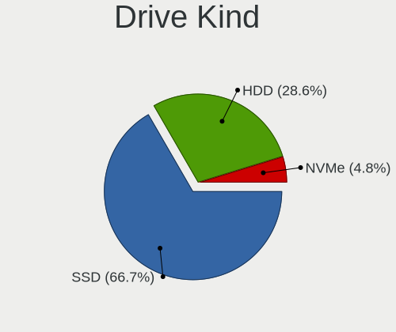
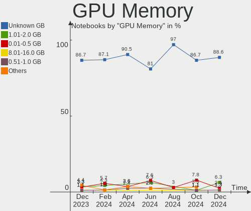
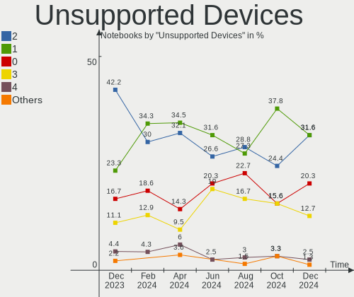

BSD - Hardware Trends (Notebooks)
---------------------------------

A project to identify most popular hardware characteristics and track their change
over time based on data collected by BSD users at https://BSD-Hardware.info.

Anyone can contribute to this report by the [hw-probe](https://github.com/linuxhw/hw-probe/blob/master/INSTALL.BSD.md) tool:

    hw-probe -all -upload

This report is for one last month. Overall report since the beginning of time: [TestCoverage](https://github.com/bsdhw/TestCoverage)

Period: May, 2022.

Contents
--------

* [ System ](#system)
  - [ OS                       ](#os)
  - [ OS Family                ](#os-family)
  - [ Arch                     ](#arch)
  - [ DE                       ](#de)
  - [ Display Server           ](#display-server)
  - [ Display Manager          ](#display-manager)
  - [ OS Lang                  ](#os-lang)
  - [ Boot Mode                ](#boot-mode)
  - [ Filesystem               ](#filesystem)
  - [ Part. scheme             ](#part-scheme)

* [ Board ](#board)
  - [ Vendor                   ](#vendor)
  - [ Model                    ](#model)
  - [ Model Family             ](#model-family)
  - [ MFG Year                 ](#mfg-year)
  - [ Form Factor              ](#form-factor)
  - [ Coreboot                 ](#coreboot)
  - [ RAM Size                 ](#ram-size)
  - [ RAM Used                 ](#ram-used)
  - [ Total Drives             ](#total-drives)
  - [ Has CD-ROM               ](#has-cd-rom)
  - [ Has Ethernet             ](#has-ethernet)
  - [ Has WiFi                 ](#has-wifi)
  - [ Has Bluetooth            ](#has-bluetooth)

* [ Location ](#location)
  - [ Country                  ](#country)
  - [ City                     ](#city)

* [ Drives ](#drives)
  - [ Drive Vendor             ](#drive-vendor)
  - [ Drive Model              ](#drive-model)
  - [ HDD Vendor               ](#hdd-vendor)
  - [ SSD Vendor               ](#ssd-vendor)
  - [ Drive Kind               ](#drive-kind)
  - [ Drive Connector          ](#drive-connector)
  - [ Drive Size               ](#drive-size)
  - [ Space Total              ](#space-total)
  - [ Space Used               ](#space-used)
  - [ Malfunc. Drives          ](#malfunc-drives)
  - [ Malfunc. Drive Vendor    ](#malfunc-drive-vendor)
  - [ Malfunc. HDD Vendor      ](#malfunc-hdd-vendor)
  - [ Malfunc. Drive Kind      ](#malfunc-drive-kind)
  - [ Failed Drives            ](#failed-drives)
  - [ Failed Drive Vendor      ](#failed-drive-vendor)
  - [ Drive Status             ](#drive-status)

* [ Storage controller ](#storage-controller)
  - [ Storage Vendor           ](#storage-vendor)
  - [ Storage Model            ](#storage-model)
  - [ Storage Kind             ](#storage-kind)

* [ Processor ](#processor)
  - [ CPU Vendor               ](#cpu-vendor)
  - [ CPU Model                ](#cpu-model)
  - [ CPU Model Family         ](#cpu-model-family)
  - [ CPU Cores                ](#cpu-cores)
  - [ CPU Sockets              ](#cpu-sockets)
  - [ CPU Threads              ](#cpu-threads)
  - [ CPU Microarch            ](#cpu-microarch)

* [ Graphics ](#graphics)
  - [ GPU Vendor               ](#gpu-vendor)
  - [ GPU Model                ](#gpu-model)
  - [ GPU Combo                ](#gpu-combo)
  - [ GPU Driver               ](#gpu-driver)
  - [ GPU Memory               ](#gpu-memory)

* [ Monitor ](#monitor)
  - [ Monitor Vendor           ](#monitor-vendor)
  - [ Monitor Model            ](#monitor-model)
  - [ Monitor Resolution       ](#monitor-resolution)
  - [ Monitor Diagonal         ](#monitor-diagonal)
  - [ Monitor Width            ](#monitor-width)
  - [ Aspect Ratio             ](#aspect-ratio)
  - [ Monitor Area             ](#monitor-area)
  - [ Pixel Density            ](#pixel-density)
  - [ Multiple Monitors        ](#multiple-monitors)

* [ Network ](#network)
  - [ Net Controller Vendor    ](#net-controller-vendor)
  - [ Net Controller Model     ](#net-controller-model)
  - [ Wireless Vendor          ](#wireless-vendor)
  - [ Wireless Model           ](#wireless-model)
  - [ Ethernet Vendor          ](#ethernet-vendor)
  - [ Ethernet Model           ](#ethernet-model)
  - [ Net Controller Kind      ](#net-controller-kind)
  - [ Used Controller          ](#used-controller)
  - [ NICs                     ](#nics)
  - [ IPv6                     ](#ipv6)

* [ Bluetooth ](#bluetooth)
  - [ Bluetooth Vendor         ](#bluetooth-vendor)
  - [ Bluetooth Model          ](#bluetooth-model)

* [ Sound ](#sound)
  - [ Sound Vendor             ](#sound-vendor)
  - [ Sound Model              ](#sound-model)

* [ Memory ](#memory)
  - [ Memory Vendor            ](#memory-vendor)
  - [ Memory Model             ](#memory-model)
  - [ Memory Kind              ](#memory-kind)
  - [ Memory Form Factor       ](#memory-form-factor)
  - [ Memory Size              ](#memory-size)
  - [ Memory Speed             ](#memory-speed)

* [ Printers & scanners ](#printers--scanners)
  - [ Printer Vendor           ](#printer-vendor)
  - [ Printer Model            ](#printer-model)
  - [ Scanner Vendor           ](#scanner-vendor)
  - [ Scanner Model            ](#scanner-model)

* [ Camera ](#camera)
  - [ Camera Vendor            ](#camera-vendor)
  - [ Camera Model             ](#camera-model)

* [ Security ](#security)
  - [ Fingerprint Vendor       ](#fingerprint-vendor)
  - [ Fingerprint Model        ](#fingerprint-model)
  - [ Chipcard Vendor          ](#chipcard-vendor)
  - [ Chipcard Model           ](#chipcard-model)

* [ Unsupported ](#unsupported)
  - [ Unsupported Devices      ](#unsupported-devices)
  - [ Unsupported Device Types ](#unsupported-device-types)

System
------

OS
--

Installed operating systems

| Name                 | Notebooks | Percent |
|----------------------|-----------|---------|
| FreeBSD 13.1         | 23        | 24.47%  |
| helloSystem 0.7.0    | 16        | 17.02%  |
| OpenBSD 7.1          | 13        | 13.83%  |
| OPNsense 22.1.7      | 7         | 7.45%   |
| OPNsense 22.1.6      | 6         | 6.38%   |
| helloSystem 0.8.0    | 5         | 5.32%   |
| FreeBSD 14.0-CURRENT | 4         | 4.26%   |
| FreeBSD 13.1-STABLE  | 3         | 3.19%   |
| FreeBSD 13.1-RC6     | 3         | 3.19%   |
| FreeBSD 13.0         | 3         | 3.19%   |
| FreeBSD 13.0-p11     | 2         | 2.13%   |
| OPNsense 22.4        | 1         | 1.06%   |
| OPNsense 22.1.8      | 1         | 1.06%   |
| OPNsense 22.1.2      | 1         | 1.06%   |
| NomadBSD 5806f915    | 1         | 1.06%   |
| GhostBSD 22.05.13    | 1         | 1.06%   |
| GhostBSD 22.04.30    | 1         | 1.06%   |
| FreeBSD 13.0-STABLE  | 1         | 1.06%   |
| FreeBSD 13.0-p10     | 1         | 1.06%   |
| DragonFly 6.2        | 1         | 1.06%   |

OS Family
---------

OS without a version

| Name        | Notebooks | Percent |
|-------------|-----------|---------|
| FreeBSD     | 40        | 42.55%  |
| helloSystem | 21        | 22.34%  |
| OPNsense    | 16        | 17.02%  |
| OpenBSD     | 13        | 13.83%  |
| GhostBSD    | 2         | 2.13%   |
| NomadBSD    | 1         | 1.06%   |
| DragonFly   | 1         | 1.06%   |

Arch
----

OS architecture (x86_64, i586, etc.)

| Name  | Notebooks | Percent |
|-------|-----------|---------|
| amd64 | 89        | 94.68%  |
| i386  | 5         | 5.32%   |

DE
--

Desktop Environment

| Name         | Notebooks | Percent |
|--------------|-----------|---------|
| helloDesktop | 32        | 34.04%  |
| Console      | 20        | 21.28%  |
| KDE5         | 14        | 14.89%  |
| XFCE         | 10        | 10.64%  |
| MATE         | 3         | 3.19%   |
| i3           | 3         | 3.19%   |
| GNOME        | 3         | 3.19%   |
| TWM          | 2         | 2.13%   |
| Cinnamon     | 2         | 2.13%   |
| X-Cinnamon   | 1         | 1.06%   |
| Openbox      | 1         | 1.06%   |
| LXQt         | 1         | 1.06%   |
| LXDE         | 1         | 1.06%   |
| IceWM        | 1         | 1.06%   |

Display Server
--------------

X11 or Wayland

| Name    | Notebooks | Percent |
|---------|-----------|---------|
| X11     | 69        | 73.4%   |
| Console | 24        | 25.53%  |
| Wayland | 1         | 1.06%   |

Display Manager
---------------

SDDM, LightDM, etc.

| Name    | Notebooks | Percent |
|---------|-----------|---------|
| Console | 44        | 46.81%  |
| SLiM    | 29        | 30.85%  |
| SDDM    | 12        | 12.77%  |
| LightDM | 4         | 4.26%   |
| GDM     | 4         | 4.26%   |
| PCDM    | 1         | 1.06%   |

OS Lang
-------

Language

| Lang            | Notebooks | Percent |
|-----------------|-----------|---------|
| Unknown         | 31        | 32.98%  |
| C               | 28        | 29.79%  |
| en_US           | 26        | 27.66%  |
| en_US.ISO8859-1 | 2         | 2.13%   |
| zh_CN           | 1         | 1.06%   |
| ru_RU           | 1         | 1.06%   |
| fr_FR           | 1         | 1.06%   |
| en_GB           | 1         | 1.06%   |
| en_AU           | 1         | 1.06%   |
| de_DE           | 1         | 1.06%   |
| de_CH           | 1         | 1.06%   |

Boot Mode
---------

EFI or BIOS

| Mode | Notebooks | Percent |
|------|-----------|---------|
| EFI  | 77        | 81.91%  |
| BIOS | 17        | 18.09%  |

Filesystem
----------

Type of filesystem

| Type    | Notebooks | Percent |
|---------|-----------|---------|
| Zfs     | 47        | 50%     |
| Ufs     | 22        | 23.4%   |
| Ffs     | 13        | 13.83%  |
| Cd9660  | 11        | 11.7%   |
| Hammer2 | 1         | 1.06%   |

Part. scheme
------------

Scheme of partitioning

| Type    | Notebooks | Percent |
|---------|-----------|---------|
| GPT     | 83        | 88.3%   |
| MBR     | 9         | 9.57%   |
| BSD     | 1         | 1.06%   |
| Unknown | 1         | 1.06%   |

Board
-----

Vendor
------

Motherboard manufacturer

| Name                           | Notebooks | Percent |
|--------------------------------|-----------|---------|
| Lenovo                         | 25        | 26.6%   |
| Dell                           | 17        | 18.09%  |
| Hewlett-Packard                | 12        | 12.77%  |
| Acer                           | 7         | 7.45%   |
| Deciso                         | 5         | 5.32%   |
| ASUSTek Computer               | 4         | 4.26%   |
| TUXEDO                         | 3         | 3.19%   |
| Unknown                        | 3         | 3.19%   |
| Toshiba                        | 2         | 2.13%   |
| Matsushita Electric Industrial | 2         | 2.13%   |
| Timi                           | 1         | 1.06%   |
| System76                       | 1         | 1.06%   |
| Sony                           | 1         | 1.06%   |
| SIEMENS                        | 1         | 1.06%   |
| Razer                          | 1         | 1.06%   |
| Panasonic                      | 1         | 1.06%   |
| Packard Bell                   | 1         | 1.06%   |
| Notebook                       | 1         | 1.06%   |
| Intel                          | 1         | 1.06%   |
| GPD                            | 1         | 1.06%   |
| Fujitsu                        | 1         | 1.06%   |
| BESSTAR Tech                   | 1         | 1.06%   |
| Apple                          | 1         | 1.06%   |
| AAEON                          | 1         | 1.06%   |

Model
-----

Motherboard model

| Name                                               | Notebooks | Percent |
|----------------------------------------------------|-----------|---------|
| Deciso Netboard A20                                | 3         | 3.19%   |
| Unknown                                            | 3         | 3.19%   |
| TUXEDO Aura 15 Gen1                                | 2         | 2.13%   |
| HP Pavilion g6                                     | 2         | 2.13%   |
| Dell Inspiron 5559                                 | 2         | 2.13%   |
| Deciso OPNsense Appliance                          | 2         | 2.13%   |
| TUXEDO InfinityBook13V3                            | 1         | 1.06%   |
| Toshiba Satellite P300                             | 1         | 1.06%   |
| Toshiba Satellite P25                              | 1         | 1.06%   |
| Timi TM1701                                        | 1         | 1.06%   |
| System76 Galago Pro                                | 1         | 1.06%   |
| Sony VGN-NW25GF_S                                  | 1         | 1.06%   |
| SIEMENS SIMATIC IPC127E                            | 1         | 1.06%   |
| Razer Blade 15 Base Model (Early 2020) - RZ09-0328 | 1         | 1.06%   |
| Panasonic CF-53AAGHYDM                             | 1         | 1.06%   |
| Packard Bell EasyNote_MX52-B-071                   | 1         | 1.06%   |
| Notebook N7x0WU                                    | 1         | 1.06%   |
| Matsushita Electric Industrial CF-51RCVDNLM        | 1         | 1.06%   |
| Matsushita Electric Industrial CF-48V4KNDQM        | 1         | 1.06%   |
| Lenovo ThinkPad X270 20HMCTO1WW                    | 1         | 1.06%   |
| Lenovo ThinkPad X250 20CMS0FA00                    | 1         | 1.06%   |
| Lenovo ThinkPad X250 20CLS4WV08                    | 1         | 1.06%   |
| Lenovo ThinkPad X250 20CLS02V00                    | 1         | 1.06%   |
| Lenovo ThinkPad X240 20AMS1YG01                    | 1         | 1.06%   |
| Lenovo ThinkPad X230 2325J67                       | 1         | 1.06%   |
| Lenovo ThinkPad X220 429043U                       | 1         | 1.06%   |
| Lenovo ThinkPad X220 42872WU                       | 1         | 1.06%   |
| Lenovo ThinkPad X13 Gen 1 20UF000QRT               | 1         | 1.06%   |
| Lenovo ThinkPad X1 Carbon 3rd 20BTS0BT00           | 1         | 1.06%   |
| Lenovo ThinkPad T495s 20QKS1812F                   | 1         | 1.06%   |
| Lenovo ThinkPad T430 2347GZU                       | 1         | 1.06%   |
| Lenovo ThinkPad T420s 41742BU                      | 1         | 1.06%   |
| Lenovo ThinkPad T420s 41732AU                      | 1         | 1.06%   |
| Lenovo ThinkPad T410 2537N24                       | 1         | 1.06%   |
| Lenovo ThinkPad L420 7854CTO                       | 1         | 1.06%   |
| Lenovo ThinkPad E490 20N8CTO1WW                    | 1         | 1.06%   |
| Lenovo ThinkPad E14 Gen 2 20TA004FUS               | 1         | 1.06%   |
| Lenovo ThinkPad E14 Gen 2 20T6003BRT               | 1         | 1.06%   |
| Lenovo IdeaPad Y700-17ISK 80Q0                     | 1         | 1.06%   |
| Lenovo IdeaPad Y700-15ISK 80NV                     | 1         | 1.06%   |
| Lenovo IdeaPad S510p 20298                         | 1         | 1.06%   |
| Lenovo IdeaPad 310-15ISK 80SM                      | 1         | 1.06%   |
| Lenovo IdeaPad 3 15IGL05 82BU                      | 1         | 1.06%   |
| Lenovo B470 HuronRiver Platform                    | 1         | 1.06%   |
| Intel H81U                                         | 1         | 1.06%   |
| HP ZBook 14                                        | 1         | 1.06%   |
| HP ProBook 455 G7                                  | 1         | 1.06%   |
| HP ProBook 4340s                                   | 1         | 1.06%   |
| HP Pavilion m6                                     | 1         | 1.06%   |
| HP Pavilion dv6                                    | 1         | 1.06%   |
| HP EliteBook 8570p                                 | 1         | 1.06%   |
| HP EliteBook 8530w                                 | 1         | 1.06%   |
| HP EliteBook 8460p                                 | 1         | 1.06%   |
| HP EliteBook 820 G2                                | 1         | 1.06%   |
| HP 255 G8 Notebook PC                              | 1         | 1.06%   |
| GPD MicroPC                                        | 1         | 1.06%   |
| Fujitsu LIFEBOOK E752                              | 1         | 1.06%   |
| Dell XPS 13 9343                                   | 1         | 1.06%   |
| Dell Vostro 5590                                   | 1         | 1.06%   |
| Dell Studio 1747                                   | 1         | 1.06%   |

Model Family
------------

Motherboard model prefix

| Name                                        | Notebooks | Percent |
|---------------------------------------------|-----------|---------|
| Lenovo ThinkPad                             | 19        | 20.21%  |
| Dell Latitude                               | 7         | 7.45%   |
| Acer Aspire                                 | 7         | 7.45%   |
| Lenovo IdeaPad                              | 5         | 5.32%   |
| Dell Inspiron                               | 5         | 5.32%   |
| HP Pavilion                                 | 4         | 4.26%   |
| HP EliteBook                                | 4         | 4.26%   |
| Deciso Netboard                             | 3         | 3.19%   |
| Unknown                                     | 3         | 3.19%   |
| TUXEDO Aura                                 | 2         | 2.13%   |
| Toshiba Satellite                           | 2         | 2.13%   |
| HP ProBook                                  | 2         | 2.13%   |
| Deciso OPNsense                             | 2         | 2.13%   |
| TUXEDO InfinityBook13V3                     | 1         | 1.06%   |
| Timi TM1701                                 | 1         | 1.06%   |
| System76 Galago                             | 1         | 1.06%   |
| Sony VGN-NW25GF                             | 1         | 1.06%   |
| SIEMENS SIMATIC                             | 1         | 1.06%   |
| Razer Blade                                 | 1         | 1.06%   |
| Panasonic CF-53AAGHYDM                      | 1         | 1.06%   |
| Packard Bell EasyNote                       | 1         | 1.06%   |
| Notebook N7x0WU                             | 1         | 1.06%   |
| Matsushita Electric Industrial CF-51RCVDNLM | 1         | 1.06%   |
| Matsushita Electric Industrial CF-48V4KNDQM | 1         | 1.06%   |
| Lenovo B470                                 | 1         | 1.06%   |
| Intel H81U                                  | 1         | 1.06%   |
| HP ZBook                                    | 1         | 1.06%   |
| HP 255                                      | 1         | 1.06%   |
| GPD MicroPC                                 | 1         | 1.06%   |
| Fujitsu LIFEBOOK                            | 1         | 1.06%   |
| Dell XPS                                    | 1         | 1.06%   |
| Dell Vostro                                 | 1         | 1.06%   |
| Dell Studio                                 | 1         | 1.06%   |
| Dell Precision                              | 1         | 1.06%   |
| Dell G5                                     | 1         | 1.06%   |
| BESSTAR Tech U820                           | 1         | 1.06%   |
| ASUS K52F                                   | 1         | 1.06%   |
| ASUS F50SL                                  | 1         | 1.06%   |
| ASUS 1001P                                  | 1         | 1.06%   |
| ASUS 1000HE                                 | 1         | 1.06%   |
| Apple MacBookPro5                           | 1         | 1.06%   |
| AAEON GENE-SKU7                             | 1         | 1.06%   |

MFG Year
--------

Motherboard manufacture year

| Year | Notebooks | Percent |
|------|-----------|---------|
| 2020 | 13        | 13.83%  |
| 2017 | 9         | 9.57%   |
| 2016 | 9         | 9.57%   |
| 2011 | 9         | 9.57%   |
| 2021 | 8         | 8.51%   |
| 2012 | 7         | 7.45%   |
| 2013 | 6         | 6.38%   |
| 2009 | 6         | 6.38%   |
| 2018 | 5         | 5.32%   |
| 2015 | 5         | 5.32%   |
| 2022 | 4         | 4.26%   |
| 2019 | 4         | 4.26%   |
| 2010 | 3         | 3.19%   |
| 2014 | 2         | 2.13%   |
| 2007 | 1         | 1.06%   |
| 2006 | 1         | 1.06%   |
| 2004 | 1         | 1.06%   |
| 2002 | 1         | 1.06%   |

Form Factor
-----------

Physical design of the computer

| Name     | Notebooks | Percent |
|----------|-----------|---------|
| Notebook | 94        | 100%    |

Coreboot
--------

Have coreboot on board

| Used | Notebooks | Percent |
|------|-----------|---------|
| No   | 93        | 98.94%  |
| Yes  | 1         | 1.06%   |

RAM Size
--------

Total RAM memory

| Size in GB  | Notebooks | Percent |
|-------------|-----------|---------|
| 8.01-16.0   | 35        | 37.23%  |
| 16.01-24.0  | 23        | 24.47%  |
| 4.01-8.0    | 20        | 21.28%  |
| 32.01-64.0  | 5         | 5.32%   |
| 2.01-3.0    | 5         | 5.32%   |
| 3.01-4.0    | 3         | 3.19%   |
| 64.01-256.0 | 2         | 2.13%   |
| 0.51-1.0    | 1         | 1.06%   |

RAM Used
--------

Used RAM memory

| Used GB    | Notebooks | Percent |
|------------|-----------|---------|
| 0.01-0.5   | 54        | 57.45%  |
| 0.51-1.0   | 26        | 27.66%  |
| 1.01-2.0   | 8         | 8.51%   |
| 2.01-3.0   | 3         | 3.19%   |
| 0          | 2         | 2.13%   |
| 24.01-32.0 | 1         | 1.06%   |

Total Drives
------------

Number of drives on board

| Drives | Notebooks | Percent |
|--------|-----------|---------|
| 1      | 73        | 77.66%  |
| 2      | 17        | 18.09%  |
| 0      | 3         | 3.19%   |
| 3      | 1         | 1.06%   |

Has CD-ROM
----------

Has CD-ROM on board

| Presented | Notebooks | Percent |
|-----------|-----------|---------|
| No        | 68        | 72.34%  |
| Yes       | 26        | 27.66%  |

Has Ethernet
------------

Has Ethernet on board

| Presented | Notebooks | Percent |
|-----------|-----------|---------|
| Yes       | 87        | 92.55%  |
| No        | 7         | 7.45%   |

Has WiFi
--------

Has WiFi module

| Presented | Notebooks | Percent |
|-----------|-----------|---------|
| Yes       | 81        | 86.17%  |
| No        | 13        | 13.83%  |

Has Bluetooth
-------------

Has Bluetooth module

| Presented | Notebooks | Percent |
|-----------|-----------|---------|
| Yes       | 53        | 56.38%  |
| No        | 41        | 43.62%  |

Location
--------

Country
-------

Geographic location (country)

| Country     | Notebooks | Percent |
|-------------|-----------|---------|
| USA         | 16        | 17.02%  |
| Canada      | 11        | 11.7%   |
| UK          | 10        | 10.64%  |
| Russia      | 7         | 7.45%   |
| Italy       | 6         | 6.38%   |
| Germany     | 6         | 6.38%   |
| France      | 5         | 5.32%   |
| Japan       | 3         | 3.19%   |
| China       | 3         | 3.19%   |
| Portugal    | 2         | 2.13%   |
| Netherlands | 2         | 2.13%   |
| India       | 2         | 2.13%   |
| Denmark     | 2         | 2.13%   |
| Brazil      | 2         | 2.13%   |
| Australia   | 2         | 2.13%   |
| Uganda      | 1         | 1.06%   |
| Taiwan      | 1         | 1.06%   |
| Switzerland | 1         | 1.06%   |
| Spain       | 1         | 1.06%   |
| Norway      | 1         | 1.06%   |
| New Zealand | 1         | 1.06%   |
| Mexico      | 1         | 1.06%   |
| Indonesia   | 1         | 1.06%   |
| Hong Kong   | 1         | 1.06%   |
| Guadeloupe  | 1         | 1.06%   |
| Greece      | 1         | 1.06%   |
| Czechia     | 1         | 1.06%   |
| Colombia    | 1         | 1.06%   |
| Belgium     | 1         | 1.06%   |
| Austria     | 1         | 1.06%   |

City
----

Geographic location (city)

| City                     | Notebooks | Percent |
|--------------------------|-----------|---------|
| Montreal                 | 9         | 9.57%   |
| St Petersburg            | 2         | 2.13%   |
| Paris                    | 2         | 2.13%   |
| Moscow                   | 2         | 2.13%   |
| London                   | 2         | 2.13%   |
| Berlin                   | 2         | 2.13%   |
| Zhumadian                | 1         | 1.06%   |
| Woerdense Verlaat        | 1         | 1.06%   |
| Wheatland                | 1         | 1.06%   |
| Wels                     | 1         | 1.06%   |
| Vandalia                 | 1         | 1.06%   |
| Vancouver                | 1         | 1.06%   |
| Tromsø                  | 1         | 1.06%   |
| Trivandrum               | 1         | 1.06%   |
| Tomball                  | 1         | 1.06%   |
| Thousand Oaks            | 1         | 1.06%   |
| Thessaloniki             | 1         | 1.06%   |
| Taito                    | 1         | 1.06%   |
| Sutton                   | 1         | 1.06%   |
| St-Malo                  | 1         | 1.06%   |
| Shinjuku                 | 1         | 1.06%   |
| Roswell                  | 1         | 1.06%   |
| Renton                   | 1         | 1.06%   |
| Redondo Beach            | 1         | 1.06%   |
| Reading                  | 1         | 1.06%   |
| Pudong                   | 1         | 1.06%   |
| Ponta Delgada            | 1         | 1.06%   |
| Passignano sul Trasimeno | 1         | 1.06%   |
| Ottawa                   | 1         | 1.06%   |
| Novosibirsk              | 1         | 1.06%   |
| Newbury Park             | 1         | 1.06%   |
| Nanticoke                | 1         | 1.06%   |
| Nakano                   | 1         | 1.06%   |
| Munich                   | 1         | 1.06%   |
| Munchenstein             | 1         | 1.06%   |
| Monterrey                | 1         | 1.06%   |
| Milan                    | 1         | 1.06%   |
| Melbourne                | 1         | 1.06%   |
| Medellín                | 1         | 1.06%   |
| Manassas                 | 1         | 1.06%   |
| Lübeck                  | 1         | 1.06%   |
| Lissone                  | 1         | 1.06%   |
| Lisbon                   | 1         | 1.06%   |
| Leer                     | 1         | 1.06%   |
| Lee's Summit             | 1         | 1.06%   |
| Le Gosier                | 1         | 1.06%   |
| Kurintji                 | 1         | 1.06%   |
| Kislovodsk               | 1         | 1.06%   |
| Kensington               | 1         | 1.06%   |
| Kampala                  | 1         | 1.06%   |
| Izhevsk                  | 1         | 1.06%   |
| Ipojuca                  | 1         | 1.06%   |
| Indore                   | 1         | 1.06%   |
| Herlev                   | 1         | 1.06%   |
| Galliera Veneta          | 1         | 1.06%   |
| Gainesville              | 1         | 1.06%   |
| Fulham                   | 1         | 1.06%   |
| Fuenterrabia             | 1         | 1.06%   |
| Feltham                  | 1         | 1.06%   |
| Edinburgh                | 1         | 1.06%   |

Drives
------

Drive Vendor
------------

Hard drive vendors

| Vendor              | Notebooks | Drives | Percent |
|---------------------|-----------|--------|---------|
| WDC                 | 19        | 21     | 18.1%   |
| Samsung Electronics | 17        | 17     | 16.19%  |
| Seagate             | 9         | 10     | 8.57%   |
| Transcend           | 6         | 6      | 5.71%   |
| Kingston            | 6         | 6      | 5.71%   |
| Crucial             | 6         | 6      | 5.71%   |
| Toshiba             | 4         | 4      | 3.81%   |
| SanDisk             | 3         | 3      | 2.86%   |
| Hitachi             | 3         | 3      | 2.86%   |
| A-DATA Technology   | 3         | 3      | 2.86%   |
| SK Hynix            | 2         | 2      | 1.9%    |
| NVMe                | 2         | 2      | 1.9%    |
| Micron Technology   | 2         | 2      | 1.9%    |
| Intel               | 2         | 2      | 1.9%    |
| HGST                | 2         | 2      | 1.9%    |
| XUM                 | 1         | 1      | 0.95%   |
| USB                 | 1         | 1      | 0.95%   |
| T-FORCE             | 1         | 1      | 0.95%   |
| SSSTC               | 1         | 1      | 0.95%   |
| OWC                 | 1         | 1      | 0.95%   |
| Netac               | 1         | 1      | 0.95%   |
| LITEON              | 1         | 1      | 0.95%   |
| Lexar               | 1         | 1      | 0.95%   |
| LDLC F6+            | 1         | 1      | 0.95%   |
| KIOXIA              | 1         | 1      | 0.95%   |
| Intenso             | 1         | 1      | 0.95%   |
| IBM/Hitachi         | 1         | 1      | 0.95%   |
| Hewlett-Packard     | 1         | 1      | 0.95%   |
| Gigabyte Technology | 1         | 1      | 0.95%   |
| China               | 1         | 1      | 0.95%   |
| CFD                 | 1         | 1      | 0.95%   |
| BR                  | 1         | 1      | 0.95%   |
| BIWIN               | 1         | 1      | 0.95%   |
| Apacer              | 1         | 1      | 0.95%   |

Drive Model
-----------

Hard drive models

| Model                                | Notebooks | Percent |
|--------------------------------------|-----------|---------|
| Transcend TS256GMTS952T2 256GB       | 2         | 1.85%   |
| Transcend TS256GMTE652T2 256GB       | 2         | 1.85%   |
| Seagate ST1000LM024 HN-M101MBB 1TB   | 2         | 1.85%   |
| Samsung SSD 970 EVO Plus 2TB         | 2         | 1.85%   |
| Kingston SV300S37A120G 120GB         | 2         | 1.85%   |
| Kingston SA400S37240G 240GB          | 2         | 1.85%   |
| HGST HTS721010A9E630 1TB             | 2         | 1.85%   |
| Crucial CT1000MX500SSD1 1TB          | 2         | 1.85%   |
| XUM HX256GSSDSATA3 256GB             | 1         | 0.93%   |
| WDC WDS500G2B0A-00SM50 500GB         | 1         | 0.93%   |
| WDC WDS250G2B0B-00YS70 250GB         | 1         | 0.93%   |
| WDC WDS240G1G0A-00SS50 240GB         | 1         | 0.93%   |
| WDC WDS120G2G0B-00EPW0 120GB         | 1         | 0.93%   |
| WDC WDS120G2G0A-00JH30 120GB         | 1         | 0.93%   |
| WDC WD7500BPKX-00HPJT0 752GB         | 1         | 0.93%   |
| WDC WD7500BPKT-75PK4T0 752GB         | 1         | 0.93%   |
| WDC WD7500BPKT-00PK4T0 752GB         | 1         | 0.93%   |
| WDC WD5000LPLX-00ZNTT0 500GB         | 1         | 0.93%   |
| WDC WD3200BEVE-00A0HT0 320GB         | 1         | 0.93%   |
| WDC WD3200BEKX-60B7WT0 320GB         | 1         | 0.93%   |
| WDC WD2500BEVS-22UST0 250GB          | 1         | 0.93%   |
| WDC WD1600BEVT-80A23T0 160GB         | 1         | 0.93%   |
| WDC WD1200BEVS-75UST0 120GB          | 1         | 0.93%   |
| WDC WD10SPZX-75Z10T3 1TB             | 1         | 0.93%   |
| WDC WD10SPZX-21Z10T0 1TB             | 1         | 0.93%   |
| WDC WD10JPVX-75JC3T0 1TB             | 1         | 0.93%   |
| WDC WD10JPVX-22JC3T0 1TB             | 1         | 0.93%   |
| WDC WD10JPCX-24UE4T0 1TB             | 1         | 0.93%   |
| WDC PC SN730 SDBQNTY-512G-1001 512GB | 1         | 0.93%   |
| WDC PC SN530 NVMe 256GB              | 1         | 0.93%   |
| USB SanDisk 3.2Gen1 64GB             | 1         | 0.93%   |
| Transcend TSG128MTS400ISI 128GB      | 1         | 0.93%   |
| Transcend TS120GSSD220S 120GB        | 1         | 0.93%   |
| Toshiba MQ01ABF050 500GB             | 1         | 0.93%   |
| Toshiba MK2561GSYN 250GB             | 1         | 0.93%   |
| Toshiba KSG60ZMV256G M.2 2280 256GB  | 1         | 0.93%   |
| Toshiba KBG30ZMT512G 512GB           | 1         | 0.93%   |
| T-FORCE TM8FP8002T 2TB               | 1         | 0.93%   |
| SSSTC CL1-4D128 128GB                | 1         | 0.93%   |
| SK Hynix HFS256G39TND-N210A 256GB    | 1         | 0.93%   |
| SK Hynix BC501 NVMe 512GB            | 1         | 0.93%   |
| Seagate ST9500325AS 500GB            | 1         | 0.93%   |
| Seagate ST9320325AS 320GB            | 1         | 0.93%   |
| Seagate ST9320320AS 320GB            | 1         | 0.93%   |
| Seagate ST9250410AS 250GB            | 1         | 0.93%   |
| Seagate ST9160821AS 160GB            | 1         | 0.93%   |
| Seagate ST9160821A 160GB             | 1         | 0.93%   |
| Seagate ST500LM030-1RK17D 500GB      | 1         | 0.93%   |
| Seagate ST2000LM007-1R8174 2TB       | 1         | 0.93%   |
| SanDisk SSD PLUS 240GB               | 1         | 0.93%   |
| SanDisk SDSSDH3500G 500GB            | 1         | 0.93%   |
| SanDisk SD7UB3Q256G1001 256GB        | 1         | 0.93%   |
| Samsung SSD PM851 mSATA 512GB        | 1         | 0.93%   |
| Samsung SSD PM851 M.2 2280 256GB     | 1         | 0.93%   |
| Samsung SSD 980 1TB                  | 1         | 0.93%   |
| Samsung SSD 950 PRO 512GB            | 1         | 0.93%   |
| Samsung SSD 870 EVO 500GB            | 1         | 0.93%   |
| Samsung SSD 860 EVO 500GB            | 1         | 0.93%   |
| Samsung SSD 850 EVO 500GB            | 1         | 0.93%   |
| Samsung SSD 840 PRO Series 128GB     | 1         | 0.93%   |

HDD Vendor
----------

Hard disk drive vendors

| Vendor      | Notebooks | Drives | Percent |
|-------------|-----------|--------|---------|
| WDC         | 13        | 14     | 39.39%  |
| Seagate     | 9         | 10     | 27.27%  |
| Hitachi     | 3         | 3      | 9.09%   |
| Toshiba     | 2         | 2      | 6.06%   |
| HGST        | 2         | 2      | 6.06%   |
| USB         | 1         | 1      | 3.03%   |
| NVMe        | 1         | 1      | 3.03%   |
| LDLC F6+    | 1         | 1      | 3.03%   |
| IBM/Hitachi | 1         | 1      | 3.03%   |

SSD Vendor
----------

Solid state drive vendors

| Vendor              | Notebooks | Drives | Percent |
|---------------------|-----------|--------|---------|
| Samsung Electronics | 8         | 8      | 15.38%  |
| Kingston            | 6         | 6      | 11.54%  |
| WDC                 | 5         | 5      | 9.62%   |
| Crucial             | 5         | 5      | 9.62%   |
| Transcend           | 4         | 4      | 7.69%   |
| SanDisk             | 3         | 3      | 5.77%   |
| A-DATA Technology   | 3         | 3      | 5.77%   |
| Intel               | 2         | 2      | 3.85%   |
| XUM                 | 1         | 1      | 1.92%   |
| Toshiba             | 1         | 1      | 1.92%   |
| SK Hynix            | 1         | 1      | 1.92%   |
| OWC                 | 1         | 1      | 1.92%   |
| NVMe                | 1         | 1      | 1.92%   |
| Netac               | 1         | 1      | 1.92%   |
| Micron Technology   | 1         | 1      | 1.92%   |
| LITEON              | 1         | 1      | 1.92%   |
| Lexar               | 1         | 1      | 1.92%   |
| Intenso             | 1         | 1      | 1.92%   |
| Hewlett-Packard     | 1         | 1      | 1.92%   |
| China               | 1         | 1      | 1.92%   |
| CFD                 | 1         | 1      | 1.92%   |
| BR                  | 1         | 1      | 1.92%   |
| BIWIN               | 1         | 1      | 1.92%   |
| Apacer              | 1         | 1      | 1.92%   |

Drive Kind
----------

HDD or SSD

| Kind | Notebooks | Drives | Percent |
|------|-----------|--------|---------|
| SSD  | 49        | 52     | 49%     |
| HDD  | 31        | 35     | 31%     |
| NVMe | 20        | 21     | 20%     |

Drive Connector
---------------

SATA, SAS, NVMe, etc.

| Type | Notebooks | Drives | Percent |
|------|-----------|--------|---------|
| SATA | 76        | 87     | 79.17%  |
| NVMe | 20        | 21     | 20.83%  |

Drive Size
----------

Size of hard drive

| Size in TB | Notebooks | Drives | Percent |
|------------|-----------|--------|---------|
| 0.01-0.5   | 59        | 67     | 75.64%  |
| 0.51-1.0   | 17        | 18     | 21.79%  |
| 1.01-2.0   | 2         | 2      | 2.56%   |

Space Total
-----------

Amount of disk space available on the file system

| Size in GB | Notebooks | Percent |
|------------|-----------|---------|
| 101-250    | 26        | 27.66%  |
| 251-500    | 18        | 19.15%  |
| 21-50      | 13        | 13.83%  |
| 1-20       | 12        | 12.77%  |
| 501-1000   | 11        | 11.7%   |
| 51-100     | 8         | 8.51%   |
| 1001-2000  | 4         | 4.26%   |
| Unknown    | 2         | 2.13%   |

Space Used
----------

Amount of used disk space

| Used GB | Notebooks | Percent |
|---------|-----------|---------|
| 1-20    | 77        | 81.91%  |
| 21-50   | 8         | 8.51%   |
| 51-100  | 4         | 4.26%   |
| 101-250 | 2         | 2.13%   |
| Unknown | 2         | 2.13%   |
| 251-500 | 1         | 1.06%   |

Malfunc. Drives
---------------

Drive models with a malfunction

| Model                              | Notebooks | Drives | Percent |
|------------------------------------|-----------|--------|---------|
| HGST HTS721010A9E630 1TB           | 2         | 2      | 20%     |
| Seagate ST9500325AS 500GB          | 1         | 1      | 10%     |
| Seagate ST9160821AS 160GB          | 1         | 1      | 10%     |
| Seagate ST1000LM024 HN-M101MBB 1TB | 1         | 1      | 10%     |
| SanDisk SD7UB3Q256G1001 256GB      | 1         | 1      | 10%     |
| Kingston SV300S37A120G 120GB       | 1         | 1      | 10%     |
| IBM/Hitachi IC25N080ATMR04-0 80GB  | 1         | 1      | 10%     |
| Hitachi HTS547564A9E384 640GB      | 1         | 1      | 10%     |
| A-DATA Technology SP550 480GB      | 1         | 1      | 10%     |

Malfunc. Drive Vendor
---------------------

Vendors of faulty drives

| Vendor            | Notebooks | Drives | Percent |
|-------------------|-----------|--------|---------|
| Seagate           | 3         | 3      | 30%     |
| HGST              | 2         | 2      | 20%     |
| SanDisk           | 1         | 1      | 10%     |
| Kingston          | 1         | 1      | 10%     |
| IBM/Hitachi       | 1         | 1      | 10%     |
| Hitachi           | 1         | 1      | 10%     |
| A-DATA Technology | 1         | 1      | 10%     |

Malfunc. HDD Vendor
-------------------

Vendors of faulty HDD drives

| Vendor      | Notebooks | Drives | Percent |
|-------------|-----------|--------|---------|
| Seagate     | 3         | 3      | 42.86%  |
| HGST        | 2         | 2      | 28.57%  |
| IBM/Hitachi | 1         | 1      | 14.29%  |
| Hitachi     | 1         | 1      | 14.29%  |

Malfunc. Drive Kind
-------------------

Kinds of faulty drives

| Kind | Notebooks | Drives | Percent |
|------|-----------|--------|---------|
| HDD  | 7         | 7      | 70%     |
| SSD  | 3         | 3      | 30%     |

Failed Drives
-------------

Failed drive models

Zero info for selected period =(

Failed Drive Vendor
-------------------

Failed drive vendors

Zero info for selected period =(

Drive Status
------------

Number of failed and malfunc. drives

| Status   | Notebooks | Drives | Percent |
|----------|-----------|--------|---------|
| Works    | 83        | 96     | 87.37%  |
| Malfunc  | 10        | 10     | 10.53%  |
| Detected | 2         | 2      | 2.11%   |

Storage controller
------------------

Storage Vendor
--------------

Storage controller vendors

| Vendor                           | Notebooks | Percent |
|----------------------------------|-----------|---------|
| Intel                            | 71        | 68.27%  |
| Samsung Electronics              | 10        | 9.62%   |
| AMD                              | 9         | 8.65%   |
| Sandisk                          | 3         | 2.88%   |
| Unknown                          | 2         | 1.92%   |
| Toshiba                          | 1         | 0.96%   |
| Solid State Storage Technology   | 1         | 0.96%   |
| Silicon Integrated Systems [SiS] | 1         | 0.96%   |
| Realtek Semiconductor            | 1         | 0.96%   |
| Phison Electronics               | 1         | 0.96%   |
| Nvidia                           | 1         | 0.96%   |
| Micron/Crucial Technology        | 1         | 0.96%   |
| Micron Technology                | 1         | 0.96%   |
| KIOXIA                           | 1         | 0.96%   |

Storage Model
-------------

Storage controller models

| Model                                                                                  | Notebooks | Percent |
|----------------------------------------------------------------------------------------|-----------|---------|
| Intel Sunrise Point-LP SATA Controller [AHCI mode]                                     | 9         | 8.26%   |
| Intel 7 Series Chipset Family 6-port SATA Controller [AHCI mode]                       | 9         | 8.26%   |
| AMD FCH SATA Controller [AHCI mode]                                                    | 8         | 7.34%   |
| Intel 6 Series/C200 Series Chipset Family 6 port Mobile SATA AHCI Controller           | 7         | 6.42%   |
| Intel Wildcat Point-LP SATA Controller [AHCI Mode]                                     | 6         | 5.5%    |
| Unknown                                                                                | 6         | 5.5%    |
| Intel 82801 Mobile SATA Controller [RAID mode]                                         | 5         | 4.59%   |
| Samsung NVMe SSD Controller SM981/PM981/PM983                                          | 4         | 3.67%   |
| Intel 82801IBM/IEM (ICH9M/ICH9M-E) 4 port SATA Controller [AHCI mode]                  | 4         | 3.67%   |
| Intel 8 Series SATA Controller 1 [AHCI mode]                                           | 4         | 3.67%   |
| Samsung NVMe SSD Controller 980                                                        | 3         | 2.75%   |
| Intel HM170/QM170 Chipset SATA Controller [AHCI Mode]                                  | 3         | 2.75%   |
| Intel Celeron N3350/Pentium N4200/Atom E3900 Series SATA AHCI Controller               | 3         | 2.75%   |
| Samsung NVMe SSD Controller SM961/PM961/SM963                                          | 2         | 1.83%   |
| Intel Comet Lake SATA AHCI Controller                                                  | 2         | 1.83%   |
| Intel Celeron/Pentium Silver Processor SATA Controller                                 | 2         | 1.83%   |
| Intel 82801GBM/GHM (ICH7-M Family) SATA Controller [IDE mode]                          | 2         | 1.83%   |
| Intel 5 Series/3400 Series Chipset 6 port SATA AHCI Controller                         | 2         | 1.83%   |
| Intel 5 Series/3400 Series Chipset 4 port SATA AHCI Controller                         | 2         | 1.83%   |
| Toshiba BG3 NVMe SSD Controller                                                        | 1         | 0.92%   |
| Silicon Integrated Systems [SiS] SATA Controller / IDE mode                            | 1         | 0.92%   |
| Silicon Integrated Systems [SiS] 5513 IDE Controller                                   | 1         | 0.92%   |
| Sandisk WD Black SN750 / PC SN730 NVMe SSD                                             | 1         | 0.92%   |
| Sandisk unknown                                                                        | 1         | 0.92%   |
| Sandisk PC SN530                                                                       | 1         | 0.92%   |
| Samsung NVMe SSD Controller SM951/PM951                                                | 1         | 0.92%   |
| Phison E16 PCIe4 NVMe Controller                                                       | 1         | 0.92%   |
| Nvidia MCP79 AHCI Controller                                                           | 1         | 0.92%   |
| KIOXIA unknown                                                                         | 1         | 0.92%   |
| Intel SSD 660P Series                                                                  | 1         | 0.92%   |
| Intel NM10/ICH7 Family SATA Controller [AHCI mode]                                     | 1         | 0.92%   |
| Intel Mobile 4 Series Chipset PT IDER Controller                                       | 1         | 0.92%   |
| Intel Cannon Point-LP SATA Controller [AHCI Mode]                                      | 1         | 0.92%   |
| Intel Atom/Celeron/Pentium Processor x5-E8000/J3xxx/N3xxx Series SATA Controller       | 1         | 0.92%   |
| Intel 82801GBM/GHM (ICH7-M Family) SATA Controller [AHCI mode]                         | 1         | 0.92%   |
| Intel 82801EB/ER (ICH5/ICH5R) IDE Controller                                           | 1         | 0.92%   |
| Intel 82801CAM IDE U100 Controller                                                     | 1         | 0.92%   |
| Intel 8 Series/C220 Series Chipset Family 6-port SATA Controller 1 [AHCI mode]         | 1         | 0.92%   |
| Intel 7 Series Chipset Family 4-port SATA Controller [IDE mode]                        | 1         | 0.92%   |
| Intel 7 Series Chipset Family 2-port SATA Controller [IDE mode]                        | 1         | 0.92%   |
| Intel 6 Series/C200 Series Chipset Family Mobile SATA Controller (IDE mode, ports 4-5) | 1         | 0.92%   |
| Intel 6 Series/C200 Series Chipset Family Mobile SATA Controller (IDE mode, ports 0-3) | 1         | 0.92%   |
| Intel 400 Series Chipset Family SATA AHCI Controller                                   | 1         | 0.92%   |
| AMD SB600 Non-Raid-5 SATA                                                              | 1         | 0.92%   |
| AMD SB600 IDE                                                                          | 1         | 0.92%   |

Storage Kind
------------

Kind of storage controller (IDE, SATA, NVMe, SAS, ...)

| Kind | Notebooks | Percent |
|------|-----------|---------|
| SATA | 68        | 65.38%  |
| NVMe | 22        | 21.15%  |
| IDE  | 9         | 8.65%   |
| RAID | 5         | 4.81%   |

Processor
---------

CPU Vendor
----------

Processor vendors

| Vendor | Notebooks | Percent |
|--------|-----------|---------|
| Intel  | 77        | 81.91%  |
| AMD    | 17        | 18.09%  |

CPU Model
---------

Processor models

| Model                                       | Notebooks | Percent |
|---------------------------------------------|-----------|---------|
| Intel Core i5-2520M CPU @ 2.50GHz           | 6         | 6.38%   |
| AMD Ryzen 7 4700U with Radeon Graphics      | 4         | 4.26%   |
| Intel Core i7-6500U CPU @ 2.50GHz           | 3         | 3.19%   |
| Intel Core i5-5300U CPU @ 2.30GHz           | 3         | 3.19%   |
| Intel CPU Version                           | 2         | 2.13%   |
| Intel Core i7-6700HQ CPU @ 2.60GHz          | 2         | 2.13%   |
| Intel Core i7-5600U CPU @ 2.60GHz           | 2         | 2.13%   |
| Intel Core i7-4600U CPU @ 2.10GHz           | 2         | 2.13%   |
| Intel Core i7-3520M CPU @ 2.90GHz           | 2         | 2.13%   |
| Intel Core i7-10510U CPU @ 1.80GHz          | 2         | 2.13%   |
| Intel Core i5-3320M CPU @ 2.60GHz           | 2         | 2.13%   |
| Intel Core i5-3230M CPU @ 2.60GHz           | 2         | 2.13%   |
| Intel Core i5-3210M CPU @ 2.50GHz           | 2         | 2.13%   |
| Intel Core 2 Duo CPU T9600 @ 2.80GHz        | 2         | 2.13%   |
| Intel Core 2 Duo CPU T6600 @ 2.20GHz        | 2         | 2.13%   |
| AMD Ryzen Embedded V1500B                   | 2         | 2.13%   |
| AMD Ryzen 5 5500U with Radeon Graphics      | 2         | 2.13%   |
| AMD EPYC 3201 8-Core Processor              | 2         | 2.13%   |
| Intel Pentium Dual-Core CPU T4200 @ 2.00GHz | 1         | 1.06%   |
| Intel Pentium CPU P6200 @ 2.13GH            | 1         | 1.06%   |
| Intel Pentium CPU N4200 @ 1.10GHz           | 1         | 1.06%   |
| Intel Pentium CPU B950 @ 2.10GHz            | 1         | 1.06%   |
| Intel Pentium 4 Mobile CPU 1.60GHz          | 1         | 1.06%   |
| Intel Pentium 4                             | 1         | 1.06%   |
| Intel Genuine CPU T2300 @ 1.66GHz           | 1         | 1.06%   |
| Intel D1                                    | 1         | 1.06%   |
| Intel Core i7-9750H CPU @ 2.60GHz           | 1         | 1.06%   |
| Intel Core i7-8565U CPU @ 1.80GHz           | 1         | 1.06%   |
| Intel Core i7-8550U CPU @ 1.80GHz           | 1         | 1.06%   |
| Intel Core i7-7500U CPU @ 2.70GHz           | 1         | 1.06%   |
| Intel Core i7-4810MQ CPU @ 2.80GHz          | 1         | 1.06%   |
| Intel Core i7-4610M CPU @ 3.00GHz           | 1         | 1.06%   |
| Intel Core i7-4500U CPU @ 1.80GHz           | 1         | 1.06%   |
| Intel Core i7-3612QM CPU @ 2.10GHz          | 1         | 1.06%   |
| Intel Core i7-3537U CPU @ 2.00GHz           | 1         | 1.06%   |
| Intel Core i7-2640M CPU @ 2.80GHz           | 1         | 1.06%   |
| Intel Core i7-10750H CPU @ 2.60GHz          | 1         | 1.06%   |
| Intel Core i5-8279U CPU @ 2.40GHz           | 1         | 1.06%   |
| Intel Core i5-7300U CPU @ 2.60GHz           | 1         | 1.06%   |
| Intel Core i5-7200U CPU @ 2.50GHz           | 1         | 1.06%   |
| Intel Core i5-6300U CPU @ 2.40GHz           | 1         | 1.06%   |
| Intel Core i5-6200U CPU @ 2.30GHz           | 1         | 1.06%   |
| Intel Core i5-5200U CPU @ 2.20GHz           | 1         | 1.06%   |
| Intel Core i5-4300U CPU @ 1.90GHz           | 1         | 1.06%   |
| Intel Core i5 CPU M 520 @ 2.40GHz           | 1         | 1.06%   |
| Intel Core i5 CPU M 460 @ 2.53GHz           | 1         | 1.06%   |
| Intel Core i3-8130U CPU @ 2.20GHz           | 1         | 1.06%   |
| Intel Core i3-7100E CPU @ 2.90GHz           | 1         | 1.06%   |
| Intel Core i3-6006U CPU @ 2.00GHz           | 1         | 1.06%   |
| Intel Core i3-4025U CPU @ 1.90GHz           | 1         | 1.06%   |
| Intel Core i3-3217U CPU @ 1.80GHz           | 1         | 1.06%   |
| Intel Celeron N4120 CPU @ 1.10GHz           | 1         | 1.06%   |
| Intel Celeron N4020 CPU @ 1.10GHz           | 1         | 1.06%   |
| Intel Celeron CPU N3350 @ 1.10GHz           | 1         | 1.06%   |
| Intel Celeron CPU N3060 @ 1.60GHz           | 1         | 1.06%   |
| Intel Celeron CPU 3955U @ 2.00GHz           | 1         | 1.06%   |
| Intel Atom Processor E3940 @ 1.60GHz        | 1         | 1.06%   |
| Intel Atom CPU N450 @ 1.66GHz               | 1         | 1.06%   |
| Intel Atom CPU N280 @ 1.66GHz               | 1         | 1.06%   |
| Intel 11th Gen Core i7-1165G7 @ 2.80GHz     | 1         | 1.06%   |

CPU Model Family
----------------

Processor model prefix

| Model                   | Notebooks | Percent |
|-------------------------|-----------|---------|
| Intel Core i7           | 24        | 25.53%  |
| Intel Core i5           | 24        | 25.53%  |
| Other                   | 5         | 5.32%   |
| Intel Core i3           | 5         | 5.32%   |
| Intel Celeron           | 5         | 5.32%   |
| Intel Core 2 Duo        | 4         | 4.26%   |
| AMD Ryzen 7             | 4         | 4.26%   |
| AMD Ryzen 5             | 4         | 4.26%   |
| Intel Pentium           | 3         | 3.19%   |
| Intel Atom              | 3         | 3.19%   |
| AMD EPYC                | 3         | 3.19%   |
| Intel Pentium 4         | 2         | 2.13%   |
| AMD Ryzen Embedded      | 2         | 2.13%   |
| AMD Ryzen 7 PRO         | 2         | 2.13%   |
| Intel Pentium Dual-Core | 1         | 1.06%   |
| Intel Genuine           | 1         | 1.06%   |
| AMD Athlon 64 X2        | 1         | 1.06%   |
| AMD A6                  | 1         | 1.06%   |

CPU Cores
---------

Number of processor cores

| Number  | Notebooks | Percent |
|---------|-----------|---------|
| 2       | 51        | 54.26%  |
| 4       | 16        | 17.02%  |
| 8       | 11        | 11.7%   |
| Unknown | 9         | 9.57%   |
| 12      | 2         | 2.13%   |
| 6       | 2         | 2.13%   |
| 1       | 2         | 2.13%   |
| 16      | 1         | 1.06%   |

CPU Sockets
-----------

Number of sockets

| Number  | Notebooks | Percent |
|---------|-----------|---------|
| 1       | 93        | 98.94%  |
| Unknown | 1         | 1.06%   |

CPU Threads
-----------

Threads per core (Hyper-Threading)

| Number  | Notebooks | Percent |
|---------|-----------|---------|
| 2       | 58        | 61.7%   |
| 1       | 27        | 28.72%  |
| Unknown | 9         | 9.57%   |

CPU Microarch
-------------

Microarchitecture

| Name          | Notebooks | Percent |
|---------------|-----------|---------|
| KabyLake      | 11        | 11.7%   |
| IvyBridge     | 11        | 11.7%   |
| Skylake       | 9         | 9.57%   |
| SandyBridge   | 8         | 8.51%   |
| Haswell       | 7         | 7.45%   |
| Zen           | 6         | 6.38%   |
| Penryn        | 6         | 6.38%   |
| Broadwell     | 6         | 6.38%   |
| Zen 2         | 5         | 5.32%   |
| Westmere      | 3         | 3.19%   |
| Goldmont      | 3         | 3.19%   |
| Bonnell       | 3         | 3.19%   |
| Zen+          | 2         | 2.13%   |
| TigerLake     | 2         | 2.13%   |
| NetBurst      | 2         | 2.13%   |
| Goldmont plus | 2         | 2.13%   |
| Unknown       | 2         | 2.13%   |
| Silvermont    | 1         | 1.06%   |
| P6            | 1         | 1.06%   |
| Nehalem       | 1         | 1.06%   |
| K8 Hammer     | 1         | 1.06%   |
| Jaguar        | 1         | 1.06%   |
| CometLake     | 1         | 1.06%   |

Graphics
--------

GPU Vendor
----------

Vendors of graphics cards

| Vendor | Notebooks | Percent |
|--------|-----------|---------|
| Intel  | 66        | 63.46%  |
| AMD    | 25        | 24.04%  |
| Nvidia | 13        | 12.5%   |

GPU Model
---------

Graphics card models

| Model                                                                                    | Notebooks | Percent |
|------------------------------------------------------------------------------------------|-----------|---------|
| Intel 3rd Gen Core processor Graphics Controller                                         | 9         | 8.33%   |
| Intel 2nd Generation Core Processor Family Integrated Graphics Controller                | 7         | 6.48%   |
| Intel Skylake GT2 [HD Graphics 520]                                                      | 6         | 5.56%   |
| Intel HD Graphics 5500                                                                   | 6         | 5.56%   |
| Intel Haswell-ULT Integrated Graphics Controller                                         | 5         | 4.63%   |
| AMD Renoir                                                                               | 5         | 4.63%   |
| Intel Mobile 945GM/GMS/GME, 943/940GML Express Integrated Graphics Controller            | 3         | 2.78%   |
| Intel HD Graphics 620                                                                    | 3         | 2.78%   |
| Intel Core Processor Integrated Graphics Controller                                      | 3         | 2.78%   |
| AMD Thames [Radeon HD 7500M/7600M Series]                                                | 3         | 2.78%   |
| AMD RV710/M92 [Mobility Radeon HD 4530/4570/545v]                                        | 3         | 2.78%   |
| Nvidia GF117M [GeForce 610M/710M/810M/820M / GT 620M/625M/630M/720M]                     | 2         | 1.85%   |
| Intel UHD Graphics 620                                                                   | 2         | 1.85%   |
| Intel Mobile 945GSE Express Integrated Graphics Controller                               | 2         | 1.85%   |
| Intel HD Graphics 530                                                                    | 2         | 1.85%   |
| Intel HD Graphics 500                                                                    | 2         | 1.85%   |
| Intel GeminiLake [UHD Graphics 600]                                                      | 2         | 1.85%   |
| Intel CometLake-U GT2 [UHD Graphics]                                                     | 2         | 1.85%   |
| Intel 4th Gen Core Processor Integrated Graphics Controller                              | 2         | 1.85%   |
| AMD Picasso/Raven 2 [Radeon Vega Series / Radeon Vega Mobile Series]                     | 2         | 1.85%   |
| AMD Lucienne                                                                             | 2         | 1.85%   |
| Nvidia TU117M [GeForce GTX 1650 Mobile / Max-Q]                                          | 1         | 0.93%   |
| Nvidia TU116M [GeForce GTX 1660 Ti Mobile]                                               | 1         | 0.93%   |
| Nvidia TU106M [GeForce RTX 2060 Mobile]                                                  | 1         | 0.93%   |
| Nvidia NV34M [GeForce FX Go5200 64M]                                                     | 1         | 0.93%   |
| Nvidia GP108M [GeForce MX250]                                                            | 1         | 0.93%   |
| Nvidia GP108M [GeForce MX150]                                                            | 1         | 0.93%   |
| Nvidia GM107M [GeForce GTX 960M]                                                         | 1         | 0.93%   |
| Nvidia GK208BM [GeForce 920M]                                                            | 1         | 0.93%   |
| Nvidia GF108GLM [NVS 5200M]                                                              | 1         | 0.93%   |
| Nvidia G96GLM [Quadro FX 770M]                                                           | 1         | 0.93%   |
| Nvidia G96CM [GeForce 9600M GT]                                                          | 1         | 0.93%   |
| Nvidia C79 [GeForce 9400M]                                                               | 1         | 0.93%   |
| Intel WhiskeyLake-U GT2 [UHD Graphics 620]                                               | 1         | 0.93%   |
| Intel TigerLake-LP GT2 [Iris Xe Graphics]                                                | 1         | 0.93%   |
| Intel Tiger Lake UHD Graphics                                                            | 1         | 0.93%   |
| Intel Mobile 945GM/GMS, 943/940GML Express Integrated Graphics Controller                | 1         | 0.93%   |
| Intel Mobile 4 Series Chipset Integrated Graphics Controller                             | 1         | 0.93%   |
| Intel HD Graphics 630                                                                    | 1         | 0.93%   |
| Intel HD Graphics 510                                                                    | 1         | 0.93%   |
| Intel CometLake-H GT2 [UHD Graphics]                                                     | 1         | 0.93%   |
| Intel CoffeeLake-U GT3e [Iris Plus Graphics 655]                                         | 1         | 0.93%   |
| Intel CoffeeLake-H GT2 [UHD Graphics 630]                                                | 1         | 0.93%   |
| Intel Celeron N3350/Pentium N4200/Atom E3900 Series Integrated Graphics Controller       | 1         | 0.93%   |
| Intel Atom/Celeron/Pentium Processor x5-E8000/J3xxx/N3xxx Integrated Graphics Controller | 1         | 0.93%   |
| Intel Atom Processor D4xx/D5xx/N4xx/N5xx Integrated Graphics Controller                  | 1         | 0.93%   |
| AMD Venus XT [Radeon HD 8870M / R9 M270X/M370X]                                          | 1         | 0.93%   |
| AMD Thames [Radeon HD 7550M/7570M/7650M]                                                 | 1         | 0.93%   |
| AMD Sun XT [Radeon HD 8670A/8670M/8690M / R5 M330 / M430 / Radeon 520 Mobile]            | 1         | 0.93%   |
| AMD Seymour [Radeon HD 6400M/7400M Series]                                               | 1         | 0.93%   |
| AMD RV730/M96 [Mobility Radeon HD 4650/5165]                                             | 1         | 0.93%   |
| AMD RV200/M7 [Mobility Radeon 7500]                                                      | 1         | 0.93%   |
| AMD RS690M [Radeon Xpress 1200/1250/1270]                                                | 1         | 0.93%   |
| AMD Raven Ridge [Radeon Vega Series / Radeon Vega Mobile Series]                         | 1         | 0.93%   |
| AMD Mars [Radeon HD 8730M]                                                               | 1         | 0.93%   |
| AMD Kabini [Radeon HD 8400 / R3 Series]                                                  | 1         | 0.93%   |

GPU Combo
---------

Combinations of graphics cards

| Name           | Notebooks | Percent |
|----------------|-----------|---------|
| 1 x Intel      | 47        | 50%     |
| 1 x AMD        | 18        | 19.15%  |
| Intel + Nvidia | 8         | 8.51%   |
| Intel + AMD    | 6         | 6.38%   |
| Other          | 5         | 5.32%   |
| 2 x Intel      | 5         | 5.32%   |
| 1 x Nvidia     | 3         | 3.19%   |
| 2 x Nvidia     | 1         | 1.06%   |
| AMD + Nvidia   | 1         | 1.06%   |

GPU Driver
----------

Free vs proprietary

| Driver      | Notebooks | Percent |
|-------------|-----------|---------|
| Free        | 82        | 87.23%  |
| Unknown     | 8         | 8.51%   |
| Proprietary | 4         | 4.26%   |

GPU Memory
----------

Total video memory

| Size in GB | Notebooks | Percent |
|------------|-----------|---------|
| Unknown    | 82        | 87.23%  |
| 0.01-0.5   | 5         | 5.32%   |
| 1.01-2.0   | 4         | 4.26%   |
| 0.51-1.0   | 3         | 3.19%   |

Monitor
-------

Monitor Vendor
--------------

Monitor vendors

| Vendor              | Notebooks | Percent |
|---------------------|-----------|---------|
| LG Display          | 17        | 25.76%  |
| BOE                 | 10        | 15.15%  |
| AU Optronics        | 10        | 15.15%  |
| Chimei Innolux      | 8         | 12.12%  |
| Samsung Electronics | 7         | 10.61%  |
| Sharp               | 2         | 3.03%   |
| Philips             | 2         | 3.03%   |
| YTH                 | 1         | 1.52%   |
| USR                 | 1         | 1.52%   |
| Unknown (XXX)       | 1         | 1.52%   |
| SLD                 | 1         | 1.52%   |
| Sceptre Tech        | 1         | 1.52%   |
| LG Philips          | 1         | 1.52%   |
| Lenovo              | 1         | 1.52%   |
| InfoVision          | 1         | 1.52%   |
| HannStar            | 1         | 1.52%   |
| Acer                | 1         | 1.52%   |

Monitor Model
-------------

Monitor models

| Model                                                                  | Notebooks | Percent |
|------------------------------------------------------------------------|-----------|---------|
| AU Optronics LCD Monitor AUO106C 1366x768 280x160mm 12.7-inch          | 3         | 4.55%   |
| Samsung Electronics LCD Monitor SEC304C 1366x768 350x200mm 15.9-inch   | 2         | 3.03%   |
| LG Display LCD Monitor LGD05FA 1920x1080 310x170mm 13.9-inch           | 2         | 3.03%   |
| YTH HS133PC YTH1330 1920x1080 250x220mm 13.1-inch                      | 1         | 1.52%   |
| USR LCD Monitor USR0100 1920x1080 510x290mm 23.1-inch                  | 1         | 1.52%   |
| Unknown (XXX) SMART TV XXX2851 3840x2160                               | 1         | 1.52%   |
| SLD LCD Monitor SLD003C 1366x768 310x170mm 13.9-inch                   | 1         | 1.52%   |
| Sharp LCD Monitor SHP143A 3840x2160 350x190mm 15.7-inch                | 1         | 1.52%   |
| Sharp LCD Monitor SHP1421 3200x1800 290x170mm 13.2-inch                | 1         | 1.52%   |
| Sceptre Tech Sceptre P30 SPT0BCC 2560x1080 690x290mm 29.5-inch         | 1         | 1.52%   |
| Samsung Electronics U28E590 SAM0C4E 3840x2160 610x350mm 27.7-inch      | 1         | 1.52%   |
| Samsung Electronics LCD Monitor SEC3847 1440x900 370x230mm 17.2-inch   | 1         | 1.52%   |
| Samsung Electronics LCD Monitor SEC324C 1600x900 310x170mm 13.9-inch   | 1         | 1.52%   |
| Samsung Electronics LCD Monitor SDC8B4F 1920x1080 340x190mm 15.3-inch  | 1         | 1.52%   |
| Samsung Electronics LCD Monitor SAM7016 3840x2160 1420x800mm 64.2-inch | 1         | 1.52%   |
| Philips PHL 221V8 PHLC211 1920x1080 480x270mm 21.7-inch                | 1         | 1.52%   |
| Philips LCD Monitor PHL08C3 1920x1080 600x340mm 27.2-inch              | 1         | 1.52%   |
| LG Philips LCD Monitor LPLE300 1280x800 330x210mm 15.4-inch            | 1         | 1.52%   |
| LG Display LCD Monitor LGD062E 1920x1080 340x190mm 15.3-inch           | 1         | 1.52%   |
| LG Display LCD Monitor LGD060A 1920x1080 290x170mm 13.2-inch           | 1         | 1.52%   |
| LG Display LCD Monitor LGD049B 1920x1080 340x190mm 15.3-inch           | 1         | 1.52%   |
| LG Display LCD Monitor LGD0484 1366x768 340x190mm 15.3-inch            | 1         | 1.52%   |
| LG Display LCD Monitor LGD046F 1920x1080 340x190mm 15.3-inch           | 1         | 1.52%   |
| LG Display LCD Monitor LGD0469 1920x1080 380x210mm 17.1-inch           | 1         | 1.52%   |
| LG Display LCD Monitor LGD0408 1920x1080 280x160mm 12.7-inch           | 1         | 1.52%   |
| LG Display LCD Monitor LGD03DD 1366x768 340x190mm 15.3-inch            | 1         | 1.52%   |
| LG Display LCD Monitor LGD03CD 1366x768 280x160mm 12.7-inch            | 1         | 1.52%   |
| LG Display LCD Monitor LGD03C4 1366x768 350x190mm 15.7-inch            | 1         | 1.52%   |
| LG Display LCD Monitor LGD034D 1366x768 340x190mm 15.3-inch            | 1         | 1.52%   |
| LG Display LCD Monitor LGD0250 1366x768 350x190mm 15.7-inch            | 1         | 1.52%   |
| LG Display LCD Monitor LGD0222 1366x768 340x190mm 15.3-inch            | 1         | 1.52%   |
| LG Display LCD Monitor LGD021D 1600x900 380x210mm 17.1-inch            | 1         | 1.52%   |
| LG Display LCD Monitor LGD0215 1920x1080 350x190mm 15.7-inch           | 1         | 1.52%   |
| Lenovo LCD Monitor LEN40A0 1366x768 310x170mm 13.9-inch                | 1         | 1.52%   |
| InfoVision LCD Monitor IVO057D 1920x1080 310x170mm 13.9-inch           | 1         | 1.52%   |
| HannStar LCD Monitor HSD03E9 1024x600 220x130mm 10.1-inch              | 1         | 1.52%   |
| Chimei Innolux LCD Monitor CMN15E6 1366x768 340x190mm 15.3-inch        | 1         | 1.52%   |
| Chimei Innolux LCD Monitor CMN15D9 1920x1080 340x190mm 15.3-inch       | 1         | 1.52%   |
| Chimei Innolux LCD Monitor CMN15D7 1920x1080 340x190mm 15.3-inch       | 1         | 1.52%   |
| Chimei Innolux LCD Monitor CMN15D5 1920x1080 340x190mm 15.3-inch       | 1         | 1.52%   |
| Chimei Innolux LCD Monitor CMN15BF 1366x768 340x190mm 15.3-inch        | 1         | 1.52%   |
| Chimei Innolux LCD Monitor CMN14D4 1920x1080 310x170mm 13.9-inch       | 1         | 1.52%   |
| Chimei Innolux LCD Monitor CMN1343 1920x1080 280x160mm 12.7-inch       | 1         | 1.52%   |
| Chimei Innolux LCD Monitor CMN1239 1920x1080 280x160mm 12.7-inch       | 1         | 1.52%   |
| BOE LCD Monitor BOE0928 1920x1080 340x190mm 15.3-inch                  | 1         | 1.52%   |
| BOE LCD Monitor BOE0804 1920x1080 340x190mm 15.3-inch                  | 1         | 1.52%   |
| BOE LCD Monitor BOE0747 1920x1080 340x190mm 15.3-inch                  | 1         | 1.52%   |
| BOE LCD Monitor BOE0742 1920x1080 310x170mm 13.9-inch                  | 1         | 1.52%   |
| BOE LCD Monitor BOE0729 1920x1080 340x190mm 15.3-inch                  | 1         | 1.52%   |
| BOE LCD Monitor BOE06EE 1920x1080 310x170mm 13.9-inch                  | 1         | 1.52%   |
| BOE LCD Monitor BOE0691 1920x1080 280x160mm 12.7-inch                  | 1         | 1.52%   |
| BOE LCD Monitor BOE0690 1920x1080 340x190mm 15.3-inch                  | 1         | 1.52%   |
| BOE LCD Monitor BOE0671 1366x768 340x190mm 15.3-inch                   | 1         | 1.52%   |
| BOE LCD Monitor BOE05B0 1366x768 310x170mm 13.9-inch                   | 1         | 1.52%   |
| AU Optronics LCD Monitor AUO38ED 1920x1080 340x190mm 15.3-inch         | 1         | 1.52%   |
| AU Optronics LCD Monitor AUO32EC 1366x768 340x190mm 15.3-inch          | 1         | 1.52%   |
| AU Optronics LCD Monitor AUO312C 1366x768 290x160mm 13.0-inch          | 1         | 1.52%   |
| AU Optronics LCD Monitor AUO26EC 1366x768 340x190mm 15.3-inch          | 1         | 1.52%   |
| AU Optronics LCD Monitor AUO23ED 1920x1080 340x190mm 15.3-inch         | 1         | 1.52%   |
| AU Optronics LCD Monitor AUO193C 1366x768 310x170mm 13.9-inch          | 1         | 1.52%   |

Monitor Resolution
------------------

Monitor screen resolution

| Resolution       | Notebooks | Percent |
|------------------|-----------|---------|
| 1920x1080 (FHD)  | 31        | 47.69%  |
| 1366x768 (WXGA)  | 22        | 33.85%  |
| 3840x2160 (4K)   | 4         | 6.15%   |
| 1600x900 (HD+)   | 2         | 3.08%   |
| 3200x1800 (QHD+) | 1         | 1.54%   |
| 2560x1440 (QHD)  | 1         | 1.54%   |
| 2560x1080        | 1         | 1.54%   |
| 1440x900 (WXGA+) | 1         | 1.54%   |
| 1280x800 (WXGA)  | 1         | 1.54%   |
| 1024x600         | 1         | 1.54%   |

Monitor Diagonal
----------------

Diagonal size in inches

| Inches  | Notebooks | Percent |
|---------|-----------|---------|
| 15      | 30        | 45.45%  |
| 13      | 16        | 24.24%  |
| 12      | 8         | 12.12%  |
| 27      | 3         | 4.55%   |
| 17      | 3         | 4.55%   |
| 64      | 1         | 1.52%   |
| 29      | 1         | 1.52%   |
| 23      | 1         | 1.52%   |
| 21      | 1         | 1.52%   |
| 10      | 1         | 1.52%   |
| Unknown | 1         | 1.52%   |

Monitor Width
-------------

Physical width

| Width in mm | Notebooks | Percent |
|-------------|-----------|---------|
| 301-350     | 42        | 64.62%  |
| 201-300     | 12        | 18.46%  |
| 501-600     | 3         | 4.62%   |
| 351-400     | 3         | 4.62%   |
| 601-700     | 2         | 3.08%   |
| 401-500     | 1         | 1.54%   |
| 1001-1500   | 1         | 1.54%   |
| Unknown     | 1         | 1.54%   |

Aspect Ratio
------------

Proportional relationship between the width and the height

| Ratio | Notebooks | Percent |
|-------|-----------|---------|
| 16/9  | 57        | 93.44%  |
| 16/10 | 2         | 3.28%   |
| 21/9  | 1         | 1.64%   |
| 11/10 | 1         | 1.64%   |

Monitor Area
------------

Area in inch²

| Area in inch² | Notebooks | Percent |
|----------------|-----------|---------|
| 91-100         | 22        | 33.33%  |
| 81-90          | 13        | 19.7%   |
| 61-70          | 8         | 12.12%  |
| 101-110        | 8         | 12.12%  |
| 301-350        | 4         | 6.06%   |
| 71-80          | 3         | 4.55%   |
| 201-250        | 2         | 3.03%   |
| 121-130        | 2         | 3.03%   |
| More than 1000 | 1         | 1.52%   |
| 41-50          | 1         | 1.52%   |
| 131-140        | 1         | 1.52%   |
| Unknown        | 1         | 1.52%   |

Pixel Density
-------------

Pixels per inch

| Density       | Notebooks | Percent |
|---------------|-----------|---------|
| 121-160       | 29        | 45.31%  |
| 101-120       | 17        | 26.56%  |
| 51-100        | 10        | 15.63%  |
| 161-240       | 5         | 7.81%   |
| More than 240 | 2         | 3.13%   |
| Unknown       | 1         | 1.56%   |

Multiple Monitors
-----------------

Total monitors connected

| Total | Notebooks | Percent |
|-------|-----------|---------|
| 1     | 58        | 61.7%   |
| 0     | 29        | 30.85%  |
| 2     | 7         | 7.45%   |

Network
-------

Net Controller Vendor
---------------------

Controller vendors

| Vendor                            | Notebooks | Percent |
|-----------------------------------|-----------|---------|
| Intel                             | 66        | 40%     |
| Realtek Semiconductor             | 45        | 27.27%  |
| Qualcomm Atheros                  | 20        | 12.12%  |
| Broadcom                          | 7         | 4.24%   |
| AMD                               | 5         | 3.03%   |
| Marvell Technology Group          | 3         | 1.82%   |
| Ralink Technology                 | 2         | 1.21%   |
| Ralink                            | 2         | 1.21%   |
| Xiaomi                            | 1         | 0.61%   |
| TP-Link                           | 1         | 0.61%   |
| Silicon Integrated Systems [SiS]  | 1         | 0.61%   |
| Samsung Electronics               | 1         | 0.61%   |
| Qualcomm                          | 1         | 0.61%   |
| OPPO Electronics                  | 1         | 0.61%   |
| OnePlus Technology (Shenzhen)     | 1         | 0.61%   |
| Nvidia                            | 1         | 0.61%   |
| Novatel Wireless                  | 1         | 0.61%   |
| Microsoft                         | 1         | 0.61%   |
| JMicron Technology                | 1         | 0.61%   |
| Huawei Technologies               | 1         | 0.61%   |
| Hewlett-Packard                   | 1         | 0.61%   |
| Ericsson Business Mobile Networks | 1         | 0.61%   |
| Arduino SA                        | 1         | 0.61%   |

Net Controller Model
--------------------

Controller models

| Model                                                                   | Notebooks | Percent |
|-------------------------------------------------------------------------|-----------|---------|
| Realtek RTL8111/8168/8411 PCI Express Gigabit Ethernet Controller       | 30        | 15.38%  |
| Intel 82579LM Gigabit Network Connection (Lewisville)                   | 11        | 5.64%   |
| Intel Centrino Advanced-N 6205 [Taylor Peak]                            | 10        | 5.13%   |
| Realtek RTL810xE PCI Express Fast Ethernet controller                   | 7         | 3.59%   |
| Intel Wireless 7265                                                     | 6         | 3.08%   |
| Intel Wi-Fi 6 AX200                                                     | 6         | 3.08%   |
| Intel I210 Gigabit Network Connection                                   | 6         | 3.08%   |
| Qualcomm Atheros QCA9565 / AR9565 Wireless Network Adapter              | 5         | 2.56%   |
| Intel Ethernet Connection (3) I218-LM                                   | 5         | 2.56%   |
| AMD Family 17h Processor 10 Gb Ethernet Controller Port 0               | 5         | 2.56%   |
| Qualcomm Atheros QCA9377 802.11ac Wireless Network Adapter              | 4         | 2.05%   |
| Realtek RTL-8100/8101L/8139 PCI Fast Ethernet Adapter                   | 3         | 1.54%   |
| Intel Wireless-AC 9260                                                  | 3         | 1.54%   |
| Intel Wireless 8265 / 8275                                              | 3         | 1.54%   |
| Intel Ethernet Connection I218-LM                                       | 3         | 1.54%   |
| Intel Dual Band Wireless-AC 3168NGW [Stone Peak]                        | 3         | 1.54%   |
| Ralink RT3290 Wireless 802.11n 1T/1R PCIe                               | 2         | 1.03%   |
| Qualcomm Atheros AR928X Wireless Network Adapter (PCI-Express)          | 2         | 1.03%   |
| Qualcomm Atheros AR242x / AR542x Wireless Network Adapter (PCI-Express) | 2         | 1.03%   |
| Intel Wireless 8260                                                     | 2         | 1.03%   |
| Intel Wireless 7260                                                     | 2         | 1.03%   |
| Intel Wireless 3160                                                     | 2         | 1.03%   |
| Intel Wi-Fi 6 AX201                                                     | 2         | 1.03%   |
| Intel Ethernet Connection I217-LM                                       | 2         | 1.03%   |
| Intel Comet Lake PCH-LP CNVi WiFi                                       | 2         | 1.03%   |
| Intel Centrino Wireless-N 1000 [Condor Peak]                            | 2         | 1.03%   |
| Broadcom BCM4322 802.11a/b/g/n Wireless LAN Controller                  | 2         | 1.03%   |
| Xiaomi Mi/Redmi series (RNDIS + ADB)                                    | 1         | 0.51%   |
| TP-Link AC600 wireless Realtek RTL8811AU [Archer T2U Nano]              | 1         | 0.51%   |
| Silicon Integrated Systems [SiS] 191 Gigabit Ethernet Adapter           | 1         | 0.51%   |
| Samsung Galaxy series, misc. (tethering mode)                           | 1         | 0.51%   |
| Realtek RTL8821CE 802.11ac PCIe Wireless Network Adapter                | 1         | 0.51%   |
| Realtek RTL8723BU 802.11b/g/n WLAN Adapter                              | 1         | 0.51%   |
| Realtek RTL8188FTV 802.11b/g/n 1T1R 2.4G WLAN Adapter                   | 1         | 0.51%   |
| Realtek RTL8188EUS 802.11n Wireless Network Adapter                     | 1         | 0.51%   |
| Realtek RTL8188EE Wireless Network Adapter                              | 1         | 0.51%   |
| Realtek RTL8188CUS 802.11n WLAN Adapter                                 | 1         | 0.51%   |
| Realtek Killer E2500 Gigabit Ethernet Controller                        | 1         | 0.51%   |
| Realtek 802.11n WLAN Adapter                                            | 1         | 0.51%   |
| Ralink RT5572 Wireless Adapter                                          | 1         | 0.51%   |
| Ralink RT5370 Wireless Adapter                                          | 1         | 0.51%   |
| Qualcomm Atheros QCA8171 Gigabit Ethernet                               | 1         | 0.51%   |
| Qualcomm Atheros QCA6174 802.11ac Wireless Network Adapter              | 1         | 0.51%   |
| Qualcomm Atheros AR9485 Wireless Network Adapter                        | 1         | 0.51%   |
| Qualcomm Atheros AR9287 Wireless Network Adapter (PCI-Express)          | 1         | 0.51%   |
| Qualcomm Atheros AR9285 Wireless Network Adapter (PCI-Express)          | 1         | 0.51%   |
| Qualcomm Atheros AR8162 Fast Ethernet                                   | 1         | 0.51%   |
| Qualcomm Atheros AR8132 Fast Ethernet                                   | 1         | 0.51%   |
| Qualcomm Atheros AR8121/AR8113/AR8114 Gigabit or Fast Ethernet          | 1         | 0.51%   |
| Qualcomm Atheros AR5212/5213/2414 Wireless Network Adapter              | 1         | 0.51%   |
| Qualcomm Atheros AR5212 802.11abg NIC                                   | 1         | 0.51%   |
| Qualcomm Atheros AR2427 802.11bg Wireless Network Adapter (PCI-Express) | 1         | 0.51%   |
| Qualcomm ALCATEL Composite RNDIS Interface                              | 1         | 0.51%   |
| OPPO SDM720G-IDP _SN:8A58D65F RNDIS Control RNDIS Ethernet Data         | 1         | 0.51%   |
| OnePlus (Shenzhen) IN2025 RNDIS Control RNDIS Ethernet Data             | 1         | 0.51%   |
| Nvidia MCP79 Ethernet                                                   | 1         | 0.51%   |
| Novatel Wireless MiFi 8800L RNDIS Control RNDIS Ethernet Data           | 1         | 0.51%   |
| Microsoft RTL8153B GigE [Surface Ethernet Adapter]                      | 1         | 0.51%   |
| Marvell Group 88E8057 PCI-E Gigabit Ethernet Controller                 | 1         | 0.51%   |
| Marvell Group 88E8053 PCI-E Gigabit Ethernet Controller                 | 1         | 0.51%   |

Wireless Vendor
---------------

Wireless vendors

| Vendor                | Notebooks | Percent |
|-----------------------|-----------|---------|
| Intel                 | 51        | 58.62%  |
| Qualcomm Atheros      | 20        | 22.99%  |
| Realtek Semiconductor | 6         | 6.9%    |
| Broadcom              | 5         | 5.75%   |
| Ralink Technology     | 2         | 2.3%    |
| Ralink                | 2         | 2.3%    |
| TP-Link               | 1         | 1.15%   |

Wireless Model
--------------

Wireless models

| Model                                                                   | Notebooks | Percent |
|-------------------------------------------------------------------------|-----------|---------|
| Intel Centrino Advanced-N 6205 [Taylor Peak]                            | 10        | 11.36%  |
| Intel Wireless 7265                                                     | 6         | 6.82%   |
| Intel Wi-Fi 6 AX200                                                     | 6         | 6.82%   |
| Qualcomm Atheros QCA9565 / AR9565 Wireless Network Adapter              | 5         | 5.68%   |
| Qualcomm Atheros QCA9377 802.11ac Wireless Network Adapter              | 4         | 4.55%   |
| Intel Wireless-AC 9260                                                  | 3         | 3.41%   |
| Intel Wireless 8265 / 8275                                              | 3         | 3.41%   |
| Intel Dual Band Wireless-AC 3168NGW [Stone Peak]                        | 3         | 3.41%   |
| Ralink RT3290 Wireless 802.11n 1T/1R PCIe                               | 2         | 2.27%   |
| Qualcomm Atheros AR928X Wireless Network Adapter (PCI-Express)          | 2         | 2.27%   |
| Qualcomm Atheros AR242x / AR542x Wireless Network Adapter (PCI-Express) | 2         | 2.27%   |
| Intel Wireless 8260                                                     | 2         | 2.27%   |
| Intel Wireless 7260                                                     | 2         | 2.27%   |
| Intel Wireless 3160                                                     | 2         | 2.27%   |
| Intel Wi-Fi 6 AX201                                                     | 2         | 2.27%   |
| Intel Comet Lake PCH-LP CNVi WiFi                                       | 2         | 2.27%   |
| Intel Centrino Wireless-N 1000 [Condor Peak]                            | 2         | 2.27%   |
| Broadcom BCM4322 802.11a/b/g/n Wireless LAN Controller                  | 2         | 2.27%   |
| TP-Link AC600 wireless Realtek RTL8811AU [Archer T2U Nano]              | 1         | 1.14%   |
| Realtek RTL8821CE 802.11ac PCIe Wireless Network Adapter                | 1         | 1.14%   |
| Realtek RTL8723BU 802.11b/g/n WLAN Adapter                              | 1         | 1.14%   |
| Realtek RTL8188FTV 802.11b/g/n 1T1R 2.4G WLAN Adapter                   | 1         | 1.14%   |
| Realtek RTL8188EUS 802.11n Wireless Network Adapter                     | 1         | 1.14%   |
| Realtek RTL8188EE Wireless Network Adapter                              | 1         | 1.14%   |
| Realtek RTL8188CUS 802.11n WLAN Adapter                                 | 1         | 1.14%   |
| Realtek 802.11n WLAN Adapter                                            | 1         | 1.14%   |
| Ralink RT5572 Wireless Adapter                                          | 1         | 1.14%   |
| Ralink RT5370 Wireless Adapter                                          | 1         | 1.14%   |
| Qualcomm Atheros QCA6174 802.11ac Wireless Network Adapter              | 1         | 1.14%   |
| Qualcomm Atheros AR9485 Wireless Network Adapter                        | 1         | 1.14%   |
| Qualcomm Atheros AR9287 Wireless Network Adapter (PCI-Express)          | 1         | 1.14%   |
| Qualcomm Atheros AR9285 Wireless Network Adapter (PCI-Express)          | 1         | 1.14%   |
| Qualcomm Atheros AR5212/5213/2414 Wireless Network Adapter              | 1         | 1.14%   |
| Qualcomm Atheros AR5212 802.11abg NIC                                   | 1         | 1.14%   |
| Qualcomm Atheros AR2427 802.11bg Wireless Network Adapter (PCI-Express) | 1         | 1.14%   |
| Intel Wireless 3165                                                     | 1         | 1.14%   |
| Intel WiFi Link 5100                                                    | 1         | 1.14%   |
| Intel PRO/Wireless 3945ABG [Golan] Network Connection                   | 1         | 1.14%   |
| Intel Gemini Lake PCH CNVi WiFi                                         | 1         | 1.14%   |
| Intel Dual Band Wireless-AC 3165 Plus Bluetooth                         | 1         | 1.14%   |
| Intel Comet Lake PCH CNVi WiFi                                          | 1         | 1.14%   |
| Intel Centrino Advanced-N 6200                                          | 1         | 1.14%   |
| Intel Cannon Lake PCH CNVi WiFi                                         | 1         | 1.14%   |
| Broadcom BCM4352 802.11ac Wireless Network Adapter                      | 1         | 1.14%   |
| Broadcom BCM43228 802.11a/b/g/n                                         | 1         | 1.14%   |
| Broadcom BCM4313 802.11bgn Wireless Network Adapter                     | 1         | 1.14%   |

Ethernet Vendor
---------------

Ethernet vendors

| Vendor                           | Notebooks | Percent |
|----------------------------------|-----------|---------|
| Realtek Semiconductor            | 41        | 40.2%   |
| Intel                            | 36        | 35.29%  |
| AMD                              | 5         | 4.9%    |
| Qualcomm Atheros                 | 4         | 3.92%   |
| Marvell Technology Group         | 3         | 2.94%   |
| Broadcom                         | 3         | 2.94%   |
| Xiaomi                           | 1         | 0.98%   |
| Silicon Integrated Systems [SiS] | 1         | 0.98%   |
| Samsung Electronics              | 1         | 0.98%   |
| Qualcomm                         | 1         | 0.98%   |
| OPPO Electronics                 | 1         | 0.98%   |
| OnePlus Technology (Shenzhen)    | 1         | 0.98%   |
| Nvidia                           | 1         | 0.98%   |
| Novatel Wireless                 | 1         | 0.98%   |
| Microsoft                        | 1         | 0.98%   |
| JMicron Technology               | 1         | 0.98%   |

Ethernet Model
--------------

Ethernet models

| Model                                                             | Notebooks | Percent |
|-------------------------------------------------------------------|-----------|---------|
| Realtek RTL8111/8168/8411 PCI Express Gigabit Ethernet Controller | 30        | 29.41%  |
| Intel 82579LM Gigabit Network Connection (Lewisville)             | 11        | 10.78%  |
| Realtek RTL810xE PCI Express Fast Ethernet controller             | 7         | 6.86%   |
| Intel I210 Gigabit Network Connection                             | 6         | 5.88%   |
| Intel Ethernet Connection (3) I218-LM                             | 5         | 4.9%    |
| AMD Family 17h Processor 10 Gb Ethernet Controller Port 0         | 5         | 4.9%    |
| Realtek RTL-8100/8101L/8139 PCI Fast Ethernet Adapter             | 3         | 2.94%   |
| Intel Ethernet Connection I218-LM                                 | 3         | 2.94%   |
| Intel Ethernet Connection I217-LM                                 | 2         | 1.96%   |
| Xiaomi Mi/Redmi series (RNDIS + ADB)                              | 1         | 0.98%   |
| Silicon Integrated Systems [SiS] 191 Gigabit Ethernet Adapter     | 1         | 0.98%   |
| Samsung Galaxy series, misc. (tethering mode)                     | 1         | 0.98%   |
| Realtek Killer E2500 Gigabit Ethernet Controller                  | 1         | 0.98%   |
| Qualcomm Atheros QCA8171 Gigabit Ethernet                         | 1         | 0.98%   |
| Qualcomm Atheros AR8162 Fast Ethernet                             | 1         | 0.98%   |
| Qualcomm Atheros AR8132 Fast Ethernet                             | 1         | 0.98%   |
| Qualcomm Atheros AR8121/AR8113/AR8114 Gigabit or Fast Ethernet    | 1         | 0.98%   |
| Qualcomm ALCATEL Composite RNDIS Interface                        | 1         | 0.98%   |
| OPPO SDM720G-IDP _SN:8A58D65F RNDIS Control RNDIS Ethernet Data   | 1         | 0.98%   |
| OnePlus (Shenzhen) IN2025 RNDIS Control RNDIS Ethernet Data       | 1         | 0.98%   |
| Nvidia MCP79 Ethernet                                             | 1         | 0.98%   |
| Novatel Wireless MiFi 8800L RNDIS Control RNDIS Ethernet Data     | 1         | 0.98%   |
| Microsoft RTL8153B GigE [Surface Ethernet Adapter]                | 1         | 0.98%   |
| Marvell Group 88E8057 PCI-E Gigabit Ethernet Controller           | 1         | 0.98%   |
| Marvell Group 88E8053 PCI-E Gigabit Ethernet Controller           | 1         | 0.98%   |
| Marvell Group 88E8040T PCI-E Fast Ethernet Controller             | 1         | 0.98%   |
| JMicron JMC250 PCI Express Gigabit Ethernet Controller            | 1         | 0.98%   |
| Intel I211 Gigabit Network Connection                             | 1         | 0.98%   |
| Intel Ethernet Controller I225-V                                  | 1         | 0.98%   |
| Intel Ethernet Connection I219-LM                                 | 1         | 0.98%   |
| Intel Ethernet Connection (4) I219-V                              | 1         | 0.98%   |
| Intel Ethernet Connection (4) I219-LM                             | 1         | 0.98%   |
| Intel Ethernet Connection (2) I219-LM                             | 1         | 0.98%   |
| Intel Ethernet Connection (13) I219-V                             | 1         | 0.98%   |
| Intel 82577LM Gigabit Network Connection                          | 1         | 0.98%   |
| Intel 82567LM Gigabit Network Connection                          | 1         | 0.98%   |
| Broadcom NetXtreme BCM57786 Gigabit Ethernet PCIe                 | 1         | 0.98%   |
| Broadcom NetXtreme BCM5764M Gigabit Ethernet PCIe                 | 1         | 0.98%   |
| Broadcom NetLink BCM57780 Gigabit Ethernet PCIe                   | 1         | 0.98%   |

Net Controller Kind
-------------------

Ethernet, WiFi or modem

| Kind     | Notebooks | Percent |
|----------|-----------|---------|
| Ethernet | 87        | 50.29%  |
| WiFi     | 81        | 46.82%  |
| Modem    | 4         | 2.31%   |
| Unknown  | 1         | 0.58%   |

Used Controller
---------------

Currently used network controller

| Kind     | Notebooks | Percent |
|----------|-----------|---------|
| WiFi     | 44        | 50.57%  |
| Ethernet | 43        | 49.43%  |

NICs
----

Total network controllers on board

| Total | Notebooks | Percent |
|-------|-----------|---------|
| 2     | 75        | 79.79%  |
| 1     | 10        | 10.64%  |
| 6     | 3         | 3.19%   |
| 3     | 3         | 3.19%   |
| 5     | 2         | 2.13%   |
| 0     | 1         | 1.06%   |

IPv6
----

IPv6 vs IPv4

| Used | Notebooks | Percent |
|------|-----------|---------|
| No   | 82        | 87.23%  |
| Yes  | 12        | 12.77%  |

Bluetooth
---------

Bluetooth Vendor
----------------

Controller vendors

| Vendor                          | Notebooks | Percent |
|---------------------------------|-----------|---------|
| Intel                           | 29        | 54.72%  |
| Qualcomm Atheros Communications | 5         | 9.43%   |
| Lite-On Technology              | 4         | 7.55%   |
| Broadcom                        | 4         | 7.55%   |
| Ralink                          | 2         | 3.77%   |
| Foxconn / Hon Hai               | 2         | 3.77%   |
| Dell                            | 2         | 3.77%   |
| Realtek Semiconductor           | 1         | 1.89%   |
| Cambridge Silicon Radio         | 1         | 1.89%   |
| ASUSTek Computer                | 1         | 1.89%   |
| Apple                           | 1         | 1.89%   |
| Alps Electric                   | 1         | 1.89%   |

Bluetooth Model
---------------

Controller models

| Model                                                       | Notebooks | Percent |
|-------------------------------------------------------------|-----------|---------|
| Intel Bluetooth wireless interface                          | 13        | 24.53%  |
| Intel AX200 Bluetooth                                       | 5         | 9.43%   |
| Intel Bluetooth 9460/9560 Jefferson Peak (JfP)              | 4         | 7.55%   |
| Intel Wireless-AC 3168 Bluetooth                            | 3         | 5.66%   |
| Intel AX201 Bluetooth                                       | 3         | 5.66%   |
| Broadcom BCM2045B (BDC-2.1)                                 | 3         | 5.66%   |
| Ralink RT3290 Bluetooth                                     | 2         | 3.77%   |
| Qualcomm Atheros  QCA9377 Bluetooth 4.1                     | 2         | 3.77%   |
| Qualcomm Atheros Dell Wireless 1707 Bluetooth 4.0 LE Device | 2         | 3.77%   |
| Lite-On Atheros AR3012 Bluetooth                            | 2         | 3.77%   |
| Realtek  Bluetooth 4.2 Adapter                              | 1         | 1.89%   |
| Qualcomm Atheros AR3012 Bluetooth 4.0                       | 1         | 1.89%   |
| Lite-On Qualcomm Atheros QCA9377 Bluetooth                  | 1         | 1.89%   |
| Lite-On Qualcomm Atheros QCA61x4A Bluetooth 4.1             | 1         | 1.89%   |
| Intel Wireless-AC 9260 Bluetooth Adapter                    | 1         | 1.89%   |
| Foxconn / Hon Hai Broadcom Bluetooth 2.1 Device             | 1         | 1.89%   |
| Foxconn / Hon Hai Broadcom BCM20702 Bluetooth USB Device    | 1         | 1.89%   |
| Dell Dell Wireless 380 Bluetooth 4.0 Module                 | 1         | 1.89%   |
| Dell Broadcom BCM20702A0 Bluetooth                          | 1         | 1.89%   |
| Cambridge Silicon Radio Bluetooth Dongle (HCI mode)         | 1         | 1.89%   |
| Broadcom BCM20702 Bluetooth 4.0 [ThinkPad]                  | 1         | 1.89%   |
| ASUS Broadcom Bluetooth 2.1                                 | 1         | 1.89%   |
| Apple Bluetooth Host Controller                             | 1         | 1.89%   |
| Alps Electric UGTZ4 Bluetooth                               | 1         | 1.89%   |

Sound
-----

Sound Vendor
------------

Sound card vendors

| Vendor                           | Notebooks | Percent |
|----------------------------------|-----------|---------|
| Intel                            | 73        | 68.22%  |
| AMD                              | 25        | 23.36%  |
| Nvidia                           | 4         | 3.74%   |
| XMOS                             | 1         | 0.93%   |
| Sony                             | 1         | 0.93%   |
| Silicon Integrated Systems [SiS] | 1         | 0.93%   |
| Lenovo                           | 1         | 0.93%   |
| GN Netcom                        | 1         | 0.93%   |

Sound Model
-----------

Sound card models

| Model                                                                                             | Notebooks | Percent |
|---------------------------------------------------------------------------------------------------|-----------|---------|
| Intel Sunrise Point-LP HD Audio                                                                   | 12        | 9.3%    |
| AMD Family 17h/19h HD Audio Controller                                                            | 12        | 9.3%    |
| Intel 7 Series/C216 Chipset Family High Definition Audio Controller                               | 11        | 8.53%   |
| Intel 6 Series/C200 Series Chipset Family High Definition Audio Controller                        | 8         | 6.2%    |
| AMD Renoir Radeon High Definition Audio Controller                                                | 7         | 5.43%   |
| Intel Broadwell-U Audio Controller                                                                | 6         | 4.65%   |
| Intel Wildcat Point-LP High Definition Audio Controller                                           | 5         | 3.88%   |
| Intel Haswell-ULT HD Audio Controller                                                             | 5         | 3.88%   |
| Intel NM10/ICH7 Family High Definition Audio Controller                                           | 4         | 3.1%    |
| Intel 8 Series HD Audio Controller                                                                | 4         | 3.1%    |
| Intel 5 Series/3400 Series Chipset High Definition Audio                                          | 4         | 3.1%    |
| AMD RV710/730 HDMI Audio [Radeon HD 4000 series]                                                  | 4         | 3.1%    |
| Intel Celeron N3350/Pentium N4200/Atom E3900 Series Audio Cluster                                 | 3         | 2.33%   |
| Intel 82801I (ICH9 Family) HD Audio Controller                                                    | 3         | 2.33%   |
| AMD Raven/Raven2/Fenghuang HDMI/DP Audio Controller                                               | 3         | 2.33%   |
| AMD Family 17h (Models 00h-0fh) HD Audio Controller                                               | 3         | 2.33%   |
| Intel Xeon E3-1200 v3/4th Gen Core Processor HD Audio Controller                                  | 2         | 1.55%   |
| Intel Tiger Lake-LP Smart Sound Technology Audio Controller                                       | 2         | 1.55%   |
| Intel Celeron/Pentium Silver Processor High Definition Audio                                      | 2         | 1.55%   |
| Intel Cannon Point-LP High Definition Audio Controller                                            | 2         | 1.55%   |
| Intel 8 Series/C220 Series Chipset High Definition Audio Controller                               | 2         | 1.55%   |
| Intel 100 Series/C230 Series Chipset Family HD Audio Controller                                   | 2         | 1.55%   |
| AMD Oland/Hainan/Cape Verde/Pitcairn HDMI Audio [Radeon HD 7000 Series]                           | 2         | 1.55%   |
| XMOS iFi (by AMR) HD USB Audio                                                                    | 1         | 0.78%   |
| Sony UAB-80                                                                                       | 1         | 0.78%   |
| Silicon Integrated Systems [SiS] Azalia Audio Controller                                          | 1         | 0.78%   |
| Nvidia TU116 High Definition Audio Controller                                                     | 1         | 0.78%   |
| Nvidia TU106 High Definition Audio Controller                                                     | 1         | 0.78%   |
| Nvidia MCP79 High Definition Audio                                                                | 1         | 0.78%   |
| Nvidia GF108 High Definition Audio Controller                                                     | 1         | 0.78%   |
| Lenovo Realtek USB Audio                                                                          | 1         | 0.78%   |
| Intel Comet Lake PCH-LP cAVS                                                                      | 1         | 0.78%   |
| Intel Comet Lake PCH cAVS                                                                         | 1         | 0.78%   |
| Intel CM238 HD Audio Controller                                                                   | 1         | 0.78%   |
| Intel Cannon Lake PCH cAVS                                                                        | 1         | 0.78%   |
| Intel Atom/Celeron/Pentium Processor x5-E8000/J3xxx/N3xxx Series High Definition Audio Controller | 1         | 0.78%   |
| Intel 82801EB/ER (ICH5/ICH5R) AC'97 Audio Controller                                              | 1         | 0.78%   |
| Intel 82801CA/CAM AC'97 Audio Controller                                                          | 1         | 0.78%   |
| GN Netcom Jabra Evolve 65                                                                         | 1         | 0.78%   |
| AMD Turks HDMI Audio [Radeon HD 6500/6600 / 6700M Series]                                         | 1         | 0.78%   |
| AMD SBx00 Azalia (Intel HDA)                                                                      | 1         | 0.78%   |
| AMD Kabini HDMI/DP Audio                                                                          | 1         | 0.78%   |
| AMD FCH Azalia Controller                                                                         | 1         | 0.78%   |
| AMD Caicos HDMI Audio [Radeon HD 6450 / 7450/8450/8490 OEM / R5 230/235/235X OEM]                 | 1         | 0.78%   |

Memory
------

Memory Vendor
-------------

Memory module vendors

| Vendor              | Notebooks | Percent |
|---------------------|-----------|---------|
| Samsung Electronics | 24        | 23.3%   |
| SK Hynix            | 17        | 16.5%   |
| Kingston            | 14        | 13.59%  |
| Micron Technology   | 7         | 6.8%    |
| Unknown             | 7         | 6.8%    |
| Unknown             | 6         | 5.83%   |
| Transcend           | 6         | 5.83%   |
| Crucial             | 6         | 5.83%   |
| Unknown (ABCD)      | 2         | 1.94%   |
| Ramaxel Technology  | 2         | 1.94%   |
| Nanya Technology    | 2         | 1.94%   |
| KomputerBay         | 2         | 1.94%   |
| Elpida              | 2         | 1.94%   |
| Corsair             | 2         | 1.94%   |
| Team                | 1         | 0.97%   |
| Smart Brazil        | 1         | 0.97%   |
| PNY                 | 1         | 0.97%   |
| ASint Technology    | 1         | 0.97%   |

Memory Model
------------

Memory module models

| Model                                                            | Notebooks | Percent |
|------------------------------------------------------------------|-----------|---------|
| Unknown                                                          | 7         | 6.48%   |
| Crucial RAM CT102464BF160B.M16 8GB SODIMM DDR3 1600MT/s          | 4         | 3.7%    |
| Transcend RAM TS1GLH64V6BL 8GB SODIMM DDR4 2667MT/s              | 3         | 2.78%   |
| Samsung RAM M471B5273DH0-CH9 4GB SODIMM DDR3 1334MT/s            | 3         | 2.78%   |
| Unknown (ABCD) RAM 123456789012345678 4GB SODIMM LPDDR4 2133MT/s | 2         | 1.85%   |
| SK Hynix RAM HMT451S6BFR8A-PB 4GB SODIMM DDR3 1600MT/s           | 2         | 1.85%   |
| SK Hynix RAM HMA41GS6AFR8N-TF 8GB SODIMM DDR4 2133MT/s           | 2         | 1.85%   |
| Samsung RAM M471A1K43DB1-CWE 8GB SODIMM DDR4 3200MT/s            | 2         | 1.85%   |
| KomputerBay RAM KB_8G_D3_1333_C9 8GB SODIMM DDR3 1334MT/s        | 2         | 1.85%   |
| Kingston RAM KNWMX1-ETB 4GB SODIMM DDR3 1600MT/s                 | 2         | 1.85%   |
| Unknown RAM PartNum 0 512MB Chip DDR2 533MT/s                    | 1         | 0.93%   |
| Unknown RAM Module 512MB SODIMM SDRAM                            | 1         | 0.93%   |
| Unknown RAM Module 4GB SODIMM DDR3 1333MT/s                      | 1         | 0.93%   |
| Unknown RAM Module 2GB SODIMM DDR2 667MT/s                       | 1         | 0.93%   |
| Unknown RAM Module 2GB SODIMM DDR2                               | 1         | 0.93%   |
| Unknown RAM Module 1GB SODIMM DDR2                               | 1         | 0.93%   |
| Transcend RAM TS2GSH64V1B 16GB SODIMM DDR4 2133MT/s              | 1         | 0.93%   |
| Transcend RAM TS1GSH64V1H 8GB SODIMM DDR4 2133MT/s               | 1         | 0.93%   |
| Transcend RAM TS1GLH64V6B3 8GB SODIMM DDR4 1333MT/s              | 1         | 0.93%   |
| Team RAM TEAMGROUP-SD4-3200 16GB SODIMM DDR4 3200MT/s            | 1         | 0.93%   |
| Smart Brazil RAM Module 4GB Row Of Chips DDR4 2400MT/s           | 1         | 0.93%   |
| SK Hynix RAM HYMP125S64CP8-S6 2GB SODIMM DDR2 800MT/s            | 1         | 0.93%   |
| SK Hynix RAM HMT451S6AFR8A-PB 4GB SODIMM DDR3 1600MT/s           | 1         | 0.93%   |
| SK Hynix RAM HMT41GS6BFR8A-PB 8GB SODIMM DDR3 1600MT/s           | 1         | 0.93%   |
| SK Hynix RAM HMT41GS6AFR8A-PB 8GB SODIMM DDR3 1600MT/s           | 1         | 0.93%   |
| SK Hynix RAM HMT351S6EFR8C-PB 4GB SODIMM DDR3 1600MT/s           | 1         | 0.93%   |
| SK Hynix RAM HMT351S6EFR8A-PB 4GB SODIMM DDR3 1600MT/s           | 1         | 0.93%   |
| SK Hynix RAM HMT351S6CFR8C-PB 4GB SODIMM DDR3 1600MT/s           | 1         | 0.93%   |
| SK Hynix RAM HMT351S6CFR8C-H9 4GB SODIMM 1333MT/s                | 1         | 0.93%   |
| SK Hynix RAM HMT325S6BFR8C-H9 2GB SODIMM DDR3 1333MT/s           | 1         | 0.93%   |
| SK Hynix RAM HMAA1GS6CJR6N-XN 8GB SODIMM DDR4 3200MT/s           | 1         | 0.93%   |
| SK Hynix RAM HMA82GS6CJR8N-VK 16GB SODIMM DDR4 2667MT/s          | 1         | 0.93%   |
| SK Hynix RAM HMA81GS6JJR8N-VK 8GB SODIMM DDR4 2667MT/s           | 1         | 0.93%   |
| SK Hynix RAM HMA81GS6AFR8N-UH 8GB SODIMM DDR4 2400MT/s           | 1         | 0.93%   |
| SK Hynix RAM HMA81GR7AFR8N-UH 8GB SODIMM DDR4 1200MT/s           | 1         | 0.93%   |
| Samsung RAM M471B5773DH0-CH9 2GB SODIMM DDR3 1334MT/s            | 1         | 0.93%   |
| Samsung RAM M471B5674-M0-YK0 4GB Chip DDR3 1600MT/s              | 1         | 0.93%   |
| Samsung RAM M471B5673FH0-CH9 2GB SODIMM DDR3 1333MT/s            | 1         | 0.93%   |
| Samsung RAM M471B5673FH0-CF8 2GB SODIMM DDR3 1067MT/s            | 1         | 0.93%   |
| Samsung RAM M471B5673EH1-CF8 2GB SODIMM DDR3 1067MT/s            | 1         | 0.93%   |
| Samsung RAM M471B5273EB0-CK0 4GB SODIMM DDR3 1600MT/s            | 1         | 0.93%   |
| Samsung RAM M471B5273DH0-YK0 4GB SODIMM DDR3 1600MT/s            | 1         | 0.93%   |
| Samsung RAM M471B5273CH0-YK0 4GB SODIMM DDR3 1600MT/s            | 1         | 0.93%   |
| Samsung RAM M471B5173BH0-CK0 4GB SODIMM DDR3 1600MT/s            | 1         | 0.93%   |
| Samsung RAM M471B1G73QH0-YK0 8GB SODIMM DDR3 1867MT/s            | 1         | 0.93%   |
| Samsung RAM M471B1G73DB0-YK0 8GB SODIMM DDR3 1600MT/s            | 1         | 0.93%   |
| Samsung RAM M471A5244CB0-CWE 4GB SODIMM DDR4 3200MT/s            | 1         | 0.93%   |
| Samsung RAM M471A4G43MB1-CTD 32GB SODIMM DDR4 2667MT/s           | 1         | 0.93%   |
| Samsung RAM M471A4G43AB1-CWE 32GB SODIMM DDR4 3200MT/s           | 1         | 0.93%   |
| Samsung RAM M471A2G43AB2-CWE 16GB SODIMM DDR4 3200MT/s           | 1         | 0.93%   |
| Samsung RAM M471A1K43BB1-CTD 8GB SODIMM DDR4 2667MT/s            | 1         | 0.93%   |
| Samsung RAM M471A1K43BB1-CRC 8GB SODIMM DDR4 2400MT/s            | 1         | 0.93%   |
| Samsung RAM M471A1G44AB0-CWE 8GB SODIMM DDR4 3200MT/s            | 1         | 0.93%   |
| Samsung RAM M471A1G43DB0-CPB 8GB SODIMM DDR4 2133MT/s            | 1         | 0.93%   |
| Samsung RAM M4 70T2864QZ3-CF7 1GB SODIMM DDR2 800MT/s            | 1         | 0.93%   |
| Samsung RAM M08GD04P1600C1 8GB SODIMM DDR3 1333MT/s              | 1         | 0.93%   |
| Ramaxel RAM RMT3170EB68F9W1600 4GB SODIMM DDR3 1600MT/s          | 1         | 0.93%   |
| Ramaxel RAM RMN1740EF48D8W-800 2GB SODIMM DDR2 800MT/s           | 1         | 0.93%   |
| PNY RAM 64C0JKHNJ 4GB SODIMM DDR3 1600MT/s                       | 1         | 0.93%   |
| Nanya RAM NT4GC64B8HG0NS-CG 4GB SODIMM 1334MT/s                  | 1         | 0.93%   |

Memory Kind
-----------

Memory module kinds

| Kind    | Notebooks | Percent |
|---------|-----------|---------|
| DDR3    | 43        | 48.31%  |
| DDR4    | 32        | 35.96%  |
| DDR2    | 6         | 6.74%   |
| SDRAM   | 3         | 3.37%   |
| LPDDR4  | 3         | 3.37%   |
| DDR     | 1         | 1.12%   |
| Unknown | 1         | 1.12%   |

Memory Form Factor
------------------

Physical design of the memory module

| Name         | Notebooks | Percent |
|--------------|-----------|---------|
| SODIMM       | 86        | 95.56%  |
| Chip         | 3         | 3.33%   |
| Row Of Chips | 1         | 1.11%   |

Memory Size
-----------

Memory module size

| Size  | Notebooks | Percent |
|-------|-----------|---------|
| 8192  | 34        | 36.56%  |
| 4096  | 30        | 32.26%  |
| 2048  | 14        | 15.05%  |
| 16384 | 7         | 7.53%   |
| 1024  | 4         | 4.3%    |
| 32768 | 3         | 3.23%   |
| 512   | 1         | 1.08%   |

Memory Speed
------------

Memory module speed

| Speed   | Notebooks | Percent |
|---------|-----------|---------|
| 1600    | 26        | 27.66%  |
| 2667    | 11        | 11.7%   |
| 2133    | 10        | 10.64%  |
| 1333    | 9         | 9.57%   |
| 3200    | 8         | 8.51%   |
| 1334    | 8         | 8.51%   |
| Unknown | 5         | 5.32%   |
| 2400    | 4         | 4.26%   |
| 800     | 4         | 4.26%   |
| 1867    | 2         | 2.13%   |
| 1067    | 2         | 2.13%   |
| 1200    | 1         | 1.06%   |
| 667     | 1         | 1.06%   |
| 533     | 1         | 1.06%   |
| 333     | 1         | 1.06%   |
| 166     | 1         | 1.06%   |

Printers & scanners
-------------------

Printer Vendor
--------------

Printer device vendors

Zero info for selected period =(

Printer Model
-------------

Printer device models

Zero info for selected period =(

Scanner Vendor
--------------

Scanner device vendors

Zero info for selected period =(

Scanner Model
-------------

Scanner device models

Zero info for selected period =(

Camera
------

Camera Vendor
-------------

Camera device vendors

| Vendor                        | Notebooks | Percent |
|-------------------------------|-----------|---------|
| Chicony Electronics           | 21        | 36.21%  |
| Microdia                      | 7         | 12.07%  |
| Realtek Semiconductor         | 5         | 8.62%   |
| Acer                          | 5         | 8.62%   |
| Lite-On Technology            | 4         | 6.9%    |
| Quanta                        | 3         | 5.17%   |
| IMC Networks                  | 3         | 5.17%   |
| Syntek                        | 2         | 3.45%   |
| Sunplus Innovation Technology | 2         | 3.45%   |
| Luxvisions Innotech Limited   | 2         | 3.45%   |
| Logitech                      | 1         | 1.72%   |
| Intel                         | 1         | 1.72%   |
| Genesys Logic                 | 1         | 1.72%   |
| Alcor Micro                   | 1         | 1.72%   |

Camera Model
------------

Camera device models

| Model                                         | Notebooks | Percent |
|-----------------------------------------------|-----------|---------|
| Chicony Integrated Camera                     | 4         | 6.9%    |
| Acer Integrated Camera                        | 4         | 6.9%    |
| Realtek Integrated_Webcam_HD                  | 3         | 5.17%   |
| Microdia Integrated Webcam                    | 3         | 5.17%   |
| Chicony Lenovo EasyCamera                     | 3         | 5.17%   |
| Microdia Integrated_Webcam_HD                 | 2         | 3.45%   |
| Luxvisions Innotech Limited Integrated Camera | 2         | 3.45%   |
| Lite-On Integrated Camera                     | 2         | 3.45%   |
| IMC Networks Integrated Webcam                | 2         | 3.45%   |
| Chicony HD WebCam (Acer)                      | 2         | 3.45%   |
| Chicony 2.0M UVC Webcam / CNF7129             | 2         | 3.45%   |
| Syntek Syntek 0.3MPixel USB 2.0 UVC PC Camera | 1         | 1.72%   |
| Syntek EasyCamera                             | 1         | 1.72%   |
| Sunplus Laptop Integrated Webcam HD           | 1         | 1.72%   |
| Sunplus Integrated_Webcam_HD                  | 1         | 1.72%   |
| Realtek Integrated Webcam HD                  | 1         | 1.72%   |
| Realtek Acer 640 x 480 laptop camera          | 1         | 1.72%   |
| Quanta VGA WebCam                             | 1         | 1.72%   |
| Quanta HP Webcam                              | 1         | 1.72%   |
| Quanta HD WebCam                              | 1         | 1.72%   |
| Microdia Laptop_Integrated_Webcam_2M          | 1         | 1.72%   |
| Microdia Integrated Webcam HD                 | 1         | 1.72%   |
| Logitech HD Pro Webcam C920                   | 1         | 1.72%   |
| Lite-On Realtek PC Camera                     | 1         | 1.72%   |
| Lite-On HP HD Camera                          | 1         | 1.72%   |
| Intel RealSense 3D Camera (Front F200)        | 1         | 1.72%   |
| IMC Networks USB Camera                       | 1         | 1.72%   |
| Genesys Logic Camera                          | 1         | 1.72%   |
| Chicony XiaoMi USB 2.0 Webcam                 | 1         | 1.72%   |
| Chicony USB 2.0 Camera                        | 1         | 1.72%   |
| Chicony Ltd., Integrated Camera               | 1         | 1.72%   |
| Chicony Lenovo Integrated Camera (0.3MP)      | 1         | 1.72%   |
| Chicony Integrated HP HD Webcam               | 1         | 1.72%   |
| Chicony Integrated Camera [ThinkPad]          | 1         | 1.72%   |
| Chicony HP HD Webcam [Fixed]                  | 1         | 1.72%   |
| Chicony FJ Camera                             | 1         | 1.72%   |
| Chicony Chicony USB2.0 Camera                 | 1         | 1.72%   |
| Chicony 1.3M Webcam                           | 1         | 1.72%   |
| Alcor Micro USB 2.0 Web Camera                | 1         | 1.72%   |
| Acer Lenovo EasyCamera                        | 1         | 1.72%   |

Security
--------

Fingerprint Vendor
------------------

Fingerprint sensor vendors

| Vendor                     | Notebooks | Percent |
|----------------------------|-----------|---------|
| Validity Sensors           | 6         | 54.55%  |
| Synaptics                  | 2         | 18.18%  |
| Upek                       | 1         | 9.09%   |
| Shenzhen Goodix Technology | 1         | 9.09%   |
| AuthenTec                  | 1         | 9.09%   |

Fingerprint Model
-----------------

Fingerprint sensor models

| Model                                                     | Notebooks | Percent |
|-----------------------------------------------------------|-----------|---------|
| Validity Sensors VFS 5011 fingerprint sensor              | 2         | 18.18%  |
| Validity Sensors VFS495 Fingerprint Reader                | 1         | 9.09%   |
| Validity Sensors VFS491                                   | 1         | 9.09%   |
| Validity Sensors Synaptics WBDI                           | 1         | 9.09%   |
| Validity Sensors Fingerprint scanner                      | 1         | 9.09%   |
| Upek Biometric Touchchip/Touchstrip Fingerprint Sensor    | 1         | 9.09%   |
| Synaptics  FS7604 Touch Fingerprint Sensor with PurePrint | 1         | 9.09%   |
| Synaptics Prometheus MIS Touch Fingerprint Reader         | 1         | 9.09%   |
| Shenzhen Goodix Fingerprint Reader                        | 1         | 9.09%   |
| AuthenTec AuthenTec Inc. AES2660                          | 1         | 9.09%   |

Chipcard Vendor
---------------

Chipcard module vendors

Zero info for selected period =(

Chipcard Model
--------------

Chipcard module models

Zero info for selected period =(

Unsupported
-----------

Unsupported Devices
-------------------

Total unsupported devices on board

| Total | Notebooks | Percent |
|-------|-----------|---------|
| 1     | 34        | 36.17%  |
| 2     | 25        | 26.6%   |
| 3     | 14        | 14.89%  |
| 0     | 14        | 14.89%  |
| 4     | 5         | 5.32%   |
| 5     | 2         | 2.13%   |

Unsupported Device Types
------------------------

Types of unsupported devices

| Type                     | Notebooks | Percent |
|--------------------------|-----------|---------|
| Communication controller | 66        | 44.9%   |
| Bluetooth                | 26        | 17.69%  |
| Net/wireless             | 16        | 10.88%  |
| Card reader              | 11        | 7.48%   |
| Fingerprint reader       | 9         | 6.12%   |
| Firewire controller      | 5         | 3.4%    |
| Sound                    | 4         | 2.72%   |
| Graphics card            | 3         | 2.04%   |
| Storage                  | 2         | 1.36%   |
| Network                  | 2         | 1.36%   |
| Storage/ata              | 1         | 0.68%   |
| Net/ethernet             | 1         | 0.68%   |
| Modem                    | 1         | 0.68%   |

