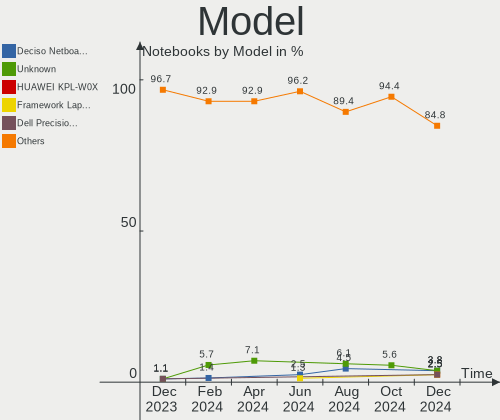
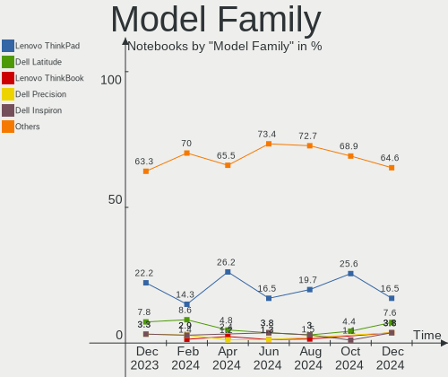
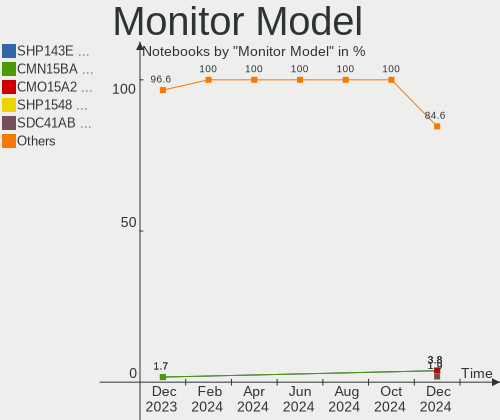
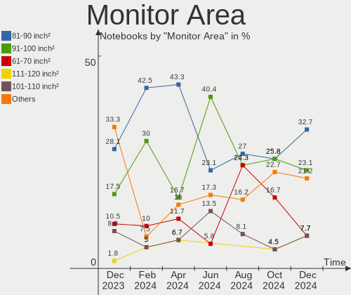
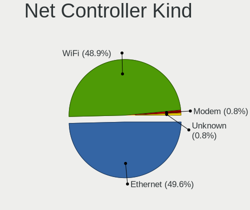

BSD Hardware Trends (Notebooks)
-------------------------------

A project to identify most popular hardware characteristics and track their change
over time based on data collected by BSD users at https://BSD-Hardware.info.

Anyone can contribute to this report by the [hw-probe](https://github.com/linuxhw/hw-probe/blob/master/INSTALL.BSD.md) tool:

    hw-probe -all -upload

Full-feature report is available here: https://bsd-hardware.info/?view=trends&formfactor=notebook

Period: Aug, 2021.

Contents
--------

* [ System ](#system)
  - [ OS                       ](#os)
  - [ OS Family                ](#os-family)
  - [ Arch                     ](#arch)
  - [ DE                       ](#de)
  - [ Display Server           ](#display-server)
  - [ Display Manager          ](#display-manager)
  - [ OS Lang                  ](#os-lang)
  - [ Boot Mode                ](#boot-mode)
  - [ Filesystem               ](#filesystem)
  - [ Part. scheme             ](#part-scheme)

* [ Board ](#board)
  - [ Vendor                   ](#vendor)
  - [ Model                    ](#model)
  - [ Model Family             ](#model-family)
  - [ MFG Year                 ](#mfg-year)
  - [ Form Factor              ](#form-factor)
  - [ Coreboot                 ](#coreboot)
  - [ RAM Size                 ](#ram-size)
  - [ RAM Used                 ](#ram-used)
  - [ Total Drives             ](#total-drives)
  - [ Has CD-ROM               ](#has-cd-rom)
  - [ Has Ethernet             ](#has-ethernet)
  - [ Has WiFi                 ](#has-wifi)
  - [ Has Bluetooth            ](#has-bluetooth)

* [ Location ](#location)
  - [ Country                  ](#country)
  - [ City                     ](#city)

* [ Drives ](#drives)
  - [ Drive Vendor             ](#drive-vendor)
  - [ Drive Model              ](#drive-model)
  - [ HDD Vendor               ](#hdd-vendor)
  - [ SSD Vendor               ](#ssd-vendor)
  - [ Drive Kind               ](#drive-kind)
  - [ Drive Connector          ](#drive-connector)
  - [ Drive Size               ](#drive-size)
  - [ Space Total              ](#space-total)
  - [ Space Used               ](#space-used)
  - [ Malfunc. Drives          ](#malfunc-drives)
  - [ Malfunc. Drive Vendor    ](#malfunc-drive-vendor)
  - [ Malfunc. HDD Vendor      ](#malfunc-hdd-vendor)
  - [ Malfunc. Drive Kind      ](#malfunc-drive-kind)
  - [ Failed Drives            ](#failed-drives)
  - [ Failed Drive Vendor      ](#failed-drive-vendor)
  - [ Drive Status             ](#drive-status)

* [ Storage controller ](#storage-controller)
  - [ Storage Vendor           ](#storage-vendor)
  - [ Storage Model            ](#storage-model)
  - [ Storage Kind             ](#storage-kind)

* [ Processor ](#processor)
  - [ CPU Vendor               ](#cpu-vendor)
  - [ CPU Model                ](#cpu-model)
  - [ CPU Model Family         ](#cpu-model-family)
  - [ CPU Cores                ](#cpu-cores)
  - [ CPU Sockets              ](#cpu-sockets)
  - [ CPU Threads              ](#cpu-threads)
  - [ CPU Microarch            ](#cpu-microarch)

* [ Graphics ](#graphics)
  - [ GPU Vendor               ](#gpu-vendor)
  - [ GPU Model                ](#gpu-model)
  - [ GPU Combo                ](#gpu-combo)
  - [ GPU Driver               ](#gpu-driver)
  - [ GPU Memory               ](#gpu-memory)

* [ Monitor ](#monitor)
  - [ Monitor Vendor           ](#monitor-vendor)
  - [ Monitor Model            ](#monitor-model)
  - [ Monitor Resolution       ](#monitor-resolution)
  - [ Monitor Diagonal         ](#monitor-diagonal)
  - [ Monitor Width            ](#monitor-width)
  - [ Aspect Ratio             ](#aspect-ratio)
  - [ Monitor Area             ](#monitor-area)
  - [ Pixel Density            ](#pixel-density)
  - [ Multiple Monitors        ](#multiple-monitors)

* [ Network ](#network)
  - [ Net Controller Vendor    ](#net-controller-vendor)
  - [ Net Controller Model     ](#net-controller-model)
  - [ Wireless Vendor          ](#wireless-vendor)
  - [ Wireless Model           ](#wireless-model)
  - [ Ethernet Vendor          ](#ethernet-vendor)
  - [ Ethernet Model           ](#ethernet-model)
  - [ Net Controller Kind      ](#net-controller-kind)
  - [ Used Controller          ](#used-controller)
  - [ NICs                     ](#nics)
  - [ IPv6                     ](#ipv6)

* [ Bluetooth ](#bluetooth)
  - [ Bluetooth Vendor         ](#bluetooth-vendor)
  - [ Bluetooth Model          ](#bluetooth-model)

* [ Sound ](#sound)
  - [ Sound Vendor             ](#sound-vendor)
  - [ Sound Model              ](#sound-model)

* [ Memory ](#memory)
  - [ Memory Vendor            ](#memory-vendor)
  - [ Memory Model             ](#memory-model)
  - [ Memory Kind              ](#memory-kind)
  - [ Memory Form Factor       ](#memory-form-factor)
  - [ Memory Size              ](#memory-size)
  - [ Memory Speed             ](#memory-speed)

* [ Printers & scanners ](#printers--scanners)
  - [ Printer Vendor           ](#printer-vendor)
  - [ Printer Model            ](#printer-model)
  - [ Scanner Vendor           ](#scanner-vendor)
  - [ Scanner Model            ](#scanner-model)

* [ Camera ](#camera)
  - [ Camera Vendor            ](#camera-vendor)
  - [ Camera Model             ](#camera-model)

* [ Security ](#security)
  - [ Fingerprint Vendor       ](#fingerprint-vendor)
  - [ Fingerprint Model        ](#fingerprint-model)
  - [ Chipcard Vendor          ](#chipcard-vendor)
  - [ Chipcard Model           ](#chipcard-model)

* [ Unsupported ](#unsupported)
  - [ Unsupported Devices      ](#unsupported-devices)
  - [ Unsupported Device Types ](#unsupported-device-types)

System
------

OS
--

Installed operating systems

| Name                 | Notebooks | Percent |
|----------------------|-----------|---------|
| helloSystem 0.5.0    | 17        | 25%     |
| OpenBSD 6.9          | 8         | 11.76%  |
| FreeBSD 13.0-p3      | 8         | 11.76%  |
| GhostBSD 20.04.02    | 5         | 7.35%   |
| FreeBSD 14.0-CURRENT | 5         | 7.35%   |
| OPNsense 21.7.1      | 4         | 5.88%   |
| NomadBSD 5806f915    | 4         | 5.88%   |
| FreeBSD 13.0-p4      | 3         | 4.41%   |
| helloSystem 0.6.0    | 2         | 2.94%   |
| helloSystem 0.1.0    | 2         | 2.94%   |
| FreeBSD 13.0-STABLE  | 2         | 2.94%   |
| FreeBSD 13.0         | 2         | 2.94%   |
| OPNsense 21.7        | 1         | 1.47%   |
| OPNsense 21.1.9      | 1         | 1.47%   |
| OpenBSD 7.0          | 1         | 1.47%   |
| FuryBSD 12.2-p9      | 1         | 1.47%   |
| FreeBSD 13.0-RC4     | 1         | 1.47%   |
| DragonFly 6.0        | 1         | 1.47%   |

OS Family
---------

OS without a version

| Name        | Notebooks | Percent |
|-------------|-----------|---------|
| helloSystem | 21        | 30.88%  |
| FreeBSD     | 21        | 30.88%  |
| OpenBSD     | 9         | 13.24%  |
| OPNsense    | 6         | 8.82%   |
| GhostBSD    | 5         | 7.35%   |
| NomadBSD    | 4         | 5.88%   |
| FuryBSD     | 1         | 1.47%   |
| DragonFly   | 1         | 1.47%   |

Arch
----

OS architecture (x86_64, i586, etc.)

| Name  | Notebooks | Percent |
|-------|-----------|---------|
| amd64 | 66        | 97.06%  |
| i386  | 2         | 2.94%   |

DE
--

Desktop Environment

| Name         | Notebooks | Percent |
|--------------|-----------|---------|
| helloDesktop | 21        | 30.88%  |
| fvwm         | 9         | 13.24%  |
| KDE5         | 8         | 11.76%  |
| Console      | 8         | 11.76%  |
| MATE         | 7         | 10.29%  |
| XFCE         | 5         | 7.35%   |
| Openbox      | 4         | 5.88%   |
| TWM          | 2         | 2.94%   |
| GNOME        | 2         | 2.94%   |
| Cinnamon     | 2         | 2.94%   |

Display Server
--------------

X11 or Wayland

| Name    | Notebooks | Percent |
|---------|-----------|---------|
| X11     | 59        | 86.76%  |
| Console | 9         | 13.24%  |

Display Manager
---------------

SDDM, LightDM, etc.

| Name    | Notebooks | Percent |
|---------|-----------|---------|
| SLiM    | 31        | 45.59%  |
| Console | 19        | 27.94%  |
| SDDM    | 8         | 11.76%  |
| LightDM | 6         | 8.82%   |
| GDM     | 3         | 4.41%   |
| XDM     | 1         | 1.47%   |

OS Lang
-------

Language

| Lang            | Notebooks | Percent |
|-----------------|-----------|---------|
| en_US           | 26        | 38.24%  |
| Unknown         | 19        | 27.94%  |
| C               | 13        | 19.12%  |
| en_GB           | 2         | 2.94%   |
| zh_CN           | 1         | 1.47%   |
| pt_BR           | 1         | 1.47%   |
| pl_PL           | 1         | 1.47%   |
| it_IT.ISO8859-1 | 1         | 1.47%   |
| fr_FR           | 1         | 1.47%   |
| es_ES           | 1         | 1.47%   |
| de_DE           | 1         | 1.47%   |
| de_CH           | 1         | 1.47%   |

Boot Mode
---------

EFI or BIOS

| Mode | Notebooks | Percent |
|------|-----------|---------|
| EFI  | 51        | 75%     |
| BIOS | 17        | 25%     |

Filesystem
----------

Type of filesystem

| Type    | Notebooks | Percent |
|---------|-----------|---------|
| Zfs     | 46        | 67.65%  |
| Ufs     | 12        | 17.65%  |
| Ffs     | 9         | 13.24%  |
| Hammer2 | 1         | 1.47%   |

Part. scheme
------------

Scheme of partitioning

| Type    | Notebooks | Percent |
|---------|-----------|---------|
| GPT     | 63        | 92.65%  |
| MBR     | 4         | 5.88%   |
| Unknown | 1         | 1.47%   |

Board
-----

Vendor
------

Motherboard manufacturer

| Name                   | Notebooks | Percent |
|------------------------|-----------|---------|
| Lenovo                 | 18        | 26.47%  |
| Hewlett-Packard        | 11        | 16.18%  |
| Dell                   | 11        | 16.18%  |
| Toshiba                | 3         | 4.41%   |
| ASUSTek Computer       | 3         | 4.41%   |
| Apple                  | 3         | 4.41%   |
| Sony                   | 2         | 2.94%   |
| Deciso                 | 2         | 2.94%   |
| Acer                   | 2         | 2.94%   |
| Unknown                | 2         | 2.94%   |
| Standard               | 1         | 1.47%   |
| Samsung Electronics    | 1         | 1.47%   |
| Notebook               | 1         | 1.47%   |
| NEC Computers          | 1         | 1.47%   |
| MSI                    | 1         | 1.47%   |
| Itautec                | 1         | 1.47%   |
| Insyde                 | 1         | 1.47%   |
| IBM                    | 1         | 1.47%   |
| Fujitsu                | 1         | 1.47%   |
| BANGHO                 | 1         | 1.47%   |
| Avell High Performance | 1         | 1.47%   |

Model
-----

Motherboard model

| Name                                  | Notebooks | Percent |
|---------------------------------------|-----------|---------|
| Unknown                               | 3         | 4.41%   |
| Deciso Netboard A20                   | 2         | 2.94%   |
| Toshiba Satellite S55t-B              | 1         | 1.47%   |
| Toshiba Satellite L855                | 1         | 1.47%   |
| Toshiba Satellite L50-C               | 1         | 1.47%   |
| Standard TF                           | 1         | 1.47%   |
| Sony VPCEJ1E1E                        | 1         | 1.47%   |
| Sony VGN-P698E                        | 1         | 1.47%   |
| Samsung 300E5M/300E5L                 | 1         | 1.47%   |
| Notebook N7x0WU                       | 1         | 1.47%   |
| NEC Computers PC-VK17HBBCD            | 1         | 1.47%   |
| MSI GF65 Thin 10SDR                   | 1         | 1.47%   |
| Lenovo ZhaoYang K4e-IML 81VQ          | 1         | 1.47%   |
| Lenovo Yoga 6 13ARE05 82FN            | 1         | 1.47%   |
| Lenovo XiaoXinPro-13ARE 2020 82DM     | 1         | 1.47%   |
| Lenovo ThinkPad X250 20CLS4JH00       | 1         | 1.47%   |
| Lenovo ThinkPad X230 2330A48          | 1         | 1.47%   |
| Lenovo ThinkPad X230 23062S2          | 1         | 1.47%   |
| Lenovo ThinkPad X1 Extreme 20MF000BUS | 1         | 1.47%   |
| Lenovo ThinkPad T61 6459CTO           | 1         | 1.47%   |
| Lenovo ThinkPad S1 Yoga 20C0S0M300    | 1         | 1.47%   |
| Lenovo ThinkPad P73 20QRS00200        | 1         | 1.47%   |
| Lenovo ThinkPad P14s Gen 1 20Y1002AFR | 1         | 1.47%   |
| Lenovo ThinkPad L512 44444XG          | 1         | 1.47%   |
| Lenovo Legion Y7000P 81LD             | 1         | 1.47%   |
| Lenovo IdeaPad Y700-15ISK 80NV        | 1         | 1.47%   |
| Lenovo IdeaPad 1 11IGL05 81VT         | 1         | 1.47%   |
| Lenovo G505 20240                     | 1         | 1.47%   |
| Lenovo FLEX 3-1120 80LX               | 1         | 1.47%   |
| Itautec Infoway w7530                 | 1         | 1.47%   |
| Insyde Braswell                       | 1         | 1.47%   |
| IBM ThinkPad T42 2374K46              | 1         | 1.47%   |
| HP ZBook 17 G2                        | 1         | 1.47%   |
| HP ZBook 15 G3                        | 1         | 1.47%   |
| HP Pavilion g6                        | 1         | 1.47%   |
| HP Pavilion dv6                       | 1         | 1.47%   |
| HP Pavilion 11                        | 1         | 1.47%   |
| HP OMEN by HP Laptop 17-cb1xxx        | 1         | 1.47%   |
| HP Notebook                           | 1         | 1.47%   |
| HP EliteBook 8570p                    | 1         | 1.47%   |
| HP 625                                | 1         | 1.47%   |
| HP 250 G4                             | 1         | 1.47%   |
| HP 2000                               | 1         | 1.47%   |
| Fujitsu LIFEBOOK NH570                | 1         | 1.47%   |
| Dell Latitude E7240                   | 1         | 1.47%   |
| Dell Latitude E6540                   | 1         | 1.47%   |
| Dell Latitude E6430                   | 1         | 1.47%   |
| Dell Latitude E5530 non-vPro          | 1         | 1.47%   |
| Dell Latitude E5440                   | 1         | 1.47%   |
| Dell Latitude 5591                    | 1         | 1.47%   |
| Dell Latitude 3540                    | 1         | 1.47%   |
| Dell Inspiron N7010                   | 1         | 1.47%   |
| Dell Inspiron 3442                    | 1         | 1.47%   |
| Dell Inspiron 15-3567                 | 1         | 1.47%   |
| Dell G3 3579                          | 1         | 1.47%   |
| BANGHO MAX G5                         | 1         | 1.47%   |
| Avell High Performance A60 MUV        | 1         | 1.47%   |
| ASUS X55CR                            | 1         | 1.47%   |
| ASUS TUF Gaming FX505DT_FX505DT       | 1         | 1.47%   |
| ASUS K55VD                            | 1         | 1.47%   |

Model Family
------------

Motherboard model prefix

| Name                       | Notebooks | Percent |
|----------------------------|-----------|---------|
| Lenovo ThinkPad            | 9         | 13.24%  |
| Dell Latitude              | 7         | 10.29%  |
| Toshiba Satellite          | 3         | 4.41%   |
| HP Pavilion                | 3         | 4.41%   |
| Dell Inspiron              | 3         | 4.41%   |
| Unknown                    | 3         | 4.41%   |
| Lenovo IdeaPad             | 2         | 2.94%   |
| HP ZBook                   | 2         | 2.94%   |
| Deciso Netboard            | 2         | 2.94%   |
| Acer Aspire                | 2         | 2.94%   |
| Standard TF                | 1         | 1.47%   |
| Sony VPCEJ1E1E             | 1         | 1.47%   |
| Sony VGN-P698E             | 1         | 1.47%   |
| Samsung 300E5M             | 1         | 1.47%   |
| Notebook N7x0WU            | 1         | 1.47%   |
| NEC Computers PC-VK17HBBCD | 1         | 1.47%   |
| MSI GF65                   | 1         | 1.47%   |
| Lenovo ZhaoYang            | 1         | 1.47%   |
| Lenovo Yoga                | 1         | 1.47%   |
| Lenovo XiaoXinPro-13ARE    | 1         | 1.47%   |
| Lenovo Legion              | 1         | 1.47%   |
| Lenovo G505                | 1         | 1.47%   |
| Lenovo FLEX                | 1         | 1.47%   |
| Itautec Infoway            | 1         | 1.47%   |
| Insyde Braswell            | 1         | 1.47%   |
| IBM ThinkPad               | 1         | 1.47%   |
| HP OMEN                    | 1         | 1.47%   |
| HP Notebook                | 1         | 1.47%   |
| HP EliteBook               | 1         | 1.47%   |
| HP 625                     | 1         | 1.47%   |
| HP 250                     | 1         | 1.47%   |
| HP 2000                    | 1         | 1.47%   |
| Fujitsu LIFEBOOK           | 1         | 1.47%   |
| Dell G3                    | 1         | 1.47%   |
| BANGHO MAX                 | 1         | 1.47%   |
| Avell High Performance A60 | 1         | 1.47%   |
| ASUS X55CR                 | 1         | 1.47%   |
| ASUS TUF                   | 1         | 1.47%   |
| ASUS K55VD                 | 1         | 1.47%   |
| Apple MacBookPro8          | 1         | 1.47%   |
| Apple MacBookPro3          | 1         | 1.47%   |
| Apple MacBookAir7          | 1         | 1.47%   |

MFG Year
--------

Motherboard manufacture year

| Year | Notebooks | Percent |
|------|-----------|---------|
| 2019 | 12        | 17.65%  |
| 2021 | 9         | 13.24%  |
| 2020 | 9         | 13.24%  |
| 2013 | 7         | 10.29%  |
| 2014 | 5         | 7.35%   |
| 2018 | 4         | 5.88%   |
| 2015 | 4         | 5.88%   |
| 2012 | 4         | 5.88%   |
| 2011 | 4         | 5.88%   |
| 2016 | 3         | 4.41%   |
| 2017 | 2         | 2.94%   |
| 2009 | 2         | 2.94%   |
| 2010 | 1         | 1.47%   |
| 2008 | 1         | 1.47%   |
| 2006 | 1         | 1.47%   |

Form Factor
-----------

Physical design of the computer

| Name     | Notebooks | Percent |
|----------|-----------|---------|
| Notebook | 68        | 100%    |

Coreboot
--------

Have coreboot on board

| Used | Notebooks | Percent |
|------|-----------|---------|
| No   | 67        | 98.53%  |
| Yes  | 1         | 1.47%   |

RAM Size
--------

Total RAM memory

| Size in GB | Notebooks | Percent |
|------------|-----------|---------|
| 8.01-16.0  | 22        | 32.35%  |
| 4.01-8.0   | 20        | 29.41%  |
| 16.01-24.0 | 18        | 26.47%  |
| 32.01-64.0 | 3         | 4.41%   |
| 2.01-3.0   | 3         | 4.41%   |
| 3.01-4.0   | 1         | 1.47%   |
| 1.01-2.0   | 1         | 1.47%   |

RAM Used
--------

Used RAM memory

| Used GB   | Notebooks | Percent |
|-----------|-----------|---------|
| 0.01-0.5  | 40        | 58.82%  |
| 0.51-1.0  | 17        | 25%     |
| 1.01-2.0  | 5         | 7.35%   |
| 4.01-8.0  | 2         | 2.94%   |
| 3.01-4.0  | 1         | 1.47%   |
| 2.01-3.0  | 1         | 1.47%   |
| 8.01-16.0 | 1         | 1.47%   |
| 0         | 1         | 1.47%   |

Total Drives
------------

Number of drives on board

| Drives | Notebooks | Percent |
|--------|-----------|---------|
| 1      | 55        | 80.88%  |
| 2      | 9         | 13.24%  |
| 3      | 2         | 2.94%   |
| 4      | 1         | 1.47%   |
| 0      | 1         | 1.47%   |

Has CD-ROM
----------

Has CD-ROM on board

| Presented | Notebooks | Percent |
|-----------|-----------|---------|
| No        | 45        | 66.18%  |
| Yes       | 23        | 33.82%  |

Has Ethernet
------------

Has Ethernet on board

| Presented | Notebooks | Percent |
|-----------|-----------|---------|
| Yes       | 61        | 89.71%  |
| No        | 7         | 10.29%  |

Has WiFi
--------

Has WiFi module

| Presented | Notebooks | Percent |
|-----------|-----------|---------|
| Yes       | 64        | 94.12%  |
| No        | 4         | 5.88%   |

Has Bluetooth
-------------

Has Bluetooth module

| Presented | Notebooks | Percent |
|-----------|-----------|---------|
| Yes       | 43        | 63.24%  |
| No        | 25        | 36.76%  |

Location
--------

Country
-------

Geographic location (country)

| Country     | Notebooks | Percent |
|-------------|-----------|---------|
| USA         | 17        | 25%     |
| Germany     | 8         | 11.76%  |
| Brazil      | 5         | 7.35%   |
| UK          | 4         | 5.88%   |
| China       | 4         | 5.88%   |
| Spain       | 3         | 4.41%   |
| India       | 3         | 4.41%   |
| Sweden      | 2         | 2.94%   |
| Philippines | 2         | 2.94%   |
| Netherlands | 2         | 2.94%   |
| Mexico      | 2         | 2.94%   |
| France      | 2         | 2.94%   |
| Switzerland | 1         | 1.47%   |
| Slovenia    | 1         | 1.47%   |
| Puerto Rico | 1         | 1.47%   |
| Poland      | 1         | 1.47%   |
| Peru        | 1         | 1.47%   |
| Malaysia    | 1         | 1.47%   |
| Italy       | 1         | 1.47%   |
| Guadeloupe  | 1         | 1.47%   |
| Greece      | 1         | 1.47%   |
| Denmark     | 1         | 1.47%   |
| Canada      | 1         | 1.47%   |
| Belgium     | 1         | 1.47%   |
| Bangladesh  | 1         | 1.47%   |
| Argentina   | 1         | 1.47%   |

City
----

Geographic location (city)

| City              | Notebooks | Percent |
|-------------------|-----------|---------|
| Brooklyn          | 4         | 5.88%   |
| Bensheim          | 2         | 2.94%   |
| Aachen            | 2         | 2.94%   |
| Wuhan             | 1         | 1.47%   |
| Whittier          | 1         | 1.47%   |
| Watford           | 1         | 1.47%   |
| Warmond           | 1         | 1.47%   |
| Wandur            | 1         | 1.47%   |
| V?¤ster??s        | 1         | 1.47%   |
| Tula de Allende   | 1         | 1.47%   |
| Trebnje           | 1         | 1.47%   |
| Thessaloniki      | 1         | 1.47%   |
| The Bronx         | 1         | 1.47%   |
| Teriang           | 1         | 1.47%   |
| Shanghai          | 1         | 1.47%   |
| Sedavi            | 1         | 1.47%   |
| Sechelt           | 1         | 1.47%   |
| Seattle           | 1         | 1.47%   |
| Santo Tomas       | 1         | 1.47%   |
| San Bernardino    | 1         | 1.47%   |
| Rochester         | 1         | 1.47%   |
| Rio de Janeiro    | 1         | 1.47%   |
| Pobiedziska       | 1         | 1.47%   |
| Perwez            | 1         | 1.47%   |
| Paris             | 1         | 1.47%   |
| Papillion         | 1         | 1.47%   |
| Oklahoma City     | 1         | 1.47%   |
| Monte Grande      | 1         | 1.47%   |
| Manaus            | 1         | 1.47%   |
| Makati City       | 1         | 1.47%   |
| Lule??            | 1         | 1.47%   |
| London            | 1         | 1.47%   |
| Lima              | 1         | 1.47%   |
| Leiden            | 1         | 1.47%   |
| Le Gosier         | 1         | 1.47%   |
| Kornwestheim      | 1         | 1.47%   |
| Jacksonville      | 1         | 1.47%   |
| Irvine            | 1         | 1.47%   |
| Ipojuca           | 1         | 1.47%   |
| Ingelfingen       | 1         | 1.47%   |
| Hamburg           | 1         | 1.47%   |
| Guangzhou         | 1         | 1.47%   |
| Greensburg        | 1         | 1.47%   |
| Glasgow           | 1         | 1.47%   |
| Gettysburg        | 1         | 1.47%   |
| Gallarate         | 1         | 1.47%   |
| Ecatepec          | 1         | 1.47%   |
| Dhaka             | 1         | 1.47%   |
| Deming            | 1         | 1.47%   |
| Dachong           | 1         | 1.47%   |
| Copenhagen        | 1         | 1.47%   |
| Colombres         | 1         | 1.47%   |
| Coimbra           | 1         | 1.47%   |
| Chennai           | 1         | 1.47%   |
| Chalon-sur-Sa??ne | 1         | 1.47%   |
| Cabo Rojo         | 1         | 1.47%   |
| Brighton          | 1         | 1.47%   |
| Bremerton         | 1         | 1.47%   |
| Berlin            | 1         | 1.47%   |
| Bengaluru         | 1         | 1.47%   |

Drives
------

Drive Vendor
------------

Hard drive vendors

| Vendor              | Notebooks | Drives | Percent |
|---------------------|-----------|--------|---------|
| Samsung Electronics | 15        | 15     | 20%     |
| WDC                 | 9         | 9      | 12%     |
| Toshiba             | 9         | 9      | 12%     |
| Seagate             | 8         | 8      | 10.67%  |
| Transcend           | 4         | 4      | 5.33%   |
| SanDisk             | 4         | 4      | 5.33%   |
| Kingston            | 4         | 4      | 5.33%   |
| NVMe                | 3         | 4      | 4%      |
| SK Hynix            | 2         | 2      | 2.67%   |
| Micron Technology   | 2         | 2      | 2.67%   |
| Hitachi             | 2         | 2      | 2.67%   |
| HGST                | 2         | 3      | 2.67%   |
| A-DATA Technology   | 2         | 3      | 2.67%   |
| Zheino              | 1         | 1      | 1.33%   |
| SPCC                | 1         | 1      | 1.33%   |
| PNY                 | 1         | 1      | 1.33%   |
| LITEON              | 1         | 1      | 1.33%   |
| Lexar               | 1         | 1      | 1.33%   |
| Intel               | 1         | 1      | 1.33%   |
| Hoodisk             | 1         | 1      | 1.33%   |
| Crucial             | 1         | 1      | 1.33%   |
| Apple               | 1         | 1      | 1.33%   |

Drive Model
-----------

Hard drive models

| Model                                | Notebooks | Percent |
|--------------------------------------|-----------|---------|
| Toshiba MQ01ABF050 500GB             | 3         | 3.9%    |
| Samsung SSD 860 EVO 500GB            | 3         | 3.9%    |
| Transcend TS256GMTS952T2 256GB       | 2         | 2.6%    |
| Toshiba MQ01ABD100 1TB               | 2         | 2.6%    |
| Seagate ST9500325AS 500GB            | 2         | 2.6%    |
| Seagate ST500LM012 HN-M500MBB 500GB  | 2         | 2.6%    |
| HGST HTS725050A7E630 500GB           | 2         | 2.6%    |
| Zheino CHN-mSATAQ3-120 120GB         | 1         | 1.3%    |
| WDC WDS500G2B0A-00SM50 500GB         | 1         | 1.3%    |
| WDC WDS120G2G0B-00EPW0 120GB         | 1         | 1.3%    |
| WDC WD5000LPCX-24C6HT0 500GB         | 1         | 1.3%    |
| WDC WD3200LPVX-75V0TT0 320GB         | 1         | 1.3%    |
| WDC WD3200BEVT-60ZCT1 320GB          | 1         | 1.3%    |
| WDC PC SN730 SDBPNTY-512G-1101 512GB | 1         | 1.3%    |
| WDC PC SN720 SDAQNTW-512G-1001 512GB | 1         | 1.3%    |
| WDC PC SN720 SDAPNTW-1T00-1006 1TB   | 1         | 1.3%    |
| WDC PC SN530 SDBPNPZ-512G-1032 512GB | 1         | 1.3%    |
| Transcend TS512GSSD370 512GB         | 1         | 1.3%    |
| Transcend TS128GMSA370S 128GB        | 1         | 1.3%    |
| Toshiba THNSNK256GVN8 M.2 2280 256GB | 1         | 1.3%    |
| Toshiba THNSNF128GCSS 128GB          | 1         | 1.3%    |
| Toshiba MQ01ACF032 320GB             | 1         | 1.3%    |
| Toshiba MQ01ABD100V 1TB              | 1         | 1.3%    |
| SPCC Solid State Disk 1TB            | 1         | 1.3%    |
| SK Hynix SHGP31-1000GM-2 1TB         | 1         | 1.3%    |
| SK Hynix SH920 mSATA 128GB           | 1         | 1.3%    |
| Seagate ST500LT012-9WS142 500GB      | 1         | 1.3%    |
| Seagate ST500LT012-1DG142 500GB      | 1         | 1.3%    |
| Seagate ST2000LM003 HN-M201RAD 2TB   | 1         | 1.3%    |
| Seagate ST1000LM035-1RK172 1TB       | 1         | 1.3%    |
| SanDisk Ultra Fit 16GB               | 1         | 1.3%    |
| SanDisk SSD PLUS 240GB               | 1         | 1.3%    |
| SanDisk SDSSDP128G 128GB             | 1         | 1.3%    |
| SanDisk SDSSDHP256G 256GB            | 1         | 1.3%    |
| Samsung SSD RBX Series 64GB M        | 1         | 1.3%    |
| Samsung SSD 870 QVO 2TB              | 1         | 1.3%    |
| Samsung SSD 860 EVO 1TB              | 1         | 1.3%    |
| Samsung SSD 840 PRO Series 128GB     | 1         | 1.3%    |
| Samsung SG9XCS1F50GMIBM 43W7729 50GB | 1         | 1.3%    |
| Samsung MZVLB256HAHQ-000L2 256GB     | 1         | 1.3%    |
| Samsung MZALQ512HALU-000L2 512GB     | 1         | 1.3%    |
| Samsung MZ7TD128HAFV-000L1 128GB     | 1         | 1.3%    |
| Samsung MMCQE28GFMUP-MVA 128GB       | 1         | 1.3%    |
| Samsung HM500JJ 500GB                | 1         | 1.3%    |
| Samsung HM251JI 250GB                | 1         | 1.3%    |
| Samsung 870 QVO 8TB                  | 1         | 1.3%    |
| PNY CS1311 120GB SSD                 | 1         | 1.3%    |
| NVMe SKHynix_HFM256GD 256GB          | 1         | 1.3%    |
| NVMe Samsung SSD 970 500GB           | 1         | 1.3%    |
| NVMe SAMSUNG MZVLB1T0 1TB            | 1         | 1.3%    |
| NVMe Force MP510 960GB               | 1         | 1.3%    |
| Micron MTFDHBA512TDV 512GB           | 1         | 1.3%    |
| Micron 2200V_MTFDHBA512TCK 512GB     | 1         | 1.3%    |
| LITEON CV1-8B512 512GB               | 1         | 1.3%    |
| Lexar 256GB SSD                      | 1         | 1.3%    |
| Kingston SUV400S37120G 120GB         | 1         | 1.3%    |
| Kingston SMS200S3120G 120GB          | 1         | 1.3%    |
| Kingston SHFS37A240G 240GB           | 1         | 1.3%    |
| Kingston SA400S37120G 120GB          | 1         | 1.3%    |
| Intel SSDSA2CT040G3 40GB             | 1         | 1.3%    |

HDD Vendor
----------

Hard disk drive vendors

| Vendor              | Notebooks | Drives | Percent |
|---------------------|-----------|--------|---------|
| Seagate             | 8         | 8      | 29.63%  |
| Toshiba             | 7         | 7      | 25.93%  |
| WDC                 | 3         | 3      | 11.11%  |
| NVMe                | 3         | 3      | 11.11%  |
| Samsung Electronics | 2         | 2      | 7.41%   |
| Hitachi             | 2         | 2      | 7.41%   |
| HGST                | 2         | 3      | 7.41%   |

SSD Vendor
----------

Solid state drive vendors

| Vendor              | Notebooks | Drives | Percent |
|---------------------|-----------|--------|---------|
| Samsung Electronics | 11        | 11     | 28.95%  |
| Transcend           | 4         | 4      | 10.53%  |
| SanDisk             | 4         | 4      | 10.53%  |
| Kingston            | 4         | 4      | 10.53%  |
| WDC                 | 2         | 2      | 5.26%   |
| Toshiba             | 2         | 2      | 5.26%   |
| Zheino              | 1         | 1      | 2.63%   |
| SPCC                | 1         | 1      | 2.63%   |
| SK Hynix            | 1         | 1      | 2.63%   |
| PNY                 | 1         | 1      | 2.63%   |
| NVMe                | 1         | 1      | 2.63%   |
| LITEON              | 1         | 1      | 2.63%   |
| Lexar               | 1         | 1      | 2.63%   |
| Intel               | 1         | 1      | 2.63%   |
| Hoodisk             | 1         | 1      | 2.63%   |
| Crucial             | 1         | 1      | 2.63%   |
| Apple               | 1         | 1      | 2.63%   |

Drive Kind
----------

HDD or SSD

| Kind | Notebooks | Drives | Percent |
|------|-----------|--------|---------|
| SSD  | 35        | 38     | 49.3%   |
| HDD  | 25        | 28     | 35.21%  |
| NVMe | 11        | 12     | 15.49%  |

Drive Connector
---------------

SATA, SAS, NVMe, etc.

| Type | Notebooks | Drives | Percent |
|------|-----------|--------|---------|
| SATA | 55        | 66     | 83.33%  |
| NVMe | 11        | 12     | 16.67%  |

Drive Size
----------

Size of hard drive

| Size in TB | Notebooks | Drives | Percent |
|------------|-----------|--------|---------|
| 0.01-0.5   | 45        | 51     | 76.27%  |
| 0.51-1.0   | 10        | 10     | 16.95%  |
| 1.01-2.0   | 3         | 4      | 5.08%   |
| 4.01-10.0  | 1         | 1      | 1.69%   |

Space Total
-----------

Amount of disk space available on the file system

| Size in GB | Notebooks | Percent |
|------------|-----------|---------|
| 101-250    | 18        | 26.47%  |
| 1-20       | 17        | 25%     |
| 251-500    | 16        | 23.53%  |
| 501-1000   | 8         | 11.76%  |
| 21-50      | 4         | 5.88%   |
| 51-100     | 3         | 4.41%   |
| 1001-2000  | 1         | 1.47%   |
| Unknown    | 1         | 1.47%   |

Space Used
----------

Amount of used disk space

| Used GB | Notebooks | Percent |
|---------|-----------|---------|
| 1-20    | 57        | 83.82%  |
| 21-50   | 7         | 10.29%  |
| 101-250 | 2         | 2.94%   |
| 51-100  | 1         | 1.47%   |
| Unknown | 1         | 1.47%   |

Malfunc. Drives
---------------

Drive models with a malfunction

| Model                                | Notebooks | Drives | Percent |
|--------------------------------------|-----------|--------|---------|
| HGST HTS725050A7E630 500GB           | 2         | 2      | 16.67%  |
| WDC WD3200LPVX-75V0TT0 320GB         | 1         | 1      | 8.33%   |
| Toshiba THNSNK256GVN8 M.2 2280 256GB | 1         | 1      | 8.33%   |
| Toshiba MQ01ACF032 320GB             | 1         | 1      | 8.33%   |
| Toshiba MQ01ABF050 500GB             | 1         | 1      | 8.33%   |
| Toshiba MQ01ABD100 1TB               | 1         | 1      | 8.33%   |
| Seagate ST500LT012-9WS142 500GB      | 1         | 1      | 8.33%   |
| Seagate ST500LT012-1DG142 500GB      | 1         | 1      | 8.33%   |
| Hitachi HTS545032B9A300 320GB        | 1         | 1      | 8.33%   |
| Hitachi HTS545025B9SA02 250GB        | 1         | 1      | 8.33%   |
| HGST HTS721010A9E630 1TB             | 1         | 1      | 8.33%   |

Malfunc. Drive Vendor
---------------------

Vendors of faulty drives

| Vendor  | Notebooks | Drives | Percent |
|---------|-----------|--------|---------|
| Toshiba | 4         | 4      | 36.36%  |
| Seagate | 2         | 2      | 18.18%  |
| Hitachi | 2         | 2      | 18.18%  |
| HGST    | 2         | 3      | 18.18%  |
| WDC     | 1         | 1      | 9.09%   |

Malfunc. HDD Vendor
-------------------

Vendors of faulty HDD drives

| Vendor  | Notebooks | Drives | Percent |
|---------|-----------|--------|---------|
| Toshiba | 3         | 3      | 30%     |
| Seagate | 2         | 2      | 20%     |
| Hitachi | 2         | 2      | 20%     |
| HGST    | 2         | 3      | 20%     |
| WDC     | 1         | 1      | 10%     |

Malfunc. Drive Kind
-------------------

Kinds of faulty drives

| Kind | Notebooks | Drives | Percent |
|------|-----------|--------|---------|
| HDD  | 10        | 11     | 90.91%  |
| SSD  | 1         | 1      | 9.09%   |

Failed Drives
-------------

Failed drive models

Zero info for selected period =(

Failed Drive Vendor
-------------------

Failed drive vendors

Zero info for selected period =(

Drive Status
------------

Number of failed and malfunc. drives

| Status   | Notebooks | Drives | Percent |
|----------|-----------|--------|---------|
| Works    | 55        | 62     | 79.71%  |
| Malfunc  | 11        | 12     | 15.94%  |
| Detected | 3         | 4      | 4.35%   |

Storage controller
------------------

Storage Vendor
--------------

Storage controller vendors

| Vendor              | Notebooks | Percent |
|---------------------|-----------|---------|
| Intel               | 52        | 67.53%  |
| AMD                 | 8         | 10.39%  |
| Sandisk             | 5         | 6.49%   |
| Samsung Electronics | 4         | 5.19%   |
| SK Hynix            | 2         | 2.6%    |
| Micron Technology   | 2         | 2.6%    |
| ADATA Technology    | 2         | 2.6%    |
| Phison Electronics  | 1         | 1.3%    |
| JMicron Technology  | 1         | 1.3%    |

Storage Model
-------------

Storage controller models

| Model                                                                            | Notebooks | Percent |
|----------------------------------------------------------------------------------|-----------|---------|
| Intel 7 Series Chipset Family 6-port SATA Controller [AHCI mode]                 | 9         | 11.25%  |
| AMD FCH SATA Controller [AHCI mode]                                              | 6         | 7.5%    |
| Intel Cannon Lake Mobile PCH SATA AHCI Controller                                | 5         | 6.25%   |
| Intel 8 Series SATA Controller 1 [AHCI mode]                                     | 5         | 6.25%   |
| Intel Atom/Celeron/Pentium Processor x5-E8000/J3xxx/N3xxx Series SATA Controller | 4         | 5%      |
| Intel 6 Series/C200 Series Chipset Family 6 port Mobile SATA AHCI Controller     | 4         | 5%      |
| Intel Wildcat Point-LP SATA Controller [AHCI Mode]                               | 3         | 3.75%   |
| Intel Sunrise Point-LP SATA Controller [AHCI mode]                               | 3         | 3.75%   |
| Intel 82801 Mobile SATA Controller [RAID mode]                                   | 3         | 3.75%   |
| Intel 8 Series/C220 Series Chipset Family 6-port SATA Controller 1 [AHCI mode]   | 3         | 3.75%   |
| Unknown                                                                          | 3         | 3.75%   |
| Sandisk WD Black SN750 / PC SN730 NVMe SSD                                       | 2         | 2.5%    |
| Sandisk WD Black 2018/SN750 / PC SN720 NVMe SSD                                  | 2         | 2.5%    |
| Samsung NVMe SSD Controller SM981/PM981/PM983                                    | 2         | 2.5%    |
| Intel 82801HM/HEM (ICH8M/ICH8M-E) SATA Controller [AHCI mode]                    | 2         | 2.5%    |
| Intel 82801HM/HEM (ICH8M/ICH8M-E) IDE Controller                                 | 2         | 2.5%    |
| SK Hynix NVMe SSD Controller                                                     | 1         | 1.25%   |
| SK Hynix BC511                                                                   | 1         | 1.25%   |
| Sandisk WD Blue SN550 NVMe SSD                                                   | 1         | 1.25%   |
| Samsung SM951 AHCI                                                               | 1         | 1.25%   |
| Samsung NVMe Controller                                                          | 1         | 1.25%   |
| Phison E12 NVMe Controller                                                       | 1         | 1.25%   |
| JMicron JMB360 AHCI Controller                                                   | 1         | 1.25%   |
| Intel US15W/US15X/US15L/UL11L SCH [Poulsbo] IDE Controller                       | 1         | 1.25%   |
| Intel Q170/Q150/B150/H170/H110/Z170/CM236 Chipset SATA Controller [AHCI Mode]    | 1         | 1.25%   |
| Intel HM170/QM170 Chipset SATA Controller [AHCI Mode]                            | 1         | 1.25%   |
| Intel Comet Lake SATA AHCI Controller                                            | 1         | 1.25%   |
| Intel Celeron N3350/Pentium N4200/Atom E3900 Series SATA AHCI Controller         | 1         | 1.25%   |
| Intel Atom Processor E3800 Series SATA AHCI Controller                           | 1         | 1.25%   |
| Intel 82801IBM/IEM (ICH9M/ICH9M-E) 4 port SATA Controller [AHCI mode]            | 1         | 1.25%   |
| Intel 82801DBM (ICH4-M) IDE Controller                                           | 1         | 1.25%   |
| Intel 5 Series/3400 Series Chipset 6 port SATA AHCI Controller                   | 1         | 1.25%   |
| Intel 5 Series/3400 Series Chipset 4 port SATA IDE Controller                    | 1         | 1.25%   |
| Intel 5 Series/3400 Series Chipset 4 port SATA AHCI Controller                   | 1         | 1.25%   |
| Intel 5 Series/3400 Series Chipset 2 port SATA IDE Controller                    | 1         | 1.25%   |
| AMD SB7x0/SB8x0/SB9x0 SATA Controller [AHCI mode]                                | 1         | 1.25%   |
| AMD FCH SATA Controller [IDE mode]                                               | 1         | 1.25%   |
| ADATA XPG SX8200 Pro PCIe Gen3x4 M.2 2280 Solid State Drive                      | 1         | 1.25%   |

Storage Kind
------------

Kind of storage controller (IDE, SATA, NVMe, SAS, ...)

| Kind | Notebooks | Percent |
|------|-----------|---------|
| SATA | 54        | 69.23%  |
| NVMe | 15        | 19.23%  |
| IDE  | 6         | 7.69%   |
| RAID | 3         | 3.85%   |

Processor
---------

CPU Vendor
----------

Processor vendors

| Vendor | Notebooks | Percent |
|--------|-----------|---------|
| Intel  | 57        | 83.82%  |
| AMD    | 11        | 16.18%  |

CPU Model
---------

Processor models

| Model                                                        | Notebooks | Percent |
|--------------------------------------------------------------|-----------|---------|
| Intel Core i7-8750H CPU @ 2.20GHz                            | 2         | 2.94%   |
| Intel Core i7-10750H CPU @ 2.60GHz                           | 2         | 2.94%   |
| Intel Core i5-5200U CPU @ 2.20GHz                            | 2         | 2.94%   |
| Intel Core i5-4310U CPU @ 2.00GHz                            | 2         | 2.94%   |
| Intel Core i3-6006U CPU @ 2.00GHz                            | 2         | 2.94%   |
| AMD EPYC 3201 8-Core Processor                               | 2         | 2.94%   |
| Intel Pentium M processor 2.00GHz ("GenuineIntel" 686-class) | 1         | 1.47%   |
| Intel Pentium CPU N3710 @ 1.60GHz                            | 1         | 1.47%   |
| Intel Pentium CPU N3700 @ 1.60GHz                            | 1         | 1.47%   |
| Intel Pentium CPU B940 @ 2.00GHz                             | 1         | 1.47%   |
| Intel Genuine CPU                                            | 1         | 1.47%   |
| Intel CPU Version                                            | 1         | 1.47%   |
| Intel Core i9-9880H CPU @ 2.30GHz                            | 1         | 1.47%   |
| Intel Core i7-9750H CPU @ 2.60GHz                            | 1         | 1.47%   |
| Intel Core i7-8565U CPU @ 1.80GHz                            | 1         | 1.47%   |
| Intel Core i7-6820HQ CPU @ 2.70GHz                           | 1         | 1.47%   |
| Intel Core i7-6700HQ CPU @ 2.60GHz                           | 1         | 1.47%   |
| Intel Core i7-4710MQ CPU @ 2.50GHz                           | 1         | 1.47%   |
| Intel Core i7-4710HQ CPU @ 2.50GHz                           | 1         | 1.47%   |
| Intel Core i7-4610M CPU @ 3.00GHz                            | 1         | 1.47%   |
| Intel Core i7-3720QM CPU @ 2.60GHz                           | 1         | 1.47%   |
| Intel Core i7-3630QM CPU @ 2.40GHz                           | 1         | 1.47%   |
| Intel Core i7-3520M CPU @ 2.90GHz                            | 1         | 1.47%   |
| Intel Core i7-2760QM CPU @ 2.40GHz                           | 1         | 1.47%   |
| Intel Core i7-2637M CPU                                      | 1         | 1.47%   |
| Intel Core i5-8400H CPU @ 2.50GHz                            | 1         | 1.47%   |
| Intel Core i5-8300H CPU @ 2.30GHz                            | 1         | 1.47%   |
| Intel Core i5-5250U CPU @ 1.60GHz                            | 1         | 1.47%   |
| Intel Core i5-4210U CPU @ 1.70GHz                            | 1         | 1.47%   |
| Intel Core i5-4200U CPU @ 1.60GHz                            | 1         | 1.47%   |
| Intel Core i5-3340M CPU @ 2.70GHz                            | 1         | 1.47%   |
| Intel Core i5-3320M CPU @ 2.60GHz                            | 1         | 1.47%   |
| Intel Core i5-3230M CPU @ 2.60GHz                            | 1         | 1.47%   |
| Intel Core i5-3210M CPU @ 2.50GHz                            | 1         | 1.47%   |
| Intel Core i5-10210U CPU @ 1.60GHz                           | 1         | 1.47%   |
| Intel Core i3-8130U CPU @ 2.20GHz                            | 1         | 1.47%   |
| Intel Core i3-5005U CPU @ 2.00GHz                            | 1         | 1.47%   |
| Intel Core i3-4005U CPU @ 1.70GHz                            | 1         | 1.47%   |
| Intel Core i3-3110M CPU @ 2.40GHz                            | 1         | 1.47%   |
| Intel Core i3-2370M CPU @ 2.40GHz                            | 1         | 1.47%   |
| Intel Core i3-2330M CPU @ 2.20GHz                            | 1         | 1.47%   |
| Intel Core i3 CPU M 330 @ 2.13GHz                            | 1         | 1.47%   |
| Intel Core 2 Extreme CPU X7900 @ 2.80GHz                     | 1         | 1.47%   |
| Intel Core 2 Duo CPU T7500 @ 2.20GHz                         | 1         | 1.47%   |
| Intel Core 2 Duo CPU T6500 @ 2.10GHz                         | 1         | 1.47%   |
| Intel Celeron N4020 CPU @ 1.10GHz                            | 1         | 1.47%   |
| Intel Celeron CPU N3350 @ 1.10GHz                            | 1         | 1.47%   |
| Intel Celeron CPU N3160 @ 1.60GHz                            | 1         | 1.47%   |
| Intel Celeron CPU N3050 @ 1.60GHz                            | 1         | 1.47%   |
| Intel Celeron CPU N2840 @ 2.16GHz                            | 1         | 1.47%   |
| Intel Celeron CPU 847 @ 1.10GHz                              | 1         | 1.47%   |
| Intel Celeron 2955U @ 1.40GHz                                | 1         | 1.47%   |
| Intel Atom CPU Z530 @ 1.60GHz ("GenuineIntel" 686-class)     | 1         | 1.47%   |
| AMD Ryzen 7 PRO 4750U with Radeon Graphics                   | 1         | 1.47%   |
| AMD Ryzen 7 4800U with Radeon Graphics                       | 1         | 1.47%   |
| AMD Ryzen 7 4800H with Radeon Graphics                       | 1         | 1.47%   |
| AMD Ryzen 5 PRO 4650U with Radeon Graphics                   | 1         | 1.47%   |
| AMD Ryzen 5 3550H with Radeon Vega Mobile Gfx                | 1         | 1.47%   |
| AMD Athlon II P320 Dual-Core Processor                       | 1         | 1.47%   |
| AMD A6-3420M APU with Radeon HD Graphics                     | 1         | 1.47%   |

CPU Model Family
----------------

Processor model prefix

| Model                | Notebooks | Percent |
|----------------------|-----------|---------|
| Intel Core i7        | 16        | 23.53%  |
| Intel Core i5        | 14        | 20.59%  |
| Intel Core i3        | 9         | 13.24%  |
| Intel Celeron        | 7         | 10.29%  |
| Intel Pentium        | 3         | 4.41%   |
| Intel Core 2 Duo     | 2         | 2.94%   |
| AMD Ryzen 7          | 2         | 2.94%   |
| AMD EPYC             | 2         | 2.94%   |
| AMD A6               | 2         | 2.94%   |
| Other                | 1         | 1.47%   |
| Intel Pentium M      | 1         | 1.47%   |
| Intel Genuine        | 1         | 1.47%   |
| Intel Core i9        | 1         | 1.47%   |
| Intel Core 2 Extreme | 1         | 1.47%   |
| Intel Atom           | 1         | 1.47%   |
| AMD Ryzen 7 PRO      | 1         | 1.47%   |
| AMD Ryzen 5 PRO      | 1         | 1.47%   |
| AMD Ryzen 5          | 1         | 1.47%   |
| AMD Athlon II        | 1         | 1.47%   |
| AMD A4               | 1         | 1.47%   |

CPU Cores
---------

Number of processor cores

| Number  | Notebooks | Percent |
|---------|-----------|---------|
| 2       | 33        | 48.53%  |
| 4       | 17        | 25%     |
| 6       | 5         | 7.35%   |
| 8       | 4         | 5.88%   |
| Unknown | 4         | 5.88%   |
| 16      | 3         | 4.41%   |
| 12      | 1         | 1.47%   |
| 1       | 1         | 1.47%   |

CPU Sockets
-----------

Number of sockets

| Number  | Notebooks | Percent |
|---------|-----------|---------|
| 1       | 65        | 95.59%  |
| Unknown | 2         | 2.94%   |
| 2       | 1         | 1.47%   |

CPU Threads
-----------

Threads per core (Hyper-Threading)

| Number  | Notebooks | Percent |
|---------|-----------|---------|
| 2       | 42        | 61.76%  |
| 1       | 21        | 30.88%  |
| Unknown | 5         | 7.35%   |

CPU Microarch
-------------

Microarchitecture

| Name          | Notebooks | Percent |
|---------------|-----------|---------|
| KabyLake      | 9         | 13.24%  |
| Haswell       | 9         | 13.24%  |
| IvyBridge     | 8         | 11.76%  |
| SandyBridge   | 6         | 8.82%   |
| Silvermont    | 5         | 7.35%   |
| Zen 2         | 4         | 5.88%   |
| Skylake       | 4         | 5.88%   |
| Broadwell     | 4         | 5.88%   |
| Westmere      | 3         | 4.41%   |
| Zen           | 2         | 2.94%   |
| Jaguar        | 2         | 2.94%   |
| Core          | 2         | 2.94%   |
| CometLake     | 2         | 2.94%   |
| Zen+          | 1         | 1.47%   |
| Penryn        | 1         | 1.47%   |
| P6            | 1         | 1.47%   |
| K10 Llano     | 1         | 1.47%   |
| K10           | 1         | 1.47%   |
| Goldmont plus | 1         | 1.47%   |
| Goldmont      | 1         | 1.47%   |
| Bonnell       | 1         | 1.47%   |

Graphics
--------

GPU Vendor
----------

Vendors of graphics cards

| Vendor | Notebooks | Percent |
|--------|-----------|---------|
| Intel  | 45        | 57.69%  |
| Nvidia | 17        | 21.79%  |
| AMD    | 16        | 20.51%  |

GPU Model
---------

Graphics card models

| Model                                                                                    | Notebooks | Percent |
|------------------------------------------------------------------------------------------|-----------|---------|
| Intel Haswell-ULT Integrated Graphics Controller                                         | 6         | 7.59%   |
| Intel 3rd Gen Core processor Graphics Controller                                         | 6         | 7.59%   |
| Intel CoffeeLake-H GT2 [UHD Graphics 630]                                                | 5         | 6.33%   |
| Intel 2nd Generation Core Processor Family Integrated Graphics Controller                | 5         | 6.33%   |
| AMD Renoir                                                                               | 4         | 5.06%   |
| Nvidia GP107M [GeForce GTX 1050 Ti Mobile]                                               | 3         | 3.8%    |
| Intel HD Graphics 5500                                                                   | 3         | 3.8%    |
| Intel Atom/Celeron/Pentium Processor x5-E8000/J3xxx/N3xxx Integrated Graphics Controller | 3         | 3.8%    |
| Nvidia TU116M [GeForce GTX 1660 Ti Mobile]                                               | 2         | 2.53%   |
| Intel Skylake GT2 [HD Graphics 520]                                                      | 2         | 2.53%   |
| Intel HD Graphics 530                                                                    | 2         | 2.53%   |
| Intel 4th Gen Core Processor Integrated Graphics Controller                              | 2         | 2.53%   |
| Nvidia TU117M [GeForce GTX 1650 Mobile / Max-Q]                                          | 1         | 1.27%   |
| Nvidia TU104GLM [Quadro RTX 4000 Mobile / Max-Q]                                         | 1         | 1.27%   |
| Nvidia TU104BM [GeForce RTX 2070 SUPER Mobile / Max-Q]                                   | 1         | 1.27%   |
| Nvidia GT216M [GeForce GT 330M]                                                          | 1         | 1.27%   |
| Nvidia GM107M [GeForce GTX 860M]                                                         | 1         | 1.27%   |
| Nvidia GM107GLM [Quadro M1000M]                                                          | 1         | 1.27%   |
| Nvidia GK107GLM [Quadro K1100M]                                                          | 1         | 1.27%   |
| Nvidia GF119M [GeForce 610M]                                                             | 1         | 1.27%   |
| Nvidia GF119M [GeForce 410M]                                                             | 1         | 1.27%   |
| Nvidia GF108GLM [NVS 5200M]                                                              | 1         | 1.27%   |
| Nvidia G86M [Quadro NVS 140M]                                                            | 1         | 1.27%   |
| Nvidia G84M [GeForce 8600M GT]                                                           | 1         | 1.27%   |
| Intel WhiskeyLake-U GT2 [UHD Graphics 620]                                               | 1         | 1.27%   |
| Intel US15W/US15X SCH [Poulsbo] Graphics Controller                                      | 1         | 1.27%   |
| Intel UHD Graphics 620                                                                   | 1         | 1.27%   |
| Intel Mobile 4 Series Chipset Integrated Graphics Controller                             | 1         | 1.27%   |
| Intel HD Graphics 6000                                                                   | 1         | 1.27%   |
| Intel HD Graphics 500                                                                    | 1         | 1.27%   |
| Intel GeminiLake [UHD Graphics 600]                                                      | 1         | 1.27%   |
| Intel Core Processor Integrated Graphics Controller                                      | 1         | 1.27%   |
| Intel CometLake-U GT2 [UHD Graphics]                                                     | 1         | 1.27%   |
| Intel CometLake-H GT2 [UHD Graphics]                                                     | 1         | 1.27%   |
| Intel Atom Processor Z36xxx/Z37xxx Series Graphics & Display                             | 1         | 1.27%   |
| AMD Whistler [Radeon HD 6730M/6770M/7690M XT]                                            | 1         | 1.27%   |
| AMD Venus PRO [Radeon HD 8850M / R9 M265X]                                               | 1         | 1.27%   |
| AMD Topaz XT [Radeon R7 M260/M265 / M340/M360 / M440/M445 / 530/535 / 620/625 Mobile]    | 1         | 1.27%   |
| AMD Thames [Radeon HD 7550M/7570M/7650M]                                                 | 1         | 1.27%   |
| AMD Thames [Radeon HD 7500M/7600M Series]                                                | 1         | 1.27%   |
| AMD Temash [Radeon HD 8250/8280G]                                                        | 1         | 1.27%   |
| AMD Sun PRO [Radeon HD 8570A/8570M]                                                      | 1         | 1.27%   |
| AMD Sumo [Radeon HD 6520G]                                                               | 1         | 1.27%   |
| AMD RV200/M7 [Mobility Radeon 7500]                                                      | 1         | 1.27%   |
| AMD RS880M [Mobility Radeon HD 4225/4250]                                                | 1         | 1.27%   |
| AMD Picasso                                                                              | 1         | 1.27%   |
| AMD Park [Mobility Radeon HD 5430/5450/5470]                                             | 1         | 1.27%   |
| AMD Kabini [Radeon HD 8330]                                                              | 1         | 1.27%   |

GPU Combo
---------

Combinations of graphics cards

| Name           | Notebooks | Percent |
|----------------|-----------|---------|
| 1 x Intel      | 32        | 47.06%  |
| 1 x AMD        | 11        | 16.18%  |
| Intel + Nvidia | 9         | 13.24%  |
| 1 x Nvidia     | 7         | 10.29%  |
| Other          | 3         | 4.41%   |
| Intel + AMD    | 3         | 4.41%   |
| 2 x Intel      | 1         | 1.47%   |
| 2 x AMD        | 1         | 1.47%   |
| AMD + Nvidia   | 1         | 1.47%   |

GPU Driver
----------

Free vs proprietary

| Driver      | Notebooks | Percent |
|-------------|-----------|---------|
| Free        | 57        | 83.82%  |
| Proprietary | 6         | 8.82%   |
| Unknown     | 5         | 7.35%   |

GPU Memory
----------

Total video memory

| Size in GB | Notebooks | Percent |
|------------|-----------|---------|
| Unknown    | 57        | 83.82%  |
| 0.01-0.5   | 7         | 10.29%  |
| 0.51-1.0   | 3         | 4.41%   |
| 1.01-2.0   | 1         | 1.47%   |

Monitor
-------

Monitor Vendor
--------------

Monitor vendors

| Vendor              | Notebooks | Percent |
|---------------------|-----------|---------|
| LG Display          | 15        | 30.61%  |
| BOE                 | 7         | 14.29%  |
| AU Optronics        | 6         | 12.24%  |
| Samsung Electronics | 5         | 10.2%   |
| Chimei Innolux      | 3         | 6.12%   |
| Sharp               | 2         | 4.08%   |
| Philips             | 2         | 4.08%   |
| InfoVision          | 2         | 4.08%   |
| Tech Concepts       | 1         | 2.04%   |
| SDC                 | 1         | 2.04%   |
| PANDA               | 1         | 2.04%   |
| LGD                 | 1         | 2.04%   |
| Lenovo              | 1         | 2.04%   |
| IBM                 | 1         | 2.04%   |
| Apple               | 1         | 2.04%   |

Monitor Model
-------------

Monitor models

| Model                                                                | Notebooks | Percent |
|----------------------------------------------------------------------|-----------|---------|
| Tech Concepts LCD Monitor 43S435                                     | 1         | 2.04%   |
| Sharp LQ156M1JW01 SHP14C3 1920x1080 340x190mm 15.3-inch              | 1         | 2.04%   |
| Sharp LCD Monitor SHP143A 3840x2160 350x190mm 15.7-inch              | 1         | 2.04%   |
| SDC LCD Monitor 3520x1080                                            | 1         | 2.04%   |
| Samsung Electronics LCD Monitor SEC4251 1366x768 340x190mm 15.3-inch | 1         | 2.04%   |
| Samsung Electronics LCD Monitor SEC414C 1366x768 310x170mm 13.9-inch | 1         | 2.04%   |
| Samsung Electronics LCD Monitor SEC354C 1366x768 350x200mm 15.9-inch | 1         | 2.04%   |
| Samsung Electronics LCD Monitor SDC4C51 1366x768 340x190mm 15.3-inch | 1         | 2.04%   |
| Samsung Electronics LCD Monitor SDC4141 1366x768 340x190mm 15.3-inch | 1         | 2.04%   |
| Philips LCD Monitor PHL08C3 1920x1080 600x340mm 27.2-inch            | 1         | 2.04%   |
| Philips LCD Monitor 271P4 3520x1080                                  | 1         | 2.04%   |
| PANDA LCD Monitor NCP002D 1920x1080 340x190mm 15.3-inch              | 1         | 2.04%   |
| LGD LCD Monitor 5760x2160                                            | 1         | 2.04%   |
| LG Display LCD Monitor LGD053F 1920x1080 340x190mm 15.3-inch         | 1         | 2.04%   |
| LG Display LCD Monitor LGD0525 1366x768 340x190mm 15.3-inch          | 1         | 2.04%   |
| LG Display LCD Monitor LGD0470 1920x1080 350x190mm 15.7-inch         | 1         | 2.04%   |
| LG Display LCD Monitor LGD046F 1920x1080 340x190mm 15.3-inch         | 1         | 2.04%   |
| LG Display LCD Monitor LGD045C 1366x768 350x190mm 15.7-inch          | 1         | 2.04%   |
| LG Display LCD Monitor LGD0414 1920x1080 280x160mm 12.7-inch         | 1         | 2.04%   |
| LG Display LCD Monitor LGD03DD 1366x768 340x190mm 15.3-inch          | 1         | 2.04%   |
| LG Display LCD Monitor LGD03A3 1366x768 280x160mm 12.7-inch          | 1         | 2.04%   |
| LG Display LCD Monitor LGD034D 1366x768 340x190mm 15.3-inch          | 1         | 2.04%   |
| LG Display LCD Monitor LGD033A 1366x768 340x190mm 15.3-inch          | 1         | 2.04%   |
| LG Display LCD Monitor LGD02DC 1366x768 340x190mm 15.3-inch          | 1         | 2.04%   |
| LG Display LCD Monitor LGD02D8 1366x768 280x160mm 12.7-inch          | 1         | 2.04%   |
| LG Display LCD Monitor LGD02AD 1366x768 340x190mm 15.3-inch          | 1         | 2.04%   |
| LG Display LCD Monitor LGD0258 1600x900 350x190mm 15.7-inch          | 1         | 2.04%   |
| LG Display LCD Monitor LGD021D 1600x900 380x210mm 17.1-inch          | 1         | 2.04%   |
| Lenovo LCD Monitor LEN40B0 1366x768 340x190mm 15.3-inch              | 1         | 2.04%   |
| InfoVision M116NWR1 R0  IVO0489 1366x768 260x140mm 11.6-inch         | 1         | 2.04%   |
| InfoVision LCD Monitor IVO04E3 1366x768 280x160mm 12.7-inch          | 1         | 2.04%   |
| IBM LCD Monitor IBM2887 1680x1050 330x210mm 15.4-inch                | 1         | 2.04%   |
| Chimei Innolux LCD Monitor CMN15B1 1920x1080 340x190mm 15.3-inch     | 1         | 2.04%   |
| Chimei Innolux LCD Monitor CMN1496 1366x768 310x170mm 13.9-inch      | 1         | 2.04%   |
| Chimei Innolux LCD Monitor CMN1132 1366x768 260x140mm 11.6-inch      | 1         | 2.04%   |
| BOE LCD Monitor BOE0817 1366x768 340x190mm 15.3-inch                 | 1         | 2.04%   |
| BOE LCD Monitor BOE0792 1920x1080 340x190mm 15.3-inch                | 1         | 2.04%   |
| BOE LCD Monitor BOE0729 1920x1080 340x190mm 15.3-inch                | 1         | 2.04%   |
| BOE LCD Monitor BOE06FB 1920x1080 340x190mm 15.3-inch                | 1         | 2.04%   |
| BOE LCD Monitor BOE0690 1920x1080 340x190mm 15.3-inch                | 1         | 2.04%   |
| BOE LCD Monitor BOE05F6 1366x768 310x170mm 13.9-inch                 | 1         | 2.04%   |
| BOE LCD Monitor BOE05DA 1366x768 280x160mm 12.7-inch                 | 1         | 2.04%   |
| AU Optronics LCD Monitor AUO5F2D 1920x1080 290x170mm 13.2-inch       | 1         | 2.04%   |
| AU Optronics LCD Monitor AUO26EC 1366x768 340x190mm 15.3-inch        | 1         | 2.04%   |
| AU Optronics LCD Monitor AUO235C 1366x768 260x140mm 11.6-inch        | 1         | 2.04%   |
| AU Optronics LCD Monitor AUO21ED 1920x1080 340x190mm 15.3-inch       | 1         | 2.04%   |
| AU Optronics LCD Monitor AUO20EC 1366x768 340x190mm 15.3-inch        | 1         | 2.04%   |
| AU Optronics LCD Monitor AUO2026 2560x1600 290x180mm 13.4-inch       | 1         | 2.04%   |
| Apple Color LCD APP9CF0 1440x900 290x180mm 13.4-inch                 | 1         | 2.04%   |

Monitor Resolution
------------------

Monitor screen resolution

| Resolution         | Notebooks | Percent |
|--------------------|-----------|---------|
| 1366x768 (WXGA)    | 25        | 52.08%  |
| 1920x1080 (FHD)    | 14        | 29.17%  |
| 1600x900 (HD+)     | 2         | 4.17%   |
| 5760x2160          | 1         | 2.08%   |
| 3840x2160 (4K)     | 1         | 2.08%   |
| 3520x1080          | 1         | 2.08%   |
| 2560x1600          | 1         | 2.08%   |
| 1680x1050 (WSXGA+) | 1         | 2.08%   |
| 1440x900 (WXGA+)   | 1         | 2.08%   |
| Unknown            | 1         | 2.08%   |

Monitor Diagonal
----------------

Diagonal size in inches

| Inches  | Notebooks | Percent |
|---------|-----------|---------|
| 15      | 29        | 61.7%   |
| 13      | 6         | 12.77%  |
| 12      | 5         | 10.64%  |
| 11      | 3         | 6.38%   |
| Unknown | 2         | 4.26%   |
| 27      | 1         | 2.13%   |
| 17      | 1         | 2.13%   |

Monitor Width
-------------

Physical width

| Width in mm | Notebooks | Percent |
|-------------|-----------|---------|
| 301-350     | 32        | 68.09%  |
| 201-300     | 11        | 23.4%   |
| Unknown     | 2         | 4.26%   |
| 501-600     | 1         | 2.13%   |
| 351-400     | 1         | 2.13%   |

Aspect Ratio
------------

Proportional relationship between the width and the height

| Ratio   | Notebooks | Percent |
|---------|-----------|---------|
| 16/9    | 41        | 89.13%  |
| 16/10   | 3         | 6.52%   |
| Unknown | 2         | 4.35%   |

Monitor Area
------------

Area in inch²

| Area in inch² | Notebooks | Percent |
|----------------|-----------|---------|
| 91-100         | 22        | 46.81%  |
| 101-110        | 7         | 14.89%  |
| 81-90          | 5         | 10.64%  |
| 61-70          | 5         | 10.64%  |
| 51-60          | 3         | 6.38%   |
| Unknown        | 2         | 4.26%   |
| 71-80          | 1         | 2.13%   |
| 301-350        | 1         | 2.13%   |
| 121-130        | 1         | 2.13%   |

Pixel Density
-------------

Pixels per inch

| Density       | Notebooks | Percent |
|---------------|-----------|---------|
| 121-160       | 20        | 42.55%  |
| 101-120       | 18        | 38.3%   |
| 161-240       | 3         | 6.38%   |
| 51-100        | 3         | 6.38%   |
| Unknown       | 2         | 4.26%   |
| More than 240 | 1         | 2.13%   |

Multiple Monitors
-----------------

Total monitors connected

| Total | Notebooks | Percent |
|-------|-----------|---------|
| 1     | 45        | 66.18%  |
| 0     | 20        | 29.41%  |
| 2     | 3         | 4.41%   |

Network
-------

Net Controller Vendor
---------------------

Controller vendors

| Vendor                   | Notebooks | Percent |
|--------------------------|-----------|---------|
| Intel                    | 41        | 35.65%  |
| Realtek Semiconductor    | 32        | 27.83%  |
| Qualcomm Atheros         | 19        | 16.52%  |
| Broadcom                 | 7         | 6.09%   |
| Ralink Technology        | 3         | 2.61%   |
| Ralink                   | 3         | 2.61%   |
| TP-Link                  | 2         | 1.74%   |
| Marvell Technology Group | 2         | 1.74%   |
| D-Link System            | 2         | 1.74%   |
| AMD                      | 2         | 1.74%   |
| Sierra Wireless          | 1         | 0.87%   |
| Hewlett-Packard          | 1         | 0.87%   |

Net Controller Model
--------------------

Controller models

| Model                                                                                 | Notebooks | Percent |
|---------------------------------------------------------------------------------------|-----------|---------|
| Realtek RTL8111/8168/8411 PCI Express Gigabit Ethernet Controller                     | 20        | 14.29%  |
| Realtek RTL810xE PCI Express Fast Ethernet controller                                 | 12        | 8.57%   |
| Intel Wireless 7260                                                                   | 5         | 3.57%   |
| Intel Wi-Fi 6 AX200                                                                   | 5         | 3.57%   |
| Intel 82579LM Gigabit Network Connection (Lewisville)                                 | 5         | 3.57%   |
| Qualcomm Atheros AR9485 Wireless Network Adapter                                      | 4         | 2.86%   |
| Qualcomm Atheros QCA9565 / AR9565 Wireless Network Adapter                            | 3         | 2.14%   |
| Intel Wireless 3160                                                                   | 3         | 2.14%   |
| Intel I210 Gigabit Network Connection                                                 | 3         | 2.14%   |
| Intel Cannon Lake PCH CNVi WiFi                                                       | 3         | 2.14%   |
| TP-Link AC600 wireless Realtek RTL8811AU [Archer T2U Nano]                            | 2         | 1.43%   |
| Realtek RTL8188EUS 802.11n Wireless Network Adapter                                   | 2         | 1.43%   |
| Qualcomm Atheros QCA9377 802.11ac Wireless Network Adapter                            | 2         | 1.43%   |
| Qualcomm Atheros AR928X Wireless Network Adapter (PCI-Express)                        | 2         | 1.43%   |
| Qualcomm Atheros AR9287 Wireless Network Adapter (PCI-Express)                        | 2         | 1.43%   |
| Qualcomm Atheros AR9285 Wireless Network Adapter (PCI-Express)                        | 2         | 1.43%   |
| Qualcomm Atheros AR8161 Gigabit Ethernet                                              | 2         | 1.43%   |
| Intel Ethernet Connection I218-LM                                                     | 2         | 1.43%   |
| Intel Ethernet Connection I217-LM                                                     | 2         | 1.43%   |
| Intel Ethernet Connection (7) I219-LM                                                 | 2         | 1.43%   |
| Intel Dual Band Wireless-AC 3168NGW [Stone Peak]                                      | 2         | 1.43%   |
| Intel Comet Lake PCH CNVi WiFi                                                        | 2         | 1.43%   |
| Intel Centrino Advanced-N 6205 [Taylor Peak]                                          | 2         | 1.43%   |
| Broadcom BCM4313 802.11bgn Wireless Network Adapter                                   | 2         | 1.43%   |
| AMD Family 17h Processor 10 Gb Ethernet Controller Port 0                             | 2         | 1.43%   |
| Sierra Wireless Sierra Wireless EM7345 4G LTE                                         | 1         | 0.71%   |
| Realtek RTL8821CE 802.11ac PCIe Wireless Network Adapter                              | 1         | 0.71%   |
| Realtek RTL8821AE 802.11ac PCIe Wireless Network Adapter                              | 1         | 0.71%   |
| Realtek RTL8723BE PCIe Wireless Network Adapter                                       | 1         | 0.71%   |
| Realtek RTL8191SEvB Wireless LAN Controller                                           | 1         | 0.71%   |
| Realtek RTL8188CE 802.11b/g/n WiFi Adapter                                            | 1         | 0.71%   |
| Ralink RT5370 Wireless Adapter                                                        | 1         | 0.71%   |
| Ralink RT2870/RT3070 Wireless Adapter                                                 | 1         | 0.71%   |
| Ralink MT7601U Wireless Adapter                                                       | 1         | 0.71%   |
| Ralink RT5390R 802.11bgn PCIe Wireless Network Adapter                                | 1         | 0.71%   |
| Ralink RT5390 Wireless 802.11n 1T/1R PCIe                                             | 1         | 0.71%   |
| Ralink RT3290 Wireless 802.11n 1T/1R PCIe                                             | 1         | 0.71%   |
| Qualcomm Atheros QCA8172 Fast Ethernet                                                | 1         | 0.71%   |
| Qualcomm Atheros AR9462 Wireless Network Adapter                                      | 1         | 0.71%   |
| Qualcomm Atheros AR8152 v1.1 Fast Ethernet                                            | 1         | 0.71%   |
| Qualcomm Atheros AR5418 Wireless Network Adapter [AR5008E 802.11(a)bgn] (PCI-Express) | 1         | 0.71%   |
| Qualcomm Atheros AR5212 802.11abg NIC                                                 | 1         | 0.71%   |
| Marvell Group 88E8058 PCI-E Gigabit Ethernet Controller                               | 1         | 0.71%   |
| Marvell Group 88E8057 PCI-E Gigabit Ethernet Controller                               | 1         | 0.71%   |
| Intel Wireless-AC 9260                                                                | 1         | 0.71%   |
| Intel Wireless 8260                                                                   | 1         | 0.71%   |
| Intel Wireless 7265                                                                   | 1         | 0.71%   |
| Intel Wireless 3165                                                                   | 1         | 0.71%   |
| Intel WiFi Link 5100                                                                  | 1         | 0.71%   |
| Intel PRO/Wireless 5100 AGN [Shiloh] Network Connection                               | 1         | 0.71%   |
| Intel PRO/Wireless 4965 AG or AGN [Kedron] Network Connection                         | 1         | 0.71%   |
| Intel I211 Gigabit Network Connection                                                 | 1         | 0.71%   |
| Intel I210 Gigabit Backplane Connection                                               | 1         | 0.71%   |
| Intel Ethernet Connection (7) I219-V                                                  | 1         | 0.71%   |
| Intel Ethernet Connection (3) I218-LM                                                 | 1         | 0.71%   |
| Intel Ethernet Connection (2) I219-LM                                                 | 1         | 0.71%   |
| Intel Dual Band Wireless-AC 3165 Plus Bluetooth                                       | 1         | 0.71%   |
| Intel Comet Lake PCH-LP CNVi WiFi                                                     | 1         | 0.71%   |
| Intel Centrino Wireless-N 2200                                                        | 1         | 0.71%   |
| Intel Cannon Point-LP CNVi [Wireless-AC]                                              | 1         | 0.71%   |

Wireless Vendor
---------------

Wireless vendors

| Vendor                | Notebooks | Percent |
|-----------------------|-----------|---------|
| Intel                 | 33        | 44.59%  |
| Qualcomm Atheros      | 18        | 24.32%  |
| Realtek Semiconductor | 7         | 9.46%   |
| Broadcom              | 5         | 6.76%   |
| Ralink Technology     | 3         | 4.05%   |
| Ralink                | 3         | 4.05%   |
| TP-Link               | 2         | 2.7%    |
| D-Link System         | 2         | 2.7%    |
| Sierra Wireless       | 1         | 1.35%   |

Wireless Model
--------------

Wireless models

| Model                                                                                 | Notebooks | Percent |
|---------------------------------------------------------------------------------------|-----------|---------|
| Intel Wireless 7260                                                                   | 5         | 6.76%   |
| Intel Wi-Fi 6 AX200                                                                   | 5         | 6.76%   |
| Qualcomm Atheros AR9485 Wireless Network Adapter                                      | 4         | 5.41%   |
| Qualcomm Atheros QCA9565 / AR9565 Wireless Network Adapter                            | 3         | 4.05%   |
| Intel Wireless 3160                                                                   | 3         | 4.05%   |
| Intel Cannon Lake PCH CNVi WiFi                                                       | 3         | 4.05%   |
| TP-Link AC600 wireless Realtek RTL8811AU [Archer T2U Nano]                            | 2         | 2.7%    |
| Realtek RTL8188EUS 802.11n Wireless Network Adapter                                   | 2         | 2.7%    |
| Qualcomm Atheros QCA9377 802.11ac Wireless Network Adapter                            | 2         | 2.7%    |
| Qualcomm Atheros AR928X Wireless Network Adapter (PCI-Express)                        | 2         | 2.7%    |
| Qualcomm Atheros AR9287 Wireless Network Adapter (PCI-Express)                        | 2         | 2.7%    |
| Qualcomm Atheros AR9285 Wireless Network Adapter (PCI-Express)                        | 2         | 2.7%    |
| Intel Dual Band Wireless-AC 3168NGW [Stone Peak]                                      | 2         | 2.7%    |
| Intel Comet Lake PCH CNVi WiFi                                                        | 2         | 2.7%    |
| Intel Centrino Advanced-N 6205 [Taylor Peak]                                          | 2         | 2.7%    |
| Broadcom BCM4313 802.11bgn Wireless Network Adapter                                   | 2         | 2.7%    |
| Sierra Wireless Sierra Wireless EM7345 4G LTE                                         | 1         | 1.35%   |
| Realtek RTL8821CE 802.11ac PCIe Wireless Network Adapter                              | 1         | 1.35%   |
| Realtek RTL8821AE 802.11ac PCIe Wireless Network Adapter                              | 1         | 1.35%   |
| Realtek RTL8723BE PCIe Wireless Network Adapter                                       | 1         | 1.35%   |
| Realtek RTL8191SEvB Wireless LAN Controller                                           | 1         | 1.35%   |
| Realtek RTL8188CE 802.11b/g/n WiFi Adapter                                            | 1         | 1.35%   |
| Ralink RT5370 Wireless Adapter                                                        | 1         | 1.35%   |
| Ralink RT2870/RT3070 Wireless Adapter                                                 | 1         | 1.35%   |
| Ralink MT7601U Wireless Adapter                                                       | 1         | 1.35%   |
| Ralink RT5390R 802.11bgn PCIe Wireless Network Adapter                                | 1         | 1.35%   |
| Ralink RT5390 Wireless 802.11n 1T/1R PCIe                                             | 1         | 1.35%   |
| Ralink RT3290 Wireless 802.11n 1T/1R PCIe                                             | 1         | 1.35%   |
| Qualcomm Atheros AR9462 Wireless Network Adapter                                      | 1         | 1.35%   |
| Qualcomm Atheros AR5418 Wireless Network Adapter [AR5008E 802.11(a)bgn] (PCI-Express) | 1         | 1.35%   |
| Qualcomm Atheros AR5212 802.11abg NIC                                                 | 1         | 1.35%   |
| Intel Wireless-AC 9260                                                                | 1         | 1.35%   |
| Intel Wireless 8260                                                                   | 1         | 1.35%   |
| Intel Wireless 7265                                                                   | 1         | 1.35%   |
| Intel Wireless 3165                                                                   | 1         | 1.35%   |
| Intel WiFi Link 5100                                                                  | 1         | 1.35%   |
| Intel PRO/Wireless 5100 AGN [Shiloh] Network Connection                               | 1         | 1.35%   |
| Intel PRO/Wireless 4965 AG or AGN [Kedron] Network Connection                         | 1         | 1.35%   |
| Intel Dual Band Wireless-AC 3165 Plus Bluetooth                                       | 1         | 1.35%   |
| Intel Comet Lake PCH-LP CNVi WiFi                                                     | 1         | 1.35%   |
| Intel Centrino Wireless-N 2200                                                        | 1         | 1.35%   |
| Intel Cannon Point-LP CNVi [Wireless-AC]                                              | 1         | 1.35%   |
| D-Link System DWA-125 Wireless N 150 Adapter(rev.A2) [Ralink RT3070]                  | 1         | 1.35%   |
| D-Link System AirPlus G DWL-G122 Wireless Adapter(rev.C1) [Ralink RT2571W]            | 1         | 1.35%   |
| Broadcom BCM4360 802.11ac Wireless Network Adapter                                    | 1         | 1.35%   |
| Broadcom BCM4331 802.11a/b/g/n                                                        | 1         | 1.35%   |
| Broadcom BCM43142 802.11b/g/n                                                         | 1         | 1.35%   |

Ethernet Vendor
---------------

Ethernet vendors

| Vendor                   | Notebooks | Percent |
|--------------------------|-----------|---------|
| Realtek Semiconductor    | 32        | 50.79%  |
| Intel                    | 20        | 31.75%  |
| Qualcomm Atheros         | 4         | 6.35%   |
| Broadcom                 | 3         | 4.76%   |
| Marvell Technology Group | 2         | 3.17%   |
| AMD                      | 2         | 3.17%   |

Ethernet Model
--------------

Ethernet models

| Model                                                             | Notebooks | Percent |
|-------------------------------------------------------------------|-----------|---------|
| Realtek RTL8111/8168/8411 PCI Express Gigabit Ethernet Controller | 20        | 31.25%  |
| Realtek RTL810xE PCI Express Fast Ethernet controller             | 12        | 18.75%  |
| Intel 82579LM Gigabit Network Connection (Lewisville)             | 5         | 7.81%   |
| Intel I210 Gigabit Network Connection                             | 3         | 4.69%   |
| Qualcomm Atheros AR8161 Gigabit Ethernet                          | 2         | 3.13%   |
| Intel Ethernet Connection I218-LM                                 | 2         | 3.13%   |
| Intel Ethernet Connection I217-LM                                 | 2         | 3.13%   |
| Intel Ethernet Connection (7) I219-LM                             | 2         | 3.13%   |
| AMD Family 17h Processor 10 Gb Ethernet Controller Port 0         | 2         | 3.13%   |
| Qualcomm Atheros QCA8172 Fast Ethernet                            | 1         | 1.56%   |
| Qualcomm Atheros AR8152 v1.1 Fast Ethernet                        | 1         | 1.56%   |
| Marvell Group 88E8058 PCI-E Gigabit Ethernet Controller           | 1         | 1.56%   |
| Marvell Group 88E8057 PCI-E Gigabit Ethernet Controller           | 1         | 1.56%   |
| Intel I211 Gigabit Network Connection                             | 1         | 1.56%   |
| Intel I210 Gigabit Backplane Connection                           | 1         | 1.56%   |
| Intel Ethernet Connection (7) I219-V                              | 1         | 1.56%   |
| Intel Ethernet Connection (3) I218-LM                             | 1         | 1.56%   |
| Intel Ethernet Connection (2) I219-LM                             | 1         | 1.56%   |
| Intel 82566MM Gigabit Network Connection                          | 1         | 1.56%   |
| Intel 82540EP Gigabit Ethernet Controller (Mobile)                | 1         | 1.56%   |
| Broadcom NetXtreme BCM57765 Gigabit Ethernet PCIe                 | 1         | 1.56%   |
| Broadcom NetLink BCM57785 Gigabit Ethernet PCIe                   | 1         | 1.56%   |
| Broadcom NetLink BCM57780 Gigabit Ethernet PCIe                   | 1         | 1.56%   |

Net Controller Kind
-------------------

Ethernet, WiFi or modem

| Kind     | Notebooks | Percent |
|----------|-----------|---------|
| WiFi     | 64        | 50.39%  |
| Ethernet | 61        | 48.03%  |
| Modem    | 2         | 1.57%   |

Used Controller
---------------

Currently used network controller

| Kind     | Notebooks | Percent |
|----------|-----------|---------|
| Ethernet | 58        | 55.77%  |
| WiFi     | 45        | 43.27%  |
| Modem    | 1         | 0.96%   |

NICs
----

Total network controllers on board

| Total | Notebooks | Percent |
|-------|-----------|---------|
| 2     | 56        | 82.35%  |
| 1     | 7         | 10.29%  |
| 6     | 3         | 4.41%   |
| 4     | 1         | 1.47%   |
| 3     | 1         | 1.47%   |

IPv6
----

IPv6 vs IPv4

| Used | Notebooks | Percent |
|------|-----------|---------|
| No   | 64        | 94.12%  |
| Yes  | 4         | 5.88%   |

Bluetooth
---------

Bluetooth Vendor
----------------

Controller vendors

| Vendor                          | Notebooks | Percent |
|---------------------------------|-----------|---------|
| Intel                           | 22        | 50%     |
| Qualcomm Atheros Communications | 7         | 15.91%  |
| Broadcom                        | 5         | 11.36%  |
| Realtek Semiconductor           | 2         | 4.55%   |
| Dell                            | 2         | 4.55%   |
| Apple                           | 2         | 4.55%   |
| Ralink                          | 1         | 2.27%   |
| IMC Networks                    | 1         | 2.27%   |
| Foxconn / Hon Hai               | 1         | 2.27%   |
| Alps Electric                   | 1         | 2.27%   |

Bluetooth Model
---------------

Controller models

| Model                                                       | Notebooks | Percent |
|-------------------------------------------------------------|-----------|---------|
| Intel Bluetooth wireless interface                          | 7         | 15.91%  |
| Intel Bluetooth 9460/9560 Jefferson Peak (JfP)              | 5         | 11.36%  |
| Intel AX200 Bluetooth                                       | 5         | 11.36%  |
| Qualcomm Atheros  QCA9377 Bluetooth 4.1                     | 2         | 4.55%   |
| Qualcomm Atheros AR9462 Bluetooth                           | 2         | 4.55%   |
| Intel Wireless-AC 3168 Bluetooth                            | 2         | 4.55%   |
| Intel AX201 Bluetooth                                       | 2         | 4.55%   |
| Dell Dell Wireless 380 Bluetooth 4.0 Module                 | 2         | 4.55%   |
| Broadcom BCM20702 Bluetooth 4.0 [ThinkPad]                  | 2         | 4.55%   |
| Realtek RTL8821A Bluetooth                                  | 1         | 2.27%   |
| Realtek  Bluetooth 4.0 Adapter                              | 1         | 2.27%   |
| Ralink RT3290 Bluetooth                                     | 1         | 2.27%   |
| Qualcomm Atheros Dell Wireless 1707 Bluetooth 4.0 LE Device | 1         | 2.27%   |
| Qualcomm Atheros Atheros AR9462 Bluetooth 3.0 + HS Adapter  | 1         | 2.27%   |
| Qualcomm Atheros AR3012 Bluetooth 4.0                       | 1         | 2.27%   |
| Intel Wireless-AC 9260 Bluetooth Adapter                    | 1         | 2.27%   |
| IMC Networks Atheros AR3012 Bluetooth 4.0 Adapter           | 1         | 2.27%   |
| Foxconn / Hon Hai Qualcomm Atheros AR3011 Bluetooth Adapter | 1         | 2.27%   |
| Broadcom BCM43142A0 Bluetooth 4.0                           | 1         | 2.27%   |
| Broadcom BCM2070 Bluetooth 2.1 + EDR                        | 1         | 2.27%   |
| Broadcom BCM2045B (BDC-2) [Bluetooth Controller]            | 1         | 2.27%   |
| Apple Bluetooth Host Controller                             | 1         | 2.27%   |
| Apple Apple Broadcom Built-in Bluetooth                     | 1         | 2.27%   |
| Alps Electric BCM2046 Bluetooth Device                      | 1         | 2.27%   |

Sound
-----

Sound Vendor
------------

Sound card vendors

| Vendor                  | Notebooks | Percent |
|-------------------------|-----------|---------|
| Intel                   | 57        | 68.67%  |
| AMD                     | 15        | 18.07%  |
| Nvidia                  | 10        | 12.05%  |
| Cambridge Silicon Radio | 1         | 1.2%    |

Sound Model
-----------

Sound card models

| Model                                                                                             | Notebooks | Percent |
|---------------------------------------------------------------------------------------------------|-----------|---------|
| Intel 7 Series/C216 Chipset Family High Definition Audio Controller                               | 10        | 9.8%    |
| Intel Cannon Lake PCH cAVS                                                                        | 6         | 5.88%   |
| Intel 8 Series HD Audio Controller                                                                | 6         | 5.88%   |
| Intel Haswell-ULT HD Audio Controller                                                             | 5         | 4.9%    |
| AMD Family 17h (Models 10h-1fh) HD Audio Controller                                               | 5         | 4.9%    |
| Intel Wildcat Point-LP High Definition Audio Controller                                           | 4         | 3.92%   |
| Intel Broadwell-U Audio Controller                                                                | 4         | 3.92%   |
| Intel Atom/Celeron/Pentium Processor x5-E8000/J3xxx/N3xxx Series High Definition Audio Controller | 4         | 3.92%   |
| Intel 6 Series/C200 Series Chipset Family High Definition Audio Controller                        | 4         | 3.92%   |
| AMD Renoir Radeon High Definition Audio Controller                                                | 4         | 3.92%   |
| Intel Sunrise Point-LP HD Audio                                                                   | 3         | 2.94%   |
| Intel 8 Series/C220 Series Chipset High Definition Audio Controller                               | 3         | 2.94%   |
| Intel 5 Series/3400 Series Chipset High Definition Audio                                          | 3         | 2.94%   |
| AMD Turks HDMI Audio [Radeon HD 6500/6600 / 6700M Series]                                         | 3         | 2.94%   |
| AMD FCH Azalia Controller                                                                         | 3         | 2.94%   |
| Nvidia TU116 High Definition Audio Controller                                                     | 2         | 1.96%   |
| Nvidia TU104 HD Audio Controller                                                                  | 2         | 1.96%   |
| Intel Xeon E3-1200 v3/4th Gen Core Processor HD Audio Controller                                  | 2         | 1.96%   |
| Intel Comet Lake PCH cAVS                                                                         | 2         | 1.96%   |
| Intel 82801H (ICH8 Family) HD Audio Controller                                                    | 2         | 1.96%   |
| Intel 100 Series/C230 Series Chipset Family HD Audio Controller                                   | 2         | 1.96%   |
| AMD Kabini HDMI/DP Audio                                                                          | 2         | 1.96%   |
| AMD Family 17h (Models 00h-0fh) HD Audio Controller                                               | 2         | 1.96%   |
| Nvidia TU107 GeForce GTX 1650 High Definition Audio Controller                                    | 1         | 0.98%   |
| Nvidia GT216 HDMI Audio Controller                                                                | 1         | 0.98%   |
| Nvidia GP107GL High Definition Audio Controller                                                   | 1         | 0.98%   |
| Nvidia GM107 High Definition Audio Controller [GeForce 940MX]                                     | 1         | 0.98%   |
| Nvidia GK107 HDMI Audio Controller                                                                | 1         | 0.98%   |
| Nvidia GF119 HDMI Audio Controller                                                                | 1         | 0.98%   |
| Intel US15W/US15X/US15L/UL11L SCH [Poulsbo] HD Audio Controller                                   | 1         | 0.98%   |
| Intel Comet Lake PCH-LP cAVS                                                                      | 1         | 0.98%   |
| Intel Celeron/Pentium Silver Processor High Definition Audio                                      | 1         | 0.98%   |
| Intel Celeron N3350/Pentium N4200/Atom E3900 Series Audio Cluster                                 | 1         | 0.98%   |
| Intel Cannon Point-LP High Definition Audio Controller                                            | 1         | 0.98%   |
| Intel Atom Processor Z36xxx/Z37xxx Series High Definition Audio Controller                        | 1         | 0.98%   |
| Intel 82801I (ICH9 Family) HD Audio Controller                                                    | 1         | 0.98%   |
| Intel 82801DB/DBL/DBM (ICH4/ICH4-L/ICH4-M) AC'97 Audio Controller                                 | 1         | 0.98%   |
| Cambridge Silicon Radio B26                                                                       | 1         | 0.98%   |
| AMD SBx00 Azalia (Intel HDA)                                                                      | 1         | 0.98%   |
| AMD RS880 HDMI Audio [Radeon HD 4200 Series]                                                      | 1         | 0.98%   |
| AMD Cedar HDMI Audio [Radeon HD 5400/6300/7300 Series]                                            | 1         | 0.98%   |
| AMD BeaverCreek HDMI Audio [Radeon HD 6500D and 6400G-6600G series]                               | 1         | 0.98%   |

Memory
------

Memory Vendor
-------------

Memory module vendors

| Vendor              | Notebooks | Percent |
|---------------------|-----------|---------|
| SK Hynix            | 27        | 37.5%   |
| Micron Technology   | 8         | 11.11%  |
| Samsung Electronics | 7         | 9.72%   |
| Unknown             | 4         | 5.56%   |
| Smart               | 4         | 5.56%   |
| Kingston            | 4         | 5.56%   |
| Elpida              | 4         | 5.56%   |
| Ramaxel Technology  | 3         | 4.17%   |
| Transcend           | 2         | 2.78%   |
| Nanya Technology    | 2         | 2.78%   |
| Teikon              | 1         | 1.39%   |
| Magnum Tech         | 1         | 1.39%   |
| GOODRAM             | 1         | 1.39%   |
| G.Skill             | 1         | 1.39%   |
| Crucial             | 1         | 1.39%   |
| Avant               | 1         | 1.39%   |
| A-DATA Technology   | 1         | 1.39%   |

Memory Model
------------

Memory module models

| Model                                                                     | Notebooks | Percent |
|---------------------------------------------------------------------------|-----------|---------|
| SK Hynix RAM HMT41GS6BFR8A-PB 8GB SODIMM DDR3 1600MT/s                    | 6         | 8.11%   |
| Transcend RAM TS1GLH64V6B3 8GB SODIMM DDR4 1333MT/s                       | 2         | 2.7%    |
| Samsung RAM M471B1G73QH0-YK0 8GB SODIMM DDR3 1600MT/s                     | 2         | 2.7%    |
| Samsung RAM M471A1K43CB1-CTD 8GB SODIMM DDR4 2667MT/s                     | 2         | 2.7%    |
| Unknown RAM Module 4GB SODIMM DDR3 1333MT/s                               | 1         | 1.35%   |
| Unknown RAM Module 4GB SODIMM DDR3                                        | 1         | 1.35%   |
| Unknown RAM Module 4GB SODIMM DDR2 667MT/s                                | 1         | 1.35%   |
| Unknown RAM Module 4GB SODIMM 533MT/s                                     | 1         | 1.35%   |
| Teikon RAM TMT451S6BFR8A-PBHC 4GB SODIMM DDR3 1333MT/s                    | 1         | 1.35%   |
| Smart RAM SH564568FH8NZPHSCR 2GB SODIMM DDR3 1334MT/s                     | 1         | 1.35%   |
| Smart RAM SH564128FJ8NWRNSQG 4GB SODIMM DDR3 1600MT/s                     | 1         | 1.35%   |
| Smart RAM SH564128FH8NZPHSCR 4GB SODIMM DDR3 1333MT/s                     | 1         | 1.35%   |
| Smart RAM SF464128CKHIWDFSEG 4GB SODIMM DDR4 2133MT/s                     | 1         | 1.35%   |
| SK Hynix RAM Module 8GB SODIMM DDR4 2133MT/s                              | 1         | 1.35%   |
| SK Hynix RAM Module 2GB SODIMM DDR3 1600MT/s                              | 1         | 1.35%   |
| SK Hynix RAM HMT851S6AMR6R-PB 4GB Chip DDR3 1600MT/s                      | 1         | 1.35%   |
| SK Hynix RAM HMT451S6BFR8A-PB 4GB SODIMM DDR3 1600MT/s                    | 1         | 1.35%   |
| SK Hynix RAM HMT451S6AFR8C-PB 4GB SODIMM DDR3 1600MT/s                    | 1         | 1.35%   |
| SK Hynix RAM HMT41GS6AFR8A-PB 8GB SODIMM DDR3 1600MT/s                    | 1         | 1.35%   |
| SK Hynix RAM HMT351S6EFR8A-PB 4GB SODIMM DDR3 1333MT/s                    | 1         | 1.35%   |
| SK Hynix RAM HMT351S6CFR8C-PB 4GB SODIMM DDR3 1600MT/s                    | 1         | 1.35%   |
| SK Hynix RAM HMT351S6CFR8A-PB 4GB SODIMM DDR3 1600MT/s                    | 1         | 1.35%   |
| SK Hynix RAM HMT351S6BFR8C-H9 4GB SODIMM DDR3 1333MT/s                    | 1         | 1.35%   |
| SK Hynix RAM HMT325S6CFR8C-PB 2GB SODIMM DDR3 1600MT/s                    | 1         | 1.35%   |
| SK Hynix RAM HMT325S6BFR8C-H9 2GB SODIMM DDR3 1333MT/s                    | 1         | 1.35%   |
| SK Hynix RAM HMT125S6BFR8C-G7 2GB SODIMM DDR3 1067MT/s                    | 1         | 1.35%   |
| SK Hynix RAM HMAA1GS6CMR6N-VK 8GB SODIMM DDR4 2667MT/s                    | 1         | 1.35%   |
| SK Hynix RAM HMA851S6AFR6N-UH 4GB SODIMM DDR4 2400MT/s                    | 1         | 1.35%   |
| SK Hynix RAM HMA82GS6CJR8N-VK 16GB SODIMM DDR4 2667MT/s                   | 1         | 1.35%   |
| SK Hynix RAM HMA81GS6DJR8N-XN 8GB SODIMM DDR4 3200MT/s                    | 1         | 1.35%   |
| SK Hynix RAM HMA81GS6DJR8N-VK 8GB SODIMM DDR4 2667MT/s                    | 1         | 1.35%   |
| SK Hynix RAM HMA81GS6CJR8N-VK 8GB SODIMM DDR4 2667MT/s                    | 1         | 1.35%   |
| SK Hynix RAM HMA41GS6AFR8N-TF 8GB SODIMM DDR4 2133MT/s                    | 1         | 1.35%   |
| SK Hynix RAM 9A9A9A9A9A9A9A9A9A9A9A9A9A9A9A9A9A9A 2GB SODIMM DDR2 800MT/s | 1         | 1.35%   |
| SK Hynix RAM 313131313131313131313131313131313131 2GB SODIMM DDR2 800MT/s | 1         | 1.35%   |
| Samsung RAM M471B5273DH0-CH9 4GB SODIMM DDR3 1334MT/s                     | 1         | 1.35%   |
| Samsung RAM M471B5273CH0-CH9 4GB SODIMM DDR3 1333MT/s                     | 1         | 1.35%   |
| Samsung RAM M471A1G44AB0-CWE 8GB SODIMM DDR4 3200MT/s                     | 1         | 1.35%   |
| Ramaxel RAM RMT3170MN68F9F1600 4GB SODIMM DDR3 1600MT/s                   | 1         | 1.35%   |
| Ramaxel RAM RMT3170EB68F9W1600 4GB SODIMM DDR3 800MT/s                    | 1         | 1.35%   |
| Ramaxel RAM RMT3020EF48E8W1333 2GB SODIMM DDR3 1334MT/s                   | 1         | 1.35%   |
| Nanya RAM NT4GC64B8HG0NS-DI 4GB SODIMM DDR3 1600MT/s                      | 1         | 1.35%   |
| Nanya RAM Module 2GB SODIMM DDR2 667MT/s                                  | 1         | 1.35%   |
| Micron RAM 8KTF51264HZ-1G6E1 4GB SODIMM DDR3 1600MT/s                     | 1         | 1.35%   |
| Micron RAM 8ATF1G64HZ-3G2J1 8GB SODIMM DDR4 3200MT/s                      | 1         | 1.35%   |
| Micron RAM 4ATF51264HZ-2G3B1 4GB SODIMM DDR4 2400MT/s                     | 1         | 1.35%   |
| Micron RAM 4ATF1G64HZ-3G2E1 8GB Row Of Chips DDR4 3200MT/s                | 1         | 1.35%   |
| Micron RAM 16KTF1G64HZ-1G9P1 8GB SODIMM DDR3 1777MT/s                     | 1         | 1.35%   |
| Micron RAM 16KTF1G64HZ-1G6N1 8GB SODIMM DDR3 1600MT/s                     | 1         | 1.35%   |
| Micron RAM 16KTF1G64HZ-1G6E1 8GB SODIMM DDR3 1600MT/s                     | 1         | 1.35%   |
| Micron RAM 16ATF2G64HZ-3G2J1 16GB SODIMM DDR4 3200MT/s                    | 1         | 1.35%   |
| Magnum Tech RAM MAGNUMTECH 4GB SODIMM DDR3 1600MT/s                       | 1         | 1.35%   |
| Kingston RAM TSB16D3LS1KFG/4G 4GB SODIMM DDR3 1600MT/s                    | 1         | 1.35%   |
| Kingston RAM KN2M64-ETB 8GB SODIMM DDR3 1600MT/s                          | 1         | 1.35%   |
| Kingston RAM ASU1600S11-4G-EDEG 4GB SODIMM DDR3 1600MT/s                  | 1         | 1.35%   |
| Kingston RAM ACR16D3LS1KFG/8G 8GB SODIMM DDR3 1600MT/s                    | 1         | 1.35%   |
| Kingston RAM 99U5417-021.A00LF 4GB SODIMM DDR3 1600MT/s                   | 1         | 1.35%   |
| GOODRAM RAM GR1600S364L11/8G 8GB SODIMM DDR3 1600MT/s                     | 1         | 1.35%   |
| G.Skill RAM F3-1600C9-4GRSL 4GB SODIMM DDR3 1600MT/s                      | 1         | 1.35%   |
| Elpida RAM Module 2GB SODIMM DDR2 667MT/s                                 | 1         | 1.35%   |

Memory Kind
-----------

Memory module kinds

| Kind    | Notebooks | Percent |
|---------|-----------|---------|
| DDR3    | 35        | 61.4%   |
| DDR4    | 18        | 31.58%  |
| DDR2    | 3         | 5.26%   |
| Unknown | 1         | 1.75%   |

Memory Form Factor
------------------

Physical design of the memory module

| Name         | Notebooks | Percent |
|--------------|-----------|---------|
| SODIMM       | 55        | 96.49%  |
| Row Of Chips | 1         | 1.75%   |
| Chip         | 1         | 1.75%   |

Memory Size
-----------

Memory module size

| Size  | Notebooks | Percent |
|-------|-----------|---------|
| 8192  | 26        | 41.94%  |
| 4096  | 26        | 41.94%  |
| 2048  | 8         | 12.9%   |
| 16384 | 2         | 3.23%   |

Memory Speed
------------

Memory module speed

| Speed   | Notebooks | Percent |
|---------|-----------|---------|
| 1600    | 23        | 37.1%   |
| 1333    | 11        | 17.74%  |
| 2667    | 7         | 11.29%  |
| 3200    | 4         | 6.45%   |
| 2400    | 3         | 4.84%   |
| 2133    | 3         | 4.84%   |
| 1334    | 3         | 4.84%   |
| 800     | 2         | 3.23%   |
| 667     | 2         | 3.23%   |
| 1777    | 1         | 1.61%   |
| 1067    | 1         | 1.61%   |
| 533     | 1         | 1.61%   |
| Unknown | 1         | 1.61%   |

Printers & scanners
-------------------

Printer Vendor
--------------

Printer device vendors

Zero info for selected period =(

Printer Model
-------------

Printer device models

Zero info for selected period =(

Scanner Vendor
--------------

Scanner device vendors

Zero info for selected period =(

Scanner Model
-------------

Scanner device models

Zero info for selected period =(

Camera
------

Camera Vendor
-------------

Camera device vendors

| Vendor                                 | Notebooks | Percent |
|----------------------------------------|-----------|---------|
| Chicony Electronics                    | 14        | 26.42%  |
| Microdia                               | 5         | 9.43%   |
| IMC Networks                           | 5         | 9.43%   |
| Acer                                   | 4         | 7.55%   |
| Syntek                                 | 3         | 5.66%   |
| Realtek Semiconductor                  | 3         | 5.66%   |
| Suyin                                  | 2         | 3.77%   |
| Sunplus Innovation Technology          | 2         | 3.77%   |
| Quanta                                 | 2         | 3.77%   |
| Logitech                               | 2         | 3.77%   |
| Cheng Uei Precision Industry (Foxlink) | 2         | 3.77%   |
| Alcor Micro                            | 2         | 3.77%   |
| Sonix Technology                       | 1         | 1.89%   |
| Silicon Motion                         | 1         | 1.89%   |
| Ricoh                                  | 1         | 1.89%   |
| Lite-On Technology                     | 1         | 1.89%   |
| Lenovo                                 | 1         | 1.89%   |
| Importek                               | 1         | 1.89%   |
| Apple                                  | 1         | 1.89%   |

Camera Model
------------

Camera device models

| Model                                                                    | Notebooks | Percent |
|--------------------------------------------------------------------------|-----------|---------|
| IMC Networks Integrated Camera                                           | 4         | 7.55%   |
| Microdia Integrated Webcam                                               | 3         | 5.66%   |
| Syntek Lenovo EasyCamera                                                 | 2         | 3.77%   |
| Chicony TOSHIBA Web Camera - HD                                          | 2         | 3.77%   |
| Chicony Integrated Camera                                                | 2         | 3.77%   |
| Chicony HD Webcam                                                        | 2         | 3.77%   |
| Syntek Integrated Camera                                                 | 1         | 1.89%   |
| Suyin Sony Visual Communication Camera                                   | 1         | 1.89%   |
| Suyin Integrated_Webcam_HD                                               | 1         | 1.89%   |
| Sunplus Integrated_Webcam_HD                                             | 1         | 1.89%   |
| Sunplus Asus Webcam                                                      | 1         | 1.89%   |
| Sonix USB 2.0 Camera                                                     | 1         | 1.89%   |
| Silicon Motion Web Camera                                                | 1         | 1.89%   |
| Ricoh Sony Visual Communication Camera                                   | 1         | 1.89%   |
| Realtek Lenovo EasyCamera                                                | 1         | 1.89%   |
| Realtek Integrated Webcam HD                                             | 1         | 1.89%   |
| Realtek Integrated Webcam                                                | 1         | 1.89%   |
| Quanta Realtek DMFT - RGB                                                | 1         | 1.89%   |
| Quanta HP Webcam                                                         | 1         | 1.89%   |
| Microdia HP Webcam                                                       | 1         | 1.89%   |
| Microdia Dell Laptop Integrated Webcam HD                                | 1         | 1.89%   |
| Logitech Webcam C270                                                     | 1         | 1.89%   |
| Logitech HD Pro Webcam C920                                              | 1         | 1.89%   |
| Lite-On HP Universal Camera                                              | 1         | 1.89%   |
| Lenovo Integrated Webcam [R5U877]                                        | 1         | 1.89%   |
| Importek TOSHIBA Web Camera - HD                                         | 1         | 1.89%   |
| IMC Networks USB2.0 HD UVC WebCam                                        | 1         | 1.89%   |
| Chicony UVC 1.00 device HD UVC WebCam                                    | 1         | 1.89%   |
| Chicony Ltd., VGA Webcam                                                 | 1         | 1.89%   |
| Chicony Lenovo EasyCamera                                                | 1         | 1.89%   |
| Chicony Integrated HP HD Webcam                                          | 1         | 1.89%   |
| Chicony Integrated Camera [ThinkPad]                                     | 1         | 1.89%   |
| Chicony Integrated Camera (1280x720@30)                                  | 1         | 1.89%   |
| Chicony Chicony USB2.0 Camera                                            | 1         | 1.89%   |
| Chicony Chicony USB 2.0 Camera                                           | 1         | 1.89%   |
| Cheng Uei Precision Industry (Foxlink) Webcam                            | 1         | 1.89%   |
| Cheng Uei Precision Industry (Foxlink) HP EliteBook integrated HD Webcam | 1         | 1.89%   |
| Apple FaceTime HD Camera                                                 | 1         | 1.89%   |
| Alcor Micro HP WebCam-101                                                | 1         | 1.89%   |
| Alcor Micro Acer Integrated Webcam                                       | 1         | 1.89%   |
| Acer ThinkPad Integrated Camera                                          | 1         | 1.89%   |
| Acer Lenovo EasyCamera                                                   | 1         | 1.89%   |
| Acer HD Webcam                                                           | 1         | 1.89%   |
| Acer EasyCamera                                                          | 1         | 1.89%   |

Security
--------

Fingerprint Vendor
------------------

Fingerprint sensor vendors

| Vendor           | Notebooks | Percent |
|------------------|-----------|---------|
| Synaptics        | 4         | 50%     |
| AuthenTec        | 2         | 25%     |
| Validity Sensors | 1         | 12.5%   |
| Upek             | 1         | 12.5%   |

Fingerprint Model
-----------------

Fingerprint sensor models

| Model                                             | Notebooks | Percent |
|---------------------------------------------------|-----------|---------|
| Synaptics Prometheus MIS Touch Fingerprint Reader | 2         | 25%     |
| Validity Sensors VFS495 Fingerprint Reader        | 1         | 12.5%   |
| Upek TCS5B Fingerprint sensor                     | 1         | 12.5%   |
| Synaptics product 0x00be                          | 1         | 12.5%   |
| Synaptics Metallica MIS Touch Fingerprint Reader  | 1         | 12.5%   |
| AuthenTec AES2810                                 | 1         | 12.5%   |
| AuthenTec AES2550 Fingerprint Sensor              | 1         | 12.5%   |

Chipcard Vendor
---------------

Chipcard module vendors

Zero info for selected period =(

Chipcard Model
--------------

Chipcard module models

Zero info for selected period =(

Unsupported
-----------

Unsupported Devices
-------------------

Total unsupported devices on board

| Total | Notebooks | Percent |
|-------|-----------|---------|
| 1     | 21        | 30.88%  |
| 2     | 16        | 23.53%  |
| 0     | 13        | 19.12%  |
| 3     | 12        | 17.65%  |
| 4     | 5         | 7.35%   |
| 6     | 1         | 1.47%   |

Unsupported Device Types
------------------------

Types of unsupported devices

| Type                     | Notebooks | Percent |
|--------------------------|-----------|---------|
| Communication controller | 48        | 45.28%  |
| Net/wireless             | 18        | 16.98%  |
| Card reader              | 15        | 14.15%  |
| Bluetooth                | 12        | 11.32%  |
| Fingerprint reader       | 7         | 6.6%    |
| Firewire controller      | 2         | 1.89%   |
| Storage                  | 1         | 0.94%   |
| Sound                    | 1         | 0.94%   |
| Modem                    | 1         | 0.94%   |
| Graphics card            | 1         | 0.94%   |

