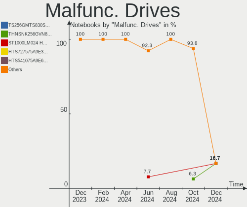
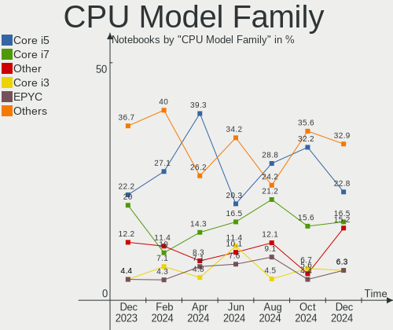
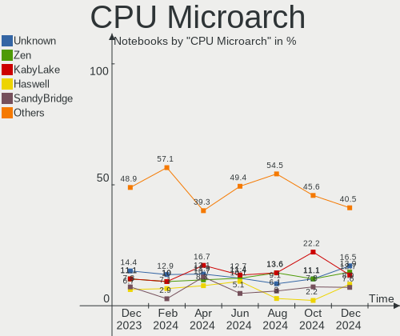
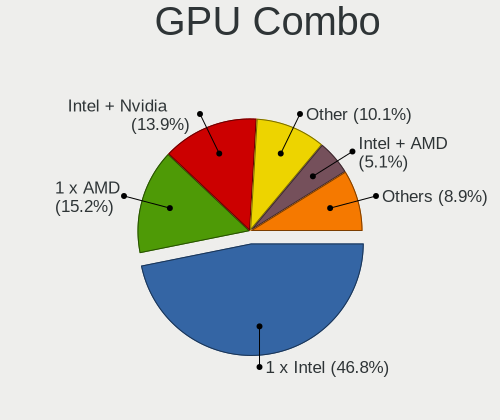
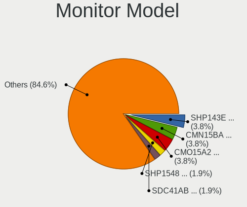
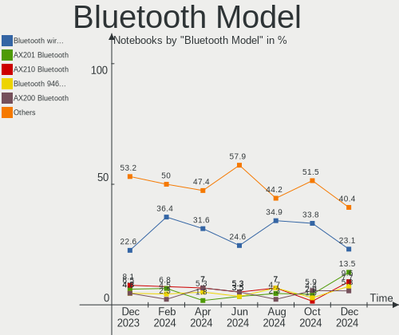
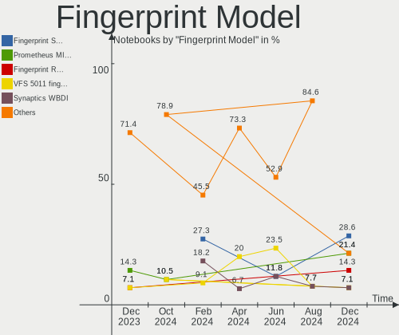

BSD Hardware Trends (Notebooks)
-------------------------------

A project to identify most popular hardware characteristics and track their change
over time based on data collected by BSD users at https://BSD-Hardware.info.

Anyone can contribute to this report by the [hw-probe](https://github.com/linuxhw/hw-probe/blob/master/INSTALL.BSD.md) tool:

    hw-probe -all -upload

Full-feature report is available here: https://bsd-hardware.info/?view=trends&formfactor=notebook

Period: Oct, 2021.

Contents
--------

* [ System ](#system)
  - [ OS                       ](#os)
  - [ OS Family                ](#os-family)
  - [ Arch                     ](#arch)
  - [ DE                       ](#de)
  - [ Display Server           ](#display-server)
  - [ Display Manager          ](#display-manager)
  - [ OS Lang                  ](#os-lang)
  - [ Boot Mode                ](#boot-mode)
  - [ Filesystem               ](#filesystem)
  - [ Part. scheme             ](#part-scheme)

* [ Board ](#board)
  - [ Vendor                   ](#vendor)
  - [ Model                    ](#model)
  - [ Model Family             ](#model-family)
  - [ MFG Year                 ](#mfg-year)
  - [ Form Factor              ](#form-factor)
  - [ Coreboot                 ](#coreboot)
  - [ RAM Size                 ](#ram-size)
  - [ RAM Used                 ](#ram-used)
  - [ Total Drives             ](#total-drives)
  - [ Has CD-ROM               ](#has-cd-rom)
  - [ Has Ethernet             ](#has-ethernet)
  - [ Has WiFi                 ](#has-wifi)
  - [ Has Bluetooth            ](#has-bluetooth)

* [ Location ](#location)
  - [ Country                  ](#country)
  - [ City                     ](#city)

* [ Drives ](#drives)
  - [ Drive Vendor             ](#drive-vendor)
  - [ Drive Model              ](#drive-model)
  - [ HDD Vendor               ](#hdd-vendor)
  - [ SSD Vendor               ](#ssd-vendor)
  - [ Drive Kind               ](#drive-kind)
  - [ Drive Connector          ](#drive-connector)
  - [ Drive Size               ](#drive-size)
  - [ Space Total              ](#space-total)
  - [ Space Used               ](#space-used)
  - [ Malfunc. Drives          ](#malfunc-drives)
  - [ Malfunc. Drive Vendor    ](#malfunc-drive-vendor)
  - [ Malfunc. HDD Vendor      ](#malfunc-hdd-vendor)
  - [ Malfunc. Drive Kind      ](#malfunc-drive-kind)
  - [ Failed Drives            ](#failed-drives)
  - [ Failed Drive Vendor      ](#failed-drive-vendor)
  - [ Drive Status             ](#drive-status)

* [ Storage controller ](#storage-controller)
  - [ Storage Vendor           ](#storage-vendor)
  - [ Storage Model            ](#storage-model)
  - [ Storage Kind             ](#storage-kind)

* [ Processor ](#processor)
  - [ CPU Vendor               ](#cpu-vendor)
  - [ CPU Model                ](#cpu-model)
  - [ CPU Model Family         ](#cpu-model-family)
  - [ CPU Cores                ](#cpu-cores)
  - [ CPU Sockets              ](#cpu-sockets)
  - [ CPU Threads              ](#cpu-threads)
  - [ CPU Microarch            ](#cpu-microarch)

* [ Graphics ](#graphics)
  - [ GPU Vendor               ](#gpu-vendor)
  - [ GPU Model                ](#gpu-model)
  - [ GPU Combo                ](#gpu-combo)
  - [ GPU Driver               ](#gpu-driver)
  - [ GPU Memory               ](#gpu-memory)

* [ Monitor ](#monitor)
  - [ Monitor Vendor           ](#monitor-vendor)
  - [ Monitor Model            ](#monitor-model)
  - [ Monitor Resolution       ](#monitor-resolution)
  - [ Monitor Diagonal         ](#monitor-diagonal)
  - [ Monitor Width            ](#monitor-width)
  - [ Aspect Ratio             ](#aspect-ratio)
  - [ Monitor Area             ](#monitor-area)
  - [ Pixel Density            ](#pixel-density)
  - [ Multiple Monitors        ](#multiple-monitors)

* [ Network ](#network)
  - [ Net Controller Vendor    ](#net-controller-vendor)
  - [ Net Controller Model     ](#net-controller-model)
  - [ Wireless Vendor          ](#wireless-vendor)
  - [ Wireless Model           ](#wireless-model)
  - [ Ethernet Vendor          ](#ethernet-vendor)
  - [ Ethernet Model           ](#ethernet-model)
  - [ Net Controller Kind      ](#net-controller-kind)
  - [ Used Controller          ](#used-controller)
  - [ NICs                     ](#nics)
  - [ IPv6                     ](#ipv6)

* [ Bluetooth ](#bluetooth)
  - [ Bluetooth Vendor         ](#bluetooth-vendor)
  - [ Bluetooth Model          ](#bluetooth-model)

* [ Sound ](#sound)
  - [ Sound Vendor             ](#sound-vendor)
  - [ Sound Model              ](#sound-model)

* [ Memory ](#memory)
  - [ Memory Vendor            ](#memory-vendor)
  - [ Memory Model             ](#memory-model)
  - [ Memory Kind              ](#memory-kind)
  - [ Memory Form Factor       ](#memory-form-factor)
  - [ Memory Size              ](#memory-size)
  - [ Memory Speed             ](#memory-speed)

* [ Printers & scanners ](#printers--scanners)
  - [ Printer Vendor           ](#printer-vendor)
  - [ Printer Model            ](#printer-model)
  - [ Scanner Vendor           ](#scanner-vendor)
  - [ Scanner Model            ](#scanner-model)

* [ Camera ](#camera)
  - [ Camera Vendor            ](#camera-vendor)
  - [ Camera Model             ](#camera-model)

* [ Security ](#security)
  - [ Fingerprint Vendor       ](#fingerprint-vendor)
  - [ Fingerprint Model        ](#fingerprint-model)
  - [ Chipcard Vendor          ](#chipcard-vendor)
  - [ Chipcard Model           ](#chipcard-model)

* [ Unsupported ](#unsupported)
  - [ Unsupported Devices      ](#unsupported-devices)
  - [ Unsupported Device Types ](#unsupported-device-types)

System
------

OS
--

Installed operating systems

| Name                         | Notebooks | Percent |
|------------------------------|-----------|---------|
| helloSystem 0.6.0            | 25        | 26.32%  |
| FreeBSD 13.0-p4              | 17        | 17.89%  |
| OpenBSD 7.0                  | 10        | 10.53%  |
| helloSystem 0.5.0            | 9         | 9.47%   |
| FreeBSD 13.0                 | 7         | 7.37%   |
| OPNsense 21.7.3              | 5         | 5.26%   |
| NomadBSD 5806f915            | 4         | 4.21%   |
| FreeBSD 14.0-CURRENT         | 4         | 4.21%   |
| GhostBSD 21.08.27            | 3         | 3.16%   |
| OpenBSD 6.9                  | 2         | 2.11%   |
| GhostBSD 20.04.02            | 2         | 2.11%   |
| OPNsense 12.1-p20-HBSD       | 1         | 1.05%   |
| NetBSD 9.2                   | 1         | 1.05%   |
| MidnightBSD 2.1.1            | 1         | 1.05%   |
| helloSystem 0.7.0            | 1         | 1.05%   |
| HardenedBSD 13.0-STABLE-HBSD | 1         | 1.05%   |
| FreeBSD 13.0-STABLE          | 1         | 1.05%   |
| FreeBSD 12.2-p4              | 1         | 1.05%   |

OS Family
---------

OS without a version

| Name        | Notebooks | Percent |
|-------------|-----------|---------|
| helloSystem | 35        | 36.84%  |
| FreeBSD     | 30        | 31.58%  |
| OpenBSD     | 12        | 12.63%  |
| OPNsense    | 6         | 6.32%   |
| GhostBSD    | 5         | 5.26%   |
| NomadBSD    | 4         | 4.21%   |
| NetBSD      | 1         | 1.05%   |
| MidnightBSD | 1         | 1.05%   |
| HardenedBSD | 1         | 1.05%   |

Arch
----

OS architecture (x86_64, i586, etc.)

| Name  | Notebooks | Percent |
|-------|-----------|---------|
| amd64 | 89        | 93.68%  |
| i386  | 6         | 6.32%   |

DE
--

Desktop Environment

| Name         | Notebooks | Percent |
|--------------|-----------|---------|
| helloDesktop | 34        | 35.79%  |
| XFCE         | 12        | 12.63%  |
| fvwm         | 11        | 11.58%  |
| Console      | 9         | 9.47%   |
| TWM          | 5         | 5.26%   |
| MATE         | 5         | 5.26%   |
| KDE5         | 5         | 5.26%   |
| Openbox      | 4         | 4.21%   |
| i3           | 4         | 4.21%   |
| GNOME        | 2         | 2.11%   |
| Lumina       | 1         | 1.05%   |
| Fluxbox      | 1         | 1.05%   |
| dwm          | 1         | 1.05%   |
| Cinnamon     | 1         | 1.05%   |

Display Server
--------------

X11 or Wayland

| Name    | Notebooks | Percent |
|---------|-----------|---------|
| X11     | 84        | 88.42%  |
| Console | 11        | 11.58%  |

Display Manager
---------------

SDDM, LightDM, etc.

| Name    | Notebooks | Percent |
|---------|-----------|---------|
| SLiM    | 47        | 49.47%  |
| Console | 31        | 32.63%  |
| LightDM | 6         | 6.32%   |
| SDDM    | 5         | 5.26%   |
| XDM     | 3         | 3.16%   |
| GDM     | 3         | 3.16%   |

OS Lang
-------

Language

| Lang            | Notebooks | Percent |
|-----------------|-----------|---------|
| en_US           | 43        | 45.26%  |
| C               | 26        | 27.37%  |
| Unknown         | 21        | 22.11%  |
| zh_CN.GB2312    | 1         | 1.05%   |
| ru_RU           | 1         | 1.05%   |
| en_US.ISO8859-1 | 1         | 1.05%   |
| de_DE           | 1         | 1.05%   |
| de_CH           | 1         | 1.05%   |

Boot Mode
---------

EFI or BIOS

| Mode | Notebooks | Percent |
|------|-----------|---------|
| EFI  | 70        | 73.68%  |
| BIOS | 25        | 26.32%  |

Filesystem
----------

Type of filesystem

| Type | Notebooks | Percent |
|------|-----------|---------|
| Zfs  | 62        | 65.26%  |
| Ufs  | 21        | 22.11%  |
| Ffs  | 12        | 12.63%  |

Part. scheme
------------

Scheme of partitioning

| Type | Notebooks | Percent |
|------|-----------|---------|
| GPT  | 80        | 84.21%  |
| MBR  | 15        | 15.79%  |

Board
-----

Vendor
------

Motherboard manufacturer

| Name                           | Notebooks | Percent |
|--------------------------------|-----------|---------|
| Lenovo                         | 28        | 29.47%  |
| ASUSTek Computer               | 11        | 11.58%  |
| Hewlett-Packard                | 10        | 10.53%  |
| Dell                           | 10        | 10.53%  |
| Acer                           | 5         | 5.26%   |
| Toshiba                        | 4         | 4.21%   |
| Deciso                         | 4         | 4.21%   |
| MSI                            | 3         | 3.16%   |
| Apple                          | 3         | 3.16%   |
| Sony                           | 2         | 2.11%   |
| Panasonic                      | 2         | 2.11%   |
| Matsushita Electric Industrial | 2         | 2.11%   |
| Google                         | 2         | 2.11%   |
| Framework                      | 2         | 2.11%   |
| Samsung Electronics            | 1         | 1.05%   |
| Itautec                        | 1         | 1.05%   |
| IBM                            | 1         | 1.05%   |
| GPD                            | 1         | 1.05%   |
| Chuwi                          | 1         | 1.05%   |
| AEWIN                          | 1         | 1.05%   |
| AAEON                          | 1         | 1.05%   |

Model
-----

Motherboard model

| Name                                        | Notebooks | Percent |
|---------------------------------------------|-----------|---------|
| Deciso Netboard A20                         | 4         | 4.21%   |
| Framework Laptop                            | 2         | 2.11%   |
| Toshiba Satellite S55t-B                    | 1         | 1.05%   |
| Toshiba dynabook Satellite B453/L           | 1         | 1.05%   |
| Toshiba dynabook RX3 SM240E/3HD             | 1         | 1.05%   |
| Toshiba Dakar10FW8                          | 1         | 1.05%   |
| Sony VJS121C11N                             | 1         | 1.05%   |
| Sony SVS1511AJB                             | 1         | 1.05%   |
| Samsung 550P5C/550P7C                       | 1         | 1.05%   |
| Panasonic CF-53AAGHYDM                      | 1         | 1.05%   |
| Panasonic CF-52PFPBSFQ                      | 1         | 1.05%   |
| MSI MS-16F1                                 | 1         | 1.05%   |
| MSI Modern 14 A10M                          | 1         | 1.05%   |
| MSI GS65 Stealth Thin 8RF                   | 1         | 1.05%   |
| Matsushita Electric Industrial CF-51RCVDNLM | 1         | 1.05%   |
| Matsushita Electric Industrial CF-48V4KNDQM | 1         | 1.05%   |
| Lenovo Yoga 3 Pro-1370 80HE                 | 1         | 1.05%   |
| Lenovo ThinkPad X250 20CLS2A11K             | 1         | 1.05%   |
| Lenovo ThinkPad X230 Tablet 343522U         | 1         | 1.05%   |
| Lenovo ThinkPad X230 23254G7                | 1         | 1.05%   |
| Lenovo ThinkPad X1 Extreme Gen 3 20TLA055CD | 1         | 1.05%   |
| Lenovo ThinkPad X1 Carbon Gen 9 20XWA003CD  | 1         | 1.05%   |
| Lenovo ThinkPad X1 Carbon 2nd 20A70066UK    | 1         | 1.05%   |
| Lenovo ThinkPad T490s 20NYS3TU00            | 1         | 1.05%   |
| Lenovo ThinkPad T490 20N2CTO1WW             | 1         | 1.05%   |
| Lenovo ThinkPad T470p 20J7S0PM00            | 1         | 1.05%   |
| Lenovo ThinkPad T430s 23532QG               | 1         | 1.05%   |
| Lenovo ThinkPad T430 2347GZU                | 1         | 1.05%   |
| Lenovo ThinkPad T420 4236D26                | 1         | 1.05%   |
| Lenovo ThinkPad T410 2537N24                | 1         | 1.05%   |
| Lenovo ThinkPad T14s Gen 1 20T1S0Q200       | 1         | 1.05%   |
| Lenovo ThinkPad R500 2718W92                | 1         | 1.05%   |
| Lenovo ThinkPad P53 20QNCTO1WW              | 1         | 1.05%   |
| Lenovo ThinkPad P14s Gen 1 20Y1CTO1WW       | 1         | 1.05%   |
| Lenovo ThinkPad Mini10 3507A31              | 1         | 1.05%   |
| Lenovo ThinkPad L440 20ASS0FP00             | 1         | 1.05%   |
| Lenovo ThinkPad L14 Gen 1 20U1000VGE        | 1         | 1.05%   |
| Lenovo ThinkPad E14 Gen 3 20Y7CTO1WW        | 1         | 1.05%   |
| Lenovo ThinkPad A485 20MU000VUS             | 1         | 1.05%   |
| Lenovo S20-30 Touch 20434                   | 1         | 1.05%   |
| Lenovo IdeaPad Y700-15ISK 80NV              | 1         | 1.05%   |
| Lenovo IdeaPad 320-15ABR 80XS               | 1         | 1.05%   |
| Lenovo G580 26897SJ                         | 1         | 1.05%   |
| Lenovo G500s 20245                          | 1         | 1.05%   |
| Itautec Infoway w7530                       | 1         | 1.05%   |
| IBM ThinkPad H 1846AQG                      | 1         | 1.05%   |
| HP ZBook Studio G3                          | 1         | 1.05%   |
| HP ProBook 470 G4                           | 1         | 1.05%   |
| HP Presario CQ43                            | 1         | 1.05%   |
| HP Pavilion Gaming Laptop 15-ec2xxx         | 1         | 1.05%   |
| HP Pavilion g6                              | 1         | 1.05%   |
| HP Pavilion dv3                             | 1         | 1.05%   |
| HP EliteBook Folio 1040 G3                  | 1         | 1.05%   |
| HP EliteBook 8570p                          | 1         | 1.05%   |
| HP 15                                       | 1         | 1.05%   |
| GPD MicroPC                                 | 1         | 1.05%   |
| Google Treeya                               | 1         | 1.05%   |
| Google Terra                                | 1         | 1.05%   |
| Dell XPS 13 9350                            | 1         | 1.05%   |
| Dell XPS 13 9343                            | 1         | 1.05%   |

Model Family
------------

Motherboard model prefix

| Name                                        | Notebooks | Percent |
|---------------------------------------------|-----------|---------|
| Lenovo ThinkPad                             | 22        | 23.16%  |
| Acer Aspire                                 | 5         | 5.26%   |
| Dell Inspiron                               | 4         | 4.21%   |
| Deciso Netboard                             | 4         | 4.21%   |
| HP Pavilion                                 | 3         | 3.16%   |
| Toshiba dynabook                            | 2         | 2.11%   |
| Lenovo IdeaPad                              | 2         | 2.11%   |
| HP EliteBook                                | 2         | 2.11%   |
| Framework Laptop                            | 2         | 2.11%   |
| Dell XPS                                    | 2         | 2.11%   |
| Dell Latitude                               | 2         | 2.11%   |
| ASUS TUF                                    | 2         | 2.11%   |
| Toshiba Satellite                           | 1         | 1.05%   |
| Toshiba Dakar10FW8                          | 1         | 1.05%   |
| Sony VJS121C11N                             | 1         | 1.05%   |
| Sony SVS1511AJB                             | 1         | 1.05%   |
| Samsung 550P5C                              | 1         | 1.05%   |
| Panasonic CF-53AAGHYDM                      | 1         | 1.05%   |
| Panasonic CF-52PFPBSFQ                      | 1         | 1.05%   |
| MSI MS-16F1                                 | 1         | 1.05%   |
| MSI Modern                                  | 1         | 1.05%   |
| MSI GS65                                    | 1         | 1.05%   |
| Matsushita Electric Industrial CF-51RCVDNLM | 1         | 1.05%   |
| Matsushita Electric Industrial CF-48V4KNDQM | 1         | 1.05%   |
| Lenovo Yoga                                 | 1         | 1.05%   |
| Lenovo S20-30                               | 1         | 1.05%   |
| Lenovo G580                                 | 1         | 1.05%   |
| Lenovo G500s                                | 1         | 1.05%   |
| Itautec Infoway                             | 1         | 1.05%   |
| IBM ThinkPad                                | 1         | 1.05%   |
| HP ZBook                                    | 1         | 1.05%   |
| HP ProBook                                  | 1         | 1.05%   |
| HP Presario                                 | 1         | 1.05%   |
| HP 15                                       | 1         | 1.05%   |
| GPD MicroPC                                 | 1         | 1.05%   |
| Google Treeya                               | 1         | 1.05%   |
| Google Terra                                | 1         | 1.05%   |
| Dell Studio                                 | 1         | 1.05%   |
| Dell Precision                              | 1         | 1.05%   |
| Chuwi MiniBook                              | 1         | 1.05%   |
| ASUS X555LB                                 | 1         | 1.05%   |
| ASUS X441BA                                 | 1         | 1.05%   |
| ASUS X202E                                  | 1         | 1.05%   |
| ASUS UX21A                                  | 1         | 1.05%   |
| ASUS U33Jc                                  | 1         | 1.05%   |
| ASUS K53E                                   | 1         | 1.05%   |
| ASUS F83VD                                  | 1         | 1.05%   |
| ASUS A9T                                    | 1         | 1.05%   |
| ASUS 1000HE                                 | 1         | 1.05%   |
| Apple MacBookPro4                           | 1         | 1.05%   |
| Apple MacBookPro10                          | 1         | 1.05%   |
| Apple MacBookAir5                           | 1         | 1.05%   |
| AEWIN CB-7979                               | 1         | 1.05%   |
| AAEON GENE-SKU7                             | 1         | 1.05%   |
| Unknown                                     | 1         | 1.05%   |

MFG Year
--------

Motherboard manufacture year

| Year | Notebooks | Percent |
|------|-----------|---------|
| 2021 | 18        | 18.95%  |
| 2019 | 13        | 13.68%  |
| 2020 | 10        | 10.53%  |
| 2012 | 8         | 8.42%   |
| 2018 | 7         | 7.37%   |
| 2011 | 7         | 7.37%   |
| 2013 | 6         | 6.32%   |
| 2010 | 5         | 5.26%   |
| 2017 | 4         | 4.21%   |
| 2015 | 3         | 3.16%   |
| 2014 | 3         | 3.16%   |
| 2009 | 3         | 3.16%   |
| 2016 | 2         | 2.11%   |
| 2008 | 2         | 2.11%   |
| 2005 | 2         | 2.11%   |
| 2006 | 1         | 1.05%   |
| 2002 | 1         | 1.05%   |

Form Factor
-----------

Physical design of the computer

| Name     | Notebooks | Percent |
|----------|-----------|---------|
| Notebook | 95        | 100%    |

Coreboot
--------

Have coreboot on board

| Used | Notebooks | Percent |
|------|-----------|---------|
| No   | 93        | 97.89%  |
| Yes  | 2         | 2.11%   |

RAM Size
--------

Total RAM memory

| Size in GB  | Notebooks | Percent |
|-------------|-----------|---------|
| 8.01-16.0   | 33        | 34.74%  |
| 4.01-8.0    | 26        | 27.37%  |
| 16.01-24.0  | 19        | 20%     |
| 32.01-64.0  | 6         | 6.32%   |
| 2.01-3.0    | 6         | 6.32%   |
| 3.01-4.0    | 2         | 2.11%   |
| 64.01-256.0 | 1         | 1.05%   |
| 1.01-2.0    | 1         | 1.05%   |
| 0.51-1.0    | 1         | 1.05%   |

RAM Used
--------

Used RAM memory

| Used GB   | Notebooks | Percent |
|-----------|-----------|---------|
| 0.01-0.5  | 57        | 60%     |
| 0.51-1.0  | 23        | 24.21%  |
| 1.01-2.0  | 9         | 9.47%   |
| 2.01-3.0  | 2         | 2.11%   |
| 3.01-4.0  | 1         | 1.05%   |
| 8.01-16.0 | 1         | 1.05%   |
| 0         | 1         | 1.05%   |
| Unknown   | 1         | 1.05%   |

Total Drives
------------

Number of drives on board

| Drives | Notebooks | Percent |
|--------|-----------|---------|
| 1      | 71        | 74.74%  |
| 2      | 16        | 16.84%  |
| 0      | 6         | 6.32%   |
| 3      | 2         | 2.11%   |

Has CD-ROM
----------

Has CD-ROM on board

| Presented | Notebooks | Percent |
|-----------|-----------|---------|
| No        | 67        | 70.53%  |
| Yes       | 28        | 29.47%  |

Has Ethernet
------------

Has Ethernet on board

| Presented | Notebooks | Percent |
|-----------|-----------|---------|
| Yes       | 82        | 86.32%  |
| No        | 13        | 13.68%  |

Has WiFi
--------

Has WiFi module

| Presented | Notebooks | Percent |
|-----------|-----------|---------|
| Yes       | 86        | 90.53%  |
| No        | 9         | 9.47%   |

Has Bluetooth
-------------

Has Bluetooth module

| Presented | Notebooks | Percent |
|-----------|-----------|---------|
| Yes       | 58        | 61.05%  |
| No        | 37        | 38.95%  |

Location
--------

Country
-------

Geographic location (country)

| Country      | Notebooks | Percent |
|--------------|-----------|---------|
| USA          | 20        | 21.05%  |
| Germany      | 8         | 8.42%   |
| Canada       | 8         | 8.42%   |
| UK           | 5         | 5.26%   |
| Japan        | 4         | 4.21%   |
| China        | 4         | 4.21%   |
| Ukraine      | 3         | 3.16%   |
| Russia       | 3         | 3.16%   |
| Poland       | 3         | 3.16%   |
| Indonesia    | 3         | 3.16%   |
| Brazil       | 3         | 3.16%   |
| Switzerland  | 2         | 2.11%   |
| Sweden       | 2         | 2.11%   |
| Spain        | 2         | 2.11%   |
| New Zealand  | 2         | 2.11%   |
| Denmark      | 2         | 2.11%   |
| Turkey       | 1         | 1.05%   |
| Taiwan       | 1         | 1.05%   |
| South Korea  | 1         | 1.05%   |
| Saudi Arabia | 1         | 1.05%   |
| Romania      | 1         | 1.05%   |
| Peru         | 1         | 1.05%   |
| Norway       | 1         | 1.05%   |
| Mexico       | 1         | 1.05%   |
| Malta        | 1         | 1.05%   |
| Malaysia     | 1         | 1.05%   |
| Lithuania    | 1         | 1.05%   |
| Libya        | 1         | 1.05%   |
| Italy        | 1         | 1.05%   |
| France       | 1         | 1.05%   |
| Czechia      | 1         | 1.05%   |
| Chile        | 1         | 1.05%   |
| Bulgaria     | 1         | 1.05%   |
| Belgium      | 1         | 1.05%   |
| Belarus      | 1         | 1.05%   |
| Austria      | 1         | 1.05%   |
| Australia    | 1         | 1.05%   |

City
----

Geographic location (city)

| City            | Notebooks | Percent |
|-----------------|-----------|---------|
| Montreal        | 6         | 6.32%   |
| Setagaya-ku     | 2         | 2.11%   |
| Seattle         | 2         | 2.11%   |
| Phoenix         | 2         | 2.11%   |
| Munich          | 2         | 2.11%   |
| Barcelona       | 2         | 2.11%   |
| Ypsilanti       | 1         | 1.05%   |
| Yeongdong-gun   | 1         | 1.05%   |
| Yekaterinburg   | 1         | 1.05%   |
| Wroclaw         | 1         | 1.05%   |
| Worthing        | 1         | 1.05%   |
| Whittier        | 1         | 1.05%   |
| Wheatland       | 1         | 1.05%   |
| Wezeren         | 1         | 1.05%   |
| Wellington      | 1         | 1.05%   |
| Weinbohla       | 1         | 1.05%   |
| Warsaw          | 1         | 1.05%   |
| Vollen          | 1         | 1.05%   |
| Vilnius         | 1         | 1.05%   |
| Vienna          | 1         | 1.05%   |
| Viborg          | 1         | 1.05%   |
| Vancouver       | 1         | 1.05%   |
| Tyumen          | 1         | 1.05%   |
| Tripoli         | 1         | 1.05%   |
| Therwil         | 1         | 1.05%   |
| Tekirda??       | 1         | 1.05%   |
| Taito           | 1         | 1.05%   |
| Tainan City     | 1         | 1.05%   |
| Surabaya        | 1         | 1.05%   |
| Stuttgart       | 1         | 1.05%   |
| Strausberg      | 1         | 1.05%   |
| Staffanstorp    | 1         | 1.05%   |
| St Petersburg   | 1         | 1.05%   |
| South Yarra     | 1         | 1.05%   |
| Solrod          | 1         | 1.05%   |
| Shizishan       | 1         | 1.05%   |
| Santiago        | 1         | 1.05%   |
| San Diego       | 1         | 1.05%   |
| Saint-Laurent   | 1         | 1.05%   |
| Rolling Meadows | 1         | 1.05%   |
| Rochester       | 1         | 1.05%   |
| Riyadh          | 1         | 1.05%   |
| Rennes          | 1         | 1.05%   |
| Portland        | 1         | 1.05%   |
| Plattsburgh     | 1         | 1.05%   |
| Pilsen          | 1         | 1.05%   |
| Palmer          | 1         | 1.05%   |
| Omaha           | 1         | 1.05%   |
| Offenburg       | 1         | 1.05%   |
| Odessa          | 1         | 1.05%   |
| North Tawton    | 1         | 1.05%   |
| New Plymouth    | 1         | 1.05%   |
| Murfreesboro    | 1         | 1.05%   |
| Monte Belo      | 1         | 1.05%   |
| Mission         | 1         | 1.05%   |
| Minsk           | 1         | 1.05%   |
| Miedziana Gora  | 1         | 1.05%   |
| Macerata        | 1         | 1.05%   |
| London          | 1         | 1.05%   |
| Lima            | 1         | 1.05%   |

Drives
------

Drive Vendor
------------

Hard drive vendors

| Vendor              | Notebooks | Drives | Percent |
|---------------------|-----------|--------|---------|
| WDC                 | 18        | 18     | 17.14%  |
| Samsung Electronics | 15        | 15     | 14.29%  |
| Seagate             | 11        | 11     | 10.48%  |
| Kingston            | 7         | 8      | 6.67%   |
| Crucial             | 7         | 7      | 6.67%   |
| Toshiba             | 6         | 6      | 5.71%   |
| Transcend           | 5         | 5      | 4.76%   |
| SanDisk             | 4         | 4      | 3.81%   |
| Intel               | 4         | 4      | 3.81%   |
| Hitachi             | 4         | 4      | 3.81%   |
| HGST                | 3         | 3      | 2.86%   |
| SK Hynix            | 2         | 2      | 1.9%    |
| Corsair             | 2         | 2      | 1.9%    |
| Apple               | 2         | 2      | 1.9%    |
| A-DATA Technology   | 2         | 2      | 1.9%    |
| PNY                 | 1         | 1      | 0.95%   |
| PLEXTOR             | 1         | 1      | 0.95%   |
| NVMe                | 1         | 1      | 0.95%   |
| Netac               | 1         | 1      | 0.95%   |
| Micron Technology   | 1         | 1      | 0.95%   |
| LITEON              | 1         | 1      | 0.95%   |
| Lexar               | 1         | 1      | 0.95%   |
| KIOXIA              | 1         | 1      | 0.95%   |
| Hewlett-Packard     | 1         | 1      | 0.95%   |
| Fujitsu             | 1         | 1      | 0.95%   |
| BIWIN               | 1         | 1      | 0.95%   |
| Apacer              | 1         | 1      | 0.95%   |
| AMD                 | 1         | 1      | 0.95%   |

Drive Model
-----------

Hard drive models

| Model                                | Notebooks | Percent |
|--------------------------------------|-----------|---------|
| Transcend TS256GMTS952T2 256GB       | 4         | 3.77%   |
| Toshiba MQ01ABF050 500GB             | 3         | 2.83%   |
| Seagate ST9500325AS 500GB            | 2         | 1.89%   |
| Intel SSDPEKKF512G8L 512GB           | 2         | 1.89%   |
| HGST HTS541010A9E680 1TB             | 2         | 1.89%   |
| Crucial CT525MX300SSD1 528GB         | 2         | 1.89%   |
| Crucial CT500MX500SSD1 500GB         | 2         | 1.89%   |
| Crucial CT240BX500SSD1 240GB         | 2         | 1.89%   |
| WDC WDS500G3X0C-00SJG0 500GB         | 1         | 0.94%   |
| WDC WDS250G2B0B-00YS70 250GB         | 1         | 0.94%   |
| WDC WDS120G1G0A-00SS50 120GB         | 1         | 0.94%   |
| WDC WD7500BPKX-00HPJT0 752GB         | 1         | 0.94%   |
| WDC WD7500BPKT-00PK4T0 752GB         | 1         | 0.94%   |
| WDC WD5000LPLX-00ZNTT0 500GB         | 1         | 0.94%   |
| WDC WD5000BPVT-22HXZT3 500GB         | 1         | 0.94%   |
| WDC WD5000BEKT-60KA9T0 500GB         | 1         | 0.94%   |
| WDC WD3200BEVT-80A0RT0 320GB         | 1         | 0.94%   |
| WDC WD3200BEVE-00A0HT0 320GB         | 1         | 0.94%   |
| WDC WD2500BEVS-08VAT2 250GB          | 1         | 0.94%   |
| WDC WD10SPZX-75Z10T1 1TB             | 1         | 0.94%   |
| WDC WD10SMRW-11Y43S0 1TB             | 1         | 0.94%   |
| WDC WD10SDZW-11UMGS0 1TB             | 1         | 0.94%   |
| WDC WD10JPLX-00MBPT0 1TB             | 1         | 0.94%   |
| WDC PC SN730 SDBQNTY-256G-1001 256GB | 1         | 0.94%   |
| WDC PC SN730 NVMe 1024GB             | 1         | 0.94%   |
| WDC PC SN520 SDAPNUW-256G-1002 256GB | 1         | 0.94%   |
| Transcend TS512GSSD370S 512GB        | 1         | 0.94%   |
| Toshiba MQ01ABD032 320GB             | 1         | 0.94%   |
| Toshiba KXG6APNV2T04 2TB             | 1         | 0.94%   |
| Toshiba KXG60ZNV512G 512GB           | 1         | 0.94%   |
| SK Hynix SKHynix_HFS001TDE9X081N 1TB | 1         | 0.94%   |
| SK Hynix SC311 SATA 256GB            | 1         | 0.94%   |
| Seagate ST9320423AS 320GB            | 1         | 0.94%   |
| Seagate ST9160821A 160GB             | 1         | 0.94%   |
| Seagate ST9160412ASG 160GB           | 1         | 0.94%   |
| Seagate ST500LT012-9WS142 500GB      | 1         | 0.94%   |
| Seagate ST500LT012-1DG142 500GB      | 1         | 0.94%   |
| Seagate ST500LM021-1KJ152 500GB      | 1         | 0.94%   |
| Seagate ST500LM012 HN-M500MBB 500GB  | 1         | 0.94%   |
| Seagate ST1000LM035-1RK172 1TB       | 1         | 0.94%   |
| Seagate ST1000LM024 HN-M101MBB 1TB   | 1         | 0.94%   |
| SanDisk SSD PLUS 240GB               | 1         | 0.94%   |
| SanDisk SDSSDH32000G 2TB             | 1         | 0.94%   |
| SanDisk SD9SN8W512G 512GB            | 1         | 0.94%   |
| SanDisk SD5SE2256G1002E 256GB        | 1         | 0.94%   |
| Samsung SSD PM871b M.2 2280 128GB    | 1         | 0.94%   |
| Samsung SSD PM851 M.2 2280 256GB     | 1         | 0.94%   |
| Samsung SSD 860 EVO M.2 1TB          | 1         | 0.94%   |
| Samsung SSD 860 EVO 500GB            | 1         | 0.94%   |
| Samsung SSD 840 Series 120GB         | 1         | 0.94%   |
| Samsung PM951 NVMe 256GB             | 1         | 0.94%   |
| Samsung MZVLW256HEHP-000L7 256GB     | 1         | 0.94%   |
| Samsung MZVLB512HBJQ-000L7 512GB     | 1         | 0.94%   |
| Samsung MZVLB256HAHQ-00000 256GB     | 1         | 0.94%   |
| Samsung MZVL21T0HCLR-00BL7 1TB       | 1         | 0.94%   |
| Samsung MZVKW512HMJP-000H1 512GB     | 1         | 0.94%   |
| Samsung MZNTE256HMHP-000L2 256GB     | 1         | 0.94%   |
| Samsung MZALQ512HBLU-00BL1 512GB     | 1         | 0.94%   |
| Samsung MZ7TE128HMGR-000L1 128GB     | 1         | 0.94%   |
| Samsung Flash Drive FIT 32GB         | 1         | 0.94%   |

HDD Vendor
----------

Hard disk drive vendors

| Vendor              | Notebooks | Drives | Percent |
|---------------------|-----------|--------|---------|
| WDC                 | 12        | 12     | 31.58%  |
| Seagate             | 11        | 11     | 28.95%  |
| Toshiba             | 4         | 4      | 10.53%  |
| Hitachi             | 4         | 4      | 10.53%  |
| HGST                | 3         | 3      | 7.89%   |
| Samsung Electronics | 1         | 1      | 2.63%   |
| NVMe                | 1         | 1      | 2.63%   |
| Lexar               | 1         | 1      | 2.63%   |
| Fujitsu             | 1         | 1      | 2.63%   |

SSD Vendor
----------

Solid state drive vendors

| Vendor              | Notebooks | Drives | Percent |
|---------------------|-----------|--------|---------|
| Samsung Electronics | 7         | 7      | 15.22%  |
| Crucial             | 7         | 7      | 15.22%  |
| Transcend           | 5         | 5      | 10.87%  |
| Kingston            | 5         | 6      | 10.87%  |
| SanDisk             | 4         | 4      | 8.7%    |
| WDC                 | 2         | 2      | 4.35%   |
| Corsair             | 2         | 2      | 4.35%   |
| Apple               | 2         | 2      | 4.35%   |
| A-DATA Technology   | 2         | 2      | 4.35%   |
| SK Hynix            | 1         | 1      | 2.17%   |
| PNY                 | 1         | 1      | 2.17%   |
| PLEXTOR             | 1         | 1      | 2.17%   |
| Netac               | 1         | 1      | 2.17%   |
| LITEON              | 1         | 1      | 2.17%   |
| Intel               | 1         | 1      | 2.17%   |
| Hewlett-Packard     | 1         | 1      | 2.17%   |
| BIWIN               | 1         | 1      | 2.17%   |
| Apacer              | 1         | 1      | 2.17%   |
| AMD                 | 1         | 1      | 2.17%   |

Drive Kind
----------

HDD or SSD

| Kind | Notebooks | Drives | Percent |
|------|-----------|--------|---------|
| SSD  | 43        | 47     | 43.88%  |
| HDD  | 36        | 38     | 36.73%  |
| NVMe | 19        | 21     | 19.39%  |

Drive Connector
---------------

SATA, SAS, NVMe, etc.

| Type | Notebooks | Drives | Percent |
|------|-----------|--------|---------|
| SATA | 76        | 85     | 80%     |
| NVMe | 19        | 21     | 20%     |

Drive Size
----------

Size of hard drive

| Size in TB | Notebooks | Drives | Percent |
|------------|-----------|--------|---------|
| 0.01-0.5   | 63        | 67     | 77.78%  |
| 0.51-1.0   | 17        | 17     | 20.99%  |
| 1.01-2.0   | 1         | 1      | 1.23%   |

Space Total
-----------

Amount of disk space available on the file system

| Size in GB | Notebooks | Percent |
|------------|-----------|---------|
| 101-250    | 25        | 26.32%  |
| 1-20       | 24        | 25.26%  |
| 251-500    | 22        | 23.16%  |
| 51-100     | 11        | 11.58%  |
| 21-50      | 7         | 7.37%   |
| 501-1000   | 4         | 4.21%   |
| 1001-2000  | 1         | 1.05%   |
| Unknown    | 1         | 1.05%   |

Space Used
----------

Amount of used disk space

| Used GB | Notebooks | Percent |
|---------|-----------|---------|
| 1-20    | 86        | 90.53%  |
| 21-50   | 7         | 7.37%   |
| 51-100  | 1         | 1.05%   |
| Unknown | 1         | 1.05%   |

Malfunc. Drives
---------------

Drive models with a malfunction

| Model                              | Notebooks | Drives | Percent |
|------------------------------------|-----------|--------|---------|
| WDC WD3200BEVT-80A0RT0 320GB       | 1         | 1      | 6.67%   |
| Toshiba MQ01ABF050 500GB           | 1         | 1      | 6.67%   |
| Toshiba MQ01ABD032 320GB           | 1         | 1      | 6.67%   |
| Seagate ST500LT012-9WS142 500GB    | 1         | 1      | 6.67%   |
| Seagate ST500LT012-1DG142 500GB    | 1         | 1      | 6.67%   |
| Seagate ST500LM021-1KJ152 500GB    | 1         | 1      | 6.67%   |
| Seagate ST1000LM035-1RK172 1TB     | 1         | 1      | 6.67%   |
| Seagate ST1000LM024 HN-M101MBB 1TB | 1         | 1      | 6.67%   |
| Hitachi HTS541680J9SA00 80GB       | 1         | 1      | 6.67%   |
| Hitachi HTS541080G9SA00 80GB       | 1         | 1      | 6.67%   |
| Hitachi HTS421260H9AT00 64GB       | 1         | 1      | 6.67%   |
| HGST HTS721010A9E630 1TB           | 1         | 1      | 6.67%   |
| HGST HTS541010A9E680 1TB           | 1         | 1      | 6.67%   |
| Crucial CT525MX300SSD1 528GB       | 1         | 1      | 6.67%   |
| A-DATA Technology SP550 480GB      | 1         | 1      | 6.67%   |

Malfunc. Drive Vendor
---------------------

Vendors of faulty drives

| Vendor            | Notebooks | Drives | Percent |
|-------------------|-----------|--------|---------|
| Seagate           | 5         | 5      | 33.33%  |
| Hitachi           | 3         | 3      | 20%     |
| Toshiba           | 2         | 2      | 13.33%  |
| HGST              | 2         | 2      | 13.33%  |
| WDC               | 1         | 1      | 6.67%   |
| Crucial           | 1         | 1      | 6.67%   |
| A-DATA Technology | 1         | 1      | 6.67%   |

Malfunc. HDD Vendor
-------------------

Vendors of faulty HDD drives

| Vendor  | Notebooks | Drives | Percent |
|---------|-----------|--------|---------|
| Seagate | 5         | 5      | 38.46%  |
| Hitachi | 3         | 3      | 23.08%  |
| Toshiba | 2         | 2      | 15.38%  |
| HGST    | 2         | 2      | 15.38%  |
| WDC     | 1         | 1      | 7.69%   |

Malfunc. Drive Kind
-------------------

Kinds of faulty drives

| Kind | Notebooks | Drives | Percent |
|------|-----------|--------|---------|
| HDD  | 13        | 13     | 86.67%  |
| SSD  | 2         | 2      | 13.33%  |

Failed Drives
-------------

Failed drive models

Zero info for selected period =(

Failed Drive Vendor
-------------------

Failed drive vendors

Zero info for selected period =(

Drive Status
------------

Number of failed and malfunc. drives

| Status   | Notebooks | Drives | Percent |
|----------|-----------|--------|---------|
| Works    | 75        | 89     | 81.52%  |
| Malfunc  | 15        | 15     | 16.3%   |
| Detected | 2         | 2      | 2.17%   |

Storage controller
------------------

Storage Vendor
--------------

Storage controller vendors

| Vendor                           | Notebooks | Percent |
|----------------------------------|-----------|---------|
| Intel                            | 69        | 68.32%  |
| AMD                              | 12        | 11.88%  |
| Samsung Electronics              | 7         | 6.93%   |
| Sandisk                          | 5         | 4.95%   |
| Toshiba                          | 2         | 1.98%   |
| Kingston Technology Company      | 2         | 1.98%   |
| SK Hynix                         | 1         | 0.99%   |
| Silicon Integrated Systems [SiS] | 1         | 0.99%   |
| Micron Technology                | 1         | 0.99%   |
| KIOXIA                           | 1         | 0.99%   |

Storage Model
-------------

Storage controller models

| Model                                                                         | Notebooks | Percent |
|-------------------------------------------------------------------------------|-----------|---------|
| Intel 7 Series Chipset Family 6-port SATA Controller [AHCI mode]              | 18        | 17.14%  |
| AMD FCH SATA Controller [AHCI mode]                                           | 11        | 10.48%  |
| Intel Sunrise Point-LP SATA Controller [AHCI mode]                            | 8         | 7.62%   |
| Intel Wildcat Point-LP SATA Controller [AHCI Mode]                            | 6         | 5.71%   |
| Sandisk WD Black SN750 / PC SN730 NVMe SSD                                    | 4         | 3.81%   |
| Intel 6 Series/C200 Series Chipset Family 6 port Mobile SATA AHCI Controller  | 4         | 3.81%   |
| Intel 5 Series/3400 Series Chipset 6 port SATA AHCI Controller                | 4         | 3.81%   |
| Intel 82801IBM/IEM (ICH9M/ICH9M-E) 4 port SATA Controller [AHCI mode]         | 3         | 2.86%   |
| Intel 82801 Mobile SATA Controller [RAID mode]                                | 3         | 2.86%   |
| Intel 5 Series/3400 Series Chipset 4 port SATA AHCI Controller                | 3         | 2.86%   |
| Toshiba XG6 NVMe SSD Controller                                               | 2         | 1.9%    |
| Samsung NVMe SSD Controller SM981/PM981/PM983                                 | 2         | 1.9%    |
| Samsung NVMe SSD Controller SM961/PM961/SM963                                 | 2         | 1.9%    |
| Intel SSD Pro 7600p/760p/E 6100p Series                                       | 2         | 1.9%    |
| Intel Ice Lake-LP SATA Controller [AHCI mode]                                 | 2         | 1.9%    |
| Intel 82801HM/HEM (ICH8M/ICH8M-E) SATA Controller [AHCI mode]                 | 2         | 1.9%    |
| Intel 82801HM/HEM (ICH8M/ICH8M-E) IDE Controller                              | 2         | 1.9%    |
| Intel 82801GBM/GHM (ICH7-M Family) SATA Controller [IDE mode]                 | 2         | 1.9%    |
| Intel 8 Series SATA Controller 1 [AHCI mode]                                  | 2         | 1.9%    |
| Unknown                                                                       | 2         | 1.9%    |
| SK Hynix Gold P31 SSD                                                         | 1         | 0.95%   |
| Silicon Integrated Systems [SiS] 5513 IDE Controller                          | 1         | 0.95%   |
| Sandisk WD Blue SN500 / PC SN520 NVMe SSD                                     | 1         | 0.95%   |
| Samsung NVMe SSD Controller SM951/PM951                                       | 1         | 0.95%   |
| Samsung NVMe SSD Controller PM9A1/PM9A3/980PRO                                | 1         | 0.95%   |
| Samsung NVMe SSD Controller 980                                               | 1         | 0.95%   |
| KIOXIA unknown                                                                | 1         | 0.95%   |
| Kingston Company U-SNS8154P3 NVMe SSD                                         | 1         | 0.95%   |
| Intel SSD 660P Series                                                         | 1         | 0.95%   |
| Intel Q170/Q150/B150/H170/H110/Z170/CM236 Chipset SATA Controller [AHCI Mode] | 1         | 0.95%   |
| Intel NM10/ICH7 Family SATA Controller [AHCI mode]                            | 1         | 0.95%   |
| Intel HM170/QM170 Chipset SATA Controller [AHCI Mode]                         | 1         | 0.95%   |
| Intel Comet Lake SATA AHCI Controller                                         | 1         | 0.95%   |
| Intel Celeron/Pentium Silver Processor SATA Controller                        | 1         | 0.95%   |
| Intel Cannon Lake Mobile PCH SATA AHCI Controller                             | 1         | 0.95%   |
| Intel Atom Processor E3800 Series SATA AHCI Controller                        | 1         | 0.95%   |
| Intel 82801FBM (ICH6M) SATA Controller                                        | 1         | 0.95%   |
| Intel 82801CAM IDE U100 Controller                                            | 1         | 0.95%   |
| Intel 8 Series/C220 Series Chipset Family 2-port SATA Controller 2 [IDE mode] | 1         | 0.95%   |
| Intel 8 Series Chipset Family 4-port SATA Controller 1 [IDE mode] - Mobile    | 1         | 0.95%   |
| AMD FCH SATA Controller [IDE mode]                                            | 1         | 0.95%   |

Storage Kind
------------

Kind of storage controller (IDE, SATA, NVMe, SAS, ...)

| Kind | Notebooks | Percent |
|------|-----------|---------|
| SATA | 70        | 68.63%  |
| NVMe | 20        | 19.61%  |
| IDE  | 9         | 8.82%   |
| RAID | 3         | 2.94%   |

Processor
---------

CPU Vendor
----------

Processor vendors

| Vendor | Notebooks | Percent |
|--------|-----------|---------|
| Intel  | 80        | 84.21%  |
| AMD    | 15        | 15.79%  |

CPU Model
---------

Processor models

| Model                                                        | Notebooks | Percent |
|--------------------------------------------------------------|-----------|---------|
| Intel Core i5-3320M CPU @ 2.60GHz                            | 4         | 4.21%   |
| Intel Core i5-5200U CPU @ 2.20GHz                            | 3         | 3.16%   |
| Intel Core i5 CPU M 520 @ 2.40GHz                            | 3         | 3.16%   |
| Intel CPU Version                                            | 2         | 2.11%   |
| Intel Core i7-8665U CPU @ 1.90GHz                            | 2         | 2.11%   |
| Intel Core i7-7500U CPU @ 2.70GHz                            | 2         | 2.11%   |
| Intel Core i7-3720QM CPU @ 2.60GHz                           | 2         | 2.11%   |
| Intel Core i7-3520M CPU @ 2.90GHz                            | 2         | 2.11%   |
| Intel Celeron CPU 847 @ 1.10GHz                              | 2         | 2.11%   |
| Intel 11th Gen Core i7-1165G7 @ 2.80GHz                      | 2         | 2.11%   |
| AMD EPYC 3201 8-Core Processor                               | 2         | 2.11%   |
| AMD EPYC 3101 4-Core Processor                               | 2         | 2.11%   |
| Intel Xeon CPU E3-1505M v5 @ 2.80GHz                         | 1         | 1.05%   |
| Intel Processor 5Y70 CPU @ 1.10GHz                           | 1         | 1.05%   |
| Intel Pentium M processor 1.86GHz ("GenuineIntel" 686-class) | 1         | 1.05%   |
| Intel Pentium CPU N3530 @ 2.16GHz                            | 1         | 1.05%   |
| Intel Pentium 4 Mobile CPU 1.60GHz                           | 1         | 1.05%   |
| Intel Genuine CPU T2300 @ 1.66GHz                            | 1         | 1.05%   |
| Intel Core m3-8100Y CPU @ 1.10GHz                            | 1         | 1.05%   |
| Intel Core i7-9750H CPU @ 2.60GHz                            | 1         | 1.05%   |
| Intel Core i7-8750H CPU @ 2.20GHz                            | 1         | 1.05%   |
| Intel Core i7-7700HQ CPU @ 2.80GHz                           | 1         | 1.05%   |
| Intel Core i7-6700HQ CPU @ 2.60GHz                           | 1         | 1.05%   |
| Intel Core i7-5600U CPU @ 2.60GHz                            | 1         | 1.05%   |
| Intel Core i7-3632QM CPU @ 2.20GHz                           | 1         | 1.05%   |
| Intel Core i7-3630QM CPU @ 2.40GHz                           | 1         | 1.05%   |
| Intel Core i7-3517U CPU @ 1.90GHz                            | 1         | 1.05%   |
| Intel Core i7-2640M CPU @ 2.80GHz                            | 1         | 1.05%   |
| Intel Core i7-2640M CPU @ 2.80GH                             | 1         | 1.05%   |
| Intel Core i7-10750H CPU @ 2.60GHz                           | 1         | 1.05%   |
| Intel Core i7-1065G7 CPU @ 1.30GHz                           | 1         | 1.05%   |
| Intel Core i7-10610U CPU @ 1.80GHz                           | 1         | 1.05%   |
| Intel Core i7-10510U CPU @ 1.80GHz                           | 1         | 1.05%   |
| Intel Core i5-8265U CPU @ 1.60GHz                            | 1         | 1.05%   |
| Intel Core i5-8250U CPU @ 1.60GHz                            | 1         | 1.05%   |
| Intel Core i5-6300U CPU @ 2.40GHz                            | 1         | 1.05%   |
| Intel Core i5-6200U CPU @ 2.30GHz                            | 1         | 1.05%   |
| Intel Core i5-5300U CPU @ 2.30GHz                            | 1         | 1.05%   |
| Intel Core i5-4300U CPU @ 1.90GHz                            | 1         | 1.05%   |
| Intel Core i5-4300M CPU @ 2.60GHz                            | 1         | 1.05%   |
| Intel Core i5-4210U CPU @ 1.70GHz                            | 1         | 1.05%   |
| Intel Core i5-3317U CPU @ 1.70GHz                            | 1         | 1.05%   |
| Intel Core i5-3210M CPU @ 2.50GHz                            | 1         | 1.05%   |
| Intel Core i5-2520M CPU @ 2.50GHz                            | 1         | 1.05%   |
| Intel Core i5-2450M CPU @ 2.50GHz                            | 1         | 1.05%   |
| Intel Core i5-1035G1 CPU @ 1.00GHz                           | 1         | 1.05%   |
| Intel Core i5-10210U CPU @ 1.60GHz                           | 1         | 1.05%   |
| Intel Core i5 CPU M 460 @ 2.53GHz                            | 1         | 1.05%   |
| Intel Core i3-6006U CPU @ 2.00GHz                            | 1         | 1.05%   |
| Intel Core i3-3227U CPU @ 1.90GHz                            | 1         | 1.05%   |
| Intel Core i3-3217U CPU @ 1.80GHz                            | 1         | 1.05%   |
| Intel Core i3-3110M CPU @ 2.40GHz                            | 1         | 1.05%   |
| Intel Core i3 CPU M 370 @ 2.40GH                             | 1         | 1.05%   |
| Intel Core i3 CPU M 330 @ 2.13GHz                            | 1         | 1.05%   |
| Intel Core 2 Duo CPU T8300 @ 2.40GHz                         | 1         | 1.05%   |
| Intel Core 2 Duo CPU T6500 @ 2.10GHz                         | 1         | 1.05%   |
| Intel Core 2 Duo CPU P8600 @ 2.40GHz                         | 1         | 1.05%   |
| Intel Core 2 Duo                                             | 1         | 1.05%   |
| Intel Celeron N4120 CPU @ 1.10GHz                            | 1         | 1.05%   |
| Intel Celeron M processor 1.70GHz                            | 1         | 1.05%   |

CPU Model Family
----------------

Processor model prefix

| Model                   | Notebooks | Percent |
|-------------------------|-----------|---------|
| Intel Core i5           | 25        | 26.32%  |
| Intel Core i7           | 22        | 23.16%  |
| Intel Celeron           | 8         | 8.42%   |
| Other                   | 7         | 7.37%   |
| Intel Core i3           | 6         | 6.32%   |
| Intel Core 2 Duo        | 4         | 4.21%   |
| AMD EPYC                | 4         | 4.21%   |
| AMD Ryzen 7             | 2         | 2.11%   |
| AMD Ryzen 5             | 2         | 2.11%   |
| AMD A6                  | 2         | 2.11%   |
| Intel Xeon              | 1         | 1.05%   |
| Intel Pentium M         | 1         | 1.05%   |
| Intel Pentium 4         | 1         | 1.05%   |
| Intel Pentium           | 1         | 1.05%   |
| Intel Genuine           | 1         | 1.05%   |
| Intel Core m3           | 1         | 1.05%   |
| Intel Celeron M         | 1         | 1.05%   |
| Intel Celeron Dual-Core | 1         | 1.05%   |
| Intel Atom              | 1         | 1.05%   |
| AMD Ryzen 7 PRO         | 1         | 1.05%   |
| AMD Ryzen 5 PRO         | 1         | 1.05%   |
| AMD A4                  | 1         | 1.05%   |
| AMD A12                 | 1         | 1.05%   |

CPU Cores
---------

Number of processor cores

| Number  | Notebooks | Percent |
|---------|-----------|---------|
| 2       | 46        | 48.42%  |
| 4       | 28        | 29.47%  |
| Unknown | 6         | 6.32%   |
| 8       | 5         | 5.26%   |
| 1       | 4         | 4.21%   |
| 6       | 3         | 3.16%   |
| 16      | 2         | 2.11%   |
| 12      | 1         | 1.05%   |

CPU Sockets
-----------

Number of sockets

| Number  | Notebooks | Percent |
|---------|-----------|---------|
| 1       | 93        | 97.89%  |
| 2       | 1         | 1.05%   |
| Unknown | 1         | 1.05%   |

CPU Threads
-----------

Threads per core (Hyper-Threading)

| Number  | Notebooks | Percent |
|---------|-----------|---------|
| 2       | 61        | 64.21%  |
| 1       | 25        | 26.32%  |
| Unknown | 9         | 9.47%   |

CPU Microarch
-------------

Microarchitecture

| Name          | Notebooks | Percent |
|---------------|-----------|---------|
| IvyBridge     | 17        | 17.89%  |
| KabyLake      | 13        | 13.68%  |
| SandyBridge   | 7         | 7.37%   |
| Westmere      | 6         | 6.32%   |
| Skylake       | 6         | 6.32%   |
| Broadwell     | 6         | 6.32%   |
| Zen           | 5         | 5.26%   |
| Penryn        | 5         | 5.26%   |
| TigerLake     | 3         | 3.16%   |
| P6            | 3         | 3.16%   |
| Haswell       | 3         | 3.16%   |
| Excavator     | 3         | 3.16%   |
| Zen+          | 2         | 2.11%   |
| Silvermont    | 2         | 2.11%   |
| IceLake       | 2         | 2.11%   |
| Bonnell       | 2         | 2.11%   |
| Zen 3         | 1         | 1.05%   |
| Zen 2         | 1         | 1.05%   |
| Piledriver    | 1         | 1.05%   |
| NetBurst      | 1         | 1.05%   |
| Nehalem       | 1         | 1.05%   |
| K10 Llano     | 1         | 1.05%   |
| Goldmont plus | 1         | 1.05%   |
| Core          | 1         | 1.05%   |
| CometLake     | 1         | 1.05%   |
| Unknown       | 1         | 1.05%   |

Graphics
--------

GPU Vendor
----------

Vendors of graphics cards

| Vendor                           | Notebooks | Percent |
|----------------------------------|-----------|---------|
| Intel                            | 69        | 65.09%  |
| Nvidia                           | 22        | 20.75%  |
| AMD                              | 14        | 13.21%  |
| Silicon Integrated Systems [SiS] | 1         | 0.94%   |

GPU Model
---------

Graphics card models

| Model                                                                                      | Notebooks | Percent |
|--------------------------------------------------------------------------------------------|-----------|---------|
| Intel 3rd Gen Core processor Graphics Controller                                           | 16        | 14.68%  |
| Intel 2nd Generation Core Processor Family Integrated Graphics Controller                  | 6         | 5.5%    |
| Intel HD Graphics 5500                                                                     | 5         | 4.59%   |
| Intel Core Processor Integrated Graphics Controller                                        | 4         | 3.67%   |
| Intel WhiskeyLake-U GT2 [UHD Graphics 620]                                                 | 3         | 2.75%   |
| Intel TigerLake-LP GT2 [Iris Xe Graphics]                                                  | 3         | 2.75%   |
| Intel Skylake GT2 [HD Graphics 520]                                                        | 3         | 2.75%   |
| Intel Mobile 4 Series Chipset Integrated Graphics Controller                               | 3         | 2.75%   |
| Intel CometLake-U GT2 [UHD Graphics]                                                       | 3         | 2.75%   |
| Nvidia GM108M [GeForce 940M]                                                               | 2         | 1.83%   |
| Nvidia GM108M [GeForce 940MX]                                                              | 2         | 1.83%   |
| Nvidia GF117M [GeForce 610M/710M/810M/820M / GT 620M/625M/630M/720M]                       | 2         | 1.83%   |
| Intel Mobile 945GM/GMS/GME, 943/940GML Express Integrated Graphics Controller              | 2         | 1.83%   |
| Intel HD Graphics 620                                                                      | 2         | 1.83%   |
| Intel Haswell-ULT Integrated Graphics Controller                                           | 2         | 1.83%   |
| AMD Stoney [Radeon R2/R3/R4/R5 Graphics]                                                   | 2         | 1.83%   |
| AMD Picasso                                                                                | 2         | 1.83%   |
| Silicon Integrated Systems [SiS] 661/741/760 PCI/AGP or 662/761Gx PCIE VGA Display Adapter | 1         | 0.92%   |
| Nvidia TU117M [GeForce GTX 1650 Ti Mobile]                                                 | 1         | 0.92%   |
| Nvidia TU117M [GeForce GTX 1650 Mobile / Max-Q]                                            | 1         | 0.92%   |
| Nvidia TU117M                                                                              | 1         | 0.92%   |
| Nvidia TU117GLM [Quadro T1000 Mobile]                                                      | 1         | 0.92%   |
| Nvidia TU116M [GeForce GTX 1660 Ti Mobile]                                                 | 1         | 0.92%   |
| Nvidia GT218M [GeForce 310M]                                                               | 1         | 0.92%   |
| Nvidia GP104M [GeForce GTX 1070 Mobile]                                                    | 1         | 0.92%   |
| Nvidia GM108M [GeForce 930MX]                                                              | 1         | 0.92%   |
| Nvidia GK107M [GeForce GT 650M]                                                            | 1         | 0.92%   |
| Nvidia GK107M [GeForce GT 650M Mac Edition]                                                | 1         | 0.92%   |
| Nvidia GK107M [GeForce GT 640M LE]                                                         | 1         | 0.92%   |
| Nvidia GF108GLM [Quadro 1000M]                                                             | 1         | 0.92%   |
| Nvidia GF108GLM [NVS 5200M]                                                                | 1         | 0.92%   |
| Nvidia GF106M [GeForce GTX 460M]                                                           | 1         | 0.92%   |
| Nvidia G96CM [GeForce GT 220M]                                                             | 1         | 0.92%   |
| Nvidia G84M [GeForce 8600M GT]                                                             | 1         | 0.92%   |
| Intel UHD Graphics 620                                                                     | 1         | 0.92%   |
| Intel UHD Graphics 615                                                                     | 1         | 0.92%   |
| Intel Mobile GM965/GL960 Integrated Graphics Controller (secondary)                        | 1         | 0.92%   |
| Intel Mobile GM965/GL960 Integrated Graphics Controller (primary)                          | 1         | 0.92%   |
| Intel Mobile 945GSE Express Integrated Graphics Controller                                 | 1         | 0.92%   |
| Intel Mobile 945GM/GMS, 943/940GML Express Integrated Graphics Controller                  | 1         | 0.92%   |
| Intel Iris Plus Graphics G7                                                                | 1         | 0.92%   |
| Intel Iris Plus Graphics G1 (Ice Lake)                                                     | 1         | 0.92%   |
| Intel HD Graphics P530                                                                     | 1         | 0.92%   |
| Intel HD Graphics 630                                                                      | 1         | 0.92%   |
| Intel HD Graphics 5300                                                                     | 1         | 0.92%   |
| Intel HD Graphics 530                                                                      | 1         | 0.92%   |
| Intel HD Graphics 510                                                                      | 1         | 0.92%   |
| Intel GeminiLake [UHD Graphics 600]                                                        | 1         | 0.92%   |
| Intel CometLake-H GT2 [UHD Graphics]                                                       | 1         | 0.92%   |
| Intel CoffeeLake-H GT2 [UHD Graphics 630]                                                  | 1         | 0.92%   |
| Intel Atom/Celeron/Pentium Processor x5-E8000/J3xxx/N3xxx Integrated Graphics Controller   | 1         | 0.92%   |
| Intel Atom Processor Z36xxx/Z37xxx Series Graphics & Display                               | 1         | 0.92%   |
| Intel Atom Processor D4xx/D5xx/N4xx/N5xx Integrated Graphics Controller                    | 1         | 0.92%   |
| Intel 4th Gen Core Processor Integrated Graphics Controller                                | 1         | 0.92%   |
| AMD Wani [Radeon R5/R6/R7 Graphics]                                                        | 1         | 0.92%   |
| AMD Thames [Radeon HD 7550M/7570M/7650M]                                                   | 1         | 0.92%   |
| AMD Sumo [Radeon HD 6520G]                                                                 | 1         | 0.92%   |
| AMD RV730/M96 [Mobility Radeon HD 4650/5165]                                               | 1         | 0.92%   |
| AMD RV370/M22 [Mobility Radeon X300]                                                       | 1         | 0.92%   |
| AMD RV200/M7 [Mobility Radeon 7500]                                                        | 1         | 0.92%   |

GPU Combo
---------

Combinations of graphics cards

| Name           | Notebooks | Percent |
|----------------|-----------|---------|
| 1 x Intel      | 49        | 51.58%  |
| Intel + Nvidia | 13        | 13.68%  |
| 1 x AMD        | 11        | 11.58%  |
| 2 x Intel      | 7         | 7.37%   |
| 1 x Nvidia     | 6         | 6.32%   |
| Other          | 5         | 5.26%   |
| AMD + Nvidia   | 3         | 3.16%   |
| 1 x SiS        | 1         | 1.05%   |

GPU Driver
----------

Free vs proprietary

| Driver      | Notebooks | Percent |
|-------------|-----------|---------|
| Free        | 76        | 80%     |
| Unknown     | 13        | 13.68%  |
| Proprietary | 6         | 6.32%   |

GPU Memory
----------

Total video memory

| Size in GB | Notebooks | Percent |
|------------|-----------|---------|
| Unknown    | 87        | 91.58%  |
| 0.51-1.0   | 3         | 3.16%   |
| 0.01-0.5   | 3         | 3.16%   |
| 3.01-4.0   | 1         | 1.05%   |
| 1.01-2.0   | 1         | 1.05%   |

Monitor
-------

Monitor Vendor
--------------

Monitor vendors

| Vendor                  | Notebooks | Percent |
|-------------------------|-----------|---------|
| AU Optronics            | 15        | 21.74%  |
| LG Display              | 13        | 18.84%  |
| Chimei Innolux          | 11        | 15.94%  |
| Samsung Electronics     | 8         | 11.59%  |
| Sharp                   | 5         | 7.25%   |
| BOE                     | 4         | 5.8%    |
| AOC                     | 3         | 4.35%   |
| Lenovo                  | 2         | 2.9%    |
| Chi Mei Optoelectronics | 2         | 2.9%    |
| Philips                 | 1         | 1.45%   |
| PANDA                   | 1         | 1.45%   |
| HJW                     | 1         | 1.45%   |
| Hewlett-Packard         | 1         | 1.45%   |
| Apple                   | 1         | 1.45%   |
| AGO                     | 1         | 1.45%   |

Monitor Model
-------------

Monitor models

| Model                                                                    | Notebooks | Percent |
|--------------------------------------------------------------------------|-----------|---------|
| Sharp LCD Monitor SHP1449 1920x1080 290x170mm 13.2-inch                  | 1         | 1.45%   |
| Sharp LCD Monitor SHP1445 3840x2160 350x190mm 15.7-inch                  | 1         | 1.45%   |
| Sharp LCD Monitor SHP143A 3840x2160 350x190mm 15.7-inch                  | 1         | 1.45%   |
| Sharp LCD Monitor SHP1421 3200x1800 290x170mm 13.2-inch                  | 1         | 1.45%   |
| Sharp HDMI SHP1177 1920x1080 1100x620mm 49.7-inch                        | 1         | 1.45%   |
| Samsung Electronics LCD Monitor SEC5742 1366x768 310x170mm 13.9-inch     | 1         | 1.45%   |
| Samsung Electronics LCD Monitor SEC544B 1600x900 310x170mm 13.9-inch     | 1         | 1.45%   |
| Samsung Electronics LCD Monitor SEC4251 1366x768 340x190mm 15.3-inch     | 1         | 1.45%   |
| Samsung Electronics LCD Monitor SEC414C 1366x768 310x170mm 13.9-inch     | 1         | 1.45%   |
| Samsung Electronics LCD Monitor SEC3150 1366x768 340x190mm 15.3-inch     | 1         | 1.45%   |
| Samsung Electronics LCD Monitor SEC304C 1366x768 310x170mm 13.9-inch     | 1         | 1.45%   |
| Samsung Electronics LCD Monitor SDC434A 3200x1800 290x170mm 13.2-inch    | 1         | 1.45%   |
| Samsung Electronics C34J79x SAM0F1E 3440x1440 800x330mm 34.1-inch        | 1         | 1.45%   |
| Philips LCD Monitor PHL08C3 1920x1080 600x340mm 27.2-inch                | 1         | 1.45%   |
| PANDA LCD Monitor NCP002D 1920x1080 340x190mm 15.3-inch                  | 1         | 1.45%   |
| LG Display LCD Monitor LGD40A0 1366x768 310x170mm 13.9-inch              | 1         | 1.45%   |
| LG Display LCD Monitor LGD11F9 1280x800 290x180mm 13.4-inch              | 1         | 1.45%   |
| LG Display LCD Monitor LGD053C 1920x1080 310x170mm 13.9-inch             | 1         | 1.45%   |
| LG Display LCD Monitor LGD04E2 1366x768 340x190mm 15.3-inch              | 1         | 1.45%   |
| LG Display LCD Monitor LGD0470 1920x1080 350x190mm 15.7-inch             | 1         | 1.45%   |
| LG Display LCD Monitor LGD0419 2560x1440 310x170mm 13.9-inch             | 1         | 1.45%   |
| LG Display LCD Monitor LGD03ED 1366x768 280x160mm 12.7-inch              | 1         | 1.45%   |
| LG Display LCD Monitor LGD03AB 1366x768 340x190mm 15.3-inch              | 1         | 1.45%   |
| LG Display LCD Monitor LGD0362 1600x900 310x170mm 13.9-inch              | 1         | 1.45%   |
| LG Display LCD Monitor LGD0323 1920x1080 350x190mm 15.7-inch             | 1         | 1.45%   |
| LG Display LCD Monitor LGD02D8 1366x768 280x160mm 12.7-inch              | 1         | 1.45%   |
| LG Display LCD Monitor LGD0258 1600x900 350x190mm 15.7-inch              | 1         | 1.45%   |
| LG Display LCD Monitor LGD021D 1600x900 380x210mm 17.1-inch              | 1         | 1.45%   |
| Lenovo LCD Monitor LEN40C1 1280x720 220x130mm 10.1-inch                  | 1         | 1.45%   |
| Lenovo LCD Monitor LEN4050 1280x800 330x210mm 15.4-inch                  | 1         | 1.45%   |
| HJW HDMI TO USB HJW0001 1920x1080 700x390mm 31.5-inch                    | 1         | 1.45%   |
| Hewlett-Packard 24fw HPN3545 1920x1080 530x300mm 24.0-inch               | 1         | 1.45%   |
| Chimei Innolux LCD Monitor CMN15F5 1920x1080 340x190mm 15.3-inch         | 1         | 1.45%   |
| Chimei Innolux LCD Monitor CMN15AB 1366x768 340x190mm 15.3-inch          | 1         | 1.45%   |
| Chimei Innolux LCD Monitor CMN14F2 1920x1080 310x170mm 13.9-inch         | 1         | 1.45%   |
| Chimei Innolux LCD Monitor CMN14D5 1920x1080 310x170mm 13.9-inch         | 1         | 1.45%   |
| Chimei Innolux LCD Monitor CMN14D4 1920x1080 310x170mm 13.9-inch         | 1         | 1.45%   |
| Chimei Innolux LCD Monitor CMN14C9 1920x1080 310x170mm 13.9-inch         | 1         | 1.45%   |
| Chimei Innolux LCD Monitor CMN14C3 1366x768 310x170mm 13.9-inch          | 1         | 1.45%   |
| Chimei Innolux LCD Monitor CMN1492 1366x768 310x170mm 13.9-inch          | 1         | 1.45%   |
| Chimei Innolux LCD Monitor CMN1372 1920x1080 290x170mm 13.2-inch         | 1         | 1.45%   |
| Chimei Innolux LCD Monitor CMN1132 1366x768 260x140mm 11.6-inch          | 1         | 1.45%   |
| Chimei Innolux LCD Monitor CMN1124 1920x1080 260x140mm 11.6-inch         | 1         | 1.45%   |
| Chi Mei Optoelectronics LCD Monitor CMO1444 1366x768 310x170mm 13.9-inch | 1         | 1.45%   |
| Chi Mei Optoelectronics LCD Monitor CMO1318 1366x768 290x160mm 13.0-inch | 1         | 1.45%   |
| BOE LCD Monitor BOE095F 2256x1504 280x190mm 13.3-inch                    | 1         | 1.45%   |
| BOE LCD Monitor BOE06A9 1920x1080 340x190mm 15.3-inch                    | 1         | 1.45%   |
| BOE LCD Monitor BOE0691 1920x1080 280x160mm 12.7-inch                    | 1         | 1.45%   |
| BOE LCD Monitor BOE05BC 1366x768 340x190mm 15.3-inch                     | 1         | 1.45%   |
| AU Optronics LCD Monitor AUO80ED 1920x1080 340x190mm 15.3-inch           | 1         | 1.45%   |
| AU Optronics LCD Monitor AUO46EC 1366x768 340x190mm 15.3-inch            | 1         | 1.45%   |
| AU Optronics LCD Monitor AUO45EC 1366x768 340x190mm 15.3-inch            | 1         | 1.45%   |
| AU Optronics LCD Monitor AUO38ED 1920x1080 340x190mm 15.3-inch           | 1         | 1.45%   |
| AU Optronics LCD Monitor AUO315C 1366x768 260x140mm 11.6-inch            | 1         | 1.45%   |
| AU Optronics LCD Monitor AUO305C 1366x768 260x140mm 11.6-inch            | 1         | 1.45%   |
| AU Optronics LCD Monitor AUO2774 1280x800 330x210mm 15.4-inch            | 1         | 1.45%   |
| AU Optronics LCD Monitor AUO26EC 1366x768 340x190mm 15.3-inch            | 1         | 1.45%   |
| AU Optronics LCD Monitor AUO243D 1920x1080 310x170mm 13.9-inch           | 1         | 1.45%   |
| AU Optronics LCD Monitor AUO22EC 1366x768 340x190mm 15.3-inch            | 1         | 1.45%   |
| AU Optronics LCD Monitor AUO219E 1600x900 380x210mm 17.1-inch            | 1         | 1.45%   |

Monitor Resolution
------------------

Monitor screen resolution

| Resolution       | Notebooks | Percent |
|------------------|-----------|---------|
| 1366x768 (WXGA)  | 25        | 37.31%  |
| 1920x1080 (FHD)  | 22        | 32.84%  |
| 1600x900 (HD+)   | 6         | 8.96%   |
| 3840x2160 (4K)   | 3         | 4.48%   |
| 2560x1440 (QHD)  | 3         | 4.48%   |
| 1280x800 (WXGA)  | 3         | 4.48%   |
| 3200x1800 (QHD+) | 2         | 2.99%   |
| 3440x1440        | 1         | 1.49%   |
| 2256x1504        | 1         | 1.49%   |
| 1280x720 (HD)    | 1         | 1.49%   |

Monitor Diagonal
----------------

Diagonal size in inches

| Inches | Notebooks | Percent |
|--------|-----------|---------|
| 13     | 25        | 36.23%  |
| 15     | 22        | 31.88%  |
| 11     | 5         | 7.25%   |
| 12     | 4         | 5.8%    |
| 17     | 3         | 4.35%   |
| 27     | 2         | 2.9%    |
| 24     | 2         | 2.9%    |
| 49     | 1         | 1.45%   |
| 34     | 1         | 1.45%   |
| 32     | 1         | 1.45%   |
| 31     | 1         | 1.45%   |
| 14     | 1         | 1.45%   |
| 10     | 1         | 1.45%   |

Monitor Width
-------------

Physical width

| Width in mm | Notebooks | Percent |
|-------------|-----------|---------|
| 301-350     | 40        | 57.97%  |
| 201-300     | 18        | 26.09%  |
| 501-600     | 3         | 4.35%   |
| 351-400     | 3         | 4.35%   |
| 701-800     | 2         | 2.9%    |
| 601-700     | 2         | 2.9%    |
| 1001-1500   | 1         | 1.45%   |

Aspect Ratio
------------

Proportional relationship between the width and the height

| Ratio | Notebooks | Percent |
|-------|-----------|---------|
| 16/9  | 58        | 90.63%  |
| 16/10 | 3         | 4.69%   |
| 4/3   | 1         | 1.56%   |
| 3/2   | 1         | 1.56%   |
| 21/9  | 1         | 1.56%   |

Monitor Area
------------

Area in inch

| Area in inch | Notebooks | Percent |
|----------------|-----------|---------|
| 81-90          | 20        | 28.99%  |
| 91-100         | 14        | 20.29%  |
| 101-110        | 9         | 13.04%  |
| 71-80          | 5         | 7.25%   |
| 51-60          | 5         | 7.25%   |
| 61-70          | 4         | 5.8%    |
| 351-500        | 3         | 4.35%   |
| 121-130        | 3         | 4.35%   |
| 301-350        | 2         | 2.9%    |
| 201-250        | 2         | 2.9%    |
| More than 1000 | 1         | 1.45%   |
| 41-50          | 1         | 1.45%   |

Pixel Density
-------------

Pixels per inch

| Density       | Notebooks | Percent |
|---------------|-----------|---------|
| 121-160       | 26        | 37.68%  |
| 101-120       | 22        | 31.88%  |
| 161-240       | 8         | 11.59%  |
| 51-100        | 8         | 11.59%  |
| More than 240 | 4         | 5.8%    |
| 1-50          | 1         | 1.45%   |

Multiple Monitors
-----------------

Total monitors connected

| Total | Notebooks | Percent |
|-------|-----------|---------|
| 1     | 65        | 68.42%  |
| 0     | 24        | 25.26%  |
| 2     | 5         | 5.26%   |
| 3     | 1         | 1.05%   |

Network
-------

Net Controller Vendor
---------------------

Controller vendors

| Vendor                            | Notebooks | Percent |
|-----------------------------------|-----------|---------|
| Intel                             | 61        | 40.13%  |
| Realtek Semiconductor             | 36        | 23.68%  |
| Qualcomm Atheros                  | 20        | 13.16%  |
| Broadcom                          | 9         | 5.92%   |
| AMD                               | 4         | 2.63%   |
| TP-Link                           | 2         | 1.32%   |
| Ralink                            | 2         | 1.32%   |
| MEDIATEK                          | 2         | 1.32%   |
| Marvell Technology Group          | 2         | 1.32%   |
| Edimax Technology                 | 2         | 1.32%   |
| Silicon Integrated Systems [SiS]  | 1         | 0.66%   |
| Sierra Wireless                   | 1         | 0.66%   |
| Ralink Technology                 | 1         | 0.66%   |
| Qualcomm Atheros Communications   | 1         | 0.66%   |
| NetGear                           | 1         | 0.66%   |
| Huawei Technologies               | 1         | 0.66%   |
| Hewlett-Packard                   | 1         | 0.66%   |
| Google                            | 1         | 0.66%   |
| Ericsson Business Mobile Networks | 1         | 0.66%   |
| dog hunter                        | 1         | 0.66%   |
| Dell                              | 1         | 0.66%   |
| ASUSTek Computer                  | 1         | 0.66%   |

Net Controller Model
--------------------

Controller models

| Model                                                                         | Notebooks | Percent |
|-------------------------------------------------------------------------------|-----------|---------|
| Realtek RTL8111/8168/8411 PCI Express Gigabit Ethernet Controller             | 23        | 11.86%  |
| Realtek RTL810xE PCI Express Fast Ethernet controller                         | 10        | 5.15%   |
| Intel 82579LM Gigabit Network Connection (Lewisville)                         | 9         | 4.64%   |
| Intel Centrino Advanced-N 6205 [Taylor Peak]                                  | 8         | 4.12%   |
| Intel Wireless 7265                                                           | 6         | 3.09%   |
| Intel Wireless 8260                                                           | 4         | 2.06%   |
| Intel Wi-Fi 6 AX200                                                           | 4         | 2.06%   |
| Intel I210 Gigabit Network Connection                                         | 4         | 2.06%   |
| AMD Family 17h Processor 10 Gb Ethernet Controller Port 0                     | 4         | 2.06%   |
| Qualcomm Atheros QCA9377 802.11ac Wireless Network Adapter                    | 3         | 1.55%   |
| Qualcomm Atheros QCA6174 802.11ac Wireless Network Adapter                    | 3         | 1.55%   |
| Qualcomm Atheros AR9285 Wireless Network Adapter (PCI-Express)                | 3         | 1.55%   |
| Qualcomm Atheros AR8162 Fast Ethernet                                         | 3         | 1.55%   |
| Intel Wireless 7260                                                           | 3         | 1.55%   |
| TP-Link AC600 wireless Realtek RTL8811AU [Archer T2U Nano]                    | 2         | 1.03%   |
| Realtek RTL8821CE 802.11ac PCIe Wireless Network Adapter                      | 2         | 1.03%   |
| Realtek RTL8188EUS 802.11n Wireless Network Adapter                           | 2         | 1.03%   |
| Realtek RTL8188CE 802.11b/g/n WiFi Adapter                                    | 2         | 1.03%   |
| Qualcomm Atheros QCA9565 / AR9565 Wireless Network Adapter                    | 2         | 1.03%   |
| Qualcomm Atheros AR9485 Wireless Network Adapter                              | 2         | 1.03%   |
| Qualcomm Atheros AR928X Wireless Network Adapter (PCI-Express)                | 2         | 1.03%   |
| Intel Wireless 8265 / 8275                                                    | 2         | 1.03%   |
| Intel Wi-Fi 6 AX201                                                           | 2         | 1.03%   |
| Intel PRO/Wireless 5100 AGN [Shiloh] Network Connection                       | 2         | 1.03%   |
| Intel I211 Gigabit Network Connection                                         | 2         | 1.03%   |
| Intel Comet Lake PCH-LP CNVi WiFi                                             | 2         | 1.03%   |
| Intel Centrino Advanced-N 6235                                                | 2         | 1.03%   |
| Intel Centrino Advanced-N 6200                                                | 2         | 1.03%   |
| Intel Cannon Point-LP CNVi [Wireless-AC]                                      | 2         | 1.03%   |
| Intel 82577LM Gigabit Network Connection                                      | 2         | 1.03%   |
| Edimax EW-7811Un 802.11n Wireless Adapter [Realtek RTL8188CUS]                | 2         | 1.03%   |
| Silicon Integrated Systems [SiS] SiS900 PCI Fast Ethernet                     | 1         | 0.52%   |
| Silicon Integrated Systems [SiS] AC'97 Modem Controller                       | 1         | 0.52%   |
| Sierra Wireless Sierra Wireless EM7345 4G LTE                                 | 1         | 0.52%   |
| Realtek RTL8852AE 802.11ax PCIe Wireless Network Adapter                      | 1         | 0.52%   |
| Realtek RTL8822CE 802.11ac PCIe Wireless Network Adapter                      | 1         | 0.52%   |
| Realtek RTL8723BE PCIe Wireless Network Adapter                               | 1         | 0.52%   |
| Realtek RTL8723AE PCIe Wireless Network Adapter                               | 1         | 0.52%   |
| Realtek RTL8188EE Wireless Network Adapter                                    | 1         | 0.52%   |
| Realtek RTL8188CUS 802.11n WLAN Adapter                                       | 1         | 0.52%   |
| Realtek RTL-8100/8101L/8139 PCI Fast Ethernet Adapter                         | 1         | 0.52%   |
| Ralink RT5370 Wireless Adapter                                                | 1         | 0.52%   |
| Ralink RT5390 Wireless 802.11n 1T/1R PCIe                                     | 1         | 0.52%   |
| Ralink RT3290 Wireless 802.11n 1T/1R PCIe                                     | 1         | 0.52%   |
| Qualcomm Atheros QCA8172 Fast Ethernet                                        | 1         | 0.52%   |
| Qualcomm Atheros Killer E2500 Gigabit Ethernet Controller                     | 1         | 0.52%   |
| Qualcomm Atheros TP-Link TL-WN821N v2 / TL-WN822N v1 802.11n [Atheros AR9170] | 1         | 0.52%   |
| Qualcomm Atheros AR8151 v2.0 Gigabit Ethernet                                 | 1         | 0.52%   |
| Qualcomm Atheros AR8132 Fast Ethernet                                         | 1         | 0.52%   |
| Qualcomm Atheros AR8131 Gigabit Ethernet                                      | 1         | 0.52%   |
| Qualcomm Atheros AR8121/AR8113/AR8114 Gigabit or Fast Ethernet                | 1         | 0.52%   |
| Qualcomm Atheros AR242x / AR542x Wireless Network Adapter (PCI-Express)       | 1         | 0.52%   |
| NetGear A6100 AC600 DB Wireless Adapter [Realtek RTL8811AU]                   | 1         | 0.52%   |
| MediaTek 802.11 n WLAN                                                        | 1         | 0.52%   |
| Marvell Group 88E8058 PCI-E Gigabit Ethernet Controller                       | 1         | 0.52%   |
| Marvell Group 88E8053 PCI-E Gigabit Ethernet Controller                       | 1         | 0.52%   |
| Intel Wireless 3165                                                           | 1         | 0.52%   |
| Intel Wireless 3160                                                           | 1         | 0.52%   |
| Intel WiFi Link 5100                                                          | 1         | 0.52%   |
| Intel Wi-Fi 6 AX210/AX211/AX411 160MHz                                        | 1         | 0.52%   |

Wireless Vendor
---------------

Wireless vendors

| Vendor                          | Notebooks | Percent |
|---------------------------------|-----------|---------|
| Intel                           | 53        | 54.08%  |
| Qualcomm Atheros                | 16        | 16.33%  |
| Realtek Semiconductor           | 10        | 10.2%   |
| Broadcom                        | 6         | 6.12%   |
| TP-Link                         | 2         | 2.04%   |
| Ralink                          | 2         | 2.04%   |
| Edimax Technology               | 2         | 2.04%   |
| Sierra Wireless                 | 1         | 1.02%   |
| Ralink Technology               | 1         | 1.02%   |
| Qualcomm Atheros Communications | 1         | 1.02%   |
| NetGear                         | 1         | 1.02%   |
| MediaTek                        | 1         | 1.02%   |
| Dell                            | 1         | 1.02%   |
| ASUSTek Computer                | 1         | 1.02%   |

Wireless Model
--------------

Wireless models

| Model                                                                         | Notebooks | Percent |
|-------------------------------------------------------------------------------|-----------|---------|
| Intel Centrino Advanced-N 6205 [Taylor Peak]                                  | 8         | 7.92%   |
| Intel Wireless 7265                                                           | 6         | 5.94%   |
| Intel Wireless 8260                                                           | 4         | 3.96%   |
| Intel Wi-Fi 6 AX200                                                           | 4         | 3.96%   |
| Qualcomm Atheros QCA9377 802.11ac Wireless Network Adapter                    | 3         | 2.97%   |
| Qualcomm Atheros QCA6174 802.11ac Wireless Network Adapter                    | 3         | 2.97%   |
| Qualcomm Atheros AR9285 Wireless Network Adapter (PCI-Express)                | 3         | 2.97%   |
| Intel Wireless 7260                                                           | 3         | 2.97%   |
| TP-Link AC600 wireless Realtek RTL8811AU [Archer T2U Nano]                    | 2         | 1.98%   |
| Realtek RTL8821CE 802.11ac PCIe Wireless Network Adapter                      | 2         | 1.98%   |
| Realtek RTL8188EUS 802.11n Wireless Network Adapter                           | 2         | 1.98%   |
| Realtek RTL8188CE 802.11b/g/n WiFi Adapter                                    | 2         | 1.98%   |
| Qualcomm Atheros QCA9565 / AR9565 Wireless Network Adapter                    | 2         | 1.98%   |
| Qualcomm Atheros AR9485 Wireless Network Adapter                              | 2         | 1.98%   |
| Qualcomm Atheros AR928X Wireless Network Adapter (PCI-Express)                | 2         | 1.98%   |
| Intel Wireless 8265 / 8275                                                    | 2         | 1.98%   |
| Intel Wi-Fi 6 AX201                                                           | 2         | 1.98%   |
| Intel PRO/Wireless 5100 AGN [Shiloh] Network Connection                       | 2         | 1.98%   |
| Intel Comet Lake PCH-LP CNVi WiFi                                             | 2         | 1.98%   |
| Intel Centrino Advanced-N 6235                                                | 2         | 1.98%   |
| Intel Centrino Advanced-N 6200                                                | 2         | 1.98%   |
| Intel Cannon Point-LP CNVi [Wireless-AC]                                      | 2         | 1.98%   |
| Edimax EW-7811Un 802.11n Wireless Adapter [Realtek RTL8188CUS]                | 2         | 1.98%   |
| Sierra Wireless Sierra Wireless EM7345 4G LTE                                 | 1         | 0.99%   |
| Realtek RTL8852AE 802.11ax PCIe Wireless Network Adapter                      | 1         | 0.99%   |
| Realtek RTL8822CE 802.11ac PCIe Wireless Network Adapter                      | 1         | 0.99%   |
| Realtek RTL8723BE PCIe Wireless Network Adapter                               | 1         | 0.99%   |
| Realtek RTL8723AE PCIe Wireless Network Adapter                               | 1         | 0.99%   |
| Realtek RTL8188EE Wireless Network Adapter                                    | 1         | 0.99%   |
| Realtek RTL8188CUS 802.11n WLAN Adapter                                       | 1         | 0.99%   |
| Ralink RT5370 Wireless Adapter                                                | 1         | 0.99%   |
| Ralink RT5390 Wireless 802.11n 1T/1R PCIe                                     | 1         | 0.99%   |
| Ralink RT3290 Wireless 802.11n 1T/1R PCIe                                     | 1         | 0.99%   |
| Qualcomm Atheros TP-Link TL-WN821N v2 / TL-WN822N v1 802.11n [Atheros AR9170] | 1         | 0.99%   |
| Qualcomm Atheros AR242x / AR542x Wireless Network Adapter (PCI-Express)       | 1         | 0.99%   |
| NetGear A6100 AC600 DB Wireless Adapter [Realtek RTL8811AU]                   | 1         | 0.99%   |
| MediaTek 802.11 n WLAN                                                        | 1         | 0.99%   |
| Intel Wireless 3165                                                           | 1         | 0.99%   |
| Intel Wireless 3160                                                           | 1         | 0.99%   |
| Intel WiFi Link 5100                                                          | 1         | 0.99%   |
| Intel Wi-Fi 6 AX210/AX211/AX411 160MHz                                        | 1         | 0.99%   |
| Intel PRO/Wireless 3945ABG [Golan] Network Connection                         | 1         | 0.99%   |
| Intel PRO/Wireless 2915ABG [Calexico2] Network Connection                     | 1         | 0.99%   |
| Intel Dual Band Wireless-AC 3168NGW [Stone Peak]                              | 1         | 0.99%   |
| Intel Dual Band Wireless-AC 3165 Plus Bluetooth                               | 1         | 0.99%   |
| Intel Comet Lake PCH CNVi WiFi                                                | 1         | 0.99%   |
| Intel Centrino Wireless-N 6150                                                | 1         | 0.99%   |
| Intel Centrino Wireless-N 135                                                 | 1         | 0.99%   |
| Intel Centrino Wireless-N 1000 [Condor Peak]                                  | 1         | 0.99%   |
| Intel Centrino WiMAX 6150                                                     | 1         | 0.99%   |
| Intel Centrino Ultimate-N 6300                                                | 1         | 0.99%   |
| Intel Cannon Lake PCH CNVi WiFi                                               | 1         | 0.99%   |
| Dell Dell Wireless 5560 Single-mode HSPA Mini Card with A-GPS                 | 1         | 0.99%   |
| Broadcom BCM4331 802.11a/b/g/n                                                | 1         | 0.99%   |
| Broadcom BCM43225 802.11b/g/n                                                 | 1         | 0.99%   |
| Broadcom BCM43224 802.11a/b/g/n                                               | 1         | 0.99%   |
| Broadcom BCM4322 802.11a/b/g/n Wireless LAN Controller                        | 1         | 0.99%   |
| Broadcom BCM4321 802.11a/b/g/n                                                | 1         | 0.99%   |
| Broadcom BCM43142 802.11b/g/n                                                 | 1         | 0.99%   |
| ASUS WL-167G v1 802.11g Adapter [Ralink RT2571]                               | 1         | 0.99%   |

Ethernet Vendor
---------------

Ethernet vendors

| Vendor                           | Notebooks | Percent |
|----------------------------------|-----------|---------|
| Realtek Semiconductor            | 34        | 39.08%  |
| Intel                            | 30        | 34.48%  |
| Qualcomm Atheros                 | 9         | 10.34%  |
| Broadcom                         | 5         | 5.75%   |
| AMD                              | 4         | 4.6%    |
| Marvell Technology Group         | 2         | 2.3%    |
| Silicon Integrated Systems [SiS] | 1         | 1.15%   |
| Huawei Technologies              | 1         | 1.15%   |
| Google                           | 1         | 1.15%   |

Ethernet Model
--------------

Ethernet models

| Model                                                             | Notebooks | Percent |
|-------------------------------------------------------------------|-----------|---------|
| Realtek RTL8111/8168/8411 PCI Express Gigabit Ethernet Controller | 23        | 26.44%  |
| Realtek RTL810xE PCI Express Fast Ethernet controller             | 10        | 11.49%  |
| Intel 82579LM Gigabit Network Connection (Lewisville)             | 9         | 10.34%  |
| Intel I210 Gigabit Network Connection                             | 4         | 4.6%    |
| AMD Family 17h Processor 10 Gb Ethernet Controller Port 0         | 4         | 4.6%    |
| Qualcomm Atheros AR8162 Fast Ethernet                             | 3         | 3.45%   |
| Intel I211 Gigabit Network Connection                             | 2         | 2.3%    |
| Intel 82577LM Gigabit Network Connection                          | 2         | 2.3%    |
| Silicon Integrated Systems [SiS] SiS900 PCI Fast Ethernet         | 1         | 1.15%   |
| Realtek RTL-8100/8101L/8139 PCI Fast Ethernet Adapter             | 1         | 1.15%   |
| Qualcomm Atheros QCA8172 Fast Ethernet                            | 1         | 1.15%   |
| Qualcomm Atheros Killer E2500 Gigabit Ethernet Controller         | 1         | 1.15%   |
| Qualcomm Atheros AR8151 v2.0 Gigabit Ethernet                     | 1         | 1.15%   |
| Qualcomm Atheros AR8132 Fast Ethernet                             | 1         | 1.15%   |
| Qualcomm Atheros AR8131 Gigabit Ethernet                          | 1         | 1.15%   |
| Qualcomm Atheros AR8121/AR8113/AR8114 Gigabit or Fast Ethernet    | 1         | 1.15%   |
| Marvell Group 88E8058 PCI-E Gigabit Ethernet Controller           | 1         | 1.15%   |
| Marvell Group 88E8053 PCI-E Gigabit Ethernet Controller           | 1         | 1.15%   |
| Intel Ethernet Connection I219-LM                                 | 1         | 1.15%   |
| Intel Ethernet Connection I218-LM                                 | 1         | 1.15%   |
| Intel Ethernet Connection I217-LM                                 | 1         | 1.15%   |
| Intel Ethernet Connection (7) I219-V                              | 1         | 1.15%   |
| Intel Ethernet Connection (6) I219-LM                             | 1         | 1.15%   |
| Intel Ethernet Connection (5) I219-V                              | 1         | 1.15%   |
| Intel Ethernet Connection (3) I218-LM                             | 1         | 1.15%   |
| Intel Ethernet Connection (2) I219-LM                             | 1         | 1.15%   |
| Intel Ethernet Connection (10) I219-V                             | 1         | 1.15%   |
| Intel Ethernet Connection (10) I219-LM                            | 1         | 1.15%   |
| Intel 82579V Gigabit Network Connection                           | 1         | 1.15%   |
| Intel 82577LC Gigabit Network Connection                          | 1         | 1.15%   |
| Intel 82567LM Gigabit Network Connection                          | 1         | 1.15%   |
| Huawei USB Composite Device                                       | 1         | 1.15%   |
| Google Nexus/Pixel Device (tether)                                | 1         | 1.15%   |
| Broadcom NetXtreme BCM57786 Gigabit Ethernet PCIe                 | 1         | 1.15%   |
| Broadcom NetXtreme BCM5751M Gigabit Ethernet PCI Express          | 1         | 1.15%   |
| Broadcom NetLink BCM5906M Fast Ethernet PCI Express               | 1         | 1.15%   |
| Broadcom NetLink BCM5787M Gigabit Ethernet PCI Express            | 1         | 1.15%   |
| Broadcom NetLink BCM57780 Gigabit Ethernet PCIe                   | 1         | 1.15%   |

Net Controller Kind
-------------------

Ethernet, WiFi or modem

| Kind     | Notebooks | Percent |
|----------|-----------|---------|
| WiFi     | 86        | 49.43%  |
| Ethernet | 82        | 47.13%  |
| Modem    | 5         | 2.87%   |
| Unknown  | 1         | 0.57%   |

Used Controller
---------------

Currently used network controller

| Kind     | Notebooks | Percent |
|----------|-----------|---------|
| WiFi     | 69        | 49.29%  |
| Ethernet | 69        | 49.29%  |
| Modem    | 2         | 1.43%   |

NICs
----

Total network controllers on board

| Total | Notebooks | Percent |
|-------|-----------|---------|
| 2     | 69        | 72.63%  |
| 1     | 18        | 18.95%  |
| 6     | 4         | 4.21%   |
| 3     | 3         | 3.16%   |
| 8     | 1         | 1.05%   |

IPv6
----

IPv6 vs IPv4

| Used | Notebooks | Percent |
|------|-----------|---------|
| No   | 88        | 92.63%  |
| Yes  | 7         | 7.37%   |

Bluetooth
---------

Bluetooth Vendor
----------------

Controller vendors

| Vendor                          | Notebooks | Percent |
|---------------------------------|-----------|---------|
| Intel                           | 32        | 55.17%  |
| Lite-On Technology              | 5         | 8.62%   |
| Foxconn / Hon Hai               | 3         | 5.17%   |
| Broadcom                        | 3         | 5.17%   |
| Apple                           | 3         | 5.17%   |
| Realtek Semiconductor           | 2         | 3.45%   |
| Qualcomm Atheros Communications | 2         | 3.45%   |
| IMC Networks                    | 2         | 3.45%   |
| Alps Electric                   | 2         | 3.45%   |
| Ralink                          | 1         | 1.72%   |
| Dell                            | 1         | 1.72%   |
| Cambridge Silicon Radio         | 1         | 1.72%   |
| ASUSTek Computer                | 1         | 1.72%   |

Bluetooth Model
---------------

Controller models

| Model                                               | Notebooks | Percent |
|-----------------------------------------------------|-----------|---------|
| Intel Bluetooth wireless interface                  | 17        | 28.81%  |
| Intel Bluetooth 9460/9560 Jefferson Peak (JfP)      | 4         | 6.78%   |
| Intel AX200 Bluetooth                               | 4         | 6.78%   |
| Intel AX201 Bluetooth                               | 3         | 5.08%   |
| Lite-On Qualcomm Atheros QCA9377 Bluetooth          | 2         | 3.39%   |
| Intel Centrino Bluetooth Wireless Transceiver       | 2         | 3.39%   |
| Broadcom BCM20702 Bluetooth 4.0 [ThinkPad]          | 2         | 3.39%   |
| Alps Electric UGTZ4 Bluetooth                       | 2         | 3.39%   |
| Realtek RTL8723B Bluetooth                          | 1         | 1.69%   |
| Realtek  Bluetooth 4.2 Adapter                      | 1         | 1.69%   |
| Realtek Bluetooth Radio                             | 1         | 1.69%   |
| Ralink RT3290 Bluetooth                             | 1         | 1.69%   |
| Qualcomm Atheros  QCA9377 Bluetooth 4.1             | 1         | 1.69%   |
| Qualcomm Atheros Dell Wireless 1820 Bluetooth 4.1LE | 1         | 1.69%   |
| Lite-On Qualcomm Atheros QCA61x4A Bluetooth 4.1     | 1         | 1.69%   |
| Lite-On Qualcomm Atheros Bluetooth 4.0 + HS         | 1         | 1.69%   |
| Lite-On Atheros Bluetooth                           | 1         | 1.69%   |
| Intel Wireless-AC 3168 Bluetooth                    | 1         | 1.69%   |
| Intel AX210 Bluetooth                               | 1         | 1.69%   |
| IMC Networks Realtek Bluetooth Adapter              | 1         | 1.69%   |
| IMC Networks Qualcomm Atheros Bluetooth 4.0 + HS    | 1         | 1.69%   |
| Foxconn / Hon Hai Wireless_Device                   | 1         | 1.69%   |
| Foxconn / Hon Hai Bluetooth USB Module              | 1         | 1.69%   |
| Foxconn / Hon Hai Atheros AR3012 Bluetooth          | 1         | 1.69%   |
| Dell Dell Wireless 380 Bluetooth 4.0 Module         | 1         | 1.69%   |
| Cambridge Silicon Radio Bluetooth Dongle (HCI mode) | 1         | 1.69%   |
| Broadcom BCM43142 Bluetooth 4.0                     | 1         | 1.69%   |
| ASUS Broadcom Bluetooth 2.1                         | 1         | 1.69%   |
| Apple Built-in Bluetooth 2.0+EDR HCI                | 1         | 1.69%   |
| Apple Bluetooth Host Controller                     | 1         | 1.69%   |
| Apple Bluetooth HCI                                 | 1         | 1.69%   |

Sound
-----

Sound Vendor
------------

Sound card vendors

| Vendor                           | Notebooks | Percent |
|----------------------------------|-----------|---------|
| Intel                            | 79        | 73.83%  |
| AMD                              | 16        | 14.95%  |
| Nvidia                           | 9         | 8.41%   |
| XMOS                             | 1         | 0.93%   |
| Silicon Integrated Systems [SiS] | 1         | 0.93%   |
| Logitech                         | 1         | 0.93%   |

Sound Model
-----------

Sound card models

| Model                                                                                             | Notebooks | Percent |
|---------------------------------------------------------------------------------------------------|-----------|---------|
| Intel 7 Series/C216 Chipset Family High Definition Audio Controller                               | 19        | 15.7%   |
| Intel Sunrise Point-LP HD Audio                                                                   | 8         | 6.61%   |
| Intel 5 Series/3400 Series Chipset High Definition Audio                                          | 7         | 5.79%   |
| Intel Broadwell-U Audio Controller                                                                | 6         | 4.96%   |
| AMD Family 17h (Models 10h-1fh) HD Audio Controller                                               | 6         | 4.96%   |
| Intel Wildcat Point-LP High Definition Audio Controller                                           | 5         | 4.13%   |
| Intel 6 Series/C200 Series Chipset Family High Definition Audio Controller                        | 5         | 4.13%   |
| Nvidia TU107 GeForce GTX 1650 High Definition Audio Controller                                    | 4         | 3.31%   |
| Intel 82801I (ICH9 Family) HD Audio Controller                                                    | 4         | 3.31%   |
| AMD Family 17h (Models 00h-0fh) HD Audio Controller                                               | 4         | 3.31%   |
| Intel Tiger Lake-LP Smart Sound Technology Audio Controller                                       | 3         | 2.48%   |
| Intel NM10/ICH7 Family High Definition Audio Controller                                           | 3         | 2.48%   |
| Intel Comet Lake PCH-LP cAVS                                                                      | 3         | 2.48%   |
| Intel Cannon Point-LP High Definition Audio Controller                                            | 3         | 2.48%   |
| Intel Ice Lake-LP Smart Sound Technology Audio Controller                                         | 2         | 1.65%   |
| Intel Haswell-ULT HD Audio Controller                                                             | 2         | 1.65%   |
| Intel Cannon Lake PCH cAVS                                                                        | 2         | 1.65%   |
| Intel 82801H (ICH8 Family) HD Audio Controller                                                    | 2         | 1.65%   |
| Intel 8 Series HD Audio Controller                                                                | 2         | 1.65%   |
| Intel 100 Series/C230 Series Chipset Family HD Audio Controller                                   | 2         | 1.65%   |
| AMD Renoir Radeon High Definition Audio Controller                                                | 2         | 1.65%   |
| AMD High Definition Audio Controller                                                              | 2         | 1.65%   |
| AMD Family 15h (Models 60h-6fh) Audio Controller                                                  | 2         | 1.65%   |
| XMOS retrieving string failed                                                                     | 1         | 0.83%   |
| Silicon Integrated Systems [SiS] SiS7012 AC'97 Sound Controller                                   | 1         | 0.83%   |
| Nvidia TU116 High Definition Audio Controller                                                     | 1         | 0.83%   |
| Nvidia High Definition Audio Controller                                                           | 1         | 0.83%   |
| Nvidia GK107 HDMI Audio Controller                                                                | 1         | 0.83%   |
| Nvidia GF108 High Definition Audio Controller                                                     | 1         | 0.83%   |
| Nvidia GF106 High Definition Audio Controller                                                     | 1         | 0.83%   |
| Logitech Headset H340                                                                             | 1         | 0.83%   |
| Intel Xeon E3-1200 v3/4th Gen Core Processor HD Audio Controller                                  | 1         | 0.83%   |
| Intel Comet Lake PCH cAVS                                                                         | 1         | 0.83%   |
| Intel CM238 HD Audio Controller                                                                   | 1         | 0.83%   |
| Intel Celeron/Pentium Silver Processor High Definition Audio                                      | 1         | 0.83%   |
| Intel Atom/Celeron/Pentium Processor x5-E8000/J3xxx/N3xxx Series High Definition Audio Controller | 1         | 0.83%   |
| Intel Atom Processor Z36xxx/Z37xxx Series High Definition Audio Controller                        | 1         | 0.83%   |
| Intel 82801FB/FBM/FR/FW/FRW (ICH6 Family) AC'97 Audio Controller                                  | 1         | 0.83%   |
| Intel 82801CA/CAM AC'97 Audio Controller                                                          | 1         | 0.83%   |
| Intel 8 Series/C220 Series Chipset High Definition Audio Controller                               | 1         | 0.83%   |
| AMD Turks HDMI Audio [Radeon HD 6500/6600 / 6700M Series]                                         | 1         | 0.83%   |
| AMD RV710/730 HDMI Audio [Radeon HD 4000 series]                                                  | 1         | 0.83%   |
| AMD Raven/Raven2/Fenghuang HDMI/DP Audio Controller                                               | 1         | 0.83%   |
| AMD Kabini HDMI/DP Audio                                                                          | 1         | 0.83%   |
| AMD FCH Azalia Controller                                                                         | 1         | 0.83%   |
| AMD BeaverCreek HDMI Audio [Radeon HD 6500D and 6400G-6600G series]                               | 1         | 0.83%   |

Memory
------

Memory Vendor
-------------

Memory module vendors

| Vendor              | Notebooks | Percent |
|---------------------|-----------|---------|
| Samsung Electronics | 27        | 24.32%  |
| SK Hynix            | 21        | 18.92%  |
| Micron Technology   | 13        | 11.71%  |
| Unknown             | 8         | 7.21%   |
| Kingston            | 8         | 7.21%   |
| Unknown             | 7         | 6.31%   |
| Transcend           | 5         | 4.5%    |
| Elpida              | 5         | 4.5%    |
| Teikon              | 3         | 2.7%    |
| Crucial             | 3         | 2.7%    |
| A-DATA Technology   | 3         | 2.7%    |
| Team                | 2         | 1.8%    |
| Ramaxel Technology  | 2         | 1.8%    |
| Unknown (ABCD)      | 1         | 0.9%    |
| Smart               | 1         | 0.9%    |
| Nanya Technology    | 1         | 0.9%    |
| ASint Technology    | 1         | 0.9%    |

Memory Model
------------

Memory module models

| Model                                                            | Notebooks | Percent |
|------------------------------------------------------------------|-----------|---------|
| Unknown                                                          | 7         | 6.09%   |
| SK Hynix RAM HMT351S6CFR8C-PB 4GB SODIMM DDR3 1600MT/s           | 4         | 3.48%   |
| SK Hynix RAM HMT451S6BFR8A-PB 4GB SODIMM DDR3 1600MT/s           | 3         | 2.61%   |
| SK Hynix RAM HMT351S6EFR8A-PB 4GB SODIMM DDR3 1600MT/s           | 3         | 2.61%   |
| Unknown RAM Module 512MB SODIMM SDRAM                            | 2         | 1.74%   |
| Transcend RAM TS1GLH64V6B3 8GB SODIMM DDR4 1333MT/s              | 2         | 1.74%   |
| Transcend RAM TS1GLH64V6B 8GB SODIMM DDR4 1333MT/s               | 2         | 1.74%   |
| Samsung RAM M471B5273CH0-CH9 4GB SODIMM DDR3 1333MT/s            | 2         | 1.74%   |
| Samsung RAM M471B1G73QH0-YK0 8GB SODIMM DDR3 1600MT/s            | 2         | 1.74%   |
| Samsung RAM M471A2K43DB1-CTD 16GB SODIMM DDR4 2667MT/s           | 2         | 1.74%   |
| Samsung RAM M471A1K43CB1-CTD 8GB SODIMM DDR4 2667MT/s            | 2         | 1.74%   |
| Samsung RAM M471A1G44AB0-CWE 8GB SODIMM DDR4 3200MT/s            | 2         | 1.74%   |
| Unknown RAM Module 4GB SODIMM DDR3 1600MT/s                      | 1         | 0.87%   |
| Unknown RAM Module 4GB SODIMM DDR3 1333MT/s                      | 1         | 0.87%   |
| Unknown RAM Module 4GB SODIMM DDR3                               | 1         | 0.87%   |
| Unknown RAM Module 2GB SODIMM DDR3 1067MT/s                      | 1         | 0.87%   |
| Unknown RAM Module 2GB SODIMM DDR2 667MT/s                       | 1         | 0.87%   |
| Unknown RAM Module 1GB SODIMM DDR2                               | 1         | 0.87%   |
| Unknown (ABCD) RAM 123456789012345678 4GB SODIMM LPDDR4 2133MT/s | 1         | 0.87%   |
| Transcend RAM TS1GSH64V1H 8GB SODIMM DDR4 2133MT/s               | 1         | 0.87%   |
| Teikon RAM TMT451S6BFR8A-PBHC 4GB SODIMM DDR3 1333MT/s           | 1         | 0.87%   |
| Teikon RAM TMT41GS6BFR8A-PBSC 8GB SODIMM DDR3 1600MT/s           | 1         | 0.87%   |
| Teikon RAM TMA81GS6AFR8N-UHSC 8GB SODIMM DDR4 2400MT/s           | 1         | 0.87%   |
| Team RAM TEAMGROUP-SD3-1066 4GB SODIMM DDR3 1067MT/s             | 1         | 0.87%   |
| Team RAM Elite-1333 4GB SODIMM DDR3 1333MT/s                     | 1         | 0.87%   |
| Smart RAM SH564568FH8NZPHSCR 2GB SODIMM DDR3 1334MT/s            | 1         | 0.87%   |
| SK Hynix RAM Module 8GB SODIMM DDR3 1600MT/s                     | 1         | 0.87%   |
| SK Hynix RAM Module 8GB Row Of Chips LPDDR3 1600MT/s             | 1         | 0.87%   |
| SK Hynix RAM Module 2GB SODIMM DDR3 1600MT/s                     | 1         | 0.87%   |
| SK Hynix RAM Module 1GB DIMM DDR2 533MT/s                        | 1         | 0.87%   |
| SK Hynix RAM HMT451S6AFR8A-PB 4GB SODIMM DDR3 1600MT/s           | 1         | 0.87%   |
| SK Hynix RAM HMT351S6CFR8C-H9 4GB SODIMM DDR3 1333MT/s           | 1         | 0.87%   |
| SK Hynix RAM HMT351S6CFR8A-PB 4GB SODIMM DDR3 1600MT/s           | 1         | 0.87%   |
| SK Hynix RAM HMT351S6CFR8A-PB 4GB SODIMM DDR3 1333MT/s           | 1         | 0.87%   |
| SK Hynix RAM HMT351S6BFR8C-H9 4GB SODIMM DDR3 1333MT/s           | 1         | 0.87%   |
| SK Hynix RAM HMA82GS6DJR8N-XN 16GB SODIMM DDR4 3200MT/s          | 1         | 0.87%   |
| SK Hynix RAM HMA81GS6JJR8N-VK 8GB SODIMM DDR4 2667MT/s           | 1         | 0.87%   |
| SK Hynix RAM HMA41GS6AFR8N-TF 8GB SODIMM DDR4 2133MT/s           | 1         | 0.87%   |
| Samsung RAM Module 2GB SODIMM 667MT/s                            | 1         | 0.87%   |
| Samsung RAM Module 16GB SODIMM DDR4 2133MT/s                     | 1         | 0.87%   |
| Samsung RAM M471B5773CHS-CH9 2GB SODIMM DDR3 1333MT/s            | 1         | 0.87%   |
| Samsung RAM M471B5674QH0-YK0 2GB SODIMM DDR3 1600MT/s            | 1         | 0.87%   |
| Samsung RAM M471B5674-H0-YK0--- 4GB Chip DDR3 1600MT/s           | 1         | 0.87%   |
| Samsung RAM M471B5673FH0-CH9 2GB SODIMM DDR3 1333MT/s            | 1         | 0.87%   |
| Samsung RAM M471B5673FH0-CF8 2GB SODIMM DDR3 1066MT/s            | 1         | 0.87%   |
| Samsung RAM M471B5673EH1-CF8 2GB SODIMM DDR3 1067MT/s            | 1         | 0.87%   |
| Samsung RAM M471B5173QH0-YK0 4GB SODIMM DDR3 1600MT/s            | 1         | 0.87%   |
| Samsung RAM M471B5173DB0-YK0 4GB SODIMM DDR3 1600MT/s            | 1         | 0.87%   |
| Samsung RAM M471B5173BH0-CK0 4GB SODIMM DDR3 1600MT/s            | 1         | 0.87%   |
| Samsung RAM M471B1G73EB0-YK0 8GB SODIMM DDR3 1600MT/s            | 1         | 0.87%   |
| Samsung RAM M471B1G73BH0-CK0 8GB SODIMM DDR3 1600MT/s            | 1         | 0.87%   |
| Samsung RAM M471A5244CB0-CWE 4GB SODIMM DDR4 3200MT/s            | 1         | 0.87%   |
| Samsung RAM M471A5244CB0-CTD 4GB SODIMM DDR4 2667MT/s            | 1         | 0.87%   |
| Samsung RAM M471A5143SB1-CRC 4GB SODIMM DDR4 1866MT/s            | 1         | 0.87%   |
| Samsung RAM M471A5143EB0-CPB 4GB SODIMM DDR4 2133MT/s            | 1         | 0.87%   |
| Samsung RAM M471A2K43CB1-CTD 16GB SODIMM DDR4 2667MT/s           | 1         | 0.87%   |
| Samsung RAM M471A2G44AM0-CTD 16GB SODIMM DDR4 2667MT/s           | 1         | 0.87%   |
| Samsung RAM K4E8E324EB-EGCF 2GB LPDDR3 1600MT/s                  | 1         | 0.87%   |
| Ramaxel RAM RMT3150ED58E8W1600 2GB SODIMM DDR3 1600MT/s          | 1         | 0.87%   |
| Ramaxel RAM RMSA3300MH78HBF-2666 16GB SODIMM DDR4 2400MT/s       | 1         | 0.87%   |

Memory Kind
-----------

Memory module kinds

| Kind    | Notebooks | Percent |
|---------|-----------|---------|
| DDR3    | 43        | 47.25%  |
| DDR4    | 32        | 35.16%  |
| LPDDR3  | 5         | 5.49%   |
| DDR2    | 4         | 4.4%    |
| SDRAM   | 3         | 3.3%    |
| LPDDR4  | 2         | 2.2%    |
| Unknown | 2         | 2.2%    |

Memory Form Factor
------------------

Physical design of the memory module

| Name         | Notebooks | Percent |
|--------------|-----------|---------|
| SODIMM       | 84        | 92.31%  |
| Chip         | 3         | 3.3%    |
| Row Of Chips | 2         | 2.2%    |
| DIMM         | 1         | 1.1%    |
| Unknown      | 1         | 1.1%    |

Memory Size
-----------

Memory module size

| Size  | Notebooks | Percent |
|-------|-----------|---------|
| 4096  | 39        | 39.39%  |
| 8192  | 22        | 22.22%  |
| 2048  | 22        | 22.22%  |
| 16384 | 10        | 10.1%   |
| 1024  | 3         | 3.03%   |
| 512   | 2         | 2.02%   |
| 32768 | 1         | 1.01%   |

Memory Speed
------------

Memory module speed

| Speed   | Notebooks | Percent |
|---------|-----------|---------|
| 1600    | 27        | 27.84%  |
| 1333    | 18        | 18.56%  |
| 2667    | 10        | 10.31%  |
| 3200    | 8         | 8.25%   |
| 2133    | 8         | 8.25%   |
| 1067    | 5         | 5.15%   |
| Unknown | 5         | 5.15%   |
| 2400    | 4         | 4.12%   |
| 1066    | 3         | 3.09%   |
| 800     | 2         | 2.06%   |
| 667     | 2         | 2.06%   |
| 4267    | 1         | 1.03%   |
| 1867    | 1         | 1.03%   |
| 1866    | 1         | 1.03%   |
| 1334    | 1         | 1.03%   |
| 533     | 1         | 1.03%   |

Printers & scanners
-------------------

Printer Vendor
--------------

Printer device vendors

Zero info for selected period =(

Printer Model
-------------

Printer device models

Zero info for selected period =(

Scanner Vendor
--------------

Scanner device vendors

Zero info for selected period =(

Scanner Model
-------------

Scanner device models

Zero info for selected period =(

Camera
------

Camera Vendor
-------------

Camera device vendors

| Vendor                                 | Notebooks | Percent |
|----------------------------------------|-----------|---------|
| Chicony Electronics                    | 17        | 25.37%  |
| IMC Networks                           | 11        | 16.42%  |
| Acer                                   | 7         | 10.45%  |
| Realtek Semiconductor                  | 5         | 7.46%   |
| Suyin                                  | 4         | 5.97%   |
| Sunplus Innovation Technology          | 3         | 4.48%   |
| Microdia                               | 3         | 4.48%   |
| Quanta                                 | 2         | 2.99%   |
| Lite-On Technology                     | 2         | 2.99%   |
| Cheng Uei Precision Industry (Foxlink) | 2         | 2.99%   |
| Apple                                  | 2         | 2.99%   |
| Tripath Technology                     | 1         | 1.49%   |
| Syntek                                 | 1         | 1.49%   |
| Silicon Motion                         | 1         | 1.49%   |
| Luxvisions Innotech Limited            | 1         | 1.49%   |
| Lenovo                                 | 1         | 1.49%   |
| Importek                               | 1         | 1.49%   |
| Foxconn / Hon Hai                      | 1         | 1.49%   |
| Cubeternet                             | 1         | 1.49%   |
| Alcor Micro                            | 1         | 1.49%   |

Camera Model
------------

Camera device models

| Model                                                       | Notebooks | Percent |
|-------------------------------------------------------------|-----------|---------|
| Chicony Integrated Camera                                   | 6         | 8.96%   |
| IMC Networks USB2.0 HD UVC WebCam                           | 3         | 4.48%   |
| IMC Networks Integrated Camera                              | 3         | 4.48%   |
| Acer Integrated Camera                                      | 3         | 4.48%   |
| Realtek Integrated Webcam                                   | 2         | 2.99%   |
| Chicony ThinkPad T490 Webcam                                | 2         | 2.99%   |
| Apple FaceTime HD Camera (Built-in)                         | 2         | 2.99%   |
| Tripath 2M Front Camera                                     | 1         | 1.49%   |
| Syntek Lenovo EasyCamera                                    | 1         | 1.49%   |
| Suyin Lenovo Integrated Webcam                              | 1         | 1.49%   |
| Suyin Integrated_Webcam_HD                                  | 1         | 1.49%   |
| Suyin Acer/Lenovo Webcam [CN0316]                           | 1         | 1.49%   |
| Suyin 1.3M WebCam (notebook emachines E730, Acer sub-brand) | 1         | 1.49%   |
| Sunplus Lenovo EasyCamera                                   | 1         | 1.49%   |
| Sunplus Laptop_Integrated_Webcam_FHD                        | 1         | 1.49%   |
| Sunplus HD WebCam                                           | 1         | 1.49%   |
| Silicon Motion WebCam SC-13HDL11939N                        | 1         | 1.49%   |
| Realtek Laptop Camera                                       | 1         | 1.49%   |
| Realtek Integrated_Webcam_HD                                | 1         | 1.49%   |
| Realtek HD WebCam                                           | 1         | 1.49%   |
| Quanta VGA WebCam                                           | 1         | 1.49%   |
| Quanta Front camera                                         | 1         | 1.49%   |
| Microdia Laptop_Integrated_Webcam_2M                        | 1         | 1.49%   |
| Microdia Integrated_Webcam_HD                               | 1         | 1.49%   |
| Microdia Integrated Webcam HD                               | 1         | 1.49%   |
| Luxvisions Innotech Limited HP TrueVision HD Camera         | 1         | 1.49%   |
| Lite-On Integrated Camera                                   | 1         | 1.49%   |
| Lite-On HP Universal Camera                                 | 1         | 1.49%   |
| Lenovo Integrated Webcam                                    | 1         | 1.49%   |
| Importek TOSHIBA Web Camera - HD                            | 1         | 1.49%   |
| IMC Networks UVC VGA Webcam                                 | 1         | 1.49%   |
| IMC Networks USB2.0 VGA UVC WebCam                          | 1         | 1.49%   |
| IMC Networks USB2.0 UVC HD Webcam                           | 1         | 1.49%   |
| IMC Networks Integrated Webcam                              | 1         | 1.49%   |
| IMC Networks 2M Integrated Webcam                           | 1         | 1.49%   |
| Foxconn / Hon Hai USB2.0 Camera                             | 1         | 1.49%   |
| Cubeternet WebCam                                           | 1         | 1.49%   |
| Chicony TOSHIBA Web Camera - HD                             | 1         | 1.49%   |
| Chicony Ltd., Integrated Camera                             | 1         | 1.49%   |
| Chicony Lenovo EasyCamera                                   | 1         | 1.49%   |
| Chicony Integrated HP HD Webcam                             | 1         | 1.49%   |
| Chicony Integrated Camera [ThinkPad]                        | 1         | 1.49%   |
| Chicony Integrated Camera (1280x720@30)                     | 1         | 1.49%   |
| Chicony HP HD Camera                                        | 1         | 1.49%   |
| Chicony Asus 720p CMOS webcam                               | 1         | 1.49%   |
| Chicony 2.0M UVC Webcam / CNF7129                           | 1         | 1.49%   |
| Cheng Uei Precision Industry (Foxlink) HP Webcam-101        | 1         | 1.49%   |
| Cheng Uei Precision Industry (Foxlink) HP Universal Camera  | 1         | 1.49%   |
| Alcor Micro HP WebCam-101                                   | 1         | 1.49%   |
| Acer ThinkPad Integrated Camera                             | 1         | 1.49%   |
| Acer Lenovo Integrated Webcam                               | 1         | 1.49%   |
| Acer Lenovo EasyCamera                                      | 1         | 1.49%   |
| Acer EasyCamera                                             | 1         | 1.49%   |

Security
--------

Fingerprint Vendor
------------------

Fingerprint sensor vendors

| Vendor                     | Notebooks | Percent |
|----------------------------|-----------|---------|
| Synaptics                  | 4         | 33.33%  |
| Validity Sensors           | 3         | 25%     |
| AuthenTec                  | 2         | 16.67%  |
| Upek                       | 1         | 8.33%   |
| STMicroelectronics         | 1         | 8.33%   |
| Shenzhen Goodix Technology | 1         | 8.33%   |

Fingerprint Model
-----------------

Fingerprint sensor models

| Model                                                  | Notebooks | Percent |
|--------------------------------------------------------|-----------|---------|
| Synaptics Prometheus MIS Touch Fingerprint Reader      | 3         | 25%     |
| Validity Sensors VFS 5011 fingerprint sensor           | 2         | 16.67%  |
| Validity Sensors VFS495 Fingerprint Reader             | 1         | 8.33%   |
| Upek Biometric Touchchip/Touchstrip Fingerprint Sensor | 1         | 8.33%   |
| Synaptics product 0x00be                               | 1         | 8.33%   |
| STMicroelectronics Fingerprint Reader                  | 1         | 8.33%   |
| Shenzhen Goodix Fingerprint Reader                     | 1         | 8.33%   |
| AuthenTec AuthenTec Inc. AES1660                       | 1         | 8.33%   |
| AuthenTec AES2810                                      | 1         | 8.33%   |

Chipcard Vendor
---------------

Chipcard module vendors

Zero info for selected period =(

Chipcard Model
--------------

Chipcard module models

Zero info for selected period =(

Unsupported
-----------

Unsupported Devices
-------------------

Total unsupported devices on board

| Total | Notebooks | Percent |
|-------|-----------|---------|
| 1     | 32        | 33.68%  |
| 2     | 24        | 25.26%  |
| 0     | 16        | 16.84%  |
| 3     | 13        | 13.68%  |
| 4     | 7         | 7.37%   |
| 5     | 2         | 2.11%   |
| 6     | 1         | 1.05%   |

Unsupported Device Types
------------------------

Types of unsupported devices

| Type                     | Notebooks | Percent |
|--------------------------|-----------|---------|
| Communication controller | 64        | 41.83%  |
| Net/wireless             | 24        | 15.69%  |
| Card reader              | 18        | 11.76%  |
| Bluetooth                | 17        | 11.11%  |
| Firewire controller      | 8         | 5.23%   |
| Fingerprint reader       | 8         | 5.23%   |
| Graphics card            | 4         | 2.61%   |
| Storage                  | 2         | 1.31%   |
| Network                  | 2         | 1.31%   |
| Net/ethernet             | 2         | 1.31%   |
| Modem                    | 2         | 1.31%   |
| Storage/ata              | 1         | 0.65%   |
| Sound                    | 1         | 0.65%   |

