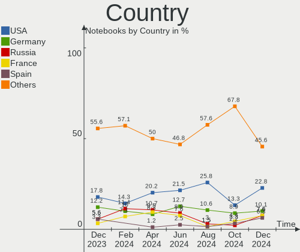
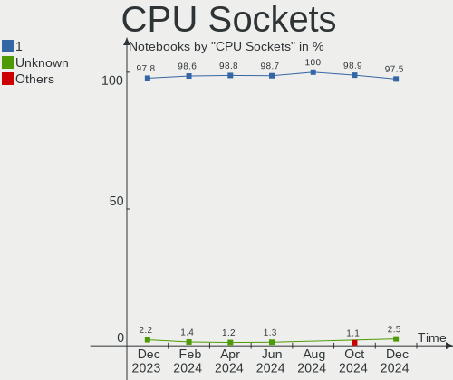
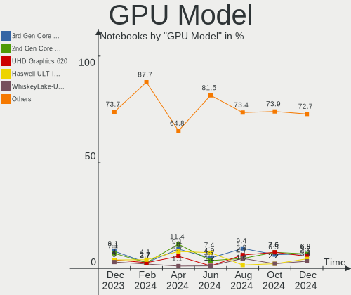

BSD Hardware Trends (Notebook)
------------------------------

A project to identify most popular hardware characteristics and track their change
over time based on data collected by BSD users at https://BSD-Hardware.info.

Anyone can contribute to the study by uploading probes of their computers by
the [hw-probe](https://github.com/linuxhw/hw-probe/blob/master/INSTALL.BSD.md) tool:

    hw-probe -all -upload

Full-feature report is available here: https://bsd-hardware.info/?view=trends&formfactor=notebook

Period: May, 2021.

Contents
--------

- [ OS                       ](#os)
- [ OS Family                ](#os-family)
- [ Arch                     ](#arch)
- [ DE                       ](#de)
- [ Display Server           ](#display-server)
- [ Display Manager          ](#display-manager)
- [ OS Lang                  ](#os-lang)
- [ Boot Mode                ](#boot-mode)
- [ Filesystem               ](#filesystem)
- [ Part. scheme             ](#part-scheme)
- [ Country                  ](#country)
- [ City                     ](#city)
- [ Vendor                   ](#vendor)
- [ Model                    ](#model)
- [ Model Family             ](#model-family)
- [ MFG Year                 ](#mfg-year)
- [ Form Factor              ](#form-factor)
- [ Coreboot                 ](#coreboot)
- [ RAM Size                 ](#ram-size)
- [ RAM Used                 ](#ram-used)
- [ Has CD-ROM               ](#has-cd-rom)
- [ Total Drives             ](#total-drives)
- [ Has Ethernet             ](#has-ethernet)
- [ Has WiFi                 ](#has-wifi)
- [ Has Bluetooth            ](#has-bluetooth)
- [ Drive Vendor             ](#drive-vendor)
- [ Drive Model              ](#drive-model)
- [ HDD Vendor               ](#hdd-vendor)
- [ SSD Vendor               ](#ssd-vendor)
- [ Drive Kind               ](#drive-kind)
- [ Drive Connector          ](#drive-connector)
- [ Drive Size               ](#drive-size)
- [ Space Total              ](#space-total)
- [ Space Used               ](#space-used)
- [ Malfunc. Drives          ](#malfunc-drives)
- [ Malfunc. Drive Vendor    ](#malfunc-drive-vendor)
- [ Malfunc. HDD Vendor      ](#malfunc-hdd-vendor)
- [ Malfunc. Drive Kind      ](#malfunc-drive-kind)
- [ Failed Drives            ](#failed-drives)
- [ Failed Drive Vendor      ](#failed-drive-vendor)
- [ Drive Status             ](#drive-status)
- [ Storage Vendor           ](#storage-vendor)
- [ Storage Model            ](#storage-model)
- [ Storage Kind             ](#storage-kind)
- [ CPU Vendor               ](#cpu-vendor)
- [ CPU Model                ](#cpu-model)
- [ CPU Model Family         ](#cpu-model-family)
- [ CPU Cores                ](#cpu-cores)
- [ CPU Sockets              ](#cpu-sockets)
- [ CPU Threads              ](#cpu-threads)
- [ CPU Microarch            ](#cpu-microarch)
- [ GPU Vendor               ](#gpu-vendor)
- [ GPU Model                ](#gpu-model)
- [ GPU Combo                ](#gpu-combo)
- [ GPU Driver               ](#gpu-driver)
- [ GPU Memory               ](#gpu-memory)
- [ Monitor Vendor           ](#monitor-vendor)
- [ Monitor Model            ](#monitor-model)
- [ Monitor Resolution       ](#monitor-resolution)
- [ Monitor Diagonal         ](#monitor-diagonal)
- [ Monitor Width            ](#monitor-width)
- [ Aspect Ratio             ](#aspect-ratio)
- [ Monitor Area             ](#monitor-area)
- [ Pixel Density            ](#pixel-density)
- [ Multiple Monitors        ](#multiple-monitors)
- [ Net Controller Vendor    ](#net-controller-vendor)
- [ Net Controller Model     ](#net-controller-model)
- [ Wireless Vendor          ](#wireless-vendor)
- [ Wireless Model           ](#wireless-model)
- [ Ethernet Vendor          ](#ethernet-vendor)
- [ Ethernet Model           ](#ethernet-model)
- [ Net Controller Kind      ](#net-controller-kind)
- [ Used Controller          ](#used-controller)
- [ NICs                     ](#nics)
- [ IPv6                     ](#ipv6)
- [ Memory Vendor            ](#memory-vendor)
- [ Memory Model             ](#memory-model)
- [ Memory Kind              ](#memory-kind)
- [ Memory Form Factor       ](#memory-form-factor)
- [ Memory Size              ](#memory-size)
- [ Memory Speed             ](#memory-speed)
- [ Sound Vendor             ](#sound-vendor)
- [ Sound Model              ](#sound-model)
- [ Camera Vendor            ](#camera-vendor)
- [ Camera Model             ](#camera-model)
- [ Fingerprint Vendor       ](#fingerprint-vendor)
- [ Fingerprint Model        ](#fingerprint-model)
- [ Chipcard Vendor          ](#chipcard-vendor)
- [ Chipcard Model           ](#chipcard-model)
- [ Printer Vendor           ](#printer-vendor)
- [ Printer Model            ](#printer-model)
- [ Scanner Vendor           ](#scanner-vendor)
- [ Scanner Model            ](#scanner-model)
- [ Bluetooth Vendor         ](#bluetooth-vendor)
- [ Bluetooth Model          ](#bluetooth-model)
- [ Unsupported Devices      ](#unsupported-devices)
- [ Unsupported Device Types ](#unsupported-device-types)

OS
--

Installed operating systems

| Name                 | Notebooks | Percent |
|----------------------|-----------|---------|
| FreeBSD 13.0         | 23        | 34.85%  |
| OpenBSD 6.9          | 12        | 18.18%  |
| helloSystem 0.4.0    | 6         | 9.09%   |
| OPNsense 21.1.5      | 4         | 6.06%   |
| FreeBSD 14.0-CURRENT | 4         | 6.06%   |
| FreeBSD 13.0-p1      | 4         | 6.06%   |
| GhostBSD 20.04.02    | 3         | 4.55%   |
| FreeBSD 12.2-p6      | 3         | 4.55%   |
| OPNsense 21.1.6      | 1         | 1.52%   |
| OPNsense 21.1.3      | 1         | 1.52%   |
| OPNsense 21.1        | 1         | 1.52%   |
| OPNsense 20.7.8      | 1         | 1.52%   |
| FreeBSD 13.0-STABLE  | 1         | 1.52%   |
| FreeBSD 12.2-STABLE  | 1         | 1.52%   |
| DragonFly 6.0        | 1         | 1.52%   |

OS Family
---------

OS without a version

| Name        | Notebooks | Percent |
|-------------|-----------|---------|
| FreeBSD     | 36        | 54.55%  |
| OpenBSD     | 12        | 18.18%  |
| OPNsense    | 8         | 12.12%  |
| helloSystem | 6         | 9.09%   |
| GhostBSD    | 3         | 4.55%   |
| DragonFly   | 1         | 1.52%   |

Arch
----

OS architecture (x86_64, i586, etc.)

| Name   | Notebooks | Percent |
|--------|-----------|---------|
| amd64  | 58        | 87.88%  |
| i386   | 7         | 10.61%  |
| macppc | 1         | 1.52%   |

DE
--

Desktop Environment

| Name         | Notebooks | Percent |
|--------------|-----------|---------|
| Console      | 11        | 16.67%  |
| fvwm         | 10        | 15.15%  |
| KDE5         | 9         | 13.64%  |
| MATE         | 8         | 12.12%  |
| XFCE         | 7         | 10.61%  |
| helloDesktop | 6         | 9.09%   |
| GNOME        | 6         | 9.09%   |
| TWM          | 3         | 4.55%   |
| Openbox      | 1         | 1.52%   |
| i3           | 1         | 1.52%   |
| GNUstep      | 1         | 1.52%   |
| Fluxbox      | 1         | 1.52%   |
| Cinnamon     | 1         | 1.52%   |
| AwesomeWM    | 1         | 1.52%   |

Display Server
--------------

X11 or Wayland

| Name    | Notebooks | Percent |
|---------|-----------|---------|
| X11     | 55        | 83.33%  |
| Console | 11        | 16.67%  |

Display Manager
---------------

SDDM, LightDM, etc.

| Name    | Notebooks | Percent |
|---------|-----------|---------|
| Console | 30        | 45.45%  |
| SLiM    | 12        | 18.18%  |
| SDDM    | 9         | 13.64%  |
| LightDM | 6         | 9.09%   |
| GDM     | 6         | 9.09%   |
| XDM     | 2         | 3.03%   |
| Ly      | 1         | 1.52%   |

OS Lang
-------

Language

| Lang    | Notebooks | Percent |
|---------|-----------|---------|
| C       | 24        | 36.36%  |
| Unknown | 23        | 34.85%  |
| en_US   | 10        | 15.15%  |
| fr_FR   | 2         | 3.03%   |
| uk_UA   | 1         | 1.52%   |
| ru_RU   | 1         | 1.52%   |
| nb_NO   | 1         | 1.52%   |
| ja_JP   | 1         | 1.52%   |
| es_ES   | 1         | 1.52%   |
| en_GB   | 1         | 1.52%   |
| de_CH   | 1         | 1.52%   |

Boot Mode
---------

EFI or BIOS

| Mode | Notebooks | Percent |
|------|-----------|---------|
| EFI  | 45        | 68.18%  |
| BIOS | 21        | 31.82%  |

Filesystem
----------

Type of filesystem

| Type    | Notebooks | Percent |
|---------|-----------|---------|
| Zfs     | 33        | 50%     |
| Ufs     | 20        | 30.3%   |
| Ffs     | 12        | 18.18%  |
| Hammer2 | 1         | 1.52%   |

Part. scheme
------------

Scheme of partitioning

| Type    | Notebooks | Percent |
|---------|-----------|---------|
| GPT     | 52        | 78.79%  |
| MBR     | 13        | 19.7%   |
| Unknown | 1         | 1.52%   |

Country
-------

Geographic location (country)

| Country     | Notebooks | Percent |
|-------------|-----------|---------|
| USA         | 13        | 19.7%   |
| Canada      | 9         | 13.64%  |
| UK          | 5         | 7.58%   |
| Ukraine     | 4         | 6.06%   |
| Germany     | 4         | 6.06%   |
| France      | 4         | 6.06%   |
| Switzerland | 3         | 4.55%   |
| Thailand    | 2         | 3.03%   |
| Sweden      | 2         | 3.03%   |
| Mexico      | 2         | 3.03%   |
| Guadeloupe  | 2         | 3.03%   |
| Brazil      | 2         | 3.03%   |
| Turkey      | 1         | 1.52%   |
| Qatar       | 1         | 1.52%   |
| Poland      | 1         | 1.52%   |
| Netherlands | 1         | 1.52%   |
| Nepal       | 1         | 1.52%   |
| Japan       | 1         | 1.52%   |
| Indonesia   | 1         | 1.52%   |
| India       | 1         | 1.52%   |
| Finland     | 1         | 1.52%   |
| Egypt       | 1         | 1.52%   |
| Czechia     | 1         | 1.52%   |
| Colombia    | 1         | 1.52%   |
| Belgium     | 1         | 1.52%   |
| Australia   | 1         | 1.52%   |

City
----

Geographic location (city)

| City                   | Notebooks | Percent |
|------------------------|-----------|---------|
| Saint-Laurent          | 7         | 10.61%  |
| Kyiv                   | 2         | 3.03%   |
| Brighton               | 2         | 3.03%   |
| Świętochłowice      | 1         | 1.52%   |
| Zurich                 | 1         | 1.52%   |
| Wausau                 | 1         | 1.52%   |
| Victoria               | 1         | 1.52%   |
| Vacaville              | 1         | 1.52%   |
| Toulouse               | 1         | 1.52%   |
| Tacoma                 | 1         | 1.52%   |
| São Paulo             | 1         | 1.52%   |
| Surabaya               | 1         | 1.52%   |
| Sollentuna             | 1         | 1.52%   |
| Seattle                | 1         | 1.52%   |
| San Diego              | 1         | 1.52%   |
| San Antonio            | 1         | 1.52%   |
| Rionegro               | 1         | 1.52%   |
| Prague                 | 1         | 1.52%   |
| Plainfield             | 1         | 1.52%   |
| Petit-Bourg            | 1         | 1.52%   |
| Noisy-le-Grand         | 1         | 1.52%   |
| Monterrey              | 1         | 1.52%   |
| Maple Ridge            | 1         | 1.52%   |
| Los Angeles            | 1         | 1.52%   |
| Le Gosier              | 1         | 1.52%   |
| Kathmandu              | 1         | 1.52%   |
| João Pessoa           | 1         | 1.52%   |
| Homburg                | 1         | 1.52%   |
| Hoerby                 | 1         | 1.52%   |
| Helsinki               | 1         | 1.52%   |
| Hat Yai                | 1         | 1.52%   |
| Guadalajara            | 1         | 1.52%   |
| Graben-Neudorf         | 1         | 1.52%   |
| Gloucester             | 1         | 1.52%   |
| Glasgow                | 1         | 1.52%   |
| Giza                   | 1         | 1.52%   |
| Ghent                  | 1         | 1.52%   |
| Gallatin               | 1         | 1.52%   |
| Fruitland              | 1         | 1.52%   |
| Fleury-Merogis         | 1         | 1.52%   |
| Federal Way            | 1         | 1.52%   |
| Eilenburg              | 1         | 1.52%   |
| Donetsk                | 1         | 1.52%   |
| Doha                   | 1         | 1.52%   |
| Deggendorf             | 1         | 1.52%   |
| Corcelles-pres-Payerne | 1         | 1.52%   |
| City of Westminster    | 1         | 1.52%   |
| Chiang Mai             | 1         | 1.52%   |
| Chattanooga            | 1         | 1.52%   |
| Cape Coral             | 1         | 1.52%   |
| Canberra               | 1         | 1.52%   |
| Brovary                | 1         | 1.52%   |
| Bengaluru              | 1         | 1.52%   |
| Basel                  | 1         | 1.52%   |
| Aubervilliers          | 1         | 1.52%   |
| Atami                  | 1         | 1.52%   |
| Ankara                 | 1         | 1.52%   |
| Alphen aan den Rijn    | 1         | 1.52%   |

Vendor
------

Motherboard manufacturer

| Name                           | Notebooks | Percent |
|--------------------------------|-----------|---------|
| Lenovo                         | 18        | 27.27%  |
| Dell                           | 13        | 19.7%   |
| Hewlett-Packard                | 6         | 9.09%   |
| ASUSTek Computer               | 5         | 7.58%   |
| Acer                           | 5         | 7.58%   |
| Apple                          | 4         | 6.06%   |
| Panasonic                      | 2         | 3.03%   |
| Notebook                       | 2         | 3.03%   |
| Matsushita Electric Industrial | 2         | 3.03%   |
| Unknown                        | 2         | 3.03%   |
| Toshiba                        | 1         | 1.52%   |
| System76                       | 1         | 1.52%   |
| Sony                           | 1         | 1.52%   |
| Pegatron                       | 1         | 1.52%   |
| Packard Bell                   | 1         | 1.52%   |
| MSI                            | 1         | 1.52%   |
| Deciso                         | 1         | 1.52%   |

Model
-----

Motherboard model

| Name                                        | Notebooks | Percent |
|---------------------------------------------|-----------|---------|
| Dell Latitude E6410                         | 2         | 3.03%   |
| Unknown                                     | 2         | 3.03%   |
| Toshiba TECRA M11                           | 1         | 1.52%   |
| System76 Gazelle                            | 1         | 1.52%   |
| Sony SVP1322M1EBI                           | 1         | 1.52%   |
| Pegatron T12Ah                              | 1         | 1.52%   |
| Panasonic CF-53AAGHYDM                      | 1         | 1.52%   |
| Panasonic CF-52PFPBSFQ                      | 1         | 1.52%   |
| Packard Bell AOA110                         | 1         | 1.52%   |
| Notebook NL5xRU                             | 1         | 1.52%   |
| Notebook N7x0WU                             | 1         | 1.52%   |
| MSI GL65 Leopard 10SFSK                     | 1         | 1.52%   |
| Matsushita Electric Industrial CF-51RCVDNLM | 1         | 1.52%   |
| Matsushita Electric Industrial CF-48V4KNDQM | 1         | 1.52%   |
| Lenovo Z51-70 80K6                          | 1         | 1.52%   |
| Lenovo ThinkPad X270 20HM004JBR             | 1         | 1.52%   |
| Lenovo ThinkPad X250 20CMCTO1WW             | 1         | 1.52%   |
| Lenovo ThinkPad X250 20CM003WMS             | 1         | 1.52%   |
| Lenovo ThinkPad X220 4291PU5                | 1         | 1.52%   |
| Lenovo ThinkPad X220 4290NE3                | 1         | 1.52%   |
| Lenovo ThinkPad X1 Carbon 7th 20QD0000US    | 1         | 1.52%   |
| Lenovo ThinkPad T490 20N3X50500             | 1         | 1.52%   |
| Lenovo ThinkPad T470 20HD000MUK             | 1         | 1.52%   |
| Lenovo ThinkPad T450s 20BWS0L600            | 1         | 1.52%   |
| Lenovo ThinkPad T440p 20AW0049LL            | 1         | 1.52%   |
| Lenovo ThinkPad T430 2347GZU                | 1         | 1.52%   |
| Lenovo ThinkPad T410 2537N24                | 1         | 1.52%   |
| Lenovo ThinkPad SL510 28477MG               | 1         | 1.52%   |
| Lenovo ThinkPad P73 20QRCTO1WW              | 1         | 1.52%   |
| Lenovo ThinkPad A485 20MVS0FD00             | 1         | 1.52%   |
| Lenovo Legion 5P 15IMH05H 82AW              | 1         | 1.52%   |
| Lenovo IdeaPad Y700-15ISK 80NV              | 1         | 1.52%   |
| HP Pavilion Laptop 15-cc0xx                 | 1         | 1.52%   |
| HP Pavilion dv4                             | 1         | 1.52%   |
| HP Laptop 17-by0xxx                         | 1         | 1.52%   |
| HP EliteBook 8570p                          | 1         | 1.52%   |
| HP 530 Notebook PC(KP477AA#ACB)             | 1         | 1.52%   |
| HP 240 G5 Notebook PC                       | 1         | 1.52%   |
| Dell Vostro 5568                            | 1         | 1.52%   |
| Dell Precision M4800                        | 1         | 1.52%   |
| Dell Latitude E6430                         | 1         | 1.52%   |
| Dell Latitude E5570                         | 1         | 1.52%   |
| Dell Latitude E5550                         | 1         | 1.52%   |
| Dell Latitude D620                          | 1         | 1.52%   |
| Dell Latitude 5500                          | 1         | 1.52%   |
| Dell Latitude 3440                          | 1         | 1.52%   |
| Dell Inspiron N5050                         | 1         | 1.52%   |
| Dell Inspiron 3442                          | 1         | 1.52%   |
| Dell G5 5505                                | 1         | 1.52%   |
| Deciso Netboard A20                         | 1         | 1.52%   |
| ASUS UX430UNR                               | 1         | 1.52%   |
| ASUS UX31A                                  | 1         | 1.52%   |
| ASUS G750JM                                 | 1         | 1.52%   |
| ASUS 1015PX                                 | 1         | 1.52%   |
| ASUS 1000HE                                 | 1         | 1.52%   |
| Apple PowerBook5,2                          | 1         | 1.52%   |
| Apple MacBookPro8,2                         | 1         | 1.52%   |
| Apple MacBookPro6,2                         | 1         | 1.52%   |
| Apple MacBookPro11,3                        | 1         | 1.52%   |
| Acer Predator PH517-61                      | 1         | 1.52%   |

Model Family
------------

Motherboard model prefix

| Name                                        | Notebooks | Percent |
|---------------------------------------------|-----------|---------|
| Lenovo ThinkPad                             | 15        | 22.73%  |
| Dell Latitude                               | 8         | 12.12%  |
| HP Pavilion                                 | 2         | 3.03%   |
| Dell Inspiron                               | 2         | 3.03%   |
| Acer Aspire                                 | 2         | 3.03%   |
| Unknown                                     | 2         | 3.03%   |
| Toshiba TECRA                               | 1         | 1.52%   |
| System76 Gazelle                            | 1         | 1.52%   |
| Sony SVP1322M1EBI                           | 1         | 1.52%   |
| Pegatron T12Ah                              | 1         | 1.52%   |
| Panasonic CF-53AAGHYDM                      | 1         | 1.52%   |
| Panasonic CF-52PFPBSFQ                      | 1         | 1.52%   |
| Packard Bell AOA110                         | 1         | 1.52%   |
| Notebook NL5xRU                             | 1         | 1.52%   |
| Notebook N7x0WU                             | 1         | 1.52%   |
| MSI GL65                                    | 1         | 1.52%   |
| Matsushita Electric Industrial CF-51RCVDNLM | 1         | 1.52%   |
| Matsushita Electric Industrial CF-48V4KNDQM | 1         | 1.52%   |
| Lenovo Z51-70                               | 1         | 1.52%   |
| Lenovo Legion                               | 1         | 1.52%   |
| Lenovo IdeaPad                              | 1         | 1.52%   |
| HP Laptop                                   | 1         | 1.52%   |
| HP EliteBook                                | 1         | 1.52%   |
| HP 530                                      | 1         | 1.52%   |
| HP 240                                      | 1         | 1.52%   |
| Dell Vostro                                 | 1         | 1.52%   |
| Dell Precision                              | 1         | 1.52%   |
| Dell G5                                     | 1         | 1.52%   |
| Deciso Netboard                             | 1         | 1.52%   |
| ASUS UX430UNR                               | 1         | 1.52%   |
| ASUS UX31A                                  | 1         | 1.52%   |
| ASUS G750JM                                 | 1         | 1.52%   |
| ASUS 1015PX                                 | 1         | 1.52%   |
| ASUS 1000HE                                 | 1         | 1.52%   |
| Apple PowerBook5                            | 1         | 1.52%   |
| Apple MacBookPro8                           | 1         | 1.52%   |
| Apple MacBookPro6                           | 1         | 1.52%   |
| Apple MacBookPro11                          | 1         | 1.52%   |
| Acer Predator                               | 1         | 1.52%   |
| Acer Nitro                                  | 1         | 1.52%   |
| Acer AO531h                                 | 1         | 1.52%   |

MFG Year
--------

Motherboard manufacture year

| Year    | Notebooks | Percent |
|---------|-----------|---------|
| 2020    | 17        | 25.76%  |
| 2019    | 11        | 16.67%  |
| 2008    | 5         | 7.58%   |
| 2016    | 4         | 6.06%   |
| 2012    | 4         | 6.06%   |
| 2018    | 3         | 4.55%   |
| 2017    | 3         | 4.55%   |
| 2015    | 3         | 4.55%   |
| 2013    | 3         | 4.55%   |
| 2011    | 3         | 4.55%   |
| 2021    | 2         | 3.03%   |
| 2010    | 2         | 3.03%   |
| 2009    | 2         | 3.03%   |
| 2014    | 1         | 1.52%   |
| 2006    | 1         | 1.52%   |
| 2002    | 1         | 1.52%   |
| Unknown | 1         | 1.52%   |

Form Factor
-----------

Physical design of the computer

| Name     | Notebooks | Percent |
|----------|-----------|---------|
| Notebook | 66        | 100%    |

Coreboot
--------

Have coreboot on board

| Used | Notebooks | Percent |
|------|-----------|---------|
| No   | 66        | 100%    |

RAM Size
--------

Total RAM memory

| Size in GB  | Notebooks | Percent |
|-------------|-----------|---------|
| 8.01-16.0   | 27        | 40.91%  |
| 16.01-24.0  | 15        | 22.73%  |
| 4.01-8.0    | 6         | 9.09%   |
| 2.01-3.0    | 4         | 6.06%   |
| 32.01-64.0  | 3         | 4.55%   |
| 3.01-4.0    | 3         | 4.55%   |
| 64.01-256.0 | 3         | 4.55%   |
| 1.01-2.0    | 2         | 3.03%   |
| 0.51-1.0    | 2         | 3.03%   |
| 24.01-32.0  | 1         | 1.52%   |

RAM Used
--------

Used RAM memory

| Used GB    | Notebooks | Percent |
|------------|-----------|---------|
| 0.01-0.5   | 39        | 59.09%  |
| 0.51-1.0   | 14        | 21.21%  |
| 1.01-2.0   | 4         | 6.06%   |
| 2.01-3.0   | 2         | 3.03%   |
| 16.01-24.0 | 2         | 3.03%   |
| 8.01-16.0  | 2         | 3.03%   |
| 0          | 2         | 3.03%   |
| 4.01-8.0   | 1         | 1.52%   |

Has CD-ROM
----------

Has CD-ROM on board

| Presented | Notebooks | Percent |
|-----------|-----------|---------|
| No        | 49        | 74.24%  |
| Yes       | 17        | 25.76%  |

Total Drives
------------

Number of drives on board

| Drives | Notebooks | Percent |
|--------|-----------|---------|
| 1      | 49        | 74.24%  |
| 2      | 12        | 18.18%  |
| 3      | 4         | 6.06%   |
| 0      | 1         | 1.52%   |

Has Ethernet
------------

Has Ethernet on board

| Presented | Notebooks | Percent |
|-----------|-----------|---------|
| Yes       | 62        | 93.94%  |
| No        | 4         | 6.06%   |

Has WiFi
--------

Has WiFi module

| Presented | Notebooks | Percent |
|-----------|-----------|---------|
| Yes       | 61        | 92.42%  |
| No        | 5         | 7.58%   |

Has Bluetooth
-------------

Has Bluetooth module

| Presented | Notebooks | Percent |
|-----------|-----------|---------|
| Yes       | 40        | 60.61%  |
| No        | 26        | 39.39%  |

Drive Vendor
------------

Hard drive vendors

| Vendor              | Notebooks | Drives | Percent |
|---------------------|-----------|--------|---------|
| WDC                 | 17        | 18     | 21.79%  |
| Samsung Electronics | 8         | 12     | 10.26%  |
| Toshiba             | 7         | 7      | 8.97%   |
| Seagate             | 7         | 7      | 8.97%   |
| Crucial             | 6         | 6      | 7.69%   |
| SanDisk             | 5         | 5      | 6.41%   |
| Transcend           | 3         | 3      | 3.85%   |
| Kingston            | 3         | 4      | 3.85%   |
| Hitachi             | 3         | 3      | 3.85%   |
| Silicon Motion      | 2         | 2      | 2.56%   |
| NVMe                | 2         | 2      | 2.56%   |
| LITEON              | 2         | 2      | 2.56%   |
| A-DATA Technology   | 2         | 2      | 2.56%   |
| SPCC                | 1         | 1      | 1.28%   |
| SK Hynix            | 1         | 1      | 1.28%   |
| Pioneer             | 1         | 1      | 1.28%   |
| Phison              | 1         | 1      | 1.28%   |
| OWC                 | 1         | 1      | 1.28%   |
| Kston               | 1         | 1      | 1.28%   |
| Intel               | 1         | 1      | 1.28%   |
| HGST                | 1         | 1      | 1.28%   |
| Gigabyte Technology | 1         | 1      | 1.28%   |
| Fujitsu             | 1         | 1      | 1.28%   |
| China               | 1         | 1      | 1.28%   |

Drive Model
-----------

Hard drive models

| Model                                | Notebooks | Percent |
|--------------------------------------|-----------|---------|
| Crucial CT500MX500SSD1 500GB         | 3         | 3.61%   |
| WDC WD1600BEVT-22ZCT0 160GB          | 2         | 2.41%   |
| Toshiba MQ01ABD100 1TB               | 2         | 2.41%   |
| Seagate ST500LM021-1KJ152 500GB      | 2         | 2.41%   |
| WDC WDS480G2G0A-00JH30 480GB         | 1         | 1.2%    |
| WDC WDS240G2G0A-00JH30 240GB         | 1         | 1.2%    |
| WDC WDS120G2G0B-00EPW0 120GB         | 1         | 1.2%    |
| WDC WDS100T2B0B-00YS70 1TB           | 1         | 1.2%    |
| WDC WD7500BPKX-00HPJT0 752GB         | 1         | 1.2%    |
| WDC WD7500BPKT-00PK4T0 752GB         | 1         | 1.2%    |
| WDC WD5000LPLX-00ZNTT0 500GB         | 1         | 1.2%    |
| WDC WD3200BEVT-60ZCT1 320GB          | 1         | 1.2%    |
| WDC WD3200BEVE-00A0HT0 320GB         | 1         | 1.2%    |
| WDC WD2500BEVS-08VAT2 250GB          | 1         | 1.2%    |
| WDC WD1600BEVT-11ZCT0 160GB          | 1         | 1.2%    |
| WDC WD10JPVX-75JC3T0 1TB             | 1         | 1.2%    |
| WDC WD10JPLX-00MBPT1 1TB             | 1         | 1.2%    |
| WDC WD10JPLX-00MBPT0 1TB             | 1         | 1.2%    |
| WDC PC SN730 NVMe 1024GB             | 1         | 1.2%    |
| WDC PC SN520 NVMe 256GB              | 1         | 1.2%    |
| Transcend TS64GMTS400S 64GB          | 1         | 1.2%    |
| Transcend TS256GMTS952T2 256GB       | 1         | 1.2%    |
| Transcend TS256GMTS430S 256GB        | 1         | 1.2%    |
| Toshiba THNSF5256GPUK 256GB          | 1         | 1.2%    |
| Toshiba MQ01ABF050 500GB             | 1         | 1.2%    |
| Toshiba MQ01ABF032 320GB             | 1         | 1.2%    |
| Toshiba MK8025GAS 80GB               | 1         | 1.2%    |
| Toshiba MK2546GSX_200 200GB          | 1         | 1.2%    |
| SPCC SPCCSolidStateDisk 256GB        | 1         | 1.2%    |
| SK Hynix HFM256GDJTNG-8310A 256GB    | 1         | 1.2%    |
| Silicon Motion NE-256 256GB          | 1         | 1.2%    |
| Silicon Motion Aura Pro X2 960GB     | 1         | 1.2%    |
| Seagate ST9160821A 160GB             | 1         | 1.2%    |
| Seagate ST1000LM049-2GH172 1TB       | 1         | 1.2%    |
| Seagate ST1000LM025 HN-M101ABB 1TB   | 1         | 1.2%    |
| Seagate ST1000LM024 HN-M101MBB 1TB   | 1         | 1.2%    |
| Seagate ST1000LM014-1EJ164 1TB       | 1         | 1.2%    |
| SanDisk SSD PLUS 240 GB              | 1         | 1.2%    |
| SanDisk SSD i100 32GB                | 1         | 1.2%    |
| SanDisk SDSSDP256G 256GB             | 1         | 1.2%    |
| SanDisk SDSSDH3 1T02 1TB             | 1         | 1.2%    |
| SanDisk SD5SE2256G1002E 256GB        | 1         | 1.2%    |
| Samsung SSD SM841 2.5-inch 7mm 128GB | 1         | 1.2%    |
| Samsung SSD 970 PRO 1TB              | 1         | 1.2%    |
| Samsung SSD 970 EVO Plus 1TB         | 1         | 1.2%    |
| Samsung SSD 970 EVO 500GB            | 1         | 1.2%    |
| Samsung SSD 970 EVO 1TB              | 1         | 1.2%    |
| Samsung SSD 860 EVO M.2 1TB          | 1         | 1.2%    |
| Samsung SSD 860 EVO 250GB            | 1         | 1.2%    |
| Samsung MZVLB512HBJQ-000L2 512GB     | 1         | 1.2%    |
| Samsung MZVLB256HBHQ-000L7 256GB     | 1         | 1.2%    |
| Samsung MZNTE128HMGR-000SO 128GB     | 1         | 1.2%    |
| Samsung MZ7LN128HCHP-000L1 128GB     | 1         | 1.2%    |
| Pioneer APS-SL3N-128 128GB           | 1         | 1.2%    |
| Phison PCIe SSD 512GB                | 1         | 1.2%    |
| OWC Mercury EXTREME Pro 6G SSD       | 1         | 1.2%    |
| NVMe WDC PC SN730 SDB 512GB          | 1         | 1.2%    |
| NVMe Samsung SSD 960 500GB           | 1         | 1.2%    |
| LITEON LCH-256V2S 256GB              | 1         | 1.2%    |
| LITEON CV1-8B512 512GB               | 1         | 1.2%    |

HDD Vendor
----------

Hard disk drive vendors

| Vendor  | Notebooks | Drives | Percent |
|---------|-----------|--------|---------|
| WDC     | 12        | 12     | 38.71%  |
| Seagate | 7         | 7      | 22.58%  |
| Toshiba | 6         | 6      | 19.35%  |
| Hitachi | 3         | 3      | 9.68%   |
| NVMe    | 1         | 1      | 3.23%   |
| HGST    | 1         | 1      | 3.23%   |
| Fujitsu | 1         | 1      | 3.23%   |

SSD Vendor
----------

Solid state drive vendors

| Vendor              | Notebooks | Drives | Percent |
|---------------------|-----------|--------|---------|
| SanDisk             | 5         | 5      | 14.29%  |
| Samsung Electronics | 5         | 5      | 14.29%  |
| Crucial             | 5         | 5      | 14.29%  |
| WDC                 | 4         | 4      | 11.43%  |
| Transcend           | 3         | 3      | 8.57%   |
| LITEON              | 2         | 2      | 5.71%   |
| Kingston            | 2         | 3      | 5.71%   |
| A-DATA Technology   | 2         | 2      | 5.71%   |
| SPCC                | 1         | 1      | 2.86%   |
| Pioneer             | 1         | 1      | 2.86%   |
| OWC                 | 1         | 1      | 2.86%   |
| NVMe                | 1         | 1      | 2.86%   |
| Kston               | 1         | 1      | 2.86%   |
| Gigabyte Technology | 1         | 1      | 2.86%   |
| China               | 1         | 1      | 2.86%   |

Drive Kind
----------

HDD or SSD

| Kind | Notebooks | Drives | Percent |
|------|-----------|--------|---------|
| SSD  | 32        | 36     | 43.24%  |
| HDD  | 29        | 31     | 39.19%  |
| NVMe | 13        | 17     | 17.57%  |

Drive Connector
---------------

SATA, SAS, NVMe, etc.

| Type | Notebooks | Drives | Percent |
|------|-----------|--------|---------|
| SATA | 57        | 67     | 81.43%  |
| NVMe | 13        | 17     | 18.57%  |

Drive Size
----------

Size of hard drive

| Size in TB | Notebooks | Drives | Percent |
|------------|-----------|--------|---------|
| 0.01-0.5   | 43        | 50     | 74.14%  |
| 0.51-1.0   | 13        | 15     | 22.41%  |
| 1.01-2.0   | 2         | 2      | 3.45%   |

Space Total
-----------

Amount of disk space available on the file system

| Size in GB | Notebooks | Percent |
|------------|-----------|---------|
| 101-250    | 28        | 42.42%  |
| 251-500    | 10        | 15.15%  |
| 21-50      | 9         | 13.64%  |
| 1-20       | 7         | 10.61%  |
| 51-100     | 6         | 9.09%   |
| 501-1000   | 5         | 7.58%   |
| 1001-2000  | 1         | 1.52%   |

Space Used
----------

Amount of used disk space

| Used GB | Notebooks | Percent |
|---------|-----------|---------|
| 1-20    | 56        | 84.85%  |
| 21-50   | 7         | 10.61%  |
| 101-250 | 2         | 3.03%   |
| 51-100  | 1         | 1.52%   |

Malfunc. Drives
---------------

Drive models with a malfunction

| Model                                        | Notebooks | Drives | Percent |
|----------------------------------------------|-----------|--------|---------|
| WDC WD3200BEVT-60ZCT1 320GB                  | 1         | 1      | 8.33%   |
| WDC WD1600BEVT-22ZCT0 160GB                  | 1         | 1      | 8.33%   |
| WDC WD10JPVX-75JC3T0 1TB                     | 1         | 1      | 8.33%   |
| Seagate ST500LM021-1KJ152 500GB              | 1         | 1      | 8.33%   |
| Seagate ST1000LM025 HN-M101ABB 1TB           | 1         | 1      | 8.33%   |
| Seagate ST1000LM014-1EJ164 1TB               | 1         | 1      | 8.33%   |
| Samsung Electronics MZNTE128HMGR-000SO 128GB | 1         | 1      | 8.33%   |
| Kston SSD 128GB                              | 1         | 1      | 8.33%   |
| Hitachi HTS543225A7A384 250GB                | 1         | 1      | 8.33%   |
| HGST HTS725050A7E630 500GB                   | 1         | 1      | 8.33%   |
| Crucial CT500MX500SSD1 500GB                 | 1         | 1      | 8.33%   |
| A-DATA Technology SP550 480GB                | 1         | 1      | 8.33%   |

Malfunc. Drive Vendor
---------------------

Vendors of faulty drives

| Vendor              | Notebooks | Drives | Percent |
|---------------------|-----------|--------|---------|
| WDC                 | 3         | 3      | 25%     |
| Seagate             | 3         | 3      | 25%     |
| Samsung Electronics | 1         | 1      | 8.33%   |
| Kston               | 1         | 1      | 8.33%   |
| Hitachi             | 1         | 1      | 8.33%   |
| HGST                | 1         | 1      | 8.33%   |
| Crucial             | 1         | 1      | 8.33%   |
| A-DATA Technology   | 1         | 1      | 8.33%   |

Malfunc. HDD Vendor
-------------------

Vendors of faulty HDD drives

| Vendor  | Notebooks | Drives | Percent |
|---------|-----------|--------|---------|
| WDC     | 3         | 3      | 37.5%   |
| Seagate | 3         | 3      | 37.5%   |
| Hitachi | 1         | 1      | 12.5%   |
| HGST    | 1         | 1      | 12.5%   |

Malfunc. Drive Kind
-------------------

Kinds of faulty drives

| Kind | Notebooks | Drives | Percent |
|------|-----------|--------|---------|
| HDD  | 7         | 8      | 63.64%  |
| SSD  | 4         | 4      | 36.36%  |

Failed Drives
-------------

Failed drive models

Zero info for selected period =(

Failed Drive Vendor
-------------------

Failed drive vendors

Zero info for selected period =(

Drive Status
------------

Number of failed and malfunc. drives

| Status   | Notebooks | Drives | Percent |
|----------|-----------|--------|---------|
| Works    | 55        | 70     | 80.88%  |
| Malfunc  | 11        | 12     | 16.18%  |
| Detected | 2         | 2      | 2.94%   |

Storage Vendor
--------------

Storage controller vendors

| Vendor              | Notebooks | Percent |
|---------------------|-----------|---------|
| Intel               | 56        | 74.67%  |
| Samsung Electronics | 5         | 6.67%   |
| AMD                 | 5         | 6.67%   |
| Sandisk             | 3         | 4%      |
| Silicon Motion      | 2         | 2.67%   |
| Toshiba             | 1         | 1.33%   |
| SK Hynix            | 1         | 1.33%   |
| Phison Electronics  | 1         | 1.33%   |
| Micron Technology   | 1         | 1.33%   |

Storage Model
-------------

Storage controller models

| Model                                                                          | Notebooks | Percent |
|--------------------------------------------------------------------------------|-----------|---------|
| Intel Wildcat Point-LP SATA Controller [AHCI Mode]                             | 5         | 6.41%   |
| Intel Sunrise Point-LP SATA Controller [AHCI mode]                             | 5         | 6.41%   |
| Intel 82801 Mobile SATA Controller [RAID mode]                                 | 5         | 6.41%   |
| Intel 8 Series SATA Controller 1 [AHCI mode]                                   | 5         | 6.41%   |
| Intel 7 Series Chipset Family 6-port SATA Controller [AHCI mode]               | 5         | 6.41%   |
| Intel 6 Series/C200 Series Chipset Family 6 port Mobile SATA AHCI Controller   | 5         | 6.41%   |
| AMD FCH SATA Controller [AHCI mode]                                            | 5         | 6.41%   |
| Samsung NVMe SSD Controller SM981/PM981/PM983                                  | 4         | 5.13%   |
| Intel 82801GBM/GHM (ICH7-M Family) SATA Controller [IDE mode]                  | 4         | 5.13%   |
| Intel Cannon Lake Mobile PCH SATA AHCI Controller                              | 3         | 3.85%   |
| Intel 82801IBM/IEM (ICH9M/ICH9M-E) 4 port SATA Controller [AHCI mode]          | 3         | 3.85%   |
| Intel 5 Series/3400 Series Chipset 6 port SATA AHCI Controller                 | 3         | 3.85%   |
| Sandisk WD Black SN750 / PC SN730 NVMe SSD                                     | 2         | 2.56%   |
| Intel 82801GBM/GHM (ICH7-M Family) SATA Controller [AHCI mode]                 | 2         | 2.56%   |
| Intel 82801G (ICH7 Family) IDE Controller                                      | 2         | 2.56%   |
| Intel 8 Series/C220 Series Chipset Family 6-port SATA Controller 1 [AHCI mode] | 2         | 2.56%   |
| Intel 5 Series/3400 Series Chipset 4 port SATA AHCI Controller                 | 2         | 2.56%   |
| Toshiba XG4 NVMe SSD Controller                                                | 1         | 1.28%   |
| SK Hynix BC501 NVMe Solid State Drive 512GB                                    | 1         | 1.28%   |
| Silicon Motion SM2263EN/SM2263XT SSD Controller                                | 1         | 1.28%   |
| Silicon Motion SM2262/SM2262EN SSD Controller                                  | 1         | 1.28%   |
| Sandisk PC SN520 NVMe SSD                                                      | 1         | 1.28%   |
| Samsung NVMe SSD Controller SM961/PM961/SM963                                  | 1         | 1.28%   |
| Phison E12 NVMe Controller                                                     | 1         | 1.28%   |
| Intel SSD Pro 7600p/760p/E 6100p Series                                        | 1         | 1.28%   |
| Intel SATA Controller [RAID mode]                                              | 1         | 1.28%   |
| Intel NM10/ICH7 Family SATA Controller [AHCI mode]                             | 1         | 1.28%   |
| Intel HM170/QM170 Chipset SATA Controller [AHCI Mode]                          | 1         | 1.28%   |
| Intel Cannon Point-LP SATA Controller [AHCI Mode]                              | 1         | 1.28%   |
| Intel 82801CAM IDE U100 Controller                                             | 1         | 1.28%   |
| Intel 400 Series Chipset Family SATA AHCI Controller                           | 1         | 1.28%   |
| AMD 400 Series Chipset SATA Controller                                         | 1         | 1.28%   |
| Unknown                                                                        | 1         | 1.28%   |

Storage Kind
------------

Kind of storage controller (IDE, SATA, NVMe, SAS, ...)

| Kind | Notebooks | Percent |
|------|-----------|---------|
| SATA | 49        | 64.47%  |
| NVMe | 14        | 18.42%  |
| IDE  | 7         | 9.21%   |
| RAID | 6         | 7.89%   |

CPU Vendor
----------

Processor vendors

| Vendor  | Notebooks | Percent |
|---------|-----------|---------|
| Intel   | 60        | 90.91%  |
| AMD     | 5         | 7.58%   |
| Unknown | 1         | 1.52%   |

CPU Model
---------

Processor models

| Model                                                         | Notebooks | Percent |
|---------------------------------------------------------------|-----------|---------|
| Intel Core i5-5300U CPU @ 2.30GHz                             | 3         | 4.55%   |
| Intel Core i5-2520M CPU @ 2.50GHz                             | 3         | 4.55%   |
| Intel Core i7-9750H CPU @ 2.60GHz                             | 2         | 3.03%   |
| Intel Core i5-8365U CPU @ 1.60GHz                             | 2         | 3.03%   |
| Intel Core i5-4210U CPU @ 1.70GHz                             | 2         | 3.03%   |
| Intel Core i5 CPU M 560 @ 2.67GH                              | 2         | 3.03%   |
| Intel Core i5 CPU M 520 @ 2.40GHz                             | 2         | 3.03%   |
| Intel Core i3-4005U CPU @ 1.70GHz                             | 2         | 3.03%   |
| Intel Pentium M                                               | 1         | 1.52%   |
| Intel Pentium CPU 967 @ 1.30GHz                               | 1         | 1.52%   |
| Intel Pentium 4 Mobile CPU 1.60GHz ("GenuineIntel" 686-class) | 1         | 1.52%   |
| Intel CPU Version                                             | 1         | 1.52%   |
| Intel CPU T2300 @ 1.66GHz ("GenuineIntel" 686-class)          | 1         | 1.52%   |
| Intel Core i7-8565U CPU @ 1.80GHz                             | 1         | 1.52%   |
| Intel Core i7-8550U CPU @ 1.80GHz                             | 1         | 1.52%   |
| Intel Core i7-7600U CPU @ 2.80GHz                             | 1         | 1.52%   |
| Intel Core i7-7500U CPU @ 2.70GHz                             | 1         | 1.52%   |
| Intel Core i7-6700HQ CPU @ 2.60GHz                            | 1         | 1.52%   |
| Intel Core i7-5600U CPU @ 2.60GHz                             | 1         | 1.52%   |
| Intel Core i7-4870HQ CPU @ 2.50GHz                            | 1         | 1.52%   |
| Intel Core i7-4800MQ CPU @ 2.70GHz                            | 1         | 1.52%   |
| Intel Core i7-4700HQ CPU @ 2.40GHz                            | 1         | 1.52%   |
| Intel Core i7-3520M CPU @ 2.90GHz                             | 1         | 1.52%   |
| Intel Core i7-2675QM CPU @ 2.20GHz                            | 1         | 1.52%   |
| Intel Core i7-10750H CPU @ 2.60GHz                            | 1         | 1.52%   |
| Intel Core i7 CPU M 620 @ 2.67GHz                             | 1         | 1.52%   |
| Intel Core i5-9300H CPU @ 2.40GHz                             | 1         | 1.52%   |
| Intel Core i5-8250U CPU @ 1.60GHz                             | 1         | 1.52%   |
| Intel Core i5-7300U CPU @ 2.60GHz                             | 1         | 1.52%   |
| Intel Core i5-7200U CPU @ 2.50GHz                             | 1         | 1.52%   |
| Intel Core i5-6440HQ CPU @ 2.60GHz                            | 1         | 1.52%   |
| Intel Core i5-5200U CPU @ 2.20GHz                             | 1         | 1.52%   |
| Intel Core i5-4300M CPU @ 2.60GHz                             | 1         | 1.52%   |
| Intel Core i5-4200U CPU @ 1.60GHz                             | 1         | 1.52%   |
| Intel Core i5-3340M CPU @ 2.70GHz                             | 1         | 1.52%   |
| Intel Core i5-3320M CPU @ 2.60GHz                             | 1         | 1.52%   |
| Intel Core i5-3317U CPU @ 1.70GHz                             | 1         | 1.52%   |
| Intel Core i5-2450M CPU @ 2.50GHz                             | 1         | 1.52%   |
| Intel Core i5-10300H CPU @ 2.50GHz                            | 1         | 1.52%   |
| Intel Core i3-8130U CPU @ 2.20GHz                             | 1         | 1.52%   |
| Intel Core i3-6006U CPU @ 2.00GHz                             | 1         | 1.52%   |
| Intel Core i3 CPU M 330 @ 2.13GHz                             | 1         | 1.52%   |
| Intel Core Duo CPU T2600 @ 2.16GHz ("GenuineIntel" 686-class) | 1         | 1.52%   |
| Intel Core 2 Duo CPU T6400 @ 2.00GHz                          | 1         | 1.52%   |
| Intel Core 2 Duo CPU P8700 @ 2.53GHz                          | 1         | 1.52%   |
| Intel Celeron CPU 1037U @ 1.80GHz                             | 1         | 1.52%   |
| Intel Atom CPU N570 @ 1.66GHz                                 | 1         | 1.52%   |
| Intel Atom CPU N280 @ 1.66GHz ("GenuineIntel" 686-class)      | 1         | 1.52%   |
| Intel Atom CPU N270 @ 1.60GHz ("GenuineIntel" 686-class)      | 1         | 1.52%   |
| Intel Atom CPU N270 @ 1.60GHz                                 | 1         | 1.52%   |
| AMD Ryzen 7 PRO 2700U w/ Radeon Vega Mobile Gfx               | 1         | 1.52%   |
| AMD Ryzen 7 4800H with Radeon Graphics                        | 1         | 1.52%   |
| AMD Ryzen 7 4700U with Radeon Graphics                        | 1         | 1.52%   |
| AMD Ryzen 7 2700 Eight-Core Processor                         | 1         | 1.52%   |
| AMD EPYC 3101 4-Core Processor                                | 1         | 1.52%   |
|                                                               | 1         | 1.52%   |

CPU Model Family
----------------

Processor model prefix

| Model            | Notebooks | Percent |
|------------------|-----------|---------|
| Intel Core i5    | 27        | 40.91%  |
| Intel Core i7    | 15        | 22.73%  |
| Intel Core i3    | 5         | 7.58%   |
| Intel Atom       | 4         | 6.06%   |
| Other            | 3         | 4.55%   |
| AMD Ryzen 7      | 3         | 4.55%   |
| Intel Core 2 Duo | 2         | 3.03%   |
| Intel Pentium M  | 1         | 1.52%   |
| Intel Pentium 4  | 1         | 1.52%   |
| Intel Pentium    | 1         | 1.52%   |
| Intel Core Duo   | 1         | 1.52%   |
| Intel Celeron    | 1         | 1.52%   |
| AMD Ryzen 7 PRO  | 1         | 1.52%   |
| AMD EPYC         | 1         | 1.52%   |

CPU Cores
---------

Number of processor cores

| Number  | Notebooks | Percent |
|---------|-----------|---------|
| 2       | 36        | 54.55%  |
| 4       | 14        | 21.21%  |
| Unknown | 8         | 12.12%  |
| 6       | 3         | 4.55%   |
| 16      | 2         | 3.03%   |
| 8       | 2         | 3.03%   |
| 1       | 1         | 1.52%   |

CPU Sockets
-----------

Number of sockets

| Number  | Notebooks | Percent |
|---------|-----------|---------|
| 1       | 60        | 90.91%  |
| Unknown | 6         | 9.09%   |

CPU Threads
-----------

Threads per core (Hyper-Threading)

| Number  | Notebooks | Percent |
|---------|-----------|---------|
| 2       | 47        | 71.21%  |
| 1       | 10        | 15.15%  |
| Unknown | 9         | 13.64%  |

CPU Microarch
-------------

Microarchitecture

| Name        | Notebooks | Percent |
|-------------|-----------|---------|
| KabyLake    | 13        | 19.7%   |
| Haswell     | 9         | 13.64%  |
| Westmere    | 6         | 9.09%   |
| SandyBridge | 6         | 9.09%   |
| IvyBridge   | 5         | 7.58%   |
| Broadwell   | 5         | 7.58%   |
| Bonnell     | 4         | 6.06%   |
| Skylake     | 3         | 4.55%   |
| Penryn      | 3         | 4.55%   |
| Unknown     | 3         | 4.55%   |
| Zen 2       | 2         | 3.03%   |
| Zen         | 2         | 3.03%   |
| CometLake   | 2         | 3.03%   |
| Zen+        | 1         | 1.52%   |
| P6          | 1         | 1.52%   |
| Core        | 1         | 1.52%   |

GPU Vendor
----------

Vendors of graphics cards

| Vendor | Notebooks | Percent |
|--------|-----------|---------|
| Intel  | 54        | 72.97%  |
| Nvidia | 11        | 14.86%  |
| AMD    | 9         | 12.16%  |

GPU Model
---------

Graphics card models

| Model                                                                         | Notebooks | Percent |
|-------------------------------------------------------------------------------|-----------|---------|
| Intel Mobile 945GM/GMS/GME, 943/940GML Express Integrated Graphics Controller | 6         | 7.41%   |
| Intel Core Processor Integrated Graphics Controller                           | 6         | 7.41%   |
| Intel 2nd Generation Core Processor Family Integrated Graphics Controller     | 6         | 7.41%   |
| Intel HD Graphics 5500                                                        | 5         | 6.17%   |
| Intel Haswell-ULT Integrated Graphics Controller                              | 5         | 6.17%   |
| Intel Mobile 945GSE Express Integrated Graphics Controller                    | 4         | 4.94%   |
| Intel HD Graphics 620                                                         | 4         | 4.94%   |
| Intel 3rd Gen Core processor Graphics Controller                              | 4         | 4.94%   |
| Intel WhiskeyLake-U GT2 [UHD Graphics 620]                                    | 3         | 3.7%    |
| Intel UHD Graphics 620                                                        | 3         | 3.7%    |
| Intel 4th Gen Core Processor Integrated Graphics Controller                   | 3         | 3.7%    |
| Nvidia TU116M [GeForce GTX 1660 Ti Mobile]                                    | 2         | 2.47%   |
| Intel Mobile 945GM/GMS, 943/940GML Express Integrated Graphics Controller     | 2         | 2.47%   |
| Intel Mobile 4 Series Chipset Integrated Graphics Controller                  | 2         | 2.47%   |
| Intel HD Graphics 530                                                         | 2         | 2.47%   |
| Intel CoffeeLake-H GT2 [UHD Graphics 630]                                     | 2         | 2.47%   |
| AMD Renoir                                                                    | 2         | 2.47%   |
| Nvidia TU117M [GeForce GTX 1650 Mobile / Max-Q]                               | 1         | 1.23%   |
| Nvidia TU117GLM [Quadro T2000 Mobile / Max-Q]                                 | 1         | 1.23%   |
| Nvidia TU104M [GeForce RTX 2070 SUPER Mobile / Max-Q]                         | 1         | 1.23%   |
| Nvidia GT216M [GeForce GT 330M]                                               | 1         | 1.23%   |
| Nvidia GP108M [GeForce MX150]                                                 | 1         | 1.23%   |
| Nvidia GM107M [GeForce GTX 860M]                                              | 1         | 1.23%   |
| Nvidia GK107M [GeForce GT 750M Mac Edition]                                   | 1         | 1.23%   |
| Nvidia GK107GLM [Quadro K1100M]                                               | 1         | 1.23%   |
| Nvidia G98M [GeForce 9200M GS]                                                | 1         | 1.23%   |
| Intel Skylake GT2 [HD Graphics 520]                                           | 1         | 1.23%   |
| Intel CometLake-H GT2 [UHD Graphics]                                          | 1         | 1.23%   |
| Intel Atom Processor D4xx/D5xx/N4xx/N5xx Integrated Graphics Controller       | 1         | 1.23%   |
| AMD Whistler [Radeon HD 6630M/6650M/6750M/7670M/7690M]                        | 1         | 1.23%   |
| AMD Venus XTX [Radeon HD 8890M / R9 M275X/M375X]                              | 1         | 1.23%   |
| AMD Vega 10 XL/XT [Radeon RX Vega 56/64]                                      | 1         | 1.23%   |
| AMD Thames [Radeon HD 7550M/7570M/7650M]                                      | 1         | 1.23%   |
| AMD RV350/M10 / RV360/M11 [Mobility Radeon 9600 (PRO) / 9700]                 | 1         | 1.23%   |
| AMD RV200/M7 [Mobility Radeon 7500]                                           | 1         | 1.23%   |
| AMD Raven Ridge [Radeon Vega Series / Radeon Vega Mobile Series]              | 1         | 1.23%   |
| AMD Navi 10 [Radeon RX 5600 OEM/5600 XT / 5700/5700 XT]                       | 1         | 1.23%   |

GPU Combo
---------

Combinations of graphics cards

| Name           | Notebooks | Percent |
|----------------|-----------|---------|
| 1 x Intel      | 36        | 54.55%  |
| 2 x Intel      | 9         | 13.64%  |
| Intel + Nvidia | 7         | 10.61%  |
| 1 x AMD        | 6         | 9.09%   |
| 1 x Nvidia     | 4         | 6.06%   |
| Intel + AMD    | 2         | 3.03%   |
| Other          | 1         | 1.52%   |
| 2 x AMD        | 1         | 1.52%   |

GPU Driver
----------

Free vs proprietary

| Driver      | Notebooks | Percent |
|-------------|-----------|---------|
| Free        | 60        | 90.91%  |
| Proprietary | 3         | 4.55%   |
| Unknown     | 3         | 4.55%   |

GPU Memory
----------

Total video memory

| Size in GB | Notebooks | Percent |
|------------|-----------|---------|
| Unknown    | 61        | 92.42%  |
| 3.01-4.0   | 2         | 3.03%   |
| 0.51-1.0   | 2         | 3.03%   |
| 5.01-6.0   | 1         | 1.52%   |

Monitor Vendor
--------------

Monitor vendors

| Vendor              | Notebooks | Percent |
|---------------------|-----------|---------|
| AU Optronics        | 11        | 25.58%  |
| Chimei Innolux      | 7         | 16.28%  |
| BOE                 | 7         | 16.28%  |
| LG Display          | 6         | 13.95%  |
| Samsung Electronics | 4         | 9.3%    |
| Sharp               | 1         | 2.33%   |
| Philips             | 1         | 2.33%   |
| Panasonic           | 1         | 2.33%   |
| LG Philips          | 1         | 2.33%   |
| InfoVision          | 1         | 2.33%   |
| HannStar            | 1         | 2.33%   |
| Dell                | 1         | 2.33%   |
| Apple               | 1         | 2.33%   |

Monitor Model
-------------

Monitor models

| Model                                                                  | Notebooks | Percent |
|------------------------------------------------------------------------|-----------|---------|
| LG Display LCD Monitor LGD0437 1920x1080 280x160mm 12.7-inch           | 2         | 4.65%   |
| Sharp LCD Monitor SHP143A 3840x2160 350x190mm 15.7-inch                | 1         | 2.33%   |
| Samsung Electronics LCD Monitor SEC5442 1440x900 300x190mm 14.0-inch   | 1         | 2.33%   |
| Samsung Electronics LCD Monitor SEC304C 1366x768 310x170mm 13.9-inch   | 1         | 2.33%   |
| Samsung Electronics LCD Monitor SEC3047 1366x768 280x160mm 12.7-inch   | 1         | 2.33%   |
| Samsung Electronics LCD Monitor SAM7016 3840x2160 1210x680mm 54.6-inch | 1         | 2.33%   |
| Philips LCD Monitor PHL08C3 1920x1080 600x340mm 27.2-inch              | 1         | 2.33%   |
| Panasonic VVX13F009G00 MEI96A2 1920x1080 290x170mm 13.2-inch           | 1         | 2.33%   |
| LG Philips LCD Monitor LPLDB00 1280x800 330x210mm 15.4-inch            | 1         | 2.33%   |
| LG Display LCD Monitor LGD05E5 1920x1080 340x190mm 15.3-inch           | 1         | 2.33%   |
| LG Display LCD Monitor LGD0521 1920x1080 310x170mm 13.9-inch           | 1         | 2.33%   |
| LG Display LCD Monitor LGD0458 1366x768 310x170mm 13.9-inch            | 1         | 2.33%   |
| LG Display LCD Monitor LGD0258 1600x900 350x190mm 15.7-inch            | 1         | 2.33%   |
| InfoVision LCD Monitor IVO04E3 1366x768 280x160mm 12.7-inch            | 1         | 2.33%   |
| HannStar HSD100IFW1 HSD03E9 1024x600 220x130mm 10.1-inch               | 1         | 2.33%   |
| Dell S2419HGF DELD0E1 1920x1080 530x300mm 24.0-inch                    | 1         | 2.33%   |
| Chimei Innolux LCD Monitor CMN15C5 1366x768 340x190mm 15.3-inch        | 1         | 2.33%   |
| Chimei Innolux LCD Monitor CMN15C4 1920x1080 340x190mm 15.3-inch       | 1         | 2.33%   |
| Chimei Innolux LCD Monitor CMN1509 1920x1080 340x190mm 15.3-inch       | 1         | 2.33%   |
| Chimei Innolux LCD Monitor CMN14D4 1920x1080 310x170mm 13.9-inch       | 1         | 2.33%   |
| Chimei Innolux LCD Monitor CMN14D2 1920x1080 310x170mm 13.9-inch       | 1         | 2.33%   |
| Chimei Innolux LCD Monitor CMN14C9 1920x1080 310x170mm 13.9-inch       | 1         | 2.33%   |
| Chimei Innolux LCD Monitor CMN1348 1920x1080 280x160mm 12.7-inch       | 1         | 2.33%   |
| BOE LCD Monitor BOE0729 1920x1080 340x190mm 15.3-inch                  | 1         | 2.33%   |
| BOE LCD Monitor BOE0718 1920x1080 310x170mm 13.9-inch                  | 1         | 2.33%   |
| BOE LCD Monitor BOE06E2 1920x1080 310x170mm 13.9-inch                  | 1         | 2.33%   |
| BOE LCD Monitor BOE06A4 1366x768 340x190mm 15.3-inch                   | 1         | 2.33%   |
| BOE LCD Monitor BOE069B 1600x900 380x210mm 17.1-inch                   | 1         | 2.33%   |
| BOE LCD Monitor BOE0697 1366x768 310x170mm 13.9-inch                   | 1         | 2.33%   |
| BOE LCD Monitor BOE0620 1366x768 340x190mm 15.3-inch                   | 1         | 2.33%   |
| AU Optronics LCD Monitor AUO8174 1280x800 330x210mm 15.4-inch          | 1         | 2.33%   |
| AU Optronics LCD Monitor AUO80ED 1920x1080 340x190mm 15.3-inch         | 1         | 2.33%   |
| AU Optronics LCD Monitor AUO5544 1280x800 300x190mm 14.0-inch          | 1         | 2.33%   |
| AU Optronics LCD Monitor AUO38ED 1920x1080 340x190mm 15.3-inch         | 1         | 2.33%   |
| AU Optronics LCD Monitor AUO31EC 1366x768 340x190mm 15.3-inch          | 1         | 2.33%   |
| AU Optronics LCD Monitor AUO22EC 1366x768 340x190mm 15.3-inch          | 1         | 2.33%   |
| AU Optronics LCD Monitor AUO219D 1920x1080 380x210mm 17.1-inch         | 1         | 2.33%   |
| AU Optronics LCD Monitor AUO11EC 1366x768 340x190mm 15.3-inch          | 1         | 2.33%   |
| AU Optronics LCD Monitor AUO11C2 1024x600 200x110mm 9.0-inch           | 1         | 2.33%   |
| AU Optronics LCD Monitor AUO109B 3840x2160 380x210mm 17.1-inch         | 1         | 2.33%   |
| AU Optronics LCD Monitor AUO106C 1366x768 280x160mm 12.7-inch          | 1         | 2.33%   |
| Apple Color LCD APP9C20 1280x854 320x220mm 15.3-inch                   | 1         | 2.33%   |

Monitor Resolution
------------------

Monitor screen resolution

| Resolution       | Notebooks | Percent |
|------------------|-----------|---------|
| 1920x1080 (FHD)  | 18        | 41.86%  |
| 1366x768 (WXGA)  | 12        | 27.91%  |
| 3840x2160 (4K)   | 3         | 6.98%   |
| 1280x800 (WXGA)  | 3         | 6.98%   |
| 1600x900 (HD+)   | 2         | 4.65%   |
| 1024x600         | 2         | 4.65%   |
| 2880x1620        | 1         | 2.33%   |
| 1440x900 (WXGA+) | 1         | 2.33%   |
| 1280x854         | 1         | 2.33%   |

Monitor Diagonal
----------------

Diagonal size in inches

| Inches | Notebooks | Percent |
|--------|-----------|---------|
| 15     | 18        | 41.86%  |
| 13     | 9         | 20.93%  |
| 12     | 6         | 13.95%  |
| 17     | 3         | 6.98%   |
| 14     | 2         | 4.65%   |
| 54     | 1         | 2.33%   |
| 27     | 1         | 2.33%   |
| 24     | 1         | 2.33%   |
| 10     | 1         | 2.33%   |
| 9      | 1         | 2.33%   |

Monitor Width
-------------

Physical width

| Width in mm | Notebooks | Percent |
|-------------|-----------|---------|
| 301-350     | 27        | 62.79%  |
| 201-300     | 9         | 20.93%  |
| 351-400     | 3         | 6.98%   |
| 501-600     | 2         | 4.65%   |
| 101-200     | 1         | 2.33%   |
| 1001-1500   | 1         | 2.33%   |

Aspect Ratio
------------

Proportional relationship between the width and the height

| Ratio | Notebooks | Percent |
|-------|-----------|---------|
| 16/9  | 35        | 87.5%   |
| 16/10 | 4         | 10%     |
| 3/2   | 1         | 2.5%    |

Monitor Area
------------

Area in inch²

| Area in inch² | Notebooks | Percent |
|----------------|-----------|---------|
| 91-100         | 13        | 30.23%  |
| 81-90          | 11        | 25.58%  |
| 61-70          | 6         | 13.95%  |
| 101-110        | 5         | 11.63%  |
| 121-130        | 3         | 6.98%   |
| More than 1000 | 1         | 2.33%   |
| 41-50          | 1         | 2.33%   |
| 1-40           | 1         | 2.33%   |
| 301-350        | 1         | 2.33%   |
| 201-250        | 1         | 2.33%   |

Pixel Density
-------------

Pixels per inch

| Density       | Notebooks | Percent |
|---------------|-----------|---------|
| 121-160       | 18        | 41.86%  |
| 101-120       | 14        | 32.56%  |
| 51-100        | 5         | 11.63%  |
| 161-240       | 4         | 9.3%    |
| More than 240 | 2         | 4.65%   |

Multiple Monitors
-----------------

Total monitors connected

| Total | Notebooks | Percent |
|-------|-----------|---------|
| 1     | 44        | 66.67%  |
| 0     | 19        | 28.79%  |
| 2     | 3         | 4.55%   |

Net Controller Vendor
---------------------

Controller vendors

| Vendor                            | Notebooks | Percent |
|-----------------------------------|-----------|---------|
| Intel                             | 50        | 48.08%  |
| Realtek Semiconductor             | 24        | 23.08%  |
| Qualcomm Atheros                  | 10        | 9.62%   |
| Broadcom                          | 10        | 9.62%   |
| Ralink Technology                 | 2         | 1.92%   |
| Ericsson Business Mobile Networks | 2         | 1.92%   |
| TP-Link                           | 1         | 0.96%   |
| NetGear                           | 1         | 0.96%   |
| Marvell Technology Group          | 1         | 0.96%   |
| Hewlett-Packard                   | 1         | 0.96%   |
| Apple                             | 1         | 0.96%   |
| AMD                               | 1         | 0.96%   |

Net Controller Model
--------------------

Controller models

| Model                                                                       | Notebooks | Percent |
|-----------------------------------------------------------------------------|-----------|---------|
| Realtek RTL8111/8168/8411 PCI Express Gigabit Ethernet Controller           | 19        | 14.39%  |
| Intel 82579LM Gigabit Network Connection (Lewisville)                       | 6         | 4.55%   |
| Intel Wireless 8265 / 8275                                                  | 5         | 3.79%   |
| Intel Wireless 7265                                                         | 4         | 3.03%   |
| Intel Ethernet Connection (3) I218-LM                                       | 4         | 3.03%   |
| Intel Centrino Advanced-N 6205 [Taylor Peak]                                | 4         | 3.03%   |
| Intel Centrino Advanced-N 6200                                              | 4         | 3.03%   |
| Intel 82577LM Gigabit Network Connection                                    | 4         | 3.03%   |
| Realtek RTL810xE PCI Express Fast Ethernet controller                       | 3         | 2.27%   |
| Intel Wi-Fi 6 AX200                                                         | 3         | 2.27%   |
| Intel PRO/Wireless 3945ABG [Golan] Network Connection                       | 3         | 2.27%   |
| Intel Cannon Point-LP CNVi [Wireless-AC]                                    | 3         | 2.27%   |
| Qualcomm Atheros QCA9565 / AR9565 Wireless Network Adapter                  | 2         | 1.52%   |
| Qualcomm Atheros AR8121/AR8113/AR8114 Gigabit or Fast Ethernet              | 2         | 1.52%   |
| Qualcomm Atheros AR242x / AR542x Wireless Network Adapter (PCI-Express)     | 2         | 1.52%   |
| Intel Wireless 8260                                                         | 2         | 1.52%   |
| Intel Wireless 7260                                                         | 2         | 1.52%   |
| Intel Wireless 3165                                                         | 2         | 1.52%   |
| Intel Ethernet Connection I217-LM                                           | 2         | 1.52%   |
| Intel Ethernet Connection (6) I219-LM                                       | 2         | 1.52%   |
| Intel Ethernet Connection (4) I219-LM                                       | 2         | 1.52%   |
| Intel Dual Band Wireless-AC 3168NGW [Stone Peak]                            | 2         | 1.52%   |
| Intel Comet Lake PCH CNVi WiFi                                              | 2         | 1.52%   |
| Broadcom BCM4352 802.11ac Wireless Network Adapter                          | 2         | 1.52%   |
| Broadcom BCM4313 802.11bgn Wireless Network Adapter                         | 2         | 1.52%   |
| TP-Link AC600 wireless Realtek RTL8811AU [Archer T2U Nano]                  | 1         | 0.76%   |
| Realtek RTL8821CE 802.11ac PCIe Wireless Network Adapter                    | 1         | 0.76%   |
| Realtek RTL8188EUS 802.11n Wireless Network Adapter                         | 1         | 0.76%   |
| Realtek RTL8188CE 802.11b/g/n WiFi Adapter                                  | 1         | 0.76%   |
| Realtek RTL-8100/8101L/8139 PCI Fast Ethernet Adapter                       | 1         | 0.76%   |
| Ralink RT5370 Wireless Adapter                                              | 1         | 0.76%   |
| Ralink RT2870/RT3070 Wireless Adapter                                       | 1         | 0.76%   |
| Qualcomm Atheros QCA8171 Gigabit Ethernet                                   | 1         | 0.76%   |
| Qualcomm Atheros Killer E2500 Gigabit Ethernet Controller                   | 1         | 0.76%   |
| Qualcomm Atheros AR9485 Wireless Network Adapter                            | 1         | 0.76%   |
| Qualcomm Atheros AR9462 Wireless Network Adapter                            | 1         | 0.76%   |
| Qualcomm Atheros AR928X Wireless Network Adapter (PCI-Express)              | 1         | 0.76%   |
| Qualcomm Atheros AR9285 Wireless Network Adapter (PCI-Express)              | 1         | 0.76%   |
| Qualcomm Atheros AR8152 v2.0 Fast Ethernet                                  | 1         | 0.76%   |
| NetGear A6100 AC600 DB Wireless Adapter [Realtek RTL8811AU]                 | 1         | 0.76%   |
| Marvell Group 88E8053 PCI-E Gigabit Ethernet Controller                     | 1         | 0.76%   |
| Intel Wireless-AC 9260                                                      | 1         | 0.76%   |
| Intel Wireless 3160                                                         | 1         | 0.76%   |
| Intel WiFi Link 5100                                                        | 1         | 0.76%   |
| Intel I211 Gigabit Network Connection                                       | 1         | 0.76%   |
| Intel I210 Gigabit Network Connection                                       | 1         | 0.76%   |
| Intel Ethernet Connection (7) I219-V                                        | 1         | 0.76%   |
| Intel Ethernet Connection (2) I219-LM                                       | 1         | 0.76%   |
| Intel Dual Band Wireless-AC 3165 Plus Bluetooth                             | 1         | 0.76%   |
| Intel Centrino Wireless-N 1000 [Condor Peak]                                | 1         | 0.76%   |
| Intel Centrino Advanced-N 6235                                              | 1         | 0.76%   |
| Intel 82583V Gigabit Network Connection                                     | 1         | 0.76%   |
| Intel 82580 Gigabit Network Connection                                      | 1         | 0.76%   |
| Intel 82577LC Gigabit Network Connection                                    | 1         | 0.76%   |
| Intel 82562ET/EZ/GT/GZ - PRO/100 VE (LOM) Ethernet Controller Mobile        | 1         | 0.76%   |
| HP hs2350 HSPA+ Mobile Broadband Module Network Adapter                     | 1         | 0.76%   |
| Ericsson Business Mobile Networks N5321 gw Mobile Broadband Serial Port III | 1         | 0.76%   |
| Ericsson Business Mobile Networks F5521 gw Mobile Broadband Serial Port III | 1         | 0.76%   |
| Broadcom NetXtreme BCM57765 Gigabit Ethernet PCIe                           | 1         | 0.76%   |
| Broadcom NetXtreme BCM57762 Gigabit Ethernet PCIe                           | 1         | 0.76%   |

Wireless Vendor
---------------

Wireless vendors

| Vendor                | Notebooks | Percent |
|-----------------------|-----------|---------|
| Intel                 | 42        | 63.64%  |
| Broadcom              | 9         | 13.64%  |
| Qualcomm Atheros      | 8         | 12.12%  |
| Realtek Semiconductor | 3         | 4.55%   |
| Ralink Technology     | 2         | 3.03%   |
| TP-Link               | 1         | 1.52%   |
| NetGear               | 1         | 1.52%   |

Wireless Model
--------------

Wireless models

| Model                                                                   | Notebooks | Percent |
|-------------------------------------------------------------------------|-----------|---------|
| Intel Wireless 8265 / 8275                                              | 5         | 7.58%   |
| Intel Wireless 7265                                                     | 4         | 6.06%   |
| Intel Centrino Advanced-N 6205 [Taylor Peak]                            | 4         | 6.06%   |
| Intel Centrino Advanced-N 6200                                          | 4         | 6.06%   |
| Intel Wi-Fi 6 AX200                                                     | 3         | 4.55%   |
| Intel PRO/Wireless 3945ABG [Golan] Network Connection                   | 3         | 4.55%   |
| Intel Cannon Point-LP CNVi [Wireless-AC]                                | 3         | 4.55%   |
| Qualcomm Atheros QCA9565 / AR9565 Wireless Network Adapter              | 2         | 3.03%   |
| Qualcomm Atheros AR242x / AR542x Wireless Network Adapter (PCI-Express) | 2         | 3.03%   |
| Intel Wireless 8260                                                     | 2         | 3.03%   |
| Intel Wireless 7260                                                     | 2         | 3.03%   |
| Intel Wireless 3165                                                     | 2         | 3.03%   |
| Intel Dual Band Wireless-AC 3168NGW [Stone Peak]                        | 2         | 3.03%   |
| Intel Comet Lake PCH CNVi WiFi                                          | 2         | 3.03%   |
| Broadcom BCM4352 802.11ac Wireless Network Adapter                      | 2         | 3.03%   |
| Broadcom BCM4313 802.11bgn Wireless Network Adapter                     | 2         | 3.03%   |
| TP-Link AC600 wireless Realtek RTL8811AU [Archer T2U Nano]              | 1         | 1.52%   |
| Realtek RTL8821CE 802.11ac PCIe Wireless Network Adapter                | 1         | 1.52%   |
| Realtek RTL8188EUS 802.11n Wireless Network Adapter                     | 1         | 1.52%   |
| Realtek RTL8188CE 802.11b/g/n WiFi Adapter                              | 1         | 1.52%   |
| Ralink RT5370 Wireless Adapter                                          | 1         | 1.52%   |
| Ralink RT2870/RT3070 Wireless Adapter                                   | 1         | 1.52%   |
| Qualcomm Atheros AR9485 Wireless Network Adapter                        | 1         | 1.52%   |
| Qualcomm Atheros AR9462 Wireless Network Adapter                        | 1         | 1.52%   |
| Qualcomm Atheros AR928X Wireless Network Adapter (PCI-Express)          | 1         | 1.52%   |
| Qualcomm Atheros AR9285 Wireless Network Adapter (PCI-Express)          | 1         | 1.52%   |
| NetGear A6100 AC600 DB Wireless Adapter [Realtek RTL8811AU]             | 1         | 1.52%   |
| Intel Wireless-AC 9260                                                  | 1         | 1.52%   |
| Intel Wireless 3160                                                     | 1         | 1.52%   |
| Intel WiFi Link 5100                                                    | 1         | 1.52%   |
| Intel Dual Band Wireless-AC 3165 Plus Bluetooth                         | 1         | 1.52%   |
| Intel Centrino Wireless-N 1000 [Condor Peak]                            | 1         | 1.52%   |
| Intel Centrino Advanced-N 6235                                          | 1         | 1.52%   |
| Broadcom BCM4360 802.11ac Wireless Network Adapter                      | 1         | 1.52%   |
| Broadcom BCM4331 802.11a/b/g/n                                          | 1         | 1.52%   |
| Broadcom BCM43224 802.11a/b/g/n                                         | 1         | 1.52%   |
| Broadcom BCM4312 802.11b/g LP-PHY                                       | 1         | 1.52%   |
| Broadcom BCM4306 802.11b/g Wireless LAN Controller                      | 1         | 1.52%   |

Ethernet Vendor
---------------

Ethernet vendors

| Vendor                   | Notebooks | Percent |
|--------------------------|-----------|---------|
| Intel                    | 28        | 44.44%  |
| Realtek Semiconductor    | 23        | 36.51%  |
| Qualcomm Atheros         | 5         | 7.94%   |
| Broadcom                 | 4         | 6.35%   |
| Marvell Technology Group | 1         | 1.59%   |
| Apple                    | 1         | 1.59%   |
| AMD                      | 1         | 1.59%   |

Ethernet Model
--------------

Ethernet models

| Model                                                                | Notebooks | Percent |
|----------------------------------------------------------------------|-----------|---------|
| Realtek RTL8111/8168/8411 PCI Express Gigabit Ethernet Controller    | 19        | 30.16%  |
| Intel 82579LM Gigabit Network Connection (Lewisville)                | 6         | 9.52%   |
| Intel Ethernet Connection (3) I218-LM                                | 4         | 6.35%   |
| Intel 82577LM Gigabit Network Connection                             | 4         | 6.35%   |
| Realtek RTL810xE PCI Express Fast Ethernet controller                | 3         | 4.76%   |
| Qualcomm Atheros AR8121/AR8113/AR8114 Gigabit or Fast Ethernet       | 2         | 3.17%   |
| Intel Ethernet Connection I217-LM                                    | 2         | 3.17%   |
| Intel Ethernet Connection (6) I219-LM                                | 2         | 3.17%   |
| Intel Ethernet Connection (4) I219-LM                                | 2         | 3.17%   |
| Realtek RTL-8100/8101L/8139 PCI Fast Ethernet Adapter                | 1         | 1.59%   |
| Qualcomm Atheros QCA8171 Gigabit Ethernet                            | 1         | 1.59%   |
| Qualcomm Atheros Killer E2500 Gigabit Ethernet Controller            | 1         | 1.59%   |
| Qualcomm Atheros AR8152 v2.0 Fast Ethernet                           | 1         | 1.59%   |
| Marvell Group 88E8053 PCI-E Gigabit Ethernet Controller              | 1         | 1.59%   |
| Intel I211 Gigabit Network Connection                                | 1         | 1.59%   |
| Intel I210 Gigabit Network Connection                                | 1         | 1.59%   |
| Intel Ethernet Connection (7) I219-V                                 | 1         | 1.59%   |
| Intel Ethernet Connection (2) I219-LM                                | 1         | 1.59%   |
| Intel 82583V Gigabit Network Connection                              | 1         | 1.59%   |
| Intel 82580 Gigabit Network Connection                               | 1         | 1.59%   |
| Intel 82577LC Gigabit Network Connection                             | 1         | 1.59%   |
| Intel 82562ET/EZ/GT/GZ - PRO/100 VE (LOM) Ethernet Controller Mobile | 1         | 1.59%   |
| Broadcom NetXtreme BCM57765 Gigabit Ethernet PCIe                    | 1         | 1.59%   |
| Broadcom NetXtreme BCM57762 Gigabit Ethernet PCIe                    | 1         | 1.59%   |
| Broadcom NetXtreme BCM5764M Gigabit Ethernet PCIe                    | 1         | 1.59%   |
| Broadcom NetXtreme BCM5752 Gigabit Ethernet PCI Express              | 1         | 1.59%   |
| Apple UniNorth 2 GMAC (Sun GEM)                                      | 1         | 1.59%   |
| AMD Family 17h Processor 10 Gb Ethernet Controller Port 0            | 1         | 1.59%   |

Net Controller Kind
-------------------

Ethernet, WiFi or modem

| Kind     | Notebooks | Percent |
|----------|-----------|---------|
| Ethernet | 62        | 49.21%  |
| WiFi     | 61        | 48.41%  |
| Modem    | 2         | 1.59%   |
| Unknown  | 1         | 0.79%   |

Used Controller
---------------

Currently used network controller

| Kind     | Notebooks | Percent |
|----------|-----------|---------|
| Ethernet | 56        | 52.34%  |
| WiFi     | 48        | 44.86%  |
| Modem    | 2         | 1.87%   |
| Unknown  | 1         | 0.93%   |

NICs
----

Total network controllers on board

| Total | Notebooks | Percent |
|-------|-----------|---------|
| 2     | 56        | 84.85%  |
| 1     | 5         | 7.58%   |
| 6     | 3         | 4.55%   |
| 4     | 1         | 1.52%   |
| 3     | 1         | 1.52%   |

IPv6
----

IPv6 vs IPv4

| Used | Notebooks | Percent |
|------|-----------|---------|
| No   | 57        | 86.36%  |
| Yes  | 9         | 13.64%  |

Memory Vendor
-------------

Memory module vendors

| Vendor              | Notebooks | Percent |
|---------------------|-----------|---------|
| Samsung Electronics | 20        | 28.99%  |
| SK Hynix            | 18        | 26.09%  |
| Kingston            | 8         | 11.59%  |
| Crucial             | 6         | 8.7%    |
| Unknown             | 5         | 7.25%   |
| Micron Technology   | 5         | 7.25%   |
| Elpida              | 2         | 2.9%    |
| V-GeN               | 1         | 1.45%   |
| Transcend           | 1         | 1.45%   |
| Smart               | 1         | 1.45%   |
| Qimonda             | 1         | 1.45%   |
| Patriot             | 1         | 1.45%   |

Memory Model
------------

Memory module models

| Model                                                     | Notebooks | Percent |
|-----------------------------------------------------------|-----------|---------|
| SK Hynix RAM HMT451S6BFR8A-PB 4GB SODIMM DDR3 1600MT/s    | 3         | 4.11%   |
| SK Hynix RAM HMT41GS6BFR8A-PB 8GB SODIMM DDR3 1600MT/s    | 2         | 2.74%   |
| SK Hynix RAM HMA41GS6AFR8N-TF 8GB SODIMM DDR4 2133MT/s    | 2         | 2.74%   |
| Samsung RAM M471B5673FH0-CF8 2GB SODIMM 1066MT/s          | 2         | 2.74%   |
| Samsung RAM M471B5273DH0-CH9 4GB SODIMM DDR3 1334MT/s     | 2         | 2.74%   |
| Samsung RAM M471B1G73QH0-YK0 8GB SODIMM DDR3 1600MT/s     | 2         | 2.74%   |
| Samsung RAM M471B1G73EB0-YK0 8GB SODIMM DDR3 1600MT/s     | 2         | 2.74%   |
| Samsung RAM M471A1K43CB1-CRC 8GB SODIMM DDR4 2400MT/s     | 2         | 2.74%   |
| V-GeN RAM D4R8GS24A8R 8192MB SODIMM DDR4 2133MT/s         | 1         | 1.37%   |
| Unknown RAM Module 4GB SODIMM DDR3 1333MT/s               | 1         | 1.37%   |
| Unknown RAM Module 2GB SODIMM DDR3 1067MT/s               | 1         | 1.37%   |
| Unknown RAM Module 2GB SODIMM DDR3                        | 1         | 1.37%   |
| Unknown RAM Module 2GB SODIMM DDR2 667MT/s                | 1         | 1.37%   |
| Unknown RAM Module 2GB SODIMM 667MT/s                     | 1         | 1.37%   |
| Transcend RAM TS1GLH64V6B 8GB SODIMM DDR4 1333MT/s        | 1         | 1.37%   |
| Smart RAM SF4641G8CK8IWGKSEG 8GB SODIMM DDR4 2133MT/s     | 1         | 1.37%   |
| SK Hynix RAM Module 8192MB SODIMM DDR3 1600MT/s           | 1         | 1.37%   |
| SK Hynix RAM Module 512MB SODIMM DDR2 533MT/s             | 1         | 1.37%   |
| SK Hynix RAM Module 4GB SODIMM DDR3 1067MT/s              | 1         | 1.37%   |
| SK Hynix RAM HYMP125S64CP8-S6 2GB SODIMM DDR 975MT/s      | 1         | 1.37%   |
| SK Hynix RAM HMT351S6EFR8A-PB 4GB SODIMM DDR3 1600MT/s    | 1         | 1.37%   |
| SK Hynix RAM HMT351S6CFR8C-H9 4GB SODIMM DDR3 1333MT/s    | 1         | 1.37%   |
| SK Hynix RAM HMT351S6BFR8C-H9 4GB SODIMM DDR3 1333MT/s    | 1         | 1.37%   |
| SK Hynix RAM HMA851S6CJR6N-VK 4GB SODIMM DDR4 2667MT/s    | 1         | 1.37%   |
| SK Hynix RAM HMA82GS6JJR8N-VK 16GB SODIMM DDR4 2667MT/s   | 1         | 1.37%   |
| SK Hynix RAM HMA81GS6JJR8N-VK 8GB SODIMM DDR4 2667MT/s    | 1         | 1.37%   |
| SK Hynix RAM HMA81GS6CJR8N-VK 8GB SODIMM DDR4 2667MT/s    | 1         | 1.37%   |
| SK Hynix RAM HMA81GS6AFR8N-UH 8GB SODIMM DDR4 2400MT/s    | 1         | 1.37%   |
| Samsung RAM Module 1GB SODIMM DDR2 533MT/s                | 1         | 1.37%   |
| Samsung RAM M471B5673EH1-CF8 2GB SODIMM DDR3 1067MT/s     | 1         | 1.37%   |
| Samsung RAM M471B5273CH0-CF8 4096MB SODIMM DDR3 1067MT/s  | 1         | 1.37%   |
| Samsung RAM M471B5173QH0-YK0 4GB SODIMM DDR3 1600MT/s     | 1         | 1.37%   |
| Samsung RAM M471B5173DB0-YK0 4GB SODIMM DDR3 1600MT/s     | 1         | 1.37%   |
| Samsung RAM M471B5173BH0-CK0 4GB SODIMM DDR3 1600MT/s     | 1         | 1.37%   |
| Samsung RAM M471B1G73BH0-YK0 8GB SODIMM DDR3 1600MT/s     | 1         | 1.37%   |
| Samsung RAM M471A4G43MB1-CTD 32GB SODIMM DDR4 2667MT/s    | 1         | 1.37%   |
| Samsung RAM M471A2K43EB1-CTD 16GB SODIMM DDR4 2667MT/s    | 1         | 1.37%   |
| Samsung RAM M471A1K43CB1-CTD 8GB SODIMM DDR4 2667MT/s     | 1         | 1.37%   |
| Samsung RAM M471A1G43DB0-CPB 8GB SODIMM DDR4 2133MT/s     | 1         | 1.37%   |
| Samsung RAM K4B8G1646B-MYK0 4GB SODIMM DDR3 1600MT/s      | 1         | 1.37%   |
| Qimonda RAM 64T128021HDL3SB 1GB SODIMM DDR 667MT/s        | 1         | 1.37%   |
| Patriot RAM Module 8GB SODIMM DDR3 1333MT/s               | 1         | 1.37%   |
| Micron RAM 8KTF51264HZ-1G6E1 4GB SODIMM DDR3 1600MT/s     | 1         | 1.37%   |
| Micron RAM 8KTF25664HZ-1G6M1 2GB SODIMM DDR3 1600MT/s     | 1         | 1.37%   |
| Micron RAM 8ATF1G64HZ-3G2J1 8GB SODIMM DDR4 3200MT/s      | 1         | 1.37%   |
| Micron RAM 4ATS1G64HZ-2G6E1 8GB SODIMM DDR4 2667MT/s      | 1         | 1.37%   |
| Micron RAM 16HTS51264HY-800A1 4096MB SODIMM DDR2 800MT/s  | 1         | 1.37%   |
| Kingston RAM SNY1600S11-4G-EDEG 4GB SODIMM DDR3 1067MT/s  | 1         | 1.37%   |
| Kingston RAM LV32D4S2S8HD-8 8GB SODIMM DDR4 2933MT/s      | 1         | 1.37%   |
| Kingston RAM KNWMX1-HYA 4GB SODIMM DDR3 1600MT/s          | 1         | 1.37%   |
| Kingston RAM KHX1600C9S3L/8G 8192MB SODIMM DDR3 1600MT/s  | 1         | 1.37%   |
| Kingston RAM 99U5663-007.A00G 16GB SODIMM DDR4 2667MT/s   | 1         | 1.37%   |
| Kingston RAM 99U5428-018.A00LF 8GB SODIMM DDR3 1600MT/s   | 1         | 1.37%   |
| Kingston RAM 9905624-007.A00G 8GB SODIMM DDR4 2133MT/s    | 1         | 1.37%   |
| Kingston RAM 9905428-155.A00LF 8GB SODIMM DDR3 1600MT/s   | 1         | 1.37%   |
| Kingston RAM 9905428-010.A00LF 2GB SODIMM 800MT/s         | 1         | 1.37%   |
| Elpida RAM Module 4GB SODIMM DDR3 1600MT/s                | 1         | 1.37%   |
| Elpida RAM Module 1GB SODIMM DDR2 533MT/s                 | 1         | 1.37%   |
| Crucial RAM CT8G4SFD824A.C16FADP 8GB SODIMM DDR4 2400MT/s | 1         | 1.37%   |
| Crucial RAM CT51264BF160B.C16F 4GB SODIMM DDR3 1600MT/s   | 1         | 1.37%   |

Memory Kind
-----------

Memory module kinds

| Kind    | Notebooks | Percent |
|---------|-----------|---------|
| DDR3    | 32        | 52.46%  |
| DDR4    | 21        | 34.43%  |
| DDR2    | 5         | 8.2%    |
| Unknown | 2         | 3.28%   |
| DDR     | 1         | 1.64%   |

Memory Form Factor
------------------

Physical design of the memory module

| Name   | Notebooks | Percent |
|--------|-----------|---------|
| SODIMM | 59        | 100%    |

Memory Size
-----------

Memory module size

| Size  | Notebooks | Percent |
|-------|-----------|---------|
| 8192  | 27        | 41.54%  |
| 4096  | 20        | 30.77%  |
| 2048  | 8         | 12.31%  |
| 32768 | 3         | 4.62%   |
| 16384 | 3         | 4.62%   |
| 1024  | 3         | 4.62%   |
| 512   | 1         | 1.54%   |

Memory Speed
------------

Memory module speed

| Speed   | Notebooks | Percent |
|---------|-----------|---------|
| 1600    | 20        | 30.77%  |
| 2667    | 11        | 16.92%  |
| 1067    | 6         | 9.23%   |
| 2133    | 5         | 7.69%   |
| 2400    | 4         | 6.15%   |
| 1333    | 4         | 6.15%   |
| 667     | 3         | 4.62%   |
| 1334    | 2         | 3.08%   |
| 1066    | 2         | 3.08%   |
| 800     | 2         | 3.08%   |
| 533     | 2         | 3.08%   |
| 3200    | 1         | 1.54%   |
| 2933    | 1         | 1.54%   |
| 975     | 1         | 1.54%   |
| Unknown | 1         | 1.54%   |

Sound Vendor
------------

Sound card vendors

| Vendor                | Notebooks | Percent |
|-----------------------|-----------|---------|
| Intel                 | 59        | 79.73%  |
| Nvidia                | 7         | 9.46%   |
| AMD                   | 7         | 9.46%   |
| Realtek Semiconductor | 1         | 1.35%   |

Sound Model
-----------

Sound card models

| Model                                                                      | Notebooks | Percent |
|----------------------------------------------------------------------------|-----------|---------|
| Intel Sunrise Point-LP HD Audio                                            | 8         | 8.79%   |
| Intel NM10/ICH7 Family High Definition Audio Controller                    | 6         | 6.59%   |
| Intel 7 Series/C216 Chipset Family High Definition Audio Controller        | 6         | 6.59%   |
| Intel 5 Series/3400 Series Chipset High Definition Audio                   | 6         | 6.59%   |
| Intel Wildcat Point-LP High Definition Audio Controller                    | 5         | 5.49%   |
| Intel Broadwell-U Audio Controller                                         | 5         | 5.49%   |
| Intel 8 Series HD Audio Controller                                         | 5         | 5.49%   |
| Intel 6 Series/C200 Series Chipset Family High Definition Audio Controller | 5         | 5.49%   |
| Intel Haswell-ULT HD Audio Controller                                      | 4         | 4.4%    |
| Intel 8 Series/C220 Series Chipset High Definition Audio Controller        | 4         | 4.4%    |
| Intel Xeon E3-1200 v3/4th Gen Core Processor HD Audio Controller           | 3         | 3.3%    |
| Intel Cannon Point-LP High Definition Audio Controller                     | 3         | 3.3%    |
| Intel Cannon Lake PCH cAVS                                                 | 3         | 3.3%    |
| Intel 82801I (ICH9 Family) HD Audio Controller                             | 3         | 3.3%    |
| AMD Family 17h (Models 10h-1fh) HD Audio Controller                        | 3         | 3.3%    |
| Nvidia TU116 High Definition Audio Controller                              | 2         | 2.2%    |
| Nvidia TU107 GeForce GTX 1650 High Definition Audio Controller             | 2         | 2.2%    |
| Intel Comet Lake PCH cAVS                                                  | 2         | 2.2%    |
| Intel 100 Series/C230 Series Chipset Family HD Audio Controller            | 2         | 2.2%    |
| AMD Turks HDMI Audio [Radeon HD 6500/6600 / 6700M Series]                  | 2         | 2.2%    |
| AMD Renoir Radeon High Definition Audio Controller                         | 2         | 2.2%    |
| AMD Family 17h (Models 00h-0fh) HD Audio Controller                        | 2         | 2.2%    |
| Realtek Semiconductor TX-384Khz Hifi Type-C Audio                          | 1         | 1.1%    |
| Nvidia TU104 HD Audio Controller                                           | 1         | 1.1%    |
| Nvidia GT216 HDMI Audio Controller                                         | 1         | 1.1%    |
| Nvidia GK107 HDMI Audio Controller                                         | 1         | 1.1%    |
| Intel 82801CA/CAM AC'97 Audio Controller                                   | 1         | 1.1%    |
| AMD Vega 10 HDMI Audio [Radeon Vega 56/64]                                 | 1         | 1.1%    |
| AMD Raven/Raven2/Fenghuang HDMI/DP Audio Controller                        | 1         | 1.1%    |
| AMD Navi 10 HDMI Audio                                                     | 1         | 1.1%    |

Camera Vendor
-------------

Camera device vendors

| Vendor                        | Notebooks | Percent |
|-------------------------------|-----------|---------|
| Chicony Electronics           | 19        | 47.5%   |
| Suyin                         | 4         | 10%     |
| Sunplus Innovation Technology | 3         | 7.5%    |
| Realtek Semiconductor         | 3         | 7.5%    |
| IMC Networks                  | 3         | 7.5%    |
| Acer                          | 3         | 7.5%    |
| Ricoh                         | 1         | 2.5%    |
| Quanta                        | 1         | 2.5%    |
| Lite-On Technology            | 1         | 2.5%    |
| Lenovo                        | 1         | 2.5%    |
| Apple                         | 1         | 2.5%    |

Camera Model
------------

Camera device models

| Model                                    | Notebooks | Percent |
|------------------------------------------|-----------|---------|
| Chicony Integrated Camera                | 4         | 10%     |
| Acer Integrated Camera                   | 3         | 7.5%    |
| Realtek Integrated_Webcam_HD             | 2         | 5%      |
| Chicony USB2.0 HD UVC WebCam             | 2         | 5%      |
| Chicony Lenovo Integrated Camera (0.3MP) | 2         | 5%      |
| Chicony Lenovo EasyCamera                | 2         | 5%      |
| Chicony HD WebCam                        | 2         | 5%      |
| Suyin HP webcam [dv6-1190en]             | 1         | 2.5%    |
| Suyin Acer/Lenovo Webcam [CN0316]        | 1         | 2.5%    |
| Suyin Acer Crystal Eye webcam            | 1         | 2.5%    |
| Suyin 1.3M HD Webcam                     | 1         | 2.5%    |
| Sunplus Laptop_Integrated_Webcam_HD      | 1         | 2.5%    |
| Sunplus Laptop Integrated Webcam HD      | 1         | 2.5%    |
| Sunplus Integrated_Webcam_HD             | 1         | 2.5%    |
| Ricoh HD Webcam                          | 1         | 2.5%    |
| Realtek Front Camera                     | 1         | 2.5%    |
| Quanta HD Webcam                         | 1         | 2.5%    |
| Lite-On Integrated Camera                | 1         | 2.5%    |
| Lenovo Integrated Camera                 | 1         | 2.5%    |
| IMC Networks UVC VGA Webcam              | 1         | 2.5%    |
| IMC Networks USB2.0 HD UVC WebCam        | 1         | 2.5%    |
| IMC Networks Integrated Camera           | 1         | 2.5%    |
| Chicony Integrated HP HD Webcam          | 1         | 2.5%    |
| Chicony Integrated Camera (1280x720@30)  | 1         | 2.5%    |
| Chicony HP Wide Vision HD Camera         | 1         | 2.5%    |
| Chicony HP TrueVision HD Camera          | 1         | 2.5%    |
| Chicony Chicony USB2.0 Camera            | 1         | 2.5%    |
| Chicony Chicony USB 2.0 Camera           | 1         | 2.5%    |
| Chicony 2.0M UVC Webcam / CNF7129        | 1         | 2.5%    |
| Apple FaceTime HD Camera                 | 1         | 2.5%    |

Fingerprint Vendor
------------------

Fingerprint sensor vendors

| Vendor                | Notebooks | Percent |
|-----------------------|-----------|---------|
| Validity Sensors      | 6         | 60%     |
| Synaptics             | 1         | 10%     |
| Elan Microelectronics | 1         | 10%     |
| Broadcom              | 1         | 10%     |
| AuthenTec             | 1         | 10%     |

Fingerprint Model
-----------------

Fingerprint sensor models

| Model                                                                        | Notebooks | Percent |
|------------------------------------------------------------------------------|-----------|---------|
| Validity Sensors VFS 5011 fingerprint sensor                                 | 4         | 40%     |
| Validity Sensors Synaptics WBDI                                              | 2         | 20%     |
| Synaptics Metallica MIS Touch Fingerprint Reader                             | 1         | 10%     |
| Elan ELAN WBF Fingerprint Sensor                                             | 1         | 10%     |
| Broadcom BCM5880 Secure Applications Processor with fingerprint swipe sensor | 1         | 10%     |
| AuthenTec AuthenTec Inc. AES1660                                             | 1         | 10%     |

Chipcard Vendor
---------------

Chipcard module vendors

Zero info for selected period =(

Chipcard Model
--------------

Chipcard module models

Zero info for selected period =(

Printer Vendor
--------------

Printer device vendors

Zero info for selected period =(

Printer Model
-------------

Printer device models

Zero info for selected period =(

Scanner Vendor
--------------

Scanner device vendors

Zero info for selected period =(

Scanner Model
-------------

Scanner device models

Zero info for selected period =(

Bluetooth Vendor
----------------

Controller vendors

| Vendor                          | Notebooks | Percent |
|---------------------------------|-----------|---------|
| Intel                           | 23        | 57.5%   |
| Dell                            | 3         | 7.5%    |
| Apple                           | 3         | 7.5%    |
| Qualcomm Atheros Communications | 2         | 5%      |
| Foxconn / Hon Hai               | 2         | 5%      |
| ASUSTek Computer                | 2         | 5%      |
| Alps Electric                   | 2         | 5%      |
| Realtek Semiconductor           | 1         | 2.5%    |
| IMC Networks                    | 1         | 2.5%    |
| Broadcom                        | 1         | 2.5%    |

Bluetooth Model
---------------

Controller models

| Model                                          | Notebooks | Percent |
|------------------------------------------------|-----------|---------|
| Intel Bluetooth wireless interface             | 12        | 30%     |
| Intel AX200 Bluetooth                          | 3         | 7.5%    |
| Apple Bluetooth Host Controller                | 3         | 7.5%    |
| Intel Wireless-AC 3168 Bluetooth               | 2         | 5%      |
| Intel Intel Wireless Bluetooth                 | 2         | 5%      |
| Intel Bluetooth 9460/9560 Jefferson Peak (JfP) | 2         | 5%      |
| Foxconn / Hon Hai Bluetooth USB Module         | 2         | 5%      |
| Alps Electric UGTZ4 Bluetooth                  | 2         | 5%      |
| Realtek  Bluetooth 4.2 Adapter                 | 1         | 2.5%    |
| Qualcomm Atheros Dell Wireless 1703 Bluetooth  | 1         | 2.5%    |
| Qualcomm Atheros AR9462 Bluetooth              | 1         | 2.5%    |
| Intel Wireless-AC 9260 Bluetooth Adapter       | 1         | 2.5%    |
| Intel Centrino Bluetooth Wireless Transceiver  | 1         | 2.5%    |
| IMC Networks Bluetooth Module                  | 1         | 2.5%    |
| Dell DW375 Bluetooth Module                    | 1         | 2.5%    |
| Dell Dell Wireless 380 Bluetooth 4.0 Module    | 1         | 2.5%    |
| Dell Broadcom BCM20702A0 Bluetooth             | 1         | 2.5%    |
| Broadcom BCM2045B (BDC-2.1)                    | 1         | 2.5%    |
| ASUS BT-253 Bluetooth Adapter                  | 1         | 2.5%    |
| ASUS Broadcom Bluetooth 2.1                    | 1         | 2.5%    |

Unsupported Devices
-------------------

Total unsupported devices on board

| Total | Notebooks | Percent |
|-------|-----------|---------|
| 1     | 22        | 33.33%  |
| 2     | 19        | 28.79%  |
| 3     | 10        | 15.15%  |
| 0     | 9         | 13.64%  |
| 4     | 5         | 7.58%   |
| 5     | 1         | 1.52%   |

Unsupported Device Types
------------------------

Types of unsupported devices

| Type                     | Notebooks | Percent |
|--------------------------|-----------|---------|
| Communication controller | 45        | 42.06%  |
| Bluetooth                | 13        | 12.15%  |
| Net/wireless             | 12        | 11.21%  |
| Card reader              | 10        | 9.35%   |
| Firewire controller      | 9         | 8.41%   |
| Fingerprint reader       | 9         | 8.41%   |
| Graphics card            | 5         | 4.67%   |
| Storage/ata              | 1         | 0.93%   |
| Sound                    | 1         | 0.93%   |
| Network                  | 1         | 0.93%   |
| Net/ethernet             | 1         | 0.93%   |

