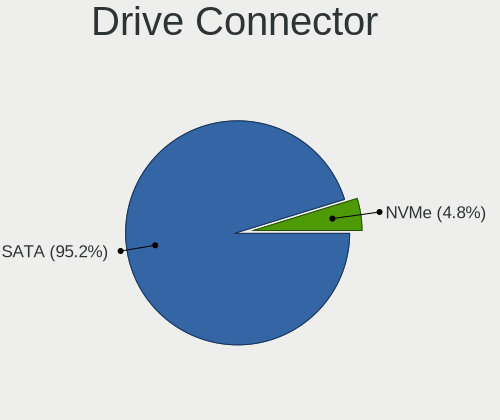
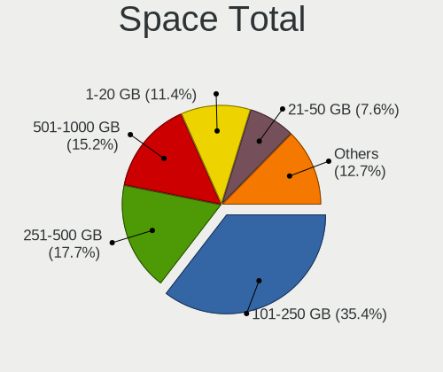
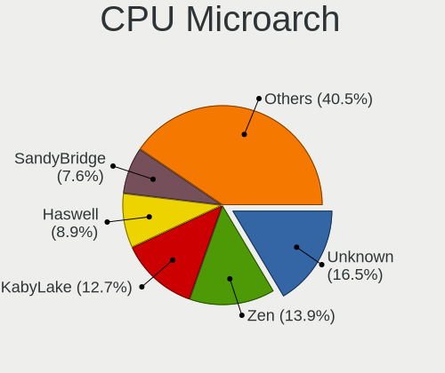
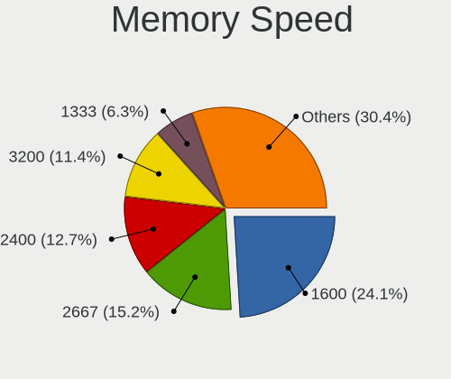

BSD Hardware Trends (Notebook)
------------------------------

A project to identify most popular hardware characteristics and track their change
over time based on data collected by BSD users at https://BSD-Hardware.info.

Anyone can contribute to the study by uploading probes of their computers by
the [hw-probe](https://github.com/linuxhw/hw-probe/blob/master/INSTALL.BSD.md) tool:

    hw-probe -all -upload

Full-feature report is available here: https://bsd-hardware.info/?view=trends&formfactor=notebook

Period: Apr, 2021.

Contents
--------

- [ OS                       ](#os)
- [ OS Family                ](#os-family)
- [ Arch                     ](#arch)
- [ DE                       ](#de)
- [ Display Server           ](#display-server)
- [ Display Manager          ](#display-manager)
- [ OS Lang                  ](#os-lang)
- [ Boot Mode                ](#boot-mode)
- [ Filesystem               ](#filesystem)
- [ Part. scheme             ](#part-scheme)
- [ Country                  ](#country)
- [ City                     ](#city)
- [ Vendor                   ](#vendor)
- [ Model                    ](#model)
- [ Model Family             ](#model-family)
- [ MFG Year                 ](#mfg-year)
- [ Form Factor              ](#form-factor)
- [ Coreboot                 ](#coreboot)
- [ RAM Size                 ](#ram-size)
- [ RAM Used                 ](#ram-used)
- [ Has CD-ROM               ](#has-cd-rom)
- [ Total Drives             ](#total-drives)
- [ Has Ethernet             ](#has-ethernet)
- [ Has WiFi                 ](#has-wifi)
- [ Has Bluetooth            ](#has-bluetooth)
- [ Drive Vendor             ](#drive-vendor)
- [ Drive Model              ](#drive-model)
- [ HDD Vendor               ](#hdd-vendor)
- [ SSD Vendor               ](#ssd-vendor)
- [ Drive Kind               ](#drive-kind)
- [ Drive Connector          ](#drive-connector)
- [ Drive Size               ](#drive-size)
- [ Space Total              ](#space-total)
- [ Space Used               ](#space-used)
- [ Malfunc. Drives          ](#malfunc-drives)
- [ Malfunc. Drive Vendor    ](#malfunc-drive-vendor)
- [ Malfunc. HDD Vendor      ](#malfunc-hdd-vendor)
- [ Malfunc. Drive Kind      ](#malfunc-drive-kind)
- [ Failed Drives            ](#failed-drives)
- [ Failed Drive Vendor      ](#failed-drive-vendor)
- [ Drive Status             ](#drive-status)
- [ Storage Vendor           ](#storage-vendor)
- [ Storage Model            ](#storage-model)
- [ Storage Kind             ](#storage-kind)
- [ CPU Vendor               ](#cpu-vendor)
- [ CPU Model                ](#cpu-model)
- [ CPU Model Family         ](#cpu-model-family)
- [ CPU Cores                ](#cpu-cores)
- [ CPU Sockets              ](#cpu-sockets)
- [ CPU Threads              ](#cpu-threads)
- [ CPU Microarch            ](#cpu-microarch)
- [ GPU Vendor               ](#gpu-vendor)
- [ GPU Model                ](#gpu-model)
- [ GPU Combo                ](#gpu-combo)
- [ GPU Driver               ](#gpu-driver)
- [ GPU Memory               ](#gpu-memory)
- [ Monitor Vendor           ](#monitor-vendor)
- [ Monitor Model            ](#monitor-model)
- [ Monitor Resolution       ](#monitor-resolution)
- [ Monitor Diagonal         ](#monitor-diagonal)
- [ Monitor Width            ](#monitor-width)
- [ Aspect Ratio             ](#aspect-ratio)
- [ Monitor Area             ](#monitor-area)
- [ Pixel Density            ](#pixel-density)
- [ Multiple Monitors        ](#multiple-monitors)
- [ Net Controller Vendor    ](#net-controller-vendor)
- [ Net Controller Model     ](#net-controller-model)
- [ Wireless Vendor          ](#wireless-vendor)
- [ Wireless Model           ](#wireless-model)
- [ Ethernet Vendor          ](#ethernet-vendor)
- [ Ethernet Model           ](#ethernet-model)
- [ Net Controller Kind      ](#net-controller-kind)
- [ Used Controller          ](#used-controller)
- [ NICs                     ](#nics)
- [ IPv6                     ](#ipv6)
- [ Memory Vendor            ](#memory-vendor)
- [ Memory Model             ](#memory-model)
- [ Memory Kind              ](#memory-kind)
- [ Memory Form Factor       ](#memory-form-factor)
- [ Memory Size              ](#memory-size)
- [ Memory Speed             ](#memory-speed)
- [ Sound Vendor             ](#sound-vendor)
- [ Sound Model              ](#sound-model)
- [ Camera Vendor            ](#camera-vendor)
- [ Camera Model             ](#camera-model)
- [ Fingerprint Vendor       ](#fingerprint-vendor)
- [ Fingerprint Model        ](#fingerprint-model)
- [ Chipcard Vendor          ](#chipcard-vendor)
- [ Chipcard Model           ](#chipcard-model)
- [ Printer Vendor           ](#printer-vendor)
- [ Printer Model            ](#printer-model)
- [ Scanner Vendor           ](#scanner-vendor)
- [ Scanner Model            ](#scanner-model)
- [ Bluetooth Vendor         ](#bluetooth-vendor)
- [ Bluetooth Model          ](#bluetooth-model)
- [ Unsupported Devices      ](#unsupported-devices)
- [ Unsupported Device Types ](#unsupported-device-types)

OS
--

Installed operating systems

| Name                 | Notebooks | Percent |
|----------------------|-----------|---------|
| FreeBSD 13.0         | 22        | 28.21%  |
| helloSystem 0.4.0    | 7         | 8.97%   |
| FreeBSD 12.2-p6      | 7         | 8.97%   |
| OPNsense 21.1.4      | 6         | 7.69%   |
| FreeBSD 13.0-RC5     | 5         | 6.41%   |
| NomadBSD 1.4         | 4         | 5.13%   |
| GhostBSD 20.04.02    | 4         | 5.13%   |
| FreeBSD 14.0-CURRENT | 4         | 5.13%   |
| FreeBSD 13.0-STABLE  | 4         | 5.13%   |
| OpenBSD 6.8          | 3         | 3.85%   |
| FreeBSD 12.2-p5      | 3         | 3.85%   |
| OpenBSD 6.9          | 2         | 2.56%   |
| OPNsense 21.1        | 1         | 1.28%   |
| OPNsense 20.7.8      | 1         | 1.28%   |
| NomadBSD 1.3.2       | 1         | 1.28%   |
| FreeBSD 13.0-RC3     | 1         | 1.28%   |
| FreeBSD 12.2-p4      | 1         | 1.28%   |
| FreeBSD 12.2-p2      | 1         | 1.28%   |
| FreeBSD 12.2         | 1         | 1.28%   |

OS Family
---------

OS without a version

| Name        | Notebooks | Percent |
|-------------|-----------|---------|
| FreeBSD     | 49        | 62.82%  |
| OPNsense    | 8         | 10.26%  |
| helloSystem | 7         | 8.97%   |
| OpenBSD     | 5         | 6.41%   |
| NomadBSD    | 5         | 6.41%   |
| GhostBSD    | 4         | 5.13%   |

Arch
----

OS architecture (x86_64, i586, etc.)

| Name  | Notebooks | Percent |
|-------|-----------|---------|
| amd64 | 75        | 96.15%  |
| i386  | 3         | 3.85%   |

DE
--

Desktop Environment

| Name          | Notebooks | Percent |
|---------------|-----------|---------|
| Console       | 14        | 17.95%  |
| KDE5          | 13        | 16.67%  |
| XFCE          | 7         | 8.97%   |
| MATE          | 7         | 8.97%   |
| helloDesktop  | 7         | 8.97%   |
| TWM           | 6         | 7.69%   |
| GNOME         | 5         | 6.41%   |
| fvwm          | 5         | 6.41%   |
| Openbox       | 3         | 3.85%   |
| i3            | 3         | 3.85%   |
| Cinnamon      | 3         | 3.85%   |
| Fluxbox       | 2         | 2.56%   |
| Enlightenment | 1         | 1.28%   |
| CDE           | 1         | 1.28%   |
| AwesomeWM     | 1         | 1.28%   |

Display Server
--------------

X11 or Wayland

| Name    | Notebooks | Percent |
|---------|-----------|---------|
| X11     | 64        | 82.05%  |
| Console | 14        | 17.95%  |

Display Manager
---------------

SDDM, LightDM, etc.

| Name    | Notebooks | Percent |
|---------|-----------|---------|
| Console | 35        | 44.87%  |
| SLiM    | 20        | 25.64%  |
| SDDM    | 13        | 16.67%  |
| LightDM | 6         | 7.69%   |
| XDM     | 2         | 2.56%   |
| GDM     | 2         | 2.56%   |

OS Lang
-------

Language

| Lang             | Notebooks | Percent |
|------------------|-----------|---------|
| C                | 23        | 29.49%  |
| Unknown          | 20        | 25.64%  |
| en_US            | 17        | 21.79%  |
| en_GB            | 5         | 6.41%   |
| nb_NO            | 2         | 2.56%   |
| fr_FR            | 2         | 2.56%   |
| pl_PL            | 1         | 1.28%   |
| it_IT            | 1         | 1.28%   |
| hu_HU.US-ASCII   | 1         | 1.28%   |
| en_US.US-ASCII   | 1         | 1.28%   |
| en_AU            | 1         | 1.28%   |
| de_DE.ISO8859-15 | 1         | 1.28%   |
| de_DE            | 1         | 1.28%   |
| de_CH            | 1         | 1.28%   |
| bg_BG            | 1         | 1.28%   |

Boot Mode
---------

EFI or BIOS

| Mode | Notebooks | Percent |
|------|-----------|---------|
| EFI  | 62        | 79.49%  |
| BIOS | 16        | 20.51%  |

Filesystem
----------

Type of filesystem

| Type | Notebooks | Percent |
|------|-----------|---------|
| Zfs  | 45        | 57.69%  |
| Ufs  | 28        | 35.9%   |
| Ffs  | 5         | 6.41%   |

Part. scheme
------------

Scheme of partitioning

| Type | Notebooks | Percent |
|------|-----------|---------|
| GPT  | 71        | 91.03%  |
| MBR  | 6         | 7.69%   |
| BSD  | 1         | 1.28%   |

Country
-------

Geographic location (country)

| Country     | Notebooks | Percent |
|-------------|-----------|---------|
| USA         | 21        | 26.92%  |
| UK          | 8         | 10.26%  |
| Germany     | 8         | 10.26%  |
| China       | 4         | 5.13%   |
| Japan       | 3         | 3.85%   |
| France      | 3         | 3.85%   |
| Australia   | 3         | 3.85%   |
| Switzerland | 2         | 2.56%   |
| Norway      | 2         | 2.56%   |
| Namibia     | 2         | 2.56%   |
| Bulgaria    | 2         | 2.56%   |
| Brazil      | 2         | 2.56%   |
| UAE         | 1         | 1.28%   |
| Turkey      | 1         | 1.28%   |
| Thailand    | 1         | 1.28%   |
| Russia      | 1         | 1.28%   |
| Portugal    | 1         | 1.28%   |
| Poland      | 1         | 1.28%   |
| New Zealand | 1         | 1.28%   |
| Italy       | 1         | 1.28%   |
| India       | 1         | 1.28%   |
| Hungary     | 1         | 1.28%   |
| Hong Kong   | 1         | 1.28%   |
| Finland     | 1         | 1.28%   |
| Denmark     | 1         | 1.28%   |
| Croatia     | 1         | 1.28%   |
| Colombia    | 1         | 1.28%   |
| Canada      | 1         | 1.28%   |
| Austria     | 1         | 1.28%   |
| Argentina   | 1         | 1.28%   |

City
----

Geographic location (city)

| City                     | Notebooks | Percent |
|--------------------------|-----------|---------|
| Sofia                    | 2         | 2.56%   |
| Glasgow                  | 2         | 2.56%   |
| Brighton                 | 2         | 2.56%   |
| Zurich                   | 1         | 1.28%   |
| Zhengzhou                | 1         | 1.28%   |
| Woking                   | 1         | 1.28%   |
| Wilhelmshaven            | 1         | 1.28%   |
| Waukee                   | 1         | 1.28%   |
| Villeneuve-Saint-Georges | 1         | 1.28%   |
| Teresopolis              | 1         | 1.28%   |
| Temple City              | 1         | 1.28%   |
| Tai Kok Tsui             | 1         | 1.28%   |
| Tahara                   | 1         | 1.28%   |
| São José dos Campos    | 1         | 1.28%   |
| Székesfehérvár        | 1         | 1.28%   |
| Sundebru                 | 1         | 1.28%   |
| Suginami-ku              | 1         | 1.28%   |
| Stuttgart                | 1         | 1.28%   |
| Southampton              | 1         | 1.28%   |
| Solbergelva              | 1         | 1.28%   |
| Slavonski Brod           | 1         | 1.28%   |
| Sierra Madre             | 1         | 1.28%   |
| Salem                    | 1         | 1.28%   |
| Rodgau                   | 1         | 1.28%   |
| Rionegro                 | 1         | 1.28%   |
| Parndorf                 | 1         | 1.28%   |
| Otjiwarongo              | 1         | 1.28%   |
| Oshakati                 | 1         | 1.28%   |
| Okayama                  | 1         | 1.28%   |
| New York                 | 1         | 1.28%   |
| New Delhi                | 1         | 1.28%   |
| Moses Lake               | 1         | 1.28%   |
| Montserrat               | 1         | 1.28%   |
| Moneta                   | 1         | 1.28%   |
| Milan                    | 1         | 1.28%   |
| Midvale                  | 1         | 1.28%   |
| Markt Indersdorf         | 1         | 1.28%   |
| Lübeck                  | 1         | 1.28%   |
| Los Altos                | 1         | 1.28%   |
| Lloydminster             | 1         | 1.28%   |
| Lexington                | 1         | 1.28%   |
| Leicester                | 1         | 1.28%   |
| Lahti                    | 1         | 1.28%   |
| Klobuck                  | 1         | 1.28%   |
| Kez                      | 1         | 1.28%   |
| Indio                    | 1         | 1.28%   |
| Harrison                 | 1         | 1.28%   |
| Guangzhou                | 1         | 1.28%   |
| Fruitland                | 1         | 1.28%   |
| Frederick                | 1         | 1.28%   |
| Frankfurt am Main        | 1         | 1.28%   |
| Fontenay-sous-Bois       | 1         | 1.28%   |
| Farnham                  | 1         | 1.28%   |
| Estoril                  | 1         | 1.28%   |
| Eichenau                 | 1         | 1.28%   |
| Dubai                    | 1         | 1.28%   |
| Copenhagen               | 1         | 1.28%   |
| Clermont                 | 1         | 1.28%   |
| Christchurch             | 1         | 1.28%   |
| Chicago                  | 1         | 1.28%   |

Vendor
------

Motherboard manufacturer

| Name                | Notebooks | Percent |
|---------------------|-----------|---------|
| Lenovo              | 25        | 32.05%  |
| Dell                | 20        | 25.64%  |
| Hewlett-Packard     | 8         | 10.26%  |
| ASUSTek Computer    | 3         | 3.85%   |
| Acer                | 3         | 3.85%   |
| Toshiba             | 2         | 2.56%   |
| Samsung Electronics | 2         | 2.56%   |
| Deciso              | 2         | 2.56%   |
| Apple               | 2         | 2.56%   |
| System76            | 1         | 1.28%   |
| Sony                | 1         | 1.28%   |
| Pegatron            | 1         | 1.28%   |
| Panasonic           | 1         | 1.28%   |
| Notebook            | 1         | 1.28%   |
| HUAWEI              | 1         | 1.28%   |
| Gateway             | 1         | 1.28%   |
| CompuLab            | 1         | 1.28%   |
| Clevo               | 1         | 1.28%   |
| Alienware           | 1         | 1.28%   |
| Unknown             | 1         | 1.28%   |

Model
-----

Motherboard model

| Name                                     | Notebooks | Percent |
|------------------------------------------|-----------|---------|
| Lenovo ThinkPad E490 20N8CTO1WW          | 2         | 2.56%   |
| Dell Latitude E5420                      | 2         | 2.56%   |
| Dell Inspiron 3793                       | 2         | 2.56%   |
| Deciso Netboard A20                      | 2         | 2.56%   |
| Apple MacBookPro8,1                      | 2         | 2.56%   |
| Toshiba Satellite L50-C                  | 1         | 1.28%   |
| Toshiba Satellite C655D                  | 1         | 1.28%   |
| System76 Lemur Pro                       | 1         | 1.28%   |
| Sony VGN-FW290J                          | 1         | 1.28%   |
| Samsung NC10                             | 1         | 1.28%   |
| Samsung 3570R/370R/470R/450R/510R/4450RV | 1         | 1.28%   |
| Pegatron T12Ah                           | 1         | 1.28%   |
| Panasonic CF-NX1GDHYS                    | 1         | 1.28%   |
| Notebook W65KJ1_KK1                      | 1         | 1.28%   |
| Lenovo ThinkPad X270 20HMS0NS00          | 1         | 1.28%   |
| Lenovo ThinkPad X270 20HMCTO1WW          | 1         | 1.28%   |
| Lenovo ThinkPad X250 20CLS1LC13          | 1         | 1.28%   |
| Lenovo ThinkPad X220 4290NE3             | 1         | 1.28%   |
| Lenovo ThinkPad X201 Tablet 2985F4U      | 1         | 1.28%   |
| Lenovo ThinkPad X1 Carbon 5th 20HQS1QC00 | 1         | 1.28%   |
| Lenovo ThinkPad X1 Carbon 4th 20FB001XAU | 1         | 1.28%   |
| Lenovo ThinkPad W541 20EGS04800          | 1         | 1.28%   |
| Lenovo ThinkPad T590 20N4CTO1WW          | 1         | 1.28%   |
| Lenovo ThinkPad T430 23495P8             | 1         | 1.28%   |
| Lenovo ThinkPad T430 2344C4U             | 1         | 1.28%   |
| Lenovo ThinkPad T420 4236NUG             | 1         | 1.28%   |
| Lenovo ThinkPad T400 7417TPU             | 1         | 1.28%   |
| Lenovo ThinkPad T14 Gen 1 20S1S07800     | 1         | 1.28%   |
| Lenovo ThinkPad S1 Yoga 20C0S0M300       | 1         | 1.28%   |
| Lenovo ThinkPad P52 20M9CTO1WW           | 1         | 1.28%   |
| Lenovo ThinkPad P14s Gen 1 20Y1CTO1WW    | 1         | 1.28%   |
| Lenovo ThinkPad L15 Gen 1 20U3CTO1WW     | 1         | 1.28%   |
| Lenovo ThinkPad Edge E320 1298RJ1        | 1         | 1.28%   |
| Lenovo ThinkPad E490 20N9001SBR          | 1         | 1.28%   |
| Lenovo ThinkPad E14 20RAS0F600           | 1         | 1.28%   |
| Lenovo ThinkPad A485 20MUS07E00          | 1         | 1.28%   |
| Lenovo IdeaPad Y700-15ISK 80NV           | 1         | 1.28%   |
| HUAWEI HN-WX9X                           | 1         | 1.28%   |
| HP ProBook 4530s                         | 1         | 1.28%   |
| HP Laptop 17-by0xxx                      | 1         | 1.28%   |
| HP Laptop 15-da0xxx                      | 1         | 1.28%   |
| HP EliteBook Folio 9470m                 | 1         | 1.28%   |
| HP EliteBook 8570p                       | 1         | 1.28%   |
| HP EliteBook 840 G3                      | 1         | 1.28%   |
| HP EliteBook 2570p                       | 1         | 1.28%   |
| HP Compaq Presario CQ71                  | 1         | 1.28%   |
| Gateway NE56R                            | 1         | 1.28%   |
| Dell XPS 13 9360                         | 1         | 1.28%   |
| Dell Precision 5520                      | 1         | 1.28%   |
| Dell Precision 5510                      | 1         | 1.28%   |
| Dell Latitude E7440                      | 1         | 1.28%   |
| Dell Latitude E7240                      | 1         | 1.28%   |
| Dell Latitude E6440                      | 1         | 1.28%   |
| Dell Latitude E6430s                     | 1         | 1.28%   |
| Dell Latitude E5570                      | 1         | 1.28%   |
| Dell Latitude E5470                      | 1         | 1.28%   |
| Dell Latitude D610                       | 1         | 1.28%   |
| Dell Latitude 5580                       | 1         | 1.28%   |
| Dell Latitude 3440                       | 1         | 1.28%   |
| Dell Inspiron N5050                      | 1         | 1.28%   |

Model Family
------------

Motherboard model prefix

| Name                  | Notebooks | Percent |
|-----------------------|-----------|---------|
| Lenovo ThinkPad       | 24        | 30.77%  |
| Dell Latitude         | 11        | 14.1%   |
| Dell Inspiron         | 5         | 6.41%   |
| HP EliteBook          | 4         | 5.13%   |
| Toshiba Satellite     | 2         | 2.56%   |
| HP Laptop             | 2         | 2.56%   |
| Dell Precision        | 2         | 2.56%   |
| Deciso Netboard       | 2         | 2.56%   |
| Apple MacBookPro8     | 2         | 2.56%   |
| Acer Aspire           | 2         | 2.56%   |
| System76 Lemur        | 1         | 1.28%   |
| Sony VGN-FW290J       | 1         | 1.28%   |
| Samsung NC10          | 1         | 1.28%   |
| Samsung 3570R         | 1         | 1.28%   |
| Pegatron T12Ah        | 1         | 1.28%   |
| Panasonic CF-NX1GDHYS | 1         | 1.28%   |
| Notebook W65KJ1       | 1         | 1.28%   |
| Lenovo IdeaPad        | 1         | 1.28%   |
| HUAWEI HN-WX9X        | 1         | 1.28%   |
| HP ProBook            | 1         | 1.28%   |
| HP Compaq             | 1         | 1.28%   |
| Gateway NE56R         | 1         | 1.28%   |
| Dell XPS              | 1         | 1.28%   |
| Dell G5               | 1         | 1.28%   |
| CompuLab fit-PC4      | 1         | 1.28%   |
| Clevo W55xEU          | 1         | 1.28%   |
| ASUS UX430UNR         | 1         | 1.28%   |
| ASUS TP500LNG         | 1         | 1.28%   |
| ASUS Q500A            | 1         | 1.28%   |
| Alienware M15x        | 1         | 1.28%   |
| Acer Extensa          | 1         | 1.28%   |
| Unknown               | 1         | 1.28%   |

MFG Year
--------

Motherboard manufacture year

| Year | Notebooks | Percent |
|------|-----------|---------|
| 2020 | 19        | 24.36%  |
| 2019 | 15        | 19.23%  |
| 2018 | 6         | 7.69%   |
| 2016 | 5         | 6.41%   |
| 2014 | 5         | 6.41%   |
| 2012 | 5         | 6.41%   |
| 2013 | 4         | 5.13%   |
| 2010 | 4         | 5.13%   |
| 2021 | 3         | 3.85%   |
| 2011 | 3         | 3.85%   |
| 2017 | 2         | 2.56%   |
| 2015 | 2         | 2.56%   |
| 2009 | 2         | 2.56%   |
| 2008 | 2         | 2.56%   |
| 2005 | 1         | 1.28%   |

Form Factor
-----------

Physical design of the computer

| Name     | Notebooks | Percent |
|----------|-----------|---------|
| Notebook | 78        | 100%    |

Coreboot
--------

Have coreboot on board

| Used | Notebooks | Percent |
|------|-----------|---------|
| No   | 77        | 98.72%  |
| Yes  | 1         | 1.28%   |

RAM Size
--------

Total RAM memory

| Size in GB | Notebooks | Percent |
|------------|-----------|---------|
| 8.01-16.0  | 27        | 34.62%  |
| 16.01-24.0 | 23        | 29.49%  |
| 4.01-8.0   | 15        | 19.23%  |
| 32.01-64.0 | 5         | 6.41%   |
| 24.01-32.0 | 3         | 3.85%   |
| 2.01-3.0   | 3         | 3.85%   |
| 3.01-4.0   | 2         | 2.56%   |

RAM Used
--------

Used RAM memory

| Used GB  | Notebooks | Percent |
|----------|-----------|---------|
| 0.01-0.5 | 37        | 47.44%  |
| 0.51-1.0 | 30        | 38.46%  |
| 1.01-2.0 | 9         | 11.54%  |
| 4.01-8.0 | 1         | 1.28%   |
| 2.01-3.0 | 1         | 1.28%   |

Has CD-ROM
----------

Has CD-ROM on board

| Presented | Notebooks | Percent |
|-----------|-----------|---------|
| No        | 53        | 67.95%  |
| Yes       | 25        | 32.05%  |

Total Drives
------------

Number of drives on board

| Drives | Notebooks | Percent |
|--------|-----------|---------|
| 1      | 60        | 76.92%  |
| 2      | 16        | 20.51%  |
| 3      | 2         | 2.56%   |

Has Ethernet
------------

Has Ethernet on board

| Presented | Notebooks | Percent |
|-----------|-----------|---------|
| Yes       | 70        | 89.74%  |
| No        | 8         | 10.26%  |

Has WiFi
--------

Has WiFi module

| Presented | Notebooks | Percent |
|-----------|-----------|---------|
| Yes       | 72        | 92.31%  |
| No        | 6         | 7.69%   |

Has Bluetooth
-------------

Has Bluetooth module

| Presented | Notebooks | Percent |
|-----------|-----------|---------|
| Yes       | 50        | 64.1%   |
| No        | 28        | 35.9%   |

Drive Vendor
------------

Hard drive vendors

| Vendor              | Notebooks | Drives | Percent |
|---------------------|-----------|--------|---------|
| Samsung Electronics | 20        | 22     | 21.28%  |
| Toshiba             | 9         | 9      | 9.57%   |
| Seagate             | 9         | 9      | 9.57%   |
| WDC                 | 8         | 10     | 8.51%   |
| Crucial             | 7         | 7      | 7.45%   |
| SanDisk             | 5         | 5      | 5.32%   |
| Transcend           | 3         | 3      | 3.19%   |
| SK Hynix            | 3         | 3      | 3.19%   |
| NVMe                | 3         | 3      | 3.19%   |
| Kingston            | 3         | 3      | 3.19%   |
| Intel               | 3         | 3      | 3.19%   |
| Hitachi             | 3         | 3      | 3.19%   |
| Corsair             | 3         | 3      | 3.19%   |
| PNY                 | 2         | 2      | 2.13%   |
| HGST                | 2         | 2      | 2.13%   |
| Solid State Storage | 1         | 1      | 1.06%   |
| Phison              | 1         | 1      | 1.06%   |
| Patriot             | 1         | 1      | 1.06%   |
| LITEONIT            | 1         | 1      | 1.06%   |
| LITEON              | 1         | 1      | 1.06%   |
| KingSpec            | 1         | 1      | 1.06%   |
| Hewlett-Packard     | 1         | 1      | 1.06%   |
| Fujitsu             | 1         | 1      | 1.06%   |
| Colorful            | 1         | 1      | 1.06%   |
| China               | 1         | 1      | 1.06%   |
| Apple               | 1         | 1      | 1.06%   |

Drive Model
-----------

Hard drive models

| Model                                              | Notebooks | Percent |
|----------------------------------------------------|-----------|---------|
| Seagate ST1000LM035-1RK172 1TB                     | 3         | 3.09%   |
| Transcend TS256GMTS952T2 256GB                     | 2         | 2.06%   |
| Toshiba KXG50ZNV256G NVMe 256GB                    | 2         | 2.06%   |
| SanDisk SSD PLUS 240GB                             | 2         | 2.06%   |
| Samsung SSD 860 EVO 500GB                          | 2         | 2.06%   |
| Samsung SSD 850 PRO 512GB                          | 2         | 2.06%   |
| Kingston SA400S37480G 480GB                        | 2         | 2.06%   |
| Crucial CT500MX500SSD1 500GB                       | 2         | 2.06%   |
| WDC WDS480G2G0A-00JH30 480GB                       | 1         | 1.03%   |
| WDC WD7500BPVT-80HXZT3 752GB                       | 1         | 1.03%   |
| WDC WD5000LPCX-00VHAT0 500GB                       | 1         | 1.03%   |
| WDC WD3200BPVT-75ZEST0 320GB                       | 1         | 1.03%   |
| WDC WD30EZRX-00MMMB0 3TB                           | 1         | 1.03%   |
| WDC WD1600BEVT-22ZCT0 160GB                        | 1         | 1.03%   |
| WDC WD10SPZX-08Z10 1TB                             | 1         | 1.03%   |
| WDC WD10SDRW-34A0XS0 1TB                           | 1         | 1.03%   |
| WDC WD10JPVX-22JC3T0 1TB                           | 1         | 1.03%   |
| Transcend TS120GMTS420S 120GB                      | 1         | 1.03%   |
| Toshiba MQ01ACF050 500GB                           | 1         | 1.03%   |
| Toshiba MQ01ABF050 500GB                           | 1         | 1.03%   |
| Toshiba MQ01ABF032 320GB                           | 1         | 1.03%   |
| Toshiba MK5061GSYN 500GB                           | 1         | 1.03%   |
| Toshiba MK4032GAX 40GB                             | 1         | 1.03%   |
| Toshiba MK3265GSXN 320GB                           | 1         | 1.03%   |
| Toshiba KBG30ZMT512G 512GB                         | 1         | 1.03%   |
| Solid State Storage CL1-3D128-Q11 NVMe SSSTC 128GB | 1         | 1.03%   |
| SK Hynix SC300 M.2 2280 128GB                      | 1         | 1.03%   |
| SK Hynix PC300 HFS512GD9MND-5510A 512GB            | 1         | 1.03%   |
| SK Hynix BC501 NVMe 512GB                          | 1         | 1.03%   |
| Seagate ST9500420AS 500GB                          | 1         | 1.03%   |
| Seagate ST320LT007-9ZV142 320GB                    | 1         | 1.03%   |
| Seagate ST2000LM007-1R8174 2TB                     | 1         | 1.03%   |
| Seagate ST1000LM024 HN-M101MBB 1TB                 | 1         | 1.03%   |
| Seagate ST1000LM014-1EJ164 1TB                     | 1         | 1.03%   |
| Seagate ST1000DM010-2EP102 1TB                     | 1         | 1.03%   |
| SanDisk SDSSDA120G 120GB                           | 1         | 1.03%   |
| SanDisk SD8SBAT128G1122 128GB                      | 1         | 1.03%   |
| SanDisk pSSD 64GB                                  | 1         | 1.03%   |
| Samsung SSD PM851 mSATA 256GB                      | 1         | 1.03%   |
| Samsung SSD PM841 2.5-inch 7mm 256GB               | 1         | 1.03%   |
| Samsung SSD 970 EVO Plus 2TB                       | 1         | 1.03%   |
| Samsung SSD 970 EVO Plus 250GB                     | 1         | 1.03%   |
| Samsung SSD 970 EVO 500GB                          | 1         | 1.03%   |
| Samsung SSD 970 EVO 1TB                            | 1         | 1.03%   |
| Samsung SSD 860 QVO 1TB                            | 1         | 1.03%   |
| Samsung SSD 860 EVO 250GB                          | 1         | 1.03%   |
| Samsung SSD 860 EVO 1TB                            | 1         | 1.03%   |
| Samsung SSD 850 EVO 500GB                          | 1         | 1.03%   |
| Samsung SSD 850 EVO 250GB                          | 1         | 1.03%   |
| Samsung SSD 750 EVO 120GB                          | 1         | 1.03%   |
| Samsung MZVLW256HEHP-000L7 256GB                   | 1         | 1.03%   |
| Samsung MZVLB512HBJQ-000L7 512GB                   | 1         | 1.03%   |
| Samsung MZVLB256HAHQ-00000 256GB                   | 1         | 1.03%   |
| Samsung MZNLN256HCHP-000L7 256GB                   | 1         | 1.03%   |
| Samsung MZALQ128HBHQ-000L1 128GB                   | 1         | 1.03%   |
| Samsung MZ7TD128HAFV-000L1 128GB                   | 1         | 1.03%   |
| PNY SSD2SC240G5LC709B121-511 240GB                 | 1         | 1.03%   |
| PNY CS3030 1TB SSD                                 | 1         | 1.03%   |
| Phison PCIe SSD 2TB                                | 1         | 1.03%   |
| Patriot Burst 120GB                                | 1         | 1.03%   |

HDD Vendor
----------

Hard disk drive vendors

| Vendor  | Notebooks | Drives | Percent |
|---------|-----------|--------|---------|
| Seagate | 9         | 9      | 30%     |
| WDC     | 7         | 9      | 23.33%  |
| Toshiba | 6         | 6      | 20%     |
| Hitachi | 3         | 3      | 10%     |
| NVMe    | 2         | 2      | 6.67%   |
| HGST    | 2         | 2      | 6.67%   |
| Fujitsu | 1         | 1      | 3.33%   |

SSD Vendor
----------

Solid state drive vendors

| Vendor              | Notebooks | Drives | Percent |
|---------------------|-----------|--------|---------|
| Samsung Electronics | 13        | 14     | 27.66%  |
| Crucial             | 7         | 7      | 14.89%  |
| SanDisk             | 5         | 5      | 10.64%  |
| Transcend           | 3         | 3      | 6.38%   |
| Kingston            | 3         | 3      | 6.38%   |
| Corsair             | 3         | 3      | 6.38%   |
| Intel               | 2         | 2      | 4.26%   |
| WDC                 | 1         | 1      | 2.13%   |
| SK Hynix            | 1         | 1      | 2.13%   |
| PNY                 | 1         | 1      | 2.13%   |
| Patriot             | 1         | 1      | 2.13%   |
| NVMe                | 1         | 1      | 2.13%   |
| LITEONIT            | 1         | 1      | 2.13%   |
| LITEON              | 1         | 1      | 2.13%   |
| KingSpec            | 1         | 1      | 2.13%   |
| Hewlett-Packard     | 1         | 1      | 2.13%   |
| China               | 1         | 1      | 2.13%   |
| Apple               | 1         | 1      | 2.13%   |

Drive Kind
----------

HDD or SSD

| Kind | Notebooks | Drives | Percent |
|------|-----------|--------|---------|
| SSD  | 43        | 48     | 48.86%  |
| HDD  | 28        | 32     | 31.82%  |
| NVMe | 17        | 18     | 19.32%  |

Drive Connector
---------------

SATA, SAS, NVMe, etc.

| Type | Notebooks | Drives | Percent |
|------|-----------|--------|---------|
| SATA | 66        | 80     | 79.52%  |
| NVMe | 17        | 18     | 20.48%  |

Drive Size
----------

Size of hard drive

| Size in TB | Notebooks | Drives | Percent |
|------------|-----------|--------|---------|
| 0.01-0.5   | 49        | 57     | 70%     |
| 0.51-1.0   | 17        | 19     | 24.29%  |
| 1.01-2.0   | 3         | 3      | 4.29%   |
| 2.01-3.0   | 1         | 1      | 1.43%   |

Space Total
-----------

Amount of disk space available on the file system

| Size in GB | Notebooks | Percent |
|------------|-----------|---------|
| 251-500    | 29        | 37.18%  |
| 101-250    | 19        | 24.36%  |
| 501-1000   | 9         | 11.54%  |
| 1-20       | 8         | 10.26%  |
| 51-100     | 7         | 8.97%   |
| 21-50      | 4         | 5.13%   |
| 1001-2000  | 1         | 1.28%   |
| Unknown    | 1         | 1.28%   |

Space Used
----------

Amount of used disk space

| Used GB | Notebooks | Percent |
|---------|-----------|---------|
| 1-20    | 61        | 78.21%  |
| 51-100  | 8         | 10.26%  |
| 21-50   | 4         | 5.13%   |
| 101-250 | 3         | 3.85%   |
| 251-500 | 1         | 1.28%   |
| Unknown | 1         | 1.28%   |

Malfunc. Drives
---------------

Drive models with a malfunction

| Model                                            | Notebooks | Drives | Percent |
|--------------------------------------------------|-----------|--------|---------|
| WDC WD7500BPVT-80HXZT3 752GB                     | 1         | 1      | 9.09%   |
| WDC WD3200BPVT-75ZEST0 320GB                     | 1         | 1      | 9.09%   |
| Toshiba MK5061GSYN 500GB                         | 1         | 1      | 9.09%   |
| Toshiba MK3265GSXN 320GB                         | 1         | 1      | 9.09%   |
| Samsung Electronics SSD PM841 2.5-inch 7mm 256GB | 1         | 1      | 9.09%   |
| Intel SSDSCKKF256G8H 256GB                       | 1         | 1      | 9.09%   |
| Hitachi HTS545032B9A302 320GB                    | 1         | 1      | 9.09%   |
| Hitachi HTS545032B9A300 320GB                    | 1         | 1      | 9.09%   |
| HGST HTS725050A7E630 500GB                       | 1         | 1      | 9.09%   |
| Corsair Neutron GTX SSD 120GB                    | 1         | 1      | 9.09%   |
| Corsair CSSD-F80GBP2 90GB                        | 1         | 1      | 9.09%   |

Malfunc. Drive Vendor
---------------------

Vendors of faulty drives

| Vendor              | Notebooks | Drives | Percent |
|---------------------|-----------|--------|---------|
| WDC                 | 2         | 2      | 18.18%  |
| Toshiba             | 2         | 2      | 18.18%  |
| Hitachi             | 2         | 2      | 18.18%  |
| Corsair             | 2         | 2      | 18.18%  |
| Samsung Electronics | 1         | 1      | 9.09%   |
| Intel               | 1         | 1      | 9.09%   |
| HGST                | 1         | 1      | 9.09%   |

Malfunc. HDD Vendor
-------------------

Vendors of faulty HDD drives

| Vendor  | Notebooks | Drives | Percent |
|---------|-----------|--------|---------|
| WDC     | 2         | 2      | 28.57%  |
| Toshiba | 2         | 2      | 28.57%  |
| Hitachi | 2         | 2      | 28.57%  |
| HGST    | 1         | 1      | 14.29%  |

Malfunc. Drive Kind
-------------------

Kinds of faulty drives

| Kind | Notebooks | Drives | Percent |
|------|-----------|--------|---------|
| HDD  | 7         | 7      | 63.64%  |
| SSD  | 4         | 4      | 36.36%  |

Failed Drives
-------------

Failed drive models

Zero info for selected period =(

Failed Drive Vendor
-------------------

Failed drive vendors

Zero info for selected period =(

Drive Status
------------

Number of failed and malfunc. drives

| Status   | Notebooks | Drives | Percent |
|----------|-----------|--------|---------|
| Works    | 67        | 83     | 81.71%  |
| Malfunc  | 11        | 11     | 13.41%  |
| Detected | 4         | 4      | 4.88%   |

Storage Vendor
--------------

Storage controller vendors

| Vendor                         | Notebooks | Percent |
|--------------------------------|-----------|---------|
| Intel                          | 62        | 70.45%  |
| Samsung Electronics            | 11        | 12.5%   |
| AMD                            | 7         | 7.95%   |
| Toshiba                        | 3         | 3.41%   |
| Phison Electronics             | 2         | 2.27%   |
| Solid State Storage Technology | 1         | 1.14%   |
| SK Hynix                       | 1         | 1.14%   |
| Silicon Motion                 | 1         | 1.14%   |

Storage Model
-------------

Storage controller models

| Model                                                                            | Notebooks | Percent |
|----------------------------------------------------------------------------------|-----------|---------|
| Intel 6 Series/C200 Series Chipset Family 6 port Mobile SATA AHCI Controller     | 11        | 11.96%  |
| Intel 7 Series Chipset Family 6-port SATA Controller [AHCI mode]                 | 8         | 8.7%    |
| Samsung NVMe SSD Controller SM981/PM981/PM983                                    | 7         | 7.61%   |
| Intel Sunrise Point-LP SATA Controller [AHCI mode]                               | 7         | 7.61%   |
| Intel 82801 Mobile SATA Controller [RAID mode]                                   | 7         | 7.61%   |
| AMD FCH SATA Controller [AHCI mode]                                              | 6         | 6.52%   |
| Intel Q170/Q150/B150/H170/H110/Z170/CM236 Chipset SATA Controller [AHCI Mode]    | 3         | 3.26%   |
| Intel 82801IBM/IEM (ICH9M/ICH9M-E) 4 port SATA Controller [AHCI mode]            | 3         | 3.26%   |
| Intel 8 Series SATA Controller 1 [AHCI mode]                                     | 3         | 3.26%   |
| Toshiba unknown                                                                  | 2         | 2.17%   |
| Samsung NVMe SSD Controller SM961/PM961/SM963                                    | 2         | 2.17%   |
| Phison E12 NVMe Controller                                                       | 2         | 2.17%   |
| Intel Comet Lake SATA AHCI Controller                                            | 2         | 2.17%   |
| Intel Cannon Point-LP SATA Controller [AHCI Mode]                                | 2         | 2.17%   |
| Intel 8 Series/C220 Series Chipset Family 6-port SATA Controller 1 [AHCI mode]   | 2         | 2.17%   |
| Intel 7 Series Chipset Family 4-port SATA Controller [IDE mode]                  | 2         | 2.17%   |
| Intel 7 Series Chipset Family 2-port SATA Controller [IDE mode]                  | 2         | 2.17%   |
| Intel 5 Series/3400 Series Chipset 4 port SATA IDE Controller                    | 2         | 2.17%   |
| Intel 5 Series/3400 Series Chipset 2 port SATA IDE Controller                    | 2         | 2.17%   |
| Toshiba BG3 NVMe SSD Controller                                                  | 1         | 1.09%   |
| SK Hynix PC300 NVMe Solid State Drive 512GB                                      | 1         | 1.09%   |
| Silicon Motion SM2263EN/SM2263XT SSD Controller                                  | 1         | 1.09%   |
| Samsung SM951 AHCI                                                               | 1         | 1.09%   |
| Samsung NVMe Controller                                                          | 1         | 1.09%   |
| Intel Wildcat Point-LP SATA Controller [AHCI Mode]                               | 1         | 1.09%   |
| Intel SSD Pro 7600p/760p/E 6100p Series                                          | 1         | 1.09%   |
| Intel Ice Lake-LP SATA Controller [AHCI mode]                                    | 1         | 1.09%   |
| Intel HM170/QM170 Chipset SATA Controller [AHCI Mode]                            | 1         | 1.09%   |
| Intel Cannon Lake Mobile PCH SATA AHCI Controller                                | 1         | 1.09%   |
| Intel Atom/Celeron/Pentium Processor x5-E8000/J3xxx/N3xxx Series SATA Controller | 1         | 1.09%   |
| Intel 82801IBM/IEM (ICH9M/ICH9M-E) 2 port SATA Controller [IDE mode]             | 1         | 1.09%   |
| Intel 82801GBM/GHM (ICH7-M Family) SATA Controller [IDE mode]                    | 1         | 1.09%   |
| Intel 82801FBM (ICH6M) SATA Controller                                           | 1         | 1.09%   |
| Intel 5 Series/3400 Series Chipset 6 port SATA AHCI Controller                   | 1         | 1.09%   |
| AMD SB7x0/SB8x0/SB9x0 SATA Controller [AHCI mode]                                | 1         | 1.09%   |
| Unknown                                                                          | 1         | 1.09%   |

Storage Kind
------------

Kind of storage controller (IDE, SATA, NVMe, SAS, ...)

| Kind | Notebooks | Percent |
|------|-----------|---------|
| SATA | 54        | 62.07%  |
| NVMe | 19        | 21.84%  |
| RAID | 7         | 8.05%   |
| IDE  | 7         | 8.05%   |

CPU Vendor
----------

Processor vendors

| Vendor | Notebooks | Percent |
|--------|-----------|---------|
| Intel  | 69        | 88.46%  |
| AMD    | 9         | 11.54%  |

CPU Model
---------

Processor models

| Model                                           | Notebooks | Percent |
|-------------------------------------------------|-----------|---------|
| Intel Core i7-8565U CPU @ 1.80GHz               | 3         | 3.85%   |
| Intel Core i7-8550U CPU @ 1.80GHz               | 3         | 3.85%   |
| Intel Core i5-10210U CPU @ 1.60GHz              | 3         | 3.85%   |
| Intel CPU Version                               | 2         | 2.56%   |
| Intel Core i7-1065G7 CPU @ 1.30GHz              | 2         | 2.56%   |
| Intel Core i5-7200U CPU @ 2.50GHz               | 2         | 2.56%   |
| Intel Core i5-6200U CPU @ 2.30GHz               | 2         | 2.56%   |
| Intel Core i5-3230M CPU @ 2.60GHz               | 2         | 2.56%   |
| Intel Core i5-2520M CPU @ 2.50GHz               | 2         | 2.56%   |
| AMD EPYC 3101 4-Core Processor                  | 2         | 2.56%   |
| Intel Pentium M                                 | 1         | 1.28%   |
| Intel Pentium CPU N3700 @ 1.60GHz               | 1         | 1.28%   |
| Intel Pentium CPU G4600 @ 3.60GHz               | 1         | 1.28%   |
| Intel Genuine CPU                               | 1         | 1.28%   |
| Intel Core i7-9750H CPU @ 2.60GHz               | 1         | 1.28%   |
| Intel Core i7-8750H CPU @ 2.20GHz               | 1         | 1.28%   |
| Intel Core i7-7820HQ CPU @ 2.90GHz              | 1         | 1.28%   |
| Intel Core i7-7600U CPU @ 2.80GHz               | 1         | 1.28%   |
| Intel Core i7-6700HQ CPU @ 2.60GHz              | 1         | 1.28%   |
| Intel Core i7-6600U CPU @ 2.60GHz               | 1         | 1.28%   |
| Intel Core i7-4900MQ CPU @ 2.80GHz              | 1         | 1.28%   |
| Intel Core i7-4770HQ CPU @ 2.20GHz              | 1         | 1.28%   |
| Intel Core i7-4600U CPU @ 2.10GHz               | 1         | 1.28%   |
| Intel Core i7-4510U CPU @ 2.00GHz               | 1         | 1.28%   |
| Intel Core i7-3740QM CPU @ 2.70GHz              | 1         | 1.28%   |
| Intel Core i7-3687U CPU @ 2.10GHz               | 1         | 1.28%   |
| Intel Core i7-3632QM CPU @ 2.20GHz              | 1         | 1.28%   |
| Intel Core i7-3540M CPU @ 3.00GHz               | 1         | 1.28%   |
| Intel Core i7-3520M CPU @ 2.90GHz               | 1         | 1.28%   |
| Intel Core i7-2640M CPU @ 2.80GHz               | 1         | 1.28%   |
| Intel Core i7-10510U CPU @ 1.80GHz              | 1         | 1.28%   |
| Intel Core i7 CPU L 620 @ 2.00GHz               | 1         | 1.28%   |
| Intel Core i5-8265U CPU @ 1.60GHz               | 1         | 1.28%   |
| Intel Core i5-8250U CPU @ 1.60GHz               | 1         | 1.28%   |
| Intel Core i5-7300U CPU @ 2.60GHz               | 1         | 1.28%   |
| Intel Core i5-6440HQ CPU @ 2.60GHz              | 1         | 1.28%   |
| Intel Core i5-6300U CPU @ 2.40GHz               | 1         | 1.28%   |
| Intel Core i5-5300U CPU @ 2.30GHz               | 1         | 1.28%   |
| Intel Core i5-4300U CPU @ 1.90GHz               | 1         | 1.28%   |
| Intel Core i5-4300M CPU @ 2.60GHz               | 1         | 1.28%   |
| Intel Core i5-4210U CPU @ 1.70GHz               | 1         | 1.28%   |
| Intel Core i5-4200U CPU @ 1.60GHz               | 1         | 1.28%   |
| Intel Core i5-3320M CPU @ 2.60GHz               | 1         | 1.28%   |
| Intel Core i5-3210M CPU @ 2.50GHz               | 1         | 1.28%   |
| Intel Core i5-2540M CPU @ 2.60GHz               | 1         | 1.28%   |
| Intel Core i5-2520M CPU @ 2.50GH                | 1         | 1.28%   |
| Intel Core i5-2450M CPU @ 2.50GHz               | 1         | 1.28%   |
| Intel Core i5-2430M CPU @ 2.40GH                | 1         | 1.28%   |
| Intel Core i3-6006U CPU @ 2.00GHz               | 1         | 1.28%   |
| Intel Core i3-3227U CPU @ 1.90GHz               | 1         | 1.28%   |
| Intel Core i3-2350M CPU @ 2.30GHz               | 1         | 1.28%   |
| Intel Core i3-2330M CPU @ 2.20GHz               | 1         | 1.28%   |
| Intel Core i3-2310M CPU @ 2.10GHz               | 1         | 1.28%   |
| Intel Core 2 Duo CPU T6600 @ 2.20GHz            | 1         | 1.28%   |
| Intel Core 2 Duo CPU T5850 @ 2.16GHz            | 1         | 1.28%   |
| Intel Core 2 Duo CPU P8700 @ 2.53GHz            | 1         | 1.28%   |
| Intel Core 2 Duo CPU P8400 @ 2.26GHz            | 1         | 1.28%   |
| Intel Celeron CPU B830 @ 1.80GHz                | 1         | 1.28%   |
| AMD Ryzen 7 PRO 4750U with Radeon Graphics      | 1         | 1.28%   |
| AMD Ryzen 7 PRO 2700U w/ Radeon Vega Mobile Gfx | 1         | 1.28%   |

CPU Model Family
----------------

Processor model prefix

| Model            | Notebooks | Percent |
|------------------|-----------|---------|
| Intel Core i5    | 27        | 34.62%  |
| Intel Core i7    | 26        | 33.33%  |
| Intel Core i3    | 5         | 6.41%   |
| Intel Core 2 Duo | 4         | 5.13%   |
| Other            | 2         | 2.56%   |
| Intel Pentium    | 2         | 2.56%   |
| AMD Ryzen 7 PRO  | 2         | 2.56%   |
| AMD EPYC         | 2         | 2.56%   |
| Intel Pentium M  | 1         | 1.28%   |
| Intel Genuine    | 1         | 1.28%   |
| Intel Celeron    | 1         | 1.28%   |
| AMD Ryzen 5      | 1         | 1.28%   |
| AMD GX           | 1         | 1.28%   |
| AMD C-50         | 1         | 1.28%   |
| AMD A6           | 1         | 1.28%   |
| AMD A10          | 1         | 1.28%   |

CPU Cores
---------

Number of processor cores

| Number  | Notebooks | Percent |
|---------|-----------|---------|
| 2       | 39        | 50%     |
| 4       | 28        | 35.9%   |
| Unknown | 4         | 5.13%   |
| 8       | 2         | 2.56%   |
| 6       | 2         | 2.56%   |
| 1       | 2         | 2.56%   |
| 16      | 1         | 1.28%   |

CPU Sockets
-----------

Number of sockets

| Number | Notebooks | Percent |
|--------|-----------|---------|
| 1      | 78        | 100%    |

CPU Threads
-----------

Threads per core (Hyper-Threading)

| Number  | Notebooks | Percent |
|---------|-----------|---------|
| 2       | 60        | 76.92%  |
| 1       | 13        | 16.67%  |
| Unknown | 5         | 6.41%   |

CPU Microarch
-------------

Microarchitecture

| Name        | Notebooks | Percent |
|-------------|-----------|---------|
| KabyLake    | 20        | 25.64%  |
| SandyBridge | 11        | 14.1%   |
| IvyBridge   | 10        | 12.82%  |
| Haswell     | 8         | 10.26%  |
| Skylake     | 7         | 8.97%   |
| Zen         | 3         | 3.85%   |
| Penryn      | 3         | 3.85%   |
| Westmere    | 2         | 2.56%   |
| IceLake     | 2         | 2.56%   |
| Zen+        | 1         | 1.28%   |
| Zen 2       | 1         | 1.28%   |
| Steamroller | 1         | 1.28%   |
| Silvermont  | 1         | 1.28%   |
| Puma        | 1         | 1.28%   |
| P6          | 1         | 1.28%   |
| Nehalem     | 1         | 1.28%   |
| Jaguar      | 1         | 1.28%   |
| Core        | 1         | 1.28%   |
| Broadwell   | 1         | 1.28%   |
| Bonnell     | 1         | 1.28%   |
| Bobcat      | 1         | 1.28%   |

GPU Vendor
----------

Vendors of graphics cards

| Vendor | Notebooks | Percent |
|--------|-----------|---------|
| Intel  | 64        | 71.91%  |
| Nvidia | 13        | 14.61%  |
| AMD    | 12        | 13.48%  |

GPU Model
---------

Graphics card models

| Model                                                                                    | Notebooks | Percent |
|------------------------------------------------------------------------------------------|-----------|---------|
| Intel 2nd Generation Core Processor Family Integrated Graphics Controller                | 12        | 13.04%  |
| Intel 3rd Gen Core processor Graphics Controller                                         | 9         | 9.78%   |
| Intel Skylake GT2 [HD Graphics 520]                                                      | 5         | 5.43%   |
| Intel Haswell-ULT Integrated Graphics Controller                                         | 5         | 5.43%   |
| Intel WhiskeyLake-U GT2 [UHD Graphics 620]                                               | 4         | 4.35%   |
| Intel UHD Graphics 620                                                                   | 4         | 4.35%   |
| Intel HD Graphics 620                                                                    | 4         | 4.35%   |
| Intel CometLake-U GT2 [UHD Graphics]                                                     | 4         | 4.35%   |
| Intel Mobile 4 Series Chipset Integrated Graphics Controller                             | 3         | 3.26%   |
| Nvidia GP108M [GeForce MX230]                                                            | 2         | 2.17%   |
| Intel Iris Plus Graphics G7                                                              | 2         | 2.17%   |
| Intel HD Graphics 630                                                                    | 2         | 2.17%   |
| Intel HD Graphics 530                                                                    | 2         | 2.17%   |
| Intel Core Processor Integrated Graphics Controller                                      | 2         | 2.17%   |
| Intel 4th Gen Core Processor Integrated Graphics Controller                              | 2         | 2.17%   |
| AMD Lexa PRO [Radeon 540/540X/550/550X / RX 540X/550/550X]                               | 2         | 2.17%   |
| Nvidia TU116M [GeForce GTX 1660 Ti Mobile]                                               | 1         | 1.09%   |
| Nvidia GT216M [GeForce GT 240M]                                                          | 1         | 1.09%   |
| Nvidia GP108M [GeForce MX330]                                                            | 1         | 1.09%   |
| Nvidia GP108M [GeForce MX150]                                                            | 1         | 1.09%   |
| Nvidia GP107M [GeForce GTX 1050 Mobile]                                                  | 1         | 1.09%   |
| Nvidia GP107GLM [Quadro P1000 Mobile]                                                    | 1         | 1.09%   |
| Nvidia GM108M [GeForce MX130]                                                            | 1         | 1.09%   |
| Nvidia GM108M [GeForce 840M]                                                             | 1         | 1.09%   |
| Nvidia GM107GLM [Quadro M1200 Mobile]                                                    | 1         | 1.09%   |
| Nvidia GK106GLM [Quadro K2100M]                                                          | 1         | 1.09%   |
| Nvidia G98M [GeForce G 103M]                                                             | 1         | 1.09%   |
| Intel Mobile 945GSE Express Integrated Graphics Controller                               | 1         | 1.09%   |
| Intel Mobile 945GM/GMS/GME, 943/940GML Express Integrated Graphics Controller            | 1         | 1.09%   |
| Intel HD Graphics 5500                                                                   | 1         | 1.09%   |
| Intel Crystal Well Integrated Graphics Controller                                        | 1         | 1.09%   |
| Intel CoffeeLake-H GT2 [UHD Graphics 630]                                                | 1         | 1.09%   |
| Intel Atom/Celeron/Pentium Processor x5-E8000/J3xxx/N3xxx Integrated Graphics Controller | 1         | 1.09%   |
| AMD Wrestler [Radeon HD 6250]                                                            | 1         | 1.09%   |
| AMD Thames [Radeon HD 7550M/7570M/7650M]                                                 | 1         | 1.09%   |
| AMD RV370/M22 [Mobility Radeon X300]                                                     | 1         | 1.09%   |
| AMD Renoir                                                                               | 1         | 1.09%   |
| AMD Raven Ridge [Radeon Vega Series / Radeon Vega Mobile Series]                         | 1         | 1.09%   |
| AMD Picasso                                                                              | 1         | 1.09%   |
| AMD Mullins [Radeon R4/R5 Graphics]                                                      | 1         | 1.09%   |
| AMD Mars [Radeon HD 8670A/8670M/8750M / R7 M370]                                         | 1         | 1.09%   |
| AMD Kaveri [Radeon R6 Graphics]                                                          | 1         | 1.09%   |
| AMD Kabini [Radeon HD 8400E]                                                             | 1         | 1.09%   |
| AMD Jet XT [Radeon R5 M240]                                                              | 1         | 1.09%   |

GPU Combo
---------

Combinations of graphics cards

| Name           | Notebooks | Percent |
|----------------|-----------|---------|
| 1 x Intel      | 47        | 60.26%  |
| Intel + Nvidia | 10        | 12.82%  |
| 1 x AMD        | 8         | 10.26%  |
| 2 x Intel      | 4         | 5.13%   |
| 1 x Nvidia     | 3         | 3.85%   |
| Intel + AMD    | 3         | 3.85%   |
| Other          | 2         | 2.56%   |
| 2 x AMD        | 1         | 1.28%   |

GPU Driver
----------

Free vs proprietary

| Driver      | Notebooks | Percent |
|-------------|-----------|---------|
| Free        | 71        | 91.03%  |
| Proprietary | 4         | 5.13%   |
| Unknown     | 3         | 3.85%   |

GPU Memory
----------

Total video memory

| Size in GB | Notebooks | Percent |
|------------|-----------|---------|
| Unknown    | 68        | 87.18%  |
| 0.51-1.0   | 5         | 6.41%   |
| 0.01-0.5   | 3         | 3.85%   |
| 3.01-4.0   | 1         | 1.28%   |
| 1.01-2.0   | 1         | 1.28%   |

Monitor Vendor
--------------

Monitor vendors

| Vendor               | Notebooks | Percent |
|----------------------|-----------|---------|
| LG Display           | 14        | 21.88%  |
| AU Optronics         | 14        | 21.88%  |
| Chimei Innolux       | 6         | 9.38%   |
| BOE                  | 6         | 9.38%   |
| Sharp                | 4         | 6.25%   |
| Samsung Electronics  | 2         | 3.13%   |
| Panasonic            | 2         | 3.13%   |
| Lenovo               | 2         | 3.13%   |
| InfoVision           | 2         | 3.13%   |
| Goldstar             | 2         | 3.13%   |
| Apple                | 2         | 3.13%   |
| AOC                  | 2         | 3.13%   |
| Unknown              | 1         | 1.56%   |
| Philips              | 1         | 1.56%   |
| PANDA                | 1         | 1.56%   |
| Dell                 | 1         | 1.56%   |
| CPT                  | 1         | 1.56%   |
| Ancor Communications | 1         | 1.56%   |

Monitor Model
-------------

Monitor models

| Model                                                                | Notebooks | Percent |
|----------------------------------------------------------------------|-----------|---------|
| Panasonic VVX13F009G00 MEI96A2 1920x1080 290x170mm 13.2-inch         | 2         | 3.08%   |
| Apple LCD Monitor APP9CCB 1280x800 290x180mm 13.4-inch               | 2         | 3.08%   |
| Unknown LCD Monitor Sharp 3840x2160                                  | 1         | 1.54%   |
| Sharp LCD Monitor SHP1476 3840x2160 350x190mm 15.7-inch              | 1         | 1.54%   |
| Sharp LCD Monitor SHP1449 1920x1080 290x170mm 13.2-inch              | 1         | 1.54%   |
| Sharp LCD Monitor SHP143E 3840x2160 350x190mm 15.7-inch              | 1         | 1.54%   |
| Sharp LCD Monitor SHP143A 3840x2160 350x190mm 15.7-inch              | 1         | 1.54%   |
| Samsung Electronics LCD Monitor SEC4351 1366x768 340x190mm 15.3-inch | 1         | 1.54%   |
| Samsung Electronics LCD Monitor SDC4141 1366x768 340x190mm 15.3-inch | 1         | 1.54%   |
| Philips LCD Monitor PHL08C3 1920x1080 600x340mm 27.2-inch            | 1         | 1.54%   |
| PANDA LM156LF1L03 NCP001C 1920x1080 340x190mm 15.3-inch              | 1         | 1.54%   |
| LG Display LCD Monitor LGD04B1 1366x768 310x170mm 13.9-inch          | 1         | 1.54%   |
| LG Display LCD Monitor LGD04AF 1366x768 340x190mm 15.3-inch          | 1         | 1.54%   |
| LG Display LCD Monitor LGD0414 1920x1080 280x160mm 12.7-inch         | 1         | 1.54%   |
| LG Display LCD Monitor LGD03DC 1366x768 280x160mm 12.7-inch          | 1         | 1.54%   |
| LG Display LCD Monitor LGD03D3 1600x900 310x170mm 13.9-inch          | 1         | 1.54%   |
| LG Display LCD Monitor LGD03AB 1366x768 340x190mm 15.3-inch          | 1         | 1.54%   |
| LG Display LCD Monitor LGD0366 1600x900 310x170mm 13.9-inch          | 1         | 1.54%   |
| LG Display LCD Monitor LGD0353 1366x768 350x190mm 15.7-inch          | 1         | 1.54%   |
| LG Display LCD Monitor LGD0335 1366x768 310x170mm 13.9-inch          | 1         | 1.54%   |
| LG Display LCD Monitor LGD0314 1366x768 290x160mm 13.0-inch          | 1         | 1.54%   |
| LG Display LCD Monitor LGD02DC 1366x768 340x190mm 15.3-inch          | 1         | 1.54%   |
| LG Display LCD Monitor LGD02D9 1920x1080 340x190mm 15.3-inch         | 1         | 1.54%   |
| LG Display LCD Monitor LGD0258 1600x900 350x190mm 15.7-inch          | 1         | 1.54%   |
| LG Display LCD Monitor LGD0214 1600x900 350x190mm 15.7-inch          | 1         | 1.54%   |
| Lenovo LCD Monitor LEN4031 1280x800 300x190mm 14.0-inch              | 1         | 1.54%   |
| Lenovo LCD Monitor LEN4011 1280x800 260x160mm 12.0-inch              | 1         | 1.54%   |
| InfoVision LCD Monitor IVO057D 1920x1080 310x170mm 13.9-inch         | 1         | 1.54%   |
| InfoVision LCD Monitor IVO04E5 1366x768 280x160mm 12.7-inch          | 1         | 1.54%   |
| Goldstar LG Ultra HD GSM5B09 3840x2160 600x340mm 27.2-inch           | 1         | 1.54%   |
| Goldstar LG HDR WFHD GSM7714 2560x1080 800x340mm 34.2-inch           | 1         | 1.54%   |
| Dell U2718Q DELA0E9 3840x2160 610x350mm 27.7-inch                    | 1         | 1.54%   |
| CPT LCD Monitor CPT04C4 1024x600 230x140mm 10.6-inch                 | 1         | 1.54%   |
| Chimei Innolux P130ZFA-BA1 CMN8201 2160x1440 280x180mm 13.1-inch     | 1         | 1.54%   |
| Chimei Innolux LCD Monitor CMN15DB 1366x768 340x190mm 15.3-inch      | 1         | 1.54%   |
| Chimei Innolux LCD Monitor CMN15AB 1366x768 340x190mm 15.3-inch      | 1         | 1.54%   |
| Chimei Innolux LCD Monitor CMN14D5 1920x1080 310x170mm 13.9-inch     | 1         | 1.54%   |
| Chimei Innolux LCD Monitor CMN1484 1600x900 310x170mm 13.9-inch      | 1         | 1.54%   |
| Chimei Innolux LCD Monitor CMN1239 1920x1080 280x160mm 12.7-inch     | 1         | 1.54%   |
| BOE LCD Monitor BOE07BD 1920x1080 310x170mm 13.9-inch                | 1         | 1.54%   |
| BOE LCD Monitor BOE0742 1920x1080 310x170mm 13.9-inch                | 1         | 1.54%   |
| BOE LCD Monitor BOE0718 1920x1080 310x170mm 13.9-inch                | 1         | 1.54%   |
| BOE LCD Monitor BOE06CB 1920x1080 340x190mm 15.3-inch                | 1         | 1.54%   |
| BOE LCD Monitor BOE06BA 1920x1080 340x190mm 15.3-inch                | 1         | 1.54%   |
| BOE LCD Monitor BOE069B 1600x900 380x210mm 17.1-inch                 | 1         | 1.54%   |
| AU Optronics LCD Monitor AUO8174 1280x800 330x210mm 15.4-inch        | 1         | 1.54%   |
| AU Optronics LCD Monitor AUO80ED 1920x1080 340x190mm 15.3-inch       | 1         | 1.54%   |
| AU Optronics LCD Monitor AUO573D 1920x1080 310x170mm 13.9-inch       | 1         | 1.54%   |
| AU Optronics LCD Monitor AUO46EC 1366x768 340x190mm 15.3-inch        | 1         | 1.54%   |
| AU Optronics LCD Monitor AUO423D 1920x1080 310x170mm 13.9-inch       | 1         | 1.54%   |
| AU Optronics LCD Monitor AUO38ED 1920x1080 340x190mm 15.3-inch       | 1         | 1.54%   |
| AU Optronics LCD Monitor AUO313C 1366x768 310x170mm 13.9-inch        | 1         | 1.54%   |
| AU Optronics LCD Monitor AUO2E8D 1920x1080 340x190mm 15.3-inch       | 1         | 1.54%   |
| AU Optronics LCD Monitor AUO26EC 1366x768 340x190mm 15.3-inch        | 1         | 1.54%   |
| AU Optronics LCD Monitor AUO22EC 1366x768 340x190mm 15.3-inch        | 1         | 1.54%   |
| AU Optronics LCD Monitor AUO21ED 1920x1080 340x190mm 15.3-inch       | 1         | 1.54%   |
| AU Optronics LCD Monitor AUO139D 1920x1080 380x210mm 17.1-inch       | 1         | 1.54%   |
| AU Optronics LCD Monitor AUO106C 1366x768 280x160mm 12.7-inch        | 1         | 1.54%   |
| AU Optronics LCD Monitor 1600x900                                    | 1         | 1.54%   |
| Apple Color LCD APPA02E 2880x1800 330x210mm 15.4-inch                | 1         | 1.54%   |

Monitor Resolution
------------------

Monitor screen resolution

| Resolution      | Notebooks | Percent |
|-----------------|-----------|---------|
| 1920x1080 (FHD) | 21        | 33.33%  |
| 1366x768 (WXGA) | 18        | 28.57%  |
| 1600x900 (HD+)  | 7         | 11.11%  |
| 3840x2160 (4K)  | 6         | 9.52%   |
| 1280x800 (WXGA) | 5         | 7.94%   |
| 2880x1620       | 2         | 3.17%   |
| 2880x1800       | 1         | 1.59%   |
| 2560x1080       | 1         | 1.59%   |
| 2160x1440       | 1         | 1.59%   |
| 1024x600        | 1         | 1.59%   |

Monitor Diagonal
----------------

Diagonal size in inches

| Inches  | Notebooks | Percent |
|---------|-----------|---------|
| 15      | 28        | 43.75%  |
| 13      | 18        | 28.13%  |
| 12      | 6         | 9.38%   |
| 27      | 5         | 7.81%   |
| 17      | 2         | 3.13%   |
| Unknown | 2         | 3.13%   |
| 34      | 1         | 1.56%   |
| 14      | 1         | 1.56%   |
| 10      | 1         | 1.56%   |

Monitor Width
-------------

Physical width

| Width in mm | Notebooks | Percent |
|-------------|-----------|---------|
| 301-350     | 41        | 64.06%  |
| 201-300     | 13        | 20.31%  |
| 501-600     | 4         | 6.25%   |
| 351-400     | 2         | 3.13%   |
| Unknown     | 2         | 3.13%   |
| 701-800     | 1         | 1.56%   |
| 601-700     | 1         | 1.56%   |

Aspect Ratio
------------

Proportional relationship between the width and the height

| Ratio   | Notebooks | Percent |
|---------|-----------|---------|
| 16/9    | 48        | 82.76%  |
| 16/10   | 7         | 12.07%  |
| Unknown | 2         | 3.45%   |
| 21/9    | 1         | 1.72%   |

Monitor Area
------------

Area in inch²

| Area in inch² | Notebooks | Percent |
|----------------|-----------|---------|
| 91-100         | 20        | 31.25%  |
| 81-90          | 16        | 25%     |
| 101-110        | 8         | 12.5%   |
| 61-70          | 6         | 9.38%   |
| 301-350        | 5         | 7.81%   |
| 71-80          | 3         | 4.69%   |
| 121-130        | 2         | 3.13%   |
| Unknown        | 2         | 3.13%   |
| 351-500        | 1         | 1.56%   |
| 41-50          | 1         | 1.56%   |

Pixel Density
-------------

Pixels per inch

| Density       | Notebooks | Percent |
|---------------|-----------|---------|
| 121-160       | 25        | 39.68%  |
| 101-120       | 20        | 31.75%  |
| 161-240       | 7         | 11.11%  |
| 51-100        | 6         | 9.52%   |
| More than 240 | 3         | 4.76%   |
| Unknown       | 2         | 3.17%   |

Multiple Monitors
-----------------

Total monitors connected

| Total | Notebooks | Percent |
|-------|-----------|---------|
| 1     | 56        | 71.79%  |
| 0     | 15        | 19.23%  |
| 2     | 6         | 7.69%   |
| 3     | 1         | 1.28%   |

Net Controller Vendor
---------------------

Controller vendors

| Vendor                            | Notebooks | Percent |
|-----------------------------------|-----------|---------|
| Intel                             | 57        | 47.11%  |
| Realtek Semiconductor             | 31        | 25.62%  |
| Qualcomm Atheros                  | 14        | 11.57%  |
| Broadcom                          | 7         | 5.79%   |
| TP-Link                           | 2         | 1.65%   |
| Marvell Technology Group          | 2         | 1.65%   |
| Hewlett-Packard                   | 2         | 1.65%   |
| AMD                               | 2         | 1.65%   |
| NetGear                           | 1         | 0.83%   |
| Ericsson Business Mobile Networks | 1         | 0.83%   |
| Edimax Technology                 | 1         | 0.83%   |
| Broadcom Inc. and subsidiaries    | 1         | 0.83%   |

Net Controller Model
--------------------

Controller models

| Model                                                                   | Notebooks | Percent |
|-------------------------------------------------------------------------|-----------|---------|
| Realtek RTL8111/8168/8411 PCI Express Gigabit Ethernet Controller       | 19        | 12.18%  |
| Intel 82579LM Gigabit Network Connection (Lewisville)                   | 9         | 5.77%   |
| Intel Wireless 8265 / 8275                                              | 8         | 5.13%   |
| Realtek RTL810xE PCI Express Fast Ethernet controller                   | 5         | 3.21%   |
| Intel Wireless 7260                                                     | 5         | 3.21%   |
| Intel Centrino Advanced-N 6205 [Taylor Peak]                            | 5         | 3.21%   |
| Intel Wireless 8260                                                     | 4         | 2.56%   |
| Intel Ethernet Connection I219-LM                                       | 4         | 2.56%   |
| Realtek RTL8188CE 802.11b/g/n WiFi Adapter                              | 3         | 1.92%   |
| Qualcomm Atheros QCA9565 / AR9565 Wireless Network Adapter              | 3         | 1.92%   |
| Qualcomm Atheros AR9485 Wireless Network Adapter                        | 3         | 1.92%   |
| Intel Wireless-AC 9260                                                  | 3         | 1.92%   |
| Intel Comet Lake PCH-LP CNVi WiFi                                       | 3         | 1.92%   |
| Intel Centrino Advanced-N 6235                                          | 3         | 1.92%   |
| Realtek RTL8821CE 802.11ac PCIe Wireless Network Adapter                | 2         | 1.28%   |
| Realtek RTL8188EUS 802.11n Wireless Network Adapter                     | 2         | 1.28%   |
| Qualcomm Atheros QCA9377 802.11ac Wireless Network Adapter              | 2         | 1.28%   |
| Qualcomm Atheros AR9285 Wireless Network Adapter (PCI-Express)          | 2         | 1.28%   |
| Intel Wireless-AC 9560 [Jefferson Peak]                                 | 2         | 1.28%   |
| Intel WiFi Link 5100                                                    | 2         | 1.28%   |
| Intel Wi-Fi 6 AX200                                                     | 2         | 1.28%   |
| Intel I211 Gigabit Network Connection                                   | 2         | 1.28%   |
| Intel I210 Gigabit Network Connection                                   | 2         | 1.28%   |
| Intel Ethernet Connection I218-LM                                       | 2         | 1.28%   |
| Intel Ethernet Connection I217-LM                                       | 2         | 1.28%   |
| Intel Ethernet Connection (4) I219-V                                    | 2         | 1.28%   |
| Intel Ethernet Connection (4) I219-LM                                   | 2         | 1.28%   |
| Intel Ethernet Connection (10) I219-V                                   | 2         | 1.28%   |
| Intel Dual Band Wireless-AC 3168NGW [Stone Peak]                        | 2         | 1.28%   |
| HP hs2350 HSPA+ Mobile Broadband Module Network Adapter                 | 2         | 1.28%   |
| Broadcom NetXtreme BCM57765 Gigabit Ethernet PCIe                       | 2         | 1.28%   |
| Broadcom NetXtreme BCM5761 Gigabit Ethernet PCIe                        | 2         | 1.28%   |
| Broadcom BCM4331 802.11a/b/g/n                                          | 2         | 1.28%   |
| Broadcom BCM4313 802.11bgn Wireless Network Adapter                     | 2         | 1.28%   |
| AMD Family 17h Processor 10 Gb Ethernet Controller Port 0               | 2         | 1.28%   |
| TP-Link TL-WN823N v2/v3 [Realtek RTL8192EU]                             | 1         | 0.64%   |
| TP-Link AC600 wireless Realtek RTL8811AU [Archer T2U Nano]              | 1         | 0.64%   |
| Realtek RTL8822CE 802.11ac PCIe Wireless Network Adapter                | 1         | 0.64%   |
| Realtek RTL8822BE 802.11a/b/g/n/ac WiFi adapter                         | 1         | 0.64%   |
| Realtek Killer E2500 Gigabit Ethernet Controller                        | 1         | 0.64%   |
| Qualcomm Atheros AR8152 v2.0 Fast Ethernet                              | 1         | 0.64%   |
| Qualcomm Atheros AR8152 v1.1 Fast Ethernet                              | 1         | 0.64%   |
| Qualcomm Atheros AR8151 v2.0 Gigabit Ethernet                           | 1         | 0.64%   |
| Qualcomm Atheros AR242x / AR542x Wireless Network Adapter (PCI-Express) | 1         | 0.64%   |
| NetGear A6100 AC600 DB Wireless Adapter [Realtek RTL8811AU]             | 1         | 0.64%   |
| Marvell Group 88E8055 PCI-E Gigabit Ethernet Controller                 | 1         | 0.64%   |
| Marvell Group 88E8040 PCI-E Fast Ethernet Controller                    | 1         | 0.64%   |
| Intel Wireless 7265                                                     | 1         | 0.64%   |
| Intel Wireless 3160                                                     | 1         | 0.64%   |
| Intel PRO/Wireless 5100 AGN [Shiloh] Network Connection                 | 1         | 0.64%   |
| Intel Ethernet Connection (7) I219-V                                    | 1         | 0.64%   |
| Intel Ethernet Connection (6) I219-V                                    | 1         | 0.64%   |
| Intel Ethernet Connection (3) I218-LM                                   | 1         | 0.64%   |
| Intel Dual Band Wireless-AC 3165 Plus Bluetooth                         | 1         | 0.64%   |
| Intel Centrino Wireless-N 2230                                          | 1         | 0.64%   |
| Intel Centrino Wireless-N 135                                           | 1         | 0.64%   |
| Intel Centrino Ultimate-N 6300                                          | 1         | 0.64%   |
| Intel Centrino Advanced-N 6200                                          | 1         | 0.64%   |
| Intel Cannon Point-LP CNVi [Wireless-AC]                                | 1         | 0.64%   |
| Intel 82801FB/FBM/FR/FW/FRW (ICH6 Family) AC'97 Modem Controller        | 1         | 0.64%   |

Wireless Vendor
---------------

Wireless vendors

| Vendor                         | Notebooks | Percent |
|--------------------------------|-----------|---------|
| Intel                          | 48        | 61.54%  |
| Qualcomm Atheros               | 11        | 14.1%   |
| Realtek Semiconductor          | 9         | 11.54%  |
| Broadcom                       | 5         | 6.41%   |
| TP-Link                        | 2         | 2.56%   |
| NetGear                        | 1         | 1.28%   |
| Edimax Technology              | 1         | 1.28%   |
| Broadcom Inc. and subsidiaries | 1         | 1.28%   |

Wireless Model
--------------

Wireless models

| Model                                                                                     | Notebooks | Percent |
|-------------------------------------------------------------------------------------------|-----------|---------|
| Intel Wireless 8265 / 8275                                                                | 8         | 10.13%  |
| Intel Wireless 7260                                                                       | 5         | 6.33%   |
| Intel Centrino Advanced-N 6205 [Taylor Peak]                                              | 5         | 6.33%   |
| Intel Wireless 8260                                                                       | 4         | 5.06%   |
| Realtek RTL8188CE 802.11b/g/n WiFi Adapter                                                | 3         | 3.8%    |
| Qualcomm Atheros QCA9565 / AR9565 Wireless Network Adapter                                | 3         | 3.8%    |
| Qualcomm Atheros AR9485 Wireless Network Adapter                                          | 3         | 3.8%    |
| Intel Wireless-AC 9260                                                                    | 3         | 3.8%    |
| Intel Comet Lake PCH-LP CNVi WiFi                                                         | 3         | 3.8%    |
| Intel Centrino Advanced-N 6235                                                            | 3         | 3.8%    |
| Realtek RTL8821CE 802.11ac PCIe Wireless Network Adapter                                  | 2         | 2.53%   |
| Realtek RTL8188EUS 802.11n Wireless Network Adapter                                       | 2         | 2.53%   |
| Qualcomm Atheros QCA9377 802.11ac Wireless Network Adapter                                | 2         | 2.53%   |
| Qualcomm Atheros AR9285 Wireless Network Adapter (PCI-Express)                            | 2         | 2.53%   |
| Intel Wireless-AC 9560 [Jefferson Peak]                                                   | 2         | 2.53%   |
| Intel WiFi Link 5100                                                                      | 2         | 2.53%   |
| Intel Wi-Fi 6 AX200                                                                       | 2         | 2.53%   |
| Intel Dual Band Wireless-AC 3168NGW [Stone Peak]                                          | 2         | 2.53%   |
| Broadcom BCM4331 802.11a/b/g/n                                                            | 2         | 2.53%   |
| Broadcom BCM4313 802.11bgn Wireless Network Adapter                                       | 2         | 2.53%   |
| TP-Link TL-WN823N v2/v3 [Realtek RTL8192EU]                                               | 1         | 1.27%   |
| TP-Link AC600 wireless Realtek RTL8811AU [Archer T2U Nano]                                | 1         | 1.27%   |
| Realtek RTL8822CE 802.11ac PCIe Wireless Network Adapter                                  | 1         | 1.27%   |
| Realtek RTL8822BE 802.11a/b/g/n/ac WiFi adapter                                           | 1         | 1.27%   |
| Qualcomm Atheros AR242x / AR542x Wireless Network Adapter (PCI-Express)                   | 1         | 1.27%   |
| NetGear A6100 AC600 DB Wireless Adapter [Realtek RTL8811AU]                               | 1         | 1.27%   |
| Intel Wireless 7265                                                                       | 1         | 1.27%   |
| Intel Wireless 3160                                                                       | 1         | 1.27%   |
| Intel PRO/Wireless 5100 AGN [Shiloh] Network Connection                                   | 1         | 1.27%   |
| Intel Dual Band Wireless-AC 3165 Plus Bluetooth                                           | 1         | 1.27%   |
| Intel Centrino Wireless-N 2230                                                            | 1         | 1.27%   |
| Intel Centrino Wireless-N 135                                                             | 1         | 1.27%   |
| Intel Centrino Ultimate-N 6300                                                            | 1         | 1.27%   |
| Intel Centrino Advanced-N 6200                                                            | 1         | 1.27%   |
| Intel Cannon Point-LP CNVi [Wireless-AC]                                                  | 1         | 1.27%   |
| Edimax EW-7811Un 802.11n Wireless Adapter [Realtek RTL8188CUS]                            | 1         | 1.27%   |
| Broadcom Inc. and subsidiaries BCM4318 [AirForce One 54g] 802.11g Wireless LAN Controller | 1         | 1.27%   |
| Broadcom BCM43602 802.11ac Wireless LAN SoC                                               | 1         | 1.27%   |
| Broadcom BCM43224 802.11a/b/g/n                                                           | 1         | 1.27%   |

Ethernet Vendor
---------------

Ethernet vendors

| Vendor                         | Notebooks | Percent |
|--------------------------------|-----------|---------|
| Intel                          | 34        | 47.22%  |
| Realtek Semiconductor          | 25        | 34.72%  |
| Broadcom                       | 5         | 6.94%   |
| Qualcomm Atheros               | 3         | 4.17%   |
| Marvell Technology Group       | 2         | 2.78%   |
| AMD                            | 2         | 2.78%   |
| Broadcom Inc. and subsidiaries | 1         | 1.39%   |

Ethernet Model
--------------

Ethernet models

| Model                                                                         | Notebooks | Percent |
|-------------------------------------------------------------------------------|-----------|---------|
| Realtek RTL8111/8168/8411 PCI Express Gigabit Ethernet Controller             | 19        | 26.03%  |
| Intel 82579LM Gigabit Network Connection (Lewisville)                         | 9         | 12.33%  |
| Realtek RTL810xE PCI Express Fast Ethernet controller                         | 5         | 6.85%   |
| Intel Ethernet Connection I219-LM                                             | 4         | 5.48%   |
| Intel I211 Gigabit Network Connection                                         | 2         | 2.74%   |
| Intel I210 Gigabit Network Connection                                         | 2         | 2.74%   |
| Intel Ethernet Connection I218-LM                                             | 2         | 2.74%   |
| Intel Ethernet Connection I217-LM                                             | 2         | 2.74%   |
| Intel Ethernet Connection (4) I219-V                                          | 2         | 2.74%   |
| Intel Ethernet Connection (4) I219-LM                                         | 2         | 2.74%   |
| Intel Ethernet Connection (10) I219-V                                         | 2         | 2.74%   |
| Broadcom NetXtreme BCM57765 Gigabit Ethernet PCIe                             | 2         | 2.74%   |
| Broadcom NetXtreme BCM5761 Gigabit Ethernet PCIe                              | 2         | 2.74%   |
| AMD Family 17h Processor 10 Gb Ethernet Controller Port 0                     | 2         | 2.74%   |
| Realtek Killer E2500 Gigabit Ethernet Controller                              | 1         | 1.37%   |
| Qualcomm Atheros AR8152 v2.0 Fast Ethernet                                    | 1         | 1.37%   |
| Qualcomm Atheros AR8152 v1.1 Fast Ethernet                                    | 1         | 1.37%   |
| Qualcomm Atheros AR8151 v2.0 Gigabit Ethernet                                 | 1         | 1.37%   |
| Marvell Group 88E8055 PCI-E Gigabit Ethernet Controller                       | 1         | 1.37%   |
| Marvell Group 88E8040 PCI-E Fast Ethernet Controller                          | 1         | 1.37%   |
| Intel Ethernet Connection (7) I219-V                                          | 1         | 1.37%   |
| Intel Ethernet Connection (6) I219-V                                          | 1         | 1.37%   |
| Intel Ethernet Connection (3) I218-LM                                         | 1         | 1.37%   |
| Intel 82580 Gigabit Network Connection                                        | 1         | 1.37%   |
| Intel 82577LM Gigabit Network Connection                                      | 1         | 1.37%   |
| Intel 82577LC Gigabit Network Connection                                      | 1         | 1.37%   |
| Intel 82567LF Gigabit Network Connection                                      | 1         | 1.37%   |
| Broadcom NetXtreme BCM57762 Gigabit Ethernet PCIe                             | 1         | 1.37%   |
| Broadcom NetLink BCM57785 Gigabit Ethernet PCIe                               | 1         | 1.37%   |
| Broadcom Inc. and subsidiaries NetXtreme BCM5751 Gigabit Ethernet PCI Express | 1         | 1.37%   |

Net Controller Kind
-------------------

Ethernet, WiFi or modem

| Kind     | Notebooks | Percent |
|----------|-----------|---------|
| WiFi     | 72        | 49.32%  |
| Ethernet | 70        | 47.95%  |
| Modem    | 3         | 2.05%   |
| Unknown  | 1         | 0.68%   |

Used Controller
---------------

Currently used network controller

| Kind     | Notebooks | Percent |
|----------|-----------|---------|
| Ethernet | 61        | 50.41%  |
| WiFi     | 59        | 48.76%  |
| Modem    | 1         | 0.83%   |

NICs
----

Total network controllers on board

| Total | Notebooks | Percent |
|-------|-----------|---------|
| 2     | 63        | 80.77%  |
| 1     | 9         | 11.54%  |
| 6     | 3         | 3.85%   |
| 3     | 2         | 2.56%   |
| 4     | 1         | 1.28%   |

IPv6
----

IPv6 vs IPv4

| Used | Notebooks | Percent |
|------|-----------|---------|
| No   | 72        | 92.31%  |
| Yes  | 6         | 7.69%   |

Memory Vendor
-------------

Memory module vendors

| Vendor              | Notebooks | Percent |
|---------------------|-----------|---------|
| SK Hynix            | 22        | 25.88%  |
| Samsung Electronics | 21        | 24.71%  |
| Micron Technology   | 11        | 12.94%  |
| Crucial             | 8         | 9.41%   |
| Kingston            | 7         | 8.24%   |
| Unknown             | 4         | 4.71%   |
| Transcend           | 3         | 3.53%   |
| Ramaxel Technology  | 2         | 2.35%   |
| Unknown (89F8)      | 1         | 1.18%   |
| Unknown (08B5)      | 1         | 1.18%   |
| Smart               | 1         | 1.18%   |
| PUSKILL             | 1         | 1.18%   |
| Nanya Technology    | 1         | 1.18%   |
| G.Skill             | 1         | 1.18%   |
| Elpida              | 1         | 1.18%   |

Memory Model
------------

Memory module models

| Model                                                          | Notebooks | Percent |
|----------------------------------------------------------------|-----------|---------|
| Transcend RAM TS1GLH64V6B 8GB SODIMM DDR4 1333MT/s             | 2         | 2.22%   |
| SK Hynix RAM HMT451S6AFR8A-PB 4GB SODIMM DDR3 1600MT/s         | 2         | 2.22%   |
| SK Hynix RAM HMT41GS6BFR8A-PB 8GB SODIMM DDR3 1600MT/s         | 2         | 2.22%   |
| SK Hynix RAM HMT351S6EFR8C-PB 4GB SODIMM DDR3 1600MT/s         | 2         | 2.22%   |
| SK Hynix RAM HMA82GS6CJR8N-VK 16GB SODIMM DDR4 2667MT/s        | 2         | 2.22%   |
| SK Hynix RAM HMA81GS6JJR8N-VK 8GB SODIMM DDR4 2667MT/s         | 2         | 2.22%   |
| SK Hynix RAM HMA41GS6AFR8N-TF 8GB SODIMM DDR4 2133MT/s         | 2         | 2.22%   |
| Samsung RAM M471B5273DH0-CH9 4GB SODIMM DDR3 1334MT/s          | 2         | 2.22%   |
| Samsung RAM M471B1G73QH0-YK0 8GB SODIMM DDR3 1600MT/s          | 2         | 2.22%   |
| Samsung RAM M471B1G73DB0-YK0 8GB SODIMM DDR3 1600MT/s          | 2         | 2.22%   |
| Samsung RAM M471A1K43CB1-CTD 8GB SODIMM DDR4 2667MT/s          | 2         | 2.22%   |
| Micron RAM 16KTF1G64HZ-1G6E1 8GB SODIMM DDR3 1600MT/s          | 2         | 2.22%   |
| Unknown SODIMM 2GB SODIMM DDR2 533MT/s                         | 1         | 1.11%   |
| Unknown RAM Module 4GB SODIMM DDR2                             | 1         | 1.11%   |
| Unknown RAM Module 4096MB SODIMM DDR3 1067MT/s                 | 1         | 1.11%   |
| Unknown RAM Module 2GB SODIMM DDR2 667MT/s                     | 1         | 1.11%   |
| Unknown (89F8) RAM M378B5273EBO-YKO 8GB SODIMM DDR3 1333MT/s   | 1         | 1.11%   |
| Unknown (08B5) RAM IM416GU8N24 16384MB SODIMM DDR4 2400MT/s    | 1         | 1.11%   |
| Transcend RAM TS2GSH64V1B 16GB SODIMM DDR4 2133MT/s            | 1         | 1.11%   |
| Smart RAM SH564568FH8NZPHSCR 2048MB SODIMM DDR3 1333MT/s       | 1         | 1.11%   |
| Smart RAM SH564568FH8NWPHSFR 2048MB SODIMM DDR3 1333MT/s       | 1         | 1.11%   |
| SK Hynix RAM HMT851S6AMR6R-PB 4GB Chip DDR3 1600MT/s           | 1         | 1.11%   |
| SK Hynix RAM HMT451S6BFR8A-PB 4GB SODIMM DDR3 1600MT/s         | 1         | 1.11%   |
| SK Hynix RAM HMT425S6AFR6A-PB 2GB SODIMM DDR3 1600MT/s         | 1         | 1.11%   |
| SK Hynix RAM HMT351S6EFR8A-PB 4096MB SODIMM DDR3 1600MT/s      | 1         | 1.11%   |
| SK Hynix RAM HMT351S6CFR8C-PB 4GB SODIMM DDR3 1600MT/s         | 1         | 1.11%   |
| SK Hynix RAM HMT351S6CFR8A-PB 4GB SODIMM DDR3 1333MT/s         | 1         | 1.11%   |
| SK Hynix RAM HMT351S6BFR8C-H9 4GB SODIMM DDR3 1333MT/s         | 1         | 1.11%   |
| SK Hynix RAM HMT325S6CFR8C-PB 2GB SODIMM DDR3 1600MT/s         | 1         | 1.11%   |
| SK Hynix RAM HMA81GS6AFR8N-UH 8GB SODIMM DDR4 2400MT/s         | 1         | 1.11%   |
| SK Hynix RAM HMA451S6AFR8N-TF 4GB SODIMM DDR4 2133MT/s         | 1         | 1.11%   |
| Samsung RAM Module 8GB SODIMM DDR4 2133MT/s                    | 1         | 1.11%   |
| Samsung RAM Module 4096MB SODIMM DDR3 1333MT/s                 | 1         | 1.11%   |
| Samsung RAM Module 1GB SODIMM DDR 667MT/s                      | 1         | 1.11%   |
| Samsung RAM M471B5773DH0-CH9 2GB SODIMM DDR3 1333MT/s          | 1         | 1.11%   |
| Samsung RAM M471B5773CHS-CH9 2GB SODIMM DDR3 1333MT/s          | 1         | 1.11%   |
| Samsung RAM M471B5273CM0-CH9 4GB SODIMM DDR3 1333MT/s          | 1         | 1.11%   |
| Samsung RAM M471B5173DB0-YK0 4096MB SODIMM DDR3 1600MT/s       | 1         | 1.11%   |
| Samsung RAM M471B2873FHS-CH9 1GB SODIMM DDR3 1066MT/s          | 1         | 1.11%   |
| Samsung RAM M471A5244CB0-CWE 4GB SODIMM DDR4 3200MT/s          | 1         | 1.11%   |
| Samsung RAM M471A5244CB0-CTD 4GB SODIMM DDR4 2667MT/s          | 1         | 1.11%   |
| Samsung RAM M471A2G44AM0-CWE 16GB SODIMM DDR4 3200MT/s         | 1         | 1.11%   |
| Samsung RAM M471A2G44AM0-CTD 16GB SODIMM DDR4 2667MT/s         | 1         | 1.11%   |
| Samsung RAM K4EBE304EB-EGCF 8GB Row Of Chips LPDDR3 1867MT/s   | 1         | 1.11%   |
| Samsung RAM K4E6E304EE-EGCF 4GB SODIMM LPDDR3 1867MT/s         | 1         | 1.11%   |
| Samsung RAM K4E6E304EE-EGCF 4GB Chip LPDDR3 1867MT/s           | 1         | 1.11%   |
| Samsung RAM K4AAG165WA-BCTD 8GB SODIMM DDR4 2667MT/s           | 1         | 1.11%   |
| Ramaxel RAM RMSA3260ME78HAF-2666 8GB SODIMM DDR4 2667MT/s      | 1         | 1.11%   |
| Ramaxel RAM RMN1740EF48D8W-800 2GB SODIMM DDR2 800MT/s         | 1         | 1.11%   |
| PUSKILL RAM PJ16TFK1GM8 16GB SODIMM DDR4 2133MT/s              | 1         | 1.11%   |
| Nanya RAM NT4GC64B8HG0NS-DI 4GB SODIMM DDR3 1600MT/s           | 1         | 1.11%   |
| Micron RAM MT52L512M32D2PF-10 4GB Row Of Chips LPDDR3 1867MT/s | 1         | 1.11%   |
| Micron RAM Module 8GB SODIMM DDR3 1600MT/s                     | 1         | 1.11%   |
| Micron RAM Module 8192MB SODIMM DDR3 1600MT/s                  | 1         | 1.11%   |
| Micron RAM Module 4096MB SODIMM DDR3 1600MT/s                  | 1         | 1.11%   |
| Micron RAM 8ATF1G64HZ-2G6E1 8GB SODIMM DDR4 2667MT/s           | 1         | 1.11%   |
| Micron RAM 4ATS2G64HZ-3G2B1 16GB SODIMM DDR4 3200MT/s          | 1         | 1.11%   |
| Micron RAM 16KTF51264HZ-1G6M1 4GB SODIMM DDR3 1600MT/s         | 1         | 1.11%   |
| Micron RAM 16JSF51264HZ-1G4D1 4GB SODIMM DDR3 1333MT/s         | 1         | 1.11%   |
| Micron RAM 16ATF4G64HZ-2G6B2 32GB SODIMM DDR4 2667MT/s         | 1         | 1.11%   |

Memory Kind
-----------

Memory module kinds

| Kind   | Notebooks | Percent |
|--------|-----------|---------|
| DDR3   | 37        | 50.68%  |
| DDR4   | 28        | 38.36%  |
| DDR2   | 4         | 5.48%   |
| LPDDR3 | 3         | 4.11%   |
| DDR    | 1         | 1.37%   |

Memory Form Factor
------------------

Physical design of the memory module

| Name         | Notebooks | Percent |
|--------------|-----------|---------|
| SODIMM       | 70        | 94.59%  |
| Row Of Chips | 2         | 2.7%    |
| Chip         | 2         | 2.7%    |

Memory Size
-----------

Memory module size

| Size  | Notebooks | Percent |
|-------|-----------|---------|
| 4096  | 29        | 35.37%  |
| 8192  | 27        | 32.93%  |
| 16384 | 14        | 17.07%  |
| 2048  | 9         | 10.98%  |
| 1024  | 2         | 2.44%   |
| 32768 | 1         | 1.22%   |

Memory Speed
------------

Memory module speed

| Speed   | Notebooks | Percent |
|---------|-----------|---------|
| 1600    | 25        | 32.05%  |
| 1333    | 13        | 16.67%  |
| 2667    | 12        | 15.38%  |
| 2400    | 6         | 7.69%   |
| 2133    | 6         | 7.69%   |
| 3200    | 3         | 3.85%   |
| 1867    | 3         | 3.85%   |
| 1334    | 2         | 2.56%   |
| 667     | 2         | 2.56%   |
| 1866    | 1         | 1.28%   |
| 1067    | 1         | 1.28%   |
| 1066    | 1         | 1.28%   |
| 800     | 1         | 1.28%   |
| 533     | 1         | 1.28%   |
| Unknown | 1         | 1.28%   |

Sound Vendor
------------

Sound card vendors

| Vendor              | Notebooks | Percent |
|---------------------|-----------|---------|
| Intel               | 68        | 79.07%  |
| AMD                 | 10        | 11.63%  |
| Nvidia              | 3         | 3.49%   |
| Texas Instruments   | 2         | 2.33%   |
| Lenovo              | 1         | 1.16%   |
| JMTek               | 1         | 1.16%   |
| C-Media Electronics | 1         | 1.16%   |

Sound Model
-----------

Sound card models

| Model                                                                                             | Notebooks | Percent |
|---------------------------------------------------------------------------------------------------|-----------|---------|
| Intel Sunrise Point-LP HD Audio                                                                   | 13        | 12.87%  |
| Intel 7 Series/C216 Chipset Family High Definition Audio Controller                               | 11        | 10.89%  |
| Intel 6 Series/C200 Series Chipset Family High Definition Audio Controller                        | 10        | 9.9%    |
| Intel 8 Series HD Audio Controller                                                                | 5         | 4.95%   |
| Intel Haswell-ULT HD Audio Controller                                                             | 4         | 3.96%   |
| Intel Comet Lake PCH-LP cAVS                                                                      | 4         | 3.96%   |
| Intel Cannon Point-LP High Definition Audio Controller                                            | 4         | 3.96%   |
| Intel 82801I (ICH9 Family) HD Audio Controller                                                    | 4         | 3.96%   |
| Intel 8 Series/C220 Series Chipset High Definition Audio Controller                               | 3         | 2.97%   |
| Intel 5 Series/3400 Series Chipset High Definition Audio                                          | 3         | 2.97%   |
| Intel 100 Series/C230 Series Chipset Family HD Audio Controller                                   | 3         | 2.97%   |
| AMD FCH Azalia Controller                                                                         | 3         | 2.97%   |
| AMD Family 17h (Models 10h-1fh) HD Audio Controller                                               | 3         | 2.97%   |
| Intel Xeon E3-1200 v3/4th Gen Core Processor HD Audio Controller                                  | 2         | 1.98%   |
| Intel Ice Lake-LP Smart Sound Technology Audio Controller                                         | 2         | 1.98%   |
| Intel Cannon Lake PCH cAVS                                                                        | 2         | 1.98%   |
| AMD Raven/Raven2/Fenghuang HDMI/DP Audio Controller                                               | 2         | 1.98%   |
| AMD Kabini HDMI/DP Audio                                                                          | 2         | 1.98%   |
| AMD Family 17h (Models 00h-0fh) HD Audio Controller                                               | 2         | 1.98%   |
| Texas Instruments PCM2900C Audio CODEC                                                            | 1         | 0.99%   |
| Texas Instruments PCM2704 16-bit stereo audio DAC                                                 | 1         | 0.99%   |
| Nvidia TU116 High Definition Audio Controller                                                     | 1         | 0.99%   |
| Nvidia GT216 HDMI Audio Controller                                                                | 1         | 0.99%   |
| Nvidia GP107GL High Definition Audio Controller                                                   | 1         | 0.99%   |
| Lenovo Realtek USB Audio                                                                          | 1         | 0.99%   |
| JMTek USB PnP Audio Device                                                                        | 1         | 0.99%   |
| Intel Wildcat Point-LP High Definition Audio Controller                                           | 1         | 0.99%   |
| Intel NM10/ICH7 Family High Definition Audio Controller                                           | 1         | 0.99%   |
| Intel Crystal Well HD Audio Controller                                                            | 1         | 0.99%   |
| Intel CM238 HD Audio Controller                                                                   | 1         | 0.99%   |
| Intel Broadwell-U Audio Controller                                                                | 1         | 0.99%   |
| Intel Atom/Celeron/Pentium Processor x5-E8000/J3xxx/N3xxx Series High Definition Audio Controller | 1         | 0.99%   |
| Intel 82801FB/FBM/FR/FW/FRW (ICH6 Family) AC'97 Audio Controller                                  | 1         | 0.99%   |
| C-Media Electronics Audio Adapter (Planet UP-100, Genius G-Talk)                                  | 1         | 0.99%   |
| AMD Turks HDMI Audio [Radeon HD 6500/6600 / 6700M Series]                                         | 1         | 0.99%   |
| AMD SBx00 Azalia (Intel HDA)                                                                      | 1         | 0.99%   |
| AMD Renoir Radeon High Definition Audio Controller                                                | 1         | 0.99%   |
| AMD Kaveri HDMI/DP Audio Controller                                                               | 1         | 0.99%   |

Camera Vendor
-------------

Camera device vendors

| Vendor                                 | Notebooks | Percent |
|----------------------------------------|-----------|---------|
| Chicony Electronics                    | 20        | 33.33%  |
| Microdia                               | 7         | 11.67%  |
| IMC Networks                           | 6         | 10%     |
| Acer                                   | 6         | 10%     |
| Sunplus Innovation Technology          | 4         | 6.67%   |
| Realtek Semiconductor                  | 4         | 6.67%   |
| Suyin                                  | 3         | 5%      |
| Lite-On Technology                     | 2         | 3.33%   |
| Apple                                  | 2         | 3.33%   |
| Z-Star Microelectronics                | 1         | 1.67%   |
| Silicon Motion                         | 1         | 1.67%   |
| Primax Electronics                     | 1         | 1.67%   |
| Luxvisions Innotech Limited            | 1         | 1.67%   |
| Importek                               | 1         | 1.67%   |
| Cheng Uei Precision Industry (Foxlink) | 1         | 1.67%   |

Camera Model
------------

Camera device models

| Model                                                       | Notebooks | Percent |
|-------------------------------------------------------------|-----------|---------|
| Chicony Integrated Camera                                   | 4         | 6.45%   |
| Microdia Integrated Webcam                                  | 3         | 4.84%   |
| Chicony HD WebCam                                           | 3         | 4.84%   |
| Acer Integrated Camera                                      | 3         | 4.84%   |
| Realtek USB 2 Webcam                                        | 2         | 3.23%   |
| IMC Networks EasyCamera                                     | 2         | 3.23%   |
| Chicony Ltd., Integrated Camera                             | 2         | 3.23%   |
| Chicony Integrated IR Camera                                | 2         | 3.23%   |
| Apple FaceTime HD Camera                                    | 2         | 3.23%   |
| Z-Star Namuga 1.3M Webcam                                   | 1         | 1.61%   |
| Suyin Integrated Camera                                     | 1         | 1.61%   |
| Suyin HP Webcam-101                                         | 1         | 1.61%   |
| Suyin Acer Crystal Eye webcam                               | 1         | 1.61%   |
| Sunplus Laptop_Integrated_Webcam_FHD                        | 1         | 1.61%   |
| Sunplus Laptop_Integrated_Webcam_1.3M                       | 1         | 1.61%   |
| Sunplus Integrated_Webcam_HD                                | 1         | 1.61%   |
| Sunplus Dell E5570 integrated webcam                        | 1         | 1.61%   |
| Silicon Motion Realtek USB2.0 PC Camera                     | 1         | 1.61%   |
| Realtek Integrated_Webcam_HD                                | 1         | 1.61%   |
| Realtek Acer 640 x 480 laptop camera                        | 1         | 1.61%   |
| Primax HP HD Webcam [Fixed]                                 | 1         | 1.61%   |
| Microdia Laptop_Integrated_Webcam_2M                        | 1         | 1.61%   |
| Microdia Integrated_Webcam_HD                               | 1         | 1.61%   |
| Microdia Dell Laptop Integrated Webcam HD                   | 1         | 1.61%   |
| Microdia 1.3 MPixel Integrated Webcam                       | 1         | 1.61%   |
| Luxvisions Innotech Limited Integrated Camera               | 1         | 1.61%   |
| Lite-On Integrated Camera                                   | 1         | 1.61%   |
| Lite-On HP TrueVision HD Camera                             | 1         | 1.61%   |
| Importek TOSHIBA Web Camera                                 | 1         | 1.61%   |
| IMC Networks USB2.0 UVC HD Webcam                           | 1         | 1.61%   |
| IMC Networks USB2.0 HD UVC WebCam                           | 1         | 1.61%   |
| IMC Networks Integrated Camera                              | 1         | 1.61%   |
| IMC Networks HD Camera                                      | 1         | 1.61%   |
| Chicony USB2.0 VGA UVC WebCam                               | 1         | 1.61%   |
| Chicony TOSHIBA Web Camera - HD                             | 1         | 1.61%   |
| Chicony Thinkpad T430 camera                                | 1         | 1.61%   |
| Chicony Lenovo Integrated Camera (0.3MP)                    | 1         | 1.61%   |
| Chicony Lenovo EasyCamera                                   | 1         | 1.61%   |
| Chicony Integrated HP HD Webcam                             | 1         | 1.61%   |
| Chicony Integrated Camera (1280x720@30)                     | 1         | 1.61%   |
| Chicony HP Universal Camera                                 | 1         | 1.61%   |
| Chicony HP TrueVision HD Camera                             | 1         | 1.61%   |
| Chicony HP HD Webcam [Fixed]                                | 1         | 1.61%   |
| Chicony Chicony USB2.0 Camera                               | 1         | 1.61%   |
| Cheng Uei Precision Industry (Foxlink) HP HD Webcam [Fixed] | 1         | 1.61%   |
| Acer USB HD Webcam                                          | 1         | 1.61%   |
| Acer SunplusIT Integrated Camera                            | 1         | 1.61%   |
| Acer Lenovo EasyCamera                                      | 1         | 1.61%   |

Fingerprint Vendor
------------------

Fingerprint sensor vendors

| Vendor                     | Notebooks | Percent |
|----------------------------|-----------|---------|
| Validity Sensors           | 7         | 35%     |
| Synaptics                  | 5         | 25%     |
| Shenzhen Goodix Technology | 3         | 15%     |
| Broadcom                   | 2         | 10%     |
| Upek                       | 1         | 5%      |
| Elan Microelectronics      | 1         | 5%      |
| AuthenTec                  | 1         | 5%      |

Fingerprint Model
-----------------

Fingerprint sensor models

| Model                                                                        | Notebooks | Percent |
|------------------------------------------------------------------------------|-----------|---------|
| Validity Sensors VFS491                                                      | 2         | 10%     |
| Validity Sensors Synaptics WBDI                                              | 2         | 10%     |
| Synaptics Prometheus MIS Touch Fingerprint Reader                            | 2         | 10%     |
| Synaptics Metallica MOH Touch Fingerprint Reader                             | 2         | 10%     |
| Shenzhen Goodix Fingerprint Reader                                           | 2         | 10%     |
| Broadcom BCM5880 Secure Applications Processor with fingerprint swipe sensor | 2         | 10%     |
| Validity Sensors VFS7500 Touch Fingerprint Sensor                            | 1         | 5%      |
| Validity Sensors VFS471 Fingerprint Reader                                   | 1         | 5%      |
| Validity Sensors VFS 5011 fingerprint sensor                                 | 1         | 5%      |
| Upek Biometric Touchchip/Touchstrip Fingerprint Sensor                       | 1         | 5%      |
| Synaptics Metallica MIS Touch Fingerprint Reader                             | 1         | 5%      |
| Shenzhen Goodix  FingerPrint Device                                          | 1         | 5%      |
| Elan ELAN WBF Fingerprint Sensor                                             | 1         | 5%      |
| AuthenTec AES2810                                                            | 1         | 5%      |

Chipcard Vendor
---------------

Chipcard module vendors

Zero info for selected period =(

Chipcard Model
--------------

Chipcard module models

Zero info for selected period =(

Printer Vendor
--------------

Printer device vendors

Zero info for selected period =(

Printer Model
-------------

Printer device models

Zero info for selected period =(

Scanner Vendor
--------------

Scanner device vendors

Zero info for selected period =(

Scanner Model
-------------

Scanner device models

Zero info for selected period =(

Bluetooth Vendor
----------------

Controller vendors

| Vendor                          | Notebooks | Percent |
|---------------------------------|-----------|---------|
| Intel                           | 33        | 66%     |
| Broadcom                        | 3         | 6%      |
| Realtek Semiconductor           | 2         | 4%      |
| Qualcomm Atheros Communications | 2         | 4%      |
| Lite-On Technology              | 2         | 4%      |
| Apple                           | 2         | 4%      |
| Alps Electric                   | 2         | 4%      |
| Realtek                         | 1         | 2%      |
| Hewlett-Packard                 | 1         | 2%      |
| Dell                            | 1         | 2%      |
| ASUSTek Computer                | 1         | 2%      |

Bluetooth Model
---------------

Controller models

| Model                                          | Notebooks | Percent |
|------------------------------------------------|-----------|---------|
| Intel Bluetooth wireless interface             | 17        | 34%     |
| Intel Centrino Bluetooth Wireless Transceiver  | 4         | 8%      |
| Intel Bluetooth 9460/9560 Jefferson Peak (JfP) | 4         | 8%      |
| Realtek  Bluetooth 4.2 Adapter                 | 2         | 4%      |
| Lite-On Atheros AR3012 Bluetooth               | 2         | 4%      |
| Intel Wireless-AC 9260 Bluetooth Adapter       | 2         | 4%      |
| Intel Wireless-AC 3168 Bluetooth               | 2         | 4%      |
| Intel Intel Wireless Bluetooth                 | 2         | 4%      |
| Intel AX200 Bluetooth                          | 2         | 4%      |
| Apple Bluetooth Host Controller                | 2         | 4%      |
| Realtek Bluetooth Radio                        | 1         | 2%      |
| Qualcomm Atheros Dell Wireless 1703 Bluetooth  | 1         | 2%      |
| Qualcomm Atheros AR9462 Bluetooth              | 1         | 2%      |
| HP Atheros AR9285 Malbec Bluetooth Adapter     | 1         | 2%      |
| Dell Dell Wireless 380 Bluetooth 4.0 Module    | 1         | 2%      |
| Broadcom BCM20702 Bluetooth 4.0 [ThinkPad]     | 1         | 2%      |
| Broadcom BCM2045B (BDC-2.1)                    | 1         | 2%      |
| Broadcom BCM2045 Bluetooth                     | 1         | 2%      |
| ASUS BT-253 Bluetooth Adapter                  | 1         | 2%      |
| Alps Electric UGTZ4 Bluetooth                  | 1         | 2%      |
| Alps Electric BCM2046 Bluetooth Device         | 1         | 2%      |

Unsupported Devices
-------------------

Total unsupported devices on board

| Total | Notebooks | Percent |
|-------|-----------|---------|
| 2     | 30        | 38.46%  |
| 1     | 20        | 25.64%  |
| 3     | 12        | 15.38%  |
| 0     | 8         | 10.26%  |
| 4     | 6         | 7.69%   |
| 5     | 2         | 2.56%   |

Unsupported Device Types
------------------------

Types of unsupported devices

| Type                     | Notebooks | Percent |
|--------------------------|-----------|---------|
| Communication controller | 65        | 45.77%  |
| Bluetooth                | 17        | 11.97%  |
| Fingerprint reader       | 16        | 11.27%  |
| Net/wireless             | 14        | 9.86%   |
| Card reader              | 13        | 9.15%   |
| Firewire controller      | 7         | 4.93%   |
| Graphics card            | 3         | 2.11%   |
| Storage                  | 2         | 1.41%   |
| Storage/ide              | 1         | 0.7%    |
| Sound                    | 1         | 0.7%    |
| Network                  | 1         | 0.7%    |
| Net/ethernet             | 1         | 0.7%    |
| Modem                    | 1         | 0.7%    |

