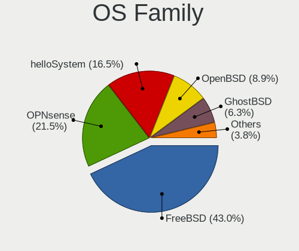
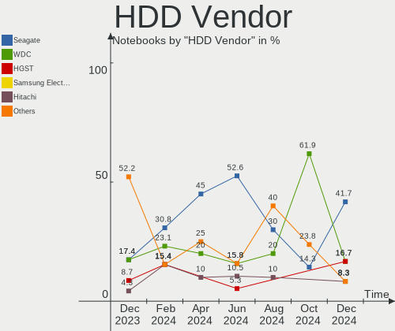

BSD Hardware Trends (Notebooks)
-------------------------------

A project to identify most popular hardware characteristics and track their change
over time based on data collected by BSD users at https://BSD-Hardware.info.

Anyone can contribute to this report by the [hw-probe](https://github.com/linuxhw/hw-probe/blob/master/INSTALL.BSD.md) tool:

    hw-probe -all -upload

This report is for one last month. Overall report since the beginning of time: [TestCoverage](https://github.com/bsdhw/TestCoverage)

Period: Apr, 2022.

Contents
--------

* [ System ](#system)
  - [ OS                       ](#os)
  - [ OS Family                ](#os-family)
  - [ Arch                     ](#arch)
  - [ DE                       ](#de)
  - [ Display Server           ](#display-server)
  - [ Display Manager          ](#display-manager)
  - [ OS Lang                  ](#os-lang)
  - [ Boot Mode                ](#boot-mode)
  - [ Filesystem               ](#filesystem)
  - [ Part. scheme             ](#part-scheme)

* [ Board ](#board)
  - [ Vendor                   ](#vendor)
  - [ Model                    ](#model)
  - [ Model Family             ](#model-family)
  - [ MFG Year                 ](#mfg-year)
  - [ Form Factor              ](#form-factor)
  - [ Coreboot                 ](#coreboot)
  - [ RAM Size                 ](#ram-size)
  - [ RAM Used                 ](#ram-used)
  - [ Total Drives             ](#total-drives)
  - [ Has CD-ROM               ](#has-cd-rom)
  - [ Has Ethernet             ](#has-ethernet)
  - [ Has WiFi                 ](#has-wifi)
  - [ Has Bluetooth            ](#has-bluetooth)

* [ Location ](#location)
  - [ Country                  ](#country)
  - [ City                     ](#city)

* [ Drives ](#drives)
  - [ Drive Vendor             ](#drive-vendor)
  - [ Drive Model              ](#drive-model)
  - [ HDD Vendor               ](#hdd-vendor)
  - [ SSD Vendor               ](#ssd-vendor)
  - [ Drive Kind               ](#drive-kind)
  - [ Drive Connector          ](#drive-connector)
  - [ Drive Size               ](#drive-size)
  - [ Space Total              ](#space-total)
  - [ Space Used               ](#space-used)
  - [ Malfunc. Drives          ](#malfunc-drives)
  - [ Malfunc. Drive Vendor    ](#malfunc-drive-vendor)
  - [ Malfunc. HDD Vendor      ](#malfunc-hdd-vendor)
  - [ Malfunc. Drive Kind      ](#malfunc-drive-kind)
  - [ Failed Drives            ](#failed-drives)
  - [ Failed Drive Vendor      ](#failed-drive-vendor)
  - [ Drive Status             ](#drive-status)

* [ Storage controller ](#storage-controller)
  - [ Storage Vendor           ](#storage-vendor)
  - [ Storage Model            ](#storage-model)
  - [ Storage Kind             ](#storage-kind)

* [ Processor ](#processor)
  - [ CPU Vendor               ](#cpu-vendor)
  - [ CPU Model                ](#cpu-model)
  - [ CPU Model Family         ](#cpu-model-family)
  - [ CPU Cores                ](#cpu-cores)
  - [ CPU Sockets              ](#cpu-sockets)
  - [ CPU Threads              ](#cpu-threads)
  - [ CPU Microarch            ](#cpu-microarch)

* [ Graphics ](#graphics)
  - [ GPU Vendor               ](#gpu-vendor)
  - [ GPU Model                ](#gpu-model)
  - [ GPU Combo                ](#gpu-combo)
  - [ GPU Driver               ](#gpu-driver)
  - [ GPU Memory               ](#gpu-memory)

* [ Monitor ](#monitor)
  - [ Monitor Vendor           ](#monitor-vendor)
  - [ Monitor Model            ](#monitor-model)
  - [ Monitor Resolution       ](#monitor-resolution)
  - [ Monitor Diagonal         ](#monitor-diagonal)
  - [ Monitor Width            ](#monitor-width)
  - [ Aspect Ratio             ](#aspect-ratio)
  - [ Monitor Area             ](#monitor-area)
  - [ Pixel Density            ](#pixel-density)
  - [ Multiple Monitors        ](#multiple-monitors)

* [ Network ](#network)
  - [ Net Controller Vendor    ](#net-controller-vendor)
  - [ Net Controller Model     ](#net-controller-model)
  - [ Wireless Vendor          ](#wireless-vendor)
  - [ Wireless Model           ](#wireless-model)
  - [ Ethernet Vendor          ](#ethernet-vendor)
  - [ Ethernet Model           ](#ethernet-model)
  - [ Net Controller Kind      ](#net-controller-kind)
  - [ Used Controller          ](#used-controller)
  - [ NICs                     ](#nics)
  - [ IPv6                     ](#ipv6)

* [ Bluetooth ](#bluetooth)
  - [ Bluetooth Vendor         ](#bluetooth-vendor)
  - [ Bluetooth Model          ](#bluetooth-model)

* [ Sound ](#sound)
  - [ Sound Vendor             ](#sound-vendor)
  - [ Sound Model              ](#sound-model)

* [ Memory ](#memory)
  - [ Memory Vendor            ](#memory-vendor)
  - [ Memory Model             ](#memory-model)
  - [ Memory Kind              ](#memory-kind)
  - [ Memory Form Factor       ](#memory-form-factor)
  - [ Memory Size              ](#memory-size)
  - [ Memory Speed             ](#memory-speed)

* [ Printers & scanners ](#printers--scanners)
  - [ Printer Vendor           ](#printer-vendor)
  - [ Printer Model            ](#printer-model)
  - [ Scanner Vendor           ](#scanner-vendor)
  - [ Scanner Model            ](#scanner-model)

* [ Camera ](#camera)
  - [ Camera Vendor            ](#camera-vendor)
  - [ Camera Model             ](#camera-model)

* [ Security ](#security)
  - [ Fingerprint Vendor       ](#fingerprint-vendor)
  - [ Fingerprint Model        ](#fingerprint-model)
  - [ Chipcard Vendor          ](#chipcard-vendor)
  - [ Chipcard Model           ](#chipcard-model)

* [ Unsupported ](#unsupported)
  - [ Unsupported Devices      ](#unsupported-devices)
  - [ Unsupported Device Types ](#unsupported-device-types)

System
------

OS
--

Installed operating systems

| Name                  | Notebooks | Percent |
|-----------------------|-----------|---------|
| helloSystem 0.7.0     | 16        | 21.05%  |
| FreeBSD 13.0-p11      | 7         | 9.21%   |
| OpenBSD 7.1           | 5         | 6.58%   |
| NomadBSD 5806f915     | 5         | 6.58%   |
| OPNsense 22.1.4       | 4         | 5.26%   |
| helloSystem 0.8.0     | 4         | 5.26%   |
| FreeBSD 13.0          | 4         | 5.26%   |
| OPNsense 22.1.6       | 3         | 3.95%   |
| OPNsense 22.1.5       | 3         | 3.95%   |
| OpenBSD 7.0           | 3         | 3.95%   |
| FreeBSD 14.0-CURRENT  | 3         | 3.95%   |
| FreeBSD 13.0-p10      | 3         | 3.95%   |
| GhostBSD 22.01.12     | 2         | 2.63%   |
| FreeBSD 13.0-p8       | 2         | 2.63%   |
| OPNsense 22.4         | 1         | 1.32%   |
| helloSystem 0.6.0     | 1         | 1.32%   |
| GhostBSD 22.04.22     | 1         | 1.32%   |
| GhostBSD 22.04.06     | 1         | 1.32%   |
| FreeBSD 13.1-RC4      | 1         | 1.32%   |
| FreeBSD 13.1-RC3      | 1         | 1.32%   |
| FreeBSD 13.1-RC2      | 1         | 1.32%   |
| FreeBSD 13.1-RC1      | 1         | 1.32%   |
| FreeBSD 12.3-STABLE   | 1         | 1.32%   |
| FreeBSD 12.3-p5       | 1         | 1.32%   |
| FreeBSD 12.3-p4       | 1         | 1.32%   |
| FreeBSD 12.1-p22-HBSD | 1         | 1.32%   |

OS Family
---------

OS without a version

| Name        | Notebooks | Percent |
|-------------|-----------|---------|
| FreeBSD     | 27        | 35.53%  |
| helloSystem | 21        | 27.63%  |
| OPNsense    | 11        | 14.47%  |
| OpenBSD     | 8         | 10.53%  |
| NomadBSD    | 5         | 6.58%   |
| GhostBSD    | 4         | 5.26%   |

Arch
----

OS architecture (x86_64, i586, etc.)

| Name  | Notebooks | Percent |
|-------|-----------|---------|
| amd64 | 76        | 100%    |

DE
--

Desktop Environment

| Name         | Notebooks | Percent |
|--------------|-----------|---------|
| helloDesktop | 25        | 32.89%  |
| Console      | 14        | 18.42%  |
| XFCE         | 9         | 11.84%  |
| Openbox      | 6         | 7.89%   |
| MATE         | 6         | 7.89%   |
| KDE5         | 6         | 7.89%   |
| TWM          | 5         | 6.58%   |
| i3           | 2         | 2.63%   |
| GNOME        | 2         | 2.63%   |
| fvwm         | 1         | 1.32%   |

Display Server
--------------

X11 or Wayland

| Name    | Notebooks | Percent |
|---------|-----------|---------|
| X11     | 60        | 78.95%  |
| Console | 15        | 19.74%  |
| Wayland | 1         | 1.32%   |

Display Manager
---------------

SDDM, LightDM, etc.

| Name    | Notebooks | Percent |
|---------|-----------|---------|
| SLiM    | 33        | 43.42%  |
| Console | 27        | 35.53%  |
| LightDM | 7         | 9.21%   |
| SDDM    | 5         | 6.58%   |
| GDM     | 2         | 2.63%   |
| XDM     | 1         | 1.32%   |
| Ly      | 1         | 1.32%   |

OS Lang
-------

Language

| Lang    | Notebooks | Percent |
|---------|-----------|---------|
| en_US   | 24        | 31.58%  |
| Unknown | 22        | 28.95%  |
| C       | 17        | 22.37%  |
| ru_RU   | 3         | 3.95%   |
| fr_FR   | 3         | 3.95%   |
| zh_CN   | 2         | 2.63%   |
| de_DE   | 2         | 2.63%   |
| it_IT   | 1         | 1.32%   |
| en_NZ   | 1         | 1.32%   |
| en_GB   | 1         | 1.32%   |

Boot Mode
---------

EFI or BIOS

| Mode | Notebooks | Percent |
|------|-----------|---------|
| EFI  | 64        | 84.21%  |
| BIOS | 12        | 15.79%  |

Filesystem
----------

Type of filesystem

| Type   | Notebooks | Percent |
|--------|-----------|---------|
| Zfs    | 39        | 51.32%  |
| Ufs    | 18        | 23.68%  |
| Cd9660 | 11        | 14.47%  |
| Ffs    | 8         | 10.53%  |

Part. scheme
------------

Scheme of partitioning

| Type | Notebooks | Percent |
|------|-----------|---------|
| GPT  | 69        | 90.79%  |
| MBR  | 6         | 7.89%   |
| BSD  | 1         | 1.32%   |

Board
-----

Vendor
------

Motherboard manufacturer

| Name                | Notebooks | Percent |
|---------------------|-----------|---------|
| Lenovo              | 17        | 22.37%  |
| Dell                | 12        | 15.79%  |
| Hewlett-Packard     | 7         | 9.21%   |
| Deciso              | 6         | 7.89%   |
| ASUSTek Computer    | 4         | 5.26%   |
| Apple               | 4         | 5.26%   |
| TUXEDO              | 3         | 3.95%   |
| MSI                 | 3         | 3.95%   |
| Sony                | 2         | 2.63%   |
| Panasonic           | 2         | 2.63%   |
| Notebook            | 2         | 2.63%   |
| VIT                 | 1         | 1.32%   |
| Toshiba             | 1         | 1.32%   |
| Timi                | 1         | 1.32%   |
| System76            | 1         | 1.32%   |
| LG Electronics      | 1         | 1.32%   |
| HUAWEI              | 1         | 1.32%   |
| Gigabyte Technology | 1         | 1.32%   |
| Framework           | 1         | 1.32%   |
| DNS                 | 1         | 1.32%   |
| DEXP                | 1         | 1.32%   |
| Datto               | 1         | 1.32%   |
| BESSTAR Tech        | 1         | 1.32%   |
| AMI                 | 1         | 1.32%   |
| Acer                | 1         | 1.32%   |

Model
-----

Motherboard model

| Name                                     | Notebooks | Percent |
|------------------------------------------|-----------|---------|
| Deciso Netboard A20                      | 3         | 3.95%   |
| TUXEDO Aura 15 Gen1                      | 2         | 2.63%   |
| Deciso DEC2700 - OPNsense Appliance      | 2         | 2.63%   |
| VIT M2420                                | 1         | 1.32%   |
| TUXEDO Pulse 15 Gen1                     | 1         | 1.32%   |
| Toshiba Satellite Pro T130               | 1         | 1.32%   |
| Timi TM1612                              | 1         | 1.32%   |
| System76 Lemur Pro                       | 1         | 1.32%   |
| Sony VGN-AW21S_B                         | 1         | 1.32%   |
| Sony SVZ1311C5E                          | 1         | 1.32%   |
| Panasonic CF-B11JWCYS                    | 1         | 1.32%   |
| Panasonic CF-52PFPBSFQ                   | 1         | 1.32%   |
| Notebook W650DC,DD                       | 1         | 1.32%   |
| Notebook N7x0WU                          | 1         | 1.32%   |
| MSI Modern 14 B11MOL                     | 1         | 1.32%   |
| MSI GF65 Thin 10SER                      | 1         | 1.32%   |
| MSI Bravo 15 A4DDR                       | 1         | 1.32%   |
| LG E300-A.CP20T                          | 1         | 1.32%   |
| Lenovo ThinkPad X61 7675K2U              | 1         | 1.32%   |
| Lenovo ThinkPad X270 W10DG 20K5S0BB00    | 1         | 1.32%   |
| Lenovo ThinkPad X260 20F5S08Q00          | 1         | 1.32%   |
| Lenovo ThinkPad X220 4291QT1             | 1         | 1.32%   |
| Lenovo ThinkPad X220 42872WU             | 1         | 1.32%   |
| Lenovo ThinkPad X201 3680MG1             | 1         | 1.32%   |
| Lenovo ThinkPad X121e 3053A52            | 1         | 1.32%   |
| Lenovo ThinkPad X1 Carbon 3rd 20BS00ACMN | 1         | 1.32%   |
| Lenovo ThinkPad T495 20NJ0000US          | 1         | 1.32%   |
| Lenovo ThinkPad T490s 20NX000DRT         | 1         | 1.32%   |
| Lenovo ThinkPad T470 20HES0ES1F          | 1         | 1.32%   |
| Lenovo ThinkPad T460p 20FXS09D11         | 1         | 1.32%   |
| Lenovo ThinkPad T420 4236BD5             | 1         | 1.32%   |
| Lenovo ThinkPad E490 20N8CTO1WW          | 1         | 1.32%   |
| Lenovo G51-35 80M8                       | 1         | 1.32%   |
| Lenovo B570 1068FQG                      | 1         | 1.32%   |
| Lenovo B50-30 20382                      | 1         | 1.32%   |
| HUAWEI NBLL-WXX9                         | 1         | 1.32%   |
| HP ProBook 450 G2                        | 1         | 1.32%   |
| HP Pavilion 11                           | 1         | 1.32%   |
| HP Notebook                              | 1         | 1.32%   |
| HP Laptop 15-dw1xxx                      | 1         | 1.32%   |
| HP EliteBook 8570p                       | 1         | 1.32%   |
| HP EliteBook 755 G3                      | 1         | 1.32%   |
| HP 2000                                  | 1         | 1.32%   |
| Gigabyte MMLP7AP-00                      | 1         | 1.32%   |
| Framework Laptop                         | 1         | 1.32%   |
| DNS W9x0LU                               | 1         | 1.32%   |
| DEXP NAVIS P100                          | 1         | 1.32%   |
| Dell Vostro 1400                         | 1         | 1.32%   |
| Dell Studio 1555                         | 1         | 1.32%   |
| Dell Precision M4800                     | 1         | 1.32%   |
| Dell Precision 7730                      | 1         | 1.32%   |
| Dell Latitude E6540                      | 1         | 1.32%   |
| Dell Latitude E6520                      | 1         | 1.32%   |
| Dell Latitude E6440                      | 1         | 1.32%   |
| Dell Latitude E5470                      | 1         | 1.32%   |
| Dell Latitude E5450                      | 1         | 1.32%   |
| Dell Latitude 7490                       | 1         | 1.32%   |
| Dell Latitude 5290                       | 1         | 1.32%   |
| Dell Inspiron 5437                       | 1         | 1.32%   |
| Deciso OPNsense Appliance                | 1         | 1.32%   |

Model Family
------------

Motherboard model prefix

| Name                   | Notebooks | Percent |
|------------------------|-----------|---------|
| Lenovo ThinkPad        | 14        | 18.42%  |
| Dell Latitude          | 7         | 9.21%   |
| Deciso Netboard        | 3         | 3.95%   |
| TUXEDO Aura            | 2         | 2.63%   |
| HP EliteBook           | 2         | 2.63%   |
| Dell Precision         | 2         | 2.63%   |
| Deciso DEC2700         | 2         | 2.63%   |
| VIT M2420              | 1         | 1.32%   |
| TUXEDO Pulse           | 1         | 1.32%   |
| Toshiba Satellite      | 1         | 1.32%   |
| Timi TM1612            | 1         | 1.32%   |
| System76 Lemur         | 1         | 1.32%   |
| Sony VGN-AW21S         | 1         | 1.32%   |
| Sony SVZ1311C5E        | 1         | 1.32%   |
| Panasonic CF-B11JWCYS  | 1         | 1.32%   |
| Panasonic CF-52PFPBSFQ | 1         | 1.32%   |
| Notebook W650DC        | 1         | 1.32%   |
| Notebook N7x0WU        | 1         | 1.32%   |
| MSI Modern             | 1         | 1.32%   |
| MSI GF65               | 1         | 1.32%   |
| MSI Bravo              | 1         | 1.32%   |
| LG E300-A.CP20T        | 1         | 1.32%   |
| Lenovo G51-35          | 1         | 1.32%   |
| Lenovo B570            | 1         | 1.32%   |
| Lenovo B50-30          | 1         | 1.32%   |
| HUAWEI NBLL-WXX9       | 1         | 1.32%   |
| HP ProBook             | 1         | 1.32%   |
| HP Pavilion            | 1         | 1.32%   |
| HP Notebook            | 1         | 1.32%   |
| HP Laptop              | 1         | 1.32%   |
| HP 2000                | 1         | 1.32%   |
| Gigabyte MMLP7AP-00    | 1         | 1.32%   |
| Framework Laptop       | 1         | 1.32%   |
| DNS W9x0LU             | 1         | 1.32%   |
| DEXP NAVIS             | 1         | 1.32%   |
| Dell Vostro            | 1         | 1.32%   |
| Dell Studio            | 1         | 1.32%   |
| Dell Inspiron          | 1         | 1.32%   |
| Deciso OPNsense        | 1         | 1.32%   |
| Datto 1000             | 1         | 1.32%   |
| BESSTAR Tech U820      | 1         | 1.32%   |
| ASUS X556UJ            | 1         | 1.32%   |
| ASUS X550CC            | 1         | 1.32%   |
| ASUS UX305UA           | 1         | 1.32%   |
| ASUS 1001PX            | 1         | 1.32%   |
| Apple MacBookPro8      | 1         | 1.32%   |
| Apple MacBookPro5      | 1         | 1.32%   |
| Apple MacBookPro3      | 1         | 1.32%   |
| Apple MacBook5         | 1         | 1.32%   |
| AMI Intel              | 1         | 1.32%   |
| Acer Swift             | 1         | 1.32%   |

MFG Year
--------

Motherboard manufacture year

| Year | Notebooks | Percent |
|------|-----------|---------|
| 2021 | 12        | 15.79%  |
| 2020 | 8         | 10.53%  |
| 2019 | 8         | 10.53%  |
| 2011 | 7         | 9.21%   |
| 2018 | 6         | 7.89%   |
| 2015 | 6         | 7.89%   |
| 2016 | 4         | 5.26%   |
| 2010 | 4         | 5.26%   |
| 2008 | 4         | 5.26%   |
| 2022 | 3         | 3.95%   |
| 2017 | 3         | 3.95%   |
| 2013 | 3         | 3.95%   |
| 2009 | 3         | 3.95%   |
| 2014 | 2         | 2.63%   |
| 2012 | 2         | 2.63%   |
| 2007 | 1         | 1.32%   |

Form Factor
-----------

Physical design of the computer

| Name     | Notebooks | Percent |
|----------|-----------|---------|
| Notebook | 76        | 100%    |

Coreboot
--------

Have coreboot on board

| Used | Notebooks | Percent |
|------|-----------|---------|
| No   | 75        | 98.68%  |
| Yes  | 1         | 1.32%   |

RAM Size
--------

Total RAM memory

| Size in GB  | Notebooks | Percent |
|-------------|-----------|---------|
| 16.01-24.0  | 24        | 31.58%  |
| 8.01-16.0   | 22        | 28.95%  |
| 4.01-8.0    | 19        | 25%     |
| 32.01-64.0  | 5         | 6.58%   |
| 2.01-3.0    | 3         | 3.95%   |
| 3.01-4.0    | 1         | 1.32%   |
| 24.01-32.0  | 1         | 1.32%   |
| 64.01-256.0 | 1         | 1.32%   |

RAM Used
--------

Used RAM memory

| Used GB  | Notebooks | Percent |
|----------|-----------|---------|
| 0.01-0.5 | 38        | 50%     |
| 0.51-1.0 | 25        | 32.89%  |
| 1.01-2.0 | 11        | 14.47%  |
| 2.01-3.0 | 2         | 2.63%   |

Total Drives
------------

Number of drives on board

| Drives | Notebooks | Percent |
|--------|-----------|---------|
| 1      | 60        | 78.95%  |
| 2      | 13        | 17.11%  |
| 3      | 2         | 2.63%   |
| 0      | 1         | 1.32%   |

Has CD-ROM
----------

Has CD-ROM on board

| Presented | Notebooks | Percent |
|-----------|-----------|---------|
| No        | 55        | 72.37%  |
| Yes       | 21        | 27.63%  |

Has Ethernet
------------

Has Ethernet on board

| Presented | Notebooks | Percent |
|-----------|-----------|---------|
| Yes       | 68        | 89.47%  |
| No        | 8         | 10.53%  |

Has WiFi
--------

Has WiFi module

| Presented | Notebooks | Percent |
|-----------|-----------|---------|
| Yes       | 66        | 86.84%  |
| No        | 10        | 13.16%  |

Has Bluetooth
-------------

Has Bluetooth module

| Presented | Notebooks | Percent |
|-----------|-----------|---------|
| Yes       | 47        | 61.84%  |
| No        | 29        | 38.16%  |

Location
--------

Country
-------

Geographic location (country)

| Country             | Notebooks | Percent |
|---------------------|-----------|---------|
| USA                 | 14        | 18.42%  |
| Germany             | 11        | 14.47%  |
| Russia              | 6         | 7.89%   |
| UK                  | 5         | 6.58%   |
| France              | 5         | 6.58%   |
| China               | 4         | 5.26%   |
| Norway              | 2         | 2.63%   |
| Netherlands         | 2         | 2.63%   |
| Italy               | 2         | 2.63%   |
| Canada              | 2         | 2.63%   |
| Belarus             | 2         | 2.63%   |
| Australia           | 2         | 2.63%   |
| Turkey              | 1         | 1.32%   |
| Trinidad and Tobago | 1         | 1.32%   |
| Taiwan              | 1         | 1.32%   |
| Switzerland         | 1         | 1.32%   |
| Sweden              | 1         | 1.32%   |
| Spain               | 1         | 1.32%   |
| Slovenia            | 1         | 1.32%   |
| Serbia              | 1         | 1.32%   |
| Romania             | 1         | 1.32%   |
| Portugal            | 1         | 1.32%   |
| New Zealand         | 1         | 1.32%   |
| Mexico              | 1         | 1.32%   |
| India               | 1         | 1.32%   |
| Guadeloupe          | 1         | 1.32%   |
| Denmark             | 1         | 1.32%   |
| Chile               | 1         | 1.32%   |
| Brazil              | 1         | 1.32%   |
| Argentina           | 1         | 1.32%   |
| Albania             | 1         | 1.32%   |

City
----

Geographic location (city)

| City                | Notebooks | Percent |
|---------------------|-----------|---------|
| Vladivostok         | 2         | 2.63%   |
| Paris               | 2         | 2.63%   |
| Oslo                | 2         | 2.63%   |
| Frankfurt am Main   | 2         | 2.63%   |
| Changzhou           | 2         | 2.63%   |
| Brooklyn            | 2         | 2.63%   |
| Zurich              | 1         | 1.32%   |
| Zhaoqing            | 1         | 1.32%   |
| Yunlin              | 1         | 1.32%   |
| West Valley City    | 1         | 1.32%   |
| West Orange         | 1         | 1.32%   |
| Washington          | 1         | 1.32%   |
| Vienna              | 1         | 1.32%   |
| Tolyatti            | 1         | 1.32%   |
| The Hague           | 1         | 1.32%   |
| Surgut              | 1         | 1.32%   |
| Stuttgart           | 1         | 1.32%   |
| Stockholm           | 1         | 1.32%   |
| Springfield         | 1         | 1.32%   |
| Shanghai            | 1         | 1.32%   |
| Seattle             | 1         | 1.32%   |
| Santiago            | 1         | 1.32%   |
| Québec             | 1         | 1.32%   |
| Port of Spain       | 1         | 1.32%   |
| Poncins             | 1         | 1.32%   |
| Oryol               | 1         | 1.32%   |
| Newcastle upon Tyne | 1         | 1.32%   |
| New Plymouth        | 1         | 1.32%   |
| Moscow              | 1         | 1.32%   |
| Montreal            | 1         | 1.32%   |
| Mogilev             | 1         | 1.32%   |
| Minsk               | 1         | 1.32%   |
| Milwaukee           | 1         | 1.32%   |
| Milton Keynes       | 1         | 1.32%   |
| Melbourne           | 1         | 1.32%   |
| Massa Lombarda      | 1         | 1.32%   |
| Mannheim            | 1         | 1.32%   |
| Manchester          | 1         | 1.32%   |
| Lübeck             | 1         | 1.32%   |
| London              | 1         | 1.32%   |
| Lisbon              | 1         | 1.32%   |
| Lippstadt           | 1         | 1.32%   |
| Le Gosier           | 1         | 1.32%   |
| Landshut            | 1         | 1.32%   |
| Lakeville           | 1         | 1.32%   |
| La Pobla de Farnals | 1         | 1.32%   |
| Kranj               | 1         | 1.32%   |
| Hvidovre            | 1         | 1.32%   |
| Hamburg             | 1         | 1.32%   |
| Glasgow             | 1         | 1.32%   |
| Georgetown          | 1         | 1.32%   |
| Fontenay-sous-Bois  | 1         | 1.32%   |
| Farka e Madhe       | 1         | 1.32%   |
| Diamantino          | 1         | 1.32%   |
| Delhi               | 1         | 1.32%   |
| Coronel Pringles    | 1         | 1.32%   |
| Ciudad Satelite     | 1         | 1.32%   |
| City of London      | 1         | 1.32%   |
| Cardito             | 1         | 1.32%   |
| Canberra            | 1         | 1.32%   |

Drives
------

Drive Vendor
------------

Hard drive vendors

| Vendor              | Notebooks | Drives | Percent |
|---------------------|-----------|--------|---------|
| Samsung Electronics | 12        | 14     | 13.64%  |
| WDC                 | 11        | 11     | 12.5%   |
| Toshiba             | 7         | 7      | 7.95%   |
| Seagate             | 7         | 7      | 7.95%   |
| Transcend           | 6         | 6      | 6.82%   |
| SanDisk             | 6         | 6      | 6.82%   |
| Kingston            | 6         | 6      | 6.82%   |
| HGST                | 5         | 5      | 5.68%   |
| Crucial             | 4         | 5      | 4.55%   |
| Micron Technology   | 3         | 3      | 3.41%   |
| Intel               | 3         | 3      | 3.41%   |
| NVMe                | 2         | 2      | 2.27%   |
| Innostor            | 2         | 2      | 2.27%   |
| Hitachi             | 2         | 2      | 2.27%   |
| Gigabyte Technology | 2         | 2      | 2.27%   |
| SSSTC               | 1         | 1      | 1.14%   |
| SPCC                | 1         | 1      | 1.14%   |
| SK Hynix            | 1         | 1      | 1.14%   |
| OCZ                 | 1         | 1      | 1.14%   |
| Mushkin             | 1         | 1      | 1.14%   |
| LITEON              | 1         | 1      | 1.14%   |
| Kston               | 1         | 1      | 1.14%   |
| Intenso             | 1         | 1      | 1.14%   |
| Fujitsu             | 1         | 1      | 1.14%   |
| A-DATA Technology   | 1         | 1      | 1.14%   |

Drive Model
-----------

Hard drive models

| Model                                     | Notebooks | Percent |
|-------------------------------------------|-----------|---------|
| Transcend TS256GMTS952T2 256GB            | 3         | 3.37%   |
| HGST HTS721010A9E630 1TB                  | 3         | 3.37%   |
| Transcend TS256GMTE652T2 256GB            | 2         | 2.25%   |
| SanDisk SSD U100 24GB                     | 2         | 2.25%   |
| Samsung SSD 970 EVO 500GB                 | 2         | 2.25%   |
| Samsung MZVLW256HEHP-000L7 256GB          | 2         | 2.25%   |
| Kingston SA400S37240G 240GB               | 2         | 2.25%   |
| Innostor SSD 15GB                         | 2         | 2.25%   |
| WDC WDS250G2B0A 250GB                     | 1         | 1.12%   |
| WDC WDS240G2G0A-00JH30 240GB              | 1         | 1.12%   |
| WDC WDS200T2B0A-00SM50 2TB                | 1         | 1.12%   |
| WDC WDS120G2G0B-00EPW0 120GB              | 1         | 1.12%   |
| WDC WDS100T1X0E-00AFY0 1TB                | 1         | 1.12%   |
| WDC WD5000BPVT-24HXZT3 500GB              | 1         | 1.12%   |
| WDC WD3200BEVT-75ZCT2 320GB               | 1         | 1.12%   |
| WDC WD10JPVX-60JC3T0 1TB                  | 1         | 1.12%   |
| WDC WD10JPLX-00MBPT0 1TB                  | 1         | 1.12%   |
| WDC WD10JPCX-24UE4T0 1TB                  | 1         | 1.12%   |
| WDC PC SN730 SDBPNTY-512G-1027 512GB      | 1         | 1.12%   |
| Transcend TS128GMTE110S 128GB             | 1         | 1.12%   |
| Toshiba THNSFJ256GDNU 256GB               | 1         | 1.12%   |
| Toshiba THNSF5256GPUK 256GB               | 1         | 1.12%   |
| Toshiba MQ01ABF050 500GB                  | 1         | 1.12%   |
| Toshiba MK3261GSYN 320GB                  | 1         | 1.12%   |
| Toshiba MK1637GSX 160GB                   | 1         | 1.12%   |
| Toshiba KSG60ZMV256G M.2 2280 256GB       | 1         | 1.12%   |
| Toshiba KBG30ZMT512G 512GB                | 1         | 1.12%   |
| SSSTC CVB-8D128-HP 128GB                  | 1         | 1.12%   |
| SPCC M.2 PCIe SSD 1TB                     | 1         | 1.12%   |
| SK Hynix SKHynix_HFS512GD9TNG-L5B0B 512GB | 1         | 1.12%   |
| Seagate ST980813AS 80GB                   | 1         | 1.12%   |
| Seagate ST9250827AS 250GB                 | 1         | 1.12%   |
| Seagate ST500LT012-9WS142 500GB           | 1         | 1.12%   |
| Seagate ST500LT012-1DG142 500GB           | 1         | 1.12%   |
| Seagate ST500LM030-2E717D 500GB           | 1         | 1.12%   |
| Seagate ST320LT014-9YK142 320GB           | 1         | 1.12%   |
| Seagate ST2000LM003 HN-M201RAD 2TB        | 1         | 1.12%   |
| SanDisk SD8SN8U-128G-1006 128GB           | 1         | 1.12%   |
| SanDisk SD7SF6S512G1122 512GB             | 1         | 1.12%   |
| SanDisk Extreme 55AE 500GB                | 1         | 1.12%   |
| SanDisk Cruzer Blade 32GB                 | 1         | 1.12%   |
| Samsung SSD 980 PRO 500GB                 | 1         | 1.12%   |
| Samsung SSD 970 EVO Plus 2TB              | 1         | 1.12%   |
| Samsung SSD 870 EVO 2TB                   | 1         | 1.12%   |
| Samsung SSD 860 EVO M.2 1TB               | 1         | 1.12%   |
| Samsung SSD 840 PRO Series 256GB          | 1         | 1.12%   |
| Samsung SSD 840 EVO 120GB                 | 1         | 1.12%   |
| Samsung SSD 750 EVO 250GB                 | 1         | 1.12%   |
| Samsung PM981 NVMe 256GB                  | 1         | 1.12%   |
| Samsung MZRPC256HADR-000SO 128GB          | 1         | 1.12%   |
| OCZ PETROL 256GB                          | 1         | 1.12%   |
| NVMe Samsung SSD 980 500GB                | 1         | 1.12%   |
| NVMe KINGSTON OM8PDP3 256GB               | 1         | 1.12%   |
| Mushkin MKNSSDHL1TB-D8                    | 1         | 1.12%   |
| Micron M600_MTFDDAV256MBF 256GB           | 1         | 1.12%   |
| Micron 2210_MTFDHBA512QFD 512GB           | 1         | 1.12%   |
| Micron 1100_MTFDDAV256TBN 256GB           | 1         | 1.12%   |
| LITEON CV8-8E128-HP 128GB                 | 1         | 1.12%   |
| Kston SSD 256GB                           | 1         | 1.12%   |
| Kingston SV300S37A120G 120GB              | 1         | 1.12%   |

HDD Vendor
----------

Hard disk drive vendors

| Vendor  | Notebooks | Drives | Percent |
|---------|-----------|--------|---------|
| Seagate | 7         | 7      | 30.43%  |
| WDC     | 5         | 5      | 21.74%  |
| HGST    | 5         | 5      | 21.74%  |
| Toshiba | 3         | 3      | 13.04%  |
| Hitachi | 2         | 2      | 8.7%    |
| NVMe    | 1         | 1      | 4.35%   |

SSD Vendor
----------

Solid state drive vendors

| Vendor              | Notebooks | Drives | Percent |
|---------------------|-----------|--------|---------|
| SanDisk             | 6         | 6      | 12.77%  |
| Samsung Electronics | 6         | 7      | 12.77%  |
| Kingston            | 5         | 5      | 10.64%  |
| WDC                 | 4         | 4      | 8.51%   |
| Crucial             | 4         | 5      | 8.51%   |
| Transcend           | 3         | 3      | 6.38%   |
| Intel               | 3         | 3      | 6.38%   |
| Toshiba             | 2         | 2      | 4.26%   |
| Micron Technology   | 2         | 2      | 4.26%   |
| Innostor            | 2         | 2      | 4.26%   |
| Gigabyte Technology | 2         | 2      | 4.26%   |
| SSSTC               | 1         | 1      | 2.13%   |
| OCZ                 | 1         | 1      | 2.13%   |
| NVMe                | 1         | 1      | 2.13%   |
| LITEON              | 1         | 1      | 2.13%   |
| Kston               | 1         | 1      | 2.13%   |
| Intenso             | 1         | 1      | 2.13%   |
| Fujitsu             | 1         | 1      | 2.13%   |
| A-DATA Technology   | 1         | 1      | 2.13%   |

Drive Kind
----------

HDD or SSD

| Kind | Notebooks | Drives | Percent |
|------|-----------|--------|---------|
| SSD  | 41        | 49     | 50.62%  |
| HDD  | 22        | 23     | 27.16%  |
| NVMe | 18        | 19     | 22.22%  |

Drive Connector
---------------

SATA, SAS, NVMe, etc.

| Type | Notebooks | Drives | Percent |
|------|-----------|--------|---------|
| SATA | 59        | 72     | 76.62%  |
| NVMe | 18        | 19     | 23.38%  |

Drive Size
----------

Size of hard drive

| Size in TB | Notebooks | Drives | Percent |
|------------|-----------|--------|---------|
| 0.01-0.5   | 49        | 58     | 80.33%  |
| 0.51-1.0   | 8         | 9      | 13.11%  |
| 1.01-2.0   | 4         | 5      | 6.56%   |

Space Total
-----------

Amount of disk space available on the file system

| Size in GB | Notebooks | Percent |
|------------|-----------|---------|
| 101-250    | 28        | 36.84%  |
| 1-20       | 20        | 26.32%  |
| 251-500    | 14        | 18.42%  |
| 21-50      | 4         | 5.26%   |
| 501-1000   | 4         | 5.26%   |
| 51-100     | 4         | 5.26%   |
| 1001-2000  | 2         | 2.63%   |

Space Used
----------

Amount of used disk space

| Used GB | Notebooks | Percent |
|---------|-----------|---------|
| 1-20    | 64        | 84.21%  |
| 21-50   | 5         | 6.58%   |
| 51-100  | 5         | 6.58%   |
| 101-250 | 2         | 2.63%   |

Malfunc. Drives
---------------

Drive models with a malfunction

| Model                              | Notebooks | Drives | Percent |
|------------------------------------|-----------|--------|---------|
| Toshiba MK3261GSYN 320GB           | 1         | 1      | 6.67%   |
| Toshiba MK1637GSX 160GB            | 1         | 1      | 6.67%   |
| SSSTC CVB-8D128-HP 128GB           | 1         | 1      | 6.67%   |
| Seagate ST9250827AS 250GB          | 1         | 1      | 6.67%   |
| Seagate ST500LT012-1DG142 500GB    | 1         | 1      | 6.67%   |
| Seagate ST320LT014-9YK142 320GB    | 1         | 1      | 6.67%   |
| Seagate ST2000LM003 HN-M201RAD 2TB | 1         | 1      | 6.67%   |
| LITEON CV8-8E128-HP 128GB          | 1         | 1      | 6.67%   |
| Kingston SA400S37240G 240GB        | 1         | 1      | 6.67%   |
| Intel SSDSC2KF256H6L 256GB         | 1         | 1      | 6.67%   |
| Hitachi HTS723216L9SA60 160GB      | 1         | 1      | 6.67%   |
| Hitachi HTS541612J9SA00 120GB      | 1         | 1      | 6.67%   |
| HGST HTS721010A9E630 1TB           | 1         | 1      | 6.67%   |
| HGST HTS541075A7E630 752GB         | 1         | 1      | 6.67%   |
| A-DATA Technology SP550 240GB      | 1         | 1      | 6.67%   |

Malfunc. Drive Vendor
---------------------

Vendors of faulty drives

| Vendor            | Notebooks | Drives | Percent |
|-------------------|-----------|--------|---------|
| Seagate           | 4         | 4      | 26.67%  |
| Toshiba           | 2         | 2      | 13.33%  |
| Hitachi           | 2         | 2      | 13.33%  |
| HGST              | 2         | 2      | 13.33%  |
| SSSTC             | 1         | 1      | 6.67%   |
| LITEON            | 1         | 1      | 6.67%   |
| Kingston          | 1         | 1      | 6.67%   |
| Intel             | 1         | 1      | 6.67%   |
| A-DATA Technology | 1         | 1      | 6.67%   |

Malfunc. HDD Vendor
-------------------

Vendors of faulty HDD drives

| Vendor  | Notebooks | Drives | Percent |
|---------|-----------|--------|---------|
| Seagate | 4         | 4      | 40%     |
| Toshiba | 2         | 2      | 20%     |
| Hitachi | 2         | 2      | 20%     |
| HGST    | 2         | 2      | 20%     |

Malfunc. Drive Kind
-------------------

Kinds of faulty drives

| Kind | Notebooks | Drives | Percent |
|------|-----------|--------|---------|
| HDD  | 10        | 10     | 66.67%  |
| SSD  | 5         | 5      | 33.33%  |

Failed Drives
-------------

Failed drive models

Zero info for selected period =(

Failed Drive Vendor
-------------------

Failed drive vendors

Zero info for selected period =(

Drive Status
------------

Number of failed and malfunc. drives

| Status   | Notebooks | Drives | Percent |
|----------|-----------|--------|---------|
| Works    | 61        | 73     | 78.21%  |
| Malfunc  | 15        | 15     | 19.23%  |
| Detected | 2         | 3      | 2.56%   |

Storage controller
------------------

Storage Vendor
--------------

Storage controller vendors

| Vendor                      | Notebooks | Percent |
|-----------------------------|-----------|---------|
| Intel                       | 45        | 54.88%  |
| AMD                         | 13        | 15.85%  |
| Samsung Electronics         | 8         | 9.76%   |
| Unknown                     | 3         | 3.66%   |
| Toshiba                     | 2         | 2.44%   |
| Sandisk                     | 2         | 2.44%   |
| Nvidia                      | 2         | 2.44%   |
| Kingston Technology Company | 2         | 2.44%   |
| JMicron Technology          | 2         | 2.44%   |
| SK Hynix                    | 1         | 1.22%   |
| Silicon Motion              | 1         | 1.22%   |
| Micron Technology           | 1         | 1.22%   |

Storage Model
-------------

Storage controller models

| Model                                                                                  | Notebooks | Percent |
|----------------------------------------------------------------------------------------|-----------|---------|
| AMD FCH SATA Controller [AHCI mode]                                                    | 11        | 12.79%  |
| Intel Sunrise Point-LP SATA Controller [AHCI mode]                                     | 6         | 6.98%   |
| Intel 6 Series/C200 Series Chipset Family 6 port Mobile SATA AHCI Controller           | 6         | 6.98%   |
| Samsung NVMe SSD Controller SM981/PM981/PM983                                          | 4         | 4.65%   |
| Unknown                                                                                | 4         | 4.65%   |
| Intel 82801IBM/IEM (ICH9M/ICH9M-E) 4 port SATA Controller [AHCI mode]                  | 3         | 3.49%   |
| Intel 82801 Mobile SATA Controller [RAID mode]                                         | 3         | 3.49%   |
| Intel 8 Series/C220 Series Chipset Family 6-port SATA Controller 1 [AHCI mode]         | 3         | 3.49%   |
| Intel 7 Series Chipset Family 6-port SATA Controller [AHCI mode]                       | 3         | 3.49%   |
| Samsung NVMe SSD Controller SM961/PM961/SM963                                          | 2         | 2.33%   |
| Samsung NVMe SSD Controller PM9A1/PM9A3/980PRO                                         | 2         | 2.33%   |
| Kingston Company OM3PDP3 NVMe SSD                                                      | 2         | 2.33%   |
| Intel Celeron/Pentium Silver Processor SATA Controller                                 | 2         | 2.33%   |
| Intel 82801HM/HEM (ICH8M/ICH8M-E) SATA Controller [AHCI mode]                          | 2         | 2.33%   |
| Intel 82801HM/HEM (ICH8M/ICH8M-E) IDE Controller                                       | 2         | 2.33%   |
| Intel 8 Series SATA Controller 1 [AHCI mode]                                           | 2         | 2.33%   |
| Intel 5 Series/3400 Series Chipset 6 port SATA AHCI Controller                         | 2         | 2.33%   |
| Toshiba XG4 NVMe SSD Controller                                                        | 1         | 1.16%   |
| Toshiba BG3 NVMe SSD Controller                                                        | 1         | 1.16%   |
| SK Hynix hynix unknown                                                                 | 1         | 1.16%   |
| Silicon Motion SM2263EN/SM2263XT SSD Controller                                        | 1         | 1.16%   |
| Sandisk WD PC SN810 / Black SN850 NVMe SSD                                             | 1         | 1.16%   |
| Sandisk WD Black SN750 / PC SN730 NVMe SSD                                             | 1         | 1.16%   |
| Nvidia MCP79 SATA Controller                                                           | 1         | 1.16%   |
| Nvidia MCP79 AHCI Controller                                                           | 1         | 1.16%   |
| JMicron JMB368 IDE controller                                                          | 1         | 1.16%   |
| JMicron JMB360 AHCI Controller                                                         | 1         | 1.16%   |
| Intel Wildcat Point-LP SATA Controller [AHCI Mode]                                     | 1         | 1.16%   |
| Intel SATA Controller [RAID mode]                                                      | 1         | 1.16%   |
| Intel Q170/Q150/B150/H170/H110/Z170/CM236 Chipset SATA Controller [AHCI Mode]          | 1         | 1.16%   |
| Intel NM10/ICH7 Family SATA Controller [AHCI mode]                                     | 1         | 1.16%   |
| Intel Jasper Lake SATA AHCI Controller                                                 | 1         | 1.16%   |
| Intel HM170/QM170 Chipset SATA Controller [AHCI Mode]                                  | 1         | 1.16%   |
| Intel Comet Lake SATA AHCI Controller                                                  | 1         | 1.16%   |
| Intel Celeron N3350/Pentium N4200/Atom E3900 Series SATA AHCI Controller               | 1         | 1.16%   |
| Intel Cannon Point-LP SATA Controller [AHCI Mode]                                      | 1         | 1.16%   |
| Intel Atom/Celeron/Pentium Processor x5-E8000/J3xxx/N3xxx Series SATA Controller       | 1         | 1.16%   |
| Intel Atom Processor E3800 Series SATA AHCI Controller                                 | 1         | 1.16%   |
| Intel 82801HM/HEM (ICH8M/ICH8M-E) SATA Controller [IDE mode]                           | 1         | 1.16%   |
| Intel 6 Series/C200 Series Chipset Family Mobile SATA Controller (IDE mode, ports 4-5) | 1         | 1.16%   |
| Intel 6 Series/C200 Series Chipset Family Mobile SATA Controller (IDE mode, ports 0-3) | 1         | 1.16%   |
| AMD SB7x0/SB8x0/SB9x0 SATA Controller [AHCI mode]                                      | 1         | 1.16%   |
| AMD SB600 Non-Raid-5 SATA                                                              | 1         | 1.16%   |
| AMD SB600 IDE                                                                          | 1         | 1.16%   |

Storage Kind
------------

Kind of storage controller (IDE, SATA, NVMe, SAS, ...)

| Kind | Notebooks | Percent |
|------|-----------|---------|
| SATA | 52        | 62.65%  |
| NVMe | 20        | 24.1%   |
| IDE  | 7         | 8.43%   |
| RAID | 4         | 4.82%   |

Processor
---------

CPU Vendor
----------

Processor vendors

| Vendor | Notebooks | Percent |
|--------|-----------|---------|
| Intel  | 56        | 73.68%  |
| AMD    | 19        | 25%     |
| 11th   | 1         | 1.32%   |

CPU Model
---------

Processor models

| Model                                           | Notebooks | Percent |
|-------------------------------------------------|-----------|---------|
| Intel Core i5-2520M CPU @ 2.50GHz               | 3         | 3.95%   |
| AMD Ryzen Embedded V1500B                       | 3         | 3.95%   |
| Intel CPU Version                               | 2         | 2.63%   |
| Intel Core i7-8565U CPU @ 1.80GHz               | 2         | 2.63%   |
| Intel Core i7-2720QM CPU @ 2.20GHz              | 2         | 2.63%   |
| Intel Core i5-7300U CPU @ 2.60GHz               | 2         | 2.63%   |
| Intel Core i5-6440HQ CPU @ 2.60GHz              | 2         | 2.63%   |
| Intel Core i5-6300U CPU @ 2.40GHz               | 2         | 2.63%   |
| Intel Core i5 CPU M 520 @ 2.40GHz               | 2         | 2.63%   |
| Intel Core i3-8130U CPU @ 2.20GHz               | 2         | 2.63%   |
| AMD Ryzen 7 4800H with Radeon Graphics          | 2         | 2.63%   |
| AMD Ryzen 7 4700U with Radeon Graphics          | 2         | 2.63%   |
| AMD EPYC 3201 8-Core Processor                  | 2         | 2.63%   |
| Intel Pentium Silver N5000 CPU @ 1.10GHz        | 1         | 1.32%   |
| Intel Pentium CPU N3700 @ 1.60GHz               | 1         | 1.32%   |
| Intel Core m3-6Y30 CPU @ 0.90GHz                | 1         | 1.32%   |
| Intel Core i7-6500U CPU @ 2.50GHz               | 1         | 1.32%   |
| Intel Core i7-5500U CPU @ 2.40GHz               | 1         | 1.32%   |
| Intel Core i7-4910MQ CPU @ 2.90GHz              | 1         | 1.32%   |
| Intel Core i7-4810MQ CPU @ 2.80GHz              | 1         | 1.32%   |
| Intel Core i7-4712MQ CPU @ 2.30GHz              | 1         | 1.32%   |
| Intel Core i7-4500U CPU @ 1.80GHz               | 1         | 1.32%   |
| Intel Core i7-3612QM CPU @ 2.10GHz              | 1         | 1.32%   |
| Intel Core i7-3520M CPU @ 2.90GHz               | 1         | 1.32%   |
| Intel Core i5-8400H CPU @ 2.50GHz               | 1         | 1.32%   |
| Intel Core i5-8279U CPU @ 2.40GHz               | 1         | 1.32%   |
| Intel Core i5-6500 CPU @ 3.20GHz                | 1         | 1.32%   |
| Intel Core i5-6200U CPU @ 2.30GHz               | 1         | 1.32%   |
| Intel Core i5-5300U CPU @ 2.30GHz               | 1         | 1.32%   |
| Intel Core i5-4210U CPU @ 1.70GHz               | 1         | 1.32%   |
| Intel Core i5-4200U CPU @ 1.60GHz               | 1         | 1.32%   |
| Intel Core i5-3337U CPU @ 1.80GHz               | 1         | 1.32%   |
| Intel Core i5-3320M CPU @ 2.60GHz               | 1         | 1.32%   |
| Intel Core i5-2540M CPU @ 2.60GH                | 1         | 1.32%   |
| Intel Core i5-10300H CPU @ 2.50GHz              | 1         | 1.32%   |
| Intel Core i5-10210U CPU @ 1.60GHz              | 1         | 1.32%   |
| Intel Core i3-2330M CPU @ 2.20GHz               | 1         | 1.32%   |
| Intel Core 2 Duo CPU T8300 @ 2.40GHz            | 1         | 1.32%   |
| Intel Core 2 Duo CPU T7700 @ 2.40GHz            | 1         | 1.32%   |
| Intel Core 2 Duo CPU T7250 @ 2.00GHz            | 1         | 1.32%   |
| Intel Core 2 Duo CPU P8600 @ 2.40GHz            | 1         | 1.32%   |
| Intel Core 2 Duo CPU P7550 @ 2.26GHz            | 1         | 1.32%   |
| Intel Core 2 Duo CPU P7350 @ 2.00GHz            | 1         | 1.32%   |
| Intel Core 2 Duo                                | 1         | 1.32%   |
| Intel Celeron N5095 @ 2.00GHz                   | 1         | 1.32%   |
| Intel Celeron N4120 CPU @ 1.10GHz               | 1         | 1.32%   |
| Intel Celeron CPU N3350 @ 1.10GHz               | 1         | 1.32%   |
| Intel Celeron CPU N2840 @ 2.16GHz               | 1         | 1.32%   |
| Intel Atom CPU N450 @ 1.66GHz                   | 1         | 1.32%   |
| Intel 11th Gen Core i7-1165G7 @ 2.80GHz         | 1         | 1.32%   |
| AMD Ryzen 5 PRO 3500U w/ Radeon Vega Mobile Gfx | 1         | 1.32%   |
| AMD Ryzen 5 4500U with Radeon Graphics          | 1         | 1.32%   |
| AMD PRO A8-8600B R6, 10 Compute Cores 4C+6G     | 1         | 1.32%   |
| AMD GX-415GA SOC with Radeon HD Graphics        | 1         | 1.32%   |
| AMD EPYC 3101 4-Core Processor                  | 1         | 1.32%   |
| AMD E2-1800 APU with Radeon HD Graphics         | 1         | 1.32%   |
| AMD E-300 APU with Radeon HD Graphics           | 1         | 1.32%   |
| AMD A8-7410 APU with AMD Radeon R5 Graphics     | 1         | 1.32%   |
| AMD A6-6310 APU with AMD Radeon R4 Graphics     | 1         | 1.32%   |
| AMD A6-1450 APU with Radeon HD Graphics         | 1         | 1.32%   |

CPU Model Family
----------------

Processor model prefix

| Model                | Notebooks | Percent |
|----------------------|-----------|---------|
| Intel Core i5        | 23        | 30.26%  |
| Intel Core i7        | 12        | 15.79%  |
| Intel Core 2 Duo     | 7         | 9.21%   |
| Other                | 4         | 5.26%   |
| Intel Celeron        | 4         | 5.26%   |
| AMD Ryzen 7          | 4         | 5.26%   |
| Intel Core i3        | 3         | 3.95%   |
| AMD Ryzen Embedded   | 3         | 3.95%   |
| AMD EPYC             | 3         | 3.95%   |
| AMD A6               | 2         | 2.63%   |
| Intel Pentium Silver | 1         | 1.32%   |
| Intel Pentium        | 1         | 1.32%   |
| Intel Core m3        | 1         | 1.32%   |
| Intel Atom           | 1         | 1.32%   |
| AMD Ryzen 5 PRO      | 1         | 1.32%   |
| AMD Ryzen 5          | 1         | 1.32%   |
| AMD PRO A8           | 1         | 1.32%   |
| AMD GX               | 1         | 1.32%   |
| AMD E2               | 1         | 1.32%   |
| AMD E                | 1         | 1.32%   |
| AMD A8               | 1         | 1.32%   |

CPU Cores
---------

Number of processor cores

| Number  | Notebooks | Percent |
|---------|-----------|---------|
| 2       | 31        | 40.79%  |
| 4       | 26        | 34.21%  |
| 8       | 8         | 10.53%  |
| Unknown | 7         | 9.21%   |
| 16      | 2         | 2.63%   |
| 6       | 1         | 1.32%   |
| 1       | 1         | 1.32%   |

CPU Sockets
-----------

Number of sockets

| Number  | Notebooks | Percent |
|---------|-----------|---------|
| 1       | 72        | 94.74%  |
| 2       | 2         | 2.63%   |
| Unknown | 2         | 2.63%   |

CPU Threads
-----------

Threads per core (Hyper-Threading)

| Number  | Notebooks | Percent |
|---------|-----------|---------|
| 2       | 38        | 50%     |
| 1       | 31        | 40.79%  |
| Unknown | 7         | 9.21%   |

CPU Microarch
-------------

Microarchitecture

| Name          | Notebooks | Percent |
|---------------|-----------|---------|
| KabyLake      | 9         | 11.84%  |
| Skylake       | 8         | 10.53%  |
| SandyBridge   | 7         | 9.21%   |
| Penryn        | 7         | 9.21%   |
| Zen           | 6         | 7.89%   |
| Haswell       | 6         | 7.89%   |
| Zen 2         | 5         | 6.58%   |
| IvyBridge     | 4         | 5.26%   |
| Westmere      | 2         | 2.63%   |
| Silvermont    | 2         | 2.63%   |
| Puma          | 2         | 2.63%   |
| Jaguar        | 2         | 2.63%   |
| Goldmont plus | 2         | 2.63%   |
| Core          | 2         | 2.63%   |
| Broadwell     | 2         | 2.63%   |
| Bobcat        | 2         | 2.63%   |
| Unknown       | 2         | 2.63%   |
| Zen+          | 1         | 1.32%   |
| TigerLake     | 1         | 1.32%   |
| Goldmont      | 1         | 1.32%   |
| Excavator     | 1         | 1.32%   |
| CometLake     | 1         | 1.32%   |
| Bonnell       | 1         | 1.32%   |

Graphics
--------

GPU Vendor
----------

Vendors of graphics cards

| Vendor | Notebooks | Percent |
|--------|-----------|---------|
| Intel  | 49        | 62.82%  |
| AMD    | 19        | 24.36%  |
| Nvidia | 10        | 12.82%  |

GPU Model
---------

Graphics card models

| Model                                                                                    | Notebooks | Percent |
|------------------------------------------------------------------------------------------|-----------|---------|
| Intel 2nd Generation Core Processor Family Integrated Graphics Controller                | 7         | 8.64%   |
| AMD Renoir                                                                               | 5         | 6.17%   |
| Intel Skylake GT2 [HD Graphics 520]                                                      | 4         | 4.94%   |
| Intel HD Graphics 530                                                                    | 3         | 3.7%    |
| Intel Haswell-ULT Integrated Graphics Controller                                         | 3         | 3.7%    |
| Intel 3rd Gen Core processor Graphics Controller                                         | 3         | 3.7%    |
| Nvidia C79 [GeForce 9400M]                                                               | 2         | 2.47%   |
| Intel WhiskeyLake-U GT2 [UHD Graphics 620]                                               | 2         | 2.47%   |
| Intel UHD Graphics 620                                                                   | 2         | 2.47%   |
| Intel TigerLake-LP GT2 [Iris Xe Graphics]                                                | 2         | 2.47%   |
| Intel Mobile GM965/GL960 Integrated Graphics Controller (secondary)                      | 2         | 2.47%   |
| Intel Mobile GM965/GL960 Integrated Graphics Controller (primary)                        | 2         | 2.47%   |
| Intel HD Graphics 620                                                                    | 2         | 2.47%   |
| Intel HD Graphics 5500                                                                   | 2         | 2.47%   |
| Intel Core Processor Integrated Graphics Controller                                      | 2         | 2.47%   |
| Intel 4th Gen Core Processor Integrated Graphics Controller                              | 2         | 2.47%   |
| AMD Mullins [Radeon R4/R5 Graphics]                                                      | 2         | 2.47%   |
| Nvidia TU106M [GeForce RTX 2060 Mobile]                                                  | 1         | 1.23%   |
| Nvidia GM107M [GeForce GTX 950M]                                                         | 1         | 1.23%   |
| Nvidia GK208M [GeForce GT 740M]                                                          | 1         | 1.23%   |
| Nvidia GK208BM [GeForce 920M]                                                            | 1         | 1.23%   |
| Nvidia GK106GLM [Quadro K2100M]                                                          | 1         | 1.23%   |
| Nvidia GF117M [GeForce 610M/710M/810M/820M / GT 620M/625M/630M/720M]                     | 1         | 1.23%   |
| Nvidia G96CM [GeForce 9600M GT]                                                          | 1         | 1.23%   |
| Nvidia G84M [GeForce 8600M GT]                                                           | 1         | 1.23%   |
| Intel Mobile 4 Series Chipset Integrated Graphics Controller                             | 1         | 1.23%   |
| Intel JasperLake [UHD Graphics]                                                          | 1         | 1.23%   |
| Intel HD Graphics 515                                                                    | 1         | 1.23%   |
| Intel HD Graphics 500                                                                    | 1         | 1.23%   |
| Intel GeminiLake [UHD Graphics 605]                                                      | 1         | 1.23%   |
| Intel GeminiLake [UHD Graphics 600]                                                      | 1         | 1.23%   |
| Intel CometLake-U GT2 [UHD Graphics]                                                     | 1         | 1.23%   |
| Intel CometLake-H GT2 [UHD Graphics]                                                     | 1         | 1.23%   |
| Intel CoffeeLake-U GT3e [Iris Plus Graphics 655]                                         | 1         | 1.23%   |
| Intel CoffeeLake-H GT2 [UHD Graphics 630]                                                | 1         | 1.23%   |
| Intel Atom/Celeron/Pentium Processor x5-E8000/J3xxx/N3xxx Integrated Graphics Controller | 1         | 1.23%   |
| Intel Atom Processor Z36xxx/Z37xxx Series Graphics & Display                             | 1         | 1.23%   |
| Intel Atom Processor D4xx/D5xx/N4xx/N5xx Integrated Graphics Controller                  | 1         | 1.23%   |
| AMD Wrestler [Radeon HD 7340]                                                            | 1         | 1.23%   |
| AMD Wrestler [Radeon HD 6310]                                                            | 1         | 1.23%   |
| AMD Whistler [Radeon HD 6630M/6650M/6750M/7670M/7690M]                                   | 1         | 1.23%   |
| AMD Wani [Radeon R5/R6/R7 Graphics]                                                      | 1         | 1.23%   |
| AMD Topaz PRO [Radeon R5 M255]                                                           | 1         | 1.23%   |
| AMD Thames [Radeon HD 7550M/7570M/7650M]                                                 | 1         | 1.23%   |
| AMD Temash [Radeon HD 8250/8280G]                                                        | 1         | 1.23%   |
| AMD RV710/M92 [Mobility Radeon HD 4530/4570/545v]                                        | 1         | 1.23%   |
| AMD RS600M [Radeon Xpress 1250]                                                          | 1         | 1.23%   |
| AMD Picasso/Raven 2 [Radeon Vega Series / Radeon Vega Mobile Series]                     | 1         | 1.23%   |
| AMD Navi 14 [Radeon RX 5500/5500M / Pro 5500M]                                           | 1         | 1.23%   |
| AMD Mars XTX [Radeon HD 8790M]                                                           | 1         | 1.23%   |
| AMD Kabini [Radeon HD 8330E]                                                             | 1         | 1.23%   |

GPU Combo
---------

Combinations of graphics cards

| Name           | Notebooks | Percent |
|----------------|-----------|---------|
| 1 x Intel      | 37        | 48.68%  |
| 1 x AMD        | 15        | 19.74%  |
| Other          | 6         | 7.89%   |
| 1 x Nvidia     | 5         | 6.58%   |
| Intel + Nvidia | 5         | 6.58%   |
| 2 x Intel      | 4         | 5.26%   |
| Intel + AMD    | 3         | 3.95%   |
| 2 x AMD        | 1         | 1.32%   |

GPU Driver
----------

Free vs proprietary

| Driver      | Notebooks | Percent |
|-------------|-----------|---------|
| Free        | 63        | 82.89%  |
| Unknown     | 10        | 13.16%  |
| Proprietary | 3         | 3.95%   |

GPU Memory
----------

Total video memory

| Size in GB | Notebooks | Percent |
|------------|-----------|---------|
| Unknown    | 66        | 86.84%  |
| 0.01-0.5   | 6         | 7.89%   |
| 1.01-2.0   | 2         | 2.63%   |
| 0.51-1.0   | 2         | 2.63%   |

Monitor
-------

Monitor Vendor
--------------

Monitor vendors

| Vendor                  | Notebooks | Percent |
|-------------------------|-----------|---------|
| AU Optronics            | 11        | 18.97%  |
| BOE                     | 10        | 17.24%  |
| Chimei Innolux          | 9         | 15.52%  |
| Samsung Electronics     | 4         | 6.9%    |
| LG Display              | 4         | 6.9%    |
| Lenovo                  | 4         | 6.9%    |
| Philips                 | 3         | 5.17%   |
| Apple                   | 2         | 3.45%   |
| Toshiba                 | 1         | 1.72%   |
| Sony                    | 1         | 1.72%   |
| Sharp                   | 1         | 1.72%   |
| PANDA                   | 1         | 1.72%   |
| Nvidia                  | 1         | 1.72%   |
| Iiyama                  | 1         | 1.72%   |
| HannStar                | 1         | 1.72%   |
| Goldstar                | 1         | 1.72%   |
| Eizo                    | 1         | 1.72%   |
| Dell                    | 1         | 1.72%   |
| Chi Mei Optoelectronics | 1         | 1.72%   |

Monitor Model
-------------

Monitor models

| Model                                                                    | Notebooks | Percent |
|--------------------------------------------------------------------------|-----------|---------|
| Philips PHL 241B8Q PHL0929 1920x1080 530x300mm 24.0-inch                 | 2         | 3.28%   |
| AU Optronics LCD Monitor AUO403D 1920x1080 310x170mm 13.9-inch           | 2         | 3.28%   |
| AU Optronics LCD Monitor AUO106C 1366x768 280x160mm 12.7-inch            | 2         | 3.28%   |
| Toshiba LCD Monitor LCD0905 1366x768 290x170mm 13.2-inch                 | 1         | 1.64%   |
| Sony LCD SNY06FA 1600x900 290x160mm 13.0-inch                            | 1         | 1.64%   |
| Sharp LCD Monitor SHP1430 3840x2160 350x190mm 15.7-inch                  | 1         | 1.64%   |
| Samsung Electronics S27C350 SAM0A3E 1920x1080 600x340mm 27.2-inch        | 1         | 1.64%   |
| Samsung Electronics LCD Monitor SEC3157 1280x800 300x190mm 14.0-inch     | 1         | 1.64%   |
| Samsung Electronics LCD Monitor SEC3047 1366x768 280x160mm 12.7-inch     | 1         | 1.64%   |
| Samsung Electronics LCD Monitor SDC4C48 1920x1080 340x190mm 15.3-inch    | 1         | 1.64%   |
| Samsung Electronics LCD Monitor SDC364D 1920x1080 310x170mm 13.9-inch    | 1         | 1.64%   |
| Philips LCD Monitor PHL08C3 1920x1080 600x340mm 27.2-inch                | 1         | 1.64%   |
| PANDA LM133LF1L01 NCP13FB 1920x1080 290x170mm 13.2-inch                  | 1         | 1.64%   |
| Nvidia LCD Monitor NVD0200 1920x1080 320x180mm 14.5-inch                 | 1         | 1.64%   |
| LG Display LCD Monitor LGD7001 1366x768 340x190mm 15.3-inch              | 1         | 1.64%   |
| LG Display LCD Monitor LGD04E2 1366x768 340x190mm 15.3-inch              | 1         | 1.64%   |
| LG Display LCD Monitor LGD046D 1920x1080 310x170mm 13.9-inch             | 1         | 1.64%   |
| LG Display LCD Monitor LGD039F 1366x768 350x190mm 15.7-inch              | 1         | 1.64%   |
| Lenovo Q24h-10 LEN66A8 2560x1440 530x300mm 24.0-inch                     | 1         | 1.64%   |
| Lenovo LEN L193pC LEN114F 1280x1024 400x320mm 20.2-inch                  | 1         | 1.64%   |
| Lenovo LCD Monitor LEN4031 1280x800 290x180mm 13.4-inch                  | 1         | 1.64%   |
| Lenovo LCD Monitor LEN4011 1280x800 260x160mm 12.0-inch                  | 1         | 1.64%   |
| Lenovo LCD Monitor LEN4000 1024x768 250x180mm 12.1-inch                  | 1         | 1.64%   |
| Iiyama PL2474H IVM6146 1920x1080 520x290mm 23.4-inch                     | 1         | 1.64%   |
| HannStar LCD Monitor HSD03E9 1024x600 220x130mm 10.1-inch                | 1         | 1.64%   |
| Goldstar E2411 GSM583B 1920x1080 530x300mm 24.0-inch                     | 1         | 1.64%   |
| Eizo S2202W ENC1975 1680x1050 480x300mm 22.3-inch                        | 1         | 1.64%   |
| Eizo S2201W ENC1916 1680x1050 480x300mm 22.3-inch                        | 1         | 1.64%   |
| Dell E2014H DELD03B 1600x900 430x240mm 19.4-inch                         | 1         | 1.64%   |
| Chimei Innolux LCD Monitor CMN1738 1920x1080 380x210mm 17.1-inch         | 1         | 1.64%   |
| Chimei Innolux LCD Monitor CMN1731 1600x900 390x220mm 17.6-inch          | 1         | 1.64%   |
| Chimei Innolux LCD Monitor CMN15BE 1366x768 340x190mm 15.3-inch          | 1         | 1.64%   |
| Chimei Innolux LCD Monitor CMN1542 1366x768 340x190mm 15.3-inch          | 1         | 1.64%   |
| Chimei Innolux LCD Monitor CMN14D5 1920x1080 310x170mm 13.9-inch         | 1         | 1.64%   |
| Chimei Innolux LCD Monitor CMN14C3 1366x768 310x170mm 13.9-inch          | 1         | 1.64%   |
| Chimei Innolux LCD Monitor CMN14A8 1920x1080 310x170mm 13.9-inch         | 1         | 1.64%   |
| Chimei Innolux LCD Monitor CMN1239 1920x1080 280x160mm 12.7-inch         | 1         | 1.64%   |
| Chimei Innolux LCD Monitor CMN1118 1366x768 260x140mm 11.6-inch          | 1         | 1.64%   |
| Chi Mei Optoelectronics LCD Monitor CMO15A2 1366x768 340x190mm 15.3-inch | 1         | 1.64%   |
| BOE LCD Monitor BOE0960 1366x768 340x190mm 15.3-inch                     | 1         | 1.64%   |
| BOE LCD Monitor BOE095F 2256x1504 280x190mm 13.3-inch                    | 1         | 1.64%   |
| BOE LCD Monitor BOE0900 1920x1080 340x190mm 15.3-inch                    | 1         | 1.64%   |
| BOE LCD Monitor BOE08D7 1920x1080 310x170mm 13.9-inch                    | 1         | 1.64%   |
| BOE LCD Monitor BOE0877 1920x1080 310x170mm 13.9-inch                    | 1         | 1.64%   |
| BOE LCD Monitor BOE0742 1920x1080 310x170mm 13.9-inch                    | 1         | 1.64%   |
| BOE LCD Monitor BOE0729 1920x1080 340x190mm 15.3-inch                    | 1         | 1.64%   |
| BOE LCD Monitor BOE06EE 1920x1080 310x170mm 13.9-inch                    | 1         | 1.64%   |
| BOE LCD Monitor BOE0691 1920x1080 280x160mm 12.7-inch                    | 1         | 1.64%   |
| BOE LCD Monitor BOE062B 1920x1080 340x190mm 15.3-inch                    | 1         | 1.64%   |
| AU Optronics LCD Monitor AUOD0ED 1920x1080 340x190mm 15.3-inch           | 1         | 1.64%   |
| AU Optronics LCD Monitor AUOAF90 1920x1080 340x190mm 15.3-inch           | 1         | 1.64%   |
| AU Optronics LCD Monitor AUO315C 1366x768 260x140mm 11.6-inch            | 1         | 1.64%   |
| AU Optronics LCD Monitor AUO313C 1366x768 310x170mm 13.9-inch            | 1         | 1.64%   |
| AU Optronics LCD Monitor AUO303C 1366x768 310x170mm 13.9-inch            | 1         | 1.64%   |
| AU Optronics LCD Monitor AUO226D 1920x1080 280x160mm 12.7-inch           | 1         | 1.64%   |
| AU Optronics LCD Monitor AUO103D 1920x1080 310x170mm 13.9-inch           | 1         | 1.64%   |
| Apple LCD Monitor APP9C89 1280x800 290x180mm 13.4-inch                   | 1         | 1.64%   |
| Apple Color LCD APP9CA0 1280x800 290x190mm 13.6-inch                     | 1         | 1.64%   |

Monitor Resolution
------------------

Monitor screen resolution

| Resolution         | Notebooks | Percent |
|--------------------|-----------|---------|
| 1920x1080 (FHD)    | 26        | 46.43%  |
| 1366x768 (WXGA)    | 16        | 28.57%  |
| 1280x800 (WXGA)    | 5         | 8.93%   |
| 1600x900 (HD+)     | 3         | 5.36%   |
| 3840x2160 (4K)     | 1         | 1.79%   |
| 2560x1440 (QHD)    | 1         | 1.79%   |
| 2256x1504          | 1         | 1.79%   |
| 1680x1050 (WSXGA+) | 1         | 1.79%   |
| 1280x1024 (SXGA)   | 1         | 1.79%   |
| 1024x600           | 1         | 1.79%   |

Monitor Diagonal
----------------

Diagonal size in inches

| Inches | Notebooks | Percent |
|--------|-----------|---------|
| 13     | 20        | 33.33%  |
| 15     | 14        | 23.33%  |
| 12     | 7         | 11.67%  |
| 24     | 4         | 6.67%   |
| 14     | 3         | 5%      |
| 27     | 2         | 3.33%   |
| 23     | 2         | 3.33%   |
| 17     | 2         | 3.33%   |
| 11     | 2         | 3.33%   |
| 22     | 1         | 1.67%   |
| 20     | 1         | 1.67%   |
| 19     | 1         | 1.67%   |
| 10     | 1         | 1.67%   |

Monitor Width
-------------

Physical width

| Width in mm | Notebooks | Percent |
|-------------|-----------|---------|
| 301-350     | 29        | 48.33%  |
| 201-300     | 18        | 30%     |
| 501-600     | 8         | 13.33%  |
| 351-400     | 3         | 5%      |
| 401-500     | 2         | 3.33%   |

Aspect Ratio
------------

Proportional relationship between the width and the height

| Ratio | Notebooks | Percent |
|-------|-----------|---------|
| 16/9  | 46        | 85.19%  |
| 16/10 | 5         | 9.26%   |
| 3/2   | 2         | 3.7%    |
| 5/4   | 1         | 1.85%   |

Monitor Area
------------

Area in inch²

| Area in inch² | Notebooks | Percent |
|----------------|-----------|---------|
| 81-90          | 20        | 33.33%  |
| 91-100         | 11        | 18.33%  |
| 61-70          | 7         | 11.67%  |
| 201-250        | 7         | 11.67%  |
| 71-80          | 3         | 5%      |
| 101-110        | 3         | 5%      |
| 51-60          | 2         | 3.33%   |
| 301-350        | 2         | 3.33%   |
| 151-200        | 2         | 3.33%   |
| 41-50          | 1         | 1.67%   |
| 131-140        | 1         | 1.67%   |
| 121-130        | 1         | 1.67%   |

Pixel Density
-------------

Pixels per inch

| Density       | Notebooks | Percent |
|---------------|-----------|---------|
| 121-160       | 26        | 44.83%  |
| 101-120       | 15        | 25.86%  |
| 51-100        | 11        | 18.97%  |
| 161-240       | 5         | 8.62%   |
| More than 240 | 1         | 1.72%   |

Multiple Monitors
-----------------

Total monitors connected

| Total | Notebooks | Percent |
|-------|-----------|---------|
| 1     | 47        | 61.84%  |
| 0     | 21        | 27.63%  |
| 2     | 7         | 9.21%   |
| 3     | 1         | 1.32%   |

Network
-------

Net Controller Vendor
---------------------

Controller vendors

| Vendor                            | Notebooks | Percent |
|-----------------------------------|-----------|---------|
| Intel                             | 54        | 41.22%  |
| Realtek Semiconductor             | 30        | 22.9%   |
| Qualcomm Atheros                  | 11        | 8.4%    |
| Broadcom                          | 8         | 6.11%   |
| AMD                               | 6         | 4.58%   |
| Marvell Technology Group          | 3         | 2.29%   |
| TP-Link                           | 2         | 1.53%   |
| Sierra Wireless                   | 2         | 1.53%   |
| Nvidia                            | 2         | 1.53%   |
| Ericsson Business Mobile Networks | 2         | 1.53%   |
| Samsung Electronics               | 1         | 0.76%   |
| Ralink Technology                 | 1         | 0.76%   |
| Ralink                            | 1         | 0.76%   |
| OPPO Electronics                  | 1         | 0.76%   |
| Novatel Wireless                  | 1         | 0.76%   |
| Lenovo                            | 1         | 0.76%   |
| Huawei Technologies               | 1         | 0.76%   |
| Hewlett-Packard                   | 1         | 0.76%   |
| Fibocom                           | 1         | 0.76%   |
| Edimax Technology                 | 1         | 0.76%   |
| Dell                              | 1         | 0.76%   |

Net Controller Model
--------------------

Controller models

| Model                                                                       | Notebooks | Percent |
|-----------------------------------------------------------------------------|-----------|---------|
| Realtek RTL8111/8168/8411 PCI Express Gigabit Ethernet Controller           | 22        | 13.66%  |
| Intel I210 Gigabit Network Connection                                       | 6         | 3.73%   |
| Intel 82579LM Gigabit Network Connection (Lewisville)                       | 6         | 3.73%   |
| AMD Family 17h Processor 10 Gb Ethernet Controller Port 0                   | 6         | 3.73%   |
| Intel Wireless 8260                                                         | 5         | 3.11%   |
| Intel Wireless 7265                                                         | 5         | 3.11%   |
| Realtek RTL810xE PCI Express Fast Ethernet controller                       | 4         | 2.48%   |
| Intel Wi-Fi 6 AX200                                                         | 4         | 2.48%   |
| Intel Centrino Advanced-N 6205 [Taylor Peak]                                | 4         | 2.48%   |
| Realtek RTL8723BE PCIe Wireless Network Adapter                             | 3         | 1.86%   |
| Qualcomm Atheros AR9285 Wireless Network Adapter (PCI-Express)              | 3         | 1.86%   |
| Intel Wireless-AC 9260                                                      | 3         | 1.86%   |
| Intel Wireless 3165                                                         | 3         | 1.86%   |
| Intel Ethernet Connection I217-LM                                           | 3         | 1.86%   |
| Intel Ethernet Connection (4) I219-LM                                       | 3         | 1.86%   |
| Realtek RTL8188CE 802.11b/g/n WiFi Adapter                                  | 2         | 1.24%   |
| Qualcomm Atheros AR9485 Wireless Network Adapter                            | 2         | 1.24%   |
| Qualcomm Atheros AR8151 v2.0 Gigabit Ethernet                               | 2         | 1.24%   |
| Qualcomm Atheros AR8132 Fast Ethernet                                       | 2         | 1.24%   |
| Nvidia MCP79 Ethernet                                                       | 2         | 1.24%   |
| Intel Wireless 8265 / 8275                                                  | 2         | 1.24%   |
| Intel WiFi Link 5100                                                        | 2         | 1.24%   |
| Intel Ethernet Connection I219-LM                                           | 2         | 1.24%   |
| Intel Ethernet Connection (2) I219-LM                                       | 2         | 1.24%   |
| Intel Centrino Ultimate-N 6300                                              | 2         | 1.24%   |
| Intel 82577LM Gigabit Network Connection                                    | 2         | 1.24%   |
| Ericsson Business Mobile Networks F5521 gw Mobile Broadband Serial Port III | 2         | 1.24%   |
| Broadcom BCM4322 802.11a/b/g/n Wireless LAN Controller                      | 2         | 1.24%   |
| TP-Link TL-WN823N v2/v3 [Realtek RTL8192EU]                                 | 1         | 0.62%   |
| TP-Link AC600 wireless Realtek RTL8811AU [Archer T2U Nano]                  | 1         | 0.62%   |
| Sierra Wireless Sierra Wireless EM7345 4G LTE                               | 1         | 0.62%   |
| Sierra Wireless EM7455                                                      | 1         | 0.62%   |
| Samsung GT-I9070 (network tethering, USB debugging enabled)                 | 1         | 0.62%   |
| Realtek RTL8822CE 802.11ac PCIe Wireless Network Adapter                    | 1         | 0.62%   |
| Realtek RTL8821CE 802.11ac PCIe Wireless Network Adapter                    | 1         | 0.62%   |
| Realtek RTL8821AE 802.11ac PCIe Wireless Network Adapter                    | 1         | 0.62%   |
| Realtek RTL8188EUS 802.11n Wireless Network Adapter                         | 1         | 0.62%   |
| Realtek 802.11n WLAN Adapter                                                | 1         | 0.62%   |
| Ralink RT2870/RT3070 Wireless Adapter                                       | 1         | 0.62%   |
| Ralink RT3290 Wireless 802.11n 1T/1R PCIe                                   | 1         | 0.62%   |
| Qualcomm Atheros QCA9565 / AR9565 Wireless Network Adapter                  | 1         | 0.62%   |
| Qualcomm Atheros QCA6174 802.11ac Wireless Network Adapter                  | 1         | 0.62%   |
| Qualcomm Atheros AR928X Wireless Network Adapter (PCI-Express)              | 1         | 0.62%   |
| Qualcomm Atheros AR242x / AR542x Wireless Network Adapter (PCI-Express)     | 1         | 0.62%   |
| OPPO SDM720G-IDP _SN:AB3CB1F6 RNDIS Control RNDIS Ethernet Data             | 1         | 0.62%   |
| Novatel Wireless MiFi 8000 RNDIS Control RNDIS Ethernet Data                | 1         | 0.62%   |
| Marvell Group 88E8058 PCI-E Gigabit Ethernet Controller                     | 1         | 0.62%   |
| Marvell Group 88E8055 PCI-E Gigabit Ethernet Controller                     | 1         | 0.62%   |
| Marvell Group 88E8039 PCI-E Fast Ethernet Controller                        | 1         | 0.62%   |
| Lenovo USB-C Dock Ethernet                                                  | 1         | 0.62%   |
| Intel Wireless 3160                                                         | 1         | 0.62%   |
| Intel WiMAX Connection 2400m                                                | 1         | 0.62%   |
| Intel Wi-Fi 6 AX210/AX211/AX411 160MHz                                      | 1         | 0.62%   |
| Intel Wi-Fi 6 AX201                                                         | 1         | 0.62%   |
| Intel PRO/Wireless 4965 AG or AGN [Kedron] Network Connection               | 1         | 0.62%   |
| Intel I350 Gigabit Network Connection                                       | 1         | 0.62%   |
| Intel Gemini Lake PCH CNVi WiFi                                             | 1         | 0.62%   |
| Intel Ethernet Controller I225-V                                            | 1         | 0.62%   |
| Intel Ethernet Connection (7) I219-LM                                       | 1         | 0.62%   |
| Intel Ethernet Connection (6) I219-V                                        | 1         | 0.62%   |

Wireless Vendor
---------------

Wireless vendors

| Vendor                | Notebooks | Percent |
|-----------------------|-----------|---------|
| Intel                 | 43        | 57.33%  |
| Realtek Semiconductor | 10        | 13.33%  |
| Qualcomm Atheros      | 9         | 12%     |
| Broadcom              | 5         | 6.67%   |
| TP-Link               | 2         | 2.67%   |
| Sierra Wireless       | 2         | 2.67%   |
| Ralink Technology     | 1         | 1.33%   |
| Ralink                | 1         | 1.33%   |
| Edimax Technology     | 1         | 1.33%   |
| Dell                  | 1         | 1.33%   |

Wireless Model
--------------

Wireless models

| Model                                                                   | Notebooks | Percent |
|-------------------------------------------------------------------------|-----------|---------|
| Intel Wireless 8260                                                     | 5         | 6.67%   |
| Intel Wireless 7265                                                     | 5         | 6.67%   |
| Intel Wi-Fi 6 AX200                                                     | 4         | 5.33%   |
| Intel Centrino Advanced-N 6205 [Taylor Peak]                            | 4         | 5.33%   |
| Realtek RTL8723BE PCIe Wireless Network Adapter                         | 3         | 4%      |
| Qualcomm Atheros AR9285 Wireless Network Adapter (PCI-Express)          | 3         | 4%      |
| Intel Wireless-AC 9260                                                  | 3         | 4%      |
| Intel Wireless 3165                                                     | 3         | 4%      |
| Realtek RTL8188CE 802.11b/g/n WiFi Adapter                              | 2         | 2.67%   |
| Qualcomm Atheros AR9485 Wireless Network Adapter                        | 2         | 2.67%   |
| Intel Wireless 8265 / 8275                                              | 2         | 2.67%   |
| Intel WiFi Link 5100                                                    | 2         | 2.67%   |
| Intel Centrino Ultimate-N 6300                                          | 2         | 2.67%   |
| Broadcom BCM4322 802.11a/b/g/n Wireless LAN Controller                  | 2         | 2.67%   |
| TP-Link TL-WN823N v2/v3 [Realtek RTL8192EU]                             | 1         | 1.33%   |
| TP-Link AC600 wireless Realtek RTL8811AU [Archer T2U Nano]              | 1         | 1.33%   |
| Sierra Wireless Sierra Wireless EM7345 4G LTE                           | 1         | 1.33%   |
| Sierra Wireless EM7455                                                  | 1         | 1.33%   |
| Realtek RTL8822CE 802.11ac PCIe Wireless Network Adapter                | 1         | 1.33%   |
| Realtek RTL8821CE 802.11ac PCIe Wireless Network Adapter                | 1         | 1.33%   |
| Realtek RTL8821AE 802.11ac PCIe Wireless Network Adapter                | 1         | 1.33%   |
| Realtek RTL8188EUS 802.11n Wireless Network Adapter                     | 1         | 1.33%   |
| Realtek 802.11n WLAN Adapter                                            | 1         | 1.33%   |
| Ralink RT2870/RT3070 Wireless Adapter                                   | 1         | 1.33%   |
| Ralink RT3290 Wireless 802.11n 1T/1R PCIe                               | 1         | 1.33%   |
| Qualcomm Atheros QCA9565 / AR9565 Wireless Network Adapter              | 1         | 1.33%   |
| Qualcomm Atheros QCA6174 802.11ac Wireless Network Adapter              | 1         | 1.33%   |
| Qualcomm Atheros AR928X Wireless Network Adapter (PCI-Express)          | 1         | 1.33%   |
| Qualcomm Atheros AR242x / AR542x Wireless Network Adapter (PCI-Express) | 1         | 1.33%   |
| Intel Wireless 3160                                                     | 1         | 1.33%   |
| Intel Wi-Fi 6 AX210/AX211/AX411 160MHz                                  | 1         | 1.33%   |
| Intel Wi-Fi 6 AX201                                                     | 1         | 1.33%   |
| Intel PRO/Wireless 4965 AG or AGN [Kedron] Network Connection           | 1         | 1.33%   |
| Intel Gemini Lake PCH CNVi WiFi                                         | 1         | 1.33%   |
| Intel Dual Band Wireless-AC 3168NGW [Stone Peak]                        | 1         | 1.33%   |
| Intel Comet Lake PCH-LP CNVi WiFi                                       | 1         | 1.33%   |
| Intel Comet Lake PCH CNVi WiFi                                          | 1         | 1.33%   |
| Intel Centrino Wireless-N 1000 [Condor Peak]                            | 1         | 1.33%   |
| Intel Centrino Advanced-N 6235                                          | 1         | 1.33%   |
| Intel Centrino Advanced-N 6200                                          | 1         | 1.33%   |
| Intel Centrino Advanced-N + WiMAX 6250 [Kilmer Peak]                    | 1         | 1.33%   |
| Intel Cannon Point-LP CNVi [Wireless-AC]                                | 1         | 1.33%   |
| Edimax EW-7811Un 802.11n Wireless Adapter [Realtek RTL8188CUS]          | 1         | 1.33%   |
| Dell Hub of E-Port Replicator                                           | 1         | 1.33%   |
| Broadcom BCM4331 802.11a/b/g/n                                          | 1         | 1.33%   |
| Broadcom BCM4321 802.11a/b/g/n                                          | 1         | 1.33%   |
| Broadcom BCM43142 802.11b/g/n                                           | 1         | 1.33%   |

Ethernet Vendor
---------------

Ethernet vendors

| Vendor                   | Notebooks | Percent |
|--------------------------|-----------|---------|
| Intel                    | 31        | 38.75%  |
| Realtek Semiconductor    | 26        | 32.5%   |
| AMD                      | 6         | 7.5%    |
| Qualcomm Atheros         | 4         | 5%      |
| Broadcom                 | 4         | 5%      |
| Marvell Technology Group | 3         | 3.75%   |
| Nvidia                   | 2         | 2.5%    |
| Samsung Electronics      | 1         | 1.25%   |
| OPPO Electronics         | 1         | 1.25%   |
| Novatel Wireless         | 1         | 1.25%   |
| Lenovo                   | 1         | 1.25%   |

Ethernet Model
--------------

Ethernet models

| Model                                                             | Notebooks | Percent |
|-------------------------------------------------------------------|-----------|---------|
| Realtek RTL8111/8168/8411 PCI Express Gigabit Ethernet Controller | 22        | 27.5%   |
| Intel I210 Gigabit Network Connection                             | 6         | 7.5%    |
| Intel 82579LM Gigabit Network Connection (Lewisville)             | 6         | 7.5%    |
| AMD Family 17h Processor 10 Gb Ethernet Controller Port 0         | 6         | 7.5%    |
| Realtek RTL810xE PCI Express Fast Ethernet controller             | 4         | 5%      |
| Intel Ethernet Connection I217-LM                                 | 3         | 3.75%   |
| Intel Ethernet Connection (4) I219-LM                             | 3         | 3.75%   |
| Qualcomm Atheros AR8151 v2.0 Gigabit Ethernet                     | 2         | 2.5%    |
| Qualcomm Atheros AR8132 Fast Ethernet                             | 2         | 2.5%    |
| Nvidia MCP79 Ethernet                                             | 2         | 2.5%    |
| Intel Ethernet Connection I219-LM                                 | 2         | 2.5%    |
| Intel Ethernet Connection (2) I219-LM                             | 2         | 2.5%    |
| Intel 82577LM Gigabit Network Connection                          | 2         | 2.5%    |
| Samsung GT-I9070 (network tethering, USB debugging enabled)       | 1         | 1.25%   |
| OPPO SDM720G-IDP _SN:AB3CB1F6 RNDIS Control RNDIS Ethernet Data   | 1         | 1.25%   |
| Novatel Wireless MiFi 8000 RNDIS Control RNDIS Ethernet Data      | 1         | 1.25%   |
| Marvell Group 88E8058 PCI-E Gigabit Ethernet Controller           | 1         | 1.25%   |
| Marvell Group 88E8055 PCI-E Gigabit Ethernet Controller           | 1         | 1.25%   |
| Marvell Group 88E8039 PCI-E Fast Ethernet Controller              | 1         | 1.25%   |
| Lenovo USB-C Dock Ethernet                                        | 1         | 1.25%   |
| Intel I350 Gigabit Network Connection                             | 1         | 1.25%   |
| Intel Ethernet Controller I225-V                                  | 1         | 1.25%   |
| Intel Ethernet Connection (7) I219-LM                             | 1         | 1.25%   |
| Intel Ethernet Connection (6) I219-V                              | 1         | 1.25%   |
| Intel Ethernet Connection (3) I218-V                              | 1         | 1.25%   |
| Intel Ethernet Connection (3) I218-LM                             | 1         | 1.25%   |
| Intel 82566MM Gigabit Network Connection                          | 1         | 1.25%   |
| Broadcom NetXtreme BCM57765 Gigabit Ethernet PCIe                 | 1         | 1.25%   |
| Broadcom NetXtreme BCM5762 Gigabit Ethernet PCIe                  | 1         | 1.25%   |
| Broadcom NetLink BCM5906M Fast Ethernet PCI Express               | 1         | 1.25%   |
| Broadcom NetLink BCM5784M Gigabit Ethernet PCIe                   | 1         | 1.25%   |

Net Controller Kind
-------------------

Ethernet, WiFi or modem

| Kind     | Notebooks | Percent |
|----------|-----------|---------|
| Ethernet | 68        | 48.57%  |
| WiFi     | 66        | 47.14%  |
| Unknown  | 4         | 2.86%   |
| Modem    | 2         | 1.43%   |

Used Controller
---------------

Currently used network controller

| Kind     | Notebooks | Percent |
|----------|-----------|---------|
| WiFi     | 39        | 54.93%  |
| Ethernet | 32        | 45.07%  |

NICs
----

Total network controllers on board

| Total | Notebooks | Percent |
|-------|-----------|---------|
| 2     | 54        | 71.05%  |
| 1     | 11        | 14.47%  |
| 3     | 5         | 6.58%   |
| 6     | 3         | 3.95%   |
| 5     | 3         | 3.95%   |

IPv6
----

IPv6 vs IPv4

| Used | Notebooks | Percent |
|------|-----------|---------|
| No   | 64        | 84.21%  |
| Yes  | 12        | 15.79%  |

Bluetooth
---------

Bluetooth Vendor
----------------

Controller vendors

| Vendor                          | Notebooks | Percent |
|---------------------------------|-----------|---------|
| Intel                           | 26        | 55.32%  |
| Realtek Semiconductor           | 5         | 10.64%  |
| Broadcom                        | 3         | 6.38%   |
| Apple                           | 3         | 6.38%   |
| Qualcomm Atheros Communications | 2         | 4.26%   |
| Alps Electric                   | 2         | 4.26%   |
| Toshiba                         | 1         | 2.13%   |
| Realtek                         | 1         | 2.13%   |
| Ralink                          | 1         | 2.13%   |
| IMC Networks                    | 1         | 2.13%   |
| Foxconn / Hon Hai               | 1         | 2.13%   |
| Cambridge Silicon Radio         | 1         | 2.13%   |

Bluetooth Model
---------------

Controller models

| Model                                                  | Notebooks | Percent |
|--------------------------------------------------------|-----------|---------|
| Intel Bluetooth wireless interface                     | 12        | 25.53%  |
| Intel AX200 Bluetooth                                  | 4         | 8.51%   |
| Intel Bluetooth 9460/9560 Jefferson Peak (JfP)         | 3         | 6.38%   |
| Apple Bluetooth Host Controller                        | 3         | 6.38%   |
| Realtek  Bluetooth 4.0 + High Speed Chip               | 2         | 4.26%   |
| Intel Wireless-AC 9260 Bluetooth Adapter               | 2         | 4.26%   |
| Intel AX201 Bluetooth                                  | 2         | 4.26%   |
| Toshiba ASKEY Bluetooth Controller BTU1030             | 1         | 2.13%   |
| Realtek RTL8821A Bluetooth                             | 1         | 2.13%   |
| Realtek  Bluetooth 4.2 Adapter                         | 1         | 2.13%   |
| Realtek  Bluetooth 4.0 Adapter                         | 1         | 2.13%   |
| Realtek Bluetooth Radio                                | 1         | 2.13%   |
| Ralink RT3290 Bluetooth                                | 1         | 2.13%   |
| Qualcomm Atheros Dell Wireless 1820 Bluetooth 4.1LE    | 1         | 2.13%   |
| Qualcomm Atheros AR9462 Bluetooth                      | 1         | 2.13%   |
| Intel Wireless-AC 3168 Bluetooth                       | 1         | 2.13%   |
| Intel Centrino Bluetooth Wireless Transceiver          | 1         | 2.13%   |
| Intel AX210 Bluetooth                                  | 1         | 2.13%   |
| IMC Networks Asus Integrated Bluetooth module [AR3011] | 1         | 2.13%   |
| Foxconn / Hon Hai Broadcom Bluetooth 2.1 Device        | 1         | 2.13%   |
| Cambridge Silicon Radio Bluetooth Dongle (HCI mode)    | 1         | 2.13%   |
| Broadcom BCM43142A0 Bluetooth Module                   | 1         | 2.13%   |
| Broadcom BCM2045B (BDC-2.1)                            | 1         | 2.13%   |
| Broadcom BCM2045B (BDC-2) [Bluetooth Controller]       | 1         | 2.13%   |
| Alps Electric UGTZ4 Bluetooth                          | 1         | 2.13%   |
| Alps Electric BCM2046 Bluetooth Device                 | 1         | 2.13%   |

Sound
-----

Sound Vendor
------------

Sound card vendors

| Vendor                                       | Notebooks | Percent |
|----------------------------------------------|-----------|---------|
| Intel                                        | 54        | 62.79%  |
| AMD                                          | 23        | 26.74%  |
| Nvidia                                       | 4         | 4.65%   |
| Lenovo                                       | 2         | 2.33%   |
| Zoran Co. Personal Media Division (Nogatech) | 1         | 1.16%   |
| Sennheiser Communications                    | 1         | 1.16%   |
| Realtek Semiconductor                        | 1         | 1.16%   |

Sound Model
-----------

Sound card models

| Model                                                                                             | Notebooks | Percent |
|---------------------------------------------------------------------------------------------------|-----------|---------|
| Intel Sunrise Point-LP HD Audio                                                                   | 9         | 8.57%   |
| AMD Family 17h/19h HD Audio Controller                                                            | 9         | 8.57%   |
| Intel 6 Series/C200 Series Chipset Family High Definition Audio Controller                        | 7         | 6.67%   |
| AMD Kabini HDMI/DP Audio                                                                          | 5         | 4.76%   |
| AMD FCH Azalia Controller                                                                         | 5         | 4.76%   |
| Intel 7 Series/C216 Chipset Family High Definition Audio Controller                               | 4         | 3.81%   |
| AMD Renoir Radeon High Definition Audio Controller                                                | 4         | 3.81%   |
| Intel Haswell-ULT HD Audio Controller                                                             | 3         | 2.86%   |
| Intel Cannon Point-LP High Definition Audio Controller                                            | 3         | 2.86%   |
| Intel 82801I (ICH9 Family) HD Audio Controller                                                    | 3         | 2.86%   |
| Intel 82801H (ICH8 Family) HD Audio Controller                                                    | 3         | 2.86%   |
| Intel 8 Series/C220 Series Chipset High Definition Audio Controller                               | 3         | 2.86%   |
| Intel 100 Series/C230 Series Chipset Family HD Audio Controller                                   | 3         | 2.86%   |
| AMD Family 17h (Models 00h-0fh) HD Audio Controller                                               | 3         | 2.86%   |
| Nvidia MCP79 High Definition Audio                                                                | 2         | 1.9%    |
| Intel Xeon E3-1200 v3/4th Gen Core Processor HD Audio Controller                                  | 2         | 1.9%    |
| Intel Wildcat Point-LP High Definition Audio Controller                                           | 2         | 1.9%    |
| Intel Tiger Lake-LP Smart Sound Technology Audio Controller                                       | 2         | 1.9%    |
| Intel Celeron/Pentium Silver Processor High Definition Audio                                      | 2         | 1.9%    |
| Intel Broadwell-U Audio Controller                                                                | 2         | 1.9%    |
| Intel 8 Series HD Audio Controller                                                                | 2         | 1.9%    |
| Intel 5 Series/3400 Series Chipset High Definition Audio                                          | 2         | 1.9%    |
| AMD Wrestler HDMI Audio                                                                           | 2         | 1.9%    |
| AMD Turks HDMI Audio [Radeon HD 6500/6600 / 6700M Series]                                         | 2         | 1.9%    |
| AMD SBx00 Azalia (Intel HDA)                                                                      | 2         | 1.9%    |
| Zoran Co. Personal Media Division (Nogatech) USB Audio and HID                                    | 1         | 0.95%   |
| Sennheiser Communications EPOS BTD 800                                                            | 1         | 0.95%   |
| Realtek Semiconductor Realtek USB Audio                                                           | 1         | 0.95%   |
| Nvidia TU106 High Definition Audio Controller                                                     | 1         | 0.95%   |
| Nvidia GK106 HDMI Audio Controller                                                                | 1         | 0.95%   |
| Lenovo ThinkPad USB-C Dock Gen2 USB Audio                                                         | 1         | 0.95%   |
| Lenovo Lenovo ThinkPad OneLink Pro Dock                                                           | 1         | 0.95%   |
| Intel NM10/ICH7 Family High Definition Audio Controller                                           | 1         | 0.95%   |
| Intel Jasper Lake HD Audio                                                                        | 1         | 0.95%   |
| Intel Comet Lake PCH-LP cAVS                                                                      | 1         | 0.95%   |
| Intel Comet Lake PCH cAVS                                                                         | 1         | 0.95%   |
| Intel Celeron N3350/Pentium N4200/Atom E3900 Series Audio Cluster                                 | 1         | 0.95%   |
| Intel Cannon Lake PCH cAVS                                                                        | 1         | 0.95%   |
| Intel Atom/Celeron/Pentium Processor x5-E8000/J3xxx/N3xxx Series High Definition Audio Controller | 1         | 0.95%   |
| Intel Atom Processor Z36xxx/Z37xxx Series High Definition Audio Controller                        | 1         | 0.95%   |
| AMD RV710/730 HDMI Audio [Radeon HD 4000 series]                                                  | 1         | 0.95%   |
| AMD RS600 HDMI Audio [Radeon Xpress 1250]                                                         | 1         | 0.95%   |
| AMD Raven/Raven2/Fenghuang HDMI/DP Audio Controller                                               | 1         | 0.95%   |
| AMD Navi 10 HDMI Audio                                                                            | 1         | 0.95%   |

Memory
------

Memory Vendor
-------------

Memory module vendors

| Vendor                       | Notebooks | Percent |
|------------------------------|-----------|---------|
| Samsung Electronics          | 20        | 24.1%   |
| SK Hynix                     | 13        | 15.66%  |
| Micron Technology            | 8         | 9.64%   |
| Transcend                    | 7         | 8.43%   |
| Unknown                      | 6         | 7.23%   |
| Kingston                     | 6         | 7.23%   |
| Crucial                      | 5         | 6.02%   |
| Elpida                       | 3         | 3.61%   |
| Ramaxel Technology           | 2         | 2.41%   |
| Corsair                      | 2         | 2.41%   |
| Unknown                      | 2         | 2.41%   |
| Unknown (0x7F7F7F94FFFFFFFF) | 1         | 1.2%    |
| Team                         | 1         | 1.2%    |
| Smart                        | 1         | 1.2%    |
| Silicon Power                | 1         | 1.2%    |
| Neo Forza                    | 1         | 1.2%    |
| Nanya Technology             | 1         | 1.2%    |
| G.Skill                      | 1         | 1.2%    |
| Avant                        | 1         | 1.2%    |
| A-DATA Technology            | 1         | 1.2%    |

Memory Model
------------

Memory module models

| Model                                                           | Notebooks | Percent |
|-----------------------------------------------------------------|-----------|---------|
| Unknown RAM Module 2GB SODIMM DDR2 667MT/s                      | 2         | 2.3%    |
| Transcend RAM TS1GLH64V6BL 8GB SODIMM DDR4 2667MT/s             | 2         | 2.3%    |
| Transcend RAM TS1GLH64V6B3 8GB SODIMM DDR4 1333MT/s             | 2         | 2.3%    |
| SK Hynix RAM HMT41GS6BFR8A-PB 8GB SODIMM DDR3 1600MT/s          | 2         | 2.3%    |
| SK Hynix RAM HMA81GS6AFR8N-UH 8GB SODIMM DDR4 2400MT/s          | 2         | 2.3%    |
| Samsung RAM M471B5773CHS-CH9 2GB SODIMM DDR3 1333MT/s           | 2         | 2.3%    |
| Samsung RAM M471B5273DH0-CH9 4GB SODIMM DDR3 1334MT/s           | 2         | 2.3%    |
| Kingston RAM CBD26D4S9S8K1C-8 8GB SODIMM DDR4 2667MT/s          | 2         | 2.3%    |
| Unknown                                                         | 2         | 2.3%    |
| Unknown RAM Module 8GB SODIMM DDR3 1600MT/s                     | 1         | 1.15%   |
| Unknown RAM Module 4GB SODIMM DDR3                              | 1         | 1.15%   |
| Unknown RAM Module 2GB SODIMM DDR3 1067MT/s                     | 1         | 1.15%   |
| Unknown RAM Module 2GB SODIMM DDR2                              | 1         | 1.15%   |
| Unknown (0x7F7F7F94FFFFFFFF) RAM Module 2GB SODIMM DDR2 667MT/s | 1         | 1.15%   |
| Transcend RAM TS512MSK64W6H 4GB SODIMM DDR3 1600MT/s            | 1         | 1.15%   |
| Transcend RAM TS512MLH64V6HL 4GB SODIMM DDR4 2667MT/s           | 1         | 1.15%   |
| Transcend RAM TS1GLH64V6B 8GB SODIMM DDR4 1333MT/s              | 1         | 1.15%   |
| Team RAM TEAMGROUP-SD4-3200 32GB SODIMM DDR4 3200MT/s           | 1         | 1.15%   |
| Smart RAM SH564128FJ8NZRNSDG 4GB SODIMM DDR3 1600MT/s           | 1         | 1.15%   |
| SK Hynix RAM Module 2GB SODIMM DDR3 1333MT/s                    | 1         | 1.15%   |
| SK Hynix RAM HYMP125S64CP8-S6 2GB SODIMM DDR2 975MT/s           | 1         | 1.15%   |
| SK Hynix RAM HMT451S6AFR8A-PB 4GB SODIMM DDR3 1600MT/s          | 1         | 1.15%   |
| SK Hynix RAM HMT351S6CFR8C-PB 4GB SODIMM DDR3 1600MT/s          | 1         | 1.15%   |
| SK Hynix RAM HMT351S6CFR8C-H9 4GB SODIMM DDR3 1333MT/s          | 1         | 1.15%   |
| SK Hynix RAM HMAA1GS6CMR6N-VK 8GB SODIMM DDR4 2400MT/s          | 1         | 1.15%   |
| SK Hynix RAM HMA82GS6MFR8N-TF 16GB SODIMM DDR4 2133MT/s         | 1         | 1.15%   |
| SK Hynix RAM HMA82GS6CJR8N-VK 16GB SODIMM DDR4 2667MT/s         | 1         | 1.15%   |
| SK Hynix RAM HMA81GS6CJR8N-VK 8GB SODIMM DDR4 2667MT/s          | 1         | 1.15%   |
| SK Hynix RAM 484D543332355336 2GB SODIMM DDR3 1333MT/s          | 1         | 1.15%   |
| Silicon Power RAM SP004GLSTU160N02 4GB SODIMM DDR3 1600MT/s     | 1         | 1.15%   |
| Samsung RAM Module 8GB SODIMM DDR3 1600MT/s                     | 1         | 1.15%   |
| Samsung RAM Module 2GB SODIMM LPDDR3 1867MT/s                   | 1         | 1.15%   |
| Samsung RAM M471B5674-M0-YK0 4GB Chip DDR3 1600MT/s             | 1         | 1.15%   |
| Samsung RAM M471B5273DH0-YH9 4GB SODIMM DDR3 1333MT/s           | 1         | 1.15%   |
| Samsung RAM M471B5273CH0-CH9 4GB SODIMM DDR3 1334MT/s           | 1         | 1.15%   |
| Samsung RAM M471B5273BH1-CF8 4GB SODIMM DDR3 1067MT/s           | 1         | 1.15%   |
| Samsung RAM M471B5173EB0-YK0 4GB SODIMM DDR3 1600MT/s           | 1         | 1.15%   |
| Samsung RAM M471B5173DB0-YK0 4GB SODIMM DDR3 1600MT/s           | 1         | 1.15%   |
| Samsung RAM M471B1G73QH0-YK0 8GB SODIMM DDR3 1600MT/s           | 1         | 1.15%   |
| Samsung RAM M471B1G73EB0-YK0 8GB SODIMM DDR3 1600MT/s           | 1         | 1.15%   |
| Samsung RAM M471A5244CB0-CWE 4GB SODIMM DDR4 3200MT/s           | 1         | 1.15%   |
| Samsung RAM M471A4G43AB1-CWE 32GB SODIMM DDR4 3200MT/s          | 1         | 1.15%   |
| Samsung RAM M471A2K43CB1-CTD 16GB SODIMM DDR4 2667MT/s          | 1         | 1.15%   |
| Samsung RAM M471A2K43CB1-CRC 16GB SODIMM DDR4 2400MT/s          | 1         | 1.15%   |
| Samsung RAM M471A1K43DB1-CTD 8GB SODIMM DDR4 2667MT/s           | 1         | 1.15%   |
| Samsung RAM M471A1K43BB1-CRC 8GB SODIMM DDR4 2400MT/s           | 1         | 1.15%   |
| Samsung RAM M471A1G44AB0-CTD 8GB Row Of Chips DDR4 2667MT/s     | 1         | 1.15%   |
| Samsung RAM K4AAG165WA-BCTD 8GB SODIMM DDR4 2667MT/s            | 1         | 1.15%   |
| Ramaxel RAM RMT3160ME68FAF1600 8GB SODIMM DDR3 1600MT/s         | 1         | 1.15%   |
| Ramaxel RAM RMT3020EC58E9F1333 4GB SODIMM DDR3 1333MT/s         | 1         | 1.15%   |
| Neo Forza RAM NMSO480E82-2666E 8GB SODIMM DDR4 2667MT/s         | 1         | 1.15%   |
| Nanya RAM NT8GA64D88CX3S-JR 8GB SODIMM DDR4 3200MT/s            | 1         | 1.15%   |
| Micron RAM CT102464BF160B.M16 8GB SODIMM DDR3 1600MT/s          | 1         | 1.15%   |
| Micron RAM 8KTF51264HZ-1G6E1 4GB SODIMM DDR3 1600MT/s           | 1         | 1.15%   |
| Micron RAM 8KTF51264HDZ-1G6E1 4GB SODIMM DDR3 1600MT/s          | 1         | 1.15%   |
| Micron RAM 8KTF25664HZ-1G4M1 2GB SODIMM DDR3 1333MT/s           | 1         | 1.15%   |
| Micron RAM 8JTF25664HZ-1G4H1 2GB SODIMM DDR3 1067MT/s           | 1         | 1.15%   |
| Micron RAM 4ATS1G64HZ-2G6E1 8GB SODIMM DDR4 2667MT/s            | 1         | 1.15%   |
| Micron RAM 4ATF51264HZ-2G6E1 4GB SODIMM DDR4 2667MT/s           | 1         | 1.15%   |
| Micron RAM 16HTF25664HY-800E1 2GB SODIMM DDR 800MT/s            | 1         | 1.15%   |

Memory Kind
-----------

Memory module kinds

| Kind   | Notebooks | Percent |
|--------|-----------|---------|
| DDR3   | 31        | 44.93%  |
| DDR4   | 29        | 42.03%  |
| DDR2   | 5         | 7.25%   |
| LPDDR3 | 2         | 2.9%    |
| DRAM   | 1         | 1.45%   |
| DDR    | 1         | 1.45%   |

Memory Form Factor
------------------

Physical design of the memory module

| Name         | Notebooks | Percent |
|--------------|-----------|---------|
| SODIMM       | 66        | 94.29%  |
| Chip         | 2         | 2.86%   |
| Row Of Chips | 1         | 1.43%   |
| DIMM         | 1         | 1.43%   |

Memory Size
-----------

Memory module size

| Size  | Notebooks | Percent |
|-------|-----------|---------|
| 8192  | 31        | 40.79%  |
| 4096  | 21        | 27.63%  |
| 2048  | 14        | 18.42%  |
| 16384 | 8         | 10.53%  |
| 32768 | 2         | 2.63%   |

Memory Speed
------------

Memory module speed

| Speed   | Notebooks | Percent |
|---------|-----------|---------|
| 1600    | 18        | 24.66%  |
| 2667    | 14        | 19.18%  |
| 1333    | 12        | 16.44%  |
| 2400    | 7         | 9.59%   |
| 3200    | 5         | 6.85%   |
| 1334    | 3         | 4.11%   |
| 667     | 3         | 4.11%   |
| Unknown | 3         | 4.11%   |
| 2133    | 2         | 2.74%   |
| 1067    | 2         | 2.74%   |
| 800     | 2         | 2.74%   |
| 1867    | 1         | 1.37%   |
| 975     | 1         | 1.37%   |

Printers & scanners
-------------------

Printer Vendor
--------------

Printer device vendors

Zero info for selected period =(

Printer Model
-------------

Printer device models

Zero info for selected period =(

Scanner Vendor
--------------

Scanner device vendors

Zero info for selected period =(

Scanner Model
-------------

Scanner device models

Zero info for selected period =(

Camera
------

Camera Vendor
-------------

Camera device vendors

| Vendor                                 | Notebooks | Percent |
|----------------------------------------|-----------|---------|
| Chicony Electronics                    | 19        | 40.43%  |
| Microdia                               | 7         | 14.89%  |
| Acer                                   | 6         | 12.77%  |
| Realtek Semiconductor                  | 3         | 6.38%   |
| Syntek                                 | 1         | 2.13%   |
| Suyin                                  | 1         | 2.13%   |
| Ricoh                                  | 1         | 2.13%   |
| Quanta                                 | 1         | 2.13%   |
| Pixart Imaging                         | 1         | 2.13%   |
| OmniVision Technologies                | 1         | 2.13%   |
| Lenovo                                 | 1         | 2.13%   |
| IMC Networks                           | 1         | 2.13%   |
| Denron                                 | 1         | 2.13%   |
| Cheng Uei Precision Industry (Foxlink) | 1         | 2.13%   |
| Apple                                  | 1         | 2.13%   |
| Alcor Micro                            | 1         | 2.13%   |

Camera Model
------------

Camera device models

| Model                                                         | Notebooks | Percent |
|---------------------------------------------------------------|-----------|---------|
| Chicony Integrated Camera                                     | 5         | 10.64%  |
| Microdia Integrated Webcam                                    | 3         | 6.38%   |
| Chicony Chicony USB2.0 Camera                                 | 3         | 6.38%   |
| Acer HD Webcam                                                | 3         | 6.38%   |
| Microdia Integrated_Webcam_HD                                 | 2         | 4.26%   |
| Chicony HD Webcam                                             | 2         | 4.26%   |
| Syntek Lenovo EasyCamera                                      | 1         | 2.13%   |
| Suyin Asus Integrated Webcam                                  | 1         | 2.13%   |
| Ricoh USB2.0 Camera                                           | 1         | 2.13%   |
| Realtek USB Camera                                            | 1         | 2.13%   |
| Realtek Integrated_Webcam_HD                                  | 1         | 2.13%   |
| Realtek Integrated Webcam HD                                  | 1         | 2.13%   |
| Quanta ov9734_techfront_camera                                | 1         | 2.13%   |
| Pixart Imaging USB_2.0_Webcam                                 | 1         | 2.13%   |
| OmniVision OV2640 Webcam                                      | 1         | 2.13%   |
| Microdia Sonix USB 2.0 Camera                                 | 1         | 2.13%   |
| Microdia Dell Laptop Integrated Webcam HD                     | 1         | 2.13%   |
| Lenovo Integrated Webcam                                      | 1         | 2.13%   |
| IMC Networks USB2.0 UVC VGA WebCam                            | 1         | 2.13%   |
| Denron Corp., 2M Front Camera                                 | 1         | 2.13%   |
| Chicony XiaoMi USB 2.0 Webcam                                 | 1         | 2.13%   |
| Chicony USB2.0 HD UVC WebCam                                  | 1         | 2.13%   |
| Chicony Sonix ST50220 USB Video Camera                        | 1         | 2.13%   |
| Chicony Lenovo Integrated Camera UVC                          | 1         | 2.13%   |
| Chicony Lenovo Integrated Camera (0.3MP)                      | 1         | 2.13%   |
| Chicony Integrated HP HD Webcam                               | 1         | 2.13%   |
| Chicony HP TrueVision HD Camera                               | 1         | 2.13%   |
| Chicony HP HD Webcam [Fixed]                                  | 1         | 2.13%   |
| Chicony Chicony USB 2.0 Camera                                | 1         | 2.13%   |
| Cheng Uei Precision Industry (Foxlink) USB2.0 UVC 1.3M WebCam | 1         | 2.13%   |
| Apple FaceTime HD Camera                                      | 1         | 2.13%   |
| Alcor Micro WebCam\S6000                                      | 1         | 2.13%   |
| Acer ThinkPad P50 Integrated Camera                           | 1         | 2.13%   |
| Acer Lenovo EasyCamera                                        | 1         | 2.13%   |
| Acer Integrated Camera                                        | 1         | 2.13%   |

Security
--------

Fingerprint Vendor
------------------

Fingerprint sensor vendors

| Vendor                     | Notebooks | Percent |
|----------------------------|-----------|---------|
| Validity Sensors           | 7         | 41.18%  |
| Upek                       | 2         | 11.76%  |
| Synaptics                  | 2         | 11.76%  |
| LighTuning Technology      | 2         | 11.76%  |
| STMicroelectronics         | 1         | 5.88%   |
| Shenzhen Goodix Technology | 1         | 5.88%   |
| Broadcom                   | 1         | 5.88%   |
| AuthenTec                  | 1         | 5.88%   |

Fingerprint Model
-----------------

Fingerprint sensor models

| Model                                                                        | Notebooks | Percent |
|------------------------------------------------------------------------------|-----------|---------|
| Validity Sensors VFS 5011 fingerprint sensor                                 | 2         | 11.76%  |
| Validity Sensors Synaptics WBDI                                              | 2         | 11.76%  |
| Upek Biometric Touchchip/Touchstrip Fingerprint Sensor                       | 2         | 11.76%  |
| Synaptics Prometheus MIS Touch Fingerprint Reader                            | 2         | 11.76%  |
| Validity Sensors VFS7500 Touch Fingerprint Sensor                            | 1         | 5.88%   |
| Validity Sensors VFS5011 Fingerprint Reader                                  | 1         | 5.88%   |
| Validity Sensors VFS495 Fingerprint Reader                                   | 1         | 5.88%   |
| STMicroelectronics Fingerprint Reader                                        | 1         | 5.88%   |
| Shenzhen Goodix  Fingerprint Device                                          | 1         | 5.88%   |
| LighTuning ES603 Swipe Fingerprint Sensor                                    | 1         | 5.88%   |
| LighTuning EgisTec Touch Fingerprint Sensor                                  | 1         | 5.88%   |
| Broadcom BCM5880 Secure Applications Processor with fingerprint swipe sensor | 1         | 5.88%   |
| AuthenTec AES1660 Fingerprint Sensor                                         | 1         | 5.88%   |

Chipcard Vendor
---------------

Chipcard module vendors

Zero info for selected period =(

Chipcard Model
--------------

Chipcard module models

Zero info for selected period =(

Unsupported
-----------

Unsupported Devices
-------------------

Total unsupported devices on board

| Total | Notebooks | Percent |
|-------|-----------|---------|
| 1     | 26        | 34.21%  |
| 0     | 17        | 22.37%  |
| 2     | 16        | 21.05%  |
| 3     | 12        | 15.79%  |
| 4     | 4         | 5.26%   |
| 5     | 1         | 1.32%   |

Unsupported Device Types
------------------------

Types of unsupported devices

| Type                     | Notebooks | Percent |
|--------------------------|-----------|---------|
| Communication controller | 45        | 41.67%  |
| Bluetooth                | 18        | 16.67%  |
| Fingerprint reader       | 16        | 14.81%  |
| Net/wireless             | 14        | 12.96%  |
| Card reader              | 8         | 7.41%   |
| Firewire controller      | 3         | 2.78%   |
| Network                  | 2         | 1.85%   |
| Storage                  | 1         | 0.93%   |
| Net/ethernet             | 1         | 0.93%   |

