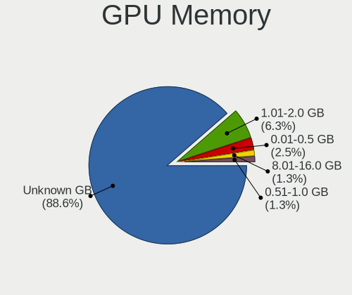
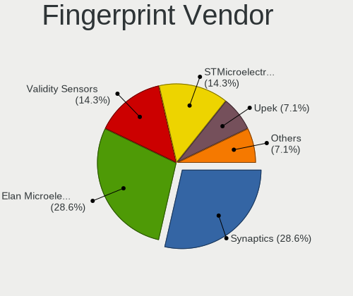

BSD Hardware Trends (Notebooks)
-------------------------------

A project to identify most popular hardware characteristics and track their change
over time based on data collected by BSD users at https://BSD-Hardware.info.

Anyone can contribute to this report by the [hw-probe](https://github.com/linuxhw/hw-probe/blob/master/INSTALL.BSD.md) tool:

    hw-probe -all -upload

Full-feature report is available here: https://bsd-hardware.info/?view=trends

Period: Jan, 2022.

Contents
--------

* [ System ](#system)
  - [ OS                       ](#os)
  - [ OS Family                ](#os-family)
  - [ Arch                     ](#arch)
  - [ DE                       ](#de)
  - [ Display Server           ](#display-server)
  - [ Display Manager          ](#display-manager)
  - [ OS Lang                  ](#os-lang)
  - [ Boot Mode                ](#boot-mode)
  - [ Filesystem               ](#filesystem)
  - [ Part. scheme             ](#part-scheme)

* [ Board ](#board)
  - [ Vendor                   ](#vendor)
  - [ Model                    ](#model)
  - [ Model Family             ](#model-family)
  - [ MFG Year                 ](#mfg-year)
  - [ Form Factor              ](#form-factor)
  - [ Coreboot                 ](#coreboot)
  - [ RAM Size                 ](#ram-size)
  - [ RAM Used                 ](#ram-used)
  - [ Total Drives             ](#total-drives)
  - [ Has CD-ROM               ](#has-cd-rom)
  - [ Has Ethernet             ](#has-ethernet)
  - [ Has WiFi                 ](#has-wifi)
  - [ Has Bluetooth            ](#has-bluetooth)

* [ Location ](#location)
  - [ Country                  ](#country)
  - [ City                     ](#city)

* [ Drives ](#drives)
  - [ Drive Vendor             ](#drive-vendor)
  - [ Drive Model              ](#drive-model)
  - [ HDD Vendor               ](#hdd-vendor)
  - [ SSD Vendor               ](#ssd-vendor)
  - [ Drive Kind               ](#drive-kind)
  - [ Drive Connector          ](#drive-connector)
  - [ Drive Size               ](#drive-size)
  - [ Space Total              ](#space-total)
  - [ Space Used               ](#space-used)
  - [ Malfunc. Drives          ](#malfunc-drives)
  - [ Malfunc. Drive Vendor    ](#malfunc-drive-vendor)
  - [ Malfunc. HDD Vendor      ](#malfunc-hdd-vendor)
  - [ Malfunc. Drive Kind      ](#malfunc-drive-kind)
  - [ Failed Drives            ](#failed-drives)
  - [ Failed Drive Vendor      ](#failed-drive-vendor)
  - [ Drive Status             ](#drive-status)

* [ Storage controller ](#storage-controller)
  - [ Storage Vendor           ](#storage-vendor)
  - [ Storage Model            ](#storage-model)
  - [ Storage Kind             ](#storage-kind)

* [ Processor ](#processor)
  - [ CPU Vendor               ](#cpu-vendor)
  - [ CPU Model                ](#cpu-model)
  - [ CPU Model Family         ](#cpu-model-family)
  - [ CPU Cores                ](#cpu-cores)
  - [ CPU Sockets              ](#cpu-sockets)
  - [ CPU Threads              ](#cpu-threads)
  - [ CPU Microarch            ](#cpu-microarch)

* [ Graphics ](#graphics)
  - [ GPU Vendor               ](#gpu-vendor)
  - [ GPU Model                ](#gpu-model)
  - [ GPU Combo                ](#gpu-combo)
  - [ GPU Driver               ](#gpu-driver)
  - [ GPU Memory               ](#gpu-memory)

* [ Monitor ](#monitor)
  - [ Monitor Vendor           ](#monitor-vendor)
  - [ Monitor Model            ](#monitor-model)
  - [ Monitor Resolution       ](#monitor-resolution)
  - [ Monitor Diagonal         ](#monitor-diagonal)
  - [ Monitor Width            ](#monitor-width)
  - [ Aspect Ratio             ](#aspect-ratio)
  - [ Monitor Area             ](#monitor-area)
  - [ Pixel Density            ](#pixel-density)
  - [ Multiple Monitors        ](#multiple-monitors)

* [ Network ](#network)
  - [ Net Controller Vendor    ](#net-controller-vendor)
  - [ Net Controller Model     ](#net-controller-model)
  - [ Wireless Vendor          ](#wireless-vendor)
  - [ Wireless Model           ](#wireless-model)
  - [ Ethernet Vendor          ](#ethernet-vendor)
  - [ Ethernet Model           ](#ethernet-model)
  - [ Net Controller Kind      ](#net-controller-kind)
  - [ Used Controller          ](#used-controller)
  - [ NICs                     ](#nics)
  - [ IPv6                     ](#ipv6)

* [ Bluetooth ](#bluetooth)
  - [ Bluetooth Vendor         ](#bluetooth-vendor)
  - [ Bluetooth Model          ](#bluetooth-model)

* [ Sound ](#sound)
  - [ Sound Vendor             ](#sound-vendor)
  - [ Sound Model              ](#sound-model)

* [ Memory ](#memory)
  - [ Memory Vendor            ](#memory-vendor)
  - [ Memory Model             ](#memory-model)
  - [ Memory Kind              ](#memory-kind)
  - [ Memory Form Factor       ](#memory-form-factor)
  - [ Memory Size              ](#memory-size)
  - [ Memory Speed             ](#memory-speed)

* [ Printers & scanners ](#printers--scanners)
  - [ Printer Vendor           ](#printer-vendor)
  - [ Printer Model            ](#printer-model)
  - [ Scanner Vendor           ](#scanner-vendor)
  - [ Scanner Model            ](#scanner-model)

* [ Camera ](#camera)
  - [ Camera Vendor            ](#camera-vendor)
  - [ Camera Model             ](#camera-model)

* [ Security ](#security)
  - [ Fingerprint Vendor       ](#fingerprint-vendor)
  - [ Fingerprint Model        ](#fingerprint-model)
  - [ Chipcard Vendor          ](#chipcard-vendor)
  - [ Chipcard Model           ](#chipcard-model)

* [ Unsupported ](#unsupported)
  - [ Unsupported Devices      ](#unsupported-devices)
  - [ Unsupported Device Types ](#unsupported-device-types)

System
------

OS
--

Installed operating systems

| Name                 | Notebooks | Percent |
|----------------------|-----------|---------|
| helloSystem 0.7.0    | 33        | 32.35%  |
| FreeBSD 13.0-p6      | 10        | 9.8%    |
| GhostBSD 21.08.27    | 8         | 7.84%   |
| OpenBSD 7.0          | 7         | 6.86%   |
| FreeBSD 13.0-p5      | 7         | 6.86%   |
| OPNsense 21.7.7      | 6         | 5.88%   |
| helloSystem 0.6.0    | 5         | 4.9%    |
| FreeBSD 14.0-CURRENT | 5         | 4.9%    |
| helloSystem 0.8.0    | 4         | 3.92%   |
| FreeBSD 13.0         | 4         | 3.92%   |
| OPNsense 22.1        | 2         | 1.96%   |
| GhostBSD 20.04.02    | 2         | 1.96%   |
| FreeBSD 13.0-STABLE  | 2         | 1.96%   |
| FreeBSD 12.3         | 2         | 1.96%   |
| MidnightBSD 2.1.1    | 1         | 0.98%   |
| helloSystem 0.5.0    | 1         | 0.98%   |
| GhostBSD 22.01.12    | 1         | 0.98%   |
| FreeBSD 13.0-p4      | 1         | 0.98%   |
| FreeBSD 11.4-p7      | 1         | 0.98%   |

OS Family
---------

OS without a version

| Name        | Notebooks | Percent |
|-------------|-----------|---------|
| helloSystem | 43        | 42.16%  |
| FreeBSD     | 32        | 31.37%  |
| GhostBSD    | 11        | 10.78%  |
| OPNsense    | 8         | 7.84%   |
| OpenBSD     | 7         | 6.86%   |
| MidnightBSD | 1         | 0.98%   |

Arch
----

OS architecture (x86_64, i586, etc.)

| Name  | Notebooks | Percent |
|-------|-----------|---------|
| amd64 | 102       | 100%    |

DE
--

Desktop Environment

| Name          | Notebooks | Percent |
|---------------|-----------|---------|
| helloDesktop  | 44        | 43.14%  |
| MATE          | 11        | 10.78%  |
| Console       | 9         | 8.82%   |
| XFCE          | 8         | 7.84%   |
| fvwm          | 7         | 6.86%   |
| KDE5          | 6         | 5.88%   |
| TWM           | 5         | 4.9%    |
| GNOME         | 4         | 3.92%   |
| Cinnamon      | 3         | 2.94%   |
| Enlightenment | 2         | 1.96%   |
| Picom         | 1         | 0.98%   |
| Openbox       | 1         | 0.98%   |
| i3            | 1         | 0.98%   |

Display Server
--------------

X11 or Wayland

| Name    | Notebooks | Percent |
|---------|-----------|---------|
| X11     | 92        | 90.2%   |
| Console | 9         | 8.82%   |
| Wayland | 1         | 0.98%   |

Display Manager
---------------

SDDM, LightDM, etc.

| Name    | Notebooks | Percent |
|---------|-----------|---------|
| SLiM    | 45        | 44.12%  |
| Console | 25        | 24.51%  |
| LightDM | 13        | 12.75%  |
| SDDM    | 7         | 6.86%   |
| XDM     | 6         | 5.88%   |
| GDM     | 5         | 4.9%    |
| WDM     | 1         | 0.98%   |

OS Lang
-------

Language

| Lang    | Notebooks | Percent |
|---------|-----------|---------|
| en_US   | 55        | 53.92%  |
| C       | 20        | 19.61%  |
| Unknown | 18        | 17.65%  |
| pl_PL   | 2         | 1.96%   |
| fr_FR   | 2         | 1.96%   |
| it_IT   | 1         | 0.98%   |
| en_GB   | 1         | 0.98%   |
| en_CA   | 1         | 0.98%   |
| de_DE   | 1         | 0.98%   |
| de_CH   | 1         | 0.98%   |

Boot Mode
---------

EFI or BIOS

| Mode | Notebooks | Percent |
|------|-----------|---------|
| EFI  | 92        | 90.2%   |
| BIOS | 10        | 9.8%    |

Filesystem
----------

Type of filesystem

| Type   | Notebooks | Percent |
|--------|-----------|---------|
| Zfs    | 58        | 56.86%  |
| Cd9660 | 20        | 19.61%  |
| Ufs    | 17        | 16.67%  |
| Ffs    | 7         | 6.86%   |

Part. scheme
------------

Scheme of partitioning

| Type | Notebooks | Percent |
|------|-----------|---------|
| GPT  | 99        | 97.06%  |
| MBR  | 3         | 2.94%   |

Board
-----

Vendor
------

Motherboard manufacturer

| Name                | Notebooks | Percent |
|---------------------|-----------|---------|
| Lenovo              | 28        | 27.45%  |
| Dell                | 19        | 18.63%  |
| Hewlett-Packard     | 11        | 10.78%  |
| Acer                | 7         | 6.86%   |
| Apple               | 6         | 5.88%   |
| MSI                 | 5         | 4.9%    |
| ASUSTek Computer    | 5         | 4.9%    |
| Deciso              | 3         | 2.94%   |
| Unknown             | 3         | 2.94%   |
| Toshiba             | 2         | 1.96%   |
| Sony                | 2         | 1.96%   |
| Fujitsu Siemens     | 2         | 1.96%   |
| Framework           | 2         | 1.96%   |
| TUXEDO              | 1         | 0.98%   |
| Samsung Electronics | 1         | 0.98%   |
| Notebook            | 1         | 0.98%   |
| Jumper              | 1         | 0.98%   |
| GPD                 | 1         | 0.98%   |
| Gateway             | 1         | 0.98%   |
| Fujitsu             | 1         | 0.98%   |

Model
-----

Motherboard model

| Name                                       | Notebooks | Percent |
|--------------------------------------------|-----------|---------|
| Deciso Netboard A20                        | 3         | 2.94%   |
| Unknown                                    | 3         | 2.94%   |
| HP Pavilion Gaming Laptop 15-ec2xxx        | 2         | 1.96%   |
| Framework Laptop                           | 2         | 1.96%   |
| Dell Latitude E6540                        | 2         | 1.96%   |
| TUXEDO N14xWU                              | 1         | 0.98%   |
| Toshiba TECRA Z40-B                        | 1         | 0.98%   |
| Toshiba Satellite L50-A                    | 1         | 0.98%   |
| Sony VPCYB45JB                             | 1         | 0.98%   |
| Sony VPCEB1J1E                             | 1         | 0.98%   |
| Samsung N150P/N210P/N220P                  | 1         | 0.98%   |
| Notebook N15_17RD                          | 1         | 0.98%   |
| MSI Summit E13FlipEvo A11MT                | 1         | 0.98%   |
| MSI GT75VR 7RF                             | 1         | 0.98%   |
| MSI GF63 Thin 10SCSR                       | 1         | 0.98%   |
| MSI GE76 Raider 10UG                       | 1         | 0.98%   |
| MSI GE75 Raider 10SFS                      | 1         | 0.98%   |
| Lenovo Y50-70 20378                        | 1         | 0.98%   |
| Lenovo V130-15IGM 81HL                     | 1         | 0.98%   |
| Lenovo ThinkPad X250 20CL001GUS            | 1         | 0.98%   |
| Lenovo ThinkPad X220 Tablet 42962WU        | 1         | 0.98%   |
| Lenovo ThinkPad X220 4293AF4               | 1         | 0.98%   |
| Lenovo ThinkPad X13 Gen 1 20T2003PRT       | 1         | 0.98%   |
| Lenovo ThinkPad X1 Carbon Gen 9 20XW0061MX | 1         | 0.98%   |
| Lenovo ThinkPad X1 Carbon 5th 20HRS04C00   | 1         | 0.98%   |
| Lenovo ThinkPad X1 Carbon 5th 20HR0068GE   | 1         | 0.98%   |
| Lenovo ThinkPad T510 4384AJ6               | 1         | 0.98%   |
| Lenovo ThinkPad T480s 20L8S1GX00           | 1         | 0.98%   |
| Lenovo ThinkPad T470s W10DG 20JTS0A900     | 1         | 0.98%   |
| Lenovo ThinkPad T460p 20FXS09D11           | 1         | 0.98%   |
| Lenovo ThinkPad T440 20B7A0B7MS            | 1         | 0.98%   |
| Lenovo ThinkPad T440 20B7000PHV            | 1         | 0.98%   |
| Lenovo ThinkPad T410 2522E38               | 1         | 0.98%   |
| Lenovo ThinkPad R61 8935WCS                | 1         | 0.98%   |
| Lenovo ThinkPad L570 W10DG 20JRS0RC02      | 1         | 0.98%   |
| Lenovo ThinkPad L450 20DSS1S402            | 1         | 0.98%   |
| Lenovo ThinkPad E480 20KN0048IA            | 1         | 0.98%   |
| Lenovo ThinkPad E15 20RD0011MX             | 1         | 0.98%   |
| Lenovo ThinkPad E14 Gen 3 20Y7003SGE       | 1         | 0.98%   |
| Lenovo ThinkPad A485 20MU000VUS            | 1         | 0.98%   |
| Lenovo Legion Y540-15IRH 81SX              | 1         | 0.98%   |
| Lenovo IdeaPad L340-17IRH Gaming 81LL      | 1         | 0.98%   |
| Lenovo IdeaPad L340-15IWL 81LG             | 1         | 0.98%   |
| Lenovo G550 2958                           | 1         | 0.98%   |
| Lenovo G480 20149                          | 1         | 0.98%   |
| Jumper EZbook                              | 1         | 0.98%   |
| HP Notebook                                | 1         | 0.98%   |
| HP Laptop 15-rb0xx                         | 1         | 0.98%   |
| HP Laptop 15-dw2xxx                        | 1         | 0.98%   |
| HP Laptop 15-bw0xx                         | 1         | 0.98%   |
| HP Laptop 14-dk0xxx                        | 1         | 0.98%   |
| HP EliteBook 8570p                         | 1         | 0.98%   |
| HP EliteBook 820 G1                        | 1         | 0.98%   |
| HP EliteBook 2560p                         | 1         | 0.98%   |
| HP EliteBook 2530p                         | 1         | 0.98%   |
| GPD G1621-02                               | 1         | 0.98%   |
| Gateway NE56R                              | 1         | 0.98%   |
| Fujitsu Siemens ESPRIMO Mobile V5535       | 1         | 0.98%   |
| Fujitsu Siemens AMILO Li 2727              | 1         | 0.98%   |
| Fujitsu CELSIUS H780                       | 1         | 0.98%   |

Model Family
------------

Motherboard model prefix

| Name                    | Notebooks | Percent |
|-------------------------|-----------|---------|
| Lenovo ThinkPad         | 21        | 20.59%  |
| Dell Latitude           | 11        | 10.78%  |
| Dell Inspiron           | 5         | 4.9%    |
| HP Laptop               | 4         | 3.92%   |
| HP EliteBook            | 4         | 3.92%   |
| Acer Aspire             | 4         | 3.92%   |
| Deciso Netboard         | 3         | 2.94%   |
| Unknown                 | 3         | 2.94%   |
| Lenovo IdeaPad          | 2         | 1.96%   |
| HP Pavilion             | 2         | 1.96%   |
| Framework Laptop        | 2         | 1.96%   |
| Apple MacBook5          | 2         | 1.96%   |
| TUXEDO N14xWU           | 1         | 0.98%   |
| Toshiba TECRA           | 1         | 0.98%   |
| Toshiba Satellite       | 1         | 0.98%   |
| Sony VPCYB45JB          | 1         | 0.98%   |
| Sony VPCEB1J1E          | 1         | 0.98%   |
| Samsung N150P           | 1         | 0.98%   |
| Notebook N15            | 1         | 0.98%   |
| MSI Summit              | 1         | 0.98%   |
| MSI GT75VR              | 1         | 0.98%   |
| MSI GF63                | 1         | 0.98%   |
| MSI GE76                | 1         | 0.98%   |
| MSI GE75                | 1         | 0.98%   |
| Lenovo Y50-70           | 1         | 0.98%   |
| Lenovo V130-15IGM       | 1         | 0.98%   |
| Lenovo Legion           | 1         | 0.98%   |
| Lenovo G550             | 1         | 0.98%   |
| Lenovo G480             | 1         | 0.98%   |
| Jumper EZbook           | 1         | 0.98%   |
| HP Notebook             | 1         | 0.98%   |
| GPD G1621-02            | 1         | 0.98%   |
| Gateway NE56R           | 1         | 0.98%   |
| Fujitsu Siemens ESPRIMO | 1         | 0.98%   |
| Fujitsu Siemens AMILO   | 1         | 0.98%   |
| Fujitsu CELSIUS         | 1         | 0.98%   |
| Dell XPS                | 1         | 0.98%   |
| Dell Precision          | 1         | 0.98%   |
| Dell G3                 | 1         | 0.98%   |
| ASUS VivoBook           | 1         | 0.98%   |
| ASUS U31SD              | 1         | 0.98%   |
| ASUS N50Vc              | 1         | 0.98%   |
| ASUS ASUS               | 1         | 0.98%   |
| ASUS 1015PEM            | 1         | 0.98%   |
| Apple MacBookPro9       | 1         | 0.98%   |
| Apple MacBookPro5       | 1         | 0.98%   |
| Apple MacBookPro11      | 1         | 0.98%   |
| Apple MacBook4          | 1         | 0.98%   |
| Acer V5-131             | 1         | 0.98%   |
| Acer TravelMate         | 1         | 0.98%   |
| Acer Extensa            | 1         | 0.98%   |

MFG Year
--------

Motherboard manufacture year

| Year | Notebooks | Percent |
|------|-----------|---------|
| 2021 | 22        | 21.57%  |
| 2020 | 11        | 10.78%  |
| 2015 | 10        | 9.8%    |
| 2018 | 9         | 8.82%   |
| 2019 | 8         | 7.84%   |
| 2017 | 6         | 5.88%   |
| 2010 | 6         | 5.88%   |
| 2009 | 6         | 5.88%   |
| 2014 | 5         | 4.9%    |
| 2011 | 5         | 4.9%    |
| 2013 | 4         | 3.92%   |
| 2012 | 3         | 2.94%   |
| 2008 | 3         | 2.94%   |
| 2016 | 2         | 1.96%   |
| 2007 | 2         | 1.96%   |

Form Factor
-----------

Physical design of the computer

| Name     | Notebooks | Percent |
|----------|-----------|---------|
| Notebook | 102       | 100%    |

Coreboot
--------

Have coreboot on board

| Used | Notebooks | Percent |
|------|-----------|---------|
| No   | 102       | 100%    |

RAM Size
--------

Total RAM memory

| Size in GB  | Notebooks | Percent |
|-------------|-----------|---------|
| 8.01-16.0   | 33        | 32.35%  |
| 16.01-24.0  | 31        | 30.39%  |
| 4.01-8.0    | 22        | 21.57%  |
| 32.01-64.0  | 8         | 7.84%   |
| 3.01-4.0    | 2         | 1.96%   |
| 24.01-32.0  | 2         | 1.96%   |
| 2.01-3.0    | 2         | 1.96%   |
| 64.01-256.0 | 1         | 0.98%   |
| 0.51-1.0    | 1         | 0.98%   |

RAM Used
--------

Used RAM memory

| Used GB  | Notebooks | Percent |
|----------|-----------|---------|
| 0.01-0.5 | 51        | 50%     |
| 0.51-1.0 | 34        | 33.33%  |
| 1.01-2.0 | 10        | 9.8%    |
| 2.01-3.0 | 6         | 5.88%   |
| 4.01-8.0 | 1         | 0.98%   |

Total Drives
------------

Number of drives on board

| Drives | Notebooks | Percent |
|--------|-----------|---------|
| 1      | 70        | 68.63%  |
| 2      | 26        | 25.49%  |
| 0      | 4         | 3.92%   |
| 3      | 2         | 1.96%   |

Has CD-ROM
----------

Has CD-ROM on board

| Presented | Notebooks | Percent |
|-----------|-----------|---------|
| No        | 75        | 73.53%  |
| Yes       | 27        | 26.47%  |

Has Ethernet
------------

Has Ethernet on board

| Presented | Notebooks | Percent |
|-----------|-----------|---------|
| Yes       | 93        | 91.18%  |
| No        | 9         | 8.82%   |

Has WiFi
--------

Has WiFi module

| Presented | Notebooks | Percent |
|-----------|-----------|---------|
| Yes       | 94        | 92.16%  |
| No        | 8         | 7.84%   |

Has Bluetooth
-------------

Has Bluetooth module

| Presented | Notebooks | Percent |
|-----------|-----------|---------|
| Yes       | 65        | 63.73%  |
| No        | 37        | 36.27%  |

Location
--------

Country
-------

Geographic location (country)

| Country     | Notebooks | Percent |
|-------------|-----------|---------|
| USA         | 22        | 21.57%  |
| Germany     | 11        | 10.78%  |
| Russia      | 5         | 4.9%    |
| France      | 5         | 4.9%    |
| UK          | 4         | 3.92%   |
| Italy       | 4         | 3.92%   |
| Brazil      | 4         | 3.92%   |
| Austria     | 4         | 3.92%   |
| Romania     | 3         | 2.94%   |
| Finland     | 3         | 2.94%   |
| Canada      | 3         | 2.94%   |
| Switzerland | 2         | 1.96%   |
| Portugal    | 2         | 1.96%   |
| Poland      | 2         | 1.96%   |
| Netherlands | 2         | 1.96%   |
| Mexico      | 2         | 1.96%   |
| Indonesia   | 2         | 1.96%   |
| India       | 2         | 1.96%   |
| Australia   | 2         | 1.96%   |
| Vietnam     | 1         | 0.98%   |
| Venezuela   | 1         | 0.98%   |
| Ukraine     | 1         | 0.98%   |
| Turkey      | 1         | 0.98%   |
| Sweden      | 1         | 0.98%   |
| Spain       | 1         | 0.98%   |
| Malaysia    | 1         | 0.98%   |
| Lithuania   | 1         | 0.98%   |
| Hungary     | 1         | 0.98%   |
| Greece      | 1         | 0.98%   |
| Georgia     | 1         | 0.98%   |
| Eswatini    | 1         | 0.98%   |
| Denmark     | 1         | 0.98%   |
| Cuba        | 1         | 0.98%   |
| China       | 1         | 0.98%   |
| Chile       | 1         | 0.98%   |
| Armenia     | 1         | 0.98%   |
| Argentina   | 1         | 0.98%   |

City
----

Geographic location (city)

| City                  | Notebooks | Percent |
|-----------------------|-----------|---------|
| Bonn                  | 3         | 2.94%   |
| Vienna                | 2         | 1.96%   |
| Rome                  | 2         | 1.96%   |
| London                | 2         | 1.96%   |
| Leatherhead           | 2         | 1.96%   |
| Jakarta               | 2         | 1.96%   |
| Helsinki              | 2         | 1.96%   |
| Chicago               | 2         | 1.96%   |
| Calgary               | 2         | 1.96%   |
| Berlin                | 2         | 1.96%   |
| Zapopan               | 1         | 0.98%   |
| Ypsilanti             | 1         | 0.98%   |
| Yerevan               | 1         | 0.98%   |
| Yaphank               | 1         | 0.98%   |
| Warsaw                | 1         | 0.98%   |
| Vilnius               | 1         | 0.98%   |
| Urbandale             | 1         | 0.98%   |
| Tiruchi               | 1         | 0.98%   |
| Therwil               | 1         | 0.98%   |
| Stuttgart             | 1         | 0.98%   |
| St Petersburg         | 1         | 0.98%   |
| Skellefte??           | 1         | 0.98%   |
| Sinzig                | 1         | 0.98%   |
| Sheboygan             | 1         | 0.98%   |
| Shah Alam             | 1         | 0.98%   |
| San Luis Potos?­ City | 1         | 0.98%   |
| San Diego             | 1         | 0.98%   |
| San Carlos del Zulia  | 1         | 0.98%   |
| Saint-Germain-en-Laye | 1         | 0.98%   |
| Rostov-on-Don         | 1         | 0.98%   |
| Roncade               | 1         | 0.98%   |
| Riverton              | 1         | 0.98%   |
| Rio de Janeiro        | 1         | 0.98%   |
| Queens                | 1         | 0.98%   |
| Preveza               | 1         | 0.98%   |
| Potsdam               | 1         | 0.98%   |
| Portland              | 1         | 0.98%   |
| Pflugerville          | 1         | 0.98%   |
| Perth                 | 1         | 0.98%   |
| Paris                 | 1         | 0.98%   |
| New York              | 1         | 0.98%   |
| Mystic                | 1         | 0.98%   |
| Munich                | 1         | 0.98%   |
| Mt. Pleasant          | 1         | 0.98%   |
| Moscow                | 1         | 0.98%   |
| Montclair             | 1         | 0.98%   |
| Mendoza               | 1         | 0.98%   |
| Mbabane               | 1         | 0.98%   |
| Malnate               | 1         | 0.98%   |
| Mage                  | 1         | 0.98%   |
| Lisbon                | 1         | 0.98%   |
| Leiden                | 1         | 0.98%   |
| Lanzhou               | 1         | 0.98%   |
| Lalinde               | 1         | 0.98%   |
| Lahti                 | 1         | 0.98%   |
| Kstovo                | 1         | 0.98%   |
| Krasnoyarsk           | 1         | 0.98%   |
| Knoxville             | 1         | 0.98%   |
| Kassel                | 1         | 0.98%   |
| K'alak'i T'bilisi     | 1         | 0.98%   |

Drives
------

Drive Vendor
------------

Hard drive vendors

| Vendor              | Notebooks | Drives | Percent |
|---------------------|-----------|--------|---------|
| Samsung Electronics | 23        | 25     | 18.7%   |
| WDC                 | 19        | 19     | 15.45%  |
| Toshiba             | 12        | 12     | 9.76%   |
| Kingston            | 10        | 10     | 8.13%   |
| Seagate             | 9         | 9      | 7.32%   |
| Transcend           | 4         | 5      | 3.25%   |
| SanDisk             | 4         | 4      | 3.25%   |
| NVMe                | 4         | 4      | 3.25%   |
| Intel               | 4         | 4      | 3.25%   |
| Crucial             | 4         | 4      | 3.25%   |
| Phison              | 3         | 3      | 2.44%   |
| HGST                | 3         | 3      | 2.44%   |
| Patriot             | 2         | 2      | 1.63%   |
| Micron Technology   | 2         | 2      | 1.63%   |
| GOODRAM             | 2         | 2      | 1.63%   |
| Fujitsu             | 2         | 2      | 1.63%   |
| A-DATA Technology   | 2         | 2      | 1.63%   |
| SPCC                | 1         | 1      | 0.81%   |
| SK Hynix            | 1         | 1      | 0.81%   |
| Lexar               | 1         | 1      | 0.81%   |
| KIOXIA              | 1         | 1      | 0.81%   |
| KingSpec            | 1         | 1      | 0.81%   |
| Hoodisk             | 1         | 1      | 0.81%   |
| Hitachi             | 1         | 1      | 0.81%   |
| FORESEE             | 1         | 1      | 0.81%   |
| FLEXXON             | 1         | 1      | 0.81%   |
| Corsair             | 1         | 1      | 0.81%   |
| BIWIN               | 1         | 1      | 0.81%   |
| Apple               | 1         | 1      | 0.81%   |
| Apacer              | 1         | 1      | 0.81%   |
| AGI                 | 1         | 1      | 0.81%   |

Drive Model
-----------

Hard drive models

| Model                                | Notebooks | Percent |
|--------------------------------------|-----------|---------|
| Kingston SA400S37240G 240GB          | 4         | 3.2%    |
| Transcend TS256GMTS952T2 256GB       | 3         | 2.4%    |
| WDC WD5000LPCX-60VHAT0 500GB         | 2         | 1.6%    |
| Toshiba MQ01ABF050 500GB             | 2         | 1.6%    |
| Toshiba MQ01ABD100 1TB               | 2         | 1.6%    |
| Samsung SSD 860 EVO 500GB            | 2         | 1.6%    |
| Samsung MZVLQ256HAJD-000H1 256GB     | 2         | 1.6%    |
| Kingston SA400S37120G 120GB          | 2         | 1.6%    |
| HGST HTS721010A9E630 1TB             | 2         | 1.6%    |
| WDC WDS500G3X0C-00SJG0 500GB         | 1         | 0.8%    |
| WDC WDS500G2B0C-00PXH0 500GB         | 1         | 0.8%    |
| WDC WDS500G2B0A-00SM50 500GB         | 1         | 0.8%    |
| WDC WDS500G2B0A 500GB                | 1         | 0.8%    |
| WDC WDS120G2G0A-00JH30 120GB         | 1         | 0.8%    |
| WDC WD6400BEVT-22A0RT0 640GB         | 1         | 0.8%    |
| WDC WD5000LPVX-22V0TT0 500GB         | 1         | 0.8%    |
| WDC WD3200BEVT-22ZCT0 320GB          | 1         | 0.8%    |
| WDC WD1600BEVT-80A23T0 160GB         | 1         | 0.8%    |
| WDC WD1600BEVT-75ZCT2 160GB          | 1         | 0.8%    |
| WDC WD10SPZX-24Z10 1TB               | 1         | 0.8%    |
| WDC WD10SPZX-22Z10T1 1TB             | 1         | 0.8%    |
| WDC WD10JPVX-60JC3T0 1TB             | 1         | 0.8%    |
| WDC WD10JMVW-11AJGS1 1TB             | 1         | 0.8%    |
| WDC PC SN730 SDBQNTY-1T00-1001 1TB   | 1         | 0.8%    |
| WDC PC SN530 SDBPNPZ-512G-1002 512GB | 1         | 0.8%    |
| WDC PC SN530 NVMe 256GB              | 1         | 0.8%    |
| Transcend TS2TMTE220S 2TB            | 1         | 0.8%    |
| Toshiba THNSNX024GMNT 24GB           | 1         | 0.8%    |
| Toshiba MQ02ABD100H 1TB              | 1         | 0.8%    |
| Toshiba MK8034GSX 80GB               | 1         | 0.8%    |
| Toshiba MK3261GSYN 320GB             | 1         | 0.8%    |
| Toshiba MK1629GSGF 160GB             | 1         | 0.8%    |
| Toshiba MK1252GSX 120GB              | 1         | 0.8%    |
| Toshiba KBG40ZNT512G MEMORY 512GB    | 1         | 0.8%    |
| Toshiba KBG30ZMV512G 512GB           | 1         | 0.8%    |
| SPCC Solid State Disk 256GB          | 1         | 0.8%    |
| SK Hynix HFS128G32TNF-N3A0A 128GB    | 1         | 0.8%    |
| Seagate ST980813AS 80GB              | 1         | 0.8%    |
| Seagate ST980811AS 80GB              | 1         | 0.8%    |
| Seagate ST9320325AS 320GB            | 1         | 0.8%    |
| Seagate ST9250315ASG 250GB           | 1         | 0.8%    |
| Seagate ST500LT012-9WS142 500GB      | 1         | 0.8%    |
| Seagate ST320LT007-9ZV142 320GB      | 1         | 0.8%    |
| Seagate ST2000LM007-1R8174 2TB       | 1         | 0.8%    |
| Seagate ST1000LM049-2GH172 1TB       | 1         | 0.8%    |
| Seagate ST1000LM035-1RK172 1TB       | 1         | 0.8%    |
| SanDisk SSD PLUS 480 GB              | 1         | 0.8%    |
| SanDisk SSD PLUS 240GB               | 1         | 0.8%    |
| SanDisk SSD P4 64GB                  | 1         | 0.8%    |
| SanDisk SDSA5GK-016G-1006 16GB       | 1         | 0.8%    |
| Samsung SSD PM841 2.5-inch 7mm 256GB | 1         | 0.8%    |
| Samsung SSD 970 EVO 500GB            | 1         | 0.8%    |
| Samsung SSD 970 EVO 250GB            | 1         | 0.8%    |
| Samsung SSD 860 QVO 1TB              | 1         | 0.8%    |
| Samsung SSD 850 EVO M.2 250GB        | 1         | 0.8%    |
| Samsung SSD 850 EVO 500GB            | 1         | 0.8%    |
| Samsung SSD 850 EVO 250GB            | 1         | 0.8%    |
| Samsung SSD 840 Series 120GB         | 1         | 0.8%    |
| Samsung SSD 840 EVO 500GB            | 1         | 0.8%    |
| Samsung SSD 840 EVO 120GB            | 1         | 0.8%    |

HDD Vendor
----------

Hard disk drive vendors

| Vendor              | Notebooks | Drives | Percent |
|---------------------|-----------|--------|---------|
| WDC                 | 11        | 11     | 28.21%  |
| Toshiba             | 9         | 9      | 23.08%  |
| Seagate             | 9         | 9      | 23.08%  |
| NVMe                | 3         | 3      | 7.69%   |
| HGST                | 3         | 3      | 7.69%   |
| Fujitsu             | 2         | 2      | 5.13%   |
| Samsung Electronics | 1         | 1      | 2.56%   |
| Hitachi             | 1         | 1      | 2.56%   |

SSD Vendor
----------

Solid state drive vendors

| Vendor              | Notebooks | Drives | Percent |
|---------------------|-----------|--------|---------|
| Samsung Electronics | 14        | 14     | 26.42%  |
| Kingston            | 8         | 8      | 15.09%  |
| SanDisk             | 4         | 4      | 7.55%   |
| WDC                 | 3         | 3      | 5.66%   |
| Transcend           | 3         | 3      | 5.66%   |
| Crucial             | 3         | 3      | 5.66%   |
| Patriot             | 2         | 2      | 3.77%   |
| Intel               | 2         | 2      | 3.77%   |
| GOODRAM             | 2         | 2      | 3.77%   |
| Toshiba             | 1         | 1      | 1.89%   |
| SPCC                | 1         | 1      | 1.89%   |
| SK Hynix            | 1         | 1      | 1.89%   |
| Phison              | 1         | 1      | 1.89%   |
| Lexar               | 1         | 1      | 1.89%   |
| KingSpec            | 1         | 1      | 1.89%   |
| Hoodisk             | 1         | 1      | 1.89%   |
| FORESEE             | 1         | 1      | 1.89%   |
| FLEXXON             | 1         | 1      | 1.89%   |
| Corsair             | 1         | 1      | 1.89%   |
| Apple               | 1         | 1      | 1.89%   |
| Apacer              | 1         | 1      | 1.89%   |

Drive Kind
----------

HDD or SSD

| Kind | Notebooks | Drives | Percent |
|------|-----------|--------|---------|
| SSD  | 49        | 53     | 42.61%  |
| HDD  | 35        | 39     | 30.43%  |
| NVMe | 31        | 34     | 26.96%  |

Drive Connector
---------------

SATA, SAS, NVMe, etc.

| Type | Notebooks | Drives | Percent |
|------|-----------|--------|---------|
| SATA | 81        | 92     | 72.32%  |
| NVMe | 31        | 34     | 27.68%  |

Drive Size
----------

Size of hard drive

| Size in TB | Notebooks | Drives | Percent |
|------------|-----------|--------|---------|
| 0.01-0.5   | 63        | 70     | 74.12%  |
| 0.51-1.0   | 18        | 18     | 21.18%  |
| 1.01-2.0   | 4         | 4      | 4.71%   |

Space Total
-----------

Amount of disk space available on the file system

| Size in GB | Notebooks | Percent |
|------------|-----------|---------|
| 1-20       | 32        | 31.37%  |
| 101-250    | 26        | 25.49%  |
| 251-500    | 18        | 17.65%  |
| 501-1000   | 14        | 13.73%  |
| 51-100     | 7         | 6.86%   |
| 21-50      | 2         | 1.96%   |
| 1001-2000  | 2         | 1.96%   |
| Unknown    | 1         | 0.98%   |

Space Used
----------

Amount of used disk space

| Used GB | Notebooks | Percent |
|---------|-----------|---------|
| 1-20    | 91        | 89.22%  |
| 21-50   | 7         | 6.86%   |
| 251-500 | 1         | 0.98%   |
| 101-250 | 1         | 0.98%   |
| 51-100  | 1         | 0.98%   |
| Unknown | 1         | 0.98%   |

Malfunc. Drives
---------------

Drive models with a malfunction

| Model                           | Notebooks | Drives | Percent |
|---------------------------------|-----------|--------|---------|
| WDC WD6400BEVT-22A0RT0 640GB    | 1         | 1      | 5.56%   |
| WDC WD5000LPCX-60VHAT0 500GB    | 1         | 1      | 5.56%   |
| WDC WD3200BEVT-22ZCT0 320GB     | 1         | 1      | 5.56%   |
| WDC WD1600BEVT-80A23T0 160GB    | 1         | 1      | 5.56%   |
| WDC WD10JPVX-60JC3T0 1TB        | 1         | 1      | 5.56%   |
| Toshiba THNSNX024GMNT 24GB      | 1         | 1      | 5.56%   |
| Toshiba MQ01ABF050 500GB        | 1         | 1      | 5.56%   |
| Toshiba MK8034GSX 80GB          | 1         | 1      | 5.56%   |
| Toshiba MK3261GSYN 320GB        | 1         | 1      | 5.56%   |
| Toshiba MK1629GSGF 160GB        | 1         | 1      | 5.56%   |
| Toshiba MK1252GSX 120GB         | 1         | 1      | 5.56%   |
| Seagate ST9320325AS 320GB       | 1         | 1      | 5.56%   |
| Seagate ST500LT012-9WS142 500GB | 1         | 1      | 5.56%   |
| Seagate ST320LT007-9ZV142 320GB | 1         | 1      | 5.56%   |
| SanDisk SSD P4 64GB             | 1         | 1      | 5.56%   |
| HGST HTS721010A9E630 1TB        | 1         | 1      | 5.56%   |
| Fujitsu MHZ2160BH G2 160GB      | 1         | 1      | 5.56%   |
| AGI AGI512G16AI198 512GB        | 1         | 1      | 5.56%   |

Malfunc. Drive Vendor
---------------------

Vendors of faulty drives

| Vendor  | Notebooks | Drives | Percent |
|---------|-----------|--------|---------|
| Toshiba | 6         | 6      | 33.33%  |
| WDC     | 5         | 5      | 27.78%  |
| Seagate | 3         | 3      | 16.67%  |
| SanDisk | 1         | 1      | 5.56%   |
| HGST    | 1         | 1      | 5.56%   |
| Fujitsu | 1         | 1      | 5.56%   |
| AGI     | 1         | 1      | 5.56%   |

Malfunc. HDD Vendor
-------------------

Vendors of faulty HDD drives

| Vendor  | Notebooks | Drives | Percent |
|---------|-----------|--------|---------|
| WDC     | 5         | 5      | 33.33%  |
| Toshiba | 5         | 5      | 33.33%  |
| Seagate | 3         | 3      | 20%     |
| HGST    | 1         | 1      | 6.67%   |
| Fujitsu | 1         | 1      | 6.67%   |

Malfunc. Drive Kind
-------------------

Kinds of faulty drives

| Kind | Notebooks | Drives | Percent |
|------|-----------|--------|---------|
| HDD  | 14        | 15     | 82.35%  |
| SSD  | 2         | 2      | 11.76%  |
| NVMe | 1         | 1      | 5.88%   |

Failed Drives
-------------

Failed drive models

Zero info for selected period =(

Failed Drive Vendor
-------------------

Failed drive vendors

Zero info for selected period =(

Drive Status
------------

Number of failed and malfunc. drives

| Status   | Notebooks | Drives | Percent |
|----------|-----------|--------|---------|
| Works    | 82        | 104    | 79.61%  |
| Malfunc  | 17        | 18     | 16.5%   |
| Detected | 4         | 4      | 3.88%   |

Storage controller
------------------

Storage Vendor
--------------

Storage controller vendors

| Vendor                           | Notebooks | Percent |
|----------------------------------|-----------|---------|
| Intel                            | 70        | 57.85%  |
| Samsung Electronics              | 13        | 10.74%  |
| AMD                              | 13        | 10.74%  |
| Sandisk                          | 6         | 4.96%   |
| Silicon Motion                   | 3         | 2.48%   |
| Nvidia                           | 3         | 2.48%   |
| ADATA Technology                 | 3         | 2.48%   |
| Phison Electronics               | 2         | 1.65%   |
| Micron Technology                | 2         | 1.65%   |
| KIOXIA                           | 2         | 1.65%   |
| Kingston Technology Company      | 2         | 1.65%   |
| Toshiba                          | 1         | 0.83%   |
| Silicon Integrated Systems [SiS] | 1         | 0.83%   |

Storage Model
-------------

Storage controller models

| Model                                                                                  | Notebooks | Percent |
|----------------------------------------------------------------------------------------|-----------|---------|
| AMD FCH SATA Controller [AHCI mode]                                                    | 12        | 9.23%   |
| Intel Sunrise Point-LP SATA Controller [AHCI mode]                                     | 7         | 5.38%   |
| Intel 7 Series Chipset Family 6-port SATA Controller [AHCI mode]                       | 7         | 5.38%   |
| Intel 6 Series/C200 Series Chipset Family 6 port Mobile SATA AHCI Controller           | 6         | 4.62%   |
| Samsung NVMe SSD Controller 980                                                        | 5         | 3.85%   |
| Intel Wildcat Point-LP SATA Controller [AHCI Mode]                                     | 5         | 3.85%   |
| Intel 82801IBM/IEM (ICH9M/ICH9M-E) 4 port SATA Controller [AHCI mode]                  | 5         | 3.85%   |
| Intel Cannon Lake Mobile PCH SATA AHCI Controller                                      | 4         | 3.08%   |
| Intel 8 Series/C220 Series Chipset Family 6-port SATA Controller 1 [AHCI mode]         | 4         | 3.08%   |
| Intel 8 Series SATA Controller 1 [AHCI mode]                                           | 4         | 3.08%   |
| Unknown                                                                                | 4         | 3.08%   |
| Sandisk WD Black SN750 / PC SN730 NVMe SSD                                             | 3         | 2.31%   |
| Samsung NVMe SSD Controller SM981/PM981/PM983                                          | 3         | 2.31%   |
| Samsung NVMe SSD Controller SM961/PM961/SM963                                          | 3         | 2.31%   |
| Nvidia MCP79 AHCI Controller                                                           | 3         | 2.31%   |
| Intel 82801HM/HEM (ICH8M/ICH8M-E) SATA Controller [AHCI mode]                          | 3         | 2.31%   |
| Intel 82801HM/HEM (ICH8M/ICH8M-E) IDE Controller                                       | 3         | 2.31%   |
| Intel 82801 Mobile SATA Controller [RAID mode]                                         | 3         | 2.31%   |
| Intel 400 Series Chipset Family SATA AHCI Controller                                   | 3         | 2.31%   |
| Silicon Motion SM2262/SM2262EN SSD Controller                                          | 2         | 1.54%   |
| Sandisk WD Blue SN550 NVMe SSD                                                         | 2         | 1.54%   |
| KIOXIA unknown                                                                         | 2         | 1.54%   |
| Intel NM10/ICH7 Family SATA Controller [AHCI mode]                                     | 2         | 1.54%   |
| Intel HM170/QM170 Chipset SATA Controller [AHCI Mode]                                  | 2         | 1.54%   |
| Intel Comet Lake SATA AHCI Controller                                                  | 2         | 1.54%   |
| Intel Celeron N3350/Pentium N4200/Atom E3900 Series SATA AHCI Controller               | 2         | 1.54%   |
| Intel Cannon Point-LP SATA Controller [AHCI Mode]                                      | 2         | 1.54%   |
| Intel 5 Series/3400 Series Chipset 6 port SATA AHCI Controller                         | 2         | 1.54%   |
| Intel 5 Series/3400 Series Chipset 4 port SATA AHCI Controller                         | 2         | 1.54%   |
| ADATA XPG SX8200 Pro PCIe Gen3x4 M.2 2280 Solid State Drive                            | 2         | 1.54%   |
| Toshiba BG3 NVMe SSD Controller                                                        | 1         | 0.77%   |
| Silicon Motion SM2263EN/SM2263XT SSD Controller                                        | 1         | 0.77%   |
| Silicon Integrated Systems [SiS] SATA Controller / IDE mode                            | 1         | 0.77%   |
| Silicon Integrated Systems [SiS] 5513 IDE Controller                                   | 1         | 0.77%   |
| Sandisk unknown                                                                        | 1         | 0.77%   |
| Samsung SM951 AHCI                                                                     | 1         | 0.77%   |
| Samsung NVMe SSD Controller PM9A1/PM9A3/980PRO                                         | 1         | 0.77%   |
| Phison E16 PCIe4 NVMe Controller                                                       | 1         | 0.77%   |
| Phison E12 NVMe Controller                                                             | 1         | 0.77%   |
| Intel SSD Pro 7600p/760p/E 6100p Series                                                | 1         | 0.77%   |
| Intel SSD 660P Series                                                                  | 1         | 0.77%   |
| Intel Q170/Q150/B150/H170/H110/Z170/CM236 Chipset SATA Controller [AHCI Mode]          | 1         | 0.77%   |
| Intel Mobile 4 Series Chipset PT IDER Controller                                       | 1         | 0.77%   |
| Intel Celeron/Pentium Silver Processor SATA Controller                                 | 1         | 0.77%   |
| Intel Atom Processor E3800 Series SATA AHCI Controller                                 | 1         | 0.77%   |
| Intel 7 Series Chipset Family 4-port SATA Controller [IDE mode]                        | 1         | 0.77%   |
| Intel 7 Series Chipset Family 2-port SATA Controller [IDE mode]                        | 1         | 0.77%   |
| Intel 6 Series/C200 Series Chipset Family Mobile SATA Controller (IDE mode, ports 4-5) | 1         | 0.77%   |
| Intel 6 Series/C200 Series Chipset Family Mobile SATA Controller (IDE mode, ports 0-3) | 1         | 0.77%   |
| AMD SB7x0/SB8x0/SB9x0 SATA Controller [AHCI mode]                                      | 1         | 0.77%   |
| ADATA Technology unknown                                                               | 1         | 0.77%   |

Storage Kind
------------

Kind of storage controller (IDE, SATA, NVMe, SAS, ...)

| Kind | Notebooks | Percent |
|------|-----------|---------|
| SATA | 82        | 65.08%  |
| NVMe | 34        | 26.98%  |
| IDE  | 7         | 5.56%   |
| RAID | 3         | 2.38%   |

Processor
---------

CPU Vendor
----------

Processor vendors

| Vendor | Notebooks | Percent |
|--------|-----------|---------|
| Intel  | 86        | 84.31%  |
| AMD    | 16        | 15.69%  |

CPU Model
---------

Processor models

| Model                                   | Notebooks | Percent |
|-----------------------------------------|-----------|---------|
| Intel Core i5-2520M CPU @ 2.50GHz       | 5         | 4.9%    |
| Intel CPU Version                       | 3         | 2.94%   |
| Intel Core i5-8250U CPU @ 1.60GHz       | 3         | 2.94%   |
| Intel Core i7-8850H CPU @ 2.60GHz       | 2         | 1.96%   |
| Intel Core i7-4810MQ CPU @ 2.80GHz      | 2         | 1.96%   |
| Intel Core i7-3520M CPU @ 2.90GHz       | 2         | 1.96%   |
| Intel Core i7-10510U CPU @ 1.80GHz      | 2         | 1.96%   |
| Intel Core i5-7200U CPU @ 2.50GHz       | 2         | 1.96%   |
| Intel Core i5-5300U CPU @ 2.30GHz       | 2         | 1.96%   |
| Intel Core i5-5200U CPU @ 2.20GHz       | 2         | 1.96%   |
| Intel Core i5-4300U CPU @ 1.90GHz       | 2         | 1.96%   |
| Intel Core i5-3210M CPU @ 2.50GHz       | 2         | 1.96%   |
| Intel Celeron CPU N3350 @ 1.10GHz       | 2         | 1.96%   |
| Intel 11th Gen Core i7-1195G7 @ 2.90GHz | 2         | 1.96%   |
| Intel 11th Gen Core i5-1135G7 @ 2.40GHz | 2         | 1.96%   |
| AMD Ryzen 5 5600H with Radeon Graphics  | 2         | 1.96%   |
| AMD Ryzen 5 5500U with Radeon Graphics  | 2         | 1.96%   |
| AMD EPYC 3201 8-Core Processor          | 2         | 1.96%   |
| Intel Pentium CPU N3540 @ 2.16GHz       | 1         | 0.98%   |
| Intel Core i9-10980HK CPU @ 2.40GHz     | 1         | 0.98%   |
| Intel Core i7-9750HF CPU @ 2.60GHz      | 1         | 0.98%   |
| Intel Core i7-8705G CPU @ 3.10GHz       | 1         | 0.98%   |
| Intel Core i7-8565U CPU @ 1.80GHz       | 1         | 0.98%   |
| Intel Core i7-7700HQ CPU @ 2.80GHz      | 1         | 0.98%   |
| Intel Core i7-7600U CPU @ 2.80GHz       | 1         | 0.98%   |
| Intel Core i7-7500U CPU @ 2.70GHz       | 1         | 0.98%   |
| Intel Core i7-6700HQ CPU @ 2.60GHz      | 1         | 0.98%   |
| Intel Core i7-5500U CPU @ 2.40GHz       | 1         | 0.98%   |
| Intel Core i7-4770HQ CPU @ 2.20GHz      | 1         | 0.98%   |
| Intel Core i7-4710HQ CPU @ 2.50GHz      | 1         | 0.98%   |
| Intel Core i7-4700MQ CPU @ 2.40GHz      | 1         | 0.98%   |
| Intel Core i7-3720QM CPU @ 2.60GHz      | 1         | 0.98%   |
| Intel Core i7-2677M CPU @ 1.80GHz       | 1         | 0.98%   |
| Intel Core i7-10870H CPU @ 2.20GHz      | 1         | 0.98%   |
| Intel Core i7-10750H CPU @ 2.60GHz      | 1         | 0.98%   |
| Intel Core i5-9300H CPU @ 2.40GHz       | 1         | 0.98%   |
| Intel Core i5-8350U CPU @ 1.70GHz       | 1         | 0.98%   |
| Intel Core i5-7300U CPU @ 2.60GHz       | 1         | 0.98%   |
| Intel Core i5-7300HQ CPU @ 2.50GHz      | 1         | 0.98%   |
| Intel Core i5-6440HQ CPU @ 2.60GHz      | 1         | 0.98%   |
| Intel Core i5-6300U CPU @ 2.40GHz       | 1         | 0.98%   |
| Intel Core i5-6200U CPU @ 2.30GHz       | 1         | 0.98%   |
| Intel Core i5-4310U CPU @ 2.00GHz       | 1         | 0.98%   |
| Intel Core i5-2430M CPU @ 2.40GHz       | 1         | 0.98%   |
| Intel Core i5-1035G1 CPU @ 1.00GHz      | 1         | 0.98%   |
| Intel Core i5-10310U CPU @ 1.70GHz      | 1         | 0.98%   |
| Intel Core i5-10300H CPU @ 2.50GHz      | 1         | 0.98%   |
| Intel Core i5 CPU M 560 @ 2.67GHz       | 1         | 0.98%   |
| Intel Core i5 CPU M 520 @ 2.40GHz       | 1         | 0.98%   |
| Intel Core i5 CPU M 520 @ 2.40GH        | 1         | 0.98%   |
| Intel Core i3-8145U CPU @ 2.10GHz       | 1         | 0.98%   |
| Intel Core i3-2310M CPU @ 2.10GHz       | 1         | 0.98%   |
| Intel Core i3 CPU M 330 @ 2.13GHz       | 1         | 0.98%   |
| Intel Core 2 Duo CPU T9300 @ 2.50GHz    | 1         | 0.98%   |
| Intel Core 2 Duo CPU T8300 @ 2.40GHz    | 1         | 0.98%   |
| Intel Core 2 Duo CPU T8100 @ 2.10GHz    | 1         | 0.98%   |
| Intel Core 2 Duo CPU T7300 @ 2.00GHz    | 1         | 0.98%   |
| Intel Core 2 Duo CPU P8700 @ 2.53GHz    | 1         | 0.98%   |
| Intel Core 2 Duo CPU P8400 @ 2.26GHz    | 1         | 0.98%   |
| Intel Core 2 Duo CPU P7450 @ 2.13GHz    | 1         | 0.98%   |

CPU Model Family
----------------

Processor model prefix

| Model            | Notebooks | Percent |
|------------------|-----------|---------|
| Intel Core i5    | 33        | 32.35%  |
| Intel Core i7    | 23        | 22.55%  |
| Intel Core 2 Duo | 9         | 8.82%   |
| Other            | 8         | 7.84%   |
| Intel Celeron    | 6         | 5.88%   |
| AMD Ryzen 5      | 6         | 5.88%   |
| Intel Core i3    | 3         | 2.94%   |
| AMD EPYC         | 3         | 2.94%   |
| Intel Atom       | 2         | 1.96%   |
| AMD A10          | 2         | 1.96%   |
| Intel Pentium    | 1         | 0.98%   |
| Intel Core i9    | 1         | 0.98%   |
| AMD Ryzen 5 PRO  | 1         | 0.98%   |
| AMD Ryzen 3      | 1         | 0.98%   |
| AMD E2           | 1         | 0.98%   |
| AMD E            | 1         | 0.98%   |
| AMD A6           | 1         | 0.98%   |

CPU Cores
---------

Number of processor cores

| Number  | Notebooks | Percent |
|---------|-----------|---------|
| 2       | 46        | 45.1%   |
| 4       | 32        | 31.37%  |
| Unknown | 9         | 8.82%   |
| 8       | 6         | 5.88%   |
| 12      | 5         | 4.9%    |
| 6       | 4         | 3.92%   |

CPU Sockets
-----------

Number of sockets

| Number  | Notebooks | Percent |
|---------|-----------|---------|
| 1       | 96        | 94.12%  |
| 2       | 4         | 3.92%   |
| Unknown | 2         | 1.96%   |

CPU Threads
-----------

Threads per core (Hyper-Threading)

| Number  | Notebooks | Percent |
|---------|-----------|---------|
| 2       | 64        | 62.75%  |
| 1       | 29        | 28.43%  |
| Unknown | 9         | 8.82%   |

CPU Microarch
-------------

Microarchitecture

| Name          | Notebooks | Percent |
|---------------|-----------|---------|
| KabyLake      | 21        | 20.59%  |
| Penryn        | 10        | 9.8%    |
| SandyBridge   | 9         | 8.82%   |
| Haswell       | 9         | 8.82%   |
| IvyBridge     | 6         | 5.88%   |
| TigerLake     | 5         | 4.9%    |
| Broadwell     | 5         | 4.9%    |
| Zen           | 4         | 3.92%   |
| Westmere      | 4         | 3.92%   |
| Skylake       | 4         | 3.92%   |
| CometLake     | 4         | 3.92%   |
| Excavator     | 3         | 2.94%   |
| Zen+          | 2         | 1.96%   |
| Zen 3         | 2         | 1.96%   |
| Goldmont      | 2         | 1.96%   |
| Core          | 2         | 1.96%   |
| Bonnell       | 2         | 1.96%   |
| Unknown       | 2         | 1.96%   |
| Zen 2         | 1         | 0.98%   |
| Silvermont    | 1         | 0.98%   |
| Puma          | 1         | 0.98%   |
| IceLake       | 1         | 0.98%   |
| Goldmont plus | 1         | 0.98%   |
| Bobcat        | 1         | 0.98%   |

Graphics
--------

GPU Vendor
----------

Vendors of graphics cards

| Vendor                           | Notebooks | Percent |
|----------------------------------|-----------|---------|
| Intel                            | 75        | 60.48%  |
| Nvidia                           | 29        | 23.39%  |
| AMD                              | 19        | 15.32%  |
| Silicon Integrated Systems [SiS] | 1         | 0.81%   |

GPU Model
---------

Graphics card models

| Model                                                                         | Notebooks | Percent |
|-------------------------------------------------------------------------------|-----------|---------|
| Intel 2nd Generation Core Processor Family Integrated Graphics Controller     | 9         | 7.09%   |
| Intel TigerLake-LP GT2 [Iris Xe Graphics]                                     | 5         | 3.94%   |
| Intel HD Graphics 620                                                         | 5         | 3.94%   |
| Intel HD Graphics 5500                                                        | 5         | 3.94%   |
| Intel 3rd Gen Core processor Graphics Controller                              | 5         | 3.94%   |
| Nvidia TU117M                                                                 | 4         | 3.15%   |
| Intel UHD Graphics 620                                                        | 4         | 3.15%   |
| Intel Haswell-ULT Integrated Graphics Controller                              | 4         | 3.15%   |
| Intel Core Processor Integrated Graphics Controller                           | 4         | 3.15%   |
| Intel CometLake-H GT2 [UHD Graphics]                                          | 4         | 3.15%   |
| Intel 4th Gen Core Processor Integrated Graphics Controller                   | 4         | 3.15%   |
| Intel Mobile GM965/GL960 Integrated Graphics Controller (secondary)           | 3         | 2.36%   |
| Intel Mobile GM965/GL960 Integrated Graphics Controller (primary)             | 3         | 2.36%   |
| Intel Mobile 4 Series Chipset Integrated Graphics Controller                  | 3         | 2.36%   |
| Intel CometLake-U GT2 [UHD Graphics]                                          | 3         | 2.36%   |
| Nvidia GP107GLM [Quadro P2000 Mobile]                                         | 2         | 1.57%   |
| Nvidia GF119M [GeForce GT 520M]                                               | 2         | 1.57%   |
| Nvidia GF108GLM [NVS 5200M]                                                   | 2         | 1.57%   |
| Nvidia C79 [GeForce 9400M]                                                    | 2         | 1.57%   |
| Intel WhiskeyLake-U GT2 [UHD Graphics 620]                                    | 2         | 1.57%   |
| Intel Skylake GT2 [HD Graphics 520]                                           | 2         | 1.57%   |
| Intel HD Graphics 630                                                         | 2         | 1.57%   |
| Intel HD Graphics 530                                                         | 2         | 1.57%   |
| Intel HD Graphics 500                                                         | 2         | 1.57%   |
| Intel Atom Processor D4xx/D5xx/N4xx/N5xx Integrated Graphics Controller       | 2         | 1.57%   |
| AMD Stoney [Radeon R2/R3/R4/R5 Graphics]                                      | 2         | 1.57%   |
| AMD Picasso/Raven 2 [Radeon Vega Series / Radeon Vega Mobile Series]          | 2         | 1.57%   |
| AMD Mars XTX [Radeon HD 8790M]                                                | 2         | 1.57%   |
| AMD Lucienne                                                                  | 2         | 1.57%   |
| AMD Cezanne                                                                   | 2         | 1.57%   |
| Silicon Integrated Systems [SiS] 771/671 PCIE VGA Display Adapter             | 1         | 0.79%   |
| Nvidia TU117M [GeForce GTX 1650 Ti Mobile]                                    | 1         | 0.79%   |
| Nvidia TU117M [GeForce GTX 1650 Mobile / Max-Q]                               | 1         | 0.79%   |
| Nvidia TU116M [GeForce GTX 1660 Ti Mobile]                                    | 1         | 0.79%   |
| Nvidia TU104M [GeForce RTX 2070 SUPER Mobile / Max-Q]                         | 1         | 0.79%   |
| Nvidia GP108M [GeForce MX150]                                                 | 1         | 0.79%   |
| Nvidia GP107M [GeForce GTX 1050 Mobile]                                       | 1         | 0.79%   |
| Nvidia GP104BM [GeForce GTX 1080 Mobile]                                      | 1         | 0.79%   |
| Nvidia GM107M [GeForce GTX 960M]                                              | 1         | 0.79%   |
| Nvidia GM107M [GeForce GTX 860M]                                              | 1         | 0.79%   |
| Nvidia GK208M [GeForce GT 740M]                                               | 1         | 0.79%   |
| Nvidia GK208BM [GeForce 920M]                                                 | 1         | 0.79%   |
| Nvidia GF117M [GeForce 610M/710M/810M/820M / GT 620M/625M/630M/720M]          | 1         | 0.79%   |
| Nvidia GF108M [GeForce GT 525M]                                               | 1         | 0.79%   |
| Nvidia GA104M [GeForce RTX 3070 Mobile / Max-Q]                               | 1         | 0.79%   |
| Nvidia G98M [GeForce 9300M GS]                                                | 1         | 0.79%   |
| Nvidia G96CM [GeForce 9600M GT]                                               | 1         | 0.79%   |
| Nvidia C79 [GeForce 9400M G]                                                  | 1         | 0.79%   |
| Intel Iris Plus Graphics G1 (Ice Lake)                                        | 1         | 0.79%   |
| Intel GeminiLake [UHD Graphics 600]                                           | 1         | 0.79%   |
| Intel Crystal Well Integrated Graphics Controller                             | 1         | 0.79%   |
| Intel CoffeeLake-H GT2 [UHD Graphics 630]                                     | 1         | 0.79%   |
| Intel Atom Processor Z36xxx/Z37xxx Series Graphics & Display                  | 1         | 0.79%   |
| AMD Wrestler [Radeon HD 6320]                                                 | 1         | 0.79%   |
| AMD Wani [Radeon R5/R6/R7 Graphics]                                           | 1         | 0.79%   |
| AMD Thames [Radeon HD 7550M/7570M/7650M]                                      | 1         | 0.79%   |
| AMD Sun XT [Radeon HD 8670A/8670M/8690M / R5 M330 / M430 / Radeon 520 Mobile] | 1         | 0.79%   |
| AMD Renoir                                                                    | 1         | 0.79%   |
| AMD Raven Ridge [Radeon Vega Series / Radeon Vega Mobile Series]              | 1         | 0.79%   |
| AMD Polaris 22 XL [Radeon RX Vega M GL]                                       | 1         | 0.79%   |

GPU Combo
---------

Combinations of graphics cards

| Name           | Notebooks | Percent |
|----------------|-----------|---------|
| 1 x Intel      | 45        | 44.12%  |
| Intel + Nvidia | 17        | 16.67%  |
| 1 x AMD        | 11        | 10.78%  |
| 1 x Nvidia     | 9         | 8.82%   |
| 2 x Intel      | 8         | 7.84%   |
| Intel + AMD    | 5         | 4.9%    |
| Other          | 3         | 2.94%   |
| AMD + Nvidia   | 3         | 2.94%   |
| 1 x SiS        | 1         | 0.98%   |

GPU Driver
----------

Free vs proprietary

| Driver      | Notebooks | Percent |
|-------------|-----------|---------|
| Free        | 87        | 85.29%  |
| Proprietary | 12        | 11.76%  |
| Unknown     | 3         | 2.94%   |

GPU Memory
----------

Total video memory

| Size in GB | Notebooks | Percent |
|------------|-----------|---------|
| Unknown    | 86        | 84.31%  |
| 0.01-0.5   | 6         | 5.88%   |
| 3.01-4.0   | 3         | 2.94%   |
| 0.51-1.0   | 3         | 2.94%   |
| 1.01-2.0   | 2         | 1.96%   |
| 7.01-8.0   | 1         | 0.98%   |
| 5.01-6.0   | 1         | 0.98%   |

Monitor
-------

Monitor Vendor
--------------

Monitor vendors

| Vendor                  | Notebooks | Percent |
|-------------------------|-----------|---------|
| AU Optronics            | 18        | 20.22%  |
| BOE                     | 13        | 14.61%  |
| LG Display              | 12        | 13.48%  |
| Chimei Innolux          | 12        | 13.48%  |
| Samsung Electronics     | 9         | 10.11%  |
| Apple                   | 5         | 5.62%   |
| Lenovo                  | 4         | 4.49%   |
| Sharp                   | 3         | 3.37%   |
| Philips                 | 2         | 2.25%   |
| Chi Mei Optoelectronics | 2         | 2.25%   |
| ___                     | 1         | 1.12%   |
| Unknown                 | 1         | 1.12%   |
| LED                     | 1         | 1.12%   |
| Iiyama                  | 1         | 1.12%   |
| Dell                    | 1         | 1.12%   |
| CSO                     | 1         | 1.12%   |
| ASUSTek Computer        | 1         | 1.12%   |
| Ancor Communications    | 1         | 1.12%   |
| Acer                    | 1         | 1.12%   |

Monitor Model
-------------

Monitor models

| Model                                                                    | Notebooks | Percent |
|--------------------------------------------------------------------------|-----------|---------|
| Chimei Innolux LCD Monitor CMN15DB 1366x768 340x190mm 15.3-inch          | 2         | 2.2%    |
| Chimei Innolux LCD Monitor CMN14C3 1366x768 310x170mm 13.9-inch          | 2         | 2.2%    |
| BOE LCD Monitor BOE095F 2256x1504 280x190mm 13.3-inch                    | 2         | 2.2%    |
| ___ MY TV LED TV ___0101 1920x1080                                       | 1         | 1.1%    |
| Unknown LCD Monitor Sharp 3840x2160                                      | 1         | 1.1%    |
| Sharp LQ173M1JW05 SHP14EC 1920x1080 380x210mm 17.1-inch                  | 1         | 1.1%    |
| Sharp LQ134N1JW53 SHP1521 1920x1200 290x180mm 13.4-inch                  | 1         | 1.1%    |
| Sharp LCD Monitor SHP148E 1920x1080 340x190mm 15.3-inch                  | 1         | 1.1%    |
| Samsung Electronics S27C350 SAM0A3E 1920x1080 600x340mm 27.2-inch        | 1         | 1.1%    |
| Samsung Electronics LCD Monitor SEC544B 1600x900 310x170mm 13.9-inch     | 1         | 1.1%    |
| Samsung Electronics LCD Monitor SEC4545 1280x800 330x210mm 15.4-inch     | 1         | 1.1%    |
| Samsung Electronics LCD Monitor SEC3052 1024x600 220x130mm 10.1-inch     | 1         | 1.1%    |
| Samsung Electronics LCD Monitor SEC3047 1366x768 280x160mm 12.7-inch     | 1         | 1.1%    |
| Samsung Electronics LCD Monitor SDC4C48 1920x1080 340x190mm 15.3-inch    | 1         | 1.1%    |
| Samsung Electronics LCD Monitor SDC4445 1366x768 340x190mm 15.3-inch     | 1         | 1.1%    |
| Samsung Electronics LCD Monitor SDC364D 1920x1080 310x170mm 13.9-inch    | 1         | 1.1%    |
| Samsung Electronics LCD Monitor SAM0DF7 3840x2160 1020x570mm 46.0-inch   | 1         | 1.1%    |
| Samsung Electronics C24F390 SAM0D2C 1920x1080 520x290mm 23.4-inch        | 1         | 1.1%    |
| Philips PHL 193V5 PHLC0CD 1366x768 410x230mm 18.5-inch                   | 1         | 1.1%    |
| Philips LCD Monitor PHL08C3 1920x1080 600x340mm 27.2-inch                | 1         | 1.1%    |
| LG Display LCD Monitor LGD059B 1920x1080 290x170mm 13.2-inch             | 1         | 1.1%    |
| LG Display LCD Monitor LGD058B 2560x1440 310x170mm 13.9-inch             | 1         | 1.1%    |
| LG Display LCD Monitor LGD046C 1920x1080 380x210mm 17.1-inch             | 1         | 1.1%    |
| LG Display LCD Monitor LGD0435 1600x900 310x170mm 13.9-inch              | 1         | 1.1%    |
| LG Display LCD Monitor LGD03EE 1366x768 280x160mm 12.7-inch              | 1         | 1.1%    |
| LG Display LCD Monitor LGD03CD 1366x768 280x160mm 12.7-inch              | 1         | 1.1%    |
| LG Display LCD Monitor LGD032C 1920x1080 340x190mm 15.3-inch             | 1         | 1.1%    |
| LG Display LCD Monitor LGD031B 1366x768 310x170mm 13.9-inch              | 1         | 1.1%    |
| LG Display LCD Monitor LGD02DC 1366x768 340x190mm 15.3-inch              | 1         | 1.1%    |
| LG Display LCD Monitor LGD02D8 1366x768 280x160mm 12.7-inch              | 1         | 1.1%    |
| LG Display LCD Monitor LGD0258 1600x900 350x190mm 15.7-inch              | 1         | 1.1%    |
| LG Display LCD Monitor LGD0230 1366x768 340x190mm 15.3-inch              | 1         | 1.1%    |
| Lenovo LEN T24i-20 LEN61F7 1920x1080 530x300mm 24.0-inch                 | 1         | 1.1%    |
| Lenovo LCD Monitor LEN40BA 1920x1080 340x190mm 15.3-inch                 | 1         | 1.1%    |
| Lenovo LCD Monitor LEN40B0 1366x768 340x190mm 15.3-inch                  | 1         | 1.1%    |
| Lenovo LCD Monitor LEN4050 1280x800 330x210mm 15.4-inch                  | 1         | 1.1%    |
| Lenovo LCD Monitor LEN4036 1440x900 300x190mm 14.0-inch                  | 1         | 1.1%    |
| LED LCD Monitor LED2345 1920x1080 890x500mm 40.2-inch                    | 1         | 1.1%    |
| Iiyama PL2474H IVM6146 1920x1080 520x290mm 23.4-inch                     | 1         | 1.1%    |
| Dell U2312HM DEL4073 1920x1080 510x290mm 23.1-inch                       | 1         | 1.1%    |
| CSO LCD Monitor CSO1403 3840x2400 300x190mm 14.0-inch                    | 1         | 1.1%    |
| Chimei Innolux LCD Monitor CMN1747 1920x1080 380x210mm 17.1-inch         | 1         | 1.1%    |
| Chimei Innolux LCD Monitor CMN15CA 1366x768 340x190mm 15.3-inch          | 1         | 1.1%    |
| Chimei Innolux LCD Monitor CMN14E3 1366x768 310x170mm 13.9-inch          | 1         | 1.1%    |
| Chimei Innolux LCD Monitor CMN14D2 1920x1080 310x170mm 13.9-inch         | 1         | 1.1%    |
| Chimei Innolux LCD Monitor CMN14B7 1366x768 310x170mm 13.9-inch          | 1         | 1.1%    |
| Chimei Innolux LCD Monitor CMN1470 1366x768 300x170mm 13.6-inch          | 1         | 1.1%    |
| Chimei Innolux LCD Monitor CMN1362 1366x768 290x160mm 13.0-inch          | 1         | 1.1%    |
| Chimei Innolux LCD Monitor CMN1119 1366x768 260x140mm 11.6-inch          | 1         | 1.1%    |
| Chi Mei Optoelectronics LCD Monitor CMO1561 1280x800 330x210mm 15.4-inch | 1         | 1.1%    |
| Chi Mei Optoelectronics LCD Monitor CMO1333 1366x768 290x160mm 13.0-inch | 1         | 1.1%    |
| BOE LCD Monitor BOE08D7 1920x1080 310x170mm 13.9-inch                    | 1         | 1.1%    |
| BOE LCD Monitor BOE083A 1920x1080 340x190mm 15.3-inch                    | 1         | 1.1%    |
| BOE LCD Monitor BOE082E 1920x1080 310x170mm 13.9-inch                    | 1         | 1.1%    |
| BOE LCD Monitor BOE0791 1920x1080 310x170mm 13.9-inch                    | 1         | 1.1%    |
| BOE LCD Monitor BOE0742 1920x1080 310x170mm 13.9-inch                    | 1         | 1.1%    |
| BOE LCD Monitor BOE0700 1920x1080 340x190mm 15.3-inch                    | 1         | 1.1%    |
| BOE LCD Monitor BOE06C8 1366x768 280x160mm 12.7-inch                     | 1         | 1.1%    |
| BOE LCD Monitor BOE06A5 1366x768 340x190mm 15.3-inch                     | 1         | 1.1%    |
| BOE LCD Monitor BOE0698 1366x768 310x170mm 13.9-inch                     | 1         | 1.1%    |

Monitor Resolution
------------------

Monitor screen resolution

| Resolution        | Notebooks | Percent |
|-------------------|-----------|---------|
| 1920x1080 (FHD)   | 31        | 35.63%  |
| 1366x768 (WXGA)   | 31        | 35.63%  |
| 1280x800 (WXGA)   | 9         | 10.34%  |
| 1600x900 (HD+)    | 5         | 5.75%   |
| 3840x2160 (4K)    | 2         | 2.3%    |
| 2560x1440 (QHD)   | 2         | 2.3%    |
| 2256x1504         | 2         | 2.3%    |
| 3840x2400         | 1         | 1.15%   |
| 2880x1800         | 1         | 1.15%   |
| 1920x1200 (WUXGA) | 1         | 1.15%   |
| 1440x900 (WXGA+)  | 1         | 1.15%   |
| 1024x600          | 1         | 1.15%   |

Monitor Diagonal
----------------

Diagonal size in inches

| Inches  | Notebooks | Percent |
|---------|-----------|---------|
| 13      | 32        | 35.16%  |
| 15      | 27        | 29.67%  |
| 12      | 7         | 7.69%   |
| 17      | 6         | 6.59%   |
| 24      | 4         | 4.4%    |
| 23      | 3         | 3.3%    |
| 27      | 2         | 2.2%    |
| 14      | 2         | 2.2%    |
| 11      | 2         | 2.2%    |
| Unknown | 2         | 2.2%    |
| 54      | 1         | 1.1%    |
| 40      | 1         | 1.1%    |
| 18      | 1         | 1.1%    |
| 10      | 1         | 1.1%    |

Monitor Width
-------------

Physical width

| Width in mm | Notebooks | Percent |
|-------------|-----------|---------|
| 301-350     | 47        | 51.65%  |
| 201-300     | 24        | 26.37%  |
| 501-600     | 9         | 9.89%   |
| 351-400     | 6         | 6.59%   |
| Unknown     | 2         | 2.2%    |
| 801-900     | 1         | 1.1%    |
| 401-500     | 1         | 1.1%    |
| 1001-1500   | 1         | 1.1%    |

Aspect Ratio
------------

Proportional relationship between the width and the height

| Ratio   | Notebooks | Percent |
|---------|-----------|---------|
| 16/9    | 64        | 80%     |
| 16/10   | 12        | 15%     |
| 3/2     | 3         | 3.75%   |
| Unknown | 1         | 1.25%   |

Monitor Area
------------

Area in inch²

| Area in inch² | Notebooks | Percent |
|----------------|-----------|---------|
| 81-90          | 29        | 31.87%  |
| 91-100         | 21        | 23.08%  |
| 61-70          | 7         | 7.69%   |
| 201-250        | 7         | 7.69%   |
| 121-130        | 6         | 6.59%   |
| 101-110        | 6         | 6.59%   |
| 71-80          | 5         | 5.49%   |
| 51-60          | 2         | 2.2%    |
| 301-350        | 2         | 2.2%    |
| Unknown        | 2         | 2.2%    |
| More than 1000 | 1         | 1.1%    |
| 41-50          | 1         | 1.1%    |
| 141-150        | 1         | 1.1%    |
| 501-1000       | 1         | 1.1%    |

Pixel Density
-------------

Pixels per inch

| Density       | Notebooks | Percent |
|---------------|-----------|---------|
| 121-160       | 38        | 42.22%  |
| 101-120       | 27        | 30%     |
| 51-100        | 15        | 16.67%  |
| 161-240       | 7         | 7.78%   |
| Unknown       | 2         | 2.22%   |
| More than 240 | 1         | 1.11%   |

Multiple Monitors
-----------------

Total monitors connected

| Total | Notebooks | Percent |
|-------|-----------|---------|
| 1     | 69        | 67.65%  |
| 0     | 21        | 20.59%  |
| 2     | 12        | 11.76%  |

Network
-------

Net Controller Vendor
---------------------

Controller vendors

| Vendor                            | Notebooks | Percent |
|-----------------------------------|-----------|---------|
| Intel                             | 64        | 39.51%  |
| Realtek Semiconductor             | 34        | 20.99%  |
| Qualcomm Atheros                  | 21        | 12.96%  |
| Broadcom                          | 16        | 9.88%   |
| Marvell Technology Group          | 4         | 2.47%   |
| Sierra Wireless                   | 3         | 1.85%   |
| Nvidia                            | 3         | 1.85%   |
| AMD                               | 3         | 1.85%   |
| Huawei Technologies               | 2         | 1.23%   |
| Dell                              | 2         | 1.23%   |
| D-Link System                     | 2         | 1.23%   |
| TP-Link                           | 1         | 0.62%   |
| Silicon Integrated Systems [SiS]  | 1         | 0.62%   |
| Ralink Technology                 | 1         | 0.62%   |
| Ralink                            | 1         | 0.62%   |
| Novatel Wireless                  | 1         | 0.62%   |
| Hewlett-Packard                   | 1         | 0.62%   |
| Ericsson Business Mobile Networks | 1         | 0.62%   |
| Aquantia                          | 1         | 0.62%   |

Net Controller Model
--------------------

Controller models

| Model                                                                          | Notebooks | Percent |
|--------------------------------------------------------------------------------|-----------|---------|
| Realtek RTL8111/8168/8411 PCI Express Gigabit Ethernet Controller              | 27        | 13.11%  |
| Intel Wireless 8265 / 8275                                                     | 7         | 3.4%    |
| Realtek RTL810xE PCI Express Fast Ethernet controller                          | 6         | 2.91%   |
| Intel 82579LM Gigabit Network Connection (Lewisville)                          | 6         | 2.91%   |
| Intel Wireless 8260                                                            | 5         | 2.43%   |
| Intel Centrino Advanced-N 6205 [Taylor Peak]                                   | 5         | 2.43%   |
| Qualcomm Atheros QCA9565 / AR9565 Wireless Network Adapter                     | 4         | 1.94%   |
| Intel Wi-Fi 6 AX210/AX211/AX411 160MHz                                         | 4         | 1.94%   |
| Broadcom BCM4313 802.11bgn Wireless Network Adapter                            | 4         | 1.94%   |
| Realtek RTL8852AE 802.11ax PCIe Wireless Network Adapter                       | 3         | 1.46%   |
| Qualcomm Atheros QCA6174 802.11ac Wireless Network Adapter                     | 3         | 1.46%   |
| Qualcomm Atheros AR9485 Wireless Network Adapter                               | 3         | 1.46%   |
| Nvidia MCP79 Ethernet                                                          | 3         | 1.46%   |
| Intel Wireless 7265                                                            | 3         | 1.46%   |
| Intel Wireless 7260                                                            | 3         | 1.46%   |
| Intel WiFi Link 5100                                                           | 3         | 1.46%   |
| Intel I210 Gigabit Network Connection                                          | 3         | 1.46%   |
| Intel Ethernet Connection I218-LM                                              | 3         | 1.46%   |
| Intel Comet Lake PCH-LP CNVi WiFi                                              | 3         | 1.46%   |
| Intel Comet Lake PCH CNVi WiFi                                                 | 3         | 1.46%   |
| Intel Centrino Ultimate-N 6300                                                 | 3         | 1.46%   |
| Broadcom BCM4322 802.11a/b/g/n Wireless LAN Controller                         | 3         | 1.46%   |
| AMD Family 17h Processor 10 Gb Ethernet Controller Port 0                      | 3         | 1.46%   |
| Sierra Wireless EM7455                                                         | 2         | 0.97%   |
| Realtek RTL8821CE 802.11ac PCIe Wireless Network Adapter                       | 2         | 0.97%   |
| Realtek RTL8723DE Wireless Network Adapter                                     | 2         | 0.97%   |
| Realtek Realtek Bluetooth 4.2 Adapter                                          | 2         | 0.97%   |
| Qualcomm Atheros QCA9377 802.11ac Wireless Network Adapter                     | 2         | 0.97%   |
| Qualcomm Atheros AR8131 Gigabit Ethernet                                       | 2         | 0.97%   |
| Qualcomm Atheros AR242x / AR542x Wireless Network Adapter (PCI-Express)        | 2         | 0.97%   |
| Intel Wireless 3165                                                            | 2         | 0.97%   |
| Intel Wi-Fi 6 AX201                                                            | 2         | 0.97%   |
| Intel Ethernet Connection I217-LM                                              | 2         | 0.97%   |
| Intel Ethernet Connection (7) I219-LM                                          | 2         | 0.97%   |
| Intel Ethernet Connection (4) I219-V                                           | 2         | 0.97%   |
| Intel Ethernet Connection (4) I219-LM                                          | 2         | 0.97%   |
| Intel Ethernet Connection (3) I218-V                                           | 2         | 0.97%   |
| Intel Ethernet Connection (3) I218-LM                                          | 2         | 0.97%   |
| Intel Dual Band Wireless-AC 3165 Plus Bluetooth                                | 2         | 0.97%   |
| Intel Centrino Advanced-N 6200                                                 | 2         | 0.97%   |
| Intel Cannon Lake PCH CNVi WiFi                                                | 2         | 0.97%   |
| Intel 82577LM Gigabit Network Connection                                       | 2         | 0.97%   |
| Broadcom NetLink BCM57785 Gigabit Ethernet PCIe                                | 2         | 0.97%   |
| TP-Link Archer T2U PLUS [RTL8821AU]                                            | 1         | 0.49%   |
| Silicon Integrated Systems [SiS] 191 Gigabit Ethernet Adapter                  | 1         | 0.49%   |
| Sierra Wireless Sierra Wireless EM7345 4G LTE                                  | 1         | 0.49%   |
| Realtek RTL8723BE PCIe Wireless Network Adapter                                | 1         | 0.49%   |
| Realtek RTL8125 2.5GbE Controller                                              | 1         | 0.49%   |
| Ralink RT5370 Wireless Adapter                                                 | 1         | 0.49%   |
| Ralink RT3090 Wireless 802.11n 1T/1R PCIe                                      | 1         | 0.49%   |
| Qualcomm Atheros Killer E2500 Gigabit Ethernet Controller                      | 1         | 0.49%   |
| Qualcomm Atheros AR928X Wireless Network Adapter (PCI-Express)                 | 1         | 0.49%   |
| Qualcomm Atheros AR9287 Wireless Network Adapter (PCI-Express)                 | 1         | 0.49%   |
| Qualcomm Atheros AR9285 Wireless Network Adapter (PCI-Express)                 | 1         | 0.49%   |
| Qualcomm Atheros AR8162 Fast Ethernet                                          | 1         | 0.49%   |
| Qualcomm Atheros AR8161 Gigabit Ethernet                                       | 1         | 0.49%   |
| Qualcomm Atheros AR8151 v2.0 Gigabit Ethernet                                  | 1         | 0.49%   |
| Qualcomm Atheros AR8132 Fast Ethernet                                          | 1         | 0.49%   |
| Novatel Wireless MiFi 8800L RNDIS Control RNDIS Ethernet Data                  | 1         | 0.49%   |
| Marvell Group Yukon Optima 88E8059 [PCIe Gigabit Ethernet Controller with AVB] | 1         | 0.49%   |

Wireless Vendor
---------------

Wireless vendors

| Vendor                | Notebooks | Percent |
|-----------------------|-----------|---------|
| Intel                 | 57        | 56.44%  |
| Qualcomm Atheros      | 17        | 16.83%  |
| Broadcom              | 10        | 9.9%    |
| Realtek Semiconductor | 8         | 7.92%   |
| Sierra Wireless       | 3         | 2.97%   |
| Dell                  | 2         | 1.98%   |
| TP-Link               | 1         | 0.99%   |
| Ralink Technology     | 1         | 0.99%   |
| Ralink                | 1         | 0.99%   |
| D-Link System         | 1         | 0.99%   |

Wireless Model
--------------

Wireless models

| Model                                                                             | Notebooks | Percent |
|-----------------------------------------------------------------------------------|-----------|---------|
| Intel Wireless 8265 / 8275                                                        | 7         | 6.8%    |
| Intel Wireless 8260                                                               | 5         | 4.85%   |
| Intel Centrino Advanced-N 6205 [Taylor Peak]                                      | 5         | 4.85%   |
| Qualcomm Atheros QCA9565 / AR9565 Wireless Network Adapter                        | 4         | 3.88%   |
| Intel Wi-Fi 6 AX210/AX211/AX411 160MHz                                            | 4         | 3.88%   |
| Broadcom BCM4313 802.11bgn Wireless Network Adapter                               | 4         | 3.88%   |
| Realtek RTL8852AE 802.11ax PCIe Wireless Network Adapter                          | 3         | 2.91%   |
| Qualcomm Atheros QCA6174 802.11ac Wireless Network Adapter                        | 3         | 2.91%   |
| Qualcomm Atheros AR9485 Wireless Network Adapter                                  | 3         | 2.91%   |
| Intel Wireless 7265                                                               | 3         | 2.91%   |
| Intel Wireless 7260                                                               | 3         | 2.91%   |
| Intel WiFi Link 5100                                                              | 3         | 2.91%   |
| Intel Comet Lake PCH-LP CNVi WiFi                                                 | 3         | 2.91%   |
| Intel Comet Lake PCH CNVi WiFi                                                    | 3         | 2.91%   |
| Intel Centrino Ultimate-N 6300                                                    | 3         | 2.91%   |
| Broadcom BCM4322 802.11a/b/g/n Wireless LAN Controller                            | 3         | 2.91%   |
| Sierra Wireless EM7455                                                            | 2         | 1.94%   |
| Realtek RTL8821CE 802.11ac PCIe Wireless Network Adapter                          | 2         | 1.94%   |
| Realtek RTL8723DE Wireless Network Adapter                                        | 2         | 1.94%   |
| Realtek Realtek Bluetooth 4.2 Adapter                                             | 2         | 1.94%   |
| Qualcomm Atheros QCA9377 802.11ac Wireless Network Adapter                        | 2         | 1.94%   |
| Qualcomm Atheros AR242x / AR542x Wireless Network Adapter (PCI-Express)           | 2         | 1.94%   |
| Intel Wireless 3165                                                               | 2         | 1.94%   |
| Intel Wi-Fi 6 AX201                                                               | 2         | 1.94%   |
| Intel Dual Band Wireless-AC 3165 Plus Bluetooth                                   | 2         | 1.94%   |
| Intel Centrino Advanced-N 6200                                                    | 2         | 1.94%   |
| Intel Cannon Lake PCH CNVi WiFi                                                   | 2         | 1.94%   |
| TP-Link Archer T2U PLUS [RTL8821AU]                                               | 1         | 0.97%   |
| Sierra Wireless Sierra Wireless EM7345 4G LTE                                     | 1         | 0.97%   |
| Realtek RTL8723BE PCIe Wireless Network Adapter                                   | 1         | 0.97%   |
| Ralink RT5370 Wireless Adapter                                                    | 1         | 0.97%   |
| Ralink RT3090 Wireless 802.11n 1T/1R PCIe                                         | 1         | 0.97%   |
| Qualcomm Atheros AR928X Wireless Network Adapter (PCI-Express)                    | 1         | 0.97%   |
| Qualcomm Atheros AR9287 Wireless Network Adapter (PCI-Express)                    | 1         | 0.97%   |
| Qualcomm Atheros AR9285 Wireless Network Adapter (PCI-Express)                    | 1         | 0.97%   |
| Intel Wireless-AC 9260                                                            | 1         | 0.97%   |
| Intel Wireless 3160                                                               | 1         | 0.97%   |
| Intel PRO/Wireless 5100 AGN [Shiloh] Network Connection                           | 1         | 0.97%   |
| Intel PRO/Wireless 3945ABG [Golan] Network Connection                             | 1         | 0.97%   |
| Intel Ice Lake-LP PCH CNVi WiFi                                                   | 1         | 0.97%   |
| Intel Dual Band Wireless-AC 3168NGW [Stone Peak]                                  | 1         | 0.97%   |
| Intel Centrino Wireless-N 100                                                     | 1         | 0.97%   |
| Intel Cannon Point-LP CNVi [Wireless-AC]                                          | 1         | 0.97%   |
| Dell Hub of E-Port Replicator                                                     | 1         | 0.97%   |
| Dell Dell Wireless 5560 Single-mode HSPA Mini Card with A-GPS                     | 1         | 0.97%   |
| D-Link System DWA-131 802.11n Wireless N Nano Adapter(rev.A1) [Realtek RTL8192SU] | 1         | 0.97%   |
| Broadcom BCM43602 802.11ac Wireless LAN SoC                                       | 1         | 0.97%   |
| Broadcom BCM4331 802.11a/b/g/n                                                    | 1         | 0.97%   |
| Broadcom BCM4321 802.11a/b/g/n                                                    | 1         | 0.97%   |

Ethernet Vendor
---------------

Ethernet vendors

| Vendor                           | Notebooks | Percent |
|----------------------------------|-----------|---------|
| Intel                            | 35        | 35.71%  |
| Realtek Semiconductor            | 34        | 34.69%  |
| Broadcom                         | 8         | 8.16%   |
| Qualcomm Atheros                 | 7         | 7.14%   |
| Marvell Technology Group         | 4         | 4.08%   |
| Nvidia                           | 3         | 3.06%   |
| AMD                              | 3         | 3.06%   |
| Silicon Integrated Systems [SiS] | 1         | 1.02%   |
| Novatel Wireless                 | 1         | 1.02%   |
| Huawei Technologies              | 1         | 1.02%   |
| Aquantia                         | 1         | 1.02%   |

Ethernet Model
--------------

Ethernet models

| Model                                                                          | Notebooks | Percent |
|--------------------------------------------------------------------------------|-----------|---------|
| Realtek RTL8111/8168/8411 PCI Express Gigabit Ethernet Controller              | 27        | 27.27%  |
| Realtek RTL810xE PCI Express Fast Ethernet controller                          | 6         | 6.06%   |
| Intel 82579LM Gigabit Network Connection (Lewisville)                          | 6         | 6.06%   |
| Nvidia MCP79 Ethernet                                                          | 3         | 3.03%   |
| Intel I210 Gigabit Network Connection                                          | 3         | 3.03%   |
| Intel Ethernet Connection I218-LM                                              | 3         | 3.03%   |
| AMD Family 17h Processor 10 Gb Ethernet Controller Port 0                      | 3         | 3.03%   |
| Qualcomm Atheros AR8131 Gigabit Ethernet                                       | 2         | 2.02%   |
| Intel Ethernet Connection I217-LM                                              | 2         | 2.02%   |
| Intel Ethernet Connection (7) I219-LM                                          | 2         | 2.02%   |
| Intel Ethernet Connection (4) I219-V                                           | 2         | 2.02%   |
| Intel Ethernet Connection (4) I219-LM                                          | 2         | 2.02%   |
| Intel Ethernet Connection (3) I218-V                                           | 2         | 2.02%   |
| Intel Ethernet Connection (3) I218-LM                                          | 2         | 2.02%   |
| Intel 82577LM Gigabit Network Connection                                       | 2         | 2.02%   |
| Broadcom NetLink BCM57785 Gigabit Ethernet PCIe                                | 2         | 2.02%   |
| Silicon Integrated Systems [SiS] 191 Gigabit Ethernet Adapter                  | 1         | 1.01%   |
| Realtek RTL8125 2.5GbE Controller                                              | 1         | 1.01%   |
| Qualcomm Atheros Killer E2500 Gigabit Ethernet Controller                      | 1         | 1.01%   |
| Qualcomm Atheros AR8162 Fast Ethernet                                          | 1         | 1.01%   |
| Qualcomm Atheros AR8161 Gigabit Ethernet                                       | 1         | 1.01%   |
| Qualcomm Atheros AR8151 v2.0 Gigabit Ethernet                                  | 1         | 1.01%   |
| Qualcomm Atheros AR8132 Fast Ethernet                                          | 1         | 1.01%   |
| Novatel Wireless MiFi 8800L RNDIS Control RNDIS Ethernet Data                  | 1         | 1.01%   |
| Marvell Group Yukon Optima 88E8059 [PCIe Gigabit Ethernet Controller with AVB] | 1         | 1.01%   |
| Marvell Group 88E8071 PCI-E Gigabit Ethernet Controller                        | 1         | 1.01%   |
| Marvell Group 88E8058 PCI-E Gigabit Ethernet Controller                        | 1         | 1.01%   |
| Marvell Group 88E8040 PCI-E Fast Ethernet Controller                           | 1         | 1.01%   |
| Intel I211 Gigabit Network Connection                                          | 1         | 1.01%   |
| Intel Ethernet Connection I219-V                                               | 1         | 1.01%   |
| Intel Ethernet Connection I219-LM                                              | 1         | 1.01%   |
| Intel Ethernet Connection (2) I219-LM                                          | 1         | 1.01%   |
| Intel Ethernet Connection (10) I219-V                                          | 1         | 1.01%   |
| Intel Ethernet Connection (10) I219-LM                                         | 1         | 1.01%   |
| Intel 82574L Gigabit Network Connection                                        | 1         | 1.01%   |
| Intel 82567LM Gigabit Network Connection                                       | 1         | 1.01%   |
| Huawei USB Composite Device                                                    | 1         | 1.01%   |
| Broadcom NetXtreme BCM57765 Gigabit Ethernet PCIe                              | 1         | 1.01%   |
| Broadcom NetXtreme BCM57762 Gigabit Ethernet PCIe                              | 1         | 1.01%   |
| Broadcom NetXtreme BCM57761 Gigabit Ethernet PCIe                              | 1         | 1.01%   |
| Broadcom NetXtreme BCM5761e Gigabit Ethernet PCIe                              | 1         | 1.01%   |
| Broadcom NetXtreme BCM5761 Gigabit Ethernet PCIe                               | 1         | 1.01%   |
| Broadcom NetLink BCM5906M Fast Ethernet PCI Express                            | 1         | 1.01%   |
| Broadcom NetLink BCM5787M Gigabit Ethernet PCI Express                         | 1         | 1.01%   |
| Aquantia AQC107 NBase-T/IEEE 802.3bz Ethernet Controller [AQtion]              | 1         | 1.01%   |
| Unknown                                                                        | 1         | 1.01%   |

Net Controller Kind
-------------------

Ethernet, WiFi or modem

| Kind     | Notebooks | Percent |
|----------|-----------|---------|
| WiFi     | 94        | 49.21%  |
| Ethernet | 93        | 48.69%  |
| Modem    | 2         | 1.05%   |
| Unknown  | 2         | 1.05%   |

Used Controller
---------------

Currently used network controller

| Kind     | Notebooks | Percent |
|----------|-----------|---------|
| Ethernet | 89        | 55.28%  |
| WiFi     | 69        | 42.86%  |
| Unknown  | 2         | 1.24%   |
| Modem    | 1         | 0.62%   |

NICs
----

Total network controllers on board

| Total | Notebooks | Percent |
|-------|-----------|---------|
| 2     | 83        | 81.37%  |
| 1     | 12        | 11.76%  |
| 6     | 5         | 4.9%    |
| 3     | 2         | 1.96%   |

IPv6
----

IPv6 vs IPv4

| Used | Notebooks | Percent |
|------|-----------|---------|
| No   | 94        | 92.16%  |
| Yes  | 8         | 7.84%   |

Bluetooth
---------

Bluetooth Vendor
----------------

Controller vendors

| Vendor                          | Notebooks | Percent |
|---------------------------------|-----------|---------|
| Intel                           | 34        | 52.31%  |
| Realtek Semiconductor           | 6         | 9.23%   |
| Apple                           | 6         | 9.23%   |
| Broadcom                        | 5         | 7.69%   |
| Qualcomm Atheros Communications | 4         | 6.15%   |
| Lite-On Technology              | 2         | 3.08%   |
| IMC Networks                    | 2         | 3.08%   |
| Foxconn / Hon Hai               | 2         | 3.08%   |
| Dell                            | 2         | 3.08%   |
| Hewlett-Packard                 | 1         | 1.54%   |
| ASUSTek Computer                | 1         | 1.54%   |

Bluetooth Model
---------------

Controller models

| Model                                                       | Notebooks | Percent |
|-------------------------------------------------------------|-----------|---------|
| Intel Bluetooth wireless interface                          | 17        | 25.76%  |
| Intel AX201 Bluetooth                                       | 8         | 12.12%  |
| Realtek Bluetooth Radio                                     | 4         | 6.06%   |
| Intel AX210 Bluetooth                                       | 4         | 6.06%   |
| Intel Bluetooth 9460/9560 Jefferson Peak (JfP)              | 3         | 4.55%   |
| Broadcom BCM2045B (BDC-2.1)                                 | 3         | 4.55%   |
| Apple Bluetooth Host Controller                             | 3         | 4.55%   |
| Dell Dell Wireless 380 Bluetooth 4.0 Module                 | 2         | 3.03%   |
| Apple Built-in iSight (no firmware loaded)                  | 2         | 3.03%   |
| Realtek  Bluetooth 4.2 Adapter                              | 1         | 1.52%   |
| Realtek  Bluetooth 4.0 Adapter                              | 1         | 1.52%   |
| Qualcomm Atheros  QCA9377 Bluetooth 4.1                     | 1         | 1.52%   |
| Qualcomm Atheros QCA61x4 Bluetooth 4.0                      | 1         | 1.52%   |
| Qualcomm Atheros Dell Wireless 1820 Bluetooth 4.1LE         | 1         | 1.52%   |
| Qualcomm Atheros Dell Wireless 1707 Bluetooth 4.0 LE Device | 1         | 1.52%   |
| Lite-On Realtek Bluetooth Adapter                           | 1         | 1.52%   |
| Lite-On Atheros AR3012 Bluetooth                            | 1         | 1.52%   |
| Intel Wireless-AC 9260 Bluetooth Adapter                    | 1         | 1.52%   |
| Intel Wireless-AC 3168 Bluetooth                            | 1         | 1.52%   |
| IMC Networks Qualcomm Atheros Bluetooth 4.1                 | 1         | 1.52%   |
| IMC Networks Atheros AR3012 Bluetooth 4.0 Adapter           | 1         | 1.52%   |
| HP Broadcom 2070 Bluetooth Combo                            | 1         | 1.52%   |
| Foxconn / Hon Hai Qualcomm Atheros Bluetooth 4.0            | 1         | 1.52%   |
| Foxconn / Hon Hai Bluetooth USB Module                      | 1         | 1.52%   |
| Broadcom Broadcom BCM2070 Bluetooth 2.1+EDR USB Device      | 1         | 1.52%   |
| Broadcom BCM2046 Bluetooth Device                           | 1         | 1.52%   |
| ASUS BT-253 Bluetooth Adapter                               | 1         | 1.52%   |
| Apple Built-in Bluetooth 2.0+EDR HCI                        | 1         | 1.52%   |
| Apple Apple Broadcom Built-in Bluetooth                     | 1         | 1.52%   |

Sound
-----

Sound Vendor
------------

Sound card vendors

| Vendor                           | Notebooks | Percent |
|----------------------------------|-----------|---------|
| Intel                            | 82        | 70.09%  |
| AMD                              | 17        | 14.53%  |
| Nvidia                           | 14        | 11.97%  |
| SteelSeries ApS                  | 1         | 0.85%   |
| Silicon Integrated Systems [SiS] | 1         | 0.85%   |
| Microsoft                        | 1         | 0.85%   |
| GN Netcom                        | 1         | 0.85%   |

Sound Model
-----------

Sound card models

| Model                                                                      | Notebooks | Percent |
|----------------------------------------------------------------------------|-----------|---------|
| Intel Sunrise Point-LP HD Audio                                            | 11        | 7.75%   |
| Intel 7 Series/C216 Chipset Family High Definition Audio Controller        | 8         | 5.63%   |
| AMD Family 17h (Models 10h-1fh) HD Audio Controller                        | 8         | 5.63%   |
| Intel 6 Series/C200 Series Chipset Family High Definition Audio Controller | 7         | 4.93%   |
| Nvidia TU107 GeForce GTX 1650 High Definition Audio Controller             | 5         | 3.52%   |
| Intel Wildcat Point-LP High Definition Audio Controller                    | 5         | 3.52%   |
| Intel Tiger Lake-LP Smart Sound Technology Audio Controller                | 5         | 3.52%   |
| Intel Broadwell-U Audio Controller                                         | 5         | 3.52%   |
| Intel 82801I (ICH9 Family) HD Audio Controller                             | 5         | 3.52%   |
| Intel 8 Series/C220 Series Chipset High Definition Audio Controller        | 5         | 3.52%   |
| Intel Xeon E3-1200 v3/4th Gen Core Processor HD Audio Controller           | 4         | 2.82%   |
| Intel Haswell-ULT HD Audio Controller                                      | 4         | 2.82%   |
| Intel Comet Lake PCH cAVS                                                  | 4         | 2.82%   |
| Intel Cannon Lake PCH cAVS                                                 | 4         | 2.82%   |
| Intel 8 Series HD Audio Controller                                         | 4         | 2.82%   |
| Intel 5 Series/3400 Series Chipset High Definition Audio                   | 4         | 2.82%   |
| Nvidia MCP79 High Definition Audio                                         | 3         | 2.11%   |
| Intel Comet Lake PCH-LP cAVS                                               | 3         | 2.11%   |
| Intel CM238 HD Audio Controller                                            | 3         | 2.11%   |
| Intel 82801H (ICH8 Family) HD Audio Controller                             | 3         | 2.11%   |
| AMD Renoir Radeon High Definition Audio Controller                         | 3         | 2.11%   |
| AMD Raven/Raven2/Fenghuang HDMI/DP Audio Controller                        | 3         | 2.11%   |
| AMD Family 17h (Models 00h-0fh) HD Audio Controller                        | 3         | 2.11%   |
| AMD Family 15h (Models 60h-6fh) Audio Controller                           | 3         | 2.11%   |
| Intel NM10/ICH7 Family High Definition Audio Controller                    | 2         | 1.41%   |
| Intel Celeron N3350/Pentium N4200/Atom E3900 Series Audio Cluster          | 2         | 1.41%   |
| Intel Cannon Point-LP High Definition Audio Controller                     | 2         | 1.41%   |
| Intel 100 Series/C230 Series Chipset Family HD Audio Controller            | 2         | 1.41%   |
| AMD Kabini HDMI/DP Audio                                                   | 2         | 1.41%   |
| AMD High Definition Audio Controller                                       | 2         | 1.41%   |
| SteelSeries ApS SteelSeries Siberia 350                                    | 1         | 0.7%    |
| Silicon Integrated Systems [SiS] Azalia Audio Controller                   | 1         | 0.7%    |
| Nvidia TU116 High Definition Audio Controller                              | 1         | 0.7%    |
| Nvidia TU104 HD Audio Controller                                           | 1         | 0.7%    |
| Nvidia GP107GL High Definition Audio Controller                            | 1         | 0.7%    |
| Nvidia GF119 HDMI Audio Controller                                         | 1         | 0.7%    |
| Nvidia GF108 High Definition Audio Controller                              | 1         | 0.7%    |
| Nvidia GA104 High Definition Audio Controller                              | 1         | 0.7%    |
| Microsoft LifeChat LX-6000 Headset                                         | 1         | 0.7%    |
| Intel Ice Lake-LP Smart Sound Technology Audio Controller                  | 1         | 0.7%    |
| Intel Crystal Well HD Audio Controller                                     | 1         | 0.7%    |
| Intel Celeron/Pentium Silver Processor High Definition Audio               | 1         | 0.7%    |
| Intel Atom Processor Z36xxx/Z37xxx Series High Definition Audio Controller | 1         | 0.7%    |
| GN Netcom Jabra UC VOICE 550 MS mono USB                                   | 1         | 0.7%    |
| AMD Wrestler HDMI Audio                                                    | 1         | 0.7%    |
| AMD Turks HDMI Audio [Radeon HD 6500/6600 / 6700M Series]                  | 1         | 0.7%    |
| AMD SBx00 Azalia (Intel HDA)                                               | 1         | 0.7%    |
| AMD FCH Azalia Controller                                                  | 1         | 0.7%    |

Memory
------

Memory Vendor
-------------

Memory module vendors

| Vendor              | Notebooks | Percent |
|---------------------|-----------|---------|
| Samsung Electronics | 29        | 25%     |
| SK Hynix            | 22        | 18.97%  |
| Micron Technology   | 13        | 11.21%  |
| Kingston            | 10        | 8.62%   |
| Unknown             | 7         | 6.03%   |
| Crucial             | 5         | 4.31%   |
| Unknown             | 5         | 4.31%   |
| Transcend           | 4         | 3.45%   |
| Ramaxel Technology  | 4         | 3.45%   |
| Corsair             | 4         | 3.45%   |
| Nanya Technology    | 2         | 1.72%   |
| Elpida              | 2         | 1.72%   |
| V-GeN               | 1         | 0.86%   |
| Unknown (ABCD)      | 1         | 0.86%   |
| Teikon              | 1         | 0.86%   |
| Smart               | 1         | 0.86%   |
| Silicon Power       | 1         | 0.86%   |
| GOODRAM             | 1         | 0.86%   |
| Apacer              | 1         | 0.86%   |
| 48spaces            | 1         | 0.86%   |
| 09490000802C        | 1         | 0.86%   |

Memory Model
------------

Memory module models

| Model                                                               | Notebooks | Percent |
|---------------------------------------------------------------------|-----------|---------|
| Unknown                                                             | 5         | 4.13%   |
| Samsung RAM M471A1K43CB1-CTD 8GB SODIMM DDR4 2667MT/s               | 4         | 3.31%   |
| Unknown RAM Module 2GB SODIMM DDR2 667MT/s                          | 3         | 2.48%   |
| SK Hynix RAM HMT41GS6BFR8A-PB 8GB SODIMM DDR3 1600MT/s              | 3         | 2.48%   |
| Samsung RAM M471B1G73QH0-YK0 8GB SODIMM DDR3 1600MT/s               | 3         | 2.48%   |
| Micron RAM 4ATF1G64HZ-3G2E1 8GB SODIMM DDR4 3200MT/s                | 3         | 2.48%   |
| Transcend RAM TS1GLH64V6B3 8GB SODIMM DDR4 1333MT/s                 | 2         | 1.65%   |
| SK Hynix RAM HMT451S6BFR8A-PB 4GB SODIMM DDR3 1600MT/s              | 2         | 1.65%   |
| SK Hynix RAM HMT451S6AFR8A-PB 4GB SODIMM DDR3 1600MT/s              | 2         | 1.65%   |
| SK Hynix RAM HMAA1GS6CJR6N-XN 8GB SODIMM DDR4 3200MT/s              | 2         | 1.65%   |
| SK Hynix RAM HMA82GS6AFR8N-UH 16GB SODIMM DDR4 2400MT/s             | 2         | 1.65%   |
| Samsung RAM M471B5273DH0-CH9 4GB SODIMM DDR3 1334MT/s               | 2         | 1.65%   |
| Samsung RAM M471B5273CH0-CH9 4GB SODIMM DDR3 1334MT/s               | 2         | 1.65%   |
| Samsung RAM M471B5173EB0-YK0 4GB SODIMM DDR3 1600MT/s               | 2         | 1.65%   |
| Samsung RAM M471A5244CB0-CTD 4GB SODIMM DDR4 2667MT/s               | 2         | 1.65%   |
| Samsung RAM M471A1K43BB1-CRC 8GB SODIMM DDR4 2400MT/s               | 2         | 1.65%   |
| Ramaxel RAM RMSA3300ME78HBF-2666 16GB SODIMM DDR4 2667MT/s          | 2         | 1.65%   |
| Micron RAM 8ATF1G64HZ-2G6E1 8GB SODIMM DDR4 2667MT/s                | 2         | 1.65%   |
| Micron RAM 16KTF1G64HZ-1G6E1 8GB SODIMM DDR3 1600MT/s               | 2         | 1.65%   |
| V-GeN RAM D4H16GS24A8 16GB SODIMM DDR4 2400MT/s                     | 1         | 0.83%   |
| Unknown RAM Module 4GB SODIMM DDR3 1333MT/s                         | 1         | 0.83%   |
| Unknown RAM Module 2GB SODIMM DDR3                                  | 1         | 0.83%   |
| Unknown RAM Module 2GB SODIMM DDR2 800MT/s                          | 1         | 0.83%   |
| Unknown RAM Module 2GB SODIMM 667MT/s                               | 1         | 0.83%   |
| Unknown (ABCD) RAM 123456789012345678 1536MB SODIMM LPDDR4 2133MT/s | 1         | 0.83%   |
| Transcend RAM TS4L30BA20SNS1 4GB SODIMM DDR3 800MT/s                | 1         | 0.83%   |
| Transcend RAM TS1GLH64V6B 8GB SODIMM DDR4 1333MT/s                  | 1         | 0.83%   |
| Teikon RAM TMT225S6FR8C-H9HC 2GB SODIMM DDR3 1334MT/s               | 1         | 0.83%   |
| Smart RAM SH564568FH8NZPHSCR 2GB SODIMM DDR3 1334MT/s               | 1         | 0.83%   |
| Smart RAM SH564568FH8NWPHSFR 2GB SODIMM DDR3 1333MT/s               | 1         | 0.83%   |
| SK Hynix RAM Module 4GB SODIMM DDR3 1067MT/s                        | 1         | 0.83%   |
| SK Hynix RAM HMT351S6EFR8C-PB 4GB SODIMM DDR3 1600MT/s              | 1         | 0.83%   |
| SK Hynix RAM HMT351S6CFR8C-PB 4GB SODIMM DDR3 1600MT/s              | 1         | 0.83%   |
| SK Hynix RAM HMT351S6BFR8C-H9 4GB SODIMM DDR3 1333MT/s              | 1         | 0.83%   |
| SK Hynix RAM HMAA51S6AMR6N-UH 16GB Row Of Chips DDR4 2400MT/s       | 1         | 0.83%   |
| SK Hynix RAM HMA851S6CJR6N-XN 4GB SODIMM DDR4 3200MT/s              | 1         | 0.83%   |
| SK Hynix RAM HMA851S6AFR6N-UH 4GB SODIMM DDR4 2133MT/s              | 1         | 0.83%   |
| SK Hynix RAM HMA82GS6CJR8N-VK 16GB SODIMM DDR4 2667MT/s             | 1         | 0.83%   |
| SK Hynix RAM HMA81GS6JJR8N-VK 8GB SODIMM DDR4 2667MT/s              | 1         | 0.83%   |
| SK Hynix RAM HMA81GS6AFR8N-UH 8GB SODIMM DDR4 2400MT/s              | 1         | 0.83%   |
| SK Hynix RAM HCNNNFAMMLXR-NEE 4GB Row Of Chips LPDDR4 4267MT/s      | 1         | 0.83%   |
| SK Hynix RAM H9CCNNNBJTALAR-NUD 4GB Row Of Chips LPDDR3 1867MT/s    | 1         | 0.83%   |
| Silicon Power RAM SP008GBSFU240B02 8GB SODIMM DDR4 2400MT/s         | 1         | 0.83%   |
| Samsung RAM Module 2GB SODIMM DDR3 1067MT/s                         | 1         | 0.83%   |
| Samsung RAM Module 2GB Row Of Chips LPDDR4 4267MT/s                 | 1         | 0.83%   |
| Samsung RAM M471B5673EH1-CF8 2GB SODIMM 1067MT/s                    | 1         | 0.83%   |
| Samsung RAM M471B5273EB0-CK0 4GB SODIMM DDR3 1600MT/s               | 1         | 0.83%   |
| Samsung RAM M471B5173QH0-YK0 4GB SODIMM DDR3 1600MT/s               | 1         | 0.83%   |
| Samsung RAM M471B5173DB0-YK0 4GB SODIMM DDR3 1600MT/s               | 1         | 0.83%   |
| Samsung RAM M471B1G73EB0-YK0 8GB SODIMM DDR3 1600MT/s               | 1         | 0.83%   |
| Samsung RAM M471B1G73CB0-YK0 8GB SODIMM DDR3 1600MT/s               | 1         | 0.83%   |
| Samsung RAM M471B1G73BH0-CK0 8GB SODIMM DDR3 1600MT/s               | 1         | 0.83%   |
| Samsung RAM M471A5244CB0-CWE 4GB SODIMM DDR4 3200MT/s               | 1         | 0.83%   |
| Samsung RAM M471A2K43CB1-CTD 16GB SODIMM DDR4 2667MT/s              | 1         | 0.83%   |
| Samsung RAM M471A2G43AB2-CWE 16GB SODIMM DDR4 3200MT/s              | 1         | 0.83%   |
| Samsung RAM M471A1K43DB1-CTD 8GB SODIMM DDR4 2667MT/s               | 1         | 0.83%   |
| Samsung RAM M471A1K43CB1-CRC 8GB SODIMM DDR4 2400MT/s               | 1         | 0.83%   |
| Ramaxel RAM RMT3170MN68F9F1600 4GB SODIMM DDR3 1600MT/s             | 1         | 0.83%   |
| Ramaxel RAM RMT3170EB68F9W1600 4GB SODIMM DDR3 1600MT/s             | 1         | 0.83%   |
| Nanya RAM Module 2GB SODIMM DDR3 1333MT/s                           | 1         | 0.83%   |

Memory Kind
-----------

Memory module kinds

| Kind    | Notebooks | Percent |
|---------|-----------|---------|
| DDR4    | 40        | 42.55%  |
| DDR3    | 40        | 42.55%  |
| DDR2    | 7         | 7.45%   |
| LPDDR4  | 3         | 3.19%   |
| Unknown | 2         | 2.13%   |
| LPDDR3  | 1         | 1.06%   |
| DRAM    | 1         | 1.06%   |

Memory Form Factor
------------------

Physical design of the memory module

| Name         | Notebooks | Percent |
|--------------|-----------|---------|
| SODIMM       | 89        | 93.68%  |
| Row Of Chips | 4         | 4.21%   |
| DIMM         | 1         | 1.05%   |
| Chip         | 1         | 1.05%   |

Memory Size
-----------

Memory module size

| Size  | Notebooks | Percent |
|-------|-----------|---------|
| 8192  | 36        | 34.29%  |
| 4096  | 35        | 33.33%  |
| 16384 | 16        | 15.24%  |
| 2048  | 15        | 14.29%  |
| 32768 | 2         | 1.9%    |
| 1024  | 1         | 0.95%   |

Memory Speed
------------

Memory module speed

| Speed   | Notebooks | Percent |
|---------|-----------|---------|
| 1600    | 24        | 23.53%  |
| 2667    | 19        | 18.63%  |
| 3200    | 10        | 9.8%    |
| 2400    | 10        | 9.8%    |
| 1333    | 10        | 9.8%    |
| 1334    | 6         | 5.88%   |
| 667     | 5         | 4.9%    |
| 2133    | 4         | 3.92%   |
| 800     | 4         | 3.92%   |
| 4267    | 2         | 1.96%   |
| 1867    | 2         | 1.96%   |
| 1067    | 2         | 1.96%   |
| Unknown | 2         | 1.96%   |
| 1777    | 1         | 0.98%   |
| 533     | 1         | 0.98%   |

Printers & scanners
-------------------

Printer Vendor
--------------

Printer device vendors

Zero info for selected period =(

Printer Model
-------------

Printer device models

Zero info for selected period =(

Scanner Vendor
--------------

Scanner device vendors

Zero info for selected period =(

Scanner Model
-------------

Scanner device models

Zero info for selected period =(

Camera
------

Camera Vendor
-------------

Camera device vendors

| Vendor                        | Notebooks | Percent |
|-------------------------------|-----------|---------|
| Chicony Electronics           | 19        | 26.39%  |
| IMC Networks                  | 9         | 12.5%   |
| Acer                          | 9         | 12.5%   |
| Microdia                      | 8         | 11.11%  |
| Realtek Semiconductor         | 7         | 9.72%   |
| Sunplus Innovation Technology | 5         | 6.94%   |
| Quanta                        | 4         | 5.56%   |
| Suyin                         | 3         | 4.17%   |
| Alcor Micro                   | 3         | 4.17%   |
| Lite-On Technology            | 2         | 2.78%   |
| Z-Star Microelectronics       | 1         | 1.39%   |
| Luxvisions Innotech Limited   | 1         | 1.39%   |
| Apple                         | 1         | 1.39%   |

Camera Model
------------

Camera device models

| Model                                               | Notebooks | Percent |
|-----------------------------------------------------|-----------|---------|
| Chicony Integrated Camera                           | 7         | 9.72%   |
| Acer Integrated Camera                              | 5         | 6.94%   |
| Realtek Realtek USB2.0 PC Camera                    | 4         | 5.56%   |
| IMC Networks Integrated Camera                      | 3         | 4.17%   |
| Sunplus Integrated_Webcam_HD                        | 2         | 2.78%   |
| Quanta HP TrueVision HD Camera                      | 2         | 2.78%   |
| Microdia Integrated_Webcam_HD                       | 2         | 2.78%   |
| Microdia Integrated Webcam                          | 2         | 2.78%   |
| IMC Networks UVC VGA Webcam                         | 2         | 2.78%   |
| Chicony Lenovo Integrated Camera (0.3MP)            | 2         | 2.78%   |
| Chicony Integrated Camera (1280x720@30)             | 2         | 2.78%   |
| Alcor Micro SHUNCCM2MP                              | 2         | 2.78%   |
| Acer Lenovo EasyCamera                              | 2         | 2.78%   |
| Z-Star Webcam                                       | 1         | 1.39%   |
| Suyin Integrated_Webcam_HD                          | 1         | 1.39%   |
| Suyin HD Video WebCam                               | 1         | 1.39%   |
| Suyin Acer/HP Integrated Webcam [CN0314]            | 1         | 1.39%   |
| Sunplus Integrated Camera                           | 1         | 1.39%   |
| Sunplus HP Universal Camera                         | 1         | 1.39%   |
| Sunplus HP HD Webcam [Fixed]                        | 1         | 1.39%   |
| Realtek USB 2 Webcam                                | 1         | 1.39%   |
| Realtek Integrated_Webcam_HD                        | 1         | 1.39%   |
| Realtek HD WebCam                                   | 1         | 1.39%   |
| Quanta Realtek DMFT - RGB                           | 1         | 1.39%   |
| Quanta HD WebCam                                    | 1         | 1.39%   |
| Microdia Webcam                                     | 1         | 1.39%   |
| Microdia Laptop_Integrated_Webcam_HD                | 1         | 1.39%   |
| Microdia Integrated Webcam HD                       | 1         | 1.39%   |
| Microdia Dell Integrated HD Webcam                  | 1         | 1.39%   |
| Luxvisions Innotech Limited HP TrueVision HD Camera | 1         | 1.39%   |
| Lite-On Integrated Camera                           | 1         | 1.39%   |
| Lite-On HP HD Webcam [Fixed]                        | 1         | 1.39%   |
| IMC Networks USB2.0 VGA UVC WebCam                  | 1         | 1.39%   |
| IMC Networks USB2.0 HD UVC WebCam                   | 1         | 1.39%   |
| IMC Networks SunplusIT Integrated Camera            | 1         | 1.39%   |
| IMC Networks HP TrueVision HD Camera                | 1         | 1.39%   |
| Chicony USB 2.0 2.0M UVC WebCam                     | 1         | 1.39%   |
| Chicony TOSHIBA Web Camera - FHD                    | 1         | 1.39%   |
| Chicony Sony Visual Communication Camera            | 1         | 1.39%   |
| Chicony Lenovo EasyCamera                           | 1         | 1.39%   |
| Chicony Integrated HP HD Webcam                     | 1         | 1.39%   |
| Chicony HP Webcam [2 MP]                            | 1         | 1.39%   |
| Chicony HP Webcam                                   | 1         | 1.39%   |
| Chicony HD WebCam                                   | 1         | 1.39%   |
| Apple FaceTime HD Camera                            | 1         | 1.39%   |
| Alcor Micro HD WebCam                               | 1         | 1.39%   |
| Acer SunplusIT Integrated Camera                    | 1         | 1.39%   |
| Acer SunplusIT INC. Integrated Camera               | 1         | 1.39%   |

Security
--------

Fingerprint Vendor
------------------

Fingerprint sensor vendors

| Vendor                     | Notebooks | Percent |
|----------------------------|-----------|---------|
| Validity Sensors           | 7         | 35%     |
| Upek                       | 3         | 15%     |
| AuthenTec                  | 3         | 15%     |
| Synaptics                  | 2         | 10%     |
| Shenzhen Goodix Technology | 2         | 10%     |
| Next Biometrics            | 1         | 5%      |
| LighTuning Technology      | 1         | 5%      |
| Broadcom                   | 1         | 5%      |

Fingerprint Model
-----------------

Fingerprint sensor models

| Model                                                                        | Notebooks | Percent |
|------------------------------------------------------------------------------|-----------|---------|
| Upek Biometric Touchchip/Touchstrip Fingerprint Sensor                       | 3         | 15%     |
| Validity Sensors VFS 5011 fingerprint sensor                                 | 2         | 10%     |
| Validity Sensors Synaptics WBDI                                              | 2         | 10%     |
| Validity Sensors VFS7500 Touch Fingerprint Sensor                            | 1         | 5%      |
| Validity Sensors VFS495 Fingerprint Reader                                   | 1         | 5%      |
| Validity Sensors VFS Fingerprint sensor                                      | 1         | 5%      |
| Synaptics Prometheus MIS Touch Fingerprint Reader                            | 1         | 5%      |
| Synaptics Metallica MIS Touch Fingerprint Reader                             | 1         | 5%      |
| Shenzhen Goodix  FingerPrint Device                                          | 1         | 5%      |
| Shenzhen Goodix Fingerprint Reader                                           | 1         | 5%      |
| Next Biometrics NB-2020-U Fingerprint Reader                                 | 1         | 5%      |
| LighTuning ES603 Swipe Fingerprint Sensor                                    | 1         | 5%      |
| Broadcom BCM5880 Secure Applications Processor with fingerprint swipe sensor | 1         | 5%      |
| AuthenTec AuthenTec Inc. AES1660                                             | 1         | 5%      |
| AuthenTec AES2810                                                            | 1         | 5%      |
| AuthenTec AES1600                                                            | 1         | 5%      |

Chipcard Vendor
---------------

Chipcard module vendors

Zero info for selected period =(

Chipcard Model
--------------

Chipcard module models

Zero info for selected period =(

Unsupported
-----------

Unsupported Devices
-------------------

Total unsupported devices on board

| Total | Notebooks | Percent |
|-------|-----------|---------|
| 2     | 31        | 30.39%  |
| 1     | 31        | 30.39%  |
| 3     | 16        | 15.69%  |
| 0     | 13        | 12.75%  |
| 4     | 8         | 7.84%   |
| 5     | 3         | 2.94%   |

Unsupported Device Types
------------------------

Types of unsupported devices

| Type                     | Notebooks | Percent |
|--------------------------|-----------|---------|
| Communication controller | 74        | 43.02%  |
| Net/wireless             | 27        | 15.7%   |
| Bluetooth                | 26        | 15.12%  |
| Fingerprint reader       | 18        | 10.47%  |
| Card reader              | 18        | 10.47%  |
| Firewire controller      | 5         | 2.91%   |
| Network                  | 3         | 1.74%   |
| Graphics card            | 1         | 0.58%   |

