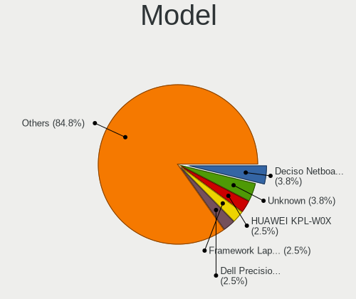
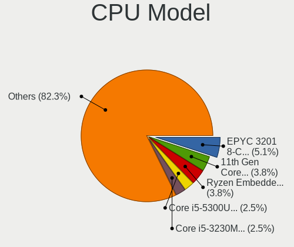
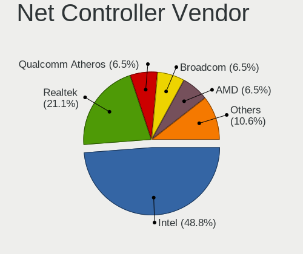

BSD - Hardware Trends (Notebooks)
---------------------------------

A project to identify most popular hardware characteristics and track their change
over time based on data collected by BSD users at https://BSD-Hardware.info.

Anyone can contribute to this report by the [hw-probe](https://github.com/linuxhw/hw-probe/blob/master/INSTALL.BSD.md) tool:

    hw-probe -all -upload

This report is for one last month. Overall report since the beginning of time: [TestDays](https://github.com/bsdhw/TestDays)

Period: Sep, 2023.

Contents
--------

* [ System ](#system)
  - [ OS                       ](#os)
  - [ OS Family                ](#os-family)
  - [ Arch                     ](#arch)
  - [ DE                       ](#de)
  - [ Display Server           ](#display-server)
  - [ Display Manager          ](#display-manager)
  - [ OS Lang                  ](#os-lang)
  - [ Boot Mode                ](#boot-mode)
  - [ Filesystem               ](#filesystem)
  - [ Part. scheme             ](#part-scheme)

* [ Board ](#board)
  - [ Vendor                   ](#vendor)
  - [ Model                    ](#model)
  - [ Model Family             ](#model-family)
  - [ MFG Year                 ](#mfg-year)
  - [ Form Factor              ](#form-factor)
  - [ Coreboot                 ](#coreboot)
  - [ RAM Size                 ](#ram-size)
  - [ RAM Used                 ](#ram-used)
  - [ Total Drives             ](#total-drives)
  - [ Has CD-ROM               ](#has-cd-rom)
  - [ Has Ethernet             ](#has-ethernet)
  - [ Has WiFi                 ](#has-wifi)
  - [ Has Bluetooth            ](#has-bluetooth)

* [ Location ](#location)
  - [ Country                  ](#country)
  - [ City                     ](#city)

* [ Drives ](#drives)
  - [ Drive Vendor             ](#drive-vendor)
  - [ Drive Model              ](#drive-model)
  - [ HDD Vendor               ](#hdd-vendor)
  - [ SSD Vendor               ](#ssd-vendor)
  - [ Drive Kind               ](#drive-kind)
  - [ Drive Connector          ](#drive-connector)
  - [ Drive Size               ](#drive-size)
  - [ Space Total              ](#space-total)
  - [ Space Used               ](#space-used)
  - [ Malfunc. Drives          ](#malfunc-drives)
  - [ Malfunc. Drive Vendor    ](#malfunc-drive-vendor)
  - [ Malfunc. HDD Vendor      ](#malfunc-hdd-vendor)
  - [ Malfunc. Drive Kind      ](#malfunc-drive-kind)
  - [ Failed Drives            ](#failed-drives)
  - [ Failed Drive Vendor      ](#failed-drive-vendor)
  - [ Drive Status             ](#drive-status)

* [ Storage controller ](#storage-controller)
  - [ Storage Vendor           ](#storage-vendor)
  - [ Storage Model            ](#storage-model)
  - [ Storage Kind             ](#storage-kind)

* [ Processor ](#processor)
  - [ CPU Vendor               ](#cpu-vendor)
  - [ CPU Model                ](#cpu-model)
  - [ CPU Model Family         ](#cpu-model-family)
  - [ CPU Cores                ](#cpu-cores)
  - [ CPU Sockets              ](#cpu-sockets)
  - [ CPU Threads              ](#cpu-threads)
  - [ CPU Microarch            ](#cpu-microarch)

* [ Graphics ](#graphics)
  - [ GPU Vendor               ](#gpu-vendor)
  - [ GPU Model                ](#gpu-model)
  - [ GPU Combo                ](#gpu-combo)
  - [ GPU Driver               ](#gpu-driver)
  - [ GPU Memory               ](#gpu-memory)

* [ Monitor ](#monitor)
  - [ Monitor Vendor           ](#monitor-vendor)
  - [ Monitor Model            ](#monitor-model)
  - [ Monitor Resolution       ](#monitor-resolution)
  - [ Monitor Diagonal         ](#monitor-diagonal)
  - [ Monitor Width            ](#monitor-width)
  - [ Aspect Ratio             ](#aspect-ratio)
  - [ Monitor Area             ](#monitor-area)
  - [ Pixel Density            ](#pixel-density)
  - [ Multiple Monitors        ](#multiple-monitors)

* [ Network ](#network)
  - [ Net Controller Vendor    ](#net-controller-vendor)
  - [ Net Controller Model     ](#net-controller-model)
  - [ Wireless Vendor          ](#wireless-vendor)
  - [ Wireless Model           ](#wireless-model)
  - [ Ethernet Vendor          ](#ethernet-vendor)
  - [ Ethernet Model           ](#ethernet-model)
  - [ Net Controller Kind      ](#net-controller-kind)
  - [ Used Controller          ](#used-controller)
  - [ NICs                     ](#nics)
  - [ IPv6                     ](#ipv6)

* [ Bluetooth ](#bluetooth)
  - [ Bluetooth Vendor         ](#bluetooth-vendor)
  - [ Bluetooth Model          ](#bluetooth-model)

* [ Sound ](#sound)
  - [ Sound Vendor             ](#sound-vendor)
  - [ Sound Model              ](#sound-model)

* [ Memory ](#memory)
  - [ Memory Vendor            ](#memory-vendor)
  - [ Memory Model             ](#memory-model)
  - [ Memory Kind              ](#memory-kind)
  - [ Memory Form Factor       ](#memory-form-factor)
  - [ Memory Size              ](#memory-size)
  - [ Memory Speed             ](#memory-speed)

* [ Printers & scanners ](#printers--scanners)
  - [ Printer Vendor           ](#printer-vendor)
  - [ Printer Model            ](#printer-model)
  - [ Scanner Vendor           ](#scanner-vendor)
  - [ Scanner Model            ](#scanner-model)

* [ Camera ](#camera)
  - [ Camera Vendor            ](#camera-vendor)
  - [ Camera Model             ](#camera-model)

* [ Security ](#security)
  - [ Fingerprint Vendor       ](#fingerprint-vendor)
  - [ Fingerprint Model        ](#fingerprint-model)
  - [ Chipcard Vendor          ](#chipcard-vendor)
  - [ Chipcard Model           ](#chipcard-model)

* [ Unsupported ](#unsupported)
  - [ Unsupported Devices      ](#unsupported-devices)
  - [ Unsupported Device Types ](#unsupported-device-types)

System
------

OS
--

Installed operating systems

| Name                     | Notebooks | Percent |
|--------------------------|-----------|---------|
| helloSystem 0.8.1        | 13        | 17.11%  |
| NomadBSD 20221130        | 7         | 9.21%   |
| FreeBSD 13.2             | 7         | 9.21%   |
| OPNsense 23.7.3          | 6         | 7.89%   |
| helloSystem 0.9.0        | 6         | 7.89%   |
| FreeBSD 13.2-p3          | 6         | 7.89%   |
| OpenBSD 7.3              | 5         | 6.58%   |
| OPNsense 23.7.5          | 3         | 3.95%   |
| FreeBSD 13.2-p2          | 3         | 3.95%   |
| OPNsense 23.7.4          | 2         | 2.63%   |
| GhostBSD 23.09.16        | 2         | 2.63%   |
| GhostBSD 23.09.06        | 2         | 2.63%   |
| GhostBSD 23.06.01        | 2         | 2.63%   |
| FreeBSD 15.0-CURRENT     | 2         | 2.63%   |
| FreeBSD 14.0-BETA2       | 2         | 2.63%   |
| OPNsense 23.4.2          | 1         | 1.32%   |
| OpenBSD 7.4              | 1         | 1.32%   |
| helloSystem 0.7.0        | 1         | 1.32%   |
| FreeBSD 14.0-STABLE-HBSD | 1         | 1.32%   |
| FreeBSD 14.0-BETA1       | 1         | 1.32%   |
| FreeBSD 13.2-STABLE      | 1         | 1.32%   |
| FreeBSD 13.2-p20         | 1         | 1.32%   |
| FreeBSD 13.2-p1          | 1         | 1.32%   |

OS Family
---------

OS without a version

| Name        | Notebooks | Percent |
|-------------|-----------|---------|
| FreeBSD     | 25        | 32.89%  |
| helloSystem | 20        | 26.32%  |
| OPNsense    | 12        | 15.79%  |
| NomadBSD    | 7         | 9.21%   |
| OpenBSD     | 6         | 7.89%   |
| GhostBSD    | 6         | 7.89%   |

Arch
----

OS architecture (x86_64, i586, etc.)

| Name  | Notebooks | Percent |
|-------|-----------|---------|
| amd64 | 76        | 100%    |

DE
--

Desktop Environment

| Name         | Notebooks | Percent |
|--------------|-----------|---------|
| helloDesktop | 25        | 32.89%  |
| Console      | 16        | 21.05%  |
| MATE         | 8         | 10.53%  |
| Openbox      | 7         | 9.21%   |
| KDE5         | 6         | 7.89%   |
| XFCE         | 4         | 5.26%   |
| TWM          | 3         | 3.95%   |
| i3           | 3         | 3.95%   |
| GNOME        | 2         | 2.63%   |
| Fluxbox      | 1         | 1.32%   |
| Budgie       | 1         | 1.32%   |

Display Server
--------------

X11 or Wayland

| Name    | Notebooks | Percent |
|---------|-----------|---------|
| X11     | 58        | 76.32%  |
| Console | 13        | 17.11%  |
| Wayland | 5         | 6.58%   |

Display Manager
---------------

SDDM, LightDM, etc.

| Name    | Notebooks | Percent |
|---------|-----------|---------|
| Console | 27        | 35.53%  |
| SLiM    | 24        | 31.58%  |
| SDDM    | 13        | 17.11%  |
| LightDM | 10        | 13.16%  |
| XDM     | 1         | 1.32%   |
| Ly      | 1         | 1.32%   |

OS Lang
-------

Language

| Lang    | Notebooks | Percent |
|---------|-----------|---------|
| C       | 21        | 27.63%  |
| Unknown | 21        | 27.63%  |
| en_US   | 16        | 21.05%  |
| zh_TW   | 3         | 3.95%   |
| ru_RU   | 3         | 3.95%   |
| fr_FR   | 3         | 3.95%   |
| es_ES   | 2         | 2.63%   |
| de_DE   | 2         | 2.63%   |
| tr_TR   | 1         | 1.32%   |
| sv_SE   | 1         | 1.32%   |
| fi_FI   | 1         | 1.32%   |
| en_EN   | 1         | 1.32%   |
| de      | 1         | 1.32%   |

Boot Mode
---------

EFI or BIOS

| Mode | Notebooks | Percent |
|------|-----------|---------|
| EFI  | 68        | 89.47%  |
| BIOS | 8         | 10.53%  |

Filesystem
----------

Type of filesystem

| Type   | Notebooks | Percent |
|--------|-----------|---------|
| Zfs    | 48        | 63.16%  |
| Ufs    | 12        | 15.79%  |
| Cd9660 | 10        | 13.16%  |
| Ffs    | 6         | 7.89%   |

Part. scheme
------------

Scheme of partitioning

| Type    | Notebooks | Percent |
|---------|-----------|---------|
| GPT     | 69        | 90.79%  |
| MBR     | 5         | 6.58%   |
| BSD     | 1         | 1.32%   |
| Unknown | 1         | 1.32%   |

Board
-----

Vendor
------

Motherboard manufacturer

| Name                | Notebooks | Percent |
|---------------------|-----------|---------|
| Lenovo              | 22        | 28.95%  |
| Hewlett-Packard     | 10        | 13.16%  |
| Dell                | 9         | 11.84%  |
| ASUSTek Computer    | 6         | 7.89%   |
| Deciso              | 4         | 5.26%   |
| Apple               | 3         | 3.95%   |
| Acer                | 3         | 3.95%   |
| Unknown             | 3         | 3.95%   |
| TUXEDO              | 1         | 1.32%   |
| Toshiba             | 1         | 1.32%   |
| Shuttle             | 1         | 1.32%   |
| Samsung Electronics | 1         | 1.32%   |
| ReachingTech        | 1         | 1.32%   |
| Panasonic           | 1         | 1.32%   |
| OEGStone            | 1         | 1.32%   |
| MSI                 | 1         | 1.32%   |
| MECHREVO            | 1         | 1.32%   |
| LG Electronics      | 1         | 1.32%   |
| Intel               | 1         | 1.32%   |
| GPU Company         | 1         | 1.32%   |
| GPD                 | 1         | 1.32%   |
| Fujitsu             | 1         | 1.32%   |
| eMachines           | 1         | 1.32%   |
| Alienware           | 1         | 1.32%   |

Model
-----

Motherboard model

| Name                                     | Notebooks | Percent |
|------------------------------------------|-----------|---------|
| Unknown                                  | 3         | 3.95%   |
| Deciso NetBoard-A10                      | 2         | 2.63%   |
| TUXEDO Aura 15 Gen1                      | 1         | 1.32%   |
| Toshiba QOSMIO X775                      | 1         | 1.32%   |
| Shuttle DS67U                            | 1         | 1.32%   |
| Samsung 270E5J/2570EJ                    | 1         | 1.32%   |
| ReachingTech DreamQuest Pro 2022         | 1         | 1.32%   |
| Panasonic CFSX4-1                        | 1         | 1.32%   |
| OEGStone doceo 510                       | 1         | 1.32%   |
| MSI CX62 6QD                             | 1         | 1.32%   |
| MECHREVO WUJIE 16                        | 1         | 1.32%   |
| LG 16U70Q-K.AAS7U1                       | 1         | 1.32%   |
| Lenovo ThinkPad X61 Tablet 776254U       | 1         | 1.32%   |
| Lenovo ThinkPad X260 20F6006XUK          | 1         | 1.32%   |
| Lenovo ThinkPad X240 20AMA1Y3UK          | 1         | 1.32%   |
| Lenovo ThinkPad X220 Tablet 42962WU      | 1         | 1.32%   |
| Lenovo ThinkPad X140e 20BMS03E00         | 1         | 1.32%   |
| Lenovo ThinkPad X1 Nano Gen 1 20UN005LRT | 1         | 1.32%   |
| Lenovo ThinkPad X1 Carbon 2nd 20A7002FUS | 1         | 1.32%   |
| Lenovo ThinkPad T480s 20L8S3LR00         | 1         | 1.32%   |
| Lenovo ThinkPad T480s 20L7S24F00         | 1         | 1.32%   |
| Lenovo ThinkPad T470 20HES0HU00          | 1         | 1.32%   |
| Lenovo ThinkPad T16 Gen 2 21HHCTO1WW     | 1         | 1.32%   |
| Lenovo ThinkPad T14 Gen 2i 20W1S4G22G    | 1         | 1.32%   |
| Lenovo ThinkPad SL 2746N8G               | 1         | 1.32%   |
| Lenovo ThinkPad P50 20EN0012US           | 1         | 1.32%   |
| Lenovo ThinkPad P16 Gen 1 21D6006FUS     | 1         | 1.32%   |
| Lenovo ThinkPad L390 20NRS00Q00          | 1         | 1.32%   |
| Lenovo ThinkPad Edge E531 68852BU        | 1         | 1.32%   |
| Lenovo ThinkPad E14 Gen 2 20T60036RT     | 1         | 1.32%   |
| Lenovo ThinkBook 13s G2 ITL 20V9         | 1         | 1.32%   |
| Lenovo IdeaPad 100-14IBY 80MH            | 1         | 1.32%   |
| Lenovo IdeaPad 1 14IGL7 82V6             | 1         | 1.32%   |
| Lenovo IdeaPad 1 11ADA05 82GV            | 1         | 1.32%   |
| Intel Milstead Platform                  | 1         | 1.32%   |
| HP ZBook 17 G2                           | 1         | 1.32%   |
| HP ProBook 4530s                         | 1         | 1.32%   |
| HP Pavilion g7                           | 1         | 1.32%   |
| HP Pavilion dv5                          | 1         | 1.32%   |
| HP OMEN Laptop 15-en1xxx                 | 1         | 1.32%   |

Model Family
------------

Motherboard model prefix

| Name                    | Notebooks | Percent |
|-------------------------|-----------|---------|
| Lenovo ThinkPad         | 18        | 23.68%  |
| Dell Latitude           | 5         | 6.58%   |
| Lenovo IdeaPad          | 3         | 3.95%   |
| Unknown                 | 3         | 3.95%   |
| HP Pavilion             | 2         | 2.63%   |
| HP OMEN                 | 2         | 2.63%   |
| HP EliteBook            | 2         | 2.63%   |
| Dell XPS                | 2         | 2.63%   |
| Deciso NetBoard-A10     | 2         | 2.63%   |
| Apple MacBookPro9       | 2         | 2.63%   |
| Acer TravelMate         | 2         | 2.63%   |
| TUXEDO Aura             | 1         | 1.32%   |
| Toshiba QOSMIO          | 1         | 1.32%   |
| Shuttle DS67U           | 1         | 1.32%   |
| Samsung 270E5J          | 1         | 1.32%   |
| ReachingTech DreamQuest | 1         | 1.32%   |
| Panasonic CFSX4-1       | 1         | 1.32%   |
| OEGStone doceo          | 1         | 1.32%   |
| MSI CX62                | 1         | 1.32%   |
| MECHREVO WUJIE          | 1         | 1.32%   |
| LG 16U70Q-K.AAS7U1      | 1         | 1.32%   |
| Lenovo ThinkBook        | 1         | 1.32%   |
| Intel Milstead          | 1         | 1.32%   |
| HP ZBook                | 1         | 1.32%   |
| HP ProBook              | 1         | 1.32%   |
| HP Mini                 | 1         | 1.32%   |
| HP G62                  | 1         | 1.32%   |
| GPU Company GWTC116-2   | 1         | 1.32%   |
| GPD G1619-04            | 1         | 1.32%   |
| Fujitsu LIFEBOOK        | 1         | 1.32%   |
| eMachines G640          | 1         | 1.32%   |
| Dell Inspiron           | 1         | 1.32%   |
| Dell G16                | 1         | 1.32%   |
| Deciso NetBoard-A20     | 1         | 1.32%   |
| Deciso Netboard         | 1         | 1.32%   |
| ASUS ZenBook            | 1         | 1.32%   |
| ASUS VivoBook           | 1         | 1.32%   |
| ASUS N751JK             | 1         | 1.32%   |
| ASUS K40IN              | 1         | 1.32%   |
| ASUS ASUS               | 1         | 1.32%   |

MFG Year
--------

Motherboard manufacture year

| Year | Notebooks | Percent |
|------|-----------|---------|
| 2022 | 13        | 17.11%  |
| 2023 | 10        | 13.16%  |
| 2018 | 7         | 9.21%   |
| 2013 | 6         | 7.89%   |
| 2011 | 6         | 7.89%   |
| 2020 | 5         | 6.58%   |
| 2019 | 5         | 6.58%   |
| 2016 | 4         | 5.26%   |
| 2010 | 4         | 5.26%   |
| 2021 | 3         | 3.95%   |
| 2015 | 3         | 3.95%   |
| 2009 | 3         | 3.95%   |
| 2017 | 2         | 2.63%   |
| 2012 | 2         | 2.63%   |
| 2008 | 2         | 2.63%   |
| 2014 | 1         | 1.32%   |

Form Factor
-----------

Physical design of the computer

| Name     | Notebooks | Percent |
|----------|-----------|---------|
| Notebook | 76        | 100%    |

Coreboot
--------

Have coreboot on board

| Used | Notebooks | Percent |
|------|-----------|---------|
| No   | 76        | 100%    |

RAM Size
--------

Total RAM memory

| Size in GB  | Notebooks | Percent |
|-------------|-----------|---------|
| 8.01-16.0   | 23        | 30.26%  |
| 16.01-24.0  | 22        | 28.95%  |
| 4.01-8.0    | 18        | 23.68%  |
| 32.01-64.0  | 4         | 5.26%   |
| 2.01-3.0    | 3         | 3.95%   |
| 3.01-4.0    | 2         | 2.63%   |
| 64.01-256.0 | 2         | 2.63%   |
| 24.01-32.0  | 1         | 1.32%   |
| 0.51-1.0    | 1         | 1.32%   |

RAM Used
--------

Used RAM memory

| Used GB   | Notebooks | Percent |
|-----------|-----------|---------|
| 0.01-0.5  | 42        | 55.26%  |
| 0.51-1.0  | 21        | 27.63%  |
| 1.01-2.0  | 10        | 13.16%  |
| 2.01-3.0  | 2         | 2.63%   |
| 8.01-16.0 | 1         | 1.32%   |

Total Drives
------------

Number of drives on board

| Drives | Notebooks | Percent |
|--------|-----------|---------|
| 1      | 50        | 65.79%  |
| 2      | 17        | 22.37%  |
| 0      | 9         | 11.84%  |

Has CD-ROM
----------

Has CD-ROM on board

| Presented | Notebooks | Percent |
|-----------|-----------|---------|
| No        | 55        | 72.37%  |
| Yes       | 21        | 27.63%  |

Has Ethernet
------------

Has Ethernet on board

| Presented | Notebooks | Percent |
|-----------|-----------|---------|
| Yes       | 62        | 81.58%  |
| No        | 14        | 18.42%  |

Has WiFi
--------

Has WiFi module

| Presented | Notebooks | Percent |
|-----------|-----------|---------|
| Yes       | 68        | 89.47%  |
| No        | 8         | 10.53%  |

Has Bluetooth
-------------

Has Bluetooth module

| Presented | Notebooks | Percent |
|-----------|-----------|---------|
| Yes       | 48        | 63.16%  |
| No        | 28        | 36.84%  |

Location
--------

Country
-------

Geographic location (country)

| Country            | Notebooks | Percent |
|--------------------|-----------|---------|
| USA                | 16        | 21.05%  |
| Germany            | 10        | 13.16%  |
| Taiwan             | 6         | 7.89%   |
| Russia             | 5         | 6.58%   |
| Australia          | 5         | 6.58%   |
| France             | 4         | 5.26%   |
| UK                 | 3         | 3.95%   |
| Turkey             | 2         | 2.63%   |
| Italy              | 2         | 2.63%   |
| Indonesia          | 2         | 2.63%   |
| Canada             | 2         | 2.63%   |
| Venezuela          | 1         | 1.32%   |
| Ukraine            | 1         | 1.32%   |
| Sweden             | 1         | 1.32%   |
| Spain              | 1         | 1.32%   |
| South Korea        | 1         | 1.32%   |
| Poland             | 1         | 1.32%   |
| Norway             | 1         | 1.32%   |
| Netherlands        | 1         | 1.32%   |
| Iran               | 1         | 1.32%   |
| Greece             | 1         | 1.32%   |
| Finland            | 1         | 1.32%   |
| Dominican Republic | 1         | 1.32%   |
| Denmark            | 1         | 1.32%   |
| Czechia            | 1         | 1.32%   |
| Colombia           | 1         | 1.32%   |
| Bulgaria           | 1         | 1.32%   |
| Brazil             | 1         | 1.32%   |
| Argentina          | 1         | 1.32%   |
| Algeria            | 1         | 1.32%   |

City
----

Geographic location (city)

| City            | Notebooks | Percent |
|-----------------|-----------|---------|
| Taipei          | 4         | 5.26%   |
| Sydney          | 4         | 5.26%   |
| Moscow          | 3         | 3.95%   |
| Sun Prairie     | 2         | 2.63%   |
| Istanbul        | 2         | 2.63%   |
| Hove            | 2         | 2.63%   |
| Hamburg         | 2         | 2.63%   |
| Zaragoza        | 1         | 1.32%   |
| Yuseong-gu      | 1         | 1.32%   |
| Yogyakarta      | 1         | 1.32%   |
| Yambol          | 1         | 1.32%   |
| Urcuit          | 1         | 1.32%   |
| Turmero         | 1         | 1.32%   |
| Turku           | 1         | 1.32%   |
| Thessaloniki    | 1         | 1.32%   |
| Teaneck         | 1         | 1.32%   |
| Taichung        | 1         | 1.32%   |
| Surabaya        | 1         | 1.32%   |
| St Albans       | 1         | 1.32%   |
| Södertälje    | 1         | 1.32%   |
| Sochi           | 1         | 1.32%   |
| Seattle         | 1         | 1.32%   |
| Saxtons River   | 1         | 1.32%   |
| Sao Paulo       | 1         | 1.32%   |
| Santo Domingo   | 1         | 1.32%   |
| Sandnes         | 1         | 1.32%   |
| Rasht           | 1         | 1.32%   |
| Princeton       | 1         | 1.32%   |
| Piaseczno       | 1         | 1.32%   |
| Philadelphia    | 1         | 1.32%   |
| Oklahoma City   | 1         | 1.32%   |
| Odesa           | 1         | 1.32%   |
| Nuremberg       | 1         | 1.32%   |
| Novosibirsk     | 1         | 1.32%   |
| North Vancouver | 1         | 1.32%   |
| Naples          | 1         | 1.32%   |
| Nantou City     | 1         | 1.32%   |
| Münster        | 1         | 1.32%   |
| Montevrain      | 1         | 1.32%   |
| Milan           | 1         | 1.32%   |

Drives
------

Drive Vendor
------------

Hard drive vendors

| Vendor              | Notebooks | Drives | Percent |
|---------------------|-----------|--------|---------|
| Samsung Electronics | 12        | 13     | 16%     |
| Transcend           | 8         | 8      | 10.67%  |
| Kingston            | 8         | 8      | 10.67%  |
| Seagate             | 7         | 7      | 9.33%   |
| WDC                 | 6         | 6      | 8%      |
| Toshiba             | 6         | 8      | 8%      |
| Intel               | 5         | 5      | 6.67%   |
| SanDisk             | 4         | 4      | 5.33%   |
| Hitachi             | 3         | 3      | 4%      |
| NVMe                | 2         | 2      | 2.67%   |
| Micron Technology   | 2         | 2      | 2.67%   |
| Intenso             | 2         | 2      | 2.67%   |
| HGST                | 2         | 2      | 2.67%   |
| A-DATA Technology   | 2         | 2      | 2.67%   |
| Team                | 1         | 1      | 1.33%   |
| PNY                 | 1         | 1      | 1.33%   |
| MidasForce          | 1         | 1      | 1.33%   |
| Lenovo              | 1         | 1      | 1.33%   |
| Crucial             | 1         | 1      | 1.33%   |
| Apple               | 1         | 1      | 1.33%   |

Drive Model
-----------

Hard drive models

| Model                                | Notebooks | Percent |
|--------------------------------------|-----------|---------|
| Transcend TS256GMTE710T 256GB        | 2         | 2.63%   |
| Samsung SSD 970 EVO Plus 2TB         | 2         | 2.63%   |
| Kingston SV300S37A240G 240GB         | 2         | 2.63%   |
| Kingston SA400S37240G 240GB          | 2         | 2.63%   |
| Intel SSDPEKNU512GZ 512GB            | 2         | 2.63%   |
| Hitachi HTS541612J9SA00 120GB        | 2         | 2.63%   |
| HGST HTS721010A9E630 1TB             | 2         | 2.63%   |
| WDC WDS500G2B0A-00SM50 500GB         | 1         | 1.32%   |
| WDC WD7500BPKX-00HPJT0 752GB         | 1         | 1.32%   |
| WDC WD3200BEVT-22ZCT0 320GB          | 1         | 1.32%   |
| WDC WD10JPVX-22JC3T0 1TB             | 1         | 1.32%   |
| WDC WD10JPCX-24UE4T0 1TB             | 1         | 1.32%   |
| WDC PC SN530 SDBPMPZ-256G-1001 256GB | 1         | 1.32%   |
| Transcend TS64GSSD370S 64GB          | 1         | 1.32%   |
| Transcend TS512GSSD230S 512GB        | 1         | 1.32%   |
| Transcend TS512GMTS952T2 512GB       | 1         | 1.32%   |
| Transcend TS256GMTS952T2 256GB       | 1         | 1.32%   |
| Transcend TS128GSSD340K 128GB        | 1         | 1.32%   |
| Transcend TS128GSSD340 128GB         | 1         | 1.32%   |
| Toshiba THNSNK256GVN8 M.2 2280 256GB | 1         | 1.32%   |
| Toshiba MQ01ACF050 500GB             | 1         | 1.32%   |
| Toshiba MK5061GSYN 500GB             | 1         | 1.32%   |
| Toshiba MK3265GSX 320GB              | 1         | 1.32%   |
| Toshiba KXG50ZNV1T02 NVMe 1024GB     | 1         | 1.32%   |
| Toshiba KBG40ZNT512G MEMORY 512GB    | 1         | 1.32%   |
| Team L5 LITE SSD 120GB               | 1         | 1.32%   |
| Seagate ST9750420AS 752GB            | 1         | 1.32%   |
| Seagate ST95005620AS 500GB           | 1         | 1.32%   |
| Seagate ST9250315AS 250GB            | 1         | 1.32%   |
| Seagate ST500LT012-1DG142 500GB      | 1         | 1.32%   |
| Seagate ST500LM000-1EJ162-SSHD-8GB   | 1         | 1.32%   |
| Seagate ST1000LM049-2GH172 1TB       | 1         | 1.32%   |
| Seagate ST1000LM024 HN-M101MBB 1TB   | 1         | 1.32%   |
| SanDisk X400 M.2 2280 512GB          | 1         | 1.32%   |
| SanDisk Ultra II 240GB               | 1         | 1.32%   |
| SanDisk SSD PLUS 120GB               | 1         | 1.32%   |
| SanDisk SD8SB8U128G1001 128GB        | 1         | 1.32%   |
| Samsung SSD 980 PRO 1TB              | 1         | 1.32%   |
| Samsung SSD 970 EVO Plus 250GB       | 1         | 1.32%   |
| Samsung PM981a NVMe 512GB            | 1         | 1.32%   |

HDD Vendor
----------

Hard disk drive vendors

| Vendor              | Notebooks | Drives | Percent |
|---------------------|-----------|--------|---------|
| Seagate             | 7         | 7      | 31.82%  |
| WDC                 | 4         | 4      | 18.18%  |
| Toshiba             | 3         | 4      | 13.64%  |
| Hitachi             | 3         | 3      | 13.64%  |
| HGST                | 2         | 2      | 9.09%   |
| Samsung Electronics | 1         | 1      | 4.55%   |
| NVMe                | 1         | 1      | 4.55%   |
| Apple               | 1         | 1      | 4.55%   |

SSD Vendor
----------

Solid state drive vendors

| Vendor              | Notebooks | Drives | Percent |
|---------------------|-----------|--------|---------|
| Transcend           | 6         | 6      | 20%     |
| Kingston            | 6         | 6      | 20%     |
| SanDisk             | 4         | 4      | 13.33%  |
| Micron Technology   | 2         | 2      | 6.67%   |
| Intel               | 2         | 2      | 6.67%   |
| A-DATA Technology   | 2         | 2      | 6.67%   |
| WDC                 | 1         | 1      | 3.33%   |
| Toshiba             | 1         | 1      | 3.33%   |
| Team                | 1         | 1      | 3.33%   |
| Samsung Electronics | 1         | 1      | 3.33%   |
| PNY                 | 1         | 1      | 3.33%   |
| MidasForce          | 1         | 1      | 3.33%   |
| Intenso             | 1         | 1      | 3.33%   |
| Crucial             | 1         | 1      | 3.33%   |

Drive Kind
----------

HDD or SSD

| Kind | Notebooks | Drives | Percent |
|------|-----------|--------|---------|
| SSD  | 28        | 30     | 39.44%  |
| NVMe | 22        | 25     | 30.99%  |
| HDD  | 21        | 23     | 29.58%  |

Drive Connector
---------------

SATA, SAS, NVMe, etc.

| Type | Notebooks | Drives | Percent |
|------|-----------|--------|---------|
| SATA | 46        | 53     | 67.65%  |
| NVMe | 22        | 25     | 32.35%  |

Drive Size
----------

Size of hard drive

| Size in TB | Notebooks | Drives | Percent |
|------------|-----------|--------|---------|
| 0.01-0.5   | 34        | 39     | 72.34%  |
| 0.51-1.0   | 11        | 12     | 23.4%   |
| 1.01-2.0   | 2         | 2      | 4.26%   |

Space Total
-----------

Amount of disk space available on the file system

| Size in GB | Notebooks | Percent |
|------------|-----------|---------|
| 101-250    | 26        | 34.21%  |
| 251-500    | 17        | 22.37%  |
| 1-20       | 15        | 19.74%  |
| 501-1000   | 6         | 7.89%   |
| 21-50      | 5         | 6.58%   |
| 51-100     | 5         | 6.58%   |
| 1001-2000  | 2         | 2.63%   |

Space Used
----------

Amount of used disk space

| Used GB | Notebooks | Percent |
|---------|-----------|---------|
| 1-20    | 65        | 85.53%  |
| 21-50   | 7         | 9.21%   |
| 251-500 | 2         | 2.63%   |
| 101-250 | 1         | 1.32%   |
| 51-100  | 1         | 1.32%   |

Malfunc. Drives
---------------

Drive models with a malfunction

| Model                                | Notebooks | Drives | Percent |
|--------------------------------------|-----------|--------|---------|
| HGST HTS721010A9E630 1TB             | 2         | 2      | 16.67%  |
| WDC WD10JPCX-24UE4T0 1TB             | 1         | 1      | 8.33%   |
| Toshiba THNSNK256GVN8 M.2 2280 256GB | 1         | 1      | 8.33%   |
| Toshiba MK3265GSX 320GB              | 1         | 1      | 8.33%   |
| Seagate ST95005620AS 500GB           | 1         | 1      | 8.33%   |
| Seagate ST9250315AS 250GB            | 1         | 1      | 8.33%   |
| Seagate ST500LM000-1EJ162-SSHD-8GB   | 1         | 1      | 8.33%   |
| Samsung Electronics HM160HI 160GB    | 1         | 1      | 8.33%   |
| Hitachi HTS545050B9A300 500GB        | 1         | 1      | 8.33%   |
| Hitachi HTS541612J9SA00 120GB        | 1         | 1      | 8.33%   |
| Apple HDD HTS547550A9E384 500GB      | 1         | 1      | 8.33%   |

Malfunc. Drive Vendor
---------------------

Vendors of faulty drives

| Vendor              | Notebooks | Drives | Percent |
|---------------------|-----------|--------|---------|
| Seagate             | 3         | 3      | 25%     |
| Toshiba             | 2         | 2      | 16.67%  |
| Hitachi             | 2         | 2      | 16.67%  |
| HGST                | 2         | 2      | 16.67%  |
| WDC                 | 1         | 1      | 8.33%   |
| Samsung Electronics | 1         | 1      | 8.33%   |
| Apple               | 1         | 1      | 8.33%   |

Malfunc. HDD Vendor
-------------------

Vendors of faulty HDD drives

| Vendor              | Notebooks | Drives | Percent |
|---------------------|-----------|--------|---------|
| Seagate             | 3         | 3      | 27.27%  |
| Hitachi             | 2         | 2      | 18.18%  |
| HGST                | 2         | 2      | 18.18%  |
| WDC                 | 1         | 1      | 9.09%   |
| Toshiba             | 1         | 1      | 9.09%   |
| Samsung Electronics | 1         | 1      | 9.09%   |
| Apple               | 1         | 1      | 9.09%   |

Malfunc. Drive Kind
-------------------

Kinds of faulty drives

| Kind | Notebooks | Drives | Percent |
|------|-----------|--------|---------|
| HDD  | 11        | 11     | 91.67%  |
| SSD  | 1         | 1      | 8.33%   |

Failed Drives
-------------

Failed drive models

Zero info for selected period =(

Failed Drive Vendor
-------------------

Failed drive vendors

Zero info for selected period =(

Drive Status
------------

Number of failed and malfunc. drives

| Status   | Notebooks | Drives | Percent |
|----------|-----------|--------|---------|
| Works    | 55        | 63     | 78.57%  |
| Malfunc  | 12        | 12     | 17.14%  |
| Detected | 3         | 3      | 4.29%   |

Storage controller
------------------

Storage Vendor
--------------

Storage controller vendors

| Vendor                      | Notebooks | Percent |
|-----------------------------|-----------|---------|
| Intel                       | 50        | 59.52%  |
| Samsung Electronics         | 13        | 15.48%  |
| SanDisk                     | 4         | 4.76%   |
| AMD                         | 4         | 4.76%   |
| Nvidia                      | 3         | 3.57%   |
| Transcend                   | 2         | 2.38%   |
| Kingston Technology Company | 2         | 2.38%   |
| Toshiba                     | 1         | 1.19%   |
| Silicon Motion              | 1         | 1.19%   |
| Micron Technology           | 1         | 1.19%   |
| Lenovo                      | 1         | 1.19%   |
| KIOXIA                      | 1         | 1.19%   |
| Biwin Storage Technology    | 1         | 1.19%   |

Storage Model
-------------

Storage controller models

| Model                                                                          | Notebooks | Percent |
|--------------------------------------------------------------------------------|-----------|---------|
| Samsung NVMe SSD Controller SM981/PM981/PM983                                  | 7         | 8.14%   |
| Intel 7 Series Chipset Family 6-port SATA Controller [AHCI mode]               | 5         | 5.81%   |
| Intel 6 Series/C200 Series Chipset Family 6 port Mobile SATA AHCI Controller   | 5         | 5.81%   |
| Intel Sunrise Point-LP SATA Controller [AHCI mode]                             | 4         | 4.65%   |
| Intel 82801IBM/IEM (ICH9M/ICH9M-E) 4 port SATA Controller [AHCI mode]          | 4         | 4.65%   |
| Intel 8 Series SATA Controller 1 [AHCI mode]                                   | 4         | 4.65%   |
| Samsung NVMe SSD Controller 980                                                | 3         | 3.49%   |
| Intel NM10/ICH7 Family SATA Controller [AHCI mode]                             | 3         | 3.49%   |
| Intel Celeron/Pentium Silver Processor SATA Controller                         | 3         | 3.49%   |
| AMD FCH SATA Controller [AHCI mode]                                            | 3         | 3.49%   |
| Samsung NVMe SSD Controller PM9A1/PM9A3/980PRO                                 | 2         | 2.33%   |
| Nvidia MCP79 AHCI Controller                                                   | 2         | 2.33%   |
| Intel Wildcat Point-LP SATA Controller [AHCI Mode]                             | 2         | 2.33%   |
| Intel SSD 670p Series [Keystone Harbor]                                        | 2         | 2.33%   |
| Intel HM170/QM170 Chipset SATA Controller [AHCI Mode]                          | 2         | 2.33%   |
| Intel Cannon Lake Mobile PCH SATA AHCI Controller                              | 2         | 2.33%   |
| Intel 8 Series/C220 Series Chipset Family 6-port SATA Controller 1 [AHCI mode] | 2         | 2.33%   |
| Intel 5 Series/3400 Series Chipset 4 port SATA AHCI Controller                 | 2         | 2.33%   |
| Unknown                                                                        | 2         | 2.33%   |
| Toshiba XG5 NVMe SSD Controller                                                | 1         | 1.16%   |
| Silicon Motion SM2263EN/SM2263XT (DRAM-less) NVMe SSD Controllers              | 1         | 1.16%   |
| SanDisk WD Blue SN570 NVMe SSD 1TB                                             | 1         | 1.16%   |
| Sandisk WD Black SN770 / PC SN740 256GB / PC SN560 (DRAM-less) NVMe SSD        | 1         | 1.16%   |
| Sandisk PC SN740 NVMe SSD (DRAM-less)                                          | 1         | 1.16%   |
| SanDisk PC SN530 NVMe SSD (DRAM-less)                                          | 1         | 1.16%   |
| Samsung NVMe SSD Controller SM961/PM961/SM963                                  | 1         | 1.16%   |
| Nvidia MCP89 SATA Controller (AHCI mode)                                       | 1         | 1.16%   |
| Micron 3400 NVMe SSD [Hendrix]                                                 | 1         | 1.16%   |
| Lenovo LENSE30256GMSP34MEAT3TA                                                 | 1         | 1.16%   |
| KIOXIA NVMe SSD Controller BG4 (DRAM-less)                                     | 1         | 1.16%   |
| Kingston Company unknown                                                       | 1         | 1.16%   |
| Kingston Company Design-In PCIe 4 NVMe SSD (TLC)                               | 1         | 1.16%   |
| Intel Volume Management Device NVMe RAID Controller Intel Corporation          | 1         | 1.16%   |
| Intel SSD 660P Series                                                          | 1         | 1.16%   |
| Intel Q170/Q150/B150/H170/H110/Z170/CM236 Chipset SATA Controller [AHCI Mode]  | 1         | 1.16%   |
| Intel Jasper Lake SATA AHCI Controller                                         | 1         | 1.16%   |
| Intel Comet Lake SATA AHCI Controller                                          | 1         | 1.16%   |
| Intel Atom Processor E3800 Series SATA AHCI Controller                         | 1         | 1.16%   |
| Intel 82801JI (ICH10 Family) SATA AHCI Controller                              | 1         | 1.16%   |
| Intel 82801HM/HEM (ICH8M/ICH8M-E) SATA Controller [AHCI mode]                  | 1         | 1.16%   |

Storage Kind
------------

Kind of storage controller (IDE, SATA, NVMe, SAS, ...)

| Kind | Notebooks | Percent |
|------|-----------|---------|
| SATA | 52        | 61.9%   |
| NVMe | 28        | 33.33%  |
| RAID | 2         | 2.38%   |
| IDE  | 2         | 2.38%   |

Processor
---------

CPU Vendor
----------

Processor vendors

| Vendor | Notebooks | Percent |
|--------|-----------|---------|
| Intel  | 62        | 81.58%  |
| AMD    | 14        | 18.42%  |

CPU Model
---------

Processor models

| Model                                    | Notebooks | Percent |
|------------------------------------------|-----------|---------|
| Intel Pentium CPU P6200 @ 2.13GHz        | 2         | 2.63%   |
| Intel Pentium 3558U @ 1.70GHz            | 2         | 2.63%   |
| Intel CPU Version                        | 2         | 2.63%   |
| Intel Core i7-8750H CPU @ 2.20GHz        | 2         | 2.63%   |
| Intel Core i5-8250U CPU @ 1.60GHz        | 2         | 2.63%   |
| Intel Atom CPU N455 @ 1.66GHz            | 2         | 2.63%   |
| AMD Ryzen Embedded V1500B                | 2         | 2.63%   |
| AMD EPYC 3201 8-Core Processor           | 2         | 2.63%   |
| Intel Pentium Silver N5030 CPU @ 1.10GHz | 1         | 1.32%   |
| Intel Pentium Dual CPU T3200 @ 2.00GHz   | 1         | 1.32%   |
| Intel Core i7-8565U CPU @ 1.80GHz        | 1         | 1.32%   |
| Intel Core i7-6700HQ CPU @ 2.60GHz       | 1         | 1.32%   |
| Intel Core i7-6600U CPU @ 2.60GHz        | 1         | 1.32%   |
| Intel Core i7-6500U CPU @ 2.50GHz        | 1         | 1.32%   |
| Intel Core i7-4710MQ CPU @ 2.50GHz       | 1         | 1.32%   |
| Intel Core i7-4710HQ CPU @ 2.50GHz       | 1         | 1.32%   |
| Intel Core i7-3615QM CPU @ 2.30GHz       | 1         | 1.32%   |
| Intel Core i7-3540M CPU @ 3.00GHz        | 1         | 1.32%   |
| Intel Core i7-3520M CPU @ 2.90GHz        | 1         | 1.32%   |
| Intel Core i7-2670QM CPU @ 2.20GHz       | 1         | 1.32%   |
| Intel Core i7-10510U CPU @ 1.80GHz       | 1         | 1.32%   |
| Intel Core i7 CPU Q 740 @ 1.73GHz        | 1         | 1.32%   |
| Intel Core i5-8400H CPU @ 2.50GHz        | 1         | 1.32%   |
| Intel Core i5-8265U CPU @ 1.60GHz        | 1         | 1.32%   |
| Intel Core i5-7300HQ CPU @ 2.50GHz       | 1         | 1.32%   |
| Intel Core i5-7200U CPU @ 2.50GHz        | 1         | 1.32%   |
| Intel Core i5-6300HQ CPU @ 2.30GHz       | 1         | 1.32%   |
| Intel Core i5-5300U CPU @ 2.30GHz        | 1         | 1.32%   |
| Intel Core i5-5200U CPU @ 2.20GHz        | 1         | 1.32%   |
| Intel Core i5-4300U CPU @ 1.90GHz        | 1         | 1.32%   |
| Intel Core i5-4200U CPU @ 1.60GHz        | 1         | 1.32%   |
| Intel Core i5-3230M CPU @ 2.60GHz        | 1         | 1.32%   |
| Intel Core i5-3210M CPU @ 2.50GHz        | 1         | 1.32%   |
| Intel Core i5-2540M CPU @ 2.60GHz        | 1         | 1.32%   |
| Intel Core i5-2520M CPU @ 2.50GHz        | 1         | 1.32%   |
| Intel Core i5-2410M CPU @ 2.30GHz        | 1         | 1.32%   |
| Intel Core i3-2350M CPU @ 2.30GHz        | 1         | 1.32%   |
| Intel Core i3-10110U CPU @ 2.10GHz       | 1         | 1.32%   |
| Intel Core 2 Duo CPU T9400 @ 2.53GHz     | 1         | 1.32%   |
| Intel Core 2 Duo CPU T6570 @ 2.10GHz     | 1         | 1.32%   |

CPU Model Family
----------------

Processor model prefix

| Model                   | Notebooks | Percent |
|-------------------------|-----------|---------|
| Intel Core i5           | 16        | 21.05%  |
| Intel Core i7           | 14        | 18.42%  |
| Other                   | 11        | 14.47%  |
| AMD Ryzen 7             | 6         | 7.89%   |
| Intel Celeron           | 5         | 6.58%   |
| Intel Pentium           | 4         | 5.26%   |
| Intel Core 2 Duo        | 4         | 5.26%   |
| Intel Atom              | 4         | 5.26%   |
| Intel Core i3           | 2         | 2.63%   |
| AMD Ryzen Embedded      | 2         | 2.63%   |
| AMD EPYC                | 2         | 2.63%   |
| Intel Pentium Silver    | 1         | 1.32%   |
| Intel Pentium Dual      | 1         | 1.32%   |
| Intel Celeron Dual-Core | 1         | 1.32%   |
| AMD Ryzen 3             | 1         | 1.32%   |
| AMD E1                  | 1         | 1.32%   |
| AMD Athlon              | 1         | 1.32%   |

CPU Cores
---------

Number of processor cores

| Number  | Notebooks | Percent |
|---------|-----------|---------|
| 2       | 31        | 40.79%  |
| 4       | 22        | 28.95%  |
| 8       | 7         | 9.21%   |
| 16      | 5         | 6.58%   |
| Unknown | 4         | 5.26%   |
| 12      | 2         | 2.63%   |
| 6       | 2         | 2.63%   |
| 1       | 2         | 2.63%   |
| 10      | 1         | 1.32%   |

CPU Sockets
-----------

Number of sockets

| Number | Notebooks | Percent |
|--------|-----------|---------|
| 1      | 75        | 98.68%  |
| 2      | 1         | 1.32%   |

CPU Threads
-----------

Threads per core (Hyper-Threading)

| Number  | Notebooks | Percent |
|---------|-----------|---------|
| 2       | 41        | 53.95%  |
| 1       | 31        | 40.79%  |
| Unknown | 4         | 5.26%   |

CPU Microarch
-------------

Microarchitecture

| Name          | Notebooks | Percent |
|---------------|-----------|---------|
| KabyLake      | 11        | 14.47%  |
| Unknown       | 8         | 10.53%  |
| Penryn        | 6         | 7.89%   |
| Haswell       | 6         | 7.89%   |
| Zen           | 5         | 6.58%   |
| Skylake       | 5         | 6.58%   |
| SandyBridge   | 5         | 6.58%   |
| IvyBridge     | 5         | 6.58%   |
| Bonnell       | 4         | 5.26%   |
| Zen 2         | 3         | 3.95%   |
| TigerLake     | 3         | 3.95%   |
| Goldmont plus | 3         | 3.95%   |
| Zen 3         | 2         | 2.63%   |
| Westmere      | 2         | 2.63%   |
| Core          | 2         | 2.63%   |
| Broadwell     | 2         | 2.63%   |
| Silvermont    | 1         | 1.32%   |
| Nehalem       | 1         | 1.32%   |
| K10           | 1         | 1.32%   |
| Jaguar        | 1         | 1.32%   |

Graphics
--------

GPU Vendor
----------

Vendors of graphics cards

| Vendor | Notebooks | Percent |
|--------|-----------|---------|
| Intel  | 54        | 64.29%  |
| Nvidia | 18        | 21.43%  |
| AMD    | 12        | 14.29%  |

GPU Model
---------

Graphics card models

| Model                                                                     | Notebooks | Percent |
|---------------------------------------------------------------------------|-----------|---------|
| Intel 2nd Generation Core Processor Family Integrated Graphics Controller | 5         | 5.88%   |
| Intel Haswell-ULT Integrated Graphics Controller                          | 4         | 4.71%   |
| Intel 3rd Gen Core processor Graphics Controller                          | 4         | 4.71%   |
| Intel Mobile 4 Series Chipset Integrated Graphics Controller              | 3         | 3.53%   |
| Intel CoffeeLake-H GT2 [UHD Graphics 630]                                 | 3         | 3.53%   |
| Intel Atom Processor D4xx/D5xx/N4xx/N5xx Integrated Graphics Controller   | 3         | 3.53%   |
| AMD Renoir                                                                | 3         | 3.53%   |
| Nvidia GP107M [GeForce GTX 1050 Mobile]                                   | 2         | 2.35%   |
| Intel WhiskeyLake-U GT2 [UHD Graphics 620]                                | 2         | 2.35%   |
| Intel UHD Graphics 620                                                    | 2         | 2.35%   |
| Intel TigerLake-LP GT2 [Iris Xe Graphics]                                 | 2         | 2.35%   |
| Intel Skylake GT2 [HD Graphics 520]                                       | 2         | 2.35%   |
| Intel HD Graphics 5500                                                    | 2         | 2.35%   |
| Intel HD Graphics 530                                                     | 2         | 2.35%   |
| Intel GeminiLake [UHD Graphics 600]                                       | 2         | 2.35%   |
| Intel Core Processor Integrated Graphics Controller                       | 2         | 2.35%   |
| Intel CometLake-U GT2 [UHD Graphics]                                      | 2         | 2.35%   |
| AMD Rembrandt [Radeon 680M]                                               | 2         | 2.35%   |
| AMD Park [Mobility Radeon HD 5430/5450/5470]                              | 2         | 2.35%   |
| Nvidia MCP89 [GeForce 320M]                                               | 1         | 1.18%   |
| Nvidia MCP79 [GeForce 8200M G]                                            | 1         | 1.18%   |
| Nvidia GT216GLM [Quadro FX 880M]                                          | 1         | 1.18%   |
| Nvidia GP104M [GeForce GTX 1070 Mobile]                                   | 1         | 1.18%   |
| Nvidia GM108M [GeForce 940MX]                                             | 1         | 1.18%   |
| Nvidia GM107M [GeForce GTX 850M]                                          | 1         | 1.18%   |
| Nvidia GM107GLM [Quadro M1000M]                                           | 1         | 1.18%   |
| Nvidia GK107M [GeForce GT 650M Mac Edition]                               | 1         | 1.18%   |
| Nvidia GK107GLM [Quadro K1100M]                                           | 1         | 1.18%   |
| Nvidia GF116M [GeForce GT 560M]                                           | 1         | 1.18%   |
| Nvidia GA107M [GeForce RTX 3050 Ti Mobile]                                | 1         | 1.18%   |
| Nvidia GA107GLM [RTX A1000 Laptop GPU]                                    | 1         | 1.18%   |
| Nvidia GA106M [GeForce RTX 3060 Mobile / Max-Q]                           | 1         | 1.18%   |
| Nvidia G96CM [GeForce 9600M GT]                                           | 1         | 1.18%   |
| Nvidia C79 [GeForce G102M]                                                | 1         | 1.18%   |
| Nvidia AD107M [GeForce RTX 4060 Max-Q / Mobile]                           | 1         | 1.18%   |
| Intel Tiger Lake-UP4 GT2 [Iris Xe Graphics]                               | 1         | 1.18%   |
| Intel Raptor Lake-S UHD Graphics                                          | 1         | 1.18%   |
| Intel Raptor Lake-P [UHD Graphics]                                        | 1         | 1.18%   |
| Intel Mobile GM965/GL960 Integrated Graphics Controller (secondary)       | 1         | 1.18%   |
| Intel Mobile GM965/GL960 Integrated Graphics Controller (primary)         | 1         | 1.18%   |

GPU Combo
---------

Combinations of graphics cards

| Name           | Notebooks | Percent |
|----------------|-----------|---------|
| 1 x Intel      | 36        | 47.37%  |
| Intel + Nvidia | 10        | 13.16%  |
| 1 x AMD        | 10        | 13.16%  |
| 2 x Intel      | 7         | 9.21%   |
| 1 x Nvidia     | 7         | 9.21%   |
| Other          | 4         | 5.26%   |
| Intel + AMD    | 1         | 1.32%   |
| AMD + Nvidia   | 1         | 1.32%   |

GPU Driver
----------

Free vs proprietary

| Driver      | Notebooks | Percent |
|-------------|-----------|---------|
| Free        | 59        | 77.63%  |
| Proprietary | 9         | 11.84%  |
| Unknown     | 8         | 10.53%  |

GPU Memory
----------

Total video memory

| Size in GB | Notebooks | Percent |
|------------|-----------|---------|
| Unknown    | 67        | 88.16%  |
| 0.01-0.5   | 4         | 5.26%   |
| 7.01-8.0   | 1         | 1.32%   |
| 5.01-6.0   | 1         | 1.32%   |
| 3.01-4.0   | 1         | 1.32%   |
| 1.01-2.0   | 1         | 1.32%   |
| 0.51-1.0   | 1         | 1.32%   |

Monitor
-------

Monitor Vendor
--------------

Monitor vendors

| Vendor                  | Notebooks | Percent |
|-------------------------|-----------|---------|
| AU Optronics            | 11        | 20%     |
| Chimei Innolux          | 9         | 16.36%  |
| LG Display              | 7         | 12.73%  |
| BOE                     | 5         | 9.09%   |
| Samsung Electronics     | 3         | 5.45%   |
| Philips                 | 2         | 3.64%   |
| Lenovo                  | 2         | 3.64%   |
| InfoVision              | 2         | 3.64%   |
| HannStar                | 2         | 3.64%   |
| Chi Mei Optoelectronics | 2         | 3.64%   |
| ViewSonic               | 1         | 1.82%   |
| Sharp                   | 1         | 1.82%   |
| SDC                     | 1         | 1.82%   |
| LG Philips              | 1         | 1.82%   |
| JDI                     | 1         | 1.82%   |
| Dell                    | 1         | 1.82%   |
| CSO                     | 1         | 1.82%   |
| BenQ                    | 1         | 1.82%   |
| Apple                   | 1         | 1.82%   |
| Unknown                 | 1         | 1.82%   |

Monitor Model
-------------

Monitor models

| Model                                                                    | Notebooks | Percent |
|--------------------------------------------------------------------------|-----------|---------|
| Chimei Innolux LCD Monitor CMN14D6 1366x768 310x170mm 13.9-inch          | 2         | 3.51%   |
| ViewSonic TD2420 SERIES VSC452D 1920x1080 520x290mm 23.4-inch            | 1         | 1.75%   |
| Sharp LQ133M1JW01 SHP141B 1920x1080 290x170mm 13.2-inch                  | 1         | 1.75%   |
| SDC LCD Monitor 5440x1080                                                | 1         | 1.75%   |
| SDC LCD Monitor 1600x900                                                 | 1         | 1.75%   |
| Samsung Electronics SA300/SA350 SAM0788 1366x768 410x230mm 18.5-inch     | 1         | 1.75%   |
| Samsung Electronics LCD Monitor SEC384A 1366x768 340x190mm 15.3-inch     | 1         | 1.75%   |
| Samsung Electronics LCD Monitor SDC4163 3456x2160 290x180mm 13.4-inch    | 1         | 1.75%   |
| Philips LCD Monitor 271P4 5440x1080                                      | 1         | 1.75%   |
| Philips LCD Monitor 271P4                                                | 1         | 1.75%   |
| Philips 271P4 PHL08C3 1920x1080 600x340mm 27.2-inch                      | 1         | 1.75%   |
| LG Philips LP154WX4-TLCB LPL3101 1280x800 330x210mm 15.4-inch            | 1         | 1.75%   |
| LG Display LCD Monitor LGD072F 1920x1200 340x220mm 15.9-inch             | 1         | 1.75%   |
| LG Display LCD Monitor LGD046C 1920x1080 380x210mm 17.1-inch             | 1         | 1.75%   |
| LG Display LCD Monitor LGD03DB 1366x768 350x190mm 15.7-inch              | 1         | 1.75%   |
| LG Display LCD Monitor LGD02EB 1366x768 310x170mm 13.9-inch              | 1         | 1.75%   |
| LG Display LCD Monitor LGD02D8 1366x768 280x160mm 12.7-inch              | 1         | 1.75%   |
| LG Display LCD Monitor LGD027A 1600x900 380x210mm 17.1-inch              | 1         | 1.75%   |
| LG Display LCD Monitor LGD0258 1600x900 350x190mm 15.7-inch              | 1         | 1.75%   |
| Lenovo P27h-20 LEN61E9 2560x1440 600x340mm 27.2-inch                     | 1         | 1.75%   |
| Lenovo LCD Monitor LEN4057 1280x800 330x210mm 15.4-inch                  | 1         | 1.75%   |
| JDI GPD1001H JDI0031 2560x1600 890x500mm 40.2-inch                       | 1         | 1.75%   |
| InfoVision LCD Monitor IVO854A 1920x1200 290x180mm 13.4-inch             | 1         | 1.75%   |
| InfoVision LCD Monitor IVO03F4 1024x600 220x130mm 10.1-inch              | 1         | 1.75%   |
| HannStar LCD Monitor HSD03E9 1024x600 220x130mm 10.1-inch                | 1         | 1.75%   |
| HannStar HSD140PHW1 HSD0583 1366x768 310x170mm 13.9-inch                 | 1         | 1.75%   |
| Dell P2723QE DELF13C 3840x2160 600x340mm 27.2-inch                       | 1         | 1.75%   |
| CSO LCD Monitor CSO160D 1920x1200 340x220mm 15.9-inch                    | 1         | 1.75%   |
| Chimei Innolux LCD Monitor CMN175A 1920x1080 380x210mm 17.1-inch         | 1         | 1.75%   |
| Chimei Innolux LCD Monitor CMN15E7 1920x1080 340x190mm 15.3-inch         | 1         | 1.75%   |
| Chimei Innolux LCD Monitor CMN15C5 1366x768 340x190mm 15.3-inch          | 1         | 1.75%   |
| Chimei Innolux LCD Monitor CMN15C4 1920x1080 340x190mm 15.3-inch         | 1         | 1.75%   |
| Chimei Innolux LCD Monitor CMN140A 1920x1080 310x170mm 13.9-inch         | 1         | 1.75%   |
| Chimei Innolux LCD Monitor CMN1301 2160x1350 280x170mm 12.9-inch         | 1         | 1.75%   |
| Chimei Innolux LCD Monitor CMN1132 1366x768 260x140mm 11.6-inch          | 1         | 1.75%   |
| Chi Mei Optoelectronics LCD Monitor CMO1554 1280x800 330x210mm 15.4-inch | 1         | 1.75%   |
| Chi Mei Optoelectronics LCD Monitor CMO1469 1366x768 310x170mm 13.9-inch | 1         | 1.75%   |
| BOE LCD Monitor BOE0997 2560x1600 340x220mm 15.9-inch                    | 1         | 1.75%   |
| BOE LCD Monitor BOE0731 1366x768 260x140mm 11.6-inch                     | 1         | 1.75%   |
| BOE LCD Monitor BOE06B3 1366x768 310x170mm 13.9-inch                     | 1         | 1.75%   |

Monitor Resolution
------------------

Monitor screen resolution

| Resolution         | Notebooks | Percent |
|--------------------|-----------|---------|
| 1366x768 (WXGA)    | 16        | 28.57%  |
| 1920x1080 (FHD)    | 15        | 26.79%  |
| 1600x900 (HD+)     | 4         | 7.14%   |
| 2560x1600          | 3         | 5.36%   |
| 1920x1200 (WUXGA)  | 3         | 5.36%   |
| 1280x800 (WXGA)    | 3         | 5.36%   |
| 1024x600           | 3         | 5.36%   |
| 3840x2160 (4K)     | 2         | 3.57%   |
| 5440x1080          | 1         | 1.79%   |
| 3456x2160          | 1         | 1.79%   |
| 2560x1440 (QHD)    | 1         | 1.79%   |
| 2160x1350          | 1         | 1.79%   |
| 1680x1050 (WSXGA+) | 1         | 1.79%   |
| 1440x900 (WXGA+)   | 1         | 1.79%   |
| Unknown            | 1         | 1.79%   |

Monitor Diagonal
----------------

Diagonal size in inches

| Inches  | Notebooks | Percent |
|---------|-----------|---------|
| 15      | 16        | 29.63%  |
| 13      | 14        | 25.93%  |
| 17      | 5         | 9.26%   |
| 12      | 4         | 7.41%   |
| 27      | 3         | 5.56%   |
| 11      | 3         | 5.56%   |
| 10      | 3         | 5.56%   |
| Unknown | 2         | 3.7%    |
| 40      | 1         | 1.85%   |
| 24      | 1         | 1.85%   |
| 23      | 1         | 1.85%   |
| 18      | 1         | 1.85%   |

Monitor Width
-------------

Physical width

| Width in mm | Notebooks | Percent |
|-------------|-----------|---------|
| 301-350     | 26        | 48.15%  |
| 201-300     | 14        | 25.93%  |
| 501-600     | 5         | 9.26%   |
| 351-400     | 5         | 9.26%   |
| Unknown     | 2         | 3.7%    |
| 801-900     | 1         | 1.85%   |
| 401-500     | 1         | 1.85%   |

Aspect Ratio
------------

Proportional relationship between the width and the height

| Ratio   | Notebooks | Percent |
|---------|-----------|---------|
| 16/9    | 39        | 75%     |
| 16/10   | 8         | 15.38%  |
| 3/2     | 3         | 5.77%   |
| Unknown | 2         | 3.85%   |

Monitor Area
------------

Area in inch²

| Area in inch² | Notebooks | Percent |
|----------------|-----------|---------|
| 81-90          | 12        | 22.22%  |
| 91-100         | 7         | 12.96%  |
| 101-110        | 6         | 11.11%  |
| 121-130        | 4         | 7.41%   |
| 71-80          | 3         | 5.56%   |
| 61-70          | 3         | 5.56%   |
| 51-60          | 3         | 5.56%   |
| 41-50          | 3         | 5.56%   |
| 301-350        | 3         | 5.56%   |
| 111-120        | 3         | 5.56%   |
| 201-250        | 2         | 3.7%    |
| Unknown        | 2         | 3.7%    |
| 141-150        | 1         | 1.85%   |
| 131-140        | 1         | 1.85%   |
| 501-1000       | 1         | 1.85%   |

Pixel Density
-------------

Pixels per inch

| Density       | Notebooks | Percent |
|---------------|-----------|---------|
| 121-160       | 17        | 32.08%  |
| 101-120       | 17        | 32.08%  |
| 51-100        | 10        | 18.87%  |
| 161-240       | 5         | 9.43%   |
| More than 240 | 2         | 3.77%   |
| Unknown       | 2         | 3.77%   |

Multiple Monitors
-----------------

Total monitors connected

| Total | Notebooks | Percent |
|-------|-----------|---------|
| 1     | 47        | 61.84%  |
| 0     | 24        | 31.58%  |
| 2     | 4         | 5.26%   |
| 3     | 1         | 1.32%   |

Network
-------

Net Controller Vendor
---------------------

Controller vendors

| Vendor                                 | Notebooks | Percent |
|----------------------------------------|-----------|---------|
| Intel                                  | 54        | 42.52%  |
| Realtek Semiconductor                  | 31        | 24.41%  |
| Qualcomm Atheros                       | 10        | 7.87%   |
| Broadcom                               | 10        | 7.87%   |
| Samsung Electronics                    | 5         | 3.94%   |
| AMD                                    | 4         | 3.15%   |
| TP-Link                                | 2         | 1.57%   |
| Ralink Technology                      | 2         | 1.57%   |
| Sony Ericsson Mobile Communications AB | 1         | 0.79%   |
| Sierra Wireless                        | 1         | 0.79%   |
| Ralink                                 | 1         | 0.79%   |
| Nvidia                                 | 1         | 0.79%   |
| MediaTek                               | 1         | 0.79%   |
| Huawei Technologies                    | 1         | 0.79%   |
| Hewlett-Packard                        | 1         | 0.79%   |
| Dell                                   | 1         | 0.79%   |
| D-Link                                 | 1         | 0.79%   |

Net Controller Model
--------------------

Controller models

| Model                                                                                         | Notebooks | Percent |
|-----------------------------------------------------------------------------------------------|-----------|---------|
| Realtek RTL8111/8168/8411 PCI Express Gigabit Ethernet Controller                             | 19        | 12.18%  |
| Realtek RTL810xE PCI Express Fast Ethernet controller                                         | 6         | 3.85%   |
| Samsung Galaxy series, misc. (tethering mode)                                                 | 5         | 3.21%   |
| Qualcomm Atheros AR9285 Wireless Network Adapter (PCI-Express)                                | 5         | 3.21%   |
| Intel Wi-Fi 6 AX200                                                                           | 5         | 3.21%   |
| Intel Wireless 7265                                                                           | 4         | 2.56%   |
| Intel Wireless 7260                                                                           | 4         | 2.56%   |
| Intel I210 Gigabit Network Connection                                                         | 4         | 2.56%   |
| Intel Centrino Advanced-N 6205 [Taylor Peak]                                                  | 4         | 2.56%   |
| Broadcom BCM4313 802.11bgn Wireless Network Adapter                                           | 4         | 2.56%   |
| AMD Family 17h Processor 10 Gb Ethernet Controller Port 0                                     | 4         | 2.56%   |
| Intel Wireless 8265 / 8275                                                                    | 3         | 1.92%   |
| Intel Wireless 8260                                                                           | 3         | 1.92%   |
| Intel Wi-Fi 6 AX201                                                                           | 3         | 1.92%   |
| Intel Ethernet Connection (4) I219-V                                                          | 3         | 1.92%   |
| Intel 82579LM Gigabit Network Connection (Lewisville)                                         | 3         | 1.92%   |
| Broadcom NetXtreme BCM5764M Gigabit Ethernet PCIe                                             | 3         | 1.92%   |
| TP-Link TL-WN722N v2/v3 [Realtek RTL8188EUS]                                                  | 2         | 1.28%   |
| Realtek RTL8852BE PCIe 802.11ax Wireless Network Controller                                   | 2         | 1.28%   |
| Intel Wireless 3165                                                                           | 2         | 1.28%   |
| Intel Wi-Fi 6 AX210/AX211/AX411 160MHz                                                        | 2         | 1.28%   |
| Intel PRO/Wireless 5100 AGN [Shiloh] Network Connection                                       | 2         | 1.28%   |
| Intel Ethernet Connection I219-LM                                                             | 2         | 1.28%   |
| Intel Ethernet Connection (3) I218-LM                                                         | 2         | 1.28%   |
| Intel Cannon Point-LP CNVi [Wireless-AC]                                                      | 2         | 1.28%   |
| Intel Cannon Lake PCH CNVi WiFi                                                               | 2         | 1.28%   |
| Intel Alder Lake-P PCH CNVi WiFi                                                              | 2         | 1.28%   |
| Broadcom NetXtreme BCM57765 Gigabit Ethernet PCIe                                             | 2         | 1.28%   |
| Broadcom BCM4331 802.11a/b/g/n                                                                | 2         | 1.28%   |
| Sony Ericsson Mobile AB sa0106 Remote NDIS Device                                             | 1         | 0.64%   |
| Sierra Wireless EM7305 Modem                                                                  | 1         | 0.64%   |
| Realtek RTL8188EUS 802.11n Wireless Network Adapter                                           | 1         | 0.64%   |
| Realtek RTL8188EE Wireless Network Adapter                                                    | 1         | 0.64%   |
| Realtek RTL8188CUS 802.11n WLAN Adapter                                                       | 1         | 0.64%   |
| Realtek RTL8169 PCI Gigabit Ethernet Controller                                               | 1         | 0.64%   |
| Realtek Realtek 8812AU/8821AU 802.11ac WLAN Adapter [USB Wireless Dual-Band Adapter 2.4/5Ghz] | 1         | 0.64%   |
| Realtek Bluetooth Adapter                                                                     | 1         | 0.64%   |
| Ralink RT5572 Wireless Adapter                                                                | 1         | 0.64%   |
| Ralink RT5372 Wireless Adapter                                                                | 1         | 0.64%   |
| Ralink RT2790 Wireless 802.11n 1T/2R PCIe                                                     | 1         | 0.64%   |

Wireless Vendor
---------------

Wireless vendors

| Vendor                | Notebooks | Percent |
|-----------------------|-----------|---------|
| Intel                 | 47        | 61.84%  |
| Qualcomm Atheros      | 8         | 10.53%  |
| Broadcom              | 8         | 10.53%  |
| Realtek Semiconductor | 6         | 7.89%   |
| TP-Link               | 2         | 2.63%   |
| Ralink Technology     | 2         | 2.63%   |
| Ralink                | 1         | 1.32%   |
| Dell                  | 1         | 1.32%   |
| D-Link                | 1         | 1.32%   |

Wireless Model
--------------

Wireless models

| Model                                                                                         | Notebooks | Percent |
|-----------------------------------------------------------------------------------------------|-----------|---------|
| Qualcomm Atheros AR9285 Wireless Network Adapter (PCI-Express)                                | 5         | 6.49%   |
| Intel Wi-Fi 6 AX200                                                                           | 5         | 6.49%   |
| Intel Wireless 7265                                                                           | 4         | 5.19%   |
| Intel Wireless 7260                                                                           | 4         | 5.19%   |
| Intel Centrino Advanced-N 6205 [Taylor Peak]                                                  | 4         | 5.19%   |
| Broadcom BCM4313 802.11bgn Wireless Network Adapter                                           | 4         | 5.19%   |
| Intel Wireless 8265 / 8275                                                                    | 3         | 3.9%    |
| Intel Wireless 8260                                                                           | 3         | 3.9%    |
| Intel Wi-Fi 6 AX201                                                                           | 3         | 3.9%    |
| TP-Link TL-WN722N v2/v3 [Realtek RTL8188EUS]                                                  | 2         | 2.6%    |
| Realtek RTL8852BE PCIe 802.11ax Wireless Network Controller                                   | 2         | 2.6%    |
| Intel Wireless 3165                                                                           | 2         | 2.6%    |
| Intel Wi-Fi 6 AX210/AX211/AX411 160MHz                                                        | 2         | 2.6%    |
| Intel PRO/Wireless 5100 AGN [Shiloh] Network Connection                                       | 2         | 2.6%    |
| Intel Cannon Point-LP CNVi [Wireless-AC]                                                      | 2         | 2.6%    |
| Intel Cannon Lake PCH CNVi WiFi                                                               | 2         | 2.6%    |
| Intel Alder Lake-P PCH CNVi WiFi                                                              | 2         | 2.6%    |
| Broadcom BCM4331 802.11a/b/g/n                                                                | 2         | 2.6%    |
| Realtek RTL8188EUS 802.11n Wireless Network Adapter                                           | 1         | 1.3%    |
| Realtek RTL8188EE Wireless Network Adapter                                                    | 1         | 1.3%    |
| Realtek RTL8188CUS 802.11n WLAN Adapter                                                       | 1         | 1.3%    |
| Realtek Realtek 8812AU/8821AU 802.11ac WLAN Adapter [USB Wireless Dual-Band Adapter 2.4/5Ghz] | 1         | 1.3%    |
| Realtek Bluetooth Adapter                                                                     | 1         | 1.3%    |
| Ralink RT5572 Wireless Adapter                                                                | 1         | 1.3%    |
| Ralink RT5372 Wireless Adapter                                                                | 1         | 1.3%    |
| Ralink RT2790 Wireless 802.11n 1T/2R PCIe                                                     | 1         | 1.3%    |
| Qualcomm Atheros QCA9565 / AR9565 Wireless Network Adapter                                    | 1         | 1.3%    |
| Qualcomm Atheros QCA6174 802.11ac Wireless Network Adapter                                    | 1         | 1.3%    |
| Qualcomm Atheros AR928X Wireless Network Adapter (PCI-Express)                                | 1         | 1.3%    |
| Intel Wireless-AC 9260                                                                        | 1         | 1.3%    |
| Intel WiFi Link 5100                                                                          | 1         | 1.3%    |
| Intel Raptor Lake PCH CNVi WiFi                                                               | 1         | 1.3%    |
| Intel PRO/Wireless 4965 AG or AGN [Kedron] Network Connection                                 | 1         | 1.3%    |
| Intel Dual Band Wireless-AC 3168NGW [Stone Peak]                                              | 1         | 1.3%    |
| Intel Comet Lake PCH-LP CNVi WiFi                                                             | 1         | 1.3%    |
| Intel Centrino Wireless-N 2230                                                                | 1         | 1.3%    |
| Intel Alder Lake-S PCH CNVi WiFi                                                              | 1         | 1.3%    |
| Intel 700 Series Chipset Family Wi-Fi                                                         | 1         | 1.3%    |
| Dell Wireless 5630 (EVDO-HSPA) Mobile Broadband Mini-Card Network Adapter                     | 1         | 1.3%    |
| D-Link DWA-131 Wireless N Nano Adapter (Rev. E1) [Realtek RTL8192EU]                          | 1         | 1.3%    |

Ethernet Vendor
---------------

Ethernet vendors

| Vendor                                 | Notebooks | Percent |
|----------------------------------------|-----------|---------|
| Intel                                  | 27        | 36.49%  |
| Realtek Semiconductor                  | 26        | 35.14%  |
| Broadcom                               | 6         | 8.11%   |
| Samsung Electronics                    | 5         | 6.76%   |
| AMD                                    | 4         | 5.41%   |
| Qualcomm Atheros                       | 3         | 4.05%   |
| Sony Ericsson Mobile Communications AB | 1         | 1.35%   |
| Nvidia                                 | 1         | 1.35%   |
| MediaTek                               | 1         | 1.35%   |

Ethernet Model
--------------

Ethernet models

| Model                                                             | Notebooks | Percent |
|-------------------------------------------------------------------|-----------|---------|
| Realtek RTL8111/8168/8411 PCI Express Gigabit Ethernet Controller | 19        | 25%     |
| Realtek RTL810xE PCI Express Fast Ethernet controller             | 6         | 7.89%   |
| Samsung Galaxy series, misc. (tethering mode)                     | 5         | 6.58%   |
| Intel I210 Gigabit Network Connection                             | 4         | 5.26%   |
| AMD Family 17h Processor 10 Gb Ethernet Controller Port 0         | 4         | 5.26%   |
| Intel Ethernet Connection (4) I219-V                              | 3         | 3.95%   |
| Intel 82579LM Gigabit Network Connection (Lewisville)             | 3         | 3.95%   |
| Broadcom NetXtreme BCM5764M Gigabit Ethernet PCIe                 | 3         | 3.95%   |
| Intel Ethernet Connection I219-LM                                 | 2         | 2.63%   |
| Intel Ethernet Connection (3) I218-LM                             | 2         | 2.63%   |
| Broadcom NetXtreme BCM57765 Gigabit Ethernet PCIe                 | 2         | 2.63%   |
| Sony Ericsson Mobile AB sa0106 Remote NDIS Device                 | 1         | 1.32%   |
| Realtek RTL8169 PCI Gigabit Ethernet Controller                   | 1         | 1.32%   |
| Qualcomm Atheros QCA8171 Gigabit Ethernet                         | 1         | 1.32%   |
| Qualcomm Atheros Killer E2500 Gigabit Ethernet Controller         | 1         | 1.32%   |
| Qualcomm Atheros AR8152 v2.0 Fast Ethernet                        | 1         | 1.32%   |
| Nvidia MCP79 Ethernet                                             | 1         | 1.32%   |
| MediaTek USB Ethernet-RNDIS                                       | 1         | 1.32%   |
| Intel I211 Gigabit Network Connection                             | 1         | 1.32%   |
| Intel Ethernet Controller I225-V                                  | 1         | 1.32%   |
| Intel Ethernet Controller I219-V                                  | 1         | 1.32%   |
| Intel Ethernet Connection I219-V                                  | 1         | 1.32%   |
| Intel Ethernet Connection I218-V                                  | 1         | 1.32%   |
| Intel Ethernet Connection I218-LM                                 | 1         | 1.32%   |
| Intel Ethernet Connection I217-LM                                 | 1         | 1.32%   |
| Intel Ethernet Connection (7) I219-LM                             | 1         | 1.32%   |
| Intel Ethernet Connection (6) I219-V                              | 1         | 1.32%   |
| Intel Ethernet Connection (2) I219-V                              | 1         | 1.32%   |
| Intel Ethernet Connection (16) I219-LM                            | 1         | 1.32%   |
| Intel 82599ES 10-Gigabit SFI/SFP+ Network Connection              | 1         | 1.32%   |
| Intel 82577LM Gigabit Network Connection                          | 1         | 1.32%   |
| Intel 82574L Gigabit Network Connection                           | 1         | 1.32%   |
| Intel 82566MM Gigabit Network Connection                          | 1         | 1.32%   |
| Broadcom NetLink BCM57780 Gigabit Ethernet PCIe                   | 1         | 1.32%   |

Net Controller Kind
-------------------

Ethernet, WiFi or modem

| Kind     | Notebooks | Percent |
|----------|-----------|---------|
| WiFi     | 68        | 51.13%  |
| Ethernet | 62        | 46.62%  |
| Modem    | 2         | 1.5%    |
| Unknown  | 1         | 0.75%   |

Used Controller
---------------

Currently used network controller

| Kind     | Notebooks | Percent |
|----------|-----------|---------|
| WiFi     | 36        | 54.55%  |
| Ethernet | 30        | 45.45%  |

NICs
----

Total network controllers on board

| Total | Notebooks | Percent |
|-------|-----------|---------|
| 2     | 53        | 69.74%  |
| 1     | 14        | 18.42%  |
| 3     | 3         | 3.95%   |
| 6     | 2         | 2.63%   |
| 5     | 2         | 2.63%   |
| 8     | 1         | 1.32%   |
| 0     | 1         | 1.32%   |

IPv6
----

IPv6 vs IPv4

| Used | Notebooks | Percent |
|------|-----------|---------|
| No   | 66        | 86.84%  |
| Yes  | 10        | 13.16%  |

Bluetooth
---------

Bluetooth Vendor
----------------

Controller vendors

| Vendor                          | Notebooks | Percent |
|---------------------------------|-----------|---------|
| Intel                           | 32        | 66.67%  |
| Broadcom                        | 4         | 8.33%   |
| Qualcomm Atheros Communications | 3         | 6.25%   |
| Apple                           | 3         | 6.25%   |
| Realtek Semiconductor           | 2         | 4.17%   |
| Hewlett-Packard                 | 2         | 4.17%   |
| IMC Networks                    | 1         | 2.08%   |
| Dell                            | 1         | 2.08%   |

Bluetooth Model
---------------

Controller models

| Model                                              | Notebooks | Percent |
|----------------------------------------------------|-----------|---------|
| Intel Bluetooth wireless interface                 | 11        | 22.92%  |
| Intel AX201 Bluetooth                              | 5         | 10.42%  |
| Intel AX200 Bluetooth                              | 5         | 10.42%  |
| Intel Bluetooth 9460/9560 Jefferson Peak (JfP)     | 4         | 8.33%   |
| Realtek Bluetooth Adapter                          | 2         | 4.17%   |
| Intel Wireless Bluetooth                           | 2         | 4.17%   |
| Intel AX210 Bluetooth                              | 2         | 4.17%   |
| Broadcom BCM2070 Bluetooth 2.1 + EDR               | 2         | 4.17%   |
| Apple Bluetooth Host Controller                    | 2         | 4.17%   |
| Qualcomm Atheros QCA61x4 Bluetooth 4.0             | 1         | 2.08%   |
| Qualcomm Atheros AR3012 Bluetooth 4.0              | 1         | 2.08%   |
| Qualcomm Atheros AR3011 Bluetooth                  | 1         | 2.08%   |
| Intel Wireless-AC 9260 Bluetooth Adapter           | 1         | 2.08%   |
| Intel Wireless-AC 3168 Bluetooth                   | 1         | 2.08%   |
| Intel Centrino Bluetooth Wireless Transceiver      | 1         | 2.08%   |
| IMC Networks Realtek Bluetooth Adapter             | 1         | 2.08%   |
| HP Bluetooth 2.0 Interface [Broadcom BCM2045]      | 1         | 2.08%   |
| HP Atheros AR9285 Malbec Bluetooth Adapter         | 1         | 2.08%   |
| Dell Dell Wireless 380 Bluetooth 4.0 Module        | 1         | 2.08%   |
| Broadcom BCM2045B (BDC-2.1) [Bluetooth Controller] | 1         | 2.08%   |
| Broadcom BCM2045B (BDC-2.1)                        | 1         | 2.08%   |
| Apple Broadcom Built-in Bluetooth                  | 1         | 2.08%   |

Sound
-----

Sound Vendor
------------

Sound card vendors

| Vendor                                       | Notebooks | Percent |
|----------------------------------------------|-----------|---------|
| Intel                                        | 56        | 64.37%  |
| AMD                                          | 16        | 18.39%  |
| Nvidia                                       | 10        | 11.49%  |
| C-Media Electronics                          | 2         | 2.3%    |
| Zoran Co. Personal Media Division (Nogatech) | 1         | 1.15%   |
| Realtek Semiconductor                        | 1         | 1.15%   |
| ASUSTek Computer                             | 1         | 1.15%   |

Sound Model
-----------

Sound card models

| Model                                                                      | Notebooks | Percent |
|----------------------------------------------------------------------------|-----------|---------|
| AMD Family 17h/19h HD Audio Controller                                     | 10        | 9.71%   |
| Intel Sunrise Point-LP HD Audio                                            | 6         | 5.83%   |
| Intel 7 Series/C216 Chipset Family High Definition Audio Controller        | 5         | 4.85%   |
| Intel 6 Series/C200 Series Chipset Family High Definition Audio Controller | 5         | 4.85%   |
| Intel Haswell-ULT HD Audio Controller                                      | 4         | 3.88%   |
| Intel 82801I (ICH9 Family) HD Audio Controller                             | 4         | 3.88%   |
| Intel 8 Series HD Audio Controller                                         | 4         | 3.88%   |
| AMD Renoir Radeon High Definition Audio Controller                         | 4         | 3.88%   |
| Intel Tiger Lake-LP Smart Sound Technology Audio Controller                | 3         | 2.91%   |
| Intel NM10/ICH7 Family High Definition Audio Controller                    | 3         | 2.91%   |
| Intel Celeron/Pentium Silver Processor High Definition Audio               | 3         | 2.91%   |
| Unknown                                                                    | 3         | 2.91%   |
| Nvidia MCP79 High Definition Audio                                         | 2         | 1.94%   |
| Nvidia GK107 HDMI Audio Controller                                         | 2         | 1.94%   |
| Intel Wildcat Point-LP High Definition Audio Controller                    | 2         | 1.94%   |
| Intel Comet Lake PCH-LP cAVS                                               | 2         | 1.94%   |
| Intel Cannon Point-LP High Definition Audio Controller                     | 2         | 1.94%   |
| Intel Cannon Lake PCH cAVS                                                 | 2         | 1.94%   |
| Intel Broadwell-U Audio Controller                                         | 2         | 1.94%   |
| Intel 8 Series/C220 Series Chipset High Definition Audio Controller        | 2         | 1.94%   |
| Intel 5 Series/3400 Series Chipset High Definition Audio                   | 2         | 1.94%   |
| Intel 100 Series/C230 Series Chipset Family HD Audio Controller            | 2         | 1.94%   |
| AMD Rembrandt Radeon High Definition Audio Controller                      | 2         | 1.94%   |
| AMD Family 17h (Models 00h-0fh) HD Audio Controller                        | 2         | 1.94%   |
| AMD Cedar HDMI Audio [Radeon HD 5400/6300/7300 Series]                     | 2         | 1.94%   |
| Zoran Co. Personal Media Division (Nogatech) USB Audio and HID             | 1         | 0.97%   |
| Realtek Semiconductor USB Audio                                            | 1         | 0.97%   |
| Nvidia MCP89 High Definition Audio                                         | 1         | 0.97%   |
| Nvidia GT216 HDMI Audio Controller                                         | 1         | 0.97%   |
| Nvidia GA106 High Definition Audio Controller                              | 1         | 0.97%   |
| Intel Xeon E3-1200 v3/4th Gen Core Processor HD Audio Controller           | 1         | 0.97%   |
| Intel Raptor Lake-P/U/H cAVS                                               | 1         | 0.97%   |
| Intel Jasper Lake HD Audio                                                 | 1         | 0.97%   |
| Intel CM238 HD Audio Controller                                            | 1         | 0.97%   |
| Intel Atom Processor Z36xxx/Z37xxx Series High Definition Audio Controller | 1         | 0.97%   |
| Intel Alder Lake-S HD Audio Controller                                     | 1         | 0.97%   |
| Intel Alder Lake PCH-P High Definition Audio Controller                    | 1         | 0.97%   |
| Intel 82801JI (ICH10 Family) HD Audio Controller                           | 1         | 0.97%   |
| Intel 82801H (ICH8 Family) HD Audio Controller                             | 1         | 0.97%   |
| Intel 700 Series Chipset Family Precise Touch and Stylus Port #1           | 1         | 0.97%   |

Memory
------

Memory Vendor
-------------

Memory module vendors

| Vendor              | Notebooks | Percent |
|---------------------|-----------|---------|
| Samsung Electronics | 24        | 28.57%  |
| SK hynix            | 15        | 17.86%  |
| Micron Technology   | 12        | 14.29%  |
| Unknown             | 5         | 5.95%   |
| Transcend           | 5         | 5.95%   |
| Kingston            | 5         | 5.95%   |
| A-DATA Technology   | 3         | 3.57%   |
| Unknown             | 3         | 3.57%   |
| Unknown (ABCD)      | 2         | 2.38%   |
| Team                | 2         | 2.38%   |
| Nanya Technology    | 2         | 2.38%   |
| Timetec             | 1         | 1.19%   |
| Rayson              | 1         | 1.19%   |
| Elpida              | 1         | 1.19%   |
| Crucial             | 1         | 1.19%   |
| Corsair             | 1         | 1.19%   |
| Avant               | 1         | 1.19%   |

Memory Model
------------

Memory module models

| Model                                                            | Notebooks | Percent |
|------------------------------------------------------------------|-----------|---------|
| Unknown                                                          | 3         | 3.41%   |
| Unknown RAM Module 2GB SODIMM DDR2 667MT/s                       | 2         | 2.27%   |
| Unknown (ABCD) RAM 123456789012345678 2GB SODIMM LPDDR4 2400MT/s | 2         | 2.27%   |
| Transcend RAM TS1GLH64V6BL 8GB SODIMM DDR4 2667MT/s              | 2         | 2.27%   |
| SK hynix RAM HMT351S6EFR8A-PB 4GB SODIMM DDR3 1600MT/s           | 2         | 2.27%   |
| SK hynix RAM HMA81GS6AFR8N-UH 8GB SODIMM DDR4 2400MT/s           | 2         | 2.27%   |
| Samsung RAM M471B5273DH0-CH9 4GB SODIMM DDR3 1334MT/s            | 2         | 2.27%   |
| Samsung RAM M471B5173QH0-YK0 4GB SODIMM DDR3 1600MT/s            | 2         | 2.27%   |
| Samsung RAM M471A1K43EB1-CWE 8GB SODIMM DDR4 3200MT/s            | 2         | 2.27%   |
| Micron RAM 16KTF1G64HZ-1G6E1 8GB SODIMM DDR3 1600MT/s            | 2         | 2.27%   |
| Unknown RAM Module 8GB SODIMM DDR3 1600MT/s                      | 1         | 1.14%   |
| Unknown RAM Module 2GB SODIMM DDR2 800MT/s                       | 1         | 1.14%   |
| Unknown RAM Module 2GB SODIMM DDR2                               | 1         | 1.14%   |
| Transcend RAM TS512MSH64V1H 4GB SODIMM DDR4 2133MT/s             | 1         | 1.14%   |
| Transcend RAM TS1GLH64V6B3 8GB SODIMM DDR4 1333MT/s              | 1         | 1.14%   |
| Transcend RAM JM1333KSN-2G 2GB SODIMM DDR3 1066MT/s              | 1         | 1.14%   |
| Timetec RAM SD4-2666 32GB SODIMM DDR4 2666MT/s                   | 1         | 1.14%   |
| Team RAM TEAMGROUP-SD4-3200 8GB SODIMM DDR4 3200MT/s             | 1         | 1.14%   |
| Team RAM TEAMGROUP-SD3-1600 8GB SODIMM DDR3 1600MT/s             | 1         | 1.14%   |
| SK hynix RAM Module 2GB SODIMM DDR3 1333MT/s                     | 1         | 1.14%   |
| SK hynix RAM Module 2GB SODIMM DDR3 1067MT/s                     | 1         | 1.14%   |
| SK hynix RAM HYMP125S64CP8-Y5 2GB SODIMM DDR2 667MT/s            | 1         | 1.14%   |
| SK hynix RAM HYMP125S64CP8-S6 2GB SODIMM DDR2 975MT/s            | 1         | 1.14%   |
| SK hynix RAM HMT451S6AFR8A-PB 4GB SODIMM DDR3 1600MT/s           | 1         | 1.14%   |
| SK hynix RAM HMT451S6AFR6A-PB N0 2GB Chip DDR3 1600MT/s          | 1         | 1.14%   |
| SK hynix RAM HMT41GS6BFR8A-PB 8GB SODIMM DDR3 1600MT/s           | 1         | 1.14%   |
| SK hynix RAM HMT41GS6AFR8A-PB 8GB SODIMM DDR3 1600MT/s           | 1         | 1.14%   |
| SK hynix RAM HMT351S6CFR8C-PB 4GB SODIMM DDR3 1600MT/s           | 1         | 1.14%   |
| SK hynix RAM HMT312S6BFR6C-H9 1GB SODIMM DDR3 1067MT/s           | 1         | 1.14%   |
| SK hynix RAM HMCG78MEBSA095N 16GB SODIMM DDR5 4800MT/s           | 1         | 1.14%   |
| SK hynix RAM HMCG66AEBSA095N 8GB SODIMM DDR5 4800MT/s            | 1         | 1.14%   |
| SK hynix RAM HMA81GS6CJR8N-VK 8GB SODIMM DDR4 2667MT/s           | 1         | 1.14%   |
| SK hynix RAM HMA451S6AFR8N-TF 4GB SODIMM DDR4 2133MT/s           | 1         | 1.14%   |
| Samsung RAM Module 4GB Row Of Chips DDR4 2400MT/s                | 1         | 1.14%   |
| Samsung RAM M471B5773CHS-CH9 2GB SODIMM DDR3 1333MT/s            | 1         | 1.14%   |
| Samsung RAM M471B1G73QH0-YK0 8GB SODIMM DDR3 1867MT/s            | 1         | 1.14%   |
| Samsung RAM M471B1G73DB0-YK0 8GB SODIMM DDR3 1600MT/s            | 1         | 1.14%   |
| Samsung RAM M471A5244CB0-CWE 4GB SODIMM DDR4 3200MT/s            | 1         | 1.14%   |
| Samsung RAM M471A5244CB0-CRC 4GB SODIMM DDR4 2400MT/s            | 1         | 1.14%   |
| Samsung RAM M471A4G43AB1-CWE 32GB SODIMM DDR4 3200MT/s           | 1         | 1.14%   |

Memory Kind
-----------

Memory module kinds

| Kind   | Notebooks | Percent |
|--------|-----------|---------|
| DDR3   | 25        | 36.23%  |
| DDR4   | 23        | 33.33%  |
| DDR2   | 7         | 10.14%  |
| LPDDR4 | 6         | 8.7%    |
| DDR5   | 4         | 5.8%    |
| LPDDR3 | 2         | 2.9%    |
| SDRAM  | 1         | 1.45%   |
| LPDDR5 | 1         | 1.45%   |

Memory Form Factor
------------------

Physical design of the memory module

| Name         | Notebooks | Percent |
|--------------|-----------|---------|
| SODIMM       | 60        | 86.96%  |
| Row Of Chips | 7         | 10.14%  |
| DIMM         | 1         | 1.45%   |
| Chip         | 1         | 1.45%   |

Memory Size
-----------

Memory module size

| Size  | Notebooks | Percent |
|-------|-----------|---------|
| 8192  | 27        | 35.06%  |
| 4096  | 18        | 23.38%  |
| 2048  | 17        | 22.08%  |
| 16384 | 8         | 10.39%  |
| 32768 | 4         | 5.19%   |
| 1024  | 3         | 3.9%    |

Memory Speed
------------

Memory module speed

| Speed   | Notebooks | Percent |
|---------|-----------|---------|
| 1600    | 16        | 21.33%  |
| 3200    | 7         | 9.33%   |
| 2667    | 7         | 9.33%   |
| 2400    | 7         | 9.33%   |
| 1333    | 6         | 8%      |
| 2133    | 5         | 6.67%   |
| 667     | 5         | 6.67%   |
| 4800    | 3         | 4%      |
| 1067    | 3         | 4%      |
| 4267    | 2         | 2.67%   |
| 1334    | 2         | 2.67%   |
| 800     | 2         | 2.67%   |
| 6400    | 1         | 1.33%   |
| 5600    | 1         | 1.33%   |
| 4266    | 1         | 1.33%   |
| 3733    | 1         | 1.33%   |
| 2666    | 1         | 1.33%   |
| 1867    | 1         | 1.33%   |
| 1639    | 1         | 1.33%   |
| 1066    | 1         | 1.33%   |
| 975     | 1         | 1.33%   |
| Unknown | 1         | 1.33%   |

Printers & scanners
-------------------

Printer Vendor
--------------

Printer device vendors

Zero info for selected period =(

Printer Model
-------------

Printer device models

Zero info for selected period =(

Scanner Vendor
--------------

Scanner device vendors

Zero info for selected period =(

Scanner Model
-------------

Scanner device models

Zero info for selected period =(

Camera
------

Camera Vendor
-------------

Camera device vendors

| Vendor                                 | Notebooks | Percent |
|----------------------------------------|-----------|---------|
| Chicony Electronics                    | 16        | 29.63%  |
| Microdia                               | 5         | 9.26%   |
| Bison Electronics                      | 5         | 9.26%   |
| IMC Networks                           | 4         | 7.41%   |
| Suyin                                  | 3         | 5.56%   |
| Sunplus Innovation Technology          | 3         | 5.56%   |
| Syntek                                 | 2         | 3.7%    |
| Shenzhen Kingcome Optoelectronic       | 2         | 3.7%    |
| Realtek Semiconductor                  | 2         | 3.7%    |
| Luxvisions Innotech Limited            | 2         | 3.7%    |
| Apple                                  | 2         | 3.7%    |
| Tripath Technology                     | 1         | 1.85%   |
| Ricoh                                  | 1         | 1.85%   |
| Lite-On Technology                     | 1         | 1.85%   |
| Lenovo                                 | 1         | 1.85%   |
| Jiangxi Shinetech Optical              | 1         | 1.85%   |
| Cheng Uei Precision Industry (Foxlink) | 1         | 1.85%   |
| ALi                                    | 1         | 1.85%   |
| Alcor Micro                            | 1         | 1.85%   |

Camera Model
------------

Camera device models

| Model                                                                    | Notebooks | Percent |
|--------------------------------------------------------------------------|-----------|---------|
| Chicony Integrated Camera                                                | 6         | 11.11%  |
| Sunplus Integrated_Webcam_HD                                             | 2         | 3.7%    |
| Microdia Integrated Webcam                                               | 2         | 3.7%    |
| IMC Networks Integrated Camera                                           | 2         | 3.7%    |
| Chicony Integrated HP HD Webcam                                          | 2         | 3.7%    |
| Chicony Integrated Camera (1280x720@30)                                  | 2         | 3.7%    |
| Apple FaceTime HD Camera                                                 | 2         | 3.7%    |
| Tripath USB Camera                                                       | 1         | 1.85%   |
| Syntek Lenovo EasyCamera                                                 | 1         | 1.85%   |
| Syntek Integrated Camera                                                 | 1         | 1.85%   |
| Suyin HP webcam [dv6-1190en]                                             | 1         | 1.85%   |
| Suyin Acer/HP Integrated Webcam [CN0314]                                 | 1         | 1.85%   |
| Suyin 1.3M WebCam (notebook emachines E730, Acer sub-brand)              | 1         | 1.85%   |
| Sunplus Integrated_Webcam_FHD                                            | 1         | 1.85%   |
| Shenzhen Kingcome Optoelectronic USB2.0 HD UVC WebCam                    | 1         | 1.85%   |
| Shenzhen Kingcome Optoelectronic USB camera                              | 1         | 1.85%   |
| Ricoh Laptop_Integrated_Webcam_FHD                                       | 1         | 1.85%   |
| Realtek LG Camera                                                        | 1         | 1.85%   |
| Realtek EasyCamera                                                       | 1         | 1.85%   |
| Microdia Webcam SC-10HDD12636P                                           | 1         | 1.85%   |
| Microdia USB 2.0 Camera                                                  | 1         | 1.85%   |
| Microdia Integrated_Webcam_HD                                            | 1         | 1.85%   |
| Luxvisions Innotech Limited Integrated Camera                            | 1         | 1.85%   |
| Luxvisions Innotech Limited HP Wide Vision HD Camera                     | 1         | 1.85%   |
| Lite-On Integrated Camera                                                | 1         | 1.85%   |
| Lenovo Integrated Camera                                                 | 1         | 1.85%   |
| Jiangxi Shinetech Optical Realtek PC Camera                              | 1         | 1.85%   |
| IMC Networks UVC VGA Webcam                                              | 1         | 1.85%   |
| IMC Networks Realtek PC Camera                                           | 1         | 1.85%   |
| Chicony Lenovo Integrated Camera (0.3MP)                                 | 1         | 1.85%   |
| Chicony HP Wide Vision HD Camera                                         | 1         | 1.85%   |
| Chicony HP Webcam                                                        | 1         | 1.85%   |
| Chicony HD WebCam (Asus N-series)                                        | 1         | 1.85%   |
| Chicony FJ Camera                                                        | 1         | 1.85%   |
| Chicony 2.0M UVC Webcam / CNF7129                                        | 1         | 1.85%   |
| Cheng Uei Precision Industry (Foxlink) HP EliteBook integrated HD Webcam | 1         | 1.85%   |
| Bison USB HD Webcam                                                      | 1         | 1.85%   |
| Bison ThinkPad P50 Integrated Camera                                     | 1         | 1.85%   |
| Bison SunplusIT Integrated Camera                                        | 1         | 1.85%   |
| Bison Integrated Camera                                                  | 1         | 1.85%   |

Security
--------

Fingerprint Vendor
------------------

Fingerprint sensor vendors

| Vendor                     | Notebooks | Percent |
|----------------------------|-----------|---------|
| Validity Sensors           | 5         | 38.46%  |
| Upek                       | 2         | 15.38%  |
| Synaptics                  | 2         | 15.38%  |
| Shenzhen Goodix Technology | 2         | 15.38%  |
| STMicroelectronics         | 1         | 7.69%   |
| Elan Microelectronics      | 1         | 7.69%   |

Fingerprint Model
-----------------

Fingerprint sensor models

| Model                                                  | Notebooks | Percent |
|--------------------------------------------------------|-----------|---------|
| Validity Sensors VFS 5011 fingerprint sensor           | 3         | 23.08%  |
| Upek Biometric Touchchip/Touchstrip Fingerprint Sensor | 2         | 15.38%  |
| Validity Sensors VFS5011 Fingerprint Reader            | 1         | 7.69%   |
| Validity Sensors VFS101 Fingerprint Reader             | 1         | 7.69%   |
| Synaptics Prometheus MIS Touch Fingerprint Reader      | 1         | 7.69%   |
| Synaptics Metallica MOH Touch Fingerprint Reader       | 1         | 7.69%   |
| STMicroelectronics Fingerprint Reader                  | 1         | 7.69%   |
| Shenzhen Goodix Fingerprint Reader SGX                 | 1         | 7.69%   |
| Shenzhen Goodix Fingerprint Reader                     | 1         | 7.69%   |
| Elan Fingerprint Sensor                                | 1         | 7.69%   |

Chipcard Vendor
---------------

Chipcard module vendors

Zero info for selected period =(

Chipcard Model
--------------

Chipcard module models

Zero info for selected period =(

Unsupported
-----------

Unsupported Devices
-------------------

Total unsupported devices on board

| Total | Notebooks | Percent |
|-------|-----------|---------|
| 2     | 23        | 30.26%  |
| 1     | 22        | 28.95%  |
| 0     | 15        | 19.74%  |
| 3     | 12        | 15.79%  |
| 4     | 4         | 5.26%   |

Unsupported Device Types
------------------------

Types of unsupported devices

| Type                     | Notebooks | Percent |
|--------------------------|-----------|---------|
| Communication controller | 48        | 44.04%  |
| Bluetooth                | 19        | 17.43%  |
| Fingerprint reader       | 12        | 11.01%  |
| Net/wireless             | 11        | 10.09%  |
| Card reader              | 8         | 7.34%   |
| Firewire controller      | 5         | 4.59%   |
| Storage                  | 3         | 2.75%   |
| Sound                    | 1         | 0.92%   |
| Network                  | 1         | 0.92%   |
| Net/ethernet             | 1         | 0.92%   |

