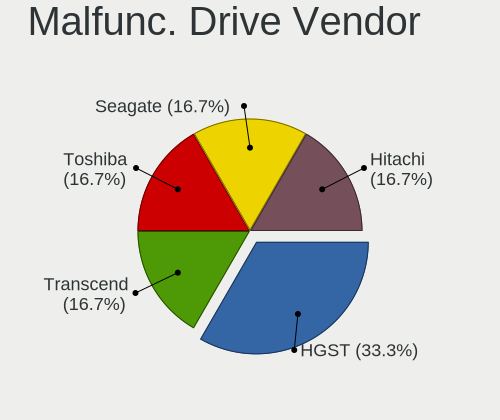
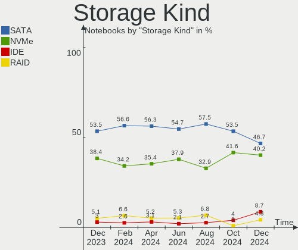

BSD - Hardware Trends (Notebooks)
---------------------------------

A project to identify most popular hardware characteristics and track their change
over time based on data collected by BSD users at https://BSD-Hardware.info.

Anyone can contribute to this report by the [hw-probe](https://github.com/linuxhw/hw-probe/blob/master/INSTALL.BSD.md) tool:

    hw-probe -all -upload

This report is for one last month. Overall report since the beginning of time: [TestCoverage](https://github.com/bsdhw/TestCoverage)

Period: Nov, 2022.

Contents
--------

* [ System ](#system)
  - [ OS                       ](#os)
  - [ OS Family                ](#os-family)
  - [ Arch                     ](#arch)
  - [ DE                       ](#de)
  - [ Display Server           ](#display-server)
  - [ Display Manager          ](#display-manager)
  - [ OS Lang                  ](#os-lang)
  - [ Boot Mode                ](#boot-mode)
  - [ Filesystem               ](#filesystem)
  - [ Part. scheme             ](#part-scheme)

* [ Board ](#board)
  - [ Vendor                   ](#vendor)
  - [ Model                    ](#model)
  - [ Model Family             ](#model-family)
  - [ MFG Year                 ](#mfg-year)
  - [ Form Factor              ](#form-factor)
  - [ Coreboot                 ](#coreboot)
  - [ RAM Size                 ](#ram-size)
  - [ RAM Used                 ](#ram-used)
  - [ Total Drives             ](#total-drives)
  - [ Has CD-ROM               ](#has-cd-rom)
  - [ Has Ethernet             ](#has-ethernet)
  - [ Has WiFi                 ](#has-wifi)
  - [ Has Bluetooth            ](#has-bluetooth)

* [ Location ](#location)
  - [ Country                  ](#country)
  - [ City                     ](#city)

* [ Drives ](#drives)
  - [ Drive Vendor             ](#drive-vendor)
  - [ Drive Model              ](#drive-model)
  - [ HDD Vendor               ](#hdd-vendor)
  - [ SSD Vendor               ](#ssd-vendor)
  - [ Drive Kind               ](#drive-kind)
  - [ Drive Connector          ](#drive-connector)
  - [ Drive Size               ](#drive-size)
  - [ Space Total              ](#space-total)
  - [ Space Used               ](#space-used)
  - [ Malfunc. Drives          ](#malfunc-drives)
  - [ Malfunc. Drive Vendor    ](#malfunc-drive-vendor)
  - [ Malfunc. HDD Vendor      ](#malfunc-hdd-vendor)
  - [ Malfunc. Drive Kind      ](#malfunc-drive-kind)
  - [ Failed Drives            ](#failed-drives)
  - [ Failed Drive Vendor      ](#failed-drive-vendor)
  - [ Drive Status             ](#drive-status)

* [ Storage controller ](#storage-controller)
  - [ Storage Vendor           ](#storage-vendor)
  - [ Storage Model            ](#storage-model)
  - [ Storage Kind             ](#storage-kind)

* [ Processor ](#processor)
  - [ CPU Vendor               ](#cpu-vendor)
  - [ CPU Model                ](#cpu-model)
  - [ CPU Model Family         ](#cpu-model-family)
  - [ CPU Cores                ](#cpu-cores)
  - [ CPU Sockets              ](#cpu-sockets)
  - [ CPU Threads              ](#cpu-threads)
  - [ CPU Microarch            ](#cpu-microarch)

* [ Graphics ](#graphics)
  - [ GPU Vendor               ](#gpu-vendor)
  - [ GPU Model                ](#gpu-model)
  - [ GPU Combo                ](#gpu-combo)
  - [ GPU Driver               ](#gpu-driver)
  - [ GPU Memory               ](#gpu-memory)

* [ Monitor ](#monitor)
  - [ Monitor Vendor           ](#monitor-vendor)
  - [ Monitor Model            ](#monitor-model)
  - [ Monitor Resolution       ](#monitor-resolution)
  - [ Monitor Diagonal         ](#monitor-diagonal)
  - [ Monitor Width            ](#monitor-width)
  - [ Aspect Ratio             ](#aspect-ratio)
  - [ Monitor Area             ](#monitor-area)
  - [ Pixel Density            ](#pixel-density)
  - [ Multiple Monitors        ](#multiple-monitors)

* [ Network ](#network)
  - [ Net Controller Vendor    ](#net-controller-vendor)
  - [ Net Controller Model     ](#net-controller-model)
  - [ Wireless Vendor          ](#wireless-vendor)
  - [ Wireless Model           ](#wireless-model)
  - [ Ethernet Vendor          ](#ethernet-vendor)
  - [ Ethernet Model           ](#ethernet-model)
  - [ Net Controller Kind      ](#net-controller-kind)
  - [ Used Controller          ](#used-controller)
  - [ NICs                     ](#nics)
  - [ IPv6                     ](#ipv6)

* [ Bluetooth ](#bluetooth)
  - [ Bluetooth Vendor         ](#bluetooth-vendor)
  - [ Bluetooth Model          ](#bluetooth-model)

* [ Sound ](#sound)
  - [ Sound Vendor             ](#sound-vendor)
  - [ Sound Model              ](#sound-model)

* [ Memory ](#memory)
  - [ Memory Vendor            ](#memory-vendor)
  - [ Memory Model             ](#memory-model)
  - [ Memory Kind              ](#memory-kind)
  - [ Memory Form Factor       ](#memory-form-factor)
  - [ Memory Size              ](#memory-size)
  - [ Memory Speed             ](#memory-speed)

* [ Printers & scanners ](#printers--scanners)
  - [ Printer Vendor           ](#printer-vendor)
  - [ Printer Model            ](#printer-model)
  - [ Scanner Vendor           ](#scanner-vendor)
  - [ Scanner Model            ](#scanner-model)

* [ Camera ](#camera)
  - [ Camera Vendor            ](#camera-vendor)
  - [ Camera Model             ](#camera-model)

* [ Security ](#security)
  - [ Fingerprint Vendor       ](#fingerprint-vendor)
  - [ Fingerprint Model        ](#fingerprint-model)
  - [ Chipcard Vendor          ](#chipcard-vendor)
  - [ Chipcard Model           ](#chipcard-model)

* [ Unsupported ](#unsupported)
  - [ Unsupported Devices      ](#unsupported-devices)
  - [ Unsupported Device Types ](#unsupported-device-types)

System
------

OS
--

Installed operating systems

| Name                 | Notebooks | Percent |
|----------------------|-----------|---------|
| helloSystem 0.7.0    | 11        | 20.37%  |
| FreeBSD 13.1-p4      | 8         | 14.81%  |
| OpenBSD 7.2          | 5         | 9.26%   |
| FreeBSD 13.1         | 5         | 9.26%   |
| OPNsense 22.10       | 4         | 7.41%   |
| helloSystem 0.8.0    | 3         | 5.56%   |
| FreeBSD 14.0-CURRENT | 3         | 5.56%   |
| FreeBSD 13.1-p3      | 3         | 5.56%   |
| OPNsense 22.7.7      | 2         | 3.7%    |
| GhostBSD 22.11.02    | 2         | 3.7%    |
| OPNsense 22.7.6      | 1         | 1.85%   |
| NetBSD 9.3           | 1         | 1.85%   |
| MidnightBSD 2.2.6    | 1         | 1.85%   |
| helloSystem 0.5.0    | 1         | 1.85%   |
| GhostBSD 22.11.22    | 1         | 1.85%   |
| FreeBSD 13.1-p2      | 1         | 1.85%   |
| FreeBSD 13.1-p1      | 1         | 1.85%   |
| FreeBSD 12.3         | 1         | 1.85%   |

OS Family
---------

OS without a version

| Name        | Notebooks | Percent |
|-------------|-----------|---------|
| FreeBSD     | 22        | 40.74%  |
| helloSystem | 15        | 27.78%  |
| OPNsense    | 7         | 12.96%  |
| OpenBSD     | 5         | 9.26%   |
| GhostBSD    | 3         | 5.56%   |
| NetBSD      | 1         | 1.85%   |
| MidnightBSD | 1         | 1.85%   |

Arch
----

OS architecture (x86_64, i586, etc.)

| Name  | Notebooks | Percent |
|-------|-----------|---------|
| amd64 | 53        | 98.15%  |
| i386  | 1         | 1.85%   |

DE
--

Desktop Environment

| Name         | Notebooks | Percent |
|--------------|-----------|---------|
| helloDesktop | 19        | 35.19%  |
| Console      | 10        | 18.52%  |
| XFCE         | 9         | 16.67%  |
| KDE5         | 6         | 11.11%  |
| MATE         | 4         | 7.41%   |
| Window Maker | 1         | 1.85%   |
| i3           | 1         | 1.85%   |
| GNOME        | 1         | 1.85%   |
| Fluxbox      | 1         | 1.85%   |
| Cinnamon     | 1         | 1.85%   |
| AwesomeWM    | 1         | 1.85%   |

Display Server
--------------

X11 or Wayland

| Name    | Notebooks | Percent |
|---------|-----------|---------|
| X11     | 44        | 81.48%  |
| Console | 9         | 16.67%  |
| Wayland | 1         | 1.85%   |

Display Manager
---------------

SDDM, LightDM, etc.

| Name    | Notebooks | Percent |
|---------|-----------|---------|
| SLiM    | 19        | 35.19%  |
| Console | 18        | 33.33%  |
| LightDM | 7         | 12.96%  |
| SDDM    | 6         | 11.11%  |
| XDM     | 3         | 5.56%   |
| GDM     | 1         | 1.85%   |

OS Lang
-------

Language

| Lang    | Notebooks | Percent |
|---------|-----------|---------|
| en_US   | 17        | 31.48%  |
| C       | 15        | 27.78%  |
| Unknown | 15        | 27.78%  |
| es_ES   | 2         | 3.7%    |
| pt_BR   | 1         | 1.85%   |
| nl_NL   | 1         | 1.85%   |
| it_IT   | 1         | 1.85%   |
| fr_FR   | 1         | 1.85%   |
| en_CA   | 1         | 1.85%   |

Boot Mode
---------

EFI or BIOS

| Mode | Notebooks | Percent |
|------|-----------|---------|
| EFI  | 51        | 94.44%  |
| BIOS | 3         | 5.56%   |

Filesystem
----------

Type of filesystem

| Type   | Notebooks | Percent |
|--------|-----------|---------|
| Zfs    | 33        | 61.11%  |
| Ufs    | 9         | 16.67%  |
| Cd9660 | 7         | 12.96%  |
| Ffs    | 5         | 9.26%   |

Part. scheme
------------

Scheme of partitioning

| Type | Notebooks | Percent |
|------|-----------|---------|
| GPT  | 53        | 98.15%  |
| MBR  | 1         | 1.85%   |

Board
-----

Vendor
------

Motherboard manufacturer

| Name                | Notebooks | Percent |
|---------------------|-----------|---------|
| Lenovo              | 14        | 25.93%  |
| Dell                | 9         | 16.67%  |
| Hewlett-Packard     | 6         | 11.11%  |
| Deciso              | 6         | 11.11%  |
| ASUSTek Computer    | 5         | 9.26%   |
| Samsung Electronics | 3         | 5.56%   |
| Acer                | 3         | 5.56%   |
| Apple               | 2         | 3.7%    |
| Toshiba             | 1         | 1.85%   |
| Sony                | 1         | 1.85%   |
| Panasonic           | 1         | 1.85%   |
| Medion              | 1         | 1.85%   |
| GPD                 | 1         | 1.85%   |
| Google              | 1         | 1.85%   |

Model
-----

Motherboard model

| Name                                     | Notebooks | Percent |
|------------------------------------------|-----------|---------|
| Deciso NetBoard-A20                      | 2         | 3.7%    |
| Deciso NetBoard-A10                      | 2         | 3.7%    |
| Toshiba TECRA Z40-C-12Z                  | 1         | 1.85%   |
| Sony SVP1321V9RB                         | 1         | 1.85%   |
| Samsung 750TDA                           | 1         | 1.85%   |
| Samsung 3570R/370R/470R/450R/510R/4450RV | 1         | 1.85%   |
| Samsung 300E4C/300E5C/300E7C             | 1         | 1.85%   |
| Panasonic CF-31-5                        | 1         | 1.85%   |
| Medion E15415                            | 1         | 1.85%   |
| Lenovo Yoga Slim 7 Pro 14ACH5 O 82N5     | 1         | 1.85%   |
| Lenovo ThinkPad X270 W10DG 20K5S0TT1N    | 1         | 1.85%   |
| Lenovo ThinkPad X270 W10DG 20K5S0PY04    | 1         | 1.85%   |
| Lenovo ThinkPad X270 20HMCTO1WW          | 1         | 1.85%   |
| Lenovo ThinkPad X260 20F5S2GM00          | 1         | 1.85%   |
| Lenovo ThinkPad X230 2325T4T             | 1         | 1.85%   |
| Lenovo ThinkPad X1 Carbon 4th 20FCS13H00 | 1         | 1.85%   |
| Lenovo ThinkPad X1 Carbon 3448AWU        | 1         | 1.85%   |
| Lenovo ThinkPad T460 20FMS0XL23          | 1         | 1.85%   |
| Lenovo ThinkPad T450s 20BXCTO1WW         | 1         | 1.85%   |
| Lenovo ThinkPad T430 2347G7G             | 1         | 1.85%   |
| Lenovo ThinkPad T430 23446FP             | 1         | 1.85%   |
| Lenovo Legion Y530-15ICH 81FV            | 1         | 1.85%   |
| Lenovo IdeaPad 110-15ACL 80TJ            | 1         | 1.85%   |
| HP ProBook 4540s                         | 1         | 1.85%   |
| HP Pavilion Gaming Laptop 15-ec1xxx      | 1         | 1.85%   |
| HP Laptop 15-da0xxx                      | 1         | 1.85%   |
| HP Laptop 14s-fq0xxx                     | 1         | 1.85%   |
| HP EliteBook 8570p                       | 1         | 1.85%   |
| HP EliteBook 840 G3                      | 1         | 1.85%   |
| GPD P3 MAX                               | 1         | 1.85%   |
| Google Akemi                             | 1         | 1.85%   |
| Dell XPS 13 9343                         | 1         | 1.85%   |
| Dell Vostro 3550                         | 1         | 1.85%   |
| Dell Vostro 3501                         | 1         | 1.85%   |
| Dell Precision M4500                     | 1         | 1.85%   |
| Dell Latitude E7240                      | 1         | 1.85%   |
| Dell Latitude D630                       | 1         | 1.85%   |
| Dell Latitude D610                       | 1         | 1.85%   |
| Dell Inspiron 5558                       | 1         | 1.85%   |
| Dell Inspiron 3421                       | 1         | 1.85%   |

Model Family
------------

Motherboard model prefix

| Name                | Notebooks | Percent |
|---------------------|-----------|---------|
| Lenovo ThinkPad     | 11        | 20.37%  |
| Dell Latitude       | 3         | 5.56%   |
| ASUS ZenBook        | 3         | 5.56%   |
| HP Laptop           | 2         | 3.7%    |
| HP EliteBook        | 2         | 3.7%    |
| Dell Vostro         | 2         | 3.7%    |
| Dell Inspiron       | 2         | 3.7%    |
| Deciso NetBoard-A20 | 2         | 3.7%    |
| Deciso NetBoard-A10 | 2         | 3.7%    |
| Acer Aspire         | 2         | 3.7%    |
| Toshiba TECRA       | 1         | 1.85%   |
| Sony SVP1321V9RB    | 1         | 1.85%   |
| Samsung 750TDA      | 1         | 1.85%   |
| Samsung 3570R       | 1         | 1.85%   |
| Samsung 300E4C      | 1         | 1.85%   |
| Panasonic CF-31-5   | 1         | 1.85%   |
| Medion E15415       | 1         | 1.85%   |
| Lenovo Yoga         | 1         | 1.85%   |
| Lenovo Legion       | 1         | 1.85%   |
| Lenovo IdeaPad      | 1         | 1.85%   |
| HP ProBook          | 1         | 1.85%   |
| HP Pavilion         | 1         | 1.85%   |
| GPD P3              | 1         | 1.85%   |
| Google Akemi        | 1         | 1.85%   |
| Dell XPS            | 1         | 1.85%   |
| Dell Precision      | 1         | 1.85%   |
| Deciso OPNsense     | 1         | 1.85%   |
| Deciso Netboard     | 1         | 1.85%   |
| ASUS TUF            | 1         | 1.85%   |
| ASUS K55VD          | 1         | 1.85%   |
| Apple MacBookPro8   | 1         | 1.85%   |
| Apple MacBook5      | 1         | 1.85%   |
| Acer TravelMate     | 1         | 1.85%   |

MFG Year
--------

Motherboard manufacture year

| Year | Notebooks | Percent |
|------|-----------|---------|
| 2021 | 10        | 18.52%  |
| 2022 | 6         | 11.11%  |
| 2012 | 6         | 11.11%  |
| 2013 | 5         | 9.26%   |
| 2019 | 4         | 7.41%   |
| 2016 | 4         | 7.41%   |
| 2020 | 3         | 5.56%   |
| 2018 | 3         | 5.56%   |
| 2015 | 3         | 5.56%   |
| 2014 | 3         | 5.56%   |
| 2010 | 3         | 5.56%   |
| 2008 | 2         | 3.7%    |
| 2017 | 1         | 1.85%   |
| 2005 | 1         | 1.85%   |

Form Factor
-----------

Physical design of the computer

| Name     | Notebooks | Percent |
|----------|-----------|---------|
| Notebook | 54        | 100%    |

Coreboot
--------

Have coreboot on board

| Used | Notebooks | Percent |
|------|-----------|---------|
| No   | 53        | 98.15%  |
| Yes  | 1         | 1.85%   |

RAM Size
--------

Total RAM memory

| Size in GB | Notebooks | Percent |
|------------|-----------|---------|
| 8.01-16.0  | 31        | 57.41%  |
| 16.01-24.0 | 12        | 22.22%  |
| 4.01-8.0   | 4         | 7.41%   |
| 32.01-64.0 | 2         | 3.7%    |
| 24.01-32.0 | 2         | 3.7%    |
| 2.01-3.0   | 2         | 3.7%    |
| 3.01-4.0   | 1         | 1.85%   |

RAM Used
--------

Used RAM memory

| Used GB  | Notebooks | Percent |
|----------|-----------|---------|
| 0.01-0.5 | 29        | 53.7%   |
| 0.51-1.0 | 15        | 27.78%  |
| 1.01-2.0 | 6         | 11.11%  |
| 2.01-3.0 | 3         | 5.56%   |
| Unknown  | 1         | 1.85%   |

Total Drives
------------

Number of drives on board

| Drives | Notebooks | Percent |
|--------|-----------|---------|
| 1      | 43        | 79.63%  |
| 2      | 7         | 12.96%  |
| 0      | 3         | 5.56%   |
| 3      | 1         | 1.85%   |

Has CD-ROM
----------

Has CD-ROM on board

| Presented | Notebooks | Percent |
|-----------|-----------|---------|
| No        | 42        | 77.78%  |
| Yes       | 12        | 22.22%  |

Has Ethernet
------------

Has Ethernet on board

| Presented | Notebooks | Percent |
|-----------|-----------|---------|
| Yes       | 42        | 77.78%  |
| No        | 12        | 22.22%  |

Has WiFi
--------

Has WiFi module

| Presented | Notebooks | Percent |
|-----------|-----------|---------|
| Yes       | 48        | 88.89%  |
| No        | 6         | 11.11%  |

Has Bluetooth
-------------

Has Bluetooth module

| Presented | Notebooks | Percent |
|-----------|-----------|---------|
| Yes       | 40        | 74.07%  |
| No        | 14        | 25.93%  |

Location
--------

Country
-------

Geographic location (country)

| Country     | Notebooks | Percent |
|-------------|-----------|---------|
| USA         | 7         | 12.96%  |
| Germany     | 5         | 9.26%   |
| Canada      | 5         | 9.26%   |
| Spain       | 4         | 7.41%   |
| France      | 4         | 7.41%   |
| Brazil      | 3         | 5.56%   |
| UK          | 2         | 3.7%    |
| Netherlands | 2         | 3.7%    |
| Mexico      | 2         | 3.7%    |
| Italy       | 2         | 3.7%    |
| China       | 2         | 3.7%    |
| Sweden      | 1         | 1.85%   |
| Slovenia    | 1         | 1.85%   |
| Singapore   | 1         | 1.85%   |
| Russia      | 1         | 1.85%   |
| Romania     | 1         | 1.85%   |
| Panama      | 1         | 1.85%   |
| Malta       | 1         | 1.85%   |
| Japan       | 1         | 1.85%   |
| Indonesia   | 1         | 1.85%   |
| India       | 1         | 1.85%   |
| Guadeloupe  | 1         | 1.85%   |
| Egypt       | 1         | 1.85%   |
| Denmark     | 1         | 1.85%   |
| Colombia    | 1         | 1.85%   |
| Chile       | 1         | 1.85%   |
| Bulgaria    | 1         | 1.85%   |

City
----

Geographic location (city)

| City              | Notebooks | Percent |
|-------------------|-----------|---------|
| Montreal          | 4         | 7.41%   |
| Sao Paulo         | 2         | 3.7%    |
| London            | 2         | 3.7%    |
| Youngstown        | 1         | 1.85%   |
| Wuppertal         | 1         | 1.85%   |
| West Linn         | 1         | 1.85%   |
| Valencia          | 1         | 1.85%   |
| Urnieta           | 1         | 1.85%   |
| Tlalnepantla      | 1         | 1.85%   |
| Temuco            | 1         | 1.85%   |
| Swieqi            | 1         | 1.85%   |
| Springfield       | 1         | 1.85%   |
| Singapore         | 1         | 1.85%   |
| Shenzhen          | 1         | 1.85%   |
| Shelton           | 1         | 1.85%   |
| Sarcelles         | 1         | 1.85%   |
| Sanlucar la Mayor | 1         | 1.85%   |
| Samokov           | 1         | 1.85%   |
| Rozenburg         | 1         | 1.85%   |
| Rio de Janeiro    | 1         | 1.85%   |
| Renton            | 1         | 1.85%   |
| Queens            | 1         | 1.85%   |
| Paris             | 1         | 1.85%   |
| Papendrecht       | 1         | 1.85%   |
| Panama City       | 1         | 1.85%   |
| Nykobing Falster  | 1         | 1.85%   |
| Novo Mesto        | 1         | 1.85%   |
| New Delhi         | 1         | 1.85%   |
| Neumünster       | 1         | 1.85%   |
| Nakano            | 1         | 1.85%   |
| Moscow            | 1         | 1.85%   |
| Milan             | 1         | 1.85%   |
| Le Gosier         | 1         | 1.85%   |
| Kingsburg         | 1         | 1.85%   |
| Jiangbei          | 1         | 1.85%   |
| Jakarta           | 1         | 1.85%   |
| Gifhorn           | 1         | 1.85%   |
| Gattinara         | 1         | 1.85%   |
| Frankfurt am Main | 1         | 1.85%   |
| Élancourt        | 1         | 1.85%   |

Drives
------

Drive Vendor
------------

Hard drive vendors

| Vendor              | Notebooks | Drives | Percent |
|---------------------|-----------|--------|---------|
| Samsung Electronics | 13        | 15     | 22.03%  |
| WDC                 | 8         | 9      | 13.56%  |
| Transcend           | 6         | 6      | 10.17%  |
| Toshiba             | 6         | 6      | 10.17%  |
| Seagate             | 4         | 4      | 6.78%   |
| Crucial             | 4         | 4      | 6.78%   |
| Hitachi             | 3         | 3      | 5.08%   |
| SanDisk             | 2         | 2      | 3.39%   |
| NVMe                | 2         | 2      | 3.39%   |
| Kingston            | 2         | 2      | 3.39%   |
| A-DATA Technology   | 2         | 2      | 3.39%   |
| SK hynix            | 1         | 1      | 1.69%   |
| PNY                 | 1         | 1      | 1.69%   |
| Phison              | 1         | 1      | 1.69%   |
| KingSpec            | 1         | 1      | 1.69%   |
| Intel               | 1         | 1      | 1.69%   |
| HGST                | 1         | 1      | 1.69%   |
| BIWIN               | 1         | 1      | 1.69%   |

Drive Model
-----------

Hard drive models

| Model                                | Notebooks | Percent |
|--------------------------------------|-----------|---------|
| Transcend TS256GMTS952T2 256GB       | 3         | 4.84%   |
| Transcend TS256GMTE652T2 256GB       | 2         | 3.23%   |
| Kingston SA400S37240G 240GB          | 2         | 3.23%   |
| WDC WDS500G2B0A-00SM50 500GB         | 1         | 1.61%   |
| WDC WDS250G2B0B-00YS70 250GB         | 1         | 1.61%   |
| WDC WDS240G2G0A-00JH30 240GB         | 1         | 1.61%   |
| WDC WDS100T2B0C-00PXH0 1TB           | 1         | 1.61%   |
| WDC WDS100T2B0A-00SM50 1TB           | 1         | 1.61%   |
| WDC WD1200BEVS-22UST0 120GB          | 1         | 1.61%   |
| WDC WD10JPCX-24UE4T0 1TB             | 1         | 1.61%   |
| WDC PC SN530 SDBPNPZ-512G-1006 512GB | 1         | 1.61%   |
| WDC PC SN520 SDAPNUW-256G-1006 256GB | 1         | 1.61%   |
| Transcend TS512GMTS952T2 512GB       | 1         | 1.61%   |
| Toshiba THNSNJ256GCSY 256GB          | 1         | 1.61%   |
| Toshiba MQ01ACF050 500GB             | 1         | 1.61%   |
| Toshiba MQ01ABF050 500GB             | 1         | 1.61%   |
| Toshiba MQ01ABF032 320GB             | 1         | 1.61%   |
| Toshiba MK3261GSYN 320GB             | 1         | 1.61%   |
| Toshiba KSG60ZMV256G 256GB           | 1         | 1.61%   |
| SK hynix HFM512GD3JX013N 512GB       | 1         | 1.61%   |
| Seagate ST980210A 80GB               | 1         | 1.61%   |
| Seagate ST9750420AS 752GB            | 1         | 1.61%   |
| Seagate ST9320325ASG 320GB           | 1         | 1.61%   |
| Seagate ST500LM021-1KJ152 500GB      | 1         | 1.61%   |
| SanDisk SSD PLUS 240GB               | 1         | 1.61%   |
| SanDisk SD9TB8W512G1001 512GB        | 1         | 1.61%   |
| Samsung SSD PM851 mSATA 256GB        | 1         | 1.61%   |
| Samsung SSD PM851 M.2 2280 256GB     | 1         | 1.61%   |
| Samsung SSD 870 EVO 4TB              | 1         | 1.61%   |
| Samsung SSD 870 EVO 1TB              | 1         | 1.61%   |
| Samsung SSD 860 QVO 1TB              | 1         | 1.61%   |
| Samsung SSD 860 EVO M.2 1TB          | 1         | 1.61%   |
| Samsung SSD 860 EVO 500GB            | 1         | 1.61%   |
| Samsung SSD 850 EVO M.2 250GB        | 1         | 1.61%   |
| Samsung SSD 750 EVO 250GB            | 1         | 1.61%   |
| Samsung MZVLW256HEHP-000L7 256GB     | 1         | 1.61%   |
| Samsung MZVLQ512HALU-00000 512GB     | 1         | 1.61%   |
| Samsung MZVLQ256HBJD-00B 256GB       | 1         | 1.61%   |
| Samsung MZVLB1T0HBLR-000L2 1TB       | 1         | 1.61%   |
| Samsung MZALQ128HBHQ-000L2 128GB     | 1         | 1.61%   |

HDD Vendor
----------

Hard disk drive vendors

| Vendor  | Notebooks | Drives | Percent |
|---------|-----------|--------|---------|
| Toshiba | 4         | 4      | 26.67%  |
| Seagate | 4         | 4      | 26.67%  |
| Hitachi | 3         | 3      | 20%     |
| WDC     | 2         | 2      | 13.33%  |
| NVMe    | 1         | 1      | 6.67%   |
| HGST    | 1         | 1      | 6.67%   |

SSD Vendor
----------

Solid state drive vendors

| Vendor              | Notebooks | Drives | Percent |
|---------------------|-----------|--------|---------|
| Samsung Electronics | 9         | 10     | 28.13%  |
| WDC                 | 4         | 4      | 12.5%   |
| Transcend           | 4         | 4      | 12.5%   |
| Crucial             | 4         | 4      | 12.5%   |
| Toshiba             | 2         | 2      | 6.25%   |
| SanDisk             | 2         | 2      | 6.25%   |
| Kingston            | 2         | 2      | 6.25%   |
| A-DATA Technology   | 2         | 2      | 6.25%   |
| PNY                 | 1         | 1      | 3.13%   |
| KingSpec            | 1         | 1      | 3.13%   |
| Intel               | 1         | 1      | 3.13%   |

Drive Kind
----------

HDD or SSD

| Kind | Notebooks | Drives | Percent |
|------|-----------|--------|---------|
| SSD  | 29        | 33     | 50.88%  |
| NVMe | 14        | 14     | 24.56%  |
| HDD  | 14        | 15     | 24.56%  |

Drive Connector
---------------

SATA, SAS, NVMe, etc.

| Type | Notebooks | Drives | Percent |
|------|-----------|--------|---------|
| SATA | 40        | 48     | 74.07%  |
| NVMe | 14        | 14     | 25.93%  |

Drive Size
----------

Size of hard drive

| Size in TB | Notebooks | Drives | Percent |
|------------|-----------|--------|---------|
| 0.01-0.5   | 29        | 33     | 67.44%  |
| 0.51-1.0   | 11        | 12     | 25.58%  |
| 1.01-2.0   | 2         | 2      | 4.65%   |
| 3.01-4.0   | 1         | 1      | 2.33%   |

Space Total
-----------

Amount of disk space available on the file system

| Size in GB | Notebooks | Percent |
|------------|-----------|---------|
| 101-250    | 24        | 44.44%  |
| 51-100     | 8         | 14.81%  |
| 251-500    | 7         | 12.96%  |
| 1-20       | 7         | 12.96%  |
| 501-1000   | 5         | 9.26%   |
| 21-50      | 3         | 5.56%   |

Space Used
----------

Amount of used disk space

| Used GB | Notebooks | Percent |
|---------|-----------|---------|
| 1-20    | 49        | 90.74%  |
| 21-50   | 3         | 5.56%   |
| 51-100  | 2         | 3.7%    |

Malfunc. Drives
---------------

Drive models with a malfunction

| Model                                     | Notebooks | Drives | Percent |
|-------------------------------------------|-----------|--------|---------|
| Toshiba MQ01ABF032 320GB                  | 1         | 1      | 12.5%   |
| Seagate ST9750420AS 752GB                 | 1         | 1      | 12.5%   |
| Seagate ST9320325ASG 320GB                | 1         | 1      | 12.5%   |
| Seagate ST500LM021-1KJ152 500GB           | 1         | 1      | 12.5%   |
| Samsung Electronics SSD PM851 mSATA 256GB | 1         | 1      | 12.5%   |
| Hitachi HTS542525K9A300 250GB             | 1         | 1      | 12.5%   |
| HGST HTS721010A9E630 1TB                  | 1         | 1      | 12.5%   |
| A-DATA Technology SU650 120GB             | 1         | 1      | 12.5%   |

Malfunc. Drive Vendor
---------------------

Vendors of faulty drives

| Vendor              | Notebooks | Drives | Percent |
|---------------------|-----------|--------|---------|
| Seagate             | 3         | 3      | 37.5%   |
| Toshiba             | 1         | 1      | 12.5%   |
| Samsung Electronics | 1         | 1      | 12.5%   |
| Hitachi             | 1         | 1      | 12.5%   |
| HGST                | 1         | 1      | 12.5%   |
| A-DATA Technology   | 1         | 1      | 12.5%   |

Malfunc. HDD Vendor
-------------------

Vendors of faulty HDD drives

| Vendor  | Notebooks | Drives | Percent |
|---------|-----------|--------|---------|
| Seagate | 3         | 3      | 50%     |
| Toshiba | 1         | 1      | 16.67%  |
| Hitachi | 1         | 1      | 16.67%  |
| HGST    | 1         | 1      | 16.67%  |

Malfunc. Drive Kind
-------------------

Kinds of faulty drives

| Kind | Notebooks | Drives | Percent |
|------|-----------|--------|---------|
| HDD  | 6         | 6      | 75%     |
| SSD  | 2         | 2      | 25%     |

Failed Drives
-------------

Failed drive models

Zero info for selected period =(

Failed Drive Vendor
-------------------

Failed drive vendors

Zero info for selected period =(

Drive Status
------------

Number of failed and malfunc. drives

| Status   | Notebooks | Drives | Percent |
|----------|-----------|--------|---------|
| Works    | 43        | 52     | 81.13%  |
| Malfunc  | 8         | 8      | 15.09%  |
| Detected | 2         | 2      | 3.77%   |

Storage controller
------------------

Storage Vendor
--------------

Storage controller vendors

| Vendor                   | Notebooks | Percent |
|--------------------------|-----------|---------|
| Intel                    | 35        | 59.32%  |
| AMD                      | 8         | 13.56%  |
| Samsung Electronics      | 6         | 10.17%  |
| SanDisk                  | 3         | 5.08%   |
| Transcend                | 2         | 3.39%   |
| SK hynix                 | 1         | 1.69%   |
| Phison Electronics       | 1         | 1.69%   |
| Nvidia                   | 1         | 1.69%   |
| Biwin Storage Technology | 1         | 1.69%   |
| ADATA Technology         | 1         | 1.69%   |

Storage Model
-------------

Storage controller models

| Model                                                                        | Notebooks | Percent |
|------------------------------------------------------------------------------|-----------|---------|
| Intel 7 Series Chipset Family 6-port SATA Controller [AHCI mode]             | 10        | 16.39%  |
| AMD FCH SATA Controller [AHCI mode]                                          | 7         | 11.48%  |
| Intel Sunrise Point-LP SATA Controller [AHCI mode]                           | 6         | 9.84%   |
| Intel Wildcat Point-LP SATA Controller [AHCI Mode]                           | 4         | 6.56%   |
| Unknown                                                                      | 4         | 6.56%   |
| Samsung NVMe SSD Controller 980                                              | 3         | 4.92%   |
| Samsung NVMe SSD Controller SM961/PM961/SM963                                | 2         | 3.28%   |
| Intel Comet Lake SATA AHCI Controller                                        | 2         | 3.28%   |
| Intel Cannon Lake Mobile PCH SATA AHCI Controller                            | 2         | 3.28%   |
| Intel 8 Series SATA Controller 1 [AHCI mode]                                 | 2         | 3.28%   |
| Intel 6 Series/C200 Series Chipset Family 6 port Mobile SATA AHCI Controller | 2         | 3.28%   |
| SK hynix Gold P31/PC711 NVMe Solid State Drive                               | 1         | 1.64%   |
| SanDisk WD Blue SN550 NVMe SSD                                               | 1         | 1.64%   |
| SanDisk WD Blue SN500 / PC SN520 NVMe SSD                                    | 1         | 1.64%   |
| SanDisk unknown                                                              | 1         | 1.64%   |
| Samsung NVMe SSD Controller SM981/PM981/PM983                                | 1         | 1.64%   |
| Nvidia MCP79 AHCI Controller                                                 | 1         | 1.64%   |
| Intel Ice Lake-LP SATA Controller [AHCI mode]                                | 1         | 1.64%   |
| Intel Atom Processor E3800 Series SATA AHCI Controller                       | 1         | 1.64%   |
| Intel 82801IBM/IEM (ICH9M/ICH9M-E) 4 port SATA Controller [AHCI mode]        | 1         | 1.64%   |
| Intel 82801HM/HEM (ICH8M/ICH8M-E) SATA Controller [AHCI mode]                | 1         | 1.64%   |
| Intel 82801HM/HEM (ICH8M/ICH8M-E) IDE Controller                             | 1         | 1.64%   |
| Intel 82801FBM (ICH6M) SATA Controller                                       | 1         | 1.64%   |
| Intel 82801 Mobile SATA Controller [RAID mode]                               | 1         | 1.64%   |
| Intel 5 Series/3400 Series Chipset 6 port SATA AHCI Controller               | 1         | 1.64%   |
| AMD SB7x0/SB8x0/SB9x0 SATA Controller [AHCI mode]                            | 1         | 1.64%   |
| AMD SB7x0/SB8x0/SB9x0 IDE Controller                                         | 1         | 1.64%   |
| ADATA Technology unknown                                                     | 1         | 1.64%   |

Storage Kind
------------

Kind of storage controller (IDE, SATA, NVMe, SAS, ...)

| Kind | Notebooks | Percent |
|------|-----------|---------|
| SATA | 42        | 68.85%  |
| NVMe | 15        | 24.59%  |
| IDE  | 3         | 4.92%   |
| RAID | 1         | 1.64%   |

Processor
---------

CPU Vendor
----------

Processor vendors

| Vendor | Notebooks | Percent |
|--------|-----------|---------|
| Intel  | 41        | 75.93%  |
| AMD    | 13        | 24.07%  |

CPU Model
---------

Processor models

| Model                                   | Notebooks | Percent |
|-----------------------------------------|-----------|---------|
| Intel Core i5-6300U CPU @ 2.40GHz       | 4         | 7.41%   |
| AMD EPYC 3201 8-Core Processor          | 4         | 7.41%   |
| Intel Core i7-6600U CPU @ 2.60GHz       | 2         | 3.7%    |
| Intel Core i7-3520M CPU @ 2.90GHz       | 2         | 3.7%    |
| Intel Core i5-3210M CPU @ 2.50GHz       | 2         | 3.7%    |
| Intel Core i5-10210U CPU @ 1.60GHz      | 2         | 3.7%    |
| AMD Ryzen Embedded V1500B               | 2         | 3.7%    |
| Intel Pentium Silver N6000 @ 1.10GHz    | 1         | 1.85%   |
| Intel Pentium M                         | 1         | 1.85%   |
| Intel CPU Version                       | 1         | 1.85%   |
| Intel Core i7-8750H CPU @ 2.20GHz       | 1         | 1.85%   |
| Intel Core i7-8550U CPU @ 1.80GHz       | 1         | 1.85%   |
| Intel Core i7-5600U CPU @ 2.60GHz       | 1         | 1.85%   |
| Intel Core i7-4600U CPU @ 2.10GHz       | 1         | 1.85%   |
| Intel Core i7-3667U CPU @ 2.00GHz       | 1         | 1.85%   |
| Intel Core i7-3632QM CPU @ 2.20GHz      | 1         | 1.85%   |
| Intel Core i7-3612QM CPU @ 2.10GHz      | 1         | 1.85%   |
| Intel Core i7-3610QM CPU @ 2.30GHz      | 1         | 1.85%   |
| Intel Core i5-8300H CPU @ 2.30GHz       | 1         | 1.85%   |
| Intel Core i5-8265U CPU @ 1.60GHz       | 1         | 1.85%   |
| Intel Core i5-7200U CPU @ 2.50GHz       | 1         | 1.85%   |
| Intel Core i5-6200U CPU @ 2.30GHz       | 1         | 1.85%   |
| Intel Core i5-5300U CPU @ 2.30GHz       | 1         | 1.85%   |
| Intel Core i5-5200U CPU @ 2.20GHz       | 1         | 1.85%   |
| Intel Core i5-4200U CPU @ 1.60GHz       | 1         | 1.85%   |
| Intel Core i5-3320M CPU @ 2.60GHz       | 1         | 1.85%   |
| Intel Core i5-2520M CPU @ 2.50GHz       | 1         | 1.85%   |
| Intel Core i5-2415M CPU @ 2.30GHz       | 1         | 1.85%   |
| Intel Core i5-1035G1 CPU @ 1.00GHz      | 1         | 1.85%   |
| Intel Core i5 CPU M 560 @ 2.67GH        | 1         | 1.85%   |
| Intel Core i3-5005U CPU @ 2.00GHz       | 1         | 1.85%   |
| Intel Core i3-3217U CPU @ 1.80GHz       | 1         | 1.85%   |
| Intel Core 2 Duo CPU P7350 @ 2.00GHz    | 1         | 1.85%   |
| Intel Core 2 Duo                        | 1         | 1.85%   |
| Intel Celeron CPU N2840 @ 2.16GHz       | 1         | 1.85%   |
| Intel 11th Gen Core i5-1135G7 @ 2.40GHz | 1         | 1.85%   |
| AMD V120 Processor                      | 1         | 1.85%   |
| AMD Ryzen 7 5800H with Radeon Graphics  | 1         | 1.85%   |
| AMD Ryzen 7 5700U with Radeon Graphics  | 1         | 1.85%   |
| AMD Ryzen 5 4600H with Radeon Graphics  | 1         | 1.85%   |

CPU Model Family
----------------

Processor model prefix

| Model                | Notebooks | Percent |
|----------------------|-----------|---------|
| Intel Core i5        | 20        | 37.04%  |
| Intel Core i7        | 12        | 22.22%  |
| AMD EPYC             | 4         | 7.41%   |
| Other                | 2         | 3.7%    |
| Intel Core i3        | 2         | 3.7%    |
| Intel Core 2 Duo     | 2         | 3.7%    |
| AMD Ryzen Embedded   | 2         | 3.7%    |
| AMD Ryzen 7          | 2         | 3.7%    |
| AMD Ryzen 5          | 2         | 3.7%    |
| Intel Pentium Silver | 1         | 1.85%   |
| Intel Pentium M      | 1         | 1.85%   |
| Intel Celeron        | 1         | 1.85%   |
| AMD V120             | 1         | 1.85%   |
| AMD Athlon           | 1         | 1.85%   |
| AMD A8               | 1         | 1.85%   |

CPU Cores
---------

Number of processor cores

| Number  | Notebooks | Percent |
|---------|-----------|---------|
| 2       | 27        | 50%     |
| 4       | 13        | 24.07%  |
| 8       | 7         | 12.96%  |
| 16      | 2         | 3.7%    |
| 1       | 2         | 3.7%    |
| 12      | 1         | 1.85%   |
| 6       | 1         | 1.85%   |
| Unknown | 1         | 1.85%   |

CPU Sockets
-----------

Number of sockets

| Number | Notebooks | Percent |
|--------|-----------|---------|
| 1      | 53        | 98.15%  |
| 2      | 1         | 1.85%   |

CPU Threads
-----------

Threads per core (Hyper-Threading)

| Number  | Notebooks | Percent |
|---------|-----------|---------|
| 2       | 34        | 62.96%  |
| 1       | 18        | 33.33%  |
| Unknown | 2         | 3.7%    |

CPU Microarch
-------------

Microarchitecture

| Name        | Notebooks | Percent |
|-------------|-----------|---------|
| IvyBridge   | 10        | 18.52%  |
| Skylake     | 7         | 12.96%  |
| KabyLake    | 7         | 12.96%  |
| Zen         | 6         | 11.11%  |
| Broadwell   | 4         | 7.41%   |
| Penryn      | 3         | 5.56%   |
| Zen+        | 2         | 3.7%    |
| SandyBridge | 2         | 3.7%    |
| Haswell     | 2         | 3.7%    |
| Unknown     | 2         | 3.7%    |
| Zen 3       | 1         | 1.85%   |
| Zen 2       | 1         | 1.85%   |
| Westmere    | 1         | 1.85%   |
| TigerLake   | 1         | 1.85%   |
| Silvermont  | 1         | 1.85%   |
| Puma        | 1         | 1.85%   |
| P6          | 1         | 1.85%   |
| K10         | 1         | 1.85%   |
| IceLake     | 1         | 1.85%   |

Graphics
--------

GPU Vendor
----------

Vendors of graphics cards

| Vendor | Notebooks | Percent |
|--------|-----------|---------|
| Intel  | 36        | 62.07%  |
| AMD    | 13        | 22.41%  |
| Nvidia | 9         | 15.52%  |

GPU Model
---------

Graphics card models

| Model                                                                     | Notebooks | Percent |
|---------------------------------------------------------------------------|-----------|---------|
| Intel 3rd Gen Core processor Graphics Controller                          | 9         | 15%     |
| Intel Skylake GT2 [HD Graphics 520]                                       | 7         | 11.67%  |
| Intel HD Graphics 5500                                                    | 4         | 6.67%   |
| Nvidia GF119M [GeForce 610M]                                              | 2         | 3.33%   |
| Intel Haswell-ULT Integrated Graphics Controller                          | 2         | 3.33%   |
| Intel CometLake-U GT2 [UHD Graphics]                                      | 2         | 3.33%   |
| Intel CoffeeLake-H GT2 [UHD Graphics 630]                                 | 2         | 3.33%   |
| Intel 2nd Generation Core Processor Family Integrated Graphics Controller | 2         | 3.33%   |
| AMD Thames [Radeon HD 7550M/7570M/7650M]                                  | 2         | 3.33%   |
| AMD Picasso/Raven 2 [Radeon Vega Series / Radeon Vega Mobile Series]      | 2         | 3.33%   |
| Nvidia GT216GLM [Quadro FX 880M]                                          | 1         | 1.67%   |
| Nvidia GP108BM [GeForce MX250]                                            | 1         | 1.67%   |
| Nvidia GP107M [GeForce GTX 1050 Ti Mobile]                                | 1         | 1.67%   |
| Nvidia GP107M [GeForce GTX 1050 Mobile]                                   | 1         | 1.67%   |
| Nvidia GP107M [GeForce GTX 1050 3 GB Max-Q]                               | 1         | 1.67%   |
| Nvidia GM108M [GeForce MX130]                                             | 1         | 1.67%   |
| Nvidia C79 [GeForce 9400M]                                                | 1         | 1.67%   |
| Intel WhiskeyLake-U GT2 [UHD Graphics 620]                                | 1         | 1.67%   |
| Intel UHD Graphics 620                                                    | 1         | 1.67%   |
| Intel TigerLake-LP GT2 [Iris Xe Graphics]                                 | 1         | 1.67%   |
| Intel Mobile GM965/GL960 Integrated Graphics Controller (secondary)       | 1         | 1.67%   |
| Intel Mobile GM965/GL960 Integrated Graphics Controller (primary)         | 1         | 1.67%   |
| Intel JasperLake [UHD Graphics]                                           | 1         | 1.67%   |
| Intel Iris Plus Graphics G1 (Ice Lake)                                    | 1         | 1.67%   |
| Intel HD Graphics 620                                                     | 1         | 1.67%   |
| Intel DG1 [Iris Xe MAX Graphics]                                          | 1         | 1.67%   |
| Intel Atom Processor Z36xxx/Z37xxx Series Graphics & Display              | 1         | 1.67%   |
| AMD Whistler [Radeon HD 6630M/6650M/6750M/7670M/7690M]                    | 1         | 1.67%   |
| AMD RV710/M92 [Mobility Radeon HD 4530/4570/545v]                         | 1         | 1.67%   |
| AMD RV370/M22 [Mobility Radeon X300]                                      | 1         | 1.67%   |
| AMD RS880M [Mobility Radeon HD 4225/4250]                                 | 1         | 1.67%   |
| AMD Renoir                                                                | 1         | 1.67%   |
| AMD Mullins [Radeon R4/R5 Graphics]                                       | 1         | 1.67%   |
| AMD Mars [Radeon HD 8670A/8670M/8750M / R7 M370]                          | 1         | 1.67%   |
| AMD Lucienne                                                              | 1         | 1.67%   |
| AMD Cezanne [Radeon Vega Series / Radeon Vega Mobile Series]              | 1         | 1.67%   |

GPU Combo
---------

Combinations of graphics cards

| Name           | Notebooks | Percent |
|----------------|-----------|---------|
| 1 x Intel      | 25        | 46.3%   |
| 1 x AMD        | 9         | 16.67%  |
| Other          | 6         | 11.11%  |
| Intel + Nvidia | 6         | 11.11%  |
| Intel + AMD    | 3         | 5.56%   |
| 2 x Intel      | 2         | 3.7%    |
| 1 x Nvidia     | 2         | 3.7%    |
| AMD + Nvidia   | 1         | 1.85%   |

GPU Driver
----------

Free vs proprietary

| Driver      | Notebooks | Percent |
|-------------|-----------|---------|
| Free        | 41        | 75.93%  |
| Unknown     | 8         | 14.81%  |
| Proprietary | 5         | 9.26%   |

GPU Memory
----------

Total video memory

| Size in GB | Notebooks | Percent |
|------------|-----------|---------|
| Unknown    | 43        | 79.63%  |
| 0.01-0.5   | 5         | 9.26%   |
| 0.51-1.0   | 3         | 5.56%   |
| 1.01-2.0   | 2         | 3.7%    |
| 2.01-3.0   | 1         | 1.85%   |

Monitor
-------

Monitor Vendor
--------------

Monitor vendors

| Vendor                  | Notebooks | Percent |
|-------------------------|-----------|---------|
| LG Display              | 8         | 17.39%  |
| AU Optronics            | 7         | 15.22%  |
| Chimei Innolux          | 6         | 13.04%  |
| BOE                     | 6         | 13.04%  |
| Samsung Electronics     | 3         | 6.52%   |
| PANDA                   | 2         | 4.35%   |
| Chi Mei Optoelectronics | 2         | 4.35%   |
| Apple                   | 2         | 4.35%   |
| YTH                     | 1         | 2.17%   |
| Toshiba                 | 1         | 2.17%   |
| Sharp                   | 1         | 2.17%   |
| Philips                 | 1         | 2.17%   |
| Panasonic               | 1         | 2.17%   |
| LG Philips              | 1         | 2.17%   |
| InfoVision              | 1         | 2.17%   |
| Goldstar                | 1         | 2.17%   |
| AOC                     | 1         | 2.17%   |
| Ancor Communications    | 1         | 2.17%   |

Monitor Model
-------------

Monitor models

| Model                                                                    | Notebooks | Percent |
|--------------------------------------------------------------------------|-----------|---------|
| Chimei Innolux LCD Monitor CMN1239 1920x1080 280x160mm 12.7-inch         | 2         | 4.35%   |
| YTH HS133PC YTH1330 1920x1080 250x220mm 13.1-inch                        | 1         | 2.17%   |
| Toshiba ScreenXpert- TSB8888 1080x2160 60x130mm 5.6-inch                 | 1         | 2.17%   |
| Sharp LCD Monitor SHP1421 3200x1800 290x170mm 13.2-inch                  | 1         | 2.17%   |
| Samsung Electronics LCD Monitor SEC324C 1600x900 310x170mm 13.9-inch     | 1         | 2.17%   |
| Samsung Electronics LCD Monitor SDC4158 1920x1080 290x170mm 13.2-inch    | 1         | 2.17%   |
| Samsung Electronics LCD Monitor SAM0D4F 1920x1080 890x500mm 40.2-inch    | 1         | 2.17%   |
| Philips LCD Monitor PHL08C3 1920x1080 600x340mm 27.2-inch                | 1         | 2.17%   |
| PANDA LCD Monitor NCP0035 1920x1080 310x170mm 13.9-inch                  | 1         | 2.17%   |
| PANDA LCD Monitor NCP0029 1920x1080 340x190mm 15.3-inch                  | 1         | 2.17%   |
| Panasonic VVX13F009G00 MEI96A2 1920x1080 290x170mm 13.2-inch             | 1         | 2.17%   |
| LG Philips LCD Monitor LPL00E5 1440x900 300x190mm 14.0-inch              | 1         | 2.17%   |
| LG Display LCD Monitor LGD0569 1920x1080 310x170mm 13.9-inch             | 1         | 2.17%   |
| LG Display LCD Monitor LGD03CD 1366x768 280x160mm 12.7-inch              | 1         | 2.17%   |
| LG Display LCD Monitor LGD03B7 1366x768 310x170mm 13.9-inch              | 1         | 2.17%   |
| LG Display LCD Monitor LGD0395 1366x768 340x190mm 15.3-inch              | 1         | 2.17%   |
| LG Display LCD Monitor LGD0382 1600x900 310x170mm 13.9-inch              | 1         | 2.17%   |
| LG Display LCD Monitor LGD02D8 1366x768 280x160mm 12.7-inch              | 1         | 2.17%   |
| LG Display LCD Monitor LGD029E 1600x900 340x190mm 15.3-inch              | 1         | 2.17%   |
| LG Display LCD Monitor LGD0258 1600x900 350x190mm 15.7-inch              | 1         | 2.17%   |
| InfoVision LCD Monitor IVO8544 1920x1080 290x170mm 13.2-inch             | 1         | 2.17%   |
| Goldstar 22EA63 GSM598F 1920x1080 480x270mm 21.7-inch                    | 1         | 2.17%   |
| Chimei Innolux LCD Monitor CMN15B8 1366x768 340x190mm 15.3-inch          | 1         | 2.17%   |
| Chimei Innolux LCD Monitor CMN14A8 1920x1080 310x170mm 13.9-inch         | 1         | 2.17%   |
| Chimei Innolux LCD Monitor CMN1490 1366x768 310x170mm 13.9-inch          | 1         | 2.17%   |
| Chimei Innolux LCD Monitor CMN1480 1366x768 310x170mm 13.9-inch          | 1         | 2.17%   |
| Chi Mei Optoelectronics LCD Monitor CMO1680 1366x768 350x190mm 15.7-inch | 1         | 2.17%   |
| Chi Mei Optoelectronics LCD Monitor CMO1558 1366x768 350x190mm 15.7-inch | 1         | 2.17%   |
| BOE LCD Monitor BOE0A39 1920x1080 340x190mm 15.3-inch                    | 1         | 2.17%   |
| BOE LCD Monitor BOE08CD 1366x768 340x190mm 15.3-inch                     | 1         | 2.17%   |
| BOE LCD Monitor BOE082B 1920x1080 310x170mm 13.9-inch                    | 1         | 2.17%   |
| BOE LCD Monitor BOE0700 1920x1080 340x190mm 15.3-inch                    | 1         | 2.17%   |
| BOE LCD Monitor BOE0615 1366x768 340x190mm 15.3-inch                     | 1         | 2.17%   |
| BOE LCD Monitor BOE05DA 1366x768 280x160mm 12.7-inch                     | 1         | 2.17%   |
| AU Optronics LCD Monitor AUO38ED 1920x1080 340x190mm 15.3-inch           | 1         | 2.17%   |
| AU Optronics LCD Monitor AUO323D 1920x1080 310x170mm 13.9-inch           | 1         | 2.17%   |
| AU Optronics LCD Monitor AUO313C 1366x768 310x170mm 13.9-inch            | 1         | 2.17%   |
| AU Optronics LCD Monitor AUO26EC 1366x768 340x190mm 15.3-inch            | 1         | 2.17%   |
| AU Optronics LCD Monitor AUO235C 1366x768 260x140mm 11.6-inch            | 1         | 2.17%   |
| AU Optronics LCD Monitor AUO226D 1920x1080 280x160mm 12.7-inch           | 1         | 2.17%   |

Monitor Resolution
------------------

Monitor screen resolution

| Resolution       | Notebooks | Percent |
|------------------|-----------|---------|
| 1920x1080 (FHD)  | 18        | 40.91%  |
| 1366x768 (WXGA)  | 15        | 34.09%  |
| 1600x900 (HD+)   | 5         | 11.36%  |
| 1280x800 (WXGA)  | 2         | 4.55%   |
| 3200x1800 (QHD+) | 1         | 2.27%   |
| 2880x1620        | 1         | 2.27%   |
| 1440x900 (WXGA+) | 1         | 2.27%   |
| 1080x2160        | 1         | 2.27%   |

Monitor Diagonal
----------------

Diagonal size in inches

| Inches | Notebooks | Percent |
|--------|-----------|---------|
| 13     | 18        | 39.13%  |
| 15     | 14        | 30.43%  |
| 12     | 6         | 13.04%  |
| 46     | 1         | 2.17%   |
| 27     | 1         | 2.17%   |
| 24     | 1         | 2.17%   |
| 21     | 1         | 2.17%   |
| 19     | 1         | 2.17%   |
| 14     | 1         | 2.17%   |
| 11     | 1         | 2.17%   |
| 5      | 1         | 2.17%   |

Monitor Width
-------------

Physical width

| Width in mm | Notebooks | Percent |
|-------------|-----------|---------|
| 301-350     | 26        | 57.78%  |
| 201-300     | 13        | 28.89%  |
| 501-600     | 2         | 4.44%   |
| 401-500     | 2         | 4.44%   |
| 1001-1500   | 1         | 2.22%   |
| 1-100       | 1         | 2.22%   |

Aspect Ratio
------------

Proportional relationship between the width and the height

| Ratio | Notebooks | Percent |
|-------|-----------|---------|
| 16/9  | 38        | 88.37%  |
| 16/10 | 3         | 6.98%   |
| 11/10 | 1         | 2.33%   |
| 0.46  | 1         | 2.33%   |

Monitor Area
------------

Area in inch²

| Area in inch² | Notebooks | Percent |
|----------------|-----------|---------|
| 81-90          | 16        | 34.78%  |
| 91-100         | 11        | 23.91%  |
| 61-70          | 6         | 13.04%  |
| 71-80          | 3         | 6.52%   |
| 101-110        | 3         | 6.52%   |
| 201-250        | 2         | 4.35%   |
| 51-60          | 1         | 2.17%   |
| 1-40           | 1         | 2.17%   |
| 301-350        | 1         | 2.17%   |
| 151-200        | 1         | 2.17%   |
| 501-1000       | 1         | 2.17%   |

Pixel Density
-------------

Pixels per inch

| Density       | Notebooks | Percent |
|---------------|-----------|---------|
| 121-160       | 17        | 38.64%  |
| 101-120       | 13        | 29.55%  |
| 161-240       | 6         | 13.64%  |
| 51-100        | 5         | 11.36%  |
| More than 240 | 2         | 4.55%   |
| 1-50          | 1         | 2.27%   |

Multiple Monitors
-----------------

Total monitors connected

| Total | Notebooks | Percent |
|-------|-----------|---------|
| 1     | 36        | 66.67%  |
| 0     | 12        | 22.22%  |
| 2     | 6         | 11.11%  |

Network
-------

Net Controller Vendor
---------------------

Controller vendors

| Vendor                            | Notebooks | Percent |
|-----------------------------------|-----------|---------|
| Intel                             | 35        | 40.23%  |
| Realtek Semiconductor             | 16        | 18.39%  |
| Qualcomm Atheros                  | 9         | 10.34%  |
| Broadcom                          | 7         | 8.05%   |
| AMD                               | 6         | 6.9%    |
| Ralink Technology                 | 3         | 3.45%   |
| Sierra Wireless                   | 2         | 2.3%    |
| TP-Link                           | 1         | 1.15%   |
| Samsung Electronics               | 1         | 1.15%   |
| Ralink                            | 1         | 1.15%   |
| Nvidia                            | 1         | 1.15%   |
| Novatel Wireless                  | 1         | 1.15%   |
| MediaTek                          | 1         | 1.15%   |
| Hewlett-Packard                   | 1         | 1.15%   |
| Ericsson Business Mobile Networks | 1         | 1.15%   |
| D-Link System                     | 1         | 1.15%   |

Net Controller Model
--------------------

Controller models

| Model                                                             | Notebooks | Percent |
|-------------------------------------------------------------------|-----------|---------|
| Realtek RTL8111/8168/8411 PCI Express Gigabit Ethernet Controller | 11        | 10.28%  |
| Intel Wireless 8260                                               | 7         | 6.54%   |
| Intel Ethernet Connection I219-LM                                 | 6         | 5.61%   |
| Intel Centrino Advanced-N 6205 [Taylor Peak]                      | 6         | 5.61%   |
| AMD Family 17h Processor 10 Gb Ethernet Controller Port 0         | 6         | 5.61%   |
| Qualcomm Atheros AR9485 Wireless Network Adapter                  | 4         | 3.74%   |
| Intel Wireless 8265 / 8275                                        | 4         | 3.74%   |
| Intel I210 Gigabit Network Connection                             | 4         | 3.74%   |
| Intel 82579LM Gigabit Network Connection (Lewisville)             | 4         | 3.74%   |
| Realtek RTL810xE PCI Express Fast Ethernet controller             | 3         | 2.8%    |
| Realtek RTL8822CE 802.11ac PCIe Wireless Network Adapter          | 2         | 1.87%   |
| Realtek RTL8188EUS 802.11n Wireless Network Adapter               | 2         | 1.87%   |
| Qualcomm Atheros AR9285 Wireless Network Adapter (PCI-Express)    | 2         | 1.87%   |
| Intel Wireless 7265                                               | 2         | 1.87%   |
| Intel I211 Gigabit Network Connection                             | 2         | 1.87%   |
| Intel Comet Lake PCH-LP CNVi WiFi                                 | 2         | 1.87%   |
| TP-Link TL-WN722N v2/v3 [Realtek RTL8188EUS]                      | 1         | 0.93%   |
| Sierra Wireless EM7455                                            | 1         | 0.93%   |
| Sierra Wireless EM7305 Modem                                      | 1         | 0.93%   |
| Samsung Galaxy series, misc. (tethering mode)                     | 1         | 0.93%   |
| Realtek RTL8822BE 802.11a/b/g/n/ac WiFi adapter                   | 1         | 0.93%   |
| Realtek RTL8821CE 802.11ac PCIe Wireless Network Adapter          | 1         | 0.93%   |
| Ralink RT5572 Wireless Adapter                                    | 1         | 0.93%   |
| Ralink RT5370 Wireless Adapter                                    | 1         | 0.93%   |
| Ralink MT7601U Wireless Adapter                                   | 1         | 0.93%   |
| Ralink RT3290 Wireless 802.11n 1T/1R PCIe                         | 1         | 0.93%   |
| Qualcomm Atheros QCA9565 / AR9565 Wireless Network Adapter        | 1         | 0.93%   |
| Qualcomm Atheros QCA9377 802.11ac Wireless Network Adapter        | 1         | 0.93%   |
| Qualcomm Atheros AR928X Wireless Network Adapter (PCI-Express)    | 1         | 0.93%   |
| Nvidia MCP79 Ethernet                                             | 1         | 0.93%   |
| Novatel Wireless MiFi 8800L RNDIS Control RNDIS Ethernet Data     | 1         | 0.93%   |
| MediaTek MT7921 802.11ax PCI Express Wireless Network Adapter     | 1         | 0.93%   |
| Intel Wi-Fi 6 AX201 160MHz                                        | 1         | 0.93%   |
| Intel Wi-Fi 6 AX201                                               | 1         | 0.93%   |
| Intel Wi-Fi 6 AX200                                               | 1         | 0.93%   |
| Intel PRO/Wireless 4965 AG or AGN [Kedron] Network Connection     | 1         | 0.93%   |
| Intel Ice Lake-LP PCH CNVi WiFi                                   | 1         | 0.93%   |
| Intel Ethernet Connection I219-V                                  | 1         | 0.93%   |
| Intel Ethernet Connection I218-LM                                 | 1         | 0.93%   |
| Intel Ethernet Connection (4) I219-V                              | 1         | 0.93%   |

Wireless Vendor
---------------

Wireless vendors

| Vendor                | Notebooks | Percent |
|-----------------------|-----------|---------|
| Intel                 | 29        | 52.73%  |
| Qualcomm Atheros      | 9         | 16.36%  |
| Realtek Semiconductor | 6         | 10.91%  |
| Ralink Technology     | 3         | 5.45%   |
| Broadcom              | 3         | 5.45%   |
| TP-Link               | 1         | 1.82%   |
| Sierra Wireless       | 1         | 1.82%   |
| Ralink                | 1         | 1.82%   |
| MediaTek              | 1         | 1.82%   |
| D-Link System         | 1         | 1.82%   |

Wireless Model
--------------

Wireless models

| Model                                                                      | Notebooks | Percent |
|----------------------------------------------------------------------------|-----------|---------|
| Intel Wireless 8260                                                        | 7         | 12.73%  |
| Intel Centrino Advanced-N 6205 [Taylor Peak]                               | 6         | 10.91%  |
| Qualcomm Atheros AR9485 Wireless Network Adapter                           | 4         | 7.27%   |
| Intel Wireless 8265 / 8275                                                 | 4         | 7.27%   |
| Realtek RTL8822CE 802.11ac PCIe Wireless Network Adapter                   | 2         | 3.64%   |
| Realtek RTL8188EUS 802.11n Wireless Network Adapter                        | 2         | 3.64%   |
| Qualcomm Atheros AR9285 Wireless Network Adapter (PCI-Express)             | 2         | 3.64%   |
| Intel Wireless 7265                                                        | 2         | 3.64%   |
| Intel Comet Lake PCH-LP CNVi WiFi                                          | 2         | 3.64%   |
| TP-Link TL-WN722N v2/v3 [Realtek RTL8188EUS]                               | 1         | 1.82%   |
| Sierra Wireless EM7455                                                     | 1         | 1.82%   |
| Realtek RTL8822BE 802.11a/b/g/n/ac WiFi adapter                            | 1         | 1.82%   |
| Realtek RTL8821CE 802.11ac PCIe Wireless Network Adapter                   | 1         | 1.82%   |
| Ralink RT5572 Wireless Adapter                                             | 1         | 1.82%   |
| Ralink RT5370 Wireless Adapter                                             | 1         | 1.82%   |
| Ralink MT7601U Wireless Adapter                                            | 1         | 1.82%   |
| Ralink RT3290 Wireless 802.11n 1T/1R PCIe                                  | 1         | 1.82%   |
| Qualcomm Atheros QCA9565 / AR9565 Wireless Network Adapter                 | 1         | 1.82%   |
| Qualcomm Atheros QCA9377 802.11ac Wireless Network Adapter                 | 1         | 1.82%   |
| Qualcomm Atheros AR928X Wireless Network Adapter (PCI-Express)             | 1         | 1.82%   |
| MediaTek MT7921 802.11ax PCI Express Wireless Network Adapter              | 1         | 1.82%   |
| Intel Wi-Fi 6 AX201 160MHz                                                 | 1         | 1.82%   |
| Intel Wi-Fi 6 AX201                                                        | 1         | 1.82%   |
| Intel Wi-Fi 6 AX200                                                        | 1         | 1.82%   |
| Intel PRO/Wireless 4965 AG or AGN [Kedron] Network Connection              | 1         | 1.82%   |
| Intel Ice Lake-LP PCH CNVi WiFi                                            | 1         | 1.82%   |
| Intel Dual Band Wireless-AC 3165 Plus Bluetooth                            | 1         | 1.82%   |
| Intel Cannon Point-LP CNVi [Wireless-AC]                                   | 1         | 1.82%   |
| Intel Cannon Lake PCH CNVi WiFi                                            | 1         | 1.82%   |
| D-Link System AirPlus G DWL-G122 Wireless Adapter(rev.C1) [Ralink RT2571W] | 1         | 1.82%   |
| Broadcom BCM4331 802.11a/b/g/n                                             | 1         | 1.82%   |
| Broadcom BCM43228 802.11a/b/g/n                                            | 1         | 1.82%   |
| Broadcom BCM4322 802.11a/b/g/n Wireless LAN Controller                     | 1         | 1.82%   |

Ethernet Vendor
---------------

Ethernet vendors

| Vendor                | Notebooks | Percent |
|-----------------------|-----------|---------|
| Intel                 | 21        | 42.86%  |
| Realtek Semiconductor | 14        | 28.57%  |
| AMD                   | 6         | 12.24%  |
| Broadcom              | 5         | 10.2%   |
| Samsung Electronics   | 1         | 2.04%   |
| Nvidia                | 1         | 2.04%   |
| Novatel Wireless      | 1         | 2.04%   |

Ethernet Model
--------------

Ethernet models

| Model                                                             | Notebooks | Percent |
|-------------------------------------------------------------------|-----------|---------|
| Realtek RTL8111/8168/8411 PCI Express Gigabit Ethernet Controller | 11        | 22.45%  |
| Intel Ethernet Connection I219-LM                                 | 6         | 12.24%  |
| AMD Family 17h Processor 10 Gb Ethernet Controller Port 0         | 6         | 12.24%  |
| Intel I210 Gigabit Network Connection                             | 4         | 8.16%   |
| Intel 82579LM Gigabit Network Connection (Lewisville)             | 4         | 8.16%   |
| Realtek RTL810xE PCI Express Fast Ethernet controller             | 3         | 6.12%   |
| Intel I211 Gigabit Network Connection                             | 2         | 4.08%   |
| Samsung Galaxy series, misc. (tethering mode)                     | 1         | 2.04%   |
| Nvidia MCP79 Ethernet                                             | 1         | 2.04%   |
| Novatel Wireless MiFi 8800L RNDIS Control RNDIS Ethernet Data     | 1         | 2.04%   |
| Intel Ethernet Connection I219-V                                  | 1         | 2.04%   |
| Intel Ethernet Connection I218-LM                                 | 1         | 2.04%   |
| Intel Ethernet Connection (4) I219-V                              | 1         | 2.04%   |
| Intel Ethernet Connection (3) I218-V                              | 1         | 2.04%   |
| Intel Ethernet Connection (3) I218-LM                             | 1         | 2.04%   |
| Broadcom NetXtreme BCM57765 Gigabit Ethernet PCIe                 | 1         | 2.04%   |
| Broadcom NetXtreme BCM5755M Gigabit Ethernet PCI Express          | 1         | 2.04%   |
| Broadcom NetXtreme BCM5751 Gigabit Ethernet PCI Express           | 1         | 2.04%   |
| Broadcom NetLink BCM5784M Gigabit Ethernet PCIe                   | 1         | 2.04%   |
| Broadcom NetLink BCM57780 Gigabit Ethernet PCIe                   | 1         | 2.04%   |

Net Controller Kind
-------------------

Ethernet, WiFi or modem

| Kind     | Notebooks | Percent |
|----------|-----------|---------|
| WiFi     | 48        | 51.61%  |
| Ethernet | 42        | 45.16%  |
| Modem    | 2         | 2.15%   |
| Unknown  | 1         | 1.08%   |

Used Controller
---------------

Currently used network controller

| Kind     | Notebooks | Percent |
|----------|-----------|---------|
| WiFi     | 31        | 62%     |
| Ethernet | 19        | 38%     |

NICs
----

Total network controllers on board

| Total | Notebooks | Percent |
|-------|-----------|---------|
| 2     | 34        | 62.96%  |
| 1     | 13        | 24.07%  |
| 6     | 4         | 7.41%   |
| 5     | 2         | 3.7%    |
| 0     | 1         | 1.85%   |

IPv6
----

IPv6 vs IPv4

| Used | Notebooks | Percent |
|------|-----------|---------|
| No   | 48        | 88.89%  |
| Yes  | 6         | 11.11%  |

Bluetooth
---------

Bluetooth Vendor
----------------

Controller vendors

| Vendor                          | Notebooks | Percent |
|---------------------------------|-----------|---------|
| Intel                           | 21        | 51.22%  |
| Realtek Semiconductor           | 4         | 9.76%   |
| Qualcomm Atheros Communications | 4         | 9.76%   |
| Broadcom                        | 3         | 7.32%   |
| Foxconn / Hon Hai               | 2         | 4.88%   |
| Cambridge Silicon Radio         | 2         | 4.88%   |
| Apple                           | 2         | 4.88%   |
| Ralink                          | 1         | 2.44%   |
| IMC Networks                    | 1         | 2.44%   |
| Dell                            | 1         | 2.44%   |

Bluetooth Model
---------------

Controller models

| Model                                               | Notebooks | Percent |
|-----------------------------------------------------|-----------|---------|
| Intel Bluetooth wireless interface                  | 13        | 31.71%  |
| Intel Bluetooth 9460/9560 Jefferson Peak (JfP)      | 4         | 9.76%   |
| Realtek  Bluetooth 4.2 Adapter                      | 3         | 7.32%   |
| Intel AX201 Bluetooth                               | 3         | 7.32%   |
| Broadcom BCM20702 Bluetooth 4.0 [ThinkPad]          | 3         | 7.32%   |
| Cambridge Silicon Radio Bluetooth Dongle (HCI mode) | 2         | 4.88%   |
| Apple Bluetooth Host Controller                     | 2         | 4.88%   |
| Realtek RTL8822BE Bluetooth 4.2 Adapter             | 1         | 2.44%   |
| Ralink RT3290 Bluetooth                             | 1         | 2.44%   |
| Qualcomm Atheros  QCA9377 Bluetooth 4.1             | 1         | 2.44%   |
| Qualcomm Atheros Dell Wireless 1703 Bluetooth       | 1         | 2.44%   |
| Qualcomm Atheros AR3012 Bluetooth 4.0               | 1         | 2.44%   |
| Qualcomm Atheros AR3011 Bluetooth                   | 1         | 2.44%   |
| Intel AX200 Bluetooth                               | 1         | 2.44%   |
| IMC Networks Qualcomm Atheros Bluetooth 4.0 + HS    | 1         | 2.44%   |
| Foxconn / Hon Hai Wireless_Device                   | 1         | 2.44%   |
| Foxconn / Hon Hai Broadcom Bluetooth 4.0 USB        | 1         | 2.44%   |
| Dell Wireless 350 Bluetooth                         | 1         | 2.44%   |

Sound
-----

Sound Vendor
------------

Sound card vendors

| Vendor              | Notebooks | Percent |
|---------------------|-----------|---------|
| Intel               | 40        | 63.49%  |
| AMD                 | 15        | 23.81%  |
| Nvidia              | 3         | 4.76%   |
| Texas Instruments   | 1         | 1.59%   |
| Sony                | 1         | 1.59%   |
| Kingston Technology | 1         | 1.59%   |
| Hewlett-Packard     | 1         | 1.59%   |
| GN Netcom           | 1         | 1.59%   |

Sound Model
-----------

Sound card models

| Model                                                                                                 | Notebooks | Percent |
|-------------------------------------------------------------------------------------------------------|-----------|---------|
| Intel 7 Series/C216 Chipset Family High Definition Audio Controller                                   | 10        | 13.51%  |
| Intel Sunrise Point-LP HD Audio                                                                       | 9         | 12.16%  |
| AMD Family 17h/19h HD Audio Controller                                                                | 7         | 9.46%   |
| Intel Broadwell-U Audio Controller                                                                    | 4         | 5.41%   |
| AMD Family 17h (Models 00h-0fh) HD Audio Controller                                                   | 4         | 5.41%   |
| Intel Wildcat Point-LP High Definition Audio Controller                                               | 3         | 4.05%   |
| Intel Haswell-ULT HD Audio Controller                                                                 | 2         | 2.7%    |
| Intel Comet Lake PCH-LP cAVS                                                                          | 2         | 2.7%    |
| Intel Cannon Lake PCH cAVS                                                                            | 2         | 2.7%    |
| Intel 8 Series HD Audio Controller                                                                    | 2         | 2.7%    |
| Intel 6 Series/C200 Series Chipset Family High Definition Audio Controller                            | 2         | 2.7%    |
| AMD Renoir Radeon High Definition Audio Controller                                                    | 2         | 2.7%    |
| AMD Raven/Raven2/Fenghuang HDMI/DP Audio Controller                                                   | 2         | 2.7%    |
| Texas Instruments PCM2902 Audio Codec                                                                 | 1         | 1.35%   |
| Sony UAB-80                                                                                           | 1         | 1.35%   |
| Nvidia MCP79 High Definition Audio                                                                    | 1         | 1.35%   |
| Nvidia GT216 HDMI Audio Controller                                                                    | 1         | 1.35%   |
| Nvidia GP107GL High Definition Audio Controller                                                       | 1         | 1.35%   |
| Kingston Technology HyperX Cloud Stinger Core Wireless + 7.1 HyperX Cloud Stinger Core Wireless + 7.1 | 1         | 1.35%   |
| Intel Tiger Lake-LP Smart Sound Technology Audio Controller                                           | 1         | 1.35%   |
| Intel Jasper Lake HD Audio                                                                            | 1         | 1.35%   |
| Intel Ice Lake-LP Smart Sound Technology Audio Controller                                             | 1         | 1.35%   |
| Intel Cannon Point-LP High Definition Audio Controller                                                | 1         | 1.35%   |
| Intel Atom Processor Z36xxx/Z37xxx Series High Definition Audio Controller                            | 1         | 1.35%   |
| Intel 82801I (ICH9 Family) HD Audio Controller                                                        | 1         | 1.35%   |
| Intel 82801H (ICH8 Family) HD Audio Controller                                                        | 1         | 1.35%   |
| Intel 82801FB/FBM/FR/FW/FRW (ICH6 Family) AC'97 Audio Controller                                      | 1         | 1.35%   |
| Intel 5 Series/3400 Series Chipset High Definition Audio                                              | 1         | 1.35%   |
| Hewlett-Packard USB Audio HP USB-C Dock Audio Headset Headphones Headphones                           | 1         | 1.35%   |
| GN Netcom Jabra SPEAK 510 USB                                                                         | 1         | 1.35%   |
| AMD Turks HDMI Audio [Radeon HD 6500/6600 / 6700M Series]                                             | 1         | 1.35%   |
| AMD SBx00 Azalia (Intel HDA)                                                                          | 1         | 1.35%   |
| AMD RV710/730 HDMI Audio [Radeon HD 4000 series]                                                      | 1         | 1.35%   |
| AMD RS880 HDMI Audio [Radeon HD 4200 Series]                                                          | 1         | 1.35%   |
| AMD Kabini HDMI/DP Audio                                                                              | 1         | 1.35%   |
| AMD FCH Azalia Controller                                                                             | 1         | 1.35%   |

Memory
------

Memory Vendor
-------------

Memory module vendors

| Vendor              | Notebooks | Percent |
|---------------------|-----------|---------|
| SK hynix            | 17        | 26.98%  |
| Samsung Electronics | 17        | 26.98%  |
| Transcend           | 6         | 9.52%   |
| Kingston            | 5         | 7.94%   |
| Micron Technology   | 3         | 4.76%   |
| Elpida              | 3         | 4.76%   |
| Crucial             | 3         | 4.76%   |
| Unknown             | 2         | 3.17%   |
| Ramaxel Technology  | 2         | 3.17%   |
| Unknown             | 2         | 3.17%   |
| Teikon              | 1         | 1.59%   |
| Kllisre             | 1         | 1.59%   |
| A-DATA Technology   | 1         | 1.59%   |

Memory Model
------------

Memory module models

| Model                                                            | Notebooks | Percent |
|------------------------------------------------------------------|-----------|---------|
| Samsung RAM M471B5173QH0-YK0 4GB SODIMM DDR3 1600MT/s            | 3         | 4.62%   |
| Transcend RAM TS1GLH64V6BL 8GB SODIMM DDR4 2667MT/s              | 2         | 3.08%   |
| SK hynix RAM HMT351S6CFR8C-PB 4GB SODIMM DDR3 1600MT/s           | 2         | 3.08%   |
| Samsung RAM M471B1G73QH0-YK0 8GB SODIMM DDR3 1867MT/s            | 2         | 3.08%   |
| Samsung RAM M471A5244CB0-CWE 4GB SODIMM DDR4 3200MT/s            | 2         | 3.08%   |
| Ramaxel RAM RMT3160MP68FAF1600 8GB SODIMM DDR3 1600MT/s          | 2         | 3.08%   |
| Unknown                                                          | 2         | 3.08%   |
| Unknown RAM Module 4GB SODIMM DDR4 2667MT/s                      | 1         | 1.54%   |
| Unknown RAM Module 2GB SODIMM DDR3                               | 1         | 1.54%   |
| Transcend RAM TS2GSH64V1B 16GB SODIMM DDR4 2133MT/s              | 1         | 1.54%   |
| Transcend RAM TS1GLH64V6B3 8GB SODIMM DDR4 1333MT/s              | 1         | 1.54%   |
| Transcend RAM TS1GLH64V6B 8GB SODIMM DDR4 1333MT/s               | 1         | 1.54%   |
| Transcend RAM JM1600KSN-4G 4GB SODIMM DDR3 1600MT/s              | 1         | 1.54%   |
| Teikon RAM TML251S6EFR8A-PBHC 4GB SODIMM DDR3 1600MT/s           | 1         | 1.54%   |
| SK hynix RAM Module 1GB SODIMM DDR 667MT/s                       | 1         | 1.54%   |
| SK hynix RAM HMT851S6CMR6A-PB 4GB SODIMM DDR3 1600MT/s           | 1         | 1.54%   |
| SK hynix RAM HMT451S6BFR8A-PB 4GB SODIMM DDR3 1600MT/s           | 1         | 1.54%   |
| SK hynix RAM HMT41GS6DFR8A-PB 8GB SODIMM DDR3 1600MT/s           | 1         | 1.54%   |
| SK hynix RAM HMT351S6EFR8C-PB 4GB SODIMM DDR3 1600MT/s           | 1         | 1.54%   |
| SK hynix RAM HMT351S6BFR8C-H9 4GB SODIMM DDR3 1334MT/s           | 1         | 1.54%   |
| SK hynix RAM HMT325S6BFR8C-H9 2GB SODIMM DDR3 1333MT/s           | 1         | 1.54%   |
| SK hynix RAM HMAA1GS6CJR6N-XN 8GB Row Of Chips DDR4 3200MT/s     | 1         | 1.54%   |
| SK hynix RAM HMA851S6CJR6N-VK 4GB SODIMM DDR4 2667MT/s           | 1         | 1.54%   |
| SK hynix RAM HMA82GS6CJR8N-VK 16GB SODIMM DDR4 2667MT/s          | 1         | 1.54%   |
| SK hynix RAM HMA81GS6CJR8N-VK 8GB SODIMM DDR4 2667MT/s           | 1         | 1.54%   |
| SK hynix RAM HMA81GS6AFR8N-UH 8GB SODIMM DDR4 2400MT/s           | 1         | 1.54%   |
| SK hynix RAM H9HCNNNCPMMLXR-NEE 8GB SODIMM LPDDR4 4266MT/s       | 1         | 1.54%   |
| SK hynix RAM H9CCNNNBJTMLAR 4GB SODIMM LPDDR3 1867MT/s           | 1         | 1.54%   |
| SK hynix RAM H9CCNNNBJTMLAR 4GB Chip LPDDR3 1867MT/s             | 1         | 1.54%   |
| SK hynix RAM 53D512M64D4RQ-046 16GB Row Of Chips LPDDR4 4267MT/s | 1         | 1.54%   |
| Samsung RAM U6E3S4AA-MGCR 1GB Row Of Chips LPDDR4 4267MT/s       | 1         | 1.54%   |
| Samsung RAM M471B5673EH1-CF8 2GB SODIMM 1067MT/s                 | 1         | 1.54%   |
| Samsung RAM M471B5173EB0-YK0 4GB SODIMM DDR3 1600MT/s            | 1         | 1.54%   |
| Samsung RAM M471B5173DB0-YK0 4GB SODIMM DDR3 1600MT/s            | 1         | 1.54%   |
| Samsung RAM M471B1G73EB0-YK0 8GB SODIMM DDR3 1600MT/s            | 1         | 1.54%   |
| Samsung RAM M471B1G73DB0-YK0 8GB SODIMM DDR3 1600MT/s            | 1         | 1.54%   |
| Samsung RAM M471A5244CB0-CTD 4GB SODIMM DDR4 2667MT/s            | 1         | 1.54%   |
| Samsung RAM M471A1K43CB1-CTD 8GB SODIMM DDR4 2667MT/s            | 1         | 1.54%   |
| Samsung RAM M471A1K43CB1-CRC 8GB SODIMM DDR4 2400MT/s            | 1         | 1.54%   |
| Samsung RAM M471A1K43BB0-CPB 8GB SODIMM DDR4 2133MT/s            | 1         | 1.54%   |

Memory Kind
-----------

Memory module kinds

| Kind   | Notebooks | Percent |
|--------|-----------|---------|
| DDR3   | 26        | 49.06%  |
| DDR4   | 20        | 37.74%  |
| LPDDR4 | 3         | 5.66%   |
| LPDDR3 | 2         | 3.77%   |
| DDR2   | 1         | 1.89%   |
| DDR    | 1         | 1.89%   |

Memory Form Factor
------------------

Physical design of the memory module

| Name         | Notebooks | Percent |
|--------------|-----------|---------|
| SODIMM       | 47        | 87.04%  |
| Row Of Chips | 4         | 7.41%   |
| Chip         | 3         | 5.56%   |

Memory Size
-----------

Memory module size

| Size  | Notebooks | Percent |
|-------|-----------|---------|
| 8192  | 21        | 36.84%  |
| 4096  | 21        | 36.84%  |
| 16384 | 8         | 14.04%  |
| 2048  | 5         | 8.77%   |
| 1024  | 2         | 3.51%   |

Memory Speed
------------

Memory module speed

| Speed   | Notebooks | Percent |
|---------|-----------|---------|
| 1600    | 17        | 30.91%  |
| 2667    | 8         | 14.55%  |
| 1333    | 8         | 14.55%  |
| 2133    | 4         | 7.27%   |
| 3200    | 3         | 5.45%   |
| 1867    | 3         | 5.45%   |
| 4267    | 2         | 3.64%   |
| 2400    | 2         | 3.64%   |
| 1067    | 2         | 3.64%   |
| 667     | 2         | 3.64%   |
| 4266    | 1         | 1.82%   |
| 1334    | 1         | 1.82%   |
| 1200    | 1         | 1.82%   |
| Unknown | 1         | 1.82%   |

Printers & scanners
-------------------

Printer Vendor
--------------

Printer device vendors

Zero info for selected period =(

Printer Model
-------------

Printer device models

Zero info for selected period =(

Scanner Vendor
--------------

Scanner device vendors

Zero info for selected period =(

Scanner Model
-------------

Scanner device models

Zero info for selected period =(

Camera
------

Camera Vendor
-------------

Camera device vendors

| Vendor                                 | Notebooks | Percent |
|----------------------------------------|-----------|---------|
| IMC Networks                           | 8         | 18.6%   |
| Chicony Electronics                    | 7         | 16.28%  |
| Acer                                   | 4         | 9.3%    |
| Suyin                                  | 3         | 6.98%   |
| Sunplus Innovation Technology          | 3         | 6.98%   |
| Microdia                               | 3         | 6.98%   |
| Syntek                                 | 2         | 4.65%   |
| Realtek Semiconductor                  | 2         | 4.65%   |
| Logitech                               | 2         | 4.65%   |
| Lite-On Technology                     | 2         | 4.65%   |
| Z-Star Microelectronics                | 1         | 2.33%   |
| Silicon Motion                         | 1         | 2.33%   |
| Quanta                                 | 1         | 2.33%   |
| icSpring                               | 1         | 2.33%   |
| Cheng Uei Precision Industry (Foxlink) | 1         | 2.33%   |
| Apple                                  | 1         | 2.33%   |
| Alcor Micro                            | 1         | 2.33%   |

Camera Model
------------

Camera device models

| Model                                                       | Notebooks | Percent |
|-------------------------------------------------------------|-----------|---------|
| Acer Integrated Camera                                      | 4         | 9.3%    |
| IMC Networks USB2.0 HD UVC WebCam                           | 3         | 6.98%   |
| Chicony thinkpad t430s camera                               | 2         | 4.65%   |
| Chicony Integrated Camera                                   | 2         | 4.65%   |
| Z-Star WebCam SC-03FFL11739P                                | 1         | 2.33%   |
| Syntek Integrated Camera                                    | 1         | 2.33%   |
| Syntek EasyCamera                                           | 1         | 2.33%   |
| Suyin Integrated_Webcam_HD                                  | 1         | 2.33%   |
| Suyin Acer/HP Integrated Webcam [CN0314]                    | 1         | 2.33%   |
| Suyin 1.3M WebCam (notebook emachines E730, Acer sub-brand) | 1         | 2.33%   |
| Sunplus Laptop_Integrated_Webcam_FHD                        | 1         | 2.33%   |
| Sunplus HP HD Webcam [Fixed]                                | 1         | 2.33%   |
| Sunplus HD WebCam                                           | 1         | 2.33%   |
| Silicon Motion Realtek USB2.0 PC Camera                     | 1         | 2.33%   |
| Realtek USB Webcam                                          | 1         | 2.33%   |
| Realtek Integrated_Webcam_HD                                | 1         | 2.33%   |
| Quanta HP TrueVision HD Camera                              | 1         | 2.33%   |
| Microdia Integrated_Webcam_HD                               | 1         | 2.33%   |
| Microdia Integrated Webcam                                  | 1         | 2.33%   |
| Microdia Dell Laptop Integrated Webcam HD                   | 1         | 2.33%   |
| Logitech HD Pro Webcam C920                                 | 1         | 2.33%   |
| Logitech BRIO Ultra HD Webcam                               | 1         | 2.33%   |
| Lite-On Integrated Camera                                   | 1         | 2.33%   |
| Lite-On HP TrueVision HD Camera                             | 1         | 2.33%   |
| IMC Networks USB2.0 HD IR UVC WebCam                        | 1         | 2.33%   |
| IMC Networks Integrated Camera                              | 1         | 2.33%   |
| IMC Networks HP TrueVision HD Camera                        | 1         | 2.33%   |
| IMC Networks HD Camera                                      | 1         | 2.33%   |
| IMC Networks EasyCamera                                     | 1         | 2.33%   |
| icSpring icspring camera                                    | 1         | 2.33%   |
| Chicony TOSHIBA Web Camera - FHD                            | 1         | 2.33%   |
| Chicony Integrated HP HD Webcam                             | 1         | 2.33%   |
| Chicony Integrated Camera [ThinkPad]                        | 1         | 2.33%   |
| Cheng Uei Precision Industry (Foxlink) HP HD Camera         | 1         | 2.33%   |
| Apple FaceTime HD Camera                                    | 1         | 2.33%   |
| Alcor Micro Asus Integrated Webcam                          | 1         | 2.33%   |

Security
--------

Fingerprint Vendor
------------------

Fingerprint sensor vendors

| Vendor                     | Notebooks | Percent |
|----------------------------|-----------|---------|
| Validity Sensors           | 8         | 88.89%  |
| Shenzhen Goodix Technology | 1         | 11.11%  |

Fingerprint Model
-----------------

Fingerprint sensor models

| Model                                             | Notebooks | Percent |
|---------------------------------------------------|-----------|---------|
| Validity Sensors VFS Fingerprint sensor           | 2         | 22.22%  |
| Validity Sensors VFS 5011 fingerprint sensor      | 2         | 22.22%  |
| Validity Sensors Synaptics WBDI                   | 2         | 22.22%  |
| Validity Sensors VFS7500 Touch Fingerprint Sensor | 1         | 11.11%  |
| Validity Sensors VFS5011 Fingerprint Reader       | 1         | 11.11%  |
| Shenzhen Goodix Fingerprint Reader                | 1         | 11.11%  |

Chipcard Vendor
---------------

Chipcard module vendors

Zero info for selected period =(

Chipcard Model
--------------

Chipcard module models

Zero info for selected period =(

Unsupported
-----------

Unsupported Devices
-------------------

Total unsupported devices on board

| Total | Notebooks | Percent |
|-------|-----------|---------|
| 1     | 19        | 35.19%  |
| 2     | 12        | 22.22%  |
| 0     | 12        | 22.22%  |
| 3     | 9         | 16.67%  |
| 4     | 2         | 3.7%    |

Unsupported Device Types
------------------------

Types of unsupported devices

| Type                     | Notebooks | Percent |
|--------------------------|-----------|---------|
| Communication controller | 36        | 49.32%  |
| Bluetooth                | 17        | 23.29%  |
| Net/wireless             | 9         | 12.33%  |
| Fingerprint reader       | 6         | 8.22%   |
| Card reader              | 5         | 6.85%   |

