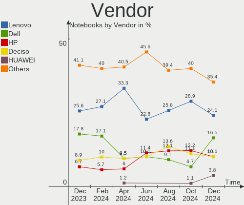
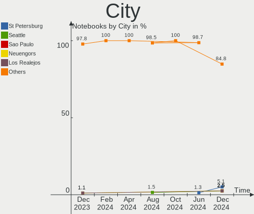
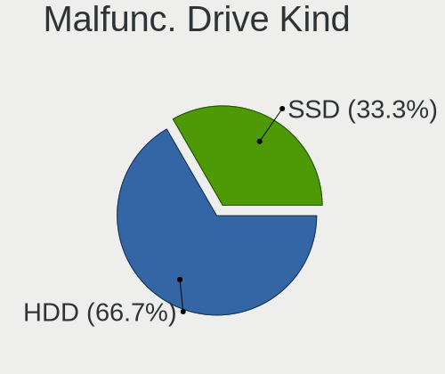
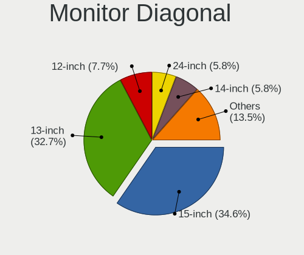
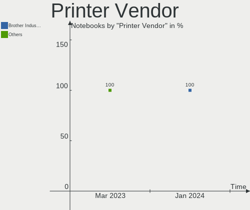

BSD - Hardware Trends (Notebooks)
---------------------------------

A project to identify most popular hardware characteristics and track their change
over time based on data collected by BSD users at https://BSD-Hardware.info.

Anyone can contribute to this report by the [hw-probe](https://github.com/linuxhw/hw-probe/blob/master/INSTALL.BSD.md) tool:

    hw-probe -all -upload

This report is for one last month. Overall report since the beginning of time: [TestDays](https://github.com/bsdhw/TestDays)

Period: Mar, 2023.

Contents
--------

* [ System ](#system)
  - [ OS                       ](#os)
  - [ OS Family                ](#os-family)
  - [ Arch                     ](#arch)
  - [ DE                       ](#de)
  - [ Display Server           ](#display-server)
  - [ Display Manager          ](#display-manager)
  - [ OS Lang                  ](#os-lang)
  - [ Boot Mode                ](#boot-mode)
  - [ Filesystem               ](#filesystem)
  - [ Part. scheme             ](#part-scheme)

* [ Board ](#board)
  - [ Vendor                   ](#vendor)
  - [ Model                    ](#model)
  - [ Model Family             ](#model-family)
  - [ MFG Year                 ](#mfg-year)
  - [ Form Factor              ](#form-factor)
  - [ Coreboot                 ](#coreboot)
  - [ RAM Size                 ](#ram-size)
  - [ RAM Used                 ](#ram-used)
  - [ Total Drives             ](#total-drives)
  - [ Has CD-ROM               ](#has-cd-rom)
  - [ Has Ethernet             ](#has-ethernet)
  - [ Has WiFi                 ](#has-wifi)
  - [ Has Bluetooth            ](#has-bluetooth)

* [ Location ](#location)
  - [ Country                  ](#country)
  - [ City                     ](#city)

* [ Drives ](#drives)
  - [ Drive Vendor             ](#drive-vendor)
  - [ Drive Model              ](#drive-model)
  - [ HDD Vendor               ](#hdd-vendor)
  - [ SSD Vendor               ](#ssd-vendor)
  - [ Drive Kind               ](#drive-kind)
  - [ Drive Connector          ](#drive-connector)
  - [ Drive Size               ](#drive-size)
  - [ Space Total              ](#space-total)
  - [ Space Used               ](#space-used)
  - [ Malfunc. Drives          ](#malfunc-drives)
  - [ Malfunc. Drive Vendor    ](#malfunc-drive-vendor)
  - [ Malfunc. HDD Vendor      ](#malfunc-hdd-vendor)
  - [ Malfunc. Drive Kind      ](#malfunc-drive-kind)
  - [ Failed Drives            ](#failed-drives)
  - [ Failed Drive Vendor      ](#failed-drive-vendor)
  - [ Drive Status             ](#drive-status)

* [ Storage controller ](#storage-controller)
  - [ Storage Vendor           ](#storage-vendor)
  - [ Storage Model            ](#storage-model)
  - [ Storage Kind             ](#storage-kind)

* [ Processor ](#processor)
  - [ CPU Vendor               ](#cpu-vendor)
  - [ CPU Model                ](#cpu-model)
  - [ CPU Model Family         ](#cpu-model-family)
  - [ CPU Cores                ](#cpu-cores)
  - [ CPU Sockets              ](#cpu-sockets)
  - [ CPU Threads              ](#cpu-threads)
  - [ CPU Microarch            ](#cpu-microarch)

* [ Graphics ](#graphics)
  - [ GPU Vendor               ](#gpu-vendor)
  - [ GPU Model                ](#gpu-model)
  - [ GPU Combo                ](#gpu-combo)
  - [ GPU Driver               ](#gpu-driver)
  - [ GPU Memory               ](#gpu-memory)

* [ Monitor ](#monitor)
  - [ Monitor Vendor           ](#monitor-vendor)
  - [ Monitor Model            ](#monitor-model)
  - [ Monitor Resolution       ](#monitor-resolution)
  - [ Monitor Diagonal         ](#monitor-diagonal)
  - [ Monitor Width            ](#monitor-width)
  - [ Aspect Ratio             ](#aspect-ratio)
  - [ Monitor Area             ](#monitor-area)
  - [ Pixel Density            ](#pixel-density)
  - [ Multiple Monitors        ](#multiple-monitors)

* [ Network ](#network)
  - [ Net Controller Vendor    ](#net-controller-vendor)
  - [ Net Controller Model     ](#net-controller-model)
  - [ Wireless Vendor          ](#wireless-vendor)
  - [ Wireless Model           ](#wireless-model)
  - [ Ethernet Vendor          ](#ethernet-vendor)
  - [ Ethernet Model           ](#ethernet-model)
  - [ Net Controller Kind      ](#net-controller-kind)
  - [ Used Controller          ](#used-controller)
  - [ NICs                     ](#nics)
  - [ IPv6                     ](#ipv6)

* [ Bluetooth ](#bluetooth)
  - [ Bluetooth Vendor         ](#bluetooth-vendor)
  - [ Bluetooth Model          ](#bluetooth-model)

* [ Sound ](#sound)
  - [ Sound Vendor             ](#sound-vendor)
  - [ Sound Model              ](#sound-model)

* [ Memory ](#memory)
  - [ Memory Vendor            ](#memory-vendor)
  - [ Memory Model             ](#memory-model)
  - [ Memory Kind              ](#memory-kind)
  - [ Memory Form Factor       ](#memory-form-factor)
  - [ Memory Size              ](#memory-size)
  - [ Memory Speed             ](#memory-speed)

* [ Printers & scanners ](#printers--scanners)
  - [ Printer Vendor           ](#printer-vendor)
  - [ Printer Model            ](#printer-model)
  - [ Scanner Vendor           ](#scanner-vendor)
  - [ Scanner Model            ](#scanner-model)

* [ Camera ](#camera)
  - [ Camera Vendor            ](#camera-vendor)
  - [ Camera Model             ](#camera-model)

* [ Security ](#security)
  - [ Fingerprint Vendor       ](#fingerprint-vendor)
  - [ Fingerprint Model        ](#fingerprint-model)
  - [ Chipcard Vendor          ](#chipcard-vendor)
  - [ Chipcard Model           ](#chipcard-model)

* [ Unsupported ](#unsupported)
  - [ Unsupported Devices      ](#unsupported-devices)
  - [ Unsupported Device Types ](#unsupported-device-types)

System
------

OS
--

Installed operating systems

| Name                 | Notebooks | Percent |
|----------------------|-----------|---------|
| helloSystem 0.8.1    | 81        | 52.26%  |
| FreeBSD 13.1-p7      | 16        | 10.32%  |
| helloSystem 0.8.0    | 11        | 7.1%    |
| helloSystem 0.8.2    | 7         | 4.52%   |
| OpenBSD 7.2          | 5         | 3.23%   |
| FreeBSD 14.0-CURRENT | 5         | 3.23%   |
| FreeBSD 13.1         | 5         | 3.23%   |
| NomadBSD 20221130    | 4         | 2.58%   |
| OPNsense 23.1.3      | 3         | 1.94%   |
| OPNsense 23.1.4      | 2         | 1.29%   |
| GhostBSD 23.03.17    | 2         | 1.29%   |
| GhostBSD 23.02.02    | 2         | 1.29%   |
| FreeBSD 13.2-RC3     | 2         | 1.29%   |
| FreeBSD 13.1-p5      | 2         | 1.29%   |
| OPNsense 23.1.5      | 1         | 0.65%   |
| OPNsense 23.1.1      | 1         | 0.65%   |
| OPNsense 22.10.2     | 1         | 0.65%   |
| OpenBSD 7.1          | 1         | 0.65%   |
| helloSystem 0.7.0    | 1         | 0.65%   |
| GhostBSD 22.06.18    | 1         | 0.65%   |
| FreeBSD 13.2-STABLE  | 1         | 0.65%   |
| FreeBSD 13.2-RC1     | 1         | 0.65%   |

OS Family
---------

OS without a version

| Name        | Notebooks | Percent |
|-------------|-----------|---------|
| helloSystem | 100       | 64.52%  |
| FreeBSD     | 32        | 20.65%  |
| OPNsense    | 8         | 5.16%   |
| OpenBSD     | 6         | 3.87%   |
| GhostBSD    | 5         | 3.23%   |
| NomadBSD    | 4         | 2.58%   |

Arch
----

OS architecture (x86_64, i586, etc.)

| Name  | Notebooks | Percent |
|-------|-----------|---------|
| amd64 | 154       | 99.35%  |
| i386  | 1         | 0.65%   |

DE
--

Desktop Environment

| Name         | Notebooks | Percent |
|--------------|-----------|---------|
| helloDesktop | 104       | 67.1%   |
| XFCE         | 14        | 9.03%   |
| Console      | 11        | 7.1%    |
| KDE5         | 10        | 6.45%   |
| MATE         | 4         | 2.58%   |
| xinitrc      | 3         | 1.94%   |
| TWM          | 2         | 1.29%   |
| GNOME        | 2         | 1.29%   |
| Openbox      | 1         | 0.65%   |
| Lumina       | 1         | 0.65%   |
| i3           | 1         | 0.65%   |
| dwm          | 1         | 0.65%   |
| AwesomeWM    | 1         | 0.65%   |

Display Server
--------------

X11 or Wayland

| Name    | Notebooks | Percent |
|---------|-----------|---------|
| X11     | 143       | 92.26%  |
| Console | 11        | 7.1%    |
| Wayland | 1         | 0.65%   |

Display Manager
---------------

SDDM, LightDM, etc.

| Name    | Notebooks | Percent |
|---------|-----------|---------|
| SLiM    | 106       | 68.39%  |
| Console | 21        | 13.55%  |
| SDDM    | 14        | 9.03%   |
| LightDM | 8         | 5.16%   |
| XDM     | 3         | 1.94%   |
| GDM     | 2         | 1.29%   |
| Ly      | 1         | 0.65%   |

OS Lang
-------

Language

| Lang    | Notebooks | Percent |
|---------|-----------|---------|
| en_US   | 50        | 32.26%  |
| C       | 21        | 13.55%  |
| fr_FR   | 18        | 11.61%  |
| Unknown | 18        | 11.61%  |
| ru_RU   | 11        | 7.1%    |
| en      | 8         | 5.16%   |
| de_DE   | 8         | 5.16%   |
| es_ES   | 4         | 2.58%   |
| zh_CN   | 3         | 1.94%   |
| pt_BR   | 3         | 1.94%   |
| pl_PL   | 3         | 1.94%   |
| en_GB   | 3         | 1.94%   |
| zh_TW   | 1         | 0.65%   |
| nl_NL   | 1         | 0.65%   |
| ko_KR   | 1         | 0.65%   |
| fi_FI   | 1         | 0.65%   |
| es      | 1         | 0.65%   |

Boot Mode
---------

EFI or BIOS

| Mode | Notebooks | Percent |
|------|-----------|---------|
| EFI  | 142       | 91.61%  |
| BIOS | 13        | 8.39%   |

Filesystem
----------

Type of filesystem

| Type   | Notebooks | Percent |
|--------|-----------|---------|
| Zfs    | 87        | 56.13%  |
| Cd9660 | 52        | 33.55%  |
| Ufs    | 9         | 5.81%   |
| Ffs    | 6         | 3.87%   |
| Nfs    | 1         | 0.65%   |

Part. scheme
------------

Scheme of partitioning

| Type | Notebooks | Percent |
|------|-----------|---------|
| GPT  | 146       | 94.19%  |
| MBR  | 8         | 5.16%   |
| BSD  | 1         | 0.65%   |

Board
-----

Vendor
------

Motherboard manufacturer

| Name                | Notebooks | Percent |
|---------------------|-----------|---------|
| Lenovo              | 52        | 33.55%  |
| Dell                | 17        | 10.97%  |
| Hewlett-Packard     | 14        | 9.03%   |
| Acer                | 12        | 7.74%   |
| ASUSTek Computer    | 11        | 7.1%    |
| Toshiba             | 6         | 3.87%   |
| Samsung Electronics | 5         | 3.23%   |
| Intel               | 5         | 3.23%   |
| Fujitsu             | 5         | 3.23%   |
| Deciso              | 3         | 1.94%   |
| Apple               | 3         | 1.94%   |
| Sony                | 2         | 1.29%   |
| LG Electronics      | 2         | 1.29%   |
| Google              | 2         | 1.29%   |
| Unknown             | 2         | 1.29%   |
| Star Labs           | 1         | 0.65%   |
| OEGStone            | 1         | 0.65%   |
| MouseComputer       | 1         | 0.65%   |
| MECHREVO S1 Series  | 1         | 0.65%   |
| Irbis               | 1         | 0.65%   |
| IP3 Technology      | 1         | 0.65%   |
| IGEL Technology     | 1         | 0.65%   |
| HUAWEI              | 1         | 0.65%   |
| HMT                 | 1         | 0.65%   |
| eMachines           | 1         | 0.65%   |
| Dynabook Europe     | 1         | 0.65%   |
| DNS                 | 1         | 0.65%   |
| Clevo               | 1         | 0.65%   |
| Alienware           | 1         | 0.65%   |

Model
-----

Motherboard model

| Name                                     | Notebooks | Percent |
|------------------------------------------|-----------|---------|
| Unknown                                  | 3         | 1.94%   |
| Lenovo ThinkPad X220 4286CTO             | 2         | 1.29%   |
| Deciso OPNsense Appliance                | 2         | 1.29%   |
| Toshiba Satellite P300                   | 1         | 0.65%   |
| Toshiba Satellite L675D                  | 1         | 0.65%   |
| Toshiba Satellite L50-B                  | 1         | 0.65%   |
| Toshiba Satellite L40                    | 1         | 0.65%   |
| Toshiba Satellite C845                   | 1         | 0.65%   |
| Toshiba Satellite A200                   | 1         | 0.65%   |
| Star Labs StarBook                       | 1         | 0.65%   |
| Sony VGN-FZ19VN                          | 1         | 0.65%   |
| Sony SVE1511C5E                          | 1         | 0.65%   |
| Samsung R520/R522/R620                   | 1         | 0.65%   |
| Samsung R468/R418                        | 1         | 0.65%   |
| Samsung 750XEE                           | 1         | 0.65%   |
| Samsung 305E4A/305E5A/305E7A             | 1         | 0.65%   |
| Samsung 275E4E/275E5E                    | 1         | 0.65%   |
| OEGStone W54_55SU1,SUW                   | 1         | 0.65%   |
| MouseComputer X5-aR5CEZAR-WA             | 1         | 0.65%   |
| MECHREVO S1 Series S1 Series             | 1         | 0.65%   |
| LG E500-L.A2M4A2                         | 1         | 0.65%   |
| LG COLUMBIA                              | 1         | 0.65%   |
| Lenovo ZIUS6                             | 1         | 0.65%   |
| Lenovo Yoga Slim 7 Pro 14ACH5 82MS       | 1         | 0.65%   |
| Lenovo ThinkPad X61s 7667WQS             | 1         | 0.65%   |
| Lenovo ThinkPad X270 W10DG 20K5S0DB05    | 1         | 0.65%   |
| Lenovo ThinkPad X230 Tablet 34352TU      | 1         | 0.65%   |
| Lenovo ThinkPad X230 232578G             | 1         | 0.65%   |
| Lenovo ThinkPad X230 23255NG             | 1         | 0.65%   |
| Lenovo ThinkPad X230 23252G8             | 1         | 0.65%   |
| Lenovo ThinkPad X230 2324A14             | 1         | 0.65%   |
| Lenovo ThinkPad X220 4291AN9             | 1         | 0.65%   |
| Lenovo ThinkPad X220 4290DK6             | 1         | 0.65%   |
| Lenovo ThinkPad X201 36801T6             | 1         | 0.65%   |
| Lenovo ThinkPad X200 74591P0             | 1         | 0.65%   |
| Lenovo ThinkPad X200 2024AY7             | 1         | 0.65%   |
| Lenovo ThinkPad X1 Extreme 20MF000QUS    | 1         | 0.65%   |
| Lenovo ThinkPad X1 Carbon 6th 20KHCTO1WW | 1         | 0.65%   |
| Lenovo ThinkPad X1 Carbon 3448AWU        | 1         | 0.65%   |
| Lenovo ThinkPad X1 Carbon 3444FEU        | 1         | 0.65%   |

Model Family
------------

Motherboard model prefix

| Name                         | Notebooks | Percent |
|------------------------------|-----------|---------|
| Lenovo ThinkPad              | 42        | 27.1%   |
| Dell Latitude                | 8         | 5.16%   |
| Dell Inspiron                | 7         | 4.52%   |
| Toshiba Satellite            | 6         | 3.87%   |
| Lenovo IdeaPad               | 6         | 3.87%   |
| HP EliteBook                 | 4         | 2.58%   |
| Acer Aspire                  | 4         | 2.58%   |
| HP Pavilion                  | 3         | 1.94%   |
| HP Laptop                    | 3         | 1.94%   |
| Acer Nitro                   | 3         | 1.94%   |
| Unknown                      | 3         | 1.94%   |
| HP ProBook                   | 2         | 1.29%   |
| Fujitsu LIFEBOOK             | 2         | 1.29%   |
| Fujitsu CELSIUS              | 2         | 1.29%   |
| Deciso OPNsense              | 2         | 1.29%   |
| ASUS ASUS                    | 2         | 1.29%   |
| Acer TravelMate              | 2         | 1.29%   |
| Acer Swift                   | 2         | 1.29%   |
| Star Labs StarBook           | 1         | 0.65%   |
| Sony VGN-FZ19VN              | 1         | 0.65%   |
| Sony SVE1511C5E              | 1         | 0.65%   |
| Samsung R520                 | 1         | 0.65%   |
| Samsung R468                 | 1         | 0.65%   |
| Samsung 750XEE               | 1         | 0.65%   |
| Samsung 305E4A               | 1         | 0.65%   |
| Samsung 275E4E               | 1         | 0.65%   |
| OEGStone W54                 | 1         | 0.65%   |
| MouseComputer X5-aR5CEZAR-WA | 1         | 0.65%   |
| MECHREVO S1 Series S1        | 1         | 0.65%   |
| LG E500-L.A2M4A2             | 1         | 0.65%   |
| LG COLUMBIA                  | 1         | 0.65%   |
| Lenovo ZIUS6                 | 1         | 0.65%   |
| Lenovo Yoga                  | 1         | 0.65%   |
| Lenovo G500                  | 1         | 0.65%   |
| Lenovo G400s                 | 1         | 0.65%   |
| Irbis NB78                   | 1         | 0.65%   |
| IP3 ACN1S                    | 1         | 0.65%   |
| Intel SandyBridge            | 1         | 0.65%   |
| Intel S1200RP                | 1         | 0.65%   |
| Intel Jasper                 | 1         | 0.65%   |

MFG Year
--------

Motherboard manufacture year

| Year | Notebooks | Percent |
|------|-----------|---------|
| 2022 | 21        | 13.55%  |
| 2019 | 14        | 9.03%   |
| 2012 | 13        | 8.39%   |
| 2018 | 11        | 7.1%    |
| 2020 | 10        | 6.45%   |
| 2014 | 10        | 6.45%   |
| 2011 | 10        | 6.45%   |
| 2021 | 9         | 5.81%   |
| 2013 | 9         | 5.81%   |
| 2010 | 9         | 5.81%   |
| 2016 | 8         | 5.16%   |
| 2009 | 7         | 4.52%   |
| 2008 | 6         | 3.87%   |
| 2017 | 5         | 3.23%   |
| 2015 | 5         | 3.23%   |
| 2007 | 5         | 3.23%   |
| 2023 | 3         | 1.94%   |

Form Factor
-----------

Physical design of the computer

| Name     | Notebooks | Percent |
|----------|-----------|---------|
| Notebook | 155       | 100%    |

Coreboot
--------

Have coreboot on board

| Used | Notebooks | Percent |
|------|-----------|---------|
| No   | 149       | 96.13%  |
| Yes  | 6         | 3.87%   |

RAM Size
--------

Total RAM memory

| Size in GB  | Notebooks | Percent |
|-------------|-----------|---------|
| 8.01-16.0   | 52        | 33.55%  |
| 16.01-24.0  | 39        | 25.16%  |
| 4.01-8.0    | 36        | 23.23%  |
| 2.01-3.0    | 13        | 8.39%   |
| 32.01-64.0  | 7         | 4.52%   |
| 3.01-4.0    | 3         | 1.94%   |
| 64.01-256.0 | 3         | 1.94%   |
| 24.01-32.0  | 2         | 1.29%   |

RAM Used
--------

Used RAM memory

| Used GB  | Notebooks | Percent |
|----------|-----------|---------|
| 0.01-0.5 | 87        | 56.13%  |
| 0.51-1.0 | 49        | 31.61%  |
| 1.01-2.0 | 13        | 8.39%   |
| 2.01-3.0 | 4         | 2.58%   |
| 3.01-4.0 | 2         | 1.29%   |

Total Drives
------------

Number of drives on board

| Drives | Notebooks | Percent |
|--------|-----------|---------|
| 1      | 120       | 77.42%  |
| 2      | 23        | 14.84%  |
| 0      | 8         | 5.16%   |
| 3      | 3         | 1.94%   |
| 58     | 1         | 0.65%   |

Has CD-ROM
----------

Has CD-ROM on board

| Presented | Notebooks | Percent |
|-----------|-----------|---------|
| No        | 115       | 74.19%  |
| Yes       | 40        | 25.81%  |

Has Ethernet
------------

Has Ethernet on board

| Presented | Notebooks | Percent |
|-----------|-----------|---------|
| Yes       | 134       | 86.45%  |
| No        | 21        | 13.55%  |

Has WiFi
--------

Has WiFi module

| Presented | Notebooks | Percent |
|-----------|-----------|---------|
| Yes       | 144       | 92.9%   |
| No        | 11        | 7.1%    |

Has Bluetooth
-------------

Has Bluetooth module

| Presented | Notebooks | Percent |
|-----------|-----------|---------|
| Yes       | 105       | 67.74%  |
| No        | 50        | 32.26%  |

Location
--------

Country
-------

Geographic location (country)

| Country     | Notebooks | Percent |
|-------------|-----------|---------|
| USA         | 26        | 16.77%  |
| Russia      | 14        | 9.03%   |
| Germany     | 12        | 7.74%   |
| France      | 12        | 7.74%   |
| UK          | 9         | 5.81%   |
| Poland      | 9         | 5.81%   |
| Canada      | 7         | 4.52%   |
| Spain       | 6         | 3.87%   |
| Indonesia   | 5         | 3.23%   |
| China       | 5         | 3.23%   |
| Brazil      | 5         | 3.23%   |
| Italy       | 4         | 2.58%   |
| India       | 3         | 1.94%   |
| Australia   | 3         | 1.94%   |
| Turkey      | 2         | 1.29%   |
| Taiwan      | 2         | 1.29%   |
| Switzerland | 2         | 1.29%   |
| Romania     | 2         | 1.29%   |
| Portugal    | 2         | 1.29%   |
| Norway      | 2         | 1.29%   |
| Japan       | 2         | 1.29%   |
| Greece      | 2         | 1.29%   |
| Vietnam     | 1         | 0.65%   |
| Ukraine     | 1         | 0.65%   |
| Thailand    | 1         | 0.65%   |
| Sri Lanka   | 1         | 0.65%   |
| South Korea | 1         | 0.65%   |
| Slovenia    | 1         | 0.65%   |
| Slovakia    | 1         | 0.65%   |
| Philippines | 1         | 0.65%   |
| Netherlands | 1         | 0.65%   |
| Lithuania   | 1         | 0.65%   |
| Israel      | 1         | 0.65%   |
| Ireland     | 1         | 0.65%   |
| Finland     | 1         | 0.65%   |
| Denmark     | 1         | 0.65%   |
| Czechia     | 1         | 0.65%   |
| Colombia    | 1         | 0.65%   |
| Bulgaria    | 1         | 0.65%   |
| Bolivia     | 1         | 0.65%   |

City
----

Geographic location (city)

| City                  | Notebooks | Percent |
|-----------------------|-----------|---------|
| Montreal              | 5         | 3.23%   |
| Moscow                | 4         | 2.58%   |
| Melun                 | 4         | 2.58%   |
| Berlin                | 3         | 1.94%   |
| Wroclaw               | 2         | 1.29%   |
| Valencia              | 2         | 1.29%   |
| Sao Paulo             | 2         | 1.29%   |
| Saint-Raphaël        | 2         | 1.29%   |
| Paris                 | 2         | 1.29%   |
| Madrid                | 2         | 1.29%   |
| Krakow                | 2         | 1.29%   |
| City of London        | 2         | 1.29%   |
| Chiyoda-ku            | 2         | 1.29%   |
| Bogor                 | 2         | 1.29%   |
| Avon Park             | 2         | 1.29%   |
| Zurich                | 1         | 0.65%   |
| Yuzhong Chengguanzhen | 1         | 0.65%   |
| Yeosu                 | 1         | 0.65%   |
| Yekaterinburg         | 1         | 0.65%   |
| Woodbridge            | 1         | 0.65%   |
| West Plains           | 1         | 0.65%   |
| Wausau                | 1         | 0.65%   |
| Warsaw                | 1         | 0.65%   |
| Warrnambool           | 1         | 0.65%   |
| Wakefield             | 1         | 0.65%   |
| Voznesensk            | 1         | 0.65%   |
| Vilnius               | 1         | 0.65%   |
| Villemomble           | 1         | 0.65%   |
| Vila Nova de Gaia     | 1         | 0.65%   |
| Vienna                | 1         | 0.65%   |
| Twinsburg             | 1         | 0.65%   |
| Trindade              | 1         | 0.65%   |
| Tomasikovo            | 1         | 0.65%   |
| Tolyatti              | 1         | 0.65%   |
| Thessaloniki          | 1         | 0.65%   |
| Terrassa              | 1         | 0.65%   |
| Tatsfield             | 1         | 0.65%   |
| Taipei                | 1         | 0.65%   |
| Sydney                | 1         | 0.65%   |
| St Petersburg         | 1         | 0.65%   |

Drives
------

Drive Vendor
------------

Hard drive vendors

| Vendor              | Notebooks | Drives | Percent |
|---------------------|-----------|--------|---------|
| Samsung Electronics | 26        | 26     | 14.86%  |
| Toshiba             | 16        | 24     | 9.14%   |
| WDC                 | 14        | 14     | 8%      |
| Seagate             | 12        | 12     | 6.86%   |
| Crucial             | 12        | 14     | 6.86%   |
| Kingston            | 10        | 11     | 5.71%   |
| SanDisk             | 9         | 9      | 5.14%   |
| HGST                | 9         | 42     | 5.14%   |
| Intel               | 8         | 15     | 4.57%   |
| Hitachi             | 8         | 8      | 4.57%   |
| Micron Technology   | 6         | 6      | 3.43%   |
| Transcend           | 4         | 4      | 2.29%   |
| SK hynix            | 4         | 4      | 2.29%   |
| China               | 4         | 4      | 2.29%   |
| SSSTC               | 2         | 2      | 1.14%   |
| PNY                 | 2         | 2      | 1.14%   |
| FORESEE             | 2         | 2      | 1.14%   |
| A-DATA Technology   | 2         | 2      | 1.14%   |
| XrayDisk            | 1         | 1      | 0.57%   |
| Verbatim            | 1         | 1      | 0.57%   |
| UMIS                | 1         | 1      | 0.57%   |
| Team                | 1         | 1      | 0.57%   |
| Star Drive          | 1         | 1      | 0.57%   |
| SETHRISE            | 1         | 1      | 0.57%   |
| Plextor             | 1         | 1      | 0.57%   |
| Patriot             | 1         | 1      | 0.57%   |
| OEM                 | 1         | 1      | 0.57%   |
| OCZ                 | 1         | 1      | 0.57%   |
| NVMe                | 1         | 2      | 0.57%   |
| Netac               | 1         | 1      | 0.57%   |
| KingSpec            | 1         | 1      | 0.57%   |
| KINGBANK            | 1         | 1      | 0.57%   |
| Intenso             | 1         | 1      | 0.57%   |
| HPE                 | 1         | 5      | 0.57%   |
| Hoodisk             | 1         | 1      | 0.57%   |
| Hikvision           | 1         | 1      | 0.57%   |
| GOODRAM             | 1         | 1      | 0.57%   |
| Fujitsu             | 1         | 1      | 0.57%   |
| Fanxiang            | 1         | 2      | 0.57%   |
| Dogfish             | 1         | 1      | 0.57%   |

Drive Model
-----------

Hard drive models

| Model                                | Notebooks | Percent |
|--------------------------------------|-----------|---------|
| HGST HTS545050A7E380 500GB           | 3         | 1.69%   |
| Transcend TS256GMTS952T2 256GB       | 2         | 1.12%   |
| Toshiba MQ01ABF050 500GB             | 2         | 1.12%   |
| Toshiba MQ01ABD100 1TB               | 2         | 1.12%   |
| Seagate ST9500325AS 500GB            | 2         | 1.12%   |
| Seagate ST1000LM035-1RK172 1TB       | 2         | 1.12%   |
| Samsung SSD 860 EVO 500GB            | 2         | 1.12%   |
| PNY CS900 240GB SSD                  | 2         | 1.12%   |
| Kingston SV300S37A60G 64GB           | 2         | 1.12%   |
| Intel SSDPEKKF256G8L 256GB           | 2         | 1.12%   |
| Crucial CT480BX500SSD1 480GB         | 2         | 1.12%   |
| Crucial CT1000BX500SSD1 1TB          | 2         | 1.12%   |
| XrayDisk SSD 240GB                   | 1         | 0.56%   |
| WDC WDS500G2B0B-00YS70 500GB         | 1         | 0.56%   |
| WDC WDS240G1G0B-00RC30 240GB         | 1         | 0.56%   |
| WDC WD7500BPKX-75HPJT0 752GB         | 1         | 0.56%   |
| WDC WD5000LPCX-24VHAT0 500GB         | 1         | 0.56%   |
| WDC WD5000LPCX-00VHAT0 500GB         | 1         | 0.56%   |
| WDC WD30PURZ-85AKKY0 3TB             | 1         | 0.56%   |
| WDC WD2500BEVT-22ZCT0 250GB          | 1         | 0.56%   |
| WDC WD1600BEVS-22VAT0 160GB          | 1         | 0.56%   |
| WDC WD10JPVX-80JC3T0 1TB             | 1         | 0.56%   |
| WDC WD10JPVX-60JC3T1 1TB             | 1         | 0.56%   |
| WDC PC SN730 SDBQNTY-256G-1001 256GB | 1         | 0.56%   |
| WDC PC SN730 SDBPNTY-512G-1027 512GB | 1         | 0.56%   |
| WDC PC SN530 SDBPMPZ-256G-1101 256GB | 1         | 0.56%   |
| WDC PC SN530 NVMe 256GB              | 1         | 0.56%   |
| Verbatim Vi550 S3 SSD 512GB          | 1         | 0.56%   |
| UMIS RPJTJ512MEE1OWX 512GB           | 1         | 0.56%   |
| Transcend TS256GMTE652T2 256GB       | 1         | 0.56%   |
| Transcend TS120GMTS420S 120GB        | 1         | 0.56%   |
| Toshiba THNSNK128GVN8 128GB          | 1         | 0.56%   |
| Toshiba MQ01ABD032 320GB             | 1         | 0.56%   |
| Toshiba MK6461GSYN 640GB             | 1         | 0.56%   |
| Toshiba MK5065GSXF 500GB             | 1         | 0.56%   |
| Toshiba MK3263GSXN 320GB             | 1         | 0.56%   |
| Toshiba MK3259GSXP 320GB             | 1         | 0.56%   |
| Toshiba MK1665GSX 160GB              | 1         | 0.56%   |
| Toshiba MK1655GSXF 160GB             | 1         | 0.56%   |
| Toshiba MK1646GSX 160GB              | 1         | 0.56%   |

HDD Vendor
----------

Hard disk drive vendors

| Vendor              | Notebooks | Drives | Percent |
|---------------------|-----------|--------|---------|
| Toshiba             | 15        | 23     | 26.32%  |
| Seagate             | 11        | 11     | 19.3%   |
| HGST                | 9         | 42     | 15.79%  |
| WDC                 | 8         | 8      | 14.04%  |
| Hitachi             | 8         | 8      | 14.04%  |
| Samsung Electronics | 3         | 3      | 5.26%   |
| NVMe                | 1         | 1      | 1.75%   |
| HPE                 | 1         | 5      | 1.75%   |
| Fujitsu             | 1         | 1      | 1.75%   |

SSD Vendor
----------

Solid state drive vendors

| Vendor              | Notebooks | Drives | Percent |
|---------------------|-----------|--------|---------|
| Samsung Electronics | 11        | 11     | 13.75%  |
| SanDisk             | 9         | 9      | 11.25%  |
| Kingston            | 9         | 10     | 11.25%  |
| Crucial             | 9         | 10     | 11.25%  |
| Intel               | 5         | 12     | 6.25%   |
| China               | 4         | 4      | 5%      |
| Transcend           | 3         | 3      | 3.75%   |
| Micron Technology   | 3         | 3      | 3.75%   |
| WDC                 | 2         | 2      | 2.5%    |
| SK hynix            | 2         | 2      | 2.5%    |
| PNY                 | 2         | 2      | 2.5%    |
| XrayDisk            | 1         | 1      | 1.25%   |
| Verbatim            | 1         | 1      | 1.25%   |
| Toshiba             | 1         | 1      | 1.25%   |
| Team                | 1         | 1      | 1.25%   |
| SETHRISE            | 1         | 1      | 1.25%   |
| Seagate             | 1         | 1      | 1.25%   |
| Plextor             | 1         | 1      | 1.25%   |
| Patriot             | 1         | 1      | 1.25%   |
| OCZ                 | 1         | 1      | 1.25%   |
| NVMe                | 1         | 1      | 1.25%   |
| Netac               | 1         | 1      | 1.25%   |
| KingSpec            | 1         | 1      | 1.25%   |
| Intenso             | 1         | 1      | 1.25%   |
| Hikvision           | 1         | 1      | 1.25%   |
| GOODRAM             | 1         | 1      | 1.25%   |
| FORESEE             | 1         | 1      | 1.25%   |
| Fanxiang            | 1         | 2      | 1.25%   |
| Dogfish             | 1         | 1      | 1.25%   |
| Corsair             | 1         | 1      | 1.25%   |
| Colorful            | 1         | 1      | 1.25%   |
| A-DATA Technology   | 1         | 1      | 1.25%   |

Drive Kind
----------

HDD or SSD

| Kind | Notebooks | Drives | Percent |
|------|-----------|--------|---------|
| SSD  | 73        | 90     | 43.98%  |
| HDD  | 55        | 102    | 33.13%  |
| NVMe | 38        | 40     | 22.89%  |

Drive Connector
---------------

SATA, SAS, NVMe, etc.

| Type | Notebooks | Drives | Percent |
|------|-----------|--------|---------|
| SATA | 115       | 192    | 75.16%  |
| NVMe | 38        | 40     | 24.84%  |

Drive Size
----------

Size of hard drive

| Size in TB | Notebooks | Drives | Percent |
|------------|-----------|--------|---------|
| 0.01-0.5   | 94        | 112    | 75.81%  |
| 0.51-1.0   | 23        | 25     | 18.55%  |
| 1.01-2.0   | 5         | 6      | 4.03%   |
| 3.01-4.0   | 1         | 48     | 0.81%   |
| 2.01-3.0   | 1         | 1      | 0.81%   |

Space Total
-----------

Amount of disk space available on the file system

| Size in GB | Notebooks | Percent |
|------------|-----------|---------|
| 1-20       | 58        | 37.42%  |
| 101-250    | 39        | 25.16%  |
| 251-500    | 25        | 16.13%  |
| 51-100     | 12        | 7.74%   |
| 21-50      | 9         | 5.81%   |
| 501-1000   | 9         | 5.81%   |
| 1001-2000  | 3         | 1.94%   |

Space Used
----------

Amount of used disk space

| Used GB | Notebooks | Percent |
|---------|-----------|---------|
| 1-20    | 148       | 95.48%  |
| 21-50   | 7         | 4.52%   |

Malfunc. Drives
---------------

Drive models with a malfunction

| Model                            | Notebooks | Drives | Percent |
|----------------------------------|-----------|--------|---------|
| Toshiba MQ01ABD100 1TB           | 2         | 2      | 6.06%   |
| Seagate ST9500325AS 500GB        | 2         | 2      | 6.06%   |
| Kingston SV300S37A60G 64GB       | 2         | 3      | 6.06%   |
| HGST HTS545050A7E380 500GB       | 2         | 2      | 6.06%   |
| WDC WD30PURZ-85AKKY0 3TB         | 1         | 1      | 3.03%   |
| WDC WD10JPVX-60JC3T1 1TB         | 1         | 1      | 3.03%   |
| Toshiba MQ01ABD032 320GB         | 1         | 1      | 3.03%   |
| Toshiba MK1665GSX 160GB          | 1         | 1      | 3.03%   |
| Toshiba MK1646GSX 160GB          | 1         | 1      | 3.03%   |
| Toshiba MK1629GSGF 160GB         | 1         | 1      | 3.03%   |
| Toshiba MK1229GSG 120GB          | 1         | 1      | 3.03%   |
| SK hynix SC210 mSATA 256GB       | 1         | 1      | 3.03%   |
| Seagate ST500LM000-1EJ162 500GB  | 1         | 1      | 3.03%   |
| Seagate ST320LT012-9WS14C 320GB  | 1         | 1      | 3.03%   |
| Samsung Electronics HS08XJC 80GB | 1         | 1      | 3.03%   |
| Kingston SUV400S37120G 120GB     | 1         | 1      | 3.03%   |
| Kingston SNS4151S316G 16GB       | 1         | 1      | 3.03%   |
| Intel SSDSC2BF180A4L 180GB       | 1         | 1      | 3.03%   |
| Intel SSDSA2M160G2LE 160GB       | 1         | 1      | 3.03%   |
| Hitachi HTS727550A9E364 500GB    | 1         | 1      | 3.03%   |
| Hitachi HTS547575A9E384 752GB    | 1         | 1      | 3.03%   |
| Hitachi HTS545050B9A300 500GB    | 1         | 1      | 3.03%   |
| Hitachi HTS542525K9A300 250GB    | 1         | 1      | 3.03%   |
| Hitachi HTS541616J9SA00 160GB    | 1         | 1      | 3.03%   |
| HGST HTS725050A7E630 500GB       | 1         | 1      | 3.03%   |
| HGST HTS541075A7E630 752GB       | 1         | 1      | 3.03%   |
| Fanxiang S101-240GB              | 1         | 1      | 3.03%   |
| Crucial M4-CT256M4SSD3 256GB     | 1         | 1      | 3.03%   |
| Crucial CT500MX500SSD1 500GB     | 1         | 1      | 3.03%   |

Malfunc. Drive Vendor
---------------------

Vendors of faulty drives

| Vendor              | Notebooks | Drives | Percent |
|---------------------|-----------|--------|---------|
| Toshiba             | 7         | 7      | 21.21%  |
| Hitachi             | 5         | 5      | 15.15%  |
| Seagate             | 4         | 4      | 12.12%  |
| Kingston            | 4         | 5      | 12.12%  |
| HGST                | 4         | 4      | 12.12%  |
| WDC                 | 2         | 2      | 6.06%   |
| Intel               | 2         | 2      | 6.06%   |
| Crucial             | 2         | 2      | 6.06%   |
| SK hynix            | 1         | 1      | 3.03%   |
| Samsung Electronics | 1         | 1      | 3.03%   |
| Fanxiang            | 1         | 1      | 3.03%   |

Malfunc. HDD Vendor
-------------------

Vendors of faulty HDD drives

| Vendor              | Notebooks | Drives | Percent |
|---------------------|-----------|--------|---------|
| Toshiba             | 7         | 7      | 30.43%  |
| Hitachi             | 5         | 5      | 21.74%  |
| Seagate             | 4         | 4      | 17.39%  |
| HGST                | 4         | 4      | 17.39%  |
| WDC                 | 2         | 2      | 8.7%    |
| Samsung Electronics | 1         | 1      | 4.35%   |

Malfunc. Drive Kind
-------------------

Kinds of faulty drives

| Kind | Notebooks | Drives | Percent |
|------|-----------|--------|---------|
| HDD  | 23        | 23     | 69.7%   |
| SSD  | 10        | 11     | 30.3%   |

Failed Drives
-------------

Failed drive models

Zero info for selected period =(

Failed Drive Vendor
-------------------

Failed drive vendors

Zero info for selected period =(

Drive Status
------------

Number of failed and malfunc. drives

| Status   | Notebooks | Drives | Percent |
|----------|-----------|--------|---------|
| Works    | 121       | 196    | 78.06%  |
| Malfunc  | 33        | 34     | 21.29%  |
| Detected | 1         | 2      | 0.65%   |

Storage controller
------------------

Storage Vendor
--------------

Storage controller vendors

| Vendor                                  | Notebooks | Percent |
|-----------------------------------------|-----------|---------|
| Intel                                   | 119       | 69.19%  |
| Samsung Electronics                     | 11        | 6.4%    |
| AMD                                     | 11        | 6.4%    |
| Sandisk                                 | 7         | 4.07%   |
| Micron/Crucial Technology               | 4         | 2.33%   |
| Micron Technology                       | 3         | 1.74%   |
| Solid State Storage Technology          | 2         | 1.16%   |
| SK hynix                                | 2         | 1.16%   |
| Silicon Motion                          | 2         | 1.16%   |
| Phison Electronics                      | 2         | 1.16%   |
| Nvidia                                  | 2         | 1.16%   |
| Transcend                               | 1         | 0.58%   |
| Shenzhen Unionmemory Information System | 1         | 0.58%   |
| Marvell Technology Group                | 1         | 0.58%   |
| Kingston Technology Company             | 1         | 0.58%   |
| Broadcom / LSI                          | 1         | 0.58%   |
| Biwin Storage Technology                | 1         | 0.58%   |
| ADATA Technology                        | 1         | 0.58%   |

Storage Model
-------------

Storage controller models

| Model                                                                            | Notebooks | Percent |
|----------------------------------------------------------------------------------|-----------|---------|
| Intel 7 Series Chipset Family 6-port SATA Controller [AHCI mode]                 | 20        | 10.64%  |
| Intel Sunrise Point-LP SATA Controller [AHCI mode]                               | 17        | 9.04%   |
| Intel 6 Series/C200 Series Chipset Family 6 port Mobile SATA AHCI Controller     | 9         | 4.79%   |
| AMD FCH SATA Controller [AHCI mode]                                              | 9         | 4.79%   |
| Intel 82801IBM/IEM (ICH9M/ICH9M-E) 4 port SATA Controller [AHCI mode]            | 8         | 4.26%   |
| Intel 82801HM/HEM (ICH8M/ICH8M-E) SATA Controller [AHCI mode]                    | 8         | 4.26%   |
| Intel 82801HM/HEM (ICH8M/ICH8M-E) IDE Controller                                 | 8         | 4.26%   |
| Intel 82801 Mobile SATA Controller [RAID mode]                                   | 7         | 3.72%   |
| Intel 8 Series/C220 Series Chipset Family 6-port SATA Controller 1 [AHCI mode]   | 7         | 3.72%   |
| Intel 8 Series SATA Controller 1 [AHCI mode]                                     | 6         | 3.19%   |
| Unknown                                                                          | 6         | 3.19%   |
| Samsung NVMe SSD Controller SM981/PM981/PM983                                    | 5         | 2.66%   |
| Intel NM10/ICH7 Family SATA Controller [AHCI mode]                               | 5         | 2.66%   |
| Samsung NVMe SSD Controller 980                                                  | 4         | 2.13%   |
| Micron/Crucial P2 NVMe PCIe SSD                                                  | 3         | 1.6%    |
| Micron NVMe Storage Controller                                                   | 3         | 1.6%    |
| Intel Mobile 4 Series Chipset PT IDER Controller                                 | 3         | 1.6%    |
| Intel 82801HM/HEM (ICH8M/ICH8M-E) SATA Controller [IDE mode]                     | 3         | 1.6%    |
| Intel 5 Series/3400 Series Chipset 4 port SATA AHCI Controller                   | 3         | 1.6%    |
| Silicon Motion SM2263EN/SM2263XT SSD Controller                                  | 2         | 1.06%   |
| SanDisk WD Blue SN570 NVMe SSD 1TB                                               | 2         | 1.06%   |
| SanDisk WD Black SN750 / PC SN730 NVMe SSD                                       | 2         | 1.06%   |
| Samsung NVMe SSD Controller SM961/PM961/SM963                                    | 2         | 1.06%   |
| Intel Wildcat Point-LP SATA Controller [AHCI Mode]                               | 2         | 1.06%   |
| Intel SSD Pro 7600p/760p/E 6100p Series                                          | 2         | 1.06%   |
| Intel Q170/Q150/B150/H170/H110/Z170/CM236 Chipset SATA Controller [AHCI Mode]    | 2         | 1.06%   |
| Intel Cannon Lake Mobile PCH SATA AHCI Controller                                | 2         | 1.06%   |
| Intel Atom/Celeron/Pentium Processor x5-E8000/J3xxx/N3xxx Series SATA Controller | 2         | 1.06%   |
| Intel 5 Series/3400 Series Chipset 6 port SATA AHCI Controller                   | 2         | 1.06%   |
| Intel 5 Series/3400 Series Chipset 4 port SATA IDE Controller                    | 2         | 1.06%   |
| Intel 5 Series/3400 Series Chipset 2 port SATA IDE Controller                    | 2         | 1.06%   |
| Intel 400 Series Chipset Family SATA AHCI Controller                             | 2         | 1.06%   |
| SK hynix hynix unknown                                                           | 1         | 0.53%   |
| SK hynix Gold P31/PC711 NVMe Solid State Drive                                   | 1         | 0.53%   |
| SanDisk WD PC SN810 / Black SN850 NVMe SSD                                       | 1         | 0.53%   |
| Sandisk WD Blue SN570 NVMe SSD 2TB                                               | 1         | 0.53%   |
| SanDisk unknown                                                                  | 1         | 0.53%   |
| SanDisk NVMe Controller                                                          | 1         | 0.53%   |
| Phison PS5013 E13 NVMe Controller                                                | 1         | 0.53%   |
| Phison E12 NVMe Controller                                                       | 1         | 0.53%   |

Storage Kind
------------

Kind of storage controller (IDE, SATA, NVMe, SAS, ...)

| Kind | Notebooks | Percent |
|------|-----------|---------|
| SATA | 113       | 62.78%  |
| NVMe | 38        | 21.11%  |
| IDE  | 20        | 11.11%  |
| RAID | 8         | 4.44%   |
| SAS  | 1         | 0.56%   |

Processor
---------

CPU Vendor
----------

Processor vendors

| Vendor | Notebooks | Percent |
|--------|-----------|---------|
| Intel  | 132       | 85.16%  |
| AMD    | 23        | 14.84%  |

CPU Model
---------

Processor models

| Model                                  | Notebooks | Percent |
|----------------------------------------|-----------|---------|
| Intel Core i5-6300U CPU @ 2.40GHz      | 5         | 3.23%   |
| Intel Core i5-3320M CPU @ 2.60GHz      | 5         | 3.23%   |
| Intel CPU Version                      | 4         | 2.58%   |
| Intel Core i5-7200U CPU @ 2.50GHz      | 4         | 2.58%   |
| Intel Core i5-2520M CPU @ 2.50GHz      | 4         | 2.58%   |
| Intel Core i7-3667U CPU @ 2.00GHz      | 3         | 1.94%   |
| Intel Core i7-3520M CPU @ 2.90GHz      | 3         | 1.94%   |
| Intel Core i5-8250U CPU @ 1.60GHz      | 3         | 1.94%   |
| Intel Core i5-5200U CPU @ 2.20GHz      | 3         | 1.94%   |
| Intel Core i7-8650U CPU @ 1.90GHz      | 2         | 1.29%   |
| Intel Core i7-7820HQ CPU @ 2.90GHz     | 2         | 1.29%   |
| Intel Core i7-6500U CPU @ 2.50GHz      | 2         | 1.29%   |
| Intel Core i7-2620M CPU @ 2.70GHz      | 2         | 1.29%   |
| Intel Core i5-8350U CPU @ 1.70GHz      | 2         | 1.29%   |
| Intel Core i5-8265U CPU @ 1.60GHz      | 2         | 1.29%   |
| Intel Core i5-7300U CPU @ 2.60GHz      | 2         | 1.29%   |
| Intel Core i5 CPU M 520 @ 2.40GHz      | 2         | 1.29%   |
| Intel Core 2 Duo CPU T8100 @ 2.10GHz   | 2         | 1.29%   |
| Intel Core 2 Duo CPU T7100 @ 1.80GHz   | 2         | 1.29%   |
| Intel Core 2 Duo CPU P8600 @ 2.40GHz   | 2         | 1.29%   |
| Intel Atom CPU N570 @ 1.66GHz          | 2         | 1.29%   |
| Intel Atom CPU N450 @ 1.66GHz          | 2         | 1.29%   |
| AMD Ryzen 5 5600H with Radeon Graphics | 2         | 1.29%   |
| AMD EPYC 3201 8-Core Processor         | 2         | 1.29%   |
| Intel Xeon CPU E3-1230 v3 @ 3.30GHz    | 1         | 0.65%   |
| Intel Xeon CPU E3-1230 V2 @ 3.30GH     | 1         | 0.65%   |
| Intel Pentium M                        | 1         | 0.65%   |
| Intel Pentium Dual CPU T2390 @ 1.86GHz | 1         | 0.65%   |
| Intel Pentium CPU P6200 @ 2.13GHz      | 1         | 0.65%   |
| Intel Pentium CPU N3700 @ 1.60GHz      | 1         | 0.65%   |
| Intel Pentium CPU N3540 @ 2.16GHz      | 1         | 0.65%   |
| Intel Pentium CPU B970 @ 2.30GHz       | 1         | 0.65%   |
| Intel Core i7-8850H CPU @ 2.60GHz      | 1         | 0.65%   |
| Intel Core i7-8750H CPU @ 2.20GHz      | 1         | 0.65%   |
| Intel Core i7-8665U CPU @ 1.90GHz      | 1         | 0.65%   |
| Intel Core i7-8565U CPU @ 1.80GHz      | 1         | 0.65%   |
| Intel Core i7-8550U CPU @ 1.80GHz      | 1         | 0.65%   |
| Intel Core i7-7500U CPU @ 2.70GHz      | 1         | 0.65%   |
| Intel Core i7-5600U CPU @ 2.60GHz      | 1         | 0.65%   |
| Intel Core i7-4910MQ CPU @ 2.90GHz     | 1         | 0.65%   |

CPU Model Family
----------------

Processor model prefix

| Model              | Notebooks | Percent |
|--------------------|-----------|---------|
| Intel Core i5      | 45        | 29.03%  |
| Intel Core i7      | 33        | 21.29%  |
| Intel Core 2 Duo   | 13        | 8.39%   |
| Intel Celeron      | 11        | 7.1%    |
| Other              | 10        | 6.45%   |
| AMD Ryzen 5        | 8         | 5.16%   |
| Intel Core i3      | 6         | 3.87%   |
| Intel Atom         | 6         | 3.87%   |
| AMD Ryzen 7        | 5         | 3.23%   |
| Intel Pentium      | 4         | 2.58%   |
| Intel Xeon         | 2         | 1.29%   |
| AMD Ryzen Embedded | 2         | 1.29%   |
| AMD EPYC           | 2         | 1.29%   |
| Intel Pentium M    | 1         | 0.65%   |
| Intel Pentium Dual | 1         | 0.65%   |
| Intel Core 2       | 1         | 0.65%   |
| AMD Ryzen 9        | 1         | 0.65%   |
| AMD Ryzen 5 PRO    | 1         | 0.65%   |
| AMD Phenom II      | 1         | 0.65%   |
| AMD E1             | 1         | 0.65%   |
| AMD A8             | 1         | 0.65%   |

CPU Cores
---------

Number of processor cores

| Number  | Notebooks | Percent |
|---------|-----------|---------|
| 2       | 77        | 49.68%  |
| 4       | 38        | 24.52%  |
| Unknown | 14        | 9.03%   |
| 8       | 9         | 5.81%   |
| 12      | 7         | 4.52%   |
| 16      | 4         | 2.58%   |
| 6       | 3         | 1.94%   |
| 1       | 3         | 1.94%   |

CPU Sockets
-----------

Number of sockets

| Number  | Notebooks | Percent |
|---------|-----------|---------|
| 1       | 151       | 97.42%  |
| 2       | 3         | 1.94%   |
| Unknown | 1         | 0.65%   |

CPU Threads
-----------

Threads per core (Hyper-Threading)

| Number  | Notebooks | Percent |
|---------|-----------|---------|
| 2       | 95        | 61.29%  |
| 1       | 45        | 29.03%  |
| Unknown | 15        | 9.68%   |

CPU Microarch
-------------

Microarchitecture

| Name          | Notebooks | Percent |
|---------------|-----------|---------|
| KabyLake      | 27        | 17.42%  |
| IvyBridge     | 18        | 11.61%  |
| Haswell       | 14        | 9.03%   |
| SandyBridge   | 13        | 8.39%   |
| Penryn        | 10        | 6.45%   |
| Core          | 10        | 6.45%   |
| Skylake       | 9         | 5.81%   |
| Westmere      | 7         | 4.52%   |
| Zen 3         | 6         | 3.87%   |
| Bonnell       | 6         | 3.87%   |
| Unknown       | 6         | 3.87%   |
| Zen+          | 4         | 2.58%   |
| Zen           | 4         | 2.58%   |
| Broadwell     | 4         | 2.58%   |
| TigerLake     | 3         | 1.94%   |
| Silvermont    | 3         | 1.94%   |
| Zen 2         | 2         | 1.29%   |
| CometLake     | 2         | 1.29%   |
| P6            | 1         | 0.65%   |
| K10 Llano     | 1         | 0.65%   |
| K10           | 1         | 0.65%   |
| Goldmont plus | 1         | 0.65%   |
| Goldmont      | 1         | 0.65%   |
| Excavator     | 1         | 0.65%   |
| Bobcat        | 1         | 0.65%   |

Graphics
--------

GPU Vendor
----------

Vendors of graphics cards

| Vendor                     | Notebooks | Percent |
|----------------------------|-----------|---------|
| Intel                      | 120       | 64.52%  |
| Nvidia                     | 32        | 17.2%   |
| AMD                        | 32        | 17.2%   |
| Silicon Motion             | 1         | 0.54%   |
| Matrox Electronics Systems | 1         | 0.54%   |

GPU Model
---------

Graphics card models

| Model                                                                                    | Notebooks | Percent |
|------------------------------------------------------------------------------------------|-----------|---------|
| Intel 3rd Gen Core processor Graphics Controller                                         | 17        | 8.54%   |
| Intel 2nd Generation Core Processor Family Integrated Graphics Controller                | 12        | 6.03%   |
| Intel UHD Graphics 620                                                                   | 9         | 4.52%   |
| Intel Mobile GM965/GL960 Integrated Graphics Controller (secondary)                      | 9         | 4.52%   |
| Intel Mobile GM965/GL960 Integrated Graphics Controller (primary)                        | 9         | 4.52%   |
| Intel Skylake GT2 [HD Graphics 520]                                                      | 8         | 4.02%   |
| Intel HD Graphics 620                                                                    | 7         | 3.52%   |
| Intel 4th Gen Core Processor Integrated Graphics Controller                              | 7         | 3.52%   |
| Intel Haswell-ULT Integrated Graphics Controller                                         | 6         | 3.02%   |
| AMD Cezanne [Radeon Vega Series / Radeon Vega Mobile Series]                             | 6         | 3.02%   |
| Intel Mobile 4 Series Chipset Integrated Graphics Controller                             | 5         | 2.51%   |
| Intel Core Processor Integrated Graphics Controller                                      | 5         | 2.51%   |
| Intel WhiskeyLake-U GT2 [UHD Graphics 620]                                               | 4         | 2.01%   |
| Intel HD Graphics 5500                                                                   | 4         | 2.01%   |
| Intel CoffeeLake-H GT2 [UHD Graphics 630]                                                | 4         | 2.01%   |
| Intel Atom Processor D4xx/D5xx/N4xx/N5xx Integrated Graphics Controller                  | 4         | 2.01%   |
| AMD Picasso/Raven 2 [Radeon Vega Series / Radeon Vega Mobile Series]                     | 4         | 2.01%   |
| Intel TigerLake-LP GT2 [Iris Xe Graphics]                                                | 3         | 1.51%   |
| Nvidia GM108M [GeForce 840M]                                                             | 2         | 1.01%   |
| Nvidia GM107 [GeForce 940MX]                                                             | 2         | 1.01%   |
| Intel HD Graphics 630                                                                    | 2         | 1.01%   |
| Intel CometLake-H GT2 [UHD Graphics]                                                     | 2         | 1.01%   |
| Intel Atom/Celeron/Pentium Processor x5-E8000/J3xxx/N3xxx Integrated Graphics Controller | 2         | 1.01%   |
| AMD Topaz XT [Radeon R7 M260/M265 / M340/M360 / M440/M445 / 530/535 / 620/625 Mobile]    | 2         | 1.01%   |
| AMD Sun XT [Radeon HD 8670A/8670M/8690M / R5 M330 / M430 / Radeon 520 Mobile]            | 2         | 1.01%   |
| AMD Seymour [Radeon HD 6400M/7400M Series]                                               | 2         | 1.01%   |
| AMD Renoir                                                                               | 2         | 1.01%   |
| AMD Lucienne                                                                             | 2         | 1.01%   |
| Silicon Motion SM712 LynxEM+                                                             | 1         | 0.5%    |
| Nvidia TU117M [GeForce GTX 1650 Mobile / Max-Q]                                          | 1         | 0.5%    |
| Nvidia TU117M                                                                            | 1         | 0.5%    |
| Nvidia TU106M [GeForce RTX 2060 Mobile]                                                  | 1         | 0.5%    |
| Nvidia GT218M [NVS 3100M]                                                                | 1         | 0.5%    |
| Nvidia GP108M [GeForce MX150]                                                            | 1         | 0.5%    |
| Nvidia GP108GLM [Quadro P500 Mobile]                                                     | 1         | 0.5%    |
| Nvidia GP107M [GeForce GTX 1050 Ti Mobile]                                               | 1         | 0.5%    |
| Nvidia GP107M [GeForce GTX 1050 Mobile]                                                  | 1         | 0.5%    |
| Nvidia GP106M [GeForce GTX 1060 Mobile]                                                  | 1         | 0.5%    |
| Nvidia GP104GLM [Quadro P3000 Mobile]                                                    | 1         | 0.5%    |
| Nvidia GM206GLM [Quadro M2200 Mobile]                                                    | 1         | 0.5%    |

GPU Combo
---------

Combinations of graphics cards

| Name               | Notebooks | Percent |
|--------------------|-----------|---------|
| 1 x Intel          | 70        | 45.16%  |
| Intel + Nvidia     | 23        | 14.84%  |
| 2 x Intel          | 19        | 12.26%  |
| 1 x AMD            | 19        | 12.26%  |
| Intel + AMD        | 8         | 5.16%   |
| 1 x Nvidia         | 6         | 3.87%   |
| Other              | 3         | 1.94%   |
| 2 x AMD            | 2         | 1.29%   |
| AMD + Nvidia       | 2         | 1.29%   |
| 2 x Nvidia         | 1         | 0.65%   |
| 1 x Silicon Motion | 1         | 0.65%   |
| AMD + Matrox       | 1         | 0.65%   |

GPU Driver
----------

Free vs proprietary

| Driver      | Notebooks | Percent |
|-------------|-----------|---------|
| Free        | 141       | 90.97%  |
| Proprietary | 8         | 5.16%   |
| Unknown     | 6         | 3.87%   |

GPU Memory
----------

Total video memory

| Size in GB | Notebooks | Percent |
|------------|-----------|---------|
| Unknown    | 136       | 87.74%  |
| 0.01-0.5   | 12        | 7.74%   |
| 0.51-1.0   | 4         | 2.58%   |
| 1.01-2.0   | 3         | 1.94%   |

Monitor
-------

Monitor Vendor
--------------

Monitor vendors

| Vendor | Notebooks | Percent |
|--------|-----------|---------|
| LPL    | 1         | 50%     |
| cPATH  | 1         | 50%     |

Monitor Model
-------------

Monitor models

| Model                      | Notebooks | Percent |
|----------------------------|-----------|---------|
| LPL LCD Monitor 1680x1050  | 1         | 50%     |
| cPATH LCD Monitor 1366x768 | 1         | 50%     |

Monitor Resolution
------------------

Monitor screen resolution

| Resolution         | Notebooks | Percent |
|--------------------|-----------|---------|
| 1680x1050 (WSXGA+) | 1         | 50%     |
| 1366x768 (WXGA)    | 1         | 50%     |

Monitor Diagonal
----------------

Diagonal size in inches

| Inches  | Notebooks | Percent |
|---------|-----------|---------|
| Unknown | 2         | 100%    |

Monitor Width
-------------

Physical width

| Width in mm | Notebooks | Percent |
|-------------|-----------|---------|
| Unknown     | 2         | 100%    |

Aspect Ratio
------------

Proportional relationship between the width and the height

| Ratio   | Notebooks | Percent |
|---------|-----------|---------|
| Unknown | 2         | 100%    |

Monitor Area
------------

Area in inch²

| Area in inch² | Notebooks | Percent |
|----------------|-----------|---------|
| Unknown        | 2         | 100%    |

Pixel Density
-------------

Pixels per inch

| Density | Notebooks | Percent |
|---------|-----------|---------|
| Unknown | 2         | 100%    |

Multiple Monitors
-----------------

Total monitors connected

| Total | Notebooks | Percent |
|-------|-----------|---------|
| 1     | 132       | 85.16%  |
| 0     | 21        | 13.55%  |
| 2     | 2         | 1.29%   |

Network
-------

Net Controller Vendor
---------------------

Controller vendors

| Vendor                            | Notebooks | Percent |
|-----------------------------------|-----------|---------|
| Intel                             | 101       | 42.98%  |
| Realtek Semiconductor             | 67        | 28.51%  |
| Qualcomm Atheros                  | 35        | 14.89%  |
| Broadcom                          | 9         | 3.83%   |
| Sierra Wireless                   | 4         | 1.7%    |
| Marvell Technology Group          | 4         | 1.7%    |
| MediaTek                          | 3         | 1.28%   |
| AMD                               | 3         | 1.28%   |
| Edimax Technology                 | 2         | 0.85%   |
| TP-Link                           | 1         | 0.43%   |
| Shenzhen Goodix Technology        | 1         | 0.43%   |
| Samsung Electronics               | 1         | 0.43%   |
| Nvidia                            | 1         | 0.43%   |
| Hewlett-Packard                   | 1         | 0.43%   |
| Ericsson Business Mobile Networks | 1         | 0.43%   |
| D-Link System                     | 1         | 0.43%   |

Net Controller Model
--------------------

Controller models

| Model                                                                   | Notebooks | Percent |
|-------------------------------------------------------------------------|-----------|---------|
| Realtek RTL8111/8168/8411 PCI Express Gigabit Ethernet Controller       | 41        | 13.67%  |
| Intel 82579LM Gigabit Network Connection (Lewisville)                   | 17        | 5.67%   |
| Realtek RTL810xE PCI Express Fast Ethernet controller                   | 15        | 5%      |
| Intel Centrino Advanced-N 6205 [Taylor Peak]                            | 9         | 3%      |
| Qualcomm Atheros AR9485 Wireless Network Adapter                        | 8         | 2.67%   |
| Intel Wireless 8265 / 8275                                              | 8         | 2.67%   |
| Intel Wireless 7260                                                     | 6         | 2%      |
| Intel Ethernet Connection (4) I219-LM                                   | 6         | 2%      |
| Realtek RTL8188EUS 802.11n Wireless Network Adapter                     | 5         | 1.67%   |
| Qualcomm Atheros QCA9565 / AR9565 Wireless Network Adapter              | 5         | 1.67%   |
| Intel Wireless 8260                                                     | 5         | 1.67%   |
| Intel Wi-Fi 6 AX200                                                     | 5         | 1.67%   |
| Intel Ethernet Connection I219-LM                                       | 5         | 1.67%   |
| Intel Dual Band Wireless-AC 3168NGW [Stone Peak]                        | 5         | 1.67%   |
| Intel Wireless 7265                                                     | 4         | 1.33%   |
| Intel Wireless 3165                                                     | 4         | 1.33%   |
| Intel Wi-Fi 6 AX210/AX211/AX411 160MHz                                  | 4         | 1.33%   |
| Intel I210 Gigabit Network Connection                                   | 4         | 1.33%   |
| Intel Ethernet Connection I217-LM                                       | 4         | 1.33%   |
| Intel 82567LM Gigabit Network Connection                                | 4         | 1.33%   |
| Qualcomm Atheros AR9285 Wireless Network Adapter (PCI-Express)          | 3         | 1%      |
| Qualcomm Atheros AR8132 Fast Ethernet                                   | 3         | 1%      |
| Qualcomm Atheros AR242x / AR542x Wireless Network Adapter (PCI-Express) | 3         | 1%      |
| Intel Wireless 3160                                                     | 3         | 1%      |
| Intel Wi-Fi 6 AX201                                                     | 3         | 1%      |
| Intel PRO/Wireless 5100 AGN [Shiloh] Network Connection                 | 3         | 1%      |
| Intel PRO/Wireless 4965 AG or AGN [Kedron] Network Connection           | 3         | 1%      |
| Intel PRO/Wireless 3945ABG [Golan] Network Connection                   | 3         | 1%      |
| Intel Cannon Lake PCH CNVi WiFi                                         | 3         | 1%      |
| Intel 82566MM Gigabit Network Connection                                | 3         | 1%      |
| Broadcom BCM4313 802.11bgn Wireless Network Adapter                     | 3         | 1%      |
| AMD Family 17h Processor 10 Gb Ethernet Controller Port 0               | 3         | 1%      |
| Sierra Wireless EM7305 Modem                                            | 2         | 0.67%   |
| Realtek RTL8852AE 802.11ax PCIe Wireless Network Adapter                | 2         | 0.67%   |
| Realtek RTL8822BE 802.11a/b/g/n/ac WiFi adapter                         | 2         | 0.67%   |
| Realtek RTL8821AE 802.11ac PCIe Wireless Network Adapter                | 2         | 0.67%   |
| Realtek RTL8723BE PCIe Wireless Network Adapter                         | 2         | 0.67%   |
| Qualcomm Atheros QCA8172 Fast Ethernet                                  | 2         | 0.67%   |
| Qualcomm Atheros AR9462 Wireless Network Adapter                        | 2         | 0.67%   |
| Qualcomm Atheros AR928X Wireless Network Adapter (PCI-Express)          | 2         | 0.67%   |

Wireless Vendor
---------------

Wireless vendors

| Vendor                | Notebooks | Percent |
|-----------------------|-----------|---------|
| Intel                 | 88        | 57.52%  |
| Qualcomm Atheros      | 28        | 18.3%   |
| Realtek Semiconductor | 20        | 13.07%  |
| Broadcom              | 8         | 5.23%   |
| MediaTek              | 3         | 1.96%   |
| Sierra Wireless       | 2         | 1.31%   |
| Edimax Technology     | 2         | 1.31%   |
| TP-Link               | 1         | 0.65%   |
| D-Link System         | 1         | 0.65%   |

Wireless Model
--------------

Wireless models

| Model                                                                   | Notebooks | Percent |
|-------------------------------------------------------------------------|-----------|---------|
| Intel Centrino Advanced-N 6205 [Taylor Peak]                            | 9         | 5.84%   |
| Qualcomm Atheros AR9485 Wireless Network Adapter                        | 8         | 5.19%   |
| Intel Wireless 8265 / 8275                                              | 8         | 5.19%   |
| Intel Wireless 7260                                                     | 6         | 3.9%    |
| Realtek RTL8188EUS 802.11n Wireless Network Adapter                     | 5         | 3.25%   |
| Qualcomm Atheros QCA9565 / AR9565 Wireless Network Adapter              | 5         | 3.25%   |
| Intel Wireless 8260                                                     | 5         | 3.25%   |
| Intel Wi-Fi 6 AX200                                                     | 5         | 3.25%   |
| Intel Dual Band Wireless-AC 3168NGW [Stone Peak]                        | 5         | 3.25%   |
| Intel Wireless 7265                                                     | 4         | 2.6%    |
| Intel Wireless 3165                                                     | 4         | 2.6%    |
| Intel Wi-Fi 6 AX210/AX211/AX411 160MHz                                  | 4         | 2.6%    |
| Qualcomm Atheros AR9285 Wireless Network Adapter (PCI-Express)          | 3         | 1.95%   |
| Qualcomm Atheros AR242x / AR542x Wireless Network Adapter (PCI-Express) | 3         | 1.95%   |
| Intel Wireless 3160                                                     | 3         | 1.95%   |
| Intel Wi-Fi 6 AX201                                                     | 3         | 1.95%   |
| Intel PRO/Wireless 5100 AGN [Shiloh] Network Connection                 | 3         | 1.95%   |
| Intel PRO/Wireless 4965 AG or AGN [Kedron] Network Connection           | 3         | 1.95%   |
| Intel PRO/Wireless 3945ABG [Golan] Network Connection                   | 3         | 1.95%   |
| Intel Cannon Lake PCH CNVi WiFi                                         | 3         | 1.95%   |
| Broadcom BCM4313 802.11bgn Wireless Network Adapter                     | 3         | 1.95%   |
| Realtek RTL8852AE 802.11ax PCIe Wireless Network Adapter                | 2         | 1.3%    |
| Realtek RTL8822BE 802.11a/b/g/n/ac WiFi adapter                         | 2         | 1.3%    |
| Realtek RTL8821AE 802.11ac PCIe Wireless Network Adapter                | 2         | 1.3%    |
| Realtek RTL8723BE PCIe Wireless Network Adapter                         | 2         | 1.3%    |
| Qualcomm Atheros AR9462 Wireless Network Adapter                        | 2         | 1.3%    |
| Qualcomm Atheros AR928X Wireless Network Adapter (PCI-Express)          | 2         | 1.3%    |
| MediaTek MT7921 802.11ax PCI Express Wireless Network Adapter           | 2         | 1.3%    |
| Intel Wireless-AC 9260                                                  | 2         | 1.3%    |
| Intel Centrino Wireless-N 1000 [Condor Peak]                            | 2         | 1.3%    |
| Intel Centrino Ultimate-N 6300                                          | 2         | 1.3%    |
| Intel Cannon Point-LP CNVi [Wireless-AC]                                | 2         | 1.3%    |
| Intel Alder Lake-P PCH CNVi WiFi                                        | 2         | 1.3%    |
| Broadcom BCM4322 802.11a/b/g/n Wireless LAN Controller                  | 2         | 1.3%    |
| Broadcom BCM4321 802.11a/b/g/n                                          | 2         | 1.3%    |
| TP-Link AC600 wireless Realtek RTL8811AU [Archer T2U Nano]              | 1         | 0.65%   |
| Sierra Wireless EM7455                                                  | 1         | 0.65%   |
| Sierra Wireless EM7345 4G LTE                                           | 1         | 0.65%   |
| Realtek RTL8822CE 802.11ac PCIe Wireless Network Adapter                | 1         | 0.65%   |
| Realtek RTL8821CE 802.11ac PCIe Wireless Network Adapter                | 1         | 0.65%   |

Ethernet Vendor
---------------

Ethernet vendors

| Vendor                   | Notebooks | Percent |
|--------------------------|-----------|---------|
| Realtek Semiconductor    | 58        | 42.03%  |
| Intel                    | 58        | 42.03%  |
| Qualcomm Atheros         | 12        | 8.7%    |
| Marvell Technology Group | 4         | 2.9%    |
| AMD                      | 3         | 2.17%   |
| Samsung Electronics      | 1         | 0.72%   |
| Nvidia                   | 1         | 0.72%   |
| Broadcom                 | 1         | 0.72%   |

Ethernet Model
--------------

Ethernet models

| Model                                                             | Notebooks | Percent |
|-------------------------------------------------------------------|-----------|---------|
| Realtek RTL8111/8168/8411 PCI Express Gigabit Ethernet Controller | 41        | 29.29%  |
| Intel 82579LM Gigabit Network Connection (Lewisville)             | 17        | 12.14%  |
| Realtek RTL810xE PCI Express Fast Ethernet controller             | 15        | 10.71%  |
| Intel Ethernet Connection (4) I219-LM                             | 6         | 4.29%   |
| Intel Ethernet Connection I219-LM                                 | 5         | 3.57%   |
| Intel I210 Gigabit Network Connection                             | 4         | 2.86%   |
| Intel Ethernet Connection I217-LM                                 | 4         | 2.86%   |
| Intel 82567LM Gigabit Network Connection                          | 4         | 2.86%   |
| Qualcomm Atheros AR8132 Fast Ethernet                             | 3         | 2.14%   |
| Intel 82566MM Gigabit Network Connection                          | 3         | 2.14%   |
| AMD Family 17h Processor 10 Gb Ethernet Controller Port 0         | 3         | 2.14%   |
| Qualcomm Atheros QCA8172 Fast Ethernet                            | 2         | 1.43%   |
| Qualcomm Atheros AR8152 v2.0 Fast Ethernet                        | 2         | 1.43%   |
| Intel Ethernet Connection (5) I219-LM                             | 2         | 1.43%   |
| Intel Ethernet Connection (3) I218-LM                             | 2         | 1.43%   |
| Intel 82577LM Gigabit Network Connection                          | 2         | 1.43%   |
| Intel 82574L Gigabit Network Connection                           | 2         | 1.43%   |
| Samsung Galaxy series, misc. (tethering mode)                     | 1         | 0.71%   |
| Realtek RTL-8100/8101L/8139 PCI Fast Ethernet Adapter             | 1         | 0.71%   |
| Realtek Killer E2600 Gigabit Ethernet Controller                  | 1         | 0.71%   |
| Qualcomm Atheros QCA8171 Gigabit Ethernet                         | 1         | 0.71%   |
| Qualcomm Atheros Killer E2500 Gigabit Ethernet Controller         | 1         | 0.71%   |
| Qualcomm Atheros Killer E2400 Gigabit Ethernet Controller         | 1         | 0.71%   |
| Qualcomm Atheros Killer E220x Gigabit Ethernet Controller         | 1         | 0.71%   |
| Qualcomm Atheros AR8151 v1.0 Gigabit Ethernet                     | 1         | 0.71%   |
| Nvidia MCP79 Ethernet                                             | 1         | 0.71%   |
| Marvell Group 88E8058 PCI-E Gigabit Ethernet Controller           | 1         | 0.71%   |
| Marvell Group 88E8057 PCI-E Gigabit Ethernet Controller           | 1         | 0.71%   |
| Marvell Group 88E8040T PCI-E Fast Ethernet Controller             | 1         | 0.71%   |
| Marvell Group 88E8036 PCI-E Fast Ethernet Controller              | 1         | 0.71%   |
| Intel I211 Gigabit Network Connection                             | 1         | 0.71%   |
| Intel Ethernet Connection (7) I219-LM                             | 1         | 0.71%   |
| Intel Ethernet Connection (6) I219-V                              | 1         | 0.71%   |
| Intel Ethernet Connection (6) I219-LM                             | 1         | 0.71%   |
| Intel Ethernet Connection (4) I219-V                              | 1         | 0.71%   |
| Intel Ethernet Connection (3) I218-V                              | 1         | 0.71%   |
| Intel Ethernet Connection (16) I219-V                             | 1         | 0.71%   |
| Intel Ethernet Connection (13) I219-LM                            | 1         | 0.71%   |
| Intel 82566MC Gigabit Network Connection                          | 1         | 0.71%   |
| Broadcom NetXtreme BCM5752 Gigabit Ethernet PCI Express           | 1         | 0.71%   |

Net Controller Kind
-------------------

Ethernet, WiFi or modem

| Kind     | Notebooks | Percent |
|----------|-----------|---------|
| WiFi     | 144       | 50.7%   |
| Ethernet | 134       | 47.18%  |
| Unknown  | 4         | 1.41%   |
| Modem    | 2         | 0.7%    |

Used Controller
---------------

Currently used network controller

| Kind     | Notebooks | Percent |
|----------|-----------|---------|
| WiFi     | 80        | 54.05%  |
| Ethernet | 68        | 45.95%  |

NICs
----

Total network controllers on board

| Total | Notebooks | Percent |
|-------|-----------|---------|
| 2     | 124       | 80%     |
| 1     | 24        | 15.48%  |
| 6     | 3         | 1.94%   |
| 0     | 2         | 1.29%   |
| 5     | 1         | 0.65%   |
| 3     | 1         | 0.65%   |

IPv6
----

IPv6 vs IPv4

| Used | Notebooks | Percent |
|------|-----------|---------|
| No   | 143       | 92.26%  |
| Yes  | 12        | 7.74%   |

Bluetooth
---------

Bluetooth Vendor
----------------

Controller vendors

| Vendor                          | Notebooks | Percent |
|---------------------------------|-----------|---------|
| Intel                           | 56        | 52.83%  |
| Realtek Semiconductor           | 10        | 9.43%   |
| Qualcomm Atheros Communications | 10        | 9.43%   |
| Broadcom                        | 10        | 9.43%   |
| IMC Networks                    | 4         | 3.77%   |
| Foxconn / Hon Hai               | 4         | 3.77%   |
| Apple                           | 3         | 2.83%   |
| Hewlett-Packard                 | 2         | 1.89%   |
| Cambridge Silicon Radio         | 2         | 1.89%   |
| ASUSTek Computer                | 2         | 1.89%   |
| Lite-On Technology              | 1         | 0.94%   |
| Dell                            | 1         | 0.94%   |
| Askey Computer                  | 1         | 0.94%   |

Bluetooth Model
---------------

Controller models

| Model                                                       | Notebooks | Percent |
|-------------------------------------------------------------|-----------|---------|
| Intel Bluetooth wireless interface                          | 27        | 25.47%  |
| Qualcomm Atheros AR3012 Bluetooth 4.0                       | 6         | 5.66%   |
| Intel AX201 Bluetooth                                       | 6         | 5.66%   |
| Intel Wireless-AC 3168 Bluetooth                            | 5         | 4.72%   |
| Intel Bluetooth 9460/9560 Jefferson Peak (JfP)              | 5         | 4.72%   |
| Broadcom BCM20702 Bluetooth 4.0 [ThinkPad]                  | 5         | 4.72%   |
| Realtek Bluetooth Adapter                                   | 4         | 3.77%   |
| Intel AX210 Bluetooth                                       | 4         | 3.77%   |
| Intel AX200 Bluetooth                                       | 4         | 3.77%   |
| Realtek RTL8822BE Bluetooth 4.2 Adapter                     | 2         | 1.89%   |
| Realtek RTL8821A Bluetooth                                  | 2         | 1.89%   |
| Intel Wireless-AC 9260 Bluetooth Adapter                    | 2         | 1.89%   |
| IMC Networks Bluetooth module                               | 2         | 1.89%   |
| HP Bluetooth 2.0 Interface [Broadcom BCM2045]               | 2         | 1.89%   |
| Cambridge Silicon Radio Bluetooth Dongle (HCI mode)         | 2         | 1.89%   |
| Broadcom BCM2045B (BDC-2.1)                                 | 2         | 1.89%   |
| Realtek RTL8723A Bluetooth                                  | 1         | 0.94%   |
| Realtek Bluetooth 4.0 + High Speed Chip                     | 1         | 0.94%   |
| Qualcomm Atheros QCA9377 Bluetooth 4.1                      | 1         | 0.94%   |
| Qualcomm Atheros Dell Wireless 1820 Bluetooth 4.1LE         | 1         | 0.94%   |
| Qualcomm Atheros AR9462 Bluetooth                           | 1         | 0.94%   |
| Qualcomm Atheros AR3011 Bluetooth (no firmware)             | 1         | 0.94%   |
| Lite-On Qualcomm Atheros Bluetooth                          | 1         | 0.94%   |
| Intel Wireless Bluetooth                                    | 1         | 0.94%   |
| Intel Centrino Bluetooth Wireless Transceiver               | 1         | 0.94%   |
| Intel Centrino Advanced-N 6230 Bluetooth adapter            | 1         | 0.94%   |
| IMC Networks MediaTek Bluetooth Adapter                     | 1         | 0.94%   |
| IMC Networks Asus Integrated Bluetooth module [AR3011]      | 1         | 0.94%   |
| Foxconn / Hon Hai Qualcomm Atheros AR3012 Bluetooth Adapter | 1         | 0.94%   |
| Foxconn / Hon Hai MediaTek Bluetooth Adapter                | 1         | 0.94%   |
| Foxconn / Hon Hai Broadcom BCM20702 Bluetooth USB Device    | 1         | 0.94%   |
| Foxconn / Hon Hai Bluetooth USB Module                      | 1         | 0.94%   |
| Dell Dell Wireless 380 Bluetooth 4.0 Module                 | 1         | 0.94%   |
| Broadcom BCM2045B (BDC-2.1) [Bluetooth Controller]          | 1         | 0.94%   |
| Broadcom BCM2045B (BDC-2) [Bluetooth Controller]            | 1         | 0.94%   |
| Broadcom BCM2035 Bluetooth dongle                           | 1         | 0.94%   |
| ASUS BT-270 Bluetooth Adapter                               | 1         | 0.94%   |
| ASUS BT-253 Bluetooth Adapter                               | 1         | 0.94%   |
| Askey BlueSoleil Generic Bluetooth Device                   | 1         | 0.94%   |
| Apple Built-in iSight (no firmware loaded)                  | 1         | 0.94%   |

Sound
-----

Sound Vendor
------------

Sound card vendors

| Vendor                 | Notebooks | Percent |
|------------------------|-----------|---------|
| Intel                  | 128       | 75.29%  |
| AMD                    | 28        | 16.47%  |
| Nvidia                 | 11        | 6.47%   |
| Phison Electronics     | 1         | 0.59%   |
| Logitech               | 1         | 0.59%   |
| Generalplus Technology | 1         | 0.59%   |

Sound Model
-----------

Sound card models

| Model                                                                                             | Notebooks | Percent |
|---------------------------------------------------------------------------------------------------|-----------|---------|
| Intel Sunrise Point-LP HD Audio                                                                   | 25        | 12.08%  |
| Intel 7 Series/C216 Chipset Family High Definition Audio Controller                               | 21        | 10.14%  |
| AMD Family 17h/19h HD Audio Controller                                                            | 17        | 8.21%   |
| Intel 82801H (ICH8 Family) HD Audio Controller                                                    | 11        | 5.31%   |
| AMD Renoir Radeon High Definition Audio Controller                                                | 10        | 4.83%   |
| Intel 6 Series/C200 Series Chipset Family High Definition Audio Controller                        | 9         | 4.35%   |
| Intel 82801I (ICH9 Family) HD Audio Controller                                                    | 8         | 3.86%   |
| Intel Xeon E3-1200 v3/4th Gen Core Processor HD Audio Controller                                  | 7         | 3.38%   |
| Intel 5 Series/3400 Series Chipset High Definition Audio                                          | 7         | 3.38%   |
| Intel NM10/ICH7 Family High Definition Audio Controller                                           | 6         | 2.9%    |
| Intel Haswell-ULT HD Audio Controller                                                             | 6         | 2.9%    |
| Intel 8 Series/C220 Series Chipset High Definition Audio Controller                               | 6         | 2.9%    |
| Intel 8 Series HD Audio Controller                                                                | 6         | 2.9%    |
| AMD Raven/Raven2/Fenghuang HDMI/DP Audio Controller                                               | 5         | 2.42%   |
| Intel Wildcat Point-LP High Definition Audio Controller                                           | 4         | 1.93%   |
| Intel Cannon Point-LP High Definition Audio Controller                                            | 4         | 1.93%   |
| Intel Cannon Lake PCH cAVS                                                                        | 4         | 1.93%   |
| Intel Broadwell-U Audio Controller                                                                | 4         | 1.93%   |
| Intel Tiger Lake-LP Smart Sound Technology Audio Controller                                       | 3         | 1.45%   |
| Nvidia MCP79 High Definition Audio                                                                | 2         | 0.97%   |
| Nvidia GP107GL High Definition Audio Controller                                                   | 2         | 0.97%   |
| Intel Comet Lake PCH cAVS                                                                         | 2         | 0.97%   |
| Intel CM238 HD Audio Controller                                                                   | 2         | 0.97%   |
| Intel Atom/Celeron/Pentium Processor x5-E8000/J3xxx/N3xxx Series High Definition Audio Controller | 2         | 0.97%   |
| Intel Alder Lake PCH-P High Definition Audio Controller                                           | 2         | 0.97%   |
| AMD FCH Azalia Controller                                                                         | 2         | 0.97%   |
| AMD Family 17h (Models 00h-0fh) HD Audio Controller                                               | 2         | 0.97%   |
| AMD Cedar HDMI Audio [Radeon HD 5400/6300/7300 Series]                                            | 2         | 0.97%   |
| Phison Electronics SoundYouSoundYouSoundYouSoundYouSoundYouSoundYouSoundYouSoun                   | 1         | 0.48%   |
| Nvidia TU107 GeForce GTX 1650 High Definition Audio Controller                                    | 1         | 0.48%   |
| Nvidia TU106 High Definition Audio Controller                                                     | 1         | 0.48%   |
| Nvidia High Definition Audio Controller                                                           | 1         | 0.48%   |
| Nvidia GF116 High Definition Audio Controller                                                     | 1         | 0.48%   |
| Nvidia GF108 High Definition Audio Controller                                                     | 1         | 0.48%   |
| Nvidia GA106 High Definition Audio Controller                                                     | 1         | 0.48%   |
| Logitech Yeti Nano HIDpp                                                                          | 1         | 0.48%   |
| Intel Jasper Lake HD Audio                                                                        | 1         | 0.48%   |
| Intel Comet Lake PCH-LP cAVS                                                                      | 1         | 0.48%   |
| Intel Celeron/Pentium Silver Processor High Definition Audio                                      | 1         | 0.48%   |
| Intel Celeron N3350/Pentium N4200/Atom E3900 Series Audio Cluster                                 | 1         | 0.48%   |

Memory
------

Memory Vendor
-------------

Memory module vendors

| Vendor              | Notebooks | Percent |
|---------------------|-----------|---------|
| Samsung Electronics | 48        | 26.97%  |
| SK hynix            | 31        | 17.42%  |
| Unknown             | 17        | 9.55%   |
| Micron Technology   | 16        | 8.99%   |
| Kingston            | 14        | 7.87%   |
| Crucial             | 10        | 5.62%   |
| Unknown             | 9         | 5.06%   |
| Ramaxel Technology  | 5         | 2.81%   |
| Elpida              | 4         | 2.25%   |
| Smart               | 3         | 1.69%   |
| Nanya Technology    | 3         | 1.69%   |
| Corsair             | 3         | 1.69%   |
| A-DATA Technology   | 3         | 1.69%   |
| Unknown (ABCD)      | 2         | 1.12%   |
| G.Skill             | 2         | 1.12%   |
| Transcend           | 1         | 0.56%   |
| Swissbit            | 1         | 0.56%   |
| Silicon Power       | 1         | 0.56%   |
| SHARETRONIC         | 1         | 0.56%   |
| Multilaser          | 1         | 0.56%   |
| GSkill              | 1         | 0.56%   |
| Avant               | 1         | 0.56%   |
| ASint Technology    | 1         | 0.56%   |

Memory Model
------------

Memory module models

| Model                                                            | Notebooks | Percent |
|------------------------------------------------------------------|-----------|---------|
| Unknown                                                          | 9         | 4.89%   |
| Unknown RAM Module 2GB SODIMM DDR2 667MT/s                       | 6         | 3.26%   |
| SK hynix RAM HMA81GS6AFR8N-UH 8GB SODIMM DDR4 2400MT/s           | 5         | 2.72%   |
| Crucial RAM CT102464BF160B.M16 8GB SODIMM DDR3 1600MT/s          | 4         | 2.17%   |
| Unknown RAM Module 1GB SODIMM DDR2 667MT/s                       | 3         | 1.63%   |
| Unknown RAM Module 1GB SODIMM DDR2                               | 3         | 1.63%   |
| SK hynix RAM HMT41GS6AFR8A-PB 8GB SODIMM DDR3 1600MT/s           | 3         | 1.63%   |
| Samsung RAM M471B5173QH0-YK0 4GB SODIMM DDR3 1600MT/s            | 3         | 1.63%   |
| Samsung RAM M471A1K43BB1-CRC 8GB SODIMM DDR4 2400MT/s            | 3         | 1.63%   |
| Unknown (ABCD) RAM 123456789012345678 4GB SODIMM LPDDR4 2133MT/s | 2         | 1.09%   |
| SK hynix RAM HMT451S6BFR8A-PB 4GB SODIMM DDR3 1600MT/s           | 2         | 1.09%   |
| SK hynix RAM HMT351S6CFR8C-PB 4GB SODIMM DDR3 1600MT/s           | 2         | 1.09%   |
| SK hynix RAM HMA81GS6CJR8N-VK 8GB SODIMM DDR4 2667MT/s           | 2         | 1.09%   |
| Samsung RAM M471B5773CHS-CH9 2GB SODIMM 1333MT/s                 | 2         | 1.09%   |
| Samsung RAM M471B5273DH0-CH9 4GB SODIMM DDR3 1334MT/s            | 2         | 1.09%   |
| Samsung RAM M471B5273CH0-CH9 4GB SODIMM DDR3 1334MT/s            | 2         | 1.09%   |
| Samsung RAM M471B1G73QH0-YK0 8GB SODIMM DDR3 1867MT/s            | 2         | 1.09%   |
| Samsung RAM M471A5244CB0-CRC 4GB SODIMM DDR4 2400MT/s            | 2         | 1.09%   |
| Samsung RAM M471A1K43DB1-CTD 8GB SODIMM DDR4 2667MT/s            | 2         | 1.09%   |
| Samsung RAM M471A1K43BB0-CPB 8GB SODIMM DDR4 2133MT/s            | 2         | 1.09%   |
| Samsung RAM M4 70T5663QZ3-CF7 2GB SODIMM DDR 2048MT/s            | 2         | 1.09%   |
| Samsung RAM M4 70T5663EH3-CF7 2GB SODIMM DDR 800MT/s             | 2         | 1.09%   |
| Ramaxel RAM RMSA3260ME78HAF-2666 8GB SODIMM DDR4 2667MT/s        | 2         | 1.09%   |
| Micron RAM 4ATF51264HZ-2G6E1 4GB SODIMM DDR4 2667MT/s            | 2         | 1.09%   |
| Kingston RAM 9905428-005.A02LF 4GB SODIMM DDR3 1067MT/s          | 2         | 1.09%   |
| Crucial RAM CT102464BF160B.C16 8GB SODIMM DDR3 1600MT/s          | 2         | 1.09%   |
| Unknown RAM Module 8GB SODIMM DDR3 1600MT/s                      | 1         | 0.54%   |
| Unknown RAM Module 4GB SODIMM DDR3                               | 1         | 0.54%   |
| Unknown RAM Module 2GB SODIMM DDR3                               | 1         | 0.54%   |
| Unknown RAM Module 2GB SODIMM DDR2 800MT/s                       | 1         | 0.54%   |
| Unknown RAM Module 2GB SODIMM 667MT/s                            | 1         | 0.54%   |
| Unknown RAM Module 2GB DIMM 667MT/s                              | 1         | 0.54%   |
| Transcend RAM TS1GLH64V6B 8GB SODIMM DDR4 1333MT/s               | 1         | 0.54%   |
| Swissbit RAM Module 2GB SODIMM DDR2 667MT/s                      | 1         | 0.54%   |
| Smart RAM SH564128FJ8NWRNSQG 4GB SODIMM DDR3 1600MT/s            | 1         | 0.54%   |
| Smart RAM SH564128FH8NZQNSCG 4GB SODIMM DDR3 1600MT/s            | 1         | 0.54%   |
| Smart RAM SH564128FH8NZPHSCG 4GB SODIMM DDR3 667MT/s             | 1         | 0.54%   |
| Smart RAM SF564128CJ8NWMNSEG 4GB SODIMM DDR3 1600MT/s            | 1         | 0.54%   |
| SK hynix RAM Module 8GB SODIMM DDR4 2133MT/s                     | 1         | 0.54%   |
| SK hynix RAM Module 4GB SODIMM 667MT/s                           | 1         | 0.54%   |

Memory Kind
-----------

Memory module kinds

| Kind    | Notebooks | Percent |
|---------|-----------|---------|
| DDR3    | 65        | 43.05%  |
| DDR4    | 56        | 37.09%  |
| DDR2    | 17        | 11.26%  |
| LPDDR4  | 4         | 2.65%   |
| Unknown | 4         | 2.65%   |
| SDRAM   | 2         | 1.32%   |
| LPDDR3  | 2         | 1.32%   |
| DDR5    | 1         | 0.66%   |

Memory Form Factor
------------------

Physical design of the memory module

| Name         | Notebooks | Percent |
|--------------|-----------|---------|
| SODIMM       | 141       | 92.76%  |
| Row Of Chips | 6         | 3.95%   |
| Chip         | 3         | 1.97%   |
| DIMM         | 1         | 0.66%   |
| Unknown      | 1         | 0.66%   |

Memory Size
-----------

Memory module size

| Size  | Notebooks | Percent |
|-------|-----------|---------|
| 8192  | 56        | 34.15%  |
| 4096  | 50        | 30.49%  |
| 2048  | 31        | 18.9%   |
| 16384 | 15        | 9.15%   |
| 1024  | 8         | 4.88%   |
| 32768 | 4         | 2.44%   |

Memory Speed
------------

Memory module speed

| Speed   | Notebooks | Percent |
|---------|-----------|---------|
| 1600    | 36        | 22.5%   |
| 2400    | 19        | 11.88%  |
| 2667    | 17        | 10.63%  |
| 667     | 15        | 9.38%   |
| 3200    | 14        | 8.75%   |
| 2133    | 13        | 8.13%   |
| 1333    | 13        | 8.13%   |
| 1334    | 8         | 5%      |
| 1067    | 5         | 3.13%   |
| 800     | 4         | 2.5%    |
| Unknown | 4         | 2.5%    |
| 1867    | 3         | 1.88%   |
| 2048    | 2         | 1.25%   |
| 4800    | 1         | 0.63%   |
| 4267    | 1         | 0.63%   |
| 3733    | 1         | 0.63%   |
| 1596    | 1         | 0.63%   |
| 1200    | 1         | 0.63%   |
| 1066    | 1         | 0.63%   |
| 533     | 1         | 0.63%   |

Printers & scanners
-------------------

Printer Vendor
--------------

Printer device vendors

| Vendor          | Notebooks | Percent |
|-----------------|-----------|---------|
| Hewlett-Packard | 1         | 100%    |

Printer Model
-------------

Printer device models

| Model            | Notebooks | Percent |
|------------------|-----------|---------|
| HP LaserJet 1020 | 1         | 100%    |

Scanner Vendor
--------------

Scanner device vendors

Zero info for selected period =(

Scanner Model
-------------

Scanner device models

Zero info for selected period =(

Camera
------

Camera Vendor
-------------

Camera device vendors

| Vendor                                 | Notebooks | Percent |
|----------------------------------------|-----------|---------|
| Chicony Electronics                    | 32        | 29.91%  |
| Bison Electronics                      | 14        | 13.08%  |
| Microdia                               | 12        | 11.21%  |
| IMC Networks                           | 8         | 7.48%   |
| Sunplus Innovation Technology          | 6         | 5.61%   |
| Realtek Semiconductor                  | 6         | 5.61%   |
| Syntek                                 | 4         | 3.74%   |
| Quanta                                 | 4         | 3.74%   |
| Cheng Uei Precision Industry (Foxlink) | 4         | 3.74%   |
| Lenovo                                 | 3         | 2.8%    |
| Silicon Motion                         | 2         | 1.87%   |
| Lite-On Technology                     | 2         | 1.87%   |
| ALi                                    | 2         | 1.87%   |
| Z-Star Microelectronics                | 1         | 0.93%   |
| Y Media                                | 1         | 0.93%   |
| Suyin                                  | 1         | 0.93%   |
| Shenzhen Kingcome Optoelectronic       | 1         | 0.93%   |
| Luxvisions Innotech Limited            | 1         | 0.93%   |
| Intel                                  | 1         | 0.93%   |
| Goodong Industry                       | 1         | 0.93%   |
| Alcor Micro                            | 1         | 0.93%   |

Camera Model
------------

Camera device models

| Model                                                   | Notebooks | Percent |
|---------------------------------------------------------|-----------|---------|
| Chicony Integrated Camera                               | 8         | 7.27%   |
| Bison Integrated Camera                                 | 8         | 7.27%   |
| Microdia Integrated_Webcam_HD                           | 7         | 6.36%   |
| IMC Networks Integrated Camera                          | 4         | 3.64%   |
| Chicony Lenovo Integrated Camera (0.3MP)                | 3         | 2.73%   |
| Chicony HD WebCam                                       | 3         | 2.73%   |
| Syntek Integrated Camera                                | 2         | 1.82%   |
| Realtek HD WebCam                                       | 2         | 1.82%   |
| Quanta Realtek PC Camera                                | 2         | 1.82%   |
| Quanta HD Webcam                                        | 2         | 1.82%   |
| Microdia Webcam Vitade AF                               | 2         | 1.82%   |
| Lenovo Integrated Webcam                                | 2         | 1.82%   |
| IMC Networks Integrated Webcam                          | 2         | 1.82%   |
| Chicony USB 2.0 Camera                                  | 2         | 1.82%   |
| Chicony Integrated IR Camera                            | 2         | 1.82%   |
| Chicony Integrated Camera (1280x720@30)                 | 2         | 1.82%   |
| Chicony FJ Camera                                       | 2         | 1.82%   |
| Cheng Uei Precision Industry (Foxlink) Realtek DMFT RGB | 2         | 1.82%   |
| Bison ThinkPad Integrated Camera                        | 2         | 1.82%   |
| Bison SunplusIT Integrated Camera                       | 2         | 1.82%   |
| Z-Star Namuga 1.3M Webcam                               | 1         | 0.91%   |
| Y Media USB Camera                                      | 1         | 0.91%   |
| Syntek HP Webcam                                        | 1         | 0.91%   |
| Syntek EasyCamera                                       | 1         | 0.91%   |
| Suyin Integrated_Webcam_HD                              | 1         | 0.91%   |
| Sunplus Laptop_Integrated_Webcam_FHD                    | 1         | 0.91%   |
| Sunplus Integrated_Webcam_HD                            | 1         | 0.91%   |
| Sunplus Integrated Camera                               | 1         | 0.91%   |
| Sunplus HP TrueVision HD Camera                         | 1         | 0.91%   |
| Sunplus HP HD Webcam [Fixed]                            | 1         | 0.91%   |
| Sunplus HD WebCam                                       | 1         | 0.91%   |
| Silicon Motion WebCam SCX Series                        | 1         | 0.91%   |
| Silicon Motion Realtek USB 2.0 PC Camera                | 1         | 0.91%   |
| Shenzhen Kingcome Optoelectronic 720p HD Camera         | 1         | 0.91%   |
| Realtek USB2.0 VGA UVC WebCam                           | 1         | 0.91%   |
| Realtek Integrated_Webcam_HD                            | 1         | 0.91%   |
| Realtek EasyCamera                                      | 1         | 0.91%   |
| Realtek Dell EasyCamera                                 | 1         | 0.91%   |
| Microdia USB 2.0 Camera                                 | 1         | 0.91%   |
| Microdia Sonix USB 2.0 Camera                           | 1         | 0.91%   |

Security
--------

Fingerprint Vendor
------------------

Fingerprint sensor vendors

| Vendor                     | Notebooks | Percent |
|----------------------------|-----------|---------|
| Synaptics                  | 6         | 28.57%  |
| Validity Sensors           | 5         | 23.81%  |
| AuthenTec                  | 4         | 19.05%  |
| LighTuning Technology      | 2         | 9.52%   |
| Upek                       | 1         | 4.76%   |
| Shenzhen Goodix Technology | 1         | 4.76%   |
| FocalTech Systems          | 1         | 4.76%   |
| Elan Microelectronics      | 1         | 4.76%   |

Fingerprint Model
-----------------

Fingerprint sensor models

| Model                                                  | Notebooks | Percent |
|--------------------------------------------------------|-----------|---------|
| Synaptics Metallica MIS Touch Fingerprint Reader       | 4         | 19.05%  |
| Validity Sensors Synaptics WBDI                        | 2         | 9.52%   |
| LighTuning EgisTec Touch Fingerprint Sensor            | 2         | 9.52%   |
| AuthenTec AES2810                                      | 2         | 9.52%   |
| Validity Sensors VFS495 Fingerprint Reader             | 1         | 4.76%   |
| Validity Sensors VFS 5011 fingerprint sensor           | 1         | 4.76%   |
| Validity Sensors Fingerprint scanner                   | 1         | 4.76%   |
| Upek Biometric Touchchip/Touchstrip Fingerprint Sensor | 1         | 4.76%   |
| Synaptics WBDI Fingerprint Reader USB 086              | 1         | 4.76%   |
| Synaptics Prometheus MIS Touch Fingerprint Reader      | 1         | 4.76%   |
| Shenzhen Goodix Fingerprint Reader                     | 1         | 4.76%   |
| FocalTech Systems FocalTech Fingerprint Device         | 1         | 4.76%   |
| Elan Fingerprint Sensor                                | 1         | 4.76%   |
| AuthenTec AES2660                                      | 1         | 4.76%   |
| AuthenTec AES1600                                      | 1         | 4.76%   |

Chipcard Vendor
---------------

Chipcard module vendors

Zero info for selected period =(

Chipcard Model
--------------

Chipcard module models

Zero info for selected period =(

Unsupported
-----------

Unsupported Devices
-------------------

Total unsupported devices on board

| Total | Notebooks | Percent |
|-------|-----------|---------|
| 1     | 70        | 45.16%  |
| 2     | 35        | 22.58%  |
| 0     | 24        | 15.48%  |
| 3     | 17        | 10.97%  |
| 4     | 8         | 5.16%   |
| 5     | 1         | 0.65%   |

Unsupported Device Types
------------------------

Types of unsupported devices

| Type                     | Notebooks | Percent |
|--------------------------|-----------|---------|
| Communication controller | 104       | 49.29%  |
| Bluetooth                | 33        | 15.64%  |
| Net/wireless             | 20        | 9.48%   |
| Fingerprint reader       | 20        | 9.48%   |
| Card reader              | 19        | 9%      |
| Storage                  | 5         | 2.37%   |
| Graphics card            | 4         | 1.9%    |
| Network                  | 3         | 1.42%   |
| Storage/ata              | 1         | 0.47%   |
| Sound                    | 1         | 0.47%   |
| Firewire controller      | 1         | 0.47%   |

