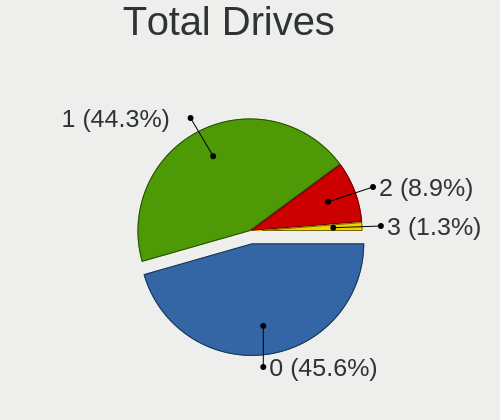
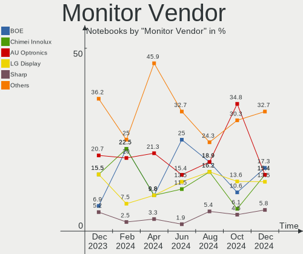
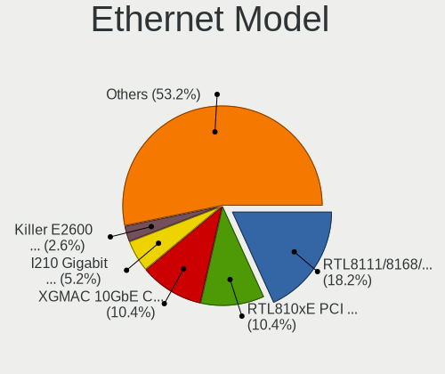

BSD - Hardware Trends (Notebooks)
---------------------------------

A project to identify most popular hardware characteristics and track their change
over time based on data collected by BSD users at https://BSD-Hardware.info.

Anyone can contribute to this report by the [hw-probe](https://github.com/linuxhw/hw-probe/blob/master/INSTALL.BSD.md) tool:

    hw-probe -all -upload

This report is for one last month. Overall report since the beginning of time: [TestDays](https://github.com/bsdhw/TestDays)

Period: Apr, 2024.

Contents
--------

* [ System ](#system)
  - [ OS                       ](#os)
  - [ OS Family                ](#os-family)
  - [ Arch                     ](#arch)
  - [ DE                       ](#de)
  - [ Display Server           ](#display-server)
  - [ Display Manager          ](#display-manager)
  - [ OS Lang                  ](#os-lang)
  - [ Boot Mode                ](#boot-mode)
  - [ Filesystem               ](#filesystem)
  - [ Part. scheme             ](#part-scheme)

* [ Board ](#board)
  - [ Vendor                   ](#vendor)
  - [ Model                    ](#model)
  - [ Model Family             ](#model-family)
  - [ MFG Year                 ](#mfg-year)
  - [ Form Factor              ](#form-factor)
  - [ Coreboot                 ](#coreboot)
  - [ RAM Size                 ](#ram-size)
  - [ RAM Used                 ](#ram-used)
  - [ Total Drives             ](#total-drives)
  - [ Has CD-ROM               ](#has-cd-rom)
  - [ Has Ethernet             ](#has-ethernet)
  - [ Has WiFi                 ](#has-wifi)
  - [ Has Bluetooth            ](#has-bluetooth)

* [ Location ](#location)
  - [ Country                  ](#country)
  - [ City                     ](#city)

* [ Drives ](#drives)
  - [ Drive Vendor             ](#drive-vendor)
  - [ Drive Model              ](#drive-model)
  - [ HDD Vendor               ](#hdd-vendor)
  - [ SSD Vendor               ](#ssd-vendor)
  - [ Drive Kind               ](#drive-kind)
  - [ Drive Connector          ](#drive-connector)
  - [ Drive Size               ](#drive-size)
  - [ Space Total              ](#space-total)
  - [ Space Used               ](#space-used)
  - [ Malfunc. Drives          ](#malfunc-drives)
  - [ Malfunc. Drive Vendor    ](#malfunc-drive-vendor)
  - [ Malfunc. HDD Vendor      ](#malfunc-hdd-vendor)
  - [ Malfunc. Drive Kind      ](#malfunc-drive-kind)
  - [ Failed Drives            ](#failed-drives)
  - [ Failed Drive Vendor      ](#failed-drive-vendor)
  - [ Drive Status             ](#drive-status)

* [ Storage controller ](#storage-controller)
  - [ Storage Vendor           ](#storage-vendor)
  - [ Storage Model            ](#storage-model)
  - [ Storage Kind             ](#storage-kind)

* [ Processor ](#processor)
  - [ CPU Vendor               ](#cpu-vendor)
  - [ CPU Model                ](#cpu-model)
  - [ CPU Model Family         ](#cpu-model-family)
  - [ CPU Cores                ](#cpu-cores)
  - [ CPU Sockets              ](#cpu-sockets)
  - [ CPU Threads              ](#cpu-threads)
  - [ CPU Microarch            ](#cpu-microarch)

* [ Graphics ](#graphics)
  - [ GPU Vendor               ](#gpu-vendor)
  - [ GPU Model                ](#gpu-model)
  - [ GPU Combo                ](#gpu-combo)
  - [ GPU Driver               ](#gpu-driver)
  - [ GPU Memory               ](#gpu-memory)

* [ Monitor ](#monitor)
  - [ Monitor Vendor           ](#monitor-vendor)
  - [ Monitor Model            ](#monitor-model)
  - [ Monitor Resolution       ](#monitor-resolution)
  - [ Monitor Diagonal         ](#monitor-diagonal)
  - [ Monitor Width            ](#monitor-width)
  - [ Aspect Ratio             ](#aspect-ratio)
  - [ Monitor Area             ](#monitor-area)
  - [ Pixel Density            ](#pixel-density)
  - [ Multiple Monitors        ](#multiple-monitors)

* [ Network ](#network)
  - [ Net Controller Vendor    ](#net-controller-vendor)
  - [ Net Controller Model     ](#net-controller-model)
  - [ Wireless Vendor          ](#wireless-vendor)
  - [ Wireless Model           ](#wireless-model)
  - [ Ethernet Vendor          ](#ethernet-vendor)
  - [ Ethernet Model           ](#ethernet-model)
  - [ Net Controller Kind      ](#net-controller-kind)
  - [ Used Controller          ](#used-controller)
  - [ NICs                     ](#nics)
  - [ IPv6                     ](#ipv6)

* [ Bluetooth ](#bluetooth)
  - [ Bluetooth Vendor         ](#bluetooth-vendor)
  - [ Bluetooth Model          ](#bluetooth-model)

* [ Sound ](#sound)
  - [ Sound Vendor             ](#sound-vendor)
  - [ Sound Model              ](#sound-model)

* [ Memory ](#memory)
  - [ Memory Vendor            ](#memory-vendor)
  - [ Memory Model             ](#memory-model)
  - [ Memory Kind              ](#memory-kind)
  - [ Memory Form Factor       ](#memory-form-factor)
  - [ Memory Size              ](#memory-size)
  - [ Memory Speed             ](#memory-speed)

* [ Printers & scanners ](#printers--scanners)
  - [ Printer Vendor           ](#printer-vendor)
  - [ Printer Model            ](#printer-model)
  - [ Scanner Vendor           ](#scanner-vendor)
  - [ Scanner Model            ](#scanner-model)

* [ Camera ](#camera)
  - [ Camera Vendor            ](#camera-vendor)
  - [ Camera Model             ](#camera-model)

* [ Security ](#security)
  - [ Fingerprint Vendor       ](#fingerprint-vendor)
  - [ Fingerprint Model        ](#fingerprint-model)
  - [ Chipcard Vendor          ](#chipcard-vendor)
  - [ Chipcard Model           ](#chipcard-model)

* [ Unsupported ](#unsupported)
  - [ Unsupported Devices      ](#unsupported-devices)
  - [ Unsupported Device Types ](#unsupported-device-types)

System
------

OS
--

Installed operating systems

| Name                     | Notebooks | Percent |
|--------------------------|-----------|---------|
| FreeBSD 14.0-p6          | 17        | 20.24%  |
| OpenBSD 7.5              | 11        | 13.1%   |
| GhostBSD 24.01.1         | 8         | 9.52%   |
| helloSystem 0.8.1        | 7         | 8.33%   |
| FreeBSD 14.0             | 6         | 7.14%   |
| OPNsense 24.1.6          | 5         | 5.95%   |
| helloSystem 0.9.0        | 5         | 5.95%   |
| OPNsense 24.1.4          | 3         | 3.57%   |
| OPNsense 24.1.5          | 2         | 2.38%   |
| OPNsense 23.10.3         | 2         | 2.38%   |
| NetBSD 10.0              | 2         | 2.38%   |
| FreeBSD 15.0-CURRENT     | 2         | 2.38%   |
| FreeBSD 14.0-p5          | 2         | 2.38%   |
| OPNsense 24.4            | 1         | 1.19%   |
| OpenBSD 7.4              | 1         | 1.19%   |
| NomadBSD 20240126        | 1         | 1.19%   |
| MidnightBSD 3.2.0        | 1         | 1.19%   |
| helloSystem 0.7.0        | 1         | 1.19%   |
| FreeBSD 14.1-PRERELEASE  | 1         | 1.19%   |
| FreeBSD 14.0-STABLE-HBSD | 1         | 1.19%   |
| FreeBSD 14.0-p4          | 1         | 1.19%   |
| FreeBSD 13.3-p1          | 1         | 1.19%   |
| FreeBSD 13.2-p72         | 1         | 1.19%   |
| FreeBSD 13.2-p70         | 1         | 1.19%   |
| FreeBSD 13.2-p7          | 1         | 1.19%   |

OS Family
---------

OS without a version

| Name        | Notebooks | Percent |
|-------------|-----------|---------|
| FreeBSD     | 34        | 40.48%  |
| OPNsense    | 13        | 15.48%  |
| helloSystem | 13        | 15.48%  |
| OpenBSD     | 12        | 14.29%  |
| GhostBSD    | 8         | 9.52%   |
| NetBSD      | 2         | 2.38%   |
| NomadBSD    | 1         | 1.19%   |
| MidnightBSD | 1         | 1.19%   |

Arch
----

OS architecture (x86_64, i586, etc.)

| Name  | Notebooks | Percent |
|-------|-----------|---------|
| amd64 | 84        | 100%    |

DE
--

Desktop Environment

| Name         | Notebooks | Percent |
|--------------|-----------|---------|
| helloDesktop | 25        | 29.76%  |
| Console      | 19        | 22.62%  |
| XFCE         | 10        | 11.9%   |
| KDE5         | 8         | 9.52%   |
| MATE         | 7         | 8.33%   |
| i3           | 3         | 3.57%   |
| TWM          | 2         | 2.38%   |
| Picom        | 2         | 2.38%   |
| Openbox      | 2         | 2.38%   |
| X-Cinnamon   | 1         | 1.19%   |
| spectrwm     | 1         | 1.19%   |
| LXQt         | 1         | 1.19%   |
| iwm          | 1         | 1.19%   |
| GNOME        | 1         | 1.19%   |
| dwm          | 1         | 1.19%   |

Display Server
--------------

X11 or Wayland

| Name    | Notebooks | Percent |
|---------|-----------|---------|
| X11     | 64        | 76.19%  |
| Console | 20        | 23.81%  |

Display Manager
---------------

SDDM, LightDM, etc.

| Name    | Notebooks | Percent |
|---------|-----------|---------|
| Console | 40        | 47.62%  |
| LightDM | 15        | 17.86%  |
| SLiM    | 14        | 16.67%  |
| SDDM    | 12        | 14.29%  |
| XDM     | 3         | 3.57%   |

OS Lang
-------

Language

| Lang    | Notebooks | Percent |
|---------|-----------|---------|
| Unknown | 35        | 41.67%  |
| C       | 26        | 30.95%  |
| en_US   | 16        | 19.05%  |
| ru_RU   | 3         | 3.57%   |
| fr_FR   | 2         | 2.38%   |
| es_ES   | 1         | 1.19%   |
| en_CA   | 1         | 1.19%   |

Boot Mode
---------

EFI or BIOS

| Mode | Notebooks | Percent |
|------|-----------|---------|
| EFI  | 72        | 85.71%  |
| BIOS | 12        | 14.29%  |

Filesystem
----------

Type of filesystem

| Type   | Notebooks | Percent |
|--------|-----------|---------|
| Zfs    | 56        | 66.67%  |
| Ffs    | 12        | 14.29%  |
| Ufs    | 10        | 11.9%   |
| Cd9660 | 6         | 7.14%   |

Part. scheme
------------

Scheme of partitioning

| Type | Notebooks | Percent |
|------|-----------|---------|
| GPT  | 79        | 94.05%  |
| MBR  | 4         | 4.76%   |
| BSD  | 1         | 1.19%   |

Board
-----

Vendor
------

Motherboard manufacturer

| Name                | Notebooks | Percent |
|---------------------|-----------|---------|
| Lenovo              | 28        | 33.33%  |
| Apple               | 9         | 10.71%  |
| Dell                | 8         | 9.52%   |
| Deciso              | 8         | 9.52%   |
| Hewlett-Packard     | 5         | 5.95%   |
| ASUSTek Computer    | 5         | 5.95%   |
| Unknown             | 5         | 5.95%   |
| Acer                | 3         | 3.57%   |
| Samsung Electronics | 2         | 2.38%   |
| Panasonic           | 2         | 2.38%   |
| Timi                | 1         | 1.19%   |
| System76            | 1         | 1.19%   |
| Sony                | 1         | 1.19%   |
| SLIMBOOK            | 1         | 1.19%   |
| Notebook            | 1         | 1.19%   |
| LG Electronics      | 1         | 1.19%   |
| HUAWEI              | 1         | 1.19%   |
| F-Plus Mobile       | 1         | 1.19%   |
| DFI                 | 1         | 1.19%   |

Model
-----

Motherboard model

| Name                                        | Notebooks | Percent |
|---------------------------------------------|-----------|---------|
| Deciso NetBoard-A20                         | 6         | 7.14%   |
| Unknown                                     | 6         | 7.14%   |
| Apple MacBookAir6,2                         | 4         | 4.76%   |
| Dell Latitude 7490                          | 2         | 2.38%   |
| Deciso NetBoard-A10                         | 2         | 2.38%   |
| ASUS K43E                                   | 2         | 2.38%   |
| Apple MacBookAir7,2                         | 2         | 2.38%   |
| Timi TM1612                                 | 1         | 1.19%   |
| System76 Pangolin                           | 1         | 1.19%   |
| Sony VGN-FZ4000E                            | 1         | 1.19%   |
| SLIMBOOK PROX14-AMD                         | 1         | 1.19%   |
| Samsung 340XAA/350XAA/550XAA                | 1         | 1.19%   |
| Samsung 100NZC                              | 1         | 1.19%   |
| Panasonic CFSX4-1                           | 1         | 1.19%   |
| Panasonic CF-53AAGHYDM                      | 1         | 1.19%   |
| Notebook NV4XMB,ME,MZ                       | 1         | 1.19%   |
| LG 17Z90Q-K.AAC7U1                          | 1         | 1.19%   |
| Lenovo ThinkPad X280 20KFCTO1WW             | 1         | 1.19%   |
| Lenovo ThinkPad X270 W10DG 20K5S0TT1N       | 1         | 1.19%   |
| Lenovo ThinkPad X260 20F60093US             | 1         | 1.19%   |
| Lenovo ThinkPad X260 20F5S2GM00             | 1         | 1.19%   |
| Lenovo ThinkPad X230 Tablet 3438GF4         | 1         | 1.19%   |
| Lenovo ThinkPad X220 429135G                | 1         | 1.19%   |
| Lenovo ThinkPad X1 Extreme 2nd 20QV001CPB   | 1         | 1.19%   |
| Lenovo ThinkPad X1 Carbon Gen 11 21HM002FUS | 1         | 1.19%   |
| Lenovo ThinkPad X1 Carbon 6th 20KGS1TW00    | 1         | 1.19%   |
| Lenovo ThinkPad W530 2447GH2                | 1         | 1.19%   |
| Lenovo ThinkPad T530 23942U1                | 1         | 1.19%   |
| Lenovo ThinkPad T470 20HES18R05             | 1         | 1.19%   |
| Lenovo ThinkPad T460 20FMA09CGE             | 1         | 1.19%   |
| Lenovo ThinkPad T440 20B7S01V00             | 1         | 1.19%   |
| Lenovo ThinkPad T430 2347GZU                | 1         | 1.19%   |
| Lenovo ThinkPad T410 2537N24                | 1         | 1.19%   |
| Lenovo ThinkPad T400 6475FA4                | 1         | 1.19%   |
| Lenovo ThinkPad T400 6474E18                | 1         | 1.19%   |
| Lenovo ThinkPad S5-S531 20B00003UK          | 1         | 1.19%   |
| Lenovo ThinkPad E550 20DF005VRT             | 1         | 1.19%   |
| Lenovo ThinkPad E490 20N9S48S00             | 1         | 1.19%   |
| Lenovo ThinkPad A485 20MU000VUS             | 1         | 1.19%   |
| Lenovo ThinkBook 16 G6+ IMH 21LE            | 1         | 1.19%   |

Model Family
------------

Motherboard model prefix

| Name                   | Notebooks | Percent |
|------------------------|-----------|---------|
| Lenovo ThinkPad        | 22        | 26.19%  |
| Deciso NetBoard-A20    | 6         | 7.14%   |
| Unknown                | 6         | 7.14%   |
| Dell Latitude          | 4         | 4.76%   |
| Apple MacBookAir6      | 4         | 4.76%   |
| Acer Aspire            | 3         | 3.57%   |
| Lenovo ThinkBook       | 2         | 2.38%   |
| Lenovo Legion          | 2         | 2.38%   |
| HP ProBook             | 2         | 2.38%   |
| Dell XPS               | 2         | 2.38%   |
| Deciso NetBoard-A10    | 2         | 2.38%   |
| ASUS VivoBook          | 2         | 2.38%   |
| ASUS K43E              | 2         | 2.38%   |
| Apple MacBookAir7      | 2         | 2.38%   |
| Timi TM1612            | 1         | 1.19%   |
| System76 Pangolin      | 1         | 1.19%   |
| Sony VGN-FZ4000E       | 1         | 1.19%   |
| SLIMBOOK PROX14-AMD    | 1         | 1.19%   |
| Samsung 340XAA         | 1         | 1.19%   |
| Samsung 100NZC         | 1         | 1.19%   |
| Panasonic CFSX4-1      | 1         | 1.19%   |
| Panasonic CF-53AAGHYDM | 1         | 1.19%   |
| Notebook NV4XMB        | 1         | 1.19%   |
| LG 17Z90Q-K.AAC7U1     | 1         | 1.19%   |
| Lenovo IdeaPad         | 1         | 1.19%   |
| Lenovo B51-30          | 1         | 1.19%   |
| HUAWEI MRGFG-XX        | 1         | 1.19%   |
| HP ZBook               | 1         | 1.19%   |
| HP OMEN                | 1         | 1.19%   |
| HP EliteBook           | 1         | 1.19%   |
| F-Plus Mobile FLAPTOP  | 1         | 1.19%   |
| Dell Vostro            | 1         | 1.19%   |
| Dell Precision         | 1         | 1.19%   |
| ASUS N76VZ             | 1         | 1.19%   |
| Apple MacBookPro8      | 1         | 1.19%   |
| Apple MacBookPro10     | 1         | 1.19%   |
| Apple MacBookAir4      | 1         | 1.19%   |

MFG Year
--------

Motherboard manufacture year

| Year | Notebooks | Percent |
|------|-----------|---------|
| 2019 | 11        | 13.1%   |
| 2018 | 11        | 13.1%   |
| 2022 | 10        | 11.9%   |
| 2023 | 7         | 8.33%   |
| 2021 | 6         | 7.14%   |
| 2016 | 6         | 7.14%   |
| 2020 | 5         | 5.95%   |
| 2012 | 5         | 5.95%   |
| 2011 | 5         | 5.95%   |
| 2024 | 4         | 4.76%   |
| 2015 | 4         | 4.76%   |
| 2017 | 2         | 2.38%   |
| 2014 | 2         | 2.38%   |
| 2013 | 2         | 2.38%   |
| 2009 | 2         | 2.38%   |
| 2010 | 1         | 1.19%   |
| 2007 | 1         | 1.19%   |

Form Factor
-----------

Physical design of the computer

| Name     | Notebooks | Percent |
|----------|-----------|---------|
| Notebook | 84        | 100%    |

Coreboot
--------

Have coreboot on board

| Used | Notebooks | Percent |
|------|-----------|---------|
| No   | 84        | 100%    |

RAM Size
--------

Total RAM memory

| Size in GB  | Notebooks | Percent |
|-------------|-----------|---------|
| 8.01-16.0   | 36        | 42.86%  |
| 16.01-24.0  | 18        | 21.43%  |
| 32.01-64.0  | 12        | 14.29%  |
| 4.01-8.0    | 8         | 9.52%   |
| 64.01-256.0 | 4         | 4.76%   |
| 3.01-4.0    | 2         | 2.38%   |
| 2.01-3.0    | 2         | 2.38%   |
| 24.01-32.0  | 1         | 1.19%   |
| 1.01-2.0    | 1         | 1.19%   |

RAM Used
--------

Used RAM memory

| Used GB  | Notebooks | Percent |
|----------|-----------|---------|
| 0.01-0.5 | 40        | 47.62%  |
| 0.51-1.0 | 27        | 32.14%  |
| 1.01-2.0 | 9         | 10.71%  |
| 2.01-3.0 | 4         | 4.76%   |
| 4.01-8.0 | 2         | 2.38%   |
| Unknown  | 2         | 2.38%   |

Total Drives
------------

Number of drives on board

| Drives | Notebooks | Percent |
|--------|-----------|---------|
| 1      | 60        | 71.43%  |
| 0      | 15        | 17.86%  |
| 2      | 9         | 10.71%  |

Has CD-ROM
----------

Has CD-ROM on board

| Presented | Notebooks | Percent |
|-----------|-----------|---------|
| No        | 71        | 84.52%  |
| Yes       | 13        | 15.48%  |

Has Ethernet
------------

Has Ethernet on board

| Presented | Notebooks | Percent |
|-----------|-----------|---------|
| Yes       | 66        | 78.57%  |
| No        | 18        | 21.43%  |

Has WiFi
--------

Has WiFi module

| Presented | Notebooks | Percent |
|-----------|-----------|---------|
| Yes       | 72        | 85.71%  |
| No        | 12        | 14.29%  |

Has Bluetooth
-------------

Has Bluetooth module

| Presented | Notebooks | Percent |
|-----------|-----------|---------|
| Yes       | 56        | 66.67%  |
| No        | 28        | 33.33%  |

Location
--------

Country
-------

Geographic location (country)

| Country     | Notebooks | Percent |
|-------------|-----------|---------|
| USA         | 17        | 20.24%  |
| Russia      | 9         | 10.71%  |
| Canada      | 9         | 10.71%  |
| France      | 8         | 9.52%   |
| Germany     | 7         | 8.33%   |
| UK          | 4         | 4.76%   |
| Vietnam     | 2         | 2.38%   |
| Poland      | 2         | 2.38%   |
| Netherlands | 2         | 2.38%   |
| India       | 2         | 2.38%   |
| Hungary     | 2         | 2.38%   |
| Denmark     | 2         | 2.38%   |
| Brazil      | 2         | 2.38%   |
| Thailand    | 1         | 1.19%   |
| Switzerland | 1         | 1.19%   |
| Sweden      | 1         | 1.19%   |
| Spain       | 1         | 1.19%   |
| Singapore   | 1         | 1.19%   |
| Serbia      | 1         | 1.19%   |
| Portugal    | 1         | 1.19%   |
| Mexico      | 1         | 1.19%   |
| Malaysia    | 1         | 1.19%   |
| Japan       | 1         | 1.19%   |
| Czechia     | 1         | 1.19%   |
| Cuba        | 1         | 1.19%   |
| China       | 1         | 1.19%   |
| Belgium     | 1         | 1.19%   |
| Austria     | 1         | 1.19%   |
| Argentina   | 1         | 1.19%   |

City
----

Geographic location (city)

| City                        | Notebooks | Percent |
|-----------------------------|-----------|---------|
| Saint-Laurent               | 6         | 7.14%   |
| Colombes                    | 5         | 5.95%   |
| Moscow                      | 4         | 4.76%   |
| Saint-Bruno                 | 2         | 2.38%   |
| Hanoi                       | 2         | 2.38%   |
| Frederiksberg               | 2         | 2.38%   |
| Chennai                     | 2         | 2.38%   |
| Zurich                      | 1         | 1.19%   |
| Ypsilanti                   | 1         | 1.19%   |
| Yekaterinburg               | 1         | 1.19%   |
| Wuhan                       | 1         | 1.19%   |
| Waynesboro                  | 1         | 1.19%   |
| Voskresensk                 | 1         | 1.19%   |
| Voronezh                    | 1         | 1.19%   |
| Užice                      | 1         | 1.19%   |
| Uba                         | 1         | 1.19%   |
| Stockholm                   | 1         | 1.19%   |
| Southampton                 | 1         | 1.19%   |
| Singapore                   | 1         | 1.19%   |
| Sheffield                   | 1         | 1.19%   |
| Santa Monica                | 1         | 1.19%   |
| San Nicolás de los Arroyos | 1         | 1.19%   |
| San Jose                    | 1         | 1.19%   |
| Rosny-sous-Bois             | 1         | 1.19%   |
| Roslindale                  | 1         | 1.19%   |
| Porto                       | 1         | 1.19%   |
| Pilis                       | 1         | 1.19%   |
| Pellenberg                  | 1         | 1.19%   |
| Ostseebad Binz              | 1         | 1.19%   |
| Olomouc                     | 1         | 1.19%   |
| Oldenburg                   | 1         | 1.19%   |
| Oakland                     | 1         | 1.19%   |
| New York                    | 1         | 1.19%   |
| Montreal                    | 1         | 1.19%   |
| Maria Enzersdorf            | 1         | 1.19%   |
| Madison                     | 1         | 1.19%   |
| Maceió                     | 1         | 1.19%   |
| Lublin                      | 1         | 1.19%   |
| Lübeck                     | 1         | 1.19%   |
| Los Angeles                 | 1         | 1.19%   |

Drives
------

Drive Vendor
------------

Hard drive vendors

| Vendor              | Notebooks | Drives | Percent |
|---------------------|-----------|--------|---------|
| Seagate             | 9         | 9      | 12%     |
| Transcend           | 8         | 8      | 10.67%  |
| Samsung Electronics | 7         | 8      | 9.33%   |
| Apple               | 7         | 7      | 9.33%   |
| Kingston            | 5         | 5      | 6.67%   |
| Crucial             | 5         | 5      | 6.67%   |
| WDC                 | 4         | 4      | 5.33%   |
| Toshiba             | 4         | 4      | 5.33%   |
| NVMe                | 4         | 4      | 5.33%   |
| Gigabyte Technology | 4         | 4      | 5.33%   |
| SanDisk             | 2         | 2      | 2.67%   |
| PNY                 | 2         | 2      | 2.67%   |
| Intel               | 2         | 2      | 2.67%   |
| Hitachi             | 2         | 2      | 2.67%   |
| UMIS                | 1         | 1      | 1.33%   |
| SSSTC               | 1         | 1      | 1.33%   |
| Qunion              | 1         | 1      | 1.33%   |
| Plextor             | 1         | 1      | 1.33%   |
| OWC                 | 1         | 1      | 1.33%   |
| Lexar               | 1         | 1      | 1.33%   |
| Intenso             | 1         | 1      | 1.33%   |
| Innodisk            | 1         | 1      | 1.33%   |
| FORESEE             | 1         | 1      | 1.33%   |
| A-DATA Technology   | 1         | 1      | 1.33%   |

Drive Model
-----------

Hard drive models

| Model                                | Notebooks | Percent |
|--------------------------------------|-----------|---------|
| Transcend TS256GMTE710T 256GB        | 4         | 5.26%   |
| Apple SSD SD0128F 121GB              | 4         | 5.26%   |
| Gigabyte GP-GSTFS31240GNTD 240GB     | 3         | 3.95%   |
| Transcend TS256GMTE652T2 256GB       | 2         | 2.63%   |
| Kingston SA400S37240G 240GB          | 2         | 2.63%   |
| Hitachi HTS547550A9E384 500GB        | 2         | 2.63%   |
| Apple SSD SM0128G 121GB              | 2         | 2.63%   |
| WDC WD7500BPKX-00HPJT0 752GB         | 1         | 1.32%   |
| WDC WD5000LPLX-00ZNTT0 500GB         | 1         | 1.32%   |
| WDC WD20SMZW-11JW8S1 2TB             | 1         | 1.32%   |
| WDC WD10SPZX-35Z10T0 1TB             | 1         | 1.32%   |
| UMIS RPEYJ1T24MKN2QWY 1TB            | 1         | 1.32%   |
| Transcend TS512GMTE710T 512GB        | 1         | 1.32%   |
| Transcend TS256GSSD230S 256GB        | 1         | 1.32%   |
| Toshiba THNSNK128GVN8 M.2 2280 128GB | 1         | 1.32%   |
| Toshiba MQ01ABF050 500GB             | 1         | 1.32%   |
| Toshiba MK6465GSX 640GB              | 1         | 1.32%   |
| Toshiba KSG60ZMV256G M.2 2280 256GB  | 1         | 1.32%   |
| SSSTC CL4-8D512 512GB                | 1         | 1.32%   |
| Seagate ST9500420AS 500GB            | 1         | 1.32%   |
| Seagate ST9500325AS 500GB            | 1         | 1.32%   |
| Seagate ST500LM000-SSHD-8GB          | 1         | 1.32%   |
| Seagate ST5000LM000-2AN170 5TB       | 1         | 1.32%   |
| Seagate ST320LT007-9ZV142 320GB      | 1         | 1.32%   |
| Seagate ST320LM001 HN-M320MBB 320GB  | 1         | 1.32%   |
| Seagate ST2000LM007-1R8174 2TB       | 1         | 1.32%   |
| Seagate ST2000LM003 HN-M201RAD 2TB   | 1         | 1.32%   |
| Seagate ST1000LM049-2GH172 1TB       | 1         | 1.32%   |
| SanDisk SSD PLUS 240GB               | 1         | 1.32%   |
| SanDisk SD8SN8U-256G-1006 256GB      | 1         | 1.32%   |
| Samsung SSD PM830 2.5-inch 7mm 128GB | 1         | 1.32%   |
| Samsung SSD 870 EVO 500GB            | 1         | 1.32%   |
| Samsung SSD 860 PRO 512GB            | 1         | 1.32%   |
| Samsung SSD 860 EVO 250GB            | 1         | 1.32%   |
| Samsung SSD 840 PRO Series 256GB     | 1         | 1.32%   |
| Samsung MZVLB256HAHQ-000H1 256GB     | 1         | 1.32%   |
| Samsung MZVL2512HCJQ-00BL2 512GB     | 1         | 1.32%   |
| Samsung MZ7TD128HAFV-000L1 128GB     | 1         | 1.32%   |
| Qunion P20A 64G                      | 1         | 1.32%   |
| PNY CS900 480GB SSD                  | 1         | 1.32%   |

HDD Vendor
----------

Hard disk drive vendors

| Vendor  | Notebooks | Drives | Percent |
|---------|-----------|--------|---------|
| Seagate | 9         | 9      | 45%     |
| WDC     | 4         | 4      | 20%     |
| NVMe    | 3         | 3      | 15%     |
| Toshiba | 2         | 2      | 10%     |
| Hitachi | 2         | 2      | 10%     |

SSD Vendor
----------

Solid state drive vendors

| Vendor              | Notebooks | Drives | Percent |
|---------------------|-----------|--------|---------|
| Apple               | 7         | 7      | 16.67%  |
| Samsung Electronics | 5         | 6      | 11.9%   |
| Kingston            | 5         | 5      | 11.9%   |
| Gigabyte Technology | 4         | 4      | 9.52%   |
| Crucial             | 4         | 4      | 9.52%   |
| Toshiba             | 2         | 2      | 4.76%   |
| SanDisk             | 2         | 2      | 4.76%   |
| PNY                 | 2         | 2      | 4.76%   |
| Intel               | 2         | 2      | 4.76%   |
| Transcend           | 1         | 1      | 2.38%   |
| Qunion              | 1         | 1      | 2.38%   |
| Plextor             | 1         | 1      | 2.38%   |
| OWC                 | 1         | 1      | 2.38%   |
| NVMe                | 1         | 1      | 2.38%   |
| Lexar               | 1         | 1      | 2.38%   |
| Intenso             | 1         | 1      | 2.38%   |
| Innodisk            | 1         | 1      | 2.38%   |
| A-DATA Technology   | 1         | 1      | 2.38%   |

Drive Kind
----------

HDD or SSD

| Kind | Notebooks | Drives | Percent |
|------|-----------|--------|---------|
| SSD  | 41        | 43     | 56.16%  |
| HDD  | 20        | 20     | 27.4%   |
| NVMe | 12        | 13     | 16.44%  |

Drive Connector
---------------

SATA, SAS, NVMe, etc.

| Type | Notebooks | Drives | Percent |
|------|-----------|--------|---------|
| SATA | 58        | 63     | 82.86%  |
| NVMe | 12        | 13     | 17.14%  |

Drive Size
----------

Size of hard drive

| Size in TB | Notebooks | Drives | Percent |
|------------|-----------|--------|---------|
| 0.01-0.5   | 44        | 47     | 73.33%  |
| 0.51-1.0   | 11        | 11     | 18.33%  |
| 1.01-2.0   | 4         | 4      | 6.67%   |
| 4.01-10.0  | 1         | 1      | 1.67%   |

Space Total
-----------

Amount of disk space available on the file system

| Size in GB     | Notebooks | Percent |
|----------------|-----------|---------|
| 101-250        | 33        | 39.29%  |
| 251-500        | 20        | 23.81%  |
| 1-20           | 9         | 10.71%  |
| 21-50          | 6         | 7.14%   |
| 501-1000       | 6         | 7.14%   |
| 1001-2000      | 4         | 4.76%   |
| 51-100         | 4         | 4.76%   |
| More than 3000 | 2         | 2.38%   |

Space Used
----------

Amount of used disk space

| Used GB   | Notebooks | Percent |
|-----------|-----------|---------|
| 1-20      | 69        | 82.14%  |
| 21-50     | 8         | 9.52%   |
| 101-250   | 3         | 3.57%   |
| 51-100    | 2         | 2.38%   |
| 251-500   | 1         | 1.19%   |
| 1001-2000 | 1         | 1.19%   |

Malfunc. Drives
---------------

Drive models with a malfunction

| Model                                        | Notebooks | Drives | Percent |
|----------------------------------------------|-----------|--------|---------|
| Toshiba THNSNK128GVN8 M.2 2280 128GB         | 1         | 1      | 14.29%  |
| Toshiba MK6465GSX 640GB                      | 1         | 1      | 14.29%  |
| Seagate ST9500325AS 500GB                    | 1         | 1      | 14.29%  |
| Seagate ST320LT007-9ZV142 320GB              | 1         | 1      | 14.29%  |
| Samsung Electronics SSD 840 PRO Series 256GB | 1         | 1      | 14.29%  |
| Crucial CT480M500SSD1 480GB                  | 1         | 1      | 14.29%  |
| A-DATA Technology SP550 480GB                | 1         | 1      | 14.29%  |

Malfunc. Drive Vendor
---------------------

Vendors of faulty drives

| Vendor              | Notebooks | Drives | Percent |
|---------------------|-----------|--------|---------|
| Toshiba             | 2         | 2      | 28.57%  |
| Seagate             | 2         | 2      | 28.57%  |
| Samsung Electronics | 1         | 1      | 14.29%  |
| Crucial             | 1         | 1      | 14.29%  |
| A-DATA Technology   | 1         | 1      | 14.29%  |

Malfunc. HDD Vendor
-------------------

Vendors of faulty HDD drives

| Vendor  | Notebooks | Drives | Percent |
|---------|-----------|--------|---------|
| Seagate | 2         | 2      | 66.67%  |
| Toshiba | 1         | 1      | 33.33%  |

Malfunc. Drive Kind
-------------------

Kinds of faulty drives

| Kind | Notebooks | Drives | Percent |
|------|-----------|--------|---------|
| SSD  | 4         | 4      | 57.14%  |
| HDD  | 3         | 3      | 42.86%  |

Failed Drives
-------------

Failed drive models

Zero info for selected period =(

Failed Drive Vendor
-------------------

Failed drive vendors

Zero info for selected period =(

Drive Status
------------

Number of failed and malfunc. drives

| Status   | Notebooks | Drives | Percent |
|----------|-----------|--------|---------|
| Works    | 58        | 64     | 82.86%  |
| Malfunc  | 7         | 7      | 10%     |
| Detected | 5         | 5      | 7.14%   |

Storage controller
------------------

Storage Vendor
--------------

Storage controller vendors

| Vendor                                  | Notebooks | Percent |
|-----------------------------------------|-----------|---------|
| Intel                                   | 52        | 53.61%  |
| Samsung Electronics                     | 13        | 13.4%   |
| Transcend                               | 8         | 8.25%   |
| Marvell Technology Group                | 4         | 4.12%   |
| AMD                                     | 4         | 4.12%   |
| Sandisk                                 | 2         | 2.06%   |
| Micron/Crucial Technology               | 2         | 2.06%   |
| Kingston Technology Company             | 2         | 2.06%   |
| ADATA Technology                        | 2         | 2.06%   |
| Toshiba                                 | 1         | 1.03%   |
| Solid State Storage Technology          | 1         | 1.03%   |
| Shenzhen Unionmemory Information System | 1         | 1.03%   |
| Shenzhen Longsys Electronics            | 1         | 1.03%   |
| Seagate Technology                      | 1         | 1.03%   |
| Phison Electronics                      | 1         | 1.03%   |
| Netac Technology                        | 1         | 1.03%   |
| KIOXIA                                  | 1         | 1.03%   |

Storage Model
-------------

Storage controller models

| Model                                                                                                              | Notebooks | Percent |
|--------------------------------------------------------------------------------------------------------------------|-----------|---------|
| Intel 7 Series Chipset Family 6-port SATA Controller [AHCI mode]                                                   | 9         | 9%      |
| Intel 6 Series/C200 Series Chipset Family 6 port Mobile SATA AHCI Controller                                       | 9         | 9%      |
| Intel Sunrise Point-LP SATA Controller [AHCI mode]                                                                 | 8         | 8%      |
| Transcend NVMe PCIe SSD 240S/MTE710T                                                                               | 5         | 5%      |
| Samsung NVMe SSD Controller SM981/PM981/PM983                                                                      | 4         | 4%      |
| Samsung NVMe SSD Controller PM9A1/PM9A3/980PRO                                                                     | 4         | 4%      |
| Marvell Group 88SS9183 PCIe SSD Controller                                                                         | 4         | 4%      |
| Intel Wildcat Point-LP SATA Controller [AHCI Mode]                                                                 | 4         | 4%      |
| Intel 82801 Mobile SATA Controller [RAID mode]                                                                     | 4         | 4%      |
| Transcend NVMe PCIe SSD 110S/112S/120S/MTE300S/MTE400S/MTE652T2 (DRAM-less)                                        | 3         | 3%      |
| Intel Cannon Lake Mobile PCH SATA AHCI Controller                                                                  | 3         | 3%      |
| AMD FCH SATA Controller [AHCI mode]                                                                                | 3         | 3%      |
| Samsung S4LN058A01[SSUBX] AHCI SSD Controller (Apple slot)                                                         | 2         | 2%      |
| Intel SSD DC P4101/Pro 7600p/760p/E 6100p Series                                                                   | 2         | 2%      |
| Intel 82801IBM/IEM (ICH9M/ICH9M-E) 4 port SATA Controller [AHCI mode]                                              | 2         | 2%      |
| Intel 8 Series SATA Controller 1 [AHCI mode]                                                                       | 2         | 2%      |
| Toshiba XG6 NVMe SSD Controller                                                                                    | 1         | 1%      |
| Solid State Storage CL4-8D512 NVMe SSD M.2 (DRAM-less)                                                             | 1         | 1%      |
| Shenzhen Unionmemory Information System RPEYJ1T24MKN2QWY PCIe 4.0 NVMe SSD 1024GB (DRAM-less)                      | 1         | 1%      |
| Shenzhen Longsys FORESEE XP1000 / Lexar Professional CFexpress Type B Gold series, NM620 PCIe NVME SSD (DRAM-less) | 1         | 1%      |
| Seagate FireCuda 530 SSD                                                                                           | 1         | 1%      |
| SanDisk WD PC SN810 / Black SN850 NVMe SSD                                                                         | 1         | 1%      |
| Sandisk WD Black SN770 / PC SN740 256GB / PC SN560 (DRAM-less) NVMe SSD                                            | 1         | 1%      |
| Samsung NVMe SSD Controller SM961/PM961/SM963                                                                      | 1         | 1%      |
| Samsung NVMe SSD Controller S4LV008[Pascal]                                                                        | 1         | 1%      |
| Samsung NVMe SSD Controller 980 (DRAM-less)                                                                        | 1         | 1%      |
| Phison PS5021-E21 PCIe4 NVMe Controller (DRAM-less)                                                                | 1         | 1%      |
| Netac PCIe 4 INNOGRIT based NVMe SSD                                                                               | 1         | 1%      |
| Micron/Crucial T500 NVMe PCIe SSD                                                                                  | 1         | 1%      |
| Micron/Crucial P5 Plus NVMe PCIe SSD                                                                               | 1         | 1%      |
| Kingston Company OM8PCP Design-In PCIe 3 NVMe SSD (DRAM-less)                                                      | 1         | 1%      |
| Kingston Company A2000 NVMe SSD SM2263EN                                                                           | 1         | 1%      |
| Intel Volume Management Device NVMe RAID Controller Intel Corporation                                              | 1         | 1%      |
| Intel SSD 600P Series                                                                                              | 1         | 1%      |
| Intel product 54d3                                                                                                 | 1         | 1%      |
| Intel NM10/ICH7 Family SATA Controller [IDE mode]                                                                  | 1         | 1%      |
| Intel Mobile 4 Series Chipset PT IDER Controller                                                                   | 1         | 1%      |
| Intel Jasper Lake SATA AHCI Controller                                                                             | 1         | 1%      |
| Intel Celeron N3350/Pentium N4200/Atom E3900 Series SATA AHCI Controller                                           | 1         | 1%      |
| Intel Cannon Point-LP SATA Controller [AHCI Mode]                                                                  | 1         | 1%      |

Storage Kind
------------

Kind of storage controller (IDE, SATA, NVMe, SAS, ...)

| Kind | Notebooks | Percent |
|------|-----------|---------|
| SATA | 54        | 56.25%  |
| NVMe | 34        | 35.42%  |
| RAID | 5         | 5.21%   |
| IDE  | 3         | 3.13%   |

Processor
---------

CPU Vendor
----------

Processor vendors

| Vendor | Notebooks | Percent |
|--------|-----------|---------|
| Intel  | 67        | 79.76%  |
| AMD    | 17        | 20.24%  |

CPU Model
---------

Processor models

| Model                              | Notebooks | Percent |
|------------------------------------|-----------|---------|
| Intel Core i5-4250U CPU @ 1.30GHz  | 4         | 4.76%   |
| AMD EPYC 3201 8-Core Processor     | 4         | 4.76%   |
| Intel Core i5-6300U CPU @ 2.40GHz  | 3         | 3.57%   |
| Intel Core i7-8550U CPU @ 1.80GHz  | 2         | 2.38%   |
| Intel Core i7-2820QM CPU @ 2.30GHz | 2         | 2.38%   |
| Intel Core i5-7300U CPU @ 2.60GHz  | 2         | 2.38%   |
| Intel Core i5-6200U CPU @ 2.30GHz  | 2         | 2.38%   |
| Intel Core i5-5350U CPU @ 1.80GHz  | 2         | 2.38%   |
| Intel Core i5-5200U CPU @ 2.20GHz  | 2         | 2.38%   |
| Intel Core i5-3320M CPU @ 2.60GHz  | 2         | 2.38%   |
| Intel Core i5-2520M CPU @ 2.50GHz  | 2         | 2.38%   |
| AMD Ryzen Embedded V1500B          | 2         | 2.38%   |
| AMD EPYC 3101 4-Core Processor     | 2         | 2.38%   |
| Intel Pentium CPU 987 @ 1.50GHz    | 1         | 1.19%   |
| Intel N100                         | 1         | 1.19%   |
| Intel Core Ultra 7 155H            | 1         | 1.19%   |
| Intel Core m3-6Y30 CPU @ 0.90GHz   | 1         | 1.19%   |
| Intel Core i7-9850H CPU @ 2.60GHz  | 1         | 1.19%   |
| Intel Core i7-9750H CPU @ 2.60GHz  | 1         | 1.19%   |
| Intel Core i7-8750H CPU @ 2.20GHz  | 1         | 1.19%   |
| Intel Core i7-3720QM CPU @ 2.60GHz | 1         | 1.19%   |
| Intel Core i7-3610QM CPU @ 2.30GHz | 1         | 1.19%   |
| Intel Core i7-3520M CPU @ 2.90GHz  | 1         | 1.19%   |
| Intel Core i7-2640M CPU @ 2.80GHz  | 1         | 1.19%   |
| Intel Core i7-2620M CPU @ 2.70GHz  | 1         | 1.19%   |
| Intel Core i5-9300H CPU @ 2.40GHz  | 1         | 1.19%   |
| Intel Core i5-8350U CPU @ 1.70GHz  | 1         | 1.19%   |
| Intel Core i5-8300H CPU @ 2.30GHz  | 1         | 1.19%   |
| Intel Core i5-8265U CPU @ 1.60GHz  | 1         | 1.19%   |
| Intel Core i5-8250U CPU @ 1.60GHz  | 1         | 1.19%   |
| Intel Core i5-7200U CPU @ 2.50GHz  | 1         | 1.19%   |
| Intel Core i5-5300U CPU @ 2.30GHz  | 1         | 1.19%   |
| Intel Core i5-4300U CPU @ 1.90GHz  | 1         | 1.19%   |
| Intel Core i5-4200U CPU @ 1.60GHz  | 1         | 1.19%   |
| Intel Core i5-3230M CPU @ 2.60GHz  | 1         | 1.19%   |
| Intel Core i5-2467M CPU @ 1.60GHz  | 1         | 1.19%   |
| Intel Core i5-2450M CPU @ 2.50GHz  | 1         | 1.19%   |
| Intel Core i5-2435M CPU @ 2.40GHz  | 1         | 1.19%   |
| Intel Core i5 CPU M 520 @ 2.40GHz  | 1         | 1.19%   |
| Intel Core i3-8130U CPU @ 2.20GHz  | 1         | 1.19%   |

CPU Model Family
----------------

Processor model prefix

| Model              | Notebooks | Percent |
|--------------------|-----------|---------|
| Intel Core i5      | 33        | 39.29%  |
| Intel Core i7      | 12        | 14.29%  |
| Other              | 7         | 8.33%   |
| AMD EPYC           | 6         | 7.14%   |
| Intel Core i3      | 4         | 4.76%   |
| AMD Ryzen 7        | 4         | 4.76%   |
| Intel Core 2 Duo   | 3         | 3.57%   |
| Intel Celeron      | 3         | 3.57%   |
| Intel Atom         | 2         | 2.38%   |
| AMD Ryzen Embedded | 2         | 2.38%   |
| Intel Pentium      | 1         | 1.19%   |
| Intel Core m3      | 1         | 1.19%   |
| Intel Core         | 1         | 1.19%   |
| AMD Ryzen 9        | 1         | 1.19%   |
| AMD Ryzen 5 PRO    | 1         | 1.19%   |
| AMD Ryzen 5        | 1         | 1.19%   |
| AMD PRO A10        | 1         | 1.19%   |
| AMD Athlon II      | 1         | 1.19%   |

CPU Cores
---------

Number of processor cores

| Number  | Notebooks | Percent |
|---------|-----------|---------|
| 2       | 41        | 48.81%  |
| 4       | 18        | 21.43%  |
| 8       | 8         | 9.52%   |
| 16      | 6         | 7.14%   |
| 6       | 4         | 4.76%   |
| Unknown | 4         | 4.76%   |
| 32      | 1         | 1.19%   |
| 22      | 1         | 1.19%   |
| 12      | 1         | 1.19%   |

CPU Sockets
-----------

Number of sockets

| Number  | Notebooks | Percent |
|---------|-----------|---------|
| 1       | 83        | 98.81%  |
| Unknown | 1         | 1.19%   |

CPU Threads
-----------

Threads per core (Hyper-Threading)

| Number  | Notebooks | Percent |
|---------|-----------|---------|
| 2       | 55        | 65.48%  |
| 1       | 25        | 29.76%  |
| Unknown | 4         | 4.76%   |

CPU Microarch
-------------

Microarchitecture

| Name        | Notebooks | Percent |
|-------------|-----------|---------|
| KabyLake    | 14        | 16.67%  |
| Unknown     | 11        | 13.1%   |
| SandyBridge | 10        | 11.9%   |
| Zen         | 9         | 10.71%  |
| IvyBridge   | 8         | 9.52%   |
| Haswell     | 7         | 8.33%   |
| Skylake     | 6         | 7.14%   |
| Broadwell   | 6         | 7.14%   |
| Penryn      | 3         | 3.57%   |
| TigerLake   | 2         | 2.38%   |
| Zen 3       | 1         | 1.19%   |
| Zen 2       | 1         | 1.19%   |
| Westmere    | 1         | 1.19%   |
| Silvermont  | 1         | 1.19%   |
| K10         | 1         | 1.19%   |
| Goldmont    | 1         | 1.19%   |
| Excavator   | 1         | 1.19%   |
| Bonnell     | 1         | 1.19%   |

Graphics
--------

GPU Vendor
----------

Vendors of graphics cards

| Vendor | Notebooks | Percent |
|--------|-----------|---------|
| Intel  | 64        | 73.56%  |
| Nvidia | 14        | 16.09%  |
| AMD    | 9         | 10.34%  |

GPU Model
---------

Graphics card models

| Model                                                                                    | Notebooks | Percent |
|------------------------------------------------------------------------------------------|-----------|---------|
| Intel 2nd Generation Core Processor Family Integrated Graphics Controller                | 10        | 11.36%  |
| Intel 3rd Gen Core processor Graphics Controller                                         | 8         | 9.09%   |
| Intel Haswell-ULT Integrated Graphics Controller                                         | 7         | 7.95%   |
| Intel UHD Graphics 620                                                                   | 5         | 5.68%   |
| Intel Skylake GT2 [HD Graphics 520]                                                      | 5         | 5.68%   |
| Intel HD Graphics 5500                                                                   | 4         | 4.55%   |
| Intel CoffeeLake-H GT2 [UHD Graphics 630]                                                | 4         | 4.55%   |
| Intel HD Graphics 620                                                                    | 3         | 3.41%   |
| Nvidia TU117M [GeForce GTX 1650 Mobile / Max-Q]                                          | 2         | 2.27%   |
| Intel TigerLake-LP GT2 [Iris Xe Graphics]                                                | 2         | 2.27%   |
| Intel Raptor Lake-P [Iris Xe Graphics]                                                   | 2         | 2.27%   |
| Intel Mobile 4 Series Chipset Integrated Graphics Controller                             | 2         | 2.27%   |
| Intel HD Graphics 6000                                                                   | 2         | 2.27%   |
| Nvidia GP107M [GeForce GTX 1050 Ti Mobile]                                               | 1         | 1.14%   |
| Nvidia GP107M [GeForce GTX 1050 Mobile]                                                  | 1         | 1.14%   |
| Nvidia GM108M [GeForce 940M]                                                             | 1         | 1.14%   |
| Nvidia GK107M [GeForce GT 650M]                                                          | 1         | 1.14%   |
| Nvidia GK107M [GeForce GT 650M Mac Edition]                                              | 1         | 1.14%   |
| Nvidia GK107GLM [Quadro K2000M]                                                          | 1         | 1.14%   |
| Nvidia GF108M [NVS 5400M]                                                                | 1         | 1.14%   |
| Nvidia GA107M [GeForce RTX 3050 Mobile]                                                  | 1         | 1.14%   |
| Nvidia G86M [GeForce 8400M GT]                                                           | 1         | 1.14%   |
| Nvidia AD107M [GeForce RTX 4050 Max-Q / Mobile]                                          | 1         | 1.14%   |
| Nvidia AD106M [GeForce RTX 4070 Max-Q / Mobile]                                          | 1         | 1.14%   |
| Nvidia AD104GLM [RTX 3500 Ada Generation Laptop GPU]                                     | 1         | 1.14%   |
| Intel WhiskeyLake-U GT2 [UHD Graphics 620]                                               | 1         | 1.14%   |
| Intel Meteor Lake-P [Intel Arc Graphics]                                                 | 1         | 1.14%   |
| Intel JasperLake [UHD Graphics]                                                          | 1         | 1.14%   |
| Intel HD Graphics 515                                                                    | 1         | 1.14%   |
| Intel Core Processor Integrated Graphics Controller                                      | 1         | 1.14%   |
| Intel Atom/Celeron/Pentium Processor x5-E8000/J3xxx/N3xxx Integrated Graphics Controller | 1         | 1.14%   |
| Intel Atom Processor D2xxx/N2xxx Integrated Graphics Controller                          | 1         | 1.14%   |
| Intel Apollo Lake [HD Graphics 505]                                                      | 1         | 1.14%   |
| Intel Alder Lake-P GT2 [Iris Xe Graphics]                                                | 1         | 1.14%   |
| Intel Alder Lake-N [UHD Graphics]                                                        | 1         | 1.14%   |
| AMD Wani [Radeon R5/R6/R7 Graphics]                                                      | 1         | 1.14%   |
| AMD Seymour [Radeon HD 6400M/7400M Series]                                               | 1         | 1.14%   |
| AMD RS880M [Mobility Radeon HD 4225/4250]                                                | 1         | 1.14%   |
| AMD Renoir [Radeon RX Vega 6 (Ryzen 4000/5000 Mobile Series)]                            | 1         | 1.14%   |
| AMD Rembrandt [Radeon 680M]                                                              | 1         | 1.14%   |

GPU Combo
---------

Combinations of graphics cards

| Name           | Notebooks | Percent |
|----------------|-----------|---------|
| 1 x Intel      | 52        | 61.9%   |
| Intel + Nvidia | 9         | 10.71%  |
| Other          | 8         | 9.52%   |
| 1 x AMD        | 6         | 7.14%   |
| 1 x Nvidia     | 4         | 4.76%   |
| 2 x Intel      | 2         | 2.38%   |
| 2 x AMD        | 1         | 1.19%   |
| Intel + AMD    | 1         | 1.19%   |
| AMD + Nvidia   | 1         | 1.19%   |

GPU Driver
----------

Free vs proprietary

| Driver      | Notebooks | Percent |
|-------------|-----------|---------|
| Free        | 67        | 79.76%  |
| Unknown     | 11        | 13.1%   |
| Proprietary | 6         | 7.14%   |

GPU Memory
----------

Total video memory

| Size in GB | Notebooks | Percent |
|------------|-----------|---------|
| Unknown    | 76        | 90.48%  |
| 0.01-0.5   | 3         | 3.57%   |
| 3.01-4.0   | 2         | 2.38%   |
| 0.51-1.0   | 2         | 2.38%   |
| 7.01-8.0   | 1         | 1.19%   |

Monitor
-------

Monitor Vendor
--------------

Monitor vendors

| Vendor                  | Notebooks | Percent |
|-------------------------|-----------|---------|
| AU Optronics            | 13        | 21.31%  |
| Apple                   | 9         | 14.75%  |
| LG Display              | 6         | 9.84%   |
| Chimei Innolux          | 6         | 9.84%   |
| BOE                     | 6         | 9.84%   |
| Samsung Electronics     | 5         | 8.2%    |
| Lenovo                  | 4         | 6.56%   |
| Dell                    | 3         | 4.92%   |
| Sharp                   | 2         | 3.28%   |
| CSO                     | 2         | 3.28%   |
| HKC                     | 1         | 1.64%   |
| Goldstar                | 1         | 1.64%   |
| DZX                     | 1         | 1.64%   |
| Chi Mei Optoelectronics | 1         | 1.64%   |
| BOE Technology Group    | 1         | 1.64%   |

Monitor Model
-------------

Monitor models

| Model                                                                     | Notebooks | Percent |
|---------------------------------------------------------------------------|-----------|---------|
| Apple Color LCD APP9CF0 1440x900 290x180mm 13.4-inch                      | 4         | 6.56%   |
| Samsung Electronics LCD Monitor SEC4542 1366x768 300x170mm 13.6-inch      | 2         | 3.28%   |
| Lenovo LCD Monitor LEN40B1 1600x900 350x190mm 15.7-inch                   | 2         | 3.28%   |
| AU Optronics LCD Monitor AUO226D 1920x1080 280x160mm 12.7-inch            | 2         | 3.28%   |
| Apple Color LCD APPA01B 1440x900 290x180mm 13.4-inch                      | 2         | 3.28%   |
| Sharp LCD Monitor SHP14BA 1920x1080 340x190mm 15.3-inch                   | 1         | 1.64%   |
| Sharp LCD Monitor SHP1481 1920x1080 290x170mm 13.2-inch                   | 1         | 1.64%   |
| Samsung Electronics LCD Monitor SEC304C 1366x768 310x170mm 13.9-inch      | 1         | 1.64%   |
| Samsung Electronics LCD Monitor SEC3047 1366x768 280x160mm 12.7-inch      | 1         | 1.64%   |
| Samsung Electronics LCD Monitor SDC4171 2880x1800 300x190mm 14.0-inch     | 1         | 1.64%   |
| LG Display LCD Monitor LGD05CF 1920x1080 340x190mm 15.3-inch              | 1         | 1.64%   |
| LG Display LCD Monitor LGD05A2 1920x1080 310x170mm 13.9-inch              | 1         | 1.64%   |
| LG Display LCD Monitor LGD03CD 1366x768 280x160mm 12.7-inch               | 1         | 1.64%   |
| LG Display LCD Monitor LGD037C 1366x768 310x170mm 13.9-inch               | 1         | 1.64%   |
| LG Display LCD Monitor LGD032C 1920x1080 340x190mm 15.3-inch              | 1         | 1.64%   |
| LG Display LCD Monitor LGD02D8 1366x768 280x160mm 12.7-inch               | 1         | 1.64%   |
| Lenovo LCD Monitor LEN4033 1440x900 300x190mm 14.0-inch                   | 1         | 1.64%   |
| Lenovo LCD Monitor LEN4031 1280x800 300x190mm 14.0-inch                   | 1         | 1.64%   |
| HKC LCD Monitor HKC3D05 1920x1080 340x190mm 15.3-inch                     | 1         | 1.64%   |
| Goldstar LG Ultra HD GSM5B08 3840x2160 600x340mm 27.2-inch                | 1         | 1.64%   |
| DZX K3-2 DZX1582 1920x1080 350x190mm 15.7-inch                            | 1         | 1.64%   |
| Dell SE2417HGX DELD0F7 1920x1080 520x290mm 23.4-inch                      | 1         | 1.64%   |
| Dell P2419H DELD0DA 1920x1080 530x300mm 24.0-inch                         | 1         | 1.64%   |
| Dell LCD Monitor P2723QE 5760x2160                                        | 1         | 1.64%   |
| CSO LCD Monitor CSO1615 2560x1600 340x220mm 15.9-inch                     | 1         | 1.64%   |
| CSO LCD Monitor CSO1404 1920x1200 300x190mm 14.0-inch                     | 1         | 1.64%   |
| Chimei Innolux LCD Monitor CMN175A 1920x1080 380x210mm 17.1-inch          | 1         | 1.64%   |
| Chimei Innolux LCD Monitor CMN1521 1920x1080 340x190mm 15.3-inch          | 1         | 1.64%   |
| Chimei Innolux LCD Monitor CMN14D6 1366x768 310x170mm 13.9-inch           | 1         | 1.64%   |
| Chimei Innolux LCD Monitor CMN14B1 1920x1080 310x170mm 13.9-inch          | 1         | 1.64%   |
| Chimei Innolux LCD Monitor CMN1495 1366x768 310x170mm 13.9-inch           | 1         | 1.64%   |
| Chimei Innolux LCD Monitor CMN1239 1920x1080 280x160mm 12.7-inch          | 1         | 1.64%   |
| Chi Mei Optoelectronics LCD Monitor CMO1720 1920x1080 380x210mm 17.1-inch | 1         | 1.64%   |
| BOE Technology Group LCD Monitor 5760x2160                                | 1         | 1.64%   |
| BOE LCD Monitor BOE0B7D 2560x1440 360x200mm 16.2-inch                     | 1         | 1.64%   |
| BOE LCD Monitor BOE0B38 2560x1600 340x210mm 15.7-inch                     | 1         | 1.64%   |
| BOE LCD Monitor BOE0A34 1920x1200 340x220mm 15.9-inch                     | 1         | 1.64%   |
| BOE LCD Monitor BOE075A 1366x768 310x170mm 13.9-inch                      | 1         | 1.64%   |
| BOE LCD Monitor BOE0718 1920x1080 310x170mm 13.9-inch                     | 1         | 1.64%   |
| BOE LCD Monitor BOE06EE 1920x1080 310x170mm 13.9-inch                     | 1         | 1.64%   |

Monitor Resolution
------------------

Monitor screen resolution

| Resolution        | Notebooks | Percent |
|-------------------|-----------|---------|
| 1920x1080 (FHD)   | 22        | 36.67%  |
| 1366x768 (WXGA)   | 17        | 28.33%  |
| 1440x900 (WXGA+)  | 7         | 11.67%  |
| 1600x900 (HD+)    | 3         | 5%      |
| 2880x1800         | 2         | 3.33%   |
| 2560x1600         | 2         | 3.33%   |
| 1920x1200 (WUXGA) | 2         | 3.33%   |
| 1280x800 (WXGA)   | 2         | 3.33%   |
| 5760x2160         | 1         | 1.67%   |
| 3840x2160 (4K)    | 1         | 1.67%   |
| 2560x1440 (QHD)   | 1         | 1.67%   |

Monitor Diagonal
----------------

Diagonal size in inches

| Inches  | Notebooks | Percent |
|---------|-----------|---------|
| 13      | 21        | 35%     |
| 15      | 17        | 28.33%  |
| 12      | 7         | 11.67%  |
| 14      | 6         | 10%     |
| 17      | 2         | 3.33%   |
| Unknown | 2         | 3.33%   |
| 27      | 1         | 1.67%   |
| 24      | 1         | 1.67%   |
| 23      | 1         | 1.67%   |
| 16      | 1         | 1.67%   |
| 11      | 1         | 1.67%   |

Monitor Width
-------------

Physical width

| Width in mm | Notebooks | Percent |
|-------------|-----------|---------|
| 301-350     | 29        | 49.15%  |
| 201-300     | 22        | 37.29%  |
| 501-600     | 3         | 5.08%   |
| 351-400     | 3         | 5.08%   |
| Unknown     | 2         | 3.39%   |

Aspect Ratio
------------

Proportional relationship between the width and the height

| Ratio   | Notebooks | Percent |
|---------|-----------|---------|
| 16/9    | 40        | 68.97%  |
| 16/10   | 13        | 22.41%  |
| 3/2     | 3         | 5.17%   |
| Unknown | 2         | 3.45%   |

Monitor Area
------------

Area in inch²

| Area in inch² | Notebooks | Percent |
|----------------|-----------|---------|
| 81-90          | 26        | 43.33%  |
| 91-100         | 10        | 16.67%  |
| 61-70          | 7         | 11.67%  |
| 111-120        | 4         | 6.67%   |
| 101-110        | 4         | 6.67%   |
| 201-250        | 2         | 3.33%   |
| 121-130        | 2         | 3.33%   |
| Unknown        | 2         | 3.33%   |
| 71-80          | 1         | 1.67%   |
| 51-60          | 1         | 1.67%   |
| 301-350        | 1         | 1.67%   |

Pixel Density
-------------

Pixels per inch

| Density       | Notebooks | Percent |
|---------------|-----------|---------|
| 121-160       | 30        | 50.85%  |
| 101-120       | 15        | 25.42%  |
| 161-240       | 8         | 13.56%  |
| 51-100        | 3         | 5.08%   |
| Unknown       | 2         | 3.39%   |
| More than 240 | 1         | 1.69%   |

Multiple Monitors
-----------------

Total monitors connected

| Total | Notebooks | Percent |
|-------|-----------|---------|
| 1     | 55        | 65.48%  |
| 0     | 25        | 29.76%  |
| 2     | 4         | 4.76%   |

Network
-------

Net Controller Vendor
---------------------

Controller vendors

| Vendor                            | Notebooks | Percent |
|-----------------------------------|-----------|---------|
| Intel                             | 65        | 52.42%  |
| Realtek Semiconductor             | 25        | 20.16%  |
| Broadcom                          | 12        | 9.68%   |
| AMD                               | 8         | 6.45%   |
| Qualcomm Atheros                  | 7         | 5.65%   |
| TP-Link                           | 2         | 1.61%   |
| Xiaomi                            | 1         | 0.81%   |
| Sierra Wireless                   | 1         | 0.81%   |
| Marvell Technology Group          | 1         | 0.81%   |
| Ericsson Business Mobile Networks | 1         | 0.81%   |
| Apple                             | 1         | 0.81%   |

Net Controller Model
--------------------

Controller models

| Model                                                                  | Notebooks | Percent |
|------------------------------------------------------------------------|-----------|---------|
| Realtek RTL8111/8168/8211/8411 PCI Express Gigabit Ethernet Controller | 18        | 11.54%  |
| AMD XGMAC 10GbE Controller                                             | 8         | 5.13%   |
| Intel Wireless 8265 / 8275                                             | 7         | 4.49%   |
| Intel 82579LM Gigabit Network Connection (Lewisville)                  | 7         | 4.49%   |
| Broadcom BCM4360 802.11ac Dual Band Wireless Network Adapter           | 6         | 3.85%   |
| Intel Wireless 8260                                                    | 5         | 3.21%   |
| Intel I211 Gigabit Network Connection                                  | 5         | 3.21%   |
| Intel Wi-Fi 6E(802.11ax) AX210/AX1675* 2x2 [Typhoon Peak]              | 4         | 2.56%   |
| Intel Wi-Fi 6 AX200                                                    | 4         | 2.56%   |
| Intel Ethernet Controller I225-V                                       | 4         | 2.56%   |
| Intel Centrino Advanced-N 6205 [Taylor Peak]                           | 4         | 2.56%   |
| Realtek RTL8188EUS 802.11n Wireless Network Adapter                    | 3         | 1.92%   |
| Intel Wireless 7265                                                    | 3         | 1.92%   |
| Intel Wireless 7260                                                    | 3         | 1.92%   |
| Intel I210 Gigabit Network Connection                                  | 3         | 1.92%   |
| Intel Ethernet Connection I219-LM                                      | 3         | 1.92%   |
| Intel Ethernet Connection (4) I219-LM                                  | 3         | 1.92%   |
| Realtek RTL810xE PCI Express Fast Ethernet controller                  | 2         | 1.28%   |
| Qualcomm Atheros AR9485 Wireless Network Adapter                       | 2         | 1.28%   |
| Intel Wireless 3160                                                    | 2         | 1.28%   |
| Intel Raptor Lake PCH CNVi WiFi                                        | 2         | 1.28%   |
| Intel Ethernet Connection I218-LM                                      | 2         | 1.28%   |
| Intel Ethernet Connection (4) I219-V                                   | 2         | 1.28%   |
| Intel Centrino Ultimate-N 6300                                         | 2         | 1.28%   |
| Intel Cannon Lake PCH CNVi WiFi                                        | 2         | 1.28%   |
| Intel 82567LM Gigabit Network Connection                               | 2         | 1.28%   |
| Broadcom BCM4331 802.11a/b/g/n                                         | 2         | 1.28%   |
| Xiaomi Mi/Redmi series (RNDIS)                                         | 1         | 0.64%   |
| TP-Link TL-WN722N v2/v3 [Realtek RTL8188EUS]                           | 1         | 0.64%   |
| TP-Link Archer T2U PLUS [RTL8821AU]                                    | 1         | 0.64%   |
| Sierra Wireless EM7455                                                 | 1         | 0.64%   |
| Realtek RTL8852BE PCIe 802.11ax Wireless Network Controller            | 1         | 0.64%   |
| Realtek RTL8822BE 802.11a/b/g/n/ac WiFi adapter                        | 1         | 0.64%   |
| Realtek RTL8723BE PCIe Wireless Network Adapter                        | 1         | 0.64%   |
| Realtek RTL8125 2.5GbE Controller                                      | 1         | 0.64%   |
| Qualcomm Atheros QCA9377 802.11ac Wireless Network Adapter             | 1         | 0.64%   |
| Qualcomm Atheros QCA6174 802.11ac Wireless Network Adapter             | 1         | 0.64%   |
| Qualcomm Atheros AR9462 Wireless Network Adapter                       | 1         | 0.64%   |
| Qualcomm Atheros AR9285 Wireless Network Adapter (PCI-Express)         | 1         | 0.64%   |
| Qualcomm Atheros AR8161 Gigabit Ethernet                               | 1         | 0.64%   |

Wireless Vendor
---------------

Wireless vendors

| Vendor                | Notebooks | Percent |
|-----------------------|-----------|---------|
| Intel                 | 51        | 65.38%  |
| Broadcom              | 12        | 15.38%  |
| Realtek Semiconductor | 6         | 7.69%   |
| Qualcomm Atheros      | 6         | 7.69%   |
| TP-Link               | 2         | 2.56%   |
| Sierra Wireless       | 1         | 1.28%   |

Wireless Model
--------------

Wireless models

| Model                                                          | Notebooks | Percent |
|----------------------------------------------------------------|-----------|---------|
| Intel Wireless 8265 / 8275                                     | 7         | 8.97%   |
| Broadcom BCM4360 802.11ac Dual Band Wireless Network Adapter   | 6         | 7.69%   |
| Intel Wireless 8260                                            | 5         | 6.41%   |
| Intel Wi-Fi 6E(802.11ax) AX210/AX1675* 2x2 [Typhoon Peak]      | 4         | 5.13%   |
| Intel Wi-Fi 6 AX200                                            | 4         | 5.13%   |
| Intel Centrino Advanced-N 6205 [Taylor Peak]                   | 4         | 5.13%   |
| Realtek RTL8188EUS 802.11n Wireless Network Adapter            | 3         | 3.85%   |
| Intel Wireless 7265                                            | 3         | 3.85%   |
| Intel Wireless 7260                                            | 3         | 3.85%   |
| Qualcomm Atheros AR9485 Wireless Network Adapter               | 2         | 2.56%   |
| Intel Wireless 3160                                            | 2         | 2.56%   |
| Intel Raptor Lake PCH CNVi WiFi                                | 2         | 2.56%   |
| Intel Centrino Ultimate-N 6300                                 | 2         | 2.56%   |
| Intel Cannon Lake PCH CNVi WiFi                                | 2         | 2.56%   |
| Broadcom BCM4331 802.11a/b/g/n                                 | 2         | 2.56%   |
| TP-Link TL-WN722N v2/v3 [Realtek RTL8188EUS]                   | 1         | 1.28%   |
| TP-Link Archer T2U PLUS [RTL8821AU]                            | 1         | 1.28%   |
| Sierra Wireless EM7455                                         | 1         | 1.28%   |
| Realtek RTL8852BE PCIe 802.11ax Wireless Network Controller    | 1         | 1.28%   |
| Realtek RTL8822BE 802.11a/b/g/n/ac WiFi adapter                | 1         | 1.28%   |
| Realtek RTL8723BE PCIe Wireless Network Adapter                | 1         | 1.28%   |
| Qualcomm Atheros QCA9377 802.11ac Wireless Network Adapter     | 1         | 1.28%   |
| Qualcomm Atheros QCA6174 802.11ac Wireless Network Adapter     | 1         | 1.28%   |
| Qualcomm Atheros AR9462 Wireless Network Adapter               | 1         | 1.28%   |
| Qualcomm Atheros AR9285 Wireless Network Adapter (PCI-Express) | 1         | 1.28%   |
| Intel Wireless-AC                                              | 1         | 1.28%   |
| Intel Wi-Fi 6 AX201 160MHz                                     | 1         | 1.28%   |
| Intel Wi-Fi 6 AX201                                            | 1         | 1.28%   |
| Intel Wi-Fi 5(802.11ac) Wireless-AC 9x6x [Thunder Peak]        | 1         | 1.28%   |
| Intel Ultimate N WiFi Link 5300                                | 1         | 1.28%   |
| Intel Raptor Lake-S PCH CNVi WiFi                              | 1         | 1.28%   |
| Intel PRO/Wireless 5100 AGN [Shiloh] Network Connection        | 1         | 1.28%   |
| Intel PRO/Wireless 4965 AG or AGN [Kedron] Network Connection  | 1         | 1.28%   |
| Intel Dual Band Wireless-AC 3168NGW [Stone Peak]               | 1         | 1.28%   |
| Intel Dual Band Wireless-AC 3165 Plus Bluetooth                | 1         | 1.28%   |
| Intel Centrino Wireless-N 2230                                 | 1         | 1.28%   |
| Intel Centrino Advanced-N 6200                                 | 1         | 1.28%   |
| Intel Alder Lake-P PCH CNVi WiFi                               | 1         | 1.28%   |
| Broadcom BCM43228 802.11a/b/g/n                                | 1         | 1.28%   |
| Broadcom BCM43225 802.11b/g/n                                  | 1         | 1.28%   |

Ethernet Vendor
---------------

Ethernet vendors

| Vendor                   | Notebooks | Percent |
|--------------------------|-----------|---------|
| Intel                    | 39        | 52%     |
| Realtek Semiconductor    | 20        | 26.67%  |
| AMD                      | 8         | 10.67%  |
| Broadcom                 | 4         | 5.33%   |
| Xiaomi                   | 1         | 1.33%   |
| Qualcomm Atheros         | 1         | 1.33%   |
| Marvell Technology Group | 1         | 1.33%   |
| Apple                    | 1         | 1.33%   |

Ethernet Model
--------------

Ethernet models

| Model                                                                  | Notebooks | Percent |
|------------------------------------------------------------------------|-----------|---------|
| Realtek RTL8111/8168/8211/8411 PCI Express Gigabit Ethernet Controller | 18        | 23.38%  |
| AMD XGMAC 10GbE Controller                                             | 8         | 10.39%  |
| Intel 82579LM Gigabit Network Connection (Lewisville)                  | 7         | 9.09%   |
| Intel I211 Gigabit Network Connection                                  | 5         | 6.49%   |
| Intel Ethernet Controller I225-V                                       | 4         | 5.19%   |
| Intel I210 Gigabit Network Connection                                  | 3         | 3.9%    |
| Intel Ethernet Connection I219-LM                                      | 3         | 3.9%    |
| Intel Ethernet Connection (4) I219-LM                                  | 3         | 3.9%    |
| Realtek RTL810xE PCI Express Fast Ethernet controller                  | 2         | 2.6%    |
| Intel Ethernet Connection I218-LM                                      | 2         | 2.6%    |
| Intel Ethernet Connection (4) I219-V                                   | 2         | 2.6%    |
| Intel 82567LM Gigabit Network Connection                               | 2         | 2.6%    |
| Xiaomi Mi/Redmi series (RNDIS)                                         | 1         | 1.3%    |
| Realtek RTL8125 2.5GbE Controller                                      | 1         | 1.3%    |
| Qualcomm Atheros AR8161 Gigabit Ethernet                               | 1         | 1.3%    |
| Marvell Group 88E8036 PCI-E Fast Ethernet Controller                   | 1         | 1.3%    |
| Intel Ethernet Controller I219-V                                       | 1         | 1.3%    |
| Intel Ethernet Controller I219-LM                                      | 1         | 1.3%    |
| Intel Ethernet Connection I219-V                                       | 1         | 1.3%    |
| Intel Ethernet Connection (7) I219-V                                   | 1         | 1.3%    |
| Intel Ethernet Connection (7) I219-LM                                  | 1         | 1.3%    |
| Intel Ethernet Connection (3) I218-V                                   | 1         | 1.3%    |
| Intel Ethernet Connection (3) I218-LM                                  | 1         | 1.3%    |
| Intel 82577LM Gigabit Network Connection                               | 1         | 1.3%    |
| Intel 82574L Gigabit Network Connection                                | 1         | 1.3%    |
| Broadcom NetXtreme BCM57786 Gigabit Ethernet PCIe                      | 1         | 1.3%    |
| Broadcom NetXtreme BCM57765 Gigabit Ethernet PCIe                      | 1         | 1.3%    |
| Broadcom NetXtreme BCM5761 Gigabit Ethernet PCIe                       | 1         | 1.3%    |
| Broadcom NetLink BCM57780 Gigabit Ethernet PCIe                        | 1         | 1.3%    |
| Apple Ethernet Adapter [A1277]                                         | 1         | 1.3%    |

Net Controller Kind
-------------------

Ethernet, WiFi or modem

| Kind     | Notebooks | Percent |
|----------|-----------|---------|
| WiFi     | 72        | 51.8%   |
| Ethernet | 66        | 47.48%  |
| Unknown  | 1         | 0.72%   |

Used Controller
---------------

Currently used network controller

| Kind     | Notebooks | Percent |
|----------|-----------|---------|
| WiFi     | 45        | 55.56%  |
| Ethernet | 36        | 44.44%  |

NICs
----

Total network controllers on board

| Total | Notebooks | Percent |
|-------|-----------|---------|
| 2     | 51        | 60.71%  |
| 1     | 19        | 22.62%  |
| 6     | 9         | 10.71%  |
| 5     | 2         | 2.38%   |
| 3     | 2         | 2.38%   |
| 4     | 1         | 1.19%   |

IPv6
----

IPv6 vs IPv4

| Used | Notebooks | Percent |
|------|-----------|---------|
| No   | 77        | 91.67%  |
| Yes  | 7         | 8.33%   |

Bluetooth
---------

Bluetooth Vendor
----------------

Controller vendors

| Vendor                          | Notebooks | Percent |
|---------------------------------|-----------|---------|
| Intel                           | 37        | 64.91%  |
| Apple                           | 9         | 15.79%  |
| Qualcomm Atheros Communications | 4         | 7.02%   |
| Realtek Semiconductor           | 2         | 3.51%   |
| TP-Link                         | 1         | 1.75%   |
| IMC Networks                    | 1         | 1.75%   |
| Dell                            | 1         | 1.75%   |
| Broadcom                        | 1         | 1.75%   |
| Alps Electric                   | 1         | 1.75%   |

Bluetooth Model
---------------

Controller models

| Model                                          | Notebooks | Percent |
|------------------------------------------------|-----------|---------|
| Intel Bluetooth wireless interface             | 18        | 31.58%  |
| Apple Broadcom Built-in Bluetooth              | 6         | 10.53%  |
| Intel AX211 Bluetooth                          | 5         | 8.77%   |
| Intel AX210 Bluetooth                          | 4         | 7.02%   |
| Intel AX200 Bluetooth                          | 4         | 7.02%   |
| Intel Bluetooth 9460/9560 Jefferson Peak (JfP) | 3         | 5.26%   |
| Apple Bluetooth Host Controller                | 2         | 3.51%   |
| TP-Link Bluetooth 5.0 USB Adapter              | 1         | 1.75%   |
| Realtek RTL8723B Bluetooth                     | 1         | 1.75%   |
| Realtek Bluetooth Adapter                      | 1         | 1.75%   |
| Qualcomm Atheros QCA9377 Bluetooth 4.1         | 1         | 1.75%   |
| Qualcomm Atheros QCA61x4 Bluetooth 4.1         | 1         | 1.75%   |
| Qualcomm Atheros AR3012 Bluetooth 4.0          | 1         | 1.75%   |
| Qualcomm Atheros AR3011 Bluetooth              | 1         | 1.75%   |
| Intel Wireless-AC 3168 Bluetooth               | 1         | 1.75%   |
| Intel Centrino Bluetooth Wireless Transceiver  | 1         | 1.75%   |
| Intel AX201 Bluetooth                          | 1         | 1.75%   |
| IMC Networks Bluetooth Radio                   | 1         | 1.75%   |
| Dell Dell Wireless 380 Bluetooth 4.0 Module    | 1         | 1.75%   |
| Broadcom BCM20702 Bluetooth 4.0 [ThinkPad]     | 1         | 1.75%   |
| Apple Built-in Bluetooth 2.0+EDR HCI           | 1         | 1.75%   |
| Alps Electric UGTZ4 Bluetooth                  | 1         | 1.75%   |

Sound
-----

Sound Vendor
------------

Sound card vendors

| Vendor              | Notebooks | Percent |
|---------------------|-----------|---------|
| Intel               | 67        | 77.91%  |
| AMD                 | 11        | 12.79%  |
| Nvidia              | 5         | 5.81%   |
| Kingston Technology | 1         | 1.16%   |
| GN Netcom           | 1         | 1.16%   |
| C-Media Electronics | 1         | 1.16%   |

Sound Model
-----------

Sound card models

| Model                                                                                             | Notebooks | Percent |
|---------------------------------------------------------------------------------------------------|-----------|---------|
| Intel Sunrise Point-LP HD Audio                                                                   | 14        | 12.96%  |
| Intel 7 Series/C216 Chipset Family High Definition Audio Controller                               | 9         | 8.33%   |
| Intel 6 Series/C200 Series Chipset Family High Definition Audio Controller                        | 9         | 8.33%   |
| AMD Family 17h/19h HD Audio Controller                                                            | 9         | 8.33%   |
| Intel Haswell-ULT HD Audio Controller                                                             | 7         | 6.48%   |
| Intel 8 Series HD Audio Controller                                                                | 7         | 6.48%   |
| Intel Wildcat Point-LP High Definition Audio Controller                                           | 6         | 5.56%   |
| Intel Broadwell-U Audio Controller                                                                | 6         | 5.56%   |
| Intel Cannon Lake PCH cAVS                                                                        | 5         | 4.63%   |
| AMD Rembrandt Radeon High Definition Audio Controller                                             | 3         | 2.78%   |
| Unknown                                                                                           | 3         | 2.78%   |
| Intel Tiger Lake-LP Smart Sound Technology Audio Controller                                       | 2         | 1.85%   |
| Intel Raptor Lake-P/U/H cAVS                                                                      | 2         | 1.85%   |
| Intel 82801I (ICH9 Family) HD Audio Controller                                                    | 2         | 1.85%   |
| AMD Renoir Radeon High Definition Audio Controller                                                | 2         | 1.85%   |
| Nvidia TU107 GeForce GTX 1650 High Definition Audio Controller                                    | 1         | 0.93%   |
| Nvidia GK107 HDMI Audio Controller                                                                | 1         | 0.93%   |
| Kingston Technology HyperX 7.1 Audio                                                              | 1         | 0.93%   |
| Intel Raptor Lake High Definition Audio Controller                                                | 1         | 0.93%   |
| Intel NM10/ICH7 Family High Definition Audio Controller                                           | 1         | 0.93%   |
| Intel Meteor Lake-P HD Audio Controller                                                           | 1         | 0.93%   |
| Intel Jasper Lake HD Audio                                                                        | 1         | 0.93%   |
| Intel Celeron N3350/Pentium N4200/Atom E3900 Series Audio Cluster                                 | 1         | 0.93%   |
| Intel Cannon Point-LP High Definition Audio Controller                                            | 1         | 0.93%   |
| Intel Atom/Celeron/Pentium Processor x5-E8000/J3xxx/N3xxx Series High Definition Audio Controller | 1         | 0.93%   |
| Intel Alder Lake-N PCH High Definition Audio Controller                                           | 1         | 0.93%   |
| Intel Alder Lake PCH-P High Definition Audio Controller                                           | 1         | 0.93%   |
| Intel 82801H (ICH8 Family) HD Audio Controller                                                    | 1         | 0.93%   |
| Intel 5 Series/3400 Series Chipset High Definition Audio                                          | 1         | 0.93%   |
| GN Netcom Jabra EVOLVE 20 SE MS                                                                   | 1         | 0.93%   |
| C-Media Electronics Blue Snowball                                                                 | 1         | 0.93%   |
| AMD SBx00 Azalia (Intel HDA)                                                                      | 1         | 0.93%   |
| AMD RS880 HDMI Audio [Radeon HD 4200 Series]                                                      | 1         | 0.93%   |
| AMD Raven/Raven2/Fenghuang HDMI/DP Audio Controller                                               | 1         | 0.93%   |
| AMD Navi 31 HDMI/DP Audio                                                                         | 1         | 0.93%   |
| AMD Kabini HDMI/DP Audio                                                                          | 1         | 0.93%   |
| AMD Family 15h (Models 60h-6fh) Audio Controller                                                  | 1         | 0.93%   |

Memory
------

Memory Vendor
-------------

Memory module vendors

| Vendor              | Notebooks | Percent |
|---------------------|-----------|---------|
| Samsung Electronics | 24        | 26.97%  |
| SK hynix            | 15        | 16.85%  |
| Micron Technology   | 9         | 10.11%  |
| Kingston            | 8         | 8.99%   |
| Transcend           | 7         | 7.87%   |
| Elpida              | 5         | 5.62%   |
| Crucial             | 5         | 5.62%   |
| Unknown             | 4         | 4.49%   |
| Unknown             | 4         | 4.49%   |
| Smart               | 3         | 3.37%   |
| Corsair             | 2         | 2.25%   |
| A-DATA Technology   | 2         | 2.25%   |
| 8CFD000080AD        | 1         | 1.12%   |

Memory Model
------------

Memory module models

| Model                                                            | Notebooks | Percent |
|------------------------------------------------------------------|-----------|---------|
| Transcend RAM TS1GLH64V6BL 8GB SODIMM DDR4 2667MT/s              | 6         | 6.52%   |
| Elpida RAM Module 4GB SODIMM DDR3 1600MT/s                       | 4         | 4.35%   |
| Unknown                                                          | 4         | 4.35%   |
| SK hynix RAM HMT41GS6BFR8A-PB 8GB SODIMM DDR3 1600MT/s           | 3         | 3.26%   |
| Samsung RAM M471B1G73DB0-YK0 8GB SODIMM DDR3 1600MT/s            | 2         | 2.17%   |
| Samsung RAM M471A1K43BB0-CPB 8GB SODIMM DDR4 2133MT/s            | 2         | 2.17%   |
| Crucial RAM CT51264BF160B.C16F 4GB SODIMM DDR3 1600MT/s          | 2         | 2.17%   |
| Corsair RAM CMSX8GX4M1A2400C16 8GB SODIMM DDR4 2400MT/s          | 2         | 2.17%   |
| Unknown RAM Module 8GB SODIMM DDR4 2400MT/s                      | 1         | 1.09%   |
| Unknown RAM Module 8GB SODIMM DDR3 1333MT/s                      | 1         | 1.09%   |
| Unknown RAM Module 4GB SODIMM DDR3 1333MT/s                      | 1         | 1.09%   |
| Unknown RAM Module 2GB SODIMM DDR2                               | 1         | 1.09%   |
| Transcend RAM TS2GLH64V2B 16GB SODIMM DDR4 1600MT/s              | 1         | 1.09%   |
| Smart RAM SH564568FH8NZPHSCG 2GB SODIMM DDR3 1066MT/s            | 1         | 1.09%   |
| Smart RAM SF4641G8CK8IEHLSBG 8GB SODIMM DDR4 2667MT/s            | 1         | 1.09%   |
| Smart RAM SF4641G8CK8IEGKSBG 8GB SODIMM DDR4 2400MT/s            | 1         | 1.09%   |
| SK hynix RAM Module 8GB SODIMM DDR4 2400MT/s                     | 1         | 1.09%   |
| SK hynix RAM Module 4GB SODIMM DDR3 1600MT/s                     | 1         | 1.09%   |
| SK hynix RAM HMT451S6AFR8A-PB 4GB SODIMM DDR3 1600MT/s           | 1         | 1.09%   |
| SK hynix RAM HMT41GS6AFR8A-PB 8GB SODIMM DDR3 1600MT/s           | 1         | 1.09%   |
| SK hynix RAM HMT351S6EFR8C-PB 4GB SODIMM DDR3 1600MT/s           | 1         | 1.09%   |
| SK hynix RAM HMT351S6EFR8A-PB 4GB SODIMM DDR3 1600MT/s           | 1         | 1.09%   |
| SK hynix RAM HMA82GS6AFR8N-UH 16GB SODIMM DDR4 2400MT/s          | 1         | 1.09%   |
| SK hynix RAM HMA81GS6CJR8N-VK 8GB SODIMM DDR4 2667MT/s           | 1         | 1.09%   |
| SK hynix RAM HMA81GS6AFR8N-UH 8GB SODIMM DDR4 2400MT/s           | 1         | 1.09%   |
| SK hynix RAM H9JCNNNFA5MLYR-N6E 8GB SODIMM LPDDR5 6400MT/s       | 1         | 1.09%   |
| SK hynix RAM H9CCNNNBJTMLAR-NUD 4GB Row Of Chips LPDDR3 1867MT/s | 1         | 1.09%   |
| SK hynix RAM H58G66BK7BX067 8GB Row Of Chips LPDDR5 6400MT/s     | 1         | 1.09%   |
| Samsung RAM Module 4GB SODIMM DDR3 1600MT/s                      | 1         | 1.09%   |
| Samsung RAM Module 2GB SODIMM LPDDR3 1867MT/s                    | 1         | 1.09%   |
| Samsung RAM Module 1GB SODIMM DDR3 1333MT/s                      | 1         | 1.09%   |
| Samsung RAM Module 16GB SODIMM DDR4 2667MT/s                     | 1         | 1.09%   |
| Samsung RAM M471B5674QH0-YK0 2GB SODIMM DDR3 1600MT/s            | 1         | 1.09%   |
| Samsung RAM M471B5673FH0-CF8 2GB SODIMM DDR3 1067MT/s            | 1         | 1.09%   |
| Samsung RAM M471B5673EH1-CF8 2GB SODIMM DDR3 1067MT/s            | 1         | 1.09%   |
| Samsung RAM M471B5273DH0-CK0 4GB SODIMM DDR3 1600MT/s            | 1         | 1.09%   |
| Samsung RAM M471B5273CH0-CK0 4GB SODIMM DDR3 1600MT/s            | 1         | 1.09%   |
| Samsung RAM M471B5273CH0-CH9 4GB SODIMM DDR3 1334MT/s            | 1         | 1.09%   |
| Samsung RAM M471B5173QH0-YK0 4GB SODIMM DDR3 1600MT/s            | 1         | 1.09%   |
| Samsung RAM M471B5173BH0-CK0 4GB SODIMM DDR3 1600MT/s            | 1         | 1.09%   |

Memory Kind
-----------

Memory module kinds

| Kind    | Notebooks | Percent |
|---------|-----------|---------|
| DDR3    | 36        | 46.15%  |
| DDR4    | 28        | 35.9%   |
| LPDDR5  | 5         | 6.41%   |
| DDR5    | 4         | 5.13%   |
| LPDDR3  | 3         | 3.85%   |
| DDR2    | 1         | 1.28%   |
| Unknown | 1         | 1.28%   |

Memory Form Factor
------------------

Physical design of the memory module

| Name            | Notebooks | Percent |
|-----------------|-----------|---------|
| SODIMM          | 69        | 89.61%  |
| Row Of Chips    | 6         | 7.79%   |
| Proprietary Car | 1         | 1.3%    |
| Chip            | 1         | 1.3%    |

Memory Size
-----------

Memory module size

| Size  | Notebooks | Percent |
|-------|-----------|---------|
| 8192  | 37        | 44.58%  |
| 4096  | 24        | 28.92%  |
| 16384 | 8         | 9.64%   |
| 2048  | 8         | 9.64%   |
| 32768 | 4         | 4.82%   |
| 65536 | 1         | 1.2%    |
| 1024  | 1         | 1.2%    |

Memory Speed
------------

Memory module speed

| Speed   | Notebooks | Percent |
|---------|-----------|---------|
| 1600    | 29        | 35.37%  |
| 2667    | 12        | 14.63%  |
| 1333    | 8         | 9.76%   |
| 3200    | 7         | 8.54%   |
| 2400    | 6         | 7.32%   |
| 6400    | 5         | 6.1%    |
| 2133    | 4         | 4.88%   |
| 5600    | 3         | 3.66%   |
| 1867    | 2         | 2.44%   |
| 1066    | 2         | 2.44%   |
| 4800    | 1         | 1.22%   |
| 1334    | 1         | 1.22%   |
| 1067    | 1         | 1.22%   |
| Unknown | 1         | 1.22%   |

Printers & scanners
-------------------

Printer Vendor
--------------

Printer device vendors

Zero info for selected period =(

Printer Model
-------------

Printer device models

Zero info for selected period =(

Scanner Vendor
--------------

Scanner device vendors

Zero info for selected period =(

Scanner Model
-------------

Scanner device models

Zero info for selected period =(

Camera
------

Camera Vendor
-------------

Camera device vendors

| Vendor                           | Notebooks | Percent |
|----------------------------------|-----------|---------|
| Chicony Electronics              | 13        | 25%     |
| Microdia                         | 7         | 13.46%  |
| Bison Electronics                | 7         | 13.46%  |
| IMC Networks                     | 4         | 7.69%   |
| Syntek                           | 3         | 5.77%   |
| Apple                            | 3         | 5.77%   |
| Sunplus Innovation Technology    | 2         | 3.85%   |
| Silicon Motion                   | 2         | 3.85%   |
| Realtek Semiconductor            | 2         | 3.85%   |
| Quanta                           | 2         | 3.85%   |
| Luxvisions Innotech Limited      | 2         | 3.85%   |
| Lite-On Technology               | 2         | 3.85%   |
| Unknown (3730304233435731375051) | 1         | 1.92%   |
| Lenovo                           | 1         | 1.92%   |
| ALi                              | 1         | 1.92%   |

Camera Model
------------

Camera device models

| Model                                             | Notebooks | Percent |
|---------------------------------------------------|-----------|---------|
| Chicony Integrated Camera                         | 3         | 5.66%   |
| Bison Integrated Camera                           | 3         | 5.66%   |
| Syntek Lenovo EasyCamera                          | 2         | 3.77%   |
| Realtek Integrated Webcam HD                      | 2         | 3.77%   |
| Microdia Laptop_Integrated_Webcam_HD              | 2         | 3.77%   |
| Lite-On Integrated Camera                         | 2         | 3.77%   |
| Chicony Integrated Camera (1280x720@30)           | 2         | 3.77%   |
| Chicony HD Webcam                                 | 2         | 3.77%   |
| Unknown (3730304233435731375051) USB Camera       | 1         | 1.89%   |
| Syntek Integrated Camera                          | 1         | 1.89%   |
| Sunplus Integrated_Webcam_HD                      | 1         | 1.89%   |
| Sunplus Asus Webcam                               | 1         | 1.89%   |
| Silicon Motion WebCam SC-03FFL11939N              | 1         | 1.89%   |
| Silicon Motion Realtek DMFT RGB                   | 1         | 1.89%   |
| Quanta VGA WebCam                                 | 1         | 1.89%   |
| Quanta HP FHD Camera                              | 1         | 1.89%   |
| Microdia USB Camera                               | 1         | 1.89%   |
| Microdia Integrated_Webcam_HD                     | 1         | 1.89%   |
| Microdia Integrated_Webcam_FHD                    | 1         | 1.89%   |
| Microdia Integrated Webcam HD                     | 1         | 1.89%   |
| Microdia Integrated Camera                        | 1         | 1.89%   |
| Luxvisions Innotech Limited LGE Camera            | 1         | 1.89%   |
| Luxvisions Innotech Limited Integrated RGB Camera | 1         | 1.89%   |
| Lenovo Integrated Webcam                          | 1         | 1.89%   |
| IMC Networks USB2.0 HD UVC WebCam                 | 1         | 1.89%   |
| IMC Networks Realtek PC Camera                    | 1         | 1.89%   |
| IMC Networks Integrated Camera                    | 1         | 1.89%   |
| IMC Networks EasyCamera                           | 1         | 1.89%   |
| Chicony XiaoMi USB 2.0 Webcam                     | 1         | 1.89%   |
| Chicony Lenovo Integrated Camera (0.3MP)          | 1         | 1.89%   |
| Chicony Integrated IR Camera                      | 1         | 1.89%   |
| Chicony Integrated HP HD Webcam                   | 1         | 1.89%   |
| Chicony HP Wide Vision HD Camera                  | 1         | 1.89%   |
| Chicony HP HD Webcam                              | 1         | 1.89%   |
| Chicony HP HD Camera                              | 1         | 1.89%   |
| Bison USB HD Webcam                               | 1         | 1.89%   |
| Bison ThinkPad P50 Integrated Camera              | 1         | 1.89%   |
| Bison ThinkPad Integrated Camera                  | 1         | 1.89%   |
| Bison SunplusIT Integrated Camera                 | 1         | 1.89%   |
| Apple FaceTime HD Camera (Built-in)               | 1         | 1.89%   |

Security
--------

Fingerprint Vendor
------------------

Fingerprint sensor vendors

| Vendor                     | Notebooks | Percent |
|----------------------------|-----------|---------|
| Validity Sensors           | 7         | 46.67%  |
| Synaptics                  | 3         | 20%     |
| FocalTech Systems          | 2         | 13.33%  |
| Shenzhen Goodix Technology | 1         | 6.67%   |
| Elan Microelectronics      | 1         | 6.67%   |
| AuthenTec                  | 1         | 6.67%   |

Fingerprint Model
-----------------

Fingerprint sensor models

| Model                                             | Notebooks | Percent |
|---------------------------------------------------|-----------|---------|
| Validity Sensors VFS 5011 fingerprint sensor      | 3         | 20%     |
| FocalTech Systems Fingerprint Reader              | 2         | 13.33%  |
| Validity Sensors VFS7552 Touch Fingerprint Sensor | 1         | 6.67%   |
| Validity Sensors VFS5011 Fingerprint Reader       | 1         | 6.67%   |
| Validity Sensors VFS495 Fingerprint Reader        | 1         | 6.67%   |
| Validity Sensors Synaptics WBDI                   | 1         | 6.67%   |
| Synaptics Metallica MOH Touch Fingerprint Reader  | 1         | 6.67%   |
| Synaptics Metallica MIS Touch Fingerprint Reader  | 1         | 6.67%   |
| Synaptics Fingerprint reader [HP G6]              | 1         | 6.67%   |
| Shenzhen Goodix Fingerprint Reader                | 1         | 6.67%   |
| Elan WBF Fingerprint Sensor                       | 1         | 6.67%   |
| AuthenTec AES2810                                 | 1         | 6.67%   |

Chipcard Vendor
---------------

Chipcard module vendors

Zero info for selected period =(

Chipcard Model
--------------

Chipcard module models

Zero info for selected period =(

Unsupported
-----------

Unsupported Devices
-------------------

Total unsupported devices on board

| Total | Notebooks | Percent |
|-------|-----------|---------|
| 1     | 29        | 34.52%  |
| 2     | 27        | 32.14%  |
| 0     | 12        | 14.29%  |
| 3     | 8         | 9.52%   |
| 4     | 5         | 5.95%   |
| 5     | 3         | 3.57%   |

Unsupported Device Types
------------------------

Types of unsupported devices

| Type                     | Notebooks | Percent |
|--------------------------|-----------|---------|
| Communication controller | 65        | 51.59%  |
| Bluetooth                | 22        | 17.46%  |
| Net/wireless             | 14        | 11.11%  |
| Fingerprint reader       | 12        | 9.52%   |
| Firewire controller      | 4         | 3.17%   |
| Card reader              | 3         | 2.38%   |
| Storage/ata              | 1         | 0.79%   |
| Storage                  | 1         | 0.79%   |
| Sound                    | 1         | 0.79%   |
| Network                  | 1         | 0.79%   |
| Net/ethernet             | 1         | 0.79%   |
| Graphics card            | 1         | 0.79%   |

