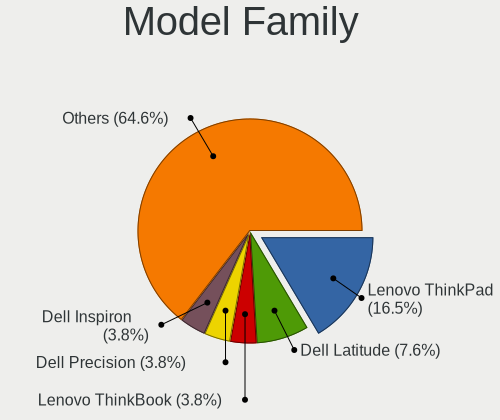
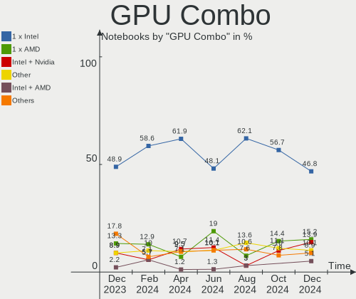
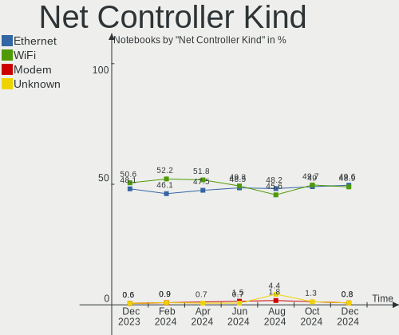
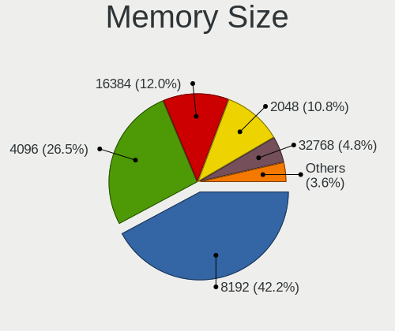
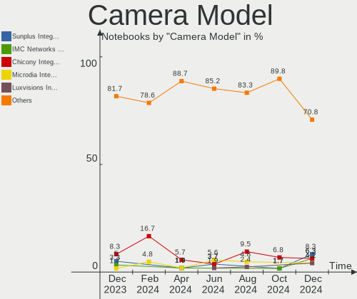
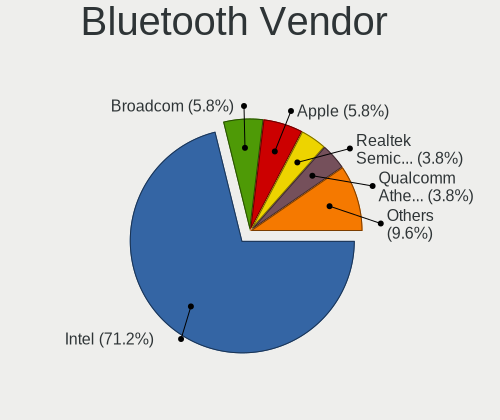

BSD Hardware Trends (Notebook)
------------------------------

A project to identify most popular hardware characteristics and track their change
over time based on data collected by BSD users at https://BSD-Hardware.info.

Anyone can contribute to the study by uploading probes of their computers by
the [hw-probe](https://github.com/linuxhw/hw-probe/blob/master/INSTALL.BSD.md) tool:

    hw-probe -all -upload

Full-feature report is available here: https://bsd-hardware.info/?view=trends&formfactor=notebook

Period: Jun, 2021.

Contents
--------

- [ OS                       ](#os)
- [ OS Family                ](#os-family)
- [ Arch                     ](#arch)
- [ DE                       ](#de)
- [ Display Server           ](#display-server)
- [ Display Manager          ](#display-manager)
- [ OS Lang                  ](#os-lang)
- [ Boot Mode                ](#boot-mode)
- [ Filesystem               ](#filesystem)
- [ Part. scheme             ](#part-scheme)
- [ Country                  ](#country)
- [ City                     ](#city)
- [ Vendor                   ](#vendor)
- [ Model                    ](#model)
- [ Model Family             ](#model-family)
- [ MFG Year                 ](#mfg-year)
- [ Form Factor              ](#form-factor)
- [ Coreboot                 ](#coreboot)
- [ RAM Size                 ](#ram-size)
- [ RAM Used                 ](#ram-used)
- [ Has CD-ROM               ](#has-cd-rom)
- [ Total Drives             ](#total-drives)
- [ Has Ethernet             ](#has-ethernet)
- [ Has WiFi                 ](#has-wifi)
- [ Has Bluetooth            ](#has-bluetooth)
- [ Drive Vendor             ](#drive-vendor)
- [ Drive Model              ](#drive-model)
- [ HDD Vendor               ](#hdd-vendor)
- [ SSD Vendor               ](#ssd-vendor)
- [ Drive Kind               ](#drive-kind)
- [ Drive Connector          ](#drive-connector)
- [ Drive Size               ](#drive-size)
- [ Space Total              ](#space-total)
- [ Space Used               ](#space-used)
- [ Malfunc. Drives          ](#malfunc-drives)
- [ Malfunc. Drive Vendor    ](#malfunc-drive-vendor)
- [ Malfunc. HDD Vendor      ](#malfunc-hdd-vendor)
- [ Malfunc. Drive Kind      ](#malfunc-drive-kind)
- [ Failed Drives            ](#failed-drives)
- [ Failed Drive Vendor      ](#failed-drive-vendor)
- [ Drive Status             ](#drive-status)
- [ Storage Vendor           ](#storage-vendor)
- [ Storage Model            ](#storage-model)
- [ Storage Kind             ](#storage-kind)
- [ CPU Vendor               ](#cpu-vendor)
- [ CPU Model                ](#cpu-model)
- [ CPU Model Family         ](#cpu-model-family)
- [ CPU Cores                ](#cpu-cores)
- [ CPU Sockets              ](#cpu-sockets)
- [ CPU Threads              ](#cpu-threads)
- [ CPU Microarch            ](#cpu-microarch)
- [ GPU Vendor               ](#gpu-vendor)
- [ GPU Model                ](#gpu-model)
- [ GPU Combo                ](#gpu-combo)
- [ GPU Driver               ](#gpu-driver)
- [ GPU Memory               ](#gpu-memory)
- [ Monitor Vendor           ](#monitor-vendor)
- [ Monitor Model            ](#monitor-model)
- [ Monitor Resolution       ](#monitor-resolution)
- [ Monitor Diagonal         ](#monitor-diagonal)
- [ Monitor Width            ](#monitor-width)
- [ Aspect Ratio             ](#aspect-ratio)
- [ Monitor Area             ](#monitor-area)
- [ Pixel Density            ](#pixel-density)
- [ Multiple Monitors        ](#multiple-monitors)
- [ Net Controller Vendor    ](#net-controller-vendor)
- [ Net Controller Model     ](#net-controller-model)
- [ Wireless Vendor          ](#wireless-vendor)
- [ Wireless Model           ](#wireless-model)
- [ Ethernet Vendor          ](#ethernet-vendor)
- [ Ethernet Model           ](#ethernet-model)
- [ Net Controller Kind      ](#net-controller-kind)
- [ Used Controller          ](#used-controller)
- [ NICs                     ](#nics)
- [ IPv6                     ](#ipv6)
- [ Memory Vendor            ](#memory-vendor)
- [ Memory Model             ](#memory-model)
- [ Memory Kind              ](#memory-kind)
- [ Memory Form Factor       ](#memory-form-factor)
- [ Memory Size              ](#memory-size)
- [ Memory Speed             ](#memory-speed)
- [ Sound Vendor             ](#sound-vendor)
- [ Sound Model              ](#sound-model)
- [ Camera Vendor            ](#camera-vendor)
- [ Camera Model             ](#camera-model)
- [ Fingerprint Vendor       ](#fingerprint-vendor)
- [ Fingerprint Model        ](#fingerprint-model)
- [ Chipcard Vendor          ](#chipcard-vendor)
- [ Chipcard Model           ](#chipcard-model)
- [ Printer Vendor           ](#printer-vendor)
- [ Printer Model            ](#printer-model)
- [ Scanner Vendor           ](#scanner-vendor)
- [ Scanner Model            ](#scanner-model)
- [ Bluetooth Vendor         ](#bluetooth-vendor)
- [ Bluetooth Model          ](#bluetooth-model)
- [ Unsupported Devices      ](#unsupported-devices)
- [ Unsupported Device Types ](#unsupported-device-types)

OS
--

Installed operating systems

| Name                 | Notebooks | Percent |
|----------------------|-----------|---------|
| helloSystem 0.5.0    | 31        | 32.29%  |
| FreeBSD 13.0-p2      | 17        | 17.71%  |
| FreeBSD 13.0         | 8         | 8.33%   |
| OpenBSD 6.9          | 7         | 7.29%   |
| helloSystem 0.1.0    | 5         | 5.21%   |
| GhostBSD 20.04.02    | 5         | 5.21%   |
| FreeBSD 14.0-CURRENT | 5         | 5.21%   |
| OPNsense 21.1.6      | 4         | 4.17%   |
| FreeBSD 13.0-STABLE  | 4         | 4.17%   |
| OPNsense 21.1.7      | 2         | 2.08%   |
| FreeBSD 13.0-p1      | 2         | 2.08%   |
| FreeBSD 12.2-p8      | 2         | 2.08%   |
| NomadBSD 5806f915    | 1         | 1.04%   |
| NetBSD 9.2           | 1         | 1.04%   |
| helloSystem 0.4.0    | 1         | 1.04%   |
| FreeBSD 12.2-STABLE  | 1         | 1.04%   |

OS Family
---------

OS without a version

| Name        | Notebooks | Percent |
|-------------|-----------|---------|
| FreeBSD     | 39        | 40.63%  |
| helloSystem | 37        | 38.54%  |
| OpenBSD     | 7         | 7.29%   |
| OPNsense    | 6         | 6.25%   |
| GhostBSD    | 5         | 5.21%   |
| NomadBSD    | 1         | 1.04%   |
| NetBSD      | 1         | 1.04%   |

Arch
----

OS architecture (x86_64, i586, etc.)

| Name  | Notebooks | Percent |
|-------|-----------|---------|
| amd64 | 94        | 97.92%  |
| i386  | 2         | 2.08%   |

DE
--

Desktop Environment

| Name         | Notebooks | Percent |
|--------------|-----------|---------|
| helloDesktop | 37        | 38.54%  |
| XFCE         | 10        | 10.42%  |
| Console      | 10        | 10.42%  |
| KDE5         | 7         | 7.29%   |
| fvwm         | 7         | 7.29%   |
| MATE         | 6         | 6.25%   |
| GNOME        | 4         | 4.17%   |
| TWM          | 3         | 3.13%   |
| LXQt         | 3         | 3.13%   |
| i3           | 2         | 2.08%   |
| Openbox      | 1         | 1.04%   |
| Lumina       | 1         | 1.04%   |
| Fluxbox      | 1         | 1.04%   |
| DWM          | 1         | 1.04%   |
| Cinnamon     | 1         | 1.04%   |
| CDE          | 1         | 1.04%   |
| Awesome      | 1         | 1.04%   |

Display Server
--------------

X11 or Wayland

| Name    | Notebooks | Percent |
|---------|-----------|---------|
| X11     | 85        | 88.54%  |
| Console | 11        | 11.46%  |

Display Manager
---------------

SDDM, LightDM, etc.

| Name    | Notebooks | Percent |
|---------|-----------|---------|
| SLiM    | 43        | 44.79%  |
| Console | 32        | 33.33%  |
| SDDM    | 8         | 8.33%   |
| LightDM | 7         | 7.29%   |
| XDM     | 3         | 3.13%   |
| GDM     | 3         | 3.13%   |

OS Lang
-------

Language

| Lang    | Notebooks | Percent |
|---------|-----------|---------|
| en_US   | 43        | 44.79%  |
| C       | 27        | 28.13%  |
| Unknown | 18        | 18.75%  |
| fr_FR   | 2         | 2.08%   |
| zh_TW   | 1         | 1.04%   |
| zh_CN   | 1         | 1.04%   |
| ru_RU   | 1         | 1.04%   |
| pl_PL   | 1         | 1.04%   |
| en_CA   | 1         | 1.04%   |
| de_CH   | 1         | 1.04%   |

Boot Mode
---------

EFI or BIOS

| Mode | Notebooks | Percent |
|------|-----------|---------|
| EFI  | 72        | 75%     |
| BIOS | 24        | 25%     |

Filesystem
----------

Type of filesystem

| Type | Notebooks | Percent |
|------|-----------|---------|
| Zfs  | 70        | 72.92%  |
| Ufs  | 19        | 19.79%  |
| Ffs  | 7         | 7.29%   |

Part. scheme
------------

Scheme of partitioning

| Type    | Notebooks | Percent |
|---------|-----------|---------|
| GPT     | 86        | 89.58%  |
| MBR     | 8         | 8.33%   |
| BSD     | 1         | 1.04%   |
| Unknown | 1         | 1.04%   |

Country
-------

Geographic location (country)

| Country            | Notebooks | Percent |
|--------------------|-----------|---------|
| USA                | 23        | 23.96%  |
| Poland             | 7         | 7.29%   |
| Brazil             | 7         | 7.29%   |
| Netherlands        | 5         | 5.21%   |
| Germany            | 5         | 5.21%   |
| UK                 | 4         | 4.17%   |
| Russia             | 4         | 4.17%   |
| France             | 4         | 4.17%   |
| India              | 3         | 3.13%   |
| Canada             | 3         | 3.13%   |
| Switzerland        | 2         | 2.08%   |
| Spain              | 2         | 2.08%   |
| Vietnam            | 1         | 1.04%   |
| Ukraine            | 1         | 1.04%   |
| Thailand           | 1         | 1.04%   |
| Taiwan             | 1         | 1.04%   |
| South Africa       | 1         | 1.04%   |
| Serbia             | 1         | 1.04%   |
| Saudi Arabia       | 1         | 1.04%   |
| Portugal           | 1         | 1.04%   |
| Philippines        | 1         | 1.04%   |
| Oman               | 1         | 1.04%   |
| Norway             | 1         | 1.04%   |
| Morocco            | 1         | 1.04%   |
| Mexico             | 1         | 1.04%   |
| Japan              | 1         | 1.04%   |
| Israel             | 1         | 1.04%   |
| Iran               | 1         | 1.04%   |
| Indonesia          | 1         | 1.04%   |
| Hungary            | 1         | 1.04%   |
| Guadeloupe         | 1         | 1.04%   |
| Greece             | 1         | 1.04%   |
| Dominican Republic | 1         | 1.04%   |
| Croatia            | 1         | 1.04%   |
| China              | 1         | 1.04%   |
| Chile              | 1         | 1.04%   |
| Belarus            | 1         | 1.04%   |
| Australia          | 1         | 1.04%   |
| Albania            | 1         | 1.04%   |

City
----

Geographic location (city)

| City               | Notebooks | Percent |
|--------------------|-----------|---------|
| Brooklyn           | 4         | 4.17%   |
| Chrusty            | 3         | 3.13%   |
| Brighton           | 2         | 2.08%   |
| Zagreb             | 1         | 1.04%   |
| Wroclaw            | 1         | 1.04%   |
| Vohringen          | 1         | 1.04%   |
| Vienna             | 1         | 1.04%   |
| Vancouver          | 1         | 1.04%   |
| Utrecht            | 1         | 1.04%   |
| Ufa                | 1         | 1.04%   |
| Thrissur           | 1         | 1.04%   |
| Thessaloniki       | 1         | 1.04%   |
| Tehran             | 1         | 1.04%   |
| São Paulo         | 1         | 1.04%   |
| St. Marys          | 1         | 1.04%   |
| Shenzhen           | 1         | 1.04%   |
| Shasta             | 1         | 1.04%   |
| Sarandë           | 1         | 1.04%   |
| Santo Domingo Este | 1         | 1.04%   |
| Rugby              | 1         | 1.04%   |
| Roosendaal         | 1         | 1.04%   |
| Rodenberg          | 1         | 1.04%   |
| Riyadh             | 1         | 1.04%   |
| Rio de Janeiro     | 1         | 1.04%   |
| Quezon City        | 1         | 1.04%   |
| Poulsbo            | 1         | 1.04%   |
| Portland           | 1         | 1.04%   |
| Ponta Delgada      | 1         | 1.04%   |
| Piloezinhos        | 1         | 1.04%   |
| Osasco             | 1         | 1.04%   |
| Nunoa              | 1         | 1.04%   |
| Northville         | 1         | 1.04%   |
| Noisy-le-Grand     | 1         | 1.04%   |
| Nizwa              | 1         | 1.04%   |
| Niagara Falls      | 1         | 1.04%   |
| New York           | 1         | 1.04%   |
| Nazareth           | 1         | 1.04%   |
| Mumbai             | 1         | 1.04%   |
| Moscow             | 1         | 1.04%   |
| Morden             | 1         | 1.04%   |
| Montreuil          | 1         | 1.04%   |
| Miskolc            | 1         | 1.04%   |
| Minot              | 1         | 1.04%   |
| McLeod             | 1         | 1.04%   |
| Madrid             | 1         | 1.04%   |
| Lyon               | 1         | 1.04%   |
| Lusk               | 1         | 1.04%   |
| Lent               | 1         | 1.04%   |
| Leesville          | 1         | 1.04%   |
| Le Gosier          | 1         | 1.04%   |
| Laval              | 1         | 1.04%   |
| Las Vegas          | 1         | 1.04%   |
| Lake Forest        | 1         | 1.04%   |
| Lajeado            | 1         | 1.04%   |
| Krasnik            | 1         | 1.04%   |
| Krakow             | 1         | 1.04%   |
| Korolyov           | 1         | 1.04%   |
| Khabarovsk         | 1         | 1.04%   |
| Johannesburg       | 1         | 1.04%   |
| Jakarta            | 1         | 1.04%   |

Vendor
------

Motherboard manufacturer

| Name                | Notebooks | Percent |
|---------------------|-----------|---------|
| Lenovo              | 35        | 36.46%  |
| Dell                | 21        | 21.88%  |
| Hewlett-Packard     | 8         | 8.33%   |
| ASUSTek Computer    | 6         | 6.25%   |
| Acer                | 6         | 6.25%   |
| Toshiba             | 4         | 4.17%   |
| Gateway             | 2         | 2.08%   |
| Apple               | 2         | 2.08%   |
| Unknown             | 2         | 2.08%   |
| WYSE                | 1         | 1.04%   |
| Sony                | 1         | 1.04%   |
| SLIMBOOK            | 1         | 1.04%   |
| Samsung Electronics | 1         | 1.04%   |
| Pegatron            | 1         | 1.04%   |
| Notebook            | 1         | 1.04%   |
| LG Electronics      | 1         | 1.04%   |
| IBM                 | 1         | 1.04%   |
| Fujitsu             | 1         | 1.04%   |
| eMachines           | 1         | 1.04%   |

Model
-----

Motherboard model

| Name                                       | Notebooks | Percent |
|--------------------------------------------|-----------|---------|
| Unknown                                    | 3         | 3.13%   |
| Lenovo ThinkPad T60 20076PU                | 2         | 2.08%   |
| Gateway NE56R                              | 2         | 2.08%   |
| Dell Latitude E4300                        | 2         | 2.08%   |
| Dell Inspiron 3542                         | 2         | 2.08%   |
| Dell Inspiron 15-3567                      | 2         | 2.08%   |
| WYSE Z CLASS                               | 1         | 1.04%   |
| Toshiba Satellite C655D                    | 1         | 1.04%   |
| Toshiba Satellite C640                     | 1         | 1.04%   |
| Toshiba PORTEGE Z10t-A                     | 1         | 1.04%   |
| Toshiba PORTEGE R930                       | 1         | 1.04%   |
| Sony SVF1421DSGW                           | 1         | 1.04%   |
| Samsung NC10                               | 1         | 1.04%   |
| Pegatron T12Ah                             | 1         | 1.04%   |
| Notebook N7x0WU                            | 1         | 1.04%   |
| LG E500-GP01A9                             | 1         | 1.04%   |
| Lenovo Yoga 500-14IBD 80N4                 | 1         | 1.04%   |
| Lenovo ThinkPad Yoga 11e 20DAS0AE00        | 1         | 1.04%   |
| Lenovo ThinkPad X270 20HMS0MA18            | 1         | 1.04%   |
| Lenovo ThinkPad X250 20CLS7WY04            | 1         | 1.04%   |
| Lenovo ThinkPad X240 20AMS39F0K            | 1         | 1.04%   |
| Lenovo ThinkPad X230 2325WWB               | 1         | 1.04%   |
| Lenovo ThinkPad X220 4291ON5               | 1         | 1.04%   |
| Lenovo ThinkPad X200 7458VP4               | 1         | 1.04%   |
| Lenovo ThinkPad X1 Carbon Gen 8 20U9001PUS | 1         | 1.04%   |
| Lenovo ThinkPad X1 Carbon 7th 20QD0000US   | 1         | 1.04%   |
| Lenovo ThinkPad W520 42763KU               | 1         | 1.04%   |
| Lenovo ThinkPad T470p 20J6A012CD           | 1         | 1.04%   |
| Lenovo ThinkPad T470 W10DG 20JNS0JU01      | 1         | 1.04%   |
| Lenovo ThinkPad T450s 20BWS0L600           | 1         | 1.04%   |
| Lenovo ThinkPad T440s 20ARS1B704           | 1         | 1.04%   |
| Lenovo ThinkPad T440 20B7S1860W            | 1         | 1.04%   |
| Lenovo ThinkPad T430 23511A6               | 1         | 1.04%   |
| Lenovo ThinkPad T430 2349GCU               | 1         | 1.04%   |
| Lenovo ThinkPad T420 4237A12               | 1         | 1.04%   |
| Lenovo ThinkPad T420 4236NHG               | 1         | 1.04%   |
| Lenovo ThinkPad T420 4236FJ1               | 1         | 1.04%   |
| Lenovo ThinkPad T410 2518A37               | 1         | 1.04%   |
| Lenovo ThinkPad T400 6475K43               | 1         | 1.04%   |
| Lenovo ThinkPad L450 20DTCTO1WW            | 1         | 1.04%   |
| Lenovo ThinkPad Edge E530 62724FU          | 1         | 1.04%   |
| Lenovo ThinkPad E490 20N8CTO1WW            | 1         | 1.04%   |
| Lenovo ThinkPad E14 20RBCTO1WW             | 1         | 1.04%   |
| Lenovo IdeaPad Y700-15ISK 80NV             | 1         | 1.04%   |
| Lenovo IdeaPad S210 Touch 20257            | 1         | 1.04%   |
| Lenovo IdeaPad S145-15IWL 81MV             | 1         | 1.04%   |
| Lenovo IdeaPad 520-15IKB 81BF              | 1         | 1.04%   |
| Lenovo IdeaPad 330-15ARR 81D2              | 1         | 1.04%   |
| Lenovo G500 20236                          | 1         | 1.04%   |
| IBM ThinkPad T42 2374K46                   | 1         | 1.04%   |
| HP ProBook 640 G1                          | 1         | 1.04%   |
| HP Pavilion Gaming Laptop 15-ec1xxx        | 1         | 1.04%   |
| HP Pavilion 17                             | 1         | 1.04%   |
| HP OMEN by HP Laptop                       | 1         | 1.04%   |
| HP ENVY x2 Detachable PC 13                | 1         | 1.04%   |
| HP EliteBook 8570p                         | 1         | 1.04%   |
| HP EliteBook 8530w                         | 1         | 1.04%   |
| HP 255 G2                                  | 1         | 1.04%   |
| Fujitsu LIFEBOOK E780                      | 1         | 1.04%   |
| eMachines eM350                            | 1         | 1.04%   |

Model Family
------------

Motherboard model prefix

| Name              | Notebooks | Percent |
|-------------------|-----------|---------|
| Lenovo ThinkPad   | 28        | 29.17%  |
| Dell Latitude     | 9         | 9.38%   |
| Dell Inspiron     | 6         | 6.25%   |
| Lenovo IdeaPad    | 5         | 5.21%   |
| Acer Aspire       | 5         | 5.21%   |
| Dell Vostro       | 3         | 3.13%   |
| Unknown           | 3         | 3.13%   |
| Toshiba Satellite | 2         | 2.08%   |
| Toshiba PORTEGE   | 2         | 2.08%   |
| HP Pavilion       | 2         | 2.08%   |
| HP EliteBook      | 2         | 2.08%   |
| Gateway NE56R     | 2         | 2.08%   |
| ASUS VivoBook     | 2         | 2.08%   |
| WYSE Z            | 1         | 1.04%   |
| Sony SVF1421DSGW  | 1         | 1.04%   |
| Samsung NC10      | 1         | 1.04%   |
| Pegatron T12Ah    | 1         | 1.04%   |
| Notebook N7x0WU   | 1         | 1.04%   |
| LG E500-GP01A9    | 1         | 1.04%   |
| Lenovo Yoga       | 1         | 1.04%   |
| Lenovo G500       | 1         | 1.04%   |
| IBM ThinkPad      | 1         | 1.04%   |
| HP ProBook        | 1         | 1.04%   |
| HP OMEN           | 1         | 1.04%   |
| HP ENVY           | 1         | 1.04%   |
| HP 255            | 1         | 1.04%   |
| Fujitsu LIFEBOOK  | 1         | 1.04%   |
| eMachines eM350   | 1         | 1.04%   |
| Dell Studio       | 1         | 1.04%   |
| Dell Precision    | 1         | 1.04%   |
| Dell G5           | 1         | 1.04%   |
| ASUS X556UAK      | 1         | 1.04%   |
| ASUS UX330UAK     | 1         | 1.04%   |
| ASUS Strix        | 1         | 1.04%   |
| ASUS G74Sx        | 1         | 1.04%   |
| Apple MacBookPro9 | 1         | 1.04%   |
| Apple MacBookAir6 | 1         | 1.04%   |
| Acer Nitro        | 1         | 1.04%   |

MFG Year
--------

Motherboard manufacture year

| Year | Notebooks | Percent |
|------|-----------|---------|
| 2020 | 22        | 22.92%  |
| 2019 | 15        | 15.63%  |
| 2011 | 10        | 10.42%  |
| 2018 | 9         | 9.38%   |
| 2013 | 9         | 9.38%   |
| 2012 | 6         | 6.25%   |
| 2014 | 5         | 5.21%   |
| 2021 | 3         | 3.13%   |
| 2017 | 3         | 3.13%   |
| 2016 | 3         | 3.13%   |
| 2015 | 3         | 3.13%   |
| 2009 | 3         | 3.13%   |
| 2008 | 2         | 2.08%   |
| 2006 | 2         | 2.08%   |
| 2010 | 1         | 1.04%   |

Form Factor
-----------

Physical design of the computer

| Name     | Notebooks | Percent |
|----------|-----------|---------|
| Notebook | 96        | 100%    |

Coreboot
--------

Have coreboot on board

| Used | Notebooks | Percent |
|------|-----------|---------|
| No   | 96        | 100%    |

RAM Size
--------

Total RAM memory

| Size in GB  | Notebooks | Percent |
|-------------|-----------|---------|
| 8.01-16.0   | 38        | 39.58%  |
| 4.01-8.0    | 29        | 30.21%  |
| 16.01-24.0  | 19        | 19.79%  |
| 2.01-3.0    | 4         | 4.17%   |
| 32.01-64.0  | 2         | 2.08%   |
| 3.01-4.0    | 2         | 2.08%   |
| 64.01-256.0 | 1         | 1.04%   |
| 0.51-1.0    | 1         | 1.04%   |

RAM Used
--------

Used RAM memory

| Used GB  | Notebooks | Percent |
|----------|-----------|---------|
| 0.01-0.5 | 61        | 63.54%  |
| 0.51-1.0 | 27        | 28.13%  |
| 1.01-2.0 | 5         | 5.21%   |
| 2.01-3.0 | 2         | 2.08%   |
| Unknown  | 1         | 1.04%   |

Has CD-ROM
----------

Has CD-ROM on board

| Presented | Notebooks | Percent |
|-----------|-----------|---------|
| No        | 59        | 61.46%  |
| Yes       | 37        | 38.54%  |

Total Drives
------------

Number of drives on board

| Drives | Notebooks | Percent |
|--------|-----------|---------|
| 1      | 74        | 77.08%  |
| 2      | 17        | 17.71%  |
| 0      | 3         | 3.13%   |
| 3      | 2         | 2.08%   |

Has Ethernet
------------

Has Ethernet on board

| Presented | Notebooks | Percent |
|-----------|-----------|---------|
| Yes       | 87        | 90.63%  |
| No        | 9         | 9.38%   |

Has WiFi
--------

Has WiFi module

| Presented | Notebooks | Percent |
|-----------|-----------|---------|
| Yes       | 91        | 94.79%  |
| No        | 5         | 5.21%   |

Has Bluetooth
-------------

Has Bluetooth module

| Presented | Notebooks | Percent |
|-----------|-----------|---------|
| Yes       | 58        | 60.42%  |
| No        | 38        | 39.58%  |

Drive Vendor
------------

Hard drive vendors

| Vendor              | Notebooks | Drives | Percent |
|---------------------|-----------|--------|---------|
| Seagate             | 16        | 18     | 14.68%  |
| Samsung Electronics | 15        | 17     | 13.76%  |
| WDC                 | 12        | 12     | 11.01%  |
| Toshiba             | 12        | 12     | 11.01%  |
| HGST                | 6         | 6      | 5.5%    |
| SK Hynix            | 5         | 5      | 4.59%   |
| Kingston            | 5         | 5      | 4.59%   |
| Crucial             | 5         | 5      | 4.59%   |
| Intel               | 4         | 4      | 3.67%   |
| Hitachi             | 4         | 4      | 3.67%   |
| SanDisk             | 3         | 3      | 2.75%   |
| Patriot             | 3         | 3      | 2.75%   |
| OWC                 | 3         | 3      | 2.75%   |
| Transcend           | 2         | 2      | 1.83%   |
| NVMe                | 2         | 2      | 1.83%   |
| A-DATA Technology   | 2         | 2      | 1.83%   |
| Zheino              | 1         | 1      | 0.92%   |
| PLEXTOR             | 1         | 1      | 0.92%   |
| OCZ                 | 1         | 1      | 0.92%   |
| Micron Technology   | 1         | 1      | 0.92%   |
| LITEON              | 1         | 1      | 0.92%   |
| Hoodisk             | 1         | 1      | 0.92%   |
| Hewlett-Packard     | 1         | 1      | 0.92%   |
| GOODRAM             | 1         | 1      | 0.92%   |
| Fujitsu             | 1         | 1      | 0.92%   |
| Apple               | 1         | 1      | 0.92%   |

Drive Model
-----------

Hard drive models

| Model                                | Notebooks | Percent |
|--------------------------------------|-----------|---------|
| Toshiba MQ01ABF050 500GB             | 2         | 1.79%   |
| Toshiba MQ01ABD100 1TB               | 2         | 1.79%   |
| Toshiba MK3265GSXN 320GB             | 2         | 1.79%   |
| SK Hynix HFS128G39TND-N210A 128GB    | 2         | 1.79%   |
| Seagate ST9500325AS 500GB            | 2         | 1.79%   |
| Seagate ST1000LM035-1RK172 1TB       | 2         | 1.79%   |
| Samsung SSD 850 EVO 250GB            | 2         | 1.79%   |
| Patriot Burst 120GB                  | 2         | 1.79%   |
| Kingston SA400S37240G 240GB          | 2         | 1.79%   |
| Zheino CHN-mSATAQ3-120 120GB         | 1         | 0.89%   |
| WDC WDS240G2G0A-00JH30 240GB         | 1         | 0.89%   |
| WDC WDS120G2G0B-00EPW0 120GB         | 1         | 0.89%   |
| WDC WDBNCE2500PNC 250GB              | 1         | 0.89%   |
| WDC WD800BEVS-00RST0 80GB            | 1         | 0.89%   |
| WDC WD7500BPVX-60JC3T0 752GB         | 1         | 0.89%   |
| WDC WD5000LPVX-60V0TT0 500GB         | 1         | 0.89%   |
| WDC WD3200BEKT-75PVMT1 320GB         | 1         | 0.89%   |
| WDC WD2500BEVT-75ZCT2 250GB          | 1         | 0.89%   |
| WDC WD10SPZX-08Z10 1TB               | 1         | 0.89%   |
| WDC PC SN730 SDBQNTY-512G-1001 512GB | 1         | 0.89%   |
| WDC PC SN730 NVMe 1024GB             | 1         | 0.89%   |
| WDC PC SN530 SDBPNPZ-256G-1002 256GB | 1         | 0.89%   |
| Transcend TS512GMTS430S 512GB        | 1         | 0.89%   |
| Transcend TS256GMTS430S 256GB        | 1         | 0.89%   |
| Toshiba THNSNC128GMLJ 128GB          | 1         | 0.89%   |
| Toshiba MQ04ABF100 1TB               | 1         | 0.89%   |
| Toshiba MQ01ABD075 752GB             | 1         | 0.89%   |
| Toshiba MK5061GSY 500GB              | 1         | 0.89%   |
| Toshiba KXG50PNV2T04 NVMe 2048GB     | 1         | 0.89%   |
| Toshiba KBG40ZNS256G NVMe 256GB      | 1         | 0.89%   |
| SK Hynix SC311 SATA 512GB            | 1         | 0.89%   |
| SK Hynix SC308 SATA 256GB            | 1         | 0.89%   |
| SK Hynix BC511 NVMe 256GB            | 1         | 0.89%   |
| Seagate ST9320423AS 320GB            | 1         | 0.89%   |
| Seagate ST9250827AS 250GB            | 1         | 0.89%   |
| Seagate ST9160412ASG 160GB           | 1         | 0.89%   |
| Seagate ST500LX003-1AC15G 500GB      | 1         | 0.89%   |
| Seagate ST500LT012-9WS142 500GB      | 1         | 0.89%   |
| Seagate ST500LT012-1DG142 500GB      | 1         | 0.89%   |
| Seagate ST500LM012 HN-M500MBB 500GB  | 1         | 0.89%   |
| Seagate ST500LM000-SSHD-8GB          | 1         | 0.89%   |
| Seagate ST500LM000-1EJ162 500GB      | 1         | 0.89%   |
| Seagate ST320LT012-9WS14C 320GB      | 1         | 0.89%   |
| Seagate ST320LT007-9ZV142 320GB      | 1         | 0.89%   |
| Seagate ST2000LX001-1RG174 2TB       | 1         | 0.89%   |
| Seagate ST1000LM048-2E7172 1TB       | 1         | 0.89%   |
| SanDisk SSD PLUS 120GB               | 1         | 0.89%   |
| SanDisk SDSSDP064G 64GB              | 1         | 0.89%   |
| SanDisk SD8SBAT256G1002 256GB        | 1         | 0.89%   |
| Samsung SSD 970 EVO 250GB            | 1         | 0.89%   |
| Samsung SSD 870 QVO 1TB              | 1         | 0.89%   |
| Samsung SSD 860 EVO 500GB            | 1         | 0.89%   |
| Samsung SSD 850 PRO 512GB            | 1         | 0.89%   |
| Samsung SSD 850 EVO 500GB            | 1         | 0.89%   |
| Samsung SSD 840 Series 120GB         | 1         | 0.89%   |
| Samsung SSD 840 EVO 250GB            | 1         | 0.89%   |
| Samsung MZVLW512HMJP-000L7 512GB     | 1         | 0.89%   |
| Samsung MZVLB256HBHQ-000L7 256GB     | 1         | 0.89%   |
| Samsung MZNTE256HMHP-000H1 256GB     | 1         | 0.89%   |
| Samsung MZNLN512HMJP-000H1 512GB     | 1         | 0.89%   |

HDD Vendor
----------

Hard disk drive vendors

| Vendor              | Notebooks | Drives | Percent |
|---------------------|-----------|--------|---------|
| Seagate             | 16        | 18     | 35.56%  |
| Toshiba             | 9         | 9      | 20%     |
| WDC                 | 6         | 6      | 13.33%  |
| HGST                | 6         | 6      | 13.33%  |
| Hitachi             | 4         | 4      | 8.89%   |
| NVMe                | 2         | 2      | 4.44%   |
| Samsung Electronics | 1         | 1      | 2.22%   |
| Fujitsu             | 1         | 1      | 2.22%   |

SSD Vendor
----------

Solid state drive vendors

| Vendor              | Notebooks | Drives | Percent |
|---------------------|-----------|--------|---------|
| Samsung Electronics | 12        | 13     | 23.08%  |
| SK Hynix            | 4         | 4      | 7.69%   |
| Kingston            | 4         | 4      | 7.69%   |
| Crucial             | 4         | 4      | 7.69%   |
| WDC                 | 3         | 3      | 5.77%   |
| SanDisk             | 3         | 3      | 5.77%   |
| Patriot             | 3         | 3      | 5.77%   |
| OWC                 | 3         | 3      | 5.77%   |
| Intel               | 3         | 3      | 5.77%   |
| Transcend           | 2         | 2      | 3.85%   |
| Zheino              | 1         | 1      | 1.92%   |
| Toshiba             | 1         | 1      | 1.92%   |
| PLEXTOR             | 1         | 1      | 1.92%   |
| OCZ                 | 1         | 1      | 1.92%   |
| Micron Technology   | 1         | 1      | 1.92%   |
| LITEON              | 1         | 1      | 1.92%   |
| Hoodisk             | 1         | 1      | 1.92%   |
| Hewlett-Packard     | 1         | 1      | 1.92%   |
| GOODRAM             | 1         | 1      | 1.92%   |
| Apple               | 1         | 1      | 1.92%   |
| A-DATA Technology   | 1         | 1      | 1.92%   |

Drive Kind
----------

HDD or SSD

| Kind | Notebooks | Drives | Percent |
|------|-----------|--------|---------|
| SSD  | 48        | 53     | 46.6%   |
| HDD  | 43        | 47     | 41.75%  |
| NVMe | 12        | 13     | 11.65%  |

Drive Connector
---------------

SATA, SAS, NVMe, etc.

| Type | Notebooks | Drives | Percent |
|------|-----------|--------|---------|
| SATA | 85        | 100    | 87.63%  |
| NVMe | 12        | 13     | 12.37%  |

Drive Size
----------

Size of hard drive

| Size in TB | Notebooks | Drives | Percent |
|------------|-----------|--------|---------|
| 0.01-0.5   | 67        | 74     | 74.44%  |
| 0.51-1.0   | 20        | 22     | 22.22%  |
| 1.01-2.0   | 3         | 4      | 3.33%   |

Space Total
-----------

Amount of disk space available on the file system

| Size in GB | Notebooks | Percent |
|------------|-----------|---------|
| 251-500    | 27        | 28.13%  |
| 101-250    | 25        | 26.04%  |
| 1-20       | 25        | 26.04%  |
| 501-1000   | 7         | 7.29%   |
| 51-100     | 6         | 6.25%   |
| 21-50      | 3         | 3.13%   |
| 1001-2000  | 3         | 3.13%   |

Space Used
----------

Amount of used disk space

| Used GB  | Notebooks | Percent |
|----------|-----------|---------|
| 1-20     | 79        | 82.29%  |
| 21-50    | 10        | 10.42%  |
| 51-100   | 5         | 5.21%   |
| 101-250  | 1         | 1.04%   |
| 501-1000 | 1         | 1.04%   |

Malfunc. Drives
---------------

Drive models with a malfunction

| Model                               | Notebooks | Drives | Percent |
|-------------------------------------|-----------|--------|---------|
| Toshiba MK3265GSXN 320GB            | 2         | 2      | 11.11%  |
| WDC WD5000LPVX-60V0TT0 500GB        | 1         | 1      | 5.56%   |
| Toshiba MQ01ABD075 752GB            | 1         | 1      | 5.56%   |
| SK Hynix HFS128G39TND-N210A 128GB   | 1         | 1      | 5.56%   |
| Seagate ST9500325AS 500GB           | 1         | 1      | 5.56%   |
| Seagate ST9320423AS 320GB           | 1         | 1      | 5.56%   |
| Seagate ST500LT012-9WS142 500GB     | 1         | 1      | 5.56%   |
| Seagate ST500LM012 HN-M500MBB 500GB | 1         | 1      | 5.56%   |
| Seagate ST320LT012-9WS14C 320GB     | 1         | 1      | 5.56%   |
| Seagate ST320LT007-9ZV142 320GB     | 1         | 1      | 5.56%   |
| Seagate ST2000LX001-1RG174 2TB      | 1         | 2      | 5.56%   |
| Seagate ST1000LM035-1RK172 1TB      | 1         | 1      | 5.56%   |
| Samsung Electronics HM160HI 160GB   | 1         | 1      | 5.56%   |
| Hitachi HTS541612J9SA00 120GB       | 1         | 1      | 5.56%   |
| HGST HTS725050A7E630 500GB          | 1         | 1      | 5.56%   |
| HGST HTE725032A7E630 320GB          | 1         | 1      | 5.56%   |
| Hewlett-Packard SSD S700 1TB        | 1         | 1      | 5.56%   |

Malfunc. Drive Vendor
---------------------

Vendors of faulty drives

| Vendor              | Notebooks | Drives | Percent |
|---------------------|-----------|--------|---------|
| Seagate             | 8         | 9      | 44.44%  |
| Toshiba             | 3         | 3      | 16.67%  |
| HGST                | 2         | 2      | 11.11%  |
| WDC                 | 1         | 1      | 5.56%   |
| SK Hynix            | 1         | 1      | 5.56%   |
| Samsung Electronics | 1         | 1      | 5.56%   |
| Hitachi             | 1         | 1      | 5.56%   |
| Hewlett-Packard     | 1         | 1      | 5.56%   |

Malfunc. HDD Vendor
-------------------

Vendors of faulty HDD drives

| Vendor              | Notebooks | Drives | Percent |
|---------------------|-----------|--------|---------|
| Seagate             | 8         | 9      | 50%     |
| Toshiba             | 3         | 3      | 18.75%  |
| HGST                | 2         | 2      | 12.5%   |
| WDC                 | 1         | 1      | 6.25%   |
| Samsung Electronics | 1         | 1      | 6.25%   |
| Hitachi             | 1         | 1      | 6.25%   |

Malfunc. Drive Kind
-------------------

Kinds of faulty drives

| Kind | Notebooks | Drives | Percent |
|------|-----------|--------|---------|
| HDD  | 16        | 17     | 88.89%  |
| SSD  | 2         | 2      | 11.11%  |

Failed Drives
-------------

Failed drive models

Zero info for selected period =(

Failed Drive Vendor
-------------------

Failed drive vendors

Zero info for selected period =(

Drive Status
------------

Number of failed and malfunc. drives

| Status   | Notebooks | Drives | Percent |
|----------|-----------|--------|---------|
| Works    | 76        | 92     | 79.17%  |
| Malfunc  | 18        | 19     | 18.75%  |
| Detected | 2         | 2      | 2.08%   |

Storage Vendor
--------------

Storage controller vendors

| Vendor                      | Notebooks | Percent |
|-----------------------------|-----------|---------|
| Intel                       | 83        | 77.57%  |
| AMD                         | 9         | 8.41%   |
| Sandisk                     | 4         | 3.74%   |
| Samsung Electronics         | 4         | 3.74%   |
| KIOXIA                      | 2         | 1.87%   |
| Toshiba                     | 1         | 0.93%   |
| SK Hynix                    | 1         | 0.93%   |
| Realtek Semiconductor       | 1         | 0.93%   |
| Micron Technology           | 1         | 0.93%   |
| Kingston Technology Company | 1         | 0.93%   |

Storage Model
-------------

Storage controller models

| Model                                                                          | Notebooks | Percent |
|--------------------------------------------------------------------------------|-----------|---------|
| Intel 7 Series Chipset Family 6-port SATA Controller [AHCI mode]               | 14        | 12.17%  |
| Intel Sunrise Point-LP SATA Controller [AHCI mode]                             | 10        | 8.7%    |
| Intel 6 Series/C200 Series Chipset Family 6 port Mobile SATA AHCI Controller   | 9         | 7.83%   |
| Intel 8 Series SATA Controller 1 [AHCI mode]                                   | 7         | 6.09%   |
| AMD FCH SATA Controller [AHCI mode]                                            | 7         | 6.09%   |
| Intel Wildcat Point-LP SATA Controller [AHCI Mode]                             | 6         | 5.22%   |
| Intel 82801IBM/IEM (ICH9M/ICH9M-E) 4 port SATA Controller [AHCI mode]          | 4         | 3.48%   |
| Intel 82801 Mobile SATA Controller [RAID mode]                                 | 4         | 3.48%   |
| Sandisk WD Black SN750 / PC SN730 NVMe SSD                                     | 3         | 2.61%   |
| Intel HM170/QM170 Chipset SATA Controller [AHCI Mode]                          | 3         | 2.61%   |
| Intel Comet Lake SATA AHCI Controller                                          | 3         | 2.61%   |
| Intel Cannon Point-LP SATA Controller [AHCI Mode]                              | 3         | 2.61%   |
| Intel 5 Series/3400 Series Chipset 6 port SATA AHCI Controller                 | 3         | 2.61%   |
| Samsung NVMe SSD Controller SM981/PM981/PM983                                  | 2         | 1.74%   |
| KIOXIA unknown                                                                 | 2         | 1.74%   |
| Intel Cannon Lake Mobile PCH SATA AHCI Controller                              | 2         | 1.74%   |
| Intel 82801HM/HEM (ICH8M/ICH8M-E) SATA Controller [AHCI mode]                  | 2         | 1.74%   |
| Intel 82801HM/HEM (ICH8M/ICH8M-E) IDE Controller                               | 2         | 1.74%   |
| Intel 82801GBM/GHM (ICH7-M Family) SATA Controller [AHCI mode]                 | 2         | 1.74%   |
| Intel 82801G (ICH7 Family) IDE Controller                                      | 2         | 1.74%   |
| Intel 8 Series/C220 Series Chipset Family 6-port SATA Controller 1 [AHCI mode] | 2         | 1.74%   |
| Intel 5 Series/3400 Series Chipset 4 port SATA AHCI Controller                 | 2         | 1.74%   |
| AMD SB7x0/SB8x0/SB9x0 SATA Controller [AHCI mode]                              | 2         | 1.74%   |
| Unknown                                                                        | 2         | 1.74%   |
| Toshiba unknown                                                                | 1         | 0.87%   |
| SK Hynix BC511                                                                 | 1         | 0.87%   |
| Sandisk WD Blue SN550 NVMe SSD                                                 | 1         | 0.87%   |
| Samsung NVMe SSD Controller SM961/PM961/SM963                                  | 1         | 0.87%   |
| Samsung Apple PCIe SSD                                                         | 1         | 0.87%   |
| Kingston Company A2000 NVMe SSD                                                | 1         | 0.87%   |
| Intel SSD 660P Series                                                          | 1         | 0.87%   |
| Intel Q170/Q150/B150/H170/H110/Z170/CM236 Chipset SATA Controller [AHCI Mode]  | 1         | 0.87%   |
| Intel NM10/ICH7 Family SATA Controller [AHCI mode]                             | 1         | 0.87%   |
| Intel Mobile 4 Series Chipset PT IDER Controller                               | 1         | 0.87%   |
| Intel Celeron N3350/Pentium N4200/Atom E3900 Series SATA AHCI Controller       | 1         | 0.87%   |
| Intel Atom Processor E3800 Series SATA AHCI Controller                         | 1         | 0.87%   |
| Intel 82801IBM/IEM (ICH9M/ICH9M-E) 2 port SATA Controller [IDE mode]           | 1         | 0.87%   |
| Intel 82801GBM/GHM (ICH7-M Family) SATA Controller [IDE mode]                  | 1         | 0.87%   |
| Intel 82801DBM (ICH4-M) IDE Controller                                         | 1         | 0.87%   |
| Intel 5 Series/3400 Series Chipset PT IDER Controller                          | 1         | 0.87%   |
| AMD FCH IDE Controller                                                         | 1         | 0.87%   |

Storage Kind
------------

Kind of storage controller (IDE, SATA, NVMe, SAS, ...)

| Kind | Notebooks | Percent |
|------|-----------|---------|
| SATA | 86        | 75.44%  |
| NVMe | 14        | 12.28%  |
| IDE  | 10        | 8.77%   |
| RAID | 4         | 3.51%   |

CPU Vendor
----------

Processor vendors

| Vendor | Notebooks | Percent |
|--------|-----------|---------|
| Intel  | 87        | 90.63%  |
| AMD    | 9         | 9.38%   |

CPU Model
---------

Processor models

| Model                                | Notebooks | Percent |
|--------------------------------------|-----------|---------|
| Intel Core i5-10210U CPU @ 1.60GHz   | 4         | 4.17%   |
| Intel Core i5-8265U CPU @ 1.60GHz    | 3         | 3.13%   |
| Intel Core i5-2520M CPU @ 2.50GHz    | 3         | 3.13%   |
| Intel Core 2 Duo                     | 3         | 3.13%   |
| Intel CPU Version                    | 2         | 2.08%   |
| Intel Core i7-8750H CPU @ 2.20GHz    | 2         | 2.08%   |
| Intel Core i7-7500U CPU @ 2.70GHz    | 2         | 2.08%   |
| Intel Core i5-8250U CPU @ 1.60GHz    | 2         | 2.08%   |
| Intel Core i5-7300U CPU @ 2.60GHz    | 2         | 2.08%   |
| Intel Core i5-7200U CPU @ 2.50GHz    | 2         | 2.08%   |
| Intel Core i5-5300U CPU @ 2.30GHz    | 2         | 2.08%   |
| Intel Core i5-4300U CPU @ 1.90GHz    | 2         | 2.08%   |
| Intel Core i5-3320M CPU @ 2.60GHz    | 2         | 2.08%   |
| Intel Core i5-3230M CPU @ 2.60GHz    | 2         | 2.08%   |
| Intel Core i3-5005U CPU @ 2.00GHz    | 2         | 2.08%   |
| Intel Core 2 Duo CPU P8700 @ 2.53GHz | 2         | 2.08%   |
| Intel Core 2 CPU                     | 2         | 2.08%   |
| Intel Processor 5Y70 CPU @ 1.10GHz   | 1         | 1.04%   |
| Intel Pentium M processor            | 1         | 1.04%   |
| Intel Pentium CPU N4200 @ 1.10GHz    | 1         | 1.04%   |
| Intel Pentium CPU 5405U @ 2.30GHz    | 1         | 1.04%   |
| Intel Core i7-8565U CPU @ 1.80GHz    | 1         | 1.04%   |
| Intel Core i7-6820HQ CPU @ 2.70GHz   | 1         | 1.04%   |
| Intel Core i7-6700HQ CPU @ 2.60GHz   | 1         | 1.04%   |
| Intel Core i7-4650U CPU @ 1.70GHz    | 1         | 1.04%   |
| Intel Core i7-4600U CPU @ 2.10GHz    | 1         | 1.04%   |
| Intel Core i7-3720QM CPU @ 2.60GHz   | 1         | 1.04%   |
| Intel Core i7-3520M CPU @ 2.90GHz    | 1         | 1.04%   |
| Intel Core i7-2860QM CPU @ 2.50GHz   | 1         | 1.04%   |
| Intel Core i7-2760QM CPU @ 2.40GHz   | 1         | 1.04%   |
| Intel Core i5-8365U CPU @ 1.60GHz    | 1         | 1.04%   |
| Intel Core i5-7300HQ CPU @ 2.50GHz   | 1         | 1.04%   |
| Intel Core i5-6300U CPU @ 2.40GHz    | 1         | 1.04%   |
| Intel Core i5-6300HQ CPU @ 2.30GHz   | 1         | 1.04%   |
| Intel Core i5-5200U CPU @ 2.20GHz    | 1         | 1.04%   |
| Intel Core i5-4300M CPU @ 2.60GHz    | 1         | 1.04%   |
| Intel Core i5-4250U CPU @ 1.30GHz    | 1         | 1.04%   |
| Intel Core i5-4210Y CPU @ 1.50GHz    | 1         | 1.04%   |
| Intel Core i5-4210U CPU @ 1.70GHz    | 1         | 1.04%   |
| Intel Core i5-4200M CPU @ 2.50GHz    | 1         | 1.04%   |
| Intel Core i5-3340M CPU @ 2.70GHz    | 1         | 1.04%   |
| Intel Core i5-3210M CPU @ 2.50GHz    | 1         | 1.04%   |
| Intel Core i5-2540M CPU @ 2.60GHz    | 1         | 1.04%   |
| Intel Core i5-2520M CPU @ 2.50GH     | 1         | 1.04%   |
| Intel Core i5 CPU M 560 @ 2.67GH     | 1         | 1.04%   |
| Intel Core i5 CPU M 540 @ 2.53GHz    | 1         | 1.04%   |
| Intel Core i5 CPU M 520 @ 2.40GHz    | 1         | 1.04%   |
| Intel Core i3-8130U CPU @ 2.20GHz    | 1         | 1.04%   |
| Intel Core i3-7100U CPU @ 2.40GHz    | 1         | 1.04%   |
| Intel Core i3-6006U CPU @ 2.00GHz    | 1         | 1.04%   |
| Intel Core i3-4005U CPU @ 1.70GHz    | 1         | 1.04%   |
| Intel Core i3-3217U CPU @ 1.80GHz    | 1         | 1.04%   |
| Intel Core i3-3120M CPU @ 2.50GHz    | 1         | 1.04%   |
| Intel Core i3-2375M CPU @ 1.50GHz    | 1         | 1.04%   |
| Intel Core i3-2370M CPU @ 2.40GHz    | 1         | 1.04%   |
| Intel Core i3-2330M CPU @ 2.20GHz    | 1         | 1.04%   |
| Intel Core i3-2310M CPU @ 2.10GH     | 1         | 1.04%   |
| Intel Core i3 CPU M 390 @ 2.67GHz    | 1         | 1.04%   |
| Intel Core 2 Duo CPU T9900 @ 3.06GHz | 1         | 1.04%   |
| Intel Core 2 Duo CPU T9600 @ 2.80GHz | 1         | 1.04%   |

CPU Model Family
----------------

Processor model prefix

| Model            | Notebooks | Percent |
|------------------|-----------|---------|
| Intel Core i5    | 41        | 42.71%  |
| Intel Core i7    | 13        | 13.54%  |
| Intel Core i3    | 13        | 13.54%  |
| Intel Core 2 Duo | 8         | 8.33%   |
| Other            | 3         | 3.13%   |
| Intel Celeron    | 3         | 3.13%   |
| Intel Pentium    | 2         | 2.08%   |
| Intel Core 2     | 2         | 2.08%   |
| AMD Ryzen 3      | 2         | 2.08%   |
| AMD A10          | 2         | 2.08%   |
| Intel Pentium M  | 1         | 1.04%   |
| Intel Atom       | 1         | 1.04%   |
| AMD Ryzen 7      | 1         | 1.04%   |
| AMD Ryzen 5      | 1         | 1.04%   |
| AMD G            | 1         | 1.04%   |
| AMD E1           | 1         | 1.04%   |
| AMD C-50         | 1         | 1.04%   |

CPU Cores
---------

Number of processor cores

| Number  | Notebooks | Percent |
|---------|-----------|---------|
| 2       | 58        | 60.42%  |
| 4       | 24        | 25%     |
| Unknown | 7         | 7.29%   |
| 1       | 3         | 3.13%   |
| 6       | 2         | 2.08%   |
| 16      | 1         | 1.04%   |
| 12      | 1         | 1.04%   |

CPU Sockets
-----------

Number of sockets

| Number  | Notebooks | Percent |
|---------|-----------|---------|
| 1       | 95        | 98.96%  |
| Unknown | 1         | 1.04%   |

CPU Threads
-----------

Threads per core (Hyper-Threading)

| Number  | Notebooks | Percent |
|---------|-----------|---------|
| 2       | 70        | 72.92%  |
| 1       | 18        | 18.75%  |
| Unknown | 8         | 8.33%   |

CPU Microarch
-------------

Microarchitecture

| Name        | Notebooks | Percent |
|-------------|-----------|---------|
| KabyLake    | 23        | 23.96%  |
| SandyBridge | 12        | 12.5%   |
| IvyBridge   | 11        | 11.46%  |
| Haswell     | 10        | 10.42%  |
| Penryn      | 6         | 6.25%   |
| Broadwell   | 6         | 6.25%   |
| Westmere    | 5         | 5.21%   |
| Skylake     | 5         | 5.21%   |
| Core        | 4         | 4.17%   |
| Zen 2       | 2         | 2.08%   |
| Bonnell     | 2         | 2.08%   |
| Bobcat      | 2         | 2.08%   |
| Zen+        | 1         | 1.04%   |
| Zen         | 1         | 1.04%   |
| Silvermont  | 1         | 1.04%   |
| Puma        | 1         | 1.04%   |
| Piledriver  | 1         | 1.04%   |
| P6          | 1         | 1.04%   |
| Jaguar      | 1         | 1.04%   |
| Goldmont    | 1         | 1.04%   |

GPU Vendor
----------

Vendors of graphics cards

| Vendor | Notebooks | Percent |
|--------|-----------|---------|
| Intel  | 79        | 73.15%  |
| Nvidia | 15        | 13.89%  |
| AMD    | 14        | 12.96%  |

GPU Model
---------

Graphics card models

| Model                                                                              | Notebooks | Percent |
|------------------------------------------------------------------------------------|-----------|---------|
| Intel 3rd Gen Core processor Graphics Controller                                   | 10        | 8.93%   |
| Intel 2nd Generation Core Processor Family Integrated Graphics Controller          | 10        | 8.93%   |
| Intel HD Graphics 620                                                              | 7         | 6.25%   |
| Intel Haswell-ULT Integrated Graphics Controller                                   | 7         | 6.25%   |
| Intel WhiskeyLake-U GT2 [UHD Graphics 620]                                         | 5         | 4.46%   |
| Intel Mobile 4 Series Chipset Integrated Graphics Controller                       | 5         | 4.46%   |
| Intel HD Graphics 5500                                                             | 5         | 4.46%   |
| Intel Core Processor Integrated Graphics Controller                                | 4         | 3.57%   |
| Intel CometLake-U GT2 [UHD Graphics]                                               | 4         | 3.57%   |
| Intel UHD Graphics 620                                                             | 3         | 2.68%   |
| Intel HD Graphics 530                                                              | 3         | 2.68%   |
| Nvidia GF117M [GeForce 610M/710M/810M/820M / GT 620M/625M/630M/720M]               | 2         | 1.79%   |
| Intel Skylake GT2 [HD Graphics 520]                                                | 2         | 1.79%   |
| Intel Mobile GM965/GL960 Integrated Graphics Controller (secondary)                | 2         | 1.79%   |
| Intel Mobile GM965/GL960 Integrated Graphics Controller (primary)                  | 2         | 1.79%   |
| Intel CoffeeLake-H GT2 [UHD Graphics 630]                                          | 2         | 1.79%   |
| Intel 4th Gen Core Processor Integrated Graphics Controller                        | 2         | 1.79%   |
| AMD RV515/M54 [Mobility Radeon X1400]                                              | 2         | 1.79%   |
| AMD Renoir                                                                         | 2         | 1.79%   |
| Nvidia TU117M                                                                      | 1         | 0.89%   |
| Nvidia GT218M [NVS 3100M]                                                          | 1         | 0.89%   |
| Nvidia GP108M [GeForce MX230]                                                      | 1         | 0.89%   |
| Nvidia GP107M [GeForce GTX 1050 Ti Mobile]                                         | 1         | 0.89%   |
| Nvidia GP107M [GeForce GTX 1050 Mobile]                                            | 1         | 0.89%   |
| Nvidia GM108M [GeForce MX130]                                                      | 1         | 0.89%   |
| Nvidia GM108M [GeForce 940M]                                                       | 1         | 0.89%   |
| Nvidia GM108M [GeForce 940MX]                                                      | 1         | 0.89%   |
| Nvidia GM107M [GeForce GTX 950M]                                                   | 1         | 0.89%   |
| Nvidia GK107M [GeForce GT 650M Mac Edition]                                        | 1         | 0.89%   |
| Nvidia GF116M [GeForce GT 560M]                                                    | 1         | 0.89%   |
| Nvidia GF108GLM [Quadro 1000M]                                                     | 1         | 0.89%   |
| Nvidia G96GLM [Quadro FX 770M]                                                     | 1         | 0.89%   |
| Intel Mobile 945GSE Express Integrated Graphics Controller                         | 1         | 0.89%   |
| Intel Mobile 945GM/GMS/GME, 943/940GML Express Integrated Graphics Controller      | 1         | 0.89%   |
| Intel HD Graphics 630                                                              | 1         | 0.89%   |
| Intel HD Graphics 5300                                                             | 1         | 0.89%   |
| Intel Haswell-ULT High Definition Audio Controller [HD Graphics]                   | 1         | 0.89%   |
| Intel Coffee Lake UHD 610 Graphics Controller                                      | 1         | 0.89%   |
| Intel Celeron N3350/Pentium N4200/Atom E3900 Series Integrated Graphics Controller | 1         | 0.89%   |
| Intel Atom Processor Z36xxx/Z37xxx Series Graphics & Display                       | 1         | 0.89%   |
| Intel Atom Processor D4xx/D5xx/N4xx/N5xx Integrated Graphics Controller            | 1         | 0.89%   |
| AMD Wrestler [Radeon HD 6310]                                                      | 1         | 0.89%   |
| AMD Wrestler [Radeon HD 6250]                                                      | 1         | 0.89%   |
| AMD Venus XTX [Radeon HD 8890M / R9 M275X/M375X]                                   | 1         | 0.89%   |
| AMD Thames [Radeon HD 7550M/7570M/7650M]                                           | 1         | 0.89%   |
| AMD RV200/M7 [Mobility Radeon 7500]                                                | 1         | 0.89%   |
| AMD Richland [Radeon HD 8610G]                                                     | 1         | 0.89%   |
| AMD Raven Ridge [Radeon Vega Series / Radeon Vega Mobile Series]                   | 1         | 0.89%   |
| AMD Picasso                                                                        | 1         | 0.89%   |
| AMD Navi 10 [Radeon RX 5600 OEM/5600 XT / 5700/5700 XT]                            | 1         | 0.89%   |
| AMD Mullins [Radeon R6 Graphics]                                                   | 1         | 0.89%   |
| AMD Kabini [Radeon HD 8210]                                                        | 1         | 0.89%   |

GPU Combo
---------

Combinations of graphics cards

| Name           | Notebooks | Percent |
|----------------|-----------|---------|
| 1 x Intel      | 59        | 61.46%  |
| 1 x AMD        | 11        | 11.46%  |
| Intel + Nvidia | 10        | 10.42%  |
| 2 x Intel      | 9         | 9.38%   |
| 1 x Nvidia     | 4         | 4.17%   |
| 2 x AMD        | 1         | 1.04%   |
| Intel + AMD    | 1         | 1.04%   |
| AMD + Nvidia   | 1         | 1.04%   |

GPU Driver
----------

Free vs proprietary

| Driver      | Notebooks | Percent |
|-------------|-----------|---------|
| Free        | 92        | 95.83%  |
| Proprietary | 3         | 3.13%   |
| Unknown     | 1         | 1.04%   |

GPU Memory
----------

Total video memory

| Size in GB | Notebooks | Percent |
|------------|-----------|---------|
| Unknown    | 84        | 87.5%   |
| 0.01-0.5   | 7         | 7.29%   |
| 1.01-2.0   | 2         | 2.08%   |
| 0.51-1.0   | 2         | 2.08%   |
| 2.01-3.0   | 1         | 1.04%   |

Monitor Vendor
--------------

Monitor vendors

| Vendor                  | Notebooks | Percent |
|-------------------------|-----------|---------|
| AU Optronics            | 19        | 23.17%  |
| LG Display              | 16        | 19.51%  |
| Chimei Innolux          | 12        | 14.63%  |
| BOE                     | 11        | 13.41%  |
| Lenovo                  | 4         | 4.88%   |
| Hewlett-Packard         | 3         | 3.66%   |
| InfoVision              | 2         | 2.44%   |
| Dell                    | 2         | 2.44%   |
| Chi Mei Optoelectronics | 2         | 2.44%   |
| Sony                    | 1         | 1.22%   |
| Sharp                   | 1         | 1.22%   |
| Samsung Electronics     | 1         | 1.22%   |
| Philips                 | 1         | 1.22%   |
| LGD                     | 1         | 1.22%   |
| Goldstar                | 1         | 1.22%   |
| CPT                     | 1         | 1.22%   |
| BenQ                    | 1         | 1.22%   |
| ASUSTek Computer        | 1         | 1.22%   |
| Apple                   | 1         | 1.22%   |
| AOC                     | 1         | 1.22%   |

Monitor Model
-------------

Monitor models

| Model                                                                    | Notebooks | Percent |
|--------------------------------------------------------------------------|-----------|---------|
| AU Optronics LCD Monitor AUO26EC 1366x768 340x190mm 15.3-inch            | 3         | 3.66%   |
| AU Optronics LCD Monitor AUO313C 1366x768 310x170mm 13.9-inch            | 2         | 2.44%   |
| AU Optronics LCD Monitor AUO22EC 1366x768 340x190mm 15.3-inch            | 2         | 2.44%   |
| Sony SDM-HS95P SNY2500 1280x1024 380x300mm 19.1-inch                     | 1         | 1.22%   |
| Sharp LCD Monitor SHP143A 3840x2160 350x190mm 15.7-inch                  | 1         | 1.22%   |
| Samsung Electronics LCD Monitor SEC544B 1600x900 310x170mm 13.9-inch     | 1         | 1.22%   |
| Philips LCD Monitor PHL08C3 1920x1080 600x340mm 27.2-inch                | 1         | 1.22%   |
| LGD LCD Monitor 1920x1080                                                | 1         | 1.22%   |
| LG Display LCD Monitor LGD11F9 1280x800 290x180mm 13.4-inch              | 1         | 1.22%   |
| LG Display LCD Monitor LGD05FA 1920x1080 310x170mm 13.9-inch             | 1         | 1.22%   |
| LG Display LCD Monitor LGD05D8 1920x1080 340x190mm 15.3-inch             | 1         | 1.22%   |
| LG Display LCD Monitor LGD0545 3200x1800 290x170mm 13.2-inch             | 1         | 1.22%   |
| LG Display LCD Monitor LGD0532 1920x1080 340x190mm 15.3-inch             | 1         | 1.22%   |
| LG Display LCD Monitor LGD0459 1920x1080 380x210mm 17.1-inch             | 1         | 1.22%   |
| LG Display LCD Monitor LGD0456 1366x768 340x190mm 15.3-inch              | 1         | 1.22%   |
| LG Display LCD Monitor LGD0446 1920x1080 310x170mm 13.9-inch             | 1         | 1.22%   |
| LG Display LCD Monitor LGD03D3 1600x900 310x170mm 13.9-inch              | 1         | 1.22%   |
| LG Display LCD Monitor LGD0372 1600x900 380x210mm 17.1-inch              | 1         | 1.22%   |
| LG Display LCD Monitor LGD0362 1600x900 310x170mm 13.9-inch              | 1         | 1.22%   |
| LG Display LCD Monitor LGD02E2 1600x900 310x170mm 13.9-inch              | 1         | 1.22%   |
| LG Display LCD Monitor LGD02DC 1366x768 340x190mm 15.3-inch              | 1         | 1.22%   |
| LG Display LCD Monitor LGD02D8 1366x768 280x160mm 12.7-inch              | 1         | 1.22%   |
| LG Display LCD Monitor LGD029B 1366x768 310x170mm 13.9-inch              | 1         | 1.22%   |
| LG Display LCD Monitor LGD0258 1600x900 350x190mm 15.7-inch              | 1         | 1.22%   |
| Lenovo LCD Monitor LEN40B1 1600x900 340x190mm 15.3-inch                  | 1         | 1.22%   |
| Lenovo LCD Monitor LEN4033 1440x900 300x190mm 14.0-inch                  | 1         | 1.22%   |
| Lenovo LCD Monitor LEN4022 1400x1050 290x210mm 14.1-inch                 | 1         | 1.22%   |
| Lenovo LCD Monitor LEN4011 1280x800 260x160mm 12.0-inch                  | 1         | 1.22%   |
| InfoVision LCD Monitor IVO04E3 1366x768 280x160mm 12.7-inch              | 1         | 1.22%   |
| InfoVision LCD Monitor IVO03F4 1024x600 220x130mm 10.1-inch              | 1         | 1.22%   |
| Hewlett-Packard LA2306 HWP2949 1920x1080 510x290mm 23.1-inch             | 1         | 1.22%   |
| Hewlett-Packard L200hx HWP298F 1600x900 450x250mm 20.3-inch              | 1         | 1.22%   |
| Hewlett-Packard 22w HPN342E 1920x1080 480x270mm 21.7-inch                | 1         | 1.22%   |
| Goldstar LG FULL HD GSM5B55 1920x1080 480x270mm 21.7-inch                | 1         | 1.22%   |
| Dell U2414H DELA0A2 1920x1080 530x300mm 24.0-inch                        | 1         | 1.22%   |
| Dell E2013H DELD05C 1600x900 440x250mm 19.9-inch                         | 1         | 1.22%   |
| CPT LCD Monitor CPT04C4 1024x600 230x140mm 10.6-inch                     | 1         | 1.22%   |
| Chimei Innolux LCD Monitor CMN1747 1920x1080 380x210mm 17.1-inch         | 1         | 1.22%   |
| Chimei Innolux LCD Monitor CMN15F5 1920x1080 340x190mm 15.3-inch         | 1         | 1.22%   |
| Chimei Innolux LCD Monitor CMN15D5 1920x1080 340x190mm 15.3-inch         | 1         | 1.22%   |
| Chimei Innolux LCD Monitor CMN15A9 1366x768 340x190mm 15.3-inch          | 1         | 1.22%   |
| Chimei Innolux LCD Monitor CMN14D6 1366x768 310x170mm 13.9-inch          | 1         | 1.22%   |
| Chimei Innolux LCD Monitor CMN14D4 1920x1080 310x170mm 13.9-inch         | 1         | 1.22%   |
| Chimei Innolux LCD Monitor CMN14D2 1920x1080 310x170mm 13.9-inch         | 1         | 1.22%   |
| Chimei Innolux LCD Monitor CMN14C9 1920x1080 310x170mm 13.9-inch         | 1         | 1.22%   |
| Chimei Innolux LCD Monitor CMN1482 1600x900 310x170mm 13.9-inch          | 1         | 1.22%   |
| Chimei Innolux LCD Monitor CMN1472 1366x768 310x170mm 13.9-inch          | 1         | 1.22%   |
| Chimei Innolux LCD Monitor CMN1404 1920x1080 310x170mm 13.9-inch         | 1         | 1.22%   |
| Chimei Innolux LCD Monitor CMN1239 1920x1080 280x160mm 12.7-inch         | 1         | 1.22%   |
| Chi Mei Optoelectronics LCD Monitor CMO15A7 1366x768 350x190mm 15.7-inch | 1         | 1.22%   |
| Chi Mei Optoelectronics LCD Monitor CMO15A3 1366x768 350x190mm 15.7-inch | 1         | 1.22%   |
| BOE LCD Monitor BOE0806 1920x1080 310x170mm 13.9-inch                    | 1         | 1.22%   |
| BOE LCD Monitor BOE07F7 1920x1080 310x170mm 13.9-inch                    | 1         | 1.22%   |
| BOE LCD Monitor BOE0757 1366x768 340x190mm 15.3-inch                     | 1         | 1.22%   |
| BOE LCD Monitor BOE0729 1920x1080 340x190mm 15.3-inch                    | 1         | 1.22%   |
| BOE LCD Monitor BOE06C8 1366x768 280x160mm 12.7-inch                     | 1         | 1.22%   |
| BOE LCD Monitor BOE06C6 1920x1080 340x190mm 15.3-inch                    | 1         | 1.22%   |
| BOE LCD Monitor BOE06C2 1366x768 340x190mm 15.3-inch                     | 1         | 1.22%   |
| BOE LCD Monitor BOE0674 1366x768 340x190mm 15.3-inch                     | 1         | 1.22%   |
| BOE LCD Monitor BOE0615 1366x768 340x190mm 15.3-inch                     | 1         | 1.22%   |

Monitor Resolution
------------------

Monitor screen resolution

| Resolution       | Notebooks | Percent |
|------------------|-----------|---------|
| 1920x1080 (FHD)  | 28        | 35.44%  |
| 1366x768 (WXGA)  | 28        | 35.44%  |
| 1600x900 (HD+)   | 10        | 12.66%  |
| 1280x800 (WXGA)  | 4         | 5.06%   |
| 3840x2160 (4K)   | 2         | 2.53%   |
| 1024x600         | 2         | 2.53%   |
| 3200x1800 (QHD+) | 1         | 1.27%   |
| 2560x1440 (QHD)  | 1         | 1.27%   |
| 1440x900 (WXGA+) | 1         | 1.27%   |
| 1400x1050        | 1         | 1.27%   |
| 1280x1024 (SXGA) | 1         | 1.27%   |

Monitor Diagonal
----------------

Diagonal size in inches

| Inches  | Notebooks | Percent |
|---------|-----------|---------|
| 15      | 27        | 32.93%  |
| 13      | 25        | 30.49%  |
| 12      | 6         | 7.32%   |
| 11      | 5         | 6.1%    |
| 27      | 3         | 3.66%   |
| 17      | 3         | 3.66%   |
| 24      | 2         | 2.44%   |
| 21      | 2         | 2.44%   |
| 19      | 2         | 2.44%   |
| 14      | 2         | 2.44%   |
| 10      | 2         | 2.44%   |
| 23      | 1         | 1.22%   |
| 20      | 1         | 1.22%   |
| Unknown | 1         | 1.22%   |

Monitor Width
-------------

Physical width

| Width in mm | Notebooks | Percent |
|-------------|-----------|---------|
| 301-350     | 49        | 60.49%  |
| 201-300     | 18        | 22.22%  |
| 501-600     | 4         | 4.94%   |
| 401-500     | 4         | 4.94%   |
| 351-400     | 4         | 4.94%   |
| 601-700     | 1         | 1.23%   |
| Unknown     | 1         | 1.23%   |

Aspect Ratio
------------

Proportional relationship between the width and the height

| Ratio   | Notebooks | Percent |
|---------|-----------|---------|
| 16/9    | 64        | 87.67%  |
| 16/10   | 6         | 8.22%   |
| 5/4     | 1         | 1.37%   |
| 4/3     | 1         | 1.37%   |
| Unknown | 1         | 1.37%   |

Monitor Area
------------

Area in inch²

| Area in inch² | Notebooks | Percent |
|----------------|-----------|---------|
| 81-90          | 25        | 30.49%  |
| 91-100         | 22        | 26.83%  |
| 61-70          | 6         | 7.32%   |
| 101-110        | 6         | 7.32%   |
| 51-60          | 5         | 6.1%    |
| 201-250        | 5         | 6.1%    |
| 301-350        | 3         | 3.66%   |
| 151-200        | 3         | 3.66%   |
| 121-130        | 3         | 3.66%   |
| 41-50          | 2         | 2.44%   |
| 71-80          | 1         | 1.22%   |
| Unknown        | 1         | 1.22%   |

Pixel Density
-------------

Pixels per inch

| Density       | Notebooks | Percent |
|---------------|-----------|---------|
| 121-160       | 39        | 48.75%  |
| 101-120       | 27        | 33.75%  |
| 51-100        | 9         | 11.25%  |
| More than 240 | 2         | 2.5%    |
| 161-240       | 2         | 2.5%    |
| Unknown       | 1         | 1.25%   |

Multiple Monitors
-----------------

Total monitors connected

| Total | Notebooks | Percent |
|-------|-----------|---------|
| 1     | 68        | 70.83%  |
| 0     | 18        | 18.75%  |
| 2     | 10        | 10.42%  |

Net Controller Vendor
---------------------

Controller vendors

| Vendor                   | Notebooks | Percent |
|--------------------------|-----------|---------|
| Intel                    | 68        | 45.95%  |
| Realtek Semiconductor    | 41        | 27.7%   |
| Qualcomm Atheros         | 19        | 12.84%  |
| Broadcom                 | 10        | 6.76%   |
| TP-Link                  | 3         | 2.03%   |
| Edimax Technology        | 2         | 1.35%   |
| Toshiba                  | 1         | 0.68%   |
| Ralink Technology        | 1         | 0.68%   |
| Marvell Technology Group | 1         | 0.68%   |
| Hewlett-Packard          | 1         | 0.68%   |
| D-Link                   | 1         | 0.68%   |

Net Controller Model
--------------------

Controller models

| Model                                                                   | Notebooks | Percent |
|-------------------------------------------------------------------------|-----------|---------|
| Realtek RTL8111/8168/8411 PCI Express Gigabit Ethernet Controller       | 28        | 14.43%  |
| Intel 82579LM Gigabit Network Connection (Lewisville)                   | 11        | 5.67%   |
| Realtek RTL810xE PCI Express Fast Ethernet controller                   | 9         | 4.64%   |
| Intel Centrino Advanced-N 6205 [Taylor Peak]                            | 7         | 3.61%   |
| Intel Wireless 7260                                                     | 6         | 3.09%   |
| Qualcomm Atheros QCA9565 / AR9565 Wireless Network Adapter              | 5         | 2.58%   |
| Intel Wireless 8265 / 8275                                              | 5         | 2.58%   |
| Intel Wireless 8260                                                     | 4         | 2.06%   |
| Intel Wireless 7265                                                     | 4         | 2.06%   |
| Intel Comet Lake PCH-LP CNVi WiFi                                       | 4         | 2.06%   |
| Intel Cannon Point-LP CNVi [Wireless-AC]                                | 4         | 2.06%   |
| Intel 82567LM Gigabit Network Connection                                | 4         | 2.06%   |
| Qualcomm Atheros AR9485 Wireless Network Adapter                        | 3         | 1.55%   |
| Qualcomm Atheros AR9285 Wireless Network Adapter (PCI-Express)          | 3         | 1.55%   |
| Intel Ultimate N WiFi Link 5300                                         | 3         | 1.55%   |
| Intel Ethernet Connection I218-LM                                       | 3         | 1.55%   |
| Intel 82577LM Gigabit Network Connection                                | 3         | 1.55%   |
| Broadcom NetLink BCM57785 Gigabit Ethernet PCIe                         | 3         | 1.55%   |
| TP-Link AC600 wireless Realtek RTL8811AU [Archer T2U Nano]              | 2         | 1.03%   |
| Realtek RTL8821CE 802.11ac PCIe Wireless Network Adapter                | 2         | 1.03%   |
| Realtek RTL8188EUS 802.11n Wireless Network Adapter                     | 2         | 1.03%   |
| Qualcomm Atheros QCA9377 802.11ac Wireless Network Adapter              | 2         | 1.03%   |
| Qualcomm Atheros AR242x / AR542x Wireless Network Adapter (PCI-Express) | 2         | 1.03%   |
| Intel Wireless 3165                                                     | 2         | 1.03%   |
| Intel WiFi Link 5100                                                    | 2         | 1.03%   |
| Intel PRO/Wireless 3945ABG [Golan] Network Connection                   | 2         | 1.03%   |
| Intel Ethernet Connection (4) I219-LM                                   | 2         | 1.03%   |
| Intel Ethernet Connection (3) I218-LM                                   | 2         | 1.03%   |
| Intel Dual Band Wireless-AC 3168NGW [Stone Peak]                        | 2         | 1.03%   |
| Intel Centrino Wireless-N 2230                                          | 2         | 1.03%   |
| Intel Centrino Ultimate-N 6300                                          | 2         | 1.03%   |
| Intel Centrino Advanced-N 6235                                          | 2         | 1.03%   |
| Intel Cannon Lake PCH CNVi WiFi                                         | 2         | 1.03%   |
| Intel 82573L Gigabit Ethernet Controller                                | 2         | 1.03%   |
| Broadcom BCM43142 802.11b/g/n                                           | 2         | 1.03%   |
| TP-Link TP-Link High Power Wireless USB Adapter                         | 1         | 0.52%   |
| Toshiba Ericsson H5321gw for TOSHIBA Mobile Broadband Network Adapter   | 1         | 0.52%   |
| Realtek RTL8822CE 802.11ac PCIe Wireless Network Adapter                | 1         | 0.52%   |
| Realtek RTL8192EE PCIe Wireless Network Adapter                         | 1         | 0.52%   |
| Realtek RTL8188SU 802.11n WLAN Adapter                                  | 1         | 0.52%   |
| Realtek RTL8188EE Wireless Network Adapter                              | 1         | 0.52%   |
| Realtek RTL8188CUS 802.11n WLAN Adapter                                 | 1         | 0.52%   |
| Realtek RTL8188CE 802.11b/g/n WiFi Adapter                              | 1         | 0.52%   |
| Realtek RTL8169 PCI Gigabit Ethernet Controller                         | 1         | 0.52%   |
| Ralink RT5370 Wireless Adapter                                          | 1         | 0.52%   |
| Qualcomm Atheros QCA8172 Fast Ethernet                                  | 1         | 0.52%   |
| Qualcomm Atheros AR9462 Wireless Network Adapter                        | 1         | 0.52%   |
| Qualcomm Atheros AR9287 Wireless Network Adapter (PCI-Express)          | 1         | 0.52%   |
| Qualcomm Atheros AR8152 v2.0 Fast Ethernet                              | 1         | 0.52%   |
| Qualcomm Atheros AR8152 v1.1 Fast Ethernet                              | 1         | 0.52%   |
| Qualcomm Atheros AR8132 Fast Ethernet                                   | 1         | 0.52%   |
| Qualcomm Atheros AR5212 802.11abg NIC                                   | 1         | 0.52%   |
| Marvell Group 88E8040 PCI-E Fast Ethernet Controller                    | 1         | 0.52%   |
| Intel Wireless-AC 9260                                                  | 1         | 0.52%   |
| Intel Wireless 3160                                                     | 1         | 0.52%   |
| Intel Wi-Fi 6 AX200                                                     | 1         | 0.52%   |
| Intel PRO/Wireless 5100 AGN [Shiloh] Network Connection                 | 1         | 0.52%   |
| Intel PRO/Wireless 4965 AG or AGN [Kedron] Network Connection           | 1         | 0.52%   |
| Intel I210 Gigabit Network Connection                                   | 1         | 0.52%   |
| Intel Ethernet Connection I219-LM                                       | 1         | 0.52%   |

Wireless Vendor
---------------

Wireless vendors

| Vendor                | Notebooks | Percent |
|-----------------------|-----------|---------|
| Intel                 | 61        | 61%     |
| Qualcomm Atheros      | 18        | 18%     |
| Realtek Semiconductor | 9         | 9%      |
| Broadcom              | 5         | 5%      |
| TP-Link               | 3         | 3%      |
| Edimax Technology     | 2         | 2%      |
| Ralink Technology     | 1         | 1%      |
| D-Link                | 1         | 1%      |

Wireless Model
--------------

Wireless models

| Model                                                                   | Notebooks | Percent |
|-------------------------------------------------------------------------|-----------|---------|
| Intel Centrino Advanced-N 6205 [Taylor Peak]                            | 7         | 6.93%   |
| Intel Wireless 7260                                                     | 6         | 5.94%   |
| Qualcomm Atheros QCA9565 / AR9565 Wireless Network Adapter              | 5         | 4.95%   |
| Intel Wireless 8265 / 8275                                              | 5         | 4.95%   |
| Intel Wireless 8260                                                     | 4         | 3.96%   |
| Intel Wireless 7265                                                     | 4         | 3.96%   |
| Intel Comet Lake PCH-LP CNVi WiFi                                       | 4         | 3.96%   |
| Intel Cannon Point-LP CNVi [Wireless-AC]                                | 4         | 3.96%   |
| Qualcomm Atheros AR9485 Wireless Network Adapter                        | 3         | 2.97%   |
| Qualcomm Atheros AR9285 Wireless Network Adapter (PCI-Express)          | 3         | 2.97%   |
| Intel Ultimate N WiFi Link 5300                                         | 3         | 2.97%   |
| TP-Link AC600 wireless Realtek RTL8811AU [Archer T2U Nano]              | 2         | 1.98%   |
| Realtek RTL8821CE 802.11ac PCIe Wireless Network Adapter                | 2         | 1.98%   |
| Realtek RTL8188EUS 802.11n Wireless Network Adapter                     | 2         | 1.98%   |
| Qualcomm Atheros QCA9377 802.11ac Wireless Network Adapter              | 2         | 1.98%   |
| Qualcomm Atheros AR242x / AR542x Wireless Network Adapter (PCI-Express) | 2         | 1.98%   |
| Intel Wireless 3165                                                     | 2         | 1.98%   |
| Intel WiFi Link 5100                                                    | 2         | 1.98%   |
| Intel PRO/Wireless 3945ABG [Golan] Network Connection                   | 2         | 1.98%   |
| Intel Dual Band Wireless-AC 3168NGW [Stone Peak]                        | 2         | 1.98%   |
| Intel Centrino Wireless-N 2230                                          | 2         | 1.98%   |
| Intel Centrino Advanced-N 6235                                          | 2         | 1.98%   |
| Intel Cannon Lake PCH CNVi WiFi                                         | 2         | 1.98%   |
| Broadcom BCM43142 802.11b/g/n                                           | 2         | 1.98%   |
| TP-Link TP-Link High Power Wireless USB Adapter                         | 1         | 0.99%   |
| Realtek RTL8822CE 802.11ac PCIe Wireless Network Adapter                | 1         | 0.99%   |
| Realtek RTL8192EE PCIe Wireless Network Adapter                         | 1         | 0.99%   |
| Realtek RTL8188SU 802.11n WLAN Adapter                                  | 1         | 0.99%   |
| Realtek RTL8188EE Wireless Network Adapter                              | 1         | 0.99%   |
| Realtek RTL8188CUS 802.11n WLAN Adapter                                 | 1         | 0.99%   |
| Realtek RTL8188CE 802.11b/g/n WiFi Adapter                              | 1         | 0.99%   |
| Ralink RT5370 Wireless Adapter                                          | 1         | 0.99%   |
| Qualcomm Atheros AR9462 Wireless Network Adapter                        | 1         | 0.99%   |
| Qualcomm Atheros AR9287 Wireless Network Adapter (PCI-Express)          | 1         | 0.99%   |
| Qualcomm Atheros AR5212 802.11abg NIC                                   | 1         | 0.99%   |
| Intel Wireless-AC 9260                                                  | 1         | 0.99%   |
| Intel Wireless 3160                                                     | 1         | 0.99%   |
| Intel Wi-Fi 6 AX200                                                     | 1         | 0.99%   |
| Intel PRO/Wireless 5100 AGN [Shiloh] Network Connection                 | 1         | 0.99%   |
| Intel PRO/Wireless 4965 AG or AGN [Kedron] Network Connection           | 1         | 0.99%   |
| Intel Dual Band Wireless-AC 3165 Plus Bluetooth                         | 1         | 0.99%   |
| Intel Centrino Wireless-N 2200                                          | 1         | 0.99%   |
| Intel Centrino Wireless-N 1000 [Condor Peak]                            | 1         | 0.99%   |
| Intel Centrino Ultimate-N 6300                                          | 1         | 0.99%   |
| Intel Centrino Advanced-N 6200                                          | 1         | 0.99%   |
| Edimax EW-7811Un 802.11n Wireless Adapter [Realtek RTL8188CUS]          | 1         | 0.99%   |
| Edimax Edimax AC600 Wireless LAN USB Adapter                            | 1         | 0.99%   |
| D-Link DWA-131 Wireless N Nano Adapter (Rev. E1) [Realtek RTL8192EU]    | 1         | 0.99%   |
| Broadcom BCM4360 802.11ac Wireless Network Adapter                      | 1         | 0.99%   |
| Broadcom BCM4331 802.11a/b/g/n                                          | 1         | 0.99%   |
| Broadcom BCM43228 802.11a/b/g/n                                         | 1         | 0.99%   |

Ethernet Vendor
---------------

Ethernet vendors

| Vendor                   | Notebooks | Percent |
|--------------------------|-----------|---------|
| Intel                    | 39        | 43.82%  |
| Realtek Semiconductor    | 38        | 42.7%   |
| Broadcom                 | 7         | 7.87%   |
| Qualcomm Atheros         | 4         | 4.49%   |
| Marvell Technology Group | 1         | 1.12%   |

Ethernet Model
--------------

Ethernet models

| Model                                                             | Notebooks | Percent |
|-------------------------------------------------------------------|-----------|---------|
| Realtek RTL8111/8168/8411 PCI Express Gigabit Ethernet Controller | 28        | 31.46%  |
| Intel 82579LM Gigabit Network Connection (Lewisville)             | 11        | 12.36%  |
| Realtek RTL810xE PCI Express Fast Ethernet controller             | 9         | 10.11%  |
| Intel 82567LM Gigabit Network Connection                          | 4         | 4.49%   |
| Intel Ethernet Connection I218-LM                                 | 3         | 3.37%   |
| Intel 82577LM Gigabit Network Connection                          | 3         | 3.37%   |
| Broadcom NetLink BCM57785 Gigabit Ethernet PCIe                   | 3         | 3.37%   |
| Intel Ethernet Connection (4) I219-LM                             | 2         | 2.25%   |
| Intel Ethernet Connection (3) I218-LM                             | 2         | 2.25%   |
| Intel 82573L Gigabit Ethernet Controller                          | 2         | 2.25%   |
| Realtek RTL8169 PCI Gigabit Ethernet Controller                   | 1         | 1.12%   |
| Qualcomm Atheros QCA8172 Fast Ethernet                            | 1         | 1.12%   |
| Qualcomm Atheros AR8152 v2.0 Fast Ethernet                        | 1         | 1.12%   |
| Qualcomm Atheros AR8152 v1.1 Fast Ethernet                        | 1         | 1.12%   |
| Qualcomm Atheros AR8132 Fast Ethernet                             | 1         | 1.12%   |
| Marvell Group 88E8040 PCI-E Fast Ethernet Controller              | 1         | 1.12%   |
| Intel I210 Gigabit Network Connection                             | 1         | 1.12%   |
| Intel Ethernet Connection I219-LM                                 | 1         | 1.12%   |
| Intel Ethernet Connection I218-V                                  | 1         | 1.12%   |
| Intel Ethernet Connection I217-V                                  | 1         | 1.12%   |
| Intel Ethernet Connection I217-LM                                 | 1         | 1.12%   |
| Intel Ethernet Connection (6) I219-LM                             | 1         | 1.12%   |
| Intel Ethernet Connection (5) I219-V                              | 1         | 1.12%   |
| Intel Ethernet Connection (3) I218-V                              | 1         | 1.12%   |
| Intel Ethernet Connection (2) I219-LM                             | 1         | 1.12%   |
| Intel Ethernet Connection (10) I219-V                             | 1         | 1.12%   |
| Intel 82567LF Gigabit Network Connection                          | 1         | 1.12%   |
| Intel 82540EP Gigabit Ethernet Controller (Mobile)                | 1         | 1.12%   |
| Broadcom NetXtreme BCM57765 Gigabit Ethernet PCIe                 | 1         | 1.12%   |
| Broadcom NetXtreme BCM57762 Gigabit Ethernet PCIe                 | 1         | 1.12%   |
| Broadcom NetXtreme BCM5761 Gigabit Ethernet PCIe                  | 1         | 1.12%   |
| Broadcom NetXtreme BCM5755M Gigabit Ethernet PCI Express          | 1         | 1.12%   |

Net Controller Kind
-------------------

Ethernet, WiFi or modem

| Kind     | Notebooks | Percent |
|----------|-----------|---------|
| WiFi     | 91        | 50%     |
| Ethernet | 87        | 47.8%   |
| Modem    | 3         | 1.65%   |
| Unknown  | 1         | 0.55%   |

Used Controller
---------------

Currently used network controller

| Kind     | Notebooks | Percent |
|----------|-----------|---------|
| Ethernet | 81        | 50%     |
| WiFi     | 78        | 48.15%  |
| Modem    | 2         | 1.23%   |
| Unknown  | 1         | 0.62%   |

NICs
----

Total network controllers on board

| Total | Notebooks | Percent |
|-------|-----------|---------|
| 2     | 81        | 84.38%  |
| 1     | 12        | 12.5%   |
| 3     | 2         | 2.08%   |
| 6     | 1         | 1.04%   |

IPv6
----

IPv6 vs IPv4

| Used | Notebooks | Percent |
|------|-----------|---------|
| No   | 85        | 88.54%  |
| Yes  | 11        | 11.46%  |

Memory Vendor
-------------

Memory module vendors

| Vendor              | Notebooks | Percent |
|---------------------|-----------|---------|
| Samsung Electronics | 31        | 28.18%  |
| SK Hynix            | 17        | 15.45%  |
| Unknown             | 12        | 10.91%  |
| Micron Technology   | 11        | 10%     |
| Kingston            | 9         | 8.18%   |
| Crucial             | 7         | 6.36%   |
| Smart               | 4         | 3.64%   |
| Ramaxel Technology  | 3         | 2.73%   |
| A-DATA Technology   | 3         | 2.73%   |
| Corsair             | 2         | 1.82%   |
| Apacer              | 2         | 1.82%   |
| Transcend           | 1         | 0.91%   |
| Smart Brazil        | 1         | 0.91%   |
| SHARETRONIC         | 1         | 0.91%   |
| Patriot             | 1         | 0.91%   |
| Nanya Technology    | 1         | 0.91%   |
| High Bridge         | 1         | 0.91%   |
| GOODRAM             | 1         | 0.91%   |
| Golden Empire       | 1         | 0.91%   |
| ELPIDA              | 1         | 0.91%   |

Memory Model
------------

Memory module models

| Model                                                        | Notebooks | Percent |
|--------------------------------------------------------------|-----------|---------|
| Samsung RAM M471B5273CH0-CH9 4GB SODIMM DDR3 1333MT/s        | 4         | 3.51%   |
| Samsung RAM M471B5273DH0-CH9 4GB SODIMM DDR3 1334MT/s        | 3         | 2.63%   |
| Unknown RAM Module 8GB SODIMM DDR3 1600MT/s                  | 2         | 1.75%   |
| Unknown RAM Module 4GB SODIMM DDR3 1333MT/s                  | 2         | 1.75%   |
| Unknown RAM Module 2GB SODIMM DDR2                           | 2         | 1.75%   |
| Smart RAM SH564568FH8NZPHSCR 2GB SODIMM DDR3 1334MT/s        | 2         | 1.75%   |
| SK Hynix RAM HMT351S6BFR8C-H9 4GB SODIMM DDR3 1333MT/s       | 2         | 1.75%   |
| Samsung RAM M471B5773DH0-CH9 2GB SODIMM DDR3 1333MT/s        | 2         | 1.75%   |
| Samsung RAM M471B5173QH0-YK0 4GB SODIMM DDR3 1600MT/s        | 2         | 1.75%   |
| Samsung RAM M471A2K43DB1-CTD 16GB SODIMM DDR4 2667MT/s       | 2         | 1.75%   |
| Micron RAM 4ATF51264HZ-2G3B1 4GB SODIMM DDR4 2400MT/s        | 2         | 1.75%   |
| Unknown SODIMM 1GB SODIMM DDR2 533MT/s                       | 1         | 0.88%   |
| Unknown RAM Module 8GB SODIMM DDR3 1333MT/s                  | 1         | 0.88%   |
| Unknown RAM Module 2GB SODIMM DDR3                           | 1         | 0.88%   |
| Unknown RAM Module 2048MB SODIMM DDR2 667MT/s                | 1         | 0.88%   |
| Unknown RAM Module 1GB SODIMM DDR2                           | 1         | 0.88%   |
| Unknown RAM Module 1GB SODIMM DDR                            | 1         | 0.88%   |
| Transcend RAM TS4L30BA20SNS1 4GB SODIMM DDR3 800MT/s         | 1         | 0.88%   |
| Smart RAM SH564568FH8NWPHSFR 2GB SODIMM DDR3 1333MT/s        | 1         | 0.88%   |
| Smart RAM SH564128FJ8NZRNSDR 4GB SODIMM DDR3 1600MT/s        | 1         | 0.88%   |
| Smart RAM SF4641G8CK8IEHLSBG 8GB SODIMM DDR4 2667MT/s        | 1         | 0.88%   |
| Smart Brazil RAM SF4641G8CK8IEHLSBG 8GB SODIMM DDR4 2133MT/s | 1         | 0.88%   |
| SK Hynix RAM Module 4GB SODIMM DDR3 1600MT/s                 | 1         | 0.88%   |
| SK Hynix RAM Module 2GB DDR3 1600MT/s                        | 1         | 0.88%   |
| SK Hynix RAM HYMP512S64CP8-Y5 1GB SODIMM DDR 667MT/s         | 1         | 0.88%   |
| SK Hynix RAM HYMP125S64CP8-S6 2GB SODIMM DDR2 800MT/s        | 1         | 0.88%   |
| SK Hynix RAM HMT451S6BFR8A-PB 4GB SODIMM DDR3 1600MT/s       | 1         | 0.88%   |
| SK Hynix RAM HMT451S6AFR8A-PB 4GB SODIMM DDR3 1600MT/s       | 1         | 0.88%   |
| SK Hynix RAM HMT41GS6BFR8A-PB 8GB SODIMM DDR3 1600MT/s       | 1         | 0.88%   |
| SK Hynix RAM HMT351S6CFR8C-PB 4GB SODIMM DDR3 1600MT/s       | 1         | 0.88%   |
| SK Hynix RAM HMT351S6CFR8A-PB 4GB SODIMM DDR3 1333MT/s       | 1         | 0.88%   |
| SK Hynix RAM HMT325S6BFR8C-H9 2GB SODIMM DDR3 1333MT/s       | 1         | 0.88%   |
| SK Hynix RAM HMA851S6JJR6N-VK 4GB SODIMM DDR4 2667MT/s       | 1         | 0.88%   |
| SK Hynix RAM HMA851S6AFR6N-UH 4GB SODIMM DDR4 2400MT/s       | 1         | 0.88%   |
| SK Hynix RAM HMA82GS6AFR8N-UH 16GB SODIMM DDR4 2400MT/s      | 1         | 0.88%   |
| SK Hynix RAM HMA81GS6AFR8N-UH 8GB SODIMM DDR4 2400MT/s       | 1         | 0.88%   |
| SK Hynix RAM HMA41GS6AFR8N-TF 8GB SODIMM DDR4 2133MT/s       | 1         | 0.88%   |
| SHARETRONIC RAM Module 2GB SODIMM DDR3 1600MT/s              | 1         | 0.88%   |
| Samsung RAM Module 8GB Row Of Chips LPDDR3 2133MT/s          | 1         | 0.88%   |
| Samsung RAM M471B5773DH0-CK0 2GB SODIMM DDR3 1600MT/s        | 1         | 0.88%   |
| Samsung RAM M471B5773CHS-CH9 2GB SODIMM DDR3 1333MT/s        | 1         | 0.88%   |
| Samsung RAM M471B5673EH1-CF8 2GB SODIMM DDR3 1067MT/s        | 1         | 0.88%   |
| Samsung RAM M471B5673DZ1-CF8 2GB SODIMM DDR3 1066MT/s        | 1         | 0.88%   |
| Samsung RAM M471B5273DH0-CK0 4GB SODIMM DDR3 1600MT/s        | 1         | 0.88%   |
| Samsung RAM M471B5173DB0-YK0 4GB SODIMM DDR3 1600MT/s        | 1         | 0.88%   |
| Samsung RAM M471B2873FHS-CH9 1GB SODIMM DDR3 1066MT/s        | 1         | 0.88%   |
| Samsung RAM M471B1G73QH0-YK0 8GB SODIMM DDR3 1600MT/s        | 1         | 0.88%   |
| Samsung RAM M471B1G73EB0-YK0 8GB SODIMM DDR3 1600MT/s        | 1         | 0.88%   |
| Samsung RAM M471B1G73AH0-CH9 8GB SODIMM DDR3 1333MT/s        | 1         | 0.88%   |
| Samsung RAM M471A5244CB0-CRC 4GB SODIMM DDR4 2400MT/s        | 1         | 0.88%   |
| Samsung RAM M471A5143EB0-CPB 4GB SODIMM DDR4 2133MT/s        | 1         | 0.88%   |
| Samsung RAM M471A4G43MB1-CTD 32GB SODIMM DDR4 2667MT/s       | 1         | 0.88%   |
| Samsung RAM M471A2K43CB1-CRC 16GB SODIMM DDR4 2400MT/s       | 1         | 0.88%   |
| Samsung RAM M471A1K43CB1-CRC 8GB SODIMM DDR4 2400MT/s        | 1         | 0.88%   |
| Samsung RAM M471A1K43BB1-CRC 8GB SODIMM DDR4 2400MT/s        | 1         | 0.88%   |
| Samsung RAM K4E6E304ED 4GB SODIMM DDR3 1600MT/s              | 1         | 0.88%   |
| Samsung RAM K4E6E304EC-EGCG 4GB Row Of Chips LPDDR3 2133MT/s | 1         | 0.88%   |
| Samsung RAM K4B8G1646B-MYK0 4GB SODIMM DDR3 1600MT/s         | 1         | 0.88%   |
| Ramaxel RAM RMT3170MN68F9F1600 4GB SODIMM DDR3 1600MT/s      | 1         | 0.88%   |
| Ramaxel RAM RMT3170ME68F9F1600 4GB SODIMM DDR3 1600MT/s      | 1         | 0.88%   |

Memory Kind
-----------

Memory module kinds

| Kind   | Notebooks | Percent |
|--------|-----------|---------|
| DDR3   | 51        | 57.3%   |
| DDR4   | 26        | 29.21%  |
| DDR2   | 8         | 8.99%   |
| LPDDR3 | 3         | 3.37%   |
| DDR    | 1         | 1.12%   |

Memory Form Factor
------------------

Physical design of the memory module

| Name         | Notebooks | Percent |
|--------------|-----------|---------|
| SODIMM       | 85        | 94.44%  |
| Row Of Chips | 3         | 3.33%   |
| Chip         | 1         | 1.11%   |
| Unknown      | 1         | 1.11%   |

Memory Size
-----------

Memory module size

| Size  | Notebooks | Percent |
|-------|-----------|---------|
| 4096  | 38        | 38%     |
| 8192  | 27        | 27%     |
| 2048  | 21        | 21%     |
| 16384 | 7         | 7%      |
| 1024  | 5         | 5%      |
| 32768 | 2         | 2%      |

Memory Speed
------------

Memory module speed

| Speed   | Notebooks | Percent |
|---------|-----------|---------|
| 1600    | 29        | 27.88%  |
| 1333    | 20        | 19.23%  |
| 2400    | 14        | 13.46%  |
| 2667    | 9         | 8.65%   |
| 2133    | 8         | 7.69%   |
| 1334    | 6         | 5.77%   |
| Unknown | 5         | 4.81%   |
| 1066    | 4         | 3.85%   |
| 667     | 3         | 2.88%   |
| 1067    | 2         | 1.92%   |
| 800     | 2         | 1.92%   |
| 1867    | 1         | 0.96%   |
| 533     | 1         | 0.96%   |

Sound Vendor
------------

Sound card vendors

| Vendor                 | Notebooks | Percent |
|------------------------|-----------|---------|
| Intel                  | 86        | 82.69%  |
| AMD                    | 11        | 10.58%  |
| Nvidia                 | 5         | 4.81%   |
| Texas Instruments      | 1         | 0.96%   |
| Generalplus Technology | 1         | 0.96%   |

Sound Model
-----------

Sound card models

| Model                                                                      | Notebooks | Percent |
|----------------------------------------------------------------------------|-----------|---------|
| Intel 7 Series/C216 Chipset Family High Definition Audio Controller        | 14        | 10.94%  |
| Intel Sunrise Point-LP HD Audio                                            | 12        | 9.38%   |
| Intel 6 Series/C200 Series Chipset Family High Definition Audio Controller | 9         | 7.03%   |
| Intel Haswell-ULT HD Audio Controller                                      | 8         | 6.25%   |
| Intel 8 Series HD Audio Controller                                         | 8         | 6.25%   |
| Intel Wildcat Point-LP High Definition Audio Controller                    | 6         | 4.69%   |
| Intel Cannon Point-LP High Definition Audio Controller                     | 6         | 4.69%   |
| Intel Broadwell-U Audio Controller                                         | 6         | 4.69%   |
| Intel 82801I (ICH9 Family) HD Audio Controller                             | 5         | 3.91%   |
| Intel 5 Series/3400 Series Chipset High Definition Audio                   | 5         | 3.91%   |
| Intel NM10/ICH7 Family High Definition Audio Controller                    | 4         | 3.13%   |
| Intel Comet Lake PCH-LP cAVS                                               | 4         | 3.13%   |
| AMD Family 17h (Models 10h-1fh) HD Audio Controller                        | 4         | 3.13%   |
| Intel 100 Series/C230 Series Chipset Family HD Audio Controller            | 3         | 2.34%   |
| AMD FCH Azalia Controller                                                  | 3         | 2.34%   |
| Intel Xeon E3-1200 v3/4th Gen Core Processor HD Audio Controller           | 2         | 1.56%   |
| Intel Cannon Lake PCH cAVS                                                 | 2         | 1.56%   |
| Intel 82801H (ICH8 Family) HD Audio Controller                             | 2         | 1.56%   |
| Intel 8 Series/C220 Series Chipset High Definition Audio Controller        | 2         | 1.56%   |
| AMD SBx00 Azalia (Intel HDA)                                               | 2         | 1.56%   |
| AMD Raven/Raven2/Fenghuang HDMI/DP Audio Controller                        | 2         | 1.56%   |
| AMD Kabini HDMI/DP Audio                                                   | 2         | 1.56%   |
| Texas Instruments PCM2900C Audio CODEC                                     | 1         | 0.78%   |
| Nvidia TU107 GeForce GTX 1650 High Definition Audio Controller             | 1         | 0.78%   |
| Nvidia High Definition Audio Controller                                    | 1         | 0.78%   |
| Nvidia GK107 HDMI Audio Controller                                         | 1         | 0.78%   |
| Nvidia GF116 High Definition Audio Controller                              | 1         | 0.78%   |
| Nvidia GF108 High Definition Audio Controller                              | 1         | 0.78%   |
| Intel CM238 HD Audio Controller                                            | 1         | 0.78%   |
| Intel Celeron N3350/Pentium N4200/Atom E3900 Series Audio Cluster          | 1         | 0.78%   |
| Intel Atom Processor Z36xxx/Z37xxx Series High Definition Audio Controller | 1         | 0.78%   |
| Intel 82801DB/DBL/DBM (ICH4/ICH4-L/ICH4-M) AC'97 Audio Controller          | 1         | 0.78%   |
| Generalplus Technology USB Audio Device                                    | 1         | 0.78%   |
| AMD Wrestler HDMI Audio                                                    | 1         | 0.78%   |
| AMD Turks HDMI Audio [Radeon HD 6500/6600 / 6700M Series]                  | 1         | 0.78%   |
| AMD Trinity HDMI Audio Controller                                          | 1         | 0.78%   |
| AMD Renoir Radeon High Definition Audio Controller                         | 1         | 0.78%   |
| AMD Oland/Hainan/Cape Verde/Pitcairn HDMI Audio [Radeon HD 7000 Series]    | 1         | 0.78%   |
| AMD Navi 10 HDMI Audio                                                     | 1         | 0.78%   |

Camera Vendor
-------------

Camera device vendors

| Vendor                        | Notebooks | Percent |
|-------------------------------|-----------|---------|
| Chicony Electronics           | 21        | 29.58%  |
| Realtek Semiconductor         | 10        | 14.08%  |
| IMC Networks                  | 7         | 9.86%   |
| Sunplus Innovation Technology | 6         | 8.45%   |
| Microdia                      | 6         | 8.45%   |
| Acer                          | 4         | 5.63%   |
| Lite-On Technology            | 3         | 4.23%   |
| Quanta                        | 2         | 2.82%   |
| Lenovo                        | 2         | 2.82%   |
| Importek                      | 2         | 2.82%   |
| Z-Star Microelectronics       | 1         | 1.41%   |
| Syntek                        | 1         | 1.41%   |
| Suyin                         | 1         | 1.41%   |
| Ricoh                         | 1         | 1.41%   |
| Holitech                      | 1         | 1.41%   |
| Apple                         | 1         | 1.41%   |
| ALi                           | 1         | 1.41%   |
| Alcor Micro                   | 1         | 1.41%   |

Camera Model
------------

Camera device models

| Model                                    | Notebooks | Percent |
|------------------------------------------|-----------|---------|
| Chicony Integrated Camera                | 7         | 9.72%   |
| Realtek Realtek USB2.0 PC Camera         | 3         | 4.17%   |
| Microdia Integrated Webcam               | 3         | 4.17%   |
| Acer Integrated Camera                   | 3         | 4.17%   |
| Sunplus Integrated_Webcam_HD             | 2         | 2.78%   |
| Realtek Integrated_Webcam_HD             | 2         | 2.78%   |
| Realtek Integrated Webcam HD             | 2         | 2.78%   |
| Microdia Integrated_Webcam_HD            | 2         | 2.78%   |
| Lite-On Integrated Camera                | 2         | 2.78%   |
| Importek TOSHIBA Web Camera              | 2         | 2.78%   |
| IMC Networks USB2.0 HD UVC WebCam        | 2         | 2.78%   |
| IMC Networks Integrated Camera           | 2         | 2.78%   |
| Chicony Lenovo Integrated Camera (0.3MP) | 2         | 2.78%   |
| Chicony HP HD Webcam [Fixed]             | 2         | 2.78%   |
| Chicony Chicony USB2.0 Camera            | 2         | 2.78%   |
| Z-Star Namuga 1.3M Webcam                | 1         | 1.39%   |
| Syntek EasyCamera                        | 1         | 1.39%   |
| Suyin Acer Crystal Eye webcam            | 1         | 1.39%   |
| Sunplus Laptop_Integrated_Webcam_FHD     | 1         | 1.39%   |
| Sunplus Integrated Camera                | 1         | 1.39%   |
| Sunplus HD WebCam                        | 1         | 1.39%   |
| Sunplus Dell E5570 integrated webcam     | 1         | 1.39%   |
| Ricoh Integrated Camera                  | 1         | 1.39%   |
| Realtek Lenovo EasyCamera                | 1         | 1.39%   |
| Realtek Integrated Webcam                | 1         | 1.39%   |
| Realtek Acer 640 x 480 laptop camera     | 1         | 1.39%   |
| Quanta HP TrueVision HD Camera           | 1         | 1.39%   |
| Quanta HD Webcam                         | 1         | 1.39%   |
| Microdia Sonix USB 2.0 Camera            | 1         | 1.39%   |
| Lite-On HP HD Webcam [Fixed]             | 1         | 1.39%   |
| Lenovo Integrated Webcam [R5U877]        | 1         | 1.39%   |
| Lenovo Integrated Webcam                 | 1         | 1.39%   |
| IMC Networks Lenovo EasyCamera           | 1         | 1.39%   |
| IMC Networks Integrated Webcam           | 1         | 1.39%   |
| IMC Networks EasyCamera                  | 1         | 1.39%   |
| Holitech USB2.0 HD UVC WebCam            | 1         | 1.39%   |
| Chicony USB2.0 VGA UVC WebCam            | 1         | 1.39%   |
| Chicony TOSHIBA Web Camera - HD          | 1         | 1.39%   |
| Chicony TOSHIBA Web Camera - 3M          | 1         | 1.39%   |
| Chicony thinkpad t430s camera            | 1         | 1.39%   |
| Chicony Lenovo EasyCamera                | 1         | 1.39%   |
| Chicony Integrated HP HD Webcam          | 1         | 1.39%   |
| Chicony Integrated Camera [ThinkPad]     | 1         | 1.39%   |
| Chicony HD WebCam                        | 1         | 1.39%   |
| Chicony Front Camera                     | 1         | 1.39%   |
| Apple FaceTime HD Camera                 | 1         | 1.39%   |
| ALi WebCam                               | 1         | 1.39%   |
| Alcor Micro Acer Integrated Webcam       | 1         | 1.39%   |
| Acer Lenovo EasyCamera                   | 1         | 1.39%   |

Fingerprint Vendor
------------------

Fingerprint sensor vendors

| Vendor                     | Notebooks | Percent |
|----------------------------|-----------|---------|
| Validity Sensors           | 7         | 41.18%  |
| Shenzhen Goodix Technology | 3         | 17.65%  |
| Upek                       | 2         | 11.76%  |
| Synaptics                  | 2         | 11.76%  |
| STMicroelectronics         | 2         | 11.76%  |
| AuthenTec                  | 1         | 5.88%   |

Fingerprint Model
-----------------

Fingerprint sensor models

| Model                                                  | Notebooks | Percent |
|--------------------------------------------------------|-----------|---------|
| Validity Sensors VFS5011 Fingerprint Reader            | 2         | 11.76%  |
| Validity Sensors VFS 5011 fingerprint sensor           | 2         | 11.76%  |
| Validity Sensors Synaptics WBDI                        | 2         | 11.76%  |
| Upek Biometric Touchchip/Touchstrip Fingerprint Sensor | 2         | 11.76%  |
| STMicroelectronics Fingerprint Reader                  | 2         | 11.76%  |
| Shenzhen Goodix Fingerprint Reader                     | 2         | 11.76%  |
| Validity Sensors VFS495 Fingerprint Reader             | 1         | 5.88%   |
| Synaptics  WBDI                                        | 1         | 5.88%   |
| Synaptics Prometheus MIS Touch Fingerprint Reader      | 1         | 5.88%   |
| Shenzhen Goodix  FingerPrint Device                    | 1         | 5.88%   |
| AuthenTec AES2550 Fingerprint Sensor                   | 1         | 5.88%   |

Chipcard Vendor
---------------

Chipcard module vendors

Zero info for selected period =(

Chipcard Model
--------------

Chipcard module models

Zero info for selected period =(

Printer Vendor
--------------

Printer device vendors

Zero info for selected period =(

Printer Model
-------------

Printer device models

Zero info for selected period =(

Scanner Vendor
--------------

Scanner device vendors

Zero info for selected period =(

Scanner Model
-------------

Scanner device models

Zero info for selected period =(

Bluetooth Vendor
----------------

Controller vendors

| Vendor                          | Notebooks | Percent |
|---------------------------------|-----------|---------|
| Intel                           | 34        | 58.62%  |
| Broadcom                        | 8         | 13.79%  |
| Qualcomm Atheros Communications | 5         | 8.62%   |
| Realtek Semiconductor           | 4         | 6.9%    |
| Apple                           | 2         | 3.45%   |
| Lite-On Technology              | 1         | 1.72%   |
| Foxconn / Hon Hai               | 1         | 1.72%   |
| Dell                            | 1         | 1.72%   |
| Cambridge Silicon Radio         | 1         | 1.72%   |
| ASUSTek Computer                | 1         | 1.72%   |

Bluetooth Model
---------------

Controller models

| Model                                                       | Notebooks | Percent |
|-------------------------------------------------------------|-----------|---------|
| Intel Bluetooth wireless interface                          | 19        | 32.76%  |
| Intel Bluetooth 9460/9560 Jefferson Peak (JfP)              | 7         | 12.07%  |
| Intel Centrino Bluetooth Wireless Transceiver               | 3         | 5.17%   |
| Realtek  Bluetooth Adapter                                  | 2         | 3.45%   |
| Intel Wireless-AC 3168 Bluetooth                            | 2         | 3.45%   |
| Intel Intel Wireless Bluetooth                              | 2         | 3.45%   |
| Broadcom BCM20702 Bluetooth 4.0 [ThinkPad]                  | 2         | 3.45%   |
| Broadcom BCM2045B (BDC-2.1)                                 | 2         | 3.45%   |
| Broadcom BCM2045B (BDC-2) [Bluetooth Controller]            | 2         | 3.45%   |
| Apple Apple Broadcom Built-in Bluetooth                     | 2         | 3.45%   |
| Realtek  Bluetooth 4.2 Adapter                              | 1         | 1.72%   |
| Realtek  Bluetooth 4.0 + High Speed Chip                    | 1         | 1.72%   |
| Qualcomm Atheros  QCA9565 Bluetooth 4.0 + HS Adapter        | 1         | 1.72%   |
| Qualcomm Atheros  QCA9377 Bluetooth 4.1                     | 1         | 1.72%   |
| Qualcomm Atheros Dell Wireless 1707 Bluetooth 4.0 LE Device | 1         | 1.72%   |
| Qualcomm Atheros AR9462 Bluetooth                           | 1         | 1.72%   |
| Qualcomm Atheros AR3012 Bluetooth 4.0                       | 1         | 1.72%   |
| Lite-On Qualcomm Atheros Bluetooth 4.0                      | 1         | 1.72%   |
| Intel AX200 Bluetooth                                       | 1         | 1.72%   |
| Foxconn / Hon Hai Bluetooth USB Module                      | 1         | 1.72%   |
| Dell DW375 Bluetooth Module                                 | 1         | 1.72%   |
| Cambridge Silicon Radio Bluetooth Dongle (HCI mode)         | 1         | 1.72%   |
| Broadcom BCM43142 Bluetooth 4.0                             | 1         | 1.72%   |
| Broadcom BCM2045 Bluetooth                                  | 1         | 1.72%   |
| ASUS BT-253 Bluetooth Adapter                               | 1         | 1.72%   |

Unsupported Devices
-------------------

Total unsupported devices on board

| Total | Notebooks | Percent |
|-------|-----------|---------|
| 2     | 33        | 34.38%  |
| 1     | 30        | 31.25%  |
| 3     | 17        | 17.71%  |
| 4     | 8         | 8.33%   |
| 0     | 6         | 6.25%   |
| 5     | 2         | 2.08%   |

Unsupported Device Types
------------------------

Types of unsupported devices

| Type                     | Notebooks | Percent |
|--------------------------|-----------|---------|
| Communication controller | 77        | 43.5%   |
| Card reader              | 27        | 15.25%  |
| Net/wireless             | 19        | 10.73%  |
| Fingerprint reader       | 17        | 9.6%    |
| Bluetooth                | 15        | 8.47%   |
| Firewire controller      | 11        | 6.21%   |
| Storage                  | 3         | 1.69%   |
| Sound                    | 3         | 1.69%   |
| Graphics card            | 3         | 1.69%   |
| Modem                    | 1         | 0.56%   |
| Dvb card                 | 1         | 0.56%   |

