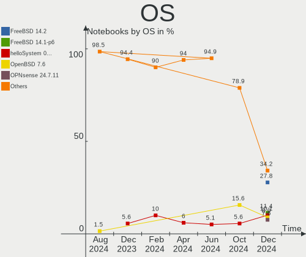
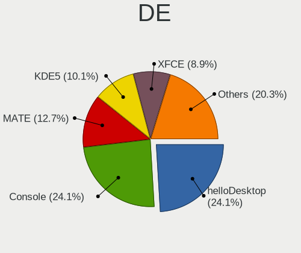
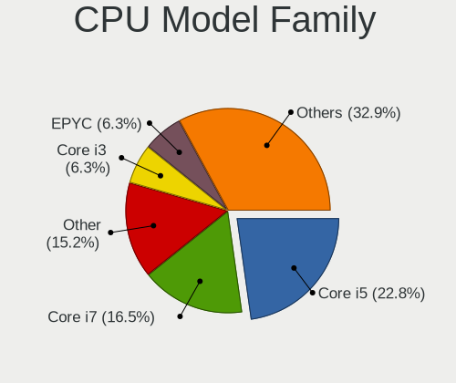
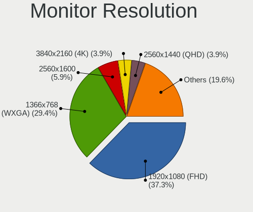

BSD - Hardware Trends (Notebooks)
---------------------------------

A project to identify most popular hardware characteristics and track their change
over time based on data collected by BSD users at https://BSD-Hardware.info.

Anyone can contribute to this report by the [hw-probe](https://github.com/linuxhw/hw-probe/blob/master/INSTALL.BSD.md) tool:

    hw-probe -all -upload

This report is for one last month. Overall report since the beginning of time: [TestCoverage](https://github.com/bsdhw/TestCoverage)

Period: Jan, 2023.

Contents
--------

* [ System ](#system)
  - [ OS                       ](#os)
  - [ OS Family                ](#os-family)
  - [ Arch                     ](#arch)
  - [ DE                       ](#de)
  - [ Display Server           ](#display-server)
  - [ Display Manager          ](#display-manager)
  - [ OS Lang                  ](#os-lang)
  - [ Boot Mode                ](#boot-mode)
  - [ Filesystem               ](#filesystem)
  - [ Part. scheme             ](#part-scheme)

* [ Board ](#board)
  - [ Vendor                   ](#vendor)
  - [ Model                    ](#model)
  - [ Model Family             ](#model-family)
  - [ MFG Year                 ](#mfg-year)
  - [ Form Factor              ](#form-factor)
  - [ Coreboot                 ](#coreboot)
  - [ RAM Size                 ](#ram-size)
  - [ RAM Used                 ](#ram-used)
  - [ Total Drives             ](#total-drives)
  - [ Has CD-ROM               ](#has-cd-rom)
  - [ Has Ethernet             ](#has-ethernet)
  - [ Has WiFi                 ](#has-wifi)
  - [ Has Bluetooth            ](#has-bluetooth)

* [ Location ](#location)
  - [ Country                  ](#country)
  - [ City                     ](#city)

* [ Drives ](#drives)
  - [ Drive Vendor             ](#drive-vendor)
  - [ Drive Model              ](#drive-model)
  - [ HDD Vendor               ](#hdd-vendor)
  - [ SSD Vendor               ](#ssd-vendor)
  - [ Drive Kind               ](#drive-kind)
  - [ Drive Connector          ](#drive-connector)
  - [ Drive Size               ](#drive-size)
  - [ Space Total              ](#space-total)
  - [ Space Used               ](#space-used)
  - [ Malfunc. Drives          ](#malfunc-drives)
  - [ Malfunc. Drive Vendor    ](#malfunc-drive-vendor)
  - [ Malfunc. HDD Vendor      ](#malfunc-hdd-vendor)
  - [ Malfunc. Drive Kind      ](#malfunc-drive-kind)
  - [ Failed Drives            ](#failed-drives)
  - [ Failed Drive Vendor      ](#failed-drive-vendor)
  - [ Drive Status             ](#drive-status)

* [ Storage controller ](#storage-controller)
  - [ Storage Vendor           ](#storage-vendor)
  - [ Storage Model            ](#storage-model)
  - [ Storage Kind             ](#storage-kind)

* [ Processor ](#processor)
  - [ CPU Vendor               ](#cpu-vendor)
  - [ CPU Model                ](#cpu-model)
  - [ CPU Model Family         ](#cpu-model-family)
  - [ CPU Cores                ](#cpu-cores)
  - [ CPU Sockets              ](#cpu-sockets)
  - [ CPU Threads              ](#cpu-threads)
  - [ CPU Microarch            ](#cpu-microarch)

* [ Graphics ](#graphics)
  - [ GPU Vendor               ](#gpu-vendor)
  - [ GPU Model                ](#gpu-model)
  - [ GPU Combo                ](#gpu-combo)
  - [ GPU Driver               ](#gpu-driver)
  - [ GPU Memory               ](#gpu-memory)

* [ Monitor ](#monitor)
  - [ Monitor Vendor           ](#monitor-vendor)
  - [ Monitor Model            ](#monitor-model)
  - [ Monitor Resolution       ](#monitor-resolution)
  - [ Monitor Diagonal         ](#monitor-diagonal)
  - [ Monitor Width            ](#monitor-width)
  - [ Aspect Ratio             ](#aspect-ratio)
  - [ Monitor Area             ](#monitor-area)
  - [ Pixel Density            ](#pixel-density)
  - [ Multiple Monitors        ](#multiple-monitors)

* [ Network ](#network)
  - [ Net Controller Vendor    ](#net-controller-vendor)
  - [ Net Controller Model     ](#net-controller-model)
  - [ Wireless Vendor          ](#wireless-vendor)
  - [ Wireless Model           ](#wireless-model)
  - [ Ethernet Vendor          ](#ethernet-vendor)
  - [ Ethernet Model           ](#ethernet-model)
  - [ Net Controller Kind      ](#net-controller-kind)
  - [ Used Controller          ](#used-controller)
  - [ NICs                     ](#nics)
  - [ IPv6                     ](#ipv6)

* [ Bluetooth ](#bluetooth)
  - [ Bluetooth Vendor         ](#bluetooth-vendor)
  - [ Bluetooth Model          ](#bluetooth-model)

* [ Sound ](#sound)
  - [ Sound Vendor             ](#sound-vendor)
  - [ Sound Model              ](#sound-model)

* [ Memory ](#memory)
  - [ Memory Vendor            ](#memory-vendor)
  - [ Memory Model             ](#memory-model)
  - [ Memory Kind              ](#memory-kind)
  - [ Memory Form Factor       ](#memory-form-factor)
  - [ Memory Size              ](#memory-size)
  - [ Memory Speed             ](#memory-speed)

* [ Printers & scanners ](#printers--scanners)
  - [ Printer Vendor           ](#printer-vendor)
  - [ Printer Model            ](#printer-model)
  - [ Scanner Vendor           ](#scanner-vendor)
  - [ Scanner Model            ](#scanner-model)

* [ Camera ](#camera)
  - [ Camera Vendor            ](#camera-vendor)
  - [ Camera Model             ](#camera-model)

* [ Security ](#security)
  - [ Fingerprint Vendor       ](#fingerprint-vendor)
  - [ Fingerprint Model        ](#fingerprint-model)
  - [ Chipcard Vendor          ](#chipcard-vendor)
  - [ Chipcard Model           ](#chipcard-model)

* [ Unsupported ](#unsupported)
  - [ Unsupported Devices      ](#unsupported-devices)
  - [ Unsupported Device Types ](#unsupported-device-types)

System
------

OS
--

Installed operating systems

| Name                 | Notebooks | Percent |
|----------------------|-----------|---------|
| helloSystem 0.8.0    | 31        | 26.96%  |
| FreeBSD 13.1-p5      | 19        | 16.52%  |
| helloSystem 0.7.0    | 14        | 12.17%  |
| OpenBSD 7.2          | 12        | 10.43%  |
| OPNsense 22.7.10     | 8         | 6.96%   |
| FreeBSD 13.1         | 6         | 5.22%   |
| OPNsense 22.10       | 5         | 4.35%   |
| FreeBSD 13.1-STABLE  | 4         | 3.48%   |
| OPNsense 22.7.11     | 3         | 2.61%   |
| FreeBSD 14.0-CURRENT | 3         | 2.61%   |
| OPNsense 23.1        | 2         | 1.74%   |
| FuguIta 7.2          | 2         | 1.74%   |
| OPNsense 21.7.8      | 1         | 0.87%   |
| NomadBSD 20221130    | 1         | 0.87%   |
| NetBSD 10.99.1       | 1         | 0.87%   |
| GhostBSD 23.01.13    | 1         | 0.87%   |
| FuryBSD 12.1-p9      | 1         | 0.87%   |
| FreeBSD 13.1-p3      | 1         | 0.87%   |

OS Family
---------

OS without a version

| Name        | Notebooks | Percent |
|-------------|-----------|---------|
| helloSystem | 45        | 39.13%  |
| FreeBSD     | 33        | 28.7%   |
| OPNsense    | 19        | 16.52%  |
| OpenBSD     | 12        | 10.43%  |
| FuguIta     | 2         | 1.74%   |
| NomadBSD    | 1         | 0.87%   |
| NetBSD      | 1         | 0.87%   |
| GhostBSD    | 1         | 0.87%   |
| FuryBSD     | 1         | 0.87%   |

Arch
----

OS architecture (x86_64, i586, etc.)

| Name  | Notebooks | Percent |
|-------|-----------|---------|
| amd64 | 114       | 99.13%  |
| i386  | 1         | 0.87%   |

DE
--

Desktop Environment

| Name         | Notebooks | Percent |
|--------------|-----------|---------|
| helloDesktop | 57        | 49.57%  |
| Console      | 22        | 19.13%  |
| XFCE         | 7         | 6.09%   |
| MATE         | 6         | 5.22%   |
| KDE5         | 6         | 5.22%   |
| TWM          | 4         | 3.48%   |
| i3           | 4         | 3.48%   |
| GNOME        | 3         | 2.61%   |
| Openbox      | 2         | 1.74%   |
| IceWM        | 2         | 1.74%   |
| sway         | 1         | 0.87%   |
| CTWM         | 1         | 0.87%   |

Display Server
--------------

X11 or Wayland

| Name    | Notebooks | Percent |
|---------|-----------|---------|
| X11     | 90        | 78.26%  |
| Console | 22        | 19.13%  |
| Wayland | 3         | 2.61%   |

Display Manager
---------------

SDDM, LightDM, etc.

| Name    | Notebooks | Percent |
|---------|-----------|---------|
| SLiM    | 48        | 41.74%  |
| Console | 45        | 39.13%  |
| SDDM    | 11        | 9.57%   |
| XDM     | 4         | 3.48%   |
| LightDM | 4         | 3.48%   |
| Ly      | 2         | 1.74%   |
| GDM     | 1         | 0.87%   |

OS Lang
-------

Language

| Lang    | Notebooks | Percent |
|---------|-----------|---------|
| Unknown | 30        | 26.09%  |
| C       | 24        | 20.87%  |
| en_US   | 23        | 20%     |
| en      | 16        | 13.91%  |
| ru      | 6         | 5.22%   |
| de      | 3         | 2.61%   |
| pl_PL   | 2         | 1.74%   |
| es_ES   | 2         | 1.74%   |
| es      | 2         | 1.74%   |
| zh_CN   | 1         | 0.87%   |
| ru_RU   | 1         | 0.87%   |
| pt      | 1         | 0.87%   |
| fr      | 1         | 0.87%   |
| fi_FI   | 1         | 0.87%   |
| de_DE   | 1         | 0.87%   |
| cs_CZ   | 1         | 0.87%   |

Boot Mode
---------

EFI or BIOS

| Mode | Notebooks | Percent |
|------|-----------|---------|
| EFI  | 105       | 91.3%   |
| BIOS | 10        | 8.7%    |

Filesystem
----------

Type of filesystem

| Type   | Notebooks | Percent |
|--------|-----------|---------|
| Zfs    | 58        | 50.43%  |
| Cd9660 | 25        | 21.74%  |
| Ufs    | 18        | 15.65%  |
| Ffs    | 14        | 12.17%  |

Part. scheme
------------

Scheme of partitioning

| Type | Notebooks | Percent |
|------|-----------|---------|
| GPT  | 108       | 93.91%  |
| MBR  | 7         | 6.09%   |

Board
-----

Vendor
------

Motherboard manufacturer

| Name                | Notebooks | Percent |
|---------------------|-----------|---------|
| Lenovo              | 40        | 34.78%  |
| Hewlett-Packard     | 13        | 11.3%   |
| Dell                | 13        | 11.3%   |
| Acer                | 8         | 6.96%   |
| Deciso              | 7         | 6.09%   |
| Datto               | 3         | 2.61%   |
| Apple               | 3         | 2.61%   |
| Unknown             | 3         | 2.61%   |
| SLIMBOOK            | 2         | 1.74%   |
| MSI                 | 2         | 1.74%   |
| Intel               | 2         | 1.74%   |
| Google              | 2         | 1.74%   |
| F-Plus Mobile       | 2         | 1.74%   |
| ASUSTek Computer    | 2         | 1.74%   |
| TUXEDO              | 1         | 0.87%   |
| Toshiba             | 1         | 0.87%   |
| Timi                | 1         | 0.87%   |
| Star Labs           | 1         | 0.87%   |
| Samsung Electronics | 1         | 0.87%   |
| Razer               | 1         | 0.87%   |
| Panasonic           | 1         | 0.87%   |
| Packard Bell        | 1         | 0.87%   |
| Notebook            | 1         | 0.87%   |
| Medion              | 1         | 0.87%   |
| IGEL Technology     | 1         | 0.87%   |
| Fujitsu             | 1         | 0.87%   |
| Alienware           | 1         | 0.87%   |

Model
-----

Motherboard model

| Name                                       | Notebooks | Percent |
|--------------------------------------------|-----------|---------|
| Unknown                                    | 4         | 3.48%   |
| Deciso NetBoard-A10                        | 3         | 2.61%   |
| Lenovo IdeaPad 110-14AST 80TQ              | 2         | 1.74%   |
| F-Plus Mobile FLAPTOP r                    | 2         | 1.74%   |
| Dell XPS 13 9310                           | 2         | 1.74%   |
| Dell Precision 5540                        | 2         | 1.74%   |
| Deciso Netboard A20                        | 2         | 1.74%   |
| Datto 1000                                 | 2         | 1.74%   |
| TUXEDO Aura 15 Gen1                        | 1         | 0.87%   |
| Toshiba PORTEGE Z930                       | 1         | 0.87%   |
| Timi TM1607                                | 1         | 0.87%   |
| Star Labs StarBook                         | 1         | 0.87%   |
| SLIMBOOK PROX-AMD5                         | 1         | 0.87%   |
| SLIMBOOK ESSENTIAL-15-11                   | 1         | 0.87%   |
| Samsung 340XAA/350XAA/550XAA               | 1         | 0.87%   |
| Razer Blade Stealth                        | 1         | 0.87%   |
| Panasonic CF-C1BWFAZ1M                     | 1         | 0.87%   |
| Packard Bell DOT S                         | 1         | 0.87%   |
| Notebook NS5x_NS7xPU                       | 1         | 0.87%   |
| MSI PS63 Modern 8M                         | 1         | 0.87%   |
| MSI Modern 15 A5M                          | 1         | 0.87%   |
| Medion S14409                              | 1         | 0.87%   |
| Lenovo ThinkPad X280 20KFCTO1WW            | 1         | 0.87%   |
| Lenovo ThinkPad X260 20F5S10W0H            | 1         | 0.87%   |
| Lenovo ThinkPad X220 4291WF5               | 1         | 0.87%   |
| Lenovo ThinkPad X220 4291LF6               | 1         | 0.87%   |
| Lenovo ThinkPad X1 Carbon Gen 9 20XW00QGUS | 1         | 0.87%   |
| Lenovo ThinkPad X1 Carbon 5th 20HR002MAT   | 1         | 0.87%   |
| Lenovo ThinkPad X1 Carbon 3rd 20BTS0LK00   | 1         | 0.87%   |
| Lenovo ThinkPad X1 Carbon 3448AWU          | 1         | 0.87%   |
| Lenovo ThinkPad W541 20EF000NUS            | 1         | 0.87%   |
| Lenovo ThinkPad T61 64644YG                | 1         | 0.87%   |
| Lenovo ThinkPad T480 20L5CTO1WW            | 1         | 0.87%   |
| Lenovo ThinkPad T460s 20FAS3L002           | 1         | 0.87%   |
| Lenovo ThinkPad T460 20FMS06V00            | 1         | 0.87%   |
| Lenovo ThinkPad T440p 20AN007FGE           | 1         | 0.87%   |
| Lenovo ThinkPad T430 23446FP               | 1         | 0.87%   |
| Lenovo ThinkPad T430 2342AG4               | 1         | 0.87%   |
| Lenovo ThinkPad T410 2518C3U               | 1         | 0.87%   |
| Lenovo ThinkPad T400 2764CTO               | 1         | 0.87%   |

Model Family
------------

Motherboard model prefix

| Name                     | Notebooks | Percent |
|--------------------------|-----------|---------|
| Lenovo ThinkPad          | 27        | 23.48%  |
| Dell Latitude            | 6         | 5.22%   |
| Acer Aspire              | 6         | 5.22%   |
| Lenovo IdeaPad           | 4         | 3.48%   |
| HP EliteBook             | 4         | 3.48%   |
| Unknown                  | 4         | 3.48%   |
| HP Pavilion              | 3         | 2.61%   |
| Dell Inspiron            | 3         | 2.61%   |
| Deciso NetBoard-A10      | 3         | 2.61%   |
| Lenovo Legion            | 2         | 1.74%   |
| HP Laptop                | 2         | 1.74%   |
| F-Plus Mobile FLAPTOP    | 2         | 1.74%   |
| Dell XPS                 | 2         | 1.74%   |
| Dell Precision           | 2         | 1.74%   |
| Deciso Netboard          | 2         | 1.74%   |
| Datto 1000               | 2         | 1.74%   |
| TUXEDO Aura              | 1         | 0.87%   |
| Toshiba PORTEGE          | 1         | 0.87%   |
| Timi TM1607              | 1         | 0.87%   |
| Star Labs StarBook       | 1         | 0.87%   |
| SLIMBOOK PROX-AMD5       | 1         | 0.87%   |
| SLIMBOOK ESSENTIAL-15-11 | 1         | 0.87%   |
| Samsung 340XAA           | 1         | 0.87%   |
| Razer Blade              | 1         | 0.87%   |
| Panasonic CF-C1BWFAZ1M   | 1         | 0.87%   |
| Packard Bell DOT         | 1         | 0.87%   |
| Notebook NS5x            | 1         | 0.87%   |
| MSI PS63                 | 1         | 0.87%   |
| MSI Modern               | 1         | 0.87%   |
| Medion S14409            | 1         | 0.87%   |
| Lenovo ThinkBook         | 1         | 0.87%   |
| Lenovo G500              | 1         | 0.87%   |
| Lenovo G50-80            | 1         | 0.87%   |
| Lenovo G50-70            | 1         | 0.87%   |
| Lenovo B590              | 1         | 0.87%   |
| Lenovo B50-80            | 1         | 0.87%   |
| Lenovo B40-70            | 1         | 0.87%   |
| Intel Milstead           | 1         | 0.87%   |
| Intel H81U               | 1         | 0.87%   |
| IGEL H830C               | 1         | 0.87%   |

MFG Year
--------

Motherboard manufacture year

| Year | Notebooks | Percent |
|------|-----------|---------|
| 2022 | 20        | 17.39%  |
| 2021 | 12        | 10.43%  |
| 2019 | 10        | 8.7%    |
| 2014 | 10        | 8.7%    |
| 2016 | 9         | 7.83%   |
| 2015 | 9         | 7.83%   |
| 2013 | 9         | 7.83%   |
| 2020 | 7         | 6.09%   |
| 2018 | 7         | 6.09%   |
| 2011 | 6         | 5.22%   |
| 2017 | 5         | 4.35%   |
| 2012 | 3         | 2.61%   |
| 2009 | 3         | 2.61%   |
| 2023 | 2         | 1.74%   |
| 2010 | 1         | 0.87%   |
| 2007 | 1         | 0.87%   |
| 2006 | 1         | 0.87%   |

Form Factor
-----------

Physical design of the computer

| Name     | Notebooks | Percent |
|----------|-----------|---------|
| Notebook | 115       | 100%    |

Coreboot
--------

Have coreboot on board

| Used | Notebooks | Percent |
|------|-----------|---------|
| No   | 112       | 97.39%  |
| Yes  | 3         | 2.61%   |

RAM Size
--------

Total RAM memory

| Size in GB  | Notebooks | Percent |
|-------------|-----------|---------|
| 4.01-8.0    | 35        | 30.43%  |
| 16.01-24.0  | 33        | 28.7%   |
| 8.01-16.0   | 32        | 27.83%  |
| 32.01-64.0  | 9         | 7.83%   |
| 64.01-256.0 | 3         | 2.61%   |
| 24.01-32.0  | 1         | 0.87%   |
| 1.01-2.0    | 1         | 0.87%   |
| 0.51-1.0    | 1         | 0.87%   |

RAM Used
--------

Used RAM memory

| Used GB  | Notebooks | Percent |
|----------|-----------|---------|
| 0.01-0.5 | 59        | 51.3%   |
| 0.51-1.0 | 34        | 29.57%  |
| 1.01-2.0 | 17        | 14.78%  |
| 2.01-3.0 | 4         | 3.48%   |
| Unknown  | 1         | 0.87%   |

Total Drives
------------

Number of drives on board

| Drives | Notebooks | Percent |
|--------|-----------|---------|
| 1      | 86        | 74.78%  |
| 2      | 21        | 18.26%  |
| 0      | 5         | 4.35%   |
| 3      | 2         | 1.74%   |
| 4      | 1         | 0.87%   |

Has CD-ROM
----------

Has CD-ROM on board

| Presented | Notebooks | Percent |
|-----------|-----------|---------|
| No        | 95        | 82.61%  |
| Yes       | 20        | 17.39%  |

Has Ethernet
------------

Has Ethernet on board

| Presented | Notebooks | Percent |
|-----------|-----------|---------|
| Yes       | 93        | 80.87%  |
| No        | 22        | 19.13%  |

Has WiFi
--------

Has WiFi module

| Presented | Notebooks | Percent |
|-----------|-----------|---------|
| Yes       | 103       | 89.57%  |
| No        | 12        | 10.43%  |

Has Bluetooth
-------------

Has Bluetooth module

| Presented | Notebooks | Percent |
|-----------|-----------|---------|
| Yes       | 78        | 67.83%  |
| No        | 37        | 32.17%  |

Location
--------

Country
-------

Geographic location (country)

| Country                | Notebooks | Percent |
|------------------------|-----------|---------|
| USA                    | 23        | 20%     |
| Spain                  | 10        | 8.7%    |
| Russia                 | 9         | 7.83%   |
| Germany                | 9         | 7.83%   |
| France                 | 7         | 6.09%   |
| Poland                 | 5         | 4.35%   |
| Netherlands            | 5         | 4.35%   |
| Indonesia              | 4         | 3.48%   |
| Hungary                | 3         | 2.61%   |
| Czechia                | 3         | 2.61%   |
| China                  | 3         | 2.61%   |
| Canada                 | 3         | 2.61%   |
| Austria                | 3         | 2.61%   |
| Switzerland            | 2         | 1.74%   |
| Sweden                 | 2         | 1.74%   |
| Romania                | 2         | 1.74%   |
| Ireland                | 2         | 1.74%   |
| Bulgaria               | 2         | 1.74%   |
| Venezuela              | 1         | 0.87%   |
| Uruguay                | 1         | 0.87%   |
| UK                     | 1         | 0.87%   |
| Slovakia               | 1         | 0.87%   |
| Portugal               | 1         | 0.87%   |
| Mexico                 | 1         | 0.87%   |
| Malta                  | 1         | 0.87%   |
| Kenya                  | 1         | 0.87%   |
| Italy                  | 1         | 0.87%   |
| Iraq                   | 1         | 0.87%   |
| Iran                   | 1         | 0.87%   |
| Greece                 | 1         | 0.87%   |
| Finland                | 1         | 0.87%   |
| Egypt                  | 1         | 0.87%   |
| Costa Rica             | 1         | 0.87%   |
| Brazil                 | 1         | 0.87%   |
| Bosnia and Herzegovina | 1         | 0.87%   |
| Argentina              | 1         | 0.87%   |

City
----

Geographic location (city)

| City           | Notebooks | Percent |
|----------------|-----------|---------|
| Moscow         | 7         | 6.09%   |
| Vienna         | 3         | 2.61%   |
| Fayetteville   | 3         | 2.61%   |
| Paterna        | 2         | 1.74%   |
| Paris          | 2         | 1.74%   |
| Navalcarnero   | 2         | 1.74%   |
| Madrid         | 2         | 1.74%   |
| Dublin         | 2         | 1.74%   |
| Budapest       | 2         | 1.74%   |
| Berlin         | 2         | 1.74%   |
| Yambol         | 1         | 0.87%   |
| Wiesloch       | 1         | 0.87%   |
| Wathlingen     | 1         | 0.87%   |
| Warsaw         | 1         | 0.87%   |
| Villemomble    | 1         | 0.87%   |
| Vidnoye        | 1         | 0.87%   |
| Valencia       | 1         | 0.87%   |
| Vaasa          | 1         | 0.87%   |
| Utrecht        | 1         | 0.87%   |
| Toronto        | 1         | 0.87%   |
| Tijuana        | 1         | 0.87%   |
| Thessaloniki   | 1         | 0.87%   |
| Sun Prairie    | 1         | 0.87%   |
| St. Petersburg | 1         | 0.87%   |
| Sollebrunn     | 1         | 0.87%   |
| Shenzhen       | 1         | 0.87%   |
| Shanghai       | 1         | 0.87%   |
| Semarang       | 1         | 0.87%   |
| Seattle        | 1         | 0.87%   |
| Sayago         | 1         | 0.87%   |
| Sarajevo       | 1         | 0.87%   |
| San José      | 1         | 0.87%   |
| San Angelo     | 1         | 0.87%   |
| Saint-Zotique  | 1         | 0.87%   |
| Rūdsar        | 1         | 0.87%   |
| Roscommon      | 1         | 0.87%   |
| Rome           | 1         | 0.87%   |
| Rhoon          | 1         | 0.87%   |
| Queensbury     | 1         | 0.87%   |
| Queens         | 1         | 0.87%   |

Drives
------

Drive Vendor
------------

Hard drive vendors

| Vendor                                 | Notebooks | Drives | Percent |
|----------------------------------------|-----------|--------|---------|
| Samsung Electronics                    | 20        | 22     | 15.27%  |
| Seagate                                | 12        | 12     | 9.16%   |
| Kingston                               | 11        | 11     | 8.4%    |
| WDC                                    | 10        | 10     | 7.63%   |
| Transcend                              | 8         | 8      | 6.11%   |
| NVMe                                   | 8         | 10     | 6.11%   |
| Toshiba                                | 6         | 6      | 4.58%   |
| Crucial                                | 6         | 7      | 4.58%   |
| SanDisk                                | 4         | 4      | 3.05%   |
| Intel                                  | 4         | 4      | 3.05%   |
| KIOXIA                                 | 3         | 3      | 2.29%   |
| Hitachi                                | 3         | 3      | 2.29%   |
| A-DATA Technology                      | 3         | 4      | 2.29%   |
| SPCC                                   | 2         | 2      | 1.53%   |
| SK hynix                               | 2         | 2      | 1.53%   |
| Product:              USB Flash Memory | 2         | 2      | 1.53%   |
| Lenovo                                 | 2         | 2      | 1.53%   |
| KingSpec                               | 2         | 2      | 1.53%   |
| Gigabyte Technology                    | 2         | 2      | 1.53%   |
| FORESEE                                | 2         | 2      | 1.53%   |
| Apple                                  | 2         | 2      | 1.53%   |
| Verbatim                               | 1         | 1      | 0.76%   |
| V-GeN                                  | 1         | 1      | 0.76%   |
| Star Drive                             | 1         | 1      | 0.76%   |
| PNY                                    | 1         | 1      | 0.76%   |
| Phison                                 | 1         | 1      | 0.76%   |
| Patriot                                | 1         | 1      | 0.76%   |
| OWC                                    | 1         | 1      | 0.76%   |
| Micron Technology                      | 1         | 1      | 0.76%   |
| LITEON                                 | 1         | 1      | 0.76%   |
| Kston                                  | 1         | 1      | 0.76%   |
| KIOXIA-EXCERIA                         | 1         | 1      | 0.76%   |
| HGST                                   | 1         | 1      | 0.76%   |
| Hewlett-Packard                        | 1         | 1      | 0.76%   |
| GOODRAM                                | 1         | 1      | 0.76%   |
| FLEXXON                                | 1         | 1      | 0.76%   |
| Dogfish                                | 1         | 1      | 0.76%   |
| Apacer                                 | 1         | 1      | 0.76%   |

Drive Model
-----------

Hard drive models

| Model                                                        | Notebooks | Percent |
|--------------------------------------------------------------|-----------|---------|
| Transcend TS256GMTS952T2 256GB                               | 4         | 3.01%   |
| Seagate ST1000LM035-1RK172 1TB                               | 4         | 3.01%   |
| NVMe Samsung SSD 980 1TB                                     | 4         | 3.01%   |
| Kingston SA400S37240G 240GB                                  | 3         | 2.26%   |
| Transcend TS128GMTE110S 128GB                                | 2         | 1.5%    |
| Seagate ST500VT000-1DK142 500GB                              | 2         | 1.5%    |
| Samsung PM9A1 NVMe 512GB                                     | 2         | 1.5%    |
| Product:              USB Flash Memory USB Flash Memory 16GB | 2         | 1.5%    |
| FORESEE XP1000F001T 1TB                                      | 2         | 1.5%    |
| WDC WD5000LPVX-22V0TT0 500GB                                 | 1         | 0.75%   |
| WDC WD5000BPVT-22A1YT0 500GB                                 | 1         | 0.75%   |
| WDC WD3200LPVX-60V0TT0 320GB                                 | 1         | 0.75%   |
| WDC WD3200BEKT-22PVMT0 320GB                                 | 1         | 0.75%   |
| WDC WD2500BEVT-35A23T0 250GB                                 | 1         | 0.75%   |
| WDC WD1600BEVT-22ZCT0 160GB                                  | 1         | 0.75%   |
| WDC WD10SPZX-35Z10T0 1TB                                     | 1         | 0.75%   |
| WDC WD10JPCX-24UE4T0 1TB                                     | 1         | 0.75%   |
| WDC WD10JMVW-11AJGS2 1TB                                     | 1         | 0.75%   |
| WDC WD Elements 2621 1TB                                     | 1         | 0.75%   |
| Verbatim Vi550 S3 SSD 512GB                                  | 1         | 0.75%   |
| V-GeN V-GEN10AS20AR128SDK 128GB                              | 1         | 0.75%   |
| Transcend TS512GSSD230S 512GB                                | 1         | 0.75%   |
| Transcend TS256GMTE652T2 256GB                               | 1         | 0.75%   |
| Toshiba THNSNF128GMCS 128GB                                  | 1         | 0.75%   |
| Toshiba MQ01ACF032 320GB                                     | 1         | 0.75%   |
| Toshiba MQ01ABD100 1TB                                       | 1         | 0.75%   |
| Toshiba MK3261GSYN 320GB                                     | 1         | 0.75%   |
| Toshiba MK1059GSM 1TB                                        | 1         | 0.75%   |
| Toshiba KXG60ZNV256G NVMe 256GB                              | 1         | 0.75%   |
| Star Drive PCIe SSD 1TB                                      | 1         | 0.75%   |
| SPCC Solid State Disk 512GB                                  | 1         | 0.75%   |
| SPCC Solid State Disk 128GB                                  | 1         | 0.75%   |
| SK hynix SC311 SATA 256GB                                    | 1         | 0.75%   |
| SK hynix PC601 NVMe 512GB                                    | 1         | 0.75%   |
| Seagate ST750LM022 HN-M750MBB 752GB                          | 1         | 0.75%   |
| Seagate ST500LM034-2GH17A 500GB                              | 1         | 0.75%   |
| Seagate ST500LM000-1EJ162 500GB                              | 1         | 0.75%   |
| Seagate ST320LT020-9YG142 320GB                              | 1         | 0.75%   |
| Seagate ST320LT012-9WS14C 320GB                              | 1         | 0.75%   |
| Seagate ST1000LM024 HN-M101MBB 1TB                           | 1         | 0.75%   |

HDD Vendor
----------

Hard disk drive vendors

| Vendor                                 | Notebooks | Drives | Percent |
|----------------------------------------|-----------|--------|---------|
| Seagate                                | 12        | 12     | 33.33%  |
| WDC                                    | 10        | 10     | 27.78%  |
| Toshiba                                | 4         | 4      | 11.11%  |
| NVMe                                   | 4         | 4      | 11.11%  |
| Hitachi                                | 3         | 3      | 8.33%   |
| Product:              USB Flash Memory | 2         | 2      | 5.56%   |
| HGST                                   | 1         | 1      | 2.78%   |

SSD Vendor
----------

Solid state drive vendors

| Vendor              | Notebooks | Drives | Percent |
|---------------------|-----------|--------|---------|
| Samsung Electronics | 9         | 9      | 14.75%  |
| Kingston            | 9         | 9      | 14.75%  |
| Transcend           | 5         | 5      | 8.2%    |
| NVMe                | 5         | 6      | 8.2%    |
| Crucial             | 5         | 6      | 8.2%    |
| SanDisk             | 4         | 4      | 6.56%   |
| SPCC                | 2         | 2      | 3.28%   |
| KingSpec            | 2         | 2      | 3.28%   |
| Apple               | 2         | 2      | 3.28%   |
| Verbatim            | 1         | 1      | 1.64%   |
| V-GeN               | 1         | 1      | 1.64%   |
| Toshiba             | 1         | 1      | 1.64%   |
| SK hynix            | 1         | 1      | 1.64%   |
| PNY                 | 1         | 1      | 1.64%   |
| Patriot             | 1         | 1      | 1.64%   |
| OWC                 | 1         | 1      | 1.64%   |
| LITEON              | 1         | 1      | 1.64%   |
| Lenovo              | 1         | 1      | 1.64%   |
| Kston               | 1         | 1      | 1.64%   |
| KIOXIA-EXCERIA      | 1         | 1      | 1.64%   |
| Intel               | 1         | 1      | 1.64%   |
| Hewlett-Packard     | 1         | 1      | 1.64%   |
| GOODRAM             | 1         | 1      | 1.64%   |
| FLEXXON             | 1         | 1      | 1.64%   |
| Dogfish             | 1         | 1      | 1.64%   |
| Apacer              | 1         | 1      | 1.64%   |
| A-DATA Technology   | 1         | 2      | 1.64%   |

Drive Kind
----------

HDD or SSD

| Kind | Notebooks | Drives | Percent |
|------|-----------|--------|---------|
| SSD  | 55        | 64     | 44.72%  |
| NVMe | 34        | 37     | 27.64%  |
| HDD  | 34        | 36     | 27.64%  |

Drive Connector
---------------

SATA, SAS, NVMe, etc.

| Type | Notebooks | Drives | Percent |
|------|-----------|--------|---------|
| SATA | 81        | 100    | 70.43%  |
| NVMe | 34        | 37     | 29.57%  |

Drive Size
----------

Size of hard drive

| Size in TB | Notebooks | Drives | Percent |
|------------|-----------|--------|---------|
| 0.01-0.5   | 60        | 68     | 67.42%  |
| 0.51-1.0   | 26        | 29     | 29.21%  |
| 1.01-2.0   | 3         | 3      | 3.37%   |

Space Total
-----------

Amount of disk space available on the file system

| Size in GB | Notebooks | Percent |
|------------|-----------|---------|
| 101-250    | 37        | 32.17%  |
| 1-20       | 26        | 22.61%  |
| 251-500    | 25        | 21.74%  |
| 501-1000   | 11        | 9.57%   |
| 21-50      | 8         | 6.96%   |
| 51-100     | 5         | 4.35%   |
| 1001-2000  | 2         | 1.74%   |
| 2001-3000  | 1         | 0.87%   |

Space Used
----------

Amount of used disk space

| Used GB  | Notebooks | Percent |
|----------|-----------|---------|
| 1-20     | 104       | 90.43%  |
| 21-50    | 6         | 5.22%   |
| 51-100   | 3         | 2.61%   |
| 101-250  | 1         | 0.87%   |
| 501-1000 | 1         | 0.87%   |

Malfunc. Drives
---------------

Drive models with a malfunction

| Model                           | Notebooks | Drives | Percent |
|---------------------------------|-----------|--------|---------|
| WDC WD3200BEKT-22PVMT0 320GB    | 1         | 1      | 7.69%   |
| WDC WD2500BEVT-35A23T0 250GB    | 1         | 1      | 7.69%   |
| WDC WD10JMVW-11AJGS2 1TB        | 1         | 1      | 7.69%   |
| Toshiba MQ01ACF032 320GB        | 1         | 1      | 7.69%   |
| Toshiba MQ01ABD100 1TB          | 1         | 1      | 7.69%   |
| Toshiba MK3261GSYN 320GB        | 1         | 1      | 7.69%   |
| Toshiba MK1059GSM 1TB           | 1         | 1      | 7.69%   |
| Seagate ST500LM000-1EJ162 500GB | 1         | 1      | 7.69%   |
| Seagate ST320LT020-9YG142 320GB | 1         | 1      | 7.69%   |
| Seagate ST320LT012-9WS14C 320GB | 1         | 1      | 7.69%   |
| Hitachi HTS725050A7E630 500GB   | 1         | 1      | 7.69%   |
| Hitachi HTS545050B9A300 500GB   | 1         | 1      | 7.69%   |
| HGST HTS721010A9E630 1TB        | 1         | 1      | 7.69%   |

Malfunc. Drive Vendor
---------------------

Vendors of faulty drives

| Vendor  | Notebooks | Drives | Percent |
|---------|-----------|--------|---------|
| Toshiba | 4         | 4      | 30.77%  |
| WDC     | 3         | 3      | 23.08%  |
| Seagate | 3         | 3      | 23.08%  |
| Hitachi | 2         | 2      | 15.38%  |
| HGST    | 1         | 1      | 7.69%   |

Malfunc. HDD Vendor
-------------------

Vendors of faulty HDD drives

| Vendor  | Notebooks | Drives | Percent |
|---------|-----------|--------|---------|
| Toshiba | 4         | 4      | 30.77%  |
| WDC     | 3         | 3      | 23.08%  |
| Seagate | 3         | 3      | 23.08%  |
| Hitachi | 2         | 2      | 15.38%  |
| HGST    | 1         | 1      | 7.69%   |

Malfunc. Drive Kind
-------------------

Kinds of faulty drives

| Kind | Notebooks | Drives | Percent |
|------|-----------|--------|---------|
| HDD  | 12        | 13     | 100%    |

Failed Drives
-------------

Failed drive models

Zero info for selected period =(

Failed Drive Vendor
-------------------

Failed drive vendors

Zero info for selected period =(

Drive Status
------------

Number of failed and malfunc. drives

| Status   | Notebooks | Drives | Percent |
|----------|-----------|--------|---------|
| Works    | 92        | 111    | 82.14%  |
| Malfunc  | 12        | 13     | 10.71%  |
| Detected | 8         | 13     | 7.14%   |

Storage controller
------------------

Storage Vendor
--------------

Storage controller vendors

| Vendor                       | Notebooks | Percent |
|------------------------------|-----------|---------|
| Intel                        | 68        | 52.31%  |
| AMD                          | 18        | 13.85%  |
| Samsung Electronics          | 17        | 13.08%  |
| Phison Electronics           | 4         | 3.08%   |
| Transcend                    | 3         | 2.31%   |
| SanDisk                      | 3         | 2.31%   |
| Toshiba                      | 2         | 1.54%   |
| Shenzhen Longsys Electronics | 2         | 1.54%   |
| Realtek Semiconductor        | 2         | 1.54%   |
| Micron/Crucial Technology    | 2         | 1.54%   |
| Micron Technology            | 2         | 1.54%   |
| KIOXIA                       | 2         | 1.54%   |
| Kingston Technology Company  | 2         | 1.54%   |
| SK hynix                     | 1         | 0.77%   |
| Nvidia                       | 1         | 0.77%   |
| Lenovo                       | 1         | 0.77%   |

Storage Model
-------------

Storage controller models

| Model                                                                          | Notebooks | Percent |
|--------------------------------------------------------------------------------|-----------|---------|
| AMD FCH SATA Controller [AHCI mode]                                            | 17        | 12.59%  |
| Intel 7 Series Chipset Family 6-port SATA Controller [AHCI mode]               | 10        | 7.41%   |
| Unknown                                                                        | 10        | 7.41%   |
| Intel Sunrise Point-LP SATA Controller [AHCI mode]                             | 9         | 6.67%   |
| Intel 8 Series SATA Controller 1 [AHCI mode]                                   | 9         | 6.67%   |
| Intel 6 Series/C200 Series Chipset Family 6 port Mobile SATA AHCI Controller   | 7         | 5.19%   |
| Samsung NVMe SSD Controller 980                                                | 5         | 3.7%    |
| Samsung NVMe SSD Controller SM981/PM981/PM983                                  | 4         | 2.96%   |
| Samsung NVMe SSD Controller PM9A1/PM9A3/980PRO                                 | 4         | 2.96%   |
| Intel Wildcat Point-LP SATA Controller [AHCI Mode]                             | 4         | 2.96%   |
| Intel Q170/Q150/B150/H170/H110/Z170/CM236 Chipset SATA Controller [AHCI Mode]  | 3         | 2.22%   |
| Toshiba XG6 NVMe SSD Controller                                                | 2         | 1.48%   |
| Samsung NVMe SSD Controller SM961/PM961/SM963                                  | 2         | 1.48%   |
| Kingston Company OM3PDP3 NVMe SSD                                              | 2         | 1.48%   |
| Intel Volume Management Device NVMe RAID Controller                            | 2         | 1.48%   |
| Intel Tiger Lake-LP SATA Controller                                            | 2         | 1.48%   |
| Intel Cannon Point-LP SATA Controller [AHCI Mode]                              | 2         | 1.48%   |
| Intel Cannon Lake Mobile PCH SATA AHCI Controller                              | 2         | 1.48%   |
| Intel Atom Processor E3800 Series SATA AHCI Controller                         | 2         | 1.48%   |
| Intel 82801IBM/IEM (ICH9M/ICH9M-E) 4 port SATA Controller [AHCI mode]          | 2         | 1.48%   |
| Intel 8 Series/C220 Series Chipset Family 6-port SATA Controller 1 [AHCI mode] | 2         | 1.48%   |
| Intel 5 Series/3400 Series Chipset 6 port SATA AHCI Controller                 | 2         | 1.48%   |
| SK hynix hynix unknown                                                         | 1         | 0.74%   |
| SanDisk WD PC SN810 / Black SN850 NVMe SSD                                     | 1         | 0.74%   |
| SanDisk WD Black 2018/SN750 / PC SN720 NVMe SSD                                | 1         | 0.74%   |
| Sandisk unknown                                                                | 1         | 0.74%   |
| Samsung SM951 AHCI                                                             | 1         | 0.74%   |
| Samsung NVMe SSD Controller SM951/PM951                                        | 1         | 0.74%   |
| Phison PS5013 E13 NVMe Controller                                              | 1         | 0.74%   |
| Phison E18 PCIe4 NVMe Controller                                               | 1         | 0.74%   |
| Phison E16 PCIe4 NVMe Controller                                               | 1         | 0.74%   |
| Phison E12 NVMe Controller                                                     | 1         | 0.74%   |
| Nvidia MCP79 AHCI Controller                                                   | 1         | 0.74%   |
| Micron/Crucial P5 Plus NVMe PCIe SSD                                           | 1         | 0.74%   |
| Micron/Crucial P1 NVMe PCIe SSD                                                | 1         | 0.74%   |
| Micron unknown                                                                 | 1         | 0.74%   |
| Lenovo unknown                                                                 | 1         | 0.74%   |
| KIOXIA NVMe SSD Controller BG4                                                 | 1         | 0.74%   |
| Intel SSD Pro 7600p/760p/E 6100p Series                                        | 1         | 0.74%   |
| Intel SSD 660P Series                                                          | 1         | 0.74%   |

Storage Kind
------------

Kind of storage controller (IDE, SATA, NVMe, SAS, ...)

| Kind | Notebooks | Percent |
|------|-----------|---------|
| SATA | 83        | 62.88%  |
| NVMe | 42        | 31.82%  |
| RAID | 4         | 3.03%   |
| IDE  | 3         | 2.27%   |

Processor
---------

CPU Vendor
----------

Processor vendors

| Vendor | Notebooks | Percent |
|--------|-----------|---------|
| Intel  | 84        | 73.04%  |
| AMD    | 31        | 26.96%  |

CPU Model
---------

Processor models

| Model                                        | Notebooks | Percent |
|----------------------------------------------|-----------|---------|
| Intel Core i5-2520M CPU @ 2.50GHz            | 4         | 3.48%   |
| Intel Core i5-6300U CPU @ 2.40GHz            | 3         | 2.61%   |
| Intel Core i5-4210U CPU @ 1.70GHz            | 3         | 2.61%   |
| Intel 11th Gen Core i7-1185G7 @ 3.00GHz      | 3         | 2.61%   |
| AMD Ryzen Embedded V1500B                    | 3         | 2.61%   |
| AMD Ryzen 7 5825U with Radeon Graphics       | 3         | 2.61%   |
| AMD Ryzen 5 5500U with Radeon Graphics       | 3         | 2.61%   |
| AMD EPYC 3201 8-Core Processor               | 3         | 2.61%   |
| Intel Core i7-9850H CPU @ 2.60GHz            | 2         | 1.74%   |
| Intel Core i7-8550U CPU @ 1.80GHz            | 2         | 1.74%   |
| Intel Core i7-7820HQ CPU @ 2.90GHz           | 2         | 1.74%   |
| Intel Core i7-7500U CPU @ 2.70GHz            | 2         | 1.74%   |
| Intel Core i5-3320M CPU @ 2.60GHz            | 2         | 1.74%   |
| Intel 12th Gen Core i7-1260P                 | 2         | 1.74%   |
| Intel 11th Gen Core i5-1135G7 @ 2.40GHz      | 2         | 1.74%   |
| AMD GX-415GA SOC with Radeon HD Graphics     | 2         | 1.74%   |
| AMD E1-2500 APU with Radeon HD Graphics      | 2         | 1.74%   |
| AMD A9-9400 RADEON R5, 5 COMPUTE CORES 2C+3G | 2         | 1.74%   |
| Intel Xeon CPU E3-1505M v5 @ 2.80GHz         | 1         | 0.87%   |
| Intel Pentium Dual-Core CPU T4200 @ 2.00GHz  | 1         | 0.87%   |
| Intel Pentium CPU N4200 @ 1.10GHz            | 1         | 0.87%   |
| Intel Pentium 3556U @ 1.70GHz                | 1         | 0.87%   |
| Intel Core m3-7Y30 CPU @ 1.00GHz             | 1         | 0.87%   |
| Intel Core m3-6Y30 CPU @ 0.90GHz             | 1         | 0.87%   |
| Intel Core i9-10980HK CPU @ 2.40GHz          | 1         | 0.87%   |
| Intel Core i7-8565U CPU @ 1.80GHz            | 1         | 0.87%   |
| Intel Core i7-6700HQ CPU @ 2.60GHz           | 1         | 0.87%   |
| Intel Core i7-6500U CPU @ 2.50GHz            | 1         | 0.87%   |
| Intel Core i7-5600U CPU @ 2.60GHz            | 1         | 0.87%   |
| Intel Core i7-5500U CPU @ 2.40GHz            | 1         | 0.87%   |
| Intel Core i7-4810MQ CPU @ 2.80GHz           | 1         | 0.87%   |
| Intel Core i7-4800MQ CPU @ 2.70GHz           | 1         | 0.87%   |
| Intel Core i7-4500U CPU @ 1.80GHz            | 1         | 0.87%   |
| Intel Core i7-3667U CPU @ 2.00GHz            | 1         | 0.87%   |
| Intel Core i7-3612QM CPU @ 2.10GHz           | 1         | 0.87%   |
| Intel Core i7-3520M CPU @ 2.90GHz            | 1         | 0.87%   |
| Intel Core i5-8365U CPU @ 1.60GHz            | 1         | 0.87%   |
| Intel Core i5-8250U CPU @ 1.60GHz            | 1         | 0.87%   |
| Intel Core i5-7200U CPU @ 2.50GHz            | 1         | 0.87%   |
| Intel Core i5-6440HQ CPU @ 2.60GHz           | 1         | 0.87%   |

CPU Model Family
----------------

Processor model prefix

| Model                   | Notebooks | Percent |
|-------------------------|-----------|---------|
| Intel Core i5           | 30        | 26.09%  |
| Intel Core i7           | 19        | 16.52%  |
| Other                   | 12        | 10.43%  |
| Intel Celeron           | 7         | 6.09%   |
| AMD Ryzen 7             | 7         | 6.09%   |
| Intel Core i3           | 5         | 4.35%   |
| AMD Ryzen 5             | 5         | 4.35%   |
| AMD EPYC                | 4         | 3.48%   |
| Intel Core 2 Duo        | 3         | 2.61%   |
| Intel Atom              | 3         | 2.61%   |
| AMD Ryzen Embedded      | 3         | 2.61%   |
| Intel Pentium           | 2         | 1.74%   |
| Intel Core m3           | 2         | 1.74%   |
| AMD GX                  | 2         | 1.74%   |
| AMD E1                  | 2         | 1.74%   |
| Intel Xeon              | 1         | 0.87%   |
| Intel Pentium Dual-Core | 1         | 0.87%   |
| Intel Core i9           | 1         | 0.87%   |
| AMD Turion 64 Mobile    | 1         | 0.87%   |
| AMD Ryzen 7 PRO         | 1         | 0.87%   |
| AMD Ryzen 5 PRO         | 1         | 0.87%   |
| AMD Ryzen 3             | 1         | 0.87%   |
| AMD A6                  | 1         | 0.87%   |
| AMD A10                 | 1         | 0.87%   |

CPU Cores
---------

Number of processor cores

| Number  | Notebooks | Percent |
|---------|-----------|---------|
| 2       | 57        | 49.57%  |
| 4       | 27        | 23.48%  |
| 8       | 11        | 9.57%   |
| 16      | 8         | 6.96%   |
| 12      | 4         | 3.48%   |
| 6       | 3         | 2.61%   |
| Unknown | 3         | 2.61%   |
| 10      | 1         | 0.87%   |
| 1       | 1         | 0.87%   |

CPU Sockets
-----------

Number of sockets

| Number | Notebooks | Percent |
|--------|-----------|---------|
| 1      | 115       | 100%    |

CPU Threads
-----------

Threads per core (Hyper-Threading)

| Number  | Notebooks | Percent |
|---------|-----------|---------|
| 2       | 68        | 59.13%  |
| 1       | 44        | 38.26%  |
| Unknown | 3         | 2.61%   |

CPU Microarch
-------------

Microarchitecture

| Name          | Notebooks | Percent |
|---------------|-----------|---------|
| KabyLake      | 14        | 12.17%  |
| Haswell       | 11        | 9.57%   |
| IvyBridge     | 10        | 8.7%    |
| Zen           | 9         | 7.83%   |
| Skylake       | 9         | 7.83%   |
| SandyBridge   | 8         | 6.96%   |
| Unknown       | 8         | 6.96%   |
| Zen 3         | 6         | 5.22%   |
| TigerLake     | 6         | 5.22%   |
| Broadwell     | 5         | 4.35%   |
| Silvermont    | 4         | 3.48%   |
| Penryn        | 4         | 3.48%   |
| Jaguar        | 4         | 3.48%   |
| Zen 2         | 3         | 2.61%   |
| Bonnell       | 3         | 2.61%   |
| Westmere      | 2         | 1.74%   |
| Puma          | 2         | 1.74%   |
| Excavator     | 2         | 1.74%   |
| K8 Hammer     | 1         | 0.87%   |
| IceLake       | 1         | 0.87%   |
| Goldmont plus | 1         | 0.87%   |
| Goldmont      | 1         | 0.87%   |
| CometLake     | 1         | 0.87%   |

Graphics
--------

GPU Vendor
----------

Vendors of graphics cards

| Vendor | Notebooks | Percent |
|--------|-----------|---------|
| Intel  | 80        | 64%     |
| AMD    | 29        | 23.2%   |
| Nvidia | 16        | 12.8%   |

GPU Model
---------

Graphics card models

| Model                                                                                    | Notebooks | Percent |
|------------------------------------------------------------------------------------------|-----------|---------|
| Intel Haswell-ULT Integrated Graphics Controller                                         | 9         | 7.09%   |
| Intel 3rd Gen Core processor Graphics Controller                                         | 9         | 7.09%   |
| Intel 2nd Generation Core Processor Family Integrated Graphics Controller                | 7         | 5.51%   |
| Intel TigerLake-LP GT2 [Iris Xe Graphics]                                                | 6         | 4.72%   |
| Intel Skylake GT2 [HD Graphics 520]                                                      | 5         | 3.94%   |
| Intel HD Graphics 620                                                                    | 4         | 3.15%   |
| Intel HD Graphics 5500                                                                   | 4         | 3.15%   |
| AMD Lucienne                                                                             | 4         | 3.15%   |
| AMD Barcelo                                                                              | 4         | 3.15%   |
| Intel UHD Graphics 620                                                                   | 3         | 2.36%   |
| Intel Alder Lake-P Integrated Graphics Controller                                        | 3         | 2.36%   |
| AMD Renoir                                                                               | 3         | 2.36%   |
| Nvidia TU117GLM [Quadro T1000 Mobile]                                                    | 2         | 1.57%   |
| Nvidia GM206GLM [Quadro M2200 Mobile]                                                    | 2         | 1.57%   |
| Intel WhiskeyLake-U GT2 [UHD Graphics 620]                                               | 2         | 1.57%   |
| Intel Mobile 4 Series Chipset Integrated Graphics Controller                             | 2         | 1.57%   |
| Intel HD Graphics 630                                                                    | 2         | 1.57%   |
| Intel HD Graphics 530                                                                    | 2         | 1.57%   |
| Intel CoffeeLake-H GT2 [UHD Graphics 630]                                                | 2         | 1.57%   |
| Intel Atom/Celeron/Pentium Processor x5-E8000/J3xxx/N3xxx Integrated Graphics Controller | 2         | 1.57%   |
| Intel Atom Processor Z36xxx/Z37xxx Series Graphics & Display                             | 2         | 1.57%   |
| Intel Atom Processor D2xxx/N2xxx Integrated Graphics Controller                          | 2         | 1.57%   |
| Intel 4th Gen Core Processor Integrated Graphics Controller                              | 2         | 1.57%   |
| AMD Stoney [Radeon R2/R3/R4/R5 Graphics]                                                 | 2         | 1.57%   |
| AMD Raven Ridge [Radeon Vega Series / Radeon Vega Mobile Series]                         | 2         | 1.57%   |
| AMD Kabini [Radeon HD 8330E]                                                             | 2         | 1.57%   |
| AMD Kabini [Radeon HD 8240 / R3 Series]                                                  | 2         | 1.57%   |
| AMD Cezanne [Radeon Vega Series / Radeon Vega Mobile Series]                             | 2         | 1.57%   |
| Nvidia TU117M                                                                            | 1         | 0.79%   |
| Nvidia GT218M [NVS 3100M]                                                                | 1         | 0.79%   |
| Nvidia GM107M [GeForce GTX 960M]                                                         | 1         | 0.79%   |
| Nvidia GM107GLM [Quadro M2000M]                                                          | 1         | 0.79%   |
| Nvidia GK208M [GeForce GT 730M]                                                          | 1         | 0.79%   |
| Nvidia GK107GLM [Quadro K1100M]                                                          | 1         | 0.79%   |
| Nvidia GF108M [NVS 5400M]                                                                | 1         | 0.79%   |
| Nvidia GA107M [GeForce RTX 3050 Ti Mobile]                                               | 1         | 0.79%   |
| Nvidia GA107GLM [RTX A2000 Mobile]                                                       | 1         | 0.79%   |
| Nvidia GA106M [GeForce RTX 3060 Mobile / Max-Q]                                          | 1         | 0.79%   |
| Nvidia GA104M [GeForce RTX 3080 Mobile / Max-Q 8GB/16GB]                                 | 1         | 0.79%   |
| Nvidia C79 [GeForce G102M]                                                               | 1         | 0.79%   |

GPU Combo
---------

Combinations of graphics cards

| Name                     | Notebooks | Percent |
|--------------------------|-----------|---------|
| 1 x Intel                | 62        | 53.91%  |
| 1 x AMD                  | 23        | 20%     |
| Intel + Nvidia           | 10        | 8.7%    |
| Other                    | 7         | 6.09%   |
| 2 x Intel                | 4         | 3.48%   |
| 1 x Nvidia               | 3         | 2.61%   |
| Intel + AMD              | 3         | 2.61%   |
| AMD + Nvidia             | 2         | 1.74%   |
| Intel + AMD + 1 x Nvidia | 1         | 0.87%   |

GPU Driver
----------

Free vs proprietary

| Driver      | Notebooks | Percent |
|-------------|-----------|---------|
| Free        | 101       | 87.83%  |
| Unknown     | 10        | 8.7%    |
| Proprietary | 4         | 3.48%   |

GPU Memory
----------

Total video memory

| Size in GB | Notebooks | Percent |
|------------|-----------|---------|
| Unknown    | 96        | 83.48%  |
| 0.01-0.5   | 11        | 9.57%   |
| 0.51-1.0   | 5         | 4.35%   |
| 7.01-8.0   | 1         | 0.87%   |
| 1.01-2.0   | 1         | 0.87%   |
| 8.01-16.0  | 1         | 0.87%   |

Monitor
-------

Monitor Vendor
--------------

Monitor vendors

| Vendor                  | Notebooks | Percent |
|-------------------------|-----------|---------|
| AU Optronics            | 16        | 18.39%  |
| BOE                     | 15        | 17.24%  |
| LG Display              | 13        | 14.94%  |
| Chimei Innolux          | 10        | 11.49%  |
| Samsung Electronics     | 7         | 8.05%   |
| Sharp                   | 6         | 6.9%    |
| Lenovo                  | 3         | 3.45%   |
| Chi Mei Optoelectronics | 3         | 3.45%   |
| Apple                   | 3         | 3.45%   |
| Philips                 | 2         | 2.3%    |
| HKC                     | 2         | 2.3%    |
| ViewSonic               | 1         | 1.15%   |
| Quanta Display          | 1         | 1.15%   |
| NCS                     | 1         | 1.15%   |
| LGD                     | 1         | 1.15%   |
| Dell                    | 1         | 1.15%   |
| BenQ                    | 1         | 1.15%   |
| Acer                    | 1         | 1.15%   |

Monitor Model
-------------

Monitor models

| Model                                                                    | Notebooks | Percent |
|--------------------------------------------------------------------------|-----------|---------|
| Sharp LCD Monitor SHP14B9 3840x2160 340x190mm 15.3-inch                  | 2         | 2.3%    |
| Samsung Electronics LCD Monitor SDC4852 1366x768 340x190mm 15.3-inch     | 2         | 2.3%    |
| HKC LCD Monitor HKC3D05 1920x1080 340x190mm 15.3-inch                    | 2         | 2.3%    |
| Chi Mei Optoelectronics LCD Monitor CMO15A7 1366x768 350x190mm 15.7-inch | 2         | 2.3%    |
| BOE LCD Monitor BOE08E2 1920x1080 340x190mm 15.3-inch                    | 2         | 2.3%    |
| BOE LCD Monitor BOE0698 1366x768 310x170mm 13.9-inch                     | 2         | 2.3%    |
| AU Optronics LCD Monitor AUO408D 1920x1080 310x170mm 13.9-inch           | 2         | 2.3%    |
| AU Optronics LCD Monitor AUO226D 1920x1080 280x160mm 12.7-inch           | 2         | 2.3%    |
| ViewSonic VA2223-FHD VSC9239 1920x1080 480x270mm 21.7-inch               | 1         | 1.15%   |
| Sharp LQ133M1JW01 SHP141B 1920x1080 290x170mm 13.2-inch                  | 1         | 1.15%   |
| Sharp LCD Monitor SHP14F9 1920x1200 290x180mm 13.4-inch                  | 1         | 1.15%   |
| Sharp LCD Monitor SHP144D 3840x2160 280x160mm 12.7-inch                  | 1         | 1.15%   |
| Sharp LCD Monitor SHP143A 3840x2160 350x190mm 15.7-inch                  | 1         | 1.15%   |
| Samsung Electronics LCD Monitor SEC5442 1440x900 300x190mm 14.0-inch     | 1         | 1.15%   |
| Samsung Electronics LCD Monitor SEC5441 1366x768 340x190mm 15.3-inch     | 1         | 1.15%   |
| Samsung Electronics LCD Monitor SEC4251 1366x768 340x190mm 15.3-inch     | 1         | 1.15%   |
| Samsung Electronics LCD Monitor SEC4149 1366x768 280x170mm 12.9-inch     | 1         | 1.15%   |
| Samsung Electronics LCD Monitor SDC4C46 3840x2160 340x190mm 15.3-inch    | 1         | 1.15%   |
| Quanta Display LCD Monitor QDS0020 1280x768 310x180mm 14.1-inch          | 1         | 1.15%   |
| Philips PHL 240B9 PHL0966 1920x1200 520x320mm 24.0-inch                  | 1         | 1.15%   |
| Philips LCD Monitor PHL08C3 1920x1080 600x340mm 27.2-inch                | 1         | 1.15%   |
| NCS LCD Monitor NCS2275 1920x1080 300x230mm 14.9-inch                    | 1         | 1.15%   |
| LGD LCD Monitor 5760x1080                                                | 1         | 1.15%   |
| LG Display LCD Monitor LGD062E 1920x1080 340x190mm 15.3-inch             | 1         | 1.15%   |
| LG Display LCD Monitor LGD057E 1920x1080 340x190mm 15.3-inch             | 1         | 1.15%   |
| LG Display LCD Monitor LGD0546 1920x1080 340x190mm 15.3-inch             | 1         | 1.15%   |
| LG Display LCD Monitor LGD0533 1920x1080 340x190mm 15.3-inch             | 1         | 1.15%   |
| LG Display LCD Monitor LGD0521 1920x1080 310x170mm 13.9-inch             | 1         | 1.15%   |
| LG Display LCD Monitor LGD04DA 1920x1080 340x190mm 15.3-inch             | 1         | 1.15%   |
| LG Display LCD Monitor LGD0458 1366x768 310x170mm 13.9-inch              | 1         | 1.15%   |
| LG Display LCD Monitor LGD0414 1920x1080 280x160mm 12.7-inch             | 1         | 1.15%   |
| LG Display LCD Monitor LGD0382 1600x900 310x170mm 13.9-inch              | 1         | 1.15%   |
| LG Display LCD Monitor LGD0335 1366x768 310x170mm 13.9-inch              | 1         | 1.15%   |
| LG Display LCD Monitor LGD02F2 1366x768 340x190mm 15.3-inch              | 1         | 1.15%   |
| LG Display LCD Monitor LGD02EB 1366x768 310x170mm 13.9-inch              | 1         | 1.15%   |
| LG Display LCD Monitor LGD0258 1600x900 350x190mm 15.7-inch              | 1         | 1.15%   |
| Lenovo LCD Monitor LEN4050 1280x800 330x210mm 15.4-inch                  | 1         | 1.15%   |
| Lenovo LCD Monitor LEN4035 1280x800 300x190mm 14.0-inch                  | 1         | 1.15%   |
| Lenovo LCD Monitor LEN4031 1280x800 300x190mm 14.0-inch                  | 1         | 1.15%   |
| Dell S2721D DELA19A 2560x1440 590x330mm 26.6-inch                        | 1         | 1.15%   |

Monitor Resolution
------------------

Monitor screen resolution

| Resolution        | Notebooks | Percent |
|-------------------|-----------|---------|
| 1920x1080 (FHD)   | 36        | 41.86%  |
| 1366x768 (WXGA)   | 25        | 29.07%  |
| 3840x2160 (4K)    | 5         | 5.81%   |
| 2560x1440 (QHD)   | 4         | 4.65%   |
| 1280x800 (WXGA)   | 4         | 4.65%   |
| 1920x1200 (WUXGA) | 3         | 3.49%   |
| 1600x900 (HD+)    | 2         | 2.33%   |
| 1440x900 (WXGA+)  | 2         | 2.33%   |
| 1024x600          | 2         | 2.33%   |
| 5760x1080         | 1         | 1.16%   |
| 1280x768          | 1         | 1.16%   |
| Unknown           | 1         | 1.16%   |

Monitor Diagonal
----------------

Diagonal size in inches

| Inches  | Notebooks | Percent |
|---------|-----------|---------|
| 15      | 37        | 43.02%  |
| 13      | 24        | 27.91%  |
| 14      | 6         | 6.98%   |
| 12      | 6         | 6.98%   |
| 11      | 5         | 5.81%   |
| 27      | 2         | 2.33%   |
| 26      | 1         | 1.16%   |
| 24      | 1         | 1.16%   |
| 21      | 1         | 1.16%   |
| 10      | 1         | 1.16%   |
| 9       | 1         | 1.16%   |
| Unknown | 1         | 1.16%   |

Monitor Width
-------------

Physical width

| Width in mm | Notebooks | Percent |
|-------------|-----------|---------|
| 301-350     | 58        | 67.44%  |
| 201-300     | 22        | 25.58%  |
| 501-600     | 4         | 4.65%   |
| 401-500     | 1         | 1.16%   |
| Unknown     | 1         | 1.16%   |

Aspect Ratio
------------

Proportional relationship between the width and the height

| Ratio   | Notebooks | Percent |
|---------|-----------|---------|
| 16/9    | 69        | 84.15%  |
| 16/10   | 11        | 13.41%  |
| 4/3     | 1         | 1.22%   |
| Unknown | 1         | 1.22%   |

Monitor Area
------------

Area in inch²

| Area in inch² | Notebooks | Percent |
|----------------|-----------|---------|
| 91-100         | 31        | 36.05%  |
| 81-90          | 28        | 32.56%  |
| 101-110        | 7         | 8.14%   |
| 61-70          | 5         | 5.81%   |
| 51-60          | 5         | 5.81%   |
| 301-350        | 3         | 3.49%   |
| 71-80          | 2         | 2.33%   |
| 41-50          | 2         | 2.33%   |
| 251-300        | 1         | 1.16%   |
| 201-250        | 1         | 1.16%   |
| Unknown        | 1         | 1.16%   |

Pixel Density
-------------

Pixels per inch

| Density       | Notebooks | Percent |
|---------------|-----------|---------|
| 121-160       | 38        | 44.19%  |
| 101-120       | 27        | 31.4%   |
| 161-240       | 9         | 10.47%  |
| 51-100        | 6         | 6.98%   |
| More than 240 | 5         | 5.81%   |
| Unknown       | 1         | 1.16%   |

Multiple Monitors
-----------------

Total monitors connected

| Total | Notebooks | Percent |
|-------|-----------|---------|
| 1     | 75        | 65.22%  |
| 0     | 33        | 28.7%   |
| 2     | 7         | 6.09%   |

Network
-------

Net Controller Vendor
---------------------

Controller vendors

| Vendor                                 | Notebooks | Percent |
|----------------------------------------|-----------|---------|
| Intel                                  | 81        | 45.76%  |
| Realtek Semiconductor                  | 48        | 27.12%  |
| Qualcomm Atheros                       | 13        | 7.34%   |
| Broadcom                               | 12        | 6.78%   |
| AMD                                    | 8         | 4.52%   |
| Sierra Wireless                        | 2         | 1.13%   |
| MediaTek                               | 2         | 1.13%   |
| Huawei Technologies                    | 2         | 1.13%   |
| Google                                 | 2         | 1.13%   |
| TP-Link                                | 1         | 0.56%   |
| Sony Ericsson Mobile Communications AB | 1         | 0.56%   |
| Samsung Electronics                    | 1         | 0.56%   |
| IMC Networks                           | 1         | 0.56%   |
| Hewlett-Packard                        | 1         | 0.56%   |
| Ericsson Business Mobile Networks      | 1         | 0.56%   |
| Arduino SA                             | 1         | 0.56%   |

Net Controller Model
--------------------

Controller models

| Model                                                             | Notebooks | Percent |
|-------------------------------------------------------------------|-----------|---------|
| Realtek RTL8111/8168/8411 PCI Express Gigabit Ethernet Controller | 34        | 15.38%  |
| Intel 82579LM Gigabit Network Connection (Lewisville)             | 10        | 4.52%   |
| Realtek RTL810xE PCI Express Fast Ethernet controller             | 9         | 4.07%   |
| Intel Wi-Fi 6 AX200                                               | 8         | 3.62%   |
| Intel Wireless 8265 / 8275                                        | 7         | 3.17%   |
| Intel Centrino Advanced-N 6205 [Taylor Peak]                      | 7         | 3.17%   |
| AMD Family 17h Processor 10 Gb Ethernet Controller Port 0         | 7         | 3.17%   |
| Qualcomm Atheros QCA9565 / AR9565 Wireless Network Adapter        | 6         | 2.71%   |
| Intel Wireless 7265                                               | 6         | 2.71%   |
| Intel Wireless 8260                                               | 5         | 2.26%   |
| Intel Wi-Fi 6 AX201                                               | 5         | 2.26%   |
| Intel Wireless 7260                                               | 4         | 1.81%   |
| Intel Wireless 3160                                               | 4         | 1.81%   |
| Intel I211 Gigabit Network Connection                             | 4         | 1.81%   |
| Intel I210 Gigabit Network Connection                             | 4         | 1.81%   |
| Qualcomm Atheros AR9485 Wireless Network Adapter                  | 3         | 1.36%   |
| Intel Wireless-AC 9260                                            | 3         | 1.36%   |
| Intel Wireless 3165                                               | 3         | 1.36%   |
| Intel Ethernet Connection I219-LM                                 | 3         | 1.36%   |
| Intel Ethernet Connection (4) I219-V                              | 3         | 1.36%   |
| Broadcom BCM43142 802.11b/g/n                                     | 3         | 1.36%   |
| Broadcom BCM4313 802.11bgn Wireless Network Adapter               | 3         | 1.36%   |
| Realtek RTL8852AE 802.11ax PCIe Wireless Network Adapter          | 2         | 0.9%    |
| Realtek RTL8821AE 802.11ac PCIe Wireless Network Adapter          | 2         | 0.9%    |
| Realtek RTL8723BE PCIe Wireless Network Adapter                   | 2         | 0.9%    |
| Realtek RTL8188EUS 802.11n Wireless Network Adapter               | 2         | 0.9%    |
| MediaTek MT7921 802.11ax PCI Express Wireless Network Adapter     | 2         | 0.9%    |
| Intel Wi-Fi 6 AX210/AX211/AX411 160MHz                            | 2         | 0.9%    |
| Intel Ethernet Connection I217-LM                                 | 2         | 0.9%    |
| Intel Ethernet Connection (5) I219-LM                             | 2         | 0.9%    |
| Intel Ethernet Connection (3) I218-LM                             | 2         | 0.9%    |
| Intel Ethernet Connection (2) I219-LM                             | 2         | 0.9%    |
| Intel Cannon Point-LP CNVi [Wireless-AC]                          | 2         | 0.9%    |
| Intel 82577LM Gigabit Network Connection                          | 2         | 0.9%    |
| Intel 82574L Gigabit Network Connection                           | 2         | 0.9%    |
| Intel 82567LM Gigabit Network Connection                          | 2         | 0.9%    |
| TP-Link AC600 wireless Realtek RTL8811AU [Archer T2U Nano]        | 1         | 0.45%   |
| Sony Ericsson Mobile AB SOV41 RNDIS Control RNDIS Ethernet Data   | 1         | 0.45%   |
| Sierra Wireless Sierra Wireless EM7345 4G LTE                     | 1         | 0.45%   |
| Sierra Wireless EM7455                                            | 1         | 0.45%   |

Wireless Vendor
---------------

Wireless vendors

| Vendor                | Notebooks | Percent |
|-----------------------|-----------|---------|
| Intel                 | 69        | 63.89%  |
| Qualcomm Atheros      | 13        | 12.04%  |
| Broadcom              | 11        | 10.19%  |
| Realtek Semiconductor | 9         | 8.33%   |
| Sierra Wireless       | 2         | 1.85%   |
| MediaTek              | 2         | 1.85%   |
| TP-Link               | 1         | 0.93%   |
| IMC Networks          | 1         | 0.93%   |

Wireless Model
--------------

Wireless models

| Model                                                                   | Notebooks | Percent |
|-------------------------------------------------------------------------|-----------|---------|
| Intel Wi-Fi 6 AX200                                                     | 8         | 7.27%   |
| Intel Wireless 8265 / 8275                                              | 7         | 6.36%   |
| Intel Centrino Advanced-N 6205 [Taylor Peak]                            | 7         | 6.36%   |
| Qualcomm Atheros QCA9565 / AR9565 Wireless Network Adapter              | 6         | 5.45%   |
| Intel Wireless 7265                                                     | 6         | 5.45%   |
| Intel Wireless 8260                                                     | 5         | 4.55%   |
| Intel Wi-Fi 6 AX201                                                     | 5         | 4.55%   |
| Intel Wireless 7260                                                     | 4         | 3.64%   |
| Intel Wireless 3160                                                     | 4         | 3.64%   |
| Qualcomm Atheros AR9485 Wireless Network Adapter                        | 3         | 2.73%   |
| Intel Wireless-AC 9260                                                  | 3         | 2.73%   |
| Intel Wireless 3165                                                     | 3         | 2.73%   |
| Broadcom BCM43142 802.11b/g/n                                           | 3         | 2.73%   |
| Broadcom BCM4313 802.11bgn Wireless Network Adapter                     | 3         | 2.73%   |
| Realtek RTL8852AE 802.11ax PCIe Wireless Network Adapter                | 2         | 1.82%   |
| Realtek RTL8821AE 802.11ac PCIe Wireless Network Adapter                | 2         | 1.82%   |
| Realtek RTL8723BE PCIe Wireless Network Adapter                         | 2         | 1.82%   |
| Realtek RTL8188EUS 802.11n Wireless Network Adapter                     | 2         | 1.82%   |
| MediaTek MT7921 802.11ax PCI Express Wireless Network Adapter           | 2         | 1.82%   |
| Intel Wi-Fi 6 AX210/AX211/AX411 160MHz                                  | 2         | 1.82%   |
| Intel Cannon Point-LP CNVi [Wireless-AC]                                | 2         | 1.82%   |
| TP-Link AC600 wireless Realtek RTL8811AU [Archer T2U Nano]              | 1         | 0.91%   |
| Sierra Wireless Sierra Wireless EM7345 4G LTE                           | 1         | 0.91%   |
| Sierra Wireless EM7455                                                  | 1         | 0.91%   |
| Realtek RTL8191SEvB Wireless LAN Controller                             | 1         | 0.91%   |
| Realtek RTL8188CUS 802.11n WLAN Adapter                                 | 1         | 0.91%   |
| Qualcomm Atheros QCA9377 802.11ac Wireless Network Adapter              | 1         | 0.91%   |
| Qualcomm Atheros AR9287 Wireless Network Adapter (PCI-Express)          | 1         | 0.91%   |
| Qualcomm Atheros AR9285 Wireless Network Adapter (PCI-Express)          | 1         | 0.91%   |
| Qualcomm Atheros AR242x / AR542x Wireless Network Adapter (PCI-Express) | 1         | 0.91%   |
| Intel WiFi Link 5100                                                    | 1         | 0.91%   |
| Intel Tiger Lake PCH CNVi WiFi                                          | 1         | 0.91%   |
| Intel PRO/Wireless 5100 AGN [Shiloh] Network Connection                 | 1         | 0.91%   |
| Intel PRO/Wireless 4965 AG or AGN [Kedron] Network Connection           | 1         | 0.91%   |
| Intel PRO/Wireless 3945ABG [Golan] Network Connection                   | 1         | 0.91%   |
| Intel Ice Lake-LP PCH CNVi WiFi                                         | 1         | 0.91%   |
| Intel Gemini Lake PCH CNVi WiFi                                         | 1         | 0.91%   |
| Intel Dual Band Wireless-AC 3168NGW [Stone Peak]                        | 1         | 0.91%   |
| Intel Dual Band Wireless-AC 3165 Plus Bluetooth                         | 1         | 0.91%   |
| Intel Centrino Wireless-N 2200                                          | 1         | 0.91%   |

Ethernet Vendor
---------------

Ethernet vendors

| Vendor                                 | Notebooks | Percent |
|----------------------------------------|-----------|---------|
| Realtek Semiconductor                  | 44        | 43.14%  |
| Intel                                  | 44        | 43.14%  |
| AMD                                    | 7         | 6.86%   |
| Qualcomm Atheros                       | 2         | 1.96%   |
| Broadcom                               | 2         | 1.96%   |
| Sony Ericsson Mobile Communications AB | 1         | 0.98%   |
| Samsung Electronics                    | 1         | 0.98%   |
| Google                                 | 1         | 0.98%   |

Ethernet Model
--------------

Ethernet models

| Model                                                             | Notebooks | Percent |
|-------------------------------------------------------------------|-----------|---------|
| Realtek RTL8111/8168/8411 PCI Express Gigabit Ethernet Controller | 34        | 33.33%  |
| Intel 82579LM Gigabit Network Connection (Lewisville)             | 10        | 9.8%    |
| Realtek RTL810xE PCI Express Fast Ethernet controller             | 9         | 8.82%   |
| AMD Family 17h Processor 10 Gb Ethernet Controller Port 0         | 7         | 6.86%   |
| Intel I211 Gigabit Network Connection                             | 4         | 3.92%   |
| Intel I210 Gigabit Network Connection                             | 4         | 3.92%   |
| Intel Ethernet Connection I219-LM                                 | 3         | 2.94%   |
| Intel Ethernet Connection (4) I219-V                              | 3         | 2.94%   |
| Intel Ethernet Connection I217-LM                                 | 2         | 1.96%   |
| Intel Ethernet Connection (5) I219-LM                             | 2         | 1.96%   |
| Intel Ethernet Connection (3) I218-LM                             | 2         | 1.96%   |
| Intel Ethernet Connection (2) I219-LM                             | 2         | 1.96%   |
| Intel 82577LM Gigabit Network Connection                          | 2         | 1.96%   |
| Intel 82574L Gigabit Network Connection                           | 2         | 1.96%   |
| Intel 82567LM Gigabit Network Connection                          | 2         | 1.96%   |
| Sony Ericsson Mobile AB SOV41 RNDIS Control RNDIS Ethernet Data   | 1         | 0.98%   |
| Samsung GT-I9070 (network tethering, USB debugging enabled)       | 1         | 0.98%   |
| Realtek RTL-8100/8101L/8139 PCI Fast Ethernet Adapter             | 1         | 0.98%   |
| Qualcomm Atheros QCA8172 Fast Ethernet                            | 1         | 0.98%   |
| Qualcomm Atheros AR8121/AR8113/AR8114 Gigabit or Fast Ethernet    | 1         | 0.98%   |
| Intel I225-K2                                                     | 1         | 0.98%   |
| Intel Ethernet Connection I219-V                                  | 1         | 0.98%   |
| Intel Ethernet Connection (6) I219-LM                             | 1         | 0.98%   |
| Intel Ethernet Connection (16) I219-LM                            | 1         | 0.98%   |
| Intel Ethernet Connection (14) I219-LM                            | 1         | 0.98%   |
| Intel Ethernet Connection (13) I219-V                             | 1         | 0.98%   |
| Google Nexus/Pixel Device (tether)                                | 1         | 0.98%   |
| Broadcom NetXtreme BCM57765 Gigabit Ethernet PCIe                 | 1         | 0.98%   |
| Broadcom NetXtreme BCM5722 Gigabit Ethernet PCI Express           | 1         | 0.98%   |

Net Controller Kind
-------------------

Ethernet, WiFi or modem

| Kind     | Notebooks | Percent |
|----------|-----------|---------|
| WiFi     | 103       | 50.49%  |
| Ethernet | 93        | 45.59%  |
| Modem    | 5         | 2.45%   |
| Unknown  | 3         | 1.47%   |

Used Controller
---------------

Currently used network controller

| Kind     | Notebooks | Percent |
|----------|-----------|---------|
| WiFi     | 60        | 53.57%  |
| Ethernet | 51        | 45.54%  |
| Unknown  | 1         | 0.89%   |

NICs
----

Total network controllers on board

| Total | Notebooks | Percent |
|-------|-----------|---------|
| 2     | 76        | 66.09%  |
| 1     | 24        | 20.87%  |
| 6     | 6         | 5.22%   |
| 3     | 6         | 5.22%   |
| 5     | 3         | 2.61%   |

IPv6
----

IPv6 vs IPv4

| Used | Notebooks | Percent |
|------|-----------|---------|
| No   | 104       | 90.43%  |
| Yes  | 11        | 9.57%   |

Bluetooth
---------

Bluetooth Vendor
----------------

Controller vendors

| Vendor                          | Notebooks | Percent |
|---------------------------------|-----------|---------|
| Intel                           | 48        | 61.54%  |
| Broadcom                        | 8         | 10.26%  |
| Realtek Semiconductor           | 6         | 7.69%   |
| Foxconn / Hon Hai               | 5         | 6.41%   |
| Qualcomm Atheros Communications | 4         | 5.13%   |
| Apple                           | 3         | 3.85%   |
| Lite-On Technology              | 1         | 1.28%   |
| Hewlett-Packard                 | 1         | 1.28%   |
| Cambridge Silicon Radio         | 1         | 1.28%   |
| Alps Electric                   | 1         | 1.28%   |

Bluetooth Model
---------------

Controller models

| Model                                                       | Notebooks | Percent |
|-------------------------------------------------------------|-----------|---------|
| Intel Bluetooth wireless interface                          | 23        | 29.49%  |
| Intel AX201 Bluetooth                                       | 8         | 10.26%  |
| Intel AX200 Bluetooth                                       | 8         | 10.26%  |
| Intel Wireless-AC 9260 Bluetooth Adapter                    | 3         | 3.85%   |
| Intel Bluetooth 9460/9560 Jefferson Peak (JfP)              | 3         | 3.85%   |
| Broadcom BCM20702 Bluetooth 4.0 [ThinkPad]                  | 3         | 3.85%   |
| Realtek RTL8821A Bluetooth                                  | 2         | 2.56%   |
| Realtek RTL8723B Bluetooth                                  | 2         | 2.56%   |
| Realtek Bluetooth Radio                                     | 2         | 2.56%   |
| Intel AX210 Bluetooth                                       | 2         | 2.56%   |
| Foxconn / Hon Hai Qualcomm Atheros Bluetooth 4.0            | 2         | 2.56%   |
| Broadcom BCM2045B (BDC-2.1)                                 | 2         | 2.56%   |
| Apple Apple Broadcom Built-in Bluetooth                     | 2         | 2.56%   |
| Qualcomm Atheros  QCA9377 Bluetooth 4.1                     | 1         | 1.28%   |
| Qualcomm Atheros Dell Wireless 1707 Bluetooth 4.0 LE Device | 1         | 1.28%   |
| Qualcomm Atheros AR9462 Bluetooth                           | 1         | 1.28%   |
| Qualcomm Atheros AR3012 Bluetooth 4.0                       | 1         | 1.28%   |
| Lite-On Wireless_Device                                     | 1         | 1.28%   |
| Intel Wireless-AC 3168 Bluetooth                            | 1         | 1.28%   |
| HP Broadcom 2070 Bluetooth Combo                            | 1         | 1.28%   |
| Foxconn / Hon Hai Wireless_Device                           | 1         | 1.28%   |
| Foxconn / Hon Hai Bluetooth USB Module                      | 1         | 1.28%   |
| Foxconn / Hon Hai BCM43142A0 broadcom bluetooth             | 1         | 1.28%   |
| Cambridge Silicon Radio Bluetooth Dongle (HCI mode)         | 1         | 1.28%   |
| Broadcom BCM43142A0 Bluetooth 4.0                           | 1         | 1.28%   |
| Broadcom BCM43142 Bluetooth 4.0                             | 1         | 1.28%   |
| Broadcom BCM2045B (BDC-2) [Bluetooth Controller]            | 1         | 1.28%   |
| Apple Built-in Bluetooth 2.0+EDR HCI                        | 1         | 1.28%   |
| Alps Electric UGTZ4 Bluetooth                               | 1         | 1.28%   |

Sound
-----

Sound Vendor
------------

Sound card vendors

| Vendor              | Notebooks | Percent |
|---------------------|-----------|---------|
| Intel               | 83        | 64.84%  |
| AMD                 | 33        | 25.78%  |
| Nvidia              | 7         | 5.47%   |
| Texas Instruments   | 1         | 0.78%   |
| Lenovo              | 1         | 0.78%   |
| Kingston Technology | 1         | 0.78%   |
| GN Netcom           | 1         | 0.78%   |
| ASUSTek Computer    | 1         | 0.78%   |

Sound Model
-----------

Sound card models

| Model                                                                                             | Notebooks | Percent |
|---------------------------------------------------------------------------------------------------|-----------|---------|
| AMD Family 17h/19h HD Audio Controller                                                            | 18        | 10.98%  |
| Intel Sunrise Point-LP HD Audio                                                                   | 14        | 8.54%   |
| AMD Renoir Radeon High Definition Audio Controller                                                | 11        | 6.71%   |
| Intel 7 Series/C216 Chipset Family High Definition Audio Controller                               | 10        | 6.1%    |
| Intel 8 Series HD Audio Controller                                                                | 9         | 5.49%   |
| Intel Haswell-ULT HD Audio Controller                                                             | 8         | 4.88%   |
| Intel 6 Series/C200 Series Chipset Family High Definition Audio Controller                        | 8         | 4.88%   |
| Intel Tiger Lake-LP Smart Sound Technology Audio Controller                                       | 6         | 3.66%   |
| AMD Kabini HDMI/DP Audio                                                                          | 6         | 3.66%   |
| AMD FCH Azalia Controller                                                                         | 6         | 3.66%   |
| Intel Wildcat Point-LP High Definition Audio Controller                                           | 5         | 3.05%   |
| Intel Broadwell-U Audio Controller                                                                | 5         | 3.05%   |
| AMD Family 17h (Models 00h-0fh) HD Audio Controller                                               | 4         | 2.44%   |
| Intel CM238 HD Audio Controller                                                                   | 3         | 1.83%   |
| Intel Alder Lake PCH-P High Definition Audio Controller                                           | 3         | 1.83%   |
| Intel Xeon E3-1200 v3/4th Gen Core Processor HD Audio Controller                                  | 2         | 1.22%   |
| Intel NM10/ICH7 Family High Definition Audio Controller                                           | 2         | 1.22%   |
| Intel Cannon Point-LP High Definition Audio Controller                                            | 2         | 1.22%   |
| Intel Cannon Lake PCH cAVS                                                                        | 2         | 1.22%   |
| Intel Atom/Celeron/Pentium Processor x5-E8000/J3xxx/N3xxx Series High Definition Audio Controller | 2         | 1.22%   |
| Intel Atom Processor Z36xxx/Z37xxx Series High Definition Audio Controller                        | 2         | 1.22%   |
| Intel 82801I (ICH9 Family) HD Audio Controller                                                    | 2         | 1.22%   |
| Intel 8 Series/C220 Series Chipset High Definition Audio Controller                               | 2         | 1.22%   |
| Intel 5 Series/3400 Series Chipset High Definition Audio                                          | 2         | 1.22%   |
| Intel 100 Series/C230 Series Chipset Family HD Audio Controller                                   | 2         | 1.22%   |
| AMD Raven/Raven2/Fenghuang HDMI/DP Audio Controller                                               | 2         | 1.22%   |
| AMD High Definition Audio Controller                                                              | 2         | 1.22%   |
| AMD Family 15h (Models 60h-6fh) Audio Controller                                                  | 2         | 1.22%   |
| Texas Instruments PCM2706 stereo audio DAC                                                        | 1         | 0.61%   |
| Nvidia TU107 GeForce GTX 1650 High Definition Audio Controller                                    | 1         | 0.61%   |
| Nvidia MCP79 High Definition Audio                                                                | 1         | 0.61%   |
| Nvidia High Definition Audio Controller                                                           | 1         | 0.61%   |
| Nvidia GF108 High Definition Audio Controller                                                     | 1         | 0.61%   |
| Nvidia GA106 High Definition Audio Controller                                                     | 1         | 0.61%   |
| Nvidia GA104 High Definition Audio Controller                                                     | 1         | 0.61%   |
| Lenovo Realtek USB Audio                                                                          | 1         | 0.61%   |
| Kingston Technology HyperX 7.1 Audio                                                              | 1         | 0.61%   |
| Intel Tiger Lake-H HD Audio Controller                                                            | 1         | 0.61%   |
| Intel Ice Lake-LP Smart Sound Technology Audio Controller                                         | 1         | 0.61%   |
| Intel Comet Lake PCH cAVS                                                                         | 1         | 0.61%   |

Memory
------

Memory Vendor
-------------

Memory module vendors

| Vendor              | Notebooks | Percent |
|---------------------|-----------|---------|
| Samsung Electronics | 29        | 24.37%  |
| SK hynix            | 23        | 19.33%  |
| Micron Technology   | 16        | 13.45%  |
| Kingston            | 9         | 7.56%   |
| Transcend           | 8         | 6.72%   |
| Unknown             | 6         | 5.04%   |
| Unknown             | 5         | 4.2%    |
| Ramaxel Technology  | 4         | 3.36%   |
| G.Skill             | 3         | 2.52%   |
| Elpida              | 3         | 2.52%   |
| A-DATA Technology   | 3         | 2.52%   |
| Smart               | 2         | 1.68%   |
| Nanya Technology    | 2         | 1.68%   |
| Crucial             | 2         | 1.68%   |
| SHARETRONIC         | 1         | 0.84%   |
| Sesame              | 1         | 0.84%   |
| PUSKILL             | 1         | 0.84%   |
| GSkill              | 1         | 0.84%   |

Memory Model
------------

Memory module models

| Model                                                           | Notebooks | Percent |
|-----------------------------------------------------------------|-----------|---------|
| Unknown                                                         | 5         | 4.1%    |
| Transcend RAM TS1GLH64V6BL 8GB SODIMM DDR4 2667MT/s             | 4         | 3.28%   |
| SK hynix RAM HMT451S6BFR8A-PB 4GB SODIMM DDR3 1600MT/s          | 3         | 2.46%   |
| SK hynix RAM HMT351S6CFR8C-PB 4GB SODIMM DDR3 1600MT/s          | 3         | 2.46%   |
| Samsung RAM M471B5173QH0-YK0 4GB SODIMM DDR3 1600MT/s           | 3         | 2.46%   |
| Micron RAM 16ATF2G64HZ-2G6E1 16GB SODIMM DDR4 2667MT/s          | 3         | 2.46%   |
| Transcend RAM TS512MLH64V6HL 4GB SODIMM DDR4 2667MT/s           | 2         | 1.64%   |
| SK hynix RAM Module 2GB SODIMM DDR3 1600MT/s                    | 2         | 1.64%   |
| SK hynix RAM HMA851S6AFR6N-UH 4GB SODIMM DDR4 2133MT/s          | 2         | 1.64%   |
| SK hynix RAM HMA81GS6AFR8N-UH 8GB SODIMM DDR4 2400MT/s          | 2         | 1.64%   |
| Samsung RAM M471B5273CH0-CH9 4GB SODIMM DDR3 1334MT/s           | 2         | 1.64%   |
| Samsung RAM M471A1K43EB1-CWE 8GB SODIMM DDR4 3200MT/s           | 2         | 1.64%   |
| Samsung RAM M471A1K43CB1-CRC 8GB SODIMM DDR4 2400MT/s           | 2         | 1.64%   |
| Micron RAM 4ATF1G64HZ-3G2E2 8GB SODIMM DDR4 3200MT/s            | 2         | 1.64%   |
| Kingston RAM 99U5428-065.A00LF 8GB SODIMM DDR3 1333MT/s         | 2         | 1.64%   |
| Unknown RAM Module 8GB SODIMM DDR4 2400MT/s                     | 1         | 0.82%   |
| Unknown RAM Module 8GB SODIMM DDR3 1600MT/s                     | 1         | 0.82%   |
| Unknown RAM Module 8GB SODIMM DDR3 1333MT/s                     | 1         | 0.82%   |
| Unknown RAM Module 4GB SODIMM DDR3 1600MT/s                     | 1         | 0.82%   |
| Unknown RAM Module 2GB SODIMM DDR3 1333MT/s                     | 1         | 0.82%   |
| Unknown RAM Module 2GB SODIMM DDR2 667MT/s                      | 1         | 0.82%   |
| Transcend RAM TS1GSK64W6H 8GB SODIMM DDR3 800MT/s               | 1         | 0.82%   |
| Transcend RAM TS1GLH64V6B3 8GB SODIMM DDR4 1333MT/s             | 1         | 0.82%   |
| Smart RAM SH564128FJ8NWRNSQR 4GB SODIMM DDR3 1600MT/s           | 1         | 0.82%   |
| Smart RAM SF4641G8CK8IEGKSBG 8GB SODIMM DDR4 2400MT/s           | 1         | 0.82%   |
| SK hynix RAM Module 8GB SODIMM DDR4 2133MT/s                    | 1         | 0.82%   |
| SK hynix RAM Module 4GB SODIMM DDR4 2400MT/s                    | 1         | 0.82%   |
| SK hynix RAM Module 16GB SODIMM DDR4 2133MT/s                   | 1         | 0.82%   |
| SK hynix RAM HYMP125S64CP8-S6 2GB SODIMM SDRAM 2048MT/s         | 1         | 0.82%   |
| SK hynix RAM HMT451S6AFR8A-PB 4GB SODIMM DDR3 1600MT/s          | 1         | 0.82%   |
| SK hynix RAM HMT325S6CFR8C-H9 2GB SODIMM DDR3 1333MT/s          | 1         | 0.82%   |
| SK hynix RAM HMT125S6BFR8C-G7 2GB SODIMM DDR3 1067MT/s          | 1         | 0.82%   |
| SK hynix RAM HMAB2GS6AMR6N-XN 16GB Row Of Chips DDR4 3200MT/s   | 1         | 0.82%   |
| SK hynix RAM HMAA1GS6CJR6N-XN 8GB SODIMM DDR4 3200MT/s          | 1         | 0.82%   |
| SK hynix RAM HMA81GS6CJR8N-VK 8GB SODIMM DDR4 2667MT/s          | 1         | 0.82%   |
| SK hynix RAM 9CCNNNBKTMLBR-NUD 2GB Row Of Chips LPDDR3 1867MT/s | 1         | 0.82%   |
| SHARETRONIC RAM Module 2GB SODIMM DDR3 1600MT/s                 | 1         | 0.82%   |
| Sesame RAM Module 8GB SODIMM DDR3 1600MT/s                      | 1         | 0.82%   |
| Samsung RAM Module 8GB SODIMM DDR3 1067MT/s                     | 1         | 0.82%   |
| Samsung RAM M474A1G43EB1-CPB 8GB DIMM DDR4 2133MT/s             | 1         | 0.82%   |

Memory Kind
-----------

Memory module kinds

| Kind    | Notebooks | Percent |
|---------|-----------|---------|
| DDR3    | 47        | 46.53%  |
| DDR4    | 43        | 42.57%  |
| LPDDR3  | 3         | 2.97%   |
| DDR2    | 3         | 2.97%   |
| LPDDR4  | 2         | 1.98%   |
| SDRAM   | 1         | 0.99%   |
| DDR5    | 1         | 0.99%   |
| Unknown | 1         | 0.99%   |

Memory Form Factor
------------------

Physical design of the memory module

| Name         | Notebooks | Percent |
|--------------|-----------|---------|
| SODIMM       | 86        | 84.31%  |
| Row Of Chips | 8         | 7.84%   |
| Chip         | 4         | 3.92%   |
| DIMM         | 2         | 1.96%   |
| Unknown      | 2         | 1.96%   |

Memory Size
-----------

Memory module size

| Size  | Notebooks | Percent |
|-------|-----------|---------|
| 8192  | 43        | 38.05%  |
| 4096  | 36        | 31.86%  |
| 2048  | 17        | 15.04%  |
| 16384 | 14        | 12.39%  |
| 32768 | 2         | 1.77%   |
| 1024  | 1         | 0.88%   |

Memory Speed
------------

Memory module speed

| Speed | Notebooks | Percent |
|-------|-----------|---------|
| 1600  | 30        | 27.78%  |
| 3200  | 16        | 14.81%  |
| 1333  | 13        | 12.04%  |
| 2667  | 12        | 11.11%  |
| 2400  | 8         | 7.41%   |
| 2133  | 8         | 7.41%   |
| 1867  | 6         | 5.56%   |
| 1334  | 3         | 2.78%   |
| 1067  | 3         | 2.78%   |
| 4267  | 2         | 1.85%   |
| 800   | 2         | 1.85%   |
| 4800  | 1         | 0.93%   |
| 2048  | 1         | 0.93%   |
| 1066  | 1         | 0.93%   |
| 667   | 1         | 0.93%   |
| 533   | 1         | 0.93%   |

Printers & scanners
-------------------

Printer Vendor
--------------

Printer device vendors

Zero info for selected period =(

Printer Model
-------------

Printer device models

Zero info for selected period =(

Scanner Vendor
--------------

Scanner device vendors

Zero info for selected period =(

Scanner Model
-------------

Scanner device models

Zero info for selected period =(

Camera
------

Camera Vendor
-------------

Camera device vendors

| Vendor                                 | Notebooks | Percent |
|----------------------------------------|-----------|---------|
| Chicony Electronics                    | 26        | 32.91%  |
| Acer                                   | 13        | 16.46%  |
| Microdia                               | 12        | 15.19%  |
| Realtek Semiconductor                  | 7         | 8.86%   |
| IMC Networks                           | 7         | 8.86%   |
| Syntek                                 | 2         | 2.53%   |
| Quanta                                 | 2         | 2.53%   |
| Cheng Uei Precision Industry (Foxlink) | 2         | 2.53%   |
| Apple                                  | 2         | 2.53%   |
| Z-Star Microelectronics                | 1         | 1.27%   |
| Sunplus Innovation Technology          | 1         | 1.27%   |
| Sonix Technology                       | 1         | 1.27%   |
| Silicon Motion                         | 1         | 1.27%   |
| Luxvisions Innotech Limited            | 1         | 1.27%   |
| Lite-On Technology                     | 1         | 1.27%   |

Camera Model
------------

Camera device models

| Model                                         | Notebooks | Percent |
|-----------------------------------------------|-----------|---------|
| Chicony Integrated Camera                     | 7         | 8.75%   |
| Acer Lenovo EasyCamera                        | 4         | 5%      |
| Acer Integrated Camera                        | 4         | 5%      |
| Microdia Integrated_Webcam_HD                 | 3         | 3.75%   |
| Microdia Integrated Webcam                    | 3         | 3.75%   |
| Acer SunplusIT Integrated Camera              | 3         | 3.75%   |
| Realtek Integrated_Webcam_HD                  | 2         | 2.5%    |
| Realtek Acer 640 x 480 laptop camera          | 2         | 2.5%    |
| Microdia USB Camera                           | 2         | 2.5%    |
| IMC Networks EasyCamera                       | 2         | 2.5%    |
| Chicony VGA Webcam                            | 2         | 2.5%    |
| Chicony Ltd., Integrated Camera               | 2         | 2.5%    |
| Chicony HD WebCam                             | 2         | 2.5%    |
| Chicony Chicony USB2.0 Camera                 | 2         | 2.5%    |
| Z-Star DataMax USB2.0 Camera                  | 1         | 1.25%   |
| Syntek Integrated Camera                      | 1         | 1.25%   |
| Syntek EasyCamera                             | 1         | 1.25%   |
| Sunplus Integrated_Webcam_HD                  | 1         | 1.25%   |
| Sonix USB2.0 HD UVC WebCam                    | 1         | 1.25%   |
| Silicon Motion Web Camera                     | 1         | 1.25%   |
| Realtek USB Camera                            | 1         | 1.25%   |
| Realtek Lenovo EasyCamera                     | 1         | 1.25%   |
| Realtek HP HD Webcam [Fixed]                  | 1         | 1.25%   |
| Quanta HP Universal Camera                    | 1         | 1.25%   |
| Quanta HP TrueVision HD Camera                | 1         | 1.25%   |
| Microdia USB 2.0 Camera                       | 1         | 1.25%   |
| Microdia Sonix USB 2.0 Camera                 | 1         | 1.25%   |
| Microdia Integrated Webcam HD                 | 1         | 1.25%   |
| Microdia Dell Laptop Integrated Webcam HD     | 1         | 1.25%   |
| Luxvisions Innotech Limited Integrated Camera | 1         | 1.25%   |
| Lite-On Integrated Camera                     | 1         | 1.25%   |
| IMC Networks XHC Camera                       | 1         | 1.25%   |
| IMC Networks USB2.0 HD UVC WebCam             | 1         | 1.25%   |
| IMC Networks SunplusIT Integrated Camera      | 1         | 1.25%   |
| IMC Networks Integrated Webcam                | 1         | 1.25%   |
| IMC Networks Integrated Camera                | 1         | 1.25%   |
| Chicony XiaoMi USB 2.0 Webcam                 | 1         | 1.25%   |
| Chicony WebCam                                | 1         | 1.25%   |
| Chicony TOSHIBA Web Camera - HD               | 1         | 1.25%   |
| Chicony thinkpad t430s camera                 | 1         | 1.25%   |

Security
--------

Fingerprint Vendor
------------------

Fingerprint sensor vendors

| Vendor                     | Notebooks | Percent |
|----------------------------|-----------|---------|
| Validity Sensors           | 10        | 38.46%  |
| Synaptics                  | 5         | 19.23%  |
| Shenzhen Goodix Technology | 5         | 19.23%  |
| Upek                       | 2         | 7.69%   |
| Focal-systems.Corp         | 2         | 7.69%   |
| Broadcom                   | 1         | 3.85%   |
| AuthenTec                  | 1         | 3.85%   |

Fingerprint Model
-----------------

Fingerprint sensor models

| Model                                                                        | Notebooks | Percent |
|------------------------------------------------------------------------------|-----------|---------|
| Validity Sensors VFS 5011 fingerprint sensor                                 | 3         | 11.54%  |
| Validity Sensors VFS5011 Fingerprint Reader                                  | 2         | 7.69%   |
| Upek Biometric Touchchip/Touchstrip Fingerprint Sensor                       | 2         | 7.69%   |
| Synaptics Prometheus MIS Touch Fingerprint Reader                            | 2         | 7.69%   |
| Shenzhen Goodix Fingerprint Reader                                           | 2         | 7.69%   |
| Shenzhen Goodix FingerPrint                                                  | 2         | 7.69%   |
| Focal-systems.Corp FocalTech Fingerprint reader                              | 2         | 7.69%   |
| Validity Sensors VFS7500 Touch Fingerprint Sensor                            | 1         | 3.85%   |
| Validity Sensors VFS495 Fingerprint Reader                                   | 1         | 3.85%   |
| Validity Sensors VFS471 Fingerprint Reader                                   | 1         | 3.85%   |
| Validity Sensors Synaptics WBDI                                              | 1         | 3.85%   |
| Validity Sensors Fingerprint scanner                                         | 1         | 3.85%   |
| Synaptics  FS7604 Touch Fingerprint Sensor with PurePrint                    | 1         | 3.85%   |
| Synaptics Metallica MIS Touch Fingerprint Reader                             | 1         | 3.85%   |
| Shenzhen Goodix  FingerPrint Device                                          | 1         | 3.85%   |
| Broadcom BCM5880 Secure Applications Processor with fingerprint swipe sensor | 1         | 3.85%   |
| AuthenTec AuthenTec Inc. AES1660                                             | 1         | 3.85%   |
| Unknown                                                                      | 1         | 3.85%   |

Chipcard Vendor
---------------

Chipcard module vendors

Zero info for selected period =(

Chipcard Model
--------------

Chipcard module models

Zero info for selected period =(

Unsupported
-----------

Unsupported Devices
-------------------

Total unsupported devices on board

| Total | Notebooks | Percent |
|-------|-----------|---------|
| 1     | 43        | 37.39%  |
| 2     | 26        | 22.61%  |
| 0     | 24        | 20.87%  |
| 3     | 18        | 15.65%  |
| 4     | 2         | 1.74%   |
| 7     | 1         | 0.87%   |
| 5     | 1         | 0.87%   |

Unsupported Device Types
------------------------

Types of unsupported devices

| Type                     | Notebooks | Percent |
|--------------------------|-----------|---------|
| Communication controller | 74        | 47.13%  |
| Fingerprint reader       | 22        | 14.01%  |
| Net/wireless             | 17        | 10.83%  |
| Bluetooth                | 17        | 10.83%  |
| Card reader              | 15        | 9.55%   |
| Sound                    | 3         | 1.91%   |
| Network                  | 3         | 1.91%   |
| Storage                  | 2         | 1.27%   |
| Firewire controller      | 2         | 1.27%   |
| Storage/ata              | 1         | 0.64%   |
| Modem                    | 1         | 0.64%   |

