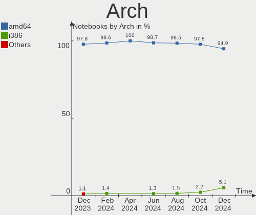
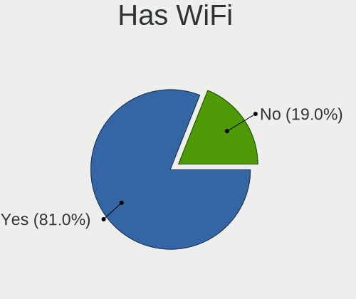
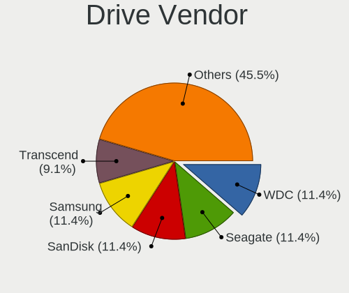
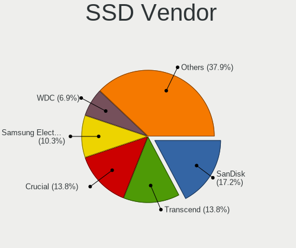
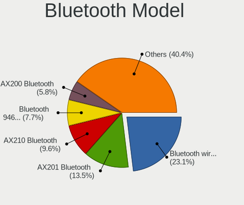
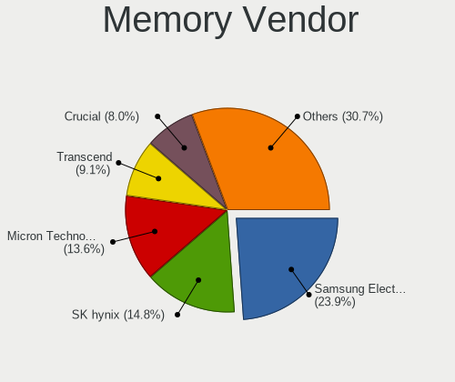

BSD - Hardware Trends (Notebooks)
---------------------------------

A project to identify most popular hardware characteristics and track their change
over time based on data collected by BSD users at https://BSD-Hardware.info.

Anyone can contribute to this report by the [hw-probe](https://github.com/linuxhw/hw-probe/blob/master/INSTALL.BSD.md) tool:

    hw-probe -all -upload

This report is for one last month. Overall report since the beginning of time: [TestDays](https://github.com/bsdhw/TestDays)

Period: Dec, 2025.

Contents
--------

* [ System ](#system)
  - [ OS                       ](#os)
  - [ OS Family                ](#os-family)
  - [ Arch                     ](#arch)
  - [ DE                       ](#de)
  - [ Display Server           ](#display-server)
  - [ Display Manager          ](#display-manager)
  - [ OS Lang                  ](#os-lang)
  - [ Boot Mode                ](#boot-mode)
  - [ Filesystem               ](#filesystem)
  - [ Part. scheme             ](#part-scheme)

* [ Board ](#board)
  - [ Vendor                   ](#vendor)
  - [ Model                    ](#model)
  - [ Model Family             ](#model-family)
  - [ MFG Year                 ](#mfg-year)
  - [ Form Factor              ](#form-factor)
  - [ Coreboot                 ](#coreboot)
  - [ RAM Size                 ](#ram-size)
  - [ RAM Used                 ](#ram-used)
  - [ Total Drives             ](#total-drives)
  - [ Has CD-ROM               ](#has-cd-rom)
  - [ Has Ethernet             ](#has-ethernet)
  - [ Has WiFi                 ](#has-wifi)
  - [ Has Bluetooth            ](#has-bluetooth)

* [ Location ](#location)
  - [ Country                  ](#country)
  - [ City                     ](#city)

* [ Drives ](#drives)
  - [ Drive Vendor             ](#drive-vendor)
  - [ Drive Model              ](#drive-model)
  - [ HDD Vendor               ](#hdd-vendor)
  - [ SSD Vendor               ](#ssd-vendor)
  - [ Drive Kind               ](#drive-kind)
  - [ Drive Connector          ](#drive-connector)
  - [ Drive Size               ](#drive-size)
  - [ Space Total              ](#space-total)
  - [ Space Used               ](#space-used)
  - [ Malfunc. Drives          ](#malfunc-drives)
  - [ Malfunc. Drive Vendor    ](#malfunc-drive-vendor)
  - [ Malfunc. HDD Vendor      ](#malfunc-hdd-vendor)
  - [ Malfunc. Drive Kind      ](#malfunc-drive-kind)
  - [ Failed Drives            ](#failed-drives)
  - [ Failed Drive Vendor      ](#failed-drive-vendor)
  - [ Drive Status             ](#drive-status)

* [ Storage controller ](#storage-controller)
  - [ Storage Vendor           ](#storage-vendor)
  - [ Storage Model            ](#storage-model)
  - [ Storage Kind             ](#storage-kind)

* [ Processor ](#processor)
  - [ CPU Vendor               ](#cpu-vendor)
  - [ CPU Model                ](#cpu-model)
  - [ CPU Model Family         ](#cpu-model-family)
  - [ CPU Cores                ](#cpu-cores)
  - [ CPU Sockets              ](#cpu-sockets)
  - [ CPU Threads              ](#cpu-threads)
  - [ CPU Microarch            ](#cpu-microarch)

* [ Graphics ](#graphics)
  - [ GPU Vendor               ](#gpu-vendor)
  - [ GPU Model                ](#gpu-model)
  - [ GPU Combo                ](#gpu-combo)
  - [ GPU Driver               ](#gpu-driver)
  - [ GPU Memory               ](#gpu-memory)

* [ Monitor ](#monitor)
  - [ Monitor Vendor           ](#monitor-vendor)
  - [ Monitor Model            ](#monitor-model)
  - [ Monitor Resolution       ](#monitor-resolution)
  - [ Monitor Diagonal         ](#monitor-diagonal)
  - [ Monitor Width            ](#monitor-width)
  - [ Aspect Ratio             ](#aspect-ratio)
  - [ Monitor Area             ](#monitor-area)
  - [ Pixel Density            ](#pixel-density)
  - [ Multiple Monitors        ](#multiple-monitors)

* [ Network ](#network)
  - [ Net Controller Vendor    ](#net-controller-vendor)
  - [ Net Controller Model     ](#net-controller-model)
  - [ Wireless Vendor          ](#wireless-vendor)
  - [ Wireless Model           ](#wireless-model)
  - [ Ethernet Vendor          ](#ethernet-vendor)
  - [ Ethernet Model           ](#ethernet-model)
  - [ Net Controller Kind      ](#net-controller-kind)
  - [ Used Controller          ](#used-controller)
  - [ NICs                     ](#nics)
  - [ IPv6                     ](#ipv6)

* [ Bluetooth ](#bluetooth)
  - [ Bluetooth Vendor         ](#bluetooth-vendor)
  - [ Bluetooth Model          ](#bluetooth-model)

* [ Sound ](#sound)
  - [ Sound Vendor             ](#sound-vendor)
  - [ Sound Model              ](#sound-model)

* [ Memory ](#memory)
  - [ Memory Vendor            ](#memory-vendor)
  - [ Memory Model             ](#memory-model)
  - [ Memory Kind              ](#memory-kind)
  - [ Memory Form Factor       ](#memory-form-factor)
  - [ Memory Size              ](#memory-size)
  - [ Memory Speed             ](#memory-speed)

* [ Printers & scanners ](#printers--scanners)
  - [ Printer Vendor           ](#printer-vendor)
  - [ Printer Model            ](#printer-model)
  - [ Scanner Vendor           ](#scanner-vendor)
  - [ Scanner Model            ](#scanner-model)

* [ Camera ](#camera)
  - [ Camera Vendor            ](#camera-vendor)
  - [ Camera Model             ](#camera-model)

* [ Security ](#security)
  - [ Fingerprint Vendor       ](#fingerprint-vendor)
  - [ Fingerprint Model        ](#fingerprint-model)
  - [ Chipcard Vendor          ](#chipcard-vendor)
  - [ Chipcard Model           ](#chipcard-model)

* [ Unsupported ](#unsupported)
  - [ Unsupported Devices      ](#unsupported-devices)
  - [ Unsupported Device Types ](#unsupported-device-types)

System
------

OS
--

Installed operating systems

| Name                      | Notebooks | Percent |
|---------------------------|-----------|---------|
| FreeBSD 15.0              | 18        | 20.45%  |
| GhostBSD 25.02-R14.3p2    | 10        | 11.36%  |
| OPNsense 25.7.10          | 7         | 7.95%   |
| FreeBSD 15.0-p1           | 7         | 7.95%   |
| GhostBSD 25.02-R14.3p4    | 6         | 6.82%   |
| helloSystem 0.8.1         | 5         | 5.68%   |
| OPNsense 25.7.8           | 4         | 4.55%   |
| OPNsense 25.10.1          | 4         | 4.55%   |
| OpenBSD 7.8               | 4         | 4.55%   |
| FreeBSD 14.3-p6           | 4         | 4.55%   |
| FreeBSD 16.0-CURRENT      | 3         | 3.41%   |
| FreeBSD 14.3              | 3         | 3.41%   |
| OPNsense 25.7.9           | 2         | 2.27%   |
| OPNsense 25.1.12          | 2         | 2.27%   |
| helloSystem 0.9.0         | 2         | 2.27%   |
| NetBSD 10.1_STABLE        | 1         | 1.14%   |
| MidnightBSD 4.0           | 1         | 1.14%   |
| FreeBSD 15.0-STABLE       | 1         | 1.14%   |
| FreeBSD 15.0-RC4-p1       | 1         | 1.14%   |
| FreeBSD 14.3-p7           | 1         | 1.14%   |
| FreeBSD 14.3-p5           | 1         | 1.14%   |
| DragonFly 6.5-DEVELOPMENT | 1         | 1.14%   |

OS Family
---------

OS without a version

| Name        | Notebooks | Percent |
|-------------|-----------|---------|
| FreeBSD     | 39        | 44.32%  |
| OPNsense    | 19        | 21.59%  |
| GhostBSD    | 16        | 18.18%  |
| helloSystem | 7         | 7.95%   |
| OpenBSD     | 4         | 4.55%   |
| NetBSD      | 1         | 1.14%   |
| MidnightBSD | 1         | 1.14%   |
| DragonFly   | 1         | 1.14%   |

Arch
----

OS architecture (x86_64, i586, etc.)

| Name   | Notebooks | Percent |
|--------|-----------|---------|
| amd64  | 83        | 94.32%  |
| macppc | 3         | 3.41%   |
| i386   | 2         | 2.27%   |

DE
--

Desktop Environment

| Name         | Notebooks | Percent |
|--------------|-----------|---------|
| Console      | 29        | 32.95%  |
| XFCE         | 16        | 18.18%  |
| MATE         | 10        | 11.36%  |
| helloDesktop | 10        | 11.36%  |
| TWM          | 9         | 10.23%  |
| KDE6         | 4         | 4.55%   |
| i3           | 2         | 2.27%   |
| AwesomeWM    | 2         | 2.27%   |
| sway:wlroots | 1         | 1.14%   |
| Openbox      | 1         | 1.14%   |
| mango        | 1         | 1.14%   |
| IceWM        | 1         | 1.14%   |
| GNOME        | 1         | 1.14%   |
| fvwm         | 1         | 1.14%   |

Display Server
--------------

X11 or Wayland

| Name    | Notebooks | Percent |
|---------|-----------|---------|
| X11     | 57        | 64.77%  |
| Console | 26        | 29.55%  |
| Wayland | 5         | 5.68%   |

Display Manager
---------------

SDDM, LightDM, etc.

| Name    | Notebooks | Percent |
|---------|-----------|---------|
| Console | 45        | 51.14%  |
| LightDM | 19        | 21.59%  |
| SDDM    | 13        | 14.77%  |
| SLiM    | 7         | 7.95%   |
| Ly      | 2         | 2.27%   |
| XDM     | 1         | 1.14%   |
| GDM     | 1         | 1.14%   |

OS Lang
-------

Language

| Lang    | Notebooks | Percent |
|---------|-----------|---------|
| C       | 37        | 42.05%  |
| Unknown | 31        | 35.23%  |
| en_US   | 11        | 12.5%   |
| es_ES   | 2         | 2.27%   |
| de_DE   | 2         | 2.27%   |
| ru_RU   | 1         | 1.14%   |
| pt_PT   | 1         | 1.14%   |
| pt_BR   | 1         | 1.14%   |
| pl_PL   | 1         | 1.14%   |
| en_CA   | 1         | 1.14%   |

Boot Mode
---------

EFI or BIOS

| Mode | Notebooks | Percent |
|------|-----------|---------|
| EFI  | 71        | 80.68%  |
| BIOS | 17        | 19.32%  |

Filesystem
----------

Type of filesystem

| Type    | Notebooks | Percent |
|---------|-----------|---------|
| Zfs     | 67        | 76.14%  |
| Ufs     | 15        | 17.05%  |
| Ffs     | 4         | 4.55%   |
| Hammer2 | 1         | 1.14%   |
| Cd9660  | 1         | 1.14%   |

Part. scheme
------------

Scheme of partitioning

| Type    | Notebooks | Percent |
|---------|-----------|---------|
| GPT     | 78        | 88.64%  |
| MBR     | 9         | 10.23%  |
| Unknown | 1         | 1.14%   |

Board
-----

Vendor
------

Motherboard manufacturer

| Name                    | Notebooks | Percent |
|-------------------------|-----------|---------|
| Lenovo                  | 27        | 30.68%  |
| Dell                    | 13        | 14.77%  |
| Deciso                  | 12        | 13.64%  |
| Hewlett-Packard         | 10        | 11.36%  |
| Apple                   | 6         | 6.82%   |
| Toshiba                 | 2         | 2.27%   |
| MSI                     | 2         | 2.27%   |
| Framework               | 2         | 2.27%   |
| ASUSTek Computer        | 2         | 2.27%   |
| Sony                    | 1         | 1.14%   |
| SIEMENS                 | 1         | 1.14%   |
| Shuttle                 | 1         | 1.14%   |
| Radio Victoria Fueguina | 1         | 1.14%   |
| Panasonic               | 1         | 1.14%   |
| Monster                 | 1         | 1.14%   |
| LG Electronics          | 1         | 1.14%   |
| Google                  | 1         | 1.14%   |
| Gigabyte Technology     | 1         | 1.14%   |
| Dynabook                | 1         | 1.14%   |
| Datto                   | 1         | 1.14%   |
| Unknown                 | 1         | 1.14%   |

Model
-----

Motherboard model

| Name                                      | Notebooks | Percent |
|-------------------------------------------|-----------|---------|
| Deciso NetBoard-A20                       | 3         | 3.41%   |
| Deciso NetBoard-A10                       | 3         | 3.41%   |
| Deciso Netboard A20                       | 3         | 3.41%   |
| Dell Inspiron 3521                        | 2         | 2.27%   |
| Deciso NetBoard-A10_Gen.3                 | 2         | 2.27%   |
| Apple PowerBook6,8                        | 2         | 2.27%   |
| Unknown                                   | 2         | 2.27%   |
| Toshiba Satellite A205                    | 1         | 1.14%   |
| Toshiba Satellite A110                    | 1         | 1.14%   |
| Sony SVE1512H1RW                          | 1         | 1.14%   |
| SIEMENS SIMATIC IPC127E                   | 1         | 1.14%   |
| Shuttle DS77U                             | 1         | 1.14%   |
| Radio Victoria Fueguina A24Win8           | 1         | 1.14%   |
| Panasonic CF-54-3                         | 1         | 1.14%   |
| MSI Prestige 15 A10SC                     | 1         | 1.14%   |
| MSI GF65 Thin 10UE                        | 1         | 1.14%   |
| Monster ABRA A5 V20.4                     | 1         | 1.14%   |
| LG X110-L.A715HS                          | 1         | 1.14%   |
| Lenovo ThinkPad X260 20F6006XUK           | 1         | 1.14%   |
| Lenovo ThinkPad X240 20AMS0250T           | 1         | 1.14%   |
| Lenovo ThinkPad X230 2325I63              | 1         | 1.14%   |
| Lenovo ThinkPad X200 7459PQ3              | 1         | 1.14%   |
| Lenovo ThinkPad X1 Extreme 2nd 20QWS0M300 | 1         | 1.14%   |
| Lenovo ThinkPad T480s 20L8S2340E          | 1         | 1.14%   |
| Lenovo ThinkPad T480 20L6S9UJ0Y           | 1         | 1.14%   |
| Lenovo ThinkPad T480 20L5000UUS           | 1         | 1.14%   |
| Lenovo ThinkPad T470 20HES5800H           | 1         | 1.14%   |
| Lenovo ThinkPad T460s 20FAS3L002          | 1         | 1.14%   |
| Lenovo ThinkPad T460 20FMA00F00           | 1         | 1.14%   |
| Lenovo ThinkPad T450s 20BXCTO1WW          | 1         | 1.14%   |
| Lenovo ThinkPad T440s 20AQ006HUS          | 1         | 1.14%   |
| Lenovo ThinkPad T440p 20AN0069US          | 1         | 1.14%   |
| Lenovo ThinkPad T420 4180W1A              | 1         | 1.14%   |
| Lenovo ThinkPad T14s Gen 6 21QXCTO1WW     | 1         | 1.14%   |
| Lenovo ThinkPad T14 Gen 2i 20W1S2JS34     | 1         | 1.14%   |
| Lenovo ThinkPad T14 Gen 2i 20W1S29800     | 1         | 1.14%   |
| Lenovo ThinkPad T14 Gen 1 20S1S80300      | 1         | 1.14%   |
| Lenovo ThinkPad T14 Gen 1 20S1S4K500      | 1         | 1.14%   |
| Lenovo ThinkPad P50 20EN0008GE            | 1         | 1.14%   |
| Lenovo ThinkPad E15 Gen 2 20T8005EUS      | 1         | 1.14%   |

Model Family
------------

Motherboard model prefix

| Name                            | Notebooks | Percent |
|---------------------------------|-----------|---------|
| Lenovo ThinkPad                 | 23        | 26.14%  |
| Dell Latitude                   | 5         | 5.68%   |
| Deciso NetBoard-A10             | 5         | 5.68%   |
| Lenovo IdeaPad                  | 4         | 4.55%   |
| HP EliteBook                    | 4         | 4.55%   |
| HP ProBook                      | 3         | 3.41%   |
| Dell Precision                  | 3         | 3.41%   |
| Dell Inspiron                   | 3         | 3.41%   |
| Deciso NetBoard-A20             | 3         | 3.41%   |
| Deciso Netboard                 | 3         | 3.41%   |
| Apple PowerBook6                | 3         | 3.41%   |
| Toshiba Satellite               | 2         | 2.27%   |
| Framework Laptop                | 2         | 2.27%   |
| Unknown                         | 2         | 2.27%   |
| Sony SVE1512H1RW                | 1         | 1.14%   |
| SIEMENS SIMATIC                 | 1         | 1.14%   |
| Shuttle DS77U                   | 1         | 1.14%   |
| Radio Victoria Fueguina A24Win8 | 1         | 1.14%   |
| Panasonic CF-54-3               | 1         | 1.14%   |
| MSI Prestige                    | 1         | 1.14%   |
| MSI GF65                        | 1         | 1.14%   |
| Monster ABRA                    | 1         | 1.14%   |
| LG X110-L.A715HS                | 1         | 1.14%   |
| HP Pavilion                     | 1         | 1.14%   |
| HP Compaq                       | 1         | 1.14%   |
| HP 255                          | 1         | 1.14%   |
| Google Cyan                     | 1         | 1.14%   |
| Gigabyte GB-BSi7A-6500          | 1         | 1.14%   |
| Dynabook TECRA                  | 1         | 1.14%   |
| Dell Vostro                     | 1         | 1.14%   |
| Dell G7                         | 1         | 1.14%   |
| Deciso DEC2700                  | 1         | 1.14%   |
| ASUS X550MD                     | 1         | 1.14%   |
| ASUS VivoBook                   | 1         | 1.14%   |
| Apple MacBookPro9               | 1         | 1.14%   |
| Apple MacBookPro12              | 1         | 1.14%   |
| Apple MacBookAir7               | 1         | 1.14%   |

MFG Year
--------

Motherboard manufacture year

| Year    | Notebooks | Percent |
|---------|-----------|---------|
| 2021    | 14        | 15.91%  |
| 2022    | 13        | 14.77%  |
| 2020    | 9         | 10.23%  |
| 2018    | 7         | 7.95%   |
| 2016    | 7         | 7.95%   |
| 2013    | 7         | 7.95%   |
| 2025    | 5         | 5.68%   |
| 2019    | 5         | 5.68%   |
| 2015    | 4         | 4.55%   |
| Unknown | 3         | 3.41%   |
| 2023    | 2         | 2.27%   |
| 2014    | 2         | 2.27%   |
| 2009    | 2         | 2.27%   |
| 2024    | 1         | 1.14%   |
| 2017    | 1         | 1.14%   |
| 2012    | 1         | 1.14%   |
| 2011    | 1         | 1.14%   |
| 2010    | 1         | 1.14%   |
| 2008    | 1         | 1.14%   |
| 2007    | 1         | 1.14%   |
| 2006    | 1         | 1.14%   |

Form Factor
-----------

Physical design of the computer

| Name     | Notebooks | Percent |
|----------|-----------|---------|
| Notebook | 88        | 100%    |

Coreboot
--------

Have coreboot on board

| Used | Notebooks | Percent |
|------|-----------|---------|
| No   | 86        | 97.73%  |
| Yes  | 2         | 2.27%   |

RAM Size
--------

Total RAM memory

| Size in GB  | Notebooks | Percent |
|-------------|-----------|---------|
| 16.01-24.0  | 34        | 38.64%  |
| 8.01-16.0   | 19        | 21.59%  |
| 4.01-8.0    | 15        | 17.05%  |
| 32.01-64.0  | 10        | 11.36%  |
| 24.01-32.0  | 2         | 2.27%   |
| 2.01-3.0    | 2         | 2.27%   |
| 64.01-256.0 | 2         | 2.27%   |
| 1.01-2.0    | 2         | 2.27%   |
| 0.51-1.0    | 1         | 1.14%   |
| 0.01-0.5    | 1         | 1.14%   |

RAM Used
--------

Used RAM memory

| Used GB  | Notebooks | Percent |
|----------|-----------|---------|
| 0.51-1.0 | 36        | 40.91%  |
| 0.01-0.5 | 31        | 35.23%  |
| 1.01-2.0 | 16        | 18.18%  |
| 2.01-3.0 | 2         | 2.27%   |
| 0        | 2         | 2.27%   |
| Unknown  | 1         | 1.14%   |

Total Drives
------------

Number of drives on board

| Drives | Notebooks | Percent |
|--------|-----------|---------|
| 1      | 43        | 48.86%  |
| 0      | 39        | 44.32%  |
| 2      | 6         | 6.82%   |

Has CD-ROM
----------

Has CD-ROM on board

| Presented | Notebooks | Percent |
|-----------|-----------|---------|
| No        | 77        | 87.5%   |
| Yes       | 11        | 12.5%   |

Has Ethernet
------------

Has Ethernet on board

| Presented | Notebooks | Percent |
|-----------|-----------|---------|
| Yes       | 71        | 80.68%  |
| No        | 17        | 19.32%  |

Has WiFi
--------

Has WiFi module

| Presented | Notebooks | Percent |
|-----------|-----------|---------|
| Yes       | 72        | 81.82%  |
| No        | 16        | 18.18%  |

Has Bluetooth
-------------

Has Bluetooth module

| Presented | Notebooks | Percent |
|-----------|-----------|---------|
| Yes       | 55        | 62.5%   |
| No        | 33        | 37.5%   |

Location
--------

Country
-------

Geographic location (country)

| Country         | Notebooks | Percent |
|-----------------|-----------|---------|
| USA             | 16        | 18.18%  |
| UK              | 10        | 11.36%  |
| Germany         | 9         | 10.23%  |
| Canada          | 6         | 6.82%   |
| Russia          | 5         | 5.68%   |
| Italy           | 4         | 4.55%   |
| Spain           | 3         | 3.41%   |
| France          | 3         | 3.41%   |
| Turkey          | 2         | 2.27%   |
| Romania         | 2         | 2.27%   |
| Poland          | 2         | 2.27%   |
| Netherlands     | 2         | 2.27%   |
| Mexico          | 2         | 2.27%   |
| Australia       | 2         | 2.27%   |
| Venezuela       | 1         | 1.14%   |
| Tunisia         | 1         | 1.14%   |
| The Netherlands | 1         | 1.14%   |
| Thailand        | 1         | 1.14%   |
| Switzerland     | 1         | 1.14%   |
| Slovakia        | 1         | 1.14%   |
| Saint Lucia     | 1         | 1.14%   |
| Portugal        | 1         | 1.14%   |
| Pakistan        | 1         | 1.14%   |
| Israel          | 1         | 1.14%   |
| Hungary         | 1         | 1.14%   |
| Greece          | 1         | 1.14%   |
| Denmark         | 1         | 1.14%   |
| Czechia         | 1         | 1.14%   |
| China           | 1         | 1.14%   |
| Chile           | 1         | 1.14%   |
| Brazil          | 1         | 1.14%   |
| Belgium         | 1         | 1.14%   |
| Austria         | 1         | 1.14%   |
| Argentina       | 1         | 1.14%   |

City
----

Geographic location (city)

| City                    | Notebooks | Percent |
|-------------------------|-----------|---------|
| Edgware                 | 6         | 6.82%   |
| Berlin                  | 3         | 3.41%   |
| Seattle                 | 2         | 2.27%   |
| Cambridge               | 2         | 2.27%   |
| Barnaul                 | 2         | 2.27%   |
| Bad Berleburg           | 2         | 2.27%   |
| Zurich                  | 1         | 1.14%   |
| Zabrze                  | 1         | 1.14%   |
| Wuppertal               | 1         | 1.14%   |
| Wilmington              | 1         | 1.14%   |
| Waterloo                | 1         | 1.14%   |
| Vitry-sur-Seine         | 1         | 1.14%   |
| Viana do Castelo        | 1         | 1.14%   |
| Turin                   | 1         | 1.14%   |
| The Hague               | 1         | 1.14%   |
| Tampa                   | 1         | 1.14%   |
| Sydney                  | 1         | 1.14%   |
| St Petersburg           | 1         | 1.14%   |
| Seville                 | 1         | 1.14%   |
| Santa Coloma de Farners | 1         | 1.14%   |
| San Fernando de Apure   | 1         | 1.14%   |
| Rosario                 | 1         | 1.14%   |
| Rockville               | 1         | 1.14%   |
| Ratchaburi              | 1         | 1.14%   |
| Rancagua                | 1         | 1.14%   |
| Prague                  | 1         | 1.14%   |
| Playa del Carmen        | 1         | 1.14%   |
| Palermo                 | 1         | 1.14%   |
| Oxnard                  | 1         | 1.14%   |
| Ooij                    | 1         | 1.14%   |
| Olympia                 | 1         | 1.14%   |
| North Vancouver         | 1         | 1.14%   |
| Norfolk                 | 1         | 1.14%   |
| Nanterre                | 1         | 1.14%   |
| Mississauga             | 1         | 1.14%   |
| Minneapolis             | 1         | 1.14%   |
| Milan                   | 1         | 1.14%   |
| Mexico City             | 1         | 1.14%   |
| Mechelen                | 1         | 1.14%   |
| Lyon                    | 1         | 1.14%   |

Drives
------

Drive Vendor
------------

Hard drive vendors

| Vendor              | Notebooks | Drives | Percent |
|---------------------|-----------|--------|---------|
| Samsung Electronics | 7         | 7      | 13.21%  |
| Transcend           | 5         | 5      | 9.43%   |
| WDC                 | 4         | 4      | 7.55%   |
| Toshiba             | 4         | 4      | 7.55%   |
| SanDisk             | 3         | 3      | 5.66%   |
| Kingston            | 3         | 3      | 5.66%   |
| Intel               | 3         | 3      | 5.66%   |
| Hitachi             | 3         | 3      | 5.66%   |
| Crucial             | 3         | 3      | 5.66%   |
| Seagate             | 2         | 2      | 3.77%   |
| PNY                 | 2         | 2      | 3.77%   |
| China               | 2         | 2      | 3.77%   |
| Apple               | 2         | 2      | 3.77%   |
| XrayDisk            | 1         | 1      | 1.89%   |
| SSSTC               | 1         | 1      | 1.89%   |
| SK hynix            | 1         | 1      | 1.89%   |
| Patriot             | 1         | 1      | 1.89%   |
| Netac               | 1         | 1      | 1.89%   |
| MSI                 | 1         | 1      | 1.89%   |
| Micron Technology   | 1         | 1      | 1.89%   |
| KIOXIA              | 1         | 1      | 1.89%   |
| Hewlett-Packard     | 1         | 1      | 1.89%   |
| Fujitsu             | 1         | 1      | 1.89%   |

Drive Model
-----------

Hard drive models

| Model                                | Notebooks | Percent |
|--------------------------------------|-----------|---------|
| Toshiba MQ01ABF050 500GB             | 2         | 3.77%   |
| Crucial CT240BX500SSD1 240GB         | 2         | 3.77%   |
| Apple SSD SM0128G 121GB              | 2         | 3.77%   |
| XrayDisk SSD 256GB                   | 1         | 1.89%   |
| WDC WDS480G2G0A-00JH30 480GB         | 1         | 1.89%   |
| WDC WDS240G2G0A-00JH30 240GB         | 1         | 1.89%   |
| WDC WD3200BPVT-75JJ5T0 320GB         | 1         | 1.89%   |
| WDC WD2500BEVT-22A23T0 250GB         | 1         | 1.89%   |
| Transcend TSG128MTS400ISI 128GB      | 1         | 1.89%   |
| Transcend TS56MSM4MD5THHT 256GB      | 1         | 1.89%   |
| Transcend TS32GSSD370S 32GB          | 1         | 1.89%   |
| Transcend TS256GMTS952T2 256GB       | 1         | 1.89%   |
| Transcend TS120GSSD220S 120GB        | 1         | 1.89%   |
| Toshiba THNS064GE4BBDC 64GB          | 1         | 1.89%   |
| Toshiba MK6025GAS 64GB               | 1         | 1.89%   |
| SSSTC CV8-8E256-11 SATA 256GB        | 1         | 1.89%   |
| SK hynix SC311 SATA 256GB            | 1         | 1.89%   |
| Seagate ST500LM012 HN-M500MBB 500GB  | 1         | 1.89%   |
| Seagate ST320LT007-9ZV142 320GB      | 1         | 1.89%   |
| SanDisk SSD PLUS 1000GB              | 1         | 1.89%   |
| SanDisk SDSSDA240G 240GB             | 1         | 1.89%   |
| SanDisk SD8SB8U-128G-1006 128GB      | 1         | 1.89%   |
| Samsung SSD 870 EVO 500GB            | 1         | 1.89%   |
| Samsung SSD 870 EVO 2TB              | 1         | 1.89%   |
| Samsung SSD 860 QVO 1TB              | 1         | 1.89%   |
| Samsung SSD 840 EVO 250GB            | 1         | 1.89%   |
| Samsung MZ7TE256HMHP-000L7 256GB     | 1         | 1.89%   |
| Samsung MZ7TE256HMHP-000H1 256GB     | 1         | 1.89%   |
| Samsung MZ7PD128HCFV-000H1 128GB     | 1         | 1.89%   |
| PNY CS900 SSD 120GB                  | 1         | 1.89%   |
| PNY CS900 240GB SSD                  | 1         | 1.89%   |
| Patriot Burst Elite 240GB            | 1         | 1.89%   |
| Netac SSD 128GB                      | 1         | 1.89%   |
| MSI S270 480GB                       | 1         | 1.89%   |
| Micron MTFDDAK480MBP-1AN1ZABHB 480GB | 1         | 1.89%   |
| KIOXIA KBG40ZNV512G 512GB            | 1         | 1.89%   |
| Kingston SV300S37A240G 240GB         | 1         | 1.89%   |
| Kingston SUV500MS120G 120GB          | 1         | 1.89%   |
| Kingston RBUSC180DS37256GJ 256GB     | 1         | 1.89%   |
| Intel SSDSCKKF128G8 SATA 128GB       | 1         | 1.89%   |

HDD Vendor
----------

Hard disk drive vendors

| Vendor  | Notebooks | Drives | Percent |
|---------|-----------|--------|---------|
| Toshiba | 3         | 3      | 27.27%  |
| Hitachi | 3         | 3      | 27.27%  |
| WDC     | 2         | 2      | 18.18%  |
| Seagate | 2         | 2      | 18.18%  |
| Fujitsu | 1         | 1      | 9.09%   |

SSD Vendor
----------

Solid state drive vendors

| Vendor              | Notebooks | Drives | Percent |
|---------------------|-----------|--------|---------|
| Samsung Electronics | 7         | 7      | 17.5%   |
| Transcend           | 5         | 5      | 12.5%   |
| SanDisk             | 3         | 3      | 7.5%    |
| Kingston            | 3         | 3      | 7.5%    |
| Crucial             | 3         | 3      | 7.5%    |
| WDC                 | 2         | 2      | 5%      |
| PNY                 | 2         | 2      | 5%      |
| Intel               | 2         | 2      | 5%      |
| China               | 2         | 2      | 5%      |
| Apple               | 2         | 2      | 5%      |
| XrayDisk            | 1         | 1      | 2.5%    |
| Toshiba             | 1         | 1      | 2.5%    |
| SSSTC               | 1         | 1      | 2.5%    |
| SK hynix            | 1         | 1      | 2.5%    |
| Patriot             | 1         | 1      | 2.5%    |
| Netac               | 1         | 1      | 2.5%    |
| MSI                 | 1         | 1      | 2.5%    |
| Micron Technology   | 1         | 1      | 2.5%    |
| Hewlett-Packard     | 1         | 1      | 2.5%    |

Drive Kind
----------

HDD or SSD

| Kind | Notebooks | Drives | Percent |
|------|-----------|--------|---------|
| SSD  | 35        | 40     | 72.92%  |
| HDD  | 11        | 11     | 22.92%  |
| NVMe | 2         | 2      | 4.17%   |

Drive Connector
---------------

SATA, SAS, NVMe, etc.

| Type | Notebooks | Drives | Percent |
|------|-----------|--------|---------|
| SATA | 45        | 51     | 95.74%  |
| NVMe | 2         | 2      | 4.26%   |

Drive Size
----------

Size of hard drive

| Size in TB | Notebooks | Drives | Percent |
|------------|-----------|--------|---------|
| 0.01-0.5   | 42        | 48     | 93.33%  |
| 0.51-1.0   | 2         | 2      | 4.44%   |
| 1.01-2.0   | 1         | 1      | 2.22%   |

Space Total
-----------

Amount of disk space available on the file system

| Size in GB | Notebooks | Percent |
|------------|-----------|---------|
| 101-250    | 45        | 51.14%  |
| 251-500    | 10        | 11.36%  |
| 21-50      | 9         | 10.23%  |
| 1-20       | 9         | 10.23%  |
| 501-1000   | 6         | 6.82%   |
| 51-100     | 6         | 6.82%   |
| Unknown    | 2         | 2.27%   |
| 1001-2000  | 1         | 1.14%   |

Space Used
----------

Amount of used disk space

| Used GB | Notebooks | Percent |
|---------|-----------|---------|
| 1-20    | 70        | 79.55%  |
| 21-50   | 8         | 9.09%   |
| 51-100  | 6         | 6.82%   |
| Unknown | 2         | 2.27%   |
| 251-500 | 1         | 1.14%   |
| 101-250 | 1         | 1.14%   |

Malfunc. Drives
---------------

Drive models with a malfunction

| Model                           | Notebooks | Drives | Percent |
|---------------------------------|-----------|--------|---------|
| XrayDisk SSD 256GB              | 1         | 1      | 10%     |
| WDC WDS480G2G0A-00JH30 480GB    | 1         | 1      | 10%     |
| WDC WD3200BPVT-75JJ5T0 320GB    | 1         | 1      | 10%     |
| Seagate ST320LT007-9ZV142 320GB | 1         | 1      | 10%     |
| SanDisk SSD PLUS 1000GB         | 1         | 1      | 10%     |
| PNY CS900 SSD 120GB             | 1         | 1      | 10%     |
| Hitachi HTS723225A7A364 250GB   | 1         | 1      | 10%     |
| Hitachi HTS723216L9SA60 160GB   | 1         | 1      | 10%     |
| Hitachi HTS543216L9SA00 160GB   | 1         | 1      | 10%     |
| Apple SSD SM0128G 121GB         | 1         | 1      | 10%     |

Malfunc. Drive Vendor
---------------------

Vendors of faulty drives

| Vendor   | Notebooks | Drives | Percent |
|----------|-----------|--------|---------|
| Hitachi  | 3         | 3      | 30%     |
| WDC      | 2         | 2      | 20%     |
| XrayDisk | 1         | 1      | 10%     |
| Seagate  | 1         | 1      | 10%     |
| SanDisk  | 1         | 1      | 10%     |
| PNY      | 1         | 1      | 10%     |
| Apple    | 1         | 1      | 10%     |

Malfunc. HDD Vendor
-------------------

Vendors of faulty HDD drives

| Vendor  | Notebooks | Drives | Percent |
|---------|-----------|--------|---------|
| Hitachi | 3         | 3      | 60%     |
| WDC     | 1         | 1      | 20%     |
| Seagate | 1         | 1      | 20%     |

Malfunc. Drive Kind
-------------------

Kinds of faulty drives

| Kind | Notebooks | Drives | Percent |
|------|-----------|--------|---------|
| SSD  | 5         | 5      | 50%     |
| HDD  | 5         | 5      | 50%     |

Failed Drives
-------------

Failed drive models

Zero info for selected period =(

Failed Drive Vendor
-------------------

Failed drive vendors

Zero info for selected period =(

Drive Status
------------

Number of failed and malfunc. drives

| Status  | Notebooks | Drives | Percent |
|---------|-----------|--------|---------|
| Works   | 38        | 43     | 79.17%  |
| Malfunc | 10        | 10     | 20.83%  |

Storage controller
------------------

Storage Vendor
--------------

Storage controller vendors

| Vendor                                  | Notebooks | Percent |
|-----------------------------------------|-----------|---------|
| Intel                                   | 48        | 48.98%  |
| Samsung Electronics                     | 11        | 11.22%  |
| Transcend                               | 9         | 9.18%   |
| SanDisk                                 | 8         | 8.16%   |
| SK hynix                                | 3         | 3.06%   |
| Phison Electronics                      | 2         | 2.04%   |
| Micron/Crucial Technology               | 2         | 2.04%   |
| Micron Technology                       | 2         | 2.04%   |
| MAXIO Technology (Hangzhou)             | 2         | 2.04%   |
| KIOXIA                                  | 2         | 2.04%   |
| AMD                                     | 2         | 2.04%   |
| Yangtze Memory Technologies             | 1         | 1.02%   |
| Toshiba                                 | 1         | 1.02%   |
| Solidigm                                | 1         | 1.02%   |
| Solid State Storage Technology          | 1         | 1.02%   |
| Shenzhen Unionmemory Information System | 1         | 1.02%   |
| Shenzhen Techwinsemi Technology         | 1         | 1.02%   |
| Kingston Technology Company             | 1         | 1.02%   |

Storage Model
-------------

Storage controller models

| Model                                                                                       | Notebooks | Percent |
|---------------------------------------------------------------------------------------------|-----------|---------|
| Intel Sunrise Point-LP SATA Controller [AHCI mode]                                          | 12        | 11.43%  |
| Intel 7 Series Chipset Family 6-port SATA Controller [AHCI mode]                            | 7         | 6.67%   |
| Transcend NVMe PCIe SSD 220S/240S/MTE710T                                                   | 5         | 4.76%   |
| SanDisk Extreme Pro / WD Black SN750 / PC SN730 / Red SN700 NVMe SSD                        | 4         | 3.81%   |
| Samsung NVMe SSD Controller SM961/PM961/SM963                                               | 4         | 3.81%   |
| Transcend NVMe PCIe SSD 110S/112S/120S/MTE300S/MTE400S/MTE652T2 (DRAM-less)                 | 3         | 2.86%   |
| Intel Wildcat Point-LP SATA Controller [AHCI Mode]                                          | 3         | 2.86%   |
| Intel Volume Management Device NVMe RAID Controller                                         | 3         | 2.86%   |
| Intel Cannon Lake Mobile PCH SATA AHCI Controller                                           | 3         | 2.86%   |
| SK hynix Gold P31/BC711/PC711 NVMe Solid State Drive                                        | 2         | 1.9%    |
| SanDisk PC SN530 NVMe SSD (DRAM-less)                                                       | 2         | 1.9%    |
| Samsung S4LN058A01[SSUBX] AHCI SSD Controller (Apple slot)                                  | 2         | 1.9%    |
| Samsung NVMe SSD Controller S4LV008[Pascal]                                                 | 2         | 1.9%    |
| MAXIO (Hangzhou) NVMe SSD Controller MAP1202 (DRAM-less)                                    | 2         | 1.9%    |
| KIOXIA NVMe SSD Controller BG4 (DRAM-less)                                                  | 2         | 1.9%    |
| Intel Tiger Lake-LP SATA Controller                                                         | 2         | 1.9%    |
| Intel Q170/Q150/B150/H170/H110/Z170/CM236 Chipset SATA Controller [AHCI Mode]               | 2         | 1.9%    |
| Intel 82801HM/HEM (ICH8M/ICH8M-E) SATA Controller [AHCI mode]                               | 2         | 1.9%    |
| Intel 82801GBM/GHM (ICH7-M Family) SATA Controller [IDE mode]                               | 2         | 1.9%    |
| Intel 8 Series SATA Controller 1 [AHCI mode]                                                | 2         | 1.9%    |
| Intel 7 Series Chipset Family 4-port SATA Controller [IDE mode]                             | 2         | 1.9%    |
| Intel 7 Series Chipset Family 2-port SATA Controller [IDE mode]                             | 2         | 1.9%    |
| AMD FCH SATA Controller [AHCI mode]                                                         | 2         | 1.9%    |
| Yangtze Memory PC210 M.2 2242 NVMe SSD                                                      | 1         | 0.95%   |
| Transcend NVMe PCIe SSD 110Q (DRAM-less)                                                    | 1         | 0.95%   |
| Toshiba XG3 NVMe SSD Controller                                                             | 1         | 0.95%   |
| Solidigm P41 Plus NVMe SSD (DRAM-less) [Echo Harbor]                                        | 1         | 0.95%   |
| Solid State Storage CL1-3D256-Q11 NVMe SSD M.2                                              | 1         | 0.95%   |
| SK hynix Platinum P41/PC801 NVMe Solid State Drive                                          | 1         | 0.95%   |
| Shenzhen Unionmemory Information System RPJYJ512MKN1QWQ PCIe 4.0 NVMe SSD 512GB (DRAM-less) | 1         | 0.95%   |
| Shenzhen Techwinsemi TE3420 series / Patriot P320 M.2 NVMe SSD (DRAM-less)                  | 1         | 0.95%   |
| Sandisk WD PC SN740 NVMe SSD 512GB (DRAM-less)                                              | 1         | 0.95%   |
| Sandisk WD PC SN5000S M.2 2280 NVMe SSD (DRAM-less)                                         | 1         | 0.95%   |
| Sandisk WD Black SN850X NVMe SSD                                                            | 1         | 0.95%   |
| Samsung NVMe SSD Controller SM981/PM981/PM983                                               | 1         | 0.95%   |
| Samsung NVMe SSD Controller PM9A1/PM9A3/980PRO                                              | 1         | 0.95%   |
| Samsung NVMe SSD 9100 PRO [PM9E1]                                                           | 1         | 0.95%   |
| Phison PS5027-E27T PCIe4 NVMe Controller (DRAM-less)                                        | 1         | 0.95%   |
| Phison PS5021-E21 PCIe4 NVMe Controller (DRAM-less)                                         | 1         | 0.95%   |
| Micron/Crucial T500 NVMe PCIe SSD                                                           | 1         | 0.95%   |

Storage Kind
------------

Kind of storage controller (IDE, SATA, NVMe, SAS, ...)

| Kind | Notebooks | Percent |
|------|-----------|---------|
| SATA | 45        | 46.88%  |
| NVMe | 42        | 43.75%  |
| IDE  | 6         | 6.25%   |
| RAID | 3         | 3.13%   |

Processor
---------

CPU Vendor
----------

Processor vendors

| Vendor  | Notebooks | Percent |
|---------|-----------|---------|
| Intel   | 68        | 77.27%  |
| AMD     | 17        | 19.32%  |
| PowerPC | 3         | 3.41%   |

CPU Model
---------

Processor models

| Model                                   | Notebooks | Percent |
|-----------------------------------------|-----------|---------|
| AMD Ryzen Embedded V1500B               | 6         | 6.82%   |
| AMD EPYC 3201 8-Core Processor          | 5         | 5.68%   |
| PowerPC 7447A (Revision 0x102)          | 3         | 3.41%   |
| Intel 11th Gen Core i5-1145G7 @ 2.60GHz | 3         | 3.41%   |
| Intel 11th Gen Core i5-1135G7 @ 2.40GHz | 3         | 3.41%   |
| Intel Core i7-9850H CPU @ 2.60GHz       | 2         | 2.27%   |
| Intel Core i7-8550U CPU @ 1.80GHz       | 2         | 2.27%   |
| Intel Core i7-6500U CPU @ 2.50GHz       | 2         | 2.27%   |
| Intel Core i5-7300U CPU @ 2.60GHz       | 2         | 2.27%   |
| Intel Core i5-6300U CPU @ 2.40GHz       | 2         | 2.27%   |
| Intel Core i5-5200U CPU @ 2.20GHz       | 2         | 2.27%   |
| Intel Core i5-10310U CPU @ 1.70GHz      | 2         | 2.27%   |
| Intel Core i5-10210U CPU @ 1.60GHz      | 2         | 2.27%   |
| Intel Core i3-7100U CPU @ 2.40GHz       | 2         | 2.27%   |
| Intel Xeon CPU E3-1535M v5 @ 2.90GHz    | 1         | 1.14%   |
| Intel Xeon CPU E3-1505M v5 @ 2.80GHz    | 1         | 1.14%   |
| Intel Pentium CPU N3530 @ 2.16GHz       | 1         | 1.14%   |
| Intel Genuine CPU T2                    | 1         | 1.14%   |
| Intel Genuine CPU                       | 1         | 1.14%   |
| Intel CPU Version                       | 1         | 1.14%   |
| Intel Core Ultra 7 258V                 | 1         | 1.14%   |
| Intel Core i7-8750H CPU @ 2.20GHz       | 1         | 1.14%   |
| Intel Core i7-6600U CPU @ 2.60GHz       | 1         | 1.14%   |
| Intel Core i7-4700MQ CPU @ 2.40GHz      | 1         | 1.14%   |
| Intel Core i7-4600U CPU @ 2.10GHz       | 1         | 1.14%   |
| Intel Core i7-3740QM CPU @ 2.70GHz      | 1         | 1.14%   |
| Intel Core i7-3632QM CPU @ 2.20GHz      | 1         | 1.14%   |
| Intel Core i7-3520M CPU @ 2.90GHz       | 1         | 1.14%   |
| Intel Core i7-10750H CPU @ 2.60GHz      | 1         | 1.14%   |
| Intel Core i7-10710U CPU @ 1.10GHz      | 1         | 1.14%   |
| Intel Core i5-8350U CPU @ 1.70GHz       | 1         | 1.14%   |
| Intel Core i5-8300H CPU @ 2.30GHz       | 1         | 1.14%   |
| Intel Core i5-8250U CPU @ 1.60GHz       | 1         | 1.14%   |
| Intel Core i5-7200U CPU @ 2.50GHz       | 1         | 1.14%   |
| Intel Core i5-5300U CPU @ 2.30GHz       | 1         | 1.14%   |
| Intel Core i5-5257U CPU @ 2.70GHz       | 1         | 1.14%   |
| Intel Core i5-5250U CPU @ 1.60GHz       | 1         | 1.14%   |
| Intel Core i5-4300U CPU @ 1.90GHz       | 1         | 1.14%   |
| Intel Core i5-4300M CPU @ 2.60GHz       | 1         | 1.14%   |
| Intel Core i5-3337U CPU @ 1.80GHz       | 1         | 1.14%   |

CPU Model Family
----------------

Processor model prefix

| Model              | Notebooks | Percent |
|--------------------|-----------|---------|
| Intel Core i5      | 22        | 25%     |
| Other              | 16        | 18.18%  |
| Intel Core i7      | 15        | 17.05%  |
| Intel Core i3      | 7         | 7.95%   |
| AMD Ryzen Embedded | 6         | 6.82%   |
| AMD EPYC           | 6         | 6.82%   |
| Intel Xeon         | 2         | 2.27%   |
| Intel Genuine      | 2         | 2.27%   |
| Intel Core 2 Duo   | 2         | 2.27%   |
| Intel Atom         | 2         | 2.27%   |
| Intel Pentium      | 1         | 1.14%   |
| Intel Core         | 1         | 1.14%   |
| Intel Celeron      | 1         | 1.14%   |
| AMD Ryzen 7        | 1         | 1.14%   |
| AMD Ryzen 5        | 1         | 1.14%   |
| AMD Ryzen 3        | 1         | 1.14%   |
| AMD Athlon         | 1         | 1.14%   |
| AMD A8             | 1         | 1.14%   |

CPU Cores
---------

Number of processor cores

| Number  | Notebooks | Percent |
|---------|-----------|---------|
| 2       | 32        | 36.36%  |
| 4       | 30        | 34.09%  |
| 8       | 11        | 12.5%   |
| 6       | 7         | 7.95%   |
| Unknown | 4         | 4.55%   |
| 1       | 3         | 3.41%   |
| 16      | 1         | 1.14%   |

CPU Sockets
-----------

Number of sockets

| Number  | Notebooks | Percent |
|---------|-----------|---------|
| 1       | 85        | 96.59%  |
| Unknown | 3         | 3.41%   |

CPU Threads
-----------

Threads per core (Hyper-Threading)

| Number  | Notebooks | Percent |
|---------|-----------|---------|
| 2       | 63        | 71.59%  |
| 1       | 18        | 20.45%  |
| Unknown | 7         | 7.95%   |

CPU Microarch
-------------

Microarchitecture

| Name        | Notebooks | Percent |
|-------------|-----------|---------|
| KabyLake    | 17        | 19.32%  |
| Zen         | 12        | 13.64%  |
| Unknown     | 11        | 12.5%   |
| Skylake     | 8         | 9.09%   |
| IvyBridge   | 8         | 9.09%   |
| TigerLake   | 7         | 7.95%   |
| Broadwell   | 5         | 5.68%   |
| Haswell     | 4         | 4.55%   |
| Silvermont  | 2         | 2.27%   |
| SandyBridge | 2         | 2.27%   |
| Core        | 2         | 2.27%   |
| CometLake   | 2         | 2.27%   |
| Zen+        | 1         | 1.14%   |
| Zen 2       | 1         | 1.14%   |
| Westmere    | 1         | 1.14%   |
| Steamroller | 1         | 1.14%   |
| Penryn      | 1         | 1.14%   |
| P6          | 1         | 1.14%   |
| Goldmont    | 1         | 1.14%   |
| Bonnell     | 1         | 1.14%   |

Graphics
--------

GPU Vendor
----------

Vendors of graphics cards

| Vendor | Notebooks | Percent |
|--------|-----------|---------|
| Intel  | 65        | 71.43%  |
| Nvidia | 18        | 19.78%  |
| AMD    | 8         | 8.79%   |

GPU Model
---------

Graphics card models

| Model                                                                         | Notebooks | Percent |
|-------------------------------------------------------------------------------|-----------|---------|
| Intel 3rd Gen Core processor Graphics Controller                              | 8         | 8.51%   |
| Intel TigerLake-LP GT2 [Iris Xe Graphics]                                     | 6         | 6.38%   |
| Intel Skylake-U GT2 [HD Graphics 520]                                         | 6         | 6.38%   |
| Intel Kaby Lake-U GT2 [HD Graphics 620]                                       | 5         | 5.32%   |
| Intel Kaby Lake-R GT2 [UHD Graphics 620]                                      | 4         | 4.26%   |
| Intel CometLake-U GT2 [UHD Graphics]                                          | 4         | 4.26%   |
| Intel CoffeeLake-H GT2 [UHD Graphics 630]                                     | 4         | 4.26%   |
| Intel Broadwell-U GT2 [HD Graphics 5500]                                      | 3         | 3.19%   |
| Nvidia TU117M [GeForce GTX 1650 Mobile / Max-Q]                               | 2         | 2.13%   |
| Nvidia NV34M [GeForce FX Go5200]                                              | 2         | 2.13%   |
| Intel Mobile 945GM/GMS/GME, 943/940GML Express Integrated Graphics Controller | 2         | 2.13%   |
| Intel Haswell-ULT Integrated Graphics Controller                              | 2         | 2.13%   |
| Intel 4th Gen Core Processor Integrated Graphics Controller                   | 2         | 2.13%   |
| Intel 2nd Generation Core Processor Family Integrated Graphics Controller     | 2         | 2.13%   |
| Nvidia TU117GLM [T1200 Laptop GPU]                                            | 1         | 1.06%   |
| Nvidia TU117GLM [Quadro T1000 Mobile]                                         | 1         | 1.06%   |
| Nvidia GP108M [GeForce MX330]                                                 | 1         | 1.06%   |
| Nvidia GP107M [GeForce GTX 1050 Ti Mobile]                                    | 1         | 1.06%   |
| Nvidia GP107M [GeForce GTX 1050 Mobile]                                       | 1         | 1.06%   |
| Nvidia GM108M [GeForce MX130]                                                 | 1         | 1.06%   |
| Nvidia GM108M [GeForce MX110]                                                 | 1         | 1.06%   |
| Nvidia GM107GLM [Quadro M2000M]                                               | 1         | 1.06%   |
| Nvidia GM107GLM [Quadro M1000M]                                               | 1         | 1.06%   |
| Nvidia GF117M [GeForce 610M/710M/810M/820M / GT 620M/625M/630M/720M]          | 1         | 1.06%   |
| Nvidia GF108M [GeForce GT 620M/630M/635M/640M LE]                             | 1         | 1.06%   |
| Nvidia GF108GLM [NVS 5200M]                                                   | 1         | 1.06%   |
| Nvidia GA106M [GeForce RTX 3060 Mobile / Max-Q]                               | 1         | 1.06%   |
| Nvidia AD107M [GeForce RTX 4050 Max-Q / Mobile]                               | 1         | 1.06%   |
| Intel TigerLake-H GT1 [UHD Graphics]                                          | 1         | 1.06%   |
| Intel Tiger Lake-LP GT2 [UHD Graphics G4]                                     | 1         | 1.06%   |
| Intel Raptor Lake-P [UHD Graphics]                                            | 1         | 1.06%   |
| Intel Raptor Lake-P [Iris Xe Graphics]                                        | 1         | 1.06%   |
| Intel Mobile GM965/GL960 Integrated Graphics Controller (secondary)           | 1         | 1.06%   |
| Intel Mobile GM965/GL960 Integrated Graphics Controller (primary)             | 1         | 1.06%   |
| Intel Mobile 945GSE Express Integrated Graphics Controller                    | 1         | 1.06%   |
| Intel Mobile 945GM/GMS, 943/940GML Express Integrated Graphics Controller     | 1         | 1.06%   |
| Intel Mobile 4 Series Chipset Integrated Graphics Controller                  | 1         | 1.06%   |
| Intel Lunar Lake [Intel Arc Graphics 130V / 140V]                             | 1         | 1.06%   |
| Intel Core Processor Integrated Graphics Controller                           | 1         | 1.06%   |
| Intel CometLake-H GT2 [UHD Graphics]                                          | 1         | 1.06%   |

GPU Combo
---------

Combinations of graphics cards

| Name           | Notebooks | Percent |
|----------------|-----------|---------|
| 1 x Intel      | 46        | 52.27%  |
| Intel + Nvidia | 14        | 15.91%  |
| Other          | 12        | 13.64%  |
| 1 x AMD        | 7         | 7.95%   |
| 2 x Intel      | 4         | 4.55%   |
| 1 x Nvidia     | 4         | 4.55%   |
| Intel + AMD    | 1         | 1.14%   |

GPU Driver
----------

Free vs proprietary

| Driver      | Notebooks | Percent |
|-------------|-----------|---------|
| Free        | 68        | 77.27%  |
| Unknown     | 14        | 15.91%  |
| Proprietary | 6         | 6.82%   |

GPU Memory
----------

Total video memory

| Size in GB | Notebooks | Percent |
|------------|-----------|---------|
| Unknown    | 84        | 95.45%  |
| 1.01-2.0   | 2         | 2.27%   |
| 3.01-4.0   | 1         | 1.14%   |
| 0.01-0.5   | 1         | 1.14%   |

Monitor
-------

Monitor Vendor
--------------

Monitor vendors

| Vendor                  | Notebooks | Percent |
|-------------------------|-----------|---------|
| AU Optronics            | 12        | 20.69%  |
| LG Display              | 11        | 18.97%  |
| BOE                     | 9         | 15.52%  |
| Chimei Innolux          | 7         | 12.07%  |
| Apple                   | 4         | 6.9%    |
| Samsung Electronics     | 2         | 3.45%   |
| HKC                     | 2         | 3.45%   |
| Chi Mei Optoelectronics | 2         | 3.45%   |
| AOC                     | 2         | 3.45%   |
| Unknown                 | 1         | 1.72%   |
| PANDA                   | 1         | 1.72%   |
| LG Philips              | 1         | 1.72%   |
| Lenovo                  | 1         | 1.72%   |
| Iiyama                  | 1         | 1.72%   |
| HannStar                | 1         | 1.72%   |
| ASUSTek Computer        | 1         | 1.72%   |

Monitor Model
-------------

Monitor models

| Model                                                                    | Notebooks | Percent |
|--------------------------------------------------------------------------|-----------|---------|
| Chimei Innolux LCD Monitor CMN15D5 1920x1080 340x190mm 15.3-inch         | 2         | 3.45%   |
| Chimei Innolux LCD Monitor CMN14C9 1920x1080 310x170mm 13.9-inch         | 2         | 3.45%   |
| BOE LCD Monitor BOE095F 2256x1504 280x190mm 13.3-inch                    | 2         | 3.45%   |
| AU Optronics LCD Monitor AUO323D 1920x1080 310x170mm 13.9-inch           | 2         | 3.45%   |
| Unknown LCD Monitor Sharp 3840x2160                                      | 1         | 1.72%   |
| Samsung Electronics LCD Monitor SEC544B 1600x900 340x190mm 15.3-inch     | 1         | 1.72%   |
| Samsung Electronics LCD Monitor SEC3633 1280x800 330x210mm 15.4-inch     | 1         | 1.72%   |
| PANDA LCD Monitor NCP0021 1920x1080 340x190mm 15.3-inch                  | 1         | 1.72%   |
| LG Philips LCD Monitor LPLDC00 1280x800 330x210mm 15.4-inch              | 1         | 1.72%   |
| LG Display LCD Monitor LGD06EF 1920x1080 310x170mm 13.9-inch             | 1         | 1.72%   |
| LG Display LCD Monitor LGD062E 1920x1080 340x190mm 15.3-inch             | 1         | 1.72%   |
| LG Display LCD Monitor LGD05D0 1920x1080 340x190mm 15.3-inch             | 1         | 1.72%   |
| LG Display LCD Monitor LGD0521 1920x1080 310x170mm 13.9-inch             | 1         | 1.72%   |
| LG Display LCD Monitor LGD04B9 1920x1080 340x190mm 15.3-inch             | 1         | 1.72%   |
| LG Display LCD Monitor LGD0490 1920x1080 310x170mm 13.9-inch             | 1         | 1.72%   |
| LG Display LCD Monitor LGD040A 1920x1080 310x170mm 13.9-inch             | 1         | 1.72%   |
| LG Display LCD Monitor LGD03D2 1366x768 310x170mm 13.9-inch              | 1         | 1.72%   |
| LG Display LCD Monitor LGD03AB 1366x768 340x190mm 15.3-inch              | 1         | 1.72%   |
| LG Display LCD Monitor LGD03A3 1366x768 280x160mm 12.7-inch              | 1         | 1.72%   |
| LG Display LCD Monitor LGD0354 1366x768 290x170mm 13.2-inch              | 1         | 1.72%   |
| Lenovo LCD Monitor LEN4010 1280x800 260x160mm 12.0-inch                  | 1         | 1.72%   |
| Iiyama PLX2483H IVM6114 1920x1080 530x300mm 24.0-inch                    | 1         | 1.72%   |
| HKC S01 HKC2113 1920x1080 480x260mm 21.5-inch                            | 1         | 1.72%   |
| HKC LCD Monitor HKC023D 1920x1080 340x190mm 15.3-inch                    | 1         | 1.72%   |
| HannStar HSD140PHW1 HSD0583 1366x768 310x170mm 13.9-inch                 | 1         | 1.72%   |
| Chimei Innolux LCD Monitor CMN160F 1920x1200 340x220mm 15.9-inch         | 1         | 1.72%   |
| Chimei Innolux LCD Monitor CMN1521 1920x1080 340x190mm 15.3-inch         | 1         | 1.72%   |
| Chimei Innolux LCD Monitor CMN14D6 1366x768 310x170mm 13.9-inch          | 1         | 1.72%   |
| Chi Mei Optoelectronics LCD Monitor CMO15AB 1366x768 340x190mm 15.3-inch | 1         | 1.72%   |
| Chi Mei Optoelectronics LCD Monitor CMO15A7 1366x768 350x190mm 15.7-inch | 1         | 1.72%   |
| BOE LCD Monitor BOE0CCD 1920x1200 340x220mm 15.9-inch                    | 1         | 1.72%   |
| BOE LCD Monitor BOE0B76 1920x1200 340x220mm 15.9-inch                    | 1         | 1.72%   |
| BOE LCD Monitor BOE09F0 1920x1080 310x170mm 13.9-inch                    | 1         | 1.72%   |
| BOE LCD Monitor BOE08F2 1920x1080 310x170mm 13.9-inch                    | 1         | 1.72%   |
| BOE LCD Monitor BOE0890 1920x1080 310x170mm 13.9-inch                    | 1         | 1.72%   |
| BOE LCD Monitor BOE086B 1366x768 340x190mm 15.3-inch                     | 1         | 1.72%   |
| BOE LCD Monitor BOE0791 1920x1080 310x170mm 13.9-inch                    | 1         | 1.72%   |
| AU Optronics LCD Monitor AUOB79F 1920x1080 340x190mm 15.3-inch           | 1         | 1.72%   |
| AU Optronics LCD Monitor AUO6092 1920x1080 340x190mm 15.3-inch           | 1         | 1.72%   |
| AU Optronics LCD Monitor AUO45EC 1366x768 340x190mm 15.3-inch            | 1         | 1.72%   |

Monitor Resolution
------------------

Monitor screen resolution

| Resolution        | Notebooks | Percent |
|-------------------|-----------|---------|
| 1920x1080 (FHD)   | 30        | 51.72%  |
| 1366x768 (WXGA)   | 12        | 20.69%  |
| 1280x800 (WXGA)   | 4         | 6.9%    |
| 1920x1200 (WUXGA) | 3         | 5.17%   |
| 2256x1504         | 2         | 3.45%   |
| 1600x900 (HD+)    | 2         | 3.45%   |
| 3840x2160 (4K)    | 1         | 1.72%   |
| 2560x1600         | 1         | 1.72%   |
| 2560x1440 (QHD)   | 1         | 1.72%   |
| 1440x900 (WXGA+)  | 1         | 1.72%   |
| 1024x768 (XGA)    | 1         | 1.72%   |

Monitor Diagonal
----------------

Diagonal size in inches

| Inches  | Notebooks | Percent |
|---------|-----------|---------|
| 13      | 25        | 43.1%   |
| 15      | 22        | 37.93%  |
| 12      | 3         | 5.17%   |
| 24      | 2         | 3.45%   |
| 11      | 2         | 3.45%   |
| 27      | 1         | 1.72%   |
| 21      | 1         | 1.72%   |
| 19      | 1         | 1.72%   |
| Unknown | 1         | 1.72%   |

Monitor Width
-------------

Physical width

| Width in mm | Notebooks | Percent |
|-------------|-----------|---------|
| 301-350     | 41        | 70.69%  |
| 201-300     | 11        | 18.97%  |
| 501-600     | 3         | 5.17%   |
| 401-500     | 2         | 3.45%   |
| Unknown     | 1         | 1.72%   |

Aspect Ratio
------------

Proportional relationship between the width and the height

| Ratio   | Notebooks | Percent |
|---------|-----------|---------|
| 16/9    | 42        | 76.36%  |
| 16/10   | 6         | 10.91%  |
| 3/2     | 5         | 9.09%   |
| 4/3     | 1         | 1.82%   |
| Unknown | 1         | 1.82%   |

Monitor Area
------------

Area in inch

| Area in inch | Notebooks | Percent |
|----------------|-----------|---------|
| 81-90          | 24        | 41.38%  |
| 91-100         | 16        | 27.59%  |
| 61-70          | 4         | 6.9%    |
| 111-120        | 3         | 5.17%   |
| 101-110        | 3         | 5.17%   |
| 201-250        | 2         | 3.45%   |
| 151-200        | 2         | 3.45%   |
| 71-80          | 1         | 1.72%   |
| 51-60          | 1         | 1.72%   |
| 301-350        | 1         | 1.72%   |
| Unknown        | 1         | 1.72%   |

Pixel Density
-------------

Pixels per inch

| Density | Notebooks | Percent |
|---------|-----------|---------|
| 121-160 | 33        | 57.89%  |
| 101-120 | 13        | 22.81%  |
| 51-100  | 6         | 10.53%  |
| 161-240 | 4         | 7.02%   |
| Unknown | 1         | 1.75%   |

Multiple Monitors
-----------------

Total monitors connected

| Total | Notebooks | Percent |
|-------|-----------|---------|
| 1     | 48        | 54.55%  |
| 0     | 35        | 39.77%  |
| 2     | 5         | 5.68%   |

Network
-------

Net Controller Vendor
---------------------

Controller vendors

| Vendor                   | Notebooks | Percent |
|--------------------------|-----------|---------|
| Intel                    | 65        | 52.85%  |
| Realtek Semiconductor    | 23        | 18.7%   |
| AMD                      | 12        | 9.76%   |
| Broadcom                 | 8         | 6.5%    |
| Qualcomm Atheros         | 6         | 4.88%   |
| Apple                    | 3         | 2.44%   |
| Sierra Wireless          | 2         | 1.63%   |
| U-Blox                   | 1         | 0.81%   |
| MediaTek                 | 1         | 0.81%   |
| Marvell Technology Group | 1         | 0.81%   |
| Google                   | 1         | 0.81%   |

Net Controller Model
--------------------

Controller models

| Model                                                                  | Notebooks | Percent |
|------------------------------------------------------------------------|-----------|---------|
| Realtek RTL8111/8168/8211/8411 PCI Express Gigabit Ethernet Controller | 13        | 8.02%   |
| AMD XGMAC 10GbE Controller                                             | 12        | 7.41%   |
| Intel Wireless 8265 / 8275                                             | 8         | 4.94%   |
| Intel Wi-Fi 6 AX201                                                    | 6         | 3.7%    |
| Intel I210 Gigabit Network Connection                                  | 6         | 3.7%    |
| Realtek RTL810xE PCI Express Fast Ethernet controller                  | 5         | 3.09%   |
| Intel Comet Lake PCH-LP CNVi WiFi                                      | 5         | 3.09%   |
| Intel Wi-Fi 6 AX200                                                    | 4         | 2.47%   |
| Intel I211 Gigabit Network Connection                                  | 4         | 2.47%   |
| Intel Ethernet Controller I225-V                                       | 4         | 2.47%   |
| Intel Ethernet Connection I219-LM                                      | 4         | 2.47%   |
| Intel Ethernet Connection (4) I219-LM                                  | 4         | 2.47%   |
| Intel Wireless 8260                                                    | 3         | 1.85%   |
| Intel Wireless 7265                                                    | 3         | 1.85%   |
| Intel Wireless 7260                                                    | 3         | 1.85%   |
| Intel Ethernet Connection (4) I219-V                                   | 3         | 1.85%   |
| Intel 82579LM Gigabit Network Connection (Lewisville)                  | 3         | 1.85%   |
| Broadcom BCM4306 802.11b/g Wireless LAN Controller                     | 3         | 1.85%   |
| Apple UniNorth 2 GMAC (Sun GEM)                                        | 3         | 1.85%   |
| Sierra Wireless EM7455                                                 | 2         | 1.23%   |
| Realtek RTL8822CE 802.11ac PCIe Wireless Network Adapter               | 2         | 1.23%   |
| Qualcomm Atheros QCA9565 / AR9565 Wireless Network Adapter             | 2         | 1.23%   |
| Qualcomm Atheros AR9485 Wireless Network Adapter                       | 2         | 1.23%   |
| Intel Wi-Fi 6E(802.11ax) AX210/AX1675* 2x2 [Typhoon Peak]              | 2         | 1.23%   |
| Intel PRO/Wireless 3945ABG [Golan] Network Connection                  | 2         | 1.23%   |
| Intel Ethernet Connection I218-LM                                      | 2         | 1.23%   |
| Intel Ethernet Connection (7) I219-LM                                  | 2         | 1.23%   |
| Intel Ethernet Connection (2) I219-LM                                  | 2         | 1.23%   |
| Intel Ethernet Connection (13) I219-LM                                 | 2         | 1.23%   |
| Intel Ethernet Connection (10) I219-LM                                 | 2         | 1.23%   |
| Intel Centrino Ultimate-N 6300                                         | 2         | 1.23%   |
| Intel Alder Lake-P PCH CNVi WiFi                                       | 2         | 1.23%   |
| U-Blox [u-blox 8]                                                      | 1         | 0.62%   |
| Realtek USB 2.5GbE Controller                                          | 1         | 0.62%   |
| Realtek RTL8852BE PCIe 802.11ax Wireless Network Controller            | 1         | 0.62%   |
| Realtek RTL8723BE PCIe Wireless Network Adapter                        | 1         | 0.62%   |
| Realtek RTL8723AE PCIe Wireless Network Adapter                        | 1         | 0.62%   |
| Realtek RTL8191SEvB Wireless LAN Controller                            | 1         | 0.62%   |
| Realtek RTL8188EUS 802.11n Wireless Network Adapter                    | 1         | 0.62%   |
| Realtek RTL8188EE Wireless Network Adapter                             | 1         | 0.62%   |

Wireless Vendor
---------------

Wireless vendors

| Vendor                | Notebooks | Percent |
|-----------------------|-----------|---------|
| Intel                 | 49        | 65.33%  |
| Realtek Semiconductor | 10        | 13.33%  |
| Broadcom              | 8         | 10.67%  |
| Qualcomm Atheros      | 5         | 6.67%   |
| Sierra Wireless       | 2         | 2.67%   |
| MediaTek              | 1         | 1.33%   |

Wireless Model
--------------

Wireless models

| Model                                                           | Notebooks | Percent |
|-----------------------------------------------------------------|-----------|---------|
| Intel Wireless 8265 / 8275                                      | 8         | 10.67%  |
| Intel Wi-Fi 6 AX201                                             | 6         | 8%      |
| Intel Comet Lake PCH-LP CNVi WiFi                               | 5         | 6.67%   |
| Intel Wi-Fi 6 AX200                                             | 4         | 5.33%   |
| Intel Wireless 8260                                             | 3         | 4%      |
| Intel Wireless 7265                                             | 3         | 4%      |
| Intel Wireless 7260                                             | 3         | 4%      |
| Broadcom BCM4306 802.11b/g Wireless LAN Controller              | 3         | 4%      |
| Sierra Wireless EM7455                                          | 2         | 2.67%   |
| Realtek RTL8822CE 802.11ac PCIe Wireless Network Adapter        | 2         | 2.67%   |
| Qualcomm Atheros QCA9565 / AR9565 Wireless Network Adapter      | 2         | 2.67%   |
| Qualcomm Atheros AR9485 Wireless Network Adapter                | 2         | 2.67%   |
| Intel Wi-Fi 6E(802.11ax) AX210/AX1675* 2x2 [Typhoon Peak]       | 2         | 2.67%   |
| Intel PRO/Wireless 3945ABG [Golan] Network Connection           | 2         | 2.67%   |
| Intel Centrino Ultimate-N 6300                                  | 2         | 2.67%   |
| Intel Alder Lake-P PCH CNVi WiFi                                | 2         | 2.67%   |
| Realtek RTL8852BE PCIe 802.11ax Wireless Network Controller     | 1         | 1.33%   |
| Realtek RTL8723BE PCIe Wireless Network Adapter                 | 1         | 1.33%   |
| Realtek RTL8723AE PCIe Wireless Network Adapter                 | 1         | 1.33%   |
| Realtek RTL8191SEvB Wireless LAN Controller                     | 1         | 1.33%   |
| Realtek RTL8188EUS 802.11n Wireless Network Adapter             | 1         | 1.33%   |
| Realtek RTL8188EE Wireless Network Adapter                      | 1         | 1.33%   |
| Realtek RTL8188CE 802.11b/g/n WiFi Adapter                      | 1         | 1.33%   |
| Realtek RTL8187SE Wireless LAN Controller                       | 1         | 1.33%   |
| Qualcomm Atheros QCA9377 802.11ac Wireless Network Adapter      | 1         | 1.33%   |
| MediaTek MT7925 (RZ717) Wi-Fi 7 160MHz                          | 1         | 1.33%   |
| Intel Wireless 3165                                             | 1         | 1.33%   |
| Intel Wi-Fi 7(802.11be) AX1775*/AX1790*/BE20*/BE401/BE1750* 2x2 | 1         | 1.33%   |
| Intel PRO/Wireless 5100 AGN [Shiloh] Network Connection         | 1         | 1.33%   |
| Intel Dual Band Wireless-AC 3165 Plus Bluetooth                 | 1         | 1.33%   |
| Intel Comet Lake PCH CNVi WiFi                                  | 1         | 1.33%   |
| Intel Centrino Advanced-N 6235                                  | 1         | 1.33%   |
| Intel Centrino Advanced-N 6205 [Taylor Peak]                    | 1         | 1.33%   |
| Intel Cannon Lake PCH CNVi WiFi                                 | 1         | 1.33%   |
| Intel BE201 320MHz                                              | 1         | 1.33%   |
| Broadcom BCM43602 802.11ac Wireless LAN SoC                     | 1         | 1.33%   |
| Broadcom BCM4360 802.11ac Dual Band Wireless Network Adapter    | 1         | 1.33%   |
| Broadcom BCM4331 802.11a/b/g/n                                  | 1         | 1.33%   |
| Broadcom BCM43142 802.11b/g/n                                   | 1         | 1.33%   |
| Broadcom BCM4313 802.11bgn Wireless Network Adapter             | 1         | 1.33%   |

Ethernet Vendor
---------------

Ethernet vendors

| Vendor                   | Notebooks | Percent |
|--------------------------|-----------|---------|
| Intel                    | 45        | 54.22%  |
| Realtek Semiconductor    | 19        | 22.89%  |
| AMD                      | 12        | 14.46%  |
| Apple                    | 3         | 3.61%   |
| Qualcomm Atheros         | 2         | 2.41%   |
| Marvell Technology Group | 1         | 1.2%    |
| Broadcom                 | 1         | 1.2%    |

Ethernet Model
--------------

Ethernet models

| Model                                                                  | Notebooks | Percent |
|------------------------------------------------------------------------|-----------|---------|
| Realtek RTL8111/8168/8211/8411 PCI Express Gigabit Ethernet Controller | 13        | 15.29%  |
| AMD XGMAC 10GbE Controller                                             | 12        | 14.12%  |
| Intel I210 Gigabit Network Connection                                  | 6         | 7.06%   |
| Realtek RTL810xE PCI Express Fast Ethernet controller                  | 5         | 5.88%   |
| Intel I211 Gigabit Network Connection                                  | 4         | 4.71%   |
| Intel Ethernet Controller I225-V                                       | 4         | 4.71%   |
| Intel Ethernet Connection I219-LM                                      | 4         | 4.71%   |
| Intel Ethernet Connection (4) I219-LM                                  | 4         | 4.71%   |
| Intel Ethernet Connection (4) I219-V                                   | 3         | 3.53%   |
| Intel 82579LM Gigabit Network Connection (Lewisville)                  | 3         | 3.53%   |
| Apple UniNorth 2 GMAC (Sun GEM)                                        | 3         | 3.53%   |
| Intel Ethernet Connection I218-LM                                      | 2         | 2.35%   |
| Intel Ethernet Connection (7) I219-LM                                  | 2         | 2.35%   |
| Intel Ethernet Connection (2) I219-LM                                  | 2         | 2.35%   |
| Intel Ethernet Connection (13) I219-LM                                 | 2         | 2.35%   |
| Intel Ethernet Connection (10) I219-LM                                 | 2         | 2.35%   |
| Realtek USB 2.5GbE Controller                                          | 1         | 1.18%   |
| Qualcomm Atheros Killer E2400 Gigabit Ethernet Controller              | 1         | 1.18%   |
| Qualcomm Atheros AR8161 Gigabit Ethernet                               | 1         | 1.18%   |
| Marvell Group 88E8039 PCI-E Fast Ethernet Controller                   | 1         | 1.18%   |
| Intel Ethernet Controller I226-V                                       | 1         | 1.18%   |
| Intel Ethernet Connection I219-V                                       | 1         | 1.18%   |
| Intel Ethernet Connection I217-LM                                      | 1         | 1.18%   |
| Intel Ethernet Connection (3) I218-V                                   | 1         | 1.18%   |
| Intel Ethernet Connection (3) I218-LM                                  | 1         | 1.18%   |
| Intel Ethernet Connection (14) I219-V                                  | 1         | 1.18%   |
| Intel Ethernet Connection (10) I219-V                                  | 1         | 1.18%   |
| Intel 82567LM Gigabit Network Connection                               | 1         | 1.18%   |
| Intel 82562GT 10/100 Network Connection                                | 1         | 1.18%   |
| Broadcom NetXtreme BCM57765 Gigabit Ethernet PCIe                      | 1         | 1.18%   |

Net Controller Kind
-------------------

Ethernet, WiFi or modem

| Kind     | Notebooks | Percent |
|----------|-----------|---------|
| WiFi     | 72        | 49.66%  |
| Ethernet | 71        | 48.97%  |
| Modem    | 1         | 0.69%   |
| Unknown  | 1         | 0.69%   |

Used Controller
---------------

Currently used network controller

| Kind     | Notebooks | Percent |
|----------|-----------|---------|
| WiFi     | 44        | 56.41%  |
| Ethernet | 34        | 43.59%  |

NICs
----

Total network controllers on board

| Total | Notebooks | Percent |
|-------|-----------|---------|
| 2     | 53        | 60.23%  |
| 1     | 20        | 22.73%  |
| 6     | 6         | 6.82%   |
| 5     | 5         | 5.68%   |
| 3     | 3         | 3.41%   |
| 9     | 1         | 1.14%   |

IPv6
----

IPv6 vs IPv4

| Used | Notebooks | Percent |
|------|-----------|---------|
| No   | 71        | 80.68%  |
| Yes  | 17        | 19.32%  |

Bluetooth
---------

Bluetooth Vendor
----------------

Controller vendors

| Vendor                          | Notebooks | Percent |
|---------------------------------|-----------|---------|
| Intel                           | 38        | 67.86%  |
| Realtek Semiconductor           | 4         | 7.14%   |
| Qualcomm Atheros Communications | 3         | 5.36%   |
| Broadcom                        | 3         | 5.36%   |
| Apple                           | 3         | 5.36%   |
| Toshiba                         | 1         | 1.79%   |
| MediaTek                        | 1         | 1.79%   |
| IMC Networks                    | 1         | 1.79%   |
| Foxconn / Hon Hai               | 1         | 1.79%   |
| ASUSTek Computer                | 1         | 1.79%   |

Bluetooth Model
---------------

Controller models

| Model                                                       | Notebooks | Percent |
|-------------------------------------------------------------|-----------|---------|
| Intel Bluetooth wireless interface                          | 15        | 26.79%  |
| Intel AX201 Bluetooth                                       | 12        | 21.43%  |
| Intel AX200 Bluetooth                                       | 3         | 5.36%   |
| Realtek Bluetooth Adapter                                   | 2         | 3.57%   |
| Qualcomm Atheros AR9462 Bluetooth                           | 2         | 3.57%   |
| Intel Bluetooth 9460/9560 Jefferson Peak (JfP)              | 2         | 3.57%   |
| Intel AX210 Bluetooth                                       | 2         | 3.57%   |
| Apple Broadcom Built-in Bluetooth                           | 2         | 3.57%   |
| Toshiba Realtek Bluetooth 4.0 + High Speed Chip             | 1         | 1.79%   |
| Realtek Bluetooth 4.2 Adapter                               | 1         | 1.79%   |
| Realtek Bluetooth 4.0 + High Speed Chip                     | 1         | 1.79%   |
| Qualcomm Atheros Dell Wireless 1703 Bluetooth               | 1         | 1.79%   |
| MediaTek Wireless_Device                                    | 1         | 1.79%   |
| Intel Centrino Bluetooth Wireless Transceiver               | 1         | 1.79%   |
| Intel BE200 Bluetooth                                       | 1         | 1.79%   |
| Intel AX211 Bluetooth                                       | 1         | 1.79%   |
| IMC Networks Qualcomm Atheros Bluetooth 4.1                 | 1         | 1.79%   |
| Foxconn / Hon Hai Qualcomm Atheros AR3012 Bluetooth Adapter | 1         | 1.79%   |
| Broadcom BCM20702 Bluetooth 4.0 [ThinkPad]                  | 1         | 1.79%   |
| Broadcom BCM2045B (BDC-2.1) [Bluetooth Controller]          | 1         | 1.79%   |
| Broadcom BCM2045B (BDC-2.1)                                 | 1         | 1.79%   |
| ASUS Broadcom BCM20702A0 Bluetooth                          | 1         | 1.79%   |
| Apple Bluetooth Host Controller                             | 1         | 1.79%   |
| Unknown                                                     | 1         | 1.79%   |

Sound
-----

Sound Vendor
------------

Sound card vendors

| Vendor | Notebooks | Percent |
|--------|-----------|---------|
| Intel  | 68        | 79.07%  |
| AMD    | 11        | 12.79%  |
| Nvidia | 6         | 6.98%   |
| Trust  | 1         | 1.16%   |

Sound Model
-----------

Sound card models

| Model                                                                                             | Notebooks | Percent |
|---------------------------------------------------------------------------------------------------|-----------|---------|
| Intel Sunrise Point-LP HD Audio                                                                   | 15        | 15.15%  |
| Intel 7 Series/C216 Chipset Family High Definition Audio Controller                               | 9         | 9.09%   |
| AMD Ryzen HD Audio Controller                                                                     | 9         | 9.09%   |
| Intel Tiger Lake-LP Smart Sound Technology Audio Controller                                       | 7         | 7.07%   |
| Intel Wildcat Point-LP High Definition Audio Controller                                           | 5         | 5.05%   |
| Intel Comet Lake PCH-LP cAVS                                                                      | 5         | 5.05%   |
| Intel Broadwell-U Audio Controller                                                                | 5         | 5.05%   |
| Intel Cannon Lake PCH cAVS                                                                        | 4         | 4.04%   |
| Nvidia TU107 GeForce GTX 1650 High Definition Audio Controller                                    | 2         | 2.02%   |
| Nvidia GM107 High Definition Audio Controller [GeForce 940MX]                                     | 2         | 2.02%   |
| Intel Xeon E3-1200 v3/4th Gen Core Processor HD Audio Controller                                  | 2         | 2.02%   |
| Intel Raptor Lake-P/U/H cAVS                                                                      | 2         | 2.02%   |
| Intel NM10/ICH7 Family High Definition Audio Controller                                           | 2         | 2.02%   |
| Intel Haswell-ULT HD Audio Controller                                                             | 2         | 2.02%   |
| Intel Alder Lake PCH-P High Definition Audio Controller                                           | 2         | 2.02%   |
| Intel 82801H (ICH8 Family) HD Audio Controller                                                    | 2         | 2.02%   |
| Intel 8 Series/C220 Series Chipset High Definition Audio Controller                               | 2         | 2.02%   |
| Intel 8 Series HD Audio Controller                                                                | 2         | 2.02%   |
| Intel 100 Series/C230 Series Chipset Family HD Audio Controller                                   | 2         | 2.02%   |
| AMD Renoir/Cezanne HDMI/DP Audio Controller                                                       | 2         | 2.02%   |
| Trust Trust AYDA                                                                                  | 1         | 1.01%   |
| Nvidia GA106 High Definition Audio Controller                                                     | 1         | 1.01%   |
| Nvidia AD107 High Definition Audio Controller                                                     | 1         | 1.01%   |
| Intel Tiger Lake-H HD Audio Controller                                                            | 1         | 1.01%   |
| Intel Lunar Lake-M HD Audio Controller                                                            | 1         | 1.01%   |
| Intel Comet Lake PCH cAVS                                                                         | 1         | 1.01%   |
| Intel Celeron N3350/Pentium N4200/Atom E3900 Series Audio Cluster                                 | 1         | 1.01%   |
| Intel Atom/Celeron/Pentium Processor x5-E8000/J3xxx/N3xxx Series High Definition Audio Controller | 1         | 1.01%   |
| Intel Atom Processor Z36xxx/Z37xxx Series High Definition Audio Controller                        | 1         | 1.01%   |
| Intel 82801I (ICH9 Family) HD Audio Controller                                                    | 1         | 1.01%   |
| Intel 6 Series/C200 Series Chipset Family High Definition Audio Controller                        | 1         | 1.01%   |
| Intel 5 Series/3400 Series Chipset High Definition Audio                                          | 1         | 1.01%   |
| AMD Raven/Raven2/Fenghuang HDMI/DP Audio Controller                                               | 1         | 1.01%   |
| AMD Radeon High Definition Audio Controller                                                       | 1         | 1.01%   |
| AMD Kaveri HDMI/DP Audio Controller                                                               | 1         | 1.01%   |
| AMD FCH Azalia Controller                                                                         | 1         | 1.01%   |

Memory
------

Memory Vendor
-------------

Memory module vendors

| Vendor              | Notebooks | Percent |
|---------------------|-----------|---------|
| Samsung Electronics | 27        | 27%     |
| SK hynix            | 20        | 20%     |
| Transcend           | 13        | 13%     |
| Micron Technology   | 8         | 8%      |
| Kingston            | 8         | 8%      |
| Crucial             | 5         | 5%      |
| Unknown             | 3         | 3%      |
| Elpida              | 3         | 3%      |
| Unknown             | 3         | 3%      |
| Team                | 2         | 2%      |
| Corsair             | 2         | 2%      |
| Wilk                | 1         | 1%      |
| Smart               | 1         | 1%      |
| Ramaxel Technology  | 1         | 1%      |
| Novatech            | 1         | 1%      |
| KingFast            | 1         | 1%      |
| Apacer              | 1         | 1%      |

Memory Model
------------

Memory module models

| Model                                                   | Notebooks | Percent |
|---------------------------------------------------------|-----------|---------|
| Transcend RAM TS1GLH64V6BL 8GB SODIMM DDR4 2667MT/s     | 7         | 6.8%    |
| SK hynix RAM HMA81GS6AFR8N-UH 8GB SODIMM DDR4 2400MT/s  | 4         | 3.88%   |
| SK hynix RAM HMT451S6BFR8A-PB 4GB SODIMM DDR3 1600MT/s  | 3         | 2.91%   |
| SK hynix RAM HMAA1GS6CJR6N-XN 8GB SODIMM DDR4 3200MT/s  | 3         | 2.91%   |
| Samsung RAM M471A2G44AM0-CWE 16GiB SODIMM DDR4 3200MT/s | 3         | 2.91%   |
| Unknown                                                 | 3         | 2.91%   |
| Transcend RAM TS512MLH64V6HL 4GB SODIMM DDR4 2667MT/s   | 2         | 1.94%   |
| SK hynix RAM HMA81GS6CJR8N-VK 8GB SODIMM DDR4 2667MT/s  | 2         | 1.94%   |
| Samsung RAM M471B5173DB0-YK0 4GB SODIMM DDR3 1600MT/s   | 2         | 1.94%   |
| Samsung RAM M471B1G73QH0-YK0 8GB SODIMM DDR3 1867MT/s   | 2         | 1.94%   |
| Samsung RAM M471B1G73EB0-YK0 8GB SODIMM DDR3 1600MT/s   | 2         | 1.94%   |
| Samsung RAM M471A1G44AB0-CWE 8GB SODIMM DDR4 3200MT/s   | 2         | 1.94%   |
| Wilk RAM GR3200S464L22S/16G 16GB SODIMM DDR4 3200MT/s   | 1         | 0.97%   |
| Unknown RAM Module 8GB SODIMM DDR3 1333MT/s             | 1         | 0.97%   |
| Unknown RAM Module 4GB SODIMM DDR3                      | 1         | 0.97%   |
| Unknown RAM Module 2GB SODIMM DDR                       | 1         | 0.97%   |
| Transcend RAM TS2GLH64V6B3 16GB SODIMM DDR4 1333MT/s    | 1         | 0.97%   |
| Transcend RAM TS2GLH64V2B 16GB SODIMM DDR4 1600MT/s     | 1         | 0.97%   |
| Transcend RAM TS1GLH64V6B3 8GB SODIMM DDR4 1333MT/s     | 1         | 0.97%   |
| Transcend RAM JM667QSU-2G 2GB SODIMM DDR2 667MT/s       | 1         | 0.97%   |
| Team RAM TEAMGROUP-SD4-3200 32GB SODIMM DDR4 3200MT/s   | 1         | 0.97%   |
| Team RAM TEAMGROUP-SD4-2400 8GB SODIMM DDR4 2400MT/s    | 1         | 0.97%   |
| Smart RAM SF5641G8CJ8NWMNSEG 8GB SODIMM DDR3 1600MT/s   | 1         | 0.97%   |
| SK hynix RAM Module 8GB SODIMM DDR4 2133MT/s            | 1         | 0.97%   |
| SK hynix RAM HMT41GS6BFR8A-PB 8GB SODIMM DDR3 1600MT/s  | 1         | 0.97%   |
| SK hynix RAM HMT351S6CFR8C-PB 4GB SODIMM DDR3 1600MT/s  | 1         | 0.97%   |
| SK hynix RAM HMAA4GS6AJR8N-XN 32GB SODIMM DDR4 3200MT/s | 1         | 0.97%   |
| SK hynix RAM HMA851S6CJR6N-VK 4GB SODIMM DDR4 2667MT/s  | 1         | 0.97%   |
| SK hynix RAM HMA82GS6CJR8N-VK 16GB SODIMM DDR4 2667MT/s | 1         | 0.97%   |
| SK hynix RAM HMA82GS6AFR8N-UH 16GB SODIMM DDR4 2400MT/s | 1         | 0.97%   |
| SK hynix RAM HMA451S7AFR8N-TF 4GB SODIMM DDR4 2133MT/s  | 1         | 0.97%   |
| Samsung RAM Module 8GB SODIMM DDR4 3200MT/s             | 1         | 0.97%   |
| Samsung RAM Module 32GB SODIMM DDR5 4800MT/s            | 1         | 0.97%   |
| Samsung RAM Module 2GB SODIMM DDR3 1600MT/s             | 1         | 0.97%   |
| Samsung RAM M474A1G43DB0-CPB 8GB SODIMM DDR4 2133MT/s   | 1         | 0.97%   |
| Samsung RAM M471B5173QH0-YK0 4GB SODIMM DDR3 1600MT/s   | 1         | 0.97%   |
| Samsung RAM M471B5173EB0-YK0 4GB SODIMM DDR3 1600MT/s   | 1         | 0.97%   |
| Samsung RAM M471B5173BH0-YK0 4GB SODIMM DDR3 1600MT/s   | 1         | 0.97%   |
| Samsung RAM M471B1G73DB0-YK0 8GB SODIMM DDR3 1600MT/s   | 1         | 0.97%   |
| Samsung RAM M471A5244CB0-CWE 4GB SODIMM DDR4 3200MT/s   | 1         | 0.97%   |

Memory Kind
-----------

Memory module kinds

| Kind   | Notebooks | Percent |
|--------|-----------|---------|
| DDR4   | 51        | 63.75%  |
| DDR3   | 22        | 27.5%   |
| LPDDR5 | 2         | 2.5%    |
| DDR5   | 2         | 2.5%    |
| LPDDR4 | 1         | 1.25%   |
| DDR2   | 1         | 1.25%   |
| DDR    | 1         | 1.25%   |

Memory Form Factor
------------------

Physical design of the memory module

| Name         | Notebooks | Percent |
|--------------|-----------|---------|
| SODIMM       | 76        | 92.68%  |
| Row Of Chips | 4         | 4.88%   |
| Chip         | 2         | 2.44%   |

Memory Size
-----------

Memory module size

| Size  | Notebooks | Percent |
|-------|-----------|---------|
| 8192  | 36        | 41.86%  |
| 4096  | 22        | 25.58%  |
| 16384 | 18        | 20.93%  |
| 2048  | 6         | 6.98%   |
| 32768 | 4         | 4.65%   |

Memory Speed
------------

Memory module speed

| Speed   | Notebooks | Percent |
|---------|-----------|---------|
| 3200    | 21        | 23.08%  |
| 1600    | 18        | 19.78%  |
| 2667    | 16        | 17.58%  |
| 2400    | 10        | 10.99%  |
| 2133    | 8         | 8.79%   |
| 1333    | 8         | 8.79%   |
| 1867    | 3         | 3.3%    |
| Unknown | 2         | 2.2%    |
| 8533    | 1         | 1.1%    |
| 7467    | 1         | 1.1%    |
| 5600    | 1         | 1.1%    |
| 4800    | 1         | 1.1%    |
| 667     | 1         | 1.1%    |

Printers & scanners
-------------------

Printer Vendor
--------------

Printer device vendors

Zero info for selected period =(

Printer Model
-------------

Printer device models

Zero info for selected period =(

Scanner Vendor
--------------

Scanner device vendors

Zero info for selected period =(

Scanner Model
-------------

Scanner device models

Zero info for selected period =(

Camera
------

Camera Vendor
-------------

Camera device vendors

| Vendor                                 | Notebooks | Percent |
|----------------------------------------|-----------|---------|
| Chicony Electronics                    | 15        | 30%     |
| Bison Electronics                      | 9         | 18%     |
| Microdia                               | 5         | 10%     |
| Luxvisions Innotech Limited            | 4         | 8%      |
| Sunplus Innovation Technology          | 3         | 6%      |
| Lite-On Technology                     | 3         | 6%      |
| IMC Networks                           | 3         | 6%      |
| Realtek Semiconductor                  | 2         | 4%      |
| Cheng Uei Precision Industry (Foxlink) | 2         | 4%      |
| Syntek                                 | 1         | 2%      |
| Suyin                                  | 1         | 2%      |
| Shenzhen Kingcome Optoelectronic       | 1         | 2%      |
| Apple                                  | 1         | 2%      |

Camera Model
------------

Camera device models

| Model                                                                    | Notebooks | Percent |
|--------------------------------------------------------------------------|-----------|---------|
| Chicony Integrated Camera                                                | 10        | 20%     |
| Luxvisions Innotech Limited Integrated Camera                            | 3         | 6%      |
| Sunplus Integrated_Webcam_HD                                             | 2         | 4%      |
| Microdia Laptop_Integrated_Webcam_HD                                     | 2         | 4%      |
| Microdia Integrated_Webcam_HD                                            | 2         | 4%      |
| Lite-On Integrated Camera                                                | 2         | 4%      |
| IMC Networks EasyCamera                                                  | 2         | 4%      |
| Bison Integrated Camera                                                  | 2         | 4%      |
| Syntek Integrated Camera                                                 | 1         | 2%      |
| Suyin Laptop_Integrated_Webcam_HD                                        | 1         | 2%      |
| Sunplus Integrated_Webcam_FHD                                            | 1         | 2%      |
| Shenzhen Kingcome Optoelectronic HD Webcam                               | 1         | 2%      |
| Realtek Integrated_Webcam_HD                                             | 1         | 2%      |
| Realtek HD WebCam                                                        | 1         | 2%      |
| Microdia Laptop_Integrated_Webcam_E4HD                                   | 1         | 2%      |
| Luxvisions Innotech Limited HP TrueVision HD Camera                      | 1         | 2%      |
| Lite-On HP HD Webcam [Fixed]                                             | 1         | 2%      |
| IMC Networks Integrated Camera                                           | 1         | 2%      |
| Chicony USB2.0 VGA UVC WebCam                                            | 1         | 2%      |
| Chicony Integrated Camera (1280x720@30)                                  | 1         | 2%      |
| Chicony HP Universal Camera                                              | 1         | 2%      |
| Chicony HP HD Webcam [Fixed]                                             | 1         | 2%      |
| Chicony HP HD Camera                                                     | 1         | 2%      |
| Cheng Uei Precision Industry (Foxlink) HP Wide Vision HD Camera          | 1         | 2%      |
| Cheng Uei Precision Industry (Foxlink) HP EliteBook integrated HD Webcam | 1         | 2%      |
| Bison Web Camera - FHD                                                   | 1         | 2%      |
| Bison USB2.0 Camera                                                      | 1         | 2%      |
| Bison USB HD Webcam                                                      | 1         | 2%      |
| Bison ThinkPad Integrated Camera                                         | 1         | 2%      |
| Bison SunplusIT INC. Integrated Camera                                   | 1         | 2%      |
| Bison HD Webcam                                                          | 1         | 2%      |
| Bison EasyCamera                                                         | 1         | 2%      |
| Apple FaceTime HD Camera                                                 | 1         | 2%      |

Security
--------

Fingerprint Vendor
------------------

Fingerprint sensor vendors

| Vendor           | Notebooks | Percent |
|------------------|-----------|---------|
| Synaptics        | 10        | 55.56%  |
| Validity Sensors | 8         | 44.44%  |

Fingerprint Model
-----------------

Fingerprint sensor models

| Model                                                    | Notebooks | Percent |
|----------------------------------------------------------|-----------|---------|
| Synaptics Prometheus MIS Touch Fingerprint Reader        | 4         | 22.22%  |
| Validity Sensors VFS 5011 fingerprint sensor             | 3         | 16.67%  |
| Synaptics Metallica MIS Touch Fingerprint Reader         | 3         | 16.67%  |
| Validity Sensors VFS495 Fingerprint Reader               | 2         | 11.11%  |
| Validity Sensors VFS7500 Touch Fingerprint Sensor        | 1         | 5.56%   |
| Validity Sensors VFS5011 Fingerprint Reader              | 1         | 5.56%   |
| Validity Sensors VFS491                                  | 1         | 5.56%   |
| Synaptics WBDI Fingerprint Reader USB 086                | 1         | 5.56%   |
| Synaptics UWP WBDI Device                                | 1         | 5.56%   |
| Synaptics FS7604 Touch Fingerprint Sensor with PurePrint | 1         | 5.56%   |

Chipcard Vendor
---------------

Chipcard module vendors

Zero info for selected period =(

Chipcard Model
--------------

Chipcard module models

Zero info for selected period =(

Unsupported
-----------

Unsupported Devices
-------------------

Total unsupported devices on board

| Total | Notebooks | Percent |
|-------|-----------|---------|
| 2     | 22        | 25%     |
| 1     | 21        | 23.86%  |
| 3     | 20        | 22.73%  |
| 0     | 17        | 19.32%  |
| 4     | 6         | 6.82%   |
| 5     | 2         | 2.27%   |

Unsupported Device Types
------------------------

Types of unsupported devices

| Type                     | Notebooks | Percent |
|--------------------------|-----------|---------|
| Communication controller | 59        | 42.45%  |
| Bluetooth                | 32        | 23.02%  |
| Fingerprint reader       | 18        | 12.95%  |
| Net/wireless             | 14        | 10.07%  |
| Card reader              | 7         | 5.04%   |
| Firewire controller      | 4         | 2.88%   |
| Net/ethernet             | 3         | 2.16%   |
| Sound                    | 1         | 0.72%   |
| Network                  | 1         | 0.72%   |

