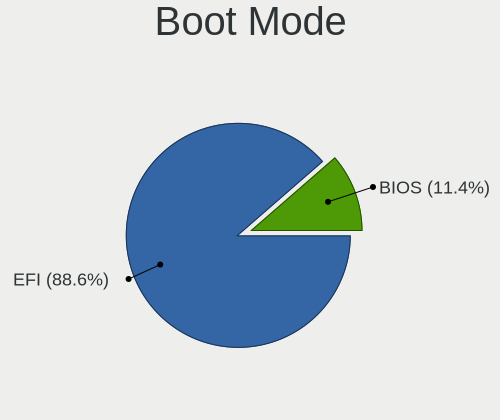
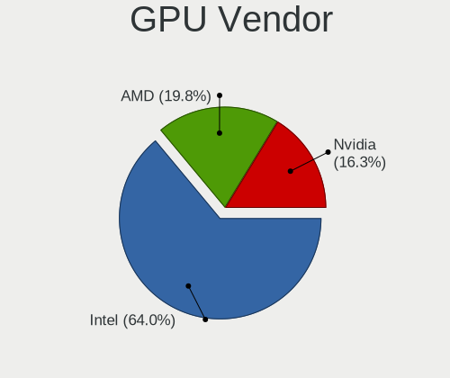
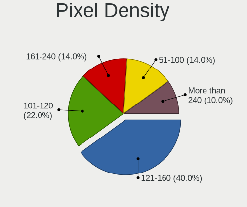

BSD - Hardware Trends (Notebooks)
---------------------------------

A project to identify most popular hardware characteristics and track their change
over time based on data collected by BSD users at https://BSD-Hardware.info.

Anyone can contribute to this report by the [hw-probe](https://github.com/linuxhw/hw-probe/blob/master/INSTALL.BSD.md) tool:

    hw-probe -all -upload

This report is for one last month. Overall report since the beginning of time: [TestDays](https://github.com/bsdhw/TestDays)

Period: Apr, 2023.

Contents
--------

* [ System ](#system)
  - [ OS                       ](#os)
  - [ OS Family                ](#os-family)
  - [ Arch                     ](#arch)
  - [ DE                       ](#de)
  - [ Display Server           ](#display-server)
  - [ Display Manager          ](#display-manager)
  - [ OS Lang                  ](#os-lang)
  - [ Boot Mode                ](#boot-mode)
  - [ Filesystem               ](#filesystem)
  - [ Part. scheme             ](#part-scheme)

* [ Board ](#board)
  - [ Vendor                   ](#vendor)
  - [ Model                    ](#model)
  - [ Model Family             ](#model-family)
  - [ MFG Year                 ](#mfg-year)
  - [ Form Factor              ](#form-factor)
  - [ Coreboot                 ](#coreboot)
  - [ RAM Size                 ](#ram-size)
  - [ RAM Used                 ](#ram-used)
  - [ Total Drives             ](#total-drives)
  - [ Has CD-ROM               ](#has-cd-rom)
  - [ Has Ethernet             ](#has-ethernet)
  - [ Has WiFi                 ](#has-wifi)
  - [ Has Bluetooth            ](#has-bluetooth)

* [ Location ](#location)
  - [ Country                  ](#country)
  - [ City                     ](#city)

* [ Drives ](#drives)
  - [ Drive Vendor             ](#drive-vendor)
  - [ Drive Model              ](#drive-model)
  - [ HDD Vendor               ](#hdd-vendor)
  - [ SSD Vendor               ](#ssd-vendor)
  - [ Drive Kind               ](#drive-kind)
  - [ Drive Connector          ](#drive-connector)
  - [ Drive Size               ](#drive-size)
  - [ Space Total              ](#space-total)
  - [ Space Used               ](#space-used)
  - [ Malfunc. Drives          ](#malfunc-drives)
  - [ Malfunc. Drive Vendor    ](#malfunc-drive-vendor)
  - [ Malfunc. HDD Vendor      ](#malfunc-hdd-vendor)
  - [ Malfunc. Drive Kind      ](#malfunc-drive-kind)
  - [ Failed Drives            ](#failed-drives)
  - [ Failed Drive Vendor      ](#failed-drive-vendor)
  - [ Drive Status             ](#drive-status)

* [ Storage controller ](#storage-controller)
  - [ Storage Vendor           ](#storage-vendor)
  - [ Storage Model            ](#storage-model)
  - [ Storage Kind             ](#storage-kind)

* [ Processor ](#processor)
  - [ CPU Vendor               ](#cpu-vendor)
  - [ CPU Model                ](#cpu-model)
  - [ CPU Model Family         ](#cpu-model-family)
  - [ CPU Cores                ](#cpu-cores)
  - [ CPU Sockets              ](#cpu-sockets)
  - [ CPU Threads              ](#cpu-threads)
  - [ CPU Microarch            ](#cpu-microarch)

* [ Graphics ](#graphics)
  - [ GPU Vendor               ](#gpu-vendor)
  - [ GPU Model                ](#gpu-model)
  - [ GPU Combo                ](#gpu-combo)
  - [ GPU Driver               ](#gpu-driver)
  - [ GPU Memory               ](#gpu-memory)

* [ Monitor ](#monitor)
  - [ Monitor Vendor           ](#monitor-vendor)
  - [ Monitor Model            ](#monitor-model)
  - [ Monitor Resolution       ](#monitor-resolution)
  - [ Monitor Diagonal         ](#monitor-diagonal)
  - [ Monitor Width            ](#monitor-width)
  - [ Aspect Ratio             ](#aspect-ratio)
  - [ Monitor Area             ](#monitor-area)
  - [ Pixel Density            ](#pixel-density)
  - [ Multiple Monitors        ](#multiple-monitors)

* [ Network ](#network)
  - [ Net Controller Vendor    ](#net-controller-vendor)
  - [ Net Controller Model     ](#net-controller-model)
  - [ Wireless Vendor          ](#wireless-vendor)
  - [ Wireless Model           ](#wireless-model)
  - [ Ethernet Vendor          ](#ethernet-vendor)
  - [ Ethernet Model           ](#ethernet-model)
  - [ Net Controller Kind      ](#net-controller-kind)
  - [ Used Controller          ](#used-controller)
  - [ NICs                     ](#nics)
  - [ IPv6                     ](#ipv6)

* [ Bluetooth ](#bluetooth)
  - [ Bluetooth Vendor         ](#bluetooth-vendor)
  - [ Bluetooth Model          ](#bluetooth-model)

* [ Sound ](#sound)
  - [ Sound Vendor             ](#sound-vendor)
  - [ Sound Model              ](#sound-model)

* [ Memory ](#memory)
  - [ Memory Vendor            ](#memory-vendor)
  - [ Memory Model             ](#memory-model)
  - [ Memory Kind              ](#memory-kind)
  - [ Memory Form Factor       ](#memory-form-factor)
  - [ Memory Size              ](#memory-size)
  - [ Memory Speed             ](#memory-speed)

* [ Printers & scanners ](#printers--scanners)
  - [ Printer Vendor           ](#printer-vendor)
  - [ Printer Model            ](#printer-model)
  - [ Scanner Vendor           ](#scanner-vendor)
  - [ Scanner Model            ](#scanner-model)

* [ Camera ](#camera)
  - [ Camera Vendor            ](#camera-vendor)
  - [ Camera Model             ](#camera-model)

* [ Security ](#security)
  - [ Fingerprint Vendor       ](#fingerprint-vendor)
  - [ Fingerprint Model        ](#fingerprint-model)
  - [ Chipcard Vendor          ](#chipcard-vendor)
  - [ Chipcard Model           ](#chipcard-model)

* [ Unsupported ](#unsupported)
  - [ Unsupported Devices      ](#unsupported-devices)
  - [ Unsupported Device Types ](#unsupported-device-types)

System
------

OS
--

Installed operating systems

| Name                 | Notebooks | Percent |
|----------------------|-----------|---------|
| helloSystem 0.8.1    | 25        | 31.65%  |
| FreeBSD 13.2         | 14        | 17.72%  |
| OpenBSD 7.3          | 6         | 7.59%   |
| helloSystem 0.8.2    | 5         | 6.33%   |
| FreeBSD 13.1-p7      | 5         | 6.33%   |
| OPNsense 23.1.6      | 4         | 5.06%   |
| OPNsense 23.1.5      | 4         | 5.06%   |
| NomadBSD 20221130    | 3         | 3.8%    |
| OpenBSD 7.2          | 2         | 2.53%   |
| FreeBSD 14.0-CURRENT | 2         | 2.53%   |
| OPNsense 23.1        | 1         | 1.27%   |
| OPNsense 22.10.2     | 1         | 1.27%   |
| NetBSD 9.3           | 1         | 1.27%   |
| GhostBSD 23.04.02    | 1         | 1.27%   |
| FuguIta 7.2          | 1         | 1.27%   |
| FreeBSD 13.2-STABLE  | 1         | 1.27%   |
| FreeBSD 13.2-RC6     | 1         | 1.27%   |
| FreeBSD 13.2-RC3     | 1         | 1.27%   |
| FreeBSD 13.1         | 1         | 1.27%   |

OS Family
---------

OS without a version

| Name        | Notebooks | Percent |
|-------------|-----------|---------|
| helloSystem | 30        | 37.97%  |
| FreeBSD     | 25        | 31.65%  |
| OPNsense    | 10        | 12.66%  |
| OpenBSD     | 8         | 10.13%  |
| NomadBSD    | 3         | 3.8%    |
| NetBSD      | 1         | 1.27%   |
| GhostBSD    | 1         | 1.27%   |
| FuguIta     | 1         | 1.27%   |

Arch
----

OS architecture (x86_64, i586, etc.)

| Name  | Notebooks | Percent |
|-------|-----------|---------|
| amd64 | 78        | 98.73%  |
| i386  | 1         | 1.27%   |

DE
--

Desktop Environment

| Name         | Notebooks | Percent |
|--------------|-----------|---------|
| helloDesktop | 36        | 45.57%  |
| Console      | 14        | 17.72%  |
| KDE5         | 12        | 15.19%  |
| XFCE         | 7         | 8.86%   |
| GNOME        | 4         | 5.06%   |
| xinitrc      | 2         | 2.53%   |
| MATE         | 2         | 2.53%   |
| TWM          | 1         | 1.27%   |
| sdorfehs     | 1         | 1.27%   |

Display Server
--------------

X11 or Wayland

| Name    | Notebooks | Percent |
|---------|-----------|---------|
| X11     | 62        | 78.48%  |
| Console | 16        | 20.25%  |
| Wayland | 1         | 1.27%   |

Display Manager
---------------

SDDM, LightDM, etc.

| Name    | Notebooks | Percent |
|---------|-----------|---------|
| SLiM    | 31        | 39.24%  |
| Console | 29        | 36.71%  |
| SDDM    | 11        | 13.92%  |
| XDM     | 2         | 2.53%   |
| Ly      | 2         | 2.53%   |
| LightDM | 2         | 2.53%   |
| GDM     | 2         | 2.53%   |

OS Lang
-------

Language

| Lang    | Notebooks | Percent |
|---------|-----------|---------|
| Unknown | 23        | 29.11%  |
| en_US   | 21        | 26.58%  |
| C       | 16        | 20.25%  |
| es_ES   | 4         | 5.06%   |
| ru_RU   | 3         | 3.8%    |
| fr_FR   | 3         | 3.8%    |
| en_GB   | 3         | 3.8%    |
| de_DE   | 2         | 2.53%   |
| pt_BR   | 1         | 1.27%   |
| pl_PL   | 1         | 1.27%   |
| it_IT   | 1         | 1.27%   |
| en_AU   | 1         | 1.27%   |

Boot Mode
---------

EFI or BIOS

| Mode | Notebooks | Percent |
|------|-----------|---------|
| EFI  | 72        | 91.14%  |
| BIOS | 7         | 8.86%   |

Filesystem
----------

Type of filesystem

| Type   | Notebooks | Percent |
|--------|-----------|---------|
| Zfs    | 45        | 56.96%  |
| Cd9660 | 14        | 17.72%  |
| Ufs    | 11        | 13.92%  |
| Ffs    | 9         | 11.39%  |

Part. scheme
------------

Scheme of partitioning

| Type    | Notebooks | Percent |
|---------|-----------|---------|
| GPT     | 73        | 92.41%  |
| MBR     | 5         | 6.33%   |
| Unknown | 1         | 1.27%   |

Board
-----

Vendor
------

Motherboard manufacturer

| Name                 | Notebooks | Percent |
|----------------------|-----------|---------|
| Lenovo               | 25        | 31.65%  |
| Dell                 | 9         | 11.39%  |
| Hewlett-Packard      | 8         | 10.13%  |
| Apple                | 5         | 6.33%   |
| Samsung Electronics  | 3         | 3.8%    |
| Google               | 3         | 3.8%    |
| Fujitsu              | 3         | 3.8%    |
| Deciso               | 3         | 3.8%    |
| ASUSTek Computer     | 3         | 3.8%    |
| Acer                 | 2         | 2.53%   |
| Unknown              | 2         | 2.53%   |
| TUXEDO               | 1         | 1.27%   |
| Toshiba              | 1         | 1.27%   |
| SIEMENS              | 1         | 1.27%   |
| Shuttle              | 1         | 1.27%   |
| ReachingTech         | 1         | 1.27%   |
| Packard Bell         | 1         | 1.27%   |
| Medion               | 1         | 1.27%   |
| Intel Client Systems | 1         | 1.27%   |
| IGEL Technology      | 1         | 1.27%   |
| HMT                  | 1         | 1.27%   |
| Fujitsu Siemens      | 1         | 1.27%   |
| F-Plus Mobile        | 1         | 1.27%   |
| Chuwi                | 1         | 1.27%   |

Model
-----

Motherboard model

| Name                                       | Notebooks | Percent |
|--------------------------------------------|-----------|---------|
| Unknown                                    | 4         | 5.06%   |
| Lenovo G570 20079                          | 2         | 2.53%   |
| Deciso NetBoard-A20                        | 2         | 2.53%   |
| TUXEDO Pulse 15 Gen1                       | 1         | 1.27%   |
| Toshiba PORTEGE R700                       | 1         | 1.27%   |
| SIEMENS SIMATIC IPC127E                    | 1         | 1.27%   |
| Shuttle DS437                              | 1         | 1.27%   |
| Samsung N150/N210/N220                     | 1         | 1.27%   |
| Samsung 370E4K                             | 1         | 1.27%   |
| Samsung 340XAA/350XAA/550XAA               | 1         | 1.27%   |
| ReachingTech DreamQuest Pro 2022           | 1         | 1.27%   |
| Packard Bell DOT SE                        | 1         | 1.27%   |
| Medion E15302                              | 1         | 1.27%   |
| Lenovo Yoga Slim 7 Pro 14ACH5 82MS         | 1         | 1.27%   |
| Lenovo Yoga Slim 7 14ITL05 82A3            | 1         | 1.27%   |
| Lenovo ThinkPad X280 20KESB4T00            | 1         | 1.27%   |
| Lenovo ThinkPad X270 20HMS06Q1D            | 1         | 1.27%   |
| Lenovo ThinkPad X230 23257EP               | 1         | 1.27%   |
| Lenovo ThinkPad X201 3626WNP               | 1         | 1.27%   |
| Lenovo ThinkPad X1 Carbon Gen 9 20XW00FSUS | 1         | 1.27%   |
| Lenovo ThinkPad X1 Carbon 34487SM          | 1         | 1.27%   |
| Lenovo ThinkPad W520 4270CTO               | 1         | 1.27%   |
| Lenovo ThinkPad T590 20N4001PUS            | 1         | 1.27%   |
| Lenovo ThinkPad T470s W10DG 20JTS0W800     | 1         | 1.27%   |
| Lenovo ThinkPad T450s 20BW001KLM           | 1         | 1.27%   |
| Lenovo ThinkPad T440s 20ARA07PLM           | 1         | 1.27%   |
| Lenovo ThinkPad R61 89208RU                | 1         | 1.27%   |
| Lenovo ThinkPad L540 20AUA34DJP            | 1         | 1.27%   |
| Lenovo ThinkPad L15 Gen 2 20X3CTO1WW       | 1         | 1.27%   |
| Lenovo ThinkBook 14-IML 20RV               | 1         | 1.27%   |
| Lenovo Legion 5 Pro 16ACH6H 82JQ           | 1         | 1.27%   |
| Lenovo Legion 5 15ARH05 82B5               | 1         | 1.27%   |
| Lenovo IdeaPad Gaming 3 15IHU6 82K1        | 1         | 1.27%   |
| Lenovo IdeaPad 3 14ITL05 81X7              | 1         | 1.27%   |
| Lenovo G500 20236                          | 1         | 1.27%   |
| Lenovo G50-30 80G0                         | 1         | 1.27%   |
| Intel Client Systems LAPBC510              | 1         | 1.27%   |
| IGEL M340C                                 | 1         | 1.27%   |
| HMT W041-TF-A-45                           | 1         | 1.27%   |
| HP ProBook 640 G4                          | 1         | 1.27%   |

Model Family
------------

Motherboard model prefix

| Name                          | Notebooks | Percent |
|-------------------------------|-----------|---------|
| Lenovo ThinkPad               | 14        | 17.72%  |
| Dell Latitude                 | 4         | 5.06%   |
| Unknown                       | 4         | 5.06%   |
| Dell Inspiron                 | 3         | 3.8%    |
| Lenovo Yoga                   | 2         | 2.53%   |
| Lenovo Legion                 | 2         | 2.53%   |
| Lenovo IdeaPad                | 2         | 2.53%   |
| Lenovo G570                   | 2         | 2.53%   |
| HP Pavilion                   | 2         | 2.53%   |
| HP Laptop                     | 2         | 2.53%   |
| Fujitsu LIFEBOOK              | 2         | 2.53%   |
| Deciso NetBoard-A20           | 2         | 2.53%   |
| TUXEDO Pulse                  | 1         | 1.27%   |
| Toshiba PORTEGE               | 1         | 1.27%   |
| SIEMENS SIMATIC               | 1         | 1.27%   |
| Shuttle DS437                 | 1         | 1.27%   |
| Samsung N150                  | 1         | 1.27%   |
| Samsung 370E4K                | 1         | 1.27%   |
| Samsung 340XAA                | 1         | 1.27%   |
| ReachingTech DreamQuest       | 1         | 1.27%   |
| Packard Bell DOT              | 1         | 1.27%   |
| Medion E15302                 | 1         | 1.27%   |
| Lenovo ThinkBook              | 1         | 1.27%   |
| Lenovo G500                   | 1         | 1.27%   |
| Lenovo G50-30                 | 1         | 1.27%   |
| Intel Client Systems LAPBC510 | 1         | 1.27%   |
| IGEL M340C                    | 1         | 1.27%   |
| HMT W041-TF-A-45              | 1         | 1.27%   |
| HP ProBook                    | 1         | 1.27%   |
| HP OMEN                       | 1         | 1.27%   |
| HP EliteBook                  | 1         | 1.27%   |
| Google Wolf                   | 1         | 1.27%   |
| Google Terra                  | 1         | 1.27%   |
| Google Peppy                  | 1         | 1.27%   |
| Fujitsu Siemens AMILO         | 1         | 1.27%   |
| Fujitsu CELSIUS               | 1         | 1.27%   |
| F-Plus Mobile FLAPTOP         | 1         | 1.27%   |
| Dell XPS                      | 1         | 1.27%   |
| Dell Precision                | 1         | 1.27%   |
| Deciso NetBoard-A10           | 1         | 1.27%   |

MFG Year
--------

Motherboard manufacture year

| Year | Notebooks | Percent |
|------|-----------|---------|
| 2022 | 12        | 15.19%  |
| 2021 | 11        | 13.92%  |
| 2019 | 7         | 8.86%   |
| 2013 | 6         | 7.59%   |
| 2020 | 5         | 6.33%   |
| 2016 | 5         | 6.33%   |
| 2012 | 5         | 6.33%   |
| 2015 | 4         | 5.06%   |
| 2014 | 4         | 5.06%   |
| 2011 | 4         | 5.06%   |
| 2023 | 3         | 3.8%    |
| 2010 | 3         | 3.8%    |
| 2008 | 3         | 3.8%    |
| 2018 | 2         | 2.53%   |
| 2017 | 2         | 2.53%   |
| 2007 | 2         | 2.53%   |
| 2009 | 1         | 1.27%   |

Form Factor
-----------

Physical design of the computer

| Name     | Notebooks | Percent |
|----------|-----------|---------|
| Notebook | 79        | 100%    |

Coreboot
--------

Have coreboot on board

| Used | Notebooks | Percent |
|------|-----------|---------|
| No   | 76        | 96.2%   |
| Yes  | 3         | 3.8%    |

RAM Size
--------

Total RAM memory

| Size in GB  | Notebooks | Percent |
|-------------|-----------|---------|
| 8.01-16.0   | 29        | 36.71%  |
| 16.01-24.0  | 17        | 21.52%  |
| 4.01-8.0    | 16        | 20.25%  |
| 2.01-3.0    | 7         | 8.86%   |
| 32.01-64.0  | 6         | 7.59%   |
| 3.01-4.0    | 1         | 1.27%   |
| 24.01-32.0  | 1         | 1.27%   |
| 64.01-256.0 | 1         | 1.27%   |
| 0.51-1.0    | 1         | 1.27%   |

RAM Used
--------

Used RAM memory

| Used GB  | Notebooks | Percent |
|----------|-----------|---------|
| 0.01-0.5 | 43        | 54.43%  |
| 0.51-1.0 | 23        | 29.11%  |
| 1.01-2.0 | 9         | 11.39%  |
| 2.01-3.0 | 2         | 2.53%   |
| 0        | 1         | 1.27%   |
| Unknown  | 1         | 1.27%   |

Total Drives
------------

Number of drives on board

| Drives | Notebooks | Percent |
|--------|-----------|---------|
| 1      | 60        | 75.95%  |
| 2      | 10        | 12.66%  |
| 0      | 5         | 6.33%   |
| 3      | 4         | 5.06%   |

Has CD-ROM
----------

Has CD-ROM on board

| Presented | Notebooks | Percent |
|-----------|-----------|---------|
| No        | 65        | 82.28%  |
| Yes       | 14        | 17.72%  |

Has Ethernet
------------

Has Ethernet on board

| Presented | Notebooks | Percent |
|-----------|-----------|---------|
| Yes       | 62        | 78.48%  |
| No        | 17        | 21.52%  |

Has WiFi
--------

Has WiFi module

| Presented | Notebooks | Percent |
|-----------|-----------|---------|
| Yes       | 72        | 91.14%  |
| No        | 7         | 8.86%   |

Has Bluetooth
-------------

Has Bluetooth module

| Presented | Notebooks | Percent |
|-----------|-----------|---------|
| Yes       | 58        | 73.42%  |
| No        | 21        | 26.58%  |

Location
--------

Country
-------

Geographic location (country)

| Country     | Notebooks | Percent |
|-------------|-----------|---------|
| USA         | 16        | 20.25%  |
| Russia      | 8         | 10.13%  |
| Germany     | 8         | 10.13%  |
| UK          | 4         | 5.06%   |
| Spain       | 4         | 5.06%   |
| Romania     | 4         | 5.06%   |
| Brazil      | 4         | 5.06%   |
| Poland      | 3         | 3.8%    |
| Mexico      | 3         | 3.8%    |
| Indonesia   | 3         | 3.8%    |
| Canada      | 3         | 3.8%    |
| Italy       | 2         | 2.53%   |
| France      | 2         | 2.53%   |
| Austria     | 2         | 2.53%   |
| Uruguay     | 1         | 1.27%   |
| Ukraine     | 1         | 1.27%   |
| Switzerland | 1         | 1.27%   |
| Sweden      | 1         | 1.27%   |
| Sri Lanka   | 1         | 1.27%   |
| Portugal    | 1         | 1.27%   |
| Montenegro  | 1         | 1.27%   |
| Iraq        | 1         | 1.27%   |
| Denmark     | 1         | 1.27%   |
| Colombia    | 1         | 1.27%   |
| China       | 1         | 1.27%   |
| Chile       | 1         | 1.27%   |
| Australia   | 1         | 1.27%   |

City
----

Geographic location (city)

| City                   | Notebooks | Percent |
|------------------------|-----------|---------|
| Moscow                 | 4         | 5.06%   |
| Vienna                 | 2         | 2.53%   |
| St Petersburg          | 2         | 2.53%   |
| Shoreham-by-Sea        | 2         | 2.53%   |
| Sao Paulo              | 2         | 2.53%   |
| Milan                  | 2         | 2.53%   |
| Aachen                 | 2         | 2.53%   |
| Zurich                 | 1         | 1.27%   |
| Xi'an                  | 1         | 1.27%   |
| West Bromwich          | 1         | 1.27%   |
| Vitória               | 1         | 1.27%   |
| Victoria               | 1         | 1.27%   |
| Valby                  | 1         | 1.27%   |
| Union                  | 1         | 1.27%   |
| Terrassa               | 1         | 1.27%   |
| Temple                 | 1         | 1.27%   |
| Targoviste             | 1         | 1.27%   |
| Sydney                 | 1         | 1.27%   |
| Surabaya               | 1         | 1.27%   |
| Sun Prairie            | 1         | 1.27%   |
| St. Jean Baptiste      | 1         | 1.27%   |
| South San Francisco    | 1         | 1.27%   |
| Sidoarjo               | 1         | 1.27%   |
| Seattle                | 1         | 1.27%   |
| Santiago               | 1         | 1.27%   |
| Santa Cruz de Tenerife | 1         | 1.27%   |
| San Antonio            | 1         | 1.27%   |
| Saint-Laurent          | 1         | 1.27%   |
| Richardson             | 1         | 1.27%   |
| Puebla City            | 1         | 1.27%   |
| Poznan                 | 1         | 1.27%   |
| Porto                  | 1         | 1.27%   |
| Podgorica              | 1         | 1.27%   |
| Orem                   | 1         | 1.27%   |
| Opole                  | 1         | 1.27%   |
| Neenah                 | 1         | 1.27%   |
| Mosul                  | 1         | 1.27%   |
| Montevideo             | 1         | 1.27%   |
| Monterrey              | 1         | 1.27%   |
| Montería              | 1         | 1.27%   |

Drives
------

Drive Vendor
------------

Hard drive vendors

| Vendor              | Notebooks | Drives | Percent |
|---------------------|-----------|--------|---------|
| Samsung Electronics | 12        | 13     | 14.12%  |
| WDC                 | 8         | 10     | 9.41%   |
| Transcend           | 7         | 7      | 8.24%   |
| Seagate             | 7         | 7      | 8.24%   |
| SanDisk             | 6         | 6      | 7.06%   |
| Crucial             | 5         | 6      | 5.88%   |
| Kingston            | 4         | 4      | 4.71%   |
| Toshiba             | 3         | 3      | 3.53%   |
| Hitachi             | 3         | 3      | 3.53%   |
| Apple               | 3         | 3      | 3.53%   |
| SPCC                | 2         | 2      | 2.35%   |
| SK hynix            | 2         | 2      | 2.35%   |
| Intel               | 2         | 2      | 2.35%   |
| HGST                | 2         | 3      | 2.35%   |
| FORESEE             | 2         | 2      | 2.35%   |
| China               | 2         | 2      | 2.35%   |
| Apacer              | 2         | 2      | 2.35%   |
| V-GeN               | 1         | 1      | 1.18%   |
| UMIS                | 1         | 1      | 1.18%   |
| Topmore             | 1         | 1      | 1.18%   |
| PNY                 | 1         | 1      | 1.18%   |
| Patriot             | 1         | 1      | 1.18%   |
| ORICO               | 1         | 1      | 1.18%   |
| Netac               | 1         | 1      | 1.18%   |
| Mushkin             | 1         | 1      | 1.18%   |
| Micron Technology   | 1         | 1      | 1.18%   |
| KIOXIA              | 1         | 1      | 1.18%   |
| Hikvision           | 1         | 1      | 1.18%   |
| Gigabyte Technology | 1         | 1      | 1.18%   |
| A-DATA Technology   | 1         | 1      | 1.18%   |

Drive Model
-----------

Hard drive models

| Model                                  | Notebooks | Percent |
|----------------------------------------|-----------|---------|
| Transcend TS256GMTE710T 256GB          | 2         | 2.27%   |
| FORESEE XP1000F001T 1TB                | 2         | 2.27%   |
| Crucial CT480BX500SSD1 480GB           | 2         | 2.27%   |
| WDC WDS120G1G0A-00SS50 120GB           | 1         | 1.14%   |
| WDC WDS100T2G0A-00JH30 1TB             | 1         | 1.14%   |
| WDC WDS100T2B0C-00PXH0 1TB             | 1         | 1.14%   |
| WDC WD7500BPKT-75PK4T0 752GB           | 1         | 1.14%   |
| WDC WD20SDZW-11Z3CS0 2TB               | 1         | 1.14%   |
| WDC WD1600BEVT-22ZCT0 160GB            | 1         | 1.14%   |
| WDC WD10SPZX-35Z10T0 1TB               | 1         | 1.14%   |
| WDC WD10SPZX-08Z10 1TB                 | 1         | 1.14%   |
| WDC PC SN730 SDBQNTY-256G-1001 256GB   | 1         | 1.14%   |
| WDC PC SN530 SDBPMPZ-256G-1101 256GB   | 1         | 1.14%   |
| V-GeN V-GEN08SM22AR256SDK 256GB        | 1         | 1.14%   |
| UMIS RPJTJ256MEE1OWX 256GB             | 1         | 1.14%   |
| Transcend TSITHSD512-004G              | 1         | 1.14%   |
| Transcend TSG128MTS400ISI 128GB        | 1         | 1.14%   |
| Transcend TS64GSSD370S 64GB            | 1         | 1.14%   |
| Transcend TS256GMTS952T2 256GB         | 1         | 1.14%   |
| Transcend TS128GMTE110S 128GB          | 1         | 1.14%   |
| Toshiba MK6461GSYN 640GB               | 1         | 1.14%   |
| Toshiba KXG6AZNV256G 256GB             | 1         | 1.14%   |
| Toshiba KXG6AZNV1T02 1TB               | 1         | 1.14%   |
| Topmore capricornus 2TB                | 1         | 1.14%   |
| SPCC Solid State Disk 256GB            | 1         | 1.14%   |
| SPCC Solid State Disk 128GB            | 1         | 1.14%   |
| SK hynix SKHynix_HFS512GDE9X081N 512GB | 1         | 1.14%   |
| SK hynix BC511 NVMe 512GB              | 1         | 1.14%   |
| Seagate ST9160827AS 160GB              | 1         | 1.14%   |
| Seagate ST750LM022 HN-M750MBB 752GB    | 1         | 1.14%   |
| Seagate ST320LT020-9YG142 320GB        | 1         | 1.14%   |
| Seagate ST320LT012-9WS14C 320GB        | 1         | 1.14%   |
| Seagate ST2000DL003-9VT166 2TB         | 1         | 1.14%   |
| Seagate ST1000LM049-2GH172 1TB         | 1         | 1.14%   |
| Seagate ST1000LM024 HN-M101MBB 1TB     | 1         | 1.14%   |
| SanDisk Ultra 3D NVMe 1TB              | 1         | 1.14%   |
| SanDisk SSD PLUS 240GB                 | 1         | 1.14%   |
| SanDisk SSD PLUS 120GB                 | 1         | 1.14%   |
| SanDisk SSD i110 16GB                  | 1         | 1.14%   |
| SanDisk SD5SG2128G1052E 128GB          | 1         | 1.14%   |

HDD Vendor
----------

Hard disk drive vendors

| Vendor  | Notebooks | Drives | Percent |
|---------|-----------|--------|---------|
| Seagate | 7         | 7      | 38.89%  |
| WDC     | 5         | 5      | 27.78%  |
| Hitachi | 3         | 3      | 16.67%  |
| HGST    | 2         | 3      | 11.11%  |
| Toshiba | 1         | 1      | 5.56%   |

SSD Vendor
----------

Solid state drive vendors

| Vendor              | Notebooks | Drives | Percent |
|---------------------|-----------|--------|---------|
| Samsung Electronics | 7         | 8      | 16.67%  |
| SanDisk             | 5         | 5      | 11.9%   |
| Transcend           | 4         | 4      | 9.52%   |
| Kingston            | 4         | 4      | 9.52%   |
| Crucial             | 4         | 4      | 9.52%   |
| Apple               | 3         | 3      | 7.14%   |
| SPCC                | 2         | 2      | 4.76%   |
| China               | 2         | 2      | 4.76%   |
| Apacer              | 2         | 2      | 4.76%   |
| WDC                 | 1         | 2      | 2.38%   |
| V-GeN               | 1         | 1      | 2.38%   |
| PNY                 | 1         | 1      | 2.38%   |
| Patriot             | 1         | 1      | 2.38%   |
| ORICO               | 1         | 1      | 2.38%   |
| Netac               | 1         | 1      | 2.38%   |
| Mushkin             | 1         | 1      | 2.38%   |
| Intel               | 1         | 1      | 2.38%   |
| Hikvision           | 1         | 1      | 2.38%   |

Drive Kind
----------

HDD or SSD

| Kind | Notebooks | Drives | Percent |
|------|-----------|--------|---------|
| SSD  | 38        | 44     | 48.72%  |
| NVMe | 24        | 27     | 30.77%  |
| HDD  | 16        | 19     | 20.51%  |

Drive Connector
---------------

SATA, SAS, NVMe, etc.

| Type | Notebooks | Drives | Percent |
|------|-----------|--------|---------|
| SATA | 52        | 63     | 68.42%  |
| NVMe | 24        | 27     | 31.58%  |

Drive Size
----------

Size of hard drive

| Size in TB | Notebooks | Drives | Percent |
|------------|-----------|--------|---------|
| 0.01-0.5   | 45        | 50     | 78.95%  |
| 0.51-1.0   | 10        | 11     | 17.54%  |
| 1.01-2.0   | 2         | 2      | 3.51%   |

Space Total
-----------

Amount of disk space available on the file system

| Size in GB | Notebooks | Percent |
|------------|-----------|---------|
| 101-250    | 34        | 43.04%  |
| 1-20       | 17        | 21.52%  |
| 251-500    | 10        | 12.66%  |
| 501-1000   | 8         | 10.13%  |
| 21-50      | 4         | 5.06%   |
| 51-100     | 4         | 5.06%   |
| 1001-2000  | 2         | 2.53%   |

Space Used
----------

Amount of used disk space

| Used GB  | Notebooks | Percent |
|----------|-----------|---------|
| 1-20     | 72        | 91.14%  |
| 21-50    | 3         | 3.8%    |
| 51-100   | 3         | 3.8%    |
| 501-1000 | 1         | 1.27%   |

Malfunc. Drives
---------------

Drive models with a malfunction

| Model                                        | Notebooks | Drives | Percent |
|----------------------------------------------|-----------|--------|---------|
| Seagate ST9160827AS 160GB                    | 1         | 1      | 8.33%   |
| Seagate ST750LM022 HN-M750MBB 752GB          | 1         | 1      | 8.33%   |
| Seagate ST320LT020-9YG142 320GB              | 1         | 1      | 8.33%   |
| Seagate ST320LT012-9WS14C 320GB              | 1         | 1      | 8.33%   |
| SanDisk SSD PLUS 240GB                       | 1         | 1      | 8.33%   |
| Samsung Electronics MZNLH128HBHQ-000H1 128GB | 1         | 1      | 8.33%   |
| Samsung Electronics MZ7PA128HMCD-010H1 128GB | 1         | 1      | 8.33%   |
| Hitachi HTS547550A9E384 500GB                | 1         | 1      | 8.33%   |
| HGST HTS721010A9E630 1TB                     | 1         | 1      | 8.33%   |
| HGST HTS541010A9E680 1TB                     | 1         | 1      | 8.33%   |
| Crucial CT500MX500SSD1 500GB                 | 1         | 1      | 8.33%   |
| Apple SSD TS256C 256GB                       | 1         | 1      | 8.33%   |

Malfunc. Drive Vendor
---------------------

Vendors of faulty drives

| Vendor              | Notebooks | Drives | Percent |
|---------------------|-----------|--------|---------|
| Seagate             | 4         | 4      | 33.33%  |
| Samsung Electronics | 2         | 2      | 16.67%  |
| HGST                | 2         | 2      | 16.67%  |
| SanDisk             | 1         | 1      | 8.33%   |
| Hitachi             | 1         | 1      | 8.33%   |
| Crucial             | 1         | 1      | 8.33%   |
| Apple               | 1         | 1      | 8.33%   |

Malfunc. HDD Vendor
-------------------

Vendors of faulty HDD drives

| Vendor  | Notebooks | Drives | Percent |
|---------|-----------|--------|---------|
| Seagate | 4         | 4      | 57.14%  |
| HGST    | 2         | 2      | 28.57%  |
| Hitachi | 1         | 1      | 14.29%  |

Malfunc. Drive Kind
-------------------

Kinds of faulty drives

| Kind | Notebooks | Drives | Percent |
|------|-----------|--------|---------|
| HDD  | 7         | 7      | 58.33%  |
| SSD  | 5         | 5      | 41.67%  |

Failed Drives
-------------

Failed drive models

Zero info for selected period =(

Failed Drive Vendor
-------------------

Failed drive vendors

Zero info for selected period =(

Drive Status
------------

Number of failed and malfunc. drives

| Status   | Notebooks | Drives | Percent |
|----------|-----------|--------|---------|
| Works    | 63        | 77     | 82.89%  |
| Malfunc  | 12        | 12     | 15.79%  |
| Detected | 1         | 1      | 1.32%   |

Storage controller
------------------

Storage Vendor
--------------

Storage controller vendors

| Vendor                           | Notebooks | Percent |
|----------------------------------|-----------|---------|
| Intel                            | 50        | 55.56%  |
| AMD                              | 10        | 11.11%  |
| Samsung Electronics              | 7         | 7.78%   |
| SanDisk                          | 5         | 5.56%   |
| Toshiba                          | 3         | 3.33%   |
| Transcend                        | 2         | 2.22%   |
| SK hynix                         | 2         | 2.22%   |
| Shenzhen Longsys Electronics     | 2         | 2.22%   |
| Union Memory (Shenzhen)          | 1         | 1.11%   |
| Silicon Motion                   | 1         | 1.11%   |
| Silicon Integrated Systems [SiS] | 1         | 1.11%   |
| Realtek Semiconductor            | 1         | 1.11%   |
| Phison Electronics               | 1         | 1.11%   |
| Nvidia                           | 1         | 1.11%   |
| Micron/Crucial Technology        | 1         | 1.11%   |
| Micron Technology                | 1         | 1.11%   |
| INNOGRIT                         | 1         | 1.11%   |

Storage Model
-------------

Storage controller models

| Model                                                                         | Notebooks | Percent |
|-------------------------------------------------------------------------------|-----------|---------|
| Intel 7 Series Chipset Family 6-port SATA Controller [AHCI mode]              | 9         | 9.47%   |
| AMD FCH SATA Controller [AHCI mode]                                           | 9         | 9.47%   |
| Intel Sunrise Point-LP SATA Controller [AHCI mode]                            | 6         | 6.32%   |
| Unknown                                                                       | 6         | 6.32%   |
| Intel 8 Series SATA Controller 1 [AHCI mode]                                  | 5         | 5.26%   |
| Intel 6 Series/C200 Series Chipset Family 6 port Mobile SATA AHCI Controller  | 4         | 4.21%   |
| Toshiba XG6 NVMe SSD Controller                                               | 3         | 3.16%   |
| Intel Wildcat Point-LP SATA Controller [AHCI Mode]                            | 3         | 3.16%   |
| Intel 82801 Mobile SATA Controller [RAID mode]                                | 3         | 3.16%   |
| SanDisk WD Blue SN550 NVMe SSD                                                | 2         | 2.11%   |
| Samsung SM951 AHCI                                                            | 2         | 2.11%   |
| Samsung NVMe SSD Controller SM981/PM981/PM983                                 | 2         | 2.11%   |
| Samsung NVMe SSD Controller PM9A1/PM9A3/980PRO                                | 2         | 2.11%   |
| Intel Tiger Lake-LP SATA Controller                                           | 2         | 2.11%   |
| Intel NM10/ICH7 Family SATA Controller [AHCI mode]                            | 2         | 2.11%   |
| Intel Atom Processor E3800 Series SATA AHCI Controller                        | 2         | 2.11%   |
| Intel 82801HM/HEM (ICH8M/ICH8M-E) SATA Controller [AHCI mode]                 | 2         | 2.11%   |
| Intel 82801HM/HEM (ICH8M/ICH8M-E) IDE Controller                              | 2         | 2.11%   |
| Intel 5 Series/3400 Series Chipset 6 port SATA AHCI Controller                | 2         | 2.11%   |
| SK hynix Gold P31/PC711 NVMe Solid State Drive                                | 1         | 1.05%   |
| SK hynix BC511                                                                | 1         | 1.05%   |
| Silicon Motion SM2263EN/SM2263XT SSD Controller                               | 1         | 1.05%   |
| Silicon Integrated Systems [SiS] SATA Controller / IDE mode                   | 1         | 1.05%   |
| Sandisk WD Black SN770 NVMe SSD                                               | 1         | 1.05%   |
| SanDisk WD Black SN750 / PC SN730 NVMe SSD                                    | 1         | 1.05%   |
| SanDisk NVMe Controller                                                       | 1         | 1.05%   |
| Samsung NVMe SSD Controller SM961/PM961/SM963                                 | 1         | 1.05%   |
| Realtek NVMe Controller                                                       | 1         | 1.05%   |
| Phison PS5013 E13 NVMe Controller                                             | 1         | 1.05%   |
| Nvidia MCP79 AHCI Controller                                                  | 1         | 1.05%   |
| Micron/Crucial P2 NVMe PCIe SSD                                               | 1         | 1.05%   |
| Micron NVMe Storage Controller                                                | 1         | 1.05%   |
| Intel Volume Management Device NVMe RAID Controller                           | 1         | 1.05%   |
| Intel SSD Pro 7600p/760p/E 6100p Series                                       | 1         | 1.05%   |
| Intel Q170/Q150/B150/H170/H110/Z170/CM236 Chipset SATA Controller [AHCI Mode] | 1         | 1.05%   |
| Intel Jasper Lake SATA AHCI Controller                                        | 1         | 1.05%   |
| Intel Comet Lake SATA AHCI Controller                                         | 1         | 1.05%   |
| Intel Celeron/Pentium Silver Processor SATA Controller                        | 1         | 1.05%   |
| Intel Celeron N3350/Pentium N4200/Atom E3900 Series SATA AHCI Controller      | 1         | 1.05%   |
| Intel 82801IBM/IEM (ICH9M/ICH9M-E) 4 port SATA Controller [AHCI mode]         | 1         | 1.05%   |

Storage Kind
------------

Kind of storage controller (IDE, SATA, NVMe, SAS, ...)

| Kind | Notebooks | Percent |
|------|-----------|---------|
| SATA | 57        | 62.64%  |
| NVMe | 24        | 26.37%  |
| IDE  | 6         | 6.59%   |
| RAID | 4         | 4.4%    |

Processor
---------

CPU Vendor
----------

Processor vendors

| Vendor | Notebooks | Percent |
|--------|-----------|---------|
| Intel  | 63        | 79.75%  |
| AMD    | 16        | 20.25%  |

CPU Model
---------

Processor models

| Model                                                     | Notebooks | Percent |
|-----------------------------------------------------------|-----------|---------|
| Intel Core i5-8250U CPU @ 1.60GHz                         | 3         | 3.8%    |
| Intel Core i7-3520M CPU @ 2.90GHz                         | 2         | 2.53%   |
| Intel Core i5-7300U CPU @ 2.60GHz                         | 2         | 2.53%   |
| Intel Celeron 2955U @ 1.40GHz                             | 2         | 2.53%   |
| Intel 11th Gen Core i7-1165G7 @ 2.80GHz                   | 2         | 2.53%   |
| AMD Ryzen 7 5800H with Radeon Graphics                    | 2         | 2.53%   |
| AMD Ryzen 7 4800H with Radeon Graphics                    | 2         | 2.53%   |
| Intel Pentium 3558U @ 1.70GHz                             | 1         | 1.27%   |
| Intel Genuine processor 800MHz ("GenuineIntel" 686-class) | 1         | 1.27%   |
| Intel Core i7-9750H CPU @ 2.60GHz                         | 1         | 1.27%   |
| Intel Core i7-8665U CPU @ 1.90GHz                         | 1         | 1.27%   |
| Intel Core i7-8565U CPU @ 1.80GHz                         | 1         | 1.27%   |
| Intel Core i7-7500U CPU @ 2.70GHz                         | 1         | 1.27%   |
| Intel Core i7-6600U CPU @ 2.60GHz                         | 1         | 1.27%   |
| Intel Core i7-5500U CPU @ 2.40GHz                         | 1         | 1.27%   |
| Intel Core i7-4870HQ CPU @ 2.50GHz                        | 1         | 1.27%   |
| Intel Core i7-3720QM CPU @ 2.60GHz                        | 1         | 1.27%   |
| Intel Core i7-2860QM CPU @ 2.50GHz                        | 1         | 1.27%   |
| Intel Core i7-2820QM CPU @ 2.30GHz                        | 1         | 1.27%   |
| Intel Core i7-10610U CPU @ 1.80GHz                        | 1         | 1.27%   |
| Intel Core i5-6300U CPU @ 2.40GHz                         | 1         | 1.27%   |
| Intel Core i5-6300HQ CPU @ 2.30GHz                        | 1         | 1.27%   |
| Intel Core i5-6200U CPU @ 2.30GHz                         | 1         | 1.27%   |
| Intel Core i5-5300U CPU @ 2.30GHz                         | 1         | 1.27%   |
| Intel Core i5-5257U CPU @ 2.70GHz                         | 1         | 1.27%   |
| Intel Core i5-4300U CPU @ 1.90GHz                         | 1         | 1.27%   |
| Intel Core i5-4210U CPU @ 1.70GHz                         | 1         | 1.27%   |
| Intel Core i5-3470T CPU @ 2.90GHz                         | 1         | 1.27%   |
| Intel Core i5-3427U CPU @ 1.80GHz                         | 1         | 1.27%   |
| Intel Core i5-3337U CPU @ 1.80GHz                         | 1         | 1.27%   |
| Intel Core i5-3320M CPU @ 2.60GHz                         | 1         | 1.27%   |
| Intel Core i5-2450M CPU @ 2.50GHz                         | 1         | 1.27%   |
| Intel Core i5-2410M CPU @ 2.30GHz                         | 1         | 1.27%   |
| Intel Core i5-10300H CPU @ 2.50GHz                        | 1         | 1.27%   |
| Intel Core i5-10210U CPU @ 1.60GHz                        | 1         | 1.27%   |
| Intel Core i5 CPU M 560 @ 2.67GHz                         | 1         | 1.27%   |
| Intel Core i5 CPU M 520 @ 2.40GHz                         | 1         | 1.27%   |
| Intel Core i3-5005U CPU @ 2.00GHz                         | 1         | 1.27%   |
| Intel Core i3-4100M CPU @ 2.50GHz                         | 1         | 1.27%   |
| Intel Core 2 Duo CPU T7500 @ 2.20GHz                      | 1         | 1.27%   |

CPU Model Family
----------------

Processor model prefix

| Model              | Notebooks | Percent |
|--------------------|-----------|---------|
| Intel Core i5      | 22        | 27.85%  |
| Intel Core i7      | 13        | 16.46%  |
| Intel Celeron      | 11        | 13.92%  |
| Other              | 6         | 7.59%   |
| AMD Ryzen 7        | 6         | 7.59%   |
| Intel Core 2 Duo   | 4         | 5.06%   |
| Intel Atom         | 3         | 3.8%    |
| Intel Core i3      | 2         | 2.53%   |
| AMD EPYC           | 2         | 2.53%   |
| AMD Athlon         | 2         | 2.53%   |
| Intel Pentium      | 1         | 1.27%   |
| Intel Genuine      | 1         | 1.27%   |
| Intel Celeron D    | 1         | 1.27%   |
| AMD Ryzen Embedded | 1         | 1.27%   |
| AMD Ryzen 5        | 1         | 1.27%   |
| AMD GX             | 1         | 1.27%   |
| AMD E              | 1         | 1.27%   |
| AMD A10            | 1         | 1.27%   |

CPU Cores
---------

Number of processor cores

| Number  | Notebooks | Percent |
|---------|-----------|---------|
| 2       | 40        | 50.63%  |
| 4       | 23        | 29.11%  |
| 16      | 6         | 7.59%   |
| Unknown | 4         | 5.06%   |
| 8       | 2         | 2.53%   |
| 1       | 2         | 2.53%   |
| 12      | 1         | 1.27%   |
| 6       | 1         | 1.27%   |

CPU Sockets
-----------

Number of sockets

| Number  | Notebooks | Percent |
|---------|-----------|---------|
| 1       | 75        | 94.94%  |
| 2       | 2         | 2.53%   |
| Unknown | 2         | 2.53%   |

CPU Threads
-----------

Threads per core (Hyper-Threading)

| Number  | Notebooks | Percent |
|---------|-----------|---------|
| 2       | 42        | 53.16%  |
| 1       | 31        | 39.24%  |
| Unknown | 6         | 7.59%   |

CPU Microarch
-------------

Microarchitecture

| Name          | Notebooks | Percent |
|---------------|-----------|---------|
| KabyLake      | 11        | 13.92%  |
| IvyBridge     | 10        | 12.66%  |
| Haswell       | 7         | 8.86%   |
| TigerLake     | 6         | 7.59%   |
| Zen 3         | 5         | 6.33%   |
| Skylake       | 4         | 5.06%   |
| SandyBridge   | 4         | 5.06%   |
| Broadwell     | 4         | 5.06%   |
| Zen           | 3         | 3.8%    |
| Silvermont    | 3         | 3.8%    |
| Core          | 3         | 3.8%    |
| Zen+          | 2         | 2.53%   |
| Zen 2         | 2         | 2.53%   |
| Westmere      | 2         | 2.53%   |
| Penryn        | 2         | 2.53%   |
| Bonnell       | 2         | 2.53%   |
| Puma          | 1         | 1.27%   |
| Piledriver    | 1         | 1.27%   |
| P6            | 1         | 1.27%   |
| Goldmont plus | 1         | 1.27%   |
| Goldmont      | 1         | 1.27%   |
| Excavator     | 1         | 1.27%   |
| CometLake     | 1         | 1.27%   |
| Bobcat        | 1         | 1.27%   |
| Unknown       | 1         | 1.27%   |

Graphics
--------

GPU Vendor
----------

Vendors of graphics cards

| Vendor                           | Notebooks | Percent |
|----------------------------------|-----------|---------|
| Intel                            | 55        | 63.95%  |
| AMD                              | 18        | 20.93%  |
| Nvidia                           | 12        | 13.95%  |
| Silicon Integrated Systems [SiS] | 1         | 1.16%   |

GPU Model
---------

Graphics card models

| Model                                                                                 | Notebooks | Percent |
|---------------------------------------------------------------------------------------|-----------|---------|
| Intel 3rd Gen Core processor Graphics Controller                                      | 8         | 9.09%   |
| Intel Haswell-ULT Integrated Graphics Controller                                      | 5         | 5.68%   |
| Intel TigerLake-LP GT2 [Iris Xe Graphics]                                             | 4         | 4.55%   |
| Intel UHD Graphics 620                                                                | 3         | 3.41%   |
| Intel Skylake GT2 [HD Graphics 520]                                                   | 3         | 3.41%   |
| Intel HD Graphics 620                                                                 | 3         | 3.41%   |
| Intel HD Graphics 5500                                                                | 3         | 3.41%   |
| Intel 2nd Generation Core Processor Family Integrated Graphics Controller             | 3         | 3.41%   |
| AMD Cezanne [Radeon Vega Series / Radeon Vega Mobile Series]                          | 3         | 3.41%   |
| Nvidia GA107M [GeForce RTX 3050 Ti Mobile]                                            | 2         | 2.27%   |
| Intel WhiskeyLake-U GT2 [UHD Graphics 620]                                            | 2         | 2.27%   |
| Intel Tiger Lake-LP GT2 [UHD Graphics G4]                                             | 2         | 2.27%   |
| Intel Core Processor Integrated Graphics Controller                                   | 2         | 2.27%   |
| Intel CometLake-U GT2 [UHD Graphics]                                                  | 2         | 2.27%   |
| Intel Atom Processor Z36xxx/Z37xxx Series Graphics & Display                          | 2         | 2.27%   |
| Intel Atom Processor D4xx/D5xx/N4xx/N5xx Integrated Graphics Controller               | 2         | 2.27%   |
| AMD Topaz XT [Radeon R7 M260/M265 / M340/M360 / M440/M445 / 530/535 / 620/625 Mobile] | 2         | 2.27%   |
| AMD Robson CE [Radeon HD 6370M/7370M]                                                 | 2         | 2.27%   |
| AMD Picasso/Raven 2 [Radeon Vega Series / Radeon Vega Mobile Series]                  | 2         | 2.27%   |
| Silicon Integrated Systems [SiS] 771/671 PCIE VGA Display Adapter                     | 1         | 1.14%   |
| Nvidia TU117M                                                                         | 1         | 1.14%   |
| Nvidia TU116M [GeForce GTX 1660 Ti Mobile]                                            | 1         | 1.14%   |
| Nvidia TU106M [GeForce RTX 2070 Mobile / Max-Q Refresh]                               | 1         | 1.14%   |
| Nvidia GM107GLM [Quadro M1000M]                                                       | 1         | 1.14%   |
| Nvidia GK104GLM [Quadro K3000M]                                                       | 1         | 1.14%   |
| Nvidia GF117M [GeForce 610M/710M/810M/820M / GT 620M/625M/630M/720M]                  | 1         | 1.14%   |
| Nvidia GF106GLM [Quadro 2000M]                                                        | 1         | 1.14%   |
| Nvidia GA104M [GeForce RTX 3070 Mobile / Max-Q]                                       | 1         | 1.14%   |
| Nvidia G86M [Quadro NVS 140M]                                                         | 1         | 1.14%   |
| Nvidia C79 [GeForce 9400M]                                                            | 1         | 1.14%   |
| Intel Xeon E3-1200 v2/3rd Gen Core processor Graphics Controller                      | 1         | 1.14%   |
| Intel Mobile GM965/GL960 Integrated Graphics Controller (secondary)                   | 1         | 1.14%   |
| Intel Mobile GM965/GL960 Integrated Graphics Controller (primary)                     | 1         | 1.14%   |
| Intel Mobile 945GM/GMS/GME, 943/940GML Express Integrated Graphics Controller         | 1         | 1.14%   |
| Intel Mobile 945GM/GMS, 943/940GML Express Integrated Graphics Controller             | 1         | 1.14%   |
| Intel Mobile 4 Series Chipset Integrated Graphics Controller                          | 1         | 1.14%   |
| Intel JasperLake [UHD Graphics]                                                       | 1         | 1.14%   |
| Intel Iris Graphics 6100                                                              | 1         | 1.14%   |
| Intel HD Graphics 530                                                                 | 1         | 1.14%   |
| Intel HD Graphics 500                                                                 | 1         | 1.14%   |

GPU Combo
---------

Combinations of graphics cards

| Name           | Notebooks | Percent |
|----------------|-----------|---------|
| 1 x Intel      | 41        | 51.9%   |
| 1 x AMD        | 12        | 15.19%  |
| 1 x Nvidia     | 7         | 8.86%   |
| 2 x Intel      | 5         | 6.33%   |
| Intel + AMD    | 5         | 6.33%   |
| Intel + Nvidia | 4         | 5.06%   |
| Other          | 3         | 3.8%    |
| 1 x SiS        | 1         | 1.27%   |
| AMD + Nvidia   | 1         | 1.27%   |

GPU Driver
----------

Free vs proprietary

| Driver      | Notebooks | Percent |
|-------------|-----------|---------|
| Free        | 66        | 83.54%  |
| Proprietary | 8         | 10.13%  |
| Unknown     | 5         | 6.33%   |

GPU Memory
----------

Total video memory

| Size in GB | Notebooks | Percent |
|------------|-----------|---------|
| Unknown    | 62        | 78.48%  |
| 0.01-0.5   | 8         | 10.13%  |
| 0.51-1.0   | 3         | 3.8%    |
| 7.01-8.0   | 2         | 2.53%   |
| 1.01-2.0   | 2         | 2.53%   |
| 5.01-6.0   | 1         | 1.27%   |
| 3.01-4.0   | 1         | 1.27%   |

Monitor
-------

Monitor Vendor
--------------

Monitor vendors

| Vendor               | Notebooks | Percent |
|----------------------|-----------|---------|
| Unknown              | 3         | 33.33%  |
| Seiko/Epson          | 1         | 11.11%  |
| LGD                  | 1         | 11.11%  |
| Lenovo Group Limited | 1         | 11.11%  |
| HPN                  | 1         | 11.11%  |
| Hewlett-Packard      | 1         | 11.11%  |
| BOE Technology Group | 1         | 11.11%  |

Monitor Model
-------------

Monitor models

| Model                                      | Notebooks | Percent |
|--------------------------------------------|-----------|---------|
| Unknown                                    | 3         | 33.33%  |
| Seiko/Epson LCD Monitor 1920x1200          | 1         | 11.11%  |
| LGD LCD Monitor 3840x1080                  | 1         | 11.11%  |
| Lenovo Group Limited LCD Monitor 1920x1080 | 1         | 11.11%  |
| HPN LCD Monitor OMEN 25i                   | 1         | 11.11%  |
| Hewlett-Packard LCD Monitor Inc. OMEN 25i  | 1         | 11.11%  |
| BOE Technology Group LCD Monitor 1920x1080 | 1         | 11.11%  |

Monitor Resolution
------------------

Monitor screen resolution

| Resolution        | Notebooks | Percent |
|-------------------|-----------|---------|
| 1920x1080 (FHD)   | 3         | 42.86%  |
| 3840x1080         | 1         | 14.29%  |
| 2560x1600         | 1         | 14.29%  |
| 1920x1200 (WUXGA) | 1         | 14.29%  |
| Unknown           | 1         | 14.29%  |

Monitor Diagonal
----------------

Diagonal size in inches

| Inches  | Notebooks | Percent |
|---------|-----------|---------|
| Unknown | 6         | 100%    |

Monitor Width
-------------

Physical width

| Width in mm | Notebooks | Percent |
|-------------|-----------|---------|
| Unknown     | 6         | 100%    |

Aspect Ratio
------------

Proportional relationship between the width and the height

| Ratio   | Notebooks | Percent |
|---------|-----------|---------|
| Unknown | 6         | 100%    |

Monitor Area
------------

Area in inch²

| Area in inch² | Notebooks | Percent |
|----------------|-----------|---------|
| Unknown        | 6         | 100%    |

Pixel Density
-------------

Pixels per inch

| Density | Notebooks | Percent |
|---------|-----------|---------|
| Unknown | 6         | 100%    |

Multiple Monitors
-----------------

Total monitors connected

| Total | Notebooks | Percent |
|-------|-----------|---------|
| 1     | 56        | 70.89%  |
| 0     | 19        | 24.05%  |
| 2     | 4         | 5.06%   |

Network
-------

Net Controller Vendor
---------------------

Controller vendors

| Vendor                           | Notebooks | Percent |
|----------------------------------|-----------|---------|
| Intel                            | 50        | 43.86%  |
| Realtek Semiconductor            | 29        | 25.44%  |
| Qualcomm Atheros                 | 14        | 12.28%  |
| Broadcom                         | 7         | 6.14%   |
| AMD                              | 3         | 2.63%   |
| TP-Link                          | 2         | 1.75%   |
| Marvell Technology Group         | 2         | 1.75%   |
| Xiaomi                           | 1         | 0.88%   |
| Silicon Integrated Systems [SiS] | 1         | 0.88%   |
| Samsung Electronics              | 1         | 0.88%   |
| Ralink Technology                | 1         | 0.88%   |
| Nvidia                           | 1         | 0.88%   |
| Hewlett-Packard                  | 1         | 0.88%   |
| Dell                             | 1         | 0.88%   |

Net Controller Model
--------------------

Controller models

| Model                                                                   | Notebooks | Percent |
|-------------------------------------------------------------------------|-----------|---------|
| Realtek RTL8111/8168/8411 PCI Express Gigabit Ethernet Controller       | 15        | 10.42%  |
| Realtek RTL810xE PCI Express Fast Ethernet controller                   | 9         | 6.25%   |
| Intel Wireless 7265                                                     | 5         | 3.47%   |
| Intel Wi-Fi 6 AX201                                                     | 5         | 3.47%   |
| Intel 82579LM Gigabit Network Connection (Lewisville)                   | 5         | 3.47%   |
| Intel Wireless 8265 / 8275                                              | 4         | 2.78%   |
| Intel I210 Gigabit Network Connection                                   | 4         | 2.78%   |
| Intel Centrino Advanced-N 6205 [Taylor Peak]                            | 4         | 2.78%   |
| Qualcomm Atheros QCA9565 / AR9565 Wireless Network Adapter              | 3         | 2.08%   |
| Qualcomm Atheros AR9485 Wireless Network Adapter                        | 3         | 2.08%   |
| Qualcomm Atheros AR9285 Wireless Network Adapter (PCI-Express)          | 3         | 2.08%   |
| Qualcomm Atheros AR8152 v2.0 Fast Ethernet                              | 3         | 2.08%   |
| Intel Wireless 8260                                                     | 3         | 2.08%   |
| Intel Wireless 7260                                                     | 3         | 2.08%   |
| Intel Wi-Fi 6 AX200                                                     | 3         | 2.08%   |
| AMD Family 17h Processor 10 Gb Ethernet Controller Port 0               | 3         | 2.08%   |
| Realtek RTL8852AE 802.11ax PCIe Wireless Network Adapter                | 2         | 1.39%   |
| Realtek RTL8821CE 802.11ac PCIe Wireless Network Adapter                | 2         | 1.39%   |
| Qualcomm Atheros AR9462 Wireless Network Adapter                        | 2         | 1.39%   |
| Qualcomm Atheros AR242x / AR542x Wireless Network Adapter (PCI-Express) | 2         | 1.39%   |
| Intel Wireless 3165                                                     | 2         | 1.39%   |
| Intel Wireless 3160                                                     | 2         | 1.39%   |
| Intel Ethernet Connection I219-LM                                       | 2         | 1.39%   |
| Intel Ethernet Connection (4) I219-V                                    | 2         | 1.39%   |
| Intel Ethernet Connection (4) I219-LM                                   | 2         | 1.39%   |
| Intel Comet Lake PCH-LP CNVi WiFi                                       | 2         | 1.39%   |
| Intel Centrino Ultimate-N 6300                                          | 2         | 1.39%   |
| Intel Cannon Point-LP CNVi [Wireless-AC]                                | 2         | 1.39%   |
| Intel 82577LM Gigabit Network Connection                                | 2         | 1.39%   |
| Broadcom BCM43602 802.11ac Wireless LAN SoC                             | 2         | 1.39%   |
| Xiaomi Mi/Redmi series (RNDIS)                                          | 1         | 0.69%   |
| TP-Link Archer T9UH v1 [Realtek RTL8814AU]                              | 1         | 0.69%   |
| TP-Link AC600 wireless Realtek RTL8811AU [Archer T2U Nano]              | 1         | 0.69%   |
| Silicon Integrated Systems [SiS] 191 Gigabit Ethernet Adapter           | 1         | 0.69%   |
| Samsung Galaxy series, misc. (tethering mode)                           | 1         | 0.69%   |
| Realtek RTL8192E/RTL8192SE Wireless LAN Controller                      | 1         | 0.69%   |
| Realtek RTL8188EE Wireless Network Adapter                              | 1         | 0.69%   |
| Realtek RTL8188CUS 802.11n WLAN Adapter                                 | 1         | 0.69%   |
| Realtek RTL8188CE 802.11b/g/n WiFi Adapter                              | 1         | 0.69%   |
| Realtek RTL-8100/8101L/8139 PCI Fast Ethernet Adapter                   | 1         | 0.69%   |

Wireless Vendor
---------------

Wireless vendors

| Vendor                | Notebooks | Percent |
|-----------------------|-----------|---------|
| Intel                 | 44        | 58.67%  |
| Qualcomm Atheros      | 14        | 18.67%  |
| Realtek Semiconductor | 8         | 10.67%  |
| Broadcom              | 6         | 8%      |
| TP-Link               | 2         | 2.67%   |
| Ralink Technology     | 1         | 1.33%   |

Wireless Model
--------------

Wireless models

| Model                                                                   | Notebooks | Percent |
|-------------------------------------------------------------------------|-----------|---------|
| Intel Wireless 7265                                                     | 5         | 6.58%   |
| Intel Wi-Fi 6 AX201                                                     | 5         | 6.58%   |
| Intel Wireless 8265 / 8275                                              | 4         | 5.26%   |
| Intel Centrino Advanced-N 6205 [Taylor Peak]                            | 4         | 5.26%   |
| Qualcomm Atheros QCA9565 / AR9565 Wireless Network Adapter              | 3         | 3.95%   |
| Qualcomm Atheros AR9485 Wireless Network Adapter                        | 3         | 3.95%   |
| Qualcomm Atheros AR9285 Wireless Network Adapter (PCI-Express)          | 3         | 3.95%   |
| Intel Wireless 8260                                                     | 3         | 3.95%   |
| Intel Wireless 7260                                                     | 3         | 3.95%   |
| Intel Wi-Fi 6 AX200                                                     | 3         | 3.95%   |
| Realtek RTL8852AE 802.11ax PCIe Wireless Network Adapter                | 2         | 2.63%   |
| Realtek RTL8821CE 802.11ac PCIe Wireless Network Adapter                | 2         | 2.63%   |
| Qualcomm Atheros AR9462 Wireless Network Adapter                        | 2         | 2.63%   |
| Qualcomm Atheros AR242x / AR542x Wireless Network Adapter (PCI-Express) | 2         | 2.63%   |
| Intel Wireless 3165                                                     | 2         | 2.63%   |
| Intel Wireless 3160                                                     | 2         | 2.63%   |
| Intel Comet Lake PCH-LP CNVi WiFi                                       | 2         | 2.63%   |
| Intel Centrino Ultimate-N 6300                                          | 2         | 2.63%   |
| Intel Cannon Point-LP CNVi [Wireless-AC]                                | 2         | 2.63%   |
| Broadcom BCM43602 802.11ac Wireless LAN SoC                             | 2         | 2.63%   |
| TP-Link Archer T9UH v1 [Realtek RTL8814AU]                              | 1         | 1.32%   |
| TP-Link AC600 wireless Realtek RTL8811AU [Archer T2U Nano]              | 1         | 1.32%   |
| Realtek RTL8192E/RTL8192SE Wireless LAN Controller                      | 1         | 1.32%   |
| Realtek RTL8188EE Wireless Network Adapter                              | 1         | 1.32%   |
| Realtek RTL8188CUS 802.11n WLAN Adapter                                 | 1         | 1.32%   |
| Realtek RTL8188CE 802.11b/g/n WiFi Adapter                              | 1         | 1.32%   |
| Realtek 8811CU Wireless LAN 802.11ac USB NIC                            | 1         | 1.32%   |
| Ralink RT5572 Wireless Adapter                                          | 1         | 1.32%   |
| Qualcomm Atheros QCA9377 802.11ac Wireless Network Adapter              | 1         | 1.32%   |
| Intel WiFi Link 5100                                                    | 1         | 1.32%   |
| Intel Wi-Fi 6 AX210/AX211/AX411 160MHz                                  | 1         | 1.32%   |
| Intel PRO/Wireless 3945ABG [Golan] Network Connection                   | 1         | 1.32%   |
| Intel Dual Band Wireless-AC 3168NGW [Stone Peak]                        | 1         | 1.32%   |
| Intel Comet Lake PCH CNVi WiFi                                          | 1         | 1.32%   |
| Intel Centrino Wireless-N 2200                                          | 1         | 1.32%   |
| Intel Centrino Advanced-N 6200                                          | 1         | 1.32%   |
| Broadcom BCM4352 802.11ac Wireless Network Adapter                      | 1         | 1.32%   |
| Broadcom BCM4331 802.11a/b/g/n                                          | 1         | 1.32%   |
| Broadcom BCM4322 802.11a/b/g/n Wireless LAN Controller                  | 1         | 1.32%   |
| Broadcom BCM4321 802.11a/b/g/n                                          | 1         | 1.32%   |

Ethernet Vendor
---------------

Ethernet vendors

| Vendor                           | Notebooks | Percent |
|----------------------------------|-----------|---------|
| Realtek Semiconductor            | 25        | 38.46%  |
| Intel                            | 24        | 36.92%  |
| Qualcomm Atheros                 | 5         | 7.69%   |
| AMD                              | 3         | 4.62%   |
| Marvell Technology Group         | 2         | 3.08%   |
| Broadcom                         | 2         | 3.08%   |
| Xiaomi                           | 1         | 1.54%   |
| Silicon Integrated Systems [SiS] | 1         | 1.54%   |
| Samsung Electronics              | 1         | 1.54%   |
| Nvidia                           | 1         | 1.54%   |

Ethernet Model
--------------

Ethernet models

| Model                                                             | Notebooks | Percent |
|-------------------------------------------------------------------|-----------|---------|
| Realtek RTL8111/8168/8411 PCI Express Gigabit Ethernet Controller | 15        | 22.73%  |
| Realtek RTL810xE PCI Express Fast Ethernet controller             | 9         | 13.64%  |
| Intel 82579LM Gigabit Network Connection (Lewisville)             | 5         | 7.58%   |
| Intel I210 Gigabit Network Connection                             | 4         | 6.06%   |
| Qualcomm Atheros AR8152 v2.0 Fast Ethernet                        | 3         | 4.55%   |
| AMD Family 17h Processor 10 Gb Ethernet Controller Port 0         | 3         | 4.55%   |
| Intel Ethernet Connection I219-LM                                 | 2         | 3.03%   |
| Intel Ethernet Connection (4) I219-V                              | 2         | 3.03%   |
| Intel Ethernet Connection (4) I219-LM                             | 2         | 3.03%   |
| Intel 82577LM Gigabit Network Connection                          | 2         | 3.03%   |
| Xiaomi Mi/Redmi series (RNDIS)                                    | 1         | 1.52%   |
| Silicon Integrated Systems [SiS] 191 Gigabit Ethernet Adapter     | 1         | 1.52%   |
| Samsung Galaxy series, misc. (tethering mode)                     | 1         | 1.52%   |
| Realtek RTL-8100/8101L/8139 PCI Fast Ethernet Adapter             | 1         | 1.52%   |
| Qualcomm Atheros QCA8172 Fast Ethernet                            | 1         | 1.52%   |
| Qualcomm Atheros AR8152 v1.1 Fast Ethernet                        | 1         | 1.52%   |
| Nvidia MCP79 Ethernet                                             | 1         | 1.52%   |
| Marvell Group 88E8058 PCI-E Gigabit Ethernet Controller           | 1         | 1.52%   |
| Marvell Group 88E8040 PCI-E Fast Ethernet Controller              | 1         | 1.52%   |
| Intel Ethernet Connection I218-LM                                 | 1         | 1.52%   |
| Intel Ethernet Connection I217-V                                  | 1         | 1.52%   |
| Intel Ethernet Connection (6) I219-V                              | 1         | 1.52%   |
| Intel Ethernet Connection (3) I218-LM                             | 1         | 1.52%   |
| Intel Ethernet Connection (13) I219-V                             | 1         | 1.52%   |
| Intel 82574L Gigabit Network Connection                           | 1         | 1.52%   |
| Intel 82566MC Gigabit Network Connection                          | 1         | 1.52%   |
| Broadcom NetXtreme BCM57765 Gigabit Ethernet PCIe                 | 1         | 1.52%   |
| Broadcom NetXtreme BCM57762 Gigabit Ethernet PCIe                 | 1         | 1.52%   |
| Broadcom NetLink BCM57785 Gigabit Ethernet PCIe                   | 1         | 1.52%   |

Net Controller Kind
-------------------

Ethernet, WiFi or modem

| Kind     | Notebooks | Percent |
|----------|-----------|---------|
| WiFi     | 72        | 52.94%  |
| Ethernet | 62        | 45.59%  |
| Modem    | 1         | 0.74%   |
| Unknown  | 1         | 0.74%   |

Used Controller
---------------

Currently used network controller

| Kind     | Notebooks | Percent |
|----------|-----------|---------|
| WiFi     | 47        | 65.28%  |
| Ethernet | 25        | 34.72%  |

NICs
----

Total network controllers on board

| Total | Notebooks | Percent |
|-------|-----------|---------|
| 2     | 50        | 63.29%  |
| 1     | 21        | 26.58%  |
| 3     | 4         | 5.06%   |
| 6     | 3         | 3.8%    |
| 5     | 1         | 1.27%   |

IPv6
----

IPv6 vs IPv4

| Used | Notebooks | Percent |
|------|-----------|---------|
| No   | 71        | 89.87%  |
| Yes  | 8         | 10.13%  |

Bluetooth
---------

Bluetooth Vendor
----------------

Controller vendors

| Vendor                          | Notebooks | Percent |
|---------------------------------|-----------|---------|
| Intel                           | 32        | 55.17%  |
| Qualcomm Atheros Communications | 5         | 8.62%   |
| Foxconn / Hon Hai               | 5         | 8.62%   |
| Broadcom                        | 5         | 8.62%   |
| Apple                           | 5         | 8.62%   |
| Realtek Semiconductor           | 4         | 6.9%    |
| Taiyo Yuden                     | 1         | 1.72%   |
| IMC Networks                    | 1         | 1.72%   |

Bluetooth Model
---------------

Controller models

| Model                                                    | Notebooks | Percent |
|----------------------------------------------------------|-----------|---------|
| Intel Bluetooth wireless interface                       | 17        | 29.31%  |
| Intel AX201 Bluetooth                                    | 6         | 10.34%  |
| Intel Bluetooth 9460/9560 Jefferson Peak (JfP)           | 4         | 6.9%    |
| Apple Bluetooth Host Controller                          | 4         | 6.9%    |
| Realtek Bluetooth Adapter                                | 3         | 5.17%   |
| Intel AX200 Bluetooth                                    | 3         | 5.17%   |
| Foxconn / Hon Hai Broadcom Bluetooth 2.1 Device          | 2         | 3.45%   |
| Foxconn / Hon Hai Broadcom BCM20702 Bluetooth USB Device | 2         | 3.45%   |
| Broadcom BCM20702 Bluetooth 4.0 [ThinkPad]               | 2         | 3.45%   |
| Taiyo Yuden Bluetooth Device (V2.0+EDR)                  | 1         | 1.72%   |
| Realtek  Bluetooth 4.2 Adapter                           | 1         | 1.72%   |
| Qualcomm Atheros QCA9377 Bluetooth 4.1                   | 1         | 1.72%   |
| Qualcomm Atheros Dell Wireless 1901 Bluetooth            | 1         | 1.72%   |
| Qualcomm Atheros Dell Wireless 1703 Bluetooth            | 1         | 1.72%   |
| Qualcomm Atheros AR9462 Bluetooth                        | 1         | 1.72%   |
| Qualcomm Atheros AR3012 Bluetooth 4.0                    | 1         | 1.72%   |
| Intel Wireless-AC 3168 Bluetooth                         | 1         | 1.72%   |
| Intel AX210 Bluetooth                                    | 1         | 1.72%   |
| IMC Networks Qualcomm Atheros Bluetooth 4.0 + HS         | 1         | 1.72%   |
| Foxconn / Hon Hai Bluetooth USB Module                   | 1         | 1.72%   |
| Broadcom Bluetooth 2.1 Device                            | 1         | 1.72%   |
| Broadcom BCM20702A0 Bluetooth                            | 1         | 1.72%   |
| Broadcom BCM2045B (BDC-2) [Bluetooth Controller]         | 1         | 1.72%   |
| Apple Built-in iSight (no firmware loaded)               | 1         | 1.72%   |

Sound
-----

Sound Vendor
------------

Sound card vendors

| Vendor                                       | Notebooks | Percent |
|----------------------------------------------|-----------|---------|
| Intel                                        | 59        | 66.29%  |
| AMD                                          | 19        | 21.35%  |
| Nvidia                                       | 7         | 7.87%   |
| Zoran Co. Personal Media Division (Nogatech) | 1         | 1.12%   |
| Texas Instruments                            | 1         | 1.12%   |
| Silicon Integrated Systems [SiS]             | 1         | 1.12%   |
| Lenovo                                       | 1         | 1.12%   |

Sound Model
-----------

Sound card models

| Model                                                                                             | Notebooks | Percent |
|---------------------------------------------------------------------------------------------------|-----------|---------|
| AMD Family 17h/19h HD Audio Controller                                                            | 10        | 9.35%   |
| Intel Sunrise Point-LP HD Audio                                                                   | 9         | 8.41%   |
| Intel 7 Series/C216 Chipset Family High Definition Audio Controller                               | 8         | 7.48%   |
| Intel Tiger Lake-LP Smart Sound Technology Audio Controller                                       | 6         | 5.61%   |
| Intel Haswell-ULT HD Audio Controller                                                             | 5         | 4.67%   |
| Intel 8 Series HD Audio Controller                                                                | 5         | 4.67%   |
| AMD Renoir Radeon High Definition Audio Controller                                                | 5         | 4.67%   |
| Intel Broadwell-U Audio Controller                                                                | 4         | 3.74%   |
| Intel 6 Series/C200 Series Chipset Family High Definition Audio Controller                        | 4         | 3.74%   |
| Intel Wildcat Point-LP High Definition Audio Controller                                           | 3         | 2.8%    |
| Intel NM10/ICH7 Family High Definition Audio Controller                                           | 3         | 2.8%    |
| Intel Comet Lake PCH-LP cAVS                                                                      | 2         | 1.87%   |
| Intel Cannon Point-LP High Definition Audio Controller                                            | 2         | 1.87%   |
| Intel Atom Processor Z36xxx/Z37xxx Series High Definition Audio Controller                        | 2         | 1.87%   |
| Intel 82801H (ICH8 Family) HD Audio Controller                                                    | 2         | 1.87%   |
| Intel 8 Series/C220 Series Chipset High Definition Audio Controller                               | 2         | 1.87%   |
| Intel 5 Series/3400 Series Chipset High Definition Audio                                          | 2         | 1.87%   |
| AMD Turks HDMI Audio [Radeon HD 6500/6600 / 6700M Series]                                         | 2         | 1.87%   |
| AMD Raven/Raven2/Fenghuang HDMI/DP Audio Controller                                               | 2         | 1.87%   |
| AMD FCH Azalia Controller                                                                         | 2         | 1.87%   |
| AMD Family 17h (Models 00h-0fh) HD Audio Controller                                               | 2         | 1.87%   |
| Zoran Co. Personal Media Division (Nogatech) USB Audio and HID                                    | 1         | 0.93%   |
| Texas Instruments PCM2902 Audio Codec                                                             | 1         | 0.93%   |
| Silicon Integrated Systems [SiS] Azalia Audio Controller                                          | 1         | 0.93%   |
| Nvidia TU116 High Definition Audio Controller                                                     | 1         | 0.93%   |
| Nvidia TU107 GeForce GTX 1650 High Definition Audio Controller                                    | 1         | 0.93%   |
| Nvidia TU106 High Definition Audio Controller                                                     | 1         | 0.93%   |
| Nvidia MCP79 High Definition Audio                                                                | 1         | 0.93%   |
| Nvidia GF106 High Definition Audio Controller                                                     | 1         | 0.93%   |
| Nvidia GA104 High Definition Audio Controller                                                     | 1         | 0.93%   |
| Lenovo Lenovo USB-C Mini Dock                                                                     | 1         | 0.93%   |
| Intel Xeon E3-1200 v3/4th Gen Core Processor HD Audio Controller                                  | 1         | 0.93%   |
| Intel Jasper Lake HD Audio                                                                        | 1         | 0.93%   |
| Intel Comet Lake PCH cAVS                                                                         | 1         | 0.93%   |
| Intel Celeron/Pentium Silver Processor High Definition Audio                                      | 1         | 0.93%   |
| Intel Celeron N3350/Pentium N4200/Atom E3900 Series Audio Cluster                                 | 1         | 0.93%   |
| Intel Cannon Lake PCH cAVS                                                                        | 1         | 0.93%   |
| Intel Atom/Celeron/Pentium Processor x5-E8000/J3xxx/N3xxx Series High Definition Audio Controller | 1         | 0.93%   |
| Intel 82801I (ICH9 Family) HD Audio Controller                                                    | 1         | 0.93%   |
| Intel 100 Series/C230 Series Chipset Family HD Audio Controller                                   | 1         | 0.93%   |

Memory
------

Memory Vendor
-------------

Memory module vendors

| Vendor              | Notebooks | Percent |
|---------------------|-----------|---------|
| Samsung Electronics | 20        | 26.32%  |
| SK hynix            | 14        | 18.42%  |
| Micron Technology   | 8         | 10.53%  |
| Unknown             | 8         | 10.53%  |
| Kingston            | 6         | 7.89%   |
| Transcend           | 4         | 5.26%   |
| Unknown             | 2         | 2.63%   |
| Nanya Technology    | 2         | 2.63%   |
| Crucial             | 2         | 2.63%   |
| Corsair             | 2         | 2.63%   |
| A-DATA Technology   | 2         | 2.63%   |
| Unknown (ABCD)      | 1         | 1.32%   |
| Smart               | 1         | 1.32%   |
| SHARETRONIC         | 1         | 1.32%   |
| Ramaxel Technology  | 1         | 1.32%   |
| Elpida              | 1         | 1.32%   |
| 48spaces            | 1         | 1.32%   |

Memory Model
------------

Memory module models

| Model                                                            | Notebooks | Percent |
|------------------------------------------------------------------|-----------|---------|
| Unknown                                                          | 8         | 10.26%  |
| Transcend RAM TS1GLH64V6BL 8GB SODIMM DDR4 2667MT/s              | 3         | 3.85%   |
| Samsung RAM M471B1G73QH0-YK0 8GB SODIMM DDR3 1867MT/s            | 3         | 3.85%   |
| SK hynix RAM HMT425S6AFR6A-PB 2GB SODIMM DDR3 3200MT/s           | 2         | 2.56%   |
| SK hynix RAM HMA81GS6AFR8N-UH 8GB SODIMM DDR4 2400MT/s           | 2         | 2.56%   |
| Samsung RAM M471B5273CH0-CH9 4GB SODIMM DDR3 1334MT/s            | 2         | 2.56%   |
| Samsung RAM M471A5244CB0-CWE 4GB SODIMM DDR4 3200MT/s            | 2         | 2.56%   |
| Samsung RAM M471A5244CB0-CRC 4GB SODIMM DDR4 2400MT/s            | 2         | 2.56%   |
| Samsung RAM M471A1G44AB0-CWE 8GB Row Of Chips DDR4 3200MT/s      | 2         | 2.56%   |
| Kingston RAM Module 8GB SODIMM DDR4 2400MT/s                     | 2         | 2.56%   |
| Unknown RAM Module 2GB SODIMM DDR3 667MT/s                       | 1         | 1.28%   |
| Unknown RAM Module 2GB SODIMM DDR2 667MT/s                       | 1         | 1.28%   |
| Unknown (ABCD) RAM 123456789012345678 4GB SODIMM LPDDR4 2133MT/s | 1         | 1.28%   |
| Transcend RAM TS256MSK64W3N 2GB SODIMM DDR3 667MT/s              | 1         | 1.28%   |
| Smart RAM SF4641G8CK8IEGKSBG 8GB SODIMM DDR4 2400MT/s            | 1         | 1.28%   |
| SK hynix RAM Module 8GB Row Of Chips LPDDR4 3733MT/s             | 1         | 1.28%   |
| SK hynix RAM HMT851S6AMR6R-PB 4GB Chip DDR3 1600MT/s             | 1         | 1.28%   |
| SK hynix RAM HMT42556MFR6A-G7 2GB Chip DDR3 1333MT/s             | 1         | 1.28%   |
| SK hynix RAM HMT41GS6MFR8C-PB 8GB SODIMM DDR3 1600MT/s           | 1         | 1.28%   |
| SK hynix RAM HMT325S6EFR8A-PB 2GB SODIMM DDR3 1600MT/s           | 1         | 1.28%   |
| SK hynix RAM HMT325S6BFR8C-H9 2GB SODIMM DDR3 1333MT/s           | 1         | 1.28%   |
| SK hynix RAM HMAA1GS6CMR6N-VK 8GB SODIMM DDR4 2667MT/s           | 1         | 1.28%   |
| SK hynix RAM HMA851S6CJR6N-XN 4GB SODIMM DDR4 3200MT/s           | 1         | 1.28%   |
| SK hynix RAM HMA82GS6JJR8N-VK 16GB SODIMM DDR4 2667MT/s          | 1         | 1.28%   |
| SK hynix RAM HMA82GS6DJR8N-VK 16GB SODIMM DDR4 2667MT/s          | 1         | 1.28%   |
| SK hynix RAM HMA81GS6DJR8N-VK 8GB SODIMM DDR4 2667MT/s           | 1         | 1.28%   |
| SHARETRONIC RAM Module 2GB SODIMM DDR3 1600MT/s                  | 1         | 1.28%   |
| Samsung RAM Module 4GB SODIMM DDR3 1333MT/s                      | 1         | 1.28%   |
| Samsung RAM M471B5273DH0-CK0 8GB SODIMM DDR3 1600MT/s            | 1         | 1.28%   |
| Samsung RAM M471B5173DB0-YK0 4GB SODIMM DDR3 1600MT/s            | 1         | 1.28%   |
| Samsung RAM M471B1G73BH0-CK0 8GB SODIMM DDR3 1600MT/s            | 1         | 1.28%   |
| Samsung RAM M471A5143DB0-CPB 4GB SODIMM DDR4 2133MT/s            | 1         | 1.28%   |
| Samsung RAM M471A2K43BB1-CPB 16GB SODIMM DDR4 2133MT/s           | 1         | 1.28%   |
| Samsung RAM M471A2G43AB2-CWE 16GB SODIMM DDR4 3200MT/s           | 1         | 1.28%   |
| Samsung RAM M471A1K43DB1-CWE 8GB SODIMM DDR4 3200MT/s            | 1         | 1.28%   |
| Samsung RAM M471A1K43CB1-CRC 8GB SODIMM DDR4 2400MT/s            | 1         | 1.28%   |
| Samsung RAM M471A1K43BB1-CTD 8GB Row Of Chips DDR4 2667MT/s      | 1         | 1.28%   |
| Ramaxel RAM RMSA3320MR78HAF-3200 8GB SODIMM DDR4 3200MT/s        | 1         | 1.28%   |
| Nanya RAM NT4GC64B8HB0NS-CG 4GB SODIMM DDR3 1067MT/s             | 1         | 1.28%   |
| Nanya RAM Module 4GB SODIMM DDR4 2400MT/s                        | 1         | 1.28%   |

Memory Kind
-----------

Memory module kinds

| Kind   | Notebooks | Percent |
|--------|-----------|---------|
| DDR4   | 32        | 46.38%  |
| DDR3   | 26        | 37.68%  |
| LPDDR4 | 5         | 7.25%   |
| DDR2   | 4         | 5.8%    |
| SDRAM  | 1         | 1.45%   |
| LPDDR3 | 1         | 1.45%   |

Memory Form Factor
------------------

Physical design of the memory module

| Name         | Notebooks | Percent |
|--------------|-----------|---------|
| SODIMM       | 60        | 85.71%  |
| Row Of Chips | 7         | 10%     |
| Chip         | 2         | 2.86%   |
| Unknown      | 1         | 1.43%   |

Memory Size
-----------

Memory module size

| Size  | Notebooks | Percent |
|-------|-----------|---------|
| 8192  | 26        | 34.67%  |
| 4096  | 20        | 26.67%  |
| 2048  | 19        | 25.33%  |
| 16384 | 8         | 10.67%  |
| 32768 | 1         | 1.33%   |
| 1024  | 1         | 1.33%   |

Memory Speed
------------

Memory module speed

| Speed   | Notebooks | Percent |
|---------|-----------|---------|
| 3200    | 14        | 19.72%  |
| 1600    | 12        | 16.9%   |
| 2667    | 10        | 14.08%  |
| 2400    | 8         | 11.27%  |
| 1333    | 5         | 7.04%   |
| 667     | 5         | 7.04%   |
| 2133    | 4         | 5.63%   |
| 1867    | 3         | 4.23%   |
| 1067    | 3         | 4.23%   |
| 4267    | 2         | 2.82%   |
| 1334    | 2         | 2.82%   |
| 3733    | 1         | 1.41%   |
| 533     | 1         | 1.41%   |
| Unknown | 1         | 1.41%   |

Printers & scanners
-------------------

Printer Vendor
--------------

Printer device vendors

Zero info for selected period =(

Printer Model
-------------

Printer device models

Zero info for selected period =(

Scanner Vendor
--------------

Scanner device vendors

Zero info for selected period =(

Scanner Model
-------------

Scanner device models

Zero info for selected period =(

Camera
------

Camera Vendor
-------------

Camera device vendors

| Vendor                                 | Notebooks | Percent |
|----------------------------------------|-----------|---------|
| Chicony Electronics                    | 13        | 26%     |
| Bison Electronics                      | 6         | 12%     |
| Sunplus Innovation Technology          | 5         | 10%     |
| Realtek Semiconductor                  | 5         | 10%     |
| Microdia                               | 5         | 10%     |
| Lite-On Technology                     | 4         | 8%      |
| Silicon Motion                         | 2         | 4%      |
| Luxvisions Innotech Limited            | 2         | 4%      |
| Cheng Uei Precision Industry (Foxlink) | 2         | 4%      |
| Z-Star Microelectronics                | 1         | 2%      |
| USB Camera                             | 1         | 2%      |
| Syntek                                 | 1         | 2%      |
| Suyin                                  | 1         | 2%      |
| IMC Networks                           | 1         | 2%      |
| Apple                                  | 1         | 2%      |

Camera Model
------------

Camera device models

| Model                                                       | Notebooks | Percent |
|-------------------------------------------------------------|-----------|---------|
| Realtek Integrated_Webcam_HD                                | 4         | 8%      |
| Bison Integrated Camera                                     | 4         | 8%      |
| Lite-On Integrated Camera                                   | 3         | 6%      |
| Chicony Integrated Camera                                   | 3         | 6%      |
| Microdia Integrated_Webcam_HD                               | 2         | 4%      |
| Chicony FJ Camera                                           | 2         | 4%      |
| Z-Star Webcam                                               | 1         | 2%      |
| USB Camera USB Camera                                       | 1         | 2%      |
| Syntek Integrated Camera                                    | 1         | 2%      |
| Suyin 1.3M WebCam (notebook emachines E730, Acer sub-brand) | 1         | 2%      |
| Sunplus Integrated_Webcam_HD                                | 1         | 2%      |
| Sunplus Integrated_Webcam_FHD                               | 1         | 2%      |
| Sunplus HP TrueVision HD Camera                             | 1         | 2%      |
| Sunplus HD WebCam                                           | 1         | 2%      |
| Sunplus 1.3M HD WebCam                                      | 1         | 2%      |
| Silicon Motion Realtek DMFT RGB                             | 1         | 2%      |
| Silicon Motion ATIV VGA Camera                              | 1         | 2%      |
| Realtek USB 2.0 PC Camera                                   | 1         | 2%      |
| Microdia USB Camera                                         | 1         | 2%      |
| Microdia Lenovo EasyCamera                                  | 1         | 2%      |
| Microdia Dell Laptop Integrated Webcam HD                   | 1         | 2%      |
| Luxvisions Innotech Limited Integrated Camera               | 1         | 2%      |
| Luxvisions Innotech Limited HP Wide Vision HD Camera        | 1         | 2%      |
| Lite-On Realtek DMFT RGB                                    | 1         | 2%      |
| IMC Networks Integrated Camera                              | 1         | 2%      |
| Chicony USB2.0 VGA UVC WebCam                               | 1         | 2%      |
| Chicony USB2.0 HD UVC WebCam                                | 1         | 2%      |
| Chicony Lenovo Integrated Camera (0.3MP)                    | 1         | 2%      |
| Chicony Lenovo EasyCamera                                   | 1         | 2%      |
| Chicony Integrated IR Camera                                | 1         | 2%      |
| Chicony Integrated HP HD Webcam                             | 1         | 2%      |
| Chicony Integrated Camera [ThinkPad]                        | 1         | 2%      |
| Chicony Integrated Camera (1280x720@30)                     | 1         | 2%      |
| Cheng Uei Precision Industry (Foxlink) Webcam               | 1         | 2%      |
| Cheng Uei Precision Industry (Foxlink) Realtek DMFT RGB     | 1         | 2%      |
| Bison SunplusIT Integrated Camera                           | 1         | 2%      |
| Bison Lenovo Integrated Webcam                              | 1         | 2%      |
| Apple FaceTime HD Camera                                    | 1         | 2%      |

Security
--------

Fingerprint Vendor
------------------

Fingerprint sensor vendors

| Vendor                     | Notebooks | Percent |
|----------------------------|-----------|---------|
| Validity Sensors           | 4         | 30.77%  |
| AuthenTec                  | 4         | 30.77%  |
| Upek                       | 2         | 15.38%  |
| Synaptics                  | 1         | 7.69%   |
| Shenzhen Goodix Technology | 1         | 7.69%   |
| FocalTech Systems          | 1         | 7.69%   |

Fingerprint Model
-----------------

Fingerprint sensor models

| Model                                                  | Notebooks | Percent |
|--------------------------------------------------------|-----------|---------|
| Validity Sensors VFS 5011 fingerprint sensor           | 2         | 15.38%  |
| Upek Biometric Touchchip/Touchstrip Fingerprint Sensor | 2         | 15.38%  |
| AuthenTec AES2660                                      | 2         | 15.38%  |
| Validity Sensors VFS495 Fingerprint Reader             | 1         | 7.69%   |
| Validity Sensors Synaptics WBDI                        | 1         | 7.69%   |
| Synaptics Prometheus MIS Touch Fingerprint Reader      | 1         | 7.69%   |
| Shenzhen Goodix Fingerprint Reader SGX                 | 1         | 7.69%   |
| FocalTech Systems Fingerprint Reader                   | 1         | 7.69%   |
| AuthenTec AES2501 Fingerprint Sensor                   | 1         | 7.69%   |
| AuthenTec AES1660                                      | 1         | 7.69%   |

Chipcard Vendor
---------------

Chipcard module vendors

Zero info for selected period =(

Chipcard Model
--------------

Chipcard module models

Zero info for selected period =(

Unsupported
-----------

Unsupported Devices
-------------------

Total unsupported devices on board

| Total | Notebooks | Percent |
|-------|-----------|---------|
| 1     | 30        | 37.97%  |
| 2     | 20        | 25.32%  |
| 0     | 14        | 17.72%  |
| 3     | 12        | 15.19%  |
| 4     | 3         | 3.8%    |

Unsupported Device Types
------------------------

Types of unsupported devices

| Type                     | Notebooks | Percent |
|--------------------------|-----------|---------|
| Communication controller | 52        | 49.06%  |
| Bluetooth                | 19        | 17.92%  |
| Card reader              | 12        | 11.32%  |
| Net/wireless             | 9         | 8.49%   |
| Fingerprint reader       | 9         | 8.49%   |
| Firewire controller      | 3         | 2.83%   |
| Network                  | 1         | 0.94%   |
| Graphics card            | 1         | 0.94%   |

