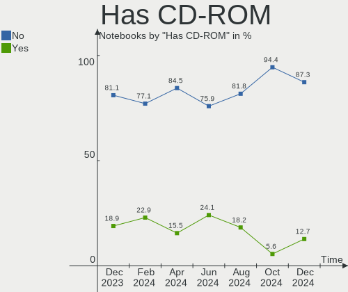
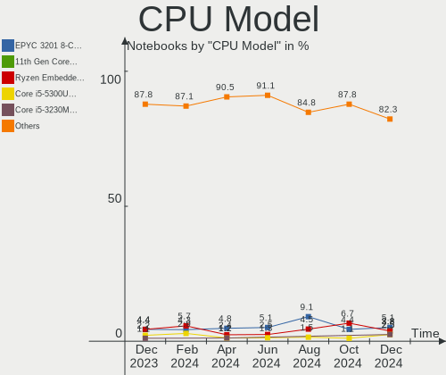
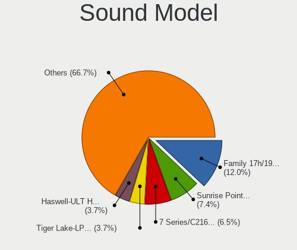

BSD Hardware Trends (Notebook)
------------------------------

A project to identify most popular hardware characteristics and track their change
over time based on data collected by BSD users at https://BSD-Hardware.info.

Anyone can contribute to the study by uploading probes of their computers by
the [hw-probe](https://github.com/linuxhw/hw-probe/blob/master/INSTALL.BSD.md) tool:

    hw-probe -all -upload

Full-feature report is available here: https://bsd-hardware.info/?view=trends&formfactor=notebook

Period: Feb, 2021.

Contents
--------

- [ OS                       ](#os)
- [ OS Family                ](#os-family)
- [ Arch                     ](#arch)
- [ DE                       ](#de)
- [ Display Server           ](#display-server)
- [ Display Manager          ](#display-manager)
- [ OS Lang                  ](#os-lang)
- [ Boot Mode                ](#boot-mode)
- [ Filesystem               ](#filesystem)
- [ Part. scheme             ](#part-scheme)
- [ Country                  ](#country)
- [ City                     ](#city)
- [ Vendor                   ](#vendor)
- [ Model                    ](#model)
- [ Model Family             ](#model-family)
- [ MFG Year                 ](#mfg-year)
- [ Form Factor              ](#form-factor)
- [ Coreboot                 ](#coreboot)
- [ RAM Size                 ](#ram-size)
- [ RAM Used                 ](#ram-used)
- [ Has CD-ROM               ](#has-cd-rom)
- [ Total Drives             ](#total-drives)
- [ Has Ethernet             ](#has-ethernet)
- [ Drive Vendor             ](#drive-vendor)
- [ Drive Model              ](#drive-model)
- [ HDD Vendor               ](#hdd-vendor)
- [ SSD Vendor               ](#ssd-vendor)
- [ Drive Kind               ](#drive-kind)
- [ Drive Connector          ](#drive-connector)
- [ Drive Size               ](#drive-size)
- [ Space Total              ](#space-total)
- [ Space Used               ](#space-used)
- [ Malfunc. Drives          ](#malfunc-drives)
- [ Malfunc. Drive Vendor    ](#malfunc-drive-vendor)
- [ Malfunc. HDD Vendor      ](#malfunc-hdd-vendor)
- [ Malfunc. Drive Kind      ](#malfunc-drive-kind)
- [ Failed Drives            ](#failed-drives)
- [ Failed Drive Vendor      ](#failed-drive-vendor)
- [ Drive Status             ](#drive-status)
- [ Storage Vendor           ](#storage-vendor)
- [ Storage Model            ](#storage-model)
- [ Storage Kind             ](#storage-kind)
- [ CPU Vendor               ](#cpu-vendor)
- [ CPU Model                ](#cpu-model)
- [ CPU Model Family         ](#cpu-model-family)
- [ CPU Cores                ](#cpu-cores)
- [ CPU Sockets              ](#cpu-sockets)
- [ CPU Threads              ](#cpu-threads)
- [ CPU Microarch            ](#cpu-microarch)
- [ GPU Vendor               ](#gpu-vendor)
- [ GPU Model                ](#gpu-model)
- [ GPU Combo                ](#gpu-combo)
- [ GPU Driver               ](#gpu-driver)
- [ GPU Memory               ](#gpu-memory)
- [ Monitor Vendor           ](#monitor-vendor)
- [ Monitor Model            ](#monitor-model)
- [ Monitor Resolution       ](#monitor-resolution)
- [ Monitor Diagonal         ](#monitor-diagonal)
- [ Monitor Width            ](#monitor-width)
- [ Aspect Ratio             ](#aspect-ratio)
- [ Monitor Area             ](#monitor-area)
- [ Pixel Density            ](#pixel-density)
- [ Multiple Monitors        ](#multiple-monitors)
- [ Net Controller Vendor    ](#net-controller-vendor)
- [ Net Controller Model     ](#net-controller-model)
- [ Wireless Vendor          ](#wireless-vendor)
- [ Wireless Model           ](#wireless-model)
- [ Ethernet Vendor          ](#ethernet-vendor)
- [ Ethernet Model           ](#ethernet-model)
- [ Net Controller Kind      ](#net-controller-kind)
- [ Used Controller          ](#used-controller)
- [ NICs                     ](#nics)
- [ Memory Vendor            ](#memory-vendor)
- [ Memory Model             ](#memory-model)
- [ Memory Kind              ](#memory-kind)
- [ Memory Form Factor       ](#memory-form-factor)
- [ Memory Size              ](#memory-size)
- [ Memory Speed             ](#memory-speed)
- [ Sound Vendor             ](#sound-vendor)
- [ Sound Model              ](#sound-model)
- [ Camera Vendor            ](#camera-vendor)
- [ Camera Model             ](#camera-model)
- [ Fingerprint Vendor       ](#fingerprint-vendor)
- [ Fingerprint Model        ](#fingerprint-model)
- [ Chipcard Vendor          ](#chipcard-vendor)
- [ Chipcard Model           ](#chipcard-model)
- [ Printer Vendor           ](#printer-vendor)
- [ Printer Model            ](#printer-model)
- [ Scanner Vendor           ](#scanner-vendor)
- [ Scanner Model            ](#scanner-model)
- [ Bluetooth Vendor         ](#bluetooth-vendor)
- [ Bluetooth Model          ](#bluetooth-model)
- [ Unsupported Devices      ](#unsupported-devices)
- [ Unsupported Device Types ](#unsupported-device-types)

OS
--

Installed operating systems

| Name                    | Notebooks | Percent |
|-------------------------|-----------|---------|
| helloSystem 0.4.0       | 63        | 34.43%  |
| helloSystem 0.5.0       | 20        | 10.93%  |
| FreeBSD 12.2-p3         | 15        | 8.2%    |
| OPNsense 21.1           | 9         | 4.92%   |
| OpenBSD 6.8             | 9         | 4.92%   |
| FreeBSD 14.0-CURRENT    | 7         | 3.83%   |
| OPNsense 21.1.1         | 6         | 3.28%   |
| FreeBSD 13.0-BETA1      | 5         | 2.73%   |
| OpenBSD 6.9             | 4         | 2.19%   |
| NomadBSD 1.4-RC1        | 4         | 2.19%   |
| helloSystem 0.3.0       | 4         | 2.19%   |
| GhostBSD 20.04.02       | 4         | 2.19%   |
| FreeBSD 13.0-BETA3      | 4         | 2.19%   |
| FreeBSD 12.2-p4         | 4         | 2.19%   |
| FreeBSD 12.2-p2         | 4         | 2.19%   |
| FreeBSD 12.2            | 4         | 2.19%   |
| OPNsense 21.1.2         | 3         | 1.64%   |
| NomadBSD 1.3.2          | 3         | 1.64%   |
| FreeBSD 13.0-STABLE     | 3         | 1.64%   |
| FreeBSD 13.0-BETA2      | 3         | 1.64%   |
| OPNsense 20.7.8         | 1         | 0.55%   |
| FreeBSD 13.0-RTC-ALPHA2 | 1         | 0.55%   |
| FreeBSD 13.0-CURRENT    | 1         | 0.55%   |
| FreeBSD 13.0-ALPHA3     | 1         | 0.55%   |
| FreeBSD 12.2-STABLE     | 1         | 0.55%   |

OS Family
---------

OS without a version

| Name        | Notebooks | Percent |
|-------------|-----------|---------|
| helloSystem | 87        | 47.54%  |
| FreeBSD     | 53        | 28.96%  |
| OPNsense    | 19        | 10.38%  |
| OpenBSD     | 13        | 7.1%    |
| NomadBSD    | 7         | 3.83%   |
| GhostBSD    | 4         | 2.19%   |

Arch
----

OS architecture (x86_64, i586, etc.)

| Name  | Notebooks | Percent |
|-------|-----------|---------|
| amd64 | 174       | 95.08%  |
| i386  | 9         | 4.92%   |

DE
--

Desktop Environment

| Name          | Notebooks | Percent |
|---------------|-----------|---------|
| helloDesktop  | 86        | 46.99%  |
| Console       | 25        | 13.66%  |
| KDE5          | 13        | 7.1%    |
| fvwm          | 11        | 6.01%   |
| Openbox       | 8         | 4.37%   |
| XFCE          | 7         | 3.83%   |
| MATE          | 7         | 3.83%   |
| TWM           | 6         | 3.28%   |
| i3            | 6         | 3.28%   |
| GNOME         | 6         | 3.28%   |
| Cinnamon      | 2         | 1.09%   |
| LXQt          | 1         | 0.55%   |
| LXDE          | 1         | 0.55%   |
| IceWM         | 1         | 0.55%   |
| Fluxbox       | 1         | 0.55%   |
| Enlightenment | 1         | 0.55%   |
| AwesomeWM     | 1         | 0.55%   |

Display Server
--------------

X11 or Wayland

| Name    | Notebooks | Percent |
|---------|-----------|---------|
| X11     | 152       | 83.06%  |
| Console | 28        | 15.3%   |
| Wayland | 3         | 1.64%   |

Display Manager
---------------

SDDM, LightDM, etc.

| Name    | Notebooks | Percent |
|---------|-----------|---------|
| SLiM    | 107       | 58.47%  |
| Console | 46        | 25.14%  |
| SDDM    | 12        | 6.56%   |
| LightDM | 8         | 4.37%   |
| XDM     | 5         | 2.73%   |
| GDM     | 4         | 2.19%   |
| Ly      | 1         | 0.55%   |

OS Lang
-------

Language

| Lang            | Notebooks | Percent |
|-----------------|-----------|---------|
| en_US           | 100       | 54.64%  |
| Unknown         | 51        | 27.87%  |
| C               | 13        | 7.1%    |
| en_GB           | 5         | 2.73%   |
| ru_RU           | 3         | 1.64%   |
| fr_FR           | 3         | 1.64%   |
| it_IT           | 2         | 1.09%   |
| de_DE           | 2         | 1.09%   |
| pt_BR           | 1         | 0.55%   |
| es_ES           | 1         | 0.55%   |
| en_US.ISO8859-1 | 1         | 0.55%   |
| de_DE.ISO8859-1 | 1         | 0.55%   |

Boot Mode
---------

EFI or BIOS

| Mode | Notebooks | Percent |
|------|-----------|---------|
| EFI  | 143       | 78.14%  |
| BIOS | 40        | 21.86%  |

Filesystem
----------

Type of filesystem

| Type | Notebooks | Percent |
|------|-----------|---------|
| Zfs  | 125       | 68.31%  |
| Ufs  | 45        | 24.59%  |
| Ffs  | 13        | 7.1%    |

Part. scheme
------------

Scheme of partitioning

| Type | Notebooks | Percent |
|------|-----------|---------|
| GPT  | 161       | 87.98%  |
| MBR  | 22        | 12.02%  |

Country
-------

Geographic location (country)

| Country            | Notebooks | Percent |
|--------------------|-----------|---------|
| USA                | 31        | 16.94%  |
| Germany            | 25        | 13.66%  |
| France             | 16        | 8.74%   |
| Brazil             | 13        | 7.1%    |
| UK                 | 12        | 6.56%   |
| Russia             | 8         | 4.37%   |
| Italy              | 8         | 4.37%   |
| Netherlands        | 7         | 3.83%   |
| China              | 6         | 3.28%   |
| Sweden             | 5         | 2.73%   |
| Portugal           | 4         | 2.19%   |
| Spain              | 3         | 1.64%   |
| Latvia             | 3         | 1.64%   |
| Hungary            | 3         | 1.64%   |
| Canada             | 3         | 1.64%   |
| Australia          | 3         | 1.64%   |
| Vietnam            | 2         | 1.09%   |
| Ukraine            | 2         | 1.09%   |
| Thailand           | 2         | 1.09%   |
| Switzerland        | 2         | 1.09%   |
| Poland             | 2         | 1.09%   |
| Indonesia          | 2         | 1.09%   |
| Finland            | 2         | 1.09%   |
| Croatia            | 2         | 1.09%   |
| Slovakia           | 1         | 0.55%   |
| Saudi Arabia       | 1         | 0.55%   |
| Philippines        | 1         | 0.55%   |
| Peru               | 1         | 0.55%   |
| Norway             | 1         | 0.55%   |
| New Zealand        | 1         | 0.55%   |
| Macau              | 1         | 0.55%   |
| Lithuania          | 1         | 0.55%   |
| Korea, Republic of | 1         | 0.55%   |
| Japan              | 1         | 0.55%   |
| India              | 1         | 0.55%   |
| Greece             | 1         | 0.55%   |
| Denmark            | 1         | 0.55%   |
| Bulgaria           | 1         | 0.55%   |
| Belgium            | 1         | 0.55%   |
| Bangladesh         | 1         | 0.55%   |
| Unknown            | 1         | 0.55%   |

City
----

Geographic location (city)

| City                   | Notebooks | Percent |
|------------------------|-----------|---------|
| Franconville           | 5         | 2.73%   |
| The Bronx              | 4         | 2.19%   |
| Linschoten             | 4         | 2.19%   |
| Riga                   | 3         | 1.64%   |
| Moscow                 | 3         | 1.64%   |
| Telford                | 2         | 1.09%   |
| Sydney                 | 2         | 1.09%   |
| St Petersburg          | 2         | 1.09%   |
| Glasgow                | 2         | 1.09%   |
| Charfield              | 2         | 1.09%   |
| Berlin                 | 2         | 1.09%   |
| Beijing                | 2         | 1.09%   |
| Épinay-sur-Seine      | 1         | 0.55%   |
| Zembrzyce              | 1         | 0.55%   |
| Zagreb                 | 1         | 0.55%   |
| Yoshkar-Ola            | 1         | 0.55%   |
| Xi'an                  | 1         | 0.55%   |
| Wuhan                  | 1         | 0.55%   |
| Wirral                 | 1         | 0.55%   |
| Warsaw                 | 1         | 0.55%   |
| Visconde do Rio Branco | 1         | 0.55%   |
| Vilnius                | 1         | 0.55%   |
| Villejuif              | 1         | 0.55%   |
| Vigo                   | 1         | 0.55%   |
| Viamão                | 1         | 0.55%   |
| Velika Gorica          | 1         | 0.55%   |
| Varna                  | 1         | 0.55%   |
| Union Grove            | 1         | 0.55%   |
| Uitikon                | 1         | 0.55%   |
| Turku                  | 1         | 0.55%   |
| Tulle                  | 1         | 0.55%   |
| Trieste                | 1         | 0.55%   |
| Toronto                | 1         | 0.55%   |
| Terrassa               | 1         | 0.55%   |
| Teresina               | 1         | 0.55%   |
| Tangara                | 1         | 0.55%   |
| Taipa                  | 1         | 0.55%   |
| São Paulo             | 1         | 0.55%   |
| São José dos Pinhais | 1         | 0.55%   |
| St Louis               | 1         | 0.55%   |
| Spokane                | 1         | 0.55%   |
| Solarino               | 1         | 0.55%   |
| Slijk-Ewijk            | 1         | 0.55%   |
| Shenzhen               | 1         | 0.55%   |
| Seminole               | 1         | 0.55%   |
| Seattle                | 1         | 0.55%   |
| Schorndorf             | 1         | 0.55%   |
| Sankt Augustin         | 1         | 0.55%   |
| Sanford                | 1         | 0.55%   |
| San Benigno Canavese   | 1         | 0.55%   |
| Salzwedel              | 1         | 0.55%   |
| Salisbury              | 1         | 0.55%   |
| Rotorua                | 1         | 0.55%   |
| Roskilde               | 1         | 0.55%   |
| Roseville              | 1         | 0.55%   |
| Roche-la-Moliere       | 1         | 0.55%   |
| Riyadh                 | 1         | 0.55%   |
| Rio Tinto              | 1         | 0.55%   |
| Rheinberg              | 1         | 0.55%   |
| Pfullingen             | 1         | 0.55%   |

Vendor
------

Motherboard manufacturer

| Name                           | Notebooks | Percent |
|--------------------------------|-----------|---------|
| Lenovo                         | 55        | 30.05%  |
| Dell                           | 34        | 18.58%  |
| ASUSTek Computer               | 19        | 10.38%  |
| Hewlett-Packard                | 14        | 7.65%   |
| Apple                          | 10        | 5.46%   |
| Acer                           | 9         | 4.92%   |
| Unknown                        | 5         | 2.73%   |
| Toshiba                        | 4         | 2.19%   |
| Samsung Electronics            | 4         | 2.19%   |
| Fujitsu                        | 4         | 2.19%   |
| Clevo                          | 3         | 1.64%   |
| System76                       | 2         | 1.09%   |
| Sony                           | 2         | 1.09%   |
| IBM                            | 2         | 1.09%   |
| Pegatron                       | 1         | 0.55%   |
| Packard Bell                   | 1         | 0.55%   |
| MOTILE                         | 1         | 0.55%   |
| Medion                         | 1         | 0.55%   |
| Matsushita Electric Industrial | 1         | 0.55%   |
| LG Electronics                 | 1         | 0.55%   |
| Intel                          | 1         | 0.55%   |
| Hampoo                         | 1         | 0.55%   |
| Gigabyte Technology            | 1         | 0.55%   |
| GEO                            | 1         | 0.55%   |
| eMachines                      | 1         | 0.55%   |
| DFI                            | 1         | 0.55%   |
| Deciso                         | 1         | 0.55%   |
| Chuwi                          | 1         | 0.55%   |
| Alienware                      | 1         | 0.55%   |
| A-DATA Technology              | 1         | 0.55%   |

Model
-----

Motherboard model

| Name                                        | Notebooks | Percent |
|---------------------------------------------|-----------|---------|
| Unknown                                     | 5         | 2.73%   |
| Lenovo ThinkPad E490 20N8CTO1WW             | 2         | 1.09%   |
| Dell Latitude E4300                         | 2         | 1.09%   |
| Dell Latitude 3410                          | 2         | 1.09%   |
| Dell Inspiron 3521                          | 2         | 1.09%   |
| Apple MacBookPro6,2                         | 2         | 1.09%   |
| Acer Extensa 5635Z                          | 2         | 1.09%   |
| Toshiba TECRA M11                           | 1         | 0.55%   |
| Toshiba Satellite U500                      | 1         | 0.55%   |
| Toshiba Satellite L50-C                     | 1         | 0.55%   |
| Toshiba Satellite L450                      | 1         | 0.55%   |
| System76 Lemur Pro                          | 1         | 0.55%   |
| System76 Galago Pro                         | 1         | 0.55%   |
| Sony VPCX115KX                              | 1         | 0.55%   |
| Sony VPCF12C5E                              | 1         | 0.55%   |
| Samsung RV411/RV511/E3511/S3511/RV711/E3411 | 1         | 0.55%   |
| Samsung 910S3K/9310SK/910S3P/911S3K         | 1         | 0.55%   |
| Samsung 300V3Z/300V4Z/300V5Z                | 1         | 0.55%   |
| Samsung 300E5M/300E5L                       | 1         | 0.55%   |
| Pegatron T12Ah                              | 1         | 0.55%   |
| Packard Bell EasyNote TS11HR                | 1         | 0.55%   |
| MOTILE M142                                 | 1         | 0.55%   |
| Medion P6812                                | 1         | 0.55%   |
| Matsushita Electric Industrial CF-T2BW1AXR  | 1         | 0.55%   |
| LG 14Z980-G.BH51P1                          | 1         | 0.55%   |
| Lenovo ZIUS6                                | 1         | 0.55%   |
| Lenovo Z50-70 20354                         | 1         | 0.55%   |
| Lenovo V130-15IKB 81HN                      | 1         | 0.55%   |
| Lenovo U310                                 | 1         | 0.55%   |
| Lenovo ThinkPad X61s 766734A                | 1         | 0.55%   |
| Lenovo ThinkPad X280 20KFCTO1WW             | 1         | 0.55%   |
| Lenovo ThinkPad X260 20F5S1H800             | 1         | 0.55%   |
| Lenovo ThinkPad X240 20AMS4V000             | 1         | 0.55%   |
| Lenovo ThinkPad X230 Tablet 34371N3         | 1         | 0.55%   |
| Lenovo ThinkPad X220 42915CG                | 1         | 0.55%   |
| Lenovo ThinkPad X220 4290NE3                | 1         | 0.55%   |
| Lenovo ThinkPad X220 4286CTO                | 1         | 0.55%   |
| Lenovo ThinkPad X200 7459ZLW                | 1         | 0.55%   |
| Lenovo ThinkPad X13 Gen 1 20UF000QRT        | 1         | 0.55%   |
| Lenovo ThinkPad X1 Extreme 20MF000BUS       | 1         | 0.55%   |
| Lenovo ThinkPad X1 Carbon 5th 20HQS02100    | 1         | 0.55%   |
| Lenovo ThinkPad X1 Carbon 4th 48104P0100    | 1         | 0.55%   |
| Lenovo ThinkPad X1 Carbon 4th 20FCS2K000    | 1         | 0.55%   |
| Lenovo ThinkPad X1 Carbon 4th 20FC0019AU    | 1         | 0.55%   |
| Lenovo ThinkPad T61 6459CTO                 | 1         | 0.55%   |
| Lenovo ThinkPad T60 2007EH7                 | 1         | 0.55%   |
| Lenovo ThinkPad T580 20LAS2TG00             | 1         | 0.55%   |
| Lenovo ThinkPad T530 2429J74                | 1         | 0.55%   |
| Lenovo ThinkPad T520 4242A16                | 1         | 0.55%   |
| Lenovo ThinkPad T495s 20QKS1812F            | 1         | 0.55%   |
| Lenovo ThinkPad T490 20RYS06R00             | 1         | 0.55%   |
| Lenovo ThinkPad T470s 20HGS1VD00            | 1         | 0.55%   |
| Lenovo ThinkPad T470p 20J6A012CD            | 1         | 0.55%   |
| Lenovo ThinkPad T470 20HD000MUK             | 1         | 0.55%   |
| Lenovo ThinkPad T460s 20F90037LM            | 1         | 0.55%   |
| Lenovo ThinkPad T450 20BUS08800             | 1         | 0.55%   |
| Lenovo ThinkPad T440s 20ARS10P05            | 1         | 0.55%   |
| Lenovo ThinkPad T440p 20AWS0U500            | 1         | 0.55%   |
| Lenovo ThinkPad T430 2349PMP                | 1         | 0.55%   |
| Lenovo ThinkPad T430 2349H2G                | 1         | 0.55%   |

Model Family
------------

Motherboard model prefix

| Name                                       | Notebooks | Percent |
|--------------------------------------------|-----------|---------|
| Lenovo ThinkPad                            | 44        | 24.04%  |
| Dell Latitude                              | 20        | 10.93%  |
| Dell Inspiron                              | 7         | 3.83%   |
| HP EliteBook                               | 5         | 2.73%   |
| Unknown                                    | 5         | 2.73%   |
| Toshiba Satellite                          | 3         | 1.64%   |
| Fujitsu LIFEBOOK                           | 3         | 1.64%   |
| Dell XPS                                   | 3         | 1.64%   |
| Acer Extensa                               | 3         | 1.64%   |
| Acer Aspire                                | 3         | 1.64%   |
| Lenovo IdeaPad                             | 2         | 1.09%   |
| IBM ThinkPad                               | 2         | 1.09%   |
| HP ProBook                                 | 2         | 1.09%   |
| HP OMEN                                    | 2         | 1.09%   |
| ASUS VivoBook                              | 2         | 1.09%   |
| Apple MacBookPro8                          | 2         | 1.09%   |
| Apple MacBookPro6                          | 2         | 1.09%   |
| Apple MacBook5                             | 2         | 1.09%   |
| Toshiba TECRA                              | 1         | 0.55%   |
| System76 Lemur                             | 1         | 0.55%   |
| System76 Galago                            | 1         | 0.55%   |
| Sony VPCX115KX                             | 1         | 0.55%   |
| Sony VPCF12C5E                             | 1         | 0.55%   |
| Samsung RV411                              | 1         | 0.55%   |
| Samsung 910S3K                             | 1         | 0.55%   |
| Samsung 300V3Z                             | 1         | 0.55%   |
| Samsung 300E5M                             | 1         | 0.55%   |
| Pegatron T12Ah                             | 1         | 0.55%   |
| Packard Bell EasyNote                      | 1         | 0.55%   |
| MOTILE M142                                | 1         | 0.55%   |
| Medion P6812                               | 1         | 0.55%   |
| Matsushita Electric Industrial CF-T2BW1AXR | 1         | 0.55%   |
| LG 14Z980-G.BH51P1                         | 1         | 0.55%   |
| Lenovo ZIUS6                               | 1         | 0.55%   |
| Lenovo Z50-70                              | 1         | 0.55%   |
| Lenovo V130-15IKB                          | 1         | 0.55%   |
| Lenovo U310                                | 1         | 0.55%   |
| Lenovo Legion                              | 1         | 0.55%   |
| Lenovo G505s                               | 1         | 0.55%   |
| Lenovo G500                                | 1         | 0.55%   |
| Lenovo G470                                | 1         | 0.55%   |
| Lenovo 20QD0000US                          | 1         | 0.55%   |
| Intel H81U                                 | 1         | 0.55%   |
| HP Pavilion                                | 1         | 0.55%   |
| HP Laptop                                  | 1         | 0.55%   |
| HP ENVY                                    | 1         | 0.55%   |
| HP Compaq                                  | 1         | 0.55%   |
| HP 250                                     | 1         | 0.55%   |
| Hampoo NA123                               | 1         | 0.55%   |
| Gigabyte P15FR7                            | 1         | 0.55%   |
| GEO GeoBook3                               | 1         | 0.55%   |
| Fujitsu FMVNF70YJ                          | 1         | 0.55%   |
| eMachines eME732ZG                         | 1         | 0.55%   |
| DFI BE17X(170                              | 1         | 0.55%   |
| Dell Vostro                                | 1         | 0.55%   |
| Dell Venue                                 | 1         | 0.55%   |
| Dell Studio                                | 1         | 0.55%   |
| Dell G7                                    | 1         | 0.55%   |
| Deciso Netboard                            | 1         | 0.55%   |
| Clevo W55xEU                               | 1         | 0.55%   |

MFG Year
--------

Motherboard manufacture year

| Year | Notebooks | Percent |
|------|-----------|---------|
| 2020 | 34        | 18.58%  |
| 2019 | 26        | 14.21%  |
| 2018 | 23        | 12.57%  |
| 2013 | 19        | 10.38%  |
| 2009 | 13        | 7.1%    |
| 2015 | 10        | 5.46%   |
| 2017 | 9         | 4.92%   |
| 2011 | 9         | 4.92%   |
| 2012 | 7         | 3.83%   |
| 2016 | 6         | 3.28%   |
| 2014 | 6         | 3.28%   |
| 2010 | 6         | 3.28%   |
| 2008 | 6         | 3.28%   |
| 2007 | 4         | 2.19%   |
| 2021 | 2         | 1.09%   |
| 2006 | 1         | 0.55%   |
| 2004 | 1         | 0.55%   |
| 2003 | 1         | 0.55%   |

Form Factor
-----------

Physical design of the computer

| Name     | Notebooks | Percent |
|----------|-----------|---------|
| Notebook | 183       | 100%    |

Coreboot
--------

Have coreboot on board

| Used | Notebooks | Percent |
|------|-----------|---------|
| No   | 182       | 99.45%  |
| Yes  | 1         | 0.55%   |

RAM Size
--------

Total RAM memory

| Size in GB | Notebooks | Percent |
|------------|-----------|---------|
| 8.01-16.0  | 67        | 36.61%  |
| 4.01-8.0   | 49        | 26.78%  |
| 16.01-24.0 | 44        | 24.04%  |
| 2.01-3.0   | 8         | 4.37%   |
| 32.01-64.0 | 4         | 2.19%   |
| 1.01-2.0   | 4         | 2.19%   |
| 3.01-4.0   | 3         | 1.64%   |
| 24.01-32.0 | 2         | 1.09%   |
| 0.51-1.0   | 2         | 1.09%   |

RAM Used
--------

Used RAM memory

| Used GB    | Notebooks | Percent |
|------------|-----------|---------|
| 0.01-0.5   | 116       | 63.39%  |
| 0.51-1.0   | 45        | 24.59%  |
| 1.01-2.0   | 9         | 4.92%   |
| 2.01-3.0   | 5         | 2.73%   |
| 0          | 3         | 1.64%   |
| 4.01-8.0   | 2         | 1.09%   |
| 8.01-16.0  | 2         | 1.09%   |
| 16.01-24.0 | 1         | 0.55%   |

Has CD-ROM
----------

Has CD-ROM on board

| Presented | Notebooks | Percent |
|-----------|-----------|---------|
| No        | 111       | 60.66%  |
| Yes       | 72        | 39.34%  |

Total Drives
------------

Number of drives on board

| Drives | Notebooks | Percent |
|--------|-----------|---------|
| 1      | 135       | 73.77%  |
| 2      | 33        | 18.03%  |
| 0      | 13        | 7.1%    |
| 4      | 1         | 0.55%   |
| 3      | 1         | 0.55%   |

Has Ethernet
------------

Has Ethernet on board

| Presented | Notebooks | Percent |
|-----------|-----------|---------|
| Yes       | 167       | 91.26%  |
| No        | 16        | 8.74%   |

Drive Vendor
------------

Hard drive vendors

| Vendor              | Notebooks | Drives | Percent |
|---------------------|-----------|--------|---------|
| Samsung Electronics | 40        | 45     | 20.41%  |
| WDC                 | 27        | 28     | 13.78%  |
| Seagate             | 19        | 20     | 9.69%   |
| Toshiba             | 18        | 19     | 9.18%   |
| Crucial             | 12        | 12     | 6.12%   |
| Kingston            | 9         | 9      | 4.59%   |
| Hitachi             | 8         | 8      | 4.08%   |
| SanDisk             | 6         | 6      | 3.06%   |
| Transcend           | 4         | 4      | 2.04%   |
| HGST                | 4         | 5      | 2.04%   |
| SK Hynix            | 3         | 3      | 1.53%   |
| PNY                 | 3         | 3      | 1.53%   |
| Micron Technology   | 3         | 3      | 1.53%   |
| LITEON              | 3         | 3      | 1.53%   |
| Hewlett-Packard     | 3         | 3      | 1.53%   |
| Fujitsu             | 3         | 3      | 1.53%   |
| Apple               | 3         | 3      | 1.53%   |
| SPCC                | 2         | 2      | 1.02%   |
| OCZ                 | 2         | 2      | 1.02%   |
| NVMe                | 2         | 2      | 1.02%   |
| KingSpec            | 2         | 2      | 1.02%   |
| Intenso             | 2         | 2      | 1.02%   |
| A-DATA Technology   | 2         | 2      | 1.02%   |
| Zheino              | 1         | 1      | 0.51%   |
| UFD 2.0             | 1         | 1      | 0.51%   |
| Phison              | 1         | 1      | 0.51%   |
| Patriot             | 1         | 1      | 0.51%   |
| MyDigitalSSD        | 1         | 1      | 0.51%   |
| LITEONIT            | 1         | 1      | 0.51%   |
| Lexar               | 1         | 1      | 0.51%   |
| Kston               | 1         | 1      | 0.51%   |
| Intel               | 1         | 1      | 0.51%   |
| Hoodisk             | 1         | 1      | 0.51%   |
| Hikvision           | 1         | 1      | 0.51%   |
| Gigabyte Technology | 1         | 1      | 0.51%   |
| Dogfish             | 1         | 1      | 0.51%   |
| Corsair             | 1         | 1      | 0.51%   |
| China               | 1         | 1      | 0.51%   |
| BIWIN               | 1         | 1      | 0.51%   |

Drive Model
-----------

Hard drive models

| Model                                | Notebooks | Percent |
|--------------------------------------|-----------|---------|
| Samsung SSD 850 EVO 250GB            | 7         | 3.43%   |
| WDC WDS240G2G0A-00JH30 240GB         | 3         | 1.47%   |
| Toshiba MQ01ABF050 500GB             | 3         | 1.47%   |
| Toshiba MQ01ABD100 1TB               | 3         | 1.47%   |
| Samsung SSD 860 EVO 500GB            | 3         | 1.47%   |
| Samsung SSD 850 EVO 500GB            | 3         | 1.47%   |
| WDC WD1600BEVT-22ZCT0 160GB          | 2         | 0.98%   |
| WDC WD1600BEVS-08VAT2 160GB          | 2         | 0.98%   |
| WDC WD10SPZX-24Z10 1TB               | 2         | 0.98%   |
| WDC PC SN730 SDBQNTY-512G-1001 512GB | 2         | 0.98%   |
| Seagate ST9250315AS 250GB            | 2         | 0.98%   |
| Seagate ST750LM022 HN-M750MBB 752GB  | 2         | 0.98%   |
| Seagate ST1000LM049-2GH172 1TB       | 2         | 0.98%   |
| Seagate ST1000LM035-1RK172 1TB       | 2         | 0.98%   |
| Seagate ST1000LM024 HN-M101MBB 1TB   | 2         | 0.98%   |
| Samsung SSD 860 EVO 250GB            | 2         | 0.98%   |
| Samsung SSD 860 EVO 1TB              | 2         | 0.98%   |
| Samsung MZVLB256HBHQ-000L7 256GB     | 2         | 0.98%   |
| Micron 1100 SATA 256GB               | 2         | 0.98%   |
| Kingston SV300S37A120G 120GB         | 2         | 0.98%   |
| Hitachi HTS541612J9SA00 120GB        | 2         | 0.98%   |
| HGST HTS725050A7E630 500GB           | 2         | 0.98%   |
| HGST HTS721010A9E630 1TB             | 2         | 0.98%   |
| Crucial CT240BX500SSD1 240GB         | 2         | 0.98%   |
| Crucial CT1000P1SSD8 1TB             | 2         | 0.98%   |
| Apple SSD TS128C 121GB               | 2         | 0.98%   |
| Zheino CHN-mSATAQ3-120 120GB         | 1         | 0.49%   |
| WDC WDS500G2B0C-00PXH0 500GB         | 1         | 0.49%   |
| WDC WDS500G2B0A-00SM50 500GB         | 1         | 0.49%   |
| WDC WDS480G2G0A-00JH30 480GB         | 1         | 0.49%   |
| WDC WDS120G1G0A-00SS50 120GB         | 1         | 0.49%   |
| WDC WDBA3V5000ANC-WRSN 500GB         | 1         | 0.49%   |
| WDC WD7500BPKT-75PK4T0 752GB         | 1         | 0.49%   |
| WDC WD5000LPCX-21VHAT0 500GB         | 1         | 0.49%   |
| WDC WD3200BPVT-75ZEST0 320GB         | 1         | 0.49%   |
| WDC WD1600BEVS-60RST0 160GB          | 1         | 0.49%   |
| WDC WD10SPZX-21Z10T0 1TB             | 1         | 0.49%   |
| WDC WD10JPVX-35JC3T0 1TB             | 1         | 0.49%   |
| WDC WD10JPVX-00JC3T0 1TB             | 1         | 0.49%   |
| WDC WD10JMVW-11AJGS0 1TB             | 1         | 0.49%   |
| WDC PC SN730 SDBPNTY-1T00-1006 1TB   | 1         | 0.49%   |
| WDC PC SN720 SDAQNTW-512G-1001 512GB | 1         | 0.49%   |
| WDC PC SN530 SDBPNPZ-256G-1002 256GB | 1         | 0.49%   |
| WDC PC SN520 SDAPMUW-128G-1101 128GB | 1         | 0.49%   |
| UFD 2.0 Silicon-Power16G 18302PB     | 1         | 0.49%   |
| Transcend TSA 240GB                  | 1         | 0.49%   |
| Transcend TS512GSSD370 512GB         | 1         | 0.49%   |
| Transcend TS256GMTS952T2 256GB       | 1         | 0.49%   |
| Transcend TS256GMTS800 256GB         | 1         | 0.49%   |
| Toshiba THNSNK256GVN8 M.2 2280 256GB | 1         | 0.49%   |
| Toshiba THNSN5512GPUK NVMe 512GB     | 1         | 0.49%   |
| Toshiba THNSF5256GPUK 256GB          | 1         | 0.49%   |
| Toshiba MQ04ABF100 1TB               | 1         | 0.49%   |
| Toshiba MQ01ACF032 320GB             | 1         | 0.49%   |
| Toshiba MK8025GAS 80GB               | 1         | 0.49%   |
| Toshiba MK6475GSX 640GB              | 1         | 0.49%   |
| Toshiba MK5065GSXF 500GB             | 1         | 0.49%   |
| Toshiba MK2555GSXF 250GB             | 1         | 0.49%   |
| Toshiba MK1234GSX 120GB              | 1         | 0.49%   |
| Toshiba KXG60ZNV512G NVMe 512GB      | 1         | 0.49%   |

HDD Vendor
----------

Hard disk drive vendors

| Vendor              | Notebooks | Drives | Percent |
|---------------------|-----------|--------|---------|
| Seagate             | 19        | 20     | 29.69%  |
| WDC                 | 14        | 14     | 21.88%  |
| Toshiba             | 12        | 13     | 18.75%  |
| Hitachi             | 8         | 8      | 12.5%   |
| HGST                | 4         | 5      | 6.25%   |
| Fujitsu             | 3         | 3      | 4.69%   |
| Samsung Electronics | 2         | 2      | 3.13%   |
| UFD 2.0             | 1         | 1      | 1.56%   |
| NVMe                | 1         | 1      | 1.56%   |

SSD Vendor
----------

Solid state drive vendors

| Vendor              | Notebooks | Drives | Percent |
|---------------------|-----------|--------|---------|
| Samsung Electronics | 32        | 35     | 30.77%  |
| Crucial             | 9         | 9      | 8.65%   |
| Kingston            | 8         | 8      | 7.69%   |
| WDC                 | 6         | 6      | 5.77%   |
| SanDisk             | 6         | 6      | 5.77%   |
| Transcend           | 4         | 4      | 3.85%   |
| SK Hynix            | 3         | 3      | 2.88%   |
| PNY                 | 3         | 3      | 2.88%   |
| LITEON              | 3         | 3      | 2.88%   |
| Hewlett-Packard     | 3         | 3      | 2.88%   |
| Apple               | 3         | 3      | 2.88%   |
| SPCC                | 2         | 2      | 1.92%   |
| OCZ                 | 2         | 2      | 1.92%   |
| Micron Technology   | 2         | 2      | 1.92%   |
| KingSpec            | 2         | 2      | 1.92%   |
| Intenso             | 2         | 2      | 1.92%   |
| Zheino              | 1         | 1      | 0.96%   |
| Toshiba             | 1         | 1      | 0.96%   |
| Patriot             | 1         | 1      | 0.96%   |
| NVMe                | 1         | 1      | 0.96%   |
| MyDigitalSSD        | 1         | 1      | 0.96%   |
| LITEONIT            | 1         | 1      | 0.96%   |
| Lexar               | 1         | 1      | 0.96%   |
| Kston               | 1         | 1      | 0.96%   |
| Hoodisk             | 1         | 1      | 0.96%   |
| Hikvision           | 1         | 1      | 0.96%   |
| Dogfish             | 1         | 1      | 0.96%   |
| Corsair             | 1         | 1      | 0.96%   |
| China               | 1         | 1      | 0.96%   |
| BIWIN               | 1         | 1      | 0.96%   |

Drive Kind
----------

HDD or SSD

| Kind | Notebooks | Drives | Percent |
|------|-----------|--------|---------|
| SSD  | 95        | 107    | 50.53%  |
| HDD  | 62        | 67     | 32.98%  |
| NVMe | 31        | 31     | 16.49%  |

Drive Connector
---------------

SATA, SAS, NVMe, etc.

| Type | Notebooks | Drives | Percent |
|------|-----------|--------|---------|
| SATA | 146       | 174    | 82.49%  |
| NVMe | 31        | 31     | 17.51%  |

Drive Size
----------

Size of hard drive

| Size in TB      | Notebooks | Drives | Percent |
|-----------------|-----------|--------|---------|
| 0.01-0.5        | 121       | 132    | 75.16%  |
| 0.51-1.0        | 35        | 37     | 21.74%  |
| 1.01-2.0        | 4         | 4      | 2.48%   |
| More than 100.0 | 1         | 1      | 0.62%   |

Space Total
-----------

Amount of disk space available on the file system

| Size in GB | Notebooks | Percent |
|------------|-----------|---------|
| 1-20       | 74        | 40.44%  |
| 101-250    | 46        | 25.14%  |
| 251-500    | 25        | 13.66%  |
| 501-1000   | 14        | 7.65%   |
| 51-100     | 12        | 6.56%   |
| 21-50      | 8         | 4.37%   |
| 1001-2000  | 4         | 2.19%   |

Space Used
----------

Amount of used disk space

| Used GB | Notebooks | Percent |
|---------|-----------|---------|
| 1-20    | 162       | 88.52%  |
| 21-50   | 13        | 7.1%    |
| 101-250 | 7         | 3.83%   |
| 51-100  | 1         | 0.55%   |

Malfunc. Drives
---------------

Drive models with a malfunction

| Model                                            | Notebooks | Drives | Percent |
|--------------------------------------------------|-----------|--------|---------|
| Toshiba MQ01ABD100 1TB                           | 2         | 2      | 6.25%   |
| Hitachi HTS541612J9SA00 120GB                    | 2         | 2      | 6.25%   |
| WDC WD7500BPKT-75PK4T0 752GB                     | 1         | 1      | 3.13%   |
| WDC WD1600BEVS-60RST0 160GB                      | 1         | 1      | 3.13%   |
| WDC WD10JMVW-11AJGS0 1TB                         | 1         | 1      | 3.13%   |
| Toshiba THNSNK256GVN8 M.2 2280 256GB             | 1         | 1      | 3.13%   |
| Toshiba MK6475GSX 640GB                          | 1         | 1      | 3.13%   |
| Toshiba MK2555GSXF 250GB                         | 1         | 1      | 3.13%   |
| Seagate ST9500420AS 500GB                        | 1         | 1      | 3.13%   |
| Seagate ST9500325AS 500GB                        | 1         | 1      | 3.13%   |
| Seagate ST9320320AS 320GB                        | 1         | 1      | 3.13%   |
| Seagate ST9250320AS 250GB                        | 1         | 1      | 3.13%   |
| Seagate ST9250315AS 250GB                        | 1         | 1      | 3.13%   |
| Seagate ST750LM022 HN-M750MBB 752GB              | 1         | 1      | 3.13%   |
| Seagate ST320LT012-9WS14C 320GB                  | 1         | 1      | 3.13%   |
| Seagate ST1000LM049-2GH172 1TB                   | 1         | 1      | 3.13%   |
| Samsung Electronics SSD PM810 2.5-inch 7mm 256GB | 1         | 1      | 3.13%   |
| Samsung Electronics SSD 840 EVO 500GB            | 1         | 1      | 3.13%   |
| Samsung Electronics MZ5PA064HMCD-01000 64GB      | 1         | 1      | 3.13%   |
| Samsung Electronics HM121HI 120GB                | 1         | 1      | 3.13%   |
| Micron Technology 1100 SATA 256GB                | 1         | 1      | 3.13%   |
| LITEON LJH-64V2G-11 M.2 2260 64GB                | 1         | 1      | 3.13%   |
| Kingston RBU-SNS8350DES3128GP 128GB              | 1         | 1      | 3.13%   |
| KingSpec KSD-PA25.6-032MS 32GB                   | 1         | 1      | 3.13%   |
| Hitachi HTS725025A9A364 250GB                    | 1         | 1      | 3.13%   |
| Hitachi HTS723232A7A364 320GB                    | 1         | 1      | 3.13%   |
| Hitachi HTS545032B9A300 320GB                    | 1         | 1      | 3.13%   |
| HGST HTS725050A7E630 500GB                       | 1         | 1      | 3.13%   |
| Fujitsu MHS2040AT D 40GB                         | 1         | 1      | 3.13%   |
| Crucial CT525MX300SSD1 528GB                     | 1         | 1      | 3.13%   |

Malfunc. Drive Vendor
---------------------

Vendors of faulty drives

| Vendor              | Notebooks | Drives | Percent |
|---------------------|-----------|--------|---------|
| Seagate             | 8         | 8      | 25%     |
| Toshiba             | 5         | 5      | 15.63%  |
| Hitachi             | 5         | 5      | 15.63%  |
| Samsung Electronics | 4         | 4      | 12.5%   |
| WDC                 | 3         | 3      | 9.38%   |
| Micron Technology   | 1         | 1      | 3.13%   |
| LITEON              | 1         | 1      | 3.13%   |
| Kingston            | 1         | 1      | 3.13%   |
| KingSpec            | 1         | 1      | 3.13%   |
| HGST                | 1         | 1      | 3.13%   |
| Fujitsu             | 1         | 1      | 3.13%   |
| Crucial             | 1         | 1      | 3.13%   |

Malfunc. HDD Vendor
-------------------

Vendors of faulty HDD drives

| Vendor              | Notebooks | Drives | Percent |
|---------------------|-----------|--------|---------|
| Seagate             | 8         | 8      | 34.78%  |
| Hitachi             | 5         | 5      | 21.74%  |
| Toshiba             | 4         | 4      | 17.39%  |
| WDC                 | 3         | 3      | 13.04%  |
| Samsung Electronics | 1         | 1      | 4.35%   |
| HGST                | 1         | 1      | 4.35%   |
| Fujitsu             | 1         | 1      | 4.35%   |

Malfunc. Drive Kind
-------------------

Kinds of faulty drives

| Kind | Notebooks | Drives | Percent |
|------|-----------|--------|---------|
| HDD  | 22        | 23     | 70.97%  |
| SSD  | 9         | 9      | 29.03%  |

Failed Drives
-------------

Failed drive models

Zero info for selected period =(

Failed Drive Vendor
-------------------

Failed drive vendors

Zero info for selected period =(

Drive Status
------------

Number of failed and malfunc. drives

| Status   | Notebooks | Drives | Percent |
|----------|-----------|--------|---------|
| Works    | 145       | 170    | 81.01%  |
| Malfunc  | 31        | 32     | 17.32%  |
| Detected | 3         | 3      | 1.68%   |

Storage Vendor
--------------

Storage controller vendors

| Vendor                           | Notebooks | Percent |
|----------------------------------|-----------|---------|
| Intel                            | 153       | 76.88%  |
| Samsung Electronics              | 9         | 4.52%   |
| AMD                              | 9         | 4.52%   |
| Sandisk                          | 8         | 4.02%   |
| Toshiba                          | 5         | 2.51%   |
| Nvidia                           | 4         | 2.01%   |
| Micron/Crucial Technology        | 3         | 1.51%   |
| Phison Electronics               | 2         | 1.01%   |
| Silicon Integrated Systems [SiS] | 1         | 0.5%    |
| Realtek Semiconductor            | 1         | 0.5%    |
| Micron Technology                | 1         | 0.5%    |
| Kingston Technology Company      | 1         | 0.5%    |
| JMicron Technology               | 1         | 0.5%    |
| ADATA Technology                 | 1         | 0.5%    |

Storage Model
-------------

Storage controller models

| Model                                                                            | Notebooks | Percent |
|----------------------------------------------------------------------------------|-----------|---------|
| Intel 7 Series Chipset Family 6-port SATA Controller [AHCI mode]                 | 21        | 9.68%   |
| Intel Sunrise Point-LP SATA Controller [AHCI mode]                               | 20        | 9.22%   |
| Intel 6 Series/C200 Series Chipset Family 6 port Mobile SATA AHCI Controller     | 18        | 8.29%   |
| Intel 8 Series SATA Controller 1 [AHCI mode]                                     | 13        | 5.99%   |
| Intel 82801IBM/IEM (ICH9M/ICH9M-E) 4 port SATA Controller [AHCI mode]            | 11        | 5.07%   |
| Intel 82801 Mobile SATA Controller [RAID mode]                                   | 11        | 5.07%   |
| AMD FCH SATA Controller [AHCI mode]                                              | 9         | 4.15%   |
| Intel 82801HM/HEM (ICH8M/ICH8M-E) SATA Controller [AHCI mode]                    | 7         | 3.23%   |
| Intel 82801HM/HEM (ICH8M/ICH8M-E) IDE Controller                                 | 7         | 3.23%   |
| Samsung NVMe SSD Controller SM981/PM981/PM983                                    | 6         | 2.76%   |
| Intel Wildcat Point-LP SATA Controller [AHCI Mode]                               | 6         | 2.76%   |
| Intel 5 Series/3400 Series Chipset 4 port SATA AHCI Controller                   | 6         | 2.76%   |
| Intel 5 Series/3400 Series Chipset 6 port SATA AHCI Controller                   | 5         | 2.3%    |
| Nvidia MCP79 AHCI Controller                                                     | 4         | 1.84%   |
| Intel HM170/QM170 Chipset SATA Controller [AHCI Mode]                            | 4         | 1.84%   |
| Unknown                                                                          | 4         | 1.84%   |
| Sandisk WD Blue SN550 NVMe SSD                                                   | 3         | 1.38%   |
| Sandisk WD Black SN750 / PC SN730 NVMe SSD                                       | 3         | 1.38%   |
| Samsung NVMe SSD Controller SM961/PM961/SM963                                    | 3         | 1.38%   |
| Intel Comet Lake PCH-LP SATA RAID Premium Controller                             | 3         | 1.38%   |
| Intel Celeron N3350/Pentium N4200/Atom E3900 Series SATA AHCI Controller         | 3         | 1.38%   |
| Intel Cannon Lake Mobile PCH SATA AHCI Controller                                | 3         | 1.38%   |
| Intel 82801DBM (ICH4-M) IDE Controller                                           | 3         | 1.38%   |
| Intel 5 Series/3400 Series Chipset 4 port SATA IDE Controller                    | 3         | 1.38%   |
| Intel 5 Series/3400 Series Chipset 2 port SATA IDE Controller                    | 3         | 1.38%   |
| Toshiba XG4 NVMe SSD Controller                                                  | 2         | 0.92%   |
| Toshiba BG3 NVMe SSD Controller                                                  | 2         | 0.92%   |
| Micron/Crucial P1 NVMe PCIe SSD                                                  | 2         | 0.92%   |
| Intel Mobile 4 Series Chipset PT IDER Controller                                 | 2         | 0.92%   |
| Intel Cannon Point-LP SATA Controller [AHCI Mode]                                | 2         | 0.92%   |
| Intel 82801GBM/GHM (ICH7-M Family) SATA Controller [IDE mode]                    | 2         | 0.92%   |
| Intel 82801G (ICH7 Family) IDE Controller                                        | 2         | 0.92%   |
| Intel 8 Series/C220 Series Chipset Family 6-port SATA Controller 1 [AHCI mode]   | 2         | 0.92%   |
| Toshiba XG6 NVMe SSD Controller                                                  | 1         | 0.46%   |
| Silicon Integrated Systems [SiS] 5518 UDMA IDE Controller                        | 1         | 0.46%   |
| Sandisk WD Black 2018/SN750 / PC SN720 NVMe SSD                                  | 1         | 0.46%   |
| Sandisk PC SN520 NVMe SSD                                                        | 1         | 0.46%   |
| Phison E16 PCIe4 NVMe Controller                                                 | 1         | 0.46%   |
| Phison E12 NVMe Controller                                                       | 1         | 0.46%   |
| JMicron JMB360 AHCI Controller                                                   | 1         | 0.46%   |
| Intel US15W/US15X/US15L/UL11L SCH [Poulsbo] IDE Controller                       | 1         | 0.46%   |
| Intel SSD 660P Series                                                            | 1         | 0.46%   |
| Intel Mobile PM965/GM965 PT IDER Controller                                      | 1         | 0.46%   |
| Intel Comet Lake SATA AHCI Controller                                            | 1         | 0.46%   |
| Intel Celeron/Pentium Silver Processor SATA Controller                           | 1         | 0.46%   |
| Intel Atom/Celeron/Pentium Processor x5-E8000/J3xxx/N3xxx Series SATA Controller | 1         | 0.46%   |
| Intel Atom Processor E3800 Series SATA AHCI Controller                           | 1         | 0.46%   |
| Intel 82801IBM/IEM (ICH9M/ICH9M-E) 2 port SATA Controller [IDE mode]             | 1         | 0.46%   |
| Intel 82801GBM/GHM (ICH7-M Family) SATA Controller [AHCI mode]                   | 1         | 0.46%   |
| Intel 7 Series Chipset Family 4-port SATA Controller [IDE mode]                  | 1         | 0.46%   |
| Intel 7 Series Chipset Family 2-port SATA Controller [IDE mode]                  | 1         | 0.46%   |
| Intel 5 Series/3400 Series Chipset PT IDER Controller                            | 1         | 0.46%   |
| Intel 400 Series Chipset Family SATA AHCI Controller                             | 1         | 0.46%   |
| AMD FCH IDE Controller                                                           | 1         | 0.46%   |
| ADATA XPG SX8200 Pro PCIe Gen3x4 M.2 2280 Solid State Drive                      | 1         | 0.46%   |

Storage Kind
------------

Kind of storage controller (IDE, SATA, NVMe, SAS, ...)

| Kind | Notebooks | Percent |
|------|-----------|---------|
| SATA | 140       | 66.35%  |
| NVMe | 32        | 15.17%  |
| IDE  | 25        | 11.85%  |
| RAID | 14        | 6.64%   |

CPU Vendor
----------

Processor vendors

| Vendor | Notebooks | Percent |
|--------|-----------|---------|
| Intel  | 173       | 94.54%  |
| AMD    | 10        | 5.46%   |

CPU Model
---------

Processor models

| Model                                                        | Notebooks | Percent |
|--------------------------------------------------------------|-----------|---------|
| Intel Core i5-3320M CPU @ 2.60GHz                            | 6         | 3.28%   |
| Intel Core i5-2520M CPU @ 2.50GHz                            | 6         | 3.28%   |
| Intel Core i7-7500U CPU @ 2.70GHz                            | 5         | 2.73%   |
| Intel Core i7-6600U CPU @ 2.60GHz                            | 5         | 2.73%   |
| Intel Core i5-7200U CPU @ 2.50GHz                            | 5         | 2.73%   |
| Intel CPU Version                                            | 4         | 2.19%   |
| Intel Core i7-8565U CPU @ 1.80GHz                            | 4         | 2.19%   |
| Intel Core i5-10210U CPU @ 1.60GHz                           | 4         | 2.19%   |
| Intel Genuine CPU                                            | 3         | 1.64%   |
| Intel Core i7-8750H CPU @ 2.20GHz                            | 3         | 1.64%   |
| Intel Core i7-7600U CPU @ 2.80GHz                            | 3         | 1.64%   |
| Intel Core i7-4510U CPU @ 2.00GHz                            | 3         | 1.64%   |
| Intel Core i7-3520M CPU @ 2.90GHz                            | 3         | 1.64%   |
| Intel Core i5-5200U CPU @ 2.20GHz                            | 3         | 1.64%   |
| Intel Core i5-4210U CPU @ 1.70GHz                            | 3         | 1.64%   |
| Intel Core i5 CPU M 520 @ 2.40GHz                            | 3         | 1.64%   |
| Intel Core i3-3227U CPU @ 1.90GHz                            | 3         | 1.64%   |
| Intel Pentium M processor 1.70GHz ("GenuineIntel" 686-class) | 2         | 1.09%   |
| Intel Pentium CPU N4200 @ 1.10GHz                            | 2         | 1.09%   |
| Intel Core i7-8550U CPU @ 1.80GHz                            | 2         | 1.09%   |
| Intel Core i7-7700HQ CPU @ 2.80GHz                           | 2         | 1.09%   |
| Intel Core i7-4702MQ CPU @ 2.20GHz                           | 2         | 1.09%   |
| Intel Core i7-2630QM CPU @ 2.00GHz                           | 2         | 1.09%   |
| Intel Core i7 CPU M 620 @ 2.67GHz                            | 2         | 1.09%   |
| Intel Core i5-7300U CPU @ 2.60GHz                            | 2         | 1.09%   |
| Intel Core i5-6200U CPU @ 2.30GHz                            | 2         | 1.09%   |
| Intel Core i5-4200U CPU @ 1.60GHz                            | 2         | 1.09%   |
| Intel Core i5-3340M CPU @ 2.70GHz                            | 2         | 1.09%   |
| Intel Core i5-3317U CPU @ 1.70GHz                            | 2         | 1.09%   |
| Intel Core i5 CPU M 540 @ 2.53GHz                            | 2         | 1.09%   |
| Intel Core i3-2350M CPU @ 2.30GHz                            | 2         | 1.09%   |
| Intel Core 2 Duo CPU T7250 @ 2.00GHz                         | 2         | 1.09%   |
| Intel Core 2 Duo CPU P8600 @ 2.40GHz                         | 2         | 1.09%   |
| Intel Core 2 Duo CPU P7550 @ 2.26GHz                         | 2         | 1.09%   |
| Intel Core 2 Duo                                             | 2         | 1.09%   |
| AMD Ryzen 5 3500U with Radeon Vega Mobile Gfx                | 2         | 1.09%   |
| Intel Pentium M processor 1000MHz                            | 1         | 0.55%   |
| Intel Pentium Dual-Core CPU T4400 @ 2.20GHz                  | 1         | 0.55%   |
| Intel Pentium Dual-Core CPU T4300 @ 2.10GHz                  | 1         | 0.55%   |
| Intel Pentium Dual CPU T3400 @ 2.16GHz                       | 1         | 0.55%   |
| Intel Pentium CPU P6200 @ 2.13GHz                            | 1         | 0.55%   |
| Intel Pentium CPU N3700 @ 1.60GHz                            | 1         | 0.55%   |
| Intel Pentium CPU N3540 @ 2.16GHz                            | 1         | 0.55%   |
| Intel Pentium CPU 967 @ 1.30GHz                              | 1         | 0.55%   |
| Intel Pentium 3558U @ 1.70GHz                                | 1         | 0.55%   |
| Intel Mobile Celeron CPU 2.20GHz ("GenuineIntel" 686-class)  | 1         | 0.55%   |
| Intel Core m7-6Y75 CPU @ 1.20GHz                             | 1         | 0.55%   |
| Intel Core M-5Y10c CPU @ 0.80GHz                             | 1         | 0.55%   |
| Intel Core i7-9750H CPU @ 2.60GHz                            | 1         | 0.55%   |
| Intel Core i7-8650U CPU @ 1.90GHz                            | 1         | 0.55%   |
| Intel Core i7-6560U CPU @ 2.20GHz                            | 1         | 0.55%   |
| Intel Core i7-4600U CPU @ 2.10GHz                            | 1         | 0.55%   |
| Intel Core i7-4500U CPU @ 1.80GHz                            | 1         | 0.55%   |
| Intel Core i7-3632QM CPU @ 2.20GHz                           | 1         | 0.55%   |
| Intel Core i7-3610QM CPU @ 2.30GHz                           | 1         | 0.55%   |
| Intel Core i7-2820QM CPU @ 2.30GHz                           | 1         | 0.55%   |
| Intel Core i7-2677M CPU @ 1.80GHz                            | 1         | 0.55%   |
| Intel Core i7-2640M CPU @ 2.80GHz                            | 1         | 0.55%   |
| Intel Core i7-2635QM CPU @ 2.00GHz                           | 1         | 0.55%   |
| Intel Core i7-10750H CPU @ 2.60GHz                           | 1         | 0.55%   |

CPU Model Family
----------------

Processor model prefix

| Model                   | Notebooks | Percent |
|-------------------------|-----------|---------|
| Intel Core i5           | 56        | 30.6%   |
| Intel Core i7           | 51        | 27.87%  |
| Intel Core 2 Duo        | 16        | 8.74%   |
| Intel Core i3           | 14        | 7.65%   |
| Intel Pentium           | 7         | 3.83%   |
| Intel Celeron           | 7         | 3.83%   |
| Other                   | 6         | 3.28%   |
| Intel Atom              | 4         | 2.19%   |
| Intel Pentium M         | 3         | 1.64%   |
| Intel Genuine           | 3         | 1.64%   |
| Intel Pentium Dual-Core | 2         | 1.09%   |
| AMD Ryzen 7 PRO         | 2         | 1.09%   |
| AMD Ryzen 5             | 2         | 1.09%   |
| Intel Pentium Dual      | 1         | 0.55%   |
| Intel Mobile Celeron    | 1         | 0.55%   |
| Intel Core m7           | 1         | 0.55%   |
| Intel Core M            | 1         | 0.55%   |
| Intel Core 2            | 1         | 0.55%   |
| AMD Ryzen 7             | 1         | 0.55%   |
| AMD Ryzen 3             | 1         | 0.55%   |
| AMD EPYC                | 1         | 0.55%   |
| AMD A8                  | 1         | 0.55%   |
| AMD A4                  | 1         | 0.55%   |

CPU Cores
---------

Number of processor cores

| Number  | Notebooks | Percent |
|---------|-----------|---------|
| 2       | 109       | 59.56%  |
| 4       | 39        | 21.31%  |
| Unknown | 19        | 10.38%  |
| 6       | 5         | 2.73%   |
| 1       | 5         | 2.73%   |
| 8       | 4         | 2.19%   |
| 16      | 2         | 1.09%   |

CPU Sockets
-----------

Number of sockets

| Number  | Notebooks | Percent |
|---------|-----------|---------|
| 1       | 174       | 95.08%  |
| Unknown | 6         | 3.28%   |
| 2       | 3         | 1.64%   |

CPU Threads
-----------

Threads per core (Hyper-Threading)

| Number  | Notebooks | Percent |
|---------|-----------|---------|
| 2       | 124       | 67.76%  |
| 1       | 36        | 19.67%  |
| Unknown | 23        | 12.57%  |

CPU Microarch
-------------

Microarchitecture

| Name          | Notebooks | Percent |
|---------------|-----------|---------|
| KabyLake      | 40        | 21.86%  |
| IvyBridge     | 23        | 12.57%  |
| SandyBridge   | 21        | 11.48%  |
| Penryn        | 16        | 8.74%   |
| Haswell       | 16        | 8.74%   |
| Skylake       | 13        | 7.1%    |
| Westmere      | 12        | 6.56%   |
| Core          | 8         | 4.37%   |
| Broadwell     | 6         | 3.28%   |
| Zen+          | 4         | 2.19%   |
| Bonnell       | 4         | 2.19%   |
| Silvermont    | 3         | 1.64%   |
| P6            | 3         | 1.64%   |
| Goldmont      | 3         | 1.64%   |
| Zen 2         | 2         | 1.09%   |
| Nehalem       | 2         | 1.09%   |
| Zen           | 1         | 0.55%   |
| Steamroller   | 1         | 0.55%   |
| Piledriver    | 1         | 0.55%   |
| NetBurst      | 1         | 0.55%   |
| Jaguar        | 1         | 0.55%   |
| Goldmont plus | 1         | 0.55%   |
| CometLake     | 1         | 0.55%   |

GPU Vendor
----------

Vendors of graphics cards

| Vendor                           | Notebooks | Percent |
|----------------------------------|-----------|---------|
| Intel                            | 155       | 73.11%  |
| Nvidia                           | 34        | 16.04%  |
| AMD                              | 22        | 10.38%  |
| Silicon Integrated Systems [SiS] | 1         | 0.47%   |

GPU Model
---------

Graphics card models

| Model                                                                                    | Notebooks | Percent |
|------------------------------------------------------------------------------------------|-----------|---------|
| Intel 3rd Gen Core processor Graphics Controller                                         | 22        | 10%     |
| Intel 2nd Generation Core Processor Family Integrated Graphics Controller                | 20        | 9.09%   |
| Intel HD Graphics 620                                                                    | 16        | 7.27%   |
| Intel Haswell-ULT Integrated Graphics Controller                                         | 14        | 6.36%   |
| Intel Mobile 4 Series Chipset Integrated Graphics Controller                             | 11        | 5%      |
| Intel Core Processor Integrated Graphics Controller                                      | 10        | 4.55%   |
| Intel Skylake GT2 [HD Graphics 520]                                                      | 9         | 4.09%   |
| Intel WhiskeyLake-U GT2 [UHD Graphics 620]                                               | 6         | 2.73%   |
| Intel CometLake-U GT2 [UHD Graphics]                                                     | 6         | 2.73%   |
| Intel HD Graphics 5500                                                                   | 5         | 2.27%   |
| Intel CoffeeLake-H GT2 [UHD Graphics 630]                                                | 5         | 2.27%   |
| AMD Picasso                                                                              | 5         | 2.27%   |
| Intel UHD Graphics 620                                                                   | 4         | 1.82%   |
| Intel Mobile GM965/GL960 Integrated Graphics Controller (secondary)                      | 4         | 1.82%   |
| Intel Mobile GM965/GL960 Integrated Graphics Controller (primary)                        | 4         | 1.82%   |
| Nvidia GT216M [GeForce GT 330M]                                                          | 3         | 1.36%   |
| Nvidia GM108M [GeForce 940MX]                                                            | 3         | 1.36%   |
| Nvidia GF117M [GeForce 610M/710M/810M/820M / GT 620M/625M/630M/720M]                     | 3         | 1.36%   |
| Nvidia C79 [GeForce 9400M]                                                               | 3         | 1.36%   |
| Intel Mobile 945GSE Express Integrated Graphics Controller                               | 3         | 1.36%   |
| Intel Mobile 945GM/GMS/GME, 943/940GML Express Integrated Graphics Controller            | 3         | 1.36%   |
| Intel HD Graphics 630                                                                    | 3         | 1.36%   |
| Nvidia TU116M [GeForce GTX 1660 Ti Mobile]                                               | 2         | 0.91%   |
| Nvidia GP107M [GeForce GTX 1050 Ti Mobile]                                               | 2         | 0.91%   |
| Nvidia GP107M [GeForce GTX 1050 Mobile]                                                  | 2         | 0.91%   |
| Nvidia GM108M [GeForce 840M]                                                             | 2         | 0.91%   |
| Nvidia GM107M [GeForce GTX 950M]                                                         | 2         | 0.91%   |
| Intel Celeron N3350/Pentium N4200/Atom E3900 Series Integrated Graphics Controller       | 2         | 0.91%   |
| Intel Atom/Celeron/Pentium Processor x5-E8000/J3xxx/N3xxx Integrated Graphics Controller | 2         | 0.91%   |
| Intel 4th Gen Core Processor Integrated Graphics Controller                              | 2         | 0.91%   |
| AMD Seymour [Radeon HD 6400M/7400M Series]                                               | 2         | 0.91%   |
| AMD RV200/M7 [Mobility Radeon 7500]                                                      | 2         | 0.91%   |
| AMD Renoir                                                                               | 2         | 0.91%   |
| Silicon Integrated Systems [SiS] 65x/M650/740 PCI/AGP VGA Display Adapter                | 1         | 0.45%   |
| Nvidia TU106M [GeForce RTX 2070 Mobile / Max-Q Refresh]                                  | 1         | 0.45%   |
| Nvidia GT216M [NVS 5100M]                                                                | 1         | 0.45%   |
| Nvidia GM108M [GeForce MX130]                                                            | 1         | 0.45%   |
| Nvidia GM108M [GeForce 930MX]                                                            | 1         | 0.45%   |
| Nvidia GF119M [GeForce GT 520MX]                                                         | 1         | 0.45%   |
| Nvidia GF116M [GeForce GT 555M/635M]                                                     | 1         | 0.45%   |
| Nvidia GF114M [GeForce GTX 580M]                                                         | 1         | 0.45%   |
| Nvidia GF108M [GeForce GT 635M]                                                          | 1         | 0.45%   |
| Nvidia GF108M [GeForce GT 525M]                                                          | 1         | 0.45%   |
| Nvidia G86M [Quadro NVS 140M]                                                            | 1         | 0.45%   |
| Nvidia G84M [GeForce 8600M GT]                                                           | 1         | 0.45%   |
| Nvidia C79 [GeForce 9400M G]                                                             | 1         | 0.45%   |
| Intel US15W/US15X SCH [Poulsbo] Graphics Controller                                      | 1         | 0.45%   |
| Intel Iris Graphics 540                                                                  | 1         | 0.45%   |
| Intel HD Graphics 5300                                                                   | 1         | 0.45%   |
| Intel HD Graphics 530                                                                    | 1         | 0.45%   |
| Intel HD Graphics 515                                                                    | 1         | 0.45%   |
| Intel HD Graphics 510                                                                    | 1         | 0.45%   |
| Intel HD Graphics 500                                                                    | 1         | 0.45%   |
| Intel GeminiLake [UHD Graphics 600]                                                      | 1         | 0.45%   |
| Intel CometLake-H GT2 [UHD Graphics]                                                     | 1         | 0.45%   |
| Intel Atom Processor Z36xxx/Z37xxx Series Graphics & Display                             | 1         | 0.45%   |
| Intel 82852/855GM Integrated Graphics Device                                             | 1         | 0.45%   |
| AMD Whistler [Radeon HD 6630M/6650M/6750M/7670M/7690M]                                   | 1         | 0.45%   |
| AMD Trinity [Radeon HD 7640G]                                                            | 1         | 0.45%   |
| AMD Thames [Radeon HD 7550M/7570M/7650M]                                                 | 1         | 0.45%   |

GPU Combo
---------

Combinations of graphics cards

| Name           | Notebooks | Percent |
|----------------|-----------|---------|
| 1 x Intel      | 110       | 60.11%  |
| Intel + Nvidia | 22        | 12.02%  |
| 2 x Intel      | 18        | 9.84%   |
| 1 x AMD        | 15        | 8.2%    |
| 1 x Nvidia     | 10        | 5.46%   |
| Intel + AMD    | 4         | 2.19%   |
| Other          | 1         | 0.55%   |
| 2 x AMD        | 1         | 0.55%   |
| 1 x SiS        | 1         | 0.55%   |
| AMD + Nvidia   | 1         | 0.55%   |

GPU Driver
----------

Free vs proprietary

| Driver      | Notebooks | Percent |
|-------------|-----------|---------|
| Free        | 162       | 88.52%  |
| Unknown     | 17        | 9.29%   |
| Proprietary | 4         | 2.19%   |

GPU Memory
----------

Total video memory

| Size in GB | Notebooks | Percent |
|------------|-----------|---------|
| Unknown    | 175       | 95.63%  |
| 1.01-2.0   | 4         | 2.19%   |
| 0.01-0.5   | 3         | 1.64%   |
| 0.51-1.0   | 1         | 0.55%   |

Monitor Vendor
--------------

Monitor vendors

| Vendor                  | Notebooks | Percent |
|-------------------------|-----------|---------|
| LG Display              | 33        | 25.38%  |
| AU Optronics            | 32        | 24.62%  |
| Chimei Innolux          | 14        | 10.77%  |
| BOE                     | 9         | 6.92%   |
| Samsung Electronics     | 8         | 6.15%   |
| Lenovo                  | 7         | 5.38%   |
| Chi Mei Optoelectronics | 5         | 3.85%   |
| Sharp                   | 3         | 2.31%   |
| InfoVision              | 3         | 2.31%   |
| Apple                   | 3         | 2.31%   |
| HannStar                | 2         | 1.54%   |
| AOC                     | 2         | 1.54%   |
| ViewSonic               | 1         | 0.77%   |
| Philips                 | 1         | 0.77%   |
| Panasonic               | 1         | 0.77%   |
| LG Philips              | 1         | 0.77%   |
| Iiyama                  | 1         | 0.77%   |
| IBM                     | 1         | 0.77%   |
| Goldstar                | 1         | 0.77%   |
| Eizo                    | 1         | 0.77%   |
| Ancor Communications    | 1         | 0.77%   |

Monitor Model
-------------

Monitor models

| Model                                                                    | Notebooks | Percent |
|--------------------------------------------------------------------------|-----------|---------|
| LG Display LCD Monitor LGD11F9 1280x800 290x180mm 13.4-inch              | 2         | 1.54%   |
| LG Display LCD Monitor LGD03AB 1366x768 340x190mm 15.3-inch              | 2         | 1.54%   |
| LG Display LCD Monitor LGD02D8 1366x768 280x160mm 12.7-inch              | 2         | 1.54%   |
| Chimei Innolux LCD Monitor CMN14C0 1920x1080 310x170mm 13.9-inch         | 2         | 1.54%   |
| Chimei Innolux LCD Monitor CMN14B1 1920x1080 310x170mm 13.9-inch         | 2         | 1.54%   |
| Chi Mei Optoelectronics LCD Monitor CMO15A7 1366x768 350x190mm 15.7-inch | 2         | 1.54%   |
| AU Optronics LCD Monitor AUO38ED 1920x1080 340x190mm 15.3-inch           | 2         | 1.54%   |
| AU Optronics LCD Monitor AUO313C 1366x768 310x170mm 13.9-inch            | 2         | 1.54%   |
| AU Optronics LCD Monitor AUO303E 1600x900 310x170mm 13.9-inch            | 2         | 1.54%   |
| AU Optronics LCD Monitor AUO21EC 1366x768 340x190mm 15.3-inch            | 2         | 1.54%   |
| AU Optronics LCD Monitor AUO213E 1600x900 310x170mm 13.9-inch            | 2         | 1.54%   |
| AU Optronics LCD Monitor AUO106C 1366x768 280x160mm 12.7-inch            | 2         | 1.54%   |
| ViewSonic LCD Monitor VSC6F2E 1920x1080 480x270mm 21.7-inch              | 1         | 0.77%   |
| Sharp LCD Monitor SHP1461 3200x1800 290x170mm 13.2-inch                  | 1         | 0.77%   |
| Sharp LCD Monitor SHP1453 1920x1080 350x190mm 15.7-inch                  | 1         | 0.77%   |
| Sharp LCD Monitor SHP1449 1920x1080 290x170mm 13.2-inch                  | 1         | 0.77%   |
| Samsung Electronics LCD Monitor SEC5448 1920x1080 410x230mm 18.5-inch    | 1         | 0.77%   |
| Samsung Electronics LCD Monitor SEC3847 1440x900 370x230mm 17.2-inch     | 1         | 0.77%   |
| Samsung Electronics LCD Monitor SEC324A 1366x768 340x190mm 15.3-inch     | 1         | 0.77%   |
| Samsung Electronics LCD Monitor SDC5441 1366x768 340x190mm 15.3-inch     | 1         | 0.77%   |
| Samsung Electronics LCD Monitor SDC4C48 1920x1080 240x130mm 10.7-inch    | 1         | 0.77%   |
| Samsung Electronics LCD Monitor SDC424A 3200x1800 290x170mm 13.2-inch    | 1         | 0.77%   |
| Samsung Electronics LCD Monitor SDC4141 1366x768 340x190mm 15.3-inch     | 1         | 0.77%   |
| Samsung Electronics LCD Monitor SDC324A 1366x768 290x170mm 13.2-inch     | 1         | 0.77%   |
| Philips PHL 328E1 PHLC204 3840x2160 700x390mm 31.5-inch                  | 1         | 0.77%   |
| Panasonic VVX13F009G00 MEI96A2 1920x1080 290x170mm 13.2-inch             | 1         | 0.77%   |
| LG Philips LCD Monitor LPL7F01 1024x600 190x110mm 8.6-inch               | 1         | 0.77%   |
| LG Display LCD Monitor LGDCF01 1366x768 340x190mm 15.3-inch              | 1         | 0.77%   |
| LG Display LCD Monitor LGD060A 1920x1080 290x170mm 13.2-inch             | 1         | 0.77%   |
| LG Display LCD Monitor LGD05FA 1920x1080 310x170mm 13.9-inch             | 1         | 0.77%   |
| LG Display LCD Monitor LGD05E5 1920x1080 340x190mm 15.3-inch             | 1         | 0.77%   |
| LG Display LCD Monitor LGD05B1 1920x1080 310x170mm 13.9-inch             | 1         | 0.77%   |
| LG Display LCD Monitor LGD059B 1920x1080 290x170mm 13.2-inch             | 1         | 0.77%   |
| LG Display LCD Monitor LGD0573 1920x1080 340x190mm 15.3-inch             | 1         | 0.77%   |
| LG Display LCD Monitor LGD055F 2560x1440 310x170mm 13.9-inch             | 1         | 0.77%   |
| LG Display LCD Monitor LGD0532 1920x1080 340x190mm 15.3-inch             | 1         | 0.77%   |
| LG Display LCD Monitor LGD04B1 1366x768 310x170mm 13.9-inch              | 1         | 0.77%   |
| LG Display LCD Monitor LGD04A9 1920x1080 310x170mm 13.9-inch             | 1         | 0.77%   |
| LG Display LCD Monitor LGD04A3 1366x768 280x160mm 12.7-inch              | 1         | 0.77%   |
| LG Display LCD Monitor LGD045C 1366x768 350x190mm 15.7-inch              | 1         | 0.77%   |
| LG Display LCD Monitor LGD039F 1366x768 350x190mm 15.7-inch              | 1         | 0.77%   |
| LG Display LCD Monitor LGD0390 1600x900 380x210mm 17.1-inch              | 1         | 0.77%   |
| LG Display LCD Monitor LGD037E 1920x1080 350x190mm 15.7-inch             | 1         | 0.77%   |
| LG Display LCD Monitor LGD036C 1366x768 280x160mm 12.7-inch              | 1         | 0.77%   |
| LG Display LCD Monitor LGD0353 1366x768 350x190mm 15.7-inch              | 1         | 0.77%   |
| LG Display LCD Monitor LGD034C 1366x768 290x160mm 13.0-inch              | 1         | 0.77%   |
| LG Display LCD Monitor LGD033E 1366x768 310x170mm 13.9-inch              | 1         | 0.77%   |
| LG Display LCD Monitor LGD0303 1600x900 380x210mm 17.1-inch              | 1         | 0.77%   |
| LG Display LCD Monitor LGD02E9 1366x768 310x170mm 13.9-inch              | 1         | 0.77%   |
| LG Display LCD Monitor LGD02DF 1600x900 310x170mm 13.9-inch              | 1         | 0.77%   |
| LG Display LCD Monitor LGD02BE 1366x768 260x140mm 11.6-inch              | 1         | 0.77%   |
| LG Display LCD Monitor LGD0283 1920x1080 380x220mm 17.3-inch             | 1         | 0.77%   |
| LG Display LCD Monitor LGD0258 1600x900 350x190mm 15.7-inch              | 1         | 0.77%   |
| LG Display LCD Monitor LGD0213 1600x900 310x170mm 13.9-inch              | 1         | 0.77%   |
| Lenovo LCD Monitor LEN40BA 1920x1080 340x190mm 15.3-inch                 | 1         | 0.77%   |
| Lenovo LCD Monitor LEN40B1 1600x900 340x190mm 15.3-inch                  | 1         | 0.77%   |
| Lenovo LCD Monitor LEN40B0 1366x768 340x190mm 15.3-inch                  | 1         | 0.77%   |
| Lenovo LCD Monitor LEN4035 1280x800 300x190mm 14.0-inch                  | 1         | 0.77%   |
| Lenovo LCD Monitor LEN4031 1280x800 300x190mm 14.0-inch                  | 1         | 0.77%   |
| Lenovo LCD Monitor LEN4010 1280x800 260x160mm 12.0-inch                  | 1         | 0.77%   |

Monitor Resolution
------------------

Monitor screen resolution

| Resolution         | Notebooks | Percent |
|--------------------|-----------|---------|
| 1920x1080 (FHD)    | 47        | 36.72%  |
| 1366x768 (WXGA)    | 44        | 34.38%  |
| 1600x900 (HD+)     | 12        | 9.38%   |
| 1280x800 (WXGA)    | 9         | 7.03%   |
| 2560x1440 (QHD)    | 3         | 2.34%   |
| 1920x1200 (WUXGA)  | 3         | 2.34%   |
| 3200x1800 (QHD+)   | 2         | 1.56%   |
| 1440x900 (WXGA+)   | 2         | 1.56%   |
| 1024x600           | 2         | 1.56%   |
| 3840x2160 (4K)     | 1         | 0.78%   |
| 2560x1080          | 1         | 0.78%   |
| 1680x1050 (WSXGA+) | 1         | 0.78%   |
| 1024x768 (XGA)     | 1         | 0.78%   |

Monitor Diagonal
----------------

Diagonal size in inches

| Inches | Notebooks | Percent |
|--------|-----------|---------|
| 13     | 51        | 39.53%  |
| 15     | 43        | 33.33%  |
| 12     | 11        | 8.53%   |
| 17     | 7         | 5.43%   |
| 27     | 2         | 1.55%   |
| 14     | 2         | 1.55%   |
| 10     | 2         | 1.55%   |
| 34     | 1         | 0.78%   |
| 33     | 1         | 0.78%   |
| 31     | 1         | 0.78%   |
| 24     | 1         | 0.78%   |
| 23     | 1         | 0.78%   |
| 22     | 1         | 0.78%   |
| 21     | 1         | 0.78%   |
| 18     | 1         | 0.78%   |
| 11     | 1         | 0.78%   |
| 9      | 1         | 0.78%   |
| 8      | 1         | 0.78%   |

Monitor Width
-------------

Physical width

| Width in mm | Notebooks | Percent |
|-------------|-----------|---------|
| 301-350     | 79        | 61.24%  |
| 201-300     | 31        | 24.03%  |
| 351-400     | 7         | 5.43%   |
| 501-600     | 4         | 3.1%    |
| 401-500     | 3         | 2.33%   |
| 701-800     | 2         | 1.55%   |
| 101-200     | 2         | 1.55%   |
| 601-700     | 1         | 0.78%   |

Aspect Ratio
------------

Proportional relationship between the width and the height

| Ratio | Notebooks | Percent |
|-------|-----------|---------|
| 16/9  | 107       | 86.29%  |
| 16/10 | 15        | 12.1%   |
| 4/3   | 1         | 0.81%   |
| 21/9  | 1         | 0.81%   |

Monitor Area
------------

Area in inch²

| Area in inch² | Notebooks | Percent |
|----------------|-----------|---------|
| 81-90          | 43        | 33.33%  |
| 91-100         | 31        | 24.03%  |
| 101-110        | 12        | 9.3%    |
| 61-70          | 11        | 8.53%   |
| 71-80          | 10        | 7.75%   |
| 121-130        | 5         | 3.88%   |
| 351-500        | 3         | 2.33%   |
| 201-250        | 3         | 2.33%   |
| 41-50          | 2         | 1.55%   |
| 1-40           | 2         | 1.55%   |
| 301-350        | 2         | 1.55%   |
| 131-140        | 2         | 1.55%   |
| 51-60          | 1         | 0.78%   |
| 251-300        | 1         | 0.78%   |
| 141-150        | 1         | 0.78%   |

Pixel Density
-------------

Pixels per inch

| Density       | Notebooks | Percent |
|---------------|-----------|---------|
| 121-160       | 59        | 46.09%  |
| 101-120       | 41        | 32.03%  |
| 51-100        | 16        | 12.5%   |
| 161-240       | 10        | 7.81%   |
| More than 240 | 2         | 1.56%   |

Multiple Monitors
-----------------

Total monitors connected

| Total | Notebooks | Percent |
|-------|-----------|---------|
| 1     | 117       | 63.93%  |
| 0     | 58        | 31.69%  |
| 2     | 7         | 3.83%   |
| 3     | 1         | 0.55%   |

Net Controller Vendor
---------------------

Controller vendors

| Vendor                            | Notebooks | Percent |
|-----------------------------------|-----------|---------|
| Intel                             | 128       | 45.39%  |
| Realtek Semiconductor             | 72        | 25.53%  |
| Qualcomm Atheros                  | 39        | 13.83%  |
| Broadcom Inc. and subsidiaries    | 20        | 7.09%   |
| Nvidia                            | 4         | 1.42%   |
| Ericsson Business Mobile Networks | 4         | 1.42%   |
| Marvell Technology Group          | 3         | 1.06%   |
| Edimax Technology                 | 3         | 1.06%   |
| Hewlett-Packard                   | 2         | 0.71%   |
| Silicon Integrated Systems [SiS]  | 1         | 0.35%   |
| Sierra Wireless                   | 1         | 0.35%   |
| Realtek                           | 1         | 0.35%   |
| Ralink Technology                 | 1         | 0.35%   |
| JMicron Technology                | 1         | 0.35%   |
| D-Link                            | 1         | 0.35%   |
| AMD                               | 1         | 0.35%   |

Net Controller Model
--------------------

Controller models

| Model                                                                        | Notebooks | Percent |
|------------------------------------------------------------------------------|-----------|---------|
| Realtek RTL8111/8168/8411 PCI Express Gigabit Ethernet Controller            | 50        | 13.55%  |
| Intel Wireless 8265 / 8275                                                   | 19        | 5.15%   |
| Intel 82579LM Gigabit Network Connection (Lewisville)                        | 19        | 5.15%   |
| Realtek RTL810xE PCI Express Fast Ethernet controller                        | 15        | 4.07%   |
| Intel Centrino Advanced-N 6205 [Taylor Peak]                                 | 15        | 4.07%   |
| Qualcomm Atheros AR9485 Wireless Network Adapter                             | 11        | 2.98%   |
| Intel Wireless 7260                                                          | 9         | 2.44%   |
| Intel Ethernet Connection (4) I219-LM                                        | 8         | 2.17%   |
| Intel Wireless 8260                                                          | 7         | 1.9%    |
| Qualcomm Atheros QCA9565 / AR9565 Wireless Network Adapter                   | 6         | 1.63%   |
| Intel Wireless 7265                                                          | 6         | 1.63%   |
| Intel Comet Lake PCH-LP CNVi WiFi                                            | 6         | 1.63%   |
| Qualcomm Atheros AR9285 Wireless Network Adapter (PCI-Express)               | 5         | 1.36%   |
| Intel Wireless-AC 9260                                                       | 5         | 1.36%   |
| Intel Centrino Advanced-N 6200                                               | 5         | 1.36%   |
| Intel 82577LM Gigabit Network Connection                                     | 5         | 1.36%   |
| Broadcom Inc. and subsidiaries BCM43224 802.11a/b/g/n                        | 5         | 1.36%   |
| Qualcomm Atheros QCA9377 802.11ac Wireless Network Adapter                   | 4         | 1.08%   |
| Nvidia MCP79 Ethernet                                                        | 4         | 1.08%   |
| Intel WiFi Link 5100                                                         | 4         | 1.08%   |
| Intel Ethernet Connection I219-LM                                            | 4         | 1.08%   |
| Intel Ethernet Connection (4) I219-V                                         | 4         | 1.08%   |
| Intel Dual Band Wireless-AC 3165 Plus Bluetooth                              | 4         | 1.08%   |
| Intel 82567LM Gigabit Network Connection                                     | 4         | 1.08%   |
| Qualcomm Atheros AR928X Wireless Network Adapter (PCI-Express)               | 3         | 0.81%   |
| Qualcomm Atheros AR8131 Gigabit Ethernet                                     | 3         | 0.81%   |
| Intel Wireless-AC 9560 [Jefferson Peak]                                      | 3         | 0.81%   |
| Intel Wireless 3165                                                          | 3         | 0.81%   |
| Intel PRO/Wireless 4965 AG or AGN [Kedron] Network Connection                | 3         | 0.81%   |
| Intel PRO/Wireless 3945ABG [Golan] Network Connection                        | 3         | 0.81%   |
| Intel I210 Gigabit Network Connection                                        | 3         | 0.81%   |
| Intel Ethernet Connection I218-LM                                            | 3         | 0.81%   |
| Intel Dual Band Wireless-AC 3168NGW [Stone Peak]                             | 3         | 0.81%   |
| Intel 82801DB/DBL/DBM (ICH4/ICH4-L/ICH4-M) AC'97 Modem Controller            | 3         | 0.81%   |
| Edimax EW-7811Un 802.11n Wireless Adapter [Realtek RTL8188CUS]               | 3         | 0.81%   |
| Broadcom Inc. and subsidiaries NetXtreme BCM57765 Gigabit Ethernet PCIe      | 3         | 0.81%   |
| Broadcom Inc. and subsidiaries BCM4331 802.11a/b/g/n                         | 3         | 0.81%   |
| Broadcom Inc. and subsidiaries BCM4322 802.11a/b/g/n Wireless LAN Controller | 3         | 0.81%   |
| Realtek RTL8821CE 802.11ac PCIe Wireless Network Adapter                     | 2         | 0.54%   |
| Realtek RTL8192CU 802.11n WLAN Adapter                                       | 2         | 0.54%   |
| Realtek RTL8188CUS 802.11n WLAN Adapter                                      | 2         | 0.54%   |
| Qualcomm Atheros QCA8172 Fast Ethernet                                       | 2         | 0.54%   |
| Qualcomm Atheros AR8161 Gigabit Ethernet                                     | 2         | 0.54%   |
| Qualcomm Atheros AR8152 v2.0 Fast Ethernet                                   | 2         | 0.54%   |
| Qualcomm Atheros AR8151 v2.0 Gigabit Ethernet                                | 2         | 0.54%   |
| Qualcomm Atheros AR5212 802.11abg NIC                                        | 2         | 0.54%   |
| Qualcomm Atheros AR242x / AR542x Wireless Network Adapter (PCI-Express)      | 2         | 0.54%   |
| Marvell Group 88E8057 PCI-E Gigabit Ethernet Controller                      | 2         | 0.54%   |
| Intel PRO/Wireless 5100 AGN [Shiloh] Network Connection                      | 2         | 0.54%   |
| Intel I211 Gigabit Network Connection                                        | 2         | 0.54%   |
| Intel Ethernet Connection I219-V                                             | 2         | 0.54%   |
| Intel Ethernet Connection I217-LM                                            | 2         | 0.54%   |
| Intel Ethernet Connection (6) I219-V                                         | 2         | 0.54%   |
| Intel Ethernet Connection (3) I218-LM                                        | 2         | 0.54%   |
| Intel Centrino Wireless-N 2230                                               | 2         | 0.54%   |
| Intel Centrino Wireless-N 1030 [Rainbow Peak]                                | 2         | 0.54%   |
| Intel Centrino Wireless-N 1000 [Condor Peak]                                 | 2         | 0.54%   |
| Intel Cannon Point-LP CNVi [Wireless-AC]                                     | 2         | 0.54%   |
| Intel 82583V Gigabit Network Connection                                      | 2         | 0.54%   |
| Intel 82566MM Gigabit Network Connection                                     | 2         | 0.54%   |

Wireless Vendor
---------------

Wireless vendors

| Vendor                         | Notebooks | Percent |
|--------------------------------|-----------|---------|
| Intel                          | 114       | 61.62%  |
| Qualcomm Atheros               | 36        | 19.46%  |
| Broadcom Inc. and subsidiaries | 17        | 9.19%   |
| Realtek Semiconductor          | 12        | 6.49%   |
| Edimax Technology              | 3         | 1.62%   |
| Sierra Wireless                | 1         | 0.54%   |
| Ralink Technology              | 1         | 0.54%   |
| D-Link                         | 1         | 0.54%   |

Wireless Model
--------------

Wireless models

| Model                                                                        | Notebooks | Percent |
|------------------------------------------------------------------------------|-----------|---------|
| Intel Wireless 8265 / 8275                                                   | 19        | 10.22%  |
| Intel Centrino Advanced-N 6205 [Taylor Peak]                                 | 15        | 8.06%   |
| Qualcomm Atheros AR9485 Wireless Network Adapter                             | 11        | 5.91%   |
| Intel Wireless 7260                                                          | 9         | 4.84%   |
| Intel Wireless 8260                                                          | 7         | 3.76%   |
| Qualcomm Atheros QCA9565 / AR9565 Wireless Network Adapter                   | 6         | 3.23%   |
| Intel Wireless 7265                                                          | 6         | 3.23%   |
| Intel Comet Lake PCH-LP CNVi WiFi                                            | 6         | 3.23%   |
| Qualcomm Atheros AR9285 Wireless Network Adapter (PCI-Express)               | 5         | 2.69%   |
| Intel Wireless-AC 9260                                                       | 5         | 2.69%   |
| Intel Centrino Advanced-N 6200                                               | 5         | 2.69%   |
| Broadcom Inc. and subsidiaries BCM43224 802.11a/b/g/n                        | 5         | 2.69%   |
| Qualcomm Atheros QCA9377 802.11ac Wireless Network Adapter                   | 4         | 2.15%   |
| Intel WiFi Link 5100                                                         | 4         | 2.15%   |
| Intel Dual Band Wireless-AC 3165 Plus Bluetooth                              | 4         | 2.15%   |
| Qualcomm Atheros AR928X Wireless Network Adapter (PCI-Express)               | 3         | 1.61%   |
| Intel Wireless-AC 9560 [Jefferson Peak]                                      | 3         | 1.61%   |
| Intel Wireless 3165                                                          | 3         | 1.61%   |
| Intel PRO/Wireless 4965 AG or AGN [Kedron] Network Connection                | 3         | 1.61%   |
| Intel PRO/Wireless 3945ABG [Golan] Network Connection                        | 3         | 1.61%   |
| Intel Dual Band Wireless-AC 3168NGW [Stone Peak]                             | 3         | 1.61%   |
| Edimax EW-7811Un 802.11n Wireless Adapter [Realtek RTL8188CUS]               | 3         | 1.61%   |
| Broadcom Inc. and subsidiaries BCM4331 802.11a/b/g/n                         | 3         | 1.61%   |
| Broadcom Inc. and subsidiaries BCM4322 802.11a/b/g/n Wireless LAN Controller | 3         | 1.61%   |
| Realtek RTL8821CE 802.11ac PCIe Wireless Network Adapter                     | 2         | 1.08%   |
| Realtek RTL8192CU 802.11n WLAN Adapter                                       | 2         | 1.08%   |
| Realtek RTL8188CUS 802.11n WLAN Adapter                                      | 2         | 1.08%   |
| Qualcomm Atheros AR5212 802.11abg NIC                                        | 2         | 1.08%   |
| Qualcomm Atheros AR242x / AR542x Wireless Network Adapter (PCI-Express)      | 2         | 1.08%   |
| Intel PRO/Wireless 5100 AGN [Shiloh] Network Connection                      | 2         | 1.08%   |
| Intel Centrino Wireless-N 2230                                               | 2         | 1.08%   |
| Intel Centrino Wireless-N 1030 [Rainbow Peak]                                | 2         | 1.08%   |
| Intel Centrino Wireless-N 1000 [Condor Peak]                                 | 2         | 1.08%   |
| Intel Cannon Point-LP CNVi [Wireless-AC]                                     | 2         | 1.08%   |
| Broadcom Inc. and subsidiaries BCM43225 802.11b/g/n                          | 2         | 1.08%   |
| Broadcom Inc. and subsidiaries BCM4313 802.11bgn Wireless Network Adapter    | 2         | 1.08%   |
| Sierra Wireless EM7455                                                       | 1         | 0.54%   |
| Realtek RTL8822CE 802.11ac PCIe Wireless Network Adapter                     | 1         | 0.54%   |
| Realtek RTL8812AU 802.11a/b/g/n/ac 2T2R DB WLAN Adapter                      | 1         | 0.54%   |
| Realtek RTL8723BE PCIe Wireless Network Adapter                              | 1         | 0.54%   |
| Realtek RTL8191SEvB Wireless LAN Controller                                  | 1         | 0.54%   |
| Realtek RTL8188EUS 802.11n Wireless Network Adapter                          | 1         | 0.54%   |
| Realtek RTL8188CE 802.11b/g/n WiFi Adapter                                   | 1         | 0.54%   |
| Ralink RT2870/RT3070 Wireless Adapter                                        | 1         | 0.54%   |
| Qualcomm Atheros QCA6174 802.11ac Wireless Network Adapter                   | 1         | 0.54%   |
| Qualcomm Atheros AR9462 Wireless Network Adapter                             | 1         | 0.54%   |
| Qualcomm Atheros AR9287 Wireless Network Adapter (PCI-Express)               | 1         | 0.54%   |
| Intel Wireless Gigabit 17265 Device                                          | 1         | 0.54%   |
| Intel Wireless 3160                                                          | 1         | 0.54%   |
| Intel Wi-Fi 6 AX200                                                          | 1         | 0.54%   |
| Intel PRO/Wireless 2915ABG [Calexico2] Network Connection                    | 1         | 0.54%   |
| Intel Comet Lake PCH CNVi WiFi                                               | 1         | 0.54%   |
| Intel Centrino Wireless-N 135                                                | 1         | 0.54%   |
| Intel Centrino Wireless-N 130                                                | 1         | 0.54%   |
| Intel Centrino Ultimate-N 6300                                               | 1         | 0.54%   |
| Intel Centrino Advanced-N 6235                                               | 1         | 0.54%   |
| Intel Centrino Advanced-N 6230 [Rainbow Peak]                                | 1         | 0.54%   |
| D-Link DWA-131 Wireless N Nano Adapter (Rev. E1) [Realtek RTL8192EU]         | 1         | 0.54%   |
| Broadcom Inc. and subsidiaries BCM4352 802.11ac Wireless Network Adapter     | 1         | 0.54%   |
| Broadcom Inc. and subsidiaries BCM43142 802.11b/g/n                          | 1         | 0.54%   |

Ethernet Vendor
---------------

Ethernet vendors

| Vendor                           | Notebooks | Percent |
|----------------------------------|-----------|---------|
| Intel                            | 72        | 42.11%  |
| Realtek Semiconductor            | 67        | 39.18%  |
| Qualcomm Atheros                 | 12        | 7.02%   |
| Broadcom Inc. and subsidiaries   | 9         | 5.26%   |
| Nvidia                           | 4         | 2.34%   |
| Marvell Technology Group         | 3         | 1.75%   |
| Silicon Integrated Systems [SiS] | 1         | 0.58%   |
| Realtek                          | 1         | 0.58%   |
| JMicron Technology               | 1         | 0.58%   |
| AMD                              | 1         | 0.58%   |

Ethernet Model
--------------

Ethernet models

| Model                                                                        | Notebooks | Percent |
|------------------------------------------------------------------------------|-----------|---------|
| Realtek RTL8111/8168/8411 PCI Express Gigabit Ethernet Controller            | 50        | 28.9%   |
| Intel 82579LM Gigabit Network Connection (Lewisville)                        | 19        | 10.98%  |
| Realtek RTL810xE PCI Express Fast Ethernet controller                        | 15        | 8.67%   |
| Intel Ethernet Connection (4) I219-LM                                        | 8         | 4.62%   |
| Intel 82577LM Gigabit Network Connection                                     | 5         | 2.89%   |
| Nvidia MCP79 Ethernet                                                        | 4         | 2.31%   |
| Intel Ethernet Connection I219-LM                                            | 4         | 2.31%   |
| Intel Ethernet Connection (4) I219-V                                         | 4         | 2.31%   |
| Intel 82567LM Gigabit Network Connection                                     | 4         | 2.31%   |
| Qualcomm Atheros AR8131 Gigabit Ethernet                                     | 3         | 1.73%   |
| Intel I210 Gigabit Network Connection                                        | 3         | 1.73%   |
| Intel Ethernet Connection I218-LM                                            | 3         | 1.73%   |
| Broadcom Inc. and subsidiaries NetXtreme BCM57765 Gigabit Ethernet PCIe      | 3         | 1.73%   |
| Qualcomm Atheros QCA8172 Fast Ethernet                                       | 2         | 1.16%   |
| Qualcomm Atheros AR8161 Gigabit Ethernet                                     | 2         | 1.16%   |
| Qualcomm Atheros AR8152 v2.0 Fast Ethernet                                   | 2         | 1.16%   |
| Qualcomm Atheros AR8151 v2.0 Gigabit Ethernet                                | 2         | 1.16%   |
| Marvell Group 88E8057 PCI-E Gigabit Ethernet Controller                      | 2         | 1.16%   |
| Intel I211 Gigabit Network Connection                                        | 2         | 1.16%   |
| Intel Ethernet Connection I219-V                                             | 2         | 1.16%   |
| Intel Ethernet Connection I217-LM                                            | 2         | 1.16%   |
| Intel Ethernet Connection (6) I219-V                                         | 2         | 1.16%   |
| Intel Ethernet Connection (3) I218-LM                                        | 2         | 1.16%   |
| Intel 82583V Gigabit Network Connection                                      | 2         | 1.16%   |
| Intel 82566MM Gigabit Network Connection                                     | 2         | 1.16%   |
| Intel 82540EP Gigabit Ethernet Controller (Mobile)                           | 2         | 1.16%   |
| Broadcom Inc. and subsidiaries NetXtreme BCM5764M Gigabit Ethernet PCIe      | 2         | 1.16%   |
| Silicon Integrated Systems [SiS] SiS900 PCI Fast Ethernet                    | 1         | 0.58%   |
| Realtek RTL-8100/8101L/8139 PCI Fast Ethernet Adapter                        | 1         | 0.58%   |
| Realtek Killer E2500 Gigabit Ethernet Controller                             | 1         | 0.58%   |
| Realtek RTL-8100/8101L/8139 PCI Fast Ethernet Adapter                        | 1         | 0.58%   |
| Qualcomm Atheros AR8121/AR8113/AR8114 Gigabit or Fast Ethernet               | 1         | 0.58%   |
| Marvell Group 88E8055 PCI-E Gigabit Ethernet Controller                      | 1         | 0.58%   |
| JMicron JMC260 PCI Express Fast Ethernet Controller                          | 1         | 0.58%   |
| Intel Ethernet Connection (7) I219-V                                         | 1         | 0.58%   |
| Intel Ethernet Connection (7) I219-LM                                        | 1         | 0.58%   |
| Intel Ethernet Connection (5) I219-V                                         | 1         | 0.58%   |
| Intel Ethernet Connection (10) I219-LM                                       | 1         | 0.58%   |
| Intel 82574L Gigabit Network Connection                                      | 1         | 0.58%   |
| Intel 82573L Gigabit Ethernet Controller                                     | 1         | 0.58%   |
| Intel 82562GT 10/100 Network Connection                                      | 1         | 0.58%   |
| Broadcom Inc. and subsidiaries NetXtreme BCM57762 Gigabit Ethernet PCIe      | 1         | 0.58%   |
| Broadcom Inc. and subsidiaries NetLink BCM5787M Gigabit Ethernet PCI Express | 1         | 0.58%   |
| Broadcom Inc. and subsidiaries NetLink BCM5784M Gigabit Ethernet PCIe        | 1         | 0.58%   |
| Broadcom Inc. and subsidiaries NetLink BCM57785 Gigabit Ethernet PCIe        | 1         | 0.58%   |
| Broadcom Inc. and subsidiaries NetLink BCM57780 Gigabit Ethernet PCIe        | 1         | 0.58%   |
| AMD Family 17h Processor 10 Gb Ethernet Controller Port 0                    | 1         | 0.58%   |

Net Controller Kind
-------------------

Ethernet, WiFi or modem

| Kind     | Notebooks | Percent |
|----------|-----------|---------|
| WiFi     | 174       | 49.57%  |
| Ethernet | 167       | 47.58%  |
| Modem    | 8         | 2.28%   |
| Unknown  | 2         | 0.57%   |

Used Controller
---------------

Currently used network controller

| Kind     | Notebooks | Percent |
|----------|-----------|---------|
| Ethernet | 159       | 52.65%  |
| WiFi     | 138       | 45.7%   |
| Modem    | 3         | 0.99%   |
| Unknown  | 2         | 0.66%   |

NICs
----

Total network controllers on board

| Total | Notebooks | Percent |
|-------|-----------|---------|
| 2     | 153       | 83.61%  |
| 1     | 20        | 10.93%  |
| 6     | 5         | 2.73%   |
| 3     | 5         | 2.73%   |

Memory Vendor
-------------

Memory module vendors

| Vendor              | Notebooks | Percent |
|---------------------|-----------|---------|
| Samsung Electronics | 55        | 26.57%  |
| SK Hynix            | 42        | 20.29%  |
| Unknown             | 23        | 11.11%  |
| Micron Technology   | 21        | 10.14%  |
| Kingston            | 17        | 8.21%   |
| Crucial             | 12        | 5.8%    |
| A-DATA Technology   | 7         | 3.38%   |
| Elpida              | 5         | 2.42%   |
| Transcend           | 4         | 1.93%   |
| Ramaxel Technology  | 4         | 1.93%   |
| Corsair             | 4         | 1.93%   |
| Unknown (ABCD)      | 2         | 0.97%   |
| Nanya Technology    | 2         | 0.97%   |
| V-Color             | 1         | 0.48%   |
| Toshiba             | 1         | 0.48%   |
| Team                | 1         | 0.48%   |
| Smart Brazil        | 1         | 0.48%   |
| SHARETRONIC         | 1         | 0.48%   |
| PNY                 | 1         | 0.48%   |
| High Bridge         | 1         | 0.48%   |
| Goldkey             | 1         | 0.48%   |
| G.Skill             | 1         | 0.48%   |

Memory Model
------------

Memory module models

| Model                                                             | Notebooks | Percent |
|-------------------------------------------------------------------|-----------|---------|
| SK Hynix RAM HMT41GS6BFR8A-PB 8GB SODIMM DDR3 1600MT/s            | 5         | 2.27%   |
| Samsung RAM M471B5273DH0-CH9 4GB SODIMM DDR3 1334MT/s             | 5         | 2.27%   |
| Unknown RAM Module 2GB SODIMM DDR2 667MT/s                        | 4         | 1.82%   |
| Samsung RAM M471B5273CH0-CH9 4GB SODIMM 1333MT/s                  | 4         | 1.82%   |
| Samsung RAM M471B5173QH0-YK0 4GB SODIMM DDR3 1600MT/s             | 4         | 1.82%   |
| SK Hynix RAM HMT351S6EFR8A-PB 4GB SODIMM DDR3 1600MT/s            | 3         | 1.36%   |
| SK Hynix RAM HMT351S6CFR8C-H9 4GB SODIMM DDR3 1333MT/s            | 3         | 1.36%   |
| SK Hynix RAM HMA81GS6AFR8N-UH 8GB SODIMM DDR4 2400MT/s            | 3         | 1.36%   |
| Samsung RAM M471B5173DB0-YK0 4096MB SODIMM DDR3 1600MT/s          | 3         | 1.36%   |
| Samsung RAM M471A5244CB0-CTD 4096MB SODIMM DDR4 2667MT/s          | 3         | 1.36%   |
| Samsung RAM M471A5244CB0-CRC 4GB SODIMM DDR4 2400MT/s             | 3         | 1.36%   |
| Samsung RAM M471A1K43CB1-CTD 8GB SODIMM DDR4 2667MT/s             | 3         | 1.36%   |
| Micron RAM 8KTF51264HZ-1G6E1 4GB SODIMM DDR3 1600MT/s             | 3         | 1.36%   |
| Crucial RAM CT51264BF160B.C16F 4096MB SODIMM DDR3 1600MT/s        | 3         | 1.36%   |
| Unknown RAM Module 2GB SODIMM DDR3 1600MT/s                       | 2         | 0.91%   |
| Unknown RAM Module 2048MB SODIMM DDR2 667MT/s                     | 2         | 0.91%   |
| SK Hynix RAM Module 4GB SODIMM DDR3 1067MT/s                      | 2         | 0.91%   |
| SK Hynix RAM HMT451S6AFR8A-PB 4096MB SODIMM DDR3 1600MT/s         | 2         | 0.91%   |
| SK Hynix RAM HMT351S6BFR8C-H9 4GB SODIMM DDR3 1333MT/s            | 2         | 0.91%   |
| SK Hynix RAM HMT325S6CFR8C-H9 2048MB SODIMM DDR3 1333MT/s         | 2         | 0.91%   |
| SK Hynix RAM HMA82GS6CJR8N-VK 16GB SODIMM DDR4 2667MT/s           | 2         | 0.91%   |
| Samsung RAM M471B5773CHS-CH9 2048MB SODIMM DDR3 1333MT/s          | 2         | 0.91%   |
| Samsung RAM M471B1G73QH0-YK0 8GB SODIMM DDR3 1600MT/s             | 2         | 0.91%   |
| Samsung RAM M471B1G73DB0-YK0 8192MB SODIMM DDR3 1600MT/s          | 2         | 0.91%   |
| Samsung RAM M471A2K43CB1-CTD 16GB SODIMM DDR4 2667MT/s            | 2         | 0.91%   |
| Samsung RAM M471A1G43DB0-CPB 8GB SODIMM DDR4 2133MT/s             | 2         | 0.91%   |
| Micron RAM Module 4096MB SODIMM DDR3 1600MT/s                     | 2         | 0.91%   |
| Elpida RAM Module 4096MB SODIMM DDR3 1600MT/s                     | 2         | 0.91%   |
| Crucial RAM CT16G4SFD824A.C16FDD 16GB SODIMM DDR4 2400MT/s        | 2         | 0.91%   |
| Corsair RAM CMSX8GX3M1A1600C10 8GB SODIMM DDR3 1333MT/s           | 2         | 0.91%   |
| A-DATA RAM AO1P32NCST2-BZ6SHD 16384MB SODIMM DDR4 3200MT/s        | 2         | 0.91%   |
| V-Color RAM TN48G24S817-VHA/R 8GB SODIMM DDR4 2400MT/s            | 1         | 0.45%   |
| Unknown SODIMM 4GB SODIMM 800MT/s                                 | 1         | 0.45%   |
| Unknown SODIMM 2048MB SODIMM DDR2 667MT/s                         | 1         | 0.45%   |
| Unknown SODIMM 1GB SODIMM DDR2 667MT/s                            | 1         | 0.45%   |
| Unknown RAM Module 8GB SODIMM LPDDR3 1867MT/s                     | 1         | 0.45%   |
| Unknown RAM Module 8GB SODIMM DDR4 2400MT/s                       | 1         | 0.45%   |
| Unknown RAM Module 8GB SODIMM DDR3 1333MT/s                       | 1         | 0.45%   |
| Unknown RAM Module 4096MB SODIMM DDR4 2133MT/s                    | 1         | 0.45%   |
| Unknown RAM Module 4096MB SODIMM DDR3 667MT/s                     | 1         | 0.45%   |
| Unknown RAM Module 4096MB SODIMM DDR2                             | 1         | 0.45%   |
| Unknown RAM Module 4096MB SODIMM 1066MT/s                         | 1         | 0.45%   |
| Unknown RAM Module 2048MB SODIMM DDR2                             | 1         | 0.45%   |
| Unknown RAM Module 1GB SODIMM DDR2 667MT/s                        | 1         | 0.45%   |
| Unknown RAM Module 1GB SODIMM DDR2 333MT/s                        | 1         | 0.45%   |
| Unknown RAM Module 1GB SODIMM DDR2                                | 1         | 0.45%   |
| Unknown RAM Module 1GB SODIMM DDR                                 | 1         | 0.45%   |
| Unknown RAM JINJIANGXIN 8GB 8GB SODIMM DDR3 1600MT/s              | 1         | 0.45%   |
| Unknown (ABCD) RAM 123456789012345678 2GB SODIMM LPDDR4 2133MT/s  | 1         | 0.45%   |
| Unknown (ABCD) RAM 123456789012345678 1536MB DIMM LPDDR4 2400MT/s | 1         | 0.45%   |
| Transcend RAM TS512MSH64V6H 4096MB SODIMM DDR4 2667MT/s           | 1         | 0.45%   |
| Transcend RAM TS1GLH64V6B 8GB SODIMM DDR4 1333MT/s                | 1         | 0.45%   |
| Transcend RAM JM667QSU-2G 2GB SODIMM DDR2 667MT/s                 | 1         | 0.45%   |
| Transcend RAM JM1600KSH-8G 8192MB SODIMM DDR3 1333MT/s            | 1         | 0.45%   |
| Toshiba RAM 8HTF12864HDY-800G1 2GB SODIMM 800MT/s                 | 1         | 0.45%   |
| Toshiba RAM 64T128020EDL2.5C2 2GB SODIMM 800MT/s                  | 1         | 0.45%   |
| Team RAM Elite-1333 2GB SODIMM DDR3 1333MT/s                      | 1         | 0.45%   |
| Smart Brazil RAM SMS4TDC3C0K0446SCG 4096MB SODIMM DDR4 2400MT/s   | 1         | 0.45%   |
| SK Hynix RAM Module 8GB SODIMM LPDDR3 1867MT/s                    | 1         | 0.45%   |
| SK Hynix RAM Module 4096MB SODIMM DDR3 1333MT/s                   | 1         | 0.45%   |

Memory Kind
-----------

Memory module kinds

| Kind    | Notebooks | Percent |
|---------|-----------|---------|
| DDR3    | 92        | 53.49%  |
| DDR4    | 50        | 29.07%  |
| DDR2    | 17        | 9.88%   |
| LPDDR3  | 7         | 4.07%   |
| Unknown | 3         | 1.74%   |
| LPDDR4  | 2         | 1.16%   |
| DDR     | 1         | 0.58%   |

Memory Form Factor
------------------

Physical design of the memory module

| Name         | Notebooks | Percent |
|--------------|-----------|---------|
| SODIMM       | 169       | 96.57%  |
| Chip         | 3         | 1.71%   |
| Row Of Chips | 2         | 1.14%   |
| DIMM         | 1         | 0.57%   |

Memory Size
-----------

Memory module size

| Size  | Notebooks | Percent |
|-------|-----------|---------|
| 4096  | 70        | 37.04%  |
| 8192  | 56        | 29.63%  |
| 2048  | 38        | 20.11%  |
| 16384 | 18        | 9.52%   |
| 1024  | 7         | 3.7%    |

Memory Speed
------------

Memory module speed

| Speed   | Notebooks | Percent |
|---------|-----------|---------|
| 1600    | 53        | 28.8%   |
| 1333    | 31        | 16.85%  |
| 2400    | 25        | 13.59%  |
| 2667    | 18        | 9.78%   |
| 667     | 11        | 5.98%   |
| 2133    | 9         | 4.89%   |
| 3200    | 7         | 3.8%    |
| 1334    | 7         | 3.8%    |
| 1867    | 6         | 3.26%   |
| 1067    | 4         | 2.17%   |
| 800     | 4         | 2.17%   |
| Unknown | 4         | 2.17%   |
| 1066    | 2         | 1.09%   |
| 533     | 2         | 1.09%   |
| 333     | 1         | 0.54%   |

Sound Vendor
------------

Sound card vendors

| Vendor                               | Notebooks | Percent |
|--------------------------------------|-----------|---------|
| Intel                                | 163       | 83.59%  |
| AMD                                  | 16        | 8.21%   |
| Nvidia                               | 14        | 7.18%   |
| Thesycon Systemsoftware & Consulting | 1         | 0.51%   |
| Silicon Integrated Systems [SiS]     | 1         | 0.51%   |

Sound Model
-----------

Sound card models

| Model                                                                                             | Notebooks | Percent |
|---------------------------------------------------------------------------------------------------|-----------|---------|
| Intel Sunrise Point-LP HD Audio                                                                   | 29        | 12.95%  |
| Intel 7 Series/C216 Chipset Family High Definition Audio Controller                               | 25        | 11.16%  |
| Intel 6 Series/C200 Series Chipset Family High Definition Audio Controller                        | 18        | 8.04%   |
| Intel Haswell-ULT HD Audio Controller                                                             | 14        | 6.25%   |
| Intel 5 Series/3400 Series Chipset High Definition Audio                                          | 14        | 6.25%   |
| Intel 8 Series HD Audio Controller                                                                | 13        | 5.8%    |
| Intel 82801I (ICH9 Family) HD Audio Controller                                                    | 12        | 5.36%   |
| Intel 82801H (ICH8 Family) HD Audio Controller                                                    | 7         | 3.13%   |
| AMD Family 17h (Models 10h-1fh) HD Audio Controller                                               | 7         | 3.13%   |
| Intel Comet Lake PCH-LP cAVS                                                                      | 6         | 2.68%   |
| Intel Cannon Point-LP High Definition Audio Controller                                            | 6         | 2.68%   |
| Intel Broadwell-U Audio Controller                                                                | 6         | 2.68%   |
| Intel Wildcat Point-LP High Definition Audio Controller                                           | 5         | 2.23%   |
| Intel Cannon Lake PCH cAVS                                                                        | 5         | 2.23%   |
| AMD Raven/Raven2/Fenghuang HDMI/DP Audio Controller                                               | 5         | 2.23%   |
| Nvidia MCP79 High Definition Audio                                                                | 4         | 1.79%   |
| Nvidia GT216 HDMI Audio Controller                                                                | 4         | 1.79%   |
| Intel NM10/ICH7 Family High Definition Audio Controller                                           | 4         | 1.79%   |
| Intel CM238 HD Audio Controller                                                                   | 3         | 1.34%   |
| Intel Celeron N3350/Pentium N4200/Atom E3900 Series Audio Cluster                                 | 3         | 1.34%   |
| Intel 82801DB/DBL/DBM (ICH4/ICH4-L/ICH4-M) AC'97 Audio Controller                                 | 3         | 1.34%   |
| AMD FCH Azalia Controller                                                                         | 3         | 1.34%   |
| Nvidia TU116 High Definition Audio Controller                                                     | 2         | 0.89%   |
| Nvidia GP107GL High Definition Audio Controller                                                   | 2         | 0.89%   |
| Intel Xeon E3-1200 v3/4th Gen Core Processor HD Audio Controller                                  | 2         | 0.89%   |
| Intel 8 Series/C220 Series Chipset High Definition Audio Controller                               | 2         | 0.89%   |
| Thesycon Systemsoftware & Consulting Topping DX3 Pro Audio Control                                | 1         | 0.45%   |
| Silicon Integrated Systems [SiS] SiS7012 AC'97 Sound Controller                                   | 1         | 0.45%   |
| Nvidia TU106 High Definition Audio Controller                                                     | 1         | 0.45%   |
| Nvidia GF114 HDMI Audio Controller                                                                | 1         | 0.45%   |
| Intel US15W/US15X/US15L/UL11L SCH [Poulsbo] HD Audio Controller                                   | 1         | 0.45%   |
| Intel Comet Lake PCH cAVS                                                                         | 1         | 0.45%   |
| Intel Celeron/Pentium Silver Processor High Definition Audio                                      | 1         | 0.45%   |
| Intel Atom/Celeron/Pentium Processor x5-E8000/J3xxx/N3xxx Series High Definition Audio Controller | 1         | 0.45%   |
| Intel Atom Processor Z36xxx/Z37xxx Series High Definition Audio Controller                        | 1         | 0.45%   |
| Intel 100 Series/C230 Series Chipset Family HD Audio Controller                                   | 1         | 0.45%   |
| AMD Turks HDMI Audio [Radeon HD 6500/6600 / 6700M Series]                                         | 1         | 0.45%   |
| AMD Trinity HDMI Audio Controller                                                                 | 1         | 0.45%   |
| AMD RV620 HDMI Audio [Radeon HD 3450/3470/3550/3570]                                              | 1         | 0.45%   |
| AMD Renoir Radeon High Definition Audio Controller                                                | 1         | 0.45%   |
| AMD Kaveri HDMI/DP Audio Controller                                                               | 1         | 0.45%   |
| AMD Kabini HDMI/DP Audio                                                                          | 1         | 0.45%   |
| AMD Juniper HDMI Audio [Radeon HD 5700 Series]                                                    | 1         | 0.45%   |
| AMD Family 17h (Models 00h-0fh) HD Audio Controller                                               | 1         | 0.45%   |
| AMD Cedar HDMI Audio [Radeon HD 5400/6300/7300 Series]                                            | 1         | 0.45%   |
| AMD Caicos HDMI Audio [Radeon HD 6450 / 7450/8450/8490 OEM / R5 230/235/235X OEM]                 | 1         | 0.45%   |

Camera Vendor
-------------

Camera device vendors

| Vendor                                 | Notebooks | Percent |
|----------------------------------------|-----------|---------|
| Chicony Electronics                    | 46        | 34.33%  |
| Realtek Semiconductor                  | 17        | 12.69%  |
| Microdia                               | 12        | 8.96%   |
| Acer                                   | 11        | 8.21%   |
| Suyin                                  | 9         | 6.72%   |
| Sunplus Innovation Technology          | 8         | 5.97%   |
| IMC Networks                           | 8         | 5.97%   |
| Lite-On Technology                     | 7         | 5.22%   |
| Silicon Motion                         | 5         | 3.73%   |
| Apple                                  | 4         | 2.99%   |
| Syntek                                 | 2         | 1.49%   |
| Quanta                                 | 1         | 0.75%   |
| Luxvisions Innotech Limited            | 1         | 0.75%   |
| Lenovo                                 | 1         | 0.75%   |
| Cheng Uei Precision Industry (Foxlink) | 1         | 0.75%   |
| Alcor Micro                            | 1         | 0.75%   |

Camera Model
------------

Camera device models

| Model                                                | Notebooks | Percent |
|------------------------------------------------------|-----------|---------|
| Chicony Integrated Camera                            | 12        | 8.89%   |
| Sunplus Integrated_Webcam_HD                         | 6         | 4.44%   |
| Lite-On Integrated Camera                            | 5         | 3.7%    |
| Realtek USB Camera                                   | 4         | 2.96%   |
| Realtek Integrated_Webcam_HD                         | 4         | 2.96%   |
| Acer Integrated Camera                               | 4         | 2.96%   |
| Microdia Dell Integrated HD Webcam                   | 3         | 2.22%   |
| Chicony Lenovo Integrated Camera (0.3MP)             | 3         | 2.22%   |
| Apple FaceTime HD Camera                             | 3         | 2.22%   |
| Acer Lenovo Integrated Webcam                        | 3         | 2.22%   |
| Suyin Laptop_Integrated_Webcam_HD                    | 2         | 1.48%   |
| Suyin 1.3M HD Webcam                                 | 2         | 1.48%   |
| Sunplus Laptop_Integrated_Webcam_FHD                 | 2         | 1.48%   |
| Realtek Realtek USB2.0 PC Camera                     | 2         | 1.48%   |
| Realtek Integrated Webcam HD                         | 2         | 1.48%   |
| Microdia Integrated_Webcam_HD                        | 2         | 1.48%   |
| Microdia Integrated Webcam                           | 2         | 1.48%   |
| IMC Networks USB2.0 HD UVC WebCam                    | 2         | 1.48%   |
| IMC Networks EasyCamera                              | 2         | 1.48%   |
| Chicony USB2.0 VGA UVC WebCam                        | 2         | 1.48%   |
| Chicony USB2.0 HD UVC WebCam                         | 2         | 1.48%   |
| Chicony Integrated HP HD Webcam                      | 2         | 1.48%   |
| Chicony HD Webcam                                    | 2         | 1.48%   |
| Chicony FJ Camera                                    | 2         | 1.48%   |
| Chicony Chicony USB2.0 Camera                        | 2         | 1.48%   |
| Acer SunplusIT Integrated Camera                     | 2         | 1.48%   |
| Syntek Lenovo EasyCamera                             | 1         | 0.74%   |
| Syntek EasyCamera                                    | 1         | 0.74%   |
| Suyin UVC 1.3MPixel WebCam                           | 1         | 0.74%   |
| Suyin USB 2.0 UVC 1.3M WebCam                        | 1         | 0.74%   |
| Suyin Laptop_Integrated_Webcam_3M                    | 1         | 0.74%   |
| Suyin Acer/HP Integrated Webcam [CN0314]             | 1         | 0.74%   |
| Suyin Acer Crystal Eye webcam                        | 1         | 0.74%   |
| Silicon Motion WebCam SCX Series                     | 1         | 0.74%   |
| Silicon Motion WebCam SCB-1100N                      | 1         | 0.74%   |
| Silicon Motion Web Camera                            | 1         | 0.74%   |
| Silicon Motion ATIV Real HD Camera                   | 1         | 0.74%   |
| Silicon Motion 300k Pixel Camera                     | 1         | 0.74%   |
| Realtek USB2.0 HD UVC WebCam                         | 1         | 0.74%   |
| Realtek LG Camera                                    | 1         | 0.74%   |
| Realtek Lenovo EasyCamera                            | 1         | 0.74%   |
| Realtek Integrated_Webcam_FHD                        | 1         | 0.74%   |
| Realtek Integrated_Webcam_8M                         | 1         | 0.74%   |
| Realtek Acer 640 x 480 laptop camera                 | 1         | 0.74%   |
| Quanta HD WebCam                                     | 1         | 0.74%   |
| Microdia Sonix USB 2.0 Camera                        | 1         | 0.74%   |
| Microdia Laptop_Integrated_Webcam_E4HD               | 1         | 0.74%   |
| Microdia Laptop_Integrated_Webcam_0.3M               | 1         | 0.74%   |
| Microdia Integrated Webcam HD                        | 1         | 0.74%   |
| Microdia Dell Laptop Integrated Webcam HD            | 1         | 0.74%   |
| Luxvisions Innotech Limited HP Wide Vision HD Camera | 1         | 0.74%   |
| Lite-On HP TrueVision HD Camera                      | 1         | 0.74%   |
| Lite-On HP IR Camera                                 | 1         | 0.74%   |
| Lenovo Integrated Webcam [R5U877]                    | 1         | 0.74%   |
| IMC Networks VGA UVC WebCam                          | 1         | 0.74%   |
| IMC Networks USB2.0 UVC HD Webcam                    | 1         | 0.74%   |
| IMC Networks USB Camera                              | 1         | 0.74%   |
| IMC Networks Integrated Camera                       | 1         | 0.74%   |
| Chicony UVC 1.00 device HD UVC WebCam                | 1         | 0.74%   |
| Chicony USB 2.0 2.0M UVC WebCam                      | 1         | 0.74%   |

Fingerprint Vendor
------------------

Fingerprint sensor vendors

| Vendor                     | Notebooks | Percent |
|----------------------------|-----------|---------|
| Validity Sensors           | 14        | 43.75%  |
| AuthenTec                  | 5         | 15.63%  |
| Synaptics                  | 4         | 12.5%   |
| Broadcom                   | 3         | 9.38%   |
| Upek                       | 2         | 6.25%   |
| STMicroelectronics         | 2         | 6.25%   |
| Shenzhen Goodix Technology | 1         | 3.13%   |
| Elan Microelectronics      | 1         | 3.13%   |

Fingerprint Model
-----------------

Fingerprint sensor models

| Model                                                                        | Notebooks | Percent |
|------------------------------------------------------------------------------|-----------|---------|
| Validity Sensors VFS7500 Touch Fingerprint Sensor                            | 4         | 12.5%   |
| Validity Sensors Synaptics WBDI                                              | 3         | 9.38%   |
| Broadcom BCM5880 Secure Applications Processor with fingerprint swipe sensor | 3         | 9.38%   |
| Validity Sensors VFS495 Fingerprint Reader                                   | 2         | 6.25%   |
| Validity Sensors VFS451 Fingerprint Reader                                   | 2         | 6.25%   |
| Validity Sensors VFS 5011 fingerprint sensor                                 | 2         | 6.25%   |
| Upek Biometric Touchchip/Touchstrip Fingerprint Sensor                       | 2         | 6.25%   |
| Synaptics Prometheus MIS Touch Fingerprint Reader                            | 2         | 6.25%   |
| STMicroelectronics Fingerprint Reader                                        | 2         | 6.25%   |
| Validity Sensors Fingerprint scanner                                         | 1         | 3.13%   |
| Synaptics Metallica MOH Touch Fingerprint Reader                             | 1         | 3.13%   |
| Synaptics Metallica MIS Touch Fingerprint Reader                             | 1         | 3.13%   |
| Shenzhen Goodix  FingerPrint Device                                          | 1         | 3.13%   |
| Elan ELAN WBF Fingerprint Sensor                                             | 1         | 3.13%   |
| AuthenTec AuthenTec Inc. AES2660                                             | 1         | 3.13%   |
| AuthenTec AuthenTec Inc. AES1660                                             | 1         | 3.13%   |
| AuthenTec AES2810                                                            | 1         | 3.13%   |
| AuthenTec AES2550 Fingerprint Sensor                                         | 1         | 3.13%   |
| AuthenTec AES2501 Fingerprint Sensor                                         | 1         | 3.13%   |

Chipcard Vendor
---------------

Chipcard module vendors

Zero info for selected period =(

Chipcard Model
--------------

Chipcard module models

Zero info for selected period =(

Printer Vendor
--------------

Printer device vendors

Zero info for selected period =(

Printer Model
-------------

Printer device models

Zero info for selected period =(

Scanner Vendor
--------------

Scanner device vendors

Zero info for selected period =(

Scanner Model
-------------

Scanner device models

Zero info for selected period =(

Bluetooth Vendor
----------------

Controller vendors

| Vendor                          | Notebooks | Percent |
|---------------------------------|-----------|---------|
| Intel                           | 65        | 54.62%  |
| Broadcom                        | 13        | 10.92%  |
| Apple                           | 10        | 8.4%    |
| Qualcomm Atheros Communications | 7         | 5.88%   |
| IMC Networks                    | 5         | 4.2%    |
| Realtek Semiconductor           | 3         | 2.52%   |
| Lite-On Technology              | 3         | 2.52%   |
| Hewlett-Packard                 | 3         | 2.52%   |
| Dell                            | 3         | 2.52%   |
| Foxconn / Hon Hai               | 2         | 1.68%   |
| ASUSTek Computer                | 2         | 1.68%   |
| Creative Technology             | 1         | 0.84%   |
| Cambridge Silicon Radio         | 1         | 0.84%   |
| Alps Electric                   | 1         | 0.84%   |

Bluetooth Model
---------------

Controller models

| Model                                                                               | Notebooks | Percent |
|-------------------------------------------------------------------------------------|-----------|---------|
| Intel Bluetooth wireless interface                                                  | 40        | 33.61%  |
| Apple Bluetooth Host Controller                                                     | 7         | 5.88%   |
| Intel Intel Wireless Bluetooth                                                      | 6         | 5.04%   |
| Intel Bluetooth 9460/9560 Jefferson Peak (JfP)                                      | 6         | 5.04%   |
| Broadcom BCM20702 Bluetooth 4.0 [ThinkPad]                                          | 4         | 3.36%   |
| Intel Wireless-AC 9260 Bluetooth Adapter                                            | 3         | 2.52%   |
| Intel Wireless-AC 3168 Bluetooth                                                    | 3         | 2.52%   |
| Intel Centrino Bluetooth Wireless Transceiver                                       | 3         | 2.52%   |
| Intel Centrino Advanced-N 6230 Bluetooth adapter                                    | 3         | 2.52%   |
| HP Broadcom 2070 Bluetooth Combo                                                    | 3         | 2.52%   |
| Realtek  Bluetooth 4.2 Adapter                                                      | 2         | 1.68%   |
| Qualcomm Atheros  QCA9377 Bluetooth 4.1                                             | 2         | 1.68%   |
| Qualcomm Atheros Dell Wireless 1703 Bluetooth                                       | 2         | 1.68%   |
| Lite-On Qualcomm Atheros Bluetooth 4.0 + HS                                         | 2         | 1.68%   |
| IMC Networks Qualcomm Atheros Bluetooth 4.1                                         | 2         | 1.68%   |
| Dell DW375 Bluetooth Module                                                         | 2         | 1.68%   |
| Broadcom BCM2045B (BDC-2.1) [Bluetooth Controller]                                  | 2         | 1.68%   |
| Broadcom BCM2045B (BDC-2.1)                                                         | 2         | 1.68%   |
| Broadcom BCM2045B (BDC-2) [Bluetooth Controller]                                    | 2         | 1.68%   |
| Apple Built-in Bluetooth 2.0+EDR HCI                                                | 2         | 1.68%   |
| Realtek RTL8723B Bluetooth                                                          | 1         | 0.84%   |
| Qualcomm Atheros QCA61x4 Bluetooth 4.0                                              | 1         | 0.84%   |
| Qualcomm Atheros AR9462 Bluetooth                                                   | 1         | 0.84%   |
| Qualcomm Atheros AR3012 Bluetooth 4.0                                               | 1         | 0.84%   |
| Lite-On Atheros Bluetooth                                                           | 1         | 0.84%   |
| Intel AX200 Bluetooth                                                               | 1         | 0.84%   |
| IMC Networks Qualcomm Atheros Bluetooth 4.0 + HS                                    | 1         | 0.84%   |
| IMC Networks Qualcomm Atheros AR3012 Bluetooth 4.0 + HS                             | 1         | 0.84%   |
| IMC Networks Bluetooth Module                                                       | 1         | 0.84%   |
| Foxconn / Hon Hai Foxconn T77H114 BCM2070 [Single-Chip Bluetooth 2.1 + EDR Adapter] | 1         | 0.84%   |
| Foxconn / Hon Hai Bluetooth USB Module                                              | 1         | 0.84%   |
| Dell Dell Wireless 380 Bluetooth 4.0 Module                                         | 1         | 0.84%   |
| Creative Creative Bluetooth Audio W2                                                | 1         | 0.84%   |
| Cambridge Silicon Radio Bluetooth Dongle (HCI mode)                                 | 1         | 0.84%   |
| Broadcom BCM43142 Bluetooth 4.0                                                     | 1         | 0.84%   |
| Broadcom BCM20702A0 Bluetooth 4.0                                                   | 1         | 0.84%   |
| Broadcom BCM20702A0 Bluetooth                                                       | 1         | 0.84%   |
| ASUS BT-253 Bluetooth Adapter                                                       | 1         | 0.84%   |
| ASUS BT-183 Bluetooth 2.0+EDR adapter                                               | 1         | 0.84%   |
| Apple Apple Broadcom Built-in Bluetooth                                             | 1         | 0.84%   |
| Alps Electric BCM2046 Bluetooth Device                                              | 1         | 0.84%   |

Unsupported Devices
-------------------

Total unsupported devices on board

| Total | Notebooks | Percent |
|-------|-----------|---------|
| 2     | 57        | 31.15%  |
| 1     | 57        | 31.15%  |
| 3     | 28        | 15.3%   |
| 0     | 20        | 10.93%  |
| 4     | 13        | 7.1%    |
| 6     | 4         | 2.19%   |
| 5     | 3         | 1.64%   |
| 7     | 1         | 0.55%   |

Unsupported Device Types
------------------------

Types of unsupported devices

| Type                     | Notebooks | Percent |
|--------------------------|-----------|---------|
| Communication controller | 138       | 41.95%  |
| Card reader              | 61        | 18.54%  |
| Bluetooth                | 37        | 11.25%  |
| Fingerprint reader       | 31        | 9.42%   |
| Net/wireless             | 28        | 8.51%   |
| Firewire controller      | 13        | 3.95%   |
| Sound                    | 4         | 1.22%   |
| Modem                    | 4         | 1.22%   |
| Storage/raid             | 3         | 0.91%   |
| Storage                  | 3         | 0.91%   |
| Graphics card            | 3         | 0.91%   |
| Network                  | 2         | 0.61%   |
| Net/ethernet             | 2         | 0.61%   |

