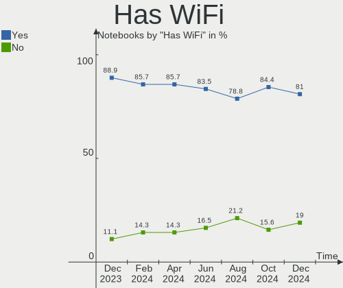
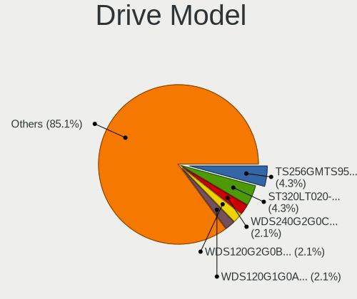
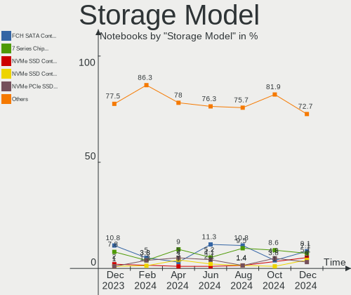
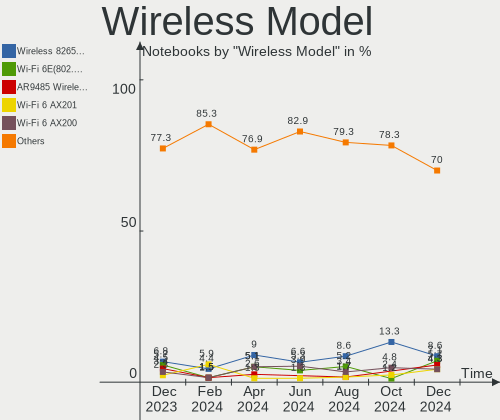
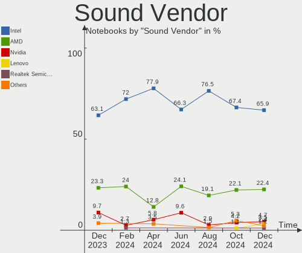

BSD - Hardware Trends (Notebooks)
---------------------------------

A project to identify most popular hardware characteristics and track their change
over time based on data collected by BSD users at https://BSD-Hardware.info.

Anyone can contribute to this report by the [hw-probe](https://github.com/linuxhw/hw-probe/blob/master/INSTALL.BSD.md) tool:

    hw-probe -all -upload

This report is for one last month. Overall report since the beginning of time: [TestCoverage](https://github.com/bsdhw/TestCoverage)

Period: Jun, 2022.

Contents
--------

* [ System ](#system)
  - [ OS                       ](#os)
  - [ OS Family                ](#os-family)
  - [ Arch                     ](#arch)
  - [ DE                       ](#de)
  - [ Display Server           ](#display-server)
  - [ Display Manager          ](#display-manager)
  - [ OS Lang                  ](#os-lang)
  - [ Boot Mode                ](#boot-mode)
  - [ Filesystem               ](#filesystem)
  - [ Part. scheme             ](#part-scheme)

* [ Board ](#board)
  - [ Vendor                   ](#vendor)
  - [ Model                    ](#model)
  - [ Model Family             ](#model-family)
  - [ MFG Year                 ](#mfg-year)
  - [ Form Factor              ](#form-factor)
  - [ Coreboot                 ](#coreboot)
  - [ RAM Size                 ](#ram-size)
  - [ RAM Used                 ](#ram-used)
  - [ Total Drives             ](#total-drives)
  - [ Has CD-ROM               ](#has-cd-rom)
  - [ Has Ethernet             ](#has-ethernet)
  - [ Has WiFi                 ](#has-wifi)
  - [ Has Bluetooth            ](#has-bluetooth)

* [ Location ](#location)
  - [ Country                  ](#country)
  - [ City                     ](#city)

* [ Drives ](#drives)
  - [ Drive Vendor             ](#drive-vendor)
  - [ Drive Model              ](#drive-model)
  - [ HDD Vendor               ](#hdd-vendor)
  - [ SSD Vendor               ](#ssd-vendor)
  - [ Drive Kind               ](#drive-kind)
  - [ Drive Connector          ](#drive-connector)
  - [ Drive Size               ](#drive-size)
  - [ Space Total              ](#space-total)
  - [ Space Used               ](#space-used)
  - [ Malfunc. Drives          ](#malfunc-drives)
  - [ Malfunc. Drive Vendor    ](#malfunc-drive-vendor)
  - [ Malfunc. HDD Vendor      ](#malfunc-hdd-vendor)
  - [ Malfunc. Drive Kind      ](#malfunc-drive-kind)
  - [ Failed Drives            ](#failed-drives)
  - [ Failed Drive Vendor      ](#failed-drive-vendor)
  - [ Drive Status             ](#drive-status)

* [ Storage controller ](#storage-controller)
  - [ Storage Vendor           ](#storage-vendor)
  - [ Storage Model            ](#storage-model)
  - [ Storage Kind             ](#storage-kind)

* [ Processor ](#processor)
  - [ CPU Vendor               ](#cpu-vendor)
  - [ CPU Model                ](#cpu-model)
  - [ CPU Model Family         ](#cpu-model-family)
  - [ CPU Cores                ](#cpu-cores)
  - [ CPU Sockets              ](#cpu-sockets)
  - [ CPU Threads              ](#cpu-threads)
  - [ CPU Microarch            ](#cpu-microarch)

* [ Graphics ](#graphics)
  - [ GPU Vendor               ](#gpu-vendor)
  - [ GPU Model                ](#gpu-model)
  - [ GPU Combo                ](#gpu-combo)
  - [ GPU Driver               ](#gpu-driver)
  - [ GPU Memory               ](#gpu-memory)

* [ Monitor ](#monitor)
  - [ Monitor Vendor           ](#monitor-vendor)
  - [ Monitor Model            ](#monitor-model)
  - [ Monitor Resolution       ](#monitor-resolution)
  - [ Monitor Diagonal         ](#monitor-diagonal)
  - [ Monitor Width            ](#monitor-width)
  - [ Aspect Ratio             ](#aspect-ratio)
  - [ Monitor Area             ](#monitor-area)
  - [ Pixel Density            ](#pixel-density)
  - [ Multiple Monitors        ](#multiple-monitors)

* [ Network ](#network)
  - [ Net Controller Vendor    ](#net-controller-vendor)
  - [ Net Controller Model     ](#net-controller-model)
  - [ Wireless Vendor          ](#wireless-vendor)
  - [ Wireless Model           ](#wireless-model)
  - [ Ethernet Vendor          ](#ethernet-vendor)
  - [ Ethernet Model           ](#ethernet-model)
  - [ Net Controller Kind      ](#net-controller-kind)
  - [ Used Controller          ](#used-controller)
  - [ NICs                     ](#nics)
  - [ IPv6                     ](#ipv6)

* [ Bluetooth ](#bluetooth)
  - [ Bluetooth Vendor         ](#bluetooth-vendor)
  - [ Bluetooth Model          ](#bluetooth-model)

* [ Sound ](#sound)
  - [ Sound Vendor             ](#sound-vendor)
  - [ Sound Model              ](#sound-model)

* [ Memory ](#memory)
  - [ Memory Vendor            ](#memory-vendor)
  - [ Memory Model             ](#memory-model)
  - [ Memory Kind              ](#memory-kind)
  - [ Memory Form Factor       ](#memory-form-factor)
  - [ Memory Size              ](#memory-size)
  - [ Memory Speed             ](#memory-speed)

* [ Printers & scanners ](#printers--scanners)
  - [ Printer Vendor           ](#printer-vendor)
  - [ Printer Model            ](#printer-model)
  - [ Scanner Vendor           ](#scanner-vendor)
  - [ Scanner Model            ](#scanner-model)

* [ Camera ](#camera)
  - [ Camera Vendor            ](#camera-vendor)
  - [ Camera Model             ](#camera-model)

* [ Security ](#security)
  - [ Fingerprint Vendor       ](#fingerprint-vendor)
  - [ Fingerprint Model        ](#fingerprint-model)
  - [ Chipcard Vendor          ](#chipcard-vendor)
  - [ Chipcard Model           ](#chipcard-model)

* [ Unsupported ](#unsupported)
  - [ Unsupported Devices      ](#unsupported-devices)
  - [ Unsupported Device Types ](#unsupported-device-types)

System
------

OS
--

Installed operating systems

| Name                 | Notebooks | Percent |
|----------------------|-----------|---------|
| FreeBSD 13.1         | 20        | 32.26%  |
| helloSystem 0.7.0    | 16        | 25.81%  |
| helloSystem 0.8.0    | 4         | 6.45%   |
| OpenBSD 7.1          | 3         | 4.84%   |
| FreeBSD 14.0-CURRENT | 3         | 4.84%   |
| OPNsense 22.4.1      | 2         | 3.23%   |
| FreeBSD 12.3         | 2         | 3.23%   |
| OPNsense 22.1.9      | 1         | 1.61%   |
| OPNsense 22.1.8      | 1         | 1.61%   |
| OPNsense 22.1        | 1         | 1.61%   |
| OpenBSD 7.0          | 1         | 1.61%   |
| MidnightBSD 2.2.0    | 1         | 1.61%   |
| GhostBSD 22.06.20    | 1         | 1.61%   |
| GhostBSD 22.06.07    | 1         | 1.61%   |
| GhostBSD 22.01.12    | 1         | 1.61%   |
| GhostBSD 21.11.24    | 1         | 1.61%   |
| FreeBSD 13.1-STABLE  | 1         | 1.61%   |
| FreeBSD 13.0-p6      | 1         | 1.61%   |
| FreeBSD 12.3-STABLE  | 1         | 1.61%   |

OS Family
---------

OS without a version

| Name        | Notebooks | Percent |
|-------------|-----------|---------|
| FreeBSD     | 28        | 45.16%  |
| helloSystem | 20        | 32.26%  |
| OPNsense    | 5         | 8.06%   |
| OpenBSD     | 4         | 6.45%   |
| GhostBSD    | 4         | 6.45%   |
| MidnightBSD | 1         | 1.61%   |

Arch
----

OS architecture (x86_64, i586, etc.)

| Name  | Notebooks | Percent |
|-------|-----------|---------|
| amd64 | 60        | 96.77%  |
| i386  | 2         | 3.23%   |

DE
--

Desktop Environment

| Name         | Notebooks | Percent |
|--------------|-----------|---------|
| helloDesktop | 22        | 35.48%  |
| KDE5         | 8         | 12.9%   |
| Console      | 7         | 11.29%  |
| XFCE         | 5         | 8.06%   |
| MATE         | 5         | 8.06%   |
| TWM          | 4         | 6.45%   |
| i3           | 3         | 4.84%   |
| GNOME        | 3         | 4.84%   |
| Openbox      | 1         | 1.61%   |
| LXQt         | 1         | 1.61%   |
| LXDE         | 1         | 1.61%   |
| fvwm         | 1         | 1.61%   |
| Cinnamon     | 1         | 1.61%   |

Display Server
--------------

X11 or Wayland

| Name    | Notebooks | Percent |
|---------|-----------|---------|
| X11     | 53        | 85.48%  |
| Console | 8         | 12.9%   |
| Wayland | 1         | 1.61%   |

Display Manager
---------------

SDDM, LightDM, etc.

| Name    | Notebooks | Percent |
|---------|-----------|---------|
| SLiM    | 25        | 40.32%  |
| Console | 17        | 27.42%  |
| SDDM    | 8         | 12.9%   |
| LightDM | 6         | 9.68%   |
| XDM     | 3         | 4.84%   |
| GDM     | 3         | 4.84%   |

OS Lang
-------

Language

| Lang    | Notebooks | Percent |
|---------|-----------|---------|
| en_US   | 22        | 35.48%  |
| C       | 20        | 32.26%  |
| Unknown | 12        | 19.35%  |
| zh_CN   | 2         | 3.23%   |
| ru_RU   | 2         | 3.23%   |
| fr_FR   | 2         | 3.23%   |
| de_DE   | 2         | 3.23%   |

Boot Mode
---------

EFI or BIOS

| Mode | Notebooks | Percent |
|------|-----------|---------|
| EFI  | 52        | 83.87%  |
| BIOS | 10        | 16.13%  |

Filesystem
----------

Type of filesystem

| Type   | Notebooks | Percent |
|--------|-----------|---------|
| Zfs    | 33        | 53.23%  |
| Ufs    | 14        | 22.58%  |
| Cd9660 | 11        | 17.74%  |
| Ffs    | 4         | 6.45%   |

Part. scheme
------------

Scheme of partitioning

| Type | Notebooks | Percent |
|------|-----------|---------|
| GPT  | 55        | 88.71%  |
| MBR  | 7         | 11.29%  |

Board
-----

Vendor
------

Motherboard manufacturer

| Name                | Notebooks | Percent |
|---------------------|-----------|---------|
| Lenovo              | 18        | 29.03%  |
| Hewlett-Packard     | 11        | 17.74%  |
| Dell                | 8         | 12.9%   |
| ASUSTek Computer    | 5         | 8.06%   |
| Acer                | 5         | 8.06%   |
| Apple               | 3         | 4.84%   |
| Toshiba             | 2         | 3.23%   |
| Deciso              | 2         | 3.23%   |
| Unknown             | 2         | 3.23%   |
| System76            | 1         | 1.61%   |
| Sony                | 1         | 1.61%   |
| Samsung Electronics | 1         | 1.61%   |
| Fujitsu Siemens     | 1         | 1.61%   |
| Fujitsu             | 1         | 1.61%   |
| Alienware           | 1         | 1.61%   |

Model
-----

Motherboard model

| Name                                 | Notebooks | Percent |
|--------------------------------------|-----------|---------|
| Unknown                              | 3         | 4.84%   |
| Toshiba Satellite A300               | 1         | 1.61%   |
| Toshiba PORTEGE R700                 | 1         | 1.61%   |
| System76 Gazelle                     | 1         | 1.61%   |
| Sony VGN-NS21M_S                     | 1         | 1.61%   |
| Samsung R530/R730/R540               | 1         | 1.61%   |
| Lenovo ThinkPad Yoga 260 20FES1K81V  | 1         | 1.61%   |
| Lenovo ThinkPad X270 20HN001HUS      | 1         | 1.61%   |
| Lenovo ThinkPad X260 20F5S45W00      | 1         | 1.61%   |
| Lenovo ThinkPad X250 20CLS23500      | 1         | 1.61%   |
| Lenovo ThinkPad X220 4286CTO         | 1         | 1.61%   |
| Lenovo ThinkPad W520 4282AD4         | 1         | 1.61%   |
| Lenovo ThinkPad T590 20N4CTO1WW      | 1         | 1.61%   |
| Lenovo ThinkPad T460 20FN004CUK      | 1         | 1.61%   |
| Lenovo ThinkPad T440p 20AWS0DU00     | 1         | 1.61%   |
| Lenovo ThinkPad T430s 2356CV6        | 1         | 1.61%   |
| Lenovo ThinkPad T420 4236MY0         | 1         | 1.61%   |
| Lenovo ThinkPad T410 2522CS7         | 1         | 1.61%   |
| Lenovo ThinkPad T14 Gen 1 20S0CTO1WW | 1         | 1.61%   |
| Lenovo ThinkPad R60e 0658W2M         | 1         | 1.61%   |
| Lenovo ThinkPad L530 24812TG         | 1         | 1.61%   |
| Lenovo ThinkPad A485 20MU000VUS      | 1         | 1.61%   |
| Lenovo IdeaPad 130-15AST 81H5        | 1         | 1.61%   |
| Lenovo G40-30 80FY                   | 1         | 1.61%   |
| HP ProBook 4230s                     | 1         | 1.61%   |
| HP Pavilion Notebook                 | 1         | 1.61%   |
| HP Pavilion Gaming Laptop 15-dk0xxx  | 1         | 1.61%   |
| HP Pavilion g4                       | 1         | 1.61%   |
| HP Laptop 15s-fq1xxx                 | 1         | 1.61%   |
| HP EliteBook 8570p                   | 1         | 1.61%   |
| HP EliteBook 850 G7 Notebook PC      | 1         | 1.61%   |
| HP EliteBook 8440p                   | 1         | 1.61%   |
| HP EliteBook 830 G5                  | 1         | 1.61%   |
| HP Compaq tc4400 (EN357UT#ABA)       | 1         | 1.61%   |
| Fujitsu Siemens AMILO Li3710         | 1         | 1.61%   |
| Fujitsu LIFEBOOK A555                | 1         | 1.61%   |
| Dell Precision M4800                 | 1         | 1.61%   |
| Dell Latitude E5500                  | 1         | 1.61%   |
| Dell Latitude E5420                  | 1         | 1.61%   |
| Dell Latitude 7490                   | 1         | 1.61%   |
| Dell Latitude 7390                   | 1         | 1.61%   |
| Dell Latitude 5521                   | 1         | 1.61%   |
| Dell Latitude 5410                   | 1         | 1.61%   |
| Dell Inspiron 5559                   | 1         | 1.61%   |
| Deciso NetBoard-A10                  | 1         | 1.61%   |
| Deciso Netboard A20                  | 1         | 1.61%   |
| ASUS ZenBook UX391FA_UX391FA         | 1         | 1.61%   |
| ASUS ZenBook UX325UA_UM325UA         | 1         | 1.61%   |
| ASUS X441UV                          | 1         | 1.61%   |
| ASUS X202E                           | 1         | 1.61%   |
| ASUS K53TA                           | 1         | 1.61%   |
| Apple MacBookPro11,4                 | 1         | 1.61%   |
| Apple MacBook6,1                     | 1         | 1.61%   |
| Apple MacBook5,1                     | 1         | 1.61%   |
| Alienware M18xR2                     | 1         | 1.61%   |
| Acer Nitro AN515-55                  | 1         | 1.61%   |
| Acer Aspire E5-571                   | 1         | 1.61%   |
| Acer Aspire A315-34                  | 1         | 1.61%   |
| Acer Aspire A114-33                  | 1         | 1.61%   |
| Acer AOD260                          | 1         | 1.61%   |

Model Family
------------

Motherboard model prefix

| Name                  | Notebooks | Percent |
|-----------------------|-----------|---------|
| Lenovo ThinkPad       | 16        | 25.81%  |
| Dell Latitude         | 6         | 9.68%   |
| HP EliteBook          | 4         | 6.45%   |
| HP Pavilion           | 3         | 4.84%   |
| Acer Aspire           | 3         | 4.84%   |
| Unknown               | 3         | 4.84%   |
| ASUS ZenBook          | 2         | 3.23%   |
| Toshiba Satellite     | 1         | 1.61%   |
| Toshiba PORTEGE       | 1         | 1.61%   |
| System76 Gazelle      | 1         | 1.61%   |
| Sony VGN-NS21M        | 1         | 1.61%   |
| Samsung R530          | 1         | 1.61%   |
| Lenovo IdeaPad        | 1         | 1.61%   |
| Lenovo G40-30         | 1         | 1.61%   |
| HP ProBook            | 1         | 1.61%   |
| HP Laptop             | 1         | 1.61%   |
| HP Compaq             | 1         | 1.61%   |
| Fujitsu Siemens AMILO | 1         | 1.61%   |
| Fujitsu LIFEBOOK      | 1         | 1.61%   |
| Dell Precision        | 1         | 1.61%   |
| Dell Inspiron         | 1         | 1.61%   |
| Deciso NetBoard-A10   | 1         | 1.61%   |
| Deciso Netboard       | 1         | 1.61%   |
| ASUS X441UV           | 1         | 1.61%   |
| ASUS X202E            | 1         | 1.61%   |
| ASUS K53TA            | 1         | 1.61%   |
| Apple MacBookPro11    | 1         | 1.61%   |
| Apple MacBook6        | 1         | 1.61%   |
| Apple MacBook5        | 1         | 1.61%   |
| Alienware M18xR2      | 1         | 1.61%   |
| Acer Nitro            | 1         | 1.61%   |
| Acer AOD260           | 1         | 1.61%   |

MFG Year
--------

Motherboard manufacture year

| Year | Notebooks | Percent |
|------|-----------|---------|
| 2020 | 6         | 9.68%   |
| 2016 | 6         | 9.68%   |
| 2011 | 6         | 9.68%   |
| 2022 | 5         | 8.06%   |
| 2021 | 5         | 8.06%   |
| 2018 | 5         | 8.06%   |
| 2015 | 5         | 8.06%   |
| 2019 | 4         | 6.45%   |
| 2017 | 3         | 4.84%   |
| 2013 | 3         | 4.84%   |
| 2012 | 3         | 4.84%   |
| 2009 | 3         | 4.84%   |
| 2014 | 2         | 3.23%   |
| 2010 | 2         | 3.23%   |
| 2008 | 2         | 3.23%   |
| 2006 | 2         | 3.23%   |

Form Factor
-----------

Physical design of the computer

| Name     | Notebooks | Percent |
|----------|-----------|---------|
| Notebook | 62        | 100%    |

Coreboot
--------

Have coreboot on board

| Used | Notebooks | Percent |
|------|-----------|---------|
| No   | 62        | 100%    |

RAM Size
--------

Total RAM memory

| Size in GB | Notebooks | Percent |
|------------|-----------|---------|
| 4.01-8.0   | 20        | 32.26%  |
| 16.01-24.0 | 20        | 32.26%  |
| 8.01-16.0  | 13        | 20.97%  |
| 32.01-64.0 | 4         | 6.45%   |
| 2.01-3.0   | 2         | 3.23%   |
| 0.51-1.0   | 2         | 3.23%   |
| 3.01-4.0   | 1         | 1.61%   |

RAM Used
--------

Used RAM memory

| Used GB   | Notebooks | Percent |
|-----------|-----------|---------|
| 0.01-0.5  | 32        | 51.61%  |
| 0.51-1.0  | 24        | 38.71%  |
| 1.01-2.0  | 4         | 6.45%   |
| 2.01-3.0  | 1         | 1.61%   |
| 8.01-16.0 | 1         | 1.61%   |

Total Drives
------------

Number of drives on board

| Drives | Notebooks | Percent |
|--------|-----------|---------|
| 1      | 50        | 80.65%  |
| 2      | 10        | 16.13%  |
| 4      | 1         | 1.61%   |
| 0      | 1         | 1.61%   |

Has CD-ROM
----------

Has CD-ROM on board

| Presented | Notebooks | Percent |
|-----------|-----------|---------|
| No        | 42        | 67.74%  |
| Yes       | 20        | 32.26%  |

Has Ethernet
------------

Has Ethernet on board

| Presented | Notebooks | Percent |
|-----------|-----------|---------|
| Yes       | 57        | 91.94%  |
| No        | 5         | 8.06%   |

Has WiFi
--------

Has WiFi module

| Presented | Notebooks | Percent |
|-----------|-----------|---------|
| Yes       | 57        | 91.94%  |
| No        | 5         | 8.06%   |

Has Bluetooth
-------------

Has Bluetooth module

| Presented | Notebooks | Percent |
|-----------|-----------|---------|
| Yes       | 38        | 61.29%  |
| No        | 24        | 38.71%  |

Location
--------

Country
-------

Geographic location (country)

| Country     | Notebooks | Percent |
|-------------|-----------|---------|
| USA         | 13        | 20.97%  |
| France      | 8         | 12.9%   |
| Russia      | 5         | 8.06%   |
| UK          | 4         | 6.45%   |
| Germany     | 3         | 4.84%   |
| Slovenia    | 2         | 3.23%   |
| Italy       | 2         | 3.23%   |
| Indonesia   | 2         | 3.23%   |
| China       | 2         | 3.23%   |
| Austria     | 2         | 3.23%   |
| Uruguay     | 1         | 1.61%   |
| Ukraine     | 1         | 1.61%   |
| Turkey      | 1         | 1.61%   |
| Spain       | 1         | 1.61%   |
| Slovakia    | 1         | 1.61%   |
| Romania     | 1         | 1.61%   |
| Poland      | 1         | 1.61%   |
| Philippines | 1         | 1.61%   |
| Netherlands | 1         | 1.61%   |
| Myanmar     | 1         | 1.61%   |
| Ireland     | 1         | 1.61%   |
| India       | 1         | 1.61%   |
| Hong Kong   | 1         | 1.61%   |
| Greece      | 1         | 1.61%   |
| Finland     | 1         | 1.61%   |
| Denmark     | 1         | 1.61%   |
| Colombia    | 1         | 1.61%   |
| Bulgaria    | 1         | 1.61%   |
| Brazil      | 1         | 1.61%   |

City
----

Geographic location (city)

| City                     | Notebooks | Percent |
|--------------------------|-----------|---------|
| Vienna                   | 2         | 3.23%   |
| Moscow                   | 2         | 3.23%   |
| Mâcon                   | 2         | 3.23%   |
| Ypsilanti                | 1         | 1.61%   |
| Yangon                   | 1         | 1.61%   |
| Xi'an                    | 1         | 1.61%   |
| Windsor                  | 1         | 1.61%   |
| Warsaw                   | 1         | 1.61%   |
| Villeneuve-Saint-Georges | 1         | 1.61%   |
| Ventura                  | 1         | 1.61%   |
| Thousand Oaks            | 1         | 1.61%   |
| St Austell               | 1         | 1.61%   |
| Sofia                    | 1         | 1.61%   |
| Scottsdale               | 1         | 1.61%   |
| San Pablo City           | 1         | 1.61%   |
| San Francisco            | 1         | 1.61%   |
| Rome                     | 1         | 1.61%   |
| Quimper                  | 1         | 1.61%   |
| Paris                    | 1         | 1.61%   |
| Ozersk                   | 1         | 1.61%   |
| Odessa                   | 1         | 1.61%   |
| Northeim                 | 1         | 1.61%   |
| New York                 | 1         | 1.61%   |
| Mumbai                   | 1         | 1.61%   |
| Montevideo               | 1         | 1.61%   |
| Manassas                 | 1         | 1.61%   |
| London                   | 1         | 1.61%   |
| Kresnice                 | 1         | 1.61%   |
| Krasnodar                | 1         | 1.61%   |
| Jakarta                  | 1         | 1.61%   |
| Istanbul                 | 1         | 1.61%   |
| Ipswich                  | 1         | 1.61%   |
| Hongyuan                 | 1         | 1.61%   |
| Heroldsberg              | 1         | 1.61%   |
| Henderson                | 1         | 1.61%   |
| Harrisburg               | 1         | 1.61%   |
| Espoo                    | 1         | 1.61%   |
| Durham                   | 1         | 1.61%   |
| Dronten                  | 1         | 1.61%   |
| Denver                   | 1         | 1.61%   |
| Curitiba                 | 1         | 1.61%   |
| Copenhagen               | 1         | 1.61%   |
| Concesio                 | 1         | 1.61%   |
| Cobh                     | 1         | 1.61%   |
| Chelyabinsk              | 1         | 1.61%   |
| Central                  | 1         | 1.61%   |
| Celje                    | 1         | 1.61%   |
| Bucharest                | 1         | 1.61%   |
| Brighton                 | 1         | 1.61%   |
| Bratislava               | 1         | 1.61%   |
| Bordeaux                 | 1         | 1.61%   |
| Bonnes                   | 1         | 1.61%   |
| Bochum                   | 1         | 1.61%   |
| Barranquilla             | 1         | 1.61%   |
| Barcelona                | 1         | 1.61%   |
| Banyuroto                | 1         | 1.61%   |
| Austin                   | 1         | 1.61%   |
| Athens                   | 1         | 1.61%   |
| Asnieres-sur-Seine       | 1         | 1.61%   |

Drives
------

Drive Vendor
------------

Hard drive vendors

| Vendor              | Notebooks | Drives | Percent |
|---------------------|-----------|--------|---------|
| Samsung Electronics | 12        | 12     | 16.67%  |
| WDC                 | 8         | 9      | 11.11%  |
| Toshiba             | 7         | 7      | 9.72%   |
| Seagate             | 7         | 7      | 9.72%   |
| SanDisk             | 5         | 5      | 6.94%   |
| Hitachi             | 5         | 5      | 6.94%   |
| Crucial             | 5         | 5      | 6.94%   |
| Transcend           | 4         | 4      | 5.56%   |
| Kingston            | 3         | 3      | 4.17%   |
| SK hynix            | 2         | 2      | 2.78%   |
| KIOXIA              | 2         | 2      | 2.78%   |
| HGST                | 2         | 2      | 2.78%   |
| Lexar               | 1         | 1      | 1.39%   |
| Lenovo              | 1         | 1      | 1.39%   |
| KingSpec            | 1         | 1      | 1.39%   |
| Intel               | 1         | 1      | 1.39%   |
| Gigabyte Technology | 1         | 1      | 1.39%   |
| Fujitsu             | 1         | 1      | 1.39%   |
| FLEXXON             | 1         | 1      | 1.39%   |
| Apple               | 1         | 1      | 1.39%   |
| Apacer              | 1         | 1      | 1.39%   |
| A-DATA Technology   | 1         | 2      | 1.39%   |

Drive Model
-----------

Hard drive models

| Model                                   | Notebooks | Percent |
|-----------------------------------------|-----------|---------|
| Toshiba MQ04ABF100 1TB                  | 2         | 2.7%    |
| Toshiba MQ01ABD100 1TB                  | 2         | 2.7%    |
| Kingston SA400S37480G 480GB             | 2         | 2.7%    |
| Crucial CT1000MX500SSD1 1TB             | 2         | 2.7%    |
| Crucial CT1000BX500SSD1 1TB             | 2         | 2.7%    |
| WDC WD6400BEVT-22A0RT0 640GB            | 1         | 1.35%   |
| WDC WD3200BPVT-22JJ5T0 320GB            | 1         | 1.35%   |
| WDC WD3200BEKT-60PVMT0 320GB            | 1         | 1.35%   |
| WDC WD2500BEVT-24A23T0 250GB            | 1         | 1.35%   |
| WDC WD1600BEVT-75ZCT2 160GB             | 1         | 1.35%   |
| WDC WD1600BEVT-22ZCT0 160GB             | 1         | 1.35%   |
| WDC WD10JPVX-22JC3T0 1TB                | 1         | 1.35%   |
| WDC PC SN530 SDBPNPZ-256G-1014 256GB    | 1         | 1.35%   |
| WDC PC SN520 SDAPNUW-256G-1006 256GB    | 1         | 1.35%   |
| Transcend TS256GMTS952T2 256GB          | 1         | 1.35%   |
| Transcend TS1TMTE110S 1TB               | 1         | 1.35%   |
| Transcend TS128GMTE110S 128GB           | 1         | 1.35%   |
| Transcend TS120GMTS420S 120GB           | 1         | 1.35%   |
| Toshiba MQ01ABF050 500GB                | 1         | 1.35%   |
| Toshiba MK2546GSX 250GB                 | 1         | 1.35%   |
| Toshiba KSG60ZMV256G M.2 2280 256GB     | 1         | 1.35%   |
| SK hynix HFM512GD3JX013N 512GB          | 1         | 1.35%   |
| SK hynix BC511 HFM512GDJTNI-82A0A 512GB | 1         | 1.35%   |
| Seagate ST9320423AS 320GB               | 1         | 1.35%   |
| Seagate ST500LT012-9WS142 500GB         | 1         | 1.35%   |
| Seagate ST500LT012-1DG142 500GB         | 1         | 1.35%   |
| Seagate ST500LM030-2E717D 500GB         | 1         | 1.35%   |
| Seagate ST500LM012 HN-M500MBB 500GB     | 1         | 1.35%   |
| Seagate ST3160212AS 160GB               | 1         | 1.35%   |
| Seagate ST1000LM049-2GH172 1TB          | 1         | 1.35%   |
| SanDisk SSD PLUS 240GB                  | 1         | 1.35%   |
| SanDisk SSD PLUS 120GB                  | 1         | 1.35%   |
| SanDisk SSD PLUS 1000GB                 | 1         | 1.35%   |
| SanDisk SSD G5 BICS4 1TB                | 1         | 1.35%   |
| SanDisk SDSSDP064G 64GB                 | 1         | 1.35%   |
| Samsung SSD PM871 2.5 7mm 128GB         | 1         | 1.35%   |
| Samsung SSD 970 EVO Plus 2TB            | 1         | 1.35%   |
| Samsung SSD 860 EVO 250GB               | 1         | 1.35%   |
| Samsung SSD 850 EVO M.2 250GB           | 1         | 1.35%   |
| Samsung SSD 850 EVO 500GB               | 1         | 1.35%   |
| Samsung SSD 840 PRO Series 128GB        | 1         | 1.35%   |
| Samsung PM9A1 NVMe 512GB                | 1         | 1.35%   |
| Samsung MZVLW256HEHP-000L7 256GB        | 1         | 1.35%   |
| Samsung MZVLB512HBJQ-000H1 512GB        | 1         | 1.35%   |
| Samsung MZVLB512HAJQ-00000 512GB        | 1         | 1.35%   |
| Samsung MZVLB1T0HBLR-000L7 1TB          | 1         | 1.35%   |
| Samsung MZNLN512HMJP-000L7 512GB        | 1         | 1.35%   |
| Lexar 256GB SSD                         | 1         | 1.35%   |
| Lenovo SSD SL700 240G                   | 1         | 1.35%   |
| KIOXIA KXG60PNV2T04 NVMe 2048GB         | 1         | 1.35%   |
| KIOXIA KBG40ZNS256G NVMe 256GB          | 1         | 1.35%   |
| Kingston SUV500MS480G 480GB             | 1         | 1.35%   |
| KingSpec Q-720 720GB                    | 1         | 1.35%   |
| Intel SSDSC2BW180A3H 180GB              | 1         | 1.35%   |
| Hitachi HTS727550A9E364 500GB           | 1         | 1.35%   |
| Hitachi HTS722020K9SA00 200GB           | 1         | 1.35%   |
| Hitachi HTS547564A9E384 640GB           | 1         | 1.35%   |
| Hitachi HTS547550A9E384 500GB           | 1         | 1.35%   |
| Hitachi HTS545025B9SA02 250GB           | 1         | 1.35%   |
| HGST HTS721010A9E630 1TB                | 1         | 1.35%   |

HDD Vendor
----------

Hard disk drive vendors

| Vendor  | Notebooks | Drives | Percent |
|---------|-----------|--------|---------|
| Seagate | 7         | 7      | 25.93%  |
| WDC     | 6         | 7      | 22.22%  |
| Toshiba | 6         | 6      | 22.22%  |
| Hitachi | 5         | 5      | 18.52%  |
| HGST    | 2         | 2      | 7.41%   |
| Fujitsu | 1         | 1      | 3.7%    |

SSD Vendor
----------

Solid state drive vendors

| Vendor              | Notebooks | Drives | Percent |
|---------------------|-----------|--------|---------|
| Samsung Electronics | 6         | 6      | 20%     |
| SanDisk             | 5         | 5      | 16.67%  |
| Crucial             | 4         | 4      | 13.33%  |
| Kingston            | 3         | 3      | 10%     |
| Transcend           | 2         | 2      | 6.67%   |
| Toshiba             | 1         | 1      | 3.33%   |
| Lexar               | 1         | 1      | 3.33%   |
| Lenovo              | 1         | 1      | 3.33%   |
| KingSpec            | 1         | 1      | 3.33%   |
| Intel               | 1         | 1      | 3.33%   |
| Gigabyte Technology | 1         | 1      | 3.33%   |
| FLEXXON             | 1         | 1      | 3.33%   |
| Apple               | 1         | 1      | 3.33%   |
| Apacer              | 1         | 1      | 3.33%   |
| A-DATA Technology   | 1         | 2      | 3.33%   |

Drive Kind
----------

HDD or SSD

| Kind | Notebooks | Drives | Percent |
|------|-----------|--------|---------|
| SSD  | 27        | 31     | 40.91%  |
| HDD  | 25        | 28     | 37.88%  |
| NVMe | 14        | 15     | 21.21%  |

Drive Connector
---------------

SATA, SAS, NVMe, etc.

| Type | Notebooks | Drives | Percent |
|------|-----------|--------|---------|
| SATA | 49        | 59     | 77.78%  |
| NVMe | 14        | 15     | 22.22%  |

Drive Size
----------

Size of hard drive

| Size in TB | Notebooks | Drives | Percent |
|------------|-----------|--------|---------|
| 0.01-0.5   | 38        | 41     | 70.37%  |
| 0.51-1.0   | 16        | 18     | 29.63%  |

Space Total
-----------

Amount of disk space available on the file system

| Size in GB | Notebooks | Percent |
|------------|-----------|---------|
| 101-250    | 24        | 38.71%  |
| 1-20       | 14        | 22.58%  |
| 501-1000   | 7         | 11.29%  |
| 21-50      | 6         | 9.68%   |
| 251-500    | 5         | 8.06%   |
| 51-100     | 5         | 8.06%   |
| 1001-2000  | 1         | 1.61%   |

Space Used
----------

Amount of used disk space

| Used GB  | Notebooks | Percent |
|----------|-----------|---------|
| 1-20     | 52        | 83.87%  |
| 21-50    | 8         | 12.9%   |
| 501-1000 | 1         | 1.61%   |
| 51-100   | 1         | 1.61%   |

Malfunc. Drives
---------------

Drive models with a malfunction

| Model                               | Notebooks | Drives | Percent |
|-------------------------------------|-----------|--------|---------|
| WDC WD3200BEKT-60PVMT0 320GB        | 1         | 1      | 6.67%   |
| WDC WD2500BEVT-24A23T0 250GB        | 1         | 1      | 6.67%   |
| WDC WD10JPVX-22JC3T0 1TB            | 1         | 1      | 6.67%   |
| Toshiba MQ01ABD100 1TB              | 1         | 1      | 6.67%   |
| Toshiba MK2546GSX 250GB             | 1         | 1      | 6.67%   |
| Seagate ST9320423AS 320GB           | 1         | 1      | 6.67%   |
| Seagate ST500LT012-9WS142 500GB     | 1         | 1      | 6.67%   |
| Seagate ST500LM012 HN-M500MBB 500GB | 1         | 1      | 6.67%   |
| Seagate ST3160212AS 160GB           | 1         | 1      | 6.67%   |
| SanDisk SDSSDP064G 64GB             | 1         | 1      | 6.67%   |
| Kingston SUV500MS480G 480GB         | 1         | 1      | 6.67%   |
| Hitachi HTS727550A9E364 500GB       | 1         | 1      | 6.67%   |
| Hitachi HTS545025B9SA02 250GB       | 1         | 1      | 6.67%   |
| HGST HTS721010A9E630 1TB            | 1         | 1      | 6.67%   |
| A-DATA Technology SU630 240GB       | 1         | 1      | 6.67%   |

Malfunc. Drive Vendor
---------------------

Vendors of faulty drives

| Vendor            | Notebooks | Drives | Percent |
|-------------------|-----------|--------|---------|
| Seagate           | 4         | 4      | 28.57%  |
| WDC               | 2         | 3      | 14.29%  |
| Toshiba           | 2         | 2      | 14.29%  |
| Hitachi           | 2         | 2      | 14.29%  |
| SanDisk           | 1         | 1      | 7.14%   |
| Kingston          | 1         | 1      | 7.14%   |
| HGST              | 1         | 1      | 7.14%   |
| A-DATA Technology | 1         | 1      | 7.14%   |

Malfunc. HDD Vendor
-------------------

Vendors of faulty HDD drives

| Vendor  | Notebooks | Drives | Percent |
|---------|-----------|--------|---------|
| Seagate | 4         | 4      | 36.36%  |
| WDC     | 2         | 3      | 18.18%  |
| Toshiba | 2         | 2      | 18.18%  |
| Hitachi | 2         | 2      | 18.18%  |
| HGST    | 1         | 1      | 9.09%   |

Malfunc. Drive Kind
-------------------

Kinds of faulty drives

| Kind | Notebooks | Drives | Percent |
|------|-----------|--------|---------|
| HDD  | 9         | 12     | 75%     |
| SSD  | 3         | 3      | 25%     |

Failed Drives
-------------

Failed drive models

Zero info for selected period =(

Failed Drive Vendor
-------------------

Failed drive vendors

Zero info for selected period =(

Drive Status
------------

Number of failed and malfunc. drives

| Status   | Notebooks | Drives | Percent |
|----------|-----------|--------|---------|
| Works    | 49        | 56     | 77.78%  |
| Malfunc  | 12        | 15     | 19.05%  |
| Detected | 2         | 3      | 3.17%   |

Storage controller
------------------

Storage Vendor
--------------

Storage controller vendors

| Vendor                    | Notebooks | Percent |
|---------------------------|-----------|---------|
| Intel                     | 45        | 66.18%  |
| Samsung Electronics       | 7         | 10.29%  |
| AMD                       | 5         | 7.35%   |
| SK hynix                  | 2         | 2.94%   |
| SanDisk                   | 2         | 2.94%   |
| Nvidia                    | 2         | 2.94%   |
| Unknown                   | 2         | 2.94%   |
| Toshiba                   | 1         | 1.47%   |
| Micron/Crucial Technology | 1         | 1.47%   |
| KIOXIA                    | 1         | 1.47%   |

Storage Model
-------------

Storage controller models

| Model                                                                          | Notebooks | Percent |
|--------------------------------------------------------------------------------|-----------|---------|
| Intel Sunrise Point-LP SATA Controller [AHCI mode]                             | 6         | 8.57%   |
| Intel 7 Series Chipset Family 6-port SATA Controller [AHCI mode]               | 6         | 8.57%   |
| Intel 6 Series/C200 Series Chipset Family 6 port Mobile SATA AHCI Controller   | 6         | 8.57%   |
| AMD FCH SATA Controller [AHCI mode]                                            | 5         | 7.14%   |
| Samsung NVMe SSD Controller SM981/PM981/PM983                                  | 4         | 5.71%   |
| Intel 82801 Mobile SATA Controller [RAID mode]                                 | 4         | 5.71%   |
| Intel 82801IBM/IEM (ICH9M/ICH9M-E) 4 port SATA Controller [AHCI mode]          | 3         | 4.29%   |
| Intel 5 Series/3400 Series Chipset 6 port SATA AHCI Controller                 | 3         | 4.29%   |
| Nvidia MCP79 AHCI Controller                                                   | 2         | 2.86%   |
| Intel Wildcat Point-LP SATA Controller [AHCI Mode]                             | 2         | 2.86%   |
| Intel HM170/QM170 Chipset SATA Controller [AHCI Mode]                          | 2         | 2.86%   |
| Unknown                                                                        | 2         | 2.86%   |
| Toshiba XG6 NVMe SSD Controller                                                | 1         | 1.43%   |
| SK hynix Gold P31 SSD                                                          | 1         | 1.43%   |
| SK hynix BC511                                                                 | 1         | 1.43%   |
| SanDisk WD Blue SN550 NVMe SSD                                                 | 1         | 1.43%   |
| SanDisk WD Blue SN500 / PC SN520 NVMe SSD                                      | 1         | 1.43%   |
| Samsung SM951 AHCI                                                             | 1         | 1.43%   |
| Samsung NVMe SSD Controller SM961/PM961/SM963                                  | 1         | 1.43%   |
| Samsung NVMe SSD Controller PM9A1/PM9A3/980PRO                                 | 1         | 1.43%   |
| Micron/Crucial P2 NVMe PCIe SSD                                                | 1         | 1.43%   |
| KIOXIA unknown                                                                 | 1         | 1.43%   |
| Intel NM10/ICH7 Family SATA Controller [AHCI mode]                             | 1         | 1.43%   |
| Intel Jasper Lake SATA AHCI Controller                                         | 1         | 1.43%   |
| Intel Comet Lake SATA AHCI Controller                                          | 1         | 1.43%   |
| Intel Celeron/Pentium Silver Processor SATA Controller                         | 1         | 1.43%   |
| Intel Atom Processor E3800 Series SATA AHCI Controller                         | 1         | 1.43%   |
| Intel 82801HM/HEM (ICH8M/ICH8M-E) SATA Controller [AHCI mode]                  | 1         | 1.43%   |
| Intel 82801HM/HEM (ICH8M/ICH8M-E) IDE Controller                               | 1         | 1.43%   |
| Intel 82801GBM/GHM (ICH7-M Family) SATA Controller [IDE mode]                  | 1         | 1.43%   |
| Intel 82801GBM/GHM (ICH7-M Family) SATA Controller [AHCI mode]                 | 1         | 1.43%   |
| Intel 82801G (ICH7 Family) IDE Controller                                      | 1         | 1.43%   |
| Intel 8 Series/C220 Series Chipset Family 6-port SATA Controller 1 [AHCI mode] | 1         | 1.43%   |
| Intel 8 Series SATA Controller 1 [AHCI mode]                                   | 1         | 1.43%   |
| Intel 500 Series Chipset Family SATA AHCI Controller                           | 1         | 1.43%   |
| Intel 5 Series/3400 Series Chipset 4 port SATA AHCI Controller                 | 1         | 1.43%   |
| Intel 400 Series Chipset Family SATA AHCI Controller                           | 1         | 1.43%   |

Storage Kind
------------

Kind of storage controller (IDE, SATA, NVMe, SAS, ...)

| Kind | Notebooks | Percent |
|------|-----------|---------|
| SATA | 48        | 69.57%  |
| NVMe | 14        | 20.29%  |
| RAID | 4         | 5.8%    |
| IDE  | 3         | 4.35%   |

Processor
---------

CPU Vendor
----------

Processor vendors

| Vendor | Notebooks | Percent |
|--------|-----------|---------|
| Intel  | 55        | 88.71%  |
| AMD    | 7         | 11.29%  |

CPU Model
---------

Processor models

| Model                                           | Notebooks | Percent |
|-------------------------------------------------|-----------|---------|
| Intel Core i7-8565U CPU @ 1.80GHz               | 2         | 3.23%   |
| Intel Core i5-8350U CPU @ 1.70GHz               | 2         | 3.23%   |
| Intel Core i5-6300U CPU @ 2.40GHz               | 2         | 3.23%   |
| Intel Core i5-6200U CPU @ 2.30GHz               | 2         | 3.23%   |
| Intel Core i5 CPU M 520 @ 2.40GHz               | 2         | 3.23%   |
| Intel Pentium Silver N6000 @ 1.10GHz            | 1         | 1.61%   |
| Intel Pentium Silver N5000 CPU @ 1.10GHz        | 1         | 1.61%   |
| Intel Pentium Dual CPU T3400 @ 2.16GHz          | 1         | 1.61%   |
| Intel Genuine CPU                               | 1         | 1.61%   |
| Intel CPU Version                               | 1         | 1.61%   |
| Intel Core i7-7500U CPU @ 2.70GHz               | 1         | 1.61%   |
| Intel Core i7-6700HQ CPU @ 2.60GHz              | 1         | 1.61%   |
| Intel Core i7-6500U CPU @ 2.50GHz               | 1         | 1.61%   |
| Intel Core i7-4980HQ CPU @ 2.80GHz              | 1         | 1.61%   |
| Intel Core i7-4810MQ CPU @ 2.80GHz              | 1         | 1.61%   |
| Intel Core i7-3940XM CPU @ 3.00GHz              | 1         | 1.61%   |
| Intel Core i7-3520M CPU @ 2.90GHz               | 1         | 1.61%   |
| Intel Core i7-2760QM CPU @ 2.40GHz              | 1         | 1.61%   |
| Intel Core i7-2620M CPU @ 2.70GHz               | 1         | 1.61%   |
| Intel Core i7-10510U CPU @ 1.80GHz              | 1         | 1.61%   |
| Intel Core i5-9300H CPU @ 2.40GHz               | 1         | 1.61%   |
| Intel Core i5-7300U CPU @ 2.60GHz               | 1         | 1.61%   |
| Intel Core i5-4300M CPU @ 2.60GHz               | 1         | 1.61%   |
| Intel Core i5-3320M CPU @ 2.60GHz               | 1         | 1.61%   |
| Intel Core i5-3210M CPU @ 2.50GHz               | 1         | 1.61%   |
| Intel Core i5-2540M CPU @ 2.60GHz               | 1         | 1.61%   |
| Intel Core i5-2520M CPU @ 2.50GHz               | 1         | 1.61%   |
| Intel Core i5-2520M CPU @ 2.50GH                | 1         | 1.61%   |
| Intel Core i5-1035G1 CPU @ 1.00GHz              | 1         | 1.61%   |
| Intel Core i5-10310U CPU @ 1.70GHz              | 1         | 1.61%   |
| Intel Core i5-10300H CPU @ 2.50GHz              | 1         | 1.61%   |
| Intel Core i5-10210U CPU @ 1.60GHz              | 1         | 1.61%   |
| Intel Core i5 CPU M 560 @ 2.67GHz               | 1         | 1.61%   |
| Intel Core i3-7100E CPU @ 2.90GHz               | 1         | 1.61%   |
| Intel Core i3-6006U CPU @ 2.00GHz               | 1         | 1.61%   |
| Intel Core i3-5010U CPU @ 2.10GHz               | 1         | 1.61%   |
| Intel Core i3-5005U CPU @ 2.00GHz               | 1         | 1.61%   |
| Intel Core i3-4005U CPU @ 1.70GHz               | 1         | 1.61%   |
| Intel Core i3-3217U CPU @ 1.80GHz               | 1         | 1.61%   |
| Intel Core i3-3110M CPU @ 2.40GHz               | 1         | 1.61%   |
| Intel Core i3-2310M CPU @ 2.10GHz               | 1         | 1.61%   |
| Intel Core 2 Duo CPU T6400 @ 2.00GHz            | 1         | 1.61%   |
| Intel Core 2 Duo CPU P8600 @ 2.40GHz            | 1         | 1.61%   |
| Intel Core 2 Duo CPU P7550 @ 2.26GHz            | 1         | 1.61%   |
| Intel Core 2 Duo                                | 1         | 1.61%   |
| Intel Core 2 CPU T5600 @ 1.83GHz                | 1         | 1.61%   |
| Intel Celeron M CPU                             | 1         | 1.61%   |
| Intel Celeron CPU N2830 @ 2.16GHz               | 1         | 1.61%   |
| Intel Atom CPU N450 @ 1.66GHz                   | 1         | 1.61%   |
| Intel 11th Gen Core i7-11850H @ 2.50GHz         | 1         | 1.61%   |
| AMD Ryzen Embedded V1500B                       | 1         | 1.61%   |
| AMD Ryzen 7 5700U with Radeon Graphics          | 1         | 1.61%   |
| AMD Ryzen 5 PRO 2500U w/ Radeon Vega Mobile Gfx | 1         | 1.61%   |
| AMD EPYC 3201 8-Core Processor                  | 1         | 1.61%   |
| AMD E2-9000 RADEON R2, 4 COMPUTE CORES 2C+2G    | 1         | 1.61%   |
| AMD A6-3400M APU with Radeon HD Graphics        | 1         | 1.61%   |
| AMD A10 Micro-6700T APU+AMD Radeon R6 Graphics  | 1         | 1.61%   |

CPU Model Family
----------------

Processor model prefix

| Model                | Notebooks | Percent |
|----------------------|-----------|---------|
| Intel Core i5        | 21        | 33.87%  |
| Intel Core i7        | 12        | 19.35%  |
| Intel Core i3        | 8         | 12.9%   |
| Intel Core 2 Duo     | 4         | 6.45%   |
| Other                | 2         | 3.23%   |
| Intel Pentium Silver | 2         | 3.23%   |
| Intel Pentium Dual   | 1         | 1.61%   |
| Intel Genuine        | 1         | 1.61%   |
| Intel Core 2         | 1         | 1.61%   |
| Intel Celeron M      | 1         | 1.61%   |
| Intel Celeron        | 1         | 1.61%   |
| Intel Atom           | 1         | 1.61%   |
| AMD Ryzen Embedded   | 1         | 1.61%   |
| AMD Ryzen 7          | 1         | 1.61%   |
| AMD Ryzen 5 PRO      | 1         | 1.61%   |
| AMD EPYC             | 1         | 1.61%   |
| AMD E2               | 1         | 1.61%   |
| AMD A6               | 1         | 1.61%   |
| AMD A10              | 1         | 1.61%   |

CPU Cores
---------

Number of processor cores

| Number  | Notebooks | Percent |
|---------|-----------|---------|
| 2       | 31        | 50%     |
| 4       | 19        | 30.65%  |
| Unknown | 5         | 8.06%   |
| 8       | 4         | 6.45%   |
| 1       | 2         | 3.23%   |
| 16      | 1         | 1.61%   |

CPU Sockets
-----------

Number of sockets

| Number | Notebooks | Percent |
|--------|-----------|---------|
| 1      | 60        | 96.77%  |
| 2      | 2         | 3.23%   |

CPU Threads
-----------

Threads per core (Hyper-Threading)

| Number  | Notebooks | Percent |
|---------|-----------|---------|
| 2       | 44        | 70.97%  |
| 1       | 12        | 19.35%  |
| Unknown | 6         | 9.68%   |

CPU Microarch
-------------

Microarchitecture

| Name          | Notebooks | Percent |
|---------------|-----------|---------|
| KabyLake      | 11        | 17.74%  |
| Skylake       | 7         | 11.29%  |
| SandyBridge   | 6         | 9.68%   |
| IvyBridge     | 6         | 9.68%   |
| Westmere      | 4         | 6.45%   |
| Haswell       | 4         | 6.45%   |
| Core          | 4         | 6.45%   |
| Zen           | 3         | 4.84%   |
| Penryn        | 3         | 4.84%   |
| Unknown       | 3         | 4.84%   |
| Broadwell     | 2         | 3.23%   |
| Silvermont    | 1         | 1.61%   |
| Puma          | 1         | 1.61%   |
| P6            | 1         | 1.61%   |
| K10 Llano     | 1         | 1.61%   |
| IceLake       | 1         | 1.61%   |
| Goldmont plus | 1         | 1.61%   |
| Excavator     | 1         | 1.61%   |
| CometLake     | 1         | 1.61%   |
| Bonnell       | 1         | 1.61%   |

Graphics
--------

GPU Vendor
----------

Vendors of graphics cards

| Vendor | Notebooks | Percent |
|--------|-----------|---------|
| Intel  | 50        | 75.76%  |
| Nvidia | 8         | 12.12%  |
| AMD    | 8         | 12.12%  |

GPU Model
---------

Graphics card models

| Model                                                                         | Notebooks | Percent |
|-------------------------------------------------------------------------------|-----------|---------|
| Intel Skylake GT2 [HD Graphics 520]                                           | 6         | 8.57%   |
| Intel 2nd Generation Core Processor Family Integrated Graphics Controller     | 6         | 8.57%   |
| Intel 3rd Gen Core processor Graphics Controller                              | 4         | 5.71%   |
| Intel Mobile 4 Series Chipset Integrated Graphics Controller                  | 3         | 4.29%   |
| Intel Core Processor Integrated Graphics Controller                           | 3         | 4.29%   |
| Intel CometLake-U GT2 [UHD Graphics]                                          | 3         | 4.29%   |
| Nvidia C79 [GeForce 9400M]                                                    | 2         | 2.86%   |
| Intel WhiskeyLake-U GT2 [UHD Graphics 620]                                    | 2         | 2.86%   |
| Intel UHD Graphics 620                                                        | 2         | 2.86%   |
| Intel Mobile 945GM/GMS/GME, 943/940GML Express Integrated Graphics Controller | 2         | 2.86%   |
| Intel Mobile 945GM/GMS, 943/940GML Express Integrated Graphics Controller     | 2         | 2.86%   |
| Intel HD Graphics 620                                                         | 2         | 2.86%   |
| Intel HD Graphics 5500                                                        | 2         | 2.86%   |
| Intel 4th Gen Core Processor Integrated Graphics Controller                   | 2         | 2.86%   |
| Nvidia TU117M [GeForce MX450]                                                 | 1         | 1.43%   |
| Nvidia TU117M                                                                 | 1         | 1.43%   |
| Nvidia GT218M [NVS 3100M]                                                     | 1         | 1.43%   |
| Nvidia GP107M [GeForce GTX 1050 Mobile]                                       | 1         | 1.43%   |
| Nvidia GM108M [GeForce 920MX]                                                 | 1         | 1.43%   |
| Nvidia GK104M [GeForce GTX 780M]                                              | 1         | 1.43%   |
| Intel TigerLake-H GT1 [UHD Graphics]                                          | 1         | 1.43%   |
| Intel Mobile GM965/GL960 Integrated Graphics Controller (secondary)           | 1         | 1.43%   |
| Intel Mobile GM965/GL960 Integrated Graphics Controller (primary)             | 1         | 1.43%   |
| Intel JasperLake [UHD Graphics]                                               | 1         | 1.43%   |
| Intel Iris Plus Graphics G1 (Ice Lake)                                        | 1         | 1.43%   |
| Intel HD Graphics 630                                                         | 1         | 1.43%   |
| Intel HD Graphics 530                                                         | 1         | 1.43%   |
| Intel Haswell-ULT Integrated Graphics Controller                              | 1         | 1.43%   |
| Intel GeminiLake [UHD Graphics 605]                                           | 1         | 1.43%   |
| Intel Crystal Well Integrated Graphics Controller                             | 1         | 1.43%   |
| Intel CometLake-H GT2 [UHD Graphics]                                          | 1         | 1.43%   |
| Intel CoffeeLake-H GT2 [UHD Graphics 630]                                     | 1         | 1.43%   |
| Intel Atom Processor Z36xxx/Z37xxx Series Graphics & Display                  | 1         | 1.43%   |
| Intel Atom Processor D4xx/D5xx/N4xx/N5xx Integrated Graphics Controller       | 1         | 1.43%   |
| AMD Whistler [Radeon HD 6630M/6650M/6750M/7670M/7690M]                        | 1         | 1.43%   |
| AMD Venus XT [Radeon HD 8870M / R9 M270X/M370X]                               | 1         | 1.43%   |
| AMD Thames [Radeon HD 7550M/7570M/7650M]                                      | 1         | 1.43%   |
| AMD Sun XT [Radeon HD 8670A/8670M/8690M / R5 M330 / M430 / Radeon 520 Mobile] | 1         | 1.43%   |
| AMD Sumo [Radeon HD 6520G]                                                    | 1         | 1.43%   |
| AMD Stoney [Radeon R2/R3/R4/R5 Graphics]                                      | 1         | 1.43%   |
| AMD Raven Ridge [Radeon Vega Series / Radeon Vega Mobile Series]              | 1         | 1.43%   |
| AMD Mullins [Radeon R6 Graphics]                                              | 1         | 1.43%   |
| AMD Lucienne                                                                  | 1         | 1.43%   |

GPU Combo
---------

Combinations of graphics cards

| Name           | Notebooks | Percent |
|----------------|-----------|---------|
| 1 x Intel      | 37        | 59.68%  |
| 2 x Intel      | 7         | 11.29%  |
| 1 x AMD        | 5         | 8.06%   |
| 1 x Nvidia     | 4         | 6.45%   |
| Intel + Nvidia | 4         | 6.45%   |
| Other          | 2         | 3.23%   |
| Intel + AMD    | 2         | 3.23%   |
| 2 x AMD        | 1         | 1.61%   |

GPU Driver
----------

Free vs proprietary

| Driver      | Notebooks | Percent |
|-------------|-----------|---------|
| Free        | 57        | 91.94%  |
| Proprietary | 3         | 4.84%   |
| Unknown     | 2         | 3.23%   |

GPU Memory
----------

Total video memory

| Size in GB | Notebooks | Percent |
|------------|-----------|---------|
| Unknown    | 57        | 91.94%  |
| 0.01-0.5   | 3         | 4.84%   |
| 3.01-4.0   | 1         | 1.61%   |
| 0.51-1.0   | 1         | 1.61%   |

Monitor
-------

Monitor Vendor
--------------

Monitor vendors

| Vendor                  | Notebooks | Percent |
|-------------------------|-----------|---------|
| AU Optronics            | 9         | 17.31%  |
| LG Display              | 8         | 15.38%  |
| BOE                     | 8         | 15.38%  |
| Samsung Electronics     | 7         | 13.46%  |
| Chimei Innolux          | 6         | 11.54%  |
| Apple                   | 3         | 5.77%   |
| Philips                 | 2         | 3.85%   |
| Lenovo                  | 2         | 3.85%   |
| Ancor Communications    | 2         | 3.85%   |
| ViewSonic               | 1         | 1.92%   |
| JDI                     | 1         | 1.92%   |
| CSO                     | 1         | 1.92%   |
| CPT                     | 1         | 1.92%   |
| Chi Mei Optoelectronics | 1         | 1.92%   |

Monitor Model
-------------

Monitor models

| Model                                                                    | Notebooks | Percent |
|--------------------------------------------------------------------------|-----------|---------|
| Chimei Innolux LCD Monitor CMN14C9 1920x1080 310x170mm 13.9-inch         | 2         | 3.85%   |
| ViewSonic LCD Monitor VSCD22B 1920x1080 520x290mm 23.4-inch              | 1         | 1.92%   |
| Samsung Electronics LCD Monitor SEC5448 1920x1080 410x230mm 18.5-inch    | 1         | 1.92%   |
| Samsung Electronics LCD Monitor SEC5441 1280x800 330x210mm 15.4-inch     | 1         | 1.92%   |
| Samsung Electronics LCD Monitor SEC4E41 1280x800 260x160mm 12.0-inch     | 1         | 1.92%   |
| Samsung Electronics LCD Monitor SEC4149 1366x768 280x170mm 12.9-inch     | 1         | 1.92%   |
| Samsung Electronics LCD Monitor SEC324C 1600x900 310x170mm 13.9-inch     | 1         | 1.92%   |
| Samsung Electronics LCD Monitor SEC3245 1366x768 340x190mm 15.3-inch     | 1         | 1.92%   |
| Samsung Electronics LCD Monitor SDC8B4F 1920x1080 340x190mm 15.3-inch    | 1         | 1.92%   |
| Philips PHL 439P1 PHL0973 3840x2160 940x530mm 42.5-inch                  | 1         | 1.92%   |
| Philips LCD Monitor PHL08C3 1920x1080 600x340mm 27.2-inch                | 1         | 1.92%   |
| LG Display LCD Monitor LGD6E01 1366x768 340x190mm 15.3-inch              | 1         | 1.92%   |
| LG Display LCD Monitor LGD064C 1920x1080 340x190mm 15.3-inch             | 1         | 1.92%   |
| LG Display LCD Monitor LGD0508 1366x768 310x170mm 13.9-inch              | 1         | 1.92%   |
| LG Display LCD Monitor LGD046F 1920x1080 340x190mm 15.3-inch             | 1         | 1.92%   |
| LG Display LCD Monitor LGD0455 1366x768 310x170mm 13.9-inch              | 1         | 1.92%   |
| LG Display LCD Monitor LGD0353 1366x768 350x190mm 15.7-inch              | 1         | 1.92%   |
| LG Display LCD Monitor LGD02E9 1366x768 310x170mm 13.9-inch              | 1         | 1.92%   |
| LG Display LCD Monitor LGD02D3 1366x768 280x160mm 12.7-inch              | 1         | 1.92%   |
| Lenovo LCD Monitor LEN40B2 1920x1080 340x190mm 15.3-inch                 | 1         | 1.92%   |
| Lenovo LCD Monitor LEN4035 1280x800 300x190mm 14.0-inch                  | 1         | 1.92%   |
| JDI LCD Monitor JDI385A 3840x2160 290x170mm 13.2-inch                    | 1         | 1.92%   |
| CSO LCD Monitor CSO1400 3840x2160 310x170mm 13.9-inch                    | 1         | 1.92%   |
| CPT LCD Monitor CPT1401 1280x800 330x210mm 15.4-inch                     | 1         | 1.92%   |
| Chimei Innolux LCD Monitor CMN150D 1920x1080 340x190mm 15.3-inch         | 1         | 1.92%   |
| Chimei Innolux LCD Monitor CMN14C3 1366x768 310x170mm 13.9-inch          | 1         | 1.92%   |
| Chimei Innolux LCD Monitor CMN1493 1366x768 310x170mm 13.9-inch          | 1         | 1.92%   |
| Chimei Innolux LCD Monitor CMN1239 1920x1080 280x160mm 12.7-inch         | 1         | 1.92%   |
| Chi Mei Optoelectronics LCD Monitor CMO15A7 1366x768 350x190mm 15.7-inch | 1         | 1.92%   |
| BOE LCD Monitor BOE0928 1920x1080 340x190mm 15.3-inch                    | 1         | 1.92%   |
| BOE LCD Monitor BOE0899 1024x768 240x180mm 11.8-inch                     | 1         | 1.92%   |
| BOE LCD Monitor BOE07BB 1920x1080 310x170mm 13.9-inch                    | 1         | 1.92%   |
| BOE LCD Monitor BOE075A 1366x768 310x170mm 13.9-inch                     | 1         | 1.92%   |
| BOE LCD Monitor BOE0734 1920x1080 290x170mm 13.2-inch                    | 1         | 1.92%   |
| BOE LCD Monitor BOE06EE 1920x1080 310x170mm 13.9-inch                    | 1         | 1.92%   |
| BOE LCD Monitor BOE0675 1366x768 340x190mm 15.3-inch                     | 1         | 1.92%   |
| BOE LCD Monitor BOE0643 1920x1080 270x150mm 12.2-inch                    | 1         | 1.92%   |
| AU Optronics LCD Monitor AUO81EC 1366x768 340x190mm 15.3-inch            | 1         | 1.92%   |
| AU Optronics LCD Monitor AUO61ED 1920x1080 340x190mm 15.3-inch           | 1         | 1.92%   |
| AU Optronics LCD Monitor AUO462D 1920x1080 290x170mm 13.2-inch           | 1         | 1.92%   |
| AU Optronics LCD Monitor AUO40EC 1366x768 340x190mm 15.3-inch            | 1         | 1.92%   |
| AU Optronics LCD Monitor AUO313E 1600x900 310x170mm 13.9-inch            | 1         | 1.92%   |
| AU Optronics LCD Monitor AUO305C 1366x768 260x140mm 11.6-inch            | 1         | 1.92%   |
| AU Optronics LCD Monitor AUO213E 1600x900 310x170mm 13.9-inch            | 1         | 1.92%   |
| AU Optronics LCD Monitor AUO20ED 1920x1080 340x190mm 15.3-inch           | 1         | 1.92%   |
| AU Optronics LCD Monitor AUO106C 1366x768 280x160mm 12.7-inch            | 1         | 1.92%   |
| Apple LCD Monitor APP9CD1 1280x800 290x180mm 13.4-inch                   | 1         | 1.92%   |
| Apple LCD Monitor APP9CA8 1280x800 290x180mm 13.4-inch                   | 1         | 1.92%   |
| Apple Color LCD APPA02E 2880x1800 330x210mm 15.4-inch                    | 1         | 1.92%   |
| Ancor Communications VW202 ACI20A2 1680x1050 430x270mm 20.0-inch         | 1         | 1.92%   |
| Ancor Communications ASUS VW193D ACI19D5 1440x900 410x260mm 19.1-inch    | 1         | 1.92%   |

Monitor Resolution
------------------

Monitor screen resolution

| Resolution         | Notebooks | Percent |
|--------------------|-----------|---------|
| 1920x1080 (FHD)    | 19        | 36.54%  |
| 1366x768 (WXGA)    | 18        | 34.62%  |
| 1280x800 (WXGA)    | 5         | 9.62%   |
| 3840x2160 (4K)     | 3         | 5.77%   |
| 1600x900 (HD+)     | 3         | 5.77%   |
| 2880x1800          | 1         | 1.92%   |
| 1680x1050 (WSXGA+) | 1         | 1.92%   |
| 1440x900 (WXGA+)   | 1         | 1.92%   |
| 1024x768 (XGA)     | 1         | 1.92%   |

Monitor Diagonal
----------------

Diagonal size in inches

| Inches | Notebooks | Percent |
|--------|-----------|---------|
| 13     | 19        | 36.54%  |
| 15     | 18        | 34.62%  |
| 12     | 6         | 11.54%  |
| 11     | 2         | 3.85%   |
| 42     | 1         | 1.92%   |
| 27     | 1         | 1.92%   |
| 23     | 1         | 1.92%   |
| 20     | 1         | 1.92%   |
| 19     | 1         | 1.92%   |
| 18     | 1         | 1.92%   |
| 14     | 1         | 1.92%   |

Monitor Width
-------------

Physical width

| Width in mm | Notebooks | Percent |
|-------------|-----------|---------|
| 301-350     | 32        | 61.54%  |
| 201-300     | 14        | 26.92%  |
| 401-500     | 3         | 5.77%   |
| 501-600     | 2         | 3.85%   |
| 901-1000    | 1         | 1.92%   |

Aspect Ratio
------------

Proportional relationship between the width and the height

| Ratio | Notebooks | Percent |
|-------|-----------|---------|
| 16/9  | 39        | 78%     |
| 16/10 | 10        | 20%     |
| 4/3   | 1         | 2%      |

Monitor Area
------------

Area in inch²

| Area in inch² | Notebooks | Percent |
|----------------|-----------|---------|
| 81-90          | 17        | 32.69%  |
| 91-100         | 12        | 23.08%  |
| 61-70          | 6         | 11.54%  |
| 101-110        | 6         | 11.54%  |
| 71-80          | 4         | 7.69%   |
| 151-200        | 2         | 3.85%   |
| 51-60          | 1         | 1.92%   |
| 301-350        | 1         | 1.92%   |
| 201-250        | 1         | 1.92%   |
| 141-150        | 1         | 1.92%   |
| 501-1000       | 1         | 1.92%   |

Pixel Density
-------------

Pixels per inch

| Density       | Notebooks | Percent |
|---------------|-----------|---------|
| 121-160       | 20        | 38.46%  |
| 101-120       | 17        | 32.69%  |
| 51-100        | 8         | 15.38%  |
| 161-240       | 5         | 9.62%   |
| More than 240 | 2         | 3.85%   |

Multiple Monitors
-----------------

Total monitors connected

| Total | Notebooks | Percent |
|-------|-----------|---------|
| 1     | 49        | 79.03%  |
| 0     | 10        | 16.13%  |
| 2     | 3         | 4.84%   |

Network
-------

Net Controller Vendor
---------------------

Controller vendors

| Vendor                   | Notebooks | Percent |
|--------------------------|-----------|---------|
| Intel                    | 39        | 41.05%  |
| Realtek Semiconductor    | 21        | 22.11%  |
| Qualcomm Atheros         | 13        | 13.68%  |
| Broadcom                 | 9         | 9.47%   |
| Marvell Technology Group | 3         | 3.16%   |
| Ralink Technology        | 2         | 2.11%   |
| Nvidia                   | 2         | 2.11%   |
| AMD                      | 2         | 2.11%   |
| Xiaomi                   | 1         | 1.05%   |
| Huawei Technologies      | 1         | 1.05%   |
| HMD Global               | 1         | 1.05%   |
| Hewlett-Packard          | 1         | 1.05%   |

Net Controller Model
--------------------

Controller models

| Model                                                                   | Notebooks | Percent |
|-------------------------------------------------------------------------|-----------|---------|
| Realtek RTL8111/8168/8411 PCI Express Gigabit Ethernet Controller       | 13        | 10.48%  |
| Realtek RTL810xE PCI Express Fast Ethernet controller                   | 6         | 4.84%   |
| Intel Wireless 8265 / 8275                                              | 6         | 4.84%   |
| Intel 82579LM Gigabit Network Connection (Lewisville)                   | 6         | 4.84%   |
| Intel Centrino Advanced-N 6205 [Taylor Peak]                            | 5         | 4.03%   |
| Intel Wireless 8260                                                     | 4         | 3.23%   |
| Realtek RTL8188CE 802.11b/g/n WiFi Adapter                              | 3         | 2.42%   |
| Qualcomm Atheros AR9285 Wireless Network Adapter (PCI-Express)          | 3         | 2.42%   |
| Intel Ethernet Connection (4) I219-LM                                   | 3         | 2.42%   |
| Intel Comet Lake PCH-LP CNVi WiFi                                       | 3         | 2.42%   |
| Intel 82577LM Gigabit Network Connection                                | 3         | 2.42%   |
| Realtek RTL8723BE PCIe Wireless Network Adapter                         | 2         | 1.61%   |
| Qualcomm Atheros QCA9565 / AR9565 Wireless Network Adapter              | 2         | 1.61%   |
| Qualcomm Atheros AR9485 Wireless Network Adapter                        | 2         | 1.61%   |
| Nvidia MCP79 Ethernet                                                   | 2         | 1.61%   |
| Intel Wireless 7265                                                     | 2         | 1.61%   |
| Intel PRO/Wireless 3945ABG [Golan] Network Connection                   | 2         | 1.61%   |
| Intel Ethernet Connection I219-LM                                       | 2         | 1.61%   |
| Intel Ethernet Connection I217-LM                                       | 2         | 1.61%   |
| Intel Ethernet Connection (10) I219-V                                   | 2         | 1.61%   |
| Intel Centrino Advanced-N 6200                                          | 2         | 1.61%   |
| Intel Cannon Point-LP CNVi [Wireless-AC]                                | 2         | 1.61%   |
| Broadcom BCM4352 802.11ac Wireless Network Adapter                      | 2         | 1.61%   |
| AMD Family 17h Processor 10 Gb Ethernet Controller Port 0               | 2         | 1.61%   |
| Xiaomi Mi/Redmi series (RNDIS)                                          | 1         | 0.81%   |
| Realtek RTL8821CE 802.11ac PCIe Wireless Network Adapter                | 1         | 0.81%   |
| Realtek Killer E2600 Gigabit Ethernet Controller                        | 1         | 0.81%   |
| Ralink RT5370 Wireless Adapter                                          | 1         | 0.81%   |
| Ralink MT7601U Wireless Adapter                                         | 1         | 0.81%   |
| Qualcomm Atheros QCA9377 802.11ac Wireless Network Adapter              | 1         | 0.81%   |
| Qualcomm Atheros AR9462 Wireless Network Adapter                        | 1         | 0.81%   |
| Qualcomm Atheros AR928X Wireless Network Adapter (PCI-Express)          | 1         | 0.81%   |
| Qualcomm Atheros AR8162 Fast Ethernet                                   | 1         | 0.81%   |
| Qualcomm Atheros AR8151 v2.0 Gigabit Ethernet                           | 1         | 0.81%   |
| Qualcomm Atheros AR8132 Fast Ethernet                                   | 1         | 0.81%   |
| Qualcomm Atheros AR5212 802.11abg NIC                                   | 1         | 0.81%   |
| Qualcomm Atheros AR242x / AR542x Wireless Network Adapter (PCI-Express) | 1         | 0.81%   |
| Marvell Group 88E8055 PCI-E Gigabit Ethernet Controller                 | 1         | 0.81%   |
| Marvell Group 88E8040T PCI-E Fast Ethernet Controller                   | 1         | 0.81%   |
| Marvell Group 88E8040 PCI-E Fast Ethernet Controller                    | 1         | 0.81%   |
| Intel Wireless 7260                                                     | 1         | 0.81%   |
| Intel Wireless 3160                                                     | 1         | 0.81%   |
| Intel Wi-Fi 6 AX210/AX211/AX411 160MHz                                  | 1         | 0.81%   |
| Intel Wi-Fi 6 AX201 160MHz                                              | 1         | 0.81%   |
| Intel Ice Lake-LP PCH CNVi WiFi                                         | 1         | 0.81%   |
| Intel I211 Gigabit Network Connection                                   | 1         | 0.81%   |
| Intel I210 Gigabit Network Connection                                   | 1         | 0.81%   |
| Intel Ethernet Connection I219-V                                        | 1         | 0.81%   |
| Intel Ethernet Connection (6) I219-V                                    | 1         | 0.81%   |
| Intel Ethernet Connection (4) I219-V                                    | 1         | 0.81%   |
| Intel Ethernet Connection (3) I218-LM                                   | 1         | 0.81%   |
| Intel Ethernet Connection (2) I219-LM                                   | 1         | 0.81%   |
| Intel Ethernet Connection (14) I219-LM                                  | 1         | 0.81%   |
| Intel Comet Lake PCH CNVi WiFi                                          | 1         | 0.81%   |
| Intel Centrino Ultimate-N 6300                                          | 1         | 0.81%   |
| Intel Cannon Lake PCH CNVi WiFi                                         | 1         | 0.81%   |
| Huawei E353/E3131                                                       | 1         | 0.81%   |
| HMD Global Nokia 5.3 RNDIS Control RNDIS Ethernet Data                  | 1         | 0.81%   |
| HP hs2350 HSPA+ Mobile Broadband Module Network Adapter                 | 1         | 0.81%   |
| Broadcom NetXtreme BCM5761e Gigabit Ethernet PCIe                       | 1         | 0.81%   |

Wireless Vendor
---------------

Wireless vendors

| Vendor                | Notebooks | Percent |
|-----------------------|-----------|---------|
| Intel                 | 34        | 56.67%  |
| Qualcomm Atheros      | 12        | 20%     |
| Realtek Semiconductor | 6         | 10%     |
| Broadcom              | 6         | 10%     |
| Ralink Technology     | 2         | 3.33%   |

Wireless Model
--------------

Wireless models

| Model                                                                   | Notebooks | Percent |
|-------------------------------------------------------------------------|-----------|---------|
| Intel Wireless 8265 / 8275                                              | 6         | 10%     |
| Intel Centrino Advanced-N 6205 [Taylor Peak]                            | 5         | 8.33%   |
| Intel Wireless 8260                                                     | 4         | 6.67%   |
| Realtek RTL8188CE 802.11b/g/n WiFi Adapter                              | 3         | 5%      |
| Qualcomm Atheros AR9285 Wireless Network Adapter (PCI-Express)          | 3         | 5%      |
| Intel Comet Lake PCH-LP CNVi WiFi                                       | 3         | 5%      |
| Realtek RTL8723BE PCIe Wireless Network Adapter                         | 2         | 3.33%   |
| Qualcomm Atheros QCA9565 / AR9565 Wireless Network Adapter              | 2         | 3.33%   |
| Qualcomm Atheros AR9485 Wireless Network Adapter                        | 2         | 3.33%   |
| Intel Wireless 7265                                                     | 2         | 3.33%   |
| Intel PRO/Wireless 3945ABG [Golan] Network Connection                   | 2         | 3.33%   |
| Intel Centrino Advanced-N 6200                                          | 2         | 3.33%   |
| Intel Cannon Point-LP CNVi [Wireless-AC]                                | 2         | 3.33%   |
| Broadcom BCM4352 802.11ac Wireless Network Adapter                      | 2         | 3.33%   |
| Realtek RTL8821CE 802.11ac PCIe Wireless Network Adapter                | 1         | 1.67%   |
| Ralink RT5370 Wireless Adapter                                          | 1         | 1.67%   |
| Ralink MT7601U Wireless Adapter                                         | 1         | 1.67%   |
| Qualcomm Atheros QCA9377 802.11ac Wireless Network Adapter              | 1         | 1.67%   |
| Qualcomm Atheros AR9462 Wireless Network Adapter                        | 1         | 1.67%   |
| Qualcomm Atheros AR928X Wireless Network Adapter (PCI-Express)          | 1         | 1.67%   |
| Qualcomm Atheros AR5212 802.11abg NIC                                   | 1         | 1.67%   |
| Qualcomm Atheros AR242x / AR542x Wireless Network Adapter (PCI-Express) | 1         | 1.67%   |
| Intel Wireless 7260                                                     | 1         | 1.67%   |
| Intel Wireless 3160                                                     | 1         | 1.67%   |
| Intel Wi-Fi 6 AX210/AX211/AX411 160MHz                                  | 1         | 1.67%   |
| Intel Wi-Fi 6 AX201 160MHz                                              | 1         | 1.67%   |
| Intel Ice Lake-LP PCH CNVi WiFi                                         | 1         | 1.67%   |
| Intel Comet Lake PCH CNVi WiFi                                          | 1         | 1.67%   |
| Intel Centrino Ultimate-N 6300                                          | 1         | 1.67%   |
| Intel Cannon Lake PCH CNVi WiFi                                         | 1         | 1.67%   |
| Broadcom BCM43602 802.11ac Wireless LAN SoC                             | 1         | 1.67%   |
| Broadcom BCM43228 802.11a/b/g/n                                         | 1         | 1.67%   |
| Broadcom BCM43224 802.11a/b/g/n                                         | 1         | 1.67%   |
| Broadcom BCM4322 802.11a/b/g/n Wireless LAN Controller                  | 1         | 1.67%   |

Ethernet Vendor
---------------

Ethernet vendors

| Vendor                   | Notebooks | Percent |
|--------------------------|-----------|---------|
| Intel                    | 26        | 41.94%  |
| Realtek Semiconductor    | 20        | 32.26%  |
| Broadcom                 | 4         | 6.45%   |
| Qualcomm Atheros         | 3         | 4.84%   |
| Marvell Technology Group | 3         | 4.84%   |
| Nvidia                   | 2         | 3.23%   |
| AMD                      | 2         | 3.23%   |
| Xiaomi                   | 1         | 1.61%   |
| HMD Global               | 1         | 1.61%   |

Ethernet Model
--------------

Ethernet models

| Model                                                             | Notebooks | Percent |
|-------------------------------------------------------------------|-----------|---------|
| Realtek RTL8111/8168/8411 PCI Express Gigabit Ethernet Controller | 13        | 20.97%  |
| Realtek RTL810xE PCI Express Fast Ethernet controller             | 6         | 9.68%   |
| Intel 82579LM Gigabit Network Connection (Lewisville)             | 6         | 9.68%   |
| Intel Ethernet Connection (4) I219-LM                             | 3         | 4.84%   |
| Intel 82577LM Gigabit Network Connection                          | 3         | 4.84%   |
| Nvidia MCP79 Ethernet                                             | 2         | 3.23%   |
| Intel Ethernet Connection I219-LM                                 | 2         | 3.23%   |
| Intel Ethernet Connection I217-LM                                 | 2         | 3.23%   |
| Intel Ethernet Connection (10) I219-V                             | 2         | 3.23%   |
| AMD Family 17h Processor 10 Gb Ethernet Controller Port 0         | 2         | 3.23%   |
| Xiaomi Mi/Redmi series (RNDIS)                                    | 1         | 1.61%   |
| Realtek Killer E2600 Gigabit Ethernet Controller                  | 1         | 1.61%   |
| Qualcomm Atheros AR8162 Fast Ethernet                             | 1         | 1.61%   |
| Qualcomm Atheros AR8151 v2.0 Gigabit Ethernet                     | 1         | 1.61%   |
| Qualcomm Atheros AR8132 Fast Ethernet                             | 1         | 1.61%   |
| Marvell Group 88E8055 PCI-E Gigabit Ethernet Controller           | 1         | 1.61%   |
| Marvell Group 88E8040T PCI-E Fast Ethernet Controller             | 1         | 1.61%   |
| Marvell Group 88E8040 PCI-E Fast Ethernet Controller              | 1         | 1.61%   |
| Intel I211 Gigabit Network Connection                             | 1         | 1.61%   |
| Intel I210 Gigabit Network Connection                             | 1         | 1.61%   |
| Intel Ethernet Connection I219-V                                  | 1         | 1.61%   |
| Intel Ethernet Connection (6) I219-V                              | 1         | 1.61%   |
| Intel Ethernet Connection (4) I219-V                              | 1         | 1.61%   |
| Intel Ethernet Connection (3) I218-LM                             | 1         | 1.61%   |
| Intel Ethernet Connection (2) I219-LM                             | 1         | 1.61%   |
| Intel Ethernet Connection (14) I219-LM                            | 1         | 1.61%   |
| HMD Global Nokia 5.3 RNDIS Control RNDIS Ethernet Data            | 1         | 1.61%   |
| Broadcom NetXtreme BCM5761e Gigabit Ethernet PCIe                 | 1         | 1.61%   |
| Broadcom NetXtreme BCM5761 Gigabit Ethernet PCIe                  | 1         | 1.61%   |
| Broadcom NetXtreme BCM5753M Gigabit Ethernet PCI Express          | 1         | 1.61%   |
| Broadcom NetXtreme BCM5751M Gigabit Ethernet PCI Express          | 1         | 1.61%   |

Net Controller Kind
-------------------

Ethernet, WiFi or modem

| Kind     | Notebooks | Percent |
|----------|-----------|---------|
| WiFi     | 57        | 49.14%  |
| Ethernet | 57        | 49.14%  |
| Modem    | 1         | 0.86%   |
| Unknown  | 1         | 0.86%   |

Used Controller
---------------

Currently used network controller

| Kind     | Notebooks | Percent |
|----------|-----------|---------|
| WiFi     | 39        | 65%     |
| Ethernet | 21        | 35%     |

NICs
----

Total network controllers on board

| Total | Notebooks | Percent |
|-------|-----------|---------|
| 2     | 53        | 85.48%  |
| 1     | 6         | 9.68%   |
| 6     | 1         | 1.61%   |
| 5     | 1         | 1.61%   |
| 3     | 1         | 1.61%   |

IPv6
----

IPv6 vs IPv4

| Used | Notebooks | Percent |
|------|-----------|---------|
| No   | 58        | 93.55%  |
| Yes  | 4         | 6.45%   |

Bluetooth
---------

Bluetooth Vendor
----------------

Controller vendors

| Vendor                          | Notebooks | Percent |
|---------------------------------|-----------|---------|
| Intel                           | 20        | 51.28%  |
| Realtek Semiconductor           | 3         | 7.69%   |
| Broadcom                        | 3         | 7.69%   |
| Apple                           | 3         | 7.69%   |
| Qualcomm Atheros Communications | 2         | 5.13%   |
| IMC Networks                    | 2         | 5.13%   |
| Foxconn / Hon Hai               | 2         | 5.13%   |
| Dell                            | 2         | 5.13%   |
| Lite-On Technology              | 1         | 2.56%   |
| Hewlett-Packard                 | 1         | 2.56%   |

Bluetooth Model
---------------

Controller models

| Model                                                       | Notebooks | Percent |
|-------------------------------------------------------------|-----------|---------|
| Intel Bluetooth wireless interface                          | 11        | 28.21%  |
| Intel AX201 Bluetooth                                       | 5         | 12.82%  |
| Intel Bluetooth 9460/9560 Jefferson Peak (JfP)              | 4         | 10.26%  |
| Apple Bluetooth Host Controller                             | 3         | 7.69%   |
| Broadcom BCM2045B (BDC-2.1)                                 | 2         | 5.13%   |
| Realtek RTL8723B Bluetooth                                  | 1         | 2.56%   |
| Realtek  Bluetooth Adapter                                  | 1         | 2.56%   |
| Realtek  Bluetooth 4.0 Adapter                              | 1         | 2.56%   |
| Qualcomm Atheros Dell Wireless 1703 Bluetooth               | 1         | 2.56%   |
| Qualcomm Atheros AR9462 Bluetooth                           | 1         | 2.56%   |
| Lite-On Qualcomm Atheros QCA9377 Bluetooth                  | 1         | 2.56%   |
| IMC Networks Qualcomm Atheros Bluetooth 4.0 + HS            | 1         | 2.56%   |
| IMC Networks Atheros AR3012 Bluetooth 4.0 Adapter           | 1         | 2.56%   |
| HP Broadcom 2070 Bluetooth Combo                            | 1         | 2.56%   |
| Foxconn / Hon Hai Qualcomm Atheros AR3011 Bluetooth Adapter | 1         | 2.56%   |
| Foxconn / Hon Hai Bluetooth USB Module                      | 1         | 2.56%   |
| Dell DW375 Bluetooth Module                                 | 1         | 2.56%   |
| Dell Broadcom BCM20702A0 Bluetooth                          | 1         | 2.56%   |
| Broadcom BCM20702 Bluetooth 4.0 [ThinkPad]                  | 1         | 2.56%   |

Sound
-----

Sound Vendor
------------

Sound card vendors

| Vendor          | Notebooks | Percent |
|-----------------|-----------|---------|
| Intel           | 53        | 73.61%  |
| AMD             | 9         | 12.5%   |
| Nvidia          | 6         | 8.33%   |
| SteelSeries ApS | 2         | 2.78%   |
| Plantronics     | 1         | 1.39%   |
| Lenovo          | 1         | 1.39%   |

Sound Model
-----------

Sound card models

| Model                                                                      | Notebooks | Percent |
|----------------------------------------------------------------------------|-----------|---------|
| Intel Sunrise Point-LP HD Audio                                            | 10        | 12.05%  |
| Intel 7 Series/C216 Chipset Family High Definition Audio Controller        | 6         | 7.23%   |
| Intel 6 Series/C200 Series Chipset Family High Definition Audio Controller | 6         | 7.23%   |
| Intel 5 Series/3400 Series Chipset High Definition Audio                   | 4         | 4.82%   |
| Intel NM10/ICH7 Family High Definition Audio Controller                    | 3         | 3.61%   |
| Intel Comet Lake PCH-LP cAVS                                               | 3         | 3.61%   |
| Intel 82801I (ICH9 Family) HD Audio Controller                             | 3         | 3.61%   |
| Intel 8 Series/C220 Series Chipset High Definition Audio Controller        | 3         | 3.61%   |
| AMD Family 17h/19h HD Audio Controller                                     | 3         | 3.61%   |
| SteelSeries ApS SteelSeries Siberia 350                                    | 2         | 2.41%   |
| Nvidia MCP79 High Definition Audio                                         | 2         | 2.41%   |
| Intel Xeon E3-1200 v3/4th Gen Core Processor HD Audio Controller           | 2         | 2.41%   |
| Intel Wildcat Point-LP High Definition Audio Controller                    | 2         | 2.41%   |
| Intel Cannon Point-LP High Definition Audio Controller                     | 2         | 2.41%   |
| Intel Broadwell-U Audio Controller                                         | 2         | 2.41%   |
| AMD FCH Azalia Controller                                                  | 2         | 2.41%   |
| Plantronics Plantronics Blackwire 315.1                                    | 1         | 1.2%    |
| Nvidia TU107 GeForce GTX 1650 High Definition Audio Controller             | 1         | 1.2%    |
| Nvidia High Definition Audio Controller                                    | 1         | 1.2%    |
| Nvidia GP107GL High Definition Audio Controller                            | 1         | 1.2%    |
| Nvidia GK104 HDMI Audio Controller                                         | 1         | 1.2%    |
| Lenovo Realtek USB Audio                                                   | 1         | 1.2%    |
| Intel Tiger Lake-H HD Audio Controller                                     | 1         | 1.2%    |
| Intel Jasper Lake HD Audio                                                 | 1         | 1.2%    |
| Intel Ice Lake-LP Smart Sound Technology Audio Controller                  | 1         | 1.2%    |
| Intel Haswell-ULT HD Audio Controller                                      | 1         | 1.2%    |
| Intel Crystal Well HD Audio Controller                                     | 1         | 1.2%    |
| Intel Comet Lake PCH cAVS                                                  | 1         | 1.2%    |
| Intel CM238 HD Audio Controller                                            | 1         | 1.2%    |
| Intel Celeron/Pentium Silver Processor High Definition Audio               | 1         | 1.2%    |
| Intel Cannon Lake PCH cAVS                                                 | 1         | 1.2%    |
| Intel Atom Processor Z36xxx/Z37xxx Series High Definition Audio Controller | 1         | 1.2%    |
| Intel 82801H (ICH8 Family) HD Audio Controller                             | 1         | 1.2%    |
| Intel 8 Series HD Audio Controller                                         | 1         | 1.2%    |
| Intel 100 Series/C230 Series Chipset Family HD Audio Controller            | 1         | 1.2%    |
| AMD Turks HDMI Audio [Radeon HD 6500/6600 / 6700M Series]                  | 1         | 1.2%    |
| AMD Renoir Radeon High Definition Audio Controller                         | 1         | 1.2%    |
| AMD Raven/Raven2/Fenghuang HDMI/DP Audio Controller                        | 1         | 1.2%    |
| AMD Oland/Hainan/Cape Verde/Pitcairn HDMI Audio [Radeon HD 7000 Series]    | 1         | 1.2%    |
| AMD Kabini HDMI/DP Audio                                                   | 1         | 1.2%    |
| AMD High Definition Audio Controller                                       | 1         | 1.2%    |
| AMD Family 17h (Models 00h-0fh) HD Audio Controller                        | 1         | 1.2%    |
| AMD Family 15h (Models 60h-6fh) Audio Controller                           | 1         | 1.2%    |
| AMD BeaverCreek HDMI Audio [Radeon HD 6500D and 6400G-6600G series]        | 1         | 1.2%    |

Memory
------

Memory Vendor
-------------

Memory module vendors

| Vendor                | Notebooks | Percent |
|-----------------------|-----------|---------|
| SK hynix              | 18        | 29.51%  |
| Samsung Electronics   | 13        | 21.31%  |
| Unknown               | 7         | 11.48%  |
| Micron Technology     | 6         | 9.84%   |
| Transcend             | 3         | 4.92%   |
| Kingston              | 3         | 4.92%   |
| Elpida                | 3         | 4.92%   |
| Crucial               | 2         | 3.28%   |
| Corsair               | 2         | 3.28%   |
| PNY                   | 1         | 1.64%   |
| Kingmax Semiconductor | 1         | 1.64%   |
| Avant                 | 1         | 1.64%   |
| ASint Technology      | 1         | 1.64%   |

Memory Model
------------

Memory module models

| Model                                                         | Notebooks | Percent |
|---------------------------------------------------------------|-----------|---------|
| Unknown                                                       | 7         | 10.94%  |
| SK hynix RAM HYMP125S64CP8-S6 2GB SODIMM DDR2 975MT/s         | 2         | 3.13%   |
| SK hynix RAM HMA81GS6DJR8N-XN 8GB SODIMM DDR4 3200MT/s        | 2         | 3.13%   |
| SK hynix RAM HMA81GS6AFR8N-UH 8GB SODIMM DDR4 2400MT/s        | 2         | 3.13%   |
| Samsung RAM M471B5773DH0-CH9 2GB SODIMM DDR3 1334MT/s         | 2         | 3.13%   |
| Samsung RAM M471B5273DH0-CH9 4GB SODIMM DDR3 1334MT/s         | 2         | 3.13%   |
| Transcend RAM TS512MLH64V6HL 4GB SODIMM DDR4 2667MT/s         | 1         | 1.56%   |
| Transcend RAM TS4L30BA20SNS1 4GB SODIMM DDR3 800MT/s          | 1         | 1.56%   |
| Transcend RAM TS1GLH64V6BL 8GB SODIMM DDR4 2667MT/s           | 1         | 1.56%   |
| SK hynix RAM Module 8GB SODIMM DDR4 2400MT/s                  | 1         | 1.56%   |
| SK hynix RAM Module 8GB SODIMM DDR3 1600MT/s                  | 1         | 1.56%   |
| SK hynix RAM Module 4GB SODIMM DDR4 2400MT/s                  | 1         | 1.56%   |
| SK hynix RAM Module 16GB SODIMM DDR4 3200MT/s                 | 1         | 1.56%   |
| SK hynix RAM HMT451S6BFR8A-PB 4GB SODIMM DDR3 1600MT/s        | 1         | 1.56%   |
| SK hynix RAM HMT451S6AFR8A-PB 4GB SODIMM DDR3 1600MT/s        | 1         | 1.56%   |
| SK hynix RAM HMT41GS6BFR8A-PB 8GB SODIMM DDR3 1600MT/s        | 1         | 1.56%   |
| SK hynix RAM HMT351S6CFR8C-PB 4GB SODIMM DDR3 1600MT/s        | 1         | 1.56%   |
| SK hynix RAM HMA82GS6AFR8N-UH 16GB SODIMM DDR4 2400MT/s       | 1         | 1.56%   |
| SK hynix RAM HMA451S6AFR8N-TF 4GB SODIMM DDR4 2133MT/s        | 1         | 1.56%   |
| SK hynix RAM H9HCNNNCPMMLXR-NEE 8GB SODIMM LPDDR4 4266MT/s    | 1         | 1.56%   |
| SK hynix RAM GKE800SO102408-2400 8GB SODIMM DDR4 2400MT/s     | 1         | 1.56%   |
| Samsung RAM M471B5673FH0-CH9 2GB SODIMM DDR3 1334MT/s         | 1         | 1.56%   |
| Samsung RAM M471B5273CH0-CH9 4GB SODIMM DDR3 1334MT/s         | 1         | 1.56%   |
| Samsung RAM M471B1G73QH0-YK0 8GB SODIMM DDR3 1867MT/s         | 1         | 1.56%   |
| Samsung RAM M471B1G73EB0-YK0 8GB SODIMM DDR3 1600MT/s         | 1         | 1.56%   |
| Samsung RAM M471A5244CB0-CTD 4GB SODIMM DDR4 2667MT/s         | 1         | 1.56%   |
| Samsung RAM M471A5244BB0-CWE 4GB SODIMM DDR4 3200MT/s         | 1         | 1.56%   |
| Samsung RAM M471A2K43DB1-CWE 16GB SODIMM DDR4 3200MT/s        | 1         | 1.56%   |
| Samsung RAM M471A2G44AM0-CWE 16GB SODIMM DDR4 3200MT/s        | 1         | 1.56%   |
| Samsung RAM M471A2G44AM0-CTD 16GB SODIMM DDR4 2667MT/s        | 1         | 1.56%   |
| Samsung RAM M471A2G43BB2-CWE 16GB SODIMM DDR4 3200MT/s        | 1         | 1.56%   |
| Samsung RAM M471A1K43CB1-CTD 8GB SODIMM DDR4 2667MT/s         | 1         | 1.56%   |
| PNY RAM 16GU2X16LIII43-12-K 16GB SODIMM DDR4 2667MT/s         | 1         | 1.56%   |
| Micron RAM MT52L1G32D4PG-093 8GB Row Of Chips LPDDR3 2133MT/s | 1         | 1.56%   |
| Micron RAM Module 8GB SODIMM DDR4 2133MT/s                    | 1         | 1.56%   |
| Micron RAM 8KTF25664HZ-1G6M1 2GB SODIMM DDR3 1600MT/s         | 1         | 1.56%   |
| Micron RAM 8ATF1G64HZ-2G3B1 8GB SODIMM DDR4 2400MT/s          | 1         | 1.56%   |
| Micron RAM 16JSF25664HZ-1G1F1 2GB SODIMM DDR3 1067MT/s        | 1         | 1.56%   |
| Micron RAM 16ATF4G64HZ-2G6B2 32GB SODIMM DDR4 2667MT/s        | 1         | 1.56%   |
| Kingston RAM termiter5.A00LF 8GB SODIMM DDR3 1600MT/s         | 1         | 1.56%   |
| Kingston RAM KHX2133C11S3L/8G 8GB SODIMM DDR3 2133MT/s        | 1         | 1.56%   |
| Kingston RAM 99U5663-007.A00G 16GB SODIMM DDR4 2667MT/s       | 1         | 1.56%   |
| Kingmax RAM GSLG42F-18--------- 8GB SODIMM DDR4 1866MT/s      | 1         | 1.56%   |
| Elpida RAM EBJ81UG8EFU0-GN-F 8GB SODIMM DDR3 1600MT/s         | 1         | 1.56%   |
| Elpida RAM EBJ81UG8BBU0-GN-F 8GB SODIMM DDR3 1600MT/s         | 1         | 1.56%   |
| Elpida RAM EBJ41UF8BCS0-DJ-F 4GB SODIMM DDR3 1333MT/s         | 1         | 1.56%   |
| Elpida RAM EBE21UE8ACUA-8G-E 2GB SODIMM DDR2 975MT/s          | 1         | 1.56%   |
| Crucial RAM CT204864BF160B.C16 16GB SODIMM DDR3 1600MT/s      | 1         | 1.56%   |
| Crucial RAM CT102464BF160B.M16 8GB SODIMM DDR3 1600MT/s       | 1         | 1.56%   |
| Corsair RAM CMSX8GX4M1A2400C16 8GB SODIMM DDR4 2400MT/s       | 1         | 1.56%   |
| Corsair RAM CMSO4GX4M1A2133C15 4GB SODIMM DDR4 2133MT/s       | 1         | 1.56%   |
| Avant RAM Module 2GB SODIMM DDR3 1067MT/s                     | 1         | 1.56%   |
| ASint RAM SSZ302G08-GDJ1C 2GB SODIMM DDR3 1333MT/s            | 1         | 1.56%   |

Memory Kind
-----------

Memory module kinds

| Kind   | Notebooks | Percent |
|--------|-----------|---------|
| DDR3   | 24        | 42.86%  |
| DDR4   | 23        | 41.07%  |
| DDR2   | 7         | 12.5%   |
| LPDDR4 | 1         | 1.79%   |
| LPDDR3 | 1         | 1.79%   |

Memory Form Factor
------------------

Physical design of the memory module

| Name         | Notebooks | Percent |
|--------------|-----------|---------|
| SODIMM       | 55        | 98.21%  |
| Row Of Chips | 1         | 1.79%   |

Memory Size
-----------

Memory module size

| Size  | Notebooks | Percent |
|-------|-----------|---------|
| 8192  | 21        | 35.59%  |
| 4096  | 14        | 23.73%  |
| 2048  | 12        | 20.34%  |
| 16384 | 9         | 15.25%  |
| 1024  | 2         | 3.39%   |
| 32768 | 1         | 1.69%   |

Memory Speed
------------

Memory module speed

| Speed   | Notebooks | Percent |
|---------|-----------|---------|
| 1600    | 11        | 19.3%   |
| 2667    | 8         | 14.04%  |
| 2400    | 7         | 12.28%  |
| 3200    | 6         | 10.53%  |
| 1334    | 5         | 8.77%   |
| 2133    | 4         | 7.02%   |
| 1067    | 3         | 5.26%   |
| 667     | 3         | 5.26%   |
| 1333    | 2         | 3.51%   |
| 975     | 2         | 3.51%   |
| Unknown | 2         | 3.51%   |
| 4266    | 1         | 1.75%   |
| 1867    | 1         | 1.75%   |
| 1866    | 1         | 1.75%   |
| 800     | 1         | 1.75%   |

Printers & scanners
-------------------

Printer Vendor
--------------

Printer device vendors

Zero info for selected period =(

Printer Model
-------------

Printer device models

Zero info for selected period =(

Scanner Vendor
--------------

Scanner device vendors

Zero info for selected period =(

Scanner Model
-------------

Scanner device models

Zero info for selected period =(

Camera
------

Camera Vendor
-------------

Camera device vendors

| Vendor                        | Notebooks | Percent |
|-------------------------------|-----------|---------|
| Chicony Electronics           | 16        | 37.21%  |
| IMC Networks                  | 6         | 13.95%  |
| Sunplus Innovation Technology | 4         | 9.3%    |
| Realtek Semiconductor         | 3         | 6.98%   |
| Quanta                        | 3         | 6.98%   |
| Microdia                      | 2         | 4.65%   |
| Acer                          | 2         | 4.65%   |
| Suyin                         | 1         | 2.33%   |
| Lite-On Technology            | 1         | 2.33%   |
| Lenovo                        | 1         | 2.33%   |
| Intel                         | 1         | 2.33%   |
| DigiTech                      | 1         | 2.33%   |
| ALi                           | 1         | 2.33%   |
| Alcor Micro                   | 1         | 2.33%   |

Camera Model
------------

Camera device models

| Model                                    | Notebooks | Percent |
|------------------------------------------|-----------|---------|
| Chicony Integrated Camera                | 4         | 9.3%    |
| Sunplus Integrated_Webcam_HD             | 2         | 4.65%   |
| IMC Networks USB2.0 HD UVC WebCam        | 2         | 4.65%   |
| IMC Networks EasyCamera                  | 2         | 4.65%   |
| Chicony Lenovo Integrated Camera (0.3MP) | 2         | 4.65%   |
| Suyin Laptop_Integrated_Webcam_FHD       | 1         | 2.33%   |
| Sunplus Laptop_Integrated_Webcam_FHD     | 1         | 2.33%   |
| Sunplus HP HD Webcam [Fixed]             | 1         | 2.33%   |
| Realtek Realtek USB2.0 PC Camera         | 1         | 2.33%   |
| Realtek Integrated_Webcam_HD             | 1         | 2.33%   |
| Realtek Integrated Webcam HD             | 1         | 2.33%   |
| Quanta VGA WebCam                        | 1         | 2.33%   |
| Quanta Realtek DMFT - RGB                | 1         | 2.33%   |
| Quanta HP Universal Camera               | 1         | 2.33%   |
| Microdia Lenovo EasyCamera               | 1         | 2.33%   |
| Microdia Integrated Webcam               | 1         | 2.33%   |
| Lite-On Integrated Camera                | 1         | 2.33%   |
| Lenovo Integrated Webcam [R5U877]        | 1         | 2.33%   |
| Intel RealSense 3D Camera (Front F200)   | 1         | 2.33%   |
| IMC Networks USB2.0 UVC HD Webcam        | 1         | 2.33%   |
| IMC Networks HP TrueVision HD Camera     | 1         | 2.33%   |
| DigiTech WebCam SCB-0350M                | 1         | 2.33%   |
| Chicony Webcam                           | 1         | 2.33%   |
| Chicony VGA WebCam                       | 1         | 2.33%   |
| Chicony USB2.0 VGA UVC WebCam            | 1         | 2.33%   |
| Chicony USB 2.0 Camera                   | 1         | 2.33%   |
| Chicony Integrated HP HD Webcam          | 1         | 2.33%   |
| Chicony Integrated Camera [ThinkPad]     | 1         | 2.33%   |
| Chicony Integrated Camera (1280x720@30)  | 1         | 2.33%   |
| Chicony HP Webcam [2 MP Macro]           | 1         | 2.33%   |
| Chicony HP HD Camera                     | 1         | 2.33%   |
| Chicony HD WebCam                        | 1         | 2.33%   |
| ALi Gateway Webcam                       | 1         | 2.33%   |
| Alcor Micro ASUS USB2.0 WebCam           | 1         | 2.33%   |
| Acer SunplusIT INC. Integrated Camera    | 1         | 2.33%   |
| Acer Integrated Camera                   | 1         | 2.33%   |

Security
--------

Fingerprint Vendor
------------------

Fingerprint sensor vendors

| Vendor                     | Notebooks | Percent |
|----------------------------|-----------|---------|
| Validity Sensors           | 6         | 42.86%  |
| Upek                       | 3         | 21.43%  |
| Synaptics                  | 2         | 14.29%  |
| AuthenTec                  | 2         | 14.29%  |
| Shenzhen Goodix Technology | 1         | 7.14%   |

Fingerprint Model
-----------------

Fingerprint sensor models

| Model                                                                      | Notebooks | Percent |
|----------------------------------------------------------------------------|-----------|---------|
| Upek Biometric Touchchip/Touchstrip Fingerprint Sensor                     | 3         | 21.43%  |
| Validity Sensors VFS7500 Touch Fingerprint Sensor                          | 1         | 7.14%   |
| Validity Sensors VFS471 Fingerprint Reader                                 | 1         | 7.14%   |
| Validity Sensors VFS451 Fingerprint Reader                                 | 1         | 7.14%   |
| Validity Sensors VFS 5011 fingerprint sensor                               | 1         | 7.14%   |
| Validity Sensors Synaptics WBDI                                            | 1         | 7.14%   |
| Validity Sensors Synaptics VFS7552 Touch Fingerprint Sensor with PurePrint | 1         | 7.14%   |
| Synaptics  FS7604 Touch Fingerprint Sensor with PurePrint                  | 1         | 7.14%   |
| Synaptics Prometheus MIS Touch Fingerprint Reader                          | 1         | 7.14%   |
| Shenzhen Goodix Fingerprint Reader                                         | 1         | 7.14%   |
| AuthenTec AuthenTec Inc. AES1660                                           | 1         | 7.14%   |
| AuthenTec AES2501 Fingerprint Sensor                                       | 1         | 7.14%   |

Chipcard Vendor
---------------

Chipcard module vendors

Zero info for selected period =(

Chipcard Model
--------------

Chipcard module models

Zero info for selected period =(

Unsupported
-----------

Unsupported Devices
-------------------

Total unsupported devices on board

| Total | Notebooks | Percent |
|-------|-----------|---------|
| 2     | 22        | 35.48%  |
| 1     | 17        | 27.42%  |
| 3     | 10        | 16.13%  |
| 0     | 8         | 12.9%   |
| 4     | 4         | 6.45%   |
| 5     | 1         | 1.61%   |

Unsupported Device Types
------------------------

Types of unsupported devices

| Type                     | Notebooks | Percent |
|--------------------------|-----------|---------|
| Communication controller | 46        | 44.23%  |
| Bluetooth                | 20        | 19.23%  |
| Fingerprint reader       | 10        | 9.62%   |
| Card reader              | 9         | 8.65%   |
| Net/wireless             | 8         | 7.69%   |
| Firewire controller      | 6         | 5.77%   |
| Storage                  | 3         | 2.88%   |
| Sound                    | 1         | 0.96%   |
| Net/ethernet             | 1         | 0.96%   |

