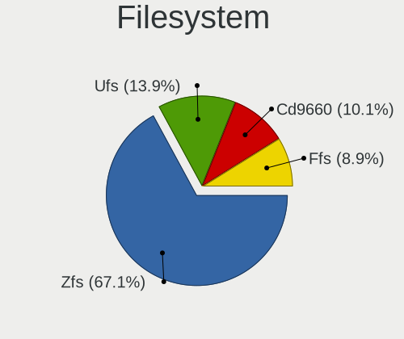
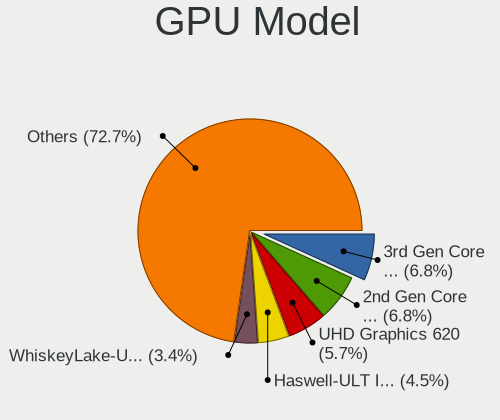
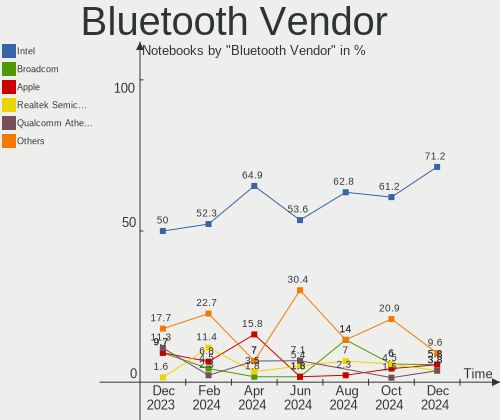

BSD Hardware Trends (Notebook)
------------------------------

A project to identify most popular hardware characteristics and track their change
over time based on data collected by BSD users at https://BSD-Hardware.info.

Anyone can contribute to the study by uploading probes of their computers by
the [hw-probe](https://github.com/linuxhw/hw-probe/blob/master/INSTALL.BSD.md) tool:

    hw-probe -all -upload

Full-feature report is available here: https://bsd-hardware.info/?view=trends&formfactor=notebook

Period: Jan, 2021.

Contents
--------

- [ OS                       ](#os)
- [ OS Family                ](#os-family)
- [ Arch                     ](#arch)
- [ DE                       ](#de)
- [ Display Server           ](#display-server)
- [ Display Manager          ](#display-manager)
- [ OS Lang                  ](#os-lang)
- [ Boot Mode                ](#boot-mode)
- [ Filesystem               ](#filesystem)
- [ Part. scheme             ](#part-scheme)
- [ Country                  ](#country)
- [ City                     ](#city)
- [ Vendor                   ](#vendor)
- [ Model                    ](#model)
- [ Model Family             ](#model-family)
- [ MFG Year                 ](#mfg-year)
- [ Form Factor              ](#form-factor)
- [ Coreboot                 ](#coreboot)
- [ RAM Size                 ](#ram-size)
- [ RAM Used                 ](#ram-used)
- [ Has CD-ROM               ](#has-cd-rom)
- [ Total Drives             ](#total-drives)
- [ Has Ethernet             ](#has-ethernet)
- [ Drive Vendor             ](#drive-vendor)
- [ Drive Model              ](#drive-model)
- [ HDD Vendor               ](#hdd-vendor)
- [ SSD Vendor               ](#ssd-vendor)
- [ Drive Kind               ](#drive-kind)
- [ Drive Connector          ](#drive-connector)
- [ Drive Size               ](#drive-size)
- [ Space Total              ](#space-total)
- [ Space Used               ](#space-used)
- [ Malfunc. Drives          ](#malfunc-drives)
- [ Malfunc. Drive Vendor    ](#malfunc-drive-vendor)
- [ Malfunc. HDD Vendor      ](#malfunc-hdd-vendor)
- [ Malfunc. Drive Kind      ](#malfunc-drive-kind)
- [ Failed Drives            ](#failed-drives)
- [ Failed Drive Vendor      ](#failed-drive-vendor)
- [ Drive Status             ](#drive-status)
- [ Storage Vendor           ](#storage-vendor)
- [ Storage Model            ](#storage-model)
- [ Storage Kind             ](#storage-kind)
- [ CPU Vendor               ](#cpu-vendor)
- [ CPU Model                ](#cpu-model)
- [ CPU Model Family         ](#cpu-model-family)
- [ CPU Cores                ](#cpu-cores)
- [ CPU Sockets              ](#cpu-sockets)
- [ CPU Threads              ](#cpu-threads)
- [ CPU Microarch            ](#cpu-microarch)
- [ GPU Vendor               ](#gpu-vendor)
- [ GPU Model                ](#gpu-model)
- [ GPU Combo                ](#gpu-combo)
- [ GPU Driver               ](#gpu-driver)
- [ GPU Memory               ](#gpu-memory)
- [ Monitor Vendor           ](#monitor-vendor)
- [ Monitor Model            ](#monitor-model)
- [ Monitor Resolution       ](#monitor-resolution)
- [ Monitor Diagonal         ](#monitor-diagonal)
- [ Monitor Width            ](#monitor-width)
- [ Aspect Ratio             ](#aspect-ratio)
- [ Monitor Area             ](#monitor-area)
- [ Pixel Density            ](#pixel-density)
- [ Multiple Monitors        ](#multiple-monitors)
- [ Net Controller Vendor    ](#net-controller-vendor)
- [ Net Controller Model     ](#net-controller-model)
- [ Wireless Vendor          ](#wireless-vendor)
- [ Wireless Model           ](#wireless-model)
- [ Ethernet Vendor          ](#ethernet-vendor)
- [ Ethernet Model           ](#ethernet-model)
- [ Net Controller Kind      ](#net-controller-kind)
- [ Used Controller          ](#used-controller)
- [ NICs                     ](#nics)
- [ Memory Vendor            ](#memory-vendor)
- [ Memory Model             ](#memory-model)
- [ Memory Kind              ](#memory-kind)
- [ Memory Form Factor       ](#memory-form-factor)
- [ Memory Size              ](#memory-size)
- [ Memory Speed             ](#memory-speed)
- [ Sound Vendor             ](#sound-vendor)
- [ Sound Model              ](#sound-model)
- [ Camera Vendor            ](#camera-vendor)
- [ Camera Model             ](#camera-model)
- [ Fingerprint Vendor       ](#fingerprint-vendor)
- [ Fingerprint Model        ](#fingerprint-model)
- [ Chipcard Vendor          ](#chipcard-vendor)
- [ Chipcard Model           ](#chipcard-model)
- [ Printer Vendor           ](#printer-vendor)
- [ Printer Model            ](#printer-model)
- [ Scanner Vendor           ](#scanner-vendor)
- [ Scanner Model            ](#scanner-model)
- [ Bluetooth Vendor         ](#bluetooth-vendor)
- [ Bluetooth Model          ](#bluetooth-model)
- [ Unsupported Devices      ](#unsupported-devices)
- [ Unsupported Device Types ](#unsupported-device-types)

OS
--

Installed operating systems

| Name                 | Notebooks | Percent |
|----------------------|-----------|---------|
| FreeBSD 12.2-p2      | 15        | 21.43%  |
| helloSystem 0.3.0    | 10        | 14.29%  |
| GhostBSD 20.04.02    | 10        | 14.29%  |
| FreeBSD 12.2         | 8         | 11.43%  |
| NomadBSD 1.3.2       | 6         | 8.57%   |
| helloSystem 0.4.0    | 4         | 5.71%   |
| FreeBSD 12.2-p3      | 3         | 4.29%   |
| FreeBSD 12.2-STABLE  | 2         | 2.86%   |
| FreeBSD 12.1-p12     | 2         | 2.86%   |
| OPNsense 20.7.8      | 1         | 1.43%   |
| OpenBSD 6.8          | 1         | 1.43%   |
| NomadBSD 1.4-RC1     | 1         | 1.43%   |
| NetBSD 9.1           | 1         | 1.43%   |
| FreeBSD 14.0-CURRENT | 1         | 1.43%   |
| FreeBSD 13.0-CURRENT | 1         | 1.43%   |
| FreeBSD 12.1-p10     | 1         | 1.43%   |
| FreeBSD 12.1         | 1         | 1.43%   |
| FreeBSD 11.4-STABLE  | 1         | 1.43%   |
| FreeBSD 11.4-p6      | 1         | 1.43%   |

OS Family
---------

OS without a version

| Name        | Notebooks | Percent |
|-------------|-----------|---------|
| FreeBSD     | 36        | 51.43%  |
| helloSystem | 14        | 20%     |
| GhostBSD    | 10        | 14.29%  |
| NomadBSD    | 7         | 10%     |
| OPNsense    | 1         | 1.43%   |
| OpenBSD     | 1         | 1.43%   |
| NetBSD      | 1         | 1.43%   |

Arch
----

OS architecture (x86_64, i586, etc.)

| Name  | Notebooks | Percent |
|-------|-----------|---------|
| amd64 | 65        | 92.86%  |
| i386  | 5         | 7.14%   |

DE
--

Desktop Environment

| Name         | Notebooks | Percent |
|--------------|-----------|---------|
| helloDesktop | 14        | 20%     |
| XFCE         | 11        | 15.71%  |
| MATE         | 11        | 15.71%  |
| KDE5         | 11        | 15.71%  |
| Openbox      | 8         | 11.43%  |
| Console      | 6         | 8.57%   |
| TWM          | 3         | 4.29%   |
| i3           | 2         | 2.86%   |
| GNOME        | 2         | 2.86%   |
| LXDE         | 1         | 1.43%   |
| CTWM         | 1         | 1.43%   |

Display Server
--------------

X11 or Wayland

| Name    | Notebooks | Percent |
|---------|-----------|---------|
| X11     | 63        | 90%     |
| Console | 7         | 10%     |

Display Manager
---------------

SDDM, LightDM, etc.

| Name    | Notebooks | Percent |
|---------|-----------|---------|
| SLiM    | 25        | 35.71%  |
| LightDM | 16        | 22.86%  |
| Console | 15        | 21.43%  |
| SDDM    | 9         | 12.86%  |
| XDM     | 4         | 5.71%   |
| GDM     | 1         | 1.43%   |

OS Lang
-------

Language

| Lang           | Notebooks | Percent |
|----------------|-----------|---------|
| Unknown        | 32        | 45.71%  |
| en_US          | 22        | 31.43%  |
| en_GB          | 3         | 4.29%   |
| ru_RU          | 2         | 2.86%   |
| it_IT          | 2         | 2.86%   |
| de_DE          | 2         | 2.86%   |
| C              | 2         | 2.86%   |
| zh_CN          | 1         | 1.43%   |
| fr_FR          | 1         | 1.43%   |
| en_US.US-ASCII | 1         | 1.43%   |
| en_NZ.US-ASCII | 1         | 1.43%   |
| de_AT          | 1         | 1.43%   |

Boot Mode
---------

EFI or BIOS

| Mode | Notebooks | Percent |
|------|-----------|---------|
| EFI  | 50        | 71.43%  |
| BIOS | 20        | 28.57%  |

Filesystem
----------

Type of filesystem

| Type | Notebooks | Percent |
|------|-----------|---------|
| Zfs  | 42        | 60%     |
| Ufs  | 27        | 38.57%  |
| Ffs  | 1         | 1.43%   |

Part. scheme
------------

Scheme of partitioning

| Type    | Notebooks | Percent |
|---------|-----------|---------|
| GPT     | 62        | 88.57%  |
| MBR     | 7         | 10%     |
| Unknown | 1         | 1.43%   |

Country
-------

Geographic location (country)

| Country        | Notebooks | Percent |
|----------------|-----------|---------|
| USA            | 11        | 15.71%  |
| Germany        | 9         | 12.86%  |
| France         | 7         | 10%     |
| Italy          | 5         | 7.14%   |
| UK             | 4         | 5.71%   |
| Russia         | 3         | 4.29%   |
| Japan          | 3         | 4.29%   |
| Ukraine        | 2         | 2.86%   |
| Norway         | 2         | 2.86%   |
| Indonesia      | 2         | 2.86%   |
| Hungary        | 2         | 2.86%   |
| Czech Republic | 2         | 2.86%   |
| Canada         | 2         | 2.86%   |
| Austria        | 2         | 2.86%   |
| Argentina      | 2         | 2.86%   |
| UAE            | 1         | 1.43%   |
| Thailand       | 1         | 1.43%   |
| Switzerland    | 1         | 1.43%   |
| Portugal       | 1         | 1.43%   |
| Poland         | 1         | 1.43%   |
| New Zealand    | 1         | 1.43%   |
| Netherlands    | 1         | 1.43%   |
| Lithuania      | 1         | 1.43%   |
| Hong Kong      | 1         | 1.43%   |
| China          | 1         | 1.43%   |
| Bulgaria       | 1         | 1.43%   |
| Australia      | 1         | 1.43%   |

City
----

Geographic location (city)

| City               | Notebooks | Percent |
|--------------------|-----------|---------|
| Franconville       | 5         | 7.14%   |
| Milan              | 3         | 4.29%   |
| The Bronx          | 2         | 2.86%   |
| Telford            | 2         | 2.86%   |
| Nueve de Julio     | 2         | 2.86%   |
| Lübeck            | 2         | 2.86%   |
| Kyiv               | 2         | 2.86%   |
| Glasgow            | 2         | 2.86%   |
| Šiauliai          | 1         | 1.43%   |
| Warrensburg        | 1         | 1.43%   |
| Varna              | 1         | 1.43%   |
| Tucson             | 1         | 1.43%   |
| Tsukuba            | 1         | 1.43%   |
| Tokyo              | 1         | 1.43%   |
| Tin Shui Wai       | 1         | 1.43%   |
| Tasikmalaya        | 1         | 1.43%   |
| Sumida             | 1         | 1.43%   |
| Richmond           | 1         | 1.43%   |
| Prague             | 1         | 1.43%   |
| Perth              | 1         | 1.43%   |
| Paris              | 1         | 1.43%   |
| Oslo               | 1         | 1.43%   |
| Oceanside          | 1         | 1.43%   |
| Oberkirch          | 1         | 1.43%   |
| Nyiregyhaza        | 1         | 1.43%   |
| New York           | 1         | 1.43%   |
| Murom              | 1         | 1.43%   |
| Moscow             | 1         | 1.43%   |
| Montreal           | 1         | 1.43%   |
| Mont-Saint-Hilaire | 1         | 1.43%   |
| Miass              | 1         | 1.43%   |
| Metzingen          | 1         | 1.43%   |
| Mars               | 1         | 1.43%   |
| Markt Indersdorf   | 1         | 1.43%   |
| Lawrence           | 1         | 1.43%   |
| Langen             | 1         | 1.43%   |
| Koblenz            | 1         | 1.43%   |
| Kjeller            | 1         | 1.43%   |
| Jakarta            | 1         | 1.43%   |
| Innsbruck          | 1         | 1.43%   |
| Hillsboro          | 1         | 1.43%   |
| Guangzhou          | 1         | 1.43%   |
| Groningen          | 1         | 1.43%   |
| Graz               | 1         | 1.43%   |
| Grajewo            | 1         | 1.43%   |
| Giessen            | 1         | 1.43%   |
| Frosinone          | 1         | 1.43%   |
| Estoril            | 1         | 1.43%   |
| Delebio            | 1         | 1.43%   |
| Christchurch       | 1         | 1.43%   |
| Cholet             | 1         | 1.43%   |
| Cape Coral         | 1         | 1.43%   |
| Budapest           | 1         | 1.43%   |
| Brno               | 1         | 1.43%   |
| Besigheim          | 1         | 1.43%   |
| Bangkok            | 1         | 1.43%   |
| Adliswil           | 1         | 1.43%   |
| Abu Dhabi          | 1         | 1.43%   |

Vendor
------

Motherboard manufacturer

| Name                           | Notebooks | Percent |
|--------------------------------|-----------|---------|
| Lenovo                         | 19        | 27.14%  |
| Dell                           | 13        | 18.57%  |
| Hewlett-Packard                | 8         | 11.43%  |
| Apple                          | 5         | 7.14%   |
| ASUSTek Computer               | 4         | 5.71%   |
| Acer                           | 3         | 4.29%   |
| Toshiba                        | 2         | 2.86%   |
| Sony                           | 2         | 2.86%   |
| Samsung Electronics            | 2         | 2.86%   |
| Fujitsu                        | 2         | 2.86%   |
| TUXEDO                         | 1         | 1.43%   |
| System76                       | 1         | 1.43%   |
| Pegatron                       | 1         | 1.43%   |
| Notebook                       | 1         | 1.43%   |
| NEC Computers                  | 1         | 1.43%   |
| Matsushita Electric Industrial | 1         | 1.43%   |
| IBM                            | 1         | 1.43%   |
| Clevo                          | 1         | 1.43%   |
| BANGHO                         | 1         | 1.43%   |
| Alienware                      | 1         | 1.43%   |

Model
-----

Motherboard model

| Name                                       | Notebooks | Percent |
|--------------------------------------------|-----------|---------|
| Apple MacBook4,1                           | 2         | 2.86%   |
| TUXEDO Pulse 14 Gen1                       | 1         | 1.43%   |
| Toshiba Satellite L50-C                    | 1         | 1.43%   |
| Toshiba KIRA                               | 1         | 1.43%   |
| System76 Bonobo Extreme                    | 1         | 1.43%   |
| Sony VPCM13M1R                             | 1         | 1.43%   |
| Sony VGN-FW290J                            | 1         | 1.43%   |
| Samsung 3570R/370R/470R/450R/510R/4450RV   | 1         | 1.43%   |
| Samsung 300E5EV/300E4EV/270E5EV/270E4EV    | 1         | 1.43%   |
| Pegatron T12Ah                             | 1         | 1.43%   |
| Notebook N85_N87,HJ,HJ1,HK1                | 1         | 1.43%   |
| NEC Computers PC-GL186Y3AZ                 | 1         | 1.43%   |
| Matsushita Electric Industrial CF-T2BW1AXR | 1         | 1.43%   |
| Lenovo ThinkPad X270 20HMCTO1WW            | 1         | 1.43%   |
| Lenovo ThinkPad X230 Tablet 34383C8        | 1         | 1.43%   |
| Lenovo ThinkPad X220 4286CTO               | 1         | 1.43%   |
| Lenovo ThinkPad X201 3626HMG               | 1         | 1.43%   |
| Lenovo ThinkPad X1 Carbon 34484U8          | 1         | 1.43%   |
| Lenovo ThinkPad X1 Carbon 3444AZU          | 1         | 1.43%   |
| Lenovo ThinkPad T570 20HAS0DP00            | 1         | 1.43%   |
| Lenovo ThinkPad T520 4239CTO               | 1         | 1.43%   |
| Lenovo ThinkPad T490 20N2CTO1WW            | 1         | 1.43%   |
| Lenovo ThinkPad T480s 20L8S6G21E           | 1         | 1.43%   |
| Lenovo ThinkPad T440p 20AWS3JY00           | 1         | 1.43%   |
| Lenovo ThinkPad T410 2537N96               | 1         | 1.43%   |
| Lenovo ThinkPad SL510 2847Q9G              | 1         | 1.43%   |
| Lenovo ThinkPad P50 20EQS0U60C             | 1         | 1.43%   |
| Lenovo ThinkPad E590 20NB005MUS            | 1         | 1.43%   |
| Lenovo ThinkPad E490 20N8CTO1WW            | 1         | 1.43%   |
| Lenovo ThinkPad E480 20KN005CRT            | 1         | 1.43%   |
| Lenovo IdeaPad S145-15API 81UT             | 1         | 1.43%   |
| Lenovo 41875PG                             | 1         | 1.43%   |
| IBM ThinkPad R51 2887AVG                   | 1         | 1.43%   |
| HP ZBook 17 G4                             | 1         | 1.43%   |
| HP ProBook 470 G4                          | 1         | 1.43%   |
| HP OMEN by HP Laptop                       | 1         | 1.43%   |
| HP Laptop 17-ca1xxx                        | 1         | 1.43%   |
| HP Laptop 15-da0xxx                        | 1         | 1.43%   |
| HP EliteBook 8570p                         | 1         | 1.43%   |
| HP EliteBook 840 G3                        | 1         | 1.43%   |
| HP EliteBook 2530p                         | 1         | 1.43%   |
| Fujitsu LIFEBOOK E753                      | 1         | 1.43%   |
| Fujitsu LIFEBOOK E744                      | 1         | 1.43%   |
| Dell Vostro V131                           | 1         | 1.43%   |
| Dell Vostro 1510                           | 1         | 1.43%   |
| Dell Latitude E7240                        | 1         | 1.43%   |
| Dell Latitude E6440                        | 1         | 1.43%   |
| Dell Latitude E5570                        | 1         | 1.43%   |
| Dell Latitude 7480                         | 1         | 1.43%   |
| Dell Latitude 5490                         | 1         | 1.43%   |
| Dell Latitude 5480                         | 1         | 1.43%   |
| Dell Latitude 5400                         | 1         | 1.43%   |
| Dell Latitude 5280                         | 1         | 1.43%   |
| Dell Inspiron 5758                         | 1         | 1.43%   |
| Dell Inspiron 5521                         | 1         | 1.43%   |
| Dell Inspiron 3542                         | 1         | 1.43%   |
| Clevo W55xEU                               | 1         | 1.43%   |
| BANGHO MAX G5 i1                           | 1         | 1.43%   |
| ASUS X58LE                                 | 1         | 1.43%   |
| ASUS X550LC                                | 1         | 1.43%   |

Model Family
------------

Motherboard model prefix

| Name                                       | Notebooks | Percent |
|--------------------------------------------|-----------|---------|
| Lenovo ThinkPad                            | 17        | 24.29%  |
| Dell Latitude                              | 8         | 11.43%  |
| HP EliteBook                               | 3         | 4.29%   |
| Dell Inspiron                              | 3         | 4.29%   |
| Acer Aspire                                | 3         | 4.29%   |
| HP Laptop                                  | 2         | 2.86%   |
| Fujitsu LIFEBOOK                           | 2         | 2.86%   |
| Dell Vostro                                | 2         | 2.86%   |
| Apple MacBook4                             | 2         | 2.86%   |
| TUXEDO Pulse                               | 1         | 1.43%   |
| Toshiba Satellite                          | 1         | 1.43%   |
| Toshiba KIRA                               | 1         | 1.43%   |
| System76 Bonobo                            | 1         | 1.43%   |
| Sony VPCM13M1R                             | 1         | 1.43%   |
| Sony VGN-FW290J                            | 1         | 1.43%   |
| Samsung 3570R                              | 1         | 1.43%   |
| Samsung 300E5EV                            | 1         | 1.43%   |
| Pegatron T12Ah                             | 1         | 1.43%   |
| Notebook N85                               | 1         | 1.43%   |
| NEC Computers PC-GL186Y3AZ                 | 1         | 1.43%   |
| Matsushita Electric Industrial CF-T2BW1AXR | 1         | 1.43%   |
| Lenovo IdeaPad                             | 1         | 1.43%   |
| Lenovo 41875PG                             | 1         | 1.43%   |
| IBM ThinkPad                               | 1         | 1.43%   |
| HP ZBook                                   | 1         | 1.43%   |
| HP ProBook                                 | 1         | 1.43%   |
| HP OMEN                                    | 1         | 1.43%   |
| Clevo W55xEU                               | 1         | 1.43%   |
| BANGHO MAX                                 | 1         | 1.43%   |
| ASUS X58LE                                 | 1         | 1.43%   |
| ASUS X550LC                                | 1         | 1.43%   |
| ASUS X101CH                                | 1         | 1.43%   |
| ASUS N75SF                                 | 1         | 1.43%   |
| Apple MacBookPro5                          | 1         | 1.43%   |
| Apple MacBookPro11                         | 1         | 1.43%   |
| Apple MacBookPro10                         | 1         | 1.43%   |
| Alienware 14                               | 1         | 1.43%   |

MFG Year
--------

Motherboard manufacture year

| Year | Notebooks | Percent |
|------|-----------|---------|
| 2020 | 14        | 20%     |
| 2019 | 13        | 18.57%  |
| 2013 | 6         | 8.57%   |
| 2012 | 6         | 8.57%   |
| 2017 | 5         | 7.14%   |
| 2008 | 5         | 7.14%   |
| 2018 | 4         | 5.71%   |
| 2010 | 4         | 5.71%   |
| 2009 | 3         | 4.29%   |
| 2016 | 2         | 2.86%   |
| 2015 | 2         | 2.86%   |
| 2014 | 2         | 2.86%   |
| 2011 | 2         | 2.86%   |
| 2006 | 1         | 1.43%   |
| 2003 | 1         | 1.43%   |

Form Factor
-----------

Physical design of the computer

| Name     | Notebooks | Percent |
|----------|-----------|---------|
| Notebook | 70        | 100%    |

Coreboot
--------

Have coreboot on board

| Used | Notebooks | Percent |
|------|-----------|---------|
| No   | 70        | 100%    |

RAM Size
--------

Total RAM memory

| Size in GB | Notebooks | Percent |
|------------|-----------|---------|
| 8.01-16.0  | 25        | 35.71%  |
| 16.01-24.0 | 15        | 21.43%  |
| 4.01-8.0   | 12        | 17.14%  |
| 32.01-64.0 | 6         | 8.57%   |
| 3.01-4.0   | 4         | 5.71%   |
| 24.01-32.0 | 2         | 2.86%   |
| 2.01-3.0   | 2         | 2.86%   |
| 0.51-1.0   | 2         | 2.86%   |
| 1.01-2.0   | 1         | 1.43%   |
| 0.01-0.5   | 1         | 1.43%   |

RAM Used
--------

Used RAM memory

| Used GB  | Notebooks | Percent |
|----------|-----------|---------|
| 0.01-0.5 | 35        | 50%     |
| 0.51-1.0 | 22        | 31.43%  |
| 1.01-2.0 | 7         | 10%     |
| 2.01-3.0 | 3         | 4.29%   |
| 4.01-8.0 | 1         | 1.43%   |
| 0        | 1         | 1.43%   |
| Unknown  | 1         | 1.43%   |

Has CD-ROM
----------

Has CD-ROM on board

| Presented | Notebooks | Percent |
|-----------|-----------|---------|
| No        | 45        | 64.29%  |
| Yes       | 25        | 35.71%  |

Total Drives
------------

Number of drives on board

| Drives | Notebooks | Percent |
|--------|-----------|---------|
| 1      | 59        | 84.29%  |
| 2      | 6         | 8.57%   |
| 3      | 2         | 2.86%   |
| 0      | 2         | 2.86%   |
| 4      | 1         | 1.43%   |

Has Ethernet
------------

Has Ethernet on board

| Presented | Notebooks | Percent |
|-----------|-----------|---------|
| Yes       | 65        | 92.86%  |
| No        | 5         | 7.14%   |

Drive Vendor
------------

Hard drive vendors

| Vendor              | Notebooks | Drives | Percent |
|---------------------|-----------|--------|---------|
| Samsung Electronics | 19        | 20     | 23.46%  |
| Seagate             | 10        | 11     | 12.35%  |
| WDC                 | 8         | 8      | 9.88%   |
| Toshiba             | 6         | 6      | 7.41%   |
| SanDisk             | 6         | 6      | 7.41%   |
| Hitachi             | 4         | 4      | 4.94%   |
| Fujitsu             | 4         | 4      | 4.94%   |
| Kingston            | 3         | 3      | 3.7%    |
| HGST                | 3         | 4      | 3.7%    |
| Crucial             | 3         | 3      | 3.7%    |
| Apple               | 2         | 2      | 2.47%   |
| Transcend           | 1         | 1      | 1.23%   |
| Team                | 1         | 1      | 1.23%   |
| SMI                 | 1         | 1      | 1.23%   |
| PNY                 | 1         | 1      | 1.23%   |
| Micron Technology   | 1         | 1      | 1.23%   |
| LITEONIT            | 1         | 1      | 1.23%   |
| KIOXIA              | 1         | 1      | 1.23%   |
| KingSpec            | 1         | 1      | 1.23%   |
| Intenso             | 1         | 1      | 1.23%   |
| Intel               | 1         | 1      | 1.23%   |
| EMTEC               | 1         | 1      | 1.23%   |
| China               | 1         | 1      | 1.23%   |
| A-DATA Technology   | 1         | 1      | 1.23%   |

Drive Model
-----------

Hard drive models

| Model                                | Notebooks | Percent |
|--------------------------------------|-----------|---------|
| Seagate ST500LM021-1KJ152 500GB      | 2         | 2.47%   |
| Seagate ST1000LM035-1RK172 1TB       | 2         | 2.47%   |
| Samsung SSD 860 QVO 1TB              | 2         | 2.47%   |
| Samsung SSD 860 EVO 250GB            | 2         | 2.47%   |
| Samsung SSD 840 EVO 120GB            | 2         | 2.47%   |
| Hitachi HTS545032B9A300 320GB        | 2         | 2.47%   |
| WDC WD7500BPKX-75HPJT0 752GB         | 1         | 1.23%   |
| WDC WD3200BPVT-55ZEST0 320GB         | 1         | 1.23%   |
| WDC WD3200BPVT-24JJ5T0 320GB         | 1         | 1.23%   |
| WDC WD1600BEVT-22ZCT0 160GB          | 1         | 1.23%   |
| WDC WD10SPZX-08Z10 1TB               | 1         | 1.23%   |
| WDC WD10JPVX-22JC3T0 1TB             | 1         | 1.23%   |
| WDC PC SN720 SDAQNTW-512G-1001 512GB | 1         | 1.23%   |
| WDC PC SN520 SDAPMUW-128G-1101 128GB | 1         | 1.23%   |
| Transcend TS120GMTS820S 120GB        | 1         | 1.23%   |
| Toshiba THNSNF256GMCS 256GB          | 1         | 1.23%   |
| Toshiba MQ01ABF050 500GB             | 1         | 1.23%   |
| Toshiba MQ01ABD100H 1TB              | 1         | 1.23%   |
| Toshiba MQ01ABD075 752GB             | 1         | 1.23%   |
| Toshiba KSG60ZMV256G M.2 2280 256GB  | 1         | 1.23%   |
| Toshiba KBG30ZMT512G 512GB           | 1         | 1.23%   |
| Team T253X2512G 512GB                | 1         | 1.23%   |
| SMI SSD DISK 506GB                   | 1         | 1.23%   |
| Seagate ST9750423AS 752GB            | 1         | 1.23%   |
| Seagate ST9500420AS 500GB            | 1         | 1.23%   |
| Seagate ST9320320AS 320GB            | 1         | 1.23%   |
| Seagate ST1000LM049-2GH172 1TB       | 1         | 1.23%   |
| Seagate ST1000LM024 HN-M101MBB 1TB   | 1         | 1.23%   |
| Seagate ST1000LM014-1EJ164 1TB       | 1         | 1.23%   |
| SanDisk X400 M.2 2280 256GB          | 1         | 1.23%   |
| SanDisk SD9TN8W256G1001 256GB        | 1         | 1.23%   |
| SanDisk SD8SNAT-128G-1006 128GB      | 1         | 1.23%   |
| SanDisk SD7TB3Q-128G-1006 128GB      | 1         | 1.23%   |
| SanDisk SD5SG2256G1052E 256GB        | 1         | 1.23%   |
| SanDisk SD5SG2128G1052E 128GB        | 1         | 1.23%   |
| Samsung SSD 970 EVO 250GB            | 1         | 1.23%   |
| Samsung SSD 860 PRO 512GB            | 1         | 1.23%   |
| Samsung SSD 860 EVO 500GB            | 1         | 1.23%   |
| Samsung SSD 860 EVO 1TB              | 1         | 1.23%   |
| Samsung SSD 850 PRO 512GB            | 1         | 1.23%   |
| Samsung SSD 850 PRO 256GB            | 1         | 1.23%   |
| Samsung SSD 850 EVO 1TB              | 1         | 1.23%   |
| Samsung SSD 840 EVO 500GB            | 1         | 1.23%   |
| Samsung PM981 NVMe 256GB             | 1         | 1.23%   |
| Samsung MZVLW256HEHP-000L7 256GB     | 1         | 1.23%   |
| Samsung MZVKW512HMJP-000H1 512GB     | 1         | 1.23%   |
| Samsung MZNLN256HCHP-000L7 256GB     | 1         | 1.23%   |
| Samsung MZMTD256HAGM-000L1 256GB     | 1         | 1.23%   |
| PNY SSD2SC120G1CS1754D117-551 120GB  | 1         | 1.23%   |
| Micron 1100 SATA 256GB               | 1         | 1.23%   |
| LITEONIT LMT-128M6M mSATA 128GB      | 1         | 1.23%   |
| KIOXIA KBG40ZNV512G 512GB            | 1         | 1.23%   |
| Kingston SUV500MS120G 120GB          | 1         | 1.23%   |
| Kingston SUV400S37240G 240GB         | 1         | 1.23%   |
| Kingston SA400S37240G 240GB          | 1         | 1.23%   |
| KingSpec NT-256 256GB                | 1         | 1.23%   |
| Intenso SATA III SSD 480GB           | 1         | 1.23%   |
| Intel SSDMCEAW120A4 120GB            | 1         | 1.23%   |
| Hitachi HTS548040M9AT00 40GB         | 1         | 1.23%   |
| Hitachi HTS543216L9SA00 160GB        | 1         | 1.23%   |

HDD Vendor
----------

Hard disk drive vendors

| Vendor  | Notebooks | Drives | Percent |
|---------|-----------|--------|---------|
| Seagate | 10        | 11     | 33.33%  |
| WDC     | 6         | 6      | 20%     |
| Hitachi | 4         | 4      | 13.33%  |
| Fujitsu | 4         | 4      | 13.33%  |
| Toshiba | 3         | 3      | 10%     |
| HGST    | 3         | 4      | 10%     |

SSD Vendor
----------

Solid state drive vendors

| Vendor              | Notebooks | Drives | Percent |
|---------------------|-----------|--------|---------|
| Samsung Electronics | 15        | 16     | 34.88%  |
| SanDisk             | 6         | 6      | 13.95%  |
| Kingston            | 3         | 3      | 6.98%   |
| Crucial             | 3         | 3      | 6.98%   |
| Toshiba             | 2         | 2      | 4.65%   |
| Apple               | 2         | 2      | 4.65%   |
| Transcend           | 1         | 1      | 2.33%   |
| Team                | 1         | 1      | 2.33%   |
| SMI                 | 1         | 1      | 2.33%   |
| PNY                 | 1         | 1      | 2.33%   |
| Micron Technology   | 1         | 1      | 2.33%   |
| LITEONIT            | 1         | 1      | 2.33%   |
| KingSpec            | 1         | 1      | 2.33%   |
| Intenso             | 1         | 1      | 2.33%   |
| Intel               | 1         | 1      | 2.33%   |
| EMTEC               | 1         | 1      | 2.33%   |
| China               | 1         | 1      | 2.33%   |
| A-DATA Technology   | 1         | 1      | 2.33%   |

Drive Kind
----------

HDD or SSD

| Kind | Notebooks | Drives | Percent |
|------|-----------|--------|---------|
| SSD  | 38        | 44     | 51.35%  |
| HDD  | 28        | 32     | 37.84%  |
| NVMe | 8         | 8      | 10.81%  |

Drive Connector
---------------

SATA, SAS, NVMe, etc.

| Type | Notebooks | Drives | Percent |
|------|-----------|--------|---------|
| SATA | 62        | 76     | 88.57%  |
| NVMe | 8         | 8      | 11.43%  |

Drive Size
----------

Size of hard drive

| Size in TB | Notebooks | Drives | Percent |
|------------|-----------|--------|---------|
| 0.01-0.5   | 44        | 50     | 66.67%  |
| 0.51-1.0   | 21        | 25     | 31.82%  |
| 1.01-2.0   | 1         | 1      | 1.52%   |

Space Total
-----------

Amount of disk space available on the file system

| Size in GB | Notebooks | Percent |
|------------|-----------|---------|
| 1-20       | 21        | 30%     |
| 101-250    | 18        | 25.71%  |
| 251-500    | 16        | 22.86%  |
| 501-1000   | 8         | 11.43%  |
| 21-50      | 3         | 4.29%   |
| 51-100     | 3         | 4.29%   |
| Unknown    | 1         | 1.43%   |

Space Used
----------

Amount of used disk space

| Used GB  | Notebooks | Percent |
|----------|-----------|---------|
| 1-20     | 56        | 80%     |
| 21-50    | 6         | 8.57%   |
| 251-500  | 2         | 2.86%   |
| 101-250  | 2         | 2.86%   |
| 51-100   | 2         | 2.86%   |
| 501-1000 | 1         | 1.43%   |
| Unknown  | 1         | 1.43%   |

Malfunc. Drives
---------------

Drive models with a malfunction

| Model                           | Notebooks | Drives | Percent |
|---------------------------------|-----------|--------|---------|
| Hitachi HTS545032B9A300 320GB   | 2         | 2      | 14.29%  |
| WDC WD3200BPVT-55ZEST0 320GB    | 1         | 1      | 7.14%   |
| Toshiba MQ01ABD100H 1TB         | 1         | 1      | 7.14%   |
| Toshiba MQ01ABD075 752GB        | 1         | 1      | 7.14%   |
| SMI SSD DISK 506GB              | 1         | 1      | 7.14%   |
| Seagate ST9500420AS 500GB       | 1         | 1      | 7.14%   |
| Seagate ST9320320AS 320GB       | 1         | 1      | 7.14%   |
| Seagate ST500LM021-1KJ152 500GB | 1         | 1      | 7.14%   |
| SanDisk SD5SG2128G1052E 128GB   | 1         | 1      | 7.14%   |
| Hitachi HTS548040M9AT00 40GB    | 1         | 1      | 7.14%   |
| HGST HTS725050A7E630 500GB      | 1         | 1      | 7.14%   |
| Fujitsu MHS2040AT D 40GB        | 1         | 1      | 7.14%   |
| Crucial CT525MX300SSD1 528GB    | 1         | 1      | 7.14%   |

Malfunc. Drive Vendor
---------------------

Vendors of faulty drives

| Vendor  | Notebooks | Drives | Percent |
|---------|-----------|--------|---------|
| Seagate | 3         | 3      | 21.43%  |
| Hitachi | 3         | 3      | 21.43%  |
| Toshiba | 2         | 2      | 14.29%  |
| WDC     | 1         | 1      | 7.14%   |
| SMI     | 1         | 1      | 7.14%   |
| SanDisk | 1         | 1      | 7.14%   |
| HGST    | 1         | 1      | 7.14%   |
| Fujitsu | 1         | 1      | 7.14%   |
| Crucial | 1         | 1      | 7.14%   |

Malfunc. HDD Vendor
-------------------

Vendors of faulty HDD drives

| Vendor  | Notebooks | Drives | Percent |
|---------|-----------|--------|---------|
| Seagate | 3         | 3      | 27.27%  |
| Hitachi | 3         | 3      | 27.27%  |
| Toshiba | 2         | 2      | 18.18%  |
| WDC     | 1         | 1      | 9.09%   |
| HGST    | 1         | 1      | 9.09%   |
| Fujitsu | 1         | 1      | 9.09%   |

Malfunc. Drive Kind
-------------------

Kinds of faulty drives

| Kind | Notebooks | Drives | Percent |
|------|-----------|--------|---------|
| HDD  | 11        | 11     | 78.57%  |
| SSD  | 3         | 3      | 21.43%  |

Failed Drives
-------------

Failed drive models

Zero info for selected period =(

Failed Drive Vendor
-------------------

Failed drive vendors

Zero info for selected period =(

Drive Status
------------

Number of failed and malfunc. drives

| Status   | Notebooks | Drives | Percent |
|----------|-----------|--------|---------|
| Works    | 58        | 69     | 79.45%  |
| Malfunc  | 14        | 14     | 19.18%  |
| Detected | 1         | 1      | 1.37%   |

Storage Vendor
--------------

Storage controller vendors

| Vendor              | Notebooks | Percent |
|---------------------|-----------|---------|
| Intel               | 60        | 81.08%  |
| Samsung Electronics | 5         | 6.76%   |
| AMD                 | 4         | 5.41%   |
| Sandisk             | 2         | 2.7%    |
| Toshiba             | 1         | 1.35%   |
| Nvidia              | 1         | 1.35%   |
| KIOXIA              | 1         | 1.35%   |

Storage Model
-------------

Storage controller models

| Model                                                                            | Notebooks | Percent |
|----------------------------------------------------------------------------------|-----------|---------|
| Intel 7 Series Chipset Family 6-port SATA Controller [AHCI mode]                 | 11        | 13.41%  |
| Intel Sunrise Point-LP SATA Controller [AHCI mode]                               | 8         | 9.76%   |
| Intel 82801IBM/IEM (ICH9M/ICH9M-E) 4 port SATA Controller [AHCI mode]            | 4         | 4.88%   |
| Intel 82801HM/HEM (ICH8M/ICH8M-E) SATA Controller [AHCI mode]                    | 4         | 4.88%   |
| Intel 82801HM/HEM (ICH8M/ICH8M-E) IDE Controller                                 | 4         | 4.88%   |
| Intel 82801 Mobile SATA Controller [RAID mode]                                   | 4         | 4.88%   |
| Intel 8 Series/C220 Series Chipset Family 6-port SATA Controller 1 [AHCI mode]   | 4         | 4.88%   |
| Intel 8 Series SATA Controller 1 [AHCI mode]                                     | 4         | 4.88%   |
| Intel 6 Series/C200 Series Chipset Family 6 port Mobile SATA AHCI Controller     | 4         | 4.88%   |
| AMD FCH SATA Controller [AHCI mode]                                              | 3         | 3.66%   |
| Samsung NVMe SSD Controller SM981/PM981/PM983                                    | 2         | 2.44%   |
| Samsung NVMe SSD Controller SM961/PM961/SM963                                    | 2         | 2.44%   |
| Intel Q170/Q150/B150/H170/H110/Z170/CM236 Chipset SATA Controller [AHCI Mode]    | 2         | 2.44%   |
| Intel HM170/QM170 Chipset SATA Controller [AHCI Mode]                            | 2         | 2.44%   |
| Intel 82801DBM (ICH4-M) IDE Controller                                           | 2         | 2.44%   |
| Intel 5 Series/3400 Series Chipset 6 port SATA AHCI Controller                   | 2         | 2.44%   |
| Toshiba BG3 NVMe SSD Controller                                                  | 1         | 1.22%   |
| Sandisk WD Black 2018 / PC SN720 NVMe SSD                                        | 1         | 1.22%   |
| Sandisk PC SN520 NVMe SSD                                                        | 1         | 1.22%   |
| Samsung SM951 AHCI                                                               | 1         | 1.22%   |
| Nvidia MCP79 AHCI Controller                                                     | 1         | 1.22%   |
| Intel Wildcat Point-LP SATA Controller [AHCI Mode]                               | 1         | 1.22%   |
| Intel SATA Controller [RAID mode]                                                | 1         | 1.22%   |
| Intel NM10/ICH7 Family SATA Controller [IDE mode]                                | 1         | 1.22%   |
| Intel NM10/ICH7 Family SATA Controller [AHCI mode]                               | 1         | 1.22%   |
| Intel Mobile 4 Series Chipset PT IDER Controller                                 | 1         | 1.22%   |
| Intel Celeron N3350/Pentium N4200/Atom E3900 Series SATA AHCI Controller         | 1         | 1.22%   |
| Intel Cannon Point-LP SATA Controller [AHCI Mode]                                | 1         | 1.22%   |
| Intel Atom/Celeron/Pentium Processor x5-E8000/J3xxx/N3xxx Series SATA Controller | 1         | 1.22%   |
| Intel 82801GBM/GHM (ICH7-M Family) SATA Controller [IDE mode]                    | 1         | 1.22%   |
| Intel 82801G (ICH7 Family) IDE Controller                                        | 1         | 1.22%   |
| Intel 7 Series Chipset Family 4-port SATA Controller [IDE mode]                  | 1         | 1.22%   |
| Intel 7 Series Chipset Family 2-port SATA Controller [IDE mode]                  | 1         | 1.22%   |
| AMD SB600 Non-Raid-5 SATA                                                        | 1         | 1.22%   |
| AMD SB600 IDE                                                                    | 1         | 1.22%   |
| Unknown                                                                          | 1         | 1.22%   |

Storage Kind
------------

Kind of storage controller (IDE, SATA, NVMe, SAS, ...)

| Kind | Notebooks | Percent |
|------|-----------|---------|
| SATA | 55        | 69.62%  |
| IDE  | 11        | 13.92%  |
| NVMe | 8         | 10.13%  |
| RAID | 5         | 6.33%   |

CPU Vendor
----------

Processor vendors

| Vendor | Notebooks | Percent |
|--------|-----------|---------|
| Intel  | 65        | 92.86%  |
| AMD    | 5         | 7.14%   |

CPU Model
---------

Processor models

| Model                                                     | Notebooks | Percent |
|-----------------------------------------------------------|-----------|---------|
| Intel CPU Version                                         | 3         | 4.29%   |
| Intel Core i5-7200U CPU @ 2.50GHz                         | 3         | 4.29%   |
| Intel Core i5-3230M CPU @ 2.60GHz                         | 3         | 4.29%   |
| Intel Core i7-8565U CPU @ 1.80GHz                         | 2         | 2.86%   |
| Intel Core i5-8250U CPU @ 1.60GHz                         | 2         | 2.86%   |
| Intel Core i5-6300U CPU @ 2.40GHz                         | 2         | 2.86%   |
| Intel Pentium M processor 1000MHz                         | 1         | 1.43%   |
| Intel Pentium M processor                                 | 1         | 1.43%   |
| Intel Pentium Dual CPU T3400 @ 2.16GHz                    | 1         | 1.43%   |
| Intel Pentium Dual CPU T3200 @ 2.00GHz                    | 1         | 1.43%   |
| Intel Pentium CPU N3700 @ 1.60GHz                         | 1         | 1.43%   |
| Intel Pentium CPU 967 @ 1.30GHz                           | 1         | 1.43%   |
| Intel Pentium CPU 2117U @ 1.80GHz                         | 1         | 1.43%   |
| Intel Core i7-8665U CPU @ 1.90GHz                         | 1         | 1.43%   |
| Intel Core i7-8550U CPU @ 1.80GHz                         | 1         | 1.43%   |
| Intel Core i7-7700HQ CPU @ 2.80GHz                        | 1         | 1.43%   |
| Intel Core i7-7500U CPU @ 2.70GHz                         | 1         | 1.43%   |
| Intel Core i7-6820HQ CPU @ 2.70GHz                        | 1         | 1.43%   |
| Intel Core i7-6700HQ CPU @ 2.60GHz                        | 1         | 1.43%   |
| Intel Core i7-4980HQ CPU @ 2.80GHz                        | 1         | 1.43%   |
| Intel Core i7-4900MQ CPU @ 2.80GHz                        | 1         | 1.43%   |
| Intel Core i7-4702MQ CPU @ 2.20GHz                        | 1         | 1.43%   |
| Intel Core i7-4700MQ CPU @ 2.40GHz                        | 1         | 1.43%   |
| Intel Core i7-4500U CPU @ 1.80GHz                         | 1         | 1.43%   |
| Intel Core i7-4500U CPU                                   | 1         | 1.43%   |
| Intel Core i7-3667U CPU @ 2.00GHz                         | 1         | 1.43%   |
| Intel Core i7-3632QM CPU @ 2.20GHz                        | 1         | 1.43%   |
| Intel Core i7-3537U CPU @ 2.00GHz                         | 1         | 1.43%   |
| Intel Core i7-3520M CPU @ 2.90GHz                         | 1         | 1.43%   |
| Intel Core i7-2760QM CPU @ 2.40GHz                        | 1         | 1.43%   |
| Intel Core i7-2630QM CPU @ 2.00GHz                        | 1         | 1.43%   |
| Intel Core i5-8350U CPU @ 1.70GHz                         | 1         | 1.43%   |
| Intel Core i5-8265U CPU @ 1.60GHz                         | 1         | 1.43%   |
| Intel Core i5-7300U CPU @ 2.60GHz                         | 1         | 1.43%   |
| Intel Core i5-7300HQ CPU @ 2.50GHz                        | 1         | 1.43%   |
| Intel Core i5-6440HQ CPU @ 2.60GHz                        | 1         | 1.43%   |
| Intel Core i5-5200U CPU @ 2.20GHz                         | 1         | 1.43%   |
| Intel Core i5-4300U CPU @ 1.90GHz                         | 1         | 1.43%   |
| Intel Core i5-4300M CPU @ 2.60GHz                         | 1         | 1.43%   |
| Intel Core i5-4200M CPU @ 2.50GHz                         | 1         | 1.43%   |
| Intel Core i5-3337U CPU @ 1.80GHz                         | 1         | 1.43%   |
| Intel Core i5-3320M CPU @ 2.60GHz                         | 1         | 1.43%   |
| Intel Core i5-3317U CPU @ 1.70GHz                         | 1         | 1.43%   |
| Intel Core i5-2430M CPU @ 2.40GHz                         | 1         | 1.43%   |
| Intel Core i5 CPU M 540 @ 2.53GHz                         | 1         | 1.43%   |
| Intel Core i5 CPU M 520 @ 2.40GHz                         | 1         | 1.43%   |
| Intel Core i3-4005U CPU @ 1.70GHz                         | 1         | 1.43%   |
| Intel Core 2 Duo CPU T9550 @ 2.66GHz                      | 1         | 1.43%   |
| Intel Core 2 Duo CPU T8300 @ 2.40GHz                      | 1         | 1.43%   |
| Intel Core 2 Duo CPU T8100 @ 2.10GHz                      | 1         | 1.43%   |
| Intel Core 2 Duo CPU P8700 @ 2.53GHz                      | 1         | 1.43%   |
| Intel Core 2 Duo CPU L9400 @ 1.86GHz                      | 1         | 1.43%   |
| Intel Celeron CPU N3350 @ 1.10GHz                         | 1         | 1.43%   |
| Intel Celeron CPU 867 @ 1.30GHz                           | 1         | 1.43%   |
| Intel Atom CPU N470 @ 1.83GHz                             | 1         | 1.43%   |
| Intel Atom CPU N2600 @ 1.60GHz ("GenuineIntel" 686-class) | 1         | 1.43%   |
| AMD Ryzen 7 4800H with Radeon Graphics                    | 1         | 1.43%   |
| AMD Ryzen 7 3700U with Radeon Vega Mobile Gfx             | 1         | 1.43%   |
| AMD Ryzen 5 3500U with Radeon Vega Mobile Gfx             | 1         | 1.43%   |
| AMD New Processor Technology                              | 1         | 1.43%   |

CPU Model Family
----------------

Processor model prefix

| Model              | Notebooks | Percent |
|--------------------|-----------|---------|
| Intel Core i5      | 25        | 35.71%  |
| Intel Core i7      | 20        | 28.57%  |
| Intel Core 2 Duo   | 5         | 7.14%   |
| Other              | 4         | 5.71%   |
| Intel Pentium      | 3         | 4.29%   |
| Intel Pentium M    | 2         | 2.86%   |
| Intel Pentium Dual | 2         | 2.86%   |
| Intel Celeron      | 2         | 2.86%   |
| Intel Atom         | 2         | 2.86%   |
| AMD Ryzen 7        | 2         | 2.86%   |
| Intel Core i3      | 1         | 1.43%   |
| AMD Ryzen 5        | 1         | 1.43%   |
| AMD E2             | 1         | 1.43%   |

CPU Cores
---------

Number of processor cores

| Number  | Notebooks | Percent |
|---------|-----------|---------|
| 2       | 31        | 44.29%  |
| 4       | 22        | 31.43%  |
| Unknown | 11        | 15.71%  |
| 1       | 3         | 4.29%   |
| 8       | 2         | 2.86%   |
| 16      | 1         | 1.43%   |

CPU Sockets
-----------

Number of sockets

| Number  | Notebooks | Percent |
|---------|-----------|---------|
| 1       | 66        | 94.29%  |
| 2       | 3         | 4.29%   |
| Unknown | 1         | 1.43%   |

CPU Threads
-----------

Threads per core (Hyper-Threading)

| Number  | Notebooks | Percent |
|---------|-----------|---------|
| 2       | 45        | 64.29%  |
| 1       | 13        | 18.57%  |
| Unknown | 12        | 17.14%  |

CPU Microarch
-------------

Microarchitecture

| Name        | Notebooks | Percent |
|-------------|-----------|---------|
| KabyLake    | 15        | 21.43%  |
| IvyBridge   | 11        | 15.71%  |
| Haswell     | 10        | 14.29%  |
| Penryn      | 6         | 8.57%   |
| Skylake     | 5         | 7.14%   |
| SandyBridge | 5         | 7.14%   |
| Core        | 3         | 4.29%   |
| Bonnell     | 3         | 4.29%   |
| Zen+        | 2         | 2.86%   |
| Westmere    | 2         | 2.86%   |
| P6          | 2         | 2.86%   |
| Zen 2       | 1         | 1.43%   |
| Silvermont  | 1         | 1.43%   |
| Puma        | 1         | 1.43%   |
| K8 Hammer   | 1         | 1.43%   |
| Goldmont    | 1         | 1.43%   |
| Broadwell   | 1         | 1.43%   |

GPU Vendor
----------

Vendors of graphics cards

| Vendor | Notebooks | Percent |
|--------|-----------|---------|
| Intel  | 61        | 75.31%  |
| Nvidia | 12        | 14.81%  |
| AMD    | 8         | 9.88%   |

GPU Model
---------

Graphics card models

| Model                                                                                    | Notebooks | Percent |
|------------------------------------------------------------------------------------------|-----------|---------|
| Intel 3rd Gen Core processor Graphics Controller                                         | 10        | 11.49%  |
| Intel HD Graphics 620                                                                    | 5         | 5.75%   |
| Intel 2nd Generation Core Processor Family Integrated Graphics Controller                | 5         | 5.75%   |
| Intel WhiskeyLake-U GT2 [UHD Graphics 620]                                               | 4         | 4.6%    |
| Intel UHD Graphics 620                                                                   | 4         | 4.6%    |
| Intel Mobile GM965/GL960 Integrated Graphics Controller (secondary)                      | 4         | 4.6%    |
| Intel Mobile GM965/GL960 Integrated Graphics Controller (primary)                        | 4         | 4.6%    |
| Intel Mobile 4 Series Chipset Integrated Graphics Controller                             | 4         | 4.6%    |
| Intel Haswell-ULT Integrated Graphics Controller                                         | 4         | 4.6%    |
| Intel 4th Gen Core Processor Integrated Graphics Controller                              | 4         | 4.6%    |
| Intel HD Graphics 530                                                                    | 3         | 3.45%   |
| Intel Skylake GT2 [HD Graphics 520]                                                      | 2         | 2.3%    |
| Intel Core Processor Integrated Graphics Controller                                      | 2         | 2.3%    |
| Intel 82852/855GM Integrated Graphics Device                                             | 2         | 2.3%    |
| AMD Picasso                                                                              | 2         | 2.3%    |
| Nvidia GP107M [GeForce GTX 1050 Mobile]                                                  | 1         | 1.15%   |
| Nvidia GP104GLM [Quadro P4000 Mobile]                                                    | 1         | 1.15%   |
| Nvidia GM206M [GeForce GTX 965M]                                                         | 1         | 1.15%   |
| Nvidia GM108M [GeForce MX130]                                                            | 1         | 1.15%   |
| Nvidia GM108M [GeForce 930MX]                                                            | 1         | 1.15%   |
| Nvidia GM107GLM [Quadro M1000M]                                                          | 1         | 1.15%   |
| Nvidia GK208BM [GeForce 920M]                                                            | 1         | 1.15%   |
| Nvidia GK106M [GeForce GTX 765M]                                                         | 1         | 1.15%   |
| Nvidia GK104M [GeForce GTX 780M]                                                         | 1         | 1.15%   |
| Nvidia GF117M [GeForce 610M/710M/810M/820M / GT 620M/625M/630M/720M]                     | 1         | 1.15%   |
| Nvidia GF116M [GeForce GT 555M/635M]                                                     | 1         | 1.15%   |
| Nvidia G96CM [GeForce 9600M GT]                                                          | 1         | 1.15%   |
| Nvidia C79 [GeForce 9400M]                                                               | 1         | 1.15%   |
| Intel Mobile 945GSE Express Integrated Graphics Controller                               | 1         | 1.15%   |
| Intel Mobile 945GM/GMS/GME, 943/940GML Express Integrated Graphics Controller            | 1         | 1.15%   |
| Intel HD Graphics 630                                                                    | 1         | 1.15%   |
| Intel HD Graphics 5500                                                                   | 1         | 1.15%   |
| Intel HD Graphics 500                                                                    | 1         | 1.15%   |
| Intel Crystal Well Integrated Graphics Controller                                        | 1         | 1.15%   |
| Intel Atom/Celeron/Pentium Processor x5-E8000/J3xxx/N3xxx Integrated Graphics Controller | 1         | 1.15%   |
| Intel Atom Processor D4xx/D5xx/N4xx/N5xx Integrated Graphics Controller                  | 1         | 1.15%   |
| Intel Atom Processor D2xxx/N2xxx Integrated Graphics Controller                          | 1         | 1.15%   |
| AMD Thames [Radeon HD 7550M/7570M/7650M]                                                 | 1         | 1.15%   |
| AMD RS690M [Radeon Xpress 1200/1250/1270]                                                | 1         | 1.15%   |
| AMD Renoir                                                                               | 1         | 1.15%   |
| AMD Mullins [Radeon R2 Graphics]                                                         | 1         | 1.15%   |
| AMD Mars [Radeon HD 8730M]                                                               | 1         | 1.15%   |
| AMD Mars [Radeon HD 8670A/8670M/8750M]                                                   | 1         | 1.15%   |

GPU Combo
---------

Combinations of graphics cards

| Name           | Notebooks | Percent |
|----------------|-----------|---------|
| 1 x Intel      | 40        | 57.14%  |
| 2 x Intel      | 10        | 14.29%  |
| Intel + Nvidia | 9         | 12.86%  |
| 1 x AMD        | 6         | 8.57%   |
| 1 x Nvidia     | 2         | 2.86%   |
| Intel + AMD    | 2         | 2.86%   |
| 2 x Nvidia     | 1         | 1.43%   |

GPU Driver
----------

Free vs proprietary

| Driver      | Notebooks | Percent |
|-------------|-----------|---------|
| Free        | 62        | 88.57%  |
| Proprietary | 4         | 5.71%   |
| Unknown     | 4         | 5.71%   |

GPU Memory
----------

Total video memory

| Size in GB | Notebooks | Percent |
|------------|-----------|---------|
| Unknown    | 62        | 88.57%  |
| 3.01-4.0   | 2         | 2.86%   |
| 1.01-2.0   | 2         | 2.86%   |
| 0.01-0.5   | 2         | 2.86%   |
| 7.01-8.0   | 1         | 1.43%   |
| 0.51-1.0   | 1         | 1.43%   |

Monitor Vendor
--------------

Monitor vendors

| Vendor                  | Notebooks | Percent |
|-------------------------|-----------|---------|
| AU Optronics            | 12        | 21.05%  |
| LG Display              | 11        | 19.3%   |
| BOE                     | 7         | 12.28%  |
| Samsung Electronics     | 5         | 8.77%   |
| Chimei Innolux          | 5         | 8.77%   |
| Chi Mei Optoelectronics | 4         | 7.02%   |
| Apple                   | 4         | 7.02%   |
| Sharp                   | 2         | 3.51%   |
| Lenovo                  | 2         | 3.51%   |
| Philips                 | 1         | 1.75%   |
| Hitachi                 | 1         | 1.75%   |
| HannStar                | 1         | 1.75%   |
| Goldstar                | 1         | 1.75%   |
| Dell                    | 1         | 1.75%   |

Monitor Model
-------------

Monitor models

| Model                                                                     | Notebooks | Percent |
|---------------------------------------------------------------------------|-----------|---------|
| LG Display LCD Monitor LGD0456 1366x768 340x190mm 15.3-inch               | 2         | 3.51%   |
| BOE LCD Monitor BOE0742 1920x1080 310x170mm 13.9-inch                     | 2         | 3.51%   |
| Sharp LQ133T1JX03 SHP140F 2560x1440 290x170mm 13.2-inch                   | 1         | 1.75%   |
| Sharp LCD Monitor SHP140E 2560x1440 290x170mm 13.2-inch                   | 1         | 1.75%   |
| Samsung Electronics LCD Monitor SEC5441 1280x800 330x210mm 15.4-inch      | 1         | 1.75%   |
| Samsung Electronics LCD Monitor SEC4541 1280x800 260x160mm 12.0-inch      | 1         | 1.75%   |
| Samsung Electronics LCD Monitor SDC4852 1366x768 340x190mm 15.3-inch      | 1         | 1.75%   |
| Samsung Electronics LCD Monitor SDC4141 1366x768 340x190mm 15.3-inch      | 1         | 1.75%   |
| Samsung Electronics CF791 SAM0DC3 3440x1440 800x330mm 34.1-inch           | 1         | 1.75%   |
| Philips LCD Monitor PHL08C3 1920x1080 600x340mm 27.2-inch                 | 1         | 1.75%   |
| LG Display LCD Monitor LGD059E 1920x1080 380x210mm 17.1-inch              | 1         | 1.75%   |
| LG Display LCD Monitor LGD0558 1920x1080 310x170mm 13.9-inch              | 1         | 1.75%   |
| LG Display LCD Monitor LGD0541 1920x1080 340x190mm 15.3-inch              | 1         | 1.75%   |
| LG Display LCD Monitor LGD0533 1920x1080 340x190mm 15.3-inch              | 1         | 1.75%   |
| LG Display LCD Monitor LGD0382 1600x900 310x170mm 13.9-inch               | 1         | 1.75%   |
| LG Display LCD Monitor LGD0353 1366x768 350x190mm 15.7-inch               | 1         | 1.75%   |
| LG Display LCD Monitor LGD02D8 1366x768 280x160mm 12.7-inch               | 1         | 1.75%   |
| LG Display LCD Monitor LGD02D3 1366x768 280x160mm 12.7-inch               | 1         | 1.75%   |
| LG Display LCD Monitor LGD0258 1600x900 350x190mm 15.7-inch               | 1         | 1.75%   |
| Lenovo LCD Monitor LEN4035 1280x800 300x190mm 14.0-inch                   | 1         | 1.75%   |
| Lenovo LCD Monitor LEN4011 1280x800 260x160mm 12.0-inch                   | 1         | 1.75%   |
| Hitachi HDMI HEC0088 1920x540 1100x560mm 48.6-inch                        | 1         | 1.75%   |
| HannStar HSD100IFW1 HSD03E9 1024x600 220x130mm 10.1-inch                  | 1         | 1.75%   |
| Goldstar LG FULL HD GSM5B55 1920x1080 480x270mm 21.7-inch                 | 1         | 1.75%   |
| Dell U3818DW DELA0F0 3840x1600 880x370mm 37.6-inch                        | 1         | 1.75%   |
| Chimei Innolux LCD Monitor CMN1734 1600x900 380x210mm 17.1-inch           | 1         | 1.75%   |
| Chimei Innolux LCD Monitor CMN15C5 1366x768 340x190mm 15.3-inch           | 1         | 1.75%   |
| Chimei Innolux LCD Monitor CMN14F2 1920x1080 310x170mm 13.9-inch          | 1         | 1.75%   |
| Chimei Innolux LCD Monitor CMN1482 1600x900 310x170mm 13.9-inch           | 1         | 1.75%   |
| Chimei Innolux LCD Monitor CMN1239 1920x1080 280x160mm 12.7-inch          | 1         | 1.75%   |
| Chi Mei Optoelectronics LCD Monitor CMO1726 1920x1080 380x210mm 17.1-inch | 1         | 1.75%   |
| Chi Mei Optoelectronics LCD Monitor CMO15A3 1366x768 350x190mm 15.7-inch  | 1         | 1.75%   |
| Chi Mei Optoelectronics LCD Monitor CMO1554 1280x800 330x210mm 15.4-inch  | 1         | 1.75%   |
| Chi Mei Optoelectronics LCD Monitor 1920x1080                             | 1         | 1.75%   |
| BOE LCD Monitor BOE0812 1920x1080 340x190mm 15.3-inch                     | 1         | 1.75%   |
| BOE LCD Monitor BOE07E8 1366x768 310x170mm 13.9-inch                      | 1         | 1.75%   |
| BOE LCD Monitor BOE0791 1920x1080 310x170mm 13.9-inch                     | 1         | 1.75%   |
| BOE LCD Monitor BOE070D 1366x768 310x170mm 13.9-inch                      | 1         | 1.75%   |
| BOE LCD Monitor BOE0704 1366x768 340x190mm 15.3-inch                      | 1         | 1.75%   |
| AU Optronics LCD Monitor AUO8174 1280x800 330x210mm 15.4-inch             | 1         | 1.75%   |
| AU Optronics LCD Monitor AUO48EC 1366x768 340x190mm 15.3-inch             | 1         | 1.75%   |
| AU Optronics LCD Monitor AUO46EC 1366x768 340x190mm 15.3-inch             | 1         | 1.75%   |
| AU Optronics LCD Monitor AUO45EC 1366x768 340x190mm 15.3-inch             | 1         | 1.75%   |
| AU Optronics LCD Monitor AUO38ED 1920x1080 340x190mm 15.3-inch            | 1         | 1.75%   |
| AU Optronics LCD Monitor AUO333D 1920x1080 310x170mm 13.9-inch            | 1         | 1.75%   |
| AU Optronics LCD Monitor AUO31EC 1366x768 340x190mm 15.3-inch             | 1         | 1.75%   |
| AU Optronics LCD Monitor AUO219E 1600x900 380x210mm 17.1-inch             | 1         | 1.75%   |
| AU Optronics LCD Monitor AUO123D 1920x1080 310x170mm 13.9-inch            | 1         | 1.75%   |
| AU Optronics LCD Monitor AUO106C 1366x768 280x160mm 12.7-inch             | 1         | 1.75%   |
| AU Optronics LCD Monitor AUO103E 1600x900 310x170mm 13.9-inch             | 1         | 1.75%   |
| AU Optronics LCD Monitor 1920x1080                                        | 1         | 1.75%   |
| Apple Color LCD APPA02E 2880x1800 330x210mm 15.4-inch                     | 1         | 1.75%   |
| Apple Color LCD APPA014 2560x1600 290x180mm 13.4-inch                     | 1         | 1.75%   |
| Apple Color LCD APP9C5C 1280x800 290x180mm 13.4-inch                      | 1         | 1.75%   |
| Apple Cinema HD APP9223 1920x1200 490x310mm 22.8-inch                     | 1         | 1.75%   |

Monitor Resolution
------------------

Monitor screen resolution

| Resolution        | Notebooks | Percent |
|-------------------|-----------|---------|
| 1920x1080 (FHD)   | 18        | 32.14%  |
| 1366x768 (WXGA)   | 16        | 28.57%  |
| 1280x800 (WXGA)   | 7         | 12.5%   |
| 1600x900 (HD+)    | 6         | 10.71%  |
| 2560x1440 (QHD)   | 2         | 3.57%   |
| 3840x1600         | 1         | 1.79%   |
| 3440x1440         | 1         | 1.79%   |
| 2880x1800         | 1         | 1.79%   |
| 2560x1600         | 1         | 1.79%   |
| 1920x540          | 1         | 1.79%   |
| 1920x1200 (WUXGA) | 1         | 1.79%   |
| 1024x600          | 1         | 1.79%   |

Monitor Diagonal
----------------

Diagonal size in inches

| Inches  | Notebooks | Percent |
|---------|-----------|---------|
| 15      | 21        | 36.84%  |
| 13      | 16        | 28.07%  |
| 12      | 6         | 10.53%  |
| 17      | 4         | 7.02%   |
| Unknown | 2         | 3.51%   |
| 48      | 1         | 1.75%   |
| 37      | 1         | 1.75%   |
| 34      | 1         | 1.75%   |
| 27      | 1         | 1.75%   |
| 22      | 1         | 1.75%   |
| 21      | 1         | 1.75%   |
| 14      | 1         | 1.75%   |
| 10      | 1         | 1.75%   |

Monitor Width
-------------

Physical width

| Width in mm | Notebooks | Percent |
|-------------|-----------|---------|
| 301-350     | 33        | 57.89%  |
| 201-300     | 12        | 21.05%  |
| 351-400     | 4         | 7.02%   |
| 401-500     | 2         | 3.51%   |
| Unknown     | 2         | 3.51%   |
| 801-900     | 1         | 1.75%   |
| 701-800     | 1         | 1.75%   |
| 501-600     | 1         | 1.75%   |
| 1001-1500   | 1         | 1.75%   |

Aspect Ratio
------------

Proportional relationship between the width and the height

| Ratio   | Notebooks | Percent |
|---------|-----------|---------|
| 16/9    | 40        | 72.73%  |
| 16/10   | 10        | 18.18%  |
| 21/9    | 2         | 3.64%   |
| Unknown | 2         | 3.64%   |
| 1.96    | 1         | 1.82%   |

Monitor Area
------------

Area in inch²

| Area in inch² | Notebooks | Percent |
|----------------|-----------|---------|
| 81-90          | 15        | 26.32%  |
| 91-100         | 14        | 24.56%  |
| 101-110        | 7         | 12.28%  |
| 61-70          | 6         | 10.53%  |
| 121-130        | 4         | 7.02%   |
| 71-80          | 2         | 3.51%   |
| 201-250        | 2         | 3.51%   |
| 501-1000       | 2         | 3.51%   |
| Unknown        | 2         | 3.51%   |
| 351-500        | 1         | 1.75%   |
| 41-50          | 1         | 1.75%   |
| 301-350        | 1         | 1.75%   |

Pixel Density
-------------

Pixels per inch

| Density | Notebooks | Percent |
|---------|-----------|---------|
| 121-160 | 21        | 37.5%   |
| 101-120 | 21        | 37.5%   |
| 51-100  | 6         | 10.71%  |
| 161-240 | 5         | 8.93%   |
| Unknown | 2         | 3.57%   |
| 1-50    | 1         | 1.79%   |

Multiple Monitors
-----------------

Total monitors connected

| Total | Notebooks | Percent |
|-------|-----------|---------|
| 1     | 49        | 70%     |
| 0     | 17        | 24.29%  |
| 2     | 4         | 5.71%   |

Net Controller Vendor
---------------------

Controller vendors

| Vendor                         | Notebooks | Percent |
|--------------------------------|-----------|---------|
| Intel                          | 49        | 44.14%  |
| Realtek Semiconductor          | 28        | 25.23%  |
| Qualcomm Atheros               | 12        | 10.81%  |
| Broadcom Inc. and subsidiaries | 7         | 6.31%   |
| Marvell Technology Group       | 3         | 2.7%    |
| Hewlett-Packard                | 2         | 1.8%    |
| TP-Link                        | 1         | 0.9%    |
| Realtek                        | 1         | 0.9%    |
| Ralink Technology              | 1         | 0.9%    |
| Ralink                         | 1         | 0.9%    |
| Qualcomm                       | 1         | 0.9%    |
| Nvidia                         | 1         | 0.9%    |
| JMicron Technology             | 1         | 0.9%    |
| Edimax Technology              | 1         | 0.9%    |
| Dell                           | 1         | 0.9%    |
| ASUSTek Computer               | 1         | 0.9%    |

Net Controller Model
--------------------

Controller models

| Model                                                                   | Notebooks | Percent |
|-------------------------------------------------------------------------|-----------|---------|
| Realtek RTL8111/8168/8411 PCI Express Gigabit Ethernet Controller       | 20        | 13.89%  |
| Intel Wireless 8265 / 8275                                              | 9         | 6.25%   |
| Realtek RTL810xE PCI Express Fast Ethernet controller                   | 6         | 4.17%   |
| Intel Wireless 7260                                                     | 5         | 3.47%   |
| Intel Ethernet Connection (4) I219-LM                                   | 5         | 3.47%   |
| Intel 82579LM Gigabit Network Connection (Lewisville)                   | 5         | 3.47%   |
| Intel Centrino Advanced-N 6235                                          | 4         | 2.78%   |
| Intel Centrino Advanced-N 6205 [Taylor Peak]                            | 4         | 2.78%   |
| Qualcomm Atheros QCA9565 / AR9565 Wireless Network Adapter              | 3         | 2.08%   |
| Qualcomm Atheros AR9485 Wireless Network Adapter                        | 3         | 2.08%   |
| Intel Wireless 8260                                                     | 3         | 2.08%   |
| Intel Ethernet Connection I217-LM                                       | 3         | 2.08%   |
| Intel Ethernet Connection (2) I219-LM                                   | 3         | 2.08%   |
| Realtek RTL8821CE 802.11ac PCIe Wireless Network Adapter                | 2         | 1.39%   |
| Qualcomm Atheros AR9462 Wireless Network Adapter                        | 2         | 1.39%   |
| Marvell Group 88E8058 PCI-E Gigabit Ethernet Controller                 | 2         | 1.39%   |
| Intel Wireless-AC 9260                                                  | 2         | 1.39%   |
| Intel Wireless 7265                                                     | 2         | 1.39%   |
| Intel WiFi Link 5100                                                    | 2         | 1.39%   |
| Intel Ethernet Connection (4) I219-V                                    | 2         | 1.39%   |
| Intel Cannon Point-LP CNVi [Wireless-AC]                                | 2         | 1.39%   |
| Intel 82801DB/DBL/DBM (ICH4/ICH4-L/ICH4-M) AC'97 Modem Controller       | 2         | 1.39%   |
| Intel 82577LM Gigabit Network Connection                                | 2         | 1.39%   |
| Broadcom Inc. and subsidiaries BCM4321 802.11a/b/g/n                    | 2         | 1.39%   |
| TP-Link AC600 wireless Realtek RTL8811AU [Archer T2U Nano]              | 1         | 0.69%   |
| Realtek RTL8188CE 802.11b/g/n WiFi Adapter                              | 1         | 0.69%   |
| Realtek RTL-8100/8101L/8139 PCI Fast Ethernet Adapter                   | 1         | 0.69%   |
| Realtek RTL-8100/8101L/8139 PCI Fast Ethernet Adapter                   | 1         | 0.69%   |
| Ralink RT2870/RT3070 Wireless Adapter                                   | 1         | 0.69%   |
| Ralink RT3090 Wireless 802.11n 1T/1R PCIe                               | 1         | 0.69%   |
| Qualcomm Atheros QCA9377 802.11ac Wireless Network Adapter              | 1         | 0.69%   |
| Qualcomm Atheros Killer E220x Gigabit Ethernet Controller               | 1         | 0.69%   |
| Qualcomm Atheros AR928X Wireless Network Adapter (PCI-Express)          | 1         | 0.69%   |
| Qualcomm Atheros AR9285 Wireless Network Adapter (PCI-Express)          | 1         | 0.69%   |
| Qualcomm Atheros AR8152 v2.0 Fast Ethernet                              | 1         | 0.69%   |
| Qualcomm Atheros AR8151 v2.0 Gigabit Ethernet                           | 1         | 0.69%   |
| Qualcomm Atheros AR242x / AR542x Wireless Network Adapter (PCI-Express) | 1         | 0.69%   |
| Qualcomm ALCATEL Composite RNDIS Interface                              | 1         | 0.69%   |
| Nvidia MCP79 Ethernet                                                   | 1         | 0.69%   |
| Marvell Group 88E8055 PCI-E Gigabit Ethernet Controller                 | 1         | 0.69%   |
| JMicron JMC260 PCI Express Fast Ethernet Controller                     | 1         | 0.69%   |
| Intel Wireless 3160                                                     | 1         | 0.69%   |
| Intel Wi-Fi 6 AX200                                                     | 1         | 0.69%   |
| Intel PRO/Wireless 5100 AGN [Shiloh] Network Connection                 | 1         | 0.69%   |
| Intel PRO/Wireless 4965 AG or AGN [Kedron] Network Connection           | 1         | 0.69%   |
| Intel PRO/Wireless 2915ABG [Calexico2] Network Connection               | 1         | 0.69%   |
| Intel PRO/Wireless 2200BG [Calexico2] Network Connection                | 1         | 0.69%   |
| Intel Ethernet Connection I219-LM                                       | 1         | 0.69%   |
| Intel Ethernet Connection I218-LM                                       | 1         | 0.69%   |
| Intel Ethernet Connection (6) I219-V                                    | 1         | 0.69%   |
| Intel Ethernet Connection (6) I219-LM                                   | 1         | 0.69%   |
| Intel Dual Band Wireless-AC 3168NGW [Stone Peak]                        | 1         | 0.69%   |
| Intel Dual Band Wireless-AC 3165 Plus Bluetooth                         | 1         | 0.69%   |
| Intel Centrino Wireless-N 2230                                          | 1         | 0.69%   |
| Intel Centrino Wireless-N 135                                           | 1         | 0.69%   |
| Intel Centrino Wireless-N 1030 [Rainbow Peak]                           | 1         | 0.69%   |
| Intel Centrino Wireless-N 1000 [Condor Peak]                            | 1         | 0.69%   |
| Intel Centrino Ultimate-N 6300                                          | 1         | 0.69%   |
| Intel Centrino Advanced-N 6200                                          | 1         | 0.69%   |
| Intel 82801DB PRO/100 VE (MOB) Ethernet Controller                      | 1         | 0.69%   |

Wireless Vendor
---------------

Wireless vendors

| Vendor                         | Notebooks | Percent |
|--------------------------------|-----------|---------|
| Intel                          | 47        | 63.51%  |
| Qualcomm Atheros               | 12        | 16.22%  |
| Broadcom Inc. and subsidiaries | 6         | 8.11%   |
| Realtek Semiconductor          | 3         | 4.05%   |
| TP-Link                        | 1         | 1.35%   |
| Ralink Technology              | 1         | 1.35%   |
| Ralink                         | 1         | 1.35%   |
| Edimax Technology              | 1         | 1.35%   |
| Dell                           | 1         | 1.35%   |
| ASUSTek Computer               | 1         | 1.35%   |

Wireless Model
--------------

Wireless models

| Model                                                                        | Notebooks | Percent |
|------------------------------------------------------------------------------|-----------|---------|
| Intel Wireless 8265 / 8275                                                   | 9         | 12.16%  |
| Intel Wireless 7260                                                          | 5         | 6.76%   |
| Intel Centrino Advanced-N 6235                                               | 4         | 5.41%   |
| Intel Centrino Advanced-N 6205 [Taylor Peak]                                 | 4         | 5.41%   |
| Qualcomm Atheros QCA9565 / AR9565 Wireless Network Adapter                   | 3         | 4.05%   |
| Qualcomm Atheros AR9485 Wireless Network Adapter                             | 3         | 4.05%   |
| Intel Wireless 8260                                                          | 3         | 4.05%   |
| Realtek RTL8821CE 802.11ac PCIe Wireless Network Adapter                     | 2         | 2.7%    |
| Qualcomm Atheros AR9462 Wireless Network Adapter                             | 2         | 2.7%    |
| Intel Wireless-AC 9260                                                       | 2         | 2.7%    |
| Intel Wireless 7265                                                          | 2         | 2.7%    |
| Intel WiFi Link 5100                                                         | 2         | 2.7%    |
| Intel Cannon Point-LP CNVi [Wireless-AC]                                     | 2         | 2.7%    |
| Broadcom Inc. and subsidiaries BCM4321 802.11a/b/g/n                         | 2         | 2.7%    |
| TP-Link AC600 wireless Realtek RTL8811AU [Archer T2U Nano]                   | 1         | 1.35%   |
| Realtek RTL8188CE 802.11b/g/n WiFi Adapter                                   | 1         | 1.35%   |
| Ralink RT2870/RT3070 Wireless Adapter                                        | 1         | 1.35%   |
| Ralink RT3090 Wireless 802.11n 1T/1R PCIe                                    | 1         | 1.35%   |
| Qualcomm Atheros QCA9377 802.11ac Wireless Network Adapter                   | 1         | 1.35%   |
| Qualcomm Atheros AR928X Wireless Network Adapter (PCI-Express)               | 1         | 1.35%   |
| Qualcomm Atheros AR9285 Wireless Network Adapter (PCI-Express)               | 1         | 1.35%   |
| Qualcomm Atheros AR242x / AR542x Wireless Network Adapter (PCI-Express)      | 1         | 1.35%   |
| Intel Wireless 3160                                                          | 1         | 1.35%   |
| Intel Wi-Fi 6 AX200                                                          | 1         | 1.35%   |
| Intel PRO/Wireless 5100 AGN [Shiloh] Network Connection                      | 1         | 1.35%   |
| Intel PRO/Wireless 4965 AG or AGN [Kedron] Network Connection                | 1         | 1.35%   |
| Intel PRO/Wireless 2915ABG [Calexico2] Network Connection                    | 1         | 1.35%   |
| Intel PRO/Wireless 2200BG [Calexico2] Network Connection                     | 1         | 1.35%   |
| Intel Dual Band Wireless-AC 3168NGW [Stone Peak]                             | 1         | 1.35%   |
| Intel Dual Band Wireless-AC 3165 Plus Bluetooth                              | 1         | 1.35%   |
| Intel Centrino Wireless-N 2230                                               | 1         | 1.35%   |
| Intel Centrino Wireless-N 135                                                | 1         | 1.35%   |
| Intel Centrino Wireless-N 1030 [Rainbow Peak]                                | 1         | 1.35%   |
| Intel Centrino Wireless-N 1000 [Condor Peak]                                 | 1         | 1.35%   |
| Intel Centrino Ultimate-N 6300                                               | 1         | 1.35%   |
| Intel Centrino Advanced-N 6200                                               | 1         | 1.35%   |
| Edimax EW-7811Un 802.11n Wireless Adapter [Realtek RTL8188CUS]               | 1         | 1.35%   |
| Dell Dell Wireless 5550 HSPA+ Mini-Card Network Adapter                      | 1         | 1.35%   |
| Broadcom Inc. and subsidiaries BCM43602 802.11ac Wireless LAN SoC            | 1         | 1.35%   |
| Broadcom Inc. and subsidiaries BCM4331 802.11a/b/g/n                         | 1         | 1.35%   |
| Broadcom Inc. and subsidiaries BCM4322 802.11a/b/g/n Wireless LAN Controller | 1         | 1.35%   |
| Broadcom Inc. and subsidiaries BCM4312 802.11b/g LP-PHY                      | 1         | 1.35%   |
| ASUS 802.11n  WLAN Adapter 802.11n  WLAN Adapter                             | 1         | 1.35%   |

Ethernet Vendor
---------------

Ethernet vendors

| Vendor                         | Notebooks | Percent |
|--------------------------------|-----------|---------|
| Realtek Semiconductor          | 27        | 40.91%  |
| Intel                          | 26        | 39.39%  |
| Qualcomm Atheros               | 3         | 4.55%   |
| Marvell Technology Group       | 3         | 4.55%   |
| Broadcom Inc. and subsidiaries | 3         | 4.55%   |
| Realtek                        | 1         | 1.52%   |
| Qualcomm                       | 1         | 1.52%   |
| Nvidia                         | 1         | 1.52%   |
| JMicron Technology             | 1         | 1.52%   |

Ethernet Model
--------------

Ethernet models

| Model                                                                     | Notebooks | Percent |
|---------------------------------------------------------------------------|-----------|---------|
| Realtek RTL8111/8168/8411 PCI Express Gigabit Ethernet Controller         | 20        | 30.3%   |
| Realtek RTL810xE PCI Express Fast Ethernet controller                     | 6         | 9.09%   |
| Intel Ethernet Connection (4) I219-LM                                     | 5         | 7.58%   |
| Intel 82579LM Gigabit Network Connection (Lewisville)                     | 5         | 7.58%   |
| Intel Ethernet Connection I217-LM                                         | 3         | 4.55%   |
| Intel Ethernet Connection (2) I219-LM                                     | 3         | 4.55%   |
| Marvell Group 88E8058 PCI-E Gigabit Ethernet Controller                   | 2         | 3.03%   |
| Intel Ethernet Connection (4) I219-V                                      | 2         | 3.03%   |
| Intel 82577LM Gigabit Network Connection                                  | 2         | 3.03%   |
| Realtek RTL-8100/8101L/8139 PCI Fast Ethernet Adapter                     | 1         | 1.52%   |
| Realtek RTL-8100/8101L/8139 PCI Fast Ethernet Adapter                     | 1         | 1.52%   |
| Qualcomm Atheros Killer E220x Gigabit Ethernet Controller                 | 1         | 1.52%   |
| Qualcomm Atheros AR8152 v2.0 Fast Ethernet                                | 1         | 1.52%   |
| Qualcomm Atheros AR8151 v2.0 Gigabit Ethernet                             | 1         | 1.52%   |
| Qualcomm ALCATEL Composite RNDIS Interface                                | 1         | 1.52%   |
| Nvidia MCP79 Ethernet                                                     | 1         | 1.52%   |
| Marvell Group 88E8055 PCI-E Gigabit Ethernet Controller                   | 1         | 1.52%   |
| JMicron JMC260 PCI Express Fast Ethernet Controller                       | 1         | 1.52%   |
| Intel Ethernet Connection I219-LM                                         | 1         | 1.52%   |
| Intel Ethernet Connection I218-LM                                         | 1         | 1.52%   |
| Intel Ethernet Connection (6) I219-V                                      | 1         | 1.52%   |
| Intel Ethernet Connection (6) I219-LM                                     | 1         | 1.52%   |
| Intel 82801DB PRO/100 VE (MOB) Ethernet Controller                        | 1         | 1.52%   |
| Intel 82567LM Gigabit Network Connection                                  | 1         | 1.52%   |
| Broadcom Inc. and subsidiaries NetXtreme BCM57786 Gigabit Ethernet PCIe   | 1         | 1.52%   |
| Broadcom Inc. and subsidiaries NetXtreme BCM57762 Gigabit Ethernet PCIe   | 1         | 1.52%   |
| Broadcom Inc. and subsidiaries NetLink BCM5906M Fast Ethernet PCI Express | 1         | 1.52%   |

Net Controller Kind
-------------------

Ethernet, WiFi or modem

| Kind     | Notebooks | Percent |
|----------|-----------|---------|
| WiFi     | 69        | 50%     |
| Ethernet | 65        | 47.1%   |
| Modem    | 4         | 2.9%    |

Used Controller
---------------

Currently used network controller

| Kind     | Notebooks | Percent |
|----------|-----------|---------|
| WiFi     | 62        | 49.6%   |
| Ethernet | 62        | 49.6%   |
| Modem    | 1         | 0.8%    |

NICs
----

Total network controllers on board

| Total | Notebooks | Percent |
|-------|-----------|---------|
| 2     | 64        | 91.43%  |
| 1     | 6         | 8.57%   |

Memory Vendor
-------------

Memory module vendors

| Vendor              | Notebooks | Percent |
|---------------------|-----------|---------|
| SK Hynix            | 23        | 28.4%   |
| Samsung Electronics | 17        | 20.99%  |
| Unknown             | 9         | 11.11%  |
| Kingston            | 8         | 9.88%   |
| Micron Technology   | 7         | 8.64%   |
| Crucial             | 4         | 4.94%   |
| Elpida              | 3         | 3.7%    |
| Team                | 2         | 2.47%   |
| Ramaxel Technology  | 2         | 2.47%   |
| A-DATA Technology   | 2         | 2.47%   |
| Transcend           | 1         | 1.23%   |
| Magnum Tech         | 1         | 1.23%   |
| G.Skill             | 1         | 1.23%   |
| Corsair             | 1         | 1.23%   |

Memory Model
------------

Memory module models

| Model                                                        | Notebooks | Percent |
|--------------------------------------------------------------|-----------|---------|
| SK Hynix RAM HMA81GS6AFR8N-UH 8GB SODIMM DDR4 2400MT/s       | 5         | 5.49%   |
| Unknown RAM Module 2GB SODIMM DDR2 667MT/s                   | 2         | 2.2%    |
| Unknown RAM Module 2GB SODIMM DDR2                           | 2         | 2.2%    |
| Unknown RAM Module 2048MB SODIMM DDR2 667MT/s                | 2         | 2.2%    |
| SK Hynix RAM HMT351S6CFR8C-H9 4GB SODIMM DDR3 1333MT/s       | 2         | 2.2%    |
| SK Hynix RAM HMA41GS6AFR8N-TF 8192MB SODIMM DDR4 2133MT/s    | 2         | 2.2%    |
| Crucial RAM CT16G4SFD824A.C16FDD 16GB SODIMM DDR4 2400MT/s   | 2         | 2.2%    |
| Unknown RAM Module 512MB SODIMM DDR2 533MT/s                 | 1         | 1.1%    |
| Unknown RAM Module 256MB SODIMM DDR                          | 1         | 1.1%    |
| Unknown RAM Module 2048MB SODIMM DDR2 533MT/s                | 1         | 1.1%    |
| Unknown RAM Module 1GB SODIMM DDR2 667MT/s                   | 1         | 1.1%    |
| Unknown RAM Module 1GB SODIMM DDR2                           | 1         | 1.1%    |
| Unknown RAM Module 1GB SODIMM DDR                            | 1         | 1.1%    |
| Unknown RAM Module 1024MB SODIMM RAM                         | 1         | 1.1%    |
| Transcend RAM TS2GSH64V1B 16GB SODIMM DDR4 2133MT/s          | 1         | 1.1%    |
| Team RAM TEAMGROUP-SD4-2400 8192MB SODIMM DDR4 2400MT/s      | 1         | 1.1%    |
| Team RAM Ind-1600 4096MB SODIMM DDR3 1600MT/s                | 1         | 1.1%    |
| SK Hynix RAM Module 8GB SODIMM DDR3 1600MT/s                 | 1         | 1.1%    |
| SK Hynix RAM Module 1GB SODIMM DDR2 667MT/s                  | 1         | 1.1%    |
| SK Hynix RAM HYMP125S64CP8-Y5 2GB SODIMM DDR2 667MT/s        | 1         | 1.1%    |
| SK Hynix RAM HYMP112S64CP6-Y5 1GB SODIMM DDR2 667MT/s        | 1         | 1.1%    |
| SK Hynix RAM HMT451S6BFR8A-PB 4GB SODIMM DDR3 1600MT/s       | 1         | 1.1%    |
| SK Hynix RAM HMT425S6AFR6A-PB 2GB SODIMM DDR3 1600MT/s       | 1         | 1.1%    |
| SK Hynix RAM HMT41GS6BFR8A-PB 8GB SODIMM DDR3 1600MT/s       | 1         | 1.1%    |
| SK Hynix RAM HMT41GS6AFR8A-PB 8192MB SODIMM DDR3 1600MT/s    | 1         | 1.1%    |
| SK Hynix RAM HMT351S6EFR8C-PB 4GB SODIMM DDR3 1600MT/s       | 1         | 1.1%    |
| SK Hynix RAM HMT351S6EFR8A-PB 4GB SODIMM DDR3 1600MT/s       | 1         | 1.1%    |
| SK Hynix RAM HMT351S6BFR8C-H9 4GB SODIMM DDR3 1333MT/s       | 1         | 1.1%    |
| SK Hynix RAM HMT325S6BFR8C-G7 2048MB SODIMM DDR3 1066MT/s    | 1         | 1.1%    |
| SK Hynix RAM HMT125S6TFR8C-G7 2GB SODIMM 800MT/s             | 1         | 1.1%    |
| SK Hynix RAM HMA82GS6JJR8N-VK 16384MB SODIMM DDR4 2667MT/s   | 1         | 1.1%    |
| SK Hynix RAM HMA82GS6CJR8N-VK 16GB SODIMM DDR4 2667MT/s      | 1         | 1.1%    |
| SK Hynix RAM H5TC8G63AMR-PBA 4096MB 1600MT/s                 | 1         | 1.1%    |
| Samsung RAM Module 8192MB SODIMM DDR4 2133MT/s               | 1         | 1.1%    |
| Samsung RAM Module 4GB SODIMM DDR3 1067MT/s                  | 1         | 1.1%    |
| Samsung RAM Module 4096MB Chip DDR3 1333MT/s                 | 1         | 1.1%    |
| Samsung RAM Module 2GB SODIMM DDR3 1067MT/s                  | 1         | 1.1%    |
| Samsung RAM M471B5673FH0-CF8 2048MB SODIMM DDR3 1066MT/s     | 1         | 1.1%    |
| Samsung RAM M471B5673EH1-CH9 2048MB SODIMM DDR3 1334MT/s     | 1         | 1.1%    |
| Samsung RAM M471B5273DH0-CH9 4GB SODIMM DDR3 1334MT/s        | 1         | 1.1%    |
| Samsung RAM M471B5173QH0-YK0 4GB SODIMM DDR3 1600MT/s        | 1         | 1.1%    |
| Samsung RAM M471B5173EB0-YK0 4GB SODIMM DDR3 1600MT/s        | 1         | 1.1%    |
| Samsung RAM M471B5173BH0-YK0 4GB SODIMM DDR3 1600MT/s        | 1         | 1.1%    |
| Samsung RAM M471B5173BH0-CK0 4GB DDR3 1333MT/s               | 1         | 1.1%    |
| Samsung RAM M471B2873FHS-CF8 1GB SODIMM 800MT/s              | 1         | 1.1%    |
| Samsung RAM M471B1G73QH0-YK0 8GB SODIMM DDR3 1600MT/s        | 1         | 1.1%    |
| Samsung RAM M471B1G73EB0-YK0 8GB SODIMM DDR3 1600MT/s        | 1         | 1.1%    |
| Samsung RAM M471A5244CB0-CTD 4GB SODIMM DDR4 2400MT/s        | 1         | 1.1%    |
| Samsung RAM M471A2K43DB1-CWE 16GB SODIMM DDR4 3200MT/s       | 1         | 1.1%    |
| Samsung RAM M471A2G44AM0-CTD 16GB SODIMM DDR4 2667MT/s       | 1         | 1.1%    |
| Samsung RAM M471A1K43BB1-CRC 8192MB SODIMM DDR4 2400MT/s     | 1         | 1.1%    |
| Samsung RAM M471A1K43BB0-CPB 8192MB SODIMM DDR4 2133MT/s     | 1         | 1.1%    |
| Ramaxel RAM RMT1970ED48E8W1066 2048MB SODIMM DDR3 1066MT/s   | 1         | 1.1%    |
| Ramaxel RAM RMSA3260ME78HAF-2666 8192MB SODIMM DDR4 2667MT/s | 1         | 1.1%    |
| Micron RAM 8KTF51264HZ-1G6N1 4GB SODIMM DDR3 1600MT/s        | 1         | 1.1%    |
| Micron RAM 8ATF1G64HZ-2G3E1 8GB SODIMM DDR4 2400MT/s         | 1         | 1.1%    |
| Micron RAM 8ATF1G64HZ-2G3B1 8GB SODIMM DDR4 2400MT/s         | 1         | 1.1%    |
| Micron RAM 4ATF51264HZ-2G6E! 4GB SODIMM DDR4 2400MT/s        | 1         | 1.1%    |
| Micron RAM 16JTF51264HZ-1G4M1 4GB SODIMM DDR3 1333MT/s       | 1         | 1.1%    |
| Micron RAM 16HTF51264HZ-800C1 4GB SODIMM DDR2 800MT/s        | 1         | 1.1%    |

Memory Kind
-----------

Memory module kinds

| Kind    | Notebooks | Percent |
|---------|-----------|---------|
| DDR3    | 31        | 45.59%  |
| DDR4    | 23        | 33.82%  |
| DDR2    | 9         | 13.24%  |
| DDR     | 2         | 2.94%   |
| Unknown | 2         | 2.94%   |
| RAM     | 1         | 1.47%   |

Memory Form Factor
------------------

Physical design of the memory module

| Name    | Notebooks | Percent |
|---------|-----------|---------|
| SODIMM  | 64        | 94.12%  |
| Chip    | 2         | 2.94%   |
| Unknown | 2         | 2.94%   |

Memory Size
-----------

Memory module size

| Size  | Notebooks | Percent |
|-------|-----------|---------|
| 8192  | 27        | 34.18%  |
| 4096  | 22        | 27.85%  |
| 2048  | 13        | 16.46%  |
| 16384 | 8         | 10.13%  |
| 1024  | 7         | 8.86%   |
| 512   | 1         | 1.27%   |
| 256   | 1         | 1.27%   |

Memory Speed
------------

Memory module speed

| Speed   | Notebooks | Percent |
|---------|-----------|---------|
| 1600    | 21        | 29.58%  |
| 2400    | 11        | 15.49%  |
| 2133    | 8         | 11.27%  |
| 1333    | 7         | 9.86%   |
| 2667    | 5         | 7.04%   |
| 667     | 5         | 7.04%   |
| Unknown | 5         | 7.04%   |
| 1334    | 2         | 2.82%   |
| 1066    | 2         | 2.82%   |
| 800     | 2         | 2.82%   |
| 3200    | 1         | 1.41%   |
| 1067    | 1         | 1.41%   |
| 533     | 1         | 1.41%   |

Sound Vendor
------------

Sound card vendors

| Vendor          | Notebooks | Percent |
|-----------------|-----------|---------|
| Intel           | 64        | 86.49%  |
| AMD             | 6         | 8.11%   |
| Nvidia          | 2         | 2.7%    |
| SteelSeries ApS | 1         | 1.35%   |
| Sony            | 1         | 1.35%   |

Sound Model
-----------

Sound card models

| Model                                                                                             | Notebooks | Percent |
|---------------------------------------------------------------------------------------------------|-----------|---------|
| Intel 7 Series/C216 Chipset Family High Definition Audio Controller                               | 12        | 13.64%  |
| Intel Sunrise Point-LP HD Audio                                                                   | 11        | 12.5%   |
| Intel 8 Series/C220 Series Chipset High Definition Audio Controller                               | 6         | 6.82%   |
| Intel Xeon E3-1200 v3/4th Gen Core Processor HD Audio Controller                                  | 4         | 4.55%   |
| Intel Haswell-ULT HD Audio Controller                                                             | 4         | 4.55%   |
| Intel Cannon Point-LP High Definition Audio Controller                                            | 4         | 4.55%   |
| Intel 82801I (ICH9 Family) HD Audio Controller                                                    | 4         | 4.55%   |
| Intel 82801H (ICH8 Family) HD Audio Controller                                                    | 4         | 4.55%   |
| Intel 8 Series HD Audio Controller                                                                | 4         | 4.55%   |
| Intel 6 Series/C200 Series Chipset Family High Definition Audio Controller                        | 4         | 4.55%   |
| Intel NM10/ICH7 Family High Definition Audio Controller                                           | 3         | 3.41%   |
| Intel 100 Series/C230 Series Chipset Family HD Audio Controller                                   | 3         | 3.41%   |
| AMD Family 17h (Models 10h-1fh) HD Audio Controller                                               | 3         | 3.41%   |
| Intel CM238 HD Audio Controller                                                                   | 2         | 2.27%   |
| Intel 82801DB/DBL/DBM (ICH4/ICH4-L/ICH4-M) AC'97 Audio Controller                                 | 2         | 2.27%   |
| Intel 5 Series/3400 Series Chipset High Definition Audio                                          | 2         | 2.27%   |
| AMD Raven/Raven2/Fenghuang HDMI/DP Audio Controller                                               | 2         | 2.27%   |
| SteelSeries ApS SteelSeries Siberia 350                                                           | 1         | 1.14%   |
| Sony UAB-80                                                                                       | 1         | 1.14%   |
| Nvidia MCP79 High Definition Audio                                                                | 1         | 1.14%   |
| Nvidia GK104 HDMI Audio Controller                                                                | 1         | 1.14%   |
| Intel Wildcat Point-LP High Definition Audio Controller                                           | 1         | 1.14%   |
| Intel Crystal Well HD Audio Controller                                                            | 1         | 1.14%   |
| Intel Celeron N3350/Pentium N4200/Atom E3900 Series Audio Cluster                                 | 1         | 1.14%   |
| Intel Broadwell-U Audio Controller                                                                | 1         | 1.14%   |
| Intel Atom/Celeron/Pentium Processor x5-E8000/J3xxx/N3xxx Series High Definition Audio Controller | 1         | 1.14%   |
| AMD Turks HDMI Audio [Radeon HD 6500/6600 / 6700M Series]                                         | 1         | 1.14%   |
| AMD SBx00 Azalia (Intel HDA)                                                                      | 1         | 1.14%   |
| AMD Renoir Radeon High Definition Audio Controller                                                | 1         | 1.14%   |
| AMD Kabini HDMI/DP Audio                                                                          | 1         | 1.14%   |
| AMD FCH Azalia Controller                                                                         | 1         | 1.14%   |

Camera Vendor
-------------

Camera device vendors

| Vendor                                 | Notebooks | Percent |
|----------------------------------------|-----------|---------|
| Chicony Electronics                    | 18        | 34.62%  |
| Acer                                   | 6         | 11.54%  |
| Sunplus Innovation Technology          | 5         | 9.62%   |
| Realtek Semiconductor                  | 5         | 9.62%   |
| Suyin                                  | 4         | 7.69%   |
| Microdia                               | 3         | 5.77%   |
| Lite-On Technology                     | 3         | 5.77%   |
| Silicon Motion                         | 2         | 3.85%   |
| Logitech                               | 2         | 3.85%   |
| Lenovo                                 | 1         | 1.92%   |
| IMC Networks                           | 1         | 1.92%   |
| Creative Technology                    | 1         | 1.92%   |
| Cheng Uei Precision Industry (Foxlink) | 1         | 1.92%   |

Camera Model
------------

Camera device models

| Model                                                      | Notebooks | Percent |
|------------------------------------------------------------|-----------|---------|
| Chicony Integrated Camera                                  | 4         | 7.55%   |
| Realtek Realtek USB2.0 PC Camera                           | 3         | 5.66%   |
| Sunplus Integrated_Webcam_HD                               | 2         | 3.77%   |
| Silicon Motion Realtek USB2.0 PC Camera                    | 2         | 3.77%   |
| Realtek Integrated_Webcam_HD                               | 2         | 3.77%   |
| Microdia Laptop_Integrated_Webcam_HD                       | 2         | 3.77%   |
| Chicony HD Webcam                                          | 2         | 3.77%   |
| Chicony FJ Camera                                          | 2         | 3.77%   |
| Chicony Chicony USB2.0 Camera                              | 2         | 3.77%   |
| Acer Integrated Camera                                     | 2         | 3.77%   |
| Suyin UVC 1.3MPixel WebCam                                 | 1         | 1.89%   |
| Suyin Integrated_Webcam_HD                                 | 1         | 1.89%   |
| Suyin Acer Crystal Eye webcam                              | 1         | 1.89%   |
| Suyin 1.3M HD Webcam                                       | 1         | 1.89%   |
| Sunplus Laptop_Integrated_Webcam_FHD                       | 1         | 1.89%   |
| Sunplus Laptop Integrated Webcam HD                        | 1         | 1.89%   |
| Sunplus Asus Webcam                                        | 1         | 1.89%   |
| Microdia Dell Laptop Integrated Webcam HD                  | 1         | 1.89%   |
| Logitech Webcam C930e                                      | 1         | 1.89%   |
| Logitech HD Pro Webcam C920                                | 1         | 1.89%   |
| Logitech B525 HD Webcam                                    | 1         | 1.89%   |
| Lite-On Realtek PC Camera                                  | 1         | 1.89%   |
| Lite-On HP TrueVision HD Camera                            | 1         | 1.89%   |
| Lite-On HP HD Camera                                       | 1         | 1.89%   |
| Lenovo Integrated Webcam                                   | 1         | 1.89%   |
| IMC Networks EasyCamera                                    | 1         | 1.89%   |
| Creative Webcam Live! Motion                               | 1         | 1.89%   |
| Chicony USB2.0 HD UVC WebCam                               | 1         | 1.89%   |
| Chicony TOSHIBA Web Camera - HD                            | 1         | 1.89%   |
| Chicony ThinkPad T490 Webcam                               | 1         | 1.89%   |
| Chicony Ltd., USB2.0 0.3M UVC WebCam                       | 1         | 1.89%   |
| Chicony Lenovo Integrated Camera (0.3MP)                   | 1         | 1.89%   |
| Chicony Integrated HP HD Webcam                            | 1         | 1.89%   |
| Chicony Integrated Camera (1280x720@30)                    | 1         | 1.89%   |
| Chicony HP HD Camera                                       | 1         | 1.89%   |
| Cheng Uei Precision Industry (Foxlink) HP Universal Camera | 1         | 1.89%   |
| Acer SunplusIT Integrated Camera                           | 1         | 1.89%   |
| Acer SunplusIT INC. Integrated Camera                      | 1         | 1.89%   |
| Acer NEC HD WebCam                                         | 1         | 1.89%   |
| Acer BisonCam, NB Pro                                      | 1         | 1.89%   |

Fingerprint Vendor
------------------

Fingerprint sensor vendors

| Vendor           | Notebooks | Percent |
|------------------|-----------|---------|
| Validity Sensors | 7         | 63.64%  |
| Upek             | 2         | 18.18%  |
| AuthenTec        | 2         | 18.18%  |

Fingerprint Model
-----------------

Fingerprint sensor models

| Model                                                  | Notebooks | Percent |
|--------------------------------------------------------|-----------|---------|
| Validity Sensors VFS495 Fingerprint Reader             | 2         | 18.18%  |
| Validity Sensors Synaptics WBDI                        | 2         | 18.18%  |
| Upek Biometric Touchchip/Touchstrip Fingerprint Sensor | 2         | 18.18%  |
| Validity Sensors VFS7500 Touch Fingerprint Sensor      | 1         | 9.09%   |
| Validity Sensors VFS5011 Fingerprint Reader            | 1         | 9.09%   |
| Validity Sensors VFS 5011 fingerprint sensor           | 1         | 9.09%   |
| AuthenTec AuthenTec Inc. AES2660                       | 1         | 9.09%   |
| AuthenTec AES2810                                      | 1         | 9.09%   |

Chipcard Vendor
---------------

Chipcard module vendors

Zero info for selected period =(

Chipcard Model
--------------

Chipcard module models

Zero info for selected period =(

Printer Vendor
--------------

Printer device vendors

Zero info for selected period =(

Printer Model
-------------

Printer device models

Zero info for selected period =(

Scanner Vendor
--------------

Scanner device vendors

Zero info for selected period =(

Scanner Model
-------------

Scanner device models

Zero info for selected period =(

Bluetooth Vendor
----------------

Controller vendors

| Vendor                          | Notebooks | Percent |
|---------------------------------|-----------|---------|
| Intel                           | 29        | 56.86%  |
| Broadcom                        | 6         | 11.76%  |
| Qualcomm Atheros Communications | 5         | 9.8%    |
| Apple                           | 3         | 5.88%   |
| Realtek Semiconductor           | 2         | 3.92%   |
| Lite-On Technology              | 1         | 1.96%   |
| Hewlett-Packard                 | 1         | 1.96%   |
| Foxconn / Hon Hai               | 1         | 1.96%   |
| Dell                            | 1         | 1.96%   |
| ASUSTek Computer                | 1         | 1.96%   |
| Alps Electric                   | 1         | 1.96%   |

Bluetooth Model
---------------

Controller models

| Model                                                       | Notebooks | Percent |
|-------------------------------------------------------------|-----------|---------|
| Intel Bluetooth wireless interface                          | 19        | 37.25%  |
| Intel Centrino Bluetooth Wireless Transceiver               | 4         | 7.84%   |
| Broadcom BCM20702 Bluetooth 4.0 [ThinkPad]                  | 3         | 5.88%   |
| Broadcom BCM2045B (BDC-2.1)                                 | 3         | 5.88%   |
| Realtek  Bluetooth 4.2 Adapter                              | 2         | 3.92%   |
| Qualcomm Atheros AR3012 Bluetooth 4.0                       | 2         | 3.92%   |
| Intel Bluetooth 9460/9560 Jefferson Peak (JfP)              | 2         | 3.92%   |
| Apple Bluetooth Host Controller                             | 2         | 3.92%   |
| Qualcomm Atheros  QCA9377 Bluetooth 4.1                     | 1         | 1.96%   |
| Qualcomm Atheros Dell Wireless 1707 Bluetooth 4.0 LE Device | 1         | 1.96%   |
| Qualcomm Atheros AR9462 Bluetooth                           | 1         | 1.96%   |
| Lite-On Atheros AR3012 Bluetooth                            | 1         | 1.96%   |
| Intel Wireless-AC 9260 Bluetooth Adapter                    | 1         | 1.96%   |
| Intel Wireless-AC 3168 Bluetooth                            | 1         | 1.96%   |
| Intel Centrino Advanced-N 6230 Bluetooth adapter            | 1         | 1.96%   |
| Intel AX200 Bluetooth                                       | 1         | 1.96%   |
| HP Bluetooth 2.0 Interface [Broadcom BCM2045]               | 1         | 1.96%   |
| Foxconn / Hon Hai Bluetooth USB Module                      | 1         | 1.96%   |
| Dell Wireless 360 Bluetooth                                 | 1         | 1.96%   |
| ASUS BT-253 Bluetooth Adapter                               | 1         | 1.96%   |
| Apple Bluetooth USB Host Controller                         | 1         | 1.96%   |
| Alps Electric BCM2046 Bluetooth Device                      | 1         | 1.96%   |

Unsupported Devices
-------------------

Total unsupported devices on board

| Total | Notebooks | Percent |
|-------|-----------|---------|
| 2     | 21        | 30%     |
| 1     | 18        | 25.71%  |
| 3     | 17        | 24.29%  |
| 0     | 8         | 11.43%  |
| 4     | 5         | 7.14%   |
| 5     | 1         | 1.43%   |

Unsupported Device Types
------------------------

Types of unsupported devices

| Type                     | Notebooks | Percent |
|--------------------------|-----------|---------|
| Communication controller | 51        | 39.84%  |
| Card reader              | 23        | 17.97%  |
| Bluetooth                | 22        | 17.19%  |
| Fingerprint reader       | 11        | 8.59%   |
| Net/wireless             | 9         | 7.03%   |
| Firewire controller      | 6         | 4.69%   |
| Modem                    | 2         | 1.56%   |
| Storage                  | 1         | 0.78%   |
| Net/ethernet             | 1         | 0.78%   |
| Graphics card            | 1         | 0.78%   |
| Dvb card                 | 1         | 0.78%   |

