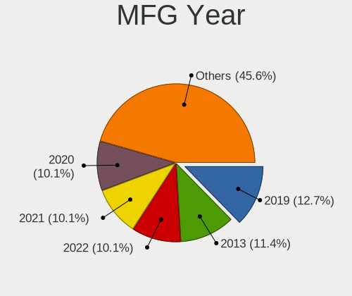
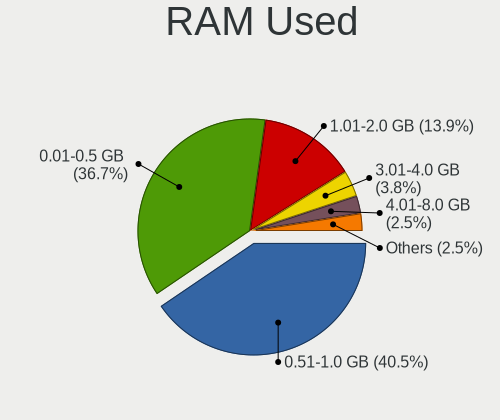
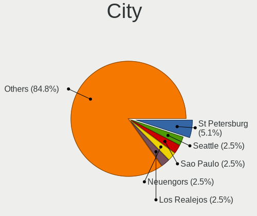
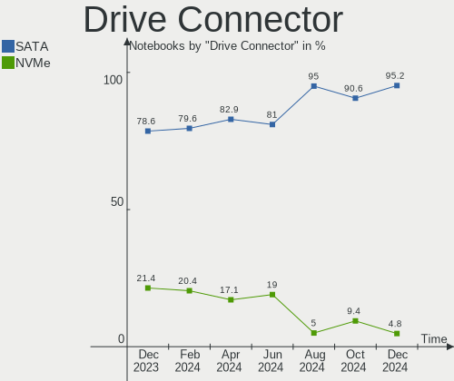
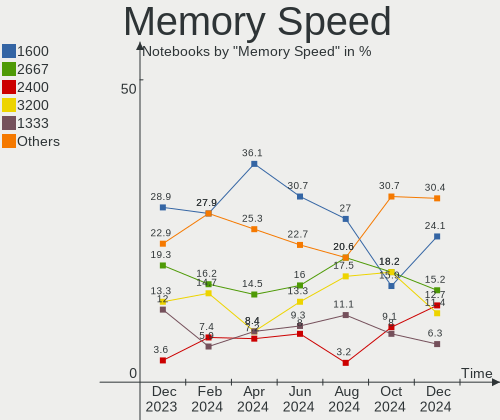

BSD Hardware Trends (Notebooks)
-------------------------------

A project to identify most popular hardware characteristics and track their change
over time based on data collected by BSD users at https://BSD-Hardware.info.

Anyone can contribute to this report by the [hw-probe](https://github.com/linuxhw/hw-probe/blob/master/INSTALL.BSD.md) tool:

    hw-probe -all -upload

Full-feature report is available here: https://bsd-hardware.info/?view=trends

Period: Dec, 2021.

Contents
--------

* [ System ](#system)
  - [ OS                       ](#os)
  - [ OS Family                ](#os-family)
  - [ Arch                     ](#arch)
  - [ DE                       ](#de)
  - [ Display Server           ](#display-server)
  - [ Display Manager          ](#display-manager)
  - [ OS Lang                  ](#os-lang)
  - [ Boot Mode                ](#boot-mode)
  - [ Filesystem               ](#filesystem)
  - [ Part. scheme             ](#part-scheme)

* [ Board ](#board)
  - [ Vendor                   ](#vendor)
  - [ Model                    ](#model)
  - [ Model Family             ](#model-family)
  - [ MFG Year                 ](#mfg-year)
  - [ Form Factor              ](#form-factor)
  - [ Coreboot                 ](#coreboot)
  - [ RAM Size                 ](#ram-size)
  - [ RAM Used                 ](#ram-used)
  - [ Total Drives             ](#total-drives)
  - [ Has CD-ROM               ](#has-cd-rom)
  - [ Has Ethernet             ](#has-ethernet)
  - [ Has WiFi                 ](#has-wifi)
  - [ Has Bluetooth            ](#has-bluetooth)

* [ Location ](#location)
  - [ Country                  ](#country)
  - [ City                     ](#city)

* [ Drives ](#drives)
  - [ Drive Vendor             ](#drive-vendor)
  - [ Drive Model              ](#drive-model)
  - [ HDD Vendor               ](#hdd-vendor)
  - [ SSD Vendor               ](#ssd-vendor)
  - [ Drive Kind               ](#drive-kind)
  - [ Drive Connector          ](#drive-connector)
  - [ Drive Size               ](#drive-size)
  - [ Space Total              ](#space-total)
  - [ Space Used               ](#space-used)
  - [ Malfunc. Drives          ](#malfunc-drives)
  - [ Malfunc. Drive Vendor    ](#malfunc-drive-vendor)
  - [ Malfunc. HDD Vendor      ](#malfunc-hdd-vendor)
  - [ Malfunc. Drive Kind      ](#malfunc-drive-kind)
  - [ Failed Drives            ](#failed-drives)
  - [ Failed Drive Vendor      ](#failed-drive-vendor)
  - [ Drive Status             ](#drive-status)

* [ Storage controller ](#storage-controller)
  - [ Storage Vendor           ](#storage-vendor)
  - [ Storage Model            ](#storage-model)
  - [ Storage Kind             ](#storage-kind)

* [ Processor ](#processor)
  - [ CPU Vendor               ](#cpu-vendor)
  - [ CPU Model                ](#cpu-model)
  - [ CPU Model Family         ](#cpu-model-family)
  - [ CPU Cores                ](#cpu-cores)
  - [ CPU Sockets              ](#cpu-sockets)
  - [ CPU Threads              ](#cpu-threads)
  - [ CPU Microarch            ](#cpu-microarch)

* [ Graphics ](#graphics)
  - [ GPU Vendor               ](#gpu-vendor)
  - [ GPU Model                ](#gpu-model)
  - [ GPU Combo                ](#gpu-combo)
  - [ GPU Driver               ](#gpu-driver)
  - [ GPU Memory               ](#gpu-memory)

* [ Monitor ](#monitor)
  - [ Monitor Vendor           ](#monitor-vendor)
  - [ Monitor Model            ](#monitor-model)
  - [ Monitor Resolution       ](#monitor-resolution)
  - [ Monitor Diagonal         ](#monitor-diagonal)
  - [ Monitor Width            ](#monitor-width)
  - [ Aspect Ratio             ](#aspect-ratio)
  - [ Monitor Area             ](#monitor-area)
  - [ Pixel Density            ](#pixel-density)
  - [ Multiple Monitors        ](#multiple-monitors)

* [ Network ](#network)
  - [ Net Controller Vendor    ](#net-controller-vendor)
  - [ Net Controller Model     ](#net-controller-model)
  - [ Wireless Vendor          ](#wireless-vendor)
  - [ Wireless Model           ](#wireless-model)
  - [ Ethernet Vendor          ](#ethernet-vendor)
  - [ Ethernet Model           ](#ethernet-model)
  - [ Net Controller Kind      ](#net-controller-kind)
  - [ Used Controller          ](#used-controller)
  - [ NICs                     ](#nics)
  - [ IPv6                     ](#ipv6)

* [ Bluetooth ](#bluetooth)
  - [ Bluetooth Vendor         ](#bluetooth-vendor)
  - [ Bluetooth Model          ](#bluetooth-model)

* [ Sound ](#sound)
  - [ Sound Vendor             ](#sound-vendor)
  - [ Sound Model              ](#sound-model)

* [ Memory ](#memory)
  - [ Memory Vendor            ](#memory-vendor)
  - [ Memory Model             ](#memory-model)
  - [ Memory Kind              ](#memory-kind)
  - [ Memory Form Factor       ](#memory-form-factor)
  - [ Memory Size              ](#memory-size)
  - [ Memory Speed             ](#memory-speed)

* [ Printers & scanners ](#printers--scanners)
  - [ Printer Vendor           ](#printer-vendor)
  - [ Printer Model            ](#printer-model)
  - [ Scanner Vendor           ](#scanner-vendor)
  - [ Scanner Model            ](#scanner-model)

* [ Camera ](#camera)
  - [ Camera Vendor            ](#camera-vendor)
  - [ Camera Model             ](#camera-model)

* [ Security ](#security)
  - [ Fingerprint Vendor       ](#fingerprint-vendor)
  - [ Fingerprint Model        ](#fingerprint-model)
  - [ Chipcard Vendor          ](#chipcard-vendor)
  - [ Chipcard Model           ](#chipcard-model)

* [ Unsupported ](#unsupported)
  - [ Unsupported Devices      ](#unsupported-devices)
  - [ Unsupported Device Types ](#unsupported-device-types)

System
------

OS
--

Installed operating systems

| Name                   | Notebooks | Percent |
|------------------------|-----------|---------|
| helloSystem 0.7.0      | 24        | 28.92%  |
| OpenBSD 7.0            | 11        | 13.25%  |
| helloSystem 0.6.0      | 10        | 12.05%  |
| FreeBSD 13.0-p5        | 8         | 9.64%   |
| FreeBSD 14.0-CURRENT   | 5         | 6.02%   |
| FreeBSD 13.0-STABLE    | 5         | 6.02%   |
| OPNsense 21.7.7        | 4         | 4.82%   |
| OPNsense 21.7.6        | 4         | 4.82%   |
| GhostBSD 21.08.27      | 3         | 3.61%   |
| helloSystem 0.5.0      | 2         | 2.41%   |
| FreeBSD 13.0-p4        | 2         | 2.41%   |
| OPNsense 22.1          | 1         | 1.2%    |
| OPNsense 12.1-p21-HBSD | 1         | 1.2%    |
| OPNsense 12.1-p19-HBSD | 1         | 1.2%    |
| NomadBSD 5806f915      | 1         | 1.2%    |
| FreeBSD 13.0           | 1         | 1.2%    |

OS Family
---------

OS without a version

| Name        | Notebooks | Percent |
|-------------|-----------|---------|
| helloSystem | 36        | 43.37%  |
| FreeBSD     | 21        | 25.3%   |
| OPNsense    | 11        | 13.25%  |
| OpenBSD     | 11        | 13.25%  |
| GhostBSD    | 3         | 3.61%   |
| NomadBSD    | 1         | 1.2%    |

Arch
----

OS architecture (x86_64, i586, etc.)

| Name  | Notebooks | Percent |
|-------|-----------|---------|
| amd64 | 82        | 98.8%   |
| i386  | 1         | 1.2%    |

DE
--

Desktop Environment

| Name         | Notebooks | Percent |
|--------------|-----------|---------|
| helloDesktop | 36        | 43.37%  |
| Console      | 14        | 16.87%  |
| fvwm         | 9         | 10.84%  |
| XFCE         | 7         | 8.43%   |
| KDE5         | 6         | 7.23%   |
| TWM          | 4         | 4.82%   |
| MATE         | 2         | 2.41%   |
| i3           | 2         | 2.41%   |
| Openbox      | 1         | 1.2%    |
| LXQt         | 1         | 1.2%    |
| Fluxbox      | 1         | 1.2%    |

Display Server
--------------

X11 or Wayland

| Name    | Notebooks | Percent |
|---------|-----------|---------|
| X11     | 68        | 81.93%  |
| Console | 15        | 18.07%  |

Display Manager
---------------

SDDM, LightDM, etc.

| Name    | Notebooks | Percent |
|---------|-----------|---------|
| SLiM    | 42        | 50.6%   |
| Console | 30        | 36.14%  |
| LightDM | 5         | 6.02%   |
| SDDM    | 4         | 4.82%   |
| XDM     | 2         | 2.41%   |

OS Lang
-------

Language

| Lang    | Notebooks | Percent |
|---------|-----------|---------|
| en_US   | 39        | 46.99%  |
| Unknown | 20        | 24.1%   |
| C       | 18        | 21.69%  |
| zh_CN   | 2         | 2.41%   |
| fr_FR   | 2         | 2.41%   |
| en_GB   | 1         | 1.2%    |
| en_CA   | 1         | 1.2%    |

Boot Mode
---------

EFI or BIOS

| Mode | Notebooks | Percent |
|------|-----------|---------|
| EFI  | 71        | 85.54%  |
| BIOS | 12        | 14.46%  |

Filesystem
----------

Type of filesystem

| Type   | Notebooks | Percent |
|--------|-----------|---------|
| Zfs    | 38        | 45.78%  |
| Ufs    | 18        | 21.69%  |
| Cd9660 | 16        | 19.28%  |
| Ffs    | 11        | 13.25%  |

Part. scheme
------------

Scheme of partitioning

| Type | Notebooks | Percent |
|------|-----------|---------|
| GPT  | 74        | 89.16%  |
| MBR  | 9         | 10.84%  |

Board
-----

Vendor
------

Motherboard manufacturer

| Name                | Notebooks | Percent |
|---------------------|-----------|---------|
| Lenovo              | 27        | 32.53%  |
| Hewlett-Packard     | 11        | 13.25%  |
| ASUSTek Computer    | 10        | 12.05%  |
| Dell                | 5         | 6.02%   |
| Deciso              | 5         | 6.02%   |
| Acer                | 5         | 6.02%   |
| Unknown             | 4         | 4.82%   |
| Toshiba             | 3         | 3.61%   |
| Samsung Electronics | 3         | 3.61%   |
| TOXIC by BTO        | 1         | 1.2%    |
| Positivo            | 1         | 1.2%    |
| Philco              | 1         | 1.2%    |
| Packard Bell        | 1         | 1.2%    |
| Intel               | 1         | 1.2%    |
| HUAWEI              | 1         | 1.2%    |
| Fujitsu             | 1         | 1.2%    |
| Framework           | 1         | 1.2%    |
| Casper              | 1         | 1.2%    |
| Apple               | 1         | 1.2%    |

Model
-----

Motherboard model

| Name                                       | Notebooks | Percent |
|--------------------------------------------|-----------|---------|
| Unknown                                    | 4         | 4.82%   |
| Deciso Netboard A20                        | 3         | 3.61%   |
| Deciso DEC2700 - OPNsense Appliance        | 2         | 2.41%   |
| TOXIC by BTO 15CL872 1050TI                | 1         | 1.2%    |
| Toshiba Satellite P755                     | 1         | 1.2%    |
| Toshiba Satellite L550                     | 1         | 1.2%    |
| Toshiba Satellite C50-B                    | 1         | 1.2%    |
| Samsung R720                               | 1         | 1.2%    |
| Samsung 530XBB                             | 1         | 1.2%    |
| Samsung 305E4A/305E5A/305E7A               | 1         | 1.2%    |
| Positivo C14CR01                           | 1         | 1.2%    |
| Philco 10B                                 | 1         | 1.2%    |
| Packard Bell EasyNote_MX61-B-038           | 1         | 1.2%    |
| Lenovo ThinkPad X61 7675H7U                | 1         | 1.2%    |
| Lenovo ThinkPad X280 20KF001UUS            | 1         | 1.2%    |
| Lenovo ThinkPad X270 W10DG 20K5S0BM01      | 1         | 1.2%    |
| Lenovo ThinkPad X270 20HMCTO1WW            | 1         | 1.2%    |
| Lenovo ThinkPad X250 20CLS1WP01            | 1         | 1.2%    |
| Lenovo ThinkPad X220 42915CG               | 1         | 1.2%    |
| Lenovo ThinkPad X1 Carbon Gen 9 20XWCTO1WW | 1         | 1.2%    |
| Lenovo ThinkPad T590 20N4CTO1WW            | 1         | 1.2%    |
| Lenovo ThinkPad T480 20L5S1S000            | 1         | 1.2%    |
| Lenovo ThinkPad T470s 20HGS18V00           | 1         | 1.2%    |
| Lenovo ThinkPad T460 20FMS75800            | 1         | 1.2%    |
| Lenovo ThinkPad T440p 20AW007QMS           | 1         | 1.2%    |
| Lenovo ThinkPad T430s 2356JH4              | 1         | 1.2%    |
| Lenovo ThinkPad T420s 41742BU              | 1         | 1.2%    |
| Lenovo ThinkPad T410 2537EA8               | 1         | 1.2%    |
| Lenovo ThinkPad SL510 2847R96              | 1         | 1.2%    |
| Lenovo ThinkPad L470 20J40013US            | 1         | 1.2%    |
| Lenovo ThinkPad Edge E430 3254A68          | 1         | 1.2%    |
| Lenovo ThinkPad E580 20KS005BRI            | 1         | 1.2%    |
| Lenovo ThinkPad A285 20MW000JMH            | 1         | 1.2%    |
| Lenovo ThinkPad 13 20GJCTO1WW              | 1         | 1.2%    |
| Lenovo ThinkBook 14 G3 ACL 21A2            | 1         | 1.2%    |
| Lenovo IdeaPad 510-15IKB 80SV              | 1         | 1.2%    |
| Lenovo IdeaPad 330-15IGM 81D1              | 1         | 1.2%    |
| Lenovo IdeaPad 330-15ARR 81D2              | 1         | 1.2%    |
| Lenovo IdeaPad 320S-13IKB 81AK             | 1         | 1.2%    |
| Lenovo G500 20236                          | 1         | 1.2%    |
| Intel SharkBay Platform                    | 1         | 1.2%    |
| HUAWEI KLVL-WXX9                           | 1         | 1.2%    |
| HP ZBook Studio G4                         | 1         | 1.2%    |
| HP ProBook 655 G1                          | 1         | 1.2%    |
| HP ProBook 650 G5                          | 1         | 1.2%    |
| HP ProBook 440 G6                          | 1         | 1.2%    |
| HP Pavilion Gaming Laptop 16-a0xxx         | 1         | 1.2%    |
| HP Laptop 15-dw0xxx                        | 1         | 1.2%    |
| HP EliteBook Folio 9470m                   | 1         | 1.2%    |
| HP EliteBook 8570p                         | 1         | 1.2%    |
| HP EliteBook 2560p                         | 1         | 1.2%    |
| HP Compaq 15                               | 1         | 1.2%    |
| HP 15 Notebook PC                          | 1         | 1.2%    |
| Fujitsu LIFEBOOK A555                      | 1         | 1.2%    |
| Framework Laptop                           | 1         | 1.2%    |
| Dell Precision M4300                       | 1         | 1.2%    |
| Dell Latitude E6540                        | 1         | 1.2%    |
| Dell Latitude E5470                        | 1         | 1.2%    |
| Dell Inspiron 3521                         | 1         | 1.2%    |
| Dell G15 5510                              | 1         | 1.2%    |

Model Family
------------

Motherboard model prefix

| Name                  | Notebooks | Percent |
|-----------------------|-----------|---------|
| Lenovo ThinkPad       | 21        | 25.3%   |
| Lenovo IdeaPad        | 4         | 4.82%   |
| Unknown               | 4         | 4.82%   |
| Toshiba Satellite     | 3         | 3.61%   |
| HP ProBook            | 3         | 3.61%   |
| HP EliteBook          | 3         | 3.61%   |
| Deciso Netboard       | 3         | 3.61%   |
| Acer Aspire           | 3         | 3.61%   |
| Dell Latitude         | 2         | 2.41%   |
| Deciso DEC2700        | 2         | 2.41%   |
| TOXIC by BTO 15CL872  | 1         | 1.2%    |
| Samsung R720          | 1         | 1.2%    |
| Samsung 530XBB        | 1         | 1.2%    |
| Samsung 305E4A        | 1         | 1.2%    |
| Positivo C14CR01      | 1         | 1.2%    |
| Philco 10B            | 1         | 1.2%    |
| Packard Bell EasyNote | 1         | 1.2%    |
| Lenovo ThinkBook      | 1         | 1.2%    |
| Lenovo G500           | 1         | 1.2%    |
| Intel SharkBay        | 1         | 1.2%    |
| HUAWEI KLVL-WXX9      | 1         | 1.2%    |
| HP ZBook              | 1         | 1.2%    |
| HP Pavilion           | 1         | 1.2%    |
| HP Laptop             | 1         | 1.2%    |
| HP Compaq             | 1         | 1.2%    |
| HP 15                 | 1         | 1.2%    |
| Fujitsu LIFEBOOK      | 1         | 1.2%    |
| Framework Laptop      | 1         | 1.2%    |
| Dell Precision        | 1         | 1.2%    |
| Dell Inspiron         | 1         | 1.2%    |
| Dell G15              | 1         | 1.2%    |
| Casper EXCALIBUR      | 1         | 1.2%    |
| ASUS X540LA           | 1         | 1.2%    |
| ASUS X502CA           | 1         | 1.2%    |
| ASUS X202E            | 1         | 1.2%    |
| ASUS UX31A            | 1         | 1.2%    |
| ASUS TUF              | 1         | 1.2%    |
| ASUS S550CA           | 1         | 1.2%    |
| ASUS N56VB            | 1         | 1.2%    |
| ASUS 1215B            | 1         | 1.2%    |
| ASUS 1005P            | 1         | 1.2%    |
| ASUS 1000             | 1         | 1.2%    |
| Apple MacBookAir1     | 1         | 1.2%    |
| Acer TravelMate       | 1         | 1.2%    |
| Acer Swift            | 1         | 1.2%    |

MFG Year
--------

Motherboard manufacture year

| Year | Notebooks | Percent |
|------|-----------|---------|
| 2021 | 21        | 25.3%   |
| 2018 | 11        | 13.25%  |
| 2013 | 9         | 10.84%  |
| 2020 | 8         | 9.64%   |
| 2015 | 6         | 7.23%   |
| 2012 | 6         | 7.23%   |
| 2019 | 5         | 6.02%   |
| 2011 | 4         | 4.82%   |
| 2010 | 3         | 3.61%   |
| 2008 | 3         | 3.61%   |
| 2016 | 2         | 2.41%   |
| 2009 | 2         | 2.41%   |
| 2017 | 1         | 1.2%    |
| 2014 | 1         | 1.2%    |
| 2007 | 1         | 1.2%    |

Form Factor
-----------

Physical design of the computer

| Name     | Notebooks | Percent |
|----------|-----------|---------|
| Notebook | 83        | 100%    |

Coreboot
--------

Have coreboot on board

| Used | Notebooks | Percent |
|------|-----------|---------|
| No   | 83        | 100%    |

RAM Size
--------

Total RAM memory

| Size in GB | Notebooks | Percent |
|------------|-----------|---------|
| 4.01-8.0   | 25        | 30.12%  |
| 8.01-16.0  | 24        | 28.92%  |
| 16.01-24.0 | 22        | 26.51%  |
| 2.01-3.0   | 4         | 4.82%   |
| 32.01-64.0 | 3         | 3.61%   |
| 3.01-4.0   | 2         | 2.41%   |
| 1.01-2.0   | 2         | 2.41%   |
| 24.01-32.0 | 1         | 1.2%    |

RAM Used
--------

Used RAM memory

| Used GB    | Notebooks | Percent |
|------------|-----------|---------|
| 0.01-0.5   | 50        | 60.24%  |
| 0.51-1.0   | 25        | 30.12%  |
| 1.01-2.0   | 7         | 8.43%   |
| 32.01-64.0 | 1         | 1.2%    |

Total Drives
------------

Number of drives on board

| Drives | Notebooks | Percent |
|--------|-----------|---------|
| 1      | 61        | 73.49%  |
| 2      | 18        | 21.69%  |
| 3      | 2         | 2.41%   |
| 0      | 2         | 2.41%   |

Has CD-ROM
----------

Has CD-ROM on board

| Presented | Notebooks | Percent |
|-----------|-----------|---------|
| No        | 63        | 75.9%   |
| Yes       | 20        | 24.1%   |

Has Ethernet
------------

Has Ethernet on board

| Presented | Notebooks | Percent |
|-----------|-----------|---------|
| Yes       | 74        | 89.16%  |
| No        | 9         | 10.84%  |

Has WiFi
--------

Has WiFi module

| Presented | Notebooks | Percent |
|-----------|-----------|---------|
| Yes       | 74        | 89.16%  |
| No        | 9         | 10.84%  |

Has Bluetooth
-------------

Has Bluetooth module

| Presented | Notebooks | Percent |
|-----------|-----------|---------|
| Yes       | 47        | 56.63%  |
| No        | 36        | 43.37%  |

Location
--------

Country
-------

Geographic location (country)

| Country     | Notebooks | Percent |
|-------------|-----------|---------|
| USA         | 14        | 16.87%  |
| Germany     | 8         | 9.64%   |
| France      | 6         | 7.23%   |
| Netherlands | 4         | 4.82%   |
| Italy       | 4         | 4.82%   |
| Ukraine     | 3         | 3.61%   |
| Spain       | 3         | 3.61%   |
| Russia      | 3         | 3.61%   |
| Romania     | 3         | 3.61%   |
| Poland      | 3         | 3.61%   |
| Canada      | 3         | 3.61%   |
| Brazil      | 3         | 3.61%   |
| UK          | 2         | 2.41%   |
| Switzerland | 2         | 2.41%   |
| Indonesia   | 2         | 2.41%   |
| Denmark     | 2         | 2.41%   |
| China       | 2         | 2.41%   |
| Bulgaria    | 2         | 2.41%   |
| Austria     | 2         | 2.41%   |
| Vietnam     | 1         | 1.2%    |
| Slovakia    | 1         | 1.2%    |
| Portugal    | 1         | 1.2%    |
| Peru        | 1         | 1.2%    |
| Norway      | 1         | 1.2%    |
| Mexico      | 1         | 1.2%    |
| Japan       | 1         | 1.2%    |
| Ireland     | 1         | 1.2%    |
| India       | 1         | 1.2%    |
| Hungary     | 1         | 1.2%    |
| Czechia     | 1         | 1.2%    |
| Cuba        | 1         | 1.2%    |

City
----

Geographic location (city)

| City                 | Notebooks | Percent |
|----------------------|-----------|---------|
| Warsaw               | 2         | 2.41%   |
| Paris                | 2         | 2.41%   |
| Maraba               | 2         | 2.41%   |
| Amsterdam            | 2         | 2.41%   |
| Zwickau              | 1         | 1.2%    |
| Zurich               | 1         | 1.2%    |
| Zaporizhzhya         | 1         | 1.2%    |
| Yekaterinburg        | 1         | 1.2%    |
| Vienna               | 1         | 1.2%    |
| Vancouver            | 1         | 1.2%    |
| Ugarchin             | 1         | 1.2%    |
| Udine                | 1         | 1.2%    |
| Tula de Allende      | 1         | 1.2%    |
| Trieste              | 1         | 1.2%    |
| Toronto              | 1         | 1.2%    |
| Torokszentmiklos     | 1         | 1.2%    |
| Tarragona            | 1         | 1.2%    |
| Tangerang            | 1         | 1.2%    |
| Suceava              | 1         | 1.2%    |
| Stara Zagora         | 1         | 1.2%    |
| Sevastopol           | 1         | 1.2%    |
| Seattle              | 1         | 1.2%    |
| Schofield            | 1         | 1.2%    |
| Sao Vicente          | 1         | 1.2%    |
| San Diego            | 1         | 1.2%    |
| San Antonio          | 1         | 1.2%    |
| Sakitama             | 1         | 1.2%    |
| Saint-Laurent        | 1         | 1.2%    |
| Rome                 | 1         | 1.2%    |
| Pruszcz Gdanski      | 1         | 1.2%    |
| Prague               | 1         | 1.2%    |
| Plano                | 1         | 1.2%    |
| Patterson            | 1         | 1.2%    |
| Palmer               | 1         | 1.2%    |
| Padova               | 1         | 1.2%    |
| Pacierzow            | 1         | 1.2%    |
| Nogent-sur-Marne     | 1         | 1.2%    |
| Nizhniy Novgorod     | 1         | 1.2%    |
| New York             | 1         | 1.2%    |
| New Delhi            | 1         | 1.2%    |
| Nesttun              | 1         | 1.2%    |
| Munich               | 1         | 1.2%    |
| Mountain View        | 1         | 1.2%    |
| Moscow               | 1         | 1.2%    |
| Montgeron            | 1         | 1.2%    |
| Merseburg            | 1         | 1.2%    |
| Memphis              | 1         | 1.2%    |
| Maria Enzersdorf     | 1         | 1.2%    |
| Madrid               | 1         | 1.2%    |
| Longfield            | 1         | 1.2%    |
| London               | 1         | 1.2%    |
| Liptovsk?? Mikul???? | 1         | 1.2%    |
| Lima                 | 1         | 1.2%    |
| Lasby                | 1         | 1.2%    |
| Kyiv                 | 1         | 1.2%    |
| Jakarta              | 1         | 1.2%    |
| Hyattsville          | 1         | 1.2%    |
| Hvidovre             | 1         | 1.2%    |
| Hoogeveen            | 1         | 1.2%    |
| Hohhot               | 1         | 1.2%    |

Drives
------

Drive Vendor
------------

Hard drive vendors

| Vendor              | Notebooks | Drives | Percent |
|---------------------|-----------|--------|---------|
| Samsung Electronics | 17        | 18     | 17.53%  |
| WDC                 | 13        | 14     | 13.4%   |
| Toshiba             | 9         | 9      | 9.28%   |
| Kingston            | 8         | 9      | 8.25%   |
| Seagate             | 7         | 7      | 7.22%   |
| Transcend           | 6         | 6      | 6.19%   |
| SanDisk             | 5         | 5      | 5.15%   |
| Intel               | 4         | 5      | 4.12%   |
| HGST                | 4         | 4      | 4.12%   |
| Crucial             | 4         | 4      | 4.12%   |
| NVMe                | 3         | 3      | 3.09%   |
| SK Hynix            | 2         | 2      | 2.06%   |
| Hitachi             | 2         | 2      | 2.06%   |
| V-GeN               | 1         | 1      | 1.03%   |
| SSSTC               | 1         | 1      | 1.03%   |
| PLEXTOR             | 1         | 1      | 1.03%   |
| Netac               | 1         | 1      | 1.03%   |
| Micron Technology   | 1         | 1      | 1.03%   |
| Kston               | 1         | 1      | 1.03%   |
| KingSpec            | 1         | 1      | 1.03%   |
| Integral            | 1         | 1      | 1.03%   |
| Hoodisk             | 1         | 1      | 1.03%   |
| Hewlett-Packard     | 1         | 1      | 1.03%   |
| FORESEE             | 1         | 1      | 1.03%   |
| ASUSTek Computer    | 1         | 2      | 1.03%   |
| A-DATA Technology   | 1         | 1      | 1.03%   |

Drive Model
-----------

Hard drive models

| Model                                | Notebooks | Percent |
|--------------------------------------|-----------|---------|
| Transcend TS256GMTS952T2 256GB       | 3         | 3%      |
| Transcend TS256GMTE652T2 256GB       | 2         | 2%      |
| Toshiba MQ01ABF050 500GB             | 2         | 2%      |
| Toshiba MK2556GSY 250GB              | 2         | 2%      |
| Samsung MZVLW256HEHP-000L7 256GB     | 2         | 2%      |
| Kingston SA400S37960G 960GB          | 2         | 2%      |
| Kingston SA400S37120G 120GB          | 2         | 2%      |
| HGST HTS545050A7E680 500GB           | 2         | 2%      |
| Crucial CT500MX500SSD1 500GB         | 2         | 2%      |
| WDC WDS500G3X0C-00SJG0 500GB         | 1         | 1%      |
| WDC WDS500G2B0C-00PXH0 500GB         | 1         | 1%      |
| WDC WDS480G2G0B-00EPW0 480GB         | 1         | 1%      |
| WDC WDS120G2G0A-00JH30 120GB         | 1         | 1%      |
| WDC WDS100T3X0C-00SJG0 1TB           | 1         | 1%      |
| WDC WDBNCE5000PNC 500GB              | 1         | 1%      |
| WDC WD5000LPLX-60ZNTT1 500GB         | 1         | 1%      |
| WDC WD5000LPCX-24VHAT0 500GB         | 1         | 1%      |
| WDC WD5000BPVT-22HXZT3 500GB         | 1         | 1%      |
| WDC WD1600BEVT-22A23T0 160GB         | 1         | 1%      |
| WDC WD1200BEVS-07RST0 120GB          | 1         | 1%      |
| WDC WD10SPZX-60Z10T0 1TB             | 1         | 1%      |
| WDC PC SN730 SDBQNTY-1T00-1001 1TB   | 1         | 1%      |
| WDC PC SN530 SDBPMPZ-512G-1101 512GB | 1         | 1%      |
| V-GeN V-GEN06SM21AR512MTNV 512GB     | 1         | 1%      |
| Transcend TS120GMTS420S 120GB        | 1         | 1%      |
| Toshiba TR200 240GB                  | 1         | 1%      |
| Toshiba MQ01ABD100 1TB               | 1         | 1%      |
| Toshiba MQ01ABD075 752GB             | 1         | 1%      |
| Toshiba MQ01ABD050 500GB             | 1         | 1%      |
| Toshiba MK3261GSYN 320GB             | 1         | 1%      |
| SSSTC CVB-8D128-HP 128GB             | 1         | 1%      |
| SK Hynix HFS256G39TND-N210A 256GB    | 1         | 1%      |
| SK Hynix HFS128G32TNF-N3A0A 128GB    | 1         | 1%      |
| Seagate ST980813AS 80GB              | 1         | 1%      |
| Seagate ST9500420AS 500GB            | 1         | 1%      |
| Seagate ST9320423AS 320GB            | 1         | 1%      |
| Seagate ST9160821AS 160GB            | 1         | 1%      |
| Seagate ST500LT012-9WS142 500GB      | 1         | 1%      |
| Seagate ST320LT012-9WS14C 320GB      | 1         | 1%      |
| Seagate ST1000LM024 HN-M101MBB 1TB   | 1         | 1%      |
| SanDisk Ultra II 480GB               | 1         | 1%      |
| SanDisk SDSSDH3 512G                 | 1         | 1%      |
| SanDisk SD8TB8U512G1001 512GB        | 1         | 1%      |
| SanDisk SD6SB1M064G 64GB             | 1         | 1%      |
| SanDisk SD5SE2256G1002E 256GB        | 1         | 1%      |
| Samsung SSD 980 PRO 1TB              | 1         | 1%      |
| Samsung SSD 970 PRO 512GB            | 1         | 1%      |
| Samsung SSD 970 EVO Plus 2TB         | 1         | 1%      |
| Samsung SSD 970 EVO 500GB            | 1         | 1%      |
| Samsung SSD 860 EVO 500GB            | 1         | 1%      |
| Samsung SSD 850 EVO 500GB            | 1         | 1%      |
| Samsung SSD 840 PRO Series 128GB     | 1         | 1%      |
| Samsung MZVLW128HEGR-000L2 128GB     | 1         | 1%      |
| Samsung MZVLB512HAJQ-000H1 512GB     | 1         | 1%      |
| Samsung MZVL21T0HCLR-00BL7 1TB       | 1         | 1%      |
| Samsung MZNLN512HMJP-000L7 512GB     | 1         | 1%      |
| Samsung MZNLN256HMHQ-000H7 256GB     | 1         | 1%      |
| Samsung MZ7TY256HDHP-000L7 256GB     | 1         | 1%      |
| Samsung MZ7TE128HMGR-000L1 128GB     | 1         | 1%      |
| Samsung HS082HB 80GB                 | 1         | 1%      |

HDD Vendor
----------

Hard disk drive vendors

| Vendor              | Notebooks | Drives | Percent |
|---------------------|-----------|--------|---------|
| Toshiba             | 8         | 8      | 27.59%  |
| Seagate             | 7         | 7      | 24.14%  |
| WDC                 | 6         | 6      | 20.69%  |
| HGST                | 4         | 4      | 13.79%  |
| Hitachi             | 2         | 2      | 6.9%    |
| Samsung Electronics | 1         | 1      | 3.45%   |
| NVMe                | 1         | 1      | 3.45%   |

SSD Vendor
----------

Solid state drive vendors

| Vendor              | Notebooks | Drives | Percent |
|---------------------|-----------|--------|---------|
| Samsung Electronics | 7         | 7      | 14.89%  |
| Kingston            | 6         | 7      | 12.77%  |
| SanDisk             | 5         | 5      | 10.64%  |
| Transcend           | 4         | 4      | 8.51%   |
| Crucial             | 4         | 4      | 8.51%   |
| WDC                 | 3         | 3      | 6.38%   |
| SK Hynix            | 2         | 2      | 4.26%   |
| Intel               | 2         | 2      | 4.26%   |
| Toshiba             | 1         | 1      | 2.13%   |
| SSSTC               | 1         | 1      | 2.13%   |
| PLEXTOR             | 1         | 1      | 2.13%   |
| NVMe                | 1         | 1      | 2.13%   |
| Netac               | 1         | 1      | 2.13%   |
| Micron Technology   | 1         | 1      | 2.13%   |
| Kston               | 1         | 1      | 2.13%   |
| KingSpec            | 1         | 1      | 2.13%   |
| Integral            | 1         | 1      | 2.13%   |
| Hoodisk             | 1         | 1      | 2.13%   |
| Hewlett-Packard     | 1         | 1      | 2.13%   |
| FORESEE             | 1         | 1      | 2.13%   |
| ASUSTek Computer    | 1         | 2      | 2.13%   |
| A-DATA Technology   | 1         | 1      | 2.13%   |

Drive Kind
----------

HDD or SSD

| Kind | Notebooks | Drives | Percent |
|------|-----------|--------|---------|
| SSD  | 42        | 49     | 47.19%  |
| HDD  | 27        | 29     | 30.34%  |
| NVMe | 20        | 24     | 22.47%  |

Drive Connector
---------------

SATA, SAS, NVMe, etc.

| Type | Notebooks | Drives | Percent |
|------|-----------|--------|---------|
| SATA | 65        | 78     | 76.47%  |
| NVMe | 20        | 24     | 23.53%  |

Drive Size
----------

Size of hard drive

| Size in TB | Notebooks | Drives | Percent |
|------------|-----------|--------|---------|
| 0.01-0.5   | 57        | 66     | 82.61%  |
| 0.51-1.0   | 12        | 12     | 17.39%  |

Space Total
-----------

Amount of disk space available on the file system

| Size in GB | Notebooks | Percent |
|------------|-----------|---------|
| 101-250    | 24        | 28.92%  |
| 1-20       | 22        | 26.51%  |
| 251-500    | 20        | 24.1%   |
| 501-1000   | 7         | 8.43%   |
| 51-100     | 6         | 7.23%   |
| 21-50      | 3         | 3.61%   |
| Unknown    | 1         | 1.2%    |

Space Used
----------

Amount of used disk space

| Used GB | Notebooks | Percent |
|---------|-----------|---------|
| 1-20    | 76        | 91.57%  |
| 21-50   | 3         | 3.61%   |
| 101-250 | 2         | 2.41%   |
| 51-100  | 1         | 1.2%    |
| Unknown | 1         | 1.2%    |

Malfunc. Drives
---------------

Drive models with a malfunction

| Model                            | Notebooks | Drives | Percent |
|----------------------------------|-----------|--------|---------|
| WDC WD5000LPLX-60ZNTT1 500GB     | 1         | 1      | 5.56%   |
| WDC WD5000BPVT-22HXZT3 500GB     | 1         | 1      | 5.56%   |
| WDC WD10SPZX-60Z10T0 1TB         | 1         | 1      | 5.56%   |
| Toshiba MQ01ABD100 1TB           | 1         | 1      | 5.56%   |
| Toshiba MQ01ABD075 752GB         | 1         | 1      | 5.56%   |
| Toshiba MQ01ABD050 500GB         | 1         | 1      | 5.56%   |
| Toshiba MK3261GSYN 320GB         | 1         | 1      | 5.56%   |
| SSSTC CVB-8D128-HP 128GB         | 1         | 1      | 5.56%   |
| Seagate ST9500420AS 500GB        | 1         | 1      | 5.56%   |
| Seagate ST9320423AS 320GB        | 1         | 1      | 5.56%   |
| Seagate ST9160821AS 160GB        | 1         | 1      | 5.56%   |
| Seagate ST500LT012-9WS142 500GB  | 1         | 1      | 5.56%   |
| Seagate ST320LT012-9WS14C 320GB  | 1         | 1      | 5.56%   |
| SanDisk SD5SE2256G1002E 256GB    | 1         | 1      | 5.56%   |
| Samsung Electronics HS082HB 80GB | 1         | 1      | 5.56%   |
| Hitachi HTS722010K9SA00 100GB    | 1         | 1      | 5.56%   |
| HGST HTS721010A9E630 1TB         | 1         | 1      | 5.56%   |
| HGST HTS545050A7E680 500GB       | 1         | 1      | 5.56%   |

Malfunc. Drive Vendor
---------------------

Vendors of faulty drives

| Vendor              | Notebooks | Drives | Percent |
|---------------------|-----------|--------|---------|
| Seagate             | 5         | 5      | 27.78%  |
| Toshiba             | 4         | 4      | 22.22%  |
| WDC                 | 3         | 3      | 16.67%  |
| HGST                | 2         | 2      | 11.11%  |
| SSSTC               | 1         | 1      | 5.56%   |
| SanDisk             | 1         | 1      | 5.56%   |
| Samsung Electronics | 1         | 1      | 5.56%   |
| Hitachi             | 1         | 1      | 5.56%   |

Malfunc. HDD Vendor
-------------------

Vendors of faulty HDD drives

| Vendor              | Notebooks | Drives | Percent |
|---------------------|-----------|--------|---------|
| Seagate             | 5         | 5      | 31.25%  |
| Toshiba             | 4         | 4      | 25%     |
| WDC                 | 3         | 3      | 18.75%  |
| HGST                | 2         | 2      | 12.5%   |
| Samsung Electronics | 1         | 1      | 6.25%   |
| Hitachi             | 1         | 1      | 6.25%   |

Malfunc. Drive Kind
-------------------

Kinds of faulty drives

| Kind | Notebooks | Drives | Percent |
|------|-----------|--------|---------|
| HDD  | 16        | 16     | 88.89%  |
| SSD  | 2         | 2      | 11.11%  |

Failed Drives
-------------

Failed drive models

Zero info for selected period =(

Failed Drive Vendor
-------------------

Failed drive vendors

Zero info for selected period =(

Drive Status
------------

Number of failed and malfunc. drives

| Status   | Notebooks | Drives | Percent |
|----------|-----------|--------|---------|
| Works    | 64        | 79     | 74.42%  |
| Malfunc  | 18        | 18     | 20.93%  |
| Detected | 4         | 5      | 4.65%   |

Storage controller
------------------

Storage Vendor
--------------

Storage controller vendors

| Vendor                      | Notebooks | Percent |
|-----------------------------|-----------|---------|
| Intel                       | 61        | 64.89%  |
| AMD                         | 12        | 12.77%  |
| Samsung Electronics         | 9         | 9.57%   |
| Sandisk                     | 6         | 6.38%   |
| Kingston Technology Company | 2         | 2.13%   |
| Unknown                     | 2         | 2.13%   |
| Silicon Motion              | 1         | 1.06%   |
| KIOXIA                      | 1         | 1.06%   |

Storage Model
-------------

Storage controller models

| Model                                                                            | Notebooks | Percent |
|----------------------------------------------------------------------------------|-----------|---------|
| Intel 7 Series Chipset Family 6-port SATA Controller [AHCI mode]                 | 11        | 11.22%  |
| AMD FCH SATA Controller [AHCI mode]                                              | 10        | 10.2%   |
| Intel Sunrise Point-LP SATA Controller [AHCI mode]                               | 8         | 8.16%   |
| Intel 6 Series/C200 Series Chipset Family 6 port Mobile SATA AHCI Controller     | 7         | 7.14%   |
| Samsung NVMe SSD Controller SM981/PM981/PM983                                    | 4         | 4.08%   |
| Intel 8 Series SATA Controller 1 [AHCI mode]                                     | 4         | 4.08%   |
| Unknown                                                                          | 4         | 4.08%   |
| Sandisk WD Black SN750 / PC SN730 NVMe SSD                                       | 3         | 3.06%   |
| Samsung NVMe SSD Controller SM961/PM961/SM963                                    | 3         | 3.06%   |
| Intel Wildcat Point-LP SATA Controller [AHCI Mode]                               | 3         | 3.06%   |
| Intel Celeron/Pentium Silver Processor SATA Controller                           | 3         | 3.06%   |
| Samsung NVMe SSD Controller PM9A1/PM9A3/980PRO                                   | 2         | 2.04%   |
| Intel SSD Pro 7600p/760p/E 6100p Series                                          | 2         | 2.04%   |
| Intel NM10/ICH7 Family SATA Controller [AHCI mode]                               | 2         | 2.04%   |
| Intel Cannon Point-LP SATA Controller [AHCI Mode]                                | 2         | 2.04%   |
| Intel Cannon Lake Mobile PCH SATA AHCI Controller                                | 2         | 2.04%   |
| Intel 82801IBM/IEM (ICH9M/ICH9M-E) 4 port SATA Controller [AHCI mode]            | 2         | 2.04%   |
| Intel 82801HM/HEM (ICH8M/ICH8M-E) SATA Controller [AHCI mode]                    | 2         | 2.04%   |
| Intel 82801HM/HEM (ICH8M/ICH8M-E) IDE Controller                                 | 2         | 2.04%   |
| Intel 8 Series/C220 Series Chipset Family 6-port SATA Controller 1 [AHCI mode]   | 2         | 2.04%   |
| Intel 5 Series/3400 Series Chipset 4 port SATA AHCI Controller                   | 2         | 2.04%   |
| Silicon Motion SM2262/SM2262EN SSD Controller                                    | 1         | 1.02%   |
| Sandisk WD Blue SN550 NVMe SSD                                                   | 1         | 1.02%   |
| Sandisk unknown                                                                  | 1         | 1.02%   |
| KIOXIA NVMe SSD                                                                  | 1         | 1.02%   |
| Kingston Company U-SNS8154P3 NVMe SSD                                            | 1         | 1.02%   |
| Intel Q170/Q150/B150/H170/H110/Z170/CM236 Chipset SATA Controller [AHCI Mode]    | 1         | 1.02%   |
| Intel Atom/Celeron/Pentium Processor x5-E8000/J3xxx/N3xxx Series SATA Controller | 1         | 1.02%   |
| Intel Atom Processor E3800 Series SATA AHCI Controller                           | 1         | 1.02%   |
| Intel 82801HM/HEM (ICH8M/ICH8M-E) SATA Controller [IDE mode]                     | 1         | 1.02%   |
| Intel 82801GBM/GHM (ICH7-M Family) SATA Controller [IDE mode]                    | 1         | 1.02%   |
| Intel 82801 Mobile SATA Controller [RAID mode]                                   | 1         | 1.02%   |
| Intel 7 Series Chipset Family 4-port SATA Controller [IDE mode]                  | 1         | 1.02%   |
| Intel 7 Series Chipset Family 2-port SATA Controller [IDE mode]                  | 1         | 1.02%   |
| Intel 500 Series Chipset Family SATA AHCI Controller                             | 1         | 1.02%   |
| Intel 5 Series/3400 Series Chipset 6 port SATA AHCI Controller                   | 1         | 1.02%   |
| AMD SB7x0/SB8x0/SB9x0 SATA Controller [AHCI mode]                                | 1         | 1.02%   |
| AMD SB600 Non-Raid-5 SATA                                                        | 1         | 1.02%   |
| AMD SB600 IDE                                                                    | 1         | 1.02%   |

Storage Kind
------------

Kind of storage controller (IDE, SATA, NVMe, SAS, ...)

| Kind | Notebooks | Percent |
|------|-----------|---------|
| SATA | 66        | 69.47%  |
| NVMe | 22        | 23.16%  |
| IDE  | 6         | 6.32%   |
| RAID | 1         | 1.05%   |

Processor
---------

CPU Vendor
----------

Processor vendors

| Vendor | Notebooks | Percent |
|--------|-----------|---------|
| Intel  | 68        | 81.93%  |
| AMD    | 15        | 18.07%  |

CPU Model
---------

Processor models

| Model                                    | Notebooks | Percent |
|------------------------------------------|-----------|---------|
| Intel Core i5-2520M CPU @ 2.50GHz        | 4         | 4.82%   |
| Intel Core i5-7200U CPU @ 2.50GHz        | 3         | 3.61%   |
| AMD EPYC 3201 8-Core Processor           | 3         | 3.61%   |
| Intel Core i7-8750H CPU @ 2.20GHz        | 2         | 2.41%   |
| Intel Core i7-8565U CPU @ 1.80GHz        | 2         | 2.41%   |
| Intel Core i7-3520M CPU @ 2.90GHz        | 2         | 2.41%   |
| Intel Core i5-8250U CPU @ 1.60GHz        | 2         | 2.41%   |
| Intel Core i5-6300U CPU @ 2.40GHz        | 2         | 2.41%   |
| Intel Core i5-5200U CPU @ 2.20GHz        | 2         | 2.41%   |
| Intel Core i3-3217U CPU @ 1.80GHz        | 2         | 2.41%   |
| AMD Ryzen Embedded V1500B                | 2         | 2.41%   |
| Intel Pentium Silver N5030 CPU @ 1.10GHz | 1         | 1.2%    |
| Intel Pentium Silver N5000 CPU @ 1.10GHz | 1         | 1.2%    |
| Intel Pentium CPU N3530 @ 2.16GHz        | 1         | 1.2%    |
| Intel Pentium CPU B960 @ 2.20GHz         | 1         | 1.2%    |
| Intel CPU Version                        | 1         | 1.2%    |
| Intel Core i7-8650U CPU @ 1.90GHz        | 1         | 1.2%    |
| Intel Core i7-8550U CPU @ 1.80GHz        | 1         | 1.2%    |
| Intel Core i7-7600U CPU @ 2.80GHz        | 1         | 1.2%    |
| Intel Core i7-6600U CPU @ 2.60GHz        | 1         | 1.2%    |
| Intel Core i7-4810MQ CPU @ 2.80GHz       | 1         | 1.2%    |
| Intel Core i7-4712MQ CPU @ 2.30GHz       | 1         | 1.2%    |
| Intel Core i7-3687U CPU @ 2.10GHz        | 1         | 1.2%    |
| Intel Core i7-3630QM CPU @ 2.40GHz       | 1         | 1.2%    |
| Intel Core i7-2670QM CPU @ 2.20GHz       | 1         | 1.2%    |
| Intel Core i5-8265U CPU @ 1.60GHz        | 1         | 1.2%    |
| Intel Core i5-7300HQ CPU @ 2.50GHz       | 1         | 1.2%    |
| Intel Core i5-4250U CPU @ 1.30GHz        | 1         | 1.2%    |
| Intel Core i5-4200U CPU @ 1.60GHz        | 1         | 1.2%    |
| Intel Core i5-3317U CPU @ 1.70GHz        | 1         | 1.2%    |
| Intel Core i5-2540M CPU @ 2.60GHz        | 1         | 1.2%    |
| Intel Core i5-2410M CPU @ 2.30GHz        | 1         | 1.2%    |
| Intel Core i5-10300H CPU @ 2.50GHz       | 1         | 1.2%    |
| Intel Core i5-10200H CPU @ 2.40GHz       | 1         | 1.2%    |
| Intel Core i5 CPU M 520 @ 2.40GHz        | 1         | 1.2%    |
| Intel Core i3-7100U CPU @ 2.40GHz        | 1         | 1.2%    |
| Intel Core i3-6100U CPU @ 2.30GHz        | 1         | 1.2%    |
| Intel Core i3-5005U CPU @ 2.00GHz        | 1         | 1.2%    |
| Intel Core i3-4005U CPU @ 1.70GHz        | 1         | 1.2%    |
| Intel Core i3-3227U CPU @ 1.90GHz        | 1         | 1.2%    |
| Intel Core i3-2330M CPU @ 2.20GHz        | 1         | 1.2%    |
| Intel Core i3 CPU M 370 @ 2.40GHz        | 1         | 1.2%    |
| Intel Core i3 CPU M 330 @ 2.13GHz        | 1         | 1.2%    |
| Intel Core 2 Duo CPU T8100 @ 2.10GHz     | 1         | 1.2%    |
| Intel Core 2 Duo CPU T6500 @ 2.10GHz     | 1         | 1.2%    |
| Intel Core 2 Duo CPU P7500 @ 1.60GHz     | 1         | 1.2%    |
| Intel Core 2 Duo                         | 1         | 1.2%    |
| Intel Celeron N4000 CPU @ 1.10GHz        | 1         | 1.2%    |
| Intel Celeron CPU N3050 @ 1.60GHz        | 1         | 1.2%    |
| Intel Celeron CPU 1007U @ 1.50GHz        | 1         | 1.2%    |
| Intel Celeron CPU 1005M @ 1.90GHz        | 1         | 1.2%    |
| Intel Celeron 2955U @ 1.40GHz            | 1         | 1.2%    |
| Intel Atom CPU N450 @ 1.66GHz            | 1         | 1.2%    |
| Intel Atom CPU N270 @ 1.60GHz            | 1         | 1.2%    |
| Intel Atom CPU D425 @ 1.80GHz            | 1         | 1.2%    |
| Intel 11th Gen Core i7-1185G7 @ 3.00GHz  | 1         | 1.2%    |
| Intel 11th Gen Core i7-11800H @ 2.30GHz  | 1         | 1.2%    |
| Intel 11th Gen Core i5-1135G7 @ 2.40GHz  | 1         | 1.2%    |
| AMD Turion 64 X2 Mobile Technology TL-60 | 1         | 1.2%    |
| AMD Ryzen 7 5700U with Radeon Graphics   | 1         | 1.2%    |

CPU Model Family
----------------

Processor model prefix

| Model                   | Notebooks | Percent |
|-------------------------|-----------|---------|
| Intel Core i5           | 23        | 27.71%  |
| Intel Core i7           | 15        | 18.07%  |
| Intel Core i3           | 10        | 12.05%  |
| Intel Celeron           | 5         | 6.02%   |
| Other                   | 4         | 4.82%   |
| Intel Core 2 Duo        | 4         | 4.82%   |
| Intel Atom              | 3         | 3.61%   |
| AMD EPYC                | 3         | 3.61%   |
| Intel Pentium Silver    | 2         | 2.41%   |
| Intel Pentium           | 2         | 2.41%   |
| AMD Ryzen Embedded      | 2         | 2.41%   |
| AMD Ryzen 7             | 2         | 2.41%   |
| AMD E                   | 2         | 2.41%   |
| AMD Turion 64 X2 Mobile | 1         | 1.2%    |
| AMD Ryzen 5 PRO         | 1         | 1.2%    |
| AMD Ryzen 3             | 1         | 1.2%    |
| AMD E1                  | 1         | 1.2%    |
| AMD A6                  | 1         | 1.2%    |
| AMD A10                 | 1         | 1.2%    |

CPU Cores
---------

Number of processor cores

| Number  | Notebooks | Percent |
|---------|-----------|---------|
| 2       | 44        | 53.01%  |
| 4       | 22        | 26.51%  |
| 8       | 7         | 8.43%   |
| Unknown | 4         | 4.82%   |
| 16      | 2         | 2.41%   |
| 6       | 2         | 2.41%   |
| 1       | 2         | 2.41%   |

CPU Sockets
-----------

Number of sockets

| Number  | Notebooks | Percent |
|---------|-----------|---------|
| 1       | 80        | 96.39%  |
| Unknown | 2         | 2.41%   |
| 2       | 1         | 1.2%    |

CPU Threads
-----------

Threads per core (Hyper-Threading)

| Number  | Notebooks | Percent |
|---------|-----------|---------|
| 2       | 52        | 62.65%  |
| 1       | 27        | 32.53%  |
| Unknown | 4         | 4.82%   |

CPU Microarch
-------------

Microarchitecture

| Name          | Notebooks | Percent |
|---------------|-----------|---------|
| KabyLake      | 15        | 18.07%  |
| IvyBridge     | 10        | 12.05%  |
| SandyBridge   | 9         | 10.84%  |
| Zen           | 7         | 8.43%   |
| Haswell       | 6         | 7.23%   |
| Skylake       | 4         | 4.82%   |
| Penryn        | 4         | 4.82%   |
| Westmere      | 3         | 3.61%   |
| Goldmont plus | 3         | 3.61%   |
| Broadwell     | 3         | 3.61%   |
| Bonnell       | 3         | 3.61%   |
| TigerLake     | 2         | 2.41%   |
| Silvermont    | 2         | 2.41%   |
| CometLake     | 2         | 2.41%   |
| Bobcat        | 2         | 2.41%   |
| Unknown       | 2         | 2.41%   |
| Zen 2         | 1         | 1.2%    |
| Piledriver    | 1         | 1.2%    |
| K8 Hammer     | 1         | 1.2%    |
| K10 Llano     | 1         | 1.2%    |
| Jaguar        | 1         | 1.2%    |
| Core          | 1         | 1.2%    |

Graphics
--------

GPU Vendor
----------

Vendors of graphics cards

| Vendor | Notebooks | Percent |
|--------|-----------|---------|
| Intel  | 63        | 70%     |
| AMD    | 16        | 17.78%  |
| Nvidia | 11        | 12.22%  |

GPU Model
---------

Graphics card models

| Model                                                                                    | Notebooks | Percent |
|------------------------------------------------------------------------------------------|-----------|---------|
| Intel 3rd Gen Core processor Graphics Controller                                         | 9         | 9.68%   |
| Intel 2nd Generation Core Processor Family Integrated Graphics Controller                | 9         | 9.68%   |
| Intel HD Graphics 620                                                                    | 5         | 5.38%   |
| Intel UHD Graphics 620                                                                   | 4         | 4.3%    |
| Intel Skylake GT2 [HD Graphics 520]                                                      | 4         | 4.3%    |
| Intel Haswell-ULT Integrated Graphics Controller                                         | 4         | 4.3%    |
| Intel WhiskeyLake-U GT2 [UHD Graphics 620]                                               | 3         | 3.23%   |
| Intel HD Graphics 5500                                                                   | 3         | 3.23%   |
| Intel TigerLake-LP GT2 [Iris Xe Graphics]                                                | 2         | 2.15%   |
| Intel Mobile GM965/GL960 Integrated Graphics Controller (secondary)                      | 2         | 2.15%   |
| Intel Mobile GM965/GL960 Integrated Graphics Controller (primary)                        | 2         | 2.15%   |
| Intel GeminiLake [UHD Graphics 605]                                                      | 2         | 2.15%   |
| Intel CoffeeLake-H GT2 [UHD Graphics 630]                                                | 2         | 2.15%   |
| Intel Atom Processor D4xx/D5xx/N4xx/N5xx Integrated Graphics Controller                  | 2         | 2.15%   |
| Intel 4th Gen Core Processor Integrated Graphics Controller                              | 2         | 2.15%   |
| AMD RV730/M96 [Mobility Radeon HD 4650/5165]                                             | 2         | 2.15%   |
| AMD Raven Ridge [Radeon Vega Series / Radeon Vega Mobile Series]                         | 2         | 2.15%   |
| Nvidia TU116M [GeForce GTX 1660 Ti Mobile]                                               | 1         | 1.08%   |
| Nvidia GP107M [GeForce GTX 1050 Ti Mobile]                                               | 1         | 1.08%   |
| Nvidia GP107M [GeForce GTX 1050 Mobile]                                                  | 1         | 1.08%   |
| Nvidia GM108M [GeForce MX130]                                                            | 1         | 1.08%   |
| Nvidia GM108M [GeForce 940MX]                                                            | 1         | 1.08%   |
| Nvidia GK107M [GeForce GT 740M]                                                          | 1         | 1.08%   |
| Nvidia GF119M [GeForce GT 520M]                                                          | 1         | 1.08%   |
| Nvidia GF108M [GeForce GT 420M]                                                          | 1         | 1.08%   |
| Nvidia GA107M [GeForce RTX 3050 Mobile]                                                  | 1         | 1.08%   |
| Nvidia GA106M [GeForce RTX 3060 Mobile / Max-Q]                                          | 1         | 1.08%   |
| Nvidia G86GLM [Quadro FX 360M]                                                           | 1         | 1.08%   |
| Intel TigerLake-H GT1 [UHD Graphics]                                                     | 1         | 1.08%   |
| Intel Mobile 945GSE Express Integrated Graphics Controller                               | 1         | 1.08%   |
| Intel Mobile 945GM/GMS/GME, 943/940GML Express Integrated Graphics Controller            | 1         | 1.08%   |
| Intel Mobile 4 Series Chipset Integrated Graphics Controller                             | 1         | 1.08%   |
| Intel HD Graphics 630                                                                    | 1         | 1.08%   |
| Intel GeminiLake [UHD Graphics 600]                                                      | 1         | 1.08%   |
| Intel Core Processor Integrated Graphics Controller                                      | 1         | 1.08%   |
| Intel CometLake-H GT2 [UHD Graphics]                                                     | 1         | 1.08%   |
| Intel Comet Lake UHD Graphics                                                            | 1         | 1.08%   |
| Intel Atom/Celeron/Pentium Processor x5-E8000/J3xxx/N3xxx Integrated Graphics Controller | 1         | 1.08%   |
| Intel Atom Processor Z36xxx/Z37xxx Series Graphics & Display                             | 1         | 1.08%   |
| AMD Wrestler [Radeon HD 6320]                                                            | 1         | 1.08%   |
| AMD Wrestler [Radeon HD 6310]                                                            | 1         | 1.08%   |
| AMD Topaz XT [Radeon R7 M260/M265 / M340/M360 / M440/M445 / 530/535 / 620/625 Mobile]    | 1         | 1.08%   |
| AMD Thames [Radeon HD 7550M/7570M/7650M]                                                 | 1         | 1.08%   |
| AMD Sumo [Radeon HD 6520G]                                                               | 1         | 1.08%   |
| AMD RV610/M72-S [Mobility Radeon HD 2400]                                                | 1         | 1.08%   |
| AMD Richland [Radeon HD 8650G]                                                           | 1         | 1.08%   |
| AMD Renoir                                                                               | 1         | 1.08%   |
| AMD Mars XTX [Radeon HD 8790M]                                                           | 1         | 1.08%   |
| AMD Lucienne                                                                             | 1         | 1.08%   |
| AMD Lexa PRO [Radeon 540/540X/550/550X / RX 540X/550/550X]                               | 1         | 1.08%   |
| AMD Kabini [Radeon HD 8210]                                                              | 1         | 1.08%   |

GPU Combo
---------

Combinations of graphics cards

| Name           | Notebooks | Percent |
|----------------|-----------|---------|
| 1 x Intel      | 45        | 54.22%  |
| 1 x AMD        | 13        | 15.66%  |
| Intel + Nvidia | 9         | 10.84%  |
| 2 x Intel      | 6         | 7.23%   |
| Other          | 5         | 6.02%   |
| Intel + AMD    | 3         | 3.61%   |
| 1 x Nvidia     | 2         | 2.41%   |

GPU Driver
----------

Free vs proprietary

| Driver      | Notebooks | Percent |
|-------------|-----------|---------|
| Free        | 75        | 90.36%  |
| Unknown     | 5         | 6.02%   |
| Proprietary | 3         | 3.61%   |

GPU Memory
----------

Total video memory

| Size in GB | Notebooks | Percent |
|------------|-----------|---------|
| Unknown    | 74        | 89.16%  |
| 0.51-1.0   | 5         | 6.02%   |
| 0.01-0.5   | 4         | 4.82%   |

Monitor
-------

Monitor Vendor
--------------

Monitor vendors

| Vendor                  | Notebooks | Percent |
|-------------------------|-----------|---------|
| LG Display              | 15        | 21.13%  |
| BOE                     | 13        | 18.31%  |
| Samsung Electronics     | 10        | 14.08%  |
| Chimei Innolux          | 10        | 14.08%  |
| AU Optronics            | 7         | 9.86%   |
| Lenovo                  | 3         | 4.23%   |
| Hewlett-Packard         | 2         | 2.82%   |
| YTH                     | 1         | 1.41%   |
| Philips                 | 1         | 1.41%   |
| PANDA                   | 1         | 1.41%   |
| LG Philips              | 1         | 1.41%   |
| InfoVision              | 1         | 1.41%   |
| HannStar                | 1         | 1.41%   |
| Goldstar                | 1         | 1.41%   |
| Fujitsu Siemens         | 1         | 1.41%   |
| Chi Mei Optoelectronics | 1         | 1.41%   |
| BenQ                    | 1         | 1.41%   |
| Apple                   | 1         | 1.41%   |

Monitor Model
-------------

Monitor models

| Model                                                                    | Notebooks | Percent |
|--------------------------------------------------------------------------|-----------|---------|
| Samsung Electronics LCD Monitor SEC334A 1366x768 340x190mm 15.3-inch     | 2         | 2.82%   |
| LG Display LCD Monitor LGD0521 1920x1080 310x170mm 13.9-inch             | 2         | 2.82%   |
| Chimei Innolux LCD Monitor CMN1239 1920x1080 280x160mm 12.7-inch         | 2         | 2.82%   |
| YTH HS133PC YTH1330 1920x1080 250x220mm 13.1-inch                        | 1         | 1.41%   |
| Samsung Electronics S19C170 SAM0B01 1366x768 410x230mm 18.5-inch         | 1         | 1.41%   |
| Samsung Electronics LCD Monitor SEC5541 1366x768 340x190mm 15.3-inch     | 1         | 1.41%   |
| Samsung Electronics LCD Monitor SEC544B 1600x900 310x170mm 13.9-inch     | 1         | 1.41%   |
| Samsung Electronics LCD Monitor SEC384A 1366x768 340x190mm 15.3-inch     | 1         | 1.41%   |
| Samsung Electronics LCD Monitor SEC324C 1600x900 310x170mm 13.9-inch     | 1         | 1.41%   |
| Samsung Electronics LCD Monitor SEC314C 1920x1080 340x190mm 15.3-inch    | 1         | 1.41%   |
| Samsung Electronics LCD Monitor SDC4C48 1920x1080 240x130mm 10.7-inch    | 1         | 1.41%   |
| Samsung Electronics LCD Monitor SDC4347 1366x768 340x190mm 15.3-inch     | 1         | 1.41%   |
| Philips LCD Monitor PHL08C3 1920x1080 600x340mm 27.2-inch                | 1         | 1.41%   |
| PANDA LCD Monitor NCP0004 1920x1080 290x170mm 13.2-inch                  | 1         | 1.41%   |
| LG Philips LCD Monitor LPLE300 1280x800 330x210mm 15.4-inch              | 1         | 1.41%   |
| LG Display LCD Monitor LGD05F1 1920x1080 310x170mm 13.9-inch             | 1         | 1.41%   |
| LG Display LCD Monitor LGD05C0 1920x1080 344x194mm 15.5-inch             | 1         | 1.41%   |
| LG Display LCD Monitor LGD048C 1920x1080 290x170mm 13.2-inch             | 1         | 1.41%   |
| LG Display LCD Monitor LGD046D 1920x1080 310x170mm 13.9-inch             | 1         | 1.41%   |
| LG Display LCD Monitor LGD0465 1366x768 340x190mm 15.3-inch              | 1         | 1.41%   |
| LG Display LCD Monitor LGD03AB 1366x768 340x190mm 15.3-inch              | 1         | 1.41%   |
| LG Display LCD Monitor LGD0385 1366x768 310x170mm 13.9-inch              | 1         | 1.41%   |
| LG Display LCD Monitor LGD0353 1366x768 350x190mm 15.7-inch              | 1         | 1.41%   |
| LG Display LCD Monitor LGD02DC 1366x768 340x190mm 15.3-inch              | 1         | 1.41%   |
| LG Display LCD Monitor LGD02D8 1366x768 280x160mm 12.7-inch              | 1         | 1.41%   |
| LG Display LCD Monitor LGD0258 1600x900 350x190mm 15.7-inch              | 1         | 1.41%   |
| LG Display LCD Monitor LGD0250 1366x768 350x190mm 15.7-inch              | 1         | 1.41%   |
| LG Display LCD Monitor LGD01CA 1600x900 380x210mm 17.1-inch              | 1         | 1.41%   |
| Lenovo LEN P27q-10 LEN61A8 2560x1440 600x340mm 27.2-inch                 | 1         | 1.41%   |
| Lenovo LCD Monitor LEN40B0 1366x768 340x190mm 15.3-inch                  | 1         | 1.41%   |
| Lenovo LCD Monitor LEN4035 1280x800 300x190mm 14.0-inch                  | 1         | 1.41%   |
| InfoVision LCD Monitor IVO03F4 1024x600 220x130mm 10.1-inch              | 1         | 1.41%   |
| Hewlett-Packard M27f FHD HPN370A 1920x1080 610x360mm 27.9-inch           | 1         | 1.41%   |
| Hewlett-Packard 2009 HWP2827 1600x900 440x250mm 19.9-inch                | 1         | 1.41%   |
| HannStar HSD100IFW1 HSD03E9 1024x600 220x130mm 10.1-inch                 | 1         | 1.41%   |
| Goldstar LG HDR WFHD GSM7714 2560x1080 800x340mm 34.2-inch               | 1         | 1.41%   |
| Fujitsu Siemens E19-5 FUS07CD 1280x1024 380x300mm 19.1-inch              | 1         | 1.41%   |
| Chimei Innolux LCD Monitor CMN1602 1920x1080 360x200mm 16.2-inch         | 1         | 1.41%   |
| Chimei Innolux LCD Monitor CMN15F4 1920x1080 340x190mm 15.3-inch         | 1         | 1.41%   |
| Chimei Innolux LCD Monitor CMN15CA 1366x768 340x190mm 15.3-inch          | 1         | 1.41%   |
| Chimei Innolux LCD Monitor CMN15C0 1920x1080 340x190mm 15.3-inch         | 1         | 1.41%   |
| Chimei Innolux LCD Monitor CMN14C9 1920x1080 310x170mm 13.9-inch         | 1         | 1.41%   |
| Chimei Innolux LCD Monitor CMN1484 1600x900 310x170mm 13.9-inch          | 1         | 1.41%   |
| Chimei Innolux LCD Monitor CMN1482 1600x900 310x170mm 13.9-inch          | 1         | 1.41%   |
| Chimei Innolux LCD Monitor CMN1348 1920x1080 280x160mm 12.7-inch         | 1         | 1.41%   |
| Chi Mei Optoelectronics LCD Monitor CMO15A7 1366x768 350x190mm 15.7-inch | 1         | 1.41%   |
| BOE LCD Monitor BOE095F 2256x1504 280x190mm 13.3-inch                    | 1         | 1.41%   |
| BOE LCD Monitor BOE092A 1920x1080 340x190mm 15.3-inch                    | 1         | 1.41%   |
| BOE LCD Monitor BOE0910 1920x1080 340x190mm 15.3-inch                    | 1         | 1.41%   |
| BOE LCD Monitor BOE0893 2160x1440 300x200mm 14.2-inch                    | 1         | 1.41%   |
| BOE LCD Monitor BOE07A3 1920x1080 340x190mm 15.3-inch                    | 1         | 1.41%   |
| BOE LCD Monitor BOE06FF 1920x1080 340x190mm 15.3-inch                    | 1         | 1.41%   |
| BOE LCD Monitor BOE06FA 1920x1080 290x170mm 13.2-inch                    | 1         | 1.41%   |
| BOE LCD Monitor BOE06CE 1366x768 280x160mm 12.7-inch                     | 1         | 1.41%   |
| BOE LCD Monitor BOE06B3 1920x1080                                        | 1         | 1.41%   |
| BOE LCD Monitor BOE06A5 1366x768 340x190mm 15.3-inch                     | 1         | 1.41%   |
| BOE LCD Monitor BOE0662 1366x768 340x190mm 15.3-inch                     | 1         | 1.41%   |
| BOE LCD Monitor BOE065E 1920x1080 340x190mm 15.3-inch                    | 1         | 1.41%   |
| BOE LCD Monitor BOE0653 1920x1080 310x170mm 13.9-inch                    | 1         | 1.41%   |
| BenQ GW2780 BNQ78E6 1920x1080 600x340mm 27.2-inch                        | 1         | 1.41%   |

Monitor Resolution
------------------

Monitor screen resolution

| Resolution        | Notebooks | Percent |
|-------------------|-----------|---------|
| 1920x1080 (FHD)   | 27        | 39.13%  |
| 1366x768 (WXGA)   | 24        | 34.78%  |
| 1600x900 (HD+)    | 7         | 10.14%  |
| 1280x800 (WXGA)   | 3         | 4.35%   |
| 1024x600          | 2         | 2.9%    |
| 2560x1440 (QHD)   | 1         | 1.45%   |
| 2560x1080         | 1         | 1.45%   |
| 2256x1504         | 1         | 1.45%   |
| 2160x1440         | 1         | 1.45%   |
| 1920x1200 (WUXGA) | 1         | 1.45%   |
| 1280x1024 (SXGA)  | 1         | 1.45%   |

Monitor Diagonal
----------------

Diagonal size in inches

| Inches  | Notebooks | Percent |
|---------|-----------|---------|
| 15      | 30        | 42.25%  |
| 13      | 17        | 23.94%  |
| 12      | 7         | 9.86%   |
| 27      | 4         | 5.63%   |
| 14      | 3         | 4.23%   |
| 19      | 2         | 2.82%   |
| 10      | 2         | 2.82%   |
| 34      | 1         | 1.41%   |
| 18      | 1         | 1.41%   |
| 17      | 1         | 1.41%   |
| 16      | 1         | 1.41%   |
| 11      | 1         | 1.41%   |
| Unknown | 1         | 1.41%   |

Monitor Width
-------------

Physical width

| Width in mm | Notebooks | Percent |
|-------------|-----------|---------|
| 301-350     | 41        | 58.57%  |
| 201-300     | 18        | 25.71%  |
| 501-600     | 3         | 4.29%   |
| 351-400     | 3         | 4.29%   |
| 401-500     | 2         | 2.86%   |
| 701-800     | 1         | 1.43%   |
| 601-700     | 1         | 1.43%   |
| Unknown     | 1         | 1.43%   |

Aspect Ratio
------------

Proportional relationship between the width and the height

| Ratio | Notebooks | Percent |
|-------|-----------|---------|
| 16/9  | 57        | 86.36%  |
| 3/2   | 3         | 4.55%   |
| 16/10 | 3         | 4.55%   |
| 5/4   | 1         | 1.52%   |
| 21/9  | 1         | 1.52%   |
| 11/10 | 1         | 1.52%   |

Monitor Area
------------

Area in inch

| Area in inch | Notebooks | Percent |
|----------------|-----------|---------|
| 91-100         | 25        | 35.21%  |
| 81-90          | 16        | 22.54%  |
| 61-70          | 7         | 9.86%   |
| 101-110        | 6         | 8.45%   |
| 301-350        | 4         | 5.63%   |
| 71-80          | 3         | 4.23%   |
| 41-50          | 2         | 2.82%   |
| 151-200        | 2         | 2.82%   |
| 51-60          | 1         | 1.41%   |
| 351-500        | 1         | 1.41%   |
| 141-150        | 1         | 1.41%   |
| 121-130        | 1         | 1.41%   |
| 111-120        | 1         | 1.41%   |
| Unknown        | 1         | 1.41%   |

Pixel Density
-------------

Pixels per inch

| Density | Notebooks | Percent |
|---------|-----------|---------|
| 121-160 | 25        | 35.71%  |
| 101-120 | 23        | 32.86%  |
| 51-100  | 11        | 15.71%  |
| 161-240 | 10        | 14.29%  |
| Unknown | 1         | 1.43%   |

Multiple Monitors
-----------------

Total monitors connected

| Total | Notebooks | Percent |
|-------|-----------|---------|
| 1     | 58        | 69.88%  |
| 0     | 18        | 21.69%  |
| 2     | 7         | 8.43%   |

Network
-------

Net Controller Vendor
---------------------

Controller vendors

| Vendor                   | Notebooks | Percent |
|--------------------------|-----------|---------|
| Intel                    | 51        | 39.84%  |
| Realtek Semiconductor    | 30        | 23.44%  |
| Qualcomm Atheros         | 21        | 16.41%  |
| Broadcom                 | 8         | 6.25%   |
| AMD                      | 5         | 3.91%   |
| Ralink Technology        | 2         | 1.56%   |
| JMicron Technology       | 2         | 1.56%   |
| Hewlett-Packard          | 2         | 1.56%   |
| TP-Link                  | 1         | 0.78%   |
| Samsung Electronics      | 1         | 0.78%   |
| Novatel Wireless         | 1         | 0.78%   |
| Marvell Technology Group | 1         | 0.78%   |
| IMC Networks             | 1         | 0.78%   |
| Edimax Technology        | 1         | 0.78%   |
| Dell                     | 1         | 0.78%   |

Net Controller Model
--------------------

Controller models

| Model                                                                   | Notebooks | Percent |
|-------------------------------------------------------------------------|-----------|---------|
| Realtek RTL8111/8168/8411 PCI Express Gigabit Ethernet Controller       | 17        | 10.43%  |
| Qualcomm Atheros AR9485 Wireless Network Adapter                        | 9         | 5.52%   |
| Realtek RTL810xE PCI Express Fast Ethernet controller                   | 8         | 4.91%   |
| Intel I210 Gigabit Network Connection                                   | 6         | 3.68%   |
| Intel 82579LM Gigabit Network Connection (Lewisville)                   | 6         | 3.68%   |
| Intel Wireless 8265 / 8275                                              | 5         | 3.07%   |
| Intel Centrino Advanced-N 6205 [Taylor Peak]                            | 5         | 3.07%   |
| AMD Family 17h Processor 10 Gb Ethernet Controller Port 0               | 5         | 3.07%   |
| Intel Wireless 8260                                                     | 4         | 2.45%   |
| Intel Wi-Fi 6 AX200                                                     | 4         | 2.45%   |
| Realtek RTL8188EE Wireless Network Adapter                              | 3         | 1.84%   |
| Intel Wireless 7265                                                     | 3         | 1.84%   |
| Intel Ethernet Connection I219-LM                                       | 3         | 1.84%   |
| Intel Ethernet Connection (4) I219-V                                    | 3         | 1.84%   |
| Intel Dual Band Wireless-AC 3165 Plus Bluetooth                         | 3         | 1.84%   |
| Realtek RTL8821CE 802.11ac PCIe Wireless Network Adapter                | 2         | 1.23%   |
| Realtek RTL8188EUS 802.11n Wireless Network Adapter                     | 2         | 1.23%   |
| Realtek RTL8188CE 802.11b/g/n WiFi Adapter                              | 2         | 1.23%   |
| Qualcomm Atheros QCA9565 / AR9565 Wireless Network Adapter              | 2         | 1.23%   |
| Qualcomm Atheros AR9285 Wireless Network Adapter (PCI-Express)          | 2         | 1.23%   |
| Qualcomm Atheros AR8161 Gigabit Ethernet                                | 2         | 1.23%   |
| Qualcomm Atheros AR8152 v2.0 Fast Ethernet                              | 2         | 1.23%   |
| Qualcomm Atheros AR8151 v2.0 Gigabit Ethernet                           | 2         | 1.23%   |
| Qualcomm Atheros AR242x / AR542x Wireless Network Adapter (PCI-Express) | 2         | 1.23%   |
| Intel Wireless-AC 9260                                                  | 2         | 1.23%   |
| Intel I211 Gigabit Network Connection                                   | 2         | 1.23%   |
| Intel Ethernet Connection I217-LM                                       | 2         | 1.23%   |
| Intel Ethernet Connection (6) I219-V                                    | 2         | 1.23%   |
| Intel Ethernet Connection (4) I219-LM                                   | 2         | 1.23%   |
| Intel Centrino Advanced-N 6235                                          | 2         | 1.23%   |
| Intel Cannon Lake PCH CNVi WiFi                                         | 2         | 1.23%   |
| HP hs2350 HSPA+ Mobile Broadband Module Network Adapter                 | 2         | 1.23%   |
| TP-Link TL-WN823N v2/v3 [Realtek RTL8192EU]                             | 1         | 0.61%   |
| Samsung Galaxy series, misc. (tethering mode)                           | 1         | 0.61%   |
| Realtek RTL-8100/8101L/8139 PCI Fast Ethernet Adapter                   | 1         | 0.61%   |
| Ralink RT5370 Wireless Adapter                                          | 1         | 0.61%   |
| Ralink MT7601U Wireless Adapter                                         | 1         | 0.61%   |
| Qualcomm Atheros QCA9377 802.11ac Wireless Network Adapter              | 1         | 0.61%   |
| Qualcomm Atheros QCA8172 Fast Ethernet                                  | 1         | 0.61%   |
| Qualcomm Atheros AR9462 Wireless Network Adapter                        | 1         | 0.61%   |
| Qualcomm Atheros AR9287 Wireless Network Adapter (PCI-Express)          | 1         | 0.61%   |
| Qualcomm Atheros AR8162 Fast Ethernet                                   | 1         | 0.61%   |
| Qualcomm Atheros AR8132 Fast Ethernet                                   | 1         | 0.61%   |
| Qualcomm Atheros AR8121/AR8113/AR8114 Gigabit or Fast Ethernet          | 1         | 0.61%   |
| Novatel Wireless MiFi 8800L RNDIS Control RNDIS Ethernet Data           | 1         | 0.61%   |
| Marvell Group 88E8057 PCI-E Gigabit Ethernet Controller                 | 1         | 0.61%   |
| JMicron JMC260 PCI Express Fast Ethernet Controller                     | 1         | 0.61%   |
| JMicron JMC250 PCI Express Gigabit Ethernet Controller                  | 1         | 0.61%   |
| Intel Wireless 7260                                                     | 1         | 0.61%   |
| Intel Wi-Fi 6 AX210/AX211/AX411 160MHz                                  | 1         | 0.61%   |
| Intel Wi-Fi 6 AX201                                                     | 1         | 0.61%   |
| Intel Tiger Lake PCH CNVi WiFi                                          | 1         | 0.61%   |
| Intel PRO/Wireless 4965 AG or AGN [Kedron] Network Connection           | 1         | 0.61%   |
| Intel PRO/Wireless 3945ABG [Golan] Network Connection                   | 1         | 0.61%   |
| Intel Gemini Lake PCH CNVi WiFi                                         | 1         | 0.61%   |
| Intel Ethernet Connection I219-V                                        | 1         | 0.61%   |
| Intel Ethernet Connection (3) I218-LM                                   | 1         | 0.61%   |
| Intel Ethernet Connection (2) I219-LM                                   | 1         | 0.61%   |
| Intel Comet Lake PCH CNVi WiFi                                          | 1         | 0.61%   |
| Intel Centrino Wireless-N 1000 [Condor Peak]                            | 1         | 0.61%   |

Wireless Vendor
---------------

Wireless vendors

| Vendor                | Notebooks | Percent |
|-----------------------|-----------|---------|
| Intel                 | 42        | 51.85%  |
| Qualcomm Atheros      | 18        | 22.22%  |
| Realtek Semiconductor | 9         | 11.11%  |
| Broadcom              | 6         | 7.41%   |
| Ralink Technology     | 2         | 2.47%   |
| TP-Link               | 1         | 1.23%   |
| IMC Networks          | 1         | 1.23%   |
| Edimax Technology     | 1         | 1.23%   |
| Dell                  | 1         | 1.23%   |

Wireless Model
--------------

Wireless models

| Model                                                                   | Notebooks | Percent |
|-------------------------------------------------------------------------|-----------|---------|
| Qualcomm Atheros AR9485 Wireless Network Adapter                        | 9         | 11.11%  |
| Intel Wireless 8265 / 8275                                              | 5         | 6.17%   |
| Intel Centrino Advanced-N 6205 [Taylor Peak]                            | 5         | 6.17%   |
| Intel Wireless 8260                                                     | 4         | 4.94%   |
| Intel Wi-Fi 6 AX200                                                     | 4         | 4.94%   |
| Realtek RTL8188EE Wireless Network Adapter                              | 3         | 3.7%    |
| Intel Wireless 7265                                                     | 3         | 3.7%    |
| Intel Dual Band Wireless-AC 3165 Plus Bluetooth                         | 3         | 3.7%    |
| Realtek RTL8821CE 802.11ac PCIe Wireless Network Adapter                | 2         | 2.47%   |
| Realtek RTL8188EUS 802.11n Wireless Network Adapter                     | 2         | 2.47%   |
| Realtek RTL8188CE 802.11b/g/n WiFi Adapter                              | 2         | 2.47%   |
| Qualcomm Atheros QCA9565 / AR9565 Wireless Network Adapter              | 2         | 2.47%   |
| Qualcomm Atheros AR9285 Wireless Network Adapter (PCI-Express)          | 2         | 2.47%   |
| Qualcomm Atheros AR242x / AR542x Wireless Network Adapter (PCI-Express) | 2         | 2.47%   |
| Intel Wireless-AC 9260                                                  | 2         | 2.47%   |
| Intel Centrino Advanced-N 6235                                          | 2         | 2.47%   |
| Intel Cannon Lake PCH CNVi WiFi                                         | 2         | 2.47%   |
| TP-Link TL-WN823N v2/v3 [Realtek RTL8192EU]                             | 1         | 1.23%   |
| Ralink RT5370 Wireless Adapter                                          | 1         | 1.23%   |
| Ralink MT7601U Wireless Adapter                                         | 1         | 1.23%   |
| Qualcomm Atheros QCA9377 802.11ac Wireless Network Adapter              | 1         | 1.23%   |
| Qualcomm Atheros AR9462 Wireless Network Adapter                        | 1         | 1.23%   |
| Qualcomm Atheros AR9287 Wireless Network Adapter (PCI-Express)          | 1         | 1.23%   |
| Intel Wireless 7260                                                     | 1         | 1.23%   |
| Intel Wi-Fi 6 AX210/AX211/AX411 160MHz                                  | 1         | 1.23%   |
| Intel Wi-Fi 6 AX201                                                     | 1         | 1.23%   |
| Intel Tiger Lake PCH CNVi WiFi                                          | 1         | 1.23%   |
| Intel PRO/Wireless 4965 AG or AGN [Kedron] Network Connection           | 1         | 1.23%   |
| Intel PRO/Wireless 3945ABG [Golan] Network Connection                   | 1         | 1.23%   |
| Intel Gemini Lake PCH CNVi WiFi                                         | 1         | 1.23%   |
| Intel Comet Lake PCH CNVi WiFi                                          | 1         | 1.23%   |
| Intel Centrino Wireless-N 1000 [Condor Peak]                            | 1         | 1.23%   |
| Intel Centrino Ultimate-N 6300                                          | 1         | 1.23%   |
| Intel Centrino Advanced-N 6200                                          | 1         | 1.23%   |
| Intel Cannon Point-LP CNVi [Wireless-AC]                                | 1         | 1.23%   |
| IMC Networks 802.11 n/g/b Wireless LAN USB Mini-Card                    | 1         | 1.23%   |
| Edimax EW-7711MAC 802.11ac Wireless Adapter                             | 1         | 1.23%   |
| Dell Hub of E-Port Replicator                                           | 1         | 1.23%   |
| Broadcom BCM4360 802.11ac Wireless Network Adapter                      | 1         | 1.23%   |
| Broadcom BCM43228 802.11a/b/g/n                                         | 1         | 1.23%   |
| Broadcom BCM43227 802.11b/g/n                                           | 1         | 1.23%   |
| Broadcom BCM4321 802.11a/b/g/n                                          | 1         | 1.23%   |
| Broadcom BCM43142 802.11b/g/n                                           | 1         | 1.23%   |
| Broadcom BCM4313 802.11bgn Wireless Network Adapter                     | 1         | 1.23%   |

Ethernet Vendor
---------------

Ethernet vendors

| Vendor                   | Notebooks | Percent |
|--------------------------|-----------|---------|
| Intel                    | 32        | 40%     |
| Realtek Semiconductor    | 26        | 32.5%   |
| Qualcomm Atheros         | 10        | 12.5%   |
| AMD                      | 5         | 6.25%   |
| JMicron Technology       | 2         | 2.5%    |
| Broadcom                 | 2         | 2.5%    |
| Samsung Electronics      | 1         | 1.25%   |
| Novatel Wireless         | 1         | 1.25%   |
| Marvell Technology Group | 1         | 1.25%   |

Ethernet Model
--------------

Ethernet models

| Model                                                             | Notebooks | Percent |
|-------------------------------------------------------------------|-----------|---------|
| Realtek RTL8111/8168/8411 PCI Express Gigabit Ethernet Controller | 17        | 21.25%  |
| Realtek RTL810xE PCI Express Fast Ethernet controller             | 8         | 10%     |
| Intel I210 Gigabit Network Connection                             | 6         | 7.5%    |
| Intel 82579LM Gigabit Network Connection (Lewisville)             | 6         | 7.5%    |
| AMD Family 17h Processor 10 Gb Ethernet Controller Port 0         | 5         | 6.25%   |
| Intel Ethernet Connection I219-LM                                 | 3         | 3.75%   |
| Intel Ethernet Connection (4) I219-V                              | 3         | 3.75%   |
| Qualcomm Atheros AR8161 Gigabit Ethernet                          | 2         | 2.5%    |
| Qualcomm Atheros AR8152 v2.0 Fast Ethernet                        | 2         | 2.5%    |
| Qualcomm Atheros AR8151 v2.0 Gigabit Ethernet                     | 2         | 2.5%    |
| Intel I211 Gigabit Network Connection                             | 2         | 2.5%    |
| Intel Ethernet Connection I217-LM                                 | 2         | 2.5%    |
| Intel Ethernet Connection (6) I219-V                              | 2         | 2.5%    |
| Intel Ethernet Connection (4) I219-LM                             | 2         | 2.5%    |
| Samsung Galaxy series, misc. (tethering mode)                     | 1         | 1.25%   |
| Realtek RTL-8100/8101L/8139 PCI Fast Ethernet Adapter             | 1         | 1.25%   |
| Qualcomm Atheros QCA8172 Fast Ethernet                            | 1         | 1.25%   |
| Qualcomm Atheros AR8162 Fast Ethernet                             | 1         | 1.25%   |
| Qualcomm Atheros AR8132 Fast Ethernet                             | 1         | 1.25%   |
| Qualcomm Atheros AR8121/AR8113/AR8114 Gigabit or Fast Ethernet    | 1         | 1.25%   |
| Novatel Wireless MiFi 8800L RNDIS Control RNDIS Ethernet Data     | 1         | 1.25%   |
| Marvell Group 88E8057 PCI-E Gigabit Ethernet Controller           | 1         | 1.25%   |
| JMicron JMC260 PCI Express Fast Ethernet Controller               | 1         | 1.25%   |
| JMicron JMC250 PCI Express Gigabit Ethernet Controller            | 1         | 1.25%   |
| Intel Ethernet Connection I219-V                                  | 1         | 1.25%   |
| Intel Ethernet Connection (3) I218-LM                             | 1         | 1.25%   |
| Intel Ethernet Connection (2) I219-LM                             | 1         | 1.25%   |
| Intel 82577LM Gigabit Network Connection                          | 1         | 1.25%   |
| Intel 82574L Gigabit Network Connection                           | 1         | 1.25%   |
| Intel 82566MM Gigabit Network Connection                          | 1         | 1.25%   |
| Broadcom NetXtreme BCM5755M Gigabit Ethernet PCI Express          | 1         | 1.25%   |
| Broadcom NetLink BCM57780 Gigabit Ethernet PCIe                   | 1         | 1.25%   |

Net Controller Kind
-------------------

Ethernet, WiFi or modem

| Kind     | Notebooks | Percent |
|----------|-----------|---------|
| WiFi     | 74        | 49.33%  |
| Ethernet | 74        | 49.33%  |
| Modem    | 2         | 1.33%   |

Used Controller
---------------

Currently used network controller

| Kind     | Notebooks | Percent |
|----------|-----------|---------|
| Ethernet | 69        | 56.1%   |
| WiFi     | 52        | 42.28%  |
| Modem    | 2         | 1.63%   |

NICs
----

Total network controllers on board

| Total | Notebooks | Percent |
|-------|-----------|---------|
| 2     | 63        | 75.9%   |
| 1     | 11        | 13.25%  |
| 6     | 7         | 8.43%   |
| 5     | 2         | 2.41%   |

IPv6
----

IPv6 vs IPv4

| Used | Notebooks | Percent |
|------|-----------|---------|
| No   | 74        | 89.16%  |
| Yes  | 9         | 10.84%  |

Bluetooth
---------

Bluetooth Vendor
----------------

Controller vendors

| Vendor                          | Notebooks | Percent |
|---------------------------------|-----------|---------|
| Intel                           | 30        | 63.83%  |
| IMC Networks                    | 4         | 8.51%   |
| Broadcom                        | 4         | 8.51%   |
| Qualcomm Atheros Communications | 3         | 6.38%   |
| Realtek Semiconductor           | 2         | 4.26%   |
| Apple                           | 2         | 4.26%   |
| Lite-On Technology              | 1         | 2.13%   |
| Hewlett-Packard                 | 1         | 2.13%   |

Bluetooth Model
---------------

Controller models

| Model                                             | Notebooks | Percent |
|---------------------------------------------------|-----------|---------|
| Intel Bluetooth wireless interface                | 13        | 27.66%  |
| Intel AX200 Bluetooth                             | 5         | 10.64%  |
| Intel Bluetooth 9460/9560 Jefferson Peak (JfP)    | 4         | 8.51%   |
| Intel AX201 Bluetooth                             | 3         | 6.38%   |
| Intel Wireless-AC 9260 Bluetooth Adapter          | 2         | 4.26%   |
| Intel Centrino Bluetooth Wireless Transceiver     | 2         | 4.26%   |
| IMC Networks Atheros AR3012 Bluetooth 4.0 Adapter | 2         | 4.26%   |
| Broadcom BCM2045B (BDC-2.1)                       | 2         | 4.26%   |
| Realtek  Bluetooth Adapter                        | 1         | 2.13%   |
| Realtek  Bluetooth 4.2 Adapter                    | 1         | 2.13%   |
| Qualcomm Atheros  QCA9377 Bluetooth 4.1           | 1         | 2.13%   |
| Qualcomm Atheros AR3012 Bluetooth 4.0             | 1         | 2.13%   |
| Qualcomm Atheros AR3011 Bluetooth (no firmware)   | 1         | 2.13%   |
| Lite-On Atheros AR3012 Bluetooth                  | 1         | 2.13%   |
| Intel AX210 Bluetooth                             | 1         | 2.13%   |
| IMC Networks Qualcomm Atheros Bluetooth 4.0 + HS  | 1         | 2.13%   |
| IMC Networks Bluetooth module                     | 1         | 2.13%   |
| HP Broadcom 2070 Bluetooth Combo                  | 1         | 2.13%   |
| Broadcom BCM43142 Bluetooth 4.0                   | 1         | 2.13%   |
| Broadcom BCM20702 Bluetooth 4.0 [ThinkPad]        | 1         | 2.13%   |
| Apple Broadcom Bluetooth 2.1 module               | 1         | 2.13%   |
| Apple Apple Broadcom Built-in Bluetooth           | 1         | 2.13%   |

Sound
-----

Sound Vendor
------------

Sound card vendors

| Vendor    | Notebooks | Percent |
|-----------|-----------|---------|
| Intel     | 68        | 73.12%  |
| AMD       | 18        | 19.35%  |
| Nvidia    | 4         | 4.3%    |
| Sony      | 1         | 1.08%   |
| Lenovo    | 1         | 1.08%   |
| GN Netcom | 1         | 1.08%   |

Sound Model
-----------

Sound card models

| Model                                                                                             | Notebooks | Percent |
|---------------------------------------------------------------------------------------------------|-----------|---------|
| Intel Sunrise Point-LP HD Audio                                                                   | 13        | 11.61%  |
| Intel 7 Series/C216 Chipset Family High Definition Audio Controller                               | 12        | 10.71%  |
| Intel 6 Series/C200 Series Chipset Family High Definition Audio Controller                        | 7         | 6.25%   |
| AMD Family 17h (Models 10h-1fh) HD Audio Controller                                               | 6         | 5.36%   |
| Intel Haswell-ULT HD Audio Controller                                                             | 4         | 3.57%   |
| Intel 8 Series HD Audio Controller                                                                | 4         | 3.57%   |
| AMD FCH Azalia Controller                                                                         | 4         | 3.57%   |
| Intel Wildcat Point-LP High Definition Audio Controller                                           | 3         | 2.68%   |
| Intel NM10/ICH7 Family High Definition Audio Controller                                           | 3         | 2.68%   |
| Intel Celeron/Pentium Silver Processor High Definition Audio                                      | 3         | 2.68%   |
| Intel Cannon Point-LP High Definition Audio Controller                                            | 3         | 2.68%   |
| Intel Broadwell-U Audio Controller                                                                | 3         | 2.68%   |
| Intel 82801H (ICH8 Family) HD Audio Controller                                                    | 3         | 2.68%   |
| Intel 5 Series/3400 Series Chipset High Definition Audio                                          | 3         | 2.68%   |
| AMD Family 17h (Models 00h-0fh) HD Audio Controller                                               | 3         | 2.68%   |
| Nvidia unknown                                                                                    | 2         | 1.79%   |
| Intel Xeon E3-1200 v3/4th Gen Core Processor HD Audio Controller                                  | 2         | 1.79%   |
| Intel Tiger Lake-LP Smart Sound Technology Audio Controller                                       | 2         | 1.79%   |
| Intel Comet Lake PCH cAVS                                                                         | 2         | 1.79%   |
| Intel Cannon Lake PCH cAVS                                                                        | 2         | 1.79%   |
| Intel 82801I (ICH9 Family) HD Audio Controller                                                    | 2         | 1.79%   |
| Intel 8 Series/C220 Series Chipset High Definition Audio Controller                               | 2         | 1.79%   |
| AMD Wrestler HDMI Audio                                                                           | 2         | 1.79%   |
| AMD SBx00 Azalia (Intel HDA)                                                                      | 2         | 1.79%   |
| AMD RV710/730 HDMI Audio [Radeon HD 4000 series]                                                  | 2         | 1.79%   |
| AMD Renoir Radeon High Definition Audio Controller                                                | 2         | 1.79%   |
| AMD Raven/Raven2/Fenghuang HDMI/DP Audio Controller                                               | 2         | 1.79%   |
| Sony UAB-80                                                                                       | 1         | 0.89%   |
| Nvidia TU116 High Definition Audio Controller                                                     | 1         | 0.89%   |
| Nvidia GF108 High Definition Audio Controller                                                     | 1         | 0.89%   |
| Lenovo Realtek USB Audio                                                                          | 1         | 0.89%   |
| Intel Tiger Lake-H HD Audio Controller                                                            | 1         | 0.89%   |
| Intel CM238 HD Audio Controller                                                                   | 1         | 0.89%   |
| Intel Atom/Celeron/Pentium Processor x5-E8000/J3xxx/N3xxx Series High Definition Audio Controller | 1         | 0.89%   |
| Intel Atom Processor Z36xxx/Z37xxx Series High Definition Audio Controller                        | 1         | 0.89%   |
| GN Netcom Jabra UC VOICE 150a MS                                                                  | 1         | 0.89%   |
| AMD Turks HDMI Audio [Radeon HD 6500/6600 / 6700M Series]                                         | 1         | 0.89%   |
| AMD Trinity HDMI Audio Controller                                                                 | 1         | 0.89%   |
| AMD RV610 HDMI Audio [Radeon HD 2350 PRO / 2400 PRO/XT / HD 3410]                                 | 1         | 0.89%   |
| AMD Kabini HDMI/DP Audio                                                                          | 1         | 0.89%   |
| AMD BeaverCreek HDMI Audio [Radeon HD 6500D and 6400G-6600G series]                               | 1         | 0.89%   |

Memory
------

Memory Vendor
-------------

Memory module vendors

| Vendor              | Notebooks | Percent |
|---------------------|-----------|---------|
| Samsung Electronics | 31        | 34.44%  |
| SK Hynix            | 9         | 10%     |
| Micron Technology   | 8         | 8.89%   |
| Kingston            | 7         | 7.78%   |
| Transcend           | 6         | 6.67%   |
| Unknown             | 5         | 5.56%   |
| Crucial             | 4         | 4.44%   |
| Ramaxel Technology  | 3         | 3.33%   |
| Nanya Technology    | 3         | 3.33%   |
| Elpida              | 3         | 3.33%   |
| Unknown             | 3         | 3.33%   |
| Unknown (ABCD)      | 1         | 1.11%   |
| Smart               | 1         | 1.11%   |
| SHARETRONIC         | 1         | 1.11%   |
| Patriot             | 1         | 1.11%   |
| Kingmax             | 1         | 1.11%   |
| G.Skill             | 1         | 1.11%   |
| Apacer              | 1         | 1.11%   |
| A-DATA Technology   | 1         | 1.11%   |

Memory Model
------------

Memory module models

| Model                                                            | Notebooks | Percent |
|------------------------------------------------------------------|-----------|---------|
| Transcend RAM TS1GLH64V6B3 8GB SODIMM DDR4 1333MT/s              | 3         | 3.13%   |
| Samsung RAM M471B5773DH0-CH9 2GB SODIMM 1334MT/s                 | 3         | 3.13%   |
| Samsung RAM M471B1G73DB0-YK0 8GB SODIMM DDR3 1600MT/s            | 3         | 3.13%   |
| Unknown                                                          | 3         | 3.13%   |
| Transcend RAM TS1GLH64V6BL 8GB SODIMM DDR4 2667MT/s              | 2         | 2.08%   |
| SK Hynix RAM HMT41GS6BFR8A-PB 8GB SODIMM DDR3 1600MT/s           | 2         | 2.08%   |
| Samsung RAM M471B5773CHS-CH9 2GB SODIMM 1333MT/s                 | 2         | 2.08%   |
| Samsung RAM M471B5674QH0-YK0 2GB SODIMM DDR3 1600MT/s            | 2         | 2.08%   |
| Samsung RAM M471B5273DH0-CH9 4GB SODIMM DDR3 1334MT/s            | 2         | 2.08%   |
| Samsung RAM M471B5173EB0-YK0 4GB SODIMM DDR3 1600MT/s            | 2         | 2.08%   |
| Samsung RAM M471B1G73QH0-YK0 8GB SODIMM DDR3 1600MT/s            | 2         | 2.08%   |
| Samsung RAM M471A5244CB0-CTD 4GB SODIMM DDR4 2667MT/s            | 2         | 2.08%   |
| Micron RAM 16KTF1G64HZ-1G6P1 8GB SODIMM DDR3 1600MT/s            | 2         | 2.08%   |
| Unknown RAM Module 8GB SODIMM DDR4 2400MT/s                      | 1         | 1.04%   |
| Unknown RAM Module 8GB SODIMM DDR3 1600MT/s                      | 1         | 1.04%   |
| Unknown RAM Module 4GB SODIMM DDR2 800MT/s                       | 1         | 1.04%   |
| Unknown RAM Module 2GB SODIMM DDR2 667MT/s                       | 1         | 1.04%   |
| Unknown RAM Module 1GB SODIMM DDR2 667MT/s                       | 1         | 1.04%   |
| Unknown (ABCD) RAM 123456789012345678 1GB SODIMM LPDDR4 2133MT/s | 1         | 1.04%   |
| Transcend RAM TS2GSH64V1B 16GB SODIMM DDR4 2133MT/s              | 1         | 1.04%   |
| Smart RAM SH564128FH8NZPHSCR 4GB SODIMM DDR3 1333MT/s            | 1         | 1.04%   |
| SK Hynix RAM HMT351S6EFR8A-PB 4GB SODIMM DDR3 1600MT/s           | 1         | 1.04%   |
| SK Hynix RAM HMT351S6CFR8C-PB 4GB SODIMM DDR3 1600MT/s           | 1         | 1.04%   |
| SK Hynix RAM HMAA1GS6CJR6N-XN 8GB SODIMM DDR4 3200MT/s           | 1         | 1.04%   |
| SK Hynix RAM HMA851S6DJR6N-XN 4GB SODIMM DDR4 2400MT/s           | 1         | 1.04%   |
| SK Hynix RAM HMA851S6CJR6N-VK 4GB SODIMM DDR4 2667MT/s           | 1         | 1.04%   |
| SK Hynix RAM HMA82GS6CJR8N-VK 16GB SODIMM DDR4 2667MT/s          | 1         | 1.04%   |
| SK Hynix RAM HMA81GS6CJR8N-VK 8GB SODIMM DDR4 2667MT/s           | 1         | 1.04%   |
| SHARETRONIC RAM Module 2GB SODIMM DDR3 1600MT/s                  | 1         | 1.04%   |
| Samsung RAM Module 8GB SODIMM DDR4 2400MT/s                      | 1         | 1.04%   |
| Samsung RAM M473B5273DH0-YK0 4GB SODIMM DDR3 1333MT/s            | 1         | 1.04%   |
| Samsung RAM M471B5273EB0-CK0 4GB SODIMM DDR3 1600MT/s            | 1         | 1.04%   |
| Samsung RAM M471B5273CM0-CH9 4GB SODIMM DDR3 1333MT/s            | 1         | 1.04%   |
| Samsung RAM M471B5273CH0-YK0 4GB SODIMM DDR3 1600MT/s            | 1         | 1.04%   |
| Samsung RAM M471B5273CH0-CH9 4GB SODIMM DDR3 1333MT/s            | 1         | 1.04%   |
| Samsung RAM M471B5173QH0-YK0 4GB SODIMM DDR3 1600MT/s            | 1         | 1.04%   |
| Samsung RAM M471B5173BH0-CK0 4GB SODIMM DDR3 1600MT/s            | 1         | 1.04%   |
| Samsung RAM M471B1G73EB0-YK0 8GB SODIMM DDR3 1600MT/s            | 1         | 1.04%   |
| Samsung RAM M471A5644EB0-CRC 2GB SODIMM DDR4 2400MT/s            | 1         | 1.04%   |
| Samsung RAM M471A5244BB0-CRC 4GB SODIMM DDR4 2400MT/s            | 1         | 1.04%   |
| Samsung RAM M471A5244BB0-CPB 4GB SODIMM DDR4 2133MT/s            | 1         | 1.04%   |
| Samsung RAM M471A2K43CB1-CTD 16GB SODIMM DDR4 2667MT/s           | 1         | 1.04%   |
| Samsung RAM M471A2G44AM0-CTD 16GB SODIMM DDR4 2667MT/s           | 1         | 1.04%   |
| Samsung RAM M471A1K43CB1-CTD 8GB SODIMM DDR4 2667MT/s            | 1         | 1.04%   |
| Samsung RAM M471A1K43CB1-CRC 8GB SODIMM DDR4 2400MT/s            | 1         | 1.04%   |
| Samsung RAM M471A1G44AB0-CWE 8GB Row Of Chips DDR4 3200MT/s      | 1         | 1.04%   |
| Samsung RAM M471A1G44AB0-CTD 8GB Row Of Chips DDR4 2667MT/s      | 1         | 1.04%   |
| Ramaxel RAM RMT3190ME76F8F1600 2GB SODIMM DDR3 1067MT/s          | 1         | 1.04%   |
| Ramaxel RAM RMT1970ED48E8F1066 2GB SODIMM DDR3 1066MT/s          | 1         | 1.04%   |
| Ramaxel RAM RMSA3230KB78HAF2133 8GB SODIMM DDR4 2133MT/s         | 1         | 1.04%   |
| Patriot RAM PSD38G16002S 8GB SODIMM DDR3 1600MT/s                | 1         | 1.04%   |
| Nanya RAM NT4GC64B8HB0NS-CG 4GB SODIMM DDR3 1067MT/s             | 1         | 1.04%   |
| Nanya RAM NT2GC64B8HA1NS-BE 2GB SODIMM DDR3 1067MT/s             | 1         | 1.04%   |
| Nanya RAM NT2GC64B88B0NS-CG 2GB SODIMM DDR3 1334MT/s             | 1         | 1.04%   |
| Micron RAM Module 8GB SODIMM DDR4 3200MT/s                       | 1         | 1.04%   |
| Micron RAM 8KTF5126 4HZ-1G6D1 4GB SODIMM DDR3 1600MT/s           | 1         | 1.04%   |
| Micron RAM 8ATF1G64HZ-2G6H1 8GB SODIMM DDR4 2133MT/s             | 1         | 1.04%   |
| Micron RAM 53E2G32D4NQ-046 4GB Row Of Chips LPDDR4 4267MT/s      | 1         | 1.04%   |
| Micron RAM 4ATF25664HZ-2G3B1 2GB SODIMM DDR4 2133MT/s            | 1         | 1.04%   |
| Micron RAM 16ATF4G64HZ-2G6B2 32GB SODIMM DDR4 2667MT/s           | 1         | 1.04%   |

Memory Kind
-----------

Memory module kinds

| Kind   | Notebooks | Percent |
|--------|-----------|---------|
| DDR3   | 39        | 51.32%  |
| DDR4   | 29        | 38.16%  |
| DDR2   | 4         | 5.26%   |
| LPDDR4 | 2         | 2.63%   |
| SDRAM  | 1         | 1.32%   |
| DDR    | 1         | 1.32%   |

Memory Form Factor
------------------

Physical design of the memory module

| Name         | Notebooks | Percent |
|--------------|-----------|---------|
| SODIMM       | 74        | 96.1%   |
| Row Of Chips | 3         | 3.9%    |

Memory Size
-----------

Memory module size

| Size  | Notebooks | Percent |
|-------|-----------|---------|
| 8192  | 32        | 36.78%  |
| 4096  | 28        | 32.18%  |
| 2048  | 17        | 19.54%  |
| 16384 | 7         | 8.05%   |
| 1024  | 2         | 2.3%    |
| 32768 | 1         | 1.15%   |

Memory Speed
------------

Memory module speed

| Speed   | Notebooks | Percent |
|---------|-----------|---------|
| 1600    | 26        | 30.23%  |
| 1333    | 12        | 13.95%  |
| 2667    | 11        | 12.79%  |
| 2400    | 8         | 9.3%    |
| 2133    | 7         | 8.14%   |
| 1334    | 6         | 6.98%   |
| 3200    | 4         | 4.65%   |
| 1067    | 4         | 4.65%   |
| 667     | 3         | 3.49%   |
| 4267    | 1         | 1.16%   |
| 1066    | 1         | 1.16%   |
| 800     | 1         | 1.16%   |
| 333     | 1         | 1.16%   |
| Unknown | 1         | 1.16%   |

Printers & scanners
-------------------

Printer Vendor
--------------

Printer device vendors

Zero info for selected period =(

Printer Model
-------------

Printer device models

Zero info for selected period =(

Scanner Vendor
--------------

Scanner device vendors

Zero info for selected period =(

Scanner Model
-------------

Scanner device models

Zero info for selected period =(

Camera
------

Camera Vendor
-------------

Camera device vendors

| Vendor                                 | Notebooks | Percent |
|----------------------------------------|-----------|---------|
| Chicony Electronics                    | 20        | 33.9%   |
| IMC Networks                           | 7         | 11.86%  |
| Acer                                   | 6         | 10.17%  |
| Lite-On Technology                     | 4         | 6.78%   |
| Cheng Uei Precision Industry (Foxlink) | 4         | 6.78%   |
| Quanta                                 | 3         | 5.08%   |
| Sunplus Innovation Technology          | 2         | 3.39%   |
| Microdia                               | 2         | 3.39%   |
| Lenovo                                 | 2         | 3.39%   |
| Alcor Micro                            | 2         | 3.39%   |
| Z-Star Microelectronics                | 1         | 1.69%   |
| Suyin                                  | 1         | 1.69%   |
| Silicon Motion                         | 1         | 1.69%   |
| Realtek Semiconductor                  | 1         | 1.69%   |
| Luxvisions Innotech Limited            | 1         | 1.69%   |
| Logitech                               | 1         | 1.69%   |
| ALi                                    | 1         | 1.69%   |

Camera Model
------------

Camera device models

| Model                                                                      | Notebooks | Percent |
|----------------------------------------------------------------------------|-----------|---------|
| Chicony Integrated Camera                                                  | 4         | 6.78%   |
| Acer Integrated Camera                                                     | 4         | 6.78%   |
| Chicony EasyCamera                                                         | 3         | 5.08%   |
| Lite-On Integrated Camera                                                  | 2         | 3.39%   |
| IMC Networks USB2.0 UVC HD Webcam                                          | 2         | 3.39%   |
| IMC Networks EasyCamera                                                    | 2         | 3.39%   |
| Chicony Integrated Camera (1280x720@30)                                    | 2         | 3.39%   |
| Chicony HD Webcam                                                          | 2         | 3.39%   |
| Cheng Uei Precision Industry (Foxlink) HP Wide Vision HD Integrated Webcam | 2         | 3.39%   |
| Z-Star WebCam SC-03FFL11739P                                               | 1         | 1.69%   |
| Suyin Integrated_Webcam_HD                                                 | 1         | 1.69%   |
| Sunplus Integrated_Webcam_HD                                               | 1         | 1.69%   |
| Sunplus HP Universal Camera                                                | 1         | 1.69%   |
| Silicon Motion Web Camera                                                  | 1         | 1.69%   |
| Realtek USB Camera                                                         | 1         | 1.69%   |
| Quanta USB2.0 HD UVC WebCam                                                | 1         | 1.69%   |
| Quanta HP Webcam                                                           | 1         | 1.69%   |
| Quanta HP TrueVision HD Camera                                             | 1         | 1.69%   |
| Microdia Integrated_Webcam_HD                                              | 1         | 1.69%   |
| Microdia Integrated Webcam                                                 | 1         | 1.69%   |
| Luxvisions Innotech Limited HP TrueVision HD Camera                        | 1         | 1.69%   |
| Logitech HD Pro Webcam C920                                                | 1         | 1.69%   |
| Lite-On TOSHIBA Web Camera - HD                                            | 1         | 1.69%   |
| Lite-On HP HD Camera                                                       | 1         | 1.69%   |
| Lenovo Integrated Webcam [R5U877]                                          | 1         | 1.69%   |
| Lenovo Integrated Webcam                                                   | 1         | 1.69%   |
| IMC Networks Integrated Webcam                                             | 1         | 1.69%   |
| IMC Networks Integrated Camera                                             | 1         | 1.69%   |
| IMC Networks HD Camera                                                     | 1         | 1.69%   |
| Chicony WebCam                                                             | 1         | 1.69%   |
| Chicony UVC 1.00 device HD UVC WebCam                                      | 1         | 1.69%   |
| Chicony USB2.0 VGA UVC WebCam                                              | 1         | 1.69%   |
| Chicony USB2.0 HD UVC WebCam                                               | 1         | 1.69%   |
| Chicony USB2.0 0.3M UVC WebCam                                             | 1         | 1.69%   |
| Chicony Sonix ST50220 USB Video Camera                                     | 1         | 1.69%   |
| Chicony Integrated HP HD Webcam                                            | 1         | 1.69%   |
| Chicony Chicony USB 2.0 Camera                                             | 1         | 1.69%   |
| Chicony 1.3M Webcam                                                        | 1         | 1.69%   |
| Cheng Uei Precision Industry (Foxlink) HP HD Webcam [Fixed]                | 1         | 1.69%   |
| Cheng Uei Precision Industry (Foxlink) HP HD Webcam                        | 1         | 1.69%   |
| ALi M5602 Video Camera Controller                                          | 1         | 1.69%   |
| Alcor Micro USB 2.0 Camera                                                 | 1         | 1.69%   |
| Alcor Micro Acer Integrated Webcam                                         | 1         | 1.69%   |
| Acer ThinkPad P50 Integrated Camera                                        | 1         | 1.69%   |
| Acer ThinkPad Integrated Camera                                            | 1         | 1.69%   |

Security
--------

Fingerprint Vendor
------------------

Fingerprint sensor vendors

| Vendor                     | Notebooks | Percent |
|----------------------------|-----------|---------|
| Validity Sensors           | 7         | 43.75%  |
| Synaptics                  | 4         | 25%     |
| Upek                       | 1         | 6.25%   |
| STMicroelectronics         | 1         | 6.25%   |
| Shenzhen Goodix Technology | 1         | 6.25%   |
| Samsung Electronics        | 1         | 6.25%   |
| LighTuning Technology      | 1         | 6.25%   |

Fingerprint Model
-----------------

Fingerprint sensor models

| Model                                                                      | Notebooks | Percent |
|----------------------------------------------------------------------------|-----------|---------|
| Validity Sensors VFS 5011 fingerprint sensor                               | 2         | 12.5%   |
| Validity Sensors Synaptics WBDI                                            | 2         | 12.5%   |
| Synaptics Metallica MIS Touch Fingerprint Reader                           | 2         | 12.5%   |
| Validity Sensors VFS5011 Fingerprint Reader                                | 1         | 6.25%   |
| Validity Sensors VFS495 Fingerprint Reader                                 | 1         | 6.25%   |
| Validity Sensors Synaptics VFS7552 Touch Fingerprint Sensor with PurePrint | 1         | 6.25%   |
| Upek Biometric Touchchip/Touchstrip Fingerprint Sensor                     | 1         | 6.25%   |
| Synaptics Prometheus MIS Touch Fingerprint Reader                          | 1         | 6.25%   |
| Synaptics Metallica MOH Touch Fingerprint Reader                           | 1         | 6.25%   |
| STMicroelectronics Fingerprint Reader                                      | 1         | 6.25%   |
| Shenzhen Goodix  Fingerprint Device                                        | 1         | 6.25%   |
| Samsung Fingerprint Device                                                 | 1         | 6.25%   |
| LighTuning EgisTec Touch Fingerprint Sensor                                | 1         | 6.25%   |

Chipcard Vendor
---------------

Chipcard module vendors

Zero info for selected period =(

Chipcard Model
--------------

Chipcard module models

Zero info for selected period =(

Unsupported
-----------

Unsupported Devices
-------------------

Total unsupported devices on board

| Total | Notebooks | Percent |
|-------|-----------|---------|
| 2     | 25        | 30.12%  |
| 1     | 22        | 26.51%  |
| 0     | 16        | 19.28%  |
| 4     | 10        | 12.05%  |
| 3     | 9         | 10.84%  |
| 5     | 1         | 1.2%    |

Unsupported Device Types
------------------------

Types of unsupported devices

| Type                     | Notebooks | Percent |
|--------------------------|-----------|---------|
| Communication controller | 58        | 44.27%  |
| Net/wireless             | 19        | 14.5%   |
| Bluetooth                | 19        | 14.5%   |
| Fingerprint reader       | 15        | 11.45%  |
| Card reader              | 12        | 9.16%   |
| Sound                    | 3         | 2.29%   |
| Graphics card            | 3         | 2.29%   |
| Firewire controller      | 2         | 1.53%   |

